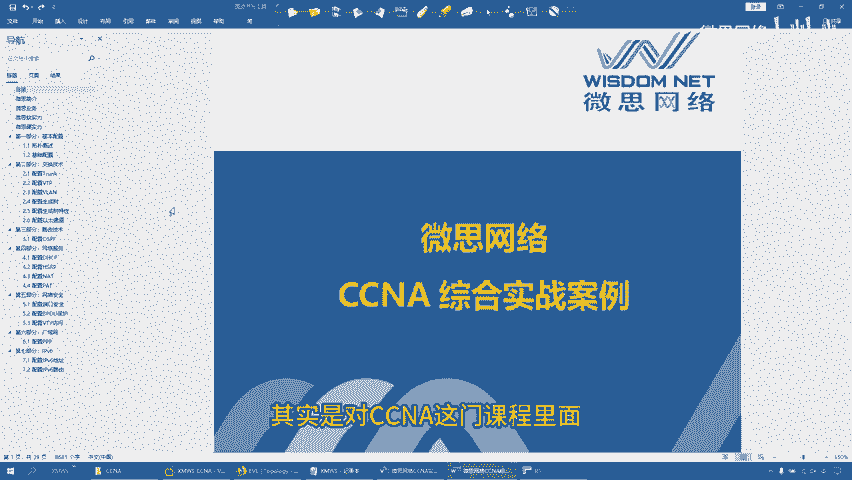
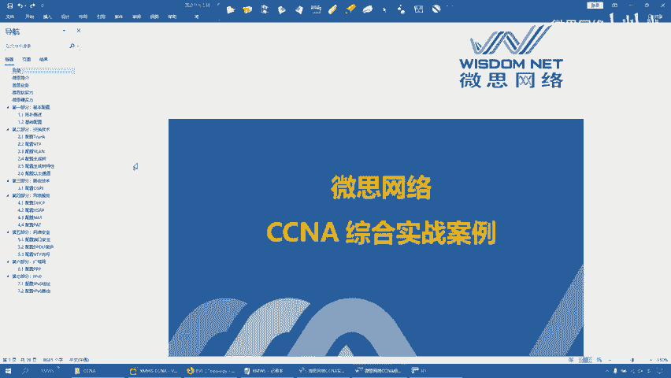
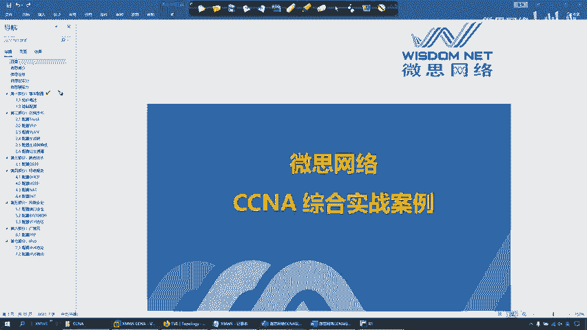
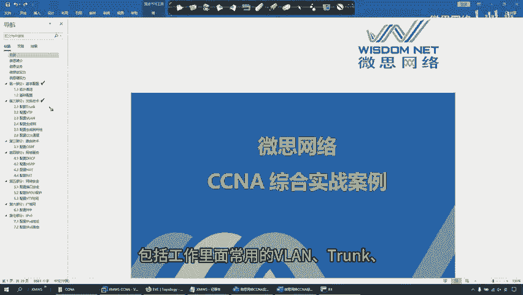
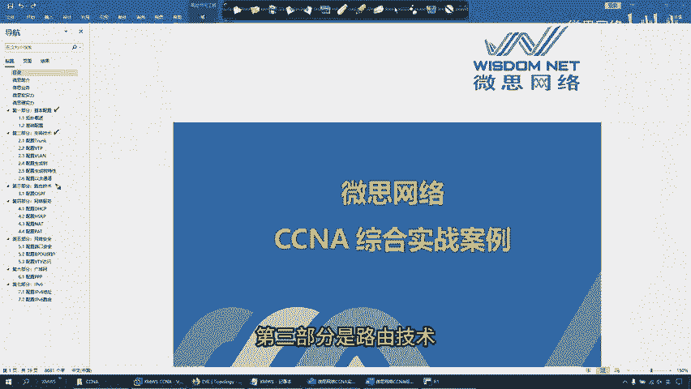
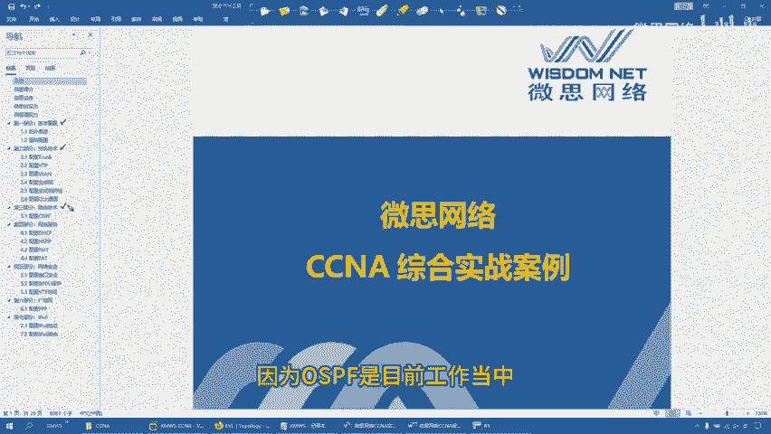
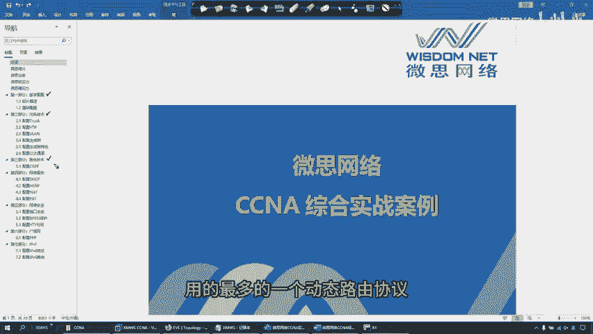
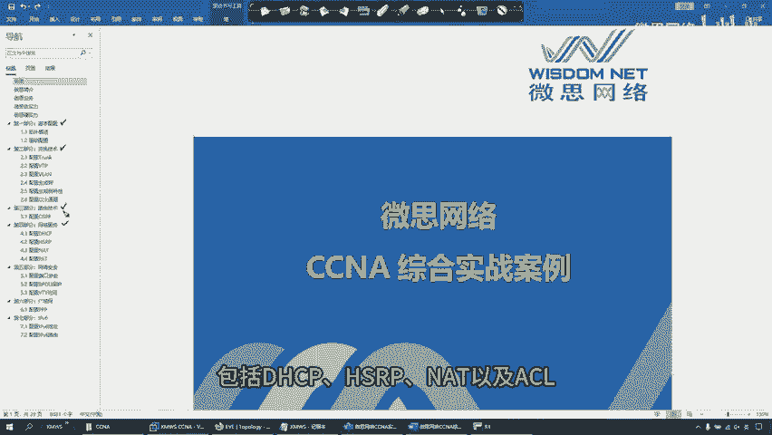
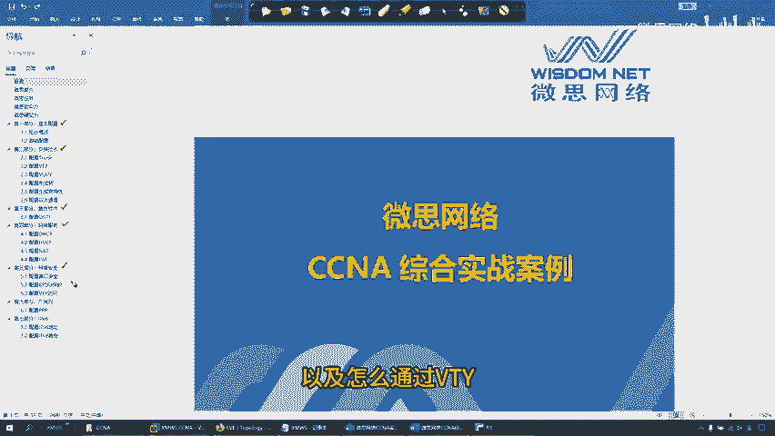
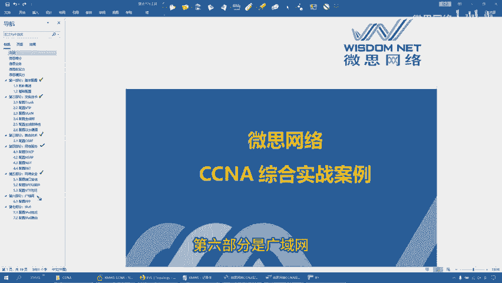

# 1. 网络实战案例内容介绍 - P1 - 微思网络 - BV12S421d76i

好，我们来看CCCNA综合实战案例。整个实战案例其实是对CCNA这门课程里面各个知识点的一个综合考察，明白。

那我们把实战案例分成了其大部分。第一部分是基本配置。

第二部分是交换相关的技术，包括工作里面常用的weline创 VTP生成数以及以台通道。第三部分是路由技术。路由技术里面主要考察OSPF。

因为OSPF是目前工作当中，以及在项目当中用的最多的一个动态路由协议。

第四部分是网络相关的服务，包括DHCPHSRPNAT以及ACL。

第五部分是网络安全，包括像端口安全BBDU防护，以及怎么通过VTY来限制对设备的远程访问。

第六部分是广域网。广域网里面主要考察PPP的chep认证，最后一部分是IPP6领取完整配置文档资料，可以私信我，谢谢大家，关注我，学习更多网络知识。

