# 1000元自购分享CCNA教程合集！超全合集详细版，网络工程师入门必看合集【送NA题库】 - P10：CCNA10 - 向向向晚o - BV1cL4y1q7Dy

好了，欢迎大家来参加咱们的A课啊。今天算是正式第九讲啊。上节课呢给大家唠了很多嗑，对吧？讲完IPV4IPV6对吧？然后讲了咱们未来的运营商的这么一个命运啊，那该开课之前呢，大家还问我。

就是说当我们迁到IPV6之后，运营商怎么办？😊，啊，我倒是提前为运营商啊哎想出了一些啊解决他们这个业务缺失的一个问题，对吧？那我们来想一想啊，就是之前我们说了IPV4对吧？IPV4地址只有32位，对吧？

只有32位地址。哦，我来问大家啊，32位地址是不是地址不够啊，对吧？因为地址不够，所以说咱们现在企业内网都是使用什么私有地址，对吧？企业网内网使用私有地址，然后在运营商，对吧？在我们英特网的骨干。

在我们的公网环境中，你使用公有地址。😡，那接下来就是因为咱们企业内网使用私有地址的，所以说对吧你企业内网跟内网之间咱们不通嘛，对吧？那因为不通，你需要他们通，对吧？咱们就要么怎么样做专献。要么做VP。

那这个专线和VP呢，如果说你是找运营商代理业务，需要花钱，对吧？那运营商呢它主要的经济来源就是来自于这两个业务。那接下来你要牵到IPV6了，对吧？这IPV6，咱们地址空间比较足啊。

那所以说没有必要有私有地址公有地址。但是呢你们到时候会发现，其实在IPV6中啊，咱们还是有私有地址，对吧？还是有私有地址，那为什么会有私有地址呢？因为有一些客户吧IPV信用习惯了，你客户IPV信用习惯。

他会就是习惯的认为对吧？我就是要用私有地址，我就是要APP。😊，那使用PAAT的好处是什么呢？就是我看起来我内网可能会更安全一些，对吧？因为我做了PAAT，你从外网访问内网，你默认是么流量进不来，对吧？

你默认流量进不来，你如果说希望流量进来，你得要做静态的PA那也就是说说你没有做静态PA的话，对吧？你这个从外到内你是肯定进不来的那这样做的话，就误以为咱们内网比较安全，但殊不知咱们当前这些黑客啊。

他在发起去往一些内网的攻击的时候，它根本就不基于IP地址来攻击，它是基于什么呢？它是基于你的端口，对以吧？基于你应用层载荷来做基于应用层这么一个攻击，这也就是说啊你内网使用私有地址。

然后你做一个PAAT对吧？这种行为，对于咱们当前的黑客而言，你做不了任何的攻击地域，对吧？你做不了任何的攻击地域，但是呢他们不懂对吧？他们以为这样做很安全，那所以说他们就说了对吧？

你在V6中呢也得要给我们使用私有地址对吧？咱也。需要使用什么PAAT来做转换。那后来呢还真给咱们设置这个私有地址啊，在IPV6中的私有地址是FCC00开头的，以这个开头冒号冒号杠7的所有地址。

我们称为叫唯一本地地址，这个就是IPV6私有地址，那当然我觉得这个私有地址呢除了那些比较极端的客户啊，他们会使用以外，我觉得正常情况下，对吧？你客户只要用IPV6，那肯定使用公有地址。

那既然咱们使用了公有地址能够保证全球唯一性对吧？那你这个通信对称呢，那你通信对称了，你企业内网跟内网之间，对吧？你不需要专线，你不需要VPN，咱们就能互联互通。

那这样的话就是电信运营商是不是缺失了这些业务了，对吧？缺失这些业务了，那缺失这些业务，真的会有很大打击嘛？其实你从从运营商的角度来讲啊，你可以换一个方式去理解这件事情，对吧？

我曾经呢给一个企业在办理企业宽带的时候，我一般呢只给这个企业一个地址，可以吧？如果这个地。地址呢是不固定的那针对这个地址，咱们是不要钱的我只收你这个宽带费。那如果说你客户有要求，对吧？

我要求我办了企业宽带之后呢，我连完线，对吧？我所拥有这个地址固定的，请注意啊，固定地址，这是需要花钱的可吧？企业要为运营商给他分配的固定地址，对吧？你要按月去交钱，那一个地址一个月好几百块，可以吧？

那接下来你可以换位小吧，那在IPV6的环境中，虽然咱们地址很多，那你企业想要使用公有地址，那是否可以理解为你内网有多少主机，你就要买多少地址，可以吧？那这个地址找谁买呢？你还得找运营商啊。

那运营商可以在IPV6中呢，就是把这个卖地址的费用提高一些，对吧？我把卖地址的费用提高了，相当于是给人家企业啊，让他们使用公有地址的时候，有更多的使用成本，对吧？那所以说企业就是两个选择。

第一个就是我迁移到IPV6之后，我还跟IPV41样啊，我使用。😊，私有地址我使用PAAT那在这种情况下，你企业网之间互联互通怎么样？你还是需要专线，需要VPN对吧？

那这个时候咱们运营商的这块业务呢依旧还在。那如果说你希望使用公有地址，对吧？那我就高价的去向你卖这个公有地址服务，对吧？比如一个地址一个月几百块，那我卖给你几百个地址，我卖给你几千个地址，对吧？

那这个价格其实比我给你卖VPN还要赚钱，那通过这种方式，我觉得运营商就能解决我们这个业务问题，对吧？那当然请注意在过去的十年中啊。

就是阻止咱们从IPV4迁移到IPV6的其实我觉得除了运营商这股主主要力量以外啊，就是各国的政府，哎，他们其实也是阻止迁移的这么一个处理。我不知道大家有没有听过冷静门事件。大家有没有听过棱静门事件？

都听过吧，对吧？这个冷静门之前闹得沸沸扬扬的，就是美国中情局有一个对吧？探员叫斯诺登，这个斯诺登呢就是从美国跑到香港，对吧？然后呢，就是曝光了一件非常非常惊天的一件大事，对吧？你这件事大概是什么样的？

就是CIA对吧？连通美国的各大科技公司，对吧？来搞这么一个阴谋，这个阴谋就是基于全球范围的这么一个监听是吧？各国的政要，各国的这些运营商，只要他们使用美国的这些对吧？公司的服务，使用这些公司的设备。

那我这些设备，这些服务里面都有后门啊，我可以通过这些后门来做一些监听，也就是说你运营商使用思科的设备，那你运营商给客户提供服务之后啊，你的客户干的任何事儿，对吧？思科都知道思科只要把这些信息，对吧？

给我们的CIA对接，那CIA就可以利用这些信息啊，来做一个监听，对吧？比如你总统打个电话，你总统发个邮件，对吧？你。总统干的任何事儿，对吧？这个美国都知道嘛。

那相当于美国可以通过开头的方式啊来给你们做一个政治博弈。那看似好像是大家很公平啊，但其实一点也不公平。那所以说自从那个棱静门曝光之后呢，也就是13年14年的事情，对吧？那曝光之后。

我觉得各个国家都是对吧？对美国这些公司啊失去了信任，那曾经那些基本在一个国家能够达到垄断这些公司，那基本也都是对吧？拜斗卖城，比如说斯科为例，思科就是受影响最大的一家公司，因为以前的棱静门试业之前。

对吧？虽然华为华三juniper对吧？中信锐杰他们都有做运营商相关的这些设备。但是他们在跟思科竞标的时候，对吧？那思科基本都是完爆他们，思科把每年秋季的运营商采购称为叫保留项目。什么叫保留项目？

就是每每年都是我每年我肯定是最大赢家，对？因为我跟三大运营商关系非常好，他们每年采购对吧？都无条件的对吧？找我们，那虽然说咱们有投标竞标这么一个流程，但仅仅是走一个什么走一个流程。

那最终中标肯定是我们但是能竞门之后的那一年的秋天，思科那年的运营商竞标科粒有手，对吧？直接被利种黑名单了，对吧？你一台是卖没卖出去啊，我觉得思科呢在中国的地位就是从那年开始，对吧？有点受到影响。

然后从那年开始就是华为开始大量的抢占思科的市场，对吧？原来这个在运营商的环境中，思科基本占七成以上的这么一个出货量。然后后来慢慢的被华为抢占抢占抢占，抢占到现在呢基本各就是各个地区的运营商啊。

他的内网能你找不到思科的设备，以前基本是。到端纯思科设备。那现在咱们能看到是端到端的一盘和华为设备，可吧？那这个就是棱静门这么一个影响。那家家想啊，你为什么棱静门能实现，对吧？你后门归后门啊。

这个后门对吧？无可厚非，但是之所以咱们能够利用这些后门能够利用这些漏洞来实现这种监听我觉得归根结底原因就是因为IPV4这个底层协议它不太安全，你任何的应用利用IPV4来收发数据，对吧？

你IPV4没有办法给我们提供一个比较安全的数据保密的这么一个机制，对吧？你没有办法利用IPV4来给我们提供什么加密啊等等这些这些功能，如果说你想要使用这些加密的功能，你必须要对吧？通过部署这些路由器啊。

通过部署些保护设备啊，来通过IPVPN这类的VPN技术来给我们提供这么一个安全的数据保护，但是大家都知道这种VPN配置起来非常麻烦，对吧？你只能够针对某些跨越公网的流量来做1个VPN的保护。

而你在内网之间通信流量，对吧？你在通过一些正常情况下，比如你浏览个网页，你希望这些流量被保护，那基本上不可能的对吧？那所以说我觉得根因啊就是IPV4它的缺陷。那当你切到IPV6之后呢。

这个IPV6内部集成了IPs功能，请注意啊，这个IP它天生是属于IPV6的。它在IPV4中之所以能够用啊，原是因为在IPV6中，咱们看到这个技术的优势，觉得它太安全了，对吧？这个安全框架太完善了。

你要于IPV4，那肯定有市场。所以咱们是硬生生的把这个技术啊，从IPV6挖到IPV4来使用的那当然你作为一个外来者，对吧？你肯定没有办法百分百的做到跟IPV4兼容嘛。

那所以这就是为什么咱们在IPV4中使用IPs的时候，对吧？特别特别麻烦，你要做各种各样的配置，还只能针对某些流量来提供服务。那大家想啊这么牛逼的一个安全机制，在IPV6中。

咱们是自带的自带的是什么情况啊，自带，你可以理解为就是你任意两台IPV6的主机，你们只要。通信都可以通过IP set来做一个数据保护。那这个数据保护主要是什么呢？那加密嘛，对吧？

最主要就加密你加密完数据之后，那就算你网络设备有后门，对吧？你也不用担心，对吧？你把加密的数据交给CIA你CIA虽然能够监听对吧？但你监听到都是密文，你想了解里面内容，你是是要暴力破解啊，对吧？

你暴力破解成本是不是很高啊，对吧？那相比IPV4时代，我觉得这个监听会变得更加的困难，那这个监听困难跟各国的政府有什么关系呢？请注意啊，你们真的不要以为只有美国监听啊。

我觉得各国政府都会联合运营商来针对本国的人民来做监挺。你们不要觉得我这在说故事啊，我告诉大家一定是这样的，可以吧？一定是这样的。😡，能理解吗？就是你们不要真的以为只有美国监听啊。

我们中国肯定已经一样的啊，我们中国肯定一样的。然后包括欧洲都是一样的，对吧？都是一样的，就是他们都是希望通过这个监听来了解咱们这国内的一些民声啊等等之类的，是吧？那所以说大家都知道你国内有网警嘛，对吧？

你会发现网络诈骗啊等等之类，你想破案是特别快啊。为什么破特别快啊，对吧？因为网警他就是跟我们这些国家机关部门联动的嘛，对吧？他相当是能够利用咱们这个监听的权限来了解到咱们网络中所有动向。

那所以说你平时在上网的时候，你聊Q也好，对吧？你聊微信也好，你在一个什么对吧？视频网站里面看了一部视频，你在一个新闻网站里面留了一个言，其实他们都能一清二楚，你干了任何事儿，你不要以为只有你知道啊。

其实网警他们都知道对吧？包括我们现在说的每一句话，网警都知道那之所以有的人在网上干一些小偷小摸的对吧？感觉话没事，不是说真的没事，说网警觉得你这些事情对吧？无伤大雅，人家对你。😊，一只眼闭一只眼。

但是如果说你要上升到一些对吧比较高的层次了。比如说你要反政府啊，对吧？你要你要做一些比较对吧？激进的行为，比如你要做一些黑客攻击，对吧？你要做一些对吧？比如说啊暴力事件，那这个对吧？触犯到咱们底线了。

那这个网警能够分分钟抓到你可以吧？那这个呢其实都是基于这个监听来实现的，可以吧？那这个监听在IPV4中非常容易实现，但是在IPV6中呢是比较难的，在IPV6中。

咱们端到端都可以使用IPs来对数数据啊做加密，你能对数据做加密，那你在监听方便吗？其实很不方便，所以我觉得这个也是咱们之所以不迁移IPV6啊一个比较主流的这么一个原因。那当然这时我猜测啊。

那当然迁到IPV6之后，我觉得这个叫道高一场，道高一尺魔高一丈嘛，对吧？你有你的数据保护的方式，那我就有我的什么攻击方式。到后来呢，就是你就算迁到IPV6，我们依旧持有对吧？解决这个监听的问题了。

那这个呢就是咱们就不用管他们了，对吧？迁移，那既然要签了，咱们就是好好去迎接。那等咱们签到IPV6之后，对吧？我们为IPVV6怎么样做好准备，然后在实际的线网环境中，你要部署IPV6相关的对吧？

业务你要部署IPV6相关的这么一个工程，你就做好几个对吧？割接准备就好了，好吧，那这是后话O那就是跟大家说一下，咱们IPVIPV6之间这么一些关系啊。因为之前之前大家跟我说，就是想要多聊一聊这块嘛。

对吧？我觉得还是挺挺有必要的那所以说这边就给大家聊一聊，就是看看对吧？大家对于我这些观点就是是否啊对吧？感同身受。如果说大家有什么问题的话，你可以在群里面就是多跟我沟通嘛，对吧？

你们如果有什么问题可以加这个群，然后咱们可以去多沟通一下，好吧，O那这个是呃关于咱们之前那节课的一些内容啊，然后接下来之些这一块呢跟大家说了一下这个IPV4的这个地址规划对吧？😊。

咱们一般的内网都使用附有地址，对吧？公网的，咱们使用公有地址。然后接下来咱们在使用地址的时候呢，由于你这些计算机的网卡，对吧？你这些路由器的网卡对吧？你不可能设备被生产出来就能立即拥有一个地址。

因为没人知道你会用于哪个网络，那所以说这些对吧？设备的地址，咱们要给它分配，那在分配的时候呢，咱们有两种分配方式。第一个就是手工配置，对吧？第一个叫手工配置。第二个呢，咱们称为叫自动配置对吧？自动配置。

那既下来是手工配置，咱们怎么分配呢？那先来教大家怎么给PC分配个地址啊。啊，PC分配地址很简单，就是你在控制面板，好吧，你找到控制面板。😊，控制面板好，找到控制面板，然后呢找到咱们的网络和共享中心啊。

找到网络和共享中心。然后这边有一个呃更改适配器的设置，对吧？点进来，然后呢，这边的话有一个什么，有一个就是这是我的呃等等，我看一下啊，这个这个是我的有线网卡，对吧？这是我这台计算机的有线网卡。

然后你可点属性啊，然后这块有一个英特网协议版本4双击进来，对吧？它有两个选项啊，第一个是自动获得IP地址，第二个是使用下面的IP地址，如果你希望给一个网卡手工配置IP啊，就把这一栏点到下面。

然后接下来第一行就是你给你这个网卡配置的IP地址，对吧？四段，比如10。1点点1对吧？然后你的子网页码，对吧？那一般咱们都是子网化的，对吧？我喜欢使用24位页码，然后接下来最后一段的就是你的网关地址。

对吧？比如10。1。点254，然后接下来这上面的三三栏的地址。研马网关下面呢还有两栏，对吧？当然下面这两栏你填一栏就可以了。这栏什么呢？叫DNS服务器。这个DNS叫叫什么？叫域名解析服务啊。

它叫域名解析服务，这个域名解析服务到底干嘛呢？那大家如果习惯浏览网页，你们都知道啊，你在浏览网页的时候，对吧？你打开浏览器，你开一个链接，对吧？然后呢，接下来地址栏里面输入什么呢？地址栏里面。

你输入的都不是那些服务器的IP地址，你输入都是域名，比如你要上百度对吧？咱们会输入3W点百度点com那这个百度是什么呢？这个3W点百度点com啊，它就是一个域名，对吧？这个域名代表的是一台百度服务器。

那这个百度服务器到底是谁呢？哎，你是不知道的，你得找DNS服务器来给你做一个解析，对吧？那所以说呢当你在浏览器里面输入3W点百度点com之后啊，你就会询问DNS服务器，对吧？

请问你百度点com对的地址多少？😊，那这个百度服务器呢对吧？那DNS肯定是知道的DNS记录了百度服务器的域名到地址的映射，它收到你的DNS请求，就会给你回应1个DNS应答。在这个应答中，他会告诉你。

你要访问的这台百度服务器啊，它的IP地址到底有多少？那当你得知了IP地址之后呢，O你就可以去针对这个服务器的地址发起去往它的外部服务的证明一访位，可以吧？

那当然如果你想要迅速的知道一台百度服务器的地址多少。你可以怎么样呢？通过CMD来进入到咱们这个命令行界面啊，那在这个命令堂界面怎么样呢？你可以去聘，可以吧？你去聘3W点百度点com哎。

聘出来的结果是什么呢？能拼通，对吧？并且拼通的同时，他会告诉你到底是谁来给你做的一个响应，可以吧？那这个给你响应的这个人，请注意啊，给你响应的这个人就是你聘的这台百度服务器，可以吧？

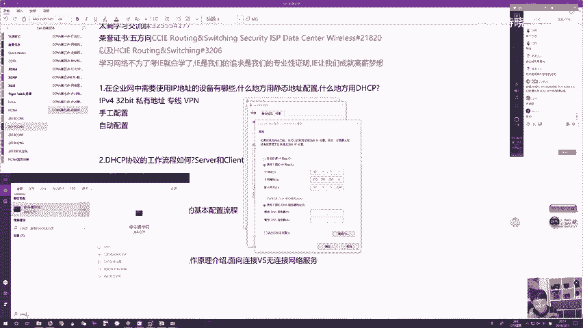

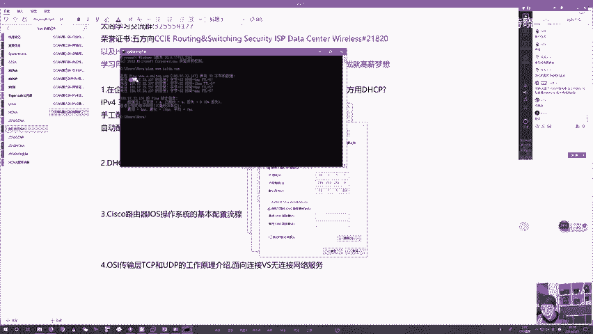

那当前我们聘的百度服务器是什么？180。97。33。107，对吧？好，你可以在浏览器里面怎么样输入这个地址啊，我们来试一下HTDP冒号对吧？两个斜杠180点180。97，对吧？180。97。33。

107好回车让大家看效果是一样的吧，对吧？你输入3W点百度点com跟你输入180。97。33。107效果是完全相同，对吧？那这个就是DNS作用。

那当然这个DNS呢在设置的时候可以设置多个啊第一个叫主DNS，然后接下来当你主DNS不可用了，对吧？你可以选用什么备份DNS来给你提供一个地址解析。O那这就是手工的给PC配置地址的方法，可吧？

那接下来手工给路由器配置IP地址呢，那大家待会我教大家一下，对以吧？比如你有台有台路由器，那这边的话我开了一个EVENG的模拟器啊，之前教过大家怎么去用，对吧？那这个模拟器呢，我已经开启了好吧。

那就是我们的虚拟机，然后开启之后呢，当前我用这个火狐浏览器啊，又连接到咱们这个EVNG，并且给大家拉三台路由器，可以吧？R1R2R3注意啊路由器找这样原的好吧，然后路由器之间呢，咱们使用线来连接可以吧？

R1的以套网0-0口连接R2的以探宝0-1口R一的以套网0-1口连接R3的以探网0-0口，可以吧？那当前在我们这个环境中两个网络对吧？这是一个网络。

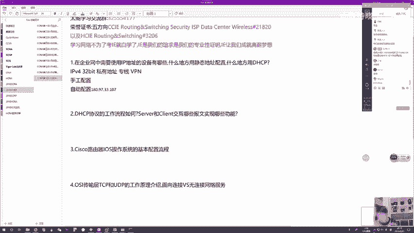

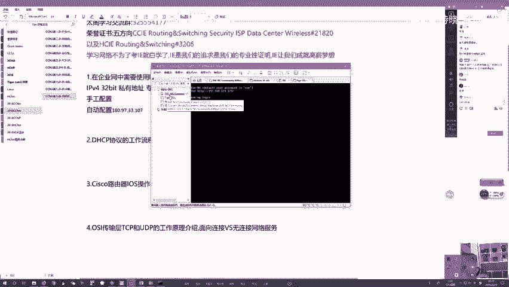

这个是第二个网络，可以吧？然后紧接着这些路由器呢，咱们是能够登录给它做一个地址配置，可以吧？那接下来我也教大家怎么去登录路由器，怎么去配置地址。这个是cisco路由器的基本配置模式啊。

那大家在给他们做配置之前呢，先来问大家啊，你们平常有没有给家里的宽带配过地址啊，有没有？😡，有配置过吗？😡，有吧，你们平常宽带怎么配地址的？😡，你肯定是办了一个宽带，对吧？然后呢，电信给你个猫，对不对？

电信给你个猫之后，你会买一个什么？你会买一个无线路由器，像什么TP link对吧？dlink fast然后接下来你把这个dlink或者TP link连接咱们那个对吧？猫嘛。

然后接下来你要用网页登录你这个TPlink，然后你可以用图形化的界面去配个地址，请注意啊，cisco路由器的配置，其实跟TPlink是差不多的对吧？那接样接下来跟大家说一下。

就是ssco路由器没有什么了不起的。cisco的路由器就是一种特殊的计算机，对吧？它就是一种特殊的计算机。😊，特殊的计算机。那这种特殊的计算机，它的结构跟我们普通的计算机是一样的那我来问大家。

咱们普通的计算机里面包含什么东西啊？大家知道吗？一台普通的计算机里面包含什么东西？你会有一个主板，对吧？啊，你会有一个主板啊，肯定有的啊除了主板以外呢，啊你会有CPU对吧？中央处理器啊用来做计算的是吧？

然后你会有硬盘，对吧？很重要啊，硬盘里面用来放什么操作系统，还有咱们下载的一些程序啊、应用啊等等之类的，还有什么？😊，还有什么内存对吧？没有错，内存也很需要，对不对？那内存呢咱们是也是一个存储器啊。

大家这个存储器呢先不说，咱们待会来对吧？讲一下里面的用途啊，然后紧接着还有什么，还有什么。😊，还有什么还有电源啊，电源需要的显卡啊也需要是吧？网卡也需要啊，还有声卡也需要，这些都算，对吧？好，请注意啊。

这些基本就是一台计算机的这么一个组成，可以吧？那当然对于咱们路由器而言啊，这个显卡网卡声卡啊，就不需要，可以吧？它的主板里面内置了很多网卡专用的跟我们计算机不太一样，然后呢，显卡声卡它是肯定不需要的。

因为你路由器在网络中间啊，你不能像咱们一台计算机一样，对吧？你还连个显示器，对吧？你还连一个鼠标键盘你做不到，你一台路由器就是一个圆圆的设备，给大家看找什么样啊，我们来找一台主流的cisco路由器啊。

给大家看一眼找什么样的？比如说cisco啊，2921可以吧？2921这个比较常见啊，这个比较常见。😊，那大家仔细看一下吧，这是cis code2921路由器啊，这是正面可以吧？这个是正面。然后呢。

这个是背面，好吧，正面是绿色的，有一个cisco logogo，然后呢背面这样的，对吧？有各种各样的接口，那当然你会发现这些接口的旁边呢有一些盖子啊，这个盖子可以拿掉，拿掉之后呢，可以在里面添加些模块。

添加一些板塔，让它增加一些额外的接口，对吧？然后接下来电源接口在前面好吧，前面呢还有一个什么开关，那这个就是我们的路由器。😊，长得比我们TPlink的稍微大一些，对吧？你看看这样一个设备。

怎么怎么连鼠标啊，你连不了，对吧？怎么连键盘你也连不了显示器呢，也别想了，对吧？他天生不是让你这么玩的，你一般要登录一台路由器，你自己需要台计算机啊，你需要一台计算机，然后你要连这么一根线。

这种线叫什么？这种线我们称为叫ctl线啊，叫csl线，对吧？这个叫控制台线的，控制台线的。😊，这个控排线大家见过吗？肯定没有啦，因为你登录TP link不需要使用它啊，对吧？

你平常登录咱们的电脑也不需要使用它，对吧？你在登录路由器交换机，甚至在登录一些服务器的时候，你就需要使用这种线了，可以吧？很有用啊。这种线手什么样的？那这种线这样的啊，看一下。😡，把，控制排线了啊。

我们称为叫康速线，好吧，抗速线。😊，啊，简单看一下康复现长什么样啊。😡，就是这样的可以吧？蓝的蓝的当然也有其他颜色的那既然我们这是cisco的课程啊，那ssco的课程的经典cl线，这样就是这样好吧啊。

早期是这样的，两个头一端呢是这个我们称为叫DB9啊，另一端呢就跟咱们的网线接口一样，RJ45接口，那当然这种线咱们现有升级啊，升级之后就牛逼了。升级之后，咱们一端是个USB对以吧？一端咱们是个USB。

然后呢，另一端还是咱们这个RJ45接口，好吧，那接下来咱们这csl线怎么用呢？啊，请注意啊，所有路由器和交换机，它都会有一个cl口，可以吧？它都会有一个cl口，这个cl口有且只有一个啊。

我们就称为叫控制台接口，叫控制台接口，这个接口专门用来让咱们连cl线对吧？那你cl线的哪一端连这个接口呢，请注意啊，这个接口连接就。😊，咱们RG45这端，对吧？你csl线不是两端嘛？

有一端是RG45这端啊，那这个RG45这一端，也就是水晶头这一端啊，咱们连接什么csl口，然后接下来另一端连接咱们计算机，那连接完毕之后呢，哎连连线完毕了，你就可以通过一个登录软件来登录这个路由器。

对吧？那接下来大家会发现你这个DB9接口，我们当前计算机都没有，对吧？你台式机也没有笔记本也没有，对吧？没有错啊。因为早期计算机这种接口，咱们建的比较多，然后自从我觉得10年以后啊，像这种接口。

咱们就很少见，对吧？尤其是笔记本怎么可能会有，根本不可能会有对吧？那所以说早期咱们在使用这种原始的cs诉线啊来对网络设备做登录的时候，那大家都知道咱们网络工程师了。

你肯定是屁颠屁颠的拎个笔记本拎到客户那里去，对吧？你拎到户那里去。然后你要通过cl线连接咱们路由器连接交换机做一些配置，你可定要随身带个cos诉线，但你。这个抗速线怎么行啊？

你这个抗松线一端能够连到咱们路由器，但你另一端连不到笔记本啊，那怎么办呢？你需要转换线，对吧？你就需要转换线。😡，这个cover线的转换线呢。😡，啊，有很多公司做啊，我觉得国内做的比较好的叫利特。

可以吧？叫利特。呃，立特叫Zt。呃。这个图上居然没有搜到啊。嗯。😊，V tech。Z cap转换线。算吧，直接搜他名字。好，找到了，这个就是立刻转换线。那当然大家这个立刻转换线呢。

跟我们刚才看到那个原始的抗速线啊，正好是能够对接的对吧？这个线它有两端啊，一端是一个USB接口，对大家都知道咱们计算机嘛，肯定有USB接口啊，然后它的另一端是什么？是1个DB9的公口啊。

它是1个DB9的公口，然后咱们这个抗诉线，对吧？它一端是DB9的母口，然后另外一端呢是个RJ45接口，那接下来咱们这两根线呢接在一起，对以吧？我这个DB9的母口连你的公口，连好之后呢。

USB连接计算机的一端，然后呢，而J45连接咱们的路由器。那当你连好之后呢，这样的连接也是没问题。对吧？那当然新型的高速线帮我们解决了所有问题，对以吧？新型的高速线呢，它直接一端是什么？一端是RJ45。

然后另另外一端怎么样？它另外一端直接就是那个USB了，另外一端直接就是USB那当然你使用这种线。😊，时候对吧？你可以直接连连完之后，对吧？只要使用一个登录软件就可以登录了，对吧？

那当然登录软件咱们可以使用很多款啊，你有很多款你可以选择啊。早期呢windows叉P开始，我们就有一个windows自带的这么一个软件。那这个软件呢我们称为叫超级终端啊，超级终端，不知道大家见过没有啊？

那当然这个呢在win7win8win10中，你基本见不到。因为这个软件怎么样，太low了，功能又少，然后呢，界面又又难看，然后呢又不稳定，反正总而言之就各种问题。那所以说一般你说就算能用它。

咱们也不会去用。那咱们一般更多的使用什么呢？使用这两款软件，一个叫secure cRT对吧？还有一个叫X share，一个叫secreRT，一个叫X share，那当然这两款呢不是windows自带的。

你要下载对吧？你要安装，并且呢前者和后者都是收费的，而且收费挺贵的，逐年收费，对吧？基础套餐反而99美元一年。😊，高级套餐199美元一年对吧？当然大家都知道你在国内嘛，你都有破解版的对吧？都有破解版的。

然后接下来CRT就是这样的啦。CRT就是这块软件，好吧，CRT就是这块软件，然后当前的最新版本呢是8。5。0啊，8。5。0对吧？那曾经呢也有7。叉的，也有6。叉的当然我建议大家使用8。叉的，因为这个8。

叉的功能比较强，并且呢界面比较好看。然后这个ex shell呢我就跟大家介绍了，为什么呢？因为ex shell也是一个很好的软件，但是我建议大家当你在登录服务器的时候。

尤其是在登录那些使用linux系统的服务器的时候，你用ex shell对吧？那比较方便咱们对服务器做一些操作，做一些配置，而对咱们网络设备的配置CRT功能更加实际一些，可吧？总体来说CRT的功能。

没有ex shell那么强大，但是当你使用ex shell登录路由器交换机的时候，你那些强大的功能咱们用不到啊，并且我。😊。

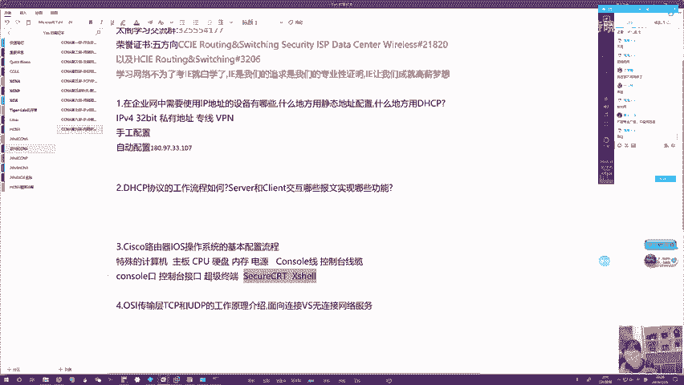

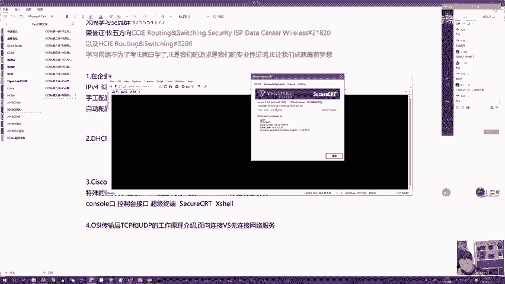

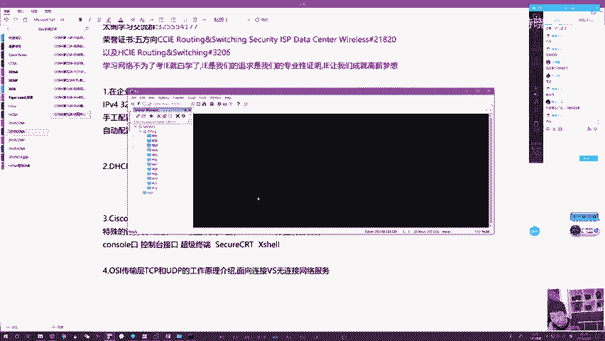

需要使用你这些功能的时候，对吧？用起来不太方便，并且还会出现一些乱七八糟的问题。不知道我不知道大家有没有遇到过啊，就是你使用excel登录路由器，你登录进来之后，什么命令都没有敲，对吧？

它过一会儿会自动弹一个字符，这个字符固定的，它会过一段时间给你自动弹一个过一段时间给你自动弹一个。而这个呢在在CRT中啊，咱们根本接不到，那所以说总而言之就是建议大家CRT专门用来登录网络设备。

而excel呢专门用来登录服务器，对吧？那接下来你使用这个软件，对吧？然后设置好咱们参数登录就好了，对吧？那网络设备呢，咱们就是正确配置的，对吧？这么去配置。然后接下来这个路由器呢，它不像我们计算机啊。

没有什么显卡，没有什么声卡，然后呢，它其他的这些硬件都是在的对吧？那当然这个主板呢，咱们换了一个教板。主板咱们称为什么呢？主板一般咱们称为叫贝版，好吧，一般咱们称为叫背版，你注意啊，任何计算机。

我觉得主板。😊。

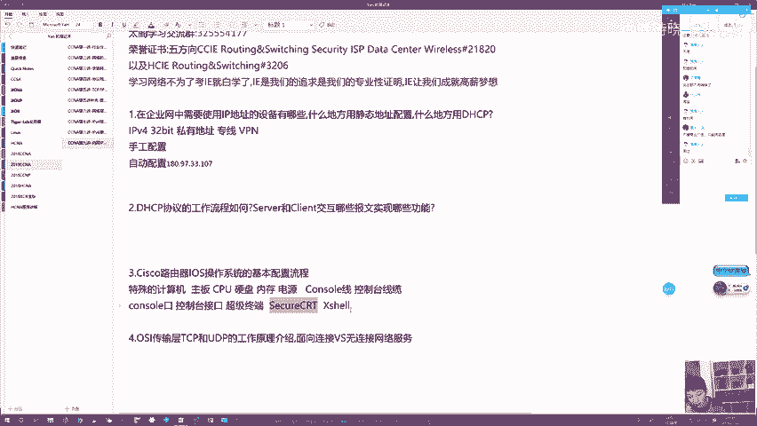

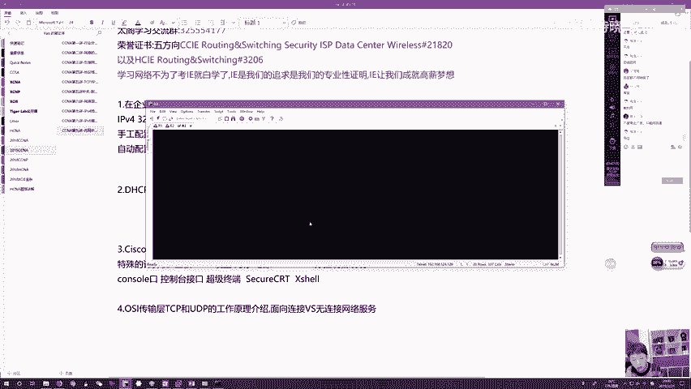

都是最重要的一个组件。那大家知道主板的作用吗？嗯。大家知道主板的作用吗？😡，有谁知道的？我觉得主板就是一个非常强大的一个电路板啊，这个电路板里面有很多很多的集成电路。然后接下来你CPU也好，对吧？

你硬盘也好，你内存也好，你电源也好，对吧？各种各样的组件，只要你连到主板上，对吧？那这些组件之间呢就可以协同工作，对吧？那主板的算咱们整个计算机的核心啊，因为接下来所有其他的硬件都要跟主板相连。

他们才能够发挥他们的作用，可吧？O然后接下来CPU呢不用说了吧，中央处理器啊，你任何计算机，咱们当前就算你再先进的也都是基于冯诺伊曼这么一个架构，那这个冯诺尼曼的架构是什么？就是输入输出，对吧？

你给计算机输入一些字符，输入一些数据，然后呢，计算机给你做一个计算处理，然后把处理后的结果给你输出，可以吧？那接下来咱们计算处理交给谁呢？基本都是交给CPU那当然CPU会对什么。😊，样数据做计算的。

请注意啊，你一台计算机，你能够存储数据的存储器啊有很多。比如说你的硬盘里面能够存储数据吧，你的内存也可以对吧？除了硬盘内存以外，你的主板本身还包含一系列的ro，这个叫只读存储器。那这些呢它们都是存储器。

可以吧？它们都是存储器，只要是存储器里面就能够存在数据，可以吧？那这个数据CPU能不能读取呢？请注意啊，CPU是非常挑剔的？CPU它挑剔到什么程度呢？它挑剔到只针对内存中的数据来执行计算，可以吧？

这也就是说你硬盘里面也有数据，你内存里面也有数据，但你希望这个数据被CPU计算，那你必须都得把数据先导入到内存，再由内存把数据输送给CPUCPU执行计算之后呢，再把计算的结果放给内存，然后再由内存。

把计算结果交给咱们其他的输出的硬件，可以吧？它是这么一个流程。那所以说呢能够存放数据的地方有很多，但是能够为CPU直接调用，能够输出给CPU让CPU直接处理的也只有内存，可以吧？

所以说内存对于计算机啊很重要。你买计算机不能没有内存，对吧？并且内存越大，你的计算机对吧？工作也就是越流畅，你内存的存存储速度啊读取速度越快，你这个计算机呢对吧？工作效率就越高，对吧？

那当前咱们一台计算机，你动辄内存什么8个G，对吧？16个G32G甚至64G88G那这个都是主流啊，因为随着你计算机对吧？咱们操作系统越来越功能强大，你所使用的应用对吧？越来越对吧？消耗资源。

那这个内存也是需要与时俱进的。你内存越大，我们这些系统运行起来就越流畅。那当你使用这个EV延G的时候。

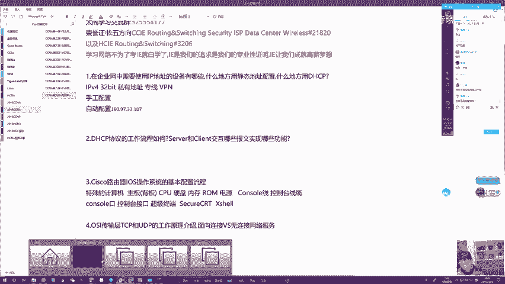

对吧我之前跟大家说了，你这个EV烟G想要使用那些高大上的网络设备，做高大上的实验，对吧？建议大家至少也要有8G内存，如果你8G内存都没有的话，你这个EVNG虽然能开，但是呢里面一些对吧？主流的功能。

你到底能不能用，只要打个问号，对吧？但是最简单的实验能做啊，但是稍微复杂一些能不能做呢，可能就对吧？有点问题了，O那接下来这个内存呢它是一个特别神奇的存储器啊，这个内存的存储的材质叫什么呢？请注意啊。

内存的存储材质叫ra，对吧？它叫ra，ra叫什么呢？叫随机存储器，对吧？叫随机存储器。

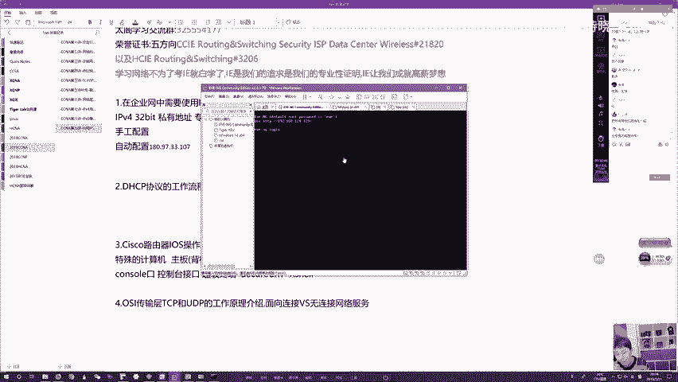

这个随机存储器的最大特点是什么呢？就是你对于这样的存储器，咱们能够写入数据。😡，可以吧，你也能读取，你能删除或修改里面的数据，可以吧？然后接下来这里面的数据呢能够直接被CPU调用。

能够直接交给CPU呢做一个处理计算。但是它的最大特点是什么呢？它的最大特点就是一旦断电内存中的所有数据都会立即丢失，可以吧？这个存储器呢没有数据保存能力，你只要断电了，那里面东西对吧？通通的就没有。好。

请注意啊，咱们对路由器呢登录之后做配置，你做配置要输入命令，对吧？你输入的所有命令，咱们都会先保存在内存中，可以吧？那虽然你输入完命令之后呢，路由器会根据我们输入的命令啊，来改变它的一些工作行为。

但是如果说你没有及时的存盘，你没有及时的把我们的命令，从内存中啊导出来存到另外一个断电，不会丢数据的存储机之前啊，如果这个时候你断电了，对吧？你重启了，你关机了，那恭喜你。也不能说恭喜你啊。

是你节哀顺变。你之前配的所有命令就都没有了，对吧？那所以说呢咱们在配置路由器的时候啊，你配完命令之后一定要存盘。可以吧？这个存盘其实在做什么呢？请注意啊，我们这个内存中，你只要是路由器，只要是交换机。

那在你开机完毕之后呢，你的内存里会有一个文件。这个文件我们称为叫runningfi，对吧？runningfi这个叫运行配置文件对吧？这个叫运行配置文件，那由于这个运行配置文件的内存中啊，你敲命令。

咱们影响到就是这个文件内容，对吧？这个文件内容呢能够直接被CPU调用CPU能够根据这个文件的改变啊，来适时的做出一些计算，做出一些调整。那所以说由于你敲的命令直接影响运行配置文件。

而这个运行配置文件默认在ra中啊，所以你每敲一条命令都能生效，你每敲一条命令都能影响咱们路由器的工作。比如你给接口配个地址，你配完之后地址又有了。你起一个动态选的协议，你起完之后协议可以运作了。

原因是因为你敲的每一条命令，影响都是内存中的这个文件吧？但是这个文件能保存吗？😊，保存本当你关机了这个文件就自动还原了，对以吧？因为它没有存盘能力嘛。那接下来如果你希望存盘的话。

其实说白了就是把你内存中的这份运行配置文件拷贝一份，可以吧？你把它拷贝一份，放哪里呢？放到这么一个存储器里面啊，这个存储器我们称为叫NV run好吧？叫NV run。

所有cisco的网络设备都会有这么一个存储器。这个叫非易可失性随机存储器，可以吧？它叫非易可失性。叫非异可视性。随机存储。OK那这个存储器呢，它相比咱们ram啊就多了1个NV对吧？多了1个NV。

那这个存储器最要的特点是什么呢？就是你在这个存储器里面啊，你也能写入数据，你也能够读取，你能够修改，你也能够删除。然后呢，这个存储器断电里面的数据呢是不会丢失的，对吧？它的数据不会丢失。

它不会像我们的这个ram啊，你一旦断电里面东西呢就没有了，对吧？NVra断电无所谓的，断电里面的数据会依旧保持。好吧，那接下来这个NVra里面有这么一个文件啊，这个文件咱们称为叫star up，对吧？

叫star up。😊，这个翻译成中文，咱们称为叫启动配置文件，对吧？叫启动配置文件。那这个启动配置文件是什么呢？其实它就是这份运行配置文件，对吧？你把运行配置文件拷贝一份，放到NVrap中之后啊。

这个文件会自动改名，改成什么呢？改成叫启动配置文件。那这个器配置文件为什称么叫启动配置文件呢，原因就是因为这个文件在NVra中，你这个Nra哪怕再向咱们内存，你毕竟不是内存。😡。

你这个文件里面存储的任何数据，CPU呢是不能够直接调用的对吧？CPU不能对你NVrap中的任何数据啊来做一个计算。所以说你启动配置文件，对吧？不管变也好，不变也好，对于当下是没有任何影响，对吧？

你再怎么变CPU不知道你CPU不知道它怎么计算呢？怎么能得出结果呢，所以说啊启动配置文件，你想怎么修改就怎么修改，对吧？然后接下来这个文件什么时候有用呢？就是当你网络设备关机，对吧？当你重启。

当你第二次启动的时候，对吧？我们在启动过程中啊，会看一下咱们NVrap中有没有启动配置文件，那如果有启动配置文件对吧？我就给你应用，那当你应用完毕之后，你会发现当你开机完毕了。

这个路由器的配置是能够还原咱们上次关机前的状态，对吧？不至于说你一关机重启，你之前的所有配置都丢了，你不用担心。这样去。能理解吧？好，这就是NV Ram的这么一个作用。

那当然这个copy呢一般指的就是对吧？把我们内存中的数据导入到其他的存储器，为了避免断电丢失嘛。那当然咱们有保存，咱们就有反向操作。这个保存的反向操作，我们称为什么呢？这个反向操作，咱们称为叫加载。

对吧？我们称为叫loading。这个loading我相信大家都不陌生啊，你们玩任何游戏，对吧？玩王者荣耀荣耀对吧？玩吃鸡，你在双击这个进程的时候，它总会给你一个界面显示什么正在加载是吧？

那包括你在开word，你在开PPT的时候，对吧？你开那一瞬间，它也会有什么加载的这么一个图示告诉你这么咱们正在加载，那这个加载指的是什么呢？加载，其实就是把你其他存储器里面的文件，对吧？

拷贝一份导入到内存的这么一个过程，那为什么要加载呢？还是那句话，你要运行这个程序，对吧？你要运行这个应用，对吧？其实说白了就是你开启这个应用，你希望应用中的数据能够被CPU做一个计算处理嘛，对吧？

而CPU能够对什么样存储器里面数据做数做计算，只有内存嘛？对吧？而咱们一般你下载的游戏，对吧？你安装游戏都是在硬盘中或者在U盘中或者在网上，那这些东西你能。😊，直接被CPU调用啊，不行。

所以说你得要先把他们的一些重要内容放到内存中去，你放到内存中去之后，那对吧？内存中的数据，CPU就可以直接计算了。那你计算完毕之后，对吧？我们就根据我们的操作，对吧？来让你这些设备给你做一些响应。

那你游戏干完就能完了，对吧？你word该打就能打字了，对吧？你PPT该做图就能做图了，对吧？那这个就是所谓的加载，并且你每台计算机，你在开机的时候，你花时间最多的这个步骤其实也是加载加载什么呢？

就是加载你操作系统。对吧加载你操作系统，比如你装一个win7，你装一个win10，你的WI7和win10都是装在你的什么硬盘的启动盘里的，对吧？装在咱们C盘，你C盘毕竟是硬盘嘛，你觉得这里面的数据。

咱们CPU能够调用吗？不行。所以你在开机的过程中，你需要把你的系统盘里的主要内容拷贝到咱们内存中去，方便咱们CPU去调用，所以你开机需要的时间，其实说白了主要都是被加载操作系统给浪费掉。OK了，好了。

那这个就是咱们CPU对吧？内存硬盘它们之间的这么一个关系。再强调一下路由器的硬盘，其实就跟咱们的PC硬盘一样啊，里面也是放置一些什么大件的文件，那包括咱们操作系统啊，包括咱们一些license文件啊。

包括咱们一些配置文件啊，对吧？你在硬盘里面都可以存在，然后这个内存呢专门用来帮助我们加载一些文件，对吧？加载。操作系统镜像啊，对吧？加载咱们一些文件啊，然后呢，咱们这个roM中，还有一个比较重要的文件。

就是咱们的运行配置文件。你登录路由器做的任何配置都会直接影响到这个文件，可以吧？然后接下来跟这个内存相对应的，就是咱们的NVNV Ram里面有一个启动配置文件用来放置咱们存盘后的这个配置文件，可以吧？

并且除此之外，NVra中呢还会包含一个叫配置寄存器，可以吧？叫配置寄存器，叫config register。好，配置计存器。那这个配置计算器是什么呢？你可以理解为这个就比较类似于咱们对吧？

计算机的那个啊启动的这么一个启动代码，对吧？因为你计算机呢，你硬盘里面有操作系统，对吧？哎，你U盘里也可能有操作系统。然后咱们在网上可能有台服务器，这个服务器，对吧？也有咱们开机过程中能够加载的系统。

那你路由器在开机的过程中，对吧？你默认咱们肯定是优先使用硬盘里的系统来开机嘛，对吧？那当后你硬盘里的系统不可用的时候，哎，你可以对吧？退而求其次的，通过网络来加载，然后接下来网络若果不行了，对吧？

你还可以通过其他的渠道来加载，对吧？那接下来如果你要觉得你系统有问题了，你要去重装系统，对吧？你可能会做一个启动盘，你做好启动盘之后，你做U盘里的，你把U盘连到我们计算机上，然后你进入到咱们的主板。

对吧？通过修改咱们的启动的这么一个顺序，你可以要求咱们计算。😊，在下次开机的时候，对吧？你优先加载咱们U盘中的操作系统，那这可以做到的那对于路由器而言呢，咱们也可以做到可以吧？

路由器的启动的这么一个顺序修改啊，就是通过修改咱们这个config register来实现。如果你这confi register是默认值，请注意啊，咱们主流路由器，这个配置寄存器的默认值是0X2102。

可以吧？注意这是16进制数啊，这是16进制数0X2102，这个2102什么意思呢？就是你加载操作系统，咱们优先怎么样加载硬盘里的，可吧？如果硬盘不行，咱们就通过网络启动，如果网络不行。

咱们最终就是加载咱们主板rom中的这个操作系统才像，对吧？那当然大家都知道你计算机嘛？主板里面也有一个操作系统啊，这个主板里面操作系统，咱们称为叫bios，可以吧？叫bios这个bi系统什么时候用的？

你正常情况下。不会有对吧？那当然你这个系统出现问题了，对吧？你window进不去了，你可以通过进入bios来调整咱们的启动顺序，对吧？你调整完启动顺序之后，你可以重新做一个系统。

然后接下来平常你进入bios，其实更多就是开启一些主板服务，如果说你不为了开启这些主板服务啊，这个系统咱们一般不会进的，对吧？那路由器交换机，它们也有一个类似于bios系统，这个类似于bios系统。

我们称为什么呢？我们称为叫roman，对吧？我们把这个系统称为叫ro系统。😊，这个roman系统也具备一些相应的功能，但是功能太有限了。你平常不可能用这个系统来这样工作。我们什么时候使用这个系统呢？

就是当你的主操作系统不可用的时候，对吧？当你要做一个系统恢复，当然你要做一个系统升级的时候，对吧？你可以进入roman，然后接下来来做一个对吧？配置修改，然后呢，方便你去重新灌一个操作系统进来。

方便你做一个系统恢复，方便你做一个系统升级，对吧？那这个2102的值就是你默认加载你的对吧？硬盘里的系统，如果不行了，咱们通过网络来加载，如果网络没有配置，对吧？咱们就加载这个roman中的这个系统。

对吧？你加载这个roman系统，好歹你能进入一个系统能做一些什么最低级的配置，对吧？那接下来你这个值可以修改，然后你修改完之后呢，那么行为就不一样了，对吧？那当修改咱们修改的最多值是什么呢？

对于早期的网络设备，咱们修改的最多的值啊，就是把这个2102。😊，改成2142，可以吧？改成2142，这个改成2142的目的是什么呢？那我直跟大家说了，你路由器在开机的时候，除了加载操作系统以外，对吧？

你会在咱们的NVrap中啊，找寻这个启动配置文件，对吧？如果你启动配置文件里面有相应的内容，对吧？你会去加载这些内容，对吧？方便咱们路由器重新开机之后，能够还原上一次关机之前的这个配置。😊，好。

那接下来这些配置里面包含什么内容呢？请注意啊，有的人配路由器，随手的喜欢为了安全啊，配置一个登录口令。你配置了登录口令之后，对吧？你在登录路由器的时候，你不能直接进去，你要敲一个密码，对吧？

你或者敲一个用户名密码，你敲对了，咱们才能进得去。你如果说敲错了，那不好意思你进不去的，你是进不去的那有的人呢会这样，对吧？他第一次配置路由器配这个口令，然后接下来好长一段时间没有登录过了。

然后下次登录的时候，他说哎我密码忘记了。😊，那怎么办？进不去了，那进不去了，对吧？你就要密码恢复，对吧？这个密码恢复怎么做呢？就是你强行重启这个设备，然后呢在开机一瞬间按contrl加break组合键。

然后紧接着呢进入ro对吧？那就跟你PC开机的时候，按什么？按F几进这个对吧？把钥匙是一样的，你强行进咱们这个rome系统，然后进了ro系统之后呢，你可以修改咱们NVrap中的配置存器啊。

你把它的值从2102改成214，这个2142做的是什么呢？就是告诉咱们这个系统啊，当你下次开机的时候，对吧？你加载完操作系统就完事了。你不要再在NVrap中去找启动配置文件，它有也好，没有也好。

你都直接无视它对吧？你直接把这个路由器啊，当做一个新的刚出厂的路由器，来让它怎么样以最出厂的形式啊。来启动，对吧？我不管你这个口令有没有配置，我都给你怎么样正常启动，按照没有任何配置的情况下来启动。

那大家也都知道你一台设备对吧？刚出厂你是不可能配置口令的嘛，对吧？你能够直接进系统，那通过这种方式，就是方便在们能够在忘记口令的情况下进入到这个主系统，那你进入这个主系统之后怎么样啊。

你就可以去查看咱们启动配置文件，看一下咱们的口令到底多少，对吧？能看就直接看记一下。如果说你看不了怎么办呢？你可以去修改咱们启动配置文件，对吧？把这个登录口令命令给去的。

或者说改成一个咱们能够记得住的值，然后紧接着呢咱们再把这个配置寄存器，从0X214啊，改成0X2102，对吧？那改完之后O你就可以对吧？正常的下次启动。O那这是一个套路。那当然这个套路呢啊请注意啊。

很多人就算学完NP都不懂的，我还记得我这边有个学员叫。子业啊，他是一个很大很很牛逼的一个大神。现在人家是4IE了。然后呢，刚移民到新西兰，然后他移民到新西兰之后呢，去了一家华人的运营商啊。

这个华人运营商上来给他交的第一个case，就是一个那个澳洲航空的这么一个微天割机，然后这澳洲航空啊，他们那边对吧？对接人员是个特别傲娇的人。他又说了，对吧？

我这个业务呢曾经是给另一家运营商来做的那你们既然要抢这个业务，对吧？你们给的这个价格比较比较合适嘛，对吧？给的比较便宜，那既然你们要抢这个业务，那我对你们要求很简单，就是上家运营商给我提供了服务。

我希望你们同样给我提供，那他需要给他们提供什么样的服度的？就是咱们这个澳洲航空啊，有两个分支，对吧？一个总部一个分支，那总部分支的边界呢都是路由器啊，都是cisco的2921路由器，对吧？

总部也是2921，然后呢分支也是2921，然后接下来上家运营商呢给他们办了一个专线。😊，这个专线给他们完成连接之后啊，能够让这两台路由器二层逻辑直连。然后接下来他们能实现什么呢？就我这两台路由器啊。

我们的外网接口配置的是同一个子网段地址，然后配完之后，咱们是能够通的。但是呢子叶他们家运营商啊，没有能力给他们做专线，对吧？虽然在承诺的时候，我承诺你给你做一个专线，但其实他是给他做一个什么。

给他做一个VPN对吧？那么怎样通过VPN来给你提供专线的效果呢，那就是要做VPL但是刚巧那个时候呢，他们有能力做VPL对吧？然后接下来他又想要知道咱们这个客户他怎么配置的，所以说就请求说客户对吧？

你让我登录的设备，来看一下你怎么配的。但是呢，客户特别傲娇，他说了，对吧？你不能登录，我也没有权限登录，我要登录怎么样，我得请示我们的上级，对吧？上级专家对吧？给我们批示了，然后咱们才能去登录。

然后接下来后来呢子业是真的没办法了，他说偷。😊，默默的去登录到这个路由器，然后一登录进去一看，对吧？有口令，然后接下来他就是对吧？强行的去修改它的配置计存器，然后呢进去了，然后进去之后呢，对吧？

出了一些1蛾子啊，差点出了问题。然后后来好歹就是把这个问题给解决了，然后接下来看了一下这个客户的配置发现对吧？一团糟啊，一团糟，但好歹知道了客户的之前的配置之后啊，他就可以通过一个对吧？

比较理想的方式来解决我们这个VPN的问题。大做不了VPOS后来拿什么来解决呢？他是通过这个rotor o对吧？通过ropper OS。😊，通过拉OS这么一个功能，我们称为叫呃EVIP对吧？

他是通过EVIP这么一个私有特性来解决咱们这个问题的，可以吧？那当然解决解决完这个问题之后呢，就是我也跟大家说一下啊啊，当前其实很多国家的运营商，那由于资质问题，由于种种原因啊。

他们其实都是没有能力给客户提供专线可以吧？然后呢有的时候他们会这么做，就是说我在给你招标的时候，对吧？你客户有需求要拉个专线，那运营商呢，他们能招标，对吧说我给你提供服务，然后呢。

我说是给你提供专线服务，当然呢，咱们就是通过这种EVIP，或者说咱们通过VPL这种技术啊来给你对吧？通过这个VP技术来欺骗。那一般的客户都是不懂的，客户不知道我这个连的到底是不是专线，反正客户有需求。

就是说了我两端接口地址配置同一个网段，这就可以了。那接来能够实现这点呢，像VPOS对吧？像EVIP。甚至像802的EQ他那都能做到，对吧？那很多无良的运营商啊，就是利用这一点，对吧？

我明明给你卖的是一个微篇幅，但我收的是你的什么专线的费用，那很多人会这么玩，很多人会这么玩，对吧？那包括子页的前公司啊，也是这么玩的，对吧？但是他现在跳槽了，那所以说简单跟他说一下。

你们也不要太当回事啊，对吧？然后接下来这个手段呢，大家也可以记一下，就是你平常可以通过这种方式来做一个密码恢复，比如说你曾经呢登录过客户的设备，对吧？那客户呢设置个密钥，然后客户自己也把密钥给忘了。

对吧？你就可以就怎么样进入到这个软本模式，然后修改咱们的配置计存器，对吧？好歹能进这个主系统，你能进主系统就能查看咱们启动配置文件，你能看到启动配置文件，你就能知道这个设备，好歹之前配置什么东西，好吧。

那这是一个比较好的方式，好吧，OK。😊，你做弱电监控的时候，很多客户也是不懂。哎，对啊，是啊，就是这样的，其实客户他就不懂的，客户有他的需求，对以吧？他大概知道这么点情况，然后呢。

你就可以利用这个信息差嘛，对吧？就是饿死胆小的嘛，然后撑死胆大的，其实有很多运营商都在玩相同套路，对吧？我给你卖专线，客户明令制定啊，我就是要拉边专线。😊，但然呢运营商对我给你拉专线成本多高啊，对吧？

我肯定不能给你拉嘛，我就给你做VPN我给你做VPN我给你做完VPN之后，对吧？我骗你这是个专线，对吧？明明是做的VPN但我收你专线的钱，其实这样事很多，这样事很多，那所以说老还是那句话对吧？

叫内行看门道是吧？外行看热的好了，那这块的话基于这个硬件的基本就是这些内容，好吧，总结一下，把路由器交换机有主板对吧？有CPU有硬盘有内存有ro对吧？然后你有咱们的NV然后呢比较重要的文件什么呢？

就是硬盘里面的操作系统文件嘛，这个太重要了。然后接下来咱们内存的运行配置文件对吧？然后还有就是咱们NV中的启动配置文件？当你如果要进入robin吧？来做密码恢复，那这个NV中的配置寄存器。

你呢也要有这么一个概念，吧？那这就是。😊，路由器的硬件。那接下来这个路由器的操作系统叫什么呢？我已经跟大家说过啊，cisco的操作系统叫IOS没有错啊，就跟咱们iphone的系统的名称是一样的对吧？

但是它的拼写不一样啊，它叫internet，对吧？internetoper。😊，啊，internet talk operating system对吧？它叫互联网操作系统，它叫互联网操作系统，对吧？

那说互联网操作系统是个什么系统呢？跟我们的windows有很大区别。我们的windows系统对吧？以这个为例的，我们都称为叫谷意系统。叫GUI，它叫图形化界面系统，对吧？

叫graphic user interface。然后像咱们这个IOS，然后包括华为路由器使用的VIRP啊，这一类操作系统。那包括咱们windows前身MS dos，那它们都是cly，对吧？

叫CLI全称叫commandline interface叫命令行界面。那这个命令行界面指的是什么呢？就是你不能像咱们windows界面一样啊，就是你鼠标点一点，对吧？你图形拖一拖，咱们各种应用打开之后。

你都能够看到图形化的这么一个操作界面，那不是这样的你这个col你登录到咱们这个系统之后啊，你要干的任何事都需要通过命令去实现？那为什么要col呢？原因是因为c系统比较简单。

你想想dos跟windows比那个简单肯定dos简单嘛，对吧？而我们路由器呢它的硬盘也不够大，它的内存也不够多，CPU资源不够强，因为这类设备它也不需要这些资源多强。

因为它们毕竟只为了什么提供连接性并且提供数据转发能力。那所以说他们更多的硬件是为了什么数据转发来提供服务的那所以说除了这个转发以外，其他的功能咱们是能省则省虽然需要一个系统需要被别人登录。

但是这个系统怎么样要足够精简，什么样的系统最精简啊，那肯定c精简嘛？所。😊，路由器出来到现在30多年了，当然呢它依旧是使用什么？这个cly系统，对以吧？发展了30多年，它的系统依旧是使用cly系统。

对吧？那就cly系统呢，当前咱们有两个主流啊，曾经的咱们那些早期的网络设备用的比较多的是12。叉的系统，对吧？当然12。叉的开发到最后一代就是12。4，对吧？这是曾经的系统。

这类系统就是咱们传统的IOS系统。然后新的系统是15点差的系统啊，15点差的系统。那当前最新的应该是15。7，对吧？15。7。那这类系统对应的新设备，而系统的名称呢，也不再叫IOS了。

他们叫IOSXE对以吧？其中有很多的设备，咱们用的是IOSXE，包括像什么3650啊，像什么3850啊，这个交换机它他们用的什么，都是IOSXE。那这两个系统呢，它们最本质区别是什么呢？

就是早期的IOS是基于unix开发的对吧？基于unix。然后呢，咱们这个IOSXE是基于linux。一个是基于unux，一个是基于linux可以吧？当然命令行差别不大，可以吧？命令行差别不大。

那接下来我就要教大家如何通过这个CLI啊，如何通过咱们的IOS给一台路由器的一个接口配置一个地址，可以吧？主机接口配置地址，我相信大家都印清楚了，对吧？进入到控制面板，然后呢进入到咱们的网络配置中心。

对吧？找到咱们的网卡点击属性对吧？然后呢点击这个英特朗协议版本4啊，点到下面这一栏就可以做地址配置，可吧？那路由器呢不行啊，路由器命令行界面。好，那咱们怎么配呢？大家来看当前呢咱们就三台路由器了。

R一连接R，然后呢R一连接R3对以吧？左边一个网络啊，右边一个网络，那现在咱们来规划下IP地址吧，好吧，我们来规划下IP地址啊，以我的习惯，R一连接R这种网络啊，咱们使用的地址就是12。1。0。😊。

4R1这个接口主机位用点一R这个接口呢主机位用点R对吧？然后紧接着如果是R10加3呢，那咱们就使用什么？13。1。0-24R一这端主机位是用点一R3这一端主机位是使用点3，对吧？

那当然我相信大家能猜得到了RM连接RN对吧？RM连接RNO吧？假设M小于N啊，那它们所使用的地址就是MN对吧？叫MN点1。0-24，然后接下来RNRM这段啊是使用点M作为主机位。

然后RN呢就使用点N作为主机位。那咱们通过这种方式呢来做地址分配。那首先呢咱们一看地址啊就能知道你是哪一段呢，并且你这样设置地址，你能够保证直连路由器两端的接口啊，你把IP地址能够在同一个子网端内。

你能够并免什么地址设置的问题，对吧？那这。这块呢咱们就是围绕这种设置方式啊，进行咱们之后的所有实验。好吧，咱们围绕这种地址设置方式以后呢，咱们实验就这么来OK那接下来这个地址怎么设置呢？那大家看吧。

现在呢咱们已经登录到这些路由器了啊，可吧？使用CRT对吧？登录它们。那登录之后呢，你会发现唉，你敲回车，咱们出现的是这个字符。这个字盒怎么回事呢？请注意啊，你对于新设备登录能看到这个是对的。

能看到这是正常的，对吧？这是cisco的好意啊。因为你当前这些设备咱们第一次启动，对吧？你刚出厂没有做过任何配置，也就是说当前这些设备在启动的过程中啊，它发现了它的NV中啊，这个启动配置文件是空的。

里面没有任何内容，没有做过任何配置，那在这种情况下，在你没有办法加载任何启动配置的情况下，你开机完成之后，系统呢就会给你做这么一个提示，他问你对吧？我检测到你当前这个设备呢，没有经过任何配置，对吧？

你要不要给他配一些东西，对吧？你要不要进入一个人机的问答界面，对吧？然后呢，他一问咱们一答来给这个设备做一些初始化的配置，比如说他会问你，你希望这个主机名叫什么，对吧？你希望这些路径叫什么名称啊。

你希望它的系统时间是几几年几月几日啊，对吧？它有两个接口。😊。

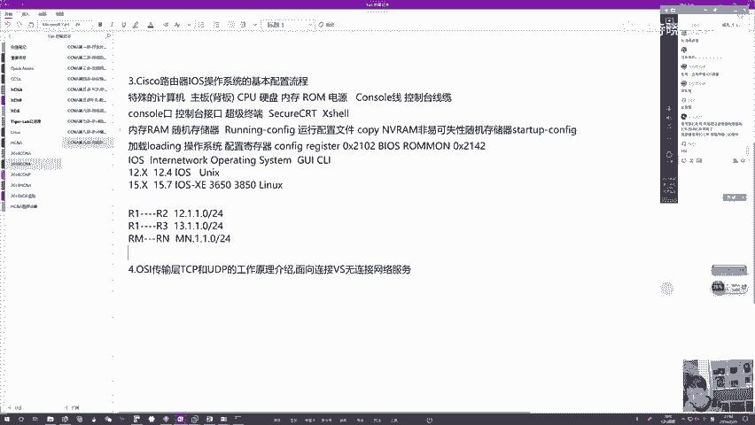

个接口是用来连接网络的，这个接口地址多少，你要设置一下子网掩码多少，你设置一下，对吧？路由器有没有网关，如果有网关，你要指定一下网关地址，它会通过这种方式来帮助咱们新手做一个基础配置。

但是这种方式呢我建议大家不要这么做，太墨迹了，可以吧？你不能跳跳步骤，你一旦做了，你就要从第一步到最后一步做完。而这些步骤中呢，有些是有用的啊，有些一点用都没有。那所以说呢为了避免麻烦。

我建议大家直接输入no对吧？直接输入no，咱们就进入系统，对吧？直接输入no，咱们就进入系统。

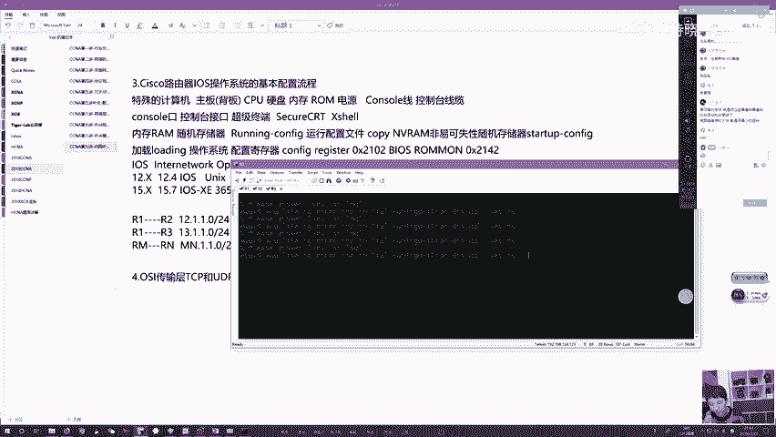

好了，进入系统之后呢，就是这样的啦，它上面会报一些日志啊，这个日志自动报的，对吧？日志自动提示的，对吧？你在配置路由器的时候呢，它会经常提示一些日志，告诉你一些情况，比如说接口状态变成up啦。

接口状态变成down了，什么协议开启了，什么协议没有开启啊，它都会给你提示，对以吧？这个咱们称为叫系统日志啊，系统日志，这个叫loing，可以吧？这个loging呢，咱们路由器是默认开启的。

实时给你提示一些信息，对吧？比如说你实时出现的一些状况，它都会给你立即提示日志，那日志呢有咱咱们有级别区分啊，一共是8级，可以吧？编号是0到7，这个级别越低，代表这个日志越重要，代表这个事件越严重。

这个级别越高，代表这个日志怎么样，越无所谓，可以吧？它的重要性越差，越无关痛明，好吧，然后接下来咱们能够配置的模。😊。

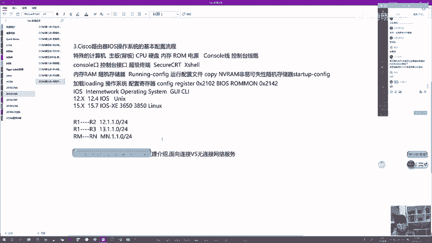

是呢也跟大家说一下啊，你进入到一台路由器，看到了吧？这就是咱们当前配置模式，分为两个部分啊，前面一段是咱们路由器的名字，注意啊，cisco默认所有路由器叫什么名字呢？就叫router对吧？

uter就是英文的路由器的名称啊，对吧？然后cisco的交换机默认所有主机名呢都叫switch对以吧？路由器叫router交换机叫switch，这就是咱们路由器的名字，那我建议大家不要这么起名，可以吧？

你一定要能够区分咱们园区内的每台网络设备的名字，对吧？你要让他们叫的不一样，对吧？那当然最简单的命名方式是什么？就是第一台路由器叫R一嘛，第二台路由器R2，第三台路由器R3对吧？

第一台交换机switch一，第二台交换机switch2第三台交换机switch3那这个在我们的N考试中，NP考试中，甚至IE考试中啊，我们都通过这种方式来做一个命名呢？那当然你在企业中对吧？你可以通过。

😊。

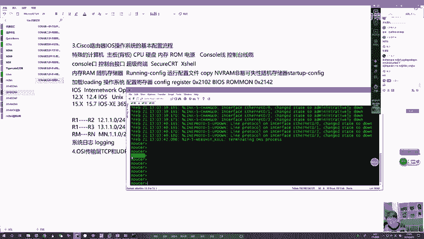

更加完善的命名系统，直接通过一台路由器的名称啊，就能知道这个路由器在整个企业网中对吧？扮演什么样的角色，你是出口还是核心设备还是汇聚设备，你在哪个机房的哪栋楼，可以吧？代演什么样的角色。

那咱们可以通过命名规则啊，来给你在名称中啊，包含这么多信息，那当然在我们的实验中啊，没有这个必要，对吧？你只要叫R1RR3就好了，可以吧？但是当前呢在改名之前，对吧？他们都叫ro。

然后后面这个符号这个大于号啊，这个大于号就是指示了咱们当前所在的配置模式。大于号指的什么呢？就是咱们当前的配置模式啊，叫用户模式，对以吧？叫用户模式。这个用户模式通常就是你登录思科宝络设备啊。

咱们所对应的这么一个默认模式，对吧？那这个默认模式咱们能做什么呢？不好意思，你基本什么都做不了，为什么呢？因为咱们这个操作系统啊，它是分权限级别的。就跟你windows一样啊，对吧？

你windows有管理员账号，你也有访客账号，对吧？你访客账号也能登录系统，但是你能做操作非常有限，对吧？而你管理员的登录之后，你能做操作就多很多，对吧？那路由器也是一样的。

这个用户模式就比较类似于什么？比较类似于咱们访客账号，然后接下来它有管理员模式，对吧？那接下来它权限级别共16级啊，分别是0到15，对吧？分别是0到15，然后呢，零级是最低级啊，15级是最高级。

这个零级呢一般也不会有人用，因为如果你真的要使用零级权限，不好意思啊，零级是什么意思啊，零级是你在这个系统中一共只能配置5条命令，并且这5条命令，没有一条能够改变咱们路由器的工作，对吧？你只能对吧？

做一些聘测试啊，你只能做一些连接啊，做一些。话，你只能干这个事儿，对吧？咱们用户模式还不至于这么不记啊，你用户模式权限级别是一级，对吧？那当然这个一级也够惨的，对吧？除了零级以外，最低就是一级。

一级能干的事稍微多一些，对吧？你可以通过打问号啊，来查看你能干哪些事，对吧？你在这个命令行中呢，如果你不知道敲什么命令，你打一个问号，对吧？打完问号之后，他会给你提示啊，你能敲的命令有哪些。

左边的就是命令提示符啊，右边就是这个命令的解释，对吧？当然你敲一部分，还可以打一个问号，他会告诉你，你敲这个字符，后面能跟哪些命令，对吧？然后接下来你你敲一部分啊，比如说你敲这个单词敲了一部分。

你打一个问号，他会告诉你单词后面该怎么拼，对吧？他会告诉你单词后面怎么拼，那这个问号呢，作为命令提示符啊，你们可以去经常使用，对吧？尤其是新手，你不知道能敲哪些命令的时候，对吧？你可以去对吧？😊。

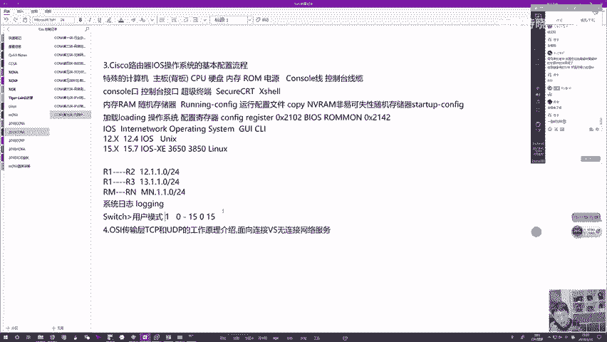

多大来问号。OK那这是关于这个问号啊。然后接下来这个用户模式呢，虽然它能敲的命令看起来挺多的，但是你会发现它能敲的命令，其实无外乎也就是那些测试命令，对吧？你可以通过P来检测咱们网络连通信，对吧？

你能通过traro来检测咱们路径信息，你能通过tnet对吧？来拿这台路由器做一个跳板啊，远程登录到一台其他的设备，对吧？你也能使用SSH就简单来说，你在这个模式中只能做一些网络的测试。

做一些基础信息的收集，对吧？你能通过受命令来查看一些咱们想要查看的内容，你可以通过P命令来检测连通信，你可以通过tnet来远程登录一台其他设备。😊。

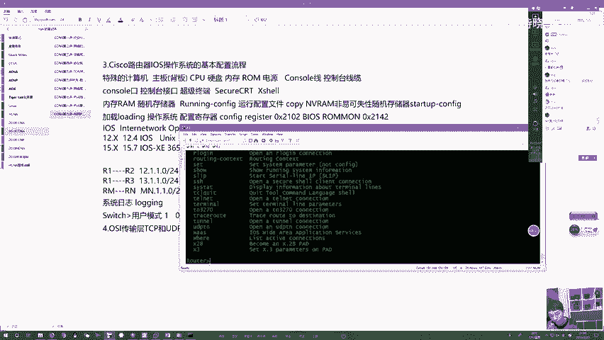

但是你想要给接口配置地址，你能配吗？你配不了，你想要给路由器配置一个主机名，你能配吗？你也配不了，你想要修改一下系统时间，你能修改吗？修改不了。😡，对吧你启用如有选择协议能启用吗？不好意思，都启用不了。

对吧？那所以说总而言之，你可以理解为这个用户模式并没有什么卵用。那所以说呢咱们在这个模式中呢，是为了离开这个模式的，对吧？咱们直接敲一个叫enableable的命令来离开这个模式，对吧？

那为什么这么这种模式咱们要离开呢，归根结底原因来说就是这个模式，它权限级别太低了。因为你的权限级别低，影响咱们的配置，你做不了什么配置，所以咱们才要离开我们离开的理由是什么呢？

就是我希望进入到一个权限级别更高的模式。😊，在这个权限级别更高的模式里，我能做更多的配置，对吧？这是我希望的那这个时候对吧？通过敲引label就是帮助咱们获得权限级别。如果说你联保敲成功的啊。

当然通常它都会成功的，对以吧？你就能够进入到另外一个模式。

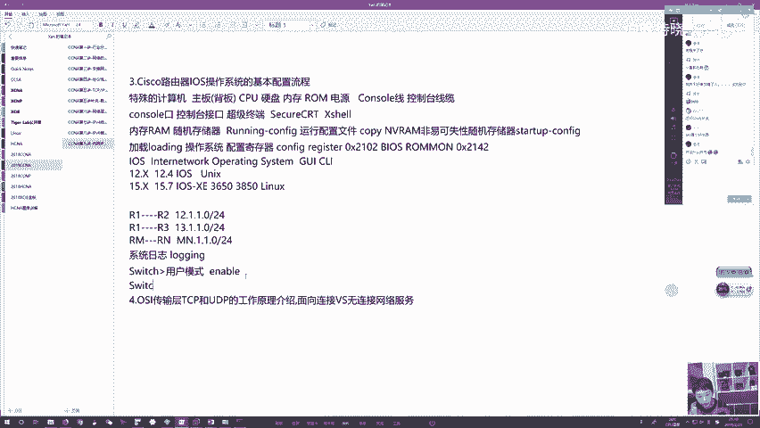

这个模式呢来看一下enable可以吧？回车就变成这个模式了，对吧？但是大家注意啊，我敲 enablebel不是把它给敲全了啊，我敲 enable，我可以敲1个EN就可以了，对吧？

对当然这个敲 enable，你不能只敲一个E啊。你只敲一个亿，他会告诉你，你这个命令输的对吧？是有歧义的对吧？模棱两可的可以吧？这个系统支持咱们简写啊，但是你不要解写太过分，当你简写的字母。

后面能跟很多单词组合的时候，可以吧？系统是不接受咱们的输入的，因为他不知道你到底要敲什么东西，对以吧？只有当你敲了简写后面只能跟一个组合的时候，你这个命令咱们才能进来，可以吧？那佳长会问，哎。

我怎么知道我的简写到底O不OK呢？很简单，我们这边的话有一个键啊叫tab键，对吧？有一个叫tab键。

这个在键盘的右上角啊右边的中间啊，不对，左上角左边的中间，最左上角ESA对吧？然后下面是个拨浪号的符号，然后下面就是t键对吧？下面就是t键。这个t键我们称为叫命令自动补全，对吧？叫命令自动补全符。

叫命令自动补全符，你通过这个命令自动补全符呢，你敲命令的时候，对吧？你敲了几个字母，你按一下tab键，它能够帮你自动补全为完整的命令，对吧？比如你敲一个Et键没有什么转用，对吧？为什么呢？

没有软用的原因，就是因为你的简写太过，对吧？你的填写太过，它不知道你后面能跟什么，所以它没有办法帮你补全，那当你敲了E之后，你再按一下t键，哎，看到了吧？它就给你t出了nameO吗？

那这就是建议大家的配置习惯，首先呢敲命令，不要敲全。

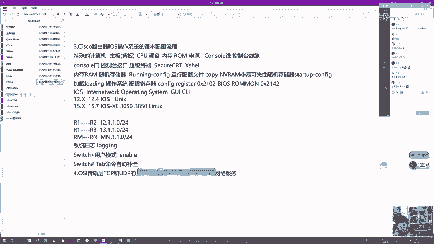

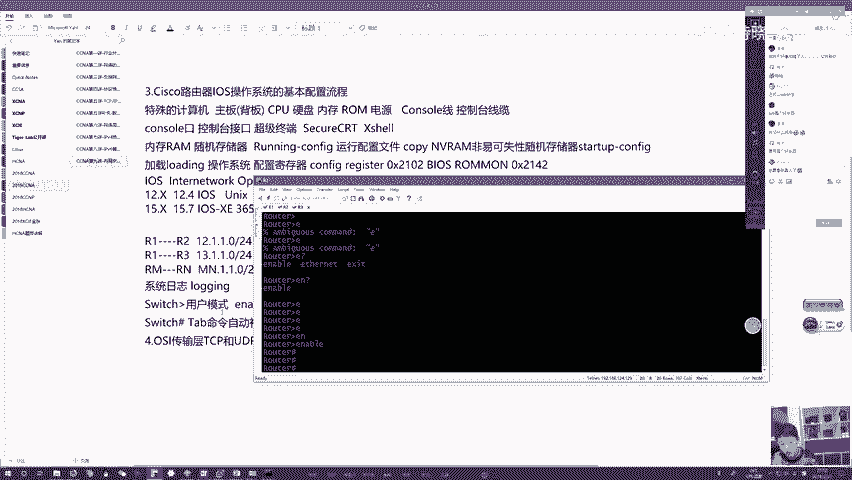

因为你交权的话太慢了，并且会有点怎么样有点蠢啊，有点蠢。那所以说咱们一般建议大家输入命令啊，还是简写为主。但是你在简写的时候呢，尤尤其是对于咱们新手啊，我不知道怎么简写比较合适，对吧？你简写太过了。

对吧？那不行，他不给我们敲，你简写的太多了，咱们又浪费，对吧？我怎么知道敲几个字母简写最好呢，就是你可以经常使用tab键可以吧？比如说你敲一个单词，你只用记前面几个字母，敲第一个字母按下tab键。

看看能不能 tap出来，如果可以，那就是OK的。那如果不行，怎么样，你再敲一个字母，然后再t一下，直到咱们能t出来，对吧？这个就OK了。😊。

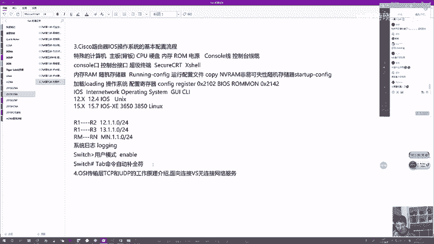

哎呀，哪有一点也不帅啊，命令比较帅啊，技术比较帅。好吧，这个技术比较帅。OK那接下来咱们进入这个模式叫什么呢？请注意啊，这个模式咱们称为叫特权模式。😊。

叫特权模式，好吧，这个特权模式就比较厉害了，它的权限级别是15级，对吧？你在用户模式敲enable，我们就进入到什么？特权模式，因为这个enable命令叫使能，对吧？使你能你原来不能嘛，哎。

我现在让你能对吧？你能了之后，你的权限级别高了啊，你就能够拥有管理员的权限，这个管理员的权限，对吧？能够让你想敲什么，你就能敲什么对吧？在这边设 privilege，你会告你会看到系统告诉我们了。

当前咱们的权限级别是15级，对吧？最高级别，O那接下来在这个模式里面呢，你能够敲的命令会涵盖用户模式里所有命令，对吧？你在这个模式怎么样呢？你也能聘，对吧？你也能t，你也能SSH你也能受。

而且你受的内容明显要比用户模式要多的多。比如说对吧？我们查看当前运行配置文件，你在特权模式中。😊。

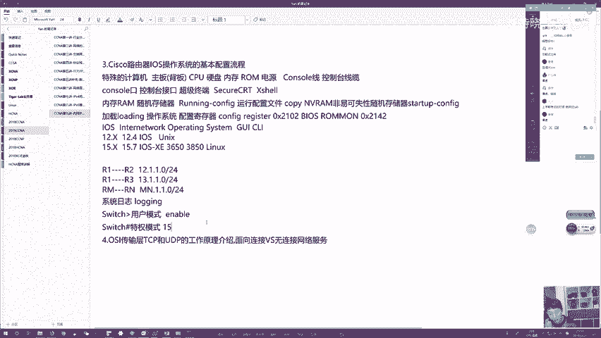

咱们就能看可以吧？你能看咱们当前时代设备配置那些东西是吧？你就能看呢，但是在用户模式里面你看不了，可以吧？但是呢话说回来。这个特权模式咱们虽然有15级别的权限，但这个模式不是专门用来让咱们配置命令的啊。

你要配置命令，比如给路由器改一个主机名啊，运行一个路由器的协议啊，创建一个接口啊，给接口配一个地址啊，这个模式不行，对吧？咱们得要在这个模式中呢输入一条命令叫configuuralterminal。

对吧？这个的简写叫什么呢？叫confiity，对吧？叫configu。

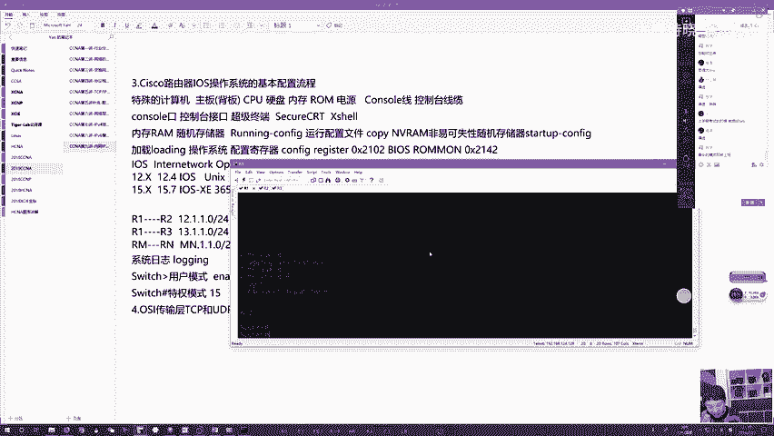

configuity它的全称叫configuural terminal，对吧？叫confiural terminal。好，然后接下来当你敲了这个命令之后的啊，ok咱们就就到啥这个模式了。

这个模式我们称为什么呢？这个模式我们称为叫。😊。

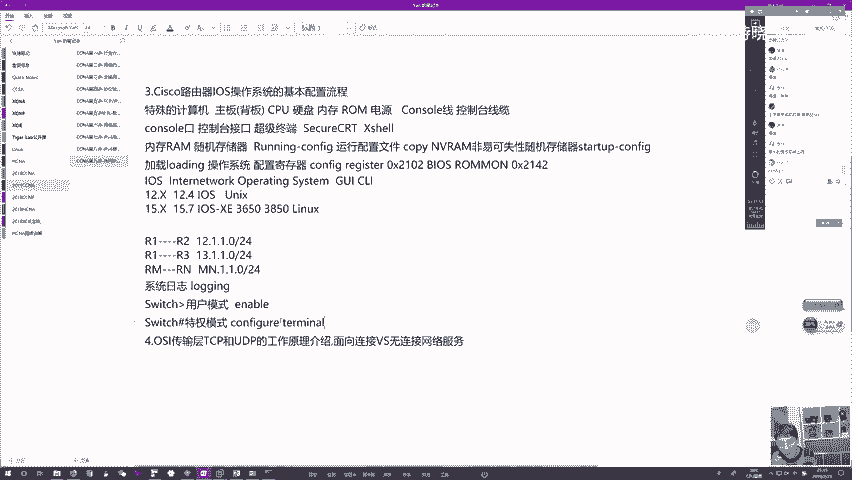

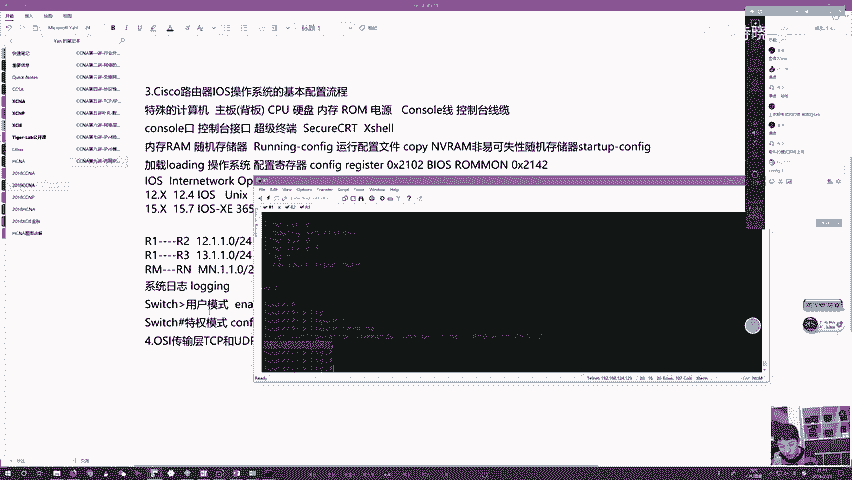

注意啊，这个叫全局配置模式。这个叫全局配置模式。

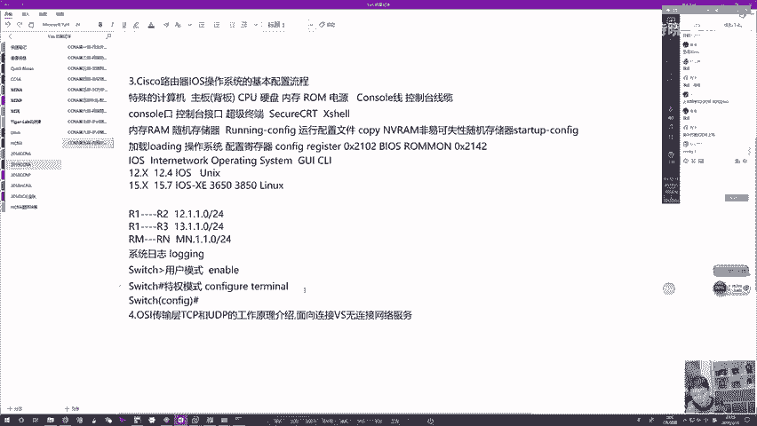

好，顾名思义啊，这个模式专门用来让咱们敲命令的啊。你在系统中你希望通过敲命令来改写咱们设备的一些工作，那就在这个模式中做，这是最好的对吧？你修改主机名啊，你企间中选择协议啊，你创建接口啊，对吧？

你修改系统时间啊，你修改咱们时区啊，那通常都是在这个模式中做的，对吧？像什么开启主播功能啊，开启IPV6功能啊，对吧？都在这个模式中敲，比如说这个模式里面，咱们最常敲的是什么呢？

就是这个housese name命令，对吧？你改个主机名嘛，第一台是不是叫R一啊，对吧？第二台是不是叫R2啊，第三台是不是叫R3，对吧？咱们通过这个全局配置模式的命令，你都能去生效。

然后接下来呢在这个模式中它比较牛逼，你敲的所有命令，咱们影响到都是咱们设备全局，对吧？但是现在我需要做什么呢？我不需要影响你们全。

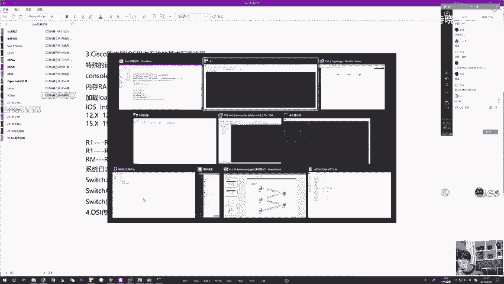

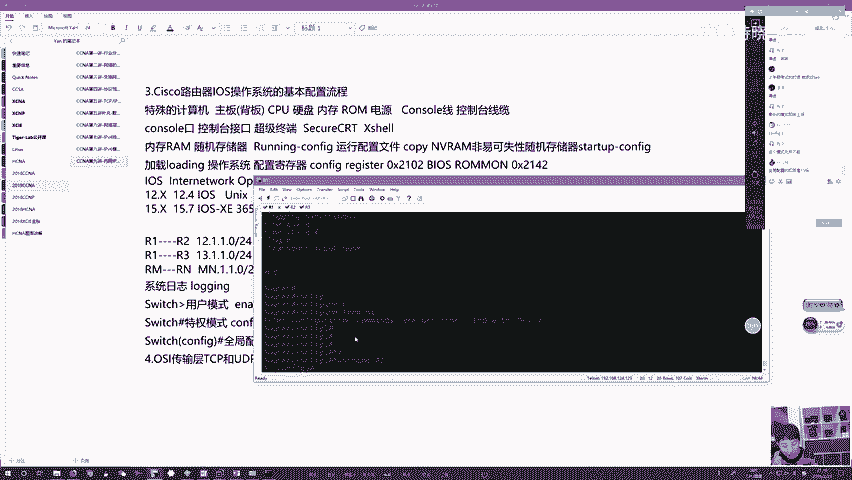

局啊，我只是希望给R一左边这个接口配个IP地址，对吧？地址是12。1。1，我希望给他右边这个接口也配这个IP地址，地址是13。1。1。那这个全局配置模式你方便给一个接口配地址吗？不方便。

因为你给一个接口配地址，这个行为怎么样？只能影响到你接口本身，它不算是影响到咱们全局。那所以这个时候呢，咱们可以通过全局配置模式啊做跳板来进入到咱们路由器的接口，对吧？那进入路由器的接口，咱们怎么进呢？

你需要通过全局配置模式啊，输入这条命令。

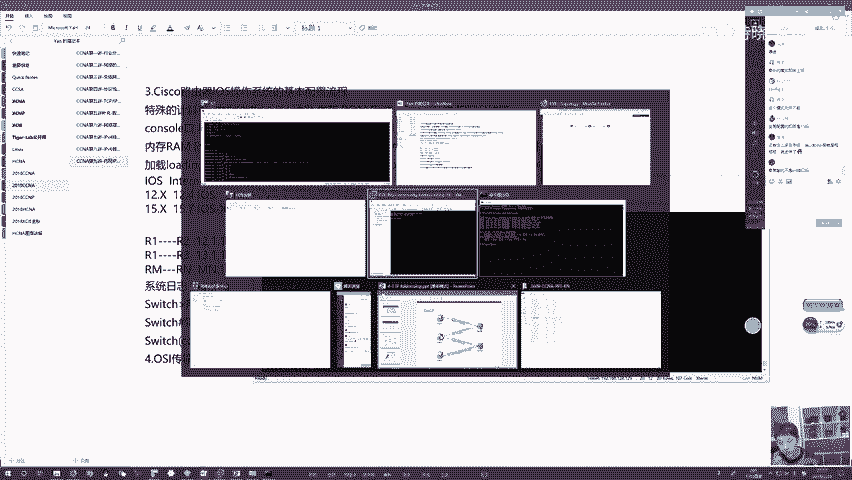

interface可以吧？这就是进入接口的命令，可以吧？对于路由器的交换机而言，它有两类接口啊，cal口这类接口咱们称为叫line接口，对吧？cl口这样的接口啊，咱们称为叫line接口叫线路接口。

这个线路接口不是用来联网的啊，它不是用来联网转发数据的，这种接口是专门用来让咱们登录的对吧？你登录路由器，登录交换机就是登录他们这些网管接口，而他们这些所有网管接口啊，都用line来标识，对吧？

然后接下来interface指的是什么呢？intelface指的就是咱们的数据接口。可以吧？那这类接口呢专门用来连线连接网络，可以吧？那当然路由器呢一般连线不是连PC的啊，交换机连线就是连PC对吧？

路由器一般是连接其他路由器对吧？连接交换机连接防火墙，咱们网络设备之间互联啊，会使用路由器接口来连线，可吧？那这类接口咱们都称为叫interface，对吧？连完线之后。

咱们通过这样的接口收发数据来帮你做一个竖着发，然后接下来咱们这个接口叫什么名字呢？这个线蓝色的，这就是以太网接口对吧？以太网接口就是以snet对吧？以snet以snet0-0对吧？

进入到咱们以太网0-0口好了，那接下来当你敲了这条命令之后什么意思呢？就是进入到咱们以太网0-0口的配置模式，那这个配置模式叫什么呢？请注意啊，这个配置模式我们称为叫接口配置模式，可以吧？

它叫config杠IF这个叫接口配置模式，那在这个接口配置模式。周你敲的所有命令都会影响到咱们这个接口本身。那接下来我们在路由器的接口需要交什么命令呢？请注意啊，路由器的接口咱们通常需要敲两条命令。

第一个就是配置IP地址的命令，对吧？因为路由器的接口三层的嘛？三层接口想要工作，你需要IP地址，那接下来还有一条命令，就是开启接口命令，可以吧？为什么要开启呢，因为路由器不像交换机啊，默认情况下。

ssco路由器的所有接口它都是被禁用了，禁用什么意思呢？就是这些接口被杀 down的，可以吧？被禁用了。你为了启用这个接口，你需要通过no shut down命令，来开启咱们这个接口，可以吧？

那这就是配置路由器接口的两部曲，那你看你在这个接口敲no杀 down之后就告诉你，当前你的这个接口以它往0-0口物理层的状态变成了。对以吧？并且你数据链入层的状态也变成了，对吧？这就是双up。

只有当你接口双up才能工作，对吧？然后紧接着配置IPD是怎么配啊，IP空格address。然后呢，后面跟上你这个接口的IP地址，12。1。1对吧？空格后面跟上你的子网掩码，24位掩码呢。

前三段都为一最后一段为0。好了，那敲完之后呢，这个接口就既有IP地址，也能工作。那紧接着呢我们要进入到另外一个接口，可以吧？进入到另外一个接口引径的，我当前是在以探网0到0口的接口配置模式吧。

我不建议大家直接通过这个模式来进入到另外一个接口模式。我希望大家呢先回退到全局模式。你回退到全局模式之后，咱们再进入到另一个接口的接口配置模式。那模式回退怎么做呢？叫exit。

对吧通过exit咱们回退到全局模式，然后呢再敲interface，这个是以snet0-1，对吧？进入到咱们以太网0-1接口。在这个接口呢，同样怎么样no开启接口，对吧？敲命令IP address13。

1点。1掩码24位好吧，那接下来做好之后，我想要看一下咱们接口状态怎么看呢？你可以回退到特权模式，因为在特权模式我们是专门用来敲受命令，对吧？这种高级配置模式下，你受命令默认用不了，对吧？它不支持。

但如果说你偏偏就希望在这种高级配置模式中啊，来执行特权模式这种比较低级别的模式的命令，你也不是不可以怎么样呢？你在执行的命令前面加一个do就好了。可吧？我们要做一条受命令啊。

叫 do售IP interfaceface。不可以了？在这个受命令前面加一个。度可以吧，这就是你懂的在高级模式下完成低级配置的这么一个方式。可以吧那当然正常情况怎么样呢？你要输入END啊回推到特权模式。

然后在这个特权模式下，直接通过sIP interfaceface brief来检查咱们的接口，那当时大家能看到该路由器怎么样4个接口对吧？然后呢。

咱们刚才配置的是以太网0-0口和0-1口这两个接口的IP地址在这里是有显示的，然后呢，他们的物理层的状态，数据链层状态，可以吧？都O那这就是R一的接口配置那当然我觉得阿尔法三也是一样的吧？对吧？

在全局配置模式下，先进入到咱们的接口以太网的0-1口回收对吧？在接口配置模式下no shut down来开启接口对吧？通过IP address来给接口配置一个地址对吧？然后接下来做之后怎么样？

在特权模式下，how iP interfaceface brief来检查一下咱们接口状态看到了吗？这个接口也是up对吧？地址。也没问题。那接下来为了检测咱们地址没有问题，对吧？R嘎拉一直连嘛。

由于直连你接口有了地址，咱们直连路由是有的。所以说咱们可以做一个直连的联通性测试，可以在R上P12。1。1检测咱们联通性。对吧？然后接下来就是拼的结果，注意啊，在cisco路由器中，你聘一个目的地。

如果没有聘通，咱们显示是点。如果你聘通了，咱们显示的是感叹号，那你第一次聘，咱们会发现聘出了5个包啊，第一个包没有通，后面全通了。然后接下来你后续的所有P就全部都通了，那原因是什么呢？也很简单。

因为咱们这是一个以太网，对吧？在以太网环境中，你要跟12。1点点1这个内网节点通信，你现在知道它的IP地址，你知道它的麦地址吗？你不知道，所以说你需要通过ARP来解析它的IP到麦克映射。

当然你获得了它的ARP之后啊，哎，你才能够成真，然后呢发送数据给他，那当然你在做ARP解析的时候，对吧？第一个包丢包了，对吧？第一个包丢包了，那因为超时嘛，这个很好理解啊，优是什么啊？优的是另外一个。

拼不通的这么一个就是标识啊，这个U代表的是你去往目的地有路由，可以吧？你这跳是有路由的，你能把包给发走。但是呢这个包对吧？没有办法传到目的地，你后面有人告诉你目的网络不可达，那这个时候你会显示U对吧？

如果说拼出点那一把点什么呢？点就是你自己都没有去往目的地路由。那这个时候你拼是点那如果说你拼出U是什么呢？就是你有路由，但是拼不通对吧？有路由，但是拼不通O好的。

接下来R3也是一样的R3进入它的以太网00口对吧？no shut开启接口配置一个地址13。1点。3连满24位。然后接下来退出来IP interface可吧？接口也没问题。然后接下来拼一下拼13。1。

1对吧？也都能拼通，那这个就是给咱们网络设备手工配置IP地址的方法，可吧？好那。我也说了，你在给咱们企业网内的这些设备啊配置IP地址的时候，就是这么两个方式啊，你要么手工配置，你要么自动配置。

那咱们对什么样的设备，手工配置呢？请注意啊，不建议给PC手工配置地址，因为PC数量太过庞大，你给他们配对吧？工作量太大，并且你在配置的时候，你万一一个分析啊，你可能会怎么样，哎，配错地址导致地址冲突。

然后紧接着手工配置地址呢不方便咱们后续的管理。如果说你有一些攻击行为，咱们是不可控的，并且你手工配置地址还有一个隐患啊？就是当你之后做网络改造，你做网络升级，你做地址更迭的时候。

你手工配置的地址很难去更迭，可以吧？所以说手工配置地址，建议给这些设备对以吧？少量的服务器这是没问题的，对吧？因为服务器需要被频繁的访问，他们的地址需要稳定，然后紧接着就是咱们的。

各式各样的网络设备可以吧？比如说你交换机的SVI接口，你各种各样路由器的环回口，还有你路由器的物理接口。这些网络设备的接口地址，建议大家手工配置。因为手工配置这些设备地址最大好的是什么呢？

就是你们的地址稳定的。对吧因为这些路由器你上线之后以后呢，咱们要登录，你就不再使用cstl线了。你使用csl线登录，咱们称为叫本地登录。你给路由器本地登录的根因是因为这些路由器刚买回来的时候。

你给它连接网线，它是没有办法连网，对吧？你没有办法连网，对吧？你怎么样，你不可能远程登录它们，那当然你给它做完初始化配置之后，你给它连好线，它连接入网了，你既然连接入网了，你就可以通过网络来登录它们。

那你通过网络登录他们，对吧？你是需要登录他们的接口地址了，这些接口地址必须要固定。手工配置IP地址麻烦归麻烦啊，但是它最大号不是什么呢？就是你一旦给一个接口，配置一个地址之后，这个接口的地址，对吧？

它是不会变的。你除非把地址给删掉，你若果不删地址，对吧？这个地址会永久性的存在，可以吧？但是对于咱们客户而言，建议大家不要手工配地址。那大家不要手工配地址，还有另外一个原因啊。

就是当你管理员没有办法管理咱们所有PC的时候，你有的时候可能怎么样需要PC的用户去给PC配地址。但PC的用户会不配地址吗？对吧？他未必那么专业，并且呢就算知道怎么配地址，你万一出现地址冲突呢，对吧？

他们可能也没有应付过这种问题，况且他们可能连他们所属的网络是哪个网络都不知道配哪个子网段地址，他们一点概念都没有，那所以说为了让咱们这些PC用户啊，对吧？直接联网就能够直接使用网络。

那咱们最好就给他们提供什么即插机用性，给他们提供即插机用。那咱们怎么提供这个计杀机用呢？哎，就是让这些PC啊连接入网之后，哎，咱们能够自动获得IP地址。

那这个自动获得IP地址呢在咱们专题课中我没有讲过啊，就跟大家说咱们可以使用什么DHCP这个协议来获得。那这个协议咱们称为什么呢？叫动态主机配置协议，对吧？叫动态主机配置协议。那当你使用这个协议之后。

对吧？那大家都知道你PC嘛一般都是使用windows系统。你这些windows系统的主机，对吧？咱们网卡设置大家看到了，对吧？你地址一来是上面这一栏。上面这栏说的是什么？是让咱们自动获得IP地址。

可以吧？让咱们自动获得IP地址。什么叫自动获得IP地址？其实说白了就是通过DHCP对吧？我这些PC天生就是DHCP的客户端。你只要连接入网之后，你就会自动的找DHCP服务器啊，去请求一个地址，可以吧？

你客户根本什么都不用做，你只要装好系统连好网线。我这个DHCP啊，在客户端就已经可以工作。那这个时候只要你在网络中怎么样竖一台DHCP服务器，你就可以让这个DHCP服务器啊。

来给我们客户通过交互DHCP报文来做一个地址的分发，可以吧？那接下来DHCP怎么运作呢？很简单，就这么几步，可以吧？PC连上网络之后，只要你感知咱们网线连接，并且只要你网卡的设置啊。

是通过自动的方式来获得IP地址，你接入网络那一刻就会发送一个广播的DHCPdicover来找寻咱们的服务器。

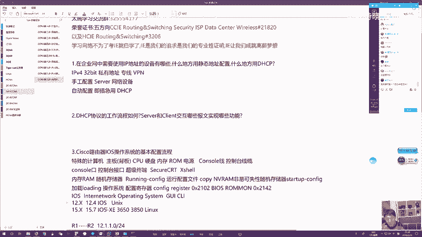

那当然你服务器收到了广播discover之后呢，对吧？只要服务器部署完毕了，他呢就会给这个client做一个回应。这个回应呢，如果说你这个服务器是一个思科路由器模拟的。

我会以广播形式来给你发送这个回应包。如果说你这个路由器呢是一台华为的对吧？它它来模拟DHCP服务器啊，那它会以单播形式来给你回应这个这个offer对吧？那这个offer里面包含你内容呢。

包含服务器给PC所提供的这些IP地址子网页板网关以及DNS服务器，包括域名，包括net地址等等之类的一系列地址，对吧？那接下来当你PC收到offer之后呢，你会做一个判断，对吧？判断下这个offer。

我能不能要对吧？那判断方式就是PC会发送一个DHCP的request那当然情况可能是这样的，就是你在一个网络中可能出于冗余角度考虑，你设置了多台服务器这多。

DHCP服务器都收到了PC发送的广播discover。那这些服务器收到之后怎么样呢？他们都会给PC啊返还offer。那这个时候PC收到多份offer之后呢，他有义务告诉这些服务器啊。

你们谁给我发的offer，我接收谁给我发的offer，我不接收。那接下来为了告诉这些服务器这件事啊，我就发送一个DHCP的request对吧？通过发送广播request发给所有的服务器告诉这些服务器啊。

你们给我发的offer，谁先到谁先到，我就用谁给我提供地址。那所有没有被我使用的服务器，对吧？我希望你们把给我分配的这些地址啊给收回去，用于给其他主机来分配可吧？

然后接下来被我采纳了这台服务器收到request之后呢，就会最终给我发送1个DHCP的ACK那这个ACK呢跟offer里面的内容是一样的，对吧？只不过他们的报的类型不一样。

那通过给你发送这个ACK就告诉你。😊，问题我给你分配的地址，你可以使用，对吧？那从你使用开始计时，我这个地址给你默认租赁24小时，可以吧？那当然在这24小时期间呢，你可以去向我续租啊。

如果你觉得地址挺好的，你想继续用，你可以续租。当然你续租我能不能续租给你，只是二说，但是你可以去续租，通常我都是同意你的对吧？但是如果说你没有续租，那不好意思啊，你这个地址使用24小时就必须要归还。

那当然你归还之后，你下次还能通过DHCP啊，再问我拿地址，对吧？但是你下次拿地址就未必能够拿到你之前所拿到的那个地址，对吧？那一般呢通过这经典的四部曲啊，客户呢就能够顺利的拿到一个地址，对吧？

那接下来这块呢我也来给大家演示一下，对吧？如何拿一台思科的路由器模拟成一台DSCP服务器来给咱们的客户分发地址，那这块呢，咱把R一模拟成一台服务器啊，然后把。

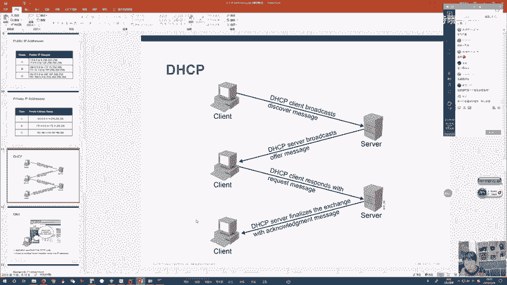

R呢模拟成一个客户堆，对吧？我在RE上做一些部署，然后在R上呢去请求地址。那当家大家需要注意的是，这个DACB服务器，无论你是拿什么样的设备来做啊，你拿思科路由器做也好，你的华为路由器来做也好。

你拿一台windows4服务器来做也好，注意啊，这个服务器本身的接口是一定要配置地址的啊，你自己接口都没有地址，你怎么分发啊，你没有办法分发，对吧？所以说了它自己的接口啊需要配置这么一个地址。😡。

ok那接下来我们就来做一个配置吧，好吧。😊，R1RRC对吧？这个R一呢接口地址不变了，就使用以太往0-0口对吧？然后接下来R我把它这个接口配置的地址给去掉，怎么去掉呢？noIP address可吧？

你在一个接口通过no模式的命令啊，就可以把你之前给这个接口配置的命令给删除掉，可以吧？这就是咱们命令和最大好处，你配置命令不用担心配错。你如果配错怎么办呢？对吧？你可以通过no模式的命令。

把你配错的命令给删除掉。那当你删除之后怎么样呢？再去 show一下，对吧？那接口地址就没有了。对吧？好了，那接下来R一做DHCP服务器，你该怎么做呢？首先在全局配置模式下。

你要敲命令servHCP通过这条命令来启用DHCP的功能，好吧，那接下来DACP之后呢，DHCP地址值最重要的是什么呢？你要创建一个把DHC服务器啊，最重要是什么呢？你要创建一个地址池这个地址。😊。

那对吧负责给一个网络里面的主机来进行地址分发。那当然你在一个企业中呢，咱们一般DHCP服务器啊，一台到两台。那这1到2台DSCP服务器呢，要给内网的所有网络来提供DHCP服务。那最说按照常理来说怎么样？

你是有多少个网络，你就要创建多少个地址池，那当然在我们这块呢，你只模拟R这么一个成员啊，那R这个成员属于12网络，所以说你地址池只用做一个那咱们创建呢命令叫IPDHCP可以吧？

这就是DDHCB地址池的意思啊，起个名字叫CCIE对吧？名随便起啊，叫什么都行，可吧？然后在DACCB地址池的配置模式中呢，通过net指定啊，这个地址池里面包含哪些地址，对吧？那咱们包含就是12。1。

0这个网段里的地址O吧？然后紧接着你的网关是谁呢？哇一是台路由器啊，我既是路由器，又是DCB服务器。😊，对吧那我怎要告诉你对吧？你的网关是我吧，对吧？那我要把我自身的接口地址作为网关地址来给你分发。

然后接下来DNS服务器8。8。8。8，对吧？你所属的域名cisco点com，对吧？然后通过租期来告诉你你地址能租多少时间，默认咱们租一天又0个小时，对吧？又0分钟，也就是24小时，对吧？就是默认值。

OK那接下来做完之后，咱们这个DHCP怎么配置呢啊？怎么看配置呢？很简单啊，退到特权模式收让 sectionction管道服啊收让加一个管道服 sectionDHCP就是检查咱们运行配置文件中跟DHCP相关的配置。

好吧，那这边咱们就能看到咱们所配的地址池，那当然在这个地址池里面，咱们是所有地址都分发嘛？不是的啊，你在一个网络中，咱们总会有一些设备的地址是咱们进态配置的。比如说你在一个网络里面。

咱们路由器接口的地址就是配置，对吧？你服务器的地址，咱们也是配置的。像打印机，你的地址，咱们通常也会手工配置，对吧？除非你做主机尺，那接下来对于这些咱们已经手工分配的地址啊。

咱们要尽可能的从DHCP地址池里面去对吧？把它们给筛筛出来，对吧？你不要把这些已经分配好的地址再去给别人分配。因为如果你要这么分配的话，怎么样？😊，会出现地质冲突。那咱怎么筛呢？怎么排除呢？

要这么排除啊，叫IPDHCPex address。比如说咱们12。1点。1到12。1点点10，这些地址咱们都有用了，我希望你从11开始分法，对吧？那咱们就是其12。1点。112。1点点10，对吧？

这是什么意思啊？就是说我要把12。1点。1到12。1点点10这个范围的所有地址从咱们地址池中排除出去，对吧？希望这些地址不要被发送，O那接下来排除完毕之后，我要把R模拟成一台DHCP客户端。

这个客户端的模拟呢，请注意啊，对于咱们的PC而言，你要把一个PC当做客户端，对吧？很简单，对吧？把我们这个协议版本4的这个选项啊，放到上面就好了，对吧？上面这栏就是说通过DHCP啊。

咱们来获得IP地址子网源码和网关，对吧？这些是主。要地址信息啊，下面这来就是通过DACRCP来自动获得什么DS服务器的地址。okK了。好，咱们都是开启的啊。那接下来路由器怎么开启呢？请注意啊。

路由器你希望它的接口跟咱PC1样，做DACCP的客户端，你需要进入这个接口在接口配置模式下，小IPaddress。

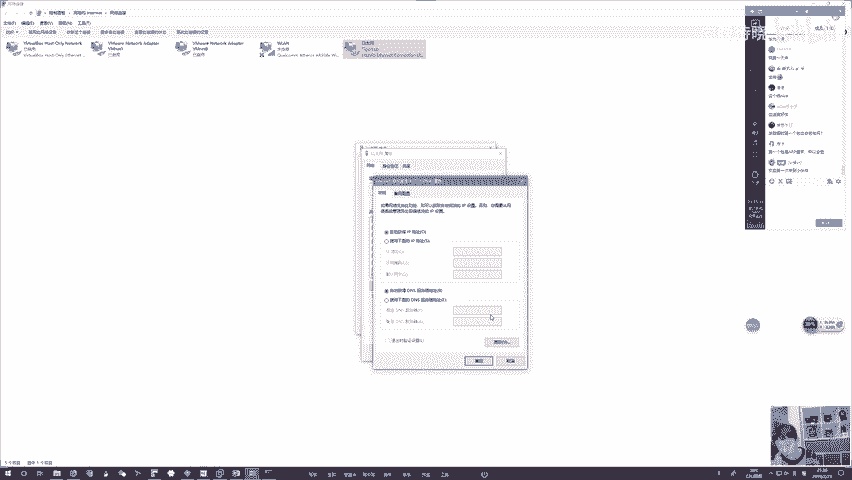

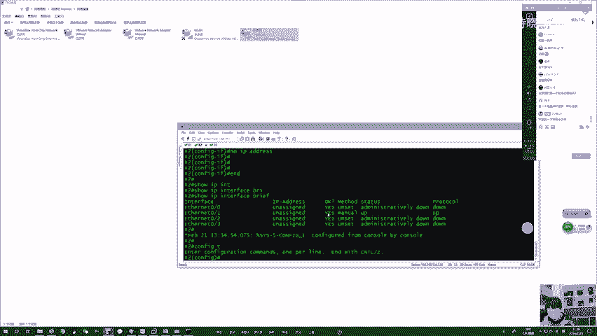

DHCP。好，当你敲完这个命令之后。等一等啊。我们就能获得地址。那接下来你能获得地址呢，通常情况下是12。1点。1，然后呢啊12。1点。11，对吧？它是从你排除的最小地址往上啊，对吧？

从小到大的来给你做一个地址分配，对吧？那这边提示了一个日志啊，告诉咱们DHCP已经获得地址，O然后接下来获得地址之后，你的售价，少癌拼 toface break看到了吧？接口地址有了，可以拼一下。

聘12。1点点1能拼通，对吧？好，那这个就没有任何问题。好吧，好了，那今天呢通过这节课给大家简单的说了一下，咱们在一个企业网中呢，对吧？要给主机配置地址对吧？该使用什么样的方式。

什么样的节点建议大家使用手工配置，什么样的节点，建议大家呢通过DHCP来动态分配。那大家就个DHCP呢，我是完全没有给大家展开来讲啊，因为时间有限。那当然大家如果就是感兴趣的话。

我之前呢有针对DACCP讲过非常深入的专题，可以吧？就是DHCP里面的各种各样的细节，对吧？如何部署地址池怎么做，可以吧？关于DHCP的option，关于DHCP的中迹。然后呢，大家如果感兴趣的话。

可以去在群里面找咱们的课程顾问老师来要咱们之前的专题课的视频可以吧？然后大家如果感兴趣的话，对咱们课比较感兴趣啊。啊，你们可以去咨询课程顾问老师来询问咱们的VIP课程的相关使用，好吧，好。

大家有什么问题可以问啊，DACCP服务器指定域名有什么意义。不是必须的，它不是必须的。你比如在一些企业中，咱们使用windows服务器，还有windows主机，你会部署活动目录，对吧？

这个活动目录为了管理咱们这些设备，你有一个域的概念，大家在同一个域内，你才能部署这些认证策略。那这个时候呢，你通过这种DNCP啊来给主机分配地址的时候，你直接分配个域名，这样的话方便咱们管理。啊。

怎么才能发现测试是不是专线或者VP？啊，你这个其实可以通过抓包来看啊。如果说这个运营商给你做的VPN对吧？运营商给你做的VPN的话，P端会给你发送一些特殊的报文。然后你在trace的时候。

你也会有些tra现象。然后接下来你也可以通过就是LLDP啊，通过CDP啊来检查运营商的边界设备的一些配置，对吧？如果说做VPN，你是能看得到的。做专线这个专线给你连完之后啊，你是收不到任何数据的啊。

你是收不到任何数据的。VIP的课程有什么不一样的啊，简单来说，咱们的非VIP课程就是体验课。如果说讲的深度啊，非VIP课是一程的话，那咱们VIP课就是十程。然后呢，VIP咱们是有一对一答疑的，啊。

每天一个小时由我亲自给我们的MPI医学员答疑。然后呢，咱们每节课VIP的学员都有作业。每个月咱们VIP的时员都有月考。然后咱们有NP的课程，有IE的课程。然后咱们还有所有的专题课，专题课。

非VIP学员只能下载三个。然后咱们的VIP学员是可以任意下载。然后包括咱们的V叉，包括咱们的SDN所有的最新技术，咱们每轮课都会升级。然后包括下一轮IE课，咱们会加sigment routing。

最前沿的技术。然后呢，咱们的VIP是终身智能，双厂商的课程。包括考试服务，对吧？我们这边天天过人啊。然后包括咱们的就业推荐。怕自己学的学不会，所以说我给你们公开课，你可以体验了，对吧？

你们体验如果觉得不错，如果喜欢对吧？能学进去，那随时欢迎大家来。😊，而且这个东西如果你认真学的话，我相信我的课你们是一定能学得会的。我的课你们如果学不会的话，那只能说网络不适合你们。

如果说你们喜欢网络对吧？并且网络没有那么不适合你们的话，我是对我们的课非常有信心的。我相信经过咱们的课程培训，你们都能够学会你们想要学会所有内容。好吧，那还是那句话，这个群对吧？欢迎大家可以加入啊。

大家如果感兴趣的话，里面有很多内容，包括咱们今天使用模拟器，都是啊这个群你们是可以随便进的啊。VIP有咱们的VIP群，好吧。公开课都听不懂，那很正常啊，因为今天这节课也不是第一节课。

你们中途来的得要看前面的课做铺垫。你们前面的课没有看，直接看这节课呢肯定比较难的，可以吧？啊，哪里哪里不帅不帅。网络里有什么好的工具很多非常非常多，工具太多了，各种各样的模拟器。

你能够模拟各种各样的环境来做测试吗？然后各种各样的工具来做各种各样的实验。包括服务器软件都有好吧好了，那今天咱们讲的有点多啊，我就不再说了。反正就是欢迎大家来吧。感谢大家来参加咱们今天晚上课。

然后咱们明天晚上8点咱们继续啊。呃，这个NA咱们也进行了一大半了。然后呢也快月底了啊，然后大家都知道咱们月底之后呢NP行业也会升就是那个升级课程，然后呢，升级咱们的服务，对吧？现在所谓的四对一嘛。

四对一服务，一个班主任两个助教，然后加上咱们的老师给学员提供服务。所以说服务升级了，咱们的课程价格单价也会上升。那大家如果对咱们的课感兴趣的话，可以抓紧报名，现在是比较优惠的，好吧。😊，年纪轻轻。

我不年轻了，我30多岁了。😊，啊，新NP课程比新IE课程晚开。是的啊，因为咱们是那个NP和IE是周末体系，周末先讲NP再讲IEIE完之后是NPNP完之后是IE可以吧？是这样的。

然后NA咱们是周一到周五好吧，就是NA和NP和IE是没有关系的。N就是一直讲NA的，然后NP和IE是周末的，反正咱们是无限重听嘛，无线重听，你不用担心，好吧，不用担心。有没有什么好的诊断工具，太多了呀。

太多了。啊，太多了，我只能说太多了，好吧，你就可以自己慢慢找。然后包括咱们的ISE包括咱们的PI，然后包括咱们的对吧华为的那个那个叫什么的，忘了。你有很多很多诊断工具啊，你可以用来做网络管理。

可以用来做net flow，可以用来做报表，对吧？都可以，没问题。NA这时候学出来应该有什么能力？呃，判断是非能力吧，你学完NA之后，你能体验出来什么课好，什么课不好，你能体验到什么老师讲的好。

什么老师讲的不好，你能知道什么样技术重要，什么样技术不重要。但是想要看NA找工作，我觉得是比较难的，基本是没戏的，好吧。A一中途没有停吗？没有停啊，没有停。HCA什么时候开课，华为跟斯科A不都一样吗？

没有什么区别，就是命令不一样以外，其他都是一样的。就我觉得NA嘛，他就是给你做一个入门，你也不要指望NA给你讲太多东西，太深，不可能讲的深，你也听不懂，NA就是给大家一个从零到1的这么一个过程。

让大家了解网络这么回事。让大家了解网络大体是什么样东西，里面包含什么样内容，大概有一些什么样的工作原理，我们建立这么一个框架，你基于这个框架，你可以了解网络中，咱们到到底能学什么样的东西，对吧？

而至于这些东西怎么去学，那这个肯定是在NP和IE阶段才会有好吧，那这个就是大家千万不要搞错了，好吧。30多岁的人了，还可以从零开始学阿E吗？可以啊，我们这边50多岁都可以从零开始学阿E。

前天刚报了1个51岁大哥啊，报的阿E直通车，这很正常。然后咱们最大的学员是一个悉尼57岁的。你们本科连NA都拿不到，本科跟我们这个职业教育是没有关系的。而且国家最近也出台了一些消息。

就是说觉得咱们本科教育太low了，培养出来的人都是废物，没有什么竞争力。所以他也希望大学跟这些培训机构能合作，就是学历教育加技能培训，让人毕业之后好歹有些一技之长，这个很正常，对以吧？

本科学不到东西太正常。好吧，最小的多少，最小的嗯最小的我们有16岁学员，好吧，有16岁学员。那个小成语都挺小的，小成语好像就十七八岁吧，国外也是一样的，国外也是一样的。我们这边美国最牛逼的一个学员是。

我们美国最牛逼学院是个double master。double master。然后它是一个WouE的，1个WouE的master，1个CSma，然后再跟我学RE。然后接下来咱们还有那个。

很多啊很多啊超级名校毕业的。很多很多很多非常多。所以说不要拿这个学历，不要拿学历跟这个职业教育挂钩啊。这个职业教育如果让大家能够学到一些比较实用的技术啊，对吧？你们学到职业技术之后。

就是能够面对什这个行业嘛，你能够面对这个行业的面试筛选，进入这个行业，然后就是针对这个行业来做一些对吧？力所能及的对吧？工作主要是为了面向工作的，好吧，主要是为面向工作的。啊，45的确实比较大了。

但是相比咱们前两天报名那个I直通车的学员还是比较年轻的，不用担心年龄啊不用担不用担心年龄。呃，网络行业多少岁入行不晚，我觉得都不晚，因为毕竟不是编程行业，对吧？你编程行业咱们有一个年龄的限制。

你超过这个年龄可能就不太好了。但是网络它变化没有编程那么快。所以说你进入网络之后，对吧？你干个10年，其实你会发现10年后跟10年前我们的主流技术是不变的，对吧？主流技术是不变的。所以说就是经验。

我觉得在网络这个行业是比较重要的。直通车报名的都是我上课吗？对，都是我上课。我们这边的话，路由交换的所有课程都是我上的。所以说大家不用担心换老师。对，都是我上的。电脑90年代可以更新一下啊。

可以更新一下啊，具体的课程可以加我们这个群来咨询一下咱们课程顾问老师啊，咨询咱们的婷老师啊，咨询咱们的小月月啊，咨询咱们张张老师都可以，没问题的。好了，今天实在是太太晚了啊太晚了。然后呢，欢迎大家来。

好吧，欢迎大家来。然后明天晚上8点咱们还有课。好吧，大家如果想就是获得更多的课程信息的话，加我们这个群就有了。然后咱们这轮课的所有往期视频，大家都可以下载，好吧，都可以下载。好吧，不辛苦啊不辛苦啊。

然后大家啊晚上拜拜，好吧，早点休息，早点休息，大家拜拜。😊。

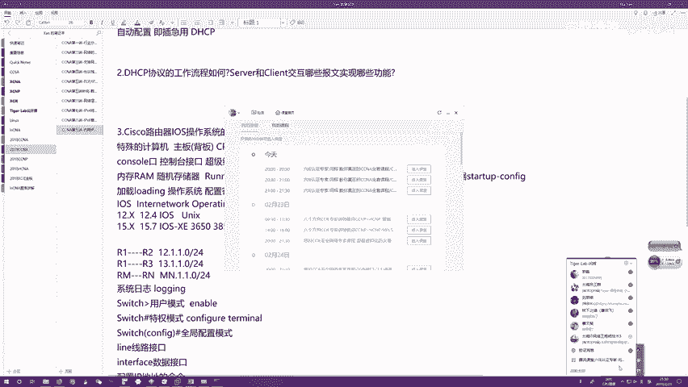