# 1000元自购分享CCNA教程合集！超全合集详细版，网络工程师入门必看合集【送NA题库】 - P11：CCNA11 - 向向向晚o - BV1cL4y1q7Dy

好，大家晚上好啊，这个今天咱们开始就是进入到一个新的NA环节了。这个NA呢已经快接近尾声了。然后呢，咱们接下来还有2块没有跟大家讲。第一块呢就是关于路由器的工作原理。

以及基于路由器咱们衍生出来的一系列像静态路由啊，动态螺选的协议啊等等这个这么些技术那这些技术呢对吧？大家记得啊，咱们当前这个NA叫什么啊RS方向对吧？RS方向。这个RS是什么意思呢？

它叫roouting and switchwitching，对吧？roouting and switchitching。😊，OK叫routing and switching。

OK那这个outing是什么呢？这个rooututing就是路由啊，就是路由，可以吧？它就是路由，然后呢，这个switching它就是交换，可以吧？路由交换路由交换主要指两个方面。

第一个就是路由器和交换机的工作原理，第二块就是路由器上所能启用的一些路由技术，交换机上所能启用的一些交换技术，可以吧？那接下来这个路由技术啊，其实主要指就是路由选择协议，对吧？像咱们在面试中啊。

网络工程师对你最长最长会被问的问题是什么？就是OSPF可以吧？然后接下来对于运营商可能会问你BGP可能会问你什么然后接下来在一些比较大型运营商里面还会问你MPOSVPN对吧？像RSVPTE是吧？

甚至像咱们的uting那这些呢都是可能会出现的。那这些技术呢，他们都是一些比较高大上的技术啊，面试面的比。😊，多原因是因为咱们用的比较多。那这些东西大家想要理解对吧？我们有个前提。

这个前提就是大家需要先知道路由器到底怎么运作的。你们要知道在整体的网络中，路由器的定位是怎么样的，对吧？了解路由器主要负责什么样的工作，它是如何实现的那基于这个你们再去理解这些动态螺选的协议。

那我相信大家呢就能够。非常容易的能够了解到咱们这些协议到底怎么设计的对吧？为什么要这么设计，怎么工作的？为什么要这么工作？那这个就是我们的今天的重点啊。今天的重点就是带大家呢深入去剖析咱们这个路由器啊。

让大家了解路由器，对吧？怎么一个定位，有一些什么样的工作，对吧？就是需要他去做，然后呢，平常他需要运行一些什么样的技术，这些技术运作完毕之后，它能得到什么样的东西。那这节课呢算是非常非常关键的一节课啊。

这节课就是在我的在我的定位定定义定义中啊，就是基本是整个NA中所有内容里面最最最重要的对吧？那你搞定这节课的内容，那你今后你研究像什么OSPF啊，像什么BGP啊，就会比较轻松一些。

但是反之如果这节课大家搞不定，对吧？那你之后研究OSPF你可能顶多也就是会敲个命令，对吧？了解一些名词，但是具体的工作原理，为什么这么做，可能大家呢就不太能够理解。好吧，O那接下来咱们言归正传啊。

从路由器开始讲起。那咱们都知道这个组网吗？我们要用网络设备。网络设备在咱们当前企业网中，咱们用的比较多的就是两类嘛，对吧？要么交换机，那这类咱们用的比较多啊，要么就是。

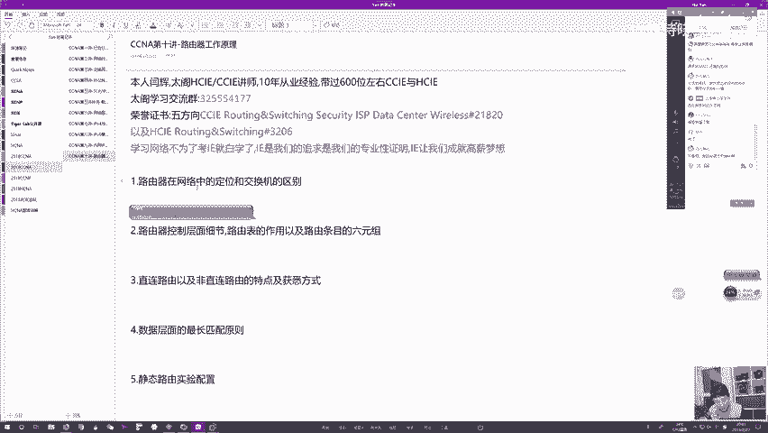

路由器OK那接下来路由器跟交换机，咱们谁用的更多一些呢？那肯定是交换机嘛，对吧？咱们能想到交换机的场景有很多，比如你计算机对吧？连接交换机入网，我们的接入设备基本都是交换机，对吧？然后在我们的园区中呢。

汇聚设备以及核心设备，哎，咱们通常呢也用交换机。那当然咱们用于汇聚和核心交换机啊，跟咱们的接入这些楼层交换机还是有所区别的这个汇聚和核心交换机，我们一般称为叫MOS这个叫多层交换机，对以吧？

它既能完成交换的功能，又能完成路由功能。那这类设备呢，咱们在NA中啊不去描述它，对吧？不去给大家讲述它，因为它是我们的NP的重点，好吧，它是我们NP重点。

然后紧接着像路由器呢一般在我们当前的企业园区网中啊，它一般是扮演什么？咱们整个企业网们出口。那曾经呢咱们出口用路由器。😊，用的比较多，那现在的路由器比较尴尬啊，因为咱们有另外一类设备，它能够取代路由器。

那什么设备呢？我们称为叫防火墙，对吧？那早期内只有一个争论啊，就是你在一个企业网中我们边界设备，对吧？连接运营商那个设备到底使用什么比较好，对吧？有路由器那一派就是坚挺说咱们用路由器路由器怎么样，对吧？

接口类型比较多，然后呢能够支持各种各样类型的广域网连接，然后呢，微PN功能比较强大，并且呢由于有智能性啊安全性也不弱，然后呢，这个防火墙这一派就说了对吧？防火墙的专门的设备，专门用来提供安全性，对吧？

你一个企业内啊有这么多重要的服务器，对吧？你为了保证咱们服务器的安全的访问，那你这个企业边界弄一台防火墙，你能够最大化咱们的安全的这么一个部署，对吧？那今后呢有什么勒索病毒啊，有些什么样的攻击啊。

咱们都能够通过防火墙来尽可能做一个抵御，并且防火墙它也支持路由器的相应功能，对吧？比如说你做路由它也OK对吧？你微偏他也支持。那所以说咱们就是争论不休。那在早期呢，路由器跟防火墙我觉得是五五开吧，对吧？

一半企业用防火墙做边界，另一半呢使用路由器做编界。但是大家都知道，随着咱们网络的发展，这个网络内的价值啊越来越高了。这个网络内的价值越高。那意思是什么呢？就是黑客对你这个价值啊就越感兴趣。

那所以说黑客的攻击手段越来越厉害。那曾经一些比较经典的比较简单的攻击方式啊，你路由器的防范，对吧？防火墙的防范，但是那些比较高大上的攻击，我觉得路由器啊就很难抵御了。比如说去年到的沸沸扬扬的对吧？

满城风雨那个mon cry病毒对吧？然后加上今年早期的那个勒索病毒，对吧？你像这样的病毒，你在网上肆意传递。如果你一个企业对吧？你拿路由器做边界啊，你是基本肯定防御不了了，对吧？只有你使用防火墙。

并且还要使用那些对吧？比较好的防火墙，你才有可能能抵御这种攻击。那所以说现在基本的咱们园区对吧？只要你内部价值比较大，你内部那些防火墙，你需要保证它的安全性，那一般的咱们这个企业边界对吧？

都会部署防火墙。那当然路由器里也不是说没有啊。😊，你还是需要路由器，而路由器呢当前被部署在一个叫DMZ的区域，对吧？一个叫DMZ的区域。这个DMZ呢叫非军事化区域，那当然也叫非武装区域啊。

这个区域呢是一个特殊的区域，就是当前咱们的企业网其实是一个三角形的啊，它是一个三角形的。

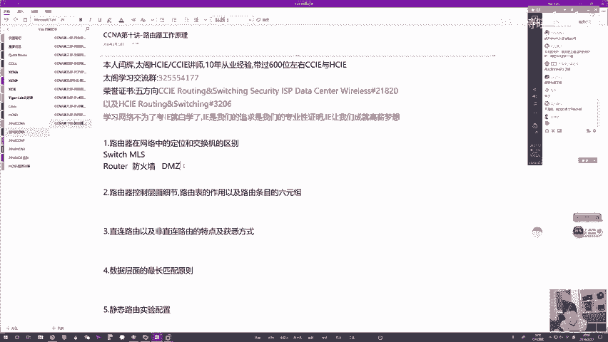

长什么样的？给大家看一下。你这是一个防火枪。😡，一般的防火墙都是做咱们企业的编界。然后防火墙呢连接到外部就是咱们的intel，可以吧？连接咱们SP然后接下来它连接的内部呢。

一般要连接到咱们的核心层的交换机，对吧？连到咱们核心层的交换机。然后接下来这边就是外网，对吧？向内就是内网，然后紧接着呢除了外网内网以外，防火墙呢还会连接一个特殊区域。这个特殊区域呢就是DMZ。😊。

叫非武装区域非军事化区。那这个区域里面呢会放置一大堆的服务器。这些服务器呢通常都是什么服务器啊，像什么网页服务器啊，像什么邮件服务器啊等等之类的。这些服务器需要经常被外网主动访问。

那把这些服务器放到DMZ里面的好处是什么呢？就是当你把这些服务器放到DMZ之后啊，这些服务器你要对外网提供访问，对吧？你需要放行外网访问他们的数据，那这些数据呢如果是正常的数据。

那肯定是没问题的那如果说这些数据是一些攻击性的数据。那很有可能怎么样？我们这些服务器啊会被那些黑客给干死。干死之后呢，黑客可能会给你这些服务器呢植入一些木马。那当年你植入木马之后呢。

它就相当于是获弃了你这些服务器的管理员权限，对吧？你这些服务器呢此时不再是服务器了，我们称为叫肉机，对吧？称为叫肉机，那这些黑客可以利用你的肉机作为跳板，对吧？以你肉。机来做源发起去往内网的攻击。

那这个时候呢，如果你把这些服务器跟我们那些内网的重要资源啊同样放在内网。那这个时候你的这些对外提供服务的服务器一旦被攻陷，只要黑客取得这些服务器的管理员权限，它以这个服务器为原来发起去往内网节点攻击啊。

这些攻击流量，你的防火墙是没有办法，对吧？过滤的，因为你这些内网通信流量不经过防火墙嘛，对吧？那这样的话攻击的成功率就很高，那这个时候你把这些服务器放到DMZ对吧？在DMZ中。

这些服务器就算被咱们黑客攻陷了，也无所谓，为什么？因为你被攻陷了，你作为肉机，你想拿它作为源发起去往内网重要资源的访问，你这些流量还得要经过防火墙，对吧？防火墙对这些流量呢只要做一些限制，对吧？

那所以说你拿这些服务器发起去往内网的攻击啊，也没有那么容易O吧。那一般呢咱们这个路由器对吧？企业所使用的路由器啊，就放在这个DMZ中。那这个路由器放在DMZ中的目的是什么呢？哎。

专门用来承接从外到内的VPN访位，对吧？比如说你做了一个烂 toCVPN你做了1个DMVPN你做了1个SSLVPN对吧？这些类型的VPN呢，咱们防火墙不太擅长，那就由你路由器来作为VPN的末端的端点。

对吧？那这就是当前的路由器的这么一个定位啊，所以你会发现在咱们当前企业网中的路由器数量其实不多的，它不多，尤其是相比交换机，你在一个企业网中交换机可能有好几百台，而你路由器呢可能只有1到5台。

那之所以路由器少，不是因为路由器功能不强啊，而是因为咱们在内网那些多层交换机，它就能扮演路由器的角色，可以吧？它也能运行什么路由权的协议，它也能提供网关的功能，对吧？然后呢它也能提供一些安全的手段。

除了不能做VPN除了不能做地址转换以外，其他路由器能做的事儿，基本多层交换机都能做。那这个呢是路由器数量减少这个根你，对以吧？那当然在ML就是这这些多层交换机啊，它们流行之前哎。

你在内网咱们一般呢是拿路由器来做汇聚和核心设备，对吧？那路由器在园区网里面定位是什么呢？我们不拿它来直接连接PC我们拿它来连接若干台楼层交换机，通过路由器，咱们能够把什么多个接入网络连在一起。

形成互联网，并且通过路由器的三层接口，我们能做什么网络到网络之间的数据隔离。对吧你能做这个广播域的隔离，你能做单波流量隔离。当然单波流量隔离，咱们需要一些安全策略啊。然后呢。

广播流量隔离你默认呢就可以实现。对吧？咱们通过路由器来分割广播域，让每一个广播域的成员数量有限，对吧？那这样的话就是能够增加咱们每一个网络的运作的这么一个效率，对吧？因为我们说了。

你在一个网络里面成员越多，对吧？网络的效率就会越差。因为你接收那些莫名其妙的广播流量的概率啊会更大一些。好吧，那这就是路由器的定位。然后接下来路由器除了给我们提供连接以外，它也帮我们转发数据。

只不过它转发数据跟我们交换机转发数据不一样啊。交换机转发数据，我们称为叫数据交换，所谓的数据交换指的是什么呢？就是交换机把一个网络内的某台主机产生的流量，发给该网络内的另外一个节点，这就是所谓的交换。

什么叫交换，也就是说一个数据源和目的地都来自于同一网。网络交换机对于这样的数据来做一个转发，那这就是所谓的交换。而路由器呢它是不care这样的流量的，可以吧？换句话说，你正常情况下的需要被交换的流量。

你也到达不了路由器，除非你被泛红啊，对吧？正常情况下，你也到不了路由器，那能够到路由器的流量都是什么呢？都是网络兼通信流量，可以吧？这些网络兼通信流量需要路由器来做网络间的转发，而这个网络兼的转发。

我们就称为叫路由，可以吧？路由数据是什么？这个把路由当动词来看啊，就是说我把一个数据从一个网络发给另一个网络，可以吧？比如你数据的发起者在网络A数据的接收者在网络B。

咱们这股流量是由从什么网络A要发放网络B啊，那咱们肯定会经过至少一台路由器，可以吧？这个路由器呢来给你做一个三层转发，给你做一个网络。先转发。那这个行为呢咱们就称为叫路由，可以吧？路由当动词来用。

就是网络间数据转发，可以吧？那接下来路由器管不管网络内数据转发呢，不管啊，因为你正常情况下网络内数据转发，这些流量只能经过交换机，你就算被泛红不小心区约流量到达路由器。那我跟大家说过。

你路由器收到一个数据包，你也要先看什么，先看二层针头的目的，mac地址吧，看一下这个mac地址是不是我接收接口地址。如果说是，那这个时候我拆掉针头真伪，查看三层爆头的目的IP，查路由表来做进一步转发。

那如果说我收到一个真这个真的目的麦克地址跟我接收接口麦克地址不一样，对吧？我就不认为他是发给我的那既然他不是发给我的我就会直接的给他丢弃，对吧？

那所以说呢PC为什么要指网关啊PC指网关的目的就是当我判断出来我要发送的流量是去往其他网络呢，我就会拿什么网关接口的麦克地址啊，作为咱们流量的目的麦访来发送数据。那这样当我发完数据之后呢。

路由器可能收到，并且你路由器收到数据之后，他总会帮我拆去针头真伪帮我查看三层爆头的目的IP来帮我做什么进一步转发，对吧？那这就是路由器的这么一个定位，他只负责网络间的数据转发。

那接下来你要做网络间的数据转发，你能乱发吗？你们像交换机一样，我知道目的地就给你。

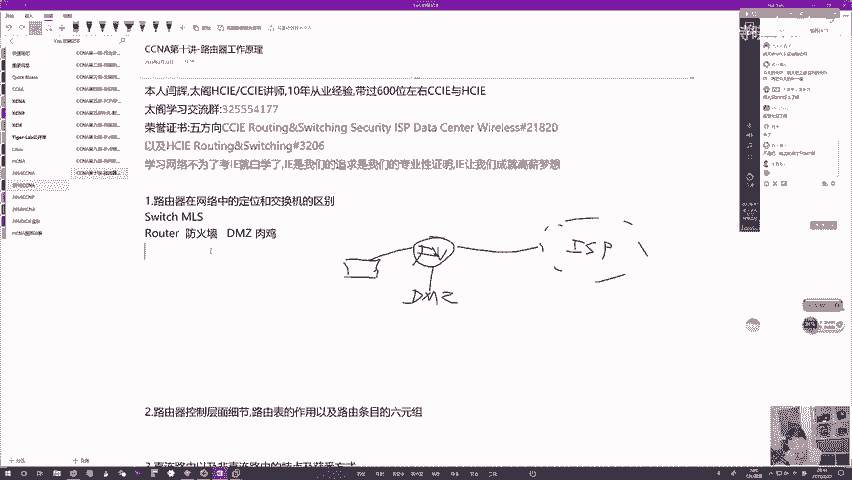

转发，我不知道目的地，我也给你泛红的，行不行？请注意啊，肯定是不行的。路由器绝对不能像交换机这任性啊。其实你会发现交换机是一种比较任性的设备，可以吧？怎么个任性法，就是你收到一个数据。

从一个原发给一个目的地，对吧？我知道目的地连在哪里，我就帮你接着转发，我若不知道我会通过泛红给你发送，所谓的泛红就是全发嘛，对吧？我把数据复制成多份，投除了什么通过接收接口以外的所有接口啊。

每个接口一份都给你发走，这个我们称为叫数据泛红。😡，请注意啊，数据泛红是交换机和极限器的特权，但路由器不能这么做。你若果路由器收到一个数据，比如来自于网络A去往网络B，现在路由器如果不知道网络币在哪里。

他如果要按照泛红的方式啊来给你转发这个数据，那这个泛红流量能发给谁啊，请注意啊，它能发给整个英特网中的每一个网络，因为路由器负责的是网络间转发，这个网络间有多大，internet有多大，网络间就有多大。

而交换机只负责网络内转发，一个网络内对吧？你充其量最多200到300台计算机。所以你就算任性一遍，你通过泛红的方式啊来转发一些你不知道该怎么转发的数据，对这个网络啊，咱们这个泛红也不会产生很大影响。

但路由器不一样。你路由器如果要泛红一个流量，那接收者可能就是除了发送者以外的所有其他网络中的。所有成员，那由于这个影响太恶劣了，影响范围太大了，所以说路由器呢是绝对不支持泛红的。请注意啊。

路由器只支持精确转发，而精确转发的前提是什么呢？是路由器必须要知道这股流量所去往的目的网络在哪。路由器必须得要知道去往这个目的网络的路径信息怎么走。它知道路径怎么走了。

才能根据咱们这个路径啊来帮你把数据给转发走。那这个呢牵扯到路由的另外含义了。路由当名词来使用的时候，它的名词含义是什么呢？就是一台路由器去往一个目的网络的路径信息，可以吧？

当它做路由这个动词使用的时候啊，它就是什么网络间的数据转发，而当它做名词来使用的时候，这个路由的含义就是一台路由器去往一个目的网络的路径信息，可以吧？那这。就是路由器需要获得信息。

那当然路由器呢不用像交换机一样，要了解咱们每台主机怎么走。因为对于路由器而言，它并不关心一个主机在哪里。为什么？因为你一个网络里面主机可能会很多。你要把包发给这些主机。

你只用把包发给连接他们的交换机数就可以了。所以对于路由器而言，它并不关心一台计算机怎么走，它只关心计算机所在的网络怎么走，可以吧？路由器去往一个网络的路径信息，就是路由。

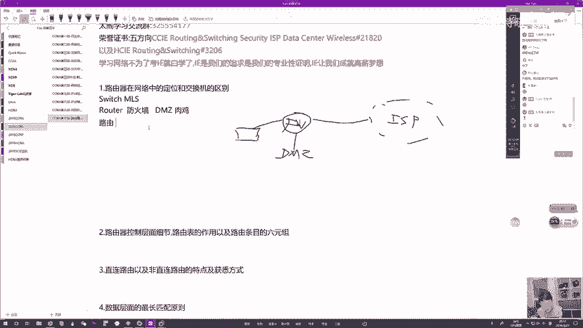

好，那接下来路由器想要获得路由，对吧？咱们怎么获得呢？啊，我们要去研究一下路由器的控制层面。记住啊，所有高级的网络设备，只要你具有智能性啊，你都会有两个层面，一个叫控制层面，对吧？还有一个叫数据层面。

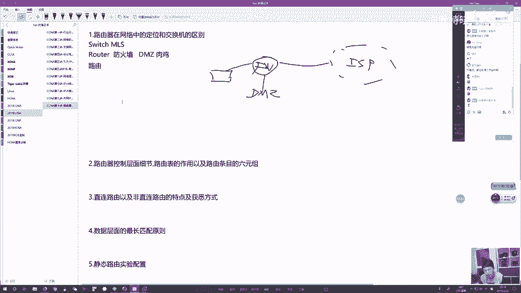

那关于这个控制层面跟数据层面给大家介绍一下啊，控制层面，咱们研究什么呢？咱们主要就是研究这台网络设备是如何获得咱们网络的连接信息的。它怎么知道网络怎么连接的，他怎么知道每台主机在什么位置。

它怎么知道每一个网络在什么位置，那这就是所谓的控制层面，简单来说，在控制层面，咱们一台网络设备啊，能够得知咱们网络怎么连接，能够拥有咱们的转发表象，它能够知道哪个网络在哪里。

它能够知道当你收到去往这个网络数据的时候，你该把数据通过哪个接口发出发给哪个下跳，可以吧？那接下来路由器的控制层面围绕什么呢？围绕它的一张表这张表我们称为叫路由表。😡，对吧路由表所有路由器都会有路由表。

你思科的也好，华为的也好，华三的也好，对吧？都会有路由表。这个路由表里面的每一个表象啊，我们称为叫一条路由条目，可以吧？每条路由条目都能够告诉路由器去往一个目的网络，你的路径信息是怎么样的，可以吧？

一条路由条目指向一个网络，对吧？那咱们对吧？有多少条路由，你可以理解为就是路由器能够知道多少个网络的路径信息。O吗？好，控制层面咱们研究什么呢？控制层面咱们主要就是研究唉，你路由器是如何填充路由表的。

你如何学习到一条又一条路由条目的对吧？你怎么知道这些网络在哪里，你怎么知道去往一个网络，咱们路径信息是怎么样的？你怎样来获得去往一个网络路由条目，那这个就是控制层面，对吧？然后紧接着数据层面。

咱们研究什么呢？就是当你路由器知道咱们网络怎么连接的之后啊，当你知道这些网络在哪里？当你拥有去往这些网络路径信息之后，你如何利用这些路由信息来转发实际的数据，就是当你接收到一个实实际际的数据包的时候。

对吧？你该怎么查表，你该怎么判断这个数据包去往哪个网络，然后呢，你该使用什么样的路由条目来对这个数据包做一个转发，那这就是数据层面，咱们所研究的，可以吧？那接下来这个数据层面呢，请注意，对于路由器而言。

它的优先级是要低于控制层面的，可以吧？因为我们说了，你路由器收到任何数据包，对吧？你要转发它，前提是你要知道它所去网的这个目的网络啊在哪里。当然你路由器拥有去网这个目的网络路径信息的时候。

它会根据这个路径信息来给你做一个数据包的精确转发。那反之如果说路由器不知道目的网络在哪里，它没有这个路径信息，那它就只能丢包。所以说了对于路由器而言，先有控制层面才有数据层面。你知道网络在哪里。

你才能把数据发给这个网络。如果你不知道网络在哪里，那你收到去往这个网络的任何数据啊，你只会丢弃。可以吧？那所以说呢咱们在部署网络的时候，对吧？你连接路由器，一定要先搞定控制层面，对吧？

你控制层面搞定之后呢，你再去研究数据层面。好吧，那接下来咱们就先从控制层面啊来研究起，好吧，那说到控制层面，咱们主要就是研究你路由器啊，怎么知道网络在哪里，对吧？怎么知道区网网络路径信息的啊。

那接下来这个网络呢对于路由器而言有两类，对以吧？这两类网络分别我们称为叫直连网络。还有非直连网络，好吧，网络呢一共有这么两大类。那所谓的直连网络指的是什么呢？就是对于一台路由器而言啊。

我路由器就有这么一个接口，直接连接你这个网络可以吧？如果你的路由器一个接口直接连接了一个网络。那这个网络对于该路由器而言啊，我们就称为叫直连网络，好吧，比如我们现在举个例子，R一连接R连接R3可以吧？

然后接下来R一呢身后有一个X网络，好吧，它身后呢有一个X网络O那这个时候呢，对于这个X网络而言，直连它的路由器肯定是R一吧。那所以说呢这个网络就是R一的直连网络。但是是R2的吗？不是。

因为R2这台路由器没有任何一个接口，连接网络X可以吧？那所以说呢对于R而言，X就是一个非直连网络可以吧？同样对于R3而言，X也是一个非直联网络，所谓的直连网络就是。😊，关于这个网络啊。

我一台路由器有一个接口连接着你可以吧？我只要有一个接口连接着你，那你这个网络对于我而言就是直连网络。如果我一台路由器没有任何一个接口连接这个网络，我没有任何一个接口属于这个网络。

那这个网络呢对于我而言啊，就是非直联网络。好吧。好，直连网络的路径信息，我们称为叫直连路由，好吧，这个叫直连路由，非直连网络的路径信息，我们称为叫非直连路由。好，请注意啊，这个直连路由获系是比较简单的。

非直连路由获系会稍微困难一些。好吧，那咱们先从简单的说起。这个直连路由怎么获气呢？对啊？那大家想啊，你这个网络直接连接路由器一个接口，你路由器这个接口连接你这个网络，我还能不知道你这个网络怎么走啊。

对吧？因为你这个网络连到这个接口啊，当我要把包转发给这个网络的时候，我直接把包通过连接这个网络接口发走不就完事了吗？那所以说了路由器对于直连网络路径信息啊，是能够自动学习的那大家这个自动学习。

咱们要前提啊也要条件，这个条件是什么呢？就是首先你路由器连接这个网络的接口啊，你接口的状态必须为对吧？你接口的状态必须。你如果说一个接口当的对吧？大家都知道路由器咱们昨在做实验啊。

你那个接口你光配个I地只能工作吗？不行，因为cisco的路由器默耳所有接口啊，都被上报了，对吧？它都要被禁用的。你这个被禁用的接口，你状态可能为up吗？不可能啊。😡，你的状态肯定会大是吧？

然后接下来你接口no shut down，它也未必就一定会杀。请注意啊，你路由器一个接口，你敲了no shut down命令之后，你看似好像把接口开启了，但是它未必真能开启。为什么？

因为你一个接口up是有条件的。😡，no shut down只是三个条件中的第一个。第二个条件什么呢？就是你这个接口必须要连线，对吧？必须要连线，并且你还要保证你连的线没问题。

并且你这根线的对端设备接口也要没问题，你这三个条件都满足了，你这个接口状态才能杀。比如举个例子啊，R一一个接口连接R好吧，你们之间的直连那根线，那这个时候你希望R一这个接口状态为二好，怎么样？

你得在R一这个接口都杀到，你得要保证R一跟R之间互连这根线啊没有任何问题。你还得保证R这个接口也能杀到，你得要满足这三点，那这个时候你R一这个接口啊才能杀，对吧？这个R指的是什么？就我判断这个接口啊。

物理层数据内容层都没问题，那这指的就是咱们这个接口本身硬件没问题啊，我们连的线也没问题，并且线缆对端的设备接口也没问题。你这三点都能满足，对吧？状态才能样。okK那这是获得直连路由的第一个条件。

那接下来第二个条件什么呢？就是你这个接口啊必须要配置了合适的IP地址和子网页码，对吧？你这个的这个东西怎么样？必须要配置啊。因为你这个接口没有配置IP地址。

你怎么知道咱们这个接口所连接的网络到底长什么样的？因为我们说过啊，每一个网络它也有标识符，那它的标识符是什么呢？就是IP地址，对吧？IP地址有两种是主机不能用，对吧？

一个是主机位全为零的IP这种主机位全为零的IP我们称为叫网络号，还有一个就是主机位权为一的IP这个咱们称为叫子网广播，那这两个不能用的理由是什么？前者它不是用来标识一个主机的。

前者是用来标识一个网络本身，后者也不是用来标识一个主机的，后者是用来标识一个网络中的所有主机。可以吧？因为你网络也需要名字嘛，你路由器为了知道网络的名字，你连接该网络的接口必须要配置什么合适的IP地址。

所谓的合适的IP地址是什么？就是你连接这个网络的接口地址啊，必须要跟这个网络内其他成员地址，网络为相同，对吧？当你满足这个条件了，你接口地址配好了，源码配好了，你直连的网络，对吧？网络号是多少。

你也就清楚了，可以吧？那当你满足这两个条件啊，对吧？直连路由就会自动出现在路由表中，可以吧？那在路由表中，咱们这种直连路总表示呢？啊，它是拿这个直连网络的前缀。

它是拿前缀和掩码来做这个网络本身的标识符务，然后呢，我们会包含一个出接口，对吧？这个出接口指的是什么呢？就是当我要访问这个网络的时候，当我要把数据转发给这个网络的时候，当我要把数据发送给这个网络的时候。

我会把数据通过我自身的哪个接口发走，对吧？那这个出接口一般就是我连接这个网络接口，对吧？然后紧接着呢这种直连路由，由于它太可靠了，你这个网络都直接跟我相连了。我去往这个网络没有任何距离。

所以说我连接这个网络的这么一个链路啊，它是没有任何开销的，它是没有任何距离的，因为它跟我直连嘛，那所以说呢这种网络呢，它有一个参数，我们称为叫metric，对吧？我们称为叫metric，这个叫度量值。

对吧？这个叫度量值。这个度量值呢对于直连网络而言是0，这个度量值是什么呢？它就是一个量化后。阿拉伯数字这个数字的值越大，代表你这个网络的连接啊，对吧？度量值越糟糕，你的网络的质量越差。

你的什么路径开销越大，你的这个路路径什么质量越差，那这就是metrictri所反应了，对吧？简单来说，你一台路由器啊，如果说通过两条路径都能到达一个网络，对吧？你要比较两条路径的好坏。

这个好坏怎么比较啊？很简单就比较它们度量值嘛？哪条路径度量值小，哪条路径就优，哪条路径度量值大，哪条路径呢就比较差，对以吧？那这种直连路由，你没什么好比的，因为这种直连路由都跟我直连了。

我从从这个接口怎么样，把包发出去，这个包就到了，对吧？不存在任何距离，那所以说啊这种直连路比较特殊啊，它的度量值横为0，这个零不是说它度量值真为零啊，这个零你可以理解为这种直连路由就没有度量值。

你都直接连着我了，咱们之间没距离对以吧？没有任何问题。OK那你也可以理解为所谓的直连就是最优的路径开销，对以吧？它就没有开销。我去往你根本就没有路径了，你没有路径也就不存在路径开销，可以吧？

然后接下来这个直连路由呢，它是基本不会出现路由还路的，对吧？你学习直连路由总不会出错了。你除非地址配置有问题。你如果说地址配置没问题，你自动学到直连路由。

你使用这种路由发送数据给这些直连网络内成员啊是绝对不会有任何问题的，这种路由是绝对可靠的。那所以说了它的另一个参数，我们称为叫管理距离，这个叫administrative。His test。

对吧这个叫管理距离。它的管理距离也是所有路由获取方式中啊最小的那管理距离呢，它也是个阿拉伯数字啊，取值范围0到255。这个值作为一个量化的指标，是用来描述咱们这条路由的学习方式的可靠性。

这个管理距离值越小，代表你这个路由的学习啊越可靠。你管理距离值越大，代表你这个路由学习方式啊越不可靠。这种不可靠的路由学习方式，你学到路由是可能是错误的啊，它可能会导致环路。

而你这种可靠的学习方式学到路由啊相对而言出现环路的概率就会小。而这种直连路由它是绝对不可能出缓的，对吧？你直接跟我连接了怎么会出问题啊，不会有任何问题啊。那所以说由于这种直连路由绝对不会出现任何问题。

所以它的可靠性是所有路由学习方式中最低的。是几呢？0，并且除了直连路由以外啊，任何其他路由获习方式它的可靠性都不可能在为0，对以吧？说零是所有路由学习方式中，对吧？

最可靠的那这个就是直连路由的这么一个啊参数信息，可以吧？你可以理解为就是当你给路由器一个接口配置完IP地址之后啊，只要你接口状态为二口，只要你地址配的没问题，那你这个接口所连接的网络路由信息。

在我的路由表里面呢，就会自动存在一条直连路由对吧？包含的参数就是这么几样，可以吧？用来描述咱们这个网络本身的前缀和源码，当然前缀可能当然没有概念啊，再说一下IPV6把网络号称为叫前缀。

这个前缀在IPV4中就是所谓的网络号，什么叫网络号啊，就是主机位全为零的，可以吧？主机位全为零的IP地址，可以吧？主机位全为零的IP地址用来标识一个网络本身啊，对吧？你一条路由是指向一个网络的。

你总要告诉大家这个网络是谁的，对吧？那网络是谁，咱们拿出来表示啊，就是拿这个网络的前缀来表示，对吧？因为网。网络本身的标识符就是1个IP地址，主机位权威0的IP地址，就是一个网络本身的名字。可以吧？

然后接下来有掩码，这很正常，因为咱们是在子网化时代嘛，你在子网化时代，咱们没有人使用什么主类地址。既然没有人使用主类地址，并且咱们子网化是一个非常DIY的过程啊，你每一个企业对吧？使用的地址到底怎么用。

完全是你说了算，你使用地址怎么子网化是根据你企业的需求来的对吧？所以说呢相同的主类类地址段，可能你做子网化的方式跟我完全不一样。那所以说咱们为了告诉所有人，对吧？我这个地址到底前多少位是网络位，哎。

那咱们就有了掩码这么一个工具，那通过掩码对吧？我就能让大家知道我们这个网络号到底是前多少位是网络位对吧？后多少位是主机位O然后接下来连接该网络的接口，就是我访问这个网络的出接口对吧？

当我要访问这个网络的时候，我把数据通过我这个接口发出来，这就可以了，对吧？然后接下来由于直连网络对吧？没有任何路径开销嘛，它的度量值为0，并且这种路由获取方式。😊，绝对没有出现环路可能性。

所以说它的管理距离呢也为0，这就是直连路由的这么一个特色，可以吧？然后接下来这个直连路由呢，它缺少一个参数，这个参数其他类型的路由可能会有。那这个参数我们称为什么呢？这个参数咱们称为叫下一跳地址。

可以吧？叫下一跳地址。这种下一跳地址指的是什么呢？就是一台路由器。为了访问一个网络啊，你得要把包交给一台邻居路由器。就比如说在我们这个例子中，R一连接R连接X网络，对吧？那在咱们这个例子中。

X网络跟R一不直连吧，对吧？它跟R直连，那这个时候对于R一而言，我要访问X网络，我能直接把数据发给这个网络吗？不行，因为它跟我不直连，对吧？我为了把数据发给X啊，我得先把数据发给R。

那这个时候R就是R一去往X网络的下一跳，而这个R直连R一的接口的IP地址就是R一去我X网络的下一跳地址，可以吧？因为我们在网络中啊一跳指的是什么？一跳指的就是一台三层网络设置。一跳就是一台三层网络设备。

可以吧？如果说一个网络跟一个路由器没有直连。你如果要把数据发给这个目的网络啊，你需要把数据发给一些邻居路由器，对吧？那这个时候你发包去往目的网络的第一个邻居路由器啊，就是你去往这个网络的下一跳。

而这个邻居路由器直连你的接口地址，就是你去往这个目的网络的下一条地址可以吧？那接下来如果说你R身后，假设咱们还有一个RRC可吧？R3身后，咱们连接了X网络，那这个时候在我们这个里中啊，R一去往X网络。

它的下一跳是RR去往X网络，咱们下一跳是RRC，但是RRC直连X网络，我要访到X网络怎么样？我不需要再把数据发给任何其他路由器了。我直接把数据从什么啊连接X网络的接口发走就可以了。能理解吧。

那所以说对于这种直连网络，它是不需要下一跳。我都直接连接你了，对吧？我要访问你，我直接把包通过连接你的接口发出来就可以了，对吧？我为了把包发给你，我不需要把包交给任何其他路由器。

所以这种直连路由是没有吓一跳的，对吧？它没有下一跳，可吧？那当然你们在华为的路由表里面啊，对于直连路由，你们可能也会看到下一跳，那当然这个直连路由下一跳是什么呢？对吧？

它一般会写为该路由器连接这个直连网络的接口地址，对以吧？当然这个下一跳地址，你写为自己接口地址啊，这个不太合适，对以吧？因为所谓的吓一跳，一定是你去往这个网络的下游第一跳邻居路由器接口地址可以吧？

那所以说呢ssco呢为了不让这个字段啊产生歧义，那对于这种直连路由cisco路由器对吧？是没有下一跳地址，华为是会有的好吧？那这个就是直连路由的习，那所以说呢咱们之前做过这个实验，对吧？你R一连。

RR一的接口配个IP地址，能稍到R2的接口配个IP地址能稍到。咱们为什么R一跟R2之间能够直连的并通呢？原因就是因为你接口配完地址之后啊，你拥有直连路由嘛，对吧？你拥有直连路由，你在PR2的时候。

你会查路由表，对吧？查路由表之后，R一会知道啊，我要把包发给R2，对吧？只要把包通过这个接口发走就好了，那他就会把包呢给发出来。然后接下来包到达R2之后，R要回包给R一同样也会查路由，对吧？

查路由发现啊，为了把包发给R一，我把包通过我这个接口发走就好了。那这个时候R一跟二之间，他们就能互通，能互通的归根结底原因是什么呢？就是他们都知道这个直连网络怎么走，可以吧？都知道这个直连网络怎么走。

当我把包发给这个直连网络中的某一个成序员的时候，我只要使用这个直连路由来把包通过我的出接口发出去，这就O了，能理解吧？为什么直连。不能通就是这个原因。那当然让路由器获得直连路由，这个是非常简单的。

但是除了直连路由以外，对吧？路由器还需要获得N多的非直连路由，对吧？因为你在一个网络中啊，你不可能说是所有网络都跟一台路由器直连，对吧？你一台路由器，毕竟接口有限，你能连接的网络数量是非常有限的对吧？

绝大多数的网络，它跟你都是不直连的那这种不直连的网络，你能通过给接口配个IP地址来自动获得路信息嘛？请注意啊，答案是绝对不可能，这些跟你不直连的网络，你想知道怎么走，对吧？你不可能凭空直的。

因为你的接口都没有连接它，你想要知道，哎，咱们可以通过两种方式来解决。

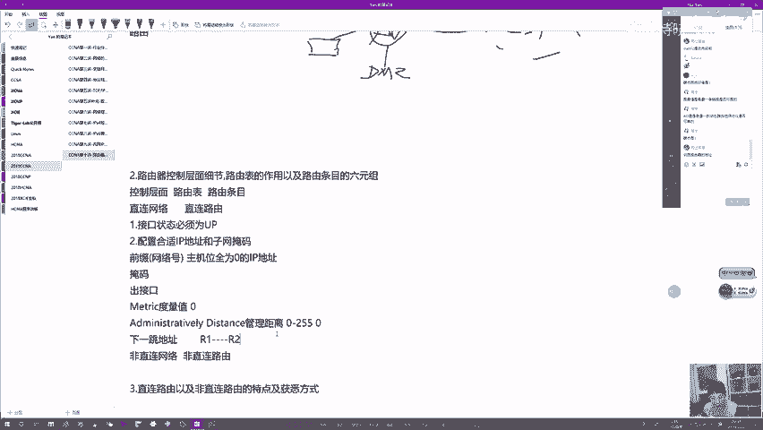

第一种方式是什么呢？哎，你通过静态路由的方式啊来告知路由器。所谓的静态路由指的是什么呢？就是你管理员啊可以登录路由器，你在路由器里也不是能配命令嘛，对吧？我管理员告诉路由器一个网络在哪里，可以吧？

我希望你这台路由器在访问这个网络的时候，把数据通过你的哪个接口发出来，发给哪个下调邻居，你可以通过命令啊去写出来，对吧？那当你写好命令之后呢，你每敲一条命令。

路由器就会自动的根据你的命令啊来形成一条对应的非直连路由，可吧？那也就是说对于咱们路由器而言啊，哎，他自己是不知道这个目的网络在哪里，对吧？关于这个目的网络的路径信息是由咱们管理员告诉他的。

管理员告诉R一，对吧？咱们有一个X网络，你要访问他要把高通过的右边接口发走，发给R2就会吓一跳，那R一呢不会判断真伪啊，它会根据你所敲的命令来把这个命令的，对吧？转换成对应的路由，然后把路。😡。

由加入到路由表，这就是静态路由。静态路由就是你登录路由器，对吧？敲这些路由命令。你强行的告诉路由器，对吧？去往一个网络该怎么走。那路由器就会根据你所指定的路径信息啊来形成对应的路由条目。

一条命令产生一条路由条目。那当然由于这个对吧？是通过写命令啊来实现的那你写好的命令啊，在路由器之间，它是不会自动传递的这也就是说你在R一上写了一条去往X网络的路由，它不会影响到其他路由器。

那如果这个时候R一身后对吧？有一台R3路由器，这个R3路由器它想要拥有去往X网络路由，你还得要在R3上通过静态的写法去配置一下。也就是说你光在R一上配置去往X网络路由，对吧？

对R3是没有任何影响的反之你在R3上配置去往X网络路由，对R一也是没有任何影响的可吧？静态路由最大特点是什么？就是你配置一条命令之后啊，你这个命令所产生的路由只能影响一台路由器。

那这也就是咱们静泰路由最大缺点，它的缺点是什么呢？你在一些中到大型的网络中，对吧？我们路由器的数量动辄十几台几十台甚至上百台。你在这种大型的环境中，你要通过静态路由让路由器拥有非直连网络路径信息，对吧？

这是非常困难的对？因为你每台路由器，对吧？做配置，并且你一条命令只能产生一条路由。如果你网络数量很庞大，对吧？你配置的命令数量也会很多。那所以说加上路由器数量再一多，对吧？这个就是成级和倍数增长。

那所以一般建议大家你在中小型网络啊，对吧？建议在这种最小型的网络中通过静态路由来让路由器知道这些非直联网络增么走对吧？这是静态路由第一个使用场景，那它的第二个使用场景呢，就是在咱们企业网的边界。

因为咱们一般企业网的边界，对吧？你要么是台路由器，要么呢是一台防火墙，你会通过办理一个什么企业宽带啊来连接到咱们的运营商的网络，那当然你连完。运营商的网络对于你而言就是外网。然后呢，你要访问外网。

你需要知道咱们外网怎么走，你需要拥有去往这些外网的路由。那这些路由呢，由于咱们办企业观宽带啊，一般只会办一个业务。那你办理一个企业宽带业务之后呢，运营商只会给你一根线，你去往外网通过这一根线。

咱们能选路吗？你选不了路啊，你不存在选路这么一个说法，那所以说了为了访问外网，你可以简单理解为咱们有路由就可以了。那所以这么时候怎么样呢？咱们一般都是在边界路由器上写一条静态默认路由去往外网。

这个默认路由长什么样呢？IPro。它是这样的IPro0。0。0。00。0。0。0，然后后面跟上什么，后面跟上咱们连接运营商的外网接口，对吧？当后你写完这个之后呢，这个默认路由就生效，那这个默认路由。

咱们为什么称为叫默认路由呢？因为这个路由，它能够匹配去往任何目的网络的任何数据包，对吧？这个路由的前置权零啊，研马也是全零，对吧？你通过这个路由能够匹配去往任何目的地的任何数据包，那当然为什么能匹配。

对吧？先卖个关子啊，咱们待会儿慢慢的去讲，好吧，那接下来在中到大型网络中，我就不建议大家使用静态路由了，为什么？因为你在中到大型网络里面，你写静态路由比较麻烦，对吧？你一条路由指向一个网络对吧？

你网络一多，你配置量比较大，并且你配置静态路由那不能传递，所以你需要在沿途的每台路由器上，你要在内网的所有。三层网络设备上都要做去往内网所有网络的这么一个静态路由。那这个配置量太大了。

并且静态路由呢它不能够自动调整，对吧？比如说现在对于R3而言，我认为去往X网络啊，要拿R一做一下一跳。但是假设现在咱们改造了一下网络，对吧？你R3去往X网络啊，我又添加了一个新的路径。

而这个新添加的路径比之前那个曾经的路径啊要更好。那这时候你会说添加一个新路径之后，我静态路由自动做一个调整吗？请注意啊，虽然能但是非常非常麻烦。按照传统路径上来讲，你这种静态路由啊。

它是不会根据你网络的变更来自动变更咱们路径信息的这就是说当你网络变更之后怎么样？你得要根据咱们网络路径的变更啊，把你之前所敲的静态路由删除掉，重新调整咱们的新的路径再写一遍。那所以说它的管理上来讲。

对吧？也非常的麻烦。那所以说通过这种种啊来分析一下，对吧？我觉得。静态路由对吧？就只适合在企业网的边界，对吧？你写一下静态默认去往运营商，方便咱们内网的外网访问。然后你在非常小型的网络中。

就那么几个网络，就这么几台路由器，你通过静态路由，对吧？咱们配一配都是没问题的。你在这种中到大型网络中就建议大家不要使用静态。那不使用静态，咱们使用什么呢？啊？我们还能使用动态路由选择协议，可以吧？

咱们还能使用动态路由选择协议。那这个动态录有选的协议呢不是一款协议啊，它有很多协议，有哪些呢？有reple有EI加RP有OSPF有ISS，有BGP。那当前的比较主流的动态录选的协议啊，有这么多款。对吧。

那这些呢咱们统称叫路由选择协议，对吧？咱们统称叫路由选择协议。那这个路由选的协议都怎么样呢？能够让你这些路由器之间啊彼此交互一些更新，来彼此的去做一个路径的发现，可以吧？好，请注意啊，你一台路由器。

你要运行动态录选的协议啊，你的接口你要先配置IP地址，并且你的接口状态必须要为app。那当你满足这两点之后啊，你这些接口直连网络的直连路由，你肯定会有啊，对吧？每台路由器不可能说我上来路由是空的。

不可能的，我肯定会拥有路由，对吧？我最起码我要有我的直连网络的直连路由，可以吧？那接下来你可以理解为我的直连路由，哎，我的邻居路由器，它被必有，而我的邻居路由器的直连路由，我未必有对吧？可以吧？

我知道的信息，我邻居不知道我邻居知道的信息，我不知道。那这个时候在咱们之间，我们就可以运行一个动态路取的协议。那当然你运行完。动态录选的协议之后呢，彼此路由器之间啊就会发送更新报，对吧？

我们就会发送路由更新，我们称为叫update。那这个路由更新里面包含什么内容呢？就是包含咱们当前已知的路径信息。比如说呢在我们这里子中，R给R一发送的更新，就会告诉R一，我身后有一个X网络，对吧？

当你要访问X网络的时候，你把包发给我就好了。那当你R一收到R发送过来更新之后啊，R一的路由表里就会出现X网络路由，这个路由的下一跳，对吧？就是R2这个接口。

那当然同样R一呢也会把连接R3的这个网络路由啊发送给R，他会告诉R，对吧？我这边有一个网络，哎，你想要访问的话，你可以把包交给我，对吧？那这个时候你们之间彼此交互更新，我把我的更新发给你。

那我也已知的路径信息啊，你就知道你把你的更新发给我，你已知的路径信息，我也就知道那咱们之间彼此交互更新，对吧？更新越传越远，那最终呢每台路由器对吧？就都知道咱们整个网络。😊。

所有网络的路径信息到底是怎么样的那这就是动态路由选择协议的这么一个大体的工作原理。可以吧？我把我知道告诉你，你把你知道的告诉我，我知道的现你也知道了，你知道的现在我也知道了，对吧？大家资源共享。

那这个时候就算这些网络依旧跟我不直联，但是我已经知道这些网络可以怎么走了，对吧？我可以通过左一个邻居，右一个邻居来访问左一个右一个网络，对吧？那这个时候这些路由啊，咱们都有了。

你就可以使用这些路由来转化数据，可以吧？那这就是动态路由权择协议。那这个豆态录选择协议呢又有这么多款啊，这些协议它们大体工作原理其实差距还是挺大的那为了让大家呢对于录入选择协议有更深的了解。

对于这些录选择协议呢，咱们做了很么分类。当然这个分类不是我做的，是官方做的路由选择协议的分类有哪些呢？从最本质上来讲啊，按照范围来分，它分为两大类，一大类我们称为叫IGP。还有一大类。

咱们称为叫EGP这个IGP呢，咱们称为叫内部网关协议啊，EGP。EGP咱们称为叫外部网关协议，对吧？所谓的内部网关协议，外部网关协议指的是什么呢？😡，指的是一个协议是否可以跨越一个AS来运作，对吧？

那当然这个AS呢是一个路由选的协议所定义的一个新的名词啊，它的全称叫aunomous system，翻译成中文叫自制系统。好吧，翻译成中文叫自制系统，什么叫自制系统呢。

你可以理解为一个自制系统就是一个园区，对吧？它的官方定义啊，是一组属于相同组织，拥有相同管理的设备的集合，对吧？比如说你一组路由器，对吧？你是同一个公司购买的对吧？你是同一个工程部门去上架去做调试的哎。

那你们就属于1个AS对吧？那一般你一个企业网里面所有设备，咱们是属于相同组织吧，对吧？你也是相同管理，那他们是属于一个AS一个运营商也是一个AS对吧？然后呢。

咱们一个数据中心也是一个AS那当然这个AS呢唉你可以等价。理解为是园区网啊，但是园区网不能等价理解为是AS园区网跟AS最大的区别是什么呢？就是你这个园区网有没有购买1个AS号，对吧？

你如果购买了一个全球唯一的AS号，你能拿这个AS号作为你自身园区的标识服务。O恭喜你啊，你就成了1个AS。但然如果说你没有购买这个AS号啊，你就是一个普通园区，那当然一般正常情况下。

你运行除了BGP以外的，所有其他协议啊，那跟你买不买A号没有什么关系，对吧？那所以简单的来讲啊，这个IGP指的是什么呢？就是你这么一款勾选的协议，对吧？你只能在一个园区网内使用，你在园区网内使用。

又来让园区网内部的路由器，知道咱们园区网内部的这些网络啊，到底该怎么走？那这就是IGP的这么一个定位。比如说像锐poEIPOSPF跟Iize都是IGP的范畴，对吧？这些协议的定位啊，就是在1个AS。

内部去使用你在1个AS内部使用这样的协议，对吧？一台路由器能够跟AS内的其他路由器交互路入信息。那当你交互完毕之后，咱们整个AS内网络怎么连接的？S内的这些所有网络路径信息。

那AS内的每台路由器就都会拥有。那当你拥有这些路径信息之后呢，AS内的数据通信，对吧？我们都可以做一些转发，可以吧？而接下来这个EGP指的是什么呢？就是你这款协议比较厉害了啊。

你能够在不同的AS之间进行运作，可吧？咱们能够在多个园区网之间啊，通过运行EGP来把第一个园区的路由发给第二个园区，把第二个园区路由发给第一个园区，咱们不同的园区之间通过EGP交互路由之后，怎么样。

我能够知道其他园区的路径，那当我要访问其他园区的时候，对吧？我也可以根据EGP啊获得路由信息来做一个数据通信，可以吧？因为你IGP毕竟只能在1个AS内用嘛，你在1个S内用。

你只能让AS内的路由器知道咱们这个AS内的路径信息。那关于其他的AS路径信息是怎么样的。你就需要通过运行EGP来获写。那当前在我们的云淘宝中啊，EGP只有一款协议。它就是B级P。

而这个BGP就是由思科开发的那所以说咱们当前上网，为什么咱们上完网之后，你一台中国的计算机能够访问一台美国计算机，对吧？你为什么一台法国计算机能访问日本计算机。原因就是因为通过这个BGP啊。

咱们全球各国运营商都能够彼此交互路由，所以说呢你无论接入了哪个国家的哪家运营商，只要你没有做流量限制啊，你没有做流量过滤，那按照常理来说，你能够访问全球各国运营商的各个IDC机房里面的各个服务器。

就比如说上google上facebook上twitter，对吧？你其实都应该能上。那咱们在国内之所以上网这些网站，原因是因为咱们有个长城防火墙。这个长城防火墙，把我们从内到到外的数据流量都给过滤掉。

那由于过滤掉了，所以怎么样？你只能访问咱们没有过滤的内。资源嘛，那就是咱们的国内运营商里面这些IDC机房里的服务器。而你想访问国外的对吧？除非这个防火墙给你放行了，如果没有给你放行，对吧？

那你访问就是404嘛，报404就是访问不通，可以吧？那这个是关于范围啊，咱们这么一个分类方法。那接下来除了范围的分发以外呢，还有另外一个分法，我们称为叫按照核心算法。

或者说按照你这个协议的啊工作工作方式啊，对吧？当然我建议就是按照算法来分吧，对吧？按照算法来分，你录选的协议呢又能分为两类，一类咱们称为叫距离矢量协议，还有一类呢，咱们称为叫链路状态协议，对吧？

那接下来这个具离矢量协议。

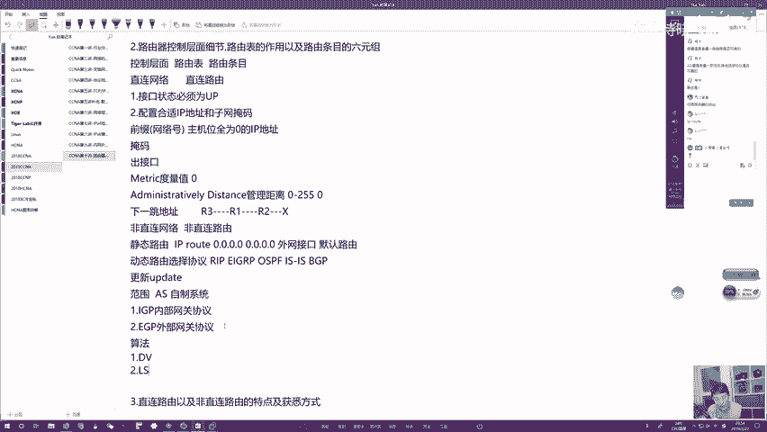

具离矢量协议啊指的是什么呢？

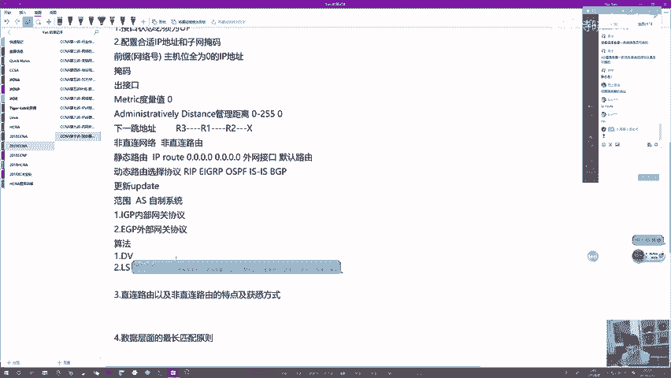

距离矢量协议指的就是这些录选的协议啊，比较简单，对吧？一般比较早期的那些比较low的协议啊，都是距离矢量，对吧？距离矢量协议就是一台路由器运行这样的协议之后啊，我会把我已知的所有路由告诉给我的邻居。

我的邻居呢也把它已知路由告诉给我，但是咱们彼此之间并不会告知对方网络的具体连接信息，对吧？那这种协协议咱们怎么样称为叫基于传闻的协议，比如说咱们举个例子，X网络连接R一连接R，然后呢连接Y网络，好吧。

这是一个比较简单连接啊，那上来呢跟R一直连的网络只有两个，对吧？一个是X网络，一个是一2之间的直连网络，对吧？跟R直连的网络有两个吧，一个是Y网络，一个是连接R一的网络，那接下来X网络怎么走。

R默耳不知道Y网络怎么走。R一也不知道。那这个时候当你们之间。😊，运行一个距离指上协议之后啊，对吧？你们之间呢就能够彼此发送更新了。那假设R先给R一发送更新。那在这个更新中呢，R想要尝试的告诉阿姨啊。

说哎你想访的玩网网玩网络吗？你想访的玩网络，你把包交给我就好了，我只会告诉你这个信息。除此以外，什么都不会告诉你。我不会告诉你Y网络连在我哪个接口。那所以说R一收到这更新之后啊。

就算它形成了去往Y网络的路由，他也并不知道Y网络到底在哪。他不知道从他出发去往Y网络经过多少台路由器。😡，他不知道咱们网络之间是怎么连接的，路由器之间是怎么连接的，使用什么类型的接口，他并不知道。😡。

他之所以能够产生这条路由，仅仅是因为R告诉他可以吧？他的邻居R告诉他，你想访问来网络吗？把包交给我可以吧？由于我的邻居告诉我这点了，对吧？那我就要信任他，当然我也没有办法不信任。

我没有任何办法来判断他给我说的信息是对的还是错的，可以吧？如果你给我说的信息是对的那当我要访问来网络的时候，我把包交给你这就没问题了。那如果说你给我发的错的呢？假设在我们这环境中。

R2身后根本就没有玩网络，那在这种情况下，R一也没有办法判断R告诉我的信息的真伪，那我依旧怎么样只能信任他，那信任他的结果是什么？就是当我R一要访问来网络的时候，我会把数据包交给R，对吧？

但R身后没有来网络，那很有可能会丢包了，那这个是什么？这个就是路由还路，可以吧？那然同理R一呢，他也不是什么善茬啊，他在发送。😡，给R2的时候也会告诉R，对吧？你想访问X网络吗？对吧？

请你直接把包交给我。那这个时候R就会形成去往X网络路由，这个路由的下一跳就是RE对吧？当然在这个情况下，R一也没有告诉RX网络连在它的那个接口。那所以说当你R收到去往X网络路由之后啊。

你依旧不知道X网络在哪里，可以吧？整个网络所有路由器之间，你启用距离使用协议之后啊，虽然你看起来好像每台路由器都知道去往整网所有网络的所有路径信息，但是咱们整个网络怎么连接的，有多少台路由器。

路由器之间两两如何连接，使用什么类型的接口，网络分布在什么位置，自己出发去往一个网络，咱们的完整路径什么样的这些信息，我是一概不知的。我仅仅是根据我的邻居，邻居告诉我，可以通过他去往一个网络。

那我就信任。另外一个邻居告诉我，通过他能去往另外一个网络，那我也信任我通过这种方式来获得这些非智联网络路由，对吧？那这我们就称为叫基于传闻的协议，对吧？叫基于传闻的协议。那什么叫基于传员的协议啊？

就是我的邻居告诉我，对吧？一个网络怎么走，但至于这个网络到底在不在这里，我是没有任何判断准则的。我没有办法判断你告诉我的真的还是假的，原因是因为我并不知道网络是怎么连接的对吧？

那所以说你会发现你在一些比较复杂的环境中啊，你运行距离使用协议，如果说对吧？你缺乏调优，你缺乏好的设计，那很有可能会导致什么协议运作过程中啊，咱们产生问题。

最终导致路由器之间传输的路径信息是错误的那这个以讹传额呢咱们就要持续发展下去啊，那可能会导致什么路由还路，并且这个路由环路呢，对吧？路由器是没有办法去判断的对吧？就算是路由环路产生了。

他们也会按照错误的路径信息，沿着环路继续转发数据，对吧？这就是距离使用协议的最大短板，那然后这个短板呢，它有对应的优势啊，这个优势是什么呢？就是由于这个协议。比较简单对吧比较简单。

你运行这种距离使用协议的路由器啊，对于CPU内存资源的消耗是非常有限的对吧？非常有限的。你不用担心说路由器硬件不够强大，你运行距离使用协议，对吧？就直接崩溃了。你不用担心这样的事情，对吧？

你在有限的网络环境下，对吧？有限资源的网络环境下，对吧？你运行这种协议相当于是比较节约咱们路由器的CPU内存资源，那这样你网络设备可以呢更多的硬件资源来专注于咱们数据层面的流量转发。

因为这个流量转发数据转发才是路由器的对吧？第一工作的这么一个优先级，好吧，OK那这就是距离使用协议。然后接下来另一类协议呢，咱们称为一个链路状态协议啊，叫链路状态协议。

那这个链路状态协议呢相比距离使道协议就高端很多了，它不再叫叫什么基于传闻的协议。这类协议怎么工作呢？请注意啊，它的工作要比我们距离使量协议要复杂很多，原理非常非常复杂，那大体怎么样呢？是这样的。

就是你一组路由器对吧？你运行链路状态协议。虽然路由器之间呢交互的还是更新报文，但是这个更新报文中啊，已经不再包含录由信息了，可以吧？也就是说，在链路状态协议的环境中啊，R不会再告诉R一。

你想访问宝络Y吗？把包交给我就好了。R一也不会告诉R想访问宝宝X吗？把包交给我就可以。我们彼此之间不会再说这么任性的话了啊，我们彼此之间交互的什么信息呢？交互的是链路状态的通告报文，可以吧？

那在这个链路状态通道报文里面，R会告诉R一啊，哎，我叫R是吧？我的标识符是什么。😊，我有哪些接口运行了咱们这个链路状载协议，这些接口的类型是什么样的？这些接口连接了哪些路由器。

连接了哪些没有路由器的网络。然后紧接着这些网络他们的前缀掩码是多少。这些网络对应的度量值是多少？我会把这些信息啊做一个打包，然后呢，以LIC形式发送给我的邻居，然后我的邻居接收完之后呢。

还不忘帮我把信息啊发送给他的所有邻居，那你可以理解为在一个范围内啊，所有路由器都能收到一份相同的链路状态通道。比如你R产生的对吧？R产生的你有RE也有R一的邻居也有，大家都有对吧？

只要你们在同一个区域内，你们就能够收到相同的LSC。那紧接着当你运行完这个协议之后啊，每台路由器收集到所有其他路由器产生的链用转转通告之后啊，你就能够把这些链用转转通告啊整合在一起，整合在一起之后呢。

你就能够清晰的知道在咱们当前这个环境中，对吧？一共有多少台路由器存在。这些路由器之间两两是如何连接的，使用什么样类型的接口连接。然后咱们当前有多少网络，这些网络分布在哪些路由器身后连接他们哪个接口。

从本地出发去往每一个网络有哪些路径可以走，我是非常清楚的。然后紧接着我会按照咱们这个算法来判断啊，从自己出发去往这些非直联网络，哪些路径最优，我最终把这些最优路径信息加入到路由表。

然后使用这些路由来转发去往这些非直连网络的数据。那这就是链路状态协议。那这类协议咱们称为什么呢？我们称为叫基于拓股的协议，可以吧？叫基于拓股协议。因为在你运行这样的协议之后。

没有任何一台邻居会建议你去往一个网络，对吧？走他们任何人所以吓一跳，他们不会给你发这样信息，他们只会告诉你他们是谁，他们连接哪些网络，他们连接哪些其他路由器，对吧？你们彼此之间交互的信息啊。

就是这么客观的信息，那当你交换完这些信息之后，对吧？每台路由器都能够知道咱们这个网络错误是怎么连接的对吧？他能够知道有多少台路由器，有有多少个网络，从他出发去往每一个网络有多少条路径，哪条路径优。

哪条路径不优，他能够自己判断，所以你会发现距离矢量协议跟链路状态协议最大区别是什么呢？就是在距离矢量协议中，每台路由器获得的非质量网络路由啊，都是邻居告诉我的。而在链路状态协议中。

我的邻居不会告诉我任何路由信息，他只会告诉我咱们的网络是如何连接的，我是基于这个网络的连。截图来自己判断去往一个又一个网络啊，到底该使用哪条路径。所以在链路状态协议中啊。

你一台路由器所获得这些非直连网络路径信息，全是我自己计算得到的。那这个时候你可以理解为，只要这个网络拓扑图，我获得的正确。那这个时候我判断出来的路径信息也肯定是正确的。在链路状态协议中啊，对吧？

正常情况下，你是绝对不用担心会有环路产生的，可以吧？因为你有一有理有据啊，你能够知道去往一个网络可以这么走，你之所以选择这么走，对吧？依据是什么？那都是你自己计算的。

只要你基于这个计算这个图啊本身没有出错，那你计算出来的路由也绝对不会出错，可以吧？所以说链路状态协议它是无环的，当然无环的代价是什么呢？就是你这种协议的算法会比较消耗资源，你在路由器上运行链路状态协议。

你需要频繁的做一些算法计算，对吧？你会消耗更多的内存CPU资源来完成咱们这个路由的计算，并且当你网络出现问题的时候，你链路状态协议的收敛，也需要消耗额外。资源。那如果说你路由器的硬件不够高端。

你运行链路状态协议啊，对吧？你虽然能够拥有这些非智联网络路由，但是这些路由对吧？你用他们转发数据的时候，你由于CPU内存资源对吧？已经被消耗过多了，那你转发的效率可能会比较低。

你端到端的延迟可能会比较大。咱们用户的整体的质量可能会比较差，可以吧？那当然如果说你硬件资源比较强，链路状态协议就比较适合可以吧？一般建议大家在那些对环路要求比较高，对吧？

并且硬件资源比较好的网络环境中啊，咱们使用链路状态协议，而对于那些比较简单的比较小的网络对吧？路由器硬件也不够强大了，这样的环境下，咱们使用距离使量就okK了。好吧，那就是基于算法，咱们的两种分类。

然后接下来呢，最后呢，基于咱们距离使量协议，有一种距离使用协议呢，它出现比较早，最早期的入选的协议呢就是距离使让协议。然后直到今天咱们还有对吧？经过了很长的时间啊，它也经过了一次变革，对以吧？

那距离使量协议本身也能分为两种啊，一类咱们称为叫有类协议。一类咱们称为叫无类型。对以吧，一类叫有类型。一类咱们称为叫无类协议，对吧？这个有类协议指的是什么呢？就是比较早期的比较low的距离市场协议。

你路由器在使用这个比较low的距离市场协议的时候，对吧？你运行这个协议，路由器之间呢，是不是交互路由啊，对吧？我在交互路由的时候呢，我只能把关于一个路由的前缀信息。还有杜良值信息告诉给我的邻居。

而这个路由的掩码和下一跳地址，我是不会告诉邻居。当然呢，邻居收到这个路由，请注意啊，他必须得要能够知道这个路由的掩码。你如果说不知道这个路由的掩码，你根本就不知道这个前缀前多少位是网络位，对吧？注意啊。

你如果说一条路由连前多少位是网络位都不知道这种路由咱们是不能接收的。因为这种路由你不能用来转发任何数据，一条路由条路，你想要用它来匹配咱们的数据包来转发数据啊，那这个路由的掩码，你必须要能够知道。😡。

但是呢在有类协议中就是这么坑，对吧？我给你发一条路由，我只会告诉你这个网络的前缀，而网络的掩码多少倍，我想告诉你啊，但是我没有办法告诉你可以吧？那这个时候接收者收到路由。

它必须要通过一系列判断条件啊来猜测我收到的路由的掩码是多少倍，你如果猜对了，那肯定没问题。如果你猜错了，对吧？那这个影响就很大了，因为这会导致你传输的路由啊出现问题，对吧？你掩码猜错了嘛。

那就是有问题的路由，你拿它来找它数据，对吧？那是太好了，可能会导致咱们联通性出现问题。那接下来在有类环境中，为了避免接收者路由器收到路由之后啊，你猜错掩码，对吧？

那最好的方式就是你在部署IP地址的时候啊，你直接使用主类地址。如果说大家都使用主类地址来配置IP对吧？你运行有类路选的协议啊，是不会有任何问题的绝对不会有任何问题。那当然这样做的话。

咱们会造成什么大量地址浪费。那如果说子网化是必须的那你就要保证在有类协议中啊，你部署子网化，必须要使用FLSM对吧？也就是所谓的定程子网掩码。

你要保证你在不同的网络中使用属于相同主类地址段的不同的子网的时候，这些子网段他们的网络位长度是相同的。只有在这种情况下，你运行有类路选的协议，你才不用担心原给目的地通道路由路由通道不出来。

或者说你不目的地啊，你目的路由器收到路由之后啊，你猜错掩码，导致这个路。由没有办法被使用。可以吧。然后呢，如果说你不满足咱们这个规则啊，你使用子网化，你非要做VLSM，你非要让一个网络里面的不同子网。

对吧？网络位长度不一致，那在这种情况下，对吧？你运行有类路由选择协议啊，会有两种可能性。第一种就是发送者路由器根本没有办法把该发的路由给邻居发走，第二种可能就是我给你发走路由。

但是你接收方呢收到路由之后，你猜错了页码，对吧？那这两种都会造成咱们联通性的问题，为了避免联通性的问题，对吧那建议大家在有类环境中啊，哎，乖乖的使用FLSM这是比较好的一个方式。

O然后接下来在无类的环境中呢，就没有那么麻烦了。因为无类环境嘛，对吧？我一台路由器给你邻居发送一个路由条目，对吧？我会告诉你这个路由对应的网络的前置和页码，我也会告诉你度量者下一条地址。

那所以说在无类的环境中呢，一台路由器收到条路由条目啊，它根本不用去。测任何字段，你不用去猜测，你就不用担心它猜错，对吧？那既然不用担心它猜错怎么样，那你你IP地址啊，你可以随意使用。

你可以随意去做你想做的字网化，对吧？你可以随意使用VOSM可以吧？你不用担心做了VOSSM之后，原路由器没有办法把路由通道出来，你也不用担心在VOSSM环境中啊，接收者路由器收到路由之后，对吧？

你猜错延满，因为它根本就不用猜，对吧？原给你发送路由的时候延满多少位下一条地址多少都会告诉你，你直接去使用就好了，可以吧？那当然早期呢咱们一般都是有类路由器使用有类路选择协议，对吧？

然后接下来咱们当前的所有路由器对吧？基本都是无类的。那在无类路由器上，咱们一般都会运行什么无类的距离使用协议。那由于现在无类距离市场协议是主流嘛。

那所以说现阶段咱们做VRSM也是咱们地质节约的一个主流方式。好吧，那这就是路由选择协议的这么一个分类。

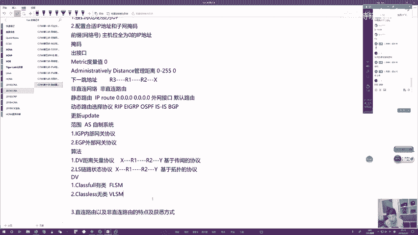

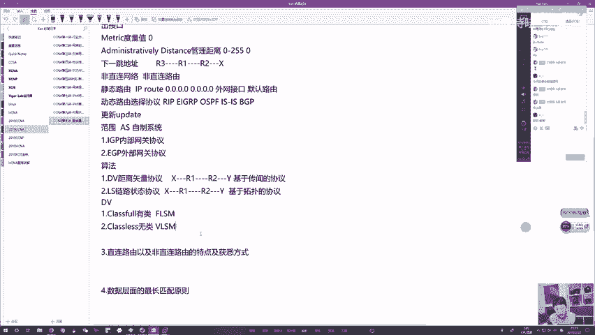

那接下来了解了路由选择协议之后呢，大家记记住啊，就是你路由选择协议最大特点是什么呢？就是你在台路由器上，对吧？你选择一款协议，你需要激活这个协议进程，然后呢。

你要指定我希望这台路由器的哪些接口参与这个协议。你只有做这两步，你做完这两步之后呢，这个协议能够自动运作，可以吧？路由器之间自动运作之后，我有的路由，我的邻居呢也会有我的邻居有的路由我也会有。

所以你不用担心在在配置静态路由的时候啊，就是像配静态路由一样，你在动态路由选择协议中也会根据咱们网络的规模，你网络规模越大，你配置的命令越多，你不用担心动态路由选择协议，你在台路由器上对吧？

你配置的命令都是非常有限的。你网络大也好，网络小也好，动态路由选择协议的配置啊差距不会特别大，可吧？那所以说你在小网来看静态路由的配置啊是比较优的。然后你在中到大型网络来看，尤其你路由器数量比较多。😊。

网络数法比较多情况下，你运行动态螺询的协议，它的配置是比较简单的。然后接下来动态录选的协议还有一个比较好的一点，就是它会根据咱们的路径改变，来自动调整咱们路由信息。比如说在咱们刚才的例子中啊。

你R3去往X网络对吧？你默认认为走R一做一下一跳是最优路径。但是呢当你网络改造了，比如说你R3跟R之间啊连了一条路径，对吧？连完路径之后呢，R3发现对吧？我去往X网络有一条其他路径可以走。

并且这个其他路径更优，那这个时候只要你运行的动态录选的协议啊，那R3会自动的做一个路径切换，可以吧？而这一点静态路由是做不到的可以吧？那当然这并不是说静态路由，咱们咱们没有用之地啊。

静态路由咱们当前依旧用的比较多，那比如说一个企业网企业网来说啊，这个企业网咱们静态路由跟动态路选的协议啊，我们都会用到。那什么地方用动态录选的协议呢？就是你内网可以吧？你内网路由器之间。

咱们通过运行某一款动态录选的协议来让大家呢。

解咱们内网的这些录入信息。然后接下来在咱们边界路由器，你还需要通过静态写一条默认路由去找运营商，咱们通过这个静态默认啊，来让内网的主机能够成功的放能功了。那当然你可能光在边界写一条静态默认不够啊。

你还需要在边界路由器的动态路入选的协议中做一个默认录由下放。当然你做完这两步之后，对吧？你内网访问外网，对吧？就都可以使用默认路由来实现。

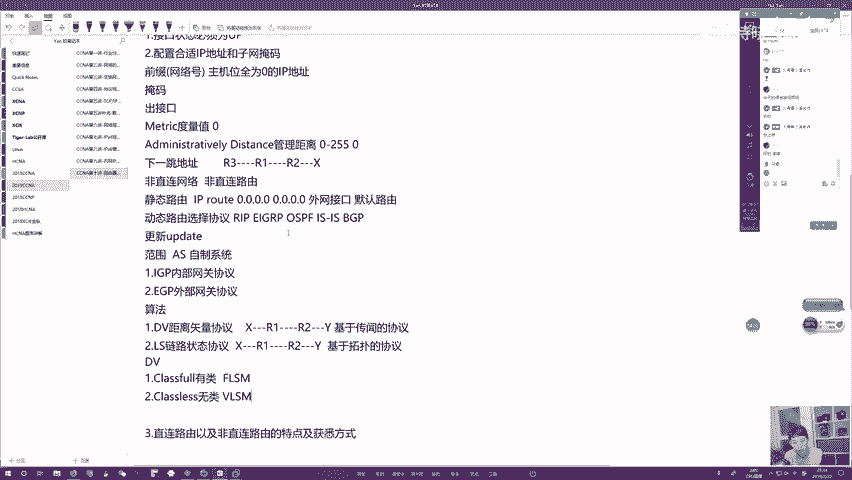

ok吧。好，这就是关于控制层面。那接下来控制层面呢，研究到这一步，大家都知道了，你一台路由器获得一条路由条目方式很多，对吧？有直连获系，对吧？也有也有非直联获系。然后尤其是对于非直连获系。

你在学习一个网络路径信息的时候，对吧？你可以通过静台路由，也可以通过各式各样的动态录取的协议。那接下来会不会出现这么一个问题呢？就是泥潭路由器啊，你通过多种方式学到了去往相同目的网络的路由信息。

那在这种情况下，你该怎么办呢？来，那关于这点，我也来给大家讨论一下，可以吧？首先呢关于一条路由，大家要记住啊，这个管理距离还是比较重要的一个参数啊，对吧？

这个管理距离用来描述这条路由的路由获取方式是否可靠。那它的取值范围呢是0到255，对吧？0到255，请注意啊，这个值越小代表这个路由获取方式啊越可靠。这个值越大。代表这个路由汇资方式啊越不靠谱。好。

注意啊，在所有这256个值中有一个值啊，它是非常特例的。这个值是几呢？就是管理距离255。这个255是一个非常特殊的管理距离。😡，它不但在是什么最大的管理距离啊，它还有另外一种含义。😡，是什么呢？

就是不可用，或者说不可达。不可用或者不可改。如果说你一个路由的获取方式为255。那cisco的网络设备呢认为这种管理距离为255的路由啊，你不值得信任，对吧？你太不可靠。那对于这种路由。

我是不允许你加入路由表，可以吧？那所以说了凡是一条路由管理距离为255啊，我就不使用。我能使用的路由管理距离一定小于255，可以吧？0到254都是没问题。可以吧？那所以说了一台路由器，对吧？

我不管你运行了一些什么样的协议啊，只要你学到条路由，你要第一步判断这个路由的管理距离是不是255。如果是我就不要了。那如果不是哎，我再考虑要不要接收，那接下来到底要不要接收呢，很简单。

路由器的判断就是我要看我获得的这条路由在我路由表里面是否存在一条相同的。如果说我。

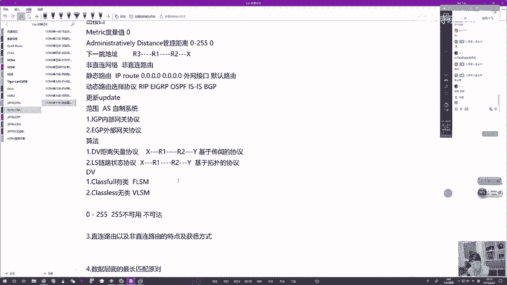

获得这条路由啊，就是我获得的去往这个网络的唯一路径信息。之前在我路由表里面，关于这个目的网络，我根本不知道怎么走。我学到的是一条新路由。那对于这种新路由，你管理距离又不是255，那对于这种路由啊。

我是一定会加入路由表，可以吧？只要这个路由指向的网络，我之前不知道怎么走。那这种新路由，我学到了就会自动的加入路由表。可以吧？那接下来如果说不是新路由怎么办呢？对吧？你学到条路由去往宝络X。

你在路由表里面一看，发现去往网络X的对吧？我曾经也学到过一条路由，可以吧？也就是说我学到的是一条旧路由，对吧？我学到的是一条旧路。是一条旧的路。可以吧？所谓的旧路由就是在我的录由表中啊。在我的路由表中。

存在一条一样的对吧？去往相同目的网络的。路油条。可以吧，那在这种情况下。我就要看。新学到的路由和我之前学到的路由哪条更优，哪条更优，我就使用更优哪条可以吧？那接下来我怎么判断哪条更优呢？还得要分情况了。

对吧？我得要看一下新旧路由，对以吧？我得看一下新旧路由啊。新旧路由是否是通过相同的路由协议学习到的，对吧？我之前学到这条路由，比如说通过协议A，对吧？如果新学到的路由也是通过协议A。

那这个时候我会发现新老路由啊，对吧？通过相同协议学到的那这个时候怎么样？我在比较你们好坏的时候，优先比较，对吧？优先比较管理距离。优先比较这这个这类新老路由的管理距离，可以吧？

优先比较新老路由的管理距离。我来看一下谁的管理距离小，谁的管理距离小，我就会优选谁可以吧？那当然大家会问你既然通过相同协议学到的这个相同的协议管理并不应该是一样的嘛啊，按照常理来说是一样的。

当然呢你可以把它设置为不一样的值，可以吧？这个管理距离咱们能修改可以吧？管理距我不能修改，那如果说你们的管理距离一样怎么办呢？比不出来，那就进一步的比较什么呢？进一步的比较你们这两条路由的度量值。

可以吧？不同的路由选的协议给路径的好坏呢？都给予了不同的定位。我们会根据路径的不同参数来判断你路径路径的怎么样？好与坏。那这些参数哪些呢？比如说这条路径啊，经过其他路由器，对吧？

我可以通过跳数来判断好坏，我可以根据你路径的带宽延迟来判断好坏，可以吧？我能够根据很多种的不同的情况啊来判断这个度量值，那当然不同的协议呢，度量值判断。😊，方式不一样。当然不管怎么样。

这个度量值都是一个量化后的，用来描述路径好坏的一个参数，可以吧？你一条路径好，你一条路径短，你一条路径优，那你的度量值就会小，相反你一条路径糟糕，你这条路径长，你这条路径不优，你的度量值呢就会大。

你一台路由器如果去往一个目的保多啊，多条路径中，对吧？咱们都可以选择，那咱们肯定会选择度量值最小的那一条来使用，可以吧？那这个时候对吧？比较管比较管理距离啊，如果相同之后。

咱们就比较这多条路由度量值对吧？看谁度量值小，谁度量值小，我就会优选谁。那当然有一种比较极端的情况，就我这台路由器啊学到的去往这个目的网络的多条路由，它们的管理距离和度量值一样同位最小。可以吧。

相同没有任何区别。那在这种情况下，只要允许啊我路由器会在路由表中同时保存这两条路由，对吧？我会同时保存这两两条路由。这也就是说对于咱们这条路器而言啊，我可以通过两条不同的路径来访问这个目的网络。

那接下来当我收到去往这个目的网络数据的时候，对吧？我可以把不同的数据对吧？通过不同的路径来发送总。那这个行为呢，咱们称为叫负载均衡，对吧？这个行为咱们称为叫负载均衡，然后呢，这个术语。

咱们称为叫ECMP啊，叫等价负载均衡。所谓的等价负载均衡，就是指你路由器怎么样把去往一个目的网络的多条等价路径同时加入路表，对吧？然后你通过这多条路径啊。

来通过负载均衡的方式来发送去往这个目的网络的数据，让去往这个目的网络的数据啊，能够通过使用这两条不同的路径来均分这两条路径的CPU内存，还有。宽的这么一个开销。好吧。

那这就是所谓的ECMPOK那接下来我们假设你这台路由器呢，新学到路由和旧学到路由啊，不是通过相同协议学习到的对吧？比如说你之前学到这条路由是通过协议A可以吧？然后呢。

你现在通过协议B也学到了去往这个目的网络的路由条目，那这个时候这两条路由是来自于不同路由学习方式学到的那咱们比较好坏，怎么比较呢？那这个时候就只能比较他们的管理距离，看吧可以吧？

只能比较这些路由的管理距离，谁的管理距离小，我就会优选谁，那当然介于这些路由的管理距离，咱们能够调整啊，那如果说出现这么一种情况该怎么办呢？就比如说你新旧路由是通过不同协议学习到的。

但是咱们通过修改管理距离，把这些路由的管理距离啊改成相同的了。

那改成相同的了，咱们能不能比较他们的度量值来决定谁好谁坏呢？请注意不能不能你就算把不同的路由获取方式的管理距离啊，调为相同。那咱们不同厂商的设备，总会有这个厂商的偏好设置，对吧？

所谓的偏好设置就是你多个路由器的协议啊，你就算管理距离一样，那当我通过你们收到相同路由的时候，我也会优选某款协议的那基于这个偏好设置，对吧？我会优选我比较偏偏好的这个协议啊。

所学习到路由来用这个路由转发去往什么目的网络的数据，对吧？比如说对于cisco路由器而言，EIGRP的偏好值要高于OSP。OSPF要高于ISizeISize要高于瑞，对吧？那所以这个时候呢。

当你通过这四款协议学到了一条相同的路由，你就算把这4条路由的管理距离啊改成一一模一样。那这个时候我最终加入路由表的可以吧？也是EI加P路。😡，请注意啊，不同的路由获取方式学到路由。

他们是绝对不会比较度量值的。因为这不同的协议，咱们度量值计算所使用的参数是不一样的。你认为的U跟我认为的优根本不是一码事。比如有的协议认为什么跳数越少，你路径越好。有的协议认为带宽越高，路径越好。

而有的协议认为带宽不同高要高，你延迟还要低，对吧？你不同的协议判断路径好坏的标准都不一样，那你算出来的度量值跟我算出来度量值有可比性吗？没有任何可比性。所以说不同协议学到去往相同目的，网络路条目啊。

我只比较管理距离谁的小。我就优选谁？那如果说一样，对吧？我会根据我的偏好来选择我偏好度比较高的。那也就是说，在这种情况下。

路由器绝对不可能把这两条路由啊同时加入路由表来做ECMP我一定会拼个你死我活选一个最优的对吧？这就是所谓的控制层面，可以吧？再承受一下控制层面原则太重要了。你一台路由器收到条路由，首先管理距离255的。

根本不要。我只收管理距离0到254的。然后接下来收到这条路由啊，先在路由表里面看一看，我有没有学到过，对吧？这条路由是不是一叫新的路由，如果是新的路由肯定加表。

如果不是新的路由就要看一下这条曾经学到路由啊，和我新学到的是不是通过相同协议学到的。如果是比较新旧路由管理距离，谁小谁就优。管理距离一致，就进一步的比较你这个新的路由的度量值，谁小谁就优。如果。

量值一样同为最小，我就把你们都将路由表来执行负载均衡，可吧？这个叫ECMP。那当然如果说新朗路由不是通过相同路由和器方式学到的那这个时候怎么样呢？哎，我就只比较你们的管理距离，谁小谁就优。

如果说管理距离被我们改成一样的了。在当然这作死行为啊，不建议大家这么做啊，如果你真的这么作死的，也不要紧，我会根据我们这个系统偏好来选择咱们偏好度比较高的路由加路表来做数据转发，对吧？那在这种情况下。

咱们绝对不可能做到负载均衡。O吧，这就是路由器的控制层面。

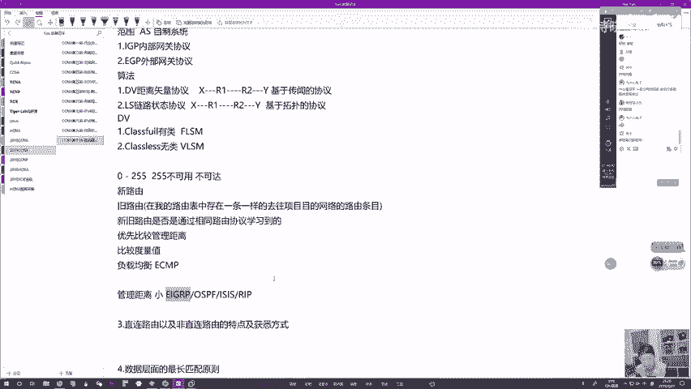

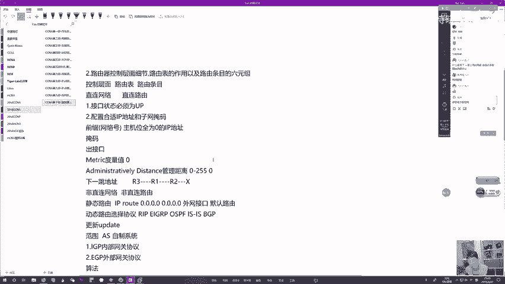

O。那接下来稍微控制层面了，那咱们也都知道了，你在路由器上，咱们需要做些什么样的操作啊，对吧？接口的地址肯定要配对吧？接口肯定要能上 down，让它起来是吧？获得了每台路由器的直流路由之后啊。

你要么通过写静态，对吧？要么通过运行动态录选的协议来让这些路由器呢拥有非直连网络路由信息，那当你拥有这些路由之后，你总要使用这些路由来转发数据，对吧？那接下来数据怎么转发。好，我们就要研究数据层面。

可以吧？路由器的数据层面，咱们再次强调一下研究什么东西啊，就是当你路由器拥有了相应的路由条目之后，当你知道这些网络在哪里拥有去往这些网络的路径信息之后啊，你如何利用这些路由来转发咱们实际的数据。😊。

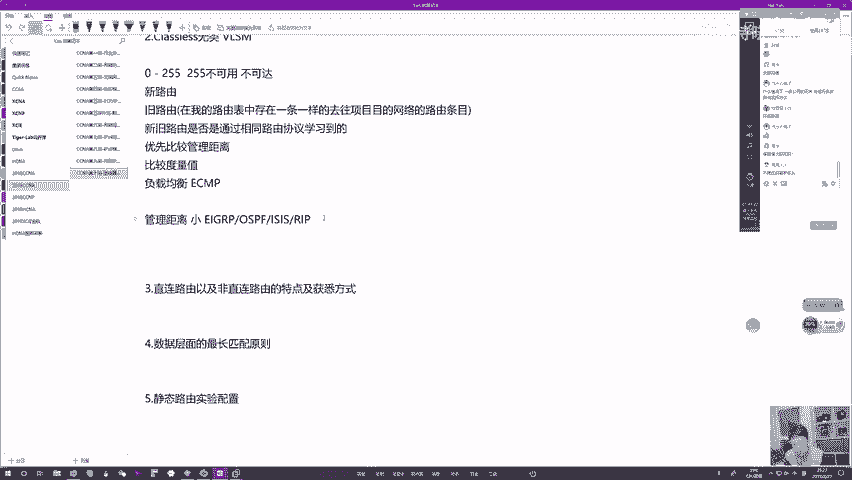

因为路由器作为一个网络设备，对吧？你毕竟也只是干两件事儿嘛。第一个就是提供咱们网络连接，第二个就是对吧？帮我们做数据转发，对吧？你收到一个实际的数据，怎么转发呢？好。

那这个具体行为前面的部分大家都知道了。你路由器要转发数据，你由于是要做网络兼转发，你要看什么？你要看三层爆头的目的IP地址，对吧？目的IP地址，那接下来你要看三层爆头，你要怎么样？

你要去掉二层的针头真伪，什么情况下你会去掉二层爆头针头真伪啊，前提是你要认为这个数据是发给自己的。什么情况下，你会认为数据发给自己的呢？就是当你收到这个针之后，你看到二层针头的目的地址啊。

就是你接收接口地址的时候，这种情况下，你会去掉针头真伪，可以吧？那接下来这个步骤呢，咱们就不赘述了。那接下来我们就从当你看到三层爆头的目的IP地址开始往下说，对吧？那一般情况下咱们一个主机，对吧？

中间隔了一个路由器，然后呢，这边有一个目的主机，A访问B这股流量的原IP肯定是A的IP是吧？目的IP肯定是B。IP对吧？无论是A的IP还是B的IP，你觉得他们IP地址的主机位可能为权零吗？不可能啊。

我觉得这个是路由器最尴尬的一点。因为对于路由器而言，我不可能知道每台PC在哪里，因为整个地球PC太多了，你整个英桃网里面PC几十亿台，你想要路由器有几十亿条路表像吗？这个太多了。

你hold不住你光知道每一个网络怎么走都够呛了，这个都需要怎么样获得十几万条甚至几十万条路跳，你更别说我要去往什么？每一个PC你要知道每一个PC怎么走的，没有这个必要可以吧？但是呢尴尬尴尬在哪里呢？

尴尬在你路由器只是知道一个网络在哪里，但你收到的数据不是去往一个网络的，你收到的数据去往这个网络内的一个主机的。😡，那所以说了路由器呢你要先做一件事儿。他得要把他收到的数据包的目的IP转换成对吧？

一个网络地址。他得要把去往一个主机的地址转换成去往一个网络地址。那所以说路由器收到一个包表，先做一个判断，就是这个包所去网的目的主机存在于哪个网络，对吧？我得要知道这个目的主机在哪个网络中。

我确定你所属的网络之后啊，我才能看看这个网络我知不知道在哪，对吧？我有没有去往这个网络的路径信息，如果有我就按照这个路径信息啊来给你做数据转发，那如果没有不好意思，我就只能给你丢弃。

反正你别指望给你泛红，我不可能给你泛红。可以吧？那接下来我怎么来判断你这个数据包的目的IP所代表的主机到底在哪个网络中呢？很简单，对吧？做与运算，你路由器路由表里面每条路由条目，不是既有前缀又有掩码啊。

对吧？我判断一个数据包去。哪个网络最简单的判断方法啊，就是拿我路由表里面的一条路由条目的掩码来跟你这个数据包的目的IP地址啊做一个与运算，对吧？那咱们都知道掩码是什么样的，掩码是网络被对应的值都为一啊。

主机被对应的值都为零，对吧？零跟任何数字与结果都是0。一跟任何数字与结果都不变。那接下来咱们拿路由条目的掩码，对吧？跟你这个数据包的目的IP啊做一个运算，得到的结果是不是就是个网络号。

然后接下来我拿得到的这个网络号的结果跟咱们该路由的前缀做一个对比，对吧？看看。我这个路由所指向的网络是不是就是你这个目的IP地址，对吧？所存在的这个网络，那如果是对吧？我们就称这个路由啊。

能够命中这个数据包，我就会使用这个路由对应的出接口和下一条地址来给你把这个数据呢，通过我本机某个接果发出发给某下跳。当然如果说直连网络的话，咱没有下一跳啊，直接通过这个结果发出就可以了。

那接下来如果说我记做完计算之后啊，发现对吧？我这个路由没有办法命中你对吧？我这个路由的源码跟你数据包的目的IP地址，做完预算之后啊，得到的结果，跟我这个路由的前缀不一致。

那我就会拿另外一条路由来给你做匹配，反正我路由表里面就这么多路由。我要拿我路由表里面的每条路由条目啊，来跟这个数据包的目的IP地址做一个逐条匹配，可以吧？直到看看咱们路由表里面有没有一条路由能够命中你。

如果能够命中你，我就帮你转发，对吧？据这个路由条目对应的出街口和吓一跳来给你做一个精确转换。那如果说我发现我路由表里面啊没有任何一条路由能够命中，这意味着什么呢？这意味着你这个数据包去往的目的网络。

我压根就不知道在哪里。我没有去往你这个数据包去往的目的网络路径信息。那这个时候我只能给你丢弃。可以吧。😡，但是接下来咱们不担心丢包啊，因为一般正常情况下，只要你路由做的好，你控制层面做的好，对吧？

你一台路由器收到一个包，你不可能说是不知道该怎么转发。但是咱们怕的是什么呢？我们怕的是你路由器的路由表里面啊，有多条路由条目，可以吧？有多条路由条目都能同时命中。一个数据包对吧？咱们最怕的是这。

那在这种情况下，你多条路由条目都能命中这个数据包，对吧？我数据包只能转发一次啊，我又不能把这个数据包复制成多份给你发多次。那既然我只能转发一次，那意意味着什么呢？我只能使用其中一条来给你转发。

那我到底使用哪一条路由来给你转发的？哦，我不能蒙啊不能随机啊，我是有机可循的。我是要按照一个原则来解决这个问题。那这个原则我们称为什么呢？这个原则我们称为叫最长匹配原则。可以吧？叫最长匹配原则。

我要看一下这些路由条目，它们的掩码都是多少位，哪条路由条目的掩码位数最长，我就会使用掩码最长的这条路由条目来转发这个数据，可以吧？那当然我这么一说，大家可能没有这个概念。那为了清晰大家这个概念啊。

我来给大家举个例子。

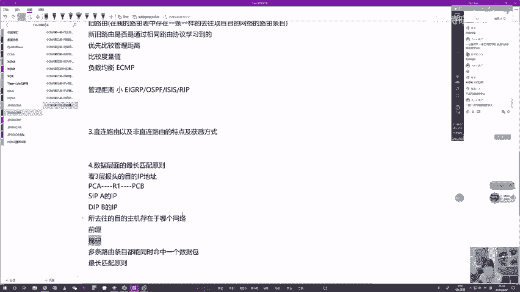

比如说A要发送数据给BB的地址多少呢？B的地址是10。1。1。101，对吧？那这个时候A发给B的数据的目的IP地址啊，就是10。1。1。101。好吧。

那假设咱们现在的路由器路由表里面有这么一条OSPF的路由，去往10。1。0。0-16，对吧？这个路由呢对应的出接口是以太网的1-1口，对吧？下一条地址，比如说13。1。1，好吧。

然后咱们有一条EIGRP的路由，它是去往什么。10。1。0。0-24的啊，它对应的出街口s1-0好吧，s1-0。然后紧接着它的下一条地址比如说是23。1。1。3好吧，然后紧接着咱们有一条瑞克路由。

它呢是去往10。1。1。0-25的好吧，然后呢它对应的出接口是以太网的1-0，它的下一条是12。1。1，对吧？然后紧接着咱们有条静泰啊，这个静泰路由，它是去往0。0。0。0-0的。然后呢。

这条路由对应的出接口是s1-1，下一跳是24。1。4。好，接下来我问大家，基于咱们这张路由表。

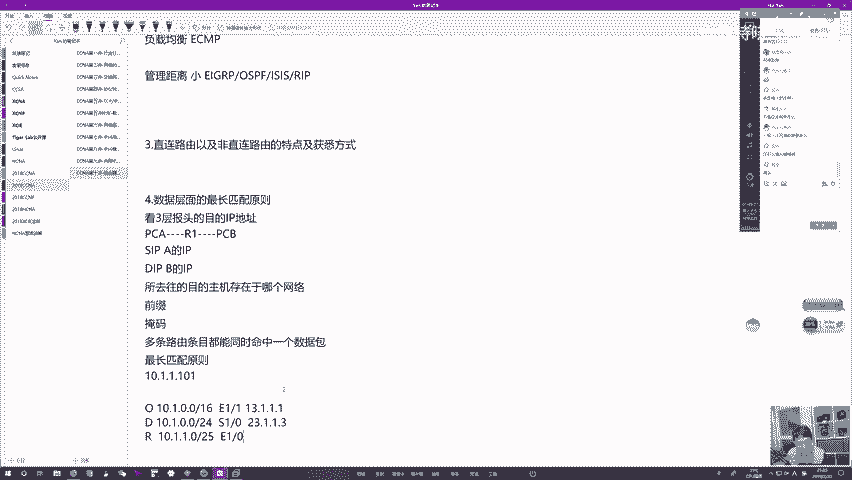

路由器收到A访问B的数据之后，路由器会通过哪条路径信息来转发这个数据。

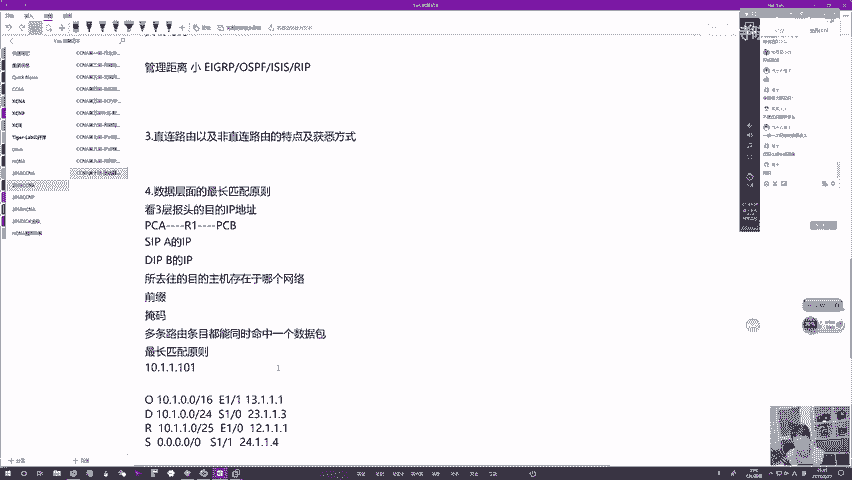

咱们怎么判断？这个咱们怎么判断？再说吧，路由器怎么使用路由表的路由条目来转换数据啊？你会使用路由条目的言码，对吧？跟数据包的目的IP地址做一个预算，对吧？咱们当前这个数据包的目的IP是10。1。1。

101对吧？好，我第一条路由言码是16位的？16位岩码找什么呀？255。255。😡，0。0对吧？好，你拿255。25。0。0跟这个IP地址做一个运算，得到的结果是什么？得到的结果是10。1。0。0。

为什么是10。1。0。0啊，我最后16位都是零嘛？零跟你语完的结果肯定是0，对吧？前面为一一给你语完的结果就是结果不变了？所以说咱们语完之后的最终结果是什么？就是10。1。0。0。哎。

跟路由的前缀匹不匹配匹配了吧？所以说了这条路由啊能够命中这个数字了。😡，但我不能说是匹配完这一条就直接转发啊。我还要看下面的路由，对吧？然后紧接着我们来看第二条，第二条路由，它的言码是24位，对吧？

是这样的。你拿24位掩码跟咱们这个目的IP地址与语完的结果是10。1。1。0，对吧？然后紧接着咱们拿这个语完的结果啊，跟你路由前置做一个比较一样吗？是不是不一样。

所以你会发现第二条路由没有办法命中这个数据法，对吧？然后接下来咱们拿第三条路由来来与啊，第三条路由来命中的话，咱们是25位掩码，对吧？它的掩码是这样的，你拿这个掩码跟目的IP地址做运算，得到结果几啊。

得到的结果还是10。1。1。0，对吧？因为咱们这个掩码是前25位的为一样，最后7位为0。😡，可以吧？好，语文的结果就是10。1。0，然后呢跟咱们这个前置对比，唉，也能命中，对吧？好。

现在第一条路由和第三条路由啊都能命中指出去。然后紧接着第四条路由，大家还记不记得这第四条路由咱们称为什么？这种路由咱们称为叫默认路由啊，也称为叫缺少路由，可以吧？它是一种特殊存在。

我之前跟大家比说什么呢？就是这种路由特别厉害，你能用它来转发去往任何目的地的任何数据，那原因是什么呢？原因就是因为这种路由它的岩版啊权威零，可以吧？那这种权零的岩码这什么样，这样这样的吧。

权零岩码跟任何目的IP地址语言。😡，结果是不是都是全零啊，对吧？因为零跟任何东西与的结果都是零嘛，对吧？那当你语完之后，哎，是不是跟前缀也能够百分百匹配。所以说为什么把这个叫默认路由啊。

就是因为我拿这个路由确实可以转发去往任何目的地的任何数据嘛，对不对？因为我不管你目的IPD是多少，我拿全零的言码给你语语完的结果是不都是全零。那全零之后一对比对吧？那肯定能够匹配上吗？那匹配上之后，哎。

你会发现我这条路由也能命中这个数据包。那接下来第一条、第三条、第四条路由都能命中数据包，我到底使用哪条来转发呢？请注意啊，结果是使用第三条来转发，为什么？因为同样作为能够命中这个数据包的路由。

第三条路由的掩码25位，可以吧？第一条路由的掩码16位，最后一条路由的掩码零位，你要按照这些路由的掩码长度来比啊，对吧？第三条路由掩码最长，那这个呢就是所谓的最长匹配原则，可以吧？

当然你路由表里面有多条路由条目能够同时命中一个数据包的目的IP的时候，我会使用掩码长度最长的这条路由条目来转发我们的数据。对吧那按照这样的方式，你就不用担心，对吧？

当你路由表里面有多条路由能够命中同一个数据包的时候，对吧？我不知道这个数据包到底该怎么转发了。好，还有一点需要注意。我在控制层面学习路由的时候，当我在决定一条，对吧？

重复的曾经学到过的路由到底能不能加路由表的时候，我会根据路由的管理距离和度量值来做一个路由的对吧？是否优化的这么一个判断。当我判断路由比较优了，那这个路由呢就可以加表。当然在数据层面。

你一旦路由条目加表呢，我在决定使用哪条路由转发这个数据的时候，就不再看路由的度量值和管理距离，可以吧？因为在我们这个编中。静态路由的管理距离啊为一OSPF的管理距离是110。

而这个瑞普的管理距离呢是120。你会发现咱们最终选择转发数据的路由条目啊，是这三条路由中管理距离最大这一条可以吧？这个没有任何意义啊。只要你路由加路由表了，你路由的管理距离和多的度量值啊是多少。

根本不重要，我只会根据什么最长匹配原则来使用这个最精确的路由来做一个数据转发。好吧，那这个就是路由器的数据层面。

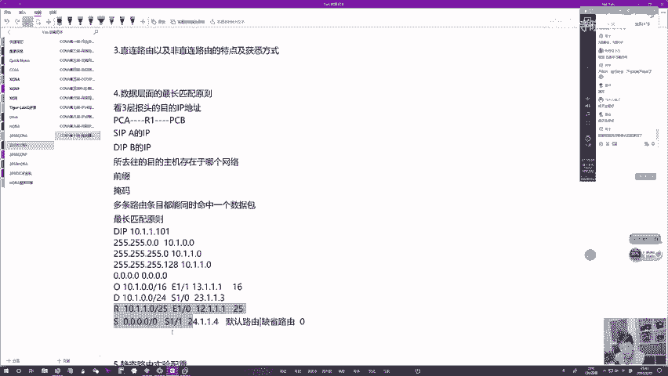

那当然你们了解完了控制层面，数据层面之后啊，我相信今后咱们在研究静态路由研究动态录选的协议的时候，哎，你们就不至于说是不知道这些协议为什么要这么操作。好吧，好了，那今天呢拖点糖。最后呢再给大家通告一下。

我觉得还是比较关键的啊。就大家应该都知道了，咱们3月1号课程要调价的啊，全面要升级一个价格。那可能有很多的兄弟们呢就不知道咱们为什么要涨价，对吧？那当然在这个群里面呢。

我相信课程顾问老师也都跟大家说过了。那当然在课上呢，我也官方的跟大家说一下。

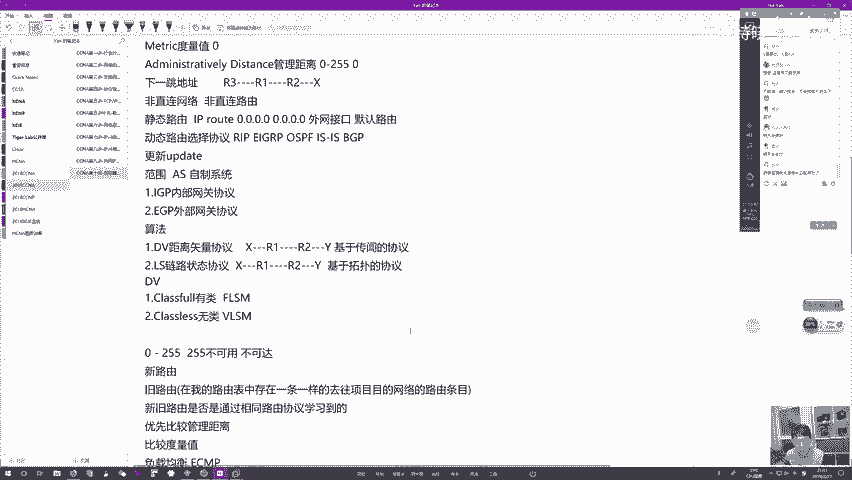

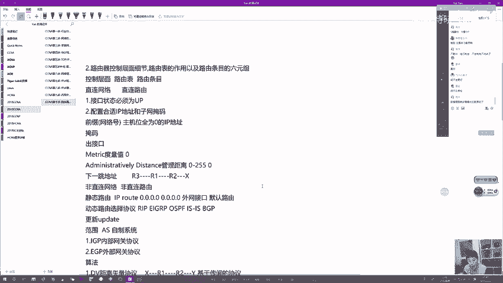

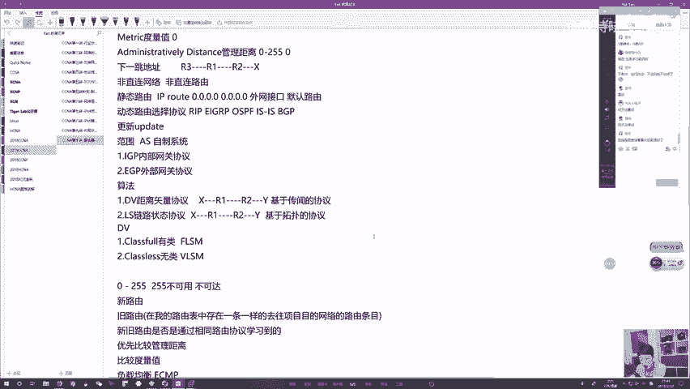

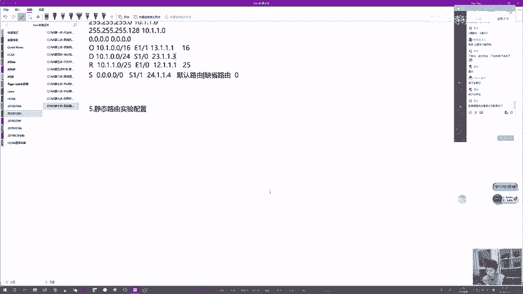

啊，之费调价的原因是为。两点。第一个是我们的课程的福利，就是服务啊，给大家增加了很多。首先呢咱们专门请了就是班主任老师来给大家就是做课程的这么一个学习的规划指导。

然后接下来咱们的助教老师呢也都是使用了很多全职老师来给大家呢就是提供一下服务。比如说正常的答疑，比如说咱们每节课的作业布置，还有作业的修改，然后呢，咱们的月考两月考3月考，对吧？

都是我们的一些新的服务啊，这些服务咱们曾经从来没有做过，然后包括我本人对于咱们NPI一学员每天一个小时的VIP的答疑，那这个都是曾经的没有做的那这个服务呢咱们还会越做越好，对吧？

咱们当前是四对一的服务啊，之后可能会升级到五对一甚至六对一，那包括大家日后的简历的修改，包括咱们的就业推推荐，包括咱们的面试的这么一个辅导。那这个都是咱们日后的福利。那这些福利呢，咱们只会。啊。

越来越增加啊，对，就跟上学一样，我希望给大家一些仪式感，让大家能够更加高效的学习，能够学到更多东西。然后接下来第二点就是咱们整体课程的这个大纲升级啊。

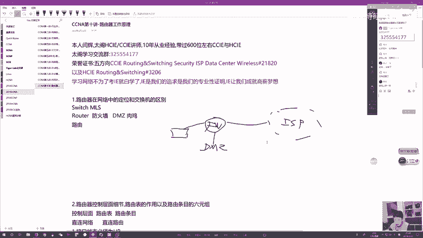

那像曾经的咱们课程里面。像这种V叉烂。对吧然后呢像咱们这种SDN是吧，以及SDN衍生出来的像sigmatic像这样的技术啊，我们都是不可能讲的，因为这些东西太高端了，对吧？对于初学者呢简直天方夜谭啊。

就算对于咱们的网工里面的老鸟，我觉得连十年工作经验的老鸟啊，你如果说没有在相应的工作环境下，你都是不可能会职业技术。那这些技术呢咱们都会依次的添加在咱们以后的IE课程中。那所以说呢内容越难越来越难了。

对吧？含金量越来越高了，并且这些东西呢对于我而言也比较新的东西啊，都是时代最前沿的技术，我自己也需要胃口，对吧？像这个微超代，对吧？三年前新出的技术。SDN到现在也不过就45年的时间。

sigment routing更是16年年底才出现最新技术。这些技术前延到什么程度啊？前沿到当前在行业内还没有部署过，还没有实施过的那些比较成功的案例。我能够赶在这个时代的最前沿来给大家讲这些技术。

就是为了增加大大家的竞争力。对吧？当你们在面试一些比较高端的岗位的时候，在面试那些年薪三四十万的那些岗位的时候，对吧？你不至于说是被那些技术总监对吧？一个问题就直接对吧？给你噎死了对？

别人在问你理解的时候，能跟别人聊一聊问你SDN的时候，你也能聊一聊你的看法，对吧？聊sment的时候，对吧？你可以给他家解释VP的对吧？RSVP的TE你可以解释一下，对吧？

针对这个RSVP的TEsmentut到底好在哪里，结合基于op open的这么一个T的升级版这个sment它的优势何在，对吧？包括像之后的DNA对吧？我也会在IE中啊来给大家讲一下相关的一些内容。

也就是说咱们整体的课程质量是在变变变高的并且这些东西呢，我也需要花费大量的时间来备课，并且这些内容。大家说一下，绝对是整个业界。

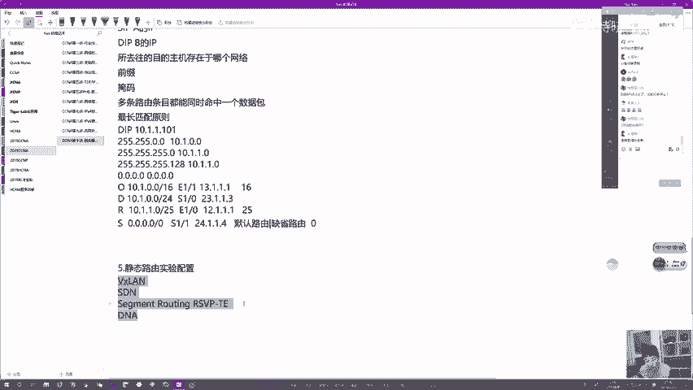

独一家，我觉得除了我以外，任何其他地方都讲不了，是真的讲不了。因为这些东西真的很难。你们不要以为说随随便便一个老师都能讲，我觉得想要讲这些东西的话，需要你对吧？首先技术要非常强，然后你对吧？

表达能力要非常非常强，你要有非常非常强的教学经验，你才能搞得定。那这一块呢是咱们的独家的这么一些技术。那由于加了这些，所以说咱们就是价格呢有有有所上浮啊，并且上浮的那个幅度还是比较大的。

那大然我觉得这对于咱们老学员来说是一个福利啊。然后呢，对于那些还没有加入的新学院。那我觉得。

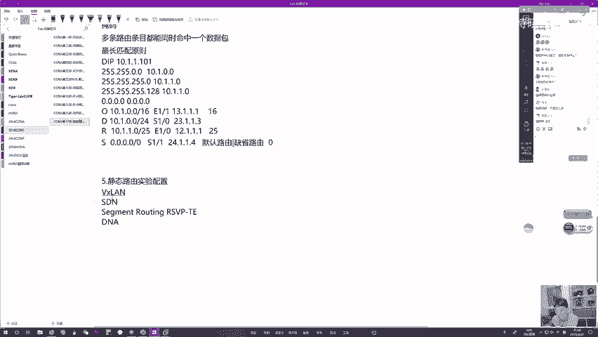

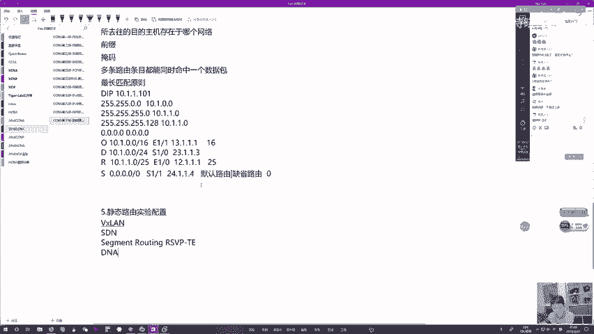

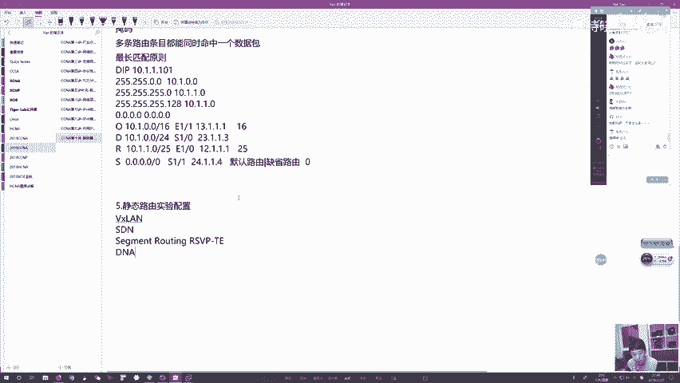

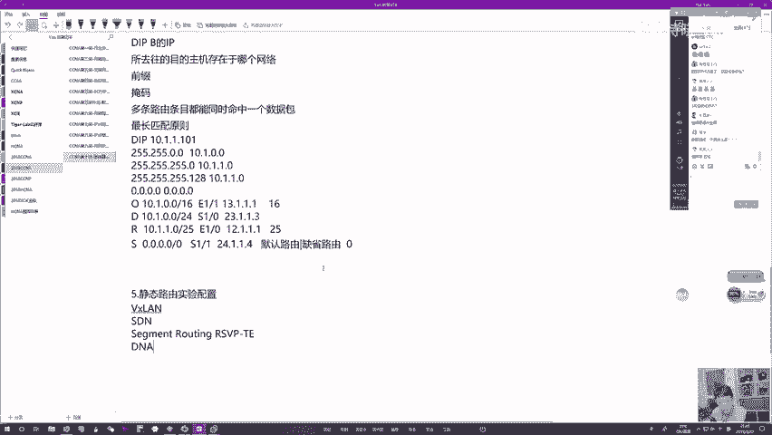

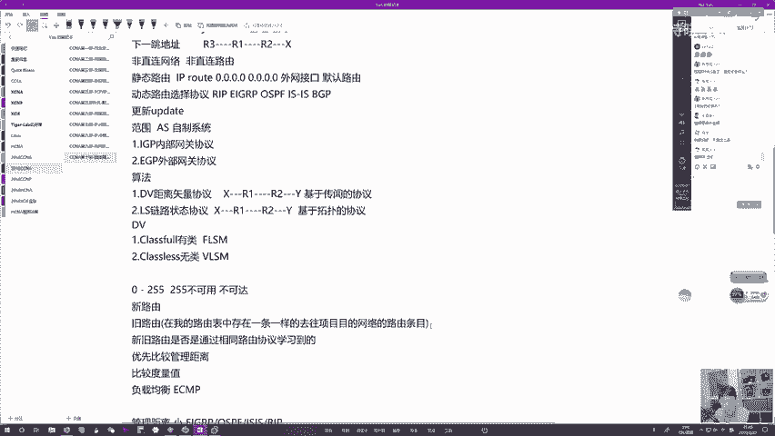

大家就是如果对咱们感兴趣的话，可以抓紧来参加咱们的课程。好吧。对，咱们干货还很多的，非常多。然后接下就入进入我们这个群啊，就是大家如果就是觉得咱们课程比较比较不错的话，就是对咱们之前往期的一些视频。

就是想要去下载，对吧？想要去获得一些资料，想要去了解咱们的一些VIP的课程的信息，这样呢可以欢迎大家来加入咱们的啊公开课的群啊，来咨询一下，然后咱们课程顾问老师都在，你们有任何问题，对吧？

他们都能给你们解答，好吧。

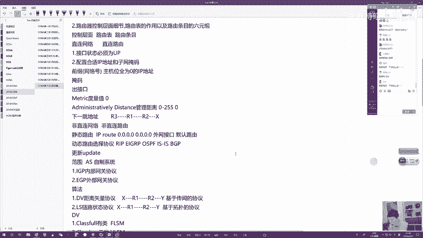

后期会产生什么费用吗？不会产生任何费用。除了考试费以外，其他都是一样的。对，就是IE也调整，IE和NP都调整，会全面提价。好吧，会全面提价。当然大家大家一定要知道咱们提的不是价格，咱们提的是价值，对吧？

咱们提的是价值，也许学完咱们之前的课，你学完之后对吧年薪都152十万，能30万。你现在学完咱们这种最新的课可能能冲击年薪40万。

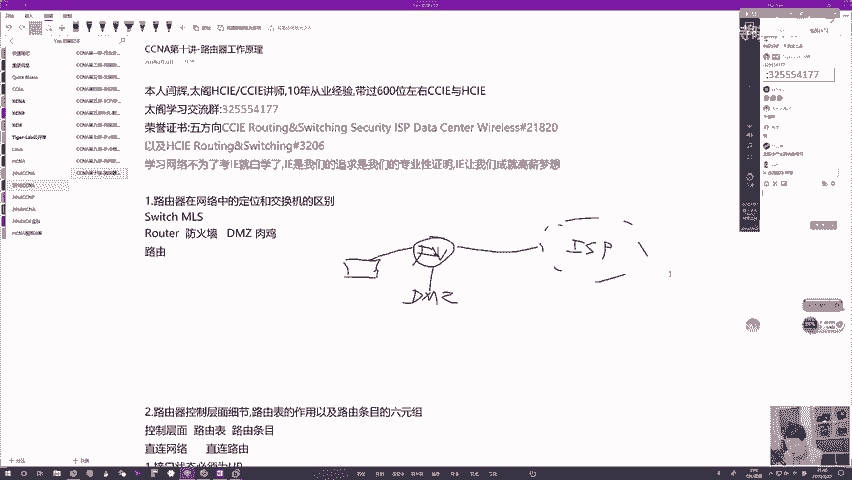

我这么跟你们说啊，咱们学完这个课程的学员，目前年轻40万的课余大佬，对这些技术都是一窍不通的。对这些技术都是一窍不通的。那如果说你们要会这些技术的话，那能不能冲击50万呢，对吧？那不一定了。好了。

那今天咱们就到此为止吧。呃，然后咱们下次课的话正常不出意外。下周二好吧，下周二，然后呢随时欢迎大家好吧，啊，下三P啊，IE结束就开。你们可以先过来给你们就是往前的视频先看一下。

然后每天不是有一个小时答疑时间嘛，我觉得有答疑时间啊，你们学习就会比较高效，并且咱们依旧是有每节课的作业的这么一个辅导，然后咱们有就是月考嘛，对吧？通过这个月考，就算IE目前没有开班。

你也可以先通过自学嘛，然后来参加这个月考，我觉得都是啊能够提升你的学习效率，好吧。

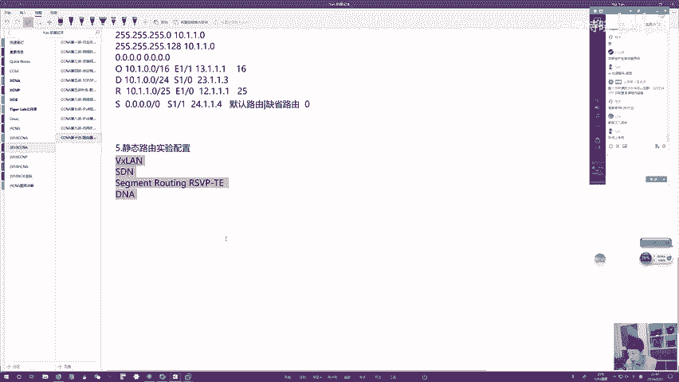

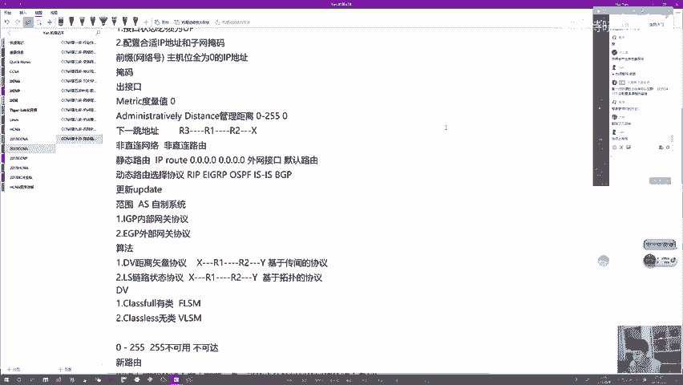

好，那今天咱们就到此为止吧。好吧，大家拜拜。😊。

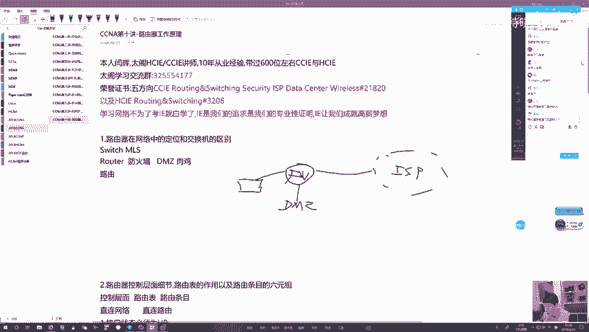

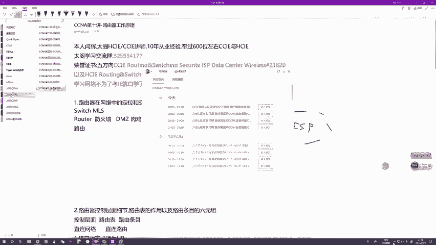