# 1000元自购分享CCNA教程合集！超全合集详细版，网络工程师入门必看合集【送NA题库】 - P12：CCNA12 - 向向向晚o - BV1cL4y1q7Dy

好，欢迎大家来参加咱们的单A课啊。今天呢理论上第十一节啊，但是其实应该是第十二节。😊，然后呢，那个春天到了，然后天也越来越热了，就是大家呢如果喜欢运动的话，就是给大家提个醒。春天的话花粉比较多。然后呢。

有的城市雾霾比较大，运动的话就是注意保护自己的就是嗓子。然后呢跑步的话就是对自己的膝盖做好保护，我最就比较坑爹，跑步的话把膝盖跑坏了，然后去做核磁共振，然后呢就是为了避免大家重蹈我的负辙嘛，对。

给大家提个醒。好吧，咱们健身要节制。好了，那言归正传啊，今天晚上咱们来讲这个。😊，一个比较关键的技术，就是教大家在一个企业网中啊去如何玩我们的路由，对吧？如何玩咱们路由。

O那上节课内容呢希望大家没有没有忘记啊，上节课咱们讲了非常非常重要的这么一些内容，那主要就是围绕路由器，对以吧？我们讲路由器的控制层面，还有数据层面，对吧？这个控制层面呢，我们说了。

主要就是研究你路由器，对吧？如何得知一个网络在哪里，你如何拥有一个网络的路径信息。那我也说了什么叫路由啊，路由就是一台路由器去往一个目的网络的路径信息，对吧？那接下来这个路由呢分为两种，我们也说了。

一类呢我们称为叫直连路由。对吧一类咱们称为叫直联路。然后呢，还有一类咱们称为叫非直连路由。那这个呢我希望大家还没有忘记啊，那直连路由指的是什么呢？就是路由器去往直连网络的路径信息，我们就称为叫直连路由。

那什么叫直连网络呢就有这么一个网络，对吧？这个网络呢跟路由器连在一块，路由器呢至少有一个接口连接着这个网络，那这种就是直连网络对吧？那直连网络路由怎么获得啊，我也说了，你只要在路由器的接口配个地址。

只要你保证接口的状态为up，对吧？这类路由呢就可以自动的产生。O但是这些非直连路由就不一样了。因为非直连路由指向的是那些跟路由器不直连的网络。那对于这些不直连网络。

你绝对不能指望就是说在路由器的接口你配一个地址，你配一个掩码，你把接口都刷到，对吧？那这种路由呢就能够自动出现，你永远不用去打这如意算盘，对吧？因为一个网络跟路由器不直连。

你路由器怎么可能会知道网络在哪里呢？对吧？他又怎么知道去往这些不知道在哪里的网络的路径信息呢？那所以说了路由器你平常接口再怎么配地址，它也不可能知道非直联网络怎么走。那你想要知道的话。

咱们就可以通过两种手段去让路由器呢来去学习这种路由，那第一种手段就是对吧？配置静态，可以吧？那这个配置静态呢，我给你说了，你路由器可以登录，对不对？你登录路由器之后呢，你在路由器的全局配置模式。

你敲命令啊，你通过敲命令的方式，你告诉路由器，一个网络在哪里，你告诉路由器，对吧？你希望它在访问这个网络的时候，你通过哪条路径来访问，可以吧？那这个时候呢，你命令怎么敲你这个路由怎么设置，那路由器呢。

就会根据你的意愿产生对应的路由可以吧？那这种我们就称为叫静态路由。那接下来另外一种方式呢，就是运行什么叫动态路由选择协议。好吧，叫动态路由选择协议。那这个协议呢就是一个进程。

你可以理解为就跟一个APP1样。那这个APP呢你可以在一个路由器上去开启。那当你开启这个APP之后呢，一组路由器之间，他们就会围绕这个APP对吧？来彼此的交互路由选择协议的更新信息，对吧？

我把我已知的这些网络路径信息呢，告诉给你，那怎么告诉给你呢，就是给你发送一个更新，好吧，那你呢也会把你已知的路径信息告诉给我，对吧？你也会给我发更新，对吧？

我会把通过你收到的更新学到路由呢再传递给我其他的邻居路由器，那咱们的彼此通过这种方式来传递路径信息，那最终就是我知道的对吧？大家都知道了，那大家知道的，我也都知道，对吧？那这种方式就是比较简单啊。

比较灵活，你只要在这些路由器上把这个协议开启，对吧？你相当于启用这个进程了，你启用完这个进程。那这个APP那这个APP呢会自己工作，对吧？它会自己工作。

那路由器之间通过这个APP咱们之间的彼此共享路径信息。那最终实现的是什么呢？就是希望大家能够彼此获知对方所知道的路径信息，对吧？上来我知道些我知道的，你知道一些你知道的，咱们通过这个路由选的协议。

让你知道的也能变成我知道的让我知道的也能变成你知道的对吧？这个就是动态路由选择协议，OK那这个协议呢，由于它在路由器之间运作啊，这个路由器呢并没有根据咱们管理员的指定，对吧？

就是我要求你去往哪个网络怎么走。好了我们在运行这个路选的协议的时候，一台路由器啊，他可能会发现我通过多条路径都能访问同一个网络，我有多条路径能够去往同一个网络。那在这种情况下呢，他会做一个判断。

判断这多条路径，哪条优，哪条不由。对吧那最优的路径呢我会加路表用它呢来做一个转发。那对于不优的，我可能会把它缓存起来。那当咱们最优路径不可用的时候。

我再把路径切换到这条次优的路径上去持续的对这个目的网络呢去访问，可以吧？那这个就是动态路由选的协议的这么一个特点。那由于这些动态录选的协议呢都要求路由器自己去判断，从它出发去往一个目的网络。

哪些路径最优。那所以说这些动态录选的协议呢都有设置度量值来作为咱们路径好坏的这么一个参考标准。那度量值呢其实就是个阿拉伯数字嘛，这个值越小代表一条路径呢越优，对吧？这个值越大，代表一个路径就越糟糕。

对吧？那当你他路由器发现，哎我通过多条路径能够访问同一个网络，那我就会比较这些路径的开销，对吧？比较他们的度量值，看看谁小谁小，那就代表哪条路径更好，哪条路径更好，对吧？我。

会优选这个更好的路径来访问最终的目的网络，可以吧？那这个就是动态路由选择协议的这么一个特点。那当然不同的协议呢，对于路径好坏的判断的方式是不一样的对吧？有的协议呢可能比较关注带宽嘛。

有的协议可能会比较关注跳数，有的协议呢可能会既关注带宽，又关注延迟，又关注可靠性又关注负载。总而言之，咱们不同的协议之间呢，它这个度量值本身啊是没有什么兼容性的对吧？你按照你的判断方法来判断路径好坏。

我按照我的判断方法来判断路径好坏，那咱们虽然判断创来路径好坏啊，都叫度量值，它都是一个阿拉伯数字，但是彼此之间是不兼容的，能理解吧？OK那这就是动态路由选择协议的这么一个特点。

OK那今天呢咱们的课的重点是什么呢？哎，就是教大家如何在路由器上去玩转静态路由。然后呢教大家如何去对吧？利用动态路选的协议rapip协议啊，来让一组路由器呢，哎，能够互联互通，对吧？

让一组路由器能够知道咱们这个网络是怎么连接的，让他们能够拥有这些非直连网络的对吧？路由信息，然后接下来咱们结合一个实战，就是在一般的中小型企业网中啊，对吧？

你如何来同时利用静态路由和瑞ip这个协议啊来实现咱们内网到外网之间的这么一个互联互通，好吧，那就是咱们今天的这么一个目的啊，O那接下来我们看言归正传啊，先从这个静态路由开始给大家讲起啊，对吧？

这个直联路由不用我说了啊，直连路由，那咱们也做过几次实验了，对吧？每次实验呢，其实只要遇到路由器，你都需要去给大接口配地址，你只要配完地址之后呢，如果大家去仔细。😊，看的话。

你会发现啊这个直连路由在你地址配完之后啊，它就会自动拥有，对吧？那当然这个路由表咱们怎么看呢？叫sIP route，对吧？使用这条命令来查看咱们的IP路由表，O吧？那这个路由表里面呢。

对于ssco而言啊，咱们直连路由是打C，还有打L的对吧？这个C呢全称就是connected叫直连路由，对吧？它指向一个网络，就是用来告诉路由器啊，当你要访问这个直连网络的时候，对吧？

你该把数据通过你哪个接口发走，O然后这个打L的路由时候用来干嘛呢？它是用来描述这台路由器啊，在这个网络中，它自身接口的IP地址是多少，对吧？C呢用来描述一个直连网络路径信息，而L用来描述在这个网络中啊。

本路由器的接口的IP地址是多少，对吧？那这个就是直连路由的重量个表示，那接下来对于静态呢哎。大家还没有接触过。那今天呢就先教大家静态路又怎么去配置OK那这边的话唉我需要去开一个。我需要去开1个PPT啊。

然后呢告诉大家就是这个静泰路由怎么去配，好吧。啊，课前忘记开了，不好意思啊，课前忘记开了。😊，ok那这边的话来开一下啊。😊，看一下。O。

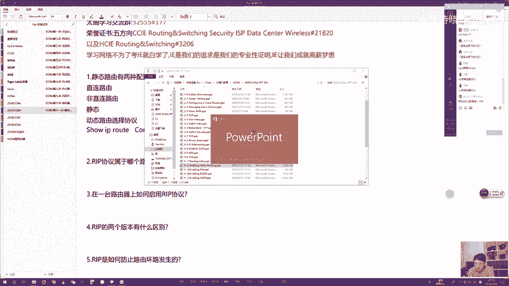

嗯，这个就是静态路由啦。很简单啊，看一下配置命令就好了。好吧，那这个呢就是cisco官方啊配置静态路由这名命令。😊。

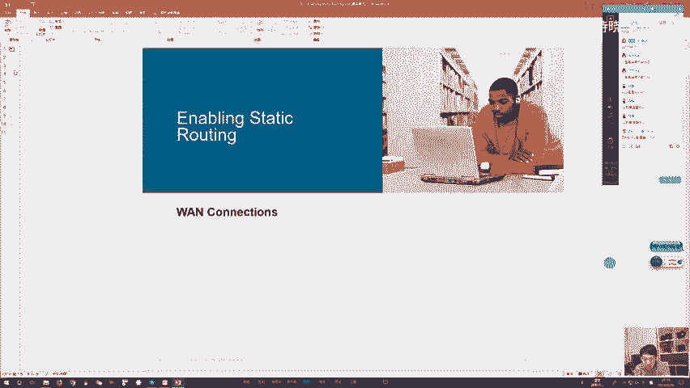

你登录一台路由器对吧？进入到全局配置模式，然后呢，在全局配置模式中，敲这条命令IPro前面是固定的IPro后面跟上你要访问的这个目的网络的前缀，注意啊，目的网络的网络号在这里写，然后呢。

该网络对应掩码在这里写对吧？然后紧接着哎咱们有两个方案啦，在配置静态路由的时候，咱们有两种配法，第一种呢就是写完静态路由的去网的目的网络的前缀跟掩码之后啊，咱们跟一个出站接口，可以吧？跟一个出站接口。

那跟一个出站接口描述什么呢？就是当我要访问这个网络的时候，对吧？我可以把包通过我自身的哪个接口发送出去，那接下来第二种写法什么呢？就是配完目的网络前缀掩码之后啊，你加一个下一跳地址，对吧？

加一个下一跳地址，还记不记得？我跟大家说过啊，在路由器路由表。

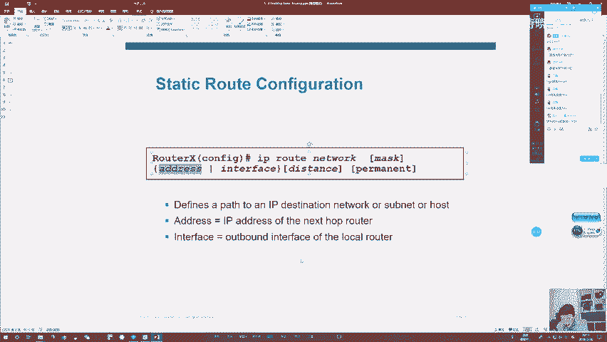

里面咱们一个路由条目最多呢包含6个元素，哪6个元素呢？分别是用来描述一个网络的前缀，对吧？前缀还有呢掩码对吧？这是两组啊啊，这是两个一组，对吧？然后接下来第三个什么呢？就是出街口。第四个下一跳地址。

第五个度量值，第六个管理距离。对吧一共呢有这么6个。那接下来这个路由呢用来描述什么啊？就是说我去往这个网络长什么样，对吧？我要访问这个网络，通过我自身哪个接口把包给发出去，对吧？发给哪个下一跳地址。

然后接下来这个路径的度量值多少，它的管理距离是多少，对吧？那这就是路由表里面一条路由条目啊，它最多所包含的六个要素。那接下来对于直连路由我跟大家说了。

直连路由是没有吓一跳的那所以说它一般呢只包含5个要素，而对于这种非直连路由呢，一般的6个要素是都应该包含的。但是呢在配置静态路由的时候，情况不太一样，尤其是在早期的网络设备中，对吧？

你操作系统版本不够高的情况下，你在配置静态的时候呢，咱们咱们的两种写法都没有办法把这个路量参数啊都给写进去。第一种配法就是写静态的时候，只关联。出站接口对吧？只关联出站接口，你只能指定对吧？

当你要访问这个目的网络的时候，你要把你的数据包通过你的哪个接口发出，这就是第一种写法。那第二种写法是什么呢？就是在写静态路由的时候呢，咱们只关联下一跳地址，对吧？你只告诉路由器。

当你要访问这个目的网络的时候呢，你该把包交给路径中的哪一台下一跳邻居对吧？并没有告诉路由器，这个数据包啊在访问目的网络的时候，你要通过自己哪个接口发送出去，对吧？那之所以两个不同同时包含。

我觉得应该是对吧？系统版本比较低所导致的这么一些性能和功能缺陷，那当然这些缺陷呢，在咱们当前来看的话，其实有点多余啊，因为当前咱们用的最新的15点叉的IOS版本中，你写静态路由，我们既可以包含出接口。

又可以包含下一跳地址，对吧？思科华为都一样。但是在早期呢对吧？确实出现过这么一个情况，就是你写静态。选以往两种写法，你要么按照上面这种写法来写，你要么按照下面这种写法来写，对吧？那接下来这两种写法，唉。

它们到底能够对应什么样的场合呢？我来给大家讲解一下，我还记得我之前非常非常早的时候跟大家说过这么一个话题，就是在咱们整个互联网中，对吧？互联网就是由若干个网络彼此连接而成的。

而连接而成的这个若干个网络啊，它们是有类型的对吧？组成互联网的若干个网络，它们是有类型的，这个类型呢主要分为两类，一类咱们称为叫MA网络，还有一类咱们称为叫P to P网络，对吧？

这个MA呢叫miple access叫多路访问网络，对吧？然后这个P two P呢叫点到点网络，对吧？叫点到点网络，一个叫多路访问网络，一个叫点到点网络，那它们最大特点是什么呢？哎，比如说MA网络啊。

举个例子，像我们以太的以太网就是经典的M美网络，对以吧？那当家在广域网环境中啊，哎像真中剂对吧？真中剂。它呢也是一种比较典型的MA网络。那这种MA网络最大特点是什么呢？就是它在一个网络中啊。

我们的成员数量是可以为任意多个的啊，你在一个网络里面呢，你可以包含两个节点，对吧？比如说咱们两个人中间连一根线这是没问题的。当然呢你包含三个4个5个都不要进。那大家可以想想啊，咱们以套网怎么连接啊。

你中间需要它网络设备，对吧？这个网络设备呢，咱们要么是极限器，那要么是交换机，对吧？要么是极限器，要么是交换机，而你无论使用哪一种设备做咱们中间的网络设备，那这些设备特征大家都知道吧，交换机也好。

极限器也好，你这样的设备接口都很多，对吧？你这么多的接口用来做什么的，方便我们连线，连设备进入网络了，对吧？那既然你这些设备有这么多接口，就代表什么呢？你连接而成的一个。

网络咱们成员数量就是根据你接口数量而定的。可以吧你接口越多，那一个网络中可以包含的节点就越多。你接口说的越少，那你在一个网络中呢可以包含的节点数量就越少。那总而言之，咱们没有限制。

从来没有说过你在一个以太网中啊，咱们只能有两台计算机，从来没有说过，对吧？那这就是艾美网络。那点到点网络特点是什么呢？就是在这个网络中啊，就是两个节点中间连一根线，只有可能有两个节点，它们之间连一根线。

绝对不可能存在第三者，可以吧？就咱们俩我们之间连一根线，这种网络里边尤其只有两个节点，那这就是点到点网络OK那既然咱们网络分为两类啊，我们就要结合这两类网络来告诉大家，咱们在写静态的时候呢？

什么时候能够跟出接口，什么时候跟下调地址。那这是跟什么有关呢？哎，就是跟你这台路由器访问该目的网络的出接口啊，所连接的网络类型有关的？可以吧？那先记一下口诀，若果这台路由器。

去往一个目的网络的出接口所连接的是一个点到点网络。那这个时候在写去网该目的网络的静态路由的时候，你虽然说啊既可以使用包含下一跳地址的写法，又可以使用什么呢？包含出接口的写法，但是相较之下。

前者包含出街口的写法会更好，可以吧？但是如果说你这台路由器啊，去往这个目的网络，你的出街口所连接的网络啊，是一个MA网络，可以吧？你去往这个目的网络的出接口，比如说连接的是以太网，对吧？连接的是真中器。

那在这种情况下，你写静态路由就必须只能选择包含下一跳的这种写法，可以吧？那这边的话该给大家举个例子啊，画个图。啊，比方说就是咱们这个环境吧，哎，这是一台路由器R一对吧？然后接下来呢。

我们这边的话是一个易态网，可以吧？咱们连一台交换机。😊，连一台switch一。然后呢，这边的话咱们连一台R，然后呢，这边咱们连一台R3。然后呢，R2咱们稍后呢有1个X网络，对以吧？有一个X网络。

现在呢咱们就需要在R一上呢写一条静态路由去往X网络，对吧？让R一知道X网络在哪里，让R一拥有去往X网络路径信息，从而能够成功的什么发送数据放问X。那这个时候呢R一要访的X咱们出接口肯定是这个接口，对吧？

😊，你这个接口连接的是一个以太网络，对不对？这是一个MA网络。那在这种情况下，咱们写静态路由呢，就必须要怎么样关联下调地址，你不能关联出接口，因为你关联出接口，这个问题我相信大家都能看到啊。

你如果只关联出接口呢，相当于这个静态路由告诉R一了，你要访到X网络吗？你要访问X网络，请你把包通过你右边这个接口发出来，但是这是一个MA网络，对吧？在这个MA网络里面，你把包发出来。

这个包可以到达R2也可以到达R3。但是在我们这张图中啊，只有当你把包发给R2的时候，这个包最终才能到达X网络，是这样的吧？对吧？你若果发给R3呢，R3身后有个X网络，没有你若果把包发给R3。

咱们这个包就不通了，更何况这是一个以太网啊，在这个以太网中真的可能只有三台路由器吗？不一定你说不定有10台路由器，有20台路由器。就是说你R一把数据包通过你这个接口发出来之后啊。

你有很多的发送对象可以选择。你有太多的下一条地址可以选择。你只有当你选择R2的时候，这个包才能最终统，但R一知道我该把包发给R吗？我不知道。因为你在写静态路由的时候，你压根儿就没有告诉我这一点。

你只是简单的告诉我要访问X网络吗？把包通过你的右边接口发出就完事了。而我通过右边接口发出到底发给谁啊，没人告诉我，那所以怎么办呢？路由器在这种情况下，他会做一个判断。

就是他会尝试啊通过ARP来解析他要访问的目的节点主机的麦地址，对吧？那当然大家都知道你ARP请求呢是以广播信式来发送的，你这个广播发送ARP请求呢，这个MA网络中的所有节点，他们能收到，对吧？

那当他们收到之后呢，哎R一定会通过代理ARP来给你RE做一个应答。因为只要R这个接口开启了代理RP啊，当他收到了R一发送的ARP请求之后，他会看对吧？请求者的源是你RE这个接口，而请求者的目的地对吧？

是我身后X网络中地台主机，你们不在同一个网络，对吧？并且呢对于你请求的目的。节点啊，我知道怎么走，对吧？就连在我这边后面嘛，对吧？所以说这个时候呢，当我收到LRP请求之后，我就会给你回应一个应答。

那在这个应答中呢，我会把对吧你所请求的目的主机的IP地址映射到对吧？我这个直连接口的麦地址。那接下来R一不知道吗？那当R一收到LRP应答之后，他就会根据R2给他返回的P答案来成功的对吧？访问这个目的地。

那这样的话效率太低了，可以吧？效率太低了。那所以说呢一般在这种情况下，对吧？你就最好写吓一跳，对吧？你该怎么写啊？你在R一上写去往X网络静态路由的时候，你就告诉R一了，你下访完X网络对吧？好。

请你把包发给R这个接口对吧？请你把包发给R这个接口，那这个时候呢，当R一收到去往X网络数据的时候，我就查路由看啊，有静态去往X网络静态告诉我了，为了把包发给X网络，把包发给R，但怎么发呢？哎。

他没有告诉我，但不要紧啊，对吧？不要紧，因为我只我已经知道一个信息了，就是只要把包发给R这个接口，这个包就能够继而到达X网络，那接下来我只要去关心怎样把包发给R这个接口就可以了。

我能不能知道怎样把包发给R这个接口啊，太轻松了。为什么太轻松了？因为R跟我直连对吧？我是不是有这个直连网络的直连路由，对吧？因为你接口要配置IP地址嘛？你配IP地址，你就直连路由，你通过直连路由。

你就足以知道怎样把包对吧？发送给R，你会根据R这个下一跳地址再次查一次路由表，对吧？通过查路由表，你发现哎怎样把包发给R这个接口啊，你只要把包通过你右边接口发走就好了。那所以说呢虽然麻烦了一些。

墨迹了一些，对吧？查了两次路由表啊，才最终知道你要把包通过哪个接口发走，但是好歹咱们不用纠结是么？到底把包发给哪个下跳，你知道正确的下一跳，你只要把包发给这个下一跳。

那这个包就能够继而到达咱们的最终的目的地。可以吧，那这就是写静态的这么一个唉特例。然后接下来呢，如果说唉你R一对以吧？比如说咱们还是R一啊。好，这玩E呢咱们通过广域网的点到顶的链路啊，连接了一台路由器。

R对吧？那这个时候呢，咱们R身后有一个X网络，那现在咱们还是着眼于R一啊，我希望R一写一条静态去往X网络可吧？那在这种情况下呢，当然你通过下一跳是没有没有问题的对吧？你如果写静态包含一个下一跳。

就告诉R一对吧？要放到X网络把包发给下一跳那由于这个下一跳跟我直连嘛，你能够根据下一跳地址插直连路由发现啊，为了把包发给下一跳得把包通过右边接口发走，那这是没问题的，但是有这个必要吗？没有这个必要。

因为你R一跟R之间是一个点到点网络连接，这个点到点的特点是什么？点到点最大特点就是这个网络中不是你就是我呀，不是我就是你那换句话说什么呢？我只要把包通过这个接口发走就完了。我不像在MA网络里面那么尴尬。

因为在MA网络里面，我这个接口连接的下一跳，可能有很多台，但是在点到点网络环境中，我这个接口连接的下一跳就。😊，只有一个我只要发出来了，就一定是你收，不可能有第二个人收。那所以说在这个例子中，对吧？

你在R一上写静态路由去往X网络，你还真就应该关联出接口，因为你关联出接口之后，对吧？R一收到去往X网络的包啊，一看啊，要通过右边接口发走。需要下一跳吗？不需要，反正这是个点到点网络嘛，对吧？点到点网络。

我只要通过这个接口发出，反正下跳是固定的对吧？既然下跳是固定的，我根本就不需要知道下跳的地址，我就直接发给他的，直接发我就能够直接把包发给RR就能够寄而包包把包发给目的网络的主机。

全程只用查一次表就可以了。为什么只用查一次表呢？因为这条静态路由已经告知我该把包通过哪个接口发走。我只要获得这个信息，我就能够直接拿这个路由来转发数据，而不像咱们刚才那个例子，刚才那个例子。

虽然我也有路由啊，但是这个路由没有告诉我，为了转发报文去往这个目的地，该把包通过哪个接口发走，他只是告诉我这个下跳，它是婉转的告诉我，要把包发给X网络，请你先把包发给R，但咱们把包发给R啊。

你得要针对R这个接口的地址。进一步的查直链路遥，你才能最终确定什么出街口。那这个我们称为什么呢？这个咱们称为叫递归表查询。好吧，这个叫递归表查询。所谓的递归表查询是什么呢？就是你在查路由的时候，对吧？

你没有办法根据一条路由来直接判断该怎么转化数据，对吧？你可能查了第一次路由，只确定了访问这个目的网络啊，咱们需要使用的下一条地址，然后紧接着你要针对下一调地址来进一步查路由。

那可能通常咱们查到了一条直链路由啊，来判断把包通过哪个接口发出，能够发给这个下一跳。那当你确定了出接口之后，最终这个包才能被发走，那这个递归表查询呢，对吧？就会导致你访问一个目的网络，你查表。

最起码也要查两次。那查两次表代价是什么呢？就是你转发延迟直接乘以2可以吧？转发延迟直接乘以2，这是第一点。第二点，路由器的CPU内存资源的消耗，直接乘以2，那这个划算吗？我觉得非常不划算，对吧？

非常不划算，那所以说嗯建议大家在使用路由器转发数据的时候，对吧？咱们能不递归，就尽量不要递归，对吧？然后接下来咱们这个静态路由如果包含一个出接口就非常完美了。因为你包含一个出接口。

你可以直接通过这个出接口信息嘛，就是告诉路由器，当你要访问一个模拟网络的时候，你把包通过哪个接口发出，这就完事了。那这个时候，既然咱们这个路由包含了一个出接口，我就不需要其他的了，对以吧？

我通过这个信息就能够直接发送数据了，对吧？我何乐不为呢，对吧？那所以说呢在这种出接口连接点到点网络的时候，虽然你写静态。X网络你也可以包含一个下一条地址，但是没有必要啊，你包含下一条地址。

你要查两次表嘛？你要递归表查询，你如果包含一个抽接口，你只有查一次表，我们喜欢哪一种肯定喜欢查一次表的可吧？这就是静态路由的两种用法。当然我在弹幕里面呢看到有的小伙伴听不太懂这节课的内容是吧？啊。

没有关系啊，因为这节课呢是咱们的NA的卫声了，对吧？接近尾声，那毕竟难度会比较高一些，然后呢，咱们知识之间都是对吧？有关联的，我会先铺垫性的把一些基础内容给大家对吧？然后讲完之后呢。

咱们会基于这些基础内容啊，来讲一些比较高大上的。那所以说这节课内容确实会比较难一些，比较抽象一些。大家呢如果说能听懂，就听一个门道，如果听不懂的话，可以当相声来听一个热闹，好吧。

反正呢咱们3月3号啊新的NA课会开课，这个新的NA课呢，我会讲双厂商的NA。然后呢就是讲内容会比较多一些，然后呢，难度也会更大一些。就大家如果说觉得这个课意犹未尽的话，没有关系。

可以在3月3号来参加咱们新的课。然后呢，这节课没有听懂，那也不要紧啊，没有关系，没有关系，反而在3月3号能给大家感受，对吧？更加稳妥的更加给力的这么1个NA课程，然后这个新课的话从零开始的。

所以说大家就算没有任何基础也不要紧，好吧，OK。呃，没有，不是每次查路由都要查两次啊啊，简单来说就是到底要不要查两次，主要就是看你这个路由，对吧？去往一个目的网络路由到底包不包含出接口。

如果包含出接口的话，就不用递归宝查询啊。如果你没有包含出接口的话，那就需要递归宝查询。这就是说对于路由器而言，最终关键的是什么呢？就是出接口，你如果路由条目包含了出接口，对吧？你就不需要递归了。

那如果说你没有包含的话，对吧？那这个时候你就需要递归okK。好，那这就是静态的这么一个写法。那接下来结合这个静态写法呢，我来给大家配个实验啊，通过这个实验呢来给大家演示一下这个静态路由的一些啊魅力吧。

配吧一些魅力。然后正好呢结合这个静态路由实验，也让大家了解一下咱们这个对吧？端到端通信到底是一个什么样的概念，好吧，让大家了解端到端通信到底是个什么样的概念。😊。

基本功要学好对吧？是基本功确实要学好。😊，哼BGP的5张表很晕吗？我觉得还好吧。

你们不要老是谈BGP嘛，对吧？啊，对，BGP是NP内容啊。递归路有A不会说，当然不会说了，太难了。所以只是告诉大家这么一个概念啊，只是告诉大家这么一个概念，你们不用去太过纠结这些细节，好吧。

你们不用去太过纠结这些细节。O那这边的话咱们就是搭一个环境啊，我就省事儿了啊，省事儿了。三台路由器。三台路由器。啊，这个四眼的大神啊，你那个怎么说呢？就给你个建议，咱们呢这是NA课。

你如果想要彰显你是一个特别特别牛逼的对吧？人，你想彰显你的技术特别特别牛逼，你呢可以参加咱们的NP或IE课。然后呢，在我的人T含义课里面呢，你可以。对吧自由的跟我们IE群里面的大佬们去沟通一下这些东西。

就是BGP真不是特别牛逼的东西。就是你不用就是随口谈一些BGP好像能够彰显自己的逼格，对吧？可能对于这些新手而言，BGP确实挺高大上的对吧？但是呢就是在IE阶段，我觉得BGP是很多很多高级技术的基础。

比如说像什么MPVPN啊，对吧？比如像什么对吧？跨域的MPVPN啊，对吧？比如像什么IPs呀，对吧？那这些其实都是基于BGP做底层的。所以说这个BGP在高级课程中其实真的不算特别厉害，好吧。

那当然BGP很重要，你可以把基础给打好，但是打好之后的话，咱们通常是通过BGP来为一些其他的协议来提供服务的对各种各样的VPN啊。

这些VPN底层都会用到BGP所以你会发现在IE阶段BGP这个是你必会的这么一个基本的技能，好吧，O。好了，那话不多说啊，我们来介绍咱们这个环境啊。那当前咱们有三台路由器，可吧？

我们现在呢模拟啊每台路由器连接一台逻辑的计算机。那当然大家看这个图说来我骗人啊，哪有计算机啊，那明明就三台路由器吗？啊，没有错，我的我我也确实没有骗大家，图上确实只有三台路由器啊。

但是呢咱们在路由器上可以起一种特殊的接口，对吧？每台路由器你在配置的时候，你能创建接口啊，你能创建接口，你能创建什么类型接口呢？哎，你能创建这种路 back接口，我们称为叫还回口。😊，好吧。

我们称为叫环回口。这个环回口呢是一种比较特殊的接口，它是个逻辑的虚拟接口。这种虚拟接口特点是什么呢？就是看不到摸不着，对吧？所以说在当图中啊，不管我怎么创建环回口图都是这样的，它不会多出什么连接来对吧？

然后接下来这个环回口最大特点是什么呢？就是它不像咱们的物理接口，大家注意啊，你路由器的一个物理接口，对吧？你给它配这个IP地址，你通过no shut down来开启这个接口，这个接口就一定能工作嘛？

对吧？答案是不能的，你路由器一个接口想要工作，对吧？配IP地址，no shut down，这只是第一步，你还需要连线，你连的线得要没有问题，对吧？你不能连一个错误的线。

然后紧接着呢你这根线的对端的设备接口还要能工作，那当你满足这三点啊，路由器的接口才能up你接口up了之后呢。😊，你才能通过这个接口啊来自动生成一个直连路由。

并且你才能通过这个接口作为原或者目的地来做一些拼测试。那这个还回口最大好处是什么呢？就是它是个逻辑接口，你只要创建出这个接口之后啊，你除非通过杀档命令把它给杀当的。

不然的话正常情况下这种接口的状态是永久性的。那是意味什么呢？这意味着你只要创建一个还回口给它配个地址啊，你能杀 down之后，当然你不用上 down，它默认就是能 down。你只要配1个IP地址之后啊。

这个接口它就会你就能够拿这个接口做源来做一些拼测试，并且你就能够通过这个接口啊来模拟路由器身后所连接的一个主机，对？那当然我这个模拟器呢你能够正儿八经的连一台PC啊，但我觉得没有必要？

那所以说今后呢咱们在做路由器实验的时候，我就给大家一个建议啊，每台路由器创建一个还回口，这个还回口，你们可以理解为就是路由。

正儿八经的一个接口，这个接口连接一下PC可以吧？然后接下来咱们最终要测试的是什么呢？就是当你这个网络通了之后啊，我们要让这些PC之间能够互联互通，对吧？也就是说让路由器的环回口之间啊能够互联互通。

大家要记住啊，网络通永远是为客户提供服务的，客户用的是什么呢？它用的不是你路由器啊，客户用的PC所以说只要PC之间能够通信，这就O了。而至于你路由器之间能不能通，这个其实不要紧的，能理解吧？

你路由器只是一个提供连接提供数据转发的这么一个中间设备而已，对于客户而言，路由器是透明的，可以吧？路由器是不存在的，所以说了路由器只要服务好PC这就O了，这就是咱们创建环回口的这么一个理由。

你若没有创建环回口，你直接拿路由器的物理接口来拼。你虽然最终能检测连通信啊，但这个连通信，对于客户而言，是没有任何意义的。可以吧？好，那这边的话们。就是创建三个还回口。好，那下来问大家一个问题啊。

就是当你在三台路由器上都创建一个环回口之后啊，咱们每台路由器给接口配完地址之后啊，它们有几个直连网络会形成几条智连智连路由啊。好，我来跟大家先从R说起啊。😊，而尔创建一个黄水口。

再给以太网0到1口配好地址，它有多少直连路由？嗯，它有多少直连路由？有几条两个对吧？okK环回口是一个网络啊，以太网0-1口连接的是另一个网络。R一呢R一创建一个环口之后呢，有几个网络。是有三个对吧？

左边一个右边一个环回口一个啊三呢也是两个吧，左边一个环回口一个。好，这个都能理解啊，那这个就没问题了。那接下来我们来看一下这个具体的配置啊。OK还回口地址怎么设置呢？那还回口地址的话。

咱们设置的方式就是R一是1。1。1页M24位啊。R2的话2。2。2。2码24位，然后呢R3是3。3。3。3码24位，好吧，咱们通过这种方式来设置还回口地址。然后接下来登录路由器不用问了，上来呢。

第一个肯定是先输入no啊，对吧？他问我们由于没有启动配置文件，对吧？要不要人机互动一波，对吧？他一问咱们益达来配置一些基础的配置参数，而是咱们肯定不需要啊，对吧？那这边的话咱们先来配一下这个主机名啊。

先来配一下主机名。😊。

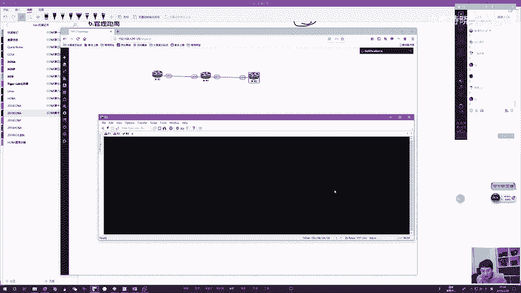

这个是R2对吧？然后呢，这个是R3好，okK那接下来拍好之后呢，咱们来配置接口啊，先来创建一个返回口编码是24位啊，对吧？interface back0创建还回口起个地址，这就OK了，对吧？

然后紧接着它的以套网0到0连接R2的，大家还记得吧？路由器之间互联的接口地址怎么写啊？😊，对吧12。1。1嘛，对不对？以太网的0-10加3的吧，这个接口地是怎么起啊？13。1。1嘛。ok好了。

做完之后你设啊，设IP interfaceface brief对吧？通过这条命令来检查咱们的接口状态，OK以太网0-0没问题，对吧？0-1没问题，然后口也没问题。O然后接下来R呢创建一个黄回口地址是2。

2。2。2E马是24位，对吧？然后接下来以太网的0-1。😊，地址是。12点。低一点点啊。对以吧？EM24位你都上了。然后接下来3创建一个黄晖考地址3。3。3。3，可以吧？

然后接下来这边是以太网的0-0考地址是13。1的年3。好吧，O。😊，好了，那做好这个之后呢，我们先来看一下直连路由吧，对吧？让大家了解一下直连路由这么一个效果啊，怎么受呢？

就是在特权模式下sIProot对吧？howIProot。这个在美国人的嘴里面啊叫root，美语叫root，然后英语叫root。😊，然后呢，加拿大语可能会都root，再就是那个O字会发的更加收敛一些。

OK然后接下来在我们的路由表里面来看当前的话啊有两条直连路由，对吧？两个打C的，一个是它的还回口路由，对不对？好，一个是12网络路由。然后有两条打L的这个L口说过吧，L的用来描述唉，在这个网络中。

我自身路由器的接口地址是多少，对吧？好，那在R一里面怎么样？售IPro它就是有三条对吧？它的还回口的一条12网络的一条，这是连接R对吧？13网络一条，这是连接三的对吧？然后打3我们也受一下受IPro唉。

三的还回口一条对吧？13网络也是一条好了，那大家看我配置还比较熟练的，那你们自己配的话可能会比较对吧？费时。然后呢，初次配置命令的，你们可能会比较虚啊。唉我。😊，不知道我配到对不对啊，是吧？

我配的比较陌生，我也不知道怎么配算是对，怎么配，不算是对那我怎么测试呢？好，请注意啊，你给接口配完IP地址后，你不是有直连路由吗？只要你地址没问题，你配完这个IP地址之后啊。

你可以在路由器上去拼一下直连的对端接口对吧？拼直连拼直联如果能够拼的通，就代表你接口没有忘记能杀当，并且代表你接口的IP地址啊，配置是没有问题的。你如果说拼直连不通，请注意啊，你之后什么都不用做了。

不用写静态了，不用运行re了。你如果说连直连都通不了，你非直连是不可能能通的对吧？这就给大家一个排错的思路啊，在排错时怎么样呢？就是先保证什么啊？先保证直连的连通信，对吧？先保证直连的连通信。

然后再去怎么样，再去保证非直连的。😊，连通性可以吧？先保证直连连通性，再保证非直连的连通性。OK那这边的话我们来拼一下，聘12。1。2OK能拼通啊，拼13。1。3。

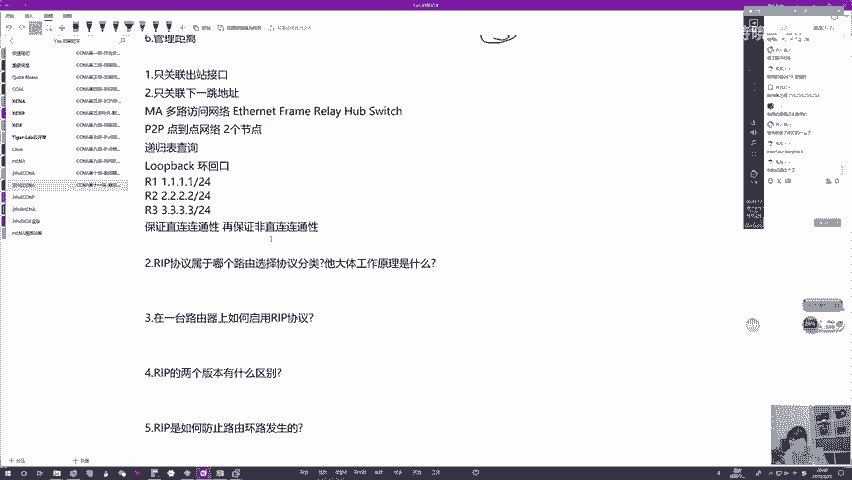

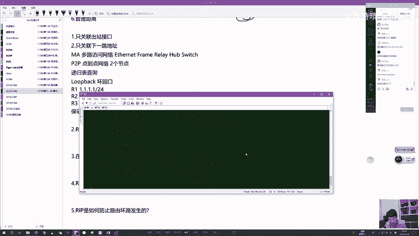

是吧也能拼通。那当然第一个包呢没有拼通的原因是什么呢？是因为咱们没有对方的ARP信息嘛，咱们通过ARP来做了一个解析。在解析的过程中呢，咱们第一个拼包超时了，那当然后续的包呢，对吧？

由于你有ARP条末了嘛？那自然而然对吧？都有了都没问题了，对？那这个能并通就代表咱们这个联通性没有问题了，那联通性没没有问题了，哎，咱们还回口之间能访问吗？不能对吧？因为R一的还回口跟R没有直连。

所以说R路由表里面有没有一的黄口路由啊，没有，所以这个时候当你R去拼1。1。1。1的时候，对吧？你的路由表里面没有任何一条路由能够命中这个数据包的目的IP地址，对吧？你最终拼的结果是什么？

那自然而然就是不同啊，对吧？那接下来你希望它通怎么做呢？那你需要有路由吧，对吧？那对于这些非直连路由，咱们怎么办呢？写静态好吧？进入到全局配置模式IP。😊。

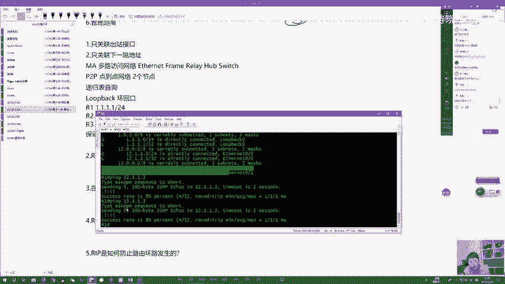

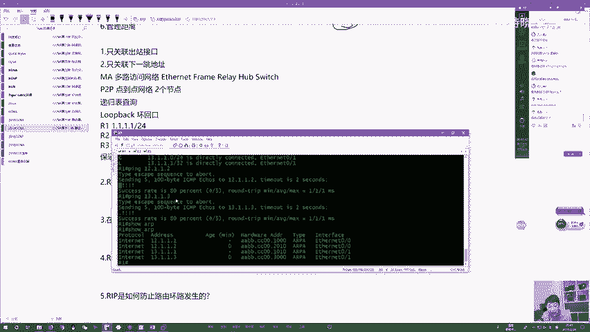

。1。1。0对吧？掩码24倍，对吧？这就是我要访问的目的网络嘛，这就是我要访问的目的网络。这个就是该目的网络对应的掩码。注意啊，写路由的时候的一个大G，就是你在配置静态路由的时候，你这一段啊。

直接写上你要访问的那个目的节点IP地址，注意啊，路由表里面的路由条目不是指向一个主机的，它是指向一个网络，网络的标识符是什么呢？就是主机位权为零的IP地址，能理解吧？所以说静态路怎么写啊？

你要通过这种方式去写OK然后紧接着怎么样呢？对吧？就是我要去网的目的网络前置和掩码，然后要么怎么样跟一个出接口，要么跟一个小条地址。那咱们在这个环境中到底是跟出接口还是跟下调地址呢？这就会比较为难。

因为大家如果懂的话，会知道，对于R而言啊，我要访问R一的环为口，要把包通过以太网0-1口发出，这个以太网0-1口是一个以太网接口。以太网接口所连接的以太网，它是一个MA网络。

但是在咱们这张图中的连接来看啊，这又是一个点到点连接，对吧？在咱们这个环境中，除了R就是R一，你没有第三台设备，那所以说呢我到底把这个网络当点到点网络来处理，还是当MA网络来处理。好，请注意啊。

咱们要当MA网络来处理，可以吧？你一个网络到底是点到点还是MA跟你具体怎么连是没有关系的。可以吧？它是跟你这个网络的属性有关，可以吧？你是一个以太网络，你是一个真中介网络，就算在这个网络中啊。

你是用点到点连接的。但是你可以理解为哎我中间可以来开交换机，对不对？你中间来台交换机，这个交换机接口一多，那你能连接的设备是不是多了，所以说你不能保证在你这个网络中啊，只有咱们这两个节点。

你可能会有其他节点存在，你只要中间多一台极限器或多一台交换机就能轻松实现这一点可以吧？但是如果说你这是一个真正的点到点网络连接啊，那这个就是不出意外，对吧？当然也没有意外啊，就是绝对意义上的。

咱们能够保证啊，这个网络里面就咱们俩你不管玩什么样的花样，网络里面就咱们俩不可能加第三个人可吧？那所以说呢你还是要根据这个接口的属性来做一个判断O那接下来这边的话，既然不能跟出接口怎么样呢？

咱们在直块就跟下一条地址，对吧？所谓的下一条地址，这台路由器去往目的网络的。沿途第一条路由器的直连接口地址，对吧？对于R而言，我要访问R一的黄回口怎么样？我要把下一条写为谁啊？写为这个对吧？

R一的这个接口，那这个接口地址是12。1。1，对吧？你就这么写就好了。好，解读一下这条命什么意思呢？就是现在我要访问这个目的网络，对吧？前缀是1。1。1。0啊，言码是24倍，我要访问这个网络怎么办呢？

我得把包发给这个下一条地址，这个下一条地址就是R一的以太网0-0口地址。那接下来当你写完之后，你可以少一下少IP。OK这个就是咱们刚才所配置的静态路由，对吧？你要访问的目的前缀在这里啊，当然掩码在这儿。

对吧？下一跳就是where12。1。1，对吧？然后紧接着这个路由呢前面是管理距离啊，后面呢是度量值，对吧？管理距离我也跟大家说过啊，用来描述这个路由获取方式的可靠性，对吧？最小值是零最大值是255。

当然零的话只有直连路由可以使用啊，那静态呢就是除了直连路由以外啊，思科认为最可靠的这么一种路由获取方式。然后接下来有一种静态路由呢是管理员要求路由器啊去往一个目的网络，对吧？我希望你怎么走。

那具体的路径信息呢不是路由器判断的那所以说了这种路由你可以理解为我不需要你路由器来判断它的好坏，它没有好坏，因为是我说了算的那所以说了它的度量值就恒为零。零呢不是说它这个度量值没有啊。

不是说这个路径是最好的，只不过说这个零呢就代表这种路又是没有度量值，可以吧？那接下来有了静态录之后呢，哎我们就来拼一把P1。1。1。1，对吧？那现在呢咱们有路由了，哎，它就居然就拼通了。但这个拼通的话。

我来问大家一个问题啊，这个拼通能够检测出咱们R2的环回口到R一的环回口之间的连通性吗？我直接在R上拼R一的环回口，这算是测试了咱们的环回口之间的连通性吗？😊，是不是？😡，是不是的。好，请注意啊。

不是还真就不是。为什么呢？因为现在我在聘RE的还口的时候，我只是说了P1。1。1，这个1。1。1。1是什么？是咱们聘包的目的地址，可以吧？这是咱们聘包的目的地址。而原我有指定吗？请注意啊。

原我是没有指定的。那接下来这就尴尬了。你一台路由器有这么多的接口，我在聘一个目的地的时候，又没有指定聘包的原地址。那这个聘包的原地址是多少呢？好，请注意啊，它的默认的选址是这样的对吧？

你在聘一个目的地的时候，我查路由表，对吧？看一下，为了把包发给你这个目的节点，我得要把包对吧？走哪条路由通过哪个接果发出。那接下来传完表之后呢，发现哎，我为了把包发给一点点一。

需要把包通过以太网0-1口发走。而这个以太网0-1口的地址就会成为咱们这次聘包的原地址，对吧？这就是经典聘的原地址的选址方式。换者话说你聘一个目的地包最终通过你哪个接口发出。

你这个发包接口的IP地址就会自动成为聘包的原地址。那所以说这块咱把R聘通一的还回口，其实检测的是什么呢？检测是R自身去。R一环回口的连线通行。那这个连通性有必要吗？没有必要有价值吗？没价值。

因为咱们最终目的是什么呢？是要二的还回口能够访问一的还回口。那接下来咱们就要修改聘包的原地址，对吧？那怎么修改呢？就是聘这个目的地的后面啊，加一个sce，对吧？sus2。2。2。2，对吧？

那这就是所谓的叫代原聘啊，这个叫代源聘。这个待源聘的特点是什么呢？就强行指定聘包的原地址。那因此，不管咱们这个聘包呢，通过哪个接口被发出，原地址，一定是我所设置的该路由器某个接口地址，对吧？

无论你聘包通过哪个接口走啊，原地址都是2。2。2，那当然后面这个你不能乱设了，你必须得要设置为一个本机存在的接口地址，你如要说乱指定一个，他给你报错了，都会告诉你，你没这个地址，对吧？不给你指对吧？

O那接下来指完原之后你会发现哎，现在呢他这个聘就不同了，那不同的原因是什么呢？就希望大家一定要了解啊，咱们这个聘的原理啊，所谓的聘原理是什么呢？就是你在聘一个目的地的时候，对吧？你把聘包给发出，对吧？

你把聘包给发出，这个包呢是从你到达目的地，你发送一个，然后接下来目的地收到聘包之后给你回应一个对吧？应答码要告诉你，我收到了对吧？我收到你的聘包了，那他给你回应的。答什么呢？叫echo reply。

那当前这个ele reply，它能不能回得来呢？是回不来的。你的拼包能到达R一，因为你有这条静态路由，对吧？但是R一收了你的拼包之后，对吧？它在回包给R2的环口的时候，你觉得R一会有R2的环回口路由吗？

很明显没有啊，对吧？很明显没有。所以说当王一收到拼包之后，我再给你回应的时候，会由于没有路由，这个apple apply就丢包了。这就是为什么在R上对吧？你拼不通这个目的地。好，拼不通的原因是什么？

是P方能过得去，回包不能回得来OK那接下来为了回包怎么样？你在R一上也需要写一条静态吧，怎么写对吧？这就是前缀然后呢，这就是掩码是吧？然后紧接着跟什么下条地址，对吧？对于R一而言，我要访二的还回口。

我得要把包交给R这个接口吧，R这个接口地址是12。1点。2好吧，配上去受下少IPO那这边的话这就是咱们所写的静态啊，有了静态之后，哎，我们再来试一下，哎，对吧？这次带原P就能通啊。

那这个通才是正儿八经的描述啊，咱们两台路由器的环回口之间的连通性，对吧？让你们之接互联互通O那接下来你们之间能通了那R自然来怎么样，也能通R3嘛，对吧？你也能通R3，那你要通R三怎么通啊，一样嘛？

写静态好吧，写静态怎么写。😊，全局配置模式IProot3。3。3。0对吧？延满24位。然后紧接着怎么样？哎，还是要跟下一套地址啊，对于R而言，访问阿3也好，对吧？访问谁也好。

你都得把包交给阿姨这个接口是吧？那阿姨这个接口地址是12。1。01。好，写完之后收一下售IProot。哎，有了吧？O那接下来公在R上写这条静态路由够吗？不够啊，因为R跟R3不直连。

你为了把包发给R3的黄回口，对吧？你会使用这条静态路由把包呢先发给R一，那R一收到这个包之后，它还需要对这个包查路由表来确定怎么转发吧，那这个时候呢R一收到这个包R一又懵逼了，对吧？

发现哎去往三的黄回口没有去往三的路由吗？然而并没有对吧？以这个时候你可聘一下聘3。3。3。3，你会发现R就聘出U来，对吧？这个之前我记得有个小伙伴问过我啊，聘一个目的地聘出U是什么意思？

U就是你有路由对吧？但是你的下游设备，他们没有路由，你有路由，但是聘不通，那这个显示的结果就是U可以吧？你有路由，但是拼不通。那当然U的理由是什么？R一没路由嘛，对吧？那怎么办？哎R一。😊。

写一条路由IPro3。3。3。0对吧？演到24位。对于RE而言，我要考R3，下跳谁啊？就是R3这个接口吧？R3这个接口是13。1。1。3，对吧？受下受IProconnect啊，叫。好了，看到了吧？

去往二的还口路由有了啊，去往三的也有了。那当然光R一上写完静态还是不够，为什么呢？因为现在你这个拼包去包能过得去了，但是R3收到的去包之后，人家要给你回应，对吧？R3有回包路由吗？没有对吧？

所以说这个时候怎么样？我要写一条去往二的还回口的回包路由，对吧？帮助咱们这个回包啊成功回回去。那当然对于R3而言，我要把包回给R2，它的下调是谁啊？是R一的已太往0-1口，对吧？这个接口地址是13。1。

1。1，对吧？做好之后呢，收一下，好吧，有了这条静态，这就O了。那当然刚他把包回给R一之后，R一就不用担心了，因为R一它之前已经写过了去往R2的河口路由了，所以当你R一收到回包之后。

它自而然会通过这条路由啊，再帮你把包回给R，那接下来我们在R上聘一下P。😊，3。3。3。3s2。2。2。2，对吧？那最终的P就通了。那通过这个P告诉大家了。在网络中呢，我们在研究联通信的时候啊。

大家千万不要只研究从原到达目的地的路径信息，你从原到达目的地能通，这个固然好啊，对吧？代表你路径没有问题，当然呢你从原到目的地，光这么一个方向能通够吗？我觉得有时候是不够的，对吧？你从原到达目的地要通。

从目的地到原回包也要通，对吧？所谓的流量通信是什么呢？就是你发包去往一个目的地，目的地也会给你回应，发包能过去回应也能回来，对吧？这个才叫真正的连通OK那这个就是需要大家注意的好吧，那接下来这个静态呢。

我也你说了，一般你在一个企业中啊，我们在边界路由线上用的比较多啊，因为你边界路由器，边界防火墙，你办理企业宽带之后呢，你会连一根线，连到运营商。那当你连到运营商之后，对吧？大家懂得啊，对吧？

你就要通过这根外线嘛来访问咱们英特网的各种各样的资源。那为了访问英特网各种各样的资源，你边界路由器，对吧？需要有路由去往外网，那这个路由该怎么写呢？对吧？你不好写精确啊，因为外网多大，外网太大了。

外网就是除了你内网以外呢，所有英特网嘛，对吧？你可以理解为在外网中咱们所有地址所有网络都有使用。那所以说呢你也不用管那么多了，如果说你连接外网只有一根线，那最好的方式是什么呢？

就是你在边界网络设备上写一条静态默认去往目的地，对吧？去往这个运营商，也就是说只要你收到去往外外网包啊，你不知道该怎么走了，你就通过静态默认发给这个运营商，而运营商它的这些路由器啊是拥有全网明细路由的。

它就能根据咱们收到的包来帮我们怎么样进一步转发。那这个是最好的。小型企业访问公网的这么一个路由部署方式，就是在企业边界写一条静态默认需要外网，对吧？好了，那接下来这个静态呢基本在这个地方用的最多啊。

那当然在在企业内网对吧？静态反而用的比较少，为什么呢？因为静态这个协议当然不不叫协议了，叫静态这种配置啊，它最大的问题就是太局限了，你配置一条命令，你一台路由器呢只能产生一条路条目。

并且产生路由条目还不能传递，这个太麻烦了，对吧？如果说你内网比较大，对吧？网络设备比较多，内网的网络又比较多，那你这个静态写起来可能会比较怎么样消耗资源，并且这个静态你写完之后呢，它是固定的。

如果说你网络出现了一些问题，你路径出的现出现了一些崩溃啊，你想让静态路由根据咱们路径的崩溃来重新选路，这是不可能的，它不能够实时的去修改路径，对吧？它不能实时去修改路径。那所以说这个问题就很大了。

这个问题就很大了。所以一般建议大家对吧？为了省事儿节约配置，对吧？让我们容易管理，对吧？并且让咱们这个路由选择协议啊，而让我们这个路由器的路由啊，能够根据咱们实际的路径的调整来自动做一个调整。

那一般情况建议大家在内网运行一款动态路由选择协议，对吧？这是比较好的，运行动态路由选择协议最大好处是什么，对吧？你不用关心咱们有多少台路由器，你不用关心有多少个网络，反正你起这个协议嘛，就那么几条命令。

对吧？你路由器多一点，那可能也就是一开始啊多敲几条命令，那之后呢它不用管了，然后接下来动态路由选择协议，最大好处是什么呢？就是它能够实时的监控咱们路由器之间的路径是否O如果你路径ok，对吧？

我就给你用着，如果路径不ok哎，我能给你做一个选路嘛，我能给你做一个路径切换，对吧？那这个是静态路由所做不到，可吧？那当家洞察中选择信息很多啊，今天由于时间的问题给大家介绍其中一款。

这款是所有动态优选的协议中的，算是一个比较早期的协议。这个协议很早期啊出现的比较早，而现在呢用的比较少，它的定位是什么呢？就是适合于中小型企业嘛，可以吧？适合于中小型企业嘛，可以吧？

那对于咱们这个企业主而言，对吧？对于咱们甲方的大佬而言啊，对于咱们客户而言，你使用repo，咱们的期望是什么呢？就是期望这样的协议啊，不要过多的消耗咱们的硬件资源，可以吧？

可能他们的路由器交换机不够高端，你如果跑一些比较高端的协议呢，虽然看起来高大酷炫。对吧比诈天啊，但是可能对吧？你。你这个资源消耗太多，对吧？你路由器的内存CPU不足以来转发咱们实际的数据。

那可能会导致咱们庸次，对吧？那这个就是使用raip的第一个点。第二点就是咱们网络也不复杂，你也不用担心还路，第三个点就是对吧？咱们网络虽然可能设计时候有冗余啊，对吧？

你一台路由器去往一个目的地可能会有多条路径，但是呢当一条主路径 down掉之后，我也不期望着你说是什么多少时间内立即做一个路径切换，对吧？也没有那么苛刻的要求，你就慢慢切换，反正最终它能自动通就好了。

那只要客户呢这么比较佛系啊，什么都无所谓，那这个时候使用rapo是没问题的。但凡客户要求高一些。我觉得raip呢就不能实现了。那为什么呢？原因是因为这个协议毕竟太老了，他在设计之初，对吧？

当时的网络里面其实也跑不了什么应用，对吧？那所以说呢瑞这个协议呢为了照顾当时那些网络啊，对吧？它的定位就没有那么高大上。里面就没有设置一些对吧？像什么快速收敛的机制啊，然后像什么就是对吧？防还的机制啊。

然后像什么能够支持中大型网络这么一个机制都没有设置，对吧？那所以说从定位上来讲，它就只支持中小型网络。ok好，那接下来这个协议呢，咱们先来说下它名称啊。

它叫roouting informationpro。这个叫路由选择信息协议啊，叫路由选择信息协议。那这个协议呢属于哪些分类呢？对吧？我们之天说了路由选择协议分为很多分类啊。

那首先rapip呢属于IGP对吧？是一个内部网关协议啊，不用想了，只能在1个A内只能在一个园区内来部署？然后紧接着ip呢它啊是一个距离矢量协议不用说了。早期的路由选择协议肯定是距离矢量协议。

你运行这样的协议也不要指望它能多多么高大上啊，就是你路由器直接运行之后，对吧？我这台路由器把我已知的网络的路径信息，也就是说把我已知的路由表里面路由啊，通过更新的形式发送给你对吧？

你也把你已知路由信息通过更新发给我，对吧？我我记得我给大家举过一个例子啊，R一连接R对吧？R2身后有一个X网络，对吧？那这个时候呢X网络跟R直连。所以说R拥有X网络路由。但是R一是是没有啊啊，没关系。

你们之间运行运行之后呢，R2。😊，会给阿一发送更新。那在这个更新中，R会告诉阿一啊，哎，我身后有一个X网络，当你要访问这个网络的时候，你把包交给我就可以了。那阿一呢收到这个更新，他也不会去怀疑啊。

但是他他也没有办法怀疑，对吧？他只能信任，只能选择信任。那接下来选择信任之后呢，他就会把这个X网络路由加入表，并且把路由的下一跳指想R对吧？那今后呢就是他就会使用这个路由对吧？来转发去往X网络的数据。

O了，当然呢X网络在哪里，R一是不知道的对吧？他到X网络经过几台路由器，他也是不知道的路由器之间怎么连接，他也是不知道的对吧？网络分布在哪台路由器哪个接口之上，他也是不知道的，他不知道网络拓扑连接。

他仅仅是听从他的邻居告诉他的去往这些非直连网络的路径信息而已，可吧？所以说了经典的基于传闻的协议。就是因为这是些基于传闻的协议。一台路由器收到邻居给他发送的更新啊。

他没有任何依据来判断这些更新里包含的路径信息到底是对的还是错的。对吧？我的邻居只是一味的告诉我，你要访问这个网络吗？把包交给我呗，对吧？你要访问那个网络吗？把包交给我呗，对吧？

但这个网络那个网络真的在你这个邻居身后嘛？我不知道对吧？就是因为我不知道，所以我也不能怀疑你，我只能说是你怎么给我说对吧？我就怎么信，我就信你了，我信你的邪嘛，对不对？你若果告诉我是对的，那没问题。

你若果告诉我是错了呢，对我就只能将错就错，那最终就会导致什么一组路由器之间围绕着错误的路径信息，咱们开始以讹传讹，那最终结果是什么呢？那就是大写的路由选择还路。😡，可以把一组路由器按照错误的路径信息。

以讹传讹是吧？我把我以为是对的信息其实是错的，告诉给你，你再告诉给你的邻居，对吧？大家这样传下去，那就完蛋了。OK好，然后紧接着呢瑞有两个版本啊，版本一注意啊，reip版本一是个有类型议。

那这个有类协议咱们可以无视了，太垃圾了。然后呢，版本二是一个无类协议啊，这个无类协议还比较好啊，对吧？当你在运行无类协议的时候，路由器之间在交互路径信息的时候，对吧？我给你发一条更新，里面包含一条路由。

这个路由里面前缀会包含掩码会包含下一条地址会包含度量值会包含，还能额外包含一个路由标记，而在瑞普归一中，这是个有类协议啊，我跟大家说过，什么叫有类协议啊，就我一台路由器发送一个更新给邻居啊。

更新中包含的路由只能包含前缀，只能包含度量值，而掩码和下一跳地址是不会包含的。当然这个下一跳无所谓了，对吧？对方一猜能猜对啊，不会猜错，而这个路由的掩码，对方想要猜对的话，对吧？你还需要一些步骤，对吧？

那当然这些步骤也是基于你在编码的时候，你在录地址规划的时候，对吧？你没有出格，对吧？你没有使用VOSM你如果没有使用VOSSM呢，对方一般收表。😊，路由这个掩码是能猜对的。

但是如果说你要用了VOSM那这个reV1就可以对吧？C拜白了。你这种协议就根本不支持这个VOSM的环境，对吧？那当然早期的路由器呢都是有类路由器啊，你运行V1这是没办法的，但是现在咱们路由器。

就算你再low，你好歹也是无类路由器，对吧？这些无类路由器，你在跑过去运行一个有类路选的协议，你这不是在倒退嘛？那所以说咱们现在就算使用瑞ip啊，也一定会使用无类，对吧？又使用V2这个版本。

那当然你使用V2这个版本之后，你也不用太过担心这个地址的使用，对吧？你VOSM想怎么做就怎么做，没有任何关系。那当然在使用V2的时候呢，为了让咱们这个VOSM真的能够发挥咱们的作用，就给大家一个建议啊。

你启用瑞V2之后呢，关闭它的一个功能，这个功能，咱们称为叫自动汇总，对吧？叫，对吧？这个自动汇总呢唉其实是有。路由选择协议中必须使用的这么一个功能。这个功能的工作原理如下。

就是你一台路由器通过一个接口发送一条路由，对吧？你要判断这个路由的前缀跟你发送路由的接口的IP地址，在不在同一个主类地址段，那如果说在唉那这个路由呢，我就原封不动的，以明细形式给你发走。

而如果说我通过一个接口发送一条路由，这个路由的前缀跟你发路由的接口IP地址啊，如果不在同一个主类地址段。那这个时候路由器会不由分说，立刻把路由的前缀啊汇总成主类前缀，然后呢，把这个汇总路由给邻居发走。

而这个明细路由呢，我就不发了，对吧？就比如说啊咱们有一个例子，R一嘛，R一的还回口1。1。1。1E24位，对吧？它连接R2的路理接口是12。1。124位。那这个时候如果你要在R一上运行一个ra口对吧？

如果你要开启了自动汇总啊，对吧？当你R一把你的环回口路由对吧？以更新的形式通过连接R2的接口发走的时候，对吧？你就会以这种形式来发送，对吧？你就会以这种形式来发送，为什么？因为你的环回口的地址，对吧？

你的环回口的路由啊，跟你这个连接R2的接口的地址不在同一个主类网络，对吧？你R一的还回口所属的主类网络是1。0。0。0对吧？你连接R2的这个地址所属的主类网络是12。0。0。0。

你们不属于同一个主列网络，所以说我在通过这个接口发送我的环口路由的时候，我要把这个路由汇总成什么主类路由，然后发送，能理解吗？这就是自动汇总，那当然这个自动汇总呢，在有类的协议中，你是不能关闭的。

因为咱们就是通过这种方式来尽可能的帮助接收路由的接收者来判断它所收到的路由到底多少严嘛，对吧？但是呢对于这些无类协议而言，自动汇总就显。非常非常多余啊非常非常积累。因为这个技术第一不可控。

它发生汇总的地方不是咱们管理员期望汇总的地方。所以我承认路由汇总是非常有必要的，对吧？你通过把多条路由做一个合并，你能让路由器使用更少的路由指向去往更多的目的网络，那这样做咱们路由表条目越来越少。

你占用的内存资源就越来越小，对吧？并且你路由条目少了，你在转发数据的时候的效率也会越来越高，所以说了之所以咱们路由选的协议啊能够在整个英特网扩散，原因就是因为咱们做了汇总，咱们做了聚合，对吧？

我们把去往多个目的网络的连续路由条目做了一个合并，合并之后，对吧？咱们路由表的空间，哎，更加的唉，算是优化了，那优化之后，你路由器的性能得以保存，用作数据层面转发，那这是大家都愿意看到这么一个结果。

对吧？当然呢自动汇总它这个太过了，因为就是不可控，对吧？第一不可控。第二，你使用这种方式来汇总的话并不精确。所以说如果你要开启自动汇总，请注意啊，是很有可能会出现路由黑洞的对吧？很有可能会出现路由黑洞。

那所以说既然既然瑞普V2是个无类协议啊，但是我们明白为什么这个协议在启用时候啊，它默认会开启自动汇总，那可能是从V一继承特到的，对吧？当然不要紧，对吧？

你可以通过叫no out summer的这么一条命令啊，来把自动汇总给关闭掉。那当然你把自动汇总给关闭了，那就无敌了。你关闭之后，大家明白了？我们这些路由器在通过任何接口发送任何路由更新的时候。

你就不用再去比较什么发送接口的IP地址跟路由的IP地址到底在不在同一个主类地段了，不去比较，我就直接给你发明细，为什么这么有自信啊，原因是因为无类协议嘛，我给你发的路由中本身就已经包含页码了。

不需要你去猜，不需要你去猜，你也不会猜错。那所以说viLSM想怎么用怎么用，这个自动汇总对吧？该管就管国安的自动汇总，如果你真的想合并路由，请你使用什么手工汇总。那当然这个手工汇总呢，在NA中。

对于大家而言太过高大上了啊，那这个我们在NP中呢，慢慢跟大家说一下。大家提一句闲话，咱们MP呢刚结束啊，然后呢，3月9号10号我们会开启新一轮的IE课。然后呢，这是在3月之前的啊我们一轮新班啊。

那这轮班呢就是欢迎大家来参加咱们这个公开课的群啊，来咨询咱们的课程顾问老师，好吧，大家可以去了解了解相关内容，因为咱们3月初呢就会调整价格，大家都知道会加点价，对吧？涨涨价，因为咱们提升的服务嘛，对吧？

曾经都是我给大家一对一啊，现在呢是我们找了一票助教老师找了一票班主任给大家四对一的服务，对吧？甚至有可能会五对一啊，六对一，然后紧接着呢咱们呢想月考服务啊，对吧？像啊作业系统都已经越来越完善了。

然后大家以后呢就是可以享受一月考、2月考3月考等之类的这么一个阶段性考试来做一个测试。然后呢就是对吧？作业系统，对吧？也会有助教给大家就是改。作业，然后呢排名。

然后呢就是对吧给大家就是讲解作业里面的一些内容。然后呢方便就是大家呢学习的话效率提高嘛，方便大家学习效率提高。那当然如果感兴趣的话，可以加我们这个群啊来咨询一下，当然课程的话主要还是由我讲啊。

还是主要我讲，大家不用担心会换老师好吧，那这边就是欢迎大家来咨询当然3月3号咱们会开一轮新的NA啊。这个新的NA的话，就是课程会更加的就是完善一些，内容会更多一些，可以吧？

那当然如果感兴趣也可以去问一下，O好，那言归正传啊。那一般呢咱们在运行raip的时候，肯定使用V2啊，肯定使用V2五类协议可以吧？那相比有类这个五类协议呢真的会好很多，可以吧？

然后紧接着你在路由器上运行ra之后呢，这个ra协议比较简单，可以吧？它在路由器之间呢只会交货两种类型的宝文，可以吧？一种类型我们称为叫request叫请求。还有一种我们称位叫。Response。

这个我们称维叫应答，对吧？叫硬答。叫应答。而这个应答报文呢，咱们一般用的比较多啊，就是当你在路由器上启用ra之后呢，这个应答它会周期性发送，可以吧？应答默认是每30秒一次啊来发送。

而这个应答就是咱们俗称的更新报文，对吧？这就是咱们俗称的更新报文，里面包含什么内容呢？就是包含路由器路由表中啊，现存的路由条目，对吧？我把我已知的路由发给你，你把你已知路由发给我，那这样的话。

原本我会的，你也会了对吧？你会的我也会了，咱们就是通过这种方式来做一个路由的交互，可以吧？那接下来这个协议到底怎么运作呢？哎，咱们也来看一下好吧，咱们也来看一下，它的运作原理非常简单。

是所有协议中最简单的？那当然既然是一个路由选择协议总会有些套路啊，这个套路在EIRP中在OSPF中在I中对吧？所。

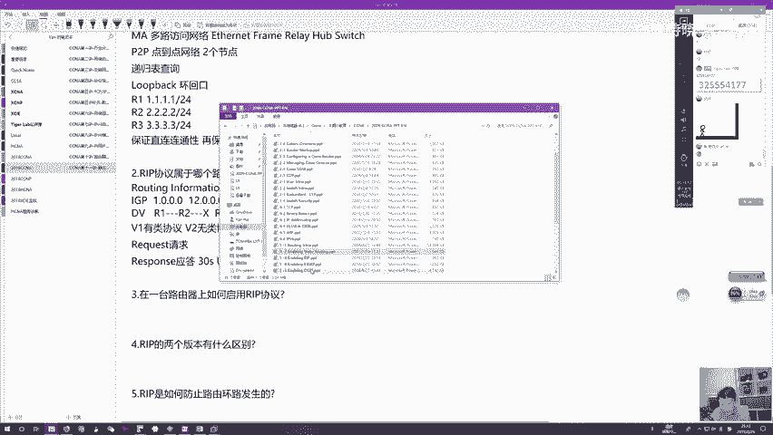

IGP里面都是一样的，对吧？就是启用的这么一个步骤。你想要在一台路由器上启用一个路由选择协议，当然瑞ip也不例外啊，你得要先在这个全局配置模式下来启用一个路由选择协议的进程。当你启用这个进程之后。

你得在这个路由器上通过network命令把路由器的各种各样的接口宣告进咱们协议进程，对吧？那这就是咱们启用一个协议的两部曲，那当然在宣告完毕之后呢，对于瑞ip而言，你可以就是通过命令来开启咱们的版本2。

对吧？通过命令去关闭咱们自动汇总，那这基本就是咱们要操作的全部的对吧？那接下来这三步到底是什么意思呢？我也给大家解释一下，首先第一步全局启用一个raip，这是肯定的，因为你默认是没有启用这个协议，对吧？

你要启用这个协议，你需要通过一条命令去启用，但你启用完毕之后，这个协议默认是不能工作的对吧？因为毕竟路由选择协议是基于接口来工作的对吧？你要指定我希望哪个接口启用。はい？你希望哪个接口启用rappo。

你就把这个接口宣告进reip就好了。可以吧？这个宣告呢是一个路由选择协议的专用名词啊，它是一个叫专用名词。

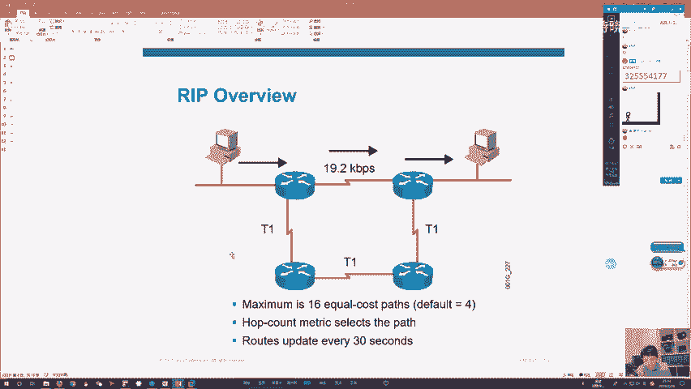

宣告是什么意思啊？就是在一个接口启用路由选择协议，对吧？那当然咱们一般的不会按照后面说法来说啊，因为可能会说起来比较拗口，说起来会比较长，那所以一般我们就说了，哎，你要启用一个协议，对不对？对吧？启用。

然后呢把接口宣告进来，对吧？宣告还回口什么意思啊？就是在还回口上启用raple，宣告已盼网0-1口什么意思啊？就是在以盼往0-1口上启用reple，这就是宣告这么一个意思。

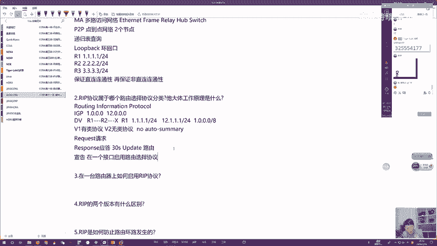

那当然你把一个接口宣告进rap之后呢，这个接口对吧？就相当是启用rap进程了。你通过这个接口就可以收发rap报文。当然这个request咱们一般是不发的啊，我们就发response。

这个resse怎么发呢？在每个启用rap的接口上，咱们都会周期性的30秒一次的来发送，对吧？里面包含什么内容呢？就是包含路由表中已有的路由，但是请注意啊。

你宣告的接口跟你通过接口发送更新里面所包含的路由是有关系的。那一般建议大家宣告你的接口呢，就凡是你接口上配置了IP地址啊，那这些接口建议大家都去宣告。你只要能宣告的。

咱们都宣告路由器之间直连的接口肯定要宣告啊，因为你要发送更新给邻居嘛？邻居要发送发送更新给你吗？你发的更新，邻居要能收邻居给你发的更新，你要能收，对吧？所以说路由器之间互联的接口，这是必须要宣告。

你不宣告的话，咱们更新根本没法传递嘛。然后紧接着怎么样连接PC所在网络的接口啊，也建议大家宣告。那为什么这些接口的宣告呢？因为你这些接口并没有连接其他的路由器吧，你通过这个接口发送更新也没人收嘛，对吧？

并且通过这样的接口你不需要接收别人给你发的更新。那为什么这样的接口要宣告呢？原因是因为这种宣告会影响你通过其他接口发送更新中啊，所包含的路由，这个路由是会根据你的宣告。

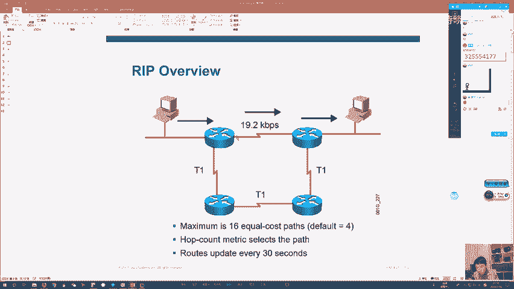

改变对吧？那接下来告诉大家。😊，你一台路由器的一个接口宣告你一个协议之后啊，你通过这个接口到底能够发送哪些路条，你能发送哪些呀？你能够发送该路由器，宣告进该协议的所有接口的直连路由，对吧？

紧接着还会发送什么呢？该路由器通过该协议学习到的已经加入。路由表的该协议录由，对吧？这就是你通过一个接口发送更新所能包含的所有路由信息，对吧？那现在举个例子，左边这是R一对吧？右边这是R2。

你希望R一把左边这个网络的路由发给R，你希望R把什么右边这个网络路由啊发给R一，那怎么样？你肯定要在R一和2上把左右这两个网络接口宣告进去，因为如果你没有宣告的话，对吧？

你通过你们之间的直连内路发送更新的时候，对吧？你能够包含这个没有宣告的接口的直连路由吗？你包含不了，对吧？所以说了你要宣告O吧？那简单来说，你所有接口都宣告了，那就什么问题没有了。你所有接口宣告了。

你代表路由器之间的直连接口是没问题的对吧？你能发送路由更新啊给你的邻居，你的邻居能发送路更新给你，然后宣告这些PC所在网络的接口的目的是什么呢？就是宣告完毕之后，你通过。

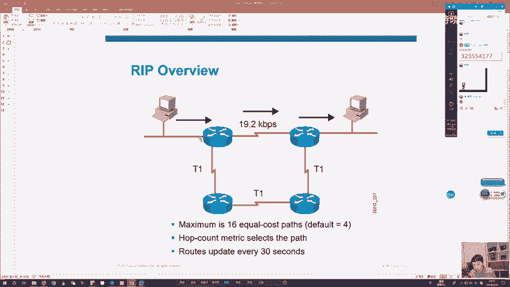

连接路由器的结合发送更新的时候，你能够包含PC这些所在网络的直连路由，对以吧？当然你把路由告诉别你的邻居，你的邻居就学习这些路由。他学习这些路由之后呢，就能把路由进一步通告给他的其他邻居。

他的其他邻居又会进一步通道，对吧？那最终呢咱们这个路由啊会扩散到咱们网络的每一个编辑，对吧？那最终就是大家有的路由，大家就都有，对吧？我的路由大家都有，大家路由我也都有对吧？那这个时候就出现一个问题。

比如在我们这个例子中啊，R一去往右边这个网络，我现在如果你在四台路由器上都运行的瑞口，你会发现R一通过上面的路径和通过下面的路径。

都能学到去往右边网络录入信息。那这个时候咱们能通过两条路径访问右边网络，我到底会通过哪条路径呢？瑞普肯定会通过上面这个路径，为什么呢？因为瑞普这个协议啊，它是基于跳数来衡量路径好坏的，对吧？

你一台路由器，如果直连一个网络，这种直连网络啊，我们称为叫零跳，因为跟我直连嘛。但是当我把直连网络路由发给邻居的时候，我就会把这个路由的跳数设为一跳。因为在我看来对吧？我跟这个网络直连这是零跳。

到我的邻居，他要通过我才能访问这个网络，对吧？你要通过我访问这个网络，那是不是一跳啊，所以我提前把这个跳数给你设置好，那接下来我的邻居再把这个路由发给他的邻居的时候，就会把跳数呢设为两跳，对吧？

那因为它的如意算盘大的也很好嘛，对吧？我去往这个目的网络已经经过一跳了。你去往目的网络还要先经过我，对吧？那所以说你访问这个目的地就是两跳。

那接下来如果一台路由器呢通过多条路径学到了去往相同目的网络路由。那很简单比较这些路径。好坏。那首先呢要比较管理距离啊，瑞普的管理距离都是120，对吧？就是比不出来好坏的对吧？都一样。

那接下来咱们就比较什么度量值，那比如在我们这个例子中，左上角这个R一R一去往右边的网络走上面的路径啊，度量值应该是一跳，对吧？你只要经过R容到的，但你走下面路径呢是几跳啊，R把路由发给R3是一跳吧？

R3发给R4，两跳，对吧？R4再发给R一3跳，下面是三跳，上面是一跳，那所以说R一自而然啊，会优选上面路径。但是问题又来了，上面路径真的好吗？😡，它其实并不好。

因为你们仔细看能看出来上面是一条低速路径啊，它的带宽链路带宽只有19。2K。19。2K是什么概念？它甚至要比我们对吧？曾经那个56K的猫还要慢，而它的下面路径呢是3条TY路径。

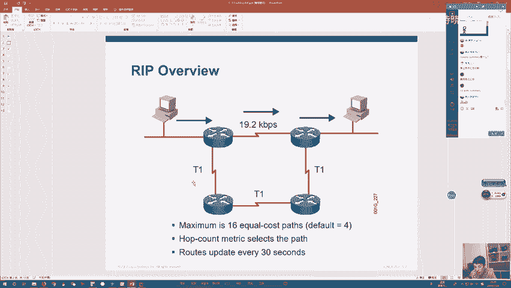

T万路径大家可能没有见过啊，是一种比较综合的链路，可以传咱们的数据，也可以传语音。它的带宽呢是1。544兆比特每秒，可以吧？一个是1。544兆比特每秒，一个是19。2K。

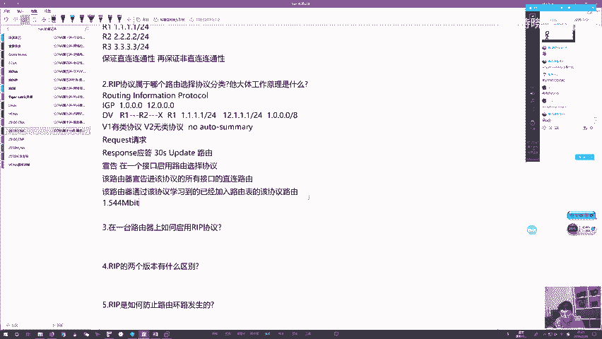

那在大家来看，你们觉得这两条路径哪条优啊？我觉得肯定是T one的路径优嘛，对吧？肯定是T万路径优。当然了瑞普它这个路径好坏的判断机制啊，就非常像一股清流一样，对吧？洗瞎了咱们的眼睛啊。

它不看你链路带宽，不看你链路的延迟，不看你的丢包率，不看你链路的满载程度，它单纯就看你这个链路经过多少条，那这好比什么呢？这好比现在我要开车回我家，有两条路径可以走，一条要走10公里，一条要走3公里。

但三公里，这些路都是一些泥泞的小道，对吧？有可能一个会车你都走不了的，而那10公里的路，对吧？双向八车道，没有一个红绿灯完全不可能堵车的高速公路，并且不收费，你走哪条。😡，我觉得谁都会走高速。

谁会走那个泥泞的乡间小路，对吧？但是瑞普不管他就根据你从原到达目的地的直线距离来判断你好坏，对吧？那所以在他来看，对吧？上面路径只隔了一跳，我管你带宽多少呢？反正你跳数少，你就是最优的。下面对吧？

你带宽高，反正我也不关心你经过了三跳，那就是不好的。所以说哎按照他这个说法好像也是这么回事啊，但是呢他的解读在咱们管理员来看，对吧？我们有点遭不住了啊，那所以说啊这个为了拯救咱们管理员脆弱小心脏啊。

有的时候你在运行raip的时候，你不得不手工的去调整咱们路径的度量值，你得把那些rap认为最优，但管理员认为不优的路径，给他度量值改高一些，对吧？

那这样就能让我们什么路由器啊优选管理员认为最优的路径来做一个对吧？转发。那这个就是瑞，咱们经常会遇到的一个问题。对吧经常会遇到这么一个问题。然后这个在其他协议中咱们可能会见的比较少。

因为其他协议判断路径好坏还是比较靠谱的对吧？它会基于很多的信息啊来判断你路径的好与坏，对吧？不会像ra这么坑，我觉得rap不适合中到大型网络不适合复杂的网络，对吧？有一个原因啊。

就是你判断路径好坏的方式，对吧？这个太清流了，O那当然这个ra呢也不是一无是处啊，它也能够支持ECMP叫等加负载均衡，对吧？也就是说你一台路由器呢去往一个目的地，如果有多条路径，这多条路径对吧？

跳数是一样的，同为最小，那ra呢是允许把这多条路径啊同时加入表，对吧？来做一个数据者发，那这就是所谓的负载均衡，那接下来这个负载均衡呢，它支持去往一个目的网络啊，同时使用16条路径来负载均衡，对吧？

这是最大值，那当然默认的是4条对吧？也就是说你去往。一个目的地，你有多条等价路径，对吧？我默认只能从中装4条经录表来做做负载均衡。那当然你可以通过一条叫maximum pass啊来修改这个属性。

修改为最多16条，那当然这个其实我觉得改不改的无所谓啊，你改大一点，对吧？你要有那么多路径负载嘛，如果说你改小一点的话，对于咱们日后的收敛效率会比效率会比较高啊，但是如果说你去往一个目的网络。

你负载均衡太厉害了，那之后的收敛可能会对吧？遇到一些问题，因为本身锐步这个协议啊做为一个比较low的协议，它的收敛你非常慢了。如果说你再去对吧？大批量的做负载均衡，那它的收敛效率就更差对吧？

那这边我收到一个名词啊，要收敛。

这个叫convergence，对吧？叫convergence。这convergence指的是什么呢？就我之天说过啊，路由选择协议具备这么一个功能，什么功能呢？就是你一台路由器，对吧？

你本来优选了一条路径去访问一个目的网络，但然呢某一刻对吧？由于种种原因会发生啊，比如你链路当了，对吧？比如你沿途路由器挂了，对吧？那这个时候呢，可能你路由器感知到咱们路径出现问题了，对吧？

你就会优选其他的链路来使用，对吧？你原本这条最优路径伴随你路径的崩溃，你会把它给删除掉，然后接下来你会启用之前你认为不优的路径来转发数据，那这个我们就称为叫收敛，收敛就是一个网络中的所有路由器啊。

针对咱们网络中的路径信息，对吧？达成一致的这么一个过程，对吧？这叫收敛，我们原本认为走这条路径去访问右边网络最优的，但是当你这个网络对吧？当你这个路径当掉了，对吧？我们会重新认为啊哎需往。

下面路径是最优的那当然这些路由器对吧？都认为这下面路径最优了，那这就代表收敛完毕了。那如果说你这个下面路由器有些还没有缓过来，对吧？我已经认为走下面好了，但你们认为还要走上面。

那这个时候就会出现临时还路，对吧？收敛是一个过程，对吧？是个过程，这个过程就有快慢之分，请注意啊，收敛效率的快慢与否，绝对能够在绝大程度下描述你一个协议的好与坏，所有的好协议都是能够通过调优啊。

让它的收敛效率变得特别高的，而那些low的协议，不管你怎么调优，它的收敛效率都会特别差，所谓的收敛效率是什么呢？就是当你一调链路当了，当你一台路由器当了，对吧？全网所有其他路由器。

关于这个路径啊立即做一个调整，你调整的速度越快，对吧？你的收敛效率就越高，你调整的速度越慢。你收敛的效率就越差可以吧？那这个就是关于收敛。那rap这个协议呢收敛不太敢恭维啊，特别糟糕。好吧。好。

那接下来这块的话，把rep v1和V2呢做了一个对比啊，对吧？re v1是个有类协议。V2是个无类的对吧？那既然是有类的话，那肯定不支持V1SM嘛，那V2就能够支持对吧？然后接下来发送路由更新的时候。

能不能携带子网言板啊，对吧？V一不携带啊，需要你对端接收者去猜，对吧？V2是携带的，不用你猜对吧？然后紧接着你在一个接口启用ra之后，你要发送更新对吧？就更新怎么发呢？

reip v一是使用广播方式来发对吧？那广播比较恶心嘛？你广播一发对吧？你就算对端路由器没有运行re啊，他收到这个更新也必须要处理，并且如果说你要宣告了PC所在网络接口。

你通过这样的接口30秒1次的发送更新对吧？那PC遭重啊，他们又不运行re，他们是不需要收更新的但是呢。

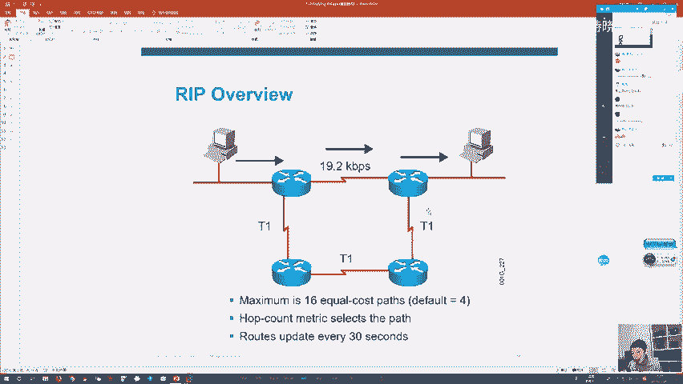

以广播形式给他们发，他们又不得不熟，因为广播带有强制性嘛，他们要接收广播的更新一层层拆包，直到拆到传输层一看。

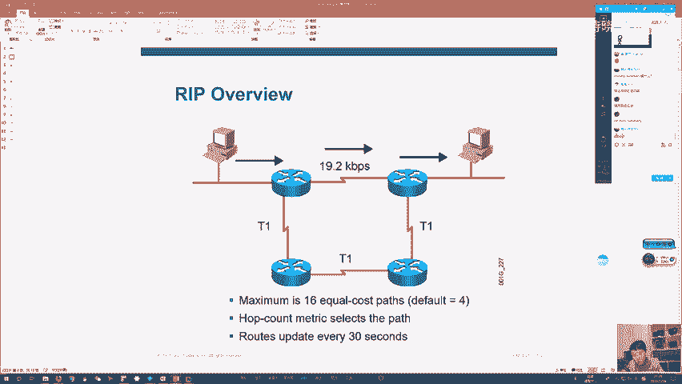

哎，端口520注意啊，re普的报纹怎么封装啊，这么封装的。

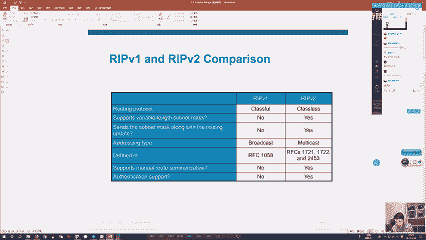

rap普在何前面封装的是UDP啊，然后呢，前面封装的是IPV4，对吧？前面封装的是二层的针头，但是通常就是以太网了啊，后面是XS对吧？rap的端口号呢UDP的520啊，原端口目的端口都是520对吧？

你发送一个V一的广播更新，对吧？PC一收对吧？你看哎广播的没办法，我必须处理对吧？那处理处理处理上对吧？直到看到咱们的四层包头了，你看哎UDP的原目端口都是520，我本地有运行端口为520的应用嘛。

不可能啊，那所以说了这个包我要拆到传输层才能丢包，对吧？但是瑞pV2不一样，瑞V2比较厉害了，瑞 V2哎，它使用主播来发送更新，这个主播呢地址是24。0。0。9，对吧？你使用这种方式来发送主播的更新。

谁能接收呢？只有那些启用瑞的人。

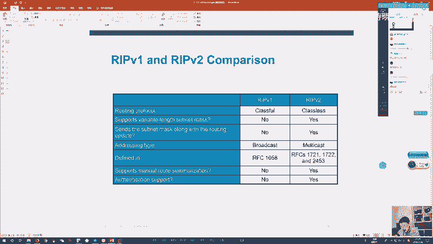

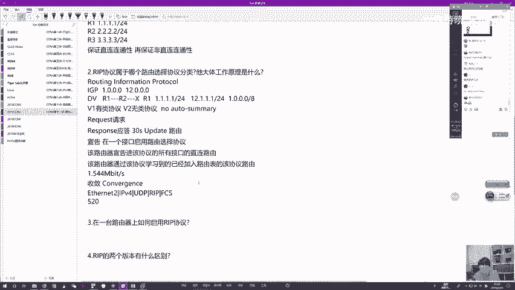

他们才能接受，因为只有他们才能监听这个主播组地址。那换句话说，如果你在一个接口启用ra，你周期性的30秒一次发送更新，对端如果没有运行rap，你这个更新发给别人，别人会立即丢弃。为什么？

是因为这个主播地址，咱们根本不识别，可吧？大家如果对对端启用了ra之后啊，那这个就能接受，请注意啊，所有高大上的路由选和协议，他们在通过接口发送任何报本的时候，都要么单波要么主播。

这种使用广播来发送报文，虽然能够提供咱们的对吧？灵活性啊，但是呢效率和质量都太差。所以只有那些比较低端的协议才会这么做，可以吧？然后紧接着re v一呢是在FC的1058中定义的啊，然后呢。

re v217211722和2453可吧？三个文档，那代表它经过两次升级啊，然后接下来是否支持手工汇总注意啊，有类协议都不支持。因为有类协议都是使用什么自动汇总。

然后呢，瑞ipV2支持自动汇总，也支持手工汇总。然后这个自动汇总呢建议大家通过note summary来关闭。然后接下来是否支持认证，V一不支持啊，V二支持。那所谓认证也很好理解啊。

就是你在路由器上创建一个密钥，对吧？你在发送更新的时候呢，携带这个密钥。当然你也期望邻居给你发送更新的时候，携带密钥。你收到更新之后呢，对比这个更新中包含的密钥和你本地的密钥是否一致。

如果一致代表你跟邻居的密钥是相同的那邻居呢就是个自己人，他给你发的更新，你就能收。反之，如果你收到更新发现里面包含的密钥跟你自身的密钥不一致啊，那对方就不是自己人。那这个时候这个更新我收到之后呢。

就会丢弃。好吧，就会丢弃。

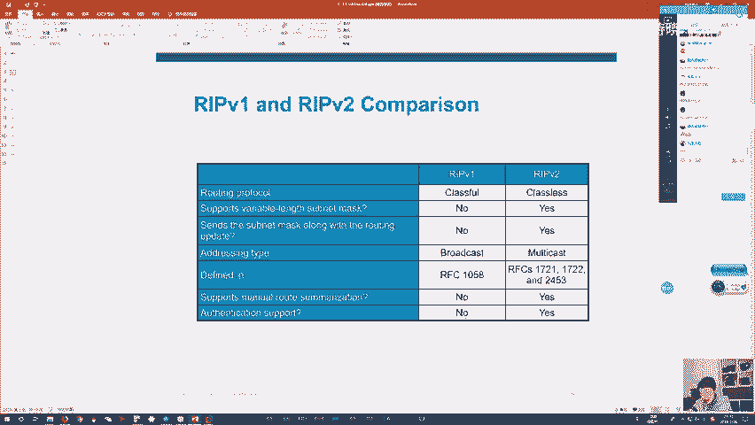

那接下来设置一个认证，为了增加咱们路由选择协议域的安全性。

对吧当然就是认证的分为两种啊，一类我们称为叫明文认证。一类咱们称为叫密文认证，对吧？这个明文认证。当你启用之后，你通过一个接口发送更新，那里面包含的密钥。如果有黑客抓包啊，是能知道密钥是什么的。

你通过这种明文认证是绝对不可能提高任何安全性的。你只是为了避免误配。

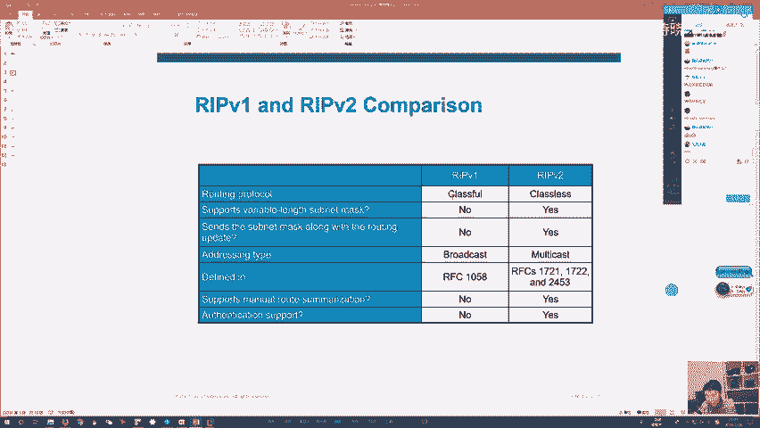

真正为了提供安全性，是密文认证，它是通过MD five的对吧？你本地创建一个密钥，你把这个密钥放在更新中发走之前怎么样？你会通过MDfi对这个密钥做一个配置做一个操作，把密钥变成乱码给对方发走。

那对方收到这个乱码之后呢，他会拿本地的密钥再做一个MD five计算啊，得出一个乱码。然后呢，对比我本地算出的乱码和你这个更新中携带乱码是否一致一致，代表密钥相同。那这种方式对吧？

就相当于是保护了咱们这个密钥本身，就算你就更新了被别人抓包了，黑客也没有办法知道咱们的密钥是什么，对吧？那这样做的话，能够尽可能的保证咱们的安全性。

那早前呢ri V2虽然能够支持认证，但是呢它只能够支持明文认证。而关于密文认证，其实思科针对瑞ip做的一个对吧？私有性的更新啊，但这个更新更新完毕之后呢，那可能公有组织觉得挺不错的。

所以说就直接照搬过来了。那之后呢就是所有的厂商他们的路由器在运行raip的时候，对吧？只要你启用版本2，咱们都既能支持明文认证，又能支持密门认证，好吧？好，那接下来说了半天，这个瑞ip怎配呢就这么配。

可以吧？启用瑞po。

启用版本啊，然后建议通过note summary关闭自动汇总，然后通过network来指定哪些接口需要启用rap，对吧？这就是所谓的宣告啊，宣告就通过network来宣告，那当然ra的net呢很坑啊。

它的network后面跟的是什么呢？是主类地址段，可以吧？是主类地址段，比如说你network后面跟什么network后面跟什么1。0。0。0啊，对吧？network后面跟什么12。0。0。0啊。

network后面跟什么13。0。0。0啊，这就是所谓的主类宣告，对以吧？你network后面跟一个主类地址段，okK吧，这个是。

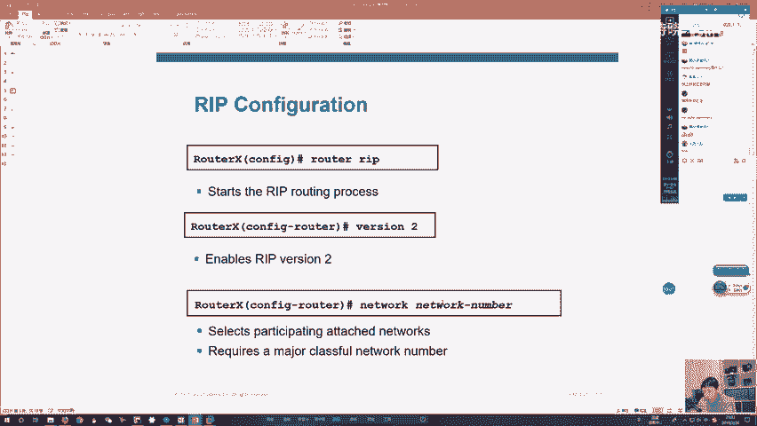

rap的比较粗糙的一面。那接下来你network一个主类地址段，你能宣告哪些接口呢？很简单，你能宣告这个主类范围内的所有接口，只要你接口的IP地址属于这个主类范围，对吧？就都能被宣告。

比如说你这个能够宣告地址为1。1。1。1的接口，对吧？地址为1。1。1。2的接口，地址为1。1。1。3的接口都可以，只要你接口的地址所属的主类网段，是这个网段，那这些接口都能被宣告进去，对吧？

O那这个就是ra比较尴尬的地方啊。如果你一台路由器有两个接口地址是属于同一个主类地址段的不同的子网段，那你通过network对吧？在宣告他们的时候，一宣告他们俩就都进来，对吧？要不然就是他们俩都不进来。

要不然就是他们俩都进来，那这个时对吧？比较麻烦。

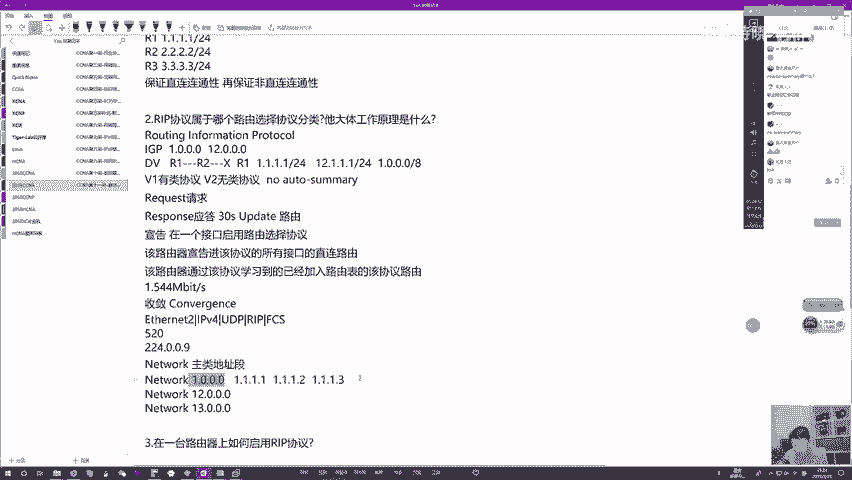

那当然你还有种办法，就是你宣告两个接口之后，你把一个接口置为被动接口，这就可以了，对以吧？所以说总结而言啊，re普启用4条命令就OK了，对吧？那接下来具体怎么启用呢？很简单就是什么。

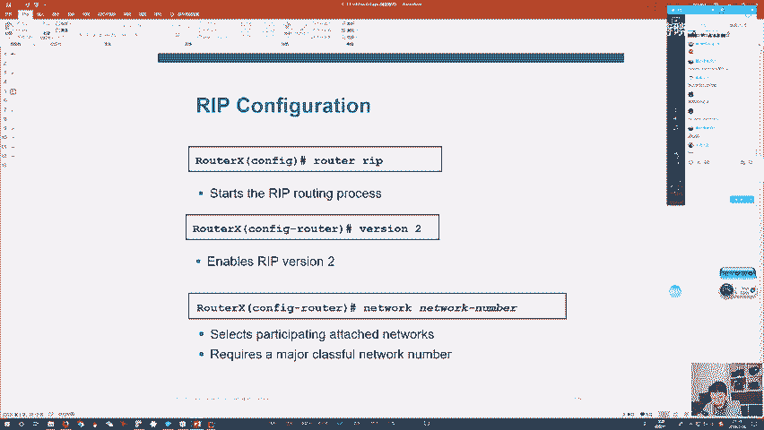

对吧你们懂的？就是该宣告的接口都宣告就好了。然后紧接着这个实验呢不给大家做了啊，留给你们自己去做，对吧？每台路由器怎么宣告，啊，你们就根据这个模板来敲一下就好了，对吧？

然后紧接着呢这个结合静态路由跟锐po，也跟大家说一下，在咱们企业网周，这个东西该这么玩，对吧？因为我们说了任何一个企业静态路由肯定是需要的，边界网络设备上要写一条静态默认，对吧？去往运营商。

那这个静态默认光在边界上写够吗？其实是不够的。你光在边界路由器上写一条静态默认去往运营商，你这个边界设备是能够通过这条默认路由啊，访问外网，但是你内网还有一些路由器吧，你内网还有一些多层交换机。

那这些内网的网络设备，他们要访问公网该怎么办？他们是不是也需要默认路由，你难道还一台在写默认吗？这个太麻烦了。对吧既然咱们内网的所有网络设备都已经运行了po，对吧？然后呢，你边界还写了一条静态默认。

那这个时候你可以通过rapo啊来帮助我们边界网络设备来做一个静态默认路由的传递。那这个行为我们称为什么呢？这个行为我们称为叫边界网络设备的默认路由下放。这个默认路由下放什么意思呢？

就是通过咱们内网启用的IGP对吧？通过内网。启用的IGP来让边界网络设备。让边界网络设备自动的去下放，对吧？它所配置的静态默认路由给内网设备，对吧？如果说你没有做这个操作。

你仅仅是在边界网络设备上写一条静态默认去往运营商，那这个没有错，你有路由可以访范了，但内网路由器呢，他们什么都没有，你为了让内网路由器拥有一条路由指向你怎么样的？啊。

你就可以利用咱们这个边界网络设备的re进程啊来做一个静态默认的下放。那这个下放最简单的方式是什么呢？就是通过重分发，对吧？那紧接着我来教大家怎么做啊，比如说牙三为例ro rip，对吧？启用版本2。

通过note summary来关闭自动汇总。紧接着network对吧？宣告我们的三的环回口啊，然后呢宣告连接啊三个接口之后。Tray built。Stチ。通过这条命令来实现默认路由的下方，对吧？

通过这条命令来实现。好，这张命令什么意思啊？就是强行的通过rapip进程啊。来把静态路由引入到咱们这个协议进程，可以吧？你静态路由本身是不能传递的。

但是呢我现在希望把这台路由器上的静态路由啊通过repo的更新，发送给内网路由器。所以这个时候那些内网路由器啊，你不用再在他们上面依次配置静态默认去往边界了。他们只要都运行repo就能通过边界收到更新。

当他们收到更新之后，就能收到边界路由器给他们通告的默认路由。那当他们收到默认路由之后呢，他们就会自动形成一条repo的默认路由直向边界路由器。那这个时候内网这些主机，他们发包去往外网的时候。

就可以通过静态默认，对吧？一跳一跳的把包传递给边界，边界再通过这条静态默认。来访问咱们运营商。那最终呢从内到外哎，这个联通就可以搞定了。好吧，那这就是现网中啊，咱们最实际最经典的这么一个部署，可以吧？

当然下方默认呢还有很多其他的方式，这个呢在MP中，我慢慢的再教大家好吧，然后瑞普呢还有很多其他的配置，像什么认证啊，对吧？像什么增加咱们收店效率的配置啊，对吧？像什么对吧？

影响咱们的发送更新的方式的改变啊，对吧？开启兼容性开关啊，手工汇总啊，那这个之后呢，在MP中都会教大家好吧，NA呢只是给大家这么一个概念，好吧，如果大家觉得咱们客不错的话，欢迎大家来加咱们这个群。

还有就是2月份快到底了，对吧？业绩日业绩日，并且2月呢是咱们保持原价最后一个月。3月1日，咱们整体课程整体调价。那大家呢如果就是想要上车咱们的NP行一课程，可以加我们的群来咨询咱们的课程顾问老师，对吧？

我们的服务极大程度的提升了。那希望大家呢能够在我们这边都学有所成，好吧，那今天呢咱们到此为止，感谢大家来参加咱们的课，好吧，大家再见。

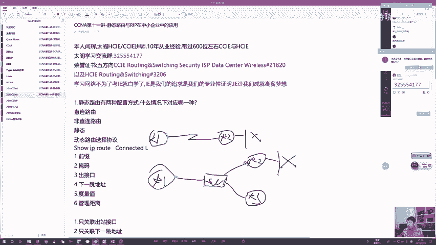