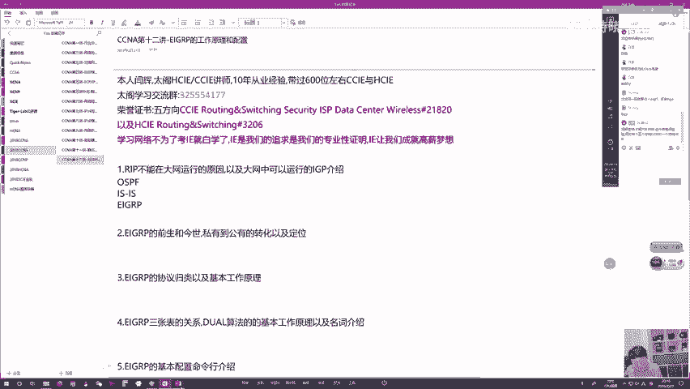
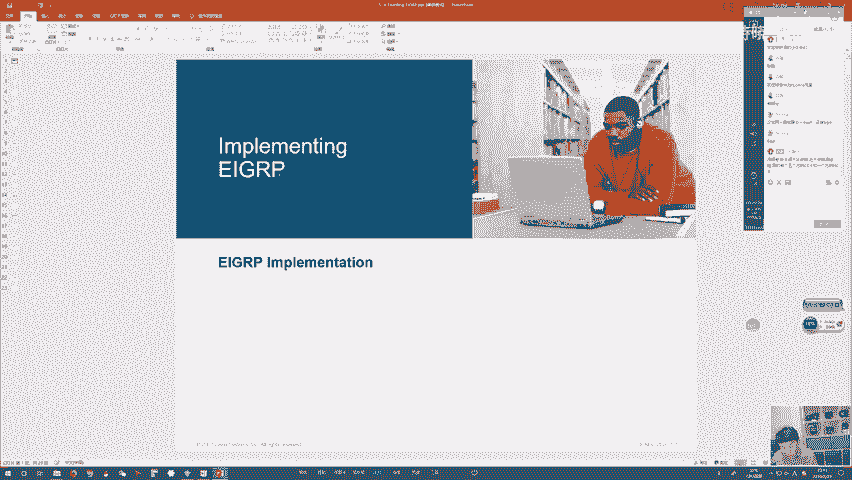
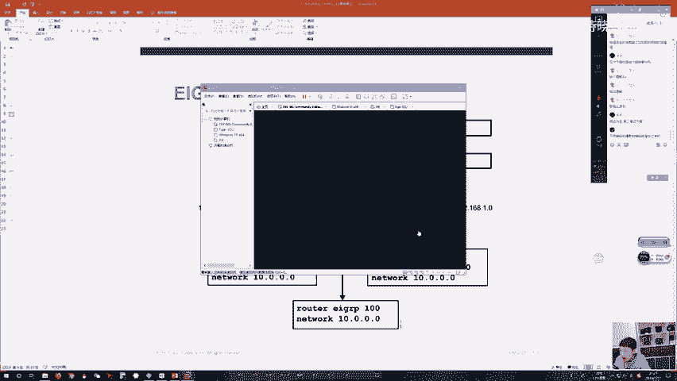
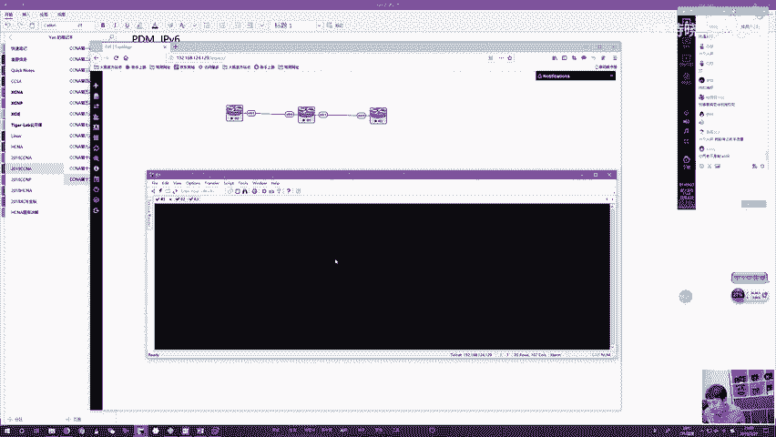
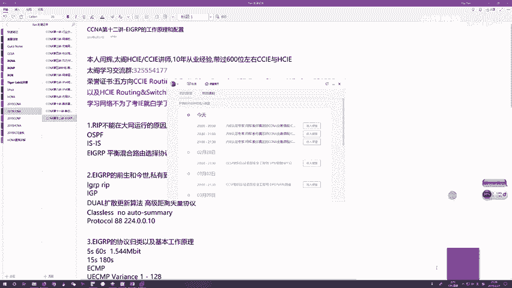

# 1000元自购分享CCNA教程合集！超全合集详细版，网络工程师入门必看合集【送NA题库】 - P13：CCNA13 - 向向向晚o - BV1cL4y1q7Dy

好，那欢迎大家来参加咱们晚上的NA公开课啊。这个NA课呢已经快进入到尾声了啊。然后呢，今天咱们还是讲螺选的协议，好吧，讲一下EIGRP。😊，那来听过咱们昨天课的应该知道啊。

就是昨天咱们讲的是一个静态路由跟rapip对吧？呃，rap呃作为一个比较基础路由选的协议。我们说过啊它只适合在中到小型网络中去做一个部署，对吧？你在比较大型网络中你要运行ra的话，你做不到。

那做不到理由有哪些呢？嗯主要第一点就是ra这个协议呢，收敛速度特别慢，你如果在一个真正大网环中运行ra就算没有任何其他限制性条件啊，就是你光ra这个收敛慢，就会带来很大很大的问题，对吧？

然后紧接着大家也都知道你rapip呢它衡量路径好坏，是通过跳数来衡量的。你一条路径经过多少条路由器，你经过路由器数量越多，跳数越高，对吧？那路径呢就越差，你经过跳数越少，那路径呢就越优。

那这种路径判断方式，对吧？你所判断出来所谓最优路径啊，那未必是管理员认可的最优路径。然后呢，接下来瑞ip还有一个非常大的硬伤啊，就是你在运行rap的时候呢，一条瑞ip路由最大的度量值它只有15条，对吧？

最大度量值只有15条，也就是说对于瑞ip而言，你一台路由器运行瑞啊，你如果收到条路由，这个路由度量值是16条，请注意啊，16条代表这个网络不可达，对吧？所以说你任何路由器只要收到条路由。

只要度量值为16啊，你会直接把路由呢给丢弃，你只能够接收度量值小于等于15条的这些路由信息，那所以说呢你在那些大型网络环境中，对吧？你路由器的数量，那肯定会超过15台嘛。你超过15台了。

那由于这个15条的最大度量值的限制，对吧？可能会导致这么一个问题，就是你一个原路由器，你通道一条路由，这个路由没有办法端到端的通道给域内的所有路由器，总有一些路由器它收不到这个路由，对吧？

你收不到这个路由，那他们就。没有办法访问你所知道这些网络，对吧？那咱们运行录选的协议的目的是什么？就是运行完毕之后，整网所有路由器都有这些直连和非直连路入信息，那大家有路入信息之后呢。

就可以通过这些路由来访问这些相应的网络。那如果说对吧你唉路由传不过去，别人收不到，对吧？你这个网络别人访问不了，那你这个协议呢，就没人能接受，对吧？那所以说呢通过这种种来看啊，那这个协议呢。

注定只能在一个中小型网络中去部署。如果你希望在一个中到大型网络，比如说像运营商内网啊，像金融的数据中心了，对吧？然后像一些嗯跨国公司的企业网，对吧？那他们这个网络很大很复杂，对吧？运行ri呢。

咱们就不行了。那接下来咱们先来讨论一下那面对这些中到大型网络，对吧？如果你要运行个录选的协议，那咱们能运行哪个协议呢，对吧？那肯定排除了，那咱们能用的唉比较常见的像OSP。对吧？

然后呢像那这两款咱们用的比较多，对吧？用的比较多。那用的比较多的原因是什么呢？哎，是因为这两款协议呢，他们自始至终都是公有协议，对吧？那所谓公有协议大家都知道啊，被一些标准化组织定义出来。

然后定义出来之后呢，哎大家都能用思科的网络设备能用，华为也一样，华三的也一样，对吧？那由于说这样的协议公有协议啊，它不存在任何兼容性的问题，所以你在任何环境中，这两个协议呢，你都可以就是说想用就用。

对吧？你无论在一个环境中，你不说网络，你使用同一个厂商的设备，还是使用混合厂商的设备，你运行OSPF运行is都是没有任何兼容性问题的，对吧？并且这两个协议对吧？作为链路状态协议啊，他们被设计出来。

就是针对那些中到大型网络可以吧？当然并且这两个协议确实用的很多，那在当前呢一般唉我们能见到的。运营商网络对吧？那这两款协议呢基本是误开啊，那目前趋势来看，iizeize可能会用的越来越多。然后呢。

OSPF曾经用的比较多啊，那后来呢出了一些事故之后，那慢慢的说的变少了。然后呢，对于一些网络结构比较复杂的对吧？那些跨国公司的企业网，那咱们使OSPF会比较多一些。那因为这个协议呢特性比较多，对吧？

可操控性比较强。然后紧接着在咱们金融网络，哎，一般的这两款协议咱们都不用。咱们用第三款协议，对吧？针对大佬咱们用的第三款协议叫什么呢？哎，就是EI加P。咱们今天的主题。

那这个EI加P为什么只能在金融网使用呢？是有原因的，因为这个协议不像OSPF跟ISize这个协议呢曾经啊它是一个私科私有协议。那作为一个私有协议，你可以理解为这个协议啊，它是由私科的开发人员开发的对吧？

当然挺有意思的一件事啊，就是这个开发EIGRP的这么一个人员团队里面，对吧？曾经也包含开发OSPF这个协议算法的这么一个科学家，这个科学家呢是荷兰人名叫迪杰斯特拉，对吧？我们一般称为叫dgster。

对吧？dgster。😊，啊，可吧？tra叫迪杰斯特拉O然后呢，这个迪杰斯拉呢他参与过这个EIGRP的这么一个算法研究啊，EIGRP使用的算法叫第尔算法对吧？但后来呢那个迪迪杰斯拉就是经过努力啊。

就是经过这么一系列尝试，那发现就是这个算法呢，它有点hold不住，然后后来呢这个算法是一个思科的内部的研发人员研发出来的，对吧？那既然这个算法呢是由我公司内部人员研发出来的。

那所以说这个协议大家懂了就归思科所有是一个思科私有协议。那这个思科私有协议特点是什么呢？就是你只能你只能使用思科的设备啊来运行这个协议，对吧？你华为华三对吧？juni哎，他们呢是用不了的对吧？

那这个协议作为思科私有协议什么样的网络环境中，咱们能够保证端到端全使用思科设备呢，那大家也都知道思科设备的定位什么？就是贵啊，特别贵，特别高大上，你一家企业如果要买纯思科。设备，那你做一个网络规划。

你可能需要花非常非常多钱，对吧？那出于这个金钱考虑，对吧？出于成本的这么一个把控。那一般很少呢咱们能够在一个网络环境中啊，就是遇到说是你端到端所有设备全使用私科，对吧？你最多就是说我私科用几台嘛。

那其他的设备，那些不重要的设备，咱们用其他厂商的对吧？这种混合厂商设备比较常见，那对于那种端到端能够对吧？职接使用私科的，我觉得都是那些大金属，那在所有甲方中，我觉得最有钱的那当然不用想了。

就是那些金融单位，比如说券商啊，比如说银行啊，比如说一些公募基金，私募基金啊，对吧？那那些就是玩金钱游戏的那些公司嘛，那他们其实太多了，对吧？挥金如土，所以他们在部署网络的时候，他们要求就是高大上。

对吧？我要保证稳定性，我要保证网络的高可用性，那钱呢不是问题，那所以说一般在给他们选型设备的时候，那基本都是清一色纯私科设备，对吧？那在这种环境下。哎，我们要跑一个路选择协议，那你运行EI加RP。

这个就对吧？再好不过。那当然这个在13年之前呢，都是这么一个算是惯例啊，就是纯思科网络设备的金融单位。哎，你们使用EI加RP作为路选择协议，而那些像运营商啊，对吧？像那些普通的企业，你这个网络中。

咱们做不到所有网络设备都端到端全部使用思科的那这种情况下，对吧？建议大家运营商的环境中啊，使用Iiz。然后咱们企业网使用OSP。那在13年呢出了一个变化，这个变化是什么呢？

就是13年我也不知道思科怎么了，可能是为了让他这个协议更加普及，他就直接把这个协议的源码对吧？给公开了。然后把这个协议呢从13年啊就从一个私有协议，对吧？转变成一个公有协议。那转变成公有协议之后呢。

那按理来说啊，对吧？所有厂商都应该能够支持了，当然呢就是也挺有意思的，就可能其他厂商认为对吧？我在我当前的优势领域中，对吧？我要用我选的协议，我可以用OSPF。

我可以用这个OSPF能够搞定运营商以外的所有网络能够搞定运营商网络，那这个EI加RP呢对我们来说可能比较鸡肋，对吧？我找不到什么地方比较适用于你这个技术，那所以说开发这个协议就是开放这个协议啊。

从13年到今天对吧？也差不多6年时间了。那随着这6年时间迁移，只有少数的外国企业吧？外国厂商那他们的设备上现在开始慢慢能够支持EI加RP而咱们国有。😊，那些顶级厂商像华为华为直到今天呢。

EI加RP还是不能支持的。而这个华三挺有意思啊。华三自从跟华为脱离关系之后啊，它跟思科靠的来越越来越近了。华三的设备最新型号的，貌似现在都能支持EI加RP对吧？

那当然我相信这个EI加RP呢作为一个非常非常有优势的路由权的协议，它要相比OSPFIize要好很多，对吧？消耗资源比你们少，收敛速率比你们高，并且计算路由更加精准，还支持更更的特性，对吧？

是一个比较完美的协议啊，那由于它比较完美，那我相信呢未来对吧？越来越多厂商会支持这个协议。那尤其是到咱们IPV6那个环境中啊，我觉得路由选的协议呢可能会发生一些变化。就是曾经对吧？

在那些唉算是优势领域啊，咱们站稳脚跟的这些协议像OSPFSS可能在IPV6的环境中啊，有可能被EI加RP给取代。那所以说这个协议呢虽然在当前来看啊，它的使用率对吧？相比咱们上面这两款协议啊要稍微少一些。

当然我觉得未来对吧？它是无可限量的。那所以说这款协议呢，咱们在NA中也算是个重点。在P中呢咱们也是个重点，好吧，希望大家呢能够好好的去哎了解一下这个协议的运作。因为说不定以后它就是主流。好吧，好了。

那接下来这个话不多说啊，咱们来进入主题来说一下EIRP的名称啊。这个EIRP呢全称叫增强型内部往关路优选的协议。

对吧它的缩写啊全称叫增强型，E叫inh，I叫inter既叫gatetway而叫roouting就是pro对吧？叫增强型内部网关路由选择协议。那这个协议呢它的前身叫IGRP吧？就叫内部网关路由选择协议。

那家这个IGRP呢跟EIRP样，他们都是思科私有的，那这个斯科私有的IGRP用来跟谁去竞争呢，用来跟当时的如日中天的rap协议啊来做一个匹K对吧？那大家都知道ra哎对吧？挺low的这么一个协议。

那思科利认为我的网络技术很强，我不但会做网络设备，我还会开发协议，你re一个这么low的协议，对吧？那肯定很多企业对吧？不能满足你的功能。那我就开发一个什么比你强呢对吧？

大家都更喜欢的这么一个协议来取代市场。然后接下来就开发这么一个IGRP这个IRP呢是基于哪些方面来取代ra呢，它主要就是计算。

路由可以把它计算路度量值，你使用IGRP这个路由器在判断路径好坏的时候，对吧？它使用的度量值呢比较贴近现实，就是比较能够被咱们管理员接受。也就是说你一台路由器运行IRP之后。

如果你多条路径能够去往同一个目的网络，它所优选出来的这些最优路径啊，往往也是咱们管理员认为最优路径对吧？然后接下来这个IGRP呢，它的这个连接关系机制，它的路由这个更新机制也比瑞普呢要好很多。

那所以说通过以上这些优势啊，对吧？那思科呢就是满心欢想，就我我能不能说是拿这个协议来取代你的但是挺打脸的，打脸什么呢？大家都知道瑞普两版本，对吧？瑞普有两个版本，这个IGRP被该被开发的那个时候啊。

瑞普 v一是比较盛行的那这个瑞普 v1呢作为一个有类协议。IGRP在跟他PK的时候啊，对吧？大家都是有类协议，对吧？那肯定比。致啊Y加RP要好很多。但是呢大家也都知道你re V1用了没有多久啊。

我们后来出了一个re V2，这个re V2是一个无类协议。对吧无类协议跟有类协议同台竞技，那你有类协议怎么比啊，你根本没法比嘛？对吧？那所以说当出了瑞口V尔之后啊，这个IGRP基本被吊打，对吧？

基本被吊打，那所以说基本没人使用，对吧？没人使用，再加上它是个私有协议，对吧？你只有私科设备能启用。而你私科设备还卖那么贵，对吧？那所以说呢根本不会有人用。

那所以说这个协议呢相当于就是出来没多久就被淘汰了。然后接下来EIGRP呢就是针对它来做的一个升级，升级之后呢，推出来的这么一款协议，但是请注意EIGRP跟IGRP完全不一样啊，它要比IGRP要好很多。

如果说EIGRP从始至终啊，它如果都是一个公有协议。那我觉得到现在来看啊，这个OSPF就没有什么存在的必要。因为我觉得EIGRP从种种角度来看都要比其他路由选择协议要优秀很多，对吧？

我们说过距离矢量协议最大的问题是什么？就是你在运行的时候呢，有可能会出现还路，然后你在运行的时候呢，咱们收链的速率可能会比较慢。那当然链路状态协议也不是真正完美啊。你链路状态协议能够防止路由环路产生。

对吧？你能够保证路由器之间啊传递的路由信息是精准的。但是你的代价什么呢？就是你的算法太消耗路由器的CPU内存资源。如果你在一些对吧？不够强大的路由器上去运行链路状态选择协议啊，并且如果你这个网络很大。

那这个路由器呢，当你运行完这个协议之后，你可能会进行一些频繁的操作，频繁的计算，那这个呢其实会。严重的消耗的资源，让你在数据层面转发数据的时候可能会效率比较低。

那这个EI加RP呢有很多的书和文档称之为什么呢？称之为叫平衡混合型协议，对吧？称之为叫平衡混合路由选择协议。这个所谓的平衡混合路选协议什么意思呢？就是它这个协议既具备距离矢量协议的特征。

又具备链路状态协议特征，并且它是集合了两个协议的优优点啊，对吧？就是你在运行EI加RP的时候，对吧？我能保证你无环，我能保证你非常快的收敛效率比所有其他协议都要快，那这个是链路状态协议的优点，对吧？

并且你在运行这个协议的时候，你不用担心它过多的消耗路由器的CPU内存资源。你哪怕这个路由器硬件不够强大，你在非常大的网络环境中啊，运行EI加RP那这个算法也不会极大程度说是消。靠你路由器CPU内存资源。

你依旧有足够的资源啊，投身于咱们的数据层面，用来做咱们的数据转发。那这就是它的特点。对吧你要比快，它比所有其他协议都快。你要说环路，对吧？这个协议永远不会出现环路。你说对于CPU内存的消耗。

这个协议的消耗甚至可能比瑞普华还要低。那你哪儿还能找到更好的协议。我觉得肯定找不到啊。所以说呢如果EIRP从始至终啊，它都是一个公有协议，那早就碾压一切了。

但我觉得思科作又作在他一直以为自己会永远是行业老大，他一直认为对吧？客户呢肯定会买他单。不管他把设备卖多贵，对吧？客户就会买，对吧？那你买了之后，你肯定会运行EIRP但事成了打脸，对吧？

EIGRP这些支持的思科设备，还真只有在金融网络中啊，咱们才能做到端到端的部署，你在运营商也好，对吧？你在普通企业也好，我觉得很少有这些地方能说是我财大气粗，对吧？我采购一批设备全使思科，这基本做不到。

对吧？那所以说就是因为这些原因啊限制了EIRP的发展，对吧？这个EIRP当前占比不高，不是因为这个协议不好，对吧？真是因为思科那些操蛋的策略，他以为自己就是卖多贵，都有人买单，我觉得这就是思科最垃圾。

一点啊，你卖那么贵，谁给你的信心啊，对吧？卖的贵，你那些销售还那么拽，你那些售后服务还做的那么差。你是有什么脸来要那么贵的价格，对吧？你看看人家华为卖的又便宜，售后又好，恨不得724小时啊。

你只要出了问题，打一个电话，人家立马两个小时内，工程师赶到，你思科做到吗？我靠，你思科接电话，周六周日居然还说不上班是吧？别人客户出了一个问题，打电话要求你解决，你还要别人发case，你要走流程。😡。

哎呀，我这么说，真的是。思科这个鬼佬这一套啊，对吧？你在美国可能没问题，对吧？在国内真的是不是你这么玩的。所以说我觉得思科现在市场被华为抢占，不是因为什么什么棱静门事件，虽然冷静门事件对思科影响很大。

对吧？让思科丢了运营商的市场，但我觉得真正让思科丢入市场的就是思科这种销售方式，或者说他这种服务客户的这么一个理念，对吧？那这个真的是。就是鬼佬这一套嘛，你会发现鬼佬任何公司都是这样的。

你出了问题没有人情啊，没有什么对吧？紧急紧急与否的这么一个观念。人家家说了，你发邮件，你走流程，对吧？没有合同号，人连电话都不接你是的呀，真的对你这个提的真的对啊。我告诉你思科以前还没有这么恶心啊。

思科以前还没有这么恶心，以前你打电话，就在你这个对吧？比如你售后维保过期了，别人好歹接你的电话，现在我靠，你要打一个电话还要还要你提供合同号，你合同号如果过期了，人连电话都不接，我靠，谁给你的自信啊。

真的，我觉得思科就是自己被自己作死的，那所以说呢这个协议呢真的是太可惜了。我觉得真的特别好的一个协议。但是呢对吧？使用场景只有在金融网络，对吧？那当然日后呢可能就不一样了，对吧？日后不一样。

这个ERP自动公有化之后。😊，对吧只要大家都能支持，那我相信就是有朝一日啊，那这个协议叫真金还是会发光的嘛，对吧？等它发光了之后，我觉得在各行各业啊，对吧？各个领域中你都能看到这个协议的声，好吧？好。

那接下来呢咱们来给这个协议做一个分类啊，对吧？首先呢照范围来分，它依旧是一个IGP啊，叫内部网关路由选择协议，对吧？然后紧接着作为一个对吧？是算法，它这个算法请注意比较奇怪。

它既不是距离矢量协议的算法又不是链入状态协议算法，它使用的核心算法叫什么呢？叫dual，对吧？叫扩散更新算法，叫扩散更新算法。😊，啊，按照这个算法分类来说，对吧？它既有距离矢量协议的特征。

又有链路状态协议特征。那它到底算什么呢？哎，我们一般称为叫高级距离矢量协议，对吧？咱们一般把EIRP啊称为叫高级距离矢量协议。可以吧？那我也说了，距离矢量和链路状态，咱们到底怎么区分。

其实这个区分方式很简单啊，就是看你一台路由器运行完这款路选的协议之后啊，你知不知道咱们的网络是怎么连接的。你能不能画出咱们整个网络连接图，你能不能知道在咱们这个环境中啊，有多少台路由器。

路由器之间使用什么样类型接口彼此互联，咱们有多少网络网络分布在这些路由器的哪些接口之上。你如果能够得知这些信息都可没问题，你运行的肯定是链路状态协议，而如果说你运行个协议之后，对吧？

虽然这些非直连网络路由啊，对吧？😊，通通都有，但是咱们网络怎么连接，你是不知道的对吧？那这个就是基于传闻的协议，对吧？你所知道的这些非直连网络路径信息啊，其实充其量都是呢邻居告诉你的，对吧？

你邻居告诉你了，要去往网络X走它都会吓一跳。你的另外一个邻居告诉你了，去往网络来，走，他都吓一跳，但X在哪里？Y在哪里，你知道吗？你不知道咱们整个网络有多少台路由器，大家使用什么样接口彼此互联。

这些接口类型是怎么样的，你能知道吗？你也不知道可以了，那说到底啊，你一台路由器运行的EI加RP，它也只是看着像那些链路状态协议而已。但你运行完这个协议之后啊。

一台路由器是绝对不可能知道咱们网络怎么连接的。依旧是他的邻居来告诉他这些非智联网络对吧？他们要访问，那该怎么走，那所以说了依旧是一个基于传闻的协议。但这个协议比较比较神奇一点啊。

就是它不像所有其他的基于传闻的协议。你在使用EI加RP的时候，由于咱们这个算法保证啊，我能够保证你就算不知道网络怎么连接，你也不用担心你通过邻居收到的路径信息啊是错的。它有这么一套数学算法。

来帮助你百分百解决环路问题，我觉得这个就是咱们整个丢算法啊，最核心的一点，你能解决这个问题，对吧？那就完完美了，你根本不需要运行那么复杂，链路状态协议算法，你也能够解决环路问题，你只要能解决环路问题。

那我就算路由器不知道咱们怎么这个整个网络啊怎么连接的，要紧吗？我觉得其实根本不要紧，对吧？只要能防还，那就一切问题都没有O好，然后接下来按照有类无类来分啊，那肯定是一个无类协议，对吧？不用想啊。

因为它之前那款前身啊之所以被打败，就是因为它是一个有类协议，那所以说对吧？叫。😊，哎，吃了亏，咱们肯定要吸取教训啊。EIGRP作为IGRP的升级版，那它肯定是一个物类协议，对吧？

那当你在运行这个协议的时候呢，你VOSM可以随便做。然后呢，手工路由汇走也可以随便做。那当然有一说一啊，也提一下，也算是吐槽一下啊。这个瑞普V2的大家都还记得啊，你作为一个无类的物选的协议。

你在路由器上运行瑞普V2，它是会默认开启自动汇总的。这个自动汇总是什么呢？就是所有有类路由选择协议啊，为了方便接收路由的接收者收到路由之后呢，能够正确的猜测咱们路由掩码，对吧？

你必须要启用的这么一个机制。那作为无类路由选择协议啊，这个自动汇总咱们是根本没有必要存在的原因是因为你在五类协议中，你路由器之间交互的更新本身就会携带掩码信息，你不需要对方才。

所以说你这个自动汇总是完全没有必要存在的。但是瑞 v2怎么样，它默给你开启了，对吧？所以说你在运行ra的时候，当你启完瑞 v2之后啊，你还要通过note summary来把那个自动汇总给关闭掉。

那这个在EI加P中是一样的。EI加RP我真是无语了，它跟re v2是一样的。你在12点差的L版本中对吧？一台路由器上运行EI加RP之后，是无类协议吧，是没有错，发送路由更新携带掩码吧，携带。

但是它也会自动汇总。😊，并且这个自动汇总的关闭方式跟raip是一样的。你要在EIRP进程中，通过note summary。Not summer。来把这个自动汇总给关闭掉。那当你关闭掉之后呢，对吧？

它就能够按照正常的方式啊来运作。那如果说这个时候你需要做路汇总，对吧？请你做手工汇总O好，那接下来这个协议呢它在路由器之间能够交互5种类型的豹文啊，不像瑞风只有两种EI加RP报文比较多，有5种。

那5种豹纹怎么封装呢？都是EI加RP的载合，对吧？前面呢直接封装IPV4爆头，前面封装二层的针头，对吧？后面的封装二层的真O基本是这么封装。那接下来这个封装呢大家也都知道对吧？

经典的TCPIP的月层封装嘛，我一个应用对吧？没有封装四层爆头，直接封装了三层对吧？然后呢封装了二层，那接下来由于EI加RP呢直接封装在IP爆头的后面，那因此呢它要对应一个协议号。

EI加RP的协议号多少呢？它的协议号啊是88。所以说你今后呢在访问通知列表中啊，如果你要抓咱们EIGRP的豹纹，你只要抓协议号为88的豹围就可以，可以吧？并且需要注意的是。

EIGRP算是个高大上的协议啊，这种比较高端的路由选的协议。他在运作的时候，他在发送各种各样报文的时候，是绝对不可能使用广播的，他要么使用单波，要么使用主播，那使用主播就要牵扯到一个主播地址啊。

瑞V2是224。0。0。9，对吧？EIGRP是他的邻居，他用的是224。0。0。10，对吧？记好这个EIGRP主播地址啊，只要你收到一个包，目的地址是这个地址啊，那基本就是1个EIGRP报文。

O那接下来我们来看一下EIRP有哪个特点吧。好吧，首先呢这个EIRP对吧？能够在大型网络中部署啊，作为一个无类协议，你这个地址呢想怎么规划怎么规划。

并且只要你关闭了自动汇总手工汇总在路由器的任何位置可以部署啊，所以说只要你规划地址规划好对吧？虽然你路由器数量很多。虽然你网络很多。那当你做完合理汇总之后啊，你能保证咱们核心部位的这些路由器。

它们的路由表空间啊是非常可控的对吧？你能够使用最少的路由来表示去往最多网络的路径信息，你这种汇总做的越高效，汇总做越好，对吧？你这整个协议啊运作就越高效，因为大家知道你任何一台路由器啊。

只要你路由表里面路由条幅数量少，你在查表转发数据的时候，你匹配的次数就少，对吧？那端到端的延迟呢就低。并且你匹配次数少，你的CPU内存的消耗是不是也就小了，对吧？那这是一个。😊，算是良性循环嘛。

但是相反，如果说你汇总做的不好，对吧？你有多少网络就需要对应多少条路由条目，那你这个网络越多，你路由条目越多，对吧？路由条目是要消耗内存资源的，你首先就算不转发数据，你内存消耗都不得了，对吧？

然后再加上你转发数据，你路由一多，对吧？每条路由逐一匹配一遍，啊，那这个延迟就上去了，并且你匹配路由次数越多，你CPU的消耗就越厉害，那所以说对吧？这就是恶性循环，那还是那句话汇总很有必要，对吧？

只要你合理的部署地址，只要你合理的部署路由汇总，你能够整体上的提高咱们路由选择协议的工作效率，OK好，那接下来胶片上说的EI加P哪个特点呢？对吧？首先它是一个高级距离使用协议，对吧？就你刚说过了。

然后呢收猎速度很快，对吧？那这个收练速度很快怎么实现呢？原因是因为它有一个丢尔算法啊，这个de尔算法是怎样实现快速收练。咱们待会儿讲到那一块，大家一听就懂了，可以吧？然后接下来百分百保证无怀。

这也是由dor算法保证的。如何无怀。待会我也教大家，配置比较简单，这个没有错啊，EIJRP的配置，我觉得基本跟瑞是一样简单的。

你rap基本已经是所有路选择协议中配置最简单的啊EIGRP跟ra55开可以吧？然后配置最难的，像什么BGP是最难的。然后其次像是OSPF跟I也就是说除了EIJRP和瑞以外啊，所有其他协议都比他们要难。

那这个呢就是非常适合咱们新手啊，对吧？就算你是个新手。曾经从来没学过网络，对吧？从来没有配置过优选择协议。啊，我让你第一次配EI加RP，我相信你配两次啊，分分钟就能学会这个非常简单可吧？非常简单。

然后接下来EI加P呢，它有一个非常牛逼的更新机制啊，叫增量更新。这个增量更新是什么意思呢？就是正好跟咱们瑞ip反过来啊，你在路由器上如果运行是ra协议，我也跟大家说过，对吧？

当你在一个接口启入ra之后呢，对吧？你通过这种被宣告的接口，要周期性的每30秒一次的发送更新给进去，对吧？是这样的那所以说当你在运行ra的环境中啊，你这个网络越来越大，你路由器数量越来越多。

你网络数量越来越多，请注意啊，这种周期性更新，它对咱们的资源消耗也是越来越厉害。😊，因为你在发送瑞普更新的时候，一个更新包里面最多只能包含25条路由，对吧？如果说你路由数量超过25条。

你就需要每30秒发送多个更新包。那所以说当你路由越来越多。当你路由器数量越来越多，你会发现对吧？在瑞ip环境中啊，你会出现一个每30秒一次的网络波动。因为你每30秒发送的更新呢会消耗咱们带宽。

并且会影响到咱们邻居路由器的CPU内存资源。那这个EIRP呢就是看到这一点啊，它在设置这个更新机制的时候，就是采用了一种比较先进的机制。这个比较先进的机制是什么呢？我们称为叫基于临接关系状态的路由追踪。

对吧？那接下来这个机制是什么样的？就是你两台路由器啊，你们之间运行EIRP对吧？在你们发送更新通告路由给邻居之前，请你们先发送一个哈lo包。你们之间交互完哈lo包之后呢，你们能够基于交互的哈lo啊。

来建立EI加RP的邻居。那当然你们之间建立的EI加RP邻居之后啊，你会把对方的信息加入到你本地的邻居表里，那接下来你们会通过周期性发送哈lo啊，来维护咱们的临接关系状态，对吧？

那当然这点EI加RP做的很好啊，你只要在一个接口启用EI加RP它会周期性发送哈lo这个哈lo的默认发送周期啊，5秒一次或者60秒一次，对吧？那当然是5秒还是60秒，得要根据你接口带宽。

你接口带宽如果大于等于1。544兆比特每秒。那在这样的接口也算是快速接口啊，你发送。😊，P的哈lo，咱们就是5秒一次。如果你这个接口的带宽小于1。544兆比方每秒，你这个哈lo呢就是每60秒一次。

可以吧？高速接口5秒一次。第速接口60秒一次，你两台路由器呢要建邻居非常简单，你只要收到对方给你发的哈lo啊，你就认为对方是你的邻居了，你发送哈lo给对方对方收到之后，对方就会认为你是他的邻居，可以吧？

简单来说，你们之间只要交交互一个hello啊，临接关系就建好了。那接下来由于咱们这个哈lo周期性发送啊，你能够周期性的通过邻居收到hello，那这个时候你们连接关系状态啊，就能够保持可以吧？

这就是哈lo两个目的，第一个是为了建邻居，第二个是为了周期性的维护咱们的临接关系状态，可以吧？那当然如果说你一段时间啊没有通过一个已经建立好的邻居收到hello，你们之间的连接关系状态。

是会重置的可以吧？那这个需要等多久？这个需要等3倍的哈lo周期啊，对吧？如果你哈lo5秒钟发送一次，那咱们就要等待15秒，对吧？3倍的哈lo时间，15秒，如果都没有通过一个邻居啊。

收到hello三倍周期过去了，那这个时候临接关系状态就要到。如果你哈lo60秒发一次，那就是180秒，如果180秒没有通过邻居说到hello，你的临接关系就会到。那当然不用紧啊，不用不用担心啊。

因为你这个哈lo呢5秒一次或者60秒一次，你们之间建立完邻居之后，只要能够周期性通过邻居说到hello啊，你每收到一次这个临接关系状态啊，就会重置为最新状态，对吧？你的这个临接关系的计时器啊。

就会恢复到邻，所以你不用担心说是会莫名其妙等邻居O吧？好，那接下来你们之间有邻居了，有邻居之后再发送更行，对吧？咱们先建邻居认识一下，认识完之后，我再把我能给你通告的所有路由啊，给你通告走。

那当然你要给我通告对吧？然后紧接。😊，双方通过完路由之后，这个路由咱们信不信任呢？信任，但信任的前提是，咱们之间的临接关系要在，只要咱们之间的连接关系在，那你给我发的所有路由啊，我根本不会怀疑能不能用。

我肯定会认为他们能用，我会直接把他们加入到路由表去使用。但是前提是咱们之间的连接关系得要在。如果咱们之间的连接关系没了，那不好意思啊，你给我发的所有路由，我会通通的删除掉。

这个就是EIGRP的这么一个机制，而reip呢请注意啊，由于raip在路由器之间根本不建立邻居，对吧？你在两台路由器之间运行rappo，对吧？我开门见删嘛，上来直接给你发中心上来直接给你发路由。

那由于少了这么一个连接关系机制的这么一个基办了。所以你在运行ra的路由器之间交换路由之后，你就得要实时的去对吧？操心这些路由到底还能不能用。那所以这个时候在瑞中呢。

每台路由器都会给他收到的瑞路由啊设置一个老化计时器。这个老化计时器呢是咱们更新周期的6倍，对吧？你更新周期是30秒一次嘛？那咱们的老化计时器就是180秒。如果说你180秒都没有收到邻居给你发送这条路由。

对吧？你认为这个路由可能有问题了，你就要把它给删除掉，对吧？那由于为了避免这个邻居频繁的删除给他发了路由，你只能周期性的一遍又一遍的给他发发完之后更新邻居的表象，保证邻居这些路由啊，不要丢弃。

那这就是瑞的计制。瑞ip的机制，我称什么呢？就是基于路由本身的这么一个追踪机制，然后呢EI加RP是基于临接关系状态的追踪机制。那这两种哪种好呢？那肯定是EI加RP好吗？对吧？

因为你EI加RP针对中到大型网络来运作的，你周到大型网络有这么多路由器，对不对？你有这么多的网络，对不对？那如果说你真是要周期性发送更新，对吧？那你每一个周期要发送多少更新包啊，你可能要发送N个，对吧？

如果你要真要这么发的话，那你就跟瑞ip一样，对吧？你会周期性的产生网络波动。但是现在呢咱们不发更新，更新在咱们建完邻居之后，我给你一锤子买卖啊，直接给你发完，发完之后，咱们路由器之间呢。

只用交互哈喽就好了。哈喽吧的最大好处是什么呢？就是我不管你这个网络有多大，不管你网络周有多少路由器，我不管你有多少网络，你路由器之间交互的哈lo啊，大小永远是固定的。😡。

这也就是说你在两台路由器的环境中运行EIRP跟你在100台路由器的环境中啊，运行EIRP你周期性消耗链路带宽的值是不变的，都是5秒钟发送一个哈，那所以说了从链路带宽节语角度来讲，对吧？

从邻居路由器的CPU资源的节余角度来讲，那EIGRP肯定要完胜re普嘛，对吧？你锐普在小网中对吧？我周期性发更新好像它无所谓。但是你这个网络越大，路由器说来越多，你网络数来越多，你周期性发送的更新。

对咱们网络的消耗就越厉害，可以吧？那所以说这个就是EIRP的一个优势啊，可以吧？但是请注意，你两台路由器接下来邻居我初始发一次更新之后，咱们正常更新不再发了。这个不再发，还有一个前提啊。

就是你网络是稳定的。如果说你网络不稳定，对吧？比如说某一个路路由啊，曾经咱们可以访问，现在不能访问。那这个时候呢，我就必须得要告诉邻居嘛，对吧？这个路由，请你们删除掉，那所以说EI加RP它发送更新啊。

只有两种情况，第一种就是两台路由器建立邻居之初，对吧？一开始我把能发的所有路由给你发一遍，发完之后呢，如果网络正常啊，就不再发了。如果我要再给你发只有一种可能就是网络出现了变化。

这个变化影响到了我本地路由表里面的某条路径了，那这个时候呢，我会把发生变化的路由啊，给我所有的邻居通告走，对吧？告诉邻居，对吧？可能你们曾经能够访问一个网络啊，现在不能访问了。

或者说你们曾经访问这个网络度量值多少，现在我换了一条路径度量值改变了，我会告诉你这个信息，可吧？这就是所谓的增量风险。好吧，这就是所谓的增量东西。然后接下来EIGRP呢是一个很有意思的协议啊。

它呢如果说一台路由器，对吧？运行EI加RP发现我通过多条路径能访问同一个目的网络。那这个时候呢，对吧？如果多条路径的度量值一致啊，它是能够等价负载均衡的。这个等价负载均衡呢也跟大家说过叫ECMP对吧？

这个ECMP呢没有什么了不起的啊。你EIGRP能够支持，甚至锐普都能支持，对吧？OSPFize甚至BGP你们都能支持，但是呢EIGRP是所有路由选择协议中啊。

唯一一个既能支持ECMP又能支持UECMP的。这么一个协议可以吧？UECMP的协议。这个UECMP叫什么呢？叫非等价负载均衡。那什么叫非等价负载均衡？就是你这台路由器具有相同目的，网络多条路径啊。

你们度量值是不一样的。就算你们度量值不一样，有一条路径更优，度量值更小，另一条路径更差，度量值更大要紧吗？不要紧，我依旧能够同时把你们俩加入到路表，只要你们之间度量值啊满足这么一个条件。

我就能把你们俩同时加入路表来执行什么非等价负载均衡。那大家在执行非等价负载均衡的时候，对吧？较优的路径，我会使用频率高一些，只要差的路径，我会使用频率稍微低一些，对吧？然后接下来请注意。

当你在路由器上启用EI加RP的时候，默认非等价负载均衡的功能呢，是没有开启的它默认只支持ECMP如果你想让它支持非等价负载均衡，你得要设置这个vari这么一个值，这个我们称为叫乘数啊，你把这个值给设大。

它默认是一啊，取值范围是1到128。你把这个值给设大，就相当是开启了非等价负载均衡这么一个功能。😊，那开启完毕之后呢，路由器既能够做等价负载均衡，又能做非等价负载均衡，对吧？

那这也是所有其他协议啊都不支持。好吧，然后接下来灵活的网络设计不用说了，你毕竟是一个对吧？无类协议嘛，你肯定能够支持，然后接下来你再发送hello再发送更新，再发送各种报文的时候，对吧？要么使用单播。

要么使用主播，咱都不使用广播，对吧？支持VLM和不连续的子网，那这个无类协议都支持，对吧？然后紧接着你能关闭自动汇总，能在网络的任何一个位置啊执行手工汇总。那当然这个手工汇总呢，在NA中就不跟他说了。

对吧？在NP中，我会教大家每一个协议手工汇总的这么一个特点，可以吧？EIGRP还挺有意思的。OK然后接下来最后一点，就是EIGRP一个小特性啊。虽然在当前来看没有什么用啊，但是在曾经还是挺有卖点的。

他说什么呢？他说的EIGRP这个协议啊，支持多种被路由协议。什么叫被路由协议啊？像IPV4又是一款啊，对吧？因为你动态录选的协议拿什么来表示一个网络啊，你是拿IP地址，对吧？

那由于你拿IP地址来表示一个网络，你路由表里面指向一个网络的路由也是用IP地址来表示的那这个我们称为什么？对吧我们称为叫拿被路由协议提供的地址信息来方便咱们路由，对吧？所有能够提供地址信息。

这些协议其实都能够提供路由的这么一个便利性。那所以说这些协议，咱们都可以称为叫被路由协议。简单来说，你一个网络层协议，只要你能够规定三层地址你都能做被路由协议，那被路由有哪些呢？对吧？

除了IPV4IPV6以外，其他协议站的网络层协议啊，对吧？都可以。比如咱们IPX杠SPX协议站里面的IPX协议啊，它就是比较类似于咱们TCPIP中的IPV4，比如咱们OSI中的CLNP对吧？

它也是一个网络层协议啊，它也能够提供地址信息。比如咱们曾经苹果苹果有一个协议站啊，这个协议站的网络层所使用协议，叫apple talk这个apple talk它也能够定义三层地址。那当时在那个时代对吧？

TCPIP其实还没有大获全胜啊，就是你还没有说是TCPIP统一咱们整个的互联网，对吧？在当时那个时代呢，有一个阶段，它是群对吧？叫做群雄割据。你有TCPIP的使用环境。你也有IPS使用环境。

你也有apple使用环境。你甚至有OSI使用环境。当时那些协议站啊都在干价。然后呢，思科为了卖它这个协议的算法啊，而为了卖它这个协议的卖卖点，为了增加他卖点，他就是在研发EIRP的时候呢。

里面设置了一个模块，这个模块叫PDFPDM啊，叫PDM叫协议依赖模块，对吧？叫协议依赖模块。这个协议依赖模块呢开发完之后，EIGRP这个协议对吧？你运作完之后啊，你既能为IPV4做路由。

又能为IPX做路由，又能为apple pop做路由，那这个在当时那个时代呢还是挺吃香的，对吧？因为当时那个时代没有人能够保证咱们端到端全使用IPV4，但是在如今来看，这个就比较out了。

因为如今来看咱们TCPIP怎么样？经过这个全球歌据时代啊，它已经是一统天下了，对吧？你基本当前能够见到的网络，那基本咱们用都是TCPIP对吧？你到处用都IP地址，那你需要EIGRP支持IPX吗？

你需要EIGRP支持apple pop嘛？你不需要。😊，反过来讲，你需要EIGRP支持什么呢？你需要EIGRRP支持IPV6。当然呢请注意，这就比较尴尬了啊。因为当时研发人员在研发这个PDM的时候。

那个时候IPV6对吧？还名不见经传啊，对吧？你IPV4还没有统一咱们整个网络呢，你这个IPV6对吧？凑什么热闹，对吧？凑什么热闹，所以这个PDM中呢没有针对IPV6的支持。所以说了我需要你支持的东西。

你支持不了，我不需要你支持的，你给我支持这么多，对吧？这个东西非常鸡肋。当然呢，现在EIGRP呢它也能够支持IPV6了，只不过它支持IPV6那个版本跟它支持IPV4的已经完全不是一个版本了，对吧？

支持IPV6的EIGRP绝对不是通过这个PDF啊来实现的。是那些EIJRRP的这么一个研发人员，针对IPV6重新研发了一个对吧？这么一个协议。那这个协议虽然看起来叫EIJRP。

并且你在C code路由器上配置命令的时候，跟IPV4的配置基本差不多。但是请注意啊，这是两款截然不同的协。那这就比较尴尬了，对吧？当然这是后话，可以吧？咱不用在意这些细节。OK好了。

那这就是基本的EI加PPC运作原理。然后接下来EI加P呢山寨的链路状态协议的3张表，对吧？你两台路由器运行EI加P之后，我们上来呢先不发路由，我们接我我我们发什么，我们发送哈lo，对吧？

你只要在一个接口启用EI加RP对吧？你把一个接口宣告进EI加RP进程。这些被宣告的接口就会周期性发送哈lo两台路由器只要交合完哈lo之后呢，就能建邻居建来邻居之后呢。

我就会把跟我建立邻居的路由器的信息啊，放到我本地的邻居表里。这个邻居表里关于每一个邻居都会产生一个表象，这个表象描述邻居的一系列信息啊。当然在这一系列信息中最重要的两个字段。

是这两个一个就是邻居接口IP地址，一个就是本路由器连接邻居的本地接口，对吧？咱们通过这两个字段来表示我哪个接口连接着哪台邻居O那当然这个每个表象呢都有一个老化计时器。这个老化计时器就是三倍哈lo周期。

如果你们之间建了邻居。😊，接下来三倍哈lo时间啊，没有通过邻居说的哈lo，你们之间的连接关系就要棒点，对吧？建完邻居之后，只要周期性发哈lo，这个临接关系状态是没有任何问题的。

然后紧接着当大家建好邻居之后呢，OK我们就可以传路由了。当然传路由EI加P发送什么报文呢，跟瑞ip是一样的，就叫更新，对吧？咱们发送更新。那这个更新里面包含的内容不用说了，就是路由信息，对吧？

每台路由器都把它已知的去往各个网络的路由信息啊，整合成更新，发送给邻居，就是为了让邻居知道啊，哎，你要访问哪个网络通过我做吓一跳就可以了。😊，那当然EIGRP相比raple呢要稍微高级一些。

同样是传路由。我在把路由传递给邻居的时候呢，包含的字段信息会稍微多一些，对吧？除了包含前缀掩码，包含度量值，对吧？包含什么下一条地址以外，我还会包含一些丢肉算法里面的参数啊，就是因为我在发送更新的时候。

包含了一些丢肉算法里面参数，因此，这个EIGRP在收敛的时候，我们能够保证一台路由器学到的路由是绝对不会有还路的。并且当一条路由出现问题的时候，对吧？咱们路由器能够迅速的做一个路径切换，收敛速度极快啊。

非常非常快，那这些呢都是对吧？发送更新中携带那些参数所导致的可以吧？好，然后接下来请注意了，由于EIGRP在路由器之间发送的路由中啊，包含这么一些乱七八糟参数，这些参数在路由表中啊，咱们是不能维持的。

所以EIGRP为了保持邻居给我发的路由这些参数信息啊，我需要一张专门的表来接收邻居给我发的路由。那这张专门的表，我们称是什么呢？我们称为叫EIGRP的拓布表可以吧？简单来说。

两台路由器交换hello见了邻居，邻居给你发的更新里面包含的路由，你加入到哪个表呢？你不能直接加入。表啊，你要加入到拓布表，拓布表里面会记录邻居给你发的所有路由里面包含的所有信息，包含那些对吧？

丢入算法中的特殊的参数，这些参数在路由表中啊，是不能存在，可以吧？那接下来你拓扑表收集了所有邻居给你传的所有路由之后啊，你就要判断了，对吧？这些路由指向的网络靠不靠谱，对吧？

如果说你通过多条路径啊都能学到去往相同目的网络路径信息，你要比较这些路径，哪个优哪个部由。然后紧接着你要把最优的路径信息的路由啊，加入到路由表来转发我们的数据。当然呢，请注意还没完。

第二个算法计算出了一台路由器去往所有非直联网络的最优路径信息之后，它会尝试啊给这些最优路径信息去找到备份路由，对以吧？所谓备份路由是什么呢？就是这条路径信息啊，相比最优路径信息相对的要差一些。

但是呢我能够保证这条次优路径信息啊，在使用的时候绝对不会有环路，可以吧？那这个时候只要你满足条件了，对吧？你只要找到了那这些备份路信息啊，我就会把它给标识出来，保存在咱们拓物表中。

那保存在拓务表中的目的是什么呢？就是当你路由表里面去往每一个网络的最优路径啊，只要到了，你能把这些最优路径的替换路由啊，也就备份路由啊立即启用来做数据转发。这也就是说你一条最优路径一旦到了。

我能把那些无环的次优路径啊，立即启用来转发数据。那这个切换是毫秒级的这就是为什么EIGRRP在所有协议中啊，它的收敛速度最快。因为这个协议它不像任何其他协议，对吧？它会找路径，它会找备份路径。

你找到最优路径之后，你找一个备份，只要最优路径不可用，咱们能够立即启用备份路径，对吧？这就是它的设计思想，那当然大家可能会问，唉，如果说你一台路由器去往一个目的网络，对吧？你有最优路径。

你虽然也有次优路径，但是这个次优路径，如果不满足条件，它没有办法成为备份路由，那又该怎么办呢？好，也不要紧。那在这种情况下，当你最优路径丢弃了，这台路由器呢会连同他的所有邻居来一并做一个分布式计算。

他会询问他的所有邻居，问问他们有没有关于我丢失的这个目的网络的路径信息。然后呢，邻居会根据我的询问啊来做一个本地的查阅，然后给我做一个响应。那给我响应完毕之后，对吧？如果说有邻居告诉我，哎。

通过他可以访问这个目的地。那这个时候呢，我就会选择这个最优的邻居来转发去往这个目的网络的数据，可以吧？那这个就是扩散计算。EIGRP的本地计算和扩散计算相比所有其他路由选的协议啊。

效率都要高很多很多很多，对吧？由于有了这个扩散计算，对吧？还有本地计算，无论你一盘路由器去往一个目的网络，对吧？你的最优路径有没有备份路由，你都能够保证当你最优路径到掉之后啊。

你能够迅速的找掉找到一条什么备份路径，对吧？你能迅速找到条新的路径，那这个需要的时间比任何其他协议都要少，这就是为什么当你在运行EIGRP的时候，咱们初始收敛和当你网络出现问题之后啊，咱们重新收敛。

效率都能这么高，可以吧？那这就是这么一个原因。OK那这三张表的关系，也希望大家不要忘记啊，两台路由器运行EIRP先见邻居，对吧？接下来邻居之后，哎，我把我的路由发给你，你把你的路由发给我，大家拿什么呢？

拿拓股表来记录这些路由。那当你记录完这些路由之后呢，咱们通过丢入算法来做一个计算，对吧？你把去往每一个目的地的最优路径信息提取到路由表中去用来做数备转发。

然后接下来你尽可能的为路由表里面的每一条最优路由啊尝试找到一个备份。当你找到备份之后呢，最优路由找到了，你就能够立即的启用备份路由来帮助我转发数据，对吧？然后接下来如果说去往一个目的网络。

咱们只有一条最优路径啊，你没有备份路由不要紧。那这个时候当你最优路径到掉之后，你能够连同所有邻居来询问这些邻居有没有关于我所丢失的这个目的网络的路径信息。那这个邻居帮你一块去算路径啊。

相比你自己算效率要高很多。所以说无论哪种情况，这个收敛都会非常高效。好吧。O然后接下来我们来看一下EIRP的报的类型啊，它一共有5种报的类型，分别叫hello更新查询应答和ACK对吧？

其中这个hello那不用说了，大家建立邻居啊就是用hello你只要在一个接口启用EIRP这个包最常见的，因为它是周期性发送的对吧？要么5秒一次，要么60秒一次，然后接下来这个更新我也说了。

里面包含这个路由信息啊，对吧？两台路由器建立邻居，那在建立邻居的时候，对吧？我会给你发一个更新，里面包含我能告诉你所有路由，你会给我发一个更新，里面包含你能告诉我所有路由，对吧？

然后咱们之间交还更新之后，今后一般情况下更新就不再发了，除非咱们网络出现问题的时候，你透发生改变，对吧？你路由如果要重新计算，那这个时候每台路由器，它会把发生变化的路信。息啊，更新给他邻居。

告知他邻居这些最新的路径情况，可以吧？好，接下来查询什么时候发呢？我就说了啊，你一台路由器，如果说丢失了一条路由条目，并且关于你所丢失的路由，你是没有备份路由的。

这个时候你是不是要联通你的所有邻居帮你一起算这个丢失的路径信息啊，对吧？你怎么让邻居帮你去查询呢？哎，你就是需要发送一个查询包给邻居，你发送查询包给你所有邻居，就是在问你这些邻居啊，哎，我丢了一条路由。

你们有没有关于这个路由信息，如果有给我更新，如果没有就算，可以吧？那接下来我的邻居收到我的查询之后，他们也会帮我查呀，帮我查完之后，如果他们发现哎，没错，我还真有去往你丢失这个网络路径信息。

那这个时候怎么告诉你呢？我就要给你发送应答，可以吧？我要给你发送应答。比如你一台路由器，你有5个邻居，当你丢失一条路由之后，你要发送5份查询给这5个邻居。发完查询之后，你会等等什么呢？

等他们给我回应应答。我不管你们知不知道这个我所丢失的网络怎么走，只要你们收到了我的查询都必须要给我回应应答，因为咱们这个扩散计算完成的这么一个条件啊，就是我要收回关于每一份查询的应答报文之后。

这个算法才算是计算完毕，所以说了我有5个邻居，对吧？我发送5份查询给你们问问你们哎有没有去往我这个丢失的网络路径信息啊，对吧？如果你们有哎，麻烦给我做一个应答回复，你们给我回复了应答。啊，我一看啊。

你知道啊，你不知道哎，你也知道那你们如果都知道的话，我要看一下，你们所知道路径信息哪个优哪个不优，然后怎么样，我要选择一条最优的来继续转发数据去往这个目的网络，对吧？那所以说查询跟应答呢，他们是一对。

对吧？那一般这两种报文什么时候出现呢？当你网络出现变更的时候啊，他们可能会出现，并且一般情况下是不会出现的。为什么呢？因为一般情况下一台路由器啊，它去往一个目的网络，你有最优路径就会有备份路径，可以吧？

你如果最优路径也有备份路径也有，那这个时候你最优路径到了，对吧？你启用备份路径是不需要发送查询的，什么时候发送查询呢？就是当你最优路径到掉之后，你发现关于这个目的网络你没有备份路径。

那在这种情况下你才会发送查询。那换句话说，就是当你在执行扩散更新计算的时候，你才会发送查询，一般正常情况下你是不会发的，可以吧？好，那这就是这两类报文，他们是一对啊，可以吧？

一起出现OK然后紧接着EIGRP还有最后一类报报文，这个我们称为叫确认的，那这个确认包有什么用呢？哎，大家需要注意啊，EIGRP的封装。是这样的。对吧就是它的载盒前面封装的是IPV4，对吧？然后呢。

前面封装的是以太网的针头，后面封装的是FCS对吧？那这个是EI加RP的这边封装。那这个EIGRP呢，大家看封装会发现它是直接封装的IPV4fo内部的，对吧？然后接下来IPV4是一个无连接协议。

你在使用EIGRP的时候，你在做封装的时候，它没有封装TCP也没有封装UDP对吧？它是直接封装的IPV4。那这么重要的一个协议啊，它所产生的豹文，你直接通过IPV4来封装。

你能保证咱们这个报文发送的可靠性吗？你如果说不能保证咱们这个报文发送的可靠性，你万一在路由器之间交会一个更新丢包怎么办？你万一发送查询给邻居，你查询对方没收到怎么办？万一邻居给你发送了应答。

你没收到怎么办？这都会严重的影响咱们这个协议的运作，请注意啊，控制层面的协议大于天啊，你如果说控制层面的协议运作出现了问题，这会导致你路由器路由表里面路由条目啊出现问题。你路由都出现问题了。

你数据层面能通吗？你根本通都通不了，所以说了在研究网络上请注意啊，控制层面的重要性要远大于数据层面。你只有控制层面协议运作好了，你路由器了解这些网络路径路径信息啊，都要了解精确了。

你才能根据这些精确的路由信息啊来做数据转发。你如果说一个网络在哪你都不知道，对吧？你都没有去往一个网络路径信息，你怎么转发去往这个网络数据啊，你转发不了，能理解吧？你根本就转发不了。😡。

那所以说了咱们得要保证当你路由器之间运行EI加RP的时候，对吧？我给你发的更新，你要能收的对吧？我给你发的查询，你得要能收的。你给我发的应答，我得要能收的，对吧？

那这个时候由于没有办法依赖咱们的封装协议啊，来给我们提供可靠的传输机制。那所以咱们这个协议本身呢就要设计这么一些可靠的传输性这么一个机制，对吧？那接下来EI加RP呢相当是学习了TCP啊。

设计出了这么一个确认机制，对吧？它设计出了这么一个确认机制，然后接下来设计出了这么一个重传机制，对吧？那接下来在EI加RP中，哪些报文比较重要的哈喽由于周期性发啊，它没有那么重要。

比较重要的报文是中间这三个对吧？这三个报文相当重要啊，因为更新嘛里面包含的路由，查询是我丢失一条路由，我来要求我的邻居配合我去检查嘛，对吧？应答是我邻居检查完之后给我回答的结果，他们三个都很重要。

能够影响到咱们协议的收敛。那所以说咱们就规定好了，对吧？当你一台路由器收到邻居给你发了更新之后啊，如果说你成功收到了，为了告诉邻居这一点，你得给邻居呢发一个确认。那相反。

如果你收到更新没有给邻居发确认啊，邻居会认为他给你发的更新，你没收到。那这个时候邻居会给你重新发一次，可以吧？这叫重传，重传能重传多少次呢？最多重传16次，我若果给你发了个更新，接下来连续重传16次。

都没通过你收到确认，那我会认为咱们之间是有问题的那咱们临接关系就要重置一次，可以吧？请注意啊，EIGRP重置两台路由器的连接关系，这是第二种方式了。第一种方式，我们之间建好邻居之后啊。

3倍的哈lo时间哎，我没有通过你收到hello。第二种情况就是我给你发可靠传输报门，连续重传16次，你都没有给我回复ACK那这个时候对吧？我就认为咱们的临接关系是有问题的，可以吧？

然后加下这所谓回复的ACK啊，就是这个ACK。那当然这个ACK呢它跟哈罗包是一样的，里面格式一模一样，只不过这个哈罗包呢里面有一个flag字段。然后这个flag字段中呢有1个ACKV这个位如果至零。

你就是一个普通哈喽，这个位如果至一，那这就是一个确认包，对吧？确认包，一般是使用单波来发送，而哈喽呢一般使用主播来发，对吧？然后紧接着这个确认包跟哈罗包一样啊，这个包也不那么重要。

所以你通过邻居收到一个确认，你没有必要针对这个确认啊，再发一个ACK如果你要针对确认再发ACK你就会发现这就没完没了了，对吧？我给你发一个更新，你给我做一个确认，我为了确认收到的确认包。

我得再给你发一个确认，那你是不是还要再给我回一个确认，我要再给你发一个确认。那这样的话这个确认怎么样，就会传出环路了，那为了避免确认出现环路，确认只针对什么？中间这三类报文来发送，可吧？

我给你发一个查询，你给我一个确认。😊，我给你发一个应答，你给我一个确认，我给你个中心，你给我一个确认，可以吧？咱们通过这种方式来保证我们这些可靠传输豹文的传输可靠性。O这就是EIRP的这个豹文的作用啊。

然后接下来这个EIRP呢它在计算度量值的时候，判断路径好坏的时候，对吧？所使用的参数要比ra好很多啊，你ra判断一条路径好坏，你使用跳数，这我们也说过了，特别坑，你跳数多少，真的能够衡量出路径好坏嘛？

其实我觉得你根本衡量不出来，对吧？你一条路径隔了三跳一条路径隔了5跳5跳这条路径是千兆的三跳这条路径是十0兆，你觉得哪条好，那肯定千兆的好嘛？但ra会认为那条十兆的好，就是因为它经过的跳数更少。

那EIGRP对吧？就好很多了，它在计算路径好坏的时候，使用的是复合度量值，对吧？它会考察你路径的。多样参数对吧？比如你的带宽。你的延迟，你的负载，你的可靠性，还有你的最大传输单元。

我会结合你一条路径这五样参数啊来联合判断你的路径好坏，可以吧？如果说你路径更优，对吧？那肯定是全方位都有，你如果说路径比较差，那可能是全方位都很差，可以吧？那接下来咱们这5种参数呢。

请注意这个MPU真的是比较坑啊，虽然说所有胶片和所有文档，它们在介绍EIGRP度量值计算的时候，都说EIGRP啊会使用MPU来判断路径好坏。但是其实呢这个MTO咱们真正在做路径好坏计算的时候，对吧？

它是不会用的。O然后接下来这个带宽呢请注意啊，EIGRP用的是完整路径带宽，什么叫完整路径带宽呢，就是你两台路由器对吧？或者说你两个网络之间啊，你隔的距离比较远。比如你隔了多条。啊，多跳啊。

你隔了多跳设备，对吧？比如说从源到达目的地，你经过了多台路由器，对吧？比如说R一连接R连接R3，连接R4，连接网络X，对吧？那这个时候对于R一而言，它驱往网络X经过几跳啊，是不是经过三跳，对吧？

它到达网络X这个完整路径，经过几个网络啊，经过了1233个网络，对吧？这是端到端啊，其实一共是4个网络，端到端一共是4个网络。咱们这条路径跨越了4个网络。那这个时候呢。

咱们在使用带宽来衡量路径和坏的时候，我们是使用完整路径带宽。这个完整路径带宽会取什么呢？会取你这条路径经过的每一个网络带宽的最小值，对吧？咱们每一条链路带宽可能是不一样的。你一条路径，如果说对吧？

穿越了多个网络，你每一个网络带宽如果不一样，那这个时候咱们完整路径带宽啊，会使用你这条路径穿越的最小带宽的网络带宽来做咱们这个完整路径带宽，对吧？简单来说，对吧？你这是千兆的，我这是千兆的。

我这是千兆的，但是咱们这段是十兆的，那咱们端到端路径带宽多少呢？就是十0兆，对吧？那如果说你是十兆，你是十兆，你是百兆，你是十0兆，咱们端到端带带宽多少还是十0兆，对吧？

我会使用你端到端路径中的最小带宽来做这个完整路径带宽，O那延迟不用说了，对吧？延迟就是你从源到达目的地发送的数据，对吧？需要经过多少时间，因为你数据不能秒到嘛。

你从发送数据开始到接收方收到数据是需要时间的这个我们就称为叫。延迟。那延迟呢咱们每一个网络都有啊，那端到端路径的延迟会取它所途径的每一个网络的延迟之和，对吧？然后接下来这个负载是什么意思呢？

这个负载就是。你这条路径的带宽使用率，比如说你有一条路径，你带宽是百兆，对吧？你当前只用了一兆来发送数据。那这条路径的负载就很小。那如果说你这边有一条路径对吧？带宽是百兆，你现在用了其中99兆，哎。

只剩下一兆没有用，那这条路径的负载就很高，对以吧？负载高代表你这个带宽啊用的比较多，你当前这个链路怎么样，哎，比较满载，然后接下来如果你要负载低的话，就代表这个路径，当前咱们用的比较少，对吧？

里面带宽还有很多来给我们去做数据传传输啊，对吧？简单来说你负载越小，代表路径越好，你负载越大，对吧？你越庸色，代表路径越差，对吧？你端到端路径的负载，咱们会取什么？

这条路径跨越的所有网络中的负载的最大值，对以吧？我会取你的瓶颈来衡量你这个端到端路径的负载，O然后接下来最后呢还有一个可靠性啊，这个。可靠性指的是什么呢？就比如说唉你从原到达目的地。

你发送100个数据包，你若发送100个数据包，100个都到了，对吧？完好无损，那这个可靠性就很高。你如果说从原到达目的地，你发送了100个数据包，哎，你丢了50个，你只有50个到了。

那这个可靠性呢就相对比较低一些，对吧？可靠性越高，代表你通过这条路径啊，你通信的成功率就越大。如果说你可靠性越低，代表什么呢？代表你端到端通信啊成功率就越小，对吧？

那当然一条完整路径的可靠性会取这条路径跨越的每一个网络的最小值对吧？当然如果说你真要在计算度量值的时候，使用MTO啊，这个MTO大家都知道，就是你通过这个接口发送一个包，对吧？这个包最大多少字节。

一般咱们以太宝的MTU是1500字节，对吧？那这个端到端路径，它所谓的这个MTO就是使用你这个。路径跨越的每一个网络的MTO的最小值，对吧？如果你MTO越大，代表这个路径越好，你MTO越小。

代表路径就越差，对吧？那所以说当你在运行EIRP的时候呢，你要计算度量值，你要先判断一下，从你这台路由器去往一个网络，对吧？你的路径是什么样的，经过哪些网络，然后接下来你要提取这些网络的带宽，对吧？

延迟可靠性还有负载，还有MTU带宽呢取最小值延迟取之和，对吧？负载取最大值可靠性取最小值，然后呢MTO取最小值，取完之后呢，你通过那个EIGRP的公式来做一个计算。

当然你会非常尴尬的发现那个计算公式中啊，根本就没有包含MTO这么一个参数，所以你MTO不管是多少，其实根本并不会影响咱们的路径度量值计算，对吧？你最多怎么样只会使用以上的四个参数。

并且默认情况下计算路径好坏，你可靠性和负载，还不用，咱们只使用什么呢？只使用带宽和延迟。那当然大家会问你使用带宽和延迟计算路径的好坏，它们总有一个比重问题吧，是带宽更重要呢？还是延迟更重要呢？好。

请注意啊，这个默认是相等重要，对吧？它们同样重要，只不过这个东西你可以修改啊，对吧？在EI加RP中咱们有5个全值，我们称为叫5个K分别是K1K2K3K4，还有K5，这5个K值呢啊取值范围都是0到255。

咱们通过这5个K值哎就能够影响咱们EI加RP在计算路径好坏的时候，对吧？你这四样参数所使用的比重，那当然这5个5个K值呢，它有默认值啊，它的默认值几呢？K1默认为1K2为0K3为1，然后呢，K4为0。

然后呢，K5为0，对吧？10100啊，这是咱们5个K值的默认值。请注意啊，K1K3为1，其他都为0，这就决定了咱们在计算路径好坏的时候，你只考虑路径的带宽和延迟，并且它们的比重是什么1比1。

如果说你把这个K值改变了。哎，那这个计算度量值的公式就发生了改变，对吧？你这个参数使用就不一样了，并且他们的比重呢就不同了，但是请注意啊，这个K值很重要的，因为你两台路由器想要建立邻居。

你们想要好好的玩，对吧？前提是你们的K值啊必须要相同，如果你们的K值不一样的不好意思，对吧？这个东西哎，你们是建立不了零取。那当然收到这立EIGRP邻居条件，除了K值必须要一致以外啊，你还得要保证对吧？

这些路由器所使用的EIGRP的进程号相同。在运行EI加RP的时候呢，它有1个AS号的概念，对吧？但是这个AS号呢在默认情况下，就是你路由器启用的EI加RP进程的进程号。你进程号是多少。

你的AS号就是多少，对吧？AS号相同配置相同。然后如果说你要做的EI加RP的认证，这个认证密钥一致，O邻居呢就能建那当然他这块建邻居呢多了一句废话啊。

就是你路由器之间要能够彼此收到hello和ACK那这不是废话嘛，肯定能收到啊。那当然如果说大家不知道怎样能收到，你跟大家说一下，所有路由选的协议以IGP为例啊，必须要在直连路由器之间运作。

因为所有的IGP他们产生的任何报文发送，只能发送一票，对吧？如果说你不在两台直连路由器启用EI加RP比如你这台上启用，这台上启用，而咱们中间没有启用，你能让两台路由器非直连建邻居嘛，建不了啊。

想要建邻居。须在直连路由器两端接口去启油，能理解吧？不这么做，没气，好吧。好，然后接下来关于这个对号算法呢，也简单的给大家说一下，这个对号算法呢，胶片里面的翻译是错的，它这个叫分发更新算法不能这么叫啊。

它叫扩散更新算法，叫us可吧？扩散更新算法，我觉得EI加B这个协议这么牛啊，就是因为它的算法真的很厉害，对吧？那当然这个算法呢，它有两种计算啊，一个叫本地计算，一个叫扩散更新计算。

那当然在A中呢简单给大家讲解一下什么叫本地计算啊，对吧？这个本地计算指的是什么呢？就是你这台路由器，对吧？选择去往一个目的网络的最优路径之后啊，你会尝试给这个最优路径，找一个备份路径。

那找备份路径的目的是什么呢？就是当你最优路径到掉之后啊，你能够立即启用备份路径，来保证咱们这个目的网络啊，能够最快速度的重新能够被访问，可以吧？那接下来这个备份。😊，怎么找呢？

是需要条件的那大家在说条件之前呢，先要了解两个名词。一个叫face distance，这个叫可行距离啊，咱们简称叫FD，对吧？简称叫FD。然后紧接着呢咱们有一个叫advertise distance。

这个简称叫AD对吧？一个叫可行距离。一个呢叫通告距离，对吧？通告距离。当然这个通告距离呢在一本非常经典的书里面，叫TCPIP撸就卷一里面，这个卷一呢也把这个参数称为叫RD。

这个叫report distance，但是其实呢不该这么叫啊，它叫AD叫通告距离，对吧？叫通告距离。那接下来这两个参数呢，它就是de尔算法啊所提出的两个关键参数，对吧？

它就是de尔算法所提出的两个关键参数。那接下来这个FD是什么意思呢？FD指的就是一台路由器从本地出发，去往一个目的网络的完整路径度量值，可以吧？对路由器。去往一个目的网络，对吧？一个目的网络啊完整路径。

完整路径的度量值，那就是FD对吧？然后接下来这个AD是什么呢？那大家想想啊，你EIGRP是个距离矢量协议，对吧？你能获得去往网络X的路由，前提是什么？是你的邻居把这个路由给你通告过来。

你如果这个邻居没有给你通告这个路由，你怎么可能拥有去往X网路由嘛，对吧？并且由于这是距离矢量协议，你邻居在给你发送路由的时候，它就会包含一个度量值。这个度良芝就是邻居告诉你。😡。

它去往这个目的网络度量值是多少，可以吧？那接下来这个应该就是邻居去往该目的网络的FD嘛。而这个FD对于我而言，就是我去往这个目的网络的AD可以吧？AD指的是什么呢？就是去往目的网络的下一跳路由器啊。

下一跳路由器去往该目的网络的完整路径度量值，对吧？好，举个例子啊，R一去往X网络的FD就是以R一出发啊，去往X网络，咱们端到端完整路径度量值，而这个R一去往X网络的路由是R给到通告的。

R在给R一通告这个路由的时候，会包含一个度量值。这个度量值就是R去往X网络的完整路径度量值。这个度量值对于R而言是它去往X网络的FD，对吧？但是对于R一而言。就是去往X网络的AD可以吧？

R1去往X网络的度量值是由R2去往X网络度量值累加R1到R2的度量值所得出的可以吧？好，这就是AD和FD的这么一个关系。

AD就是我的下游邻居去往该目的网络的度量值FD就是我本地去往该目的网络的完整路径度量值，O吧？好，请注意啊，EIGRP之间在通道路由的时候，对吧？我会包含这个FD和AD的这么一个字段。

方便你在这个字段里面呢填充相应的信息，那接下来这个FD跟AD有什么用呢？很简单啊，你一台路由器对吧？如果说通过多的邻居都学到了去往同一个目的网络路由的时候，你要比较路径好坏吧，对吧？

比如在我们这个例子中，你路由器C路。CU两个邻居啊，你通过以太网零口连接路由器A，你通过以太网一口连接路由器B路由器A和B都给你通道了10。1。0-24这条路由。

这就是说C通过这两个邻居啊都能去往这个十网络那我到底访问十网络的时候，是走你A好呢？还是走你B好呢？我要比较你们俩给我通道的路由好坏对吧？比较好坏比什么呢？就比这两条路由的FD对吧？你要看一下。

你通过这两条路径啊，从本地出发去往目的地完整路径度量值谁小谁小，谁就优这个U的路由就会被加入路由表啊来做日常的数据转发，那当然在我们这个子中，发现哎A给我通道路由比较优嘛，对吧？

它的FD只有2000B给我通道的路由唉2500对吧？那这个肯定比较差是吧？那2000的优嘛，那咱们就会优选2000的来转发数据去往十网络。那接下来B给我通告这个路由，我就尝试一下。

看看它能不能做备份路由呢，对吧？它能不能做备份路由呢。这个做备份路由，咱们有个条件啊，这个条件叫什么呢？这个条件咱们称为叫FC对吧？这个叫faceasbook condition，叫可行性条件，对吧？

叫可行性条件，这个可行性条件专门用来让一台路由器啊，来判断一条次优路径能不能成为一条最优路径的备份路由，对吧？那判断方式是什么呢？就是该次优路由，对吧？该次优路由的AD。是否。小于。

最优路由的FD可以吧？次优路由的AD是否小于最优路由的FD如果说小于那这个次优路由啊就能做备份路由，我能够保证它是无环的那如果说你这个次优路由的AD啊大于等于咱们最优路由的FD，我就不能使用它做备份。

因为这条路由我不敢保证在使用它转发数据去往目的地的时候，对吧？是不是会出现环路，那这就是EIGRP的这么一个判断。那当然在我们这个例子中呢，B给他通告的路由虽虽然次优的。

但是B给他通告的路由的AD是1500，对吧？1500指的是B本身去往这个实网络度量值是1500，可吧？也就换一句话说，可以理解为什么呢？B相比我本地C啊，它离这个使网络目的地是要更近的，可以吧？

那这个时候哎我就会把这条路径啊，作为备份路由来保存起来那。当咱们最优路由挂掉之后呢，这个备份路由就能够立即被加入路由表来帮助我们进一步转发确往实网络的数据，可以吧？那接下来这里面对吧？

为什么满足这个条件了，我就能把自优路径做备份呢？我怎样就能够判断这个次由路径无环的呢？请注意啊，它是按照这么一个数学思想来判断。大小。一潭路由器去往一个目的网络的最优路径的FD啊。

你是不可以假设为就是本路由器去往目的地的直线距离，对吧？直线距离你去往目的网络的直线距离就是你最优路径的FD而你次优路径的AD是什么呢？次优路径的AD是你邻居对吧？你的下一跳邻居。

你的下一跳邻居去往目的网络的对吧？去往目的网络的直线距离。对吧你可以这么去理解。那接下来如果你自优路由的AD比你最优路由的F要小，这意味着什么呢？这意味着你自优路径的下一跳路由器，相比你离目的地更近。

你能保证一点什么呢？就算你使用次优路径啊来转发我们的数据去往目的地啊，你也能保证咱们这个数据发送完一跳之后，它离目的地更近。😡，什么叫路由环路啊？路由环路特点是什么？

就是你按照错误的路径信息啊来转发数据去往目的地，你发送的包有可能越发离目的地越远，或者说你越发离目的地距离啊总是不变。你打一个环在这个环之啊不停传递。怎样能够避免无环呢？

就是你能够保证你这个包越发离目的地越近，你只要能够保证你越发离目的地越近了，你就能够百分百的避免环路。😡，所以说大家应该能够想到，咱们为什么要使用这种方式来判断备份路由吧，这个很好理解，对吧？

因为这个备份路由对吧？就是无环的嘛，它必须要无环，而满足无环条件是什么？就是说我要保证我就算在使用一条次优路径啊，我也能保证这个包越发离目的地越近，那我怎样能够保证这个包越发离目的越近呢？

我只要保证这个次优路径的下一条路由器，相比我离目的地更近，只要能保证这一点就可以了。可以吧。那所以说了咱们就出现了这么一个FCC规则。😊，对吧你来一条次由路径无所谓。

我看你这个次由路径AD我看你次优路径的下一条路由器啊，它去往目的网络度量值跟我去往目的网络的最优路径度量值比，对吧？哪个优，如果说它的优就代表这个次优路径的下一跳邻居啊，相比我离目的地更近。

那既然它比我离得更近，我为什么不能拿它来做去往目的网络的下一跳呢，对吧？虽然说平常不会用，但是呢在危机时刻，我是可以用的，对吧？那这个就是备份路由的寻找机制，好吧，好，然后紧接着还有两个名词啊。

一个叫successor，一个叫facebook successor。这个successor呢就是你去往目的网络的最优路径啊，我们就称为叫successor，对吧？

当然你也可以理解为这个successor是个名词啊，就是你去往这个目的网络的最优路径的下一跳邻居，对以吧？一台路由器去往一个目的网络最优路径的下一跳邻居啊，就是他去往这个网络的succesor对吧？

那当然备份路径的下一跳邻居，就是他去往这个目的网络的facebook successor对吧？当然这个succesor对吧？一词多义啊，你可以理解为这个对吧？

能够描述去往目的网络的最优路径或备份路径的吓一跳，你也可以直接拿它来描述咱们的路径本身，对吧？比如说C去往这个目的网络有一条succesor路径，有一条facebook successor路径，对吧？

succesor路径使用A作为下一跳。facebook successor路径使用B作为下一跳，对吧？你可以这么去理解。O。好，然后接下来讲了半天理论啊，大家都听枯燥了。接下来我们来看一下配置啊。

这是大家比较喜欢的EIGRP的配置比较简单。哎，怎么启用呢？套路是一样的，在cico路由器上启用任何路由选择协议啊，咱们套路相同，对吧？全局配置模式下，什么什么什么啊当然在EI加RP中呢。

你要加一个进程号，只不过这个进程号呢它具有全局意义啊，因为这个进程号既叫进程号又叫AS号，你两台路由器运行EIRP进邻居啊，需要你们AS号一致，所以说对吧？需要大家使用相同的进程。

那这个进程呢一般咱们使用90，因为在EIGRP中，咱们有两种类型的路由，一个叫内部路由，一个叫外部路由。这个内部路由，它的管理距离呢是90外部路由的管理距离呢是170，对吧？90哎，比较常见。

那所以一般呢咱们就拿它的管理距离啊来做这个你们懂的进程命。然后紧接进去之后呢，建议大家s来关闭。😊，自动汇总。然后接下来咱们通过net talk来做一个宣告。那当然EI加P呢支持两种类型network。

一个叫主类network，这个跟瑞ip一样。还有一个呢叫精确network。这个精确net talk呢你可以用它来宣告一个接口的地址，对吧？比如说我R一的还回口，是1。1。1。1，对吧？

你network就可以1。1。1。1，然后呢，后面跟什么全灵返码，对吧？这个叫繁码，当然其实不叫返码啊，它叫通配复页码，叫wecom。weld cup mask对吧？这个叫通佩敷衍嘛，ok吧。

叫通佩敷衍嘛。通配服页嘛。这个通配符掩码呢一般跟我们的子网掩码正好相反啊，我们见到的比较多的子网掩码对吧？都是这样的，高位是连续的一，然后呢低一位是连续的0，其中的子网掩码的一，对吧？用来描述网络位。

子网掩码的零呢用来描述主机位，而这个繁码呢它不一样，它根本不是用来描述网络位跟主机位的，繁码里面的零代表的是精确匹配，对吧？繁码里面的一呢代表的是任意，对吧？

我们一般是拿一个IP地址加一个通配符掩码用来确定一组连续的IP地址范围，比如说10。1点。00。0。0。25，这个组合是什么意思呢？咱们通过这段通配符掩码，我们能看到啊，你通配符掩码的前24位都为0。

代表你前面的地址的前二4位啊是不能变的。然后你的通配符掩码的最后8位为一，代表你地址的。最后8位可为零也可为一，那这就能够确定一组连续地址范围。他们的范围是什么呢？10。1。0到10。1。1。255。

对吧？10。1点。0的10。1点。25，那这就是通配符掩码的作用，对吧？那当然你在如果选择协议中，哎，你可以通过net语句啊，后面携带通配符掩码来做一个精确宣告，这个精确宣告最好方式是什么呢？

就是你network后面直接跟路由器某一个接口的IP地址，然后呢，后面加繁码，对吧？那这样做就能够一条net语句啊，精确匹配一个接口，对吧？你就不用担心咱们在使用主类宣告，对吧？

你错误的把那些你不想宣告的接口宣告进来，O吧？然后接下来当你完成宣告之后呢，EI加RP就可以正常工作，对吧？那接下来关于这个呢也来给大家做一个实验，给大家演示一下。这个还是。比较简单的啊。好。

EI加P还比较简单的，然后呢，其他的如选择协议相对会稍微难一些。好吧。好了，然后呢在趁着这个模拟器开机过程中啊，跟大家打一波广告啊，就是咱们这边有一个群啊，大家可以就是加一下，好吧。

群里面有很多好的资源啊。如果大家觉得咱们课不错的话，欢迎大家随时来。😊。

然后接下来呢，咱们这个月还有剩下两天啊，今天是倒数第二天，明天是最后一天，对吧？我们是月底了，还在天天给大家直播。然后大家也应该习惯咱们这个课的啊。然后跟大家说一下。

然后咱们3月3号呢会有轮新的NA课啊，这轮新的NA课会比较精彩，因为它是双厂商的，四科华为都有，对吧？有很多小伙伴都说来，我好久没有讲华为了，对吧？想念华为了，okK没有问题。下一轮会满足大家，然后呢。

当前咱们的NP课刚结束，IE课呢就是。😊，3月9号开课，然后呢欢迎大家来加入咱们这个群呢来咨询一下。然后呢，从3月1号开始，咱们来那个泰国的服务啊全面升级。

对四个老师四对一啊来给大家提供完美的教学和服务，对吧？然后接下来咱们的这个作业系统，还有我们的月考系统都会上线。总而言之，就是让大家呢能够学的更爽，能够学的更高效，能够学的更加的对吧？啊，实用。

然后并且咱们拿一课程的课程内容也大升级了。然后里面包含了V包含了DN。然后呢等下一轮课程的话，包含sigmenting好吧，O然后呢这个就是咱们的一系列变动啊，那所以说基于这一系列变动，哎。

咱们的课程的单价会上升很多，上升很多。那如果说大家就是对于咱们的课程还是比较满意的啊，就是比较喜欢咱们的课啊，可以就是加咱们这个群啊来咨询一下咱们课程部问老师，就是你们不用担心我们这边换老师啊，很。

多机构都是公开课一个老师VIP课一个老师，我们不是啊，我们是所有课都是我来讲，周六周日的NPIE是我来讲135的NNA246的NA也是我来讲，可以吧？大家不用画老师。OK好，那这就是咱们的泰国的服务啊。

十年教学，对吧？一直很走心OK。

好，那这边的话就是啊。开启模拟器啊，还是这张图，对吧？来给大家演示一下EIGRP的配置。好吧，给大家演示一下EIRP的配置O。😊。

而且大家应该知道啊，其他的友商他们在上公开课的时候，基本全是广告，对吧？能够像咱们泰格一样端到端全奖干干货的估计也只有我们这边吧，对吧？我们一节课一个半小时多，我基本给大家广告时间不会超过2分钟。

那不像某某有伤了，一节课一个半小时，恨不得一个小时20分钟给你们讲广告，十0分钟给你们讲课，对吧？那？所以说了用心做教学啊，我们真的是。我们真的是很专业啊真的很专业，好吧。は。

O。好，欢迎大家啊欢迎大家来加咱们的群。OK欢迎大家来加我们的群啊，第一人不敢当啊，最起码这个态度。😊，是没有问题的，态度是没有问题的。O。好，那这块的话，咱们是一个新的图案。

那所以说你需要去先给路由器。起这个IP地址啊，对吧？依旧是每台路由器，咱们创建一个环回口来模拟路由器身后的这么一个主机。好吧，那这样的话就是咱们通过环回口到环回口之间的这么一个联通性测试啊。

来检查咱们之后的这么一个对吧？路由器的协议的效果。😊，好，就跟我们之前配置静态路由是一样的对吧？就跟我们之前配置静态路由是一样的。😊，好，这边的话接口地址大家都应该会配了，所以说我就配稍微快一些，对吧？

因为这边的话我不希望花这么多的时间来配置这些，对吧？有的没的，大家希望看的是EIGRP的配置，好吧？好了，那这块的话，我们来听一下P12。1。2看一下咱们的直联联通信啊，能通，对吧？P一下13。1。3。

😊，好，也都能通啊。好，连通性没问题了啊，连通性没问题了。那连通性没问题之后呢，接下来我们开始运行EI加RP这个EI加RP怎么运行呢，咱们从R开运行起吧。好吧，全局配置模式看好了。

EI加RP后面跟一个进程号，这个进程号呢，我推荐使用90啊，原因是因为EIGRP的内部路由管理距离是90，你通过习惯使用90来敲进程号，对吧？你既能够熟悉EIRP的配置。

你又能够习惯EIGRP的管理距离好吧，像锐普管理距离120对吧？EIRP是90，然后紧接着呢建议大家敲一个路由器ID啊，用来做路由器的标识符。当然这个你不敲也无所谓。

那建议大家呢使用路由器的还回口地址来做路由器ID对吧？然后紧接着呢咱们宣告宣告它的还回口对吧？就这么宣告宣告连接R一的接口对吧？就这么宣告对吧？这就是宣告接口的方式。

宣告完之后为了看咱们有没有宣告成功啊，以通。😊，授命令叫受IPEIGRPinperface对吧？通过这条命令，咱们都看到你接口宣告是否OK对吧？好，接下来讲医上。创建黄黑口地址1。1。1。1。码4位啊。

创建过了，运行E加加P吧，运行EI加P对吧？做一个路由器ID啊，1。1。1对吧？然后接下来宣告我的返回口对吧？然后接下来宣告什么呢？宣告连接R2的接口是吧？然后接下来宣告连接R3的接口OK好。😊。

这个宣告呢就比较精确了啊，你接口地址多少，你就怎么宣告，对吧？按照接口的地址来宣告，然后受IPEIGP interfaceface对吧？这边宣告都是没问题的。然后并且你刚刚办随宣告他报了一个日志对吧？

这就是邻接关系建立的日志啊，对吧？运行EIRP之后，只要你建邻居他会给你报连接关系建立建立信息啊，他会告诉你12。12对吧？连在你探0到0口啊，给你建立一个新的邻居对吧？你可以通过受邻居表你看到这点啊。

受IPEIGP看到了吗？这边的话序列号零的第一个邻居是不就是R对吧？这就是R连接你的直连接口地址对吧？这就是你本地连接这个邻居的接口hold time只要到邻咱们的邻居就到了，它是从15开始倒计时啊。

邻居关系建立多久，你们邻居之间的平滑的往返延迟多少吧？RTO就是你通过邻居收到了一个可靠报文啊，你你给邻居发送一个可靠报文啊。多久没收到ACK你要重传可以吧？然后接下来序列号指就是你们之间交互更新啊。

对吧？最后一个更新包包含的序列号值是多少？OK吧。好，然后最后呢是R3运行EI加RP90。low IDD好的，发现啊R3是我第一台敲nnote summary命令的对吧？

这个note summary命令时候我给大家建议，就是当你在运行EI加RP的时候，通过note summary来关闭自动汇总。那为什么在R一跟二时候没有敲呢？是有原因的。因为当前咱们所使用的IOS版本。

是15。5，这个15。5比较新的操作系统版本中啊，你在运行EI加RP的时候，这个自动汇总，它已经给你自动关闭掉了，对吧？所以说你在运行EI加P的时候呢，你不需要敲noten summary啊。

它自动汇总也不会生效，对吧？但是在12点差的I版本中，它的这个自动汇总是生效的那所以说在那些比较老的系统中，你需要通过note summary来关闭自动汇总，对吧？而这个新的系统你是不用关对吧？

它自动给你关好ok。然后这边的话宣告请注意啊，如果你想要精确宣告，必须带返码。如果你不带繁码，你直接network一个地址啊，对吧？那就相当是依旧是主类型的。比如你直接network3。3。3。3。

你在收 up的时候，它会给你显示为什么叫network3。0。6点。它会给你自动的变成一个主流选档。好吧O那接下来这块的话，邻居呢都建好了IPEIGRP好，那邻居都有了。那这个时候路由呢也都差不多了。

受IPro对吧？你会发现二的环回考路由收到了吧？三的环回考路由也都收到EIGRP的路由标识是什么呢？是D啊，管理距离90对以吧？度量值是个天文数字，那当然怎么算呢？我跟大家说过啊，按照带宽和延迟来算。

然后EIGRP呢度量值空间比较大32倍，它的度量值取值范围是0到42亿啊，这个度量值可以非常非常大。所以你经常能看到一条EIRP路由度量值几百万几千万，这很正常，太正常了，它就是这么一个协议，对吧？

然后紧接着二倍售价受IProot。少IPnoteEI加P对吧？一的环回考三的环回考十3网络都有啦啊，三也绍一下少IPnoteEI加P。好，这边的话一的环回口二的环回口十2网络也都有对吧？那都有了。

没问题了，就可以运行了嘛，对吧？P了在R上拼啊P1。1。1。1s2。2。2。2能通对吧？P3。3。3。3s2。2。2。2也能通，对吧？然后在R一上P3。3。3。3s1。1。1。1也能拼通，对吧？

这就是路由选择协议的好处，可吧？这就是路由选择协议的好处，你使用路由选择协议再也不用像运行静态路一样啊，对吧？一条一条去写对吧？并且还没有任何的自适应能力，你运行EI加P对吧？运行锐普都一样啊。

你网络再大，你网络再复杂，对吧？你起一个进程宣告宣告接口就O了，它能自动运作，那并且当你的网络出现问题了，路径到了，路由器到了，对吧？你这个路选择协议呢能够发现这一点，它能。重新收敛，对吧？

既不会有环路，又能做一个路径调整，对吧？配置命令又少，那何乐不为呢？那所以说咱们在所有的园区内对吧？为了方便能用路由选择协议，就用路由选择协议，好吧，对啊，rap只有主类学导。

re只有主类选导re是没有返版的，好了，那今天内容呢，咱们到此为止了。然后这节课咱们就最后结，最后一节就是明天明天晚上8点，咱们不见不散，然后呢，大家如果喜欢咱们的课的话，对吧？可以加咱们的课程顾问群。

对吧？可以加咱们的就是公开课的群，那大家呢可以加群来。偷偷啦等等之类的。好吧。然后接下来如果大家觉得咱们课好的话，加入VIP了，咱们可以每天一对一的去VIP答疑。好吧，这是咱们VIP的福利啊。

O那今天咱们到此为止，大家拜拜。

