# 1000元自购分享CCNA教程合集！超全合集详细版，网络工程师入门必看合集【送NA题库】 - P14：CCNA14 - 向向向晚o - BV1cL4y1q7Dy

好，欢迎大家来参加咱们NA的最后一节课啊，这个是第十四讲好吧，然后呢咱们讲OSPF。😊，那正好这节课呢是NA的最后一节课啊，然后呢，今天也是2月最后一天，对吧？那我能给大家就是陪伴这最后一天啊。

我觉得还是啊怎么说呢？挺感慨的对吧？因为这一轮课是跨了一个年，对吧？跨了一个年，那所以说流畅度我觉得比往期的课可能会稍微差一些，对吧？因为咱们年前讲了几节课，然后过了一个年对吧？整整隔两周，然后呢。

两周完了之后呢，对吧？再讲其他内容，那虽然说连续性还是没问题的。但是对吧？就是中间隔两周呢可能会影响到大家这个对吧？知识的吸收，因为你之前学的内容可能经过两周都忘光了。

你在学后面呢可能会有些什么难以承上启下。那当然我也意识到这一点呢，那所以说这轮课结束之后呢，我就是瞬间就是又开了一轮新的课，这个新的课呢在3月3号对吧？3月3号3月3号是个开班仪式，然后呢。

正儿八经的课是那下一周的周二对吧？下一周的周二咱们开始正式的课程，然后呢，下一轮课的话，会给大家相对的讲的更细一些啊，就是四科华为内容的包含，对吧？是一个双长双的NA然后呢，这个NA里面的话就是。

我也会尽可能给大家讲一些更多内容。那下一期课就不会再像咱们之前的课一样，就是你按照大纲，对吧？有版有眼一节课一个一节课的讲，因为这种有版有眼一节课一节课讲，我自己有点吃不消了，因为讲太多了。

讲太多的有点疲乏，有点无聊了。所以说下一节课呢可能会比较就是下一轮课可能会比较天马行空一些啊，就是有的没的对吧？我觉得比较重要的，都会给大家讲，就是凡是面试能问得到的对吧？

反正大家平常比较关心的那我都会把这些知识点拎出来给大家讲一讲。然后呢，不光光是我给大家讲，那我还会从我们的学员中啊VIP学员中找到一些对比较出类拔萃的来给大家分享一些甲方乙方的一些实战案例，对吧？

一些项目，一些设计，还有一些学习的心得等等之类的。那总而言之就是我希望下一轮课给大家不一样的题，对吧？给大家不一样的题。然后呢，鉴于这个课，那有学员问我，就是为什么这次课就是时间比较短。

那我觉得可能也是因为这过年，对吧？可能因为过年，因为过年的原因，大家把之前的基本功望差不多了，然后咱们年后呢开始继续往下讲，对吧？很多人听不懂的。那这个其实我也觉得怎么说呢？不太好。

所以说这轮课就我不希望再给大家安排那些就是比较高大上的知识点，像什么AC啊，像什么NAT啊，对吧？这些呢其实如果大家想要了解的话，可以加我们这个群。

然后呢来询问一下咱们的课程顾问老师来问咱们的课程顾问老师呢去下载咱们往期的视频。我们这边的话每一期的每一节课都有录屏，对？那每一轮NA呢那可能就是咱们的情况不一样嘛，对吧？然后呢咱们的内容也不一样。

难度也不一样，对吧？那有的NA可能会比较难一些，对吧？内容比较多一些，那节是针对有基础的，你来做进阶比较合适。然后呢有的NA就比较简单，内容比较少一些。那这个就比较适合对吧？从0到1刚入门的人群。

学习那大家呢对自己做好定位，对吧？你们觉得你们自己到底是不是不是有经验的，是不是就是有基本功的？如果有的话，哎，你们可以加群，就是加我们这个群来询问咱们课程顾问老师来问他们要那些对吧？

比较完整的也不能说比较完整的吧，就是难度比较升级的那种进阶版的A然后呢觉得就是对吧？自己没有基基础，没有经验，那我就建议大家在这种情况下哎听咱们这种比较基础版的对吧？比较方便大家去做一个从0到1的入门。

那这是我的一个建议，好吧，这是我的一个建议。O那就话不多说啊，今天呢咱们就到我们主题。今天呢还是给大家讲一个录取的协议啊，这个录取的协议呢，咱们给已讲过两款吧，对吧？一个叫re，一个叫EI加P。

那今天呢给大家讲一个新的，今天咱们讲一个OSPF对吧？OSPF。那这OSPF呢就是咱们上节课也提到的这么一款协议。这个协议的定位是什么呢？就是用于中道大型网络，尤其是那些混合厂商设备并存的那些园区。

你在这种环境下，对吧？ra呢，咱们不适合EIGRP虽然能够支持的网络规规模啊，但是呢早期咱们由EI加RP私有协议，对吧？你当前很多厂商的设备依旧不支持EI加RP所以你在混合厂商设备环境中，对吧？

你要么使用OSPF，要么使用。那曾经OSPF用的最多的地方是什么呢？就是运营商内网，对吧？你运营商内网，像电信内网啊联通内网啊移动内网啊使OSPF用的比较多。但后来呢在运营商内网。

就是由于咱们网络规模太大了，你如果调说了太多了。那OSPF呢可能它的机制对吧虽然完善啊，但是有一些呃相对优化性的这些优化方案啊没有涉及到位。

那所以说导致就是在运营商的网络中运行OSPF是有可能会出现问题的。并且这个问题在我们国内啊是实实在在出现了。然后后来呢就是出那个事故之后呃，运营商对这个协议呢就没有那么信任。

那所以说现阶段在我们的运营商内网基本OSPF跟另外一款协议叫，这个叫中间系统到中间系统协议基本是误不开。目前来看，他们是误不开啊，但是随着咱们的对吧网络的进一步发展，随着咱们运营商的网络进一步改造。

对我相信。曾经那些使用OSPF的环境啊，也都会慢慢的迁移到OSS对吧？那所以说当前的OSPF在运营商网里面已经是占比越来越少。但是呢在对吧？企业网，尤其是那些大型企业网，对吧？跨国公司企业网，你有总部。

你有分支，你有远程办公人员对于这样的网络架构，那由于OSPF呢它的特性比较多，对吧？就比较适合这种复杂的网络部署，那这就是当前的OSPF的这么一个定位啊，什么样的地方使用它对吧？部分运营商网络。

还有绝大部分的那些大型企业网络O吧？好，那接下来这个OSPF呢由于在这两个环境中使用，而这两个环境呢占整个英特网的比重啊是非常大的。所以你会发现就是基本你能见到运行中选择协议的环境啊。

基本都是运行OSPF对吧？EIRP只有在金融网能见得到。那金融网才多少啊。太少了，对吧？而这个Iad呢虽然在运营商里面用的不少，但运营商的网络，咱们一般的乙方单位啊，你摸不到可以吧？

那所以说咱们作为一个网络工程师，你如果要面对一个网络，你要面对一款录取的协议啊，你可能面对概率最大的就是OSPF。那正是因为OSPF使用的太广泛了。那所以说呃甲方也好，乙方也好，厂商也好，代理商也好。

对这个协议呢都非常重视。那所以以至于基本十有八9啊，我觉得80%以上，代理商和厂商，你在面面试一线网络工程师啊，你在面试这个技术面的时候，对吧？这个OSPF都会做一个筛选人才这么一个协议来给你做筛选。

对吧？你想要做网工，那你必须要会OSPF吧，因为资料太多了，并且用太广，你如果说连这个协议都不会，对吧？你凭什么做网工，你做不了，对吧？考察这个。面试者啊是否具备网工的这么一个能力。

那一般咱们会问两个协议，一个是OSPF，这是三层的。还有一个呢就是二层的生成数，对吧？问你要么三层OSPF要么二层生成数，那基本通过这两个协议来筛一点，对吧？看看你对这两种最常用技术啊，了解多少。

掌握到什么程度，如果说你掌握的不错，了解的不错，对吧？我可以进一步的问你一些比较难的技术来进一步的筛选，看看你到底能值多少钱，那当然这些新的技术呢，那可能就对吧？问问你MPVPN对吧？问问你IP对吧？

然后呢问问你像什么V叉等等之类的。问问你像SDN之类的对吧？问你一些稍微难一点的稍微层次高一点的稍微高大上一些的，稍微新一点的对吧？那问你这些就是看你视野是否开阔啊，对吧？

你能不能了解这些比较高大上的东西，那如果说你这个东西都能回答的对吧？对答物流。你能回答的很好。那首先这个岗位你肯定是能争取到的，并且怎么样，你的待遇都会非常高，对吧？

那当然如果说你前两个这个东西答不出来啊，那基本对吧？你要么只能做学徒，你要么就是就算进去了，只能拿非常低的薪水，对吧？那既然OSPF这么重要啊，那所以说啊对吧？咱们这节课一定要重视，对吧？但是这节课呢。

咱们在NA阶段不会讲那么多，NA阶段呢只是带大家了解一下OSPF这么一个大体的工作原理。那具体的内容，由于这个协议太复杂了，包含的西太多了，那这个协议是在咱们NP中啊，会重点讲的。

我们NP中关于OSPF会有6节课，细到连这个协议的矢量图怎么画，那我们这边应该读一家来教大家怎样在OSPF中啊去研究矢量图，怎样通过这个矢量图来了解咱们研发人员到底是怎么开发这个协议的对吧？

并且通过这个矢量图，那咱们。这个OSPF的路由计算，并且对OSPF的排放会有更深的这么一个理解。ok那这个是关于这个协议的这么一个对吧？概述啊。好，那接下来言归正传，我们来提一下协议的名称啊。

叫OSPF这个全称叫开放式最短路径优先协议，对吧？它叫开放式最短路径优先协议。那这个协议呢有很多部分都跟EIGRP比较相似。那当然它跟EIGRP有一个最本质的区别。

就是EIGRP呢一直是一个私科私有协议。直到13年被公有化。而这个OSPF呢，它从始至终啊一直是个公有协议，对吧？它的公有化就体现在这个欧本叫开放什么叫开放啊？就是你能用，我也能用，对吧？大家都能用。

这是一个开放的协议，大家呢用起来都没有问题。那这就是由于它的开放性啊，对吧？你思科也能用华为也能用华三也能用，那所以说大家都能支持，那你在一个混合厂商的环境中。

你运行OSPF你是不用担心会有任何兼容性问题，对吧？然后接下来根据分类，咱们未来给它归归格类啊，首先呢按照范围来分，它依旧是个IGP对吧？只能在1个A内使用。

但是同样作为一个IGP请注意OSPF它所能够支持的网络规模要远大于。我能在一个域内支持的路由器的数量，我能够支持的路由条目的数量都会全面的碾压rap，对吧？然后呢，跟EI加RP基本是误开。

那当然在所有的IGP中呢，能够支持路由器台数最多的能够支持路由条目数量最多的那依旧是对吧？优化做太好了，对吧？那跟没法比，对吧？而在其他协议来看，那就是EI加POSPF5开。然后呢，那基本就不用考虑了。

O吧然后接下来按照核心算法，那这个核心算法也跟大家说一下OSPF在早期来看，它只使用一款算法，这个叫SPF叫最短路径优先算法，然后在当前比较新的网络设备的平台中啊。

你运行OSPF它这个算法呢做一个升级升级后的算法把这个SPF这个完整算法拆分成两个部分，哪两部分呢分别叫ISPF。可以吧？还有一个叫PRC这个ISPF呢叫增量型最短路径优先啊。

然后这个PRC呢叫部分路由计算。然后呢，这两个算法各司其职啊，RSPF用来计算咱们的top连接信息，当后你拓出现问题了，我就要通过什么SPF来给你做一个计算，而这个PRC呢是用来计算叶节点路由的。

用来计算树叶路由，对吧？因为这个最短路径优先呢是一个树形结构算法，对吧？一棵树它就枝干，对吧？然后呢，它有树叶，这个枝干出现问题，那一般就是top扑出现问题了，那我对它进行计算的时候呢。

就使用PF但如果说你树枝树干没问题啊，你树叶出了问题，对吧？树叶出了问题，我们在做计算的时候，你就使用PRC就可以了，对吧？PRC呢用来针对树叶用来针对路由层面的改变啊，来做一个计算，而这个SPF呢？

会针对错误层面来做一个计算，可吧？那当然从这个算法本身来讲，这个协议是一个链路状态协议，可以吧？非常典型的链路状态协议。那这个协议呢跟咱们EIGRP跟raip有本质的区别。那主要区别是什么呢？

就比如说在咱们这个里子中，R一呢连接RR连接X网络，对吧？如果说你要在这块运行一个ra，对吧？那当你运行完ri之后呢，R就会给R一发送一个更新，这个更新里面会包含X网络路由。

并且R会通过发送更新给R一告诉R一这么一件事。😊，你想要访问网络X吗？你想访问的话，对吧？你可以通过我做下一跳，对吧？我告诉你，我这儿身后有一个X网络，但是X网络具体在哪儿，你不用知道你只用知道一点。

就是当你想要访问X网络的时候，对吧？你通过我做下一跳，这个就没问题了，可以吧？那这就是距离使用协议，我们称呼叫基于传闻协议。什么叫基于传闻呢？就是当你运行完这个协议之后，当你更新发送完毕之后啊，没有错。

虽然在R一路由表中，我形成了去往X网络路由，但是。😡，我不知道咱们整个网络到底是怎么连接的，我不知道在咱们整个网络中有多少台路由器，路由器之间使用什么类型的接口，彼此互联。

我这个网络X到底在哪台路由器哪个接口之上去连接，我不知道这些信息，我只是从我的邻居那里得到这么一个消息，我的邻居告诉我，想访问网络X走它我下一跳，我只知道这一点。那所以说虽以说在我的路表中啊。

我拥有去往X网络路径信息，但这个路径到底是怎么走的，我其实是不清楚的。我只知道去往X网络的第一跳该怎么走，那就是把包发给R，这就完事了。😡，好，这就是距离适当协议。但是链路状态协议不一样啊。

当你在这个环境中运行链路状态协议之后呢，R它根本不会给阿姨发送路由。我永远不会告诉阿姨啊，你想要访问X网络，请你通过我做下调，不会告诉你这样的事，我给你发什么呢？我会给你发送链路状态通告。

我们称为叫LSA对吧？这个叫链路状态。链路状态通道好吧，那在这个LIC中呢，R会包含这些信息，哪些信息呢？首先R会告诉阿一啊，我是谁对吧？

我会包含一个路由器ID这个路由器ID呢来描述我自己只要你一台路由器运行OSPF你就必须要有一个域内唯一的标识符，那你这个域内唯一的标识符呢？我们就称为叫路由器ID那路由器ID长什么样呢？

其实跟我们的IP地址比较相似啊，对吧？点分十0进制一共有32位，对吧？叉点叉点叉点叉看起来就跟一个IP地址一样。但是请注意它不是IP地址，可吧？它不是IP地址。

它呢是用来标识一台运行OSPF的路由器本身的对吧？每台路由器只要运行OSPF就会产生LIC这个LIC里边就会有这么一系列字段啊来告诉其他路由器，我到底是谁对吧？

我会把我的路由器I展示给你们然后紧接着我会告诉你们什么呢？我会告。告诉你们，我这台路由器在这个域内啊宣告过多少接口进入OSPF我有哪些接口参与了OSPF的这么一个运作。然后呢。

这些接口分别连接了什么样的网络。这个网络对端有没有其他运行OSPF的路由器存在，我会告诉你这些信息，对吧？每一个网络所连接的本地接口的IP地址，子网掩码度量值多少，我都会告诉你。那所以说这个时候呢。

R它所产生的LIC里面会包含这么一些信息，对吧？首先我是R，我的路由器ID是多少？我呢有两个接口运行SPF其中一个接口是连接R一的那这个接口网络类型是点到点或者广播。

然后接下来我另外一个接口呢连接了个X网络，对吧？连接X网络的接口类型又是什么样的？我会把这样的信息呢告诉阿。😊，那当R一收到这样的信息之后呢，他会把这个信息啊加到本地一个数据库里。

这个数据库咱们称为叫LSDB这个叫链路状态数据库，对吧？叫链路状态数据库，不用担心这个数据库哪来啊，只要你运行OSPF每台运行OSPF的路由器啊，都会拥有这么一个数据库，对吧？

这个数据库里面专门记录什么呢？就是专门记录邻居以及我自己所产生的LSC信息，对吧？那当然我利用这个LSDB中收集到的LIC啊，我就能做一个拓普的这么一个连接了，对吧？那在这个拓扑连接中，我知道了啊。

在我们这个环境中，对，只有两台路由器，除了我以外，就是R，我们之间呢是相互连接的。我的哪个接口连接它的哪个接口，咱们之间链路类型是什么样的。R身后呢又连接了一个X网络。那当前从我出发去有X网络。

只有这么一条路径。对以吧，这条路径的下一跳是R。那紧接着我把这条路径啊转换成路由条目，加入到路表来做咱们数据层面转发，这就是链路状态协议所干的事情。对吧它最大特点是什么呢？

就是每台路由器它都希望告诉邻居路由器它是谁以及它的每个接口到底连接了，对吧？什么样的网络有没有连接其他运行OSPF路由器，对吧？它会尽可能的通过LIC啊来告知邻居这样的信息。

那当邻居收到这样的信息之后呢，他就能够基于这样的信息啊，里面所包含的top扑连接信息来画出咱们这个网络连接图。那当他得知了咱们网络怎么连接之后，当他知道有几台路由器路由器之间相互如何连接，对吧？

网络分布在什么位置，他去往每一个网络有多少条路径之后，他就针对这个top扑图来做SPF算法计算。那通过这个计算。

它呢能够把自己作为树根啊来通过数形结构算法算出从它出发去往每个非直连网络的所有路径以及最优路径信息。然后最终他会把这些最优路径信息啊加入到路表转换成路条目，用来做数据层面的数据转发。

那它跟距离使当协议最大特点是什么呢？就是当你在运行OSPF的时候，对吧？运行这种链路状态协议的时候啊，如果说所有路由器，所有网络都在同一个区域内，那每台路由器都是先知道咱们网络怎么连接。

先知道从我出发去往一个目的网络有哪些路径之后啊，我来自己判断该使用哪条路径，访问这个目的地，而不是说对吧？对于整体网络连接，我根本不清楚，我只是通过我的邻居的邻居告诉我去往网络X走他做线R跳。

我就这么做，他不是这么做的可以吧？链路状态协议是先知道网络怎么连的对吧？我在基于网络的连接来自己判断去往这些目的网络，咱们的路到底该怎么走O吧。好，这就是链路状态。协OK然后紧接着呢按照有类和无类。

你就不用分了啊。因为有类和无类呢是距离矢量协议的这么一个分法，对吧？既然咱们这是OSPF是一个链路状态协议，链路状态协议压根不在路由器之间啊，直接传递路入条目，所以说你也不用关心说说我给你发送一个路由。

里面是否会包含子网源码，因为他们根本就不发路由，他们发的是LIC这个LIC里面该包含的所有信息啊，对吧？应有尽有。那所以说如果你要按照这个层面来讲的话，所有链路状态协议，那它都是无类协议。😊，可以吧？

它都是无类协议。那既然作为一个无类协议，你在任意任何一个网络环境中啊，你不熟OSPF对吧？那这个地址规划，你可以随意你VOSM对吧？想怎么做怎么做，并且这个链路状态协议啊。

不像咱们EIGRP跟这种距离使上协议，你还担心它对吧？开启一个什么自动汇总来影响咱们这个路由传递链路状态协议根本就没有自动汇总的概念，所以你在运行OSPF的时候，你路由器之间对吧？

该传什么路由就传什么路由，我的路由绝对不会说是给你做一些莫名其妙的汇总。那当然如果你希望做汇总，你可以手工去做。但如果说你没有做手工汇总配置啊，你不用指望说是这个协议在运作的时候。

会给你自动的把路由做一个合并，可吧？不会这么去做O好，当然OSPF跟EIGRP有点是一样的。就是这两款协议他们都定义了5种报备吧？他们都要求。😊，路由器之间在运行路由选择协议的时候，怎么样？

我们要先建立连接关系，再传递LIC然后让大家了解网络怎么连接之后啊，我们再基于咱们网络的连接图啊去做一个路由器算。那所以说呢豹纹很多都是5种。那这5种豹纹呢在发送的时候，他们的封装异曲同工啊。

都是在和直接封装在IPIPV报头内部啊，然后接下来外面封装二层的针头，后面封装二层的真伪可以了，那他们都是这么去封装。那接下来由于你这个协议是这么封装的那所以它会怎么样？它会携带一个协议号，对吧？

它会携带一个协议号，那EIGRP的协议号是88，对吧？OSPF的协议号呢，就是89，可以吧？他们是邻居啊EIGRP是88OSPF就是89，那你今后呢如果想要用ACR这种工具啊来抓咱们OSPF的流量。

对吧？你抓协议号为89流量就可以了，可吧？当然你也可以抓OSPF的主播地址，因为你在两台路由器之间运行OSPF对吧？他们发送hel喽见邻居嘛，这个hello也好，后续其他报也好，在发送的时候呢。

要么单波哎，要么主播但BR有意思的是啊，OSPF这个协议呢，它支持两个主播组地址，分别是24。0。0。5，还有就是24。0。0。6可以吧？那当然这个点6呢不是一个特别有用地址啊。

这个点6地址只有在MA网络环境中，当你选出了DR和BDR之后，可以吧。😊，有其他路由器把LIC发送给DR和BDR的时候，我们会使用点6这个主播组地址来发送。

而一般正常路由器正常运行OSPF你正常发送主播流量，所使用的主播组地址啊，就是224。0。0。5，你也可以理解为当你在一台路由器上对吧？运行OSPF之后啊，他默认会监听点5这个主播组地址。

当你收到目的地址为点5的包的时候，对吧？你会去拆包，你会去处理，然后呢，对于这个MA网络中的低R和BDR，对吧？那这种设备其实不多啊，你在一个MA网络中低R有且只有一台BDR呢也是有且只有一台，对吧？

只有他们俩既会监听去往224。0。0。5的常规的OSPF主播流量，他们也会监听什么发往点6的特殊主播流量，可？那当然由于只有他们俩监听点6主播组地址啊，那其他人都不监听，所以这个点6呢。

大家只要有这么一个概念就好可以好。然后接下来由于这个OSPF在封装的时候呢，跟EI价P一样啊，它没有封装TCP。对吧它是直接封装了三层包头。那这种我们称为叫月层封装这种月层封装。

当然我也不管你到底封装是什么啊，对吧？它封装的内容。对吧大家能看到啊，使用的封装协议都是无连接的。这些无连接的封装协议，没有办法保证你路由器之间交互的OSPF报单啊，能够可靠的从源传递到目的地。

那当然我们也说了，OSPF你毕竟是一个控制层面路由选择协议啊。你这个协议的运作，是为了让路由器了解咱们网络怎么连接。为了让路由器能够拥有去往这些非直联网络路由信息的。😡，如果你这个协议出现了问题。

你这个协议在路由器之间运作的时候出现了丢包，对吧？这个很有可能会影响咱们路由计算，导致咱们数据层面啊完全崩盘。那所以为了避免崩盘，这个OSPF跟EI加RP1样啊，它也内部设置了一些豹纹的可靠传输特性。

那通过这些报文的可靠传输特性啊，对吧？你也不用担心，对吧？路由器发送1个OSP报文给邻居，对吧？或者说邻居收不到，我发现不了不了这一点，你不用担心这一点对吧？虽然你哎虽然你封装协议比较无能啊。

不能够给你提供可靠传输能力，但是你自己可以。你自己可以就O了，对吧？你自己可以就什么问题没有了。那这个就是啊OSPF的这么一个基本特性。O好，那接下来了解了OSPF基本特性之后呢，我们来看看胶片啊。

来看一下OSPF的这么一个概述，啊，官方的对OSP描述是什么？就是通过哈lo建邻居对？那这哈lo大家都懂的啊，所有高档协议都有。你只要是一个高档入选的协议，你只要运行OSPF，对吧？

你在一个接口启用OSPF之后啊，他跟EIRP1样，我不会说是把一个接口宣告OSPF之后，我就通过这个接口立即发送什么更新啊，乱七八糟的不会啊，我会周期性的发送哈喽，当然这个哈lo呢永远包含两个作用。

第一个作用我们称为叫邻居发现，对吧？你通过主播发送哈喽，你能够让邻居收到你对吧？邻居收了你的哈lo之后呢，邻居能够知道的IP地址，那这个时候邻居就可以跟你怎么样交哈喽来见邻居。

然后接下来当你们建好邻居之后呢，你可以通过周期性。😊。

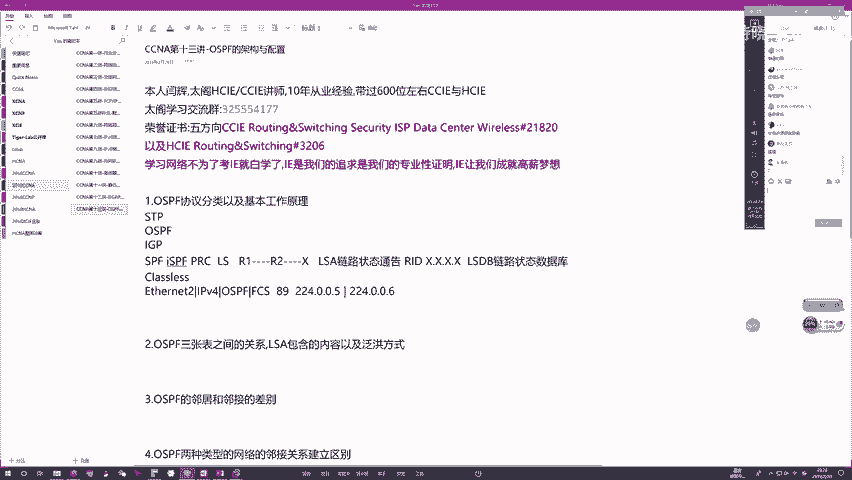

发送的hello来实时的维护咱们的临接关键状态。可以吧，你可以通过周期性的发送的哈lo来判断咱们当前之间临接关键状态是否ok如果ok的话，对吧？我应该是能够通过你周期性收到哈lo的。

如果咱们之间有问题了，比如你链路到了，或者说你自身到了，那我这个时候应该是通过你收到哈lo，那我通过你收到哈lo，我有一个计时器，对吧？一段时间只要我没有通过你收到哈lo，我这个计时器器只要过期了。

那咱们之间的连接关键状态也就到了，可以吧？那当然OSPF的哈lo呢，它有两个周期，这点是跟ESRP1样的，可以吧？它的哈lo要么是10秒发送一次。😊。

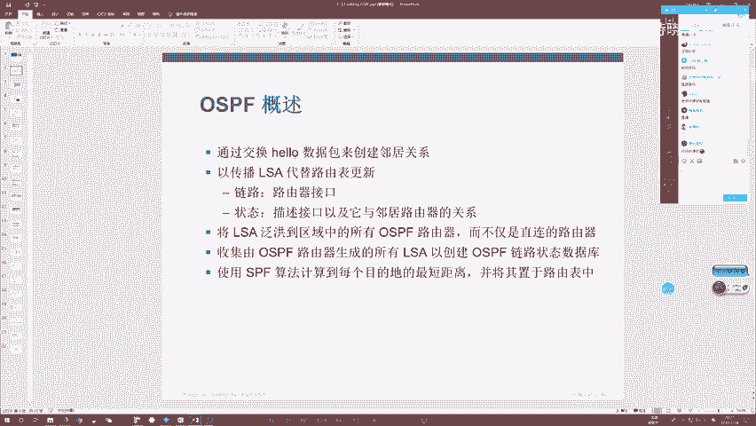

要么是30秒发送一次。那当然大家肯定会问了啊，你在什么样的接口运行OSPF我哈lo10秒一次，什么样的接口又30秒一次呢？啊，这个跟EI加皮不一样的是我不看你接口带宽，你接口带宽为多少都不要钱。

决定咱们的哈lo到底怎么发的，是你的接口的OSPF网络类型，可以吧？OSPF这个协议特别复杂，它设置了很多网络类型，可以吧？主流有两个啊，一个叫广播类型。😡，另外一个叫广播类型。还有一个角点到点类型。

一个叫广播类型，一个叫点到点类型，对吧？这个广播类型对应的是什么网络呢？主要对应就是咱们的以太对吧？你在一个以太网接口运行OSPF那这个接口，如果你没有做任何设置啊，它默认的OSPF网类型啊。

就是广播类型，这个广播类型的这个OSPF你在发送哈lo的时候呢，咱们就10秒钟发送一次，对吧？然后这种点到点网络类型啊，一般对应咱们的广网接口，比如说你这是一个ce接口，你在这个ce接口上。

你运行的是PPP协议，或者你运行的是HTLC型议，对吧？当你在运行这两款协议的时候，你这种ce链路只能作为点到点链路啊，连接两台设备。

那你在这样的接口启用OSPF它对应的网络类型呢就是点到点点到点网络类型的接口，哈lo也是10秒一次对吧？那当然什么样的接口30秒一次呢？比如你在针中记的接口运行P。😊，真踪记的接口运行OSPF。

咱们对应的网络类型叫NBMA这个叫非广播多路访问。这种网络类型的接口，咱们哈喽是30秒1次可以吧？那当然你也可以通过命令来强行的把一个接口网类型啊改成以下这两种。一个我们称为叫点到点啊，点点到多点啊。

一个叫点到多点。还有一个叫点到多点。点到多点NBMA可吧？它有这么两种好，当你把接口网类型啊调成这两种中的任何一种的时候啊，你这个接口发送hello，咱们也是30秒一次，对吧？

那也就是说具体你在一个接口运行OSPF之后，你hello多久发送一次，哎，跟你这个接口的属性是有关的。但是最终决定你哈喽几秒发一次的，其实是你这个接口网类型，你接口的属性，咱们不能改。

比如说你是一个以太网接口，我不可能说是给你变魔式啊，把你这个以太网接口变成一个cel接口做不到，你以太网接口就是以太网接口，你ce接口就是c接口，但是没有关系，我可以修改你这个接口的OSP网类型。

你只要把网络类型改了，对吧？那就会影响到咱们哈lo的发送周期。O那接下来hello的发送周期乘以4，那就是另外一个周期。这个周期咱们称为叫d。hello发送周期咱们称为叫hello in，对吧？

叫hello然后呢乘以4我们称为叫dad对吧？一个叫hello周期一个叫死亡周期那这个4倍的死亡周期指的是什么呢？就是当你两台路由器时间啊交还hello建立完邻居之后，对吧？

如果你4倍的hello时间都没有通过邻居收到hello，你们之间连接关系呢就会倒掉，对吧？那当掉之后，你们懂的，你通过邻居收到的所有LIC你都会删除，你通过这个邻居啊所形成的所有路条目都会删除掉，对吧？

那这点跟EI加RP是完全一样的O那当然你要hello建邻居嘛，你懂的我需要张表来维持咱们的临接关系状态，这个表我们称为什么呢？这个表我们称为叫临接关系数据库吧？当然俗称就叫邻居。

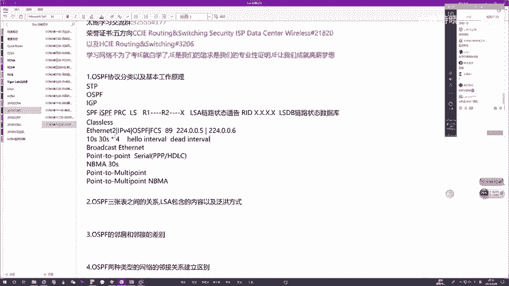

OK俗称就叫邻居表，它的全称叫邻接关系数据库。O吧。每见一个邻居，我就会把这个邻居信息啊，以一个表象的形式填充到咱们这个表里，对吧？那当然在这个表里面，我怎么表示邻居啊。

我会写上邻居路由器ID我会写上邻居的接口IP地址，我会写上我本地连接邻居接口，基本通过这三样信息啊，我就能够标识一个邻居了，O吧？好，那接下来建邻居之后的目的是什么呢？

建邻居之后的目的是为了在邻居之间啊，咱们能够高效的去同步路由信息，那当然在同步路由信息的时候呢，OSPF也不能说是直接把我路由表里面现存路由啊，给邻居发走，我要给邻居发什么呢？我要给邻居发送LIC了。

这个LIC里面包含的信息，我也跟大家说过，对吧？LIC中会包含我是谁的信息，还会包含我宣告进OSPF的所有接口的链路信息，对吧？比如接口哪些。

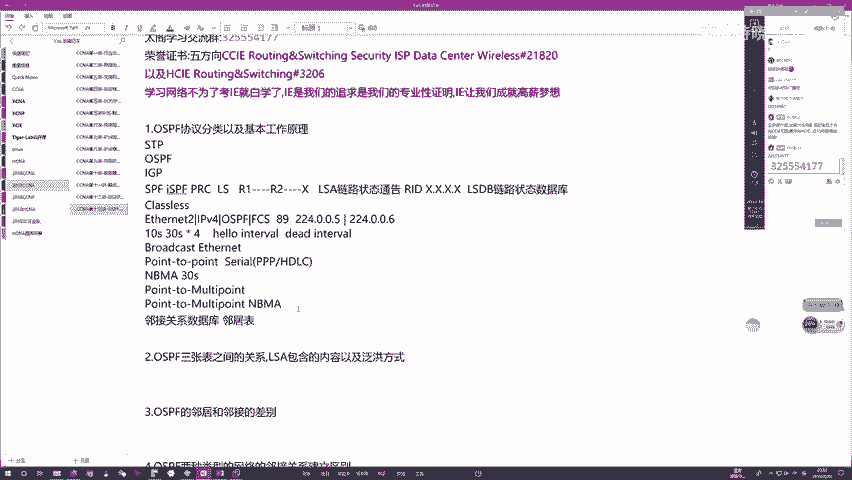

接口连接的链路类型是什么样的对吧？有没有连接其他运行OSPF的路由器，对吧？我会把这些信息呢整合成LIC发送给邻居。那当然大家千万不要天真的认为LIC只有一种啊，这个LIC呢一共有11种，可以吧？

分别是类型一到类型11，那当然这11种呢，大家也不用担心，不需要你们全部都理解啊，这11种LIC，你们只要重点了解其中的6种就好了。分别是一类到5类LIC还有一个是7类LIC可以吧？

1到5还有一个是7当然你了解这6种的话，对吧？你这OSPF的基本运作啊，都没问题了。好吧，那接下来这个LIC发送给邻居怎么发呢，那很简单啊，它是以组播形式给邻居发走的。当然呢这个邻居收到的LIC之后。

它不但会本地保存这个LIC它还会给这个LIC呢做一个泛红，那这个泛红怎么办呢？

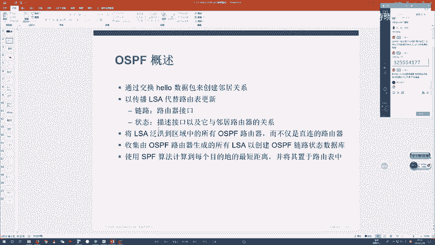

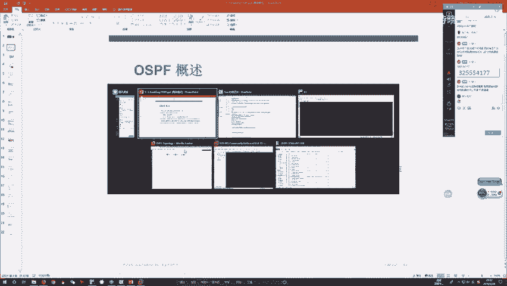

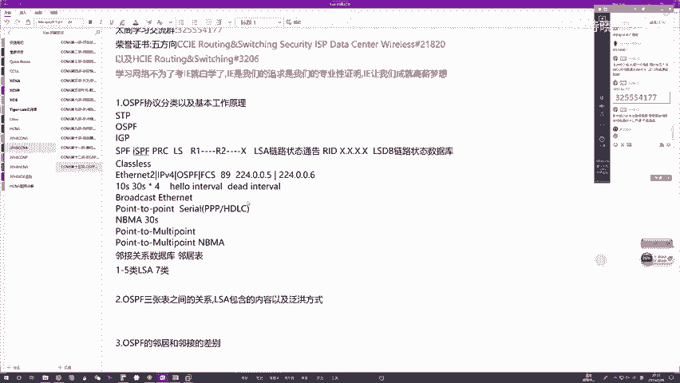

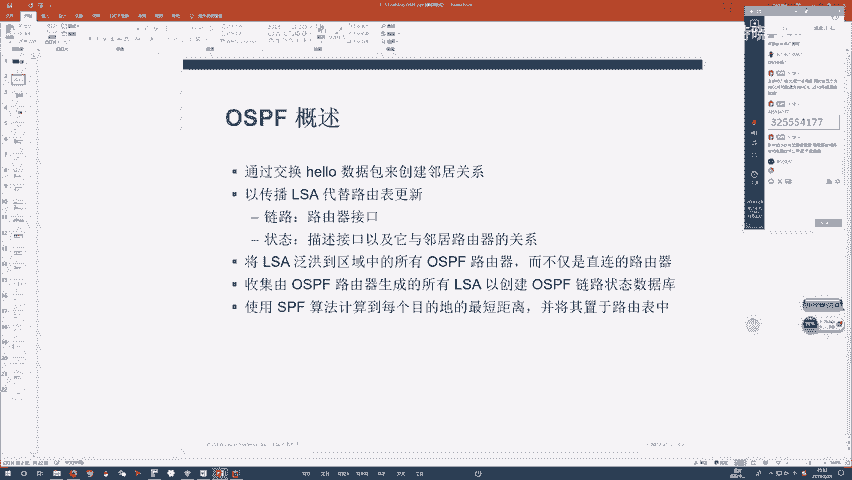

很简单，就是我接收这个LIC之后，对吧？我会帮你把LIC复制成多份，并且把LIC发送给他的所有其他邻居，对以吧？发送给他的所有其他邻居。

那所以说呢一台路由器产生一条LIC你虽然只能够把LIC发给你的邻居，但是最终谁能收到的LIC呢，你会发现一个范围内所有路由器他都能收到，对吧？因为你发给你的邻居，你的邻居会发给他的邻居，对吧？

然后他的邻居还会进一步传递，所以说呢你这组路由器最终呢都能收到你的LIC那当然大家都能收到你的LIC换句话说，大家的LIC你也都能收到。那所以你会发现在一个范围内啊，所有路由器。

他们的LSDB是完全一样的。😊，你这个LSDB中有你自己的LIC吧。好，你有，那别人也都有。那别人的LIC别人有你也有可吧。所以你会发现啊，在一个网络环境中，你在任何一台路由器上去查看LSDB。😡。

内容都是完全相同的，你售哪一台都一样，你可以理解为什么呢？就是在一个环境中啊，咱们每台路由器都拿着一张一模一样的地图，我们来计算路由，对吧？比如说了南京人800万吧，每个人都有一张南京地地图吧，是吧？

每个人都有一张南京地图，那这个地图都是一样的，大家都有，这就是LSDB的这么一个作用，你可以理解为运行OSPF之后，对吧？路由器所产生的LSDB就是一张地图，对吧？这张地图里面收集到的LIC啊。

就是咱们地图里的碎片，我通过各自所形成的LIC拼接在一起啊，就能把这个完整地图给拼出来，那拼出来之后，对吧？大家都知道自己在哪，既然大家都知道自己在哪，你们就算呗，你们就计算从自己出发，对吧？

去往每一个非直联网络有哪些路径，每个U哪个不由，你自己说的算，你自。😡，把这些最优路径信息加入表来转发数据，这不就OK了吗？对吧？好，这就是它的第二步OSPF运作的第二步。

就是路由器之间彼此交互LIC可以吧？然后咱们通过泛红的方式啊，能够让一个环境下的所有路由器都能收到完全一样的LIC那当然这个环境我们称为什么呢？这个环境，咱们有一个专业的称谓啊？我们称为叫一个区域。

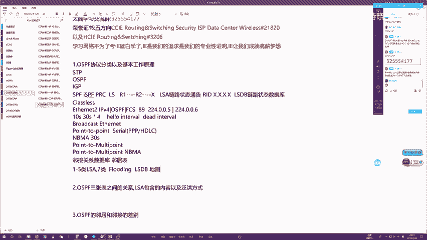

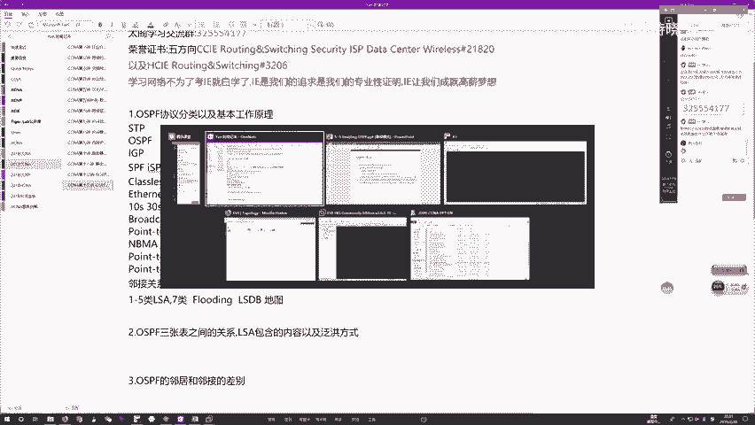

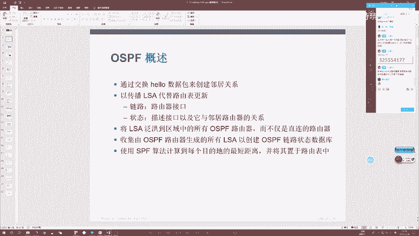

可以吧，我们叫一个区域，那这个区域是什么呢？我们称为叫er，这是OSPF定义的一个术语啊。OSPF是个层次化部署的协议。如果你希望这个OSPF在运营商网络这种巨大的网络中啊来部署，那你必须要划分区域。

对吧？然后接下来区域有两级，第一级呢咱们称为叫骨干区，这个骨干区域呢，咱们称为叫ever0，当然这个ever0还有一个叫法，我们称为叫传输区，然后接下来除了骨干区域以外，所有其他区域像什么er一啊。

er2啊，ever3啊，对吧？这些我们就称为叫非骨干区，对吧？非骨干区享有多少就有多少，而咱们的骨干区域呢，尤且只有一个，你通过这种层次化的方式来设计咱们的网络啊，你能够让咱们这个网络更加优化。

能够支持更大的网络支持更多路由器数量支持更多路由条目数，对吧？并且多区域。比较方便咱们做路由汇总，并且方便咱们做一些路由过滤测略，对吧？那接下来对吧？你一组路由器运行SPF，你们的LSDB不是一样吗？

什么样环境下的路由器？你们的LSDB是一样的哎，那就是属于同一个区域的所有路由器，对吧？属于同一个区域的所有路由器，你们关于这个区域的LSDB是完全相同的。因为我也说了，LIC呢它有很多类型。

不同类型的LIC里面包含内容肯定是不一样的对吧？并且不同的LIC产生它的路由器也不太一样，可吧？它的传输范围也不太一样。比如像有的LIC，你只能在一个区域内吧，而有的LIC呢。

它能够在整个的OSPF的路由域内去发送。然后呢，有的LIC是要在排除某个区以外的所有其他区域来发送，对吧？不同的LIC里面包含内容不一样，它的使命也不一样，对吧？它的发送范围对吧？

产生的路由器也都不一样。那所以说了既然有这么多的东西，那咱们就整简单的说啊，如果你所有路由器都在同一个区域内，对吧？咱们能够保证你这些路由器的LSDB是完全相同的，对吧？

那接下来光有LSDB是没有用的啊，因为你LSDB中虽然你能看得懂咱们整个网络怎么连接的，但是毕竟这张地图里面没有包含路由信息，你路由器在数据层面。收到数据包之后，你为了转发数据包去往相应的目的地。

你是需要拥有去往这些网络路由条目的这些路由条目你怎么算啊？你就是要通过这个ISPF算法，可以吧？加PRC算法来共同的做一个计算。你通过这两个算法来对咱们的OSDB做一个计算，得出结果是什么？

就是你自身出发去往每一个目的网络的最优路径，你把最优路径转换成路由条目把路由条目加入到你的路由表里，对吧？然后接下来当你路由表里面拥有去往这些网络路由条目之后啊，你在数据层面。

当你收到去往这些网络数据的时候，你就可以使用路由表中路由条目来做一个精确转发，那这个就是OSPF的三步曲。那这三部曲呢哎基本跟EIGRP是一样的，先见邻居对吧？形成邻居表的表象。

再交互LIC把LIC放置到LSDB中去，然后对LSDB中的这张地图来执行算法计算，判断出从自身出发，去往每一个非直连网络有哪些路径，哪条最优把最优路径信息转换成路由条目，加入路表用来做日后的数据转发。

对吧？那这就是所有经典的链路状态协议的三部曲。

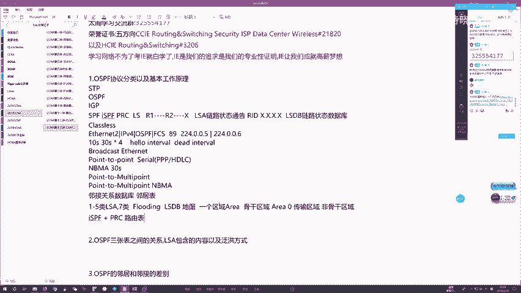

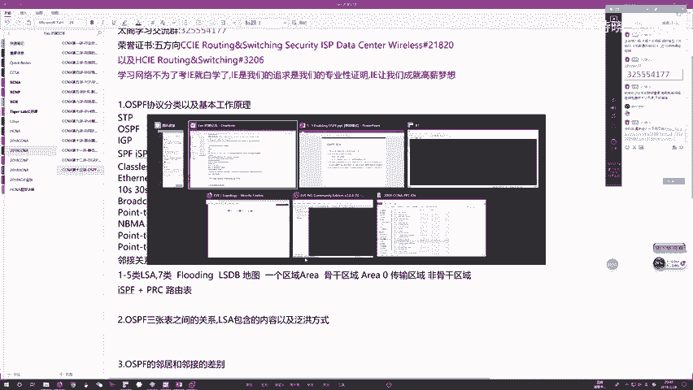

那所以说呢大家应该能够理解为什么咱们称EIGRP是一个平衡混合协议，对吧？对吧？为什么说它长得比较像另状的协议啊？因为它这三张表跟OSPF是不是一样的，对吧？一样的原因是什么？就是它抄袭OSPF啊。

大家这个抄袭呢也不尽然。因为虽然在EIGRP中，咱们有张拓弧表，对吧？但这个拓弧表可不像OSPF的OSDB啊，你能了解到咱们一个范围的网络连接，EIGRP的拓弧表里面放置的依旧还是路由条目。

你依靠拓弧表里路入条目，对吧？你想了解咱们网络是怎么连接的，我只能说你想多了，你运行EIGRP的路由器根本不可能知道咱们一个网络环境中有多少台路由器，大家到底怎么连接网络到底怎么分布。

你根本不可能知道这些信息。😊，你获得那些非直联网络路由，依旧是你的邻居来告诉你的，可以吧？不是你自己计算得到的，OK吧？但OSPF不一样。OSPF是当你了解网络连接之后，对吧？

去往这些非直连网络路径该怎么走，我一清二楚，我自己计算得的。可以了，我自己计算着了。那当然就是因由于如此啊，你运行OSPF也会有一个非常大的问题。😊，就是咱们能不能做路由汇总呢？好。

请注意你是完全做不了的，可以吧？如果说你组路由器，你们在同一个区域内，你们关于这个区域的网络连接，大家都一清二楚，对吧？有多少网络咱们再清楚不过，你有多少网络，那你正常就应该形成什么多少条路由。

你想要汇走，你怎么会啊，你没有办法会，你本地汇不了你的邻居也会不了，因为你的邻居根本没有能力给你传路由，你的邻居只能告诉你网络怎么连接的。而当你知道网络怎么连接之后。

你就会针对每一个网络来形成一条路由条目。😡，那这就是OSPF最大的问题。你如果说在一种超大型的网络中啊，你运行OSPF，你把所有路由器放到同一个区域内，那就崩了。😡，为什么？

因为所有路由器都在一个区域内，你做不了任何汇总。那也就是说在咱们这个网络环境中啊，你有多少个网络，咱们每台路由器就会形成多少条路由，你会消耗N多的内存资源，并且路由器这么庞大的路由表。

你在转发数据的时候延迟居高无比。😡，并且当你有网络出现变更的时候，比如你某条链路到，你某台路由器到，那这个一定会影响到咱们的LIC对吧？那这个LIC呢会继而传递给区域内的所有的武器。

大家都要频繁的针对网络中的这些链路的崩溃啊。这些链路的翻动来频繁的做SPF算法计算。那这个太过消耗CPU资源。所以你会发现对吧？如果你要把所有路由器啊放在同一个区域，虽然这个OSPF能够运作。

它是它效率是怎么样？非常非常低的。所以说呢在中到大型网络中，如果你希望这OSPF运行效率高。如果你希望做汇总，你希望减低每台路由器路由表条目数量，减低他们LSDB中的LIC数量方便做汇总。

并且咱们能够把某些不重要的链路变更啊，它的这个影响限制在一个区域内，那就请你乖乖的去划分多个区域，你去做这个层次划分部署。对以吧，那当然这个层次化的部署呢，把咱们区域就分为两级，对吧？一级叫骨干区域。

还有一级呢叫非骨干区。那在多区域的环境中，哎，咱们有一个连接的建议啊，就是骨干区域呢，咱们有且只有一个放在咱们整个网络最中心，然后呢，所有非骨干区都要跟咱们的骨干区挂靠，可以吧？那这样做的目的是什么呢？

就是你一个非骨干区域的路由，对吧？通过骨干区域，咱们能做一个中转，继而再传递给其他非骨干区，可以吧？那如果说你在设计区域的时候，没有这么设计，对吧？比如说你在一个非骨干区域身后又连接了一个非骨干区。

请注意啊，那这两个非骨干区之间是不能够彼此传递路由的，为什么呢？因为这种直接连接多个非骨干区域的路由器，对吧？它呢是没有能力把一个区域的路由发送给另一个区。

如果你希望把一个非骨干区域的路由发送给另外的非骨干区啊，对吧？这个区。必须要跟骨干区挂靠。你这个非骨干区的路由必须要经过骨干区做一个中转才能到达其他的区域。这就是为什么咱们把骨干区啊称为叫传输区。

这个传输区指的是什么？就是控制层面的LSA的传输，对吧？那这就是咱们这么规划区域的目的。那当然这个规划区域呢，咱们有一个好处啊，就是你不用担心多区域的环境中会出现环路，因为这个OSPF呢。

它毕竟只能保证你一台路由器了解你所在区域内的网络连接，对吧？换句话说，一台路由器它并不知道其他的区域网络是怎么连接的，它获得其他区域的路由是靠什么呢？

是靠其他区域和它这个区域的边界路由器产生出来给它通道的，对吧？比如说以我们这个例子为例啊，CDE这三台路由器是比较特别的。那它们呢既连接了骨干区域又连接了一个非骨干区，对吧？

那这个时候你们同时连接两个区域，那这两个区域的连接信息，你们肯定都清楚吧。那所以说呢C这台路由器，它可以针对骨干区域啊来形成骨干区的。

所有路由它能针对骨干一啊它能针对这个区域一的连接啊来形成区域一的路由。然后紧接着它就能把形成的关于区域一的路由，以一种新型LIC形式发送给区域零。它应要把区域零内的所有路由啊。

以这种相同类型的LIC形式啊发送给区域一。所以说你会发现最终F这台路由器，它是能够拥有骨干区域路由的，并且A这台路由器它也能够拥有区域一的路由。但这些路由真不是靠它算出来的，可以吧？

因为它并不知道这个区域怎么连接，并且你区域一内路由器也不知道咱们骨干区怎么连接，获得其他区域路由完全是靠这个边界路由器啊所通道。这种边界路由器，我们称为什么呢？我们称为叫AB啊。

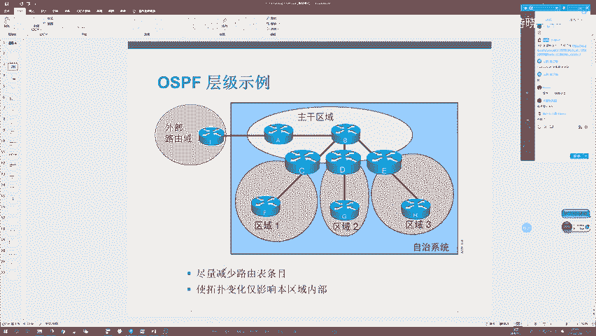

这种边界路由器咱们称为叫AB啊，叫area。Brother。rotor对吧？这个叫区域边界路由器，对吧？叫区域边界路由器。

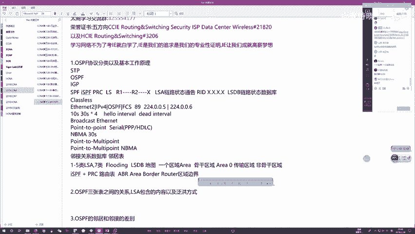

这种区域边界路由器特点是什么呢？就是你一台路由器，你同时连接多个区域，并且其中有一个区域啊，必须是骨干区。你千万不要说在咱们这个区域一下面。好，你再连一个区域4，对吧？你如果再连接一个区域4。

那F这台路由器，你也同时连接两个区域吧，你觉得只要一台路由器同时连接两个区域，你都是ABM吗？不是啊，F这种路由器，如果你身后连接一个区域4，你就不是ABR对吧？你不算是区域边界路由器。

区域边界路由器所连接的多个区域中啊，一定有一个是骨干区。所以说呢CDE他们都是AB啊。对吧？他们会把一个区域的路由计算出来之后，把这些计算出来的关于这个区域的路由以三类LIC形式发送其他区域。

其他区域就乖乖的通过它接收路由就好了，对吧？他在发送路由给其他区域的时候，就是告诉其他区域内路由器啊，对吧？你想访问其他区域嘛？哎，走我做下一跳，这就可以了，对以吧？

然后接下来咱们这些接收三类LIC路由器在计算三类LIC这些区域间路由的时候，你的计算方式其实跟其实跟EIGRP并没有什么区别。你都是基于距离使量协议算法那一套啊，来做一个基于传闻的路由计算简单来说。

就是你告诉我有这么一个网络，对吧？通过你可以到达，那我就通过你到达。而至于这个网络到底在哪里对吧？怎么连接的。我就不关心了。那请注意，这种路由计算，既然跟距离使量协议没有任何区别。

你能保证它百分百无环吗？你不能保证我能保证在一个区域内，咱们所有路由器啊计算区域内路由的时候是百分百无环的。因为大家都先知道宝络怎么连接了，你在基于咱们宝络连接图来算路由。但是对于其他区域的路由。

你并不知道其他区域怎么连接。😡，这个路由仅仅就是ABR告诉我的对吧？那对于这些路由，它告诉我的是对的还是错的，我能分辨吗？我分辨不了。所以说对于这种区域间路由传递啊，是有可能会出现环路的。

那所以说为了避免出现环路，咱们在设计多区域的时候，你就必须要遵循这个区域间的设计原则来这么设计。骨干区尤其只有一个所有非骨干区域都跟骨干区域去挂靠。然后接下来非骨干区之间路由鼻此传递，怎么传递啊？

先经过骨干区做一个中转，对吧？再到达其他的非骨干区。那这样设计为什么就不会出环了呢？好，很简单，如果你把一个区域当做一台路由器啊，你会发现你按照这种方式来做一个区域间的连接，你相当于是把区域间的连接啊。

连成一个新型网络。那大家都知道物理新型网络在传输数据的时候，你本身就不具备环路条件，对吧？什么时候咱们可能会出环。就是当你路由器之间彼此连接的时候，你连成一个环。在这种情况下是可能会有环路的。

但如果说你在连接这些路由器的时候，你在连接这些区域的时候，你把区域间的物理拓路连成一个新型拓路。这本身就没有环路出现的可能。所以咱们相当通过物理方式啊来做一个防环。

你能够保证咱们区域间之间路由传递的时候，你就算一个区域内路由器不了解其他区的路径，你也不用担心在接收这种路由的时候啊，可能会出现问题。可以吧，按照这种方式设计区域是绝对OK的。那当然在特殊的情况下。

对吧？比较极端的情况下，你设及区域，如果你真的要作死啊，对吧？你在一个非骨干区域上面，你又连接了一个新的非非骨干区域。而这个新的非骨干区没有给我们ever里挂号，对吧？你真要作死，那没人拦不住你啊。

你如果真要作死。😡，那你也可以通过一个临时解决方案来让咱们其他区域啊能够临时的接收到咱们这个对吧？远离区域零的非骨干区路由，并且你可以让这个远离区域零的非骨干区内部路由器啊，也能够收到咱们其他区的路由。

那这个可以通过一系列工具来解决。但是这个解决呢治标不治本啊，我不让你传路由是有我理由的。你现在强行打破我这个规则了，对吧？我让你原本不能传路由情况，能传路由了，那这未必是件好事，因为你虽然路由能偷。

但你最终有可能会由于什么？咱们网络之间的连接啊，我们区域之间的连接没有做这么一个新型连接部署，而最终产生环路。可以吧，那这些解决方案都是临时的。你临时解决完之后，最终呢还是建议大家重新去规划一下区域。

让这个区域变正常。那这个是最好的一方案，可以吧？好，那接下来我们来谈一下为什么要划分多个区域啊，你划分多个区的好处是什么呢？就是让你一个区域内的路由器啊，不要知道咱们整个网络怎么连接。

你不要让它能够收到整网所有路由器的所有OSA对吧？我只希望你接着说什么？你这个区域内的拓信息，你在计算区域内路由的时候，你按照区域内的拓误连接来算就好了。而对于其他区域的路由，对吧？

你听从ABR的ABR给你怎么发，你就怎么收就好了。而又由于咱们ABR在发送区域间路由的时候，我发的就是路由，里面没有任何错误信息，所以我再把一个区域的路由发送给其他区域的时候，我是可以做汇总的，对吧？

当然这个汇总，咱们有一个学名啊，这个汇总我们称为什么呢？这个汇总咱们称为叫区域间汇总，对吧？叫区域间汇总，注意啊，OSPF没有区域内汇总，你怎么汇总，你没法汇根本就不存在区域内汇总，它只有区域间汇总。

只有当你存。😡。

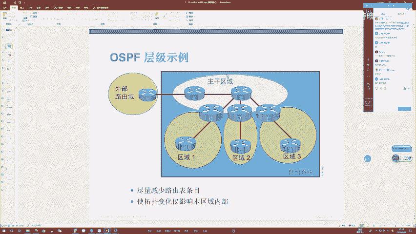

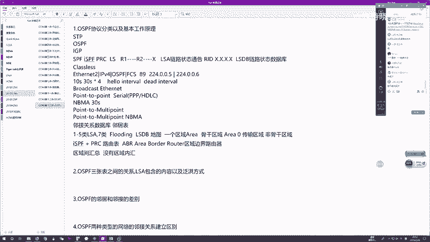

在区域边界的时候，只有当你存在多个区域的时候，你才有汇总的可能。那当然这种汇总呢，咱们就在ABR上做，对吧？那你做汇总大家懂的，你汇总做的越好，你就能把越多的连续路由做一个合并通道给其他区域，对吧？

这样效率就越高，你可以相当是节约了咱们一个区域内部路由器的LSDB的空间，你节约了大家的路由表空间，你让咱们LIC数量变得很少，你让咱们路由表条度数量变得很少，对吧？那这样咱们内存的结余啊就非常庞大了。

你会把节约出来内存来干其他事情，并且你路由标小了，你收到一个数据包，你查标转发的时候，你查的路由条度次数变少了。😡。

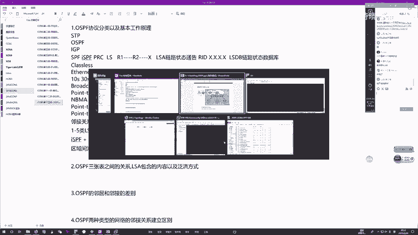

那咱们端到端的转发对吧？就会变得更加高效，并且对吧？你CPU的消耗也会进一步的减少。那这个是百利无一害啊，并且这个汇总的最大好处是什么呢？就是帮当你把多条路由做一个合并之后啊。

如果说你这多条路由所涵盖这些路径，假如说出现了翻动对吧？出现了翻动，这个翻动什么意思呢？给大家解释一下啊，翻动，我们称为叫fing。

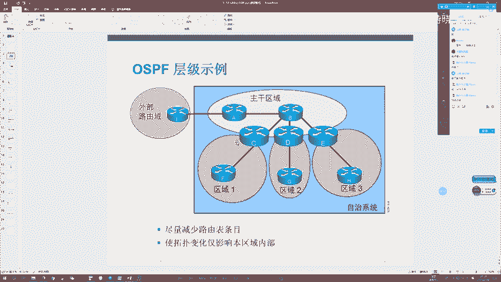

对吧叫flappping。这个叫翻动可以吧？翻动指就是一个链路或者一台路由器啊，或者一个接口，一会儿up，一会儿荡，你频繁的在up跟档之间啊不停的切换，那这个我们就称为叫翻动，对吧？啊。

翻动是非常非常恶心的，因为你接口up，对吧？你top发生改变，你要产生LIC来通道这个信息，对吧？你接口当了，怎么样？你要再发送一些LIC告诉大家，这个接口就不可用了。所以你会发现接口每翻动一次。

你要产生两份相同的LIC来通到这些邻居对吧？一会儿通道这个链路可以用了，一会儿通到大家，这个链路不可用了。那如果说所有路由器咱们在一个区域内啊，不好意思，你只要链路每翻动一次。

所有路由器都要配合着你来针对这个路径啊重新做1个SPX算法计算。😊。

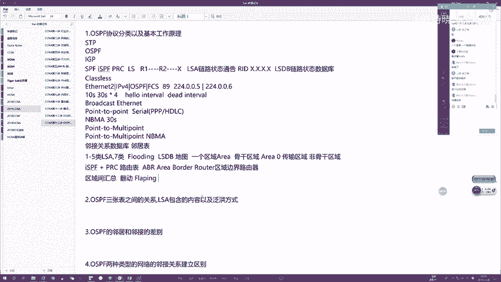

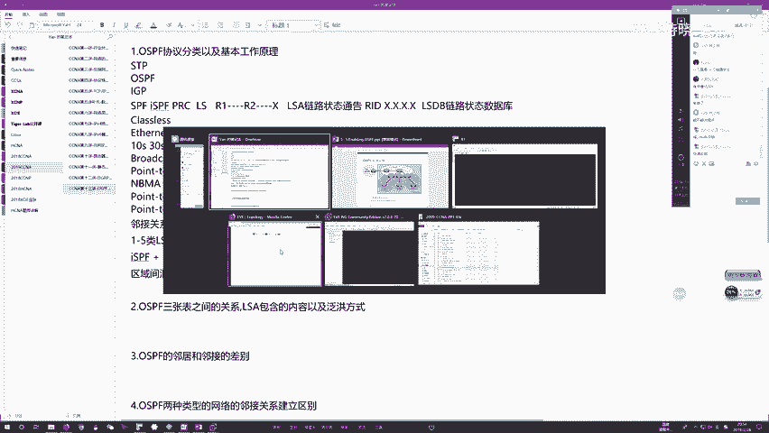

这个多消耗CPU资源。大家要知道，链路状态协议可是不比咱们距离矢量协议。这种协议的算法计算极度的消耗CPU资源。我们都是恨不得你这个算法算完一次之后啊，这辈子别再算了，这是最好的。因为你不算了。

我CPU资源可以拿来干其他事儿。如果你要强行拿路由器CPU资源来频繁做这个算法计算，你这个效率得多低呀。😡，大宝仪啊，大家一定要搞清楚。什么叫路由选择协议？什么叫控制层面？这个控制层面的目的是什么？

无非就是让你路由器知道这些非直连网络的路径怎么走，对吧？你要能够知道这些非直联网络怎么走，这就OK了。你在运行路由选择协议的时候，我们是非常不希望你这些控制层面协议啊，过多消耗咱们路由器的资源。

过多消耗咱们链路资源，这就本末导置了。因为你做为一个网络设备，你存在的根因是什么？第一是给我们提供连接。第二就是帮我们做数据转发，对以吧？提供链接加做数据转发，这就是你要干的所有事情。

我们这些控制层面路选的协议只是一个辅助而已。可以吧？那接下来如果说你要把大量CPU内存资源啊用于咱们这个路选的协议。以至于你没有足够的CPU内存资源来做实际的数据流量转发。

那这个就正儿八经的是等末导致了。那为了避免中种本末倒致事情发生啊，对吧？你这个算法是能少计算就少计算。那这个跟汇总有什么关系呢？请注意啊，关系可大。你把一个区域的多根连续的路径做一个汇总发送给其他区域。

当你这某一根链路崩溃的时候，我们这个汇总路由是不会产生任何影响。这就是说你在一个区域内一根链路，你不停的翻动。对于其他区域而言，其他区域的路由器甚至不知道这一点。因为无论你这个链路怎么翻动啊。

我收到的汇总路由是一样的，可以吧？汇总路由包含了我这个翻动链路，我还包含了其他链路。你这个链路到了无所谓啊，其他链路还在只要其他链路在我这个汇总路由就在那所以说当你做好汇总之后啊。

你一根链路翻动所产生的影响，只有这个区域内的路由器，他们知道。那也就是说当你这个链路翻动的时候，只有同一个区域内的路由器啊，会针对这个链路拓扑信息的改变来做这个SPF算法计算，而其他区域路由器。

他们是根本感不感知不到这一点，可以吧？这就是说当你做完汇总之后，怎么样？你可以把拓扑的变更所产生的影响，尽可能的限制在一个区域内，可以吧？限制在一个区域内不至于影响其他区域，那这个协议可扩展性就会强。

那所以说咱们为什么要设置层次化的区域部署啊。为什么要设置多个区域啊，其实。就是为了做汇总，做汇总解决两个问题。第一是优化咱们所有路由器的CPU内存资源。第二个就是对吧？

让咱们的网络的稳定性更上升一个层次。它把to误的变更啊所影响的范围限制在一个区域内，这就是多区域的好处。那当然对吧？并不是说所有情况下你都需要多取。比如你这是一个小网，对吧？当而小网归小网。

我们客户呢可能比较挑剔，对吧？他不允许咱们使用raip。他希望在这个比较小的网络中啊，也通过运行OSPF来让咱们提供互联互通的这么一个能力。那在这种情况下，对吧？一共也就没几台路由器，对吧？

一共也就没几个网络，你也不需要汇总。那这个时候你设置一个单区就可以了。然后在NA中呢，咱们就是研究单区OSPF就没问题。那接下来大家可能会问，那当你在设置单区域的时候，对吧？必须要使用骨干区域嘛？

请注意啊，没有必要。你在设置单区域的时候，由于不存在区域间的路由传递啊，你所使用的这个单区域可以是骨干区，也可以是任何一个非骨干区，这个没有任何影响，好吧，这个是没有任何问题的。O。😊。

然后接下来说到OSPF的邻居，就需要跟大家吐槽一点啊。这个OSPF的邻居呢特别特别恶心啊。

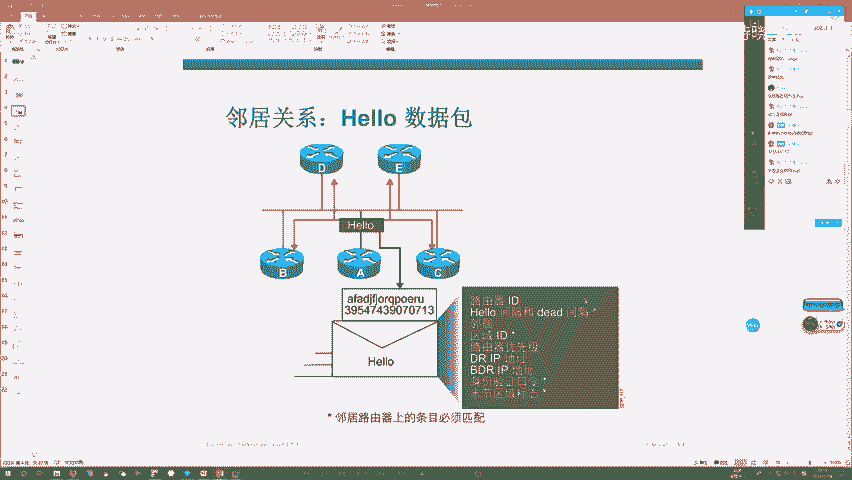

OSPF这个协议是所有入流选择协议中啊，建邻居最恶心的一款没有之一啊，甚至连任后的BGP都没有OSPF这么蛋疼。😡，他把临接关系状态分成了8级，可以吧？分成了8级，我都不知道他怎么想的。

那这8级分别哪哪8级呢？分别叫干，对吧？这是第一集啊，然后呢以你手，这叫第二级，然后呢to位，这是第三级。然后接下来exact。😊，这个叫第四级啊，exchange这个叫第5集，第6集叫loading。

第7集叫f agency。然后紧接着如果你要在NBMA网络环境中，或者你在点到多点NBMA网络网络环境中啊，你要建零居，你还需要指什么nabel命令。那当你指纹nabel命令之后啊。

那在down跟引你少之间啊，咱们可能还会有一个什么叫attempt，对吧？这个叫城试状态，那所以说满打满算，咱们一共有8级，这8级连接关系状态，我们就是什么呢？

我们称为叫OSPF的连接关系状态有限状态机，对吧？叫有限状态机有限状态机。你们在建立邻居的时候，我们一定要按顺序啊，从低级到高级去演变的对吧？当然你们之间经历一个事件，满足什么条件了。

你们就进入到这么一个级别。那当你这个级别的事儿做完之后就进入到下一个级别，下一个级别的事做完就再进入下面一个级别，对吧？一共有这么7级，其中这个tempt，对吧？有的时候存在啊，有时候不存在。

如果不存在就是7级。如果它存在，那可能就是8级。😡，那接下来因为这么多急，咱们在谈这个邻居的时候，对吧？你不会说咱们这两个邻居啊到底见到什么东西了，对吧？到底现到一个什么状态，这个太麻烦了。

那所以一般呢咱们把这个OSPF的邻居啊，用两个名词来描述，一个叫邻居。😡，一个叫临街，对吧？一个叫邻居，一个叫临街。这真的是所有路由选择协议中啊，唯一一款把路由器之间的邻居用两个名词来叫这么一个协议。

邻居，我们称为什么邻居，我们称为叫n。😡，连接我们称为叫adjacency。对吧邻居呢叫nighbel，邻街叫adjacency。OK一个叫零居，一个叫临接。那当然零居和临接者到底是什么呢？

其实主要就是指啊你两台路由器运行SPF之后，你们之间到底交互过一些什么样的东西？如果你们之间只是单纯的交互过hello，哪怕你们哈lo交互的再好啊，那当你们完成哈lo建立之后。

当你们完成哈lo交互之后啊，你们之间最多也只能到达突位状态。😊，可以吧这个突落状态指的就是你们之间只是简单的邻居。那邻居意味着什么呢？邻居意味着你们之间啊压根儿连LIC都没发送过。

我没把我的LIC发给你你也没把你的LIC发给我，咱们之间只是交互过哈lo可以吧？像什么后续的DBD啊，LSRLSULICC不好意思，你都没有钱都没有怎么样交互过，你们只是交付哈loO了。

那接下来这个AJC指的是什么呢？Jason这个jason指的就是咱们两台路由器运行OSSPF我们是先交货哈lo，交互了hello之后呢，我余下的4种报围，咱们也都交互过。

比如咱们交互完了哈lo之后怎么样交互的DBD可以吧？DBD这个叫。啊，dabbase description对吧？叫dabbase description叫数据库描述。

咱们之间还交互过LSR这个叫链路状态请求。我们交互过LSU叫链路状态更新，还有LACK这个叫链路状态确认我们之间这五类报文都交互完了，并且咱们之间的LSDB已经同步了。那这个时候咱们之间所见的邻居啊。

我们就称为叫零接连接指的是咱们不光光交互哈lo，我们所有其他报文都交互过，并且此时此刻咱们俩的数据库是完全一致的，可以吧？这就是所谓的连接。那一般正常情况下，两台路由器运行SPF。

你最终要建立的就是连接。但然要建立连接之前必须得要先到达邻居状态对吧？这个临居状态的建立呢就是需要交互哈lo可吧？那当然这个哈lo中呢会包含很多很多内容。路由器的运行。

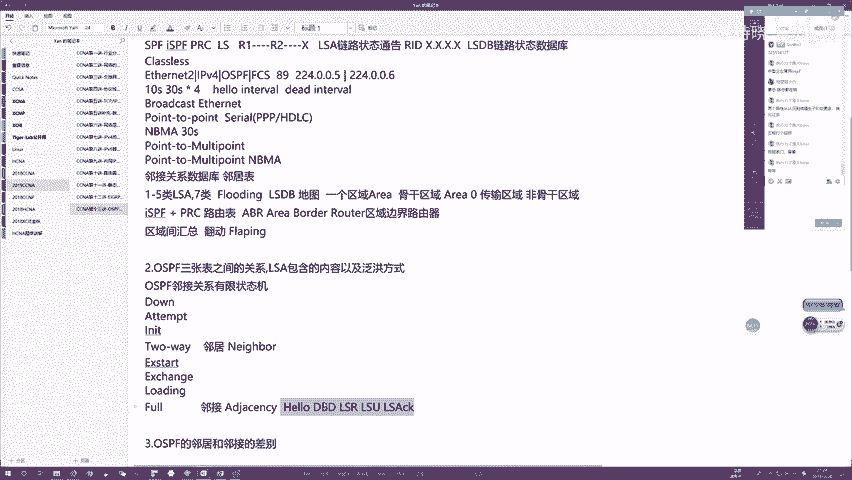

PF之后就变得特别矫情。你要建立邻居，你通过邻邻居啊收到一个哈楼，你要匹配里面很多字段，对吧？当邻居这些哈楼中的字段跟你匹配了，你们之间的邻居才能建立那远不像咱们EIRP方面啊。

EIGRP建立连接关系条件只有三个对吧？你们AS套一致就O了，对吧？你们的K值一致就没问题了。如果你们要做EIRP的认证，你们的认证密钥要相同，只要这三点满足啊，哎，就没有任何问题，但OSPF不一样。

这个OSPF太挑剔了，你要保证两台路由器成功建立到邻接关系，请注意啊，你们之间要匹配的参数至少有1样，并且就算你们只要建立到mo状态，你们就交互一个破哈楼啊，这个哈楼中要匹配的，都有N个字段。

只要有一个字段没有匹配。不好意思，你的邻居就建不了注意，这只是邻居都建不好吧，那接下来看。😊。

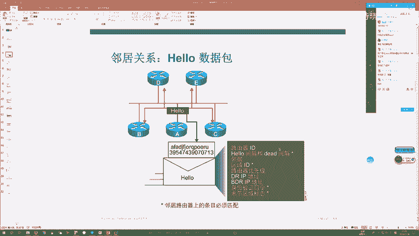

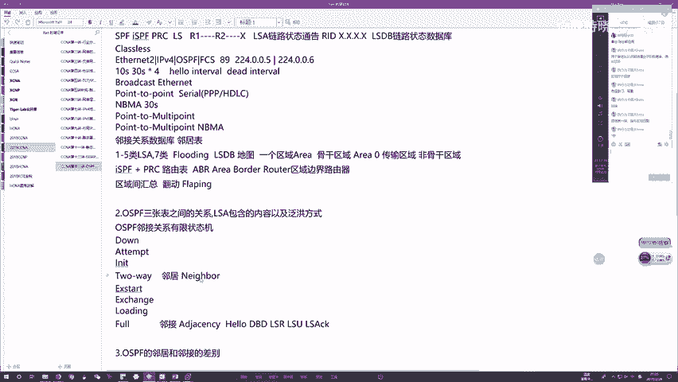

看一下你一台路由器发送hel楼包含哪些东西。那首先呢就会包含一个路由器I对吧？你用来告诉大家你是谁，对吧？这个路由器I呢咱们在运行SPF的时候呢，你可以手工指定手工指定，那肯定优先最高，对吧？

你指的是什么，它就是什么那当然你也可以说不指定路由器I你偷个来，你只运行PF那你只只运行SPF没有手工指定路由器I它就没有了呢？请注意不可能啊，你只要一台路由器运行SPF，其他东西没有可以。

你路由器ID是必须要有的你这玩意没有你怎么玩啊，你都不能告诉别人你是谁，你还能发送什么，你就什么都发不了？那接下来如果你没有指定路由器I这个路由器I怎么来呢？它会自动选举。这个自动选举的流程是什么呢？

它会首先在该路由器所有状态为up的还回口中找到最大的还回口地址来做路由器 ID可吧？也就是说如果你有还回口，你要在所有还回口中啊，看看谁的地址最大。

你要拿这个地址最大的还回口的地址啊来做路由器 ID当然前提是这些还回口的状态必须为可？你接口为到是不行的。然后接下来如果你路由器没有还回口呢，它就会从所有状态为up的物理接口中啊。

找到最大的IP地址来做路由器 ID可？而包管怎么样，你路由器 ID呢肯定会有一个。当然如果你要自己指定的话，肯定是更优的可吧？然后接下来成了路由器 ID以外呢，它会包含一个hello时间和带的时间。

对吧？我会提前通告你我通过这个接口发送hello多少秒发送一次对？我的带的时间是多少秒，也就是说当咱们建好邻居之后啊，多久没有通过邻居收到hello，咱们的连接关键状态就要倒掉。😊。

然后紧接着第三个叫nabel字段叫邻居字段。这个邻居字段呢是用来告诉其他路由器啊，当前我运行OSPM之后，对吧？我有没有收到过其他路由器给我发的哈lo。

如果说我收到了某一个邻居路由给我发的hello这个哈lo中不会包含邻居路由器I吗。那这个时候我为了告知其他人，我收到过你给我发的hello那我再次发走哈lo的时候。

就会把你的路由器I放在这个邻居字段发走。那当然如果说我给你发了一个哈lo，这个邻居段为空，为空代表什么意思呢？代表当前我启用OSPM之后啊，我还没有收到过任何人给我发送任何hello。

我没有收到过任何hello，那我这个邻居字段就是空的。但我一旦收到了谁给我发的哈lo啊，我就会把发送者路由器I写在这个字段能理解吧？好，然后接下来区域I。😊，这个区域ID我也说了。

你运行OSPF大网也好，小网也好，对吧？你区域必须部署。如果你在大网中你可以层次化的部署，对吧？两级区域嘛，那当然你如果在小网中一个区域就搞定。当然不管你多区域还是一个区域啊。

你再把路由器的一个接口宣告进OSPF的时候，你要指定把它宣告进哪个区域中去，那接下来你宣告进一个区域之后呢，你通过这个区域的接口发送任何报文的时候。

你都会尽可能的携带一个区域ID通过这个区域ID来告诉大家对吧？你当前把你这个接口宣告进那个区域，O了。然后紧接着OSPF建邻区特别矫情的是对吧？你在MA网络环境中和点到点网络环境中啊。

建邻居的机制是不一样的。在MA网络中呢，你建邻居，大家到达突位之后呢，我们会做一个选举，选举看看这个。这个网络中啊哪台路由器最牛逼，最牛逼的路由器，我们称为叫指定路由器，这个叫低R，它的全称叫dign。

然后接下来第二牛逼路由器啊，我们称为叫BD啊，这叫备份指定路由器，这个叫backup的可那接下来谁最牛逼，谁第二牛逼，咱们是通过选举得到的那选举比较什么呢？就是先比较大家接口的OSPF优先级啊。

谁接口优先级高，谁就是低R可那当然这个优先级如果你没有修改，默认大家都一样都为一。那如果优先级大家都不一样，那谁牛逼，咱们靠什么呢？哎，靠你这个路由器ID路由器ID谁最大谁就是低亚第二大的就是BD啊。

对吧？你需要这么一个选举。那当然在点到点网络环境中啊，由于你们建邻居就两个节点，没有什么效率问题。所以说你们建邻居怎么样，就直接往下建就好了。只有在MA网络中，你建邻居。

咱们才有这么一个低压B低压的这么一个选举过程。OK吧。而是在点到点网络环境中，这个选举是不存在的。OK那这块的话，路由器优先级你懂的？如果这是个MA网络需要选低RBDR，你在发布哈lo的时候。

你就可以通过什么把你自己的接口优先级啊写在这个字段，用来告诉大家你的优先级多少？并且当你完成了低RBDR选举之后啊，你会把低R接口的IP地址和BDR接口的IP地址啊，写在下面这两个字段。

然后呢把哈lo发走。那这样做的好处是什么呢？就是当你在这个网络中啊，日后添加了新的路由器，你新添加了路由器，只要收到域内任何一台路由器发送哈lo啊，你就能知道在咱们这个网络中，对吧？

现成的低RBDR是谁注意啊，低R和BDR是不能抢占的。你一旦选举完毕之后，他们的身份就确定了。你再加入一台新路由器，就在你新加了路由器啊优先级再大，就算他的路由器ID再高。

它也没有办法取代咱们低R和BDR的位置。😊，能理解吧？他只能乖乖的承认啊，你是低R啊，对吧？它是BDR，然后呢，我这天跟大家说了OSPF有两个两个这个组播组地址，对吧？一个是24。0。0。5。

一个是24。0。0。6？这个点6就只有在这MA网络中啊低R和BDR使用对吧？大家发送LIC给低压BDR的时候，就使用点6来发送，然后接下来点5是大家都能够监听的O好。

然后接下来如果说你要在这个环境中呢做OSPF的认证啊，对吧？你的认证密钥是在下面这个字段显示的对吧？然后在MP中呢，你们会研究OSPF的特殊区域啊，就是当你部署了OSPF多区域之后，针对一个非骨干区域。

如果你想对这个区域做一个优化，你可以把区域呢设置为一个star区，这个叫末节区，你也可以把它设置为一个A区域，我们称为叫次末节区。那当你把一个非骨干区域设置为一个特殊区域之后啊，你通过这个区。

在发送哈lo的时候，这个末节区域的标志位就会发生变化。常规区域对应这么一个值sstartop区域对应另一个值naA区域对应第三种值，请注意啊，你如果希望两台路由器建邻区，你这两台路由器发送哈lo啊。

这个区域标志位必须要完全相同，如果这个位不一样，你们的邻居呢是建不了的，对吧？那所以换句话说，就是对于一个非骨干区域啊，如果你希望它作为一个常规区域。

请你在区域内的所有路由器上都把这个区域啊配置为一个常规区域。如果说你希望它做stop区域，那请你都这么配。如果你希望它做nasA区域也请你准配可以吧？然后紧接着在哈lo中这么多字段里面，大家看到了吧？

有四个字段是打星号的对吧？有4个字段是打星号，那这个星号哎，是什么意思呢？就是你两台路由器交互哈lo，想要建立到nable状态，你们必须匹配的字段。对吧两台路够去建邻居对吧？想要建邻居条件是什么？

你们的hello时间带的时间必须相同，对吧？你们的直连的两个接口要宣告这相同区域。如果说是不同区域的话，不好意思啊，邻居见不了，然后接下来如果你们要做了认证，认证的密钥，必须相同，对吧？

如果你要把这个区域呢设置为了一个特殊区域啊，你们要设置为相同的特殊区域的类型，对吧？比如说大家都把这个区域设置为stop区域，大家都把这个区域设置为naSA区域，或者大家都认为这个区域怎么样。

应该做一个普通区域。O吧？好，它就是这么去建邻居的OK好，那接下来建了邻居之后呢，后续的步骤咱们就不说了啊，在P中慢慢跟大家说。然后接下来接下来简单说一下SPF算法啊，对吧？

SPF算法就是一个数形结构算法，对吧？它是荷兰科学家tra开发的，所以我们在提供SPF这个协议的时候，你可以把它算法称为叫SPF算法也可以称为叫迪拉算法，对吧？它就是再做计算的时候，需要依赖什么？

一张地图对吧？你基于咱们这个区域的连接，然后呢，每台路由器都会把自己作为数根来看，对吧？它去往一个目的网络有多少条路径，然后接下来每条路径的每一段啊度量值多少，对吧？你一条完整路径，度量值啊。

就是你这条路径跨越的每一段的度量值累加，对吧？你把这些度量值连在一起，就能算出咱们端到端的完整路径度量值，然后接下来如果你一台路由器去往一个目的网路有多条路径的时候，对吧？你会看着多条路径，哪条路径。

度量值小，哪条路径度量值小，哪条路径就更优，对吧？然后接下来你会使用更优的路径，对吧？来。加入到路表，以被咱们数据层面转发数据去往这个目的网络来使用，可以吧？那接下来每一条链路，咱们度量值怎么算出来的？

请注意OSPF是使用开销来描述路径好坏。而这个具体的开销的计算方式呢，就是拿十的8次方，比上你这个接口带宽。当然在除理你这个接口带宽的时候，咱们是使用比特每秒为单位来去除的。

这也就是说咱们相当是拿百兆带宽啊去比上你每一个接口的这么一个带宽。如果你接口百兆的，你对应的度量值就是一你接口如果10兆对应的度量值就是1你接口如尔一兆对应的度量值呢，就是100。

那当然由于OSPR这个协议呢开发的比较早，它在计算路径开销的时候，你拿百兆来出，这个太low了。因为现在咱们百兆接口真的已经很低端了。你除了百兆接口以外，你有大量的千兆接口，你有万兆接口。

你有4万兆接口，你甚至有10万兆接口，对吧？那你这么高带宽的接口，对应的度量值是几呢？请注意还是一。😡，因为你拿十的8次方去比上接口带宽。就算你接口带宽更高，你除完之后，对吧？得到的是一个小数啊。

它也没有办法拿小数来表示你路径度量值，它肯定要取整，对吧？取完整之后，你0。10。20。30。4得到的结果都是一。所以你会发现在OSPF域内啊，对吧？

路由器会认为百兆接口千兆接口万兆接口4万兆接口和10万兆接口度量值是一样的，那这个就不方便，对吧？咱们去区分那些更优路径啊，所以说你在这些比较高大上的环境中，尤其是像数据中心网络啊。

你如果要运行OSPF你一定要改一下咱们这个度量值计算公式，你不要拿百兆来除，对吧？你根据咱们的数据中心链路带宽啊，你拿千兆万兆4万兆10万兆来除，这个是比较可靠。如果说你总是拿百兆来除。那我靠。

在数据中心中，你懂的，那就是所有链路度量值都为一。但是这度量值的唯一的链路有的可能是千兆，有的可能是10万兆，他们真的一样吗？他们根本不一样，对吧？六何选择协议运作之后，我们最好的方式是什么呢？

就是你给那些更优的路径分配更小度量值。你给那些更糟糕的路径分配更大的量值。你通过这种方式是比较好的，可以吧？好。然后接下来有人问累加出接口还是入接口。好，简单来说啊。

一台路由器去往一个目的网络的路由度量值啊，是控制层面，路由流向的所有入接口的度量值累加，对吧？控制层面路由流向的所有入接口度量值累加。当然如果你要从数据层面来考虑的话。

那就是一台路由器在访问一个目的网络的时候，数据层面出接口，所有度量值累加，对吧？你这两种算法都可以去使用。OK吧，那当然这个具体的咱们在MP中啊再去讲。好吧。

那接下来今天呢最后点内容唉教大家这个OSPF的配置啊，怎么配呢？这个套路是一样的啊，就是你需要在一台路由器上全局配置模式下先启用一个OSPF的进程可吧？命令叫roOSPF后面呢加一个阿拉伯数字的进程号。

那当家需要注意的是，你在EI加RP启用的时候呢，咱命令也差不多，对吧？是在全局配置模式下roEI加RP后面加一个进程号，同样作为进程号，EI加RP的进程号跟OSPF的完全不一样。

因为EI加RP的进程号怎么样？它既能做进程号使用可以吧？又能做A号，两台路由器要建立EI加P邻居你们的A号相同嘛，对吧？那所以说呢咱们在一组路由器启用EI加RP啊，你们要使用相同进程号。

但是OSPF它这个进程号只做本地就是用来本地区分一台路由器上。多个OSPF进程。所以说你两台路由器要建立OSPF邻居啊，这个进程号为多少，完全没有任何影响，可以吧？

然后紧接着建议大家通过rotor IDD命令啊来手工的配置。一个路由器I那当然一般我建议大家配置什么样的地址为路由器I呢？就是你每台路由器运行SPF，你都会有一个还回口，对吧？

我建议大家使用还回口地址来做路由器ID并且今后你这个路由器上的可能会运行很多其他的协议。这些其他的协议，他们都会有路由器ID的概念。那对于这些拥有多路由器ID的协议，在同一台路由器上启用的时候。

我建议大家让这多个进程的路由器ID啊相同，这样方便咱们管理，可以吧？那将来以后会有个问题。就比如说你一台路由器，你有一个路领口。

你拿路 back领口地址做路由器 IDD那你两台路由器见邻居是不是要求咱们路领口可达呢？你是否可以理解为选举一个接口地址做路由器ID之后啊，你就非要把这个接口宣告进OSPF呢。😡，好，请注意啊。

没有这个说法。因为路由器ID只是一台路由器运行OSPF之后的这么一个标识符。这只是一个标识符务，它不是1个IP地址。你两台路由器建立邻居路由器ID从来就没有要求你可达过。

这也就是说你无论使用任何一个接口地址啊来做路由器ID你都没有必要说是一定要把这个接口宣告熊SPF除非你本来就想要宣告它。如果你没有本来就想宣告它，对吧？你宣告也好，不宣告也好。

跟你选不选举这个接口地址做路由器ID是没有任何关系的。并且这个路由器ID呢建议大家启用完进程之后啊，第一时间启用。你千万不要说是先宣告完接口，尤其是当你宣告了直连路由器的接口啊。

你们之间OSPF邻居能建好了，这个时候你再去敲路由器ID命令，这就晚了，你们建好邻居之后，这个路由器I如果想要修改你必须要重置OSPF进程，对吧？那这个重置OSPF进程怎么重置呢？

你需要通过命令来重置啊，在特权模式下，你要敲clIPOSPF。

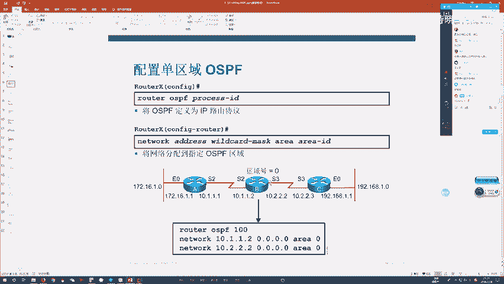

对吧ClIPOSPF process你需要通过这条命令来重置咱们的OSPF的进程，对吧？那当然你重置完进程之后，这个邻居呢会重建，然后呢，邻居重建完毕之后，大家懂的啊，你这个路器 ID的修改才能生效。

那所以说建议大家写完进程之后先敲路 ID那敲完之后呢，就是接口宣告了，OSPM接口宣告有两种套路啊，第一个就是在接口级别使用接口级别命令来完成宣告。然后第二个呢就是对吧？你在进程之后。

通过net talk命令去完成宣告，当然两种宣告都可以啊，只不过接口的宣告的优先级要高于net宣告，那具体你要使用哪一种，对吧？我觉得是根据大家需求，那当然在宣告请注意它不再像瑞跟E加了。

你可以使用什么主类宣告OSPF没有主类宣告的概念。它宣告一定是精确宣告，对吧？所以说呢一定是net后面跟上一个接口的地址，对吧？后面跟上通配服掩满。

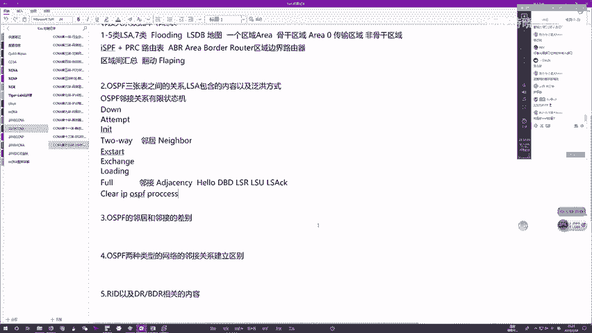

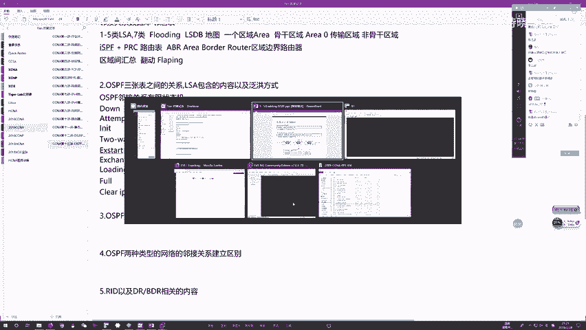

跟一个ever参数跟上你要宣告的区域ID可以吧？那通过这样的命令，就可以把一个接口，对吧？宣告进一个区域。那当然接接下来记住啊，就是咱们在运行单区域的OSPF的时候，对吧？

你路由器之间的直连接口必须要宣告进相同区域。如果说你没有宣告进相同区域，你们这个直连链路的接口发送给对方的hello所包含的区域ID跟对方的区域号若不一致啊。那这个时候连接关系会接不起来，对吧？

那接下来基础的配置命令就如同这个胶片所演示好吧好，那这块呢我也给大家搭好了环境了，还是老情况，三台路由器对吧？R1RR3他们的各起的一个环回口，请注意啊，我的习惯是在创建环回口的时候，码是24位对吧？

然后紧接着地址你配好了，接下来就在这个环境中，我来给大家启个OSPF来看一下OSPF的配置那大家再看配置之前呢，给大家了解一下OSPF的一个怪P啊。

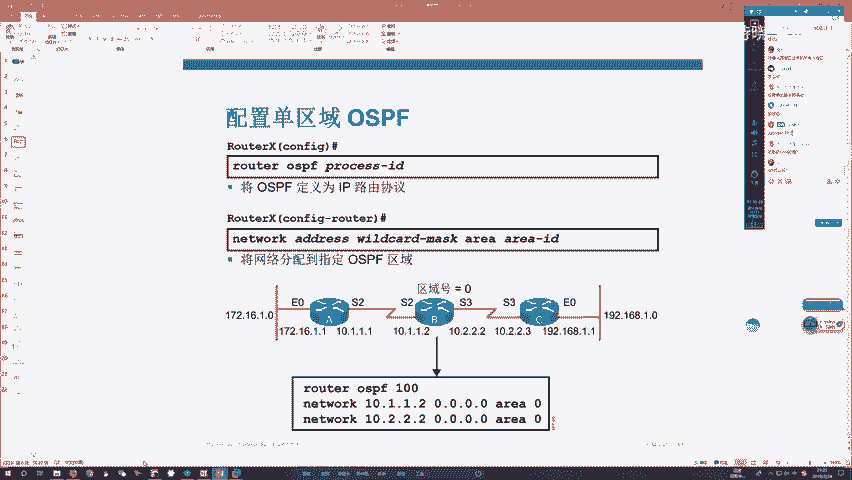

通你在ss code的路由器上把一个路由器的还回口宣告京OSPF这种还回口宣告京PF之后啊，OSPF进程会给还回口分配一个叫网络类型，对吧？这个网类型呢是一个非常特殊的网络类型啊。

这种网类型只有还回口才会有其他任何类型接口啊，都不可能是个类型，并且你甚至通过命令要修改它们网络类型啊，你也不可能把其他类型接口网络类型改成类型。换句话说，只有环回口的网络类型才是类型，可吧？

那这个路类型特点是什么呢？就是你在通告这个接口路由的时候，我不管你这个接口配置的IP地址和网码是多少位的对吧？你在通告这个环口路由的时候，我都会以32位主机路由形式来通告比如R一的还回口。

我们起的地址是1。1。1。1对吧码24类，你按照常理来说。😊，咱们通告环回口路由应该是1。1。1。0-24对吧？但是在OSPF中，我们通告就变成了1。1。1。1-32，能理解吧？举例R的环回口。

咱们配置地址是2。2。2。2对吧？掩码24倍。你正常在EIGRP和瑞中啊，你通告R的环回口路由，它应该是2。2。2。0-24对吧？这是在OSPF中，它是2。2。2。2-32。那这是很正常的。

因为对于OSPF进程而言，它认为这个环回口，对吧？就是一个逻辑接口，你用来模拟路由器身后所连接的一个主机，对吧？它是一个末节主机，它是一个末接主机，所以你虽然在给它配置地址的时候。

这个岩码你想怎么配怎么配，但是呢我清楚你在这个网络中，只有你还回口这么一个节点存在。所以说了为了让咱们这个环回口的网络对吧？能够更加的扩散在多台路由器上增加咱们地址的使用的效率。我在给你通告路由。

的时候呢，我就会以32位言码的形式来通稿。那这样做的话，对吧？非常有优势。OK那当然这它的好意啊，你如果不领情。😊，你希望环回口的掩码在通道的时候，以正常掩码形式来通道。怎么样呢？

你可以在环回口上敲这么一条命令。什么命令呢？比如进入咱们的rebe领口啊，敲这么一条面IPOSPF。Network。你可以敲点到点，对吧？环回考到网络类型是可以修改的。但是在修改的时候呢。

你只有这么一个选项可以使用。你虽然网络类型有很多，但有点到点有广播，有NBMA点到多点和点到多点NBMA。但是对于环回口而言，你如果要修改它的网络类型啊，只能改成点到点。

并且当你把它网络类型改成点到点之后啊，咱们只有一个目的，什么目的呢？就是还原这个还回口的真实掩码来做路由通告。当你在环回口敲完这个命令之后啊，你还回口掩码多少位，我在通告环回口路由的时候。

我就会按照它的真实掩码的通告。那这一点在你日后研究运营商网络的时候，当家会发现啊运营商网络里面，咱们十有八9都会运行MP你在MPL环境中，我们是高度要求你路由传输过程中的掩码一致性。

你本地的直连路由跟你通告出去路由要整的一模一样。如果说不一样，这个在MPL域内啊，会导致咱们的标签通告出现问题。那为了避免这个问题，对吧？你就需要要么起还回口掩码的时候起32位，对吧？

要么就是你把还回口网络类型改成点到点，好吧。好，那言归正传，我们来看一下这个怎么配啊。

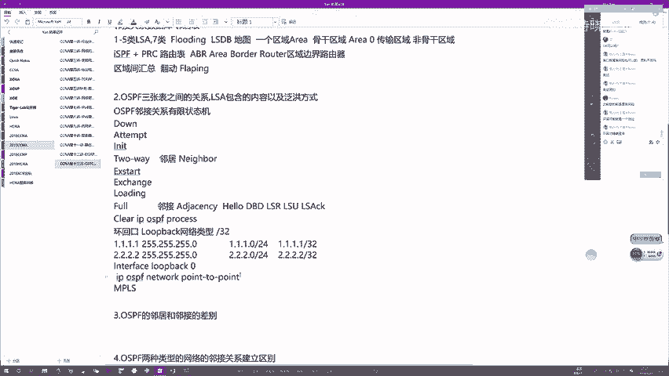

好了，这块呢三台路由器我这边都已经初始化过了啊，主机名，还有接口地址，对吧？那这边的话给大家看一下sIP interfaceface break对吧？三个接口这边R也是一样的。

sIP interfaceface break好塞 showIP interfaceface。

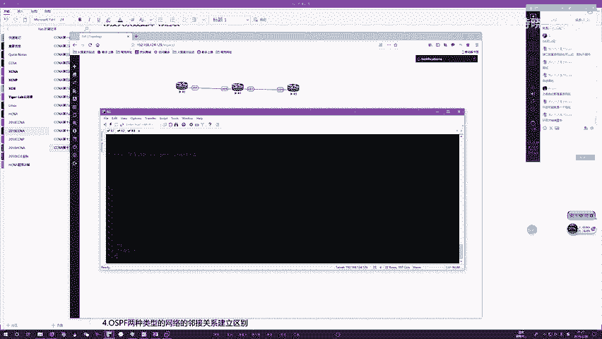

fororry对吧？都ok然后接下来我们来收让看一下接口的配置啊。😊，24位野马对吧？这也是24位编码，然后呢，阿C也试一下。好，都是24个页了。然后接下来我们来看一下OSPF的配置啊。

进入全置配置模式raOSPF我喜欢用110，因为OSPF这个路由啊，默认管理距离110，对以吧？okK然后如辑ID1。1。1啊，宣告还回口。好吧，然后接下来宣告连接R2的接口是吧？

然后接下来宣告R3的接口。好，这就是接口宣告。好，那在R上咱们也做一下ro OSP110路ci IDD2。2。202宣告二的还回口。😊，对吧，然后接下来宣告咱们物理接口，咱们换一个方式啊。

IPOSPFP110er好吧，这就是接口级别的宣告命令，效果等同于在进程中啊，net work12。1。20。0。0。0er对吧？效果是一样的，但是接口级别的宣告怎么样？优先级更高对吧？

然后这边的话C哎，咱们就宣告一下。13。1。3。好，然后接下来宣告完毕之后呢，这个他们这块建邻居了。当然建邻居我们这边使用什么？以探网接口，以探网接口对应的网络类型是广播对吧？在广播类型中。

大家建邻居啊是要选DR的那这个建立呢时间比较长一些。那当然在这个建立连接关系过程中啊，我教大家怎么去受一些OSF的关键的命令啊。

第一条就是OSPFface通过这条命令你能看到当前在该路由器上你宣告多少接口可吧？你宣告哪个接口进入咱们协议进程O吧。然后紧接着OSPF查看咱们的邻居看到吧？

当前R一杠R3在ex一杠2到达这个就代表咱们之间是连接啊，代表咱们之间5种OSP报都交互过我们的LDB同步可吧好，那接下来O之后呢，我们来看路由啊，哎，你会发现。😊，看到了吧？

我收到的R环回口路由是32位的对吧？我收到的R3环口路由也是32位的那如果这个时候你希望R对吧？把它的环口路由啊，以真实的掩码来通道，怎么样？你要进入R的环回口。

敲IPOSPFnetpoint point，对吧？那当你敲完这个命令之后，们再来看一下。啊，还没完好了吧。😊，是吧R的环回考路由野码变成24位，R3的依旧是32位，对吧？刚才的PR是吧。PRM有PRM。

啊，这个叫PID是吧？这个叫process IDD叫进程ID我们启用到SPM进程110嘛，对吧？这就是110OK吗？110。然后这块有个priority是吧？没有priority吧？没有啊。

它只有cost，这个叫PID啊，不叫PRI这个叫PID叫process IDD好吧，OK那接下来这块的话，咱们有路由之后来测试一下联通性啊，P2。2。2。2s1。1。1。1对吧？P3。3。3。3s1。

1。1。1，然后在R上对吧？P3。3。3。3s2。2。2。2对吧？都能通。那这个连通性呢是没有任何问题。啊，我来看看啊。PRI。跳IP。瘦。IPOSPF enable。啊，在这边是吧？啊，对。

这就是优先级啊，这就是你不是通过邻居收到哈楼吗？对吧？邻居给你发的哈楼里面会包含优先级字段啊，会包含优先级字段，在哪没有啊，这里吧对吧？会包含一个优先级字段，由于你们这块在建邻居的时候要选低压BD啊。

对吧？那你看这边的话是邻居是一个BD啊，我自己是个D呀，对吧？那这边邻居的优先级怎么得知啊，就是通过这里得知O了？好，那这就是OSPF的这么一个基本的配置。

那当然在NA中呢只是教大家OSPF的基本运作原理啊，这个OSPF的难度真的非常大，内容特别特别多，对吧？LIC里面到底包含什么内容，对吧？怎么去看然后呢，咱们矢量图怎么画。

怎么通过矢量图来形成咱们的对吧？路由对吧？矢量图在涨的时候，咱们数在涨的时候，涨的原则是什么？对吧？路由的度量值怎么调控，是吧？咱们特殊区域怎么部署，怎么挽救那些。

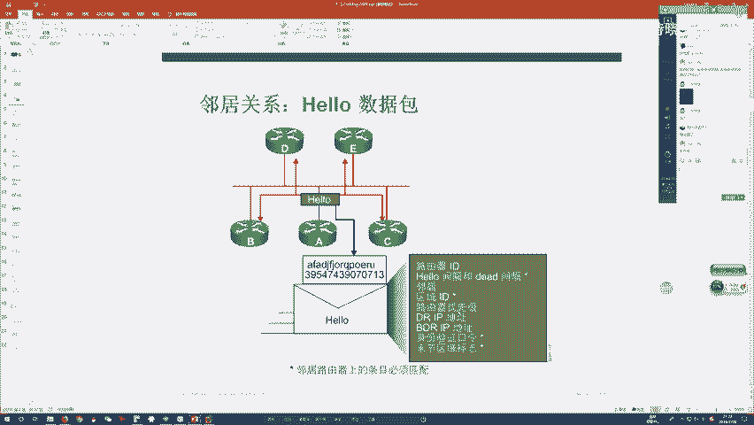

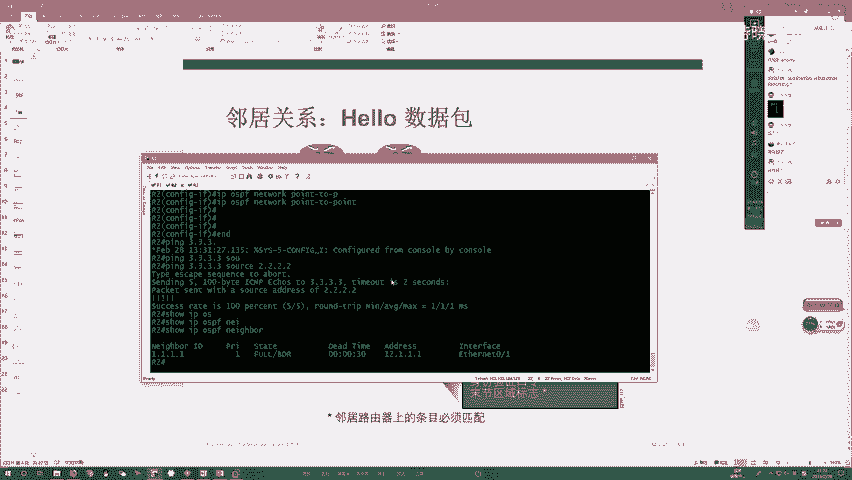

不规则区域网络类型到底具备一些什么样的功能。那这些呢在NP中都是重点，对吧？那当然这也是咱们的NA的最后一节课了，也跟大家说一下，咱们下一轮课呢，3月3号好吧，那今天呢由于是2月最后一天。

也是NA的最后一节课啊，给大家一些福利。虽然这些福利平常都是给VIP选的。我来给大家呢就是答个一，好吧，给大家互动一下，让大家感受一下咱们的课程服务。好吧，给大家三个问题时间啊，给大家三个问题时间。

大家呢可以事无巨细啊。你们想了解的啊，都可以去提问。

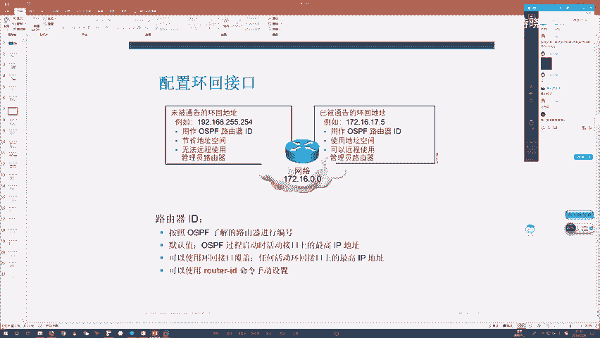

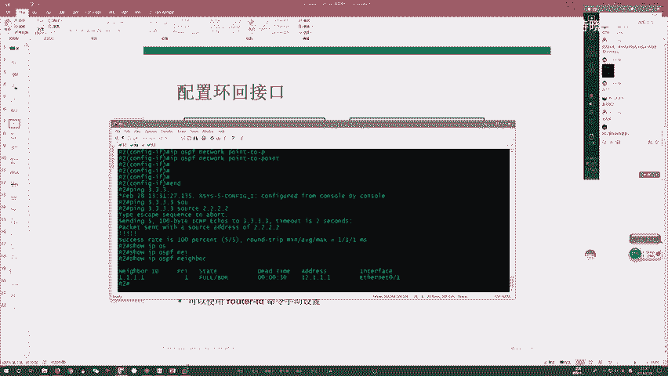

好吧。

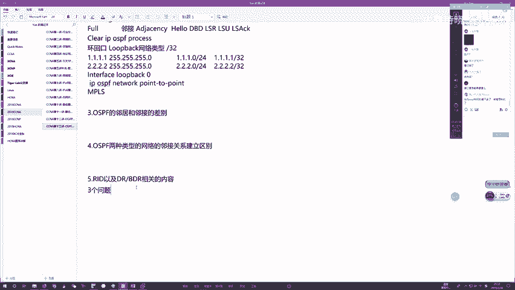

接口宣告能再看看吗？可以啊。这就是接口宣告命令。好吧，注意啊，这个宣告的时候呢，这个区域怎么样？你可以拿阿拉伯数字来表示啊，你也可以拿这种点分十进制来表示，可以吧？区域号一共有32位啊。

阿拉伯数字是这种形式，点分十进制是这种形式。好吧，好，然后接下来这边的话是我们的公开课的群啊，大家可以去加群，然后呢咨询咱们的课程顾问老师来了解咱们后续的VIP课的这么一个内容。好吧？好了。

那接下来时间就是QA啊，给大家三个问题时间。那大家可以问。然后接下来我给大家答一，好吧。

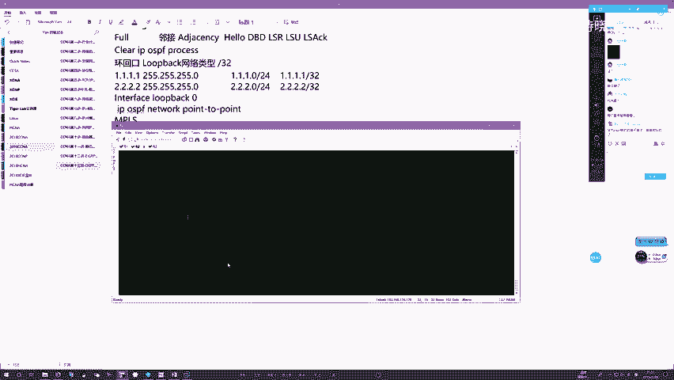

哎，OSPF针对可靠性有哪些？我只能说它有一个叫影视确认，一个叫显示确认。影视确认是DBD使用的，然后显示确认是LSRLSULSACK之间使用。工作环境中都是双核心双路由这种两个设备做冗余技术。

在NP中能学到。当然可以HA嘛，这就是经典的HA技术。HA技术对的有堆叠叫tack，这是最好的方式。如果说没有t，你可以研究到cluster，这个叫集群，对吧？

比如说cisco比较盛行的VSS华为盛行的CSS华三盛行的IF对吧？然后紧接着如果说你这些条件都不满足啊。你如果就是真的想要利用咱们网关冗余性，你也可以使用FHRP对吧？这些都是NP中的重点。

这么多不知道咋敲的，学了咱们的课，你知道吗？就是针对sequence number来确认嘛？当然不是。啊，DBD是其他不是，只有DBD是。BGB的network和OSPF network区别是什么？

我不想回答这个问题啊。来大家还有什么关于就是NA的问题想问的话，可以问一下。你如果想想了解BGBBGP的问题，你可以加咱们的群，然后呢，就是来参加咱们的NP课程。

在NP课程中讲到BGP时候会详细的告诉你BGPnet有什么用，这个不是一言半语能说清的啊，因为BGPnet的要看你BGP进程开没开汇总，你开了自动汇总，这个net的功能跟没有开汇总是不一样的对吧？

然后接下来如果你没有开自动汇总，这个net到底能通到什么样路由。哎，那这也是根据你路由表中自身这些路由来决定的。好吧。😊，华为5700起OSPF稳定吗？你得要看你是什么型号的5700啊。如果你是EI。

我觉得还可以。如果说你是SI，你能不能启用，这是个问题。所以说你最好就是问一下那个对吧？代理商，你问一下供应商，你所买的这台57能不能用OSPF对吧？首先能不能用，能用之后呢，因为这是个交换机对吧？

交换机对三层的支持，我觉得比较垃圾了。你到底能用多好，就不好说了。因为毕竟华为当家的那些号称用OSPF1点问题都没有路由器啊，并且都是运营商级别的骨盖路由器。

在运营商内网跑OSPF都曾经丢过3000多条路由。那到底什么叫有问题，什么叫没有问题？什么叫稳定？什么叫不稳定，对吧？我觉得你可以自己去判断一下。未来网购的前景怎么样？好比逼无限好。

尤其是当你学会了网络虚拟化之后。V叉代SDN结合咱们的RS技术。对吧你可以研究云，可以研究数据中心，结合无线和安全技术，对吧？你可以做一些日常的项目。没有，谁说单纯学网络不够。

我们这边很多单纯学网络的在甲方混的好的很。刚上来E的车啊，欢迎好好学兄你千万不要认为网络不够啊，网络够，觉得网络不够的，是因为网络学的不够深。你如果网络学的够深，你在那些越牛逼的环境。

他越不要求你多元性，简单来说，什么样的公司会要求你什么都会啊，我觉得是那些对吧？业务比较混乱，然后管理比较混乱，对吧？KPI制定非常糟糕的公司简单来说就是那些皮包公司，他们会希望什么员工什么都会。

因为他也不知道我给你招过来，我到底需要你做什么，那所以说我就想到的是，我希望你做什么，我就让你全部都会做，但这真的好吗？对吧可能对于锻炼你能力来说啊，还挺好，但是真的好吗？我觉得不一定越是大公司。

他的组织架构越是完善。他的KPI越是合理。他招一个人能够清晰的知道这个人我就是要你做什么？我让你调网络我希望你会lin干嘛呢？我要。你做网络，我需要你会虚拟化干嘛的？我要你做网络，我需要你会研发吗？

不需要，因为我知道你要做什么，能理解吧？所以越是大公司。😡，那每个职员越能够知道我在这个大的环境中，我应该做好我的哪一份事。所以你会发现越是牛逼的公司啊，他们越不要求你什么都会。对。

NP不学Vair line啊，我们在IE阶段Vair line。你要学虚拟化，必须IE啊，至少IE起步好吧，至少IE起步。不要担心以后网工不需要那么多人，你的你的担心的依据是什么？你没有任何担心依据。

你瞎担心干嘛？你怎么不担心以后石油不够用啊？对吧你怎么不担心以后城市车辆过多，你马路开不了车啊，你怎么不担心地铁在运作的过程中出现故障？对吧你怎么不担心我们平常出门被抢劫啊，这个是你该担心的。

你不用担心网工到底需要多少人。因为你第一不了解这个行业，你不知道这个行业内做什么事，你不知道你的公司，你也不知道有多少网工，你什么都不知道，你是凭什么来怀疑呢？这不是很搞笑吗？对不对？😡，是吧。

越牛逼的公司越看不起低低学历，这也不一定啊。我给你们举个例子啊，之前我亲身经历的我身边一个外企。这个外企里面1个HR牛逼哄轰的招人。然后接下来招人，哎，比如说有一个人可能就是有点品行不端啊。

明明咱们招聘需求是要求本科。然后呢，他明明是个大专，他就投简历了。然后接下来HR没有仔细看，约为他来面试。然后面试的时候，别人一说哎，是大专的，然后HR就直接非常不屑的说，对吧你大专啊，你可以直接走了。

我们这不可能要大专。然后接下来后来那个HR的顶头上司manageger就跟他说了，人家既然来了，对吧？你没有筛查出自简历的问题，那是你的问题。这个问题你得要自己背捕。那别人既然来了，你就要好好给他面试。

你怎么知道别人是否适合咱们这个岗位呢？如果说万一适合你给他筛掉了对吧？并且用这么糟糕态度筛掉了，你不但损失一个人才，你还树了一个低。你可能这个树的低之后会影响身边一圈人都不来咱们公司。那所以说你要记住。

社会是由人组成的公司也一样，学历是用来什么，是用来筛人才的。如果说你真是个人才，如果你不小心，对吧？你学的时候，你上学的时候对吧？考试失败。对不对？我觉得这个不能够说明什么事情。我觉得反而是越牛逼。

越伟大的公司，他越不会在你的学历。像思科就是个伟大的公司。他前段时间招了我曾经一个学员叫小明，小明是中专毕业。那思科名面上只要C9毕业的硕士或者海归硕士，你不是北大清华，你都不用来。那小明是个中专毕业。

四川乐山的，人家进了思科，进了原厂，蓝排工程师。年纪轻轻，今年才23岁。年薪30万家。那你觉得真的是越大的公司越看不起低学历吗？如果说看不起低学历，你觉得小明有任何可能性能进四科吗？

所以说大家不要因为自身的条件而否定自己，你做好准备就好了。如果学历不好，考一个牛逼的证是吧？学更多的技术。只要你人牛逼，你不用太过于次在乎你的外在东西。对，就看能力。你要记住HR和老板不是傻逼。

他们不会为你那意纸文凭来买单，你懂吧？他们不会为你那意纸文凭来买单。企业要的是什么人才？什么叫人才？有能力的叫人才。我为什么要设置门槛啊？第一是为了装逼，第二就是为了这个来筛人才嘛。

但咱们最终的目的是为了筛人才。如果说你通过某种途径让我知道你就是人才，我会在意的学历吗？我根本不会在意。😡，好吧，好，那跟大家最后通告一下啊，这是咱们的群。然后咱们3月3号新一轮NA开课。

我们的3月9号10号新一轮IE开课。然后呢，新MP也即将开课。那大家如果感兴趣，可以加咱们的公开课群，咨询咱们的课程顾问老师来询问相关的信息。好吧，那今天咱们就到此为止啊，大家2月快乐啊。

然后明天就3月了，希望大家新的1月，身体健康，工作顺利。好吧，大家拜拜。😊。

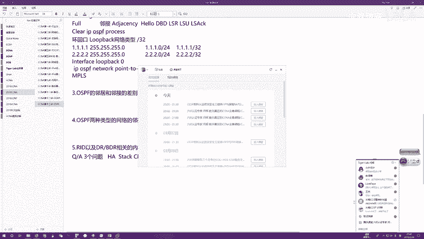