# 1000元自购分享CCNA教程合集！超全合集详细版，网络工程师入门必看合集【送NA题库】 - P1：CCNA01 - 向向向晚o - BV1cL4y1q7Dy

好，欢迎大家来参加咱们晚上的公开课啊，这个是咱们的新一轮的NA课。那大家都知道咱们NA课呢是一段时间开一轮啊，我尽可能给大家保证到就是每个月1轮。😊，然后呢，这一轮离上一轮隔的时间比较长。

那给大家解释一下什么原因啊。因为上一轮课呢，我是主要针对咱们的美国学员来讲的一波，对吧？那这个美国时间嘛，他们晚上是我们的早上，所以说其实上一轮课呢，咱们才刚结束不久啊，只不过上一轮课。

咱们是在早上来上的那大家呢上午都要上班对吧？没有时间来上这个课啊。那所以说很多人没有来，也就不知道，对吧？那这边的话就是为了让大家唉能够啊感受到咱们这个NA的正课的这么一个就是系统的学习的这么一个状态。

那所以说我这边就是急急忙忙的把那个北美班结束之后呢，我们来开一个对吧？基于中国时间晚班的这么一个课。O那今天呢第一节，然后呢这个班的话预计是十来讲吧，还是时来讲咱们老套路。

那具体多少节课根据咱们课程推进好吧？讲的快一点的话，对吧？内容比较顺利的话，那咱们结束可以少一些，然后讲的比较。对吧扩展的比较多，那咱们这个其实数可以多一些，对吧？那到时候呢我会给大家通知。

OK那这是第一节课啊，那第一节课，咱们老套路给大家讲一下咱们的行业啊，讲一下咱们行业相关的事儿。因为我一直坚信就是你学一个技术，在你了解这个技术能做什么之前，对吧？你不要去深入研究这个技术的细节，对吧？

因为你连他干什么都不知道，你去研究那些细节的话，第一对吧？引不起你的兴趣，第二就是你研究完了，对吧？你不去你不去用它，你可能就会忘记很多细节。那所以说像我们泰德呢。

咱们讲任何东西都是讲一个知其然也知其所以然。在给你们讲任何技术之前呢，我先给大家说一下，咱们当前出现了什么样的问题，对吧？技术永远说来解决问题的那咱们这是一个技术相关的课，对吧？技术相关的课。

那自然是学技术的那学了左一样右一样的技术肯定是解决左一件右一件的问题。那咱们就要先了解问题是什么。了解的问题是什么呢？咱们就要了解问题产生的根因在哪里，对吧？是什么导致的问题的出现，对吧？

这个问题到底会给我们造成什么样的困扰。那当你了解这些之后呢，那接下来咱们再去分析哎什么样的技术能帮我们解决这些问题，它解决的出发点是什么样的？接下来呢咱们再去研究技术的细节，对吧？你到底是如何工作的。

你到底是如何解决问题。然后紧接着呢给大家一些发散性的思维。就是当你研究完一个技术，知道他能解决什么问题之后呢，还没完啊，还没完。你最好的了解一下这个技术针对这个问题啊，它是不是最优的解决方案。

那如果是最优的对吧？那不用说了，那当然如果它不是最优的，它有缺陷啊，那咱们有没有什么补足缺陷的这么一个方式，对吧？咱们有没有可以替代它的解决咱们这个问题的备用方案。那这个方案是否更优。

这个方案是否能够取代咱们当前这个方案来让我们的网络呢更加的优化。好吧，那这就是咱在咱们泰和啊，我们学习网络的四部曲。那希望大家呢从第一节课开始啊，咱们在研究任何技术的时候。

你都能基于这四部曲去做一个思考，那这样的话就是方便大家在学技术的时候呢，你能够先考虑到咱们技术的根，考虑到咱们技术的本源，对吧？考虑到咱们的问题，再考虑到咱们这个技术的这些细节，好吧？那这样的话。

无论你们去面试，啊，还是之后呢，就是你们去。对吧就业去做项目对吧？去做运维，那你们都能够尽可能的把你们学到技术啊用在实处，这个叫学以致用嘛，对吧？学以致用。那这个技术才能给你们换来价值，好吧。

因为金三银四啊没有错啊，刚才呢有兄弟在对吧？刚一开课的时候就说了，金三赢四是什么？金三赢四跳槽的最佳时机啊，对吧？春节一过年一过，那各个行业各个企业你年终奖开发就发，那很多不安份的人呢拿完年终奖之后呢。

就喜欢跳槽，对吧？你也觉得我更牛了嘛，对吧？我学了很多东西，考了很多证书，我更牛了，我要跳槽，对吧？去往我更喜欢的企业，对吧？更好的这么一个岗位拿更高的薪水。那接下来跳槽之后呢。

你企业的岗位不就空闲出来了吗？你空闲出来之后呢，企业需要人啊需要人来顶上咱们这个岗位来让我们这个业务运运转啊。那所以说呢往往每年3到4月就是春季是企业招人最旺的时间，对吧？那一般在那个时候呢。

你找工作会比较好找。那所以说咱们当前呢来进行课程的学习，那经过两三个月，对吧？咱们的技术其实也已经能够非常精进了啊，你精进了技术之后呢，那到那个时间对吧？经九银十啊，对吧？经三赢四。

那咱们在找工作的时候呢，就会更加的派上用场，对吧？方便大家能够顺利的通过面试，顺利拿到offer，对吧？顺便顺利的入行，顺利的就是做咱们心仪的岗位拿到咱们理想的薪水。那这是咱们课的这么一个定位。好。

那言归正传啊，咱们来第一节课先来讲一下咱们这个行业，可以吧？那咱咱们这是一个网络工程师相关的认证课程，对吧？网络工程师相关的认证课程，所以咱们在学这个课程的时候呢，咱们是分为两个部分啊。

第一个部分是学对吧？你得要学技术，你得学咱们的对吧？网络怎么工作的，你得了解咱们的网络设备，你得了解咱们的配置，了解各种各样的东西，那这些呢都是我来传授，哎，你们来听，你们来学，你们来理解，对吧？

你们来反复的操作，对吧？把这些技能呢变成你们自己的技能，OK那学值咱们这个课程的一部分啊，第一个部分，好吧，也是比较主要的部分。那既然第二个部分是什么呢？哎，第二部分就是考，对吧？你需要去考试。

因为咱们这是一个认证相关的课程。什么叫认证啊？考认证考认证啊，你需要去考取考取了认证，啊，你就能获得咱们的资格证书，那获得资格证书之后呢，哎你就是一个对吧？业界认可的这么一个网络工程师。

那既然你是一个业界认可的网络工程师啊，对吧？你拥有这么一个license，你拥有这么一个执证，那你基本就可以对吧？畅行无阻的，在行业内去寻求你想寻求的这么一个岗位，对吧？那基本你投简历给任何的单位。

那只要你有这个license，只要你就是认证啊，那最起码企业会认为哎你是经过了专业的培训的对吧？你经过了专业的培训，你的技能差不了，对吧？并且你通过了考试，你更是水不了啊，那所以说呢既然有一个证。

那基本我都是很欢迎啊你们来面试的那在面试的过程中呢，只要你不是特别特。别水啊，那基本面试都能过，对吧？当然面试呢根据你的情况啊，他会给你对吧？区分的薪水。你如果学的特别好，哎。

我录用的同时给你的薪水比较高，你如果学的比较差，对吧？那当然只要不是那么特别特别差的，不是那种一问三不知了，对吧？你还了解一些，对吧？还能在某些领域啊展现出你的专业性，那这样的人呢，咱们也可以用。

只不过在用的时候呢，可能我给你对吧？安排的任务会稍微少一点，然后呢，我给你的待遇呢也会相对的低一些，好吧，那考呢是咱们这个课程的第二块，O那既然说到考的，大家可能肯定会有很多问题啊，对吧？

其实我们都对吧？这么多年学上下来了，对吧？在上学的过程中，咱们什么是没考过啊，对吧？从小学考到大学对吧？甚至考到研究生那咱们这个考到底考什么东西呢？你这个网络工程师的认证，对吧？

这个证书到底是由谁来颁发呢？那我先来给大家普及一下。就是在咱们IT业界啊，基本你能见到证书只有两类。就这么两类啊，对吧？你别管什么国内的还是国际化的都一样，好吧，我们不管国内国际化的，一共只有两类。

一类呢是国家颁发的对吧？基于社会的某一个组织所颁布的这么一个证书，对吧？比如说教育部啊，比如说人社局啊，对吧？他们所颁布的这种国家层面的认证，那这个呢一般咱们就称为教对吧？国考认证，那这国考认证哪些呢？

其实也挺多的，像什么计算机等级考试一级、二级、三级、四级对吧？然后呢，还有所谓的软考对吧？初级软考中级软考，对吧？那这些大家都是耳熟能详的，那这些考试呢，你们在学校里面能接触到，对吧？

你们在社会里面也能接触到，那考试呢一般就是比较死百，一年的考1到2次试卷呢，由国家的相应部门出，然后呢，一般都是笔试，对吧？你拿笔去做卷子，做完卷子之后呢，对吧？给你评分。如果说你通过了ok。

我就给你颁发这么一个人照，那这是第一类。那第一类认证呢？它对什么样的人去有帮助呢？就是当你进国企，对吧？当你去考公务员，当你要留在体制内，你要做事业编啊，就是当你在体制内去做技术相关的工作的时候。

那这些国家认证，对你的晋升，对吧？对你的对吧？能够入行啊，都能够起到很大的帮助，比如说你要你要考公务员，哎，这个公务员呢刚好有一个网络工程师的岗位，那什么样的认证呢帮你最多啊，请注意不是私科认证。

不是华为认证，是软考软考和计算机四级，那包括咱们各大对吧？名校985211，对吧？你们计算机科学专业的什么硕士文凭啊，什么博士文凭啊，那这些呢给你带来很大很大的帮助。OK但是如果说哎你不想考公务员哎。

你也不想进事业编，你也不想进国企。啊，当然说国企的话有点冤枉国企了，其实有很多国企，他也不光光看这些国家认证，他也开始越来越倾向于咱们第二类认证了。那当然这第二类认证呢，咱们先不说啊，我们先来说一下。

就是第一类认证，对吧？对你有什么好处，就是你去国企对吧？大部分国企啊，你去考公务员你去事业单位会对你帮助比较大，但是如果说你不希望在这些地方对吧？去度过你的职业生涯，对吧？你想去一些外企啊。

想去一些私企啊，对吧？想出国啊，对吧？或者说想自己创业啊，哎，那不好意思，哎，这样的认证呢对你帮助不大，因为这样的认证呢对吧？你们懂的太过理论化，然后呢太过教条化，实用性呢不是那么强，虽然也很专业。

但是你总不能够把这里面的这些学习备考所。就是你查阅到的这些技术啊，变成你实际的技能来学以致用。对吧？那当然大家也都知道，这是咱们一贯考试的一个弊病啊，对吧？太过应试了。

那太过应试的考试就是你出题也太过理论化，对吧？你做题你备考也太过应试，对吧？太过理论化，那所以说你学到技术呢，一般都是用来写论文啊，对吧？用来写一些paper啊，那可能比较好用。如果说你是想去对吧？

把你学到的技术，哎，实际的去展示出来，实际的用你这些技术来解决一些问题，对吧？你实际的做些研发，你生产一些设备，哎，你解决一些客户的问题，那可能就对吧？有点欠缺。那所以说呢咱们这第二类认证呢。

它就凭空出现了啊。那第二类认证什么认证呢？唉，这就是咱们今天的主题了啊，这个咱们称为叫。厂商认证好吧，厂商认证。那这个厂商认证是一个什么样的认证呢？就是这样的证书啊。

它不是由国国家颁发的它是由企业颁发的那当然是有一些特殊的企业，不是说你是企业都能颁发。这个企业呢他们要具有相同特征，就是他们都生产咱们网络相关的这么一些产品。那这些公司啊或者说这些企业咱们称为什么呢？

咱们称为叫设备制造商，好吧，叫设备制造商。那当然一般呢咱们也简称叫厂商啊，那厂商咱们国内大名鼎鼎的华为，我相我相信大家都听过啊，对吧？华为是一个比较厉害的企业，在深圳啊，任正非创办的华为好吧。

那华为呢主要三大块业务，相信大家很熟啊，第一块就是它通信业务。对吧4G还有即将到来的5G啊，对吧？华为他们生产这些通信相关的设备是吧？然后接下来他们第2块领域，那大家也很熟手机是吧，对吧？

华为mate系列啊，对吧？什么20pro对吧？最新的产品，那这也是最近卖的比较火的啊，那这是它的第二个产品线。然后它的第3块业务呢就是咱们的网络啊，它也做网络相关的一些设备。比如像路由器啊、交换机啊。

那也是独步天下的啊。那最起码在我们的大中华市场能跟华为较近的厂商也没有几家基本能够做到一家独的，可以吧？那接下来华为在国内，那国外是谁呢？啊，国外就是思科，也就是咱们今天的主题了。

我们这是一个叫思科授权网络助理工程师的认证课程，对吧？那思科是什么？就是一家公司，那它的定位呢跟华为是一样的设备制造商，只不过呢我觉得它远没有华为这么多元化啊。因为你想想华为除了做网络以外。

你通信也做对吧？你手机也做。那相对的思科就没有那么广泛了，他只是做网络相关的设备。当然呢他做网络相关的设备要比华为呢稍微有名一些。因为思科算是所有硅谷公司里面第一家出来全力做路由器的。

并且后来呢包括交换机，包括防火墙，唉，像这些新兴的设备啊，思科也都有设计，并且做的很不错。那移度呢思科在全球范围，包括咱们大中化地区啊，都是设备制造商的一哥number one龙头老大。

那他基本就是咱们网络设备的这么一个风向标了啊，思科生产出一个新的设备，哎，对吧？开创了一个新的功能，那这些功能呢纷纷会被其他厂商效仿。

那当然华为呢是众多效仿厂商中的一个那当然直到前几年13年啊出了一件事，叫棱进门事件。这个棱进门事件呢还挺不光彩的就是美国的CIA对吧？他们连同的硅谷一大票公司去发起一个基于全球范围的这么一个监听活动。

那这也算是个丑闻了。那丑闻呢被CIA里面的一个员工啊，叫斯诺登在香港给爆出来。那爆出来之后呢，就是对于外国设备，对吧？是否有安全隐患。这个话题呢我觉得被。吵得沸沸扬扬啊。

那当然咱们国家领导人呢对于这样的事情也不能做视不管的那所以说从那一年对吧？13年开始啊，我们国内的形势就发生了变化。曾经基本是思科一手遮天的时代，但是慢慢的国内的市场被华为呢撬动。

华为正在慢慢蚕食思科的这些市场，对吧从运营商领域啊，到国企领域啊，到私企领域啊，慢慢的大家都从思科的设备转向华为设备。那虽然在海外的思科依旧是对吧？基于它的设备的先进性，基于他技术的先进性啊。

依旧占领着一哥的这么一个身份。但是呢国外其他的厂商也在异军突起啊，那异军突起，包括像瑞斯塔啊，对吧？包括像一些安全的厂商checkpoint一，对吧？帕 autoto。

那他们其实都在各个领域给思科带来很大的威胁，对吧？也在蚕食着思科的国际市场，那所以说思科呢当前真是远不比。了，曾经斯科最辉煌的时候，20零几年的时候啊。在硅谷的所有技术科技公司里面。

思科的市值在5000多亿美元。这个5000多亿美元是什么概念？我给大家解释一下啊，就是在去年跌落神坛的苹果，它的巅峰巅峰的市值。也不过万亿美元不到，对吧？那早在20年前，思科曾达到5500万亿啊。

5500万亿啊，5500亿啊5500亿。哎。这5500亿还是外亿对，5500亿。对，5500亿。这个5500亿市值是什么意思呢？就是大概也就是在所有的美国的这个50百强公司里面啊，他的财富能够排到前三。

对吧？这么一个巨无霸的公司，曾经能够跟像什么微软啊，像什么IBM啊搬首板啊，但是现在呢缩水很多。那当然缩水很多呢，就是最近18年那个年报出来之后呢，我一看又惊了个呆啊，思科当前它的竞争力。

还有他的财富啊，在美国公司里面依旧能够排前十，虽然进不了前三了，但是前十的地位，依依旧能够保障。那所以说简单来说，这就是一个硅谷的一家大佬公司啊，对吧？跟华为一样。

都是影响着咱们整体的网络界的这么一个发展，可以吧？那这些公司做什么呢，他们就主要生产网络设备啊，对吧？你生产但我们组网所需要的路由器啊、交换机啊、防火节啊等等之类的。那当然这些公司。体量比较大。

它生产的产品线在不会很单一。你可以简单的这么理解，当前咱们组网你能见到的设备，或者你见不到你能想到的设备啊，这些设备呢，华为四科都有做，并且做的都很不错。不是第一，就是第二。

反而在业界呢总能有他的这么一个定位，总能有他们这这么一个立足之地，那也就是说他们都是全系列的全线厂商，对吧？那作为一个全线厂商，他们的设备真的是无处不在啊，你只要能够找到有网络的地方。

你就一定离不开华为或4科，对吧？要么华为要么4科，其他厂商虽然有份额，但是他们占的份额呢，相比这两家巨无霸啊，要少很多。那所以说由这两家厂商，他们来定定义一个什么行业的标准，就是告诉你用人单位。哎。

你们招网络工程师需要具备什么样的技能，对吧？你们自己不用去出你们的面试题了，我来帮你们出，我来给你们搞一个认证。只要一个人考过咱们这个认证，哎，那就代表他懂咱们网络，他知道咱们网络是备怎么玩。

他知道咱们网络架构怎么样呢，他知道网络里面什么技术前沿，什么技术不行，他知道咱们在工作的时候，对吧？需要干一些什么样的事儿，什么样的流程，对吧？我帮你们全部都给带劳了，那这个就是厂商认证。

厂商认证定义出来之后呢，对吧？你从业者哎，只要你所接触的这些公司啊，是跟思科华为有关的对吧？那这个时候只要你考这个认证，只要咱们网络设备依旧还是用这两个公司生产的哎，那就没问题。你所学到的技术那。

就是实打实能够变现的技术，实打实能够干事的技术，对吧？不至于说是你学了半天，对吧？你背了半天，你考了一个认证，对吧？你考完之后空有一些理论，你只能学啊，你只能写那些文档啊等等之类的。但是在干活的时候呢。

你干不了，对吧？那厂商认证呢，就避免了这种尴尬。那所以说有一种考厂商认证呢更加的实际一些啊，那所以说一般咱们用人单位，对吧？整个行业对于这个认证还是比较认可的那然而什么样的地方对他们不认可呢？

那就是咱们的公务员，对吧？咱们的啊事业单位，然后呢，咱们的部分的国企。对吧？因为他们认为你这个厂商认证没有公信力嘛，对吧？虽然咱们的保络可能依旧是持有你们这些厂商的设备。

但是呢我一直认为什么样的人适合来入职咱们这些岗位啊，那肯定还是咱们国家证书的持有者，更加有这个资格。OK那这就是咱们这个课程的这么一个定位啊。学就是学标准的网络技术，哎，考就是考咱们的厂商认证。

那这个认证呢，它不是只有一个啊认证呢它是分成了一个金字塔，有三级。那哪三级呢？当然这也是由最早是由思科定的啊？最早是由思科定的。

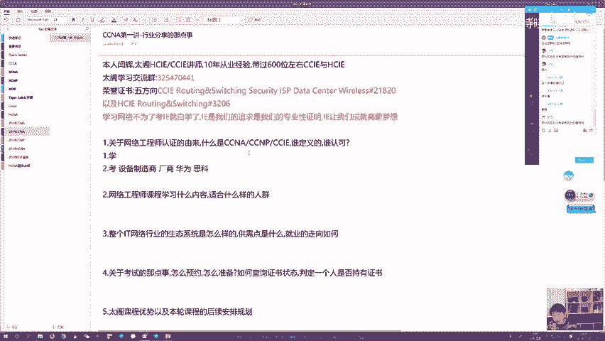

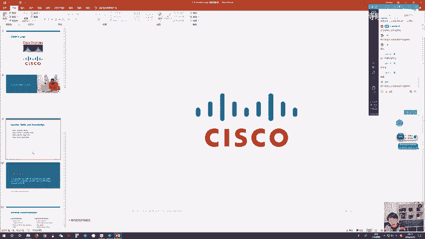

思科呢把这个认证定成了一个金字塔架构啊，曾经很简单，一共只有三级，现在呢变得比较复杂，一共呢变成了5级，好吧，一共变成了5级。那曾经三级的时代，我们来看一下啊，这个金字塔呢基本就是这样的，对吧？

初级叫CCNA中级呢叫CCNP，然后呢高级叫CCIE。那简单给大家解释一下什么意思啊，这个CCNA叫思科授权网络助理工程师，好吧，asociate叫助理。然后CCNP呢叫思科授权资深网络工程师。

这个叫professional。然后接下来CCIE呢叫思科授权互联网专家，好吧，那你们听名称就能知道啊，对吧？助理工程师肯定最低级嘛，对吧？最容易人群最多MP呢稍微专业一些，对吧？放在中段。

然后呢IE技术专家了啊，你都专家了，那肯定是最少的对吧？你是在金字塔的最里端可以吧？那当然后来呢思科觉得这个三级架构呢还不够细分啊，那所以说又把这个认证扩了一括。

那把这个三级的金字塔扩成了5级金字塔可以吧？在CCN的下面呢给你加了一个叫CCENT这个叫entryte，可以吧？叫入门工程师，也就是说比我们的CCNA啊比这个助理还要再低一级。

然后在CCIE的上面又给你安插了一个特别特别高的级别的叫CCAR这个咱们简称叫CCA啊，叫思科授权架构式，好吧，思科授权架构式。OK那这个是咱们当前的这么一个认证的架构。那当然这个认证架构呢。

这个CCENT和CCAR呢，我建议大家就不用去关心了，因为这个ENT呢它太过简单了，我觉得以我们聪慧的智慧，那没人愿意学这个CCENT啊太low了，咱们至少也是CCNA起步，好吧。

然后接下来这个CCAR呢，大家也不用去想了，为什么呢？因为能来咱们CCA课程的这吧呢？我相信大家呢也是为了脚踏实地的一步一步去学习的，咱们不要太好高骛远，因为这个CCAR它太高了，对吧？

你们想要达到这个阶阶段啊，你们可能要付出非常非常大的心血，并且可能还需要对吧？你们去思科原厂啊，或者去一些世界五百强的公司啊，对吧？你才有资格去考，并且考试费呢也是非常非常昂贵啊，考一次万把来美元。

还需要。在美国硅谷思科的总部啊去实行那么一段时间。那这个呢太过麻烦了。那所以说一般呢咱们在考这个厂商认证的时候，以思科为例啊，哎咱们最终的目标，我们的顶点哎就设为CCIE。

那当然如果说不想把顶点设这么高，不想给自己人生这么高的挑战。对吧我觉得咱们得过且过啊，能入行就可以了。那入行的门槛是什么呢？其实入行的门槛CCNP就够了。好吧，因为有很多很多用人单位对啊？

他们其实也招不起CCIE啊，但是我又需要保络工程师，我又不希望给你开这么高的薪水怎么办呢？哎，那出于定位啊，我就把我这个证书需求啊向下定一级。😊，那我在招人启事的时候都会说了，哎。

你需要具备什么什么样的功能，你需要具备什么什么样技能，对吧？你需要满足什么什么样学历，什么什么样的工作条件，并且针对咱们的网络认证证书啊，CCMP及以上证书者优先考虑。好吧，那也就是说你只要有NP啊。

那绝大部分咱们的用人单位其实都能接纳。那当然接到你之后呢，给你的待遇肯定不会特别高啊。当然如果你要是CCIE的话，对吧？你能去的就是一些更好的公司，对吧？更大的平台嘛，你能做更好的岗位，拿到更高的薪水。

对吧？那这两个都是用人单位比较欣赏的这么一个证书。OK那接下来关于这个证书呢，哎其实华为也有对应一个类似的认证体系。

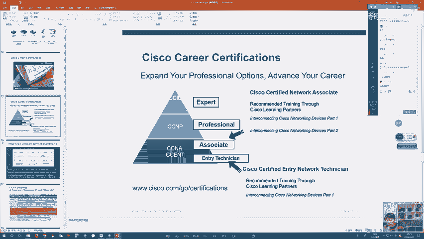

那当然华为认证认证体系呢，它出来时间不长啊，它是从15年出来的。思科认证体系呢出来了已经20多年了，它是从99年。对吧，96年出来，那到现在2019年哎呦，不是20多年了，已经整30年了，可以吧？

思科这个认证体系已经整30年了。然后接下来华为的认证体系呢是2015年推出的。那当然华为大家都知道，曾经作为一个中国的巨头厂商，它的很多的设备，还有里面的一些功能，大家都是学习咱们思科的。

而这个认证体系呢，华为其实也是在学习思科啊，那早前呢华为它也搞出了这么一个三级架构啊，然后呢慢慢的也随着思科把它扩成了5级，可以吧？那当然最低级最高级咱们不看了，我们就看正统这三级啊，正统这三级。

华为叫什么名字呢？它分别叫HCNAHCNPHCIE对吧？分别就叫华为授权网络助理工程师，华为授权资深网络工程师以及华为授权互联网专家。那当然这个名字呢叫了三年对吧？叫到18年。

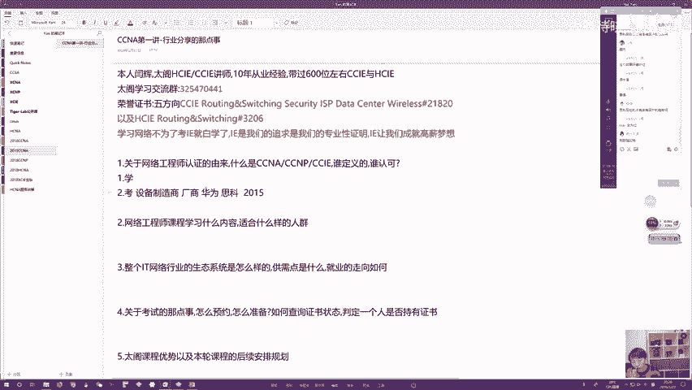

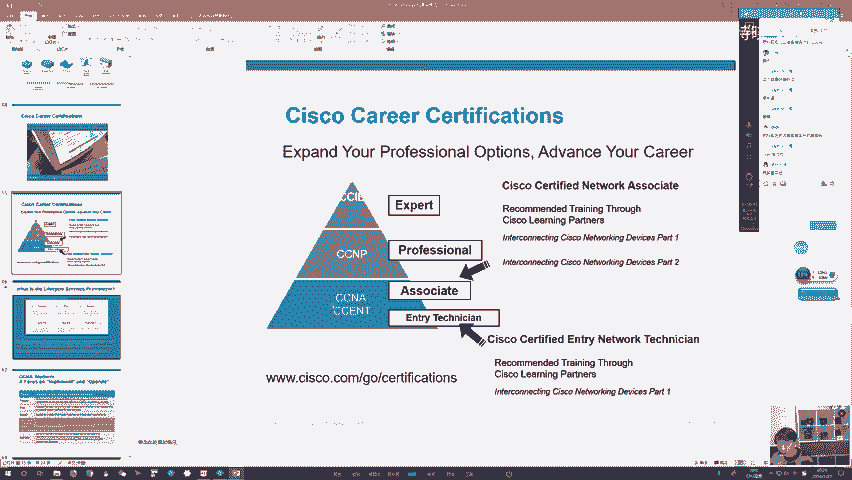

19年初，那就在咱们19年1月份啊，就是咱们当月。那华为呢发了一个公告说了，咱们这个认证呢，还是改个名字比较好吧，对吧？因为叫这个名字，哎，怎么感觉就是跟思科的认证名字看起来太太太相似了，对吧？

太相似不太好啊，不符合咱们华为高大上的定位啊，那所以说为了看起来让咱们这个认证变跟思科不一样，哎，他把这个认证想来想去，我改哪一块呢？哎，我把这第三个字母改一下吧？他把这个HCNA改成了HCIA。

HCNP呢改成了HCIP那当然HCIE呢，还叫HCIE对吧？相当于是把网络这个词儿啊换成了互联网这个词，对吧？华为授权互联网助理工程师，互联网这个资深工程师以及互联网专墙，好吧。

那这就是19年1月以后啊，华为认证的新的教法。好吧，那这些呢都是厂商认证。O那这就是关于咱们这个网络认证工程师的这么一个唉课程的算是架构吧。学咱们要学网络相关的这么一些基础技术。然后在考的时候呢。

哎咱们可以选择一个厂商的认证啊来考。当然咱们这轮课呢比较倾向于思科的啊，所以说大家学完这门课之后呢，你们可以去更好的去完成四科的考试。那大家可能会问唉，那我学完这个课之后，能不能考华为呢？哎。

请注意答案也是可以的。因为。

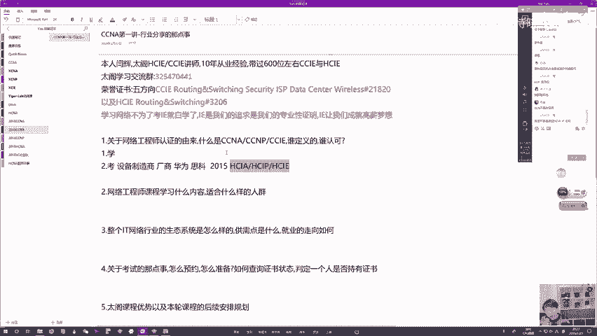

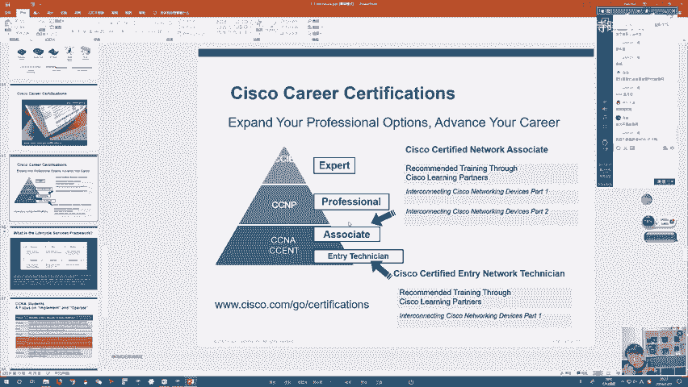

华为跟思科，你们造的设备，哎，属性基本是一样的对吧？毕竟你们造的都是路由器，都是交换机嘛，对吧？不是说我造一个路由器，你造一个其他的莫名其妙的没有听过的设备，对吧？咱们造的都是路由器。

咱们造的都是交换机，我们的网络工作原理是一样。我们这些设备的功能，那基本也是一样的。除了一些名词叫法不一样以外，对吧？咱们一些命令消法不一样以外，其他的基本咱们都一样。那所以说对于学这一块，哎。

大家如果好好学了，你会发现你学思科课程学华为课程都是没有任何区别的，因为这个课程里面绝大部分内容都是所有厂商通用的这么一些技术，比如咱们网络的架构对吧？这个总不能说是我思科定义的吧？你难道用华为的设备。

你组网就不这么组了吗？一样。组对吧你用思科设备怎么用，你华为设备还不是一样的用法吗？你思科设备怎样来联网，怎样来通信，你难道华为设备就不这么做了吗？么大家都是一样的啊，大家都是一样的。

所以厂商跟厂商之间咱们毕竟还是会有一些什么设备的差异性啊。比如说这个小功能，唉，我能支持。那你呢可能不支持，那可能你过两年就能支持了，或者你在支持的时候呢，可能需要一些条件，对吧？

那这些其实都是细枝末迹。咱们呢在初学这个网络课程的时候，我希望大家呢不要太过在意这些细节，对吧？咱们不要太过在意这些细节。你把宏观的架构了解透彻，你把网络的工作原理了解透彻。

你把路由器交换机的转发机制了解透彻。那厂商其实他们的差异啊，就是一些名词，就是一些命令号。那所以说呢每一次我开一轮新课，总会有人问我，哎，严老师什么时候开华为课，对吧？总要给他解释一遍，就比较麻烦。

对吧？这个比较麻烦，我是个比较懒的人特别麻烦，不喜欢把相同的话重复说多少遍，那所以说呢作为咱们新一轮的课呢？第一节课就给大家这么一个概念。对吧？什么叫思科课程，什么叫华为课程，其实他们都是网络工程课程。

你学的理论基本都是一样的只不过咱们在这轮课程中，我们更加偏向教大家去操作思科的网络设备。而在华为的课程呢，我会更。加的对吧？偏向于华为来给大演示一些对吧？华为社备的操作。

那这个操作呢就是一个命令行的区别。这个区别你们可以忽略不计。那对于这个考证呢，根本没有任何影响，你学私科的课程，考华为的考试有问题吗？没问题。你学华为的课程，考思歌考试行不行呢？也是可以的对吧？

考试很自由，对吧？不要跟咱们学什么课程，哎，相提并论，他们之间呢不要相互绑架。你们该怎么学怎么学，考试的时候想考哪一个，根据你们的情况来考就好了。那当然在考的时候呢，需要跟大家说一下。

如果你们是志在考CCMP哎，那这个时候呢，你需要先考CCNA啊，考完CCNA你考完CCNP才能拿证书。那当然华为不是啊，华为MP可以直接考，好吧，那这点算是华为比较好的。然后接下来对于这个IE的考试。

无论是思科还是华为，都是可以直接考取的。好吧，这个IE考试呢分为几个部分啊。第一个部分都是先考一个笔试，然后第二个部分都是考一个实验考试。然后当然华为的IE呢多了一个第三个部分，叫面试考试。

那这个思科没有，好吧，那这个时候如果你想考IE需要MP和NA吗？不需要，你N和NP跟IE实际上来讲啊，它们不是一个体系的。好吧，你考NA和NP你们要一起考，对吧？当然对于思科的，华为可以单独考。

然后接下来你要考IE的话，那这个即便是思科，咱们也可以单独去考好吧，那就是关于学和考的这么一个事情。那接下来学航考哪个比较重要的，也跟大家说一下，我觉得两者都很重要都挺重要的。考完这个证你能拿到证书吗？

你拿到证书，其实就跟你大学毕业拿一个毕业证是一样，你拿这个证有什么用啊？很简单啊，修饰你的简历好吧，给你的简历增添含金量。你的简历牛逼了，对吧？你投出去，你让用人单位才会看对吧？就跟我们老板做生意一样。

你骑高28自行车，你觉得有人会理你吗？你开到奔驰S，你觉得别人理不理你，对一个样啊，对吧？人需要衣装嘛，你的简历也需要包装，什么东西能够更好的包装咱们简历啊，我觉得除了咱们的阅历，除了咱们的学历以外。

对吧？比较重要的，就是各种资格证书而刚巧咱们这个CCIE也好，HCIE也好，又是咱们IT业界。数一数二吃香的这么一个高含金量认证。因为考的时候呢，还是相对有点难度的。你考完这个证。

行业对你的认可度也是比较高的对吧？那所以咱们总能听到一些水货，对吧？就算没有做过工程，刚从学校毕业的，拿一个IE啊，也轻轻松松的进了好的单位嘛，拿到高的薪水，那这个不足为奇。

因为毕竟这个证书的含金量太高。啊，你有这么一个认证，哎，你在简历一写，那基本用人单位呢在看你简历的时候，对吧？我通过关键字索引，对吧？只要看到哎你有这个认证，哎，我就不会刷到你的简历，我会看一看。

看完之后对吧？他就有很很大的机会啊给你打电话约你去面试，那你有面试的机会，你懂得，你只要表现的好，你只要发挥的好，对吧？那进入这个行业，那也就是铁板钉钉的事情，对吧？所以说考试还是挺重要的。

但是说考试呢，你也不能说是学这个课，咱们只为了考，你只为了考。虽然咱们也拿到认证了，但是如果你要说什么都不会，你学的时候学的一塌糊涂，对吧？咱们总是按照咱们曾经学习的这么一个惯性思维啊。

只要考试能过就行，对吧？60分万岁，对吧？咱们考前唉，你连连记带背，对吧？然后咱们熬几个通宵哎，去彻夜的准备这个考试，哎，你通过一系列突击考试过，但是咱们在学的时候呢，一问三不知，对吧？

我知其然不知所以然，什么东西脑中都不过，也就有这么一个概念，学完之后一轻松考完之后一轻松给忘光了。啊，那这也不行的这也不行的，因为你光有认证，你投简历，别人邀你去面试，给你面试。

不是直接让你进这个行业啊，给你面试，不是直接给你offer。能不能拿到offer，得要看你面试的结果啊，你面试如果表现的好，那别人会要你还会给你高薪。你要面试表现的不好，别人说哎呀。

NPIE不过如此而已，啥都不会啊，我要你干嘛？我花这么多钱请你干嘛？对吧？哪儿凉快，哪儿待着去，那所以说了学呢也同样重要。😊，好好学对吧？第一方面增加你的技能，对吧？增加你面试通过的概率。第二方面。

当你进入行业之后呢，对吧？能不能好好去干活，能不能好好的解决咱们的问题，能不能好好的给咱们客户提供服务，那也要看你在学的时候呢，学的到底好不好，对吧？那当然相比之下，学好这个课程比通过考试呢。

是要难很多的那所以说咱们泰国的课程呢，依旧是强调学啊，为了让大家能够学好技术。我们在规划课程大纲的时候呢，对吧我讲了十年课，那这个大纲咱们也规划了十年，规划的还是挺科学的啊，对吧？

挺科学的知识点1块1块的给大家总结好了。然后再讲的时候呢，我也是基于咱们刚才开头的四步，对吧？先告诉大家问题，再告诉大家对吧？咱们拿什么样的技术来解决问题，如何解决的，然后有没有更好的其他的备用方案。

啊，咱们按照这样的这么一个思路啊，咱们按照这么一个思维的惯性去学咱们每一个技术点，对吧？希望大家通过这个学习呢，都是能够把这个技术点呢要学到位，哎，学到透彻。那当你学到透彻之后呢，对吧？

那这个时候你去面试啊，你去工作啊，咱们就会有足够的竞争力。而这一块呢对吧之所以说它难，是因为它里面包含的东西太多了，并且还在实时更新。对吧想要讲好这些东西，真的还是需要花费很多很多的功夫的。

所以说叫台上十分钟，台下十年功啊，你别看我现在跟你们唠嗑唠的好像跟真的一样啊，其实台下呢都已经针对每一节课里面的每一句话准备了好多年，对吧？讲了好多遍几十遍，对吧？甚至几百遍。

那所以说了对吧这一块呢是咱们比较能够拿得出手的。那当然也希望大家呢在学习这个课程的时候呢，咱们这一块能够好好学，对吧？那当然关于考试呢，咱们考前都有些套路，对吧？好，咱们就应试，而是在学的时候呢。

咱们是素质型，好吧，那搞清楚这么一个套路就好了。好，那今来扯了半天，大家可能会问哎呀，你跟我们讲了半天啰嗦来啰嗦去，那咱们这课到底学什么内容呢？对吧？到底什么叫网络工程师啊。

网络工程师需要具备一些什么样的技能呢？适合什么样的人来学呢，对吧？我可能现在没毕业，我能不能学啊，对吧？我刚毕业一两年，代我干点其他行业能不能学啊，对吧？我数学不好，哎，我英语不好，哎，行不行？好。

大家不要急啊，我慢慢的给大家来解答这些疑惑。好吧，那首先现在告诉大家，咱们这整体的课程学什么内容。好吧？那大体呢分成了4块，😊，我把咱们网络工程师的技能分成了4块，那哪4块呢？分别是第一块。

是整体网络的。工作原理。好，那大家也都知道咱们当前的英特宝对吧，是咱们当前人类最大的一个互联网啊。你任何的企业，任何的个人，你提到联网联的哪个网呢？连的就是这个。英特堡好吧，这个叫internet。

叫英特堡。那英特网作为咱们全球最大的互联网，它有多大啊？它覆盖了咱们整个七大洲五大洋，对吧？你各个国家，你的运营商都是跟这个网络呢互联的。这就是说了，你不管办理的电信的宽带业务啊。

还是联通移动的宽带业务。你只要接入了全球任何一个国家的任何一个运营商，只要你接入这个运营商网络之后啊，就相当是通过运营商，你就直接跟这个英特网连在一起。那基于这个英特网呢，你能想访问你的任何资源。

你都可以轻松实现。比如你想访问国内一些网站啊、新浪啊、爱奇艺啊、优酷啊都没问题。你想访问国外的一些网站像什么google啊，facebook啊、twitter啊，啊，当然曾经也是可以的啊。

现在呢因为有堵墙给你封起来，对以吧？但是你在访问一些其他网站的时候还是没问题的，可以吧？那这就是英特网的魅力所在。那在这个英特网中呢，咱们所有网络设备，所有网络中的应用，所有的咱们的终端。

你想要无冲突的正常的运转，你需要遵循一套规则，那这一套规则呢，咱们称为叫一个协议站。那当前咱们公用的协议站叫什么呢？叫TCPIP对吧？叫TCPIP。

那了解TCPIP就相当是要了解咱们这整体网络到底是如何工作，对吧？你网络到底怎么能连接的呢，对吧？你怎样连完就可以通信了呢？你通信的规则是什么呢？你什么时候可以发送，什么候可以接收。

你在发送的时候需要包含一些什么样的内容，这些内容该怎么传递，对吧？都是有约定的，你不能按照你的个性，你想怎么来怎么来。你如果你想怎么来怎么来，那就我也想怎么来怎么来，大家都想怎么来怎么来。

那这样我就乱套了，对吧？我们不能这么任性啊，大家要统一统一到什么呢？按照相同的标准来做，你们大家都按照相同的标准来做，你这个网络纵使像英特网这么大也不会出什么乱子吧，对吧？不会出乱子原因啊。

就是因为大家是彼此兼容的，因为咱们使用的是相同的协议站。所以了解TCPIB协议站的对吧？主流协议的工作原理，了解TCPIB协议站的架构，就是咱们网络工程师啊必须具备的一个主要技能，那这个跟厂商有关吗。

没关啊，这个东西对吧？你国家的软考也要考，对吧？你计算机4级网络工程师要考，你厂商认证要考，毕竟你不了解这些，你连网络是怎么工作都不知道，对吧？原给目的地发送一个数据该怎么发都不知道，那你就别学其他的。

好吧，OK然后接下来第二点。还没要研究就是。网络的连接架构。好吧，这个网络呢是需要组建的啊，对吧？你不是说你想上网，你想一想就能上网，对吧？你想想不够，你还需要钱去买一些东西，对吧？你要买一些设备。

你买完设备之后呢，你需要用线把你的设备连在一块，对吧？连好之后呢，你再做一些操作，这个时候咱们的网才能同，那当然一般对于咱们的个人用户而言呢，对吧？你要上网太简单了，你搞一个猫，这个猫都不用你买啊。

你办理一个电信宽带，对吧？运营商会送给你。然后呢，你为了方便上网，哎，你买一个无线路由器，对吧？那这个这个其实叫AP啊，叫无线接入点。然后这个无线接入点呢连接这个猫，对吧？然后你整1个PPPOE的拨号。

对吧？整一个宽带拨号啊，拨号完毕之后，你这个网就可以上了。好吧，好，那当然就是咱们的个人联网的这么一个情况。那咱们学习网络工程这么一个课程，是为了给那些宽带的客户组网吗？不是啊，帮助宽带的客户组网。

我觉得对吧？你宽带的办理者自己就可以搞定了。我们学完这个网络技术，是为企业提供服务的那企业大家都知道对吧？你可能会有一栋写字楼，你甚至可能会有一个园区，对吧？里面有很多栋大楼。

然后一个企业里面有N多N多的员工，对吧？咱们有N多N多台计算机，那这个时候呢，你需要这么一个网络架构，来把我们企业内置计算机呢两两连在一起，让大家基于咱们这个内网能够彼此访问。然后并且与此同时。

我们还要把这个企业网跟咱们的运营商网络呢对接在一起，对吧？把我们的企业网跟英特网连在一起，对吧？让咱们这些内网主机呢也能通过英特网的连接来访问英特网中的各种各样的资源。那接下来家想啊。

你企业的规模可以很小，那当然也就能很大。那当你企业规模很大的时候，你动辄几百几千甚至上万员工的时候，你动辄一个企业覆盖了几栋大楼，十几栋大楼，甚至几十栋大楼的时候。你这个网络该怎么组建呢？对吧。

你该使用一些什么样的设备呢？你还是找电信宽带师傅，哎，师傅，我带了一个宽带，你给我一个猫好不好？你难道拿一个猫就能搞定一切吗？😡，对吧你跑到电脑城，你买1个TPlink就能搞定一切呢？

那肯定不是专业的环境，你要使用专业的设备。那在这种情况下，请你不要再逛街TP link的店铺了啊，请你拿起电话拨打4颗华为的400，对吧？全球热线，你拨打400全球热线，你找到一个对对对接的工程师啊。

你就说了，哎，我这有个企业，我需要办理一个企业网，对吧？你们给我提供个方案呗，对吧？看我需要使用你些设备，然后接下来对方给你提供了设备之后，会告诉你哎，针对你的情况，建议你买多少台交换机什么型号的。

建议你买多少台路由器，什么型号的，注意，这都是企业级的啊，买完之后呢，对吧？你得找专业的人来帮你把这个企业网络给组建起来，你得把你买到这些设备，彼此连在一起，对吧？当是在连的时候呢，咱们要遵循一个标准。

对吧？要最节约成本。最具可扩展性并且咱们网络的性能要最强，对吧？你要满足这些。那所以说咱们就按照一个架构把你的网给组起来。那组完之后呢，咱们经过一系列调试，对吧？你开启一些功能，那这个时候呢。

这个网才能统。那这个远比你一个家庭用户办理一个家庭宽带啊，那要复杂10倍百倍，这需要非常专业的能力，才能完成这么一件事的全程操作，对吧？从采购选型设备到连接到操作配置，让你设备的功能启用。

到你整个网络能够正常的连通，对吧？那这需要非常非常复杂的这么一系列操作的这需要专业的知识。那咱们这个网络工程课程呢学的就是这些知识。对吧所以说了网络连接架构，咱们也是要了解的，对吧？这是第2块。

那当然这第2块呢，它也是跟厂商没有关系的。因为我还是那句话，对吧？你有思科的设备，用华为的设备并没有什么区别。现在的厂商的差异性。非常小。几乎就是没有你思科设备能实现的对华为都能我华为设备能实现的对吧？

你思科也大差不差，对？用你的设备用我的设备对吧？除了可能咱们参数型号不一样，对吧？咱们有些技术叫法不一样，但是咱们能实现的功能都一样，而网络该怎么连最优化，哎，这不是你思科说的算的啊。

也不是华为说的算的，有一些基于网络的标准化的组织会给咱们企业建议对吧？我建议你在组网的时候呢，按照什么样的方式来组，这个是最好的最优化，哎，你别听人些厂商忽悠对吧？咱们按照这个来都没问题。

那当然因为这个呢很专业啊，那咱们所有厂商呢他们也认可啊，也幸福。那所以就形成了这么一个流程这么一个套路。你所有厂商的设备，咱们在组网的时候呢，你都可以按照相同的架构去连接，对吧？

那所以说这个架构呢咱们也需要去学习，对吧？需要去掌握。那掌握完毕之后呢，你们就具备这么一个技能啊，对吧？给小型网络，咱们设计的时候，哎该怎么设计。使用哪些设备？什么型号的多少台，大家怎么连。

连完之后起什么功能，功能起完之后怎么调试，怎么测试。哎，这个跟厂商没关系啊，对吧？这个基本都是一个不变的top路，基本都是一些不变的top路。你用哪个厂商设备都一样，好吧，然后接下来对于中型的网络。

对于大型的网络，咱们又该怎么着，哎，那这些呢都在这一块，咱们能学习得到OK。然后接下来第三部分是什么呢？唉，第三个部分就是要了解咱们的网络设备的工作原理了，网络设备的工作原理。

对因为咱们学这个课程是针对企业网来做一个搭建来做一个调试，对吧？那这个企业网里面咱们肯定少不了这些网络设备嘛。什么叫网络设备啊，啊，就是咱们刚才说的那些路由器和交换机嘛，路由器交换机防火墙无线设备。

对吧？他们都是网络设备的这么一个范范泛称里面的一些细化啊，对吧？路由器是网络设备里面的一个子类，对吧？交换机是网络设备里面一个子类，对吧？网络设备是所有这些乱七八糟的这么一个统称，好吧。

那交网络设备有很多啊，咱们这课程里面呢不会什么都研研究到，因为毕竟呢咱们这是比较基础的一个方向的课程，对吧？思科华为呢咱们也说了，他们作为巨无霸的厂商啊，对吧？网络里面的方方面面的设备，他们都有生产。

那所以说他们在定制认证课程的时候，对吧，伊朗认证课程分为了很多个方向，对吧？那以思科的方向来分啊，思科把网络分为了如下这些方向。我来给你们演示一下比较好啊，你们可以在Csco的官网看到这一点啊，对吧？

咱们以事实为例啊，不然的话你们说我骗你们好吧。

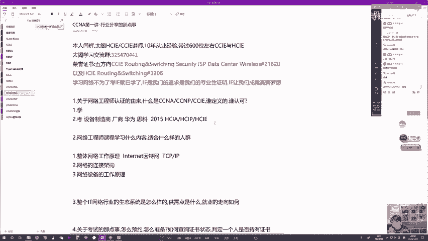

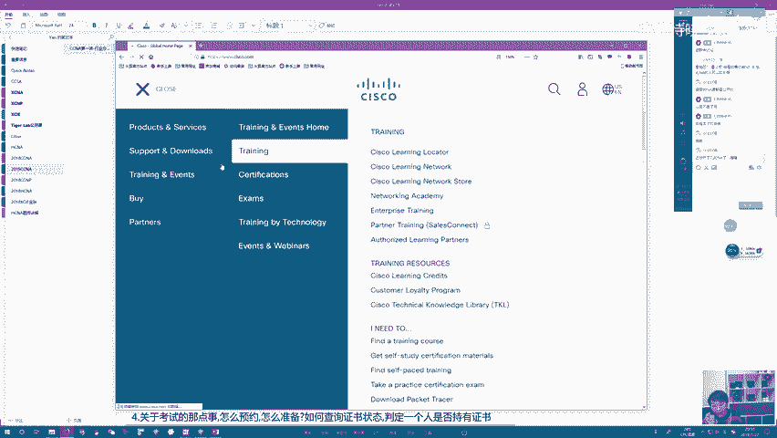

你还说我骗你们。好，这块呢咱们就能看到了啊，这就是思科对于咱们网络方向的这么一个划分，对吧？你看到了吗？他他把网络划分成了这么多个方向啊，但是在这么多个方向里面有IE认证的，一共只有这么6类，可以吧？

分别哪6类呢？对吧？像协作方向是吧？数据中心方向，然后呢，路由交换方向，安全方向，运营商方向还有无限方向，可以吧？一共这么多个方向它是具备IE课程的，那咱们当前这个课是关于哪个方向呢？请注意啊。

是关于路由交换可以吧？为什么是路由交换呢？因为路由交换。😡，它是所有网络方向里面最基础的一个方向。这个方向中，咱们所学到的技能能够帮助我们知道网络是怎么组建的，怎样从0到1。

你得先从0到医保网络给组起来，你才能谈其他的增值性负。比如说你要做安全对吧？那也就是你要在现有的路由交换的基础之上添加一些防火墙啊，添加一些IPS啊，添加一些安全认证服务器啊。

那这就是安全领域所研究对象了。它研究的对象就是基于咱们现有的路由交换模型。如何填充一些安全的设备来达到咱们安全的效果。那，无线就不用说了，路由交换搭建的是有线的网络不是不方便嘛？

我们现在人都喜欢用手机上网，对吧？移动终端，因为毕竟移动互联网时代嘛，对吧？你想让手机上网，你手机动插不了线嘛，你需要部署无线。这个无线也相当于在路由交换基础之上，对吧？

我在你的有线设备的边缘添加一些无线的设备，对吧？像我们的AP啊，像我们的无线网桥啊，像我们的无线路由器啊，来把我们这些支持无线的设备通过无线信号连接住网，可以吧？你也不能说你为了做一个无线。

你单纯只使用这些无线设备，你没有有线网络的支撑，你光用无线设备，你这个网络是组不起来的，你连通会有问题，可以吧？那当然所有其他方向都是一样的。所以你会发现在所有网络方向中啊，最最最基础也是最最最重要的。

就是路由和交换，路由交换研究透了，你知道网络怎么连接网络怎么工作的了。你了解咱们网络整体的运作原理之后啊，安全，不过就是锦上添花，无线不过就是有线。基础之上添加一些无线的设备，这些都是提供增值性服务。

但你增值你是在什么基础之上增值的？你是在路由交换的技术之上增值，那没有路由交换，你能增得了这个值吗？你增不了。所以说呢同样很多学员啊。反反复复的问我这个问题。哎，严老师。能不能不学路由交换。

咱们直接学安全。咱们直接学运营商。😡，直接学数据中心。多好啊，这些方向听起来高大上啊，人又少，那会不会工资更高呢？好，答案是。不行。两个方面不行。第一个方面是你没有经过路由交换的学习。

你的知识体系是有明明显的缺陷的啊。基于你这明显的缺陷。你就算把安全那些机制研究的透透的。我问你，你能只使用防火墙来联网吗？做不到对吧？做不到。那这个时候就意味着你光懂安全，你是没有独立实施项目的能力的。

一个连独立实施项目能力的人都没有。那作为工程师，你能独当一面吗？你肯定独当不了一面，你连独当一面的资格都没有，你还谈什么高薪呢？😡，对吧这都是扯淡啊，这都是空中楼阁OKO那言归正传。

咱们这课程第三部分啊，研究网络设备的工作原理。咱们主要研究什么样的网络设备呢？那咱们肯定是研究路由交换相关的网络设备，这些从0到1能够帮我们把网络组建起来的最基础，最核心的设备的工作原理。

那到底是哪些设备呢？那自然而然就是交换机，还有路由器，可以了，就是交换机和路由器，你们是怎么工作的对吧？有什么特性。你们能启用一些什么样的功能，对吧？能做一些什么样的事儿。在一个企业网络架构中。

你们的定位是怎么样的？该连在网络的什么位置，扮演什么样的角色，做着什么样的事儿，能启用什么样的功能。那这就是咱们课程中的核心中的核心重点中的重点。因为这些设备如果你不会，你们永远没有举一反三的能力。

这些设备你不知道怎么运作这些设备衍伸出来的功能，您不能良好的应用啊。我告诉大家，那网工这条路基本就不用走了。因为基本10家企业里面9家面试问的问题都是围绕这些设备的衍伸的一些工作原理来问大家。

那如果说这些你们一问三不知，那我相信你们就算有来一认证啊，你们基本也入不了行，做不了任何事。O。😊，然后接下来第4块呢，终于跟厂商相关的了，对吧？你不能说是对吧？光懂得兵法，不懂得实操啊，对吧？

你不能像马谡一样丢了街听那书兵书读了万卷，一上战场就怂了。那咱们是实战派的学科啊，实战的意思是什么？学以致用。学完就能堆面试官，学完就能拿咱们所得的技术，应付客户解决咱们的问题。对吧，就好像咱们学英语。

中国英语是是不行啊？因为我们中国人学英语只是为了考试。不是为了交流，而语言作为一个工具，主要是为了用来交流。所以说也跟大家说一下一个插曲。今天呢咱们公司的刘老师。去农行办了一个业务。

那遇到了一个男南游的一个外籍留学生了，哪儿来的？我忘了，好像是孟加拉国的吧。那个哥哥呢要干件事儿，他的朋友呢要给他的payper。打几百美元多少美元来着？500美元。然后呢，他呢有一张农行的借记卡。

他希望通过农行的借记卡能把他这个paypal里面的500美元对吧？提现。就这么简单的一件事，那当然我承认啊那个哥们啊，英语口音很很渣啊，英语口音基本跟印度人讲讲话是一样的，我也有也有很多单词。

一直不知道他说的是什么，就包括这个paypal，我听了至少他发了10次英。啊，他他我我也我也听不懂他说的是什么。然后接下来比较有意思的是就是刘老师呢就是给我微信语音了。

说让我跟这个孟加阿国的兄弟沟通一下。那为什么让我沟通的原因是因为。偌大的一个农行竟没有任何一个大行经理。没有任何一个柜台专员能跟他用英语交流。我都惊了个呆了，我们金融岗位啊。我们的银行行业啊说好听点。

你们都是bankker啊，对吧？光鲜亮丽的这么一个角色。😡，你们连跟一个留学生交交流英语，你们都交流不了。你们你们对得起你们银行这么高的薪水吗？然后结果呢，我是跟他沟通了很长时间。

因为主要那个哥们儿他英语也不是很好，我一直觉得我的发音已经非常非常美式了，非常非常标准了。

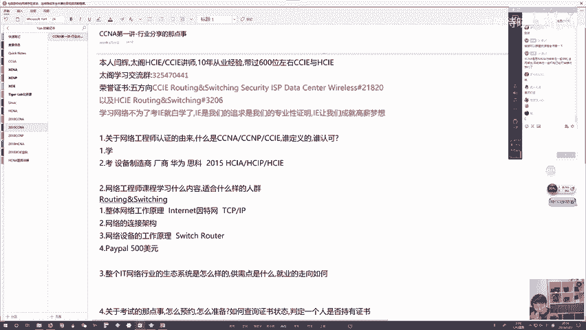

我刚说了很多话，他听不懂。

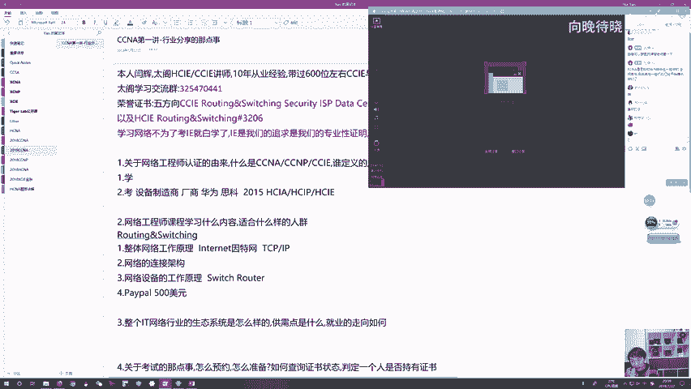

哦。哎呦。唉，大家觉得卡吗？hello，大家觉得卡吗？好了吗？现在好了吗？卡了吗？现在好了吗？Hello hello hello。啊，只有摄像头啊，稍等一下，我重新开一下，我重新开一下。

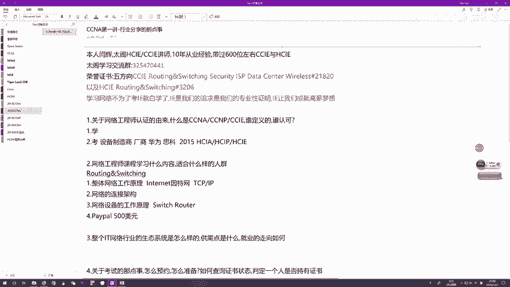

。🤧And。好好啦。😊，这个现在应该没问题了吧。嗯。现在还有问题吗？好吧啊，我这边网络出了小小的问题啊。O。啊，言归正传啊，再跟大家说一下刚才那个故事啊，就是说咱们任何东西呢，其实都是要学以致用的啊。

你学一门语言也好，你学一个技能也好，对吧？如果你学的不是为了用对吧？那这个技能学的就没有意义了，好吧，学了就没有意义了。那所以说呢学以致用啊是非常重要的好吧，学以致用是非常重要的啊，桌面大家能看到吗？

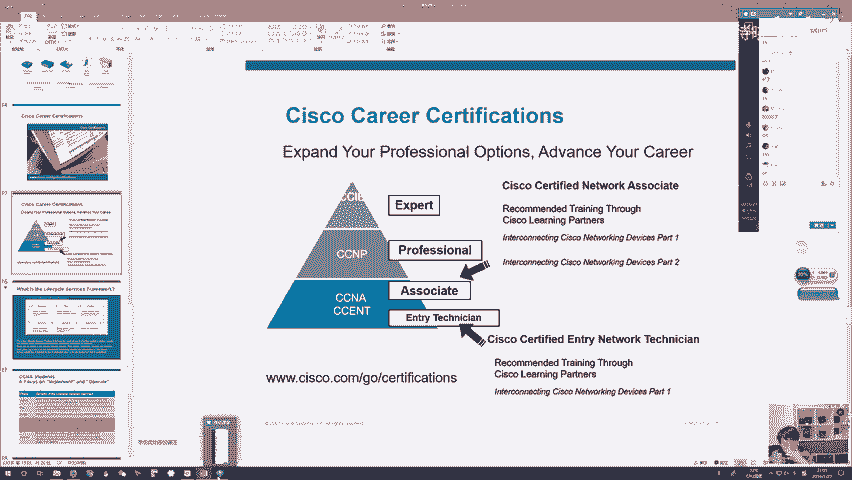

🤧桌面大家能看到吗？你们是只能看到摄像头，还是能看到桌面？😡，可以看到桌面是吧？好ok啊。好，那接下来我们来言归正传啊。😊，咱们这个课程的第4块，咱们学什么呢？😡。

就是让大家能够把你们的理论实战化的实战操作。大家，因为你们现在已经知道路由器交换机几斤几两了，你连网的时候，交换机该用几台路由器该用几台，这些设备之间呢，咱们该连什么样的线，怎么去连？

每台设备能启用什么样的功能？😡，那该怎么启用呢？对吧？你得要登录到这些网络设备，你要去操作，你要去调试，你要通过咱们的操作和调试啊，来让这些设备的相应的功能能够按照咱们的意愿来相继的开启。

那这些不是平白无故，你想一想它就能开启了，你需要去实际操作。那怎么操作呢？哎，你需要敲命令。哎，大家会问，哎，敲什么命令，什么叫敲命令在哪里敲，怎么去敲？好，请注意啊。

你们不要小看路由器交换机这样的设备啊，这样的设备我们虽然把它称为叫网络设备啊，但是其实它们是计算机。那作为计算机，你懂的啊，我们有主板对吧？有CPU有硬盘，有内存，对吧？你任何东西咱们是应有尽有。

你既然这些东西应有尽有，那咱们能不能就像登录一台计算机一样，登录一台路由器交换做配置呢？可以的，没有问题。😡，因为这些网络设备，他们就跟我们的计算机一样具备智能，他们呢也安装着相应的操作系统。

只不过他们的操作系统呢不叫windows，也不叫苹果，也不是咱们的安卓，也不是咱们的IOS。他们的操作系统叫什么呢？哎，还真叫IOS可以吧？叫internet。Operating。テスト？对吧？

叫互联网操作系统。好吧，这个系统咱们称为叫互联网操作系统。这个呢思科吹这个牛逼啊，说这是他们开发的，并且也是全人类开发的所有网络设备中的第一款操作系统。

这是基于unux啊开发得到的那当然咱们现在提到IOS一般指的是什么？是咱们苹果手机操作系统啊，那个的I第一个I是小写的，叫IOS可以吧？那这个IOS呢，其实我说说句实话啊，它曾经不属于苹果。

它是属于思科的一个专利。思科开发出了IOS系统之后，为了避免这个系统的名字被别人盗用啊，他直接申请了专利。但后来呢这个乔布斯大家都知道比较强势啊。对吧回到苹果公司之后，哎，研发了一个iphone是吧？

研发了一个iphone，然后呢，他又找到了四棵树哎。你把这个IOS专利卖给我，对吧？因为我们这个手机的操作系统也叫IOS只不过它叫iphone operating system。

那当时呢思科键就卖给他了。那所以说你现在提到IOS基本指的就是咱们手机的系统。但然呢请注意咱们cisco的路由器交换机的系统啊，依旧还叫IOS可吧？那这个IOS呢不能做到像咱们的windows10一样。

这么绚丽啊，给你整这么一个图形化的界面，对吧？你要做什么操作，鼠标点一点，对吧？键盘敲这么几个字符啊，那基本你要安装个什么应用，你要下载什么应用，你要启用什么应用，对吧？分分钟就能搞定。

这种图形化的界面啊，不适合咱们的网络设备。网络设备为的节约资源，他们所使用的操作系统都是什么啊？都跟咱们曾经的微软里面这个叫ds系统是一样的。好吧，就跟咱们这个ds系统是一样的。你要干任何事。

咱们能干吗？没错，你也能干，但是你能像咱们操作windows一样，你鼠标点一点就能搞得定吗？想多了啊，想多了，没有那么牛逼，你想用可以用，但是你要干的任何事，请你通过命令的方式来实现，可以吧？

那这一类系统。

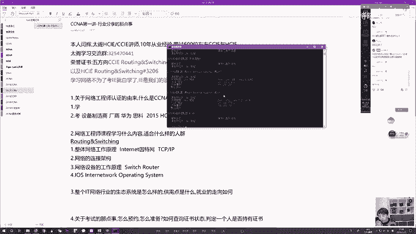

我们称为叫CLI叫cly可以吧？对比咱们图形化系统叫GiGUI可以吧？colly和G。那当然他们都有全称的啊，colud的全称叫commandline interface叫命令行界面系统。

go叫graph user interfaceface叫图形化界面系统。好吧，那这个系统呢咱们是可以操作的。你要在网络设备上启用任何的功能，你需要通过敲命令的方式来把这些功能呢启用。

并且通过敲命令的方式来调优，对吧？来做一些增值性的服。那这些东西呢需要咱们研究，对吧？命令怎么敲哪个功能对应哪些命令，哪些命令该先敲，哪些命令该后敲敲完命令之后，咱们怎么判断这个命令到底有没有生效。

咱们怎样来判断这些网络设备在运作的时候有没有产生1蛾子啊，那这些咱们都是要操作的。那这个操作呢，也是咱们课程中重点的这么一个环节，对吧？用来学以致用。那当然由于咱们这课程呢比较偏向于思科啊。

所以我呢教大家演示一些命令和实验的时候，都是基于思科的网络设备来演示的那华为的操作系统呢叫VRP啊，叫ver routing platform叫统一路由平台，那这个系统呢你倒推个十多年前。

他跟思科的命令行界面是一模一样的。但是呢自从有有一个事件发生之后啊，华为的设备的VIP系统它的命令行呢就变得不一样了。但变得不一样，大家不用担心啊，我觉得。在我看来。

华为这些设备的命令行跟思科命令行的区别。我觉得就跟他们的认证的名称的区别是一样的。原本差距非常小。然后呢，现在看起来差距比较大的啊，但是呢基本也都是一些，对吧？你们懂的比较相似的对吧？

同义词的这么一个改编而已。就比如举一个例子，你在fisco的设备中，你要查阅一些信息啊，你是通过经典的寿命令去查阅。而在华为中呢，你也能查阅一些信息，你用的是经典的。display命。

那大家熟悉英语的话都会知道s是显示展示的意思。display是陈列的意思。是吧再举个例子啊，你在私磕中你敲了一条命令，你看着不爽，你把它给干掉。你要把一条敲掉的命令给干掉，怎么干呢？

你是通过no模式的命令来把你现存的命令啊给删除掉。😡，来，那华为呢也有类似的操作啊，华为的操作叫and do。好了吧，那这个呢我就不多说了啊。然后接下来内似还有很多啊，在cisco中建一个邻居。

cisco把邻居称为叫nighbbel。华为把邻居称为叫P。对吧nbel就是邻居的意思嘛。Pre呢对等体的意思。这个呢我相信不用我多说了吧，大家该懂的都能懂。好了，那这就是厂商之间的这么一个差异性。

好吧，这就是厂商之间的差异性。所以你们了解了思科的命令行之后，其实想要了解华为的命令行很简单，同理你们华为的命令行很了解，想要回过头来了解思科的命令行，哎，也很简单。因为毕竟大家同根同源啊。

对吧同一个模子里出来，只不过在发展的道路上，对吧？经历了一些人和事的问题，然后呢走向了两个不同的分歧。但是虽然说是两个分歧啊，但是对吧？他们的根源是一样的，所谓的差异性全部体现在这种近义词或同义词之上。

哎，对呀，今天咱们第一节课啊，欢迎欢迎欢迎OK那这就是咱们整体要学的内容了，接下来适合什么样的人群呢？啊，我觉得所有人群都适合好吧，你在校的最好，因为你时间比较充裕嘛。能在毕业前考1个NT考1个IE。

哎，你基本就已经可以人生起飞了啊，那也许你高考失利啊，没有办法像同班同学一样上北大清华，甚至没有没有办法，对吧？像一般的同学一样上1个985211，咱们很有可能上的是一个三本。上的是一个大专。

甚至可能咱们上的是一个中专，对吧？不管怎么样，咱们曾经的人生呢经历过一些，对吧？不堪回首的考试失败的经历。那我相信这个认证呢它能够改变你。对吧它能够增加你的简历的含金量。

能够让你就算在一个比较差的学校毕业，那也许你的大学生涯，你的大专生涯对吧？你的中专生涯是浑昏噩过来的，但只要你有一项技能，对吧？一项实用的技能。你只要有一个比较高逼格的证书，就足以改变你的一切命运。

因为在美国看来，CCIE有多牛逼啊，我跟你们说一下，美国前总统拜登说过一句话。CCIE就是全美对吧？去往高薪岗位的头等舱机票，谁拿到这张机票，那你未来的职业生涯基本就是顺风顺水。

那高薪基本就是拿到你手软啊，高薪offer拿到你手软。无论是在旧金山湾区。😡，还是在达拉斯，还是在纽约，只要你能想到的美国有IT的地方，对你拿1个CCI求职。就算你是个菜鸟，你是一个应届生。

你的起薪不会低于10万美元。当然前提是你要能够经得起面试的考验啊，那当然在国内呢这么高的薪水可能会稍微有点麻烦一些。因为10万美元，我的天哪，想一想，那要算一下汇率，那都已经70万人民币了啊。

这还是挺高的。那在我们国内呢网工很少能拿到这么高的待遇啊，那当然咱们毕竟呢物价也低，对吧？那花的是人民币嘛，那咱们国内呢基本你一个本科生，你一个大专生，那吧？你拿到一个IE，你能进非常非常理想的啊。

你想进的行业类公司，那基本起薪待遇当前的通胀通货膨胀啊，我觉得应该起薪也至少不会低于10K。而且这个还是二线城市的水准啊，如果你要去那些一线城市，北上广深，那就不用说了，12至15起步，可以吧？

当然如果你要人品好一点，像我之前曾经在南京理工大学紫金学院这是个三本院校啊。有一个小兄弟一毕业对干了第一份工作，不满3个月啊，就跳槽了，跳哪里了呢？跳到了这个叫上交所，你能听过吧？哎。

上海的A股的股票交易所啊，里面去做IT运煤，但人家一进去年薪就是30万，那这好是34年前的事儿。你看现在北京的证监会好吧，待遇有多好，就不跟他说了，简直叫好到爆啊，叫好到爆。OK。好的。

当然对于咱们中专以及学历更糟糕的兄弟，那可能呢你们起点会稍微低一些。哎，那这个时候呢，你们可能没有办法直接一步到位的进到那么高大上的岗岗位啊，当然也不用担心，咱们有这个证书呢，就不怕逆袭，对吧？

就不怕逆袭，也是真人真事啊，在我们群里面一个真实的人，小明。哎，四川乐山呢一个中专毕业的小伙子，很年轻啊，今年才23岁。他了解思科呢，大概是在4年前左右的时候，在他上中专的时候了解到的。

然后他了解到这个之后呢，发现哎这种能改变他的命运，并且他很喜欢的，然后呢就只身一人跑到成都哎，考了一NP。考完P之后呢，运气真的很不错啊，找工作啊就找到北京去了紫荆支点，一家集成商啊去用它。

然后接下来呢一开始给他开的不高，因为毕竟他是中专毕业嘛，还支持跟P，但是好歹入行了，他们那家公司呢业务还挺精进的啊，做的业务都是金融相关的务，对吧？动辄一个项目好几千万上亿，对吧？

他也在项目中呢锻炼很多，并且在这个代理商干了两年呢，他每天都会抽时间继续学习。然后接下来通过两年学习，他两年考出了两个IE，一个是路由交换方向的。当然这个方向呢我给他很大的帮助啊。

然后第二个方向呢数据中心的那考完两个IE之后呢，人家现在啊是告别他的老东家啊，紫金指点去了哪里呢？啊，去了思科原厂。去了四科原厂，世界五0百强。依旧还是那个小明，依旧还是中专毕业。

只不过就是多了两年的月历，多了两张IE。那他的薪水呢。按照他们学校的平均值，我估计在成都也只有2000到3000吧。然后呢。他今年哎思科给他转正之后，给他承诺的薪水使。30万。😊。

那这我觉得就是一个非常非常好的改变啊，这个改变对吧？我觉得是靠选择来决定的。OK那这就是它的适用性啊。当然大家会觉得哎如果经毕业了，是不是就不适合学习了呢？当然也不是啊，你毕业之后，你进入这个行业内。

如果说你当前干的就是IT相关的工作，那你更加适合学习，因为你已经不是零基础了，你了解咱们网络里面一些事，可能了解的不是很多啊，可能架构不是很鲜明，可能咱们操作不是很熟练，但是没关系，你是行业内的一员了。

对吧？你更加能够看清行业内的一些对吧？事儿，人你能了解行业更多的资讯，你能天天跟行业内的一些技术打交道，对吧？那你学习暂适合不过。你学习的定位就是精进的技能，让你更加了解这个行业，让你更加了解技术。

让你能够对吧？在技能上把能够碾压的同时。碾压你的朋友，碾压你的客户，是最关键的，然后让你能够在行业内崭露头角。那当然当你跳槽之后，对吧？我相信给你回报的肯定是更好的岗位，对吧？更高的形式。

那当然对于外行的人也不用担心，对吧，你在外行干了很多年，对于IT敲不通。如果你想跳槽到IT这个岗位，那也欢迎大家呢来参加咱们这个证书的考取，参加咱们这个课程的学习。因为在所有行业中。

18年咱们的薪酬统计啊，IT岗位已经屌丝逆袭了，之前每一年都是金融岗，他们的薪资排行第一。但是18年破天荒的啊，咱们技术岗。我们的IT岗位逆袭了。对吧巴德头丑是在整个中国所有领域里面薪酬最高。

我们这个行业特点是什么呢？就是它的包容性。他不管你的过去，对吧？不像很多传统行业，你要入行，你需要非常高的学历支撑，你需要非常久的行业经验支撑，你才能够立于不败之地。但是在我们的IT呢IT这个领域啊。

这个IT领域就是一个造神的领域。你可能在你曾经的领域，你屁都不是。😡，但是当当你到了咱们这个IT领域之后啊，通过你的努力，对吧？通过你的这么一个执着，通过你的这么一个坚持。你是很容易翻身的。

你是很容易从一个一名不闻的屌丝小卒啊变成一个卖人经养的大神。很正常非常正常。好吧，那这是一个容易产生奇迹的这么一个行业。并且在这个行业，你们也不乏听说什么。工作十年挣个几千万，对吧？工作十年。

一线城市买一套1000多万的房，对吧？这样的例子我觉得应该是屡见不鲜了。那这意味着什么呢？咱们这个行业能够利用咱们的青春的时间来赚其他传统行业，可能一辈子也赚不到的钱，这就是IT最大的魅力。

所以大家如果觉得咱们当前这个行业不够满意，哎，你们想就是追求刺激，想要追求高薪，想要对吧？在这个IT领域里面改变咱们的人生。你想要开好车，想要住豪宅，想要迎娶白富美走上人生巅峰。

那我觉得IT领域能够给到你们的就是无限的可能性。那想想想十年前我也不过就是一个普通的211高校毕业的一个普通的屌丝学生。那十年后我的今年混的也还可以，对吧？最起码比我很多同龄人混的要好一些。啊。

原因是因为我选择了一个比较好的道路，所以选择大于努力啊，基于努力这个前提，但我觉得选择大于努力，选择对了。但你今后只要保持努力的状态，哎，你就一定成功。但你选择错的话，当然不是说没有成功的可能啊。

但是你的成功可能会来的比你的预期会晚一些。你走的弯路可能会更多，你经历的坎坷可能会更多。OK。好，然后接下来给大家了解一下咱们IT的这个生生态圈啊。

了解一下咱们这个IT的整体的这么一个发展整体的这么一个架构。了解一下咱们学完课程考完证之后，对吧？咱们能在什么样的企业从事什么样的岗位，拿到大概什么样的薪水，那这我相信大家比较关心呢？因为学以致用。

对吧？我们学完这个东西之后，拿什么来证明我们。那大家可能会问考试啊，我想说的是不是并不是。考试只是为了增加咱们简历的含金量，这是这也是一个过程。考试不是一个终点，它是一个过程。

那咱们这个过程花费了咱们的钱，花费了咱们的时间精力，对啊，花费了咱们的情感。那咱们为了实现的是什么呢？不是为了考这个试。哎，上面证书大家能看到吧，不是为了这些证书很好看吗？那可能是挺好看的。😡。

但是如果说对你没有把它变现，这些证书毫无价值。对啊，我们入这个行目的是什么？我说俗一点，为的就是钱。为的就是通过钱来开拓我们的视野，改变我们的命运。那接下来钱那肯定有有人来给我们发，对吧？

咱们不能抢银行，那谁来给我发呢？还是企业主。所以说呢咱们学习这些内容，最终还是为了就业。那去哪里就业呢？哎，给大家讲一下咱们的行业。什么样的行业跟咱们网络有关呢？那这是一个非常大的话题。

因为在当前21世纪，我觉得任何行业。都是离不开网络的，包括咱们的政府。包括军队，包括运营商，包括企业，包括银行。你能想到的各行各业，我觉得离开了网络，你可能连一个业务都办不了。

那曾经呢咱们基本都是劳动密集性啊，那有了IT有了网络之后，对吧？这些产业都在慢慢的升级，咱们就在慢慢的告别劳动密集性的业务。升级到技术密集型的业务。而这些业务对吧？都需要咱们的IT需要咱们的网络支撑。

那所以说这个世界上没有和网络没关系的行业，可以吧？任何行业都跟网络有关系。那为了方便咱们知道咱们毕业之后，学完这个东西之后，考完证书之后，到底能在哪里就业。我们把大体的就业方向呢分为两个部分。

也就是相当于是给这些网络相关的公司啊做一个划分。那分成什么呢？分成甲方。还有乙方。甲方和乙方在任何行业都存在啊。当然对于我们的网络而言也是一样的。甲方就是采购者。他有钱，我需要使用网络，我要买设备。

我需要你来给我把设备组建起来，给我调试，来让我的网络怎么样可以正常运转。对吧采购方就是甲方对吧？或者说叫服务获取方就是甲方，而乙方呢对吧？有买就有卖嘛，你要买没人卖那肯定不行，对吧？那谁来卖呢？

就由我乙方来给你买啊，我就是出售者，可以吧？我就是出售者。你要买网络设备，对吧？哎，刚好我这儿有渠道，我这有资源，我卖给你啊，对吧？你的需求我来给你解决是吧？你的所有要求，我都会整理成清单来给你满足。

对吧？你的设备买好之后，我帮你上架，我帮你连我帮你配置，帮你调试，让你的网络能通，并且只要你愿意对吧？我会一直给你提供维保的服务，你网络在用的时候有任何不爽，哎，打电话给我，我直接派人去给你解决。

出现问题了，我7乘24小时来给你提供问题解决这么一个人，或者说你要是再不放心，我直接招一个人，哎，我给你放到你们公司，你平常就把他对吧？当一个小弟来使，哎，出现什么问题了，你直接就找他。

他来帮你本地解决，哎，都是可以的对吧？那简单来说，服务的输出方。方啊就是乙方可以吧？服务的采购方，那就是甲方，对吧？买设备的，还有卖设备的，好吧，那接下来买设备的谁会买呢？那基于我刚才的话题。

你们请注意啊，我觉得在这个行业内，对吧？在整个咱们人类的文明中啊，不存在哪个行业是不需要网络的。所以说了各行各业。对吧各行各业的各种公司。各种组织，各种机构，那他们都会是甲方。只要你有网络需求。

你就都是甲方。好吧。对吧全球所有公司你都是甲方。好吧，那谁是乙方呢？那乙方比如说思科华为，哎，他们就是乙方，对吧？思科华为。对吧他们就是乙方。然后接下来思科华为呢作为乙方，他们肯定是乙方里面的佼佼者啊。

算是乙方里面的第一梯队。那这第一梯队呢，咱们刚才也说过了，叫厂商啊，对吧？厂商你收它为纯乙方，这么说也不对，为什么呢？因为这些厂商，他们存在的目的是什么？没有错，是为了卖设备。

但是你要卖设备的前提是你得先生产设备，对吧？你得把设备给造出来，你才能去卖嘛？你都不造，你拿什么来卖，你没得卖嘛？比如你华为要卖手机，你得先造手机，对吧？你思科要卖路由器，你得先造路由器，对吧？

那所以说了这些公司他们除了卖设备以外，干的更多的事情啊，是设备的硬件研发，所以说呢你们在招人的时候呢，没有错，他们也会招销售，对吧？也会招。招售后的技术工程师对吧？售后的网络工程师也会招售前网络工程师。

是吧。😡，但是呢他们招的更多的啊，可能是一些产品研发，是一些产品研发岗。我需要你研发人员过来帮我研发设备啊。你设备不研发出来，我怎么造，我造不出来，我卖给谁呀，对吧？谁来买空气啊，对吧？不可能的。

我需要先把这个设备给设计出来，设计出来，我造造好之后呢才能买。那所以说呢对于这些岗位呢，咱们产品研发占大头啊，前面这些占小口。😡，那大家就会问了。你前面这些站小头，你怕不怕出现另外一个极端啊。

你设备研发的好好的，左一个系列右一个系列。😡，你卖不出去怎么办？对吧企业不知道你在卖，你没有人跟企业对接，没有人跟企业沟通，你怎么知道企业有这个需求呢，对吧？你不做需求挖掘，你又卖给谁呢？是吧？

你怎么能说是咱们两个方面都做的特别好啊，对吧？我觉得两个方面做的都特别好的，也只有华为能做到这点，可以吧？像什么华三啊，像什么锐杰啊、中信啊、思科啊、juniper啊，对吧？他们都是更加重视研发啊。

然后呢，他们的销售都比较差一些。😡，那接下来既然你们自己销售不行，你们需要依赖别人吧，对吧？你需要找小弟来帮你解决，找谁呢？啊，你们会找一大堆的。代理商好吧，你们会找一大堆的代理商来帮你去，对吧？

代理设备的销售，好吧，那这个代理商就很多了，思科华为啊、华三啊，他们在国内外对吧？海内外都会有相应的代理商，并且由于代理商太多了啊，他有分级，对吧？最高级的代理商，咱们称为叫总代理商，哎。

稍微低级一点的，咱们称为叫金牌代理商，好吧，再低级一点的，咱们称为叫银牌代理商，好吧，啊，当然还有更low的啊，我们称为叫高代对吧？高级代理，啊，那这些就是代理的这么一个区分，会吧？那这个代理商。

他们干什么呢？他们不干别的，我不研发设备，我不造设备，对吧？我作为你思科的代理，我作为你华为的代理，我只干一件事，我帮你去联系客户，我来。看一下有哪些甲方有咱们的采购需求。那当然我肯定是无所不用其极啊。

你们有需求最好，没需求，我变着花样，也要给你聊出需求来，对以吧？那当你有了需求之后，哎，那这个时候就告诉厂商了。哎，某某客户他要买设备啊，对吧？你赶紧给我造造完之后我来给他上架，对吧？

我来帮你卖设备来帮你产生利润，好吧，那一般的每个国家地头蛇嘛，总会有啊，这些地头蛇哎，八面玲珑，对吧？跟谁都混的挺好，资源比较广，对吧？关系往不要哎。😡，完善嘛，那这样的公司特别适合做代理商。

那这个代理商呢，咱们也是按照规格啊来给你分成这么多级，对吧？级别越高，代表你规格越大嘛。那接下来像这些代理商，他们由于要做事情比较简单啊，所以说他们招的人也比较简单，对吧？那他们肯定是需要销售嘛。

不用说了啊，销售是肯定需要的是吧？然后呢，像售前工程师售后工程师，那也是他们招聘的范畴，对吧，当然我一直在谈售后和售前工程师到底什么意思啊，什么叫售前售后工程师给大家解释一下啊，就我想跟大家说一下。

咱们卖网络设备，不像你卖红酒，不像你卖衣服，对吧？卖这些比较简单的东西，你销售背一备话术，咱们都能卖，比如你卖红酒，你要知道红酒产地对吧？你也得知道什么法国的红酒的特点，什么美国哪怕红酒的特点。哎。

澳洲的红酒的特点，那你得了解对吧？你得了解。了解完之后，你还得要知道红酒的什么品类。那在我美国一个学员天天跟我说啊，叫什么马 love，我我我反正听不懂的，这就是红酒一些品类啊，就是你你得告诉客户。

你得向他们展示你的专业性。😡，是吧当然你卖红酒可以这么来啊，但是你卖咱们的网络设备，对吧？你就不能强人所难了。一般我觉得什么样人能做销售啊，都是那些八面玲珑的人啊，对吧？很能侃，然后呢，很有销售的水准。

很能跟客户聊，对吧？很能切入，很能就是挖掘需求，但是销售它不专业。他不懂得网络技术，他不懂得咱们网络设备的功能，他可能听不懂客户的需求，我只能跟客户相处，跟你交朋友，跟你喝酒没问题。我跟你签单没问题。

但是客户说了，哎，我现在遇到了一些什么样的问题。哎，你有没有方案来给我解决一下。那这个就是为难咱们销售，我是真的解决不了是吧？我是真的解决不了我的专业性不够，哎，不好意思。那我能这么说吗？啊，不好意思。

你这么说，你的单就没了是吧？那为了拿下单子，你就必须要找一个专业的人来帮你去理解客户说的话。那这些人呢咱们就称为叫售前工程师。售前工程师一单跟销售呢哎两个人一组，咱们组成一个配。

组成一个配er之后怎么样呢？咱们一起见客户，销售主要负责给客户灌酒。哎，我给你灌的差不多了。那，客户说，哎呦，小伙子人不错。酒品又好是吧？做事儿又好。我就跟你说说呗啊，我们现在企业真有需求。😡。

当前的企业要怎么怎么样，怎么怎么样垃圾，我现在需要实现怎么怎么样怎么怎么样服呢？😡，销售一脸懵逼。好好，我听到了啊，知道了。然后接下来吃完饭之后就问一下，哎，兄弟，他说的什么意思？😊，给我翻译一下是吧。

出一个方案对吧？整理成PPT哎，下回呢咱们见客户给他说一下。那这个时候呢，售前工程师啊你得洗耳恭听了，你得把客户的这些需求整理成文，对吧？客户他不懂技术，你懂技术。

你得把客户那些不专业的想法转换成咱们行业内的人能看得懂的这些专业术。然后紧接着你要根据客户的痛点。是吧来咱们来出个方案，出完方案之后写成PPT做好看一些。那找一个时间呢把当着客户的领导，对吧？

当着的销售给客户呢把这个方案讲一下。那只要你讲的足够好，只要这个销售的公关能力没问题。那基本这个单子就成了是吧？你告诉客户，哎，针对的痛点，你需要多采购几台小玩机是吧？为什么采购完之后能解决什么？

这样能带来什么样的优化？啊，我给你写的清清楚楚。是吧这个项目才该咱们咱们该怎么做，预期多长时间分为几步，每一步做什么。😊，给你写的清清楚楚啊，呢当着你的面给你把PPT呢一读。那读好之后呢，客户也开心。

好，成了。是吧那咱们就做了，走着没问题是吧？那就走着。那既然走着了，咱们谁来具体的做呢？是吧？你单子成了你的设备，你要运到甲方的公司，对吧？你得把它放到机房里。谁来上架你螺丝？😡，谁来连网线。

谁来做调试。谁来做售后呢？是吧那咱们售前工程师这么高大上的岗位肯定是不会做的，谁来做呢？售后工程师来做，对吧？售后工程师呢就显得比较低调了，你其实都不用见客户，对吧？见客户销售跟售前。

你也不用读什么PPT不用出什么方案，你只要根据售前给出的方案，对吧？你带着设备去甲方家去甲方公司，对吧？你到了机房把设备给上架，怎么上架是你的事儿。怎么连接？😡，也是你的事儿，怎么调试也是你的事儿。

那当你调完之后呢，各种测试对吧？包括后期的运营运维，对吧？也都是你做的。好吧，那这类我们就称为叫售后工程师，对吧？那一般呢咱们代理商招的比较多的就是这三类人，好吧，那由于这三类人的缺口很大呀。

因为我们说了啊，对吧？网络虽然是个小行业。但是网络的客户。对吧是整个全人类嘛是吧，整个全人类。那所以说呢咱们甲方遍遍布全球啊，对吧？遍布每一个行业，遍布每一个领域。那所以说你有这么多的公司需要采购设备。

你售前售后的人数要求是不是就特别多。所以说呢每年啊咱们只要讲到IT互联网讲到咱们这个网络岗位，都会说今年唉又有什么几十万几百万的这么一个行业缺口，缺人啊，招不到人啊，人不够用啊，对吧？

那所以说呢我觉得也是为了解决这个人员储备的问题。是吧咱们厂商呢就是推出了这么一个职业认证。那推出职业认证就是方便你这些代理商啊，对吧更好招人。你们招到人之后呢，对吧？就能够卖更多的设备嘛。

能够调试更多的设备嘛，能够为更多的客户来解决他们的联网难题嘛，是吧？那这个呢就是哎咱们的这么一个比较中级的乙方，对吧？然后接下来咱们比较低级的乙方呢，就是那种规模特别小的，比如像什么夫妻店啊，对吧？

没几个员工没有什么组织架构，对吧？你谈不上任何一个厂商的代理商。因为你规模太小了，对吧？你达不到人家厂商的要求。那为了生存，对吧？你什么样的设备都要卖。那可能你这家公司呢思科设备也卖，对吧？

华为设备也卖，咱们路由交换也卖，它安全我也慢。但是你真要说我是谁的代理。不好意思，我不是任何人的代理，可以吧？那这块怎么样呢？对吧我们就把这类公司称为叫集成省，对吧？叫集成省。他也卖网络设备，对吧？

他也做销售，也做售前，也做售后。但是呢由于规模的问题啊，他所能接触到的都是一些小微企业，都是一些小微的项目，那由于呢你接触到的对吧？厂商比较杂，你接触到的设备比较乱，那集成商里面的工程师呢。

我不能让你局限于某一家设备来取，对吧？精细化的研究，我不要你这么精，对吧？你只要能干活，最简单的活就可以了。因为反正咱们能接到的活也不难嘛，然后接下来你更多的需要了解各个厂商的各种设备的这么一些参数。

什么要懂一些，但是什么都不要懂很多，可以吧？那这个就是咱们一方的最下层。那一般的咱们学历比较好的对吧？考过外一之后呢，可以尝试去这些顶级厂商啊，当然学历稍微差一点呢，可以着眼于代理商，对吧？

那如果再糟糕一些的话，咱们可以在集承商呢先混一混，当然如果你要真的有技术，你的认证对吧？如果你考到了，对吧？你有足够多的经验，我相信就算你学历不够啊，对吧？你从这种代理商集成商，对吧？

跳到咱们厂商也是依旧有可能的对吧？厂商的待遇比较高啊，尤其是华为为例，这两年假是打了鸡血的啊，我已经有好几个大学的应届生考完一之后去了华为有本科的有硕士的，反正special offer最低的。

我见到的薪水，月薪是15K，然后呢，华为是16薪了，你可以算一下这多少钱。思科呢稍微低一点。14K左右14K左右可以吧？当然根据你所在的不同的部门，你拿多少薪，这也要看你部门的KPI这个不好定，对吧？

不像华为比较统一啊，对以吧？那这就是当前咱们的对吧？第一梯队啊，并且你在这种顶级厂商，你干的年限越长，你拿的薪水越高，对吧？像拿什么百万年薪啊，都不是梦啊，太简单了，非常简单，好吧，也只有在这样的地方。

咱们能拿到这么高的薪水。然后代理商呢这个就比较适合这种对吧？第一是你们社招，第二就是你们的学历不够，对吧？不够，咱们的厂商的门槛，你校招进不去。那这个时候你可以尝试去到去这些代理商。

那代理商呢咱们一般就是建议能去总代去总代，去不了总代，咱们去金牌啊，金牌去不了，那这次咱们要去个银牌，反正不管怎么样，总能去某一个级别的是吧？总能做咱们行业内相关的事啊，你只要能做事儿就能积累经验。

你能积累经验，对吧？那你日后就能够凭你的经验，凭你的技能，凭你的证书，对吧？能跳槽，那能跳槽，那就有无限可能，好吧，那这个呢就是由于代理商的公司跟公司之间差距是比较大的，我只能给大家一个大概的范畴。

对吧？这个代理商大概的范畴多少呢？8到15K之间嘛，我觉得是8到15K之间。你尤先做售后，我觉得售后的天花板基本就是15K。如果你要做售前会稍微高一些，可要稍微高一些。但是你做售后的话。

一般正常情况下8到15K，那这是二线城市的这么一个工资标准啊，一线的话可能稍微高一些。当然高一些代价就是你的生活成本会更高一点，好吧，那接下来集成商那待遇呢肯定是最低的。

当然也不好说有的集成商虽然小归小，但它利润比较高，对吧？你利润比较厚，你利润比较厚，那你发的薪水可能会比较高，但是一般我所见到的集成商，它的利润都是比较高的所以说我一般见到比较多的集成商的这个工资啊。

4000啊到6000啊，这个区间的比较多一些，对吧？那这种就是适合大家，比如你考个NA，你过来玩一玩，对吧？了解了解行业对吧？你可以在这种集成商呢干一干，那就是没问题的那这个薪水我觉得也是对吧？

大家能接受的，但如果你希望在这个行业内长期发展。觉得这个钱大家肯定看不上的，好吧，肯定是看不上的。那看不上的话，咱们最起码也要去一个什么稍微好一点的代理商是吧？当然能进能进进这个原厂啊。

那基本就是已经是乙方的巅峰了，对吧？乙方的巅峰就是在原厂做售前或售后工程师，对吧？那当然咱们除了去乙方以外，也能去各种各样的甲方。所有大的甲方，他们其实都会有1个IT部门，对吧？那这个IT部门呢。

咱们也需要招一些IT的人才，对吧，那这个时候你有IE证，你也不妨可以考虑一下去甲方的IT部门，对吧？那区这IT部门主要做什么呢？主要做咱们的IT规划，对吧？比如说咱们这个甲方现在的有个老板有一些需求。

比如觉得我们当前这个网络用的不爽啊，对吧？要升级一下，那谁来出方案呢，对吧？一般是先由咱们的IT部门里面的人来出一个方案，出完方案之后呢，我们基于咱们出的方案来来找一个乙方对吧？来给我们去竞标。

然后我根据乙方给我们提供的方案来对比咱们自己出的方案，通过这个来判断乙方是否靠谱，对吧？因为如果你这个甲方一个懂技术都没有，对吧？你很容易被乙方去框嘛，你很容易被乙方就是欺骗啊等等之类的。

别人就欺负你不懂嘛，对吧？我问你钱啊，对吧我给你出一些1蛾子方案啊，这种事情其实很多，所以为了避免踩坑，为了避免被坑啊，为了避免出现这些1蛾子，甲方呢基本上都会有这么一个IT部门啊来做咱们的项目保障。

对吧你要保障咱们这个项目对吧？找一个乙方不会出现什么问题。那最好的方式是什么呢？咱们就是从乙方去挖那么一些有经验的人来做咱们IT部门的老大。那这些人对吧？他们原本就是在乙方，你技术又强，对吧？

又懂咱们这些江湖的套路啊，那所以你来我们甲方之后，对吧？咱们是跟你曾经的行业，这些企业是在对立面了，对吧？那这个时候我在招标的时候，你们来投标，我们找这个专业的人就能够一言区分出来你们这些竞标者。

谁是真的有实力，对吧？谁是在鱼目混珠。对吧那当单位有这个筛选能力了，我就不用担心被坑了嘛，对吧？那当然这类人呢，你说大一点，咱们可以称为叫对吧？架构师嘛。企业架构师、IT架构师都是可以的。你说小一点。

咱们可以直接把它称为叫网管，对吧？直接称为叫网管。那大家对于这些甲方的岗位呢，他的需求可能没有乙方这些岗位啊就是要求那么鲜明，对吧对你学历没有要求。我只要求你什么会技术，我只要求你持这个证书。

而甲方呢除了要求你会技术持证书以外，还对你一些其他的对吧？职能要对你其他的一些技能啊，会有些要求，比如你的沟通能力，你的文案的撰写能力，对吧？你的这个投标竞标的这么一个经历可能都会有一些要求，对吧？

那当然相比之下呢，薪资，这个甲方就根没法说了啊，你不同的行业根本不一样，金融岗的甲方那一般都会比较财大气粗一些，对吧？然后呢，能源行业的也不错，对吧？然后呢，SP的曾经还挺高的，现在呢你越来越低了。

然后接下来像什么对吧？其他的什么零售啊等等之类的，互联网公司啊，对吧？那这个就不一定了，这个第一是看行业，第二看这是公司当前利润怎么样，但不然怎么样，你要去一些好的甲方，我觉得这个。

也不用担心比乙方低太多了，对吧，基本也是你干个两三年之后，什么年薪三五十万也都是能拿到的对吧？那甲方除了薪水以外，其实最大的一部分的利润来源是隐形的灰色收入啊，就是你在甲方如果混熟了，对吧？

你做的这个部门呢，对吧？话话话语者，你做这个一一把手了，对吧？我们今后呢要竞标，对吧？今后要招标，对吧？谁中谁不受，如果你能说的算，你有这个采购的生杀大权啊，那这个时候其实你能操作的空间就比较大了。

那当然以前我每每说到这些话，比如说大家会说我太不善，所以说这次课呢，咱们就不说那么阴暗了，就是让大家有这么一个概念，你去了甲方你的收入，除了你的正儿八经的收入以外，还有很多其他的收入。

那这些收入到底是什么，啊，你们可以自己思考一下，好吧，我就不跟大家说了，O那这就是咱们的整体行业，对吧？学完习考完试哪里就业呢。这些地方好吧，建议大家先从乙方开始啊，干了一段时间之后呢，你们可以去甲方。

好吧，OK。好，然后接下来呢关于这个考试一开始跟大家说过了啊，然后判定一个人是否持有证书啊，这个呢我待会教大家怎么去看啊。先来跟大家说一下，咱们这轮课的安排吧。好吧，因为这轮课呢。

咱们真正儿八经的面对咱们的中国地区的用户啊，所以说咱们的课程时间呢肯定是晚上，正常情况下，咱们的晚班时间是什么呢？是晚上的8点到。10点左右可以吧？8点到10点左右，那这周呢是例外。

因为这周呢我之前身体有点不适啊，所以说没有在周一给大家开课。正常情况下，新的一轮课的第一节咱们都会在周一去开。那这轮课呢，咱们是周二。那所以说索性咱们这周啊就是。周二对吧？周三周四晚上8点开课，对吧？

然后呢，从下一周开始，那咱们的课呢就是135，对吧？从下一周开始，咱们就是135晚班对以吧？咱们就是135晚班，给大家呢各自就是都留这么一点间隙啊，我留一个间隙，缓一缓，对吧？大家留一个间隙。

方便你们去预习复习，然后接下来咱们每一轮课呢都会有啊作业啊，大家可以去做，那这个作业呢我会给大家更新出来，对以吧？那之后呢，你们可以在群里面咨询咱们的课程顾问老师，对吧？这是咱们的群号啊。

这是咱们的群号，大家可以加一下，好吧，大家可以加一下。然后接下来咱们泰德的优势哪些呢？其实咱们泰德的最大优势就是咱们这个课程啊，关于学的这个部分讲的挺好呢。为什么我说讲的挺好呢？

因为咱们这所有的课都是我来讲是吧？那我作为咱们泰德的IT部门的啊，不能说IT部门了，应该是教学部门啊，教学部门呢啊，一把手啊，也来给大家做个自我介绍，那当然认识我的人，你们就可以无视啊，不认识我呢。

跟大家说一下啊，本人姓闫啊，叫闫辉啊。啊，今年的30多岁了，可能看起来看不出来啊。但其实我30多岁了，30多岁。然后呢，不是什么好学校毕业的，南京理工大学不是嗯不说这个了。那就说一下行业内的资历啊。

咱们行业内的资历我是CCIE直是毋庸置疑的。我的CCIE号比较早啊，我是08年考过的IE啊，我的编号是21820。然后呢，我有5个方向的CCIE路由交换安全运营商、数据中心和无线。

刚才呢思科这张表大家应该看到了吧？思科当前有IE的方向，一共是6个方向啊，我除了这个协作方向要考E挂了一次啊，其他的5个方向啊，咱们都都有对吧？然后呢，华为的IEHCIE我也有啊。

我是路由交换方向的HCIE15年过了，对吧？也就是算是最早一批吧，我的HCIE的编号是3206。这个编号是什么啊？这个编号就是咱们的IE的印记啊，每一个IE都会有一个编号。这个编号是全球唯一的啊。

你只要在你的名片里，在你的简历里写上的IE号，然后写上你的姓名，就可以方便企业来查阅你的证书的真实性，好吧，那这块呢，我本人6IE只是一个title啊，我个人认为我比较强的是我这一辈子只专注干了一件事。

就是讲课，对吧？所以说我讲课讲的还可以。🎼还是那句话谈上十分钟，谈上十年功啊，就是我能够对吧？对着这个白板，你们别以为我这个白板是课前，还是什么查资料给你们写出来的？熟悉我都知道。

我每节课都是即性的来写一些标题啊，都是记性的，对吧？就我之所以能够记性的写一些标题，也不用什么PPT。就能跟你们对吧？聊这些有的没的啊，原因是因为我课讲的时间比较长。

所以说呢个人对于个人的讲课能力还是比较有信心的啊。我觉得在行业内。哎，我呢排个第二第三吧，好吧，排个第二第三谦虚一点。所以说大家跟着我学呢，总是能够学到你们想要学的东西。

我有自信在给你们讲任何技术的时候，只要你们好好听，反复的听，好好做实验，好好思考，好好做咱们的课后作业，你们是都能学得会的。我就是有这个自信啊，我有这个自信。好吧。😊，OK那这就是咱们的优势啊。

我们的优势是不会换老师的NA也是我啊周末周那个周六周日的啊，咱们的NP含义也是我。那大家呢如果对咱们的课感兴趣，可以加我们的群来跟我们的课程部问老师呢去聊一聊。好吧。

那接下来今天呢作为一个servorice送给大家一个技能啊。就是如果有人告诉你，他是CCIE，比如你现在是一家公司的HR，对吧？人事部门，你招一个人对吧？你说我要招1个IE。

我怎么判断我招到的这个人到底是不是一个IE呢？对吧，万一他是诓我的怎么办呢？好，我今天就教大家一个技能啊，如何来鉴别一个人哎，到底是不是IE。先教大家怎么鉴别CCI。再教大家怎么鉴别HCIE好吧。

这个CCIE呢，你要鉴别一个人是不是你只需要知道两个信息就好了。第一个就是他的IE号好吧，这个IE号，比如说我的是21820，对吧？以及他的姓名真实姓名啊，不能是译名好吧，真实姓名就足够了。

那接下来咱们怎么检测呢？我来教大家给大家操作一个。

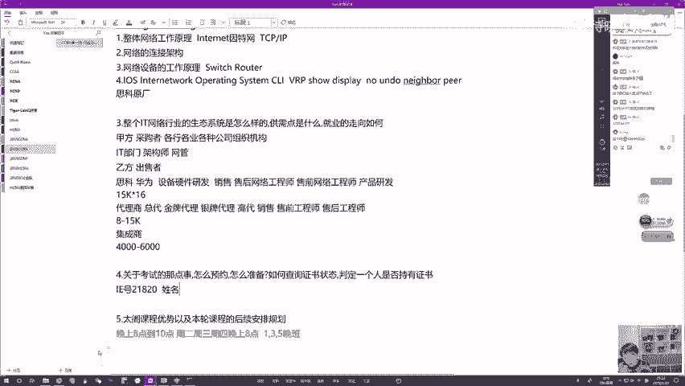

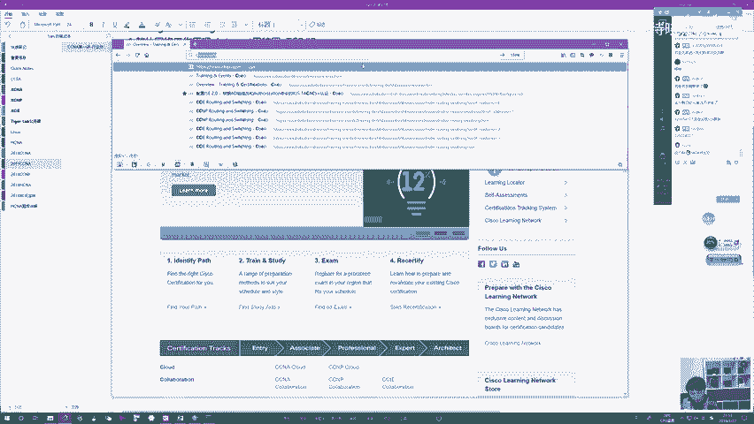

好，进入cisco的官网，这就是思科的官网啊。在这个manu界面。

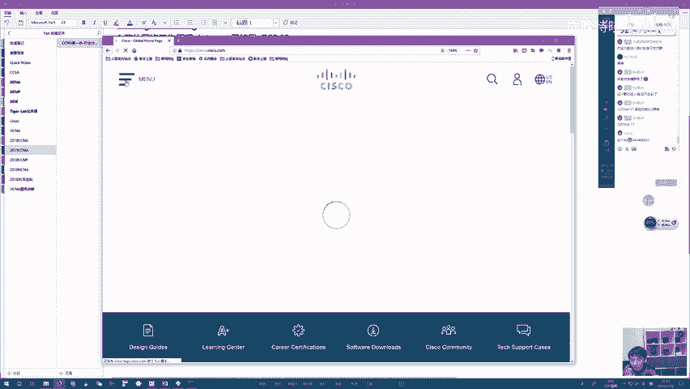

有一个trainingeven，点击这个training event后，然后这里有一个training certification点进去。

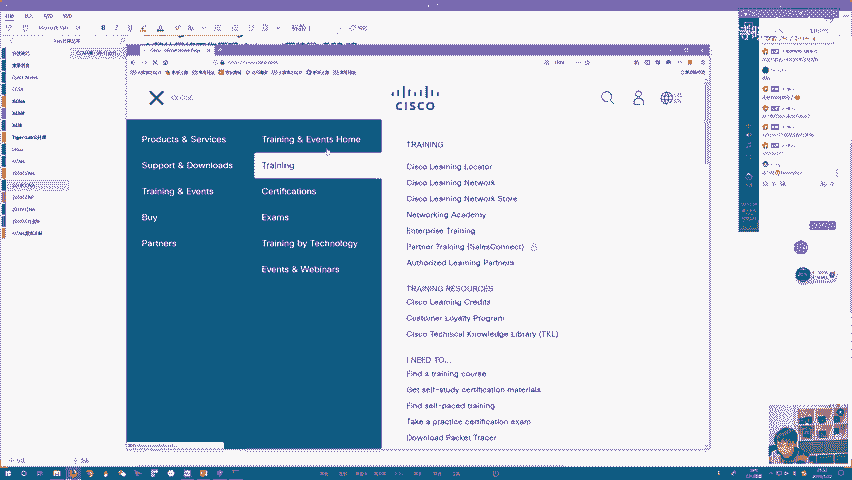

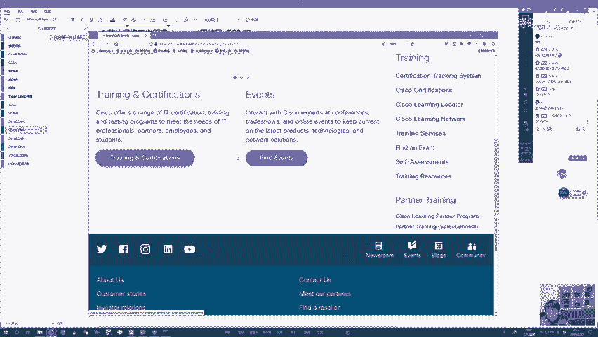

哦，我忘记了，我的火狐还不行啊，我换cameE。

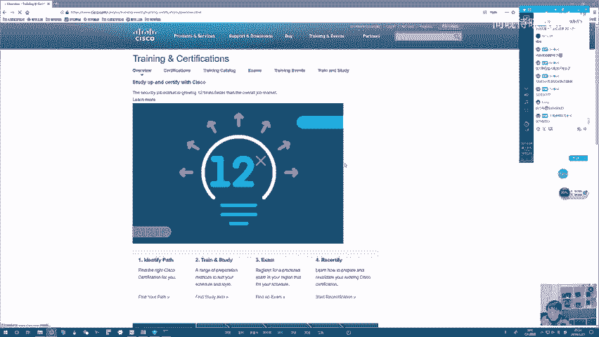

之前吃过这个亏啊。好了，ss考高了啊。😊，然后呢，咱们进入到刚才这个界面啊。好，training certification是吧？然后接下点进来之后呢，点这个路由交换啊，点这个路由交换就好了。

点进来之后拉到最下面看到了吗？第一个界面是用来查成绩的啊。

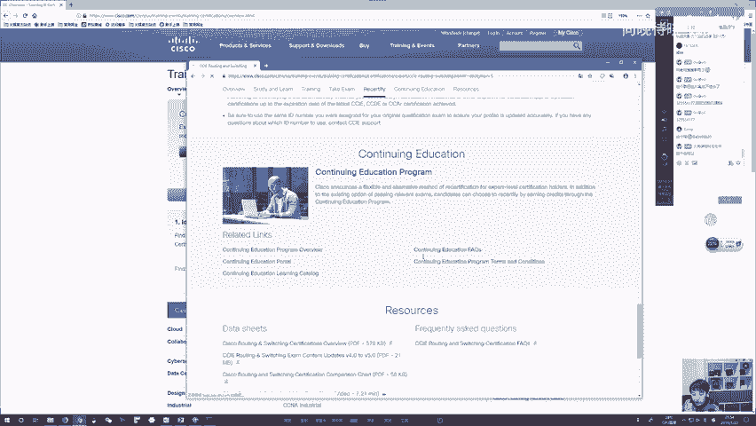

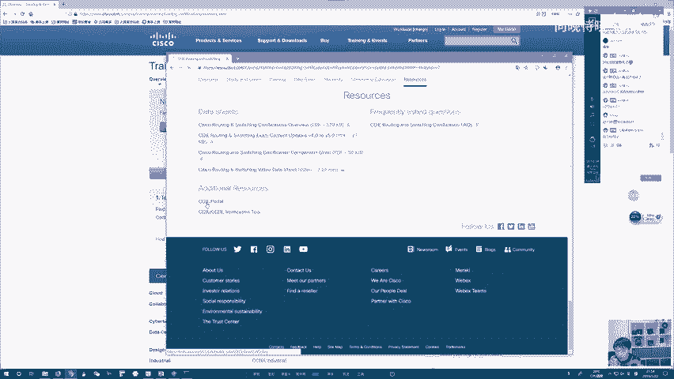

对，比如说我给大家看一下我的成绩啊。就我跟大家说一下，我给你们说的每一句话都是真的啊，你们可以完全的相信我。我给你们说的每一句话，我告诉你们的每一个信息都是可以考证的。

所以说我们这边是非常坦诚的一个机构啊，你们不用去怀疑我们去吹牛啊等等之类的，这样的损人不利己的事情，咱们是不会做的。好吧，我说的每一句话都可以去追踪咱们的真实性。好吧。啊，这边咱们刷新一下啊。嗯。

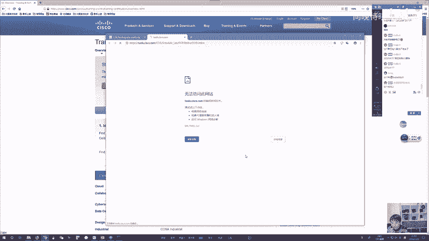

刚夸了一下咱们的谷歌浏览器。好，这边的话就是一个登录界面了啊，登录界面。登录咱们的账号啊，我的账号很简单，就是我的名字啊。然后呢登录一个密码，哎，这个密码应该是它存储好的密码，我就不用再说了。好。

等待登录。那登录之后呢，这边的话你就能看到咱们的这个。

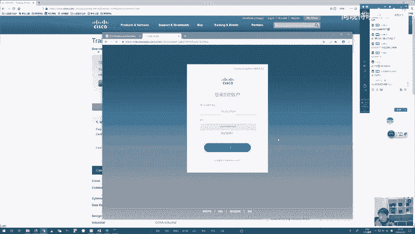

刷分的页面呢，你们如果熟悉我们的话，会发现我们经常会发一些截图啊，就是谁谁谁passIE了，谁谁没有pass看到了吧？左上角是咱们的笔试的成绩图啊。然后接下来右下角就是咱们的实验考试的成绩图。

因为IE考试分为两个部分嘛，对吧？笔试和实验。对吧，那这边大家来看吧，我是08年的8月21号，在香港通过了路由交换战。是吧11年的2月18号，北京通过了安全。13年的9月24号，北京通过了SP。然后呢。

这个是14年的4月14号，在悉尼通过了市卫中心。然后呢，17年的5月26号在北京通过了无线。啊，这个协作你们不用看了啊，出点小意外，不用在意这些细节。好吧，那这个呢已经充分能够证明了。

但是呢你不是说来一个人就能随便进入这个页面啊，因为你要进入这个页面的话，你需要知道他的账号，你不知道他的账号你进不去。如果说你这单纯的是个HR，你招聘一个人，这个人告诉他是IE，然后又告诉你呀。

我的证书丢了等等之类的。那你怎么验证他的真伪呢？很简单，在第二个链节。

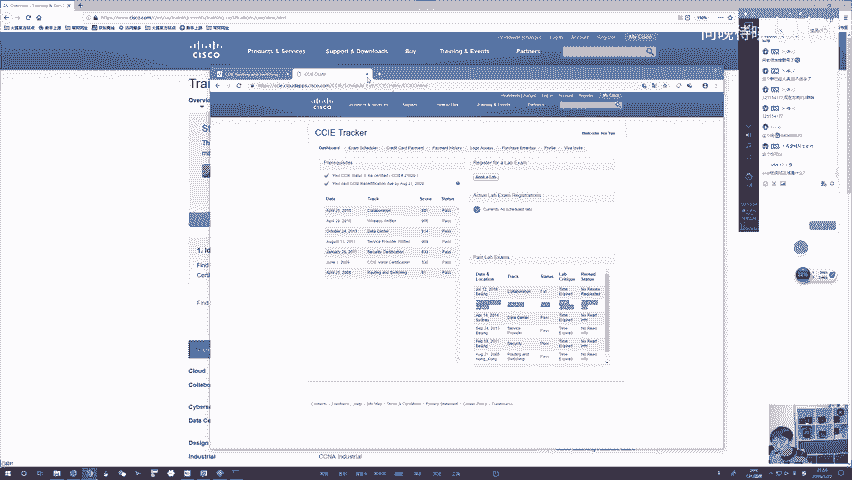

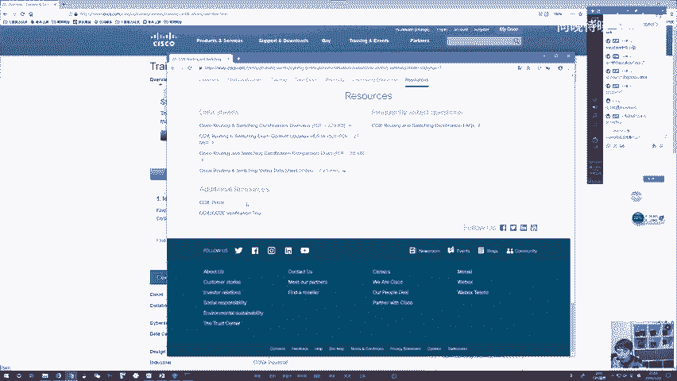

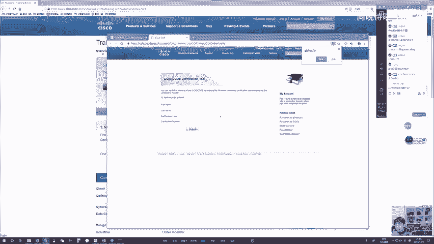

这个链接啊叫CCIECCDE verification to在这个链接你点进去，它就会出现这么一个界面。好吧，在这个界面呢，第一个就是输入它的姓名中的名啊，叫first name，对吧？

last name就是他的姓，好吧，我叫闫辉嘛，对吧？闫是last name嘛，辉是first name，然后接下来认证是CCIE对吧？编号21820。

如果说他告诉你了没有错，哎，你点击submit。就能看到他到底是不是。如果是它是能显示出来的。如果不是的话，大家他会告诉你这个人不是这个证书编号，可以吧？那这边大家来看吧，我是能够显示出来的。能理解吧？

我是能够显示出来。那这就我今天教给大家的第一个技能。好吧。好了，那这是咱们A的第一节课，第一节课呢咱们惯例不讲技术给大家分享一些行业。然后呢，咱们离8点还有3分钟时间啊，那最后呢咱们给大家一段QA吧呃。

给大家问两三个问题。然后你们如果有什么问题的话，可以。问好吧。大家有问题可以问啊。OSPF的测试区域是什么？没有测试区域这个概念，我不知道你是从哪看到的。啊，什么叫测试区？它有骨干区域，有非骨干区域。

有sta区，有naSA区。什么叫测试区？H3C的H2问的。啊哈。那我你要确定一下他到底是不是这么问的。然后你要确定一下你到底是不是这么听的，会不会传达的有问题。没有所谓的测试区域，好吧。

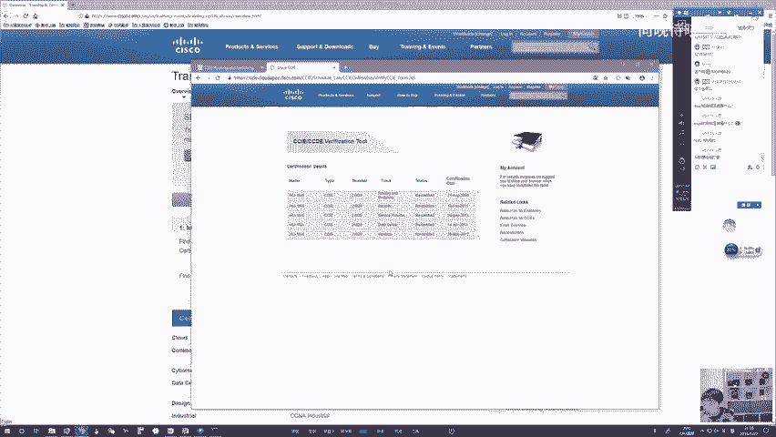

好，大家有什么问题可以问啊。这节课咱们不答疑技术问题。对你是这样说啊。然后他说有哈。你们ID组团报名还有吗？这个得要看咱们年前的活动啊，年前的活动的话，你们可以在群里咨询咱们的课程部分老师。他说有。

那很简单啊，你找到华三的官网，你你下载1个OSPF的文档，你搜一下测试，你来看看有没有这个章节不就好了吗？QOS是个重点技术啊，当然了，很重要，NP中非常非常关键啊。当然我们在NP中不讲。

这是在IE中讲的。因为毕竟在咱们当前Lb考试中，Q已经考到了。然后在华为的HCIE面试中，对吧？QOS也会经常被问到。既然他说有对吧？你就不用跟他去告，你不用去跟他叫，这已经说了，把文档找出来。

我看一下，好吧。这门课程思科华为联合联合起来讲吗？你们想吗？你们想的话，我可以去这么做。如果你们不想的话，我是比较想这轮课程讲思科的啊。你们如果想让我讲华为的配置，我可以给你们顺带讲一下，这是无所谓的。

好吧。不用是吧？OK反而这个你们哎你们自己决定吧。对，有的人会说太乱了，所以说思科就是思科，华为就是华为OK那咱们就讲思科好。对啊，是一样的，没有什么区别。请问这期的录屏可以下载吗？可以呀。

录屏下载可以找咱们的课程顾问老师，没有问题。没有任何问题，好吧，对，理论是通的啊，就是命令行有点区别而已。好，那就来个纯纯的cisco，满足大家的需求，好吧。对，就是命令行不一样就是命令行不一样。好了。

最后呢提前祝大家新年快乐，给大家拜个早年。😊，然后呢，希望大家能够喜欢咱们的课程。也期待在咱们的NP行E的群里面能看到大家。好吧，希望大家能够成为咱们的VIP学员。VIP学员呢有很多的福利。

包括一对一的答疑。那这些呢咱们的对吧？非VIP学员，咱们只能在课堂上给拉大一，好吧，好，已经试了，那就欢迎欢迎欢迎欢迎。好，那今天咱们到此为止啊，大家拜拜。😊，诶。

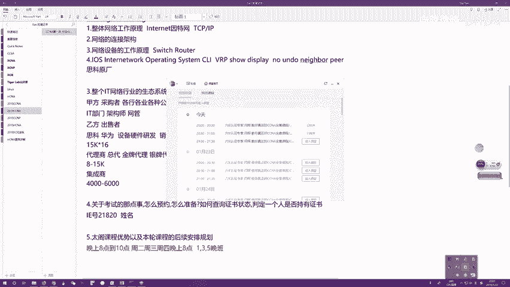