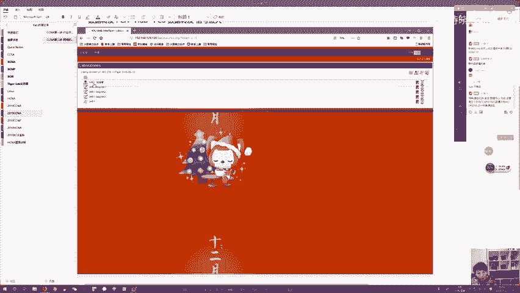
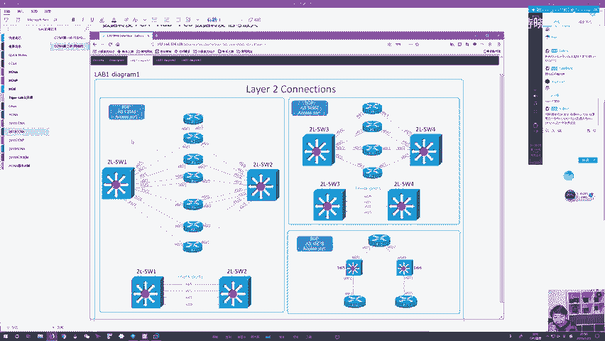
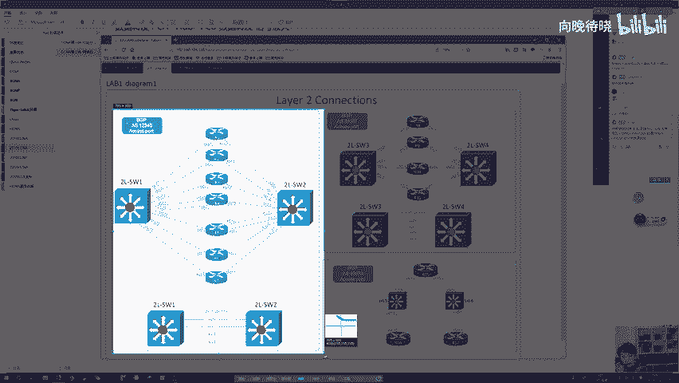
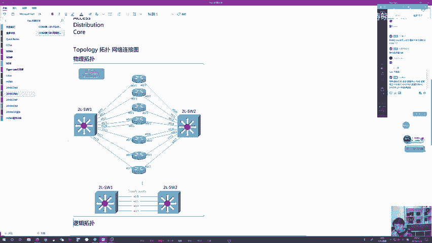
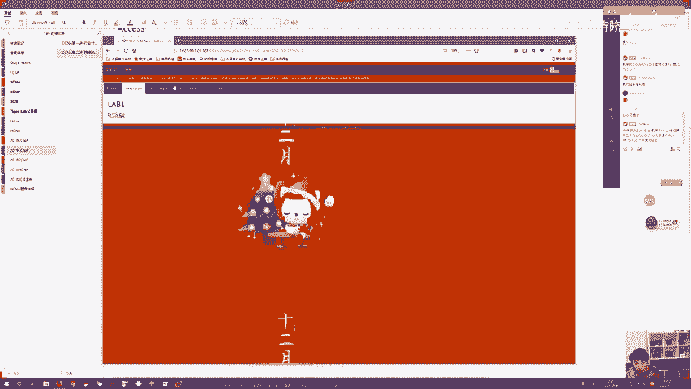
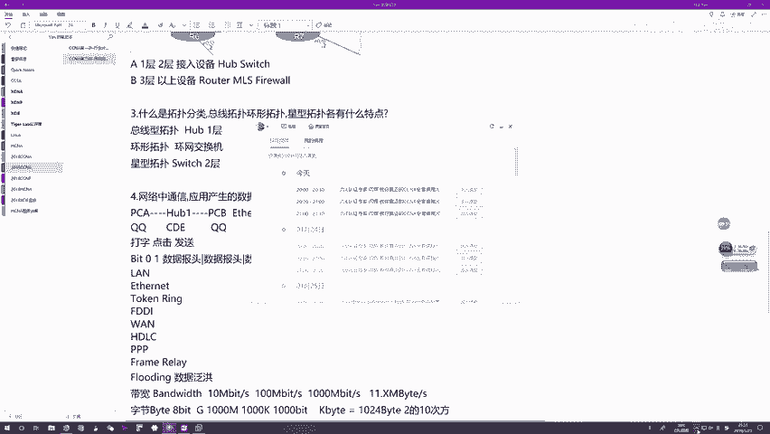

# 1000元自购分享CCNA教程合集！超全合集详细版，网络工程师入门必看合集【送NA题库】 - P2：CCNA02 - 向向向晚o - BV1cL4y1q7Dy

好，欢迎大家来参加咱们的NA公开课啊。那个19年的第一轮新的一轮啊，第二节课啊，上一节课昨天啊给大家介绍一下行业的这么一些概念，对吧？了解一下咱们的行业生态，了解下咱们的学习内容，还有就业。

还有考试认证。😊，啊，关于昨天呢有一个点，其实我忘记给大家演示了，就跟大家说一下如何来辨别一个证书的真伪，对吧？cisco咱们说了，在cisco的官网可以查询呃，华为证书的话，其实查询方法更简单啊。

就是如果你要考过了HCIE的话，它会有个群，有一个华为的官方的群，就是你可以通过进这个群，对吧？来确定一下，就是。😊，对吧它的真伪证书的真伪。那这个群里给大家演示一下给大家演示一下。好吧，我昨天忘记了。

本来想跟大看的。🤧好吧。啊，这个群是华为官方的啊这个群是华为官方的。就是只要你通过HCIE的话，你会那个收到这么一个邮件啊，我会告诉你对吧？邀请你进邀请你进群。然后当前这个群肯定不止一个了。

他应该有好几个，反正就是你如果能如果能进这个群的话，那基本就是。对吧基本就代表你是1个HCIE好吧，这里面所有的人就是实名制的啊，对吧？名称，前面加上他的IE编号，好吧。

那这个就是辨别HCIE真伪这名方式啊，昨天忘记跟大家说了，好吧，忘记跟大家说了。OK好，那今天呢咱们正儿八经的讲我们技术了。从第二节合开始，我们就是惯例啊，开始讲技术。那讲技术的话。

今天咱们主题是什么呢？因为我们说了，这是一个网络工程师相关的课程，对吧？那既然是网络工程师，你肯定是跟网络打交道的对吧？那网络是什么，大家肯定要知道对吧？网络做什么用呢？你们要明白对吧？网络怎么组建呢。

咱们要了解，那今天呢就是带大家从0到1，哎，我们入个门。主要的目标让大家了解到底什么是网络，对吧？网络怎么组建的，然后呢，还有网络里面的一些通信规则以及网络设备的这么一个定位。好吧，好了。

那接下来言归正传啊，咱们从第一个点讲起。要研究网络，肯定要了解一下到底什么是网络，对吧？那到底什么是网络呢？我觉得很多书啊，都文档甚至什么百度知道啊，说说啊，对吧？里面都会有对网络一个定义啊。

这个网络呢比要官方的定义就是它是一组对吧？设备组成的这么一个混合产物，对吧？那这个混合产物呢主要用来做载体啊，主要用来做载体，那这个载体承载的是什么呢？载体承载的数据流量。

我们的数据流量通过网络这个载体啊，能够从一个主机到达另一个主机，然后呢，咱们可以通过在主机之间传输这些数据流量来最终实现资源共享，那这就是网络的定位，可以吧？你可以理解为它就是一个媒介。

网络就是一个媒介，你可以理解为它是做云，可以吧？它是一个媒介，这个媒介里面包含了各种各样的设备，对吧？它。有各种各样的设备连接而成的那你连接成了它的目的是什么呢？

是为了方便咱们数据流量能够通过这个媒介来传输。那传输的目的是什么呢？就是让咱们一个主机产生的数据能够被另一个主机啊接收到，只要他们都连接到网络中去啊，那他们就能够彼此的交互数据。

那交互数据的目的是什么呢？就是让他们之间啊能够在某种程度上实现资源共享，对吧？比如说我知道的信息哎，你也能知道，你知道的信息呢我也能知道，那这个就是资源共享，可以吧？那所以说什么叫网络啊。

哎简单理解为哎，它就是一个对吧？用来承载数据流量的这么一个媒介，可以吧？它就是一个媒介。那当然这个媒介呢它是由三样东西组成的啊，虽然网络很大，对吧？咱们都说了，现在说到网络是什么，那基本就是英特网啊。

对吧？全球最大的互联网，这个互联网多大，覆盖了整个七大洲五大洋，你基本任何的主机，只要你连接着网，你连着其实都是英特网对吧？那这个英特网太庞大，太复杂了，里面分门别类设备有很多很多对吧？

但是呢大体来看组成这个英特网的所有设备大体分为三大类。那哪三大类呢？哎分别是终端系统。中间系统。还有介质，好吧，这就是组成网络的三要素，可以吧？网络基本就是由他们三的互联而成的可以吧？

那这个网络呢连成之后是用来做一个承载数据流量的这么一个媒介，方便你数据流量，对吧？从某一端产生到达另外一端。那这个时候呢，咱要只要咱们这些计算机啊都连接到这个媒介，你们就可以基于这个媒介啊来彼此通信。

彼此通信，最终的目的是什么呢？那就是资源共享，可以吧？好，那当然我说了半天啊，主机连接网络产生数据，这些数据流量通过咱们这个网络传输，传输到另外一个主机。那到底什么叫主机呀？对吧主机为什么会产生数据啊？

啊我们来捋一捋啊，什么叫主机呢？这个主机一般就是咱们用户啊直接使用的，像咱们的个人电脑，对吧？我们的PC台式机也好，对吧？笔记本也好，他们都算。那在我们的移动互联网时代呢，像咱们的手机对吧？

你的IOSiphone嘛，对吧？你的安卓的手机对吧？这也算是我们的对吧？终端设备啊，也算是咱们的对吧？设备，那这些机器咱们这些设备对吧？你连接入网，哎，你就可以通过网络呢来产生数据。

但是咱们想一想你这些设备它真的能够产生数据嘛？它不能啊，你一台电脑，你台计算机它就是一堆硬件组成的，你这堆硬件组成的设备，你需要产生数据吗？对吧？你也不需要你能产生数据吗？你虽然能但你不需要啊。

你为什么要产生呢，对吧？那家样我们要思考了，我们一般正常的用户啊，你使用咱们计算机，你使用咱们手机你用它的什么功能啊，你不会说是买一些组件，对吧？买回家把它们搭在一起搭好就直接用了吧，那不可能嘛。

对不对？你这些设备直接用，你用它什么呢？对吧？你图个什么呢？那咱们一般呢是要用里面一些功能。那这些功能都是由各式各样的应用程序来提供的。这些应用程序呢，咱们现在一般都称为叫什么APP嘛，对吧？

全称叫application，然后呢，翻译成中文叫应用。那这些应用呢，它一般都是承载在操作系统平台之上的。所以说呢你购买一台计算机，对吧？你购买一些手机，OK这样的设备，你在买回来之后对吧？

给他们组建好，但是手机不用组建了，直接就是好的，对吧？你需要给这些设备安装一个系统，你就算不会装，那这个商家在卖给你这些设备的时候，对吧？有给你提前装好，那提前装好系统之后呢，怎么样。

你要在这些操作系统之上去安装各式各样，对吧？咱们日常需要使用的这些应用程序。那直些应用的比如哪些啊？咱们日常聊的QQ，对吧？我们日常聊的微信，对吧？各种各样的浏览器，对吧？各种各样的音乐播放器，对吧？

各种各样的视频播放器，对吧？一些直播平台软件对吧？那这些呢咱们都需要去安装。那当你装好之后呢，你使用计算机用的是什么呢？你用的不是计算机本身。你是通过计算机的输入输出的这么一些部件啊。

来通过使用这些应用来完成我们的一些正常的网络的访问。可以吧，我们是通过应用啊来获取一些信息，我们是通过应用来完成一些操作，我们是通过应用对吧？来获取一些资讯来获得什么娱乐啊、学习啊等等之类。

这么一些便利，可以吧？那这些都是拜应用所词。所以说用户呢其实不关心咱们计算机本身啊，我们更加关心的是这些应用，而正因为这些应用五花八门，对吧？有些应用呢你可以单击去使用啊，而有些应用它是需要交互的。

所谓的交互就是对吧？你有很多计算机，我们都装了同类应用。这些应用之间呢，他们是能够感知到彼此并且可以通过彼此之间的沟通，对吧？来实现这么一个对吧？应用的啊，算是功能的那所以说呢正是因为这些应用啊。

他们需要沟通，他们需要对吧？彼此的去传输一些信息啊等等之类的。所以这个时候呢，咱们才有网络网络给谁服务呢？它不。给计算机啊，网络是给咱们这些应用提供服务的，需要上网的也不是计算机，需要上网的。

其实说白了也是咱们这些应用，对吧？因为应用需要跨越网络来共享数据共享资源，对吧？那所以说咱们为了满足应用的这些条件啊，我们这个网络呢就孕育而生，对吧？那所以说呢网络呢它其实就是一个媒介啊。

它是为应用程序提供服务的。而由于应用程序呢，一般安装在咱们的对吧？计算机之上呢，安装在咱们手机之上的，所以你可以理解为咱们网络变相是为我们的计算机为我们的手机提供服务，而这个计算机手机使用者是谁呢？

一般就是咱们的网络用户嘛，对吧？其实最终的网络还是为咱们人提供服务的，对吧？因为应用也是需要咱们人来操作，来使用里面一些功能的，对吧？并且应用之间的数据交互，对吧？也是通过咱们人类的操作啊而产生的。

对吧你如果说不去操作这个应用，你会发布数据吗？你不会啊，当你操作这个应用之后，它会根据你的操作产生相应的数据发送给别人，他也会根据你的操作来通过其他的应用啊来接收数据，可以吧？

那所以说了网络其实最终服务的，还是咱们的用户本身，好吧，那接下来这些PC啊，这些手机啊等等之类的，直接被咱们用户使用的这些设备，我们就称为叫终端系统，可以吧？那当然终端系统呢顾名思义啊，对吧？

网络的最末端啊，你作为这么一个最末端的这么一个设备，对吧？你这个设备身后呢，咱们不可能连接其他的设备啊，那一般这个设备就是咱们的网络最边界，那一般谁使用这样的设备呢？就是咱们的人，咱们的用户。

用户使用这些终端系统利用咱们网络的便利性来收发数据，那收发数据最终的目的是什么呢？就是通过收发数据啊。来最终实现资源共享，来更多的利用咱们应用的一些功能去完成咱们的一些对吧？目的。

OK那接下来这个终端系统想要跟其他终端系统通信。你需要连线，对吧？你如果不连线，你这个数据从哪发呀？你是没法发，对吧？你一般在家里面办一个电信宽带，你要连网是不是要连根线啊，对吧？你在办公室里。

你这个办公的主机要连网，是不是要连根线啊，你在图书馆里要连网，是不是要连线啊，对吧？那当然虽然现在来看啊，我们有很多无线的这么一个网络，对吧？你手机连个wifi你也能上网，对吧？你的平板电脑。

比如ipad，连一个wifi你也能上网，对吧？甚至我们日常在家里，你虽然有网线连接啊，但是咱们终端真正连网还是通过无线，因为比较方便嘛？但是在早期。对吧无线没有那么普及的时候，你一般收到联网。

那咱们条件反射想到的是什么呢？就是你要连线可以吧？那当然这个有线和无线呢，其实你可以统称为叫介质，可以吧？这个介质它可以是有线形式的，可以是无线形式的，不管怎么样，你需要这么一个东西存在，有这个东西了。

你才能通过它来把你想发送的数据给发走，对吧？通过它你才能够去接收你想接收的数据，可以吧？你不能说咱们既不连有线又不连无线，你能凭空的说对吧？我这么一台计算机啊，我什么都不需要，我就靠这个计算机就能联网。

可能吗？不可能啊，可以吧？那所以说呢这个介质呢在网络中也是必不可少的，对以吧？那当然介质的发展呢，曾经咱们肯定是清一色的端到端全使用有线，那现在呢咱们是有线无线并存对吧？在我们的网络的中心啊。

依旧还是有。连接。然后呢，我们的终端啊，那由于现在的移动互联网时代了，你终端其实PC的数量已经比手机数量少了，对吧？那这个手机为王的时代，你为了方便这样的设备连接入网，那无线呢已经慢慢普及了。

但你们千万不要天真的认为咱们端到端的网络全都是无线啊，不可能啊，因为你全都是无线会遇到很多问题，比如说你的速度会比较慢，你的稳定性会比较差，你的连接的距离可能会比较短，对吧？它有很多很多问题啊。

那所以说呢为了保证咱们网络的质量，为了保证咱们网络的高效率，并且又不牺牲咱们的灵活性。那这时候咱们如今的网络架构啊基本是有限。加无线。对吧这个无线的只是在网络最末端啊，方便咱们的终端去接入。

而这个有线的对吧？作为咱们的核心，作为咱们的中心的这么一个组件啊，负责把我们的核心网络连在一起，可以吧？那通过有线的，你可以享受咱们的高传输速率，对吧？稳定的传输质量以及非常长的传输距离。

而这个无线呢作为最后一跳啊，作为最后这这么1个100米的接接入方案，你通过无线，你可以方便各式各样的设备，对吧？灵活的连接入网，你笔记本也好，对吧？你手机也好，你平板电脑也好，对吧？

不管你有没有有线的这么一个连接口，你都可以通过无线来连接入，O那就是咱们当前这么一个架构，那这些东西呢，咱们就统称为叫介质，对吧？那在网络中呢这个是必不可少的那接下来除了这两个以外，哎。

那剩下的中间系统是什么呢？就是咱们上节课所说的各式各样的。网络设备对吧？那这些网络设备在我们的路由交换特征中，我们要研究哪些呢？我们要主要研究三款啊。第一个叫极限器。第二个叫交换机。然后呢。

第三个叫路由器，这个是咱们主要要研究的这么一个对象，好吧？那这就是组成网络的三元素，可以吧？最重要的自然是咱们终端啊，因为终端是咱们的网络的主人公啊，你如果没有终端网络根本没有存在价值。

因为整个网络都是为终端提供服务的啊，介质也必不可少，因为你网络作为一个媒介，你要承载咱们数据流量，你数据流量发送，你只要通过一个介质来发，对吧？你得要通过要么有限，要么无线来发送。所以说呢你必须要有。

对吧？相应的介质来承载咱们的数据，不然的话你没法发呀，对吧？你没法发，然后紧接着就是咱们的中间系统，对吧？各式各样的网络设备，那这些网络设备呢。一般在我们的网络中间，对吧？通常的在一个企业里面。

我们这些网络设备呢都是放在机房里，可以把你放在机房的机柜中。那这个机房的机柜里面有这么多的设备，这些设备存在目的是什么？帮我们连线嘛，对吧？帮我们连线，帮我们做一个数据传输，对吧？

那由于他呢一般在我们的机房里，而这个机房呢，咱们一般仍人不去的。所以说呢很多用户他是看不到这类设备，对吧？他根本就不知道他们存在，但是他们其实真正的存在，对吧？他们是真的存在，没有他们。

咱们的网络不可能扩展到今天这么大对以吧？对于咱们网络的扩展，这些设备功不可没，可以吧？功不可没，但是呢由于他一般在网络中间对吧？你摸不到，所以说对于这些咱们是相对比较陌生的，对吧？相对比较陌生，哎。

什么是极限器啊？对吧什么是交换机，什么是路由器，长什么样，对吧？有什么功能，我们该怎么去用它，对吧？那大家呢都一概不知道，可以吧？那接下来关于这个网络的三元素，哪跟大家说一下。

B选项啊是终端系统还有介质，而咱们这些网络设备其实是可选项，那换一句话说，在咱们最早期的网络时代啊，这些网络设备它是可有可无的。虽然直到今天它依旧是可有可无的。但是有了它和没有它。

咱们的网络呢还有挺大的差距的啊。可以吧？那正是因为有这些设备，咱们的网络能更好。所以说咱们当前在组网的时候都使用它，但是在最早期的时候，对吧？最早期的时候，咱们最早期最早期的网络啊。

这个网络咱们称了一叫工作组。像这样的最初级的网络，其实是没有网络设备介入的。好吧，那这个工工作组呢，大家如果熟悉的话，应该知道这是一个微软的概念啊，这个概念对吧？已经出来很多年了，对吧？

windows95windows98这些比较早的系统里面啊，都有这个工作组这么一个概念。那这个工作组是什么呢？它就是微软定义的这么一个算是最最最雏形版本的局域网标准，那在这个局域网标准中呢。

组网条件非常简单啊，你搞几台计算机，对吧？你装上windows95或者98的系统。然后紧接着呢很简单，你拿线对吧？你拿这个介质把我们这些计算机呢连接在一起，哎，这就OK了，对以吧？你通过线缆。

把我们这些计算机两两连在一块，哎，你们就可以通过线缆的连接啊，利用咱们操作系统的功能，就可以直接的彼此的通信了。那这个就是工作组，那工作组算不算网络呢？也也算网络。你两台计算机连根线嘛。

你连根线的目的是什么？彼此传输数据，那最终实现的是不是还是资源共享啊，对吧？那所以说这满足咱们网络定义嘛，那所以说你也是个网络。😡，那这个网络跟咱们当前的网络最大区别是什么呢？就是这种工作组啊。

它是不可扩展的对吧？那为什么不可扩展呢？因为大家想啊对吧？你两台计算机连根线组成一个工作组。你这个线总要插在一个地方吧。我们计算机连接网线，不是说你想连就连的，你需要有这么一个组件。

这个组件我们称为叫NIC对吧？NIC全称叫network interfaceface卡，这个叫网络接口卡，对吧？叫网络接口卡，叫网络接口卡。那这个网络接口卡是个什么东西呢？对吧？那就是网卡嘛？

简称就是网卡，对吧？一块小板子一般都是连在的主板之上的，然后上面呢会有一个网络接口，对吧？这个接口呢，咱们通过连根线，对吧？把我们这个设备连接到咱们的网络。那一般的1个NIC咱们的网口只有一个啊。

你只能连几根线呢，只能连连一根线，可吧？那由于咱们一般一台计算机，你有网口的这种NIC啊，也不会很多，一般只有一块嘛，对吧？一般只有一块，所以说你可以简单理解为咱们一台台式机也好，一台笔记本也好。

你能够连接网线的接口就这么一个，那你也只能连一根线啊，你能连几台计算机呢，你充其量只能连一台。那所以现在如果说咱们有三台计算机可以吧？主机A主机B主机C，我现在希望通过对吧？工作组的方式啊。

把你们三台计算机连在一起，让你们之间能够连到通信。那当然。最稳妥的连接方式就是什么全互联嘛，对吧？我连你你连他他连我对吧？咱们两两互联，那这个两两互联，你会发现咱们每台计算机对吧？要连两根线。

你要连两根线，你是不是就需要2块网卡，对吧？那你要没没法装，你是不是就连不起来，对吧？并且当你这工作组里面主机数量越来越多的时候，比如你有4台主机。你有5台主机，你有6台主机，你有7台主机。

当你主机数量越来越多的时候，你每添加一台主机。😡，对吧你工作组里面平均每台主机都需要额外的1个NIC来提供这个额外的网络连接嘛，对吧？那由于咱们这个NIC呢是要插在主板上的啊，而你主板对吧？

在被设计的时候，你的插槽数量本身就有限的，并且它不可扩展，这就是说你每台计算机你能够使用的网卡数量啊，是非常有限的，你能连的线的数量非常有限，那既然这非常有限，对吧？

你能期待一个工作组里面包含很多主机吗？对吧？你不可能期待，那这是第一点，第二点，主机跟主机之间的通信，你要连线，对吧？线力一般里面的材质是什么呢？通常啊它材质都是电缆。对吧它的材质都是电。

里面都是铜芯啊，里面都是铜芯，它的材质是铜，铜的特点是什么啊？导电啊，咱们就是通过传输电流来实现咱们数据的传输的因为计算机嘛，对吧？它毕竟只能够识别零和一啊，任何计算机只能识别零和一。

这个咱们称为叫比特啊，比特就是二进制的一个位，什么叫二进制啊，二进制的一个位，就是它要么为零，要么为一，可以吧？要么为零，要么为一，这个咱们就称为叫比特，可吧？请注意啊，任何计算机都一样。

你甭管你计算机是台式机还是笔记本，你甭管你是手机，对吧？IOS的还是安卓的，你在产生任何数据的时候，对吧？不管你是数据啊，多复杂多抽象，你最终都只能以零和一的形式啊，来表示它们对吧？

就比如说咱们当前看到的画面，你们当前。听到的声音对吧？你们平常看的视频，你们看的文件虽然看起来啊对吧？多姿多彩，各种形式。但是呢最终对于计算机而言，计算机都是通过零和一啊来表示它们，对吧？

我通过复杂的零和一的组合，能够表示我想表示的任何东西，那当然我在传输这些东西的时候，我自而然也只会以零和一的这么一个形式啊来给你传递。那这个零和一在我们电缆里面怎么传啊，就是通过电流嘛，对吧？

你通过一些波形编码，咱们通过高低电频的形式啊来进行零和一的传递，比如说你高电频代表一啊，你低电频代表零啊，通过这种方式，你只要发走了，对方收到高电频就知道啊，这是个一收到低电频二，这是个零，对吧？

我就能知道你给我发的是零还是一，然后接下来我收到你给我发的零和一之后，把它们组合在一起，就能够知道你给我发的到底是什么东西，好吧，网络其实基本就是这么传输，对吧？就是这么传输，那接下来在这个传输过程中。

请注意。电在铜中传对吧？它会经历衰减啊，对吧？这个词叫衰减。什么叫衰减啊？就是你越传啊，这个信号会越弱，你越传对吧？你的高低电频会越模糊，那这个模糊会导致什么呢？会导致对方接收你这个信号的时候。

它会难以识别你传的是什么。所以为了避免对方收到你的数据之后，根本不知道你发到底零还是一，对吧？你这个线缆长度啊不能太长，因为你线缆长度越长，你传输的距离越远，你这个衰减呢就越厉害。你衰减越厉害。

我们传输的数据信号就会越模糊，那越模糊，就会导致接收方接收数据的时候越难以判断，对吧？你发送者发到底是什么。原给目的地发送数据，目的是什么呢？希望你能读懂吗？希望能看明白，希望你能知道我给你发的是什么。

对吧？如果说我给你发了一些数据，你连我发的是什么都不知道，那这个传授价值吗？这个真的叫资源共享吗？对吧？那咱们就不好说了，这个其实就不能叫资源共享了，能理解吧？那所以说了这个衰减，咱们一定要考虑进去。

那为了避免衰减给我们的信号造成过大的影响啊，以至于咱们接收者收到数据，没有办法识别你发的到底是什么，那因此呢对吧？线缆它都会有一个最大程度规格，比如说咱们当前呢对吧？用的比较多的以太网的线啊。

就双绞线嘛，对吧？双绞线就是俗称的网线，这我相信大家都见过啊，对吧？双网线里面有四段嘛，八根星，其实这八根星的都是铜啊，都是铜，你在发送数据的时候呢，百兆以太网线一3对吧？线星啊来发送。

数据26线芯来接收数据，对以吧？你在发送接收的时候，其实发和收的都是什么？都是这些脉冲信号嘛，对吧？都是这些电流，那这些电流你在发的时候呢，为了避免这个衰竭，对吧？让我们这个信号啊过度的对吧？模糊。

然后以至接收者识别不了。那双绞线呢，它规定了一个最大传输距离啊，这个最大传输距离就是100米。那当然除了双绞线以外呢，咱们还有很多其他类型的线缆啊，不同类型的线来，你传输机制不一样，你的这个最大程度啊。

咱们的规定也不一样。但是不管怎么样，你这种铜线啊，最大长度就长不了。一般我见过的最长传输铜线，你的最长传输距离也就只有500米。你如果超过500米，对吧？那不好意思，你这个线不管你再好，对吧？

你传入数据，咱们都有失败的可能。那这个失败会导致什么呢？会导致原给目的地发送的数据啊，对吧？你目的地频繁的不能接收，频繁的不能识别，那你这个传输啊质量就会特别差，对吧？那为了避免咱们网络质量变得这么差。

对吧？你线缆长度呢就要在咱们的规定范围内，那这意味着什么呢？这意味着工作组内的计算机啊，你们之间的最大传输距离，对吧？咱们还要加以限制，那这就是双方面限制啊，第一个就是工作组里面咱们主机数量不能太多。

第二个就是主机跟主机之间，咱们离得不能太远，对吧？这个对于咱们网络而言其实都是致命声啊，我们的网络的需求是什么？你一个网络越大越好嘛，对吧？里面包含的主机越多越好，然后网络呢跨越的范围也是越广越好。

对吧？你恨不得都跨越国家跨越周跨越大洋，咱们把整个地球连在一起。那这才才是网络的什么最终的这么一个状态。并且网络当前确实已经实现了这个状态啊。我们这个英特网对吧？作为全球最大的互联网啊。

它就是包含了基本全球所有主机，对吧？并且连接的范围就是整个地球，那大家想想，如果说你这个英特宝按照咱们工作组的组网方式啊，对吧？来直接把计算机间连根线让他们通信，那这个英特网能有这么大体量吗？

这个英特网能有这么大的覆盖范围吗？对吧？你想都不用想啊，之所以咱们当前这个英特网这么大，那归根结底原因是什么呢？就是因为咱们在组网的时候，对吧？加入了这些中间系统加入了这些网络设备，对吧？

那网络设备的定位是什么呢？就是对于网络而言啊，你这些设备不是必须的对吧？对于整体网络而言，其实你是可有可无的但是有了你之后，咱们这个网络可以更具扩展性，对吧？有了你之后。

咱们网络里面包含的成员数量可以更多，我们的网络覆盖的范围可以更广，对吧？可以让更多的节点参与到咱们网络中去，那这就是网络设备的定位。那接下来他们所干的事儿也跟大家讲解一下。

网络设备在网络中主要只干两件事，第一件事儿就是帮助我们进行连接，对吧？曾经呢咱们工作组的概念是什么样的？你两台终端对吧？你两台电脑吗？彼此之接连根线网络组成了。那现在有了网络设备之后还这么连嘛，不是啦。

咱们的连接怎么连呢？是所有的咱们的计算机，对吧？咱们这些终端啊，哎，你连线连到咱们的网络设备，网络设备通常接口都很多，比如以我们的极限器为例啊，极限器我见过的最差的，也有8个接口，对吧？

通常有12个接口，16个接口，甚至24个。接口，那你想想这么一台设备，你有24个接口，你你能连24根线，对吧？你这24根线就能把24台计算机连在一起，对吧？那当然交换机的接口就更多了啊。

而路由器呢接口稍微少一点，然后呢，咱们也平常不用它来连接我们计算机，路由器呢一般在网络的更核心的部位啊，咱们拿路由器来做网络分割的那这个呢咱们后续慢慢再说好吧，那这个时候就是大家注意啊，一般正常情况下。

咱们的网络设备。对吧对于交换机和集线器啊，这类咱们称为叫接入设备。对于这些接入设备，他们的定位就是我专门用它来连接我们的计算机入网，对以吧？极限机和交换机就是用来连接咱们的PC入网的。

那所以说呢既然是用来连接PC入网呢，而在我们的整体网络中呢，PC数量众多呢，所以你们这样的设备对吧？接口的规格也要稍微高一些，对吧？你们的端口密度要稍微大一些，你这样的设备包含的接口越多。

你们能够连接的设备就越多，你们能连的设备越多，对吧？那你们就能够更加的帮助咱们网络扩展嘛，对吧？那大家连就这么连对吧？这是他们的第一个定位啊，然后接下来第二个定位是什么呢？第二个定位就是数据转发，对吧？

数据转发，他们做第二件事。好，你两台计算机彼此连在一起，你们要通信，对吧？那主机A要发送数据给主机B，你们都直接连在一块了，对吧？你们连在一块，我就给你发呗，对吧？我通过这根线把数据发出来。

那就是你收嘛，对吧？你要给我发送数据，你把数据发出来，那就是我收嘛，对吧？咱们直接彼此连根线那通信太简单了，但是现在的情况不一样了，咱们有了网络设备之后，比如你中间哎，我们连一台极线器。

那你连了极限期之后，你PC要把数据发给对方，你能直接发吗？不能，你得把数据先发给咱们的网络设备，而你真的是需要网络设备来接收数据吗？不是啊，你只是希望网络设备作为一个中转站。他收到你发送的数据之后呢。

能够帮你进一步的发送，把数据发送给最终的需要接收流量的这么一个目的界点。那这个行为我们称为什么呢？这个行为我们就称为叫数据转发。什么叫数据转发？就是对于咱们网络设备而言，我呢可以不产生数据。

我是在网络中间，对吧？我连着你们一票计算机，你们这些计算机呢要彼此通信，那某台计算机呢就会产生数据，对吧？发送过来给我，但是我知道你这数据不是发给我的，是发给其他人呢，我只是在中间。

所以当我收到你们发送的数据之后呢，我会根据我的一系列的办法，来判断这个数据发给哪个目的地的。然后接下来我要确定一下这个目的节点连在我哪个接口，或者说他如果没有连接我的话，我得要确定一下他在网络什么位置。

然后紧接着根据去往这个目的地的这么一个路径信息啊，我来给你做一个数据的发送，那最终呢对吧？结果就是原产生的数据接收方主机，就算没有直接连接源，他也能收得到，对吧？那这就是。

数据转发我们称为叫forwarding，可以吧？那接下来呢由于这个数据转发啊，所有网络设备在转发数据的时候呢，都有这么一个功能。这个功能呢我们称为叫信号放大，对吧？信号放大是什么意思呢？

就是我收到数据啊，不管这个数据多模糊，只要我网络设备能够识别哪个是零哪至一，这就O了。我识别完毕之后，我再把数据转发走之前啊，我会重新把这些数据还原成最原始的状态。按照最强的信号的形式。

把它通过其他的接口发送走。那所以说这个时候呢，假设你主机A连了根百米的线到达极限器。这个极限器呢连了根百米的线到达主机B。那这个时候A和B之间，你的直线传输距离，其实是200米。

那A发的数据B收到之后能不能识别？请注意啊，答案是可以识别。可以识别，为什么？因为你发送的数据虽然经过了百米传输啊，到达极限器的时候，已经模糊不堪了。但极限器接收到数据，在帮你把数据转发给B之前。

它会给你做一个信号放大，把数据还原成最原始的状态，然后给B呢发送走。那接下来这个最原始的数据经过100米的传输到达B虽然已经怎么样模糊不堪了嘛，但是你B收到之后，对吧？由于咱们没有衰减过度嘛。

你依旧是能够识别里的内容。可以吧？这就是为什么有了网络设备之后啊，你这个网络可以越来越大，就是这么一个原因。好吧，好了，那所有网络设备呢转发数据都具备这么一个功能啊，那基于这个功能，对吧？这就注定了。

当你有网络设备存在之后啊，你这个整体网络的规模就可以越来越大，好吧，那这就是网络的基础概念。好吧，那接下来了解到了网络基础概念之后呢，接下来我们来研究一下哎，网络。里面的一些组件啦，对吧？

首先咱们要知道怎样来组成一个简单的网络，可以吧？这个网络呢聊了半天，里面三个组件，对吧？现在我就问问了啊，我如果说有一个简单的需求，现在我们一个办公室里面有5台计算机。

我希望这5台计算机呢能够连接成网络，彼此呢收发数据。那咱们最好的方式是什么呢？对吧？最简单的方式是什么呢？啊，那很简单啊，你可以拿集线器嘛，你也可以拿交换机。

你可以拿这两种设备中的任何一种通过线缆来把我们这个办公室里面计算机啊连接在一起。那就是我们连接好了，最简单的网络的组件就是这么组件，对吧？你拿某一台接入设备，对吧？通过相应的线来把我们的计算机连在一起。

那这个组成了，其实就是一个网络，可以吧？那大家可能会唉，那这个这个房间比如说我变变大了，这个部门变大了，对吧？它现在呢不是四五台计算机啊，它是四五十台计算机，那这个四五十台计算机对吧？

就算你极限器交换机，你接口也没那么多啊，你接口没那么多，连不过来怎么办呢？哎，不要紧啊，你接入设备，如果一台接口不够多，你用两台行不行？对吧你如果两台还不够，你用三台行不行？

就比如说呢咱们拿1个16口的集线器为例啊，你一个集线器，16个接口是吧？我能不能拿其中的15个接口连接计算机呢，我拿剩下的一个接口连接另外一台极线器，对吧？这样连完之后，如果说咱们这两个极限器啊。

都有16个接口，那咱们相当是不是能连接30台主机啊，可吧？那如果说你主机有40台怎卖ok我再连一个集线器嘛，我再连一个集线器，那这个时候你有三台集线器，你就足够连了吧，对吧？那交换机呢也是一样的。

最简单的网络组件方式就是如此你直接拿咱们直接接入设备，对吧？通过相应的线来，把我们的这计算机啊连在一块就好了。你连在一块之后呢，只要你给计算机做一些相应的设置，对吧？你给能配置一些合理的IP地址，对吧？

你配地址配好之后啊，哎，你直接设备呢，对吧？就可以。正常运作了计算机就可以通过咱们的这个网络连接来彼此的对吧？首发数据，那咱们这个资源共享呢就可以最终实现。可以吧？那当然这个网络能不能一直这么扩展呢？

比如说咱们现在说了哎，你这个房间里面不是50台计算机了，你有500台计算机。好吧，比较夸张啊，假设你有500台计算机，那这个500台计算机，咱们能不能用类似手段来给你这么连呢？

我能不能给你整10台集限器，对吧？连接住500台PC呢啊，当然十台可能不够啊，我需要你20台行不行呢？请注意啊，就不行了，你在组网的时候呢，不能清一色的只使用这种接入设备对吧？换句话说。

你不能让一个网络无限扩大，一个网络，你最大覆盖的范围啊，最好对吧？不要超过一个房间，对吧？最好不要超过一个楼层，你如果覆盖范围太大，这个传输质量会打折扣，并且一个网络中咱们的主机数量啊，也不要太多。

你如果主机数量太多，你这个整体的网络的效率也会下降。我们在组网的时候呢，有一个规定啊，一个网络，你最大极限有多大呢？建议你最多包含的主机数量在200到300台。之内你不要超过300台。

你如果超过300台，你这个网络呢每增加一个新的成员，你整体网络质量就会下下降，对吧？咱们使用网络目的是什么？让网络能高效的工作嘛，对吧？谁希望网络质量变差，我觉得没有人希望。那所以说啊在组网的时候。

在规划网络的时候，不能轻一色的只使用集线器和交换机。咱们偶尔呢也要使用一些其他的时候。那比如说就是咱们的路由器，可以吧？那还是回应到咱们刚刚那个需求啊，假设咱们现在一个房间，哎，你有500台计算机。

那这500台计算机，咱们怎么联网呢？哎，这个联网咱们怎么连呢？很简单，把你这500台计算机啊分成几个组，比如说你分成三个组吧，四个组，对吧？你分成四个组，每个组125台计算机，对吧？

每个组125台计算机，咱们一共分成了4个组，然后接下来针对每一个组对吧？你都使用若干台集线器或交换机啊，把这125台计算机连在一起，那相当于咱们现在出现了4个网络。

那这四个网络当前它们彼此之间是不能连接的。如果你一连接相当于是把四个网络连成了一个，你连成了一个了，这个网络太大了吧，对吧？它的效率就太低了，它的可用性就太差，质量就太糟糕了。那为了避免这些情况发生啊。

我们拿什么来？连在一块呢，哎，我们早期就是拿路由器对吧？我们拿路由器把这四个网络连在一块。那连在一块之后呢，你千万不要认为咱们这四个网络变成一个网络了，这不是一个网络，它依旧是四个网络。

只不过这四个网络通过路由器的连接，你们之间是能够彼此通信了，只不过这个通信不再是网络内通信了，而是网络兼通信，对吧？而这种连接，咱们也不再称为叫网络了。我们称为什么呢？我们称为叫。

互联网这个咱们称为叫互联网。什么叫互联网啊？就是用路由器这样的三层网络设备啊，来把我们多个分隔的网络连接在一起。你连接而成的这么一个体系，我们就称为叫互联网。那所以说呢我一而再再而三的跟大家说啊。

这个英特网它是全球最大的互联网，而不是网络，它不是一个网络啊，如果说你英特网是一个网络，那我告诉大家啊，咱们这个网肯定不好用，对吧？你这个网里面包含了几十亿个终端啊，对吧？你覆盖了整个地球。

你如果说这些所有设备在同一个网络内，你能正常工作吗？我感觉你连正常工作都不行，所以说呢这个英特网，它是一个互联网。英特网中存在大量的这样的路由器，也当然也存在大量的极限机交换机啊，对吧？

咱们有大量的连续或分隔的网络。那这些网络呢，咱们的彼此都是通过类似于路由器这样的设备啊来彼此连在一起，那连在一起之后呢，对吧？虽然咱们从通信的，但是咱们的通信是网络到网络之间的这种网络兼通行。可以吧。

那通过这种网络设备路由器这样的设备啊，把我们的网络分割。那这样的话你的网络呢就可以最大化的去扩展。你不用担心在一个网络内，对吧？包含太多的成员，而让你整体网络质量下降，对吧？

那这就是网络最好的这么一个连接的方案，简单来说，成员数量少，咱们用单一网络来解决，如果你成员数量多，对吧？你可以通过这种对吧？互联网的结构啊，来把你一个大的网络分割成多个小的网络，然后咱们通过路由器。

当然也可以通过同类其他设备啊，像什么多层交换机啊，像什么防火墙啊，对吧？这类设备啊，只要你是三层网络设备都可以，你可以拿这样的设备来做一个网络到网络之间的这么一个对接。那当你对接完毕之后呢，对吧？

我们就可以哎，实现高效的这么一个网络通行。那这样做最大好处是什么呢？就是你网络可以很大，里面包含的成员可以很多，但你也不用担心咱们网络在扩大的同时啊，你端到端的通信质量下降，对吧？你网络体验变差，对吧？

导致咱们一些应用啊，没办法开展，你不用担心这样的事情，好吧，OK那接下来这个网络呢，我只告诉大家最简单的连接啊，咱们学习NA这个课程呢，是为了让大家具备这么一个技能，就是你学完这课程之后呢。

你是能够有能力给企业去设计企业网，对吧？你有这个能力能设计企业网，那这个企业网咱们该怎么规划呢？那相对比较复杂一些的，对吧？那关于企业哎，咱们有对吧？很多种企业啊有小的有中型的也有比较大型的对吧？

那对于小型企业，比如说我跟大家说了，你这么一个小办公室，对吧？里面几台计算机，那比如说咱们这个公司这么大，就这么几个人啊，就这么一几个几。一个计算机，你在给这样的这么一个公司设计网络的时候。

其实你设计的也叫企业网，对吧？只不过这个企业网叫小微型网络啊。那这种小微型网络你应该怎么设计啊，对吧？那很简单，由于你计算机一共没几台嘛，对吧？你一台接入设备就OK了，然后紧接着呢你需要一台路由器。

对吧？这个时确实需要一台路由器啊，你企业的边界肯定要使用这样的设备，对吧？企业的边界，咱们用一台路由器来连接咱们的运营商。那当你连完之后呢，对吧？咱们内网用的是交换机啊或者极限器。

但是现在一般用交换机比较多啊，极限器呢，咱们基本被淘汰了，之所以讲极限器，因为早期用的比较多，并且了解极限器的工作原理之后啊，你们对交换机对路由器的工作原理都能有更深一步的这么一个理解，好吧，好。

那这块呢小微企业基本就不用设计，对吧？计算机没几台，哎，你只用整一台交换机就OK了，这个交换机呢负责把我们这些PC连在一起。那交换机连谁呢？交换机连路由器，对吧？那路由器连谁呢？

路由器就连运营商给你那个猫，对吧？因为你办了一个企业宽带，对吧？电信依旧会给你个猫啊，对吧？这个猫可能是华为或者通信产的对吧？然后接下来你连一根线把路由器连到猫，你做一个拨号，那基本这个网就可以通了。

对吧？如果你内网使用私有地址，在路由器上做1个PA对吧？这就完事了。然后你路由器呢写一台协调静台默默认路由啊，去往这个外网，这就O了。那当然对于这样的网络，咱们真的一定要使用思科华为设备嘛。

它真不一定啊，因为你这个网络太小了，我也看不出来你会有什么需求，所以说对于这样的网络，你想组建其实最简单的方式，对吧？你整1个TPlink就完事了。你整1个TPlink既可以当有线来用。

又可以当无线来用，对吧？最省钱最省事。那一般咱们要设计的企业网，那最起码也是中到大型企业网，可以吧？这种小微企业啊，你其实就跟。咱们的个人用户一样，以相同方法来对待就就可以了。那面对中道大型企业。

我觉得这个时候对吧？咱们网络设备才有存在的这么一个必要。那比如说了你一家企业，你有2000员工，对吧？算是一个中道大型企业了，你有000员工，你分为很多部门，对吧？你分为很多部门。

那这个时候你要给他设计一个网络怎么设计呢？那很简单，最简单的方法是什么呢？就是基于部门啊。基于部门来规划网络，最简单的方式是什么呢？一个部门对应一个网络可以吧？那所以说你可以怎么样呢？

你可以一个部门啊整一台集线器，或者一个部门呢整一个交换机，然后接下来整换交换之后呢，咱们每一个部门的交换机，负责该部门的计算机的这么一个连接。那当连完之后怎么样呢？哎你中间可以搞一台路由器。

或者搞一台多层交换机，你来把这多个部门的网络连在一起，那连完之后呢，同样咱们企业边界需要台路由器啊，这个路由器呢可以负责做咱们企业的出口来跟咱们的运营商去做一个对接，对吧？当你办理一个企业宽带。

你办理一个电信宽带，对吧？办理一个移动宽带办理一个连通宽带，到你办理完毕之后，对吧？宽带办完一就会给你个猫啊，这个猫就连接咱们路由器。当然猫的后端呢，就是连到咱们运营商了，那当你连完这个猫之后。

你做1个PPOE的拨号，对吧？你做1个PAT你做1个静态末路由，那基本咱们这个网也能同。但是这种设计呢是比较糟糕的可吧？有比较好的设计方案。那这个比较好的设计方案呢，这节课由于时间的问题啊。

我就跟大家说了之后呢，我再给大家讲企业网架构的时候，对吧？有一个非常标准化的架构，对吧？当是这个架构可能会在设计起来时候比较麻烦一些啊，比较贵，花钱比较多，但是呢它是最稳定的最高效的对吧？

健壮性最强的、最能抵御风险的，并且最可扩展的。那这个呢就是专门适合于这种中到大型企业，我们称为叫三级部署法，对吧？叫园区网的三级架构啊，叫三级架构。那这个三级架构呢就分别是接入层，对吧？

distribution。叫汇聚层，还有核心层，可以吧？这么一个三层架构或者叫三级架构啊，那这是当前中到大型企业网的这么一个正常的设计。一般的咱们设计企业网就按照这种方式来设计。好吧。

那当然小型的不用说啊，中道大型，你按照这种方式来设计，是不会有任何问题。好吧，好，那这就是关于这个园区网。那当然这个园区网了之后，咱们去详细的给大家展开，对吧？今天时间问题啊，先给大家介绍这么一个概念。

OK那这就是简单的网络的这么一个组成。那接下来你这个网络组成之后呢，咱们有的时候需要通过一个图示的方式啊，把你的网络连接给画下来，对吧？你在组网的时候呢，你用什么样的设备，对吧？你连了几根线。

连了几台计算机，对吧？那有的客户呢，当你给他组完网之后呢，他会要求你把图示给画下来，那画下来，当然目的很多了，对吧？方便客户了解咱们的网络怎么连的为了方便客户知道咱们的网络结构。

为了方便客户在网络出现问题的时候，对吧？能够初步的去做一个问题的诊断。那这个网络连接图咱们称为什么呢？网络连接图啊，咱们称为叫。Tropology。这个翻译成中文叫拓扑，可以吧？这个拓普是什么啊？

就是网络连接图啊。简单来说，你这个网络怎么连接的，你把这个连接图给画下来啊，那这个呢我们就称为叫拓扑，可以吧？那当然这个拓扑呢分为两类，一类，咱们称为叫物理拓扑啊。还有一类咱们称为叫逻辑拓，可以吧？

那什么叫物理拓补？什么叫逻辑拓补呢？可能大家一听有点懵，对吧？这是什么概念？那我简单给大家解释一下，简单给大家解释一下。就在我们一个网络中呢，你设备不是很多嘛，对吧？你不可能只使用接入设备啊。

你用接入设备的同时。你也会用一些，对吧？像路由器啊、多层交换机啊、防火墙啊，这种更高级的中间的设备对以吧？或者说核心设备。那你在连的时候呢，你肯定是对吧？一个设备一个设备，一根线一根线的连，对吧？

但是你连完之后呢，有的情况下，你未必需要把完整的连接图给画下来，太过繁琐了，并且呢没有什么逻辑，对吧？也不方便别人判断，也不方便别人做一些操作处理。

那所以说有的时候呢为了方便咱们去审视我们这个网络连接啊，你把它画的特别全，还不是件好事。你有的时候把它画的怎么样？逻辑简单一些啊。我觉得这个呢是更加高效的这么一种方式，对吧？这是更加高效这么一种方式。

那所以说呢基于这个哎咱们这个拓扑啊就分为两类。一类呢咱们称为叫物理拓扑。一个呢咱们称为叫逻辑拓扑。可以吧？那首先给大家看一下什么叫物理拓扑啊，像这种这就是一个典型的物理拓扑，可以吧？在这个物理拓扑中呢。

很简单，顾名思义，什么叫物理拓扑啊，对吧？物理拓扑物理拓扑，意思就是你这个网络是怎么连接的，我就给你把这个连接啊，原封不动的画下来，比如说你用了几台设备，对吧？连了几根线，大家到底怎么连的。

哪个接口连哪个接口，对吧？我给你一五一十的给画下来，那这个就是所谓的物理拓扑，比如在我们这个例子中，对吧？我用了两台多层交换机，对吧？我用了7台路由器，路由器跟交换机间是怎么连接的，对吧？

你分别怎么连交换机间又是怎么连接的，怎么连，对吧？我给你一五一十的给画下来，可以吧？那这就是物理拓扑，那这个物理拓。

我能有时候你在看的时候会很会很乱啊，对吧？连着杂乱无章的，并且你这么连完之后，谁跟谁能通信，谁跟谁之间不能通信，谁跟谁之间逻辑直连，谁跟谁之间不逻辑直连，你根本判断不出来。所以在这种情况下。

如果你要真的出了问题，你想排错，你靠这个难是吧？并且你靠这个想要梳理咱们企业周流量的路径，对吧？想要做一些流量优化对吧？也不容易，也不容易，那所以说了咱们有的时候呢哎更加倾向于使用这种通。

更加倾向于使用这种头。大家来看啊，这就是咱们刚才一模一样的连接图啊，这就是咱们刚才一模一样的连接图，可以吧？下面这个我们就称为叫逻辑图。上面这个就是物理图，可以吧？同样7台路由器，两台交换机。

那在我们这张图中呢，你会发现交换机没有了。我没有画你交换机连接，我只给你标注了两台交换机告诉你，有它们的存在啊，但是呢你在真实画图的时候，你把这两台交换机给省略，可以吧？咱们在画的时候呢。

哎直接只把这7台路由器给画下来了。哎，然后呢路由器之间两两画格线给他们连在一起。但是路由器之间他们真的直连吗？从物理角度来讲，他们其实并没有直连，对吧？谁都没有连接谁，因为大家都是连交换机的，对以吧？

但是呢在逻辑上你却可以这么画，对吧？因为你通过各种手段，对吧？你让这些路由器啊，虽然这两个接口没有直连，但是呢你们之间是可以逻辑直连通信，对吧？你们俩能够逻辑直连通信，你们俩能够逻辑直连通信。

你们俩能够逻辑直连通信，我就把能够逻辑直连通信的两个接口连在一起，那这样的话，你通过这样的图啊，咱们这么更好怎么样分析咱们网络的流量走向啊，就是当你出现问题的时候，你更好去排错，对吧？这就是逻辑图。

对吧？那简单来说，到底什么叫物理top，什么叫逻辑拓谱呢，也给大家有这么一个区分的办法。就是咱们的网络设备分为很多类。大体来说啊，可以把它们分为A类设备，还有B类设备。好吧，这个A类设备指的是什么呢？

就是你这些网络设备啊，你所属的OSI的层次啊为二层或一层，对以吧？一层设备或二层设备，咱们就称为叫A类，那什么样的设备为A类呢，哎，通常所有的接入设备，它们都是A类，可以吧？因为一般的你一个接入设备。

你要么是集限器嘛，对吧？你要么是交换机嘛，那这些呢咱们都属于A类。那接下来属于B类的那就是三层或三层以上设备，可以吧？三层或三层以上设备。哎，比方说咱们的路由器可以吧？咱们的多层交换机是吧？

咱们的像防火墙是吧？那这些呢咱们咱们都算是B类手。好吧，请注意啊，所谓的物理拓布是什么呢？就是你在画咱们这个图的时候啊，A类设备，B类设备咱们一个都不能少设备之间该怎么连，哎，你就怎么画，对吧？

你不要去省我们这个画，你不要去省我们这个笔画，对吧？你不要说咱们这边连的线，你不把这个线给画出来这不对，对吧？该怎么连，你就怎么画，好吧，原封不动，而所谓的逻辑托扑是什么呢？就是你在画图的时候啊。

你你别整那么麻烦，对吧？什么都给画出来没有这个必要，你在画的时候呢，咱们只画B类设备，对吧？你只画三层或三层以上设备。在你的top中，把那些A类设备，那些不那么重要的设备给逻辑的隐藏起来，对吧？

那这样画的话，你这个图示呢会更加的清爽啊，这是第一点，图会变得比较简单，比较好画。然后接下来第二点就是你通过这张图啊，咱们会更好分析咱们的流量的走向，对吧？方便咱们做后续的配置，方便咱们做后续的排错。

对吧？那这个就是所谓的top。okK吧，那当然拓扑呢有了物理拓扑和逻辑拓扑以外呢，咱们还有另外一个概念，我们称为叫拓扑分类。这个top分类呢，尤其是咱们学网络的，对吧？我们大学大学里面学网络这些对吧？

科班出身的，你们在学什么计算机网络啊，TCPIP应用啊这些课的时候，我们的教材里面呢总会提对吧？这个top分类呢，咱们一般提的比较多的啊，像什么总线型top。对吧总线型痛像什么环形痛。还有心型痛。

这个大家听的比较多吧，对吧？肯定都有听过啊，那这些咱们就是称为叫什么叫拓扑分类。这个拓扑分类呢，它既不是物理错误，也不是逻辑错误。那它是什么呢？它是一种网络连接的这么一个总结。

或者说网络连接这么一个归类，可以吧？你使用什么样的接入设备把我们的计算机连接入网，那你连接而成的网络就会对应这么一个类型，比如说以总线型拓扑为例啊，总线型拓扑指的是什么样的网络连接啊，就是你用极限器。

可以吧？只要你的网络设备用的是极限器。你通过集线器连线把我们计算机连接在一起，你所形成的网络啊，我们就称为一叫总线型网络，可以吧？而这个环形网络呢，一般就是当你使用环网交换机的时候，可以吧？

当你使用环网交换机连接我们计算机连接成网络的时候，那这个网络它的top扑类型就是环形拓，可以吧？然后接下来当你使用交换机这种网络设备啊来把我们计算机连接入网的时候，对吧？

交换机连接计算机形成的网络就是新型top，可以吧？那当然这个top扑分类呢，咱们早期会用的比较多，而现在呢咱们提到top扑分类，对吧？其实更多的不是用它来描述咱们当前这个网络是拿什么网络设备连接而成的。

我们更多的会通过总线型拓扑环形拓新型拓扑啊，来研究咱们所连成的这个网络的工作原理，可以吧？因为总线型拓扑的。工作原理跟环形和心形都是不一样的。每一种拓步分类。其实我觉得他在划分的时候啊。

更多的不是依据于你中间使用什么类型的网络设备来连。而是依据于当你连好这个网络之后，这个网络到底是按照什么样的方式来运作的，可以吧？你按照对吧？叫极限器所赋予的这种运作方式来运作，你就是总线性拓，可以吧？

当然这个讲的比较抽象了，也就是说决定你是不是总线性拓补的，其实不是这个极限器，而是极限器的工作原理，决定了你拿极限器连接而成的网络，它对应的拓扑类型是总线性拓，可以吧？那这下大家可能会比较好奇了。

你极限器到底是个什么样的工作原理呢，对吧？你交换机又是一个什么样的工作原理呢？哎，卖个关子，我们休息一下，然后待会儿给大家慢慢的讲解一下，好吧。休息一下。对，还关于这个集限器环网交换机。

还有咱们的以太网交换机啊，它的工作原理，我来给大家呢好好的聊一聊，可以吧？这还是比较重要的一个话题啊，好吧，比较重要的一个话题OK。先说一下极限器的定位啊，极限器呢按照OSI参考模型来看。

它是一个物理层的设备，可以吧？是一个一层的设备。那这个OSI是什么呢？它是一个协议站啊。当是现在呢咱们一般称为叫参考模型，OSI一共把网络分成了7层，分别是一到7，这个层越高。

代表你这个设备呢智能性越强，那相反你层若越越低呢，那代表你这个设备智能性就越差可以吧？那作为这个最低层的网络设备，对吧？大家懂的，那你的智能性肯定是最差，可以吧？那所以说呢它当前的基本里面淘汰了。

不是基本就已经是被淘汰了。啊，所有的网络设备生产商就是咱们那些厂商啊，那基本在他们产品线中，你都看不到极限器了，而早在10年前这个极限器呢还是有很多公司在生产，那当然淘汰的原因有很多，对吧？

工作效率低啊，对吧？性能。差呀，对吧？智能差呀，对吧？都有都有这么一部分原因啊。那当然具体被淘汰的根因，咱们待会儿呢慢慢去说，对吧？而这些环网交换机，包括咱们新型拓中的以太网交换机啊。

它们都是二层或二层兼三层的这么一个设备。好吧，那作为二层的设备，对吧？你层级比极限器要高嘛，那你的智能肯定会更强，你的功能性肯定会更多，对吧？你能干的事儿肯定更多嘛。

那所以说当前呢你可以理解为这个以太网交换机啊，就相当是极限器的升级版，对以吧？极限器就是以太网交换机的祖先，以太网交换机是极限器的升级版，可以理解为极限器为什么消失了？

原因是因为它们都被以太网交换机取代好吧，咱们是拿以太网交换机来替代极限器。OK吗？好，那这个环网呢，咱们现在一般用比较少。早期是极限性用的比较多，现在呢是以太网交换机用的比较多。

那这个环网交换机呢存在于曾经那么一个时代。在那个时代，咱们存在环网交换机目的是什么？就是想要取代咱们的极限器。但是呢后来结果就是它取代不了，取代不了。

所以说最终呢他们俩相当于是都被咱们的以太网交换机啊给取代。好吧，那主流以当前来看，是咱们以太网交换机为主。然后呢，曾经咱们是以极限器为主，对吧？那所以说这个环网交换机呢，咱们就一带而过啊，好吧。

一带而过。OK那为了研究咱们极限器连接计算机组成的总线型网络的工作原理，你得要先了解一下咱们主机啊，连接到网络之后，你们彼此通信，你们的一些通信规则，对吧？比如现在呢咱们一台主机。连接极限器，可以吧？

然后呢连接另一台主机。现在呢很简单，我们在两台主机上呢安装一个应用。我现在呢希望通过这个应用来在你主机之间交互一些数据，那简单来说A需要给B发送一些数据，B收到数据之后呢，要给你主机A做一个回应。

那当然什么样的应用，大家最熟悉呢？我觉得对吧？咱们的鹅场的应用，大家最熟悉啊，那咱们就以聊QQ为例吧，对吧？你A和B都装了QQ好吧，你们要通过QQ呢来通信，虽然这个QQ呢是个P to P应用啊。

你想使用这个P to P应用，你还需要一个服务器，可以吧？那这边呢咱们就假设哎这个服务器不存在，你们之间呢可以直接通过QQ啊，来彼此通信，好吧，那接下来这个通信该怎么通信呢？对吧？

那QQ大家都知道计时通信软件嘛？对吧？这类咱们称为叫IM软件，叫instancemesage，对吧？叫计时通信软件，那这个计时通信。这软件怎么通信啊，那很简单嘛，对吧？你发送一些文本，发送一些图片。

发送一些语音给对方嘛，对吧？那当然文本咱们用的比较多嘛，那这个时候A想要给B发一串话，你要你要怎么样？你要打字嘛，对吧？你打字，你打开应用，打开B的这个窗口，然后你打字打完一串字之后，你要点击什么啊？

点击那个发送的按钮，那看起来好像咱们这说话就能发出去了，对吧？发给对对，而在这发送的过程中，其实咱们经历了很多的改变啊，就是首先我来问大家一个问题。你在QQ这个应用程序中啊，你打完字打完字，你打的字啊。

会被QQ转换成对应的比特流，对吧？转换成零和一的这么一个字符串啊，然后转换成零和一的字符串之后，这些字符串，咱们能不能直接通过网络被发送出去？能不能。可不可以？答案是不是肯定是不行的，为什么？

因为你打了这串字，我所产生的对应的这些零和一的比特，它表示的是什么？它表示的只是这串字，这串字是谁在对谁说呢？对吧？你不能通过这串字啊来反应。可以吧？那现在呢如果说你直接把这些字通过咱们的网络发送走。

而由于咱们网络中的主机跟主机之间，你一般是不直接连接的。你A也不能说是直接把数据一发就能到达B。你所要到达一些网络设备，对吧？你觉得这些网络设备能不能理解你QQ里面这些字呢？他们是不是理解不了，对吧？

就算他们能理解，他们能通过这串字来得知你这串数据是要发给谁的吗？对吧他肯定不能得出得出嘛。比如说我志愿字很简单啊，对吧？周末要不要约出来吃个饭，对吧？周末要不要约出来出个饭，那你就这么一串字。

你觉得我通过读这串字能够知道这个消息是谁发给谁的吗？你怎么可能能知道对吧？所有PC都可能用QQY，对吧？你这串话可能是任何两个PC之间的聊天嘛，对吧？

A可以发给BC也可以发给DE也可以发给F谁都可能会对另一个谁说这句话，那所以说你网络设备就算退一万步说啊，你能读懂这串话的意思，你也没有办法通过这串话的意思啊，来判断出来咱们这股流量是由谁发送给谁的？

能理解吧？做不到做不到，所以说了根本就没法发，你没法发还能通吗？你这个网络还通什么，根本就通不了。那你通不了，咱们要这个网络做什么，你就没有任何意义了嘛？对吧？你有网络咱们肯定是希望能通。

你A发送这个数据肯定希望B能收的那为了让B收的，你是不是需要告诉咱的网络设备，这个数据是要发给B的，你最好在告诉网络设备，这个数据是由我A发的，可以吧？那所以说了任何应用。

你产生完数据之后都是不能够被直接发送的。你这些应用产生的数据，我们称为什么呢？我们称为叫数据载合，可以吧？比如你在QQ里面打的那串字，对吧？周六咱们要不要约出来吃个饭，就这么一串话，对吧？

转换成零和一的比特流啊，我们就称为叫数据载合，载荷能直接发送吗？发不了，你要发送载荷怎么样？前提是你要给他添加一些辅助信息啊，这些辅助信息得要告诉咱们网络设备数据是由谁发的对吧？要发送给谁。

那接下来你该怎么添加呢？你总不能在数据中添加，对吧？那为了区分哪些是咱们添加的，哪些数据本身，你最好搞一个分得符，然后在我们的数据的最前面，对吧？弄出这么一个空间来。

你在这里面去写上咱们这个数据传输的辅助信息，对吧？那这些辅助信息所写的位置，我们称为什么呢？我们称为叫数据爆头。对吧？我们称为叫数据报头。那这个报头里面呢最经典的包含的信息，那就是原目地址信息，对吧？

原地址标识的就是咱们发送者主机。目的地址标识的就是接收者主机。那这个时候呢，你把这个原目主机的地址信息啊填到报头里，对吧？然要把数据发走，那这个时候网络设备看到就开心了，因为他不用再看他载合内容。

他也看不懂对吧？你也不希望他看对吧？网络设备看什么呢？就看咱们数据报头，通过一看爆头发现两个地址，一个是原地址，一个是目的地址，那一看这两个地址，网络设备瞬间就明白了哦，这个数据是由你A发的是吧？哦。

要发给B是吧？那这个时候B在哪里，我知不知道呢？我看一下B在哪里，只要我知道B在哪里了，我就能根据连接B的路径信息来帮你把数据转发给B，对吧？那这样就算我不看你数据载合写的是什么，我也。

也能帮你把数据发给B。对吧，但是B收到这个数据，它可能就懵逼了，为什么懵逼了呢？因为你B虽然聊着Q没有错啊，你确实聊着Q，但你聊着Q的同时，你可能还开着一票的其他的应用程序。

对吧比如你开着像什么浏览器啊，对吧？像什么音乐播放器啊。像什么视频播放器啊，像什么直播软件啊，对吧可能会有很多。那这些应用咱们只要开着，那都是为了让他们能够用嘛。那他们在用的过程中。

他们是不是都会产生或接收数据啊，是吧？这也就是说你一台计算机，你收到一个数据之后，你得要让这个计算机能够知道我该把数据交给哪个应用来处理，能理解吧？我要交给哪个应用啊，我是交给QQ呢？

还是交给咱们浏览器呢？还是交给咱们的音乐播放器呢？还是交给咱们的流媒体处理器呢？但要交给谁呢？对吧？你得要告诉我是吧？那怎么告诉我啊，哎，那咱们一般呢原在发送数据的时候，我要包含多重爆头，对吧？

我要包含多重爆头。除了包含原木地址。除了包含原目地址信息的爆头以外啊，你至少还要包含这么一种爆头。这个爆头里面要包含原目端口信息，可以把咱们称为叫原目端口号。

原端口用来描述咱们这股流量是由哪个原应用程序产生的。目的端口用来告知接收者主机，这股流量是由你的哪个应用程序来接收对以吧？原端口描述的是原应用程序，目的端口描述的是目的应用程序。

那当你添加了这样的原目端口信息之后，你接收者主机收到数据对吧？就不用蒙逼了，你一看目的端口啊，交给我的QQ对吧？是吧？你就不用担心他把数据交给什么浏览器啊。

交给什么应乐播放器啊等等这类这些不相干的应用来处理，可以吧？那所以说呢所有应用程序都一样啊，规则都是一样的，你只要在咱们现。的网络中想要跟其他人通信，我不管你产生的数据流量是什么。

这些流量都不能够被直接发送走。你为了发送咱们这些数据，请你在前面呢，至少包含这么两类爆头，对吧？当然有时候可能两类爆头不够啊，你需要三个爆头，甚至四个爆头，对吧？但是最起码要包含这么两类的爆头，对吧？

第一类爆头里面的用来描述原木地址信息，对吧？原木地址信息描述的是该流量是由哪个主机发送呢，是由哪个主机接收，然后你要包含原木端口信息，用来描述咱们这个流量是由哪个应用产生，是由哪个应用来接收。

那当你包含这么两组信息之后啊，哎，这个数据就可以发走了。那发走之后呢，咱们网络设备啊，主要查看那些包含原木地址信息的爆头，通过查看原木地址，它能知道数据是谁发的，发给谁，那它能够帮你去做一个转发。

而接收者收到数。之后呢，主要看这个包含原目端口信息的爆头。通过看这个爆头，他能知道数据该交给他的哪个应用程序来处理，对吧？那当你包含这两组信息之后啊，这个数据你就算不能直接发送给目的地。

你就算要先把数据发送给网络设备你也不用担心这个数据在传输过程中啊，会出现任何问题。你也不用担心接收者收到数据之后，对吧？该手足无措，不知道该怎么处理。那这个就是通信的规则。好吧，那接下来基于这个规则。

我们来研究一下总线型网络到底是怎么运作的啊。那很简单，在总线型网络中，你一个集线器，对吧？连接两台计算机。那吉验系长什么样啊，给大家看一眼。给他给他看一眼。虽然现在所有的所有的厂商啊。

基本集限器都已经停产了，可以吧？集限器我们看华为差不差啊。哎，好，这个就是提限期。好吧，这个就是提限期。这个也是。对啊，像咱们的华为中信啊，他们以前都产集线器啊，那这就是极线器，对吧？一个方的盒子啊。

然后呢好几个接口，这个接口大家熟的话，一眼就能看出来是什么接口啊，这就是那个双绞线接口啊，双绞线长什么样啊？双绞线我希望大家还记得啊，那我之前跟大家说了，所谓双绞线就是俗称的网线，对吧？这就是这样的。

对吧？里面四段线嘛，八根线芯两两绞在一起，这个线的头长什么样呢？就是这样的，看到了吧？水晶头啊，对吧？水晶头连在什么接口哎，就连在咱们这种接口，对吧？你一般计算机也有这种接口。

哎在咱们极线器呢也有这种接口，那这个极线器，咱们就是通过双绞线啊，来把我们这个计算机连接入网的，对吧？那在我们这个双绞线的连接中啊，请注意啊，这个双绞线上，咱们传输数据是要遵循一个规则的。

这个规则谁定呢？这个规则是由这个协议来。定的我们称为叫以太网协议。好吧，这个叫以太网协议。是一种经典的橘永。简单来说这个协议是什么呢？我刚刚说了一个叫协议的概念，这个叫protocol，叫协议。

一个协议它就是一个规则，这个规则约束了，在一个网络中啊，你要通信，对吧？你要传数据，你需要遵循的这么一些规则约定，对吧？比如你什么时候能传数据，你什么时候不能传，你传数据的时候，该以什么格式来传，对吧？

然后在传输的时候，什么样的情况下该传什么内容，什么样的情况下不该传什么样的内容，那这都是由规则来定的对吧？那大家也都知道咱们一个网络很大嘛，对吧？里面有各式各样的设备，有各式各样的线来，那所有这些组件。

咱们都是协同来工作的。但是呢大家要知道，你不同的组件生产商可不一样，比如你网络设备是思科华为产的对吧？你计算机可能是IBM产的你现来对吧？那可能是其他的一些弱电公司对吧？他们产的。

那你不同的公司生产的东西，你不怕他们连在一起有兼容性的问题吗？你不担心我按照我的规则来，你按照你的规则来，咱们一连整个网络乱了嘛，对吧？咱们希不需网络乱了，不希望，那为了避免网络乱套。

为了避免咱们网络在运作的过程中啊，出现各种各样的1蛾子。为了保证咱们网络的高效的运作，对吧？你觉得这些设备，他们不遵循一些规则能行吗？不行啊，那所以说了咱们这个网络里面是有规则的。

规则约束着咱们这些设备，对吧？什么情况下该做什么事，什么情况下不能做什么事，那这个我们就称为叫协议，对吧？如果说你把网络理解为是咱们的交通系统。那我觉得网络跟我们的交通系统比较像啊，对吧？

网络里面就是各种各样的线缆。这个线缆在我们的交通系统里面，你可以理解为各种各样的公路嘛。然后在我们的线缆里面传输的是数据，你可以理解为在公路里面开的车，我们的交通系统，为了避免天天出现混乱，对吧？

天天堵车，天天车祸，那咱们会有交通法规，对吧？红灯停绿灯行，对吧？左转让执行等等之类的那这些都是规则，那这些咱们称为叫交通法规，对吧？那这个网络中的协议。

你就可以等同理解为是咱们的交通系统里面的交通法规，他们有相同的约束性，可以吧？那当然这个交通法规肯定一条不够啊，对吧？你有很多很多情况嘛，所以你针对不同的情况要有不同的规则，你针对不同的环境。

有不同的规则，那这个在网络中也一样的对吧？网络里面有各式各样的协议一大堆，那这些协议他们协同工作，就保证咱们这个复杂的网络对吧？能够正常运转。在这众多的协议中呢，有两类协议，我相信家肯定听过啊。

一类就是所谓的局域网协议。一类就是所谓的广域网协议，可以吧？那这个局域网和广域网协议，其实他们也是协议，可以吧？他们不是网络，他们是协议。这个局域网协议有哪些呢？哎，这个以太网啊。

就是局域网协议中的一个比较经典的一款，那当然这个局域网协议除了以太网以外，还有其他的对吧？局域网协议到底有哪些啊？哎，除了以太网以外，哎，比如说还有令排环啊，对吧？还有FDDI啊，对吧？

这些都是局域网的标准啊，然后咱们有广域网协议，像什么HDLC啊PPP啊真中剂啊等等之类的那这些都是广域网标准可以吧？那一般呢你们喜欢玩电脑都会知道局域网连接，广域网连接，那什么叫局域网连接呢，对吧？

其实指的就是你两台设备之间连了一根线，这根线上的传输规则是局域网协议，那你这根线就是局域网线，你们之间连的局域网线，你们这个网络，那就是局域网。可以吧？它是这么一个概念。

那接下来以太网呢就是局域网协议中最有名的一款，基本吊的所有其他协议啊。在咱们当前因特网来看，这个以太网协议基本你脱颖而出了，算是所有传输规则中最优质的这么一款。所以你当前能够见到咱们网络连接啊。

那没得跑，十有八9都是以太网连接，那咱们怎么判断我这个连接到底是不是以太网连接呢，其实就是看你连什么线嘛，你连的如果是这种双绞线，对以吧？你连的如果是这种双绞线，好，请注意啊。

连双绞线的那基本十有八9就是以太网连接。那当然除了双绞线以外，对吧？以太网协议呢，还用一些其他的线缆，比如光纤啊，比如同轴电缆啊，对吧？那当然这些大家不认识啊，等你们认识之后，对吧？

你可以根据咱们连接的线缆来断定咱们到底使用哪种传输协议。那当然这以拍网协议呢算是一种比较温和的协议啊，它对通信没有什么限制，对吧？你A想要跟B通信对吧？你发送数据就好了，对吧？你在发送数据的时候呢。

别忘记添加这些报头，对吧？报头里面要包含原目地址信息，要包含原目端口信息，对吧？只要你包含了O你就发就行了。好吧，那这个时候呢，A就开始给B发了。但是发送呢，它要先把数据发给极限器，对吧？

当然发给极限器呢，A肯定是不虚的啊，因为里面包含了原目地址信息，我之所以在给你发数据的时候包含原木地址信息啊，就是希望你这个网络设备能看，你通过看这个原木地址信息，好，知道我这个数据要发给B的。

那这个时候只要你知道B连在哪个接口，你就能帮我做一个精确的数据转发吧。但是奈何呢极限器是一种比较另类的设备。这种比较另类的设备它没有智能性啊，它没有智能性，它是一个一层网络设备。

而咱们最低层次的地址信息，也是二层地址信息。你想让一层网络设备看懂二层地址信息，你这个有点强人所难了。那所以说了这个极限器呢，对吧？虽然让你失望了，你虽然想告诉他这个数据是由我A发的，发给B。

但是他看不懂。因此他也没有必要知道B到底连到哪个接口，因为他也看不懂数据发给谁的，对吧？那所以说谁连到我哪个接口不重要，对吧？我根本不需要知道。那接下来我怎样在这种情况下来帮你把数据发给B呢？

那最简单的方法就是。对吧咱们用最笨的方法，好吧，这个叫法拉顶。fllooding翻译成中文叫数据泛红啊，叫数据泛红。什么叫数据泛红呢？这是极限器的一个工作原理啊。简单来讲，就是你收到一个数据之后呢。

你把数据拷贝成多份，可以吧？除了接收接口以外，在所有其他接口啊，每个接口一份，把数据发送出去，好吧，这个就是所谓的数据泛红。O吗？什么叫数据泛红啊？A给我发送一个数据？极限器，假设有16个接口。

我收到你的数据不是不知道你发给谁嘛，对吧？那我就按照什么样的方式来给你发呢？我把这个数据拷贝成15份，通过除了连接你发送者接口以外的，所有其他接口，每个接口一份发出去，对吧？

反正你要你要发送数据给别人嘛？其他人无非就连在我这15个接口中的某一个嘛？我既然不知道你把数据发给谁，我给你全发不就完了吗？我给你全发，那接收者肯定能收到数据。那这个行为我们就称为叫数据泛红，对吧？

拷贝转发拷贝成几份，得要看我有几个接口，你有16个接口，我就拷贝成15份，你有12个接口，我就拷贝成11份，你有8个接口，我就拷贝成7份，反正不管怎么样，我在发送的时候呢，统一原则，你给我发了，对吧？

我就给你复制，通过所有其他接口，每个接口一份发送走，那这样做的话，B呢肯定能收的对吧？那B收到之后呢，肯定要给A回应啊，说哎，没问题啊，周六咱们出来约嘞，哪个饭店几点是吧？他可能会问A啊。

那接下来这个数据呢，咱们也会添加完这些数据爆头啊，被B发送出来发给极限器，那当然集限器呢一看又是两眼一摸黑，你发给谁啊，看不懂，对吧？我也不知道这个A在哪里是吧？那所以说怎么样呢？还是泛红的方式啊。

来给你处理，他又把B发送的数据拷贝成若干份，然后通过除了连接B以外的所有其他接口，每个接口一份发送走。那当然最终呢A也能收到。那你通过这样的方式呢，A跟B之间就能按照泛红的方式啊来彼此通行。

这就是极限器的工作原理。这个基限机的工作原理呢对吧？也就是总线型拓补啊这个名词想要体现的。如果说你说一个网络是总线型网络，那一般你指的是什么呢？就是在这个网络中啊，对吧？任何主机之间。

咱们都是通过网络设备的泛红啊，来彼此收发数据。当然这个泛红呢是一个非常坑的行为啊，因为你A发送数据是希望发给B的。你希望CDEFG那些不相干的人收到吗？不希望对吧？如果说他们收到了，咱们还有什么隐私吗？

没有任何隐私不安全，并且这个泛红效率高吗？非常低，因为除了B是接收者以外，你CDEFG这些主机，你真的是接收者吗？你如果说不是有偷窥的癖号啊，你真的有必要接收A发给B的数据吗？没有这个必要。

你不是变态对吧？但是呢你不管想不想接收，只要有人发案都得收对吧？那这就是变相的吸收你的带宽资源嘛，变相的浪费你CPU资源了，对吧？我连接网络是为了我能够发送数据给我对吧？给我的目的地。

我是希望能够通过我的目的地接收了，他给我返还的数据，而对于那些不相干的流量，你给我发发那么勤干嘛？没有这个必要，叫效率太低了。😊，对吧？然后接下来这个范红本身行为还慢，会导致你端到端传输啊延迟比较高。

那所以说这就是集限器被淘汰的一个主要原因。那大家除了这个主要原因以外呢，还有一些其他的原因。比如说集线器它的接口带宽都很低，可以吧？那这边呢咱们说到一个新的名词叫带宽啊。好，这个带宽指的是什么呢？

它是一个参数啊，用来描述网络好坏的这么一个重要指标。那这个带宽一般描述什么呢？描述你这个数据的传输能力啊，比如你一个接口对吧？你接口存在的目的是什么？它就是连线嘛？连完线的目的是什么？不就是收发数据嘛。

那你那你收发数据，咱们总要有个指标吧，通过这个指标，我能描述你收发数据，你的速率是快还是慢，那这个指标咱们拿什么来形容呢？哎，就是呢带宽，对吧？这个带宽千万不要跟另外一个词搞混啊，这个词咱们称为叫宽带。

对吧？这个宽带叫broadband，对吧？叫broadband。对以吧这个叫宽带对吧？然后呢，咱们这个带宽叫band with，这个叫带宽啊，叫band with啊，broad是。啊。

 broadband。不man好吧不man，那这两个不是一个概念啊，不是一个概念。宽带是电信运营商给咱们客户提供的一种业务的名称，对吧？你有宽带就有窄带。当然这个最终呢还是由带宽决定的啊。

你带宽比较低的接入方式就要窄带，你带宽比较高的接入方式，那就是宽带。好吧，那这个业务呢咱们不谈了，咱们来谈这个带宽本身啊，带宽本身。是用来描述一个接口连完网络之后，你收发数据的这么一个速度，对吧？

它的单位是什么呢？它的单位是每秒多少比特，对吧？简单来说，单位时间，你通过网络的一个接口，能够接收或发送的数据量的总和，就是咱们的带宽，对吧？比如你一个接口连一根线啊。

你通过这个接口一秒钟能够发送多少比特的数据量呢，对吧？这是由带宽来决定的，那带宽一般单位是什么呢？像什么10兆比特每秒，对吧？像什么100兆比特每秒对吧？这些呢都是带宽的单位，对吧？

像什么1000兆比特每秒，对吧？这些都是带宽的单位，对吧？每秒钟，你通过一个接口，能够发送或接收多少比特的数据，这就是带宽。那当然这个带宽呢大家可能也比较熟悉啊，因为你就算不了解网络，你们了解迅雷。

对吧？你们平常都会用迅雷来下载一些数据。你们用迅雷下载数据的时候呢，在迅雷上有显示一个数字啊来告诉你当前的下载速度。那这个是不是带宽呢？请注意啊，这个不是带宽。但是你可以理解为它是种变相带宽。

因为你会发现很有很有意思一件事啊，就是你在电信里面办理一个0兆的宽带，对吧？你办理好百兆宽带之后，你拉好线，对吧？连好做好设置，能够连网之后，你用迅雷下载，就是你开了会员啊。

你下载速度也就是112兆左右。那为什么远没有达到100兆的原因是因为你迅雷上标识的你的下载速度，它其实不是带宽可以吧？你在办理电信宽带的时候，你办理了百兆宽带，咱们的带宽的单位这样的。

是多少多少兆比特每秒好吧？而你迅雷下载数据是多少多少，比如11兆啊，是11兆字节每秒可以吧？字节跟比特是两个概念啊，一个字节叫一个by。它是由连续的巴比特组成的一个字符串，对吧？

连续的巴比特组成的字符串，我们就称为叫字节，对吧？所以说网络的带宽和你通过下载器下载的这么一个速率啊，它们之间呢其实是有一个乘8除8的概念，但真的是乘8除8嘛，还真不是，为什么呢？

因为你在单位换算的时候，你还有一个换算的这么一个区别。就比如说十兆百兆千兆，这个兆是什么？这就是1000K。K就是。1000比特可以吧？K就是1000比特。那所以说呢你在下载的时候。

你其实你的下载速度是非常快的啊。由于你下载速度非常快，你不能直接拿比特来描述，对吧？如果你要拿比特来描述的话，你要写很多很多个零啊，书写的时候很麻烦。你在读取的时候也很麻烦。

那所以说咱们一般就是横千进一个单位嘛。比如说你100比特就不用用1000来表示了，你用一K就好了。1000K你就拿一兆来表示，1000兆你就拿一G来表示，那当然咱们还有1000G100G是什么呢？

1000G，那就是对吧？1T嘛，那当然在我们的带宽领域中呢，T目前建的还比较少，那一般的咱们G和兆见的比较多一些，可以吧？那接下来咱们这个字节呢，它也是的啊，字节里面也有兆也有G也有K。

但是字节之间的换算是不一样的。能理解吧，他们之间的换算是不一样的。比如说1K字节。它是等于1024之间。可以吧，那大家会问唉，为什么是1024字节？1024是二的10次方啊，可以吧？

1024是二的10次方，好吧，二的10次方是1024，那同样一兆是多少K呢？一兆是1024K，好吧，一G呢是1024兆，那当然呢可以以此类推啊，可以以此类推，好吧。

那这个就是咱们的字节之间的单位换算可以吧？这个是字节之间的单位换算。那所以说呢你办理一个百兆的带宽的宽带，对吧？然后呢，你拉好宽带之后，你用迅雷下载数据，对吧？就算没有任何带宽损耗啊。

你的实际下载速率要多少呢？对吧你要怎么算啊？你要拿这个兆的宽带先乘以1000，对吧？再乘以1000换算成多少比特每秒，然后接下来除以8，把它的单位变成字节，然后除以1024变成多少多少K字节。

再除以1024变成多少多少兆字节。所以你会发现它们之间的关系不是单纯的乘8除8啊，除完8之后还会有一些相应的损耗。所以说呢百兆对应的对吧？咱们的字节下载数啊是应该是11兆多，对吧？11兆多，不到12兆。

对吧？不到12兆，那这个就是关于这么一个带宽的概念，对吧？那带宽呢作为网络里面一个重要指标啊，那当然带宽越高嘛，代表你网络速率越高，对吧？速度越高，你传输质量越好嘛，那你带宽越低呢，对吧？

那你网络速率越越差嘛？你越差，你传的越慢，你网络整体就会越糟糕嘛，对吧？你带宽越高，你能使用的应用就越多越快，你带宽越低，对吧？你能使用的应用怎么样就越限制嘛，越局限。

O那这个极限器呢在所有网络设备中啊，对吧？它的带宽是比较低的。它的接口带宽只有10兆可以吧？并且还是共享的10兆。什么叫共享的10兆呢？就是。对吧你集线器如果只连一台计算机，你连好之后呢，对吧？

当然计算机的接口带宽都很高啊，对吧？当是你高没有用啊，你得要适配集线器，你通过自适应之后，你这根线对吧？最终就可以10兆带宽啊来收发数据。但是如果你集线器连接了两台计算机那不好意思啊。

不是你们俩能够同时使用1兆来收发数据，而你们之间会共享10兆带宽对吧？共享十0兆，平均每个人使用5兆对吧？那你连三台计算机呢就是平均每台计算机使用3。3兆对吧？以此类推啊。

你会发现极线器连着计算机越多啊，对吧？你平均每台计算机能够使用的带宽就越少。那所以说你基于这点来看的话，这个总线网络确实是这样的，你这个网络它也大不了，对吧？别说两三0百台计算机了。

我觉得你连1台计算机都连不了。因为你连接计算机数量如果超过10台的话，对吧那效率太低了，这个效率也太糟糕了，对吧？那这个就是你们懂的总线行网络的这么一个弊端，可以吧？这么一个弊端，然后接来大家会问，哎。

那为什么你总线行网络不能说是每台主机独享十兆带宽来工作呢？为什么多台主机之间，你就只能分享这十兆带宽呢？哎，原因是因为在这里面咱们还有一个隐藏的传输规则没有跟大家说，可以吧？那这个传输规则跟什么有关呢？

它是跟极限器接口的另外一个属性有关呢？这个属性我们称为叫双攻模式，对吧？叫双攻模式。这个叫dplex对吧？叫dplex双工模式。这个双光膜穴的有哪些呢？分别有三个啊，分别叫单工。半双攻还有全双攻，对吧？

有单钩，有半双钩。要全双攻。对吧一共有这么三种一共有这么三种。那这个双攻模式描述的是什么呢？描述的是你一个接口啊，你所能支持的双向连通性，对吧？因为我们也说了，你主机上网，你连一根线目的是什么？上网吗？

上网就是上传和下载上传，那其实就是发送数据嘛，下载那就是接收数据，所以一般你连一根线这根线双向流量都要存在，而你这个双向流量到底能不能存在，这是由你接口的双攻模式来决定的。

如果说你这个接口是一个单攻接口，那你连的线不好意思啊，单攻的线来只支持一个方向的数据通行。可以吧，只有一个方向流量可以走，反方向绝对走不了，可以吧？那这就是单攻。那当然一般的咱们双绞线不会是单攻的。

双绞线一般都是双攻的。而对于咱们这个双攻线缆要分为两种啊，一类咱们称为叫半双攻，一类，咱们称为叫全双攻。这个半双攻指的是什么呢？就是你虽然这根线缆，我能支持双向数据的传输。

但是当你一个方向数据存在的时候，反方向数据就过不来，可以吧？虽然咱们两个方向都走啊，但是我A到B在发的时候，B能给A发吗？不能如果你要发会怎么办呢？如果你发的话，没办法，双向流量不能够彼此绕开对方啊。

对吧？咱们擦肩而过，你做不到，那大家会两两撞在一起，双向的数据流量两两撞在一起。那撞在一起怎么样呢？就撞碎了。这个行为咱们称为叫数据冲突，数据冲突会产生冲突碎片。那这个冲突碎片你们懂的，毫无意义了。

我给你发的数据是希望你能读懂里面内容的。现在两个数据撞碎了，你还能读得懂啊，你肯定读不懂啊，你读不懂，那我给你发送这些碎片有没有意义啊，就没有意义啊，对以吧？请注意啊，半双攻的链路，如果你希望双向传输。

那结果就是数据冲突，数据冲突会导致你两端啊收到的数据都变成没有意义的，只有冲突碎片，好吧，那接下来只有全双攻的链路是比较自由的，双向都能通，并且双向可以同时通行，对吧？

如果你两个方向流量在同一个链路同时存在，只要你是全双攻的，没有关系，咱们两两流量之间能够彼此绕顾对方对吧？我走我的，你走你的我的到达对方对方能识别对吧？对方流量能到达我我也能识别，对吧？

那双方通信效率是非常高的好，请注意啊，极限。器的接口总是半双功的，可以吧？那这个半双功意味着什么呢？这个半双功意味着你极限器的接口连的PC啊，不管你PC是否支持全双攻，那你最终协商完毕之后啊。

你这种连接都只能按照半双攻的方式来运作。可以吧，半双攻只有一个方向流量可以产生，加上极限器还会泛红。那这意味着什么呢？这意味着在总线型网络中啊，只要有两台主机同时发送数据。那就会导致数据冲突，为什么？

因为我发送的数据到达极限器，极限器会泛红，对吧？泛红会把这个数据通过所有其他接口发送出来。那这个时候其他接口连接的PC只要发送数据。那你注定在某一条链路上啊，就会有双向流量同时存在。

那这个最终结果是什么？就是冲突。那冲突会导致数据撞碎片还是冲突碎片。而这个碎片呢到达极限器之后，你集限器呢还没有办法区分啊，它没有办法区分它收到的是一个完整的数据，还是一个碎片。

所以说当极限器收到这些碎片之后啊，他会以为这是要它转发的正常的数据，它会继续通过泛红的方式，把这些碎片呢发给咱们这个总线型网络中的所有主机。那接下来大家收到都是碎片，通信有意义吗？没有意义啊，对吧？

那所以说了为了避免这种情况，一个人发，其他人呢都后。等你发完之后，咱们再发一个一个来，可吧？咱们一个一个来是没问题的对吧？那正是因为咱们要一个个来嘛，所以说呢你极限器接口带宽是10兆嘛，对吧？

你连接两台计算机，咱们就是平均每人使用5兆，为什么？因为我在发的时候，你要等我对吧？我发完之后你才能发，对吧？你在发的时候我不能发，我再发的时候，你不能发，对吧？咱们平均利用时间利用率是50%。

那所以说咱们带宽利用率，也就是各自5兆嘛，那这个我相信大家是很好理解的。好了，那接下来话说回来了，你这个总线型网络呢，咱们的传输的标准啊，是以太网标准。以太网标准作为一个数据链路层的局域网协议啊。

它就是约束了在一个网络中，对吧？当你主机加入进来之后，你的通信规则什么时候能发数据，什么时候能够收数据，你自身的接口拿什么样的地址来标识，你通信的时候，对吧？报头该包含什么内容，这是以太网规定的。

基本就这么三件事，对吧？第一是通信规则，第二个就是每一个节点，咱们拿什么来标识，第三个就是你在发送数据的时候，怎么添加报头，报头的格式是怎么样的？那接下来这个以太网呢作为一个特别随和的协议。

他是真的不讲究他是真的不讲究。那不讲究到什么情况呢？不讲究到他没有对发送者和接收者啊做任何数据发送和数据接收的这么一个限制。那换句话说，你在以他网环境中，一个原想给一个目的地发送数据，没问题啊。

你想发就发呗。对吧你可以自由的发接收者想接收数据，你也不需要任何许可啊，别人给你发的数据，你能收得到，你就收呗，是吧？没有任何婆婆妈妈的，不需要墨迹，你想发就发，对吧？对方想收就收。

那既然大家都这么自由。那万一在这个总现型环境中啊，咱们计算机越来越多，对吧？你收了越多，万一多台计算机，你脑子一热，你同时发送数据，这是不是就冲突了，并且你会发现咱们计算机越多。

你发生冲突的概率是不是越大，你只要冲突一产生了，你通信不等于失败了吗？你通信失败了，你还发什么呀？你是不是没什么可发的了？对吧你总不能每次发发着发着就冲突了，发着发着就冲突了。

那你这个网连了跟没连有什么区别，没有任何区别。那为了避免你总现行网络中啊，频繁的出现数据冲突。那以太网是真的被逼无奈了啊，它就是针对咱们总线型网络出了一个限制性条件。这个限制性条件。

作为一个增值性的服务啊，是内嵌在以太网协议中呢，算是以太网规则里面的一个子标准，一个子规则，一个子协议。这个子协议，咱们称为叫CSMA杠CD翻译成中文叫载播真听。多路访问。冲突检测。载播监听多入访问。

冲突检测好吧，叫CSMA杠CD这是一个以太网的内置的功能啊。这个功能的启用条件就是当以太网这个协议啊发现你连接的网络是一个总线网络的时候，这个时候呢，我会给你启用。那如果说我发现你这不是一个总线网络。

对吧？你这是一个新型网络，那咱们这个功能呢是不开启的对吧？那当然大家会问，哎，我怎么知道你是不是总线网络啊，很简单啊，总线网络的特征是你计算机连线连到集线器，而集线器的接口带宽啊，不是带宽啊。

是双攻模式啊，都是半双攻，所以你计算机呢连接完极线器之后，你计算机的接口的双攻模式也是半双攻，对吧？那半双攻就是一个条件，只要你接口工作在半双攻，那就意味着你连的总线型网络，那咱们这功能呢就要开启。

那如果说你接口全双攻啊，那代表你连的交换机，对吧？那咱们连就不是总线网络啊，我们连的新型网络，那在新型网络中，咱们不会有冲突啊，所以你这个CSMA杠CD呢，就不用开启，好吧，它是通过这个方式来判断的。

那接下来通过这个判断呢，哎当你启用了CSMA杠CD它给咱们的PC做了一些什么样的约束呢？这么约束的啊，就是你PC连接网络要发送数据，对吧？啊，不再是你随心所欲的啊，想发就发，不是的，你要发送数据。

你得先去监听这个链路，反正极限器只会泛红嘛，如果当前域内有人在发送数据，你总能收到，对吧？如果你能收到数据，代表链路是不安静的那就请你等，对吧？不要直接发，如果说你监听链路发现没有办法收到任何数据。

就是代表当前没人再发嘛，那没人再发链路就是安静的那这个时候你再去发送，对吧？那通过CSMA杠CD所有计算机在通信之前都会先监听一会链路，对吧？确定我收不到数据了，再开始发送数据。

那这个时候你就能够尽可能的避免多台主机同时发送数据出现冲突的这。有可能。那接下来冲突概率低了，你大家懂的？冲突概率低意味着什么？冲突概率低，意味着咱们通信的成功率变高。

那有了CSM1杠CD这个机制的保驾护航啊，你即便是总线型网络对吧？种种劣势存在啊，对吧？你也不至于说是太惨。好歹咱们的正常通信是能够维持。但是请注意，这个CSMA杠CD只是说尽可能的减少冲突发生的概率。

不是说百分百来避免你冲突发生的可能。他从来没有这么说啊，因为很简单，比如说现在A在跟B通信，然后此时C想要跟D通信。对吧。那这个时候。假设咱们还有一台计算机E对吧？好，这边假设它有什么还有C啊。

有D还有E好吧，假设此时此刻呢，A就在跟B通信啊，然后呢，C想要跟D通信，然后此时呢E它也要想跟D通信，好吧，那这是这么一个前提啊，那接下来C和E呢都想跟D通信，那他们能通信吗？不行。

因为他们要先监听链，通过监听链路，他们发现啊，这个时候A再发送数据，那既然你A再发送，对吧？我们就等等你A发完，那等你A发完之后呢，C和E它能同时发现链路安静了，那这个时候呢。

他们就会同时发送数据给D对以吧？那这个时候只要你们同时发了，那就会有冲突嘛，那接下来发生冲突怎么办呢？当你发生了冲突了，CSMA杠CD呢，也有补救的这么一个手段，对吧？只要你出现了冲突。

就会有冲突碎片嘛。第一个能够收到冲突碎片的主机。当你收到冲突碎片之后呢，你会产生一个冲突报警性令，对吧？叫冲突报警性令。信令呢是一种特殊的数据包啊，里面没有包含内容，它一般是用来报警的，对吧？

起到一些控制作用。那这个冲突报警性令顾名思义啊，就是用来告诉大家当前咱们网络出现冲突了，对吧？有多台主机正在同时发送数据，已经出现冲突碎片了，这个通信呢已经失败。那接下来这个冲突报警信令目的是什么呢？

就是发给大家，让大家收到之后呢，能够立即停止数据的发送，那接下来大家立即停止数据发送了。那这个冲突呢就结束了，结束之后呢，哎为了避免新一次冲突，立即又产生，那它有一个约定，就是你们所有这些数据停止。

所有这些主机啊停止发送数据之后，你们要等对吧？等待一个随机计时器过期。这个随机计时器呢，所谓随机就是每个人开启它的值可能是不一样的，对吧？比如你A开启500毫秒，对吧？B开启300毫秒，C开启一秒。

D开启100毫秒，对吧？每个人的。计时器的值是不一样的那咱们就等等这个计时器过期过期之后，对吧？先过期的先监听链路，当你确定安静之后呢，开始发送后过期的对吧？后到期的你后监听链路，对吧？

等你先发的发完之后，你再去发。那通过这种方式，就是当你冲突产生之后啊，我能尽可能的把你这个冲突啊快速的完结，然后呢，让下一次发送的时候，对吧？能够尽可能的避免冲突，那当然这个呢。

其实我觉得也只能够解决咱们的冲突出现的概率，对吧？那当你这个网络的节点越来越多，你成员越来越多的时候，对吧？冲突的概率呢依旧会随着你主机的数量的增加，而不断的增加，那当你增加到一定的级别之后，对吧？

那这个网络依旧是可用性非常差，所以说呢这个总线型网络最大特点是什么呢？就是它不具备很强的可扩展性，那当然这一系列原因都是由极限器本身的机制所造成的。所以这就是为什么当前咱们。看不到总线行网络对吧？

原因就是因为他被淘汰了，被淘汰的原因就是对吧？效率太低，还有一系列其他的原因。那当然取而代之的呢，就是环网啦，还有咱们的以太网交换机。当然这个以太网交换机当前独步天下啊，基本已经是统一了。咱们整个网络。

那当然以太网交换机相比极限器机制要好很多，好，非常非常多。那当然基于今天的时间问题。我就留着这个以探网交换机的技能，对吧？下回再给大家分解，好吧，那今天呢咱们就到此为止，好吧，大家拜拜。

明天晚上8点好吧，咱们这周的公开课继续啊，好吧，明天晚上8点，不见不散，大家拜拜。

