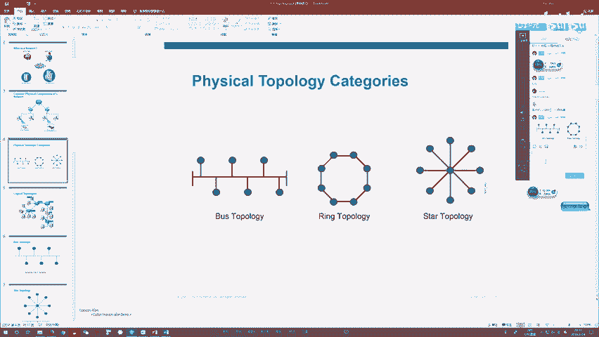
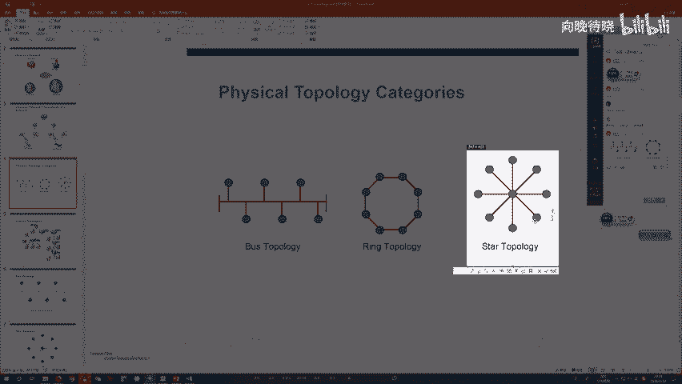

# 1000元自购分享CCNA教程合集！超全合集详细版，网络工程师入门必看合集【送NA题库】 - P3：CCNA03 - 向向向晚o - BV1cL4y1q7Dy

哎呀，好，那咱们来开始CCN的第三节课啊。😊，哎，终于到第三节课了，可以给大家说声sorry了。前两次课呢，我身体不太好，就是大家知道我从深圳出差回来之后呢，一直在对吧？上土下线啊，也不知道是对吧？

得了什么病啊，反正其实到现在呢还没有全好。但是今天呢就是我经过了两天的休息啊，今天状态啊自我感觉还不错啊，中气比较足啊，所以说咱们可以稍微皮一些啊，稍微皮一些，啊。

欢迎大家欢迎大家欢迎大家然后呢我总考虑到这，咱们一次新的课是吧？这一次新的课那新的课呢，咱们里面肯定会有一些哎认识我的兄弟，哎，咱们一轮轮来来了很多轮了，对吧？有的人说哎我就是比较喜欢听你唠嗑嘛，对吧？

所以说不管你上了什么课，只要你上的都都都愿意来，那我非常感谢啊非常感谢两。😊，那当然也有一部分兄弟呢，可能是第一次来，对吧？第一次听我的课，第一次听我唠嗑啊，那我是谁大家都不认识，对吧？啊。

那我想再问一下，正好咱们这个直播间里人足够多了，我再问他最后一次啊，就是有多少人是第一次来的啊，你们可以扣个一好吧，第一次来的扣个一啊，第二次来就不用扣2了，不用扣2好吧，咱们第一次来的可以扣个一。😊。

那我来根据咱们第一次来的兄弟的人数啊，来决定一下到底给不给你们对吧？做一个科普，来，科普一下咱们课的内容啊，对吧？科普一下我本人啊，科普一下咱们之后的计划啊等等之类的。啊，那如果说有第一次来的。

大家可以就是扣个一。一个都没有吗。啊，九哇，这只九是九是什么鬼呀？啊，有第一次来的有第一次来的。就一个吧就一个哇，那你是大熊猫了，这个YANP啊，你是大熊猫了。那咱们唉兄弟们，你你这只有一个。

我不好太太过针对你来对吧？做一些介绍的总结有点太过了，是吧？那所以说兄弟，你你就看一下这块好吧？你就看下这块哎，这块是我个人介绍好吧，哎，我叫什么名字，什么资历写清清楚楚，哎，你看不懂的话，哎。

你可以加我们这个群啊，加我们这个群，然后呢在这个群里面可以问我们一些哎，课程过老师好吧，好，那接下来我就唉言归正传了，来回归咱们主题啊，今天能给皮一些，哎，今天我们可以批一些。

就是前两节课呢啊不是7点开播啊，8。8。8点不是7点开播，就是前两节课真的是因为我个人的身体有点小问题，那所以说对吧？就讲的不是很开，对吧？状态不是特别好，然后呢你们知道我身体有问题，然我眼睛就不好。

我就看不清你们发弹幕。那所以说你们有时候问。😊，种问题我对吧？没法回答没法回答。左下角的时间。啊啊左下角这个呀哎呦你不用在意这个啊，这这这这个是什么呢？就是我刚儿有个习惯，就是我在开课的时候呢。

我喜欢对吧？先在这边挂一会儿，对吧？挂挂机挂个半小时啊，挂个小时啊，对吧？听听歌呀，对吧？看看落雨啊等等之类的啊，不是上课啊，不是上课，正式上课，从8点开始好吧，从8点开始不用在意这些细节，好吧。

全加不上吧，不会吧，😊，奶你全加不上吗？😡，哎呀。干了个尬。感谢这位老铁的提醒。感谢感谢感谢。哎呀，我真的是。😊，我是真的是。都被我被我蠢哭了，这里面挂的是咱们的一群的上么个QQ啊，挂的是一群的QQ号。

哎，搞错了，忘记了忘记了忘记了。好吧。好，那这是咱们的三群啊，这是咱们的三群哎，有有有兴趣的，就喜欢听我这说段子的，哎，你们可以去加这个群，对吧？然后呢，咱们可以去经常互动互动，好吧。

咱们可以经常互动互动，好了，呃，怎么不是昨天这个话题是啊，是昨天那个话题啊，不是我今天跟大家聊聊天嘛，聊聊天，就我跟大家说呀，这个身体也好了嘛，咱们有些话可以说的皮一些了。就是咱们这是个公开课啊。

咱们公开课不要钱的，虽然咱们的主题呢是CCNA，但是我不希望讲的跟我之前的每一轮课一样，对吧？就是我在上面讲哎，你们在下面听对吧？我讲的云里物理，你们听的云里物理，对吧？听的一脸懵逼。

也不知道我在说什么，那所以说我就想来想去，就是想给大家一些代入感。😊，想让大家呢有一些更多的参与度，这样让大家能够感觉到，哎我是在上课，唉，不是在听视频是吧？我是在上课，不是在听视频。

那我希望更多的是有互动，好吧，是有交流。那什么叫互动交流？就是你们可以去更多的啊在公屏里面哎去跟我打字。好吧，你可以更多的跟我打字。啊，来问我问题。然后呢，我今天眼神比较好啊，哎。

我特意把这个窗口拉近一些。我今天眼神比较好。啊，你们你们你们打的字，我基本能看到，好吧，我都能看到我看到之后呢，我绝对是尽可能的回答你们的每一个问题。OK啊。😊，😀啊哈哈哈。😊，啊，我讲互动。

反正你都听不懂。啊，视频我有在录啊视频我有在录。那所以说呢就跟大家说一下，你们不用担心啊不用担心互动会影响到你们学习内容。为什么呢？因为如果你们真的想要去NA的所有内容，我告诉大家。

咱们NA有多少内容啊，啊，这就是咱们的NA大纲。好吧，我之前一直忘记跟大家说了，其实不是忘记了，是我前两次课真的是身体状态太差了。我是怎么样，顶着疾病啊，顶着疲劳，对吧？顶着疲惫，毫无中气。

就给大家真的把那个课给耗完的，那你们说我敬不敬业。身体这么累，还跟你们啊，一节课上两个小时，兄弟们，我一次都没休息啊，第一次。😊，我第二次真的hold不住了，休息了一次，也就两分钟，对不对？

那所以说了真的我觉得这年前了，没有几天过年了，对吧？我要是身体状态都是这样了，是吧？还给你们一节课上两个小时，我觉得大家此处应该有点掌声啊，是吧？应该有点掌声。那跟大家说一下。

就是咱们这个整体的课程大纲啊给大家安排好了，对吧？一共有这么多内容，真的很多啊，然后你们会发现哎有黑色的是吧？有红色的，那这个黑色和红色什么意思呢？大家简单跟大家说一下。

就是黑色的是大家讲的NA课都会包含的这些内容，好吧？哎，我也有，大家也有对吧？咱们都有，是不是那这个红色的是什么呢？哎，咱们泰和独家的，好吧，泰和独家的只有我们有好吧，只有我们有。😊。

只有我们讲整个行业内。只有我颜灰讲O啊，那这是我们的课程设计啊。那当然关于这个课程设计呢，就是由于咱们唠嗑了，那可能每每一次课里面咱们讲的东西可能会稍微少一点点，但是不要紧，为什么呢？因为咱们对吧？

这一轮一轮的NA课上了没有1轮有8轮啊，并且每一轮的每一节课，咱们都录视频对吧？咱们都录视频，这个视频录的好好的，你们想看哪一轮就能看哪一轮，那接下来怎么来获得这些视频呢。O哎。

再次的就引入咱们这个群哈，再次引入咱们这个群，想要让免费视频，注意啊，是免费的，不要钱啊，不要钱，哎，你们可以去加咱们这个群，哎咨询咱们的课程顾问的小姐姐们是吧？就说了哎，我说来要视频呢，对吧？

几几年几月几日那一轮课，我想看发给我好不好？哎，那他们就会给你发，好吧，所以说呢永远不用担心说是我满怀热情来学技术，你给我吹牛逼，你不教我技术。不是我不教你啊，你想学技术这些视频你都能看得到。

但是这个视频冷冰冰的对吧？你又不能问视频中的我问题，但是你能够问现在的我问题，对不对？这就是咱们直播跟视频最大的区别。那如果说我把这个直播弄得跟视频一样，我也是死死死板板的对吧？冷冰冰的在讲课。

你听的云里雾里的。那咱们这个直播不就没有意义了吗？对吧？我们这个直播没有没有意义了吗？那没有没有意义的话，咱们干嘛还要直播呢？对吧？咱们干嘛还浪费时间呢，是吧？不如看录播视频不就好了吗？对吧？

那所以说呢啊我希望呢让咱们这个直播变得环境更好一些。😡，好吧，我希望就是啊让咱们之间互动啊交流变得更灵活一些，高效一些是吧？然后呢让大家能够正儿八经通过这个课学到你们想学的东西。最关键的不是技术。

最关键的是认知的同步。好吧，最关键是认知的同步。好了，那这边的话就有人来问问题了。你看你看这就是教学嘛，教学教学你有问我才能我才能给你教，对吧？好了，英文文盲怎么学的快一点？我觉得这个问题呢非常好啊。

就英文文盲怎么学的快一点呢？就你能不能让自己不要做英文文盲？那英文字母都能认识对吧？你英文字母都认识的话就可以了，对吧？你英文字母都不认识怎么办呢？对吧？有那么多的英文教材，你了解一下嘛，了解一下是吧？

就我不相信咱们中国还有英文文盲，你最起码ABCD能认识是吧？你ABCD能认识就够了，对吧？你了解一下最基本的单词就行了，你根本不需要语法，你根本不需要句法因为反程学咱们IT类的课。

你所能接触到的那些英文，你生活中都用不到，为什么专业术语计算机的专业名词是吧？这些词虽然是用英文字母拼成的，但是你不用去拿人话去理解吧，他们都根本就不是人话，他们是什么？他们是一些专门的技术用语，好吧。

专门的技术用语。就比如说了像什么路由选择协议OSPF。😡，对吧这是单词吗？这连单词都不适合缩写。它的全称叫open shortest pass first叫开放式最短路径有限。你需要了解吗？不需要。

反正你在交流的时候，谁会说他全名啊，谁会说他中文不会，咱们说都说OSPF你敲命令敲也是敲OSPF，那这就是因为。😡，你说你不会吗？对不对？会不会，你就算不会，英文你会你会汉语拼音，对吧？一样的呀。

没有任何区别，能理解吧？那像什么EIGRP是吧？像什么ACL像什么BGP像什么MPL苏V篇有哪个是单词？我告诉大家，没一个是单词，全都是缩写。😡，你学会这些就够了，难吗？太简单了，怎样能学会这些。哎。

咱们这个兄弟说的非常对啊，你ABCD26个英文字母都会，这就okK了，就这么简单，来来回回就这么几个单词，好吧，就这么几个单词。OK了好，没问题了吧。那么没问题的话。

那接下来咱们开始我们今天课的正题了啊，正题。那再次确认一下，咱们没有第一次来的啊，没有第一次来的。好吧，如果说有第一次来的，我现在讲的内容，你可能听不懂好吧，那接下来如果听不懂怎么办呢？哎，加群。😊。

好吧，加群询问咱们的课程顾问小姐姐要视频，记住吧，要视频免费的啊，下载下载看一看。好吧，看一看。然后呢，咱们下周课继续来，好吧？O好了，那上节课呢给大家讲的一个那个top类型啊，对吧？这个top类型。

大家还记得啊，说了咱们有三种类型，对不对？总线型网络是吧？环形网络还有新型网络是吧？这个总线型网络什么意思啊，长得这么丑了，其实它指的就是啊你拿一个极限器对吧？通过线来把我们的计算机呢连在一块儿。

那这个连成的网络就叫总线网络，那接下来这个总线网络怎么工作呢？其实你只要了解什么极限器的工作原理不就够了吗。那极限器怎么工作啊，哎它非常蠢，非常笨是吧？不知道任何地址信息。

也不知道它哪个接口连接给它设备。那所以说啊任何连接极限器的计算机啊，你们只要彼此通信。😊，那数据只要到达极限器这一块，对吧？它就会通过泛红来给你做一个转发。那这个泛红是什么？就是我通过接收接口收到数据。

把它拷贝成多份，对吧？通过所有其他接口每个接口一份啊，咱们发送出去，那这个就要泛红，对吧？然后接下来极限器呢啊你懂的？接口的带宽通常是10兆，并且还是共享带宽，它的接口的双攻模式都为半双攻。

那所以说你在这个总线性网络中啊，哎同一时间只有一台计算机能发送数据。你但凡有两台或两台以上的计算机，你想要同时发送数据，那不好意思啊，哎，咱们就会出现冲突是吧？这个冲突是什么？就是你数据跟数据之间，哎。

咱们会撞在一块，那装在一块之后怎么样就撞碎了嘛，就边冲突碎片了，这个冲突碎片会导致你的通信通通失败。那所以这个时候呢，对吧？大家按照CSMA杠C的规则啊，你要停下来等对吧？等待这个冲突结束啊。

等待你们那个随机计时器过期之后再开始监听链路。然后呢，当你判断链路安定之后再开始发送。好吧，那所以说呢关于这个总线性网络呢，既然任何两个节点一发送数据就会出现冲突。只要这个冲突一出现啊。

你这个冲突碎片呢，会被极限器泛红给这个网络中所有人啊，那所以说呢只要一冲突，大家都能收到冲突碎片。那所以说你们大家呢是属于一个预的这个域我们称为叫冲突域。请大家记住这么明名名词啊，我们称为叫冲突率。

它的英文叫colliion，懂没？叫冲突域。这个冲突域指的是什么呢？就是在这么一个环境里面啊，只要有两个主机同时发送数据，就会导致冲突，并且冲突碎片能够影响到咱们这个范围内呢，所有成员，对以吧？

换句话说，什么叫冲突域啊，它就是一组设备的集合，那这组设备的集合的特征是什么呢？就是一旦冲突产生了，这个集合内的所有设备，咱们都能收到冲突碎片，那这个对吧？就叫冲突域，那所以你可以理解为总线型网络啊。

它自身就是一个冲突域，对吧？你一个集限器，我不管你有几个接口啊，只要你连接计算机，对吧？你连多少台计算都一样啊，反而大家都在同一个冲突域，反正只要连接你了，对吧？我们就不能两台主机同时发生数据，对吧？

只要发了就有冲突了，冲突碎片能够影响到咱们所有人。OK那接下来基于这点来问大家一个问题啊，问大家一个问题。假设呢咱们现在宝罗是这样的，哎有一台计算机A唉，连接了极限器一。好吧，连接了极限器一，然后呢。

极限器一，咱们连接了极限器2，极限器2呢连接了极限器3。好，然后呢咱们连接了一台PCB好吧，咱们之间呢是这么连接的，那接下来呢咱们连接完毕之后，我来问大家啊，当前我们这个环境下有多少个冲突域呢。😊，啊。

你们来告诉我当前这个环境下都是冲度域。一个、2个、3个、4个有几个。好，只有一个啊，为什么只有一个啊，明明有三台集限器，为什么只有一个冲突语啊？😡，很简单嘛，对吧？因为你PCA发送的流量到达极限期。

它会泛红，对吧？这个泛红的流量发给极限器2，极限期二收到泛红流量之后会继续泛红发给极限器3，极限器三会继续泛红给B。那所以说了你PCA发送的数据啊，三台极限器连接的所有主机，它们都能收得到。

那所以这个时候任何一个主机，只要想要发送数据啊，那咱们就会有冲突。那冲突碎片怎么样？只要到达某一台集限器，会继而被泛红给咱们这个环境内的所有主机。😊，那所以说呢，我管你有几台极限器互联啊。

只要你是用极限器来连接咱们计算机，对吧？甭管你连了几台极限器啊，冲突域有且都只有一个对吧？那既然大家永远在同一个冲突域，那大家都知道这个冲突域呢，对吧？最好不要太大，你冲突域只要一大里面主机只要一多。

你就算有CSMA杠CD这个机制啊来做一个限制，你也没有办法说是百分百的完全的去杜绝冲突产生，你有你冲突该有还会有对吧？该有还会有。只不过就是它的概率问题啊，你主机少对吧？冲突概率低一些，你主机多怎么样？

冲突概率高一些。当然冲突不是什么好事儿啊，你只要一冲突了，咱们通信相当失败了，那所以说冲突肯定是越少越好。那所以说本着这个原则啊，你一个冲突域，最好不要太大。那因此呢咱们对吧？

在设计上针对这个总线型网络啊，也有这么一个设计的建议的参考原则，那这个原则咱们称为叫54321，对吧？我们称为叫54321原则。这就是指导了咱们在设计总线网络的时候，对吧？建议咱们怎么一个设计方式。

那这个54321指的是什么呢？就是你在组建网络的时候，如果是对吧？拿极限器来组建，哎，那你在一个网络内最多不要超过5台极限器，可以吧？最多不要超过5台集限器，那这5台极线器呢，它们之间隔的最长距离啊。

最好不要超过400米，对吧？那咱们怎么连啊，哎，咱们应该这么连极限器一连一根线连到极限器2，对吧？然后呢连到极限器三，连到极限器4，然后呢连到极限器5、咱们最好这么去连，然后呢。

两台离的最远的极限器之间啊，你最好不要超过400米，对吧？因为你要超过400米的话会出现问题。好吧，然后接下来三台集线器负责连接咱们计算机，然后其中呢有两台集线器，你最好什么都不要连，对吧？

你只是负责把我们这个网络的覆盖范围扩得更广一些，可以吧？三台用来连接计算机，两台用来扩展咱们的连接范围，然后接下来呢，不管你怎么连啊，当你连完之后，所有的设备都属于同一个冲突域，对吧？

这就是所谓的54321规则啊，你只要按照这个规则来设计咱们网络，对吧？就算你使用集线器啊，你也不用担心咱们网络过于不开，对吧？经常容易出现问题。ok。啊，是不是无限放大？哎什么叫无限放大呀？

它不叫无限放大吧。我不太懂你是什么意思啊，你待会儿可以把你的问题问细一些，好吧，我听不懂这个无限放大什么意思啊。好吧，好了，那接下来关于第二个网络类型跟大家说一下，就是咱们的环形网络。好吧。

这个环形网络是什么呢？😊，那没没没没没哎，你搞错了你搞错了，你搞错了啊，haub会放大信号啊，hub会放大信号。所有网络设备都有信号放大的功能，对吧？就算你极限器弱啊，它也不例外，它也能放大信号。

能理解吧？它能放大。是的，信号能够无限放大，没画面嘛，没画面，你可以那个退出来的，重新进啊，你拿那个客户端进会比较好一些，不要用网页，好吧，用客户端。也不是说理解成AP的。

你也不要小看APAP它也是网络设备。是吧AP它也能放大信号，能理解吗？它也能放大信号。显示的是这个这是什么鬼呀？嗯。你们都能看到画面吧。大家都能看到画面吧，哎，你是不是那个你的客户端版本不够高啊？兄弟。

你可以把你的那个客户端版本升高一些，好吧，升高一些之后，然后重新进一下，好不好？OK。对，就是说只要PC连接hub啊，你PC发送的数据到达hubhub就能给你放大信号，能理解吧？

所有网络设备都能干这件事儿OK。好，那接下来我们来看一下第二个拓类型啊，叫环形网络，好吧，叫环形网络，你那挺顾名思义的，你看就连成一个环对吧？连成了个环。但请注意啊，这是拓扑类型啊。

你网络不可能连成这样啊，那这个环形网络怎么连呢？它其实还要使用网络设备，这个网络设备是什么呢？咱们称为叫环网交换机环网其实一般指的是一些比较另类的局域网协议，我上节课不跟他说了吗？对吧？你要连网，对吧？

你要么局域网连接，要么广域网连接对吧？这个局域网广域网它其实指的是协议啊，有哪些协议呢？局域网里面像什么以太网啊，对吧？像什么令牌环啊，像什么FDDI啊，这些都是局域网标准那广域网标准呢对吧？

像PPP啊，像HDLC啊，对吧？然后像真中汽，他们都是广域网的标准好吧，那接下来咱们以太网的当年所有局域网里面老大，但不是说咱们就只使用局。😊，网这个协议只使用以太网这个协议。那咱们除了以太网以外。

咱们其他协议呢哎也会用一些。就比如说令徘徊，咱们当前依旧还有网络在使用，像FDDI，咱们有一些成域网还在使用，对吧？那这个叫令徘徊是吧？这个FDDI它其实也是一个环网协议，那既然这是个协议。

你就要有对应的设备，对吧？那这些协议对应的设备，咱们一般称为什么呢？咱们一般称为叫环网交换机，好吧？叫环网交换机，这跟PPPOE有什么关系啊？这跟PPOE没有关系啊，哎呀，今天看不到老师啊，哎呦。

不好意思不好意思呃，主要主要今天比较憔悴啊。你们如果知道我的话，应该知道我已经上图下线一个星期了，上图下泻一个星期了。所以说今天确实比较憔悴啊，等我恢复恢复啊，身体恢复恢复，然后再给大家开摄像头。

好吧啊，不是拨号，这跟拨号没有关系啊，这个拨号是一种宽带的接入技术，那这个是以太网协议是一种局域网协议，好吧，那像咱们令牌环DDI是局域网协议，就比如说你不需要宽带啊，你买一根线，你买一个环网交换机。

你一连对吧？你就算没有拨号，你就算没有做什么电信宽带连接，你这个时候网其实也连了，只不过你这个连到网咱们没有办法访问咱们的外网而已，对吧？你只能访问你内网一些资源，那这个时候内网是什么协议啊。

那就是这些局域网协议嘛，好吧，O好，环网交换机啊，你拿环网交换机通过线来把我们的计算机呢连在一块，那你连接而成呢就是这个环形网络，好吧，环形网络，它的定位是什么呢？就是为了PK掉咱们的极限器的对吧？

他就觉得你接舰机太low了，你这个总线网络太垃圾了啊，我这个。😊，环网比你牛逼，我要取代你。那他取代这个总线型网络的契机是什么呢？你取代你总要有你你牛逼的点嘛，有什么事你能做到，总线行网络做不到呢？哎。

那他就着眼于总线行网络的这个缺陷了啊，这个缺陷，我们说是什么呢？那就是冲突，对吧？这个冲突，那这这个真没没得说啊，太糟糕了，你只要一旦冲突产生了，你通信失败，对吧？你冲突一次，你就得停一下，对吧？

等待冲突解决完毕之后，咱们再去发，那谁能忍受啊，没人能忍受，对吧？总线行网络里面最不堪最不堪的就是会出现冲突。那这个环网呢就告诉大家了，哎，告诉用户了，请你选择咱们这个设备。

你用咱们这个设备组成网络之后啊，我保你不管一个网络里面有多少成员，绝对不会有冲突产生的可能，对吧？叫不可能产生冲突。好了，那接下来这个不可能产生冲突，怎么实现呢？啊，我们就来思考一下。

你这个网络为什么是一个环啊？对吧大家思考这个问题。你为什么是一个环呢？你连成一个环的目的是什么呢？对吧，想到环我就想到瑜伽了，瑜伽说了什么首尾相连是吧？唉，瑜伽的吉祥物是不是就一头蛇啊，一头很长的蛇。

然后这个蛇很长很长，它的头在咬它的尾巴，对吧？头咬着尾巴，那你这样的话就是一个环对吧？是吧？环的特点就是永无止境啊，对吧？永无止境，你在这个永无止境的环里面你传输一个数据。

那这个数据它是可以在这个环里面永远传输下去的了，是吧？啊，这个就是环的目的啊，那所以说呢咱们在这个环里面呢，哎就产生了一个性令，这个只要是环网协议啊，就一定会有这个性令，那心里有几个呢。

有且就有这么一个那这个性令呢会沿着一个方向，对吧？要么顺时针，要么逆时针沿着这个环呢永无止境的传递下去。那接下来这个姓令是什么呢？它就是一个通信许可证，注意啊，环网协议可不像咱们以太网，对吧？

这么无所谓，你在以太网环境中，你一台计算机连接入网之后，你想发数据时不就可以发，你需要许可证吗？不需要你需要别人允许你吗？不需要，你想发你可以直接发嘛，就是因为大家都想发就可以直接发。

所以说你们只要一发对吧？两个人一起，那就出现冲突了，对吧？但是在环网里面，这个环网协议啊，狠角色我不跟你这么来，是吧？你想发是吧？不好意思啊，你得得到一个许可，这个许可是什么呢？

就是你得先拿到咱们这个环里面这个令牌可以吧？这个令牌算是环网里面一个姓令啊，姓令名字就叫令牌，所以说这个协议为什么叫令牌还啊，令牌环令牌环一语双关嘛，首先指你这个网络是一个环网其次指的是在这个环中。

咱们会有一个令牌在传。地那当然由于令牌只有一块。😡，那正常情况下，如果你开计算机啊，你要发送数据，你得要先拿到这个令牌，你拿到令牌在发送数据的时候，那令牌是不是就无法传递了。

其他计算机此时此刻还能拿到令牌吗？是不是拿不到啊？那这意味着什么呢？这意味着我在发送数据的时候，其他的任何计算机是没有发送数据的权限的那也就是说只有我能发，你们都不能发。

你觉得在这种情况下会有冲突产生的可能吗？😡，是不是就不可能了？然后接下来当我发完之后，我再把令牌放还到这个环中去，让它继续传递。那接下来其他的主机想要发送数据，他们才能拿到令牌才能去发，对吧？也就是说。

通过这种方式啊，算是环网解决的一个问题，就是保证你同一时间只有一台计算机能发送数据。你绝对不可能两台主机同时发送，因为你令牌只有一个。那既然咱们不可能有两台主机同时发送数据。那你哪来的冲突啊。

是不是就不可能会有冲突啊？那所以说呢即便环形网络的带宽依旧很低，对吧？你依旧是半双攻传输模式，你依旧是一个主机发送，其他主机必须要等待。但是你好歹不用担心会有冲突了。那所以说在咱们网络扩展的时候。

你一个环网里面包含的主机多一点少一点，其实是无所谓，对吧？它解决了一个根本的问题，就是你能够绝对意义上的避免环能产生。但是这个真的牛逼嘛？虽然说没有没有这个冲突啊，不是环路啊叫冲突啊。虽然说没有冲突。

咱们这个网络质量会稍微高一些。但是你关键的问题没有解决，对吧？就是你的带宽依旧很低，你的传输能力依旧很差，你的收购模式依旧没有解决，那依旧不能说让大家呢对吧？同时发送数据，同时接收数据。

那在我们当前网络来看，我觉得一台计算机发送数据同时我接收数据，这个再正常不过。那如果说你一个主机发着数据同时，你不能收，你收着数据同时不能发。我觉得这个网络啊是很有缺陷的，是很有问题的。

是很畸形的应该这样吗？不应该对吧？那你们都用360吧，我相信你们有绝大多数人都会用360啊，如果没有用360也会使用是吧，也会使用类似的这么一个安全软件来保证咱们计算机安全性了。

那接下来你你们来仔细看一下啊，哎，兄弟们仔细看一下，这是什么这就是360的一个小助手是吧？这个小助手上面写的很清楚啊，哎，一个上行的小箭头是吧？后面有1个71K一个下行的小箭头是吧？下面有3。5K。

这是什么意思啊，这就是咱们上传下载的实时速率可以吧？什么叫上传啊？就是你发送数据嘛？什么叫下载啊？就是你接收数据，对吧？那大家看啊，我是不是在发送的同时正在接收呢？我是不是在接收的同时正在发送呢？

是这样的吧，你觉得这个行为在咱们环网在咱们总线型网络能实现吗？😡，就没法实现是吧？再举个例子，你们平常都玩撸啊撸对吧？不玩，你们会玩王者荣耀，要么就是吃鸡是吧？像这些游戏都是什么游戏啊。

这些都是CS模型系，对吧？CS模型的一些游戏，对吧？你是客户端，咱们会有服务器，你多个客户端连接相同的服务器，咱们能出现在同一个游戏场次中，那大家能够协调，能够配合是吧？你吃鸡也好，你撸啊撸也好是吧？

那接下来大家想你思考一个问题，我这个游戏是怎么进行的。😡，你的操作你能看得到，别人能看到啊，为什么别人能看到。因为你做的操作，咱们是把数据上传给服务器，再由服务器把数据发送给其他的玩家。

同样其他的玩家的操作，他们也会上传给服务器，服务器我发送给你，这就是说任何一个玩游戏的客户端啊，你在接收服务器数据同时你也在发送，你在发送的同时你也在接收，怎么可能说是只收不发，或者只发不收，对吧？

我们又不是发电报又不是听电台，对吧？咱们是要互动的，你会发现当前绝大多数应用，都是要互动的，只要你要互动，那也就意味着你收发肯定是同时进行的那所以说了就靠这个啊咱们前两种错不类型，对吧？

被淘汰是必然的对吧？被淘汰是必然。😡，你怎么可能不被淘汰，我留着你过年啊，那不搞笑嘛？是吧？要你有何用，那所以说啊咱们要把所有的期待啊哎放在第三个拓扑范围上，这第三个呢是咱们网络的拯救者。

我觉得如果不是第三种网络的出现，网络到今天绝对不会这么火，你凭什么这么火啊，因为你便利，对吧？你能够支持应用多，你怎样能够支持便利，支持应用多啊，你最起码你要解决咱们收发的同时嘛，对吧？

你一个节点连接到咱们网络，你接收数据同时能够发送，你发送数据同时能够接收，你能实现这一点，你再说其他的好不好是吧？那接下来这点谁能做到呢？哎，只有新型拓扑能做到，所以说呢为什么当前咱们用的是它对吧？

原因就是如此O那接下来新型网络指的是什么呢？指的就是你这么一个网络啊，哎，咱们是使用交换机，准确点来讲，咱们用的。😊。

以太网交换机啊哎，来负责连接，你拿以太网交换机做接入设备，对吧？通过咱们的线把我们的计算机呢连接入网。那当你连完之后，哎，只要你中间用的以太网交换机啊，这个连接完成之后，这个网络的类型。

咱们就称为叫星型网络。好吧，这就是星型网络。好，那接下来抛出一个问题啊。你们见过以太网交换机吗？啊，见过的可以扣个一啊，没见过的扣个2。你们见过以太网交换机吗？啊，兄弟们都见过啊，这么牛逼。

见过哪个公司的？思科的见过吧？😡，华为的见过吗？😡，2960啊啊，见过ssco。好，给大家看一下什么叫2960啊。2960比较low啊，2960比较low。

算是思科最入门的思科的最入门级别交换机2960啊，像这样的，那虽然low归low啊，那怎么说也要比极限器好看很多了，那好看太多了，不可同日而语。😊，那接下来咱们还有更好看呢，像什么ssco唉。

3560是吧？😊，哎，是不是更好看了是吧，再来更好看一些的。cisco呃3750。😊，是不是更好看了是吧，再来好看一些的4500。😡，哦，直接长得不一样了啊，长得特别魁梧啊是吧？啊。

当时还有更好看的ssco6500。😊，是不是更大了是吧？更魁梧了，但是其实好看说不上啊，这个既魁梧又好看的唉，cisconxus哎，7000，这个是不是就是集颜值和威武于一身啊？😊，又雄壮威武，哎。

颜值又高。那就是当前Cco所有产品系列里面最好看的啊，颜值最高的特别牛逼。号称就是一套满载的交换机，哎，比二线城市买套房是吧？一套房换一个一台这么一个交换机是吧？非常非常牛逼啊。

那所以说呢交换机呢其实类型有很多啊，当然这些交换机呢分为两大类啊，一大类咱们称为叫二层交换机，一大类咱们称为叫多层交换机，对吧？它们未必总是接入设备。就好像我给大家看的之前那些啊就比较牛逼的是吧？

像什么45啊65啊，什么nixa7000啊，你能拿他们来直接把我们计算机连接入网吗？哇，那计算机待遇也太好了，不可能的。咱们一般负责把我们计算机连接入网的，就像什么2960啊，2960屌丝专用啊。

屌丝专用2960那一般没钱的企业全用它是吧？有钱的企业呢，像什么3650啊，😡，是吧像什么3850啊，唉，那就稍微逼格高一些，咱们拿这样的设备来做揭入。那当然有爱国情节的人，我不买你4颗。

都买华为行不行啊？可以，你华为有华为交换机吗？华为交换机唉，是吧？咱们的37系列。😊，哎，就类似于咱们ss code的2960，一般的适合做什么屌丝企业的介入，那高大上的对吧？

高逼格的有钱的那这些咱们可以用什么，5700嘛？是吧？咱们可以用5700每一个厂商都有对应型号这么一个设备可以吧？不同的设备价格不一样，定位不一样，功能不一样，是不是？哎呦对对对对。

你要在你要在再没钱一些的话，你用TPlink啊，你用Dlink啊，也不是不可以。对吧，其实我说了，你要真正一个小网络，你买1个TPlink那个无线路由器都可以啊，对吧？有什么不可以呢？没有问题。好吧。

没有问题。好，总而言之，这个新型网络哎，咱们就是拿以太网交换机啊，来连接我们计算机连接而成的这个网络就叫新型网络。那接下来新型网络的所有优势其实就是交换机的优势啊，你交换机能做到什么样的事儿。

那这个新型网络那就能做到什么样的事儿。好吧，好，那接下来关于这个交换机能做到什么样的事儿呢？咱们得要先了解一下以太网里面的一个信息啊，好，这个以太网呢，已经不是第一次大家提了，第二次可吧？它叫以太网。

可以把？它叫以太网。😊，这个以太网就是一个传输标准，你们不要把它想的多么抽象，它就是一个局域网协议。约定了什么呢？就约定了三件事。第一个就是在这个网络中对吧？你计算机之间连好之后，你的通信规则，对吧？

这个通信规则就两个，看你的双攻模式，如果你的接接接口的双攻模式为半双攻啊，你要启用什么CSMA杠CD也就是说你要先监听一下链路，看看安不安静。安静了，对吧？随便你想发什么发什么，对吧？

想收什么收什么没有任何条件，对吧？那如果说对吧？监听完发现链路不安静了，请你等啊，等到别人发完之后，你再去发。那当然如果你要接口全双工呢，请注意全双攻的网络环境中没有冲突发生的可能性啊。

那所以在这种情况下，CSMA杠CD不工作的那在这个机制不工作的情况下，以太网就更自由了。自由到什么程度呢？自由到你只要连上网，你只要这个连接没问题啊。😊，你就随便吧，没有任何规则，你想发就直接发了。

好吧，你想收就直接收了，可以吧？这就是它定义的第一点。第二点，它定义了一个二层地址，可以吧？因为毕竟这个以太郎组成的网络啊，咱们称为叫MA网络，好吧，sorry，我又说了一个专业术语啊。

这个MA叫miple access，翻译成中文叫多路访问网络，好吧，叫多路。访问网络这个多路访问网络指的是什么呢？指的其实就是一个网络里面啊，咱们的成员数量可以有很多。那当然大家也能理解啊，对吧？

比探网是什么尿性啊，你在总线型网络的环境中，你是拿极限器来连接计算机组成网络，对吧？你在新型网络中，你是拿交换机来连接计算机组成网络是吧？不不管怎么样，你都要使用一个多口的设备。

这个多口的设备有这么多个接口，你难道只连一台PC。😊，对吧怎么可能呢？你肯定接口有多少个，你就能连多少台PC嘛。所以你在一个以太网环境中，你有一台计算机，你有两台计算机，你有三台，你有4台都很正常。

这就是MV网络的定义。你在一个网络中，你的成员数量可以为任意。😡，那当然相对的，咱们就有另外一种网络。那这个另外一种网络图为什么呢？我们称为叫P two P网络。哎，P to P。哎。

你们前两年经常听对吧？叫什么P to P金融天天爆雷嘛，今天雷一个，明天雷一个，哎，这个东西太危险了，大家不要整OK那大家这个P two P网络呢，这个所谓的P two P啊。

就跟我们那个P to P金融是一样的，包括咱们用的QQ，咱们用的微信，你们打的王者荣耀，这些都是P to P的应用，没听过了吧。哎，这个都叫P two P啊，同一个P two P它叫点到点，好吧。

它叫点到底。😊，这个点到点网络指的是什么呢？就是你这么一个网络啊，唉，比较特殊，网络里面只能有两台设备，你们两台设备之间，哎，我他给你连一根线连好之后呢，你这个网络就组成了。那这个就是点到点网络。

什么叫点到点啊，不是我就是你不是A就是B，你A跟B之间连根线。好，咱们这个网络就组成了。那当然在咱们这个网络中呢，除了我以外，就是你除了你以外，就是我会不会有第三者呢？那不可能绝对不可能。好吧。

那在咱们整个英特网环境中啊，那咱们也都知道这个英特网呢，说句实话，就是由若干个大大小小的网络彼此互联而成的这么一个互联网，对吧？那在这大大小小若干个网络中啊，咱们就会有MA网络，对吧？就会有。😡。

🎼点到点网络，咱们这两种网络呢都会存在。哎，一般的咱们的广域网协议啊，对吧？它所组成的网络就是点到点网络，而一般的咱们这些局域网协议，哎，它所组成的网络呢？就是MA网络。好吧。

那以太网的就是MA网络里面的一个范畴啊，那接下来在这个MA网络里面，既然你的成员可能会很多，对吧？那你成员连的网目的肯定为了通信嘛，你们要彼此交互数据，我要发数据给你，你要发数据给我，那咱们总要先标识。

对吧？对吧？我怎么告诉你我是谁啊，你怎么告诉我你是谁啊？我拿什么来表示你，你拿什么来表示我啊，对吧？咱们计算机又没有名字，就算有你觉得咱们网络设备是能看得懂吗？他也看不懂是吧？

那所以说了在任何MA网络中啊，为了标识咱们一台又一台的主机，对吧？那咱们就需要设计一个二层的地址来作为咱们主机接口的标识符。😊，那这个地址谁设计的呢？就是由咱们这个以太网协议设计的。

以太网协议设计的二层地址非常有名，咱们称为叫卖地址。这个mag地址呢，咱们一般也称为叫物理地址啊，也叫硬件地址。当然它还有一个名字。叫烧路。好吧，叫烧入地址。那这个地址是什么样的？它一共有6个字节啊？

一共有6个字节啊，上节课跟大家说过字节，对吧？一个字节就是连续的巴比特组成的这么一个字符串，对吧？6个字节，那你6乘8嘛，那就是48个比特嘛，对吧？48个比特，那当然咱们对于这个map地址的表示啊。

一般在表示的时候，我会使用16进制数来表示，那这个16进制数呢，哎大家听过呢最好对吧？呃没有听过也无所谓啊，是吧？没有听过无所谓。反正你们很快就能听到了吗？是不是16进制，那就是0到9是吧？

0到9ABCDEF1用A来代替嘛？11是B12是C，对吧？以此类推啊，那接下来16进制数，它占几个比特呢，请注意啊，一个16进制数是由四比特组成的，能理解吧？那你要按照这个来换算的话。

你拿16进制数来表示麦克地址，你一共有48位，对吧？一个16进制数占4位。那算下来咱们应该是由12个16进制数来表示这个麦克地址可以吧？那接下来这个麦克地址它怎么表示呢？哎，真的非常遗憾啊。

兄弟们我们没有一个标准的格式来定义m克地址。对吧你说按照什么方式来表示呢？对吧？公说公有理，婆说婆有理。那最后呢大家也不寻求统一了，那就这样吧，对吧？你用你的，你开心就好嘛，我用我的。

反正我觉得我的更好是吧？那接下来咱们就不用管这个标准的格式了。我们可以看一下思科的格式。因为毕竟咱们这次科比较偏向思科嘛，思科对于卖壁纸表示是这样的，他把整个卖壁纸呢分成了三段。😊，好吧。

每段呢由4个16进制数组成，对吧？段和段之间呢，咱们使用点儿来分隔，好吧，那这就是ss code back地址。那接下来这个麦克地址呢，它分为两个部分啊，前一半。😊，给你画个颜色啊，前一半唉。

这一半我们称为什么呢？这一半咱们称为叫OUI对吧？这一半咱们称为叫OUI后一半叫什么呢？后一半咱们称为叫interface IDD。8interface IDD那这就是mac壁址的两个部分。

那接下来这两个部位有什么用呢？也跟大家解读一下，就是这个mac地址呢，哎咱们在用的时候是用来标识一个以太网接口的。因为你在一个网络里面，咱们会有很多的设备。那每个设备一般咱们就有一个接口，对吧？

所以这个mac地址，你既可以用来标识这个接口，也可以用来标识咱们这个设备本身。但是呢在我们当前的网络中，其实有一个概念需要大家知道。就是你在描述一个设备的时候，咱们一般不拿设备来说事儿。

咱们拿什么来说事儿呢？咱们拿一个专用名词来说事儿啊，这个名词叫node，它叫节点，可以吧？你在一个网络中，咱们不会叫你一台计算机啊，不会叫你一台服务器，不会叫你一台手机，我叫你什么，我叫你是一个节点。

而节点是什么呢？😊，最简单来看，你可以理解为一个节点就是一个接口，什么接口啊，网络接口啊，对吧？你一个网络接口就是一个节点。那当然由于咱们一台计算机呢，你通常网络接口只有一个对吧？那你网络接口只有一个。

那你也可以变相的理解为咱们这个计算机本身就是一个节点。那当然如果你这个计算机呢，你的用户是一个发烧友是吧？你觉得一个方法不够，你来2块，你来2块，你有两个接口，对吧？你每个接口都叫一个节点。

那你需要标识的时候呢，你就需要两个地址，两个地址来分别标识两个接口，那所以说这个时候你就不能把这个计算机啊称作是一个节点，能理解吧？注意啊，节点是在网络中咱们常用的一个名词，对吧？

一个网络里边有几个节点啊，节点跟节点之间通信啊，节点跟节点之间的路径啊，哎，咱们一般是这么说的，我们不会。说设备跟设备之间通行，我们不会说设备跟设备之间的路径不会这么叫，能理解吧？好，这就是节点。好。

那接下来这个节点呢，它需要有mac地址来标识。那咱们怎样来避免撞衫呢？怎样来避免咱们多个节点使用相同地址呢，对吧？你得要保证咱们地址的唯一性啊，那咱们就想出了一个办法，对吧？你呢想要拥有mac地址。

想要给咱们的网卡分配，你呢需要购买。那既然提到购买，咱们有买方就有卖方，对吧？这个卖方是谁呢？谁来卖这个地址呢？有这么一个标准化组织啊，这个组织很牛逼，什么地址他都卖IP地址他也卖麦ike地址他也卖。

那包括你要运行BGP啊，你需要的什么AS号，他都会卖是吧？他都会卖，那他就是一个地址贩子啊，可以吧？专门卖各种地址。😡，那接下来有了卖家了啊，那咱们是不是有买家了，那买家是谁呢？那你们猜猜谁会是卖家。

谁需要买麦克地址啊？😡，啊，我觉得生产方需要买，对吧？比如说我们的笔记本制造商是吧？我们的台式机制造商，我们的路由器交换机制造商，对吧？你要制造一些设备，这些设备包含以太网接口，那你既然包含以太网接口。

你就要有麦ap地址，对吧？那所以说要给他分配，拿什么分配啊，你肯定要先买才能分配嘛？因为这样你才能保证它的全球唯一嘛，那所以说啊购买地址的购买方案，基本都是那些设备生产厂商，对吧？或者叫设备制造商。

ok那接下来买方和卖方咱么都确定了啊。接下来我们来确定一下购买的规则。😊，你说这些设备制造商对吧？动辄都是什么世界五百强啊等等之类的，你会差钱吗？不会对吧？你既然不差钱，你在买地址的时候。

咱们能不能像菜市场里面买菜一样，斤斤计较，咱们一个一个买啊，我们两个两个买，我今天心情好买10个行不行？肯定不行，第一个不连续第二个不好管理嘛。那所以说了这个INA呢，它也是个硬货的告诉你了。

你们你们不是有钱吗？啊，你们想买的话，请你们一段一段的买怎么个买法呢？你一买就给我买这么一段，我给你确定地址的前24位，好吧，后24位全是你买走的，那既然这24位都是你买走的，它为零，它为一。

你说的算对吧？你随便分配，想怎么用怎么用，那就相当于是你购买一段卖个地址段啊，里面包含的地址数量是2个24次方个，是吧？因为24位嘛？😡，这4位都是你买过来的，你想怎么变就怎么变。可以吧？

那相当是多少个？1700万个左右。好吧，你一买就给我买这么多。那当然这么多会不会是个天文数字特别贵呀？也不会啊，这个这个公司啊，也不能说叫这个公司了，就这个组织倒也不是那么施散开口，对吧？

卖的还挺便宜的啊，当然也不是很便宜啊，1000美元，好吧，1000美元给你买这么一段可以吧？那当然也不是说一个厂商只能买一段，如果说你一个厂商规模很大，你想买好几段，那没关系，随便你。

但是你在买的时候呢，你只能买更多，你也不能买更少，对以吧？那接下来用们思科为例啊，思科其实购买过很多段麦克地址那当然第一段总是让我们最能够记忆深刻的，那思科购买的第一段麦克地址什么呢？是00000C。

😊，以这个开头的麦地址全是私科购买。那这个C大家知道对吧？A是十嘛？B是11嘛？C是12。嗯，那接下来零咱们肯定没人买，对吧？那咱们这边从一开始买的那思科相当于是全球第12个购买mac地址的厂商，对吧？

还是挺牛逼的啊，OK那接下来咱们厂商呢买完地址之后，哎，前面呢咱们就固定不变了，后面既然说我们买的对吧？那咱们在分配的时候呢，想它为己，救它为己，对吧？只要我在生产这些网卡的时候，对吧？没有自己犯浑啊。

给多个网卡对应了同一个地址，那咱们就能够绝对意义上的保证地址的全球唯一性，那既然咱们能保证地址的全球唯一性，你就不用担心在一个网络中啊，你多台计算机，咱们的麦ac地址相同，彼此撞衫，彼此地址冲突。

导致咱们通行失败。好吧，好，那这是咱们的目的。好了，那接下来厂商呢买完地址之后都要思考的，对吧？我现在要生产以太网网卡，我要给你赋予麦克地址。我这个地址该怎么赋予给你呢？首先我来问大家一个问题啊。

你觉得厂商在制造一个网卡的时候，我给你添加一个地址。我希不希望你用户在用的时候随便去改它？😡，你觉得厂商希不希望用户在用的时候随便去修改这个地址？啊。

或者说你觉得厂商是否应该允许用户在使用的时候去修改这个地址。你不要说难的和简单嘛。😡，你是思科的总裁，好吧，我生产路由器交换机。😡，你希不希望路由器交换机卖出来之后，对吧？你用户拿到，哎。

我看你这个接口的麦克地址不顺眼，我改一个顺眼吧，全改成6全改成8。😡，你觉得我是否能够允许这样的行为出现？嗯。那肯定。不希望嘛是吧？我之所以给你这个网卡分配好卖地址。😡，就是为了避免它地址冲突的。

咱们要保证咱们的网卡的麦ac地址啊是全球唯一的。好了，现在我辛辛苦苦的买回来地址，对吧？给你接口分配，分配完之后给你用户一用哈，你第一时间就给我改了，那我想问我这个地址买回来还有什么意义啊，是吧？

我还怎样保证这个地址的唯一性啊，是是没办法了。那所以说了厂商要想一个办法，让这个地址写到这个网卡里面之后，你只能看不能改。那接下来地址写在什么存储部件，你是只能读取不能修改呢？

那我希望大家高中知识还没有忘记啊，高中学计算机的时候，咱们会学存储器的组件是吧？那在众多类型存储器中，咱们有这么一种存储器。😊，叫ROM可以吧？叫ROM大家一定听过啊，你们一定听过这个叫什么？

叫read only，可以吧？叫read onlymeory。这个叫止读存储器。好吧，叫只读存储器。那只读存储器只读存储器它顾名思义嘛？你是不是只能读取里面的数据啊？你能修改吗？你能删除吗？是吧？

那小多了啊，你只能读取。因为这样的存储器里，你想要写入数据，你需要特殊的工具来写入。是吧达到一定的温度哎，达到一定的什么哎乱七八糟的条件，你的数据呢才能写进去。那一般往这种存储部件写数据啊。

咱们不称为叫写我们称为叫烧录，对吧？那这就是mac地址，它之所以叫烧录地址的，这么一个由来，可以吧？每一块以太网的网卡，它内部都会包含这么一个rom，那rom里面呢肯定会写很多东西啊。

比如说你这个网卡的生产厂商一些信息，对吧？歌功颂德嘛。然后接下来还会包含一系列其他的信息，比如说你这个网卡是几几年几月几日被生产的对吧？什么型号的，然后接下来最关键的就是你这个网卡的mac地址。

对以吧用来做你这个接口的标识符。那接下来哎咱们在一个以探网环境中啊，我甭管你有几个节点，大家是不是都有地址啊，大家地址是不是都是唯一的那得了呗，你们就用你们的地址彼此通信不就完了吗？是吧？这就OK了。

这就是所谓的麦。那当然咱们来了个思考题啊，你们听网络也肯定听过地址，对吧？也肯定听过地址。你们听过什么地址啊？我觉得在网络中，你们听过的地址绝对不叫map地址。😡，对吧。

这个mac地址全称叫什么叫media access controll，这个叫介质访问控制地址，或者叫媒体访问控制地址。我相信大家伙听过的地址。肯定不是这个。你们听过什么例子啊。

你们听过的是不是叫IPV4？是吧可能微4没听过啊，你们听过是不是叫IP地址？对不对？IP的全称叫什么呢？叫internet。procol它叫英特朗。可吧？它叫英客鞋。啊，那这又是什么地址呢？请注意啊。

IP地址是另外一个次元的地址。这个map地址特征是什么呢？我们称为叫二层地址啊，因为这个以太网协议是个二层协议，你二层协议所定义的地址呢，自而然咱们就称为叫二层地址。而这个IP呢，它也是一个协议。

就叫英特宝协议。这个协议是几层的？它是三层的。😡，这个三层协议所定义的地址啊，那咱们自然而然就称为叫三层地址。那三层地址跟二层地址，你连层级都不一样，你能一样吗？你是不是想多了是吧，你想多了。OK好。

那接下来大家就会问，你这个以太网接口不都有mac地址了吗？你也说了地址，咱们能作为一个接口的标识符啊，那不就够了吗？你还需要IP地址做什么？对吧为什么有了mac地址之后。

你还需要一个三层的IP地址来做你自身的标识符呢？😡，你有了麦和不足以表示的事行了吗？😡，是吧好，那这块呢我也来跟大家说一下。那咱们可以类比啊，你们先别纠结于这个问题。我们先来换一个视角。对吧。

咱们人类存在的社会中，我们人你也可以理解为是一个节点是吧？比如说我本人啊，我就是一个节点。那我作为一个人，我有没有标识符呢？啊，你们作为一个人，你们有没有标识符呢？有没有呢？我想答案是肯定的。

我们每个人都有标识符。就比方说咱们的名字。是吧那除了名字以外呢，还有什么标识不哎，非常好，那我们有身份证啊，身份证里面是不是有身份证号啊，是吧？这个是全国唯一的啊，能够标识你因为同名同姓的人很多。

不要紧，咱们拿身份证号是吧？每个人人手一张，你只要有身份证，上面有个号码，这个号码咱们能保证唯一信。就算你们同名同姓，我们身份证号不一样，对吧？还有呢有号，哎，非常好，那一看就是见过市面的，咱们出国国。

你要出国，咱们会有护照，对吧？那这个护照上面咱们也会有护照号是吧？那当然在座的各位呢，咱们也肯定有在学校里面的在读的大学生，对吧？那你在读的大学生，你学校里面入校的第一件事是不是会拿到一个学生证啊。😊。

是吧咱们会拿到一个学生证，对吧？这个学生证上面是不是也会有一个学生证号啊，是吧？那这些是不是都能作为咱们一个人的标识符啊，对吧？他们都能保证他们的唯一性是吧？然后呢，咱们都能通过这些号来标识咱们自己。

那你想想一个人咱们都有这么多的标识符，你觉得在网络中一个节点有多种标识，很奇怪吗？其实并不奇怪，因为不同的标识符，咱们能够在不同的范围来标识我们。比如说了哎咱们用学生号对吧？学生证号。

什么情况能标识自己啊，就是当你在学校里面处理一些事务的时候，对吧？你的学号可能会更管用，是吧？然后接下来当你出了学校了，你的学生证号还有意义吗？没有啊，因为外界跟你的学校不是一个系统，对吧？

他们没有那个数据库，他们查不到你的学校对应的信息，那所以说当你离开学校之后，你在国内范围行动的时候，你可以拿身份证号来作为你自身的标识符。那接下来当你出了这个国道的其他国家。

由于其他国家的人没有你这个身份证号，对吧？他没有你的身份证，他不知道你身份证号什么意思，没有意义。那所以。也说了在这种情况下，你只能拿你的护照号来表示自己。能理解吗？

那所以说了咱们之所以有这么多的标识符是用来在不同的环境下来做一个自身的区分的对吧？那这个时候在我们的网络里面是一样的啊，这个网络呢，咱们也都知道，有网络内通信，也就有网络兼通行，对以吧？那你一组主机。

你们如果在同一个网络内，你们之间彼此发送数据啊，那这个就叫网络内通行，那当然相反，对吧？你一个主机在网络A内，另一个主机在网络B内，哎，你们之间彼此通信，那这个就是网络兼通行。是吧好，请注意啊。

二层地址的作用是什么呢？二层地址的作用是在一个网络内来标识一台计算机，可以吧？你们俩在同一个网络内，你们要彼此区分拿什么拿二层地址来区分，可以吧？但是离开你这个网络之后，你的二层地址就没有意义了。

为什么因为另一个网络，他有可能用的就不是以太宝协议，既然他用的不是以太宝协议，它有麦地址吗？它都没有，他能识别你的麦地址吗？也不能退一万步说，就算他用的也是以太宝协议，他也有麦地址。

但是既然咱们已经不在同一个网络内了。我们彼此的mac地址对于通信而言啊，就没有任何意义了，可以吧？而这个时候要标识咱们就要考IP地址，可以吧？那当然咱们一般的正常一台计算机，对吧？你要访问网络。

咱们都是对吧？访问其他网络的资源，因为你要上什么百度啊，上什么新浪啊，上什么优酷啊，上什么爱奇艺啊，其实说实话都是你在通过相应的客户端的这些应用啊来访问咱们的服务器。这些服务器在哪里呢？😡。

他们都在电信的IDC机房，对以吧？他们都在电信的IDC机房。那你觉得电信的IDC机房跟你的PC会在同一个网络吗？你是不是想的有点多，怎么可能呢？那所以说呢咱们绝大多数的访问都是跨越网络的访问。

那所以说呢为了实现咱们跨越网络的访问，咱们这些节点，除了有麦克比尔以外，你也需要三层地址来全球唯一的标识可以了。像IP这样的三层协议，它所定义的三层地址，我不管你二层协议是什么啊。

只要你接口支持三层功能，你都能拥有，你是以他网接口也好，你是其他类型接口也罢，只要你支持三层功能，你都能有IP地址。所以说不管你一台计算机跟任何其他人通信。不管你们在一个网络内还是在一个网络间。

你都能拿IP地址啊来标识你们彼此。那所以说这就是为什么你想上网，咱们都需要1个IP可以吧？而这个麦ac呢是用来让咱们这些接入设备啊来识别你网络内的每台主机的身份的对以吧？除了接入设备以外。

其他的任何类型的设备啊，他们其实都不太关心你的二层地址，可以吧？端到端通信，咱们更多看的是三层地址。我的这串非常长的话，不知道大家能不能听得懂啊，听得懂给我点回应好不好啊，听得懂给我点回应。

来扣个一好不好？哎，给我给我个回应啊，唉，非常好。那接下来咱们来下一个结论啊，咱们下一个结论。😊，网络内通信哎，知道对方的二层地址足够了。网络兼通信，我就需要知道对方的三层地址。

但是呢咱们的计算机使用优用户来使用的啊。用户呢都是比较矫情的，用户他根本不care二层地址。那所以对于咱们用户而言，就算你在做网络内的通信，你也是需要通过三层地址啊来标识通信目的地的，可以吧？

那所以说三层地址的重要性要远高于二层地址，这就是为什么咱们在对网络不是了解的时候，只要一提到地址，咱们总能想到三层地址的原因，就是因为这类地址，咱们建的实在是太多了。因为它的重要性实在是。太重要了。O。

好，那这就是以太网的第二个定义。那接下来它的第三个定义是什么呢？它的第三个定义啊，就是它所定义的一个二层封装了，对吧？它的二层封装。当然这个二层封装呢，咱们要讲完OSI之后，大家呢才能够理解。

那所以说这块呢，咱们就先不要在意这些细节，好吧，先不要在意这些细节。OK那接下来在以探访环境中呢，哎我们就有一个规则啊，对吧？你两个节点A和B你们不是要通信吗？哎，你们在通信的时候呢。

不管你添加了哪些其他的爆头，只要在我们以探访环境中，你都要添加这么一种爆头，这个爆头呢，你甭管里面包含的所有信息是哪些啊，你只要知道包含这么两样信息就够了。一个叫原mac。😊，一个叫目的mac地址。

其中原mac地址用来描述咱们这个数据啊是由哪个主机发送的。目的麦克地址用来描述咱们这个数据啊，是由哪个主机接收的，可以吧？前者标识的就是通信的源。后者标识的就是通信目的地。我甭管你包含什么其他信息啊。

这两个信息你必须携带。好了，那所以说了主机之间通信啊，咱们都会携带原工麦ac地址。那交换机呢它就是利用这些原木m地址啊。来来做一些精确的数据转发的。那接下来这些精确数据转发到底怎么实现呢？哎恕卖个关子。

咱们休息一下好不好？我也慷慨激昂一个小时了，那我们休息一下，然后呢稍后再跟大家慢慢说，正好呢给大家答波仪样，好吧，给大家慢慢答波仪。听莫懂不要紧啊，加一波全压压惊。休息几分钟啊，不一定哎。😊。

2分钟1分钟3分钟啊都可以随便你对吧？看大家心情啊，你们心情好，休息50秒。讲完咱们交换机的工作原理之后啊，哎我们来看一下这个啊说错了，不是交换机的工作原理。你看了这个脑子，真是我自己都被自己蠢哭了啊。

是讲完以太网的工作原理之后啊，哎基础的工作原理。那接下来我们来看一下交换机如何利用咱们以太网的规则啊，来实现高效的数据转发。那最终实现的是什么呢？就是你一个计算机连接入网之后啊，你在发送数据同时。

你能接收数据。你在接收数据的同时，你能发送数据，可以吧？哎我们来看一下交换机到底是怎么做的。好，首先呢交换机它是一个数据链路层的设备，可以吧？最次最次最次的交换机它也具备二层功能。

那所以说从层次上来看啊。😊，啊，它也已经完爆它的前身计限器了。好，那接下来说到交换机他可能会问，那这么神奇的一个设备，谁发明的呢？那咱们就不说谁发明的了，咱们范围放大一点，哪个国家的人发明的？

那那我来问大家一个问题。嗯。你们知不知道交换机是哪个国家的人发明的？你们知道吗？知道的可以把答案说出来。哎呀，厉害厉害厉害厉害，很多人都会以为交换机这种高大上的科技设备啊，那肯定是美的开发的嘛。

但我告诉大家啊。😡，美国科技确实很厉害。😡，但是也有一个国家，它的科技一点不弱啊。那当前在咱们网络行业中基本有一小半的产品。是这个国家开发的，并且在目前来看依旧是领导者。那这个国家就是个小国啊。

叫以色列。可以吧，全球第一台交换机就只有以色列方面。全球第一台防火墙也是由以色列发明的，当前全球最牛逼的防火墙厂商也是以色列，对吧？很牛逼很牛逼的这么一个国家。那接下来包括思科，他所生产的所有交换机啊。

你真以为是思科生产的吗？扯啊，思科它只能生产路由器。这个交换机的整个产品线，是思科收购了一家以色列的公司，这家公司咱们称为叫cas。可吧叫凯特里特，可以吧？那这是一家哎以色列的公司。

那为了对这家公司致敬啊，当前思科收购凯特 list已经十几二十年了。但是在如今思科的所有交换产品上，你依旧能够看到calist的这么一个标记。你能看到凯利logo，对吧？那算是对这个原厂商的致敬了。

好吧，那接下来这个交换机呢？哎，它是非常非常牛逼的，主要就牛逼在它的智能性要比极限期高很多。那它是一个二层设备，二层设备能识别什么呢？当它收到一个数据之后啊，它能识别二层爆头里的内容。

而咱们二层爆头在以太堡环境中会包含什么内容呢？哎，就是包含咱们刚才所说的原木mac地址信息。这也就是说了，你交换机连接一台计算机，计算机发送数据，数据到达交换机之后啊。

交换机是能够看懂原木麦克地址信息的那通过查看原木麦克地址信息，交换就知道了，这个数据是由谁发的，可以吧？数据通过我的哪个接口被我接收的，然后数据要去往哪个目的地，这个时候只要这个目的地在哪儿交换机知道。

那它就能够根据目的地所连接的接口信息，来给你做一个精确转发了吧，是吧？那这个就是你们懂的，交换机的转发机制就这么简单。那这边的话我们来给大家看一下，假设这边咱们有一台交换机。sw一。对吧我的一个接口。

连接了一台手机A。我的另一个接口。链接里拍。主机B好吧，那接下来当我连接完这两个设备之后，你这两个设备为什么要连我呀，对吧？你又不是没事儿干，你连我肯定是为了通信嘛，是吧？

那接下来你觉得交换机一开始能够知道我哪个接口连接了谁吗？对吧？他不知道，因为你交换机接口很多，你的接口今天可以连主机A，明天可以连B，后天可以连C，我又不知道我什么时候连接你们谁，所以说了交换机上来。

它对咱们网络连接信息啊，是一概不知的，它完全不清楚。但是呢它能不能知道呢？他可以知道。所有智能交换机它都有一张表，这张表咱们称为叫mac地址。对吧当然这张表咱们更加专业的效法啊，我们称为叫看。

看表的全称叫什么呢？叫counttentdress for memory，叫内容可寻址存储器。这个算是交换机的必杀技啊，我告诉大家啊，这个表太牛逼了，它能记录咱们网络的连接信息。😡，表里面也不复杂。

每一个条目都包含了三元素。哪三元素呢？第一个就是交换机的哪个接口，对吧？连接了哪台计算机是吧？然后接下来这个计算机属于哪个围栏。那当然这个伪烂呢，大家不用管，如果说你不看这个伟烂啊。

当然大家默认都在同一个围栏，你可以理解为咱们mac地址表里面的每一个条目啊，只包含这么两个元素，一个就是交换机的哪个接口，一个就是我这个接口连的线连到哪台计算机，当然这个计算机拿什么来表示呢？

哎呀我拿你的计算机名字来表示太麻烦了是吧？既然咱们都在以太网，大家都有mac地址是吧？哎，我就拿你的mac地址来表示，对吧？那正是因为咱们总是拿mac地址来表示咱们接口所连接的设备。

那所以说这个表里面你一看啊一大堆的麦ac地址。😊，那因此咱们称为叫mac地址表，可以吧？这个mac壁址表它太重要了。因为它告诉了交换机，我的哪个接口连接了哪台计算机。对吧我想要知道宝络怎么连接呢。

怎么知道啊兄弟麦靠m地址表。那接下来这个mac地址表里面默认有没有表象呢？它默认是买哪是空的呢？那不用想了，那肯定是空的嘛。我刚跟大家说过啊，你交换机上来刚一开机刚一启动。

你怎么可能知道你的哪个接口连接哪台计算机呢？你是不是想多了，你怎么可能会知道那所以说默认情况下，咱们交换机一家店一启动开机完毕啊，我们这个表框空什么都没有对吧？那接下来我们就要研究了，哎。

我是怎样来填充这个表呢？我怎么知道我哪个接口连接哪计算机呢？我怎么把这个连接信息装到咱们这个表里去了呢？哎，那这个时候咱们有两种方法来解决这个问题。😡，那第一个方法比较暴力，简单加粗暴。

那就要依赖咱们管理员啦。看我们管理员怎么样哎。我们管理员，你可以登录到咱们这个交换机。去做配置。唉，我这么一说，你们可能听了两眼一摸黑啊，我操什么叫配置啊啊，哪尼的配置是什么啊？这个sorry。

我的错啊，我的错。那照咱们这边就是打开一个模拟器啊，来给大家演示一下到底什么叫配置啊，什么叫配置。啊，知道一下什么叫配age。配置是什么？我告诉大家，这些网络设备他们都是计算机哎，它们里面都有操作系统。

并且这些网络设备都有一个特殊的接口，咱们称为叫consl口。这个conl口翻译成中文叫什么啊？叫控制台接口。那2960啊，大家都喜欢的是吧？那接下来大家看吧，这就是2960的样子啊，长就是这样的是吧？

这儿它的正面啊，它的背面是什么呢？它的背面就是一个抗l口，你呢可以拿一种叫抗缩线的线来。😡，来连接交换你这个接口，连完之后你可以开启一个登录软件啊。

那当然这个软件需要你们下载安装的这个软件咱们称为叫secure CRRT是这样的对以吧？那当然咱们这块呢不需要用它了，因为这是模拟器啊，那这个时候咱们点击这个CLIcl。😊。

就相当于是我模拟咱们计算机啊，拿这个登录软件登录到交换机了。那这就是登录界面了，你可以敲命令嘛，你进入它的系统了，你可以敲命令，对吧？你可以敲命令，你敲命令就能影响到的运作。那这个咱们就称为叫配置。

好吧，这个咱们就称为叫配置。😡，那接下来你可以通过配置的方式啊来去手工的配置mac地址。你可以去配置。这个什么叫模拟器啊？这个叫什么模拟器啊？叫ssco packet trace。

是一个特别垃圾的模拟器。垃圾归垃圾啊，你用它来演示一些基本的NA实验还是可以的。但是在NP和IE中，咱们是绝对不屑使用它的是吧？好了，那还是那句话，大家觉得模拟器挺好看的啊，挺有用的，挺新鲜的。哎。

想装一张玩一玩啊，加我们这个群啊，好吧，可以加咱们这个群O里面都有啊，应有尽有O那接下来这个麦克地址表，咱们通过手工配置的方式来配置，就不用说了啊，你管理员咱们要登录交换机，对吧？

你要敲命令噼啪一条命令，一条命令对应一个表象，就相当于是你管理员告诉交换机，你的哪个接口连接了哪台计算机可以吧？你敲一条命令，交换就知道了啊。我这个接口连接主机A了啊，他的麦克地址是这个地址。😊。

是吧那这就是手工配置。那这个手工配置呢想来想去啊挺蠢的，谁会通过这种方式来让交换机知道咱们网络怎么连接，你是不是疯了，你们知不知道这种接入交换机在一个网络中有多少台呀？😡，一般是一个楼层1到2台。

咱们把这种接入交换机啊，一般更多的称为叫楼层交换机。你想想一个网络，假设你有1000个用户。一个交换机，你只有24个接口啊，你要多少台啊？😡，啊，你是不是需要50多台来连接啊。

每台交换机连接24个计算机，你要写满这个表象，每台交换机要写24条命令吧。那接下来你有500台交换机。你有50台交换机，你觉得你要写多少条命令写死。那加班加到月底，那加班加到年底，你年都不要过，是吧？

你写就好了，对吧？并且你写完的表象，你一旦写好了，它不会消失的。那假如说哪天你心情不好，你想换一个连接，你原本通过你的E口连接主机A，现在主机坏了，你换了一个新的主机，连到E口。

那你新的主机麦地址肯定跟之前的A不一样嘛，对吧？你麦地是全球唯一嘛，那现在你换完之后，😡，你想要让交换机自动发现咱们这个连接改变，你是不是想的有点多啊，你得要把你之前这个表象给删除掉。

再写个新的方便管理吗？非常不方便。所以说劳动密集性。好吧，劳动密集性谁用谁蠢。对你你一句话描述搂搂爆了，谁会通过这种方式没有人啊，对吧？那所以咱们一般守第二种方式。第二种方式是什么呢？那我让你。😡。

自动的。学习好吧，我让你自动的学习mac地址表象。那这个自动学习又是怎么实现的呢？那我们就要回归到问题的原点了。你计算机话说你连根线连到交换机上，你想做什么啊，你目的何在？不就是通信吗？我给你连根线。

我放这不动，我有病啊，我连你这个网干嘛？我连你网不就是为了发送数据接收数据吗。那既然我连接你网络的目的就是为了收发数据。😡，那我就发嘛，是吧？那接下来我发送数据，你甭管我发给哪个目的地，那只要是我发的。

是不是都会携带一个原mag地址啊？并且这个原麦ag地址是不是肯定是我自己的地址啊？然后紧接着只要我连接你一个固定的接口。那我发送的数据，不管去哪个目的地，是不是总要通过你这个接口进入啊。😡，好了。

那逻辑就这么简单啊，我0-1口连接主机A。A不管跟哪个目的地通信，你的数据都要通过我的一口进入，并且数据携带的原mac地址都是你A的地址。我交换机能不能利用这样的信息呀？嗯。

我能不能说是通过连接你的接口收到你发送的数据之后，结合你的原麦ac地址和我接收数据的接收接口来给你做一个信息绑定啊。反正我知道我哪个接口连接你，你的mac地址，咱们也知道了。那当我通过你收到数据的时候。

我就直接把你的mac地址和我这个接收接口信息，啪一个绑定放到我的m克地址表里。那接下来我就知道了啊，我的依口连接的主机A是吧？那接下来当我收到去我主机A的数据，我通过我的E口发走是不就可以了，是吧？

那这个就叫动态学习。那当然这个动态学习呢你不用开启啊，交换机会默认执行，对吧？所有厂商交换机它都会默认开启这个功能。那动态学习真的是一件非常轻松的事情啊，那这样的话，你交换机呢也没有什么好烦心的啊。

可以吧？你上来什么都不知道，无所谓啊，对吧？这个真的没有关系啊，真的没有关系。你只要连接这些计算机，他们只要要发送数据就够了。你们发送数据，不管发给谁都要携带原mac地址，原麦地址。

只要你没有做地址欺骗，那肯定是你自己的地址。那接下来你只要连接到我哪个接口，你发送的数据，总能通过这个接口进入。我就通过我的接收接口和你的mac地址来学习你的麦ac地址表象，这就O了。

通过这样的信息交换机自然然就能知道我的哪个接口连接哪台计算机，那接下来当我收到去往这些计算机的数据的时候，我就能基于我动态学到的麦ac地址表象来给你做一个精确转发。

并且通过这种方式学到的麦ac低址表象啊，它很灵活。怎么个灵活法呢？我一旦学习了一个表象加入到麦ac地址表啊，它不会永久保存。我们有一个叫Aging timer的计时器，叫老化计时器啊。

来限制我自动学到的表象多久没有被更新，它就要超时被删除。那这个默认值呢是300秒5分钟，对吧？比如你A发送过一个数据，甭管发给谁的，只要你的数据到达了交换机，我交换机呢就会学习关于你的mac地址表象。

那这个表象如果300秒都没有被更新。也就是说在这300秒期间啊，你A都没有在发送过任何数据。那我交换机就认为你A不在了，我就要把这个麦ac地址表象给删除掉。好吧，那接下来对吧？删除掉之后。

那如果说你要是再报出数据啊，我会根据你的原mac地址再重新学习。那当然还有种情况啊，我会把这个表现给删了。就比如说你PC关机了，对吧？你重启了，你暴力的把网线了。

这些行为呢都会造成咱们交换机的接口状态啊，从之前的up变成down，只要你交换机一个接口状态变成down了，这种down的接口所连接的所有mac地址表象，我都会立即删除，那这样做的话，就非常灵活了。

我管你计算机连在我哪个接口，我管你要不要换连接，你换呗无所谓。反而你换来换去，我总能够通过动态学习啊来重新学的关于你的新的连接信息，对吧。所以说呢一般的在一个网络中，你就甭瞎操操心了，你不要去对吧？

凑热闹，整这个乱七八糟，有的没了，你让他们自动学习交换机自然然就能知道咱们网络是怎么连接的。可以吧，那这个就是交换机的控制层面。注意啊，研究一个带有智能性的网络设备，咱们要从两个层面来研究啊。

一个叫控制层面，一个叫数据层面。这个控制层面指的是什么呢？指的就是咱们这台网络设备啊，是通过何种信息知道咱们网络的连接的。可以吧，那交换机是拿什么来得知宝宝链接的？就是靠这个mac地址表嘛。

那这个mac地址表是怎么填充的？来，通过自动学习嘛？所以这个自动学习的行为是交换机的控制层面一个行为。但是这个行为呢，它又是伴随着数据层面。因为你在学习mac表象的时候，对吧？前提是计算机连接你之后啊。

发送数据。这个数据到达你，你要转发，对吧？那这个就是数据层面所干的事，对以吧？所谓的数据层面，咱们指的是什么呢？就是你一个网络设备，你知道咱们网络怎么连接了，你基于咱们网络的连接，对吧？

来根据咱们的各种各样的转发表象啊，来做一个精确的数据的发送，那这个就是数据层面。好吧，控制层面咱们研究的是你这个设备是怎么知道咱们网络是如何连接的，是吧？你获得咱们网络连接信息的这么一个过程啊。

那就是控制层面过程。那接下来数据层面咱们研究的什么呢？就是当你这台网络设备啊。假设你已经知道咱们网怎么连接了。你利用咱们网络连接信息来转发数据的这个过程，对吧？

你在实打实的接收PC发送的数据转发的这么一个过程啊，就叫数据层面。好吧，其实呢哎又来了一个懂行的人啊，这两个层面很重要，不愧是咱们的IE学员啊。对。这两个层面非常重要，尤其是研究路由器的时候。

路由器的这两个层面更重要，交换机还稍微low一些啊，路由器的更加重要。那所以说了先给大家脑里面埋一个种子啊，什么叫控制层面，什么叫数据层面，对吧？交换机的控制层面。

简单就简单在它是伴随着数据层面来进行控制层面的学习，对吧？因为你要了解咱们网络连接，你需要计算机发送数据，而计算机发送数据到达你之后呢，你要转发，你是在转发数据的同时了解到咱们的网络是怎么连接的，对吧？

那接下来我们来说一下交换机怎么转发数据啊，很简单啊，你转发数据还不容易吗？你能看到目的麦ap地址，你收到一个数据，一看目的麦ap地址不就能够知道这个数据去哪了吗？对吧？既然你能知道数据去哪儿。

你就查表嘛，对吧？你就要看一下这个目的麦地址对应的主机，连在我哪个接口嘛，对吧？你只要知道它连在我哪个接口我发不就完事了吗？是不是？我发就完事了。那所以说了交换接的数据层面异常的简单。

就是你针对每一个接收到的数据啊，你就直接看目的麦地址，看看它去哪儿。接下来看一下这个目的主机连在我哪个接口。如果我知道它连在我哪个接口，我就给你精确的发送。

那当然有知道的就有不知道的那如果不知道怎么办呢？那不知道也无所谓啊，学习我的祖先嘛，对吧？集限器收到数据怎么发送啊，泛红嘛，我能不能效仿一下，可以啊，所以交换机呢也可以通过泛红来做数据发送，可以吧？

那所以说交换机的整体工作流程非常简单，我来给大家描述一遍。交换机呢收到主机发送过来的一个数据。他收到数据的第一步是什么呢？先要判断一下数据的完整性。我得要看一下，我收到的是一个正常的数据针啊。

还是一个碎片。如果说这是一个正常的数据针。哎，没问题。那接下来呢我就要查看你的原m克地址。对吧基于原麦克地址知道啊，真是由谁发的，连在我哪个接口就清楚了吧，对吧？因为真是通过这个接口进入的嘛，对吧？

我就要根据原mac地址和接收接口学习关于发送者的连接信息，然后紧接着我就要看目的麦克地址来看一下哎，你要发给谁呢？吧发现哦去往B的那B连在我哪个接口呢，哎针对B的麦ac地址找一下我的麦ac地址表。

看看我哪个接口连接B发现哎不知道那不知道怎么办呢？我就把真负责多份啊，除了接收接口以外的所有其他接口，每个接口一份的发送，那这个时候不管你B在哪，对吧？你B肯能收到数据，对不对？

那接下来B收到数据之后呢，B就会给A回应。那当然回应的数据到达交换你之后呢，同样的操作啊，第一判断你的完整性。😊，第二，根据原mag地址学习B的mac地址表象。第三，根据目的麦ag地址一看A去往A的。

我知不知道A在哪儿啊？你这个时候说我不知道，我岂不是太蠢了，我肯定知道，因为我刚学到的关于A的表象嘛？你看啊A连在我一口嘛。好了，那咱们就通过E口来给你精确转发。那接下来至此A和B连在哪儿。

交换机都知道。那接下来A和B的通信交换机今后就不会在泛红，咱们通过精确转发的方式来给你发送，可以吧？这就是交换机的工作原理。那当然交换机呢还有很多其他牛逼的地方，比如说交换机的接口，最起码也是0百兆的。

然后接下来交换机的内部都有一个A芯片，咱们能基于硬件来给你发送数据，咱们不需要消耗CPU内存资源。咱们的硬交换是基本零延迟的所以说交换机在所有网络设备中啊，它的转发能力是最强的。

要远强于路由器啊、防火墙啊，无线器啊等等之类这些乱七八糟的设备。所有网络设备中交换机就是一霸转发能力number one吊打一切吊打一0切没上呢。你们相信我这一点就好。OK。

然后紧接着交换机的接口都是全双控的。全双攻加上不泛红。我来问大家一个问题，你们思考一下。你们觉得在咱们交换网络中啊，在咱们新型网络中会有冲突发生的可能吗？嗯，兄弟们。你们觉得会不会发生冲突？会还是不会。

是不是肯定不会。为什么不会？冲突出现的根因是什么？😡，就是在半双攻链路上让双向流量同时存在。是吧，半双沟才是冲突的根因。那如果说你这是一个全双攻链路，对吧？首先计算机啊肯定是全双攻的。

你交换机的接口有全是全双攻的，你两个全双攻的接口连根线，我啪给你连好，我这个链路就是以全双攻的方式来运作的。你双向流量本来就可以同时存在。那你同时存在了有什么问题吗？😡，嗯，没有任何问题啊，对吧？

没有任何问题。所以在全商工的环境中，咱们是不可能会有还路的啊，不可能会有冲突的那所以说了咱们任何计算机你不需要什么发送数据之前。对吧你要监听咱们链路，等别人发完之后咱们再发。矬不挫啊，low不low。

不要这样，兄弟们是吧？想发就发就好了，可以吧？加上以太网本身就是一个这么随意的协议啊，你们就是想发就发。所以说呢在咱们新兴网络中，咱们是正儿八经能做到，哎，我发送的同时也能收我接收同时也能发是吧？

多好啊，能够满足咱们当前的网络需求，是吧？哼什么是双攻啊，加群兄弟啊，加群来问咱们助教老师来看看咱们往期的视频，你就知道双攻dplex是什么意思，好吗？好，那接下来说完咱们交换机了呢，哎大家也要记住啊。

由于它呢收到一个帧，第一步是判断这个帧是否完整。所以意味着交换机的二层接口具备这么一个功能，就是它能够分割冲突域。就比方说你交换机一个接口连接一个集限器，集限器身后呢连接若干台计算机，对吧？

那这个时候咱们其实还是会有冲突发生的可能的。因为有极限器嘛，那接下来当你冲突发生了，极限器会把冲突碎片泛宏给交换机。那交换机的接口收到冲突碎片会不会进一步转发呢？不会。

所以说了它的接口就是冲突域的分割点。可以吧？我的一个接口就能够终止冲突碎片的进一步的发送。可以吧。哎。好，那这是它的第一个功能。但是呢他不能做到第二件事。就是阻止广播报文的发送。好吧，请注意啊。

在我们的IPV4的网络中呢，咱们流量类型分为三种单播主播和广播。那想听这些流量在咱们新型网络中的发送特点。啊，说我卖个关子。咱们留到下回再给大家分解。好吧，那今天呢啊再跟大家说咱们的群啊。

欢迎大家呢来加入里面有很多的资源供我大家下载。😊，然后呢，非常欢迎大家来参加咱们泰哥的课程，希望大家呢能够满满意我们的课程的质量。如果说大家有任何疑问或者问题，可以加我们的群来询问咱们的课程顾问老师。

有什么问题呢也可以在群里来问我。好吧。然后呢，给大家拜个早年，大家新年快乐。然后咱们下次课呢是下周一离年越来越近了，也希望大家能够在过年之前啊，通过听我们的课来了解更多的信息，对吧？

选择一个大家比较满意的职业来增加咱们的薪水。好，那今天呢咱们到此为止，大家拜拜。

