# 1000元自购分享CCNA教程合集！超全合集详细版，网络工程师入门必看合集【送NA题库】 - P4：CCNA04 - 向向向晚o - BV1cL4y1q7Dy

好，欢迎大家来参加咱们的NA公开课啊，这是第四节课。然后呢，咱们离过年还有一个星期。然后呢，平常在上课的时候呢，我不太愿意说一些事啊，但是今天呢要跟大家说一下。

就是咱们这期课呢可能是在过年的时候要中断一段时间，好吧，呃，我们今天呢就是是这周的第一节课，然后呢，咱们一周是三节课，对吧？一周是三节课，啊，对，今年是小年啊，今年是小年搭小年快乐，小年快乐。

就是也过年了，对我知道大家就是都在忙，像什么年会啊等等之类的。然后忙着就是回家啊等等之类的，就是事儿也挺多的。然后呢，在这个节骨演搭，还能参加咱们的公开课，就是我真的是深表感激，深表感激。

就是非常欢迎大家，就是首先然后接下来就是感谢大家对于咱们课程的认可。因为在对吧这个年关啊，大家能够放假自己手头的事儿，对吧？年底就是最忙的，然后来参加我们的课。那这个就是代表。😊。

说白了就是都是真爱粉啊，都是真爱粉啊，很感谢大家很感谢大家。就我本来呢对于我个人而言，我是工作狂啊，就是我对于我而言是没有任何过年过节的概念。什么叫年不存在，对我来说根本不存在。像什么元旦啊。

像什么圣诞啊，我根本都不过的啊，像什么十一啊，五一啊，我都不过的。😊，但是呢就是哎念在大家呢在过年的时候，你们是不可能来上课的，我一个人讲课也没有意义，对吧？那所以说这个年也不能说是按照我的喜好，对吧？

想讲课就讲课，不讲课就不讲课，我必一定要按照大家的时间来。那所以说这个年呢咱们是公开课要搁这段时间。然后呢，等年后唉咱们这个课呢会继续，然后呢，这周的话我们安排了三节课，那目前暂定的是135。

但是呢那个同事呢就跟我说了，这个周五周五都过年了，你在搞笑嘛？你周五开课谁来啊，根本不可能有人来，对吧？啊，所以说想来想去哎，那咱们就不要周五开了，哎，咱们就是吧？时间紧凑一些，我们1231134好吧。

就是给大家把时间安排的稍微紧凑一些，好不好？那这样的话就是大家也不至于说是在年前对吧？最忙那个阶段。😊，哎，你们想123吗？啊，想要123的，你可以你们可以扣扣个一啊。啊，上周是234，上周是234。

周三怕也没人了是吧？除夕前一天都回家，周三是除夕嘛。周三都除夕啦。哎，等等等等等等，周三已经重新了吧，周四。这么快吗？2月4号除夕啊。对啊，我们周三是7号啊。抽3是30号好吗？没有没有没有没有哇。

吓死我了，我还以为周三都已经除夕了，怎么可能周一除夕啊，周一除夕啊，吓坏我了。好了，那这个。大家都是年前比较忙，对吧？年前都比较忙。啊，那想来想去的话，那咱咱们就这周周一到周二到周三，好吧。

周一周二周三，然后呢，咱们三天来给大家上这公开课。好吧，然后我也照顾到大家时间嘛，对吧？因为不然不然的话，我要上课时间太晚的话，你们对你们到过年来不了。好吧，好。

那也算是给大家就是讲一下咱们这周的这么一个安排啊。那你们都记好了啊，你们都记好了，那咱们就是周一周二周三好吧，周一周二周三，那就是今天明天还有后天好吧，然后呢我跟大家说一下，就是这这轮课呢。

我希望讲的跟往期的课都不一样，就是这轮课呢，我希望更多的给大家一些就是比较好的课程体验。那所以说在上课的过程中呢，我会经常跟大家做一些互动，然后呢让大家能够对吧？更加感受到咱们上课的一些服务一些体验。

那大家可能会问，就是说我更多的给大家交互，对吧？跟大家就是做一些沟通，那浪费的时间知识点讲完怎么办。好，没有关系啊，就跟大家说一下，咱们这个NA公开课，不是我们上的第一轮。

我们我们其实有开过很多很多轮公开课啊，就NA公开课，咱们开的至少有几十轮几十轮。那当然在腾讯课堂里面的话，开的可能有七八轮啊，那这七八轮公开课，咱们每一轮课的每一节课都有视频，好吧。

那大家呢完全可以加我们这个群来询问，咱们就咨询课程课程各位老师啊，你来找他们去就是下载视频，你可以跟他们说，我要下载17年呢，我要下载18年呢对吧？每一轮的每一节课，那大家都可以下载，好吧。

你们可以去下。然后呢，视频的话就是你们可以看着，然后看着视频来上公开课的时候，你们也可以就是根据你们的一些对吧？看着视频里面的问题来给我提问啊等等之类的。我觉得这样会比较好一些。好吧，因为学嘛。

不能说是我光讲你们光听对吧？这种单项的体验，我觉得太差了，无论是对于我还是对于你们都很糟糕。我觉得更多的是什么呢，就是咱们交互对吧？交互其乐融融一些，对吧？大家也。能学以致用。

那我也能知道大家感兴趣什么东西，对吧？我能基于大家感兴趣的跟你们去更多的互动啊，来满足你们的一些需求，对吧？让我们这个课呢变得更好一些，好吧，这是我的一些想法。OK好，那这边的话我们来。

讲我们今天内容啊今天内容呢主要就这么几点啊，跟大家聊一下咱们之前那个新型网络工作原理。然后呢跟大家说一下咱们的OSI协议站，然后呢说一下咱们TCPIP和OSI之间的这么一个区别。好吧，好。

那接下来回顾一下咱们上节课内容啊。上节课真的讲了一个非常非常重要的内容，就是交换机的工作原理，可以吧？交换机的工作原理。好了，那问大家一个问题，你们还记不记得交换机怎么工作的，还记得吗？😊，好。

首先问一个问题，交换机是几层的？😊，我们一般常见的交换机，尤其是楼层交换机啊，楼层交换机是几层设备啊，都是二层对吧？都是二层的。好，那这个二层的交换机呢，它怎么工作啊？哎，我们一般说了。

对于一些有智能的网络设备而言，我们在研究它的工作原理的时候呢？要通过两个层面来研究啊，第一个层面呢，我们称为叫控制层面，是吧？叫控制层面，第二个层面呢，咱们称为叫数据层面，一个叫控制层面。

一个叫数据层面，好吧，那这个控制层面，咱们研究什么呢？主要就是研究这个网络设备啊？咱们通过什么样的方式来获得咱们网络连接信息的对吧？它怎么知道咱们网络到底怎么组成的？

它怎么知道咱们网络中有哪些计算机连到它哪个接口，O吧，这就是控制层面的工作。那在数据层面，咱们研究什么呢？咱们主要就是研究当你网络设备。知道网络如何连接之后。

你如何利用咱们网络的连接信息来实打实的做数据的发送，对以吧？就比如说你收到一个数据是A发给B的对吧？那接下来这个时候你知道B在哪儿，那你收到数据之后，对吧？

你是查看数据的哪个字段来确定它发给B的然后接下来你要查哪张表来确定B所在的位置。然后紧接着呢，根据B所在的位置来做一个数据的发送，对吧？那接下来基于这两个层面呢，总结来说啊，交换机的控制层面。

对吧就叫自动学习，好吧，自动学习。我通过自动学习的方式啊，来通过接收我所连接的主机发送的数据来根据原mac地址信息，确定什么原主机连在我哪个接口。那控制层面呢通过这样的方式啊。

我就能形成相应的这么一个连接信息。那这个连接信息呢，我们称为叫mac地址表象啊，我们称为叫mac地址表象。这个mac地址表象呢会加入到本地的一张叫mac地址表里面，对吧？叫mac地址表。

当然这张表呢咱们更加专业交换，我们称为叫看表啊，叫内容可寻址存储器。这个表里面呢放的每一个表象都是告诉交换机，它的哪个接口呢连接哪台计算机，对吧？那咱们通过自动学习的方式呢。

能够学到咱们的mac地址信息。那接下来在数据层面，咱们主要关注什么呢？就是当你交换机收到一个数据之后啊，你是如何来查表转发的那这个其实也很简单啊，就是你交换机收到一个数据之后呢。

你会查看数据的目的麦克地址，对吧？根据目的m克地址来确定这个数据，咱们要发给谁。然后紧接着基于这个目的麦克地址，查找咱们的m克地址表，看一下它要去往的这个目的主机啊，在我的表里是否有记录连接信息，对吧？

也就是说我是否知道目的主机连在我哪个接口。那当然在匹配的时候呢，咱们叫逐条匹配啊，叫逐条匹配。我会拿我mac地址表里面的每条mac地址表下来逐条匹配咱们这个数据包的目的麦地址，直到匹配上为止。

那当然如果说匹配上了，这就是说我知道啊这个目的主机连在我哪个接口。那在这种情况下，我就会根据连接信息啊，来给你做一个精确的数据发送。那当然如果说没有匹配上任何一个表象，这意味着什么呢？

这意味着这个数据流量所去往的目的主机啊，交换机并不知道是如何连接的，我不知道这个主机连接在我哪个接口。那在这种情况下，我就会通过泛红的方式来给你做一个泛红转发，可吧？

那这就是交换机的这么一个简单的工作原理。OK那接下来基于这个工作原理回顾啊，我们来思考这么一个问题啊，就是在咱们的交换网络中呢，对吧？你交换机这么多的接口连接这么多计算机，对吧？

你交换机接口带宽又高是吧？双攻模式又是全双攻，然后又不会像它的前身集线器那样，只通过泛红来转发数据。那咱们的私密性和咱们的转发效率啊都有所提升。然后接下来交换机呢最厉害的杀手锏啊，就是它的ac芯片。

叫应用专用集成电路啊，你通过应用专用集成电路来转发数据，咱们称为叫硬件。转发这个硬件转发呢效率奇高无比，效率奇高无比。那你有这么高的转发效率，对吧？端到端基本没有延迟。哎，那既然你交换机这么优秀呢。

咱们能不能这样啊，就是说我买你N多台交换机可以吧？然后呢，我交换机间彼此连在一起，那通过这种方式，对吧？我可以在一个网络中啊包含任意多个主机，那能不能这样做呢？好，请注意啊，答案也是不可以的。

即便交换机的转发能力要远强于咱们提线器，对吧？你不用担心冲突，你不用担心咱们连的主机越多，平均每个主机可以使用的带宽啊就越少。但是呢在交换网络中，咱们依旧是有一些缺陷的那这个缺陷呢倒不是交换机的缺陷。

而咱们IPV4的这么一些缺陷，对吧？那咱们也都知道，当前呢在我们的英特堡环境中啊，英特堡环境中，咱们的所有计算机，咱们的所有网络设备都是使用TCPIP协议站。那这个TCPIP协议站中呢。

咱们当前使用的网络层的主流协议啊，叫IPV4，可以吧？叫第四版本的IP协议，对吧？叫版本4的IP协议。那这个版本4的IP协议呢，作为咱们当前的主流协议，这个协议它定义了三种流量的类型。哪三种流量隐型呢？

分别叫单波流量，好吧，主播流量。然后呢，还有广播流量。可以吧单播主播还有广播可以吧？他就说了，你想要在咱们网络中呢发送数据，你想接收数据，对吧？你能发送或接收的数据啊，就这么三大类，可以吧？

要么是单播的，要么是主播的，要么是广播的可以吧？比如你一个主机开了一个应用，你想发送数据，对吧？你在发送数据之前呢，你要决定一下，你这个数据，咱们到底以什么形式来发，是以单播来发呢？还是以主播来发呢。

还是以广播来发呢？请注意啊，这是由你说的算的？这是由你说的算的，可以吧？那接下来这个单播主播和广播到底是什么特点呢？给大家来说一下，好吧，那首先咱们先从单播收起啊。

这个单播所谓的单播就是一个人发一个人收这种一对一的流量模型，我们就称为叫单波流量，好吧，一个人发，发送者是一个单独的主机啊，接收。也是一个单独的主机，咱们主机到主机之间通信对吧？一对一嘛。

那这个就是单波。那单波流量特点是什么呢？既然它是由一个主机发送的，并且接收方也是一个主机。那这种单波流量最大特点就是它的原地址和目的地址都是单波地址，可以吧？因为这股流量是由一个源发送嘛。

发送到一个目的地，原和目的地都是某一台主机，而这个主机的标识符，那肯定是一个单波地址，那所以说呢单波流量就是一对一流量，它的原目的址都是单波地址，可以吧？那接下来主播是什么呢？哎。

主播是一种一对多的流量啊，它是一种一对多的流量，那这种一对多的流量是由某一个主机，当然通常是台服务器啊，它所发送的，我一台服务器产生一股主播流量发给谁呢？能够发给一组目的地，可以吧？

那当然这一组目的地呢它未必在同一个网络内，对吧？接收方可以在同一个网络内也可以在不同的网络之。这也就是说你接收方只要在整个英特宝就好了。然后接下来咱们这个信源服务器发送主播流量，只要你接收者想接收啊。

你都能收得到。你不管在网络什么位置，你想收都能收，那当然从流量模型来看啊，这种流量模型是一对多，对以吧？叫一对N啊，一个人发送N个人接收，对吧？那这个主播呢比较类似于是咱们平常看那些直播平台，对吧？

当然其实咱们的直播平台，当前用的不是主播啊，然后呢，包括你们办理的什么电信的IPTV啊，对吧？移动也有，对不对？那这些技术都是应该是基于主播的，那当然电信呢目前正在改主播，那在使用主播之前呢。

电信是通过CDN对吧？但是通过CDN啊，来实现这个IPTV的对吧？那包括咱们的对吧？那些直播平台，像什么熊猫直播平台啊，像什么斗鱼直播平台啊，对吧？你在你在直播画面的时候，其实这都是一些主播应用啊。

那大家想你直播实现的原理是什么？一个主播嘛，对吧？主播使用它的计算机来streaming嘛来做一些直播内容。然后接下来谁能看呢？只要你进入主播的直播间，对吧？你任何用户是不是都能看，对吧？

你多个用户咱们能看到主播发送的相同内容，那这个就是主播应用一对多，只播过这个主播应用呢目前在国内还没有特别盛行啊，而在国外，咱们一般这种直播，咱们一般这种IPTV啊，他们都是基于主播来实现。

原因是因为国外运营商，他们都比较推主播这种架构，而我们国内运营商呢以电信为首啊，他们是不太支持主播的，最起码曾经不支持啊。那所以说由于他们内网没有不署主播对主播不支持。那所以说你任何基于主播的应用。

在我们国内啊曾经都能只能通过什么，只能通过CDN的方式来实现。但是现在呢这个电信算是开窍了，他觉得这个主播效率确实要比CDN要高得多。那所以说呢当前呢他就是通过这个主播。一样来把曾经那些对吧？

基于CDN来实现的IPTV的业务迁移到主播的这么一个架架构中来，可以吧？那这个主播呢迁移完毕之后，哎，我们国内这些IPTV啊，像什么斗鱼啊也都可以通过主播来实现。那届时咱们这个效率会高很多，可以吧？

主播的效率要比CDN要高很多，好吧，那这个就是一对N。那大家说到一对N来说一下这个主播的流量特点啊，他这种流量是不带有强制性的，什么叫不带有强制性呢，就是你姓元，对吧？你作为一个主播。

你开始streaming，对吧？你开始播我的直播直播内容啊，那接下来你直播内容，观众想要看他只要进你的直播间就能看你的内容，对吧？那是不是说观众必须得看呢也不是，他如果说觉得你直播没有没有意思啊。

我可以离开你的直播间嘛，我离开直播间，那你的直播内容我是不是收不到了，是吧？那再狠一点，我觉得整个平台都没有意思。我可以直接把你的APP给卸载，我可以直接把你的APP给关了。那关了之后。

你整个APP的所有流量我都收不到，可以吧？那这就是主播的特点啊，它不带有强制性，对吧？不带有强制性。那再举个例子，比如说你看你看这个对吧？你听那个电台对吧？大家都听过电台吧，收音机。

你拿收音机听电台也是一样的吧？那些广播电台，它也就是对吧？一个广播站嘛，然后呢，它通过这个天线来释放这个广播信号，那接下来只要你收音机，你只你只要调到这个频道，对吧？你能听到相关的这个电台内容。

那接下来你想听你就继续听着，你要觉得这个没有意思，你可以调台嘛，你也可以直接把你的声音给关了，对吧？那这种就是主播的特点啊，它不带有强制性，好吧？OK这是第二种流量。

然后接下来第三种流量呢叫bro叫广播啊，这个叫广播这个广播特点是什么呢？它的特点是一个范围内，一对。😊，所有可以吧？一个范围内一对所有一个人发。然后呢，你在一个范围内，咱们所有人呢都能收得到。

一个人发所有人都能收得到。那这种一对所有的流量类型，我们就称为叫广播，可以吧？那当然这个范围是什么呢？这个范围就是一个网络可以吧？当然这个网络的，咱们也称为叫广播域啊也称为叫广播域O了？

一个网络内你有N多节点，任何一个节点发送的广播谁能收到啊，该网络内的所有其他人都能收得到，可以吧？这就是广播的特点，一个人发跟我在同一个网络内的所有人都能收得到。并且这个广播特点是什么呢？

它是带有强制性的，它是带有强制性的。只要你能跟我在同一个网络，只要我发送广播流量，不管这个流量是不是发给你们呢，不管你们需不需要这股流量。不管你们是否想要接收这股流量，那只要你们收到了。

你们都必须要去处理，可以吧？那这个就好比你在一个学校里，咱们总会有个大喇叭，对吧？你平常放一些广播体操的音乐啊，对吧？你放一些课间的音乐啊，对吧？你放一些对吧？学校内的广播电台的音乐啊，对吧？

你放一些广播内容啊，那这个时候只要你电台一开，只要你广播一用，对吧？大喇叭，只要一开始播放，那你整个校园内是不是都能听得到啊，对吧？只要你在这个校园内你想说你不听你做得到吗？你做不到，你就算捂上耳朵。

你你也你也能听到吧，因为声音太大了嘛，对吧？你如果不想听这些广播，那唯一的方法就是你现在呢对吧？起来离开这个学校，你离开这个广播的范围，你听不到广播声音了，那自然而然你就听不到，可以吧？

但如果说你不离开这个范围，只要你在学校内对吧？那这个时候只要广播一开，你就一定能听得到，并且。😊，不管你想不想听啊，你都必须要听好吧，那这个就是广播流量，一个人发。然后呢一个网络内的所有人都必须要守。

好吧，好，那接下来我们说了单波流量特征是什么呢？就是这种流量的原目地址啊，都是单播地址，那主播流量特点是什么呢？就是这种流量，他的原地址啊是一个单播地址，而他的目的地址是一个主播地址，可以吧？

因为我这个人发送的流量不是要发给某一个固定的目的地啊，而是要发给一组人，可以吧？并且这一组人他们有不确定性啊，可能今天你是这这组人中的一个啊，可能明天你就不是了，对吧？

那所以说呢我发送这股流量是要去往一个组，那这个组呢他有对应一个地址啊，我们就称为叫主播地址，可以吧？所以说了主播流量，他的原地址，单播地址啊用来标识发送者，而他的目的地址就是一个主播地址用来标标识什么？

一组。相同的流量的接收者。好吧，那接下来广播流量是一样的啊，我一个人发送广播是要发给谁啊，不是要发给某一个固定节点啊，而是要发给我所在网络内的所有其他人。

所以这个时候咱们也需要一个地址来代表咱们一个网络内的所有人。那这个地址咱们就称为叫广播地址，所以你会发现主播和广播的特点是什么呢？就是这些流量的原地址总是一个单波地址，但是他们的目的地址呢。

一个是主播地址，一个是广播地址可以了。那当然在IPV4中呢，咱们有单波主播广播地址。那在咱们以太网中也是一样的，以太网的地址也会根据我们的IPV4啊分为三类，单播的对吧？mac地址，主播的m克地址。

还有广播的mac地址。好了，那接下来基于这个呢，我来问大家一个问题啊，就是你交换机呢在工作的时候，对吧？你的控制层面是怎样来学习mac一值表象呢？你是要根据咱们的数据的接收，对吧？

你通过一个接口收到一个数据，你会基于这个原麦地址信息来进行麦地址表上学习。那接下来我想问大家一个问题，就是单托主播广播这些流量啊，他们的原地址都是什么类型的？单波主播广播流量。

他们的原地址都是什么类型呢？有谁知道吗？嗯。我来再问一下啊。单波流量特点是什么？😡，原地址和目的地址。是不是都是单播地址啊，是吧，主播流量特点是什么？原地址是一个单播地址，目的地址是一个主播地址，对吧？

广播流量呢？😡，原地址是一个单波地址，目的地址是一个广播地址。那这个是在不在我们以太网环境也一样的。你在一个以太网环境中，你发送任何流量，特点就是不管你发的单波还是主播还是广播。咱们流量的原地址啊。

总是一个单波地址，而交换机又只能基于原地址来做mac地址表和学习，那所以你可以理解为交换机的mac地址表中啊，它所记录的所有条目都是单波条目，可以吧？因为你能学到的总是单波地址呢？可以吧？

那这个时候我想问大家一个问题啊，基于这一点来看，你交换机在数据层面，当你收到主播或者广播流量的时候，你觉得交换机查表能够成功吗？你们觉得交换机插表能不能成功？可以成功吗？答案是肯定不可能成功，对吧？

因为你基于原麦地址进行的麦克地表学习，你学到的所有表象都是单波表象，对以吧？你拿单波的表象来匹配主播或广播的目的麦地址，那你匹配的结果就是那肯定会匹配失败嘛，那匹配失败，最终结果是什么呢？

就是你会发现哎你不知道这个目的麦地址到底对哪个接口，你就只能以泛红的方式来转发数据。那所以说咱们得出一个结论就是在你的交换环境中啊，只要你任何一个主机发送主播或者广播流量，那默认情况下。

咱们的交换机收到主播或者广播的帧，你都会以泛红的形式来处理这些流量。那最终结果是什么呢？就是你新型网络中的所有计算机啊，就都能收到主播或广播流量，对吧？当然你收到主播还好，对吧？你收到主播，你看地址。

只要你没有想要接收这个主播流量啊，那这个主播地址，你是不能识别那对于。你不能识别的主播流量，对吧？你肯定会直接丢弃。但是如果你要收到广播流量，你不好说了啊，这个广播流量，由于带有强制性。

那就算你不想接收它，你也必须要接收，必须要拆包，必须要一层层处理。直到你发现啊这股流量确实不是我需要的那这种这种情况下，你才能把它丢弃。但是在丢弃之前呢？你的CPU内存资源啊，就是该消耗。

咱们都已经消耗，可以吧？好，那这就是咱们的交换网络的这么一个缺陷啊，可以吧？交换网络，我们称为叫一个广播域，可以吧？交换网络，咱们称为叫一个广播域。那什么叫广播域呢？就跟咱们之前讲的冲突域差不多啊。

这也是一个设备的集合。那这个设备的集合的特征是什么呢？就是在这个设备集合中啊，任何一个主机发送主播或者广播流量能影响到谁呢？能影响到域内的所有其他人。可以吧？广播域的特点就是。😡，一台主机发送广播流量。

对吧？这个范围内的所有其他人都能收得到。那这个就是一个广播域。那当然在我们的理解来看啊，你一个新型网络连同交换机在内，对吧？它所连接的所有计算机啊，都是在同一个广播域内的。因为你任何连接交换机的主机。

只要你发送广播，谁能收到，对吧？所有其他人都能收到。而这个广播呢由于它带有强制性，其实我想说的是这个广播流量不是什么特别好的流量流量啊，比如说了你一个主机A想要跟主机B通信。

那有的时候呢会出现这么一个情况，就是A知道B的IP地址，但是A呢不知道B的麦ac地址。那由于A不知道B的麦地址，你没有办法封装以太网的帧发送给B那这个时候为了知道B的麦地址。

A呢会发送ARP请求来对B的IP呢做一个ARP的这么一个请求来解析B的这个麦ac地址，可吧？那接下来这个ARP的。请求呢就是以广播形式来发的。而这个比较尴尬的广播报围会影响到咱们网络的所有节点。

明明这个ARP是A发给B，想要请求B的麦克地址的。但是由于我不知道B的麦克地址多少，我只能以广播形式来发送ARP而这个ARP呢除了B能收到以外，该网络内所有其他人能收到。那对于所有其他而言。

他们其实并不需要接收ARP，但是他们不得不收，不得不处理，不得不浪费他们的资源。那所以你会发现在一个网络中呢，对吧？像这种样的广播报围是非常多的。你一个网络里面的主机数量越多。

你收到这种莫名其妙的广播的概率就越大，你收到的广播数量越多，你的资源消耗就越厉害。所以综合来说，网络的品质就会越来越差。那所以说为了避免咱们的网络品质越来越差，你在一个网络中呢。

咱们包含的主机数量啊一定是要有限制的对吧？我这跟大家说过，建议是在200到300台之间，因为如果说你的主机。数量超过了200到300台的这么一个范围啊，你确实也可以联网，没有问题。

你只要使用交换机就可以了嘛。你交换机可以越买越多嘛，越来越多。但是呢你在一个网络中包含的主机数量超过了300台以后啊，你会发现这个广播，咱们就不好控制了。广播的数量可能会过多。

导致咱们这些PC啊明显感觉到网络质量变差，并且随着咱们主机数量变多，你这个品质的下降速度是要比你主机的增加速度啊要更快的。所以说呢当你网络质量下降到一个对吧？阈值以下了啊，那你会发现有很多应用。

咱们就用不了了，对以吧？那这个时候你的网络对吧？存在的价值就没有咱们预期那么大。那所以说呢就算交换机是一个非常好的设备，对吧？咱们拿它来全面的取代我们机线器，但是好归好，对吧？它也是有缺陷的。

它的缺陷就是没有办法去良好的解决咱们主播和广播流量的发送问题。你没有办法限制咱们的广播传递，对吧？那如果说你真的是把多台交换机连在一块，对吧？你真的是把多台交换机连在一块儿，比如你连了4台交换机，对吧？

你四台交换机，每台身后呢都连接了若干台PC那这个时候呢，咱们的广播域其实依旧还是只有一个，因为你任何一台交换机收到广播，你都会泛红，泛红流量也能泛红给其他交换机，而其他的交换机收到泛红过来的流量。

它会进一步的泛红，对吧？因为广播嘛对于交换机而言，就是无解的，可以吧？那所以说呢咱们不管交换机怎么连，对吧？你只要是单纯的使用交换机啊，那你这个广播域呢，咱们就没有办法分隔，可以吧？

那所以说呢咱们呢就需要使用更高级的设备，像路由器这样的设备，可以吧？路由器。它强在什么地方呢？它相比交换机强的一个最大的地方就是它的接口可以吧？路由器的接口是三层这种三层网络设备的三层接口。

它不像交换机的二层接口，我们的三层接口呢是能够隔离啊，广播流量的，可以吧？你路由器通过一个接口收到一个广播流量，你默认情况下是不会把这股流量通过其他接口发走的可以吧？换句话说。

你路由器通过一个接口收到一股广播流量，你会看一下这个流量是不是我需要的。如果是我需要的那这股流量呢，我就接收。如果说不是我需要的那这股流量我就丢弃。反正不管怎么样，按照默认情况来看啊。

我是绝对不会说是通过一个接口收到一个广播或者主播啊，然后我把流量呢通过其他接口给你发送走，这就是说在我们这个情况啊，在我们这个环境下，你四台交换机咱们中间连排路由器，现在有几个广播域呢。

咱们不是只有一个的，我们有。两个广播域可以吧？R一左边的这是一个广播域，R一右边的这是另一个广播域，可以吧？然后呢，如果说一个广播域，咱们拿一个网络来理解的话，那当前这边就是有两个网络，可以吧？

咱们有两个网络，左边一个网络右边一个网络，可以吧？这两个网络是拿R一来连在一起的，可以吧那R一呢把两个网络连在一起，你这两个网络是可以通过R一来做通信的啊，虽然说你们这边能做通信。

但是你们已经不属于同一个广播域了。因为你左边的网络里面的任何一个主机，你所发送的广播虽然能够影响到R一啊，但是绝对不能穿越R一去往网络2，同样你右边这个网络二，你里面的主机发送的广播流量，也不可能对吧？

穿越R一来到网络一，O吧？那这就是三层网络设备的这么一个定位，咱们拿三层网络设备来分割咱们的广播域，那通过分割广播域来让咱们一个广播域的成员数量啊变得有限，对吧？那这样。做广播域成员数量有限了啊。

咱们一个广播域里面的质量就会变高，变高了。那咱们整体网络体验就会好。你端到端咱们能够使用的应用就能够更加多元化。那这个就是一个良性的发展，好吧，这就是一个良性的发展。好，没有错啊。

你可以把这两个网络称为叫两个网段，可以吧？网络跟网盾也是同一个意思啊，一个网络可以理解为就是一个网盾O吧？好，那这就是一个比较基础的概念啊，这就是一个比较基础的概念。OK好了，那这边的话关于这个概念呢。

我相信大家呢已经有这么一个比较清晰的哎，想法了，那接下来基于这个呢，我来问大家一个问题啊，好，我们来看这么张图吧。那这张图呢大家应该能够看清楚了吧，能看清楚啊，啊，这张图是一张拓扑图啊，是一张拓扑图。

里面呢用了一些设备，注意啊，我们在画拓扑图的时候呢，路由器用这种方式来画，可以吧？路由器是圆的，但实际上路由器方的啊。

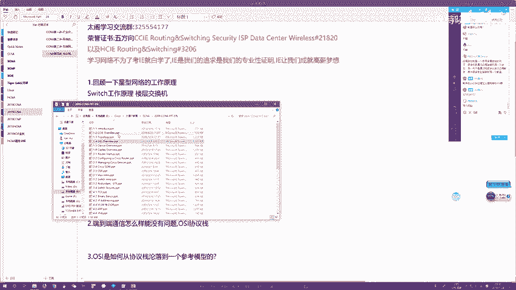

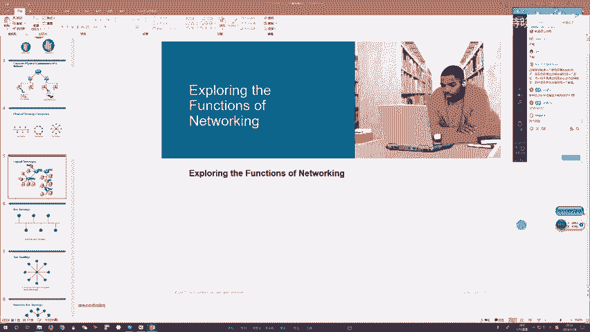

只不过我们在图示里面用原的来画，好吧，然后这边呢有台交换机，这边呢也有一台交换机，然后这边咱们有个集限器，然后这块呢咱们有一个网桥，可以吧？这就是咱们的网络连接，好吧，那首先问大家一个问题啊。

在这个网络里面，对吧？在这个环境里面啊，咱们有几个网络，这个环境下，咱们一共有几个网络。😊，有几个。根据咱们刚刚所学的大家能答出来吗？两个是吧，左边是一个啊，然后呢，下边是第二可以吧？左边是一个。

然后呢，下边是第二OK那接下来大家还记不记得冲突域的概念？应该还记得吧？什么叫冲突域啊？就是在这个环境中呢，任何两个节点只要同时发送数据，就会出现冲突，并且冲突碎片能够影响到这个环境内的所有乘越。

那我想问大家了，当前在我们这个环境中又有几个冲突域呢？冲突域有几个？广播域有两个啊，网络有两个对吧？广播域有两个，那冲突域有几个呢？那大家来看一看吧，有几个冲突域。好，可能大家不太认识这个网桥啊。

这个网桥给大家介绍一下啊，网桥就是比较早期的交换机，好吧，网桥就是比较早期的交换机。你可以理解为这个网桥呢都是基于软件实现的，一个网桥就是一个二口交换机，对吧？它只有两个接口，好吧，它只有两个接口。

那当然由于它只有两个接口细心大家会发现那这张图画就有问题了，可以吧？我这台路由器，一个接口连接集线器，你集线器接口很多，对吧？身后连接这4台计算机这是没问题的。然后呢，集限器再拿一根线连到咱们的网桥。

那这已经占用了咱们网桥的一个接口嘛，然后接下来这个网桥下面，我也只有一个接口了，我这个接口能够通过一根线连接两台PC吗？😊，是不是连不了啊，你一根线怎么能连两台计算机呢？你不可能的。

你一根线只能连一台计算机。但是很明显，我这边一个接口连一根线确实连到了两台计算机。在这儿怎么做的？😡，但你总不至于说把这根线割成两半，对吧？一半连接左边的一半连接右边的，你做得到吗？好像貌似做不到是吧？

那所以说可以理解为咱们这块少了一个设备，可以吧？你省略了一个设备，其实这个地方有一台设备存在啊，它们给省略了，所以说我们把这个称为什么叫逻辑头。那省略是什么设备呢？请注意啊，按照节约设备。

隐藏设备这么一原则来看啊，你在三层网络设备连接的环境下，你可以隐藏二层和一层的设备，啊，那你在二层的网络设备连接情况下，你隐藏的就是什么一层设备可以吧？所以说这块呢应该还有一个集限器。

这块应该还有一个集限器，这个集限器，一个接口连接网桥，然后呢，另外两个接口连接这两台PC可以吧？好了，那接下来有几个冲突域呢？请注意啊，由于这块你连的是个集限器，对吧？

O那所以说I和这你们之间同时发送数据。😊，会出现冲突是吧？那所以说了网桥下面这块，这是一个冲突语，好吧，然后紧接着这块也是一个冲突语吧，这块也是个冲突语，好吧。

因为你路由器的接口肯定要比交换机的接口要厉害嘛，对吧？你三层的接口肯定能够识别你收到的一个帧到底是一个冲突碎片还是一个完整的帧，你收到一个完整的帧，你能够进一步的发送。而你收到一个冲突碎片。

你肯定要丢弃嘛，对吧？然后接下来咱们这块由于是个极限器，你所有设备都连在极限器上，你们只要两两发送数据就会有冲突，而冲突碎片呢，对吧？不会离开网桥去往下面也不会离开路由器去往上面，所以说了对吧？

你们这一块的所有设备是属于同一个冲突域，好吧，这是第二，然后接下来这个路由器呢到交换机之间的这一段，这是第三个冲突域，对吧？这是第三个，那大家说到这第三个冲突域的时候，大家可能会奇怪的。

说哎你这块里面连。PC都没有啊，你怎么会有冲突域呢？你怎么会有冲突呢？好，请注意啊，确实啊你按照常理来说，这一段连接它就根本不会有冲突。为什么？因为交换机的接口也是全双攻的吧。你路由器的接口也全双攻的。

你就算这两个接口同时发送数据，你是不会有任何冲突的，可以吧？那当然你可以假设你假设在这个链路中啊，我产生一个冲突碎片，可以吧？我不让你冲突，我产生一个冲突碎片总可以了？我平安无故的给你添加一个冲突碎片。

那这个冲突碎片呢，它向左传传到交换机，是没有办法离开交换机这个接口的吧。它向右传传到路由器，它也没有办法离开路由器这个接口吧。所以你会发现如果在这个链路中，咱们存在一个冲突碎片，那这个冲突碎片呢。

就只能在这个链路内进行传递，可以吧？它左边离不开交换机，右边离不开路由器。所以说你按照这个假设来看的话，对吧？你这两个。接口是属于同一个冲突域的。虽然在这个冲突域内，咱们由于双攻模式都为全双攻啊。

你也不会出现冲突。但是假设你冲突产生了，那这个冲突碎片对吧？你就只能在这两个节点之间进行传递，可以吧？那按照这个来分析，唉，你交换机连接这台服务器是吧？这也是一个冲突域，可以吧？

你交换机连接这台PC这也是一个冲突域吧，你交换机间彼此互联，这也是一个冲突域，可以吧？下游交换机又连接了5台设备，那这又是5个冲突域。看到了吧？5个冲突域加上6个789111个。咱们一共有11个冲突域。

好吧，那通过这张图啊，通过给大家讲解，我希望大家能够了解到底什么叫冲突域，什么叫广播域。关于这两个域呢，希望大家就是有这么一个概念，对吧？所谓的冲突域就是当冲突产生的时候，对吧？

冲突碎片所能影响到的设备的集合，而广播域的特点是什么呢？就是当你一个节点发送了一个广播广播流量所能影响到的设备的集合，好吧，那当然一个冲突域呢，你也可以称为叫一个网络啊。

一个广播域你也可以称为叫一个网络，但是呢由于对吧？咱们当前的极限器基本就没人用了，那所以说呢像这种连接你经看不到了，对吧？那既然极限器没人用了，这个冲突域的概念呢，大家也不用太在意了，对吧？

那所以说当前由于咱们当当前怎么样只使用交换网络啊，你只使用交换机，你只有新型网络存在，那所以说咱们就。

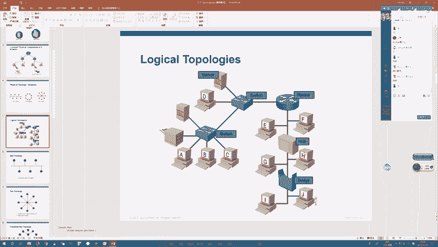

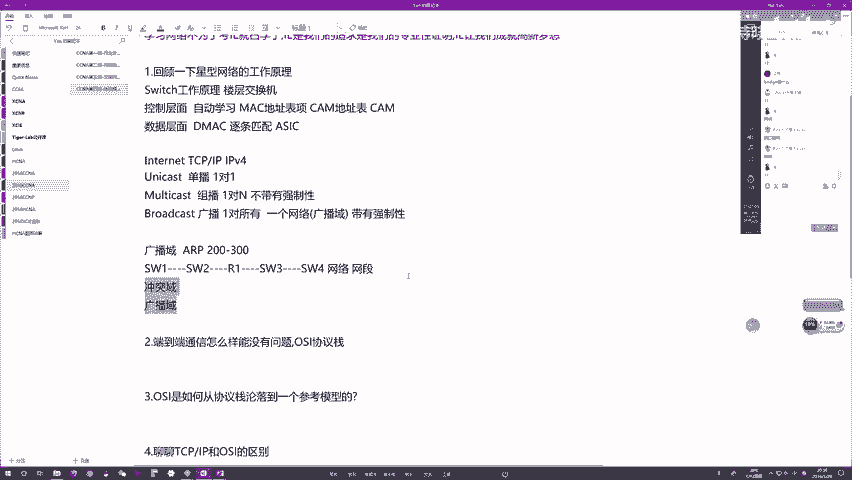

更加关心广播域这个概念就好了。可以吧。那接下来咱们定义一下一个广播域就是一个网络，可以吧？你在一个广播域内呢，你有很多计算机，这些计算机呢你想要工作肯定需要IP地址。

一个网络内的计算机的IP地址它是需要有条件的，条件什么呢？就是他们的IP地址的网络位必须相同。

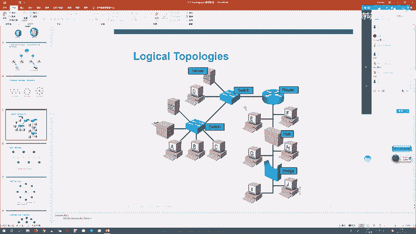

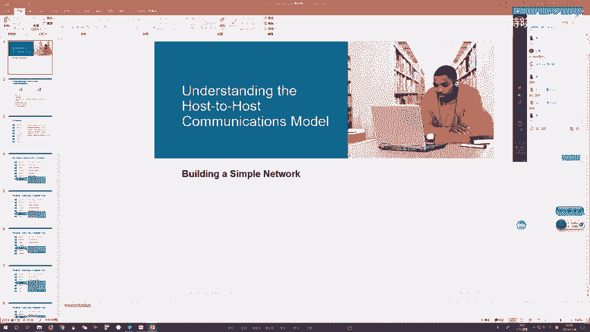

对吧然后呢它们的主机位要彼此区分，好吧，那这个就是网络和IP地址之间的这么一个概念，这就是网络和IP地址之间的关系。好吧，那当然这个IP地址的网络位跟主机位呢，大家先有这么一个概念啊，先有这么一个概念。

之后呢，关于网络位和主机位的这么一个功能，我们会详细的给大家介绍好吧，那这个呢咱们讲到VOSM的时候，你们想不会，我觉得会比较难好吧，那关于这个概念大家能不能理解啊，能理解吧，应该可以理解啊。啊。

bridge是什么啊？bridge叫网桥啊，再说一下这个bridge刚刚说过了啊，叫网桥。那一般这个网桥呢，咱们称为叫透明网桥。好吧，这个咱们称为叫透明网桥。

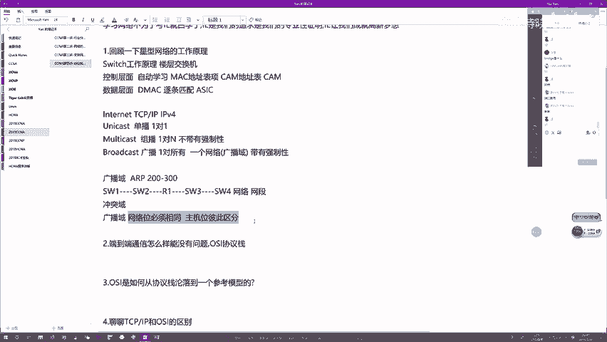

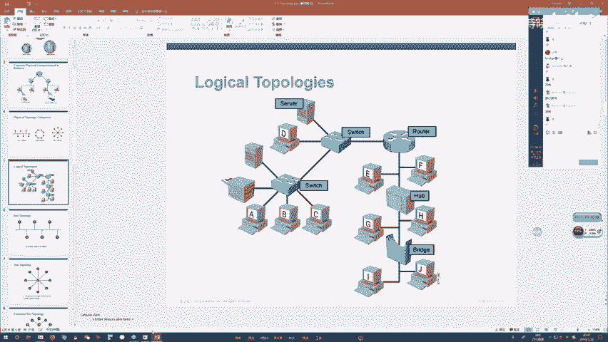

所谓的透明网桥是什么呢？就是基于软件啊，它是基于软件实现的二口交换机，可以吧？你是拿软件来模拟的，可以吧？那在你没有交换机之前呢，大家使用的二层设备，就是网桥，你拿网桥呢主要是用来分割咱们的冲突域啊。

对吧？因为你的二层接口具备分割冲突域能力嘛，但是这个网桥呢对吧？你从种种来看，它的转发能力又差，然后呢，又不好连接，对吧？然后呢又比较麻烦，对吧？又不好操控，那所以说基本你慢慢被淘汰了。

当前自然而然咱们使用交换机要来取代网桥所有功能，那所以说当前咱们只要收到二层的设备，基基本上没有人会联想网桥啊，基本咱们想用都是交换机，可以吧？但是呢由于网桥出现的时间比较早，曾经网桥刚出来的时候。

咱们有一些对吧？基于网桥所能使用一些技术，比如像我们的生成数，可以吧？在生成数这个协议中呢，你能看到很多的名词里面会携带。网桥这两个字，比如像什么跟网桥啊，对啊。

像什么网桥间的链路状态啊等等之类的那这些呢都是基于网桥来命名的那当然命名的原因是什么呢？就是因为当时那个时代在你生成数比较盛行那个时代啊，交换机还没有那么普及，可以吧？但是呢如今来看交换机也非常普及了。

所以说你现在再去提二层，那基本清一色的想到的就是交换机，好吧，OK那这就是一个简单的概念啊，给大家说一下好吧，给大家说一下。

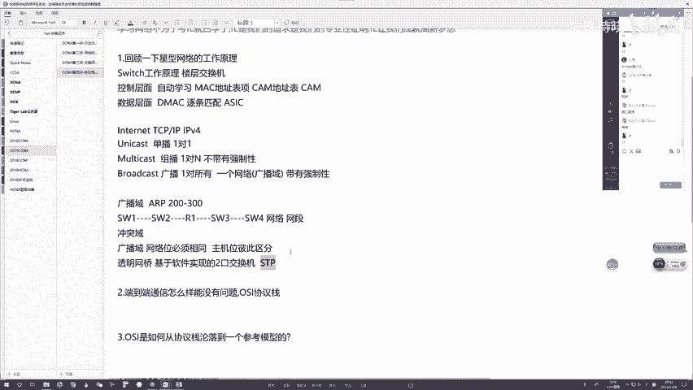

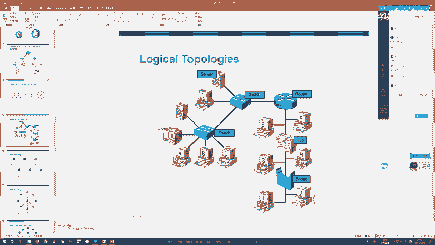

好，那关于这块的话，我觉得大家应该没有什么问题了。好吧，应该没有什么问题了。O好，那接下来我们来进入到下一个环节啊，我们来讲一下端到端的通信模型。好吧，我们来讲一下端到端的通信模型。好。

那当然在讲这个模型之前呢，先给大家就是介绍一下，这也是咱们年前的最后一周的课了，年前的最后一周课了。今年是小年那我也就是祝大家小年快乐，也是提前给大家报个早年吧大家新年快乐。然后呢这个年前的话。

咱们会有最后一周的优惠活动，这周的优惠活动呢应该是年前最大力度的一周。然后呢等这周过完之后呢，咱们的优惠就应该差不多结束了。然后呢到了年后呃我们的这个课程单价呢会有所调整。因为我们的NPIE呢将会升级。

里面会加很多新的技术啊，就包括像什么SDN啊，包括像什么V啊，这些比较高大上的技术啊，在我们的IE课程中都会加入。然后呢届时的话，咱们的课程线下和线上都会涨价，并且会。😊，幅度比较大，这样的幅度比较大。

就是至少也是涨2000以上啊。那所以说此消彼长啊，这个年前这个性价比会比较高一些。大家如果就是哎对咱们的课程还比较感兴趣的话，对咱们的VIP的NP和IE比较感兴趣，啊，你们可以就是啊关注一下咱们的群。

然后呢来询问一下咱们的课程顾问老师。因为我们这边的话，NPIE的服务也是在越来越精进啊，然后呢，大家如果了解咱们应该知道，就是我们是从前几天开始，从上周开始啊，就是给我们的NP和IE一个新的服务。

就是一对一答疑服务，就是每天会给那个NPE学员一个小时时间来给大家一对一答疑。这个答疑的话，不仅仅局限于咱们课程内容啊，就是包括你们工作内容，包括你们面试内容，就是包括你们对吧？想到的一些书上的，对吧？

胶片上的文档里面的一些案例。你们如果有问题的话，我都会去给大家做一个解答，对吧？那当前的答疑还是基于这个群里面啊，就是通过文字的。方式问答。但是日后呢慢慢会升级，把这个服务慢慢升级，升级到。

就是通过语音啊，通过电话啊，通过种种方式来给大家更加多为一体的去做一个答疑服务。那所以说这也是我们泰国想要做的事情，就是咱不光光要传递知识，我们希望就是做大家的职场的一个对吧？零路人。

我能告诉大家一些最新的资讯，我能给大家一些就是从业的建议，给大家一些就是就业的内推，对吧？工作内推，然后更多就是当你们在工作中遇到的一些对吧？疑难杂症遇到的一些问题，对吧？遇到的一些客户的这么一些疑问。

对吧？我能尽可能给大家就是解决，然后包括大家需要下载的一些像什么cisco的固件啊，像什么华为的固件啊，我也会尽可能就是帮大家去对吧？下载，就是尽可能的给大家提供这么一个backup的这么一个资源。

就是让大家在工作的时候呢，能够更加的啊胸要充竹吧，就不用担心说是我们由于技能不强，对吧？会不会解决不了问题，会不会出现什么腰蛾子，那我希望就是通过咱们的服务，让大家对吧？所有。这些问题都能够迎刃而解。

好吧，那所以说呢这个服务只会越做越好。所以说就是配合上更好的服务。那咱们的价格可能会可能会更高啊，当然不是可能啊是今年是一定会更高。所以说就是大家如果感兴趣的话。

就是可以加我们的群来询问一下咱们的课程顾老师OK。好，那接下来关于这个第二个知识点，来给给大家就是剖析来看一下这个什么叫端到端的通信模型，对吧？那首先什么叫端到端通信呢？那先跟大家说一下这个端到端通信。

所以所谓的端到端通信啊，就是主机到主机之间的这么一个通信，因为咱们加入网络，对吧？网络里面三元素，希望大家还没有忘记啊，对吧？就是咱们的终端，对吧？终端其实就是咱们的计算机啊，是吧？然后呢。

通过咱们的介质就是咱们的线缆嘛，对吧？介质就是线缆，然后呢，连接到咱们的中间系统，这个中间系统就是咱们的网络设备，对吧？那当然这个网络设备呢，咱们一般用的比较多的，像交换机，对吧？

像路由器这样的网络设备，OK那当你连接而成之后呢，咱们最终的目的是什么呢？就是让终端跟终端之间。咱们能够通信对吧？终端和终端之间，咱们能够交互数据，能够实现资源共享，对吧？那这个终端到终端之间的通信。

我们就称为叫端到端通信，O那当然这个端到端通信呢，其实这个说法非常不到位的，因为我说了计算机它不需要联网，因为你计算机没什么好发的嘛，你就是一堆破铜烂铁嘛，你要发什么，你不需要发是吧？

我们需要发送数据的是承载在终端之上的这些应用程序，对以吧？并且咱们之间彼此通信的啊，对吧？也不是计算机而是咱们应用程序，所以说呢这个端到端通信呢，其实更多的应该指什么？

应该是指应用到应用之间的这么一个通信，可以吧？应用到应用之间的这么一个通信，你在一个主机上对吧？装一个微信，你在另一个主机上装一个微信，你们之间聊微信嘛，那这个叫通信，对吧？你一个主机上装一个浏览器。

你你另一个服务器上对吧？安装一些对吧？就是啊HTML的一些相关的应用。然后你让这个装浏览器的PC来访问那个服务器的网页，那这个也叫通信，对吧？所有的通信其实都是应用到应用之间的这明通信。

那接下来应用到应用之间，咱们想通信成功，前提是要有兼容性，对吧？你得要保证咱们端到端在发送数据的时候，沿途的所有设备对吧？他对数据的处理，都不要出现什么1蛾子，不要说我给你发送的数据，你能理解。

它不能理解。不要说我给你发送一个数据，你认为它是发给B的，然后他认为是发给C的对吧？不要说是我认为把数据发送给目的地要该走你这条路径，而你认为该走另外一条路径，对吧？咱们千万不能出现这些问题。

因为你一旦出现这些问题了，你端到端可能就通不了了，你通不了，那咱们这个网络存在，对吧？就没有意义了。因为网络的存在就是让你通的，你若果把网连好之后，发现咱们之间根本就通不了，那这个网就形同虚设了嘛。

对吧？那在早前咱们很多网络还真有那么一点形同虚设的味道，早前的网络会有很多很多的兼容性问题，导致就算你把计算机连接入。就算你安装好了应用，但你这些应用呢没有办法良好的利用咱们网络连接啊来收发数据。

或者说你要利用咱们的网络收发数据的时候，由于种种原因啊，你的数据没有办法发给目的地，或者说你的数据发给目的地了。但是目的地呢没有办法正常接收，那这都是有可能的。那这些原因呢，我觉得不外乎啊。

就是兼容性问题。可以了。那为什么会有兼容性问题呢？当然也很好理解，因为你这个网络里面包含这么多组件，而这些组件它又不是一家公司生产的对吧？你计算机有计算机生产厂商，你线缆有线缆生产厂商。

你网络设备有网络设备生产厂商，你不同的公司做不同的东西。对吧那如果说你要缺乏沟通，你如果说自私自利一些，你们每家公司都按照自己的标准来做产品，那你可以把产品做的很好嘛，但是你产品跟产品之间对吧？

你怎么去连呢？你没有任何兼容性可言啊？你就算勉强把他们连在一块，对吧？由于各自的标准都不一样，对吧？各自的工作原理都不一样，你怎样让大家通信啊，是不是就没有办法通行，对以吧？

那这个问题呢曾经现实中存在过，并且存在了很长一段时间，那这个就是上个世纪70年代，对吧？在那个时代呢，美国其实就深受这个问题的影响，因为当时的美国的各大厂商对吧？各大巨头公司啊，那些硅谷的大佬们。

他们呢对吧各司其职，对吧？有的人呢负责做软件，有的人呢负责做计算机硬件，对吧？当是大家比较熟悉像IBM啊，对不对？然后呢，有的公司呢负责做线缆，对吧？也有公司负责做网络设备，对吧？大家各做各的。

但是在当时那个时代呢，并没有一些公有的标准来供这些公司呢参考，那所以说呢各家公司呢，咱们在造硬件在做软件的时候，对吧？都比较私有化，所谓的私有化，就是对吧？我研发这些硬件。

我开发这些软件是按照咱们公司的私有标准来做的。我认为你这个设备这样工作比较好，对吧？那我在开发的时候呢，我就让你这么工作，对吧？我觉得这个软件这么运作好，对吧？那我在研发软件的时候，我就这么来。

那接下来经常会出现什么问题呢，就是你买了A公司的计算机，你买B公司软件。安这个软件根本就装不上去，或者说勉强装上去了，在用的时候会出现各种问题。然后接下来你买一个A公司的线缆，你买一台B公司的集线器。

你会发现这个线根本就连不到集线器的接口之上，他们的对吧？接口的规格不一样。然后或者说你线能连上去，但是你两端一插线对吧？啪网是不通呢，是吧？那这个都都有可能啊，那怎样做能够保证咱们这个网络正常运作呢。

就是你要尽可能的保证你采购的所有东西，对吧？硬件软件，包括线缆，包括咱们网络设备都来自于同一家公司。😊，可以吧你采购的东西，如果你来自于同一家公司啊，你能够尽可能的避免任何兼容性问题。

让咱们这个网络呢能够正常运作。但是你要知道咱们每家公司都有它的长处吧。比如你IBM，你造PC比较厉害，对吧？但是你造软件厉害吗？不厉害是吧？你造网络设备厉害吗？不厉害。

如果你真要所有东西全买IBM呢没问题，那可能第一你会很贵，第二，你可能会买到一些比较坑爹的东西，对吧？我觉得你IBM，哎，你就是做PC好。然后接下来我想要买什么？我想要买B公司开发的软件。

我觉得B公司开发的软件比较好用。那这个时候你如果想要把他们这两种东西结合在一起，那如果说这两家公司在开发硬件软件的时候没有按照相同的标准对吧？那就且有的你烦了，各种各样的兼容性问题，等着可以吧？

那所以说呢当时呢就有一个标准化组织啊，看不下去了，这个标准化组织，我们称为叫IO叫国际标准化。😊，组织叫国际标准化组织。那大名鼎鼎啊，大家应该都听过啊。这个国际标准化组织呢当时就是看怕看不惯啊那帮公司。

对吧？你们在开发硬件软件的时候，一个个的叫他拽了28万的，按照自己的标准来做，对吧？你们没有任何协同，没有任何协商，这个不太好。那所以说呢当时呢就是开了一个会，在1978年。

然后接下来开了会做了什么事呢？就是要求大家对吧？你们你们都注意看一下啊，当前咱们的环境已经非常混乱了，是吧？大家都想发展，对吧？那大家都想发展要怎么做呢？你们得要联合在一起，对吧？同仇敌忾。

你们要配合彼此对吧？让我们这个蛋糕啊越做越大，那蛋糕越做越大，你们都有更多的利润嘛，是吧？你们不要自己做自己的内耗这没有意义，对吧？那所以说呢你你们之间做一个沟通，对吧？做一个协商。

把大家呢开发这些硬件软件所属的标准，你们都公开出来好吧，那都公开出来之后呢，我来给你们把一个关，对吧？我来给你们做一些调整，做一些优化，然后接下来我给你们做完调整优化之后呢，那这些标准。

咱们就称为叫公有标准了，不再是你们厂商的私有标准，那今后呢咱们所有公司对吧？IBM也不例外，英特尔也不例外，DEC也不例外，施乐也不例外，你们所有这些公司，只要再要造咱们的硬件软件。

再要造咱们的网络设备线来，请你们都按照。😊，这些公有标准来，那这个公有标准呢，大家遵循都是一样的对吧？这就不至于说是我生产的硬件跟你生产的软件对吧？不协调了。

这就不至于说是我生产的线来跟你生产的极限器连不到一块，对吧？咱们就没有这些问题了。那没有这些问题了。那客户就爽啊，对吧？你客户要组网，我可以东买买西买买嘛，对吧？我觉得你家PC强就买你家PC嘛。

我觉得他家软件强，我就买他家软件嘛，对吧？我觉得这家极限器做的好，我就买这家极线器，我觉得这家线来做的好，就买这家线来，我能够花最少的钱买最好的东西，并且把它们组合在一块，还不用担心任何兼容性问题。

那这样对吧？谁不乐意用网络，谁都会乐意用网络，对吧？你网络越容易用，对吧？大家用的时候越爽，对吧？你这个用户啊就越多，你用户越多，你蛋糕越大，那大家都能赚到钱嘛？是吧？那咱们这么来好吧。

那接下来呢经过这个会，唉，大家呢就是照这个法则去实施了，那实施完。😊，之后呢呢经过SO的一系列调整啊，那咱们就出台了这么一个公有的标准级。这个公有的标准级呢，咱们就称为叫OSI叫开放式系统互诊。

叫开放式系统互联。那这个呢基本可以理解为是对吧？整个互联网里面的第一个公有协议站对吧？当然第一个不敢说啊，但是它是最有名的一个也是比较早期的一个叫开放式系统互联。那这个系统互开放式系统互联呢。

作为一个协议站啊，作为一个协议站，它里面包含了N多N多的协议，对吧？包含了N多N多的规则，那当然都是公有的，然后接下来呢就是SO就规定了，哎，你们今后美国这些公司，你们呢在生产任何东西的时候。

只要是IT相关的，你们就按照这个OSSI来，对吧？你们开发PC的硬件也好，对吧？你们研发软件也好，你们造网络设备也好，你们造现缆也好，对吧？大家都按照这个标准来，哎，那就不会有任何问题。

那接下来由于这OSI呢里面包含东西太多了，太复杂，对吧？你给一家公司来参考的时候，可能他很难找到自己比较感兴趣那些点。那所以说为了让这些对吧？巨头公司啊，他们参考OSI的标准参考的更加容易一些，对吧？

让我们这个OSI呢能够更加的被人被大家接受啊，更加容易被我们参考更加容易，对吧？被我们利用，用来就是做一些设备的研发等之类的那为了让咱们OSI更加的简化，是吧？ISO呢就把它做了一个分层，对吧？

把它的不同的协议，不同的功能，对吧？分成7块，对吧？那这7块呢咱们就称为叫7层，这就是俗称的叫七层模型嘛，好吧，那这七层分别哪7层呢哎这个胶片里面画的很清楚啊，OSI一共这么7层，好吧。

第七层呢叫应用层，第六层叫表示层，第五层叫绘画层，第四层叫传输层，第三层叫网络层，然后呢，第二层叫数据量层。

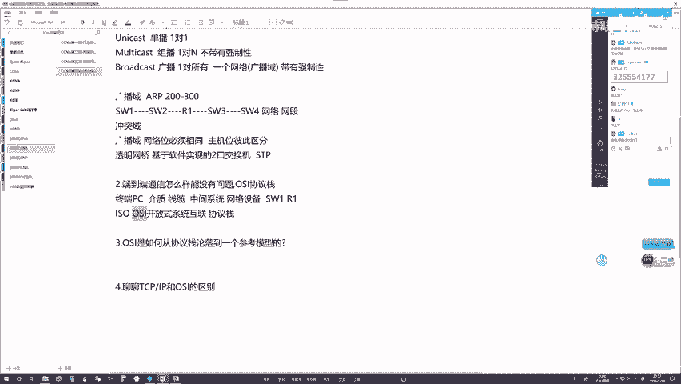

第一层叫物理层，一共呢有这么7层。那接下来这七层的每一层都包含了相应的协议啊，对吧？一个协议只能属于一层啊，你不能属于多层，对吧？咱们相当于按照功能啊，来把你整体的IT分成了七大类，对吧？

分成七大块对吧？每一块都包含了一些规则，对吧？供你这些公司去参考，可以吧？那接下来分成7层的最大好处是什么呢？就是咱们公司在生产硬件软件的时候，对吧？我参考这些协议啊，加更加容易了。

就比如说我开发一些应用程序，对吧？我肯定是更加参考什么上三层的一些协议嘛，然后我我制造一些网络设备，我肯定会更加参考下四层的一些协议，是吧？然后接下来造线来，你设计接口，咱们参考物理层协议会比较多一些。

对吧？然后接下来你做一些网络层的应用开发，对吧？你基于三层的功能会更加多一些是吧？那这样的话就方便大家去参考查阅，可以吧？那接下来这七层呢它各有各的功能，那它这个功能到底有哪些。

那这边的话给大家就是抛开来，对吧？给大家讲一讲里面的具体的功能，好吧。首先在讲功能之前呢，请注意啊，就是咱们每一层里面都包含很多协议。虽然不同的层包含的协议不一样，看似好像他们没有什么关系啊。

但是其实层和层之间还是有一定的关联的。这个关联是什么呢？我们称为叫服务，可以吧？OSI规定了下层的协议为上层协议提供服务。这也就是说你上层的协议想要工作啊，你上层的功能想要使用。

前提是下层的功能是没问题的。如果你下层有问题，那你上层就不用想了，肯定是工作不了的，可以吧？就比如说呢你网络层的不通，你应用程序怎么交互数据啊，交互不了可以吧？下层为上层提供服务，能理解吧？

O那所以说这给我们的一个排错的参考，就是当你在网络中如果出现了一些故障，对吧？原来两个节点之间咱们能通的，现在通不了了。对。怎么办呢？对吧？找错的时候，咱们怎么找啊。

就是按照从下到上的方式来逐层的进行排错，可以吧？找到问题，先怎么找，先找咱们的物理层，对吧？看一下物理层O不O物理层OK了，找数据链路层，数据链路层O了，找网络层可以吧？咱们依次的逐层往上去递推。

可以吧？你不要再排错的时候，咱们上来先看这个应用层，对吧？你这样就很难找了，可以吧？因为你上层能不能工作，除了看你上层以外啊，还要看下层，你下层如果都不O，你上层再去找，你也找不到问题的原因，可以吧？

那这是一个排错的思路，O好，那接下来我在讲这个协议站的时候呢，我习惯从上到下讲啊，那咱们先来讲一下第七层啊，先来讲一下应用层可以吧？那这个应用层啊，顾名思义啊，应用层应用层，对吧？应用嘛，什么叫应用啊？

对吧。应用就是咱们网络中的主体。你网络存在的根因就是为应用提供服务，对吧？就是因为你两台主机之间的应用要传输数据。你应用之间要资源共享，对吧？那为了让你资源共享，咱们才给你这么一个网络对吧？

所以整体的网络就是为应用提供服务，那你这个应用层的协议，对吧？顾名思义啊，就是给我们应用来提供一些服务的，那提供什么样的服务呢？那很简单，对吧？你计算机连接的网络，对吧？你在开发应用的时候。

是不是要开发一个网络模块啊，对吧？你开发一个网络模块，让咱们的应用在你的操作系统上安装完毕之后，你能够利用咱们的网络连接来说发数据，就相当是咱们这个应用层就是给予我们各种各样的应用程序啊。

一个网络连接的窗口，我给你打开这么一个窗口，基于这个窗口，咱们各种各样的应用程序呢，就能利用咱们计算机的网络连接啊，来成功的利用咱们的网络。来收发数据，那这就是应用层所干的事情，对以吧？

应用层里面的各种各样的协议啊，那一般咱们是看不到的。因为这些协议一般都是内嵌在咱们应用程序之中的对以吧？你在一个应用程序中内嵌一些应用层的协议。那内嵌之后的结果是什么呢？就是咱们这些应用层的协议啊。

能够帮助咱们这个应用程序，成功的访问咱们的网络，通过咱们的网络连接收发数据，这就是应用层协议所干的事情。那这一层的协议一般谁打交道比较多呢？就是那些研发人员，对吧？因为你任何的应用都是研发工程师。

你写代码写出来的对吧？你在写代码的时候呢，你就要给每个应用写这么一个网络连接的模块，那这个网络连接的模块里面呢，你就要对吧？包含各种各样的应用层的协议，因为这些协议在网络模块中啊，起到了至关重要的作用。

因为这些模块中的协议，它就能够帮助咱们这个应用来成功的联网，那帮助咱们的应用联完网之后呢，你可以利用咱们网络连接来收发数据。那这就是应用层协议的这么一个存在的概应，对吧？没有他们应用是不能联网的。

有了他们之后，咱们的应用才能联网，好吧，好，这就是第七层，那接下来这第七层的协议咱们能直接工作吗？对吧？那肯定不能，因为它只能够为咱们应用提供网络连接，哎也就是说你如果说只有第七层的应用啊。

你只有第七层协议。那没错没错，你第七。七层的协议啊，在工作正常情况下，对吧？你应用层的这些应用程序能够利用咱们网络连接来收发数据。但你收发数据，咱们到底能不能算作是成功通信呢，这个还不好说，对吧？

因为在咱们当前网络来看，跨平台这三个字，我相信大家呢都已经熟用的不能在熟了，对吧？就比如说一个应用，咱们都有很多平台的版本是吧？你有手机版的，你有PC版的，你有苹果版的，你有lininux版的对吧？

就举一个最简单例子啊，大家都聊QQ嘛，对吧？你QQ有windows版的吧，你也有iphone版的，你有安卓版的，你有ipad版的是吧？你有lininux版的，你各种各样的版本都有，你针对不同的操作系统。

你开发这个QQ所使用的代码不一样，你里面所包含的功能不一样，对吧？你的数据的表示格式等等之类的都不一样。虽然说你们都叫QQ，你们的功能都一样，但是你们的内部代码是完全不相同的。

那所以这个时候假设咱们有两台计算机，对吧？A和BA呢用的是win10的系统，对吧？假如说B是一个苹果机，它用的是苹果系统。那这个时候呢，他们都能装QQ，对吧？那他们要聊天，那他们聊天对吧？

如果说我直接彼此来发送数据，对吧？主机A把我要发的这串话，比如我打的字啊，打了一串话发给B。那B收到这串话，按照正常情况来判断。B是绝对不可能理解你发的是是是什么内容的，为什么？因为很简单。

你这两个操作系统不一样。那所以说以至于你们你们这两个应用啊，你们这两个应用对数据的格式表示形式是完全不同的？你们使用的编码格式不同，你们用的压缩格式不同，你们用的编码格式不同，这导致什么呢？

这导致A所能理解的数据格式到达B这块，对吧？那很有可能是乱码，B所能理解的格式到达A这块，那可能也是乱码，对吧？你们彼此之间确实让我能传数据，我能把我想传的发给你，你能把你想传的发给我。

但是我发给你的数据，你收到它全是乱码，你给我发的数据我一收到对吧？也全是乱码。😡，那这有什么意义呢？这是不是毫无意义啊，对吧？我们发送数据的目的是什么？我发的你能看得懂吗？我发的你能看得懂。

这才算是资源共享。我给你发一大串话，你收达到这一大串乱码，对吧？根本不知道我发的是什么，那这个只是在传递一些无意义的信号而已，对吧？这不叫资源共享，那所以你会发现就是光有应用层的协议。

这是远远不够的因为应用层的协议确实对吧？能够帮助咱们这些应用访问咱们的网络，那这仅仅也就只能怎么样让你这两个应用之间通过咱们的网络来通信，那咱们有这么多的平台，咱们有这么多的对吧？编码格式的应用存在。

那这些跨越平台的通信，咱们怎样来避免咱们的乱码产生呢，对吧？咱们怎样来保证咱们的通信效率呢？怎样来避免咱们通信失败呢？对吧？你光靠应用层的协议啊是做不到的对以吧？它无法给你保证。

那所以说呢为了避免咱们刚才那个问题，咱们就需要依赖表示层的协议。这个表示层的协议呢，它主要干什么事呢？它就是专门用来辅佐咱们这些应用层的协议，对吧？应用层的协议是帮助咱们的应用能够连接网络。

能够收发数据。那表示层的协议，就是在你应用层的协议工作之前啊，在你应用之间通信之前，它呢会先在应用之间做一个协商。那协商什么呢？主要就是协商双方都能够支持的数据表示格式，对以吧？

比如说你们在发送数据的时候，哎，用什么什么样的编码，对吧？用什么样的压缩机制，用什么样的加密解密机制，对吧？我们来协商一下，协商一下双方都能够支持的那咱们按照双方都能够支持的数据表示格式啊。

来做一个数据编码来做一个数据压缩来做一个数据加密，那这个时候我能够保证A给B发的数据，B收到之后是能够成功解码，是能够知道里面包含的内容的。而B给A发送的数据。A收到之后也能知道里面包含的是什么。

就是你不用担心咱。通过表示层的协议协商之后啊，你们的通信还会产生乱码。那能够避免乱码，咱们就能够保证A给B发的数据，B能识别B给A发的数据，A也能识别。那这样的话，咱们通信是不是成功率就高了，对吧？

那所以说呢这个表示层呢，它是为应用层提供服务的。有了表示层之后，对吧？你表示层协商完毕了，B免冲突产生了应用层再开始通信。那这个通信呢成功率就会高得多。好，那接下来我们来思考一个问题。

你表示从如何在应用之间来做这个协商呢？你做这个协商的前提是咱们应用到应用之间，你已经有了这么一个传输路径了吧。我们把应用到应用之间的传输路径称为叫应用到应用之间的绘画。你两个应用之间建立一个绘画。

有了绘画之后，彼此能够找到对方了。那这个时候咱们可以基于这个绘画来做任何协商，你也能够基于这个绘画来做咱们的应用层的实际通信，而在你这个绘画建立之前，你怎么去协商呢？你怎么去通信呢，你连对方找都找不到。

你连这个路径建立都没建立好，对吧？你怎么传输呢？你是不是就没有办法传说的，可以吧？就好像你要开车，你怎么开车，你得先有路吧，你连路都没有，你去哪儿开，你在悬崖开嘛？你在海上开嘛？你开不了啊。

所以说了你要开车得要先修路，对吧？同样你表示层的协议，想要在应用群之间来协商咱们数据表示格式，前提是你的应用到应用之间得要先建立一个连接，要建立这么一个绘画。你绘画没有建立，你拿什么来协商。

你绘画都没有建立，你拿什么来通信呢，对吧？那所以说了一切都是浮云啊，你这两层想要工作，还得看咱们的绘画层。绘画层协议对吧？绘画层绘画层嘛？顾名思义干什么事？

它就是专门啊在你的两个应用之间去建立这么一个连接，对以吧？我在你两个应用之间呢建立一个连接，这个连接，咱们也成为叫网络绘画，那当你建立好了绘画之后呢，咱们基于这个绘画，对吧？你表示层的协议呢。

就能进行工作了，你能够协商咱们的数据表示格式，那当你协商完数据表示格式之后，对吧？避免乱码产生了，接下来还是基于这个绘画啊，应用层的协议就开始实际通信，对吧？你传收的数据，咱们也基于这个绘画来传的。

对以吧？那接下来绘画层的协议呢，当你建立完绘画之后，他就会看你当前这个绘画呢，有没有在用。如果这个绘画当前有在被利用，我就帮你去维护这个绘画的状态。那当你绘画用完之后呢，我帮你把这个绘画给拆除掉，对吧？

所以说建立绘画维护绘画连接，拆除绘画，这就是绘画层协议所干的事情，可以吧？好，这就是上三层协议所干的事。那按照这个协议的功能介绍，大家应该能够知道下层为上层提供服务，大概是个什么概念吧。好吧。

基本就是这概念，好吧，基本就是这概念。O那接下来由于上三层的协议呢，其实我说难听一点啊，他都是跟研发工程师有关的。你研发工程师包括系统工程师，对吧？你在做一些协议开发的时候，你在做一些应用开发的时候。

你在做一些操作系统开发的时候，你需要利用上三层的功能，对吧？去写一些代码写一些模块，那所以说正是因为如此啊，上三层协议呢，咱们学网络的，一般见的比较少，因为网络工程师，你在调网络的时候，对吧？

上三层的协议基本你是看不到的，可以吧？只有那些研发工程师，那些系统工程师，你会经常跟上三层的功能，跟上三层这些协议啊去打交的，并且这上三层。对吧有点儿。算是一个形式至上的这么一个层啊。

就是你通过上三层咱们规划来规划去。对吧它没有涉及到实际的数据发送。它没有涉及到实际的数据通信。可以吧，你在上三层咱们没有涉及到什么产生流量啊，发送流量转发流量啊等等之类的这么一些行为。我只是对吧？

用来在应用之间建立连接啊，协商啊等等之类的干这些事儿。所以说你通过上三层，你会发现，对吧？其实你这个时候的流量还没有离开咱们操作系统被发送层那因此呢咱们基于这一点也把上三层啊称为一叫操作系统层或者叫应用层。

因为上三层关联的更多的是一些操作系统相关的或者应用相关的这么一些功能，可以吧？而实际的数据传输，实际的数据发送，实际的数据转发，哎，这是由下四层所负责，对吧？

下四层的功能是专门用来帮你去做数据传输的而上三层呢更多的是对吧？操作系统和应用程序相关的这么一些功能，O那接下来关于下四层，咱们来详细的。讲解一下，因为作为网络工程师呢，咱们对吧？更加关注就是下四层嘛。

对吧？你上三层可以不了解，但是下四层必须要了解。OK那先从第四层传输层说起啊，传输层传输层传输层的顾名思义啊，就是要传输数据，对吧？你要传入数据，我终于考虑到该把数据发送走，那数据该怎么发呢？对吧？

拉想你任何应用产生了数据，应用产生的数据我们称为什么呢？我们把应用程序产生的数据啊，称为叫数据载合，可以吧？这个叫payload，叫payload数据载合。

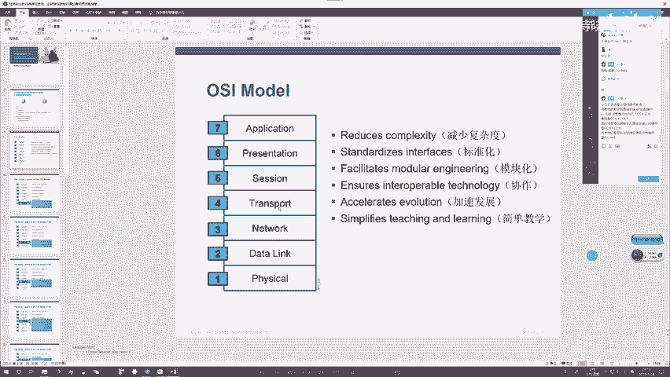

那这个数据载合呢对吧？五花八门有各种各样类型的，比如说你下载迅雷，对吧？迅雷产生的数据载合，就是你要下载内容本身，对吧？你浏览网页，对吧？你产生的数据载合就是一些对吧？HTML的这么一个数据流量。

然后接下来你聊QQ对吧？即是通信软件，你聊就是一些文字啊图片啊等等之类的，不同的应用，你在通信的时候呢，咱们产生了载荷内容不一样，但是呢咱们都称为叫载荷，对吧？那当然载合呢根据你应用的不同。

它的大小可能也会对吧？有很大的区别。有的应用产生了载荷可能会非常非常大，比如迅雷，你迅雷下载一个数据动辄好几百兆，对吧？好几个G甚至十来个G对吧？但是你QQ聊天产生载荷可能很小，对吧？

几十个字节上百个字节对吧？你不同的应用啊，咱们功能不一样，你产生了载荷大小不一样，但是不管你产生了载荷大还是小，这些载荷想要被发送，你的尺寸就。

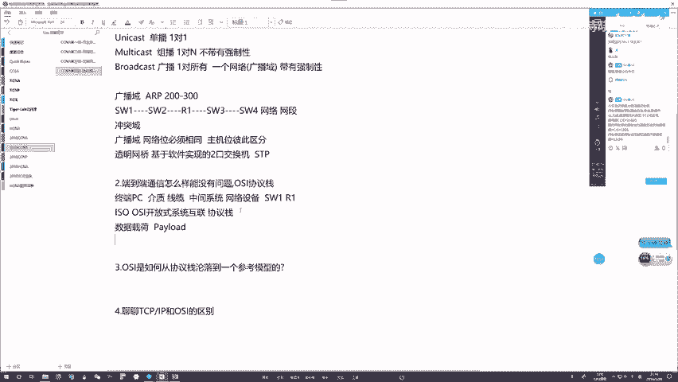

必须要符合咱们的规定，可以吧？必须要符合咱们的规定。在我们的传输层呢有一个参数啊，咱们称为叫MSS这个叫最大分片尺寸，叫最大分片尺寸，可以吧？这个最大分片尺寸的就是规定了，你一个应用。

你产生的数据满足多少字节才能够被发送走，那这个呢通常是1400多字节，可以吧？通常是1300到1400字节之间或者说1400字节以上啊，等等等呢，它是一个字节数，对吧？它是个字节数。

相当于这是一个限制啊，这是个限制，就是说你一个应用，你产生的数据，对吧？我不管你产生的数据有多大，你要被发送的时候，对吧？你必须要被切片，你要保证咱们每一个切片的大小，满足这个大小，可以吧？

我才能给你发送。如果说你太大，我是不能给你发的啊，如果说你太小，我也不能给你发可以吧？你要太小。

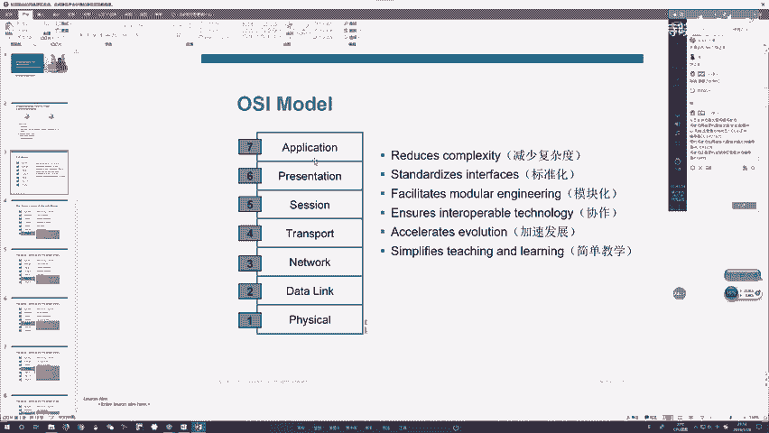

我给你填充给你填零，填到足够大，再给你发送口。那如果说你要太大了很简单，给你分片，对吧？比如说你一个数据流量10个G，我给你分成100个片，对吧？我给你分成1000个片。

我保证你每一个片的大小在这个范围内。那这个时候我给你逐片发送，可以吧？那这就是传输层要干的第一件事。我们称为叫数据分片。好吧，我们称为叫数据分片。

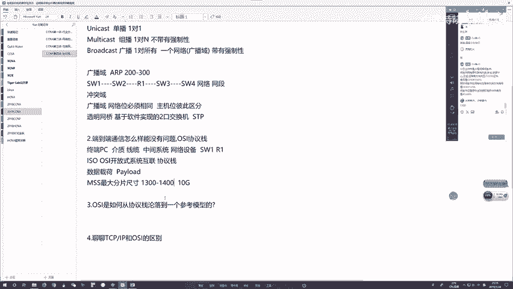

数据分片呢还是很有必要的。因为如果你没有分片，你的数据太大太大的数据接口是没有能力啊一次性发送的，可以吧？因为咱们接口发送数据是有能力的对吧？你发送数据大小必须可控，如果你发送的数据太大。

你的接口没有这个能力发，你就发不了了，你就只么丢弃了，可以吧？所以为了避免你发不走，只能丢弃数据，你就最好在发送之前呢，提前把数据切好片，你切好片之后，保证咱们发送的每一个分片大小是有限的对吧？

在我们的这个范围内的那这个时候你可以避免什么？一系列今后的数据发送问题，可以吧？你可以保证咱们每一个分片啊都能够被顺利的发送走，那这个是最终的目的，好吧，那当然这个分片呢。

咱们一般都是交给传输层的协议来做的可以吧？传输层的协议把你应用层产生的数据流通过切片，对吧？切成若干个分片，保证每一个分片的大小。

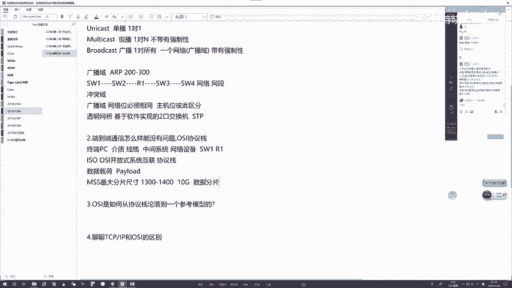

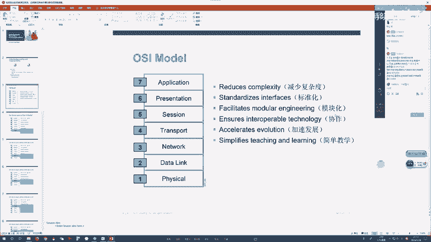

满足咱们MSS限制。然后紧接着这个分片能够发送吗？我们说过不能直接发送，对吧？因为你数据载荷如果直接发的话，对吧？缺少很多信息，主要缺少这两组信息啊，第一组是原目地址信息，对吧？你没有地址信息。

咱们网络设备收到数据之后，他不知道你要发给谁，不知道你要发给谁怎么给你发，就没法给你发，对吧？比如说你去邮局，你寄一封信，对吧？你寄一个包裹，你寄给一个目的地，对吧？那接下来如果说你在寄包裹。

你在寄信的时候，你没有写收件人收件人信息，你觉得邮局能帮你把信给发走吗？他发不走，因为就算邮递员看你性质里内容，就算邮递员看了你快递里面内容，他也不可能根据这个内容来确定，你到底要把这个快递。

要把这个信件交给谁，对吧？那网络设备是一样的，你就算给网络设备读懂你的应用载荷的内容，他也没有办法根据你应用载荷内容来确定这股流量到底是由谁发的。谁接受对吧？

那所以说为了让这些网络设备知道你要把数据发给谁，你需要添加地址信息，对吧？那当然光光地址信息是不够的啊。你除了添加地址信息以外，还要添加什么原木的端口信息，对吧？通过添加端口信息。

你可以通过原木端口来描述啊，这股流量是由哪个应用产生的，是由哪个应用来接收。因为一般的咱们一台计算机，你在上网的时候，你的各种各样的应用啊，都是同时工作的，都能够同时收发数据，那这个时候你收到一股流量。

你必须得要让接收者知道对吧？他应该拿哪个应用来处理这库流量，那为了让他知道这个信息，对吧？添加原木端口是非常有必要的。因为如果你没有添加原木端口接收者就算能收到数据。

他也不知道该有哪个应用来处理这库流量，对吧？所以说呢你在发送任何数据的时候，至少要包含两组控制信息啊。第一组是原木地址信息，第二组是原木端口信息，所以说了传输层。

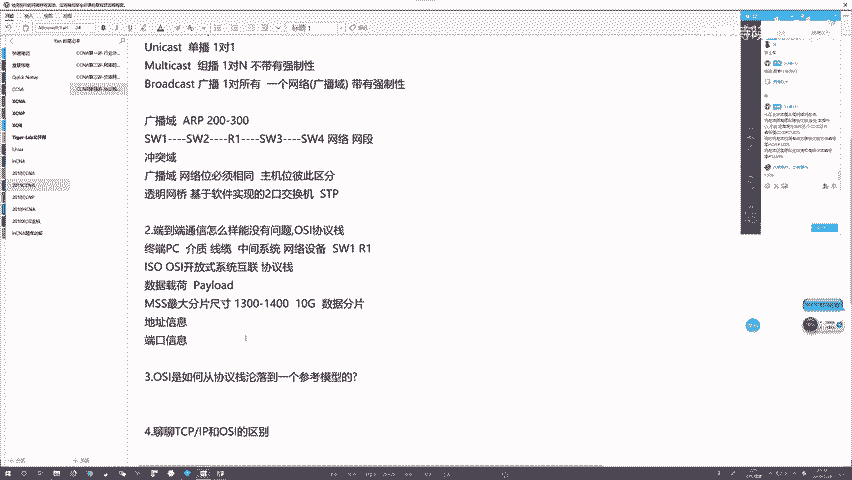

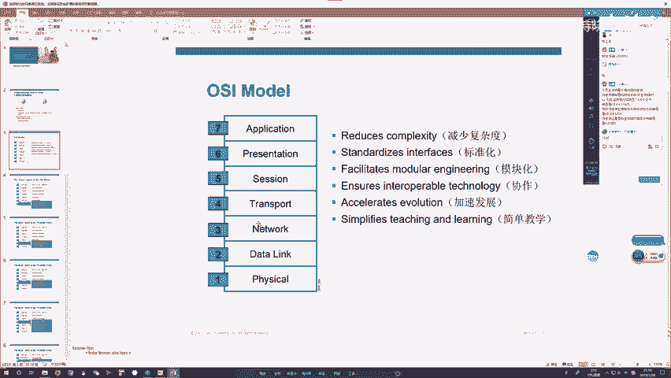

除了做数据切片以外，还要干第二件事。第二件事什么呢？就是在每个数据分片的前面，我要添加一个四层的数据报头，对吧？我要添加一个四层的数据报头，而在这个四层的数据报头中呢，可能会包含很多很多的控制内容啊。

但是最最最重要的就是源端口还有目的端口，其中源端口用来标识咱们这部流量是由哪个应用产生的，而目的端口用来标识咱们这部流量该由哪个应用去接收，可以吧？那接下来添加完原目端口之后啊。

我们这个传输单元就形成了。这个传输单元呢，咱们称为叫PDU啊，叫pro date unit，可以吧？叫协议数据单元。这个协议知识单元呢对于传输层而言，我们称为叫数据段啊，我们称为叫数据段。

这个叫sigment，可以吧？数据段叫sigment。那这个sigment呢对吧？由于里面只包含了原目端口信息是吧？它没有包含地址信息，所以呢它不能被直接发送。

那所以接下来这个数据段呢会交给网络层做进一步处理。网络层的协议，在数据段的基础之上，我会给你额外的添加一个三层爆头，好吧，我在你数据段基础之上，对吧？那就是咱们的数据分片啊，前面是添加了四层爆头，对吧？

要四层报头，我在你四层爆头前面添加一个三层爆头。

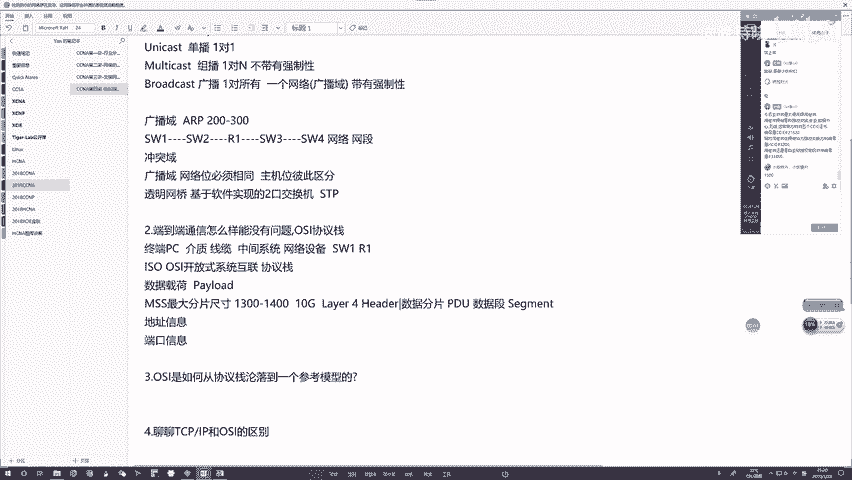

对吧我添加一个三层包头。那网络层的协议呢就是干这件事儿，给你添加一个三层包头。然后在三层爆头里面呢，咱们包含的两个主要信息啊，一个就是原三层地址，一个就是目的三层地址，可以吧？

那当然在我们当前的英客网来看啊，这个原目三层地址，一般指的就是原木IP地址，可以吧？原地址用来描述这股流量是由哪个主机产生的，而目的地址呢用来描述这股流量是由哪个主机来接收。

然后接下来在三层咱们形成这个传输单元啊，我们称为叫数据包，好吧，叫数据包，这个叫packcket，可以吧？数据包。那接下来数据包呢里面已经添加了原木地址信息地址信息了吧，也添加了原木端口信息了吧，对吧？

谁发的谁收咱们清楚哪个应用产生的，哪个应用接收，咱们也清楚，那能被直接发送吗？好，答案是不行啊，依旧不行，为什么？因为在我们网络中，什么样的设备能够识别原木三同地址啊，路由器可以。

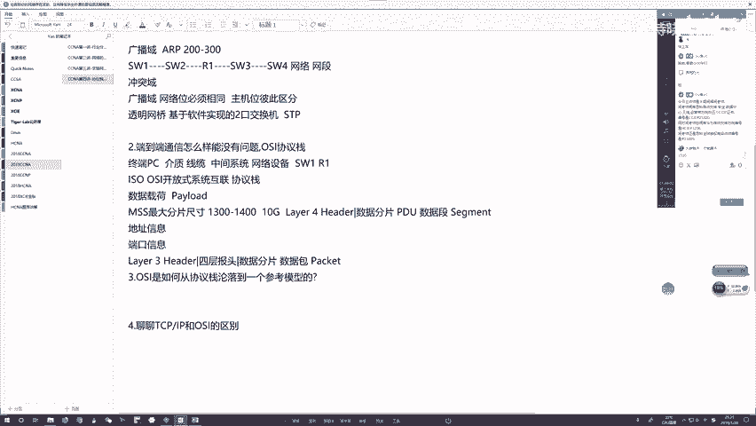

三层防火墙可以。多层交换机也可以。总而言之，想要识别原木三层地址，你这个网络设备就至少是三层的。但是对于咱们的网络接入设备而言，咱们都知道早期接入设备，咱们用集限器，对吧？这是一层网络设备。

然后现阶段咱们用的交换机对吧？楼层交换机啊也一般是一些纯二层交换机。那他们都是底层设备啊，对吧？他们都是底层设备。你给这些底层设备看原木三层地址，他们看得懂吗？他们看不懂可以吧？

所以说你好心的要告诉他们，这股流量是由谁发的，发送给哪个目的地。那如果说他们不能识别，那他们能够有效的利用咱们这个地址信息来做精确的数据转发吗？你做不了，可以吧？就好比现在你要出国。嗯。

我想问大家一个问题，你们怎么出国？想要出国，咱们怎么出国？你得要到机场对吧？坐飞机出国。那接下来你怎么从家到机场呢？你是不是得要先到火车站买火车票，然后坐火车到机场是吧？那接下来你要出国。

你需要护照来标识你对吧？那你什么时候能使用护照呢？你难道在买火车票的时候就直接拿护照吗？是不是不行啊，对吧？你直接在火车站拿护照。那些火车站的工作人员啊，可能由于不能识别你护照的信息。

他没有办法卖给你票可以吧？那所以说你在火车站上买票，你得给他一些接地气的身份证，你得给他一些接地气的身份标识符啊，那就是身份证，你把身份证给他他能看到你的身份证号，对吧？他能寄你的身份证号判断你是谁。

然后卖票给你，然后接下来你乘坐火车到达机场，你到了机场再出示护照，对吧？给我们的机场工作人员让他知道啊，你是坐哪个班机去往哪个国家，对吧？有没有签证，对吧？那通过你的护照呢，别人能够知道。

然后紧接着你再使用护照作为你自己标识来拿你的登机牌对吧？然后呢，通过坐飞机去往国外，那一般都是这样的，那在我们的网络中也是一样的，对吧？在网络中，哎，谁需要看哪IP地址来帮助数据转发路由器去啊，可以吧？

多层交。交换机需要防火墙也需要，凡是这些三层网络设备，对吧？他们都有一个功能，就是帮你做网络间数据转发。而我帮你做网络间数据转发，查看你的原目IP地址是很关键的一个行为，对吧？反而他们也能读得懂吗？

我就是通过读你的目的IP来确定你要去往哪个目的网络。然后接下来我要根据这个目的网络的路径信息啊，来给你做一个数据转发。而奈何咱们的接入设备，对吧？不具备这些功能，他也不需要这些功能。

那所以说你给这些接入设备，你给这些楼层交换机看原木IP是没有意义的。为了让这些接入层交换机，也能知道这个数据该怎么发送，该怎么精去转发，你需要给他们看一些他们能看得懂的地址信息。

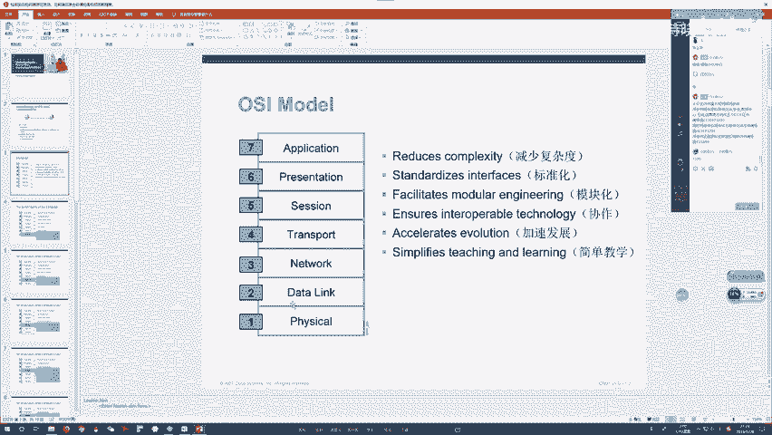

那这些地址信息对吧？我就需要交给数据链路层的协议来添加。那所以说数据包呢不能够被直接发走啊，它要交给数据链路层。数据链路层的协议，当然数据链路层，大家应该比较熟啊，就是各种各样的局域网协议嘛。

各种各样的广域网协议，那当前在数据链路层里面，咱们最有名的协议，就是咱们的以太网协议嘛，对吧？那这个以太网协议，它就是基于我们的数据包，对吧？那就是数据切片嘛，数据分片，前面是四层爆头，对吧？然后呢。

前面是三层爆头，对吧？然后呢，前面哎我再给你添加一个二层的爆头，好吧，然后接下来通常呢在我们的数据链路层，我在你的数据分片的结尾，要给你添加一个数据报，对吧？我给你添加一个真校验序列这么一个字段。

通过这个字段呢，咱们其实就是利用一个散列算法。

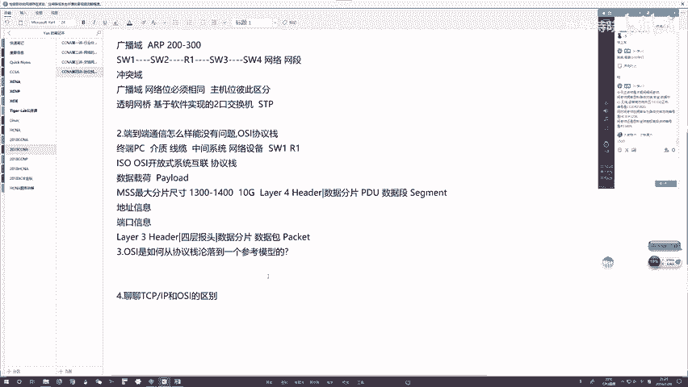

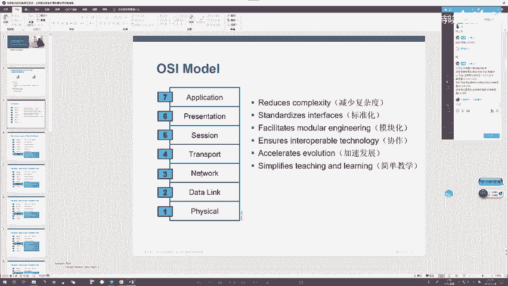

来帮助你接收流量的接收者来判断这个数据是一个完整的数据帧还是一个冲突碎片，可以吧？那这就是数据链路层的PDU那这个PDU我们称为什么呢？我们称为叫数据帧啊，我之前一直跟大家说收帧发针收帧发针。

这个指的就是数据帧，可以吧？在我们的OSI定义下，你任何应用产生的数据，在被发走之前啊，你都要经过这么三次爆头添加四层添加一个爆头，三层再添加一个爆头。然后呢，二层添加一个爆头添加一个爆尾。

那由于凡是一个数据在被发走之前都要经过三次封装，所以你在网络中能够看得到的数据啊，都是数据帧。然后接下来在这个数据帧的爆头里面呢，咱们包含就是原木二层地址可吧？当然如果你这是一个以太网环境啊。

以太网的爆头里面包含就是原木麦地址，那接下来这些地址呢，咱们的接入层交换机就能识别了，对吧？

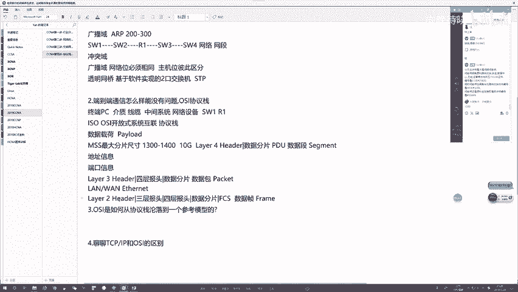

根据原工麦克地址，他能知道流量是由谁发的对吧？发送给哪个目的地，然后接下来他就可以查找什么麦克地址表来给你做一个精确的发送。那当然能够转到最好，能精确发走。如果找不到也无所谓。

咱们可以通过泛红的方式啊给你发送出去。反而不管怎么样，这个数据呢，咱们都能发得走。那接下来既然咱们这个数据能够被成功的发送走了，那咱们就不再需要给它添加任何信息了。那怎么样呢？

接下来这个数据帧就会交给物理层的协议来处理，物理层的协议呢很简单，它会把你的数据帧呢转换成比特流，对吧？转换成零和一的比特流，然后接下来这些零和一的比特流呢，我就会转换成脉冲信号，对吧？

通过高低电频的方式通过咱们的线缆发走，那当然也可能是光缆啊，如果说通过光缆的话，咱们就是通过不同波长的光来给你发送走。那接下来再发送这些数据的时候，对吧？我们最终接口就会把数据通过线缆发送出去。

然后接下来线缆。

对端咱们的接口收到数据之后呢，他们收到的肯定是脉冲信号，他会把脉冲信号呢整理成比特流。然后接下来比特流呢交给物理层来处理，把它拼成数据针，可以吧？数据帧交给数据链层来处理。主要就是查看什么目的地址。

如果说目的地址是我自己，我就会去掉数据针头真伪，然后接下来查看咱们的三层爆头的目的IP对吧？那查看目的IP如果发现还是我是接收者，我就会去掉三层爆头，怎么样，交给我们的传输层处理。

传输层主要查看目的端口，对吧？看一下这个端口是本地哪个应用。如果说你能找到这个应用，那接下来我会在传输层啊，把这些数据分片重组重组成数据流，再交给相应的应用来做这么一个处理。然后接下来应用处理完之后呢。

那在我们的计算机的输入输出系统里面，你就能看到这个应用的这么一些显示，比如你在画面里面能够看到对吧？咱们游戏的内容啊，你能看到咱们的。

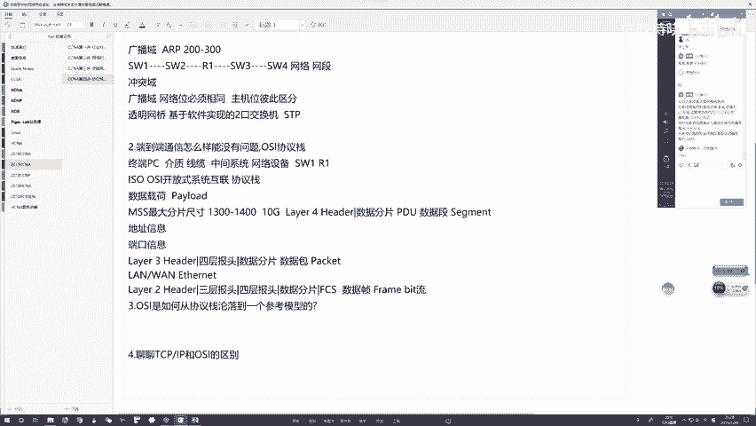

内容啊，你能看到别人跟你聊的天啊，对吧？等等之类的，都能看得到。那这就是OSI的这么一个定义。那当然这OSI呢从7到1。你会看到这就是一个数据发送的流程，可以吧？从7到1就是一个数据发送的流程。

然后接下来从1到7就是数据接收的流程。请注意啊，然后在四层三层、二层，我们是不是都给这个数据添加了爆头啊，请注意啊，给数据添加爆头的目的是什么呢？就是方便咱们数据传输，可以吧？

添加原木地址信息是给咱们网络设备看的，让网络设备知道数据是由谁发的，发送给谁。那接下来只要接收者所在的位置，网络设备知道啊，他就能够根据接收者所在的位置，找到路径信息来给你做一个发送，可以吧。

然后接下来关于这个原木端口是给接收者看的，让接收者通过查看原木端口能够知道流量是由哪个应用产生的，是由哪个应用接收，方便他正确的接收处理这些流量，可以吧？那接下来添加爆头的这个行。

咱们称为叫数据封装，可以吧？我们称为叫数据封装，这个叫incapsulation。incapsulation好吧，叫数据负重。那接下来封装完数据之后呢，经过三次封装，对吧？最终总会形成数据针啊。

这个数据针在宝存中传输的时候，正常的人啊是没有资格拆掉咱们针头真伪的。并且你在拆掉针头真伪之前，你是看不到咱们内部的任何爆头的内容的，可以吧？就比如说你一台路由器，你想要查看咱们三层爆头的原木IP地址。

你怎样能够看到三层爆头原木IP啊，前提是你要去掉二层的爆头和报尾，而去掉二层爆头报尾，不是你随随便便中去的，你要去掉一个爆头的前提是你要认为这个数据发给自己的。什么情况下，你会认为数据是发给自己的呢？

就是当你收到这个数据爆头里面的目的地址，就是你接收接口地址的时候，可以吧？你才会去拆，然后拆掉之后呢，咱们查看上层内容，那查看完上层内容之后呢，你如果说发现这个数据不是发给你的，你要进一步转发。

那在进一步转发数据之前，你还得给这个。

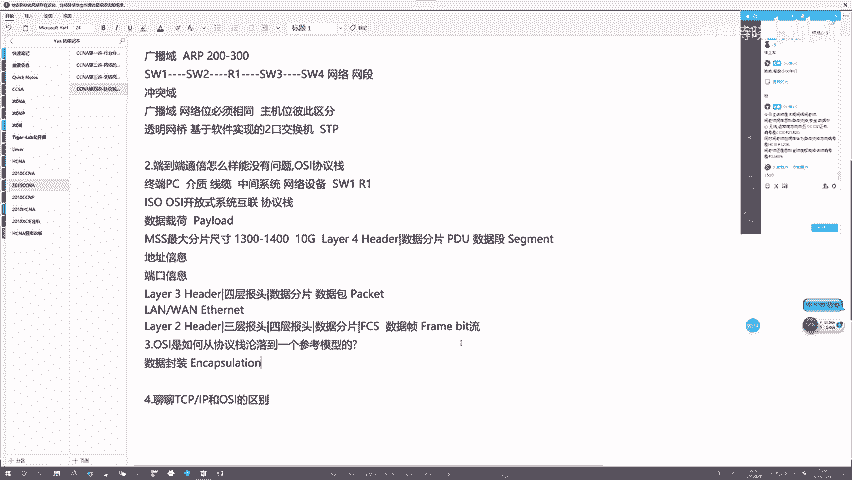

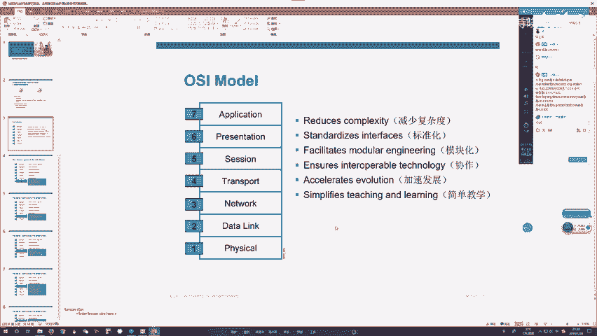

数据重新的添加一个新的二层报头和报尾，把它重新的变成数据帧，才能把它继而发送走可以吧？反而得出一个结论，只要在网络中传递数据，数据总会以真的形式来传递，对吧？总会以真的形式来传递，这是必须的。

并且任何人收到数据帧，你默认只能看针头针为内容，你不能看任何内部内容，只要看内部的内容，前提是你要把外部的报头给拆除，而拆掉外部的爆头前提是什么呢？你得要认为这个数据发给自己的。

而你认为数据发给自己的前提是你收到的这个数据针头中的目第二层地址啊，是你接收接口地址，只有满足这些条件，你才能去拆除，可以吧？然后拆除之后看上层内容来决定是进一步的接收。

还是把这个数据通过其他接口转发走。那当然在转发的时候，再强调一下数据包或者数据端。

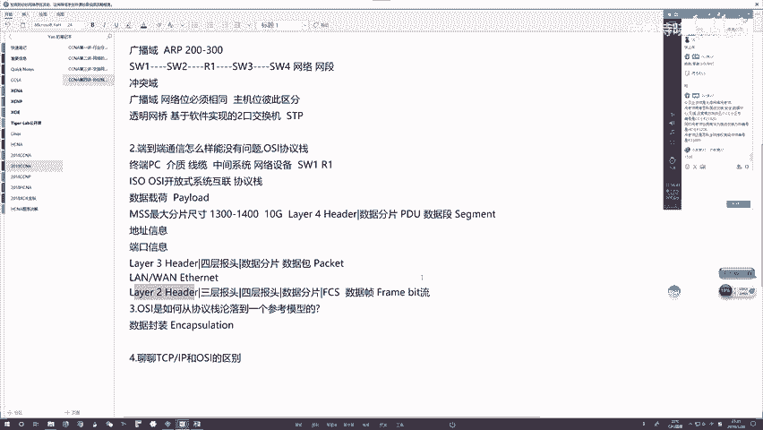

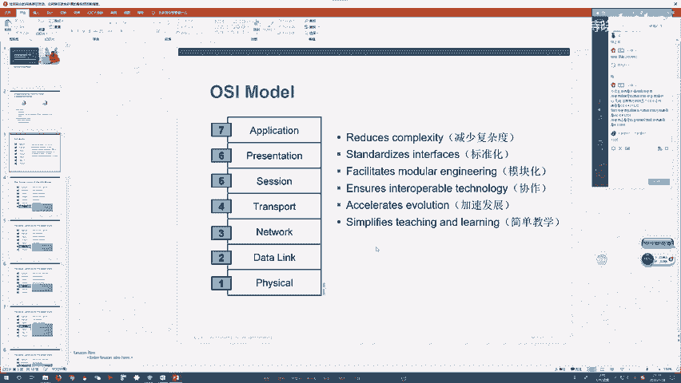

不能够直接发送的，要发送的话，必须以数据帧的形式来发送。好吧，添加爆头行为啊，就叫封装。那去掉爆头的行为，我们称为什么呢？我们称为叫数据机封装，可以吧？这个叫D incaplation。

第caplation可以吧？叫数据解封装封装就是添加爆头，解封装就是去掉爆头。那当然添加爆头呢目的很简单，为了方便咱们流量被发送，对吧？为了方便咱们接收者知道该由哪个应用去接收这个数据。

那接下来当你的接收者知道该有哪个应用，接收数据之后，你觉得他的应用比较关心的是哪些东西啊，他关心爆头吗？他并不关心爆头。好吧，就好像你一个好朋友给你寄这个快递，快递里面对吧？一个大箱子里面包含什么东西。

你虽然可能现在不知道里面什么东西啊，但是你收到快递之后，你一看收件人是你你会二话不说的，把这个箱子给拆掉，为什么？因为作为咱们接收者，作为咱们用户而言，如果更加关心的是箱子里面是什么东西。

箱子只是为了告知咱们的邮递员对吧？该怎么寄这个包裹，也是为了告知我，我是不是接收包裹那个人，但是当咱们得知这些信息之。当这个包裹已经到达我这里之后啊，我其实更加关注的是你这个包裹的内容。

就好像咱们这股数据流量已经到达接收者主机了。接收者主机也知道该由哪个应用来处理这股流量了，那这个时候应用更加关注什么呢？应用更加关注的是这些流量本身，可以吧？更加关注的是这些流量本身。

它更加关注的是咱们的数据载合，那所以说了这个时候由于爆头呢已经不再重要了，我不需要再进一步的传输这个数据了，我就是接收者不用再发给谁了，那所以说我更加关注数据分片，对吧？我更加关注数据载合。

我因此怎么样就要把所有这些爆头啊，这些快递箱子都给拆掉，拆掉之后呢，对吧？我只把把这些分片啊重组重组成数据流之后呢，再交给咱们的应用去处理。那这个就是解封装。好吧，好，那关于这个数据封装和接封装。

不知道大家有没有。はい。能理解吧？如果大家有问题的话，可以去可以可以随时问我啊，有问题可以随时问。感觉今天大家都很安静啊，没有怎么说话。没有关系啊，大家有什么问题就可以问啊。你们想了解什么东西都可以问。

好吗？不用害羞啊，不用不好意思。然后刚才有一个收了1500啊，这个1500是MTU可以吧？叫最大传输单元，这个是以太网所定义的这么一个数据传输的尺寸标准。而在我们的传输层呢，在分片的时候。

其实不是基于MTU啊，咱们是基于MSS这个叫最大分片尺寸，好吧，最大分片尺寸。O。😊，好，那既然大家今天没有问题啊，那我就给大家说这些吧。因为今天感觉好像比较累啊，就是讲这些概念比较多，概念比较多啊。

比较关键的就是这个数据封装和解封装啊。然后呢，OSI每一层的功能，大家呢大概有这么一个概念就好了。好吧，那接下来按照咱们的约定啊，那我们就这周不135了啊，我们这周123好吧。

那咱们下节课明天晚上我们继续好吧，明天晚上咱们继续往下讲。然后呢给大家讲一下TCPIP然后呢给大家讲讲咱们的。

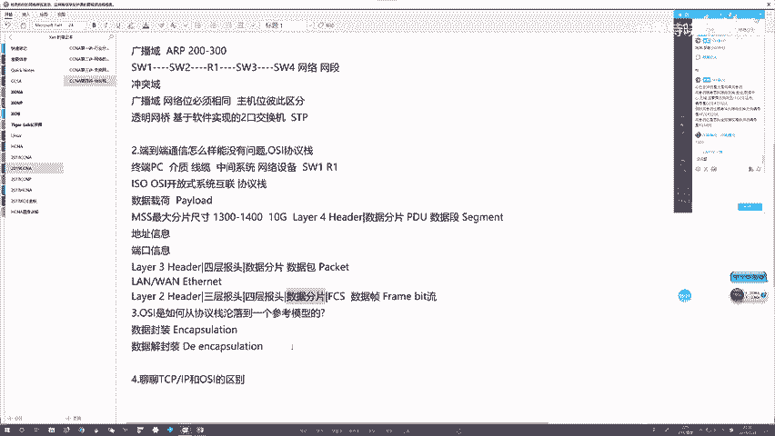

对吧IP词网化等等之类的对吧？给大家讲一些比较实用的东西。OK今天都是一些比较概念性的东西啊。然后大家如果说就是觉得比较枯燥的话，也不要想这么多啊，就是因为毕竟这些基础嘛，基本功还是比较重要的。

大家基本功好的话呢，后续才能爬的比较高嘛，是吧？接收的时候在逐层拆完。接收的时候每层都拆完，还要再封装。接收的时候不用再封装了，你是接收者啊，你接收者收到数据直接交给应用来处理就好了。可以吧？

是发送方在发送数据之前添加报同。你们就想一想啊，你们想一想。你寄个快递怎么寄啊？你寄个快递怎么寄？你怎么寄快递？你把买好的东西装到一个快递箱子里，对吧？然后打包好交给快递员。

然后快递员帮你把快递发给目的地，接收者收到快递之后怎么样？你把快递拆了不就拿了吗？对不就拿了吗？你接收者收到数据，为什么会转发呀？接收者计算机，你觉得他会它会转发数据吗？就好你收到有人给你的快递之后。

你要发给别人吗？不要啊，你不是你不是快递员啊，你不用再发了，你自己就是接收者，能理解吧？你自己就是接收者。谁需要发呀？快递员需要发，能理解吧？所以说快递员收到快递之后，他是负责看快递单子上面的对吧？

寄件人、发件人还有收件人信息来确定收件人所在的位置来决定怎么样把快递包裹发给对方。然后接下来等你包裹发给对方之后，对吧？对方就直接接收就可以了。啊，没有没有，是拆开之前就来确定一下是不是发给自己的。

可以吧？你要在拆之前看一下自己是否需要，然后需要的话，你就接受可以吧？如果不需要的话，你就不能接受，可以吧？就是这个意思。还有问题吗？对啊，每次遇到这些问题的时候，其实举几个例子。

大家就能听懂了就能听懂了。对以吧就是包括路由器也是一样的对吧？你收到一个包裹，你在看你在拆开包裹之前，你是看不到里面内容的，对吧？你想要看里面内容，你得要拆包。

但是拆包前提是你要认为这个包是发给自己的对吧？那所以说怎样确定包是发给自己的，你要看一下这个包裹上的收件人姓名是不是你自己的名字嘛，如果说是你的名字，你就是接收者，你就可以拆包。

其实有时候路由器那一拆包发现，其实这个包裹里面还有一个小包裹，这个小包裹告诉你对吧？其实你不是接收者，你只是一个代包转发，对吧？那所以这个时候呢，你得要确定这个接收者所在的位置，把这个包再给发出去。

那当是在发出去之前呢，要重新再给他打一个包，对吧？重新再打一个包，就是这样的。全英文课件静脉。什么叫全英文课技啊啊哈啊这个。哇，这。这个无所谓了。这个无所谓了。好，大家还有问题吗？大家还有问题吗？好。

那没问题的话，大家就可以加这个群啊。然后有什么问题可以在群里问。好吧，那没问题的话，咱们今天就先这些吧，好吧啊，大家拜拜。

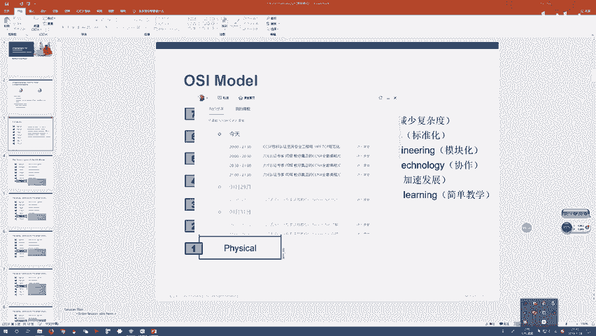