# 1000元自购分享CCNA教程合集！超全合集详细版，网络工程师入门必看合集【送NA题库】 - P5：CCNA05 - 向向向晚o - BV1cL4y1q7Dy

好，欢迎大家来参加咱们CCA公开课的第五节课。😊，啊，这一轮课讲的真的有点慢啊，因为这轮课讲的比较细一些，对吧？但是慢我开心啊，因为慢的话能跟大家多沟通嘛，能跟大家多交流。就你们平常在上课的时候呢。

不要憋着啊，有什么问题可以问，好吧，有什么问题可以问，啊，有什么不懂的对吧？有什么感兴趣的唉，都可以去多沟通啊，对吧？咱们边叫边学好不好？就不要说是光我讲嘛？我光我讲的话，我也不知道你们能不能听得懂。

对吧？讲快了，那那些基础比较差的，可能会听的比较吃力一些，那讲的慢的话，对吧？你们基础比较好的，你们又会对吧？觉得不爽，那所以说我很难就是满足大家每个人的想法。

那所以说就是咱们哎讲还是按照咱们这个主线啊往下去推进，对吧？咱们正常去推进，然后呢，稍微想慢一些，然后大家如果有什么问题的话，可以随时问好吧。😊，好了，那今天就话不多说啊，来继续讲我们这个OSI啊。

上节课呢给大家讲这个OSI那希望大家没有忘记啊这个OSI呢作为一个协议站，对吧？是个公有协议站啊，这个协议站呢由ISO这么一个标准化组织提出啊，那提出的目的是什么呢？就是让美国的各个厂商，各个公司。

他们在开发网络硬件，对吧？在开发计算机硬件在开发一些软件的时候都能基于OSI的这个规则，对吧？咱们来去统一化的作为个开发，那你们统一化的开发，就算你们是不同的公司啊。

但然呢你们之间不用担心你们生产的硬件和软件会有兼容性的问题。😊，那这样的话是方便咱们网络扩展。那当然事实呢也证明了这个SO呢说的话是对的，就是随着OSI出现以后，对吧？咱们网络的兼容性变得越来越好。

对吧？你硬件软件集成度越来越高，对吧？那这个网络发展的步调也会越来越快，对吧？先是随着咱们计算机啊普及到每家每户，然后呢，随着咱们的网络对吧？需求都越来越高，那这些厂商其实他们都是赚的盆满钵满啊，对吧？

但是呢，这个OSI随着开展，就是随着开发啊，随着它的使用，对吧？就是当它确立了它的主导地位之后啊，就有点变了变得不一样，😊，曾经的OSI对吧？里面包含内容其实有限，然后呢。

这些东西可能也会存在一些缺陷啊。当然这些缺陷呢就是只要有人提出来，那咱们总会第一时间去响应，对吧？去升级改造啊，对吧？把里面这些缺陷，要么就是改变，要么就是直接更换，对吧？更换成新的反不管怎么样。

就是它会尽可能响应那些市场的需求，响应那些对吧？研发者的需求但是随着OSI呢慢慢的越来越主导嘛，对吧？那既然主导地位已经确立了，那它就变得比较傲娇那一个东西呢一旦变得比较傲娇。

那就意味着它有点固步自封嘛，对吧？发展比较慢，不太能够接受新的思想，而咱们的技术是在日新月异的对吧？随着技术的升级换代，你总会有新的东西出现，而这个OSI的进步速度，远比那些新的科技的出现，要来得慢。

那所以说OSI正在慢慢的去扯后腿对吧？那这个对于咱们用户也也是对于咱们的厂商也是。😊，对吧我要研发一些新的设备，这些新的设备应该理所当然的具备一些新的功能。但这些新的功能在我们的OSI中呢还没有定义。

那所以说我是包含新的功能呢，还是不包含的？若果不包含我的竞争又会下降，而包含了你OSI又没有公布啊，关于这些新功能的这么一个标准化的解决方案，那这个时候可能会出现新的什么兼容性问题。

那所以说慢慢的这个OSI变得比较积肋，然后呢，后起之秀，对吧？有很多的协议债，他们都慢慢的在残事OSI的市场，就是包括像什么IPX杠SPX对吧？然后呢，包括像咱们苹果公司的apple talk吧？

然后呢像咱们的no的对吧？DEC的这些协议战它们都慢慢出现了，那当然包括咱们的TCPIP协议站啊，那这些呢都是后起之秀，那这些后起之秀，对吧？那他们呢可能就是更加能够快速的响应咱们的市场。

更加能够快速的响应。😊，咱们这些研发的这些新的特性。那所以说每当你出现一个新的特性啊，都是咱们这些对吧？后起之秀的协议站能够针对这些新的特性来给予一些支持，而你这个OSI呢作为一个老大哥，对吧？

你迟迟的不给一些响应。那所以说慢慢的对吧？逐渐的那那些设备制造商，对吧？咱们的用户都开始慢慢的摒弃OSI，对吧？然后呢慢慢的转向这些新的协议站，然后这些新的协议站呢，那曾几何时，他们也是对吧？

群雄逐鹿啊，对吧？乱战，你有你的优势，我有我的优势，对吧？你有你的适应范围，我有我的适应范围，那在这个阶段在整体网络呢又趋于混乱，对吧？

因为你支持IPX的不兼容IP你支持apple park的不兼容OSI对吧？那咱们是一个混战的格局，那当然既然有混战，咱们就会做出最终的统一啊，那这个最终统一的人谁呢？就是。😊，IP可以吧？

那TCPIP呢凭借它一些对吧？比较优秀的机制啊，它也是慢慢的对吧？取代了所有其他协议债作为咱们当前唯一的协议债。那所以说呢当前呢在咱们人类最大的互联网英特网中啊，只要你提到协议呢。

基本就是TCPIP的协议，对吧？所有计算机所有的软件对吧？所有的线缆，所有的咱们的各种各样的网络设备啊，只要你想运作，只要你想接入到咱们英特网，那你都必须得要按照TCPIP协议站的规则来。

而这个OSI呢作为一个曾经的主导啊，作为一个曾经的老大，我们也没有完全放弃它，对吧？因为你OSI虽然太过陈就，对吧？更新太慢，太迂腐，你已经跟不上咱们时代的发展了，但是你有一些东西还是比较好的。

并且甚至我们认为你这些东西啊比我们当前TCPIP要更好，那就是你的分层。你所定义的7层分层是任何其他协议债都没有做到，可能他们想做，但是他没有办法做那么细。😊，并且你OSI所定义的封装，对吧？

也要比任何其他协议站啊要来的更加的严谨，来的更加的对吧？容易理解。那所以说呢现在呢咱们就是把所有那些不用的协议站啊通通都给忽略。然后当前咱们用的就这么两款。

一个是OSI一个是TCPIP那当然在用的时候呢，OSI主要是用来做参考，用来方便咱们去研究TCPIP中的一些协议的功能，对吧？当我们在研究封装的时候，当我们在研究这个协议的定位的时候。

当我们在研究这个协议的功能的时候，我们更多的会按照OSI的7层的这么一个模型啊来研究。而我们实际在使用的却是TCPIP协议站中的这些具体协议，对吧？用用的是TCPIP但是咱们在学的时候。

是基于OSI来学习。那所以说呢现在呢咱们再叫OSI不会再称之为叫协议站了，我们称为什么呢？😊，我们称为叫参考模型啊，我们把OSI称为叫参考模型，对吧？参考模型。什么叫参考模型？

参考参考参考参考就是我只拿你做参考，你里面的具体协议对吧？你的各种细节，咱们是不去使用的，我们只是拿你做一个参考，对吧？我们用的是什么呢？我们用的是TCPIP好吧。

O那既然咱们用TCPIP那对于TCPIP呢，咱们要了解一下啊，那这个协议站呢作为一个协议站啊，对吧？你们也知道里面包含的协议是很多的，里面包含的协议对吧？各种各样的功能。

那你也不可能把它们放在一块融在一起，那太复杂了，对吧？那你为了简化咱们这个协议站，它也有一个分层啊，对吧？但是它的分层呢就分的比较粗了，它把整个网络分成了四层。好吧，它把整个网络分成了四层。

哪四层呢分别是最高层啊？第四层咱们称为叫应用层。注意啊，还叫应用层，最高层还叫应用层。然后接下来第三层名字不一样了，它叫主机到主机层。好吧，第二层叫英特网层。然后呢，接下来最下层第一层啊。

咱们称为叫网络接口层OK一共有这么四层。那么当前使用的协议呢，对吧？就来自于这个协议站O吧？我们平常日常所说的像什么TCP啊，像什么UDP啊，像什么IPV4IPV6啊，像什么SMPARP啊，对吧？

OSPFEIGRP那都是这个协议站中的具体协议，可以吧？那在OSI中，咱们有对应的协议，比如对应IPV4的，咱们有CLNP对吧？但是这些呢毕竟是OSI协议。

咱们当前用了TCPIP那OSI里面的具体协议啊，咱们就不用好吧？好，请注意啊，这个四层模型跟OSI的7层模型，咱们之间是有一个对应关系，可以吧？TCPIP的第四层也就是应用层啊。

对应的是OSI的上三层可以吧？你OSI的应用层表示从绘画层三层里面的。😊，所有协议啊对应到咱们TCPIP对吧？那都被归纳到应用层中去了。好吧，然后接下来主机的主机层对应的是传输层。好吧。

然后接下来英特网层对应的是网络层，好吧，然后接下来网络接口层呢对应的是数据链路层以及物理层。好吧，第一层对应的是OSI的下两层，第二层对应的是OSI的第三层，第三层对应的是OSS的第四层。

然后第四层对应的是OSI的567，好吧，它们之间呢有这么一个对应。那接下来作为两个协议债，它们呢肯定是有很多很多的区别的。就比如说你TCPIP里面包含的协议，那肯定在OSI中是没有的吧？

你OSI里面包含的协议，TCPIP也是没有。那当然这些呢都对吧？不在话下啊，那当然他们之间最大的区别是什么呢？它们最大的区别其实它们定位的这么一个封装机制，可以吧？OSI的封装，我们称为叫逐层封装。

好吧，然后呢，TCPIP的封装，我们称为叫月层封装，对吧？一个叫逐层封装一个叫月层封装，想到了Iize对啊，iize原本是一个属于OSF协议啊，后来呢被挖到TCPIP，为什么挖过去，因为比较好用啊。

比较好用，像这样曾经属于其他协议债，然后呢被挖到TCPI的例子很多啊，那包括像什么ATM啊，对吧？😊，你们能想到很多协议啊，都是这么过来的，可以吧？都是这么过来的。你们原来属于TCPIP吗？

不属于啊你们属于其他协议债，可以吧？被挖到TCPIP中来了。好吧，好，当然咱们先不看这些啊，我们来谈一下什么叫逐层封装，什么叫月层封装，好吧，那在OSI的定义中，大家应该都很清楚了，对吧？

你应有层产生一个数据。😊，对吧这个数据呢到达传输层，你要经过一个四层的切片处理，对吧？保证的大小满足咱们的TCP的MSS是吧？满足咱们的二层的MTO那接下来当你完成了分片之后呢。

你要在每个分片前面添加一个四层爆头，对吧？形成数据段，数据段交给网络层的协议处理，网络层的协议，在你数据段的基础之上添加一个三层报头，对吧？形成了数据包对吧？然后接下来数据包交给数据链路层的协议处理。

数据链路层的协议呢，在你数据包基础之上添加一个二层的报头，然后在你最末端呢添加一个二层的报围。O咱们形成数据帧，然后最终呢数据帧被物理层的协议呢转换成比特转换成脉冲信号，通过咱们的线缆发送走。

那这也就是说在OSI的定义下呢，你任何应用产生的数据啊，从你产生到你。😊，被发送咱们是经过了固定的三次封装，每三次呢分别是传输层一次，对吧？添加一个四层爆头嘛，网络层第二次添加一个三层爆头，数据链路层。

第三次添加一个二层爆头，添加一个二层报表。那就是说，基于OSI的定义来看啊，你任何应用，对吧？不管你是要实现什么样的功能啊，只要你是一个应用，只要你在我们的OSI的定义下，你产生的流量在被发送之前。

就要经过固定的三次封装，四层一次三层一次、二层一次。那这个机制我们就称为叫逐层封装，对以吧？所谓的逐层封装，就是我对你们所有人啊一视同仁，对吧？你是这个应用A，你是那个应用B无所谓，我不关心。

只要你是个应用，只要你产生流量，想要发走，对吧？你就给我乖乖的经过三次封装，那这就是逐层封装。😊，OK那接下来TCPIP呢做一个比较灵活的协议站啊，它的定义呢没有那么刻板。有才说了，哎呀，你应用对吧？

你发送数据。哎，到底封装几次，你自己说了算嘛，是吧？你觉得需要你多封装几次，你如果觉得不需要，你少封装几次，对吧？那至于封装几次，你自己来定对吧？比如举个例子啊，在我们的TCPIP中，你一台计算机。

你用浏览器，对吧？你浏览百度嘛，对吧？你做一个外部访问这个外部访问，咱们使用的协议叫HTDP啊，这个叫超文本传输协议，对吧？前面呢咱们封装的是TCP的爆头，前面咱们封装的是IPV4的爆头，然后呢。

再前面咱们封装的是通常啊以探网二的针头，然后呢，前面咱们封装FCS这就是典型的经过三次封装的这么一个案例啊，对吧？这个TCP爆头就是四层的封装啊，IPV4的是三层的封装。

然后咱们以探网二的针头真尾就是二层封装，对吧？这是封装三次的这么一个案例，那接下来咱们有封装两次的。比如说咱们之后再。😊，路由写的协议的时候啊，有一款非常非常重要的协议太重要了。基本你网络工程师。😊。

你做面试对吧？十有8九问你的题目，关于路由选择协议的那就是OSPF对吧？1个OSPF1个二层的生成数啊，我觉得一般正常的技术公司，你通过这两个协议，咱们可以筛选人才了，对吧？你到底懂不懂技术。

你懂不懂网络，你能不能做做事，对吧？你能不能干活，我基本问你这两个问题就能问出一个对吧？8九不离史了，然后接下来我可以准备这两个简单的问题做一个筛选筛选通过的人，我给你准备一些比较难的对吧？

比如问你MPVPN啊，问你BGP啊，问你IPC呀，对吧？来给你做一个进一步的筛选，O好，那这边的话OSPF。这个OSPF的载合呢，它在被发送的时候，是直接基于IPV4来做第一次封装的。然后接下来对吧？

我再给你封装一个二层的爆头，对吧？给你封装一个二层的豹围，那这就是OSPF的封装，那你们细心时会发现它经过几次封装两次对吧？我直接封装的是三层爆头，有没有经过四层封装，没有啊，我直接经过的是三层封装。

然后呢，封装了一个二层的针头封装了一个真伪，那我这个数据在从产生到被发送经过几次封装啊，经过两次对吧？是吧？那是这个在TCPID中啊，咱们也能够支持好吧，你觉得好就好了，你开心就行是吧？

你觉得两次封装够了，那你就封装两次，对吧？没有意见啊，这个无所谓，好吧，那咱们还有更更特例的，你还有只封装一次的，比如说咱们在态环境中啊，经常使用ARP对吧？😊，A要跟B通信。

此时呢假设A知道B的IP地址，但我不知道B的麦克，对吧？我需要解析B的麦克怎么解析呢？通过ARP的我解析，对吧？我给你发送一个广播的ARP请求，我来询问A谁是B呀，我给你通信，我不知道麦地址。

请你告诉我你的麦地址是多少，对吧？我发送这么一个请求，你B收到之后呢，会给A返还1个ARP的应答。在这个应答中，B会告诉我A，我告诉你了啊，我是B，我的IP是这个我的麦克是这个请你记录一下。

那记录完毕之后，A知道B的麦克B知道A的麦克，你们直接就可以通信了，对吧？那无论是ARP的请求，还是ARP的应答。咱们在发送的时候呢，都是这么封装。😊，好，看到了吧？

ARP的载合前面直接封装的是二层的针头，还有二层的针伪，可以吧？那这个在TCPIP中啊也是可以的。这就是说TCPIP没有像OSI那么死板啊，你一个应用我不管你干什么呢。

你只要要产生数据一定要经过三层封装，对吧？完全尊重你的意见啊，你根据需求嘛，你觉得需要封装一次，你可以就只封装一次，你觉得需要封装两次，那你就封装两次，你觉得需要封装三次，那你就封装三次。

甚至如果你要觉得封装三次不够啊，你可以封装4次，可以吧？TCPIP非常非常的灵活。它根据你应用自身的属性来让你应用自己去判断你在发送数据的时候，到底该怎么封装，所以你会发现不同的应用。

他们的封装啊根本不一样。那这个在TCPIP中啊，随处可见，太寻常了。那这就是所谓的月层封装，好吧，那这两个协议站呢，我觉得。😊，这个是最大的区别啊。

那这个区别得先提前跟大家说清楚之后你们在研究一些协议的时候，一看哎怎么封装次数那么少啊，哎，怎么没有封装次层爆头啊，那这个很正常可以吧？这个很正常，只要是TCPIP这个就没有问题。好吧。

OK那这就是协议站之间的这么一个区别。😊，那接下来聊完这两个协议这样的区别之后呢，我们来基于这个TCPIP啊，来展开来讲一下里面的一些细节。当然这些细节呢要围绕咱们的网络工程的项目啦，对吧？

让大家能够学以致用，不能光学理论啊，你要伴随着理论能够基于咱们学到的理论。第一，能够侃晕那些面试官。第二就是在工作的时候，对吧？你能实打实的利用咱们的技术啊，对吧？帮助我们解决一些实际的问题，这很重要。

😊，对，ARP是地址解析协议啊，叫address resolution protocol可以吧？address resolution叫地值解析协议O。好了，那接下来关于咱们今天这个协议站的展开啊。

咱们先从哪一层展开呢？那肯定是先从最简单的层次啊。那咱们就从网络接口层开始展开。可以吧？那大家这个网络接口层呢里面包含了两个子层啊，一个是物理层，一个是数据链层，可以吧？那咱们先从物理层开始讲起可吧？

那首先呢关于物理层，啊，我们来下个定义啊，什么叫物理层啊，物理层呢作为整个OSI的最下层，对吧？它的智能性肯定是最差的啊，里面主要包含一些什么样的东西呢？哎，只要想到物理层。

你们一定要想到这这么一个词啊，我们称呼叫弱电，对吧？我们称为叫弱电，什么叫弱电啊，对吧？那大家以后都会买房子，你买房的装修，对吧？那装修你要做什么？你要做水电水电，那水呢肯定是做水利系统嘛，对吧？

那电一般指的两个，一个叫强电，一个叫弱电。😊，对吧那强电能够给你的电视供电，能给你的冰箱供电，能给你的电灯供电，对吧？那这些就是强电220伏嘛？然后一般弱电指的是什么呢？就是跟你部署像什么电话线啊。

像什么网线啊等等之类的对吧？方便你去联网啊等等之类的，好吧，那这个就是弱电，一般呢咱们在施工的时候，你再建房子的时候，你房子建好之后，在你装修之前，我就会帮你把弱电强电部署好，然后接下来你再去装修。

对吧？那当然对于企业是一样的，你企业对吧？搞一个园区，你搞那么那么多栋大楼啊，你也要装修，对吧？在装修的时候呢，你需要找那些弱电工程队来给你做弱电的配置。当然你定要给他们提需求啊，对吧？

比如你哪个房间需要布线，哪个房间需要多少个接口，接口分布到什么样的位置，你得告诉他们，对吧？那他们会根据你的需求来给你做什么综合布线，叫垂直布线水平布线，然后呢，保证你这个线布完之后啊，你只要一装修完。

😊，对吧你只要上架设备，那这个线你只要连到咱们房间的各个的连线连线口啊，那这个线一连，对吧？咱们整个的网络就能通了。OK了。那这个在整个的网络工程中啊算是第一步。那当然这一步是由咱们网络工程师做的吗？

请注意不是啊呃一般弱电哎说句难听话，在我们国内都是一些包工头啊，对吧？领着一帮对吧？施工队的，让他们去做，对吧？那当然在做的时候呢，可能不是那么专业啊，对吧？不是那么专业。

那当然咱们有些比较专业的弱电公司，但是他们的费用可能会比较贵啊，那这个在国外可能会比较有市场。但是在国内的话，咱们出于对吧？廉价劳动力来看啊，就是你项目肯定越便宜越好吧，对吧？弱电恨不得是白送最好。

那所以说一般弱电就是怎么说呢，都会不会找那些特别专业的人去做，对吧？其实你正儿八经讲弱电里面有很多很多门档，有很多都学位，好吧，那这个物理层呢说白了就是弱电相关的层对吧？

既然是弱电相关的层的里面包含什么东西啊，你弱电拿什么来做弱电啊，你肯定要布线，对吧？那所以说线缆本身就是弱电的一个。😊，部分对以吧？然后接下来各种各样的接口，各种各样的插槽，那这些都是对吧？

物理层相关的这么一些部件。然后接下来物理层里面还包含一些设备，对吧？咱们之边说的像极限器极限器就是物理层的设备，对吧？那当然如果你再样说的话，物理层包括哪些呢？还包含一些像什么数字波形编码，对吧？

数字的编码，它包含一些编码，像什么曼车斯特码呀，对吧？像什么脉冲扶值调制啊，四维五电瓶等等之类的那这些都是物理层相关的这么一些概念。然后呢，包括咱们各式各样的对吧？比较简单的性令，对吧？

那他们都是物理层相关的这么一个概念。那当然后者这两个概念，比较专业了，你一般是专业人员去研究啊，比如你研发一些模拟编码，你研发一些什么数字编码，那让你现缆中传输的数据能够对吧？更加高效，能够传的更远。

能够支持更高带宽，对吧？那这是有专门的研发人员去研发的，咱们网络工程师，包括咱们的弱电工程。😊，那更加关注的其实是前面这些东西可以吧？前面这些东西。你了解一下有哪些线缆。对吧线缆属性是怎么样的？

什么样的环境下该使用什么样的线缆，什么样的设备互联，使用什么样的线缆，对吧？咱们只要了解这些，只要能够布线，那这个基本就没问题了，对吧？了解什么线有什么样的接口，什么样的接口能够连到什么样的插槽。

连上去之后，需要做一些什么样的操作，对吧？只要懂这个就好，好吧，那接下来咱们对于物理层呢，其实对吧？重点剖析什么呢？就是重点剖析咱们的线缆，让大家了解咱们线缆的种类，了解咱们线缆的这么一些规格。

了解线缆那些属性，对吧？会用这些线就够了，可以吧？而这个线呢主要也经分为两类啊，一类咱们称为叫局域网线，一类咱们称为叫过网网线，可吧？那大家这个局域网线呢，肯定是当前占主流，对吧？用的比较多嘛。

那在所有局域网线中呢，咱们以太网线啊用的最多的。因为以太网协议，对吧？太出类拔萃了。当前你只要提到网络连接呢，十有八九，一定是以太网连接，因为哪儿不用交换。😊，哪哪都用交换机，这样你们想想。

平常咱们买计算机，无论你是买笔记本还是台式机，还是你买服务器，你要连线，你连的什么线？😡，都是俗称的叫网线，对吧？那连接网线都是双绞线啊，双绞线你连完之后，你传输使用的规则是什么呢？就是以太网可以吧？

你双绞线上跑的就是以太网以太网协议，可以吧？然后接下来有些地方可能你会用到光纤，但是光纤呢一般更多的是用来互联多台交换机的对吧？你在某些比较高级的服务器上。

你也你也会使用什么光纤来连接咱们的lo层交换机，但是更多的咱们联网还是使用什么双绞线，可以吧？那这个就是咱们最常见好吧，然后接下来广域网线，那曾经的遇到比较多啊，那现在基本已经是对吧？被淘汰了。

那曾经有一些遗留下来的网络。那在直到今日啊可能还没有升级，那目前他们还是在使用一些广域网线来，并且呢在曾经的华为的一考试中啊，我们的实验考试里面也包含一些广域网的连接。那这些广域网的连接呢。

他们一般我们称为叫s链路啊，可以吧？那关于这些链路呢，现在已经见不到了。😊，那由于在考试中咱们依旧还能见到。但是曾经啊现在也即将见不到了。当然了作为这个历史遗留产物啊，也要给大家说一下。

让大家了解一下里面的工作原理。好吧，了解一下这个DCE和DT的概念啊，好吧，有这么一个概念O那这就是物理层，咱们要研究的吧，研究局域网和国用网的限量。那当然咱们研究的肯定是先从实用研究起啊。

那咱们现在研究一下以太网线来，好吧，那先来说一下以太网这个协议呢，作为咱们当前的王道啊，那基本你哪儿哪都用它，对吧？你基本见不到非以太网的连接啊，因为以太网太优秀了，那为什么优秀呢？原因是因为第一。

它特别好被研发。你要研发以太网相关的接口呢太容易了，大家都支持，这是第一点，第二点，以太网这个协议支持的传输啊，实在是太厉害了。现在只要提到以太网接口的带宽基本爆表啊，早前咱们以太网接口都是1兆的对吧？

随着你交换机普及了。😊，那这个百兆基本是以太网的标配啊，你要稍微再高一点，像什么千兆、万兆、4万兆、10万兆啊，像现在最高带宽百万兆传输，你通过以太的都能实现。那其他的网络能够支持吗？你根本支持不了啊。

那所以说呢就带宽来说，以太网吊打一切啊，那所以说这么优质的一个协议，那能有人不用吗？怎么可能有人不用呢？对吧？那大家都会用，是不是？然后再加上咱们早期以太网唯一的缺陷啊，现在也被哎弥补了，曾经以太网。

咱们吐槽最多的是什么？就是你连接以太网线，你只能使用双脚线，对吧？😡，这个双绞线为了避免传输过度损耗，接收者收到数据无法识别你发的是什么。你这个双绞线的最大传输距离，那曾经只有100米，对吧？

而且双脚线可能以前是局域网，对吧？以太网唯一指定的用线，你除了双绞线以外，你其他用不了。但是现在呢咱们除了双网线以外，你还能用什么同轴电缆，对吧？你还能用光纤。而这个光纤哇，那就可厉害了。

光纤能够支持的传输距离巨远无比。😡，要比你双脚线远的多，对吧？你动辄传个几公里，传个几十公里，甚至传个上百公里，对吧？都没问题。那所以说呢你曾经唯一的以太网的短板，咱们都已经解决掉了。

那所以说这个协议从当前来看呢，基本就是一个完美无缺的协议啊，要什么有什么要什么都特别优秀，关键是研发起来特别便宜，是吧？那所以说了咱们可能不用它，肯定都用它现在基本只要提到网络，对吧？就是它没得跑啊。

可以吧？那接下来关于这个以太网协议的线缆啊，咱们就来分门别类的来给大家研究一下，好吧，那主要有哪些呢？主要有双绞线啊，然后有同轴电缆，然后有光纤，可以吧？咱们来一个个研究啊，那接来研究到双脚线嘛。

最主流的，这个双脚线哪里用，我相信大家看很熟了啊，对吧？双脚线长就这样的，就是俗称的网线嘛，就是俗称的网线。那这个呢我相信大家非常非常熟悉。😊。

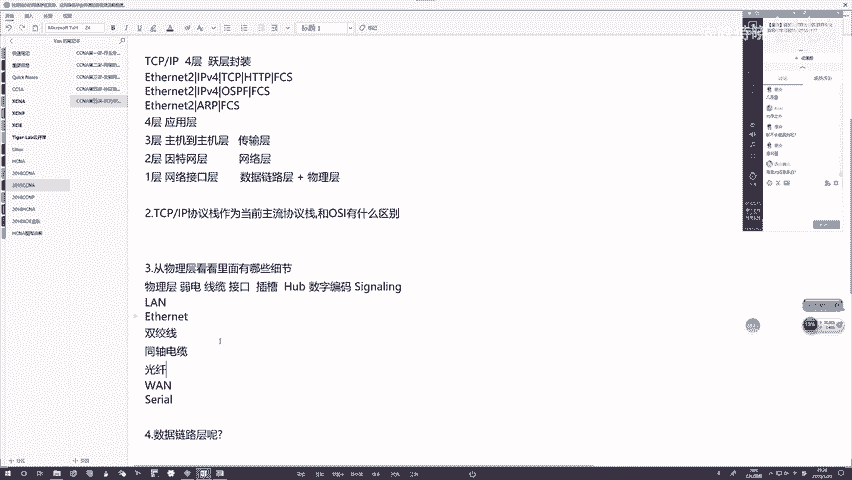

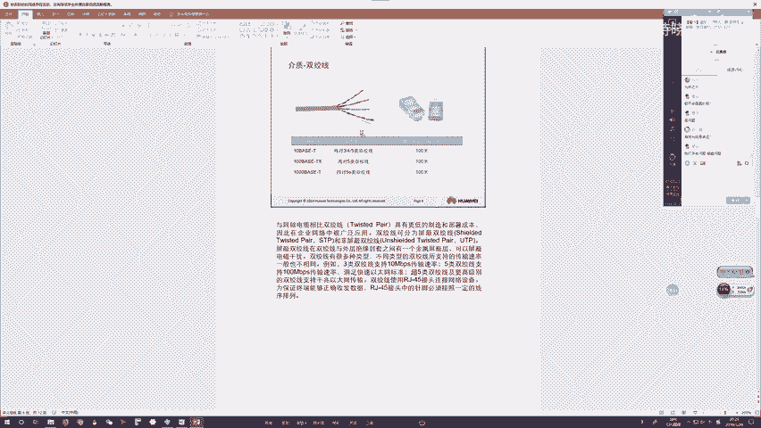

因为这种线只要咱们提到计算机，对吧？提到台式机啊，笔记本啊，你要连接网络，你用的就是这种线，对吧？然后咱们一般楼层交换机，你什么24口的，48口的，对吧？也基本都是这种接口是吧？那双绞线，唉，就是这样。

它的内部呢是8根线芯，对吧？材质铜啊，铜丝，然后接下来8根线芯呢分成四段两两搅在一起，对吧？由于两两搅在一起，所以说咱们俗称叫双绞线，那为什么两搅在一起呢？那原因很简单啊。

你通过这个铜咱们传认数据的时候传的什么电信号嘛，这个电信号，你使用电流的方式来传，你会造成什么干扰，你会产生辐射嘛，会造成干扰。你如果说没有把这些线星两两搅在一起。

那你某一个线芯中传的数据可能会影响到其他线星中传输的数据。那为了避免你的线线芯之间啊去彼此影响对方，那最好的方式是什么呢？就把你们搅在一起。那搅在一起之后呢，通。😊，物理学的这么一个抗干扰原则啊。

你能够避免咱们的近端串扰，能够避免咱们的远端串扰。你能够让不同的线心上传输的数据啊，不会说是两点影响。那让大家呢都能以最清晰的方式来传输。

那这样的话能够保证咱们数据的传输的这么一个速率以及咱们传输的这么一个距离，对吧？之所以你能传100米，原因就是因为我把你们两量就在一起了。如果说你们没有两量搅在一起呢。

可能你们的传输距离啊远没有100米那么远。OK吧好，那双脚线呢，它这个线芯外面还有一个线皮啊，线皮是有颜色的，并且这个颜色呢是按照国国际惯例啊来给你刷的。不是说你可以随便随便设这个颜色啊。

它的颜色固定的，有蓝色还有蓝白对吧？绿色绿白橙色成白，还有棕色棕白对吧？你一共有这么8个颜色，那接下来这8个颜色呢，就是你在用的时候需要注意啊，咱们是有规则的，就是你在做线的时候呢，注意啊。

你买的线一般都是非成品线啊，一般一捆300米，对吧？这个300米呢，咱们能够做最长的三根白米线嘛，对吧？那在做线的时候怎么做呢？你要先把线给剪断，剪断之后呢，把一端的线头啊，这个线皮给拉下来，对吧？

拉下来之后呢，把里面线芯给露出来，露出来之后，你得要把这8根线芯给捋直，捋直之后，你把线芯要做一个排序啊，排序完毕之后哎，做上这个水晶头。然后你拿那个夹线前呢一夹这个线头就做好了。

那接下来这个线在排序的时候注意啊，有一个排序的规则。😊，这个规则谁来定？当然不是用我来定了，是由一个标准化组织来定。这个标准化组织叫什么呢？叫EIA和TIA可以吧？叫EIA。😡。

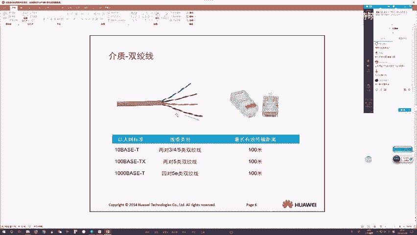

和TIA好吧，那这两家呢都是标准化组织，比较类似于咱们的OSI啊，对吧？EIA咱们称为什么呢？EIA咱们称为叫电子工业联合会，对吧？然后接下来TIA呢叫电信工业联盟，好，这哥俩呢，他们专业的做什么呢？

他专门用来开发一些物理层的标准，你能想到的物理层的线缆的标准，包括咱们街头的标准，包括咱们性令的标准，那基本都是他们俩研发，对吧？那他们俩虽然是两家不同的组织啊，但是他们关系很好，对吧？

一般是联合在一起来制定一些物理层的标准，那当然像咱们的双绞线啊，像咱们同轴电缆啊，像咱们的光纤的标准，那基本也都是十有八9，由他们来定，对吧？那接下来他们定的关于双绞线的最最最有名的标准是什么呢？

就是EIATIA的568标准。这个568呢有两个子标准啊，一个叫。😊。

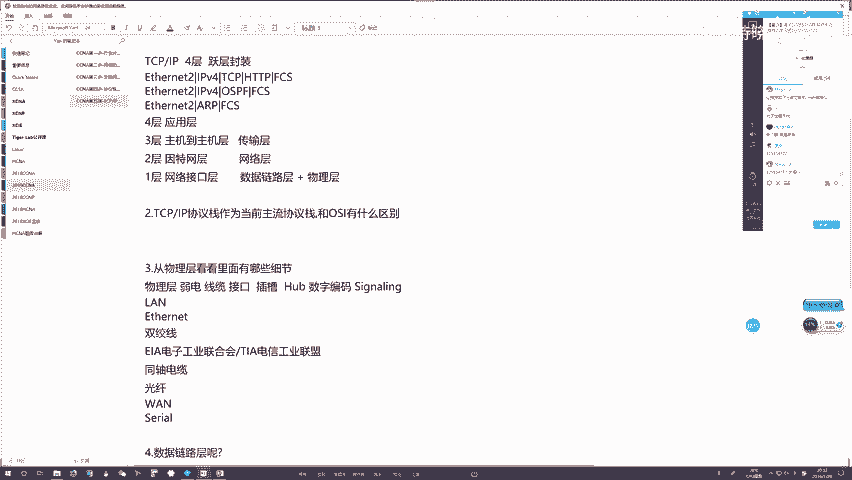

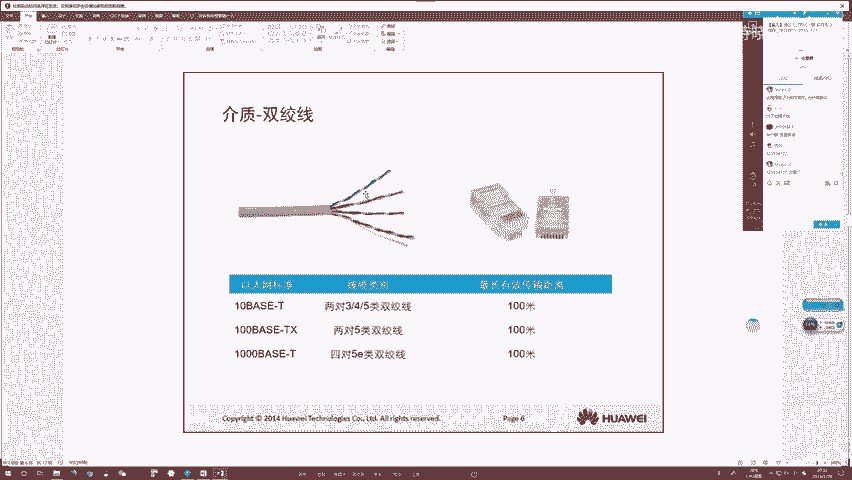

568B一个叫568A好吧，一个叫568B，一个叫568A。那这两个标准它限制的什么呢？就是限制你在做线的时候，对吧？你的线头的线序应该是怎么样，可以吧？那接下来关于这个568B咱们先来聊一下。

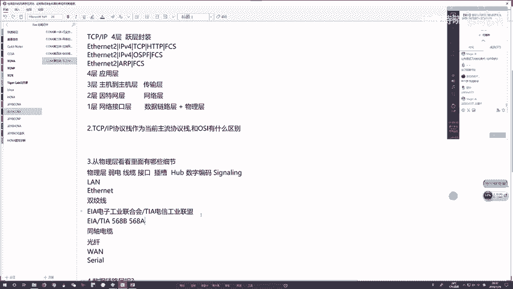

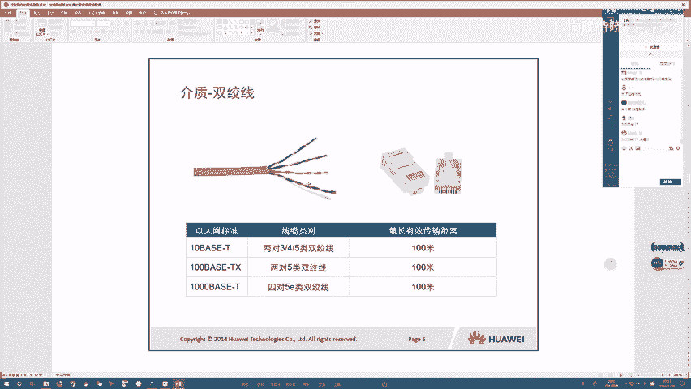

这个568B的线序是什么呢？😡，长白。潮。绿白。来。😊，然后呢，蓝白绿。松白。棕OK这就是568B的线序，可以吧？你在做线上怎么做啊？就是要把线序啊排成这样，可以吧？从左往右，最左边的是橙白色，然后呢。

橙色绿白蓝蓝白绿棕白棕可以吧？然后接下来给给它排紧啊，排紧排直，排队齐，然后接下来做这么一个线头做好之后呢，你这一堆就做好，可以吧？然后接下来这个568A定义的线序是什么呢？差不多啊，稍微有一点点区别。

它是绿白绿。

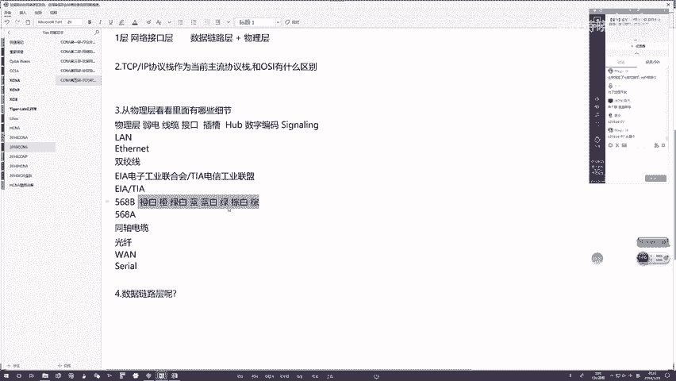

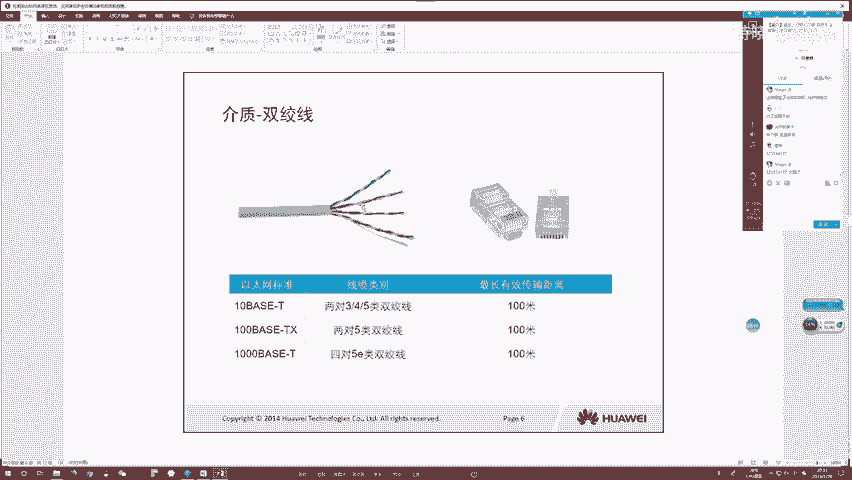

纯白来。然后呢，蓝白橙，然后呢棕白棕。ok了，这个是。568A所定义的线序标准OK吧？你会发现，其实跟568B差不多啊，只不过568B的一号线序在568A中是3号，对以吧？568B的2号线序。

在568A中是6号可以吧？你们之间做1个1326的对调，其他的都是一样的，好吧，那接下来这个EI和TI就规定了，当你想要拿这个双绞线来做以太网数据的传输，可吧？

当然你想要拿这种线连接咱们计算机连到咱们的楼层交换机。那你在做线的时候呢，咱们两端线序啊，你要么使用568B，要么使用568A可以吧？当然呢咱们一般有两种用法。第一个就是你两端都用568B啊。

还有一种就是一端为568B一端为568A。那对应这两种不同的线序啊，咱们这个线双绞线也分为两种不同的类型。

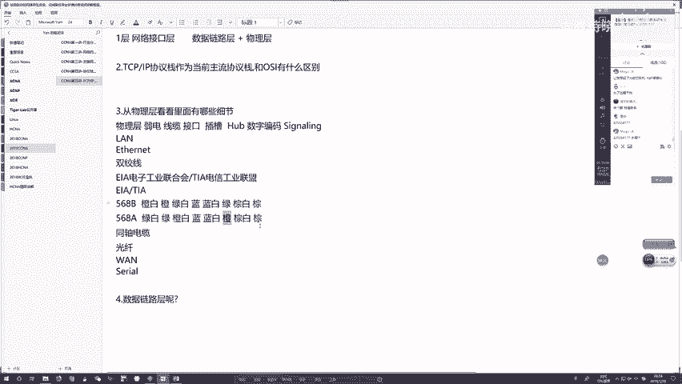

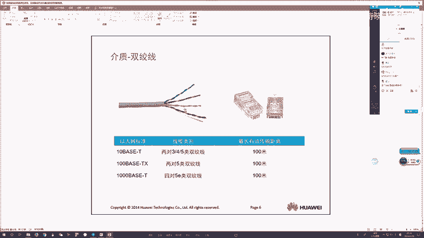

这两种不同类型咱们分别称为叫直通线啊，还有。交叉线对吧？一个叫直通线，一个叫交叉线。一个叫直通线，一个叫交叉线。这个直通线指的就是你两端的线序一致，一般呢都为568B啊。

但是你两端都为568A也是可以的啊。只不过这种比较少见啊，咱们一般两端都为568B的线就是直通线，一端为B，一端为A的这个就是交叉线。那这两种线呢咱们都需要，因为他们的用途呢是不一样的，可以吧？

他们的用途是不一样的。那接下来他们各自有什么样的用途呢？请注意啊，我们把网络设备，包括咱们计算机和服务器啊，综合在一起，把咱们网络中的终端系统和中间系统分成了两类。我们称为叫A类设备，还有B类设备。

可以吧？其中的A类设备，就是那些三层或三层以上的比较高大上的设备。😊，比方说啊我们的PC。比方说咱们的服务器，比方说咱们的路由器，对吧？像这些设备，你都工作在OSS3层或三层以上。

那我们就称你为叫什么A类设备。然后接下来B类设备都是一些比较low的。你公在二层或者二层以下的设备，那像什么楼层交换机啊，像什么极限器啊，对吧？这些都是B类设备，请注意啊，同类设备之间互联使用交叉线。

😊，E类设备之间互联使用直通线可以吧？A类设备连B类设备，咱们用直通A类设备连A类设备，B类设备连B类设备咱们都用交叉线可以吧？举个例子啊，PC连交换机用什么线，直通线嘛？但是PC连路由器呢。

就要用交叉线，路由器连交换机用直通线，但交换机连极线器，咱们就要用交叉线，可以吧？当然交换机连交换机啊，也是交叉线，路由器连路由器也是交叉线PC连PC也是交叉线，可以吧？

那当然一般呢咱们哪种线路比较多呢，那肯定是直通线用的比较多，对吧？因为一般没人会拿路由器直接连PC嘛？路由器连谁啊？路由器一般都是连交换机的，交换机连谁啊？交换机一般是连PC的嘛，对吧？你不管怎么看。

不管怎么连，咱们都是E类设备互联，所以说一般呢你在一个电脑承啊，就是说哎对吧？我要。😊，老板买根线，买根网线对吧？你给我卖一个是吧？那老板又会卖卖给你什么线呢？他十有八九卖给你的都是直通线。

因为在他来理解，你买线是用来干嘛的？就是把你的计算机连到咱们的对吧？交换机嘛，那你把计算机连到交换机，咱们是一类设备互联，你使用直通线啊，这是没有任何问题嘛。可以吧？

OK那接下来在如今的网络情况下来看啊，你这个直通线跟交叉线呢也没有那么重要。为什么呢？因为当前咱们比较新型的设备。😊，你的网络接口都支持这么一个功能，这个功能咱们称为叫线缆自适应，对吧？叫线缆自适应。

那所谓的线缆自适应指的是什么呢？就比如说你有两台交换机，你们之间连一根直通线。按照常理来说，你连错了线啊，你的接口的灯都应该不亮。😊，接口灯不亮，你们一般就懂了啊，两种可能性啊。

第一种就是你连的线有问题。第二种就是你接口坏了。第三种就是你线也没问题，接口也没坏，但是你连错类型线，一般就是这么几种可能，那所以说你连根线，发现唉接口灯都没亮，对吧？检查一下是不是连错线了。

但如果说你接口支持了线的自适应，它能够神奇的做到这么一件事，就是你虽然是两台交换机接互连，对吧？连了根线，但是对吧？我能够把你这个线自适应成让咱们能够通信的这么一个就是标准啊。

就比如说你两台交换机明明应该是连交叉线的嘛，对吧？但我给你连了个直通线，那这个直通线我能给你适应成交叉线的这么一个工作模式来工作。那所以说呢就算你连的是一个直通线，你的这个接口也依旧能够亮通。

依旧依旧能够亮灯啊，你们之间依旧是能够连通，对吧？这就是接口自适应。😊，所能够实现这么一个功能，对吧？那如果说你链路两端的接口有一端啊支持自适应，那所以说你线呢就可以乱用了，随便怎么用都没关系。

但是怕就怕你两端的接口都不支持自适应，你如果说都不支持，那这个直通线交叉线就很重要了对吧？因为如果你要连错线，对吧？你这个线虽然连了线好的，接口是好的，但是你连完之后接口灯都不亮，对吧？

你怎么配都通不了，对吧？那今天呢我们刚遇到一个问题啊，就是新系来的一个学员嘛，他买它服务器，对吧？放在家里，然后呢拿自己的笔记本之了，连根线啊，连到服务器，然后接下来刚巧他这个服务器呢，网卡比较老。

不支持线来自适应。然后他的笔记本呢也是好早之前的一个think态的，也不支持自适应，然后连完线之后，就发现哎怎么样都不通啊，地址怎么配，怎么拼都不通，然后接下你就问他，你连的是根什么线，跟我说了哎。

直通线，我说你服务器连PC能用直通线吗？那肯定不行，对吧？啊，赶紧换根线，然后接下他重新买了一根买了一根交叉线。😊，然后交叉线一坏，对吧？一连直接就痛了。okK吧，那这就是这个线缆知识的重要性，对吧？

那包括咱们在使用呃cisco最初级的这么一个模拟器啊，我们称为叫cisco package trace。这个呢之后都会发给大家。

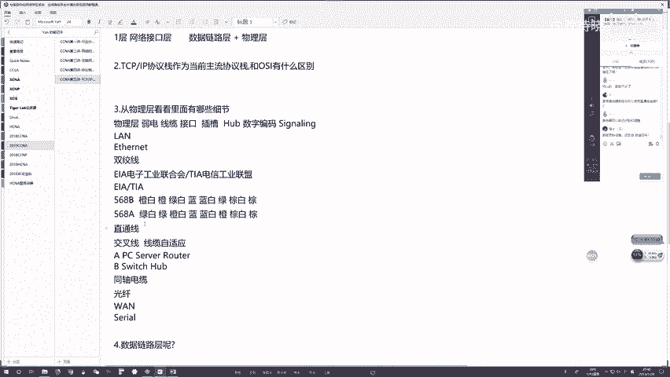

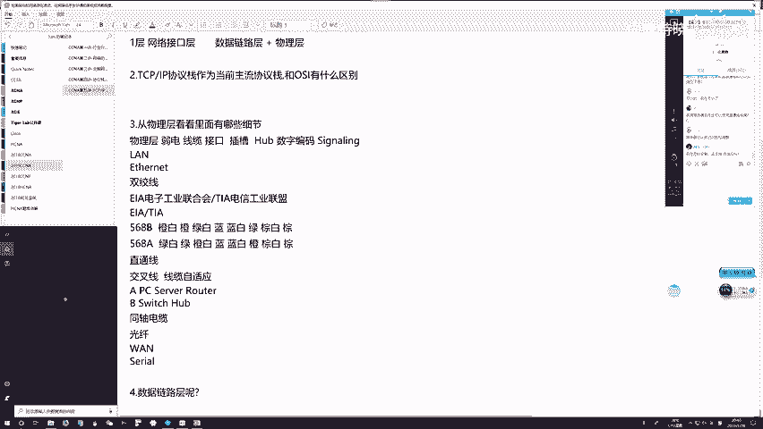

你们在使用这个模拟器做实验的时候，它也非常分这个线缆，它非常分啊，就是它也把这个线缆分为两类啊，一类叫直通线，一类叫交叉线，对吧？那如果说你要连错了线，对吧？你连完之后，这个接口也是不亮灯的。

它会闪红红光啊，这个红光会告诉你，就是你这个连接是有问题的对吧？你一定要把这个线给修改一下才行。对吧？那这边我们来看一下啊，比如你一台路由器，哎，我拉一台路由器啊，对吧？有台路由器。

然后呢连接一台计算机是吧？你路由器连计算机，你使用什么线啊，对吧？你要使用交叉线，虚线就是交叉线，好吧，然后接下来如果你这边来了一个交换机，好吧，你来一个交换机，2960交换机啊。

路由器连交换机使用什么啊，直通线嘛，直通线是实线，好吧，实线是直通线，虚线是交叉线，好吧，你如果用错了线，那这个模拟器呢，它是假定你所有接口都不支持自适应的。😊。

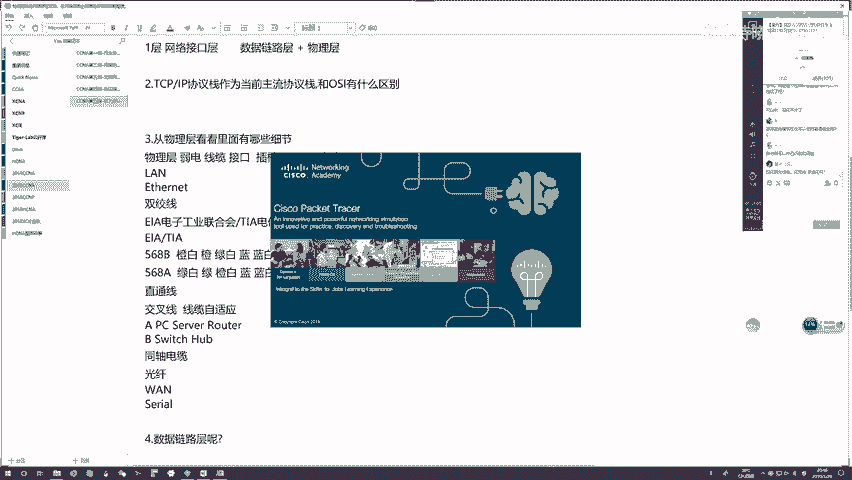

你接口不支持自适应，你如果连错了线，对吧？你会发现哎连了线啊，没有错呀，我连了呀，对不对？接口我也配了地址，那为什么不通啊，哎，对吧？就是因为你用错线了，好吧，你用错线O好，那这是关于直通线跟交叉线。

那交大家用线的时候呢，经常会就是被问到这么一个问题，比如说咱买线时说哎老板买块线，哎，老板会问你买几类线，那你也不知道几类，就说随便给我来了一呗，来一个呗。

那一般正常如果你要说随便来一个老板正常会给你卖的什么呢？是五类线，对吧？五类线，那如果说你买了五类线，这个线不够高，对吧？级别不够高，那可能会导致一个问题，什么问题呢？就是你买回来的线，你连上了，对吧？

虽然咱们这个网络能通，但是我们的传输带宽要比你接口所能提供的带宽要少的多，比如说你辛辛苦苦买了一台特别贵的交换机，交换机的接口能够支持千兆传输。我们的。😊。

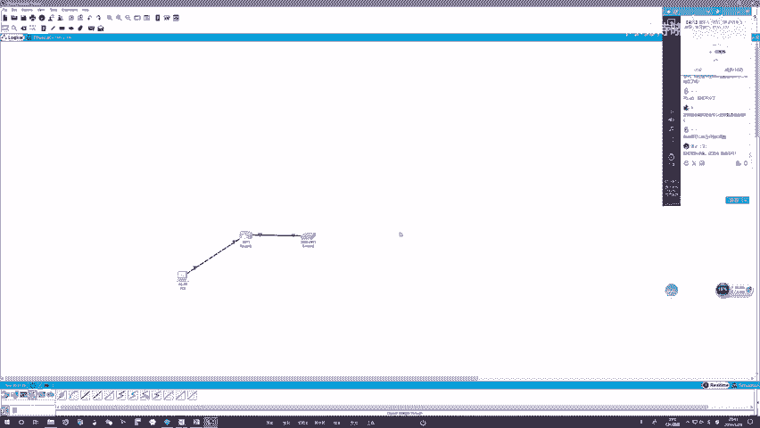

计算机的接口也能支持向上传输。那接下来你买根线，买了一个五类线，然后连完之后，你发现唉下迅雷怎么只能下十几张啊，按照常理来说，应该能够下100多兆钱，对吧？为什么只有十几张，对吧？

原因是因为你这根线本身啊造成了带宽的瓶颈，可以吧？那想要买线能够达到咱们的传输的最大带宽，你点先了解啊，咱们这个线能能支持的最大带宽啊，有多少，对吧？

一根双绞线能够支持多少带宽是由它的类别来决定的那这个类别能够几类啊，一共大概是有8类到九类啊，对吧？分别是像什么一类线啊，二类线，三类线。😊，四类线、五类线还有超五类线可以吧？然后接下来有六类线。

有七类线，还有当前最新的八类线，可以吧？你在买线的时候呢，你要告诉他我要买几类线。那当前的最新的八类线可能还买不到啊。然后这个七类线已经是可以买了七类线非常好看了，你们可以看一下啊。

就我不知道你们有见过七类线真的特别漂亮啊。七类线是我见过所有线里面最最好看的。😊，七类双脚线。对吧，七类双脚险。哇，超级好看啊，你们可以看一下。

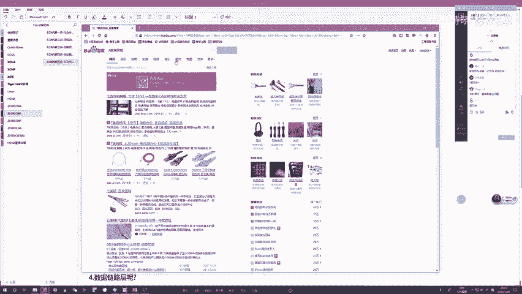

可以看一下。哇啊不对啊啊，这样看到了？这就是七类线啊，一般你们能见到七类线是这样的，接口特别好看啊，然后线是扁平的然后你们在购买6类线，五类线，超5类线的时候，那基本就是这样的对吧？接口也不是特别好看。

然后咱们线一边是圆的对吧？圆的线线的比较多啊，那一般圆线比较便宜。😊，对吧，尤其是像这种颜色的，更便宜。然后接下来一般比较贵的线是吧？一般比较贵的线都是这样是吧？比较贵的线都是这样都是这样是吧？

线是扁的啊，线是扁的，好吧，那价格差距很大啊，价格差距很大，尤其是你在做综合布线的时候，你拿那个百米的七类线啊，那这个价格要比你五类线六类线贵很多可以吧？那为什么要买比较高的类别线嘛。

因为你这个线的类别越高啊，你能够支持带宽就越高，可以吧？那首先一类二类线咱们可以无视了，因为一类二类线根本不能够用于咱们的以探网工作可以吧？一类二类线你可以理解为是咱们电话线的升级版，可以吧？

那电话线大家应该都见过啊，找的跟咱们双脚线是差不多啊，电话线就是一个缩小版的双绞线可以吧？只不过它里面只有两个线芯，然后呢它的接头也就是咱们的对吧？缩小版的水晶头啊，跟咱们水晶头其实差不多。

但是要小一些，可以吧？那曾经有人说来咱们能不能给电话做一些功能的一个画。😊，对吧给你升级一下电话的性令。那你想要升级性令，咱们的电话线只有两星啊，你传不过来怎么办呢？那我就给你扩展到8行。

那这就是双绞线由来啊。但这个双绞线用于电话线连接的一类二类线啊，你不能用于咱们以太网连接，因为它不支持咱们以太网传输。第一个能够支持以太网传输的就是三类线。三类线能够提供10兆的传输带宽。

那所以说如果你要连根线连到极线器，你用三类线是没有任何问题的。😊，四类线相比三类线工艺上要好一些，对吧？线缆漂亮程度上会更漂亮一点。但是四类线呢依旧很low啊，你想让它支持更高带宽，不好意思。

它最大只能支持16兆带宽16兆唉，我觉得对于以太网而言，是一个非常尴尬带宽。你以太网要么是十0兆，要么这边是百兆的吧，你有见过十0兆跟百兆之间带宽吧，我没见过，那所以说呢四类线很尴尬。

你拿它来连咱们极线器，你剩余的6兆带宽啊，咱们浪费了，你用不了，而你连交换机呢，对吧？你又不够，那所以说呢四类线基本没有什么立场啊，没有什么牌面，是吧？那咱们一般是从三类线直接过渡到五类线。

那这个五类线也是咱们当前见的比较多的，能够支持百兆传输啊。如果你的交换机接口能够支持百兆带宽。你的计算机的接口也支百兆带宽，那你连个5个五类线啊，这是最好，对吧？没有任何损耗，对吧？😊，也不浪费。

也不是也不损耗，对吧？最好，而且五类线便宜嘛，是吧？那接下来如果你交换机接口值是千兆，不好意思啊，五类线就不行了，你就需要买什么六类线跟七类线。😊，六类线啊，说错了，不是六类线跟七类线啊。

是超五类线跟六类线。超五类线跟六类线，它们俩能够支持千兆传输。那当然相比之下呢，超五类线跟五类线啊，它的工艺是差不多的。而这个六类线相比超五类线工艺要好很多。我觉得从超五类线来来说啊，它是一个分水岭啊。

超五类线包括所有以下型号的线呢，你在看的时候都特别low。😊，就是一看你就知道这个线不咋地是吧？然后再买的时候怎么样，也很便宜。然后从六类线开始，我靠，这个线是越做越花了胡哨啊。就是你从六类线开始。

这个线我都已经我都已经怀疑咱们到底能不能做出来了，就是线特别特别好看。我觉得你拿正常的工具，你是做不出来的，对以吧？你只能拿那种机器来端到端来做，你能做出来。你如果说就是你你购买那种半成品线啊。

你买半成成品线，你买那种水银头，你自己来做，我觉得是很难做成这样的。😊，是吧那恨不得这个接头都镶精了，特别好看是吧？OK那这就是六类线跟超五类线，对吧？他们能够支持千兆传输，但是相比之下。

一六类线的工艺啊要好很多很多很多，可以吧？然后接下来七类线牛逼了，七类线能够支持万兆传输。这个简直是双绞线的奇迹啊，对吧？能够支持万兆传输，万兆是多少啊？我们可以算算啊，千兆就是吉比特拉，万兆是1G。

对以吧？你连杆七类线，你连到一个能够支持1际的这么一个接口。我靠，你连完之后，你下迅雷，你可以算一下啊，你大概的下载速率是。一个G下载速度是一个G每秒。我靠，这个真的超级超级快啊超级超级快。

但这个还不是最快的。🎼去年18年啊18年下半年刚研发出来的8类线是当前咱们双绞线的极致啊。这个8类线当前在市场上你能买到很很少啊。我们好像有一个学员，他们公司就是参与了8类线的研发这个8类线太牛逼了。

你能够支持4万兆到10万兆的传输带宽，可以吧？那10万兆就是百G啊，百G。百G到桌面，我不敢想象啊，如果你哪天真的做到百记到桌面了，你拿一个迅雷下载，能下到10多G啊。

十0多G的下载速度比你硬盘对接的要快啊，我觉得到那个时候对吧？如果你硬盘没有扯后腿，那咱们的计算机简直你是无所不能了，对吧？那可能到那个时候像什么量子计算机啊，我估计都已经对吧？不是梦了，对吧？

咱们有足够的网络支持，有足够的硬盘能力支持，对吧？那你深度学习啊，机器学习啊，对吧？都不是梦想，OK那这就是双绞线的这么一个类别，好吧，那算是第二种分类方式啊，算是第二种分类方式，这是基于带宽来分。😊。

然后接下来双角线还有一种分类方式啊，它是基于什么呢？它是基于屏蔽与否来分，对吧？那基于屏蔽与否，哎，它们分为这么两类啊，一类我们称为叫UTP，还有一类咱们称为叫STP对吧？这个UTP叫非屏蔽双脚线。😊。

叫非屏蔽双脚线。这个STP呢咱们称为叫屏蔽双脚线。好吧，第一个叫非屏蔽双绞线，一个叫屏蔽双脚线。那当然你们要问我哪个用比较多，那肯定是UTP用的比较多啊，为什么呢？便宜？这是第一点。

并且UTP在做线的时候成本比较低。你在做水平布线的时候还比较方便咱们部署。并且UTP在绝大多数情况下能够支持传输距离，那都是百米还比较长的，而这个STP呢第一成本比较高。然后布线难度比较大。

并且它能够支持传输距离啊，反而可能会更短。那所以说呢你除非在极端的情况下啊，你在一个比如工厂里面，你在一个比如车间里面，在你在核电站里面啊，这些电磁干扰非常强的环境下，你如果不用屏蔽双网线。

咱们的信号根本传不了了。那这种情况下，你就使用屏蔽双网线。你如果说你这是一个普通的办公园区，对吧？你这是普通写字楼里边也没有什么红外干扰，也没有什么电磁干扰，对吧？你也不需要说是传输多么精密的数据。

那一般情况下咱们使用UTP就已经足够，对吧？那这个UTP跟STP它们的区别是什么呢？它们插了什么东西呢？哎，插就插了，叫什么叫一个叫屏蔽膜的东西。😊，屏蔽。双脚线。好，大家能看到吧？

这个就是非屏蔽双脚线啊。然后呢，左边这个就是屏蔽双线。那屏蔽双上线跟非平率双上线它们差别是什么呢？就是在你的线芯的外面啊，在你这线这的外面，咱们有一个屏蔽膜，对吧？有屏蔽膜的就是屏蔽双网线。

没有的就是非屏蔽双号线，对吧？那当然这个屏蔽双导线呢，咱们还有升级版啊，这个升级版我们称为什么呢？这个升级版，咱们称为叫内屏蔽双号线，什么叫内屏蔽啊，就是我不单单哎在你的四段线外面给你搞一个屏蔽膜。

对吧？我在你每一段线段外面对吧？都给你搞一个小的屏蔽膜，对吧？保证你线对之间对吧？还不会相互干染，那这个屏蔽膜有什么用啊？那我相信顾名思义啊，屏蔽膜用来抗干扰的嘛，对吧？因为我们的线缆中。

你毕竟是铜丝嘛，传的是电你传输电，请注意啊，影响电流传输的因素很多，对吧？像什么下雨天，你潮湿的空气对不对？打雷闪电是吧？台风对吧？像什么微波信号。😊，红外信号、卫星信号、手机信号对吧？

其实对你的电磁波啊都会有干扰。那所以说呢如果你要在一个环境中，咱们这个电磁干扰特别厉害，对吧？你传输的时候呢，可能会出现很多问题，那在这种情况下为了抗干扰，你就需要搞这么一个屏蔽膜，对吧？

但是在绝大多数的网络情况下，你是不需要的，为什么哪来那么多电磁干扰，而且一般的电磁干扰真的有那么大的影响了，也没有那么大的影响，那所以说你一般正常情况下对吧？为了节约成本啊，UTP足够对吧？

STP一般就是用作那些对吧？像什么厂房啊，对吧？医院啊，对吧？像什么核电站啊，对吧？像什么化工厂啊，在这种地方，咱们电磁干扰真的是太厉害了，你不用屏蔽膜，咱们根本数据传不了，对吧？你除非在这种情况下。

咱们才使用STP那一般正常情况下使用UTP这就OK了，可以吧？好，那这就是最后一种分类，可以吧？😊，那接下来归为这三种分类，大家呢有这么一个概念就好了，可以吧？

最重要的分类肯定是直通线跟交叉线这么一个分法。因为这种分法直接决定了你两台设备是之间互连使用哪种线来，并且当你们在使用PT这个模拟器做实验的时候，如果你们对直通线交叉线不够了解。

那这个模拟器可能你们都玩不转，那所以说呢对于第一种分类啊，你们上新一点，有这么一个概念就好了，对吧？后续的分类当概念听一听就OK了。好吧，那这就是我们的以太网线里面的最经典的一种啊，叫双绞线。

再次说一下双绞线的定位啊，一般咱们的终端对吧？就是咱们计算机，咱们的服务器，你要使用有线介质连接到咱们的网络，那一般咱们连的就是双绞线，因为一般对于咱们计算机而言，你能够连接的也只有这种线，对吧？

因为你的网卡就是双绞线网卡嘛，对吧？那当然你连的线叫什么线呢？你连的头叫什么头呢？这个头咱们称为叫水晶头啊。😊。

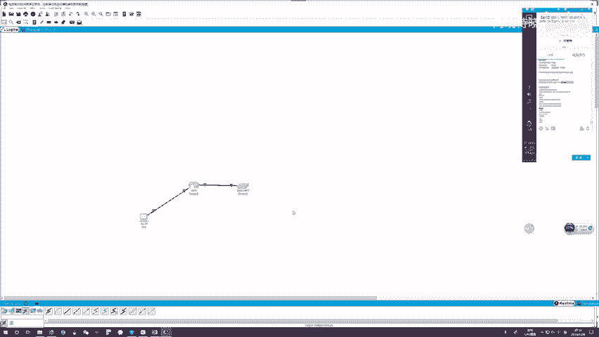

双绞线那个头咱们称为叫水晶头，这个水晶头俗称，那它的官方叫法什么呢？它的官方叫法咱们称为叫RJ45接头。好吧，叫RJ45接头。好，你只要听到RJ45okK那就指的是双绞线接头，好吧。

那接下来电话线接头其实也叫RJ啊，电话线的接头叫RJ11，可以吧？RJ11是电话线接头，RJ45是双绞线接头，好吧，OK那这就是最关键的一种线，用的最多啊，用最多OK那接下来除了这种线以外。

还有什么线呢？哎，第二种线给大家介绍一下通轴电缆。😊。

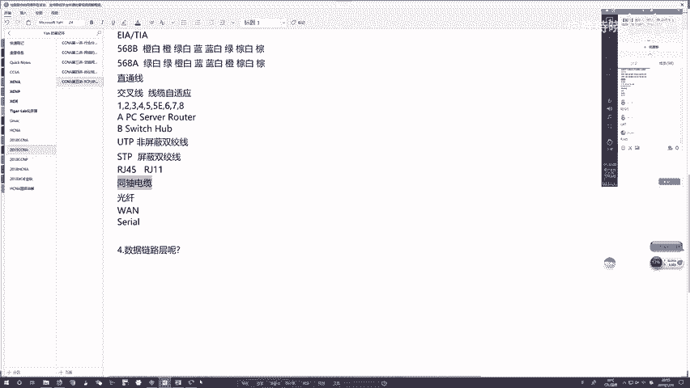

这个铜流电缆的用途现在是越来越多了啊，越来越多了，长什么样的？就是这样的。😡。

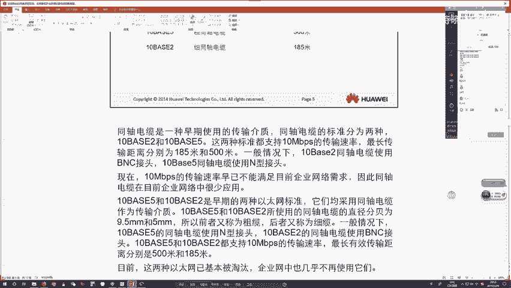

啊，缩小点啊，这样就是这样好吧，这就是铜轴电缆。当然铜轴电缆，铜轴电缆不用小了啊，里面还是铜缆啊，对吧？里面是铜芯，那当然你们一看线你会发现它里面用的铜啊，要比双脚线多的多啊，所以说从材质上来看。

这种线是比较不环保的，因为你不要小看铜铜它也是贵重金属，对吧？铜是贵重金属，并且地球的铜的产量是有限的，所以你拿过多的铜来造这种线，对吧？你线消耗铜越多啊，对吧？这个铜用的越快。

你这个线所能够支持最大长度啊就越短，对吧？因为你总有一天铜会用光嘛，你铜用光了，你还拿什么来造线，你就没法造的嘛，对吧？所以为什么咱们当前提倡使用光纤啊，因为光纤里面不用铜，光纤它用的是玻璃纤维。

而这个玻璃纤维就是拿玻璃来做的，这个玻璃有多少啊，取之不尽，用之不竭啊，你整个地球最多就是玻璃，它不属于说是稀缺能源。那所以说你拿玻璃来做线同样也能传输，并且你传输的效果比你铜线还要好。

那所以说呢光纤取代铜线这是分分钟的事儿啊，我相信未来有一天就算咱们正常计算机，对吧？这常笔记本你要上网，咱们也都是慢慢使用什么光纤来连接，因为这种铜线对吧？不太绿色啊，不太环保。

O那接下来同轴电缆大家能看到两根线对吧？比较粗这根咱们就称为叫粗缆比较细的这根咱们称为叫细来，这个名字太好记了，细缆还有粗来，对吧？就是跟着你的粗细来分辨呢。

然后接下来粗缆能够支持传输距离要500米对吧？细缆是185米，那相比咱们双脚线同轴电缆支持传输距离啊，要稍微远一些，对吧？耐何你用这么多铜嘛，你用了这么多铜传输距离还短，咱们怎么能受得了，受不了，对吧？

然后接下来同轴电缆的接头是这样的啊，不一样，注意啊，粗缆细缆不一样。😊，细缆是BNC接头啊，然后呢粗缆是N型的反转接头。这个BNC接头是什么呢？哎，还挺好听的啊？这个BNC接头咱们称为叫英国海军接头啊。

对吧？在英国海军接头啊，O啊，这个是接头的名称啊，然后呢接头就要这样的那大家会发现这样的接头，咱们一般计算机是没有的吧。对吧你别说计算机没有啊，你交换接没有路由器也没有，一般什么样的设备，有这种接口啊。

啊，运营商的设备有啊，像什么广电运营商，对吧？它设备就能连接这种线，那这种线一般咱们早期连什么设备呢？它不是连我们计算机的啊，早期这种线缆是连接咱们有线电视，对吧？你有线电视办一个机顶盒对吧？

你有电视呢连线连到我们机顶盒，然后机顶盒连根线连到咱们的小区的门洞里面。那这个门洞呢会有个铁盒子里面会放什么，广电的设备，那一般这种连接，咱们用就是同轴电缆，那这么同轴电缆呢。

咱们早期的定位是用它来传输咱们有线电视信号，对吧？😊。

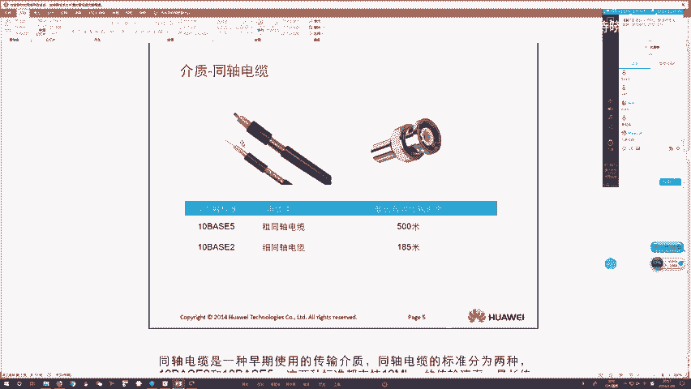

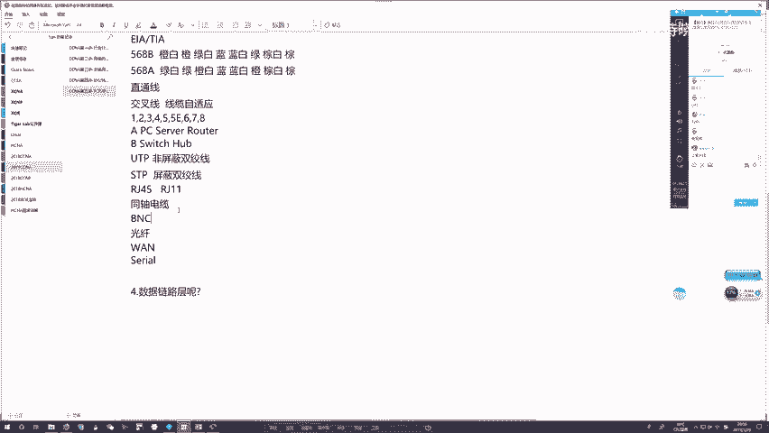

那是最早期啊，那当然最早期呢同轴电缆咱没有发挥到所有功能啊，最早期同轴电缆来传输有线电视信号的时候，它只能够支持10兆的数据传输。对吧那所以说以前电视没有那么清晰嘛，对吧？以前没有什么2K电视。

没有什么4K电视，对吧？如果你要真有2K4K电视，你光靠这种线，你传不到的信号嘛，你传不了啊，十兆根本不够看，而当前同轴电缆，能够支持带宽啊，相比曾经要高很多。

它也能够支持百兆甚至百兆以上的这么一个传输，对吧？千兆它能支持，对吧？然后现在呢在一些国家，咱们拿通用电缆做什么呢？来做咱们运营商的骨干链路，对吧？比如你运营商CN two网络，对吧？

你的骨干核心啊就可以使用通用电缆，可以吧？哎，我们办理电信宽带，对吧？你电信要连根线连到咱们小区对吧？然后再从小区把这根线分出来，分成双网线，连到咱们的挨家挨户，对吧？那接下来运营商连到咱们小区。

咱们的核心骨干链路使用，什么呢？那就可以使用通轴电缆，可吧？那接下来通用电缆呢哎目前来看，它能够提供咱们的数据传输，并且也能够提供咱们的双以太宝呢。😊，这么一个数据的传输OK吧。

它能够提供咱们以太网的这么一个传输OK那所以说呢这根线呢当前可以复用啊，既能用它来传输有线电视信号，又能用它来传输咱们的以太网的数据，可以吧？一线多用一线多用OK那当然这个线呢当前的定位来看。

我觉得是非常尴尬的，因为你拿它来做咱们的运营商的连接骨盖。那很明显是有很多问题的。第一个问题是什么呢？就是你能够支持的带宽。毕竟是比较有限的，你虽然看起来能够支持比较高的传输速率，但是呢相比光纤对吧？

你相比咱是双绞线啊，相比双绞线相比光纤，我觉得同轴电缆，它的带宽的支持能力啊是被瞒爆的，往往到你双脚线和光纤能够支持一个新的传输标准之后啊，你的同轴电缆才慢慢的跟上。比如你光纤先能支持万兆。

然后接下来同轴电缆才能支持万兆，对吧？你光纤能够支持4万兆，同轴电缆才能支持4万兆，并且呢这个时间间隔隔得比较远，这是第一点。第二点，你同轴电缆能够支持的传输距离啊是真的太短了，500米。

这是什么意思啊？这意思是说你要拿这种线来做咱们的运营商的骨盖链路啊，你要每隔500米设一台设备，这个得多麻烦，太麻烦了。然后接下来你这个线对吧？耗费这么多的同可扩展吗？也不可扩展，对吧？

那所以说呢出于种种因素考虑啊，这种线正在慢慢被淘汰。😊，可以吧？那取而代之的是什么呢？取而代之的就是光纤。那所以说呢当前呢当前呢咱们整个中国啊华东地区对吧？基本都已经是全面的从同州电缆切换成光纤了。

那现在呢从运营商到咱们的每个小区啊到咱们每一个公司园区，我们的骨干链路都已经使用光纤。然后呢，最后一阶段，咱们还是使用光纤啊来连到咱们的I家挨户，连到咱们的企业内部。那所以说呢现在咱们端到端使用光纤。

而这个光纤支持的传输距离要远强于同州电缆，光纤能够支持传输速率要远高于同州电缆。所以你会发现一个国家运营商，只要你的整个骨干链路啊迁移到光纤了，你的整体的宽带的质量要高很多很多。

那当然做的最好的那个国家呢，做的最好的就是韩国韩国早早的很多年前啊就能提供千兆到桌面了，什么意思啊？就是你在韩国办理一个电线的宽带，你能代理千兆。咱们当前中国也能办千兆吧。

我说前一阵子啊去电信办一个宽带，对吧？我其实我没有不用没有办宽带，我办个移机啊，然后我在办移机的时候一看，我靠，能这是千兆了，然后我就跟他聊了聊，说哎千兆能办了吗？他说可以办，他说能办，我说多少钱？

他说我靠，去那个现在性价比比较低啊，然后我就问了一下，说9991个月，9991个月。完后我说那我办了千兆真能达到千兆吗？😡，然后呢，他说其实达不到，为什么达不到？很简单。

因为现在很多你的计算机不支持千兆。然后接下来你很多的运营商的这个猫嘛，光猫，你提供不了千兆传输，对吧？那些早一批的像什么对吧？中性的猫啊，华为的猫啊，你说他支持千兆支持不了，对吧？

然后就算他们能够支持有些园区内的这些楼道交换机啊，你这些楼道交换机不能支持千兆，那所以说呢我光给你把这个套餐改成千兆，你是达不到千兆的。那这是18年的事儿。而韩国早在15年14年就已经千兆的桌面。

那他们现在正在慢慢普及万兆的桌面，那所以说我们这个真的是还有很长的路要追赶啊，对吧？那当然咱们还不是做的最差的，咱们还有还有比咱们差很多的，还是所谓的发达国家，比如说咱们南半球的对吧？风景宜人的奥克莱。

对吧？我们的新西兰嘛，还有我们澳大利亚，这两个国家说是发达国家，但是他们的运营商是真。😊，不穷啊，他们的各种各样的运营商目前为止依旧还是使用同轴链来来做咱们的骨干链路链接。那当然之前呢澳洲前两年有提倡。

就是说咱们迁移到光纤，对因为他他们也知道啊光纤好吗，他们也知道，但是你要迁移到光纤，你的工程量是不很大呀，你要把你之前的所有同事电缆给拔出来嘛，对吧？挖出来给弄掉，对吧？把这些事备给替换掉。

然后呢更换咱们光纤。那大家都知道国外效率比较低嘛，并且你干任何事儿你都需要对吧？各方去协商啊等等之类效率特别特别低，然后呢费用还特别特别贵，那所以说呢他们。😊，就干了一件特别坑的事儿。什么事儿呢？

就是我给你切一道光纤，我怎么切呢？我的骨干连接依旧保持通轴电缆，我是在你最后一公里的连接，对吧？给你把那一段啊，从通轴电缆换成光纤，然后呢让你光纤连接到咱们的用户，就是对于用户而言。

你感觉到的好像是咱们光纤直接连到咱们PC了，连上咱们的猫了。但是呢咱们的骨盖依旧是使用什么通轴电缆。😊，我觉得这就是什么？这个叫。拿什么来形容比较好呢？四个字自欺欺人嘛，对吧？你的骨干还使用同州电来。

也就是说你的骨干的传输能力是没有变的。😡，对吧我只给你把最后一公里的连接从同州店缆换成光纤。😡，那这样的话，对于用户而言，你的传输速率真的上升了吗？我觉得非但没有上升，你反而下降了。

因为你原本是使用什么端到端同轴电缆，好歹咱们的介质是一致的，对吧？你介质一致。我们的传输，没有什么信号转换。你没有什么信号转换，你的损耗会比较小。好了，现在我给你做了一个光纤的改造是吧？你的骨干没有变。

该是什么还是什么，我给你把最后一公里从同轴电缆，对吧？换成那个光纤，对吧？你换了种介质啊，你换一种传输方式，你光纤传的是光啊，你得把光转换成电，再通过咱们的同轴电缆发了，那这样的话。

其实你多了一次转换嘛，你就增加了咱们的信号的损耗嘛，对吧？你增加信号损耗，我觉得对于用户而言啊，其实你最终的感受应该是网络变得更差了，当然呢用户不知道他以为咱们是用了光纤，所以说他们得要为这个宽带。😊。

翻套餐啊花更多的钱。可能原本咱们一个月几十刀就完事儿，现在可能一个月我要翻倍，甚至我要翻三倍。但我的传输质量呢完全没提高，反而变得更差。😊，对啊，那这个谁能遭得住啊？对吧，但是你们知道为什么会这样吗？

😡，为什么会这样？😡，我来跟大家说啊，之所以会这样的归根结底，原因是因为当时澳洲的运营商，澳洲的政府啊在招标做这个光纤改造的时候，华为提供了非常非常好的方案，非常便宜，时间周期非常短。

并且保证你的工程质量。啊，竞争力非常非常强啊，他们没有选。😡，他们选了一个本地特别坑，特别贵的这么一个供应商来给他们做这么一个改造。首先需要的时间巨长无比，然后的费用巨高。对吧你懂的。

所以说呢这个叫自己作的死啊，对吧？你只能自己去承受嘛，对吧？不作死就不会死啊。所以说就是你如果能拥抱华为的话，对吧？你把华为当廉廉价劳动力嘛，对吧？华为给你搞的这么一个项目，挣不了你几个钱啊。

又能快速的给你解决，对吧？又能给你对吧？省钱那何乐不为呢，非要站在咱们政治立场，对吧？你去思考那个政治正券那这个就没有意思了，好吧，那所以说呢基于这一点，这个同轴电缆呢，它在有些国家。

咱们一般用的比较多，然后呢，在我们的国内一般用的比较少的，并且对于咱们用户而言，用户肯定是看不到同轴电缆的，因为同轴电缆作为作为作为咱们的骨干链路啊，它顶多就是传到你的小区的绝端设备为止，对吧？

而对于咱们的终端用户而言，你最终联网，要么使用什么？要么是使用双网线，要么使用光纤对吧？那依旧是双网线比较多，而这种同轴电缆，对吧？基本你不去运营商内网，对吧？你不去咱们的核心骨干，你就看不到了。

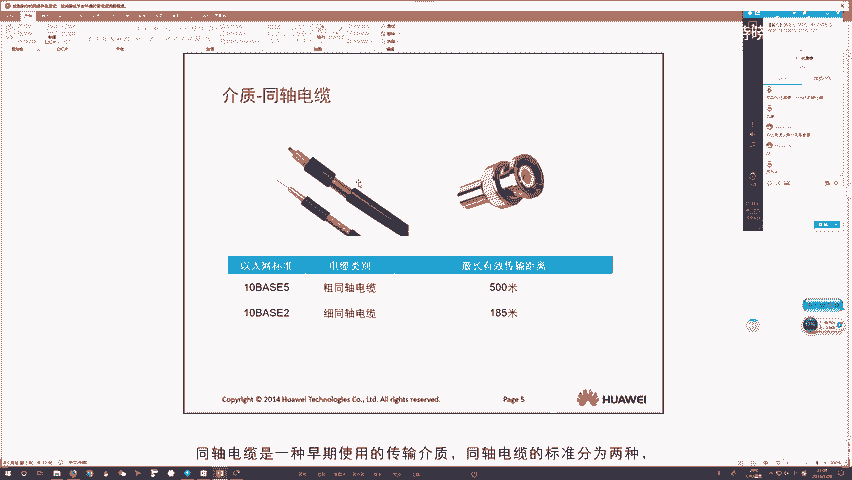

好吧，OK那这就是通州电缆这么一个概念。

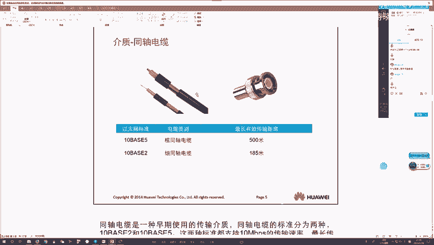

然后接下来取代同轴电缆，的是什么呢？就是咱们当前以太的最新标准啊，就是光纤。

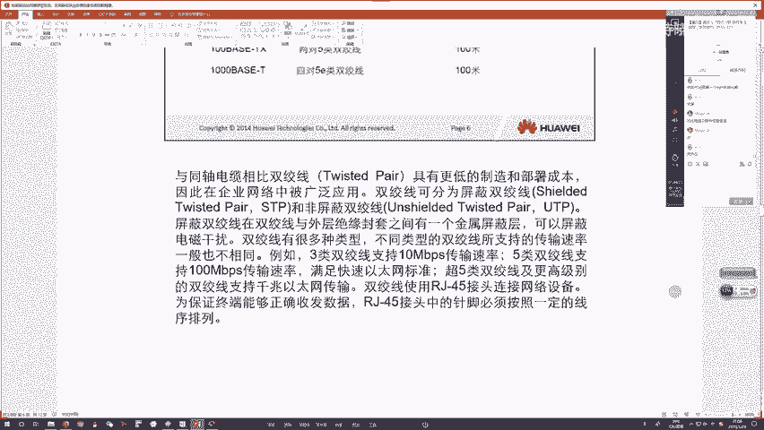

对，光纤光纤长就是这样的啊，大家一般一般都能见到啊，对吧，很多颜色有红色的对，橙色的对吧？有黄色的、金色的都有啊，很多种颜色，对吧？那一般这是光纤呢对吧？大家懂的，作为咱们最新的线缆，啊。

它是最优质的优质体现两个方面。第一个就是这个线能够支持超长超长距离传输，第二就是这种线能够支持超高超高带宽，那为什么原因是因为这种线，咱们传输的数据啊，我们的传输的机制，你不一样。

你在同轴电缆和双绞线里面，咱们通过铜啊导电的特性来传输电信号，你通过电信号来传输零和一，你的损耗比较大嘛，对吧？并且你通过铜丝来传输我们的电流，对吧？你不管使用什么样的波形编码。

你都不能保证非常非常高传输质量。那所以说呢光纤呢它就解决了从根本上啊解决这个问题，它根本不给你传电了，对吧不给你传电了，我不给你放公司，我给你使用什么呢？我给你使用玻璃纤维来做铅形。

那通过玻璃纤维的纤线，我给你传什么呢？我给你传光。那当然光在光纤里怎么传呢？它是通过物理学的一个叫全反射的定律啊来进行传输。我给你入射光设置一个入射角度，只要你入射角度满足咱们全反射的这么一个条件啊。

那你入射的光就能以全反射的方式来传输，那全反射，大家懂的啊，对吧？你能永无止境的传下去，虽然也会有损耗，但是这个损耗，相比你在电缆中啊传输电流，这个损耗要小的多，那所以说为了避免光纤出现问题。

为了避免咱们全反射出现1蛾子啊，你在使用光纤的时候不要去过度的折这个线，你尽可能让线保持值，对吧？它越直，咱们全反射就越O你如果说把。弯曲对吧？甚至直角转弯啊，甚至你把它给折到，对吧？折成一个锐角。

那这可能对全反射啊造成很大的影响，对吧？千万不要去掰光纤，你如果掰的越厉害，这个光纤可能看起来没有断啊，带你的传输可能会出现问题，对吧？然后接下来由于在这个铅星中，你传的光。

这个光受自电磁干扰的影响啊基本为0，所以说你什么红外啊、微波啊，下雨啊等等之类的，任何能够影响到铜线中的传输的这么一些因素啊，对于咱们光纤中的传输都没有任何影响，所以说基于这一点。

只要你光纤损耗本身能够把控的话，对吧？你这个光就能传的很远，所以说光纤这个介指你动辄传输距离都是对吧？以千米为计的，对吧？那当然光纤也分为两类啊，它分为两类，一类咱们称为叫多模光纤。

这个呢比较糟糕一些啊，多模光纤。😊。

还有种我们称为叫单模光纤，对吧？一类叫多模光纤，一类叫单模光纤，对吧？这个膜指的是什么呢？这个膜叫光纤的模式啊，这个膜叫光纤的模式，模式是什么呢？就是达成光的全反射的一个入射角度。

我们就称为叫光纤的一个模式，对吧？因为你是通过全反射的方式啊，来发送咱们的光速的嘛，对吧？所以说你入射的光得要满足咱们全反射的规则，你得要按照什么特定的入射角度啊来入射。

那每一个满足全反射的光的入射角度，我们都称为叫光纤的一个模式，那这个多模光纤呢它的工艺比较差，纤铅芯的比较粗，你多个入射光的角度都能够达成什么全反射条件。那所以说呢你有多个模式，我们就称为叫多模光纤。

而这个单模光纤呢，你的工艺比较强，你的铅芯特别特别细啊，细如发丝，甚至比发丝还要细。😊，你这个入射角度的光只有一种能够实现全反射。也就是说你只有一个模式。所以说了这种光纤咱们就称为叫单幕光线。

那demo光纤呢支持的传输距离。要远强于多模光纤，单模光纤当前支持最长传射距离啊，能够达到1000公里甚至以上。而我们的多膜光纤呢一般最长传射距离在1公里左右。好吧。

那一般在我们的内网多模用的比较多一些，在咱们的运营商的骨盖，对吧？单模用的比较多一些，O那这个光纤呢咱们两端你得要使用什么光发射器啊，一般光纤这种线来，你不能直接连到咱们的接口。

什么样的网络设备有光纤接口呢？啊，你高级点的计算机有啊，服务器也有，然后呢，咱们路由器和交换机都有，那一般在当前的网络来看，对吧？我们使用光纤地方有两种啊，第一个就是高级服务器连接交换机，咱们使用光纤。

还有一种就是咱们交换机间极连，一般使用光纤对吧？而正常的PC啊，你连交换机，咱们更多的都是使用什么双有线，并且你一台交换机啊，你有24口交换机为例，你有24个下连接口，你就一定会有两个极连接口。

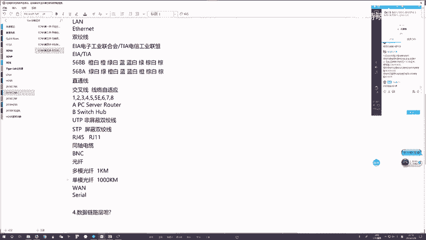

两个极连接口的带宽通常是下连接口的10倍，并且你的下连接口通常为电烤，而你的极连接口呢通常就为光考，对吧？那大家请注意，光考不能直接连光线。

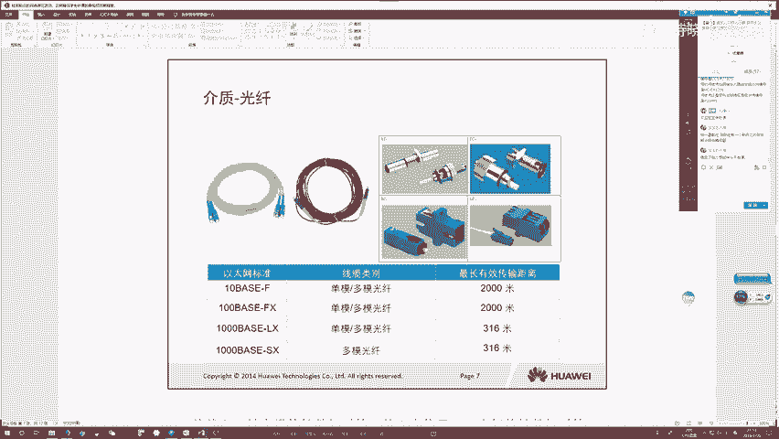

你要先连个什么呢？你要连一个这个叫光模块，这个光模块叫什么呢？叫SFP。

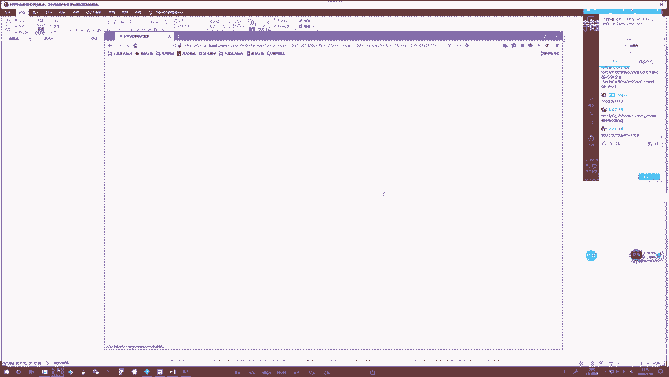

SFP长什么样呢？就是这样的，可以吧？跟口香糖一样，可以吧？你得要先买个SSFP对吧？这个SFP有有有类型的，比如说有单模的，有多模的，对，千兆的，有万兆的对吧？有4万兆的。

有10万兆的那当然它们有叫法的区别啊。如果说你买的是一个千兆的SFP的话，它就叫SFP对吧？它就叫SFP。

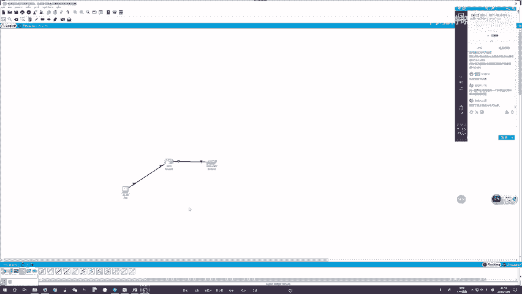

然后你要买万兆的，它叫SFP加，你要买4万兆跟10万兆的，它叫QSFP对吧？都有名称的区别的，对吧？你在买时候可以看，然后接下来它也有对应单模的和多模的对吧？一般单模的SFP对应单模光纤嘛。😊。

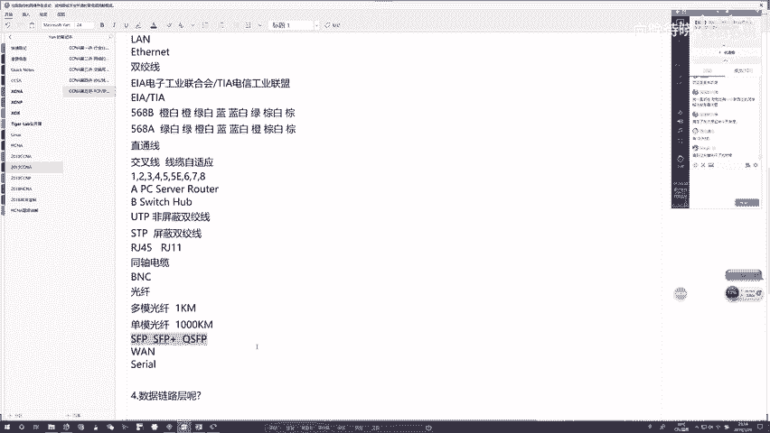

然后接下来多模的对应的就是多模光纤。那当然它们的区别一般就是单模光纤的SFP啊，它里面内置的是激光发射引擎，对吧？它发的激光，然后你这个多模的它一般是LED，你发的就是LED的这么一个射频光，好吧？

因为LD嘛，它的光对吧？比较容易散射嘛，就是传输距离肯定会比较短一些，而这个激光对吧？凝聚离比较强啊，它的穿透性比较强，传输的距离会比较长一些，对吧？你的发射器也牛，然后你的线缆也牛，所以说对吧？

两两两两强强结合啊，对吧？两强结合，那你个单模光纤传输距离肯定会比较远嘛，而你这个多模光纤，你的光源又差，你的线材质又不行，对吧？那传输距离肯定会稍微短一些，可以吧？

那这个SIP呢好像你们平常也能看到像思科的像华为的，但是请注意啊，思科和华为这样的公司，它它们是不会造这个东西的。

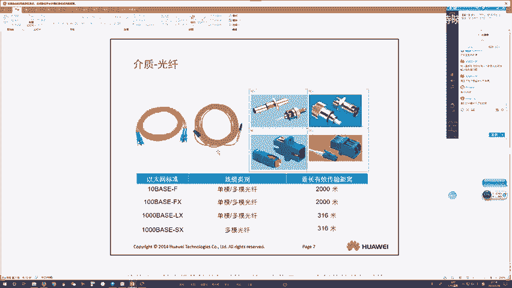

一般这种东西哪里造啊，像什么华强北是吧？像什么富士富士康，他们会造对吧？像思科华为的这种SFP啊，都是贴牌的，对大都是贴牌的。你找某一个厂商对吧？你找某一个工厂造一个SMP对吧？你造完之后。

你贴一个cisco的logo对吧？就完事了，那华为也是一样的，华三也是一样的，对吧？很有可能你买到的杂牌的SMP啊，跟那个思科的可能是同一个生产线生产出来，对吧？那所以说关于这个东西。

你们不用太过去纠结啊，说哎，我买的不是思科的行不行？无所谓啊，你买的是思科的也好，你买的是华为的也好，可能最终都是一些对吧？普通的厂商，普通的工厂，他们制作的对吧？那这个东西就是价格差距很大。

你买思科所谓原厂的SMP对吧？一个千兆的多模的就要好几百，对吧？甚至上千，然后你要买万兆的肯定是上千了。但然我说单位都是美元啊，对吧？那接下下来一个项目里面，大家都知道交换机很多嘛，你光纤用很多。

你这个模块买很多，对吧？那这个模块往往需要花费很多钱，但是这个东西如果你要你要换做在淘宝买的话，你可以淘宝搜一下嘛，你淘宝搜那个SFP那都是对吧？

OEM的OEM的那所谓的OEM虽然叫OEM但其实他们可能跟思科的这个对吧？就是同一个生产线生产出来的，而他们的价格差距特别特别大，对吧？淘宝如果你要认识关系比较好的人。

你买那种千兆的多模SMP一个SFP也就四五十万，对吧？你买万兆的，可能百来块，对吧？就真的特别便宜啊。但是如果说你要在你要在项目里面直接买这种原版的对吧？特别特别贵特别特别贵，那一般一个项目里面。

我觉得对吧？比较比较多的利润空间啊，都是在这个SFP这块SFP是利用利润空间的一块，还有一块什么呢？就是license对吧？还有一块就license。😊，设备说是什么功能都能支持。

但是呢我默认什么功能都给你启用。你想要启用这些功能，你需要购买license。而很多license其实可以破解的。那最以说你乙方代理商怎么玩呢？他就是给你卖设备的时候，对吧？

给你卖不带license的设备，但是其实咱们甲方买的设备是买过license了，那接下来这个license怎么办呢？我就给你破解，对吧？破解完之后呢，功能就能用，那这个license很贵啊。

那有的license可能一个license比设备都要贵，对吧？比如你买什么什么SE啊，你买什么ASA啊，对吧？你买什么WLC啊，这些比较高端的设备，一个license可能好几万，对吧？

那这些license基本都是。😊，你们懂到咱们通过这种方式就能算是把它变做利润嘛，对吧？那所以说一般呢你在一个项目中哎真正能够赚钱，就是这些。你如果说想要靠卖设备去赚差价，就基本你做不到的啊。

因为现在咱们这些设备对吧？价格越来越透明，你能拿到几折的几折的产品其实对吧？大家都知道你也知道对吧？甲方也知道，那所以说你不可能通过这个地方来赚很多钱，那所以说咱们一般一个项目靠什么赚钱，靠什么吃饭。

就是靠这些模块，模块特别赚钱，然后license也特别赚钱，好吧，O那这就是光纤的使用，那一般光纤咱们在用的时候呢，就是你先买1个SIP对吧？这个SIP呢，你插入到咱们的交换机的光口对吧？

你插入到咱们的服务器光口，然后你插好之后呢，加下就开连线，那大家在连线的时候要注意啊，这个光纤咱们一连就是连一段少钱，一连连两根，因为光纤作为比较特殊的这么种线缆啊。

它只能够支持单攻一根线只能支持一个方向的数据发。

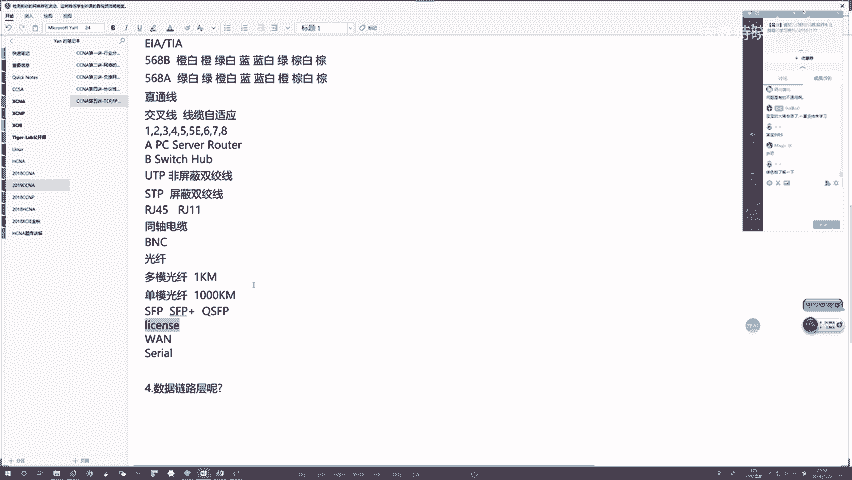

那接下来咱们联网一般是双向流浪调走吧，你要发送，你要接收，你不能说只发不收，只收不发，对吧？这不可能啊，你既要收又要发。那你想要通过光线来实现怎么办呢？那最简单方式就是你一连连两根线可吧？

一根专门用来发一根呢专门用来收对吧？一一根用来发一根用来收那这样的话，你连两根线连到咱们的SMP啊，当你连好之后对吧？那这个就没有问题了。那接下来在连的时候呢，还需要注意，如果你这两根线分开来的，对吧？

请注意千万不要连反了，对吧？你最好自带一个激光灯，你拿激光灯呢在连线的时候，往你那个SMP里面照一下，如果你能照出红点代表这发送端，如果你照出红点一片漆黑啊，这就是对吧？

接收端接收端连接对方的发送端发送端连接对方的接收端，你这样连完之后，这个线才能工作。那当然为了避免你连错，现在新的线来也比较聪明了，它在给你线的时候一造怎么样就。给你把两根线呢绑在一起，对吧？

那绑在一起绑好之后，你总你总不能把它给撇开来吧。你既然不能把它给撇开来，你在连的时候，你就只能按照一个方向来连，那这种连法绝对不会有错的对吧？

你通过这种光式就不用担心连反O那接下来基于咱们当前主流的SFP你在使用光纤的时候，咱们使用什么样接口呢？光纤接口有很多啊，那这边画的很清楚，像什么SC口ST口FCC口SC口还有LC口对吧？

有很多那接下来在这么多接口里面，咱们建的最多哪种呢？建的最多是LC口对吧？LC口是当前的主流啊，当前的主流对吧？那一般呢你买光纤不出意外，对吧？买到就是这种LC口的这么一个线，对吧？一买就是买两根啊。

然后一根用来收一根呢用来发那当前能够支持业界最高带宽的线来，就是光纤能够支持最长传输距离的线来也是光纤对吧？在光纤出来之前，咱把。😊，以太网这个协议啊称为叫局域网协议。

但是现在没有人再把以太网称为叫局域网协议了。为什么？因为局域网协议的定义就是你能够连接小范围的设备，对吧？你的连接距离比较短，那没有错啊，你手双网线，你使用同入电缆，我能连接的距离确实不长。

但是呢当你使用光纤之后就不一样了。你连一个单模的光纤，你能跨越千1000公里的距离啊，连接两个节点，那这个距离真的短吗？这是南京到北京的距离非常非常长了，那所以说呢这个东西对吧？

你不能再用局域网来看待它了，对吧？那所以说为什么曾经的广域网协议现在都被以太网给取代了，原因是因为以前咱们广域网协议的优势就是能够支持更长传输距离，但是现在你那些广域网的所谓的更长长时距离啊。

在我们这个光纤来比较，那基本就不够看了，光纤能够调打一切，我传输距离比你们所有人都要长，我传输带宽比你们所有人都要高，并且我还不消耗同是吧？我还便宜。😊，对吧那何乐而不为呢？咱们肯定会用它是吧？

那这就是光纤的这么一个定位。那接下来慢慢的光纤我觉得会越来越普及啊，因为真的太优秀了。那直到有一天可能会完全拿它来取代咱们其他类型的线缆，对吧？那之后咱们就是端到端全使用光纤。传输又稳定对吧？质量又高。

传输距离又远，带宽又高又便宜，又不用同，对吧？那简直太完美了，简直太完美了。OK那这就是哎以太了咱们所使用的线OK那接下来说完咱们的以太网线之后呢，还有一个广域网线，对吧？s线。

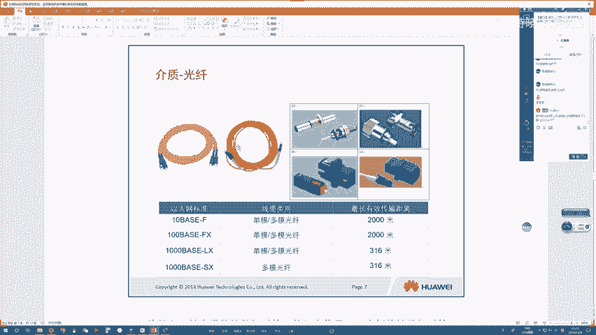

那这个c线呢啊先给咱们卖关子，好吧，做波广告啊。啊，第一次来参加咱们课的小伙伴。如果觉得咱们课不错的话，可以加一下咱们这个群啊，有一个技术交流群。里面的话有很多的视频还有很多的资料唉。

给大家呢就是下载对吧？然后接下来咱们这边呢就是VIP的课程NP和IE也是欢迎大家来报名的，然后接下来年底咱们最后一波福利啊，最后一波优惠呢就是力度还是比较大的。然后接下来等到明年啊，年一过。

我们这边的话课程的价格会调整。然后呢，IE和NP都会涨价很多。那年底呢是比较划算的时候啊，比较划算的时候。那大家如果比较感兴趣的话，哎可以加我们的群啊来询问一下咱们的课程顾问。

然后呢询问一下就是优惠活动。还有最后一个星期了。最后一个星期了。大家如果想上车的话，就是抓紧好吧，抓紧O啊，一波小广告啊，一波小广告。好，那接下来这边的话给大家最后一个知识点啊，来讲一下咱们的c线啊。

😊，向下三号线。这个三号线呢作为咱们物理层最后给大家讲的线缆，需要说一下广域网协议有很多款协议，对吧？比如说咱们能想到的广域网协有哪些呢？对吧？咱们能够见到的，比如说有HDLC是吧？有PPP有真中记。

这些呢都是广域网协议，对吧？这些都是广域网协议HDLC呢叫高级数据链路控制协议，好吧，PPP叫点到点协议，然后呢，mer类叫真中记协议，好吧？这些都是广域网协议。

这个广域网协议呢跟局域网协议最大的区别是什么呢？就是一个局域网协议会对应一种独立的线缆，比如说以双绞线光纤为例，你是支持以太宝的吧？那你支持以太网你就不能支持令徘徊对吧？你能支持令徘徊。

你就不能支持FDDI简单来说，局域网协议使用线缆，对吧？那专款专用嘛。😊，我这个线对吧？就是为你以太网协议打造。我打造出来之后，这个线也不可调整啊，我只能够支持以太网数据传输，你只能用于以太宝连接。

你不能用于其他的去域用协议。但是国往域网不一样，国网预网协议无论是HDLC还是PBP还是震中G啊，你们这些协议所使用的线缆是同一款对以吧？或者说是同一类这一类线我们称为什么呢？我们就称为叫cero线。

可以吧？这个叫串新线缆，叫串新线，好吧，你们用的线都叫sro线。那这个C号线呢咱们有两大类啊，一大类我们称为叫异步线缆，对吧？叫异步串新线缆。还有一大类呢我们称为叫同步穿行线，对吧？

那同步线来对应同步接口啊，异步线缆对应的是异步接口。那这个线长什么样呢？像这样的？塞块钱。好吧，C2性。这的是这样好吧，这就是穿进线，头特别大啊头特别大。那一般情况下，咱们这个CR线两端是不一样的。

两端是不一样的。你们现在见到这种两端一样的线是这种特殊的线，咱们称为叫背靠背线。这个背靠背线呢专门用来连接两台路由器的，是用来做实验的。你在实验环境中对吧？实验室环境中。

你通过这种线连接两台路由器来做一个广域网连接的模拟，那通过广域网连接的模拟，咱们主要就是模拟在广域网环境中啊，我们一些路由选择协议的运作，对吧？我们一些其他企业的运作，而一般正常情况下。

咱们的广域网连接啊，你这个线两个头是不一样的，一个头咱们称为叫DCE一个头，咱们称为叫DT对吧？那当然了，这个DCE和DT啊是针对于同步线的。同步线呢是后期比较主流的C线。😊。

而早期呢咱们一般用的比较多的是异步线缆，这个异步线缆真的特别low啊，早早被淘汰了。这个异步线缆特点是什么呢？就是你在使用这种线缆传是数据的时候，效率特别特别低，你每一次只能传输一个字节的数据。

也就是说你每一次只能发送巴比特数据，你要巴比特巴比特的这么一段一段的去发送，并且这个发送格外恶心的是什么呢？就是为了避免咱们这个数据发送混乱啊？为了让接收方能够成功的收到数据，😡。

你在发送巴比特数据的时候，你要在巴比特的数据前面加上一个比特的起始符。你要在巴比特的数据后面加上一个比特的终结。这就是说传输巴比特的数据，你要占用1比特带宽。本身咱们的s线带宽就特别低，你只有一兆多。

对吧？你至多只有两兆多，对吧？你传输效率你经够差了，你在异步的环境下，你一个字节一个字节传，你每传一个字节，你浪费的带宽还是10个比特，你只能使用链路带宽的什么，80%，你只能使用80%。

这个效率大家能容忍吗？我觉得绝对不能容忍的，你一个线缆连一个针一个帧传都做不到，你只能一个字节，一个字节传，你要闹哪样，对吧？根本没人能忍受这种效率啊，那所以说呢异步线缆线缆绝对是不会有用的。

咱们现在只要提到s线，那基本指的就是同步线缆，对吧？异步线缆，你也只能支持HDLC这样的协议，对吧？像PPP啊，像帧中记啊，对吧？他们都只能在同步线缆上去工作，对吧？那接下来这个同步线缆呢。

它是通过一个叫做1分。多路复用的这么一个机制，对以吧？咱们通过十分多路复用的机制来给你提供什么叫做高速率的数据传输能力。我给你通过划分实系的方式把你根线路呢划分出多个实系。

每个实系每秒钟给你发送一个字节数据。那接下来你实系划分的多，那相当于是一秒钟，我能够传输的字节有多。那所以说基于这种方法，你同步线缆，其实说白了跟咱们的双脚线是一样的，你也是能够一个帧一个帧的去发送。

对吧？你能够一个帧一个帧的发送，那接下来你发送一个帧做到多少呢？一个帧最大100字节。那接下来为了保证这1500字节的数据成功发送，你需要在1500字节的前面添加一个字节的起始的头，对吧？

然后添加一个字节的中结尾，对吧？就相当于你在这种同步线缆中啊，你传输1500字节的数据，你需要占用1500。02字节带宽。那这个相比咱们的一部线啊，你效率是要高得多的对吧？

首先你能够基于帧为单位来一个帧一个帧的发送，并且你的带宽利用率啊基本能够做到百分百。那当然这个前提是什么呢？就是你要良好的使用这个十分多路复用机制。那这个十分多路复用机制。

你为了两端能够平等的能够对等的去划分这个链路的实系，你需要同步两端的时中率。那接下来两端的时钟率谁来同步谁呢？请注意啊，咱们同步线缆一端叫DCE端，还有一端咱们称为叫DTEDCE呢叫数字通信端。

这个叫数字通信端。而这个DTE呢，咱们叫数字终端端，对吧？一个叫数字通信端，一个叫数字终端端。那接下来咱们就是由DCE端来指定一个时钟率。然后呢，由DTE来同步。当你两端时钟率同步之后。

你们就可以根据相同的步调啊，来把这个线缆划分出相同多的时系，通过相同多的时系来通过时分多路复用啊，来提升咱们的数据传输能，可以吧？是这么来的。那接下来这个时钟率一般DCE端是哪一端呢？请注意啊。

一般DCE端都是运营商端的这么一个设备，像什么运营商的猫啊，像什么运营商的CSUDSU啊，那他们都是连接咱们s线的DCE这一端，然后接下来这个DTE呢一般指的就是咱们的企业网的边界路由器对吧？

你企业网的边界路由器，一般作为DT的设备，你就是连接DT端对吧？那当你连完之后呢，路由器什么都不用做，你只用接口配个IP地址，这个线呢就可以工作了。时钟率都是由运营商来给你提供的时钟率提供的越高。

你的时分复用机制就用的越厉害，你实际划分的越多嘛，你相当是变相链路带宽就越高。而相反你时钟率定的越低，你实际划分的越少，你这个链路带宽呢就越差越小对吧？那这就是DCE和DT的这么一个关系。

那当然这种线呢已经慢慢被淘汰了，被谁淘汰呢？肯定是被光线。嘛对吧？因为相比光纤，你这种线的传长距离其实不算长，并且相比光纤你这种线最大最大的问题是什么？就你的带宽太低了，对吧？你的带宽太低了。

你的带宽简直被光纤完爆了。所以说既然有这么牛逼的光纤，为什么还要用Cl线呢？没人会用对吧？那所以说了现在如果你还能见到cro线，你们一般能够见到的，就是这种cero线。😊，这种s线两端接口完全一样。

但是依旧一端为DC一端啊，一端为DT端，这种线咱们称为叫s线里面的背靠背线，对吧？叫背靠背线。所谓的背靠背线就是专门在实验室环境中用这种线来对接两台路由器的两台路由器使用s接口连接一个背靠背线专门用来做实验。

但是大家可能会郁闷啊，你这两端都是路由器啊，你路由器从定位来看，你都是DTE设备，你DTE设备连接DCE这一端，你怎么提供时钟率呢？你必须得要强制提供，你需要通过敲命令的方式。

你敲一个clockrate来指定咱们的时钟率是多少，那当你敲完这个命令之后，对吧？你敲的时钟率是多少，那对方呢就会给你去做这么一个同步。好吧，那这就是背靠背的这么一个玩法。

那当然在现在比较新的IOS版本中，对吧？我们现在最新的路由器的IOS版本都是。15点差的啦，在15点差的LOS版本中，路由器呢有一个自适应能力啊，只要你连接一个背靠背线，你连在DC这一端。

你能够感知到这一点。你只要连在DC这一端，你的系统会自动给你把时钟率呢给配置好，所以说你连上线，你什么都不用动，对吧？你什么都不用做，那这个线呢就可以工作。你只要配置个IP对吧？你可以测试咱们联通性。

好吧，那这是s线的这么一个定位啊，那当前这种线呢基本已经没人用，对吧？因为主要就是因为带宽太低了，并且能够支持传输距离啊，对吧？也没有咱们光纤那么远。

所以说当前咱们能够用到这个s线的地方基本就是实验室环境的这种背靠背连接。并且呢在咱们当前IE考试中啊，咱们IE考试你升级大纲了，对吧？HCIE从2。0升到3。0cisco是早在4。0大纲的尾声啊。

就已经把这种s线给淘汰了。然后在我们的5。0大纲中已经根本不存在这种连接了，而在我们的这个对华为的3。0大纲中，这个对吧？s线也被淘汰了。那所以说今后呢咱们能见到的网络环境，那基本都是纯太网环境。

那当然在以太网环境中呢，也不是说这种广域网的协议，咱们都被淘汰了，比如说有一款比较经典的协议像PPP这款协议，咱们运营商会用的特别多。但是现在这个PPP呢咱们不能直接使用了，因为没有s线。

线上能跑PPP那在咱们以太网线上能不能跑的？可以，你能跑一种另类的PP协议。我们称为叫PPPOE可以吧？这是咱们当前用的最多的，只要你办理一个电信宽带，对吧？

你拨号就是用PPPOE来拨好什么叫PPPOE呢？它叫PPP协议over对吧？叫承载在以太网协议之上的PPP的虚拟连接，我通过在你以太网基础之上虚拟出这么1个PPP链路啊，来模拟PP的功能。

那主要就是为了利用什么PPP的3A嘛，对吧？通过PP的3A来给你做一个链路级的认证和授权。当而这个授权的话，一般是通过3A服务器了，对吧？认证是能做的。好吧，那这就是物理层的这么一个概念。

那接下来研究完路物理层的概念之后呢，大家了解这个线缆了，了解他们的学名，了解他们的特点。那今后呢你们在组网的时候，最起码咱们不用担心，对吧？该如何去使用线缆。对吧，线缆怎么用，大家都懂是吧？线缆怎么用。

大家都懂。那所以说你们最起码使用这些模拟器啊，把网络给搭起来，这个是没问题。

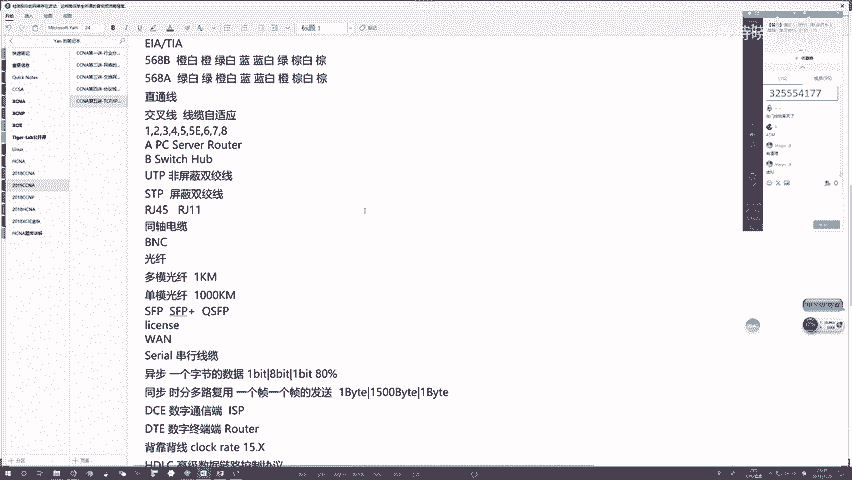

好吧，好了，那NA课呢咱们就上第五节了啊，希望大家呢能够喜欢咱们的课程O吧。然后呢，没有加群的，欢迎大家加群。😊，然后呢，最后一波咱们的年前的福利啊，年前的优惠活动，大家如果感兴趣的话，可以去参加。

像这种3A认证，咱们在NP中都会讲的非常详细的，如何结合SE服服务器啊，如何结合咱们的3A服务器来结合咱们的Ns对吧？做3A实验。nas该怎么配，咱们的SE该怎么配，对吧？我们的终端该做一些什么东西。

都会讲解。好吧，好，那今天呢咱们就这些内容。3A怎么会是瑞捷呢？3A公用标准。3A所有人都能用啊，思科也能用，华为也能用，锐捷也能用啊，对吧？只不过你在用的时候，你需要你需要3A服务器。

3A服务器当前最牛逼的就是IE啊cisco的最牛逼的。华为也有华为也有3A服务器，但是相比之下功能性会差一些。好吧，这个SE是当前所有3A服务器里面最牛逼的最牛逼的。好了，那今天到此为止啊。

咱们明天晚上继续。好吧，明天晚上咱们年前最后一节课啊，欢迎大家来。好吧，那今天咱们到此为止，大家拜拜。😊。

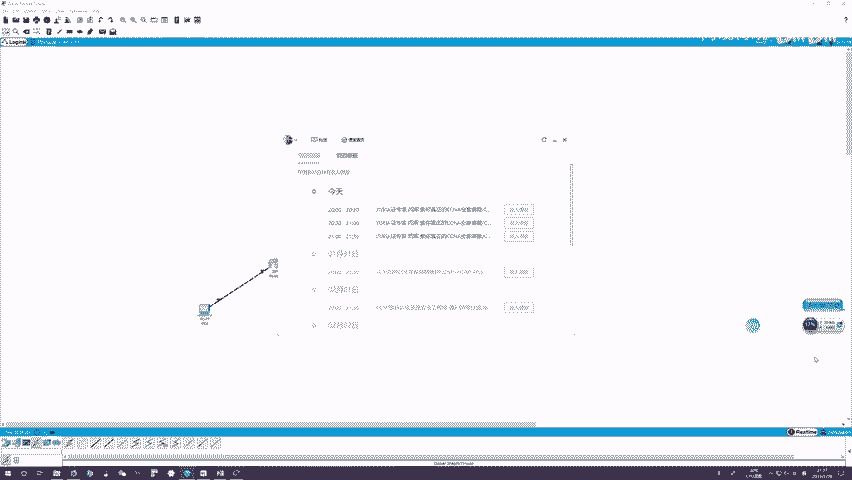

啊。