# 1000元自购分享CCNA教程合集！超全合集详细版，网络工程师入门必看合集【送NA题库】 - P6：CCNA06 - 向向向晚o - BV1cL4y1q7Dy

好，欢迎大家来参加咱们的A公开课啊，这是年前的最后一节课。本来呢跟大家说第六节课，但是想想今天内容比较少，就给大家算的是第五节课的一个补充嘛。其实第五节课呢给大家讲完这个OSI的物理层啊。

讲完咱们各种各样的线缆之后，其实是应该给大家讲一下数据链层的，但是呢由于时间的问题，对吧？没有来得及。😊，然后呢，今天如果说要讲新课的话，咱们就直接讲IP了。那直接讲IP的话呢，想一想以太网这个协议呢。

还没有跟大家说，对吧？我个人比较有强迫症嘛，个人比较强迫症，那所以说想来想去，那今天不妨就是给大家单独的把以太网这个协议啊给列出来。咱们呢讲细一些，对吧？然后呢给大家讲一下以太网的一些对吧？

具体的比较实际的这么一些可以被我们应用的一些特色，对把一些特性。我觉得这还是挺有意思的，好吧，那所以说呢由于今天内容比较少，所以说咱们就作为是上节课的一个补充啊，好吧。

然后呢咱们下节课就是当做正儿八经的第六节课。那当然就是在年关了啊，咱们今天是年前最后一节课，所以说。呃，这节课之后呢，咱们可能会隔一段时间。然后呢，大家也不用担心，等过了年之后，就是具体呃几号几点开课。

我会在群里面给大家通知。如果说大家有加这个群的话，就是在群里面去多关注一下咱们的公告就好了。如果说没有加这个群的话，大家可以去加一下，好吧，可以去加一下。啊，对，数据链路层啊，我们今天讲的就是数据链层。

好吧，那所以这的跟大家说一下，咱们今天主题只有一个就是数据链路层。好吧，那顺便得跟大家说一下咱们IP跟m克之间的这么一个关系。然后呢，咱们端到端通信mac地址跟IP地址的这么一个对吧？区别。

那让大家呢对这个通信稍微的有些了解，好吧，OK好了，那这边的话咱们就开始今天内容啊，今天呢咱们主要讲数据链层啊。😊，好，数据链子层呢嗯在OSI中对吧？作为一个比较偏下的一个层啊。

那这个层呢相比咱们物理层啊，那肯定要重要些啊，对于网工而言要重要些。因为这个物理层的里面包含内容，大家都知道线缆对吧？接口还有各种各样的波形编码，对吧？姓令，还有就是咱们的集限器。啊。

因为这个物理层呢它没有什么智能，对吧？那一般的这个物理层咱们就了解一下，对吧？知道包含些什么东西，那咱们用就好了。那当然也有很多基于物理层的研发，对吧？研发咱们线缆研发咱们的波形编码。

但是这个其实跟网工呢关系不大，可以吧？那网工呢正儿八经能够做操作的那最底的层也是数据链层，可以吧？在数据链层里面呢，有些协议咱们终于可以就是对吧？选择性使用了，然后咱们在使用的时候呢，可以做一些调整。

对吧？咱们可以做一些设置来让这些协议呢更加优化，然后呢，这个数据链层里面由也包含一些智能，所以说在咱们使用里面一些功能的时候，对吧？也更多的可控嘛，对吧？

可以通过它来做一些配置来做一些排错O那接下来这个数据链层里面包含的最重要内容是什么呢？之前跟大家说了，就是各种各样的局域网协议，好吧，各种各样的广域网协议。那这些都是数据链层这么一个范畴。

那在这众多的局域网广域网协议里面呢，局域网有一个比较重要的那这个我们称为叫以太网，对吧？然后广域网呢有一个比较重要，这个叫PPP。那当然这个PPP呢，大家也都知道，上节课我们说过啊。

你想要使用PPP这个协议。前提是你设备之间得要连接那种广域网的s线，对吧？那这个c线呢哎由于已经基本被淘汰了，就是你当前在网络连接中，这个s线已经看不到了，对吧？那咱们现在呢一般你在联网。

尤其是咱们企业网，你的园区网，我们一般更多的会使用端到端的以太网连接去完成咱们的组网，对吧？而这种s线呢由于带宽太低了，那基本都已经被抛弃了。那所以说在当前的以探网环境中，咱们想要使用PPP。

你得要使用PPP的这么一个变种协议。这个变种协议呢叫PPPOE对吧？那准确来说，这些协议它们都属于这个数据链层，对吧？它们都是二层相关的，然后接下来数据链层呢包含的网络设备就不用说了，像咱们的网桥对吧？

像我们的交换机，那都是数据链容层成员，对吧？那当然这个交换机的工作原理，希望大家还没有忘啊，所有带有智能的设备在研究他们的工作原理的时候，一定要通过控制层面和数据层面去研究，对吧？

交换机的控制层面怎么运作，数据层面怎么运作。那当然这块呢大家还记得最好啊，如果不记得的话，咱们之前的应该是第二节课对吧？第二节课还是第三节课啊，应该是第三节课，就是第二节课第三节课。

哎咱们有讲到交换机的这么一个工作啊，然后呢，关于交换机工作原理，咱们说的比较详细，那大家可以去回顾一下。好吧，那这节课呢咱们就不多说了。那接下来在这众多的数据量层协议中呢，那咱们用的最广的对吧？

用的最多的最有名的，那肯定就是以太网这个协议，对以吧？以太网的当前基本在整个英特网你就垄断了啊，你只要见到咱们的企业网，那十有89，咱们都是使用什么以太网来做接入，然后咱们网络设备之间互联的链路。

也都是以太网链路，可以吧？那只不过一般就是咱们的网络设备之间互联更多的使用光纤嘛，对吧？然后接下来你接入设备连接咱们的终端入网，你更多会使用双绞线可以吧？那当然无论你使用双网线还是使用光纤。

那这个以太网协议是改不了的，可以吧？那当然以太网它覆盖到底有多广呢？那基本在整个英特网环境来看啊，以太网占比至少在9。5乘以上，可以吧？你有100个网络，其中有95个以上。

咱们是使用以太网来做连接协议的对吧？那当然当家也能想象到啊，对吧？你一般一台服务器，你一台计算机。你要连接网线入网，对吧？你能连什么线来，我们一般普通的PC就是连双绞线嘛，对吧？

然后你一些比较高大上的服务器，就是连接那种LC接头的光纤。那当然无论你连接哪一种，对吧？你连到的设备基本都是交换机，然后接下来你连完之后，这个连接连好了，你的工作啊。

就是按照咱们的以太网的规定来工作的对吧？那所以说以太网对吧？确实比较受欢迎。那接下来基于这个数据链层的，当然协议很多了，咱们重点就是基于以太网来给大家讲一下里面的一些细节。好吧，那接下来说到以太网呢。

作为一个数据链目层的局域网协议啊，它能做什么事情呢？主要就是干了三件事，对吧？它主要干了三件事儿，哪三件事儿呢？啊，分别是它定义了咱们网络的类型，对吧？定义了咱们网络类型，还有咱们的通信规则。

这是第一点。😊，然后接下来第二点，哎，它定义了咱们的网络内节点的标识符，对吧？节点的标识符。然后接下来第三点就是它定义了对吧？在我们的网络中啊，你通信的时候，你要发送数据，对吧？你发送数据的时候。

该添加一些什么样的报头，爆头里面该包含什么样的内容，对吧？来方便咱们端到端去成功的一次访问。那所以说了它定义了咱们的封装爆头的格式以及内容，OK那这就是。数据链层啊。

咱们一款局域网协议或者一款广域网协议，咱们所定义的那一般所谓的局域网协议，广域网协议啊，你定义的东西就这些好吧，那接下来咱们1。1点来梳理啊，那先从第一点说起，啊，这个以太网协议呢。

它定义的网络类型是什么样的呢？那也跟大家说过啊，在咱们整个TCPIP的网络环境中来看，我们的网络呢分为两类，一类咱们称为叫MA网络，还有一类呢咱们称为叫P two P网络，对吧？

这个MA呢叫miple access，我们称为叫多路访问网络，对吧？然后呢这个P two P叫point point，这个叫点到点网络，对吧？一个叫多路访问网络，一个叫点到点网络，那它们的特点是什么呢？

就是这种MA网络啊，一个网络中咱们可以包含的节点数量，是可以有任意多个的对吧？比如你在一个网络中，你可以有一台计算机，你也可以有两台，你能有三台，你也能有4台，对吧？你想有几台就有。

几台那这种就是I美网络可以吧？那当然大家都想啊，咱们以太网它应该是一个MA网络吧。因为你以太网怎么连呢？你拿交换机连线连到咱们计算机，交换机通常接口规格，咱们有24口的对吧？也有48口的，总而言之呢。

你接口很多，每一个接口都能连一根线，每一根线都能把一个终端连接入网，那所以说你拿交换机连网的时候，咱们在一个网络中啊，你的节点数量是可以为任意多网，对吧？你可以有24台，你可以有48台。

你可以有很多很多，可以吧？那接下来很多很多主机，当你连到交换机之后，你们之间可以彼此通信嘛，对吧？那这个就是M美网络的特征，而这个点到点网络呢它不太一样了。这个点到点网络规定就是你在这种网络中呢。

咱们只有两个节点，两个节点之间唉你连一根线，这根线把两个节点连在一起，对吧？整个网络。就你们俩了，对吧？不是我就是你。不是你就是我可以吧？咱们之间可以联网通信。但是在整个网络中呢，咱们不存在第三个人。

所以说呢你不用担心你发送的数据会有其他人收的，可以吧？这种一个网络里面有其只有两个节点的这种类型的网络，咱们就称为叫点到点网络，可以吧？那当然一般情况下，咱们广域网协议都是在这种点到点网络中啊去运作的。

而咱们这些局域网协议啊，一般都是多路访问网络，对以吧？那首先呢以太网它就是一个多路访问网络，可以吧？那接下来通信规则是什么呢？我觉得以太网协议啊，是所有协议中基本算是最不讲究的。它规定的通信规则呢。

基本就是没有规则，可以吧？那当然代表要看了啊，看你这个接口的双攻模式到底是半双攻还是全双攻，可以吧？那如果说你是半双攻，那代表什么呢？代表你所连接的网络啊，是总线型网络，对吧？

是总线型网络那这种总线型网络呢，半双攻的链路，咱们不支持双向流量同时发送，对吧？你如果同时发送，咱们会出现数据冲突，那为了避免数据冲突，对吧？你任何以太网中的成员，你在想要发送数据之前呢。

你得要先做一个链路监听。你要监听一下当前咱们的网络是否安静。网络安静，没有任何人在发送数据，那这个时候呢，你就可以基于你的网络连接啊来发送数据给你发送的目的地。那接下来如果说你在监听链路时候。

发现你能收到数据，那代表当前有人在发送。那有人在发送，你能发吗？不能你要等等到对方发送完毕之后，你再去发可以吧？那这就是所谓的。CSMA杠CD嘛，对吧？这个规则希望大家没有忘啊，那当然你有半双攻的接口。

咱们有全双攻的接口啊，咱们有全双攻的接口。那如果说你的接口全双攻大家都知道全双攻的接口连的线来，你能以全双攻的模式来运作，对吧？这种全双攻的链路特点是什么呢？就是你一根链路，你允许双向流量同时存在。

双向流量同时存在，他们不会出现冲突，可以吧？这个就是全双攻特点，那接下来全双攻意味着你所连接的网络是新型网络，对吧？那在这种新型网络中，你没有冲突出现的可能嘛？那你要发送任何数据，你不用做任何监听。

你想发就可以直接发，你想收就可以直接收，没有任何的对吧？许可之类的这么些问题啊，对吧？你不需要任何permission，你不需要任何license，你只要想发送数据，你只要保证的网络连接没有问题啊。

只要你接入没问题，那你想发就可以直接发你想。收就可以直接收。好吧，那这个就是以太文规定的第一点。

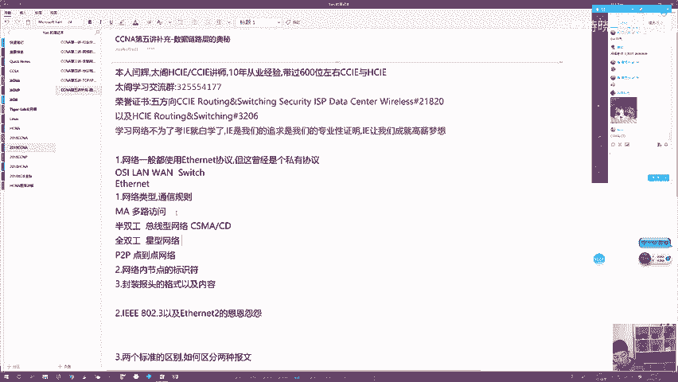

那接下来它规定第二点就是对吧？给我们这个网络中的每一个节点啊设置一个标识符。那这个标识符呢就是一种二层地址啊，以太网所对应的二层地址叫什么呢？叫mac地址，对吧？

这个叫mediaacces controltl，对吧？叫媒体访问控制或者叫介质访问控制，好吧，叫媒体访问控制地址，那接下来这类地址呢作为一个二层地址，很重要啊，它用来标识咱们的一个接口，注意啊。

在网络中一个接口，咱们就称为叫一个节点，每一个接口咱们都需要有个标识符，你可以理解为这个标识符呢，就是咱们接口的名字，那这个名称呢，咱们为了统一化。那咱们总会使用统一的规则啊，来给你做一个定义。

那这个时候呢在我们以太网中给每一个接口的定位是什么呢？就是使用的mac地址，对吧？我拿mac地址来标识一个有一个接口，对吧？通过mac地址我就能知道啊，你是A对吧？它是。

B那你们之边通你们之间通信怎么样，就可以基于你们彼此m地址啊来标识你们这股流量。那这样的话，咱们这个流量到达交换机之后呢，交换机就能知道数据是由谁发的，发给谁。

然后接下来只要他知道接收者连在他哪个接口啊，它就能够帮你把数据来做一个精确的转发，可以吧？那这就是mac地址的这么一个作用。那然mac地址呢48位啊，一共是6个字节，对吧？一共是6个字节。然后呢。

cisco的设备对于mac地址的表示是这样的，可以把咱们地址一共分为三段啊，一共分为三段。然后呢，段和段之间咱们使用点来分割啊，每一段都包含4位16进制数，1个16进制数代表4比特啊。

你4乘4就是16比特对以吧？16乘以3，那正好就是48比特，对吧？那大家说到麦ap地址呢，关于这个点，我来给大家扩展一下，我们说了你正常在网络中呢，咱们一个接口，你除了有map地址以外。

你还应该有另外一种地址吧，对吧？那这个地址咱们就称为叫IPV4地址，对吧？这个叫IPV4地址。对吧一般咱们也称为叫IP地址啊，那这个IP地址呢是由IP这个协议所定义的地址。而IP这个协议呢。

在我们的OSI协议站来看啊，它是一个网络层的协议。那这种网络层的协议所定义的地址，咱们就称为叫网络层地址或者叫三层地址，可吧？而这个map地址呢是由以太网协议定义的。

以太网协议是一个数据链路层的二层协议。那所以说呢mac地址一般咱们称为叫二层地址。而这个IP地址呢，一般咱们称为叫三层地址。那一般正常情况下，一台计算机啊，你想要联网。

你想要成功的通过咱们的网络生发数据，你光有mac地址够吗？不够。你除了有mac地址以外，你还需要一个IP地址，那一般的咱们一个节点都是既有mac地址，又有IP地址。那当然为什么这个接口需要有两种地址。

我相信大家都能理解对吧？这个m地址呢，好歹就是你可以理解为是一个接口的身份证号。😊，可以吧，而你的IP地址可以理解为是一个接口的户账号，对吧？它的标识范围是不一样的那这个mac地址的标识范围是什么呢？

请注意啊，一个接口的mac地址能在一个网络或者叫广播域内啊，广播域内来标识一个节点。那这是什么意思呢？比如现在咱们有两台主机啊，主机A和主机B。如果说主机和主机B，咱们这么连可以吧？那意味着什么呢？

意味着你们俩在同一个网络内，你们俩在同一个网络内，那A的mac地址对于B而言呢就很重要。B的mac地址对于A而言也很重要。因为A想要访问B，它必须要知道B的mac地址，B想要访问A。

B也需要知道A的麦ac地址。那之所以这样的原因是什么呢？原因是因为你们在同一个网络内，可以吧？你们在同一个网络内，你们要彼此通信，那对方的mac地址就很有意义。

因为mac地址能够在一个网络内啊来唯一的标识咱们自己。😊，但是如果说咱们这个图换一换换成这样。好，换成这。那接下来换成这样之后，我来问大家一个问题啊，当前咱们有几个网络啊，当前咱们有几个网络。😡，嗯。

😊，当前在这个环境中有几个网络有两个对吧？这是一个啊，左边这是第一个是吧？右边的这是第二个，咱们拿一台路由器把两个网络连在一起。那在这个情况下，A跟B不属于同一个网络吧，对吧？你们不属于同一个网络。

那这个时候A跟B之间通信，我们就称为叫网络兼通信。请注意啊，对于任何一台计算机而言，你在网络中咱们能做通信，只有两种，只有两种。一种我们称为叫网络内通信。还有一种我们称为叫网络监通，对吧？

那所谓的网络内通信就是你要通信的目的主机跟你在同一个网络内。而这个网络兼通信指的是什么呢？就是你在网络A目的地在网络B，你们之间不在同一个网络，你们要你们要跨越网络啊来做一个通信宝贝。

那这个咱们就称为叫网络监通性。那接下来请注意啊，网络内通信PC呢是能够自己搞定的，可以吧？他想要做网络内通通信很简单，只需要知道什么呢？他需要知道通信目的地的，对吧？

他需要知道通信目的地的IP地址和麦地址，对吧？你只要知道对方的IP地址和麦地址，你就能够封装数据，可以吧？你就能够封装数据，形成什么封装数据啊形成数据帧，那当你封装好的数据帧之后呢。

你直接把针给发送走就好了。那接下来一般收到的数据帧的设备，就是咱们的接入设备交换机，而这个交换机呢，由于能够识别这个原木麦地址，对吧？那通过识别原木麦地址，他就能知道这个针呢是由你发的对吧？是由谁收。

那接下来这个谁连在哪里，他只要知道就能帮你进行转发。那就算不知道有所谓，对吧？他能通过泛红来帮你转发，那最终呢咱们的目的地就能收到数据，可以吧？那所以说基于这点呢。可以理解为像交换机这样的设备。

它负责什么呢？一般咱们的接入交换机啊，它只负责网络内的数据转发，可以吧？它通过网络内的某一个主机收到一股流量，能够把这股流量呢转发给该网络内的其他主机。那这个就是二层网络设备所干的事情，可以吧？好。

那接下来这个网络监通性呢，PC是搞不定的，可以吧？PC搞不定网络监控性。那接下来PC怎么知道咱们到底是不是网络接通信呢？其实很简单，对吧？你PC呢是有IP地址的啊，对吧？你通信的目的地咱们有IP地址。

那我先前跟大家说过啊，IP地址作为1个32位的地址啊，它分为两个部分。IP地址的高位，我们称为什么呢？高位咱们称为叫网络位，可以吧？它的第一位叫什么呢？第一位我们称为叫主机位，请大家一定要记好啊。

这两个词很重要，高位叫网络位，第一位叫主机位，好吧，那接下来1个IP地址，比如说10。1点。0-24，可以吧？这个10。1点。0-24，什么意思呢？就是你这个地址啊，前24位是网络位。

然后接下来后8位是主机位，可以吧？因为IP地址一共是32位啊，我们在表示的时候呢，使用这种方式来表示啊，这种表示方式我们称为什么呢？我们称为叫点分十进制，好吧？我把整个地址分成4段，每段呢都是。😊。

比特。然后接下来我们在书写的时候是拿十进制数的值来表示每一段的这么一个结果。好吧，OK那这就要点分十进制啊，点分十进制。那接下来这个IP地址的网络位跟主机位有什么用呢？请注意啊。

IP地址的网络位用来描述你这个主机到底在哪个网络中。而主机位是用来在这个网络内啊来给你自身呢做一个定位，可以吧？网络位标识的是你属于哪个网络，主机位标识的是在这个网络内，你到底是处于什么样的一个位置。

那所以说得出这么一个结论啊，在同一个网络内的所有计算机，你们的IP地址的网络位呢都是相同的。但是你们的主机位要彼此区分，因为你地址不能冲突嘛。然后接下来如果说你两台主机不在同一个网络。

你们在不同的网络之间，那你们的IP地址网络位是肯定不一样的，请注意啊，IP地址不像麦ac地址。你购买回来一台计算机，对吧？他不管你计算机是哪个厂商制造的啊，你的网卡麦ac地址都是制造商给你写进去的对吧？

所以你购买任何一台计算机，这个麦ac地址啊，你肯定会自动拥有，并且它不能改变。然后你的麦地址多少，跟你所处的网络没有任何关系，它是跟你的这个品牌有关的？它是跟你这个品牌有关的然后接下来这个IP不一样啊。

你购买任何计算机默认是不可能有IP地址的，为什么呢？因为这个IP地址多少，完全取决于你要加入哪个网络对吧？你加入不同的网络，你的IP地址的网络位是不能一样的嘛，对吧？

那由于这个卖给你电脑的厂商不会知道你到底要在哪个网络中去使用这个主机，并且你这个主机是有移动性的嘛，吧？你在不同的网络之间移动的时候，你的IP地址是要发生变化。那所以说没有人知道你即将要加入哪个网络。

所以说也没有人敢给你预先去做一个地址分配。那所以。😊，说这个地址你想拥有对吧？一般就是你需要自己去配置，对吧？那至于怎么去配置，得要看你到底接入哪个网络，对吧？你接入不同的网络，你配置的地址。

那肯定是不一样的。O吧？好，那接下来言归正传。一台计算机在跟一个目的主机通信的时候，我怎么知道是网络内通信还是网络间通信呢？很简单，我就要看这个通信目的地的IP地址跟我自身的IP地址，网络位是否一致。

如果说咱们网络位一致，那就是说通信对端啊，跟我共享同一个网络，对吧？因为咱们的网络位相同嘛，代表咱们属于同一个网络，那既然属于同一个网络，那这个时候我只要知道你的mac地址，我只要能够封装成数据帧。

我就能把数据给你发走。那当然一般情况下，我知不知道的mac地址呢？请注意啊，答案是不知道的。我一般情况下是能够知道的IP但我不知道的mac为什么呢？因为任何应用，包括咱们任。网络用户啊。

你在跟一个主机通信的时候，你都会更加关注什么三层地址，因为三层地址比较好记嘛，并且它的标识范围比较广，对吧？那所以说呢这个时候你想让A跟B通信，对吧？你怎么操作A呀。

你就是指定A发送数据给B这个IP对吧？然后接下来他发送数据给B，他就会根据B的IP啊来判断跟我的IP在不在同一个子网端内，如果在那代表咱们在同一个网络，那既然在同一个网络，对吧？

我就要想办法知道的map地址，那怎么知道呢？咱们可以通过一个叫做ARP的协议啊，叫地址解析协议。对吧我们可以通过地址解析协议来让通信的原主机A去解析到B的IP所对应的麦ac地址。那当你解析完毕之后呢。

A就是既知道B的IP又知道B的麦ac，我知道的IP和麦ac之后呢，我就能封装数据帧给你发走。然后发走之后呢，这个针到达交换机交换机就能根据原木麦地址来给你做进一步的数据发送，那最终呢B就可以收到数据。

可以吧？在这个过程中，路由器任何忙都帮不上啊，因为路由器作为一个三层的网络设备，它根本不关心你网络内通信，网络内通信属转发，由交换机负责转发。而路由器这样的三层网络设备啊，它是不关心的。

它只关心网络间的通信可以吧？它只关心网络间的数据转发O吧？O好，那接下来关于这个网络间通信对吧？PC呢是搞不定的那为什么PC搞不定呢？那也很简单啊，因为你PC在。个网络内对吧？

你怎么知道咱们网络之间到底是怎么连接的呢？你怎么知道从我这个网络去往这个目的网络经过了哪些路由器，对吧？路由器的接口是怎么连接的咱们从源到达目的地，用哪些路径可以用，哪条路径最优？你觉得PC能知道吗？

PC不知道。但是谁知道这样的信息呢？请注意啊，路由器知道因为路由器这样的设备专门就是用来连接什么？多个网络的，你把多个网络连在一起，那网络之间怎么连接的，你路由器再知道不过的，对吧？

你在一个整体的英特宝环境中啊，你有这么多的路由器，那路由器之间呢，他们也会彼此运行一些路由选择协议。那当然你运行完路由选择协议之后呢，这些跟你直连的网络怎么走，那些跟你不直连的网络怎么走。

你都能一清二楚。你能知道从一个源到达一个目的地，咱的网络中到底有多少条路径，哪条路径跨越哪些路由器，哪条路径跨越哪些路由器。对吧哪条路径优，哪条路径不优，对吧？你能够找到啊从原到达目的地的最优路径信息。

你能使用这个最优路径信息啊，来把一个包从一个网络发送给另外一个网络，对吧？这就是路由器的职责。什么叫路由啊？所谓的路由就是去往一个目的网络的。路径信息对吧？这就是所谓的路友。

OK吧路由路由就是一台路由器去往一个目的网络的最优路径信息，这就是所谓的路由，可以吧？那路由器呢就是干这个事儿。那接下来呢你在一个网络中，对吧？你总会有台路由器，因为如果没有路由器的话。

你网络跟网络之间没有办法连在一起，可以吧？那接下来路由器连接一个网络的接口，一般我们称为什么呢？一般我们称为叫网关接口，一般咱们称为叫网关接口，因为你任何一台计算机，你要上网，你不能说是你光有IP地址。

你光有IP地址不够的，你还需要指一个网关，那这个网关是谁呢？那一般一台PC的网关就是你所属网络的路由器的接口，可以吧？路由器连接你所属网络这个接口啊，就是你这个网络内所有成员的网关。

那你可以理解为网关是什么呢？网关就是离开一个网络的出口，可以吧？你想离开这个网络，对吧？把数据发给其他网络。先把包发送给网关，对吧？网关来帮你做什么网络间的数据转发OK那所以说跨越网络通信啊。

这个网络间通信PC是非常依赖网关的那所以说你需要指定网关，可吧？那当你指定好网关之后呢，哎当你判断出来B跟我的地址不在同一个组网段。那接下来我就要依赖网关来帮我做转发了。

因为网关知道这个网络间到底怎么连的，他知道目的网络在哪里。他知道去往这个目的网络的最优路径信息。那所以说只要我成功的把包发给R一，只要让R一能够查看到咱们这个包的原目IP地址啊。

他就能够帮我们做什么进一步的数据转发。请注意啊，像路由器这样的三层网络设备，他们在做网络间数据转发的时候，是基于IP地址，为什么？因为我们刚刚说过啊，麦克地址只能在一个网络内来标示两个节点。

如果说你两个主机不在同一个网络内，你们在不同的网络之。连你们之间的通信啊，彼此的mac地址就一点作用都没有，为什么？因为你属于另外一个网络，对吧？我属于我这个网络，咱们这两个网络可能类型都不一样。

比如我这个网络是个以太网络，那我有map地址，而你这个网络是个令牌环网络，这个令徘环网络根本就没有mac地址，那这个时候我需要你这个地址有什么意义的？没有任何意义，对吧？

因为不是说所有接口都一定会有mac地址，那所以说了对吧？咱们在跨越网络通信的时候，这个mac地址就毫无意义，可吧？那如果说你把mac地址理解为是一个节点的身份证号。

那你可以理解为不同的网络就是不同的国家，对吧？比如说你要你要跟一个日本的网友去写信，你要去给他寄邮件，你能把他的身份证号写到咱们的邮递箱上嘛，对吧？能写到咱们的快递上嘛？那肯定不行啊，对吧？

因为你写他的身份证号，你国内的邮递员看不懂啊，对吧？你只能写什么护照号，你写护照号，那咱。能看得懂，能理解吧。那所以说呢像这种IP地址啊，对于这种端到端通信，它的意义要远大于mac地址。为什么？

因为这种三层的IP地址，它不关心你的接口类型，你是一个以太网接口，只要你具备三层的功能，你就能用IP地址，你是其他类型的接口，只要你具备三层功能，你还是有IP地址，对吧？

比如说你一他网接口跟我们的令拍环接口，只要你支持三层功能啊，你都能用IP地址。那所以说了这个IP地址能够端到端的标识一个节点。不管你两个节点，在一个网络内还是在不同的网络之间。

你都能拿彼此的IP地址啊来作为自身的标识符。那所以说当A判断出来B跟我们在同一个网络时候啊，对吧？我就知道哎，我要把包发给你咱们沿途的网络设备得要查看这个数据包的原木IP才能做什么进一步转发。

那所以说A在把包发给网关的时候，它是期待网关能够查看。咱们三层爆头里的原木IP地址信息来帮我做进一步转发，可以吧？因为只有你看到了原木IP啊，才能知道B到底是在哪个网络。当然我知道B所在的网络之后。

我才能根据去往B所在网络路径信息啊，来帮我做进一步的数据转发，可以吧？但是呢话说反，我不知道大家有没有忘记啊，你在OSS的定义下，你任何应用发送的数据都是以数据帧的形式来发送，对吧？比如说B是台服务器。

A是一台主机，我要访问B的外部服务，对吧？你要你要你要你要通过浏览器嘛，来浏览一个网站，那这个网站咱们怎么浏览啊，是使用HTDP这个协议啊，HDDP前面封装的是TCP然后呢，前面封装的是IPV4。

然后再往前面咱在封装的是以探2的针头，后面的封装的是1个FCCS可以吧？那咱们的数据呢是通过这种格式啊来封装的可以吧？这就是个数据帧，那之前我跟大家非常明确的说过啊。你发送的数据帧。

那任何节点收到数据帧之后，你能看到哪个字段。我也来问大家这个问题吧，你觉得一台路由器收到一个数据帧，它能看哪个字段？嗯。大家觉得路由器能看哪个字段？首先我跟大家说啊，包含原木地址信息的是这个字段，好吧。

包含原木地址信息的是这个字段，然后包含原木麦地址信息的是这个字段，对以吧？然后接下来这个真伪呢是用来做校验的，用来让接收者来判断我收到的帧是一个完整的还是一个冲突碎片。好吧。

那接下来路由器收到这个针能够看哪个字段？好，请注意啊，他上来只能看针头，还有真美。记住啊，它只能看针头，还有真美。你要想啊，这个数据真就跟一个快递箱一样啊，对吧？你买了一些快递的东西。

你把它放到一个箱子里打包好。然后接下来你把箱子交给这个快递员，你觉得快递员不拆开箱子，他能看到里面内容吗？是不是看不到啊，对吧？你要记住啊，二层的针头和针尾就好像最外面那层箱子，可以吧？

然后接下来这个IPV4相当于是一个稍微小一点的箱子，这个TCP相当于是一个再小点的箱子。然后这个HDPP呢相当是咱们快递里内容。那所以说呢咱们这个三次封装是什么意思呢？就是相当是你买了一些商品。

你把小的商品放到一个小盒子里，然后你把小盒子放到一个中盒子里，你再把中盒子放到一个大盒子里，然后你在大盒子上填上咱们的快递单，然后你把这个快递呢就发走了。那接下来我要给大家了，你任何人拿到这个快递。

你只能看到什么，你只能看到那个最外面的箱子吧，你能不能看到里面的箱子，你看不到啊，你要看里面箱前提是什么，你得要把外面那个箱子先给打开吧，对不对？你得要先打开。那接下来你怎样都打开呢？我也跟大家说过啊。

一个人你收到一个数据。😊，对吧我不管你是交换机还是路由器啊，如果你希望拆掉这个针头真伪来查看咱们三层爆头，前提是什么呢？前提是你要认为这个数据针是发送给自己的对吧？

只有当你判断出这个针是发给你自己的之后啊，你才有理由去拆掉针头真伪，就比如说你在一个宿舍里收到一个快递，你什么时候会拆这快递箱啊，你要看一下这快递是不是发给自己的吗？那如果是你就拆。

那如果说这快递不是发给自己的，是发给你的，是有的，你能拆吗？你肯定不能拆，对吧？那在网络中也是一样的。你任何主机也好，路由器也好，交换机也好，你收到一个数据，你想要拆封装。

你想要把最外层的针头针伪给去掉，前提是你得要判断这个针是发给自己的那什么样的针，你会判断发给自己的那，很简单啊，就是你看这个针头的目的地址吗？对吧？你看这个目的麦地址。😊。

如果目的麦地址是我自身的接收接口地址，对以吧？目的麦地址跟我自身的接口地址一致，对吧？如果说这两个地址一致啊，就代表我这个接收接口，就是接收这个真的对吧？最终接口。

那接下来既然我这个接收接口就是接收这个针的接口啊，对吧？那我自然然就拆包嘛，那拆包之后去掉二层针头和真伪，那这个时候我就能看三层包头，对吧？然后接下来看了三层mod头之后呢。

你就能看到原木IP然后接下来看到原木IP之后呢，你就能做进一步的处理。对吧？那这个时候呢，PCA是期望路由器能看到这个原木IP。好了，那接下来我来问大家了，基于咱们刚才的总结啊。

你觉得A想要把数据发送给B，这个数据该怎么发，这个B能最终收到。大家来思考一下。你觉得A怎样把数据发出来，最终B能收到这个数据。我们把这个逻辑理一理啊，A要把数据发给B，这是跨越网络通信，对吧？

我必须得要把这个数据呢，先发给路由器。然后我是期望路由器收到这数据之后呢，能够查看三层爆头的目的IP来做一个转发，对吧？因为只有你查看到了目的IP之后啊。

你才能知道咱们这个数据要去网的目的主机在哪个网络，对吧？然后接下来基于这个网络路由器肯定能够知道去往这个网络路径信息嘛，你有路由，然后接下来他就会按照路由的这么一个指向，通过相应的接口发送出去。

然后接下来最终呢咱们这个数据就能到达接收者，对以吧？那接下来怎样让路由器来查看三层爆头呢，你得要先让路由器收到帧之后，对吧？把二层的针头和真伪给去掉，那怎样它才能够去掉二层针头真伪呢。

它得要在接收到真的一瞬间啊，认为这个真是发给他自己的那他什么时候会认为这个真是发给他自己的呢？就是当他收到这个帧之后。查看二层针头的目的麦地址，发现这个目的麦地址啊，跟他的接收接口地址一样。

那这个时候他才会判断真是发给他的。然后紧接着他认为真是发给他的吧，哎，我就去掉针头真伪，然后接下来一看三层爆头查看三层的爆头的目的IP之后发现，其实这个真不是发给我的对吧？

他只是希望我通过查看这个目的IP来做一个路由，对吧？然后接下来通过查看目的IP知道哦，真是去往B的B所在的网络对吧？网络B在哪里呢？在我的右边，我要把数据发给网络B。

我只要把数据通过右边的接口发出来就可以了。那接下来只要我这么发了。那这个数据呢就能成功到达网络B那接下来继而就能够到达咱们的接收主机，对吧？那这就是咱们的一系列逻辑。

那接下来为了实现这一点A想让咱们的网关帮我去做这个数据包的最终转发啊，你只需要做一件很简单的事，就是你在发送数据的时候，你把目的麦地址设为咱们网关接口。麦ac地址这就可以了，可以吧？

那所以说呢A在发送数据给B的时候呢，原麦克地址。是A的mac地址，对吧？目的麦地址是网关R一的左边接口的mac地址，对吧？然后紧接着咱们的三层报头里面的原IP啊，原IP是A的IP地址。

而咱们的目的IP呢是B的IP地址，这就是二层地址跟三层地址，它们最大的区别。这个最大区别是什么呢？就是不管你两个主机在不在同一个网络啊，你们之间的通信原IP都是通信的源目的IP都是通信的目的地。

但是呢你们的原目麦ap就不一定了啊。如果说你们俩在同一个网络，那A跟B通信啊，原麦是A目的麦克就是B但是当咱们跨越网络通信的时候，原max是A目的麦克呢就变成了R一左边的接口。

并且当你R一收到这个数据拆掉针头真尾之后啊，你查路由表，对吧？确定B所在的位置。当你要把包通过你右边的接口发出来之前，你要。

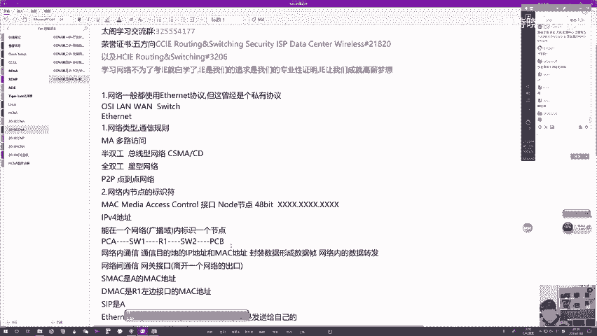

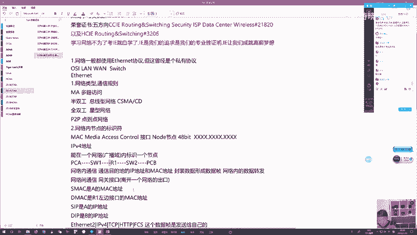

重新给这个数据添加一个新的二层针头。而在你添加的新的二层针头中啊，原map地址就是你的右边接口的出接口麦ap地址。而目的map地址就是B的麦ac地址，对以吧？那当你添加完这个新的针头之后呢。

这个针就能通过你右边接口成功发走。那接下来呢B就能够成功接收到，可以吧？那所以说呢再次强调一下，像mac地址这种地址啊，它只具有一个网络内的标识一，那所以说你两台主机之间对吧？如果你隔了多个网络。

你会发现这个数据在咱们端到端通信过程中啊，每跨越一个网络，咱们的原模二层地址都会发生改变。因为很简单，我们这个数据只要到达一台路由器啊，这个路由器是要先拆掉咱们针头真尾，查看三层爆头地址之后。

再给它重新封装成针，通过相应的接口发走，所以说你每跨越一台路由器，你都要拆封装，再重新封装，对吧？那所以说你这个二层地址的变化是很正常，可以吧？而这个三层地址就不会变了。

因为三层地址能够端到端的标识一个节点。不管你这台主机在英特网的什么位置，你都能拿IP啊来全球唯一的定位到你。所以说了两台主机，不管你们在什么位置啊，你们的通信原木三层地址是不应该有任何改变的。

这个行为我们称为什么呢？我们称为叫三层地址的端到端的一致性，可以吧？所谓的三层地址的端到端一致性指的什么呢？就是你两台主机通信，不管你们俩在什么位置，不管你们之间的通信流量当前在什么样的位置传递。

你们这股流量的三层爆头中的原木IP地址信息啊都不应该改变。你A跟B之间隔了100个网络都是一样的。你A发送数据给B不管数据在哪个位置传递啊，原IP都应该是A的IP目的IP都应该是B的IP。可以吧。

那这就是三层地址跟二层地址的这么一个区别。那所以说刚才呢有一个学员来问啊，就是说哎你PC上网一定要有IP地址吗？我的回答是一定的。如果说你没有IP，你能跨越网络通信吗？你通信不了。

你如果说没有这样的三层地址，你根本就找不到一个能够全球唯一标识你的这么一个标识符，你没有这个标识符，那也许你能够做什么网络内通信，但你能做网络间通信吗？你做不到，你想要做网络间通信。

那你需要能够标识别人，别人需要能够标识你能理解吧？所以说有IP是非常非常必要的。所以说得出一个结论，所有三层或三层以上的设备，对吧？包括你计算机，包括服务器，包括路由器，只要你想要通信。

你就需要一个三层地址。因为这个地址才能够端到端的全球唯一的去标识你。能理解吧？好，希望大家呢有这么一个概念。OK吧。好，那接下来言归正传啊，以太网定义的第二点就是咱们网络内每一个节点的标识符，对吧？

定义这一个map地址啊，来标识每一个节点。

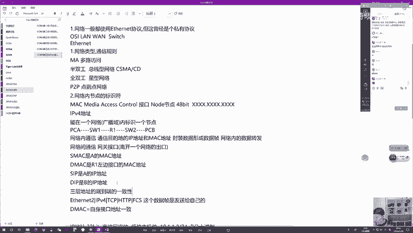

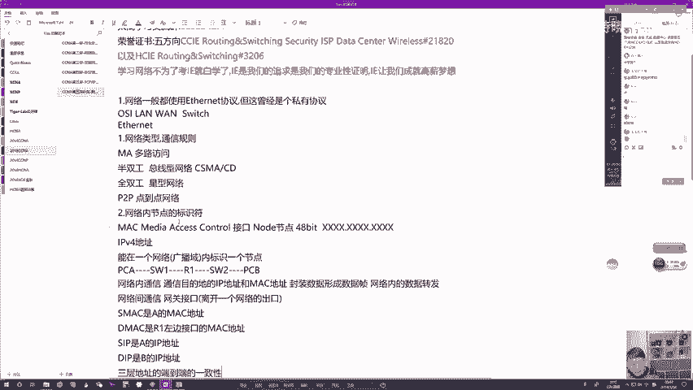

然后接下来以他网定义的第三点是什么呢？很简单，就是封装爆头，还有格式内容。好吧，因为你要在以踏网环之发送数据嘛，对吧？你要添加一个二层的针头，添加一个真伪，这个真伪的作用是什么呢？

就是让接收者收到数据之后啊，我能知道这个数据是一个完整的数据帧还是个冲突碎片，然后这个针头呢作用更大了，对吧？你封装一个针头，这个针头中，咱们可以包含原木麦地址，当然还能包含一些其他字段啊。

那主要咱们看原木麦ap地址了啊，通过原木麦ap地址，对吧？你网络设备能够知道数据是由谁发的，是由谁收，对吧？那根据咱们接收者的连接信息啊，它能给我们做一个精确的数据发，然后接下来对于任何接收者主机而言。

它能够查看目的麦ap地址来判断一下我自己是不是流量接收者，如果是我就接收，对吧？我就拆包，然后呢继续往下处理。那如果不是的话，我会丢包，对吧？因为交换键的泛红嘛，对吧？😊。

泛红流量会把一股流量呢复制成多份，然后呢发送给什么？除了接收接口以外的所有其他接口。那所以说如果如果你要通过这种方式来转发数据啊，总有一些不是流量接收者的接收主机，他们会收到数据。

那这个时候我收到数据怎么判断我到底该不该接收呢？就看目的麦地址，对吧？一看目的麦地址发现哎跟我自身的麦地址不一样，也就代表这个数据不是去往我的那既然不是去往我的怎么办？那我就直接把它给丢弃了。

那所以说基于这点来回归到咱们刚才那个例子啊，你A跟B，如果你们不在同一个网络，就算此时A知道B的m克地址，这也是没有任何意义的。因为如果你A发送数据，你拿B的麦克地址来封装我们的目的麦。

这个真是根本不可能到达B，为什么。因为你发送一个真目的麦地址为B的地址，就算这个帧被路由器收到，你路由器收到这个帧一看目的麦地址跟我接收接口的不一样，对吧？那不一样怎么办？

代表这个帧不是发给我的既然不是发给我的那这个帧就是一个网络内通信的帧。那对于这种帧怎么样？交换机自然会帮我转发，我就没有义务再给你做什么，其他的额外查看了。那所以说对于路由器而言，我收到这么一个帧啊。

我会直接把给丢弃。那既然丢弃了，他就看不到三层爆头，你看不到三层爆头就不会知道这个帧是要发给B的那既然不知道发给B，你又怎么转发呢？你就没有办法转发，那所以说呢退一万步讲啊，在咱们刚才那个例子中啊。

你就算A知道B的麦克，你也没有办法使用B的麦克来做任何的对吧？封装。因为你如果拿他的麦地址来封装目的麦克对吧？那你最终也是通信失败。因为你想要把真发给B唯一的。😡。

方时就是你把目的麦克地址设置为网关接口地址，能理解吧？OK那这个就是啊咱们的第三点可以吧？啊，以太网呢它就定义了一个针头和真伪的格式，对吧？就告诉你了，你要在以太网环境中发送数据，请你添加这么一个针头。

里面呢有几个字段每个字段呢到底有什么用，你要添加一个真伪，对吧？真伪里面应该包含些什么样的内容，你该怎么去设置，对吧？我给你规定好了，那大家呢就按照这个规定来做，对吧？只要你在以太网环境中。

要发送数据啊，咱们就要添加这么一个报头，我们就要添加这么一个报尾，报头里面就要固定的包含这些字段，那接下来接收者一收到这个报头啊，对吧？我一看哎，就能够知道你到底是谁发的，到底是要发给谁，可以吧？

那接下来关于这点呢，我们需要去展开来说一说。这个以太宝协议呢。😊，在这个。爆头封装格式这一点它其实是有两个标准的，它有两个封装标准。这也就是说你在一个以探宝中啊，你主机发送的数据。

咱们报头的格式可能有两种，可以吧？第一种，咱们称为叫HE的802。3的格式，还有一种呢，咱们称为叫以探网二的格式，可以吧？那接下来基于这两种格式，我们就来深入的去研究一下，首先为什么会有两种格式。

然后接下来这两种格式到底是什么样的，对以吧？哪种比较好用，哪种不好用，对吧？哪种用来封装什么样的数据，哪种用来封装其他的数据对以吧？那咱们呢来研究一下。OK那接下来在研究这个话题之前呢。

大家需要先知道这么一个概念啊，就是在我们的网络中，咱们有很多协议，对吧？每一个协议都是一个规则，都是一个约定，对吧？约定了网络中什么样的设备，什么时候能做什么样的事儿，什么时候不能做什么样的事儿，对吧？

协议就是规则就是约定。那在我们的网络中呢，协议分为两大类啊，一一大类咱们称为叫公有协议。还有一大类咱们称为叫私有协议，对吧？那所谓的公有协议指的是什么呢？就是这些协议都是一些标准化组织所定义的，可以吧？

大家都能用，那这就是公有协议，可以吧？你所有厂商的设备都能支持，你所有的对吧？设备啊都能够启用它，那这就是所谓的公有协议，那接下来私有协议特点是什么呢？就是这个协议一般是由某家公司定义的。

那这家公司定义的标准，只有这家公司对应的设备能够使用，对吧？你其他的公司的设备，你用不了，可以吧？那就是所谓的私有协议。比如在我们的今后课程中呢，咱们会研究很多思科私有协议。什么叫思科私有协议呢。

就是这个协议是由思科厂商定制的可以吧？那这个协议只有思科的网络设备，思科生产的路由器交换机能够使用，那像华为啊，华三啊，对吧？那些第三方厂商的设备他们就无法用，O吧？那接下来说到私有协议。😊，注意啊。

最早期的以太宝。其实它是一个私有协议。它是由IBM对吧？DECC还有施乐公司啊，他们三家公司联合开发，可以吧？这么一个私有标准。那这个私有标准只有这三家公司相关的产品他们能够使用。

那当然大家都知道以太网这个标准比较好，对吧？真的比较好，然后呢，大家都比较喜欢使用，方便实现效率比较高。那后来呢有一个标准化组织啊，就是i tripleE对吧？叫i triple e啊。

 triple就是三重例子对吧？三重例子，I后面三个E嘛，叫I tripleE。这个HOE呢叫电子电气工程师协会啊，叫电子电气工程师协会，也是一个大名鼎鼎的组组组织啊。

这个组织比较类似于是那个ISO国际标准化组织。虽然没有ISO那么大牌啊，但是也挺厉害的，对吧？知道他们很多，那接下来他就跟这三家公司呢来做一个协商，想要什么呢？就是意思是说哎你们开发这个以太网标准啊。

挺好用的，对吧？很受欢迎，现在呢有更多的公司，他们也想使用你们这个标准，对吧？那你们能不能无私的把这个标准给公有化，对吧？能不能公有化，然后接下来后来呢那个谈崩了啊，这三家公司呢。

他们拒绝公有化这个标准。那既然拒绝对吧？那我就另其炉灶啊，给你研发一个共有标准。那这个时候呢HOE就连同一方研发人员啊，他们会对吧？基于这个以以探网里面的一些规则，一些特性来给你做一个二次研发，对吧？

当然在研发的时候呢，为了就是避免那个侵权啊，他会给你做很多修改，对吧？最多只能保留你70%的内容啊，然后30%呢都要原创。那接下来基于这么一个70%的抄袭30%原创。那他们就捣鼓出了这么一个对吧？

捣鼓出了这么一个标准化的以探网标准。那这个以探网标准，他们命名为什么呢？就命名为802。3。这个822。3的标准，它的工作原理基本跟以太网是一样的，他们定义的网络类型对吧？定义的咱们通信规则都是一样的。

并且他们定义的地址也相同，只不过在封装格式上，他们有些区别，对吧？那接下来既然有区别那，咱们这两款协议就不是相同的嘛，你就没有办法去告这个承国E嘛，对吧？你们各自都可以使用。

那接下来从几何时呢就是以太网标准是私有标准。822。3的标准呢是公有标准。

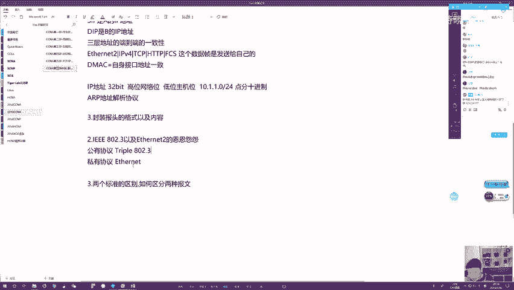

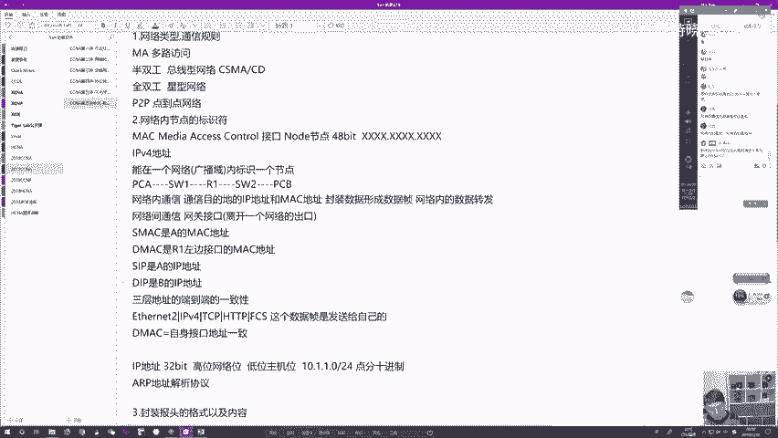

然后I就告诉大家了，你们所有其他厂商对吧？生产的设备想要使用这个以太网协议，对吧？你们可以使用我们家的这个803对吧？然后接下来这个好景不长啊，过了一段时间，这三家公司好像突然开窍了。

就是为了占领市场也好，为了增加影响力也好，他们就自己啊自顾自的把他们这个以太网协议呢做了一个升级升级之后也公有化，那他们公有化，这个以太网协议，那为了避免跟之前那个以太网私有标准啊搞混淆。

他们给它换了一个叫法，称为什么呢？称为叫以太网二标准，对吧？当然这个二呢不是咱们这个阿拉伯数字2啊，是那个罗马字母2对吧？是那个罗马字母2叫以太网二协议，那这个以太网二协议做一个标准协议，对吧？

同样大家都能用，并且由于这个协议是咱们以太网协议的一个升级版啊，那他跟咱们曾经的以太网协议相比，除了增加一些优化机制以外，其他的基本都是相同的，完全相同，对吧？没有任何区别。因为他们不用。😊。

担心什么抄袭的问题嘛，是吧？不用担心侵权的问题。那所以说接下来就是在我们的市面中呢，这个标准的以太宝协议公有的太协议啊，咱们就两种了。一个是83，一个是以太宝2。那当然哪个更受欢迎呢？那可想而知。

肯定以太宝2更受欢迎的，对吧？因为以太宝2，首先大家用的比较习惯，并且以太宝2没有做任何的改变，对吧？它的效率比较高，而这个83呢为了避免就是侵权它修改了很多精华内容啊，这个改你不改好。

你改完之后会发现这个协议被你改的？特别的模棱两可了，改的效率特别低，所以大家在使用83的时候其实有很多的痛点呢有很多痛点，比如说你在封装83的时候，你为了实现以太2的功能，你需要多封装很多字段。

导致你的报头变大，并且这个83对吧？有很多的环节你是不能使用的。有很多的场景你是不支持的。而这个以太宝2呢对吧？相比之下你所有问题对吧都没有那大家用的时候肯定用的很爽，那所以说呢很多厂商呢自从以。😊。

出来之后呢，他们呢纷纷的抛弃80。3对吧？然后呢，从而支持以太宝2。然后后来呢这个H公艺就觉得很没有面子啊，对吧？他想我给你们辛辛苦苦研发，对吧？为了避免被告整出这么1个80。3的标准，你们不买账。

你们使用这个以太网2，那咱们开发80。3的目的何在呢？就没有意义了吧，对吧？那所以说了那后来呢就是他们之间做了一个协商，协商后的结果什么呢？就是说哎现在在我们这个以套网环境中，大家也别争了，对吧？

咱们都是公有标准，那咱们就都使用呗，对吧？都使用你在以太宝环境中，对吧？咱们这两种豹纹封装都可以存在。那接下来我们为了避免冲突啊，就做一个约定，所有的控制流量。😊，所有的控制流量都使用我802。

3的格式来封装。然后呢，所有的数据流量都使用你的一台网2，对吧？那接下来什么叫数据流量啊？很简单，就是你平常对吧？一台主机，你联网你正常的应用收发的数据啊，咱们都称为叫数据流量，对吧？

比如说啊你浏览器上个网页啊，对吧？你玩个游戏啊，对吧？你发个FTP啊，对吧？总而言之，就是你正常的计算机的应用所产生的这些数据，咱们都称为叫数据流量，对吧？

然后接下来咱们网络设备之间呢也能够交互一些报道啊，启用一些协议，比如你交换机间能够运行个生成数来防还，对吧？你能运行个VTP来同步伟栏信息，对吧？你能运行1个CDP来彼此发现咱们的连接信息，对吧？

那这些流量啊是由咱们网络设备产生的，跟我们计算机没有关系，并且这些流量也是发给其他。网络设备可以吧？有网络设备产生，并且发给其他网络设备流量啊，我们就称为叫控制流量。可以吧？那接下来咱们就规定好了。

所有控制流量，你网络设备产生的，咱们都使用802。3来封装，然后你所有计算机产生的数据流量，对吧？咱们都使用什么以探网二来封装，那接下来大家井水不犯河水，对吧？我们在一个以探环境中啊。

让这两个协议让这两个标准都共存。那这就OK了。好吧，那接下来这两个标准到底什么样子的呢？那咱们也来看一下，好吧，这样就是这样的。😊。

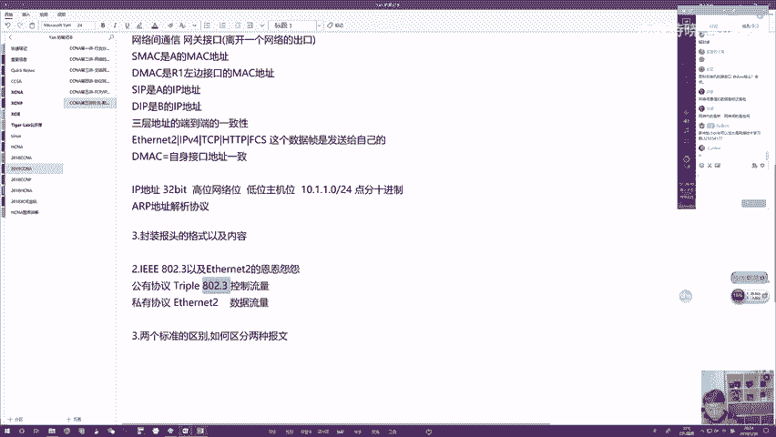

看到吧？这就是以太网二的封装啊，下面就是802。3的封装，可以吧？中间呢他直接不负责写了一个data啊，叫数据，其实不是数据啊，你以太网做为一个二层的封装协议，你封装的是一个数据包啊，中间是一个数据包。

对吧？前面是二层的针头，后面呢是二层的真伪，好吧？以太网二就是这样的啊，然后呢，802。3是这样的，对吧？中间是一个数据数据包啊，然后呢，前面是二层的针头，后面呢是真伪可以吧？

然后接下来他们的真伪呢都叫FCCS啊，没有任何区别，然后针头里面目的麦地址是第一个字段，原麦地址第二个字段，这个都是一样的，然后接下来区别就区别在后面可以吧？后面以探网二跟的是一个类型字段，可以吧？

这个类型字段有什么用呢？这个类型字段是来描述啊，你这个数据针对吧？它的三层，咱们的网络层到。你使用哪一款封装鞋？对吧，那这样做的好处是什么呢？就是告诉那些纯二层的网络设备啊，对吧？

你收到这个针三层呢到底用了什么协议？因为所谓的二层的网络设备，什么叫二层网络设备啊？就是你收到一个数据帧，你只能识别二层的针头，还有二层真伪。所有三层的封装信息，还有四层的封装信息，甚至咱们的载荷啊。

你都不能识别。那所以你叫二层设备。那什么叫三层网络设备呢？就是你收到一个针，你能识别针头真伪内容，你还能识别三层爆头。什么叫四层设备啊？就是你二层爆头，三层爆头，四层爆头都能识别。😡。

那接下来我们的PC和服务器为什么称为叫7层设备？因为你除了能够识别所有风装爆头以外，你还能识别咱们的数据载荷，可以吧？那所谓的一个设备是几层的，就是看你这个设备收到一个数据帧之后，你能识别几层分装。

对吧？那接下来对于咱们这些二层的网络设备，那他们肯定是看不懂三层四层爆头的吧。但如果说你需要他们看懂咱们的三层四层爆头。那这个时候呢，对吧？你就添加这么一个类型字段就可以了。你通过类型字段。

你做一个二层到三层的映射，你只要查看咱们类型字段的值，你就算此时此刻依旧看不懂咱们三层爆头内容啊，但是你只要看咱们类型字段的值，就能知道咱们三层到底使用什么协议。那这就是类型字段存在的目的。

那当你之后呢，网络中流量类型越来越多了啊，你就可以通过让咱们这些二层的网络设备，查看类型字段的值，就能分辨出来。咱们的流量的区别。然后接下来对于不同的流量，你可以用不同的处理方式。比如那些语音流量啊。

你可以发的稍微的高效一些，对于视频流量对吧？发的稍微低效一些，而对于咱们的数据流量可以更加延迟发送，可以吧？那就是方便咱们做Q那这就是类型字段作用。然后接下来802。3的第三个字段叫什么呢？叫长度。

可以吧？长度长度顾名思义啊，是用来描述咱们这个数据有多少字节可以吧？有多长。那当然他描述的是哪个范围多长呢？它描述的去掉针头真伪之后啊，咱们中间的这个数据包有多少字节，可以吧？

那接下来这个数据包有多少字节，咱们有一个标准来控制的这个标准咱们称为MTO可以吧？这是以他宝定义的这么一个参数啊，叫最大传输单元，可以吧？叫最大传输单元，那这个MTO有什么用呢？它就是用来限制啊。

你在以他网环境中发送一个数据最大有多少字节，那这个限制的是什么呢？限制的就是去掉针头真伪之后啊，你这个数据帧所封装的三层数据包最长多少字节，可以吧？那接下来一般这个MTO呢是1500字节，可以吧？

一般这个MTO。

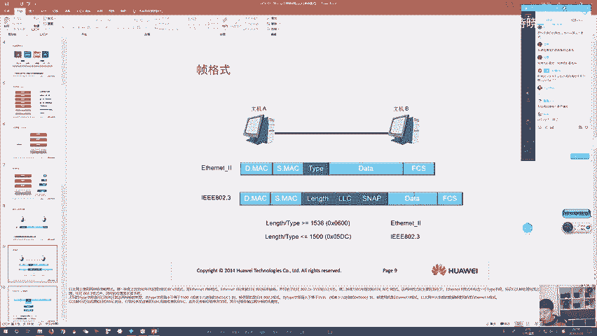

1500字节，这也就是说你在一个以态环境中啊，你发送一个数据帧去掉针头真伪之后，你中间的三层数据包最多1500字节。如果你要超过100字节，不好意思，你超过了MPO限制就不能发送。

如果说你小于等于1500字节，对吧？那你满足咱们的MPO的约定啊，你就可以被发送可吧？那这个len字段就用来描述你去掉针头真伪之后啊，你中间这块对吧？你中间这个数据包有多长有多少字节，对吧？

那当然这个字段值呢一般不会超过1500啊，因为你超过1500，这代表咱们中间这个数据包的长度超过了咱们的MPO限制，你超过了MPO限制怎么样？你是不能够被发送的，所以为了避免对吧？不能被发送。

你还要切片。那一般呢你这个中间的字段长度啊都会小于等于1500字节，可吧？然后紧接着83呢后续还添加两个子字段，一个叫LLC这个叫逻辑链路控制子层，还有一个呢。

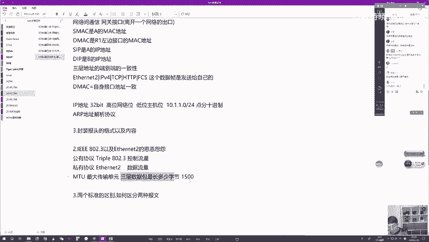

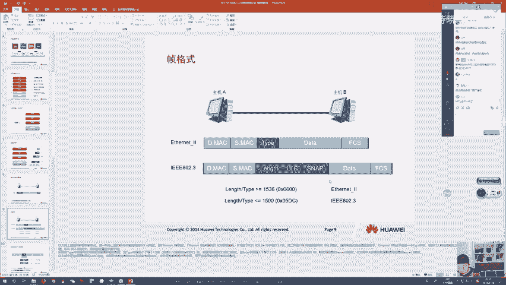

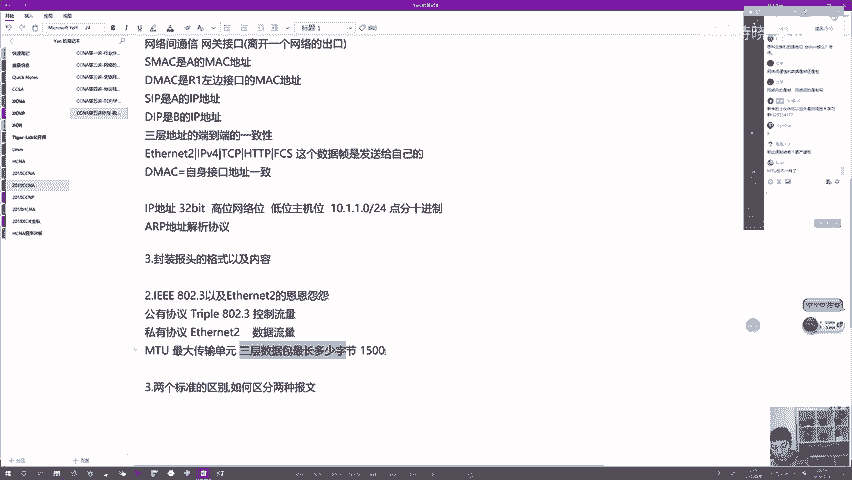

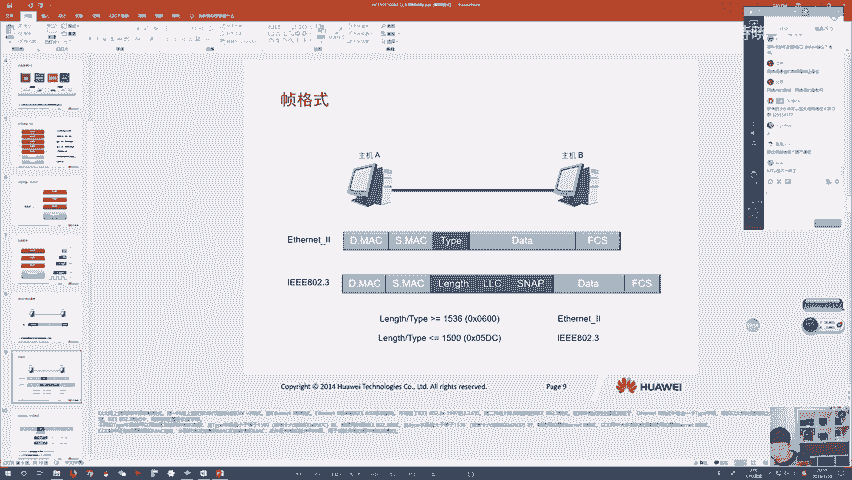

SNAP这个叫子网接入点，可以吧？然后接下来这个SNAP呢是用来支持不同的协议站的，用来支持不同的协议站的对吧？你能够支持咱们的。

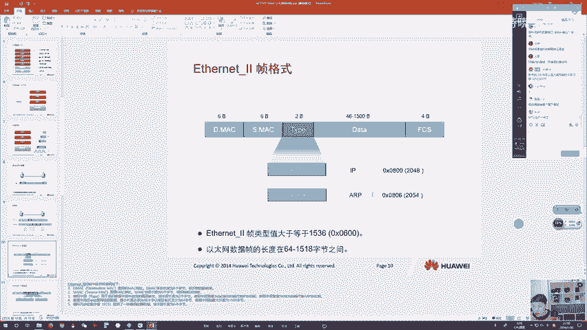

很多东西对吧？你能支持咱们的netware对吧？这是一个协议站啊，你也能够支持咱们TCPIP还能支持OSII对吧？咱们可以通过不同的这些字段的值啊来做这么一个支持，但是呢这个很明确的是多词一举啊。

因为当前咱们TCPIP是王道嘛，对吧？你基本用都是TCPIP所以说你设置这么多的支持字段是没有意义的，可以吧？然后这个LLC对吧？DSAPSAP用来描述你这是哪个类型的针，然后有一个控制字段对吧？

就控制段通常为0啊，然后接下来SNAP里面三个字节的组织代码，后面跟的是两个字节类型，这个类型对吧？跟咱们刚才的那个8啊以探网二的类型是一样的。你通过这个类型字段，咱们也能够用来描述什么。

能够用来描述咱们这个二层针头，后面的三层爆头到底是用什么协议，可以吧？那这就是8，所以你一看这个封装，你能发现80哪三写的很。

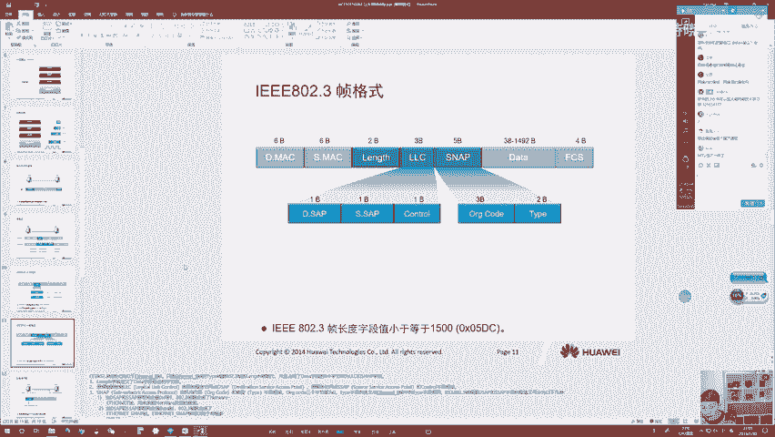

繁琐啊，而以太网二写的很简洁，对吧？以太保二的针头一共是6个字节，加6个字节，加两个字节，14个字节，对吧？而你这个80。3呢是6加6加2，然后再加3再加5对吧？3加5是88加2是1。

十再加1222字节，对吧？802。3添加的爆头更长啊，你这个爆头更长，占用的空间更大，对吧？那你这个载荷对于带宽的利用率啊就会更差，对吧？那相反你报头越小，你的载荷的带宽占比就会更高，对吧？

然后接下来你这个爆头小，内容少，你接收者网络设备收到数据之后啊，你查阅的内容还会更少，对吧？你效率会高，那所以说种种来看，你以太网2对吧？都能调到8。3，对吧？都能调到它。

那所以说大家为什么都喜欢使用以太宝二有原因的对吧？我觉得这个HE呢有点。不要脸啊，就是强行的要求，对吧？你网络设备所使用的控制协议，你在发送那些控制报文的时候，使用86。3来分装。

其实那些网络设备他们也很不爽啊，他们也希望在发送数据的时候都使用以太网2。所以你会发现现在变革正在展开啊，慢慢的那些厂商，他们在对吧？设计那些控制协议的时候，对吧？也都开始从86。3转向以太网2，对吧？

那这个过程当前正样进行啊，我觉得未来有一天86。3会慢慢的被淘汰的，对吧？那到时候呢就是对吧？大家清一色的全使用以太网2，好吧，那将将然有一个问题就是需要大家知道，就是在你一个以太网的环境中啊，对吧？

这两种报文咱们都会存在，那我收到一个数据帧之后，我怎么知道收到的是以太网二的帧还是86。3的帧呢？很简单，你只要看第三个字段的值就可以了。如果说你第三个字段是一个类型字段，你。

的值是要大于等于1536的对吧？如果说你大于等于1536，就是16进制数啊是0X0600啊，那这个时候代表你是个类型。那类型值意味着什么呢？意味着你是一个以它王二的帧。

然后接下来如果你第三个字段的值小于等于1500，对吧？也就是小于等于05DC啊，因为你这是类型嘛，你这是长度嘛，长度是用来描述去掉针头真尾之后啊，你中间的三层数据包有多少字节。

你中间的数据包最长就1500字节。所以你这个字段的值如果小于等于1500字节，代表这就是长度字段。那长度字段代表这就是802。3的帧。可以吧，那接下来这两个标准。

咱们就是通过第三个字段的值的范围就能做一个区分，可以吧？那接下来关于这个类型字段呢，还是需要大家记一些的。比如说你三层使用是IPV4，可吧？比如说以我们刚才这个例来看啊，对吧？

你外面封装的是type的针针头，然后这边有一个IPV4IPV4对应的类型值是几呢？它对应的类型值是0X0800，可以吧？那接下来你能使用IPV4就能使用IPV6，这个IPV6对应的类型值是几呢？

是0X86DD可以吧？然后接下来你再发送ARP的时候，ARP的报围也是直接封装以type针头的，它对应的类型值是几呢？是0X0806，可以吧？你只要展示一下这个类型的值。

那接下来对于那些二层网络设备而言啊，它们就算不能看懂你三层爆头到底是什么，对吧？看不懂你三层爆头内容，你只要查看。

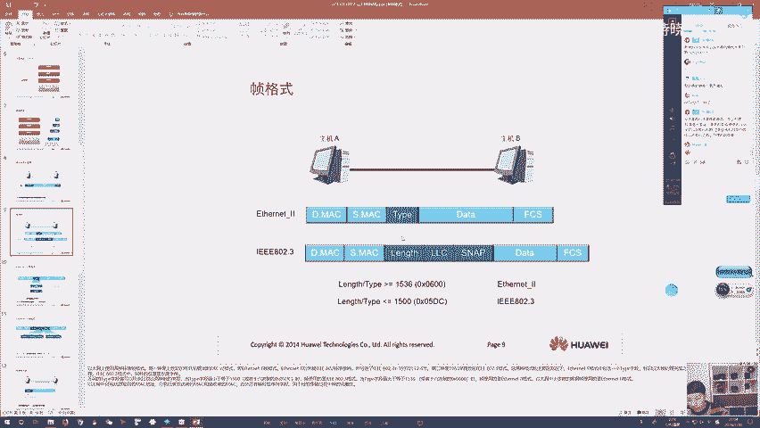

类型字段的值啊，你就能知道咱们三层使用什么协议，可以吧？这就是类型值的作用。

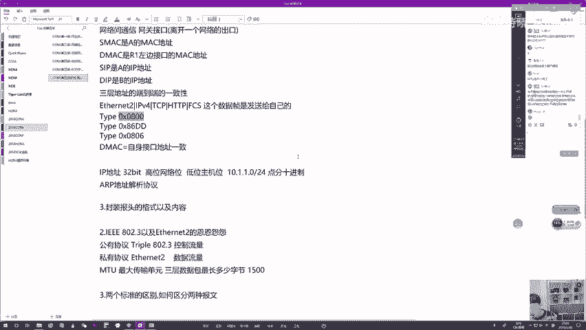

好吧。😊，O。😊，那这边就是。关于咱们以探网协议里面的一些小细节啊，对吧？然后接下来最后呢，这个XCS真伪啊用来做真校验训练。好吧，那今天呢给大家讲的比较专业了啊，讲的逻辑性比较强了。

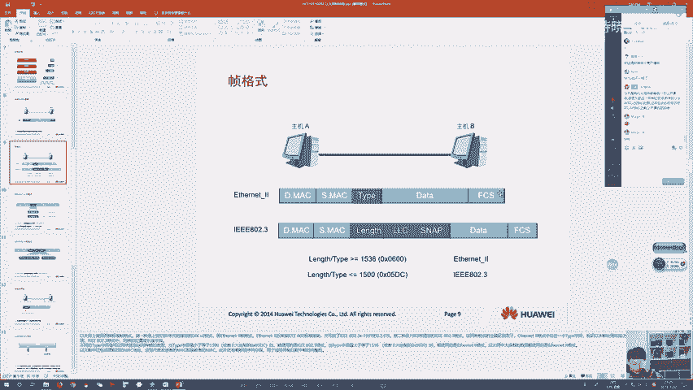

那也是想让大家展示一下，向大家展示一下咱们真正的网络教学是什么样的。那跟大家说一下，咱们的公开课呢是免费的，是为了让大家能够体验咱们的课程质量。

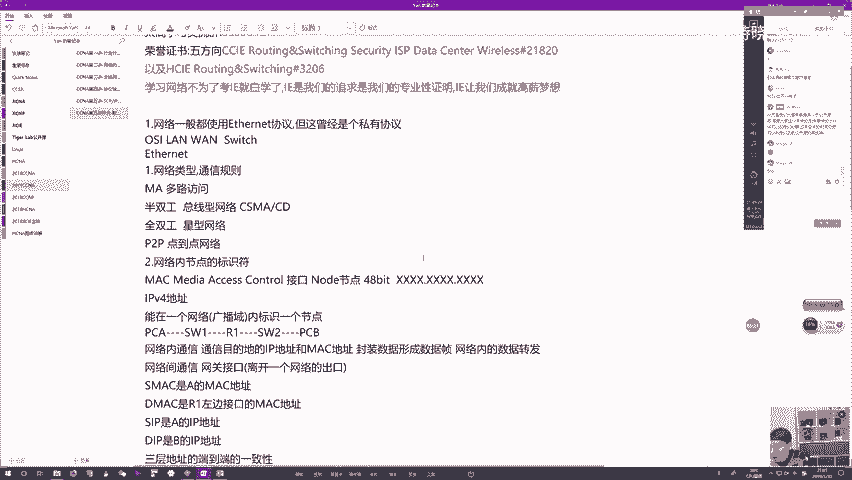

所以说作为一个体验课，我希望大家听的能够比较爽。那怎样能够比较爽呢？首先我要讲比较简单。对啊东西要稍微少一点，因为大家也不是抱着be此的觉悟来学习的，所以说我也不可能抱着be的觉悟给大家讲那么难那么深。

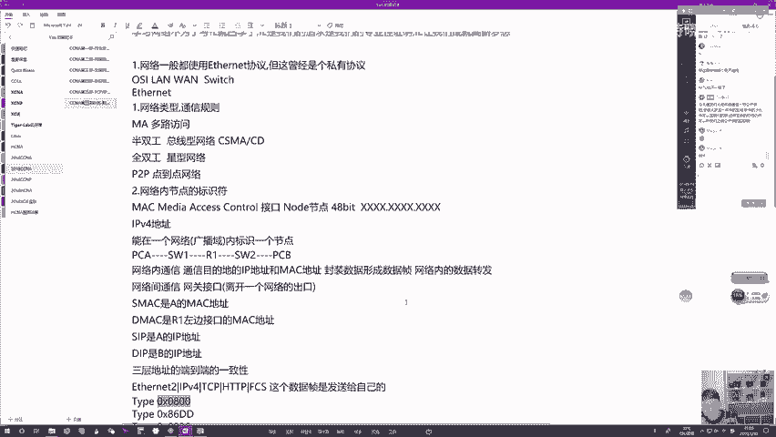

所以说在讲的时候呢，我都会放慢步调，然后讲讲的稍微简单一些。但是如果你想学会网络，对吧？像这样的小逻辑都是小儿科啊。

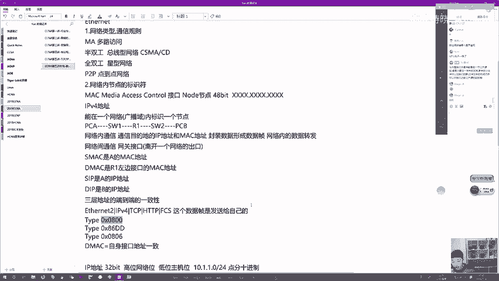

在我们的NA的正课里。还有咱们的NP行义课程中啊，像这样的东西都是基础中的基础。我相信这些东西大家如果能搞懂的话，你们对于整个网络的通信。我相信你们能够更上一层楼。然后在你们面试的时候。

在你们在工作的时候，你们能利用你们的网络技术，对吧？解决更多的问题，赚更多钱。

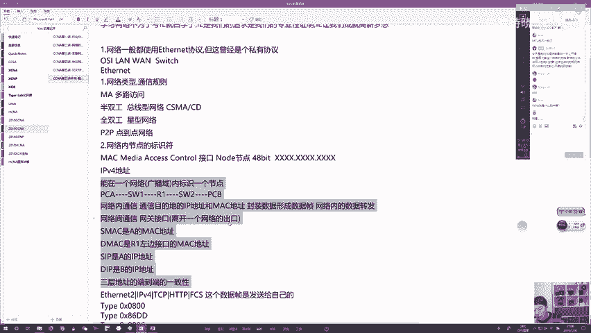

那这个是对吧？咱们的VIP的课跟咱们的公开课的区别。

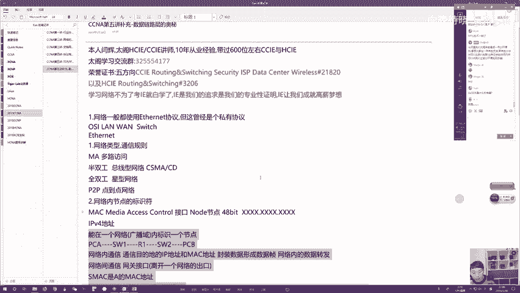

像今后的公开课，像这么难的内容，我会尽可能的不去提。

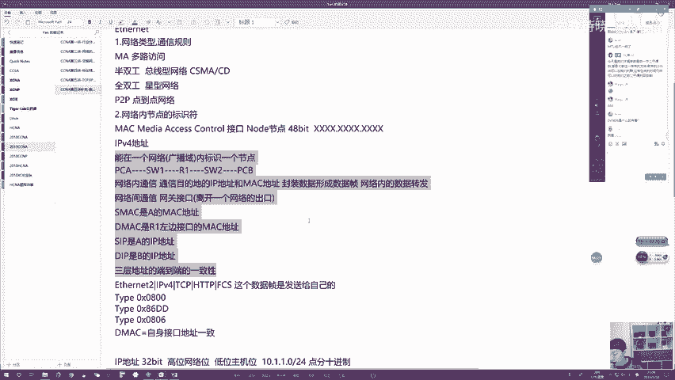

可以吧？我会尽可能不会去提，因为太难了，对吧？我也不希望大家对吧？在体验课里面烧死那么多脑细胞啊，我希望大家能够轻松愉快的来做一些学习，可以吧？那当家这边的话，咱们有一个交流群啊。

大家如果对咱们的课感感兴趣的话，你可以加我们的群。然后呢，之前咱们往期的课都会有录屏，大家如果想听比较难的对吧？你们可以找我们的课程顾问老师去下载，这是没问题的。

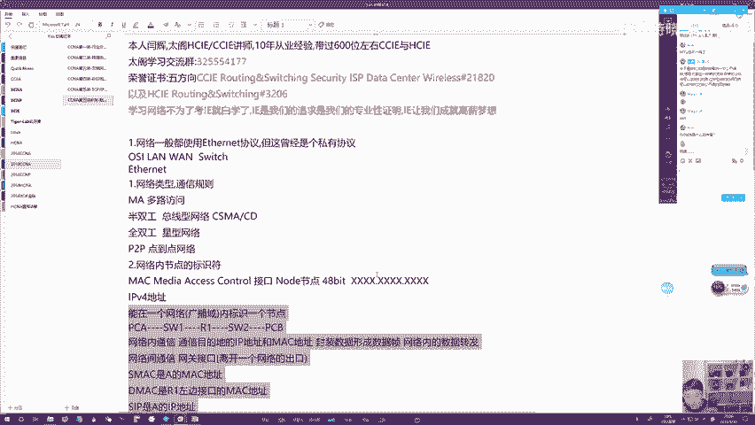

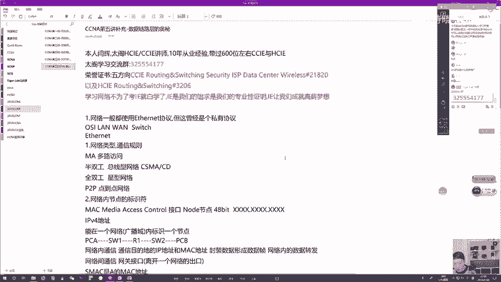

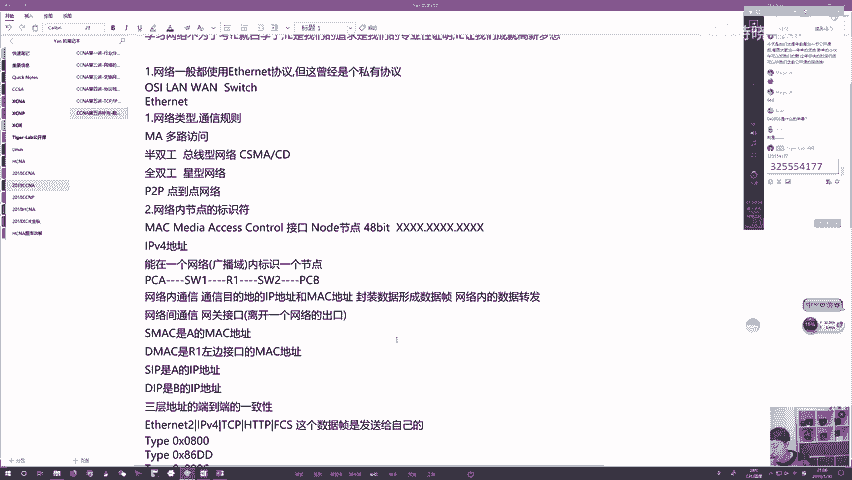

然后接下来就是咱们的节前最后一节课，给大家点福利，给大家打会儿一。好吧，然后接下来再说一下，咱们年底的活动优惠还在。然后呢，这个优惠的话，等过了年之后就结束了。年后咱们所有的课程价格都会调整，对吧？

都会调整。

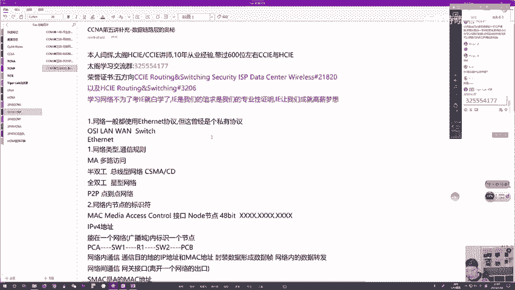

然后呢，这边就是。怎么说呢？大家如果对咱们的课比较感兴趣啊，可以加我们的群来咨询一下咱们的课程部问老师，好吧。

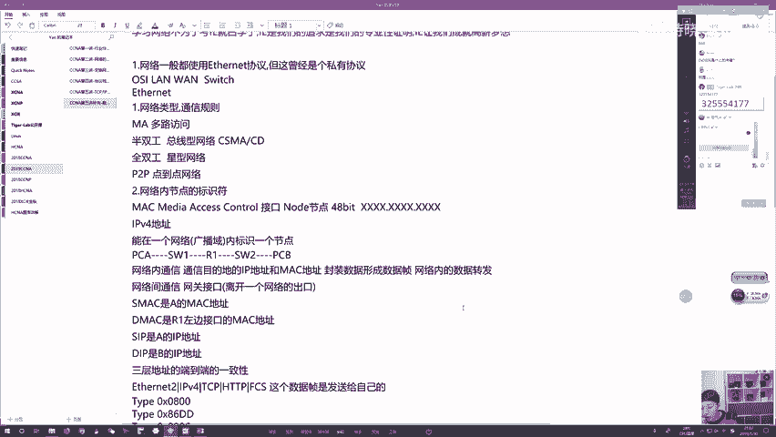

呃，那今天就是给大家打两个一吧。😊，0X0806不是画的吗？针对ARP啊。

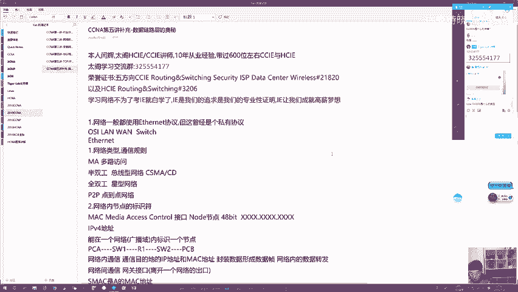

针对ARP协议啊。0806是ARP好吧，这些都不在意啊，你不用在意这些细节，这些都是无所谓的。听公开课，大家就感受一下就好了，体验一下。觉得好的话，加咱们的VIP的课，你们能得到更多啊。

能够得到你们想得到一切东西。

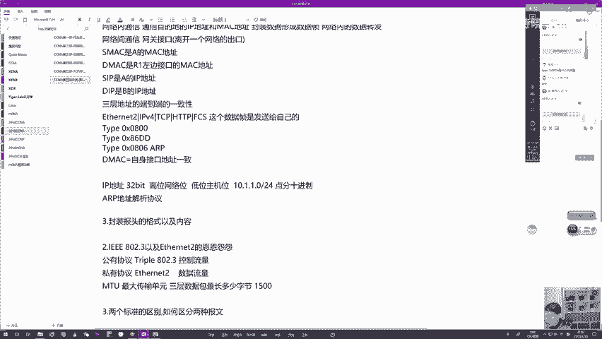

你这边的话总是给我截这个图是什么意思？什么叫消息不能为空？

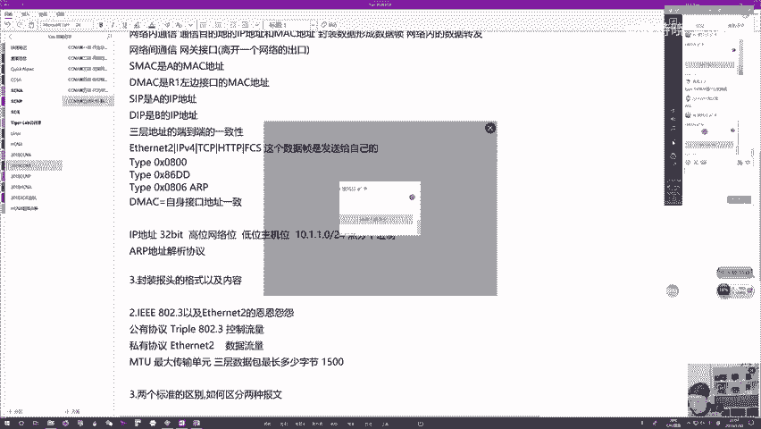

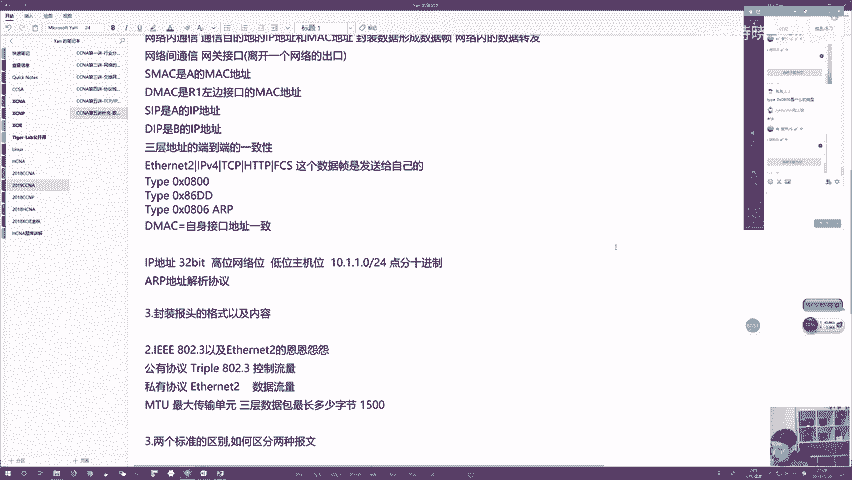

你是想要打什么字吗？你可以在群里打好吧，好，给大家两个问题时间啊，给大家两个问题。😊，提前祝大家新年快乐。好吧，给大家点福利，回答两个问题，你们可以整理一下。😊，网络监偷信的数据是真还是包当是真了？

你在发送任何数据的时候都是真。你发送任何数据都要经过二层封装。就是因为你发的是真，所以说你需要把目的麦地址设置为网关接口地址。因为如果你没有这么做的话，对吧？路由器是不会拆包的，它不会拆包。

就看不到三层爆头，看不到目的IP就不能帮你进一步转发。好吧。好，第一个问题啊。来再给大家一个问题，时间。😊，大家再问吧。今天的课相关内容，之前的课相关内容，大家有问题可以问，都可以问，好吧。嗯。

🤧没关系啊，任何问题都可以问。😊，虽然平常这些答疑我都是只给VIP学员答疑啊，但是在课上给大家一些福利，好吧，给大家一些福利，你们有什么问就可以问，好吧。都没问题了吧？😡，我倒数三下，如果说没有问题。

咱们就结束啊。😊，嗯，好，有人问了，如果汇聚层发生广播风暴如何解决？广播风暴是环路导致的？解决广播风暴的唯一方式就是生成数啊，要么生成数，要么大二层的技术。

大二层的技术能够通过优化交换机的控制层面来解决环路。而这个生成数呢通过给你阻侧冗余路径来避免环路产生。环路产生的根因是因为交换机的工作原理非常简单，交换机认为所有主机都必须要跟它直连。

但是实际上在咱们一个网络中啊，你不可能说让一台交换机啊直连所有计算机。所以说对于任何交换机而言，有的计算机跟它直连，那就一定有跟它不直连的计算机。那所以这个时候只要你交换机间的连接带有冗余。

那咱们就会有环路，环路继而会导致什么广播风暴。那所以说呢广播风暴的根因是环路，而环路的根因是冗余的连接。那为了避免环路，咱们只要不去冗余的连就好了。你只要保证咱们在联网。

任意两个节点之间有其只有一条可行路径。那这样做的话就没有还路。那当然如果你要这样连的话，咱们又没有冗余了吗？你会出现单点故障。那为了避免单点故障，怎么样连接的时候还是要带有冗余的去连。然后连完之后呢。

你可以通过运行生成数来把那些冗余的链路给阻塞。那阻塞之后呢，保证你任意两个节点之间，咱们尤其只有一条可行路径。那这样的话就没有环路了，没有环路自而然就没有巩风嘛。然后接下来生成数运作完毕之后呢。

它会实时的监控你当前的可行路径是否OK。如果说你当前路径有问题了，它会给你把之前阻塞的路径啊给重新还原，来帮你做一个数据的发送。可以吧，这也就是说冗余依旧还在。没听到什么是控制流量，你可以看视频啊。

我们已经录过视频了。好吧，好，呃，再给大家一个福利吧，再给大家提最后一个问题，好吧，再给大家提最后一个问题。😊，啊，那个今天录视频了，咱们每节课都录视频了。你们如果说没有听清楚的话，可以看视频，好吧。

还有问题吗？我要雨露均沾啊，一个人不可能回答两个问题啊，一个人咱们只能回答一个问题。还有其他人问题吗？我之天好像看有人提过了啊，之前有提过问题，我没有看到，你们可以问一下，好吧，你们可以问一下。啊。

像这两个问题啊，思科交换机的路由口会荡掉吗？首先交换机。对吧它没有路由口啊，你只有多层交换机，你才能把接口作为路由口，当然会到了。当然会荡的。你接口up的话，前序你要连线，然后你接口要能杀 down。

然后你对端接口还要能够正常工作，对吧？你满足这三个条件，接口层能up。如果说你有一个条件没有满足的话，接口就是到，好吧，这个很正常。好，没有有问题吗？😡，那没有问题的话，咱们今天到此为止啊。😡，啊。

看到有人问问题了啊，我看一下ARP跟OSPM能一起运行吗？不相干啊，它没有没有任何关联。OSPF是一个路由选择协议，为为了方便什么啊？为了方便路由器，知道咱们网络的连接，拥有各个网络路由信息。

而这个ARP是在一个网络内，尤其是在一个以太网内啊，咱们通过ARP来把一个节点的IP映射到这个节点麦克。因为你在任何以太网环境中，你发送的数据都是真吗？真要包含原木麦ac地址。而咱们一般在通信的时候。

我们更加关注的是目的节点的IP地址，对吧？你如果说只知道IP不知道麦克，你不能形成数据帧，所以为了形成数据帧，这个行为我们称为叫成真啊，这个行为咱们称为叫成真。那为了成真。

你必须要知道目的节点的IP对应的麦克。那你不知道怎么办呢？咱们就要通过ARP来做一个解析，可以吧？😊，O。😊，啊，我看到你多多年前的CCNP说的非常细。好嗯，现在的东西啊，现在的细十细10倍。

并且现在的东西会新很多啊。华为交换眼经在配置完SSH后，conl口进不去了，那这是你自己的问题啊，你把conl给锁死了。好吧，好了，那今天咱们就到随止吧，好吧。ARP跟ARP的攻击有什么区别？

你可以看咱们的视频啊，视频里讲的很清楚。有一种ARP咱们称为叫免费ARP对吧？你在发送ARP的时候，如果把里面的原目地址设置为不正确的地址就可以实现欺骗，可以吧？就可以实现欺骗。

那当然这种攻击很好防范呢，很好防范，你只要通过DAI就可以。那当然这个DAI呢，你要结合DHCP然后呢结合DHCP的op品来一并啊使用，可以吧？你只要结合这三个技术，ARP的攻击是可以防范的。好吧。

OK那今天咱们到此为止吧，然后呢，下次课咱们就年后好吧，大家新年快乐。

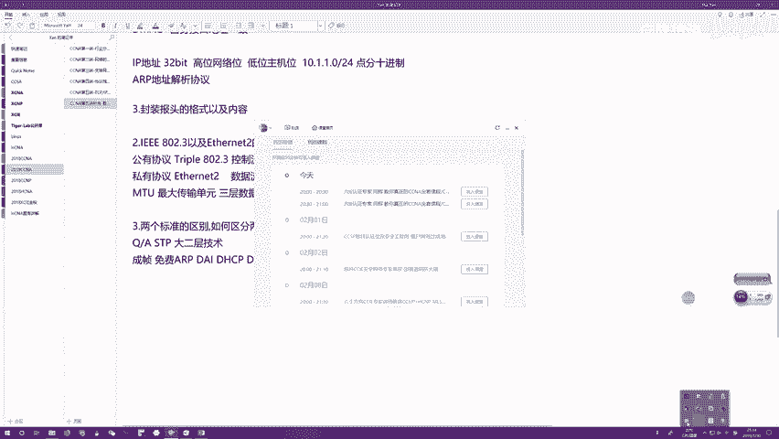