# 1000元自购分享CCNA教程合集！超全合集详细版，网络工程师入门必看合集【送NA题库】 - P7：CCNA07 - 向向向晚o - BV1cL4y1q7Dy

好，大家新年好新年好，那个年过了啊，年过了哎也没算过了，反正不管怎么样都上班了，都上班了。那所以说这边的话咱们就是AA继续啊呃离上节课已经隔两星期了。😊，呃，真的很担心大家把之前的都给忘光了啊。

那回顾一下回顾一下。😊，那个之前咱们讲的非常非常重要的一些内容啊，第一个就是。😊，OSI参考模型对吧？然后接下来就OSI呢给大家介绍一下7层的功能，对吧？大体的介绍一下。然后接下来关于物理层、数据链层。

对吧？我们上节课呢就是给大家详细的把里面的一些东西，一些机制，对吧？一些细节给大家就是讲解了一下。😊，那今天这节课呢很重要，为什么呢？啊？因为我们说了网络工程师比较关注OSI的下四层。

而这个下四层的最下面两层对吧？都西比较少，比较简单。然后接下来真正咱们要关心的什么呢？就是第三层还有第四层，而这个第四层呢，由于起到的是一个承上启下作用，对吧？你网络工程师也要关注系统工程师也要关注。

那么当然咱们网络工程师可能关注更多一些啊，但是呢从根本上来讲，对吧？我们最关注的其实就是第三层，对吧？那所以说学网络学的是什么？你学的80%的协议都是三层相关的好吧，那所以说是三层重不重要，很重要。

对吧？然后接下来咱们在学网络的时候呢，就是路由交换方向的课程，对吧？路由交换方向其实涉及的设备就两种。😊，那说到路由是什么？路由器嘛？说到交换是什么交换机，对吧？你要研究路由器交换机的工作原理。

然后你要研究路由相关的一些技术，还有交换相关的一些技术。那接下来我跟大家说了，路由相关的技术里面最最最重要的啊就是各式各样的路由选择协议。像OSPF对吧？像EIGRP像BGP。

然后还有这些路由选择协议啊引衍生出来的一些，对吧？像MPVPN啊等等之类的这么一些VP的应用。那这些技术看起来比较高大上，对吧？他们都有个根儿，这个根儿是什么呢？这个根儿。就是IP可以吧？

他们的根都是IP协议，如果没有IP协议，你这些路由选择协议啊根本就不可能存在。你没有IP协议，那些VPN对吧？也没有存在的意义。就是因为咱们有了IP啊，你作为IP这么一个支撑，你才有了IP扩展出来的。

衍伸出来的这么一系列的应用，那所以说呢你在学这些应用之前呢，咱们就要先了解IP你如果连IP是什么都不知道，你连IP定义了什么都不清楚，你连IP做什么都不清楚，那你研究那些路由选择协议。

我觉得你们很难了解里面的一些具体的设计，对吧？你为什么要这么设计，这么设计的目的是什么，对吧？那可能大家就不清楚了。那所以说为了之后呢，咱们在讲这些路由技术的时候，对吧？

让大家能够知道咱们学这些技术是为了什么，对吧？那咱们这节课至关重要。因为这节课就是教大家这些所有高大上技术的根源，也就是咱们。😊，那这个IP从定位上属于哪一层呢？它就是属于OSI的网络层。

那所以说我跟大家说过，为什么网络层比较重要，原因就是因为网络层面包含了IP这个协议。当然虽然说除了IP这个协议以外，还包含很多其他东西。对吧比如说像什么ICMP啊，像什么ARP啊，对吧？

设备里面包含路由器啊，还有包含所有的三层接口啊，但是最最最重要的就是这个IP对吧？没有IP你可以理解为什么都没有存在的必要了。就是因为有了IP，所以咱们才产生了这么多这么多技术，对以吧？

所有技术都是围绕着IP来工作，好吧，那接下来关于这个IP到底有什么用呢？那我们先来回顾一下啊，先来回顾一下。😊，啊，我们也说过，你网络存在是有它存在的意义的。我们网络存在的意义是什么？😡。

就是让咱们应用之间能够彼此通行，对吧？那大家还记不记得啊咱们这么一个图啊，PCA对吧？连接一台交换机，对吧？连接一台路由器，再连接一台交换机，再连接一台PC对吧？那这个时候呢。

你PC对连接网络目的是什么呢？就是当你PC上启用一些应用的时候，对吧？你可以让这个应用利用咱们的网络连接来传输数据，那传输数据，对吧？咱们数据流量在网络中传输，那最终实现的什么呢？

就是应用程序到应用程序之间的资源共享，对吧？那这个是网络存在的意义。😊，那当然我也说过，你任何计算机安装一个应用，你想要让这个应用呢直接通过网络发送数值不可能的，为什么呢？因为咱们网络中除了计算机以外。

咱们还有很多网络设备，对吧？由一有网络设备存在，所以你任何计算机之间通信啊，你不能直接通信。😡，你们要把通信的流量交给咱们网络设备，然后由网络设备帮助我们去做转发。

那所以说呢咱们这个数据呢是发送给网络设备，网络设备帮我们做一跳一跳的中转，最终到达咱们目的主机，咱们是这么来的那为了让这些网络设备能够正确的转发这个数据，怎么样？你需要告诉网络设备。

咱们的数据呢是由谁发送的，是由谁接收。那接下来咱们这个发送方和接收方拿什么来描述呢？对吧？咱们要拿地址，对吧？我们要拿地址来作为咱们自身的这么一个标识付，对吧？因为你如果直接告诉他，对吧？你告诉交换机。

这股流量是由我主机A发的，是由主机B收，那这个主机A是主机B是什么意思啊，对吧？他们听不懂，那所以说呢你只能给咱们主机A分配一个地址，你给主机B呢也分也分配一个地址，那这个时候你A发送数据给B的时候呢。

你携带。一个原目地址，其中原地址是A的目的地址是B的那通过这个原目地址啊，你就能告诉咱们网络设备这个数据是由谁发的，是由谁收。那接下来咱们网络设备呢根据目的地址确定了咱们接收主机之后。

只要他知道接收主机在什么位置，那它呢就能够根据路径信息啊，来帮你把这个数据呢一跳一跳的转发给咱们最终的目的地，可以吧？那所以说呢在我们的网播中啊，地址是非常非常关键的。就是因为咱们有了地址。

主机之间才能够彼此通信。你如果没有地址，谁是谁，你都区分不出来，你怎么通信啊？你没有办法通信，可以吧？而这个地址是由谁定义的呢？哎，它就是用IP这个协议定义可吧？那当然大家会说哎，在我们的以太网环境中。

对吧？以太网要定义的地址啊，对吧？以太网里面，咱们不是有map地址吗？对吧？但我也跟大家说过啊，像这种map地址以及所有类似的二层地址，那他们呢都只能在一个网络内去标识一个主机，对吧？

你不能说是跨越网络来做一个端到端的标识，为什么因为以太网做一个数据链同协议啊，你在网络A使用，你未必在网络B使用，对吧？因为咱们局域网协议广域网协议有很多，比如在我们这个例子中。

你完全可以理解为咱们左边这个网络一啊，你用的是以太网，对吧？右边的网络B，你可能用的是令徘还这。😡，是很有可能的，这个是非常有可能。能理解吧？那所以这里由于你不同的网络使用的标准可能不一样。

那导致了什么呢？导致了你有的主机，你使用以太网，你有mac地址，而有的主机你没有使用以太网，你都没有mac地址，那你怎样拿这个mac地址来做端到端标识啊，你没有办法标识，可以吧？但是IP不一样。

这个IP最大特点是什么呢？就是你这个网络啊，无论你二层使用什么协议，你用以太网协议也好，你用令徘徊也好，你用各式各样的广络协议也好，无所谓？😡，只要你接口支持三层功能，那你都能拥有IP地址，可以吧？

那这个时候你用IP啊，你就不用管三七2一了。你不用管咱们每个网络中的成员，你到底使用什么样的标准来接入咱们这个网络，你不用管咱们数据链层到底使哪款协议，只要你这些设备都支持三层功能。

O那你们都会拥有IP地址，对吧？那所以说了IP地址作为这么一个对吧？比较官方的地址啊，你能够端到端的去标识一个节点，对吧？我不管你这个节点在哪个网络，我不管你通信的源路主机在不在同一个网络内。

你们在一个同一个网络内也好，你们不在同一个网络，你们在不同的网络之间也好啊，你们都能够用彼此的IP地址来作为对吧？自身的标识符来做一个彼此通信，那这就是IP的这么一个作用，那之前呢跟大家说过啊，对吧？

你一个主机呢，可能你在上网的过程中，对吧？你会拥有多个地址，对吧？比如说咱们主机A。😊，你要通信，你可能既有IP地址，又有mac地址，那这个mac地址相当于什么呢？哎，相当于是你的身份证，对吧？

相当于你身份证号，对吧？然后呢，一个网络就相当于是一个国家，对吧？你在这个国内行动的时候，对吧？你在这个国内通信的时候，你可以拿mac地址作为你自身的标识，当然呢咱们不同的网络。

如果你要理解为是不同的国家，对吧？你不同的国家，你的身份证的标识可能是不一样的对吧？彼此是不兼容的那这个时候你再想要通过mac地址来作为这么一个彼此的标识，那就不太切实际了。

那所以这个时候你必须要使用IP地址，而这个IP地址呢相当于是咱们节点的什么护照号，对吧？那不管你是否出国，你都能拿护照号来作为咱们一个节点的标识图O吧？好，那这就是IP的最最最关键的这么一个作用啊。

就是它定义了三层地址。这个三层地址对吧？标识了咱们一个又一个主机，对吧？那这个时候主机之间通信，你只要拿通信对端的IP地址作为目的地址，拿你自身的IP地址作为原地址。然后呢，接下来把包给发送出去。

那咱们网络设备收到了带有原目地址的包，它就能够根据目的地址啊来确定你要把包发给谁。那接下来只要这个目的主机在哪里，他知道那他就能够根据路径信息啊来给你做一个精确的数据发送。那这就是IP地址的作用。好吧。

这个就是IP地址的作用。OK那至于咱们这些网络设备是如何知道咱们网络怎么连接的那这个呢咱们之后再说对吧？然后这个就是咱们先不用管啊，你先要知道一点，就是如果你在发送数据的时候，没有包含原目地址。

那这是绝对没细的啊，因为如果你没有包含原目地址，你把包发给网络设备，网络设备根本都不知道你要把包发给谁，那就算他知道咱们每台主机在什么位置，他也没有办法帮你做一个数据转发，很简单，对吧？

我没有办法读取你数据的载合，而且我就算读取你数据载合，我也看不懂啊，我也看不懂你这个数据载荷到底描述什么意思，到底是谁发的，到底是谁收的对吧？没有办法得知。那所以说IP地址至关重要，好吧。

正是因为咱们网络层有IP这个协议，IP这个协议呢定义了IP地址，那对吧？咱们基于这个IP地址呢，就能干很多很多事，对吧？😊，而这个IP地址呢还不是IP这个协议定义的唯一的这么一个东西啊。

它定义了大体三样事，对吧？第一个是它的地址。那这个大家都知道啊，然后接下来第二个什么呢？就是它的封装报头，对因为你要提供原目地址，你要封装嘛。我直接说了，你任何应用产生的数据要被发送的时候呢。

你要经过封装，那这个封装呢通常你在传输层一次啊，网络层也要一次，然后呢，咱们数据链层也要一次是吧？比如说了你在上网的时候，你浏览网页，浏览网页，你相当于就是发送HTTP啊，这种超文本传输协议的这个报本。

那这个报文要被发送，对吧？你不能直接发你要经过什么四层封装，四层封装呢会给你封装一个TCP啊，然后你要经过三层封装，对吧？三层封装呢给你封装1个IPV4然后紧接着你要经过二层封装，对吧？

二层封装呢会给你封装一个以t2，然后接下来给你封装1个FCS对吧？后接下来你在。😊，三层封装的爆头里面就能够包含什么原木IP地址，对吧？当然你要注意啊，在三层封装的时候，你除了包含原木地址以外。

你还要包含一些其他的字段，对吧？其他的字段，也有他们的相应的功能，O那这个时候你在添加这个IPV这些字段的时候呢，你得按照一个规则来，对吧？这个爆头格式不是你想怎么搞怎么搞的。

这个格式是由IP这个协议所规定的对吧？它规定好了，当你要添加原木地址的时候，你在添加原木地址以外的，其他的字段要添加一些什么样的东西，对吧？他们的排序是什么样的对吧？你得要按照它的规则来。

那作为一个封装协议，对吧？定义它的封装的报头格式也是很关键的对吧？你不能说很随性嘛，你想怎么来怎么来，你想怎么来怎么来，你的格式如果别人不能识别，你就算添加了个IP爆头，你就算包含了原木地址。

但是你地址字段的位置不对，对吧？那咱们网络设备也没有办法正常读取。😊，那这个举个例子，对吧？比如说你写信对吧？咱们写信要寄信，你都会有信封，对吧？那信封的格式是不是都是固定的你能不能说搞一个信封。

你随便DIY你那地址信息乱写行吗？不行啊，你地址信息乱写的没有错，你确实写的地址信息啊，但是呢没有没有按照别人的规则来，那别人收件人就快递员，你收到这个信件一看我靠看不懂啊。

我不知道你地址信息写的是什么意思，对吧？或者说你该写收件人的信息的地方，你写成发件人的，你该写发件人信息地方，你写成收件人的，你写反了，对吧？那这个也不行，对不对？那所以说了规定爆头的格式啊。

这也是IP协议所干的非常关键的一件事，对吧？第一个是定义了地址，第二是定义了爆头格式，然后接下来第三个他定义了什么呢？哎，第三个就是定义了咱们一个通信的规则，那当然这个通信的规则呢。

其实IPV4并没有什么所谓的规则啊。😊，整个TCPIP协议站对吧？都很我我怎么说呢？比较随意吧，比较随性，你只要接入了网络，对吧？你要通信没有什么规则，不需要就是说对吧？你有什么约束，有什么对吧？许可。

你得要拿到许可证才能发送数据，你得拿到许可证才能接收数据，对吧？没有什么客感。你只要接入网络了，对吧？你的网络连接没有问题，你的地址没有问题，那你想通信你可以直接通信嘛，对吧？你想接收数据。

你可以直接直接接收嘛，你想发送可以直接发送嘛，对吧？没有什么规则，那所以说按照这里来说的话，就是IPV4呢，其实它只定义了两个东西，一个就是定义了三层地址，对吧？第二个就是定义了三层封装爆头的格式。

对吧？就这么简单，定义了这么两件事，那接下来你只要按照它定义对吧？来使用它的功能，对吧？那你这个网络呢就可以正常通信，好吧，这就是IP协议所干的事儿，记住啊。网络层最关键的协议就是IP协议。

那接下来关于这个IP协议呢，咱们来说说它的名称啊，它的全称叫internet protocol，对吧？叫internet protocol哎，单译成中文叫英特宝协议啊，叫英特宝协议，对吧？

这个是TCIP里面一个经典协议啊，因为TCPIP协议站嘛，TCPIPTCIP对吧？这个协议站的命名规则就是使用协议站中最关键的两个协议来做命名的那TCP呢是一个传输层协议啊。

而这个IP呢就是咱们今天所说的这个IP协议，对吧？那接下来这个IPV4的V4指的是什么呢？这个V叫版本啊versionversion four就是版本4的IP协议，对吧？当然你有版本4你就更高的版本。

那它的更高的版本的IP协议叫什么呢？叫IPV6啊，叫 six一个是V4，一个是V6。那它们之间的关系是什么呢？一个是升级版啊，一个是原版IPV6，你可以理解为是IPV4的升级版型议。😊。

那这个升级版意味着什么呢？意味着IPV6比IPV4更好。那好体验在什么地方呢？体现在方方面面啊，就是各个方面你IPV4能做的IPV6都能做，并且比你做的更好。然后有很多事是IPV6能做。

你V4做不到的对吧？那出于种种来考虑啊，IPV6基本是碾压IPV4完爆啊，那当前这两个协议，他们之间的关系是什么呢？就是咱们有的网络中的成员啊，还在使用IPV4，而有的新兴网络中的成员。

咱们已经开始使用什么IPV6，比如说像咱们阿里云啊，阿里云里面对吧？就能提供IPV6服务。然后像咱们什么清华大学、北京大学这些对吧？国内一流大学啊，这些大学的校园网都已经慢慢的使用IPV6了。然后呢。

咱们有一些关键城市的运营商，它的运营商内网也在从IPV4迁移到IPV6。😊，然后呢，有一些外企啊，它的外企网络也在使用IPV6。那这个IPV6呢，我觉得四个字来描述啊，叫大势所趋。什么叫大势所趋啊？

就是你未来有一天啊，咱们终究会全员迁移到IPV6。整个intel端到端任何一个节点，咱们都会通通的使用IPV6，因为它真的好，对吧？你好就值得咱们使用。但是从目前这个节点来看啊。

呃目前IPV4依旧是主流，对吧？你只要想到网络，那基本咱们还是用IPV4比较多。而当前使用IPV6这些网络呢，它也是IPV6和IPV4共用，这个共用我们称为什么呢？这个共用，我们称为叫双站了。

我们称为叫双站叫d stack，对吧？那所谓的双站是什么呢？就是你一台PC。你一台路由器，你既使用IPV4，又同时使用IPV6。然后接下来你在通信的时候呢，你会做个判断啊。

就是我这个通信能不能通过IPV6来实现，如果能够通过IPV6来实现，我会优先使用IPV6来发送数据，那如果说IPV6不行，怎么办呢？那我就回退使用IPV4，对吧？那这个就是所谓的双债。

那当然这个呢只是一个过渡阶段啊，在当前这个过渡阶段，对吧？你会发现咱们IPV4呢依旧是主流，但是随着这个迁移啊，在慢慢的对吧？加快速度，那各大运营商对吧？国内的也好，国外的也好。

也在纷纷把他们内网啊从IPV4迁移到IPV6，我相信。这个用不了多久时间啊，用不了多长时间，我估计也就是两三年吧，两三年最多5年之内吧，5年之内对吧？你再过个5年对吧？咱们到201422024年啊。

那基本咱们全球端到端啊，就都会使用IPV6来作为这么一个承载协议了，对吧？而这个IPV4是咱们当前的主流啊，那所以说呢当前咱们这时代的网络工程师，我觉得这两个协议咱们都要了解，对吧？虽然当前V4用的多。

但是呢之后当你迁移到V6之后啊，你会发现这个V6相当于咱们整个网络的核心啊，IP协议是整个网络的核心，你迁移了这个协议，意味着什么呢？意味着跟这个协议相关联的所有高大上的技术，咱们都要迁移。

包括各式各样的路由选择协议，包括各式各样的VPN对吧？你现在用的都是基于IPV4的版本。那你之后都要用什么IPV6版本，对吧？因为这两个协议之间，它的彼此是不兼容，对吧？彼此是不兼容。😊。

那当然以目前角度来看，由于IPVC就是主流啊。那所以咱们这个A呢还是IPV4为主。然后这个V6内容，咱们在IE理论课里面，我会用两节课的时间来给大家详细讲一下基于IPV6的各式各样的这些功能的应用。

对吧？还有以及这些应用对应的路由器的配置。好吧，那这个在IE理论课，咱们再去慢慢讲，好吧，今天咱们的主题还是IPV4。😊，好吧，那接下来这个IPV4呢，由于这么重要啊，那所以说它这两个功能对吧？

它所定义的这两个东西啊，咱们都要去好好理解。那当然比较关键的它的三层地址啊，那这个三层地址比较关键，咱都放在后面，可以吧？比较简单的，没那么重要的这个三层爆头格式，我呢先给大家来铺垫一下，可以吧？

先简单讲一下，讲完这个东西之后，哎，咱们再来讲三层地址，好吧？好，那接下来说到这个爆头，我来问大家一个问题啊，不知道你们还记不记得。😊，我之前讲OSI的时候我说过啊，OSI最关键的技术。就是封装可以吧。

HTTP最好理解。对啊，HDDP是挺好理解的。OK好，咱们言归正传啊，就是之前咱们讲OSS时候讲过最关键的一个点啊，就是数据封装，就是数据封装。我不知道大家还记不记得数据封装的意义是什么，你们还记得吗？

😊，大家还记不记得封装的目的是什么？😡，什么是封装？封装做了什么事儿？为什么要封装？😡，大家还记得吗？我们为什么要封装？对，说对了，数据封装的目的只有一个啊，就是为了传输，对吧？就是为了传输。

因为你网络是被应用提供服务的。你应用通过网络要通信，对吧？那你应用两先产生数据，这些数据能直接发嘛？不能直接发，因为这些数据里面没有包含任何地址信息，对吧？并且数据里面也没有包含任何的应用程序的信息。

那所以说如果说你应用产生的数据啊被直接发送，那网络设备就懵逼了，因为网络设备收了，就数据会有两个问题啊。第一个问题就是你给它发送应用的数据，对吧？咱们网络设备所在层次啊比较低。你应用都是在第七层的。

而你网络设备要么三层设备，要么二层设备，你觉得一个三层设备，一个二层设备，它能读懂七层应用内容吗？它读不懂啊，这是第一点，第二点，就算它能读得懂，由于。你这个应用信息里面没有包含地址信息。

它没有办法通过查看你应用的载荷内容啊来确定这股流量是由谁发送的，是由谁接收，对吧？这股流量连发给谁，网络设备都不知道，那他怎么给你转发呢？对吧？因为网络设备所干的就两件事，第一个是用来做网络连接嘛。

第二个就是当他收到各种各样的主机发送的各种各样的数据的时候，他得要能够对这些数据做转发，对吧？所以说呢网络连接和数据转发，这就是网络设备所干的两件事儿，那为了方便网络设备转发。

你必须得让他知道这个数据发给谁，对吧？而又由于咱们应用程序的载荷，对吧？你应用程序产生的数据本身啊，没有办法包含这些地址信息，那所以说咱们才要封装，对吧？这就是封装的意义。封装干的是什么事呢？

说白了就是在你应用程序产生的数据载合的前面，我给你添加一些爆头。这个爆头里面呢主要要包含两组信息啊，第一组信息就是描述通信原木主机的原木地址信息，这个太重要了，因为你描述了原木主机，对吧？咱们网络设备。

只要一看这个原木地址信息啊，他就能够知道数据是谁发的，是由谁收，那接下来接收者在哪里，只要他们知道哎，那他们呢就能给你做一个进一步的转发，对吧？那这个是地址信息的作用，那接下来包含的第二组信息是什么呢？

就是原木端口信息，这个原木端口信息用来描述流量是由哪个应用产生的，是由哪个应用来接收，对吧？那这个是方便给我们的接收主机看的，你接收主机收到数据之后，由于你能够联网的应用太多了，而你又需要知道。

咱们接收到这股流量是要交给哪个应用来处理。所以这个时候呢，你就通过查看什么原木端口。你只要一看原木端口就知道了啊，这股流量是由原主机哪个应用产生的，应该由我本地哪个应用来接收。

那你只要查看到这些信息之后呢，你把这些数据交给相关的应用来处理。这个就OK了。可以吧，那这就是封装的这么一个作用。封装就是为了方便数据被发送。而在所有封装中啊，最最最重要的就是咱们的三层封装。

因为在三层封装中怎么样？咱们包含的是原木三层地址。这个原木三层地址，我之前给大家说过啊，你两台计算机，你们在同一个网络内也好，你们在不同的网络间也好，只要你们要通信，都可以拿彼此的三层地址啊。

来作为自身的标识符，并且你们的通信流量，不管在网络的哪个位置传递，它的原木三层地址信息都应该保持端到端不变。这个咱们称为叫端到端地址不变的这么一个特性。那这个在三层是对吧？我们要遵守的这个规则。

咱们是遵守OK那接下来这个爆头呢，我觉得在所有爆头里面它最重要。那所以说了咱们就来了解一下这个爆头里面到底包含什么样的内容，好吧，好，那关于IPV4。

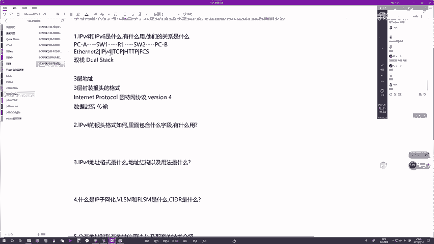

咱们来简单的看一下。好，大家能看到吧？能看到啊这个花花绿绿的就是咱们IPV4所定义的到头，对吧？那首先这个话头呢跟咱们上节课讲的以太保2和8。2。3的到头有本质的区别。那最大区别是什么呢？那要我来说。

就是我觉得这个爆头太方了，对吧方方正正的。哎，你为什么要长成方方正正的呢？你为什么不能像咱们以太保二跟8列的三的爆头一样，你搞一个直条嘛，对吧？我们来回顾一下之前咱们以太保二的爆头长什么样看一下啊。

我们的以太保的爆头。😊。

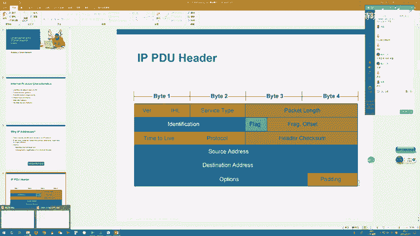

看一下啊。啊，以太宝的爆头涨的是。这样。

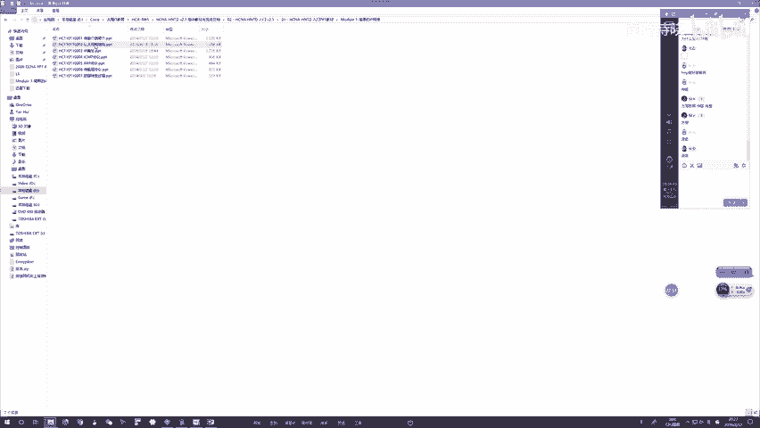

看一下。好，在这里啊，看到了吧？这个是以太网的爆头，它是这么画这么画的啊，802。3的爆头，它是这么画的对吧？很简单啊，从左到右对吧？从前到后嘛是吧？比较方便我们去研究里面内容。而这个IP的爆头哎。

你为什么要搞成这样呢？好，有原因的啊，有原因的给大家说一下。

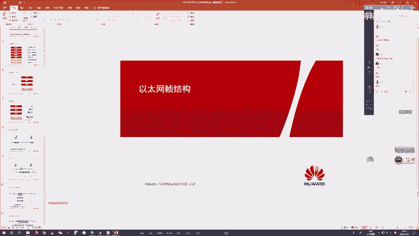

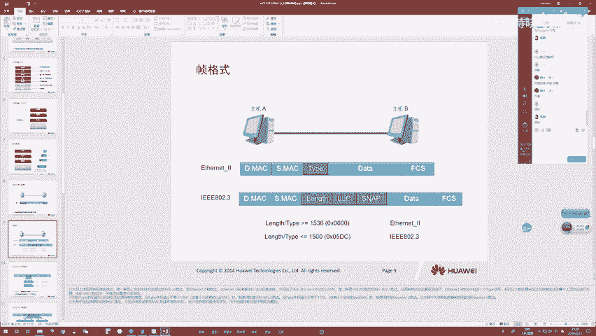

就是在咱们的所有封装的报头来看啊，三层、四层的规则要比二层的封装稍微多一些。你在使用二层爆头封装的时候，我们对二层爆头的格式啊没有要求，对吧？不要求你对吧？必须多少字节，不要求你必须能够被多少字节整除。

那所以说呢由于二层爆头本身内容就很少，在没有这种框框的，它就是框框架架这种条就是约束啊，那所以你在做二层封装的时候，你这个爆头，咱们一般就是你直着画就好了。因为本身没有多少内容，但是三层四层不一样。

因为三层四层爆头多了一个额外的规则，这个规则是什么呢？就是你爆头的长度啊，必须能够被四字节整除。😡，这一点是只有三层、四层爆头才需要遵循的，二层没有这个要求啊，三层四层才用对以吧？你的报头长度不能乱来。

你必须要能够被四字节证除，那所以说咱们在画这些三层四层爆头的时候呢，你就按照这种方块形式来画，可以吧？一横条代表的是四个字节，然后你有几行有几行就是四字节乘以几嘛，对吧？那大家仔细看一下IP报头多长。

它的报头123456，你看到的也有6行对吧？每一行四个字节，那看起来好像是有二十四个字节，对吧？4624嘛，但是请注意啊，其实IP爆头，它正常的长度只有二0个字节。那为什么后面四个字节不用看呢？

因为大家看它后面这四个字节是由这两个字段来组成的，一个叫optionoption翻译成中文叫什么意思啊？它翻译成中文叫可选项的意思。什么叫可选项呢？就是可有可无。你需要了，你就用它，你不需要了，对吧？

那你就一边2快去买，对吧？二爱呆哪呆哪，没有你存在价值是吧？然后接下来这个padding拍dding翻译成中文叫填充项。什么叫填充项呢？就是当你添加了可选项字段之后啊，如果说你添加了某些可选项字段。

添加完之后导致你这个报头长度啊，不能够被四字也整除了。我就在你这个可选项字段后面添加一些零。😡，给你把这个字段添加到重新，能能够能够怎么样被四字也整出为止。那这就是填充项的意思。

这就是说如果你没有可选项，你根本就不需要填充项。因为你没有可选项，咱们这个报头一共只有5行，对吧？本身就能够被四字节整除，你添加完可选项之后，才有可能会导致什么添加完这些字段。

导致你的报头呢不能被四整除。那这个时候你需要什么填充项来给你填充的，重新能够被四字也整除，这时候说说你没有添加，对吧？这个填充项，没有存在利益。那所以说从这个角度来看，你IPV4爆头其实分为两个部分。

前面五行，对吧？那这个是固定不变的，你IP爆头必须要包含的。我们称为叫IPV4的主爆头字段，对吧？这个主爆头字段就是20个字节，对吧？你无论怎么样，你都需要，对吧？你不管想不想你都必须要是吧？

而下面这个可选项可有可无，有了，对吧？那你可能添加一些额外的功能，没有也不影响咱们网络的正常通信。是吧那所以说呢由于可选项爆头啊，咱们一般呢是不会包含的。所以咱们在研究IPV爆头的时候。

咱们都会以主爆头为主，对吧？当然这可选项你想要用对吧？你也可以用它里面包含了一些比较高级的功能，比如你要做原路由功能，对吧？你要做一些什么跟踪的功能，你要做一些对吧？测试路径的功能啊。

你可能需要使用这些可选项字段，那这些字段一般什么时候用呢？就是当你网络工程师对网络做一些高级应用，做一些高级测试的时候，你会使用到里面这些功能，而你正常的网络通信对吧？你正常浏览的网页啊。

你正常聊个QQ啊，你正常在线听个音乐啊，你需要使用这些字段吗？啊，你并不需要对吧？那所以说啊咱们一般呢在讲解爆头的时候，可选项是不看的，当然大家如果真的想要了解可选项里面内容，那会给大家推荐一本书啊啊。

这本书呢是一本黑色的叫TCPIP协议卷一详情对吧？那这本书呢是。

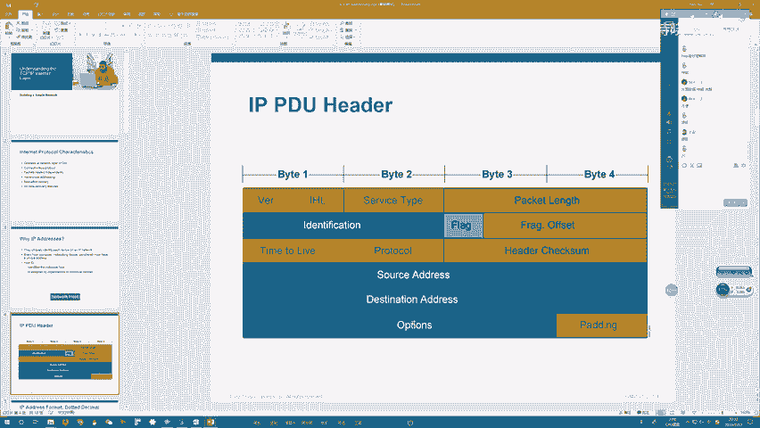

じスevenンシ。那这个even写的书里面呢，关于TCPIP里面的所有协议，所有暴图的所有字段都讲的非常清楚，对吧？包括IPV4可选项里面有哪些可用的字段，这些字段你在用的时候该怎么一个排序法。

每一个字段有什么用，什么时候用在计算机上，如果你要使用，对吧？你该通过什么样的方式来使用，那这边的话都有非常详细的讲解，大家如果想要了解的话，可以去研究一下，对吧？那当然在我们单元课中呢，对吧？

由于这些东西怎么说呢？😊。

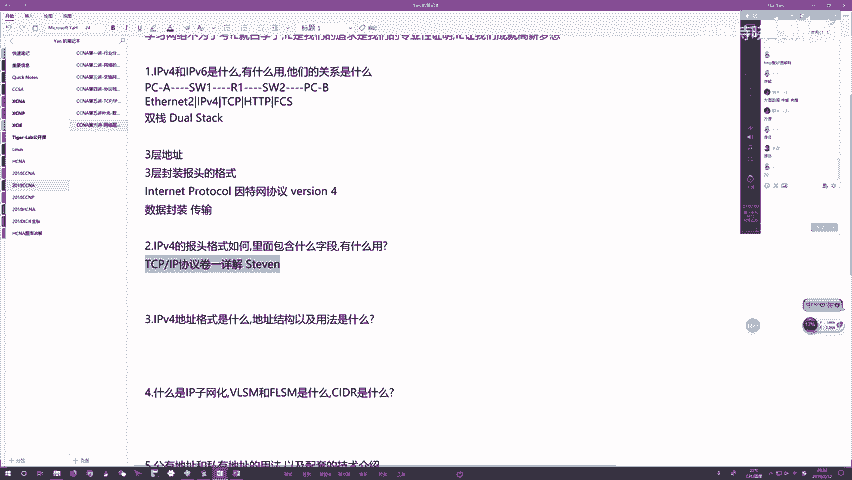

啊，对于咱们的路由选择协议，对于咱们的正常通信对吧？帮助不大，所以说咱们就不去看它，对吧？那所以说基于这点，大家现在有这么一个概念啊，IPV4所定义的爆头，它的长度是可变的对吧？

如果你没有添加可选项字段，它的主爆头长度是20个字节，对吧？这是IPV4爆头的最小长度值啊，那它的最大长度值多少呢？它的最大长度值是60字节。

你添加可选项，可选项里面最多能够包含40个字节的乱七八糟的功能。那所以说这些功作是很很强大的，很多很强大。你如果想要使用的话，对吧？你能用的非常花，就是你可以你可以通过这些字段来做各种各样的攻击。

我说句实话，如果你是个黑客，你想要做攻击，你就需要使用这些可选项字段，那当然你在做一些攻击防御的时候，对吧？你可能也需要。然后你在做一些网络测试的时候，可能你也需要，对吧？但是你正儿八经使用网络，对吧？

那这些字段你可以忽忽略啊，你可以忽略好吧，OK那接下来咱们就从主爆头开始一个字段，一个字段给大家讲解一下，简单讲解一下。😊。

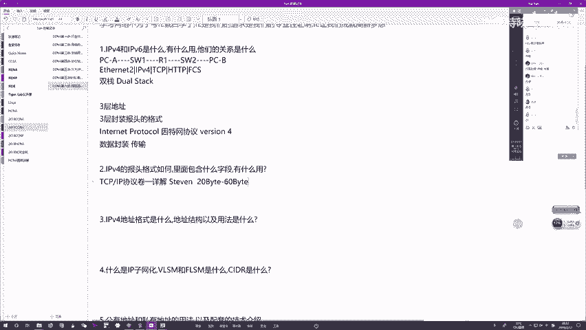

那这个爆头咱们怎么看呢？哎，它这个爆头是这么排序的，哎，从左到右从上到下可以吧？这个是第一个字段啊，第二个字段，第三个、第4个56789101112可以吧？主爆头一共有12个字段。那接下来你跟我讲啊。

先从第一个讲起。

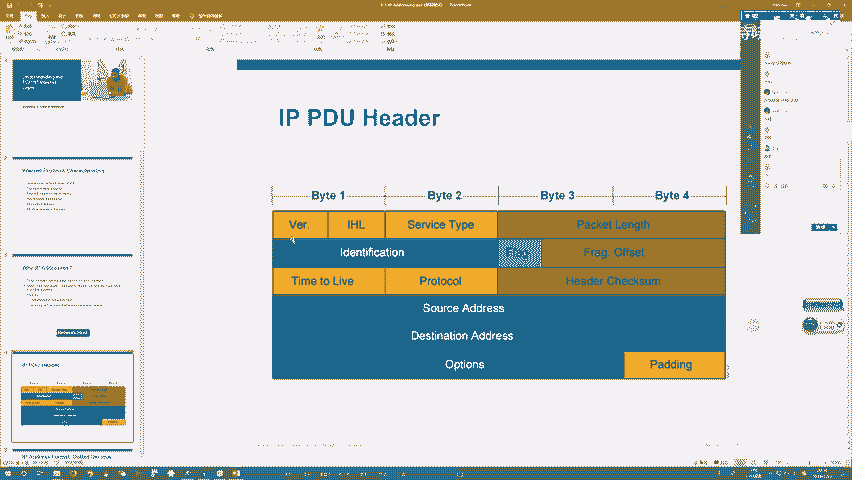

这第一个字段叫什么呢？第一个字段VER，它的全称是什么？它的全称就是version啊，全称就是version翻译成中文叫版本，对吧？那既然这是IPV4了，V4V4。

你第一个字段就是介绍咱们这个协议的版本，对吧？那自而然就是死，对吧？它是固定不变的。然后接下来第二个字段是headless，这个叫爆头长度，对吧？这个字段我们称为叫header。

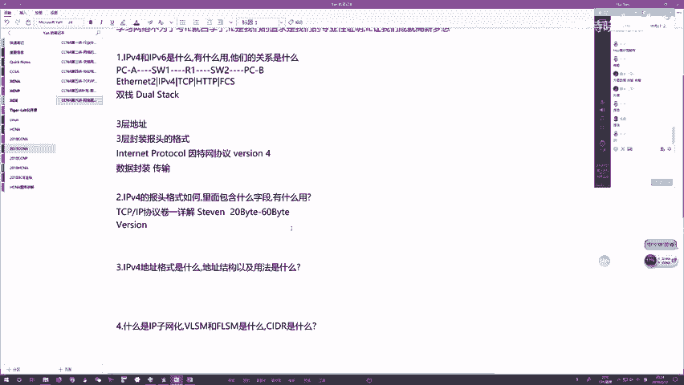

Les。好，这个叫爆头长度，对吧？爆头长度，因为你IPV4爆头长度可变的啊，你可能会添加可选项，你添加了爆头长度变长了。如果你没有添加，它默认是20个字节，对吧？

那所以这个时候咱们需要这么一个字段来描述我们这个爆头到底有多少字节，对以吧？那就通过这个字段，咱们来描述一下。

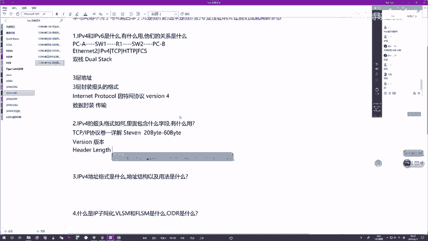

可以吧，那当然通常情况下它都是20啊，通常情况下都是20。如果你添加了可选项，那你添加完之后，咱们实际报道多少字节，这里就会显示它多少字节，可以吧？OK。然后接下来第三个字段啊。

当然你们不用看这个胶片啊，胶片写错了，胶片写错了，不叫service type，它叫什么呢？它叫t哦service。

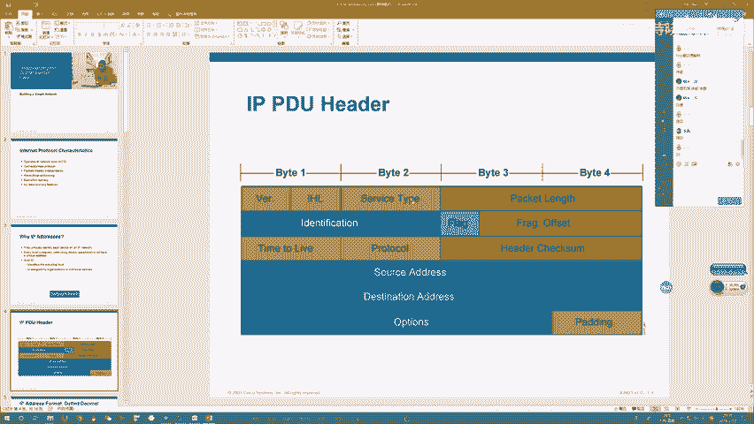

它叫cap of service，简称叫TOS啊，简称叫TOS。那这个翻译成中文我们称为叫服务类别，对吧？叫服务类。那这个服务类别有什么用呢？唉，它是用来做QS的，用来做QS叫服务质，这个叫服务质。好。

这个服务质量什么意思呢？也给大家讲简单讲解一下啊啊，我们之前呢也说过，你在组建一个园区网的时候，对吧？你在给客户组建一个企业网的时候，这个企业网内网咱们一般用什么设备啊，对啊，都是交换机，对吧？

你用交换机，然后呢你用路由器是吧？这种交换机和路由器，你在组建内网的时候啊，那大家也都会知道你交换机路由器的接口少说也是百兆的对吧？你要买稍微高级点的路由器交换机，你接口还有千兆，再高级点。

咱们还有万兆的4万兆的10万兆的，对吧？简单来说啊，你的内网在组建的时候，只要你肯投钱，只要你肯买设备，对吧？你的链路带宽基本是无线的，这个1万兆带宽是什么概念啊？😊。

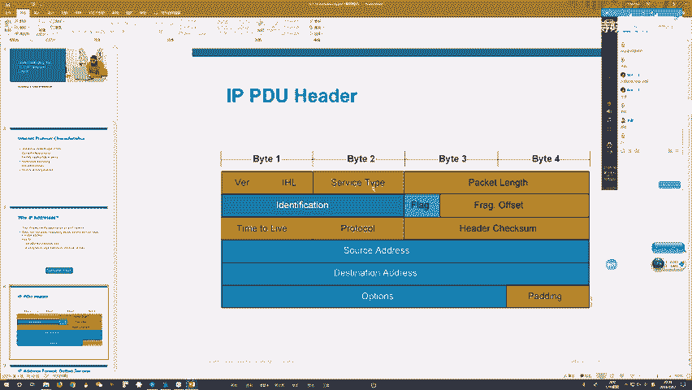

这个概念就是以当前应用角度来看啊，你跑任何应用，你都不可能会导致10万兆的网络拥死。因为这个10万兆带宽太高了，对吧？你任何应用哪怕你在线看1080P的电影，对吧？你都耗不了这么多，对吧？

那所以说了内网带宽是非常有余的非常有余的，你根本用不进。但是呢咱们也都知道一个企业网不能光有内网，你除了内网，咱们还需要外网连接，对吧？你这个外网连接，那咱们一般你不能说是自己连线啊，你要找什么。

你要找电信运营商，对吧？你要办理业务，对吧？你要办理宽带，我不知道大家有没有关注啊，啊，当前电信宽带最高贷宽多少。😡，我不知道你们自己有没有办宽带。😡，你们大了应该知道吧。

电信当前的最高的宽带带宽终于升级到1000兆了，终于升级到1000兆了。但是这个1000兆醒之后，你还办不了，你办不了，你们可以办断试试看啊，办不了。那办不了的原因有两个，第一个就是特别特别贵。

我咨询过价格，虽然我知道不同的城市，不同的省份，你这个千兆带宽价格肯定不一样，有的稍微便宜一些，要吧有的贵一些。好，告诉大家啊，这个千兆在南京的价格是9991个月。9991个月。这个999什么概念？

它的第二梯队的500兆的宽带价格只有299。可以吧？你这个1000兆的多了500兆，你是999，价格太高了，价格太高了，非常高，这是第一点。第二点，你办了千兆的宽带，真的能够享受千兆带宽服务吗？

你享受不了，你享受不了，为什么？因为你对吧？不是说所有的环境，咱们的楼层交换机都换到千兆下行接口。那你交换机的接口没有千兆，你光拉开光纤，你觉得能达千兆吗？你达不到，你达不到。

这个是电信那边的人如实跟我说的，你现在花999，你办一个宽带，对吧？好，你楼层交换机大带宽达不到，对吧？就算你楼层交换机大带宽能达到啊，你楼层交换机，对吧？在你优测的时候，在你高峰期的时候。

你上行带宽会不会优色，这个都不好说。然后接下来咱们现在的使用网络习惯就是对吧？你办一个宽带，然后你再买一个什么无线路由器嘛，其实那个叫AP啊，你买1个AP对吧？你买1个AP，你连在这个猫上，对吧？

你通过AP。😊，好，然而你正常的PC怎么样？你PC和手机关联到EP啊，你通过无线上了。而这个无线当前最新的标准802。11AAX啊AX对吧？这个标准说是能够达到千兆，那未必可以吧？

未必那所以说呢满打满算啊，咱们当前你在办企业宽带的时候，你最多就是办1500兆对以吧？你最多办500兆的，并且非常讽刺的是啊，你办1个500兆的宽带，你的带宽都达不到500兆。我测过啊。

下行带宽最多也就是300来兆，对吧？上行带宽比较高啊，上行带宽100兆，而下行带宽最多就是300多兆，对吧？高峰期的时候300兆，然后呢，没人用的时候，可能350兆，370兆是这样。

那所以说得出一个结论，这个结论是什么呢？就是你在组网的时候啊，你的内网带宽是非常非常充裕的。但是你的外网带宽是非常非常不足的对吧？那这会导致什么呢？这会导致你一个应用在内网部署完毕之后啊。

你这个流量在内网转发没有任何问题，绝对不会拥色啊。但是当你这股流量来到达你企业的边界路由器，从你边界路由器要到达运营商网络的时候，在这个段。

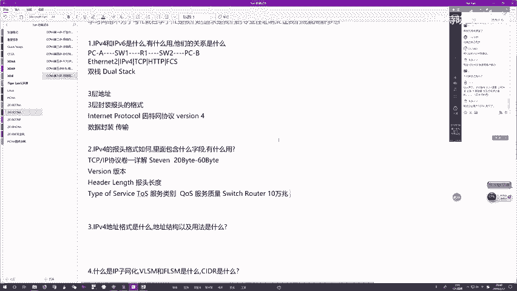

它可能会由于带宽不足，导致你什么应用产生优色。那大家也都知道你优色是什么情况，就是你发送流量发的太快了，你的出接口的带宽对吧？达不到这么高的速率，对吧？你发不走这么多数据，你数据量太大，我带宽不足。

导致你有些数据啊，由于带宽不足，没有办法被立即转发，那这就会产生优色。那优色比较轻的体验是什么呢？就是你这个应用在使用的时候可能会觉得比较卡顿，可吧？这是比较轻的啊，在比较严重的情况下，那就不是卡顿了。

很有可能会导致什么？你这个应用根本导致就是有些数据根本发不走，对吧？你带宽不够，我排队想要发，对吧？但是这个对它是有空间大小的，你这个队如果排满了，那那些排不进队的那些包，他们就可能会被直接丢弃。

那所以说优色导致两个结果啊，一个就是延迟增加，对吧？一个就是网络抖动，还有一个就是数据丢包，对吧？这就是数据丢包，那接下来这个延迟增加网络抖动数据丢包，影响大不大呢？你得要看你得要看你不能一概而论。

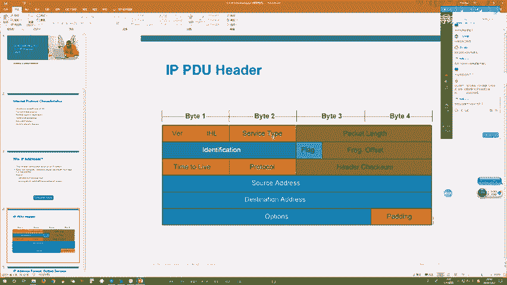

你说的影响大，那真的很大，你说的影响小，对吧？那对于有些应用，它影响确实没有那么大是吧？那为什么这么说呢？原因是因为在我们当前这个网络中啊，已经非常非常多元化了，我们网络中的应用类型有很多。

有些应用产生的数据就是数字型的数据，对以吧？就是你发送一些正常的data文件啊，对吧？你发送一些报表啊，你发送一些表格啊，你发送都是正常的数据，而有些应用它产生的就不是数据啊。

它产生的可能是语音或者视频，对吧？它产生的语音或者视频。然后接下来有些应用对吧？对于企业可能比较重要，有些应用应用怎么样？对于企业可能它也有用啊，但是没有那么的重要，没有那么的关键。

那所以你会发现咱们网络线特别多元化，里面的应用五花八门产生的流量也各有差异，而不同的应用，它们产生的流量，由于属性不同啊，那就导致了在你网络用色的时候，你延迟增加，你网络抖动增加，你丢包增加。

对于不同类型的应用，它的影响是不一样的。有的应用对吧？我就不怕你丢包，你丢包我挂不了再发一次呗，对吧？你延迟大也无所谓啊，对吧？但是有的应用你延迟一大，我靠，我这应用根本就玩不了了。

对就比如说你在线打一个电话，对吧？你在线打一个电话，我说一句话，如果你能秒听到，并且非常清晰，那这个电话还能打，对吧？如果说我给你说一句话，咱们当前网络比较庸涩啊，我说一句话，你隔个两秒才能听到。

你能忍吗？你根本忍不了吧，咱们这个电话打不了了，更别说我给你说一句话，你不止两秒收到，你可能3到4秒收到，那这个就根本没法用了，或者说我给你打电话，你虽然没有那么高的延迟，但你收到的话音非常模糊。

你根本听不清我来说什么，那这个电话有存在的意义嘛，就没有了。😡，比如你在线开个视频会议，对吧？你画面特别模糊，你这个会议能开吗？你视频开一个会议，我说一句话，别人半天听不到，你这会议能开了，你开不了啊。

但是你发一个email，这就无所谓，对吧？你发一个email，反正里面就是一些文件嘛，对吧？里面就是一些文字嘛，对吧？你发个email，对方秒收的跟你发一个me，对方隔一分钟收到有影响吗？没影响，对吧？

我给你发个email丢包又么怎么样呢？你给我提示一下，说没发成功，我再发一次不就好了吗？对吧？那所以说由于不同的应用产生的流量类型不同，对吧？他们对延迟的对吧？影响，他们对丢包的影响也不一样。

那所以说在网络中呢，咱们要做一个差异化的处理，对吧？我们要做一个差异化的处理，我不能让你这些网络设备收到数据之后啊，一视同仁，对吧？都是先来先到，先来我。😡，先给你转发，不能这样，因为咱们不同的应用。

对吧？你们的啊延迟的算是敏感度，你们的丢包的敏感度不一样。那咱们要尽可能的保证在你网络优涩的情况下，那些对延迟丢包比较敏感的应用，你们产生的数据，我给你优先转发，我让你这些数据尽可能的感受不到延迟。

尽可能的感受不到丢包，就是保证你就算在网络优涩的情况下，这些延迟敏感流量，也能高效率的被发走，而那些对延迟不那么敏感的，对吧？那些应用，你反正不敏感嘛，我就给你迟点发送，对吧？就算你先来了。

我可能也会让你后发，对吧？我给你稍微糟糕延处理，反正无所谓吗？你能扛得住吗？对吧？你没有那么大的影响嘛，对吧？你不能敏感嘛，是吧？我就给你延迟点发送。那这个行为我们成。什么呢？这个行为我们就称为叫QS。

QOS存在的根因是什么？就是你外网带宽是永远不够的，你不可能让电信运营商给你办理一个特殊的宽带，让你这个宽带带宽啊跟你内网带宽一样，这是不可能的那所以说了，由于外网带宽低，内网带宽高。

所以你从内到外也好，从外到内也好，都一定会出现拥塞。那既然庸色是不可避免的那咱们就要尽可能的保证当你庸色产生的时候，对吧？咱们要让那些延迟敏感丢包敏感的应用好受一些。我们要让那些延迟不敏感。

丢包不敏感的应用，对吧？我让你再糟糕一点，反正你无所谓嘛，然后对于那些比较关键的应用，我给你转发麻利一些，对吧？对于那些不那么关键的应用，哎，你就忍一忍，对吧？我让你转发稍微延迟一些，那这个就是QS。

那QOS所干的事情很简单，就是在有线带宽的情况下，对吧？尽可能保证那些比较关键的应用，尽可能的保证那些延迟丢包比较敏感的应用。你们所产生的数据能够被优先发送，能够被高质量的发送。

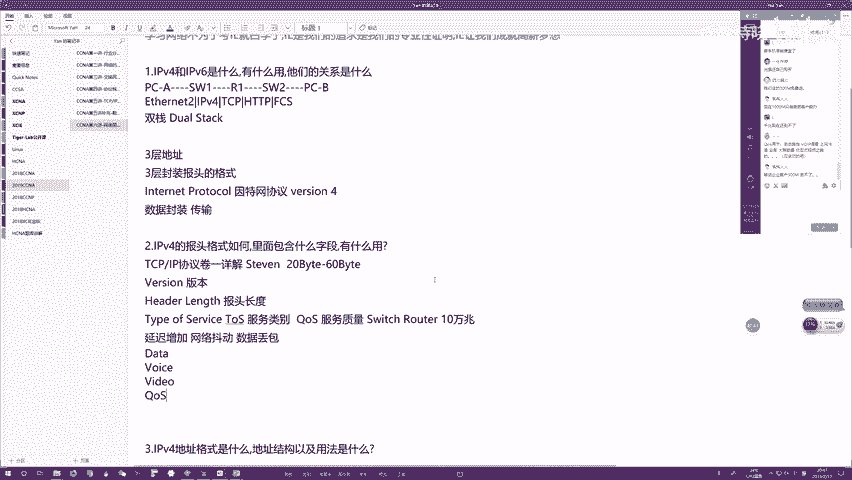

好，这就是QOS对吧？那接下来就是QOS你想要做，唉，你需要两步来做。第一步呢就是你要给流量上色，对吧？比如说你要给哎像什么电子邮件流量啊，染上黄色，你要给语音打上蓝色，对吧？你要给视频打上红色。

你给不同类型的流量打上不同的颜色，对吧？那这样好处是什么呢？就是当你网络设备收到数据之后，你只要一看数据的颜色的时候啊，视频流量，对吧？优先转发语音流量优先转发，而你电子邮件啊给你放慢一些是吧？

方便咱们网络设备来识别不同的流量类，然后接下来第二步就是你要在网络设备上定义好策略，对吧？比如对于语音流量该怎么一个优先的转发，对吧？对于视频流量，该怎么一个优先转发，而对于咱们电子邮件流量。

你又该是一个什么样的方式来转发，对吧？你要做好这个策略。okK那接下来咱们的流量上色怎么上色呢？你没有办法真正给它上色啊。一般所谓的流量上色，其实说白了就是给你这个流量打上一个标记。对吧。

那Q标记最最最有名的就是咱们IP爆头的这么一个三层标记。而这个三层标记就是利用咱们这个字段，对吧？利用咱们这个字段给不同类型流量打上不同的值，比如你语音流量对吧？这个字段，咱们打一个5。

视频流量打一个4，姓令流量打一个3，关键业务流量打一个2，普通的数据流量打一个一，而咱们的上网的冲浪流量打一个0，那这个时候通过这个字段不同的值，咱们网络设备只要一查看，就能知道啊，你是哪个类别，对吧？

针对你不同的类别来给予你不同的转发处理带。OK了，这就是第三个字段作用。然后接下来第四个字段，咱们称为叫豹文长度。那当然这个豹文长度很简单了，就是连同三层报头在内的整个数据包有多少字节，对以吧？

这就是第四个字段。然后接下来567三个字段结合在一起啊，用来干一件事，我们称为叫三层数据切片，那这个三层数据切片怎么回事呢？也来给大家说一下，我之前跟大家讲OSI的时候跟大家强调过啊。

就是你应用呢产生的数据五花八门，有的应用产生的数据可能会比较大。而有的应用产生的数据可能会比较小。而这个时候为了保证咱们应用产生的数据能够被转发走。

你一定要保证咱们这个数据的尺寸啊是可控的那所以说了OSI定义的传输层的协议，对吧？其实要干两件事儿。

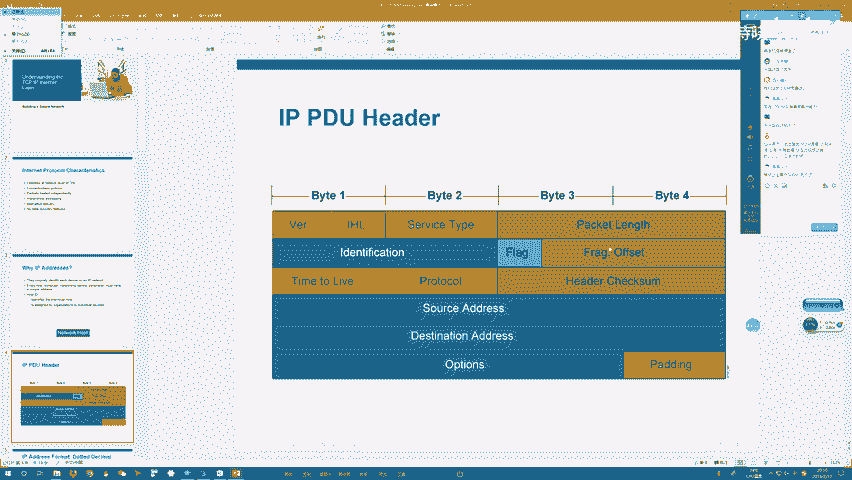

第一件事儿是什么呢？就是它要针对咱们应用程序产生的数据流啊来做一个数据切片。对吧做完数据切片之后，我再在每个数据分片的前面添加一个四层包头，形成数据段，对以吧？那这个切片呢咱们称为叫四层切片，对吧？

咱们称为叫四层切片。那大家为什么叫四层切片？很简单啊，因为你这个切片的工作是由四层协议来做那接下来我来问大家一个问题。你四层协议做完数据切片之后，你真的就能保证你发送的数据的尺寸。

满足咱们接口的这么一个要要求吗。对，因为咱们一般当前用的都是以太宝嘛，对吧？在以太宝的环境中，咱们有1个MTU的这么一个参数啊，这个叫最大传输单元。这个最大传输单元，这个参数用来约束什么呢？

就是用来约束你通过一个以太宝接口啊，你发送的数据最大多少字节。这个MTU呢默认值是1500字节，对吧？默认是1500字节，这也就是说你通过一个接口发送的数据包，如果你的尺寸超过了1500字节。

不好意思啊，你发不了，你不能被发送，能理解吧？你必须要大小小于等于1500字节，我才能给你发送。你如果超过100字节。你就发不了，对吧？你就发不了。OK那接下来我就问大家这个问题啊，你经过四层切片之后。

你真的能够保证你数据在发送的时候，能够满足咱们MPO限制。一定能。一定能吗？我觉得答案是否定的啊我觉得答案是否定的。因为在我们的网络中有这么一个工具，我们称为叫VPN。基本上80%以上的VPI。😡。

它利用都是over类的原理啊来做一个数据处理。这个over类指的是什么呢？就是给你这个数据啊添加一些额外的封装，对吧？给你数据添加额外的封装，来实现欺骗，对吧？

咱们通过欺骗来让这个数据啊在特定的环境中能够被顺利传输走。就比如说举个例子，哎，咱们现在有这么一个环境，主机A连接路由器R一，中间的是咱们的in刻，对吧？然后呢连接另外一个园区的边界R。

然后呢连接内网的主机BOK那这个时候A和B呢，它们都是内网主机啊，内网主机一般咱们手拿IP地址时候私有地址。而这个私有地址。公网路由器是不能识别的那这个时候如果你希望A跟B之间通信怎么样呢？

你需要在R一跟R2之间建立一个VPN，而所有的VPN里面最最最基础的，就是加EVPN咱们称为叫通用路由封装，而这个加EV片的原理什么呢？很简单，就是给你这个A和B之间通信的数据啊，额外的添加一个报头。

比如你A访问B原本的数据是什么样的？假设是HTDP啊，HTDP前面添加TCP对吧？前面添加IPV4，然后接下来前面添加一个以汉网2的针头，后面添加一个FCS针O你正常发送数据是这样的。

并且在你这个三层报头里面，我们原地址就是A的地址，目的地址就是B的这很遗憾啊？A跟B的地址都使用私有地址，这种私有IP地址，咱们公网路由器能够识别吗？它识别不了。

所以说如果你但凡要敢把这个包啊发送给运营商，运营商的边界路由器收到这个包一看，唉，目的地址是个私有地址是吧？我不能识别，我就给你丢弃了。那为了避免公网路由器给你丢包。在R一跟R之间作为VPN之后啊。

R一如果要通过VPN来发送这个数据。那当然其实最终数据啊，还是通过物理接口发走，只不过我在发送数据的时候呢，会经过加EVPN的这么一个额外处理处理的手段是什么呢？

就是在你这个三层数据包的包头前面添加一个GRE的爆头，并且在你加RE的报头前面再添加一个额外的IP爆头。而这个外部的IP爆头，原地址是R一的公网接口的公有地址。而它的目的地址是R2的公网接口的公有地址。

那接下来咱们这个数据包啊添加了两重IP爆头。那接下来咱们路径中的网络设备，收到这个数据包之后，他们能看哪个爆头呢？请注意，他们只能看外部的IP爆头。因为我们说过啊，你想要看内部的内容。

前提是要把外部的报给拆掉。而由于咱们中间这个网络设备，他们没有理由拆这个外部的IP爆头，所以说他们这辈子都看不到内部到底是什么内容，他们只能看外部爆头。然后接下来通过查看外部的爆头。

他们会以为啊这个数据包是由R一产生的，发送给R2，而由于R一跟R2的原目地址都是公有地址，对吧？那他们是能够识别的。他们能够知道R一跟2在哪里。那所以说他们就能够一跳跳转发。

最终帮我把数据从R一发送给R2。然后接下来R收到这数据之后一看哎目的地址是我自己我是接收方对吧？那我就拆包拆包之后一看啊有个GRE爆头。一看到GRE他懂了，他就知道这个GRE的后面还有一个。

新的IP爆头。然后这个爆头一看发现啊，原来这个包不是啊一发给我的，而是主机A发给主机B。那由于我这个R路由器作为一个企业边界路由器啊，我是连接咱们内网，所以它既能识别公有地址，又能识别私有地址。

所以它就能根据B的私有地址来锁定B所在的位置，然后来做进一步的数据转发。那这就是所谓的over类技术，什么叫over类技术，就是给你一个原始的数据包，添加额外的封装，尤其是添加额外的三层报告封装。

给你添加一个额外三层报头，通过设置一个新的原模地址来欺骗咱们的公网路由器来实现咱们一个对吧？特殊环境下的联通性的这么一个目的。那这就是over类技术的这么一个工作原理。那基本十有八九啊。

咱们VPN都是使用这样的技术来实现咱们联通性的这么一个哎。そな？那接下来请注意，咱们可能会出现这么一个情况，就是你主机呢是不知道VPN存在的，对吧？

你四层切片是基于没有overlay的情况来做切片的那所以说如果你没有做overlay啊，你没有做VPN，你正常发送数据。那没有错，可能你的切片对吧？是满足咱们MTO限制，对吧？你切片完之后。

我封装封装完的数据包，对吧？大小是小于等于100字节的，但是如果说你要考虑到了overlay因素之后啊，这个就不好说了，因为当你添加完overlay的爆头之后，对吧？你原本可能这一段是1500字节。

但是添加了额外两个爆头，对吧？那的大小可能会超过1500字的限制，那导致什么导致你过大而无法被发送。那无法被发送，你真的能够直接丢弃嘛，对吧？你真的直接丢弃，咱们的网络就不通啊。

那为了保证咱们网络还能通，那在这种情况下，三层也能。

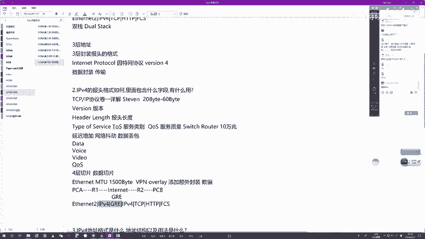

能给数据做分片，对以吧？那这个分片咱们就称为叫三层分片，对吧？那当然三层分片呢IPV4IPV都都能支持，对吧？那当然IPV4呢用的会比较多一些。所以它会把三层切片需要使用的字段哎全写在爆头中。

那分别就是通过这三个字段啊，叫标识符标记和分段偏移量，对吧？来实现咱们的三层分片的种种功能。那接下来我们先来从标识符讲起啊，先来从标识符讲起。

这个标识浮字的怎么用呢？哎，其实很简单，对吧？你现在一个原发送数据给目的地。假如说由于这个over类技术存在啊，你发送的数据对吧？经过额外的封装变得太大了，没有办法被发走。那这个时候呢。

咱们就采取什么三层切片。那切片，比如说我A给B发送两个数据，一个是数据包X一个是数据包Y，那数据包X呢，咱们被分成了X1和X2，而你数据包Y被分成了Y一和Y2，那按照常理来说，给你发送数据怎么发。

肯定是先发X1再发X2再发Y一再发Y2，对吧？先发小再发大的这这这是常识啊，肯定会这么发。但是呢你在发送数据的时候，不是说你一发接收方就能立即收的，你数据在保证上传对吧？再传就需要时间。

这个时间咱们就称为叫传输延迟。😊，叫传输延迟。这个传输延迟请注意啊，它可大可小，对吧？可大可小，因为你网络中的路径很多，你有可能传输第一个分片的时候，咱们使用路径A路径A的延迟可能会比较大。

而你发送X2分片的时候，你使用路径二路径B。这个路径B可能延迟比较小。那所以说可能会导致一个结果啊，就是你先发的分片可能会后荡。你后发的分片可能会先到。那所以这个时候接收方收到了XCX2Y12。

有可能是会混在一起的。那这个时候你就需要让接收者能够知道哪些分片是属于X的，哪些分片是属于Y的对吧？你要让他们知道哪些分片是属于哪个数据包的哪些分片是属于另一个数据包的那接下来怎么时间呢？

就是通过标识符，对吧？当你在做数据切片的时候，你会把属于相同数据包的所有切片打上相同的标识符的值，比如说了X对吧？你给它打上一个标识符100，那这个时候X一和X2啊，它们对应的标识符都是100。

而Y你打上标识符200，那这个时候Y一跟Y2Y2啊，它的标识符都是200，那这个时候在传输的时候就算乱序的对吧？接收方收到的数据是打乱的对吧？混在一起的你也不用担心会有任何问题产生，对吧？

因为一看标识符啊，这两个是属于一个数据包的对吧？这两个是属于另一个数据包，对吧？你就不用担心对方给搞混，那这就是第一个字段。作用。然后接下来第二个字段呢，我们称为叫标记啊，它叫flag，叫标记，对吧？

这个标记字段是整个IPV4爆头里面最小的字段啊，它一共只有三比特。

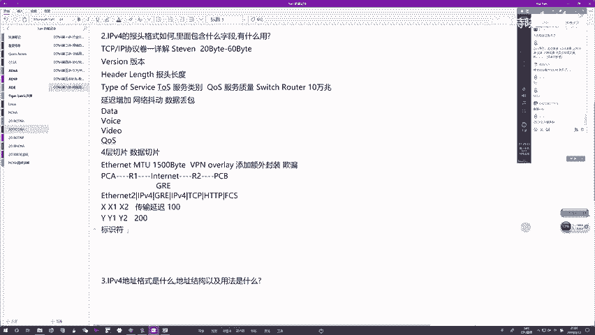

一共只有三个位，并且它的最高位。咱们还没用，它横为0，咱们只使用了其中两个位啊，一个是中间的位，一个是最靠背尾部的位啊，这个中间的位我们称为什么呢？中间的位我们称为叫DFV。然后接下来最靠右的位。

我们称为叫MFV。

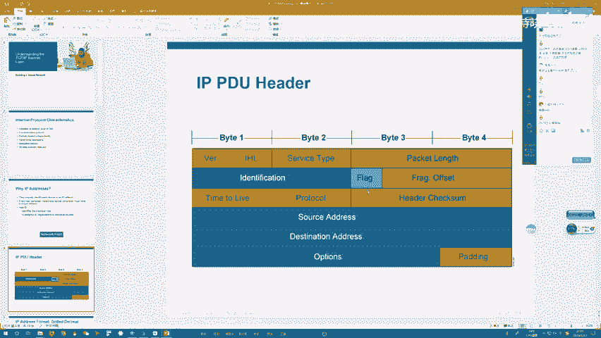

这个DFV的全称叫什么呢？叫don't。Fragment。So don't fragment。😡，这个MS位我们称为叫morefrgment。对吧一个叫不要分片位，一个叫更多分片位，对吧？

那接下来这个不要分片位顾名思义啊，当这个位置一的时候，就是不允许三层切片，对吧？如果说这个位置为零呢，那就是允许三层切片，对吧？你可以在流量的原在发送数据的时候，选择这个位到底是制零还是至一。

那当然这个位如果你没有设置的话，它默认是制零的对吧？就是允许你切片，那当然如果你要制一的话，那就不一样了。你如果把这个位置一了，啊，那假设对吧？你经过了这么一个VPN。

然后你通过over类给你这个数据呢添加了一些额外的封装，封装完之后导致你这个尺寸啊，超过咱们MPU的限制，不能被发送了，那咱们能不能切片呢，不能一看到DF的唯一啊，就是不允许你切片。

那所以这个时候不允许切片，那咱们唯一的手段啊，就是丢弃。因为请注。不一样，当然你发送的数据尺寸超过MTU限制了，你只有两个手段，要么就是分片发送，要么就是丢包，对吧？那既然不允许你分片。

那咱们就只能丢包。那接下来这个DF会置为一咱们一般有些什么样的应用的。这个应用还是挺有用的。这个应用咱们称为叫PMTUD对吧？咱们可以实现这么一个应用，解释一下，这个应用咱们称为叫路径MTU检测。

路径MTO检测使用这个机制咱们能实现什么呢？就是端到端来测试一下，对吧？我们这个路径的最小MTO是多少，对吧？测试出来路径的最小MTO之后啊，我们可以按照这个最小的MTO来封装数据。那这样做的话。

你在端到端传输的时候，不管你有没有VPN啊，你都不用担心你发送的数据超过MTO的尺寸。也就是说你端到端通信永远不需要三层切片。这样的话能够增加咱们传输质量。请注意啊，三层切片非常消耗资源。

并且三层切片非常非常的慢。并且在你网络拥塞的情况下，三层切片可能会进一步的恶化咱们的网络庸塞的结果，那为了避免这个情况，对吧？三层切片是能不做尽量不做。

那咱们可以通过路径MTO检测来检测咱们端到端的最小MTO那这个怎么检测呢？其实很简单，对吧？就是A给B发送数据，对吧上来发送数据肯定是根据我这段链路的MTO啊来做一个数据封装，可以吧？

然后接下来我把这个DFA设为一。那接下来如果说你中间跨越了某一个网络中间跨越了某条链路，这个网络或这个链路，对吧？它的MTO呢比你这个原主机所在网络的MTO要小，对吧？那这个时候它叫尝试分片。

结果一看的DFA为一不给分片，对吧？它就会丢包，并且丢包的同时，它会给原主机呢返还1个ICMP的报错报。这个报错报端会告诉你原主机，你所发送的数据呢没能到达目的地，它被我丢弃了，并且丢弃的理由是什么呢？

是因为你发送的数据太大了。😡，你发的数据太大，超过了我的发送接口的MTO限制，并且你又不允许我切片，对吧？我给你发送一个数据过大这么一个丢弃报备，并且我会好心的告诉你啊，我的出接口的MTO是多少哎。

既然你不允许我切片，那请你下次发送数据的时候，怎么样使用我这个MTO来做数据封装，对吧？那接下来原收到这个反馈之后呢，它就会按照这个较小的MTO啊来做第二次数据封装，然后发送。

那接下来这个数据如果能够到达目的地，那就OK了。如果不能到达目的地又被丢弃了，对吧？那丢弃路由器又会告诉你一个更小的MTO你就会使用这个更小的MTO啊来做第三次封装，对吧？那咱们这一次一次测试啊。

直到咱们最终接收者能够收到数据，那接下来只要你发送一个数据接收者能收到那这个时候你所使用的MTO啊，就是咱们路径所能支持所能允许的MTO你按照。这个MTO来封装数据，对吧？我管你中间经历了什么。

我管你中间有没有VPN，反正你不用担心过大，你不用担心三层切片，那这样能够保证咱们端到端的质量，那这就是一个对吧？基于DFV至一的应用，对吧？那一般你管理员咱们在发送数据的时候。

就可以通过手工的方式啊来指定这个DF到底要不要置为一，如果你要置为一的话，对吧？你可以把你这个数据的MTO填大一些，然后来测试咱们端到端路径的这么一个MTO的情况，对吧？

你是可以这么做的那当然你默认情况下上网啊，你正常发送的数据包，这个DF位都是置为零的对吧？那当然质为零的话，对吧？你就没有办法哎，来检测咱们路径MTO了，因为如果你要发现这个MTU不够，对吧？

比如我们这个报文的尺寸要小，对吧？它可以给你做三层切片，三层切片最终咱们这个包含什么通信的啊，还是能够到达目的地的对吧？那所以说这时候对于云而言。他就不知道咱们中间的路径，对吧？它的MTO最小是多少。

可以吧？OK那接下来这个MFV有什么用呢？请注意啊，这个MFV呢啊当然它就比较简单了，它用来描述苯分片对以吧？苯分片。😊，是否是该数据包的最后一个分片，对吧？是否是该数据包的最后一个分片？

因为所谓的分片是什么？就是你把一个数据包分成多个子数据包嘛，对吧？每一个子数据包我们都称为叫一个分片。那你分片有排在前面的，有排在后面的对吧？那你最后一个分片，对吧？那就是末端分片嘛。

它的MFV就值为0，你前面的分片。排在前面嘛，对吧？你后面还有其他的分片在你的MFV呢就置为一一代表就是我身后还有其他分片存在。零代表就是我是最后一个分片，可吧？OK那通过这个字段，对吧？

你可以让接收者啊得知我收到的这个分片啊，对于整个数据包而言，是不是最后一个，如果你最后一个都收到，那就代表这个完整的包，你已经收权了。如果说你最后一个分片没收到，那可能出现很多问题啊，比如说你传输丢包。

对吧？我给你把一个数据包分成了三个分片，前两个到啊，最后一个没到，对吧？那可能会出现这种情况，OK那这就是MFV的作用。不れ。嗯。🤧请注意啊，这个MFV它不像DF位，你能够手工的设置。

这个MF是自动的啊，就是你排在前面的分片，它就是一，你排在最后面的分片就是零，这个是不可控的啊。主要咱们通过这个字段用来告知接收者，你收到这若干个分片，对吧？在接收的时候有没有丢包。

因为如果没有丢包的话，对吧？针对每一个数据包，你收到的最后一个分片可定是零嘛，对吧？当然如果丢包了，对吧？就不好说了，那所以说可以通过这个咱们来测试一下，对吧？有没有问题，O那这是第二个字段。

然后接下来第三个字段叫什么呢？第三个字段叫分段偏移量。叫分段偏移量，这个分段偏移量是干嘛呢？请注意啊，它是干这么一件事的。就我们今天说了，你原在给目的地发送数据的时候，你肯定是按顺序来发，可以吧？

先发前面的分片，再发后面的分片，可以吧？那接下来你发虽然这么发，但是你接收方收就未必这么收了，对吧？因为你在接收分片的时候，对吧？很有可能会由于传输延迟问题啊，导致原先发的分片，你后收到原后发的分片。

对吧？你先收到可能会出现这么一件事儿。那如果你出现这件事儿。😡，那虽然说咱们通过标识符啊，你能够让接收者知道哪些分片是属于哪个数据包的，哪些分片是属于另一个数据包的。但是你怎样让他知道哪个分片排在前面。

哪个分片排在后面呢，对吧？比如说你这个X是一个很大的数据包，你在发送的时候呢，把它分成了三段，X1X2和X3，对吧？你把它分成了这三段来发送走。那接下来你发送的时候出现乱序，别人收到的是X3X1X2。

那这个时候虽然别人知道X3是最后一个分片，但是X1跟X2，谁排在前面，谁排在后面，对方能不能知道就不能知道。如果说对方不能知道这一点。😡，怎么重组啊，就没有办法去正常重组。

你没有办法重组你这个数据包通信就算是失败。所以为了方便咱们接收方重组这个数据，你必须得告诉他，咱们哪个分片在前面，哪个分片在中间，哪个分片在后面，那这个就是由分段偏移量这个字段来实现的。

那分段偏移量字段是一个很简单字段啊，它会根据咱们每一个分片所处的数据包的位置，对吧？来标识这么一个值，比如说你第一个分片，第一个分片的分段偏移量肯定是零，对吧？它肯定是零，因为我是针对整个数据包啊。

从第零字节开始的，我是排在最前面的，对吧？我没有任何偏移，然后接下来假如说你第一个分片啊，假设啊第一个分片字节数是1300字节。那这个时候你的第二个分片，它的分段偏移量就是1301。

这个1301指的什么呢？就是针对整个数据包啊。我是从1301字节开始的，我的前1300字节是另外一个分片，对吧？我是从1301字节开始的。那接下来假设第二个分片是1000字节，对吧？

那接下来咱们第三个分片的分段偏移量啊，就是2301，对吧？它用来描述针对整个数据包，我是从第2301字节开始的。那接下来你今融方收到了三个分片虽是乱序的，要紧吗？不要紧，因为根据分段偏移量，对吧？

我只要把咱们从小到大做一个排序啊，我就能知道谁在前面谁在后面，并且根据分段偏移量，我还能知道哪个分片丢包了，哪个分片没有丢包，因为如果说没有丢包的话，对吧？第一个分片它的偏异量为0，它是1300字节。

那咱们第二个分片的偏移量肯定是1301，如果说我只收到了X一跟X3，我X2丢包了，我是能看出来，为什么？因为第一个分片只有1300字节，而我收到的第二个分片。😊，它的偏移呢是2301，对吧？

这中间差了差了1个1000字节的这么一个分片。那这个1一0千0字节的分片我就可以理解为我没有接收到它丢包了。那这个时候会告诉原，对吧？我丢包了一个分片，请你给我重新发送。可以吧，那大家遇到这种情况的话。

你会发现三层切片的问题就凸显了啊。如果说你在发送的过程中丢了一个分片，请注意啊，我在给你重传的时候，我不是给你重传那个丢掉的分片，我是把完整的数据包重新分片一次，然后把这三个分片给你依次的重新发送走。

它是这么来的，能理解吧？那这个就比较糟糕了。那大家也都知道什么情况下会丢包啊，只有当你在用色的情况下才会丢包。然后接下来丢包会导致咱们三层切片啊重新切，重新发送，对吧？那这个对于带宽会造成更大量的浪费。

对吧？会导致咱们的庸色进一步的加剧。那所以说为什么不要三层切片，对吧？原因就是这个第一个就是你慢对吧？效率低，第二个切片花时间延迟高，对吧？第三个就是当你用色的时候，如果要丢包啊，那这个就是雪上加手。

对吧？雪上加手，OK那这三个字段结合在一起用来实现三层切片，大家能理解吧？OK好，那接下来我们来看一下下面呢。

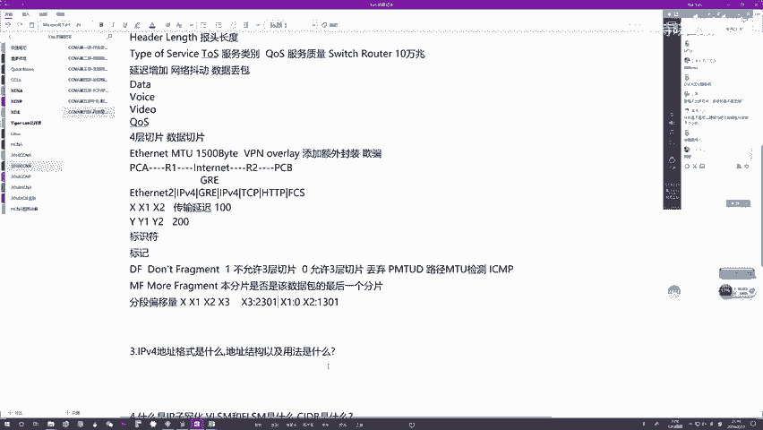

接下来这个字段。叫TTL。全称叫time to live，翻译成中文叫存货时间。

这个字段咱们一般称为叫TTL啊，翻译成中文叫存活时间。这个存活时间是什么意思呢？😡，好，给大家解释一下，这个存活时间用来描述一个数据包，从它被产生到它被丢弃，它最多能够发多远，可以吧？最多能发多远。

那当然这个多远是用什么来描述呢？这个多远是拿跳数来描述的，也就是你一个数据包从你产生到底被丢弃啊，你最多能传多少跳可以吧？你最多能传多少跳，这个跳是什么呢？跳咱们称为叫号。

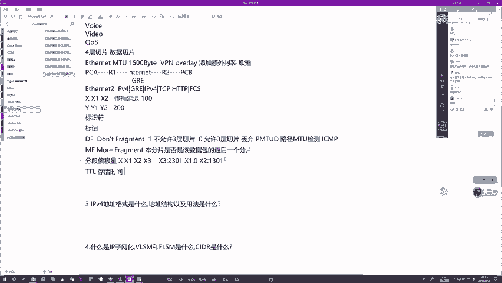

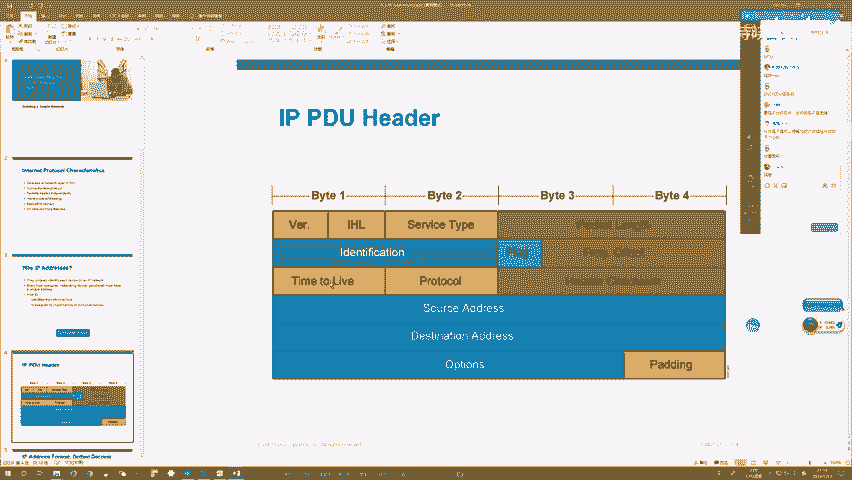

对吧一跳就是一台三层网络设备。比如说你啊你路由器啊啊PC之间隔了一台路由器，对吧？那这个时候你说A跟B之间隔了几跳呢，就隔了一跳。那接下来如果说你中间隔了两台路由器，对吧？

那这个时候A跟B之间就隔了两跳。如果这个时候你再来一台路由器。那这个时候你A跟B之间呢，就是隔了三跳。请注意啊，一般一台三层网络设备，我们就称为叫一跳，两台主机之间隔了几台三层网络设备。

我就称你们之间隔了几跳。而我们这个数据在发送的时候呢，也是一跳一跳发送的对吧？A把数据发给R1R一发给R，R发给R3R3再发给B，能理解吧？咱们是一跳一跳去发送。好，请注意啊。

TTL这个字段就是限制了你这个数据包从原到达目的地啊，最多能够经过多少台三层网络设备。那由于这个字段一共只有巴比特啊，它的最大值就只有255，它的取值范围是0到255啊，0到2505。

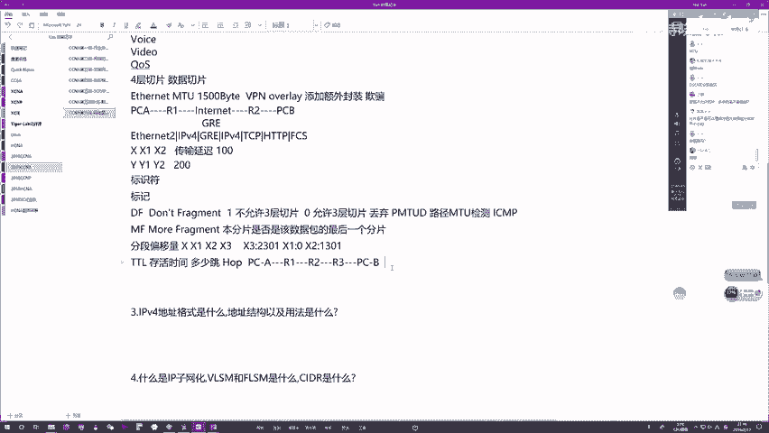

对吧？然后所有的三层网络设备以我们路由器多层交换机为例。这些网络设备都有这么一个组件啊，我们称为叫分组改写引擎，对吧？叫分组改写引擎。这个分组改写引擎有什么用呢？就是专门用来改写咱们的报文的字段的。

用来改写咱们报头字段。

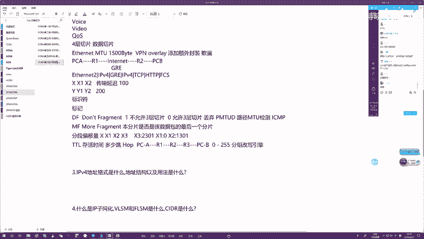

对吧，那主要改什么字段呢？就是改成咱们这个TTL你一把路由器收到一个包，在转发这个包走之前啊，会把这个TTL字段的值减1可以吧？然后接下来由于咱们这个字段最大值有255啊。

那你减一减1减1减1减255次，是不是就减为零了，请注意啊，当你这个字段为零的时候，路由器是没有能力转发这种数据，可以吧？路由器没有能力转发TTL为零的数据。

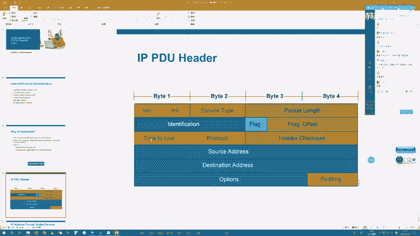

那所以这个时候由于不能转发啊，我就给你丢弃了，对吧？这就是T条的作用。那接下来大家会问来你为什么要限制呢？对吧？你限制这个的目的是什么呢？那这个就要从上说说起了啊，我们得要从路由器的转发机制来说起。

对吧？我们说了两台主机之间你要通信，我们需要地址嘛，对吧？比如你A发布出据给B原IP是A的目的IP是B的，当然包含原目IP的目的是给什么啊网络设备看呢，尤其是给路由器，这种三层网络设备。

给路由器这种三层网络设备看目的IP地址，让他们能够知道包案发给谁，然后接下来他们会根据这个目的主机所在的网络的位置，对吧？来确定一条去往目的地的路径，然后接下来我根据这个路径啊来给你做一个数据的转发。

那接下来大家会问你路由器怎么知道目的网络在哪里呢？你怎么知道从你出发去往这个目的网络有哪些路径可以选呢？你又怎么知道哪条路径优，哪条路径不优呢？请注意啊。

咱们是需要依赖这么一种协议来实现的这种协议咱们称为叫路由选择协议。你在一组路由器上运行路由选择协议之后，路由器之间会彼此交流，彼此沟通。每台路由器它默认都知道跟他直连的网络路径信息是怎么样的。

这种路路径信息啊，咱们称为叫直连路由，对吧？我能把我的直连路由告诉给我的邻居。那这个时候我的邻居就能转发数据去往我所直连的这些网络。然后接下来我的邻居会把这些路径信息啊，再告诉给他的邻居。

那路由器之间彼此这样做一个消息传递。那大家就都知道咱们各个网络在哪里，各个网络怎么走了。那当然请注意路由选择协议啊有很多款，不同的协议工作原理是不一样的。不同的协议的机制是不一样的，有的协议比较高大上。

有的协议呢就比较low。那当你在运行一些比较low的协议的时候，当你网络结构一复杂，可能会出现这么一种情况，就是一台路由器啊，你自己已知的路径信息本身就是错的，但是你不清楚。

你把自身已知的这些错误的路径信息告诉给邻居，这个叫以讹传讹。那这一组路由器之间啊，咱们两两交互的路径信息都是不对的。比如说R3告诉R，我这有一个网络X，你要网络网络X把包发给我就可以了。

但实际上网络X根本就不在这里，对吧？天照在哪里啊，反而不在这里，那这个时候你发送这个路径信息给R，你觉得R通过这个路径信息能成功的把数据发给网络X嘛？你发不到，对以吧？那这个行为我们称为什么呢？

这个行为咱们称为叫路。有选择还路，对吧？什么叫路由选择还路呢？就是你这些路由器啊，由于运行了一些比较low的路由选择协议，你们之间以讹团讹，彼此传输的路径信息啊都是不对的。😊。

你认为去往一个网络该这么走，实际上根本就不能这么走。但是你把这个错误的路径信息告诉给你的邻居，你的邻居再告诉给他的邻居，对吧？那大家这么一大堆的路由器啊，按照错误的路径信息来转发数据去往一个目的地。

你觉得目的地能收得到吗？😡，你怎么可能收得到，对吧？在这个环路中啊，你这个数据包可能是这样的对吧？大家按照错误的路径信息发发着发着发着发着没法发了，最终包庇丢弃。或者还有一种可能就是。😡。

你这组路由器形成了一个环。我在这个环中让这个数据包对吧？不停的传来传去，我R一传给RR传给R3R3传给R4R4传给R1，对吧？我按照一个环来不停的传输，反正不管怎么样，总是到达不了目的地。

那这个就是环路。😡，那环路会导致什么样的结果呢？首先不通是肯定的，并且在环路中，你数据包只要在发着，它就会浪费咱们环路中的链路的带宽，它就会浪费沿途的所有网络设备的转发资源，对吧？

浪费大家的CPU和内存。那如果说你一个数据包在环路里面能够永无止境的发送，你没有做任何的限制，那这些消耗就是永久性的。并且在环路中，咱们数据包的数量如越来越多，那消耗的资源就会越来越厉害。

那最终会导致什么？会导致咱们整个网络的整体性的崩溃。那为了避免这种情况发生，对吧？你就要做一个优化，而这所谓的优化是什么呢？就是你做一个限制，对吧？你限制咱们一个数据包，在网络中你能够传多远，对吧？

那当然这个限制呢早期是想要通过时间来限制。但然后来呢大家就是设计者发现你按照时间来限制。不太好实现，那所以说咱们就简单一点吧，对吧？你按照跳数来限制，对吧？我限制你最多发255票，反正你从原到达目的地。

对吧？25255票啊是绝对够的。如果说你255跳都不够，那只有一种可能就是你出现了环路，对吧？那你出现了环路，对吧？我给你丢包，那这是节约咱们环路中的资源，可以吧？如果你不能丢包。

那这个环路的影响就太大了，可以吧？那接下来这255跳到底是个什么概念呢？简单跟大家说一下，在整个英特网中，咱们最远的距离啊，就是中国的一台主机访问美国一台服务器，中国到美国之间的网络连接啊。

是跨越太平洋的，非常非常的远。那中国到美国的正常的端到端路径，经过多少台路由器呢？经过的是18台左右，这就是说你全球最远的网络距离，18票。就能搞定。那255跳有多长？长到不可限量啊，对吧？

你从地球到月球我估计都够了。那所以说呢永远不用担心有这么一个T条字段，对吧？会导致你T条不够，对吧？而在发送数据的时候丢包，你不用担心这种情况。

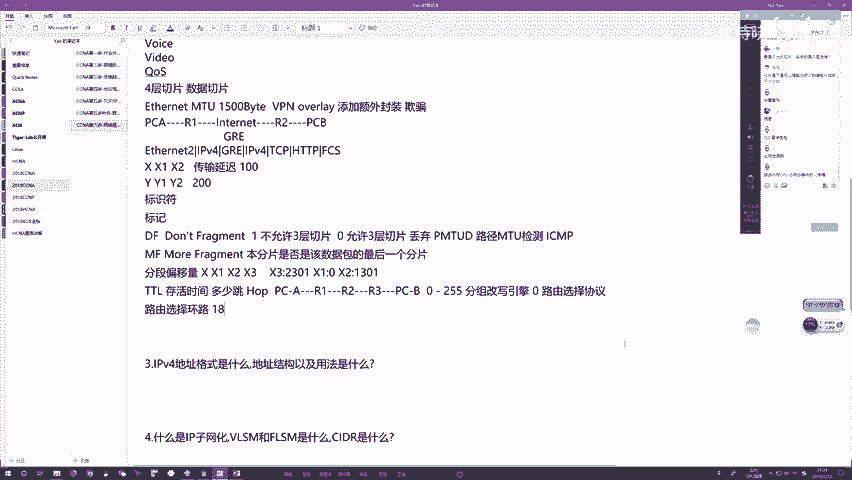

可以吧？好，下一个字段。

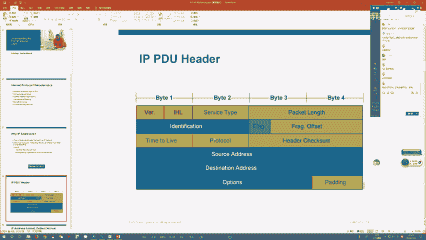

协议字段它叫protocol，就叫协议字段。那当然就是协议字段呢，一般咱们翻译成协议号字段啊，对吧？叫协议号字段，一般叫会这么叫，对以吧？那在以太宝的针头中啊，不知道大家还记不记得啊以太宝的针头，对吧？

如果你使用以太网2啊，它的第三个字段叫类型。

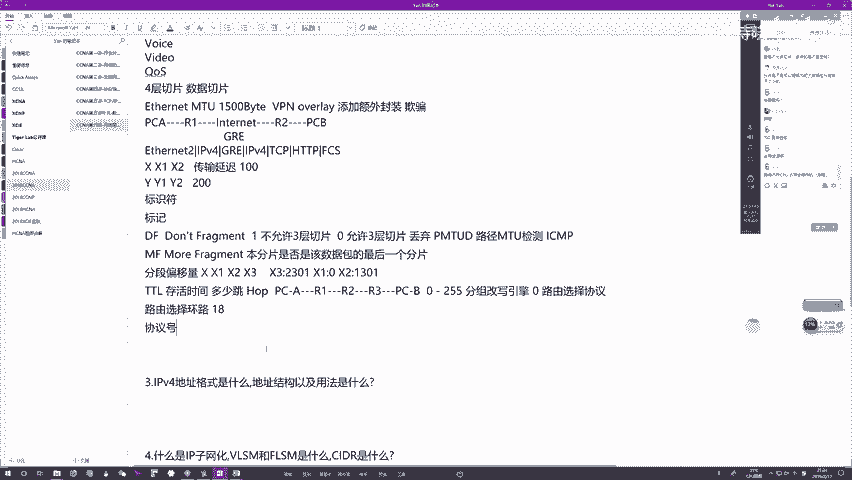

类型是个什么字段呢？它用来描述咱们这个以太网二针，对吧？它的三层，也就是网络层使用哪款协议，可以吧？你网络层使用的协议，咱们能够通过这个类型字段来表述，可以吧？比如说你三层使用IPV4。

咱们的类型字段值啊，就是0X0800。如果说你这个三层用的IPV6对吧？它就是86DD嘛。如果你三层用的ARP，那它就是0806，对吧？那这个时候作为二层网络设备。

你看不懂你收到的数据包的三层爆头的内容，也没有关系。你只要能读懂二层的针头，你只要查看这个类型字段，对吧？你就算看不懂三层爆头也无所谓啊。你通过类型字段的值，你就能知道咱们三层到底使用什么协议。可以吧。

那这个就是类型字段作用，而咱们这个协议号字段作用，跟类型字段作用是一样的。可以吧？三层网络设备，你收到一个数据包，你能看懂二层的针头，你也能看懂三层爆头，可以吧？你也能看懂三层爆头，但是你看懂三层爆头。

对吧？你未必能看懂四层爆头，但是这个时候如果我希望你能够知道这个数据包的四层使用什么协议，对吧？你方便你做QOS然而你又看不懂四层爆头，那怎么办呢？我就给你设置出这么一个协议号字段，对吧？

通过协议号字段的值来告诉你咱们这个四层到底使用什么协议。

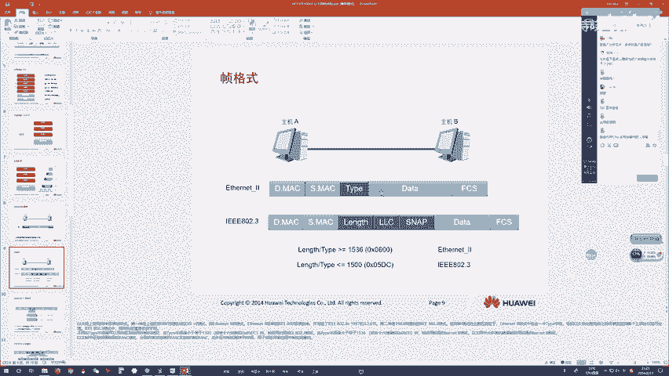

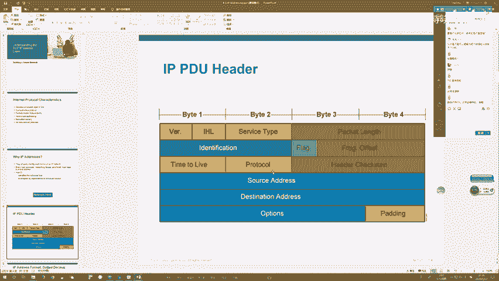

所以大家可以理解为这个协议号，就是一个三层到四层协议的映射字段，对吧？映射字段。通过咱们这个协议号资段的值，你网络设备收到一个数据包，就算你不看四层报头内容，你也能知道咱们四层到底包含了什么东西。

四层到底使用什么协议。可以吧，那这个协议号字段呢对吧？由于是三层报图中字段啊，重要性是非常重要的那我希望大家记一些比较关键的值，可以吧？比如你协议号为一，代表咱们四层用的是ICMP，你协议号为2。

代表你四层用的是IGMP。你协议号为88，代表你用的是EIGRP协议，你是89，代表你用的是OSPF协议。如果你用的是6，代表你四层TCP协议。如果你是17代表你四层用的是UDP协议，对吧？

如果你是103代表你四层用的是P协议，对吧？所有的四层协议在三层都有对应一个唯一的协议号。那所以对于那些三层网络设备，如果你看不懂四层爆头要不要紧的，不要紧，你只要看咱们的协议号字段的值。

你就算看不懂四层爆头，你都不用去看啊，你只要看这个值就能知道咱们四层收成协议，那这样的话，当你做的Q对吧？你就能够针对咱们这个数据包啊来做更加完善的Q服务，对？因为你能了解的东西更多了嘛，是吧？

这就是协议号的作用跟类型。

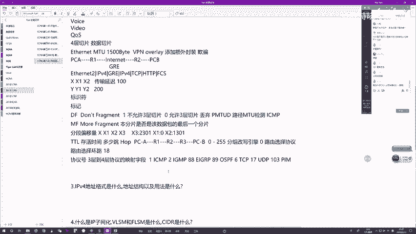

字段比较像类型字段是一个二层到三层的映射，而这个协议号是一个三层到四层的映射。好吧，好，接下来有一个爆头校验核。那这个爆头校验盒呢对吧？很好理解啊，通过这个字段咱们能够做整个爆头的校验，对吧？

原在发送数据包之前呢，做一个校验，把乱码放在这个字段，接双方收到数据包之后，对吧？做一个检查，对吧？看看你的校验和字段呢，对不对？如果对，代表你数据在发送的过程中啊，没有被篡改，没有任何问题。

那如果不对的话，对吧？那可能就是冲突了，由色啊冲突了，对，发生冲突了，或者说被篡改了，对吧？反正不管怎么样，你这个数据的完整性啊是有问题的，那有问题怎么样呢？我就给你丢弃，可以吧？

那这就是校验核用来判断咱们的完整性。然后接下来原IP地址不用说了吧，用来标识通信的原主机目的IP地址用来标识通信的目的地。但是请注意啊，虽然原在发送数据给目的地的时候，你既会携带原地址。

又会携带目的地址，但是路由器关心什么呢？路由器默认只关心目的地址，它只关心你这个数据去往哪里，它会根据目的主机所在的位置，然后呢来判断去往目的地的路径，然后使用去往目的地的路径啊来给你做一个数据的发送。

而关于这个原地址，对吧？虽然你添加了，但路由器默认是不看的。能理解吧？他默认不看。然后接下来我再强调一下，路由器什么时候能够看到三层爆头内容呢？前提是它要去掉二层封装。

而去掉二层封装的前提是路由器要认为这个数据是发给他的。什么情况下路由器会认为数据是发给他的呢？就是当他收到的数据针，二层针头的目的麦ac地址啊，就是他接收接口的麦ac地址的时候。

他才会认为数据是发给他的那这个时候他才会拆封装才会看到咱们三层爆头内容。

能理解吧。那所以这就是为什么咱们PC要指网关。因为当你指了网关之后，PC发送数据给任何目的地的时候，对吧？只要他判断出来这个目的主机跟我不在同一个网络。

我就会拿网关接口的麦克地址作为目的麦克来封装数据帧，因为只有这样这个针首先才能被发送给网关，并且网关收到帧之后，才会认为这个真是发给他的。因为目的麦克跟他接收接口是一样的嘛。那接下来去掉针头真尾之后。

他才能看到咱们的IP爆头，那才能看到咱们的目的IP地址，通过查看目的IP，他才能够查找路由表来给我们做一个进一步的数据转发。可以吧？那当然讲了这么多，也给大家。

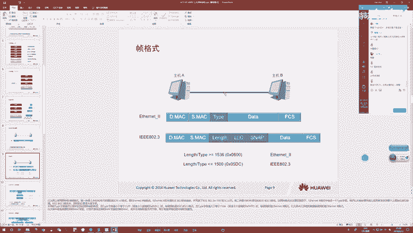

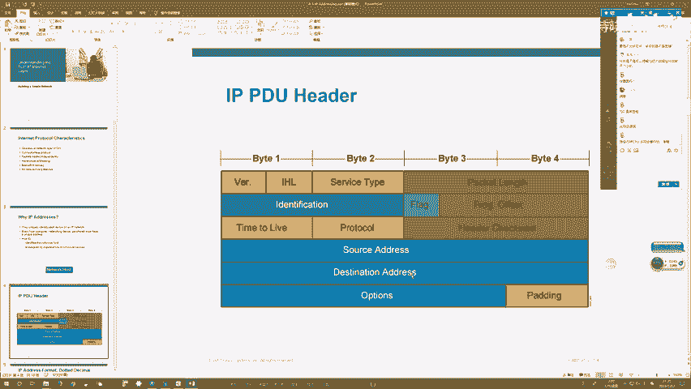

解释一下这个路由名词的概念啊。路由这个英文叫ro，什么叫路由啊？路由其实指的就是一台路由器。去往一个目的网络的路径信息，就是路由。什么叫路由啊？就是我一台路由器，去往一个目的网络，我所使用的路径信息。

对吧？这个就叫路由。那接下来这个路由信息怎么获得了？你得要运行动态路由选择协议，如果没有运行动态路由选择协议啊，路由器默认只知道跟它直连的网络怎么走，对吧？因为直连网络直接连接了我某一个接口嘛。

对要通过这个接口一发，数据就到了。那对于那些跟我不直连的网络，我默认是不可能知道怎么走的。你想要让一台路由器知道这些非直连网络路径信息，你就要运行路由选择协议，而运行路由选择协议，只要你一个不小心啊。

咱们就可能会出现什么路由选择还路，那接下来这些路由选择协议，对吧？咱们就可以。基于IP啊来进一步的去研究。那当然由于今天的时间有限啊，我只能给大家把这个爆头给讲解一下。

那当然这个IP呢最关键的其实还是它的地址信息。当然跟这个地址信息相关内容太多了。那我就给大家一个建议。

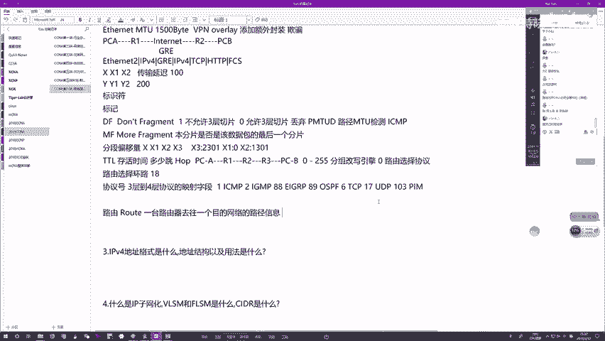

哎，请大家呢先预习一下，好吧，大家先预习一下，然后呢，没有加咱们群的，可以加一下咱们群。然后加完咱们群之后呢，大家可以找咱们的婷老师，然后呢找咱们的。

小月月老师，然后找他们来要咱们往期的一些公开课的视频啊，他们一定会给你们的，一定会给你们的。然后你们下载之后，提前把IP相关的一个内容给看一下，尤其看什么内容呢？尤其看IP子老化。尤其看IP的字网化。

大家好好看一下。然后看完之后，对这个子网画有足够了解之后，咱们下一节课，下节课周四啊，周四晚上咱们8点，我给大家把这个IP地址和IP地址相关的所有内容给好好讲一下，可以吧？

这个报头呢给大家讲的比较详细啊，所以画的时间比较长，那跟大家说说sorry啊，今天这节课呢，咱们目标没有完成啊。然后接下来咱们周四的课给大家补充一下，好吧。

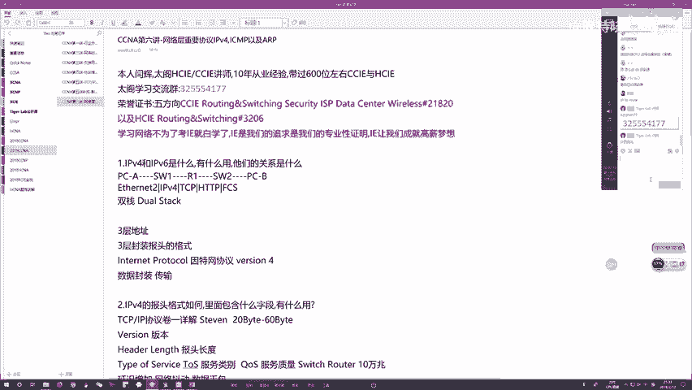

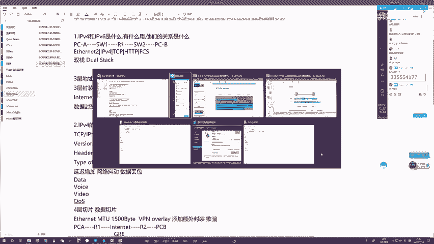

啊。加权可以点击右下角啊，没问题。没事儿，直接加这个群就好了。好吧。然后接下来这个咱们今天的那个啊有点复杂啊。对，确实复杂确实复杂。大家有问题在这个群里可以问那个助教老师啊，也可以问助教老师。

然后接下来咱们每节课都有作业。然后你们可以问一下助教老师，就是问一下咱们的课程顾问啊，作业的地址。然后你们可以去呃做作业，好吧，可以去做作业。16位标识符的作用啊，我刚刚说过了。

这个标识符的作用就是用来标识属于相同数据包的多个数据分片，对吧？咱们做数据分片嘛，你把这个数据包分成多个分片，然后你再给目的地发送数据的时候，由于咱们有延迟嘛，对吧？你可能先发的后的后发的先到。

那可能会导致你接收方收到的多个分片是来自于不同数据包那这个时候呢，咱们就是通过标识符让接收方能够知道哪些分片是属于哪个数据包的哪些分片是属于那个数据包对吧？因为不同数据包对应的标识符是不一样的对吧？

比如你数据包A标识符是100，那所以你A1A2A3的三个分片都是100，对吧？数据包B标识符是200，那你B1B2B3，它的那个标识符都是200，那接下来接收方只要收到分片。

但有标识符100的那都是属于数据包A的但有标识符200的那都是属于数据包B对吧？咱。可以通过这种方式啊来做一个归类，能理解吧？啊，理论听着很枯燥啊。唉，确实是这样确实是这样。但是大家记住。

就是实验确实有意思，但是理论真的真的很有用，为什么呢？因为你理论如果不学好的话，对吧？你后期光会敲命令是没有用的。因为你要去一些企业，你要面试，对吧？你做项目，你要分析，你要设计，你没有基本功。

没有理论。你你这些高大上的活是什么都做不到的，你要记住，敲命令，什么人都能做，什么人都能敲命令。🎼啊，理论不会的话，你光吹牛，对吧？对对于大神三三下两下就能知道你到底是几斤几两了。

相信我就是这些东西不能投机取巧的。比如说我如果什么演试官的话，我随便问你，我跟你两句话交谈，就能知道你水深水浅了。真的几斤几两分分钟都能吃到。就是现在其实怎么说呢？很多培训机构都比较。唉。

算是比较功利吧，因为讲理论首先能讲到的人很少。然后讲理论确实很枯燥。我承认啊，讲爆头这块是所有课程内容里面最枯燥的。别说你们听的枯燥，我讲的很枯燥，真的真的有一说一，但是为什么咱们还要讲呢？对吧？因为。

我们有理念吗？我们的理念就是做技术培训。对吧我不像其他机构，就是让大家考一个这种敲一个版本就可以了，对吧？你们开心我也开心。但是大家敲完之后做一个payper，你们面试也不好通过，你们工作也不好找。

对啊，之所以叫要给大家讲理论，讲技术，就是让大家能学到些东西，不但能够考过试，对吧？咱们还能学到些东西。这是我的初衷。啊为了改变大家命运。所以说。啊，对，说的很对啊，又懂又会吹牛，这个真的就太厉害了。

啊，不懂光会吹牛，别人分分钟就能揭揭穿你啊。然后接下来会会技术，但是不会吹牛，太闷了，别人不知道你厉害，然后所以说又厉害，又会吹牛是最好的。所以说售前为什么对吧？售前为什么工资高，就是这个原因。

明天要开学了哈，开学挺好的。OK好，这边的话就是跟大家说一下，然后跟大家说一下咱们这个服务啊，就是新年的19年，咱们泰和呢就是做了很大的人员变动，招了很多人。然后呢，班主任老师助教老师，咱们也在扩充。

就以我们现在呢是实现了四对一啊，四个老师服务一个学员。所然大家之后呢报名VIP就是我们的服务会比去年要好很多很多。啊，全方位的吧，全方位的。那大家呢如果对这个VIP的课程比较感兴趣的话。

你们可以去在群里面咨询一下咱们课程部问老师。好吧，然后多了广告我们就不做了啊，咱们课还是以干货为主。然后大家有什么问题想要沟通，在群里就是。跟我可以跟我聊好吧啊，那今天咱们就到此为止，好吧，呃。

大家新年快乐，猪年猪年大吉，猪年大吉。好，大家拜拜。

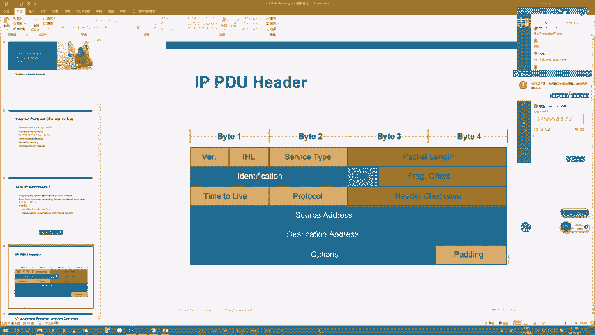

