# 1000元自购分享CCNA教程合集！超全合集详细版，网络工程师入门必看合集【送NA题库】 - P8：CCNA08 - 向向向晚o - BV1cL4y1q7Dy

好了，情人节啊，大家情人节快乐。哎，这么说还像挺奇怪的啊。😊，好了，能在今天来上课的都是真爱啊，非常欢迎大家欢迎大家。然后呢，年还没有结束啊，给大家说一下新年快乐。😊，哼今天不讲EVE的安装啊。

今天咱们讲政课，如果想要听EVE安装的话，没有关系，明天我教大家好吧，明天我教大家。😊，呃，因为正好咱们这轮新人皮寒一课里面多了V叉lineV叉 line结合EV篇N。

这个Vchar line结合EVPN呢只能用那个nexus9000来做啊，就是通过EVE。然后呢，我之前给大家集成的这个EVE呢里面其实也包含9000，但是这个9000呢，它的版本不对。哦。

我们要求使用的9000的版本是这个版本。我们要求使用9000的版本，这个版本。就是7。0。317-217。2啊，我之前给你们集成的是15。2啊，那15。2虽然能用啊，但是那些对吧？

V叉 line相关的功能，就是你虽然能敲命令，但是可能就是实现起来。它会有些问题，好吧，我今天也是才更新的啊。那正好就是如果明天大家感兴趣的话，明天给大家讲下EVE，然后呢，顺便我把这个我把这个镜像嘛。

把这个镜像拷拷给大家。如果大家对这个V叉量比较感兴趣，想要做一些微叉的相关的实验，对吧？然后又不想买真机，唉，那你们可以就是用EV来做这个EVE的效果跟真机一模一样啊，9K模拟特别好，好吧。

那这个呢就是那咱们暂定吧，还是明天晚上8点，好吧，明天晚上8点给大家讲。😊，那今天呢咱们还是顺着上节课继续往下啊，上节课给大家讲的OSI网络层的IP协议，对吧？呃，这个IP协议呃。

上节课呢咱们花了太多的时间啊来讲那个爆头格式。当然这个爆头格式还挺重要的挺重要的。呃，但是就是除了报头格式以外，我觉得IPV4更更更重要，或者说它最重要的就是它的地址格式，对吧？

那所以说今天呢咱们的所有内容都是围绕着IP base地址，你们不要小看这个地址啊，跟地址相关内容特别多，对吧？那我大概列了5点啊，那今天呢咱们尽可能把这5点都别讲完，好吧，那今天内容很多，又很难。

我们就不扯了啊，不扯连，有的没了，咱们就全讲技术，那大家呢千万不要只听不说话，好吧，我们都互动一些，那大家有任何问题的话，可以对吧？随时问，对吧？可以随时问啊，要加群啊，你可以加这个群啊。😊。

QQ群可以加这个群，好吧，好了，那咱们言归正传啊，开始来讲咱们的IPV4的地址。好吧，我觉得对于整个IPV4这个协议而言啊，它对整体网络最大的贡献，就是它定义的地址，对吧？因为你主机跟主机之间的通信。

对那你既然要通信，你就需要一个标识符，那这个标识符呢可以是五花八门的乱七八糟，什么样的东西都可以啊。但是呢为了格式统一我们就规定了对吧？大家统一使用一种制式的地址，对吧？来做自身这么一个标识。

那在我们TCPIP环境中呢，咱们这个统一的标识就是IP地址。😊。

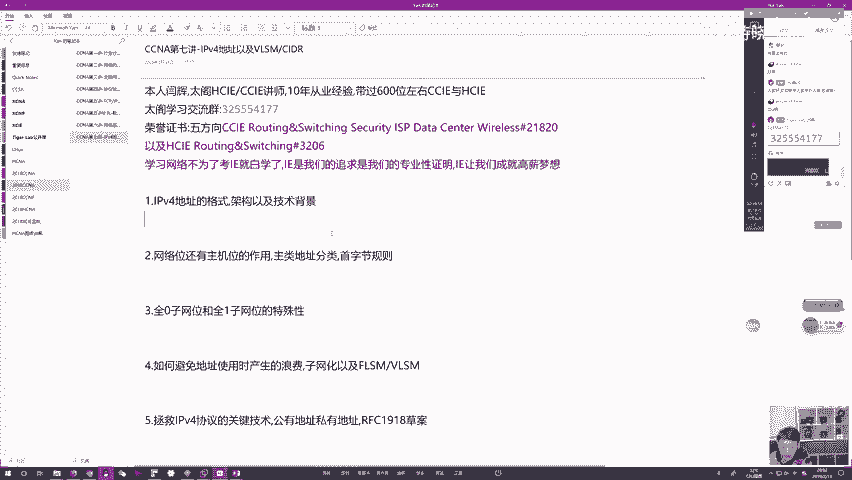

那IP地址呢是个很神奇的地址，我们称为叫三层地址，称为叫逻辑地址。那首先说一下什么样的设备需要这样的地址来作为自身的标识啊？简单来说，所有的计算机你的接口都需要。然后呢，服务器的接口也都需要。然后呢。

包括咱们的路由器啊，多层交换机啊，还有多层防火墙，只要你一个设备，你具备三层功能。那这些具备三层功能的接口，你想连接网罗之后啊，成功的收发数据，那你都需要一个标识符务，那这个标识符是什么呢？

它就是IP地址。

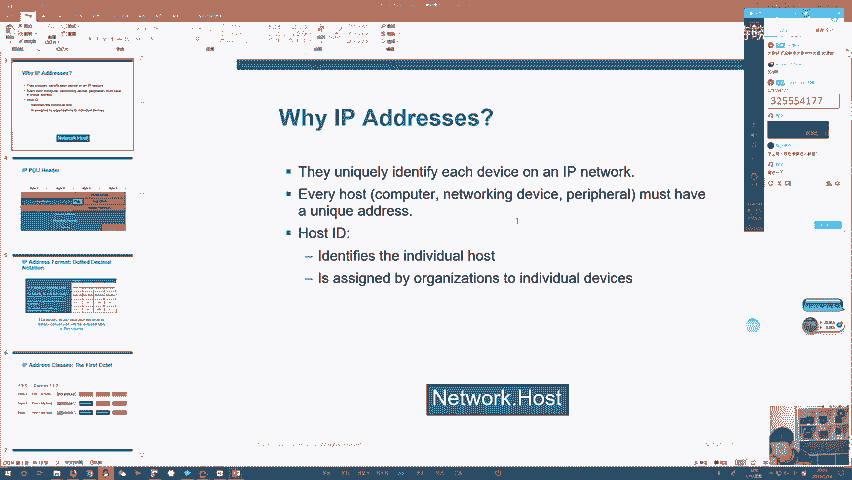

当然这个IP地址对于我们接口的类型有没有限制呢？请注意没有任何限制。你这个接口从材质上来说，你可以是个以太网接口，你也可以是个令台环接口。你可以是一个广域网接口，对吧？

上面跑PPP协议跑HDLC跑真踪器，那这些呢都是无所谓的。简单来说，只要你一个接口具备三层的功能，那这个时候你就可以拥有一个IP地址，并且你需要拥有1个IP因为你有了IP之后呢，你才有标识符，对吧？

你有了标识符，你能标识自己了，那你才能怎么样，对吧？通过携带原木地址的这么一个封装的数据来实现正常通信嘛，对吧？那简单来说，对于PC而言也好，对于路由器而言也好，你不是说接口光连根线就可以工作的。

你连完线之后，接口要开启，并且最起码你要给接口配置一个地址，对吧？那接下来我说的地址，咱们通常需要配置的意思是什么呢？意思是。😊，你购买回来一台计算机，你计算机的网卡默认是不会有IP地址。

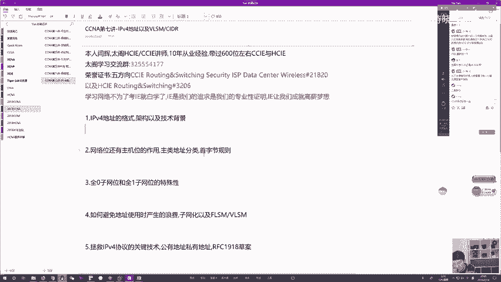

那为什么没有呢？那原因很简单啊，IP地址跟你接口的麦ap地址不太一样，对吧？你一个网卡在生产的时候呢，厂商会给你这个网卡呢分配一个二层地址。这个二层地址是无论你这个主机在网络什么位置。

无论你加入哪个网络都无所谓。你的map地址呢都可以维持不变。因为你的麦ac地址本身怎么样，已经全球唯一了嘛，并且通过你的mac地址，咱们主要能够看出来，你这个地址是由哪个厂商给你分配的。

因为地址的前二4位，我们称为叫OUI嘛，对吧？但是呢跟map地址不一样的是IP地址作为这么一个带有全球意义的标识符啊，它不能随便给你乱给。😊。

因为你一个节点拿到的IP地址跟你这个节点所处的网络位置是息息相关的。比如你在网络A中，你拿到地址A，你在网络B中，你还能使用地址A嘛？不行，你在网络B中，你必须得要换另外一个地址。因为咱们有一个规定啊。

就是在同一个网络中，咱们所有的主机IP地址的网络位是相同的那当你离开这个网络，你再去获得IP地址啊，你的网络位就不能跟之前那个网络内的成员一致了，因为这个网络位就是用来描述你到底在哪个网络，对吧？

那当然一台主机呢，你买回来之后，你可能能加入到任何一个网络，那由于我也不知道你要加入哪个网络，我总不好说在给你生产网卡的时候，就直接给你分配地址，对吧？这个不切实际。

那所以说一般这个地址呢是当你连接网络之后，对吧？我根据你所连接的网络来给你判断你到底应该拥有一个什么样的地址。那当然这个地址呢在给你分配的时候，两种方式啊，第一种方式呢比较简单，就是你手工配置，对吧？

你通过操作，你通过配置，你来给计算机的接口去分配一个地址。那当然这个呢咱们在做实验的环境中啊，会经常去使用。因为这种方式呢小规模的网络中，对吧？咱们比较简单嘛用起来。

那当然如果你要在中到大型的实际的线网中啊，这种手工配置地址，建议大家不要这么做，因为配置量太大，并且可能会导致什么地址冲突，并且呢还不灵活，对吧？你没有办法做到即插即用，那这个很麻烦。

那所以说呢咱们一般在真实的线网中啊，尤其是在中到大型网络，咱们一般使用一个协议。这个协议呢叫DHCP叫动态主机配置协议。

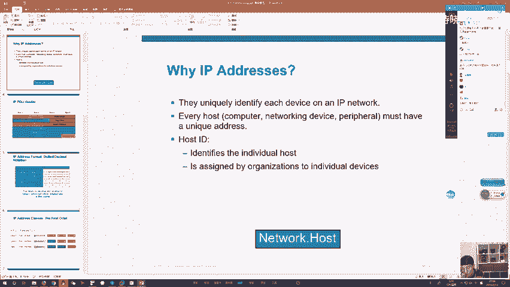

那咱们通过这个协议，哎，你整一台服务器，咱们通过在服务器上设置DHCP的地址池，然后呢，咱们拿地址池中的地址来给客户呢做一个自动分配，那一般呢咱们一台计算机唉，你正常情况下。

咱们的网卡呢都是开启DHCP功能的那当你开启DHCP功能之后，只要你检测到你连接的网线，对吧？只要你感觉到连接没问题了，你就能够根据你的网络连接，来通过DHCP啊去自动请求一个地址，那你请求完地址之后。

对吧？你获得了地址，那你就可以拿你的地址来成功上网，对吧？那这样做最大好处是什么呢？就是对于咱们用户而言啊，你不需要去操作了，对吧？你不需要去做一个配置，并且呢对吧？能够变相意义上的做到即插即用啊。

你只要连上网线就可以上网，并且呢它很灵活，对吧？你计算机在网络之间移动的时候，对吧？不管你接入哪个网络，只要这个网络中，咱们有DHCP服务啊，你总能拿到。😊，要跟这个网络相关的这么一个地址，可以吧？

那这个呢就是。

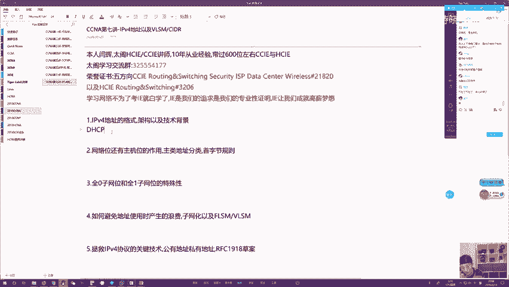

IP地址的这么一个技术背景。好吧，什么样的地方需要使用这种地址啊？就是只要你是三层网络设备，只要你是三层的终端，只要你接口具备三层功能，你就都需要IP地址。那当然有需要IP地址的，就不需要IP地址的啊。

什么样的设备不需要IP地址呢？啊，像交换机。😡，像集限器这些二层或一层网络设备，对吧？你们这些设备的接口不具备三层功能。那对于这样的接口能玩IP吗？不好意思啊，你不可能有你配不上去，然后呢，人也不需要。

对吧？那所以说呢一般呢把这个交换机啊作为咱们接入设备，你拿交换机的若干个接口连线连接咱们PC组成网络对吧？那哪些接口消耗地址啊，是PC那一段的地址，对吧？PC那段接口啊，它们会消耗地址。

而你交换机那一段是什么都不消耗对吧？它并不需要OK吧？那这就是IP地址的这么一个定位。那接下来这个地址呢，咱们刚才说了，分为两个部分，哎，高位是网络位第一位呢是主机位，那一共有多少位呢？

它一共有32位啊，四个字节，我们在表示IP地址的时候，一般怎么表示啊，一般这么表示我们把地址呢分成四段，哪一段都由十进制数来表示这段的值，然后接下来咱们段和段之间呢，使用点小数点的那个点来做一个分隔。

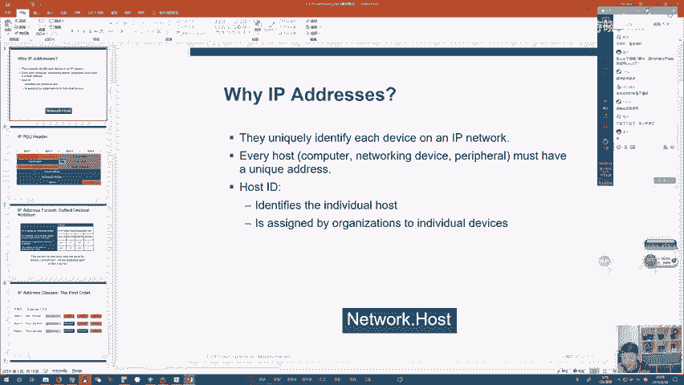

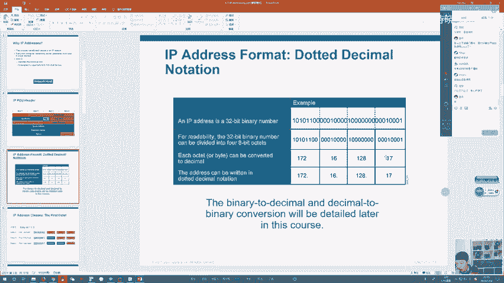

那这种表示形式我们称为什么呢？我们称为叫点分十进制，对吧？叫点分十进制。那当然由于咱们一个地址一共32位啊，也就是四个字节，对吧？咱们分成了四段。

那平均下来每一段呢咱们是由巴比特组成的那当然这个巴比特呢就是一个字节，对吧？每一段是一个字节。

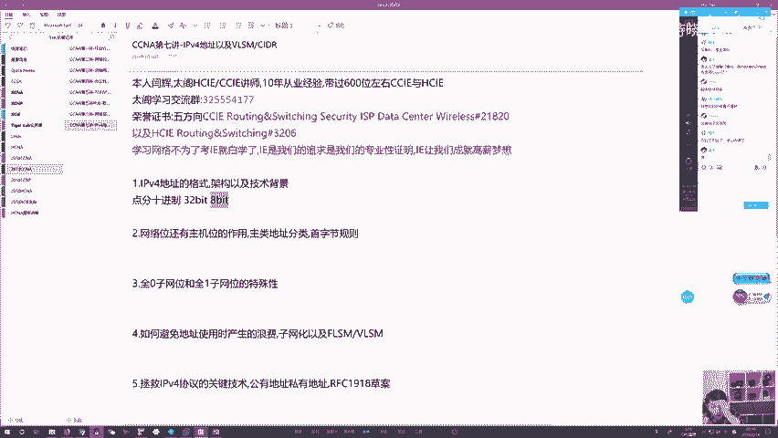

那接下来这个字节，哎，咱们如果要用十进制数来表示啊，你就需要知道二进制到十进制之间的这么一个进制转换。那所以说呢咱们在讲IP地址细值之前呢，先来看一下，这个二进制跟十进制之间的这么一个关系，可以吧？

那这个十进制呢，我相信我不用说了啊，大家都应该很熟悉，因为咱们从小到大学都是十进制嘛，对吧？所谓的十进制，那就是逢十进1嘛，对吧？0到9你可以用一位来表示十呢十就是10，可以吧？

然后接下来十0到99都可以用两位来表示，那100呢对吧？100就用100，逢十进1，可以吧？那接下来二进制特点是什么呢？它由于只有零和1啊，所以它叫逢二进1，可以吧？你是零或一，咱们可以拿一位来表示。

但是二就变成10了，三就是114。😊。

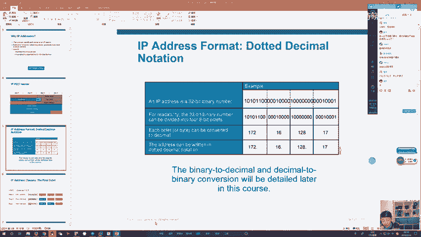

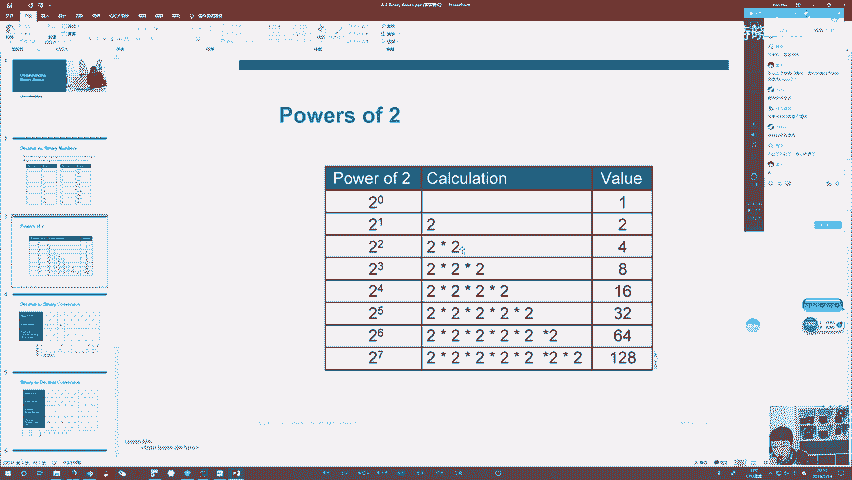

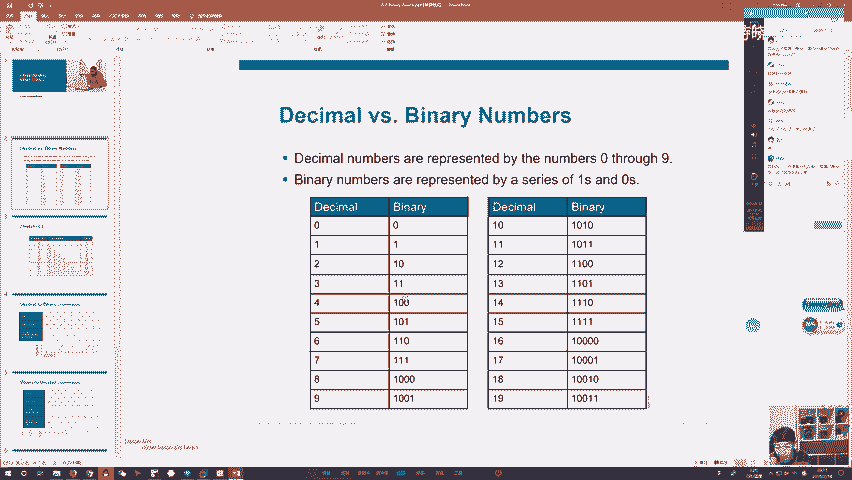

就是100可以吧？那这就是二进制的这么一个规则。那接下来咱们这个IPD只能够32位，这个32位是什么意思啊？就是它是由32个二进制数组成的，可以吧？你分成了四段，那每段呢咱们都是由8位二进制数来组成。

那这8位二进制数，它们的取值范围是什么呢？它们的最大值啊就是你8位都为一。😊。

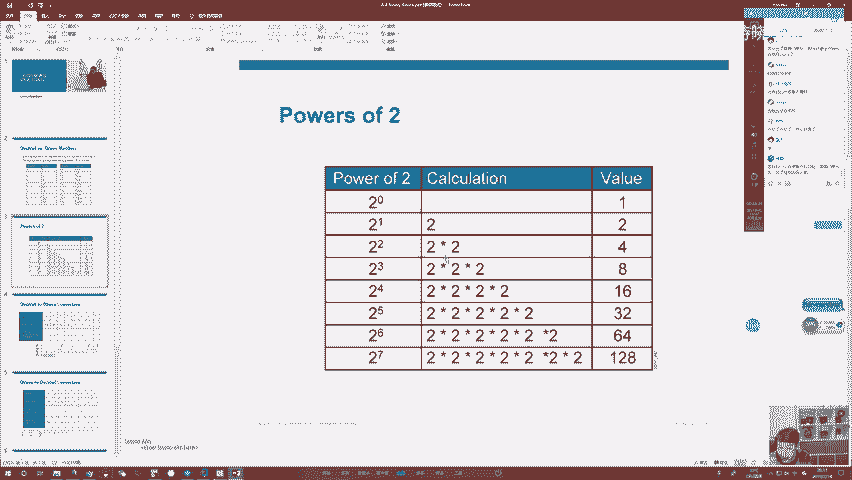

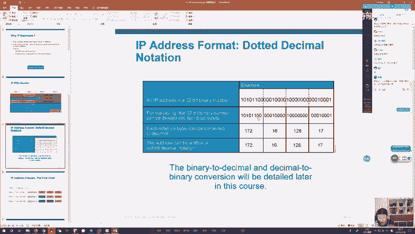

对吧它的最小值就是你8倍都为0，可以吧？这就是最小值啊，这就是最大值。那接下来咱们都知道这是二进制的取值范围啊，那你十进制的范围呢？对吧十进制的范围想要算，你就得要知道进制之间的这么一个转换。

那接下来进制之间咱们怎么转换呢？哎，由于咱们是研究IP啊，研究IP，我们需要知道这个转换，然而由于IP的每一段只有8位啊，所以说你们不用研究那么复杂，我们只用研究8倍以内的二进制数。

它到十进制之间的这么一个转换，对吧？那接下来这个转换怎么换呢？就是你得要知道咱们的每一位，它对应的十进制数的值，对吧？由于咱们二进制对吧？是逢二进一，那咱们得要先做一个转换啊。

我来给大家举一个十进数的值，比如说我举一个呃。😊。

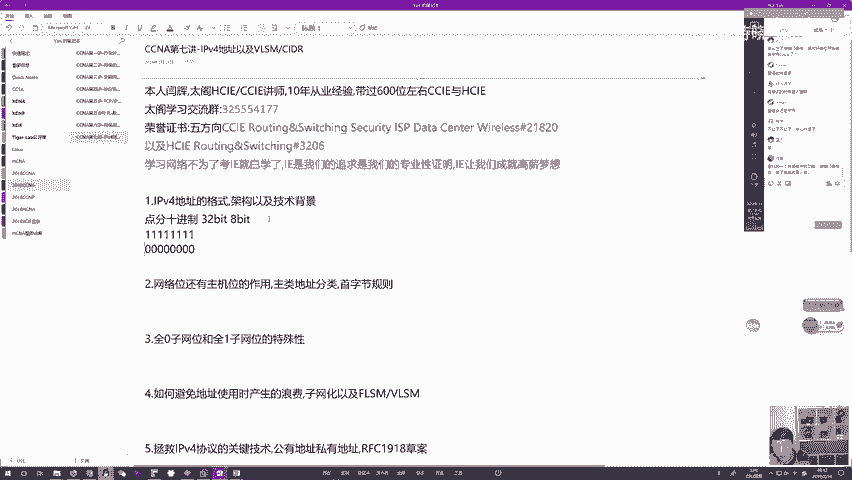

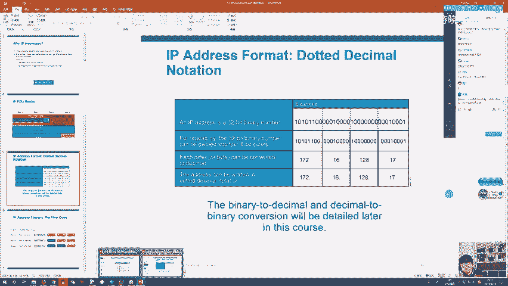

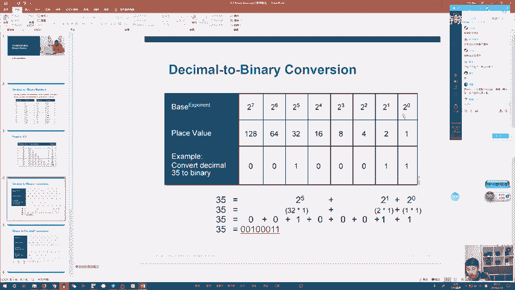

748好吧，748，这是一个十进制数的值。哎，大家为什么能够知道这是748？😡，为什么这是748？😡，能算出来吧。其实在我们大脑中，咱们根本都没有计算，我们一看就知道是748，但其实呢它是可以计算的。

😡，700是什么原因呢？因为你逢十进一嘛，对吧？这一位它对应的值其实是十的2次方，可以吧？咱们第三位数对应的十0进制数的值啊，是十0的2次方，可以吧？然后接下来这一位呢，这一位它对应的是十0的1次方。

可以吧？然后接下来最末位啊，最末位对应的是十0的0次方可以吧？十的0次方，这也就是说咱们这个数在计算的时候，应该是7乘以10的2次方，加上4乘以10的1次方，再加上8乘以10的0次方。

当然十的两次方就是100嘛？7乘以100就是700可以吧？4再乘以十的1次方，十的1次方是10对吧？4乘10，那就是10，然后接下来8再乘以10的0次方，十0的0次方是几啊？十0的0次方是一嘛，对吧？

8乘1，那就是8700。😊，加40再加8，那就是748，能理解吗？好，这就是十进制到二进制的这么一个转换。OK了啊，说错了，这就是十进制的这么一个值的表示啊说错了，这就是十进制数的这么一个值的表示。

那接下来如果你们要找规律的话，这个规律是什么呢？7这个七啊是咱们这个十进制数的第三位，第三位在算的时候，咱们是7再乘以什么啊？十的3减1次方嘛，可以吧？然后接下来四作为第二位，它在计算的时候。

4再乘以什么？四再乘以10的2减1次方，可以吧？然后接下来8在最后第一位啊，第一位，它计算的时候是十的什么一减1次方，那所以说了十的2次方，四的对吧？十的2次方乘以74再乘以10的1次方。

8再乘以10的0次方，咱们这么来可以吧？咱们这么来，你每一位十进制数，假如说你是第N位啊，你第N位在计算你的值的时候，就是你这一个位的值再乘以什么啊？十的N减1次方，可以吧？十的N减1次方。😊。

比如说你是第六位数，第六位数就是十的5次方，那就是一万，能理解吧？那这个对于二进数也是一样的。二进制数，比如说你所有位都为一，那咱们该怎么算啊？这个是第八位对吧？第八位对应的值是二的8减1次方，可以吧？

然后接下来第七位的值是二的7减1次方，可以吧？然后呢，第六位是二的6减1次方，可以吧？然后接下来依次类推啊，是二的5减1次方，然后呢，二的4减1次方，然后接下来二的3减1次方，还有二的2减1次方。

然后呢，最后是二的1减1次方，这就是对应了咱们8位2进制数每一位它所对应的这么一个具体的值，那当然由于二进制呢，它这一个位要么为0要为一，如果它为零对吧？零乘以任何值都为0嘛？而一乘以任何值取都不变。

那所以说呢你在计算的时候非常简单啊，就是你看到一个8位。😊，二进制数的这么一个字段，你只要看它哪一位之一，哪一位质一，你就把这一位对应的值啊累加起来，得到的就是咱们最终的十进制的结果，可以吧？

那这就是二进制到十进制的这么一个转换。这个转换其实很简单，你只要知道每一位对应的值，然后你只要把这个相加就好，咱们用加可以吧？用加法把它给加起来，就能算出咱们十进制的结果，可以吧？

那接下来我们来看一下它的最大值对的几啊，二的8减1次方就二的7次方啊，二的7次方是一半是8可以吧？二的6次方是64二的5次方是32，二的4次方是16，二的3次方是8二的2次方是4二的1次方呢是2。

接下来最后二的0次方是一。😊，可以吧？每一位都质一啊，就相当于咱们把所有这些值加在一起，128加64加32加16加8加4加2加1。那它最终结果几呢？最终结果你可以记一下，255，可以吧？

它最终结果是255。然后紧接着如果他们都为0，那不用说了，都为0，那最终结果肯定就是0。那所以说得出一个结论，对吧？IP地址的每一段它的实进制数的取值范围啊，就是0到255。

所以说你若要看到1个IP地址。如果你发现这个地址啊，它的某一段的值对吧？大于255啊，那这个肯定就不是IP地址，对吧？或者说你在写IP地址可能你写错了，对吧？总而言之，正常的地址的值的范围啊。

每一段0到255之间。

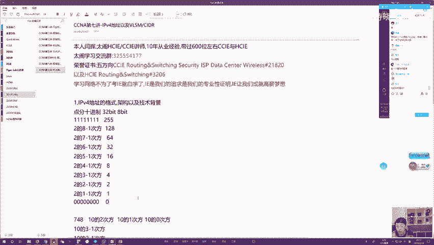

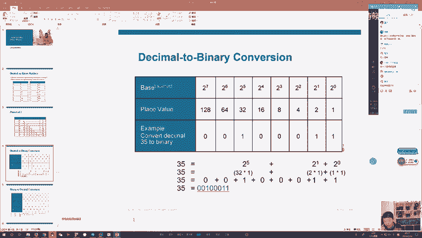

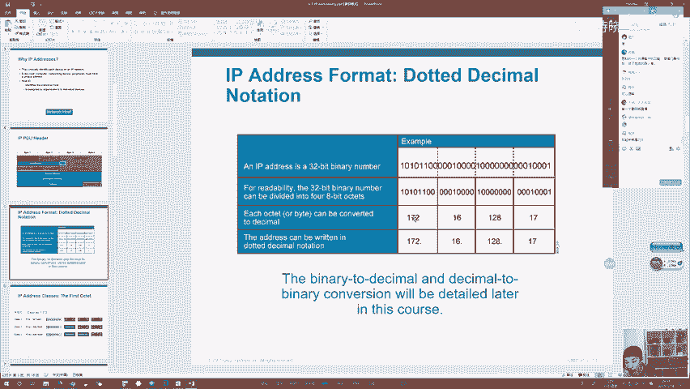

可以吧，好了，那当然通过这个呢，大家都知道了二进制到十进制到底该怎么去转。那接下来给大家举几个例子吧，比如现在举个例子啊啊，10110110好吧，10110110，这是一个八进制数的值啊。

那接下来它对的十进制数是几啊，很简单吧，最高位为一就是128嘛，是吧？第二位为064不用加了，加32对吧？然后接下来呢加16是不是？然后紧接着八没有对吧？然后加4对吧？然后再加上2，那得到值是几呢？

132啊，128加32是160对吧？加16，那是。😊。

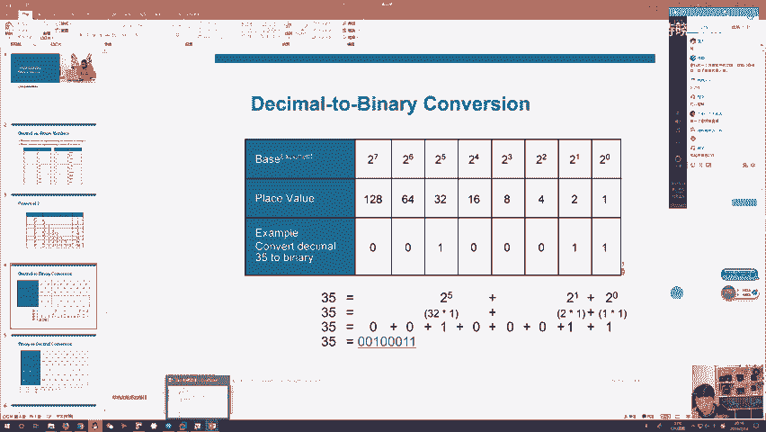

176加4180加2，那就是182嘛，对吧？这个就是182。那再举个例子啊，11000110好吧，那这也是一个二进制数啊，那接下来它换算成十进数怎么算啊？最高又为一对吧？128是不是？

然后接下来64之1了吧，加6432168都为04是不是为一啊，对吧？然后呢，二是不是也为一啊，对吧？加4加2就可以了，那加二是几啊，192加4是196对吧？加2就是198。OK吗？这就是换算很简单啊。

二进制到十进制换算非常简单。但是呢咱们有时候在研究IP地址的时候呢，咱们不光光需要二进制到十进制转换啊，我们也需要十进制到二进制的反向转换，对吧？比如我给你1个IP地址已经给你写成十进制数了啊。

你现在需要根据十进制数来反推它每一段二进制的组合该是什么排列。那这个该怎么算呢？其实很简单啊，大家可以用反向的做法，就是减法嘛？刚才咱们用加法，现在呢咱们用减法。比如说给他举个例子，哎。😊，172啊。

太简单了，192吧啊，也太简单了。呃，197吧。好吧，197我给大家一个十进制数值啊，那这个值咱们对应的二进制的结果几呢？好，请注意啊，建议大家不要用除法，咱们用减法。

你就先看一下咱们这个十进制数的值里面包含的二的最大次方数几。😊，那197里面肯定包含1个128对吧？包含1个128，那减去128之后，它还剩下几啊？减去128，它是还剩下69是吧？还剩69。

69里面包含的二的最大次方数，64，它包含对吧？减去64之后还剩下55里面怎么样，包含一个4对吧？减完四之后，正好最后还剩一12的零次方嘛？所以说了咱们这里面包含的数是128，644还有一。

那咱们换算成二进制是几呢？128最高位对吧？64是第二位对吧？32没有16没有8没有4有对吧？二没有一有可以吧？这个就是十进制的二进制转换，很简单啊，你用减法，比如我们再举个例子啊，227好吧。

227227对应的二进制是几啊，还是做减法吧。😊，128肯定包含不用说了，128，那减去之后减啊，还剩下99对吧？还剩下99，99里面64肯定包含对吧？减64还剩下35，对吧？

剩下3535里面是不是包含32啊，对吧？减去32之后还剩下33里面包含一个2包含一个一对吧？那咱们可以看了，128至1对吧？64至1对吧？32至1对吧？16至08至04至02至1对吧？1至1。

那这个就是它对应的二进制数的组合。😊，能理解吗？很简单啊，再次说一下，给你一串二进制数，让你换算成十进制，咱们用加法，对吧？咱们用加法给你一个十进制数制值啊，你换算成二进制，咱们用减法。

你通过这种方式分分钟就能算出来，可能上来算可能会慢一些啊。然后当你把这个给记熟了，这要相信很快就能算出来，对以吧？最高位是几，第二位是几，第三位是几，对吧？按照咱们这个方式来判断就好，OK吧？好了。

那接下来咱们言归正传啊，接下来我们来说一下咱们的IP地址。😊。

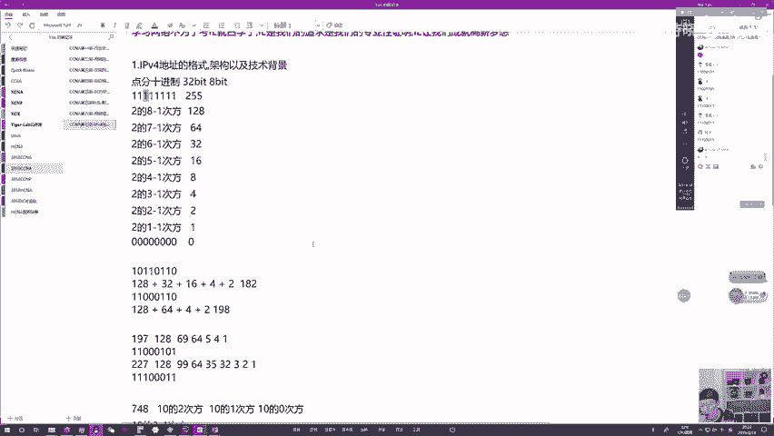

这个IP地址呢，它的格式很简单，就是点分十0进制啊，分成四段。然后接下来它的高位从左往右数的高位啊，叫网络位，从右到左数的低一位叫主机位，好吧，高位叫网络位，低位叫主机位。

那这个主机位跟网络位到底有什么用呢？我再强调一下，它们很关键啊，网络位用来描述你这台主机所在的网络是哪个网络，可以吧？网络位啊用来描述。

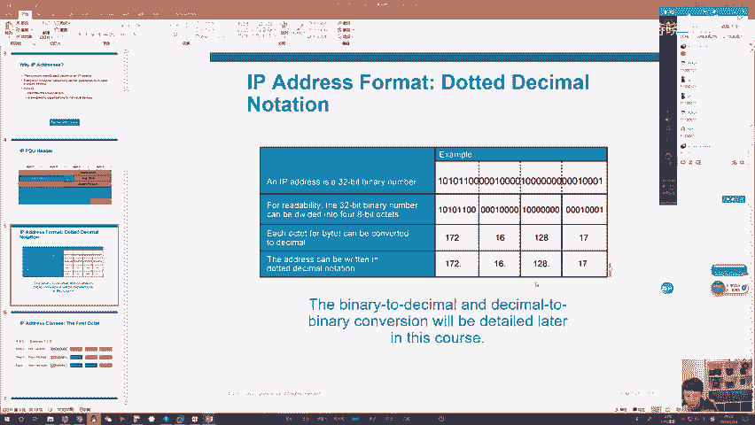

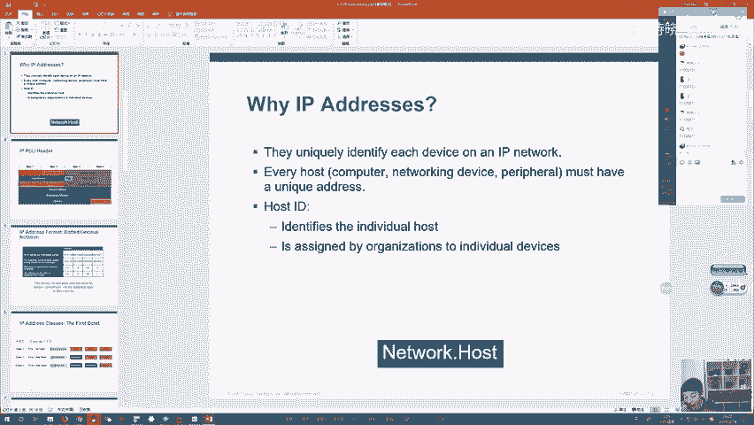

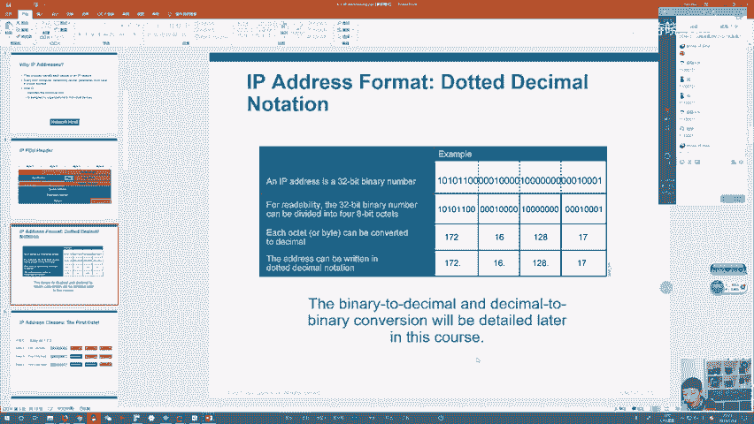

对吧节点。😊，所属的网络对吧？节点所属的网络是哪个网络？OK吧然后接下来主机位呢，主机位用来描述在这个网络中啊，我们这个节点到底在哪里，可以吧？简单来说网络位用来描述你在那个网络中。

然后主机位用来在这个网络中啊，去定位你自身可吧？这个就是IP地址的这么一个功能，那所以说大家通过这个应该能够理解了吧。你一台主机的IP地址啊是绝对不可能一成不变的。

只要你在这个网络中你要移动你移动了你更换了所属网络了，那你地址肯定要变嘛，对吧？因为你原本在网络A中，你拿到的地址，网络位是用来标识你在网络A的。现在我把你移动到网络B了，你还能用这个地址吗？不行啊。

因为你属于网络B，你的IP地址的网络位啊必须要描述你在网络B中。那所以说了你在网络A和你在网络B，虽然你还是同一台计算机，但是你拿到地址是不一样的。😊。

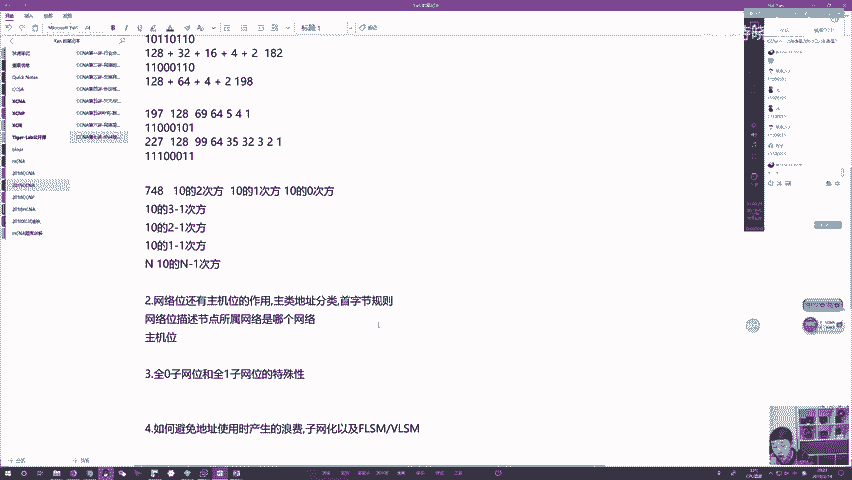

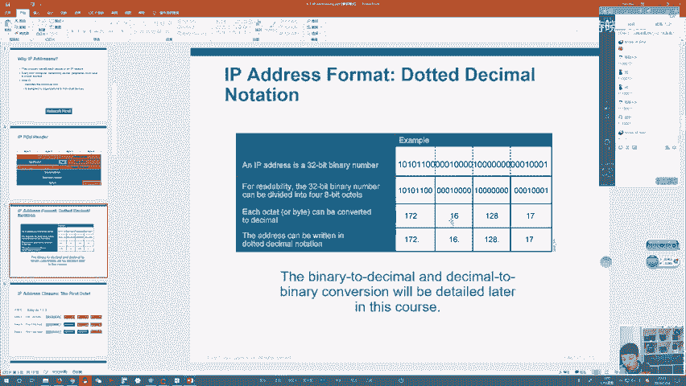

能理解吧？你拿到的地址是不一样的。

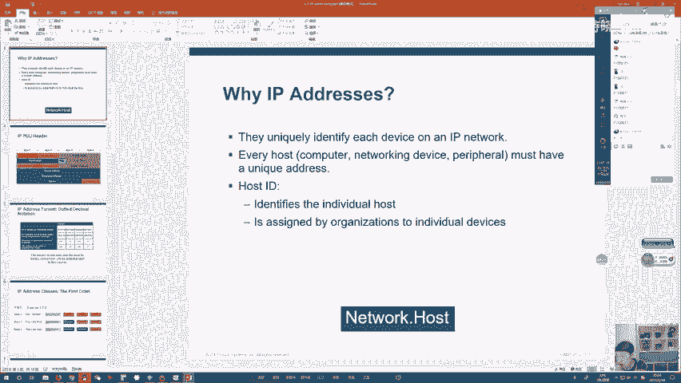

OK那这就是IP地址的这么一个算是架构啊。但是呢这个IP地址我在给你们描述网络位主机位的时候，我只能告诉你们它高位是网络位，低位是主机位。我没办法准确的跟你说前多少位是网络位，后多少位是主机位。

那为什么能说不不能这么说呢？原因是因为IP地址啊，它分为很多类。

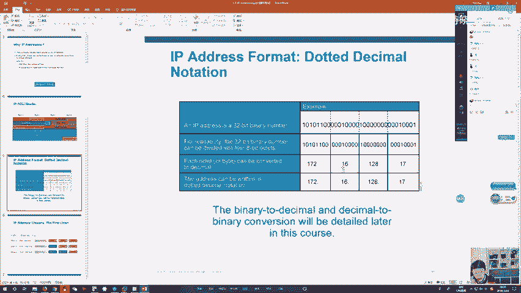

你不同类别的地址，它的网络位主机位的长度是不一样的，可以吧？好，那这边的话这个类是什么东东西呢？请注意啊，这个类就是咱们最早IP地址在卖的时候所规定的这么一个类别。那这个类别呢。

咱们称为叫IP地址的自然类啊，也叫IP地址的主类。那当然主类呢咱们用的比较多一些啊，那这个主类是由谁来定的呢？是由这么一个标准化组织啊，这个标准化组织叫IANA对吧？那大家都知道啊。

这个组织专门用来卖地址的，它在卖地址的时候呢，为了方便咱们整理，为了方便咱们统计，对吧？我不能说是给你乱卖，我得要按照一个规则来卖，那这规则是什么呢？就我给这个地址啊分成很多类，对以吧？

我基于这个类来给你们卖。那这样的话比较方便我们整理嘛，比较方便咱们记录。那接下来它定的类呢一共有五大类啊，分别叫主A主B主C主地，还有主E可以吧。

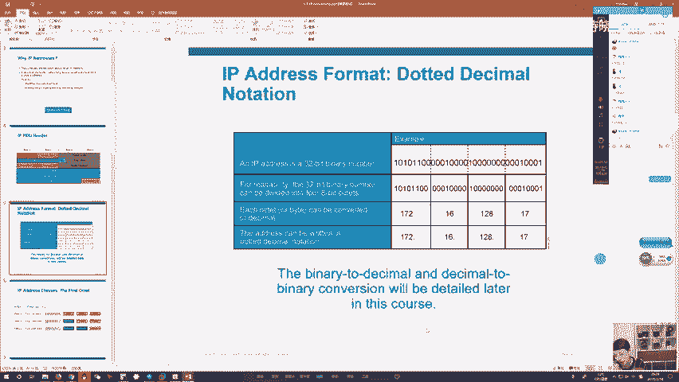

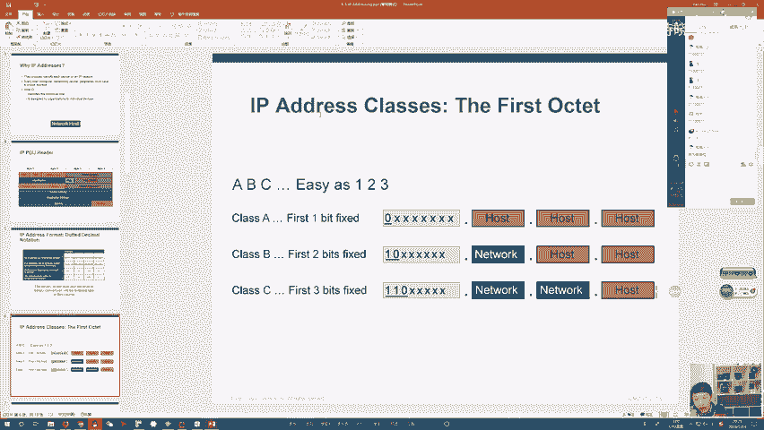

又分成了这么五大类。那接下来对于这五大类呢，咱们不用研究D和E为什么呢？原因是因为D类地址，我们称为叫主播地址，可以吧？那就跟麦地址里面主播地址一样啊，它不能用来标识咱们的路由器的接口。

不能用来标识咱们PC的接口，原因是什么呢？原因是因为一个主播地址，它标识的是一个主播组，主播组里面包含的是一组要接收相同数据流量的接收者，对吧？我标识的是一个团体，我标识的是一个集合。

你不能拿描述一个团体的地址来描述一个接口，能理解吧？所以说呢你购买主地类地址是没有办法给我们计算机配置。😊，对以吧，那当然这个地址呢，3P还一周，咱们需要详细去讲。

因为我们需要使用这些地址啊来完成一些比较高级的功能。但是对于让咱们网络连接啊，最起码让这些PC能够上网而言，这个D类地址是没有任何帮助的，对以吧？它能起到进阶作用，但是基本的作用它是起不到的对吧？

然后接下来这个E类地址更不用关心了。原因是因为这类地址呢既不是单播，也不是主播，也不是广播地址。我们称之个地址是什么呢？我们称之为叫被保留地址。被保留地址对吧？那这些被保留地址你也不能买，你也不能租。

对吧？那它呢一般是被一些呃公有组织，对吧？被一些标准化组织拿过来做一些特殊用途的对吧？至于到底用什么用做什么东西啊，也没人知道，反而不管怎么样，你这类地址咱们是不能买的，对吧？你买不到。

那所以说呢咱们一般情况下能买是ABC类地址啊，还有D类，而这个D类呢，由于咱们一般计算机和路由器用不了，对吧？所以说咱们更多在买地址的时候呢，买都是ABC类地址，而这ABC类地址，咱们统称都叫单波地址。

对以吧？ABC类咱们统称都叫单波地址，那单波地址，单波地址顾名思义了。你这个地址咱们只能标识一个节点，对以吧？那你路由器的接口是一个节点，你PC的接口也是一个节点，你这样的节点需要标识符。

你给它的肯定就是一个单波地址，因为单波地址就是用来。标识一个接口可以吧？这就是单波地址的作用。OK那接下来A类、B类、C类地址，咱们到底怎么去区分呢？可以吧？请注意啊，区分地址到到底属于哪一类啊？

咱们有一个区分方式。这个区分方式呢，咱们称为叫首字节规则。我们称为叫首字节规则。什么叫首字节规则啊？你IP地址不是点分十进制嘛，对吧？不是分成四段嘛？每一段不是都是一个字节嘛，对吧？

首字节就是你的地址的第一个字节，可以吧？你的地址的第一个字节。这就是首自己，可以吧？这就是首自己。我们根据你地址的首字节的值来确定你到底是主A还是主B还是主C，甚至主D和主E啊。

咱们都能根据你首字节的值来做一个区分，对吧？那接下来主A类特点是什么呢？它的首字节规则啊，就是最高字节的最高比特值恒为零，对吧？只要你最高字节的最高比特啊值恒为0，你这个地址就是主主A类地址，对吧？

那接下来大家都知道你一个字节是由巴比特组成对吧？巴比特12345678，你的最高位恒为零啊，那也就是说你剩下的7位可为零也可为一，对吧？那如果说这七位的值都为零啊，哎，你的取值就是0。

如果这七位都为一呢？那我来问大家一个问题啊，如果这七位都为一，咱们这个值该怎么计算？你是拿64加32加16加8加4加2加1这么去算吗？还是通过其他方式来算。如果是你们，你们会怎么算？😡，啊，是用加法吗？

我建议大家在这种情况下不用加法了。对，因为你8位值都为一的话，咱们的总值是255，对吧？然后接下来最高位是为128啊，你这位恒为零对吧？那所以说你后期位都为一，就相当于是你8位都为一减去最高位的值。

是不是就可以了，你用128，对吧？用1255啊，去减它减完之后的结果就是你后期位都为一的这么一个值，那这是几这个值几呢？这个值是127。😊，可以吧，最高字节取值范围如果是0到127，哎。

那你就是主A类地址，对以吧？主A类地值的首字节的范围啊就是这个范围。那当然0到127的不是你所有地址都能用啊，全零的，咱们不能用127的咱们也不能用，对以吧？零和127这两个咱们不能用。

咱们能用的是1到126，对以吧？1到126，那所以说你今后呢看到1个IP地址，或者说你购买1个IP地址啊，对吧？只要首字截在这个范围，那你就是主A类地址，那主A类地址作为所有单波地址里面最贵的最好的？

它这个地址特征是什么呢？就是前8位，注意啊，它前8位是网络位。好吧，它的后24位。😡，后24倍是主机位。那这意味着什么呢？这意味着你在购买主A类地址段的时候。

你买一段主A类地址INA呢会给你确定地址前八位的值，这一段你不能变啊，但后24位都是你买过来。后24位的值，你想为零就为0，你想为一就为一。那所以说你购买一个主A类地址段啊。

你所能拥有的地址数量是1600万啊，1677万，7214个地址，对吧？接近1700万个地址啊，你购买一个主A类地址段，咱们里面包含的可用地址数是这么多。

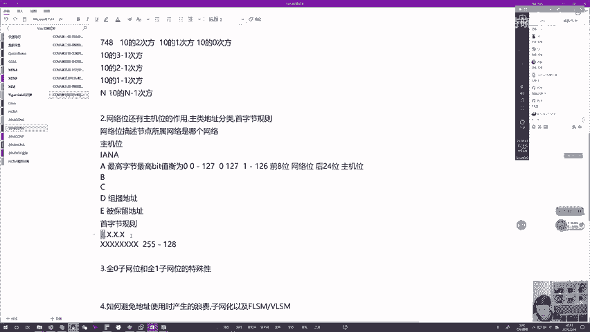

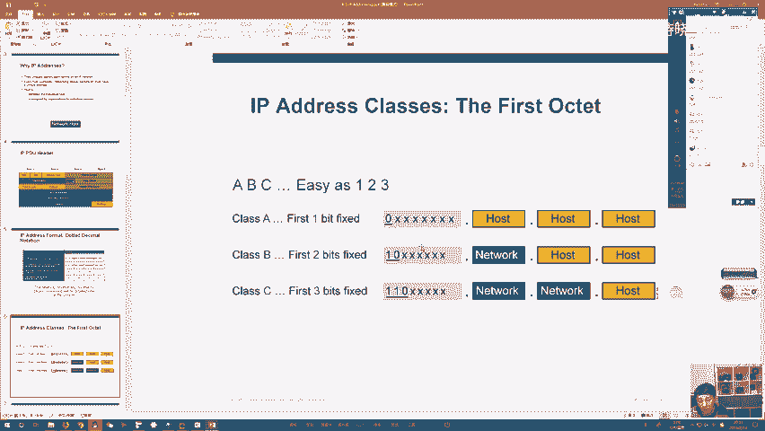

那这么多意味着什么呢？意味着你购买一个主A类地址段啊，你能把这个地址段里的地址啊分配给接近1700万台计算机去使用，对吧？那当然由于包含的地址比较多，所以说主A类地址怎么样很贵。

你购买的时候一段需要花非常非常多的钱啊，好吧，那这就是主A的特点。

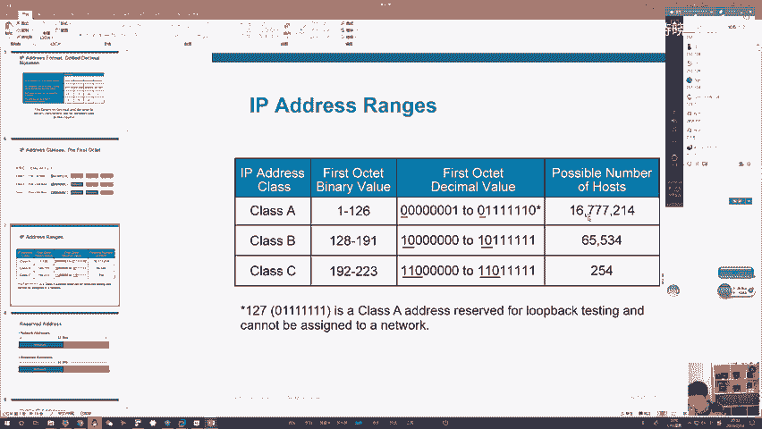

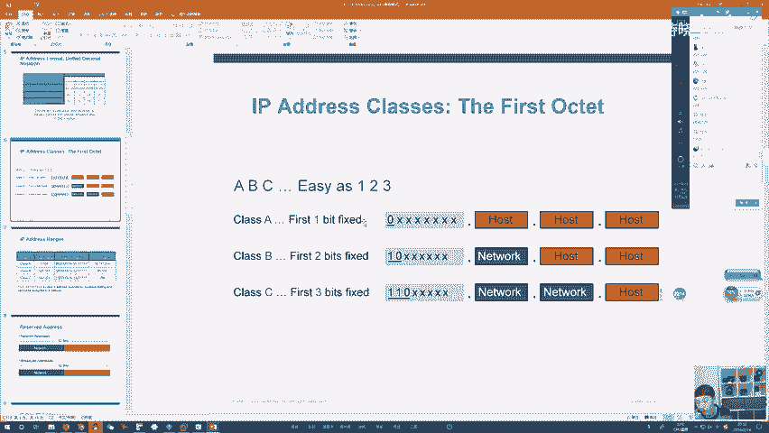

那接下来主B特点是什么呢？主B的首字节规则啊，就是它的最高字节。最高的两比特对吧？最高的两比特的值横为10，对吧？只要你这个地址最高位的两位啊为10，后面6位随便你啊，那这个地址就是主币类地址，对吧？

那一0是几啊，10你128了啊，然后后面6位如果都为0，那它的最小值就是128，那加上最大值呢就是10，后面6位都为一吧？后面6位都为一加上一相当于是这位之一，对吧？这位之一是几啊，是64，可以吧？

那这位减一就相当于是后面6位都为一啊，咱们值是63，128加63对吧？得到结果是191，对以吧？191，那这就是主B类地址，它的首字节的取值范围，只要你地值范围是这个O你就是主B，对以吧？你就是。

主B那接下来主B不像主A啊，你有那么多的1蛾子，对吧？有两个地址不能用，你这里面所有地址咱们都能用啊，都能使用。那所以说呢你看到一个地址，只要它的第一个字节取值范围是这个开头的，对吧？

那你就是主B类地址。那接下来主B类地址特点是什么呢？它是前16位啊，前16位为网络位。然后接下来后16位为主机位，好吧，一半一半啊，前一半是网络位，后一半是主机位，当然当然你在购买主B类地址时候一样的。

跟购买主位的一样，你一买买一个地址段，这个地址对你买回来之后呢，前16位的值是不能变的，后16位对吧？你可以任意改变。那所以说相当于是你购买一个主B类地址里面包含地址数多少个呢？是65534个。

那当然大家可能会问怎么算出来的？很简单啊，你后面8位是不是可以随意改变啊？这是主A啊，主A里面包含的主机数量多少呢？就是二的24次方嘛，对吧？二的24次方。那主B类里面包含地址呢，就是二的16次方。

对吧？二的16次方，因为你16位嘛，16位既可为零又可为一，你的取值范围就是对吧？二的0次方减1到。😊。

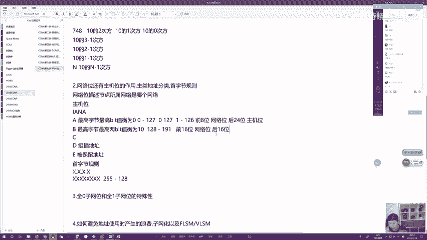

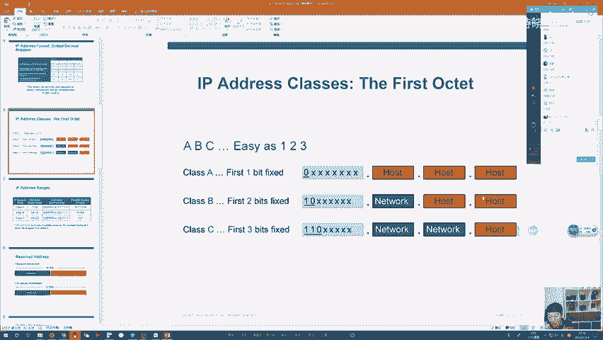

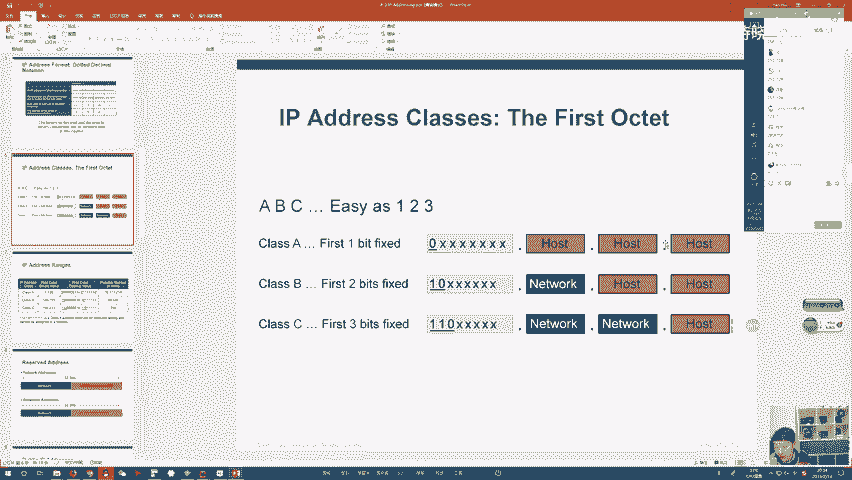

二的16次方减1，那你满打满算可用地址数量，一共是二的16次方个嘛，对吧？好，这就是主B。那接下来主C呢主C的首字节规则就是最高字节的最高三比特它的值横为110，对吧？你最高字节的最高三位。

咱们横为110，然后接下来后面五位，你可以为任意啊，那接下来咱们取值方围是多少呢？110就是128加64，如果说你后面五位都为0，那咱们的值是192，对吧？如果你后面五位都为一呢，请注意啊。

后面五位都为一，你的值加一相当是这位之一，对吧？这位是几啊？32，那代表后面五位都为一，咱们的值是31，192加31多少223嘛，是吧？223，你只要首字节在这个范围公。你啊你就是主C的地址。

那主C类地址特点是什么呢？它前24位。前24位是网络位，后8位是主机位，可以吧？前24位是网络位，后8位是主机位。那当你在购买这类地址的时候呢，对吧？你购买一段地址前24位是不可变的。

然后最后8位可以为任意，对吧？可为零也可为一。那所以说呢你可以使用地址数量是二的8次方嘛。

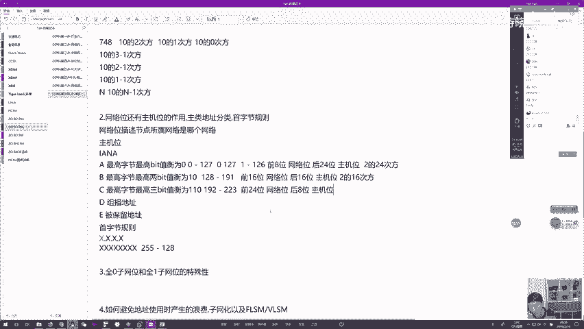

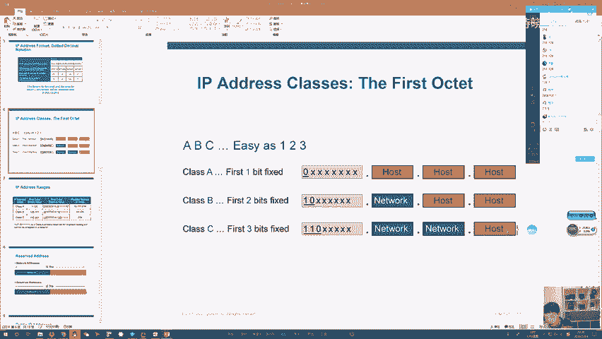

二的8次方都不用查了，256对吧？256。

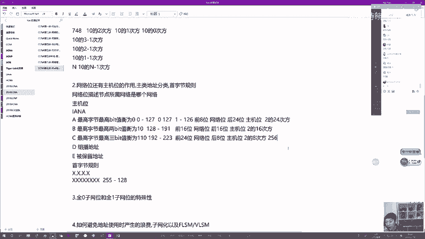

但是接下来你会发现哎你购买一段主A类主B类主C类地址，你能用的地址数量貌似比咱们计算出来应要少啊，是吧？比如主A类为例啊，你二的24次方，2的24次方，咱们得到结果应该是16777216。

主B类二的16次方对吧？应该是65536。然后接下来主C类对吧？应该256，但你会发现咱们实际能用的地址啊比咱们计算出来的值还要减2。那为什么要减2呢？原因是因为你购买一类地址段啊，你购买回来之后。

不是每一种地址组合，咱们都可以给PC使用的，咱们地址里面有两类特例啊，咱们是不能用的，哪两个不能用呢？一个是主机位全为零的IP地址对吧？你不能用啊，还有一个是主机位全为一的IP地址，你也不能用，对吧？

这两类地址咱们都不能用，比如举个例子啊，你购买一个主类地址，时网段好吧，时网段，那这个时网段，哎，像这个地址你就不能使用，为什么？因为这个地址后面三段都是主机位啊，你主机位都为零嘛，对不对？

主机位都为零的地址咱们是不能用，然后接下来还。

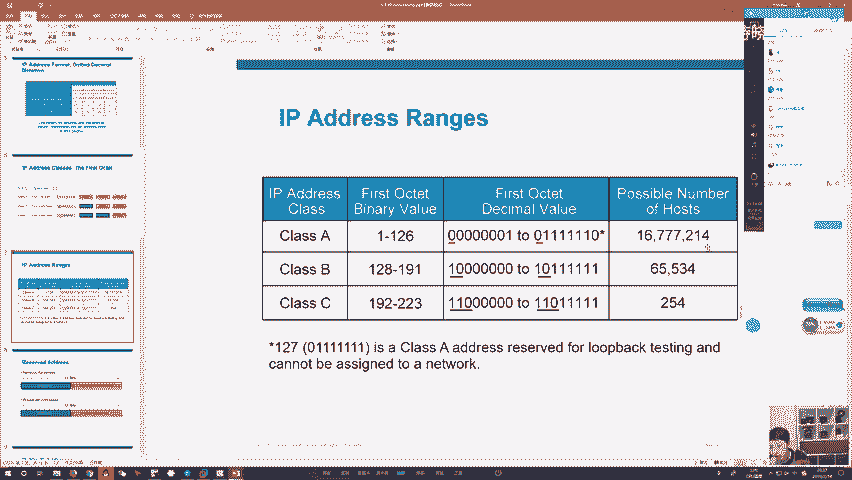

还有一个地址咱们不能用10。25。25。25，这也不能用。为什么？因为这个主机位你会发现它24位怎么样都为一嘛？你都为一，咱内对吧？也是不能用。那接下来给大家解释一下为什么不能用啊？

这种主机位权为零的地址，我们称为叫网络号，对吧？我们称为叫网络号，这个是IPV4交法。在IPV6中呢，咱们把这个称为叫前缀啊，把这个称为叫前缀。😊，这个前缀网络号它是有特殊作用。

它不是用来标识一个网络中的一台计算机接口或者一个路由器接口，它是用来标识这个网络本身的。请注意啊，咱们每一个网络自身也有标识符。比如你网络A网络B网络C，你这个网络本身咱们要跟其他网络区分，对吧？

我们总不能说这个网络那个网络对吧？我们总要说网络谁谁谁网络谁谁谁，那他们也需要标识符啊，就跟你计算机一样，那每一个网络的标识符是什么呢？它就是IP地址。

但是它所使用的IP跟我们计算机使用的IP啊是不一样的。😡，网络所使用的IP就是专门用这种主机位都为零的IP地址，对吧？只要你主机位都为0。

okK那这种地址就是用来标识一个网络OK那接下来这个主机位权为一的地址呢。啊，它比较另类啊。它既不是用来标识一个网络，也不是用来标识网络中的一个节点。它是用来标识一个网络内的。所有节点对以吧？

我标识你网络内的所有人，比如你一个网络里面有10台计算机，有一台路由器的一个接口，对吧？一共有这么11个节点。那接下来你拿什么样的地址来标识他们所有呢？哎，就拿这个网络所对应的主机位都唯一的地址啊。

就可以标识。那这类地址我们称什么呢？我们称为叫子网广播地址，对吧？子网广播地址。那当家提到广播，大家如果了解IP的话，应该会知道啊，咱们IPV4呢有定义过1个I1个广播地址啊。

那这个IPV4专门定义的广播地址是这样的。全2物可以吧？四段每段都是2物。那这个地址呢就是咱们经典的广播地址啊，而这个经典的广播地址，我们说是什么呢？我们称为叫全向广播。对吧？我们称为叫全效果。

全向广播标是什么呢？😡，它能够标识任何网络中的所有节点，对以吧？它能够标识任何网络中的所有节点。而我们这种主机位全为一的广播地址。这种广播我们称为什么呢？我们称为叫定向广播啊，我们称为叫定向广播。

这个定向广播，它只能标识该网络内的所有节点，它只能描述一个网络内的所有计算器。那接下来我来举个例子啊。😡，现在呢假设你有台PC对吧？PCA你现在PC如果发送一个广播。

这个广播报文的目的IP啊为4-255。😡，你的目的是什么呢？你的目的就是把这个广播报文发送给你所在网络内的所有其他节点，可以吧？任何计算机只要你发送给广播，只要这个广播的目的地址啊是4-255。

那你希望把这个报文发给谁呢？就是发给跟你在同一个网络内的所有其他人。这就是说换句话来讲啊，你一台PC发送一个可全向广播啊，这种全向广播是通常无法跨越路由器。去往其他网络的对吧？它是没有办法去往其他网络。

比如说了你主机属于网络X，你发一个全向广播ok你就是影响网络X内的所有其他节点，你能发给网络Y吗？你能发给网络Z吗？通常情况下是发不过去的。因为路由器呢不像交换机啊，你路由器的接口收到一个全向广播流量。

你会先判断一下这股流量是不是发给自己的。如果是我就接收了。如果不是我拆包拆到一个部分啊，我就丢弃了。不管怎么样，我通过一个接口收到一个全向广播啊，我就绝对不会说是把它分成多份。

然后通过我其他接口给你发送出去，不会这么做，能理解吧？好，但是。你如果这台计算机你发送一个广播，哎，目的地址是一个定向广播地址啊，结果就不一样。好，比如说啊我们这个PC它呢怎么连呢？这么连呢？

连一台交换机，连一台路由器，再连一台交换机。好，然后呢再连一台PC。假设咱们现在有两个网络啊，那这两个网络咱们地址规划一下，左边的地址是172。16。0。0-16，可以吧？右边的地址是10。0。0。

0-8好吧，这是咱们左右两个网络所使用地址段啊，那接下来这个时候如果说你A发送一个广播流量，它的目的地址10。25。25。25。好，请注意啊，他希望把流量发给谁呢？😊，他是希望先把流量发给这个实网络。

再由十网络内的网络设备来帮我把这股流量转换成广播，继而发给十网络内的所有人。那这个时候R一收到这股流量啊，它是能够帮你转发的。R一收到这股流量，它会先把它当单波来处理，对吧？发现啊这股流量去往实网络。

可以吧？然后接下来我右边的接口连接实网络。那这个时候就会通过右边的接口呢帮你把包给发走，并且在发送的时候，他会意识到这是个广播包，我会帮你把这个还原成4个255的形式啊，通过右边的接口发送走。

这就是说你在发送定向广播的时候，你是可以把这个包发送给目的网络，再由目的网络所连接的网关设备，对吧？把这个流量转换成广播发给目的的所有节点，你可以这么玩，可以吧？当然早期这么玩是屡试不爽的。

但是呢随着时间推移啊，这个玩法的被一些黑客就是用来做一些攻击。我们把这种基于定向广播发起的攻击啊，称为叫smart攻击，叫smart攻击。也叫蓝精灵共击啊。蓝精灵共给。那这个蓝精力攻击呢。

它到底指的是什么呢？就是它既带有元欺片啊，又带有dos攻击的属性，就相当于是把元欺片跟dos攻击结合在一起。对吧？那一般的你一个黑客主机啊，只要你发起smart攻击，你想打谁，你都能直接把这个人给打死。

好了，比如举个例子啊，现在呢咱们有黑客，黑客呢就是一台正常计算机啊，对吧？CPU也一般，内存也一般，宽带呢带宽也不够，假设它只有10兆宽带，对吧？PCX它只有10兆宽带。那现在呢我就黑客想要打谁呢？

我想要把美国白宫网站。好吧，我想把美国白宫网站给打死。😊，但打的死吗？那肯定打不死啊，你美国白果网站对吧？你是台服务器啊，你服务器CPU内存肯定比你黑客的P次要厉害吧。

并且人家这个服务器所连接的网络带宽肯定要比你高吧。假设人家是1000兆的网络，你1兆网络想要打100兆网络，你把你带宽给打光了，也只能怎么样损耗别人的10兆带宽，那别人损耗10兆带宽要紧吗？完全不要紧。

因为怎么样？别人还有900个兆，那你怎么打哎，你要欺骗怎么欺骗呢？因为你们都连英特朗对吧？好，你们都连英特朗，现在呢我这黑客对吧？通过扫描工具啊，发现欧洲某一个国家的电信的IC机房里面很多服务器。

这些服务器没有设防的，对吧？假设这些服务器啊一共有1000台，好吧，一共有1000台。那这1000台服务器呢，在欧洲的某1个ITC机房里好，他们呢假设属于同一个网。😊，络好吧，它们属于同一个网络。

那接下来这个时候呢，咱们PCX就开始发送聘包，对吧？咱们来发送一些随便的报文吧啊，聘包也好，其他包也好，发送一些随便报文，发给谁呢？就发给这1000台服务器。那发法怎么样呢？

就是我把目的地址啊设置为这1000页1000台服务器啊，所属网络的这个定向广播地址。但我在发送这个包的时候呢，我不会老老实实的把原地址设为我自身地址。我会把原地址改写为白宫服务器的地址。

那所以说这1000台欧洲的IDC机房里面服务器收到咱们的聘包之后呢，他们是不会意识到这个聘包呢是由黑客发给他们的。😡，他们会认为给他们发聘包的是白宫服务器。所以说他们在回应报文的时候回给谁呢？

不是回给咱们黑客PC，而是回给这台白宫服务器。那接下来这个时候。如果你黑客PC发送给这1000台服务器的流量啊，占带宽1兆，对吧？假设占带宽一兆，那这1000台服务器每台都会回复一兆的流量回给谁呢？

不是回给我黑客PC啊，是回给这个白宫服务器，那这样的话，哎，咱们1000兆带宽就耗尽。那接下来假如说对吧？你黑客发送的量再大一点，对吧？你发送两兆，对吧？那你回包就相当放大1000倍嘛，变成2000兆。

那2000兆，你这个白宫服务器本身带宽只有100兆，我给你消耗到100兆，那剩余的怎么样，就会导致严重的拥测，那这个拥测会最终导致什么呢？那些想要正常访问咱们这个服务器的这些合法用户啊，对吧？

你访问这个网站，对吧？可能就显示不出来了，那显示出来原因是什么呢？就是因为当前这个服务器没有足够带宽来给你这些合法的客户啊提供服务。那这就是所谓的到公击，咱们称为叫拒绝服务攻给。😊，屡试不爽啊。

曾经有这种smart攻击，你想打谁就能打死谁。轻轻松松。那后来就是由于这种smart攻击太盛行了，基本全网只要有黑客的地方，只要你提到到次攻击，那一定是通过这种方式来实现。

那接下来使用这种方式来实现攻击，这个攻击成功的根因是什么呢？就是。咱们英特网中的各种各样的路由器，你们都能够自由的去转发定向广播流量。就是因为定向广播流量，你能够自由转发，对吧？

所以说咱们才会出现这种问题。那所以说后来呢就是对吧咱们对这种定向广播的发送啊做了约束。你一台路由器收到一个定向广播报文，你得要看一下这个定向广播流量是要去往哪个网络。如果你要去往一个跟我直连的网络。

那这种情况下我能帮你代为转发。但如果发现你要去往一个跟我非直连的远端的网络，那不好意思啊，我就要怀疑你到底是不是要做smart攻击了。那对于这种包，我就要直接给你丢弃，我不能帮你转发。

那所以说呢这种定向广播的发送啊，在咱们这个例子中是没问题的。但是如果你要把这个网络换一换。比如说你R一身后连接一个R。可以吧，你R一身后连接1个R，那这个时候你PCA想要发送这个定向广播流量啊。

去往PCB所在网络，你就发不过去了，对吧？因为当你把广播流量发给R一之后，R一发现哎，你B所在这个实网络跟我不直连，对吧？你跟我不直连，我就没有办法帮你转发这种定向广播。OK了？好。

那这就是两种广播的这么一个定位啊，对吧？虽然他们都是广播，对吧？都能够描述一个网络内所有节点，对吧？但是一个是曾经啊能够跨越网络来发送的，而另外一个是自始自始至终啊，它只能在发送者所在的网络内进行通行。

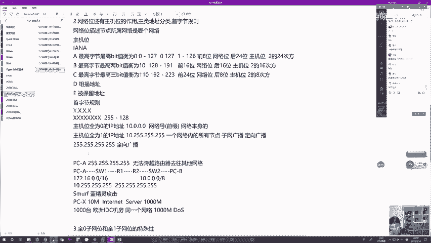

OK吧？好，那由于这两种地址咱们不能用啊，那所以说你购买一个主A类主B类主C类地址，对吧？你真实能够用的地址啊，是咱们计算出来那个值再减2减去是哪两个啊，对吧？一个就是全零嘛。

一个就是全一主机位全零主机位全一的地址，咱们是不能用，好吧，那接下来再说一下，首字节规则中呢，咱们主A类地址，首机范围不应该是0到127嘛，但是咱们实际能用的是1到126。原因是因为零和127。

咱们是不能用的。😊。

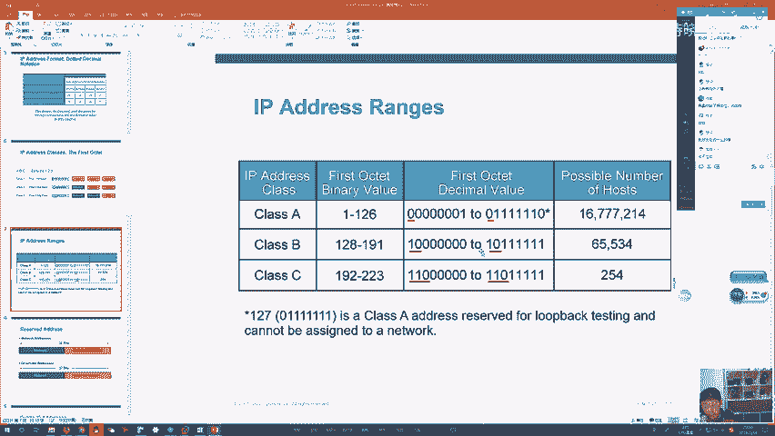

那为什么不能用呢？有原因的啊，也给大家解释一下，这个零有非常特殊的用途，对吧？其中最有名最有名的以零开头地址啊，就是所有位都为零的这种IP对吧？这种IP如果是你PC来用啊，我们称为叫未指定地址，对吧？

比如说你在PC当前呢你还没有拿到地址，但是你需要发包，而你需要发包，你需要添加一个三层报头，对吧？这个三层报头里面，咱们需要添加原模IP地址。那原IP就是你自己的IP你现在还没有，那怎么办呢？哎。

你就可以临时的指定为全零。全零代表就是说对吧你当前想要发送数据，但是此时此刻呢，你并不知道你的地址多少，所以说你拿全零来做一个临时替代，比如你一台PC对吧？你通过DHCP要拿地址啊，你要拿地址。

你就要发送1个DHCPdiscover报文这个discover报文，它在封装的时候怎么封装呢？这么封装呢DHCP。前面封装UDP，然后呢前面封装IP。然后呢，在前面。封装二层的爆头。

封装二层爆头后面的封装FCCS真伪对吧？它是这么封装。那接下来在它的IP爆头里面，对吧？原IP啊就是全零未指定地址OK吧，这是第一个特殊用途啊。然后接下来第二特殊用途就是当你在路由器的路由表中啊。

发现一个路由，它是全零的那这种路由我们称为什么呢？我们称为叫默认路由或者叫缺省路由。对吧默认路由或者缺少路由。那这个路由特别牛逼啊，这个路由不是指向一个网络的。

这个路由是指向整个英特网的这就是说你路由器收到一个数据包，如果你不知道该怎么转发这个数据包好，那这个时候如果你路由表里面啊有一条默认路由。

你就可以使用这个默认路由所对应的出接口和下一跳来给这个包呢做一个进行转发，对吧？你可以理解为路由表里面的默认路由就是路由器的默认网关，对吧？你PC的网关路由器也可以有网关，对吧？路由器的网关是什么呢？

就是拿默认路由啊来代替，对吧？默认路由能够转发，咱们正常无法转发的任何数据，对吧？只要你收到一个数据，你不知道该怎么发，你就拿默认路由来转发，OK好，然后接下来第二2个127，咱们不能用，对吧？

为什么127不能用呢，也举一个经典的。例子啊，127不能用的最经典的地址，咱们称为一叫127。0。0。1啊，这个叫还回地址，对吧？这个叫还回地址。这个还回地址是什么地址呢？它是一个非常非常特殊地址啊。

这个地址特殊的你任何接口，只要你把它启用了，这个还回地址咱们都会监听。我不管你这个接口当前有没有配置一个合法的IP啊，你最起码这个127。0。0。1，你是能够识别的。😡，你会时时刻刻的监听这个地址。

只要你收到发往这个地址的包，你就要接收，并且查看。所以说咱们称为叫还徽地址，对吧？那接下来黄辉地址怎么用呢？它用来做测试的。尤其是当你网络不通的时候，咱们可以拿这个地址来做一个联通性测试。请注意啊。

你一个网卡连一根线连到咱们网络。你要在排错的时候，最基础的排错设计是什么呢？就是先看一眼这个网卡灯有没有亮，你任何网卡都是指示灯啊。如果你连一根网线，你连着线没问题，并且你网卡的硬件没问题啊。

你的这个网卡的灯是会亮，对吧？只要灯是亮的，那代表你的硬件，你的物理仓是没问题。那接下来物理层没问题了，数据链层不用想了，你连接以太网线，咱们只能使用以太网协议嘛，对吧？你以太网协议想要通信。

前提就是你接口有个m克地址嘛，就OK了。那正常情况下，你灯亮代表你物理层数据量层啊都没什么问题。对吧？因为毕竟不是广域网线，你还能调整咱们广域网协议嘛，你双脚线不行。😊，那接下来一般灯能量如果不能通信。

那十有八九就是以三层的问题。那三层的一大问题是什么呢？就是你这个网卡的驱动程序没有装好，对吧？没有装好。那我相信大家对吧？你们如果买过组装机，你们都会有这么一个经验啊，买完组装机，对吧？你拼好之后。

我们要打驱动啊，你不打主板驱动，你主板不能识别，对吧？你不打那些什么声卡显卡驱动，你声卡显卡没办法好好工作是吧？当然网卡是一样的，你需要打网卡的驱动，这个网卡才能联网，那当然都然为了省事。

你一般都会安装什么啊，像什么驱动人声啊，驱动精灵啊，驱动之家，还有像什么鲁大师啊，对吧？大家经常会用的，你会下载这些东西。然后呢，下载完之后，你双击安装一个驱动，对吧？那看起来好像一切都OK啊。

但是请注意啊，你通过这种方式装的驱动，很有可能会装出问题了。对吧很有可能会装出问题。那抓这问题是什么呢？就是你看似咱们这个硬件啊那个工作，但是呢他有的时候对吧？可能就突然失灵了。

有的时候突然出现什么腰蛾子了，对吧？那这个是很常见。那所以这个时候如果说你发现这种问题，对吧？你怎么测试，怎么锁定到底是不是这个问题导致的呢？很简单，你就是通过pin啊来聘这个127。0。0。1。

你去pin这个地址。如果你聘这个地址能够聘通。😡，这就代表你这个网卡的TCPIP协议站啊是安装正确的。这变相你可以理解为什么呢？就是你这个网卡的驱动是安装没问题的。但是如果你聘制这的地址没有拼头。

不好意思啊，那代表什么呢？哎代表你的网卡驱动可能是有问题的那网卡驱动有问题怎么办呢？很简单，最简单的方法就是你把你这个网卡驱动给卸卸载啊，卸载之后，对吧？你从官网建议大家从官网啊下载一个最新版本的驱动。

你手工的把这个驱动给安装，那安装完毕之后就OK了。好吧，好，那这就是127。0。0。1的这么一个作用啊。一般情况下，对吧？你网卡不能上网啊，想要检测是不是协议站的问题啊，咱们可以通过P这个127。0。

0。1啊就能测试得到好吧，能并通是正常的，拼不通，对吧？有代表问题。

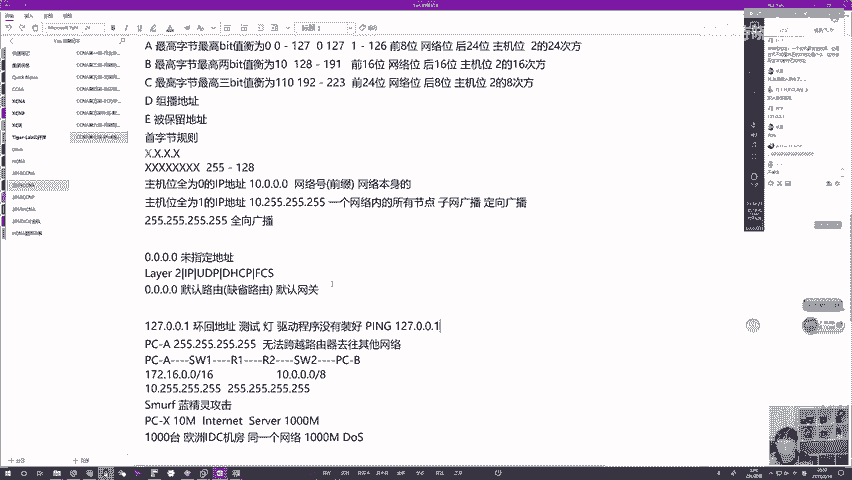

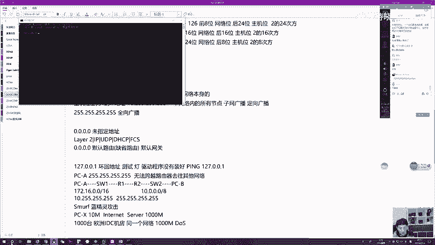

OK好了，那这个就是。不能用的这两个地址啊来给大家解释一下。那当然这个127不能用地址很多啊，除了127。0。0。1以外，还有很多其他的特殊地址，对吧？那这些特殊地址呢，它们的功能都已经规定好了啊。

所以说你不能拿这种地址来给我们接口分配，你配不了，他也不给你配，好吧，OK那这就是主A主B主C啊，那大家记一下。那接下来关于主A主B主C呢，大家有这么一个概念之后呢，我们来思考一个问题啊。😡。

对吧IP地址网络位用来描述你一个计算机在哪个网络中，对吧？主机位用来在这个网络内啊来做一个主机到主机之间的这么一个区分。那接下来是否可以理解为一个网络内的所有主机，咱们IP地址网络位必须相同。

而不同网络的主机，他们的IP地址网络位必须不同的。啊，答案是可以的，你必须要这么理解。只要你两台主机在同一个网络，对吧？那你们IP地址网络位必须相同。只要你们在不同的网络。

你们的IP地址的网络位必须不一样。😡，那这意味着什么呢？这意味着一个非常严重的事情啊，就是你购买一个主A类地址，对吧？你购买一个主A类地址，对。这个主A类地址段中的所有这接近1700万个地址啊。

你必须要在一个网络内去使用。而我们也知道啊，一个主A类地址段里面包含接近1700万个地址。你觉得1700万个地址在一个网络中咱们能用得完吗？大家觉得能用得完吗？对吧太大了，你们第一个想的就是太大了。

接近1700万个地址。关键蛋疼的是什么呢？你这1700万个地址，不是你想怎么用怎么用的，你只能用在。一个网络内。这他妈就尴尬了，你只能把这1700万个地址用在一个网络内。那换一句话说。

我们要思考一个问题啊，在一个网络内，咱们能包含1700万台计算机吗？😡，你不是在搞笑吗？一个网络里面1700万台计算机，你们知不知道1700万是什么概念？😡，一个人用一台计算机。

1700万个计算机就是1700万个人。整个南京只有800万人。这也就是说你两个半南京人口对吧？可以放在一个网络里面，你能放得了吗？我记得我前两节课跟大家说了吧，我们在设计网络的时候不能只使用交换机。

一定要拿路由器来做一个网络的分隔。为什么？就是咱们一定要限制一个网络的大小，你一个网络里面包含的主机数量必须可控。如果你主机数量对吧？超过300个，啊，别说1700万个啦，你超过300个。

你这个网络的整体质量就会下降。因为咱们都说了你一台计算机，你联网之后，对吧？你可能发送单波的数据，你也可能发送广播或者主播数据，而这种广播数据对于网络内绝大多数主机而言，是绝对没有什么营养啊。

除了会消耗他们的CPU内存带宽资源以外，对吧？没有什么卵用啊。那当然你一个网络里面。成员越来越多，你接收到这些莫名其妙乱七八糟的广播的概率就越大。那这个会直线影响到你的这个网络体验啊，你主机越多。

你网络品质越差，你网络体验越糟糕，你这个网络可用性就越差，对吧？咱们要网络肯定要高效的用，你为了保证咱们网络的质量，对吧？你必须要限制咱们一个网络内的成员数量。那咱们也说过了，最多300台计算机，对吧？

每台计算机要上网需要消耗1个IP地址。好家伙，你现在买一个主A类地址段，你拿1700万个地址给300台主机来用。那你消耗完300个地址之后，是不是还剩下1700万的？那接下来这1700万万该给谁用呢？

谁能用呢？对吧你如果给网络内的其他主机用没其他主机了，那能给其他网络用吗？😡，能给其他宝宝用吗？可不可以？那肯定又不行，对吧？你要是给其他网络用，那就出现一个问题啊，你多个网络里面的主机。😡。

使用相同的网络位地址吧，你这样不就冲突了嘛，对不对？因为咱们这个地址的网络位收来标识网络的，你明明主机在不同的网络，你非得给他们配置相同的网络位地址，你这不搞笑吗？这不就地址冲突了吗？

那所以说这就非常尴尬，对吧？1700万个可用地址。我只需要用你300。对我还是花重金来买啊。然后紧接着网络内没有其他人需要用地址了，我又不能把地址用于其他网络。那换一句话说。

是不是可以理解为这剩下的1700万个地址就全浪费了。是不是？😡，就全浪费了吧。好，那接下来问题来了。我们能够经得起浪费吗？IPV4地址能够经得起浪费吗？你们觉得能不能？我觉得肯定不行啊。是吧肯定不行。

不是一个网络超过300个地址会怎么样，是一个网络里面节点数量超过300台会怎么样？会导致咱们网络品质下降，网络质量会变差，能理解吧？好，请注意啊，咱们地址绝对不能浪费的，来给他家算笔账啊。

为什么不能浪费？因为咱们整个IPV4一共地址只有32位，对吧？你32位地址，假设他们全是单波地址啊，其实事实上还不是，你就假设它全部都是，那咱们满打满算地址总数二的32次方，对吧？

我们也假设没有任何地址不能用呢，都能用，那你一共怎么样，也只有42亿个地址。😊，那这42亿个地址给谁用啊，给整个英特网用啊，整个英特网覆盖七大洲五大洋对吧？里面包含的节点数量好几十亿台，对吧？

因为咱们地球75亿人口左右嘛，75亿人口左右，假设有半数人口都上了，那咱们就已经怎么样？37亿了，37亿人口，对吧？你每个人要用一个地址，那咱们要消耗37亿个地址。比说咱们现在消耗地址的不光光计算机。

你还有手机呢，对吧？一般一个人是计算机上网的同时，你手机还上网。那如果说咱们每个人消耗两个地址，那这个IPV已经遭不住了，然后更别提咱们除了计算机消耗地址以外，你还有那么多服务器呢？对吧？

你还有那么多路由器呢？多层交换机呢？防火墙呢，你们是不是都要消耗地址啊够用吗？根本就不够，那更别说了，42亿个你都是单波地址吗？你单波地址最多只能占其中一半嘛，是吧？还有很多其他的主播地址啊，对吧？

被指定地址啊，对吧？这些都有啊，对吧？你不是说所有地址都是单波地址，所以说当然有这么一个概念，就是IPV4为什么现在被淘汰啊，就是因为你地址数量太少了，你地址空间只有32倍够吗？根本不够，远远不够。

不够到什么程度呢？不够到你的地址，13年2月。😊，就卖光了6年前的2月份，6年前的今天，这个地址就你卖光了，一个不剩，直到这。对吧相当于6年前啊，我们6年前的网络体量跟现在比。😊，我估计连一半都不到。

这就是说经过这6年时间，整个英特网翻了一倍，节点数量翻了一倍。那为什么咱们今天还能使用IPV4啊？因为咱们使用一些特殊手段，可以把这些特殊手段让我们IPV4苟延残喘到今天。

当然呢真的已经是hold不住了，真的已经hold不住了。就算使用那个方式，对吧，照好咱们现在互联网发展下去，你这个地址对吧，根本就不够看。所以说咱们才要迁移到IPV6嘛，迁移到IPV6的理由是什么？

IPV6的地址空间128倍啊，128倍，它的地址空间是IPV4的2的96次方倍，这是什么意思啊？你IPV4有42亿地址对吧？IPV6地址数量是42亿乘42亿，再乘42亿，再乘42亿。那这样才够用。

能理解吧？那所以说了IP地址，咱们一个都不浪费啊，就已经根本不够了。如果你再要这样咱们刚才那种方式来浪费，对吧？那根本就没得玩了，那就不是13年2月被用尽了。我估计03年2月就耗尽。可以吧？好。

那接下来主B类是不是相同的问题啊？你主B类虽然没有主位类那么夸张啊，但是你里面好歹也包含65000多个地址。你这65000多个地址买回来之后，是不是也只能在一个网络内用啊？好了。

一个网络那300台计算机，你给他们消耗完300个地址，是不是还剩下65000个啊。😊，能浪费吗？😡，咱们不想，但是以前咱们只能去浪费，因为你不能把这些地址啊用于其他网络，对吧？那相比之下。

只有主C类还靠谱一些，对吧？里面包含254个地址。你在一个网络中，咱们有可能还不够用，对吧？然后就算够用，就算你主机数量少一些对吧？浪费的好歹不会那么多。好了。

那这就是咱们曾经啊在使用IPV地址的时候面对的一些问题。那这个问题呢咱们一定要解决。因为地址真的不能浪费，你哪怕一个不浪费，对吧？它根本不够用啊，你要是浪费了，那就不要贪了是吧？更何况对于买方而言。

他们也不想浪费啊。哥是花钱买来的地址不是免费拿的，地址特别贵啊，地址特别贵。你让我拿重金买来地址说浪费就浪费，那我也不能接受啊。那所以说呢出于双方角度来考虑，咱们都要想出一个办法来节约地址。

想来想去想来想去真的没有什么好办法了，那最终只能使用这么一个方案。什么方案呢？就是还是要将。同一个鼠类。地址段中的不同地址用于不同的网络之间。你只能这么做，对吧？

你绝对不能说是在一个网络内啊去存在1700万台主机，这太不切实际了。你一个网络里面最多还是只是包含300台主机。所以说呢为了避免浪费，你唯一的方法，对吧？就是把你这个主类地址段中的不同地址用于不同网络。

但是呢你若要这么做，就要解决我们刚才第二个问题了，就是如果说你要这么做的话，对吧？你要避免什么？你要避免地址冲突。因为咱们的规则是什么？不同网络的主机IP地址的网络位必须不同，😡。

如果说你们的IP地址网络会相同，那不好意思，你们必须要在同一个网络内。如果你们要在不同的网络之间想要这么做，那就是地址冲突。对吧？咱们要保证他们不能出现地址冲突。那这个该怎么办呢？那想来想去。

咱们只有一种方法。就是我们去私自重新定义地址的网络位和主机位的长度。可以吧，请注意啊，早期咱们IP地址的网络位主机位的长度是由INA规定的，主A就是前八位是网络位，主B就是前16位，对吧？

主C就是前24位，那这个咱们称为叫不成文的规矩啊，不成文的规定。那既然这都已经是不成文的规定了，代表什么？代表我如果不按照你这个来，是不是也可以啊？对吧反正大家想啊，我购买一个主A类地址。

你只是我规定了什么，规定了我前八位的值，我后24位是不是可以为任意啊，是吧？那接下来这后24位如果可以为任意的话，我干嘛不能把后24位的这些主机位中比较靠近网络位的这些位重新定义成网络位呢？

我有没有这个自由呢？😡，请注意，我是有这个自由的。我是有这个自由的。比如说我举个例子。😡，我购买一个主A类地址段，11。0。0。0。按照官方的定义，这个地址前八位是网络位，对吧？后24位是主机位。

然后呢，咱们前8位不能动，后24位随你变。那那接下来我买回来之后，我不爽啊，我就说了，我偏不这么干。😡，你要我这么来，我偏不这么来。😡，那若销怎么来的？我希望咱们买回来这个地址啊。

前十位是网络位行不行呢？可以随我便反正说我买的对吧？只要你这个网络也不要越定义越短啊，你越定义越长，这个是没关系的，你往长去定义，没事儿，你只要不要往短去定义就好了。好，你往长去定义。

那接下来在我的规定下，前十位是网络位，这是什么意思啊。😊，这个就是说。😡，在我的定义下。第二段的前两位怎么样？它也变成了注意啊，第二段的。第二段的前两位啊，它原本是什么？😡，它原本是主机位，对吧？

在我的重新定义下，它也变成网络位。那当然这两位呢是我的私自定义下所称为的网络位啊。那你在称呼上不要把它称为叫网络位，我们称为什么呢？我们称为叫子网位，对吧？我们把它称为叫子网位。

这个子网位就是在我人为定义值下，它原本是主级位，现在呢变成网络位。那接下来由于这两位，他们原本是网络原本是主级位，对吧？它们的零和一的值，咱们是可以任意改变的吧，对不对？那所以说了它们俩0101的。

有4种排列组合吧。那有4种排列组合相当于是咱们把这个大的主类地址段啊分成了4个子网位，哪四个呢？好，当然这两个位都为零的时候啊，咱们这个子网是11。0。0。0。当这两位为01的时候，咱们的地址是11。

64。0。0。当他们俩为10的时候，咱们是11。128。0。0。当他们为11的时候，咱们是11。192。0。好，那大家可能会问，哎，你这个64128192怎么来的？请注意啊，你借的这两位啊。

在你的重新定义下，咱们是第二段的最高位两位变成了网络位，他们俩原本是主机位，对吧？现在呢是网络位，那他们都为0。对吧那这第二段肯定为零嘛，它们为0一注意啊，这个一是最高的第二位的一啊，它是二的7次方。

二的7减1次方嘛，就是二的6次方，二的6次方是64啊，所以这位至一，它对应的值是64，对吧？然后这位置一呢，它是最高位对吧？最高位是二的8减1就是7次方，128呢，对吧？那当他们都位一的时候呢。

是不是就192，能理解吧？所以说在我的私有定义之下，相当是把我这个主类地段啊分成了4个子网，这四个子网，它们的网络位长度都是前十位，可以吧？前十位是网络位，那接下来按照前十位网网络位来看啊。

你这四个子网，它们的网络位是不是确实不一样，那既然你们的网络位不一样，我能不能把你这四个子网段中的地址用于四个不同的网络呢？答案是可以的。你这么用对吧？第一，咱们节约的地址，第二。

你也不用担心不同网络的主机使用同类啊，同一个主类地址段中地址啊会导致地址冲突，因为你们用的地址，如果在我的定义下来看，你们的网络位是不一样的，对吧？你如果按照主类地址来看，如果是前八位是网络位来看啊。

你就是瞎扯淡，你这些都是属于什么？同一个网络的，对吧？你们是属于同一个网络的，因为在你们来看的话，前八位是网络位，你们的网络位相同嘛？但是如果按照前十位为网络位来看，你们这四个网络，对吧？

你这四个地址段啊，你们的网络位就是不一样的那既然不一样，你们就可以用于四个不同的网。能理解吧？好，这就是所谓的子网化，可以吧？这就是所谓的子网化。子网化的特色是什么？就是把曾经的对吧？把曾经的。😡。

主机位。强行的变成网络位。那这个行为我们称为什么呢？这个行为咱们称为叫地址借位啊，地址借位，对吧？你原本是主机位，我给你借成网络位。那当然借多少位谁说了算呢？没人说了算。那所以说你想怎么来。

你就可以怎么来。😡，你可以借一位，你可以借两位，你甚至可以借10位。当然你不要太过分啊，你不要说借的一位，主机位都不剩了，这不行啊，因为你地址最终还是要给我们PC用的，你主机位还要留那么一些是吧？

那留几位好呢？那咱们能不能只留一位啊，不行啊，主机位不能只留一位？你主机为什么只留一位，你只有两个可取值吧，要么为零，要么为一，如为零什么意思啊？如果为零的话，你就是主机位全零嘛，你就是网络号。

你就是前缀。若说你这位为一呢，我靠，那主机位都为一了，定向广播了嘛。我们说过啊，主机位全为零和主机位全为一的地址，咱们是不能用的，那所以说你主机位不能只留一位，你只留一位，对吧？你任意取值咱们的用量。

所以说了主机位啊最起码留两位，对吧？你要最起码留两位。你留两位两位主机位，那咱们里面可以包含多少主机啊，反正00不能用，01不能用，对吧？咱们能用的只有01和10，对吧？咱们能用的只有01和10。

OK那所以说呢这种主机位只剩两位的地址对外，对吧？你里面只能够包含两个节点是吧？一个节点使用这个一个节点使用这个是吧？那这个非常适合点到点网络，非常适合点到点网络，好吧，这个点到点网络跟大家说过吧。

就是两个节点之间连根线嘛，在这个网络中不是你就是我不是我就是你除了咱们家以外没有任何第三个人，对吧？那在分配地址的时候，我拿一个你拿一个对吧？

你也不需要第三个所以说呢你拿这种只有两位主机位的地址对外来给这种点到点网络使用，那这个是最节约的对吧？那这就是所谓的私网化。还需要我给大家解释一遍吗？😡，简单来讲，什么叫子网化？

对吧就是解决咱们地址冲突嘛，对吧？就是解决咱们地址冲突。我现在希望把一个主类地址端中的不同地址用于不同网络。我要保证不同网络中的主机，你们在用了这些地址的时候，对吧？不至于地址冲突嘛。

那怎样你们就地址不冲突了，只要你们网络位不一样，是不是不冲突了。但我能做到吗，我做不到，因为我在买地址的时候，咱们网络位不能动，那所以说呢为了做到这一点，我就重新规定网络位长度。

原本我这个地址网络位只有8位，现在在我的规定之下，我认为你1位都是网络位，对吧？你前十位都是网络位，那也就是说相当于咱们额外的把之前这两位最高位的主机位，现在的强行怎么样，把它们变成了网络位。

那这个我们就称为叫子网位，那这些子网位呢，毕竟咱们曾经是主机位，对吧？你想他们为零，他们就为0，你想它们为一，他们就为一，你可以自由改变它们的值嘛？那既然可以自由改变值，你就相当于通过这种方式怎么样。

把我们这个大的主类地址段变成了4个子网，为什么是4个？因为你借了两位？借了两位能够分出的子网数量是二的2次方，对吧？将来如果说你只借一位呢，那就是二的一次方，你只能画出两个子网。你若果借了三位呢。

那就是二的3次方8个，你如果借了4位，那就二的4次方16个，简单来说，你借多少位，对吧？你就相当于是把你这个大的主类地址段分成对吧？二的多少次方个小的子网，为什么说小的子网呢？

因为你在借之前你在借位之前啊，你这个主类地址段里面包含的是24个主机位，而你借位之后，咱们主机位的数量是不是变少了，那变少之后相当于是你每一个子网里面能够包含的主机数量就变少了，但是不要紧，对吧？

你只要根据咱们的需要，对吧？你不至于说是借太过分啊，你总能说是借完之后，把这个地址段给一个网络分配的时候啊，不至于担心说是地址不够用，你不用担心这一点。😊，只会说地址过多啊，不会说地址不够用。

你只要按照需求来就好，对吧？那这个行为呢咱们就称为叫私网化，好吧，这个行为就称为叫私网化。那接下来这个子网化呢有两种子网化的方式啊，一种咱们称为叫FLSM。还有一种呢，咱们称为叫VLSM。

这个FOSM呢翻译成中文，我们称为什么呢？我们称为叫定程。死网岩马。叫定程子网掩码。什么叫定程子网掩码呢？😡，简单来说就是。在你经过借位之后啊，你把一个主类地址段划分成了若干个网络位长度。

完全相同的子网对，那这个就叫FLSM对吧？比如在我们刚刚这个例子中啊，你这个主A类地址段，对吧？咱们借了两位嘛，借了两位之后，你划分出了4个子网，对吧？你这四个子网的网络位长度都是10位。

那这就满足FLSM的定义，对吧？你通过借位把一个主类地址段分成多个子网。你这多个子网怎么样？网络位长度是相同的那这就是FLSM。而什么叫vivoSM呢？这个叫不定长子网源码。

当然也有地方把它称为叫可变长子网页码啊，叫可变长子网页码。那它的特点是什么呢？就是当你通过子网化啊，你把一个主类地址段分成若干个子网，并且这若干个子网，它们的网络位长度。😊。

它们的网络位长度啊是不一样的。不一样的对吧？是不一样的那这个就是V23。那既然这个VI3怎么实现啊，大家可能一脸懵逼啊，哎，怎么实现呢？很简单啊很简单，大家想啊，我们在这个例子中你购买一个主A类地址段。

对吧？我们现在规定了你前十位是网络位，对吧？你通过这么一次借位，把这个地址段怎么样分成了4个子网。😊，那对于这四个词，你能不能拿他们进一步的借位呢？😡，可以的不是不可以，不是说你借完位之后。

这些地址必须要用，对吧？先借位再使用。那当然你借位也不可能说是永远只借一次，在某些情况下，你可以反复多次借位，对以吧？你借一次位分成多个子网怎么样？然后针对某一个子网啊，再借一次位，好吧，你再借一次位。

把这个子网呢又分成多个更小的子网是可以的，咱们可以这么玩，好吧，那接下来假设咱们就拿这个子网啊来进一步借位，好吧，咱们进一步借位，我们把它再借两位是吧？再借两位。因为你原本这个地址段前十位是网络位嘛。

对吧？那现在我不爽。对我想规定你前12位是网络位，好吧，你前12位是网络位。那接下来咱们借着哪两位呢？借的是第二段的。好，注意啊。咱们借的是这两位。咱们借的是这两位好吧，借的是这两位OK。

那接下来这介入这两位，你这两位都为0，咱们地址是什么？咱们地址是11。192。0。0嘛，对吧？你这两位都为0嘛，那你们为01呢，这位之一是几啊？是16，对吧？16就是11。208对吧？点0。0。

然后接下来它为10呢，这位之一这位是32对吧？32几啊，11。224，对吧？点0。0，然后接下来你们为1一呢，1一就是32加1648，对吧？48，那就是11。240嘛，点0。0。能理解吧。

ok那这就是借完位之后的结果。那接下来你要按照总结果来看的话，你相当是把这个主A类地址段啊通过两次借位划分出了什么？7个子网，你划分出了7个子网，而这7个子网中前三个子网，网络位长度是10位，对吧？

后四个子网网络位长度是12位，对吧？你们的网络位长度是不一样的那这就是VLSM。那当然VOSM跟FOSM呢同样作为子网化，那他们的目的是一样的，就是通过借位把一个大的主类地址段分成多个子网。

然后呢把不同的子网的地址用于不同网络，这样怎么样来节约咱们的IP来节约咱们的IP那这是借位的目的，可以吧？这个是借位的目的。那当家既然借位，咱们是为了节约地址，我们叫比效果。同样是节约地址。

你们觉得是FOSM更省地址，还是vivoSM更省呢？😡，我觉得大家都不用想啊，肯定是VLSM更省一支。因为你vivoSM能够更加DIY嘛，你能更加根据咱们网络的情况来定制化的戒呗，对吧？

因为你毕竟一个园区你若干个网络，你总有网络大，有网络小，对吧？对于大网络，那就给它分配大子网嘛，给它分配那些主机位长度比较长的子网，而对于那些小网络，你就分配小子网嘛，对吧？

你分配那些主机位长度比较短的子网，是吧？那这样分配完毕大家懂的，是吧？你能够因地适宜，而你要使用FOSSM好了，咱们一刀切，你把一个主类地址段切成若干个子网，你每一个子网大小一样。

那你把这些大小一样的子网用于大小不一样的网络，那对于那些比较大的网络，你是比较适合的，而对于那些比较小的网络呢，你还是会造成地址浪费嘛，是吧？那大家想来想去，肯定是用vivoSM好啊，那为什么。

咱们还会有FLSM呢。好，请注意啊，这个FLSM是应对于早期。早期呢路由器跟咱们现在路由器不一样。路由器呢分为两类啊。一类咱们称为叫有类路由器。还有一类咱们称为叫无类路由器，对吧？

有类叫classful。无类呢叫class list。对吧一类叫classful，一类叫classless。大家还记不记得我跟大家说过路由器呢，它主要负责是网络间的数据转发。

你要把一个数据包转发给一个目的网络，路由器得要先知道这个目的网络在哪里。对吧你得要知道目的网络在哪里，你才能知道去往这个目的网络路径信息是怎么样的那这个就是所谓的路由。

那接下来这个路由咱们通常怎么获得呢？你要运行动态螺选的协议。那在若干动态路由选择协议中啊，有这么一类，我们称为叫距离矢量协。可以吧，距离矢量协议。那这个距离矢量协议作为路由选的协议中最low逼的协议啊。

它太垃圾了。你两台路由器运行这样的协议。对吧每台路由器呢都只会把他自己已知的路由信息通告给邻居，对吧？那我在通道的时候呢，就是直接把我路由表里已有的路由啊给我的邻居发走，对吧？

然后接下来如果你路由器是有类路由器，你只能使用有类的距离矢量协议。而在使用有类距离矢量协议的时候，我一台路由器把一个网络路径信息告诉给邻居的时候。我只能够告诉邻居关于这个网络的前缀是什么。

而这个网络的掩满。我是不能告诉你，我不能告诉你这个网络对应的掩码。当然这个掩码跟大家说一下，掩码是用来描述一个网络的网络位长度，对吧？掩码是用来描述一个网络的网络位长度，对吧？我只能告诉你咱们这个网络。

它对应的前缀是什么？而它的网络位长度多少位，我不能告诉你，那接下来对于接收者路由器而言，他就懵逼了，你告诉我一个网络你不告诉我它的网络位长度，那这个路由咱们没法用啊，对吧？那为了使用。

我必须得给你变出一个掩码，那这个掩码咱们怎么变的，我得靠猜了，对吧我得懵连蒙带猜猜你这个路由掩码多少位，那大家懂的，你猜掩码，你怎么猜啊？对吧？你得有机可学，那所以说为了保证你接收路由的接收方啊。

能够猜对掩码，你在这个有类网络环境中啊，你在做地址规划的时候，你就必须要遵。学一个原则，就是你尽可能使用地址的时候啊，你就不要结尾。你不要使用子网化，你不使用子网化，直接使用主类地址。😡。

这种情况下运行有类路选的协议啊，是绝对不会出现任何问题。因为你在这种情况下接收方路由器收到如无条目，你是绝对不可能猜错掩码。对吧，当然大家也都也都知道啊，你这样做代价太大了，咱们地址浪费太过厉害。

那所以说咱们就退而求其次啊，哎，我允许你做子网换，对吧？咱们折中一下。但是你做子网化，你也别太过分，对吧？请你只使用什么FOSM你要使用子网化，我忍了，但你要给我保证啊，你做完子网化之后，对吧？

你一个主类网络中的所有子网，你要保证他们的网络位长度是相同的。你若果能保证这一点，那你又有类协议，哎，也是没问题的。当然如果说你要再再过分一些啊，你要使用vivo SM对吧？你给我乱结尾。

你给我把一个主类网络分成若干个对吧？网络为长度不一样的字吧。好，不好意思，在这种情况下，你如果运行有类无型的协议，会导致两种结果。第一个结果是。对吧我一台路由器压根儿就没有办法把路由给邻居发走。

我发不过去，就没法给你发。第二种可能是我路由给你发走了，对吧？但是由于VSM嘛，这个掩码的蛋疼的问题啊，你猜路由掩码猜错了。那猜错了会导致什么呢？导致你整个网络连通都通不了了，你就不用说其他的，对吧？

你网络小运作好歹要能通是吧？那通基本都是路由选择协议给我们带来。对吧那所以说呢早期这些有类协议嘛，对吧？用在有类路由器上，你想要让这些协议好好工作，那你地址规划对吧？那最好就不要自网化。那如果你退一步。

一定要子网化，对吧？那你最起码要保证你使用FL。那当然大家都知道，有类路由器已经被对吧？历史淘汰了啊，对吧？太垃圾了。现在咱们能见到路由器啊都是无类的那你无类路由器咱们运行都是什么？无类撸选的协议嘛。

对吧？这些无类撸选的协议没有这么多1蛾子，我不用你猜任何东西，那所以说呢你也不会猜错。你既然不会猜错，那你这个子网化对吧？想怎么做就怎么做，你想怎么玩就怎么玩。那所以说得出一个结论。

如果你在一个环境中对吧？用的有的路由器。或者你就算用的不是有类路由器，但你运行了有类路选的协议啊。那咱们在做子网化的时候，你就要使用FL。但是反之对吧？如果你路由器都是无类的是吧？

然后你运行的路由选择协议也都是无类的。哎，那这个时候你就可以使用VOSM对吧？那当然我们当前的基本路由器都是无类的啊。你运行的路由选的协议，像什么OSPF啊，像什么Iize啊，像什么EIGRP啊，对吧？

也都是无类协议，那所以说了你不用担心会猜错路由掩码这种事情发生啊，那这个VOSM呢，想怎么用就怎么用。好吧，好，那接下来介绍完子网化之后呢，给大家说一下啊，在当前咱们的网络环境下，这个子网化呢是。

对吧一定会用的，对吧？你如果不用这把IPV4完了，之所以IPV4没有完，对吧？原因就是因为咱们通过子网化确实节约的地址没有太过浪费，对吧？没有太过浪费。

那接下来这个既然子网化已经是分配IP前必做的这么一件事儿。那这个时候大家就思考一个问题啊。咱们还能不能傻乎乎的按照曾经那种主类分类的方式。来判断你看到的1个IP地址的网络位跟主机位长短。

你还方便这样做吗？啊。你还能不能说是我看到1个11开头地址，A，主A类前八位网络位，你还能这样吗？是不是就不能了？但因为你借位了。你借完那之后，你地址怎么样？网络位程度是变化的呀，对吧？

并且这个变化有规律吗？它就没规律。你不同的企业，咱们的企业网架构不一样，对吧？你不同的园区里面咱们网络情况不一样。😡，我们这个借位是一种非常DIY的行为。你根据你网络特征来记，我根据我网络特征来记。

虽然咱们可能曾经都是主A类地址，但是咱们借位的法则完全不一样。😡，那我总不好去猜你怎么借位了，我没法猜。那所以现在就很尴尬了，对吧？我们知道现在咱们用的地址都是借位后的子网地址。但是你怎么借的？

由于根本就没有规律可循啊，所以你就必须得给我借助一个工具。来帮我判断这个地址到底多少位是网络位。那所以说咱们就出现了一个工具，这个工具咱们称为叫子网掩码，可以吧？现在呢咱们给计算机配置IP地址，对吧？

你配完IP地址之后，你必须要配置一个对应的子网掩码，当然你还得要配置个网关地址。那接下来子网掩码有什么用啊？哎，它作为一个工具啊，就是用来描述1个IP地址，你网络位有多少位，对以吧？那当然这个子网掩码。

咱们建的比较多的，像这样的对吧？像这样的，然后呢，像这样，这些都是子网掩码，它的特点是什么呢？高位是连续的一低位呢是连续的零，好吧，高位是连续的一低位是连续的零。那这个子网掩码的高位的连续的一。

是用来描述IP地址的这些位啊，是网络位，对吧？此网掩码这些连续的零是用来描述它所对应的IP地址，这些位是主机位。对以吧？比如我举个例子，11。128。172。1，掩码，这样来，这是什么意思呢？

这例子就是说咱们这个IP地址啊，前24位是网络位，然后呢，后8位是主机位，能理解吧？是吧？子网掩码一啊，所对应的IP地址的位是网络位，子网掩码的零所对应的IP地址的位就是主机位。

那所以说了当你给我一个子网掩码之后就一切好办了啊，对吧？你根本不用跟我说你这个借位是怎么借的，你只要给我一个子网掩码，我一看子网掩码就知道对吧？你这个IP到底前多少位是网络位，后多少位是主机位，对吧？

那当然刚才这个例子咱们对一下，你第一次借位是吧？前十位是网络位，对吧？你对应的子网掩码是什么样的，就是这样，对吧？你们的子网掩码都是这样。😊，是吧都是这样的。然后接下来第二次借位之后。

你的前12位是网络位，对吧？那咱们就是这样，对吧？你的子网掩码就是这样。前十位都给你至一嘛，后面的怎么样都给你至0。是吧，这就是子网掩码，可以吧？那有了子网掩码了就牛逼了啊，你不管怎么借位无所谓。

反而你写地址的时候加一个子网掩码，我就能根据子网掩码来判断这个地址到底什么情况。前多少位网络位，后多少位是主机位，好吧，啊，子网掩码是非常必要的。然后接下来子网掩码还有一个用法啊。😊，你拿1个IP地址。

😡，跟这个地址所对应的子网掩码来做一个布尔罗辑的与运算啊，来做一个布尔罗辑的与运算。哎，得到的结果永远是你这个网络对应的网络好，对吧？与运算，大家都知道吧，什么叫语运算啊？00得0嘛？

01得0一0得0一一得1对吧？00得001得01010得011得1，简单来说就是零跟任何东西与啊，结果都为零，对吧？然后呢，一跟任何东西与结果不变，是吧？

那接下来你如果拿一个子网掩码跟一个IP地址做运算，你网络位对应都是一吧，语出来的结果是不变的，你主机位对应的都是零吧，语出来结果都为0IP地址都为零的这主机位全为零的IP地址啊，我们称为叫对吧？

网络号嘛，那这个网络号是用来标识你这个网络本身的对吧？咱们通过这个来判断你这个主机到底属于哪个网络对吧？我根据的IP根据你的子网掩码就能对吧？判断出来你到底是哪一个网络对吧？然后接下来我也说了。

咱们网络中通信分为两种嘛？一种叫。网络内通信。一种叫网络兼通信，对吧？那大家会想，你一台计算机，你怎么知道你通信的对端跟你在不在意网络啊，很简单嘛，对吧？我本地主机知道我自己的IP地址。

还有子网掩码是吧？然后接下来我对端的IP地址是吧？我也知道，那接下来我怎么判断，咱们在在不在同一个网络啊，很简单啊，我拿我的子网掩码跟对端的IP地址做一个与运算是不是得出一个网络号啊。

然后我再拿这个子网掩码跟我的IP地址做一个云算，也得出一个网络号，咱们对比这两个网络号是否一致嘛。如果咱们两个网络号一致，那咱们就是在同一个网络内，你在同一个网络，那咱咱们就好说了吧。

我就直接给你通信了。那如果咱们不在同一个网络呢，哎，我就要利用网关来发送数据给你对吧？好，这就是子网掩码的这么一个作用，很有用啊，很有用。😊，好了，那接下来讲了半天啊，还有一个点没有讲。😊。

就是公有地址和私有地址这么一个关系。那当然咱们也留点悬念吧，留点悬念。因为毕竟今天情人节嘛。😊，留一个情人节的present。那今天大家非常给力啊，今天大家来能来的都是真爱粉啊，都是真爱粉。

我们留到明天给大家讲吧，明天呢正好咱们又课意快要讲到路由器的配置了，对吧？要给大家演示一个模拟器。这种模拟器呢叫EVE还是比较牛逼的。我要教大家怎么去装，怎么去用，并且给它导入一个新的那个。

新的那个IOS啊，1个nexus9000的1个新的IOS，方便大家做V圈net实验。那这个模拟器呢咱们讲的时候留点时间吧，留点时间。前半段给大家把这个公有地址和私有地址给讲了。好吧。

明天呢咱们还是同一时间啊，晚上8点好吧，然后接下来第一次来的小伙伴啊，哎，大家呢可以加一下咱们这个群，好吧，加一下咱们这个群。然后呢，目前咱们还算在年内啊，一些年内的优惠活动还在。

大家如果觉得咱们课不错的话，可以咨询咱们群里面的咨询顾问老师，然后来报名咱们后续的MP还艺课程。当然我是非常欢迎大家的，对吧？因为大家喜爱咱们的课程嘛，所以说啊，无论是节假日圣诞节，对吧？

还是什么端午中秋还是什么情人节，反正我是能上课的时候，尽可能给大家上课，好吧，那希望大家能够喜欢咱们的课程。然后有什么问题或者说意见和建议都可以在群里跟我们科各位老师说啊，有小问题说。说。

怎么通过网关和IP算出来子网页码？网关和IP怎么算成子网源码？他们之间没有关系啊。划分子网后，使用最后一个子网的广播地址。广播只是针对最后一个子网。还是整个主类网络。我不太懂你的意思啊。哦，哦。

我懂你的意思了，就是你在有类的环境中。全一子网是不能用的。所以说你不用关心这一点，就是说你借完内之后，你借出一个子网，这个子网广播只会关只只会影响到这个子网本身啊，不会影响到整个网络。

就是你你在有类环境中全一子网是不能用的，全零全一子网不能用，在无类环境中才能用啊。然后你在无类环境中，咱们也能区分类，因为有子网掩码，所以说你不用担心。

就是说全一子网的定向广播会影响到咱们整个网络不会的，我我能听懂它是什么意思啊，我能听懂它是什么意思。能说一下凡码吗？凡码它跟这个掩码不一样啊，凡码叫通配符掩码，它的官方叫法叫通佩符掩码，其实它不叫砝码。

对吧？它不叫砝码，它叫通配符掩码。啊，凡码它是用来标识一组连续的IP地址。一般在A4L中，还有那个路由选择协议宣告的语句中啊，咱们会使用这个通配付验码，它不叫反码啊，它叫通配付掩码。🤧咳。好。

他叫烘佩敷炎嘛。好吧。点到点网络在什么时候应用啊，你一般广域网网络都使用点到点啊，包括你现在那个。电信的PPPOE拨号吗？咱们那个PPPOE就是您使用以太网的连接。

但是我在你以太网基础之上虚拟1个PPP连接嘛。有NATPAATIPV4地址够用了吧，肯定不够用啊，就是因为不够用才使用IPV6啊。你ATPAAT只能解决咱们地址的复用问题。

但是你提供了IPV4地址复用之后，对会造成咱们通信的不连续，还有通信的不对等。就你正常的通信是咱们俩都有IP地址，我能访问你，你也能访问我。但是咱们在当前的IPV4环境下是我能访问你，但你不能访问我。

我能发送给你，你不能你能回回来，但你不能主动访问我，这个通信是机型的，就是因为这个机型的通信模型，咱们为了保证通信的对等。对吧你才需要什么专线啊。

VPN啊之类的那这就造成了咱们企业要花费大量的钱去购买这个连通信。而这个在IPV6中都不成问题，并且IPV6的安全性会更强。它在各方面都调到IPV4。就是在标记数量的时弄不懂。

那你可以根据咱们后续的课啊，你可以在我们后续的课中去理解。你为简单理解为砝码。砝码的零是代表固定不变。凡码的一是代表任意。比如说172。16点。0。00。0。0。255。这就是标识了256个连续地址。

它们分别是172。16。0。0到172。16。0。25。因为这个砝码就是说你这段地址的前24位是不能变。你的后八位可为0，也可为1，对吧？就这么意思。比如说192。168。10。00。0。0。3。

这就是标识了连续的4个地址。对吧，连续了4个地址。0123嘛是吧它的范围是192。168。10。0到192。168。10。3。是吧因为你这个三是最后两位都为一嘛。是吧那最后两位都为一。

代表是你地址的最后两位可为零可为一是吧？就是这么一个意思。那。你们需要学习linuxwindows server两个系统操作方法，了解一些可以啊。但是作为网络工程师的话，仅限了解一些就okK了。

散码有什么作用？刚刚不是说过了吗？一个地址加一个凡码用来标识一组连续的地址范围，而且这个叫通配敷衍嘛，好吧，这个叫wed card mask。它的官方叫法叫we要ca。Mask。好吧，就要通沛敷衍嘛。

给你1个IP地址，怎么算出它的子网页码，你没法算啊。你怎么算啊，你就没法算啊，子网掩码是让你要告诉别人的。什么叫算子网掩码？😡，你怎么算啊？根据你的借位嘛，根据你的借位来判断子网掩码是多少吗？啊。

你们到底有没有听懂咱们这节课的内容啊？你主类类地址，比如说你主A类11。0。0。0，你这个主类地址对应的主类言码是这样的吧，前八位是网络位嘛，对吧？那就前八位都为一，后24位都为0嘛？好了，我现在借位。

你要借两位，借两位分成4个子网对吧？这四个子网网络位长度都为10位，那10位网络位怎么表示啊？255。192。0。0嘛？是吧？那接下说你要借了三位呢？那就是11位网络位，对吧？11位网络位就是255。

24。0。0嘛？你要借了4位呢，借了4位那咱们就是12位嘛，那就是25。240。0。0嘛，能理解吧？这个子网掩码，不是你怎么算出来，是要根据你借了多少位。

你是要拿子网掩码来表示这个IP地址多少位是网络位。能理解吧？所以这不是怎么算，你只要知道二进制十进制转换，我给你报出网络位长度，你把它表示成子网掩码就可以了。能理解吧。若不借位，能自己自定义一个吗？

我要请问你怎么自定一个？你怎么自定义一个？你怎么自定义一个？你买1个11。0。0。0的地址。你怎么自定义？你的网络也能变吗？😡，你网络也不能变啊，你如果能把它变成12，你还用借位吗？你就不用借了。😡。

你直接用不就好了吗？那问题是你能用12，那那个买了12的地址的人，他怎么办？他难道跟你地址冲突吗？😡，对吧所以说呢你只能往后借位，因为前面8位你是不能变的。后面的24位你可以自由改变嘛，所以你可以对吧？

重新定义咱们网络位的长度，来把一个主类地址段分成多个资了。你要匹配1。0和2。00。0。1。0就好了。它这个零和一没有必要连续。在ACL中是不需要连续的。还有请不要问后续的问题，我不会回答的。好吧。

你如果想你要你想了解后续这些问题的话，你可以来参加咱们的呃VIP的课程。VIP的课程，你每天一个小时大家一时间，你问任何问题，我都会回答你好吧，我们这节课就问这节课相关的问题，谢谢。之前为了管理。

方便配置路由器，一个主路由器的烂口，下面接三个路由器。主路由器地址。我靠。你怎么可能使用这么一个地址啊？你怎么可能使用1个16位的地址？很尴尬。然后下面三个路由器，为什么一个叫一，两个都叫二。

这是谁出的题？啊，简单来说，你这样的地址不能配的啊。如果你真要配的话，也是在实验室环境中，好在这是一个私有地址啊，你可以想怎么来怎么来，是可以通信啊，路由器123都能和主路由器通信。

但这个123之间彼此是不能通信的，目前是这么一个情况。就是123都能够跟主路由器通信，但是123自己之间是不能通信的。没关系，这节课我不会告诉你为什么不能通信。因为这要牵扯到路由器的数据层面了。

这个数据层面比较复杂。之后我们会慢慢说的。你如果感兴趣可以参加咱们的VIP课程。这样的话，你可以在每天一个小时答一时间中随便问这样的问题，好吧。当然还有还有说一点，就是你这个地址不建议这么配啊。

这个192是主C类地址，它的最短延码是24倍。对吧你借位可以把地址往后借，你不能向前借，对吧？你不能这么去配。这种地址咱们称为叫超网地址，它只能作为路由存在于路由器路由表中。好吧，好了。

那今天咱们就到此为止啊啊，欢迎大家来参加咱们的课。明天晚上8点咱们继续好吧，那今天到此为止，大家拜拜。

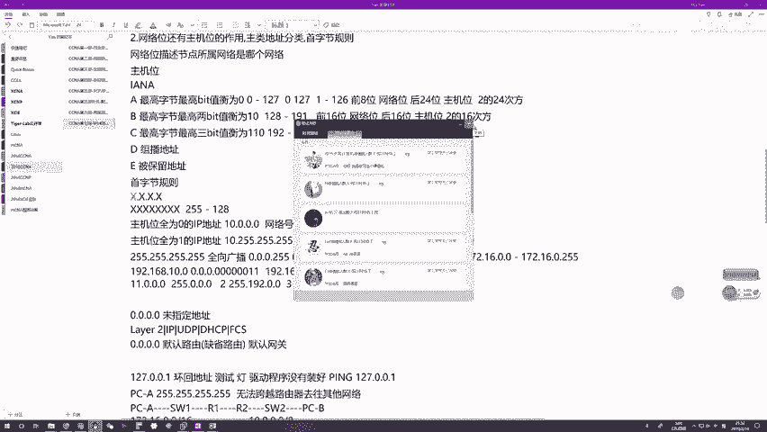

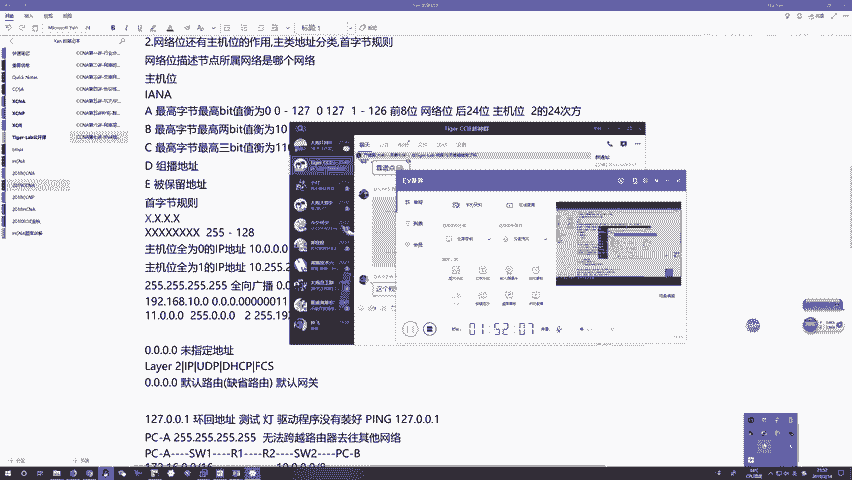