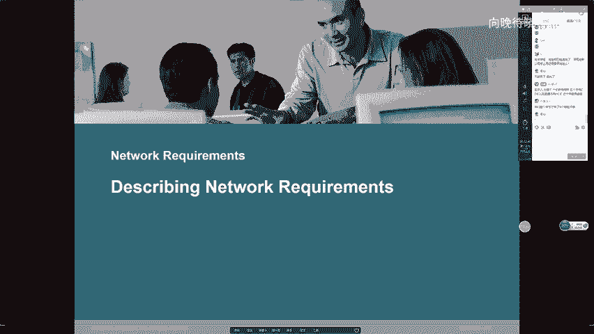
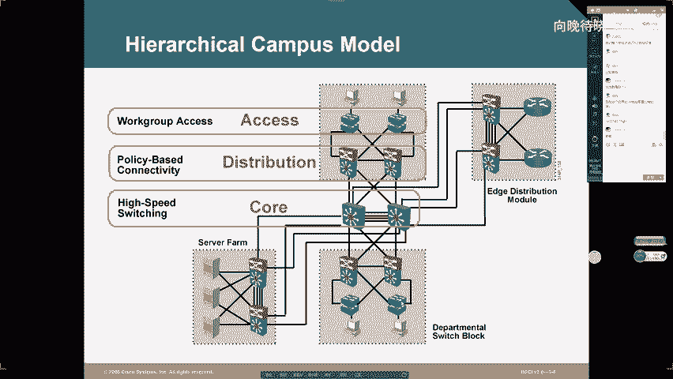

# 1000元自购分享CCNA教程合集！超全合集详细版，网络工程师入门必看合集【送NA题库】 - P9：CCNA09 - 向向向晚o - BV1cL4y1q7Dy

好了，欢迎大家来参加咱们的公开课啊。今天那个我们继续讲NA好吧。😊，啊，这个上节课隔多点久啊，上节课是周四对吧？就是周四啊，给大家讲一下IP相关的一些特性。然后呢讲了IP地址的架构，对吧？什么叫网络位。

什么叫主机位？一下ABCDE类地址，然后呢介绍了一下就是对吧？关于子网化的这么一些问题。家这节课呢，咱们继续把这个IPV4一些剩余内容给大家讲完啊，就我之前跟大家说了。

这个IPV4呢子网化咱们是有目的的。这个子网化的目的是什么呢？好，请注意啊IPV4子网化就是为了节约地址，对吧？你购买一个主类地址段，啊你不能说一个地址段里面所有地址啊。

你给一个网络里面主机分配完完毕之后啊，你剩余的其他的地址，咱们就直接浪费掉，因为咱们说过IPV4呢你满打满算地址数量一共只有42亿个左右，而其中呢大概只有一半是单波地址，那也就是说只有20亿。

这20亿的地址是要给整个英特网中的所有设备来分配的对吧？那按照咱们地址的使用规则，每个节点消耗一个地址，对吧？因为咱们不能地址冲突嘛，那你要这样消耗的话，那咱们够消耗吗？不够啊，因为你整个英特网。

咱们节点数量绝对不止21台，对吧？你就算地址一个都不浪费啊，那咱们都不够用。😊，那所以说你在使用地址的时候，咱们一定要避免浪费。那避免浪费的方式是什么呢？就是咱们通过子网化，对吧？

通过借位来把一个主类地址段分成若干个子网。然后接下来咱们把不同的子网地址呢用于不同的网络，那当你这要用完之后怎么样，哎，我们就可以尽可能节约地址，并且由于咱们重新定义的地址的网络位长度啊。

你看这多个网络所使用的地址，按照咱们的定义，那他们的网络位呢也是不一样的，对吧？既避免了地址冲突又能节约地址使用。当然呢话说回来，对吧？有一说一啊，你VOSM对吧？就是子网化啊，你做到极限。

又能怎么样呢，对吧？没有用的，你就算使用IPV4的时候，咱们一个地址都不浪费，这个也是不够的。为什么？因为很简单，你地址总数这么多，你就算在使用的时候，一个地址不浪费啊，你根本就不够，对吧？

那更别说你做了子网化。这个子网画做的本身啊，就会让咱们地址数量越来越少。我不知道大家有没有算过啊。你购买一个主A地址段，这个主A地址段里面，咱们可用的地址是二的24次方，对吧？二的24次方减2。

那接下来咱们界内，比如说你借了一位啊，你通过借一位把一个主A类地址段分成两个子网，那你分成两个子网每个子网里面可以使用地址有多少个呢？它是二的23次方，对吧？二的23次方减2，然后呢，咱们这个地址数量。

然后呢再乘2，那所以说因为你会发现对吧？当我们在子网化的时候，你每子网划一次，对吧？你划分出来的子网段地址里面主机位全零和权A的地址咱不能用，对吧？那当你划分的次数越多，对吧？你划分出来的子网段越多。

你相当于是额外浪费的地址就越多，对吧？子网化本身其实就是一个地址浪费。😊，那所以说呢按照咱们之前推论啊，对吧？你VSM你子网化不管做多好，你就算地址使用的时候，一个都不浪费。那咱们地址总量由于不够。

对吧？那你肯定也是维持不到今天的对吧？那不但维持不到今天啊，我觉得早早的它已经耗尽了。那当前的有一个网站啊，这个网站是用来做统计的它统计了咱们IP base的很多相关信息，就是包括BGP啊，包括A号啊。

包括咱们的IP地址。那这个网站呢叫3W点cder cder杠report点ORG有这么一个网站。然后在这个网站呢，大家打的比较慢啊，打开比较慢。😡，啊，你在这个网站里面能看到咱们很多信息。

包括咱们IP地址销售的信息。那这个网站呢他有做过一个统计啊，这个统计是谁做呢？是。它是由IANA来做的可以吧？你用IANA来做的。然后我还记得当时在13年啊，我看这个网站的时候，他就是发布了一个公告。

对吧？发布了一个公告。那这个公告呢说的很清楚就是。直到13年13年的2月份，2013年的2月份对以吧？然后呢，这个月的某一天啊，就是IN的发布了一个公告，这个公告说什么内容呢？

就是说全球IPV4公网地址池里面最后一段可以卖的地址，咱们已卖空了，对吧？也就是说整个公网地址池。咱们都已经耗尽了，可以把它对应耗尽了，没有任何一个额外可卖地址段来跟我们卖了。

那所以说从13年到今天已经有6年时间了吧。那这6年时间你可以理解为咱们IPV4地址数量没有任何增长。但是咱们网络呢从13年到今天啊，你们会发现应用越来越多元化，对吧？咱们带宽越来越高，英特网越来越庞大。

里面资源越来越多，对吧？成员越来越多，为什么地址在没有增长的情况下，咱们的IPV4依旧能够沿用至今呢，那原因就是因为对吧？咱们在使用地址的时候，我们的使用方式发生了一些改变，对吧？

那在早期咱们通过子网化目的是什么呢？节约地址，我们本以为节约地址IPV4就能够对吧？延续下去。但是后来呢没有想到这个英特网它的这个发展实在太快了，对吧？成爆炸式几何数量啊来做一个增长。

那你IP地址呢就算再怎么节约啊，你总数不够。你肯定是不够用的那当然不够用的理由是什么呢？就是早期咱们在使用IPV4的时候，我们是按照IPV4使用的最基础最本质的方式来用的那也就是说为了避免地址冲突。

我们的约定就是你使用IP地址，对吧？咱们一个节点对应一个唯一地址。那你这样做最大好处是什么呢？就是可以避免冲突嘛，对吧？你可以避免地址冲突，你能保证就是对吧？我所使用的地址，那我是唯一一个使用者，对吧？

你不会用，我们绝对不会说在一个网络中啊，有多个节点使用相同地址，你不用担心这样的事情，OK那这就是啊咱们早期的这么一个地址使用规则。但后来呢大家慢慢发现就是你使用这种规则，那确实没有错啊。

你可以避免地址冲突，对吧？咱们路径也比较清晰啊，然后呢，你的通信也是对等的对吧？我能访问你，你也能访问我，当然呢，你奈何地址不够用啊，你为了保证咱们网络可扩展，怎么样呢？咱们就必须要改变地址使用的规则。

那早期我们约定了一个节点使用一个独立地址，那现在咱们不能这么做，我们要让一组节点使用同1个IP地址，只有你这样做，咱们做到一对多的映射啊，你才能保证咱们的地址延续下去，因为如果说你不这么做，对吧？

地址总数不够啊，对吧？那会出现不重样的问题。那接下来对吧？那你要这么做，对吧？你需要符合一些规则，那后来呢就有这么一个标准化组织啊，这个标准化组织叫IETF。

这个ATTF呢在他们的RFC1918草案中就制定了这么一个原则。就是说哎我们把地址呢分成两类，一类呢叫公有地址，一类呢叫私有地址，对吧？这个公有地址，咱们在用的时候呢，还是使用早期的那些规则，对吧？

你要用这些地址，你要么购买，你要么租赁，然后我呢保证你在使用这些地址的时候，这些地址呢是全球唯一的对吧？你用了不用担心别人给你使用相同的对吧？那这个就是一一类啊，公有地址，然后另一类呢当然比较少啊。

这一类我们称为叫私有地址，那私有地址特点是什么呢？就是你在使用这些地址的时候，你第一不用购买，不用租赁。然后接下来你在用的时候没有任何使用成本，你只要在内网使用这些地址，对吧？

那只要你保证你内网没有地址冲突啊，你愿意怎么用就怎么用，但然呢，由于大家对于这些地址啊，都是使用相同的使用规则，对吧？你不用租赁，不用购买，大家都是想。怎么用怎么用？那当然你在使用这些地址的时候呢。

你没有办法保证地址的唯一性。那接下来这些使用私有地址的主机，由于他们都在园区内啊，对吧？那你可以理解为咱们所有的园区内的主机，你使用相同的子网端地址，那这样做的话，对吧？咱们就是通过地址冲突啊。

来减少咱们地址消耗可以吧？你在整个英特网环境中，你不管有多少客户园区网，你使用的私有地址就那些。所以说你企业网不管怎么扩展，你企业网内主机数量不管怎么扩充，只要你私有地址够给一个园区分配，对吧？

那你这个园区再多也一样。你对地址的消耗永远就那么多，然后接下来咱们把所有公有地址呢，给我们的运营商来使用，给我们的数据中心来使用，给咱们对吧？提供服务的那些服务器啊，对吧？给我们提供转发能力。

那些公网路由器啊，给他们来使用。那这些设备的扩展，相比咱们企业网的扩展啊要慢得多。那所以说呢经过这6年的扩展，对吧？其实虽然咱们看起来整个英特。网扩充了好几倍。

但是提供服务的服务器其实扩充的并不是那么多，对吧？它扩充的真正比较多的是咱们网络客户。而你这样网络的客户呢，咱们更多使用私有地址，对吧？那通过这种方式，咱们提供了一个地址的复用性，对吧？

你通过这个复用性来解决咱们IP地址不足的这么一个根本的痛点，对吧？那所以说为什么在13年2月，咱们地址只卖抠了，但是直到今年19年咱们IPV4依旧能够运作呢。

原因就是因为从13年啊到现在其实基本咱们新扩充进来的这些互联网成员，我们都是在使用私有地址，对吧？那接下来大家都使用私有地址，什么样的地方使用私有地址呢？再强调一下，只有园区网内网啊，园区网内网的节点。

才能使用私有地址，那什么叫内网呢？那大家都知道你一个公司对吧？你一个企业，你有一个办公场点，对吧？你这个办公场点，你需要覆盖一个园区网来让。你这个常年内的这些员工啊，对吧？这些人员啊能够成功上网。

那接下来咱们怎么设计呢？那一般咱们通过园区网的三层模型啊，对吧？我们通过接入交换机。对吧我们通过接入交换机来把我们的计算机连接入网，然后呢，咱们通过汇聚交换机，对吧？把接入交换机呢连在一起。

然后紧接着咱们一个园区如果比较大，可能还会有什么核心交换机。这个核心交换机负责对接所有的汇聚。然后紧接着呢，咱们每个园区对吧？都会有一个边界模块啊，这个边界模块里面。

咱们至少要包含一台边界路由器或边界防火墙，咱们要这么一个出口，然后接下来基于这个出口设备呢，你办理一个企业宽带，对吧？向运营商办理一个企业宽带，然后咱们就连线，直接把我们的园区呢连到运营商的网络。

那当你完成这个连接之后，哎，注意啊，边界设备以内的所有设备。那包括你内网那些交换机，包括你内网那些PC，包括你内网那些服务器。我们都称为叫内网设备。这些内网设备，你在分配IP地址的时候啊。

那为了节约地址，我们建议大家都使用私有地址。然后从边界设备以外的对吧？直到运营商的所有网络设备啊，我们都称为叫公网设备。那这些公网设备为了保证它的地址的唯一性啊，建议给他们使用什么公网地址，对以吧？

公有地址给边界设备以外的所有节点使用。然后接下来咱们私有地址呢，就给你内网的所有节点使用，可以吧？那当然你在使用内网节点地址的时候，只要你内网没有地址冲突啊，这个地址使用是没有任何问题的。

那当然你给这些内网的节点使用完私有地址之后啊，那他们之间彼此通信也是没有任何问题。但是大家也都知道，你对于一个正常的企业园区而言，我们流量类型分为两种。第一种叫南北走向流量，可以吧？

第一种叫南北走向流量。第二种我们称为叫东西走向流量，对吧？一个叫南北走向，一个叫东西走向。那这个南北走向的顾名思义啊，从就是从下到上，从上到下。然后呢东西走向，那就是对吧？从左到右嘛，从右到左。

那这个呢大家适合就是看一张图来理解啊，我们来看一张图。好，看张图来给大家了解一下到底什么叫什么叫东西走向？什么叫南北走向。嗯。okK呃，我来找张图啊我来找张图。

🤧好。

我来找张图啊。好，大家看啊，这个就是一个经典的元区网结构啊，这就是一个经典的园区网结构。对吧？比如说你觉得这家企业，对吧？企业呢咱们的这些网络设备一般分为三级啊，这样也分为三层嘛，对吧？

那第一层叫接入层，第二层叫汇聚层，第三层的叫核心层，那核心层的一般一个企业只有两排，对吧？作为网络最中心啊，它负责把整个网络连在一起，对吧？然后接下来汇聚层呢基本是每栋大楼1到两台，对吧？

然后咱们的接入层呢就是俗称的叫楼层交换机，对吧？一般咱们每一个楼层的弱电间配线间，对吧？都会有1到2台这样的设备，那这种接入层的设备负责什么呢？负责把一个楼层内的计算机连在一起，对吧？

比如说你一栋楼有6层，对吧？那每一层楼唉，咱们都有相应的计算机，有相应的人嘛，对吧？人使用计算机来工作，办公，对吧？上网。那接下来咱们这些需要办公需要上网计算机。😊，连到每一个楼层接入设备，对吧？

那这个接入设备呢挺不起眼的，你们可能平常接触不到。如果说你们仔细看一下，你们会发现就是每一层楼它其实都有那么1到2个房间，这1到2个房间上面写着什么弱电间或者配线间，那门总关着的对吧？如果说你有权限。

你有钥匙能进去的话，你会发现像这样的房间里面它都会有1到2个小机柜，这个1到0两个小机柜大家尺寸小啊，里面放的设备就是1到两排这样的交换机，然后这样的交换机呢，它连线对吧？

线是通过天花板或者通过地板走向每一个房间的，然后你每一个房间不都有网络接口嘛，对吧？这个网络接口其实我们在布线的时候，再做弱电的时候，这个接口的背面线就会一直连到咱们的弱电间。

然后直到连到咱们接入交换机，对吧？那你使用这样的设备来负责把一个楼层的PC呢连在一起。然后接下来咱们一栋楼，假如设说有6层楼，那6层楼的话，每一层楼都有这种楼层交换机，对吧？楼层交换机负责连接。😊。

楼层的计算机，那楼层跟楼层之间计算机怎么互连呢？对吧？那就是使用接入层交换机啊，连线连到汇聚交换机，对吧？咱们通过这种极连的方式，可以吧？你通过极连来把我们的楼层交换机连到稍微高级一点的交换机。

那当你完成连接之后呢，楼层跟楼层之间就可以通信，可以吧？这就是接入层和汇聚层所干的事情。😊，那接下来每一栋大楼它都有楼层交换机，对吧？它也都有汇聚。那这个时候呢，楼宇和楼宇之间。

我们就是通过核心交换机来负责连接，对吧？那这个核心交换机呢由于比较高端啊，所以在一个园区里面不会很多1到两排，对吧？那一般是放在咱们比较核心机房里面，对吧？这比较核心机房里面的核心设备，你通过连线。

但是通而光纤了，通时光纤，然后呢负责连接什么，咱们各种各样的哎啊，算是楼宇吧，楼宇的汇议交换机，那当你连完之后，大楼跟大楼之间网络就连通了，那接下来所谓的南北走向流量是什么呢？

就是这些流量是由咱们PC始发，然后去访问谁呢？去访问IDC机房里面的服务器。😊，可以吧，当家这么说可能大家觉得比较抽象啊，我来解释一下。你日常一台计算机，你要访问谁呀？你平常上百度嘛？对吧？你上优酷。

你上爱奇艺，你上QQ，你上微信，对吧？你在线玩一些游戏，这些其实都是在对相应的服务器来做访问，可吧？什么叫浏览百度啊，你打开一个浏览器，对吧？地址里面输入3W点百度点com你是在做什么？

其实就是使用HTTP这个协议啊，我们称为叫超文本传输协议，对吧？以我们为原，然后呢，以一台百度服务器为目的地，我们从源到达目的地啊来发起一个3W访问可以吧？那这些百度服务器啊，腾讯服务器啊。

新浪服务器啊在哪里呢？那肯定不会在你这个公司里面啊，对吧？他们一般都会放在电信的IDC机房里，可吧？那这个电信的IDC机房呢会放置很多很多服务器。

这些服务器呢咱们都以托管的方式或者租赁的方式啊来租给那些互联网公司，那那些互联网公司。😊，对吧他们会把相应的对吧？这些应用这些程序安装在咱们服务器上来给我们的客户呢提供服务，提供访问，对吧？

你平常上淘宝也好，对吧？你上京东也好，对吧？你上你上QQ也好，你上微信也好，你上百度也好，对吧？其实都是拿你的计算机的相应应用啊，来发起去往IDC机房里面的相应的服务器的这么一个访问。

那由于这个访问对吧？需要你产生流量，对吧？先从接入发到汇聚，从汇聚到核心，再从核心到达咱们的边界，然后再从边界呢离开咱们的园区，那这种流量就是从南向北流量，对吧？当然你的流量到达咱们服务器之后呢。

服务器给你回应啊，这个服务器回应的流量，会从咱们的企业边界怎么样到达核心，再从核心到达汇聚，再从汇聚到接入，最终从接入到达咱们的PC对吧？那这就是从北向南流量，那这就是所谓的南北走向，而所谓的。

东西走向指的是什么呢？就是你在一个交换区块内，对吧？你一台计算机，你要访问同交换区块内的另外一台计算机，对吧？你要从一个接入，把流量发给另一个接入，那这就是所谓的东西走向。那请注意啊。

对于咱们一般的企业网而言，东西走向流量是比较少的。咱们一般呢南北走向流量会稍微多一些，对吧？南北走向流量会稍微多一些。那这个时候南北走向流量，咱们通常都是跨越园区的访问，对吧？你的内网主机在你的园区内。

你要访问的目的地在咱们电信的IDC机房里，当然你为了实现这个访问，你必须要办理一个企业宽带，这是肯定的。你没有宽带，你连运营商的连接都没有，你怎么访问，你无法访问，你需要办理这个宽带，但办理完宽带的。

你就能访问这些目的的服务器吗？😊。

那答案是不行的。为什么不行呢？原因就是因为你这些内网主机，你使用的是私有地址，对吧？就比如说咱们一台PC。哎，你要上了，我给你拍个地址，我给你拍个私有地址，比如说是10。0。0。1啊。

这是一个再正常不过的私有地址。那这个私有地址，我这台PCA在用，可以吧？那我可以理解为这个地址，任何其他园区内的任何一台计算机它都有可能使用。事实上在咱们当前因特宝来看啊。

全球我觉得至少有1万台计算机都在同时使用10。0。0。1这个地址。那这个时候呢，我这台计算机对吧？我要访在百度，那我要访问百度，我就在我地址栏里面输入什么啊？3W点百度点com。

那当然你输入了3W点百度点com之后啊，对吧？这是一个域名啊，这叫是个域名，你呢会寻求DNS服务器，对吧？叫域名解析服务器啊来帮你做一个域名解析，对吧？你会问服务器。

我现在要访问3W点百度点com这个服务器，这个服务器对IP地址是多少，那这个时候呢，DNS服务器呢，就会查找咱们的DNS映射，对吧？它本地能够知道百度这个域名对IP地址是多少。

那接下来呢他就会告诉我们PC啊，比如百度服务器的地址，假设啊哎114点102点110点97，对吧？假设这就是咱们的百度服务器地址啊，那接下来PC呢就会拿这个地址作为目的地址。

然后拿我自身的这个私有地址啊作为源来发起驱往服务器的这么访问。那这个访问能不能发的过去呢？答案是肯定可以的啊。因为咱们内网的所有网络设备，对吧？

它都会有一条叫默认路由的这么一种特殊路由啊来指向咱们的边界。这个默认路由能够转发去往任何目的地的任何数据。只要你发送一个数据的目的地址啊，不属于咱们这个园区，那中间这些网络设备。

它们都能够顺利的通过默认路由啊，来把你的数据包发给咱们的边界。然后咱们的边界网络设备呢，它也有相应的默认路由来指向咱们的运营商。那这个时候当你流量到达运营商之后，由于你访问的百度服务器啊。

用的是公有地址。这个公有地址能够全球唯一的定位到这么一台服务器。而我们的公网路由器呢，它的路由表里面又是拥有这些公网路由的那所以说呢当你把包发给咱们的运营商端设备之后啊，运营商端设备能够通过明细路由。

来帮你把。包呢一跳跳发送，最终呢发给这台服务器。那接下来问题就出现在当服务器给你回包的情况下，这个回包能不能回得回去呢？答案是回不回去的，为什么？因为百度服务器收到这个包，对吧？刚刚会知道啊，你10。

0。0。1要访问我的外部资源，对啊？你要访问我的这个搜索引擎的页面，那我先要给你回应对吧？那我要回应把包回给谁呢？就要回给10。0。0。1所以咱们服务器呢都指网关，对吧？它只要把包回给其他网络的主机。

它都会把包呢发给网关路由器，但网关路由器收到这个回包，那么网关路由器我懵了，他一看哎，你这个回包回给10。0。0。110。0。0。1是个私有地址啊，这种地址能够保证唯一性吗？不能。况且我知道10。0。

0。1在哪里吗？我不可能知道因为按照咱们刚才的那个假设啊你在当前英特网环境中，至少有1万台主机，在使用这个地址，同时上网。你这1万台主机可能分布在1万个园区内，那也就是说对于路由器。而言对吧？

我在回包的时候，我要把包回给这一万个网络，那我才能保证这个包最终到达目的地。那如果说我只给其中一个来回应啊，那万一始发流量的不是你怎么办是吧？反而我只知道这个流量是使用10。0。0。1。

这个地址的主机发送的。而你这个主机到底在哪个园区内，我并不知道对吧？因为在这一万个园区里面都有可能存在10。0。0。1的这个节点，那所以说呢回应的报文呢，就回不来了。因为你真的不能指望咱们的勾网路由器。

把这个包复制成1万份。然后每个园区一份给你发回来，你做不到这一点对吧？然后加上咱们的约定啊，就是勾网路由器，对吧？由于你没有办法确定私有地址使用者到底在哪个园区。

所以你的路由表里面根本就不应该拥有任何私网路由，那所以说呢正常情况是你百度服务器在给原主机回包的时候，只要这个回包流量。到达咱们的网关路由器啊，那网关路由器一看目的地址，对吧？是个私有地址。

我就直接给你丢包了，可以吧？直接给你丢包了。那丢包会导致什么呢？会导致这些使用私有地址，内网主机啊，你们在访问公网的时候，包能出得去，但是包是回不来的，它能出得去，但是它回不来。那这样叫上网吗？

这样不叫上网，这样根本就不叫上网，所谓的上网时候包中发不出去，回包你能回得来。你如果回包回不来，你觉得在你的浏览器里啊，能显示出百度那个网页吧？你显示不了的。你之所以能够显示百度网页。

就是因为你在正在跟什么百度服务器交互，什么叫交互是你发送请求给他，他给你做回应，回应你收到了你的浏览器里才能出现相应的页面。那这种不能收到回应的这种访问啊，它根本就不叫上，可以吧？

那所以说了使用私有地址啊是会有这么一个问题的对吧？你用私有地址，咱们最初这些私有地址使用的园区内网主机啊，你只能做东西向的流量交互。那这么东西向流量交互，他们需要的吗？也许需要啊。

但我觉得他们更加需要的是南北向这个流量，那为了解决他们南北向流量连通性啊，对吧？咱们就要开发一个技术。这个技术呢当前在所有使用私有地址的园区中，咱们都有使用。那这个技术呢我们称为叫地址转换协议，对吧？

它叫AAT。然后呢，它的升级版叫PAT。那这个技术咱们在什么地方用呢？一般就在一个园区的边界网络设备上，可以吧？你的出口是一台路由器或者一台防火墙就OK了。因为这样的设备。

咱们能够支持NAT和PAAT啊，对吧？这个技术呢就是在边界设备上部署。那当你在边界设备上部署了ATPAAT之后呢，它能做到什么样的事情呢？就是你内网使用私有地址主机啊。当你要访问公网服务器的时候。

你从内到外的南北走向的包到达咱们边界网络设备之后，边界网络设备会把你们发送的数据包的原IP地址啊，从原本的私有地址，转换成一个公有地址，并且呢我会记录这个转化表象。然后接下来把包呢发给公网。

然后接下来既然这个包的原地址发生了转换啊，那这个时候服务器它就会认为访问它的主机就是一台使用公有地址主机，那接下来他在回包回回给网关的时候，这些公网的路由器，对吧？他们也能够进一步的转发这个访问。

转发给谁呢？就是转发给咱们这个企业的边界，那边界呢，它由于记录了咱们的地址转化表象，对吧？他知道什么样的回包的目的地址是一个转换后的地址。那对于这些目的地址为。转换后的地址的回报，对吧？

我会给你做一个回向转换，帮你把目的地址呢从转换后的公有地址再还原成转换前的私有地址，最终呢再把包发给你内蒙。那这样做就可以保证咱们这些使用私有地址主机啊，能够成功的访问咱们的公网，对吧？

你该上网就能正常上。那这个就是私有地址的配套技术。那在当前呢咱们园区中你会发现，其实你们如果会看IP地址啊，你们会经常留意这么一件事儿，就是你平常拿你的计算机在家里上网也好，对吧？你在图书馆上网也好。

你在网吧上网也好，你在宿舍上网也好，对吧？你在任何地方上网，你拿到的地址基本就是这么一些地址。10。0。0。0对吧？172。16。0。0到172。31。0。0。然后呢，192。168。0。0到192。

168。25点。就你会发现你拿到的地址总是在这个范围内。对吧来来回回就这么些地址，为什么？因为这些地址都是私有地址。就是因为咱们内蒙主机都使用了私有地址，所以咱们IPV4啊在13年2月用光了。

但是咱们直到19年的今天还能继续使用，原因就是这。那大家也说一下，就是因为咱们现在内网都使用私有地址。那为了让咱们这些内网私有地址使用者啊能够成功的访问咱们那些ID机房里面服务器，对吧？

所有使用私有地址的园区的边界，你都必须要使用NAT或PAAT来方便你去做一个什么公网的访问。那这块呢我也给大家看一下，比如说以我们的主机来说啊，我当前这个主机使用的就是一个私有地址。

那我来找一下我的物理网卡，那大家来看吧，这就是我的物理网卡，对吧？地址是192。168。1。34啊，对吧？这就是个私有地址，好吧，然后接下来呢，我可以通过百度的测网址的这么一个技术啊。

来看一下我当前地址多少，可以吧。IP地址查询对吧？我来看一下我当前IP地址看到了吗？对吧？通过IP地址查询，我发现我的地址是49。77。250。47，这是个公有地址，对吧？

这个公有地址跟我刚才看到的咱们地址是不一样的。原因是什么？原因是因为我这台主机也是在一个园区内吗，可以吧？这个是我当前正在用的私有地址，然后接下来这个49。77。250。47。

就是咱们这个园区的边界设备给我地址转换后的这个转换后的公有地址，可以吧？那接下来这个转换后的公有地址能给谁转呢？它能给园区内的任何人转，并且当你使用NAT的升级技术，PAAT的时候。

我们的边界设备可以同一时间使用同一个公有地址给最多6万多个内网主机来同时做一个地址转换，可以吧？那所以说咱们使用这种技术特别厉害了，以前。咱们在使用私有地址之前，是每一个节点消耗1个IP。

如果你一个园区里面有1000台计算机啊，你这1000台计算机就要消耗1000个地址。但是现在当咱们有了私有地址和PAAT之后，你每一个园区。😡，最多最多啊，你只要准备1个IP地址就够了啊。

当然最少啊不是最多，你最少要准备一个公有IP地址就够了。这个公有IP地址就给你这个边界网络设备的公网接口来使用。然后接下来你在使用这个地址，同时啊。

你就可以拿这个公有地址来给内网所有主机去做一个地址转换，这是没问题的。可以吧？这是没问题的，并且能够同步转换，可以吧？那这样做最大好处是什么呢？就是你原本一个园区内多少节点就要消耗多少地址。

现在是一个园区内不管多少节点，咱们只消耗一个地址，以前的地址使用是一对一映射，现在的地址使用是一对N映射。你甚至在一个园区里面两三万台主机，你也只需要一个公有地址就能让他们同步上。

那这个就是私有地址给我们带来的好处。那所以说了对吧？虽然咱们13年地址就用光了，但是呢咱们现在互联网中啊扩充速度最快的就是咱们普通园区内的这些客户主机，而这些客户主机呢，你在相应的园区网内网。

你总是消耗私有地址，而这个私有地址，由于不存在，对吧？唯一性这么一个要求啊，所以你不管怎么消耗，你只要在这个园区内没有冲突，那就无所谓了，对吧？你比比如说在1000个园区里面，你多添加一台计算机啊。

你添加这1000台计算机，咱们是可以使用相同地址，那所以说这样做，咱们不会消耗任何额外的地址，就可以让咱们的网络啊不停的扩展，那这就是咱们当前的英特朗的这么一个结构，对吧？

然后接下来我给大家所写的这些啊，也都是咱们的对吧？官方定义的私有地址，对吧？私有地址主A类只有这么一段1网段，对吧？然后主B类有有16端啊，分别是172。1。16。0。0到172。31。0。0。

然后接下来主CA类有256端啊，分别是192点168。0。0到192。168。25。0，对吧？当你在使用这些私有地址的时候，对吧？你不用担心地址冲突，对吧？它不会冲突。你只要在内网不要冲突，这就好了。

对吧？在不同的园区，咱们多台主机使用相同地址，这个是没有任何问题的，对吧？那当然使用私有地址，一定要配套PAAT啊，来解决咱们南北走向流量的这么一个对吧？连通性，好，那看似一切都很美好啊。

但然请注意PAAT和NAT给我们网络呢造成了一些非常糟糕的影响。还记不记得？我之前跟大家说过啊，你一台主机对吧？你要上网，你可能有两种地址，一种呢我们称为叫二层地址，对吧？以mike地址为为主啊。

还有一种呢就是咱们的三层地址，对吧？以IP地址为主。然后呢，咱们也说过，你端到端通信的时候，二层的地址是每跨越一台路由器，它都会发生改变。因为二层地址只能在一个网络内来标识一个节点。

而三层地址它是能够在整个英特网中啊来标识一个节点的。那所以说按照常理来说啊，你两个节点，不管你们在不在同一网络，你们在端到端通信的时候，不管流量在网络哪个位置发送啊，它的原木三层地址都不应该改变。

那这个原则我们称为什么呢？我们称为叫端到端的地址一致性规则。可以吧，叫端到端的地址一致性规则。好了，那接下来PAAT部署完毕之后啊，我们这个规则呢就被打破了，对吧？因为你内网使用私有地址主机。

当你发包去往公网的时候，对吧？只要流量到达边界网络设备，对吧？在你离开网络设备这一刻起，你的三层爆头的原IP啊，从你之前的私有地址就变成了一个公有地址，然后接下来当这个包备回应回来的时候，对吧？

从外到内进入咱们这个园区的瞬间啊，这个回包的目的地址从这个转换后的公有地址就被转换回咱们的私有地址，那这个你会发现咱们端到端流量在通信的时候啊，对吧？地址发生了改变。我们没有办法保证端到端地址的一致性。

那这是比较大的一个问题。那这个问题体现在什么地方呢？就体现在咱们通信就不再对等了。请注意啊，在曾经咱们使用IP地址的时候，在没有私有地址存在的情况下，当咱们端到端都使用公有地址的时候啊。

我们的通信是完全对等的。什么叫对等呢？就是你园区网内的主籍。你可以访问你想访问的任何目的地，你能主动访问对方，对方能给你回应对方也能主动访问你。但是当我们现在用了私有地址之后啊，使用私有地址的主机。

能够成功的访问咱们公网节点。公网节点给你的回应的回包流量也能回得来，但是公网节点想要主动访问你内网节点，不好意思，这个就做不到的。因为公网节点没有办法使用的私有地址来给你做一个流量通信。

因为咱们没有办法保证什么地址的唯一性。如果你希望对方拿你的公有地址来给你通信。那别人有没有办法实时的知道你当前对应的公有地址到底是什么。那所以说咱们当前的通信流程是什么样呢？就是你任何内网主机。

你使用私有地址之后啊，你能访问跟你在同一个内网内的其他主机，你能访问咱们英特网的所有运营商的IDC机房里面的公有服务器，但是你不能访问任何其他的使用私有地址的园区，为什么？因为你在访问的时候。

你不能使用私有地址，对吧？然后呢，你要用公有地址，你也不知道别人对应的公有地址是什么，对吧？就算你知道是什么，你还得要保证咱们的5元组匹配，这个都很困难，那所以说呢得出一个结论啊。

从内到外的访问是没问题的，从外到内的访问，对吧？那就不太容易做的，那为了多个企业内，咱们能够彼此通信，对吧？那这个时候呢，咱们就有很多技术运营而生了，比如说对吧？比较昂贵的专线业务。好吧，专线业。

这个专线业务什么特点呢？就是你两个园区，对吧？咱们内网都使用私有地址。我现在希望这两个园区的内网主义之间能够彼此访问。对吧那这个时候你就最好在这两个园区的边界路由器之间啊去办理这么一个专线。

你办理完专线之后呢，咱们通过专线，把你两个园区的边界路由器连在一起。那连完之后这根线就专门给你们用，你们就能够通过这根线啊让两个园区内网主机直接使用私有地址，彼此的互联互通，那你通过这种方式。

咱们使用私有地址，内网主义之间啊，你也可以相互通信，但是呢它价格比较贵，是吧？如果你要追求便宜的话，啊，你可以部署MPVPN这个我们称为叫运营商专线啊，其实这不是专线，这就是一个运营商的对吧？

比较昂贵的VPN服务啊，这个服务呢，它能够保证你通信的质量，能够保证你Q能够保证你带宽，能够保证的安全性，对吧？然后呢相比之下比专线稍微便宜一些，但是呢依旧是比较昂贵的。

那如果说你觉得这个业务也不不太适合自己啊。那这个时候呢，你可以对吧？基于咱们的。因特宝连接，基于咱们的宽带连接，基于咱们整个英特宝啊来做载体，你可以在两个园区边界之间啊去做一些像什么GREVPN啊。

像什么IPC和VPN啊，像什么SSLVPN啊，可以通过部署这样的over类的VPN技术来通过欺骗的方式欺骗咱们的公网设备，对吧？那通过这个欺骗来让咱们公网设备，以为你这两个园区的内网主机主机之间通信啊。

其实是你这两个园区的边界路由器之间通行，对以吧？咱们通过这种伪装来让你两个园区互联互通，那这样的业务就变得很普遍。那为什么会有这样的业务呢？原因就是因为如果你不使用这样的业务，对吧？

由于咱们现在十有八9啊，园区往内网用的都是私有地址，这些私有地址的内网主义之间，对吧？你离了这些业务，你是没有办法通过咱们的运营商啊来直接通信。可吧？那这就是咱们当前的一个现状。

O吧那接下来现在现状咱们怎么解决呢？对我觉得没有办法解决了，你只能说是维持，并且这个维持都已经很够呛了，对？因为随着咱们互联网应用越来越多元化啊，你这个地址对吧？越发告级。

就算咱们当前所有云就都使用私有地址，对吧？另外一边咱们也扩展不动了，那边就是咱们的运营商对吧？随着云云计算啊越来越普及，对吧？咱们数据中心虽然服务器的数量没有对吧？特别大的数量增长。

但是咱们虚拟化做的越来越深入了，对吧？你虚拟化做的越来越来越深入，你虽然IC机房里面一个机会还是那么高，里面的服务器数量还是那么多，但是你服务器硬件资源强了，你一个服务器咱们虚拟成N多个虚拟机。

你每个虚拟机都需要消耗地址，对吧？😊，那这个地址其实对咱们整个IPV4啊影响也是挺大的是吧？以前IPV4咱们考虑扩展，只考虑客户这一边了，没有考虑过运营商，现在是运营商的IDC机房。

它对地址的需求量比以前要大很多。而现在这一块地址告急了，那你就是真的没办法了。因为对于这一块，你绝对不能再使用私有地址了，你这块使用私有地址，对吧？那你企业内网这些PC啊，你的南北走向流量。

你你连这个IDC机房都访问不了了，对吧？那你IDC机房访问不了，你这个网络通信就有问题了。那现在咱们最大的问题是什么呢？就是你IDC机房里面这些服务器啊，咱们都已经地址告急了。那这些设备地址告急，对吧？

你没有办法再通过私有地址来解决。那所以说咱们当前唯一的解决方案就是推翻重来。你要把整个IPV4给淘汰掉，对吧？咱们取而代之的是换一个比较牛逼的协议来解决咱们当前最尴尬的情况。那IPV4为什么尴尬？

你为什么要借位做子网换，你为什么要设置私有地址公有地址。其实说白了就是因为你IPV4啊，所能提供的地址数量太少，对吧？你一共只有32位，你的地址空间啊，太小了，对吧？那解决你的对吧？

最直接的方式就是换一个能够提供更大地址空间的协议。那这个协议是什么呢？这个协议就是IPV6对以吧？IPV6作为新一代的IP协议啊，IPV4叫版本4的英特朗协议，对吧？IPV6叫版本6的英特朗协议。

那这个版本6作为一个更新的版本啊，对吧？它就是用来取代IPV4的，而它取代IPV4就是针对IPV4最大的痛点啊，来做了一个优化。IPV4最大痛点是什么？就是的地址不够用了，你的地址数量太少。

而IPV6偏偏就是一个你地址怎么用也用不完的协议。IPV6地址空间。128位可以吧？它的地址空间是IPV4的4倍。但是它的地址数量可不止4倍啊。

它的地址总数是二的128次方个IPV4地址总数是二的32次方。可以吧。😊，128次方除以2的32次方，咱们得到结果是2的96次方，可以吧？也就是说IPV6，咱们地址空间相当于是42亿乘42亿。

再乘42亿，再乘42亿。你有这么多可用地址。那就算其中只有一部分啊是单波地址。那这个单波地址相比IPV4啊，已经多的对吧？不要太多了，就是你根本不可能耗的尽的。那当你使用来PV6之后，对吧？

那很多问题都解决了，对吧？你不用再抠8巴的去算什么子网化了，没有必要，对吧？咱们突然从没钱变特别有钱了，你使用地址想怎么浪费就怎么浪费，你根本不需要借位，你根本不用考虑地址过量，你不用考虑地址浪费。

为什么？因为反正也用不完嘛。然后接下来PV6由于地址太多了，你也不用去整什么公有地址，私有地址啊，大家都使用公有地址。大家都使用公有地址，对啊？那相当于咱们就回到了最初嘛，对吧？在没有私有地址情况下。

你边界设备也不需要地时转换协议嘛，你不需要地时转换协议，大家都使用公有地址，我们地址能够保证全球的唯一性，那你通信对称是不是又回来了，对吧？你能做到对等通信，那你需要专线吗？你需要M14VPN吗？

你需要这些GRE吗？你不需要，我本身就能保证端到端的联通性，我还要这样干嘛，对吧？我难道钱多，我要我要花钱吗？对吧？因为做这些业务都要花钱的，你使用了IPVA6之后，咱们通通都不用花了？😡。

然后除了地址方面的优化以外，IPV6从全方面啊都针对IPV4完完整整的做了一个优化，对吧？你IPV4所有问题地方我都给你升级了，比如IPV6的爆头更加简洁，对吧？比如说IPV6，咱们的功能性更加强大。

内置IP set对吧？对移动性支持非常强，对无线支持非常强，对吧？功能性更多，那这些都是IPV6的优点。那这个呢其实大家10年前就看到了，并且十年前甚至十多年前啊就有很多的公值，他们就忽吁了，对吧？

IPV4呢是不行的对？你使用IPV4，咱们网络架构乱糟糟，通信效率又低，对吧？然后咱们通信又对称，你又需要乱七八糟的专线和VPN对吧？把我们网络的架构搞得非常非常混乱，那最好解决方案是什么呢？

就是快刀转斩断码，对吧？大家呢清一色的全部迁移，对吧？你整个英特网直接从IPV4迁到IPV6，对吧？那我相信整个网络会变得非常非常好，效率非常非常的高，对吧？咱们网络能够支持的功能会越来越强。

效率越来越高，对吧？并且呢咱们通信会更加的对吧？对等啊？然后呢，宝络架构不至于那么的复杂，对吧？大家都能看到它的好处。那我相信那些对吧？运营商他们也能看到，但是呢迁移到IPV6之后，对吧？

运营商会比较苦恼。你们可能不知道啊，就是每一个国家当地运营商他靠什么业务比较挣钱。最早期电信挣钱靠的是什么？给你拉固化，对吧？然后接下来移动挣钱靠的是移动通信嘛，是吧？联通靠什么挣钱，我不知道啊。

然后呢，慢慢的随着咱们时代的迁移，你会发现曾经这些运营商比较赚钱的业务，现在基本都你夕阳西下，对吧？哎，随着咱们网络越来越普及啊，对吧？你资费下降，对吧？移动通信，你在卖电话卡能赚多少钱，赚不了多少。

你电信对吧？办动座机都没人办座机啊，你只能靠办的宽带来赚钱，而你觉得办宽带对吧？一个用户一个月能交几个钱啊，你交不了几个钱，对吧？当前对于运营商而言，最最最挣钱的最最最核心的业务。

其实就是专线和MP素维片这2块业务最挣钱的，你们可能不知道这个专线有多贵啊。😊，我还记得曾经就是我刚我刚上班那个时候，08年08年那个时候呢，一根专线从南京拉到上海对那个外企啊，总部和分支间建一个专线。

当时的专线带宽只有两兆啊，专线带宽只有两兆，南京连上海一个月为这个专线要花10万块。这是10年前。这是10年前。那直到今日专线呢可能带宽稍微高了一些，但是价格绝对没有低啊。比如说上海到香港的十0兆专线。

好像现在一个月还是要十0多万，你若是百兆专线，那一个月可能要几十万。如果你要千兆专线，我靠你不用想啊，这个价格简直贵报，简直会报，我告诉大家，一家公司的一根专线，你每个月就要花这么多钱。

那你觉得咱们运营商的大客户会少吗？超级多啊，所有的银行都是你大客户，对吧？像什么券商，对吧？像什么政府机关，像什么军队，对吧？都是你的大客户，他们都需要MPFVPI都需要专线，对吧？

你真正运营商挣钱靠的是什么，不是靠你的对吧？宽带不是靠你连小区的宽带业务，靠的全都是这些专线和VP业，对吧？这个是他们最挣钱的点。😊，那接下来大家想啊，你为什么能开展这些业务啊？

开展这些业务的原因是因为客户有这个需求，对吧？而客户有这个需求的根因，是你没有办专线，没有办VPN。你正常的两个园区内网之间你是通不了的，因为大家都使用私有地址，对吧？关根因就是咱们的地址不够用。

但是现在如果你要迁移到IPV6呢。迁移到IPV6了，情况就变得不一样了啊。瞬间咱们从地址不够用，变成了地址非常够用，够用到什么程度啊？你地球上的每一粒沙子都给你分配一个地址，没有任何问题。😡。

那所以说用了IPV6之后，还会有人使用私有地址吗？我觉得可能也会有啊极个别的保守设立，他们还会使用。但是绝大多数比较开明的，尤其是比较懂技术的对吧？他们都不会再使用私有地址。那你不使用私有地址。

本身咱们之间就可以直接联通，我需要你专线吗？我需要你VPN吗？我不需要。那所以说当你迁移到IP6那一刻啊，我觉得全球运营商都要面对同一个问题。就是曾经最赚钱的专线业务和MPL4VPN业务该何去何从？

你把这块最肥的业务砍掉了，咱们还靠什么生存？我觉得生存不了的我觉得是生存不了的。那所以说呢运营商对吧？在技术革新的面前啊，他优先考虑到就是他自身如何去生存下去。那为了生存下去，对吧？他们就。一直。

对吧抵制IPV6。那这个抵制呢一抵制就抵制了1年啊，对吧？业界都叫了，你们赶紧迁移啊，对吧？但是运营商迟迟不去做。然后呢，直到去年啊准确来说，应该直到前年啊，那前年呢就是我们国务院也发文了，对吧？

号召咱们各大运营商那开始从自自己开始啊，对吧？这个自己动手丰衣足食嘛，对吧？请你们就是全部迁移到IPV6对吧？曾经呢咱们只是接工之建议他们迁移，对吧？没有什么约束力，但是现在呢咱们政府主导迁移啊，对吧？

那这个力度就比较大的那所以说呢经过两年的迁移到今天还是比较卓有成效的，像一线城市北京上海，广州深圳对吧？你些顶级运营商啊，对吧？很多省公司咱们都已经IPV4IPV6同步进行了，这个叫双寨。

然后呢有很多运营商呢比较典型的客户啊，他们也都开始从IPV4迁移到IPV6，那我不知道大家经常上不上淘宝啊，如果你们经常上。淘宝你们用手机淘宝，你们会发现手机淘宝你打开的时候。

它会显示就是手机淘宝的业务是基基于什么？是基于阿里云啊，就是基于那个。基于这个阿里的云服务来开展的。然后接下来这个云服务呢，下面会显示IPV6，对吧？云计算服务下面有1个IPV6。

你们仔细看一下能看得到的。当然如果手机比较快的话，这个界面可能会弹的时间比较少。如果你手机比较慢的话，这个界面出现时间比较长，对，就是现在有很多很多的客户网络，对吧？包括很多的云计算提供商啊。

他们都在使用IPV6，那这个IPV6呢，我相信这个迁移就已经算是对吧？正式开始了，并且你开始一段时间了。那接下来这个迁移会有多长时间呢，我预计啊大概也就是5年左右，也就5年左右，最多5年时间啊。

3到5年时间，那经过3到5年的迁移，我觉得这个最终IPV6取代IPV4，对吧？那也就是分分钟的时间，对吧？你取代了之后，那之后呢，可能你再也找不到IPV4的网络了，对吧？

当然迁移呢可能全球并不是很同步啊，但我觉得中国迁移速度应该比较快。对吧那也就是说咱们当前呢就在一个风头浪尖啊，对吧？在一个全球大迁移时代，对吧？曾经咱们的清清一色啊，全使用IPV4。

只有非常非常少的客户网络，咱们已经提前使用IPV6对吧？叫偷城禁国，但是现在呢咱们由运营商主导的IPV6迁移，对吧？那这个效率太快了，而且运营商迁移到IPV6之后呢，你以后企业网，对吧？你也不得已。

你也只能使用IPV6嘛，就算你不想用你也必须要使用，对吧？然后接下来包括咱们那些云提供商云服务商，他们都使用什么IPV6。那我相信这个IPV6呢，对吧？会来的比我们的预想会更快一些。

我估计预计就2022年吧，2022年左右，这个全中国迁移到IPV6，这个估计是没有任何问题，那届时呢你们在做任何的项目对吧？做任何的设计都要基于IPV6来考虑，对吧？那来IPV6呢，在IA之后。

我不想跟大家讲太多了，因为你毕竟对IPV4。还没有那么深理解。那所以说只给大家对比IPV4讲一下IPV6这么一些对吧小特性，让大家知道咱们为什么用IPV6，并且告诉大家，当咱们使用IPV6之后，对吧？

会面对一些什么样的改变，谁的利益会受到最大的影响，对吧？谁是IPV6签人的阻力，我希望大家呢有这么一个概念，可以吧？那接下来如果大家对IPV6有比较强的这么一个啊兴趣的话，那欢迎来参加咱们的VIP课啊。

那在我们的IE课程中，这个IPV6会详细的给大家讲述一下。然后当前在咱们的IE考试中，这个IPV6依旧是一个考点啊，并且考试的比重是越来越大好吧，考试比重越来越大O。好了，那接下来言归正传啊。

咱们当前是IPV4IPV6的并行时代。那当前的IPV4依旧还是相对占主导的那所以说呢咱们目前能够接触到项目。那你在做地址规划的时候，咱们还是以IPV4为主体，对吧？那虽然IPV6呢未来会慢慢的成长。

但是在目前这个时间节点来看啊，IPV4依旧是时代的主流，好吧，那接然IPV4就是主流。那接下来咱们就围绕IPV4啊来讲一讲咱们网络从IPV4衍伸出来的一些比较关键的协议。给大家讲两个。

一个叫ICMP一个叫A2RP对吧？一个叫ICMP一个叫A2P。那基本网络层对吧？除了PVC以外啊，就他们俩比较重要。好了，那先从SCMP讲起啊，这个叫英特堡。消息叫控制消息协议啊，控制消息协议。

OK叫ICMP啊。那这个ICMP呢，你说它是个协议我觉得也不太好啊，因为它不是一个协议。我觉得更多的像是一个什么呢？它像是一个工具集，对吧？它像是一个工具集，这个工具集有什么用呢？

专门用来辅助IPV4来提供一系列的对吧？控制层面的功能，对吧？它呢就是作为IPV4的辅助协议，对吧？来提供一系列功能，就比如说你现在网络中对吧？你连接两台主机，那这个时候两台主机之间你要跑一个应用。

对吧？你跑了应用之后，你发现唉应用没有办法好的工作，那你要排错，对吧？你要做一些测试，这个测试使用什么呢？咱们一般就使用ICMP然后接下来你两个主机在网络中通信，如果你通信偷了那肯定最好啊。

那当然如果你要通信没通呢？你通信没偷，那有的时候主机呢也会收到一些对吧？豹文没通的报错消息。😊，这个报错消息也是靠SMP对吧？然后紧接着有的时候呢，你从原到达目的地，对吧？

你可能使用了一条你认为的最优路径，但是你认为的最优路径啊，对于咱们全局而言，它可能不是最优的对吧？它可能是一条次由路径。那这个时候呢，也有一些网络社会会告诉你，你在访问这个目的地的时候。

最优路径应该怎么走，那这个也是靠SMP来实现的对吧？那SMP呢里面包含了很多的功能，可以吧？包含了很多的工具。这些工具大体分为三类。那第一类呢是用来测试的，可以吧？

用来做网络测试的这些我们称为叫消息报文啊，叫消息报文。然后接下来第二大类是用来报错的，用来报错的。当你网络运行出现问题的时候，咱们可以拿这些报错功能的SCMP工具啊来告诉你，对吧？

你当前的通信是有问题的对吧？出现问题的原因是什么样的？它会尽可能通过这些报错的消息来告诉你当前出现了什么样的事情，对吧？然后接下来第三个就是路径优化，对吧？路径优化的这么一系列工具，那这个路径优化。

你懂的，就是你所使用的路径，你认为是最优的但其实可能不是最优对吧？真正的最优路径会有人告诉你，那通过什么来告诉你呢？就是通过这类路径优化的工具来告诉你，对吧？那这就是ICMP的三大功能。

那接下来根据这三大功能呢，也来简单跟大家说一下，对以吧？那第一大类也是咱们用的最多的就是这种测试工具啊，这个测试工具呢，其实就是咱们的P，对吧？就是咱们的P。

P它是一个检测两个节点之间端到端的双向连通性的这么一个工具。这个工具呢工作在三层呢，所以说咱们也称为通过这个工具啊，我能检测你两台节点之间的三层连通性。那这个时候假设你A和B对吧？通过英特网互联，对吧？

你A和B呢通过英特网互联，那接下来当你连接完B之后呢，你肯定是希望彼此能够通信嘛，对吧？而你们彼此通信，咱们一般通过一些应用来实现的，而这个应用大家都知道你公作OSI第7层7层的应用想要通信前提是什么？

是你们的三层能通，对吧？因为下层为上层提供服务嘛，对吧？下层能能通，你上层才有可能能通，如果你下层都通不了，对吧？你上层是根本没有任何机会，那这个时候A跟B，你在使用应用测试之前啊。

我建议大家先通过P来做一个三层连通性测试，你三层连通信没问题，你七层才ok如果你三层都有问题啊，你这个七层就不用想了，十有八九是不行的吧？那这个时候呢你可以拿A去拼B那接下来拼B的什么呢？

就是拼B接口的IP地址就好了，对吧？只要A知道B的IP。是多少？你只要针对B的IP作为目的地址来发起一个聘包，这就没问题了。对吧？那接下来聘的行为是什么样子呢？很简单，就是你A发送一个叫回声请求。

对吧叫回声请求的豹围发给B，这个叫ele request，叫回声请求，对吧？这个回声请求怎么封装呢？它就是这样的SNP的载荷。前面呢封装IP对吧？然后前面封装二层针头，当然通常是以太网针头啦。

然后后面封装的是XS针伪，对吧？这是一个回声请求报文，这个回声请求报文呢，咱们就一跳条发，是吧从源怎么样最终发给目的地。当你目的地收到回声请求之后，你会主动的向原呢做一个回应，回应报文叫什么呢？

回应报文叫elere，对吧？叫ele快，这个叫回声应答，叫回声应答。好，这个回声应答的封装跟回声请求一样啊，只不过这两个报文，他们对应的SIP的类型是不一样，对吧？回声请求是类型8，回声应答是类型0。

对吧？我给你发送一个类型8的回声请求，你给我回应一个类型零的回声应答。那如果说我A收到了对应回声请求的应答报文啊，就代表咱们之间并通了，并通意味着什么呢？意味着A到BB到A咱们双向连通信都是没问题。

对吧？那当然聘的有两个结果，一个是能拼通，一个呢就是并通，对吧？那当然聘不通的可能性就有很多了。比如说你A发送的回声请求根本对方没收到，对吧？从A到B路径就有问题了，这是一种可能。第二种可能是什么呢？

就是A把包聘给B，但由于B呢可能开启了一些防火墙啊，这些防火墙有一个竞聘的功能，这个竞聘的功能会忽略它所收到的所有回声请求报文，对吧？那他。回声请求把我给忽略了，不给你做任何回应。

那你自然而然也就没有拼通。当然这个没有拼通，不代表你们直接路径是不同的对吧？那像咱们windows主机。所有windows主机，你用win7也好，win8也好，win10也好。

咱们默认都是开启windows防火墙。而这种windows防火墙呢，它默认都会竞聘，它默认都是竞聘的，能理解吧？那所以说了任何人聘你，你都会直接把拼包给忽略掉，你都忽略了，你还怎么回应呢。

你什么都不会回应，对吧？然后接下来还有一种可能就是你的拼包到达了B，B呢也没有忽略你。然后呢，B也给你做了响应，给你发送了回声应答，但是呢，从B到A咱们的路径中呢可能出现问题，导致你个回包呢没能回来。

对吧？那这个也是拼不通的一种可能，对吧？那所以说呢聘通就代表咱们直间双向连通信都没问题。那如果你拼不通呢，可能是我压根去不了你有可能是我能去往你，但你回不了我对吧？都有种可能。

那所以说了当你聘不通的时候，就会比较恼火的。对吧咱们叫进步检查，哪里没通，为什么没通，对吧？从原到到目的地，咱们走的哪条路径，这条路径的哪一个地方出的问题，导致咱没有通，那你拿P能检测出这点吗？

你检测不出啊P作为SCMP的最基础最low的一个工具，它只能测试双向联通信能不能通，通，对吧？它也不能额外告诉你，你们之间走的是哪条路径通，对吧？那不通，它就更无能为力了，不通的情况下。

你根本没有办法通过P来确定啊，就是到底咱们是在哪一跳丢包，对吧？咱们走的是哪条路径，哪一跳出的问题，到底是去包有问题还是回包有问题，咱们根本就没有办法检测。那所以说一般咱们会使用P来配合一个工具啊。

来一并做一个对吧？更加精确的测试，那这个更加牛逼一点的工具，我们称为什么呢？我们称为叫trace。对吧叫trace front。简称叫traceRT，对吧呃。

windows主机啊叫trace RRT华为呢叫traceRT，只有思科叫全称啊，叫trace front。那这两个是一个意思啊，这两个是一个意思。那它是什么呢？我们称为叫路由跟踪啊，它叫路由跟踪。

可以吧？叫路由跟踪。那当然这个路由跟踪呢不是一个纯ICMP的应用啊，它既使用了SCMP的功能，又使用了UDP的功能，可以吧？那这个路由跟踪到底什么情况呢？就是你原对吧？发送1个UDP的报文去往目的地。

而这个UDP的报纹呢，它的端口很大，可以吧？它的端口默认可能是33434，可以吧？33434。OK然后接下来你发送这么一个大端口的UDP报文，请注意啊，你正常的应用是肯定不可能会使用这种端口的对吧？

33434好，你你正常的应用是不可能使用这种端口的对吧？那所以说一般情况下，正常一台主机，你收到这个包对吧？你拆到四层，你看目的端口，哎，是一个我没有使用端口，你会直接丢包对吧？

那当然这个UDP报文呢还有一个特征啊，它的TTL值对吧？为一这个TTL大家还记得吧？三层报头里面一个字段啊，这个字段限制的一个数据包能够发送多少跳，对吧？

每台三层的网络设备它收到一个数据包在给你进一步转发之前啊，都会把你这个三层报头里面TTL减一再给你发走，而当这个TTL值为零的时候，这个包呢就要被丢弃了，O那就意味什么呢？

这意味着你原发给目的地的这个UDP包啊，你根本不可能发到目的地，你只能发第一跳对吧？你发给第一台网络设备。这个网络设备收到包之后，当他把TT1减一了，他就会发现这个包没有办法继续发走了，他就会丢包。

然后丢包同时呢，它会给元返还1个ICMP的不可达消息，也就是第二类消息，吧？我会给你回复一个报错报文，我会告诉你吧？你这个包对吧？没有从原到达目的地它在我的哪个接口被丢弃了。

并且我会告诉你丢弃的原因是什么呢？丢弃的原因是因为超时，对吧？它叫这个超时指的是什么呢？就是你的TTL值太小了，变成零了，这种TT1为零的包，我是没有办法进一步发走的，所以我给你一个报错，对吧？

并且在报错中会告诉你我丢包接口的IP地址是多少那这个时候呢原就会显示吧？我的第一跳？第一跳是哪一跳它的IP地址多少那当我得知了第一条地址之后呢。

我就发送第二个UTP包第二个UDB包的所有字段跟第一个包都一样，除了TT1值我把它设为设备。意思是什么呢？就是你这个包发到了第二条，对吧？它被丢弃了。

那当然同样丢弃的路由器会给你原返还一个什么ICMP的超时报文，并且告诉你，你发的包在我哪个接口被丢弃。那这个时候呢原就会显示出第二条的IP地址，对吧？然后以此类推，我发送第三个包T条为C。

发送第四个包T条为4，对吧？依此下去，直到对吧？这个包最终到达目的地。那这就是trace。那trace的最大特点是什么呢？它不但能够检测从原到达目的地，咱们能不能通，它还能检测到从原到达目的地。

咱们使用了哪条路径，这条路径中的哪一跳，对吧？它们网络设备接口的地址是多少，咱们都能一清二楚。那这个工具就比较牛逼了，它不像pin那么无力啊。

P只能检测咱们之间到底能不能通trace不但能检测咱们能不能通。是吧它还能检测我们之间走哪条路径，尤其是当咱们之间不通的时候，他能知道从源到达目的地，咱们最多能发几票，在哪跳，我们就再也不通了，对吧？

那这样的话，方便咱们锁定问题，对吧？你可以在丢包这台路由器上进一步的去排错，对吧？看看到底什么样的原因没通是没路由啊，对吧？还是数据层面咱们有Ael过滤啊，还是什么其他的原因啊，对吧？

你可以去找然后找到之后呢，方便咱们去排错，对吧？那这就是哎和平常咱们在网络中哎，经常使用的这么两个工具，O然后接下来SMP的第二大功能就报错了，这个报错不用说了，对吧？你懂的？就是当你网络对吧？

出现问题的时候，你一个包从源到达目的地，对吧？到达某台路由器，这个路由器没有办法进一步帮你转发这个包了，它不得已要帮你丢包的情况下，那它会丢包，并且。给你姓源的返还1个SMP的报错保贝，对吧？

告诉你目的地不可达，并且它会尽可能的告诉你啊，是由什么原因造成的，这个不可达，对吧？比如说咱们刚刚所说的超时超时就是一个原因嘛，对吧？你的T条太小了，对吧？不够被发送，然后接下来还有呢。

比如说像目的网络不可达，对吧？目的网络不可达，是吧？然后像什么目的主机不可达是吧？像什么协议号不可达是吧？像什么端口号不可达，对吧？那这些都是可以报错的点，那接下来关于这些点呢也来给大家解释一下，对吧？

超时大家都应该知道了，是吧？这个目的网络不可达什么意思呢？那我希望大家知道啊，就是你路由器对吧？收到一个主机发送的数据去往一个目的地，路由器收到这个数据之后呢，它要看这个数据包的三层报头目的IP对吧？

确定你去往哪里，然后接下来他根据你所去往的那个目的网络啊，来看一下我路由表里面有没有去往这个网络的路径信息，对吧？也就是说我有没有去往这个网络路由，如果有路由，我觉得你发走，如果没有路由。

也就是说对于这个网络啊，路由器不知道怎么走，对吧？我不知道你这个网络在哪里，我也没有去往这个网络的路径信息，那这个时候呢。我就会丢包，对吧？并且丢包的同时，我就会告诉原，哎。

你要访问的这个目的主机啊所属的网络，我并不知道在哪里。那由于我不知道在哪里，对吧？那没有办法，我只能丢包，对吧？丢包就会告诉你目的网络不可达，那一般目的网络不可达，就是刚才那个意思，对吧？

我发现你这个包所去往的目的网络，我并不知道在哪里。然后接下来第二种不可达的这种情况啊就是目的主机不可达。这个目的主机不可达什么意思呢？哎，跟刚才那个差不多，就是你一个路由器呢收到一个包去往一个目的网络。

对吧？虽然这个目的网络我知道在哪里，对吧？我也有去往这个目的网络路由，但是呢在这个目的网络中啊，我没有找到找到什么流量的接收者，可以吧？你要访问这个节点，我在这个目的网络里面找不到，对吧那在这种情况下。

我就会给你换换换个什么叫目的主机不可能，可以吧？所谓目的主机不可达，什么意思呢？就是你流量去往的目的网络啊，我知道在哪里，但是在这个目的网络中，我没有找到对应的主机可以吧？

然后接下来你的流量从原到达目的地之后啊，也有可能被丢由器，对吧？那咱们都知道你A把流量发给B了，对B收到数据一看，哎，目的地址就是我我就拆包，拆掉包之后，对吧？我看三层爆头的时候。我不但看目的IP啊。

我还看协议号。这个协议号就是告诉我咱们这个数据包传输层使用什么协议，对吧？那这个协议通常是TCP或者UDP。但有的时候你发送一个包里，有可能你这个协议号设置的有问题，对吧？你要访问对方一个服务。

但是对方这个服务压根就没有启用。那接下来对方一看协议号我不认识，对吧？那这种情况下我也会丢包，然后丢包同时我也会给原的返还1个SMP不可达，告诉你了，你给我发的包呢，虽然我收到了。

但是你要返问我什么服务啊，不好意思，这个服务好像没有开启，对吧？那所以说我就给你返还一个什么不可达消息。然后接下来最后一种不可达，那就是端口不可达，这个端口不可达也是一样的对吧？

那可能你给我发就是一个普通的TCP或UDP包，对吧？但是你给我发这个包呢，目的端口对吧？在我操作系统里面没有找到任何一个跟它对应的应用。所以说虽然你给我发的这个包啊，协议咱们能够识别，对吧？

四层协议我知道对吧？要么TCP要么UDP当然呢，端口号，我不认识，那sorry我就不能接受，对吧？那在这种情况下，我就给你恢复一个什么端口号不可达的ICMP报错保的，好吧，那这算是ICMP的第二功能。

那这些功能呢，你不需要开启啊，所有网络设备，包括所有计算机它都是默认开启的。只要你网络中有丢包现象存在。那丢包的那台设备，就会尽可能的告诉咱们流量的源啊，当前到底发生了什么样的事。😊，好吧，好。

然后接下来咱们还有最后一个功能啊，叫路径优化。这个路径优化呢通过重定向啊，叫redirect，对吧？来实现这个叫重定向。那这个成定线是什么呢？😡，也来简单给大家解释一下啊，哎，比如说咱们在一个网播中啊。

哎你有可能会存在多台路由器。注意啊，你在一个网络中可能会存在多台路由器。比如我给大家举个例子啊，来给大家举个例子。嗯。好。我们在一个网络中呢可能会存在。😡，多台路由器啊。会存在多台路由器。好。

比如像这样的环节，好吧，你一台主机，第二主机A啊，你所在的网络里面，哎咱们有两台路由器。这个路由器呢一般在一个网络里面都能扮演网关，对吧？但是大家都知道你一台计算机你只网关成指一个是吧？

你网关只指一个所以这个时候对于咱们主机而言，对吧？你指网关A啊，你要么指A为你的网关，你要么指B为你的网关，那指谁比较好呢？那在我们这张图中肯定是指B嘛，因为B怎么样，B这台路由器连接英特网啊，对吧？

它就是你这个园区的出口，对吧？你PC作为内网设备，你不指边界指谁啊，是吧？你肯定指边界好，但是咱们这台路由器A呢身后一台服务器，这个服务器咱们这台PC也要访问。好。

那这个时候当我们这台PC访问这个服务器，它会怎么访问，对吧？它会根据服务器的IP啊来做一个判定，哎发现服务器跟我不在同一个网络，对吧？因为服务器的IP地址跟我的IP啊不在同一个子网端。

那这个时候当我跨越网络做通信的时候，怎么样？我就要找网关了。我的网关是谁啊？我的网关人B。那所以说这个时候呢主机A访问这台服务器原IP是它目的IP是服务器，原麦ac是它目的克是它的网关接口麦地址。😊。

那这个时候呢，他会把包发给路由器B。对吧当然路由器B呢一收到这个包它就懵逼了，对吧？一看目的IP唉去往服务器呢，这个服务器在哪里啊？这个服务器在A身后，我要把包发给这个服务器。

我得把包通过我的接收接口再发出来，对吧？你这个包就是通过这个接口进度呢。我为了转发这个包，我得把包通过接收接口给发出来，发给谁呢？发给主机啊，发给这个路由器A。那大家想。有这个必要吗？是吧。

你这台TC访问这个服务器，你直接把包发给路由器A。😡，这不就没那么麻烦了吗？你直接把包发给路由器，A路由器A就能帮你直接把包怎么样发给服务器。你现在非要墨迹来墨迹去的，先把包发给我。

我再帮你把包发给A搞得好像你自己不能直接发给A一样，对吧？那这个首先是个次由路径啊，并且这个次由路径也显得很丑。那所以这个时候呢，B在帮你转发第一个包的之后啊，就会给你A呢返还一个SCNP重定向。

这个SNP重定向就是告诉A对吧？兄弟，你以后访问20。0。0。1是吧？请你不要拿我做网关，对吧？请你拿路由器A做网关，对吧？请你把访问这个服务器的下调地址啊。

从我该写为A那当你PC收到这个SCNP重定向之后啊，他就会使用重定向的指向，对吧？来拿A这台路由器作为下一跳来访问咱们这台服务器，对吧？那这个就是重定向，那这个重定。发生的原理也很简单啊。

就是你一台路由器通过一个接口收到一个包，对吧？然后你接下来查路由版，发现为了转发这个包，你得把这个包呢通过接收接口再发送出去，对吧？发送给该网络内的另外一个路由器。那接下来你在转发这个包同时呢。

你会告诉咱们流量的语言，对吧？你今后再要访问这个目的地，请你直接把包交给那台正确的下一条路由器，对吧？那这样做就能优化咱们后续的流量路径。可以吧？好了，那这就是咱们ICMP的三大功能。

那这三大功能呢都是为了配合IPV4的对吧？测试咱们路径的连通信。对吧当你丢包了，给你报包错了，对吧？当你使用比较坑爹的路径来访问目的地的时候，给你做一个路径优化，对吧？那基本能干的就这些事儿，对以吧？

那这就是SMP对以吧？由这么多的工具组成啊，所以一般我们不把它称为叫一个协议，我们把它称为叫一个工具集OK好，然后接下来这个ARP呢作为网络从的另外一个比较重要的协议啊，这个协议名称叫什么啊？

它叫地址解析协议。对以吧，叫地址解析写。这个地址解析鞋用来干嘛呢？哎，专门用来在以太网环境中来给我们做一个自动映射，对吧？那这个以太网呢，我相我相信大家还没有忘记啊，在咱们的以太网的环境中，对吧？

你任何一台计算机，你的接口其实都有两个地址，一个是什么？一个是咱们给你配置的IP地址啊，还有一个就是你自带的麦ap地址，并且咱们都知道你在任何一个以太网环境中啊，你们之间彼此通信对吧？

你不光需要原木IP啊，你还需要原麦对吧？比如说主机A是吧？通过交换机连接主机B，现在假设你们在同一个网络，那现在A想要访问B，比如说就是我AP拼B吧，怎么拼啊，你的拼包是ICMP对吧？

前面封装IP爆头对吧？然后呢，前面要封装一个以太网针头，是不是？然后面添加一个什么XS真，你是要这么封装。然后接下来在我们的IP爆头里面，你需要原木I。😊，地址对吧？然后在咱们的以太网针头中。

你需要原木m地址。当然请注意。一端对于一台计算机而言，你要访问一个目的地。就比如说你要拼币，你只需要知道B的IP就够。咱们的用户也好，管理员也好，我们的应用也好，对吧？当你在跟一个人通信的时候。

你更加关注的是通信对端的三层地址，因为这个三层地址怎么样，第一个比较好记嘛。第二个就是它的标识范围更广。而你这个二层地址除了以太网协议关心以外，我们人也不关心应用也不关心，但你不关心行吗？

你不关心还不行，因为对于PCA而言，如果你不关心B的麦地址，你默认是只知道你自己接口的麦地址够不够，不够，因为在你封装这个数据针的时候，你为了添加这个针头，你不但需要一个原mac地址。

你还需要一个目的地址，对吧？这个目的地址，如果你不知道你能封装这个针头嘛，你封装不了，所以说呢为了成真。😡，为了成真，所谓成真什么意思呢？就是给我们这个数据啊，封装真头真伪，这个叫成真。为了成真。

你是必须要知道PCB的外地址。那你怎么知道你有两种途径？第一个途径就是你去看一下B的麦ac地址是多少。然后你看完之后怎么样，哎，我本地给你做一个配置，对吧？你手工通过配置的方式。

把主机B的IP跟主机B的麦克地址绑定在一块。你绑定完B之后，你知道B的IP知道B的麦ac，对吧？那当你跟B通信的时候，对吧？你只要查到B的IP地址，你就能知道它对应的麦ac地址。

那这个时候只要你能封装成真，这个帧能发走，那咱们就可以测试什么，我们的连通性。😡，是吧那这个我觉得太蠢了，太蠢了，咱们一般不会这么做。那一般呢咱们是通过一个自动化的方式来实现的这个自动化的方式，哎。

就是使用ARPARP专门在以太网环境中针对IPV4来提供控制层面的辅助，请注意啊，它专门用来做一件事，都就是当一个主机跟一个目的地通信的时候，此时我知道对端的IP地址，我不知道对端的m克地址。

我就可以通过ARP来把对方的IP解析成对方的m克，然后呢让我能够获取，并且我会把这个IP到麦的映射啊，我把这个映射成为什么呢？我把这个映射称为叫ARP映射，对吧？我把这个映射称为叫ARP射。

那接下来这个映射的发生行为也很简单啊，A线想要访问B对吧？A线知道B的IP当然不知道B的麦ac怎么样，我就发送1个ARP的请求，可以吧？这个ARP的请求呢是以。播形式来发送呢？那它怎么封装的？

这么封装呢ARP的载盒前面呢直接封装，以派堡2的针桃案，后面直接封装FCCS对吧？我以广播形式来发送ARP请求。那这个广播的大家都知道能发给谁啊，能发给我以外的该网络内的所有其他人。

那所以说呢只要必购在同一个网络，我甭管你在哪里啊，你肯定能收到ARP请求。然后在这个请求中呢，怎么样？我会包含以下这些字对。首先呢我会包含什么啊？请求者的IP地址。请求者的IP那就是A的IP嘛，对吧？

我会包含请求者的mac地址，对吧？那就是A的map地址。我会包含被请求者IP地址，那就是B的IP对吧？然后还有被请求者的mac地址。那当然这个被请求者m克地址呢，我肯定会把这个字段给空下，填权龄。

因为当前我就是因为不知道的mac地址，我才发送ARP请求，我如果知道你的mac地址怎么样，我就不需要请求了。所以说这个字段我会设为权龄。那接下来虽然这个VIP请求呢是以广播记者来发送的对吧？除了A以外。

咱们这个网络内的所有其他人都能收到这个请求，但是呢只有B会回应，为什么？因为B收到这个请求一看，被请求者IP就是我的IP对吧？那既然我就是那个被请求的人，我自然要给你响应，但我在给你响应之前呢。

他会先看一下前面这两个字段。一看这两个字段对吧？B呢，他就知道你A是谁了，对吧？因为你A的IP地址写在第一个字段，对吧？你A的麦克地址写在第二个字段，所以说B在给你回复应答之前，它会先记录，对吧？

它会先记录A的IP到m克的映射。😊，我会给你做这么一个映射。那这个映射呢会装到我本地的ARP表中，可吧？那现在呢B知道了A的IP到麦克映射了，它在给A回复ARP应答的时候，我就能以单波形式来发送。

A之所以发送请求不能以单波来发，就是因为A不知道B的麦克地址，所以我以广播这种方式来发送，但现在B的情况不一样，B知道A的麦ac地址，我知道你的麦克地址，那我也只需要把应答怎么样回应给你就好了。

那为了怎么样尽可能的减少咱们这个ARP应答的影响范围，对吧？我肯定是要以单波形式给你发送，那接下来这个ARP应答呢也是这么封装的对吧？只不过不再是广播了。

它是以单波从B发给A那接下来B发给A这个应答中包含自对，对吧？也是这4个是吧？然后这个时候呢，他就会把他的IP写在这里，把他的麦ac写在这里，那当A收到了ARP请求对应的应答之后，他就会。

的IP和mac映射到他本地的ARP表中去。那这个时候A知道B的mac地址，B知道A的mac地址，你们之间就可以彼此通行，可以吧？请注意啊，在任何以太网环境中啊，我们的通信都是这样，对吧？

只要你两个节点在同一个网络内对吧？那A想访问BA就会发送ARP请求来解析B的麦ac地址，那当然前提是A不知道B的麦地址多少啊，如果说此时此刻A知道了B的麦地址多少，对吧？

那我就会直接使用B的m来做一个数据封装，可？那这就是以太网的通信规则，简单来说对吧？我要访问一个目的地，对吧？只要目的地跟我在同一个网络，我就会先在我的ARP表中找一下。

看看对于这个目的节点的IP地址啊，我有没有关于它的m克的映射，如果有就直接用，如果没有就发送广播的ARP来做个请求，那当然大家可能会，那如果说你通信的目的地跟你不在同一个网络呢，对吧？那也很简。

简单啊对吧？如果你要访问的目的节点跟你不在同一个网络老时，你要判断一下怎么判断呢？很简单，你会使用你的接口的IP地址对应的子网源码，对吧？你会拿你的子网源码跟你这个通信的目的主机的IP地址啊。

跟你的目的主机的IP地址。目的主机的IP地址做一个语运算，对吧？做完语运算之后呢，你会拿这个结果和你自身的对吧？和自身的网络号来做一个比较。那如果说一致，代表咱们在同一个网络内。

那咱们就是网络内通信对吧？那如果说不一致，这个就是网络监通性，只要检测到网络监通信了。那正常情况下，我们会指网关，对吧？那这个时候就看我的ARP表中呢，有没有网关的IP对应的麦克地址信息。

那如果有我会使用网关的麦克作为目的麦克麦克装数据，那如果说没有怎么办呢？我就会发送ARP的进求来解析网关的麦地址可吧？那这就是以太网的通信规则。OK吧，只要是网络内通信。

就针对通信的目的主机的IP来找ARP对应的麦ac地址。那如果说是网网络监通信怎么样，就是针对网关的地址来做一个解析，可以吧？针对网关的地址来做一个解析。OK那这就是关于ARP。那加然这个ARP呢。

它还有两个高级特性，对吧？一个咱们称为叫代理ARP。还有一个呢咱们称为叫免费ARP。那这2个ARP呢一个是用来。怎么样帮助咱们那些没有直网关的主机，对吧？利用咱们的网关的代理LRP的功能啊。

在不止网关的情况下，也能完成网络间的通信。然后这个免费LRP呢是用来让咱们那些通过DHCP获得地址的主机，通过免费LRP来检测地址冲突的对吧？那当然关于这两个呢，我也来给大家简单的讲解一下，好吧。

简单讲解一下。那我再次问大家一个问题啊。什么叫保关呢？什么叫宝关？嗯，大家来告诉我你们对网关是怎么理解的。那网关叫get win是吧？网关叫get win。大家告诉我什么叫五官。对，网关就是网络的出口。

可以吧？比如说你PCA连接R一连接PCB是吧？那这个时候对于咱们主机A而言，对吧？你所在的网络中，咱们总会有一台路由器吧，或者有一台三层网络设备，那这个三层网络设备连接你这个网络的接口。

肯定有IP地址吧，对吧？这个接口，就是你整个网络内所有成员的网关，对吧？你可以理解为这个网关，就是你们这个网络内的主机啊，发包离开这个网络的出口，可以吧？那当然当然对于B而言，B有网关，对吧？

B的网关同样是R一只不过是R一连接B所在网络的这个接口，能理解吧？好，这就是所谓的网关。那接下来这个网关呢，哎请注意啊，咱们正常PC你想要好好上网是肯定要指定的。因为如果说你没有指定的话。

当你跟外网通信的时候，你就不知道该使用谁的麦地址来封装数据，对吧？但是请注意，在早期对吧？在当时叉P还比较盛行的时代，其实呢你一台计算机可以不止网关也能成功的访问公网，但是现在不行了。

你使用win7使用win8使用win10，你这个网关是必须要指定的，你如果没有指定网关操作系统根本就不允许你这样的计算机啊，来访问其他网络成员，对吧？操作系统不允许，你只有在那些比较早期的对吧？

安全性不够强的操作系统上，你才能够让一台计算机啊，在不止网关的情况下，能够访问其他网络，对吧？那就是早期的叉P，早期的叉P。那那些早期的超B系统在不止网关的情况下，怎么防范网呢？😡，好，很简单啊。

A访问B对吧？A能够一下就能判断出来B的IP啊跟它不在同一个网段。那既然B跟我的地址不在同一个网段，这是跨越网络通信是吧？按照常理来说，我应该查找什么网关地址对应的ARP信息。但是呢。

由于这个时候我没有指网关，对吧？好，那A呢就会直接根据B的IP地址来发送ARP星求，对吧？我发送ARP请求啊来尽可能的请求B的IP对应的麦克。那大家大家也都知道。

你A发送的ARP请求呢是以广播形式来发送这个广播形式发送的ARP请求能不能跨越路由器到达其他网络啊？答案是做不到的。什么叫广播啊？广播报文就是在一个网络内发送。你一台主机发送一个广播。

只能影响到跟你在同一个网络内的其他主机，你觉得路由器这样的设备收到广播的请求之后，我能说是通过一个接口接收，通过其他接口给你发走吗？那做不到啊，做不到做不到这一点能理解吧。

那所以说这个时候你A发送的广播ARP请求啊，B根本收不到，对吧？😡，那谁能收到啊，我们的网关能收到R一能收到，只不过他收到之后对吧？就给你丢弃了，他不会帮你进一步转发。那按照常理来是这样的对吧？

那如果说你单是这样，对吧？你不指网关，那你A和B之间，你也是没有办法通信的。为什么？因为你A发送ARP请求，没人应答你没人应答你，你就不能解析出B对应的麦地是多少，你解析不出来，对吧？

你没有ARP的表象，你怎么成真啊，你根本不知道针头的目的麦地址，该封装什么值，你连封装什么值都不知道你连真都形成不了，你怎么通啊，你根本不可能通，对吧？

那这个时候如果你在R一上启用代理LRP那A跟B之间就可以通了，那这个代理ARP怎么运作呢？很简单，就你R一收到ARP请求，对吧？你会看一下咱们这个ARP请求的载荷，然后你一看发现唉请求者的IP对吧？

是A的IP被请求者的IP是B的IP。然后接下来你分析出来了，你分析出来请求者。请求者啊。请求者和被请求者。不在同一个子网段，对吧？他们不在同一个子网段，你请求者的IP跟被请求者的IP啊。

不在同一个子网段。你们在不同的网络之间，这是第一点，第二点对吧？R一会根据被请求者查下目表，他要看一下被请求者在哪里，他知不知道他有没有对吧？去往被请求者的对吧？被请求者所在网络的路由，对吧？

对于你这个被请求者我是否可达，如果可达，那第二个条件也满足了，那这个时候呢，R一他知道啊你发送的ARP请求接收者肯定收不到那这个时候呢，我不妨伪装成这个B，我伪装成被请求者给你A呢做一个善意的欺骗。

那在这个欺骗中呢，R一会告诉我A呀，对吧？我就是B，对吧？他会伪装成B，然后呢给他发送ARP应答，只不过这个ARP应答中，他。会把应答者的麦地址啊写为他的这个接口的麦克地址，可吧？

写为他接收ARP请求的接口的麦地址。也就是说对于A的这个网关接口的麦克地址吧？那这个时候呢A收到ARP应答，他不会知道这个应答是R一欺骗我的他会认为这个应答就是由B给我发送的对？

那所以这个时候A呢他会把PCB的IP映射到R一的网关接口麦克地址，我会形成这么1个ARP映射那接下来基于这个ARP映射A这块发送数据吧。这个数据的原IP是A目的IP是B原麦是A目的麦谁啊？

目的麦克就是R一的网关接口麦地址。那当你R一收到这个，你看哎目的麦克是我自己对吧？我就要去掉针头真尾，然后接下来一看三层报的话像啊不是发给我的是发给B的。然后接下来我会基于这个目的IP插路由表，对吧？

来帮A呢做进一步的数据转发。那最终咱们C。B就能成功的收到数据。对以吧，那这个就是代理ARP所干的事情。那当然这个代理ARP呢R一千万不能把B的真实麦克地址给A做一个回应，可以吧？

因为如果说你R一真的把PCB的真实麦克地址啊给A做回应了。那这个时候A就是对吧？它绑定的ARP表中啊，就会把B的IP绑定到B的真实麦克地址。那这个时候你A发送一个数据，对吧？

你把目的麦地址设置为B的麦克对吧？就算你发送的数据能够到达路由器的接口，路由器一看目的麦克地址不是我怎么样它就会丢包，它根本不会拆掉爆头查看三层的目的IRP你不查找三层目的IP对吧？

你就没有办法帮A做网络间转发。那所以说这个时候R一再给A响应ARP应答的时候，它还必须得要把它接收ARP请求的接口麦克地址作为ARP应答来响应，因为只有这样当A使用这个ARP表象来发送数据的时候。

它才会把目的麦地址设置。所为我这个接收接口麦克地址，也只有这样，我才会去拆包，才会去查找目的IP，我才会查路由表，才能帮你进一步转发，能理解吧？这就是代理ARP的这么一个工作原理。

那当然基于这个工作原理呢，那没有错，对吧？那些就算没有指网关的主机，对吧？你也可以通过你们懂的？你们也可以通过就是这种带着ARP嘛，来类似于获得目的主机的IP到网关的这么一个麦克映射。那通过这个映射呢。

你也能够成功的发送这种跨越网络通信的报本。但是呢代价太大，这个代价是什么呢？就是你今后A要针对外网的任何一个主机都要去发送类似这样的ARP星球。

然后你虽然得到的ARP的应答的结果都是把这个目的的IP映射到网关的麦克，但是你自身呢是浑然不知的对吧？你每多通信一个外网节点，你的ARP表中呢就会多一个表象，这个表象都是由内存资源来维护的。

所以当你发现你通通信的主机越来越多的时候，你的内存的消耗就会越来越大。那最终呢直到你的内存完全被耗尽，对吧？这样的话就是。消耗太厉害了，对吧？并且呢你每发送一个流量去往目的主机，对吧？

你都会产生广播的ARP请求嘛。这个广播的ARP请求会严重的消耗你这个网络内所有链路带宽，会消耗你所在网络内的所有其他成员的CPU内存资源，所以说对于整体网络而言。

这个效率是比较低的那所以说就算早期操作系统允许你这么做，我们也建议大家对吧？你能指网关就指网关，因为当你指了网关之后，只要你判断出来你访问的目的主机跟你不在同一个网络，对吧？

你就会针对网关的IP地址来做ARP请求，那并且换句话说，如果你有了网关的IP到麦克映射啊，对吧？你根本就什么都不用请求了，你直接发送数据就可以了。对吧？那这样做同样是通，但效率会高很多，好吧。好。

然后接下来最后一种ARP呢，咱们称为叫免费ARP这个免费ARP呢啊它还有一个叫法，我们称为叫无故ARP啊，叫无故ARP。那这个是一个很有用的功能。这个功能用来解决什么呢？

用来解决DHCP环境下的地质冲突。那大家也都还记得啊，你一个网络接口，你的map地址对吧？是天然拥有的，对吧？你一定会有一个map地址，对不对？但是你的IP地址能天然拥有吗？不行啊，因为你的IP地址。

是由你到底在哪个网络来决定的对吧？你在不同的网络，你的地址肯定不一样嘛，对吧？因为你的网络位不能相同是吧？那接下来咱们通过什么样的方式来给他计算机分配地址呢？那一般咱们有两种做法，你要么就是手同配置。

对以吧你要么就是通过DHCP来自动的分发，对吧？那所谓的DHCP对吧？是一个比较关键的协议啊，我们称为叫动态主机配置协议，对吧？叫动态主机配置协议。那接下来通过动态主机配置协议。请注意啊。

我们可以使用一台服务器。在这个服务器里面呢，咱们做一个地址池，然后呢，咱们PC作为客户端，对吧？你只要连上咱们的网络，连上咱们的网线。只要你的网卡感知到咱们物理层数据链层连通之后啊，哎。

他就会通过DHCP来跟服务器做一个交互，对吧？然后呢让服务器给他分配一个地址，是吧？那当然这个地址在分配的时候呢，咱们是一定要避免冲突的啊，对吧？你最起码要保证在一个园区内对吧？

你的IP地址是唯一的那为了保证这一点服务器跟客户端呢，都会做相应的努力，那服务器端怎么做努力呢？很简单，就是服务器收到你客户发送的DHCP请求报文之后啊，他在给你发地址之前。

会针对他给你分配的地址啊去做一个拼测试，对吧？他认为如果这个地址当前有人在用，我聘这个地址可能收到回应，对吧？如果能收到回应，代表地址冲突了，我就给你发另外一个地址，那如果说我聘这个地址没有回应。

就代表当前这个地址没人在用，那我就给你发。可以吧，那服务器都会这么做，我在给你分发一个地址之前，我去聘这个地址两次。如果两次都不能拼通，我就默认啊这个地址当前没人识用。那既然当前没人使用，那大家懂的。

对吧？没人使用了，你就能用了嘛，对吧？我就给你分配走了。但是服务器这个判断靠谱吗？我觉得不太靠谱的啊，因为你在一个园区内，我们的主体成员是什么？都是PC嘛？你PC基本都运行什么？windows系统。

这个windows系统正常情况下，你的windows防火墙都是开启的。那我跟大家说过，windows防火墙能够竞聘对吧？那所以说对于服务器而言，你可能发送的这个地址啊，当前正在有人使用。而你聘这个地址。

你也收不到任何回应，因为别人会把你的拼包给丢弃掉，不会给你做回应。那所以说了在当前来看，服务器通过它这个手段，其实已经没有办法保证咱们地址唯一性。那所以说了保证地址唯一性，避免地址冲突啊。

都要由咱们客户端都要由咱们拿地址的PC啊来去完成。那PC怎么做呢？很简单，当我收到了IP地址，比如说我的地址啊，172。16点10。1，对吧？那这是服务器给我分配的。假设这么一个地址。

那这个地址我拿到之后呢，不立即使用它对吧会假设这个地址可能是出现问题。那在我应用这个地址之前呢，我会针对这个IP发送1个ARP的请求，请注意啊，正常一台主机发送ARP请求，都是请求邻居的IP到麦克映射。

但是我这种免费ARP请求啊，我请求的是我自己IP地址到麦克映射，对吧？也就是说我发送一个请求，我会问大家，哎，你们谁是172。16。10。1，请给我做一个回复，对吧？

那如果这个时候真的有人跟我使用相同的IP啊，你发送ARP请求之后，对吧？别人就会给你回应应答，因为我们说了一台主机收到ARP请求。如果发现我自己的IP地址，就是被请求者IP地址。

那就代表请求者要请求我的麦克，我就要给你回应。那所以这个时候我发送这个免费ARP请求啊，只要收到了回应。就代表当当前这个地址啊正在有人用，对吧？出现地址冲突，那这个地址冲突呢会报错啊。

告诉我告诉我那个使用者。那这个172。16。10。1，当前在这个网络中正在有谁在使用，对吧？这个谁谁谁，它的麦克地址是多少，他会给你提示对吧？那当然如果你要发送这个免费IRP请求没有收到任何回应。

那这是最好的皆大欢喜，就代表这个地址当前没人在用，那没人在用，对吧？只有我在用，我能保证地址的唯一性，那这个地址呢就没有问题，对吧？那通过这两部曲，对吧？网关检测一下，啊，不是网关叫服务器检测一下。

咱们客户端检测一下，对吧？咱们就可以99。99%的保证啊，你通过DHCP拿到的地址是唯一的你只要能够保证的地址的唯一性啊，那这种方式对吧？我觉得地址分配最好的方式，那一般在中道大型网络中，对吧？

当你节点收到越来越多的情况下，你通过DHCP来分配地址，第一个。是技术密集型，你不用配置很多操作，对吧？方便管理，并且还能避免配置地址的时候的最大问题，就是不小心出现地址冲突，你能解决地址冲突，对吧？

又能结约咱们的配置，又能方便咱们的管理。那所以说当前咱们基本的所有园区环境中都是通过DHCP来给PC分发地址。好了。😊，一口气都没喘啊，2发也讲了半天，今天的内容还是没有想来，1个TCP和UDP对吧？

算了咱们留到明天晚上吧，留到明天晚上。今天时间有限啊，大家呢也是经过了一个年比较累了，好吧，然后呢也让大家休息休息，好吧，让大家休息休息。啊，那今天咱们就到此为止吧。然后呢，这边是咱们的一个群啊。

这是咱们的一个群。啊，大家如果感兴趣的话，可以去加一下。对吧，可以去加一下。啊，这是我们的群打算我看一下吧。对，这个是我们的群啊。这是我们的群。大家如果觉得咱们的课不错的话，可以加一下我们的群，好吧。

可以加下我们的群。然后里面还有很多资料，大家如果就是想要下的话，可以下载。然后包括咱们之前的往期课程的视频啊，都会有，对吧？大家如果喜欢的话，可以随时来，好吧，可以随时来。

然后咱们这周的课是周三、周四、周五啊，本来应该是二三四的，但是昨天不是元宵节嘛，也算是给大家拜个晚年嘛，然后呢，这个年已经过去了，然后该学习就学习，对吧？该。工作就好好工作。up是什么？

up就是起来了呀，up就是起来。up对的是到嘛？到的就是你接口挂了up就是你接口起来了，好吧啊，嗓子没问题啊，今天上课之前喝了两大口糖浆啊，感觉还挺好的，好吧，感觉还挺好的。😊，好了。

那今天咱们就这些内容吧，然后明天晚上咱们8点准时准时开始，好吧，大家如果有什么就是想了解的对吧？有什么就是啊疑问都可以在群里问我，好吧，就是有任何问题都可以问啊。然后就是觉得我们课不错的话。

欢迎大家加群。然后呢，所有的资料可以在群里找咱们的课程顾问老师来下载，好吧，然后我也希望给大家提供比较好的服务。啊，HCNP的话，你可以加群来询问一下咱们课程部问老师。好吧。

然后呢欢迎大家来参加咱们的VIP的NPIE课程，每节课都是干货满满啊，大家永远不会失望的。好吧，那今天咱们到此为止，大家拜拜。

