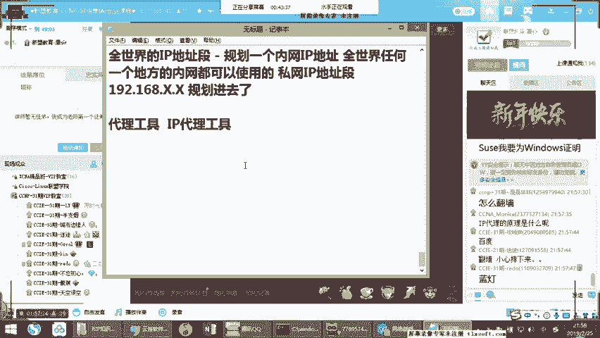

# 2019年度最新思科认证CCNA网络技术经典实战教学全集（最适合零基础小白的CCNA详解） - P1：思科认证CCNA网络基础第1节-扫盲预科 - new盟的小狐狸 - BV1V4411J7ZP

Yeah。

那在我今天的课程里边呢，我们说吧今天是一个什么课呢？今天是一个扫盲啊，什么叫扫盲啊？扫盲这是我们讲解一些非常非常基础的部分，非常非常简单的部分，就是扫盲。那扫盲的话呢，有些地地方的话，可能大是比较简单。

不没关系啊，我相信你在听的过程之中，你会听到很多兴虚你根本就没有听说过的，根本就不太会的啊，相对的你的一些概念啊。那我们先从最基本的开始。😊，那首先来讲呢呃在我们的课程的练习过程之中。

那么在前期的时候的话呢，大家要自己做的做什么呢？就是关于练习的模拟器啊。关于问题。那关于模拟器来说的话啊，那什么是模拟器啊，什么模拟器啊，这个大家应该知道，对吧？你们现在可以用什么？在我的课程上啊。

conil会主要用到小凡这个软件，这个东西叫在丹面。😊，啊，去外。那么这个软件的话其实就是帧三的前身啊，就是GNS3这个软件的前身部分，就是我们说的小凡。啊，深3的话在原有的情况之下的话呢。

增加了一些图标呀，增加了一些看上去更好用的集成的功能。那你们愿意用针三可以用，没有关系啊，O那我有视频录屏可以发给你们，你们可以看一下怎么安装真3。那我的课程重点会用小凡啊，第二个部分的话呢。

我会用到EVE这个软件，明白吗啊，小凡和EVE啊这两个啊，那么在前面基础的时候，我们会用小凡啊，基础的时候完全O后面的EVE的时候会涉及到一些综合的神一些高级的实验啊，那在我们的这个课程里面。

首先大家要先把这个模拟器安装上啊，一会儿的话呢，康or在课下的时候会把啊我不知道你们的学习礼包里面应该已经包含了。大家应该知道吧，在你们的学习礼包里边的话，里边有一个模拟器合集，看到没有？

告诉我看到了这个这个文件夹了吗？工具合集里面模拟器合集那在模拟器合集里边的话，里边有小凡有EVEO小凡的话就是一个非常典型的1个EXE的一个文件。😊，啊。

EX文件要把这个EX文件自己下一步下一步下一步安装上作一在安装的时候的话，一定要配合里边的一个组件。就是如果你的操作系统是win7以上的操作系统。O包括win8win8。1啊，win10。

那你都需要安装一个winmcap4。1。2以上的版本啊，那在那个软件合集包里面已经包含了，那4。1。2以上的版本的话，主要是干嘛的？主要是做什么用的？主要是用来导证你的通信的。

要不然你会发现你的小凡 ok导入进去有没有问题。然后呢设备配置完IP不通，能理解吧？啊，不通，那在我们不管是小凡还是EVE呢，我们要搞搞清楚啊，就是说它实际上来说的话，就像刚才提过很多遍嘛。

它都是把我们的真机的系统运行起来。那么在这个里边呢，在小凡里面最主要的系统啊，小凡之中最主要我们应用的操作系统主要围绕着两款是我们后期练习时候用的最多的一款是3640的啊IOS。另外一款什么呢？

是7200的IOS。啊，那么3640的AOS的话，我们大多数主要用于做我们后续的路由方面的实验。7200的IOS啊7200的我们会主要用于做关于安全和MPS等相关的实验。OK好，然后呢。

在我们后面的EVE里边的话，我们主要涉及到的是更多的设备。因为我们知道EVE本身来讲呢，它是个什么EVE本身来讲的话，这个东西它是集成在个我们的ginux的操作系统内。

所以大家应该知道我们现在啊咱们发出去的AVE的这套系统包的话，主要是干嘛用的呢？主要它是我没有记错的话，应该它使用的是乌班图的系统啊，集成在乌班图的minux的版本上啊。然后在这个情况。

这个版本系统之下的话，里面运行的EVE的这款模拟模拟工具。那这里边的话主要我们围绕着是3725的AOS啊，3725和3745的AOS。好，以及我们的IOL啊好，还有IOL的二层me two啊。

以及where。啊，二层和三层的LLOL的这个版本啊，那这是我们的EVE的一个后面使用的工具。那主要的使用EVE的一个作用是在于什么呢？在于我们的设备数量足够多。因为到后续的时候。

都遇到IE部分的时候的话，我们所涉及到的实验是维持在40到50台设备。搞清楚40到50台是设备的大网。那这种中间囊括的可能你一套一整套实验。啊，里边所包含的部分。

其中包含企业级的网络、运营商级别的网络啊，以及我们涉及到的一个数据中心啊的网络。那我们知现在的工程师并不仅简，但是你会配个设备就OK了，那个太eay了，能明白刚or的意思了吗？那个实在是太easy了啊。

你呃今天有点事情吗？单位有事吗？啊，如果单位有事情的话呢，那你可以请假。如果单位没有事的话，建议不要请假ok啊，然后同时的话如果请假的话，回去一定给我看录屏ok吧。瑞恩啊，ok看到上个一啊啊。

那其中的三个部分，我们知道现在的网络结构啊，现在的网络结构里边，企业网其实占比很低。企业网的话主要围绕着路由和二层交换方面的东西为基准而运营商级别的。

主要围绕着是BGPM为中心点啊那d center里边的话也是围绕着我们说的BGP啊，围绕着OSPF然后涉及到主播等相关的一系列的一些技术啊，所以我们会围绕着三个板块去讲那我的电脑可以吗？

在现在前期是不要紧，前期的时候的话，大家不用特别担心了啊，O前期的时候的话，因为我们的设备数量，我们不会涉及到那么多，到中后期阶段的时候的话，如果大家在本地的环境啊，一个是本地环境啊，那本地环境的话呢。

我们保持着内存那CPU的话，不用讲啊，CPU没有多高的要求，最低I3标准啊，我相信你们电脑的话应该都O对吧？因为现在电脑没有奔4处理器吧？是吧啊没有奔4处理器了，是不是啊没有奔。😊，第个吧。

最少都是I3嘛，都是酷睿I3对吧？OK的。然后呢，内存部分让大家的话底线。是围绕着。8G内存okK上限就是说最最最好的状态是16G内存。明白了吗？好，剩余的部分没有任何要求，明白了吗？

任何剩余的其他的部分没有任何要求。如果你的内存不够，自己淘宝一下，搞一条内存就可以了。明白啊，搞一条内存，加上内存，现在基本上二三0百块啊，三四百块啊，自己加条内存去就O了好吧啊。

这是这个点然后后期的话，我们也会有远程的实验环境啊，那么你本地要搞远程要搞，明白了吗？啊，是为什么是因为远程的时候的话，你是远程的SSH或者t night啊，那么就会面临的有点卡啊。

这是一定的这个卡不是设备卡，我们有服务气的那这个卡可能主要面临的一个问题，是说你的网速啊，明白他的意思呀？O你的网速啊，因为你你要远程调试，我们做工程师都明白你远程给客户调试的时候都会面临的网速问题。

没有办法，明白了吗？O好，明白一啊啊。😊，那么这是一个我们啊后续要具备的。那么前期呢大家不用着急啊，如果受心太穷了，我们买不起内存条不要紧，同学们啊，可以等几个月啊，5个个月之后我们再升级电脑。

也完全来得及。好吧。啊，我们接着来看啊。😊，那么接下来的时候的话呢，我们来看我们的第一节。那在我讲的时候的话，我们先搞清楚两个概念。好吧，就是我们先说第一个就是网络的概念。啊。

这个网络的概念可能看上去有个简有点简单是吧？啊，那我们说什么是一个网络啊，我们平须说看到的网络有什么和现在的网络环境。😊，要什么？我们都知道啊来区分一下啊，你们可以打到公屏上啊，你们所见到的网络好吧。

例如我举个头啊，假如3G4G啊是吧？这个大家能见过，对吧？你们也都用啊，平时手机上网用是吧？3G4G啊哦，还有吗？假如是像我们家里边的是吧？叫啊这个直接的光纤入户啊，这个大家听懂啊。

我们把我们T词都拿起来啊，光纤入户啊，还有吗？😊，还有吗？把你们所听到的词都拿起来啊，没有关系啊。ok吧。好wifinice wfi对不对？好，还有吗？😊，还有吗。😡，还有吗？我们天梳理一个框架啊。

因为我们今天主要是扫盲，懂吗？啊，还有吗？😡，来了。就这个就这种状态没有听过别的广告吗？啊，唯频分享。ok好，我也给你记下来啊。唯屏是吧？好，还有吗啊，电话网络ok那 nice啊，还有吗？

热点热点就是wifi吧？热点热点就是wifi还有吗？云啊O云不能算云不能算好OPPOE啊好O烂网O好，还有吗？😊，啊，校园网校园网ok哈来了。😊。

我们UIP啊OVIP不用说UIP的话是基于我们网络之上的一项应用服务语音服务OK吧。啊，现在企业里面的话一般都用语音电话，就是我们说的VOIP明白吧啊啊IPTV是吧？还是TPTVIPTV吧，是吧？

是IPTV吗？😊，好，专线ok nice好。😊，啊，抓包我们就说了，知吧？抓包的话是一个我们的一个功能操作啊啊，ATM啊ATMO好，还有吗？😊，还有吗？好，oknice那我们先说到这个环境下啊。

我们说这个大家说的非常好。OKMSTP啊。好，行行，那我们来看一下。首先的话作为整个大家提到过非常非常多你们平时听到的词，我相信大家平时听到这些词的时候，第一反应就是懵逼，为什么呢？

是因为很多同友虽然听说过，但是完全没有没有一个层次化的概。😊，能理解刚才意思吧？层次化网络首先对于技术的认知的第一个步骤是认知层次性的东西。什么叫层次？就是你知道每一个东西是在什么位置。

有点像我们当医生一样当医生检查身体是吧？检查身体，你应该知道这个人啊他这个流鼻涕啊，头脑发热那什么原因啊啊，发烧了啊，明白吗？啊，这个胸口特别疼啊，胸口特别疼怎么回事啊啊，内衣才行了，如此类的。

明白刚才意思吗？你应得知道他现在出现的什么问题到底是由于什么原因而构成的。这个是首先我们在学技术时中的话，要有一个定向，比如说你可以定位出来它每一个问题点的一个来源那么这个部分就要对技术本身来讲。

本身有一个认知，就是例如感冒是个什么概念能明白刚才的话吗啊，就例如发烧是个什么概念就是例如是吧？你这个这个肚子疼是什么概念啊，你这个后。后背层什么概念，明白发生意思吗？好，这是对不同的东西。

你要有一个不同的定位，你不能说我肚子疼，挺有你治腿是吧？我我我这个膝盖疼，结果我感觉这个肯定是发烧了，明白发生意思吗？这是不是不是不行的，能不能听到明白差多一那我们先归下位啊啊在为以上所看到的北边。

我们先可圈可点的归下位，我们都知道其中的话无线网络的标准，其中3G4G以及5G和我们的wifi这都是我们这个无线网络标准，明白了吗？啊，这是无线网络标准啊，那么第五5G什么概念？4G什么？

第5G第五代是吧？网络标准第五代我们的一个移动网络标准，就是5G啊，那么其中的话这些都是我们这个无线标准，其中关于咱们工程师来说的，几G其实跟你关系不大。为什么？

因为几G只是仅仅是一个网络形态的一个标准，我们平时该怎么上网还是怎么上网，你们用3G4G的时候的话，跟你们关系大吗？不大吧，吧？😊，你们用手机喊自动变和4G是吧？啊，2G动电3G是这样。

跟我们关系不是很大的啊。wifi是什么？wifi的话，一般情况之下用为小范围的室内，所以你可以看到有一个大方向的一个区分。3G4G5G你可以定义成是做室外的啊，3G4G。😊，啊。

4G5G你可以看成是做室外的一个无限覆盖。啊，标准。wifi呢通常情况之下是做室内的啊无线覆盖标准。啊，这个很容易理解，对不对？告诉我可以理解吧？所以通常在公司里边我们就会提到一个词，大家会涉及到的啊。

我们假如说我在一个小的office里啊，一个小的办公室里边好，那我们公司里面没有什么钱买不起什么设备，你们会有一个什么无线路由器是吧？这大家知道啊，找一个地方找个桌子找个桌脚就放在那里无线路由器。

如果对于大一点的公司开放式的办公室，你们会涉及到什么无线的AP这个时候大家就见过，对不对？听没听说过叫ize point啊，叫无线的访问接入点好，大家听说过对不对？无线AP啊，AC啊，什么无线控制器。

无线接入点。好，那就是个外套无线解决方案，明白方的意思吗？那我给大家举个非常简单的例子啊，我说一个点可能对于你们来讲呢，就有一个定义啊，假如说。😊，如果对于传统的无线来说，室外的我们不说了。

室外的话是通信领域。室内的话是我们的网络领域啊，你可以这样去划分。所以通常我们工程师可能会在室室内去部署wifi sky。那我们拿两个例子来说，假设你使用普通的无线路由器，它往往受限于什么呢？

受限于功能。好，功能性和稳定性。啊，什么叫功能性稳定性？那么大家应该知道我用无线路由器啊。那么如果开时间久了，你会发现经常网络断掉了，或者特别卡，你过去之后把线拔着重新启动一下，告诉我遇到过这种情况了。

没问题吧，肯定遇到过哈，那么在这里面它的本身硬件的稳定性比较低一，这个没得说，它的本身自己的承载感，就它的负载达不到那么高。那么它包括自己它的一个包转发率啊，一个背版性能啊，根本都达不到。

只是满足家用级别的一个vil好，那么企业级的话可能会对什么有要求。我给大家举个两个点。第一个。😊，假如说对于我们企业里面，大家知道关于摇滚这种东西吧？大家知道摇门嘛，或者飞机，大家知道。大家听过这个吧？

游文飞机上上网，假如在游文上面，很多时候的话，你们要是现在很多出据旅行会在游文上面去上网。那么它本身是有wifi sky的。但是呢它wifi覆盖不是免费的，它是收费的。那么收费的网块它是算什么收呢？

和飞机上也是一样。国际航班也有wifi，它是按照什么？按照流量收费。😡，按照流量收费的话，它一般会通过有一个什么呢？会有一个计费系统，也就是会有一个页面登录的一个审计系统。

例如我们一般说叫buss服务器啊，叫buss服务器。那这buss服务器来说的话，有点像你们在星巴克或者麦当劳的时候的话，会在机场里边，你再去登录，你连上这个wifi，你连不上网，你要出现了一个网页。

这个大家知道吗？你要网页里面要输入一个用户名啊，用户名和密码，看到没有？输入户密码之后干嘛啊，你要登录上去。😊，登录上去之后的话，在这个过程之中的话，它后台可以允许有一个计费功能。可以审计你的行为。

上网行为，审计你的上网的使用的流量等相关。这么说能不能听懂，告诉我明白双波一来啊，对吧？像类似系统，那么你像这种功能的话，我们都听说过我们也用过是吧？这在我们身边。

但是你我告诉你家里面的无线路由器做不了，家里的无线路由是搞不定的。OK那么除此之外，还有一个我们再举个例子，假如说我们拿酒店来说啊，先说一些你们比较能够呃熟悉的，好吧，拿酒店来讲。😡，那酒店来说的话呢。

😡，你会发现它有一个无线无线的一个哎，假如说我从三楼是吧，我在或者一楼啊，我在大厅啊我在大厅的话，我上到4楼啊，我们知道很多大型酒店，比如像类卡尔东的或像里巴这种大型酒店的五星酒店的话。

它这网络是有标准的。假如中间的无线不能断那我们都明白啊，我们假设说在我在一楼的时候，我实际上是连接着我们一楼的一个无线接入点的，明白那这个时候我到三楼或者到4楼的时候，你告诉。

我我在这个时候我要干嘛去把我的无线跟没断一样，就是我经过个电梯到达个4楼，我的无线还是这个无线。哎，非常好像漫游明白了吧？哎，有同学知道对吧？漫游好，那这个点我们怎么去做呢？啊，这个时候的话。

实际上我们家里面的小路由器的话，绝大多数都是做不了啊，那这个时候的话我们就要通过企业级的比如像无线解决方案啊，像APPAAC啊，类随于这些东西来进行解决，能明白发萨的意思没有啊。

诸如此类的有很多这么说能不能听懂啊，所以我们现在有一个。😊，就是说3G4G5G呢是室外的，跟我们关系不大。那室内来说的话呢，哎，我们就部署室内wifi对于企业级要求来说。

我们接触的更多的还是AP和AC听明白了吗？明白刷波一来啊，用于企业级的一些独立的解决方案。好，这是我们说的无限啊。😊，那除此之外的话呢，假如说像我们听到的什么光鲜入户是吧？类似于这种词。😡，光纤入户啊。

大家记住啊，这仅仅是一种接入方式。接入方式很这个很容易理解。就相当于原先的时候，我们说当前我们看到网络的几种主要形态啊，在早期的时候的，我们暂时定义成1。0形态，好吧。啊，1。0形态啊，1。

0形态给别人校呃瑞捷搞的校园网好多都是数无线AP很正常。校园网很多是无线AP的，因为是做校园wifi覆盖嘛。啊，但是呢那种解决方案的话，大多数就是能上网就行啊，没有什么太高的解决方案的要求，明白了吧啊。

那其实正儿八经来说并没有太多的技术要求，你们很快就可以达到那个水平啊，很简单的啊，那1。0阶段的时候，家里边是怎么上网的，叫电话线上网，这个大家知道对不对？电话线上网啊，我们说叫窄带上网。😊，啊。

这是我们的一。的阶段。那我们要通过我们的电话线单独把它拔下来，连接到一个外置的modm上或者内置的modm上啊，外置内置，这个很容易理解啊外置的话就像一个小的什么，那就像一个小盒子一样，懂吧？哎。

一个小盒子，就是猫嘛，跟小路由器大小差不多，听明白了吗？跟你们家那个TP link呀，那个大小差不多。哎，干嘛它接到一个外置modem上接入到外置modm干嘛，然后它转个一根网线转到你电脑上。

然后你呢要通过拨号上网。😊，那波要上网的话呢，内置呢就等于相对于把外边那个小的modern给你变转换，就变成了一个什么里边的一个像网卡一样的东西，插在了你电脑上的PCI的接口上。😡，这可以理解了？

啊插在PCI接口上啊，剩I接口上等于那个电话线的哎直接写到电脑上这么说能不能听到啊，直接电脑上外面没有啊，那不管外置内置作用是一样的，就是我们要通过什么呢？拨号上网，那早期的时候大家上网的时候。

要么去电话局里边开通，是不是？哎，没错，要不然是干嘛？你去那个报刊亭买那个上网卡是吧？去报刊厅买上网卡。那个上网卡就像点卡一样，那个点卡上有一个账号密码，我这么说能不能听到啊，有那么一个账号密码的东西。

你可以在家里面呢随时去拨号滴滴滴滴滴，你要一播的时候，你可以听到它响啊，拨号那拨上去之候，那个速度是非常非常慢的，这个非常非常慢。所以早期的时候一般大家用家里面的上网干嘛很贵。

一个是贵一个是么一般都是干什么呢？就是你一旦拨号上网了之后的话呢，你是电话打便买的。😊，明白吗？电话打不进来，okK啊，你就上线，打掉就去上线是吧？要不然的话就是干嘛？你断线吧，断线嘛，电话可以用。

一般是这样的。明白了没有？好，然后在这个过程之中的话呢，我们应该干嘛呢？哎用于流感一些简单的外b，比如说像BBS是吧？早期就是网站啊，BBS论坛，然后以及一系列QQ是吧？这都是我们早期的对吧？用法。

这是一。0的系别。😡，在2。0系列的时候的话，ja格本就变成了宽带系列了。注意看。😡，啊，形态变成宽带了，这不是窄带了，就变成宽带。那宽带是怎么回事呢？宽带的时候的话是代表我们依然是使用电话线上的。

还是电话线，大家先搞清楚电话线是本身没有任何变化的。但是这个时候的电话线是什么呢？就是使用宽带。这种宽带就是使用，我们会发现干嘛？我们在本地创建一个拨号连接是吧？哎好像跟那个1。0差不多哎。

但是呢这种宽带情况的话是干嘛？它和电话是可以同时使用的。😊，好，可以同时使用。明白我说意思吧？它跟电话可以同时使用，它有个分线盒，那也它依然是通过电话线，那电话线接到一个分线盒上，一分二，明白的意思吧？

一分二哎，没错SDN我先不跟你们说这个专业术语，好吧，我们是先说你们知道的，我们先不谈专业术语啊，O好，像PSTN我们先不说好吧啊，然后呢接下来的时候一分二干嘛呢？其中的话一根分出来的一根线。

一根是什么，是我们的电话线啊，就是你可以接到电话上，另外一根呢？另外一根是分成的网线，听明白了吗？是网线。好，那么当然在这里边的话，当然了你说有的老师这是网线吗？有的不也是电话线吗？没错，是的。

有的也会分成电话线，然要分成另外一根啊，电话线，然后接入到什么？接入到猫的么上。😊，还是猫还是猫上。哎，你说老师这个怎么还是猫呢？当我们使用第二种形态的时候，它使用的是PPPOE的一种拨号形式。😡。

这就是刚才咱们提到的了，这是一种拨号形式。注意看叫PPPOE明白了吗？也就是咱们俗称的叫什么呢？叫EDS1。😡，听标吗？哎，这是我们名叫ADSL听说过吧啊，宽带上网不号上网好。😊，那么使用这种方式呢。

而这个这一次我们使用那个猫，它的一个作用是什么呢？这个猫最主要的一个作用的话，其实是什么？起到一个数一个模式转换，叫数模转换啊，这个大家该知道是吧？什么叫数模转换呀。

如因为我们的电脑上发出来的数据是数字信号。能理解吗？数字信号好，而我们现在的话使用电话线呢是什么东西啊？是模拟信号。😡，听明白了吗？这起到一个数模转换，而它采用的叫PPPOE的形式形式。好，不要着急。

我们接着来看，这是2。0的阶段。3。0的阶段，就是现在我们目前使用的3。0的阶段什么呢？看着。😊，啊，有分成两种。第一种呢是三点0的前期。前期的时候就进化到了什么叫网线入户。这个大家听说过对吧？哎。

我们网线直接入户，就是要很多你们办宽带没在这个电信线联通办，而在哪里办的？在我们的这个这个例如像给大家举个例子啊，像海泰宽带。😊，呃，长城宽带。啊，像这个广电宽带听说过吗？告诉我听过吗？

听过有看子刷个一来啊，然后他是干嘛呢？他给你做布线，哎，有人给你帮你帮助你做布线。😊，对吧当你说布线布线完了干嘛？然后呢，直接一根网线啊，打个过墙眼，在楼道里边，它楼道里边有个交换机。😡，明白吗？

楼大伟我叫你。😡，啊，然后这根网线呢不到你们家里边去，直接网线，我们一般就叫网线入户啊，直接接入到你的电脑上。😡，那个阶段直销电脑上呢，一般怎么验证你的身份呢？一般是通过第三方的客户端登录。例如。

像DR点com，当时这是城市热点公司的一个拨号软件，应用非常广泛。很多像海泰啊、长城啊以及像广电呀用的都是DR点com近几年才开始逐步的消失在人的面前，才不再用DR点com。

而都在使用PPPOE的这种拨号。明白吗？好，这时候3。0的前提。到3。0的后期阶段的时候，看，3。0的后期情况发生了一些变化，就是带宽加大吧，入户不再使用网线入户，而使用光纤入户，听明白了吗？光纤入户。

光纤直进去，我们知道网线是百兆，光纤是多少兆千兆，这知道大家知道对不对？光纤是一个G的更大吧，纤兆大百兆大，肯定千兆大吧，这个ok吧？OK你刚们刷个一来啊，O好，然后接下来光纤入户嘛之后接到什么地方。

接到了一个叫做光猫的地方上，接下来叫光猫。😊，好。光猫什么叫光猫啊，这个东西跟我们之前看那个猫呢其实意思差不多。但是光猫起到的一个作用是什么？是光电转换。😡，好，记下来。

那也就是说后面他们前面的光纤呀完完全全都是数字信号吧，没有在走电话线的这种概念嘛啊，完全是单独的光纤完全是单独的一套线路啊。那么在单独的一套线路之后的话，用于干嘛呢？哎。

接到那个moddo上做光电转换光电转换什么，一边是光纤，另外一边转成网线，所以一般我们说电路一般我们所指是网线光纤是光路明白的意思吗？啊，这是光电，因为你的电脑上不可能直接接光纤啊。

你的电脑上最终还是以网线形式接上去的，所以叫光电转换。我这么说能不能听懂，明白一个shopE啊啊，shopE上来啊，那么在这个过程之中，现在的所有的宽带基本上3。0的前期还是3。0的后期。

现在我们使用的，别管你是在任何地方办理的是宽带接入的话，基本上用的都是PPPOE的什么叫PPOE啊，就是刚刚conor提到的，使用一个本地创建一个。😊，客户端的拨号。🎼的一个工具。

然后通过拨号输入用户名和密码啊，然后进行一个拨号登录。而PPPOE所指什么啊？PPP是我们后面要学到的一个协议啊啊，这是一种接入方式。PPOE所指PPP over middle。明白了吗？哎。

over in that没错叫以太网的基于以太网的PPP协议啊，PPP是一个协议。这个我们后面会讲的okK。😊，能理解吗？好，其是我们现在看到的一个什么呢？就是刚才刚才提到的是吧？像什么热点啊是吧？

热点就是我们说的wifi啊，实际上好，那么这是我们看到PPU我们知道的。😊，那么除此之外的话呢，在基于原有情况之下。好，其实原有求市啊，这电话网购不用我讲了吧，对吧？电话网购的话。

也就像我们刚才提到的吧？一共是电话。那当然了在企业里边的话，在早期的企业里边看到企业内电话呢是纯模拟，就就是模拟交换的这种电话系统。什么叫微机交换电话系统呢？给大家举个非常简单的例子。

原先的时候我们使用的叫电话交换机。😊，啊，电话交换机。电话交换机的话呢。😊，这个东西啊呃其实跟你们看到那个交换机是一样的，只不过它所有的接口都是电话线接口。啊，电话线接口是谁哪些公司喜欢干这个东西呢？

卖这种东西呢？中兴你中兴喜欢卖这个华为喜欢卖这种，明白了吧？哎，叫电话交换机。第话交换机早期的时候通过什么啊，通过类似于像那种老式的老式的那种西门子啊，西门子电话。😊，知道吧？

然后的话呢连接上通过电话调试，通过电话的声音调试，明白了没有？哎，通过按键进行调试进行线路的一个交换。那你打开过去前台，前台接完之后干嘛？前台摁一下9，把105给你整到别的办公室，能明白了吗？啊。

能不能听懂。那这个就是在我们企业里面传统早期的这种电话交换网。好，能不能没听懂我说的话，我现在讲的部分首以先给大家做一个总章介绍啊，O吗？O刷哥一没听懂刷个。😊，没问题了。好，没有问题的话呢。

我们接着说好吧，咱们接着来看。😊，其他同学呢？其他同学呢可以听懂吗？告诉我可以吗？😡，可以说吧，没听懂帅哥，不要紧。😡，OK好，那咱们接着说啊咱们接着说。那么第二个部分来说的话。

到后期的企业里面企业内现在的话都是呼叫中心嘛。现在不是单纯的公司里面的模拟电话这么一个概简单的概念，明白刚才的意思吧？然后现在的话你们用到的全部都是数字化的语音电话，全部都是语音电话了，明白啊。

现在不是我们现在传统的那种啊模拟信号电话并不是，所以现在企业里面用的非常多的电话，你们看到的什么叫IP电话哎，是吧？像我们说IP phone啊IP phone啊？就是IP语音电话。

IP云电话用来干嘛的啊，原该干嘛的，就是相当于是一个就像这个东西啊有点类似于一个电脑一样。😊，这么说能不能听懂类似一个电脑一样，它直接去接入网线哎，作为一个电话终端，用来方便随时。

随地的用来进行语音的会议啊是吧？方便视频会议，语音会议啊，用于这么一个东西非常的方便。好，这么说能不能听懂啊，现在都是IP化的啊。那我们接着来看上面啊这几个点。那大家说到的这种啊。

例如像我们说的呃这个这个IPTV啊，这个东西怎么回事？呃，这我先不说了，这个一会再讲说专线吧，好吧，说专线现在的专线形式呢其实主要面向几种。😊，啊，最为常见的一个是MSTP的专线服务。

还有一个是我们说的MPS的专线服务。好，那么这种这种都是什么呢？这种都是我们说企业级专线。什么叫企业级专线？我给大家举个例子，好多同学都说了是企业级专线是不是企业上网啊，是不是企业就为个上网就行了。

是吧？并不是大家要搞清楚，并不是单纯为了上网，企业上网是上网，上网那根线目不能叫专线，某种意义上它不能叫做专线，好多人以为说上网都是专线错，那仅仅是企业带宽，它不能叫上网，这个这个专线服务。

企业带宽什么？假如说我们公司里边。😊，在企业里边呢，现在跟家用很相似。如果我仅仅是说注意听我如果仅仅是啊用于普通的上网办公啊，假如说我们大都市的普通的上网办公是干嘛呢？就是从网上然后上个QQ啊是吧？

上一个这个微信啊是吧，上一个微信啊，好，然后邮件呀等等，还有访问网页啊等等之类的，明白？下载东西啊等等。好，那这些一般是干嘛，主要是面向于的是下行业务。什么叫下行业务就是下载型的业务，下载型的数据。

而这种很多企业里边现在都使用的不是固定IP的，它要固定IP没有意义。一般情况之下的话，使用的都是什么都是ADSL叫企业级的ADSL企业级ADSL其实跟你家用ADSL拨号没有区别，能明白吗？去哪办？

还是这联通办O还是可联通办，只不过它的它是属于企业级，在园区里边在企我给你出现。但它主要还是拨号还是拨号上网好，这么简释能不能理解那这种情况之下的话，但是它的收费其实要比家用的高。

假如说我同样是100兆，家用100兆的话，可能一个月八九十啊，六七十。那作为企业级来说的话，可能一个月苏百三四百听明白吗？一般是这样，就企业其实比家里边的话贵好几倍，但是从服务质量。😡。

来说没有什么太本质的区别。服务质量来讲的话差不太多。okK它的稳定性什么的也差不太多啊，这么说理解了吗？好，明白给他的刷波一上来啊。好，那么第二个什么呢？😡，除了这个之外的话，看到？另外一种的话。

就是我们说的单独的企业级的一个带宽。企业级带宽的话情况会有些变化。就是像你们提到的，假如说我固定的我去购买多少兆啊的这样一个线路，明白了吗？购买多少兆一个线路。然后呢，接下来的话我去购买固定的IP地址。

😊，这不知道能不能听到购买过不同运营商价格不一样啊，这个咱们不用不用探讨了。根据当地运营商的价格去判断啊，那我去购买固定的IP地址，等于这时候的话，它跟上面那种方式的区别是什么？

上面那种方式的话是这样的。😡，叫上下行带宽不队的。啊，不对等。上下耐克不等就是说上传速度和下载速度之间只能是1比8倍的关系。假如说我去买我们这个ADSL。

我是100兆的那实际上我这100兆什么100兆呢，我是下载速度100兆能明白吗？好，那我这100兆的话，那上传速度呢，上传速度不40百兆只能达到大概8分之1左右这样的一个速度，那个8分之1左右。

大概多少呢，可能15到20兆之间啊，这是我们说的上传速度明白了呗？明白刷波一，那这是我们说的单纯企业几ADSL的一比状态，但是你说老师有影响吗？没有什么影响，是因为我们在企业里边的话。

大多数是干嘛下载明显，咱们普通上网就是下载嘛，大家在办公室上网干嘛呀？我告诉你其实没个正事大家在办公室上网，也就是什么上QQ上微信是吧？然后呢那个看看网页，然后没事下点东西是吧？等等之类的。

其实也没什么大事，1般办公室那种对吧？你要说我我在办公室，我这还调设备调设备，你那个他用号麦宽是吧？远程。😡，设备那能用什么呀？所以其实无所谓，明白没？好，但是如果我用另外一种是买固定带宽的形式。

那这种的话就是什么上传下载固定的。假如说我上传100兆，下载也100兆。那通常这里的带宽就是它对于上传型业务我下载型业务要求都蛮高的。假如说我在我企业里边的话，我不只是说有日常办公上网。

我可能在公司里还有服务器这样的玩意儿。😡，这么说能听懂吗？啊，我可能有服务器，但是我的服务器的话呢不多哎，我的服务器可能有那么几台或者一组机柜啊，但是不是特别多。那这个时候的话。

我可能干嘛我会购买一点点公网IP地址，啊，我是用于我这个内部的视频会议啊啊，假如用于我的其他的城市的分支机构啊，办事处啊，分公司呀，用来连接我所以我会有购买公固定IP然后他给他们连接我访问我呢，哎。

我这边还得给他们发数据，我给大家举个例子，假如说我开视频会议，我开个视频会议的话呢，我在这边打开，你们现在在听，你们告诉我这个时候的话，你们是下载我是什么？我是上传，明白刚才的意思没有？

你看我们就有企业级的应用，就等于你看我现在给你们讲课，我在讲课，我们别的老师也在讲课，我们在讲课代表我在说话，在发数据出去，我在上传，听明白了吗？如果我们的带宽上下行不对整。那我们一直在上传数据。

就非常有可能导致我们上传的速度非常的卡，但下载速度搜搜的。好。😡，明白了吗？明白啊这叫企业级带宽，一般根据企业给他的业务需求来判断我到底是日常上网呢，还是说是我也得对外发数据。

加说我现在给大家开一个什么？我给大家开一个文件服务器放在我们公司？然后你们平时的话呢上课有需要什么东西，你们下东西下载下载干嘛呢？由于这些资料是私密资料，怎么样？私密资料要有账号的。

我们不能通过百度云盘分享，对吧？那这个时候的话，你们登上来下载东西，我们就得上传，听明白了吧？是这个意思，那这个时候的话，对于我们的带宽要求就很高，是这是这么一回事，叫企业级带宽啊。

一般会购买固定IP那我不不买固定IP也不行，是因为你们得访问过来，你们得访问到我们公司的服务器，我们公司的文件服务器，你们怎么访问呢？你不能用内网IP所以你们访问我的时候的话。

我必须得有一个公网IP听明白了没？所以这个时候的话，我就既要满足上传速度，我还得有固定IP，这是一种企业级带宽。😡，还有一种是什么呢？叫企业级的专线服务。这种专线服务的话跟日常上网不一样。

大家要搞清楚专线的本身定义是用于什么呢？适用于总部与分支机构啊之间的互通。😡，是这个意思，它最主要的一个作用是为个总部和分公司之间的内部互通。它不是对外的。我给大家打个比方，我们那么是专线，哎。

你们现在能访问我吗？访问不了，因为专线之间是什么？点对点或点对多点之间的结构。假如说我们啊假如说啊，我们在在天津有公司，我们北京有公司，上海有公司。好O在这个时候的，我们几个公司内部集域网要互通。

用来满足什么？啊，对像银行对吧？很典型银行啊啊，还像很多的一些大型的外企啊啊等等之类的，像石油石化呀啊，这个企业那他们需要在什么呢？总部和分支机构到满足互通的一种状态。

那他在满足互通的这种情况之下用来干什么呢？大多数情况下用来跑视频语音业务。😡，假如我没有视频会议。明白啊，有语音电话等等。在这种情况之下的话，等于他对于的带宽的质量要求更高更稳定。在这种情况之下。

他会买专线，听明白了吗？因为假如说基本上购买专线的。如果你没有搞视频会议的，你就知道基本上天天接触客户就专线啊，客户的话一般购买完专线之后，专线服费用都很贵的，都很高的然后呢，在总部分支机构啊。

各个方面之间，然后做这种专线服务，用来定期的开视频会议啊等等，明白了没有？明白top一。而这种这种企业息专线，其中就是咱们说的像MSTP专线，像MP专线等等，这就是不同类型的这种专线服务是这样啊。

这就是我们说的专线啊，专线就是运营商单独卖给企业的，用于跑公司业务的，跟上网没关系，不是说那个专线我上网啊，上百度不是跟那没一毛钱关系，没有明白了吗？好，说到这听懂刷个一，没听没有刷杆。😡。

所以在这种情况之下的话，这是我们现在从企业里面看到的几种类型。所以不同类型情况都不一样。理解完啊都不一样啊，专线用的什么线早期的专线使用的是sreo接口，就是我们说叫一个一种类型叫畅口啊。

叫sreo就是最早期的这种专线的类型，带宽非常的小啊，这个专线是多少呢？是1。544兆的，非常非常的小啊，现在的专线服务的话呢，就跟我们现在用的以太网线路是一样的啊，都是光纤啊，光纤。

然后转成完转换完之后还是网线并没有什么区别，明白了吗？现在跟线路类型没有关系啊，具体是应用的技术类型不一样。通过不同的技术类型来满足业务类型O啊，像你们看到的Sco，那早期的这种叫sreo接口是吧？

Sco，你们有没有听说过一种东西叫做针中计啊，听说过吗？听说过真中剂吗？听过刷亿。😊，有听说过吧？真中记种东叫free break啊，这么一玩意儿。😊，对吧听说过是吧？好。

okK虽说这种东西已经被淘汰了。😊，看不到的啊，明白啊看不到的，早期用来部署企业专线的，但是带宽非常小，现在看不到，我没有考试也不考。OK好，但是我们当年考IE的时候，这东西还得用。

我们当年的时候这东西还是还是要学的啊。好，那么这是我们现在看到几个点。所以通过这个coor给大家去讲了呢，是说哎我们又明白了这是干嘛用的啊，那其中的话呢，涉及到的VPN这个东西呢。

记住企业为了满足不同地区的公司内部可以互通。😊，啊，实现跨地域的看着跨地域的公司互通。要么是购买企业专线。要么是自己搭建V品。听明白刚才的意思没有？要么是企业部署专线，要么自己搭建VPN是这两种方式。

OK明白波一上来啊，自己搭建VP啊，那自己搭建VPVP这种东西的话，就相当于是你们平时想看个小电影是吧？然后你们平时看不了啊，那个网站都被封杀的怎么办呢？啊，打不开啊，然后怎么办呢？

你们一般就通过一个什吧VP的一个软件吧是不是？然后拨号啊，到那个啊台台湾是吧日文啊，日本啊一服是吧啊，到拨拨号上去能访问外网啊，明白这意思了没有？明白超波一来啊，就这么回事是吧？其实到尾差不多啊。

那么作为你看你访问到外网啊，企业是干嘛？企业通过哎，他们的网关之间啊，自己的出口之间的设备。😡，播上VPN，然后实现什么？实现两个内网的互通。这在企业给他印发。所以要么企业用慈线为拼，要么是企业专线。

一般是这样，听明白了吗？明白上边一来。😡，嗯。好。那么这是我们现在看到的一个呃里边的一个几个点啊，上才给大家做了一个梳理。那所以我们看我们通过这个点啊啊我们知道的家用企业是吧？

家用企业啊以及有线无线的一些框架。好，我讲到这里，大家能不能跟得上，先告诉我我们先起个一个头，对不对？网络是什么？😊，啊，一道就我们讲完啊，咱们接着说来。😊，啊，OK吗？可以吗？可以吗？可以刷个一啊。

没听懂刷个2啊。好的，1。5是吧？佩奇啊呃，佩奇咱都是社会人了，咱就不能1。5了，是不是你有什么问题要打到公屏上，好吧，打出来啊，咱不能一上来就一。5啊，咱必须是完完整整的1一行不行啊。😊，我接着说啊。

你有问题可以打出来啊，我们说我接着往下带。那么在我接下来的时候，我们要看到一个情况啊，人家看到一个情况是说那老师这么多的各种各样的接入方式啊，是吧这么多种什么公司这里的这个企业级的家用级的各个方面。

那归根知结底这个网络是什么样的呢？厅长，不管。你是什么方式接入的网络？宽带窄带光纤。是吧sre啊，还是说是什么什么MPR专线什么等等。不管你什么方式，而网络从总体大方向来说，就敢组，记住是有敢阻。

第一种。网络是有两种叫做额。就刚才有人同学提到的什什么局域网。第二种文外叫广域网。不管你是看到什么样的网络结构，它就这两种局域网和广域网。那局域网和广域网更像什么的网络结构，更本说能明白吗？

它仅仅是一个网络结构啊，那么也就是说这个概念更相当于在公司里边在企业里面更像什么室内和室外理解吗？哎，更像这种概念，所以网络只包含这两种层次，局域网和广域网。那不管它是什么形式的接入。我再三强调听好。

不管是运营商给你做专线，做二层专线，还是给你做三层的业务，还是说是你们家里面弄的拨号上网，还是说怎么着，别管什么形式，那实际上我们都是局域网和广域网这两种形态啊，那么在这个里边的话。

你说老师wifi也是吗？对wifi也是明白了吗？wifi也是，那3G4G也是也是PPU也是也是不管怎么样，你都面临的都是局域网还是广域网。好，那么相。😡，信这两个词大家都听说过，对吧？

叫局域网广域网这个词儿听过吧？没事儿，佩奇啊，你先听康德先不提设备，咱们先不说任何设备的事儿，咱们先梳理框架，好吧，咱们就有概念。😡，那么这里边的局域网广域网听说过吗？

告诉我佩奇啊啊社会人告诉我听没听说过，经过给强粉刷个一。😡，哎，行，这听说过就行啊。那我们来看。那么在像成域网咱先不管啊啊，记住大方向只有局域网广域网明白了吧？啊啊，那么在这里边的话，局域网广域网呢？

什么是局域网广域网？这个就我们就要提一提了啊，我们就要梳理一下，往下说一顺啊，什么叫局域网广域网，大家记住。😊，机域吧和什么它是相辅相成的？😡，有一东西叫交换机，听过吧？提供交换机吗？听说过吧啊。

光域网跟什么玩意挂钩呢？跟路由器挂钩。😡，嘿好，提到主角了，一个是交换机，一个路由器啊，问问你说老师这个两者之间有什么关系呢？别着急，再往下看。😊，咱们上网就得涉及到一个什么问题呢？

涉及到1个IP地址段的问题，对吧？咱们上网得拍IP啊，你别管你玩没玩过设备，这不要紧，我一直在强调跟玩设备没没关系，设备玩的多点，只不过更清晰一些，不跟那玩为什么，你后期你们到项目岗位上之后。

分分钟让你明白怎么回事，明白了吗？你学会不行，是吧？学不会前怼你是吧？都这样的，哎，你不用着急，你到项目上俩礼两个礼拜啊，你你那点东西都知道啊怎么回事吧，理解完啊，所以不特别着急啊。

那么IP地址段咱们明白上网吧，IP地址段IP地址段其中就涉及到一个叫什么叫同网段。😡，还涉及到1个IP地址段的一个叫跨网段。的概念。好，我们把它组合一下。那什么是局域网呢？注意看啊什么是局域网呢？

局域网看着，局域网就是通过交换机。😡，把具有相同IP地址段的数据进行转发。记下来。就是希望。假说原先的时候你们有没有打过一个游戏叫CS啊，打过这个游戏嘛？我不知道我们是不是有代沟啊呃。

在康son那个年代我们都是玩这种游戏的啊，叫CS啊，CS1。5亿也没有是吧？这是一个枪战类的游戏，特别像呃特别像那个那个CF一样，叫profire啊。😊，没听过啊，没玩过是吧？太可悲了。这么好玩的游戏。

你们没玩过啊。好，没关系啊，CS什么的枪上个游戏这个游戏啊我们一般说啊给它里面有个按钮啊，叫叫进入游戏啊。然后呢局域网对战啊。好是吧？这样然后呢局域网对战O好。😊，我通过这个词儿。

castor第一次认识到局域网，这个词儿叫局域网对战哈，这是我第一次看到啊，局域网，我操牛逼啊啊，那么这个局域网对战呢，在当时我们这个定义里边是干嘛呢？怎么定义呢？这个定义的话就是说我们大家都在网吧啊。

会讲的，放心。今天castor就是扫盲IP地址，我详细讲理解了没有？caster今天只是给大家做扫盲，别着急，咱们现在仅仅是卡刚开始，你们的噩梦就要开始了，明白了没有啊，不要着急啊好。

那么这个是候我们都在网吧的话。😊，然后这个是干嘛？大家都是我坐在你旁边，你坐在他旁边都是这样的，明白他的意思吗？啊，都坐都坐在一起。那这个时候的话，我们在打这个CS啊，我们就是干嘛呢？

在内部我们都在网吧里里边内部给机是不是？好，这个时我们叫什么叫局域网叫局选择局域网对战啊，啊，讲不到，我给你们看一下啊，看我整个的一个，假如说我就拿最简单的部分来讲。

其中我现在还在讲网络基础IP地址在这第八章，明白吗？我现在在讲第一场，我还没讲到这第八章还差得远，明白没有啊，IP地址的都不叫基础，听明白了吗？为什么不叫基础，你们子网划分就是学明白了。

你们也不知道为啥子网划分，你们还有很多学完之后傻个吧唧的到工作岗位上弄一大堆内网IP做在子网划分去了，其实这是错误的，明白吗？学天学成学成这个呆瓜的，这不行，明白没有啊，所以刚会给你们先讲框架。

你们明白了什么情况下，我们要用什么。😡，不能知道什么情况下用什么，你们在学这个技术，能明白康的意思吗？在这个情况之下，你就不用你就不用担心了。在这个时候的话，你记忆非常深刻，明白了吗？好。

明白康的刷个一啊，先学框架再帮你填充这对你们来讲非常重要要不你蒙了半天是吧？一会OSPF一会儿一会静态不由的到企业里面一看接的专线什么叫专线，马上懵逼，不知道啥叫专线，你说你从那搞个锤子是吧，没啥到啊。

别着急课程大纲的话，那个课程的我那个课表还没出来啊，我们这个年后排班排的特别紧，一大堆晚啊，所以我那个课表交务的还没出来，出来，这两天应该是最近这个月底之前吧，这这个三三四天之内就给你们发过去了啊。

就发到群里了啊，是美女啊，咱们接着说啊。😡，好，的这个时候我们接着说啊，那么呃我现在就学的有点懵啊，哪里萌先告诉我，我现在讲到这，你告诉我你哪里萌。😡，哪里吗？先提问题。😡，哪里头？一会儿斯刻有华为。

我现在我有收到华为吗？😡，我现在没有说我华为啊，我现在早说个半天不就一直在说技术嘛？我没有说思科华为啊啊，明白了，你上的是上一个班叉CNA是不是？😡，还有什么啊，明白了，你上你是在学校里面是吧？

蒙很正常学校里边的学生都猛啊，所以你不要觉得是这个呃这个这个这个有什么特殊的啊，不用担心好不好啊？没事，你什么专业的并不重要，明白了吗？反正什么专业的话都是啊都是那样啊，没什么区别。

能理解康斯的意思了吗？我有很多学生啊，都是学什么平面设计的，跟我考IE的，也是有很多的啊，跟这没有关系，明白没有？学网国工程的出来面试，一问知道什么叫四科嘛？没听说过也有很多，明白吧？啊。

所以不要不要那个想那么多OK啊。😊，啊，没事，学生学不明白很正常，怎么不明白卡萨说的话呢？是不是啊，是是因为你学校学不明白，你才来跟着我学。你告诉我刚才讲这些，你学没学明白，你先告诉我，你别着急。

我还没有说到这儿呢啊，我刚才讲的这些听没听懂听懂了吗？听没听懂啊，你们几个两的学生大学生是吧？听懂了吗？啊，听懂了，咱们接着往下说okK那就行了啊，那就不要再想你的这个之前那段感情了，好不好啊。

你既然真的感情不重要啊，我忘了过去吧，好不好啊？啊，你就记住你在大学里面呢，如果你没谈女朋友，最后你能收获的就是个毕业证，所以说你就安安稳稳的坐在课堂好好听课，什么都不要乱想好不好啊，冷静一点啊。

那我们接着说那么在这个时候的话呢，我们来看我们在内部进行联机的时候，其实这种联系方式就是一个很典型的叫局域网联机。😡，这么说能听懂吗？这很典型机管问题。为什么是因为如果网吧断网了。😡，你受到影响吗？

你受影响吗？你不受影响，你们该打游戏还打游戏，网吧端不断网跟你没关系，能明白刚才的意思没？是因为你们完完全全是在通过里边的那个叫交换机的东西再转发数据。😡，那么这个交换机有点像什么？你们在宿舍里。

你为什么在宿舍里面，他在上大学，在宿舍里面有个小路由器，大家知道没有？告诉我有个小路由器，大家知道吧？好，那个小路由器的话，每边有好几个接口，然后你们把这个小路由器连接上啊，也能局域网打游戏。好。

当然了那个东西咱们一会儿再说啊，对吧？那个咱们一会儿再看。那也是说在我们的环境下等于只要是在局域网，我们是不上网的，我们不上网，只在内部玩，我们要使用什么呢？叫相同的IP地址段。😡。

最典型的是大家用192。168。1点几。哎，假如说你用1。2，我用1。3。他用1。4听明白了吗？以此类推。OK以此类推。好，那么在这种情况之下啊，这就是什么呢？

这个就是我们说的叫相同的IP地址段听明白了吗？告诉我，明白sber一来，然后呢，在这种情况之下呢，你们就可以实现局域网联机了啊，那么这时候局域网，它不上网，它指的内部啊，你防百度网不访啊啊，全是内部啊。

那么这时我们说的叫局域网。😊，那么另外一种叫什么？叫广域网？广域网是什么？就是上网。哎，其实我们是访不到外网。😡，访问到internet上面去。好。那广域网这个东西的最终的定义是什么样？定好。是什么？

广域网就是我们说的看到啊？广域网是通过我们的路由器，哎，路由器把具有不同IP地址段的数据进行转发。好，记下来。跨网做转发。哎，打个比方，我仿问百度，来假说我的电脑的IP192。188。1。10。😡。

我去玩百度。210。5。100。3。你告诉我，我们俩看的是一个段吗？咱们先不讲IP地址，你们看上去它是一个段。我说学网络第一步得有直觉，你告诉我这俩是是一个段吗？这是一家人吗？不是吧？哎，对，非常好。

对吧？你看着他就不是，所以我们要什么夸网段。那么跨网段的时候，就是广域网叫通过路由转发。😡，明白这意思吗？好，那就是老师一定是路由器吗？哎，我们这个面临的问题一定是路由器这种东西吗？

不一定它一但是它一定是路由设备。😡，假如说三层交换机大家听说过对不对？三层交换机听说过或者是防火墙听说过吗？好，那么在这个里边，它最核心的是什么？把不同的地址段转发出去，那就是路由。所以本质来讲。

交换玩的是同网段。😡，陆友玩的是什么跨网段，听明白了吗？告诉范ther能不能听懂，明白给conor刷波一上来来刷波一。😡，啊。那那几个大学里边的同学没问题吧？大学里的同学啊，没问题啊。好。

有问题我打到公屏上，跟像你们在大学上课一样，知道吗？从他不屌老师明白没啊，你们要是在课上没听懂，你们不屌不屌我，我就该屌你们了，明白啊，老师不懂为什么要用哎，别着急，其他的行吗？行，咱用什么段？老师。

我上网案，我就想用101点1点1点你行不行，可以。😡，能明白他的意思呀？好，老师，那为什么要用192的168点这个1点几呢？好，这个事儿呢就其实本质来说呀，对吧本质来说是要规划到一个内网地址段的范围。

😡，其中呢有那么一故事，这故事发生在哪儿呢？有一组织叫IANA这组织就像我们说的跟红星什么东兴啊那样的社会组织是一样的啊，这叫IANAIA是干嘛呢？管谁呢？管IP地址的，明白了吗？专门管IP地址的。

在哪儿呢？america美国啊那么一组织管IP地址，他负责最开始的时候去规划全世界的IP地址段，你不能瞎用，你瞎用，我就整你我断你断，明白了吗？哎这地址段给谁给谁其中呢人家就规划了一个内网IP地址段。

是全世界干嘛，全世界任何一个地方的内网。😊，都可以使用的。叫私网IP地址段。其中192。168点几点几就被规划进去了。所以在当时人们一直习惯用19208点几点几，明白了吗？明白给con双pper一来。

😡，啊，就这么简单，老师我就想用100的，我就愿意可以吗？可以，但是有点小弊端，别着急。康ir后面讲漏由会给你讲到这个小弊端在哪。OK我会给你讲到啊，所以这事儿吧，很简单，就像原先的时候的话。

早些年的时候的话，一般国庆节出生的李国庆明白这意思了吧？啊，都叫李国庆是不是啊，这个这个吧建国是吧？这个这个什么叫李建国明白了没有啊？建军节李建军啊，一般都是这习惯，他就这习惯。

你说老师他为什么他就是这习惯，这么说能明白了没？康么一说，你就懂了，所以今后别人就说老师一定得用1求2呢，不一定，你就可以叫这个版，懂了吗？明白啥离啊，咱们接着说。😡，啊，这个时候我们说。

但是有一个点我教大家通用的，就是你别管我用什么IP啊，你不用管我用什么IP地址，那归根是结底这个网络的环境，我要么是同网段，我要么就是跨网段，大家想一想对不对？😡，想一想动脑子想想。

我这个IP地址要么就是一个网段内的，要么就不是一个网段内的，对不对？明白了吗？哎，就是两种。而大家一定要记住，如果我要同网段，一定是交换机的事儿。😡，如果我要跨网段，一定是路由的事儿。记住了吗？

记住了吗？把这个点给我记住啊。😡，那么在这个里边啊，那我们就呃搞清楚已经一个事儿了，是吧？我们局域网广域网我们大概有一个定义。好，给你们留出几分钟，你们先提问啊，提问之后我们可以休息几分钟。

OK让大家精神状态缓一缓。😊，好，别着急啊，我先带你们扫盲。卡萨今天重重点工作就是扫盲。嗯。来看一看我以上讲的部分能不能听懂。😡，啊，当你听完我两三节早完课之后，我可以保证呢你原先在大学里边啊。

两三年没入门的东西一下你就豁然开发了，明白了吗？啊，咱们拭目以待三节课好不好啊啊，来看一看。记没记住了，你们我今天讲的上面这些部分告诉我记没记笔记。😡，记没记笔记。记不记过了。

有从那愣神儿这一堂课的时候，我连笔记都没给我记得，没记，为什么没记啊，那个大钟啊，你为什么没没记呢？😡，是吧弄一个本子，赶紧给我拿一个记笔记，明白了吗？后边的话我告诉你。

其实我没有作业里面就会让你们拍笔记，你们要笔记没有？😡，是吧你要笔记没有？哎呀，写字慢，你们也要记一些关键性的呀。同学们，你们不是把刚才说的每一句话都记下来，你们也要把一些关键性的点先记下来。

然后课下再梳理笔记嘛，对不对啊，这不跟跟客户沟通一样吗？你们后面在项目上，你们在项目支支初的话，要跟客户去沟通业务需求啊。😡，明白吗？你去沟通业务需求，难道指着客户给你录屏吗？是吧？

你还弄个录音笔放客户桌子桌子上了，那肯定不行啊。你不是至要在沟通过程中的话，去记一些重点嘛？明白发子的意思没有是吧？然后这个时候的话，你不才对整个的客户需求有一个整体的定义吗？😡，啊，明白了吧？啊。

你们这种什么都不记得，听完之后就过去过去了，这是典型大学生的习惯。所以准备一个本子放在做电脑上面，明白吗？电脑旁边，我刚在讲的过程中，记关键词OK啊，记关键词，记重点。😡。

耳朵过风是不是刚才跟你们说做纸质笔记是吧？做什么有道笔记啊，纸质笔记准备一个厚一点的本子，明白了没有啊，什么免扫二厂的呀，都可以是吧？弄一个厚点的本子，然后S7听没听懂好，明白给上子刷个一吧。😡。

我培养你们的习惯，在后期你都会发现是有用的，懂吗？啊，我早期带出来的学生OK啊我早期带出的那些学生的话，现在非常非常多都在很多大型的企业里边，对吧？啊，所以在这个过程中的话。

我我告诉你们的一些习惯不会错啊，你们一定要养成，好吧。😊，行，那我们先休息个5分钟，5分8分的，大家缓解一下大脑好吧啊，做做眼睛保健操。然后那个一会儿5分8分之后，咱们接着讲啊。😊，好。

给康子刷波一上来，咱们继续开始了啊，继续我们今天晚上的内容，刷波一坐坐啊，提起精神来啊，我们到10点钟下课啊，提精神啊。😊，那么在这个里边啊，挺好在这个里边，我们刚才提到个什么局域网和广域网是吧？

我们提到过什么是局域网，什么是广域网O这个我们已经说过了。那么在这个过程之中的话，我们说局域网是通过交换机连接的广域网呢是通过路由器连接的当然我们说这一定是路由器嘛？刚才说了不一定啊O啊，不一定啊。

可能是路由设备，对吧？啊，三层交换机防火墙当有可能只要是支持路由的设备，那什么是支持路由的设备呢？对吧？什么是支持路由的设备呢？好，这个时候的话我们就要说到一个关于它数据的转发机制。

因为我们知道在任何的环境之下，注意听啊，大家要听好，在任何的环境之下，实际上都会涉及到局域网和广域网这两种情况，在任何的环境下都会涉及到那其中的话呢，不管是我们说到的数据中心啊，就是我们提到叫IDC啊。

大家应该知道对不对？啊什么是IDC啊叫internet center。😊，叫in特网数据中心，不要着急。呃，相当于PC嘛，不要着急，一会儿我收到啊，一会儿我收到啊，叫IDC。那么在这里边呢。

不管在数据中心里边，还是在我们的运营商里边。😊，是不运营商啊，假如说像电信啊、联通啊，移动啊，这就像我们说的运营商明白吗？叫运营商。好，电信联通移动这种运营商里边我们叫什么SP啊啊，什么叫SP啊？

叫service。好白的。啊，SP叫internet service provider。O好，服务云商啊。😊，服务提供商。啊。第三个就是我们是企业级的。对吧企业里边啊就说office里面，办公室里边。

不管这三种的哪一种，我们都会涉及到局域网和广域网，这两种条件都一都一定会参与的。那么局域网是靠什么转发数据呢？注意看啊，首先大家要搞清楚，只要是转发数据，你就得有凭证。什么叫凭证？你是靠什么给他转发。

转发什么玩意儿，转发到哪儿去，是这意思吧，是吧？你凭什么给人转发呀，你转哪儿去啊啊，这就涉在到这个问题。那么在这个里面，我们知道局域网转发数据，靠的是IP吗？😡，不是局域网不是告IP，那IP有用吗？

有用别着急，我再给大家说这个区别。😡，局域网靠的什么呢？记住它不是靠IPD转发，它是依靠一个叫做mac地址进行数据转发。先记下来。啊。那么广域网是依靠什么啊？我把这个你们单独划分开啊。😡，注意看是吧？

局域网是通过我们说的mike地址转发。广域网呢是依靠什么？依靠我们的IP地址进行数据转发。OK这个大家可以听明白，对吧？先告诉我啊，我今天是扫盲随手注意听啊，我今天是扫盲啊，给康or随时互动一好吧啊。

我今天是扫盲啊，随便听那mike地址和IP有什么区别。好，其中首先大家先有个概念。麦克地址是干嘛的？😡，这个东西啊我们有一个基础的认识啊，我还没讲到这儿，别着急，它是什么？它是物理。大白话说胎记。

就是你们自己看着啊，唉，这个网卡大家知道啊，上面带有网卡，这个网卡。😡，出厂自带的。唯一的哎，全世界唯一，它不能重复，明白行才的意思有？啊，全世界唯一啊啊这个盲卡。😡，那么这个网卡呢，我们知道这个网卡。

它这个不是说那个卡就完了，它接个网线，是不是那接个网线接哪呢？哎，它在接那个交换机上，那个交换机啊，这个交换机接上这个网卡之后呀，就会记录下来这个网卡的m克地址。😡，英老师怎么记录的呀？别着急。

康or会给你们再细讲，咱们先说个框架注意了吗？啊，哎，特会记录一下哥这个麦克弟址。😡，然后接下来在交换机里边呢，它会把所有唉所有连接的。😡，下边连线的是吧，下边的这个PC啊，服务器啊等等。

它那个mac地址对端的，你看对端的那个麦克它都记录下来，听明白了吗？它全都记下来，那记哪去了？呢他记录到自己本地的有一个叫做mac地址表记下来。😡，能听听明白吗？水少没听啊。ok好nice啊，非常好。

对吧？我们叫m克。😊，他干嘛他干这个表走呃，局域网，他就看这个表，明白上的意思没有？哎，在在交换机里边啪刷刷刷刷的转啊，这这局域网。😡，广域网是什么？广域网靠的不是这个，它靠的是IP。😡，啊。

那老师那个IP他他他他是怎么回事呢？是吧？他怎怎么怎么转发呢？别着急。😡，他依靠IP地址啊。😡，啊，IP址咱们都知道，对吧？这东西叫什么呢？它它不叫物理地址，它叫逻辑地址。😡，啊，这国际地址啊就能变。

😡，老师那个麦克地址能变吗？也能变，但是麦克地址有一个前提。假如说康or现在在电脑上把我的麦克改了，我把网卡拔了，或者我把重我重装系统了，明白康特的意思？啊，这个麦克还原了，它就所以麦克地址它稍购在哪。

它稍购在了这个网卡中芯片里边，你不是说你想改，老师给他改完之后，让他这辈子就变了，不行，做不到，明白了没有？它是硬件地址。😡，那么但是现在你说老师那个mac地址，它一定是全世界唯一嘛，它一定是嘛？

它不一样。这个只是个一个人厂，是书本上的概念。你现在在国内来说，我给大家举个例子，你们买的早期特别严重，现在好多了，你早期买那个那个平板电脑，你知道早期那个魅族什么乱七八糟个玩意儿是吧？啊。

尤其是这个深圳华强北那一带好多出那个那个平板电脑的代工的出来的那网卡大家多是那种网卡都是国内产那网卡芯片一出来之后，那那些网卡地址，那个麦ac地址都胡胡写的好多都是重复的。😡。

但是呢这个m克就你和老师重复这能行吗？这个是吧啊，没事，告诉告诉你，他只在局域网不能重复。😡，哦，上个网课就不要紧，你假如我这边上网了，我仿百度，我跟百度重复了行吗？行，没事，不影响。

能跟健康才的意思没有？明白邵波一啊，他只局域网不行，他局域网内的话他不能重复，明白了吗？他这样，所以在这里面你说那么巧啊，就让你买着了，你买着了之后呢，你还在局域网内的话还有一个跟他一个麦克哇。

你这够巧的啊，我只我我我只见过有一个学生遇到过，很少见听明白刚的意思没啊，所以这其实来说的话，只是美婚层面上。😡，这IP就不用说了，这IP地址有同学说老师这个IP地址啊。

这个这个有词有同学说老师那个那个自动IP和那个什么手动IP有什么区别？好，大家永远记住刚才跟你说的话啊，IP地址啊，两种方式，要么是以自动获得的。😡，要么是什么手动获得的。😡，什么意思什么意思？

自动获得的。😡，哎，叫什么叫DHCP。😡，记住了吗？别把DNCP跟别的混了。这DNCP老师这DNCP有上榜的作用吗？没有啊，记住没有DNCP干的事儿特简单，就是给你3IP分至于分本IP能不能上网。

那不归他考虑。😡，这么说能不能理解啊，它不归DCP的事，那DCP最主要做就是就是分啊这个概念就特别相当于什么一样的这个概念就相当于说啊，你这个是吧，就跟你那个这个这个那个摩拜似的啊，那个OFO似的啊。

他只管弄自行车扔大马路上。你至于你这自行车开开之后的话，骑10百里地是吧？能不能骑100里地会没气了，这不归他考虑，能明白了吗？DCP就考贝就下分，还有一种什么呢？叫手动获得。😡。

手动获得的IP地址就是你自己手动配置。😡，这个大家应该知道。😡，那有的同学可能会这个东西有个混淆。假如说有同学问这么一个问题，老师你说那个我拨号上网，我们家那宽带。😡，我弄一拨号软件，你看啊。

刚才给你们看一看控制面板是吧？控制面板里边呢，咱有那么一个东西啊，我给你们打开啊。😡，好，假如说我给你打到什么玩意儿呢？哎有A我看看啊。哎，我那网购工具在哪儿呢？啊，这儿呢啊，对吧？

网购共享中心我们点开。😊，啊，点开之后呢看到吗？在这个里边，你在这个里边呢，假如说我我这个更改适配器设置啊，我点开。😡，我点开这之后呢，你们再看啊，我里边看有一拨号的。😡，看到没有？

看到我一拨有一拨号了吗？老师哪儿呢？这呢看到没？这都是拨号了啊，这都是拨号了啊，这这这看到了吗？这拨号工具，然后一点开是吧？现现在它不弹框啊，你要正常来说它弹个框是吧？弹一框说完输用不名密码啪登上去。

这知道吧？这个跟你家里面宽带似的，你每次一打开那拨号，这拨号这个东西啊，听好，你说老师那拨号。😡，那个是自动获得吗？那是DSCP吗啊回答conun我那宽带家里面那宽带，那是DSCP吗？是吧？记住啊。

那不是DSCP明白了吗？好多人以为说那混乱啊，这就是DSCP自动获取地址。错，那不是DSCP记住了吗？啊，那个东西不是啊那个是后边有一个地址池那个地址是是通过其他方式下分的，不是通过DHCP获得的。

大家一定要一个这样的概念，明白了吗？O啊，两码事，没没错，这是建立在个PPOE的情况下。😡，他下分地址的方式不是按照咱们传统的D人CP的玩法，明白好，但是他也是地址下发，记住了吗？好。

哎呀能不能换账号上网，所以咱再再说那个是什么呢？换账号上网，那是审计问题啊，这是认证，明白了吗啊，这是认证授权审计问题啊，那个是3A的事，咱再说明白了吗？啊，你现在先听康给你说这块啊。

那就是说通过这个点来说，我们知道有IP地址，咱们说回来那你别管是什么IP地址，你咋获得的，你还是手写的都不要紧，你这个IP地址，你面临的问题，就是要么我局域网就通网段，要么我要跨网段。😡。

明白刚才的意思吗？啊啊，要么就跨我段，老师VPN拨号是DSCP，也不是VP拨号也不是DSCP记住了吗？啊，别着急啊，咱们再说好吧，调的后边都给你演示。😡，好，那么在这种情况之下的话。

等于呢我们来看一下啊，等于呢我现在呢这个IP地址呢，如果我想上网，我就得跨网段通讯。我要是跨网段通讯，我就一定得用到路由器。😡，那你说老师，我这数据等于是得有目的地呗是吧？我得有目的IP呗，肯定的。

你要想上网，你得知道你要去哪，明白刚才的意思，我得知道我要上哪去哎，我才能叫上网。我不知道上哪去，我得上什么，我去哪，对吧？我要去百度我去新巴去搜狐，我得知道目的。

我知道目的IP我这路由器检查的就是目的IP。😡，把这数据给你发出去。😡，那么这路由器它靠什么呀？它里边它有个凭证嘛，你说它得有个地图，是不是是吧？你那没有地图不行，你得有一个凭据，你靠什么给我发出去好。

就是咱们说的叫什么叫路由。😡，表记下来。就是咱们说叫路由表，明白了吗？下一个叫路由表。路由表。你看咱们上面这个叫mike地址表呢。好，我告诉你，你可以叫mike地址转发表啊，你可以这么讲，你知道吗？

路由表，它叫什么呢？看着它叫做IP地址转发表。😡，所以说只要在局域网通信靠麦克。😡，交换机转发只要是上外网干嘛，靠路由器，靠什么IP地址转发表转发，听明白干嘛？告诉我能不能听懂，明白没刚才上21来啊。

对吧？他靠卖IP地址转发数据。😡，所以你编号怎么着？哎，对，非常好，对吧？它得有个IP地址表，有个路由表啊，那个里边保存着的就是你去哪儿怎么走啊，你去哪儿怎么走，你去哪儿怎么走，明白发子意思没？啊。

就这么就保存这个信息。那其中呢说保存着是你去哪儿？哎，怎么走，这什么逻辑呢？假如说我去百度201点10。138点5百度的怎么走F0-0口出去走吧，就这个意思。😡，我是新望135点21点35点10怎么走？

哎，F1杠门口。明白了吗？他永远记不住这个信息，就是你去哪去怎么走，你去哪怎么走啊，那么这个表。😡，叫路由表，而里边的每一条信息。😡，叫什么呢？叫做路游信息。😡，也叫路由条木。记住我了吧？

很多词儿你会发现慢慢你们通一听哦，一一码事儿一回事，对吧？就路由信息路由条目，哎，就是里边组成的这个就是路由表啊，路由表靠这些信息转发数据啊，这是我们说跨网段所以大家记住一个点，只要是同网段。

准保是教声机，只要是跨网段，准保是路由设备啊，我说不一定是路由器，可能是防火墙啥的，能理解吗？所以有的公司里边你发现它没有路由器啊，老师我们公司上网哎，我们公司上网怎么没买路由器呢？老师这什么情况是吧？

为什么没买路由器。刚才告诉你，他可能有防火墙，这么说明白了吗？明白稍波一来啊。😡，那其中呢这个不得不提到一个点啊，咱们接着说啊，没明白的，你给我打出来啊，把问题给我打到公屏上，听到了没啊，那谁水手啊。

给打蔫二，水手OK吗？O给康子刷个一来水手好，没问题吗？😡，没问题，给我回复一啊，水手啊。哎，好，非常好啊。哎nice好，咱们接着说。😊，没有防火墙不行吧，那你就玩吧啊啊，你们防火墙路由器没有是吧？也。

其实也有环境下通过三层交换上网，但是很少啊。他刚才后面介绍到三层交换，你就明白为什么不啊，why not是吧？啊，防火墙有路由VPN功能。是的，没错啊，但是呢很多现在卖的硬件VPN也有路由器功能。

我跟你们说啊，现在技术仅仅是技术设备，它是设备。😡，这是大爷和大娘的关系，能明白这意思吗？大爷和大妈的关系？😡，啊，所以在这种情况之下呢，它就是技术是以技术点和技术划分做剖析的。咱们干工程师的玩技术。

能明白没啊，设备只是考虑到用户怎么省，怎么okK，它就出什么玩意儿。假如说像前些年特火，卖硬件微频，这硬件微频是什么玩意儿？刚才告诉你大白话告诉你们。😡，弄一弄一设备。北边其实就是PC的硬件。

你要点开看啊，我告诉你。奔腾四处理器弄1个一个G内存当当当当当组起来组成EU的里边传什么创业windows，创完windows之后干嘛呢？哎，给你置入微PN的功能。

open vPN给你置入一些开源性微PN功能。来，硬件V频N出口板明白看到意思没？啊，我要想当不够信用，没问题，里边有IP table道理一样，就是说一会儿刚才我给你解释它有什么区别啊。

接下来我就要说那么在这个里边局域网呢是交换机，大家记住啊，交换机实际上是很有技术含量的一个东。😡，你会发现国内的厂商，我不知道大家有没有注意啊，做交换机的时，做路由器防火墙的多。

你要仔细留意一下就发现特准。😡，你看假如做交换机的，早期的时候cico不算。😡，四格公司，他不做饺肉机。😡，能明白了吗？哎，他不做交换机，早期的时候干嘛呢？哎，他只做路由器，路由器卖挺好。

交换机怎么着呢？他后来啊那交换机怎么改的呢？他收购我们一家公司，那公司叫什么呀？那公司叫做这公司。😡，啊，没记错，应该叫这公司。叫cat base公司，这cat base怎么回事？

早期calist是专门做交换机。😡，它那个设备那交换机出来里面那系统啊，它叫cat O。😡，李外刚才意思啊叫开toOS。后来斯科给他买了，买完之后。

你们看后边四科处的交换机都这么写的叫physcal catalystlist系列。😡，都这么出的，你看它开 list的65000系列，6505是吧？等等能明白了吗？啊，乱七八糟的就这这么玩好，是吧？

6506609是这么说，就ca list，其实是这么来的，叫cisco catalyst list型说早期时科不做交机咱国内的厂商好多也不做交机。你们来看到的像锐捷做啊，锐捷座华三做对吧？

华为做啊很多那个公司都都不做，没交机啊。😡，那么这个时候的话，为什么呢？因为路由器和防火墙啊好做。😡，记住欧西方向箱好干，摩西方向箱为什么好干？这卡索要给你们普及一个词儿了，看好啊，这普及个词儿了。😡。

呃，是我这儿的问题吗？你们那声音断断续续吗？你们那声音OK吗？告诉我ok给康子刷个一呗，我这网还行啊，是吧？偶尔小有丢包。😡，啊那你那问题是吧，是不是下小电影呢啊，先把迅雷停掉啊，专心听课好不好？

咱们接着说啊。😡，啊。那么这个时候的话，我们来看。啊好啊，白茶你没听见是吧？😡，有一点卡是吧，啊一点点是吧，不应该啊，会有一点点吗啊。😡，啊啊，你们那现在声声音有点小是正常的，因为为什么有点小呢？

是有干扰，我给我给随手开着呢，绕现随手的也在停，不下次随手那就O了，你能明白了吗？下次就O了？你测试一下自己你自己拼一下O啊，你自己拼一下拼一下，看不通，你说我这特好看到了吗？看我这带宽了吗？好极了。

企业级带宽懂了吗？刚才我们这是企业级带宽啊，大家记住啊好，那么这个时候我们来说，接着来看这个时候我们来看一下啊，好，那作为我们说路由器为什么好做呢？是因为本身来说，大家记住这个路由器啊。

其实就是PC架构。😡，就是标准的叉86架构，明白这个意思了吗？就是这个架构。为什么这么说，大家记住一台路由器其实等于一台PC等于一部手机，等于一台服务器。😡，这么高玩意儿。哎，为什么呀？是吧？

为什么那么说呢？好，我说到这儿的以上的部分，告诉我能不能听明白我接下来这段时间没下课这段时我可能就讲这块了啊，告诉我他们能不能听懂O吧？以上这个部分告诉我能不能听懂。😡，好，没问题啊，我就往下说了啊。

好，那么路由器等于PC等于手机，等于服务器，这是什么逻辑呢？😡，啊，叉叉6叉64，其实这样，跟咱之间的关系呢，就是说你是用32位的还是64位的，就是操作系统啊，基本上就是这样呃。

但是我估计呢我没有深入研究过这个PC架构啊。但是呢如果从PC的主板设计来说的话，我估计啊。😊，呃，应该是主板芯片架构的不同，我猜应该是这样啊，但是本身来说呢嗯用叉64位来说就可以适应于更大的嘛。

6如64位是吧？啊，你看去看搞单片的是吧？ARM啊，反正就应该是跟跟芯片架构的关系是吧？啊，大概是这个意思啊，我们又深入研究这个啊，但整体来讲，它其实就是一个1个PC架构。那么这个PC架构里边的。

我们说它怎么像呢？大家记住啊。😡，我们这一台PC，它一定包含了CPU内存。包含个硬盘就存储器吧，是吧？包含个网卡，这是一定包含的对吧？这四大样啊，这这样肯定得有主板不用说了，主板肯定得有。😡。

那同样的话，我告诉你路由器、手机、服务器都有。😡，都包含这几个。😡，那咱现在拿什么？拿PC跟服务器做个对比。😡，啊，拿PC服务器做对比。你假如说我PC的CPU是什么玩意儿？

咱们现在一般用的craed是吧？什么I3I5什么I7乱七八糟的是吧？好，这是CPU。😡，内存越大越好。是吧唐老师跟你说的故事白吧，越大越好啊，硬盘呢硬盘咱现在一般用s硬盘吧。😡。

对吧三代呃三台硬盘的三代的是吧，现在是。啊，s23s3了好et硬盘是吧？一般是什么？75400转或7200转是吧？这种好，一般是什么呢？网卡标准的839对吧？标准的网卡这么说能明白了吗？注意看啊。

对吧这是咱们家用的啊，那么服务器其实来说就是一台高性能的PC。😊，服务器和PC本质区别是PC是用于访问别人的，而服务器是被访问。那不是不是屌一点的PC呢？不单纯是屌一点的问题，是在于它的稳定性更强。

大家记住啊，应用于商业系统里边。😡，拷虑的是稳定性。别提安全性，那是胡扯。有的时候你看那个招标里边写我们这个是吧，我们这个那个什么服务器安全系数，有什么安全防护功能，安全系数更高。那胡扯。

我告诉你明白这意思了吗？那都是念不够测算的啊，稳定不稳定，是看操作系统实看里边的功能设置。😡，啊，并不是说跟那个什么一样啊，就那那么那么硬件稳定了，没关系啊。😡，那更重要的是稳定硬件保证永远是稳定性啊。

而家用系统里边。😡，啊，就是我们说的这个终端系统就是家用系统啊，家用系统拷贝的永远是什么？是速度，它这是有一个本质区别的。一个是稳定，一个是速度能明白了吗？明白刷ber一啊而在这里边的话。

你看所以你发现家里边的话有用什么呢？用AMD的对吧？这大家知道AMD那CPU的啊，但是你知道服务器用AMD的吗？没有吧？是吧？服务器没有AMD的吧，是这个意思，因为什么散热量太大了。

你你要以服务器要7乘24小时开着，你每天都要开着啊，这个时候怎么办？你散热量太大，就可能会宕机对吧？啊，早期更严重，现在CPU都自我保护。所以说别管是什么设备，网络设备一样，它自我保护。

它不会动动嗝屁了，烧掉吧，不会现在烧什么呢？烧接口烧不啊你说把这CPU给烧吧，这很很少见O好，那么服务器什么玩意呢？服务器是对外提供访问的，它的CPU一般用什么？😡，叫志强对吧？这吧？

现在大家知道叫志强系列，他考个你发现CP服务器CPU的主频永远是比家里家用CPU的话要低的。😡，而在这里面，我们说网络设备的主频永远是比服务器低的。😡，主频是我们CPU一个最主要参考速度的一个一个参数。

这个大家知道对吧？原先玩超频，我这CPU啊，它那个是1。6CPU我超超成2。0啊，就这种情况，玩主频。😡，能明白吗？啊，R且一般用制强，因为它的主频越低啊，那么它的散热相对越低。

那相对对于这个CPU的稳定性就会越强。它不是追求速度，它永远追求的是稳定。😡，那你其中的话。看啥涉及到的什么呢？内存越也是越大越好，可不用说在服务器里边跟家里边一样，内存得大，你内存不大。

它那里边的后期的时候，很多应用服务跑起来就慢，这是一个道理的。😡，硬盘呢有一个区别。你假如说在我们的这个服务器硬盘里边，服务器硬盘里边可能拷贝什么？拷贝到的它使用的是这种啊，一般是转速，拷贝到硬盘转速。

那家里边的话，一般是用什么硬盘，现在好多你门电脑上都是SSD是吧？叫固态硬盘这个大家知道？固态硬盘服务器能用吗？不能用服务器不能用固态硬盘这个东西，为什么因为服务器家用PC什么东西啊？

它的硬盘的话是什么东西啊？家用PC来说的话，它的硬盘的是芯片器硬盘芯片器硬盘的话是一旦损坏了是无法恢复的，明白刚才的意思没？啊它损坏了不能不能就不能再那什么了啊，所以无法恢复啊。

是这么一回事而我们在服务器硬盘里边的话，好，我们要能不能用固态呢？存储部分是不能用，从这部分果用固态的话，一旦损坏你的数据就丢失了，就三代性丢失明白刚才的意思吗？明白啊，跟U盘似的是个玩意啊。

你没听说我这硬盘坏了，我能修盘。😡，坏能修，我的数据恢复，我没U盘坏过能修吗？修不了，明白这意思了吧？是这么回事。所以在这里边来说的话，一般呢用的是万转以上级的。😡，啊，那一般是啥新盘。

早期的话是scarsy叫SCSI。😊，并口啊，后面就SES创口，其实整体来讲是读取速率的区别啊，别的没什么，就读取速率，一个支持热插拔，一个不能热插拔啊，scarsy不能热插拔啊，sars可以热插拔。

就这个意思，能明白了吗？好，然后除此之外的话啊额外就是说这个这个读取速度更快。然后呢，一般是万转以上万转以上什么，就是假如转速弹片转速，一般的话1万转是吧？假如12000转或者说是15000转等等。

是吧？这种转速。😡，啊，read是额外增加的，read叫磁盘阵列，是用于做什么？做数据备份的，明白这意思吗？read0read一readreadread5是吧？readread1加0read10什么的。

它主要是做什么做数据备份啊，我有硬盘嗝屁了，硬盘坏了。😡，啊，盘片崩了不要紧不要紧啊，有别的备份方式，听明白了吗？啊read的时候干这个的read跟咱这不一定是挂上钩O好，那除此之外的话，还有什么？

还有就是我们说网卡，由于服务器的网卡是7乘24的，你要把7乘24，7乘24的话，它要确保它的网卡足够O因为它的维无量是实时在跑，不像你们家里边我电脑开始睡着，是吧？我没下东西，那其实网卡用不着吧。

用不着啥，但是服务器一直被人下载，只是下载量的多少问题和时间差，所以在这个过程中7乘24要保障的是什么？要保障的就是说它的网卡性能一般要配独立网卡。😡，独立网卡的话，好多时候我们会配。

比如像scom的是吧？像博通的，像sipco是吧？华为的等等，对吧？啊，等等这种独立网卡一块网卡也挺贵的，其实几百块钱。好，那么这是我们说PC和服务器。那么往往的话在PC的架构里边，我们一般使用什么？

哎，PC架构里边一般使用什么？就是我们普通家用系统啊吧？就是像你们用的windows系列。😡，啊，而我们的服务器现在的主流什么商用系统。😡，最主要的说是lininux加。好，那区别看。所以你说老师。

我要把服务器装上那个win7win8行吗？行。😡，他照样该干啥干啥，明白了吧？是这个意思。😡，那么但是在这个过程之中的话，为什么说咱们国内做路由器多做这种这防火墙多呢？我跟你大白话说，这话说得从早期讲。

😡，早期的时候，好多单位买不起设备，那东西贵。华为那时候不行，国内没什么厂商要买就思科一买思科，中采购，没资金呐，没钱。尤很多学校大学里边，像大学这些年在项目上还是穷。😡，咋办呢？没时间没时间怎么办？

😡，这个时候怎么办呢？一般软路由没错，做软路由软路由干嘛弄那么一个服务器。😡，这服务器啊，其实就是我们给他搭的，自己给他搭建的。那个时候我告诉你连成熟的服务器领域都不都不多，浪潮啊为数不多的几个是吧？

当时给干嘛，你要买服务器也挺贵的那个东西EU的那一个抄起来的话好几万啊，自己给搭一个，那什么能？一分三啊，然后呢那一分三，弄买一块好点的网卡啊，明白这意思了吗？啊，硬盘的话都无所谓啊？硬盘的话。

那好点快点都那个意思。😡，主要是干嘛给它安装上一个windows。😡，然后给它通过minux里面的开源功能。😡，给他做软不油。啊，别做上没有就大白话弄双网卡。😡，听明白吗？

双卡一个口入口一口出口入口什么？入口就是连外岗的，连电信联通的出口是哪儿，连他们公司呃，连他们学校局网的。😡，明白了吧？没票机网，哎，通过那么个玩意儿上网就是软固油，后期早期是没人把它商业化。

都是咱们工程师自己干，公司自己干弄一个东西卖给学校，卖在哪，卖给单位是吧？哎呀，还能多收点啊，总比卖一个破盆三响是吧？然后呢还加点技术，还挺挣钱，后边就不是了，后边的话好多干嘛呢？厂商弄一个PC啊。

弄一东西，啪啪啪给你壳弄个老票干嘛？我告诉你，其实都是贴标的，都是贴牌的东西，现在国内非常多的厂商都是贴牌，代工，自己没有转给这东西弄完之后的话，弄一整套架构干嘛呢，找别人代工生产。

生产完了之后刮一套壳贴牌干这个。😡，明白这意思吗？给那系统的话都不是自己的。灌进去windowux之后，windows做了一期二层的优化啊，优化完了之后，早十几年前的时候。

windows优化就快完常成熟了，已经。😡，开启一些简单的一些安全功能。一些过滤功能。然后呢，直接给做成网页架构，设计成了开启一个什么呢？开启一个外部服务。然后的话做上一个这个APM的接口。

接口对应上了所有的操作系统里边的功能性的一些应用。然后接下来就卖了。能明白吗？别提了，就是差不多，明白这意思了吧？都差不离。所以他们卖这个挣钱卖给政府这么不懂啊，是吧？啊挺好看着啊。

这个里面我们这功能很强大是吧，都是PPT的啊，都是PPT的明你想跟那造车上边PPT造车啊都是这样。所以其实的话那个东西的话，在传统标配设备上很多都可以用，没有什么太稀奇了，说太个太不一样了。

或者太特殊的功能，基本上很少。😡，好，刚才说到这能听懂吗？所以咱们国内已发现干这么多。你为什么说近些年你看现安全上当多，为了响应国家这个时代，响应什么潮流什么的，胡扯这东西好干，利润还高，明白了吧？啊。

这个说白了这芯片这件好找，不受外边制约，是这么回事。😡，理解方德的话干嘛啊，明白上波一啊。😡，所以这个时候的话，在后面的话哎就做生产。所以你会发现什么呢？其实在这过程中，康乐明你举一个例子是吧？

就是说PC服务器其实是一套活对吧？早期入我们就怎么用。我给大家举个，为什么说跟手机一样的？你们现在手机开个热点，别人连上去能不能上网啊，你们手机开完热点连上去别照上网吗？人对吗？那你说那个手机起到作用。

不就是路由器吗？😡，明白了吗？明白shop包一来好，所以在这个点大家首先要对它有一个概念性的一个区分。好吧啊，有一个概念性区分。所以路游没有什么特别高级性的啊东西，水手明白吗？明白给他的刷包一啊啊。😡。

所以今后你们在项目上也是一样。😡，相信场次就是说不要迷信什么高端设备，国内大厂商还是大厂商啊，明白了吗？啊，就是大妈还是大妈啊，大厂商还是大厂商，例如像思科呀，朱那块啊等等，他们是以什么呢？

以LOS里面的新功能开发或者新硬件开发，一般玩的是革命性的。打比方我这个东西原先是千兆我给你玩个万兆是吧？你记得他德这意思吗？啊，给你来个40G啊，这就是玩玩一些更高级的，就是革命性的技术点的开发。

或者说对于一些功能性的有革命性开发，而不是说造访，这点真是还有一定距离，慢慢来那除此之外的话呢。就是大多数你在项目上遇到问题了啊，很常见你要不进主流厂商，你要进的是一些普普同等厂商。华为咱不算啊。

华为可以说主流厂商，你要进不同厂商。大多数情况之下，你们一款产品出来卖给客户，到那时候你调试非常有可能，你会发现你用什么功能不不行，哎不成照着配置文档做了就是不行。😡，斜个门吧，最后怎么办呢？好。

打电话找原厂，你要在代理商呢就找原厂原厂工程师要配合你解决啊，给你做一些技术支持啊啊，给你一些配置思路，给你一些技术解决方案，你试个试还是不行，信吧？明白刚才说的话，今后你们在项目上加常面饭，怎么办呢？

还是不行，怎么办，还找他找到之后的话，原厂的想办法啊，找研发吧，找研发去吧，研发干嘛的设计这个功能的人做那些开发的，找研发研发那边的话，就推锅啊给你不知道推哪去干啥，这个怎么样，为么。

反正也没什么说说法，大多数最后啊，然后最后实在不行怎么办？大多数以什么呢，以替换功能为准。😡，要么替换找替代功能，要不然换换设备。😡，明白看到的话吗？换台备机，要不要的换个别的型号的。OK好。

明白看到了吗？好，通常都是这样，哎，你才遇到一次还还。😡，海康威是算好的了。那你们要是说是这个接触的这个这个安防类的居多海康威是算好的，你要接触雨氏的，你试一下啊，雨氏那个那个就更爽歪歪的那个是吧？

于氏那个就是你天天没事就在找研发，所以这就根据厂商规模的大小，跟技术严谨度挂钩，明白了没有？明白看的刷波一啊，大概就这个流程是吧？不行，找厂商，厂商找研发是吧？好，研发研发没办法了。

研发没办法就换设备呗啊，换功能，基本就是这套OK好。😊，咱们接着看。那么这是一个我们看到的一个呃这个PC架构和服务器架构啊。然后除此之外的话啊，我们接着说啊啊除此之外的话。😊，啊。

系统呢啊这个问题我们就要提到一些系统相关的家用是windows服务器是winindux，那我们就不得不从系统的总称的角度来做一下分类。因为大家可能会懵逼。因为现在康才讲到这儿，你们应该对路由器不懵逼吧。

对吧？你们对路由应该不懵啊，明白刚的意思吧？哎，你们对路由交换应该有一定概念了。😡，但是呢在整个操作系统的领域里边，其实呢windows系列，还有就是我们说的winindows系列，这是两个大系列。

windows系列不用co试讲了吧，它也有它的serv版本，也有它的什么。😡，PC版本对吧？就是home版本，就家用版本都有server home版都有。好，面向家用的面向服务器领域。

面向服务器领域的像server2003，也线的20082012对吧？20082012等等，这都插的自己的一个服务器版本啊，这个咱就不说了啊，其实整体应用起来的话，跟PC般端差不多。

但是现在的话windows已经没有什么太多市场了，所以大家不用学windows啊，O含量不太高。那么另外一个的话，家庭版不说了啊，这个咱就不讲了，太基础了。

windows里边其实它是有一个区分的例如从windows的子分类里边说的un。😊，虽然unix的号称跟winds不是一套，微叫啊，说是不是一个内核，但很相似啊，所以我就暂且把它归类为一起了。

就unix啊，还有什么呢？为如下。😡，大家知道你们现在用的那个。😡，啊，那个cisco的IOS。本质来说就是基于unix，明白吗？

ssicalOS思科系统思科的IOS你看你们现在假如现在用的iphone知道吧？是吧？就iphone基于opC语言开发的那个是吧？叫IOS是吧？iphone的里面的啊叫IOS。😡。

PHONEPHONE吧IOS啊，这个也是unix明白了吗？好，okK然后呢，还有什么？例如像我们看到的像呃s。😊，sorries是吧？然后以及我们看到的像原先的free BSK。😊，啊。

这种标老牌的一个分支啊，AX是吧？AX啊。啊，还有吗？啊，假如说像我们看到的像其中其他的一些，我不说了啊啊，sto S呢是它的标配跟imomux的一个主分类啊，那包括你们现在用的那个安卓手机。

用什么米UI。比为安卓啊，对吧？你说包括像它的一个子分类，像mdows的话，有一些子分类。啊。其中的话包含的那些子分类，什么red hat是吧？红帽啊，还有什么呢？sto。😊，啊，汕to啊。

还要飞飞多少是吧？😊，啊。5班图。明白了吧？无斑图啊等等很多啊是吧？明白了吗？等等一系列的哈，那么这都是winindows系列。所以整体来讲，在后期你项目上的你接触的一般大家记住啊，不是没有PC了。

你们学技术不是为了当桌面师，对吧？你们学技术后期是为了转型技术领域，主要围绕着什么呢？技术围绕着windowuxs这个体系的，明白吗？你接触的网络设备。基本上是unic。

🎼你接触的服务器基本上是windows。记做不大啊，一般是OK。所以后期的话你不会再接触太多的windows啊，windows其实慢慢的就退出给你的视野啊，是这样的一个过程。好。

汤子以上说这个部分大家清楚了吗？明白给汤总刷波一来刷波一上来。😡，啊。这给大家做一个整体的一个框架啊，框架认识。呃，难吧还是不难的对吧？O好。😊，那么接下来给大家几分钟时间，回顾一下我们今天的一个扫盲。

我们扫描没有结束啊啊，可样呢本周的话还要再给你们扫盲，理解了吧？啊，我们本周的时候的话呢，其实最开始的时候，我们内部定出来的应该是3月应该是3月4号才开始上课啊。但是我本周的话就开始给你们做扫盲了。

所以我们本周的话还要做1到2次的扫盲。OK然后从下周就正儿八经的开始讲到设备的里边的一些东西，讲到功能性，明白了吧啊，这只是扫盲的开端。好，前面没听到，没关系，我我录屏，一会cosult。

我会把录屏给你发出来，发到咱们31期的群里边。后期的时候的每一节课的录屏都会发到里边去。听明白了没有？好，我们每一节课的录屏都会发到一个平盘里，明白学校啊，明白刷个一啊。啊。来看一下有没有什么问题啊。

大家如果在呃临事不用谢啊，然后那个记住新疆的话，搞一个IP代理工具，你们活着还能让尿憋死，对吧？这个不是很简单的逻辑嘛？听懂了吧？啊，所以你们自己那么代理工具。

我看你们一个个翻墙的时候出去下小电影的时候，一个个不勤奋着什么，是吧？道理不是一样的嘛？明白了吗？啊，unix现在还需要学吗？linux的话，在后续有必要学一些unix比较不大啊。

unix比较不大unix你后期接触的会比较少？😡，什么科学上网？什么叫科学上啊？我从来没有科学上过网，什么叫科学啊，有31期的群吗？😡，31系的群吗？有啊，你没有记31期吗？😡，啊，找你的课程老师。

找白杨老师，课程美杨老师好吧，让同学拉你进31系的群。来看一下有什么课充问题没有啊。大家看一看我今天主要做的是扫盲，很简单的部分，大家可以注意到是吧？但是即使这样即使很简单啊。

那么我希望你们也应该回去做复习啊，你应该做复习才可以啊。然后呢，通过你自己的本堂课的一个回顾啊。然后呢，我我觉得你就会对你原先不了解啊，得了啊，这东西咱不教行吗？咱不交翻墙这行不行啊，好。

后边的话你要听完VPN你就知道了啊，咱不说那也没用的。先看看有什么技术性问题，打到公屏上什么代理翻墙，别扯。各位啊，这个咱课上不能讲这玩意儿。啊。元灯都出来了，你也有点意思啊。😡。

啊。犯法啊确实犯法。咚不动就被和谐了。😡，啊，就被查水表了是吧？你看网上有交翻墙的吗？😡，啊。好，没什么问题是吧？好，没有什么问题。手机YY怎么看直播呀？手机Yfi很方便啊。

下载1个YYAPP登进来就可以了。😊，是吧非常方便进这个频道就可以了。OK。😊，方便很，手机更方便吗？学网广域网使用网关来做界定。是的，没错，呃，现在你们可以这样理解，因为通过网关就上网关，对吧？

通过网关就是咱们连到外网啊，可以解了吧啊，通过网关去连外网。但是后期在公就是在咱们学的逐渐深入的过程之中，你们应该把网关的概念干掉，没有网关的概念。明白了吗？我们只有同步游和跨步游，就这么简单。😡。

我们只有说同网段跨网段没有网关。所以往往一个工程师到做到后期，你会发现的，他什么网跟你没关系，你不会受制这些形态上的认知。这些形态不是最重要的。重要的是说这些东西放在这儿，要么是同网段，要么是跨网段。

对吧？理解了吧。😡，好，看一下有什么问题啊，大家捋一下今天的东西。好吧，我这个笔记呢听好，我这个笔记呢要发给你们吗？我不发O我不发，为什么不发，知道吗？知道为什么我不给你发今天的笔记吗？啊。

告诉我知道为什么吗？刚才告诉你们是这样啊，注意听啊竖起你的耳朵感。😡，如果我给你发笔记，你们就会照着我的笔记来记笔记。😡，OK那么我现在如果不给你发笔记，你要可高的那不太简单了。

我在我概念中无所谓简单于难，而是在于你们可以回顾录屏。你们想记笔记就要回顾故评，你们就要回顾去看去复习，懂了吧？你要动脑子去想。😡，我这是要看到的效果，不是我把笔记给你们记好了，发给你们球用都没有？😡。

OK能明白了吧？明白，稍波一来。😊，啊。一定要自己动脑筋才可以啊。行，那咱们今天就讲到这里，我先把个屏先给大家停掉。

