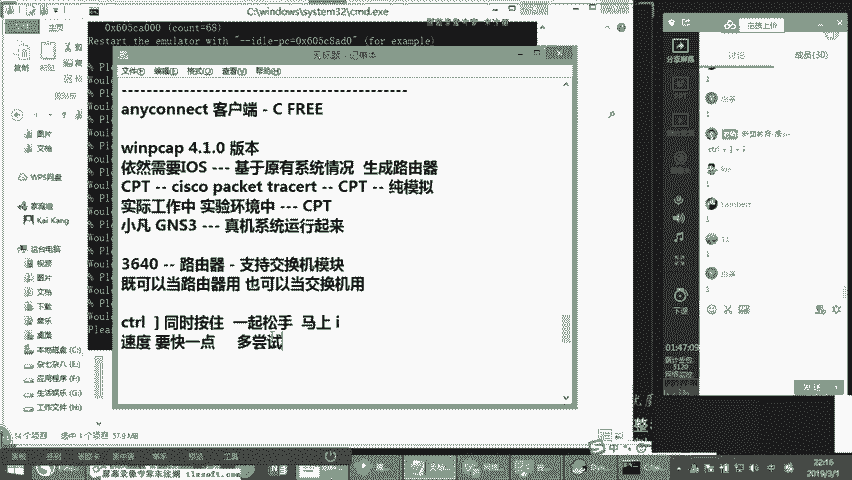
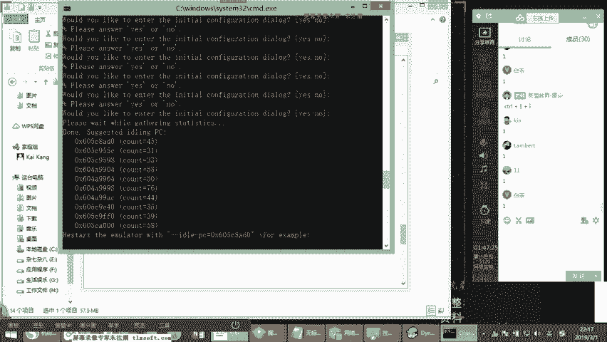
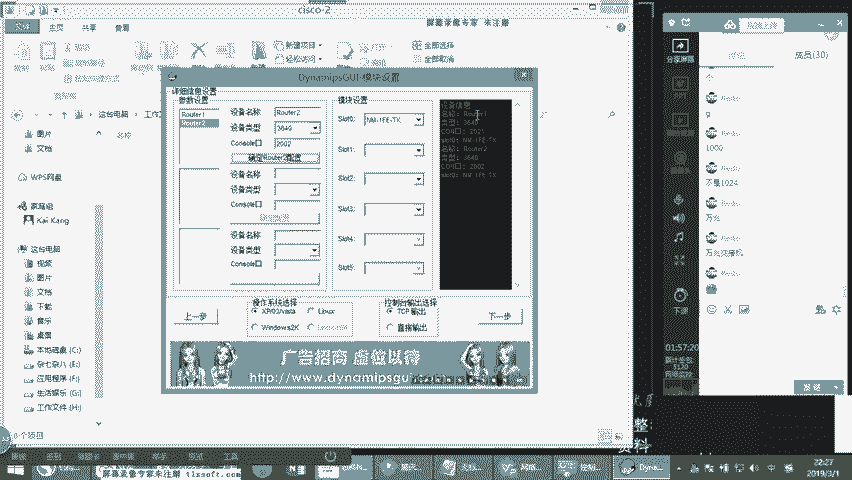
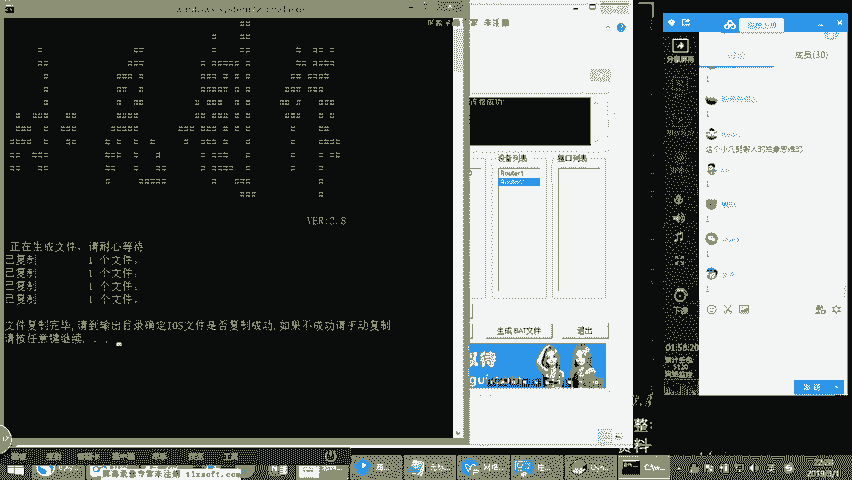
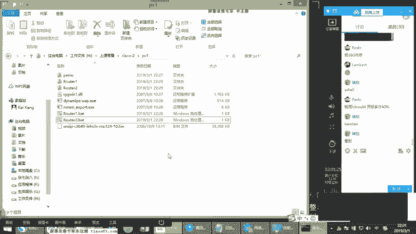
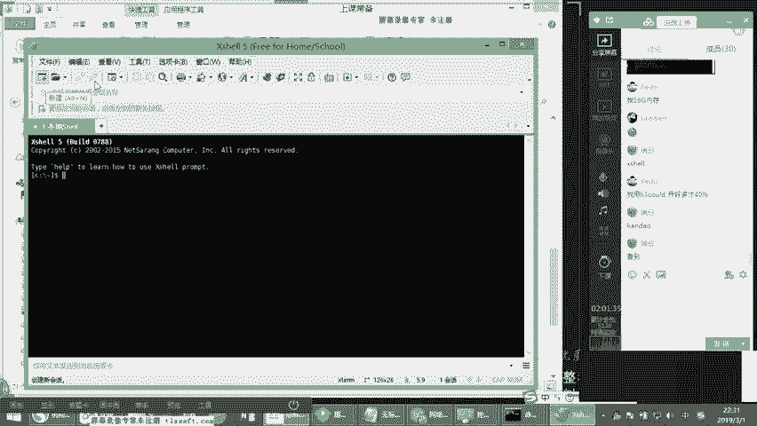
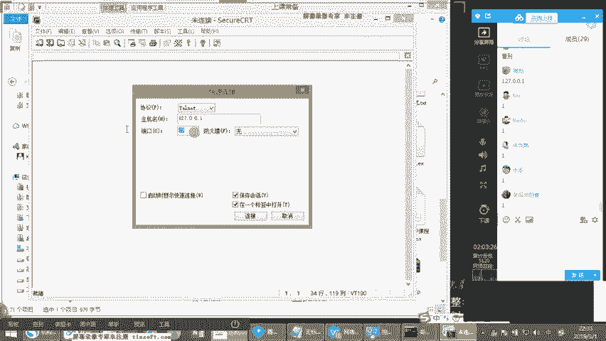
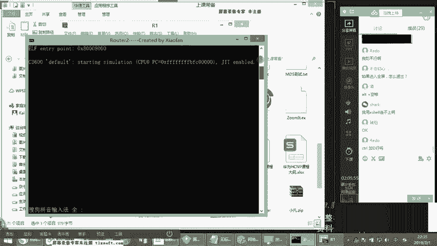
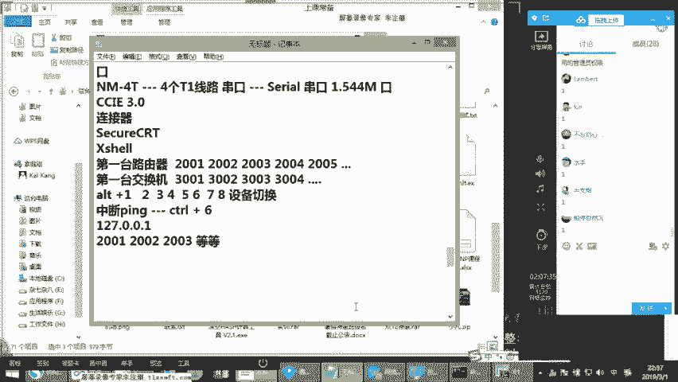

# 2019年度最新思科认证CCNA网络技术经典实战教学全集（最适合零基础小白的CCNA详解） - P2：思科认证CCNA网络基础第2节-扫盲预科 - new盟的小狐狸 - BV1V4411J7ZP

Yeah。

好，同学们，咱们现在开始了啊。呃，那么开始我们今天的课程内容啊，今天实在不好意思，我们耽误个点时间啊，在这个上面啊，你们现在可以听到我讲话的声音吗？可以的话，给钢or刷个一上来。

我们开始我们今天的我们的课程的啊系统班的第二节。😊，第二节的话呢，依然还是以一个课程的扫盲入门为基准啊，我不知道大家现在听的声音的话是不是清楚，声音是不是OK好吧啊，你们要是可以听到的话。

就给康s刷个一上来，OK吗？啊，刷个一啊，好，那我们现在开始了，可以是吧？声音老大了。好好好好好，那就行，那我们上次的话呢已经做了一些简单的一些入门的一个学习啊，我们了解的说候一些什么概念。

我们回顾一下啊啊，了解个局域吧。是吧。😊，好，了解了我们的广域网的概念。那同时我们也了解过我们的路由器和交换机是吧？这个大家应该知道啊，路由器交换机好，那么其中的话呢，我们也提到了关于路由器。

转发数据主要是去查询什么，查询我们的一个路由器里面的路由表。交换机呢转发数据主要是用来查询它自己的一个mac地址表。OK好，这是我们上节课所聊解到的围绕着这个方面的一个东西啊。

进行的一个一个延伸一个扩展啊。那么除此之外的话呢，我们还需要考虑到一个问题，就是说呃在我们正常的进行数据转发的过程之中，本身来说的话，我们还需要有什么不同的服务，这个大家应该知道，对吧？啊。

我们这次的话呢，我们打开这个PPT，我们来看一下。啊，我们可以把这个PPT呢过一遍。刚才上一节课的时候呢，没有给大家看PPT，我们就我就是直接进行模讲的。好，稍等。能做好。大概。法人到底。ど。这个。好。

稍等。O好，我们来看一下啊。😊，嗯。啊。那么其中的话呢，我们是局域网广域网的一个区别。我们已经说过了。那么大家在这个点上的话，大家要有一个概念啊。

就是说呃局域网广域网并不是以说我们这个数据的传输的距离为基准的，它并不是距离的概念。大家先搞清楚，它是说我们如果是路由器的话啊，那我们说是连接外网的那它主要的作用是什么？跨网段转发，这个大家应该有印象。

对吧？啊，路由器的话，连接外网广域网是跨网段数据转发。而我们的局域网的话呢，是连接什么内网啊，是我们的同网段的一个数据转发。啊，那么有的同学可能会问到这样一个问题，就是说广域网是跨网段，局域网是同网段。

那么是所有的这个局域网一定都是同网段吗？并不是啊，大家能搞清楚这个事啊，并不是在所所谓的整个局域网里边的话，就一定都是相同地址段的。那后面的话呢，咱们继续到V站啊啊会学习到不同在同样一个局域网内。

那我们去配置不同的地址段，但是大家要搞清楚一个事儿，只要是你跨路由的，只要是你跨网段的，都可以称之为路由的概念，我这么说能听懂吗？可以吗？可以的话，没看到刷个一啊，刷个一上来啊。

那么其中呢我们来看这个图，那么这个图里面的话也是一个比较简单的一个概念。我们知道啊其中的话下面是我们的电脑，对吧？你看我的电脑连接一个调制解调器。上节课刚才也讲到了，我们调制解调器是干什么的？

起到的是一个模式转换，一个数模转换的一个作用。那么因为现在的话呢，它主要是光电转换嘛，早期的数模转换，我给大家上节课讲过，对不对？我说我们上课的时候，这个这个我们平时上网的时候的话是什么？

就是如果是电话线接入，它是模拟信号。而我们的电脑上面呢是数字信号。那所以此时的话呢，它是一个数模转换，那如果说呢现在咱们家里面都是光纤入户啊，就是光纤接入的，那光纤接入的话呢，哎转到我们的电脑上。

而我们是网线，对吧？那我们也需要接入一个modem。那我们接入的modem叫什么？我们接入modem的话是主要叫光猫，对吧？它主要起到的是光电转换的一个效果，可以听懂吗？没问题了。😊，好，稍等一下啊。

OK我们接着说啊，那中间的话可以看到这个图连接了1个SP。那我们知道AP是什么？🎼什么是SD啊？SP这个名叫做internetserv。好歪的。那叫英特网的。服务提供商啊。

那么在这个in特服务提供商里边的话呢，呃现在的服务提供商呢，我们知道最为普遍的啊，像移动啊、联通和电信这三家对吧？啊，那当然了这是我们现在说在国内来说，这叫一级运营商啊。

我们一般统称为叫顶级运营商或者一级运营商。那一级运营商主要是干什么呢？啊，说白了的话，一级运营商的话，它本身是有自建自建自己的通讯项目的这样的一个职能的啊，就是说它可以说白了，它可以自己拉钩。

它可以自己铺设项目，明白他的意思吗？啊，那除此之外的话不是啊，就是他其实是有整个的基础设施建设权的基础施建设权的话，就相当于说这个园区里边哪哪个地方新盖了一片大楼。我呢首先是有最直观的。

假如我是移动联通电信。那我就是有基建权，我可以把项目铺设到那个位置上。然后的话可以从那个位置上面的话去卖我们公司的一个服务。那除了一级运营商之外，说白了这是有牌照的吧。除了一期之外的话呢。

还有我们说的什么是二级运营商？二次运营商什么概念？二运营商的话呢，其实我给大家举个例子啊，呃小区宽带大家车对吧？这个我估计大家应该知道呃，很多小区宽带的话呢，它是叫光纤入户啊，或者说是网线入户。

由于比较典型的。上次我给大家说过的，我说像长宽啊，像我们的长城宽带吧啊，像我们的这个歌华有限，听过吗？像我们的包括像广电宽带。啊，对吧？广电宽带啊，哎，彭博士对对对。

彭博士很彭博士不长宽就是隶属于彭博士的啊。OK长宽就是隶属于彭博士的啊，那像很多像这种海呃海派宽带。听到吗？啊等等之类的。那么像这些宽带公司的话，它其实就可以是二级运营商。最主要来讲的话。

它是像社区宽带。那设区宽带的话，它跟一级运营商有一个本质的区别是什么？就是它自己本身只有局部的项目铺设的权利。然后整体来说呢，它大方向来说它是没有的。那比如说假如设小区宽带呢，它跟这个小区比较熟。

他把这个小区里面的宽带业务给承包了，承包了之后，再接下来说干嘛，它会从移动门通电信啊，类似于这样的一级运营商去购买项目。啊，购买完项目之后，它再进行自己的一个综合布线，明白吗？哎。

综合布线布线到每一栋楼啊，从管景进行一个布线到每一层啊，是这样，然后可能每一栋楼里面的话呢，会有它的一个小基架啊，有一个小机柜啊，作为它里面有那么一个一两个交换机啊，专门是给这栋楼提供服务的啊。

那么这个时候的话呢，它主要是通过购买总线，然后再进行分包的这么一个过程啊，那我们天津话来说的话，俗称叫二道贩子，大家知道什么意思吗？就它自己本身是没有带宽的啊，它它的带宽也是通过一个上层的购买。

购买完带宽之后再卖下去是这样的一个过程啊，对，类似于这种那么在但是这种小区宽带通常收费是比较低的，在早期的时候的话，社区宽带，但是现在社区宽带的生存空间很很小。现在小区宽带生存空间非常窄。

是因为目前来说的话，一栋门通电信基本都在搞免费宽带。但早期的时候不是像早期的时候。😊，我们都知道联通的话，你要买联通宽带的话，去办这个宽带呢。你首先得有安装电话。这是你们家里面的些安装电话。

它是捆绑销售的。所以大家知道吧？应该有一个座机啊，有座机，然后同时的话你才能够同时开通宽带，是这样。然后其实你这作期的话都有月租费嘛，假如固定每个月25块钱，什么30块钱月租费等等。

你家里面电话其实已经不用了，但是这个电话你也得放那放那，要不然呢你的宽带就上不了啊，后期的话逐步才开始把这些霸王条款逐步取消的那么当然了在这个里边，我们知道家用宽带呢。

就是我们说的联通的这种一级运营商的啊，它其实比较贵。假如说早期家里面的话一兆，那每个月的话呢可能在100块钱左右啊？100家左右，那早期的收就像这种长宽长宽的话基本上可以做到多少秒兆或者是5兆。

那每个月的话可能才60块钱。😊，那你说这是为什么呢？同学们，我刚才想问大家这样一个问题。那你说同样作为运营商来讲的话，为什么一级运营商收费率这么高？二级运营商的话它的带宽大，而且收费还低呢。

还没有什么什么电话座机啊什么则之类的，还没有。😡，是吧你要干两年的话，还搞不含送一桶油是吧？是这样的一个情况，为什么？来，哪位同学能回答一下，当次。😡，这是什么原因？这是什么原因？唉，大家知道吗？

知道的话，刷个一，不知道刷个2来，不要紧啊。😡，啊，咱们先试应一下，我主要看到这个框，我就感觉我在讲公开课的感觉。😊，很痛苦啊啊。😊，呃，共享带宽OK好，共享带宽O那这是一个什么样的一个关系。

大家注意啊，这个关系的话是一个带宽的某种意义上的独享和带宽的共享之间的一个区别啊，带宽独享和共享区别。什么叫带宽独享和共享呢？而康先给大家举个比较简单的例子啊，假如说你们知道如果我在社区宽带里边的话。

假如我有1000个用户啊，我每一个用户的话要是一兆，那按道理来说，我的总出口应该多少呢？我可能得是一个G的一个带宽对吧？啊，我应该得达到1个一个G的带宽才可以。因为每一个用户是一兆啊，但是小区宽带的话。

它不会想考虑问题。假如说你是1000个用户，但是你可能1000个用户同时上网吗？😊，是吧你是1000用同小宝宝，并不是对吧？好，那你是多少个用户呢？假如说我们在高峰期的时候，同一时间的话。

有500个用户。在上网啊，500个用户上网那在高峰期的时候，500个用户上网的话，你你是每一个用户上网的时候的话，都在下载东西吗？是吧？也并不是它的带宽都被占满了吧？也并不是对不对？没错O哈，对吧？

属于什么分时复用的一种状态，对吧？啊，它是500个用户的话，那这个时候大家可能就上个QQ对吧？上个微信，哎，那可能有的同学在看网页，有的同学在打游戏等等是吧？它的带宽的话不可能会占满。

它带宽不可能会占的非常的满啊，我一兆用的都是一兆不可能所以往往在这种情况之下的话，它的总出口的带宽非常有可能的话，只配100兆左右啊，可能50到100兆作为总出口。那服务多少个用户的服务1000个用户。

每个用户是一兆能明白他的话了吗？明白0啊，所以是这么一个关系。那么在这种关系的过程之中的话，它本身在总总出口购买的带宽是非常小的。然后在下游的时候的话，在卖给更多的用户是这么一种关系。😊。

但是呢小区宽带的话现在并不行，你会发现呃在当时这个阶段的时候，如果你到晚上七八点上网就比较卡，为什么？因为七八点上网人比较多，那么它的带宽峰值很大，所以如果你的总出口带宽比较小的话，你就会发现非常卡。

这种概念特别类似于校园网，大家到校园网嘛，是吧？在学校里边是吧？你们办的宽带校园网是特别典型的一个现象，其实就是带宽共享啊，一根总总线进到学校里边一两根两三根总线，然后剩余的话全都包给学生。

是这样的一种情况。那学生的话交的宽带费的话，只要能满足这个总口的线目的带宽，而且还会额外的利润，明白他才的意思没有？所以一到晚上六七点七八点网速塞拉慢，你要早上5点就上网。哇，那个速度很快的啊。

是这样的一个情况，它主要是一个什么呢？叫带宽的一个共享。😊，好，听懂了吗？明白刷波一上来啊。啊，这是我们说的运营商。呃，那通过运营商呢，我的电脑的话呢，连到mod通过运营商还连到外网啊。

北亚图书馆啊、百度啊是不搜狐啊等等之类的。那连到外网之后的话，这个时候的话，你看我的电脑连接到运营商在我们家用里边的话，一般都是现在比较普遍的是ADSL就是播号上网吧，对吧？大家要拨号播上去。

播上去之后的话才可以上网啊，一般是这样，就是康上节课已经讲的叫PPPOE啊，就播号上网啊，那么在这个过程之中的话呢，播到运营商ok数据发过去到达了我们的。外网是吧外网的某个主机。

那么它们中间彼此之间是怎么样传输数据的呢？我们要搞清楚啊，网络设备之间就是在我们的电子设备之间。🎼进行数据传输，主要是靠什么呢？靠协议，大家先搞清楚协议是什么呢？就是我们设备与设备之间啊。

与设备之间啊通信的语言。这是我们说的协议。那我依靠什么把数据发给你。那在我们现在比较通用的叫什么呢？叫TCPIP协议，这个大家应该知道对吧？叫TCPIP协议。那除了TCPIP协议之外的话。

早期还有什么协议，大家知道吗？啊，说一下你们见过的协议。😡，还有什么协议，例容叫IPSS大家听说过没有啊，IPSS协议啊，或者说什么呢？叫iphone top协议，听到吗？😊，啊，apple talk。

那IPS协议的话呢，如果你没有没见过的话，也不要紧。我告诉你们这个东西是应用在哪？是win98win95那个时代。🎼在当时那个时代里边的话，当时我不知道玩什么有有一个游戏里面绝对会涉及到这样玩过红警吗？

听过红警这个游戏吗？红警这个游戏里边的话，其中的话红警在没有升级之前的第二版共和国之辉那个版本和忧郁复仇那个版本啊，然后他就如果你要想在局域网内联机。如果想在局域网联机。

那么你的自己的这个PC每一台PC是必须要安装IPX协议。听明白了吗？明白他的专利一版。我可给你们看一下，看现在有没有啊。😊，好，稍等。我给你看一下这个协议现在还是不是不是存在啊。

但是可能在win8这个阶段可很有可能就已经不存在了啊，我们稍等，我们来看一眼。啊，ITX啊，这边没有原先的时候在哪呢？原先是点安装啊，安装这个方有一个协议啊，我估计现在应该是是没有的。啊。

你看现在是没有的吧现在的话只有多播什么之类的，没有。但如果你要使用在早期的时候的话，你使用的要是windows什么winRP，现在大家知道吗？使用winp的话，你要想让这种游戏进行联机。

它就必须要什么安装ITF协。那包括早期的时候的话，你们要使用win98呃，win98其实在呃78年前还有很多电脑在用。为什么呢主要面向财务机财务机的时候的话，有些财务的软件啊，当时面向税务的软件。

税务的一些工具。呃，我们知国企就是在政府事业单位啊，他们的软件更新速度是非常慢的，就等音我们都在使用win7吧啊，win win7的时候，很多税务软件所支持的还是支持windows98。😊。

所以你当时的那种税务税务软件的时候的话呢，你要想在内部假要在同样在局域网内进行一起管理的话，那你就必须要用酒吧啊，你必须要使用9吧。因为它的客户端不支持9吧以上的东西，明白刚才的意思啊？

它不支持酒吧以上的操作系统是这样。但当时这种情况呢，如果你要想在局域网，如果使用酒吧的在局域网内实现共享，那你就需要安装IPX这个协议啊，但IPS这个协议的话呢，它现在已经退出了。

就是其实已经退出密置的舞台了。你们现在实际上来说是看不到的了。明白刚才的意思吗？明白给刚才商到一来刷到一思来啊，实际上你现在是看不到的啊。那我们接着说呃，除此之外的。

像apple talk这个东西什么呢？是苹果的啊，苹果电脑上面的就apple的mac OS里面的啊一个协议叫apple talk啊。那后期的话呢，随着逐步的普及TCPIP还是得到了最大化的一个应用啊。

所以现在我们使用都是TTCPIP的一个底层协议，用来保证最基本的计算机和计算机之间啊，联机的时候呢，使用的一个底层的功能。那么这个底层协议的一个最直白的，你们可以怎么去理解呢？😊，好。

你们可以理解成就是说不要把它理解太复杂TCPID对吧？啊，你就记住现在我们使用的什么呢？我们现在使用的是IP协议。😊，啊，你不要大家理解现在太复杂，为什么不要理解太复杂。

很多同学的话在最开始的时候去理解字段，这个也是非常多的。老师喜欢这么去讲的。假如说我跟你们讲IP爆头好吧，这样的一个字段，但是你们知道吗？你们知道为什么现在IPV4要升级为IPV6吗？

大家知道为什么现在IPV4要升级为IPV6吗？升级为IPV6的一个最主要的一个原因是其中有一个点啊，AIRP攻击是一个地址不够用是一个，但是其中还有很大的一部分是IPV4的爆头设计结构过于的繁杂复杂。

整个IP爆头的结构是在20年前设计出来的。所以20间设计出来了很多个爆头里面的字段，在当前的网络环境下根本就没有用。但是由于没有用，这个爆头本身设计的比较复杂。而这个所有的数据啊，就在进行传输的过程中。

我们知知道一旦传输到别管是PC的终端还是。😊，说是你的网络设备上，那你别管在什么位置上传到你的设备上之后，设备就要有一个读取的一个过程。听明白刚才意思没有？设备会有一个读取的一个过程啊。

那如果说设备本身有一个读取的过程的话，如果你的爆头过于复杂，那对于设备的每一次的对于数据包的读取，实际上都是会消耗一些时间，消耗一些没有意义的一个时间，能明白刚才的意思没有啊。

这就相当于说你翻译的杂志一样，你明明就像找一篇文章，结果的话在这篇杂志没有问七八糟的一大堆东西，但其实这都不是你所需要的。而这个数据包在被读取的过程之中，就在消耗设备的读取资源。明白了没有？

明白稍意外啊，所以在这个过程中的话，现在当前的IP爆头，你发现很多书方面也还在有。但其实大多数里边的字段已经没有实禁级了。大多数字段都没有实际意义。所以后期的话呢升级为IPV6。但后面你在课上会学到啊。

刚才有跟你讲，升级为IPV6之后，情况发生了一些变化，就是里边精讲了非常多的字段。明白吗？精简了非常多的字段，把很多字段干掉了，就是因为很多字段是没有意义的。一般是这样的一个情况。好。

所以你们现在不要理解太复杂，它就是1个IP协议。那也就是我们现在上网的标识使用的就是IP地址进行我们设备的一个标识。通过IP地址设备和设备之间通过IP地址，彼此之间进行一个传输啊。

你可以把它理解成是TCPIP的最主要的一部分。因为在整个IP爆头里面。😊，在整个IP到头里面，读取最多的还是什么？原目的IP这个字段明白了吗？啊，原目的IP字段，所以开始看IP地址啊。

那么在关于IP地址的话呢，那大家现在不要理解的很多。对，因为我们后面会有一张专门讲IP地址。开到会一张声门给大家去讲解啊，IP地址的一些常建分类啊，一些掩码啊以及BOSM啊以及抄网啊等等之类的问题。

那我们现在看到的像IP这个地址的话，大家只要记住三个点。那首先IP地址的话，它的大小是多大的。😊，它的大小多大，1个IP地址，大小多大？大家知道吗？是32个比特，对吧？先记下来啊，是32个比特啊。

记下来32比特等于多少？等于4个字节。OK那这个地方呢刚始要做一个扫盲的一个普及啊，就是我们知道这个比特跟字节之间是什么样的一个关系啊比特跟字节是什么关系啊，这个是很多同学的话。

在学网络的时候语比较懵逼的。打个比方，假你们家里人办的一兆的宽带。😊，啊，一兆的宽带。那我我问一下你们，你们家里面下载速度能达到一兆吗？能达到一兆吗？如果你们家带一效能达到一兆？

假如说我们家现在带100兆的100兆的宽带，100兆的宽带，我们下载速度迅没能达到100兆吗？能吗？不可以吧，你发现其实达不到啊，那么这个点说的什么呢？😡，这里边说的是所有的这个这个听好啊。

假如说我们拿一个呃比较小的单位来说，假如说咱们早期的512K对吧？512K好，那这512K所说的什么？512K是千。比特明白他的意思吧啊，这512K千比特啊，那么你说我们实际下载速率呢啊。

我们实际下载速率多少呢？我们实际下载速率是千字节，明白刚才意思没有啊，是千字节啊。那我们说千比特千字节之间是什么关系呢？它是一个1比8的关系也就是说我们要5512K除以8啊，除以8等于多少等于64。😊。

等于64KB，你们平时看到的64KB是这个KB我这么说能不能听到啊，这是你们看到的一个下载速度。那有的是我们使用迅雷，什么P to P等等这种下载的方式，它其实还会在原有情况之下的话，再超出一部分。

所以你们看到的下载速度能达到80KB啊，八九十KB啊等等这样的一个速度啊。那么在这里边的话，其中呢呃这个比测呀听完了，这是一个什么单位呢？这是一个网络单位。😊，🎼字节是个什么单位啊啊，字节是个什么单？

字节是个存储单位。明白这意思吗？啊，咱们平时说的是字节这种东西，它实际是存储的OK啊，然后呢，比特的话呢是网络单位，就是咱们说的一般叫网速这么一个概念，能理解了吗？明白请给发的刷个一啊。

所以平时你们如果后期的话呢，你们在运营商在SP工作或者IDC工作，你们就会涉及到要给客户限速。😊，记住你在限速的时候，所所限制的一切都是以比特为单位，不要以自己为单位。好的新手的话最开始限速。

假如这客户买的是10兆专线，结果呢他给人限速的时候，限以10兆下载速度，什么呀？就是让人下载速度能达到10兆。🎼我们这是两码事儿，你平时你线的时候的话，一定是什么？一定是属于比特的。明白了没有？

明白双数一好，所以后续的话，我再给大家演示设备里面的限速功能的时候，你们看到的绝大多数绝大多数都是以这个为单位的OK啊，默认情况下就是以这个为单位好啊，这个大家知道就行。先了解。

这是第一个是说我们的关于IP地址啊是32个比特四个字形。那第二个来说的话，我们每1个IP地址的。😊，是有多少呢？是由4个8位组组成，对吧？那每一个8位组是从0到255之间。好，先搞清楚这件事啊。

是0到255之间。O那么也说你所看到的IP地址都是零开头啊到255，你不能看到256在交几对吧？那样是不可能的。第三个什么呢？是我们说现在看到是IPV4的版本啊。

那么现在我们后续的话呢会进入到IPV6在你们的职业生涯里边是一定一定会接触到IP6大家一定要注意，你们是逃不过去的。其实IP6的话在我们10年前我们在学10年前考E的时候，考CE的时候。

当时那个阶段的时候，IPV6是在我们CI的考纲里面，明白了吗？就在C的考试的体系里面。而现在的话呢，我们这一两年才开始普及IP6啊，足以等到了是吧？啊，先把这三个点记下来。那后面的话IP地址也会升讲啊。

😊，好，我们接着来看。那么在这个里边的话呢，我们我有一个问题想要问大家啊，你说老师那这个TCPIP协议啊啊TCPIP协议。😊，要和我们这个。看到的啊和我们看到的这个OSTS这种协议啊，你说这个东西的话。

它彼此之间有什么关系吗？是一码事儿吧。啊，我先问一下大家，假如我们现在看TCPF协议和什么EIGIRP协议，什么什么OSPF协议是吧？什么ra协议等等啊，你们告诉方才，这是一码事吗？😡。

是吧这是一码事儿吧。😡，是吧那和我们看到的FTP协议啊，FTP啊是HTP啊等等啊啊，这些东西是一码事吧，是一回事吗？是吧。啊，这个是非常多同学的话最容易懵逼的一个点啊。大家注意听啊。

康er先通过这个点带你们把一个基本层次划分清楚。我后边给大家讲OSI模型的时候，注意听我在讲解OSI模型的时候的话，我会提到这个事儿啊，我会提到这个点。那记住啊，它是分层的啊。

记住它是分层的这个TCPIP协议啊。😊，这个协议啊它是我们盖一栋大楼的地基。你要这意呢叫地基啊，to协议啊，OSF啊，什么reEIGRP协议啊等等。这个是什么呢？这个是我们的一个什么概念呢？啊。

是我们的一个轮毂啊，一个轮毂。😡，如果就是说我们整个搭出来的房屋的一个一个呃一个架构。啊，一个整个大厦的一个一个框架啊，那我们看到的啊看到的我们的STP啊HDP啊啊什么等等这类的协议，这些东西是什么呢？

这些东西是在我们原有基础之上的，叫服务。也就说假如人已经进去了，就相当于我们里边的人一样。那个老师还是不懂什么概念。听好TCPID协议的话是底层协议。😊，啊，它是底层协议。你可以说我们所有的网络通信。

你看我给你举一个非常粗俗的例子，所有网络通信你都要都得有IP吧。😡，对吧你首先都得有IP才行。你没有IP地址，你谈不上任何的通信，我想我想和你通，我怎么跟你通啊，我得知道你的IP地址才能跟你通。

能明白他的意思没有啊，所以我们作为底层协议来说的话，就是说这就相当于一个基本架构，一个地基一样，我们所有的我们这个这个彼此间的通信，我们必须要在我们所有的主机上面带有一个底层支持的共有性的一个语言。

就是我们说的TCPIP那在我们的手机上像什么呢？电话号码明白吗？在我们手机电话号码，这个像在们手机上面就像电话一样，是吧我们现在电话干嘛呢？我们手先带有号码吧。我想给你打电话。

我们前提是每一个手机的一个定位标识，是以电话号码为标识。明白刚才意思没有啊，那这就是我们说叫底层协议。😡，啊，在底层协议的基础之上，在底层协议的基础之上，你能够满足的是什么？所以我们按步骤来说。

这就相当于说你把你自己的每一台设备都配个IP地址啊，你可以把它这么理解。那这就相当于说由于你看啊我们可以看我们这个网卡啊，假如说你自己的一个网卡，看着啊，看这。😡，🎼啊，我们还是看属性。

假如说你看我们有这个inter协议版本4个吧，这个就是我们最基本的底层协议站啊，就是我首先我这个电脑要上网，我得先把这个协议安装上这个协议插件安装上，我得首先让它支持我这个IP4。

我得先让它支持IPIP地址这么一个东西。我说到这，你们我能听懂吗？当我把这个东西安装上之后，我能不能把它干掉呢？我能不能把它卸载掉呢？啊，现在你看这持强制的看到了吗？按权限来说叫要强制的。

但是你要用早期的操作系统版本，这完全O好，然后此时当我安装完这个底层协议之后呢，我点开一看，我等我点开之后的话啊，我可以配IP我把IP地址配置上，这才满足我的第一层次，就是我们说的TCPIP协议。

我这么说能听懂吗？啊，明白了吗？我把每一个设备都配上IP地址才满足我第一个层次。当我满足我的第一个层次之后，我能够支持的。😡，仅仅最多就是两两之间的弧线。你看我能够支持的就是最多就是直连之间的互通。

最多就是两台设备之间的一个互通。好，那这就是我们说的最底层的TCPI协议。😡，🎼但是问题是说，我们的设备和设备之间，假如说我们有两台设备啊，路由器一连接路由器2好，我配个IP啊，配个IP这个时候干嘛？

我的一跟二之间怎么样？我的一跟二之间就可以互通了。😡，能明白双哥意思没有？哎，我的一跟二之间，当我配个IP地址，我的一跟二就可以通啊，没问题，能听懂吗？明白刷波一一来啊，对吧？

因为他们两个线都支持个底层的协议站，都支持个TCPIP协议。哎，我只要配个同一个网段，这两个两个设备就通了。😡，但是接下来问题是说，如果我这边还有。😡，🎼路由器3还有路由器4，还有路由器5。

这个时候当我想从1到5的时候是怎么样的？我想从1到5的时候的话，我一这边产生的数据发出来，经过了二，经过三，经过四才能到5。那就是一本书，我的数据干嘛？我的数据要经过中间的设备进行一个传输，听明白了吧？

我的数据要经过中间设备进行一个传输。好，如果说经过了中间设备。😡，看到经过中间设备。要传输数据，这个时候的要干嘛呢？我的中间设备就依靠什么呢？要依靠它中间设备的1个IP地址转发表吧。就是我们说的路由表。

能听懂吗？啊，通过我们中间的路由表记一样，通过中间工，那路由表怎么来的呢？这个时候是基于我们已经配了IP地址，也就是我们说的基于TCPIP的协议站的情况之下，然后在这个协议的基础之上运行的上层协议。

就是我们说的OSF什么reEIGRPBDP等等。我运行上层协议的目的是为了什么呢？是为了构成我们中间设备的路由表，但是我们想一想，如果我不配IP如果我在最开始不安装TCPIP的，看到协议站啊。😡，啊。

如果不安装这个，我不安装底层的TCPIP的一个协议站。那此时的话，你告诉我我能运行上层的这些协议吗？😡，我能呢我不能，我没有办法运行上层协议，我没办法运行上层协议，我就没有办法构建路由表。

我们想问表里是干嘛的路由表里保存的不都是你能去往的目的IP地址段吗？听明白的意思没有啊，对？他都是IP址，但你连底层的IP都没有你连底层的协议站都没有你哪里来的IP啊，你没有底层TCPI的协议站。

你跟IP都没有，你可能运行协议，有可能生成这个路由表吗？能听懂吗？明白了吗？明白给他们捎个一呗啊，所以就是因为我们有个底层的TCPIP协议，然后才能配个IP地址，因为配个IP地址。

我们才运行了OSP这个的协议，运行了OSF这个的协议，我们才有个路由表，有了路由表看到？有了路由表之后。😡，路入了之后，然后我们才可以干嘛？路由器一才可以和路由器五通信干嘛呀？传输我的网页数据啊。

传输我的什么相对应的业务QQ数据啊，先传输我的什么啊，假如说这个这种这个邮件数据啊等等，对吧？这个时候的话才在已经通了的基础之上。😡，靠。🎼然后我们才可以传输业务数据，听明白了吗？我才可以传输业务数据。

而这些业务数据有一些比较。对，没错，就是我们说的应用，有一些比较通用的就像我们说看网页，对吧？就像我们说的看用FTP邮件啊，等等，明白刚哥的意思吗？哎，等等之类的这样的服务。

我们一般才叫做什么叫上层协议例如像HTP协议啊是吧？啊，其实我们有的时候不叫协议叫服务HTP服务啊，FTP服务呀，DNS服务呀，对吧？什么3389服务呀等等是吧？啊。

等等之类的O才在已性网络通的情况之下运行的这种通用的服务协议。😊，好，我这么解释，你们听明白了吗？能区分开了吗？所以它其实是一个一层一层的关系，它是一个由底层到上层之间的关系。所以说有的时候的话干嘛呢？

PCPIP就相当于是什么？相当于是我们说的这个。😡，学液一样啊。🎼明白啊，血液一样，GTCPIP的OSF什么EIGRP等等之类的话，才是我们的什么呢？才是我们的肢体理解了吗？才是我们的肢体。好。

我们看到的什么HTEP什么DNS等等这一类的话，才叫什么？才叫我们的动作。😊，听明白了吗？明白双方一人啊，是这么一层关系啊，这么一个构线，所以它是一层一层的。😡，这次大家区分开了吗？

先回答双色告诉我区分开了吗？区分开给他的刷个一来刷个一上来。😡，区分开了没有区分开了吗？区分开了，上方一来拿溜的。没问题是吧？好好好好好ok那咱们接着说啊，咱们接着来看。😊。

那么这就是我们现在看到的这个人的一部分。好，然后我们来看下面的啊。我现在是要你会以发现刚才给你们讲的时候，发现你从来不按书本讲吗，实际为按书本讲，你们记不住，明白他的意思吗？

我只有说现在让你们能够对应生活有一个形象化的一个一个一个认知，这个时候的话，你们才能把它正儿八经的记住，今后你们在面试的时候才能说的明白，要不然今后你你们知道你们现在学这些东西的话。

我现在给你们讲这些除了扫盲之外，就是帮你们认清框架。还有就是你们在面试的时候可能会涉及到明白了吧？你们在面试的时候的话，要是按按照书本内容晕晕乎乎的说法给人说就是下课单，明白了吗？啊，就纯粹下课单啊。

所以说永远是要学会把问题表达清楚啊，是这么一个事儿，要不然他下面这个问题。😡，下面这个点的话可以看到，这也是一个横向的对吧？就是我的电脑把数据发出来，发出来，经过中间的SP，然后传到目标的主机上啊。

假如说什么图书馆什么的乱七八糟的，那这个地方刚才也给大家先强调一下，注意听啊啊，发送来的数据，我们说叫什么？叫数据包，对吧？啊，发出来的数据的话，我们说叫数据包啊，那么作为数据包来说。😊，啊。数据包。

那我们说这个数据包是多大的？我们这每一个包到底是多大呢？其实这个是你们所涉及到的每一个数据包里边都是涉及到的一个问题。这个数据包是多大的？😡，啊，我不是要传数据吗？叫我给你传数据，现在刚会给你们讲课的。

我这边就要不停的不停的不停的在产出数据，对不对？在产出信息吧。那你们告诉刚才我这个数据包是多大呢？😡，回答我这数据包多大呢？😡，啊，假如设说我现在下载一个一个G的啊一个电影，你们告诉刚才。

我如果下载一个一个G的电影，是说我现在直接就能把一个G电脑电影一线下下来吗？是吧？并不是啊，大家注意啊，并不是，而是说它这即使是一个G的电影，它也是一个包，一个包的传过来的，而每一个包看好是多大。

在默认情况之下，它是1500个自己记下来。😡，啊，1500个字级。那么这1500字，就是在我们整个网络里边的一个通用值啊，一个通用标准。😡，这个这个叫什么呢？这个叫MTU叫最大传输单元啊。

你的后面学到EIGRP的时候，其中EIGRP面有一个K值的参考啊，有一个度量值的一个参考。默认情况下，它会有一个参考到的叫MTU的一个值。就是我们说这个叫1500个字节。如果这1500个字节的话。

能不能修改呢？可以修改。那于是储的在早期的网络上的网络环境中啊。就这么一个概念，就是干嘛叫修改MPU值。啊，有一一些工具，就是说你想让网速变得更大嘛，然后呢那个先把那个软件下载下来。

它就修改了你自己的电脑的MPU。明白吧？修改键的MPU啊，然后呢把每1个MPU的改大。😊，大家聊两天的2000字节，那原先的时候一个包1500个字节，后边有1一个包2000个字节，这样好吗？

你们告诉我这样速度是不是变快了，是吧？有时候要问老师，这是不是有加速器的一个概念啊？😡，很多队友在现在你们打游戏的时候呢，都有一个加速器，对吧？大家知道加速器吧？告诉咱们知道吗？听都是这词吧。

打游戏的时候叫加速器是吧？跟加速器是一个概念吧，注意啊并不是啊两码事儿，跟加速器没毛毛线关系啊。记住啊，你改大了没有一点好处啊，你改大了之后没有任何一点好处，因为你改大了之后的话。

首先记住整个网络本身来说是有限速的。😊，网络本身在传输过程中是有限速的，明白刚才的意思呀啊，那么也就是意味着说你每秒钟，假如说我是100KB，你就是每个包改成一个G也没有用。

因为我每秒钟就是100KB能懂了吗？哎，所以你改的多大都没有任何意义啊，因为我一个包还是这么大。那除此之外的话，很有可能还有弊端，这就涉及到一个词叫分片，大家听说过吗？听说过分片呢，就这一个包太大了。

而我这个每一个网络的接口的MTU值就相当于是水龙头这个水龙头的宽度一样，我这水流量做这么大。😡，这个时候的话你要来一个更大的包，在我这个接口就会被分片。哎，我就会把你1个2000个字节的话。

给你划分成1500加50加500。这么说能不能听懂啊，那过多的数据包的一个分片其实还会导致整个数据传输过程中的不稳定O啊，还要这种情况，假如说你分成两个包发。但是这个传的过程中的话，有一个包丢了。

丢包了，你一丢包之后的话，由于这个此时这个分完片之后，这个包它不是一个完整的包，怎么办呢？就得进行这个包的话就废掉了，对吧？啊，这这实际上就是一个坏包啊，那此时干嘛呢？就要申请重传，明白它的意思没有啊？

这个时候就要申请重传啊，就是这么一个概念啊，所以此时来说的话呢，修改MTU值并不能把网速变大，这点事大家要搞清楚而且如果要修改的话，需要整个传输的整条链路，实际上都得修改才行。你不能只修改一个接口。

那是而是整条链目全都在改，全改完了之后，那每个包时就会变得更大。😡，啊，这个就是我们说的MTU这么一个东西。好。然后呢，就是这个大家只要知道就可以了啊。然后这个数据传出来传到ISP是吧？

ISP的话是通过什么呢？目由表的一个查询，然后转发到目的地，是这个是是这么一个意思啊。然后在这这是IP地址，这个康ther刚才已经说过了啊，咱们就不再说了啊。IP地址后边咱们细讲。因为咱们今天还是扫盲。

咱们接着把忙该扫就扫吧。下一节课的话，咱们就正儿八经把它进入正是是吧？就是有正就有个正事了啊。😊，啊，域名这个问题大家是需要了解一下的。啊，域名是要了解一下的。什么叫域名呢？域名是干什么的？

域名是做什么的？啊，第一S吧访问okK哈，假如说我们现在去访问某一个地方。😊，啊，我们现在想去访问某一个地方，我访问某一个地方的话。这个事儿干嘛呢？我就得需要去输一个域名，假如说仿百度百度。

但是你告诉我我访问的这个域名，我的网络设备本身来说能识别吗？我的网络设备能够识别这个地址吗？能够识别3W点百度点com吗？记实它不能识别。而为什么要有域名呢？记好是为了我们人为的好戏。😡。

好是我们之所以有域名存在，是为了人为的好记忆。那么我们的网络设备它是不认识域名的，理解了吗？网络设备只认识什么IP地址，它只认IP地址，就我们的路由器，我们的三层交换等等防火墙。

它只认IP而此时我们要去往一个域名的时候，那你说我这个数据到达我们的网络设备，它发的了吗？它发得了吗？回答张粉，发的了吗？😡，发给了嘛？他其实发不了，因为他不认识对吧？他不认识哈。

所以此时往往在我们正常上网的过程中，假如说我们现在3W点百度点com啊，那此时我们的第一步这个数据是发送到哪什么地方啊？😡，我们第一步假冒现访向W家百度点com我的第一步，我这个数据是发到什么地方的？

回答coor。😡，此时我这个数据是发到什么地方了？哎，非常好，是发送到了什么？发送到了DNS的服务器上好，先进行什么呢？先进行一个查询。😡，明白了吗？那先进行一个查询啊，查询什么呢？查询什么呢？

查询域名所对应的IP地址。😡，啊，而DNS的服务器听好DNS的服务器就特别像什么呢？特别像我们那个查号台一样，特别像那个12580。大家听懂了吧？114等等，特别像那种查号台啊，等于你现在的话呢。

你我我不知道麦当劳电话，我给长号台打个一个电话。我说你好，帮我查一下麦当劳的电话明白了没有？好，但家像这么一个概念然后此时的话呢，啊人家告诉我哈。

你记一下麦当劳的电话是多少多少多少多少多少是这么一个回事，听明白了吧？明白刷到一来刷到一上来啊，那这是我们说什么呢？这是我们说的叫查号台啊，那DNS服务器就跟查号台意思一样。

当你第一步是先把数据发到DNS所以那时候有同学是说老师假如我这电脑我我会发现有什么现象，就给他说了我这个QQ登上啊，现在我不了解了，在早期的时候QQ登上啊，但是什么呢？那网页打开。😊，好。

现以在区域怎么下？因为早期的QQ软件的话呢，这个QQ软件默认连接对吧，默认连接服务器是去连接1个IP地址。😊，早期的QQ软件这样的。而这个时候的话你就发现如果我的电脑设置完都都O了之后啊，我QQ能上。

但网页打不开网页打不开是什么原因呢？因为DNS没设置或者DNS设置错了而QQ能上的，是因为网你现在已经能上了你已经配置IP配置掩码配置网关明白吗？所以你把你QQ能上网页打不开，这是我说DNS作用。

所以这个时候干嘛往往去修改DNS就相当于说前段时间就是我们之前用YY的时候对吧？啊，这YY的时候，比同学遇到什么呢？就是哎模板下载不出来我这我YY模板怎么加不出来。如果你要发现的话。

你可以修改一下DNS你修改DNS之后的话，这个时候干嘛呢？它可能是在原有原有的这个YY这软件里边嵌套一层它这个模下载那模板下载模板的时候是连接额外的1个DN啊额外的一个域名然后你那个DN可能解析不出来啊。

之前有这种情况，所以你更改DNS就可以了。明白这意思没。😊，あ。所以DDNS关键什么？DNS的关键是在于能不能去请求到对应的啊，请求到对应的IP地址，这个是DNS的一个最主要的一个作用。听明白了吗？

告诉我不记得朋清东给你刚才刷波一0啊，刷边一上来。好，OK了，没问题啊。好好好好好。😊，然后这个时候的话呢，我们来看一下大我们来看一下。那我们常规的DNS呢，所以大家如果做工程师啊。

大家永远要记住一些本地的DNS地址。但是现在好多了啊，像我们早期的时候都没有这种标准的8。8是吧，4。4，这个大家知道吧？这个是全球的什么的google。那么这台是呢，google的DNS地址。😊，啊。

那除此之外的话呢啊还有比如说114。114。114。114，这个大家应该知道吧啊，这个也是我们说的那全国。😊，🎼比较火的1个DNS地址。好，那么另外还有一些地域性的，例如像219。141。136。

10是吧？212。106。0。20。🎼明白了吗？等等啊，这些是我们就如说天津北京的等等之类的。那能不能听懂啊，所以大家一定要熟悉自己本地的这个DNS啊，没有什么本太多的区别。

你然说如果你使用googleDNS的话，等于你每一次进行域名请求。实际上如果假设google的发点呢是放到国外。假如说他在香港或者说他在美国，等于你每一次去访问百度等等之类的话。

你的查询信息都要先发送到美国的服务器上，理解吗？哎，等于这个过程不是说访问百度买，是查询速度慢。😊，明白了吗？是查询速度慢。而如果你要使用本地的DNS呢，很多假如说刚才现在跟你说这个DNS。

这就是一个什么DNS，这就是一个假如天津联通的那等于我现在我就在天津，我用的就是天东联天津联通的这个线路。那我这个时候去访问这个查访问百度的时候，哎，我就直接查的是这个DNS。😡，能理解吗？哎。

我直接访问的是这个DS那等于这样的话，可以保证什么？可以保证查询速度更快。😡，好，明白了吗明白，给他们发个一来。😊，啊，这是一个点啊，然后有的时候的话呢，你去访问一些小电影网站的时候是吧？

然后你发现哎我这个小电影网站前景还能看的，你现在看不了了呢，那你就可以换上DNS试一下。因为有的DNS就不许解析了，明白了吗？啊，有的是把IP直接封掉了，有的直接就是把这个这个这个DNS直接停解析了。

停止解析了，就你解析不到，是这么回事，记住了没有啊，技术操作一啊啊，那么这是一个。😊，我们现在看到1个DNS。那大家呢在这个DNS里边呢，大家记住一个点啊，我们现在看到的每一项服务。

它其实都有一个什么呢？都有一个对应的端口啊，没错，是的啊啊，那这一咱们再说关于端口的问题。我们先来看但DNS叫什么叫do漫 name server是吧？或者do name system啊。

都可以service都无所谓。就是域名服务啊，叫域名服务啊，那么大家里面看这是一些我们看到的一些域名对吧？啊，都是点com的education啊goverment是吧等等啊，点艾呀。

比较常见的ORG啊啊一些等等啊，你们知道就行了。😊，那么在这儿呢，cota要强调一个点啊，就是说co建议你们呢可以自己尝试co不把这个当东西当做作业啊，但是建议大家可以自己做一个尝试。

例如呢大家可以自己呢去申请一个，假如说看到可以申请一个阿里云啊，或者说是腾讯云。🎼或者是百度云。啊，现在IDC竞争也很激烈是吧？啊，然后呢申请一个什么呢？呃一个免费的一个空间啊。

或者1个ECS啊等等之类的。它实际上是有的。然后申请完之后呢，你可以在上面呢选择一个什么呢？选择一个windux的操作系统。😊，明了，选择一个windux操作系统。好，选择了winds操作系统之后呢。

你进到里边之后呀，你可以手动的去搭建1个DNS呃，搭搭建1个LNMP的。😊，啊，或者LAMP的服务，这个大家可以自己尝试。这个过程呢，我个人理解呢非常有助于你对系统的认识，明白他的意思吧？

就非常有助于你对系统加深认识啊，什么叫做系统加深认识呢？假如说呃我个人的体会就是说你可以看到一为应用最多的是外ap。对吧你可以自己尝试搭建一个外部服务，搭建什么样的一个一个架构平台呢？

搭建一个word price的架构平台。这WP平台。啊。就WPCMS啊，这叫word price。明白吧啊，这么一个博客系统啊，这是一个不报啊。然后在这个情况之下呢，呃答完之后呢。

你就可以看一看能不能展现到网页了。😊，OK如果可以的话，你们后续可以把每一次的作业都发布到自己的blog上。听明白了吗？啊啊，我个人觉得这种方法呢，它不影响你学习网络啊。

虽然但是我觉得它可以有助于加深你对操作系统的一个认知啊，你对系统本身的一个认知。你看这于我们来说呢，我们其实现在不分网络设备这个概念。我们觉得网络工程师，其实本质就是系统工程师。

因为我们使用的是网络设备给那套系统IOS嘛，是吧？我们使用是IOS那套系统啊，所以我们认为我本身来说就是系统工程师，明白他的意思没有啊，所以大家可以做一个尝试，对吧？啊，可以做一个尝试。啊。

可以就此的话了解整个IT康or带学生，我不喜欢教科书化，我都讨厌教科书画。因为教科书化的那些老师呢，我觉得水平也不咋地，你知道吧？然后就是我会把我的当年的一个学习历程生涯展现出来。

所以让你们对整个技术领域有一个宏观性的认知啊，其实我特别想给你们想象这方面的东西，我这边跟你们说一说呃，为什么呢？因为你自己啊，对，因为如果你仅仅是天天会调那么几台设备，你找工作的局限性很大。

我说这个局限性啊，不是所听我说啊，不是所指的是说啊老师我还得干别的吧？不是是说你能对整个IT领域架构的啊，明白了吗？哎，对整个IT领域架构的一个认知，是这个这是这么回事，能理白他我的意思吧？啊。

你们要虽然今后不干系统工程师，理白了吧啊，你虽然不是系统工程师，但是呢你可以对这个东西有一个初步的认知。😊，这么说能不能听懂啊，明白有他们上面意员啊，就是你会有一个系统性的一个认知。

你会对这个假如说我自己去搞一个myscle，我会对my circlecle这个东西有一个概念。你现在可能没概念，你就是道听途说，对吧？你假如说我会把这个网页展示有个概念。😊，就。

像原先的时候有学生问过这的问题，他说老师啊，那个你说我这个一个一个交换机啊啊，我配置的这个SVI啊这个地址。那你说我我这个然后他问我说他问我是这样的，他说你说老师我这个三层交换机啊。

我是我怎么他的管理地址是多少？他问我下一个问题，他说我这个三层交换机的管理地址是多少？我说你问这个问题的时候，我说难道你不明白这个管理地址什么概念吗？他说老师我不知道啊。

这个管理地址不就是得有一个默认地址吗？啊，这个管理地址不是得有一个默认地址吗？我说是这样啊，我说你首先你先告诉我一个问题，我说你知道这个三层交换机的IP地址吗？啊，假如说没关系，外网口的也可以啊。

或者任何一个接口的都可以啊，你知道后来IP吗？他说我知道啊IP地址是我配的啊，我说那就行吗？我说你只要知道这个三层交换机的任何一个IP地址只要是你所在的网络跟它能通的啊，都可以作为管理地址。😡，出现。

再说是啊，我们是的好，我们来看这个问题啊，为什么呢？为什么它这个概念不清晰呢？这个问题充分反映了两个点啊，所以咱们访问体现的两个特点。第一个它不明白，只要是互通的，就可以作为访问的。

只要是互通的地址就能作为访问地址，这是第一个他不明白，这个明白，没关系啊，也就是说你们在所有的IT领域里面，只要是互通地址都可以作为访问地址出现，除非有额外策略是吧，去干涉了。第二个点来说。

它不明白所谓的啊咱们现在用的这些防火墙，咱们现在用的什么三层交换，咱们现在用的等等之类的啊，甚至说咱们在网络设备像一条命令像IPHDP server啊，开了这么一个命令。

然后你会发现哎就可以通过网页访问网络设备吧，能明白他的意思啊？哎，可以通过网页访问网络设备。然后这个是他不明白，其实就相当于在它的这个我们现在使用的这个。😡，路由器里边开了一个什么解析工具啊。

这等于开了一个解析啊，把它的这个系统里边，把它这个网络设备里面的一个网页给解析出来了，就相当于里面开了一个阿帕奇或者NG样，能明白刚才的意思没有啊，相当于开了一个这么一个一个工具开放了这么一个工具。

等于对外开放的什么HTTP服务，然后你就可以通过什吧？哎，非常好。对，你就可以通过什么呢？哎，某一个地址是吧，几点几点几点几哎，然后干嘛？😊。

杠对吧假如说后面有一个啊吧假如说我们说的管理啊啊点什么ATML等等之类的。能明白刚的意思没有？诸如此类的，哎，你就可以打开这个页面了。听懂了吧？是因为它本身对服务没概念，它本身对服务没有一个清晰的认知。

这个是最主要的。有时候作为一个工程师来讲的话，是你对里面的每一个环节功能都有一个清晰的认知性。好，那会对于你理解整个的IC框架或理解速度会加快。能明白刚才表达的意思了吧？明白一改。😊，啊。

所以这个点的话呢给给朋友给大家留出来，你们呢如果愿意尝试的同学呢，可以自己尝试一下，好吧，这个不作为啊课程内容，也不作为标配的点，你也不一定要要做。但是我个人建议啊，这样你可以尝试尝试。

会对你的理解会更加清晰一点点。理解没有？好，那大家可以自己尝试一下OK。好，我们接下来看。呃，在这个过程中的话呢，我们来说下一个点。好吧，来说下一个点啊，这是我们说的什么DNS是吧？刚才说DNS这个点。

😊，呃，然后呢这个DNS呢呃我提提一下这个word price就是一套博客系统啊，一套CMS像当年比较火的，在你的项目，在你工作上，你要是接触wininux，你知道有什么？之梦吧，对吧？

DEDE还有什么？😊，这当天比较好discuss啊，对吧？开发商创想的博这个论坛系统啊等等啊，这个大家都可以自己做一个尝试，没关系，随意。好。呃，然后呢域名的话呢，大家可以自己申请一个，好吧。

可以自己申请一个。假如说你可自己的话，在这个假如说呃在go搭上面去申请也可以啊，或者说是在呃在这个这个外网上也可以申请是吧？在阿里云上明白吗啊，都可以申请申请一个自己的域名。😊，🎼OK啊。

然后可以自己做个解析，然后你就会有一个很清晰的感觉。好吧，咱家刚才接着往下说法啊，这个点呢就不不强调了。😊，那其中的话呢，每一个服务它其实都有一个对应的端口。记住啊，端口是什么概念呢？

端口代表是连接服务的那么一个标识符。假如说我现在是想访问网页，我访问网页的话，我要访问他的什么呢？访问对方的HTP的一个端口，对吧？什么端口啊，80端口明白了吗？好，假如说我要访问什么？

我要访问STP哎，那我要访问什什么端口呢？2021端口，明白他的意思没有？所以每一个服务都有一个端口。而端口代表的就是某一项服务是这样啊，那么当然我会有一些通用性的啊，通用性的唯一性较强的一些服务端口。

打比方你们要首先要熟知几个点，要背下来，像HTP是什么端口啊？8个转口对吧？是吧HTPS的。😊，那44加吧啊FTP呢？😊，🎼20和21对吧？好，SMTP呢？😊，什么25端口和110那，我记得是吧？好。

还有吗？😡，还有吗？天戴呢。是什么？他到那个什么23转头是不是SSH呢？😡，SSH系的22等合，对不对？好，DS的DS多少？😊，53端口吧，明白了吗？53ok好SNP是吧？好，okK161是吧。

161端口啊，还有呢？😊，啊，还有吗？还有吗？好，MTSC对吧？远程桌面对吧？3389是不是啊？OK啊，TITP用的并不多啊，咱们就不说了啊，现在基本上都不准用TITP了。

早期时我们又使用TITP来更新我们设备的系统，现在都不用管，明白了吗？啊，现在都不再使用这个东西了啊OK。😊，啊，那么这是你这些呢是你们首先必须要自己记下来的啊，你要正儿八经来说，就这些很常见。

你要自己把它背下来，明白了没有啊，你要自己背下来。就是今天我们一说，你们那还用TIPP啊。😊，都什么年代MMTIPP啊，现在都用FTP啊什MTITP啊啊，明白了？这是一定要自己背下来的啊。

这个方式不再重复了，好吧啊。😊，谁规定的为什么不是00？是这样，就是你可以正确理解这个是在操作系统，看的，操作系统和服务商。啊，和服务商在最开始在设计一个服务的时候。🎼啊，就默认初始化的端括号。

你说水手为什么不是00呢？你可以改成00吗？可以理解他的意思没有啊，你可以把它改成00是没问题的啊，可以改。但是初始化默认的这个服务在设计的时候，使用的就是这些默认端口号，记住了没有啊。

水手记住给他们刷了10啊。😊，呃，哪些属于TCP哪些属于UDP啊？HEHEP呢，我记得属于TCP的啊，那么ATPS呢是TCP的FTPFTP呢是基于UDP的SMTP呢，我记得是UDP啊呃。

我对我记得是UDP还是TCP啊，我记得好像是UDP吧啊，这个我有点忘记了，但大家可以自己看一下啊啊天呢是TCP的SSH呢是TCP的。😊，啊。

DNS呢是UDP的OK了啊DNSUDP的LSMTTSMTP是TCP的啊，这是TCP的OK啊，然后呢，其中SMTP呢是UDP的，我记得啊，然后MSTSC呢是TCP的啊。😊。

然后剩余的这个点大家可以自己查一下啊，这个点的话我有点忘记了OK啊FTP是TCP吧。呃，我记得是UDP啊，我记得是UDP啊，为什么呢？是因为我记得FTP呢，它的数据是不可重传的O吧？

它是呃连接是TCP是吧？啊，它的传输数据是UDP它是不可重传的，就是说我的数据FTP传输据一旦断了就断了，不支持断点续传。就在大家知道对吧？啊。😊，O。那么这是一个里边的一个点啊，详细大家可以自己再查。

没关系。好，说到这告诉OK了？OK给他们刷波一来刷波一上来啊。😊，好，然后这是我们现在看到的一些比较基础的一个部分啊。那么这儿呢刚才要强调一下一个点啊，就是说我们现在呢在实际工作中啊。

我们就说实际工作中，我们要去远程去登录一台网络设备。一般是怎么登录的啊，假如实际工作中，我要去登录一台网络设备是怎么登录的啊，怎么登录啊？一般情况之下的。所以看啊一般情况下是这样的，我要登录的话。

天籁的话记术现天代它不怎么用吧。明白吗现在不怎么用，为什么？因为tnet是一个不加密的，理解了吗？它是一个不加密的好，那么SSH呢现在是运用最多的是被经常使用的，理解吗？是因为SSH的话。

它是一个加密的工具。啊，而在实际工作中听啊，实际工作中，我们去登录一个设备，尤其是登录内网的设备。通常情况之下，注意看都是我们会通过VPN先连接到公司。然后接下来连上VPN之后，接下来还什么呢？

SSH到公司内部的网络设备上。通常你要在做项目，做久了之后，你经常干的都是这种远程。我告诉你们，你们在现在听课的同学里面，今后一定有同学是后期工作不坐班的。基本上早上10点钟，11点还不去公司，明白吗？

一下雨在家里办公，一般都能下的，理解吧？然后呢，如果那边客户那边的板号出问题了。或者说是公司网络出问题了。然后你做的一般都是。假如说你看你看他们做驻场的，驻厂管里呢，假如驻场联通驻场电信的啊，移动的。

他们很多都是特别爽，什么早呢？就是平时不去公司平时是不去公司的。没事时候，我有一个学生吹牛逼啊，只是白天的时候钓鱼去，每天白天的时候干嘛呢？带拎着自己的鱼虾啊，放到车后面开车就去河边钓鱼，干完呢？

然后有事的时候，一般假如你要有2到3年的项目资质的话，一般都会配一个小小小弟兄啊，要配小孩，我们出城，我们在我们这北方来说，我们一般就带个小孩，明白意思吗？小孩就带着这个这个小伙计。

带小伙鸡呢就是平时呢小伙鸡干，然后呢，一旦那边解决不了，或者说权限不够。因为在运营商那边的话，他其实是要分权限的。😊，不是说大家你想怎么干怎么干，你晋升是个新手，然后呢给你一个直接16级的权限。

不是这样的，理解没有啊，不是你上去之后什么设备都可以干啊，并不是这样。然后你一般拿到权限很有限。然后你登到设备上之后，你就发现你的用户的权限能使用的就几条几个功能，类型性的一些功能，明白他的意思呀？

然后接下来的话呢，你白天的时候，一般你不去公司啊，他就钓鱼去了。然后一旦有事干嘛呢，带着电脑啊，把手机打开司机啊，然后给人上开个热点登上啊VPVP到公司。😡，可以频到联通联通当等你知说干嘛呢？

开始SSH设备，开始做一些简单的一些一些检查呀，一些调试啊。如果搞定了，接着调啊，如果搞不定，开车去公司了，明白他们的意思吧？一般都是这样，在你们未来今后在这个行业里面。

你们很多学生也会是这样的OK了啊，我不知道你们现在有没有这种情况啊，但是未来一定会是这样啊。😊，然后这是一个大家要知道的一个点啊，通常先连接VPN，然后SSH。那么当然了，一般VPN的话呢。

比较常见的公司用的，如果业务的安全度没那么高的，通常情况下用的都是PPTP啊，一般都是自己做的PPTP然后PPTP连上去，连上去之后的话，然后再SSH一般是这样，OK吧啊。啊，这是这一张PPT啊。

高er稀叽歪啦的给大家做个一个整体的一个普及啊，整体的一个普及。好呃，讲到这儿，告诉我能听懂吧？😊，可以吧。可以吗？SSTP是什么啊？你说的是SSTP吧，还是S还是使用的是SGS的天net啊。

SSTP是什么？是应们的一个连接工具是吧？是应连接工具嘛，是基于某种安全的连接工具是吧啊。嗯，这个东西我没有用过这个东西啊，我没有用过这个东西。啊。啊，zoom不过听着非常耳熟啊。

我没有用过zoom这个东西啊。啊。来，大家有什么问题没有什么问题可以打到公屏上啊。录品软件是吧？😡，是录屏软件吧。还有什么，我不知道哎。😡，那windowsVPN是吧，远程工具是吧？啊。

我没有用过这个东西啊，我们原先的时候的话，一般使用的假如刷啊要看你的情况啊。呃如果我们使用windows。的话假如windows server服务器啊，我们一般不会使用第三方的。啊，在是这样啊。

大家注意啊，在项目上也是一样。如果它是Sserver，我们不会使用第三方，一般使用系统自带的远程登录啊，远程登录远程桌面就是MSTSC那个东西啊，就这么一个玩意儿。这么一个东西没讲完啊，这么一个玩意儿。

然后除此之外呢，假如说如果是对方的PC啊，如果是PC端啊，看到吗？如果是PC端PC端的话呢，通常我们使用的是TV版。那Tm这可以远程桌面上学啊，tm的话就是有穿透嘛，穿内网的一个功能，是这样啊，然后呢。

在呃因为之所以ser呢ser不会使用这个呃，你ser也可以做远程桌面是吧？ser也可以就是你那个就是如果你在window server上面的话，你那不是一个第三方工具是吧？啊，不是不是。

大家注意一下是个数啊啊。如果对于服务器端。🎼如果对于服务器端，你要想连接上服务器端，注意停，那么你的服务器如果开放第三方工具。这个实际上是不安全的，在很多服务器领域来说，是要严格限制的。

就是不能使用第三方面接些工具。🎼因为如果你开放了第三方文件工具，而第三方公司第三方的工具如果出现了安全漏洞，那很有可能的话会被抓击。能明白他们表达的意思吗？明白是100非常都被抓机的啊。

所以通常我们不会使用第三方工具。那也是说我们使用的必须是原配。假如说我们使用windows对吧？windows server我们如果使用windows server的话。

那我必须要用windows server上自带的工具，这是远程桌面啊，我能不能用第三方的可以，我给大家举个例子，假如说很多服务器在当年的时候，他们搭建FTP使用什么呢？

使用一个东西叫serv u不知道大家有没有听过啊，叫serv userv u的话是一个FTP的工具非常好用，理解他的意思吧？非常好用啊。然后呢，但是呢servu的话爆发了很多的安全漏洞。

导致的非常多的windows当年的windows的 server的20032008，然后呢被批量的刷机。😊，啊，权限就被拿到了。所以这非常不安全。所以很多种这些啊就是如果搭建NTP的时候。

通常的话我们一般会怎么用呢？都使用IS进行搭建。用来防止什么呢？防止第三方工具，除非你的windows系统本身出现安全漏洞。但是作为大厂商来说的话，相对来说怎么样呢？会安全级别会比较高，对吧？

它的它本身来讲呢，它对于安全漏洞的发现能力会比较强，是这个意思。啊。呃，唯屏客板可以搭建open唯屏和SSTP是吧？SSTP也是你们用的类似于什么？类似于V屏的这个的东西，是这意思吧？啊，嗯。

一般我我们我没有用过这个信款工具啊，但是一般的假如说如果服务端。啊，如果服器端的话，那我本身来说的话是有open VPN的。假如说open VPN的话，它是有它自己的源码的源码包的那我们要求的话。

必须要使用官方的源码包。不能随便干，明白明白康的意思吗？你不能随便从百度上面找一个电机，然后T20GC啊，然后搞个源码包干下来，这不行了啊。然后必须要官方原版才可以啊。

这是一个对于服务器的安全级别的一个要求然后除此之外呢呃如果说对于我们的网络设备来说啊，对于网络设备来说，那这个就不用讲什么了。网络设备来说的话，你要根据本身基于IOS里面原有的，你是去搭建什么EVP呢。

还是SS要VP啊等等之类的，是这样啊。然后呢，我们连接工具的话，这就无所谓了。连接工具呢，通常假如说。你是offerV品，是oper v品的客户端的。如果你你想门禁EZV屏是吧？EV屏的话。

它实际上是有any connect的客户端。对吧就是原厂出的connect客户端可以直接连接上，也非常方便，明白了吧？因为面向C端的话，原厂出的面向C端的话都是属于免费的状态。

所以你可以直接下可以直接用啊，一般我们是有一定要求，就不能使用随意使用第三方工具在我们这边是不可以的，这个不完全是说它是不是数据传输安全，可以说数据传输是绝对安全的。

但是你要考虑的还是这个第三方的工具是不是安全，这个问题很重要。你不能随便把它植入到你的服务器上。好，所这样能懂吗？明白双一来啊。呃，来啊，大家有什么问题没有啊，可以进行提问啊。😊，通过吧。好，没有是吧？

想要大家要的话呢，我们先课间休息一小会儿，好吧，我们先简单休息小会儿，休息一会儿之后的话，我们接着来好吧，咱们就继续啊啊，这个ss咱们这班里面的学生应该到的差不多了啊。行要咱们休息个5到10分钟。

5到10分钟之后的话，咱们继续，咱们今天会讲到9点呃10点半多一点，好吧啊，我们讲到10点半多一点啊。😊，好，先把录屏先停一下。好，来看一下小白旧个软件，dynamicnaGUI这个软件。安装完之后呢。

你们现在呢要是还没有的话，你们在你们的那个学习礼包里面应该是有的。这个大家应该知道吧，在你们的学习礼包是有的，我把这个学习礼包给大家打开，你们应该现在都已经领到了那个VIP学习的那个包了，对吧？原告。

好，稍等。我不呀我要衣裳。OK稍等一下啊。那。没有礼包吗？如果没有礼包的，现在还没有拿到这个礼包的同学的话，那现在的话可以去找我们这边的美牙老师或者白杨老师啊，其实你们这个班班的班主任是白杨老师O吧？

去找白杨老师的话呢，去要一下，好吧，去Q一下白杨老师，大家自己需要啊，自己主动一点就可以了。然后呢下面的话有1个VIP的学习礼包。这里好，这样的一个包。里边有一个模拟器全集，看到没有？看到了吗？

里面有个模拟器全集，点开这个模拟器全集之后，看里边有一切你们所需要的模拟器的工具都有那你们现在可能会涉及到的是哪个呢？涉及到的是小凡看这个问题看到了吗？好，以及哪个呢？以及可以使用一个。😊，稍等啊。

我看一看。EVEOK这两个是吧？小凡和EVE那这两个其实就足够了。那有同学说老师，我想用帧三没问题，那你就用这个那么把这个帧三下载下来安装就可以了。啊，但是我的课堂上面我会用小凡。😊。

你那个小完这个软件下来之后呢。就打开正常安装就可以。假如先我打开。打开之后的话，看到里面有一个小盘模拟器了，看到吧？😊，点开它。好，点开了之后的话呢，你看里面有1个2。8的一个版本，点开这个之后。

把这个软件安装上能听懂吗？把这个软件安装上啊，不用安装介绍啊，安装上可以。按照正常下一步下一步，下一步下一步完成。OK很简单吧，这个模型非当简单啊。那你在安装的时候的话呢，大家安装完之后呀。

它在安装过程中会有一个提醒会提醒你说哎，问你是不是安装一个叫win cap。😊，的4。1。0啊的一个版本。是什么呢？的话是一个通信的插件，就如果你不安装b的话。

直接导致的情况就是你小凡生成完路由器之后呀，没法通信两个小吧啊，没法通信啊，找到在主机刚不通，没错是的然后呢这个时候怎么办呢？你要需要额外的话，安装像1个4。1。3，看到吗？win7以上需要安装的。

像当C盘嘛不一定啊，安装哪个盘都行，懂吧？啊，跟一个普通的软件是一样的啊，把4。1。3这个软件安装上能听懂吗？啊，把这个软件安装上安装上完了之后，OK这个时候的话这两个软件刚安装完了之后。

你的小凡其实就可以用了。😊，但小凡是一个什么呢？小凡是个模拟器，模拟器它怎么会模拟呢？他依然需要IOS。就它应需要镜像，就是你记住啊，它模拟不是干模拟，它不是说你根本就没有这特回事儿。

然后它给你模拟一个这个东西，不是这样，它的模拟是什么？它是要基于啊基于你的原有的系统的情况下。😡，然后去生成路由器，能明白这个意思吗？好，是这样的，你前提是你得有路由器的系统。

所以又在说我说现在的模拟器，我说除了PT之外，我是CPT这个软件叫sstco的package取出来。😡，🎼啊，像这个软件叫CPT对吧？CPT这个软件的话，它其实是真的是纯模拟，别叫吗？它是纯模拟。

所以它有很多的现象，就假如在真实的实验环境中啊，在实际工作中或者说实验环境中，在一些出现的一些现象。在CPT里边它出现不了。是因为它模拟的那种可能性没有一种可能性。而我们现在的用的小凡也好。

用的真三也好。😊，其实这些东西是干嘛呢？这些东西的话是把真机系统运行起来。明白他的意思啊，是这样的。所以说你在实际工作中遇到的很多现象呢，在你的实验环境中也都能遇到，并没有什么太多实际的区别。明白了吗？

明白3伙一来啊，然后这个时候的话呢，你要把IOS加载上。假如说我现在把它你运行完了之后，大家注意看啊，刚才先把这个给你们打开。😊，好，假如说我把这个啊生成的这个快捷方式，要右键管理员方式运行。

再次强调右键管理员方式运行。懂吗？你如果使用小凡的话啊，如果用帧三的不要紧，用帧三的同学的话，可以看一下，就是我们的这个秦老师之前录过一个关于帧三的使用教程啊，然后你们可以找你们的班主任要一下小白老师。

有一个真三使用教程啊，然后是我们上传到网上的，大家可以看一看啊，然后这个时候看好，我点以管理延生的运行，对吧？啊，yes。好，这个时候的话是不是出现了像一个框啊，看到了吗？出现一个框，你刚出来的时候。

你们三有卡死的现象，看到吗？它不是卡死，它是在你这个小环的最下面这个地方有一个banner，这个banner加载的时候很慢，明白了吗？如果你的电脑现在是未联网状态啊，如果你现在你的电脑是不联网的状态。

你这个banner瞬间就会显示出来。如果是联网的状态，你得需要稍等一下，看到没？就这样的，你见有吗？有这么一个banner啊，所以你不用管它，你大概等着20秒到30秒左右，哎，这个banner出来了。

😊，然后呢，在这个地方呢注意看啊。其中呢注意看没错是的啊，这个地方的话呢，桥接到PC你们现在不用桥节，理解吧？你们现在不用管桥接到PC。因为为什么你们现在刚开始做的实验不涉及到要桥接的问题。

你们现在所涉及到的所有的实验都是属于站内实验，说白了就都是属于路由器，连路由器，连路由器这样的实验，到后边你们才涉及到连接外网，假如说我想我要告诉你们说，我说某一台设备，我说你要连接给它连接到哪呢？

连接到我们的internet上面，对吧？它要连到运营商，好，这个时候要干嘛呢，你要连接外网，然后我们去测试一些公网性的一些实验，明白吗？就假如说你在路由器里边，3W里面百度点com啪一回车，哎。

它可以直接平衡百度可以达到这样的一个效果。😊，所以你们前期呢不用担心你们不需要去管这个桥击到PC这个参数，懂了吗？啊，不需要拷虑这个这个点啊。然后呢，下面的话就要选择什么呢？AOS的种类。

我们现在默认情况下，咱们用的最多的是哪一个呢？是用的最多的是3640的这个AOS要勾上它。😊，3640的IOS为什么用这个呢？所以你先搞清楚，3640呢它本身来说是一个路由器。

但是这个路由器里边的话可以支持交换机模块。就是可以支持交换模块，就等于在我们用的过程中，3640的这个路由器呢，它既可以当路由器用，也可以当交换机用，听明白了吗？是这样的一个现象。

所以我们在普通的去模拟的过程之中才可以模拟交换机，听懂了没有？告诉我明白刷多一了。如果你用其他的A假如设说你用什么3725呀，3745呀，什么7200啊等等，它都是路由器，它没有交换机模块。

所以它没法当交换机用，记住了吗？它没有办法当交换机用。所以一般我们在前期的时候，3640的IOS足够的，明白了吗？3640的IOS足够了哈，那么3640I足够的话呢，你就可以看这个AOS的话，有很多种。

对吧？啊，假如刚才给你打开。😊，啊，你像里面有很多IOS对吧？你不用管那么多，因为你们在你们的这个学习礼包里边呢啊，你们也有1个IOS合集，所有的工具在里面都有。记住了没有？所有的工具在里面都有。好。

然后我现在点开点开什么呢？点开我们这个全部的AOS文件啊，里面有一大堆看到吗？各种各样的IOS那你只需要找1个3640啊，在这个里边两个里边随便挑一个就可以了。😊，是这么样啊，在这两个里边随便挑一个。

假要我挑一个这个或者下面这个都行，用IK9的用GS都可以，明白吗？这无所谓啊，那只不过呢不同的I版本呢支持的特性方向不一样。有的的话呢支持的特性方向。买这干什么？哪里有人花钱买LOS的，真是搞笑啊。

那不同的L特的特性方向不一样。比说啊我用IQ9的啊，可能安全特性支持的好一点。理了啊安全特性好一点。我们GS可能SP运营商方面的一些技术特性好一点明了吗？是样它会有一些这样特性方向的不同。

那对于你们大家在前期来说呢，你不用担心这个问题吧。因为对于你前期来说的话，你们做的这些东西，O你们做的这些实验，基本上常规的LOS都支持只有到中后期阶段的时候，才会带你们去做一些当前AOS支持不了的。

所以我们才会涉及到了一些不同的L打个比方老说做语言的吧老师我想做一些MP的啊，它就是不支持了。假如我想IVP就不是每一个都支持了。听明白了吗？明白所以这个地方的话。

你们只要先从里面下一个什么3640和GS或者IQ9的都可以。😊，啊，这个没有关系啊。然后接下来呢下起来之后呢。

把这个A啊和这个软件呀，在不管安装也好啊，还是存放在目录也好，注意看你都把它放到一个中文的目录下，明白了吗？哎，不要把它放到一个英文目录下，放到一个中文的目录下就OK了。记住了没有啊。

一个中文呃这个这个放到一个英文目录下就OK了。你放在中文的，有的时候会出出问码。所以你在调用它的时候的话，因为有的时候的话，你们的操作系统啊，你们的操作系统可能不支持UTF8明解了没有啊。

所以这个时候的话呢，可能中文的文字它识别不出来，所以它就是一个问码的情况，所以尽可能不要把它放在中文的目径下，记住了吗？明白稍微意来啊，那这个时候我们可以选择公西的个数。😊，啊，选择路由器的个数。

假如去选择一个路由器，这什么个数呢？打个比方啊，我把它选择一个呃。😊，假如两台是吧，两台设备两台东西呢，我这个时候呢选择一个设备的编号啊设备得行，3640啊，那么3640的话呢，我可以导入IOS文件啊。

大家注意看啊，我导入IOS文件那这个地方的IOS文这不用讲了，你就自己把它导浏览选中就可以了好吧，我这就不动了啊，好吧，这I文件，你就是把它下载到什么地方，你把它导入就可以了。cast。

你这怎么有中文中国文字啊，我这个能识别，懂吧啊，我只是告诉你们尽可能不要这样，但是我可以这样明白了没有啊，然后这个时候的话，你把它导入进来就可以啊，导入进来之后呢，这个地方的话呢要选择一个什么呢？

要选择一个。😊，计算一个idle值这个idle值是干嘛呢？康老给你一句话来解释，你就明白吧。如果你的idle值计算的不对，直接导致是一个寄存器值，直接导致就是你这个网络设备运行起来的CPU内标的特别高。

明懂？CPU会标到百分之百，因为它是不同架构的，这个计存器的值呢就是用来适用于不同的运行架构。我们现在的话使用的是我们的普通的电脑的这样的一个一个硬件架构。而我们在路由器里是不是器面的一个单独的架构。

所以在这种情况之下呢，你要单独去计算一个寄存器的值，应该让它适应在PC的环境下运行，是这么一回事。而这个值呢，它只需要运行一次，你今后就不用再改了。明白的意思没有？啊，你只需要运行一次就可以看好。

然后我现在点计算idle如果假设你在运行小凡这个软件的时候的话呢，你没有选择，假如说你在最开始运行的时候啊，你没选使用管理员身份运行。那么你会发现你在计算idle的时候。😊，就会闪退。

它弹出这个框就是闪退，就出现这种现象。记住了吧？啊，那么所以此时的话呢，我在这个地方点计算idol啊，然后此时呢注意看，一会儿你要利用这样的一个组合键来计算出来的它一个什么一个寄存器的一个值。啊。

我看才见你们发出来啊，这样的一个组合键。然后在这里面你要可以你要输入什么呢？任任意险，假如说输入任意险好，它看就行了。

那他现在开始先加载一台，它加载一台就是先帮助你去计算这个idle值的。好，那我要怎么办呢？不要着急哈，到这个界面看到？到EO node的时候那到了EO node干嘛？😊，用ctrorl加上大括号。

两个同时摁上。好，然后接下来松手摁按。记住了好，看着ccl大家不好松手摁按。好，它就开始计算了。那么这个步骤呢，你们在按的时候，有的时候有同学就在这觉得很麻烦，就cttrol。😊，加大括号啊，同时按住。

🎼啊，通扇按去，然后一起松手。了，然后松手马上。😡，2。明白了，你要给他们刷了100。😡，然后等于你上按住，两边按住之后，松手马上按，而且整个的一个速度呢要快一点。啊，速度要快一点，你不要按个半天。

然后松手的按就不好使了，明白了吗？好，看好再给你们看一遍，假如说。😊，cctrl加大括号，松手摁I明白吗？ctcl加大括号，一松手马上摁I一松手马上摁IOK然后这个时候如果你不行，你该怎么办？

你就要多按几次。高强是几。

🎼OK照着10次以上啊，明白了吗？就肯定可以了啊好，然后就出了这样的一堆数，看到了没？这一堆数就是一个寄存器的一个值。这个计存器的值呢，你可以点上面的那个任务栏，看到了吗？在上面上面是啊。

任务栏是右键编辑标记。

再看啊，右键编辑标记，然后在后边呢选择一个数最大的，在这里面哪个数最大，告诉我。刚诉哪个数最大在这里面哪个数最大回答刚诉哪个数最大。哎，好，非常好76这个数最大对吧？好，我们把76前面这一串看好。

复制下来，记住呢，我把76前面这个数复制下来。好，右键。😊，好，复制下来，复制下来之后，我就可以关掉了。这个窗口关掉，关掉之后，你要接下来把它复制到我们的这个上面。ctrl V好，这个代表什么？

你看咱给你删掉，ctltl V。😡，就生成了这样的一个爱豆汁。生成为I的值之后，注意看啊。下面有一个虚拟rap，这个虚拟ro什么意思？就是你的每一台路由器的内存啊，就是你每一台路由器内存。

你要一会要生成什么路由器交换机，对吧？你没的路由器交换机也是需要内存的。我跟你讲过，上机课就讲了，我说你路由器跟电脑一样，对吧？我们电脑有内存，没需要内存，那内存在默认情况下，它有多少呢？它是128。

😡，但是你们可以把它改大，假如你可以改成256等等。你这个内存改大的一个好处就是当你做实验，在一台路由器里边运行的太多功能的时候，它不会溢出。要不然你会发现跟真实项目是一样的。假如说你这个真实项目当中。

你搞了一款低配设备，里面运行了一大堆各种各样的功能，你就会出现一种现象，你发现突然间这个内存可能就告诉你什么内存溢出了，听明白刚才的意思啊，内存溢出了，然后你发现你做任何的操作。

你在这个整个的界面窗口下做任何的操作都不好使，任何操作都没有意义，能不能理解明白你刚才刷标意呗啊，所以此时的话呢，然后就直接出现了什么呢？叫重启啊，啊能理解吗？等于在这个过程没有最大值啊啊。

没有最大值啊，你说刚才那个是吧？刚才那个选择最大值只是一个它的小凡的一个设定功能，明解没有？你在真三下它是自动计算的。针三下没有最大值这个概念啊，只在小凡。😡，这个软件里边它计算出来的那个最大值。

你把它选上。然后的话呢基本就是你最符合你的那个记存期的值，明白没有啊，那你为每次这个修改，重新小盘都要修改，这里不需要每一次记住这个地方到后面就不需要再动了，能明白他的意思有？后续这个位置都不需要再改。

😡，啊，然后你就点确定okK这个位置今后你就不需要再动了，听明白了了吗？明白康s康刷个一呗，等于现在这个框里面的这个框里面的东西啊，大家都不需要再进行修改了。明白啊，明白明白康s刷个一呗好，接着说啊。

😊，然后此时呢等于麻就麻一次。你看啊，下一次注意看啊，也不想动。然后以看我现在关掉，加下一次我再把它打开。😡，看然下一次刚才再把它打开。啊，假如说我在右键光源身份运行。Yes。152。🎼把。Oh。

然后稍等啊，稍等一下。没吧。也就是说。我从这个人。没你方。放案。好，你看这个时候的话，我在这个位置上，你看啊我只要选上三个锁面确定就行了，什么都不用改，明白刚才意思啊，明白了？明白了，稍个一来。

你每一次只要选上确定就行吧。O后续都不需要再改啊，然后接下来我不是两台吗？啊，这个地方有一个输出目录这个输出目录，就是一个文件夹，明白了吧？就是一个文件夹，这个文件夹呢，你找一个假设这个文件夹。

我把它删掉，清空了啊啊，现在是空的然后呢你就要选上这个输出目录，就是你生成什么的，生成路由器的位置，懂了吧？啊，就是我这个路由器，我要把它生成在每个文件夹里边，这个叫输出目录啊，输出目录有了之后。

接下来干嘛点下一步。😊，好点下一步。下一步完成之后，看着，接下来按照正常步骤，你在真实的项目上也是一样，你这个设备拆箱，拆箱完了之后干嘛上架，然后呢，加电对不对？开始加电是吧？好。

当然家电之些你要干嘛上模块了。OK注意看啊，选到一个设备，36640吧，看着，我这个地方要选择模块。😡，能明白他的意思啊？选择模块，那老师模块什么？现在的网络设备都是模块化的结构。不是说你们弄一个设备。

那个接口都镶嵌在里边了，都是固定的，并不是全部都是模块化的结构。那没错，是的，那模块的结构正常来说，你就应该干嘛上模块。是我们公司没某款是买所以现在来说我们告诉大家是这样设备不贵，模块贵，明白了吧？

模块不贵，服务不贵，O啊，一般是这样的一个步骤，等于因为在现在的实际工作当中的话呢，你会发现有好多的代理商，假如说有一些国外的一些一些公司啊，外企他们来到中国开厂啊，来到中国的话开厂是吧？

然后开公司然后呢，他们找个当地的乙方构建网络，找乙方构建网络干嘛呢，他们不买设备，现在很多不买，干嘛他租设备。所以说买服务，买服务的话，其中服务给含设备，有一天呢你们这个厂在中国不开了。😡，明白了吗？

你这个厂在中国不开了，你这个单位在中国不干了，那你这些设备运不走吧，你不是他运到美国去了啊，运到什么日本什么乱七八糟，对吧？怎么办呢？啊，这个时候的话，我把这个设备拿回来。😡，听明白了吗？哎。

等于我这个设备给你用啊，然后你每个同时买服务，所以设备现在都是不值钱的。大家记住设备是不值钱的，明白了吧？啊，设备买完了之后，你要买配一套买什么呢？买接口模块接口模块就是一个一个接口。

你要单独的插到设备上面啊，就像一个一个的小抽屉一样，明白了吗？明白差不多意思来啊，那这些模块呢有不同的，你可以看啊，在这几个里边呢，像NMNM代表什么意思？就是网络模块嘛啊，网络模块杠16BSW啊。

我给你写下来。😡，应该角AM杠16ESW好NM。杠EENM。杠41。当人。杠EFD杠TSAM。杠4T。这些模块是什么模块呢？看着啊，第1个AM杠16ESW是我们的交换机模块。okK它可以干嘛呢？

可以是16个口的，16个百兆口。明白过百兆口的一个交换机模块。啊，交换模块用于交换机的就是你后边要模拟交换机的时候，你就要使用这个16E这个16ESW下面这个AM杠1E什么呢？1个时兆头。明白一个s口。

一个s口怎么道？啊，就是我们说的一标驾接口。好，E代代接口1兆明白？叫以太网接口。🎼啊，下面4E呢就是这个模块是4个十兆口，明白吗？啊，叫四个E太网接口。

居中了吧好AM杠ESE杠TX呢啊11个100兆口什么意思啊？就是1个100兆叫fast internet。😊，把，摆道口快速一跳往前口。最重啊叫快速去探网接口。好，那么就100兆接口。

AM杠4T呢AM杠4T的话，什么叫4个串口叫TY接口，原叫T2项啊叫串口。😡，现在不用了，考试也没有，上面也没有，比较把这个把人淘汰了啊，记住啊，淘汰掉了。切换接口什么呢？就是说sal接口。😡，🎼好。

叫串口，明白了啊，叫1。544兆接口。好，那么在这个过程之中的话，我们当年CA3点0的时候。还是有这个串口的啊，我当主机架的还组串口，现在的话都没有吧，现在都是属于以太类型了。

哥么你说老师还有更么大的吗？假如说你要后面用ssco的7200的。😡，🎼加面す。🎼你可以看到什么呢？都是忌口啊，什么叫忌口呢？G口的话就提高背。😡，一个だ。啊，这驶只吉米这一条接口。

没啊这100兆一个G的啊，000兆。🎼啊，一个G听明白了吗？啊，那除此之外还有什么呢？还有现在有很多实际的项目OK啊，在核心骨干上面的话，现在很多实际项目，实际是什么？就10个G吧。这就说啊是吧？

它显示怎么显示呢？叫叉级改B。😊，🎼比特呢明白啊，这10个G啊，然后或者什么叫ten0这个比是万上，明白吗啊？这就这么写的。😡，比较玩好笑。😊，啊，这什么呢？10个G接口明白了吗？好，那在这个边的话呢。

我们呢给它上模块，咱没关系，咱假如说咱每一个设备上。😡，啊，每一个设备上我们就上一个百兆口啊，确定这个啊我点确定点确定。好，下一个啊，第二台路由器点上第二台。三位40半啊，哎，一个百兆口明白了吗？好。

这个设要等于什么呢？我们每一台设备上各有1个100兆接口，听明白了吗？明白了，开始刷波一呗啊，刷波一点下一步。😊。

下面不用动啊，下面都不需要吧啊，直接下一步确定。😡，开始什么呢生成？😡，看到了吧？开始生成啊，开始生成路由器。那生成路由器你不用管，它你让后生成就行了，我们开始连接设备，对吧？你看按下一步来说。

我们在连线了嘛，是不是啊该连接设备啊，路由器一点上的S0-0接口，连接路由器2的F0-0接口。😡，听明白了吗？看了路由器一的S0杠没，连接路由器2的S0杠面。啊。没错，是的啊，非常锻炼人懂吧？好。

点连击，哎，看连击成功吧，这等于机的时候，等于我把我这个设备什么东西一连上无由C。😡，听明白了没多手，明白小费意来。😡，啊，到。那么这个时候的话，你可以看到我左边的这个小盘子框就生成完了吧。

按任意键就可以退出。好，按任意键退出好，退出。

没有啊，按日先退出。退出完之后，我要点生成点BAT文件看啊，生成生成点BAT文件就是最后生成那个你可以点击开启路由器那个文件看，看好，生成点BAT文件生成确定。确定。好，OK了好OK啊。

然后打它最小化退出就可以了。OK了，这个就结束了。退出啊啊，这个这个很经典的很多年的一个图标，小凡是吧？好，确定好，结束了，明白了吗？好，然后等于在这个时候的话，我们这个文件夹打开看到吗？

他生成了这两个文件。😊，啊，设施要有问题。第二个文件呢看到是一个confi information，是一个配置信息的一个框。假如说我忘记了，老是我这个连接完了之后，看啊我连接完了之后呢。

哎我就忘了是怎么连的了。你可以打开第2个TXT懂吧？打开TFT。😡，好，那看到吧？他就会告诉你，你刚才这么连的啊，从F这个V由71的F0杠0原接路由72的F0杠0懂吗？你刚才这么连的，他就告诉你啊。

是这样的。好，然后呢点进去点PCE点进去。😊，我要打开两台播由器，怎么打开呢？😡，路由器一路由器2看到了吗？都是点BAT的文件，注意到了吗？都是点BAT的批示的文件。好，回撤。啊。回收完了之后。

这个软件是不是运行起来了？😡，刚他是不是运行响的啊，是不是运行了，你运行的这两台就相当于开机一样，开始加量了，是吧？在实际效率上就需现了，对吧？是吧？开机了OK。😡。

然后这个时候的开机完了之后把它最小化，注意看啊把它最小化。注意看，注意看把它最小化啊，最小化最小化明白了吗？最小化啊。😡，当我们最小化你是没算好idle值，你算完 idle值，它就不会CPU百分之百了。

明懂道吧？啊，你内存满是不可能的，你内存只设定256兆，它是有内存的限制的，是楚了没有啊，好，最小化。😡，最小化了之后，我要连接这个路由器吧，我怎么连接路由器啊？😡，好，我要使用连接器吧啊连接器。

说出来戏了。🎼这个大家可以无所谓啊，任选常见的CRTCUCD下。是吧可以吧？无所谓啊，那你们的这个包里边呢也有压缩模拟器前提里面。😡，看里面有CRD吗？😡，看到没有？看到了吗？

sQ CRT还有一个sQ CRRT序列号，所以大家自己用就可以啊，或者插线，我这里没有插项。我你看这插线选择什么呢？看到了吗？选择后版本，家庭版本啊，你不要选择里面商业版本啊。

商业版本它这再加我就叫序列号了，要收费的啊，选择家庭版本。😊，好，然后接下来啊我要把CP打开，假如说。😊。

我恰笑，然我打个恰笑吧。啊，小想。打开之后我就要创建了。假如说我现在要我我用CRP给你面示吧？好吧，改下CRP啊。

下给你演示。好，我要创建怎么创建呢？好，点开一个第二按钮，快速关机好吧？点开上面的快速关击。然后这个时候的连接怎么连呢？默认是可以使用tnet给进的。其中啊默认可以使用tnet给击啊。

我要在这个地方选什么tnet。😡，明白吗？选teelenet。Tright怎么连呢？怎么连Tlet呢？来可以下。😡，主机灵就是你要连的IP地址。你说老师，我这个路由器现在还没有打开呢。😡。

我播由器没有打开，我哪有IP地址。😡，明白他的意思吗？我的东西说你没有打开过有ID地址吗？没有怎么办呢？本机，因为我们现在的路由器都是运行到了本地，都是运行到了我们自己的什么电脑上，听懂了吗？啊。

运行到我自己电脑上，就本地。😡，127。0。0。1。代表的什么呢？是我的本机IP地址，听懂吗？我的本机IP啊，多少号呢？😡，第一台路由器大家注意啊，听好后续的话是第一台路由器。是2001。

第二台呢2002，第三台呢2003，第四台呢2004，第五台2005，以此类推，记住了吗？以此类推更好好啊。第一台交换机3001，第二台3002，第三台3003，第四台3004，以此类推。好，能理解吗？

各诉手能听懂吗？听懂给高手刷个100。😡，好，没问题吧。好的。那么这个时候呢，我们这是我们的设备的一个连接的端口号。好，那假如说我现在第一台200吧啊，好，点连机。😊。

🎼看到了吗？我就连上这个设备了啊，连上这个设备了。第一台。😊，第二台再创建一个。😡，2002看到了？2002好，电连接，哎，这是第二个。看到了吗？明白就他能刷了100啊。在这个过程中呢。

大家的话可以怎么办呢？表示是字体什么怎么改IE啊，软件还用coner胶吗？右键绘花选项，自己改吧，都是中文的，理叫了吗？看看外观，改改字体啊什么的，做个重命名啊是吧？假如我把它重命名一下RE呀什么的。

乱七八糟的懂了吗？这以就不用coner胶了吧啊。😡，那我想从第一台切换第二台，第三台怎么切呢？😡，啊，怎么切呢？🎼alt加123明白了吗？12345问个78910使用什么呢？使用alt。

🎼AT加1234567进行一个设备的一个切换。记住了吗？进行一个设备切换。好，通过这个过程，我去切换123等等okK。😊，啊。那么这时候有同学可能会想，假如是施功期2，对吧？假如工区2。😡，啊。

然后进到设备里进到设备里。好。三出来了吧。哦，nice，恭喜你啊，算出来了吧，断几遍就算出来了，是吧？😊，啊，然后是王聘啊，大家说我这是一啊，好，我这是二是吧？😊，42老师，我现在两黑IP。1。

1是不是？从沙场开启啊。🎼好，这边10。1。1。2。不要着急好，好吧，我拼一个吧，拼10。1。1点啊。一直骗一万个吧。老师，我现在拼着来，我想断怎么断ctrl C不行。😡，按cttrol加6记下来看。

🎼我要一直拼cttrorl加6知道吗？在思科的网络设备上，我要想中断。😡，🎼中等厅是使用什么呢？使用cttrol加。OK好上6。好。就是这样的一个模型，其中了啊。

没摸效午就要检查一下你的小房运行起来没有，不家了啊，运行起来没有？我们要试过ctl加D啊，ctlD是吧？😊。

没有啊，不行啊，考这地是不可以的啊，考分6啊。😊，就全屏怎么退出啊，应该是这个吧。哎，是刚才对alt加空格好像是是吧，是吧？应该alt加空格好像是啊。😊，啊，剩余的功能大家自己研究吧，好吧。

这个康le就不讲了，没意思了啊，再说就没意思了。OK了啊，如果已经运行起来了的话，听好，如果不是你在防火墙作祟好，那你的端口号肯定OK的你只要记住127。0。0。1。😡，然后对应的端口号是第几台。

2001、2002、2003等等，别叫啥好。那大家自己多尝试软件，还要手把手的教，你们还是还是学要网络的嘛，对吧？一个软件不需要手把手的教吧啊啊，大家的话自己再多尝试几次，好吧。

然后呢都在群里面的话可以相互探讨啊，软件咱的不要费劲啊，好吧，没意思，跟幼稚园一样。😡，啊。こ了。然后这是一个点，好吧，这是一个我们看到的一个小盘的基本应用。那关于命令集呢啊关于命令集大家也不要着急做。

因为conser还会给你们讲到每一条命令集的应用。我给你们讲懂了吗？我给你们讲每一条命令集的应用，所以不用着急，听懂没有？明白，给conor刷个一来。😊，啊。OK啦，没问题。好。😊。

来给大家几分钟时间看看这节课有什么问题。😊。

呃，下节课可能还是少点刀啊。😊，还得扫一扫，下一了还得扫扫吗。😡，还有点没说完啊。就啊你如果你把con这两节课的东西梳理一下，我相信你现在对整个的网络的框架呢应该有个一定的认识了。啊如果你仔细梳理一下。

应该发现有个一定的认识，对吧？啊。扫扫盲是必要的啊，有的同学可能不需要，有的同学底子比较好啊，但是很多同学的话可能参差不齐是吧？我们还是要扫扫的。😊，啊，ok了。😊，没有什么问题是吧啊。😡。

没有什么问题呢？刚才跟大家说，就是下一节口不是周一吗？对吧？OK是吧下一节课我们不是周一嘛？那么我们在周一的时候的话，注意看啊啊我们在周一的时候，那刚才会通知大家去使用其他的啊一些课程的平台。

那我们很有可能会在周一的时候做一一个平台迁移，好吧？然后我会告诉大家，没事，那如果说在周一的时候的话呢，假如说我可能7点半我就会联系大家好吧，然后呢我们呢先把新的平台迁移好。然后大家咱们再开始上课。

O吧。的话，我们自从做线上以来的话，一直用来做系统班的授课啊，见鬼了，然后昨天的时候他开始停止了这个服务吧，啊，这是很见鬼的一件事，没有办法，所以我们现在已经我们内部的其他的老师已经开始准备新的平台了。

好吧啊，然后呢大家可以进行等待一下，然后不会影响我们的任何一节课，好不好？不会影响。如果周一的时候的话呢，想要新的平台的话呢啊授课的这个点呢还没有完全O那么O大家不用再特别担心，咱们可能还会使用。

咱们还使。😊，这个链接咱们可以再上一两节，明白了没有？好，模拟器为什么不使用默认端口呢？没有默认端口啊，它的默认端口设计的就是什么？就是这个端口。所以说你要记住一个点啊，没有默认端口是人类创造的端口。

而端口属于服务，端口怎么来的呢？是创造这个服务的人给他写的，你要写一个小软件。你说我这个端口就叫12345也可以，明白了吗？学校啊，明白他才刷了意呗？啊，端口没有一定之规啊。

只不过一些呢在创造这个服务的时候，通用性服务的时候，人家设计的就是这个端口是吧？这没什么可说的吧啊。😊，没啥。啊。好，那有什么问题的话，咱们今天也讲到这里，好不好？那咱们下周一的时候，晚上咱们继续啊。

咱们1。1点来可以吧？哎呀，现在不确定的，由于我们刚刚发现，因为刚发现这个问题，我们外边的老师现在正在搞啊，回复好了之后的话呢，会在这个大家看公开课群就行吧，不会耽误任何一节课，你们可以放心。好吧。

我们的响应速度很快的。O吧？录屏有的啊，接着我录。😊。