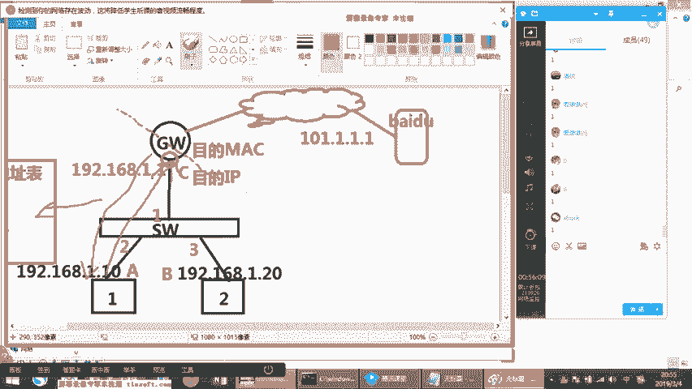
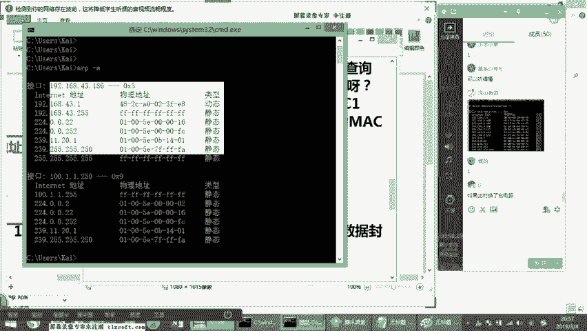
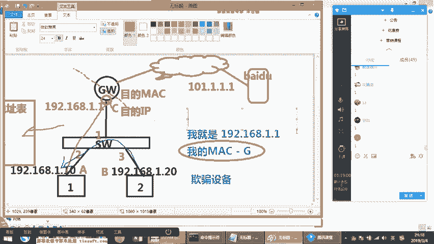
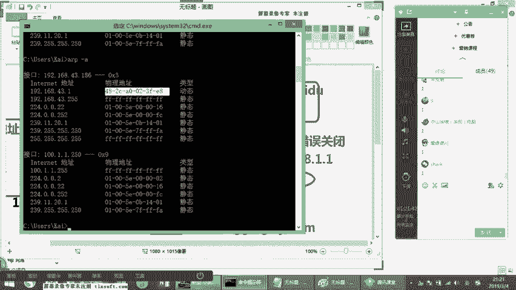
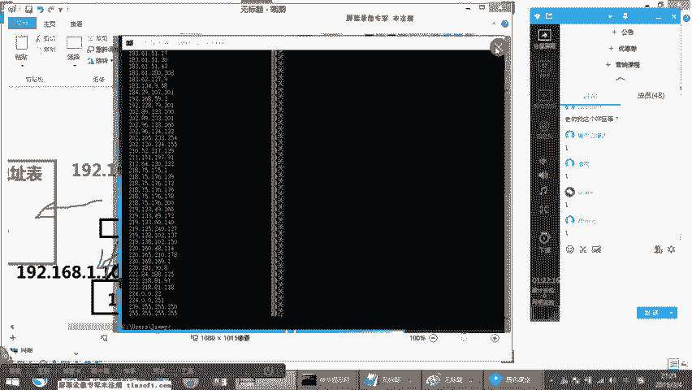
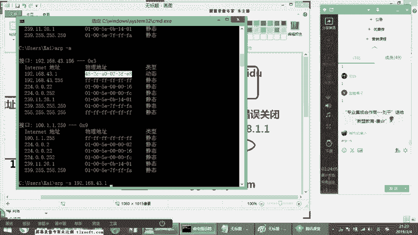
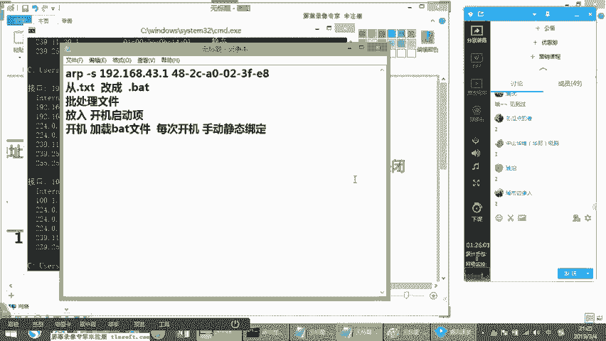
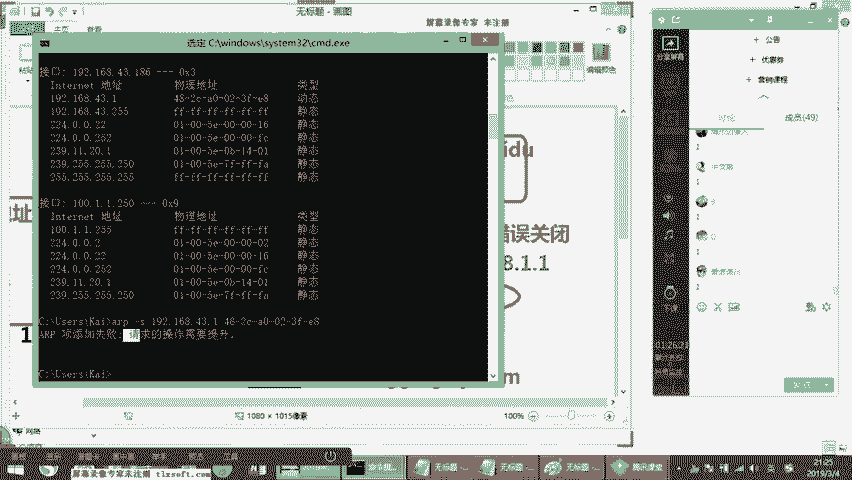
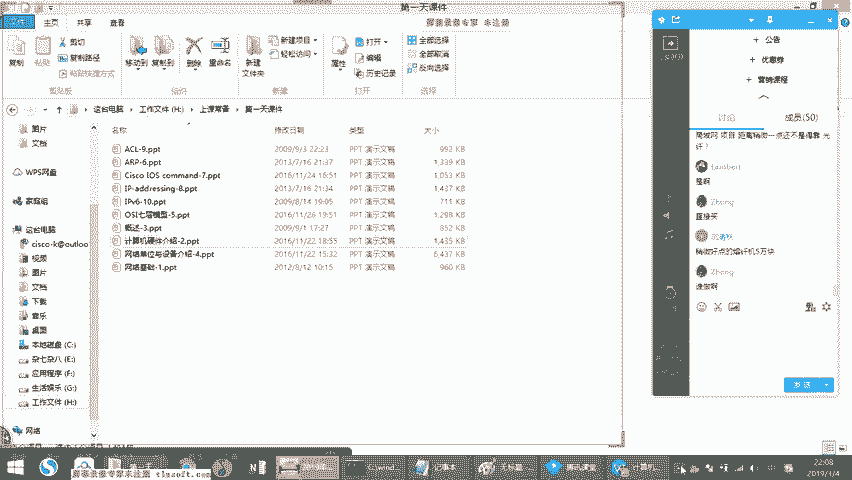

# 2019年度最新思科认证CCNA网络技术经典实战教学全集（最适合零基础小白的CCNA详解） - P3：思科认证CCNA网络基础第3节-基础入门 - new盟的小狐狸 - BV1V4411J7ZP

Yeah。

今天的话呢，正儿八经来说是我们的一个课程的进入到内容的第一天了啊。那么前两次的话，刚才也给大家做过两三次的扫盲，是不是啊两三次的一个课程的一个扫盲。那么关于今天的时候的话呢。

我们要学习的是一个基本的网络结构的一个互面架构。因为现在我们的课程的话呢，还在一个比较基础的一个阶段。所以这正儿八经来说是我们的第一节课啊啊，第一节课。那在我们今天的课程里边呢。

我们首先要涉及到一个问题，对我们前两天做两次扫盲，咱们就不要再扫盲了，好吧？啊，光扫你们的盲嘛，是不是啊，咱光扫盲就行啊啊，好，那我们说首先呢我们先来看一个很简单的一个点啊，很简单的一个点。

那今天呢康先上次的话，我演示了关于小凡模拟器的一个基本使用，对不对？这个大家应该知道了。那同时有同学可能还没有说老师我还没有把那个小凡的 idol值计算出来啊，没关系。那如果大家晚上的时候可以coc啊。

然后呢我会把你远程。然后也可以找我们这边的答疑老师，他会把你远程然后同时呢近一会。😊，我会给大家演示一下EVE的一些简单用法。啊，基本用法可以吗？啊，这样的话，等于大家可以两个配合的来用。

就不至于说导致说大家假如说遇到一个在呃学的过程之中的话，发现这个问拟是感觉不太好用是吧？啊，就不会的。因为EVE的话，始终是最好用的啊，我们在后面的CE版本课里面的话，有很多也会通过EVE来搞O啊。

然后呢在接下来呢我们来看一个非常简单的概念。我们知道所有的PC啊，我们知道PC也好，我的servva也好，是吧？这个我们都通称为终端，这个大家都知道对不对？终端终端是什么呀？这是末端末梢是不是啊？

就说我们是在我们的末节网络环境下，所谓的末端终端啊，这是指我的设备没有再有任何线路，连接别的设备，哎，我这就是最终的终结点，我没有别的线路再连接出去了，明白吗？好，那一根线连接的。

就是终端那么我们的终端的话呢，我们知道我们肯定要配IP的。不管是服务器啊，还是我们的PC啊，一样的，我是先要配置IP地址子网源码，还有我们的什么。😊，还有我们什么？还有我们的网关，对吧？啊。

那上节课的话，康给大家做扫盲的时候讲过DNS的概念。我相大家应该知道了，知吧我们DNS主要是来干嘛的，是用来进行我们的域名查询的，是不是啊啊，进行域名查询，等于呢他去查询域名的时候，它是通过DNS查啊。

那也就说DNS并不代表说你这个DNS能不能决定上网，这个事儿跟上网没有任何关系，听懂了吗？啊，没有跟上网有关系。它最主要的一个作用，就是在于能不能查到域名，能不能解析到域名。😊，那首先我们要看一个问题。

IP地址。好。是什么？我本机的一个标识。😡，对吧我的定位符对我配个IP这个IP就决定了我的定位符好，那我的掩码呢？掩码是干嘛用的？同学们啊，掩码是做什么用的？😡，注意看啊，你们你那边线一卡一卡。

我这没有啊，我这边现在还好啊，你看我这边现在的话都是OK的。😡，啊，你们听到O吗？OK的话，刷个一来。😊，啊。有卡顿情况吗？😡，不反子吧okK啊，我这边的话显示应该是么没没没应该没有什么问题的啊。好。

咱们接着说，那掩码的最主要的作用是干嘛？是划分网段，大家注意啊，你说老师划什么网段，我的电脑啊好，我的电脑或者我的服务器配置的掩码的最主要的作用是用来区分我和其他网络内的主机或网关是不是在一个地址段内的。

😊，他主要是来干这个用的，我们首先要搞出一个点，我们说网络coner在扫盲阶段给大家普及一个局域网和广域网。现在大家有印象，对不对啊，那我们叫局域网广域网，我们先从局域网说局域网的话。

之前我们提过它是一个什么是一个转发相同IP地址段数据的网络是吧？这是一个内网。那我们前提是我们在一个局域网有一个要求，就是说我们一定要在一个相同的IP地址段。😡，啊，对吧我们要在一个相同的地址段内哎。

我们可以说在一个局域网啊，那么呢这个时候的话，当我在我的电脑上配置的源码，最主要的作用就是区分我自己的电脑跟我局域网的其他电脑是不是在一个网段内，能不能听懂，告诉我看到没有？理解吗？哎。

它是用来区分我跟我在这个网络中的，其他的电脑是不是在一个网段内的？啊，没问题吧。啊，那么同时为什么还要涉及到一个网关是不是在一个网段内呢？啊，那我们要不得不说一个这个网关是什么概念？😡，网关什么概念啊？

这个是大家一定要理解的。😡，网关的作用是什么？😡，网关的作用是什么？😡，网关的作用是什么？😡，叫下一跳地址，大家注意啊，听好我们写的网关，你翻通常我们这么写。打个比方，我的IP地址是192。168。1。

10，我的言码是这个。😡，我的网关呢1。1好，那我问一下大家，这个一。1是谁呀？😡，嗯。这个1。1是谁啊？这个1。一是谁？😡，是我们的网关地址，对不对？好，看好网关地址。那这个网关是个什么角色呢？

网关是个什么角色？注意看啊，网关在我们的实际工作中啊，它是一台硬件设备。😡，啊，这个硬件设备的话，最主要的一个特点是一个接口连接内网，一个接口连接外网。听明白我这意思啊，这是我们说的网关。

那等于它的这个角色就是像什么呢？哎，出个你这个设备就到外网了出个这个设备到什么那到internet上面了，出个这个设备怎么到SP了，到电信联通了啊，是我们的网关。😡，那我们的网关可能是一台路由器。

也可能是一台三层交换机等等，对吧？不一定，但是它一定是一台三层设备。好，那么这个网关在我们家里边，192。168。1。1是什么？😡，就相当于是你们家里边那个小路由器，听懂了吗？能不能理解，明白刷个一来。

对吧？相当于你家里边的那个小路由器是一样的啊。OK好，这是我们说的网关，对吧？好，加个小路由器TPlink啊，是吧？TP啊，什么dlink啊等等，是不是好，那这是我们说的网关好。

所以网关是个IP那么你这个网关呢，大家注意啊，其实你不要把它想象的有多特殊，网关设备。😡，和你的中在你整个局域网内的其他设备是一样的。他们都是隶属于对吧？隶属于1个IP地址段。

只不过这个网关设备它有一个特点是连接着外网，连接着internet，听懂了吗？告诉我听明白了吗？明白刷er E来。😡，啊，对吧？它下面一个作用。所以我们说网关设备可以是很多，可是可以是服务器，防火墙。

可以是一台路由器、三层交换机等等啊，这都是网关设备，只要是它特点是原接的外网，它是个角色。好，那我问一下大家，那你说老师我这个网关是要求20188。1。1，我能不能给网关设置成1。1。158呢？😊。

这种地址能当网关地址吗？我想回答我先问一下大家，你们说这种地址能当网关地址吗？可以吗？😡，可以吗？😡，可以吗？😡，注意啊，是可以的是可以的。只要你的网关真的IP地址就好。

你的网关真的IP地址就是这个地址就可以。😡，所以说我们的网关并不是所指的啊，必须是1。1或者必须是什么1。254，并不是。只不过大家这个好记，所以说什么掐头去尾，对吧？所以说是开头要么当网关。

要么结尾当网关对吧？啊，OK那这个点大家要搞清楚。所以我们后边看到的呢更多的不是网关这个词儿，我们后边看到的更多的是什么呢？是我们的下一跳地址这个词。😡，啊，叫nex talk是吧，叫下一跳地址。

理解吗？啊，叫吓一跳地址啊，VA是吧，叫吓一跳啊。😊，那么这一点是大家一定要搞清楚的啊。那么但是在我们这个整个的组网过程之中，我们与网关之间是怎么样一种关系呢？哎，它是怎么连的呢？好。

我们来看一个非常非常简单的一个裸形结构，什么叫裸型呢？就是不穿衣服的网络啊，不穿衣服的网络是什么意思呢？哎，基本功能。打个比方，我企业里边首先要有一个交换机，这个大家知道对吧？我得有个交换机。

我交换机的最主要的作用是干嘛？嗯，回家看看我最主要的作用是干什么？😡，连接局域网上节课说bo对不对？告诉我是吧？我最要作用是不是来连接局域网。😡，好，然后呢在我的整个的这个SW的这个交换机上啊啊。

我们知SW叫什么叫switch。😊，好。CH明白这意思吗？好，那有的时候的话呢，他们还会这么去写啊，叫SWAP啊，stepap就是说交换数据，有的时候在网络给点会体体体现到这个词。

我们一般说叫switch啊，就交换机路由器呢叫什么路由器叫root，明白不吧？啊，路叫ro防火墙呢。😊，叫firewall。O好，那这是我们现在看到最基本的。你们在网络环境中看到的三个点是吧？啊。

叫switchro和firewall啊，那一般fireairwall的话，我们一般简写一下FW啊，就是防火墙的意思。好，那么当然在现在的网络环境之中，我先问一下大家，在现在的项目当中。

他们区分路由交换防火墙吗？😊，区分吗？它的区分不叫做防火墙吗？😡，大家注意啊，在实际的现在的项目来说的话，实际我们现在用的都是多业务集成的叫ASR系列。在三策里面的话。

我们叫ASR系列ASRR系列什么意思？就是说它叫多业务集成的产品。多业务集成产品某种意义上来讲啊，某种意义向来说，其实呢它就是起到了一个什么我可以接交换模块，我可以是一台路由器。

我里边呢可以有防火墙的里边的一些功能，是吧？我面向于唉4到7层的防火墙，是吧？1到4层防火墙等等哎，以及呢我在这个网络之中的话，可能可以支持POE供电明白意思吗？可以支持POEpl啊，哎。

可以可能有的产品的话呢，可能可以支持这个这个这个一些关于安全的一些特性啊等等之类的。明白防才意思没有啊，所以现在的网络产品分系列的。例如像我们是ASR系列。例如像ASR系列啊，例如像NCS系列。

明白了吗？哎，等等。它实际上现在是以系列做。😊，为区分的OK然后明白吗？明白tra多一来好啊，是以这样的一种方式作为区分。那么我们现在所讲到的什么？是从技术领域去做划分啊，只是从技术角度划分。

那现实工作中是以业务做划分。你不要区别开这个点啊，好是以业务做划分。资科的产品性已经早早的就不在以说单纯的意义上的以这种呃这种什么交换机路由器，它不是这么区分嘛，但有没有这个轮廓呢只有这种轮廓的。

我想给大家举个非常简单，例假如说，像目前当前。啊，那当前的话呢，思科的产品啊如果没有记错的话啊，那目前比较火的像292960系列，明白意思吗？哎O2900叉R系列。好，那2960系列的话是什么？

接入成交换汇聚层交换的比较常见的是多少3650是吧？好，3850等等，明白意思吗？啊，那像一般是用系列做汇聚的啊，当然在国外的一些一些地区的话，在国外的对没错，在国外的一些发达地区的话呢。

实际上3850大多数用于做接入啊，不再用于做汇聚是吧？啊，你假如说在核心方面那核心方面的话，企业级的核心例如像啊面向于普通企业的普通的中小型企业的，假如说100到300人这样的规模的话。

一般是我们说的ASR系列的是吧？ASR系列的路由器，比如像4000系列的是吧？啊，4000系列的4410系列等等是吧？这种就面向于100到300人这样的一个规模啊，那往往还针对什么？

假如说我们企业规模很大，例如是总部级别的啊，我可能用于做企业的CE边界。😊，系列的好吧，可以支持更快速的转发，可以支持更多的一些相对应的一些特性，明白吗？啊？它现在是这样的。

是面向于你的业务需求而制定的产品方向。明白刚才表达逻辑吗？请回答我明白吗？明白sber一来啊，sber一上来。好，那现在呢在整个思科的产品系里面，当然思科华意思是差不多的啊。

那么它会面向于你的office系列。😊，啊，office系列或者说现在目前面向的啊面向office系列里边的话，它推出多业务集成路由器啊，那么推出既可以当路由是吧，也可以当交换。但是下分的话。

也有很多接入交换，你看例如很多没钱的企业啊，很多没钱企业，例如像SR1000系列啊，很多没有钱，他们公司买买这个系列然后同时买什么呢？假打个比方他会买下游的话，买2960系列的交换机，做一大堆的接入。

啊，一大堆接入。你看很多中国的外企，一般都这样的标配啊，很多中国的外企。假如说它没有太高的权重，公司没有特别多的钱，不是做金融的，不做医疗的，但是要外资企业，例如做贸易的等等。那他们标配的话。

就配什么多业务集成的路由器，里面可以支持什么安全模块，可以支持防火墙的一些功能，做VP没问题，是吧？哎哎还可以接无线是吧？里边的话呢，当然你要额外买ense，是单独说的啊，好。

一行一些常规的路由路由协议啊里边的话可以做一些NAT是吧？都可以不像。😊，早期的我们知道早期式的交换机是什么区？早期是三层交换机的话，这三层交就是三层交换机，但是交换机不支持什么？

很多同学问过这样问老师这个三层交换机能不能当路由器用早期不行，现在可以理解过？现在分系列，早期不是早期什么呢？假如说你3550是吧？3560这种这种交换机，你会发现这种交换机三层吗？里边能写什么？

你要买这个EMI系列的那里边的话这个交换机里面的话，它可以起路由协议BGP都可以起但是呢它没有办法当网关啊，为什么因为不支持NAT功能，里面康一层啊，很多所以早期的很多三层交换机。

它不支持N它没法当网关用这么说能不能听懂啊，明白给康上来啊而现在不是现在的话假如说它会采用这样的一种标配那假如说它会会有工业级的啊，这是企业级的吧？企业级的对不对啊？

假如面前它会有工业级产品假如说工业级产品的话。😡，他会哎例如像支持UPOE供电POEpl供电干嘛？而假如是企业里面呢很多的话，他们现在做物联网是吧？

有很多时候的话很多这种物联网的配件直接通过我们的网络设备直接做供电。例如像我可以我甚至接一根网线接到一个智能的灯泡上这智能泡的话，可以实现供电那传统的POE呢可能它的功率没有那么高，那实现不了。

那很多工业级产品它是支持的啊，那比如从工业级产品里面来说呢，它可能会对假如说啊对当前的环境要求不高，对M to m的这种网络啊，么这样的一个网络环境是吧？支持度更好，例如像对无线哎支持更好。

例如呢支持DMPN明白刚才意思没有啊，支持一些M全的应用功能如此类啊这是面向于移动式的面向于工业级的这样的产品例如在车里面是吧移动办公室的等等如像高铁上这是属于工业级产品，听明白刚才意思没有？

明白它是有不同方向的。你假如说我在运营商。😊，方向找或运营商方向，或者说是我向我在我的这个dase center方向啊，运营商或者数据中心领域里边，那他可能会面临到一些。

假如现在目前思科出着啊关于融合式的啊融合式的路由器当然融合超融合不一样啊，现在思科产品里面的话有一套是超融合的啊，融合式的什么呢？也是面向于多业务集成的。

但是它的重点例如像面向于的是这种大型企业像BT啊，如像我们的da center数据中心里边或者像SP运营商出的这个NCS系列啊，企业级的核心汇聚层的产品，像5500系列，这个大家应该有所听说对吧？啊。

可以去思科官网去看一看5500系列的产品啊，或者说是他们出的面向dacent里边的像nexus是吧啊NXOS这种系列的这种应用啊，那么基本上的话是面向于数据中心，以面向于更快速的交换为主。

那你说老师呢它跟企业就有什么区别呢？很简单，特性不一样，理解吧？特性不同，例如像运营商的产品，不支持POE的理解意思吗？哎不支持POE为它不是企业产品，运营商P什么OE啊，它不会有这种情况啊。

这么说能不能听懂啊。😊，是这样的一个情况，这是有不同的呃一个领域的一个区分啊，所以在整个的业务板块里边来说你大家记住，现在所有的企业的产品系。当你们进到企业里之后，你会发现你要做的是干嘛？

现在这些产品先看产品，先从企业里边的话，先去看一看。来我们的产品手册，我们最新在推什么，你看现像思科现在在推什么呢？再推9K系列9K是N9K吗？是nex9000吗？不是是现在面向于同款的。

假如说他去啊打比方他去呃这个运用到他去m到这个我们的2960叉R系列的好，那这种传统的传统级别的接入从交换机。那基于在原有的这种平台的芯片架构上做个芯片架构升级啊，可以使转发速率更快啊。

硬件性能更好是吧？等等啊，那出个99000系列的明白刚才没有啊，说了思科9000那9000不是N9K9000系列的话，只是推出的新款新系列。交换机有点像如果你拿手机举例子，有点例如像呃像米UI是吧？

小米八、小米91样，你说有什么本质区别吗？没有太多本质区别。但芯片速度更快吧，转发速度更快的，硬真性能更好了，如此类的，理解康泽的意思没有？明白刷er一来，这是他现在主推的产品，你要去官网看的话。

你可以看得到理解吧？啊，这我现在一直在说，我没我没有写屏幕啊，我其一在给你们讲话，懂吧？OK好，序便是这样啊。😊，能理解吧？啊，为什么要看要先看设备，不是上去，不是因为你之后期在项目上面的话。

你可能会变更到这样的一个情况。假如你到项目上的话呢，你要帮客户去做方案，对吧？你要去帮客户去做方案的话，你要知道什么样的产品是适合客户的。当然了，如果你只做售后的话，可能还好，那你要做售前的话，是吧？

那你产品要做很熟悉。那作为你们后期来讲，不一定只做售后，假如说你要进厂商的，对吧？你要假如你在sco里面做tact呢，是吧？那情况就不一样了，你对产品是要很熟悉的，明白意思没有啊，你产品什么都不懂。

只天天光配那是不够的。假像思科现在传统是AOS对吧？但现在思科现在这接下来1到3年之后，他推的新的啊，并向它的产品芯片架构推的新的AOS叫AOSSE。😡，明白房时意没有啊，面向AOSSE啊。

随便税降的一个价格啊。呃，现在可以听清吗？现在OK吗？OK给康子刷个一了。😊，有点卡是吧？有点卡吗？有点卡吗？不好意思啊，今天实在是对不住，兄弟们啊，我先切一下，好吧，我切一下无线，我切一下无线，好吧。

我先切一下无线啊，大家稍等一下。😊，好好说好说，我切一条无线。😊，好，兄弟们，现在可以听到吗？可以给coor刷波一来，刷波一上来啊，可以的话，给consor刷个一刷个一刷个一OK吧。好啊。

我切了一个无线啊，是这样好，我刚才可能有无线的话，信号不太好，但是我刚才已经进课堂了，知道吧？啊，但是没关系啊，我下节课的时候的话，我要及早的进我们讲师房。要不然又被N多讲师抢个风头。好吧。

现在可以听清吗？告诉我现在okK吗？O刷个一来刷波一上来，可以吧？好，oknice好，那咱们接着说好吧啊，咱们接着讲。😊，有什么太大影响？啊，所以这是一个这是我们说其中一一些点啊，大家要注意。

所以一定要关注产品，随时去看产品，产品里呢没有什么特别难的复杂的参数啊，那一会儿我们可以过一下，好吧，咱一会可以过过一下啊。那假如说这是我们的一个交换机。😊，交机上面连的是什么呢？

交机上面的话可能会连一台路由器，你看为什么要连一台路由器，为什么要连一台路由器看，因为我们知道交换机的最主要功能是干嘛？做局域网连通，它最主要的作用是连接内网，连接局域网，听明白了吧？好。

那所以此时如果它想上外网要干嘛，要使用网关，对吧？要一台目由。那如果使用一个网关，现实当中感觉交换机用来画分微烂的，以太网没有太大用处吧。错啊，这只是你现在的粗浅理解，这只是你现在NA级别的理解。

能明白吗？啊，你现在的理解的话是非常粗浅的，所以你现在先给我专心听啊，不要给我下定义啊啊，那连接的网关，网关最主要的作用是什么？是用来跨网段是来连接广域网的，大家先有一个区分。

而我们局域网的一个最主要的一个作用是干嘛？局域网最主要作用是用来实现同网段的一个啊同网段数据转发，理解了吗？好，而我们的广域网呢连接最主要的是干嘛？要跨网段。😊，数据转发听明白了吗？明白刷波一来啊。

所以往往上面你是网关，而网关是什么？网关的话像啊我在我的内网接口里面配以吧。假如说是很常见的，例如像192。158。1。1，能听懂吗？1908。1。1好，当网关，但是你说老师怎么区分二层三层呢。

传统早期区分二层与三层设备，主要围绕一个点，早期啊啊，例如像7到8年前7到10年前啊，之间，我们区分二层以三层呢，是看设备能否配IP地址。😡，我们以IP地址来判断它是一个什么二层或三层的网络环境。

明白了吗？哎，不能配IP二层能配IP3层，现在是吗？现在不是现在的话，其实在当前的阶段，所有的设备都可以，设备都可以配IP。😡，但这个IP要看是配在哪。打个比方，我去面向纯二层的设备，纯二层的产品。

那我这个时候的话，你发现我可以配至少可以配一个管理IP明白了吗？我可以当一个管理IP哎，我可以对外写一条普通的静态路由，这是可以的。😡，啊，它并不算然没有太多功能。

但是可以当管理IP配个静开路由干嘛用啊？是为了这个设备呢在未来可以远程SSH或者是tenet是吧？登陆上来。听明白了吗？明白它能刷个亿啊，是这样的。如果你能连IP都没有的话，我连设备登都登不上去，对吧？

而我都没法管理我的设备，而现在来说的话呢，不会吧，现在最起码你可以配个IP哎，你是可以的啊，所以大家要先了解历史了，那现及在我们这环境中，假设我是一台纯二层的交换，它不是三层一台纯二层的，纯二层交换呢？

哎，我上面的话搞一个网关，下面呢干嘛呢？哎，我弄一些PC啊啊好。😡，SSH是什么？是加密的远程登录。现在在项目上没有用tone都是SSH都是SSHV2明白了吗？好，先记下来啊。

那假如说下面我有2个PC注意看呃，我有2个PC两个PC的话，我现在直接干嘛呢？看着，连接到我们的交换机注意听连叫交换机。而我现在下面这2个PC呢，这边是我们的PC1，这是我的PC2。好。

假设说我的PCE的IP地址是192。168。1。10。😊，好。稍等啊。好，那么另外一边的话什么？另外一边是192点1个8。1。20，听懂了吗？啊，SSH这是SSL啊，明白了吗？啊，这是SSH啊，啊。

为什么要静态呢？很简单，是因为你出去的数据要能回得来。明白了吗？进来的数据要能回得去。假如说我现在我在我的交换机上，我拍的一个管理地址，我给大家打个比方，我配一什么呢？假如说我配一个1。100啊，好。

当管理地址，但如果前提是人家登到我这个1点100吧，这个数据还能出去才行，能明白看我意思没有？假如说我在外部internet上面在家里边，我在家里面登我这个交换机，我登上来，这个数据还得回得去。

这个是关键。当然了我现在所说的逻辑是在哪里，是在数据中心的条件下。如果你的公司就是你们是服务于数据中心在服务于datacent的，服务于SP的。好，那这个时候你的设备大多数是有公网IP的。

有公网IP的话，就是外网的设备的话呢，你在家里边。😊，还在你网吧里边OK无所谓，那你都可以直接远程登到设备上，听明白了吗？因为它配的是配有公网IP。那如果你是企业啊，或者说一些SP的内部机房。

那你需要干嘛？先VPN上来，先VPN登上来，从VPN登上来之后再去te这个设备理解了吗？再去SS这个设备理解了吗？好，明白，先刷一啊，先说一个框架和概念。刚才给大家说的是比较常见的方式啊。O先专心听。

你会学到很多的啊。好那我们来看我把这个一点100P干掉啊，我们先不涉及设备管理IP的问题。好，加油这样。😡，那此时呢我们就有一个问题，我现在下边PC1也好，PC2也好。

我们都知道它实际上是有mac地址的。这个大家知道对不对？有mac地址。假如说我的mac地址mac地址，我扫盲的时候给大家讲过啊啊，我不再重复了啊啊。

假如说我第1个PCE的麦ac地址是A注意看啊是mac地址是A啊，这是PCE的mac那我们的PC2的mac地址是多少呢？PC2的mac地址是B啊，我的网关的mac呢是C啊。

打个比方啊打个比方然后接下来呢我现在要上网对吧？啊，我要上网，我上网的话要连接哪里呢？连接电信啊，是吧？SP啊啊，我们在现在呢我们把SP呢当做一个云团。

咱们现在先不选SP我们先从企业网学习后面会从企业网给你讲到运营商网络给你讲到数据中心网络，明白吧？你先专心听啊然后此时呢我现在有个云团，有个云团的话呢，我现在要连接到SP里边SP呢，我们上另外一端呢。

假如说啊某一个网络。😡，有一个服务器有一个servva啊，就是我们说的，假如说这个servva呢里边是一个百度的servva，好吧啊，一台百度。😊，OK那此时呢我的屁我这个网关啊到达这个百度呢。

这个百度的IIP是多少呢？而假如说是101。1。1。1。😡，麦克地址是多少呢？m克地址的话，假设我们是F可以吧？F。😡，那等于此时我们来思考一个问题啊，当我们从PC1好，访问PC2的时候。

我先问一下大家好吧，我在PC1访问PC2的时候，我们都知道，如果说你要进行网络的访问，你的数据一定要有什么，一定要有原目的IP因为我们知道我们要封装数据，大家知道啊，封装数据跟你打那个快递是一样的。

听明白了吧？给你打快递是一样的啊，封装数据跟你打快递没有区别，就像你包快递一样，那你包快递的话，你的原IP是谁啊？假如说我们现在PC1访问PC2回答刚才，我的原IP谁？😡，UIP谁先告诉我。原IP谁啊？

原IP是1。10对吧？原IP嘛啊1点10没问题啊。好，原mac呢告诉原m克是谁。原麦是谁？OKy原m是谁？😡，A对不对？ok好的，原 maxAnice那我的目的IP呢？😊，是多少？192。1个8。1。

20，目的麦克是谁？告诉我目的麦克是谁。😡，好，目的max唉非常好，兄弟们啊，多少B是不是okK好，B好，这是原目的。等于这个时候的话，我这个信息的话呢，要能够出现在我们的数据包的封装过程中。😊。

它要起到起到我们的包头上面啊，去封装我们的这个数据包啊，那么这是我们首先的一个很简单的一个点。😡，那我们来接着想一个问题啊，假如说我们现在来看，重新来看一个点。假如此时哎我的云IP呢。

假如说啊看着我从我的PCE访问百度，对以吧？我们换一个环境PCE访问百度。那你们告诉我的PCE访问百度，我的原IP是谁啊？我的原IP是谁啊？😡，谁啊，云IP谁啊？哎，就从我的PCE上还看哦，云IP谁啊？

😡，这从PCE上来看哦，哎，1点10对不对？好，1。10好，我的目的IP呢？目的还是谁啊？😡，目的I及呢？好，我的目的IP是谁啊？😡，多少啊多少？多少101A非常好点，1。1。1对不对？好？目点一好。

我们来看啊我们的原m克呢，假如说我们的原m克是谁？😊，好，谁啊？袁麦是谁啊？Aless好目的麦克是谁？告诉我目的麦克是谁。😡，啊，目的like是谁？目的麦克是谁？看到吧？目的麦克是谁啊，谁呀谁呀？😡。

谁呀谁呀？好，OK好，这个时候我们来看啊，你看有人时F吧。然后注意看此时我们的目的mac是什么？目的m是谁呀啊，目的mac是F吗？注意看不是F。😊，目的麦克不是F，是C。别着急，我们来看。啊。

为什么啊为什么我们来看一下这个逻辑啊，首先来讲，我们假设我们假设一下，当我们的PCE产生了数据发出来到达了我们的交换机之后，如果它就是F。😡，如果它目的就是F，那我们来思考这样一个问题。

就是这个数据进到交换机里边，它交换机知道F是谁吗？回答刚子交换机知道F是谁吗？知道吗？交换机知道F是谁吗？回答我知道吗？😡，他知道F谁吗？嗯，知道吗？并不知道对不对？他不知道F是谁，听明白他的意思没有。

哎，非常好，他不知道F是谁，为什么是因为交换机只能够去查到什么跟它直连设备的mac地址。😡，交换机永远记录的是这样的。假设我在这个交换机的某一个接口，你看啊我们标识一下，这是我的一号口，这是我的2号口。

这是我的3号口。😡，我这三号口里边，我只会记录着我的每一个接口连接着对端的什么连接着对端的直连的麦克。打个比方，我的一号口C啊C2号口。😡，好，是谁啊？A3号跑。😊，B听明白了吗？

它只会记录着每一个接口跟对端委员接着对方的map地址。那么它是怎么记录的呢？只要是这个交换机一旦接收到数据。😡，从某一个接口接收到数据，我们知道这个数据里边一定会保存着什么？

回答conr保存着原mac地址，听明白了吗？它一定会保存着原mac地址。OK好，保存着原mac。😡，那么也就在这个过程之中，注意看在这个过程之中，它一定会保存原麦，所以它就会把原麦这记录下来。

记录到对应的接口上，从而形成了一个这样的一张表。这张表叫什么表？😡，这张表有什么表？我告诉你们叫做mac地址表，对吧？这一点大家应该知道了啊，叫mac地址表啊。😊。

那等于说呢这个数据一旦进到了交换机之后，交换机要去做的事儿是干嘛？查询它的mac地址表，听明白了吧？😡，明白了吗？他去查询这个mac笔记表啊，查这个mac机记表，你要去哪。但是我们现在来想一想。

当它现在要使百度F的时候，他知道F在哪吗？😡，回答告诉他知道他现在知道F在什么地方吗？😡，te me告诉我，他现在知道F在什么地方吗？知道吗？他就知道F在什么地方吗？不知道对不对？明白方才意思吗？

他现在根本就不知道F在什么地方上，理解吧？好，那么这个过程的话什么呢？所以往往我们写的网关的作用。大家注意看看着哎，那老师他为什么发给C呢？别着急，当我们在PCE把数据发给C的时候，哎，看好C啊啊。

当他发给C的时候，情况发生一些变化，发生一些变化，就等于这个数据呢？传到了C时候再局域网内，然后此时干嘛看到当这个数据先进入到交换机，那交换机要干嘛要进行查询，明白了吗？它要进行查询。

查什么目的back吧，你看目的 back谁的C好，看一下表表内有没有C的，告诉他有没有C的，有没有C的有吧，看表内有C的C的哪个接口发出去呢？在一号口发出去，听明白了吗？在一号口。😡。

发出去OK然后这个时候的话交换机把这个数据从一号口发出去，发到了我的网关上。okK好，注意看我的网关当接收到这个数据之后，那他要做什么呢？他接下来不查别的表，他要查的是路由表，听明白了吗？

他接下来再查就不查目的m克的，他要查什么，他要查的是目的IP听懂了吗？理解了吗？他要查目的IP这个时候网关要查谁了，101。1。1点几的这样的一个地址，明白了吗？明白，看一来啊。

这猜在查的是查的是路由表。😡，啊，在查查度表，并不是查我们的nap地址表。OK问题啊。好，那么这是我们现在看到的一个什么呢一个这样的一个消息。所以在这个过程之中的话，当然了在这个环境中呢。

你们要理解清楚一个点。打比方，我们说这个mac地址表吧，这个数据当进到交换机里面之后啊，当进到交换机里面之后，你说这个交换机如果查不到它是不转发吗？😊，它是不转发吗？我先问大家一个问题。

在这个数据进到教集之后，教你查不到转发吗？😡，叫警们转发数据吗？😡，刚总会吗？交换机会不会转发数据，会不会转发数据，会吗？注意看它是会的，因为数据进到交换机之后，他查不到目的mac怎么办？广播没错。

非常好会广播吧，等于这个数据的话呢，会进行一个泛红的广播，注意看啊，泛红广播好，那一旦进行泛红广播之后这个数据的话，但他发出去没有呢？发出去了，发出去了之后。

但是对方设备收到之后发现不是找我你假说我的网端收到了，你找谁啊，找FF不是我丢掉照下找谁啊啊，找PC2PC2不是我啊是吧？P32一看，我FF不是我丢掉明白他的意思呀啊，他其实是什么呢？他发了那泛红发了。

广播发了ok明白他的意思呀啊，但是呢这个时候干嘛？哎，他出不去。😡，对对方发现都不是找不是找我啊，广播只是每一个接口都发一份啊，这是广播数据一旦寄到交局之后的话，交易局每一个接口都发一份。

因为不是因为他不知道从哪个口出去，所以他就是嘛每一个接口都发一份，听懂了吗？听以懂刷波一来啊。😡，接着说啊。那么但是这个时候就会有一个这样的一个问题啊有一个这样的一个问题。我给大家举个例子啊。

假如说你们在实际项目当中就存在这样一个bug，这个bug是什么？注意看啊，这个bug什么呢？就是说它会有一个mac地址的保存时间。这个mac地址保存时间多少秒呢？哎，这个点的话。

刚才结合项目给大家讲mac地址表的一个保存时间啊，是300秒。😡，啊，就300秒装时间就5分钟没讲啊，5分钟时间，就5分钟的时间，它是保存在交换机里面的。当然它是以条目来算的啊。

那300秒的话也不是整张表干掉，它是以什么呢？它是以某某一条目5分钟。但这个时候有的时候会有这种情况，在某些交换机的型号上，看好啊，它存在了这样的一些弊端。

例如你在的是一个大型的一个呃上网的一个内网环境，是一个企业网。😡，企业网最明显的一个特点就是交换机多路由细小。理解刚才意思吗？就交换机多，为什么交换机多呢？因为大多数你得配接口嘛，你接口多。

你上网的人多，所以交换机接口多能听懂吗？OK呢？啊，但是呢由于每一个表呢保存时间是300秒。这个表呢这个条目呢在交换机里面啊看好，可能你们公司有100台交换机，每个交换机24口可能有好几千人，上千人。

对吧？100多人，1两千人啊，然后此时呢这个数据呢在表里面保存5分钟，但是有可能是这样的，假如说你自己的本机的电脑现在虽然是给人接上网，开机了。😡，啊，但是此时呢他并没有做什么上网的操作。

那很有可能在这个期间就出现了。假设说在没有数据经过的时候。啊，经过的时候。就存在个什么呢？就存在了此时你的线虽然是连接的，就交换机里面设是up状态，明白吧？是up好。😡，啊，up状态。

但是呢会出现你这个条目条目被删除掉的情况。😡，当条部被删除掉之后，就存在了这样一个问题。举个例子啊，假如说你在后边的时候，还好，你在后边，你继续还想当你再拿到电脑干嘛呢？哎，你还想再进行上网访问的时候。

假如说某一个人啊，某一个人，那么他想访问你。😡，但是由于你的电脑的mac现在已经被刷新掉了，理解了吗？被刷新掉了啊，当你被刷新掉了之后，此时他再想访问你的时候，你你这个mac地址在表里面有吗？回答刚才。

你这个mac地址在表里面有吗？听完没你告诉我，你在表里面有吗？表里面没有吧，就你在表表内是不存在的，因为你被刷新掉了，能理解吗？被刷新掉了。好，接着时候干嘛呢？接下来它要做的设候就是广播。😡，啊。

第二你要做的事就是广播范围。😡，而这个广播范红单你收到的，你能不能收到，告诉我，你能不能收到，能收到的没有问题的。你收到之后，这个时候你干嘛呢？你收到做个回应，回应完了之后交换机会干嘛呢？重新记录下。

看着啊，你的mac对应的端口port对吧？port好，重新记录下来，当它重新记录下来之后，好，此时你们的数据转发正常。😡，但是注意看，但是如果说注意听，如果说。你内部的数据要是特别多呢。

你内网的主机要是特别多的你这个局域网要很大呢，那不就意味着说每天类似于这种瞬间泛红的数据将会很多，听懂了吗？😡，能理解吗？因为mac电子表的刷新时间问题导致的。😡。

突然间的一个数据的发送导致泛红在整个网络之内进行转发传递。明白康测逻径吗？因为主机数很多，你要10个20个无所谓，你从来没有考过这个问题，你要几百个1000个呢情况发生变化。理解了没有。

所以这个时候的泛红量就会非常消耗什么？能很多时以得浪费带宽胡扯，局域网的带宽不要钱，局域网的带宽很大的，现在在内网之中，交换机和交换机之间的互联都是属于千兆的，那么明白康测逻辑吗？都是千兆网络是吧？

浪费哪什么带宽，浪费哪家带宽呢？啊，浪费的是设备的转发性能，明白了吗？因为你一次泛红广播就会在整个网络内进行传递，主要是消耗我们的设备的转发时间，理解了没有？明白稍边意外，所以这个时候干嘛？

往往我们在这个过程之中的话，要干什么呢？要在我们这个交换机上干嘛可以去如果一个很大型的内网，我们可能会修改一下，有的时候有一幅这样的优化步骤，就修改麦ac地址表的一个保存。😡。

直接把mac机表的保存时间干嘛呢？哎，改大一点点，改大一点。当你改大一点的时候，这个时候的话干嘛可以更有效的减少我们设备的负载。听懂了吗？明白稍pper一来好。😡，是的自己哎不是他转发广播消息好吧。

就你这个数据过来，他发现没有，他就会广播，是这个意思啊啊。😡，理解了吗？好，这是一个特性啊，这是一个特点。给大家去普及一下啊，不一定啊，一般就是通常情况之下，他们会改成一个小时啊，一个小时3600秒。

一般像的话呢网络很大改成1600秒啊，就是改成一个一个两个小时左右听懂没有？明白稍一样最大保存时间，这个问题问的毫无意义啊，保存时间我没有看那个最大值是多久。

但是我以我来看呢不同的AOS不一样只不过没有意义啊，你最保时间的话，多长时间100小时有用吗？那你把这小时干什么呢？理解了吧，只不过你要在这个合伟的范围之内你给他搞定就可以了，理解了吧啊。

知道吧这个点记下来跟STT没有关系啊啊，注意看跟把这个点记下来好吧啊，颓废啊，你说的这个跟说的不在一个路线上，不在一个楼层啊，咱俩是不是错峰了，你是不是经错课堂啊，啊晓我现在发现半天。

我说东你就说西是不是咱俩现在不在一个频道上啊，是不是不在一个频道，你看你告诉我啊，是不是跟S。😊，有关系吗？我先提的STP吗？是不是你是不是找打啊，是不是找打啊，我直接往下说啊，那么这个时候的话。

这是我们现在看到的一个点啊，注意看啊。😊，STP在实际项目中用不用啊用啊用倒的理解了吗？这是非常非常非常非常基础的supcle，明白没有？非常基础的基基础知识点，非常基础的点明白啊，非常基础点。

大家就要注意这个点哦，STP而且绝大都数是STPMST后面我们会学到不要着急啊不要着急，我们会讲到，但是呢其实应用也并不多。现在企业里面有的时候我们会用到更多的。比如像。在 center里边啊。

在企业级可能我会用用关于这个STP方面的一些东西啊，除此之外的话，可能我们会用到堆叠这个大家知道吧啊，用到堆叠这个技术。然后呢，可能我们给你到在这 center里边的话。

我们可能会面向在原有的网络里面的像NXOS里边的一个特性啊，比如像fabric啊等等之类的，明白意思吧？他也不会用STP啊好，不要着急。卡头给你们还原实际情况咱们1。1点改O啊O啊1。1点改啊。

有mac对表都有，只要是交换机就麦克对表啊，不要着急，我还没有讲到OSI啊啊，我先给大家做介绍。😊，那我们接着来看好了，我们接着来看在我们这种环境之下呢，我们先把当前这个情况的话，我们先care一下啊。

好，那么我们现在的话呢。😊，看好，我把这个当前的情况先给他哎。😊，那这个时候呢我们思考就这样一个问题啊，我们把思考清楚一个这样的一个问题。就是说你说老师好，没关系啊，我的PC1PC2呃。

对交换机呃电脑发一个单播，然后交换机转发为广播吗？是的，没错啊，交换机会广播啊。好，那么此时的话呢，在这个情况下，我们说mike地址既然都作为自己本机的一个物理地址，我前天扫盲讲过这个问题。

他既然作为物理地址存在那你们回答刚才这样一个问题，好吧啊，他既然做物理地址吧是吧？那你说我的这个PCE怎么知道网关的麦克呢。😊，我的PCE怎么知道网关的mac呢？😡，我的PCE怎么知道网关的mac呢？

😡，告诉我，我怎么知找网国的麦克，我怎么找网国的麦克。😡，嗯。我怎么知道我波的呢？😡，我怎么知道网我的mac说话。😡，通过降局，这话说的肯定通过降距啊，你以为他还隔空能爬过去啊？😡，是吧好。

OK它会通过这么一个东西叫ARP大家记下来了啊，叫ARP啊，也说ARP和mac地址表有关系吗？请告诉我。😡，和mac地址表有关系吗？😡，ARP和mac对D标有没有关系？😡，有吗？有吗？有吗？😡，注意啊。

有个毛线球关系啊，注意看啊，有有个毛线球，明白没有啊，记住没有ARP和mac地表毛球没关系没有？所以你们现在还有一个概念，我就知道你们会在哪里会懵逼，我就非常了解你们，理解了没有？

所以记住这两个帧没有毛线球关系OK啊，那么在这个整个的过程中，mac地址表是交换机的表。记住啊，mac地址表。😡，是属于交换机内的表，没见过了？它主要记录的就是每个port每一个接口连接的对方的mac。

记住了没有？很简单，大家感觉这个事儿ARP表示什么呢？ARP表这个东西是用来干嘛呢？是用来作为终端注意听用来获取其他设备的mac地址而使用的一种协议叫ARP协议。记住了吗？

终端为了获取其他设备mike地址而使用的一个procol，你解过没有？使用的一个协议，使用一个这样的协议来获取别人的m克。因为在默认情况之下，它是不支持的，它默认根本就不知道对方的m克是多少。😡，好。

OK明白了吗？明白，你看始刷波一来好，那么在这种情况之下，我们说要通过ARP获取。O好，那ARP这个东西就出现在我们的事业之中了。注意看哈。😊，那我们在这个滚环购大多数情况跟ARP没毛线关系，记住了吗？

好，记住啊，不要给他们相互关联。你们现在理解都什么锤子是吧？别瞎给我猜好吧？现专心听我讲O什么环购，你们在下面上遇到过环购吗？啊，你们谁遇到环购，我听听一上方卡就说是环购就胡说八道。

环购哪那么容易出现啊，是吧？环购在现在更多的就是一个概念，明白吧？一个概念层面的东西啊，环购在实际当中并不多见了，现在理解了吗？因为现在设备自带STP啊自动开启的O啊。

所以没有什么太多环购的后面的时候coor会告诉你们什么呢？怎么样去我我可以给你们讲一下环购的真实现象，我遇到过没有吧？哎，我之前遇到过，我可以给你们讲一下它的真实现象，不要着急，咱们讲到OSI的时候。

我就给你们说了O吧。咱们接着说没关系没关系啊，没关系那我们现在来看关于ARP协议。😡，啊，ARP协议ARP是个什么东西？它是一个地址解析协议。啊康s讲课讲了七八年了啊，一般扰乱不了我的思路。放心。

你现在就是发一张美女图片上来，我都不会绕问心心智的，明白没有？不相信你发一个让我看一看好嘛？啊，咱们专心啊，接着说啊。😡，那么这个时候来说，我们说地址解析协议是什么？它最主要的一个作用。

注意听它最主要的一个作用是通过什么呢？通过IP地址来寻找mac地址。😡，明白了吗？它最主要的作用叫通过IP寻找mac。通过IP寻找mac。通过IP寻找mac听懂了吗？我重复个三遍啊。

重要的时候我说过三遍，通过IP寻找麦克好，那么在这个过程之中，是因为我们大多数的访问，我们知道IP我们知道对方的IP啊，你说老师我怎么知道对方的IP呢？当我想访问百度等一系列外网的时候，😡。

我会通过DNF查询到对方的IP对吧？告诉我对吧？没问题了啊。😡，注意看当我想上网的时候，我要访问外网的时候。😡，我肯定在本机设置了我的网关地址，对吧？所以我知道对方的IP好。😡。

当我在局域网内注意看局域网内想去访问我局域网内小伙伴的电脑，例如早期的网上邻居是吧？去做一个内部的一个shall啊，一个文件夹的一个共享。好，在这个时候我也一定会问你，请问你的IP是多少？😡。

当我想和你局域网内看好局域网内去打CS这样的局域网联机游戏的时候。对41有呢，我的软件会进行一个内网的广播扫描。OK扫描来去获取到我内网的其他的游戏主机，听懂了吧？所以不管怎么样。

我前提是一定知道你对端的IP。😡，我知道你对账的IP，我接下来要找你的什么呢？nck。😡，那么假设我现在我怎么判断我是找谁呢？看好，如果我的电脑如果我的电脑访问的目的IP和我不在一个网端。😡。

例如我访问135点10点128。5，我访问一个和我不在一个网段的主机的时候，我是自动的去找我网关的nike，听懂了吗？OK如果我的电脑访问的目的IP跟我不在一个网段，我会自动去找我网关的n好。

如果我的电脑访问的目的IP和我在一个网段。😡，我会自动的去找这个目的要访问的目的的n明白了吗？记住这个国辑了吗？告诉我记住这个国期了吗？记住给康or刷波一来刷波一上来。😡，好。

那么这是一个很简单的一个逻辑点，这就是我们说的同网道跨网段之间的一个关系。好，那么在在这个过程之中呢，我们要思考清楚这样一个问题，它要通过什么找呢？yes ARP来寻找。😡，怎么寻找呢？好。

那么接下来考就要带大家去回顾去看一看关于ARP的一个过程。OK了1个ARP的一个过程。好，我们先把这点讲完，我们再稍微休息几分钟啊，我们先把先讲完。😊，那么首先呢假设说在我现在的电脑里边。

当然我把这个给你们清一下。😡，好，我清一下。在我当前的这个电脑环境中呢，此时呢当我的主机一啊主机一，我想去访问百度的时候，此时我会首先先干嘛呢？我会先产生一个信息啊，PCE产生了一条信息，什么信息呢？

广播信息的？写的广播广播广播大家注意啊，广播。和ARP在今后的IPV6的网络中消失了。明白了了？今后你看得到吧，但现在你要选现在你要会，因为现在的网络至少两三年。大多数的网络还是IPV4的，明白吗？

所以你要知道一要会才可以。好，那么有时在这个过程中，它会产生一条广播消息，广播消息干嘛？进行一个内网的一个泛红查询他去问请问一下啊，这个192。18。1。1的mac地址是多少嘞？啊，是多少呀？

能明白他的意思？他要进行广播。那么此时当它产生了一条这样的信息，这个数据发到交换机之后，交换机干嘛？每一个接口都发一份，每一个接口都发一份听懂了？OKO每一个接口都发一份好。😊。

那每一个记录都发一份PCR收到了。😡，PCR收到之后看了一下，哎，19201和8。1。1哈。哎，我不是哎好，此时PC2发现你找错了，我不是1。1啊。好，怎么办？我把这个信息干嘛？叫表。

你要把我信息给他啊，丢弃掉，我把这个信息丢掉。听明白这意思没有？好，OK吗？OKshop一啊，一上卡，你应该是你卡了啊，应该是你卡啊。😊，OK好我把这信息丢掉，丢丢弃掉。

那此时这个信息发到了我的GW网关，我的网关收到这个消息了，不要着急，注意听我的网关收到这个消息了，网关收到了时，哎，你找的是我啊。好nice此时我的网关会进行产生一个什么一条单薄消息。

进行一个回应回应给谁呢？回应我们的PCE，他会一对一的告诉他说我就是你要找的啊，我的IP192。188。1。1。😡，我的mac注意看我的mac是谁啊？是C听明白了吗？好，等于此时呢这个信息是一个什么呢？

是一个一去一回的一个过程。听明白了吗？一去一回。等于这个信息呢，网关收到了，网关给他一个回复，这叫一去一回。好，那在这个情况之下，网关回复一个信息，此时他回来的信息，我们的PCE收到了。😊。

当我们的PC收到周涛干什么？😡，告诉我他要干什么，当我们的PC设之后，他要干什么说话，干什么啊，哼哎记录像到自己的一张表叫ARP表，回复个锤子啊，回回什么回啊，我不已经收到了吗？那我要保存嘛啊。

我要把它保存到自己的ARP表。😡，是吧此时这个表里面记录着192。168。1。1，对应的mac地址是C这张表统称为ARP表。😡，理解了吧，理解了吧？啊，所以接下来当我的PCE再产生实际的业务数据。😡。

到达目的谁呀？哎到1。1的时候，它就可以查询自己的ARP表进行一个数据的封装了。懂了吗？他就可以查询自己的表进行数据封装，是这么一个过程。这么说能不能听懂，告诉我明白看的上边意义来啊。

那么这是个非常简单的1个ARP的一个信息获取的一个过程，一点都不难。好，讲到这，能听懂吗？回答我能听懂吗？其亚同学其亚同学其亚同学。啊，有问题可以打出来。没事，我还没讲完呢啊。😊，好，可以听懂是吧？好。

那ice啊好，那么这个时候我们记过一张ARP表，那个表什么表呢？看到啊？假如说我们打开我们电脑的CMD啊哈CMD。😊，哎，我要给你看的就是这个是吧，CMDARP杠A。😊，看看这就是我的本机的ARP表。

看到了吗？你看我们这个网络其实没有什么人给人，明白？我们这个网络没有什么人去连机啊。好，看到了吗？就ARP杠A哎，就会产生这样的一张表象，没见过吗？明白了吗？好。那么这是我们现在看到的一个非常简单的。

如果此时换个电脑，ARP表要重新生成，要重新获取，明白没有？因为mac地址发生了变化。

O。啊，检查社能通能跟上吗？能跟上吗？可以跟上吗？嗯。好，可以跟上的话。行，然后接下来呢cosor要一会给大家去普及一下啊，你说老师我们这个ARP的网我不是非常常见的不要着急嘛。

一会儿我就说关于静态动态了啊，一会儿我会从什么呢？从ARP的攻击和ARP的防御那等等等问题的角度来反观看好来反观ARP明白了吗？好，一会儿我会带大家从实际角度切入，我们来反观一下好吧啊，我还是这句话。

刚才会尽可能给你结合到实际工作的好吧好啊，行，那咱们先休息几分钟，咱们先休息几分钟，然后接下来的话我会让我们这边的班主任，你们的班主任白杨老师白杨老师会进来呢？点个名好吧，记录一下你们这个班的人员啊。

那后面的话就代代表着说什吧？点到你的名，下次我要看不见你啊，要还不给请假，那你就完蛋了，是吧？好，所以大家稍等一下好吧，后那白杨老师的话呢，我会进来给大家点名。O，大家先休息一下啊，休息一下O好。

我们休息大概5分钟到8分钟左右吧。好吧。😊，あ？O ok。行，那我们接着来看啊，那刚才的时候的话，我们已经看到了关于ARP的一个基本的一个情况啊，先不要着急买书啊。

技术 counter的话先不要着急买书，现在先以听课为主，你要能看书能看明白，就不用听课了，知道吧？后面我会给你推荐书籍啊嗯。那么在我们现在这个环境之中的话呢，看着啊，照要先看先看看我这边啊。

那我们说ARP攻击是什么概念？我先问一下大家啊，你们听说过ARP攻击吗？😡，先回答方子，你们听说过这个IRP攻击吗？😡，听过吧听过吧，应该都听说过哈，那ARP攻击怎么产生的呢？哎。

那当我们现在已经了解了关于ARP的基本逻辑啊，ARP的基本构成之后，那我们接下来要考虑的一个问题就是攻击的诞生。好，那我们来看一下，假设在我们还是个环境下啊。😊，注意看还在这个环境下，在这个环境下呢。

我们的PC1和PC2啊，PC1还是一样。哎，它第一步是干嘛呢？他去询问一下，他是PC1说了啊，看好啊，第一步。😊，PCE广播。是吧广播去询问是要先看啊，询问一下啊，我们这个网关的1908。1。

1的mac地址是多少？那我们知道这个部分它是广播的，对不对？这个大家理解吧？这是广播的啊，那么这时候广播完了之后，此是这个信息呢，我刚提到过了，我说其实呢它在上面的网关呀和下边的这个PCR啊。

其实它都收到了。明白他的意思吧？哎，上面的网关和下面的PC2它其实都收到了，两边都收到信息可没有问题。妥妥的啊。但是呢此时按正常来讲，PC2的话，如果它不是它应该干嘛呢？把这个信息给它丢弃掉，给它照掉。

对吧？应该把它丢弃掉，理解了吗？把它丢掉啊，那把它丢掉之后呢，在接下来之后，但是此时PC2呢，它现在是一台欺骗设备。😊，他说了，于是他就呢代替网关做为一个回复，他回复的什么呢？他得PCE回的看着啊。

他说了，他说我呀哎我就是这个192啊，我就是1908。1。1。看着啊，那我的mac地址是多少呢？好，假如说我们说是啊是歌啊G啊歌。那我们来看一下G这个字母的话，这个mac在我们现在的网络中有吗？有吧？

没有吧，首先来看啊，它是没有的。等于呢就是在我们现在当前环境之下的话，虽然我的PC1接收到了来自于PC2的回复，而且我已把它记录到了我的ARP表里面啊，记录到我的ARP表里面。好，但是此时我是没有的。

😡，对啊我在交换机构面上没有这个东西的。😡，那当我的PCE再产生数据，它的目的m是谁了？目的m它写的是G理解我刚才意思没有？目的m它写的是G。😡，如果目的单是它显示G的话，这个数据发出来到交换机之后。

交换机看得到吗？交换机看得到G在哪吗？不知道。😡，所以摇话你接下来干嘛继续泛红，泛红了吧？就泛红。泛红完之后的话，结果这个数据呢到达了上面的网关，还是到达了下面的PC2发现都不是际。能理解刚才意思没有？

因为真实的PC2的mac地址是谁啊？真实的PC2的mac地址是B听明白了没有？明白看才刷个一的好像是B。所以在我们当前的环境之下的话，你发现没有目的，这个数据于是说导致什么上不去网，找不到上不去网。😡。

理解他的意思吧？上不去了啊，那么这就是一个很典型的麦欺骗的过程。但是实际之中nike这个ARP欺骗是这样吗？并不是啊实际之中的话，往往是这样的。如果我的电脑中了要进行ARP欺骗别人，通常有两种可能。

第一种，我的电脑中病毒的，而我是被动的，我电脑由于这个病毒呢，我的电脑是自动的对外下发什么ARP的这种广播。我在整个网络就是随谁都欺骗理解了吗？网关我也骗下面的PC我内网的PC我也骗它是这样的一个效果。

而且他让发ARP的时候，它是源源不断的在发。😡，他并不是接收到了查询发ARP，它是一直在发ARP一直在发，一直在发一直在发。所以你会发现在内网之中检测ARP非常简单。😡，你只需要在你这个设备上面干嘛？

哎，接一台PC。😡，然后把这个PC啊打开一个抓包工具，听明白了吧？哎，一个抓包工具，你不要管什么抓包，wearre shark也好，snni也好，你打开一个抓包工具，你会发现，因为它大多数发的是广播。

所以你会发现你在这个网络中可以接受大量的广播消息。😡，明白了吗？你可以介绍大量的广播消息啊，那这个时候的话，你可以非常快的判断出来具体是谁是攻击原主机。这个非常重要啊。

所以往往的话我们排查ARP一般通过抓包是可以找到是吧？哪个接口。当然了我们在后面会学到啊，咱们的抓包怎么说啊，瞎抓是瞎抓吗？不是瞎抓端口映射，我们要通过端口映射来做，理解了吧啊。

需要通过我们的端口镜像来做，明白了没有？啊，有的时候其实有的同学会把映射这个东西看成NE啊啊，但其实有的时候我们也把我们在实际工作中也会把抓包叫做映射啊，其实就是在学术上来说，有端口镜像，理解了吗啊。

就是做一个镜像的作用啊，我把某一个接口是这个经过这个接口的数据，我都给它copy一份，不是拦截它，而是copy复制一份。

发往我的连接我的抓包的这个软件的这个电脑上发包发往我这个抓包软件的这个接口上听明白了没有？明白看看抓包E。😊，啊，他这么的一个情况。那么这是我们现在看到的一个什么呢？我们现在看到的一个一个解决的方法。

那老师还有别的吗？例如像打比方，哎，我们可以在我们的设备上，后后边我们可以学会做什么呢？假如说我们可以做ARP的一个一个数量监测。😊，ARP的1个limit啊，这是一个限制。打比方我把所有的接口都打开。

那这个时候的话呢，一旦这个接口可以设定一个频率啊，打比方这个接口在一秒钟之内，这个接口经过个5个ARP包或者10个ARP包。那我就会认为这个接口连接的设备有可能存在ARP欺片，能理解房子意思？

所以我们可以通过ARP limitit这种功能来解决这个问题。那等于我把这个接口的打开ARP的 limitit这种功能的话，做一个限制，等于一旦你的每一秒ARP信息包超亮。

你的每一秒的ARP信息发送的数据，ARP的信息量过大，我就会判定你这个接口有嫌疑。能理解了吗？我判定你这个接口有嫌疑，但通常判定接口有嫌疑，然后呢，这个接口会置入到杀当状态，记住了吧？就会杀荡掉。

会把这个接口自动荡掉。那这个接口呢会进入到一个错误状态，叫arrow disable啊，会进入到一个这状态。当然我们还没有学啊，先给大家做一个简单介绍，叫arrow。😡。

好，第ce种这叫吧？叫错误关闭。😊，啊，会其中这么一种情况，那一旦错误关闭，就等于这个接口自动被当掉了，不需要人为的干，自己干，自己荡掉。当然呢自己当掉之后的话，此时这个线已经断了。

那此时呢就会自动触发什么，会自动的去触发我们的login啊，就是我们的日志消息明白吗？就是login system啊，没见吗？好，是这样那等于就是它会触发系统的日志，日志8个提醒，这个接口当了。

然login system的这种login消息会被直接通过我们后边要学习到的流量监控系统，例如像你们现在外面用的很多的。你在工作上当中应该有同学见过，叫zabs听过吧？啊或者例如像cy啊这种东西啊。

然后被自动的che掉啊，会把自动的给它推送掉，推送到哪里推送到我们的日志推送到我们这个监控服务器上。😡，监控服务器又报警，你就收到短信。😡，能明白？我不是真正的网络，它是这样的，当那边一断。

你这边的信息推送到日制服务器，推送到我们的监控服务器，监控服务器的大盘会直接触发报警，触发报警。然后这个时候的话，一个一个短信提醒消息，或者一个一个mail邮件提醒消息到你的手机上，理解了吗？

然后这个时候你就收到消息了。操某一个端口上面断断掉了，自动的就找到的，到底是哪个货能听懂了没有？明白帅波一来而它是这样的啊，是类似于这种消息啊，只有很多智能检测的工具啊，并不是需要你所有东西都自己干。

😡，记住吧？好，那么然后在这个过程中的话呢，我们来看这是我们很典型的就ARP欺骗是吧？ARP欺骗啊，就ARP攻击就断网。所以你说在有学会问这样一个问题，老师，你这么受我的理解。

你看大家说的PC2花发信息发信息骗这个PC1。😊，那难道这个网关他不发信息吗？😡，这个网关也收到请求，这个网关不回消息吗？😡，网关回不去消息啊，回吧？网关也回消息。大家注意听吧网关也回。

所以你会发现你真正当遭遇ARP攻击的时候，你会你的PC啊，你会如果你查你的网关，你自己的ARP表，你自己的ARP表会出现这样的现象，看到啊？假如说我现在查ARP表，这个麦克是这个吧。假如我的网关43。

1是吧？这是的麦，然后你再刷新一下，你看现在还是一样的3FE8，对吧？那再刷新一下3FE8，但是你在实际过程中，你发现一会儿你再刷新一下，发现这个麦ac地址变。😡，哎，掉了一个数不是个l，然后你猜哎。

你能上网，理解房的意思吗？你就能上网。那一会儿它你再刷新吧。哎，操它又变了又变成原形了，是这样，等于在记录过程之中的话，真正环境中是因为它有时接收到了什么消息啊，他有的时候接收到了正确的网关消息。😡。

老的时候呢接收到的是。😡，ARB欺骗的消息。明白了吗？所以在这个情况之下，作为我PCE来讲，作为我的PCE来说，它是时断时续的。所以真正的我们说到的啊，我们说真正意义上的ARP攻击，它不是一直断网。

理解刚才意思没有？它不是一直断网，它是时断时续的效果，明白了吗？明白康才shop一来啊，我看一下你发的什么玩意儿。😡，啊，别着急，一会儿我告诉你啊，一会儿我跟你说就是静态怎么回事，好吧，好。😡。

那是这样的一个情况。那这个是我们ARP攻击比较典型的一种现象，就是时断时取啊，有的时候可以上网，有的时候不能上网。然后你重启一下电脑可以了，为什么重启一下电脑，它重新请求了。

有可能你接收到的是一个正确的回应是吧？然后这时候你能上网的，一会儿你又接收到错误的了，然后把你又刷新了这个表再刷新。那这个原因完全建立在个什么呢？完全建立在的基础，是说你自己的ARP是个动态获取的状态。

😡，所以我们可以看到，当我们在这边你看我们这个表里面，你看这叫动态动态获取的什么意思啊？就是自动请求的，能不能理解？😡，能不能听到它自动对外请求的，它不是说是像我们想象的。哎。

同学们有同学可能理解说是老师他这个东西是不是一个呃都是固定的啊，他么每次都变呢，它变。😡，啊，跟IP没关系啊，不要跟我提IP的时候。我现在没给你在提IP的事啊。好，上节后已经提到的啊，ODNCP也好。

还是手动写IP也好，那只是配IP的一种方法，跟ARP没毛线关系，懂吧？啊，那所以在这个过程之中，这是一个动态获取的一个过程。😊，那么动态获取就等于我一旦接收到了第这个ARP的消息。

我就会更新我的ARP表。一旦接收到了ARP消息，我就会更新我的ARP表。听懂了吧？所以它是一个弹跳性的。😡，明白明白，上波意呢。到。那么当然有的公司呢，它它的设备交换机呢没有那么高的功能。

没有那么多高级功能，怎么办呢？它就会手动静态绑定。大家注意，它会手动的静态绑定，静态绑定什么意思呢？哎，就是我手动的哎，我把这个条目给它捆绑上。😡，我现在不是正确的吗？哎。

我直接啊使用ARP杠S假如说43。1啊，我把这个m克呢做为一个绑定。😡。

明白他的意思没有？哎呀，最近绑定，等于我通过静态，当我绑定完了之后，它显示的什么呢？显示的是静态，它后面显示的就不再是动态的，而是静态，这是可以属于利用这样的一个条件。听懂了吗？啊。

那么当然这种方法比较麻烦啊，当然一般我们绑定不会绑定所有的。我们一般绑定只会绑定网关的那么我们只会绑定就是我们的电脑到达网关的啊，网关的IP网关的麦ap啊，我会做一个绑定。但这个绑定呢一绑完之后呢。

它变成静态的什么电脑一重启就失效。😡，没讲过，电脑一重启就失效了。所以往往呢有的人说老师我在公司电脑上，我一开机啊，我发现唉我一开机之后啊，它都是静态的。😡，一开机之后，所有的条幅都禁开。好。

刚才告诉你，是因为你的电脑呢往往的话，如果在这种情况下，说明被写个批处理，哎，点BATT文件。😡，解批处理解批处理等于这个条目干嘛呢？看把它保存下来，然后呢给它放到了1个TXT的一个文件里边。😡，好。

然后你这个时候把它保存吧，保存完之后，把这个文件的后缀名改成从。😡，从什么呢？从点TXT改成什么呢？改成的是点BAT。它就变成了一个批处理文件。明白方才的意思吗？明白消pper一来。

然后把你这个批处理文件给它放入你的开机启动项里边。😡，一般是这么玩的。所以你的电脑它一旦开机之后的话，叭自动刷新一下，一闪就退了，一闪而过，就是一开机之后的话，去加载了1个BAT文件。😡。

然后实现了一个每次开机的一个手动的静态绑定。通过这种方法来做，这有很多企业会采用这种方法，明白了没有？明白给康子刷波一个对吧？这样做吧，看这个数据明白了怎么回事，是不是叫开机启动。😊，好，OK了。

很简单啊。那么这是一个我们现在看到的一个我们说手动静态绑定。😊。

那么当然了，在这个里边呢，当然你要你不要忘记啊，你要管理员权限啊，你不要用用一个普通的user用户，user用户的话是没有权限的，理解吧？是没有权限的。你看表士看请求操作需要提升啊，操作权限是要提升的。

你必须要用用管理员用户运行才可以，懂吧啊，这以不说了啊。😡。

然后呢，除此之外呢，还有一种情况叫什么呢？叫做ARP的挂码啊，这个也是在之前比较常见的这ARP的挂码呢，其实跟ARP的攻击原理非常的像。刚才简单一题，你知道就行了。打个比方。

那我假设说我同样我的PCR呢在对外发欺骗消息的时候，我们叫刚才他发的是一个假的n克告诉刚才对吧？网关1192。188。1。1的mac地址，他发的是一个假的啊，O是一个fake是吧？一个假的一个mac。

能理解刚才意思样啊，一个欺骗。😊，那么呢这个时候呢，如果他是一个假的，我们怎么办呢？我们要给他这个时候他再发的时候，他不发假的，他发一个真的。哎，我这个麦克地址呢，它不写叫G。😡，所意看它不写T。

这个mact它写成什么呢？哎，它会把它写成是我们的。假如说注意看啊这mact它会写成是B。😊，哎，他写的真的，但是呢注意看他说的什么呢？他说的是192。168。1。1，对应的mac地址是B。😡。

这个时候呢，PCE呢就把它记录下来了，对吧？他就把它记录到了谁呢？记录到了自己的ARP表内。于是乎呢在PCE里边的这个ARP表里面，192。168。1。1对应的max是B好。😡。

那当我们的PCE要再发出来数据的时候，进到交换机。同学们，你们告诉庞师，这个时候交换机能转发吗？😡，交换机可以转发吗？交换机可以转发吗？说话可以转发吗？能吗？可以啊，B嘛？你不要去B吗？

你现在的目的是不是要去B，明白刚才意思没有？完全可以啊，完全O啊，对吧？所以你现在要去B。所以此时当交换机接收到这个数据之后看，交换机会把这个数据从连接这边的这个接口上发出来。😡，能明白了吗？OK啊。

直接从这个接口上发出来啊，那你可以这边右手边看着小电影，左手边听康ser讲课，这样的话你就不空了，理解懂吧？啊，然后这个时候的话你就还很很富有激情点啊，在听课好不好啊，你就听康这个方法OK吧？

然后康后面再教你如何行怼啊，三妙法啊，这个cosor研究出来的，可以帮助同学们的话呢，做一个自我克制，可以有一个非常好的行嘴的效果，理解了吗？

一会儿cosil会把这个三三方法这个传递给你们传授给你们好不好啊，你们后边的话就可以把它学习位O吧？啊，一会儿我会教你们啊，都讲下这个啊，习感没有用的啊，一会会教你们。😊。

那么首先呢在这个过程之中注意看啊，它传给个谁呀，传给个B。那当B收到之后，你还他能上网吗？我们来看一下这个问题啊，你们说此时B收到之后，B可以上网吗？这个数据发出来还能上网吗？回答刚才还可以吗？😡。

还可以上网吗？还可以上网吗？😡，注意看还可以吗？还可以记住依然可以上网，它是什么呢？它是被收到的第二台电脑收到了，他并不是收到把它扔到自己这就完了。😡，他是把这个数据收到之后干嘛呢？

在他的网卡里边打个环然后又发出去了啊，发到外网去了，理解了吗？哎，发到百度去了，注意看啊，能听懂他的意思没有，明白了吗？当百度回数据的时候，他干嘛呢？他这个数据呢也是回到个谁啊，回到了我们的PC2。

然后再从PC2打个环，他再给他发回到PC1里去，能听懂吗？啊，等于在这个过程之中，它的目的不是为了让你上不去网，他的目的是为了让你的数据经过我的电脑，😡，好，那你们告诉方 sir。

如果你的数据经过我的电脑最有什么好处？😡，你的数据经过哎，非常好，那获取到数据对吧？明白了吗？获取到数据啊，特别好用，对吧？获取到数据听明白了吗？啊，会以获取到数据好，那么如果获取到数据的话。

那此时意味什么？告诉意味什么？我可以截取到你的数据，我可以把你的数据通过sni抓包来看到你访问了什么？如果你访问的所有的明文的，我都能看到。例如你打开什么网址，例如你输的用户名密码我都能看到。

如果你用tnet登录个一台，你们公司的网络设备，我瞬间就可以干嘛，直接把你们公司的那个IP你们公司的那个用户名密码全都get掉，听明白了吗？能不能听到，明白刷一来啊，这是一个点，那除此之外呢。

对于回来的数据干嘛呢？你这百度不是回来的数据吗？我再经过我的网卡，我再给你发出去，经过我的网卡的时候，我会给你的这个访问的网页，加上一条挂码语句。😡。

我会给你访问的这个网页这个bab页面去加入一条infr的一条挂码语句。😡，明白？官码语句一旦加上，你会发现你这如果安装了杀毒软件的话，你访问的任何一个网页都提示有病毒。你平时访问说这个网站怎么有病毒呢？

你访问百度访问任何一个网站都有病毒。😡，他给你挂一个木马的一个作用，就是告诉你说你访问的网页一旦有木马，你的电脑如果没有防火墙杀毒软件等等，你就会中招。😡，明白了吗？你就会中招，你中招了。

你的电脑就会被被我拿到权限，对吧？你的电脑被我拿到权限之后的话，我就可以提权，然后可以远控你的电脑。通过上新啊、辉哥的早期那一些玩意儿是吧？现在应该有很多新的了，远控你的电脑。😡，你的电脑就沦陷了。

不止我可以拿你的数据，我还可以当做肉鸡，后期的话卖掉卖给谁呢？卖给很多的安全公司去做安全测试，卖给很多的安全公司去干嘛？去做入侵，去做ddos听明白了没有？告诉我，明白上波一来。啊。

所以这是这样一个过程，等于我既可以窃取到数据，我也可以干嘛去给你的这个数据挂上一个木马病毒。😡，这个叫什么呢？没错，是的，这个叫什么叫ARP挂码，是个是也很常见，明白吗？这个说话方法非常常见。

也是在哪容易滋生呢？在大型企业网里边内网中没做任何的安全策备，容易滋生。在小区宽带，一些比较落后的小区宽带里边容易滋生。在很多政府事业单位，很多同事们缺乏用电脑的经验。😡。

导致重病毒这种环境下容易滋生整个内网的沦陷。好，所以这个时候的话干嘛？内网就要去执行很多的安全的策略。听懂了吗？好，这是刚才以上给大家说的关于ARP的攻击啊，ARP的挂码啊，一些简单的一些逻辑啊。

我ARP这个部分我给大家讲的，你们清楚了没有？清楚了没有？😡，告诉我清楚没有？金属刷er一没清属刷uck个2来。哎，想好没有。有没听懂的吗？没听懂可以提问。听明白了吗？听明白了吗？啊，喝喝对。

喝口水喝口水。😊，没有听众可以提问啊。OK。😊，好，那么这现在我们现在看到的一个点是吧？我们现在看到的一些啊一些细节是吧？就是网络是怎么通信的啊。😊，那么在这里边呢，康s首先先把今天的课后作业留一下。

注意听啊，先把今天的课后作业留一下，注意看啊，那么今天的课后作业呢，我首先要给大家一个说法，注意看面向什么呢？我先给大家留完作业，我再讲后边的啊。😊。

面向这一些面向我们当前的一个普通conor今天画的画图的这样的简单的网络结构。然后你给我标识一下，你用自己的文字手写，没叫说，我不需要你用电脑写哦，手写给我写明白整个ARP的一个获取过程。

以及整个ARP的1个。ARP的一个欺骗过程，以及ARP的防御过程。我都跟你们说了，先从概念上先给他找到。好吧，现在从概念上先理解到好，概念对你们来讲非常重要。😊，OK把这个全程手写，手写完了之后。

怎么给我教拍照。上标。记住了吗？拍一下我上不交。好，不用着急，下节课的时候，你们就拿着笔记，我在课上直接指定谁给我教。😡，明白，我直接指定谁给我交，当场拍完了就给我发出来，我说的够明白了吗？

我说的够清楚了吗？OK清楚了吗？清楚时先给康刷波一来啊，每个人脑给写。如果下一次课的时候的话，我看到大家，我点到谁，然后谁告诉我老师我没写，对不起吧，那只能罚写喽。刚才最擅长的时让大家做罚写哦。

你们不要以为康子开玩笑啊是吧？啊，明白了吗？啊，那有没有好果子是吧？啊，所以在这个点上，大家记记一下，拍照上交，下节课我会点人O我会点给别的人啊，不要让我抽中啊啊？😡。

那么这是一个我们现在今天留的一个课后作业。好吧，这是我们今天一个课后作业。对之前我留的之前我在我的VIP课上都是罚唱歌啊，都是罚唱现场唱不唱都不行，不唱的时候的话，那么我跟你讲。

今天我就跟你过不去了啊啊。😊，OK这是我们一个作业啊，记下来啊，大家把这个作业给我记下来。OK我把这个给你们。😊，发它发出来好吧，下次我抽查。对啊，我会抽查。😊，啊。为什么不让你们用打字呢？大家注意啊。

打字你们打完记根本记不住，我带学生那么多年了，只有他手写才记住。这个我非常清楚。你手写的过程是一个真正理写的过程。你打字会用都没有？打完了之后的话，你那个TXT文本，还有你这个人你那个日记记事本。

根本就你后面都找都找不到，什么用都没有明解吧啊，所以大家的话在我们我cor的VIP课上的话呢，第一先去干嘛呢？买一个笔记本，买一个本子，这个本子呢不用太好，买一个本子全程的话做笔记用的。后面我会查到。

明解吧？不要给我随便找一张草纸过来，就开始记笔记，懂吧啊。😡，Okay。那么接下来呢我们来接着说好吧啊，我们来接着看啊我们接着看啊，那接着说的话呢，我们来看一个简单的一些硬件介绍。好吧。

我们看一些简单的硬件介绍。😊，啊。那么这些简单硬件介绍的这些我这个PPT上都是一比较老的一些设备啊，但是意思差不太多啊，先给大家去做一些基础的一个概念性的一个讲解。好吧。

那大家对这个东西呢有一个框架性的认识就可以了。看到了，没问题吧啊。😊，那么这个过程防御没有讲，我讲啊，对吧？首先ARP我可以做绑定，可以吧？OK还有一些的话，我们可以对静态ARP可以吧？除此之外的话。

我刚刚给大家讲那种ARP的限制ARP包的数量，我也讲了吧，但是我现在还没讲怎么教你们做那个限制，对不对？因为咱们现在还没学到基础命令题懂吗？康现在还没有教过你们的基础命题。no，不是端口安全。😊。

不是端安全啊，OK是做ARP的一个数量限制，懂吗？做ARP的数量限制。OK好，先给我先把思路写下来。后边的时候的话，我们再来看具体怎么回事，可以吗？我们再来看具体怎么搞啊，不要着急，我后面我会1。

1点教你们的。好吧，咱们1。1点来啊，没那么快，现在啊，好，那咱们现在接着说，咱们来看这一章我们讲完这一张呢差不多啊，今天内容可能就讲完了。😊，那我们来看一下这是什么服务器吧，这个大家应该知道吧，是吧？

服务器服务器是你们今后在网络工程师的领域也会遇到的。因为例如说你们今后服务IDC你不要觉得说老师那个服务器跟我有关系没？有关系。😡，今后你们在如果在数据中心工作的话，你们一定会涉及到个网络设备。

给大家举例子啊，二层的交换，二层交换机是吧？然后呢，那些接入层的对吧？接入层交换以及什么呢？以及你们的汇聚层设备啊，汇聚层的。回层设备爱奇你的核心层产品。😊，好，除此之外的话。

这些核心层接入层汇聚层以及这些流量监控的内部服务器。啊，日志服务器没解到他的意思吗？啊，这些东西你都需要知道，你到要知道怎么去搞，理解过吗啊，你都需要会的啊，所以呢服务析会会涉及到的。

因为至少如果你们在内部不接任何你们客户的服务维护的话，那至少你有一个点是你们公司的，你得知道怎么搞。😡，对吧？好，那么作为服务器来讲，比较常见的一些种类。比如像我们说的像刀片机是吧？刀片机。

第二个像是我们滑轨服务器。那当然其实滑轨服务器我跟大家讲，现在外面概念都混淆啊，刀片机很少降的明白了吗？啊，刀片机很少降的外面有个容器这种很少降的啊。那么现在的话呢。

一般我们说刀片机刀片机一般像咱们现在说的都是EU标准的啊，EU标准的这种。😊，滑轨式服务区滑轨式务器放在机架上的。我们叫道一个机柜啊，在我们的真正的项目上都是按机柜算。😡，为什么有一个机柜呢？

你假要一个机柜，我们可能会放10台服务器。😡，好，实太服务气。那么一个间隔的话，可能会间隔1到2U这样的一个标准。那EU的服务器的话呢非常常见EU感有很常见，是因为什么省省位置，我们的机房这种地方啊。

大家注意啊，机房这种这种地方啊寸土寸金啊，机房这种地方呢很贵的，懂吧？啊，能有地方摆机柜不可能让你摆别的，就这个逻辑，懂吗？啊，所以在这个情况之下的话呢，它非常节省位置。

让后我这一个机柜上面可以摆10台8台是吧？这样非常节省空间，啊，是这个意思。那往往在真实的IDC里边的话呢，😡，你说这些服务器它接着电脑吗？它接着电脑吗？😡，就接着那个显示器吗？

不接的每一个服务器都是不接显示器的，服务器就从那放的后面插着网线能明白吗？后面插着网线啊，它这全都是不接的。那你们有的机房里边呢是什么呢？有的机房是这样可能说它这样的一个情况啊。

如他每一个机柜呢他有一台小显示器在上面啊，有的呢是有一个手推车在IDC里边有个手推车的话，有一个什么有的显示器在手推车上是你要去调哪个设备干嘛哎，你从远程到远程不了的时候啊啊，无法远程的时候。

那这个时候干嘛呢？推那个小推车过去之干嘛哎把你那个显示器接到那个服务器上能明白才意思？明白一般啊，这个是我们在真实在机房里边我们去接设备时候的话，一种方法啊比较常见啊那么当然了你说老师那个虚拟化呢？

没错，现在很多都是虚拟化环境像现在的话大多数企业里面去选购的都是属于云端吧？这个大家知道吧？云主机啊，云主机最根本的一个点。我告诉你最大最。😊，大的一个好处就是空弹性空间。为什么呢？

假如原先我给大家举个非常简单的一个case。😡，假原先的时候的话呢，例如像啊啊你你可以远程给客户用是没问题的啊，你可以远程给客户用。我说的意思不是说，假如说如果你的服务器现在它不是一台虚拟化的。

假如你的服务器现在没法远程的，假如是个网断掉的，明白吧？宕机了。那这个时候的话，你在机房里面呢要处理的，能明白了吧，是这个意思啊啊，然后除此之外的话呢，在我们的当前这种环境下呢。

假如说弹性空间所指什么意思？我给大家举个非常简单的例子啊。打个比方。😊，假如说像我们叫例如像呃做淘宝的，这个大家知道吧，做电商的那做电商的话呢，例如他每天的时候七八点钟的时候，七八点钟的时候的话。

它对于的整个的带宽对于整个的设备硬件、并发量等等一系列的要求都很高。这个大家应该知道，对不对？因为那个时间的话呢，网购的人很多。尤其如果你假设双十一的时候，它整个的一个并发点可能是在什么时候呢？

是在晚上的，假如说10点到半夜的两点。而这个4个小时是一个并发量非常大的一个峰值。😊，那假如说如果我要上硬件的话，按照传统的网络架构，按照传统的这种服务器架构来说。😡。

那可能我一个服务器没有办法支持这么大的并发，我可能要同一时间有很多台 serverva，能理解他的意思吗？明白shopber意来对吧？我有很多台server。那此时呢我就不得不下更多的硬件。

当我下了更多的硬件的时候，我为了满足这4个小时。但是两点之后3。4。5。6点OK哈，注意看当后边的时间的时候，你发现是不是这个时间下来了。😡，访问量没有那么大的，大约4点半的时候，还有人确去网购吗？

访问量没有那么大的，对不对？好，那接下来会怎么办呢？如果你的硬件，你的设备还在开着，你自己的硬件投入还那么大，你的带宽投入还那么大。那这个时候无形之中，你就增加了更多的使用成本，明白吗？

所以把我们现在很多的虚拟化呢，是给你提供弹性的弹性的什么意思呢？项假如说我可以通过虚拟化的临时的调配，然增加更多的CPU增加更多的内存，增加更多的我的硬盘存储空间，增加我们的SLB的负载均衡设备。

然后增加我们更大的带宽，明白他的意思吗？好，增加更多的并发量。然后在同一时间也是我这个时间呢，由为是虚拟化的，我只在晚上8点到晚上的要不10点到晚晚上的两点之间。好，满足了这一波峰值之后，到两点之后。

我的里边的很多的一个硬件的资源调配就可以减少。我就没有必要说非要在全程24小时都配备那么高的这种硬件投入成本，可以实。😊，一个更节省硬件，更均摊的一个效果。

所以很多时候哈很多虚拟化在服务器领域里面解决的什么呢？解决的就是一个弹性一个问题。我这么说能听懂了吗？明白稍方意呗啊。😡，解决的就是一个弹性，会减少我们的硬件投入嘛，对吧？减少更多的成本，就这个意思。

省钱啊，大白法省钱啊，是这个意思啊。😊，那么你看第二个服务器，像这种对吧？华为式服务器这是最常见的啊，就不说了啊，最常见的方法。啊，这种一般就是标准两优戴尔的是吧？你看像目前外面看到的戴尔的服务器。

惠普的服务器，目前看到的ABM的小型机啊，例如像看到的很多的这种呃浪潮的服务器是吧？apple的苹果的也出服务器，懂吧？一般都这样各个不同品牌都有啊，还有一些是自己组装的等等。啊，那么在这个里边呢。

我们来看，这不用说了，这个电脑主机啊啊，对吧？这个大家应该都认识啊，这不用加了吧，是吧？这应该大家都知道吧，一看就知道478帧的CPU很老很特别老的一个东西是吧？啊，有台华硕的是吧啊。😊，内存的是吧。

不用加va啊，我们的产品硬件里面有内存，理解了没有啊，产品，我们的网络设备里面啊，交换机、路由器、发货箱里面都有内存，明白吧？啊，都是一样的。啊，看一下这个点啊，那其中在我们这个点的话。

可以看到有什么呢？假如说我们可以看到有什么什么显卡、声卡、网卡、modern，对吧？还有USB扩展卡等等。那么我们有一个点大家需要注意啊，就是关于我说的这块网卡。😊。

那这个网卡大家有没有注意过这个网卡有什么不一样的？好，有没注意到这个地方有一个插槽，看到了吧？😡，看到没有？这个地方现在有一个插槽，看到了没有？看到了他的刷尾机感。

这是一个对这是一个简单的re8139对吧？啊O一个普通的8139的网卡，这没得说啊。那在我们的服务器领域里，我们不用设个东西啊，服务器的话用8139找死啊，明白了没有？O服务器里边的话不能用8139。

理解吧一般的话我们都123或者用用com吧？或者用用华为啊等等之类的用些更高配的这种千兆的这种网卡吧？不可能用普通的这种网卡不行啊啊，使用网卡的话，负载很低的，直接导致的情况，这不光是百兆千兆的问题。

假如说现在很多ret的网卡也是千兆但它负载不够，它同一是7乘24开着，每秒钟承受上百兆的负载会崩溃了。这个网卡的负载很高，导致就是延迟很大，导致丢包啊，比丢包很卡的然后你接下来只能重启吧，能理解了吗？

所以这种普通的ret的网卡的话，不能不适用于服务器领域，大家注意啊，你不要假如说你得抠处理case这网卡是故障的。你告诉你去这个百岛配，你去买1个8139的网，人家开玩笑吧，懂吧？一个好网。😊。

几百块的OK啊，不能说直接买这种网卡，记住了吧？明白shoppper一样OK。那么在这呢，我们来看在这个地方，这是一个什么呢？这是一个无盘芯片，这个大家知道是吧？这个无盘芯片是个什么芯片啊？

这是1个PFE的1个无盘启动芯片啊，这个东西叫PFE的无盘启动芯片。😊，干嘛用的呢？在企业角度来说啊，主要是在很多服务领域。对，去做无盘的。所以大家注意一下，去做无盘啊，如果你在很多服务领域去做无盘。

什么叫无盘呢？无盘的话呢，有不同定义。有的时候的话就是我们这个电脑主机比如在网吧里面，网吧里面呢，我们很N多电脑主机没有硬盘。😊，那我们说的操作系统怎么起来呢？远程唤醒懂吧？远程唤醒网卡启动。

所以你看到有的时候像的，你知道电脑里面的网吧里面就叫样叫reo type。😡，8139看到？8139是吧，这都在母盘里面对吧？8139看吧，点点点点点，它有一个有的是什么倒计时321倒计时OK好吧。

所以OK然后接下来启动成功，只接下来会进入到什么？进入到你自己的操作系统界面，一般上没见吗？就网卡启动，一般我们学习是你在boss里面哈，去调试是吧？调调的时候，它boss里面，你打开干嘛？

使用网卡启动。😊，这个意思，但很慢没错，启动很慢啊，是这个意思啊，那无盘呢比较好点一个实间用成本啊，不用讲了。第二个来说呢，就是说我们可以方便于整体的维护更新。假如说我们在很多因为很多在网吧里边呢。

我们知道像这种服务领域啊，像KTV啊，它也是无盘对吧？但是呢网吧比较常见啊，例如像某一个中二少年到网吧里之后点开C盘啪啪啪删几个文件哎啪他妈一重启屁吧，所以很多时候网吧里面替代方案什么呢？

这种结构一般都使用的是说例如像还原卡吧？原先这种还原卡，什么小烧兵的还原卡啊啊啊你别把删什么东西，别把 copypy什么东西，一重启还原嘛啊，这是一种情况那还原卡有时比较麻烦，就是它可以它有破解点啊。

还原灵吧等等还境是软软件还原是吧？O那么另外一个是什么呢？另外一个就是说你看原先政府特别选用是吧？政府特别选用还原卡，政府特别选用隔离卡这种产品特别选用啊，很方便是吧？

小叭啪的啊还有一种情况的话就是我们说无盘啊，可以实现远重启动。😊，这样一个作用。而这个地方的话呢，是要接什么？无盘启动芯片。而无盘启动的话呢，大家要注意一个点，无盘启动它跟ARP有关系吗？

VRP有关系吗？😡，跟IRP有关系吗？😡，有关系吗？计算有关系。记住有关系，接下来有关系有什么关系？无盘用的叫逆向ARP。😡，听过吗？okK啊，rework ARP它使用的逆向ARP。😡，为什么呢？

我们知道正向ARP，我们普通的A对，没错，硬21叫什么？叫RAARP。😡，我们普通的ARP是通过IP地址寻找mac地址，严格意义上来说是叫什么？叫通过对方的IP地址寻找对端的mike地址。

告诉conl对吧？对吧？这个是我们说普通的ARP听明白了吧？啊，而如果我们使用无盘，它使用叫什么叫逆向ARP什么意思呢？叫通过你看它此时还没有启动系统。它没有启动系统，你来告诉conunsl。

在这个时候的话，它它是不是要干嘛？他要先去获取IP。😡，明白他的意思没有？啊，你会发现他通常要先获取IP你看它这个启动的过程，点点点点点OK吧。它一般像前后有1个IP加1908。1。

145而OK一般这样。😡，OK然后它启动。所以它是通过这样的一个过程干嘛？去请通过先获取的IP来获取到自己的操作系统。因为我们知道操作系统是需要软件支持的啊，对吧？操作系统是需要什么？需要IP地址支持。

😡，好，那么在这个时候干嘛呢？它是通过我本地的耐克地址。😡，我要去寻找我自己的IP地址。😡，明白了吗？我虽然没有IP，但是我有耐ac，我的网卡是有的。所以往往在一上来的时候的话，我要做无盘。

是我本地的硬件的网卡会发送给我的无盘server无盘server会根据我的网卡给我一个什么给我一个远程唤醒启动的一个过程。好，因此我会获得一个IP地址，然后启动操作系统，听明白了吗？

明白看到 troubleE来，所以这是一个逆向ARP的过程，而你们用的无盘都是基于逆向ARP的。😡，记住了啊，大家知道这个东西就行啊，这个反正你也调调试不了啊，你没法调试啊，但是呢就是这么一个过程。

OK我们接往下看啊。😊，然后呢接段后走。这就是这光盘什么就不说了啊啊，网卡什么的啊，过了，直接过了啊，这没什么说的。那么看一下这个点。😡，这个点里边的话，我们可以注意到里边有什么呢？哎。

里边的话它有很多的，类似于像这种主机的电脑主机的背板，大家可以看到。那其中的话呢大家应该都认识啊，什么鼠标键盘，我给共讲了，什么PSRUSB什么的是吧？啊，VHH啊吧。

接显示器的O啊V7H好RG11我们说内置猫的对吧？早期的内置猫现在看不到了，电脑它没有了OK接电话线的啊，接电话线的RG45是吧网线是吧？RG45就是我们说接网线的这个接口是吧？网卡嘛，网卡接口。😡。

啊，这是一个什么呢？这个P开头是什么呢？这个P开头是什么？这个P开头的是一个并口，现在也很少见的，这种并口原先是干嘛的？接打印机的啊？接那种针式打印机的。这个大家知道吧，真打印没错啊。

一般你看很多地方开票啊，对吧？很多地方的话对吧？接那种app生的是吧？真式打印机开票机用色带那种，一般都用并口理解吧？好，还有一个接口是你们很少用的叫sal接口。😊，记下来是吧。

sro接口sal接口这个接口是什么呢？所意看sal接口，这个东西叫串口。😡，啊，叫串口。这个串口呢，其实我们平时用的不多。有的时候他在早期用在什么地方呢？

假如他在早期有的时候用到用到流像在银行里边的那个那个小键盘上。假如说银行里面有一个小键盘哒哒哒哒哒哒请输入密码，那个是道吧？嘚确定啊，接着玩，然后接在接什么，接那个超市那个扫码机知道吧？跑勤机没错。

是的，跑信机，超市那个扫码机哒啪啪啪嗒那个东西啊，那么在这个里边，但是这个东西对咱们工程师意义重大。😊，这个接口是答们用来调设备的接口。这个接头也是咱们说的，一般叫什么呢？😡，官方叫so叫创口。

我们不叫创口，我们叫什么呢？我们叫com口，你要了。哎，没错，非常好啊，OK华山是吧啊，这个这个华邦是吧？啊，那么我们叫com口。😡，com口这个接口在我们现在应用当中是用来干嘛呢？用来去接啊。

com口是用来接我们的网络设备。但是接然我们的网络设备，一般我们用什么来接呢？哎，我们会使用一条cl线。来解。早期的钢走线左边这一条线啊，这一条线左边是一个我们的c的一个母口。

OK右边啊右边是一个水晶头，理解吗？是个水晶头。那么这个水晶头是网线吗？这个水晶头是网线吗？😡，是吗？记住啊，记住康守速的话，不是这个水晶头不是网线。这个水晶头什么啊？这个水晶头什么呢？是叫反转线来。

记下来它叫反转线板，我们一般叫抗走线，线序不一样一头啊，它只看上去是网线，但其实不是网线啊，叫反转线来。😡，那么这种的话你都是早期的，也一般设备标配会携带的。很多设备的话，你要买设备之后。

它就会带一个这么个玩意儿啊，假如说consil每一次都会打开什么，打开GD啊，京东是吧？我之前讲公开课给你们展示过，对不对？啊，打开京东。然后你可以看，假如说你在里面去搜，打个比方啊，好。

我们搜concil。😊，高走线对吧？高走线好，你说抗走线是买过吧啊，你看早期的时候什么样？😊，好，稍等一下，看啊早期什么呀？早期的时候是是是。😊，我给你找一下啊。是这个屌样的，看到没有？是这个屌样的啊。

这是早期的啊一端是母口，理懂吧？一根是母口，一端是我们的康口线，明白这意思没有啊啊，可可以自己做，可以自己做，但你没有必要自己做，你懂道吧？原先我也喜欢自己做啊，但没有必要。

因为什么这种东西不不建议大家自己做啊，我知道大家可以自己做，因为我也做过，但不建议大家这样搞，是因为什么呢？是我之前呢我们这边有同事，不是我们现在的，是我原先在项目上的同事。😊，他就不自己做这种操索权。

有一条坏掉的，结果呢他自己接网线，自己做水晶头。接完之后，你不知道的是这样这个com口呢，它后边是有强电的。😡，它后面的电量是很大的，电幅很大。就代表如果你摸一下你这个主机后面的这个接口呢。

你啪你摸一下就垫一下手，能明白？他子意思呢？它自己弄完之后，啪它接事叭一下这个设备就就给烧掉了，它不是设备烧掉了，它这个cl口给烧掉了，等于这个cl口连不上到后面能明白了吗？啊。

所以这种东西墙面不建议大家自己做啊？有的是这东西是不是3到2的东西，咱就不要再自己做了啊，就这个意思，明白了吗？啊。😡，然后这个地方当然现在的话还好，因为现在咱们的电脑上是没有这个接口的，理解吧？

咱们的电脑上没有这个接口O没有这个接口啊，呃，焊接也不需要，不需要自己焊接，没有那么没有那么麻烦。虽然焊接很容易是吧？啊，你用着这么手工活是吧？你是把这个东西要拆开是吧？这个地方你要拆开。

自己要做焊接是吧？你们一开就是修板子出身啊，有点意思啊是吧有点意思啊，是吧？南桥北桥都自己焊是这意思吧？然后这个时候的话，我们现在说啊啊咱们就不要再说咱们修电脑的历史了，好不好？兄弟们啊。

这是咱们当年的历史是吧？这个事康er都干过啊，咱们现在不要再看了啊，这个设备很贵的，你自己搞搞一个，结果搞不好一下，吧把一台高端设备搞废了好几万的，知道吧？不开玩笑啊啊。😊。

那么这个时候我们来看这个时候的话呢，这个接口，因为现在咱们电脑上没有的，我们现在电脑上没有，一般我们怎么办呢？咱们都是通过转接头，是这样看到没？就这样的一个转接头啊，这一个转接头。😡。

这种转接头呢注意看啊这种转接头的东西啊呃怎么说呢？怎么说就是说很麻烦，没别的点，原先我们都这么用啊，原先我们都从搞转中国转接头啊，就是说其实就是为了就转成电脑的。因为我们做的项目都要带电脑。

但是我们一般都自己带电脑，没有说到客户呢，哎，因为我电脑的，应不这样的，都自己带比较吧。对，这这种接口呢，就是一个com口转USB接口，就是一个com转USB明白吧？啊，直接转出来接到笔记本电脑上。😊。

好，然后干嘛接到我们的这个没见没有啊？接到我们的这个设备上开始调试。好，那下一节课刚才我教大家怎么调啊，怎么连啊，那么当然在这个过程中现在呢不需要这么麻烦啊，现在都什么呢？就一体化嘛，看到吗？

都这个玩意儿了。😊，OK都这个玩意儿，你别看它这个价钱都是骗你们的。我跟你讲是吧？你去淘宝找1个30多块钱的一样啊O。😡，那么在这里边呢，这种的话一边是直接入USB，另外一端呢就直接就是水镜头了。

方便很多，理懂吗？方便特别多啊，你就防止个什么呢？假如说是不是还没有驱动啊，什么灯之类的，很麻烦啊等之类就不会了。明白康斯的意思没有啊，是这样的一个情况啊啊，线头是用一体化的。😡，啊。

那么连上对连上之后的话，就先上看比较高嘛，比较高端嘛，B格比较高嘛你看胡马老师他们michael买的都是这个玩意是吧？我就不舍得买啊，我就不舍得买这种东西，明白了吗？啊，在我看着都一样。

连上设备就可以了，买它干什么啊，现在基本上都是免驱的win8以上基本都是免驱都是免驱W8以上都是免曲的啊，但还有一些更贵的，假如说你要在摇览器上去看，还有一些什么呢蓝牙的，理解吧是蓝牙的。

假如说你的它两边是分开的，分离的，我左边这边呢是一个USB是一个就像我们的鼠鼠无线鼠标一样，知道吧？像无线鼠标一样，无线鼠标呢那个小接收器，理解要接到自己电脑上，另外一端什么呢？另外一端的话。

哎有那么一个水晶头，懂吗？接到设备上也是一个接也是一个发发送器，明？然后呢你可以干嘛呢？在几米范围之内七八米范围之内都是可以的，明白发意思没有？七八米范围之内都是O的，然后在这个过程中的话。

等于你不不一定。😊，设备旁边的是吧？哎就可以调设备。其实我个人感觉没这么管用，其实挺贵的。我只能看好像是200多块钱一个啊，太贵了，没有必要。明白了吧，就这么回事儿。啊。

然后这是我们现在看到的一个呃现在看到的一个那么个玩意儿啊，就是我们说的conl线啊，这个大家知道就行啊，知道就好。然后ccl线呢主要是用来我们进行调试的。当然了，大家注意啊。

就是说关于呢后期大家注意做项目啊，要注意几个点。😊，如果你们自带，首先一定要是自带笔记本的啊，你们优先有的同学说老师我没电脑，classs只想告诉你，就是你反正你今后得有，明白了吧啊，你能跟我说。

你没电脑，但是你后期肯定得有啊，你后期必因为你说要做项目，你是要有个自己的电脑的啊，背着到处跑。虽然公司有时也得配啊，公司里面标配叉230啊，这是目前项目本。😡，啊，基本就是项目本理解了吧？啊。

蛮好用的，还可以是吧？很皮实是吧？据说可以挡枪挡枪子啊，可以挡子弹，贼贼贼牛逼是吧？这么一个玩意儿。然后呢，除此之外呢，如果你自己的话呢，带spa啊，基本就是spe。😊，如果你自己呢后续呢你们去买。

不要再去重上，不要在康子讲。在群里面老师我要买一个高端笔记本，你买高端有屁用啊，是吧？你直接去买一台二手的笔记本电脑就可以了啊，理解我了，去买一台二手的从淘宝上买一台什么呢？买一台心ad的。😡。

一定要买小本，理解吗？一定要买小本，买T系列或者买叉系列。😡，最好先态T系给插器给，这是很标配的工程师本。非常好用，没叫自己上淘宝，自己淘宝自己找去吧啊？O淘宝自己找TC2太早了。

那我我我上一代用T42了啊，我上一代用TTC2太早了，没必要再用TC2，现在可以用叉系列的叉00是吧？叉230都OK明白吧？然后呢基本上在这种情况下，后期呢咱们后期要CCI的考试呢，考试前的练习呢。

大家记住啊，就是内存给大家给自己给内存的话，换成1个16G的是最佳的。懂了？后期你在做项目的时候用的也蛮爽啊，16G蛮好，基本上你在在你的淘宝上面去买一个二手的笔记本的话，差不多1800块钱。

到2000块钱便宜的很，明白没有？后期用起来相当爽，不要去买什么外星本什么的，懂吗？不要去找你们家里面要钱，买一大堆特别高端的本，技术没学好，天天花钱买电脑啊，那搞搞什么呀？明白没有，大概这个意思啊。

😊，啊，然后这是一个我们看到的一个东西啊啊可以MP阶段无所谓了。MP阶段的时候的话，这个电脑不需要太好，4个G8个G都行。到IE阶段的时候，最好是够个劲啊，好吧，啊，你电脑一好，你好玩游戏。

不要买独显哦，买极显最好O买集成显卡啊然后这是一个我们说的电脑啊，因为你后期呢做项目呢，大家注意啊，你不能背特别沉的本，理解了吧？这里面有两个点，与首先一个起源点呢，是我们cor在早期的时候。

我们在CCIE考试啊，我们CCIE3。的阶段coer是2009年考的IE。😊，在我那年考E的时候呢，如果你在打键盘的时候，interface一个接口IP address看几点几点几点几。假如说1908。

1。1啊，这样吧好。😡，你习惯这么打打这个IP地址，打打这个数字吧。有的同学喜喜欢用什么呢？他们喜欢使用电脑上的小键盘打。😡，右手边的小键盘。😡，再三跟你们强调，后期给我改掉，不要再用小键盘。😡。

OK不要用小键盘。第一，小键盘很慢。😊，OK第二，小键盘像财务懂吗？咱们是财务吗？咱们先是工程师好吗？OK啊，咱们是工程师，你不要弄完之后，像超市收银员一样，或者像财务一样，理解过吗？好。

直接用上面这一排，你的手速是非常快能不能听到啊，你上面这一排的手速会非常快，它的所有打的IP地址啊，11。1吧啊，我所有打的IP地址啊？😡，能明白我是意思吗？然后134点10。5。100啊。

速度其实都要不慢，理解了吗？OK啊，要养成习惯，养成习惯，看上面用上面这一排原因呢，还有一个因素是在我们早期的CCIE3。0阶段。注意看。😊，在我们这个阶段。考场里的小键盘。😡，不能用。记住了吗？

考场里边的话是一个戴尔的键盘，但是小键盘被锁死，等于你到考场里面用不了小键盘，打哒哒哒没有。所以你当你在考场里面在用上面这一排的时候，你就会非常不适应。你这一天就会感觉自己特别难受。

因为你很不希欢用上面这一排打字。😡，能明白了吗？明白三数意呗啊，其次的话，虽然现在考产品没这个限制了，现在考场品没这个说法了啊，没这个要求了。但是后期你要做项目，你是一定要配置小本，小本都没有小键盘。

没见没有？小本它是没有小键盘的。😡，小本的键盘整个电脑很小，它是没有小键盘的，你明白？因为你出去做项目，甚至于你要爬山，有的项目就在山上，我背后的跟大家开玩笑啊啊，康子说的是实话啊啊，你甚至要爬山。

有的是可能在船上在游轨上，有的你要去山，山上，山上没有缆车，理白了没有？有的功作没修好，你自己自己爬上去。😡，这个我也排过了，OOK了啊，高速不肯定涉及到高速你有车嘛，是吧？坐卡口的嘛啊，就可以啊。

对吧？所以这个时候的话，你要弄一个大本，弄个外星人，恭喜你上去，你就像外星人一样上去之后的话，你就跟外星人一样的，认死你听懂了？你那个时候就恨不得需要弄一个越轻的本越好，就这么个逻辑。😡，OK啊。

有很多呀电站的项目是吧？上面的话有国外电网的项目是吧？上去的时候呢可能有一些油田的项目都可能的不好讲的对呀，移动联通基站性的东西明白了吗？啊，所以要远成凯的跟你说这个话。😡，好，准备一个小本在未来啊。

未来准备一个小本你会很轻松。😊，啊，理解完啊，然后同时的话呢一定是小键盘的，所以小键盘要养成习惯，先用上面去打这个数字，养成习惯，习惯最重要。好，刚才以上说的部分能不能听懂？😡，明白了刷波一个。

因为独显，你会你就想打游戏了，极显高端游戏你玩不了，就这个意思，懂了吧好。😡，O。我的学生呢原先的时候都是在考IE之前的3个月。把自己的显卡的驱动卸来掉。明白他的意思吧？啊，他都是把显卡驱动卸载掉。

卸载掉之后用来防止子自己打游戏。😊，那哎先卡驱动卸掉，你要那么麻烦，今天打个游戏，你还装个驱动，我靠，太麻烦了，我搞不好蓝屏了，就这个意思，懂吧。😡，你自己多打打就可以了。没有没有CPU没什么要求。

I3都够啊，I3都是可以的啊。😡，啊，大概就是这样的一个情情况，好吧啊大概是这样的一个情况。然后呢，这是一个刚才跟你们说的一个几个点吧啊，那下一节课的时候呢，我会大概简单介绍一下关于我们怎么连接设备。

😊，下节课咱们一开头讲怎么连接设备。康老师给你们说一下几个光纤的区别啊，常见的一些光纤用在什么地儿啊，你们有有个有个印象就行，理解了没有啊？有个印象就行，能不能听到啊，大概是这样一个情况，然后呢。

我就开始会讲到个层次化的东西，还是会以OSI为结构给大家去带每一层涉及到的技术点，就开始涉及到比较多吧啊，这都不用讲什么单摩多模这都不用给你讲百度一下一大堆，你知道吧？我只要给你讲一下。

在实际中呢有不同的几种光纤接口，用在什么地儿，你们知道那个就行，明白了吗？因为你们后面的话也涉及不到光纤光纤是干通信的，是做熔纤的，明白了吗？啊？跟你们其实管你不大，你们不做那个，你们也没测备，是吧？

他得用f做的才行，熔纤机做，你没有那个东西，内容挺贵的，没见过吧？那东西一个好几万，所以说其实你们涉计不到，你们接触到的，最后都是以用熔纤完了尾先甩下来。你们要知道的就是一些内部互联这是你料没错。

几万开一个的，没见过吧？进口的更贵。😊，啊，所以说你们做的是内部互联，你们不涉一到东西啊，没见过吧啊。😡，啊，没事，后期你就不会了啊，后期你就不会涉及到了。啊。OK啊。

不不不就一代后期下节课的重点也不是讲插线儿啊，插线儿的时候会讲的是吧？到项目上之后的话，三天你就什么都知啊，简单的很。😊，明白了啊。行，然后呢，差不多今天我讲到这里啊，对，一个foook没错，是的啊。

😊，你们之前搞硬件的应该都知道。那个东西呢技术含量也没有特别高啊，就设备特别贵，一般都是这样。好。是啊，但是你是靠纬线来做，你是靠中间一条光纤都是买成品光纤，你自己不不搞的，都用成品光纤好了。

现在哪有自己搞光纤的，理解了吧？你都自己搞，就是都是直接买现成的，10米30米、50米都是买线成错，能明白了吧？啊啊，所以基本上跟你没毛线关系啊。😡，好。

然后咱们来看一下兄弟们有什么问题没有给大家几分钟时间啊。😊。

OK给大家解封时间，放小把金。😊。