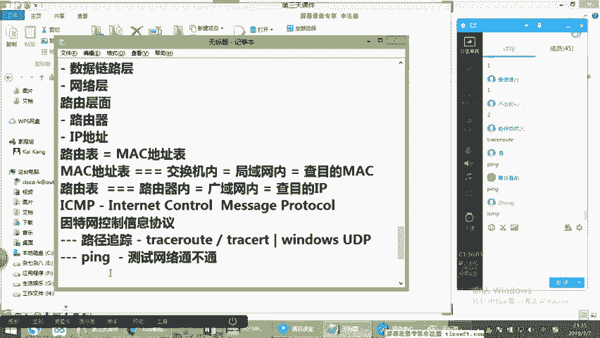
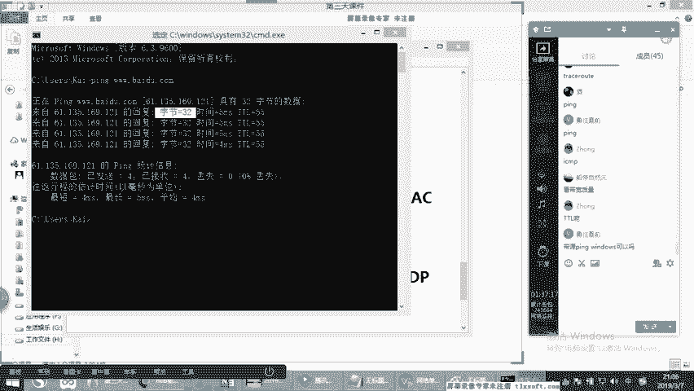
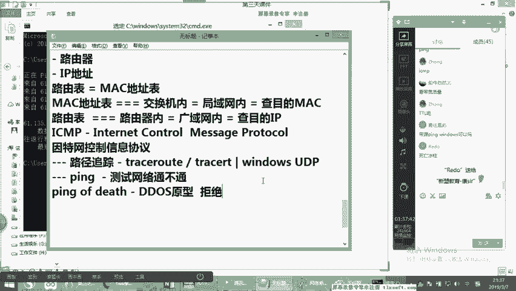
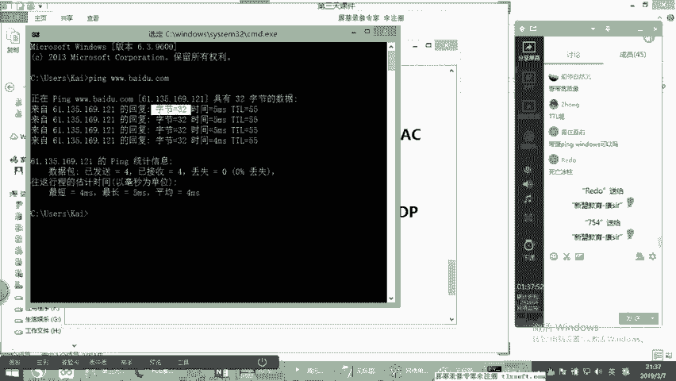
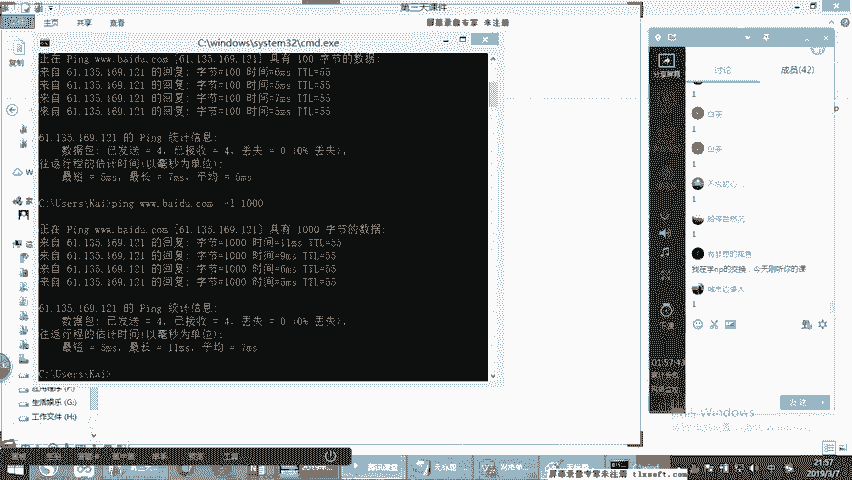
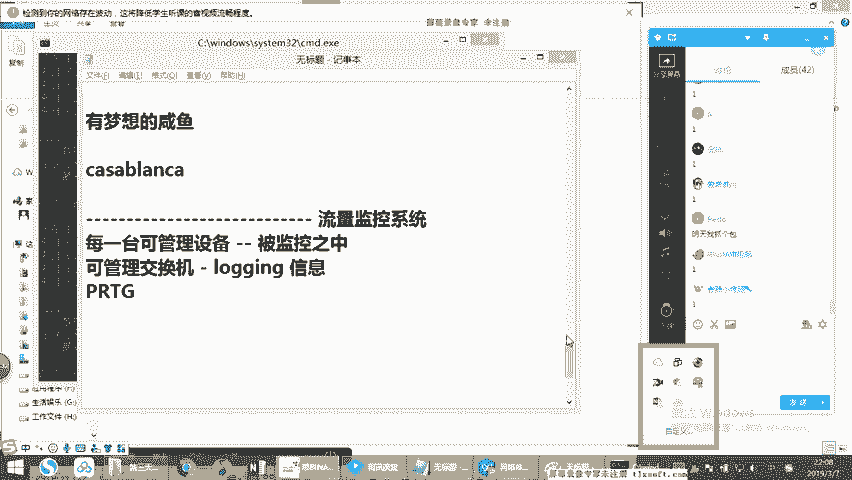

# 2019年度最新思科认证CCNA网络技术经典实战教学全集（最适合零基础小白的CCNA详解） - P4：思科认证CCNA网络基础第4节-OSI模型-1 - new盟的小狐狸 - BV1V4411J7ZP

Yeah。

话呢它现在还有很多关于OSI方面的东西，但其实绝大多数已经涉及不到了，绝大多数实际已经用不到了啊。我们要搞清楚网络这个东西呢，它虽然进步的速度慢啊，好多人学说好多技术还是10年前的没错啊。

但是它并不是不进步，有很多技术点本质来讲已经被淘汰了啊，大家首先有一个这样的一个印象，明白吗？啊，那康才有话一会也会说关于OSI模型呢，我会讲几个里面的重点。

帮助大家去梳理一下关于整个的网络的一个框架啊。好，那我们这是我们今天的一个重点。大家记住啊。理论和实战哪个更重要？理论和实战哪更重要。康告诉你们，永远是理论更重要，明白了吗？永远是理论更重要。为什么？

因为理论决定着说你在后期遇到故障的一种排查能力，大家永远要一个概念，每天只是在调设备，不停的调设备。那其实来说都是小工干的事。当你们后期做项目的时候的话，你们刚开始的时候，每天就调设备，调的很欢喜。

很开心。当你工作两三年之后，当你升到个team leader，当你升到个项目经理的时候，你每天是不调设备的，你每天的时候干嘛呢？领导别人调设备，领导别人出方案，然后你要干什么呢？就是一旦出现问题了。

一旦发现技术需求解决不了了。在这个时候怎么办？你再要出现，当出现故障了，你再要出现，明白康意思没有啊，那么在这个过程没错，是的，理论太差是不行的啊。大家要有一个概念。同时的话呢OSI模型没有被淘汰吧。

康告诉你，实际从应用层面来说已经很少见了啊，已经非常少见了，而且OSI的7层模型。我们说七层。跟你有关系的，根本就不是七层，跟你有关系的只有前四层，后面三层跟你没毛毛线关系，明白了吗？啊。

所以说我们会通过前四层的话，我们了解一下整个的一个网络的一个结构啊，框架啊等等啊，帮助大家去搭建，可以看到or在讲到现在为止的话，呃，基本上给大家讲了两节扫盲，对吧？我们在扫盲。

其实扫盲的话就是讲那些比较基础的一些专业名词啊，比较基础的一些概念。好，上节课正儿八经是第一节课，我们开始搭框架了啊，可以看到上节课刚才给大家给大家通过ARP啊，搭了一整节的一个网络组建的一个框架。

那首先呢我们先来说。关于OSI模型好吧啊，我们关于OSI模型，我们先来看这个OSI模型是个什么东西呢？首先大家有一个一个概念啊啊一个概念它本身来讲是一个网络标准。😊，这个网络标准呢，这个是谁定的呢？啊。

这个东西的话是ISO定的啊，这个ISO叫什么叫国际标准化组织？呃，国际标准化组织来讲的话，其实就是主要起到的对各行各业起到一个协同统一的一个作用。定出一个统一的标准。我们说一个最简单最庸秀的一个概念。

假如说我们同样关于网线的设计，那我假如说我同样啊我对一个品牌，我这个网线里面是8斜轮。如果说你在另外一个品牌里面，这个网线的话是三斜轮，这行吗？你这个能达到互联吗？能达到互联互通吗？所以说达不到。

那也就说实际上来说，它是专门去定义一个整体的一个标准化，其中面向网络这个部分定出来的就是OSI模型，明白吗啊？OSIOSI是一门技术嘛？并不是大家记住它并不是一门技术。那它是什么东西呢？它本身来讲的话。

就是一个单纯意义向的定义。也就是说他把整个网络通信的一个步骤，分成了层次化做个定义。什么叫网络通信的步骤进行层次化呢？我们知道不管是我们的网络从我的电脑发到你的电脑发数据，还是说我从我去访问百度。

那不管这个数据。这是怎么通信的，也不管这个数据是通过何种方式通信的。例如像无线，例如像我们说的有线基于专线MP专线啊，例如是MSTP的专线，还是说是我是单纯的意向PPOE的拨号啊，不管是通过什么形式。

都要同样经过一些固定的步骤，明白了没？就跟你炒宫爆精丁似的啊，你这得有一个固定的一个炒这个东西的步骤到理差不多啊，那OSI的就是定义一个这个步骤，它把整整体的一个步骤呢。

整体上来说划分出来一个七成的概念。啊，划分做一个7层。那这七层里边呢，其实这七层里边啊，我们先把这七层先写下来啊，大家先有一个概念，我们先从最底层开始写，我们由底层往上写，好不好？由底层往上写。

最底层什么？书物底层。😡，第二层呢叫数据链部层，第三层叫网络层，第四层叫传输层啊。那么这四层来说的话呢，大家注意啊，我们可以统称为这个东西叫什么叫数据层面也叫数据流程啊，数据层面来说。

就是其实咱们当工程师的主要玩的是数据，不玩业务啊，并并不是说假如说有同学当然说你是什么叫业务呢，比如像视频会议，这个大家知道吧？啊，视频会议这也叫业务啊，我这本身针对某一个软件。

例如像我们是做ERP的啊，做OA啊，是吧做财务软件等等。那么在这种情况之下的话，有很多同学们的话，在这个的公司里面做什么呢？做产品售后那嘛其实说白了就是帮帮帮客户调试一些办公软件而已对吧？

帮客户去调试一些基本的办公程序，教大家软件，教客户软件怎么用对吧？然后呢在这个基础之上，如果你网络不通过你这个软件肯定用不了啊，怎么办呢？他还懂一些网络，那实际上来说我们是要达到这样的一个效果吗？

并不是啊，为什么。因为这叫针对于业务层面，你这是针对应用层面来走的，明白这的意思没有？我们做的什么是数据，某种意义上，只要我们数据是能通的的。😡，剩余的不给我们管。剩余的话。

假如说你涉及到这个网吧网站内什访问不了。哎，我们的网络已经通了，网站变身访问不了，这个是谁该控制的？这个是属于程序员吗？不是这个是属于服务器开发人员，明白，服务器运维人员啊，主要是搭家建没这个服务器的。

搭就这个去管控windows服务器的哎，是这个人员去管控。所以我们只玩数据，也就是在我们的世界里边的话，某种意义上呢只要是我们这个网络呢，哎，我们的带宽测试没问题，哎，衰减的话呢，测试没问题。

延迟测试没问题。OK好，那实际上对于我们来讲，我们的工作就完成了。理解了吗？明白稍后一个啊，那么这是我们说的叫数据流层叫叫下四层。😊，还有一个什么呢？上三层上三层什么概念呢？看啊啊，下面什么叫汇画层。

😡，表示层。啊，叫表示层，还有应用层。这三层呢其实统称来说的话，叫应用层面。啊，就这个应用层面应用层面是什么呢？就是我们说的软件层面的东西啊，就是针对于不同的特定的程序是不一样的。

对针对于特定的不同的应用功能是不一样的。其实来说呢我想告诉大家，其实传输层啊，在行业里面一直有那么一个歧义，有的人说传输层是属于数据层面，有的人说传输层是属于应用层面的。为什么呢？

我们知道传输层里面包含两个最典型的一个特点，TCPUDP这个大家知道吧？TCPUDP啊等等。那么在这个情况之下的话，这是干嘛的呢？刚子告诉大家注意听啊，这种东西啊其实来讲它是一个数据的发送方式。

这里有是咱们康康给你们去说，它所代表的是数据的发送传送方式，是这么一个东西，那其实来说它真的是软件定义的。我给大家举个例子，假如说咱们用QQQQ你说用TCP啊用UDP啊，告诉康。

你们说这个时候TCPUDP我们用QQ嗯。😊，啊，7这里有地去啊。注意看啊，其实这种软件的话，它是里面组合应用的。其中的话有没有TCP啊，有没有有TCP的？假设说他们打字，看到没有？

咱们给我们的这个朋友发信息，打字叫TCP你看你们现在用腾讯款吗？啊，腾讯堂这客户端呢，这个你们现在打字是有TCP的传图片啊，传文件TCP好，有没有UDP啊？有没有哎也有。

为什么视频通话语音通话是UDP所以其实来讲的话，这个是在软件设计的时候，没错，哎，它使用的是什么定义这个到底是怎么样的一种传输方式，是TCP还是UDP这么一个东西所以你说它是到底是数据层面的呢。

还属于应用层面的话呢，其实这仅仅是个概念性的区分，明白刚才意思没有？仅仅是个概念性的啊啊，那我们呢先根据这七层的，我们重点就说下四层上三层中没有关系，你们后也不会涉及到啊，但然一会关于应用层的。

刚才会简单提一提。😡，那其中呢，关于物理层，当然这是最底层的这个这个大家知道对吧？物理层物理层什么呀？传输介值吧，对吧？可以理解吧，传输介值从最根本来说，网线光纤这是我们看到的最基本的传输介值。

明白刚才意思没有啊，这最基本的硬件设备，哎，例如像我们说的网卡。😡，光模块对吧？啊，板卡等等，哎，这都是我们说叫物理层，就是说这些东西呢怎么定义呢？是我们看得见也摸得着是吧？摸得着。哎。

可以说呢它是一个传输的基础例如像我们说用的model，啊？用的猫是吧？物理层，为什么它里边只是信号的一种转换。你可以发现在我们单纯的物理层上来说的话，因为猫用调试嘛，不需要调试。

mod的话接上电就可以用，是吧？它根本就不需要调试啊，所以物理层呢在这个层面上来说，你可以往往理解它是一个什么，它是一个不需要调试的一个东西。明白刚才意思没有？那你不需要调试物理层的话非常非常干脆啊。

就是传输啊，单纯线路传输。但是这个东西嘛看起来简单，卡才告诉你在实际工作中的这个物理层涉及到的问题其实很多啊，涉及到内容其实蛮多的，例如像呢10个故障里边的话，七八个都是底层链路问题。😡。

我给大家举个例子，假如说拿咱拿传统的这种光纤来说，光纤的话呢，网线不用说了，对吧？网线的话应该大家都知道啊，那我们可能会涉及到不用康er教你们怎么做网线吧啊，涉及你们最常见的568A568B对吧？

这个coner应该不用教啊，因为你们这个线网线这个整个线路的话，主要用来干嘛做底层通信的但是在这里边的话呢。😡，大家注意啊，就是说正儿八经来说，对于我们一根网线。

其实里面我们会涉及到的应用的线路是哪几条线路呢？是1236这四根线啊，我们正儿八经假说你们要有的有的同学的话做个社区宽带，应该知道然后他在一一栋楼里面，它跑一根网线，跑一根网线是干嘛呢？你看啊，哎，对。

没错，1236，它跑一根网线呢，它其实这网线有8根，但是实际有用的就4根，有用的就4根，这其中这四根线，它把一根网线呀，把它劈开，劈开之后呢，假如这一层楼两户，我这一根线呢，左边一户右右边一户。

但是我只跑一根线，能看明白？刚才意思没有？很多原先那种小区宽带就这么玩。啊，然后他另外一端呢也是劈开，哎，是这么一个作用。😡，那结果你那有的你说老师呢这样做的话啊，这样做的话是是是干嘛呢？哎。

我可以节省我的综合布线的一个成本。没错，你看re斗一看就干过，明白康意思没有？哎，对千兆千兆网就要用8根没错啊，是的，那么在这里面剩余的干嘛，剩余四根线。如果你说老师我一户就是一根，对吧？

我一会你看大学的最常见了，学校给面学校寝室，对吧？就两根线过去或者一根线进去劈开哎，这么玩的，但是呢剩余的线是干嘛呢？哎，有的线路的话，我们可以用来干嘛跑电话线。😡，明白他的意思没有啊。

有的可以跑天压线，这是可以的对吧？啊，是的，你说老师那我这个要是做POE供电型啊，不可以POE供电的话，必须是8根。😡，这么时候能明白刚才的意思没有啊，明白先给conter先刷波一上来啊啊。

是这么一个情况啊，这是我们说单纯的意义上的网线。😊，但是在网线的一个。基本选型这个问题啊，我们说网线其实质量不同嘛，这个大家应该知道啊，我们说一个大概啊。😊，网线的话呢按是成箱的去买成箱的买这个网线呀。

早期的网线它其实分成568A。和五个8臂。啊，分这两种。5个8A5个8B呢就是线序不同。线序不同呢。原先的时候的话呢，它其实我们说的如果两边都是A，或者说是两边都是B啊。这个叫什么呢？看到啊。

这个东西叫直通线。也就是说我们说叫直连线，注意听啊，叫直连线。另外一种什么呢？就一端A一端B的这种这种叫交叉线。啊，这么一个问题。直通线交叉线这个东西主要早期用在哪？其实现在没这个说法了啊，注意听啊。

现在其实很多东西没这个说法。😡，早期用在什么地方？😡，早期主要涉及到的是关于一个设备的一个应用。如果你们现在在项目上边注意听啊，注意听。如果你们现在项目上面的话，涉及到的一是什么呢？比较早期的一些设备。

早期的设备具有一个什么样的特点，就是说它是不支持自动翻转功能的啊，有一次叫自动翻转啊，有同学叫叫自适应啊，其实它不能叫自信，因为为什么就不能叫自适应呢？

是我们这个自适应所说的是说关于这个全双攻但就半双攻的问题啊，关于这个十0兆百兆的问题，这个才会涉及到叫自适应，它叫自动反转，这个自动反转什么意思呢？因为如果原先是两种相同类型的设备彼此互联啊。

如果两种相同类型的设备，彼此互联压缩我是两台路由器啊吧？会是两个交换机，明白大的意思没有啊，那在这种情况之下的话，我两台电脑，我彼此互联那这里面应用前提就是什么呢？必须要用交叉线啊。

就是用一个A一个B口的，这种交叉线。😡，好，如果说两种我是两种不同类型的设备，注意看。这个时候的话我进行彼此的互联。😡，此时我用什么呢？哎，我就可以用直直直通线，用直A线，明白意思吗？两边都是A哎。

或者说两端都是B，是这么一个叫直通线啊。😡，那么在这个过程中，如果有的时候你遇到一些早期的设备，我给大家举个例子啊，打个比方，像ssco的29系列。😡，2900的一些系列的一些早期的交换机。

或者说是说或者或者说呢假如你用到一些cisco的啊比较早期一些1841这种这种企业级的啊office这种办公设备啊。

或者说是假如说你用什么cisco的什么早期甚至说我在原先的项目上还见过什么26这种设备等等。那这种属于非常早期的吧，为什么你会见到呢？是因为思科斯产品，它本身真的是非常非常非常的稳定。😊，有的的话。

你要这个办公室一直从那开着，这个网络呢一直没动过，甚至说如果网不断这个设备的，好多年不用重启。你们在运营商里面或者在银行里面看到一些私科的产品，你甚至有的看到一些产品呢三年、5年、8年。

甚至这个设备没有重启过，这个设备一直在跑，明白刚才意思没有啊，非常成熟。那你就能建造成比较老的设备。那这些老的设备的话呢，如果你要在进些文线的时候，你要注意一下。

因为曾经我们在工作上涉及到过现在的课程里实际周不再涉及到什么直冲线交叉线都不交这个东西了。为什么呢？是因为现在的产品都有什么叫自动反转功能。😡，自动反转功能的话涉及到什么？自动反转功能的话。

也就是说两个设备之间的话会自动进行适应。假如说我这边就是两台交换机或者就是两台路由器，哎，同类型设备，我直接用直通线。😡，明白我意思没有？哎，我直接就用直通线，然后这个时候的话干嘛呢？

两个设备之间的话通过直通线的话会进行自动翻转啊，所以不受任何影响。所以你们看现在外面卖的网线，你们要去什么电脑城里面买，你说我买一个什么交叉线，他们甚至有的没听说过，什么叫交叉线没没见过啊。

都是我们这网线都是一样的，现在拿到所有的网线都是直通线，明白康才意思没有？啊，两边的线序都是一样的啊，是这么一回事，听懂了吗？听懂给康or一啊啊。😡，那么这是我们现在所看到的一个线路。那么在这的话。

大家只要有意注意就好。如果今后在工作岗上真的涉及到的知道就行，明白吧？有这么一个弦儿，你别到时候到这这候个傻吧拉唧。因为我原先我带着小孩里边干过这种事。我们原来带小孩里边的话，就是刚学出来。

老师没给讲过，到项目上之后的话，说现在一块老设备，哎死活就不行，怎么回事，十连就不通，十年不同，我十连不通，我说你当时看一看什么原因啊，后来发现是什么两个设备，我说你像我说你给他换一个交叉线试一下。

你重新做个水晶头，钻水晶头之后的话，哎换上之后马上就行了，明白这个意思没有啊，这么回事，那线去就不用教你们嘛，这个东西真的是太小儿科了啊，就不用教了，做水晶头做网线，工程师要不要做。

我告诉你们个现实情况啊，要做在实际的工作岗位之中的话，首先你得会，因为呢有的企业在企业里边，你手上经常做因为企业里边他他不会什么情况下，都给你买成品线。😡，企业里面不会经常给你买成品线。

但是如果你在SP或者说假如是你在IDC工作。O那这个时候的话，大多数买都是成品线货成品线不按标准来说，假如说10米的5米10米是吧？哎，30米啊，甚至更长，全都是成品线好，那这种情况下的话。

相对来说呢就会节省你自己的一个时间。但是你自己也会偶尔是要做，所以你一定要会这个不用交了，但是做线的过程中呢，就是做的多了，慢慢的你就O了。前两天的时候胡巴老师工于小视频看到了没有？

教大家怎么做网线是吧？胡巴老师的话还拍了一小段是吧？你们要想看的话可以看一下是吧？这个co就不交了啊，做网线这个东西咱实在是不就不用交了啊，对吧？光做网线嘛是吧？那么但是在做网线的时候，关于有几个点。

😡，大家要注意一下，注意一下什么呢？就是说一个网线呢，我们知道啊就是说一个是一个网线钳子啊，这个大家知道一个什么叫测线器？知道吧？啊，还有一个什么呢？叫巡线仪啊，还有呢就是我们说的水晶头啊。

基本就这几大件。😡，啊，那这个东西呢我我测线器巡线仪，这个我不用讲了，巡线仪的话就是假如说你这两端一端呢哎是每一个点，假如在办公室里面是吧？非常简单，没错，另外一端的话呢，就是在你们这个机房里。

或者在配线间里面线特别乱。有的时候你区分开我这边这根线跟对边来说是哪一根线可以通过巡线仪，明白刚才意思没有？可以通过循线仪来看啊，这个东西就说来去找线的啊，测线器呢现在就是测试通不通的啊，就这么一回事。

没错，我加到一块的次序，现在的测线器巡线仪基本都是一个，你不是说买两个，基本就买一个巡线仪就自带测线功能，明白刚才意思没有啊，一般是这样的啊，然后呢，网线钳子和水晶头这个东西呢。😡。

给你们有有一就强调一下，钳子的话呢分成两种，一种是半自动的，一种是全自动的网络这个行业里面的这个一些这个叫呃边缘化的一些配件呢，安普的做的好一点？你讲啊安普做的好一点点啊，是这样啊，这么多年了。

还是安普的水晶头啊，网身钳子，就他们家做的好一点那么这个网线钳子呢全自动半自动的这个东西怎么回事呢？啊，就主要是说假如说如果是全自动的。😊，啊，全自动的就是说你这个水你一压理解吗？哎。

一压它会自动弹回来啊，这个这个就是我们说的就是啊啊不能叫全自动，就这就就叫半自动吧啊，就你一压它自己弹回来，明白意思吧？你你那个东西吧，用起来就好像挺好用的，能理解吧？哎，好像挺好用的。

但其实这个东西呢在用的时候，它有的时候经常哎，没错，它经常会遇到什么呢？叫叫里边的这个水晶头啊，在这个触角啊压不死。😡，用这个都用游戏这种半自动的时间久了，因为它面有弹簧，明白这意思没有？

它时间久了之后呢，它那个技术微差很大。有的时候是涉及到这个触角压死的现象，大家遇到过吗？啊，这个大家首先知道好用的是纯手动的。😡，手动的好用，手动的虽然费点劲，虽然费点力。

但是的话呢你用起来其实特别特别经用，特别耐用。能不能听懂啊，明白shop波一啊，这个大家知道就行。纯手动就是你就跟那个什么呢？跟我们用那个钳子似的啊，你你说白了我跟那夹角一样，是吧？你摁下去或者弹回来。

这东西全都是你纯手动的，能明白吗？O啊，对，没错，干过的人都明白是吧？O啊啊，对对对对对，你要是买100多你压的很紧，但大多数同学可能在公司里不会10块20块这种钳子是吧？啊。

基本上的话相对都比较差劲一点。安普的产品呢一直都是仿货多，为什么？因为它这种好仿啊，这说句不好听，不简单吗？你那个水晶头的话，你怎么分辨呢？比说老师我怎么分辨是真的假的呢？你不用分辨因为你在没错。

因为你在这个百脑这个百脑汇啊，电脑产品去买这个东西的时候，你注意听你买这个东西他真就告诉你是吧？你这个东西就是什么呢？这个仿安普的这个就是安普的明白意思啊？啊，真安普的还就普通的。😡，普通的水晶头的话。

一两毛一个，非常非常便宜。😡，好多水晶头，12块1个23块1个明白刚意思没有？好，现在都是这样，这里面的机构最大的一个点不是那个触角，那个触角其实差别不大。这个关键点在什么呢？

关键在这个水晶头的那个弹性，我们的水晶头上面的话都是一个小辫子，这个大家知道吧？啊，这个小辫子，我们一般用小辫子干嘛的？卡口嘛，对吧？主要门用来干什么？卡哎，专门用来卡你这个电脑上面，对吧？

你啪可以接上它。😡，这个小辫子这个涉及到塑料问题，这个塑料问题哎，触角薄厚有区别是有区别，但是跟咱们的应用感觉区别不大。但是这个小辫子呢就会面临到如果塑料不好，它将折断，能明白刚子意思没有？啊。

后边那个浆折断的问题。所以检测最好的方法就是把这个小辫子把那个水头干嘛呢，直接掰上去，你你你到现场看一下，你不是真普嘛，叭啦叭水头直接掰去。你发现它是一个什么呢？它是一个软塑料。😡，OK啊。

软塑料软塑料的话呢就是相当于说你那不会断。你看它那有的水龙头，它那个质量很差，那个塑料干嘛？你往上180就断了。你断了之后，你们遇到的大多数就是什么？那小辫子没有没有小辫子。

用一段时间之后发现没有小辫子有注意到吗？明白吗？明白一啊，能听懂了吗？啊，是这么回事。所以在这个过程中的话，大家只要注意一下，是一个塑料质量。对你们来讲其际就已经可以了啊，那么其他的没有什么太多的点啊。

其实说白了这些东西的话呢，你也决定不了，大白话说你也决定不了。明白刚才意思意思了吗啊，你也决定不了，从归根结结底来说的话，就是都是公司采购啊，公司采购完了之后的话，你就用基本都是这个逻辑。

所以我们原先的时候的话，我们当工程师的。😡，基本上标配什么呢？你看你们要去去做项目的话，做项目我们背着个电脑包标配我给大家讲讲标配啊，一个瑞士军刀的电脑包，双肩背，对吧？兄弟们是吧？双肩背一个。

然后第二个呢一台一台think padd的一台。😡，一台小本是吧，叉系列或者T系列的一个小本啊，然后下面还有一个什么呢？一根跳线啊，对吧？一根跳线啊，一根跳线干嘛呢？用于做项目测试的吧。

OK一根cil线O啊一根cil线。😊，啊，O一线，然后说还有什么呢？啊，一个循线仪是吧啊。😊，还有什么东西啊？测线器权线也有了，一把网线钳子。😡，有吧啊，OK几个水晶头。😊，明白吧？好。

一般都是这套这个这个top能理解了吧啊，一般都这个top啊，剪刀院不用，因为网线钳子上面自带啊有剪刀的部分，明白了吗？这个就是项目必必必备，一般出去做项目的，一般都是top。明白刚才意思没有啊。

你们就相信刚才都这个top，为什么瑞士军刀的创景面呢？不知道为什么大家都钟爱这一套啊，现在就是小米用的多啊，小米现在开始，小米更便宜，明白了没有啊，好，那么这是我们说的一些常识性的东西。

那除此之外的话呢，很有可能还会涉及到什么呢？还会涉及到的就是我们说的一些光纤，光纤的话，现场基本都是有但是光纤的话，其实有不同的一些接口类型。这个大家要知道啊。😊，一些接口类型。

我给大家举个举实简单的例子啊，我后面还会再给你们普及这个点呃，我给大家看一个那个什么。啊，哎。等一下，我给你大家打开看一个我那个课件里面应该有一个。呃，有一个关于这个好像是。

然后它里面的话会涉及到不同的几种绳呢，不同的一个几种的一个呃光纤的一个接口。这个大家了解一下就可以了啊。那单模多模光纤呢我会带给大家去普及再说啊，因为我后边还会给你们看到光模块，看到光模块的时候。

我们再去再去看啊，但然是你们要先知道那几个接口怎么回事。因为在实际的工作岗位当中呢，大家注意啊，在我们这个企业里边呀，不管你是IDC还是企业也好，那实际上来讲呢，都是有室外光纤啊。

因为外面有一个黑胶皮管啊吧，有这么一个黑胶皮管，那么一根室外光纤，这个室外光纤的话，它里边有好多型，明白吗？它那一个黑胶皮管的话，其实里面有非常多的型儿。😊，你进来之后的话呢，实际上要人帮你做绒纤。

明白了吗？要人帮你做熔纤才行。不是说说哦那个电信那边联通那边弄根线直接干到你这儿来的，他不是这样，能明白了吗？啊，那你这这个一根光纤的一个黑胶片管过来之后呢，接从室外光纤，接到室内光纤。

接到室内光纤的时候的话，它要进行一个熔纤要会有那么一个熔纤盒，那个熔纤盒的话呢，其实就是帮你做一个熔接转成跳线，明白刚才意思没有啊，就是帮你做一个跳线的一个一个一个转换，是纯物美化的，没有什么别的点。

那当然了，运营商会负责帮你做这个，你不需要考虑这个问题，运营商会帮你做啊，然后呢进来之后呢，转成跳线的话，进来你们看到的，注意听你们最终看到的，就是一根跳线。因为你们后期在项目上不会涉及到自己做熔纤。

能明白了吗？我再强调你们不会涉及到这个层面吧。今后你到达客户现场的时候，到IDC的也好，到运营商的也好。😡，网线是一根光纤居多甩出来的，到机房，到机房的时候的话，你看到就甩出来一根光纤。

这个光纤的话就是你们看到的室内光纤，明白这意思吧？什么样呢？最后看到就这样的。😡，等一下啊，我给大家看一看，哎，我那个这个PPT里边。好像找不到了啊，我看看啊有没有。好，我给大家看一看。

就类似于这种东西，明白刚才意思没有啊，最终来说的就这种东西。那么也就是说你最看到的哎就甩出来在这儿有的的话呢，它不在外面，它都是在你们的这个静电地板下边。因为在IDC的话都是有静电地板的。

明白意思没有啊，都是静电地板。然后静电地板的下边啊，以后有一个那么一个熔纤盒，甩出来的一芯一芯的接出来的一根一根的纬线，就这个玩意儿。哎，没错，就是尾纤，就这这么一个东西，明白了吗？但这种纬线的话。

它其实有几有几种不同的。😡，有的时候都是这样，就是不固定。但是你们可以常规看到，比如像SC看到了吗？看到了吧？像SC像LC看到了吧？啊，像什么ST什么什么乱七八糟的等等啊。它是这样的啊，呃，它本身来讲。

你们常见的像SC这个口啊，SC这个口主要涉及到什么呢？主要是用于接这个光纤收发器的啊，或者接构由器交换机的。😊，你们看很多时候的话，假如说哎有的这个这个网络设备上，它可以接这个接口，有的什么呢？

有的是光模块上，他可以这这个这个它可以接这个接口。也有的话呢是属于光这个光电转换器上，也就是说实际上来说你一根光纤。假如有的我们这个机房里边，我们这个机房里边来说，它是什么呢？

它是没有这个这个光模块接口的啊，就我们这个设备没法接网模块，我没法接光模块，这个时候干嘛呢？我就得需要通过光猫做转换那个光猫这个东西大家注意啊啊，对，就是跳线，你们最看到的就是这个你们最看到就跳出来。

就这个跳线，明白了吗？啊，尾线在最后的话，你最后尾线的话都在你的熔纤盒里边，熔线盒里边都是熔娃娃一样，你其实你们是看不到的啊，是有他们专门负责运营商的人来干这个事儿是吧？拿book做完之后。

你们最看完出来的，就是跳线了，明白刚才意思没有啊，是这么这么回事。😡，然后呢，甩出来之后的话呢，因为有的机房里边它的设备是不支持直接接光纤的那你就得需要通过一个叫光猫。这个光猫的话就是一小盒。

明白刚才意思没有？就是那么一个小盒，我看我这个图里边有吗？😡，啊。还没有，这是光模块啊，这个就是我们说的光模块啊，GPSC模块啊，我这里边还没有这个小盒，就是很简单，就特别像什么一样的。

我告诉我告诉你们，特别像你那个家里边的那个那个嗯特别像你家里面那小路由器，但是它还不是那个小路由器比那小路由器长得更土，明白这意思没有啊？比那小路器长得更土。你看我给你们打开一个。😡，啊。我给你打开。

你，你可以看看。啊，假如说我们直接搜一下啊。😊，好，假如子搜光包。嗯，等一下啊，看好。😊，啊，就是类似于这种东西，看到没有？就是类似于这种东西啊，类似于这种东西，听明白了吗？看到吗？就类似于这种东西啊。

就是什么调器调器，理解了吗？啊，就是一小方格方方正正的一小方盒啊，说白了就是说左边进去是光纤，右边出来是网纤，能明白刚才的意思没有？O啊，左边进去是光纤，右边是网线，就这线就这个呗？

看到没啊啊光纤收发信啊，就光芒明白了吗？啊，左边光纤，右边是网线，等于实实现一个什么呢？实现那么一个光转电那么一个一个作用啊，就是一个光电转换，所以最后有的时候你到项目现场看到是根网线。

有的时候你看到是根什么呢？是根跳线，一根光纤，是这么一回事，所以你剩余的部分你不归你管。你接上之后，假如说你到现场之后，你说O我现在要做这个项目对吧？啊，那我我把我把设备做完上架之后。

我把光纤或者把网线接到设备上，你接下来要干嘛你要找你的客户去要运营商信息，听明白了吗？啊，你要找你的客户去找去要运营商信息，什么叫运营商信息啊，就是说。😡，他肯定是买带宽了，他买带宽的时候。

他肯定是有固定IP地址的，他一定会涉及到几个点。一个什么呢？就是我们说的固定的IP地址，子网掩码okK啊，子网掩码，还有什么呢？叫下一跳地址，也就是我们俗称叫网关地址。😡，对吧这个康已经上上节课是吧。

跟你们说过，能明白了吗？OK啊，那么在这种情况之下的话，当然了你说宽带账号密码有没有可能有可能，是因为有很现在很多客户呢，他们假如说是单纯的企业，他们接的都是企业级的ADSL就拨号。

所以这些信息是一定要客户给你的他给完你之后接下来你再开始把羡目接到设备上，你登到设备上调试，明白了吗？明白康一来对运营商要给你这些信息，听明白了没有？如果假设说他是拨号的啊，假如说他是PPOE拨号。😡。

对吧就我们说PPPU1拨号就是我们说的ADSL明白吗？哎，那在这种情况之下干嘛呢？你就会有一个账号和一个密码是吧？你要帮他做什么？你要帮他做PPP啊，帮他做cheap明白了吗？是这么回事啊。

所以这些信息是一定要给你的啊，怎么样吓一跳，是的一定要吓一跳，吓一跳是哪呢？是电信联通移动那边明白了吗？这些信息大家一定要知道啊。😡，那么在这里边的话，像这种的话呢。

就是主要是接我们的网络设备是可以的啊，接用网络设备，或者说是接我们的光这个光纤收发器是吧？啊，还有什么呢？还有一些像LOC的接口LOC的接口的话呢，在工作岗位上主要我看到的是接交换机的光模块。

明白了吗啊？主要接交换机的光模块啊，你看有的时候像FCC的接口，我看这个面有FCC的接口嘛啊，有FC接口，你看FCC的接口的话，主要接什么？接的有线电视啊，接的有线电视接的举动啊，跑视频性的一些东西啊。

然后的话还有一些有一个像叫什么呢？叫FT接口，FC接口主要做什么做环网啊，啊当然这些东西的话，我后面会给你再提到啊，就咱们会看一下，就你看你看到一些现场图的时候，你就知道接些接口在什么情况要怎么接啊。

是这么回事啊，那么当然在这里边你说老师那个光模块什么样的？是这样这就是我们说的光模块，这个光模块的价格呢，上下不一，明白意思没有？假说有的光模块的话，可能一两千一个也有的甚至。😊，百1个你知道为什么吗？

啊，因为这个光模块这个东西呢，实际上这个玩意儿啊，它最主要的一个价值来源是技术含量。你要是买思科的，是吧？买华为的光模块其实挺蛮贵的但是你要用国内有很多山寨的光模块能明白了吗？啊，有非常多山寨光模块。

那山寨光模块是什么呢？就是说白了就纯仿的。那这个用山寨光模块的也就很便宜。一可能是呢一般买两三百就买下来的没错，但是可能啥样什么情况呢？就衰减很严重啊，又一段时间就出现衰减啊，会出现这种现象。

明白了吗啊，明白先给康刷意外啊，那么这是我们啊就首先要知道的，这是我们的物理层的一部分啊啊，对对，短时间用用。这个你们要是用过的同学应该知道啊，那么在我们的物理层之外，除了我们看到的什么网线光纤之外啊。

啊像这些东西，你们接触的实际并不多会非常少。在后期啊会非常非常少啊，当当然啊就是如果我们是光纤的话，我们要去测试。😡，衰减度，你要去测试这根光线的衰减度。假如说我认为这个东西有问题啊。

这个这个光线有问题啊，有问题的话，我们去测试，假如它有没有衰剪，有没有丢包，明白这意思没有啊，但是呢我们早期的怎么测呢？其实量样并不准确。大家知道吗？就是假如说我买一根跳线。😊，啊。

买一根10米长的这个光纤跳线。那10米长光纤跳线的话，那我怎么测试呢？大家知道用激光电棒测试吗？听说过这个吗？假如我用激光笔测试啊，我在这边左边的时候的话，怕我打打开激光笔啊，打开这没错是吧？打光笔。

然后那边的时候的话还看一下用激光笔做测试啊，测试一个打打一个环啊那也有什么呢？我们原先说的话，有一次的话没带激光笔，没带激光笔，我们用什么测呢，用打火机测的，它也可以明白了？只不过就是这样的话呢。

你对于这个光线的衰减是没有办法完全测试好，明白了没有啊，你没有办法测出来的一个衰减位啊。那除此之外的话，还有一还有一个什么呢？还有一个就是说光纤的话呢，不能折90度的弯，这个点大家自己要知道就可以。

明白了没有？这个在光作岗位上也要注意一下，不要折90度的弯O啊，不能打死角啊，你可以圆形的盘，你可以圆着盘，但是不能打死角。听明白了没有啊，你打1个90度，这样不行O啊，明白刷pper一啊啊。😊。

那么除了这些我们看到的这些基本的这些线目，对吧？方面的一些东西啊，那我们还涉及到什么方面呢？还涉及到就是说在我们的物理层面，你还不得不了解一个东西叫什么叫哈叫哈ber那么一个东西。

其实hab这个东西我个人觉得现在仅仅是具有参考意义啊，就仅仅是参考性。hub这个东西，它其实现在哎呀刚才怎么觉得，就是说这个东西因为现在你也看不到吧。没错，它是极限器啊，我们来说一下吧，好吧。

人家说我们要是看到一个hub。😊，have这个东西什么叫极限器。😡，这个集线器呢是什么作用呢？其实来说就是早期的交换机。就是找焦易，主要用来连接我们说的一个局域网之间的一个互通啊。

说白了主要连接局域网的互通。😡，那我们知道在我们的整个的一个局域网环境下呢，咱们要内部共享上网嘛。上级和consor已经给你们说了，对吧？咱们已经普及这个概念了，我相信你们现在应该有有有应该知道。

对不对啊，我们用用于内网的一个互通。但是为什么说它是一个物理层呢？😡，这里边其实要从哪几个点说呢？就是说hub这个东西呢？注意哈，你从外表来看，注意听你从外表来看，它跟交换机长得一模一样。

你没有看出任何区别来，明白这意思没有啊。但是呢从实际上来说，应用呢，它跟它使用性能上跟交换机有区别。举个例子。首先先说一下关于hub这个一个双攻匹配问题，双攻问题，hub这个东西呢，它是一个什么呢？

它是一个半双攻通信的一个东西。😡，这个大家知道吗？知道什么叫半双工吗？知道什么叫半双工吗？半双工通信所指就是说要么是上传，要么是下载。😡，听懂了吗？啊，对，早期是腾达的，没错啊，腾达的半双工就是一个。

要么是上传，要么是下载卷，它不能同一时间进行。😡，啊，但是整个的一个速度呢，有同学问这样一个问题，老师，那我这个要是现在我在下载迅眉，如果我下载的迅眉，那是不是意味着说我这个就没有办法上传了，是吧？

并不是啊，它整个的一个切换速度是个亚秒级的切换过程，能明白刚才的意思吗？它是个雅秒级切换过程，这个过程就相当于什么样的？假如说你同样就这这个有这么一个走廊，只能就一个只能供一个人过，你现在两边都排人呢。

那你肯定什么呢？哎，你这边一有空隙，你先过去了。你一过去之后的话，那边过来两个人，明白刚才这这个意思吗？这是一个哑秒级一个过程啊，那么在这个过程中的话，它要么是上传，要么下载。

而在这种半双攻的通信的情况之下，其实就会导致什么？数据转发的一个速度，没法得到保障，就有这么一个延缓。😡，听明白不吗？明白邵波一来啊，对吧？这是一个双攻，而我们的双攻就是半双攻或者全双攻。

全双攻就是双扯道。我要么就是同时上传，同时下载啊，这是完全可以的。咱们现在看到的都是全双攻，你看不着半双攻，老师能见半双功见不着了，早期的时候有十兆网卡。

你看你那早期特别旧的一个电脑奔三的那个那些板子上面那些网卡，有的是十0兆半双攻的，现在没这个，你们连找都找不着，收收废品都看不到，明白这意思没有啊。第二个是什么呢？😡，第二个来说的话呢。

是关于这个haber呢。在数据包的一个发送过程中啊，它实际是有数据冲突。啊，注意婷他实际上是有数据冲突，不要着急来看。这个数据冲突是怎么理显呢？就是说当在我们这个haub之中啊，数据量过大的时候。

在一个接口进行发送传输的过程中，它就会产生数据冲突。😡，那clo先不要给你们解释冲突域广播域这种东西啊，我们先不看这些词。😡，他忘了数据冲突的一个最直观的现象是什么现象呢？康s告诉你们就是丢包。

就是丢数据帧，明白意思吧？啊，就是数据帧丢失。也说一旦出现数据冲突的话，你们看到这个就有数据丢掉了，就是数据的受碰撞损坏了。就说白了呢，最终导致的情况什么呢？就有一些数据没法按时哎传送到对方。😡。

或专用现象。但是呢你们看到用hab的过程之中呢，其实有的人如果单纯从上网角度来说，你是看不出什么区别的。为什么那么说？因为单纯从上网角度来说的话，你会发现什么呢？就是说我下载个东西。

那无非就是速度快点慢点的问题。何况现随着我们整个网络的一个发展，现在这个带宽越来越大大家道吧？你更没法对比你早期的时候加还512K呢？你现在多少个加50兆。

你们想一想这十0年时间512K变成50兆提升了100倍，对吧？啊，所以你还能对比吗？就没有办法去对比关于hab的一个数据的使用，而在早期的时候呢，hb往往适用都是小办公室网络环境。

也就是非常小的这种环境下，小的环境下的话，当数据量不大的时候，你也没有办法去感觉到数据发生冲突这么一个问题，听明白才意思没有？明这么一回事。😡，那么你就数据冲突了之后。

那我到底这个这个日常的上网受到影响吗？😡，它其实不受影响，为什么呢？是因为它上层有重传机制。你像假如说咱们一会儿会讲到关于TCPUDP系列的这个这个这个问题点，它就牵扯到了一个数据重传。

你想我一旦数据发生了冲突，我后边就会有什么检测到了数据丢失。哎，我给你重新发，明白这意思没有？哎，它是这么一个概念啊。😡，那么这然在这个过程中的话，我们来想象一下啊，即使说你这个数据要重新发。

即使要重新发，咱们来思考一下，你也浪费带宽呀，对不对？你重传嘛，你如果涉及到重传，你肯定要浪费带宽。而关键是我们的数据量大的情况之下，我们可能很有可能会导致产生很多的冲突，那就意味着说你要重传很多。

那这变相之中都在消耗带宽，听明白了吗？明白看刷er一来啊，是的是吗？是的，没错啊，是的啊，那这是第二个问题啊，这是第二个点。😡，那第三个来说的话是什么呢？就是hub这个东西呢，它是以发送什么呢？

发送广播形式的。就是我们说就不能叫广播，因为在hub里还不能叫广播的概念，叫什么叫泛红啊，是这么一个概念。😡，泛红什么呢？就是说我一旦有数据进到了hb，我每一个接口都发一份哒哒哒哒每一个接口都发一份。

😡，因为说Hub上的它没有办法识别我哪个接口接的谁，我哪个接口接的谁，哪个接口接的谁，他他他判断不了，能理解房的意思没有啊，他没法判断。所以其实的话呢，在我们看到的Hub里边来说，它非常的浪费带宽。😡。

啊，浪费带宽的同时呢产生什么现象呢？哎，除了浪费带宽之外啊，就是会产生么安全性的问题，对吧？你想我明明有一个数据，我A主机想发给B的，结果呢这个数据进到Hub里之后，每一个接口发一份，你B收到了。

C收到了D收到了F收到了，听明白了吗？那你每个接口都收到这个过程中就是浪费带宽，而且导致我这个数据的话干嘛会产生一个安全性的一个隐患。😡，对吧我这个数据明明想发给谁的嘛，结果每个人都收到了。

如果别人去抓包的话，他也是可以截取到我这个数据的。明白了没有？好啊，明白给看上波一来啊。😡，那么咱在这个过程中的话，咱们大家要了解这么一个问题啊，没解这么一个问题。😡，呃。

有没有可能老师会出这种这个广播风貌？其实广播风暴呢在实际过程之中很少见什么叫广播风暴呢？刚才告诉你就是说我在整个网络之中的话呢，有环啊，有环固的存在啊，有这么一个词叫环购啊，环购的存在的话呢。

假如说我给大家举个例子啊，看着，例如像。😡，好，我把这个打开。😊，然后我这边的话有一个交换机啊，我这有个交换机。我两个交换机的话，你看呢？我这边的话呢有一个主机A，我这边有个主机B啊，一个主机。

一个主机B。这是A，这是B。好，那这个是交交换机一啊，这是交换机。2。我这边的两个交换机之间呢，看着我这样连接上。😡，然后呢，我这线呀这边一根线，我下边还得一根线，等于我两个交换机线有两根线。😡。

我为什么那两根线呢？其实在很多环境下的话，我我的初衷拷贝啊是拷虑到一个什么呢？叫热备份。😡，啊，我假如一根线断了，还有另另外一根线，能明白这个意思没有啊，对吧？我两根线热备份啊，对吧荣余。

还有一个什么呢？就是说我可能会拷虑到尾说我两根线的话起到一个啊一个什么作用呢？就是说负载均衡啊，你要我左边走一点，右边走点是吧？我这假肉原先我这个交换机都是100兆接口，100兆接口的话。

我这个数据从左边发右边，我最大的峰值就100兆，我接两根线对吧？现在变成什么？200兆，能理解吗？明白稍微100啊，那这个时候就出现什么呢？压头我这边产生一个数据。😡，好。

这数据发出来数据发出来到第一个交集之后干嘛呢？这个数据从上面这根线发到了交换机2。交换机二收到了的话呢，这个数据呢，结过广播又从第二个线呢又发到了交换机一听明白了吗？啊。

这样然后你接接下来在这个过程中呢干嘛呢？以此循环啊，是这么回事可以见了吗？啊，形成了一个什么呢？形成了一个广播风暴，是我们说的环购的一个概念。😡，但是这种情况在工作中基本不出现。

大家有的时候在书本上学到了这个黄购这个东西啊，在项目上它其实根本不会出现。为什么？因为咱们现在用到的设备都支持，后边咱会学一个技术啊，咱们会学到会都会支持那么一个东西叫生成数的么一个东西。😡，SCD。

STP是个东西呢，它是设备默认就开启，它不需要你手动配，明白这意思没有？class上节课给你们讲过，我说这个设备的话呢，你可以不用做任何的配置，你都可以用。而其中这个设备的话，默认都开启STP功能。

所以如果它开启STP的话，其实它会自动的去权衡环路的问题。假如说它会暂时先把某一个接口先关掉。😡，明白了吗？😡，能听懂吗？对他把我先先给你干嘛，先给你关掉，然后现让你用一根线，然后呢。

我这边其中这根线要是断了。😡，他把这个这个口再打开。能听懂康哥的意思没有？啊，是这么一回事。所以你们在工作岗位上不会涉及到这个问题啊，不会牵扯到这个环购的问题啊，那你说老师这个环购到底是什么样的呢？

我们也没有见过，康才告诉大家环过什么样啊啊，我给你们说一次我曾经的一个经历吧。😡，其中有一次的话呢，那是很多很多年之前，那话说是2008年，哎，不是不是08年，2006年左右那个那个阶段啊。

2006年的事候。我们当时在做一次一次综合布线的过程中啊。当时所有的项目呢都走天花板以上啊，都走我们这个这个办公室天花板以上，这个大家知道对吧？啊，因为你们现在咱们综合布线嘛，与现在的话呢。

有的时候我们可能会顺着这个这个这个排线管走，压缩可能会顺着墙角跑。有的话呢，我们顺着地板走，对吧？从从下面这个地板下面走，有的话是用什么呢？从天花板上走，明白这意思没有？啊，然后呢。

当时我们走天花板上面。😡，在整个布线的时候，这个线的距离呢较长，这一次呢涉及到多少根线呢。当时我心里挺清楚，是他们办公室到他们厂区之间。😡，办公室到厂区办公室到厂区的话呢。

地里面相隔的差不多得有个四十几米啊。我们当时目测啊，我记得还有四十几米。😡，这40几米的话，一共涉及到多少？有三十几根线。😡，再给他补过去。当时那个阶段呢还不流行，用光纤，明白他的意思没有？哎。

不流行用光纤啊，然后他们就要求就是说一定要布过去啊，我其实是是在想是为什么说我们要布那么多根线是吧？其实你说完完全全的话，我们可以布那么两根是吧？一根主用一根做备用，那边的话。

在做设备的一个桥接就可以了，对吧？啊，在做设备的一个一个分布就可以了啊，但是我们当时布个好几十根线，我也不知道当时因为什么，我已经忘记了。😡，但是布一根线的时候，其中有一根线呢，在布的时候呀。

我们知道在上面的天花板上面这个布线是很麻烦的。😡，然后呢，我们就往把线往那边顺啊，把线往那边去顺线。😡，有一根线呢就出现了什么现象呢？看着这不一根一根嘛，是吧？当然我们顺着一捆儿线，明白意思吧？

一捆线其中有一根线呢在中间的时候呢，通过呢扎带打的时候呢，它就绕弯了。😡，注意看啊，通过绕弯吧加等于这根线的时候绕我们一个弯回来吧。能明白我说的意思没有？哎，出现这么一种现象。

然后等于呢我们在整个在睡线的过程中呢，其实呢这边呢有两个接口啊，看到？这边有两个接口是一根线的。😡，能听懂吗？结果它这里面打成一捆之后呢，夹在里边了，我没注意到，就是这捆线的话呢。

就从天花板往那边去顺顺过去之后呢。😡，当时的时候啊就发现一个问题啊，就是我们我们先把因为这边是办公室嘛，这边是办公室的，注意看啊，这边呢是人家厂区的，厂区的话，在当时那个阶段的时候的话是干嘛。

他们还没有弄完，我们不知道人家干什么用的，反正我们就给人做完了就完了。😡，那么当时的话呢把这个线捆拨过去之后，这一边我们不搞，没叫师意思么样啊，这边我们不搞，我们也没给他做测试。

因为现在最开始做做的时候的话，就已经做测试了啊，然后呢，我们就把这边呢给他接到个交换机上了，能明白这意思吧？啊，当时就接到了他们这边有一台交换机啊，挂在墙上的一台交换机，他们连配线到没有啊。😡。

接上之后按正常来说，这事儿就结束了。没解他这意思没有？啊，按道理来说，这个事儿其实就完活了，就没别的事儿了。😡，但是当时出现一种现象。他们当时个交换机上啊，注意看啊，当时个交换机上呢。

其他的接口还接着他们日常办公的主机。😡，理解吧？还搬接着办公主机，其中我记特别清中还接了一台邮件服务器，这在一个遥控机上。😡，当时的那邮邮件服务器呢，我记得特清楚。😡，用的是windows2000。

那那一年用的是windows server2000。他们办公室里面的很多主机用的什么呢？用的是叉P。😡，当时我们接上之后，当时马上出现一种现象是什么？就是所有的那个叉P的主机特别卡特别卡。那个CPU呢。

你过去看的时候CPU呢达到了百分之百。😡，能明白我的意思吗？啊，全都是百分之百那个普通的办公电脑。😡，但是呢鼠标还能动，你们知道这个叉P卡的现象，你们应该收到对吧？要点一个东西半天才出来是吧？

右键半天才出来，这是很卡。那个serverer2000呢就更夸张了。那个server2000呢，当时我们看到的现象什么现象呢？所意看啊，当时看到的现象什么现象是这样的，那个鼠标就动不了。

就那个鼠标已经被定死在那个桌面上，被完全定死了。哎，当时我们就很奇怪是什么情况，然后呢，在这个情况之下干嘛呢？哎，我们就很纳闷，重启了。当时你为单机问题重启完单机发现还不好使，还是卡。😡，然后呢。

我们在想是不是跟刚才接网线有关系。😡，于是乎怎么办呢？就把那个网线一个个拔掉了。拔掉之后瞬间2000，还有这个都恢复正常。然后我们就发现一个问题啊我们发现一个问题，就是如果接上线达到百分之百的时候。

你看这个任务管理器啊，还是你看这个网卡啊，你看这个网卡里边的那个是么里边的一个接收的数据，那个数据量非常大，能明白？刚才听到啊，那个数据要非常大。我记得我不知道M八能不能看啊，就在哪呢？在这个位置上。

😡，到长，我给你打开，你们可以看一眼。啊，比方说像在这个位置上。啊，有那么一个状态啊，这里看到了吗？是这个地方当时数据非常非常之大，能理解吗？基本就在第一位上头哈哒哒哒就开始翻什么。

然后我们在想是怎么回事儿，然后呢想来想去想来想去也不行。😡，这个时候的话就重新排吧，结果排来排去排来排去排出来有一根线，打个一个回味儿。😡，明白卡德意思有啊，其实这就是个一个非常典型的一个环购。为什么？

因为数据的话，一旦进到这个设备里之后，一旦是广播数据，这个数据会在这里面的话进行一个循环。听明白康德意思没有？它会在这里面进行一个循环，就在这里面一直循环啊，是这么一个情况。

所以往往现在当前的网络中一旦遇到环路的现象，你看到的一种情况是什么呢？就这个交换机的灯常亮，整个所有交换接的灯全都是常亮状态。然后其次的话每一台PC的CPU飙升，你们知道你们可能没有遇到过Ddos攻击。

如果以后一会儿我看到会通过OSI给大家讲到一种攻击方式Ddos攻击啊，也是当前网络中比较常见的。那在这种情况之下，你会发现最典型的现象，就CPU使用于巨高内存没什么使用率CPU使用为巨高。然后呢。

网卡里面的状态信息量非常大，这就是非常典型的环。😡，听懂了吗？明白一呗啊，shop一上来但这种情况非常少，已经非常非常少见啊，就是说其实绝大多数情况之下，你们接触到的环购啊都是个概念。

你们实际用不到环购HTP不起作用，在当时的那个阶段，企业里的傻瓜交换机都是不支持STP的。不像现在似的，现在当前的网络环境中，即使一些傻瓜交换机，它也支持STP明白了没有啊明白一呗啊。😡，啊。

我都给你们还原现场来讲了啊啊。所以在这时我们现在看到什么，就是我们说的hub。也说在整个的hub过程之中的话呢，一个是双攻是吧？一个是发送的广播就泛红。另外一个的话是什么呢？

就是我们说的这个数据呢就衰减是吧？数据会进行碰撞或产生丢包。那当然了，在我们的这个hub里边呢，你们要是看这个早期的课件里啊，早期课件里台机构有什么呢？像说hub里本身是有防冲突机制的。😡，啊。

现在没这区分了，现在没有这区分。现在你们看的设备大多数都是可管理的，大多数都是明白了吗？大多数都是可管理的，只不过是管理的功能强弱问题，仅仅区别在这儿吧啊，然后呢在。😡，啊。

其中的pub里面呢有那么一个东西叫什么？叫载播真听多步访问。那你们要看早期书本里边写着呢是吧？或者说像PPT里写呢，叫什么呢？这载播真多步访问是怎么回事？叫CSMA杠CD。😡。

这个东西就是一个叫退避算法。就假如说你不是有数据冲突嘛？现在假如说你这边网络中正常有大量的数据在发送的过程中啊，哎，我其他的设备干嘛呢？先暂缓发送，明白我说意思没有？暂缓发送。

对你别的某一个接口数据量很大的时候，哎，他要去检测当前有没有数据在发送，有数据的话干嘛呢？我使用退避算法，我暂缓发送，但这个所谓的暂缓发送，它也是个雅秒级过程，就这个速度非常的快，非常非常的快。

明白这意思没有啊，哎可能是以多少多少毫秒多少毫秒哎为基准。所以其实我们感觉不到，它是通过这种退避算法，就是它有里边有一个检测机制，它通过什么？它通过一个这个这的一个检测信号。😡，他通过这个检测信号的话。

检测当前网络中是不是断在通信，要正在通信。哎，我就等一下，然后发一下数据，哎，再检测，明白刚刚er的意思没有啊，是这么一个东西，但这个玩意儿吧，为什么不太愿意跟你们？😡，呃，压秒机过程就是说非常短。

你假如说是以毫秒理解吗？啊，以毫秒为单位的，你可以这么去理解。假如说咱们说这个一秒等于多少1000毫秒，你说我我现在玩一毫秒，这一毫秒，这这是这是多快啊，明白这意思没有啊？就非常非常短的一个一个过程。

所以它完完全全是很快速的一个切换过程明白了吗？啊啊，但是现在我为什么不再跟你们说了呢？是因为haber你是绝对见不到了，你们现在根本见不到新版教材里没这个玩意儿，没有haber这个东西。

你没有根本就你更不要提什么退币算法了，什么载不真多不访问考试里面根本考不到工作岗位上再也见不到了，记住了吗？啊，明白上一啊啊，所以给大家介绍一下历史啊，让大家知道有这么一个东西啊。

有这么一个基本的了解就可以了。你们现在工作上还有哈ber是吗？啊，你们这个很高科技啊啊。😡，O。考勤机刷卡机用的，你们现在接哈m吧，你看一看是harm吗，因为现在大多数情况之下都是交换机了啊。

基本都是交换机了，现在外面不产Hve，现在外边的话没有一个跟 hub，我们原理是一样的，叫什么叫信号放大器。😊，理解吧？叫信号放大器这么一个东西。什么叫信号放大器呢？就是说实际上来说的话。

就是假如说你正常我们的网线，网线的有条传数距离多远呢？对吧？我们80到100米，能明白了吗？哎，80到100米，没错，然后80到100米干嘛呢？哎，这个时候的话，我可能我这个需要更远。

没见过没有需要更远。我左边啪接一个啊，我左边接一个，右边呢什么呢？哎再出一根线出去，它什么都不用调，接上电就行，这主要的作用就是信号放大，明白了没有啊，信号还原信号放大。

其实这种信号放大器现在来说就跟下边的原理其实一样的。只不原先的话是一对多，现在是一对一啊，是这么回事。😡，一对一对2。啊，那么这是我们现在看到的关于hab这方面的一个东西啊。😊，呃。

办公室不是你们要搞清楚，办公室的墙面接口不够用，也不会用hab，用的是小交换机，明白了？你们现在买到的那些小设备都是小交换机。😡，全部都是小江，您假说我现在我打开京东。😡，判长。

假如说我现在给大家打开京东啊，咱们可以从上面看一下假GD。啊，你让你们从上面去搜啊，直接去搜搜搜什么呢？咱搜号边。😊，啊，后边。啊，这是这是USB的啊，这USB咱就不说了，这USBR是吧？一对多转的。

你看你看有有有网线的吗？你看有吗？😡，你看有往下没有吧？明白我说的意思没有啊，没有往下了吧？压入hi边交换机，你看有这么一个东西。😡，对吧哈边交换机。像像像目前这种东西，你看像腾达这种啊，这是交换机。

大家注意看啊，是交换机，这不是ha边，明白了吗？只不过早期的时候，咱们习惯了早期的工程师干嘛呢？他们把哈边机就是后期的交换机都叫哈边，是这么回事，明白了没有啊，压着我现在我再给你看一下啊。

哈边哈边什么GN器3。0。😡，那你搜一个，你看看。你看这USB的看到没？买不到，你根本就你能买到吗？你从哪儿能买到号吧，把我之前搜过淘宝上我都搜过，你们买买不到，理解了吗？啊，是这么一回事啊。

另外看到刷er一好吧啊，刷一上来啊。😡，然后这是一个啊一个当前的一个情况啊，然后这是我们说的这个就物理层。所以整个物理层的一个情况呢，就是说纯粹就是为了做基础线路转发的。它本身来说是有很多弊端的。

原先的角度就是通了就行，没那么多说法，对吧？通过就可以。😡，后续呢升级了升级了之后，你们看到的这个OSI模型，它进入到我们说的第二层，明白了吗？它进入到了第二层。第二层是什么呀？叫做我们说数据干固层。

😡，数据外部层其实来说就是二层二层网络、二层网络。你们我跟大家说啊，二层和你们平时说的局域网说内网哎，是吧？说这个这个二层是吧，这个这个数据干部层明白吗？这实际上这是一码子事儿。😡，没见过。

你有的多人说你那二层广告什么样的，就是说你的局域网。😡，所以二层里边最为典型的代表就是一个就是交换机，一个就是m克，就这么两个是是非常典型的这个这个二层代表啊。😡，那么在二层里边的话。

这个交换机和mac来说的话，与haber之间有什么实质性的一些改变吗？那这个东西咱们一会儿要看一下啊，我以上说的部分大家现在能听明白吗？可以吗？😡，啊，or的话现在给大家做介绍啊，你们去听这个介绍。

也就是说你们要确保的什么呢？别着急，我后边给你讲STP理解了吗？我告诉你们，你们你们知道STP在哪吗？你看我现在在第一天的课程里边，按道理来说，我第一天的课程，我刚讲第5章PPT明白了吗？

你们问的STP都在第四天的课程里边呢。😡，啊，不是第四第三天啊，都在第正儿八经来说，在第三天的课程明白了吗？啊，在第三天的里边，这这这这个二层交换技术STP听懂了吧？啊啊，所以别着急，我后边给你讲到。

我现在为什么会给你们做介绍，是因为什么呢？是因为你们首先得知道，你们如果连知道都不知道这些东西的话，你们后期在工作岗位上的时候的话，理解了吗？啊，你们在工作岗位上的时候的话，其实是。😡，搞不定的。

就你们可能不知道怎么回事儿。😡，明白了没有啊啊，所以我都会给你们慢慢讲的时间长了呢，别着急啊，理解了吗？啊，我都会给你们讲好几思，没错错都会给你们讲到，我现在要是给你们直接说了，你们好多东西没学呢。

还明白了没有啊？不用着急啊，我都1。1点往后讲。现在我跟地址网段这个概念还没给大家讲的，明解了没有？我现在去给大家分享之前的认知的经验，让大家的话，对整个的环境行业有了解。

因为这对你们后期面试来说非常重要，你往括出去面试去之后，一问三不知是吧？一看就是大鹏栽出来的，这这个卖卖不出价，没见了吗？是这么回事，你必须得去多去了解这种现象级的一些东西啊，具体怎么回事。

你要为什么你说这东西看到用奖吗？对吧？但让你们了解行业常态，了解工程师具体怎么回事。😡，听明白了了啊，到工作现场什么样，这东西我都要跟你们说，要不然你们一个个的OSPF敲的贼溜。到工作现场的时候懵逼了。

不知道从哪开干，都这个情况。😡，明白？现在这好多培训出来的孩子都是大棚栽出来的这不行，你必须要学的戏啊，必须要了解经验才可以，懂了吧啊。😡，啊。我以上说的这一块OK吗？啊，OK差波一来好。😡，啊，对。

该课间休息会儿了啊。啊。好，那咱们先休息个几分钟好吧，5到8分钟啊，5到8分钟。5到8分钟之后的话，咱们就接着说，咱们说二层。今儿讲不完OSI都讲不完。你们别着急，我一OSI的话，给你们扩展很细致。

你们慢慢听，我大多数不喜欢讲课本，我会给你们讲什么呢？讲行业里边的东西听明白了吗？啊，我给你们讲行业内内部的东西啊，咱讲课本那个东西没有用是吧？学那个802那个标准，那么你你800年用不上一思。

什么用都没有，明白了没有啊啊。😡，行，咱们先休息几分钟，几分钟之后咱们继续啊。😡，抽大烟，我们接着讲啊，咱们继续说。好，咱们开始了。那么我们来看到关于二层啊，就是二层的话，我们说到了涉及到什么呢？

涉及到了关于交换机，这个大家知道对吧？交换机，还有mac地址对吧？这是我们说先说的二层，那么在于交换机和mac地址，我们说交换机本身来说的话，是替代我们的hub，对吧？它是本身是替代个h这样的一个功能。

那你说它本身是拿这个点上做个替代呢？因为本身我们看到的这个设备的样子还是这个样，对吧？那你说从什么点上它发生了一些改变呢？这个地方的话，我们还是基于上面这个三个点来对照去术。😊，啊，我们就要这三个点。

那首先的话呢，在交换机上面呢，关于这个双攻问题啊，如果在交换机上的话，它就变成了一个什么呢？啊，变成了一个全双攻通体。啊，那就是它是可以同期时间上传，同一时间下载。听明白这个意思没有啊，它是全上功。

所以从这个点上来说，它的速度实际上得到了有条提升。那当然了，这前提是说你的速度得到提升的话，你一定是面临到了一个一个转发速度的一个峰值的时候啊，那你才会面临到这个问题，对吧？这个速度得到提升。

那第二来说的话呢，就是在发送的过程之中，有没有会可能发生数据冲突呢？😊，对吧在我们的这个交换机上，数据是否会重突？会冲突吗？数据会不会冲突啊，回答刚才会吗？😡，数据会不会冲突啊？啊，会冲突吗？

会吧也会冲突，大家注意啊，交换机上依然会冲突。明白我记思吗？依然会冲突，但是只不过在交换机上的话，如果发生了数据冲突，交换机呢会暂时的把那些冲突的数据注意看啊，暂时的做一个缓存啊，做一个保留。

因为这个点呢跟hub有一个本质的区别，大家注意有一个本质是列在哪？hub里边呢，它是没有内存这种东西的，它所有的数据都是直接转发，它没有任何的内存缓存的概念，明白了吗？而在我们的交换机上。

它实际上是有这个缓存的概念的，有个内存条在里面。😡，但内存条整你不要管多大多小，它有一条内存，内存小什么作用呢？就是一旦数据冲突了，哎，把它暂时保存在我们的这个内存中。然后呢，等到数据发送正常干嘛。

再把这个内存中的数据呢调出来再发出去。😡，理建刚的意思没有啊，是这么一个作用啊。😡，但是呢这个过程你说起到什么作用呢？就是为了减少重传，就是我有一些不必要的重传就不需要再做了，能能听懂吗？啊。

有一些不必要的重传就不需要再搞。但是呢有一个点你们要注意到。😡，这个缓存呢实际上我们说缓存这个东西啊，就是在我们的内存中呢开辟了一块空间，哎当做我们的缓存，就是单纯的在内存中开空间当缓存。

明白刚才意思没有啊，是这么一个作用。但是在这种情况之下的话，加内存中开辟一块空间当缓存，它有没有满的可能啊？有没有满的可能呢？有如果假如说我们这边的话数据量很大，那导致的冲突的数据呢很多啊，此时的话呢。

被冲突的数据的话就暂时的保存在缓存中。但是由于内存的不大的话呢？结果呢我这个缓冲区也不大，缓存也不大，导致导致什么呢？导致我的缓冲区的话呢，哎满掉了满掉算什么现象。😡。

满掉顺向就是我们说的叫缓冲区溢出啊，时就溢出来了，听不听懂啊，就直接做溢出了啊，OK是这么一回事啊。😡，那一旦作为溢出，一旦缓冲区的话，满第二个作为溢出啊，那此时怎么办？那实际上还是有数据重储。

但是的话大家只有一个概念要记住啊，缓冲区溢出不代表说数据填哪个重储出来不就完了。缓冲区一旦溢出了之后的话，就直接导致的是你的系统的就出现了崩溃了。😡，就是出现一个系统宕机的情况，怎么宕机呢？😡。

有这么这种现象。😡，第一种现象呢是这样，你们在日常上网的过程中不是卡死，在日常上网的过程中，注意听。😡，只要你打开网页。啊，或者说是你你通过一个什么软件进行一个网络连接啊，然后出出出现什么连接中断。😡。

然后呢，你那个网页呢，你一打开这个网页呀，然后呢你发现呢这个该该业务法显示。😡，你要是点个F5刷新一下的，理解啊？哎，很有可能干嘛呢这个网页就刷出来了。然后接下来干嘛，你再再再点开别的网页，哎。

发现又是该优化显示。😡，明白吗？就链接建维不起来，链接无法建维。😡，啊，这是第一个缓冲去溢出的一个一个表现啊，这是其中一个表现，能听懂吗？啊，那还有什么情况呢？假如说你在这个设备里边。😡，啊。

你在设备里边，你在设备里边之后的话呢，你发现你按do改，咱们后面学到命令集啊，咱们学到命令集的话，你查看受什么什么什么命令集，你查看任何的内容都是一回车，然后它就换到了下一行。😡，明白吗？

就直接换到下一行，什么显示都没有。也说白了出现一种现象，就是在设备里边，设备内部的话无无回险。😡，没见到没有没有回显啊，没有任何显示。😡，听懂了吗？明白看到上 e了啊，那么这就是一个第二个点。

还有什么呢？还有情况就是说你的设备会直接提示你啊，提示你内存故障memory是吧？s error等等，类似于这样的日志消息的提醒，就告诉你什么呢？一些内存故障啊，会有不断的log in的一些日志提醒啊。

告诉你内存一说啊内存故障啊等等啊，它就会有信息不停的在刷屏啊啊，这是一种现象。😡，啊，所以最后导致什么情况呢？就是你能解决的方法呢，就重启。😡，要不然就重启。那还有一些情况就是说当然了，这个与内存不够。

还有另外一一个区别。假如有的设备的话，假如是你你你升级了一个高版本的IOS之后呢，如果你的内存整体偏小。😡，啊，内存偏小，它在启动IOS的时候就无法加载起来。😡，明白了吗？就加载不起来。

你这个系统最低硬件标准达不到啊，你就加载不起来，加载不起来的话，接到某一个点就卡住了。你基本上，你连这个IOS都进不去。😡，在之后，换到下一步就卡住了，是这么一回事啊，所以往往的话只能是重启。

也就是说为什么你们有时候在家里面的小路由器，你发现用一段时间特别卡，大家应该注意过这种现象吧啊，用一段时间感觉特别卡，特别卡之后干嘛呢？哎一重启了，重启之后的话发现好了，用一段时特别卡。

有没有遇到这种情况，明白吗？明白上面一啊啊，这个就是很大一部分都是我们说内存溢出导致的啊，就是内存溢出啊当然你说老师这个内存一出就特别卡之后内存溢出吗？当然不是了，咱们这后边会看到什么？

假如带宽用色明白吗？你带会用C卡了，我这个明明100兆带宽，我这上上网的很多，用到了105兆，我用色卡住了嘛？啊，你这个也会出现这种情况，很卡顿，还有什么呢？设备接口的负载过高啊，负载过高也是一部分。

咱们后面看到一个值有一个词叫负载啊，有一个词叫负载，负载这个词的话，就形容接口里面的一个数据转发过程的一个承载一个标准，负载过高也会导致出现大量的数。😡，丢包的现象，丢包一个包，一个包，一个包就丢掉。

你拼10个包，丢5个，拼10个包丢6个，听明白了吗？是这么回事啊。😡，那这是我们现在看到这是我们说的什么？就在数据发送过程之中是吧？哎，有一些数据的话怎么办？在我们的交换机里边的话，好，还好有一点什么。

就它有一个内存嘛，是吧？它可以通过内存，哎，干嘛进行这个暂时存储，听懂了吗啊？听懂给康子刷个一啊。好，咱们接着说。😊，再说下一个就是关于什么呢？关于发送广播泛红。

其实数据的发送方式呢看啊数据的发送方式啊，它包含几种。第一种什么叫单播。第二种叫广播。第三种叫主播这三种在未来的你们学到的什么IPV6的环境下啊，在IPV6的环境下，只有什么只有单播和主播没有广播了。

就广播的后期你们看不到了，广播就被淘汰掉了，听明白了吗？没有广播这么一个玩意儿了。实际上来说。😡，啊，然后呢在我们现在这个IPV的环境下呢，等于没有个广播。那广播是什么呢？

就是我自己已务数据进去进到设备里边。那连接我这个设备的每一个接口，我都要把这个数据发一份，连接我这个设备的每一个接口，我都要把数据发一份，这就是很典型的广播。😡，听明白了吗？现在是非常典型的广播哈。

那么在广播呢在交换机里面它基本上是不会出现的。它能不能广播是可以广播啊，假如说像我昨天给大家讲的，问不是昨天上次课周一我给大家讲的时候，对吧？上次课咱们讲ARPARP是广播，明白了吗？

它上完特是广播广播什么呢？进行查询啊，那你在我们这个设备里边之后呢，如果说我们要正常情况下，在交换机它是可以实现什么？可以实现一个定向转发数据的。😡，可以定向转发。定向转发就这个数据呢到达交换机之后。

它要查询我们的交换机内的一个表。😡，查看交换机那里面有一张表，这个表叫什么表呢？注意听啊，这个表的话，我们一般叫它mac地址表。😡，没见过吗啊，叫m克地址表啊，对吧？mac地址表。

那上节课我给大家讲过这个问题，对吧？我说mac地址表怎么来的，怎么来的？是交换机什么？交换机的话本身会自动的学习学习记录，对吧？然后的话这个接口，它自己每一个接口，每个接口连接着对端设备的mac地址。

啊，它会记录下来，形成这样一张表，等于这个数据进来之后干嘛呢？它先查这个mac地址表，它查这个表转发数据。😡，能听懂吗？告诉刚才可以理解吗？啊，他查这个表转发数据啊，是这么回事。然后把这个数据的话呢。

哎通过对应的这个接口给他发出去，这样的话就尽可能的避免个广播，你避免个广播，这不就无意之中你节也节省了带宽嘛，对不对啊？你节省了带宽，你你这个保障了一个什么保障个安全。😡，听明白了吗？明白上边意外啊。

是这么一回事。😡，好，那这是我们现在看到什么呢？关于说的这个这个二层对吧？就交换机和mac啊，这么一这么一个东西啊，所以包种的话，交换机其实来说呢就是一个升级。当然了。

有的同学说老师现在那个工作岗位上不是三层交换。😊，三层交换机呢就其实就是带路由功能的交换机，理解了吧啊，带路由功能的交换机。但是呢你有的同学一直在问这样一个问题，就是说作为一台普通的汇聚层交换啊。

作为一台普通的汇聚层交换啊。那么这个过程之中的话呢，它能不能当做路由器来用？啊，能不能把它当成规Q去用？有人同学教上这么本，就把三层交换机能不能当规Q去用？😡，康告诉你一下，作为企业网里边三层交换基。

咱们后边只学到什么呢？它可以当路由用。😡，但是它未必能当路由器用。因为在我们企业的边界设备上。😡，我们企业边界设备上的路由器呢往往起到的还有一个作用叫共享上网。这个大家知道对吧？听说过吗？告诉我听过吧？

听过商个亿改，听过吗？有共享上网这么一个作用。什么叫共享上网呢？共享上网的话，从根本上来说就是NAT啊，咱正后面也会学啊，这个技术咱们要讲到的NAT啊，对吧？

NAT的话是针对于大多数的接入层或者汇聚层的三层交换机是不支持的。接下来。😡，啊，是不支持。所以就后再有人问你们说，那三层交换机能当路由器用吗？你告诉他可以用，但是没有办法做NET说白了没法做共享上网。

明白没有？明白，双不意来啊。😡，那这是我们现在看到的在二层里面说比较重要的两个点啊，一个是我们说的这个交换，其他同学OK吗？O给我回复个一呀。😊，是吧只有这几个同学给我回复是吧？你们家他同学都没问题啊。

都很轻松是吧？也不够一个回应，是这个意思吗？😡，啊，这就对了嘛，对吧？啊，比较懒吧啊，咱们接着说。😊，啊，咱们接下来接着来看啊。那么这是我们现在看到什么呢？说是三重交换金啊，三重交换。😊。

那么在这里面我们来看，那你说老师这个这是我们说的二层，也就是说其实二层所指的就是我们说的局域网吧，就通过交换机连接的然后连接的网络，就是我们说的这个局域网，就是我们说的二层网络。😡。

那老师三层呢三层网告是什么呢？对吧？这三层怎么怎么回事呢？哎，昨上次课我也讲到这个问题了啊，你不要说上次没有来的同学的话，上节课的录屏你们一定要回去之后的话，给我回顾一遍，听明白了吗？啊。

这是一定一定要回顾一遍啊。那我们说在我们看到的这个这个三层里面啊，主要是下什么呢？就是路由层面。😡，挺好，三层就是路由层面，什么施工层面呢？这个路由层面里面的话包含两个。

一个是我们说的路由器比较吧一个是路由器。另外一个什么呢？是IP地址。😡，继承人。啊，是路由和IP地址。好，先记下吧，路由和IP地址OK吧啊，路由和IP地址。😊，好。那么路由和IP地址的话呢。

在我们的路由这个层面上，在我们三层这个层面上，该说的话，它干嘛呢？主要就是实现跨网的转发。所以二层网络的话，你们看到数据链路层里边，它主要是同网段转发。😡，数据进入交换机，通过mac地址表的查询啊。

通过目的mac的查询干嘛呢？通过交换机转发数据进行同网段转发。跨网段转发的话，一定要通过路由的。这是我们说的三层。所以一般咱所指的三层就是路由层面，里边包含的就是路由器和IP。😡，听明白了没有啊。

就是我们说的路由器IP。啊，那么路性IP的话呢，其中的最重要的一个我们提到的对吧？就是我们提到就是说路由表这么一个东西啊，路由表的话，其实它等同于什么呢？它就等同于咱们看到的这个m克地址表。😡。

明啊它等同于mac指表，mac地址表是在哪呢？mac地址表的话是在我们的交换机内的。😡，没见路由表示哪？路由表的话是在我们的路由器内。😡，可见了吗？啊，mac这标主要查什么？

它主要是接收到数据环境在我们的局域网内，它一旦接收到数据是干嘛？查目的map。😡，路由表呢是干嘛？是在我们的路由器内，主要是在我们的广域网环内是吧？广域网环境内，主要是进行跨网段吧啊。

广域网内主要是干嘛呢？查询的是目的的IP啊，是这么一个回事，听懂了吧？啊，这是是路由表IP。😡，所以说在这里边区分二层以三层啊，区分二层三层就是单纯的交换路由啊，就是交换路由的一个概念。那其实的话。

关于三层里边的话，我们还应该提一提什么呢？除了IP之外，当然了，你说老师这个路由表怎么来的啊？路由表的话，后天咱们在学静态路由啊、动态路由协议啊等等。这些是这些东西是用来构建我们说的这个路由表的啊。

是用来构建这张表。那除此之外呢，我们要看到这么一个事儿啊，就是在关于我们三层里面，也是跟我们关系比较近一些的啊，叫做ACMP这个大家应该听说过对吧？😊，听说过吗？听过的告诉我听过刷个一吧，啊就ACMP。

😡，啊，SCNP这是怎么回事呢啊这是怎么回事呢？看好这个东西叫什么叫internet。😊，场错。Message。派克。对吧，这个东叫什么？叫因特网控制信息协议。ICNP里边它包含比较重要的几个点。

没听说过，不要紧，比较重要的两个。😡，一个呢就是我们说叫路叫路径追踪。啊，就我们说叫trease啊叫t root。在我们的windows下叫treer啊这么一个东西。

tree throughger这这么两个呢。这个我要提一下吧，其实呢在你的windows的环境下，看好。我们在windows环境下，其实使用的是traaser的对吧？啊，使用是这么一个东西。

使用trar的这么一个东西的话，其实它使用的是UD金。明白吧？他使用的是UDP，而我们实际上的话是吹suitot，是不是SMP。😡，啊。那除此之外还有什么呢？还有除此之外的话啊，当然其实它是本身来说。

我跟大家说句实话，就这个ch rootot体是根据不同的LOS版本啊，并不是一概而论的。你有不同的LOS版本，有的IOS版本用出ICMP的，有的就是UDP的，理解了吧啊。好，还有什么就是P。

听这个东西呢。😡，是这样。P是怎么回事啊？是这样的啊，就是说我要去来测试。网络通不通，对吧？这个大家应该知道。让测试网络通通啊，是一般我们是通过P这个东西来测的。那么在这个过程中的话呢，我们就来看一下。

假如说我现在去拼一下啊，pin。

啊，你看王平百度。看到吧？平百度。一个是什么呢？其中呢这里面有几个关键信息，对我们平时有用的啊，刚s告诉大家，对我们有用的来说。就这时间这要延迟多少毫秒。5毫秒、5毫秒、5毫秒、4毫秒啊吧。

就这延迟对我们有用。其他的信息其实跟我们关系不大。😡，那当家我一定要解读一下这个事儿啊，就是说。😡，压住我们现在拼百度。我比百度的话呢，在这个里边的话，你看这是百度的IP对吧？回显的IP。😊。

来自于对方的一个回复，其中有个字节。别着急，我一个一个说。啊，有一个字节是字节什么呢？就是拼包大小，每一次拼的时候拼4个包啊，测试4个包啊，那这个拼包的大小是多少呢？32个字节明白我说的意思了吗？啊啊。

windows可以吗？可以，后面可以带参数，我记得后面可以接参数是可以的啊。😊，这自写四题是我每拼一罐是32个字级。😡，那这个包呢其实现在作用不大的啊，刚才告诉你，现在作用不大。

早期的话这个东西作用还是挺大的。😡，哎呀，早期这个东西作用挺大的，就是说这是干嘛呢？😡，早期的主要是有这么一个就就是用来攻击用的啊，就是做做做什么叫死亡之king，叫pin of death。

这么一个东西。这个东西呢其实呢系统化的来说呢，它是ddos的原型。啊，这拼 up desk。啊，不是死亡病柱，就是死亡之评啊，是不叫冰柱啊，哪来病柱死亡之平啊，明白吗？好。😡，然后呢，它是什么呢？

它是属于ddoose一原型。ddo什么逻辑啊，就拒绝服务攻击。😡。

这个pin of death呢其实是说拼一拼到死。😡，我给你发大量的拼包啊大量拼包，而且我每个包的话都给你发的很大压缩，你看我现在我给你改100，你看这个拼方字写就变成100了，看到吧？等100。😡。

压我变成1000。😡，那那变一箱了，那意味说我给你拼一的包越大，你接收到的数据越大，回答刚才对不对？你接到数据越大，我给你拼包越大，你接到数据越大，你接到的数据越大，你给我回的数据越大。下一个模具。😡。

啊这个是聘力过节。那这个事儿呢，其实早期来说的话，以我们看到的死亡视频呢，原先的时候都是从一些攻防的论坛上看的，例如像什么黑鹰啊、黑鸡论坛是吧？黑科基地啊，你们可以看到死亡视频这么一个东西。

但其实死亡咨询这个东西是很早之前的，现在不这么用。😡，为什么呢？😡，假如说我要想发大量的数据毒死你啊，我要对影响产生你的带宽的拥堵。对吧那此时我要想攻击你，我不会使用pin。

因为pin这个东西它是一去一回的。我现在给你发拼包的，拼过去，你还在给我回，对吧？回答上说对不对？我给你发过去，你再给我回报才行。那也就说这个过程的话，本身是很麻烦的啊，所以这个时候怎么办呢？

现在的这种Ddos攻击呢，用的都是UDP的攻击。😡，啊，都是UDP就是说说白了就是我只给你发，你不用给我回啊，就是我单向的发就行了啊啊，就大概的UDP的数据发过去。😡，早期这个死亡咨询是在哪里呢？

其实就是在2000年的那个阶段。😡，啊，2000年的时候到中美黑客大战的时候出现的，就中美黑核大战当时的是什么呢？就是说中国当时有有几这个几万人七八万人一起去攻击白宫网站。明白他的意思没有啊。呃。

大量TCP那个叫CC攻击啊，那是两码事啊，那个叫TCP攻击CC攻击明白吧啊，你不要着急啊，一会儿再说。啊，所以呢在这里边就是2000年的时候的话，那个时候不是咱们那个飞行员问题嘛，知道吧？就是。😊，嗯。

抓到一个美国的一侦察机是吧？然后但是我们那飞行员牺牲了嘛，然后是这么一个在一档子事儿。然后呢，这个反正就是中美舆论啊，反正他别不好。那个吸烟的话就是有很多人去发这个组织，就是有很多那个黑客组织。

然后组织个大干的人去做这个king off death。😊，其实说白了就是说发动大量网民。😡，因为那个时候买不着带宽啊，没见过吗？对对对对对，是呃，叫王王海王伟吧。我记得是啊，然后买不着带宽。

所以基本是发动网民干网民的话呢发送大量的这种这种拼包。原先的时候就是在一些BBS上面呢，会有那个BAT文件。啊到时间的时候，网民呢把那个东西下载下来之后呢，就用那运行啊，你就运行最小化就行了。

最小化的话呢，就对每一个人的只要一上网哎，他就发包，一上网他就发拼包，拼白工，明白刚才说的这个意思吗？啊，然后呢当然是说7万人工白公是这么回事，就底dos其实底dos很多年之前就有吧。

咱们中国接触的还是比较晚的啊，所以其实从防御能力上也比较低。就是早期的。😊，后期的底dos呢全都是unicP。😡，那现在的Ddos攻击多不多见呢？现在多不多呢，康特告诉你非常多，现在的ddoss非常多。

他面向这个ddos攻击叫拒绝服务吧，发送大量的数据毒死你是吧？😡，啊，这么一回事。但现在呢它这个ddo攻击呢，哎我给你们怎么解释呢？就是它并不是用于企业攻击。好多人以为说ddos是攻击企业的。

没人攻企业，你们现在企业里边要不买公网IP地址用的都是内网IP你们知道吗？假如你们现在企业里边要办的ADSL啊，正常来说的话，那个ADSL办完之后。

你获取到那个IP地址都是内网IP在运营商那里边都做个二次NET做的转换，说白了根本就没有人明白的意思？根本就没有人能够就是公企业它攻击也没有意义。你公企业起到什么作用呢？你无非就是你们公司上不去网了。

上网特别卡是吧？有用吗？没有用。那真正的Ddos攻击主要是攻什么的？主要是用来攻击服务器用的。😡，听懂吗？主要就是用来攻击服务器，这个是我们说最最根本的这个ddos。😡，为什么攻击服务器呢？

是这事特重易理解。是因为呢在本身来讲呢，在一个机房里边，我们知道1个IDC里边啊，它里边主要是托管着大量的服务器，对吧？啊，来自于不同的业务，来自于不同的客户啊，不同的这种服务等等。😡，那么此时呢。

如果说呢假如说我这个服务器是干嘛的呢？服务器是用来对外提供服务的，能理解吗？啊，我适合对外提供服务的，这个是我服务器的作用。等于我把这个服务器打开之后，哎，我开了一个web服务啊，一个web服务。

那等于我有一个网站对吧？可以对外提供。😡，但是你别忘了，假设说呢如果我这个网站别人在流感过程中，但是我这个网站遭到个底dos攻击。😡，看着遭到了抵到次攻击，遭到抵到攻击之后，是什么现象呢？

就是你这个服务器同时现在有不同的数据流。😡，发送过来。假如说我这个服务器是100兆的，它叫100兆带宽啊，然后呢，现在的话我的正常的业务客户，也是说白了，我的访问用户是吧？internet用户好。

有多少呢？可能有那么个占了30兆，看着啊，剩按正常来说是剩余个70兆，刚才告诉对不对？能理解吗？证经70兆。😡，然后呢，现在呢我遭受到了Ddoss攻击。😡，ddos东西到账呢，直接干过来500兆。😡。

假设直接500兆。当500兆一干过来之后，我这个100兆的接口我能玩转吗？你告诉他子，我能搞定吗？我搞不定吧，我这100兆接口肯定顶不住500兆呀，结果大量的数据直接冲进来了。

冲进来之后直接导致的情况就是你那30兆的业务客户访问起来，网站会非常的卡，听明白了吧？😡，然后由于访问数据量太大了，导致你根本就无法访问。😡，这个是ddos攻击的一个非常典型的现象。我这么说。

能不能听懂？😡，回答我能听懂吗？可以理解吗？啊，直接导致现实根本据没法，没有办法没有办法访问到啊，非常巨卡无比。😡，那Ddos的话呢，其实呢在你们实际看的过程中的话啊，假如说Ddos。啊。

你刚要提到此之后呢，你可以看是什么样的啊。😡，啊。有人说Ddos老师怎么检测呀，抓包吗？扯淡啊，没听说过Ddoss做抓包的啊，Ddoss怎么办？怎么检查到攻击源呢？😡，检查工具员是没有用的啊。

我告诉你们，你们看Ddos从哪看啊哈，这就是Ddos。😊，看到了吗？这种图就是底道。我这就一开给你嘛，看到没有？😡，这是ddos，这Ddos干嘛呢？就是正常你看你这数据干嘛看到了没有？😡，上下行的数据。

然后呢，在这个过程之中的话，这个数据突然间看到吗？一个涨停板就上去了，跟最近的股票似的，明白了吗？一个涨停板上去之后叭拉平了，看你平时正常来说的话，这个数据量是非常低的，你看这是in方向数据。

你看total in看到没有啊，toal in totalal out啊，那么在这里边你别忘怎么样？只要是我这上面这是in的是吧？进来进来的数据，那这是out数据，out数突然叭拉红了，看到吗？

拉涨停板，这就是很典型低d对吧？这种图就是非常典型低调听懂了吧？明白你看到shop e来啊，shoper一上来非常典型。😡，啊。啊，这都不准，你看这个都没有用。我告诉你底dos攻击的话。

一一个最典型的现象就是拉涨停，就直接一个涨停板上来啊，你在工作岗位上去看就这个，这是底dos看到没有？看到没有？这就是Ddos攻击的，这是非常典型ddos现象，你明白了吗？看这个。😡，啊。

就等于你在你们的流量监控系统上面看到的就是这样的现象。那你从流量监控系统上面看到的话，就是通过什么呢？比如像zabsgeity啊等等，是吧？这种这种说的流量监控软件。😡，看到了。明白了没有啊。

那当你遭到Ddos之后的话，主要是面临的是谁的谁谁的问题呢？😡，那首先康才要告诉大家的，就是并不是说你这一个服务器的问题。😡，你就知道嘛？就是说按正常来说，你的你作为用户来说。

你到到底到此攻击其实跟机房是没关系的。因为机房对，没错，很正常。因为机房仅仅是给客户提供带宽。😡，他仅仅给你提供带宽，它其实不管你是不是遭到攻击，这并不归IDC的业务范围内。😡，理解了吧？啊。

那么对于你来说，如果你遭到攻击，那就是你的事儿，但是往往ddos攻击，作为数据中心都会介入。😡，是因为什么呢？是因为作为数据中心来说。很好，作为数据中心来说。

假如说啊我这边呢我说了它是来自于不同家的用户。假如说我这边一个数据中心呢有3000台服务器。😡，三件代服务器的话呢，可能有来自于百度的服务器，有来自于什么途牛的是吧？明白吗？来自途牛的好，来自于什么呢？

还有来自于的哎我们的这个这个假如说来自于携程的。你都用户都不一样，都大大家都托管在一个服一个这个IDC里边，大家要搞清楚啊，IDC很多这个这个大型的互联网公司啊，即使他们有钱，他们也不会自建机房。

他们也是把自己的服务器托管到其他机房里边去。其他的这个这个这个外边的商用IDC里边，听明白了吗？啊，一般都是这样，所以外边有很多的IDC业务，电信移动联通也做，除此之外呢还有很多民间的做的IDC业务啊。

就这种算是这种电信业务。😊，做托管是吧？你像北京亦庄亦庄机房是吧等等很多。比如啊现在北京什么安讯是吧？像你看他们那个谁彭博士也做对吧？那个那个是城市边缘人，就是彭博士的，彭博士联通他也做对吧？

然后走这天际什么天际祥云，很多很多。那做IDC的业务等于这个时候的话，我这一个机房的，里边有不同客户。😡，但是呢假如我给大家举个例子啊。😡，我在这一个机房里边，大家的出口是一样的。

也就是意味着说我这所有的客户最终都汇聚起来，看着。😡，都是通过这一个出口出来。但是呢问题是，如果现在我遭到了攻击，我们来想象一下。😡，由于所有的互联网用户都是通过这个出口进行访问的。

但是由于现在呢你某一台服务器遭到攻击。例如我给大家圈出来，假如说我们现在说过这个服务器到攻击了，注意啊，这个服务器到攻击了，导致什么现象呢？导致就是说外边过来的数据注意看到达出口这好。

明明这个数据是供到哪儿呢？是供到你这个服务器里边，对吧？攻这个服务器，但其实受影响的不光是这一台服务器，大家能议利议易会康特的意思吗？你受影响的不光是这一台受影响的是哪呢？是这个总出口。😡。

能不能听懂它是总出口受影响？等于说呢你你某种意义上来说我这一个服务器，我我这边的带宽，假如说我是50兆带宽。但是由于呢你被攻击的情况之下呢，对方发来的是3个G5个G的这种带宽量，这种维流量。

3个G5个G的维流量的话，这个数据的话，首先一定会经过你的总出口。经过总出口的时候，就可能会产生什么呀，会影响注意看会影响其他的业务会影响谁呀？会影响这儿的业务，会影响谁呀？会影响其他的主机访问。😡。

所以这个时候往往一个机房要遭到ddos之后的一种现象是什么？😡，就是一大堆客户给你打电话。听明白了吗？一大堆的客户给你打电话，一大堆客户给你打电话，说他们的服务器现在访问有异常现象，访问速度出现丢包。

哎，一起摊能明白了吗？明白刷说一来啊，能听懂吗？是这么回事，所以这时候会出现一种比较典型的。我们说的对，没错。😡，说这种情况听明白了没？明白给conor刷波一来，所以往往的话作为数据中心都会干涉进来。

它都会干涉你对于这个遭到底到次攻击的一个情况。怎么干涉呢？哎，这句ser呢咱们后边要讲到的了啊，咱们下节课要讲的这方面东西，假是讲不完了，我下节课还得给你们讲半个小时低d啊。😊，啊。

这个还要讲很很长时间啊，包括底道怎么做呀，怎么防御呀，是吧？常见的现象啊等等。啊，对，其实叫做内网封IP啊，其实就是内网封IP。但这事儿说的简单，其实你还不知道怎么干啊，是吧？😊，啊。啊，我想到这儿。

现在告诉大家能听懂吧？我OSI模型讲的是goman啊，我讲到现在才刚讲到第三层是吧？开个点头。😊，好，交到这能跟上吗？告诉我。😡，可以吗？可以上波一来。我这面儿给大家讲的是够宽的是吧，你们能OK吗？😡。

啊，能吸收吗？回答conunsor，我现在给你，我觉得我给你普及的那个工作的面其实真的挺宽的啊，这点我觉得真挺宽的啊。😡，呃，你不是他是这样，他不是服务器瘫痪，你们一直给解错一件事儿。

有人总以为是底道总级是把服务器搞瘫了，理解了吧？其实他不是把服务器搞瘫了，它是把带宽搞瘫了，明白吗？服务器不会贪，服务器遭受大带分攻击的一第一反应现象就是说CPU使用率巨高，但不至于说贪，也不会说宕机。

也不是死机，明白了没有啊？😡，笔记怎么一块上传吗？不能刚才告诉为什么不能你们要能拿到现成笔记，你们自己就不记了。我太了解你了吧。所以我每一次记笔记都是要告诉你们的是什么，要自己记。😡。

我一定不会给你发笔记，你们可以看过我屏，再重新记，这样的话你还会有一遍新的印象，明白了吗？好。😡，O。呃，下次课我会接着讲Ddos好吧啊，没有讲完，咱就不断往下讲。往下讲的话，接着完全讲不完了。

那我说一下上节课的这个作业问题啊。😊，好吧，山期的作业啊，我先问一下大家啊，那个都做了吧。😊，都做了吧。啊。我点几个人吧，给我教一下，好吧。😡，我点几个人吧，那个梁山有信儿，梁山有信儿。

把那个作业拍个照片发上来。我点几个人，咱们抽查一下。😡，第一个拍个照片，直接发到课堂上来啊，现在就发。😊，然后呢，咱们现场看行不行？现场看。😊，我再看看我找谁啊啊。琥珀。发上来。琥珀发这来。

下一个蓝莓果子。😡，发上啊。我在检查5个人的，我在看谁啊，别着急，让我搂一勾，我看看谁没给我交，今天。😡，啊。好。有梦想的咸鱼。拿上啊。啊。然后是。然后谁呢？卡萨博养卡巴掌们。好，可槽关卡发上看来好。

这是5个人的开发吧。😊，我来看一下啊，别着急，我这页面有点卡。等一下，我这页面稍微有点卡啊。最近这个腾讯课堂APP有问题，就是他们更新完了版本之后就特别烂。好，我来看一看啊，别着急，别往上刷了啊。

别往上刷了。😊，行，大家先不要发扬了，我看一看啊不要发言了啊，我看一看。这是琥珀的是吧？呃，交换机经常坏，楼层里的交换机经常坏坏了一堆，啥原因？楼层里的交换机经常坏做设计宽带的吧。楼层里的交换机。

如果设区宽带的话，几方面原因坏，你要看怎么坏呀。第一个电压不稳，容易坏。第二个的话，一旦遇到经常打雷天气，楼层里的交换机就容易坏，因为上面的避围设施不行，明白了吗？避围设施不可以。第三个就是太便宜了。

设备不行，就这么几个简单的问题，明白了吗？没别的点儿。😊，啊，等一会儿啊，我先看看。琥珀的啊，我看看啊，我来看看咱们琥珀的作业。😊，ARP获取过程啊，地址解析协议，原主机产生条广播信息。

到交换机泛红查询已知IP地址的麦克已知IP地址接收到消息之后，产生一条单波，回到查询主机，查询主机收到正确的麦克后，并记录在ARP表中。

下次再发送直接在ARP表中查询ARP系列过程PC机广播到网络中查询其他主机的麦克地址。不是要查询的主机向PC机发送伪造的ARP应答。呃，是PC机接收。

到错误的IP和mac地址之间的对应关系映射ARRP防御通过静态绑定，将IP和mac地址做映射。绑定在一起，或者通过ARP数量限制来达到防御的一个目的。勉勉强想吧。勉勉强强吧。等一下，我看一下这个啊。

都别走，谁都不许走啊，我看谁给我扫干啊，我说下课怎么就给我扫干。😡，啊。诶，等会儿哦，这还是琥珀的，等会儿我看看这个。梁山有信的。啊，这刚才有信儿的是吧？我说刚才有信儿，咱这笔记你是拿张纸给我寄的。

是吧啊，是吧？😡，我看看PC1产生条信息，广播到所有泛红信息，网关产生收到PCE的信息后，产生条单波回应PCE。PCE收到信息后，记录下来ARP获取过程。哎，不是你这够可以的，你这个是吧？

你这是够可以的啊，我说你这记得太草率了，没上有线儿，这咱绝坚决不行啊。😡，是吧你首先你拿张纸，首先我就不认同，对吧？第二来说的话，你在这个过程中你记得也太那个太简单了，你记那么简单。

你后边自己在看的时候，你能回想起来吗？😡，啊，咱们往时记笔记的时候的话，务必给我把这个笔记记的全面度高一些，听明白了吗？笔记全面度必须给我记的全面度高。OK明白，刷标一来刷标一上来啊。😡，啊。

就这么个事儿啊，不要在那个什么，每一次都这这个这个稀松二五眼子去记，明白了没有？做笔记的时候，你自己得记得认真才可以啊。😡。

啊。OK接着来看。😊，看看上面啊。这就困吗是这才哪到哪儿啊。😡，等会儿。我看看上面哎，行，不刷了，我再看看上面。😊，就琥珀，梁山有信，两个人发吧。剩余的人呢？😡，剩余的人呢剩余的呢发出来。😡，哦。

今儿刚听我的课是吧？刚听我的课的话，ok那我就原告你上节课你没来，是这意思吗？😡，啊。😮。

上节课是没来吗？😡，啊，卡萨不敢卡是吧？好，我看看。😊，原莓果子在不在？😡，原莓果子在不在？嚯你这样还挺高清的，我这想把你这刷出来不容易，我看看。😡，呃。啊，货还有一页，可以可以。获取过程。

当PCE访问百度时，PCE会先产生一条广播信息，让泛红地址输多少EC2网关收到信息之后。进行网播。好，稍等。稍等。还没显示出来。蓝莓果子在不在线，在线，先给我刷个衣裳来，我我看看。南煤果子在不在线？

在不在线？哎呦，好啊。你们是他那个客户端的话，最近是特别卡，挺明显的。点不开呀。不过没事儿，我看到嘛，你应该记得还算比较全面的。呃，好，然后除此之外的话，现在我只差一个学生，对吧？是吧？

只差蓝莓果子了是吧？行，一会儿科下，我找他啊，一会儿在群里我找他好吧。😊，行，然后的话呢本堂课不留作业，然后明天晚上我再接着留，明天晚上的课，大家别忘了，听明白了吗？别忘了。我讲完这个OSI之后。

一块儿留这个作业。OK啊，然后再交的时候，你们有时间是吧？周六周日明白了吗？呃，网络集体短暂掉线什么原因？你确定是交换机吗？通常集体短短暂掉线一般是路由的原因，并不是交换机的原因，明白了吧？

那你不如查查路由OK。啊。是的啊，有人敢不做作业。局域网集体集体断线是什么意思呢？什么叫局域网集体断线？你说来我听听。😡，你的现象是什么呀？😡，你看到集体断线的现象是什么？😡，现象是什么？嗯。

徐域王怎么断线？您是说现在是上不去网吗，还是怎么着？😡，同一交换机上的视频监控和软件数据都停了。呃，你不能这么理解，为什么呢？就是首先你要先考虑一个问题，就是不是都通过这一个交换机转发的。

中间有没有过路由，你要考过这个问题，其次中间有没有过别的交换机。还是说你那个所有的视频监控接的那个一个一个的投，还有你自己还是你的数这个服务器，是监控服务器，然后呢全都接在一个交换机上啊。

如果在这种情况之下的话，全都停了，那你这个时候的话，你短暂包括有多长时间，那你就要看一下你这个交换机上，在当时连接的主机有没有断线的，明白了吗？你要看一下连机的主机有没有断线的。

还是本身是你的视频服务器有问题，这个也不排除，对吧？还是说是本身来说呢，你的那个应用层的视频软件出问题，这是这也不好说，所以说你具体断的话，你要去看最好的方式。大家经常问说老师我那设备的话。😡。

断线我也不知道在哪断的。老师我这设备的话有时啊总是闪断，我也不知道是为什么，你怎么看这个闪断。😡，对吧你怎么能看闪段这么一个问题？😡，明白clo意思没有？你怎么能看闪段？其实来说的话。

你最终能看到的就得是通过监控系统来看。😡，就得通过流量监控系统。没见吗。现在公司里边的话呢，有的时候设备少的情况下，好多工程师都是不搭监控系统的。其实你按原则来说，每一台可管理的设备都应该在被监控之中。

如果真的出现了断线的情况，你的流量监控显得显示的非常清晰。😡，理解了吗？会非常有助于你们做故障排查。这个有经验的工程师也不是说天天裸排那么大里边好几百台设备，然后他就一断网一段了，他知道哪排。

他知道哪儿断了，他不可能。他所以正常来说得通过流杆监控来做。明白我说的意思没有啊，这是一个点。其次的话，你要是说我没有流杆监控。😡，对吧那你就做好看一看，你一般的你可管理的这种交换机里边的话呢。

你可以通过，我不知道你什么牌子，你可以通过日志，你看一下里面的日志信息，日志信息里边一定会有一些信息的提醒。假如说它里边是不是出现宕机了，什么时间重启了等等，对吧？从日志板块的话，作为一个排查也可以。

😡，明白我说的意思没有？啊，就这么几个点啊，听懂了吗？听懂刷个一个。😡，啊，所以你说的集体掉线的话，有的时候这不一并不完全是交换机的问题。但是有的时候在实际工作中最好的一个方法是什么呢？就是别排。

直接做排除法。😡，哎，假如说我们这教具有问题吧，你们公司一般会有备机呀，对吧？换一台备机上来看看还有没有问题。😡，这是最轻松最简单的，明白了吗？直接换一台背机，换上去之后，哎，看看是不是还断。😡。

对吧你就能排除出来了，是不是降低了，你不可能排完之后，你换一台降机还断，那不可能，对吧？所以为不排除的话，有视频监控服务器问题，这个因素也是在里边的，听懂了吗？啊。😡，MRTG也可以啊，MRTG的话呢。

其实是老版本吧。MIMRTG现在很少用了，基本上用的话也是cay和zas啊。MRT都非常早期的玩意儿啊，你可以使用，你要用windows简单一点的，可以用PRTG比较简单。😊，部分计算机网络不时掉线。

从而使得计算机。时常反复网过身份证什么呀？什么意思啊？没明白你说的这个意思啊。啊。好，一会儿我下课啊，这是认证问题。这前提是说你在你的网络里边是有认证的，假如有dosHR认证是吧？啊。

会有些许会有这种情况，对吧？但是大多数的话，一般企业网络话不会做认证啊，尤些会对无线做认证，但是单纯的企业内部办公网络是不做认证的，明白了吗？啊，是这个意思。😡，啊。好，那咱们差不多今儿先讲到这儿吧。

哎，来吧原莓果子把你那个作业交上来，要不然一会儿我课下的话，准再找你。😡，是吧。我还想怎么催你呢，刚才你把你那个作业先给我交上来。😡，啊，把作业交上来。没事儿没事没事儿，没关系没关系，现在交作业。

用你的手机照个照片，现在发上来。😡，咱现场收是吧？没事儿，咱慢慢上啊，来得及一节一节上呗。是不是刚补的，他问你呢是不是刚补的作业？😊，好，赶紧把作业发上来。对我现这这节课的话，没讲一一呢，还。😊。

家里的网络IP冲突什么原理？你家里边的话有几台电脑啊，IP冲突是内网冲突吗？还是说是你们家里边就一根线，半个小区宽带，小区宽带的话，一根网线接你电脑上。😡，对吧这里面是不一样的啊。

常规IP地址重组就IP地址一样啊，就重组明白这意思了吗？啊，IP地址配的一样，那肯定发生冲突。😡，什么叫连几个哦，免几个路由器是吧？连几个呀，这有区别呀，你要是连几个路由器，各连各的，实际上不会冲突。

明白了吗？各连各的实际不会冲突，明白了没有？你看让我查出来了吧，为什么没写？😡，啊，为什么没有写？我问问你。😡，什么原因呢？什么原因没有写呢？具体。😡，啊，为什么没有写？你跟我说个吗，这个事儿吗？😡。

啊。你跟我说过吗？没有写这个事儿。😡，对吧为什么没有写呢？我问问你。😡，我要是知道你们工作忙啊，这个事儿我明白，对吧？但是的话咱每一次的作业的话，你们必须要想办法抽出时间来把它搞定。😡。

从最开始的时候就要养成习惯，知道吗？能明白方才说的意思吗？一开始的时候就应该让自己养成一个写作业的习惯。😡，原先的时候的话，我在学技术的时候的话，晚上11点多，我到我那地下室之后的话。

我还得照常开始做实验写作业呢。经常到半夜两三点，早上起来照样上班啊，是不是很正常的嘛？为什么不写呢？😡，啊，告诉我为什么不写呢？😡，是吗？所以这是咱们今第一次发现这个问题啊，对吧？

我说抽查我就肯定会抽查。😡，理解过吗？啊，我肯定我说抽查肯定会抽查。我希望是这样的一个逻辑啊。咱们说实话就是说有这一次对吧？不能有第二次好吧，有这一次不能有第二次啊，那么下次的话，我希望首先第一。

你明天必须把作业给我补上。😡，OK啊，第一把作业给我补上，单独私发给我QQOK吧？或者明天晚上你在课堂里边的话，要把上次的作业给我补上。😊，这是第一点没关系没关系，首先把作业补上啊。第二个来说的话。

其他同学也是一样，理解了吧？明天晚上我会再抽查5个。😡，OK明天晚上回再抽查5，我在咱们班里边，我看一看还有哪个同学会给我抽查到，明天还没给我交作业呢。😡，清楚了吗？清楚了吗？听说给我上班衣裳买来。😡。

不要把我侥幸心理，懂吧？啊，侥幸心理是没有用的。😊，啊，如果明天的时候的话，我再来强调明天的时候，如果我再看到哪个同学的话，在我课堂上没写作业的，让我抽中了。😡，啊，对不起，那今天关于这个作业的话。

你自己再写三遍，明白了吗？写三遍给我交上来啊，你要是说呃就跟我玩命对抗，那对不起了，那我接下来的话，我就要是吧封你的课了，听懂了吗？我就给你扔到别的老师班去，明白了没有啊。😡，好，差不多。

今天咱们就说到这吧，明天咱们接着讲啊，我都讲那个。好吧，我先把它录屏停一下吧啊，快把录屏停一下。😊。

