# 2019年度最新思科认证CCNA网络技术经典实战教学全集（最适合零基础小白的CCNA详解） - P5：思科认证CCNA网络基础第5节-OSI模型-2 - new盟的小狐狸 - BV1V4411J7ZP

Yeah。

好的，我们来看一下。那么我们开始我们今天晚上的内容。那首先我们先回顾一下啊，昨天我们主要讲到OSI模型，我们主要讲的OSI模型的第三层，对吧？好，我们按顺序走，我们是第三层。好。

那首先我们先来看一下OSI模型的第三层是什么层，你们先告诉我。😊，然后先回答方词OSI模型第三层是一个什么层啊？啊是什么层啊，是哪一层？好，是网络层对吧？好，我们知道是网络层哈。那网络层的话呢。

昨天的时候我也给大家说到了，我说在网络层里边最重要的一件事情是什么呢？是属于跨网段的数据转发。这是最主要最主要的一项工作，这是跨网段转发数据。那也就是说我们说网络层其实从根本来说是我们说的路由层面。哎。

这是我们做路由查询转发啊，叫路由层面。😊，那么在整个的一个路由层面里边。好，那我们知道叫跨网这转发，最重要的两个，一个是路由，一个是什么？一个是IP地址，对吧？这个大家应该有印象，一个是路由。

一个是IP地址啊，那这是我们看到的那除此之外，con给大家提到的一个是我们说到的ACMP还有印象吗？啊，昨天的话我会说这也是位于我们OSI的第三层啊。

这个东西叫什么叫internet controltrol。😊，Message。Pa。好，叫英特网的控制信息协议。啊，是这么一个东西。那么在ICMP里边的话呢，其中包含两个。第一个部分叫什么呢？

第一个部分来说的话，我们说它叫chase啊，这个大家记得对不对？昨天我说到的，我说一般我们去查跳数的时候，我们都要通过ch来做。那我们去看一下，我们从我们的设备到达目的。

中间经过哪一台设备经过哪一个地址路径是怎么走的？所以chce其实最主要的一个作用来源是什么？最主要的一个作用是说检查。检查路径。明白，检查路径去检查我这个数据到达目的的什么全局的路径。哎。

这是我们的chse要最主要要做的事情。听明白了没有？这是我们说chase。那第二个来说的话，就是我们说的pin啊，pin的话，我当我们现在使用pin呢最主要的一个作用就是用来检查通不通，是不是啊？

这个大家应该知道，我们最主要的一个作用就是检查通不通。但是在吹在pin的这个过程之中呢，注意看哎我们去pin。

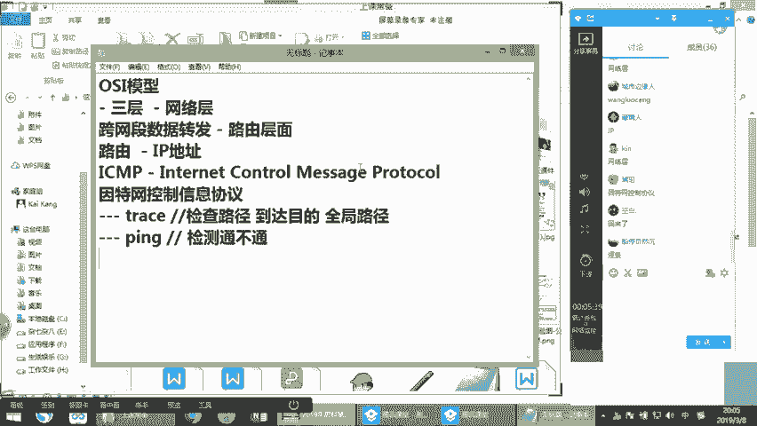

好，看好看这是pin。那么在pin的攻式中的话，首先其中我们看到的第一个点，我跟大家说个这个字集。而且我也通过这个点跟大家扩展到每一个我们说到的叫pin of death，还有印象吗？😊。

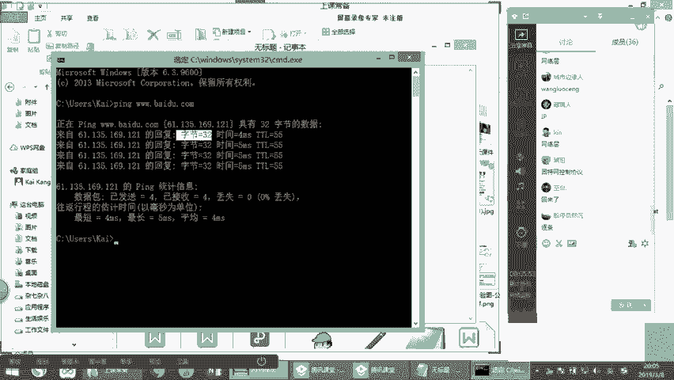

pin of death就是我们说的死亡之拼。好。那死亡之拼的话呢，最主要是干嘛呢？是用来做最是我们看到的最早期的ddos攻击。没错，是的啊，这是ddoss的前世。但早期的这种pin攻击啊。

其实我给你讲实话，它这个pin攻击呢作用力不是特别的大，是因为为什么pin包pin包。这个拼包再大，它也没有多多大啊，这样我们现在看到了，假如说我们可以修改P百度点com对吧？看到吗？

假如说我们杠这个杠L啊，打个比方我改成。😊。

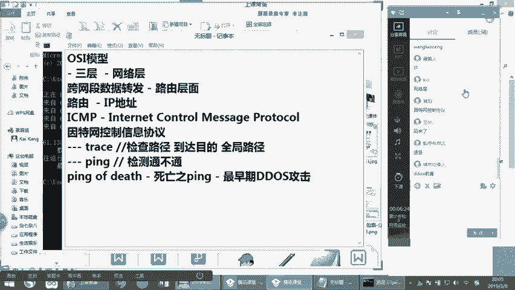

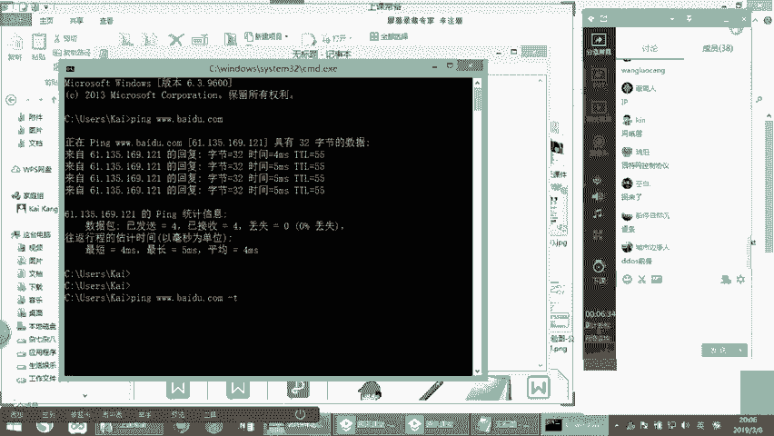

1万你看他可以变成1万吗？可以变成1万吗？可以发1万呢，你看。😡，最大它就是到65500，就是拼包的大小，最大可以到65500个字节。明白刚才意思没有？啊，就最大可以到65500个字节。

这是我们说的一个拼包的大小啊65500字节。😡，那65500个字节其实也没有多大。所以其实P of早期的时候的话，最主要是以通过什么呢？是以通过人数多为基准。就是说我们去攻击别人。

那有一个前提是说我们这边的用户数量比较要大。对吧我我三5个10个8个，100个都没有什么意义。但是呢我就要要1万个，2万个、10万个。好，那我们想想10万个用户同时产生拼帮去发到目的。

那我们来思考一下这个问题。这个时候作为对端来说，是不是就会承受着非常大的贷款压力啊？能不能媒介，说到这能不能听懂，没介上波一来。😡，OK这是我们昨天说到这个位置，对不对？其他同学明白。

给我刷波一上来麻溜的。😊，然一回应。啊。没有问题，你们要自己问出来好吧啊，你们要不明白的地方的话，自己打到公屏上来，OK吗？啊，打到公屏上来啊。好，咱们接着说啊，咱们接下来看。😊，那这是我们说的什么呢？

叫对端的带宽压力。但是呢我们思考一个问题，现在的底dos。😡，现在的ddos还用pin吗？它不但使用pin了，现在的ddos使用什么叫UDP洪水攻击？😡，明解吧？叫UDP洪水攻击啊。

那UDP洪水攻击来说，它有一个最大的特点就是pin是需要回复的。而UDP洪水攻击是不需要回复的，明白吧？是没有数据回应的，没有回复数据。我就是一股脑的，我把我这边的数据发给你。

我让你对端的时候就一直在接收大量的数据，让你接收大量的数据，接收大量的数据，就这样。😊，这么说能不能听到理解吗？明白稍不一样啊，是这样的一个情况。😊，啊，那么也就说它本身是不需要回复的那效率非常高。

那这里边呢就包含两个点。第一个来说的话呢，我们就说攻击来源。😊，第二个来说的话呢，就是解决方案。啊，我们来看这两个部分，一个是攻击来源，一个是解决方案啊，那作为攻击来源来说。

我们说ddos攻击通常来自于哪里呢？在什么情况下产生呢？首先大家注意一个点啊，通常呢在当时就是现在的网络环境总流咱们搞网络的Ddos攻击，绝对是你遇到的最多的攻击。你看你们学了一大堆什么各种安全的方法。

各种各样的防安全防御什么的，大多数都不会发生，绝大多数你看见到没见过，你只是在理论层面学习，但ddos在你后期是一定会见过的。昨先我也给大家看看现象嘛，对吧？就Ddos的话，那个数据的一个走向是吧？

数据呈现出来是什么样的一种效果。我给你们看。😊，那谁生说呃这个工具源头从哪儿来呢？😡，首先记住Ddos的攻击来源者是来自于四面八方。哎，什么叫40八方呢？主要来自于诸多的网民。

也就是我们俗称的中了病毒的电脑。也就是说我们说叫肉鸡，这个大家知道吧？好，这样。那中国病毒的电脑，我们知道网上呢有很多的做从事网络安全工作的人啊，就像我们说的很多黑客，很多黑客的话，其实他要做什么呢？

他最重要的就是说去收割肉机啊啊，假如收割肉机这个来源又非常多，大多数情况之下都是通过网页传播。通过我给大家举非常简单的例子，假如说早期的时候，网页上的网页挂码是非常常见的对吧？啊，很多网页上的做挂码。

还有什么呢？例如像啊假如说做压缩包。😊，对吧压缩压缩包捆绑不满。啊，这是一种是吧？就自动执行，你定要双击开这压缩包，8是自动执行里面的自动解S缩自动执行里面的文件，而它利用里面的一个程序设定的功能。

让让你电脑中招是吧？哎，例如还有什么呢？假如说例如想插件。😡，对吧你你安装一个什么样的程序，里面自带捆绑插件啊，啊，这是一种啊，也包括什么呢？假如说一些原先的一些通过一些软件的一些漏洞。

例如像什么QQ场景漏洞等等啊吧，这都是当年的时候非常常见的啊的一些啊一些问题啊，看到了吗？是这些类似这些种备。😊，但是总而言之的话呢，它最终实现的现象这是让所有的通过以上步骤。

各种各样的安全问题的形式的一些主机中了病毒。这过病毒之后的话，实现什么呢？实现远程控制。明白吧？先远控。啊，那作为远程控制来说，远控这个概念呢？consor怎么去教你们呢？

就是说呃这像早期的早期的像什么灰鸽子啊，上清远控啊，这大家应该听说过，对吧？啊，那全都是利用的一个什么技术叫木马反弹技术。😊，所谓的木马反弹技术来说，就是只要你中个病毒，哎。

你自己做了病毒的主机去找服务端。😡，听明白了吗？去找服务端，找服务端的电脑，找控制端。也就说中了病毒的病毒主机去主动寻找。是吧主动寻找我们的这个这个攻击者。啊，病毒主机病毒原主机啊，是这样主控机。

那怎么去找呢？其实就是通过我们数字叫DDNS啊，这个大家有没有听说过，想问一下，听说过吗？听说过刷个一没听都说过摔个2不要紧啊啊，听说过吗？叫DDNS啊这么一个东西。😡，听过吧。听过吗？啊。

姚这听过有没听过是吧？好，叫DDNS什么叫DDNS呢啊，no no no no no跟Ddo没有关系，注意听什么叫DDNS叫其中第一个D叫dynamicna。😊，啊。

这 dynamicna在动态DNS解析解析。这这位有一个问题，就是重个病毒呢的主机啊，它是无法找到原主机的。😡，找不到原子机源很简单，是因为即使是黑客，他也不会购买固定IP地址，能明白吗？

黑客也不会购买固定IP地址。即使黑客家用情况下，它使用的也是ADSL。能不能听到也使用ADSL那它使用ADSL的话，我们知道ADSL的话，它干嘛呢？它是自动获取IP地址。😡，而自动早期的ADSL呢。

它自动获取的是我们社的公网IP地址。😡，OK啊自动获取的是公网IP。😊，获取要购完，但是由于呢一个弊端是每一次获取的都不一样，每一次都不一样，每一次获取都不同。听明白了吗？每一次获取都不一样啊。

那导致呢如果我现在撒下了一批肉鸡啊，那此时呢肉鸡对吧？我们这个一批肉鸡，这批重病毒的主机，想回来找我的时候。😡，啊想回来找我的时候，我的路由器只要一重启。😡，对不起，找不到了。能不明白刚才的意思没有？

他找不到我能不能理解啊，没法没法找到我呀啊，因为我一重启完之后的话，我的路由器或我者电脑，我要重新获取IP。😡，那等于我可能会面临到重新获取新的IP。那此时的话，这个旧的IP就不再是我用了。😡。

但此时怎么办呢？我现在好不容易搞一个很多肉鸡，但肉鸡找不到我。😡，能理解吗？明白shoper意来啊，那所以所以这个时候如何呢？我就要找到一种一个固定标识。😡，这个固定的标识最好的就是以域名形式出现。

明白吗？有域名设式出现好，OK。呃，IP6和家庭宽带会有固定IP吗？还是需要买，依然有动依然是动态IP动态IP是为了方便，理解了吧？是为了方便好。那么这是我们是不是卡了，没有啊。😡，你们现在听的卡吗？

😡，你们现在听的卡吗？没有吧，我这边的话一点包都没有啊。😡，那没有了，我这你看我们我这边一点丢包都没有啊，看到没有啊，我这个软件其监控很准的啊，咱们接着说啊。所以在这个过程之中的话。

找到一个固定标式域名形式出现。那域名形式，也就是意味着说当时的阶段呢很多时候会利用这个。啊，就是我们说的花生壳软件。画像个软件的话，他们会申请什么？申请免费的二级域名。也就是说它会让他的什么呢？

他会让他的所有的病毒的原主机病毒主机啊主动看着啊，主动去寻找一个域名。听明白吗？然后去寻找一个域名，这个域名呢就是一个非实名制的二级域名啊，是这种二级域名例如像什么3578。😡，好，电是吧。

电先假如想ORAAY啊，电什么什么什么店com点。先。你到我这吧？点赞主此给，类似于这样的一个特烂，看上去特别恶心的一个二级域名。那没有关系，那这样说的话干嘛呢？病毒原始机会找到你理解了吧？哎。

他会找到你，而你呢只需要在你的主机上，你的黑客的电脑上干嘛打开一个花生客软件。😡，然后此时你的花生客软件里面的话注册的域名啊，这个二级域名就会实时解析。什么叫实解析？就是它会解析到你。

假方说你现在我重启路由器了，对吧？我现在新的IP地址。😡，更换了，注意看怎么办？哎，它会实时解析到解析到新的IP上，明白了吗？明白上边E了。它会解析到新的IP地址上，是这样的一个过程。听懂了。好。

进续到新在IP上。那么在解析到新的IP上的时候啊，解析到新的IP上时候啊，不需要改。因为是花生客这个软件自动重新解析啊，它会自动重新去同步DNS信息，重新解析是这样一个过程，解析到新的IP上。

所以每一次的时候的话，你只要路由器去重启，只要你的IP1换，哎，花生客自动查你现在新的IP自动给你解析到新IP上。明白了吗？这是当时的时候的话，那些黑客的话呢，为了收集我们说的这些肉鸡啊。

保障肉鸡时刻有联系的一个作用。😡，啊，注意看。那么这黑客收集完之后，这之后，他并不用，他会把这些东西干嘛呢？卖掉啊，直接把它卖掉，卖给谁呢？卖给很多的安全公司。😡，安全测试公司。干嘛用呢？

我给你解释一下，大家都是在安全测试公司的话，除了做接一些安全检测的工作，什么叫安全检测。就是说假如说呃有一些网络啊，它在构建完了之后，他要做安全评级。而假如说我当前这个网络环境之中的话。

能不能承受多大的一个流干公击。除此类，类似于这样的一个标准。那他们会给一系统安全检测公司来付费去让他们帮忙去做安全检测工作。那此时的话呢，他们就会利用这些肉机的话去做ddux测试。理解了吧？啊。

这是一方面，这是比较正常的。还有一些非正常的，什么叫非正常的？举个例子，假如说此时呢。😡，很多的我们叫卖卖安全设备的，我们中国几几年安全设备多。假如说有的人的话他干嘛呢？他会收集很多的肉心去攻击企业啊。

企业的服务器。要你企业的服务器，我们知道底dos成就是很很可怕的。是因为一旦你做底dos的攻被攻击了的话，直接导致的现象就是说不只是你受到损害，其他人也受到损害。是因为如果你的机房这里面有一个前提啊。

如果你这己的机房里边的总出口带宽不够大。😡，直接导致的情况是一次抵到次攻击，会把整个IDC搞瘫。会出现这种情况，理解了吧？会把直接整个IDC的话直接搞瘫痪掉。😡，啊，瘫痪点啊，也就说因为你总出口不大。

而你的你算是一台受攻击了，但是由于你的流量非常的大，导致拥堵到了你的机房总出口。😡，能听懂吗？啊，所以这个情况之下的话，作为机房来说也很被动。所以他很有可能的话一旦遭到攻击是一片服务器全都挂掉了。😡。

一一片服务器都没有办法访问到，能理解吗？明白shoppper一上来啊。😡，好，没问题吧，可以吧？可以的话，给看到shop波一来啊，咱们一人一点来。😊，哎。

这有一个mononic卡这个学生mon卡刚才了了解一下，你是我们这边的系统班学生吗？😊，啊，莫妮卡，你是我们的系统班学生吗？啊，因为我们现在的话这个教师是临时教师啊。是我们这边的系统班学生吗？

mon卡是的是吧有如说啊OK啊，你叫是我们系统班就行啊。OK ok好的，因为是这样，我们这边的话是一个名时教室，因为我们这边的YY那边的话啊YY教育的业务做调整，所以我们暂时再用这个当名时教室，明白吗？

啊。如果你是我们的系统班学生的，你就可以留大子听，好吧，O。😊，啊。那么在这个里边来说好，那我们接着说好吧，我们接着来看。😊，对于此时，如果说我们的总出口带宽不够大，IDC会不会搞瘫。

我们知道尤其是哪些类型的企业最害怕这种事，你知道吧？我告诉你们，金融类的公司。😡，金融类的公司最担心嘛。因为现在大多数金融类公司的话，他们的服务器的话都是做互联网金融。

互联网金融和游戏类的游戏类的公司是最担心的。是因为我们说一个网站可能还好。但是如果互联网金融的话，你想想看啊，你们把钱存到了1个APP上是吧？或者类似于像支付宝这种余额宝，对吧？类似于这种东西啊。

或者说你在上面的话呢，买了一些什么债券啊，买了一些股票等等。那突然间有一天你发现我操这个网站他妈打不开了。😡，我操这个APP现在登录不上去了。明白我刚的意思没有？如果果在这种情况之下，那你就很麻烦了啊。

你这个时候就就你你肯定很担心，我操这公司不会不会他妈倒闭了，你可以想对不对？这公司会跑路了吧，你可能会很担心这个问题，能理解吗？啊，我们俗称叫哪个是吧？O理解吗？啊，这样好，所以当这种情况出现的时候。

你肯定很害怕所以互联网公司非常担心这个问题了，互联网金融类的公司，他要确保说他的服务是绝对不能受到影响的。因为一旦受到影响，很多用户会出现大规模的担忧，害怕上当受骗，接下来下一步就打电话报警。

然后下一步的话就开始一旦APP可以登上去了之后马上兑现。😡，然后他们会面临到巨大的损失。所以金融类的公司是最担心的游戏也是押金今天玩游戏，一连，我操，他就跟遭底道攻击了，断网了，断线了。😡，一连断线了。

你还玩吗？你今天肯定不玩了，明天你再一连他又断线了，你再一连又断线，你想不到这什么破游戏，你肯定不玩，明白这个意思没有？你还想是充币吗？你肯定连充币都不充了。这位听到啊，听懂给康手刷个亿啊，OK好。😡。

那这是我们现在看到的什么呢？就互联网金融或者游戏有公司，他们很担忧啊，这种情况的出现啊，所以他们往往对网关安全做的是很细致的啊，那你说有没有可能比如像这些公司的话，他们的服务器被入侵呢。

大家注意服务器被入侵，这是应用层面的问题。😊，那是应用层面，其实跟我们网络共识是关系不大，你没有办法去管控它的应用层面的网络入侵。因为应用层面网络入侵的话，它只是根据系统漏洞、软件漏洞等等之类的问题。

而我们考的是什么网络攻击，网络攻击就ddos为主流。😡，好。那么在这种情况之下的话，注意看当这种情况出现的时候很担心。于是呢有一些呢他们专门是搜集很多肉鸡，注意看啊，很多肉鸡干嘛。

他就把这个去专门去攻击一些金融类的公司，一些不大的金融类公司，一些不大的游戏类的公司，非常牛逼的。他们攻艺攻棉攻他七八天，攻完之后，没两天就过去卖防火墙。😡，明白房子意思没有？每两天就过去卖房去啊。😡。

要么有的就是什么呢？先过去买防火墙，对方不买，然后过两天咚咚咚咚咚工具就来了。😡，估你个七八天啊，然后过两天又过去卖防火枪，能跟你讲吗？啊，18项这么搞啊，我专门防didos分牛逼啊，就这样这个意思。

听懂吗？抗迪dos防火枪。😡，所以说其实行业里边的话呢，大多数的抗ddos防火墙，大多数其实都是没有什么太多实际作用。大多因为ddos防火墙，它最难治理的是什么？它最难解决的是带宽瓶颈，它不是设备瓶颈。

好多人以为说Ddos是设备，不是设备，是带宽瓶颈，你你别管换什么设备，你的带宽就这么大，你带宽500兆带宽，你遭到一个G的攻击，你说破个天，这事也没有用理解刚才意思没有啊，明白了吗？明白什意啊。

是这样的一个情况啊。😡，所以这是一个啊我们说到的这个这个比较典型的一个现象。好，在行业里面。所以往往呢很多时候这种底道子肉鸡呢被变相进行买卖，做个什么呢？做个行业里边的一个对做个行业里边的这种。😊，啊。

这种问题啊这么说吧。那我们一旦遭到底到突击，我们怎么解决呢？啊，这个时候的话呢，很多同学说了这么一个问题，就是我们说的叫封IP。😡，封IP。4IP风时的IP呢？😡，放谁的IP呢？好，注意看啊。

如果说我们说封IP注意听啊，注意听封谁的IP呢？从现来听呢？听着，他并不是分供需者IP。因为你的攻击者来自于四面八方，你们要是看过日志，你们就会明白，攻击者来自于全球各地，全世界真的是各个国家都有。

因为它的肉鸡是来源于不同的地方的，明白了吗？😡，所以你没有办法封源头。😡，谁攻了你，你是封不了的。😡，你真正去封IP封的谁呢？去封杀的是哪一台设备看到被攻击。😡，然后你去封杀那个被攻击的设备的IP。

是这个意思，哪个设备被攻击，哪个设备的IP被封杀掉，是这个意思。😡，那为什么呢？你说老师我把它这个IP封掉，我把它IP封掉之后的话，起到什么作用呢？😡，啊，起到什么作用呢？OK啊啊。

我弟弟都说你这不是听过吗？对，没错，是的啊，对吧？你今天上次听过我说这一点对吧？啊，能明白吗？所以这个时候的话，假如我们去封杀IP的话，封杀谁呢？被攻击者，怎么去封杀被攻击者的IP呢？其实来说的话。

就是我们说的就是路游黑洞。😊，你说老师，我们如果我们这个设备被攻击吧，我要把它这个IP封杀掉啊。如果我现在真的要把它这个IP封杀掉的话，我们来思考一下这个问题啊。😡，啊，那我我我封完之后。

那个IPI能用吗？😡，现在用不了了，理解我吗？现在是用不了的那有的同学会说这么一个问题，假如说我这里边有一台服务器被攻击了，我把那个服务器的网线拔了这样行吧，你们会回答样子，假如说这样看。😡。

然后加这样我在这边有一个机房是吧？我这边有一个机房，好，这个机房里边的话呢，里边有很多的服务器。😊，然里边的很多服务器啊，所以看看假如里面有4台。那色台的话在这个里边呢，唉我把它这样连接上。😡，啊。

把它链加链接上。好，我这边呢有一台设备，假设啊出口好。那么此时的话，我要去，我如果我第一台被攻击了，假设我的第一台被攻击了，你们回答方我把第一台这个线拔掉，这样可以吗？😡，啊。可以吧？😡，可以吗？

回答刚才可以吗？我把第一台这个线拔掉可以吗？😡，可以吧？😡，可以吧？😡，我可以把线拔掉吗？😡，注意看啊，你可以拔掉，你拔掉它没有用，理见啊，你拔掉是没有用的。

为什么是因为数据在转发的过程中是跟着目游走的。😡，你把这边的线拔掉，你的路由的网断，这个数据还是往这边发啊，你的路由的断还是往这个方向去走的啊，那后面的话我们讲到静态路由这个东西，这个点你就完全明白。

😡，理解吧？你会完全听懂我这个点啊，所以等于这个数据的话，一旦发送过来之后的话，它等于数据还是会达到总出口。只不过呢你把这根线拔了之后，这个数据到达了总出口之后啊，它不会再往哪边发了。😡，能不能听懂哎。

他不会再往美边去罚。😡，好，我说的声能理解吗？啊，可以吧？可以下波一啊。OK好，这么一回事。😊，啊，所以此时在我们这种情况之下的话，你拔网线是没有意义的啊。当然当年康er就干过这种事儿。

康当当年康er的话就是过去把网线给拔了，你经己发现其实出口还是被堵死的，是没有任何意义的啊，那接下来怎么办呢？左谓其实就是放IP。😡，其实来说就是从IP封IP所指什么？

封IP来说就是你哪1个IP呃改网关可以吗？不可以，你改网关的话，实际上是大网都在动，对吧？你整个大网都在动。😡，啊，那万一它攻击总出口呢，通常不会通常它不会攻击总出口，明白了吗？它可不可以可以攻击。

但通常它不会攻击。因为它的针对对象不是数据中心，它针对的对象是里面的某一台服务器，能听懂吗？啊，是某一个服务器的竞争对手，这是有可能的。它不会是针对你IDC你IDC就是提供带宽服务。它针对你干什么。😡。

好，所以往往在此时的话，我们要把这个IP地址干嘛拿出来上报给上级的运营商，让他把你这个IP给你。😡，封杀掉，理解了没有？一定要报告上去运能上来做啊，就讲你上面是电信，你要把这个把这个事报给电信。

让电信把你这个被攻击的IP给他封杀掉。听懂了吗？明白shopber意了啊，一般是这样去解决啊，所以往往你在面对大网的时候，面对大型网络，大家注意听啊，你必必须要有流量监控系统的。

你没有流量监控系统的大网是毫无意义的，没有流量监控系统的大型网络，一旦出故障，你连知道哪有问题都不知道，所以必须要有流量监控啊。😡，能理解了吧？明白给他总刷波一啊，稍波1000块啊。

即使跟现在包括现在的阿里云，包括现在腾讯云云，大家记住依然存在同理的问题。现在的阿里云，腾讯云里边的话依然存在这种第三方的。刚才个人觉得有这种第三方的安全公司，在帮阿里云那边的话做合作。

我个人觉得是有的啊，就像假如说你要在这边不停搞一个网站，你用一段时间，你知吧？你用一段时间你就会发现突然间某一段时间你就遭到问题道此攻击。你就抓到几套手。然后连着好几天你都着急到死，搞得你没法用。

因为阿里云的那个内部的防御机制也很牛逼，是吧？只要你的流容量一超过多少之后，自动进黑洞，封锁键两个小时。😡，自动封锁你两个小时，两个小时之后再解封，你搞不好又遭到攻击了，来又封你两个小时。对，没法用。

在那个期间的时候，你这个网站基本上每一天中断时间非常长的。😡，明白这意思没有？啊，所以非常有可多的话，其实像阿里云这个里面它也是有这种问题的而这干嘛呢？让你买买这个这个高仿IP。你就啊啊。

买云盾买买这种高房IP听明白了吗？就店属于这种意思啊啊，阿云里面的详细机制我就不讲了，可以吧啊，咱们就不说这个部分。😊。

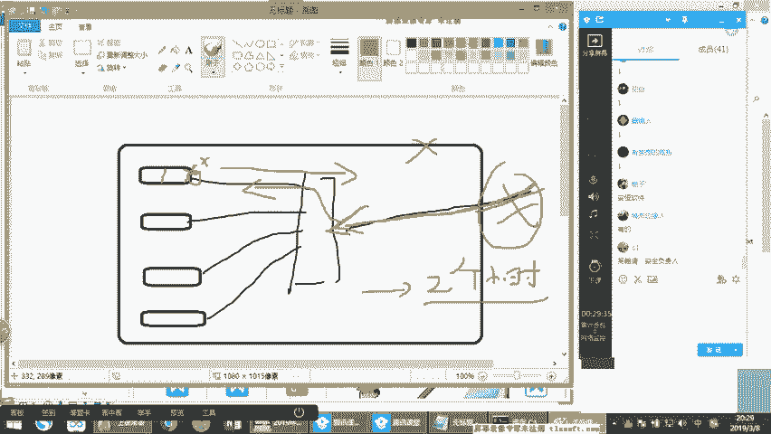

那么到这个点上的话，我们现在应该知道吧，对吧？我们现在应该搞清楚我们说的第三层啊，具体是怎么回事啊，这是我们说看到的这个这个第一个字节啊，第二个的话就延迟，这个不用康才给你们讲，对吧？

就是说我们现在的话到达目的啊，我们从现在我发出数据到达目的我这个访问延迟是多少。😊，啊，这是以毫秒为单位的。如果假如说你这个延迟肯定越小越好。因为这个延迟是一去一回的时间，我们叫pin包啊，聘包什么？

pin其就是说你在吗？等你跟我说，你在就这个意思，加pin什么啊，pin的话讲究一去一回嘛。😡。

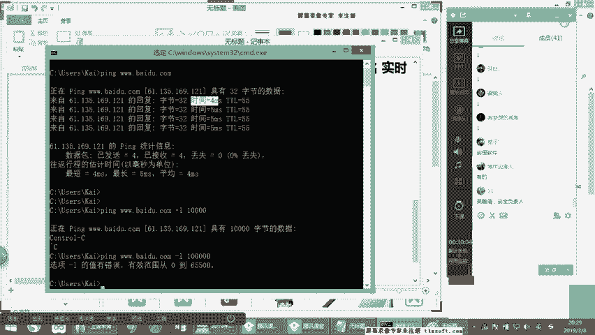

好，一吸一回骗过去的宝是什么宝，叫一口宝，理解吧？骗过去叫一口宝骗回来的宝。😡，叫什么？叫ealre。明白，叫eal reply吧，要拼音过去和并回改eal和 equalal reply听明白了吗？

明白shop不 e改O像的。😊，啊，这个是我们所说的这个拼包啊，而我们现在的话就去拼。而在这个时间呢是一去一回的时间。啊，我从聘发出去这个屏保到我接收到你的回报。啊，这个时间就是我们做的延迟。

这个延迟越低越好是肯定的。好。那当然了这个延时的话，它不光是越低越好，它往往是根据什么，就越稳定越好。大家注意它其实更多的是以稳定性做单位的啊，就是假如你这边没有丢包，哎，还没有什么抖动啊。

没有什么延时抖动对吧？你假如说我这里边我这个延时抖动里边流向面临到的，假如说我这个一这个10毫秒对吧？假如说我这边也是10毫秒10毫秒11毫秒10毫秒啊，1110毫秒11毫秒明白了吗？哎，这种就很稳定。

😡，好，那假如有的情况之下，即使你自己的这个。😡，好，假如说你自己这个10毫秒呃这个一毫秒是吧？两毫秒，然后138毫秒等等。如果这种情况就不好，这后就出现了什么呢？出现了一个数据转发的一个抖动问题。

抖动问题呢说明你带喷不稳定，可能带宽有晕塞或者说中间线路有问题，如此类的，行能理解吗？啊，所以往往是越稳定，无丢包延迟越小，往往这表代表你这个带宽越好。这么说能不能听到，明白双不意样OK好。😊。

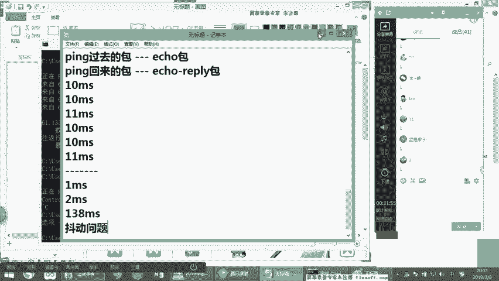

接着说啊。后面这个TTL呢其实所指的是跳数啊所指的是跳数啊。那么当前的来说的话呢，就是这个跳数呢就代表当前最大的是255跳。就整个网络里边的话，我们去转发这个数据，最大的支持的跳是255跳。

但是在这个pin里边，这个信息其实已经不能代表条索啊，希望这个大家要搞清楚。这个就是一个对方的返回值。对方返回值是什么意思呢？呃，我给你们举个非常简单的例子啊，打比方打比方，假如说我现在ARP杠A。😊。

啊，这是我们在网络里面其他的同事的主题，对吧？看到？这是我们其他同事的电脑。注意看啊，假如说我现在随便找一台啊，我把我把这个录制下来。😊，我去病。好，注意看我去拼。粘贴。啊，拼不通。

现在电脑都有防火墙是吧？我看看能不能找一个能拼通的。假如说这这，我就是拼1。1，我的网关没问题吧，对吧？1。1，这是我的网关啊，注意看好，我就拼1。1。😊，你看。这种新的P11。1，你这个TTL。

你告诉我是128，那你们回答conunsor，我难道到我的网关经过128跳试吗？😡，听明白他才意思没有？我现在从我这电脑到我的网关，是7为1外刷掉吗？😡，理解了吗？

这并不是所以这个TTL是代表的并不是一个跳数了。这个TTL是对端操作系统的一个返回值。😡，明白了吗？啊，早期的时候的话是通过这个固定的TTL返回值来看对方的操作系统，一般是这样的一个逻辑。

TTL不同的TTL代表着不同的操作系统类型。例如下，假如是unix返回多少，windows什版本返回多少啊，windows20003返回多少sber208返回多少？2012返回多少，听明白了吗？

它是这么一个作用，所以有的时候的话呢会通过这种方式能检测到对方使用的什么操作系统。😡，是这么一个意义。没见过吗？现在没了，现在这个T条基本没有什么意义了啊，没见过吗？这个在P里边的话，实际作用就不大。

😡，听解了吗？啊，明白看到上边一个。😊，啊，这是一个我们现在看到的一个什么呢？就是一个1个TTL这么一个东西啊，没见过了吧啊，这是TTL这个大家知道就行。关于拼一变成这个。

当然在道网购直中宝师有没有跳数的概念有当然有了。😊，票数的话，TTL最大的话到255条，这整个网络里边的话最长就是255条，明白了没有啊，是这么回事啊，这个你们知道就行。😡，OK了？啊，说这可以听懂吗？

😊，啊，那么这是一个我们看到的啊，刷题时做过去好啊，做过好啊OK好，我讲到这，你们能跟上吗？其他同学可以吗？回答我。😊。

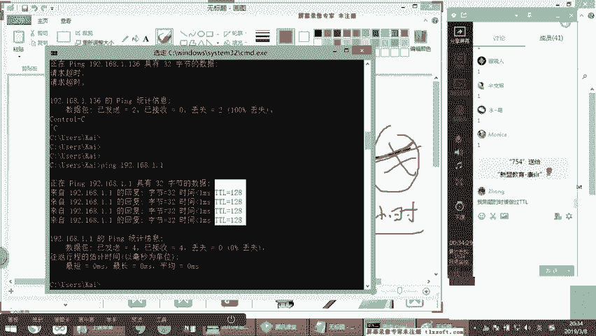

可以跟上吗？可以的话，给康总刷波一来啊。OK好，time to啊，TTL叫什么缩写啊？TTL是么这边叫什么time。😊，to盖OK啊，这么这么一个平牌叫生存周期。明白啊。OK啊，我看看其他几个班里面的。

😊，呃，那个谁中山电脑没问题是吧？中山啊，然后那个谁小董冰糖，小董能听懂吗？mononicica可以听懂吗？冰糖啊。😊，啊，monica，你上节课来了吗？我给忘记了啊，你上节课应该没有来吧。

还是你是新进班的。😡，啊，你是新进班的吗？之前听过是吧？啊，之前听过啊，上节课没有来，你现在是排到这个班的吗？你告诉我，你现在是在多少期班的？😡，哦哦OK你再多少期班呢？😊，我说你是在多少期班的？啊。

你就31期的是吧，明白吧？okK好，31期okK我知道了。小董可以听懂吗？😊，啊。TTL为什么能表示在服务器上的缓存时间？什么时候它表示在服务器上缓存时间啊啊。

什么时候才表示啊没有表示服务器的缓存时间啊。😊，啊，你在哪里看到他要提服务器的缓存时间呢？跟黄的时间没有关系啊。好，没问题是吧。好。DNS服务器上的没有啊，你在什么地方看到的。

我没有看到这个在服务器上的缓存时间，OK了？😊，啊。那么这是一个我们现在看到的一个一个我们说的TTL啊，这是一个呃里边的一个。其实有的系统管理员呢，它会修改，假如你对端服务器里面的注册表里边的TTL值。

它修改完这个TTL值呢，反馈值会不一样。听明白了吗？啊，压缩我现在我给你修改成了96。那这个时候的话，呢我现在拼对方的时候，它显示回显的时候就是显示96。

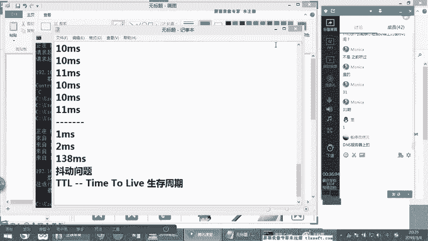

听明白没有？跟DNS服务器没毛线关系，现在的回复是对端给你回复。我这里面不牵扯任何DNS问。😡。

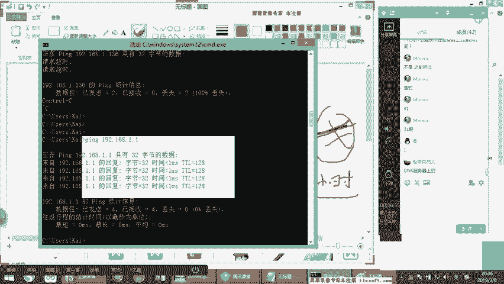

明白了没有啊。那么这是我们现在看到的，我们说的什么呢？是我我们看到的1个1个OSID三层就是网络层是吧？这是网络层东西啊，那么现在我们知道通过第一层啊，我们物理层，第二层数据链路层。

第三层是我们的网络层。第四层什么呢？第四层来说的话，就是我们说的传输层。好，陈书长。在传输层上面的话呢，大家去了解是是什么东西呢啊，我给你们这么解释啊。首先呢大家先有一个这样的一个概念。

我们在整个网络里边会包含各种各样的协议，大家知道对吧？各种各样的协议。而其中呢我们所看到的协议有什么？举个例子啊，锐品EI加POLBGP协议对吧？啊，TCP协议UDP协议。😡，还有吗？LDDP协议是吧？

等等。注意看。那在我们现在看到这里边的话，其中加啊包括TCPI撇宜。啊，TCPIP协议。那你们说你看到这种各种各样的协议，他跟彼此之间什么关系啊？康s在扫盲课的时候，在咱们整个系统的扫盲课的时候。

康s给你们说过一小部分，我不知道你们有没有印象，注意看。😡，其中的话呢，我们现在看的什么？看的是我们的网络层，对不对？我们现在看的是网络层。那么第三层在网络层里边是什么呢？TCPIP注意看啊。😡。

协议TCPIP协议是我们的OSI的第三层。模型的第三层就是我们说的网络层。而我们现在看到的reEHGRPOSPF等这类的协议是我们的OSI模型的第四层。记下来是传输层。啊，明白吗？它这里面是要第四层啊。

叫成输层啊。那么这个边是上下一依存的关系，一是说我们注意一看为什么它怎么划分的呢？其中我们包括我们看到的TCPUDP这都属于O模型第四层。😡，我们不管是我们使用什么协议，你看着。

它前提是一定是基于IP的，能理解吗？啊，你假说我是我TCP也好，我UDP也好，我归根根结底都是基于IP地地址的，就是基于IP协议。😡，啊，因为说破个天，我也一定是基于IP协议的情况之下。

我才运行了各种各样的路由协议，才运行的这个TCPUDP等等。我这么说能不能理解，明白邵波意然啊。😡，好，能不能听到？那么它是一个上下层的关系，有底层一定时间可在IP的情况下，在IP的情况下。

我们运行上层协议。例如是吧？我运行的各种路由协议。打个比方啊，像瑞EIRPOIF等等。我都是啊去如何组建我们每一台路由器的路由表。😡，听明白了吧？哎，如何组建每台路由器的路由表？能听懂吗？啊。

瑞pIGIRPOSL等，怎么组建每台路思股表。但是我们组建目录表的一个前提是应该有IP呀。😡，对不对？你跟IP都没有，我组什么目表啊，我跟什么路有啊，所以它就是我们说的第四层。😡，啊。

就是我们说的传输层这一层。你包括对，没错，IP是承载着各种各样的协议传输层协议。你包括像我们说TCPUDPTCPUDP的话，从归根之结底的一个方式。TCP是干嘛呢？TCP来说的话。

这个这个东西啊是基于可靠的传输协议。😡，UDP呢是一个不可靠的传输行为。好，注意看。那我们去定义TCP和UDP可靠与不可靠之间。是在什么情况下能够看得出来啊，什么情况下我们看得出来，关于这个可靠与可靠。

那你们知道吗？注意看一个点TCP呢这种方式是面向连接的。记下来。啊，这种方式面向连接的这种数据传输方式。那也就是说他在我们进行数据传输之前呀，我必须要与对方建立起一个连接。听明白吗？

我必须跟对方建立起一个连接来才可以。😡，那其实TCP就是我们VPN的早期的模型。你大家知道VPN对吧？VPN这个东西的话，就是我两台设备之间我要建立起VPN才可以啊。它们是面向连接的这种VPN的建立。

而其实TCP就是一个早期VPN的模型。😡，那就是说我在这个过程中，我要会核对身份，我会核对跟我建立连接的人的身份，用来确保什么呢？哎，我们之间建立的连接，我们才可以进行数据发送。那它是一个双向的。

它不是一个单向的数据通信方式。什么叫双向的呢？我给大家举个例子。😡，它可靠的方式，这个双向很重要。假如说我面成给接着，首先我会有一个什么呢？我会有1个TCP的三次握手，这个大家听说过，对不对？

我得有1个TCP3次握手。😊，这个TCP的三次握手什么意思啊？就是说我在两台设备彼此之间，我会通过三个信息步骤来保证我们的一个文件建立。😡，其中第一个步骤，我们说一般叫SYN信息。OK叫SN信息。

第二个的话叫SY加上ACK信息。第三个不叫ACK信息。这三个部分。那SNSN加ECK还有ACK这三个步骤是干嘛呢？假如说我们两台设备啊，我们的路由器一连接着我们的路由器2。😊，我两台设备之间。

我现在要发出发出据。😡，对吧我发数据的话，这个时候干嘛？我在第一台先给第二台发一个同步消息，就告诉你okK哈，你们我们现在能不能彼此建位器连接啊，你现在能不能给我建位连接，它等于路由器一对吧？

路由器一会先发送一个连接建位请求。😊，改录下。路西亚收到了这个连接，发送建位显示之后干嘛呢？莫罗西尔会给他，如果他可以建给根接，它的并发是允许的是吧？它的连接数是支持的。

现在啊莫西亚的话会结合给他回复一个什么刚才的SYN加上一个他自己的产生的AACK的一个应答消息啊，一个回应。😡，啊，告诉你OK啊，我现在已经给你开放了一个连接啊，你现在可以随时连接进来。

听明白我说的意思没有啊，这么一个关系。😡，那第三个部分呢是我们的第一台设备的话，路由器一发送了1个ACK最终确认。好，OK当发速ACK之后，就要三次握手。三次握手之后，它才开始建立起来的这个连接通道。

就建立了连接通道。😊，接立把明间通道之后，再接下来发送的数据才是实实在在的业务数据。听明白我我说的意思没有？啊，是这样。而在这个过程之中，你看它是一个非常典型的一个一对一之间的一个文机。啊。

一个单点连机，点对点的一个文机。啊，那借备连接有一个什么样的一个好处呢？😡，啊，现文接首先来说的话是说当我们建立完文件之后，那我给你发的信息，发的数据实际上都是有序别号的。😡。

我们你发送的数据都有序列号。😡，那如果我给你发过去的数据，首先如果出现了说某一些数据在传输啊，某些数据在传输的过程中出现了丢失的情况。某些数据传的过程中出现了丢失的情况。此时我们会面临什么问题呢？

我们会面临着一个数据的重传。😡，然后对方收到的数据收到的数据发现唉，怎么样？有些数据的话没有收到，那这些数据要重传。😡，那为什么会重传呢？是因为本身在这个数据在发过去，对端收到数据干嘛呢？

对端会给他回样确认消息。😡，就代表我收到的好，你给我发来数据，我就给你回复这个确认消息，能理解他的意思吗？啊，如果你没有给我回复确认消息，我就会给你重传数据，我就会给你重发数据。😡。

所以他通过这样的一个确认和重传的过程，整体来讲是一个什么确认和重传的一个过程，来保障什么呢？来保障整个数据的发送传递得以得以一个稳定。😡，而不会产生说某些数据导致我发的过程中的话，对方没有收到。

我也不知道他不会圈这种现象。听懂了吗？明白看看上波意外啊，是这么回事。😊，那么这是我们现在看到的一个什么呢？就是我们说的关于TCP啊这么一个一个简单的一个概念。我们先把一个简单的一个逻辑框架先搞清楚啊。

但在关于整个的1个TCT3缩的手里边，它所谓最稳定的classs告诉你们，就是一个重传确认重传的概念。😡，啊，最稳定就是个确认冲传，应来确保数据最后一定是可以让你收到的。但是TCP的数据呢。

TCP的这种连接方式啊，它面向的一定是一个什么呢？看着它面向的。一定是一个非注意看啊啊包含完整性啊，就check some会做校验啊，只包含完整性啊。那么他面向的是一个什么呢？面向的是一个非实时性业务。

好。实时性的业务，我们知道实性业务，像视频、语音，这些都叫实时业务，听明白吗？这些都叫叫实时性业务数据啊，它面向的是非实时性业务数据，是这么回事。😡，能不能听到明白康sshoper义感啊，是非实事性。

😊，好。那非实质性的就说它没有对时间的要求。我们知道实施性的业务的话，它是没有办法重传的，它不能重传。你假如说我这边跟你。😡，语音通话是吧？咱们现在是直播的。我说同学们，你们听到了吗？结果现在卡了一下。

你没听到我你没听到不要紧，你没听到这个时候接下来我肯定说下一句了。我正好，我们来看这儿，结果你那边的电脑呢给我发数据，让我给你重传。😡，那等于导致什么呢？我这边电脑给你重传了，重传之后的话，你那边收到。

其实但是此时在下一刻的时候，我已经给你我已经又产生新的数据了。😡，听明白了吗？在下一课的时候，我已我这边已经又产生了新的数据。😡，能不能理解，明白上pper意啊，所以你那边现在还要听我上一句，这可能吗？

不可能，所以实时性的业务数据的话是不需要用TCP的，理解吗？啊，一定是没有实时性。假如说我打开一网页。😡，我打开一网页，我这个网页没有什么实施要求，我无非打开的快点慢点。但最终的结果是我这个网页干嘛呢？

哎，一定要打开，对吧？要显示完整，这是我要关注的。😡，能明白了吗？当我们之间对传文件啊，对传文件的话没关系，快点慢点不要紧，是不是啊？快点慢点，在最后我一定要收到完整的文件。😡，啊。

对吧哎这个时候的话我可以用TCP。😊，这么说能不能理解，明白shop波一啊OK这是我要用TCP。😊，好，OK吧好，OK上波一该。😊，好。那么这是我们现在看到的一个一个过程。所以此时的话。

对于TCP来说的话，通常你们接触的最多的最多的它一定在设计中是面向什么呢？面向非实时性要求的数据啊，最典型的就是我们说的网页访问啊，这是最为典型的最为最为典型的一因。啊。那除了这个之外的话，当然了。

你上节课有同学也提到了关于TCP攻击这个问题呢，consor就不再不再提了。好吧啊，因为我感觉咱们这个课实在是讲的太分散了。邮件其实也是TCP的啊，邮件也是TCP的OK啊，非实施性的吧啊。😊。

那么除此之外呢，假如说我们UDP的数据呢，UDP的业务数据就像我们刚才提到的UDP来说，它是面向什么？它是面向说实时性的业务。就说我们看到的像视频会议。😡，啊语音电话啊，包括咱们现在直播等等。

这都是属于UDP卡了就卡了，没办法，明白的意思没有？卡了就卡了，等于我是干嘛呢一次性发送大量的数据请求。😡，发给你，你不需要给我回应。😡，你像假如说你们那边接收端，你们接收端有有的同学的话。

收到有流同没收到，他你们是不需要给我回应的，你不需要给我确认。😡，因为你点不用确认，我也不会给你重发，能理解方才意思吗？啊，它是这样的一个逻辑，叫一次性发送大量数据过去，能发多少发多少对吧？

能发多少发多少。😡，明白没有啊，这是我们说的UD的一个典型特征。😊，所以往往在后续的时候，咱们可以看到什么呢？UDP和谁呀和主播是如影随形。😡，这什么逻辑？主播咱们听说过主播是什么？主播是一对多对吧？

一对多的数据发送啊，我们说这是主播发送。😡，只有说什么？只有说看家，只有加入个这个组的用户才可以接收到数据。但我们想想，加入到这个组，我还是一对多发，我肯定是为个啥？我肯定是为个减少不必要的带宽发送。

我给大家举个非常简单的例子，现在你们那么多人在听课。😡，对吧。现在咱们课堂上面有43个同学，43个。那43个同学我问一下大家，你说我现在给给你们说的话的信息，你们43个同学都收到了，对不对？

你们四十几个同学都收到了，那难道是conor电脑上面的话产生了四十几份吧？对吧？假设我现在conor说的每一句话产生了一兆的带宽啊，我说的这一一句话里边啊，我产生了一兆，难道你们四十几个同学的话。

现在都在听到的，是因为我产生了40兆吗？是吧？是因为我产生了40兆的数据吗？在同一秒钟是吧？并不是我只产生的还是一兆。😡，只不过呢在这个过程，这一兆的数据发给个40多个人而已。

因为你们现在都在一个组里边，所以你们都可以接收到这个数据，这叫一对多。😡，所以主播所运用到的一定也是视频性的业务。视频语音业务我们说才会涉及到主播，而主播和UDP一定是捆绑的，明白了吗？能不能听懂。

这是为什么说凯的上节课给大家讲我说在我们现在用的QQ这个软件里边，QQ里边我们打字。😡，没错，我们打字是什么？TCP为什么？因为打字这个东西的话，它没有实施要求。😡，对吧我要确保的是打字。

我给你打过去的字，一定是你要能收到。😡，但是咱们的要做是QQ视频，QQ语音，这就是邮DP了。😡，而我们现在刚才提到的什么呢？提到的底dos攻击，实际上也是油地皮洪水攻击。明白了吗？

我们说的底道水攻击就是UDP洪水攻击。😡，啊，发送大量的这个UDP的信息信息数据啊，发出去发给你。啊，毒死你。这么说能不能理解，明白了吧？明白，稍微意来。😡，好。所以整个的一个协议它是有层次化的。

你假说像我们在整个OSI模型里面，还有第七层。😡，啊，第七层是这个说的。第七层什么呢？第七层里边来说的话，它主要是面向什么。假如他说HEP上次给你说过的吧？FTP啊，明白了吗？

SMTP包括BGP都在第七层。😡，为什么？看着，我首先底层一定是建立在了TCPIP的协议基础之上。😡，对吧IP承载一切吧，对吧？IP承载一切。啊，都有IP。注意看啊带个IP啊，群聊是主吗，不是群聊。

还真不是赌博，明白了吗？群聊还真不是主博啊，那么底层建立在TCPIP协议之上，IP承在一起。😡，第二个什么呢？看着我在我们的上层哎中层啊，说中层这个阶段是什么？

说我们说的这个UDPTCPUDPOPFEIGRP。😡，知干嘛？是构建我们的路由表，构建数据传输方式。😡，对吧啊，我这个数据应该怎么发给你，我想怎么发给你能不能听到啊，这个是我们说的中层。😡。

当我们的路由表构建起来，我们已经定义好了，我这个数据应该怎么给你发，那接下来是干嘛？接下来才是上层去承载上层的业务数据。例如像HDEPFTP对吧？SMTP等等啊，明白了吗？这要上层邮件哪、网站哪是吧？

传文件呀，上层服务才出现。😡，唯有比较特殊的一点是BGP。也是位于第七层。的概念。BGP也是位于第七层，听懂了吗？明白了吗？明白，给conor e啊，是这样一个情况啊啊，O吧？Ocon e啊。

那BGP的话，为什么是第七层呢？其实这个是consor。😊，也想跟大家说一下啊，也想跟大家讲讲这关于这个问题。😊，啊，就是说关于整个的我们说的这个这个这个BGP呢，它本身BGP也是一个什么？

也是一个路由协议啊，理解什么？它也是一个路由协议是什么？BGP是我们后边的还要学到一个大型路由协议，主要用到运营商。好，和IDC的好，那这个协议我先不讲了，后面我们再讲好吧，这个我们再说啊。

ca不能一节课给大家说太多东西，要不然你们真的也记不住啊，记着记，你们别管套了，这样是不行的啊，O。😊，好。我说到这告诉我能OK吗？😡，能OK吗？OK差不多一改。啊，我这个特别特别的注意了一下，就是说。

回收了一下啊，就不要说的太分散，不要说太多是吧？啊，因为就是我感觉你们其如果说太多，第一，咱这个课根们就讲短了。第二来说的话呢，很有可能就是说你们吸收不了。😊，明白，咱们1。1买好吧，1。1点买。😊。

啊。那通过这个过程，我们知道哦，通过OSI的话，我们大概就明白了一些框架。其实这种协议呢我希望大家理解的最最通透的一个点，注意看，最为通透的一个点就是协议这个概念是逐层承载的。明白吗？是协议。

这个东西是逐层承载，有底层协议，有中层协议，有上层协议。OK不同的协议，它实现的作用是不一样的，能不能听懂啊？所以有很多东西并没有想那么难啊，我们看到的这个TCPIP。就是一个最核心的思想。

就是1个IP标识。我们看到什么OFPF啊，什么EICRP啊，就是构建路由表，要不然数据没法转发，对吧？我们的TCPUDP就是定义什么定义数据的发送方式啊，我要发个发个，我怎么给你发，要不要重传是吧？

要不要确认啊，怎么能保证你稳定的收到我的数据好，接下来干嘛在上层的什么HTPFTP等等，对吧？哎，进行一个标准的业务数据的发送要方式对吧？这。😡，明白了没有啊，是这样一个情况。

对吧开始发了是这样OSPF是全数层式的，是全数层记下来啊。啊，所以只要大家通过OSI的话，对这个层次有一个理解，这是非常重要的。当你们对每一个层次有一个理解的时候呢。

哎我相信呢你就会对整个网络本身来说是有一个认知的。明白了吗？啊，你会对整个网络本身就会有一个清晰的一个认知，这非常非常重要。啊，SSH也是应用层的吧。SSH可以定义为应用层，没问题啊，可以定义为应用层。

啊。O啦。啊，那么这是一个我们看到的一个通过这个点呢，反正希望大家对这个层次化的有一个有一个了解，好吧，有一个了解，我觉得就可以了。那一会儿的时候的话呢，我们去看一下，看一下我们这些设备的话呢。

一些常见的一些命令集。那大家还是否需要去了解我们的设备是怎么连接的，还需要了解吗？哦，我不知道大家现在对设备怎么连接设备呀等等，是不是有了解，还是否需要康才给你们说这一段，需要不需要需要的话，刷个一。

不需要刷个2。啊。这样吧？如果大家不需要的话呢，我就我这边的话直接上命令级，我们直接上我们设备怎么去连接是吧？然后一会儿的话，我会给大家去演示关于啊okK。啊，有的同学需要那行，那我就说一下，好吧。

一会儿我就会大概的说一下，可以吧？一会儿我会大概的说一下。okK好，然后说完之后的话，我们就看一些基础的命令题，好不好？啊，我们来看一些一些简单的设备上面的一些操作啊。

那么现在呢在我们一会儿呢在说关于设备操作的时候，大家记住一个简单的网络层次概念。网络永远要做的就是每两台每两台每两台设备之间的互通。😊，当组合的多了就是大佬。先说一个非常简单的概念，听明白了吗？

听明白了吗？啊，两台之间要互通，两台之间二和三要互通，两台三和四要互通。那两台之间啊同网段。未养台之间同网段未养台之间同网段经过路由器跨网段。明白了吗？啊，所以先明白这样一个简单的概念啊OK啊。

先把这个简单的概念，请把它意识先梳理起来。一会儿我们再来看遇到我们一台网络设备之后，我们应该怎么去操作，我们应该怎么去弄，可以吗？啊，行，那我们先休息几分钟好吧？咱们课间休息一下，休息几分钟之后。

然后csl的时候接着给你们咱们讲后半场可以吗？啊，接下来白杨老师要过来点名了啊，大家稍等一下，白杨老师马上就来收拾大家了啊，不对，就是来这个帮助大家好吗？啊，来点名了。OK好，我先把布屏先暂停一下啊。

😊，好。然后这个时候的话注意看啊是吧？刚才我讲那一点的时候的话，你们都在听了是吧？哎，我刚才一点没有录平。😡，啊，好郁闷啊，好生气啊啊。😮，你每一次的话都有提醒我，这一次的话就没有人提醒我崩溃了。

简直是啊要撞墙啊啊。😡，啊。啊，再概一遍就不用了，先让大家先跟着看吧，好吧，先跟着看吧啊，都听了，就基本上我话大家都来了是吧？啊，如果说后边他们有问题的时候的话，就让他们单独再问吧。好吧，就这一点。😊。

哎呦，气死了，好久没有犯这样的错了，是吧？好歹一年没有犯这种错误了，怎么会心样犯这样的错，气死我，简直是。😊，啊，接着说。啊，笔记对，今天笔记给你发出来吧，好吧，笔记给大家发出来啊。😊，那我们接着说啊。

那这个时候当你导入完之后的话呢，就会出现了一个这样的一个点，看到没有？就出现一个这啊我假如给你打开。假如这个AVE啊，假如我们看这个，假如这是我们导入完了，就会有这样的一个情况。注意看啊，很简单。

我们直接点开启就可以了。😡。

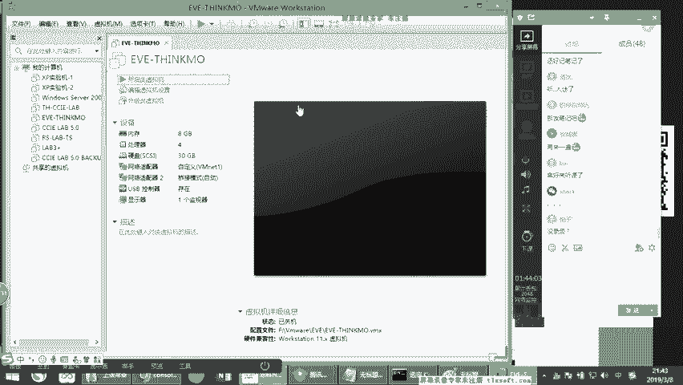

听见了，直点开就可以。没有，就是刚才的话，咱们课间休息了嘛，课间休息之后，那半个小时没有录屏。啊，因为课间休息我们是暂停了一下，暂停一下，回来之后直接上来。我感觉好像少点什么，哎呀，气死了。😡，对确。

啊，没关系没事没事，反正刚才这点的话讲的东西也没有特别多。好，我们接着来看啊。那么这个时候的话呢，我们来看啊，注意看。好。在这个过程中呢。呃，对，这个刚才那一点的话其实没什么太多东西啊，其实也没关系。

因为而且咱们这个班现在基本上都在呢啊啊。😊，你看打开之后就这样的，看到没有？就显示1个EVE啊，你让它不要不要着急，你让它开启就可以了，可以吧？啊，你让它开启啊，当然了啊，虚拟机肯定要安装的嘛，对吧？

虚拟机的话，在你们那个软件包里边呢，在你们学习礼包里面也有啊，就在那个工具包里边，你把它下载下来啊，你们那个工具包里面的那个虚拟机应该是V andware workstation。😡。

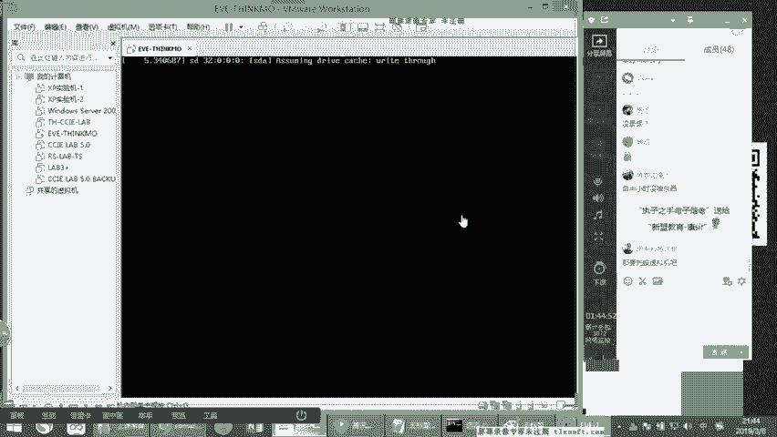

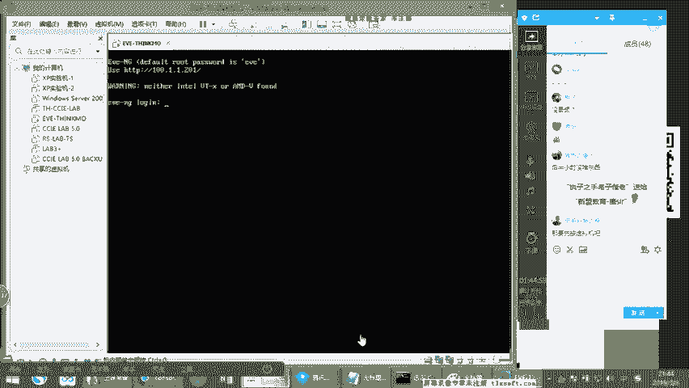

啊，off station的12版本吧，我记得应该这个吧啊应该是12版本，明白了吗？啊？学习礼包在哪？你们在报完名之后的话，都会领取到1个VIP学习礼包啊。OK吧都会领取1个VIP的学习礼包啊。

你们可以直接的话从那个学习礼包上走啊啊，你找谁报名的，要没有学习礼包，你找谁报名的，然后你就专门去找他可以吧啊。😡，啊，没办法，百度的云盘下载就是会慢一点啊，这个确实没有什么办法是吧？不过我办会员了。

然后我这个下载很快，可以吧啊？然后此时的话可以看EVE的话会新非常消耗内存嘛，不会。4个G内存就完全够用，懂吧？4个G内存就完全OK啊，所以大家不用担心这个问题，懂吧？OK4个G完全OK啊。

那么我们现在的话打开之后呢，看啊你看现在就进来了吧。😊。

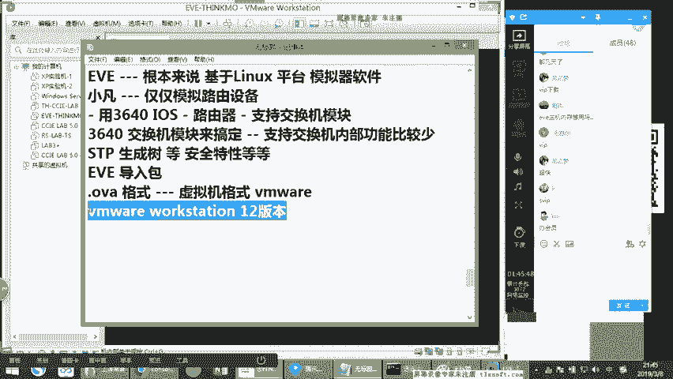

显到显示到这个界面的时候，我告诉大家，你们不需要去那个什么啊，你们不需要说是我我我怎么样那个那我怎么样去去去去这个这个登进去啊，你不需要登那里面的配置都已经预预先做好的。😡。

那么你只需要看一下你这里面的1个IP地址是多少。😡，这个是要看一下的，对吧？你要看一下这里面显示的预配的IP地址多少。我这个IP的我这个IP啊，注意看啊，我是改过的啊，就是windux。我跟你们说。

这个东西其实就是windux这个东西是一个什么呢？其实是基于乌班图的底层的，明白没有啊，我们现在用到基于这个乌班图的这个底层的这个windux环境。😡。

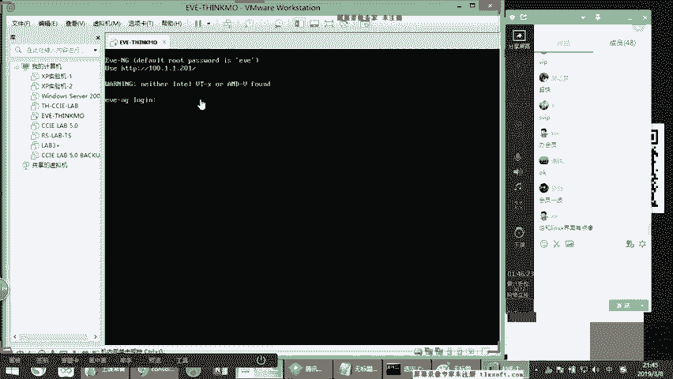

听白了吗？啊，是基于这么一个东西。😊，啊，GU斑图的一个底层。

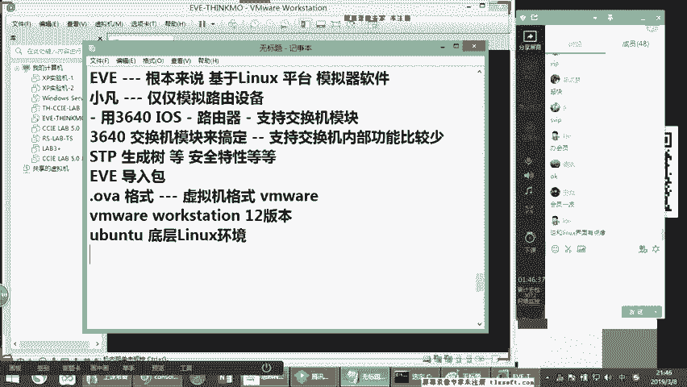

啊，基入半图底层的话呢，哎，你只需要干嘛呢？你打开你就看一下它默认预配的这个IP地址。😡。

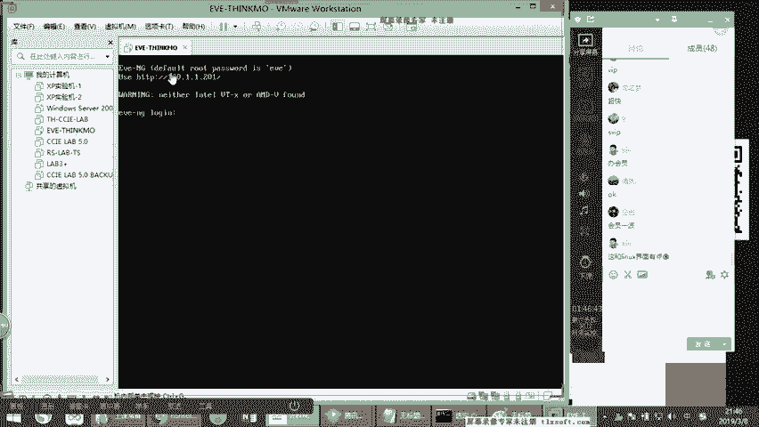

我给大家举个例子啊，假如说你默认注意看你默认看到的预配的IP地址。😡，如果是多少呢？打个比方，如果是这个呃192。1个8点10。100，打个比方啊打个比方好。

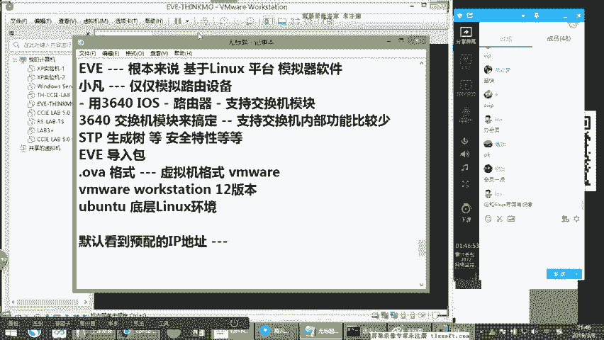

那这个时候你怎么办呢？接下来不要着急，你不需要修改它，你不用修改IP地址啊。好，你要看一下这。😡，看到这了吗？啊，你会右下角的会有一个网络适配器，听明白了没有啊，会有一个网络适配器啊，网络适配器的话呢。

在你们正常来说的话，注意看你们只要安装上VMV，你的本机设就会增加一个Vmnet一和Vmnet82块虚拟网卡。😡。

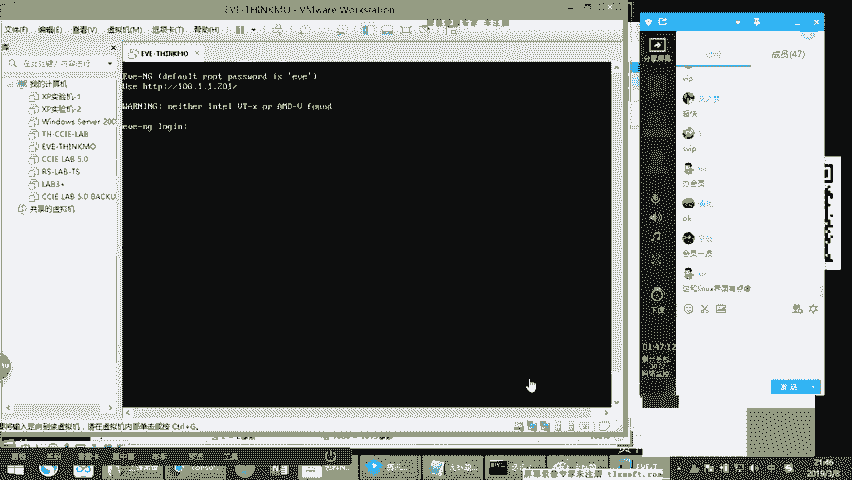

这个是安装虚拟机里面自带的。听没听到啊，这个是安装虚拟界里面自带的，里面自带着VMnet1和VMnet8。听到过没有啊，明白看到shaber一个啊，是这个意思啊，自带VMnet1和8。

只要你安装上它里边安装上虚拟机，它就有OK安装虚拟机这个东西有啊。😊，那你安装完这没错，是的好，然后这个时候干嘛呢？看着，直接把你这个网卡点开。😡，看到你右下角这个这个小电脑看到没有？这个小电脑啊啊。

这个小电脑看到了吗？双击开。😊。

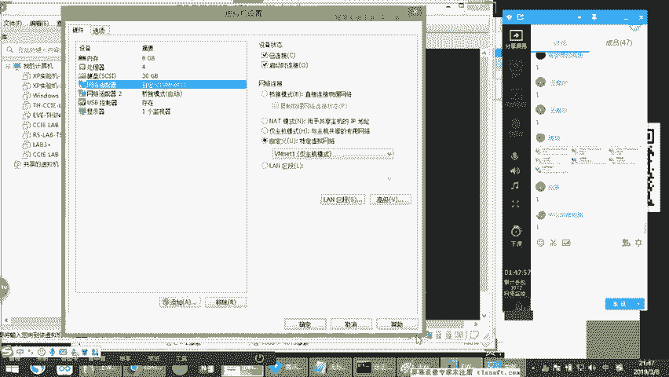

找双击拍。

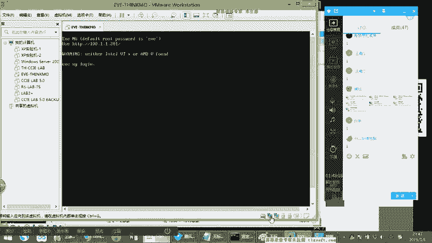

双击开之后的话，这个地方选什么？这个地方的话你可以选VMnet1。😡，听懂了吧？当你选VMnet一的时候，点确定哎，一点确定就代表你这个虚拟机。

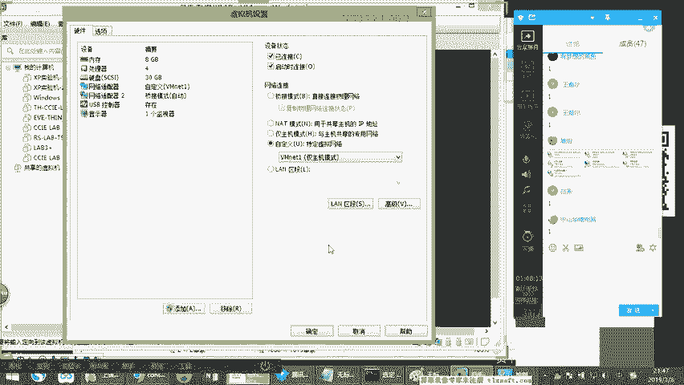

你这个虚拟机啊跟你自己的本地就连上了啊，跟你本地哪呢？跟你自己本地的这个VMnetE连上，听懂好吧？明白shaerE来啊，能不能听到？😡。

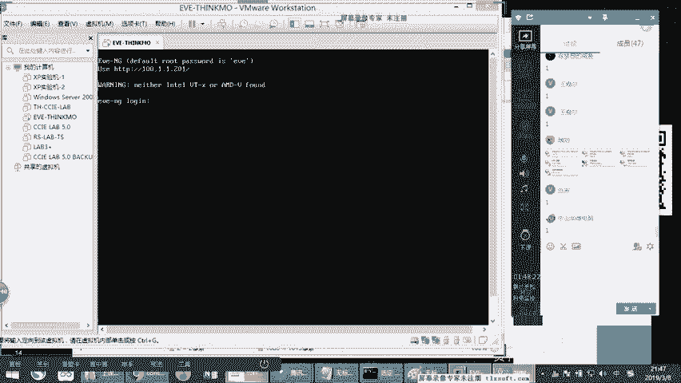

并不难的是吧，很简单的OK。啊，问题吧。家哥能听懂吗？听懂刷波一啊，速度。😡，啊，OK啊。好，然后接下来因为刚才我们看到的IP地址是多少呢？是192。168。10。100，对不对？

你只要设置一个跟这个显示的这个地址在一个段的就行。我给你打个比方，你在哪设置呢？你在这设置。假如是你可以上VM代TE啊，你就在这儿。😡，啊，右键属性。里面有一个版本4，看到没有？啊，你就在这儿说192。

168。10。200，明白了吗？好，确定。这就代表什么？就代表说你的电脑和这个虚拟机的电脑就连上了。😡，对吧你的电脑这这个VMnet看下VMnet1上，你给它配置的是19201和8。10。200。

而你这个虚虚拟器里边是19201和8。10。100。😡。

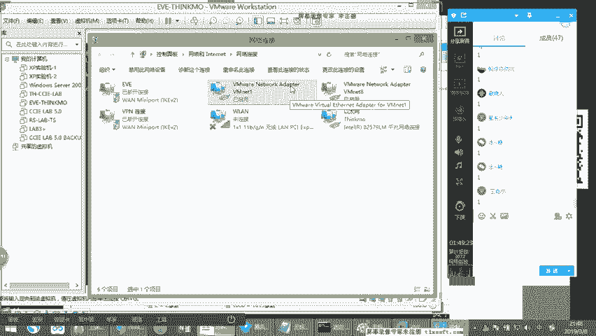

明白了吗？明白，看到serE了，那这个时候什么呀？他们两个就连通了，他们俩就连接上。😡，能不能听懂，没问题吧啊，没问题，稍方一样O好。😊，就这个意思。OK好。ok美题啊啊连下的之怎么办？😊，呃。

只使用一网卡吗？你只用一个就可以，你暂时一个就够，明白没有啊？你使用一就可以啊，你不要用两个，我我有的时候我会用两个，是因为我要做更多的实验啊，都是一样，一跟八都是一样。记住啊。

只不过我是为了做更多的实验，所以我会设置多个敲机，你们现在够用一个就够了。OK啊。😡，借款。那接下来之后的话，我要干嘛呢？我要连接它，对不对？如果你们那看到的是192。1和8。10。100。😡。

那你们连接肯定得连接10。100啊，对不对？啊，我这看到了什么呢？是100。1。1。201。我这现在看到的是100。1。1。201，听懂了吗？啊，我看到是这啊，那我这现在干干嘛呢？哎。

HTP冒号杠杠看100。1。1。201听明白了吗？啊，直接。😡。

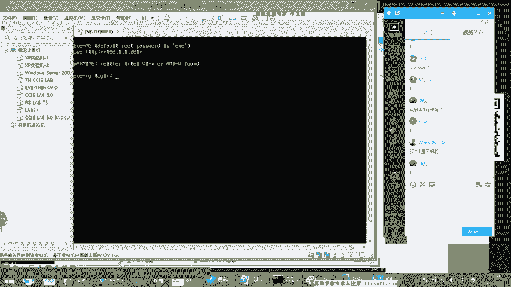

输入啊，直接输入。好，输入完了之后回车，注意看回车。好。就进入到了EVE的界面。能不能听懂能不能听懂，能不能听懂，明白上边意概啊，上边意上来。😡，好。OK问题吧。啊。然后此时的话。

我们看看用户名RDM密码呢RDM啊。哎，一码不是给没有？123哎，我操，我给你忘个密码了，等一下sple。😊。

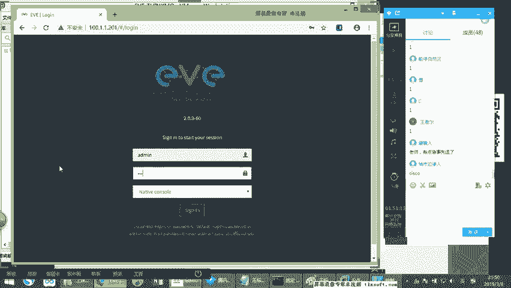

我操这个RD命是是是什么？等一下啊。好。哎，我这个密码是多少来着，我给忘记了。はは。😊，啊，EVE对对对对对，EVE啊，sorry啊，明白啊，用户名默认情况之下啊。😊，默认情况之下，用户名密码是一个一。

没错啊。明白了吧啊。账号密码在哪里配也，不需要赔，他自己就有默认的理解吗？这个用户名和密码啊，这里面都是属于默认的。😡，情况记住了没有啊，是默认的情况。好。那么我们接下来我们接着说，好吧啊。

我们接下来接着说好，接下来看。😊，啊。哎呀，你梁山有事啊，是这样，我不是给你们打个比方吗？我这边啊，我已经修改了IP了，懂吧？我这边已经修改个IP了，我修改成的是什么？我修改成的是100。1看下100。

1。1。201，我修改成是这样，能不能推荐。我说只不过你们那个默认预配置，可能没修改，你没修改，你进去之后，你进到系统之后，朱一平啊，你看到之后的话，可能是一别的IP你看到什么IP。

你只要在你本地跟它配置在一个网段就可以了。😡，明白了吗？啊，你只要跟他佩戴一个网站就OK了。😡，能不能明白明白啥时意样OK好。😊，好，我们接下来看。那么此时的话呢，当你进去之后啊，看到？当你进去之后啊。

你就可能看到的这个界面。2吧是这个界点。好。注意看啊。啊，当你看到这个界面之后，看到啊，我给你们放大了啊，看到了，那你可以干嘛呢？你在这个地方可以加入一个新的we板，打比方看看第二个钮好了吗？

你可ad new web，加入添加一个新的web，添加一个新的实验好，我们点一个添加一个新的we，添加添加。😊，点完之后你可以写一个名字。打个比方，我这个地方写一个名字啊，假如说我们说CCNA测试。😡。

对吧啊，它只能是英文是吧，test对吧？CC测试。😊，好，剩余的都不用写，不用管，明白吗？直接保存C。😡，好。看到了。这个时候的话，等于你就进来了，你看我们现在给你推出一下。

你看等于我现在增加了一个什么CCA test。😡，能不能看懂啊，我就增加一个新的实验模板。😡，好，OK啊，这样一新的实验模板400test，我们点开400test之后，看点上。😊，下边有一个open。

啊，我可以打开，能不能听到哎，我可以打开这个实验模板，打开OK啊。😊，打开之后注意看啊打开之后。然后此时呢，哎我接下来干嘛呢？我就要在里面添加网络设备。😡，怎么添加网络设备呢？看到右键。😡，n看到没有？

右键里面有一个node看。😡，好，请讲。好，再来一遍啊啊，注意看右键啊。OK好，请讲。😊，那么在添加里边呢，你们现在呢不要涉及到太多，你们就给我涉及到两个啊，或者甚至一个都够。😡，你看这个。

这个就是我们的3725的路由器，就是它里面默认里面有1个3725的AOS。能听懂吗？叫3725的AOS的这个IOS的一个版本。就是说在实际工作中呢，它是应用到了我们的路由器3725这个型号上的系统。

你这个可以用。你也可以用什么呢？雅老师我我可以拿这个当路由器，对不对？好，那老师我模拟交换机呢好点AOL。😡，看吧，AOL。IOL里边的看这有一个L图。听到不了？哎，这个地方有个L two。好。

原后L two。明白点L twoL two就是二层的啊，就是二层的。我们的系统啊，等于现在我添加了1个AOL，然后呢增加了一个L two的这么一个版本，这么一个系统版本。听懂了没有？听懂上边E了啊。

是这么回事啊。😡，那咱于这个可以当什么呢？可以当交换机啊，这个可以当交换机啊。那么在这个里边的话呢，就是你说老师我用那个路由器什么的，有什么区别吗？你假如说老师我现在。😡，我这个如果用三层呢，用三层。

它就是它是干嘛，它就是路由器。你看你用你都选择AOL啊，它就是路由器，你用二层的就是交换机。😡，明白这意思没有啊，这是二层交机啊。那么这个点呢希望大家搞清一件事儿啊。AOL是什么？啊。

叫做A这个这个AL啊叫做AOS。over没动词。啊，是这么回事。听懂了吗？这是我们运行在windux环境下的AOS系统。😡，啊，是这么回事，叫AOL。啊，那么在这个里边的话，其实来说呢。

它是它也是虚拟化的一部分啊，它是虚拟化的一部分。三层教育机呢老师。这个L two就可以支持三重调机，听懂了吧？它可以支持三重调，它只不过是告诉你L two干嘛呢？可以当交换机要，明白了吗？

大家我给你举个例子啊，假如说。😡，假如说现在我选择1个3725。大三下午。然后接下来你看这个地方我要上模块，看到没有啊，我这个地方要上模块，假如说我第一个插槽里边。😡，好，我上一个路由器文块。

我第二个插槽也上一个路由器，你看这代表什么？代表我现在有2个百兆接口是吧？这个我给你们讲过了，是不是NM杠EFE杠TX是不是啊，我给你讲过，你看两个插槽里面我上了两个模块。😡，下两个模块之后的话。

这是一台路由器，对不对？好，假如设我们就说这是我们的网关。好，望关好，保存。就多个一个网关能不能听到啊，这是我们的网关好。😊，你要说这个是我再添加一个那，让我添加一个交换机。😡，打比方啊。

我下面这个教机AOL好，AO two。我这个是干嘛呢？SW交换机。这我可以选择交换机图标，是不是？假方说我现在选一个唉交换机图标。😊，可以吧？好，然后点保存。来多一张去。听到了吧？各位讲军好。😊。

那此时呢我要把我的路由器唉连接到交相机上啊，注意啊再来一遍啊，注意看再来一遍好，点这看到吗？这个插销点上滑下来，别松鼠标滑下来好啊。😊，看到了吗？这个时候呢就干嘛？

就告诉你上面这个网关的F0-0接口可以连接下面交换机的E0-0接口，能不能听懂？😡，能不能理解明白看到上班一来啊。同意吗？好，保诉人。好，这个你上。好，这原介上。那你想怎么连。

你就可以跟着你自己想要的拓扑创建设备。😡，然后创间设备自己改。哪了家接口呀，你看啊这个地方有一个编辑，看到了没有？😡，编辑这个地方的话，你可以干嘛？然后我看现在我这是E等net接口，对不对？

这是sal接口啊，这sal接口好，Ether代接口。假如说我这里面啊这是四个接口，看到吗？四个为一组，要么加两组。😊，这几个是8个接口，要加三组。这是12个地方，这四组听懂了吗？啊，你可以在这下。😡。

明白明白给他们上边一来啊，明白啊，就从编辑里边自己去搞就行啊。你要上面也是一样，下面的话在编辑。啊，编辑完了之后的话，里面有什么，你看这不加加加接口吗？明白没有？加接口OK啊，这16个接口的，对不对啊？

😊，那么这个时候的话呢，你们注意哈，假要我接下来。干嘛？我要把这个设备打开。划上它看它划上它右键star啊，右键star。好，知道了。啊，这个设备看我们现在设备怎么样？已经开启了，看到没有？

我们现在这个时候设备就已经开启了啊，我们的网关啊，我们的SW你看是不是啊我们这个设备就已经打开了，能不能理解，能不能听懂OK吗？OK小 e啊，是不是啊，我们设备已经打开了要亮嘛啊。😊，怎么连接的？哎。

我就可以这样样，你看啊。😊，点一下。好。哎，我的铺提启动不了了，有的时候铺提启动不了，很奇怪。等一下啊。看能不能启动。好，铺体启动不了了是吧？没关系，铺体启动不了不警看一下下边。😊，啊，看下面这块。

这个东西吧就是一一那什么就那什么啊，我给你们像，我给你们放放大一点啊。好，看这。能不能看到哎，看这看到我的桌面左下角，看我的桌面左下角看到？天要net地址是多少？😡，第一台是多少？好，我们记录下来。

看到？到时给你们截下来好，这是第一台。😊，啊，这第一台啊，多少？327-9是吧？好，看第二台点上鼠标轴放上去。啊。32770。啊，这第二排。明白常词意思没有啊，只是你鼠标只要放上去，它就会显示出来。😡。

然后干嘛？接下来的时候的话，直接哎打开你的CRT连接。打开你的CRT连接。打比方我现在打开CRT。😊，好，我直接创建一个文件。从这边输入tnet。看到吧？tenettenet什么呢？100。1。1。

201啊，100。1。1。201100。1。1。201。好，32769。电源机哎，看。看到吗看到了吗？告诉我，看到沙波一来好，我再重建一个来好，32770是不是？好，点文记来SW啊。😊，明白了吗？明白。

看看上边一个好OK。😊，很简单吧啊，这等于给你接上我们的设备。😊，能听懂吗？没问题吧啊，没问题，给康才刷波一改。😊，好。啊，你要不要着急终端，后面的话我们的终端都用什么呢？要么用路由器模拟。

要不然的话我们会用什么呢？用其他的VMware的主机模拟，理懂吧啊，用用winN7啊，win8win叉P模拟。那这是一个我们的一个基本的连接使用方式啊，基本的连接使用方式。其实还是很简单的啊。

这个没有什么难度。

好，这大家知道就行。假如说你要关的时候，这样啊右键stop是吧？关闭。你们自己用一用，其实都会啊，你们自己一旦用起来就就知道这很简单的这些东西这些东西其实没什么技术含量，是吧？直接右键stop关闭。啊。

关掉先回了，关掉网页关掉是吧？然后直接把你的虚拟机关掉就可以了。右键啊电源关闭虚拟机。😊。

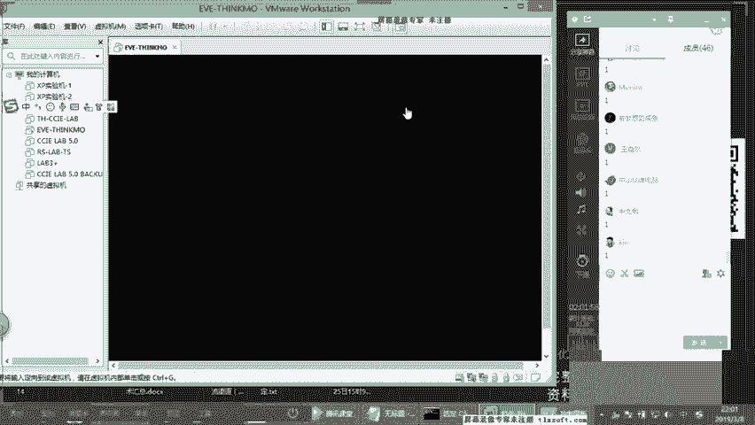

听到了吗？很简单，这先在关闭了。O。😊。

说置告诉康s可以听懂吗？可以的话，给康st刷波一来刷波一上来。😡，好。哦，oknice，那么接下来我们要来看一下下一个问题啊。下一个问题就是首先我们要验收一下作业啊，还要留一个作业。对吧验收一个作业。

留一个作业。要说一个作业留一个作业呢。我们首先先来说一个我们的新的作业，好吧，因为大家今天完设备要周六周日两天，你们的时间啊真的是蛮充裕的，所以希望大家能够利用好自己的时间，好不好啊。

利用好自己的时间啊。那么我们现在呢还都是在一些理论阶段。那么引论阶段的时候呢，注意看啊注意看啊，这个实在不会可以用百字。对，其实真的很简单啊，O吧啊，那么我们首先说一下今天作业。

我们作业依然是关于笔记方面的。😊，看了，依然是关于笔记方面的。重点关于什么呢？重点是关于cos这刚天讲的，一个是OSI模型的笔记。一个是OSI模型的笔记，一个是设备关于这个里边的系统和存储器方面的笔记。

好，就这两篇。我就给你命名两个题材。听懂了吗？啊，一个是OSI模型的笔记，一个是设备系统存储器的笔记啊，然后这两份笔记。😡，做一个笔记的记录，再纸质笔记啊，记完之后，我会在下周一的时候。给现场验收。

明白了吗？我会现场验收。OK能不能听到就是这两天的每个人方便的东西哎，卫平都有。没错是的啊，每个人方便的东西啊，康sor要跟你们没得说，就是你们要做笔记，你们因为你们不记笔记，后期你们想不起来。

我没有办法保证你们都记住，但是我能做的事让你们都记一下吧先。😡，然后后续的时候的话，当你有一点模糊的时候，你可以干嘛？回过头去看，你可以回过头去复盘。明白了没有啊，这个是我们说的关于笔记方面。

听懂了没有？明白，先稍波一啊啊，那下次课就开始有实验方面了，理解了吧？下次课就开始实验了啊，我就开始给大家留关于实验方面的作业了。O。😊，好，现在这个点都记起来。所以下周一的时候我会验收，我还是抽查。

理见没有？我还是抽查。如果抽查到了你没有，那就不要怪我数过你啊，是不是啊啊，你想在那么多同学面前，我数过你，这也不好吧啊，后边的话，我在我的课上的话，还会留出来时间给你们唱多感觉好吧？

只要是说你们自己这边呢，哎这个笔记每次作业没交的那对不起啊，那下次课的时候的话，作为惩罚，那你就要给大家唱首歌了。😡，明白唐才这个意思没有啊，唱首歌是吧？啊，还是我选歌，明白这意思没？啊。

所以希望大家不要犯这种错。提交没有？对，没错啊，记住做的全面一点啊，做的全面一点O吧？啊，能不能听懂？啊。啊啊不痛不痒，那你就不要写笔记，你看一看下次的话是不是不痛不痒啊，你去感受一下好不好？啊。

关于对大家的这个方面的要求呢，council呢是这个意思。大家都是成年人了是吧？😡，啊，注意看啊都是成年人嘛，都是成年人的话呢，con没有办法啊没有办法说是怎么强迫你们能理解吗？没有办法怎么强迫你们。

但是呢我会尽我的所能，让大家在整个课程的一个进度上能够保持一个学习的效果。明白，你说老师我反正你就是不写啊，老师我是没有办法，我就是太早写不了。😡，是吧那你说他总能拿你怎么办呢？是吧？说到头绪的话。

我能拿你怎么办？我拿你什么办法都没有。兄弟们说是不是这个道理？但是呢为什么我会这样要求你们呢？是因为我就这么过来的。😡，听懂了没有啊，我就这么过来的，如果你们自己不想办法抽出时间来搞。😡，啊。

你们不想办抽出时间来，你们永远也提升不起来。😡，能不能理解啊，明白吗？明白给康s刷波一啊，稍波一上来啊。😊，O。啊，开飞机取直棒子要打人，我不需要打你我打你干什么，是不是理解过吗？我打你干什么啊。

但是的话我有义务要求你们，我有义务要求你们必须要按照我的这个整个的课程进度去跑。😡，明白了没有啊？这是我对你们的一个要求啊，这个没有办法没办法，只要你们在我的班呢，是不是啊，你们可以选一个别的老师的班。

选一个别的老师的班呢。哎，他们也许就很轻松一点，是不是啊？反正在我这里我就这样。😡，明白没有啊，这个没有办法啊，没这说委屈，对不起，听到吗啊？😊，然后这是一个呃我们的这个一个点啊啊。

实际上下周一大家去按时交。虽然我们现在还没涉及实验，懂吗？没涉及实验啊，那但是呢我们一要希望你们呢做好全面的笔记，希望大家用心做，不要为个给我交，不要为个给我交康or再三强调，没讲过？

我要你这个笔记啥用都没有？明白了吗？啊，不要忘记就是不要为个给我交，而是正儿八经认认真真自己做那一两个小时，好好梳理一下，这才是关键，记住了没有？啊，记住了吗？记住差多一啊啊。😊，那同时的话呢。

我呢也抽查一下关于上面的啊上节课的是吧？上节课的时候我说过，还是让大家要继续交作业的，是不是？我再用5分钟时间。啊，我来看一看，我再让谁啊，我再抽两三个人啊，我再抽两三个人，我看一看是谁需要给我交啊。

小九哥把你的作业给我交上来，小九把你的作业交上来啊。shaharp啊shaharrk你这个名字这么好是吧？把你的作业给我交上来。😡，啊，小九shark。还有谁呢？我没说下课啊啊，我可没说下课。

我看你们谁敢啰我扫啊，还有个位啊，这三个人啊。😡，OK这三个重写啊。好了，小九。啊，记住shark。ノイス。哎哎LOIOU哎4个吧，不好意思。啊，不是啊是吧，LUAOS哎哎，把这故意思啊。😊，啊。

就这个吧，路易斯啊啊。😊，赶紧先把三个作业给我交上来，哪位有的。😡，啊，哪刘的。啊，我就这么写啊，要公一思啊。😊，啊。好家，你们三个先把作业发上来，发完作业之后的话，大家再下课啊。

我就这个国际就这个原则。😊，好，不要耽误大家的时间，懂吧啊？不要耽误大家的时间，赶紧把作业交上来。😊，啊，照相直接把你的笔记照下来发出来。😡，我先要看到的就是首先你们要去做懂吧啊，你们要去做。好。

回到小学生时代了是吧？如果小凡能用，可以先用小凡EVE可以暂时先不用。啊，没有吧？OK可以暂时先不用。😊，听见们啊，怎么发不上来啊？😊，哪里也发不上来啊，你跟我说说哪里也发不上来。😡。

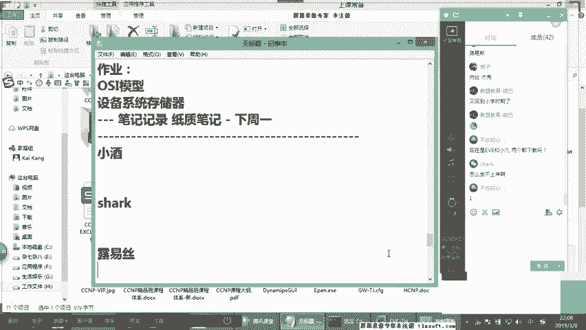

啊，我先把这屏行给大家停掉吧，今天啊。😊。