# 2019年度最新思科认证CCNA网络技术经典实战教学全集（最适合零基础小白的CCNA详解） - P6：思科认证CCNA网络基础第6节-基础命令集 - new盟的小狐狸 - BV1V4411J7ZP

。

好的，我们先来看一下。那么我们继续我们上一节课的说，好吧，同学们来给他们shoppper一啊，shop波鲜花上来，我们先开始了。那我们本堂课的话呢，要开始继续我们的网络设备的命令集的操作。😊，好。

那么上一节课的时候的话，刚才已经教大家关于模拟器怎么用，对吧？我们已经讲讲过，我们也学过的话呢，具体来说的话，这个设备是怎么连接的。哎，咱们也学了是不是啊？这个问题啊啊，那我们接下来重点是要干嘛呢？

我们重点是要看一下这个设备的里边的基本命令集，这是我们需要了解的那我们1。1点来，我们把每一条命令集都记熟悉，把每一个模式记熟悉，大家记住啊，这些东西呢看似非常简单，但其实的时候的话，你要达到熟练。

必须首先要清晰的认识，而且的话要反复的操作才可以达到理解了吧？好，那同时的话我本堂课也会收你们上一堂课的作业啊，不要告诉我说你们做没写作业是吧？那如果被我抽到了，那不好意思啊，我要屌你了是吧？O。😊。

那我现在我们来看一下，首先呢当我们现在要连接一个设备啊，卡le现在随便连接一台设备。😊，啊啊，我看一下，我给你们连哪一个啊，稍等。😊，好，我们就这个面子吧，一跟二看向盘。😊，一和2轮才。然后呢。

我把这个打开啊，关作关于怎么数模拟器，我已经教过你们了，对不对？这个我相信你们应该不需要特别的担忧了啊，现在应该已经非常熟悉了排队。😊。

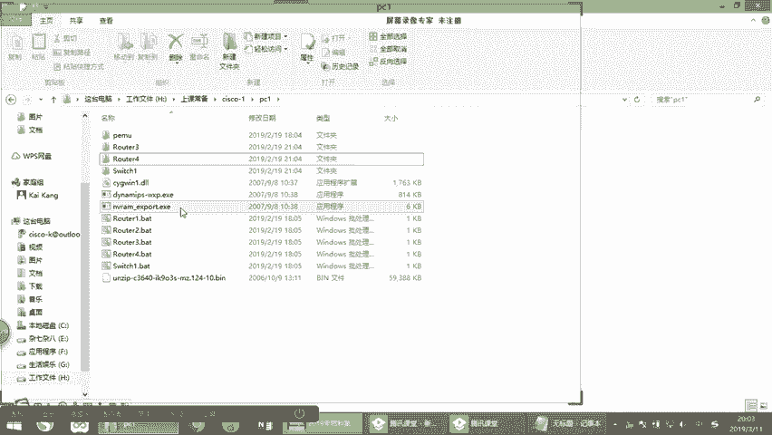

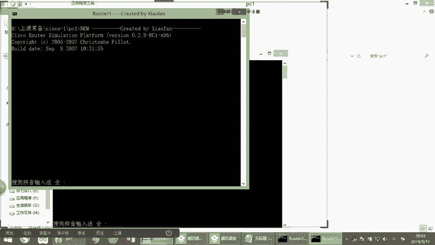

康呢这堂课呢就使用叉se改点击。啊。稍等。12亮台，我们现在连接上。

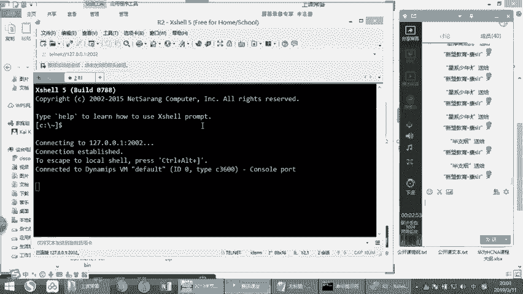

连接啊两台好，然后这个时候的话呢，一和二这两台呢，我们现在看好，当我们看到一个设备之后呀，你刚开始显示的界面就是这样的，就一个设备你没有配过的时候，这个界面就是这样能理解吗？😊。

不管在路由交换上面都是一样啊，都显成这个这个样子。😊，那他问你的是什么意思呢？他问你的是是不是要开启这个配置向导啊，是不是要打开这个设备的自动配置向导。我明白啊，就是说在我们正常去操作设备的时候。

它其实有几种方法。第一种来说的话，我们可以通过网页进行设备连机。😡，是吧这是可以的。那网页的设备连接呢，其实它是图形化的向导。注意看它是图形画像的，也就是说它也是按照步骤去引导你下一步下一步下一步完成。

明白这意思没有啊，你们只要是通过网页来调的，其实逻辑是一样的。😡，那么在这个过程中的话，你就不得不什么呢？按照他的引导步骤进行。明白这题吧？引导步骤就是人家问你什么，你答什么，人家没问你。

你没没有你没有办法做，能不能听到啊？那同样的话，对于我们的COI命令行模式里边。😡，好，命令行模式中。那么这个时候的话也是什么呢？也有一个引导模式，也有一个引导模式。

这个引导模式的话就是通过命令行的引导啊，叫配置向导。听明白他的意思吧？明白上边一页OK。😊，那这个配置向导呢，它也是问你一步一步。打个比方，我们说yes啊，你发现它下面每一步都是按照步骤走的，理解了吧？

哎，它每一步都是按照步骤。你看你假如说你要开启什么吗？no什么，你要开启什么，你的主机名叫什么R，一等等，明白了吗？它这样，你所有的步骤都是按照这个点去走，你你不能跨越它，你说我现在想配个别的，对不起。

没到这一步，哎，他不能让你配。😡，听明白了吗？啊，这个我们说叫配置向导。好，那如果现在的话，我如果按正常来讲，我会输什么呢？嗯no是吧？输嗯 no，就是我要不要开启配置向导。当我不开启配置向导的时候。

这个设备进入什么模式了？我告诉你，那就进入到尾一入自由模式。😡，进入到自由模式的话，就是你完完全全的配置都是以什么呢？以这种来纯手动面令行模式。然后你自己可以随时切换。😊，理解了吧？哎。

你可以想怎么配怎么配，能不能理解，明白s微意来啊啊，是这样的一种方式。😊。

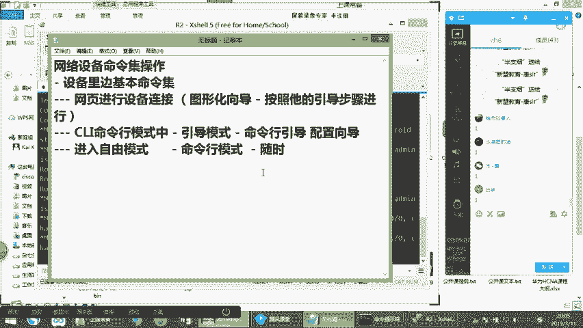

好，那假设现在我们ctrl C，我退出来。😊，好，稍等退出来。那测出来之后呢，这是我们的路由器一对吧？R一是吧，这是RE好，那么你可以看可以看到现在我刚刚做给什么步骤呢？你看啊按正常来讲。

你进行是这样子吧，看到有？😊，这是分模式，就是你任何一台你要配的网络设备都有模式的概念。什么叫模式呢？看着啊，前面是我们的主机名。后面是模式。主机名是说你进到设备里之后，它叫什么名字？

这个设备叫什么名字？

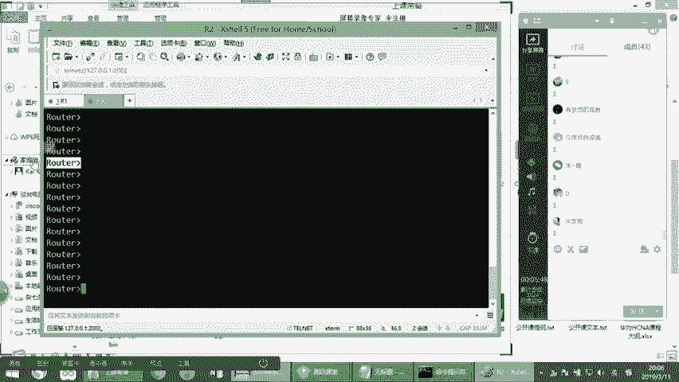

那我们知道主机名的话呢，其实这个名字啊分成两种。啊，路由器的话叫什么呢？叫rotor。啊，交换机呢叫switch。

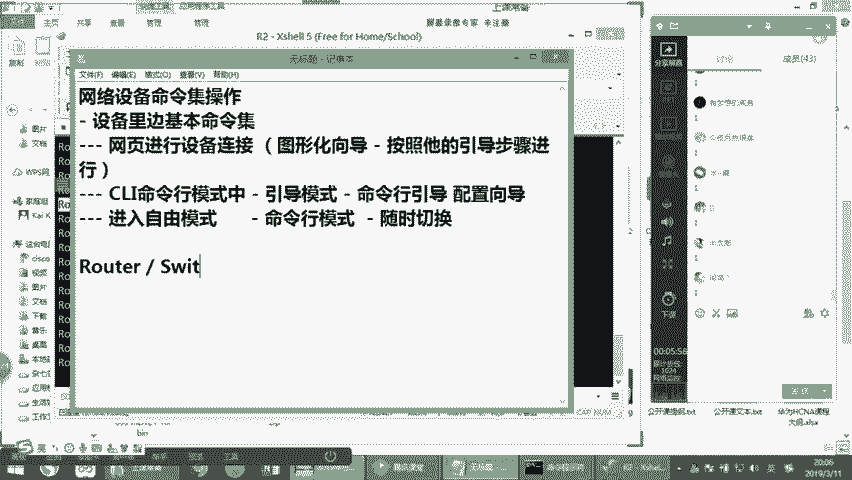

明白意思啊啊，而这两种是已比较常见的。那我们在建议之后呢，可以看到这是一台路由器，对不对？啊，root啊，那后面这个大于号呢，注意看后面这个大于号代表的是一个模式，这是什么模式呢？这个模式叫用户模式。

记下来。😊。

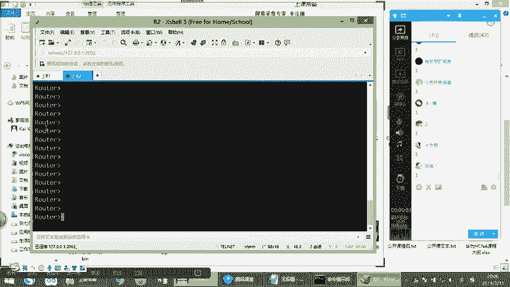

好，像用户模式。那么用户模式呢，其实你能干的事儿呢非常的巧。那大多情况之下用户模式是一个什么概念呢？我告诉你们，就特别相当于是啊就user模式吧啊，user模式user模式的话，其实主要是用于查看。😊。

啊，用于查看，就是你只能看明白了吗？你不能配置什么。😡，啊，你只能看一些东西。

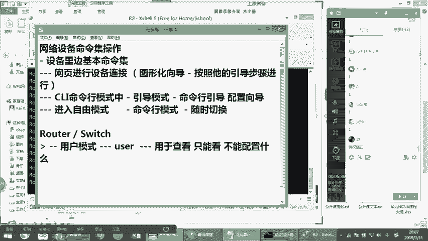

而并且在这个看的过程中呢，你并不是什么功能，什么信息都能看到。他有很多信息它有权限的。你假如说你在用户模式里边，你能看到的其他的关于就是一些信息的话，非常少。😡，你家说我就不想看它的配置，看它了看不了。

明解了吗？好，那你家重总查看一个接口信息可以吗？可以。😡，能听懂吗？所以他其实来讲的用户模式下呢，可以看到的信息非常的少，并不是什么都能看到。明白了吗？明白了稍不意啊O。😊，啊。那下一个模式叫什么呢？

我们先了解模式啊。😡，叫特权模式，你看到没啊，这井号。井号是什么？😡，井号的话叫特权模式。好，记下来跟着啊，叫特权模式。😊，特权模式最主要的一个作用依然是用于查看，最好用于查看。他依然是不能进行配置。

但是注意看在特权模式下呢，你可以看什想看什么看什么。啊，就是说你可以在这个模式下面的话，想查看到的一切信息你都能看到。😡，明白啊，这个叫测权模式。没错啊，你可以查看到一切你想看到的信息。哎。

这是我们所在可以在测权下看到。😊，但是在特权下呢，我们要注意一个事儿啊啊我们要注意一个点，就是在我们的特权模式下边的话，它除了查看之外，它还可以起到什么呢？例如像保存删除等一些全局操作。😡，啊。

这是可以的。好。什么意思啊？假如说我想保存我的配置，跟大家举个例子叫rech，还记得吧？刚才上这节课跟你们说过，叫rch，你看保存。😡，看到没有？而且上节跟你们说过这个嘛？叫保存配置啊。

还有什么叫copyrunning confi到star up confi啊，明白吗？你看这个也叫保存配置。😡，那意思一样啊，你看这是可以就保存可以。

我删除呢哎你要删除一下我flash里面的这个AOS对吧？你看假如说我们正常来说，我要想给我的设备去升级我的AOS升级AOS的话怎么办？我在此之前的话，都要先把我的AOS里边的信息做一个擦除啊，你看。😡。

确定吗？你看确定A他我可以把它做一个擦除erasse啊，你不知道erasse你可这eraser啊橡皮擦嘛，啊erasse就擦除啊，你看有的这个人不能用format命名。

有的设备里面可以直接用form是吧？格式化啊，我可以格式化，不给变某一个。假如它可能是这样的。😊，啊，不lash。明白意思吗？啊，意思一样，跟errase意差不多啊，所以在这个模式下的话。

我们可以做到的是主要是以查看，还有一些全局性的简单操作为主。这个是我们说特权。😊，你说老师我假如我在这里边我要配置更改接口信息行吗？不行，老师，我在这里面我起一个目录协议行吗？不行。😡，明白了吗？哎。

我在这里边的话，我要开启一个什么功能，可以啊，什么功能都不行，你不能在里面做任何功能。😡，能不能理解明白上边意呗啊，所以大多数情况之下，我们在特权仅仅适用于查看啊和一些呃基本操作。😡，没题啊啊。

明题我先着说，你们社区的同学可以要跟我随时互动啊啊，一个要跟康随时互动才可以啊好。😊，🤧我们接着来看下一个模式呢叫这个模式，看到吗？哎，confi个警号模式。这个模式什么模式呢？注意看啊。

这是一个叫全局模式。在全局模式，全区模式主要用于的是配置。主要用于配置。什么配饰呢？开启的是整体性的信息，一般在全局性。例如我要打开一个协议。对吧我开启一个协议。能听懂吗？好，主词类的。哎。

比如我要开启。😊，一个什么呢？流量监控系统。那等等，你发现这是一个什么呢？这是一个面向整体的信息。哎，我是可以在群集下做的。😡，那什么叫不是不是整体信息呢？哎，我们打个比方，假如说我现在要做的什么呢？

要把接口，我要配置接口的IP这行吗？不可以。😡，对吧我要配置接口下某个信息不可以，这是也就是意味说我们面向整体的信息。这个整体的信息，咱们说出回来，其实就是我们说到的什么？哎，就是说这个全局性的功能。

我们可以在前局门式下做，能理解吗？啊，大家理解一下这个概念，而有些地方的话叫做就相当于什么样的？你看医生啊，他的内科外科是吧？还有呢？你要是我我这老说我看眼睛啊，这什么这个这个眼科是吧？

老师我这个看这个喉咙啊，耳鼻喉科，明白吗？你看这就不一样了？你说我我内科内科我想看一眼眼睛行吗？不行，明白这意思没有啊，所以它其实面向的什么呢？面向的是全局性整体的信息。😡，清楚了，清楚差不一样OK。

好，那最后一个模式什么呢？科长先要进入接口。😡，啊啊叫接口模式啊叫接口模式。好，我把它复制下来。😊，啊，这个叫接口模式。那接口模式什么呢？大家注意看啊，所谓的接口模式这个概念啊。这个东西啊。

所谓的接口模式这一个概念，你看if什么？什么叫if啊，我告诉你们，其实你们总说自己英文不好，coor告诉你们，其实if来说的话，就是我们说的interface。😊，Yeah if。明啊，这接口啊。

其实意思就是接口的意思。😊，明白了吗？每一个CCE工程师考完CCE之后，你会发现，首先在英文上就比较能装逼了，明白这意思没有啊，为什么？因为他感觉我操你们好牛逼啊，这这很多人第一页上这样的，理解吧？

你要在项目上面，我操你叨叨叨一配置，我操别的工程一靠我操你这么牛逼啊，你这不是技术牛逼，我操你这英文好牛逼，甲方客户也觉得你好牛逼，明白这意思没有啊，首先很装逼。

这个是啊啊那其实的话这是些简单的一些单词是吧？这非常简单理解了吗？啊，OK没理吧？啊，刚才告诉你们个现实情况啊啊。😡，OK所以在这个里面，你看interface啊不要紧是吧？它不是编程是吧？

有什么假如呢interface好，所以你可以看我们现在叫配置config什么意思啊？你看CONFIG这配置意思是吧？就配置意思啊，有的时候你看我们在C下A里面啊，C下A的b里里边的话。

包含一个其中的一个考试的部分叫什么叫CFG这个CFG我告诉你，这confid着一个简称叫CFG。😊，明白了？config明白了吗？啊，是这个意思听明白了吗？啊，是这么回事，很简单的。

其实啊这config啊，那你看你配置接口是吧？配置接口OK那么进入接口之后的话，我们要干嘛？我们可以在接口下边在接口模式下，哎配置接口下的信息。例如我配置个IP地址。😊，对吧等等。那么要搞清楚啊。

就是说当我们拿到一个设备之后，其实按照步骤来说，我们首先要干嘛？首先我们要现在全局下，所以哈我们现在全局下修改一些主机名。😡，哎，修改数机名，为什么？因为所有的设备默认都叫做root。

所有设备都叫root，明白他才意思没有？如果所有的都叫做root。😡，好，你这个时候的话，你告诉我你分辨的清楚吗？😡，你可以把它分辨清楚吗？能吗？😡，你可以做到吧？你可以分辨清楚吗？😡，可以吧？

不可以吧，因为你所有的则都是要干嘛哎，都是要找ro，你肯定分不清啊，因为你同时配很多设备，对不对啊，O所以此时干嘛呢？我们要给它先修改我们的主机名哎。

假如说我们给它改成housese name打个比方我改成我们这个公司啊，假如说我们叫think more是吧？O啊think more好，我们西蒙教育是吧，西蒙教育的假如说我们西蒙教育的网关一啊，出口。

明白我意思吧？啊，或者我们可能会这样写出口一就你根据你自己的命名规则来，这无所谓，理解了没有啊，你只你根据命名规则，你可以看懂就可以是吧？啊，假如我这里面简单一点，我修改成R一可以吧？啊，修改成R一啊。

😊，那么这个地面这个地方呢大家注意一下，不要有什么特殊字符，其实它可不可以有呢？它可以有。你看假如这样。😡，可以不可以，是可以的，你看看到没？但是可以修改成特殊字符的。😊，是没问题的。那么修完之后。

你看变像这这个这个屌样是吧？啊，但是不能有空格，你还说这样是吗？我这样可以吗？这不可以，明白意思吧？中间不能有空格，就是你这个主机屏里边，哎中间空格不能有。😊，听明白了吧？明白给costor刷波一来。

刷波一上来。😊，啊。是吧。啊，因为什么时候没有汉字打不上啊，不要想打汉字，汉字打不上。除此之外的话呢，就是不能有空格，明白了吗？很简单啊好。😡，那么这个时候的话，我们修改成R1。

但在项目上不要大家不要随便修改成什么R1RR3R4啊，在工作岗位上不能这么做的。因为工作岗位上的话，理解吧？工作岗位上的时候的话，你修改成R1R2这么胡扯吗？没有这个东西啊，记住啊，记住啊。

没有这个东西啊，没有什么R1R这个概念懂懂了吗？OK好啊，莫名其妙一看就刚培训完是吧？很多机构的老师都是这样教学R1RR3RR5，胡扯，你工作岗位上肯定不能你做明白吧？你假如说我这边下边的话是交换机啊。

我是1个IDC是吧？IDC里边的话呢，假如说我在我们的。😊，公共机房里啊，那我很有可能是这样去写的。😡，好，假如说我是写一个public。好。啊，public，然后这个时候干嘛呢？啊，然后这个时候的话。

我们可以写public的一个，假如说我们的做接入的是吧？A假如说excise是吧，接入的什么。😊，SW的R一啊，假如说okK。题明要，我可能会这样写。这代表什么呢？这是我们的一个公共性的。

能理解我这意思吗？R加说这是我们的第一个机柜，那等于我呢现在告诉你就接入层第一个机柜，那这个时候可以方便你干嘛呢？准确找到。😡，听明白刚才意思没有？明白不吗？啊？明白s一上来。okK好。

每个地方有不同命名规则啊，根据你们所在地方的命名规则来判断就可以。OK吧啊啊，咱们接着说。😊，那么这是一个我们现在看到的主机名。那交完属于名之后，首先你是一定要拍IP的啊，你是一定要配IP的。😡。

PIP的话，假如先是用接口。打比方这样接口下，你不能说老说在这个全局下头做法不行。你刚开始你愿要养成一个习惯，什么习惯看？我教大家看着啊对模式的切切换习惯一定要养成，假如说啊看着啊用户是吧？特权全局。

😡，什么特权用户okK好，特权。😊，全局接口啊特权明白吗？给自己要养成一就这样的一个习惯，就是你每切换一个点啊，你都非常熟悉的可以知道对吧？它这个模式当前这个模式是个什么模式啊，你可以搞得清楚。😊。

能不能理解，明白双方意见。OK。明白了吗？啊，养后这样一个习惯，只要反复当自己去练。有时人将问老师做先做什么，做实验就做这些。每一个部分实际上有难有简单啊，但是你一定要反复反复的话，你才能记得深刻。😡。

大家记住啊，当你们学到中期的阶段，你会明白实验是帮助你验证的理论的。😡，你所有听到的理规能不能记得下来，取决于你实验能不能做出来，这才是关键。记住了吗？OK ok下 e啊O好，接着说。😡。

那么这时候我们进入到接口下。好，先秀一下，加入P个IP。😊，啊，这个IP。怎么做这样。IP address然后说这个192。1个8。1。1看吧？😡，啊，这是我给我的接口，这个路西一的接口配1IP地址。

😊，看到没有？我把这路的接口配1个IP11908。1。125。2525。0，看吧？没错O。😊，听见吧？啊，这配个IP它格式这样这种格式啊，配IP什么IP哎加掩码。到。那不要忘记，只要是路由器呢。

所有的接口默认都需要是干嘛给它no下档才可以。因为接口的话，它本身是杀档状态的。你们要记住记住一个点，杀档什么概念啊啊。😡，sh down什么意思啊？就关闭，对吧？啊，我要开启呢叫什么？

开启我们叫no shut down。😡，比较就开始，听懂没有？啊就开始。好，no shut down开始。😊，so在这个边要干嘛？我no稍等。好，开始。😊，no下是的。没题。好，退出。结出。

那么这时候这个接口提出的日志消息，就告诉你这个接口现在已经开启了。那这个接口已就OK了。好，那我们接着来看。😊，老师，你那几个模式是怎么过来的？注意看啊，用户模式。😡，这套特权en。看到吗？

用户介到特权是以vivo。刚才到，你就老是nemo是什么意思？😡，Enable其实就是打开开启的意思。あ。啊，尹维宝。对吧说我退回到用户呢，我怎么退回到用户呢？很diable。😡，哎呀，卡住了啊。

这这样看吧。😊，好贾说啊，怎么退出呢？😊，diable哈。😊。

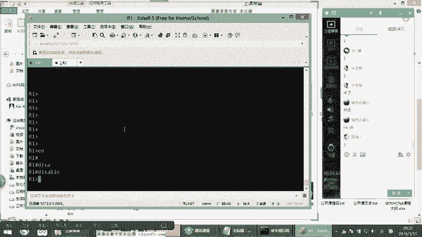

明白吗？Idiable。那Dc什么意思啊？就是说我们退出关闭。😡，好，关闭。退出。那么在这里面这都是一些非常非常简单的英文单词，非常非常简单。大家要注意啊，你们需要去翻译吗？卡斯跟你说句实话。

我考IE的时候，我考CIE的时候，我不知道enable具体的英文意思是什么，我不懂。😡，第C个我也不懂，我告诉你，直到有一次我在那个哪呢？我在一个一个台式机的显示器上。😡，我在按那个显示器。

我在调那个显示器的设置。😡，其中它就有一个disable。是关闭，我一点这个TCbo呢，那个选项就关了。😡，啊，我这个时候我才知道哦，原来这是关闭的意思。我这个时候那个阶段我才知道。

原先我都不知道DC是关闭的意思。😊，明白他的意思啊，但是你要不要知道呢？康觉得是这样，就是说你如果知道呢，对你来讲有好处。如果你知道对你来说，我个人觉得是有好处。那大家有的时候呢总是可能忽为一个点啊。

就是说老师我那个。😡，投期小工作的时候，我收入怎么变得更高一点？😡，刚好给你们说一句实话啊，我交教给你们一个非常重要的一个一个概念。😡，首先呢技术那你不用说了，刚才郑经讲过，一定是要强势的。

技术强势很重要，明白我的意思吧？技术强势很重要，你不要一去面试，好像欠扯了一样，对吧？技术强势很重要啊，你进考你不怕被问住，这是第一个点啊。第二个什么呢？第二个来说的话，就是最好在后期啊。

当你们哎一考完之后呢，注意看啊，你们去搞一个什么鬼啊，我告诉你们，你们去那个新东方，知道吧？你们去搞一个那个那个那个商务英语。😡，啊，你们去搞一个。屌的很，明白我意思吗？啊，商务英语。

你们去东方搞一个商务英语，为什么呢？是因为你别想几个月啊，学完之后啊好，很装逼。你这个事情呢啊雅思也可以的是吧？但是你可以先搞个商务英语，很装逼，你就去专门面外外面这个外企。😡，没错，是的。

你专门去面问外企。我告诉你的外企啊开出的薪酬比相对普通的那些破系统集成公司啊高出来3分之1啊。你要在普通的系统集成一个月6000，他就没开到9000，明白意思吗啊，很装逼的，然后你就记住你的英文，哎。

他其实问你的都是一个很简单的case。他问你就特别简单了。😡，明白吗？啊。对你就记住一个点啊，你知道你知道有的人的话，然后说他们说说说话动不动蹦出一个英文词什么的，很装逼对吧？是这个意思。所以首先来讲。

一定要多多少少学一点。😡，理见过吗？哎，对，就商务英语够了。康er告诉你够了没问题，你懂吗？哎，不要花很多钱，你后期的话一定可以找到一个外企的岗位。你按康s斯跟你说的办，你放心。

你绝对后边哎考完IE之后，你搞一个商务英语23千0块，你就学一个搞完之后，你相信康s啊，你相信康，你找工作的时候，绝对是瞬间。😡，并到1万将近这个这个这个vil明白没有啊啊，一定首先要技术强。

有专业证书很装逼，这很重要，理解没有啊，council没有没有拿你们当外人就直着说的啊，OK啊。😡。

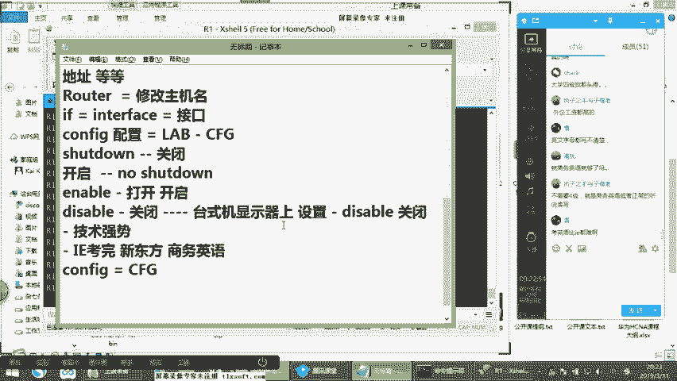

好，我们接着说接着看。那么这时候的话呢，假如说我们说enable啊diable是吧？我们说这是我们什么叫特权是吧？啊，是吧？用户吧啊用户特权好，注意看下一个模式呢哎叫config terminal来。

😊，是吧配置终端。看到没有啊，配置终端明白这意思没有啊，配置终端配置终端是什么概念？配终端什么概念？配置站。😡，黑啊配置这什么概念config T。你看有时候我们会写。

你看啊假如说我们退出config t，你看这样写是吧？config t退出config t明意吧？confit tO好，这是简写config terminal啊，那么我告诉你，这也特别好记。

你们都不用使劲背，我们原先简写都是什么，我们简写都是CNFT对吧？这你们都知道config什么配置。😊。

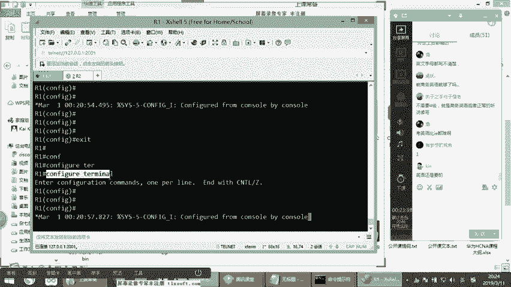

全明到了全明到什么？😡，特别的什么？终端是吧啊，站台是不是啊，知道吧？你看假如说你的机场里边是吧？你看那个T几机场知大家知道吧？T1机场T2机场啊，那个T就tmin这么算OK吗？

啊minal one terminalminal two是吧？啊，第几站台第几个终端明白的意思啊？很简单的理解吗？好，所以这个时候干嘛呢？就配置终端配站台，你看这时候你就知道了，是不是？

你看那个机场什么T2航站楼啊，就min two航站楼明白没有啊，明白shop一啊O啊。😊。

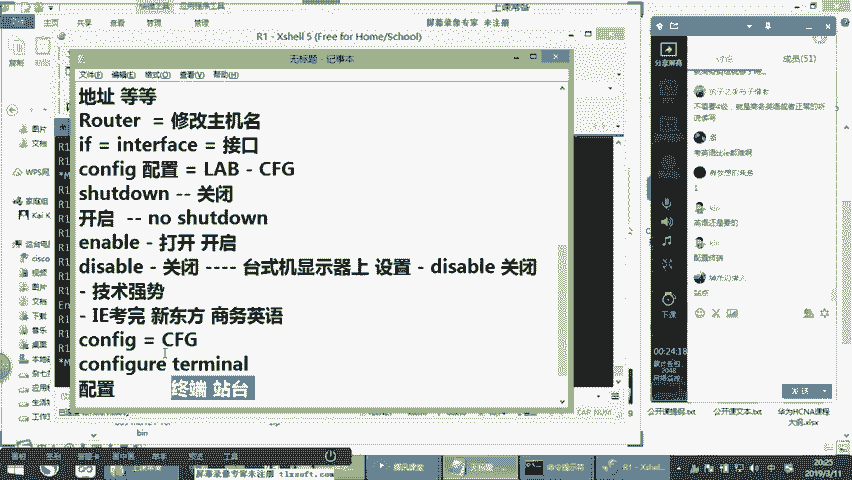

那么接着来看。那此时呢我们进到全局下，哎，我接下来干嘛呢？老师，我接下来呢我进到接口下，你看interface，进到某一个接口。对好，注意看。😊，这么一个戏号。那么在这里面呢，这个F呢代表都不用说了。

我跟你讲过，代表什么fast internetnet是吧？快速跳网接口，百兆口啊百兆接口要百兆接口后面的0-0呢是什么编号对吧？编号0-0编号。😊，啊，那老说想退出呢？好，注意看啊。

两个退出方法exit退出是吧？这个这个超市大门上面都写着对吧？你们看一下你们楼道里边也写着吧，哎呀，直接退出，看看一层一层exit代表什么意思啊？exit代表什么？注意看代表的是一层一层的退。接下来。

😊。

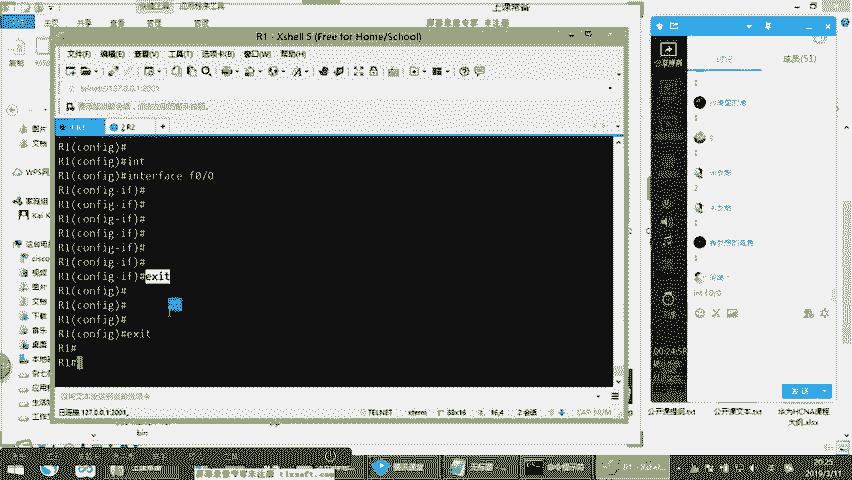

好，代表的是一层一层退出。明白了，拜拜走O。😊。

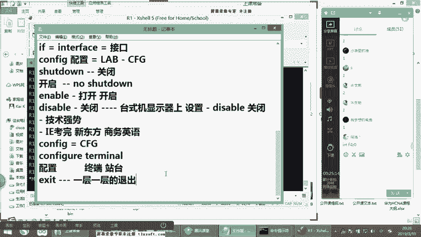

好，OK一层一层退出。还有一种方法像啊。😊，进掉斜口下看到end注意看end。end什么结束吧，D end是不是啊？你看很多写信的后面都会写一个，是不是啊啊，明白了吗？啊，结束了吧啊，end来直接退出。

就等于这个可以直接干嘛？退掉特权，明白吗？这个直接退到特权。😊，好，然后呢你现将我进到接口里面，你要exit一级一级的推到特权，你看明白了没有？能不能听到？哎，我这样直接进到接口里。😡。

我直接摁直接退出。OK了O上波一来上波一上来。好。对吧明白吗？很简单好。😊，是吧这直接退出是吧？OK直接退出。😊，对吧，直接退出。那么这个时候我们可以看到，哎，这是我们一个很简单的一条命令，怎么样。

简单不简单，是不是没有你想那么恐怖，很简单的啊。好，我们接着来看。😡，那老师，我接下来要做什么呢？啊，别要不要着急，我们先说我们已知会的啊，好吧，我们先来查看一些信息。😡，因为查看一些。怎么查看呢？哎。

首先呢我们先来看一看我们的一些。😊，一些什么呢？我们先来看一看我们的全局看叫瘦受什么。😡。

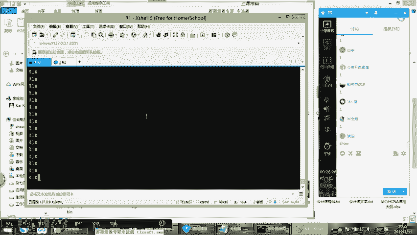

对吧sure是主要用来查看的。笑什么意思啊？😡，哎，大家每次都要瘦，有的时候爱有的说不动啊，TV show这个知道吧？😡，啊。明白了啊，OK那TV show什么意思啊？电视秀嘛是吧？

是早期额外过来的是吧？秀哎，这个叫表演秀是吧？表演明白意思吗？好， show的意思什么？是表演展示，明白意思吧？表演展示。😊，怎么样简单不简单？

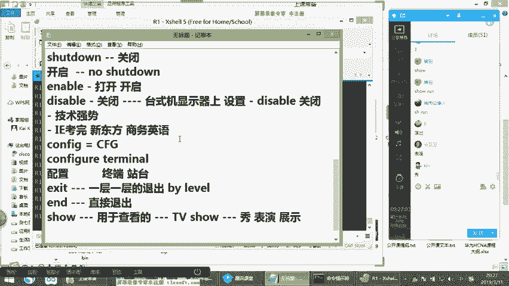

啊，是不是很简单啊，查看什么所有的查看都是以兽开头的，全都是以兽什么什么什么东西啊，全都这样开头的。啊，查什么呢？😡，啊，假如说我们查看一下我们现在整体的我们全局的配置，应该叫s running。😡。

好。咖啡。啊，那这个也很容易理解啊，running个run什么意思啊？😡。

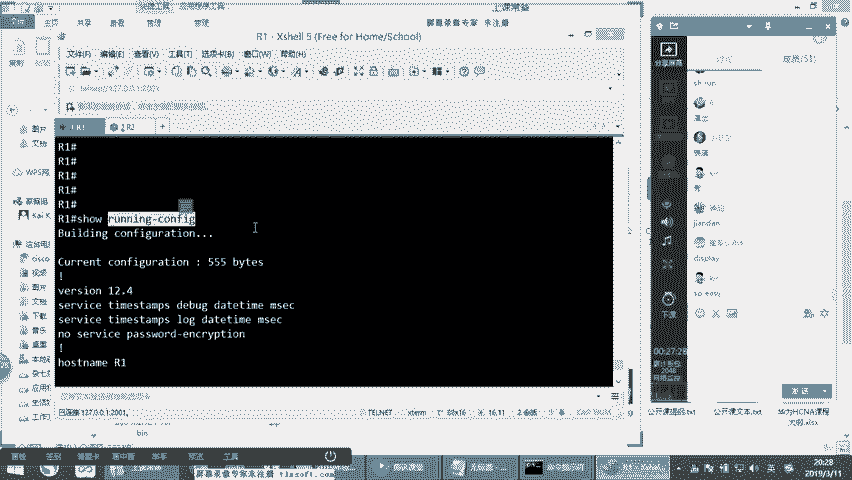

run什么意思啊？😡，run什么意思啊啊run什么意思啊？😡，运行吧是不是啊运行正在运行的是不是？哎好，对，是吧？你看这个这个原先这个这个阿甘从上看到的，里面有一个forest run，看到吗？啊。

run什么运行跑是不是？好，运行跑，那就运行什么？😊。

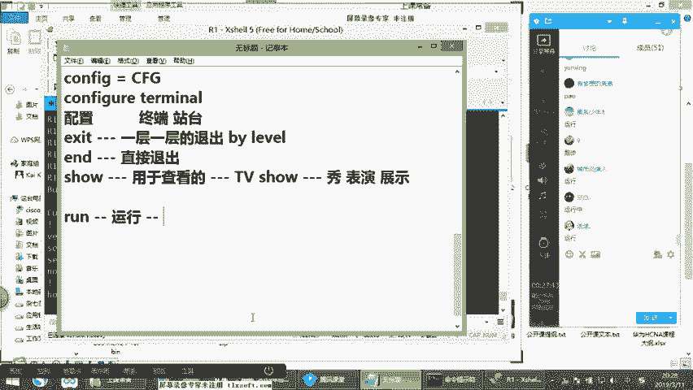

那么这个时候的话，我们运行看后面为什么正在运行running双NNNG是吧？想想了吧，小记子谁的啊，双NNGconfi正在运行的配置。😡，看正在运行的配置。好，我们可以看到这是我们现在正在使用的配置。

😊，明白了吗？好，但是于老师，我这个后面的为什么有个杠杠more呢？😡，more什么意思啊啊more什么意思啊？😡，木什么意思啊？就更多呢。😡，就告诉你现在啊有没显示完的，下面有更多的需要显示，是不是？

按回车键是一行一行看到吗？一行一行显示，按空格键是一页一页显示，记住了？理讲了。OK好，没问题了。好，回车键是一行一行，空格是一页一页回看看看到吧？😊，明白我意思吗？没问题了，没问题，给康总下边一议个。

好，下边一场来。好。怎么向上翻，你鼠标滑轮往上翻呀，它还往上翻，你滑轮不往上翻吗？啊，对吧你看这个滑纹往上翻吗。😡，啊，那所以这个时候的话我们知道一些对不对？啊，我们知道该怎么去搞。那我们来看啊。

接下来还可以受什么呢？哎，我们刚才刚才我给你打下来，好吧，叫saw running confi，是不是啊啊？😊。

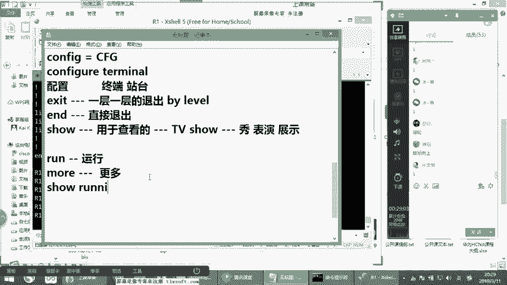

好，我们接着来看，接下来or。是什么？对吧s origin什么意思啊？s origin是说什么版本号，我查看一下，我这个是AOS的版本，查看以后这个设备版本听明白我的意思没有？啊，查看以下它的设备版本。

好，是的，没错，系统版本。😡，这个s version相当于你干嘛呢？相当于在我的电脑右键，看看到属性。😡。

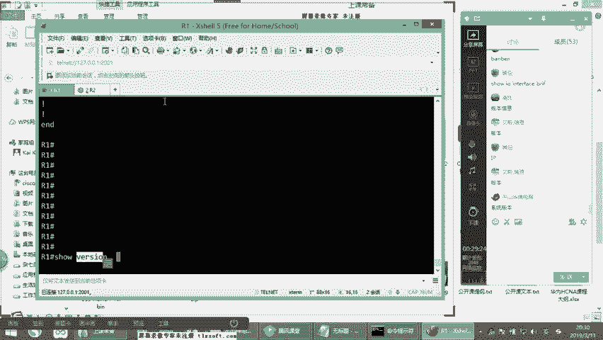

啊啊有键属性行。😊，就相当于这个概念一样，你看康or电脑配置低吧。conor告诉你怎么好多朋友都问我老师，你这个电脑是不是要很高的配置，你看我这电脑配置这么低，我照样给你讲啊，讲IE我照已给你带过了。

是不是啊，能听吗？好看好，所以这什么？就相当于是我查看我的什么哎，设备的这个版本信息。😡。

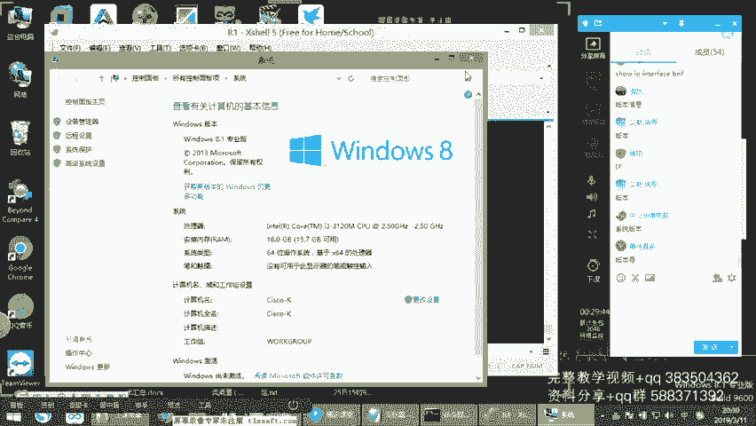

啊，是我是。消室里面的话呢，里边一大多数的话跟你关系不大。😡，假如你现在可以看到一些什么举例子啊。我们可以看到你看cisco system对吧？是刻系统。😊，然后呢里边呢是3600的LOS。

你当前的IOS的具体的型号呢是什么？录视频啊，录屏，放心是什么IK9的是不是IK9的03S的杠M的型号啊，那个老师我怎么去看这些型号，具体有什么意思呢？啊，后面cor教你们从官网上查东西啊。

conor教你从官网上怎么去查东西，我会登我的CI账号，你们后面拷个IE之后呢，哎对也会有一个4刻账号，你们可以从官网上下每一个系统的版本都是可以的。明白了吗？华为的conl教4科的开玩下。

华为的话给你演示一下，好吧。O华为的话我用别的老师演示OK吧啊。😊，看设备运行什么呢？你看RE up time is twenty seven是吧，看minutes就是这个设备现在已经运行了27分钟了。

😡，看到没有？设备已经运行了27分钟嘛，就告诉你设备开了多久。😡，好，再往下看。Y开的过程中呢，注意看啊，可以看到3640的R4700的是吧？你看processor是吧？

它就告诉你什么R470的CPU的型号，100M赫兹的主频很低的，看到没有？是早期的设备，像模拟的主屏非常的低，是不是啊非常低。好，两个你看two fast internet interface。

就是两两个快速以太网接口。😊，看得懂吗？告诉我看得懂吗？看得懂给看总刷波一来啊，是不是啊，125KB的，125KB的N Ram哎，是不是看懂了，是不是125KB的N Ram。😡。

8192KB的是8兆的什么sstem flash可支持读写叫ra right是吧？好，就8兆的flash。😡，你看明白了吗？啊，那这是你们现在可以看到的几个基本信息，是不是？这是可以看到的几个基本信息。

好。😊，那么这时我们去查看swa啊，查看我们的设备的当前的信息啊，我们先记下来。

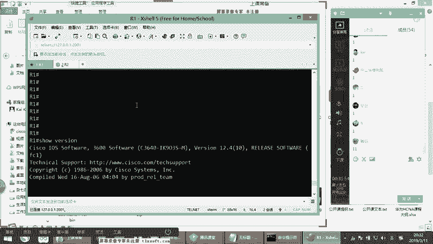

他上我水。

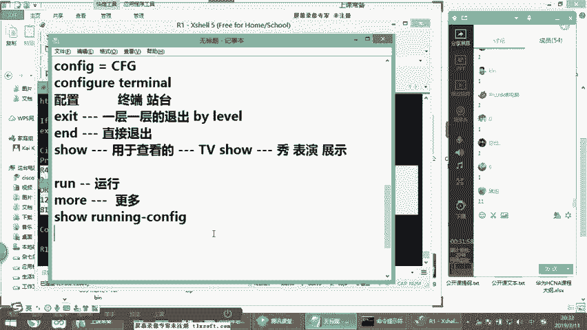

那我们接着来看。那老师我还要查什么呢？啊查看我的接口列表叫showIP interface brief。😡，啊，soIP interface查看明细的接口信息是吧？

sIP interface brief。好。那么这个时候我们可以看到一个什么，看到下面杠F0-0接口和F1-0接口。看到了吧？F-0和F1-0。啊，IP都没有配置，看到没有？是不是啊IP没有配置好K。

😡，那么可以看到下面的tatus状态啊，tatus是状态的意思。😡，状态什么？而这个设备这个接口呢现在是aring down状态，是不是啊？😡，啊，all been down什么意思啊？😡，啊，哎。

不用背，康才告诉你不用背，敲多个就可以。😡，你先照着敲照着敲三五遍之后呢，你把你把眼睛就看电脑上啊，你把眼看电脑上。😡，ading down什么意思？大家注意看啊。😡，在我们的。

这个是windows上面啊，电脑上面有什么ad administrator，这个大家知道吧？啊？管理员用户这个大家知道吧？你看我们原先我们用叉P的时候，用叉P的时候，都有什么用户啊。

叫这个用户叫add administrator。😡。

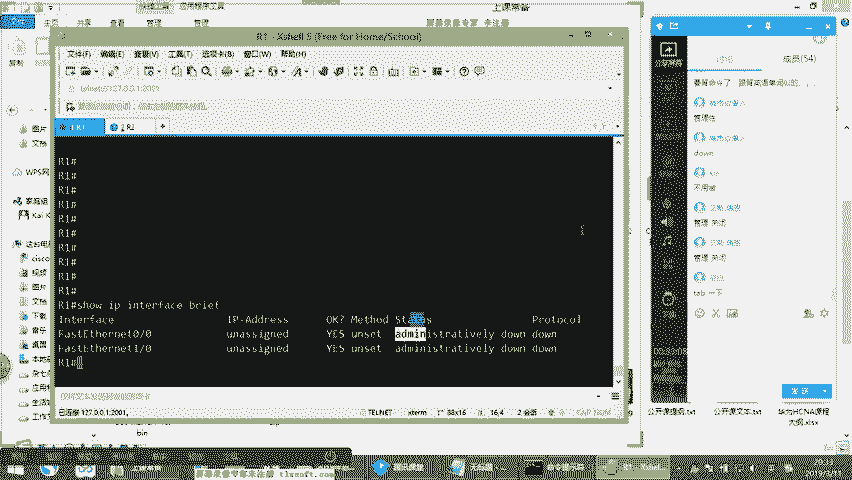

啊，那管委员。不了。关闭用户没问题吧。那这个边也是一样，ading是吗？是管理员的意思是吧？OK啊，ok那么觉得说这个时候干嘛是管理当状态，管理当。什么叫管理当？管理档是很容易理解的是吧？什么意思啊？

哎，直接呢就相当于是人为的关闭了，等于默认关闭。😡。

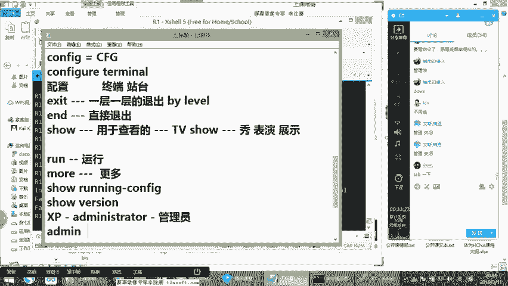

你要想把它打开干什么呢？你要把它no下的，你家缩。😡，好，看啊，全局进到接口下，no下 down。看到了。n大完退出退出。😡，上IP interfaceface。Bef。来，是不是up了。

告诉我setus是不是upO了，OK刷边E吧。来，你看这是up状态。😊，明白啊OK。那么通常有的时候我们会遇到这种选现象，假如说。😡，我前面的是daus是啊，后面的是proical。😡，是down。

前面你看到这是up，这是down这个pical什么意思呢？告诉告诉你，你们后面这个词用特别多。😡。

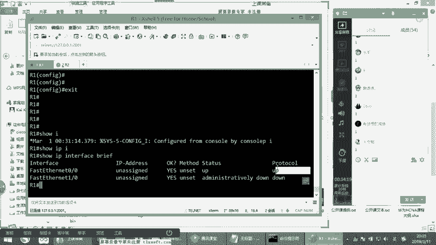

哦。假如说。呃，IGP协议。啊，那VGP协议等等。这个协议什么？这个P最后所指的就是什么？这个最后那个P所指的就是什么呢？叫proical。😡，啊，是协议的意思。明白我西吧？这是协议的意思。

OK所以这个你们会用的非常的多。比如说你们看各种各样都什么P这个P那个P是吧，什么怎么P是不是明白这意思没有？好，最后都是pro，理解我啊。😡。

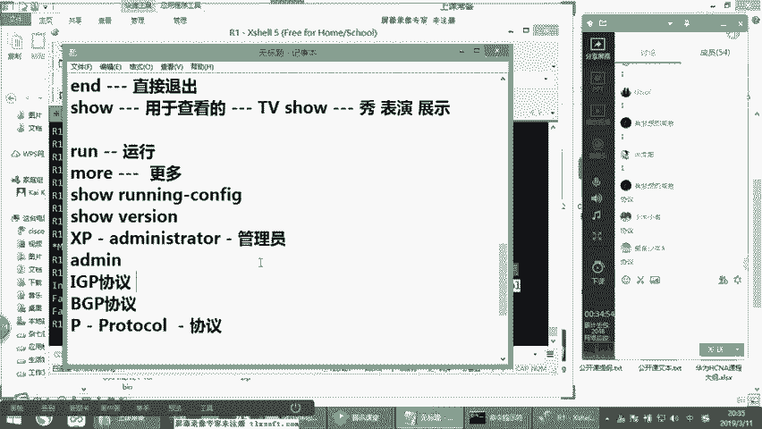

接着说，所以这个时候我们可以看到这边是d。那先首先我们先说一种情况啊，如果前面是up，后边是top，是什么意思啊？😡，啊，不要着急，一会儿我告诉你这什是这是为什么啊啊。

前面sha up down什么意思啊？刚s告诉你下是代表线没接好，我手动no shut down，但是线没接好，是面功故障。所以前面你可以暂时把它us。😡。

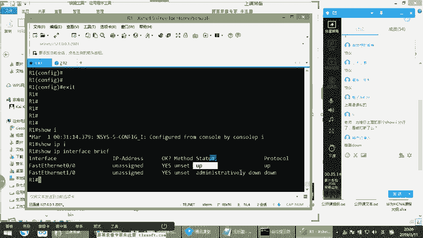

你可以把它理解成什么呢？理解成是人为性的接口设置。接口开启与否？后面的proical是什么啊，是链路性的接口开启与否，什么意思啊？就是说接没接线。😡，明白了吧？接没接线啊。

你后面这个这个proto代表是你后面线没接，这是down哎，前面的这是up啊，明白我的意思没有啊，我给它前面呢，因为前面是down什么意思啊？前面是down，哎，前面是Amiss down，代表什么？

代表你没有no刷down，记住了没有？😡。

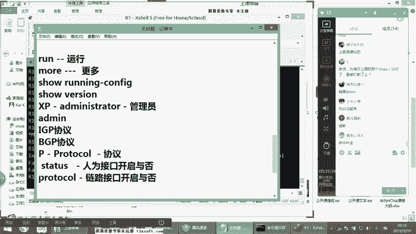

能听懂吗？听懂下边一来，如果你前面是当，后面不可能是啊。😡，记住前面是down，后面绝后面绝对不可能是up，所就这个点啊，理解完啊，但是你有可能是一个因素，什么呢？假如说我前面这个地方是up。

后面是down，前面是down，后面是downok能能理解吗？啊，是这样，你不可能说我前面是这个down的，后面是up，这不这不可能。😡。

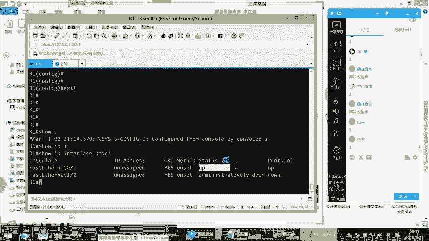

没讲过啦，明白稍微意见OK好。😊，明白明白上边一okK所以这个地方什么呢？就相当于你自己拉没拉闸知道吗？拉没拉闸啊，跟开店似的，这个代表你那个里边那个。😡，线接没接好。😡。

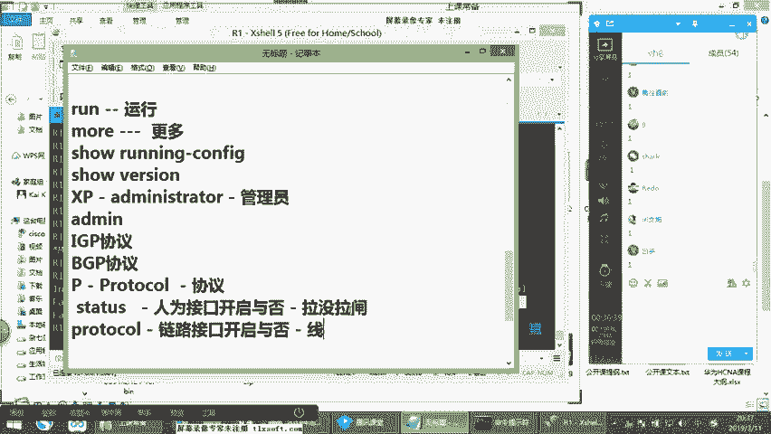

明白了吗？考似够俗吧，说的好。😊，接着说。我们继续啊，咱们接着看下一步。😊，看这的三品等是吧，全局。那我们接下来要干什么呢？哎，接下来之后大家对看啊，好。

我们要做的事情是我们要学一个最基本的一个点叫干嘛？叫设置我们的。😡。

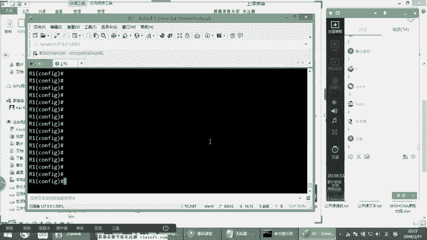

等设置我们的密码。设置密码。什么叫设置密码呢？所意看啊我们这个设备的密码它非成几种。😡，第一种呢就是concl密码。😡，理解吗？conl密码。第二种什么呢？看到啊？

这是我们说的ITLnet或SSH的密码。这个叫我们说远程登录密码。😡，第三种密码什么密码呢？就是我们说的，哎，我们从用户进入特权的密码。😡，这三种力量是最为常见的。😡，在实际项目中。

哪一种上面都带有密码，理解了吗？吗哪一种都有。😡，OK哪一种都有。😡，好。那么council呢天netSSH呢和用户介绍特权呢是三种。cocil来给你们分别说一下。注意看哈。

我们先在看这种叫用户介绍特权。为什么？因为我们知道用户模式是你什么都改不了的，对不对？你什么都改不了，明白council意思没有？好，你什么都做不了，只能查看呗。但是你看你当你见到特权之后，情况变了。

😡。

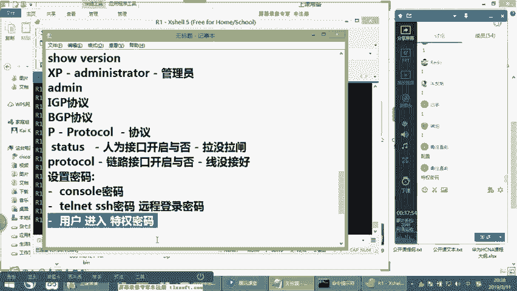

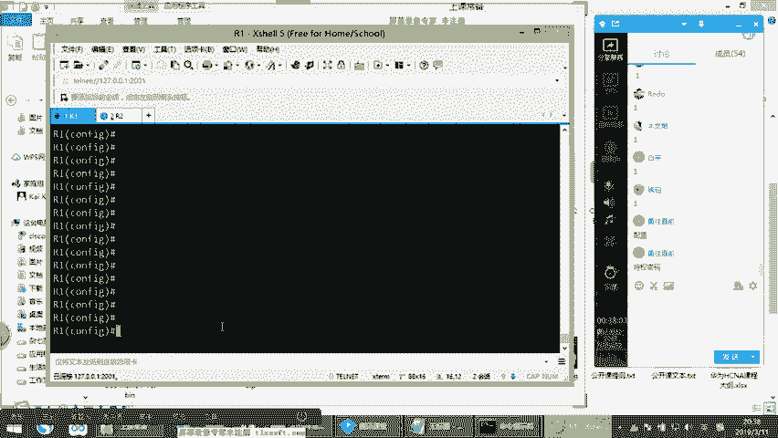

当你接到特权之后，你发现。😡，怎么样？你可以删除系统了，对不对？你可以删除配置了，对吧？能理解刚才的意思呀？啊，那这个时候干嘛？你其实就得已经掌握了这个设备的命脉。😡，哎，所以在特权下。

用户到特权是必须要一个密码的。记住了吗？记住给他们刷er一来啊。😡。

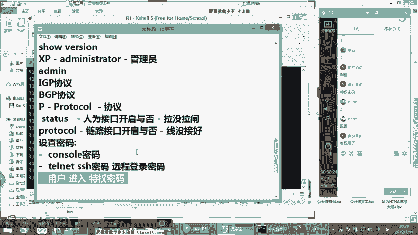

那怎么设置呢？看到在全局设置。😡，好，En。Password。啊 password。好，只要设置个密码，就cisco。😊，那么在这里边呢，我们则用我们现在设置的是enable的密码。大家注意密码。

这个词特别容易理解啊，是吧？😡。

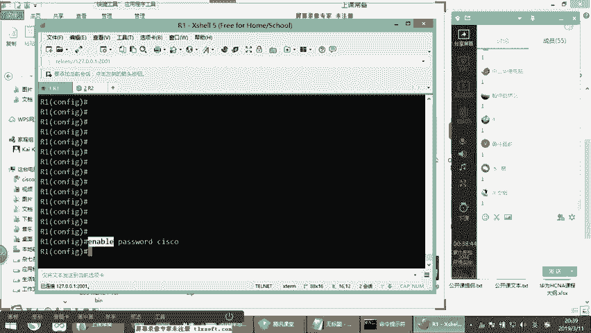

Pas索。明白吗？pasure。好，这是我们说的叫密码。有时候我们填写PW，你们看到有时候会在数据库里边。然后你们后期的话有同学在做在做windux啊，或者是怎么样或接接触啊，或者说做做这个这个。😡。

这个数据管数据库的管理员DBA嘛是吧？啊，那么这个时候你会以看到PW这个这个参数PW是什么？哎，对，是吧？是是密码me passwordO啊。😊。

那么我们设置一个password的密码是cisco。😡，那么这个点呢往往呢在实际中呢，你们要注意一个事儿，就是不要后面有空格，有空格是非常可怕的。如果你设置的这个密码后面加个空格了。

那卡才告诉你你就惨了，明白了没有啊，你可以就惨了，底肥人有可能会进不去设备，你要给有考阿一的学生我送现象，我给大家讲讲。😡。

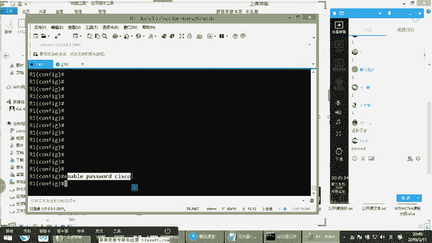

进到设备之后，早期我们在CI3。0在2009年这个阶段。😊，我我有一个当时的一个战友，一块考试的，他就进之后的话呢，按照按照考试需求。设置密码。设置完密码之后呢，屌炸天结果它退出了。😡，退出之后呢。

结果呢他再登的时候，发现输入那个密码登不进去了。😡，哇怎么上怎么样就登不进去。😡，最后增生的有一台设备，没做。那肯定挂掉吧，就不用说了。😡，但是后来我们问他，我说你有没有可能敲有空格的？😡。

他说我没有测试哎。啊，所以很有可能是你在敲个一个密码叫s错l密码，加一空格首键。😡，懂吗？哎，你首性加一空格倒霉了。😡，明白了吧？明白什么意思。😡。

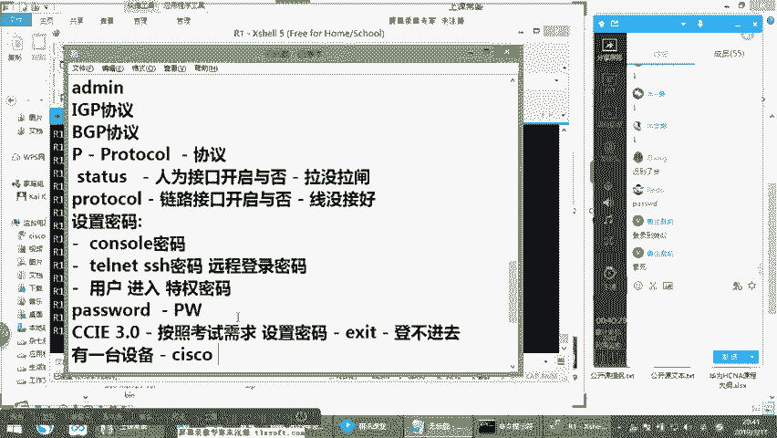

내 봐 없을 거？好。接说。那我们接着来看好吧，咱们接着看啊。😊，那加了密码之后，从哪看到呢？好，Eit好，退出好，diable看啊Pable好，注意看啊，enable。😊，看这个时候增加一密码。

看到吗？😊，你说这个密码cisco。😡。

哎，老师怎么没有显示呢？😡，记住啊。在我们所有的操作系统里面。😡，windows只有windows系列。😡，windows界面输密码。😡，才会显示星星星星星星星才这么显。

在lininux和unux版本里面。

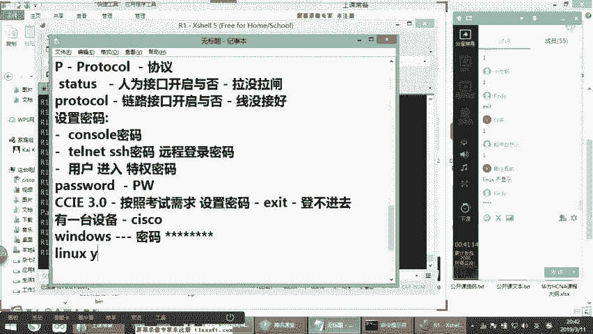

他都是没显示的。也就吧他的密码你输完之后都是没有任何显示。😡，继住了吗。啊，其实你输上嘛看到有你ablecisco啊，没有任何显示，它是为了防止你什么呢？😡，防止你猜测几倍密码。进行暴力破解。听懂了吗？

你白一看们上班一来。😡，好，没问题吧。啊，那么这是一个我们先看到的一个什么呢？看到了一个密码啊，装进来了看。😊，DC吧。Enable system好，检查设告锁能跟能跟上吗？可以吧？可以上边一来。😡。

是吧你看英文单词瞬间也不难，英文没有那么难是吧？你问一下那个谁爱谁谁，爱谁谁的话，就在国外嘛，是吧？你问问他英文难吗？是不是根本就不难，对吧？英文一点都不难。很多同学英文英文怎么样？英文其实真不难。

对吧？啊，接着说。😡，那么这时我们来看。啊，这是我们来看。假如说此时呢我们要学几个关键的招，就是我们说叫配置工具啊，这一会再教你们吧，说下一步啊，刚好。😊，好看好。叫什么呢？叫工程三招。

但是前提强调一下，工程三招只针对你公司自己的设备。非甲方记住吗啊，非甲方。只是说并不是说你作为乙方，你给甲方调设备的时候，你共同三招不能用啊，不能用。为什么又有安全隐患啊，哪三张呢？

我们来看首先第一招叫noIP domainlookup。😡，No， IP dogoups是。😡，啊，叫关闭域名解析。记下来。好，关闭域名解析。为什么要关闭因名解析呢？😡，那这里边呢。

他们要强调这么一个事儿。😡，看到有这么一个问题，假如说我要是不关闭。😡，好，我不关闭啊。😊，我开启名启习。我开选之后呢，我退出。退出大家啊，退出注意看注意看注意看注意看好，然后我现在呢我输妹妹。

我瘦输错了，输SHOU的输错了。😡，按道理来说，当你输错了一个命令之后，他会马上报错，告诉我对吧？😡，啊，一回车啊，好，这个时候你发现它会正常来讲会报错吧，是不是啊？好。

但是如果假设你开启了域名解析功能，按照IP动漫，我们再退出来看。好，输错吧。😊，啊，输错了啊好。😊，哎。我这个接口没有打开嘛，稍等一下啊。😊，啊，没配IP等一下给你看一下，我得先把IP配上。😊，好。

问题告判长。不要着急，看一下他把他有IP，因为在真实工作时候，你肯定有IP的嘛，看着说错了，SHOU。😡，卡住了吗？还做吗？一定要自己做笔记，在castor的课上一定要给我自己做笔记啊，哈还会吧。😊。

为什么卡住呢？是这样。😡，在我们的呃特权模式啊。看着啊，那特个么它特效模式下。😡，我们的AOS呢的反应机是什么样的？是这样的，看到啊，当你输入一个命令。首先第一步它要看什么。

它要看你这个命令是不是命令集。😡，如果是。执行不是看有，下一步进入第二个步骤。😡，第二步是干嘛？他以会以为你去干嘛寻找一个域名。😡，你再解析一个域名。所以接下来他要去查询DNS服务器。

first时你可以看到它显示个嘛transgress啊，是个嘛transgress什么意思啊？😡，什么意思啊？

去翻译去寻找我们的SHOU的哎的doman servererserver是我们的服务器的意思是吧？doomman呢域名是吧？doomman域名server服务器是吧？你看域名服务器，我什么找呢？

广播寻找我的域名服务器去解析我的SHOU听明白了吗？😡，听白吧啊。哎，我去广播425是广播嘛，广播寻找我的域名服务器去解析SHOU听懂了吗？没问题吧，没问题，看下一个啊。😡。

那么这个时候我们发现此时怎么样？哎，nice啊，对吧？我们现在可以正常是吧？可以正常啊，所以此时呢等于一旦被卡住就很麻烦，每次被卡住，但是你能能他能不能找到域名服务器的？😊。

你告诉他可以找到域名服务器吧。😡，还能找到域名服务器吗？能吗？😡，它可以找到域名服务器嘛？不能对吧？他肯定是不能找到域名服务器的那不能找到域名服务器怎么办呢？它就会卡在这里，直到是请求超时。

直到是查询超时为止。😡，这个时间呢大概应该有个30秒左右。啊，30秒左右。半分钟。啊。所以呢往往在这个过程中呢很麻烦啊，我们如果每一次这样配置呢，我们这样配置的过程中呢，都非常的麻烦，对不对啊。

都非常麻烦啊，那这时候怎么办？好，注意看我就可以noIP domain。😊，look up则关闭域名解析。好，所以看我要关闭你解释。到关闭和域名解析之后，OK好，此时的话注意看我再退出。😊，输错了。

是马上就会告诉你错了啊，他不会再做任何域名解析。😡，明白了吗？他不会再做任任何一名解析。😡，理解了吗？明白，你看下边一来啊。😊，那么在这个地方的话，我们有一个疑问。假如说co。

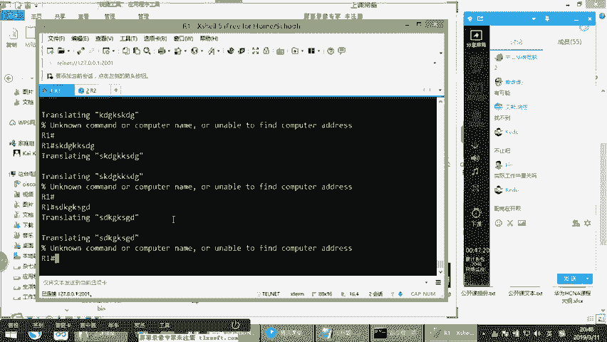

啊，注意看啊哎。😊。

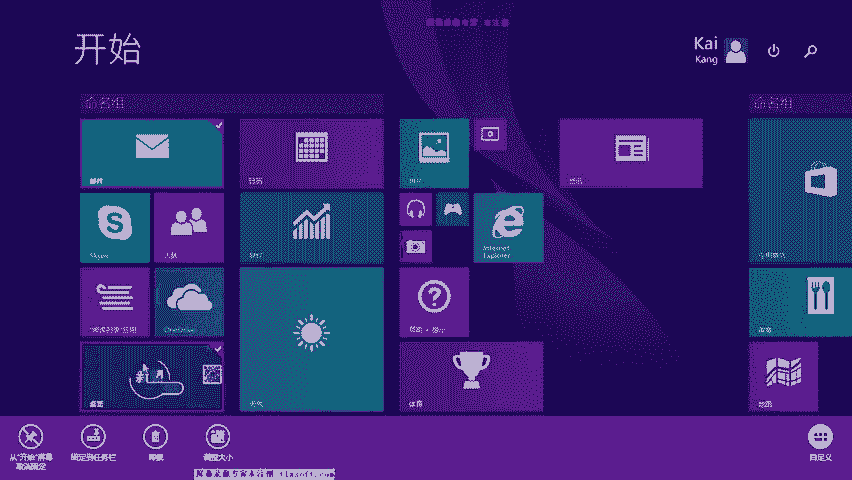

然后这样我呢下面有一台网络设，下一台有一台PC。😡。

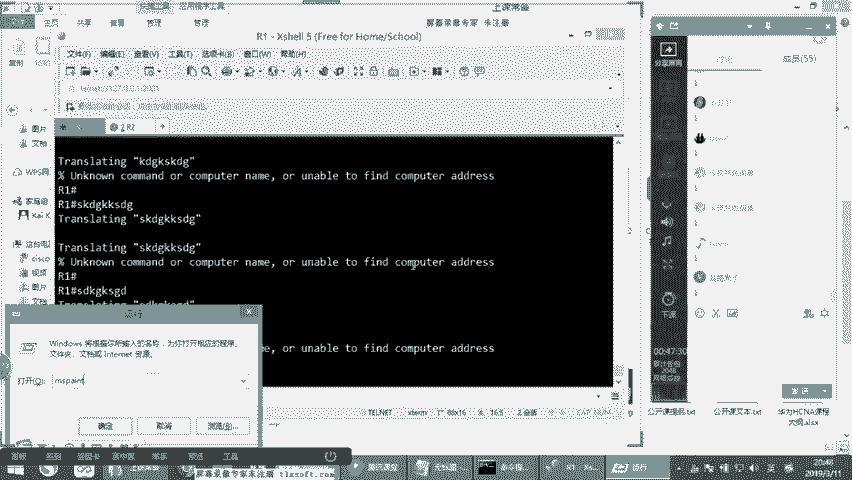

上面有一台路由器。啊，台不由器。啊，涨出去。那此时呢这是我们的网关对吧？这是我们的网关好。😊，注意看。那作为我下面的PC来说啊，作为我下面PC来说，如果我在我的网关上。😡，关闭了域名解析。

那请问一下我下面的PC还可以打开网页吗？😡，这是很多同学都喜欢问你一个问题。😡，还可以吧。我在我上面的网关上关闭个域名解析。我在我下面的PC还可以打开网页吗？😡，说话可以吧？嗯。可以吗？可以吗？可以吗？

😡，注意看啊，记住。可以。我在上面关闭域名解析是关闭的，是我的GW的，是我网关的域名解析，不是关闭我PC的。😡，懂了吗？我的PC该怎么找服务器，还找怎么找服务器，没有任何区别。😡，能不能听到？啊。

没有任何区别。所以说记住我现在关闭的仅仅是我本地的是我作为网关，我没有办法再连接到域名版。😡，啊，我没有办法再去给一个域名吧。你假说我们正常对于一台设备，我想把我我想调整一下什么呢？

我后期我想让我这个设备啊调整。😡。

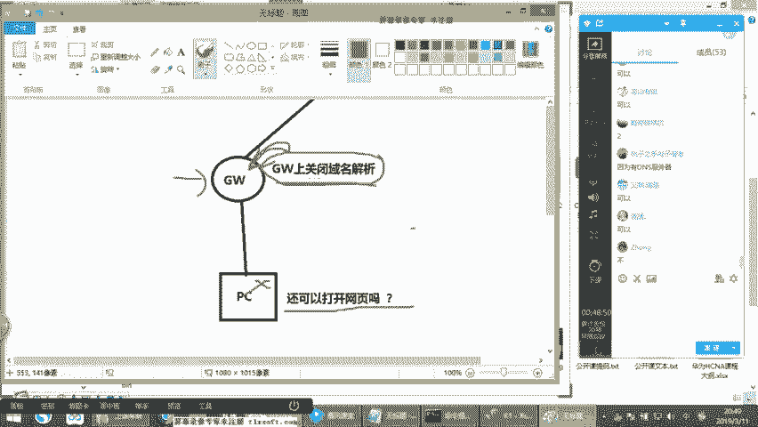

以下十钟。市区。时间等等是吧？好，我调整时间，我很有可能会使用一个什么呢？我很有可能使用一个叫NTP的一个东西。😡，是么叫你逼啊，就时间协议是吧？叫网络时间协议。😡。

网络先协议就是说我会让它自动的去同步一个什么，看着同步一个时间服务器的域名。对吧假如说你们也可以看在你们的电脑上也有。😡，然后是在你windows里面，你看这边有一个internet，看到。😡。

咱们现在用的windows操作系统都这样同步的。😡，看到没有？都这样同步。你看我的电脑现在其实就是在跟一个东西同步叫time点windows点com。听明白了吗？哎。

我现在就在跟这个同步time点windows点com跟这个域名。但我们假设如果我要是关闭一个域名解析。假设我关闭过我这个路由奇议的域名解析，关闭了我网关的域名解析。那我对不起。

我就没有办法再跟一个域名同步了，我没有办法再跟这个域名同步。😡，明白了吧？因否解析不出来域名。😡，能不能听到听懂啥不意来？但是呢仅仅是说我的本地的设备，而跟下面的PC没关系。😡，听懂了吗？

跟下面的PC没有任何关系。OK我给他们上波一啊好。😊，🤧接着看。所以这个方法呢只是限于什么呢？我们通过。noIP动漫lookup。通过这种方法关闭域名解析干嘛？啊，我可以相对更加的去节省我的超抄错的。

我还在等对吧还在等待它，不需要了，你不用担心这个问题。😡，记住不啦啊。啊，有时候同步超时要多同步几次，为什么呀？什么是同步超时啊？你说是同步时间吗？😡，什么意思？啊。所以这是一个叫关闭域名解析功能。

没问题吧。好，接着说。😊，是因为它连接的中间连接的没有连接服务器啊啊，或者服务器那边没有给及时响应，很正常的。是这个吧。对，实间服器有问题啊，这个很很很常见的啊，接在大家看啊。😡。

这是我们工程三道第一条。😡。

好，这noI demand up。第二条C卡。😊，第二招呢，我要进入到另外一个模式上。😡，另外一个模式下，什么模式呢？叫c。模式没好。看到叫进入到conl。下。明白了，继续到窗口下按康素明。那外国人呢。

他算这个接口啊，他是以零为开始的。你们要搞清楚，他不是以一号口位开始，它是以0号口开始。所以说的话，line console0它也只有一个0。就意味说其实在这里面呢，我们要进入的什么呢？

我们要进入的是concl口的配置。😡，记下来。啊，进入康table培训。那么在线路里边呢，康ser要强调一个事儿，有同学可能会奇怪一件事儿。什么意思啊？这老师，你看我要进入到一个F口啊。

叫faster接口。😡，对吧借入一个F口，我要interface F什么什么什么是吧？好。😡，那我要进入到一个consil口。😡，好，而我这边为什么是个案什么什么什么。😡，这是什么原因啊？

我为什么不能interface console0呢？😡，能明白吗？啊，对吧？大家反正都是用一个接口了，我为什么不是不用，直接都用interface？😡，而我要使用另外一个呢，这什么意思啊？😡，啊。

那么这个点的话，大家记住一个点啊，是这样，interface是进入什么呢？是进入注意听，是进入数据，是进入业务数据接口。啊，而我们的运的run是进入什么？进入控制数据接口。这是有什么逻辑呢？

什么叫业务数据呢？假如说我这个设备上有一个F口，F0-0接口，F0-1接口F0-2接口。你们告诉我这些接口是干嘛用的？😡，这些接口后期是不是用来正儿八经，用来传输，看到，用来传输我们的上传下载是吧。

什么上网的什么办公的等等那种等等这些数据的。😡，听懂了吧，对吧？因我这个接口其实从根本来说的话，就是用来正儿八经的上传下载，什么上网办公等等这些数据的对吧？😡，能理解了，明白上边意思了啊上边意下来。😡。

能听懂吧？啊，这是他下的。😡，等于其实来说它是interface，是进入到数据业务数据接口。我说的业务业务所指是什么？就是你们后期哎在生产环境下，我们说生产环境下就说这正常你用用起来了，明吧？啊。

用起来了，然后的话呢去处理一些人家正儿八经需要的什么股票的数据啊，什么什么什么迅雷的数据啊，是吧？什么什么什么乱七八糟网站的数据啊等等，是吧，就用起来了。😡，而我们使用一个案记入的控制接口，什么意思呢？

就是说你看consl口是一个什么接口。😡，concil口它是来用于设备配置的接口。对吧设备配置的接口是干嘛？我们要输入输出命令集的，而我们所有产生的数据看好，全都属于控制设备，要调试数据。😡，明白了吗？

叫控制数据。😡，听懂了吗？听懂下边一来。😡，啊，所以你要调试设备的时候，你进入到的是调试设备的接口，你要使用的是干，你进入到的是业务接口，你使用是interface。😡，哎呦，他妈的累死了，明白吗？

明白，上倍一干啊。😡，所以接下来我要进入我这个模式要在我们的conl零接构下做叫run。😡，看啥。council回好，先到cocil名里边。注意看啊注意看好。那么接下来干嘛呢？

叫noEXEC杠time out。接下来。😡，好，OK。没事，我们讲完这点好吧，讲完这点，我们休息一下啊。😊，nEXCC杠t out是什么意思啊？叫关闭绘画超时。接下来。😡，啊，这个命令呢不叫轻易用。

这个在工作岗位上用啊，你可能会给处分啊，你可能会罚款，这个不能轻易用。😡，这什么意思呢？康才告诉你们叫关闭什么，注意啊，这个东西叫做关闭。😡，绘画超市。这个会要超时呢，我告诉你们什么概念啊。😡。

你们知道这个windows也会超时吗？😡，假如说原先你们用叉P或者winN7的时候。😡，它一旦超时个之后，就会进入到屏保模式。😡，记得了？把桌面就开始动起来了，平板啊，你看移动鼠标显示的是用户登录界面。

😡，你再重新登录。😡，这个知道吗？告诉我，就说你的电脑放在那里，你的一小段时间。😡，没有操作，这个时候干嘛？自动退出？😡，没见完，哎，自动退出，你看这我们现在路由器2，你看这要自动退出的样子。😡。

明白吗？这叫自动退出，就你的设备一样，你一小段不用，它自动退出来。哎，它自动退到你的什么，退到退回到最基本的模式。你看看就这这种样子。😡，我回收看重新进入用户，回叫吗？重新进入用户，你看这边也是。

然后我要是不关背迫要超时，你看它自动退出了。😡，看长退出。哎，没见吗？推到这种模式，你看我这时候再到设尾旁，我重新做啊Enable。😡，代输密码进去。好。啊，不是休眠，休眠是这个机子关闭了，对吧？

这个机子不不工作了，叫休眠，它就是安全保护，听明白了吗？啊，就相当于就是安全保护自动退出了啊，注意看啊。😡，那么在这个里边的话，我们等于呢如果你要是看到？如果你要不关闭。😡，他一会儿就退出。

我记得好像是5分钟吧，好像是5分钟会自动退出。如果自动退出，意味着说你可以你可能会在工作岗位遇到这种情况。假如说你们是乙方吧。😡，对吧你们乙方跑哪去呢？跑到甲方给人家做设备调试。

但是呢你并没有所有设备的权限。有的时候呢到甲方那边呢，你并不知道登录密码，所以需要甲方的工程师来帮助你输入。😡，明白我的意思，帮助你输入。输完密码，你登录进去吧。😡，做设备调试。听明白吧？这是个调试。

好。😊，然后呢，有的时候的话呢，甲犯罪公司就走掉了，听明白了？他就走掉了，可以更改先认，可以，没问题啊，他走掉了。😡，结果一会儿呢，你一不小心你上个厕所，你上个厕所几分钟的时间一回来，他他妈又退出了。

😡，理解他的意思吗？把他又退出哈又退出，你再进哎，有密码，你还得继续找甲方工程师，就很麻烦。😡，那原先呢我们给一些工厂啊，给他们的这个机房里面做配置。😡，他们那些公司在他们办公区，在机房在另外一个地方。

所以每次我找的很麻烦，你见吧，他们要重新过来什么等等之类的。所以后面呢我们就有一个习惯。😡，有啊，这noEIC杠time out。上去关闭合法超市。😡，关安梅花超市就我这个我这个界面放在这儿。😡。

他永远不会退出的。😡，没有只要我不退，他不会退，听明白了没有？明白上边意义来啊。😡，但是呢它有很多地方是不让用的。假如说像运营商啊啊，运营商，像银行运营商最明显的，他不然不让用这个。😡。

他之所以有这个保护，你看它之所以有一个保护功能，让你设定时间，假如说5分钟啊，让你设定时间是为什么？是因为本身来说呢，他担心啊，你走的时候，你忘把忘忘记退出了，你假如说就是我们在cl上面去做。

你走的时候你你忘记退出了。结果呢你拔线走了，下一次一有人注意看下一次一有人啪把线又接上了，理解了吧？把线又接上了，接上之后发现我靠，直接没有退出，直接登上来了。😡，明白我说意思没有？明白说不意来啊。

又掉上来了。😡，这就发现这是安全问题。😡，听懂了吗？这就是安全故障啊，安全事故。没错，是的啊，不符合等保规则啊，所以这里边大家要注意一个点，你知道这个东西就行了啊，叫no EX杠time out。😡。

好。你们公司的设备或者说是你们自己练习可以用，没见了吗？啊，记住个吗？没题吧。😡，啊，那当然了，你要从实际角度来说，你们是有用户的，理解吧？就是你是有用户的，就是说你们也不是说你可以瞎等，你到机房。

机房是你想进能进的吗？是吧？你就到了机房的话，有不同的工程师正儿八经来说，有不同的用户不是一个密码。😡，你们不同的用户登录的时候呢都是有都是有猫ing，都是日志的，理解吗？全都是日志。😡。

都有日志都西记录下来，你们谁操作的什么都是记录的。记住明白他的意思没有啊，所以不是你想怎么样怎么样，你们想想多了啊啊。😡，考试可以用吗？考试不可以用考试是要严格按照需求做需求没让你做什么，你不要做。

这是考试的逻辑，明白没有啊，但康er现在不是站在一个应用角度跟你们说吗？😡，听到没有啊？接来看。那第三个叫什么呢？叫开启信息同步。注意看叫log in single。要开启信息同步。

我们讲完这条命令我们就休息啊。😊，那开启信息同步是做什么呢？😡，这是做什么呢？注意看开启信息同步。从根本来说呀。😡，看到啊，从根本来说。啊，这个东西从根本来说呢，是这样的，如果你不开启呢。

有这样的一个效果。所以看啊有这样一个效果。假如说我们在日常使用设备的时候，都会有一些命令级，这个大家知道吧？都会有一些日志消息，假如说你把接口打开，你把接口关闭了，你呢开启个什么功能，风扇坏掉了等等。

全都有日志消息提醒，你们的设备风扇坏了，有条消息提醒，你的设备的话呢有有地址冲突有提醒，你的设备呢有ARP消息，ARP是吧？非常大有提醒，总而言之的话有很多很多都会触发日志消息。😡。

那么按照这个过程来说，如果有这个消息呢，那假如设我退出好，上IP你看就会把你的这个东西切断。😡，就是提醒的消息会把你输入的某一条命令给半步切断，听明白了吗？大概再看一遍啊，看到假如说我退出吧。

我在一从我在一再全局退到特权的时候，从全局推到特权的时候，看到？退出好，上IP interfaceface break看它其实会有日志把你这个消息给你切断。😡，当然问题在实际的工作中会有什么呢？

会有很多。😡，好，会有很多消息的提醒，都会弹幕切断你的命令集。好，这么说能听懂吗？明白肖波义了啊。😊，那所以这个时候的话呢，它干嘛呢？它是不方便你看，不方便你流览和配置。😡，啊，还有什么不好的吗？

没了啊，就不方便你浏览配置啊。😡，那所以这个时候怎么办？我们都会干嘛呢？叫run consoleing看啊，叫lock in synchros叫开启信息同步。😊，当我们开启协议同步之后。😡，hello。

假如说我先退出。啊，退出。受IP你看。他永远会给你留出一行门。😡，明就啊，它永远给你流出一行，就是你输入命令是输入命令，提示日志是提示日志，这两个是同步产生的。😡，能听懂吗？同步产生，它不会切断你。

它不会打断你压缩看再来一遍啊。对，没错啊。😡，退出sIP interface啊，明白了他的意思没有？它不会切断，你不会打断。那这样的话呢，你就不会面临到说总是会被切断呢，总是会被拦下来呀。

不会面临这种困难，明白了吗？明白sber意。😡，啊，听到吗？OK。😊，好。那么这叫什么呢？叫开启信息同步。那么这功能三招呢主要是用于干嘛呢？主要的作用没别的啊，就一个点都是为了方便配置。

大家这个点记下来，好吧，插笑死掉了，我这个插笑的版本不好，所以总容易死掉。😡，等一下，我把这笑给它关闭掉。啊。OK好。😊，好，明白。这个时候的话大家记住一个点，攻成三招的根本目的。对，就是为了什么？

就是为了说方便我们配置，明白了吗？哎，没有什么实质的作用。😡，听懂吗，听懂上边意来好。那么这是我们现在看到的什么？看到的我们说的三条命名。我讲到这，告诉我能听懂吗？😡，告诉我可以听懂吗？可以稍波一个啊。

稍波一上来。😊，好，我再给您连接上啊。啊，所以你们可以看这些东西，其实它复杂吗？我告诉你们一点都不复杂，只要你搞清楚关键是什么。😡，关键是你搞清楚每条命令集的作用。这是最重要的。为什么今来的满啊啊。

刚才在地铁上是吧？😡，在地铁上的话，刚才给你个建议啊，就是你可以办一个流量大点的卡。我有很多学生在地地地铁上听课，听见吧啊。😡，然后基本上一堂课的话，2三0百兆的样子啊，其实没有耗费多少。😊，啊，对。

用单误卡可以的啊，明白吗？OK搞清楚每条命令级的作用，这很重要。😊，能不能听到啊，并不是让你把它翻译成中文。而且我告诉你们，大多数情况之下，大多数情况之下，这些词都是计算机英语单词。😡。

你们后期会翻来覆去的砍都差不多。😡，能不能听到啊，翻来覆去的看的差不多去淘宝上去找，知道了啊啊。😊，理解没有啊，所以大家千万不要觉得就说啊英文怎么怎么样，英文怎么怎么样啊，最开始觉得英文怎么怎么样的。

我跟你说，其实都是外行，理解吧？啊，是这个意思。😡，好，邵老志能跟上吗？能跟上邵波一有问题打到公屏上来来。😡，啊，我明天题没讲完啊，我一会儿接着讲。😡，好，不难的啊。

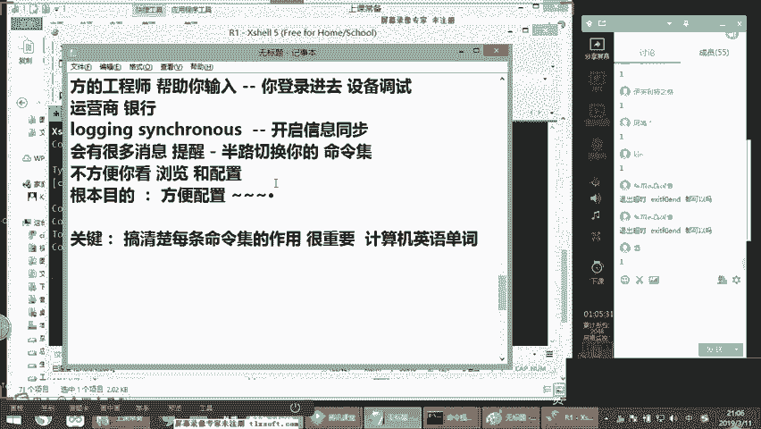

啊，主主要是exit啊主要是这样，你看假如说exit啊。😊，啊，这个是退出吧，这个设计退出。假如你们在项目上这，看到，进到设备给之后吧哈，进到设备给吧，你别管配什么东西，最后退出啊。

看着退到这儿再退一步啊，再退一步。😊，明白了吧？结束了M记住没有？明白什么是意思。😡，好，推到这一步，代表你做完了。啊。很简单的，我告诉你们，其实学网络真的很简单啊，你白道吗？一点都不难，是不是啊？😡。

OK好的。😊，啊，它是两个模式，看到全局下用一条。😡，你看n IT domain book up，这是这条前局，后边两条两招是在cl模式下做。明白吗？好。如果进设备的密码搞忘了咋办？那就要恢复密码了啊。

要恢复密码，我给你演示吧。回来好吧，我给你搞一台密码，我给你演示一下，你懂吧？啊，你只能做密码恢复，没办法。😊，在接口配置模式下，你怎么知道我是哪个接口？😡，啊，我在接口模式。配置模式下。

你怎么知道我在哪个这构，比如这个而是这个，你问的是这个意思是吧？看啊，进到这个地方是这意思吗？我现在在哪个接口下面不知道。😊，没有办法知道，退出，重新进，别见没有？重新进进到我们接口去就可以了。OK好。

😊，密码有空格怎么说？😡，enable password我的密码应该设是ssco。应该设ssical加了一个空格，空格也算密码的一部分，懂吗？就是跟你们平时设置游戏账号。😡。

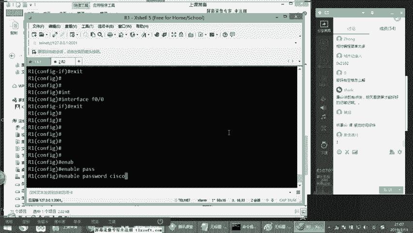

密码的时候，空格算不算密码，告诉我。😡，是吧好，人方说我是大天才啊，我是天才啊，好，空格是吧？琥珀明白吗？这样它也算密码，这空格也是密码的一部分，明白了没有？对，是的，所以记住不要设置密码。

不要轻易的啊不要轻易的给这个尤其是你们的设置的这个密码。在最后一位加密码。😊，有的时候容易导致你后面的忘掉。这相当于一个符号，没错，一个一个呃字符段。😊，好。新建用户给用户权限的，不要着急啊。

我还没说嘛，我还没有讲到，好吧。😡，我还没有讲到这个问题啊。啊。对，是的，没错。好，不打的吧，兄弟们哎肯定不会难。我跟你们讲啊，就考，你只要认真跟我听，肯定都很简单，是不是？😡，啊。最后一位加空格。

康s首部吧，没有我没我没有加空格，我就是告诉你们不要加空格，我没有首握，什么是加空格呢啊。😡，啊，有没有备用密码没有备用密码没有备用密码。OK啊，没有备用密码OK就一个啊。😊，啊。

不是我笔记上不就是给不就给你们演示吗？兄弟们，我不是为给你们演示吗？哎呀，这个孩子们呢怎么回事呢？是吧我不是也告诉你们嘛，我我打什么空格呀啊。😡，啊。好，没什么问题是吧？行，没有什么问题的话。

大家稍等一下。好吧，我们休息几分钟。那个休息几分钟的话，然后咱们接着说，咱们接着讲啊，你这种健忘症岂不是会很难过什么健忘症啊，你说密码吗？😊，你说你说密码，你是降证是吧？😡，啊，不会啊。

密码在项目上就做机构的啊，你要做录入才可以，明白了吧？密码的话是一定要结合到这个录入到excel里面，好吧？OK你不是要框脑子记的，在实际工作中要做录入的，明白了没有？啊，对，白杨老师现在过来吧。

你们等一下不要走啊，表杨老师现在该点名。😡，我先拿公屏暂停一下啊。好，那我们现在已经把固屏打开了。然后我们接着说，那么这个时候的话呢，我们看了一些非常非常简单的一些命运，对吧？啊，包括怎么进接口呀。

怎么修改这个前面这个名字啊等等之类的啊，那我们再来看我怎么样去开启我的远程登录呢？啊，怎么样开远程登录呢？打个比方啊，我们我们看这个IP有没有设置啊。😊，好，这设置1。1，对不对？好，1。1。😊。

那这个时候的话我们来看。好，怎么开远程登录呢？叫run VTY哈，后面有一个进程号。😊，啊，一个进程号。这个0一般我们这边写的零空格几，一般像你假如说我按VQY0空格4什么意思啊？

就代表同一时间有5个用户可以同时登上来，能理解我意思吧？啊，同一时间有5个用户啊，那么注意看啊这个东西呢。这个东西这个按VTY呢零空格4啊，这个所指的什么呢？是指同同一时间有5个用户能登进设备。

不是能登上设备，这有区别。假如果你登上什么意思？假方说我tnet一个设备。😡，啊，一个色的。我登上来之后呢，我没有密码。😡，你告诉我没有密码，算不算登上来？😡，算不算登陆上来吧。😡，算不算也算吧。

就首先来讲的话，我也算是登上来了。但是呢我没有密码，我是无法什么无法登录进去，对吧？这是一种。😡，能听懂吗？嗯。那另外一个呢什么呢？我们现在写这个就是什么？是使我登录我输入密码后登录到设备上。😡，好。

可以同时支持5个用户。能听懂吗？啊，那么在这里面按VTY零空格4呢，零空格4就01234，这是5个压缩按VTY零空格2这三个用户没见过吗？按VTY零空格10对少11个用户能不能听懂能理解吧？啊。

最多到多少呢？按VTY零空格871看到871个不同的L它支持的数不一样，你看。😊，那，这个就到871，明白了吗？有的的话呢就这少，有的更多都无所谓啊。😊，所以常规来说呢，一般都是8VVTY0空格4。

这是5V用户啊，比较标准。啊，然后进去之后呢，我们输入一个密码，我们要给这个设备呢，就假如我远程登录吧，开过屏吧，放心吧啊，我要输入一个密码，这个密码什么是远程tnet的密码？😡，啊。

远程太湾net密码叫pasor Cisco。这个密码和刚才那个密码不是一个密码哦，刚才那个密码是从用户进到特权的密码，这个密码什么密码？是远程登录的密码。😡，听到了吗？听懂了告诉我，听懂下波意0。😡。

O吧？okK刷波一啊啊，这是我们tonenet的密码。😊，等于这个时候呢，等于我们输入什么一个tailnet的密码，然后开启ro it开启认证登录。😡，啊。开启这种动录。那么在这个尾边呢。

我们要注意一个点，假如说我先退出看好，退出吧。😊，设置完了吧好，设置完了。😊，那我们再从我们的路由器二上。看到，我我我我把这个接口配一个IP，我先把0杠0接口先给它noIP dress啊，先把IP删掉。

我到F1杠0口，因为F1杠0接口在第二台上。啊，F1杠0接口是连接路由器E的F0杠0接口的。你说老师个接口连接的话，有什么规则吗？没有你想怎么干怎么连，只要你记得住就行。😡。

coer在整个的实验环节习惯是F0-0连接对端F1-0。然后第二个设备的F0-0，连接第三个设备的F1杠0。第三个设备的F0-0，连接第四个设备的F1杠0。我喜欢以此类推。明白我思意思。能听懂吗？啊。

那你具体你是怎么连，没关系，你只要自己记住就可以啊，要寻找一个什么呢？寻找一个自己可以记住的方法，听懂了吗？明白spper E啊OK。😡，再说。所以此时呢我在这个过程中的话，我在在F1杠名里面到1。2。

😊，开启对吧？最初。😊，好，退续。啊，开启完之后呢，这个时候的话假打个比方我现在在第二台上，我拼一下第一台。😊，P。啊，拼一下1。1。同不同？通不痛？通了吧，看，我可以平空，t腰net一下。😡，1。1。

然后远程太阳那底下。好，输一个密码吧，sspo。看到吧？等到R一。听明白我说的意思没有？好，退出再来一遍啊，te that。1。1。好，远程登不到1。1。好，输入密码ss。啊，是不证号阿意吧。

O吧Oser E的好，退束。😊，那么这个时候的话呢，等于呢这是我们的一个远程登录密码。但实际工作中通常我们不这么用。😡，实际工作中一般咱们都是用用户的。什么叫用户呢？就你登上来之后发现它不是光一个密码。

它里面是有个用户名，还有一个密码。😡，听懂了吗？哎，它是两个一个用户名，一个密码，它是这样的啊，那如果是一个用户名，一个密码的话，怎么是怎么搞的呢？两种方法还好。😡，第一种叫本地用户名和密码。

第二种叫远程服务器用户名密码认证。俗称的3A。看到本地用户命密的什么概念？😡，本地用户名密码所指就是我在我的设备上是吧？我就在我的路由器上哎配置用户名和密码。😡，听明白我说意思吗？明白ser意思啊。

叫本地这个本地相对而言，本地所说的不是你电脑，是路由器自己要本地。😡，好。那此时呢我们输入一个ca叫user name。😡，好，输个用户名。假如用户名我们叫CCIE好吧好，passorCCIE看。😊。

那这是可以的，我可以设置一个用户名CRE密码CREuser name对吧？假如说我们说这个cisco密码cisco。😊，好。那你可以看到此时我设置了什么。😡，此时，卡er现在设置了两个。

岳户名密码看到没有？看到不看到邵波义来。啊，这叫本地，就是我在我的自己的设备上面，我设置用密码。😡，啊。当我在设备上设置用户密码之后，我怎么登呢？不要着急，你现在直接tll knife。😡。

还是一个密码。😡，看到了吗？没有用户吧，你看还是一个面没有区别。😡，要怎么办？我要在我的runVTY0空格四下，就是我的远程teonenet的进程下。😡，使用m in local。叫使用本地用户登录。

😡，明白了吗？😡，O。能听懂吗？啊，我使用我的本地用户登录。😡，啊，没见吗？河口本地理见吧啊，本地好。😊，那么这时候的话，我们的本地用户登录，这个时候我们再来登看哈，我们再来登录。哎。

你看这个时候是不是有一个用户名啊，是不是有个用户名告诉我看假如不这用户名叫CCIE。😡，好，密码呢CCIE。😊，听懂我吗？回见好了？好，回车。哎，有没有登上去，告诉我有没有登上去，有没有登上去，可以了。

好，退出。😊，要再来。我在登cisco用户名cisco密码呢ssco。😊，可以当上去吧，你看。对手。那么当然了，在现在这种情况之下的话，我们设置佣兵密码有什么好处呢？😡，从我本地的角度来说。

看到从本地角度来说。😡，我们要同步结合一个什么呢？看着啊，结合一个日志功能，我们现在还没学到呢啊，开启日志功能之后，结合SNMP的流量监控。😡，不是，还没到3A啊，这是我本地理解了吧。

要小酒以会再说3A啊，这是我本地的。😡，当然我如果我在本地的话呢，设置了一个，假如设置个三个用户名。假如说我们是三个用户名，分别是我们什么呢？分别是我们的CCGIECCNPCCNA是吧？等等3个米。😊。

那么日志一旦我开启了日志功能，意味着什么？就是我哪一个用户登上来，挺好，我哪一个用户登上来。😡，这个时候干嘛？他我这个设备啊看到，我这个设备就会有信息提醒。😡，明白我意思，你别管他用户名输对输错。

密码输对输错。😡，好，他都会有信息提醒。信息提什么概念？就是有信息化信息提醒吧，就提示你消息提示消息在设备里面听懂了吧？明白稍pper意来。😡，好。提示消息接下来干嘛要结合SMPSMP用多的多非常多。

😡，基本上所有的中大型项目都会用到。😡，都会用到，后面你们也会学OK啊，怎么去做设备监控？😊，啊，一你要你说老师我们公司有一台设备用吗？不用一个设备，你监控个屁呀，你是吧？好，一般我们面向中大型网络啊。

然后干嘛呢？把这个日志提醒消息啊，发送到SMP的server上。😡，服务器上。没有吧下。等于一旦有用户名登录，好，就有消息提醒。😡，你的监控服务器就有消息，明白了吗？就消息提醒你就可以随时知道什么。

随时知道到底谁登录了。😡，设备。理解吗？SMP叫什么呢？看着这个东西叫做简单网络管理协议。😡，这就话简单网购管理协议。好。后面我们会学不要着急啊，我们1。点来好吧，1。1点来。😊，然后这是一个什么呢？

看着，等于这个这个过程中的话，等于我们在本地设置个用户密密码是干这个用的。这个同时保障你们公司没有几个工程师，好几个工程师一起是吧？做网络设备的维护。好，那这个时候的话谁登设备，万一出什么责任事故？😡。

怎么办？怎么办？你这个时候的话就需要干嘛？就需要有一个日志消息的记录。你不能说谁登上来个干什么坏事吧，把IOS删了，把设备重启了，行吧，你都不知道谁干的，不可能记住了吧？记住差leE啊，是这个意思。😡。

好。所以这是一个我们说的，就是一个简单的管理服务。😡，明白了吗明明白了吗？明白，刷波一没听懂刷个2来好，这把车是本地认证登录。😡，那么这是本地人登录的话呢，主要还是说以用户密密码的方式吧，对吧？啊。

还有一种什么呢？叫做远程服务器认证。😡，远程服需要3A什么意思？😡，叫旁挂一台设备。啊，就是我在我这个网络设备上，在这个整个网络中。好，网络中接入一台认证服务器。身份接入台认证服务器呢？哎，注意看啊。

就是说我在我这里边。😡。

接入一台，我我不在我的设备上配用名密码。😡。

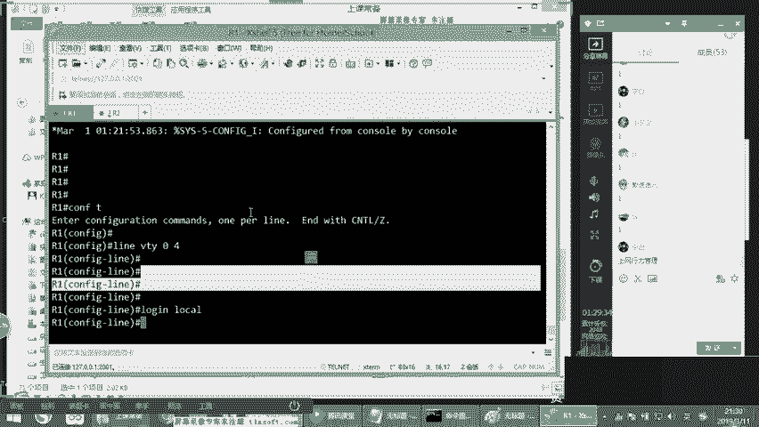

为什么？是因为如果我在设备上配置用户名密码的话，其实我能够管理它的权限的功能。😡，非常少。我能管给他功能权限非常少。😡，对吧我没有办法让他做太多的管理。😡，那你说老师我不懂。

你说我要是说直接在我们那个3A服务器呢，什么叫3A服务器？你要搞清楚3A服务器是一台独立的硬件设备，一台服务器。😡，啊，他主要干的工作是什么？3A功能，哪3A第一个A叫认证。

叫authentation啊，叫认证。😡，第一位。明白了吗？啊，认证啊，authentation认证。第二个A什么呢？orig授权。😡，啊，第三个A是什么？叫accounting审计。好。

这三A认证授权审计称之为三A。3A3是三项功能，不是一个功能。好像3A3A啊3A很牛逼啊，不是啊，3A只是一个总称。3A里面要细分析里面有三个认证授权审，就是独立模块，听明白了吗？啊。😡。

我给他打个比方啊打个比方，假如说我可以在里面呢设置一个用户命密码。啊，假如说我设置一个。😡，我设置一个用户名。是假如说用户名叫空白是吧？AOY吧，好吧，密码呢也叫AOY啊。

这个是我给我们这个里面1个LOY的是吧？管理员。😊，是是的。简单了啊，这是一个。😊，这认证你密码输错了，能登上来吗？😡，你密码输错，告诉coner能登上来吗？能吗？😡，可以登上来吗？可以吗？不可以啊。

你登不上来密码。第二个是什么呢？授权哎，我给我这个用户名啊，LY这个用户啊。😡，啊，LOY这个用户。给他一个权限，什么权限呢？注意看啊，他只能输入三条命令。😡。

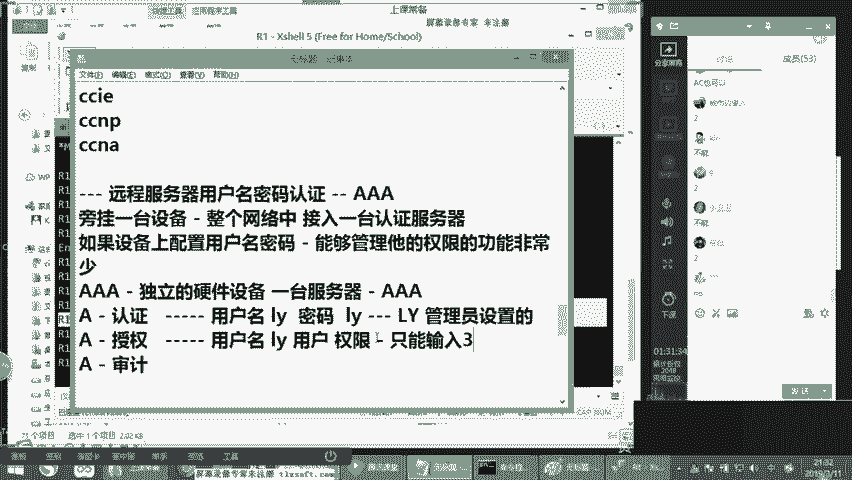

什么意思？或只能输入受开头的命令。😡，除了瘦以外的。😡，都不能输入。这个在很多运营商里面选用干嘛给新来的管理员的话，以层级做划分。😡，然后一新官门就来了。😡，你得考虑到这孩子稳定不稳定，靠谱靠谱不靠谱。

对吧？你不能上来之后给他一个最高权限，上丁光五个给你设备干干废了，干废了之后怎么办？你接下来他跑步了是吧，明白吗？他跑步吧，你怎么办？没办法是吧？能听懂吗？所以这个时候的话，一般都是有层级。

他不是上来给你所有的权限。😡，哎，但是我我让你闲着对吧？我让你看着是吧，看我做是吧，不是。😡，没见吗？哎，这怎么办？哎，我会给你一个。一些简单命令的权限。简单权限。你只能看一些东西，看一些。😡。

内容这些内容都是我给你的，明白了吧？我给你的，我让你看哪个你能看，除了之外看不了，听没听懂，听懂稍le意外啊。😡，这叫什么呢？叫授权，对吧？就是我给个你什么权限。😡，能用吗？叫授权。好。😊。

第三个叫审计审计什么，就是你做了什么是吧？用户名LY。😡，是吧你到底做个什么？哎，这个叫审计。😡，你干啥了，你干什么事吧，叫审计听懂了吗？啊，你干什么事情吧，叫审计。😡，明白上边意思。啊，没见过吗？哎。

没错，是的啊，没见过么？叫用户名啊，审计做了什么东西记录下来，对吧？然后呢，这个时候方便后边去回查叫3A。😊，一般使用3A的话呢，都是属于为了更多的管理。更多的管理权限。

就是我可以把我说白了就是可以把用户权限。😡，设置的更为细致。明白了没有？明白邵边义来啊。😊，It'是谁。那么在这个面前有要给。😡，好，你看这个时候你们看到看到后面有一个tax啊，看到了吗？😡，看到吗？

要家使用tcast server的密码进行校验。😡，什么意思啊？而使用tax加，你看我们现在使用ts，就意味着说你看我们3A服务器没有两种方式，一种叫ts。😡，O一ta us另外一种叫什么？

叫readers。😡，啊，这两种。理解了吗？啊，是改这种方式啊，这个你还没有学没关系。所以如果我们在这里面rein，你看我们刚才看了roin就直接使用我的设置的密码。

roinlocal使用我设备自己设置的密码login ta us。😡，使用3A服务器设置的，听明白吗？明白说ber意来好，这个就是不同情况下，你使用的方法不一样。😡，啊，你使用东西不一样。明白了吗？啊。

没事没事，没关系啊，你先知道你现在先看到你得先知道是怎么回事儿，对吧？你们看到一个东西都没见过是吧，这是最最可悲的，明白了吗？3A不能在本地做，记住3A不能在3A在本地做，跟我说那个不一样。

你3A本地是这样的叫AA new mode啊打开3A功能是吧？AA是吧？osdication认证，使用什么认证，使用什么等等，是这个意思，这个跟我说的远程内什干码事。

我现在说正儿八经的3A就是要设置一个3A的server服务体。😡，没见吧，哎，我在我这个网络中接入服务器。😡，听懂了没？啊，来管理。😊，那么这是我们现在看到的什么呢？

这是一个我们的用户名密码登录的一个事儿。刚才这么说，能不能听懂，告诉我听懂了吗？听懂上边一来啊。😡，好。那么这是一些简单的命密对吧？简单的命密。那除了这些简单的那个之外呢，我们还要看一个什么呢？

就是运用工具。啊，叫运用工具。什么叫运用工具呢？就是说我现在哎我现在的话，假如说老师我先敲命令好。😡，我 enable。enable忘掉吧。我可以使用一个问号，看到吗？还能使用问号吗？来。

我可以使用问号看。😡，E忘掉个熊问号明白了吗？使用问号好，使用问号可以自动的查看哈。第一个使用问号。😊。

可以自动查看你输入的每一个字母的后边可以跟上。没见完那假如说好，问号你看可以写那么多是吧？E啊问号你看EN问号看看明白了吗？明白双倍E来好，很简单的对吧？非常简单。😊，你able密码啊。对吧。

等于这是我们的首先要学会，大家要先学用问号。你看DC宝忘啊，老师忘记了，没事，问号。😡，所以大家一定要多用问号很重要，理解了吧？要多用问号啊，一定要多问在最开始的时候，最开始阶段要多用问号。😡，OK啊。

😊，多用问号。这样的话可以更好的。来查看你能就是你的命令参数。记住了吧，另可参数。好，第二个。假如说我现diable。😡，好，我干嘛呢？忘记了，我说你typeab进看可以自动补全，记住个吗干。😡。

自动补全Dcable哎，补全了吧，假如设enable。😊，啊，enable啊，不权好吧，听明白了吗？明白了吗？明白上边一个好，我可以使用tab。😡，看你的键盘上type键，就换行线吧。😡，可以自动补全。

好。那自动补全呢是非常好的一个功能，就你可以自动补全这个参数。😡，啊，那假如说老师我我输个亿可以补全吗？😡，懂吗你要看你后面有几个参数啊，你假如说现在的话，你看enable后面exit两个参数，对吧？

两个参数，你直接按t键不得加吗？补不权，因为后面有两个参数。那有一些LOS呢，注意看有一些AOS它是支持自动不权的。😡，干嘛？即使后边有多个看有多个参数也可以补全，但它干嘛它切换什么意思啊？

假如说你看啊我输你后边enableex吧，摁t键，我第一次摁t键，它补齐的是这个。😡，我再按t键，它补齐的是这个先是这个吧。😡，听不明白我是意思呀？而就是他不不只它他所谓这个自动股权呢。

是可以自动的切换。😡，可以的。参数。明白了吗？明白，上边一个。😡，啊。所以这是可以用到的。虽然type键呢可以自动去补全这里面的东西。在前期康才眼说，前期要经常用。前期要经常用为什么？因为在前期的时候。

大家要经常使用这个补全的个参数，对吧？啊，补全，然后呢话可以可以看全命令。😡，OK方便记忆。记住了吗？方便记好。最后一个点，第三个点。就是简写吧啊。就简写，就是我没有必要把每一个命令都打全打AN来。😡。

可以吧，看看费个T。😡，进入接口。听明白了吧？IP address1。1啊。n杀 down退出，这个叫什么？叫简写。😡，理解吧啊，叫简写。简写是说，当你后边的对于这些命令都非常熟悉了。😡，好。

你可以把它简写。😊，因为到我们后面的CRE呢，我给大家讲啊，我们当年的CCCRE考试很难的，有多难呢？跟你们现在难度不一样，例如当时我们没有面试，现在没有了是吧？现在我没有面试，你们太幸福了，知道吧？

啊，第二来说的话呢，哎它有它有一个什么东西呢？就是说我们一共有8套要敲的版本。😊，8套。8套版本。也就是意味着说每套都不一样。😡，在这个时候的话，我们要当时要挑大量的内容。😡，所以为了确保我们敲的速度。

我们就必须。使用什么必须使用大量的简写。假如说我们会能去看enable是吧啊。😊，enable好好，我们可能会讲T这样行吗？不行？好，这样啊，这样可以最简最简化了。好，每每一个接口，你看这样就可以。😊。

明白我的意思吧？好，这样能直接打吗？啊，这不行啊吧，必须ADD可以实现最简化。😊，所以等们在这个过程中的话呢，你会使用大量的简写。😡，到后期你发现为什么有的同学的话，在工作上会遇到这种情况。

假如说你看别的工程师配置。😡，他们配置都是简写，我不知道家有没有注意过，很多工程师在现场配的时候，你发现你想偷思想学一学，你根本跟不上。他如果他敲的很快，你跟都跟不上。你没有告诉你没有办法告诉你，哎。

你停一下，你可以吗？你不可以，没见刚才思没有啊，所以这个时候的话，它大量的都是简写，很快，这个屏幕这一排就刷过去了。😡，听懂好吧？听懂下波意改啊。Okay。那么说到这，大家可以听懂吗？可以吧？啊。

没问题吧。啊，那么这是一个我们现在看到的是手里边的三个俭用的一个工具。😊，好，俭用的工具听懂了吧？俭用工具。那么是我们看到当前设备的一些非常简单的一些配置啊，非常简单的一个配置。那么在后续的话呢。

我们就开始学习一些独立的一些功能。就是说假如说老师我现在你知道我已经可以把设备配通了，对吧？两台设备可以配通啊，两台设备可以配通。那后进到设备之后，PIP是吧？配通了，可以远程登上去。好。

那么后续的话我们就开始学习一些独立的功能了啊，就是说当我配通两台设备之后，哎，那我接下来应该做什么对吧？我我要想组一个小型的网络我要做什么？所以cor在下一节课的时候。

就开始会从一个新功能开始给大家梳理一个中小型企业网络的一个基本框架。😊，我们就开始往给填充内容了。😡，好，明白OK。😊，那么在这儿的话呢，你们有什么问题吗？你们可以提问啊，我今天的话不讲新内容了。

我讲新内容呢，可能一会儿讲不完，上不着村下不着店儿。我以一会儿要做的事儿呢是留作业和收作业啊。😡，好，看一下有没有什么问题。有没有说问题，本他哥讲东西。比较简单了，刚才我们要怎么说，很简单看好。😡。

Council。没啊，他说我啊，cisco。😊，饶饼啊，这个是这个是不需要敲的，你直接趴坐这头就可以了，明白吗？好。😡，明见吗？直接在案conunsel名做事。好。啊，没事。

SSH是我会单独教SSH是不是属于我们现在这节课的东西。啊，交机也是一样的啊，没有区别。你们要要搞清楚一件事儿，我们用的什么样的网络设备，不管是路由还是交换。😡，它里边的IOS是一样的。可以吧。

全都3OSS，所以编辑就是一样啊。😡，啊，没事，我我我我我会教密码，忘了怎么办？就是我要做的一个事儿是这样的。😡，康or在周四的时候的话呢，一上课我就给你们演示两件事情。第一个事儿呢是我们如何呢？

假如说我们如何利用X model。是吧去上传系统。这首先第一个事。第二个事是说我在我现有情况之下，假如说我的密码忘记了，知道我如何恢复。好吧，我会这两个点给大家说一下。😊，好。O。

后面的编号是conl口的编号，但只有一个0。你看假如说我们现在看到这边看对。council看后面最有给就一个council口，听懂话好。为啥给cl配置密码？很正常啊？你在机房里边的时候的话。

你你任何一个连接的方式都应该有密码，任何一个连接的方式都要有密码，懂过吗？啊，所以我要作为通过ccl连，如果我我把这个东西搞搞砸了怎么办？那我应该有一个密码，我应该防止外来身份，任何一个都应该有。😡。

对，周四周五都有扣的啊好。最先关闭个日志功能还可以查到吗？你说的是说这个用户现在登上去了是吧？登上去之后，然后他关闭一个日志功能是吧？通常我们不会给他关闭日志功能的权限。理讲了？而且你想想看。

你关闭的日志功能，这个事儿从本身来讲的，就是我们不会给用户密码不会给他这个权限，这是第一个点。第二来说呢，我的审计服务器可以知道他输什么命令的。他敲什么东西，我都有提构。😊，这么说能听懂吗？他敲什么。

我都有记录。OK好，是这样。😡，啊。啊。本定密码一般是配置多少个呃，配置多少个配置多个吗？啊，不是要根据你具体有多少个管理员，你到底有多少管理员在同时管理你的当前的网络，跟这个有关系，其中了啊。

你具体配置多少个，是没有一定的说法。😡，啊，你要你说我们公就一个人，你配10个有啥用，是吧？😡，怎么区分账号密码？如果账号很长，里边包含空格加password会怎么样？呃，空格加pasor会怎么样？

打比方。假如说user name cisco passwordsword假如说CCIE空格cisco啊，我设置是一个这样的，你收入可以看到啊。你假如说我现在收望。啊，我们可以看到这个密码。

你要把这个密码直接复制下来啊。😡，看到没有？你复制下，你要保存下来的，好吧，你是你怎么区分啊，你是不保存了吗？明白了没有？在复器要自己搭吗？是的，要自己搭。😡，明白了吗？九啊，扑哥加密码。

你这不是有保存吗？OK。😡，好。啊，是这个意思吗？你是想了解是这个意思吗？😡，啊，3A不会涉及到，其实因为3A是属于纯安全领域啊，但是我会给你一个我的配置文档啊，我当年的配置文档我会发给你好吧啊。

然后你们可以自己搭一个玩一玩。密码中可以存在空格呃，但是空格很空，最好不要用。是的，没错，呃，账号密码不是方一行敲出来设置的吗？当然不是吧，你看。😊。

user name Cisco用户名密码是后面要加一个password再接的，后面才是密码，懂了吗？啊，是一行，但是的话你去查看的时候，它是分开的，它是在password后面理解了吗？是后面这个位置。

😡，好，看到吗？这个才是密码，前面这都是什么？有一个pasword做间隔，没见过吗？明白下边一啊啊，你自己尝试两次啊，在实验环境中你知道吧，其实一点都不难。😡，啊。是你说哪方面的加密啊？😡。

哪方面的加密？NP想到设备虚拟化吗？IRF啊，你们想听吗？其实在科里面没有，但若你们想听啊，我就给你们穿插一节课。好吧啊，你们想听我就穿插一点。没关系，好吧，就是如果不会很费课时的。

conor都会给你们穿插，没问题的，可以吧，OK啊，考ter会给你们穿插一点。😊，可以吧啊。配置工具要本地保存操作记录吗？不需要不需要本地保存。同时登录设备时，只能有两个用户可以登到配置模式中。

3到第三到至5个用户可以登录，但无法进入配置模式，什么意思啊？我哪里说这个问题了？😡，line VTY0空格4啊，这是5个用户，这5个用户至于能不能登进来，取决于你设置了多少个用户，明白了吗？

取决于你设置了多少个用户，取决于你设置每个用户的权限。啊，OK跟你这按VTI跟空格是没关系，记住了吗？😡，啊。密文为什么有时候配不成功，用户密码的加密类行期，什么意思？什么叫类型期啊？你说这个地方吗？

你说哪个卫星期我没没听懂。你的意思说，假如说我现在在in enable呃sec这边只有0到5吗？啊，你说哪个地方啊，区啊。CCRE你说这个这个地方吗？七吗？7级别是吗？😡，什么啊。

你说是password是吧？password后边的话是7是吧？好，然后cisco是这个意思吧？😡，啊，是这样啊。啊，如果coner没有记错，你说这个地方保存不成功是吧，是吧，是这个意思吧啊。

他说是显示无效的封装密码。😡，啊，他我记得这个7呢，它显示的是加密后的啊，我记得它显示的是加密后的一个密码。加密后的一个密码呢，我看看啊CCIE password。假如说如果这个地方啊。假如说是7。啊。

如果是7，因为这个零是属于未未封装的，未加密的。如果是7的话，是加密后的加密后的密码，我给你们这么说吧，等等一下啊，我看看。Enable password。呃，secret，我数我数个secret啊。

secret加我数一个ss啊。然后这个时候的话。等一下啊，给雷宝。secret呃cisco123啊，我们查一下收入。我记得应该是加密后的，我看看是不是啊。好，我把这个复制下来。复制下来之后呢。

然后呢我在这个过程ususer name假如说123password7。粘贴。等一下啊。好，复制。粘贴啊。啊，也不是。哎，这个地方的密码是一个什么来着？它不是好像不是这种安全加密方式，等一下啊，我看看。

啊。我看看我看看这个地方是上次从哪里看到来的。等一下啊。呃，user nameCCIE等一下我看看。CCIE呃。假如说我我改一个啊，然12345。然后passur，然后这个地方呢。这个地方呢我记得是0。

如果是12345好，我如果这样数吧。我记得他不是这样说的啊。我记得是service。encion我看看不是。Incrupion service。等一下啊等一下等一下。😊。

Password of encryption。哎，还不是AES。不是这个东西。啊，这个东西我这应该是毫面。这条命令的话呢，这个地方会显示成加密的啊，这个地方会显示成加密的。啊这变成7了，明白了吧？

这才会变成7啊，不是让你直接输入的。😡，听明白了吧？你看这才变成虚，看到后面有7个吧。看到这方有个7了吗？7代表的是加密后的，加密后的显示。😡，那我给你举个例子，你看是不是后面都变成乱码了？😡。

看到了吗？也就是说事试你通过这条命令，你才可以把它变成7，看到吧？啊，只会变成7啊，你直接输是输不了的。😡，给你举个例子啊，这样的。啊，no service。No service。呃， service。

VISERVSE。no service，等一下。啊，爬村。啊，我漏掉no掉之后呢，你们可以看到你所有设置的用户跟密码。😡，现在已经变成7个，回不过来的啊，假后说我给你们弄1个CCIE全都给你弄掉啊。

ssco。😡，n u12345no user123好。判长，现在我应该没有用户名密码了吧。😡，注意看。别着急哈。我现在下面是是不是没有用户密码了，是不是是不是没有了，告诉我没有了吧。好，没有的时候的话。

我现在设置一个user name好，CCIE password好，CCIE对吧？好，看着，我现在通过s on。😡，去看。啊，你看现在显示明文，这是零，这是未加密的，能听懂吗？未把它变成密文的。😡。

然后这个时候的话，我输这样一条命令，叫service password encryption做一个密码的一个安全封装加密。加密完之后呢，我们再来查看。好。看好啊，这变成7个。

看到没就代表加密后的隐藏字符这了。😊，那你如果远程登录进来呢，你假如说我tenet。😡，1。1。好，tellnet1。1。好，怎么样？CCIE密码还是信IE没交8，停。😊，能听到吧？对。

C就是7就是加密后的啊，加密后的。😡，啊，不是它每一个系统的加密方式是不一样的。呃，思科的话，我我没有记错的话，这个七呢是他那自己的一个内部算法，不是每一个并不是每一个厂商用的是通用的，明白了吧？

防止逆推，防止逆推啊，这还不是MD5啊，这个并不是MD5的方式啊。啊，我来看一下是吧？我记得应该不是MB5。password你看封装成系统密码是吧？封装安全封装系统密码。他说。啊，没有没有提示。

没有提示什么方式啊啊。😡，啊，对啊，以N保也是一样啊，以南保之后，你也可以看看到没有啊。😡，上面这给啥。听明白了吧？啊，就等于是通过一个内部的一个加密算法，把它变成了一个密文啊。

你单纯通过收入是看不到的，在工作中一般都是这样。😡，啊，一般都是我们直接敲，敲完了所有的之后，直接service，你可以记下来啊。😡，pasur encryption可记下来。好，OK了OK上边一个。

😊，是的，所有的密码都会变。只要是跟你这个系统里面配置的所有的密码都会变。😡，好。因为申信服的是小厂商，他们的命令级呢大多数人不是主流的，所以大多数人不会都是用web界面，而且申信服务呢主要是安全产品。

主要围绕的都是一些什么独有的安全功能啊。因为安全功能往往都是单一化功能，往往很少有组合功能，还有像VPN这样的，所以通常情况之下，他们都是we部界面搞定，没见过吧？啊，技术含量没有特别高啊，一般像。😊。

啊。SERVSE好吧，不是VUCE啊。啊。好，OK还有什么问题大家可以问啊。😊，叉跟CRT一样吗？一样的叉ll和CRT仅仅是不同的连接方式，懂吧？仅仅是不同的连接方式而已啊，它并没有什么太本质的区别。

记住了没有？啊，有作业吧，有啊，当然有吧啊，首先先跟大家说一下，注意看。😡，那么大家呢当你们接下来要干什么呢？😡，啊。你们接下来呢就是要开始回去给我拍一段小视频。今天我们的作业是一段视频作业。

这个视频作业呢是留在下周一收的啊，明天我可能还会留作业啊，视频作业什么意思呢？😡，好，注意看下样的。看到拿到一个设备之后。😡，下周一手下周一手okK啊，注意看。然后此时我们进到里边之后。

拿到一个设备enable。啊。输密码啊，现在我设置密码。我刚才不是个密码吗？123嘛。😡，你那把，我刚才设置密码什么45吧。你看我刚才密码都没有记，我刚才说什么密码吧，cisco123哦，对。

 Cisco123OK好。😊，no enable，我先把它弄掉啊， passwordword。Enable secret。好，看着，接下来我们说一下作业。当我们拿到一个设备之后。

进去enableterminal RE。😊，noIP do漫look up。康松明。配置退出进接口配IP。好，退出no杀的退出。注意看到了吧？退出。好，然后接下来特权模式。😊，拳驱模式。接口模式。

特权模式。用户模式退出。好，把这张给我录起来，记住了吗？来介绍个目前来。要敲到这么熟练才可以，要非常熟练。也就是说注意看啊，在整个的过程中，enable对吧？

tminal好host R一进接口PIP记重啊。😊，KIP退出流沙档。退出。漫go up共程三招的。退出好是吧，退出特权是吧？全举。接口。特权用户明白了没有？明白了吗？好，就这个逻辑。

然后把这个1个30秒钟内抄完。

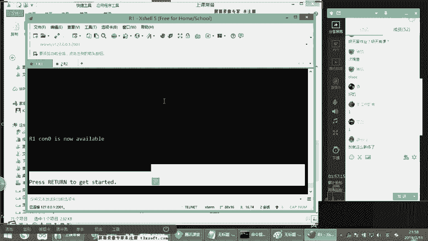

好，我以上说的部分，以上的部分30秒之内搞定，然后直接用你的QQ啊，或者用你的什么玩意儿都无所谓啊，录制一个小视频。没事在我的录屏里边。我的录屏里面有OK啊，我的录屏里面有。😊，啊，30秒搞定记住了吗？

啊，30秒搞定，我要看你敲好吧啊，知道什么叫拍小视频吗？是吧？你刷脚板有什么用啊，我看你键盘的，好吧，OK。😡，所以这是几个非常简单的模式，这是我们这次的作业。😊，好。记住啊，我再三强调。

你拍小视频的时候，不要让我看到旁边有个本子，我不想看到我本子啊，这是第一个对啊。第二个直接拍个小视频，然后摸敲，懂吧？摸敲。😡，OK我敲30秒搞定。😊，记住了吗？这是在我们下周一的时候。😡，要交的。

所以。好。OK啊，明白了吗？那那不不用着急，我刚才已经录下来了，回去看过全剧啊啊，那当然了不知道怎么怎么录小视频吗啊。😊，学学那个陈老师怎么录小视频，知道陈老师吗？啊，你们平时既然喜欢看陈老师个小视频。

那你们就知道录小视频那个方式，怎么办啊？😡，啊，找一个你的好好基友，好兄弟是吧？旁边的时候给你直接弄一个小视频，这怎么就不会问问呢？我看你拍抖音的时候录的可可带劲了是吧？不你今天又去哪玩，明天吃个啥嘛。

你们看你们过的不是挺好的吗？啊，就这个逻辑听懂了没有啊。😡，这孩子录屏工录什么屏工具啊，你们自己拍抖音的是怎么录的啊，你们到时跟我讲。😡，你们给自己收藏珍藏小视频的时候怎么过的？😡，理解了吧？啊。

这很简单的这个问题怎么就这个时候就不知道了啊，平时的时候拍的那些一盘一盘的菜呀，是吧？嗯，是吧？你拍的可溜了，是是这意思吧啊。😊，O。啊，很简单吧啊，就这个逻辑啊啊，所以下次时候的话呢。

要把这个小视频直接搞出来怎么了？搞出来，下次交作业不用那么费劲你知吧不用那么费劲，直接在什么呢？在QQ上，咱们在QQ里面交，我让你们谁教，你们就给谁发出来，明白了没有啊？😊，啊，那当然了。

当然要切键盘啊啊，我看着键盘嘛啊。😊，找一个人录嘛，这孩子们找一个人录一下来不不可以吗？是吧，找一个人旁边拿着给你录一下。😡，那你随便你是要噼噼噼啪啪的那你自己看着办是吧，是你随意这我管不着。😡。

OK吧嗯。怎么样？跟着counsor的课堂，交作业都是一个有趣的事儿。😊，有去吧啊。啊，我跟你讲，每个工作都这么搞，我给你早都学好了，是吧，一个个学的扣6吧。😡，啊，看得见啊，怎么了，你发什么东西了？

😊，你发啥吧，你现在就已经拍完了，不用着急，下次课咱们才教啊，理解吧？😡，啊。好，说说OK吧。啊，OK的话呢，我们来抽查一下这节课的作业。好吧，我们抽查一下这节课的作业，那就是上节课的啊上节课的作业啊。

抽查一下上节课的时候的话呢。😊，好，我们来说一说我们上节课课作业，大家来准备教一下啊。😊，我呢还是找那么个几个人行不行？我们还是找几个人。第一个城市边缘人。好，交作业，发你自己的作业，拍照发上来速度。

😡，张忠义，谁跟我手啊？😡，啊。我下次我要选一个班长，我要看一下我现在收作业的时候，谁敢给我推出课堂是吧？啊，一到交作业就跑掉了，什么情况啊？😡，好，城市边人，这是一个好，9第二个。好，第三个中第3个。

好，哎，我是界面卡了吗？好，稍等一下啊。😊，经常有同学跟我说，一交作业坐面就卡卡掉了，是吧？啊，然后再找两个同学，754。第54好，第五个龙之梦来吧，你就你们5个人。好。你为什么没写啊啊，你为什么没写？

😡，你在路上能回宿舍拍吗啊，这个可以。那一会儿的话，你要给我交到这个交交到群里边，好吧，交到群里面，然后艾特一下我啊，其他同学速度快点，你为什没有写呢？我先问一下。😡，啊，因为什没有写？为什么没有写？

啊，为什么没有写？来剩余的人交上来速度。😡，呃，你是那个M什么什么这个同学啊，M这个同学你是这样的啊，就是说你没有加到系统班的群吗啊，你在这找你的报名老师，叫他进拉你进群的啊，在31期。

我们系统班的群里边啊，这个MC什么什么，你是新来的是吧？啊，新进老课堂的啊啊，现在还是可以听懂的啊，现在专心听可以听懂，没问题的啊。😡，OK。我看一下。好，我看一下这是谁教的呀，这是龙之梦交的是吧？

稍等我看一看啊。谁都不许跟我走啊，我收作业的时候，谁要跟我走，谁要发现了，就死定吧啊。😡，他时已经是。啊。康已经是对你们非常好了，知道吧？😊，啊。稍等一下。哎，我这个等一下，我这个特别卡。😊。

我这个这个最近这个同一课堂一改版之后就特别。哎，特别差劲。哎，等一下等一下等一下。妈的。好，我看一下啊。好，我来看一下这个同学。啊。Room覆。路由器存储。R， running。

 configurefi run。能听明，你copy真棒，写的真棒。你们看看人家写的作业啊，你们把你们眼睛给我睁开看一看，你们看一看人家龙之梦交作业，你们看一看。😡，是不是？就不说别的。

虽然都是一些基础的技术点是吧？但是你看人家是怎么写的，你们自己看一看。😡，是不是？是吧这个你们哎你们都给我刷一波鲜花给人家这个学生好不好啊，你们看看人家怎么写的。😡，是不是啊这是公字梦销的吧啊。😊。

所以就是说嘛就是说我跟你们讲，学技术就是要1。1点给来开差距的，明白了吧？我要想让你们在课上舒服的，很简单，我不屌你们不收你们作业就可以了，对吧？你们来看一看，你们来看一看这个时辰，这是人家写的。😡。

是不是很好，告诉我是不是写的非常好，告诉我是不是写的非常非常的好，很工整。😊，对不对？关键的命运是什么？对吧？这些东西后期你可以用来查的，你可以用来回查，记住刚才说的话干嘛？记住了吧？

记住给我刷出一来啊。😡，明白了吧啊。所以希望你们都够注意，都向人家学习，知道吧？你看人家这个绝对是非常棒啊，非常非常非常棒。这我要保存下来啊，这我要保存下来，保存下干嘛呢？我要告诉我的同学们是吧？

你看这是我这个同学们写的作业。😡，啊，非常棒是吧？啊。OK吧。你问其他同学啊，其他同学的话，那个谁745754作业交过没？😡，754座业行不行？我先把过屏音停掉啊，我这个有点卡了啊。😊。

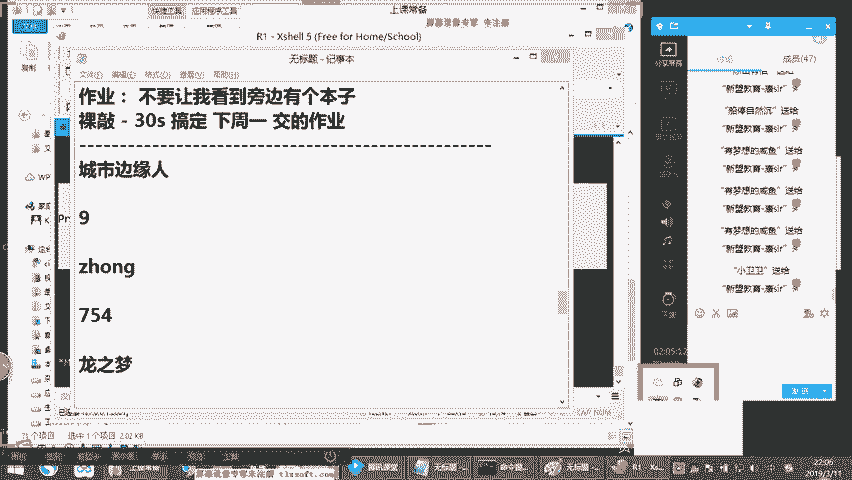