# 2019年度最新思科认证CCNA网络技术经典实战教学全集（最适合零基础小白的CCNA详解） - P7：思科认证CCNA网络基础第7节-静态路由 - new盟的小狐狸 - BV1V4411J7ZP

。

请打开，我们现在开始了。那么说我们今天这节课我们要讲的东西啊，在我们今天这堂课里边的话，我们该涉及到的一个通信问题啊，叫互通问题。什么叫互通问题呢？因为在我们在此之前的课程里面，我们所学到的是什么？

我们所学到的什么？我们学到的都是一些简单的网络。😡，模型是吧？一些网络的框架。哎，我们学习到个局域网，广域网对吧？这个我们已经学了啊，广域网，而且我们也知道了一些简单的设备配置命令。

我上次教大家大概教了10条左右，是不是啊不多啊，那么今天的话，你们要注意交作业是不是啊交作业的时候的话，一会儿我再收啊，等临课下课之前我再收作业啊，那么今天这堂课的话，我们主要是要学涉及到什么呢？

要涉及到一个跨网段互通的概念。😊，好，我们要搞清楚什么叫跨网段互通呢？我们都明白啊，这个就涉及到consor给你们做扫盲的时候，我们学到一个点，我说我们接触的路由器交换机，我说路由器是干嘛？

路由器的最主要的作用就是实现一个跨网段的数据转发。😊，对吧？昨天的时候我给咱们杨峰是吧，他们哎我不知道清风今下来没来啊，我给他们做这个辅导的时候，还特别强调了，我说路由器的最主要的作用就是跨网段的转发。

哎，横跨网段。那么如果要跨网段转发的话，我当我这个数据呢到达了我们的哪里啊，到达我们的路由器之后，它要进行什么查询转发。😊，路由器要进行查询转发，叫要依赖什么？依赖我们的路由表。对吧一概不构表。好。

那么意外路由表的时候，它，这个路由表是怎么来的呢？咱们之前说过，我们说路由表就是通过我们要学习的即将我们要学习到的各种各样的路由协议来构成。😡，所以说白了我们学的相当长的一段时间。

都是在学习如何构建这张表。能听懂吗？我们学习相当长的时间都是在学习怎么样构建这张表。好，那么在这种情况之下，我们说各种各样的录由协议来构成。其中说到慕游协议啊，注意听，我们就牵扯两个大的方向。😡。

第一种叫什么？叫做我们说叫静态不由。😡，第二种是叫动态不有。好，刚子现在说到这能不能听懂，可告诉我能不能微解okK刷波一来刷波一上来啊，可以吧，可以吧，ok吗？😊，能听懂刷波一没听懂刷波2啊。OK好的。

我们接着看。那么我们说不管是静态还是动态，我们归根结底，就一个目标嘛，我们的目的是不变的，就是为了构建我们的什么路由表，那这个表首先是okK那我刚头之前给大家说过，我们说如果表构建错了。

那出现的问题就严重了，怎么严重了呢？这个表要是构建错了，就出现了什么数据发送的方向错了。😡，对吧？方向错误，如果方向错误的话，会导致什么呢？导致我们的数据绕远对不对啊？绕远绕远我们都明白。

一旦绕远直接导致的现象是什么玩意啊，这么卡吗？对吧？绕眼数据肯定卡啊，也会导致什么？也会导致我们说的数据的路由的什么黑洞对不对？路由黑洞是不是黑洞啊，啊，这是我们这个数据的发出去到不了对方。

我没有办法访问到目的，我没有办法访问到目的网络，能听懂吗？哎，到不了叫路由黑洞啊，所以说其中在这个里边能不能通路游站了非常重要的角色。😡，好，说到这，这个前提我们现在搞清楚了，我们理解了，对不对？

没问题吧啊。😡，那么其中呢我们说动态和静态不由啊，大家注意啊，静态不由什么呢？是我们通过手动配置的。😡，也是说我们一条一条写入进去的。所意看。全都是手动配置，我们不需要什么呢？哎，不是自动构成的。😡。

那么但是我们要考考虑到一个点啊，静态路由如果都是一条一条手动的写，这样呢其实还是很麻烦的。因为我们知道现在当当前全世界的网购，大家知道吧？就全世界的网购环境，目前来说的话，一共有多少条路由，大家知道吧？

一共有大概不到70万条。😡，啊，这个规条目数很多，数量很大。所以全世界的网控很多。如果你要一条一条的写，其实是个很庞大的一件事儿。😡，所以很多书的话在书本上定义什么呢？看着啊，你们原前要看过书。

自学过一点，说书本上说嘛说这个静态固游啊，注意看啊哎这个静态固有啊，它只适合什么呢？只适合于中小型的企业网络。😡，它一定适合小型网和大型网都不行。如果你这个网络规模很大，你这个静态V不能用。😡，为什么？

你如果你要用静态过一条一条写，这很麻烦呀，听以明白了没有？好，但其实这个书本上的概念说的是是片面的啊，为什么说是片面呢？看le告大家像。😡，你不知道这个动态无忧协议啊，咱们先说一下这个动态啊。

咱们再说它为什么片免啊，动态无忧协议是什么？是我们的网络设备看网络设备彼此之间。😡，自动形成的。就他们设备和设备之间啊，它会相互的同步我们的目由表。😡，能听懂吗？相互同步，我把我的发给你。

你把你的发给我，这叫相互彼此同步，能不能理解啊，这个是我们说这个动态部由的一个主要作用啊啊，那么在这个过程中的话，它减少很多的工作量，它全都是属于自动来形成。😡，但是这里面有一个弊端，这个弊端什么呢？

就是一旦网络出现了不稳定。大家注意听啊，什么叫不稳定？假如说网络的话啊，假如说这个出现了抖动，这个抖动现有可能是说这个线路。假如说这个叫你平说的线虚了，对吧？有可能说是这个模块出现了问题，时战时续。

能听懂我看的意思没有啊，等等如此类的。😡，那么可能也许也许是中间数据通信卡了，这有可能。那么都可能会导致什么呢？导致动态路由协议出现了一个不稳定的现象，就是它会出现我们说的叫路由抖动。什么叫如抖动呢？

就是浮动来浮动去。假说我现在一台设备，注意看啊，我有两条线双线路。😡，哎，我双峡股的一条电信的线，一条联通的是吧？我们是双线啊一个接入。😡，但是呢如果出现了他检测到某一条线。不稳定。啊，直接导致干嘛呢？

这个数据的数据的转发方向啊就会进行一个切换，能听懂吗？能理解吗？啊，那么在也稣一旦有不稳定，它就会切换。但是你说它真的是断了吗？这根线断掉了吗？这根线可能没有断，它仅仅是出现了不稳定。

就会导致动态路由协议，看着出现误判的情况。😡，能明白方才的意思有？出现误判，一旦出现个误判，就会导致什么呢？导致线路切换。😡，好。而在这个过程之中，如果出现了线路切换的话，我们就知道了这个情况了。

能理解刚才意思没有啊，怎么样？其实的话他明明不应该切业，但他切了。我说的这告诉他才能听懂吗？O吗？OK先给康稍一来好。😡，那么即使我们现在看的说动态物流协议啊，动态物游协议一个主要的一个特点。

所以你会发现，往往在某些地方，如果说是追求，注意听，如果说是追求线路的一个稳定，如果出现带宽的稳定，往往都会使用静态路由。我给大家举例子，像最典型的运营商啊。😡，电信啊、联通啊，听明白吗？

电信联通OK啊，电信联通能听懂明能听明白吗？Oshop e呗是吧？所以你发现在运营商里面，即使运营商的网络规模非常大，网络规模非常大，它也会出也会使用什么，大量的这个静态路由，这个呢大家先搞清楚。

所以静态路由，它并不是说非要作为这个小小型网络才能用，这是绝对百分百错误的理解。明白刚斯的意思没有？明白shopber e啊啊，所以大家千万不要这么理解这个问题啊，这书本上的错误概念啊。

所以在现在的实际工作中一定是我们说的静态和什么动态，它结合使用。😡，理解他的意思没有？哎，他出现结合，这两者他都用。😡，两个方法都用。啊，但只不过相对而言，大家注意听，相对而言往往是什么？

往往是说我们在小型的网络中啊啊，我们通常会使用静泰国油。😡，明白我的意思吗？啊，熊静态路由这个事世界没有什么复杂的概念，杀机用牛刀吗？不需要吧。我这个小型网络每边的话，我一两台设备，我起什么动态协议。

一共就两台路由器，我用什么动态，我用静态就搞定了。不是它就是它明白了吗？其实很简单的概念啊，希望大家先把这个概念先熟悉一下好。😡，那么老师这个静态路由的话，具体怎么写呢？啊，不要着急。

咱们首先要搞清楚一件事儿啊。😡，静态路由里边呢它分成两种。第一种叫什么叫做普通的静态路由。还有一种叫什么呢？叫做静态的默认的静态过油。大家记下来啊，这两种。普通的静态过油就什么呢？这就是明细条拨。😡。

明白吗？就一条一条的明细条目，就是咱们说的普通的静态股油，哎，一条一条都是明细的。你要去什么地方？好，怎么走，你要去什么地方怎么走，你要去什么地方怎么走。也就是说你要去往的目的相对应来说是明确的。😡。

啊，它可以是什么呢？它可以是一个网段，也可以是什么？也可以是一个地址。😡，听明白了吗？能理解吗？哎，对，就是我们说的普通的静态轨有。没错，是的啊，我可以去一个网段，一个地址。

假如说我现在想去往的是202。1。1。0。好，我想去这个段，或者我想去一个地址，202。1。1。100。😡，听明白了刚才意思有？好，这个时候的话干嘛呢？他就我们说叫明细的。

就是你要去的地儿是非常具体的好，我想去发往什么目的，我想去哪里？😡，好，这个时候我写一条静太国。😡，那还有一种叫什么呢？还有一种的话叫做默认静态路由。😡，什么叫默认静态呢？啊，叫我们一般也叫默认路有。

默认路有所指什么意思？注一天它所指是说你要去往任何地方啊，你去往任何地方只写一条。😡，那这种情况其实用的是最多的。咱们平时在工作岗位上这个方法，这个咱们绝对都用过。😡，你白啥子意思呢？

这个你们学对都用过。你假如说企业里边，假如企业里边企业网络单线路，这个大家知道对吧？单线路没错啊，我们公司就一根线，就一根外线，呃，要么是电信啊，要么是联通。明白这意思没有啊，那这个时候只一根线。

假如说你们企业的话，如果说接入个一根线。那同通常情况之下，你会获得什么信息啊？😡，你把钱交给个圆通，你们公司里面办了一根普通的带宽上网，你告诉刚子，你会获得什么信息。😡，你获得什么信息？你首先会获得。

如果是一个固定IP的，看着固定IP的，你会获得个什么电信联通或者移动给你的什么呢？给你的一个是你的IP地址。😡，你的掩码。😡，和你的网关地址对吧？能理解吗？啊，你这几个信息一定会有对吧？好。

你的IP你的掩码和你的网关council这么说，能听懂吗？O吗？ok给康or刷波一来刷波一上来。😡，好。对吧这这些信息的话是人家给你的，这首先你是必须要有啊，你是必须要必须要得到的。😡，啊，没问题吧。

好，那ice啊好，那么这个过程之中的话，你说老师为什么他要给我这些？很简单，他给你一个固定IP这个固定IP是干嘛？是让你配置在你们的公司网关的出口上。😡，啊啊，是网关的出口。明白吗？出口就连接哪个？

连接我们说的这个电信啊，连接啊、联通啊，连接移动啊等等。没错，也就上次咱们说的比叫较万口是吧？广义网接口。😡，然后配置在上面。😡，那你还有一个默认网关呢，老师这个默认网关什么概念呢？

这个默认网关就是咱们说的路由里边叫什么叫吓一跳地址。😡，能听懂吗？这个就是我们说叫下一跳地址啊，下一台设备下一跳地址。好，那么意是说你为什么他要给你这个地这个地址呢？就是说作为你们公司的网关来说啊。

网关的公司的这个网关设备。😡，你肯定要写一条默认路由。😡，这条默认路由看好，就是说去往任何地方吓一跳，都是这个什么默认网关。😡，哎，非常好，明白我说的意思没有？你去往任何地方吓一跳，都是这个默认网关。

😡，他其实给你的就是这么一个作用。而且唐子告诉你，其实啊。😡，你们公司里边看到办理的这种带宽业务。啊，这种贷款业务。和你们家里边。😡，和你们家里边。家里边办的宽带业务。你这我穿的一样吧。😡，啊。

告诉刚才一样吗？一样不一样？😡，啊，一样不一样。你们说说一下一样不一样，一样不一样，哪里不一样。😡，哪里不一样，啊说一下哪里不一样。😡，你看见了吧？这个时候就有分歧了价钱不一样，这话说的价钱肯定不一样。

是吧？😊，除了价钱以外，我说是技术层面好不好？😡，注意看啊，家里边并不是说都没有固定IP有的时候家里边的宽带也有固定IP假如说你们原先家里边的，原先你们家里边的话，用的小区宽带有没有固定IP啊。

有没有也有吧？基本是一样的。如果说是固定IP的，它其实一样。😡，你从你从电信、联通、移动办了一个企业项目，企业宽带注意定啊，办个一个企业宽带，你会获得1个IP地址。😡，一个子网掩马，一个吓一跳地址。😡。

对吧这是你要获得的，但是你要家里面办个宽带呢，你也会获得1个IP地址。子网源嘛，还有一个什么叫网关地址。😡，但其实这个网关地址就是下一跳地址。OK吗？回答刚才OK吗？OK刷波一来能听懂吗？啊，对吧？

一样的，吓一跳就是网关，这个概念没有任何区别啊。O好，我们接着看。😡，但是你说老师这个加个员不是有很多情况下，它不是固定IP吗？加个言不是固定IP企业的也并不都是固定IP。😡。

企业给你们就我们一般家里面不是固定IP叫什么叫ADSL对吧？ADSL宽带业务对吧？好，宽带你企业有没有这个，你告诉刚才，企业有没有宽带，也有你企业也有企业级ADSL。😡，明白了吗？啊，非常常见。

你企业可以用ADSL。😡，所以他也是属于动态获取的IP地址。而这种方式是采用什么呢？采用的是拨号形式。能听明白了吗？能理解吗？OKshopE改对吧？它采用的是拨号形式，也就说你实际上如果办这种的话。

你会获取一个什么呢？一个用户名和一个密码，对吧？它是这样的一种情况。😡，然后呢进行一个拨号。明白吧？好。那么这个时候我们可以看到，由于如果我们收回来，假设我们的企业网关只有一条线。😡，好，只有一条线。

那实际上我们关于写路由这个问题，不管怎么写，去往任何地址吓一跳，怎么样。😡，都是他，对吧？因为我们只有一根线嘛，如果我们只有一根线的话，那实际上就是去往任何地址下一跳，都是他明白了吗？

明白给康的shoppperE来啊，那就这么回事。😡，好，所以我们说叫默认委员，听明白了吗？啊。😡，那么这是我们现在看到的说哦，这是普通的静态，还有默认。好。那么这个时候的话呢，那csor的话呢。

先给大家做一个简单的小实验，我们演示一下。好吧，我们来看一看我们这个静态目容是怎么做的，行不行？啊，我们来注意一下。好，那csor的话呢不用多写啊，咱们这样。😊，啊好，我现在的话呢就画几个呢？

我现在的话就画三台设备，一台。假如说我们就画两台三台好吧，我们接下来看三台啊，咱们1。1点做。那此时的话呢，我把它这样连接上。😡，好，然后接下来这是我们的模器，一，这是二，这是三三台OK。

接下来我在我三这啊起一个还回接口。啊，然后这个还回接口呢，我们叫什么？好，我之前给大家讲过什么叫还回接口吧。😡，说过吧，什么叫还约借口啊？😡，什么叫还原协法？还原系统叫mo back叫还回。

黄为接口是际什么？叫虚拟接口？😡，能明白吗？虚拟接口，我给你举个例子，还回接口就跟你们现在看到的什么呢？就跟你们那个电脑里边那个虚拟网卡差不多。😡，听明白了吗？跟你们那个虚拟网卡其实差不多啊，看着啊。

😡，好，稍等。好，假如说这样，我给你们看一下，你看你们先看这个吧，对吧？你安装虚拟机分别有什么VMnet11和8看到了没有？啊，这就我们说虚拟网卡啊，虚拟接口就是说我们因为我们其中啊这有一个概念。

为什么要写还回口的？因为还回口的最主要的一个作用，看到有？是干嘛？是模拟一个虚拟网卡，其实最根本的是用该模拟另外一个地址段。😡，听懂了吗？它最主要的作用是模拟另外一个地图段啊啊永远不当，这是一方面。

其实你看很多书本上写的环回口，为什么要让它模拟啊，永远不当。哎呀，我跟你们讲实话，其实这个东西关系不大啊，我跟你们这么说，关系不太大。有很多这个教材上的里面写的概念其实它是有偏差的，明白了吗？啊啊。

它最根本的是干嘛呢？最根本的是在于它不需要再连接一台设备吧。我给大家举个例子。😡，假方说我我如果我明明想模拟一个服务器，我应该在这再接一台服务器，对吧？你们来看对不对？我现在按正常来说。

我应该在这再接一台服务器吧，明白了吗？明白s微意呗好，是吧？是这样，我如果在这接一台服务器，一台server，那我就多台设备呀，这不很简单的逻辑吗？在最开始的时候对不对？啊。

但是我现在我不接这个server，我直接在这起一个什么呢？虚拟网卡，我用这个虚拟网卡再去模拟一个网端。😡，对吧配偿IP。是吧模拟一个地址段听明白了没？我用它模拟一个地址段，这个时候在干嘛。

我是不是就省得再连接一台设备了。😡，明白了没有？明白给conor刷波一来啊，说是很简单的概念。OK吧？一点都不难啊，所以他其实起到这个他们最开始练习的时候，它起到这么一个作用。但在后边它不会大家注意啊。

后边它就不会起到这个作用。😡，它后面什么呢？就是说我们后边的话会用环回口。我跟你讲，这个环回接口在后面作用非常大。😡，在各种各样的路由协议里。啊，它起到的作用是很大的啊，咱们后面再讲，别着急啊。

咱们没有讲到这。😡，好，接着说。那么在现在当前这种情况之下呢，看着我模拟一个地址段什么呢？假后咱们就把它模拟一个，假如说是这个3。3。3。3好吗？这个地址段。😊，可以吧，我模拟这个地方啊。😊。

那么我们现在来看一和22和3之间的IP是多少呢？假如说我们的一跟2，我们用192018。1。0。是吧杠24的，我们用这个杠。二跟三呢，我用多少呢？我用192。168。2。0杠什么24。😡，可以吧啊。

那么大家要注意一个点啊，就是我们说这一台设备啊，注意看啊，这一台网络设备。多个接口。是不能配置啊，记下来多个接口是不能配置在一个地址段的内的。听明白了吗？能理解吗？

我这一台网络设置的多个无接口是不能在一个地址段内的，我不能那么干。😡，所以现在在我们这个环境之中的话，你看我们的路由器2这两个接口就不能写在一个段。所以希望大家先把这个点记住，明白不呢？先把这个点记住。

好，说到这儿告诉我能跟上吗？okK吗？O小波意来。😡，啊，可以吗？好媒体。😊，接着说。那我们来看这个这么一个问题。那我再问一下你们，请问一下啊，对吧？一台一台我们刚才说的路由器吧。

如果一台交换机多个接口能配置在一个地址段吗？累吗？😡，走吧。先告诉我一台交换机多个接口能配置在一个地址段内吗？能吧？😡，能吗？😡，等吧等吧。😡，哎呀，兄弟，你们是不没有理解我这句话的意思？😊。

这个交换机的接口。首先我们先看第一个问题啊，交换机的接口能配IP吗？😡，能飞制IP吗？交换机的接口能配IP吗？先说话能不能？😡，可以吧。你们呀你们要个命的，真是大家注意啊，听好，交换机的接口默认情况下。

二层交换是不能配IP的。😊，没见过吧，不能开IP地址。理解了吧？先把这个点记下来，一会儿我给你们看一下，O吧？我给你们看一下。对，好，这是第一个点。第二个来说，如果我把交换机的接口变成了三层接口。😡。

请问一下，能配置多个接口？能在一个段吗？能吗？😡，如果交换机的接口，我把它变成三层接口，请问多个接口能在一个段内吗？😡，能吗？😡，能吗？😡，你看我就考考你们的反应能力，能不能？😡，能不能注意听啊。

不能记住不能，为什么？😡，只要是你能配IP的，只要是你能配IP的这设备。只要是能配IP的设备，多个接口都不能在一个段内。记住了吗？因为一旦能配IP就代表它变成三层了，就是路由层面了。

而我原先给你们讲过一个概念，我说路由器的路由最主要的作用是什么？😡，路流最主要的作用是什么？😡，是什么？是跨网段数据转发。😡，明白了吗？哎，非常好是吧？啊，这罩非常好，对吧？是跨光出去。

他最小的用作就是跨端。😡，明白过没有？很简单的概念啊，所以就像你们说老师，那我问一下，我这个电脑多个网卡能配吗？😡，能吗？卡s告诉你们默认也不行，按照默认情况下，我告诉你多个网卡，我配在一个段。😡。

一个地址段行吧？也不行，明白了吗？一样的，所以这些都是路由设备，能不能听懂？这都是路由设备。只要是你能配IP的多个接口，在一个设备上就不能配一个网段。因为我们说吧。😡，路由的作用在于跨网段数据的发。

听懂过没有？好，这个概念我给大家解剖的挺多的，听没听清楚了吧？OK给康看刷波一来刷波一上来。😡，好，咱们接着说啊。没题吧。好，letice啊。😊，啊啊，我感觉这个模板是挺好用的。

我感觉你们我看你们的信息都挺挺流畅的啊啊，但是你们有的人我我我估计应该你们有的人看我的这个桌面应该是清楚的吧。😡，有的同学应该看起来是清楚的吧。😡，应该跟分辨率有关系，对吧？啊，有的人应该是清楚的。

是吧有的人清楚。你看我就说嘛，有的很清楚，你看到没？你知道为什么吗？分辨率你知道吗？假如说我给大家举个例子啊，你们看一下关于你们的分辨率问题啊，这个康or给大家说一下。😡，如果你我估计没错。

你要来调整一下自己的分辨率。😡，能理解吗？调整一下分辨率好，因为有的时候你们的分辨率如果过大好，就看不清。😡，明白没有？好，OK是吧，调一下分辨率。😡，啊，不是不是，让你把分辨率调小知道吗？调小。

为什么？因为coor现在用的电脑是心态的。😡，明白吧？啊，你们看得清的可以分享一下，我现在用spa是属于插系的小本啊。我这个小本的话本身的话，我屏就小，分辨率我也低呀。😡，能明白这个意思没有啊。

所以说在这里面的话，你们可以把分辨率往下调一调，不是你调大了啊，不想我不跟你们比大是不是？好，你们这个电脑那么好是吧？我跟你们比得远吗？明白了没有啊？😡，OK我们接着说啊。😊，好。

一会要不给你们开个摄像头，看看能不能看看看有没有马赛克是吧？好，OK。😊，好，咱们接着说啊，咱们接着来看。😊，这个时候的话呢，我们来看一下啊，这个我们说的设备，我们的配置。

我们先把这三台设备先搞出来好不好？好，那我们现在的话呢把这个设备打开。那上次的话cosor已经教大家什么呢？我们coor已经教大家呀去配了一些简单的命令集啊。那么如果你们有上次课的话，没有来的，是不是？

不要紧啊？然后呢，回头要回顾上节课的录屏，ok吧？回顾上节课的录屏啊就可以了。😊。

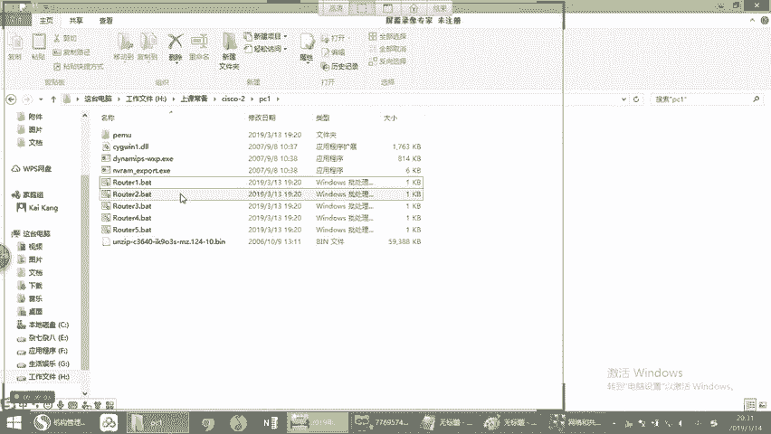

嘿嘿就是让你们把分辨率调小一点，应该是这样吧，对吧？应该就是把分辨率调小一点的原因啊，OK吧。😊，好，我们接着来看啊。那这个时候的话，我们点开我们连接上设备，三台，是不是啊？我们现在才三台。好。

用叉笑给你介绍。大家注意看啊。好，123。好，三台没问题吧，看这要不要告诉我okK吧？23啊三台好，我们先进到设备里。😊，到街到设备里。好，enablecomminalR一对吧？好。😊，R。

今天你们别忘了来给我交小视频的作业，是不是啊？回头今天要把你们给我录的小电影给我交上来，听到没有啊，作业一定要交的啊啊，功程三超带大家温习一遍，是不是？😡，还有印象吗？上节课教的啊啊。

如果上节课没有来的同学的话，要回顾一下上节课的录屏就可以了。上节课我大概只教个1条命令。好，看下IP。告诉我第一台是多少，1920188。1点几，对不对？1。1好吗。😡，好，O退出。录下。1。2。好。

退出连接第三台。看看着我要给你配个1。3，你看看你看能不能配上。😡，看啊能配吗？能拍照吗？速度配不上，他直接告诉你1。0这个段的话，现在已经在F1-0接口已经有了。😡，听明白了没有？所以乙是配不上的。

能理解吗？好，所以我们要这个地方配什么？配2。1。😡，好，漏下的。可行。好，检查一下哈。😊，是吧这是1。22。1，没问题吧，没问题吧。好，到第三台上。😊，2。2。好，启用环回接口看着啊。

还回口没有看到了？😊，环回接口可以起很多个，明白我的意思没有啊啊，这个接口可以起非常非常多个啊。那么此时的话，我们起个回回口名，起多少都行啊。😡，好，起个少3。3。3。3。看到了吗？没问题吧。好。😊。

那么接下来的时候的话，我们要来看在我们的路由器一上，我能不能拼成3。3呢？😊，然后变动3。3吗？😡，可以吧？可以吧？好，大家记住啊，你们学的第一个阶段，刚才跟你们讲过，我说你们的第一个阶段是干嘛？

是以路由为核心，这是你们学的第一个阶段。所以当我问到你说能不能通，你又干嘛呢？要查一下什么路由表。😡，记住没有？你要查下部录表，能听懂吗？听懂你看的上边一来，对吧？okK要查部录表好。

所以们要查一下目录表，怎么查sIPro。😡。

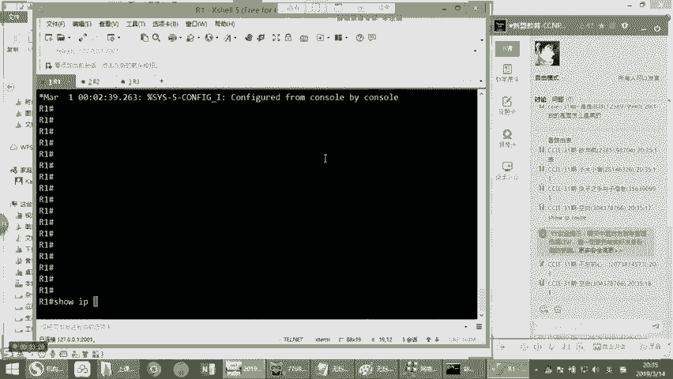

好。我们来看一下，在我们的路表穷的话，我们现在来看里边现在有去往3点几的吗？有没有去往3点3点3点几。哎，这个问题问的好，记住虚拟接口是不需要no沙档的。😡，你好，虚拟接口默认就是什么？

虚拟接口默认就是开启，理解吗？所以它不需要你的no shadowokK好。😡，没问题吧。好，所以此时在我们的路由表中，我们现在是没有的。大家看上面这个部分，路由表是你们今后查的比较多的一个东西啊。

上面这个部分的话显的是什么路由来源？😡，就你这个木有条木是怎么来的？😡，那么在这里边，你现在呢至少能看到一个什么呢？你现在至少能看到一个C啊，那么当然的话，有同学说老师我这个工作中的设不是还有一个L啊。

看到你可以先记C代表什么叫connective。😡，你在工作上还有一个L。😡，明白意思吧？叫local好它记下来。那一般情况下，现在的新的AOS。里边的话，你再看，如果你在一个接口上看着配置个IP地址。

你是一定会有C和L的条目。明白了吗？有C和L。那你说了C跟L有什么区别？我们先不讲，但是你们可以记住一个点，C和L都代表的是本地的。😡，也就是代表是什么呢？代表是我这个接口啊，不一定啊。

代表是我这个接口啊，哎，干嘛有配个这个地址，只要我自己的设备上配个这个IP地址。😡，好。它个是个IP地址，那它就会产生一条直连的路由条路。听懂了吗？告诉我，明白上边意来。😡，啊，会产生一条直感那么一条。

对吧为什么这员很正常嘛？基于我配在本地啊，你想想看你配置你把这个地址配在这个接口上。你看我们有一个原则是什么？一台设备对吧？一台设备。😡，的多个接口。不能配置在一个地址段内，这是一个。第二个什么呢？

两台直连的设备叫IP什么肯定是在。一个地址段内。对吧。所以此时，如果我要把一台设备看着，我要把一台设备，我在这儿配个1个IP，那就意味着说跟我相连接的对端也跟我是什么，也跟我是一个地址段的，听明白了吗？

OK明白了吗？也跟我是一个地址段的，是这么回事。😡，OK稍哥能听懂吧？啊，所以在这个过程之中，只要我这边的话配了这个IP啊，配这个IP。

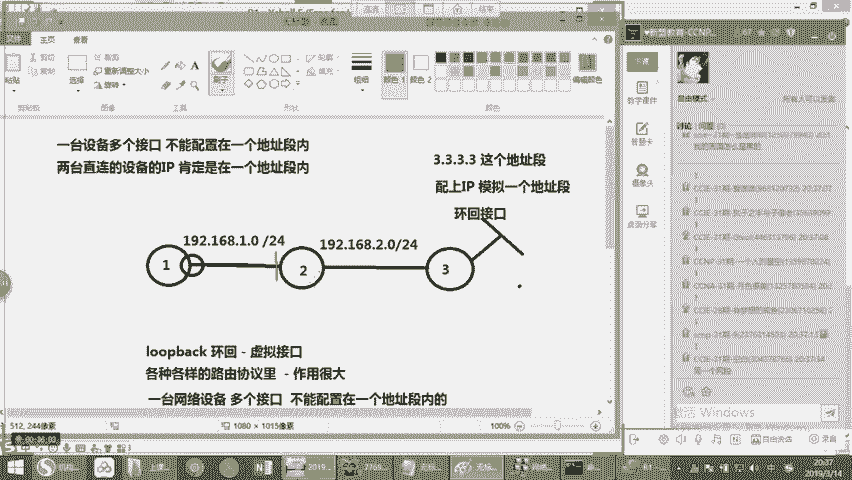

啊，那就说明产生了一条什么直连的地址段啊。所以往往的话你可以看我们这个数据，我们在这个R一上P1。2。啊，我去从一上拼2啊，我P。好，看好。哎，通了吧啊，是不是通的，为什么通啊，为什么通啊？

是因为他查不由表，发现什么？发现我有一点几这个网段。😡，听明白了吗？什么开头的？直连的。😡，能理解了吧？哎，这就是代表什么面台直连设备能互通，很简单。这么说能听懂吗？告诉我听懂上边一个。😡，好。

那么这个地方我要问大家一个问题啊，我现在拼一个地方，第一个包是不通的，为什么？😡，为什么我现在第一个包是不通的？我先问一下大家。😡，唉，非常好，同学们啊，非常棒，是吧？ARP啊，对吧？

countor的话之前是不是给你们讲过这个点，对吧？是由于什么？是由于最开始的时候的话，当我开始pin的时候，怎么样，他会先去查询对方的mac地址，是通过什么？通过ARP协议来完成。😊。

对吧这个康s是不是给你们讲过，回答我是不是康s给你们讲过这个点没问题吧。好，咱们接下来看。😊，所以此时我在一这拼1。2是可以平空的，是没问题。好，第一个包不通，后边就OK了，对吧？

后边OK的时候代表什么有ARP表呢？这次是我pin3。3。3。3通吗？😡，好吧。第3。三通吗？不通吧，为什么不通啊？好，sIPro。😡，看到吗？是IP Road。里面没有3。3吧。

那但是呢consil又跟大家说这么一个问题，假如说我去pin，我们有说过这种情况，假如说我是pin3。3。3。3，我让他一直拼好。😡，对吧有的时候为了方便测试，我们会让它一直平转。😡，然后我们进行调试。

然后现在让它一直拼。P33不通。好，那假设现在我想把这个P结束掉，请问一下我怎么结束啊？😡，怎么结束这个拼啊。😡，咱们结束这个屏ctl C吗？😡，不行啊，不是钢索C啊。我怎么结束这个拼啊？😡。

我现在不是刚车C啊，不行啊，为什么？😡，记住啊，大家把这个点记下来，没错，什么contl break是ctrorl加6，大家记下来。😡，Octrl加缪看到吗？😊，再来一遍看啊，现在pin吧，拼了吧？好。

然后ctrol加6。明白了吗？明白稍波意来好，所以大家把这个点记下来，如果我想终止。😡，终止品是cttrol。加倍有OK好，明白明白，上面意0。😊，好，就可以直接终止掉啊终止掉频。很简单。

那么这个地方的话希望大家注意一下，因为我为什么要特别提醒一下大家呢？是因为conor在当年的时候啊第一次调设备啊，然后的话我就开始拼拼，我是道了，结果他妈后边的话停不掉了。😡，啊。

思科的所有设备都是啊所有设备都是明白了吗？啊，华为是crlC可以行。华为的话，ctrl C就可以。4科的话，ctrl加没明白吗？啊，然后我就停停不掉了，停不掉怎么办呢？你们猜我怎么办啊？😡。

你们猜我怎么办呢？😡，没错，太聪明了，你看都是虫道中人，直接拔演员嘛，知道吗？😡，卡特上真没辙吧，我操这个东西怎么办？😡，明白吗？我真的是没辙了，拔电源吧，啪拔电源，所以希望大家自己要注意这个点。

明白了没有啊？😊，好，我们接着说啊接着说。啊，那么这个首先这是我们的嘴拉闸，不至于拉闸不至于，机房能随便拉闸。你开玩笑的啊，那这是我们现在接下来我要写个静态过有。大家要注意看我要写个静态怎么写。😊，好。

在我们的全局下看着啊，全局下IPro。😡，需要哪儿呢？3。3。3。3，对吧？那么在这个里边呢，它是有一种格式的。这个格式什么呢？叫做IPro。好。目的IP网段或者。地址。看到目的。IP的源码。

还有我们的下一条题。记下来。没题吧，下一条继续好。😊，那么在这个时候这是一个格式啊这是一个格式。那么这个格式里边呢，其中大家注意看这儿这儿可以写网段儿，也可以写某一个地址。打比方。

我现在在这边的话写一个3。3。3。3。那后边我要接延毛怎么接的啊，我要接延毛，怎么接255。25。25点多少？😡，点多少？😡，点多少？好，大家注意看这个地方是4。25啊啊，OK没错，非常好。

这个地方是4。25OK那么静态度有的它有一个原则就是说如果你想去往的是一个固定的地址。那么此时的掩码是什么？是一个什么掩码？主机掩码，明白了吗？主机掩码就是我们知道掩码是什么？假如192018。1。1。

我想我想去这个地址，掩码的作用是限制网段的，这个大家知道对吧？掩码的作用是限制网段，而我现在想去往这个地址，那我都去往的这个网段是不是已经非常清楚了。😡，对不对？我现在没有什么网道的概念。

我现在就是想去一。1呀。😡，如果我就是想去一。一的话，怎么办？我的掩码就是一个主机掩码。😡，没问题吧，OK稍微译呗，对吧？这就是一个主题演吧好。😊，对，没错，如果我现在要写的是这样的，假如我想去要3。

3。3。0。😡，啊，我想去用3。3。3。025。25。25。0那这个时候就得这么写。😡，听明白吗？就代表什么呢？我要去往的是3。3。3。美这个网段。很简单吧，告诉他看okK吧？这个逻辑是不是很简单好。

没问题，非常棒啊。好，那么这个时候的话，等于我们此时呢假如想去往一个这样这样的一个网段。😊，好，且需要一个这样一个网段，下一跳谁呢？在我们这个图中的下一跳谁啊？我从现在从一上边出发，下一跳谁？唉。

非常好，是目由器2对吧？就是1求2018。1。2，我们记下来。😡。

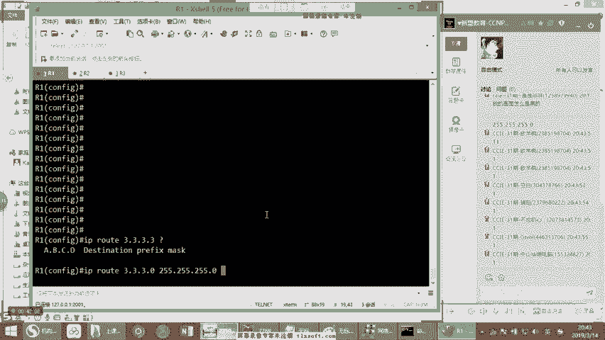

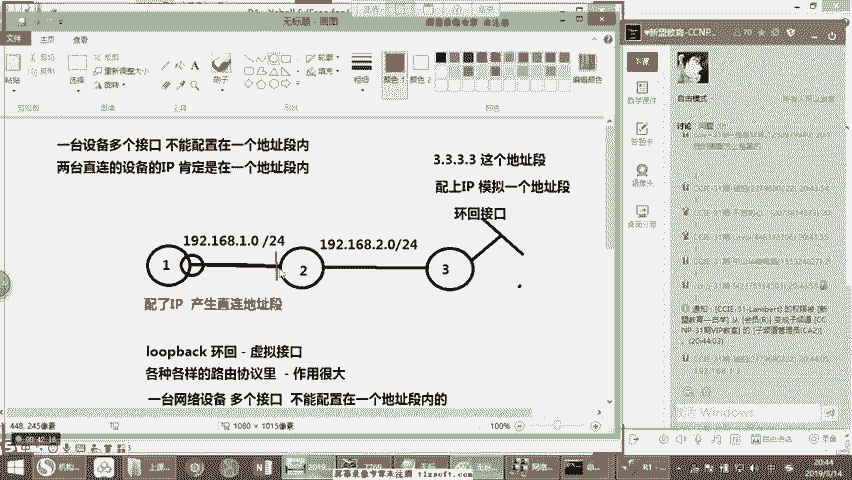

好，1求208。1点。答辩题。啊，一点2好退出。那么这个时候我们检查一下sIPro。😡，啊，说IP此时候现在是不是产生了一条什么S开头的，看到没有？是有条S开头的S开头代表什么意思啊？

叫staratic静态嘛啊叫静态步有些S没错好。😡，那在这个地方，刚才我问大家一个问题，好吧，如果假设我现在写了一条这样的项目。😡，我写一条这样条目，我现在再写一条，假设我再写一条这样全这个这个。😡。

4-25的好，然后下一条谁呢？1。2。😡，那你们回答双手，当我再写一条的时候，你们跟我说他走的是哪一条。😡，他走哪一条，假如现在我写一条这样的。😡，对吧我刚才写1个3。3。3。0，那你们回答康or。

他走的是哪一条？😡，他走是哪一条？😡，哪一条？😡，哎，走的是我刚写的第一条还是第二条，回答刚才第一条第二条。😡，一条调子，你看啊我再跟你说一遍啊，假如说现在我这边写了一条什么？😡，然后这样的3。3减3。

33。3减3。0是吧？啊。😊，啊，1。2，我再写一条3。好，你告诉我走哪一条。😡，哎，非常好走。第二条，为什么大家记住路由表的一个查询原则叫最长匹配原则。😡，什么叫最长匹配呢？就是同样的一个地址段。

看到有。😡，啊，这个地区的岩码越长。😡，没错啊，说明什么？说明越精确。😡，理解吗？哎，非常好。所以他首先第一个原则叫最长匹配原则，明白了吗？明白没看到刷波一来啊，所以这个时候他要走的话，他一定走谁呢？

走的这一条。如果你要两条是这样的，加我一条这个是吧？我一条是三。三减三减0。😡，好，一条这样的，还有一条什么3减3减3减3减0。0哈。😊，好，如下他走哪一条？都哪一条？啊，走哪一条。走第一条第一条吧。

好，那我们举个例子，假如现在我是3。3。3。0。😊，好，下面是什么呢？3。3。0。0啊。😊，啊，如果我现在的话，我问一下大家，我要去往的是3。3。3。3。请问一下走上面还是走下面？😡，走上面走下边。😡。

走上面走下边。上面是不是ok好，那如果我把这个地方改成4-25呢，走上边走下边。😡，走上面走下边。😡，走上面走下边，你看到没？我就知道你们是什么路子，我就明白你们是什么路子，明解了没有啊。

下面这一条根本就匹配不上啊，同学们理解了吗？下面这一条根本就匹配不上。现现在下面这条什么3。3。0。0，除非去往这个地址，它才能够匹配到这一条。😡，你外康的意思没有好，第二条连匹配都匹配不上。

能明白了吗？明白瑞康的sshaer一来啊。😡，明白了吗？啊，你看我只要给你们说点东西，你们就马上懵逼，是不是好，理解了吗？啊，我现在肯定还是走上面啊，观看后边可最强匹配，是不是我前面给你改成5。

我看你也说下面是不是啊，咱们接着说啊。😡，好，我们接下来看。那么这是我们现在说的关于什么？😊，是吧关于我们的掩码。😊，的问题。那此时我们来看。

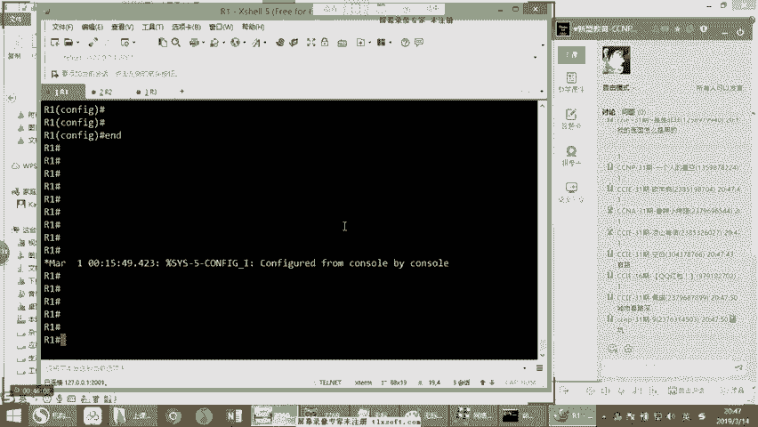

好，看好，我们现在有需要3减3乘3。0对吧？好，那现在costl pin一下3减3减3减3能通过吗？回家csil能不能通能不能通。😊，可以说不吧，行能不能合，哎，显示的是U。那么首先来讲的话。

刚才告诉大家什么意思啊，当你时看到优点优点优的时候，记住啊。😡，当你现在要看到一个地显示时U点优点U记住。是下一台设备不同。加把就给你记下来。记住是下一台设备不同哦，不是有去无回的概念啊。

是下一台设备不同。有去无回，并不一定显示的是优点优点优并不一定啊啊，但是下一台是不同，就代表说我这个数据发出去了，下一台设备到不了目的，听明白了没有？是下一台设备没有办法到达目的才显示的是优点优点优。

记住了吗？所以今后你们在工作岗位上，当看到这个问题的话，我们就知道哦，一看到优点优点优，是这个数据干嘛？发到个路由器2。😡，路由器二发不出去，路由器二到不了目的，明白了没有？好，其实可以直接的判断出来。

😡，但是在这个过程中的话，我们依然要满足一个原则叫什么？叫逐跳查询，对吧？逐跳转发的原则，所以你排查的时候也得是逐跳的排查。😡。

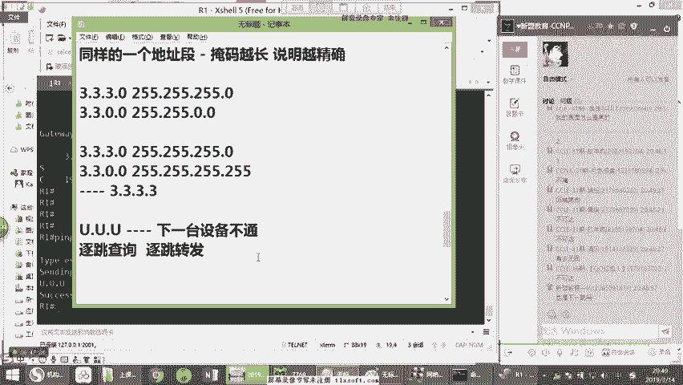

明白了吗？你排查的时候也得是逐跳的排查。好，我们第一台上面。😡，现在有木有木有条目，3。3。3。0有是不是啊？好，有的，我们把这个数据发出来，发到个第二排，第二排这边会再查。😡。

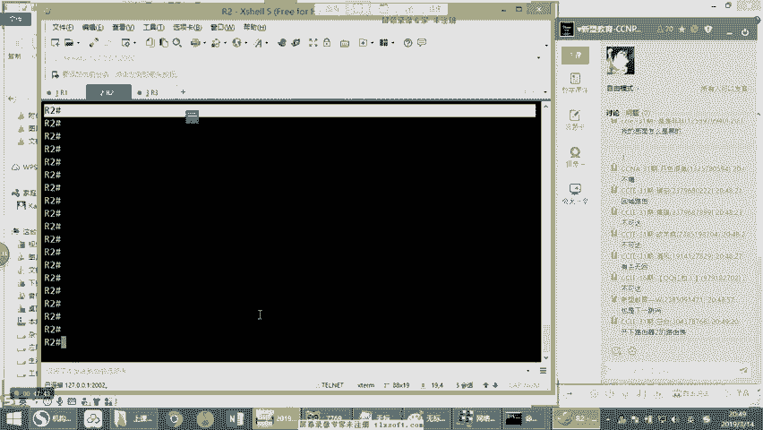

再从第二排视频上查好售IP root。😡，好，我们来看。在我们的第二台设备上面的话，你们告诉conunsl现在有去往3。3。3。3的吗？有吗？😡，我们的第二台设备上现在有去往3。3的吗？

有没有有没有没有，对不对？你看根本就没有明白了吗？好，所以此时在我们的第二台设备上干嘛？我们依然要写一条啊，去域往3。3。3。3。好，这次我这么写。😡，好，下一跳谁啊？下一叫谁？😡。

下一条这个时候该是192018。2。2，对不对？非常好啊。好，我们接下来看。😊，2点。很好。再来查波录表有没有需要目的的？😡，有没有需要目的的，有吗？😡，有效目的的有吧？好，注意看。

那么在这个情况之下的话，我们把这个数据怎么样发到G务器3，现在能通了吗？😡，回答刚诉现在能不能通。好，你们说现在可以通了吗？😡，可以通过吧？好，来看一下。😊，呀老师啊怎么还是不通啊，为什么还要不通啊？

好，大家注意看。😡，你们在做路游的时候，永远要思考一个问题，就是说什么数据要一去一回啊。😡，也就话诉需要一去一回。我现在从我的一上发到了2。2上发到了33收没收到，收到了，谁收到的呢？三收到了。

因为环回口对吧？这个3。3。3就在R3上。😡，没问题吧，它就在R3上好，那么三收候到这个时候是R3要进行什么回包啊？😡，对吧那我们就要回给谁呢？如果在默认情况之下，我的一台设备发数据出去。😡，啊。

注意看发数据出续。发数据出去的话，那么我这个数据什么？😡，数据的原IP地址就是我的出接口看就是我的设备出接口的IP。所以现在的话，我从一上边去平3。3，R一平3。3。3。3。那我的原IP是谁啊？😡。

UIP的话就是我们要求20个8。1。1吧。😡，能O吗？告诉我ok吗？O刷波一来。好，是啊，很简单。😡，好。当我把这个数据发出来之后，数据到达个地方，但回包啊，R3此时要回包给190个8。1。1。😡，好。

问题来了，请问R3能不能到192。188。1点几？能吗？R3能不能？😡，好，我们查一下目表，设IPro。你意看设IProot。😡，好，看在我们的R3的维股表里面，现在有去往1920和8。1点几的吗？

有吗？😡，有需要一点几的吗？😡，有吗？并没有啊，看到没有？是不是并没有okK好，怎么办？这个时候的话，我要从R3这往回写一条，听懂了吗？听懂了吗？好，往回写一条看到。😡，去往一点。记得。好。

那告诉我现在在我的R3省吓一跳谁啊？😡，下一条是我们的目由器2，对吧？目由器2。好，那我们现在接下来要把这个数据发到谁呢？发到我们的目由器2上，OK吧？发到目由器2上。好，192。188点。😊。

2。1。好，查一下目表。好，有没有这次有个吧，那请问一下大家，这次能通过吗？😡，回家房子这一次能不能通啊？😡，这次能不能通啊，能吗？😡，说话说话说话能通不吗？可以了吧？觉得能的刷一不能刷2。😡，好。

你看又人懵了吧，又懵了。好，来看能不能投。😊，通过吧通过吧，为什么通过？😡，你说老师，我知道你们说不能通的同学知道为什么我知道你在说什么。老师，那这个数据发到路由器2二上面有没有路由条目呀？😡。

对吧二项有没有购条目？😡，二上没有有啊，二上是直连的，看到了没有？😡，对吧因为此时在二这边的话，和一这块是一个什么呀？它是一个直连的网段，对不对？告诉我啊，这是个直连网段，19201和8。

1点几的这样的一个直连网段，看到了吗？啊，是不是？所以当这个数据发到个路由器2，二是可以什么？二是可以发给一的，明白了没有？😡，明白了吗？明白上边意感啊，所以现在就从款看到吗？看到了吗？好。

那么这个地方康or再问大家这样一个问题啊，就是说我接下来你看啊我的路器一。😡，我的估西一，现在已经可以拼通我的环回口了，没问题。好，那么请问一下我的路由器一能不能听通192。188。2。2？能吗？

注意看啊能不能。拿吧。可以吧？你看我现在反正路由器E呢已经已经能拼通3。3。3。3了。你告诉我的路由器一现在能不能拼通路由器三的192。1割8。2。2，能不能能二不能能不能能刷一不能刷2来。😡。

我看又蒙别个吧，我就知道我看你太了解你们了，我跟你讲。😡，能不能通看什么能不能通看什么。😡，查路由表理解了吗？售IP rootot。😡。

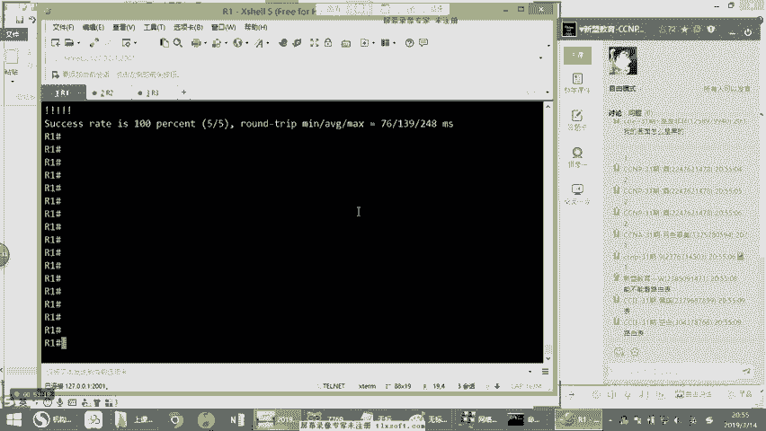

告诉我的路由器一上面有去网2点几的网段吗？😡，有吗？我现在路由器一上有7网2点几的路由吗？有没有？😡，有吗？😡，所以没有吧。所以当你现在拼2。2的时候就补通。😊，理解过吗？能听懂过吗？所以现在你拼2。

2的是不同，很简单。😡，能不能听懂听懂给康总刷波一来啊，刷波一上来。好，对吧？😊，记住，只有说你要能不能通，看什么，能不能通，看什么呢？看路游条目，有没有路由是决定能不能通的关键。

受IProot发现了没有路由，对不对？没有路由怎么办？唉，好办，直接pin，你发现绝对不通。😡，听懂了没有？明白上波一来好。好。明白。啊，所以大家一定要记住，遵循目由表转发原则，明白了没有？

遵循目由表原则是非常重要的。OK啊，遵循目由表原则好。那么这个时候的话，我们接下来看，别管别着急，还没到tre root呢啊，你先不要现在超出想象力好不好？咱们1。1点来。

所以你看为什么有些东西你看看上去很简单的东西。😡，看上去非常简单，理解吗？哎，但是为什么你不会呢？是因为你们原先的理解都是片面的，理解了没有啊，这个技术点你只有反反复复的有思考，你才可以真明白了。

要不然你发现你还是对他不够深刻，对吧？一到实际工作中瞬间懵逼，是这样啊。😡，那当然吧，动态不U当然可以实现了啊。😡，但我们这个讲静态。所以此时呢到目前为止的话，我们知道哦，老师我明白了。

那等于我们现在的话这个数据一去一回，我们就搞清楚了。好。那么接下来的话呢，我们要思考清楚这样一个问题啊，注意看啊啊这到军这样一个问题。啊，时间过得好快，还好还好还好。😊，那我先问一下大家啊。

我们这个数据啊啊看啊我们这个数据。😡，好，在网络内部传输。最大构条。我先问一下大家。我们这一个数据在网络内部传输，哎，它最多是绕跳。嘿，你看你们都知道是不是啊？在书本上都见过拍遣两个老师。

这还用问255条。好，那好，注意看啊，这是一个问题啊，这是一个问题。😡，第二个问题是什么啊？第二个问题是什么？注意看啊，注意看好的。😡，我们我们知道tra死这个东西吧啊，我们再来说该说t死了。

看好tra死什么。😡，case路是什么？😡，叫什么叫路由追踪，对吧？大到家路由追踪追踪什么东西啊啊追踪什么东西啊，就是看我现在现在到达目的中间要经过多少台设备。😡，要经过多少票？能听懂吗？听舞都好跳啊。

😊，那么这个时候的话，你有时候可能会遇到这种情况。打比方啊打比方啊像吹速 root。我们一般什么时候用的？加你在运营商啊，你们应该有在运营商的吧，应该知道或者在数据中心啊。那么假设呢你有一个客户啊。

在你们IDC呢做个托管。好，做个托管。做完托管之后呢，然后呢他们就发现一个现象，加他们的服务器啊放到你们机房了，对吧？放到你们机房了。😡，然后他发现呢这个客户把服务器放进机房之后呢，他在某一个地区的。

😡，的客户啊，某一个滴J的客户啊无法访问到你这个服务器啊，这个是有遇到的。你假如说。假如说你看我们之前在托管服务器的时候，这个人家这个公司做什么呢？做游戏的，做游戏这个服务器。啊，做什么做网页游的。

当时这别火嘛，网页游戏吧啊吧，瞎搞其实都乱七八糟啊，夜游一天的话，光出力充个4万多，奔牛逼啊，这个这个这业务。😡。

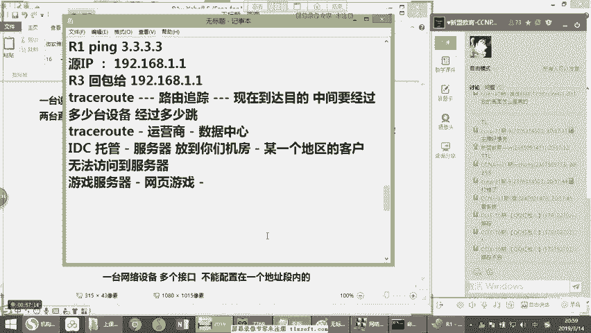

然后他说什么呢？他说在云南。😡，云南的大理那边。大理那边的这个地区啊，他的客户都访问不到这个服务器。那明白吗？反不到父亲好。那于是这个时候就很懵逼了啊，为什么绑不到呢？好，于是呢你就开会开始干嘛呢？

会开始的话，让他给你发一个测试。😡，不要着急来看notra我们是会用的啊，不光是拼。片只能是通还是不通，chs可以知道哪不通，理解了没有好。😡，然后测试就会使用ch。去chs一下你的目标服务器。

看看到底是到什么地方不通的。能明白刚才的意思没有看看到底是到什么地方不同。😡，理解了吗？明白他的上波一啊好OK。😊，所以这个时候我们会根据对，没错，到哪个节点。😡，不通啊，然后的话呢去沟通上级运营商啊。

去和上级运营商沟通。能明白？一般下好，然后帮他去协调。我们说叫什么呢？帮他协调路有问题。😡，好。那么chce的话，我们打个比方，在这个环境中注意看啊，chce。😡，🎼我们在一上面啊一上面trace3。

3。3。3，大家可以看你看。我再从1到3。3。3。3这个过程啊，第一跳是1。2。

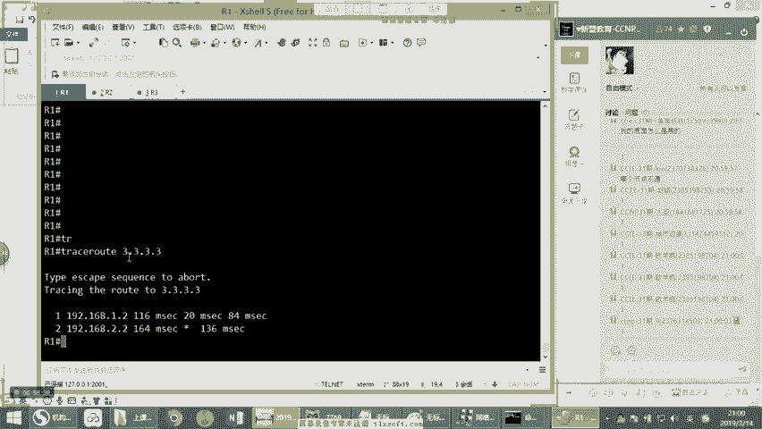

一。2的谁呀？就咱们说的路由器2对吧？这个没问题吧，就咱们说的路由器2，注意看啊，目由器2是。😊，第二条呢是我们的2。2啊，2。2谁呀？2。2的话是我们的这听明白了吗？告诉我啊，明白过，明白。

双波一来啊双波一上来。😡，好，是吧，这第一条R第二条R3。OK问题来了，在我们课间休息的之前，cosor给大家留一个你们课后的什么呢？叫益智小游戏啊，什么益智小游戏呢？假设现在情况是这样的。😊。

两台设备。不要着急啊，注意看两台设备。两台设备磁石啊，唉很简单。第一台啊是我们的mo器一。第二排呢是我们的mo由器2。然后呢，我呢在这个一跟二之间呀，我配个一个地址段。😡，啊，192。1个8。

1点几的个。啊，那也就是说此时我的一呢就是1。1二呢就是1。2。

这个没问题吧。1。11。2好。注意看啊注意看啊。那么此时在这种情况之下呢，没别的地址了啊，就这些。好，问题来了。😡，我接下来从呢题目要求什么呢？从路由器一上指定一条默认路由。😡，吓一跳呀是1。2。啊。

是1。2，打个比方，咱别说默认路由吧。咱假如说是我想我指一条路由呢，我指一条路由叫IProot3。3。3。3这样写行不行？好，下一跳是谁呀？下一跳是1。2。😡，啊，这个是在哪做呢？这是在R一上做。

注意看好。接下来在R上。😡，斜写一条末这个路由3。3看，下一跳是。1。1。好。那么意味着说此时呢，我在一跟二上啊，我做了一个互指，我一呢指2二呢指一听明白了吗？告诉我明白吗？明白。

shop边一shop边一上来。😡，1尺221很简单吧。唉，so easy啊，那此时呢我在我现在的路由器一上，我在一上边看着R一上。P3。3。3。3。请问一下，这个数据会发给2。

然后二又发给一一又发给22又发给一一又发给2二又发给一一又发给2，然后以此循环，最后达到255跳嗝屁吧，会吗？😡，😀哈哈哈。😊，会吗？你能理解，我说意思吗？

我的goC一把数据发给2二呢一查路由表去3减3的呢，又发给了一一呢又先收到数据，再查路由表。好，哎，发给2二呢，收到数据，再查路表发给一，以此循环多少跳呢？255条，直到嗝屁为止。😡，啊，会吗？

告诉我会吗？说话会不会觉得会的刷个一，不会刷个2来。😡，看怎么说都有。好，作为意智小游戏，把这个小实验留给大家好不好？把这个小实验留给大家，能把这个问题搞明白的，我就选他当班长，好不好啊？

你们要谁把这个问题搞清楚的。or的话，让他当班长啊，OK啊，那么这个时候的话，我们现在咱们先说到这好吧，把这个小实验留给大家啊，让你们自己研究研究，你们可以通过什么呢？给你们一个友情提示啊。

给你们友情提示，你们可以通过tra来尝试tra可以看得清。你按道理来说tra，如果你真吹啊，撸取一上一吹到个2再吹到一再吹到2又到1212121，它就会这么循环。你看一看tra死的时候会不会。😊。

明白了吗？你来看一看他会不会这样，你就知道了为什么大家要想明白是为什么好不好啊。😡，行，卡子想到这为止，你们听明白了吗？告诉我听明白了吗？听外给卡上边一来P3。3呢。😡，咱不现在说的吗？P3。3吗？😡。

啊，我讲到这儿没问题吧。OK吧？啊，没问题的话，咱们休息几分钟，几分钟之后咱们继续好不好啊，咱们这个一不小心课堂又过个一半的时间啊。好，咱们休息几分钟，抽根烟啊，咱们就接着说啊。😊。

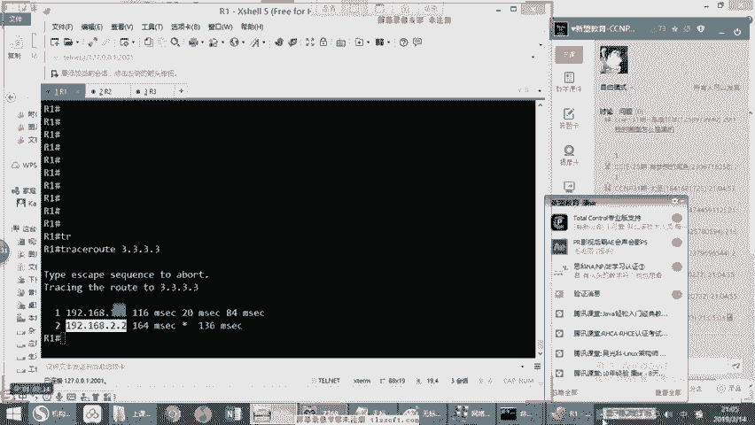

呃，录屏打开，咱们接着说吧啊，同学们啊，咱们接着来看。好。那么这时候的话呢，我们现在来接着说好吧，咱们接着说。那此时的话呢，我们来看到这个静态路由这块我们已经看完了，对吧？

静态路由我们知道该怎么去设置啊，该怎么去做。来先给康的shoppper一上来。先给康的刷波一来马根尔的啊，刷波一，咱们接着说吧啊啊，那么接下来的时候的话，我们来看下一个部分。

就是关于我们的什么关于我们的这个默认路流。😊，默认路由的情况之下的话，我们说到的是个单线路流的情况下呀。所以听啊单线路的情况下，我们是一般在面向出口都会去设置。哦。所以看单线路的情况下，我们面向出口。

都会去设置我们的默认路流，对吧？我们都是这样去做。那么要出口，我们去设置默认路有的话，那么首先一定是面向单线路的。那首先我先问大家一个问题啊，双线路可以吗？😡，双线路能不能设置默认路流？可以吗？

双线股能设置外共有吗？😡，唉，首先注意看啊，我们先来看别着急，我们先留这个问题，我们先来看单限构的。😊，那现在cor的话给大家干嘛呢？我把这个图颜打开。😡，好，我们把这个图的话重新清一下。好。

接一下我们重新来看。哦。假如现在我们就是两台一台两台对吧？两台。两台的话，这个是候我在这边呀，我起三个防水接口，模拟三个外网地址段。好吧，那这个时候情况变了变了哪哪个呢？

这个右边这个设备呢是我们什么是我们的这个电信理见了吧？这是我们电信啊，左边这什么呢？这是我们公司的网关啊，大家知道网关的全称是什么吗？😊，招访官的全称GW的全称是啥么？😡，啊。知道GW的全称是什么吗？

😡，知道吧？哎，非常好，记住啊，叫gatetway是吧？好啊，不要叫做网关啊好网关啊，然后GW是吧，是这样吗？不是啊，注意啊，所以说大家注意啊是很简单的东西啊，然后接下来的话。

我们开始把这一根线连到一起。😊，啊，我中间这儿呢我还配置什么呢？配置19201个8。1点几的行吧？哎，我这边的话就1。1还是1。2没关系啊，1。1。2啊，然后我电信就模拟三个地址段，分别是1。1。1。

1什吧？2。2。2。2，注意看。3。3。3。3。OK吧啊，我还是模拟这个三个字，这三个地址。😊，那现在呢因为我只是一根线，是不是这个道理？我现在只是一根线。如果我只是一根线的话，那接下来是什么？😡。

怎么样怎么办？我就可以写一条默认路由。也就是说告诉你说，作为网关去往任何地址吓一跳都是电信。对吧。能O吗？告诉我能O吗？O刷波E来啊，刷波E下来。😡，到。那么这个时候的话，这个问题就出现了。

如果我现在写去往任何地址，下一跳都是典型，我是该怎么做，看着啊，我现在还是三台。

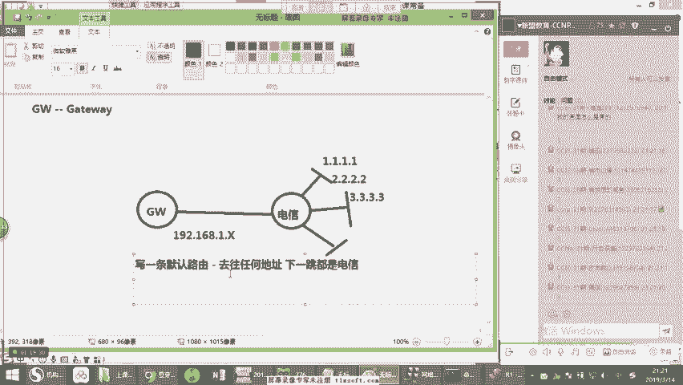

然我改一下，这是我们公司的网关。这个是我们公司的这是我们电信是吧？电信好，注意看好，我把第三个关掉。对吧这个IPD中面也配好了，一个是1。1是不是啊1个1。1好，一个是什么？1。2可以吧？1。1。2。

好，然后我在我的电信这干嘛呢？😡，我先把原有的，我写这个路由啊，我给它去掉。😡，好，咱们把原原先咱们写的路由咱们全都去掉。怎么去掉呢？你们做实验的时候，如果你们要真正去的话，你应该在前面加no。😡。

看到吧？假如在原有的情况之下加no。还有一种方法，你说这可以去掉，看到没有？这可以去掉啊，还有一种方法是直接干嘛叫noIP roing。😡，但是大家一定要注意啊，这个命令千万不要在工作上用。

这个只能在做实验的时候用，为什么？noIP roing一旦打上这个路由里边，所有的路由功能全都关闭。😡，明白了吗？所有的工用功能全都完闭了。对一切跟路由相关的全都没有了。所以如果你在工作岗位上的话。

你真的这么做了，就等于一下你这里面运行的什么一OSPF呀，什么静态路由啊，什么BGP呀等等全部干掉。😡，明白吧？全部干掉。你一下全部干掉不时，等于什么都没了。😡，直接领盒饭了，你就跑路了啊，明白了吗？

啊，所以大家千万不要在工作岗位上弄搞这个命令啊，弄IProoting是绝对不行，这是这是恐怖袭击啊，明白没有啊，那此时的话呢，我们写IProoting再打开。😡，啊，再打开打开完之后的话。

这时候你看到静态路由全都消失了。能不能听到静态口全都消失了。好，OK没问题吧。好的，我们接着来说。那么此时的话，我要写三个接口啊，一个跑it口1。1。1。1。😊，好，一个第二个。2。2。2。2注意看啊。

啊，第3个。3。3。3。3。可以吧？好，来看。1233台没问题吧，妥妥的啊。好，那此时我现在在我们的第一台上，我要协调默认怎么写IProot注意看啊，8个零代表任意啊，IProot删除什么？对。

没有这个命令，看到吗？😡，没有这个命令，他告诉你什么，命令未完全。😡，叫incompteincompte是未完成。能听懂吗？未完成的comment命令，未完成的命令。能不能听到啊未完成的命密。

但没有这个命密，你nipro一定是什么？你要删某一条看到了？你可以删到某一条啊，这是可以的OK啊。😡，接着说，所以此时呢在这个过程之中，我们要写一条默认，怎么写呢？哎，去往任何地址。

它的8个名代表任意啊。😡。

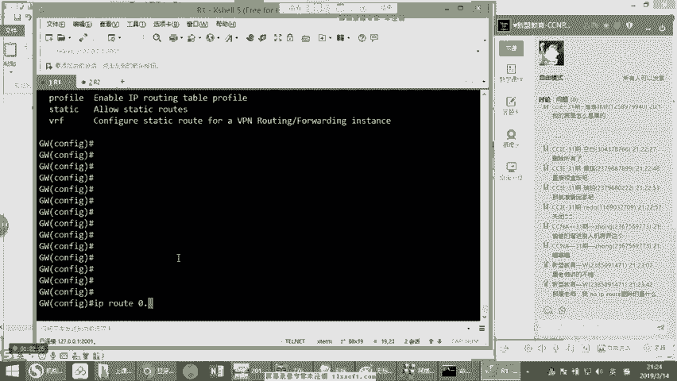

8个零代表任意啊，没问题吧，下一跳谁啊？下一跳是我们说的电信。😡，啊，注意看是电信。电信是哪位？192。168。1。2ok吧？告诉我okK刷波一来刷波一上来好，对吧？电信。😡。

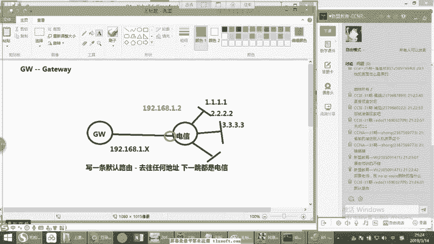

好。那此时看着一。2啊，不错，退数。当写完之后，我们再来检查一下sIPro。😡，看好，此时是不是多为一条什么？告诉我多为一条默认路由啊啊，是不是多为一条默认路由，告诉他长是不是多为一条默认。好。

8个零代表的是默认。大家注意看啊，这个命令在咱们电脑上也有。😡，在咱们windows上也有，只要是你是单线路的，它其实都有你的手机上，它其实也有举例子，看看CMD。Not pra。啊。

这是你的windows的目表。😡，看到没有？以windows的目表啊，叫root print啊，就直接目录打印啊，就是目录表。那在这里面可以看到，你看其中是不是有这样一条。😡，有没有这一条。

告诉我有没有有的吧，你看这这这一条就相当于默认过有一样，能听懂没有？你看是8个名，其于是只要是单线目的，它就一定会有。听明白了吗？明白看的s一来s一上面。😡，所以此时在这个过程中当我写完之后。

我产生一条默认。好，我现在来P1。1。1。1。通吧，看通不通通吧，2。2。2。2。😡。

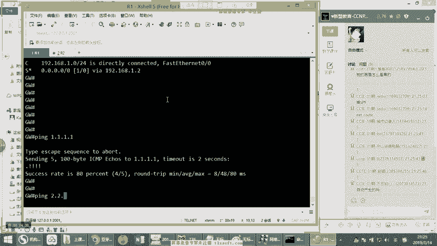

3。3。3。3没问题吧。😡，明白了吗？明白上波E该哎，自动产生了吗？在电脑上不是自动产生。同学们啊，注意看你电脑上之所以会有这一条，是因为你在网卡设置里边写个什么，写个网关呀，你在你的网卡里边。

你不要配IP地址，子网掩码啊，什么默认网关，记得吗？只要你写个网关了。😡，他就会产生一条押金网关写的1。1。理解没有？好好，这样啊。😊，都会自动产生这一条。明白了吗？能不能听懂听懂上波一来好。😡，啊。

什么奇葩需求，我听听啊，我听听你们遇到什么奇葩需求了啊，你可以打出来啊。😡，对吧这是一个我们现在看到的什么呢？我们看到叫默认网关啊，这是我们说的默认路有啊，售IPro。那么这个地方呢大家要注意一下啊。

注意看啊，这个地方大家要注意一下这个默认过流是吧啊，这个默认过油我们现在已经有了。好。那么在这个里边呢，这个默认呢，我们说能不能同时写两条呢？你假说我就我们刚才提到的对吧？我现在一个电信。

假我上面有一个联通，打个比方啊，我现在上面有联通。是吧，有我给你通。一个电信一个联通，我们知道电信和联通，其实本身来说他们两个内部的网络是给过连接的对吧？看好，等于他在这个过程之中看到啊？哎。

他这是他这个运营商，它是里面一套网络。好，等你看啊，这边有也有3个假设对吧？它也可以到达我们说的1。1、2。23。3是吧？这三个其实对他们来说也可以到啊，刚ter复制一下啊，这也可以到。那你告诉我。

如果假设我在我的网关上，如果真的写了两条。😡，那你告诉我他默认会怎么走。😡，他怎么走啊，我现在写了一条，我下一条IPro，你看啊8个名，下一条是我们说电信，我又写了一条啊，IPro8个名。😡。

下一步是联通，你回家的方子，这个时候他怎么办，他怎么走说话。😡，怎么走？他怎么走？你说他走电信走联通。😡，注意看啊，这个时候如果你写了两条可以吗？可以。它就会进入到了一个叫做负载均衡。O。

负载均衡就是说两边都走，我左边也走一部分，右边也走一部分，左边走一部分，右边走一部分，明白了吗？好，但是注意听注意听注意听。😡，这个负载均衡是基于什么的负载均衡？😡，这个不要瞎设置，如果你瞎设置的话。

就会导致设备出现高负载的情况。什么负载均衡？😡，啊，其余什么都负在银行。康s告诉你，负载均衡可以有很多种方式错，不是流量，没有基于流量的负载均衡。康s先告诉你们这么讲，没有基于流量的负载均衡，明白了吗？

啊？😡，负载均衡就三种方式。第一个要基于数据包的负载均衡。大白话就是左边走一个包，右边走一个包，左边走一个包，右边走一个包。假如说我现在我在我的网关这里拼。😡，拼谁呀？拼1。1。1。1。

一次不是5个包吗？好，然后你的你认为是联通一个对吧？联通一个电信一个联通一个电信一个联通一个是吧？

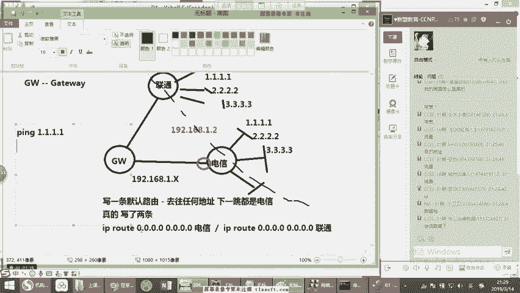

记住不是。没见了吧？并不是这种情况，如果是你按照你们说的这种方式。😡，这个叫基于数据包负载均衡。这种负载均衡。consor告诉你们，它是在工作中是不用的，我们是不会这么用的。为什么？

如果基于数据包的负载均衡，那就意味着说每一次都在查询路由表。😡，而在这个情况之下，直接导致的就是说设备会严重占用CPU资源。明白吧？CPU使用率会非常的高。😡，尤其当数据量大的时候。

数据这个设备里边的负载极极高，所以在工作上是绝对不可能用这种方法的，能不能呢可以用。😡，可以这么用，但是我们不会这么用，理解了吗？可以用，但是我们不会这么用，明白了吗？明白，稍边一个。😡。

还有一种叫什么呢？叫基于目的IP地址的附载均衡。😡，就说说白了我去的地址不一样，左边一个右边一个。😡，去百度。对吧百度左边切放右边网易左边163啊，嗨163就是网易是吧？好，然后是什么QQ右边明白了吗？

等等，这基于目的IP的负载情衡。😊，这种方法呢默认也不用。😡，为什么？因为使用这种方法的话，很难有效的覆载。打个比方啊，假如说某个地区。😡，解析假如说我们访问用的什么多的，用的百度这么多，用的QQ用多。

我们知道大多数情况之下，我们是用的是这些东西，百度QQ什么的对吧？你说什么1663，你说什么新浪，咱平时看嘛？根本就不看。明白刚才意思没有？好，咱们大多数用的这些。😡，那么就可能出现在某个地区。

那DNS往往解析到的目的。都是到1个IP上固定IP上。你假如说我们一个地区，咱们所有人访问百度。OK访问百度啊，然后这个时候干嘛，我们所有的人去解析到的百度的IP都是一个。好，这是有可能的。😡。

那就导致什么？😡，我们百度用的多，但是呢百度的数据还都往一个方向发。能听懂吗？这就出现了什么呢？就出现了严重的负载不平均的情况。😡，这么说能不能听懂，明白上边意思啊，能理解吧？啊，明白上边意见啊。😡。

对吧。那你说老师，那么还有一种什么呢？还有一种负载均衡叫什么？叫基于，就是我们现在默认用的，叫基于CEF的负载均衡。大家记下来。😡，这种相对是最均衡。什么叫CEF？什么叫 cF？CEF啊记住啊。

CEF呢是我们的路由表的一个镜像。什么叫路由表的镜像呢？我给大家举个例子，看着啊，举个例子，在咱们正常注意听，把耳朵竖起来，在我们的正常的路由表中。😡，它的查询方式是遵循一个原则，叫做递归查询。

是这个原则。好，什么叫定V查询？😡，就是说打个比方看着啊，countl现在。😡，把这条默认路由删掉。删掉。好，那现在回答防子，我现在是不是没有办法到达1。1了？对吧看然我现在网关上。

现在是不是我没有办法到达一。1说话，能不能听懂听懂稍个一来。😡，对不对？我现在没有办法到达1。1。好，没问题啊。好，我现在写吧。😊，确往1。1。1。1。吓一跳是谁呀？😡，1920和891。2对吧？好。

我不写1。2。😡，我写的100。1。1。1。哎，你说奇怪老师这什么意思啊？好，别着急，没有100呀，老师没有100。1。1。1啊。好，再写去往100。1。1。1。😡，下一跳是101。1。1。

1去往101。1。1。1。下一条是102。1。1。1去往102。1。1。1。下一跳是103。1。1。1去往103。1。1。1，注意看。下一跳是多少？1。2。好，大家看一下。那在这种情况之下。

你有没有发现我写了很多条？😡，你说老师这干啥的？这是有用吗？刚才告诉你没用。😡，注意看啊，没有用。😡，但是我们我问大家一个问题，我现在拼一。1能通吗？😡，我问一下大家，我这么写是没有用的。我先强调一下。

我们不会这么写，但是我现在拼一点1，你们告诉我能通吗？😡，看着我拼一点，看能不能通。好，稍等。好，稍等通过吧通过吧通过吧。😡，通过版告诉我通过。好，现在已经通过版。好，通过之后。

我们再来查个邮表售IProot。😡。

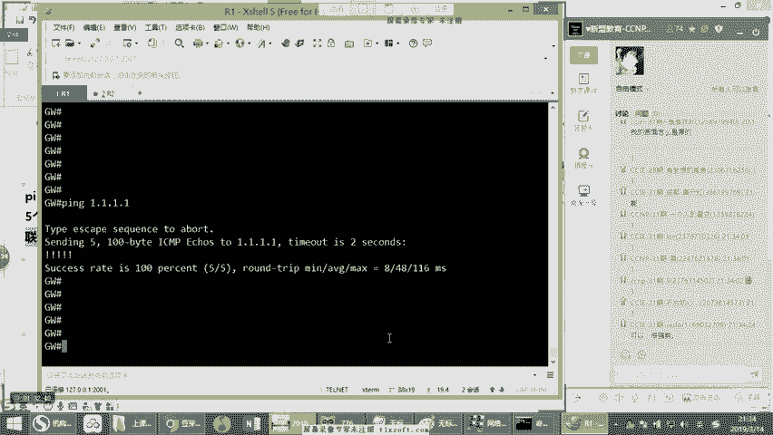

注意看啊是不是多了好多条。😡，是不是多了好多条，注意看。路由表的正常查询方式是怎么查呢？是递归查询。什么叫递归？当我现在要产生一个数据需一点一的时候，看着啊，虚一。一的时候。😡，他查目有表了，怎么查呢？

😡，1。1有没有有没有1。1有没有1。1，有吓一跳呢，100。1。1。1。😡，别着急，接着查目由表，有没有100的呢？好，查了一下有100。1。1。1，下一跳是101。1。1。1，看到了吗？

告诉我看到了吗？看，有没有去往101的呢？再查目由表，101有吗？有下一跳是102。好，再查一遍目由表，有没有去往102的条目，有没有好，102，有下一跳是103的，再查目由表，有没有去往103的。

有没有103的，有103，下一跳是192。168。1。2。好，再查路由表，有没有去往192。18。1。2的，有没有有没有1。2的？好，再查有1。0的，从这个口出去。😡，这才发出去。听明白了吗？好。

我们来注意一下。😡，那么也就说路由表的查询叫递归法则查询。😡，什么叫递归查询呢？也就是说，他要一旦查去往一个目的，查到吓一跳，他会继续查吓一跳有没有听懂了吗？说到这儿告诉能明白吗？查吓一跳有没有。

再看到又又一个吓一跳，再查下一跳有没有。😡，好，明白上班一没听懂上班2来。😡，好。等于它其实是一步，它是线人法则，它是一跳一跳这么玩的，一跳一跳这样查的。😡，那么也就是说在这个过程之中。

你会发现是不是有可能。他去一个地方要查好多次路油表。告诉刚才对不对？有没有可能我去一个地方要插好多次路流标，有可能吗？😡，有可能吗？有吧，这是coner人为的给你们做的。后面你们学到高级路由的时候。

你们会学到这种情况。你们玩核心网的时候就会遇到这种现象。😡，他会经过好几次查询，明白了吗？好几次查询，你们现在简单，你们现在玩都是都都是弹球，明白了吗？俩三部游戏这这不还不简单吗？

所以我故意给你们弄个这么一个现象，明白没有啊。😡，好。中间那是走啊，他查呀，至少他每一次都得查一遍，每一次都查，每一次都查，每一次都查，明白了吗？😡，等于他你看我现在按照这种情况下，我去往目的。

我查过好几次啊。😡，能听懂吗？我查个好几次，我才发出去。😡，你每查一次路由表都耽误时间呀，同学们理解了吗？都在耽误时间呀。😡，能听懂吗？都在耽误时间。😡，你查路口表就是占用查询的这个数据。

等于在设备里边等待的时间，这要转发延迟啊。😡，你表查的次数越多，你的转发延迟就要越大呀。😡，能不能理解，明白双方意呗好。😡，而在时工由器在设计的时候，他就意识到这个问题了。😡，所以他针针对路由表。

他给他做了一个镜像，他把路由表做了一个镜像出来。什么叫镜像呢？明白吧，反正啊我就弄懂一件事儿，你现在去往1。1。1。1干嘛呢？哎，你就是从这口出去。😡，明白我的意思吗？反正你查来查去啊，你就去一。1。

你就从这口出去。😡，对吧你别问怎么查，我走了一遍，我就知道了，你对不对？你看1。1从这口出去，听明白了吗？好，于是他把这个这个最后的总结信息给他放到了一张单独的表里边，这张表叫CEF表叫soIPCF。

😡，刚好售IPCF。当他去查把这个东西放到CEF表的时候，你们注意看，其中就有一条是这样的去往1。1。1。1从这口出去。😡，看明白了吗？能明白吗？

你看这个时候这个CEF表是不是等于把这个路由表作为一次镜像，作为一次简化。😡，能听懂吗？是不是是不是等于把它做了一次简化的过程，没错。😡，而这个过程就相当于什么意啊？相当于是此时只要去一。

一就这个口扔出去，根本就不查路由表。大家记住。😡，我们的网络设备。😡，在默认情况下，根本不查路由表。而是查什么呢？查根据路由表而产生的这个镜像表，这个镜像表叫CEF表。听明白了吗？明白吗明白。

稍标意概啊，这样的话就可以更快速的查询。😡，刚快速的查询。啊，这个CF表。而这个CEF表看叫什么呢？叫cisco。😡，Sas call enterprisepri。好玩的。叫思科快速转发表。

华为里有没有这玩意儿呢？也有华为的叫什么叫极速转发表？😡，明白了吗？华为的叫极速转发表，四个叫快速转发表意思一样，能听懂吗？啊，所以在这个过程之中的话，它是基于CF表。而我们现在说的。

如果在双线路的情况下，看好，如果在双线路的情况下，它主要做的叫CEF负载均衡。😡，明白了吧？叫CEF的银。😡，好。那么这个CEF负载均衡主要是基于哪几个标准呢？记住所谓的CEF负载均衡啊。

只要是其中有一个参数发生变化，就会更改方向。😡，啊，你们谁开着麦呢？注意一下啊，防止你们的小秘密，让我让我们听到的谁开着麦呢？😡，啊。请大家注意一下，关于你们这个开麦的问题啊，你们那边一开着麦。

万一你们那边有点小秘密，我们可全场直播了啊。😡，好，咱们接着说啊。好，接说。那么在这个过程之中，有一个参数conr哪个参数啊，记住5个参数基于数据流的。参数变化什么参数看着以下5个。原IP。目的IP。

看到原端口。目的端口。还有协议号。这5个参数里边有任何一个参数发生变化，都会更改方向。你假说我现在。😡，去百度。是吧访问网页找电信。去新浪网页门通。去百度不是网页了，干嘛？这个这个云盘啊。

这个时候刚端口变了，明白了吗？端口变了啊，又走电信了，听明白我说意思没有？哦，走电信了。好，继续还是去百度啊，百度什么呀？然后百百度的我这个其他的业务。然百度的什么某某软件。😡，哦，联通。能听懂吗？

只要等于是在整个的过程之中是从哪儿到哪儿。😡，干什么？其中有任何一个参数变化都会更改方向。😡，这个叫基于什么？叫基于CEF的负载均衡。记住过吧？告诉我能听懂吗？明白了吧？明白上边意该啊。😡。

那这样的话相对可以做这个负载呢，可以做的更加细致一些。相对来说不至于说往一个一条线上薅。回头把一根线薅死了是吧？不至于会出现这种现象，明白了吗？明白刷波一上来啊。好，这是我们说的叫默认的负载均衡。

所以康er现在给大家讲的这个意子，也就是说其实我们现在产生的每次数据转发，我们根本就不查路由表，而是查CEF表，我告诉大家，CEF表在哪？CEF表在我们的内存中。😡。

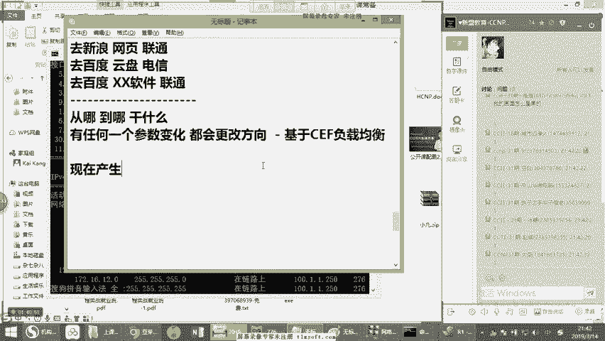

如果你每次都查路由表，按照递规查询的方式都会非常消耗CPU而我们现在查CEF表的话，就可以直接根据镜像。啊，直接快速的从接口发出去。明白了吧？这个是首先这节课大家了解一个非常重要的一个点，叫CEF。😡。

那么如果你不懂CEF，你后边很多技术都学不明白，你非常多。打个比方，像我们说的。😡，啊，其中的话大家我不知道有没有了解过一个叫open for那么一个技术啊，就是美如技术啊，叫nett fall。

大家听过吗？不知道大家有没有听说过啊啊，那包括像我们说的还有什么呢？例如像我们说的后面MP等等，这都是基于CEF的，没有CEF这些东西，你根本连学都不用学吧，你根本学不会。😊，能听懂了吗？好。啊。

不都是基于目的IP归属，目的IP是电信的，走电信，目的IP是联通走联通。注意看啊，这个问题刚才要问一下大家看没有。当我们在这种情况之下，如果说我内网看着我的内网局域网里边。

这个现在画的黑框是我们的局域网。😡，啊，这个局域网内部的用户，如果要去访问的是目的是一个联通的1个IP。假设是个圆通赖皮。那你们告诉conunor这个数据当到达网关之后，网关知道走联通这个方向吗？😡。

知道吧？假如说我现在要数据产生了到达个网关，这个网关现在要去往联通这个是你访问的是个联通代替。那你刚才跟我说这个网关，他知道应该往联通发吗？知道吧？😡，记住他不知道，他有可能从电信发出去了。😡。

这就是传统双线的弊端。如果你现在的话想去的是一个什么，看着你现在想去的是一个电信的IP。😡，他知道就那么聪明，这路由器是大聪明是吧？就往电信给你发是吗？不会，他有可能从联通给你发出去。

所以这个负载均衡并不能识别IP。😡，他没有办法识别你去网的是一个联通的或者电信的IP我就从对应的接口给你发出去，他做不到。听懂了吗？明白了吗？明白刷标一啊，OK。那你说老师我怎么听说有的可以呢？

记住什么可以。😡，当你后边学到BGP的时候。就可以搞定了。BGP就可以实现这个点，记住了吗？BGP就可以有效的实现联通还是电信的IP走对应的线路做转发。可以实现更快速的转发。能理解了吧？明白上面一啊。

后边刚头给你们讲，别着急啊，这个部分肯定得我讲。😡，好。所以很多技术这些东西呢，你发现你连听都没听说过的时候，你根本就没有解决方案。你有什么解决方案，你看没有听没听说过这个玩意儿是吧？你解决啥呀，是吧？

根本就谈不上解决，明白了吗？就这么个事儿啊，很简单啊。😡，那这是我们现在看到的一个什么呢？一个我们说叫默认物有啊，叫做默认物有的一个东西啊。那同比作为默认固由和静态固有。好，假如说我问一下大家。

我现在在我的路由器里边。😡，有一条3。3。3。3。下一跳。还有一条默认物有。😡，下一跳。好，稍才问一下你们，请问一下，如果当此时我去往的是3。3。3。3，它走上边走下边。😡，走上边走下边。走上边走下边。

好，OK没问题吧。这个点大家应该知道，这是最长匹配，明白了吗？好。😊，那么后面的话我们会学习到动态路由协议。记住我们会学要动态模游戏。那动态步录协议的话，大家就可以看到，除了这个之外的话。

还可以看到其他开头的这个表象啊，这就是咱们下节课要开始的这个动态步录协议。那么当然我们这个没有说完啊啊没有说完啊，就是在这个里边的话呢，我们知道其实呢它还是可以接出接口，记住它可以接出接口。

假如说往下在写。我现在写个行么，我刚才刚才给你们做的都是接的下一跳地址，对吧？看到吗？我刚才写的所有的1。1。1。1。好，注意看我接的都是什么？下一跳地址，哎，1。2。😡，这样吧。一点好，我可以这样写。

那还有一种用法是什么呢？还有一种用法是可以直接写出接口的。打比方。😡，从这个口发出去。好，我这样能写吗？😡，我这能写吧？可以吧？可以吧？可以吧，判长可以吧啊。😊，看到没有？好。

这就代表产生了一条这样的一个条目。😡，听明白了吗？假如看看我把路由给你们干掉了，重新写啊。😡，IP绕体。好，写一个好，然如去往1。1。1。1。好，下一条是从这个扣出去。啊。好，看到没有？

这样的话就是可以也可以这么写啊，但是这个地方的话有一个一盖，这个一概叫什么呢？如果你使用看着啊，你使用出接口的形式。他就会牵扯到一个技术要带给ARP大家先记下来。分析下来啊。

当然你们还没有学过带给IRP对吧？他会涉及到一个叫代给IRP。但是实际工作中我们不这么写。😡，在实际工作环境中，通常我们不会这么去写啊，希望大家先把这个点记下来。好。我们一般都是写明确的下一条地址啊。

直接写下一条。😡，O。那么这种方法一般在什么地方用到呢？刚才告诉你们。😡，到你的企业。😡，基当你的企业使用的是ADSL，就是我们说的PPPOE拨号上网。的时候，这个大家知道吧？刚才刚才跟你们说到过。

叫企业级的ADSL对吧？企业级ADSL当使用这种方式的时候，你会使用一个用户名和密码进行一个拨号编辑。😡，对吧进行一个拨号面接。好。那么在这个情况下，它会产生一个什么呢？叫做虚拟拨号的接口。你们知道。

如果你们家里面用宽带，你是不是会创建一个拨号的一个连接窗口啊，对吧？这个大家知道吧？好，那同样在我们的网络设备上也是这个东西叫什么叫deva口。啊，这代表证明完。会通过这个dgger口，当然咱没学呢啊。

先跟你们之前打个招呼，我们是通过dgger口进行拨号的，后面你们会学到。😡，然后呢，我们往往在我们面向ADSL的时候，看着，不是动态，对吧？因为动态是动态获取IP地址，所以我们是不知道是吧？

我们动态获取IP地址时候的话，我们是不知道下一条地址的，每一次下一条地址都不一样，所以我们就会写这样一条。😡，第一个别管怎么说，从这个拨号口出去。能听懂吗？这个时候后边就会接出接口。😡。

所以今后你们在工作中，你们看到别的奇怪，这没什么奇怪，这不不值得惊讶。😡，明白没有？这并不值得惊讶啊，希望大家先搞清楚OK啊，这个东西并不值得惊讶。😡，啊。对吧只要你出去的话，从哪哪？

从我们这个单er口出去。😡。

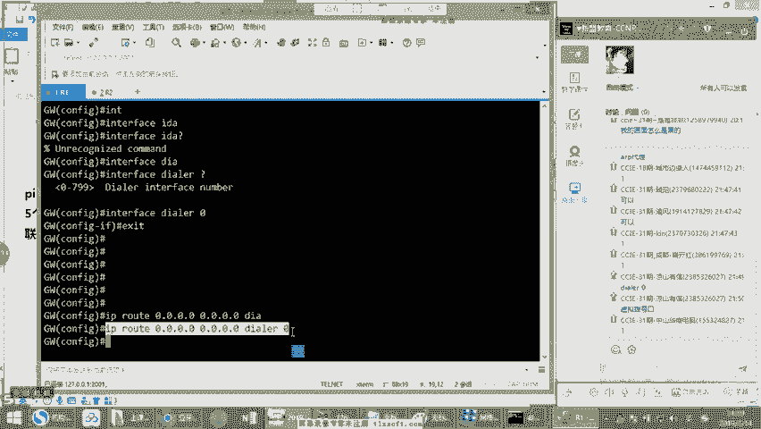

啊，代表什么？这是一个拨号结口，因为他没有下一跳，他们不知道下一条地图。😡，明白了吗？明白下边一好。😡，那么这是我们现在看到的一个我们说到的什么叫默认路由啊，这么一个东西。哦，那这是我们说这一个静态。

但这一课的话没有来及演示关于设备的AOS更新这个问题是吧？没有来及演示啊，光讲这个东西，下次大家提醒我一下，好吧，明天的时候吧，明天你们提醒我一下，我们一定要演示一下什么呢？一定要演示一下。首先是上来。

我们就演示一下关于设备的一个密码的一个破解。还有一个就是关于设备的一个exmod的。

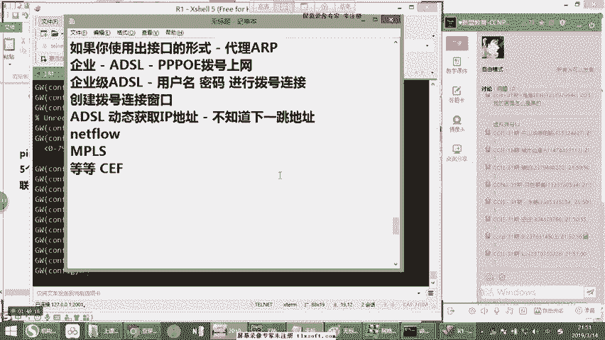

1个AOS的上传好吧啊，OK对啊，就是要密钥破解嘛和AOS上传嘛，对吧？所以这个地方的话，我们在明天的时候大家一定要提醒我一下，我总忘啊，每一次都讲起来了，快下课再讲起来。然后明天的话。

咱们一上课演示一下，好吧。😊，好，说到这。有没有什么问题大家可以提问啊，你们先问问题，问完问题呢，一会儿我就收作业。😡，大家也呢现在没问题的，开始准备一下自己的作业啊，开始准备交作业吧。😡，好吧。

准备交作业。交作业呢，大家直接干嘛呢？直接交到这个31期里。😡，好吧，直接交到317。O。好，这叫31区0。我先把录屏，今天录屏先关掉啊。

