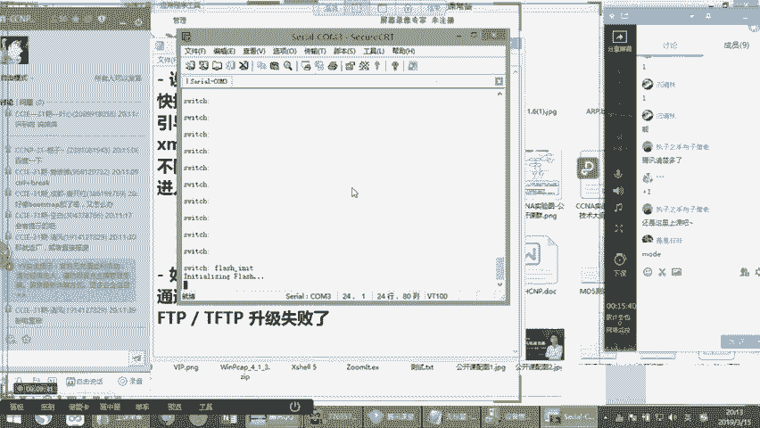
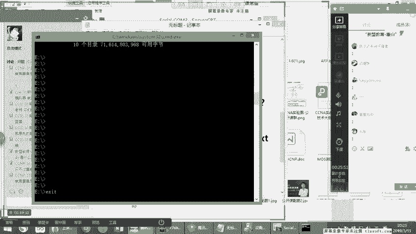
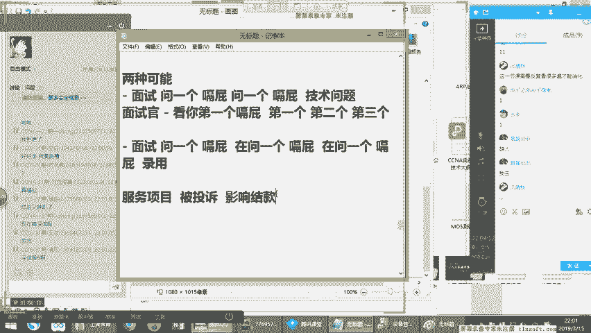

# 2019年度最新思科认证CCNA网络技术经典实战教学全集（最适合零基础小白的CCNA详解） - P8：思科认证CCNA网络基础第8节-设备+动态路由 - new盟的小狐狸 - BV1V4411J7ZP

。

好，那我们开始我们今天晚上的内容。那首先今天晚上的话呢，我们第一步的话要先开始看什么呢？大家注意看我们第一步的话要先开始看一下关于我们的上次课没有说的对吧？就是说关于我们的设备如何破解密码。而。

第二个来说的话呢，是针对的是我们的使如何使用X mode。啊，进行AOS的一个上传。这两个这个大家应该知道对吧？啊，两个应该知道。好，那我们先来看第一个把设备如何破解密码。那首先来说的话呢。

因为我现在呢我这边有一个cl线，我现在把它连接上，好吧。😊，我把它连接上的，然后呢，我们来看一看我这边的话能不能自动识别出来驱动啊，我之前装过应该可以。啊。好，稍等，我这边现在有个设备安装。啊。

稍等一下。啊，no no no no no no no呃，210啊2142那个的话是在路由上边。那其实来说的话，在不同的啊，大家注意就是在不同的设备类型上都有一些就是不太相似的。

是不太呃不太一样的地方啊，这个点你们要记住，所以当你们要去恢复什么设备的时候，那么你们最好提提前看一下官方的文档官方文档写的会非常清楚。这一点的话，大家要注意根据不同的设备类型，大家自己判断，明白了吗？

刚才在工作岗位上的时候的话呢，遇到不同的品牌的设备进行恢复的时候，也并不都采用一模一样的模式。但大概的框架它是一样的。理解过没有？大概的框架它是一样的啊。啊，呃，稍等我现在先把这个点开。

我我这边现在没有动是吧？看一下。😊，看一下我的设备管理器。好。稍等。啊。我先把这个先点开，我先看一下啊啊，现在还没有识别出来，看到没有？在其他设备里面看能不能识别出来。哎，OK识别出来了，对吧？

现在已经识别出来了啊。好，这边呢在端口这块的话已经识别出来了。识别出来的话呢，我们来看一下啊，大家稍等，等它okK等我恢复了。😊，OKc3看到没有？现在是不是已经显示c3了，对吧？

因为现在的基本上是安装上，大多数都是免驱的了，所以你是不需要怎么样的，明白了吧？啊，那我今天的话就是以一台交换机为例，O吗？我以一台交换机为例。可以现在现在我是c3，那我现在想去连接一下这个设备。😊。

哦。我打开什么呢？假如我打开我的CRT，好吧。😡，啊，我把CT打开。好。好，大家稍等啊。好，CRT打开了。那打开之后呢，我接下来的话要通过CRT来连接一下，使用什么sreal看到了吗？

我这个地方用com3好，com3，然后这个地方的话，我使用什么9没有命名，对吧？OK好，可连接。😊，好，看着，我现在是不是进到一个设备了，告诉我好。那这个设备你可以看到，我现在不知道密码，有注意到吗？

有没有发现我现在不知道密码呀。😡，发现了？我现在不知道密码。okK好，我不知道密码怎么办呢？这个时候的话，我现在以一台交换机为例来说的话，交换机上面的话都会有一个modode键啊，有一个modode键。

😊，那有的设备的话呢是使用快捷键的啊，有的是快捷键啊。去启动我们的包税。啊，那我们之前讲过啊bos trip是什么意思啊？什么是bos trip啊？bos trip来说的话是我们的引导程序，对吧？

引导程序啊，就相当于我们的bellls一样。还大家还记得吧？我之前说过这个点啊啊，那么这个时候的话呢，当我进到引导程序里之后，比如说我我们不管是我们使用X mode还是说我们使用去恢复密码。😊，啊。

我们首先都得进入这bo trip，这是不变的。首先大家先搞清楚这个点。那等于说如果假设我X mode什么呢？X mode的话就是通过我们的conl线。😡，来进行IOS的一个上传。啊，就是做升级I。

能听懂吗？好，这样好，那么当然这种情况的话，一定是我们的通过我们的FTP或者TFTP的升级失败了。好，在这种情况之下，我才会通过conl来进行上传。那这两种方式呢，我们都得进入bo trip。

bo trip是肯定要进的啊，这个bells。那么往往呢有的设备的话呢是用什么呢？像你们打出来的是吧？用conttrorl加B，有的是对吧？有的设备就是我们说cttrol加B。

有的设备的话是cttrorl加一个什么键啊，所以不同的产品。啊，它的按键就是进入我们的包脆。啊。的方式不太一样。那这个不太一样的，仅仅是快捷键不一样。

那这个大家可以根据不同的产品去根据官网或者配置手册自己去看就可以了。明白刚才的意思没有？对，很简单，这个就不说了，但是无论什么产品你都要进入到这个bos trip模式，这是肯定的啊，这个是个一定的啊。

😊，那现在呢我们现在由于呢此时这个设备呢可以看到啊，我现在呢虽然连接上了，但是我现在进不去吧，我不知道密码哎，对吧？我水高就可以吗？不可以好，那所以这个时候怎么办？我肯定要在设备旁边，我在设备旁边。

我现在就要把这个设备干嘛呢？所以看啊，我要把设备的话给它把电源线拔掉。😊，啊，把电线拔掉之后。好，注意看好，拔掉吧。拔掉之后，接下来我再把电源线接上。😊，接上之后，我就一直按modode键。好。

注意看我会一直按modode键。啊。那么这个时候的话呢，这个设备的话现在要重新启动。好，大家稍等。好，再把断键重启。啊，那么真机的启动速度快OK进来了。看到没有？

我刚才的时候的话就是侧着身子一直摁着交换机的moode键，上面有一个按钮而，写的mododeO啊，那么在这个里边，当我进到了这个模式，看到吗？叫switch more号模式，你会注意到。

这个在我们所学的模式里面是没有的。😊，发现没有？对，是的啊，是没有的那也就是说这个moode键呢看啊我现在在唉你们现在这个课堂里面那么多人啊，都都这都是谁啊？😡，哦，是飞微线进到这个边了是吧？O好。😊。

啊，那么这个moode键呢，此时我现在已经要什么进来了是吧？我现在已经进到这里边了。好，我进入这里边之后呢，接下来我要做什么？😊，接下来注意看啊，我首先的话先去加载我们的flash。好。好。

先输入flash下划线IIT其以这个你网上一搜一大把的这样的一个这个配置方法，不同的bostri的版本也不太一哈，明白了吗？好，我们先加载flash好好看此时它在在加载flash啊，那么在这里边的话。

我们要注意的点啊，为什么要加载flash呢，是因为在我们的设备上，有的产品啊，注意看啊有的产品它的NV run，我们知道现在呢咱们知道我们这个这个这个密码是保存哪个呀？

密码是保存在了我们的config点TEXT这个文件内。😊。

注意看，然后它是保存这个文件里，也是说我们的设备每次启动，实际上都是去读取这个config点TEFT。那也就说我们在设备在启动的过程之中啊，它一定是干嘛硬件自检。然后接下来呢启动AOS。

然后接下来是读取我们的config，听明白了吗？是这样的一个过程。那么也就是我们现在想要这个密码得到修改，最好的方法是让它不读取config点TXT。好。我要不读取的话怎么办呢？

也就是说我们第一步是先要把干嘛，先要看到，先要把我们的这个config点TEXT这个文件，注意看我们先给它修改一下名字或者后缀。😡，等于让它在设备启动的时候，看啊找不到这个。这个启动文件听明白了吗？

找不到启动文件，就等于设备在一启动的时候的话，无法加载配置，能听懂吗？所以此时密码自然就要消失了。😡，能不能能不能理解明白稍le意义来啊，是这么的一个步骤。

所以现在呢而但是有的设备呢看到有的设备的它的config点TXT啊啊它是保存在ever里边。😡，有的设备的话呢，它是保存到flash里的，能听懂吗？啊，那么去这两个地方，你自己去看一下就可以了啊。😡。

那此时呢我现在加载完了之后看加载成功了，对吧？加载成功了之后，接下来我就开始显示一下我的flash。😊，看，我现在在我们这个设备里边，我这台设备里注意看我的confi点TXT是保存在哪里啊。

保存在我的什么。😡，交换机里面能不能直接删除那？可以啊，但是你其他的配置也就没有了，你其他的配置也消失了，能明白conc思没有？能听懂吗？啊，所于在这里面可以看啊，哎，这是一个文件，看到吗？

con个TXT好，那接下来呢我现在要进行一个修改，怎么修改呢？叫rename。😡，啊，修改renameflash里的config点TEXT好，改成一个别的名字，还是flash。

注意看还是flashflash什么呢？我改成config点，假如说点成改成点叉叉是吧？好，修改。😊，那我们再来显示一下。😡，啊。大家显示一下。啊等于我现在的话就把它改成了confi点叉叉了。😊。

听明白了吗？那此时我修改完的之，是不是后缀让我给修改了，告诉康ser是不是后缀让我修改了。如果现在后缀让我给修改了的话，你告诉康ser，我现在这个设备再启动的时候，还可以读取出来吗？啊。

还可以读取出来吗？可以了？😡，读取不出来了吧？好，那现在我让它读取一遍看bo。😊，好，现在开始启动了啊，开始加载OS。😊，注以看开加载。啊，不要着急啊，我们先等待一下。然后导启动。OK好，启动了。

看到没有啊。😊，对吧在圣和赛吧，那加维提尼亚圣和赛啊，斯科的总部。好，稍等。那么这个过程的话，等等我们启动之后呢，你会发现一种现象，就是它里面什么配置都没有了，能明白吗？什么配置都没有了啊，不要着急。

我们先来看。😡，啊，稍等。那么大家的话呢去看不同的产品，不同的配置的时候，大家永远记住一个点，要根据官方的手册进行判断，明白了吗？要进行官方的手册，能听懂吗？你们几个啊好，千万不要生班啊，硬搬是不行的。

不是重新生成一个，注意看，注意先仔细看这个逻辑啊，不要着急，康头我跟你们说，明白没有啊，先专心听啊，你们现在这这边课堂都可以听到吗？腾讯课堂都可以听到吗？可以听到，你刚才刷个一来。好，我们先进去了。😊。

啊，进去了没问题了啊，看现在是不是yesO no啊，是不是esO no啊？O好好，此时yes no now我们进去了，注意看啊。😊，还有我们的密码吗？看到没有？是不是没有密码了？好，不要着急。

然后接下来在我们这个过程中干嘛呢？😡，继续rename把它改回来。因为我们现在已经进来了，对不起是吧？哎，你给我留门，我已经进来了。😊，改继续给它改回去点什么？好，给它改成刚才点的叉叉是吧。

给它再改成flash点里边的confit点TEXT再改回去。😊，听明白了吗？好，我们再来看一下啊啊此时的话。😊，CDf看这个命义好像都见过吧DAR看好是不是又改回去了，告诉我改回去了没有？改回去了。好。

但是我们已经进来了。哈对不对？不要着急看啊，当我们进来之后，接下来注意看我们要修改一下我们的密码，不改的话不行，为什么注意看啊，如果你不改，它显示的是点叉叉是吧？好。

注意看我们接下来要重新修改一下我们的什么看enable password啊，enable password，假如改成cisco。😊，听明白了吗？我这里给它改成cisco。好，改完之后WR保存一下。😡。

注意看保存一下，当我保存完之后，他告诉我现在我改的这个名字，它保存到哪里了。😡，告诉我它保持到什么地方和说话。😡，保存到什么地方啊啊，保存到什么地方啊？😡，转话呀。保障到什么地方了。

是不是又继续保存到config点PEXT里了，能明白了吗？你不改的话，它不就重新生成一个了吗？如果你不改回来的话，你重新WR，它就重新生成一个。那之前的配置就没了。😡，明白了吗？是不是是是非非啊。

瑞可以听懂吗？执子之手，你们这边执子OK吧？好，所以在这个过程之中的话，我们发现干嘛我们等于给它重新，相当于是这样的一个逻器，等于在设备启动的时候，看好设备启动，它正常去读取。😡。

confi点TEXT对吧？这个配置文件，但是不要忘记这个文件里呀，它有密码呀，所以我们读取上了之后，我们不知道密码理解了吗？而我现在进入到了我先通过modode键是吧？按键我进入到我们的bo trip。

听明白了没啊，bos。😡，进去之后的话，接下来的话，我们干干嘛修改一下我的config点TXT改成了什么呀？改成了config点叉叉。你告诉刚才说，我要给它改成别的行吗？我改成AA点BB行吗？😡。

到时可以吗？你们这边谁现在开始卖的，检查一下。😡，谁又开着卖呢？😡，烈火如心啊，这孩子太刻苦了啊，现在一看就还在地铁上停课啊，真不容易啊啊，对吧？找我改成这个可以吗？可以不可以，告诉我可以吗？可以吧。

没问题，你改成什么都行，明白了吗？可以好，当设备重启。😊，吧再启动这个时候的话，他已告诉我，因为你把这个名称改了，它还能读取到这个config点TXT吗？还读取到吗？说话。😡，还能不能录取到能吗？😡。

能么？😡，能不能不能了吧，没有了这边的同学能听懂吗？瑞能不能听懂，行行行，可以听懂吗？听懂杀个一，没听懂杀个2，快点。😡，啊，对吧？等于这个数的话等于我干嘛？我读取不到了吧。

我读取不到这个时候我应该怎么办？就开始正常的进入到初始化的对吧？初始化的系统中。😡，听明白了吗？啊，进到初始化的系统中的时候，我们要重新把名字，因为此时的话就没有密码了。😡，没有密码。

是不就可以正常的进入系统的特权模式啊？😡，可以吧？进到特销模式之后的话，进到全局，进入全局，我们干嘛再修改一个能听懂吗？

我们修改一个这个重新把configAA点加A点BB我给大再改成什么config点TST，然后接下来重新设置一个密码。😡，保存。此时保存的这个新密码就重新回到了哪儿，回到了我们的conc点TEFT里。😡。

能明白了吗？然后再重启。😡，这个就解决了，能不能听懂告诉我明白了没有明白3er一来。😡，好，OK了吗？明白稍边一好。😊，你们这边能听懂吗？😡，可以听懂吗？说话呀。啊。没意思吧？好，没问题啊。

咱们接着说啊啊，那么这个时候的话，我们现在来看看着，我保存了，对不对？保存了啊，保存了之后再核实一遍，不要搞错了，ssco好，保存保存重启一下。😊，好，是不是我们重新启动了，明白了吗？我们现在重新启动。

😡，不要着急，原先的配置呢原先的配置还在呀。😡，原先配置不还是在这个configTST里吗？😡，明白了吗？能不能听到？啊，所以这是非常简单的一个概念，这是一个简单的系统概念啊。😡。

是吧DIR是显示的意思，在你windows里面也有DIR看着然CMD对吧？CMD。😡，C盘。啊，对吧或者是D盘。😊，哎，没有D盘F盘看到了吗？DAR听明白了吗？啊，E盘DAR啊，基础的命令吧啊。😊。

对，是的，可以覆盖原先的密码。你看所以现在的话干嘛？它重新启动系统了，能听懂吗？现在开始重新启动了，不要着急啊，我们把这个1。1点咱们把它学明白。😡，啊。好，稍等，这个时候现在正在启动。OK。😊。

如果bot也加密了的话，其实这个真的是返厂，没有办法。这个问题我之前了解过，因为很多华为的产品的话呢，我们bot本身也是加密的啊，有加密了之后的话，一般的情况下都会返厂的啊。因为你如果bot加密的话。

你是没有办法把它解开的。😊，明白了吧啊，那就是那就是其实他们到返厂之后呢，他们会从芯片的角度上解决这个问题。好。可以查看吗？可以查看呀，不要着急啊，我现在启动了之后，它就加载配置吧。😡，好，稍等。

我为什么不愿意给你演示个功能呢？是因为我一演示功能很耽误时间，明白了吧？就特别耽误时间。所以它3560早期的标准的接入灰聚层交换。😡，好，进去了啊。Enable Cisco进来了吗？进来了吗？告诉我。

听明白了吗？你看刚才地边我们不知道，你看进来了吗？😡，明白了吗？明白，给康子差不多100对吧？啊。😊，那你说老师我接下来的时候的话啊，我接下来的时候，如果我要想进行这个X modeem的安装，怎么搞呢？

大家记住X modeem的安装呀，其实并不复杂，它也是在bo trip下。只不过这个如果你要真的到这一步了。😡，二，你都不用那么着急，因为你一开机自动进入包存。😡，明白了吧？你是自动进入的。

你开就进去了。所以这个时候怎么办？这个时候的话往往都是说看到，我现在但是我现在不是有系统吗？看我现在不是有系统吗？所以我现在干嘛呢？哎，我直接把这个设备reload一下，注意看。😡，好。

要保存当前的配置吗？不保存可以吗？OK我先不保存当前配置。😡，啊，注意看。我现在设备要重启了，对吧？我继续按moode键。😡，啊，我继续按梦键。好，大家稍等。我们现在让我们这个unix重启是吧？

我们这个IOS实际就是unix。😊，好，稍等。我们继续。还不如把电源坏了。好，重新进到个看到了吗？我现在重新进来。我说第二个，如果接下来之后的话，我现在要干嘛呢？我要进入进行AS上传。

那么我用通过cl线L上传怎么上传？注意看啊，首先第一步依然加载flash，你必须因为一会儿的话，你要干嘛？😊，一会儿的话，你是把它上传到你的flash里，对不对？好，继续加在flash。好好。

IN eight就是装载能理解吗？X model这辅助端考不是consil，就是咱们的consl线是吧？上次我给大家讲过的这个问题，对不对？就是我们直接连接csl线。O好，加载成功了，这个非常简单。

注意看啊，注意看好，你可以现在来看这么一个信息DIRflash。😡，按正常来说，你在设备里啊是没有这个东西的，是没有这个系统的。如果你的系统升级失败了，你会发现这里边根本就没系统是空的，能听懂吗？

这是一空的空的，这个时候怎么办呢？看假设现在coner注意看啊，现在cer的话呢，给你们搞一个。😡，假如说我在这我新建一个文件。假如说这样吧，我就把我这个CCIE直通车是吧？

我把我这个大纲给你上上上传上去，好不好？假如说我把这个啊这个这个CCIE啊，这个图片我给你们上传上去，我看一下在哪里。😊，好，等一下okK好，就这个吧，这个吧，然后CZI直行车好吧，然后这个时候的话啊。

当然这个如我再改一下啊，因为这个它不支持的那什么，然后我给它复制一个啊，我在这复制一个出来复制一个出来的话呢，我给它改一个名字。😊，好，大家稍等。好，假如说我给它改成一个。改成一个什么呢？

改成一个test。test点PNGOK吧？好口现在给它改成个test点PNG。好，我们这个时候的话，我们接着来看注意我接下来怎么办呢？我接下来要做的事儿。😊，注意我就是要把它进行一个copy。

 copypy。你看copycopy什么的Xmod冒号，X model冒号。然后接下来我们点test点什么test点什么点。😡，我刚才是PNG吧PNG好，到达我的什么呢？flash里的啊test。😡。

电PNG。等于我现在把X mode的。😡，我这个图片给你上传到福lash去。如果在我们正常来说，这应该是个啥？😡，应该是个系统高窗口对吗？对吧？这应该是个是个这个LOS吧，对吧？是一个B文件。

是个I二进制文件，听明白了吗？明白给康们刷波一来，对吧？所以你正常来说，你就copy你自己的本地的你这个系统文件到flash里，你想叫什么名字？😡，能明白吗？明白就看到下波100好，一般下。😡，啊。

那此时的话，我在这里边的话干嘛干嘛？我要进行一个上传吧。你最好是假如说原先你省着在加载，你原先叫什么，你就叫什么就OK了。好，看好OK这个时候有一个C看到了没有？是不是有一个C啊？好。

正在给叶中注意看啊。好，接下来在这里。😡，有一个什么传输，有一个发送X model的好，给发送。啊，此时蹦出一个窗看到了吧？是发现蹦出一个窗了吧？好，蹦出一个窗怎么办呢？直接在我们的这边的。

假如说在我这个工作盘符里。😡，工作盘服里，假如说刚才我在这个边有一个test。啊，注意看好，有一个test点PNG看到没有？我把test点PNG点上发送。😊，好汉开始传输了。看到没有？

刚刚开始传输看看到没有？开始传输了吧？能明白了吗？好，2%看到了吗？看到了没有？2%3%明白了吗？明白countshop e来，是不是非常的慢，能听懂吗？啊，非常非常的慢，能听懂吗？就这个意思啊。

所以在这个过程之中不需要写本地路径。因为你写完了之后的话，你只要在这干嘛显发送X mode，你就可以把这个文件打开，能不能听懂，把这个文件打开，直接上传就可以了，明白了没有？

明白countshop e来，速度非常慢。对的，是的啊，那么这就是一个什么呢？这个就是一个。😊，我们提到的通过X mode啊进行一个上传，明白了没有？明白comshoper一来sha一上来啊。

那么这是一个我们现在看到的，刚才教大家的两个，一个是什么呢？一个是我们现在通过如何破解密码做修复，如何使用X mode进行上传。说到这，你们两边的能听懂吗？能听懂美方的三波一来没听懂上哥拿着的。😡，啊。

哎呀，我知道我不就是给你演示一下嘛，上次给你们提到这个事，USB还用conor给你们演示嘛，咱就不用费这劲了，对吧？啊，对吧？只不过给你演示一种比较老的方法，就是你对于一些老设备，它没有USB接口。

有的早期的设备是没有的，没有这个接口，能听懂吗？啥效可以啊，一样的，没有任何区别啊，能听懂吗？啊，对吧？对于一些老款的设备，还现在还在生产线上跑着的，对吧？你大概知道可以怎么去应对，你不要说搞个半天。

你估计不知道怎么搞。😡，OK好了好，最后就OK吗啊。😊，好。那么这是一个我们现在说的啊一个以上的一个部分，给大家做之前课程的一个补充。对呀，你们现在应该还有在生产线上的吧，有的产品很皮视。

它现在就在生产线，是生产环境中，明白没有？是呃文件名不一样会上效，不会呀。😡，就跟你电脑一样，你上传什么文件，他不管你，你爱上传啥是上传啥，听懂了吧？你想咋上传咋上传是吧？明白了吧？无非就是快慢的问题。

好，你们这边能听懂吗？😡，啊，我看我们班里面新来的一个是吧？是是非非的老学生，为，你新来的同学了是吧？新来的同学的话，你告诉我能不能听懂，能听懂给看懂下个一来，没听懂下个2。😡，啊，给我一个回应，快点。

啊。咱们接着说啊。那么这个时候的话呢，我们来看我们今天的课程内容啊，咱们今天要讲到的，所以我们就不管了，好吧，没有听懂是吧？瑞哪个没有听懂？😊，哪个没有听懂啊？😡，哪个没有听懂，告诉我。😡，好。

大个没有听懂？是这个不明白是干嘛吧，上面这个听懂了吗？回答我上面听懂了没有？听懂上个一。😡，好，没听懂下个2，咱们一步一步来，你们这边也是。😡，下面听懂了吧？😡，没听懂是吧？好，okK没关系。

我再说一遍好吧，我再简单说一下啊，注意看。😊，前面一听不要紧。😡，你们有没有遇到过这种情况？😡，我在项目上。进入一台设备。这个设备啊可能是一台备用机器。因为什么呢？我的在现场，我的机架上的设备啊坏掉了。

😡，我现在呢赶快从仓库里找个一台备机。给他换上。好，先告诉我这句话能听懂吗？😡，这家还能听懂吗？那边的卡萨布甘卡。😡，这能听懂吗？瑞这边能听懂吗？标一回应瑞，能你能明白这个前前提吗？好。😡。

结果呢进到设备发现我操，有密码。😡，有可能吗？交边密码呢是你的前任前任再前任。😡，好多人不知道谁设置的这锅呢反正是没人背，也找不着。😡，告诉我有可能吧？登录进去啊，你登录不进去，你换不了这设备啊。

你登录不进去，没法配置呀，O吗？这个条条件听懂了吧啊。😡，那接下来。要到哪？😡，恢复密码，我得给哥们搞定了，这事儿不能是废那的，对吧？你们在工作现场很多时候就上不了密码，就有个大叔，没办法。

你们大多数干的都这种活，对吧？哦，你再想办法给他恢复吧，怎么恢复呢？好，于是接下来它就有一个系统层次。😡，我说什么叫系统层次呢？就是说你们想恢复密码，你们得搞清楚这个密码为什么会有。😡。

你才能知道他怎么没。😡，理解方才的意思吗？为什么会有密码？😡，你说表示这么简单吗？有人设个密码，它有密码，这不是废话嘛，对吧？是有人设密码，但是为什么开机会有密码启动呢？😡，按照一台硬件设备的角度。😡。

它分到几个启动的一个方法，启动的步骤和层次。这个过程就像什么摊煎顶一样，坚并大家知道吧？第一步，这个设备硬件得先做自我检查。😡，看看哥们儿看一看自己内存坏没坏，看看自己的是存储器行不行。

看看自己的主板有没有问题，能明白了吗？等等叫自检。😡，这自检呢就类似于你们家电脑开机的时候，要是内存坏了，它嘚儿嘚儿嘚儿报警一样，这叫硬件的自检。好，说到这儿告诉我能明白吗？明白错一来啊，O吧？

来随时跟我同步啊，咱们就把这块弄明白了。😡，好，右边也是没问题。好，第二步自检完了，哥们身体没问题，好极了，干嘛呢？咱开始办办正事吧，办事儿了是吧，什么事呢？开始咱启动系统吧。😡，对吧你得启动系统。好。

咱说这一个设备，看着啊，它有几个系统。😡，看看之前给你讲过有几个系统，一个设备来说的话，它其实本质来说有俩系统，没错，有两个系统。😡，第一个系统大系统就是咱平时用的。😡，拿咱电脑举例子。

就是那win8win10。😡，在我们的网络设备上，就是咱用的IOS这块能听懂吗？告诉我ok吗？ok刷波一来。😡，好。这O吗？没事啊，支持维持维持值不支你就不止是吧？没什么大不了。好，没你看啊。

第二个阶段是小系统，这小系统什么呢？就叫咱叫什么呢？再叫咱电脑里的bis。😡，这boss什么的？你没修过在哪的人就缺乏生活，就相当于说你手机里叫什么，叫bot motor。😡。

你在你的系这个这个这个这个路由器里边叫什么？叫dot。😡，这些东西叫引导系统，你们听过一句话吗？我刷机。😡，我给我那安卓啊安卓我我是发烧友啊，发烧啊，发烧友发烧哥把我刷机了，刷新完了之后哟失败了。

装个听过这话吗？告诉我啊，听没听过听过刷个亿来，说是装啊，相当于你们那电脑装系统，结果没装成功。😡，没装成功，你告诉我这个时候什么样？😡，是显示器都黑了吗？不是咱们说装了这个词，不是所指的是什么呢？

并不是说所指的变真变板装个嘛妈狗屁股都没有，不是这个意思，同学们明白了吗？装了的意思是说它有了什么呢？有个引导系统，但是没有那个大系统啊，一般所指的是这个意思。😡，就像你们那个电脑里边。

你电脑那个系统重装系统失败了，它也并不是什么都没显示，它显示进入的是boose里边的那个类似类似于dos那么一个玩意儿。😡，听明白了吗？类似于dos那么一个小版的那么一个微小版的系统。😡，理解了吗？

大都能听懂吗？😡，能听懂吗？明白上标一来这微小版的系统。😡，从根本来说是干嘛呢？它主要是用来启动主板的一些硬件。😡，用的。好。而所以现在呢由于咱们现在启动系统，注意看第二步，这个系统启动什么板是先启动。

看点啊，按步骤是先启动我们说的bo trip。😡，对吧底层系统再启动大系统。😡，AOS听明白了吗？😡，是这么一个过程。😡，如果你的IOS没了，这小的系统还可以启动。😡，但是小系统没法用。

这小系统就是个底层的dos一样，听明白了没有啊，只是提供一些底层工具包。😡，好，科长。😊，第三步才是加载配置。这个配置是什么鬼？😡，就是你们在设备里敲的那一大堆乱七八糟的OSTF呀、静态路由啊。

什么各种各样神奇的功能啊，能明白了吗？它都在这个配置里。😡，这么说告诉我能不能理解，明白说pper意感。😡，明白了吗？明白了吗？明白刷哥一没听懂刷哥来，兄弟们，还是那句话，我要去把你们都听懂了。

要不然我就感觉自己白说了啊啊。😡，按照这个步骤。😡，看着按照这个步骤，然后接下来在我们现在这个环境中注意听啊，123。😡，我们由于呢我们每次启动。😡，这没技术含量，兄弟们，这也叫技术含量。

你们你们都听过有技术含量的东西吗？难道啊这太基础了玩意儿了，是吧？你们回头听开到给你讲讲专线，你就明白什么叫技术含量了，是吧？啊，那么这个事儿的话，我们每一次启动，首先来说的话，都会加载配置。

这是百分之百肯定的。😡，明白了吗？啊，但是其中那个密码咱不知道的那个密码就是保存到这个配置的这个货里边。😡，能听懂吗？明白双边意来。😡，理解了吗？对它就保存这个配置里，你每次都启动。

你肯定没有办法进去啊。😡，听懂了吧？好，所以怎么办？哥们第一反应第一反应就是让它不启动配置。😡，我怎么让它不启动配置呢？特简单。😡，我让他找不着配置。😡，没这东西。😡，这哥们默认情况下。😡。

去找这个配置，它就是按照系统程序设置，就是找config点TXT它就找这么个文件。😡，听明白了吧？他找这玩意儿啊，他就找这个东西。😡，那我现在干嘛呢？我于是乎接下来我就把设备啊看着啊。好。

我就想办法把设备重启。😡，然后按长按我们设备上面呢，有一个modode键，对键你们现在看不着，你们要在工作上面就在设备旁边，你们就看着了，理解了吧？啊，而且不是每个设备都有moode键。

所以为什么我就说我说不同设备类型，它进入这个dotri的方法不一样。😡，理解了吗？能听懂吗？不同设备类型进入包设置方法不一样，有的是conttrol加什么狗屁玩意儿，理解吗？加上什么东西啊。

有的是什么快捷键，不一定明白了吗？明白tro标一来，就相当于你那个电脑开机，有的是什么的？按delete才可以进入bes。😡，有的是什么呢？按什么呢？按F12才进入bis。😡。

有的按什么NF一进入bios听明白了吗？道理一样的，这不是固定的，能理解了吗？明白刷波一来啊，对吧？很简单的道理，所以这个时候的话，我们现在我给你们尝试的演示的这个方法。😡，演示的这个设备。

它是它的方法就是什么呢？按moode键能听懂吗？这事儿别死性，下次的时候遇到工作中遇到什么设备，你查一下听明白了吗？理解了吗？你查一下怎么进就行了。上面有个按钮，明白了吗？有个按钮，你就按就行了。

倍儿一摁它进去了。😡，好，然后你长按moode键开机过程中。😡，长按modode键不停，长按完了之后，它就会自动进入到了dotri模式。😡，好，这么说能听懂好吗？可累死哥们。😊，啊，明白了吗？

查就这进去了，进去之后，这是进入个什么呢？进入个小系统，对吧？😡，看着啊，然后接下来我就开始干坏事儿了，我在小系统里。😡，直接把我那个开机看着，每次启动的那个confire点儿TEXT给它改个名儿。

你改个名之后的话，然后我再重启设备。😡，你他还能找着吗？还能找到config点TXT吗？告诉能吗？还能吗？说话还能吗？😡，能吗？找不着，我改名了嘛，肯定找不着。改完名儿之后他叫什么名对吧？

那你改的这设备反正找不着的，能听懂吗？明白稍说一来。😡，你们右边能听懂吗？😡，OK了。okK了，没事啊，咱不着急好好，找不着了。这个时候既然找不到。😡，那就说明没法启动配置。所以开机后。

你发现这个设备啊没任何配置。😡，不只是没密码，知道吗？同学们。😡，不是什没有密码，是什么配置都没有。😡，理解了吗？明白了吗？明白，ser一啊OK好。😡，OK你改啥都行，能明白吗？你改成什么都行。

然后接下来我一旦什么密点都没有，我可不就进入设备了吗？我进到设备里之后，我就进入到配置模式了。😡，我再给哥们把这个名儿啊改回来。😡，你说老是改回来改回来它又不生效了嘛？你一改回来之后，密码不就又有了吗？

😡，是吧？哎呀，你你在忘了，每次开机的时候，它才会启动配置。你你已经开机了，它就不启动配置了。明白了吗？你虽然给它改回来的，但是这个在当前情况下，它是不启动这个配置的，明白了没有？这么说能听懂吗？

兄弟们明白操多一改啊，很简单的个概念吧，这个事啊好，能听懂吗？😡，啊，所以在接下来之后看好对吧？所以接下来我得改回来，当前我不启动配置了，我就再给它重新设置个密码。😡，懂了吗？然后接下来我赶快保存。😡。

保存哪儿去了？继续保存到confire点TEFT里，对吗？😡，就直接把之前的密码给覆盖掉了。😡，明白了吗？很简单，这概念吧，把之前的密码给覆盖掉了，然后你再重启。😡，重启之后不就又加载配置了吗？😡。

对吧加载配置之后，不就加载的是你新设置的密码吗？😡，明白了吗？你不就进来了吗？😡，怎么样？兄弟们听懂好吗？这次这个逻辑清懂好吧？明白骚ber意思。😡，好，这这边课堂OK吗？O上波一来啊，你们哥几个。😊。

好，OK问题啊，咱们接咱们接着说好。😊，还有你可认识哥吧啊。为什么不直接删除呢？哎呦，你说说你说你不是不是愁死哥们，你在实际项目中，你知道项目中的核心设备上边的话就那些配置在十几页，你知道吗？巨多。

你那些配置的话，要是直接给他都删除了，你不还得重新配吗？这孩子怎么不想不明白这个事呢，你不大家再重新来吗？😡，对吧对吧你不再重新做吧，我其实明明就是个密码的事儿，我为什么要把配置给删除了呢？😡。

明白了吗？明白，稍波一来啊。好。明白吧？书上为什么是不同设备的话，它的配置方法不一样。2102214啊，那是目一般是常见用在那老款路由器上修改寄存器值，让它是否启动。😡，但是康给你们举个例子。

这样听着不要关注于老是我怎么进入，对吧？我怎么进入boss trip。😡，别关注这个问题，这个问题不要关注这个问题是每次遇到设备，听好，每次遇到设备，不同品牌自己查一下，看一下官网的手册，你是最清楚的。

明白了吗？别百分之百套用这个东西没有一定指挥，我告诉你开机F一进bise，你每次都是F1，华硕是F12明白了吗？是吧？G加了，这就是delete是不一定，明白了？我看的意思没有？所以这个但是不管怎么样。

它的核心步骤它是一样的，都是干嘛？进入到bo。😡，让他什么呢？修改，让它不加载这个配置，都这个方法，这路子都是这路子。😡，能明白了没有？明白说说意来。😡，好，听懂了吧。明白差不一样好。哦。

你们是个哥真是为死哥吧，简直是这么简单一个东西，你说说哥伦不怼你们听听啊，OK好，这回okK了吧，没问题啊。啊，然后除此之外，刚才咱们说的第二种是什么？😊，第二种是针对啊设备的一个系统的升级。

有的设备有的设备呢，它当前的那个系统版本呢很低，有的功能呢用不了，对吧？好，所以这个时候有的时候我们干嘛呢？我们会给它尝试手动的给它升级整成什么高版本的系统，让它可以支持到某项功能。😡，明白了吗？

是这个意思啊，那么如手动升级呢，就有可能出现这么一个问题。什么意思呢？常规来说听好，常规来说，我是在原有的。😡，系统之上进行升级。说白了就是我现在已经进到设备里了。😡，明白了吧？

我现在我但我现在还没有重启啊啊。😡，啊，我现在没有重启。那如果正常来说，我已经在系统里边，我直接干嘛呢？第一步，我直接把原有的。😡，不盖始。那边的系统给它删除掉。第二个。

我直接通过TFTP或者FTP或者USB等等。我把新的系统给它拷copy进来。明白了吗？😡，能听懂吗？明白carpy一来啊，然后按正常是这个步骤，这个步骤呢它的上传呢不是走的这个USB接口啊。

就是走的网线。😡，好，明白了吧？不是走的USB，就是走网线啊，这道理特简单，贼简单是吧？就像你现在电脑要是装系统也是一样，你电脑装系统的话，要么是TFTPFTP是吧？是吧？你一般就是什么呢？

假如我现在已经有系统了，我就在系统的基础之上，我把新的系统copy进来，直接做ghost告诉我行吗？😡，行不行？可以啊，没问题，直接做构没问题理解了吗？啊，然后一重启就行了，对吧？啊，但是如果说问题是。

如果你这样的方式升级失败了，假如说由于某种原因。😡，是吧断电吧，或者为某种原因上传失败。重启吧，或者不如于某种原因，新的IOS没有加载上。😡，或者型号不匹配。理解了吗？型号更匹配，能听懂吗？

明外它的shoper一来啊，然后在这种情况之下，你就导致了一个情况，就是第一个你的系统原有的系统啊已经删除了。😡，新的系统呢不生效。😡，这个时候怎么样装啊。😡，听懂了吗？明白稍不意外。明白吗？啊。

旁边这边的瑞能不能听懂？😡，啊，你们几个能听懂吗？OK吗？OproE来啊，对吧？就常规来说，按照我们这个步骤，对吧？我们就导致有的在系统升级过程中失败了，你别管怎么失败，反它失败了，对吧？

那接下来遗憾的是，由于。😡，你没有系统。你只好再次进入到达。进入到了bos trip模式，因为反正你也没得进嘛。😡，没别的能性到。😡，明白刚的意思没有？反正你也没有别的能进吗。

你只能进bos trip了。对，没系统吗？那接下来我们在bos trip里边，只能通过一种方法恢复系统。😡，在没有啊在没有USB接口的情况下。啊，只能一种方法，这没有USB。我说不是电脑，是设备。

是我们的网络设备，现在的网络设备上面都带USB接口。早期的网络设备上都没有。所以如果你是个有设备的话，你发现上面是没有USB的，听明白了吗？没有这东西，根本就所以这个时候怎么办？

你接下来只能通过一种方法叫做conl口。😡，就是你们通过你们现在这个配置线缆，你们这个conil线。😡，没没见了吗？contl线，你们这个反转向缆。😡，能理解吗？通过这几种，通过这个线进行一个上传。

但这个玩意儿速塞塔慢，特别慢，每秒钟1KB。1KB每秒，所以速度巨慢无比。这个方法就是contl刚才说的叫直接在你的bo trip里。😡，在里边干嘛？直接cooffpy。X model。你那个新的系统。

😡，文件名儿。进入什么？进入到你的flash。😡，明白了吧？然后系统你想改成的系统名。😡，明白了没有？😡，听懂了吧？明白上边意呗啊。😡，啊。好，没问题吧。两边都听懂了吗？这次这次听懂了吧？😊。

这次都听懂了。okK好好好好好好好OK。😊，所以在这个过程中呢，刚才想跟你们说的，听听我说要说啊什么意思呢？😡，你们呀我要抹这个就方批评你们，你知道他才为什么批评你们？😡，我还真不是嫌你们脑子慢。

你知道吗？这绝对不是你们脑子慢。😡，这个是你们自己的一个什么呢？是一个研究密太差。😡，你们不好研究，有的时候你不好研究这种东西的话呢，你就很少会对系统有个层次认认知。😡，明白了吧？是这个问题。😡。

跟装电跟对，没错，跟装电脑根本就没区别。你们用装个系统吧，电脑装个系统吧，对吧？能听懂吧？😡，所以这个是你们的研究力问题。😡，导致的，所以你们的层次不清晰。你们今后在我的班听完之后，在项目上。

你们给我发给我敢干，来敢想敢干。😡，来把这个东西层次性东西的话多去理解。😡，我现在教完你们之后的话，到你们公司上班去之后，要是有设备的，从你们那个备机里边找一台，自己干一票试试。听明白了没有？

明白超过意外啊。😡，我不能给你演示，我给你演示完了，我们机构的设备都嗝屁了，明白了吗？找一台备机是吧，直接给你们干嘛活，自己现场试试去。😡，没解他的意思呀啊，这样的话你们提升也会更快啊。

要不然呢你们理解问题的理解都这么慢，这是你们收入低的一个主要原因，听懂了吧？😡，理解了没有啊，反射弧太长啊。😡，好。那么这是我们现在以上说的这个部分。好吧，咱们以上说的这个部分，咱们就说完了啊。

光补充这个给你们补充一个小时啊，就这么点玩意儿，你说说你们啊。😡，啊，那咱们先接着说，咱们接着来看看咱们今天新的内容。😡，那至于昨天呢刚才已经给大家讲了这么一个东西啊啊，讲了一什么呢？

讲了一个说关于我们的静态路由，这个大家知道对吧？我昨天教大家静态路由吧。😡，那么精态路由是什么？是完全对于我们的网络设备，我们要手动进行配置写路由。😡，好，然后手动写路由，没错，对吧？

我们回忆一下昨天的课程，手动写路由条目呢路由条目呀是一条一条写入的。😡，这个叫静态不用。好。那么除了静态路由之外的话，我们还有什么呢？听好，我们还有一种叫什么叫动态路游？😡，理有吗？还有叫动态不流。😡。

动态路由是干嘛的？注意听，从根本意义上来说，动态路由的话就是让让每一台网络设备。😡，科长包括设备。自动的运行路由协议都开启。路由协议。明白吗？让每一台网控设备都开启录由协议。

开启录由协议之后让设备与设备之间。😡，自动的进行路由条目的一个交互。让他们自动的形成路由的更新。明白了吗？告诉我明白，刷波E个刷波一上来。😡，好，能不能听到O吧？OK上边一马溜的。😊，好。哎呀。

刚才给你们解释那个点，可是给我解释内心的行了呀啊，那么其中对于动态都行，呢看似裸讲啊，我不喜欢用PPT的啊，我给你们裸讲。注意看我说完这点，咱们就休课间休息啊，稍等。😊。

那么我们说自动的更新形成路由更新，在我们设备和设备之间。首先第一个前提是每台设备。都需要运行录由协议，这是肯定的。明白了吧？每台设备都需要自动的都需要开启这个目录协议，每台设备都需要运行才可以。明白。

你不能说我只开一台，只开两台，不行，每一台都要开，每一台网络设备都要开。😡，好，然后呢在我们的整个的看到的路由协议里边，大家注意大体上包含两种类型的啊，包含两种类型的路由协议。😡，什么样两种类型呢？

大家记住路由协议，它分不同类型，不同类型的协议，它的特点不一样，特性不一样。😡，其中第一种我们说的叫什么呢？叫做距离矢量协议。好，要具离适放性。第二种呢叫做链路状态级。😡，记下来。啊。

那么作为距离失量和面工状态协议。😡，有的同学说老师哪种好呢？没有哪种好。大家注意，这个仅仅是什么？两种不同的协议类型而已。😡，不同的协议类型，它的特点它不一样。😡，啊，距离矢量什么概念？距离矢量的话。

它是主要以传递路由表。😡，啊，为目的。天记。啊，链路状态协议呢，它主要以什么呢？以传递链路信息为目的。😡，你说老师我不明白你说这什么意思啊，老师我不懂你说这个到底怎么回事啊，别着急，刚才告诉你。

自己看啊。😡，在我们的整个距离失量的这个协议里，不要说专业词汇啊，先听康德讲，我给你们说最本质的，我会把书本上那些写的不明不白的东西给你们直接翻译成大白话来说，明白了吗？所以别着急，听我。

你只要把我这个课听明白了，你不用想那么多，上个月都是浮务云，理解了吗？啊，你专紧听啊。😡，那你说老师这两种协议，这什么协议啊？没有这种协议，记住这两种东西就相当于什么呢？水果没见过没有？啊，这是蔬菜。

😡，好，明见了吗？啊，水果蔬菜它不是某一种，水果什么果，没有不是什么果，它就是一种水果类型，明白吗？一种植物类型叫水果，一种植物类型叫蔬菜，听明白了吗？明白稍说一呗啊，所以在这两种只是嫌议类型。😡。

而其中，最为失量性协议里边包含的有哪几个呢？😡，常见的。瑞EIGRPBGP。啊，那这的状态协议里面包含呢，看着，这里边包含什么呢？😡，包含的是OSPF。好，先记下来。好。

那么这些协议你们曾经或多或少都听说过，对吧？😡，明白了吧？或多或少听说过。😡，那我给大家举个例子啊，我们一句话来阐述明白什么叫传递路由表和什么叫传接链路信息。看着，calt接下来给你们画一张图。😡。

我们来看一张图来去举例。啊，此时呢假如入我这我这个里边。😡，看着我有。啊，我有几个信息呢。啊，这么办。好，稍等啊，我把这给你们列下来。好，我画我画五台设备。好，这是5台没听到，这是5台设备。

这5台设备呢，我现在把它账连接上，可以看。😡，我把他连接上。很简单吧，这个过程好，很简单。😊，好。那此时的话呢，在这个里边啊。😡，这呢有一个目的，然后把这个设备给你编上号。😡，12。3。4。5好。

注意看，我给你编个号。然后接下来呢，我在三这儿啊起一个接口，起一个网段。假设说看着啊，假设说。😡，我在这里边呢。我写一个网段。然后这网段叫什么呢？咱们打个比方，咱们叫3。3。3。3这个网段。可以吧。

然后再不叫这个网段。那此时呢，作为我在我这个设备上呢，正常如果我们运行公融协议啊。😡，三、会把自己的这个网段信息告诉给其他的设备，告诉我，对吧？因为他们是自动传递的，因为只有说它自动传递。

它才叫动态没录协议。😡，你要手动一条一条的写，那叫静态路由。😡，这么说能理解吗？明白，稍微E了没问题吧。啊啊，所以首先在这个里边，我们可以看到它什么呢？它是自动传递。😡，这边课堂okK了ok稍标一来啊。

所以三把这个网段传给了谁呢？传给了我们的一，看到传给了我们的2。😡，传给了我们的三，对吧？传过去了好。😡，如果按照正常，我要运行EIGRP协议。😡，啊，我运行EIGRP协议啊。

当我们看到三在第一步把这个条目传给个125之后，这个一呢还会把收到的条目再传给2。😡，告他这能理解吗？能不能听懂明白上波一来看到没？好，它有窗帘。😡，好。当它乘给二之后，注意看当它乘给二之后。

等于此这个二呢在两个方向它都收到了，能去往3。3的。😡，好，按照正常来说，作为路由器。2看着。😡，他应该会自己计算一条最优的。😡，对吧它虽然是收到了两条，但是它一定会计算一条最优的。😡，放到哪儿。

放入木由表中。听明白了吗？欧西亚会计算出一条最优的，然后放入到路由表中，是这个意思没问题吧，没问题，看到双波一来啊，是这个意思。😡，那假如说他就计算出叫最优的，他走谁了呢？假如他走三个，走这个方向。😡。

好。他走三之后，路由器二还会把他的条目传给4。😡，好，告诉我，此时它是打开的哪一条仓维死。😡，包哪一条。他现在是会把它的哪一条呢？我告诉你，把它的去往路由器三的啊这个方向的路由看啊，传给路由器4。😡。

你白我说意思没有？明白他子刷边意来。😡，是吧啊就是他俩最优的传口VP斯。因为路由器如果我们使用距离1秒协议。😡，它传递的永远是路由表中的条目。而路由表中的条目永远是最优的条目，能跟上吗？没问题了。

它永远是最优的条目。好，他调美国游器4了。😡，那么无由器四呢是会在传尾无由器5，对吧？是这样的一个过程。😡，没问题吧，这个okK吧，对吧？这个是OK的。好。😊，但是咱们打个比方啊咱们打个比方啊打个比方。

😡，路由器二呢其实它走错了，为什么走错了？它现在走的是路由器3，对吧？23这个方向其实呢上边的话都是一个G的，看到吧？上面这个线都是一个G的，下边的话呢就是一兆。😡，结网的路由器2呢判断错吧。😡。

看长啊，判断错吧，于是工线呢也把这个条目谁呀传给了4。😡，让你们告诉方uner，此时对于路由器4来说。😡，如果当他想续往3。3，是不是他也有可能走错？回答我对不对？他是不有可能走错。

是因为此时路由器4如果真的产生了数据，他把这个数据发往路由器2看好。😡，对吧发到服务器啊OK然后接下来干嘛这个数据的时候发到个3。😡，明白了吧？其实他也走错了。😡，这么说能听懂吗？告诉我明白吗？明白。

看到刷波一来刷波一上来啊，对吧？导致下边的设备也出错了。😡，哦，也出错了。那么在这个过程之中的话，就会导致什么呢？只传递最优的路由条目，会导致一连串的错误。😡，明白刚才意思没有？会导致1元串的错误。

那也有可能导致亚门尼罗老师三这会不会给五传呢？传啊，加三给五传过来吧，刚才。😡，五的话也给四川来了，对吧？五也给四川了，但是由于呢此时路由器四从我们二这个方向收到的这个条目的信息有误。😡。

他从二这个方向收到的最优路径信息有误，明白刚才意思没有啊，只要他收到多少呢？这个信息是一兆的信息。😡，而从右边过来是多少？从354过来的，他收到的信息呢是100兆的。😡，明白他的意思没有啊。

对于O器4来说，一对比上边一兆，右右边是下边是100兆。于是4，这个时候有可能走谁啊？四有可能走的是谁，又走5个。😡，明白了吗？走5，然后右往从这上面发射过去。😡，但其实他应该走5吗？他不应该走5。

他应该走上面一个G才对。😡，能明白了吗？明白你看到shop一，他应该等谁，他应该明，如果他获取个正确的信息。如果路由器4真的获取了正确的信息的话，路由器4就会选择上面的什么一个G的这条线。😡，明白了吗？

明白，差波一来快。😡，看他是这样过来的。所以导致的是，如果按照距离矢量协议传递。😡，只要有一台设备算错了。😡，他往下传的信息都讲是错的。😡，就会导致整个网络里的其他设备也可能出现什么。

也可能出现次优路径的现象。😡，明白了吗？能不能理解说到这，能听懂吗？听懂刷波一，没听懂刷个2来。😡，好，能不能收到？啊。左边这个没问题是吧？右边呢右边可堂能听懂吗？😡，没问题是吧？好的啊，我接着说。

所以这个里边的话我们就知道距离矢量协议呢，它最大的现象就是只传递。😡，路由表如果只传递路由表，就一台算错，导致后边的也算错。这个概念就什么一样呢？我告诉你们，特简单听到特简单。😡，这就相当于什么一样呢？

这就相当于假如说这个人是咱们的半支烟同学是吧？这个呢是谁呢？这就是你啊，这就是你这边是谁呢？假如这边是瑞啊，这个同学好。😡，然后呢，接下来干嘛，你们呢这个你呀，你就当你自你自己行不行？你让你想买手机。

买什么买i风，也叫麦i风啊，你就询价啊，问价。😡，你要找两个人询价，看着找两个人询价。😡，一个找到半支腰寻的，一个找睿寻的。其中的话呢半支腰这报价iphone没问题，iphone1万1台。😡。

半支压的报价呢，iphone5000台。😡，好，此时对为你来说，你找谁买？😡，你肯定会选择谁找五0的一模一样的话。😡，但是其实这个信息是哪错了，半直押制报价报错了，明白了吗？它报价。😡，报错吧。

导致了你后边这出现个误判，所以你走这边吧。😡，其实是他上面这算错了，明白了没有？明白上面意外。😡，我靠，给你们举明白一个例子，我每天得看多少教科书，你知道吗？啊，没事，我得把小学一年级的教科书拿出来。

多用比喻拟人的修辞方法是吧？这样的话，你们才可以把这目游协议的关键点弄明白啊。😡，明白了吧？稍这能听懂吗？听懂稍说一来。😡，啊，这是我们现在看到一什么呢？叫距离矢量协议。😡，OK好，这叫距离适当协议。

啊，那么距离市用协议的话，它相对这点是不太好，对不对？我们知道啊这点不好啊，为什么算错了呀？😡，啊，这因素特别多啊，为什么算错？这因素特别多？这个我现在不跟你讲。😡，我告诉你。

假如他有可能有重分布的度量搞错了。😡，理解了吧？他可能同分布的度量搞错了。😡，或者说是呢对于不同设备里边的参考的度量标准错了，这个有可能。😡，理解了吧，这不一定也有可能什么呢？

假如说我上边右边下边是三种不同的协议，我最后有一个协议的导入导出，所以导入导出完之后错的明白了刚才的意思了吧？明白，稍倍意来啊，所以这种错误的因素其实非常的多。😡，OK对，抖动抖动有可能错。😡。

明叫什么？啊，所以在这里边的这种算错因素很重，我们先不说他为什么要算错啊，因为咱没学到协议，你先搞明白距离适量和面部状态的区别，这是你现在关键要搞明白的，明白了吗？好。😡，那我们接下来我们接着来看。

注意听啊，我们接下来接着来看。😊，如果我们现在看到的它不是举离市量协议，假如咱不是运行的EIPRP。我现在运行的是个什么呢？我现在运行的是个面部状态协议。😡，假如我运行的是个OSPF注意看啊。

是个OSPF。好。那么OSPM协议的话呢，就会出现什么现象呢？注意听啊，它可能会出现这种现象。好，我呢打三这打3。3这个网段发给一了，发给二个，能听懂吗？发给5个。注意看5一这呢把这个条目发给二个啊。

二这个时候的话，它作为二这个设备上，看到？设备上，它本身来说有两个方向可以到。😡，如果链部状态它所发送的信息并不只发最优的项目。😡，他会把所有能到目的的线路全部都发给他自己的对端设备。😡。

没健康的意思吗？所以说对由C二来说的话，会把它一切能到达的，看着能到达一的三的是吧？这边呢只要能到的项目，二这块都会发给此。😡，这么说能不能听懂，告诉我，明白就看到刷波一来刷波一上来啊，它都可以发给4。

是这么回事啊，所以在整个过程中，内部状态协议注重的是什么呢？是让每一台设备，就是让我整个网络为边啊，整个网络中的每一台设备都以自己为原心。😡，然后自己去计算到达目的地的最优路径。这次面购状态协议的特点。

能明白吗？所以每一台设备在OSF里边，每一台设备都知道整个的拓扑的结构。😡，整个拓扑结构他都知道。😡，能不能听走听懂美康的刷波一上来来刷波一好，所以它就会什么呢？会自己去重新计算路径。😡，明白了吗？

明白给看到shaer一吧啊，这是我们说的链目状态型协议的一个特点。😡，他除此之外，还发什么呢？除此之外的时候，他还会把设备的相关信息也发送。😡，打个比方啊，撸西2会把他自己对端的设备，我对端有一。

对端有3，我也告诉给4，我这个接口的带宽我也告诉给4，所以都是综合信息，我都会传给4。😡，好，都是创律。那你说在这个过程中等于OSPF呢，它并不是一个什么呢？它并不是一个依照传闻选择路径的OSPF的话。

就是它会把一切能到达目的的信息都发送给对端设备。😡，好，然后让对端设备自己计算一条最优的路径。听明白了吗？就这么个事儿。就这么个意思啊。那你说老师这东西有用吗？😡，这个东西有用吗？他能告诉你没什么大用。

没真没什么用。为什么？这是为什么我在强调的是，很多人说是不是某种协议好？咱们打个比方啊。😡，假设说作为我们的路由器二来说，咱们还拿路由器二来说。😡，注意看。看来还拿录像来说。这个条目呢现在3。

3传给一传给二传给5个吧，一呢也会把这个条目传给2。😡，啊，而这个时候的话，他收到了什么？他收到的3。3。3。3来自什么两个方向的吧，喝啥好。😡，此时呢你告诉我，那么路由器二会不会计算最优路径？😡。

波希亚这边他自己会不会计算自由母定说啊，会不会？😡，会不会计算自由路径？😡，会吧。会计算最优会依然会计算，明白了吗？它依然会计算。而VO其2计算出来的最优路径好。😡，它会放入到自己的什么路由表中。😡。

对吧虽然他从两个方向都收到了，它可以从一走，也可以从三走，但是他可能自己计算。😡，啊，如果我们需要它自己计算完了之后啊，他发现然这边是一上，上面是一个G。😡，啊，假设路由器二真的计算错了。😡。

如果路由器2。计算错了。此时路由器二的时候走谁呢？路由器二的话呢，它可能会走谁，告诉我。😡，他可能会走谁？😡，他可能会有谁，然后来可能走个R3个走一兆的相目。😡，是不是算错了？没问题吧，算错了。好。😡。

儿不需要在传递的时候呢，它会把两边的信息都传递，都传给4。😡，好，即使他都传给4有用吗？你们告诉counorir，如果真的按照这个逻辑来说的话，你们告诉conunorir有用吗？

当他把两边的项目都传给4有没有用？😡，有用吗？回答我没有用，他传给四，对四来说有什么实际价值？😡，没有实际价值，因为什么？因为即使四这一块看着，他把数据发给了2。😡，2依然会查自己的目由表。

他还是会走三这条线。😡，明白了吧？他即使知道上面有最优的线路，他其实真的知道上面有最优的限路，但是关键是路由器是逐跳查询转发的。四法顺据发给二之后。

二决定权还是在二上边决至于给一法还是给三法是由二来决定的。这么说能理解吗？明白稍方意外啊。😡，所以其实来说是没有实际价值的。😡，这时候为什么很多朋学在看书的时候说老师链路状态协议好，什么链路状态协议棒。

这个都是书本上灌输的观点。😡，在你实际用的时候的话没区别。兄弟们明白了吗？我告诉大家。😡，OSTF用的多特别简单，是因为OSTF是一个开放协议。是因为他在任何设备上都能用，就这么简单。😡。

EIGRP是距离市让协议。EIGRP用的少，是因为EIGRP有很多年都是私科私有的。😡，只能在思科设备上用。明白了没有？是这样，所以EI加B用的少，而OSF用的多呀。😡，就这么个原因，跟别的没关系。

听明白了吗？啊，就这么回事儿。所以说其实来讲，现在的教科书上不能再看多金前的理论啊，大家一定要记住不存在任何的说哪种协议类型理解了吗？协议类型，然后更好，不存在这个概念，虽然不知道大家这么理解。😡。

每一种，但是你可以评估的是评价什么呢？评价是哪种协议更好，这个是有的。😡，哪一种协议更优，哪一种协议更好，而你不能评价哪种类型的协议更好。😡，所以在实际中的话呢，如果你一水都是思科产品。

大家就可以用EIRP好用的不得了。后边咱们会教1。1点觉得嘛，别着急，明白了没有？啊，然后如果你说后边的话，你要我华为的干嘛，哎，我用OSF，你也没别能用。😡，明白了没有？明白给康总刷波意个。😡，啊。

就这么回事儿啊，挺简单的感觉。😊，好。哎，说到这儿，告诉我能听懂吗？明白的话，给康or刷波一来。😡，O。好，咱们休息几分钟，几分钟之后咱们接着说好吧，咱们接着讲啊，咱们接着讲啊，休息几分钟喝杯水。

缓解一下大脑。5分钟啊，5分钟之后咱们继续啊。😡，啊，好K啊，今天跟你讲吧。😊，这些东西啊其实一点都不难。知道吧？一点都不难。主要我现在我会剔除啊，我刚才会通过什么呢？会通过剔除的法则。

我会把一些书本上真的是都使用都没有的东西啊。好。那么在我们现在看到的话呢，关于路游协议这个概念。路由协议里边的话，你们在原先看书的时候啊，看到书本上的时候的话，它经常会有什么距离失量协议，什么特点。

链路状态协议，什么特点等等等等等等等等之类的。那么其实刚才告诉大家的话，其实有些有很多东西它是无效的了。啊，很多东西它都是没有意义的。为什么它不固定。我给大家举个例子啊，其中的话我们先从几个方面来说。

😊，你好，我们从几个方面来说。第一个方面来说的话呢，就是关于防还机制。啊，这是第一个叫还还机制。那么第二个方面呢叫什么呢？第二个方面来说就要更新机制。啊，防还机制更新机制。好。

那么在这里边我们先来说关于防还机制啊，那么我们说不管是我们说的哪种协议，它首先本身是有防还的概念的。什么叫防还的概念？好，我们事先来看，我们现在看到几个像rapeEIGRP是吧？BGP等等啊。

类似于这种机制啊，这种协议。😡，那么每一个不同的协议，它的防还机制都不同。那你你说老师rape水平分割。注意听，那么独行逆转的水平分割，他我告诉你们，这些东西其实很多都不存在了，为什么？

因为rape这个协议。😡，本身已经被淘汰了。理理解吗？这个东西不存在，没有用，没有任何意义。这个协议的话在项目中是看不到的。😡，你们要看到rape了，没有rape这个东西吧。

你项目中看不到在最终的CCIE考试也是不存在的。😡，已经剔除了rape了，明白吗？早就两海洋了。对，没错，现在书本上还一大堆云云云云在云ra其实没有任何意义。ra已经不存在了，明白了吗？啊。

那么在这没错，是的，所以最早期全都是针对rape的防问机制，而那那些信息根本就已经没有用的。😡，那老师为什么rapple会被淘汰呢？😡，刚告诉你，re被淘太中最主流的观点就一个点。😡。

就是一个选择路径的标准不对。政治思想不对。这是什么叫选择固径标准？不对的？听到啊，在rape里边的时候的话，它首先呢第一个点来说的话，它是按照跳数来选择最优路径的。😡，按照跳数选择，什么叫叫跳数？

我们举个例子，看着啊，假如刚才给你们重新画一个图。好，假如说我这边有个设备。😡，啊，我这边有个设备。我这边呢经过一台两台好，到达第三台。我下边呢只经过一台到达第三台。好，看好下面阶个。啊，这样给你记得。

看到没有？好，这样给你记。😊，那么这样连接的话呢，这是我们的一假设2注意看啊，234。5。OK注意看。那么假设说如果我在四这一边有一个网段，现在要到达。😡，要让一这边到达。刚才问你们一个问题。

我请问一下，为什么我总说要让某一台路由器到达，你们告诉他那什么意思？😡，为什么总在说让某一台路由器产生数据到达某个点，这什么意思呀？😡，啊。我不知道你们在学技术的时候，有没有想过这个问题啊，是什么意思。

😡，在实际工作中的时候，我们有让路由器到达吗？😡，我们有让路由器到达吗？说话有吗？我们有让路由器到达某个设备吗？😡，没有吧，实际工作中的时候是不存在的。😡，是说之所以那么说。

是因为我们没有画出来边界设备，没有画出来末梢假如说我这儿有一台PC。😡，明白没有？假如我这有一台PC电脑，一台普通电脑没到这设备上。😡，如果我这是一台普通电脑。😡，啊。而我另外这一边是一台服务器，看好。

对吧？这是一台服务器。😡，那此时际意味着说我的普通电脑要到达我这台服务器，可能这是一个百度，对吧？当我这边数据发出来的时候，这个数据先到了哪儿，先到了我们的路由器。一这个一要查自己的什么。😡。

要查自己的本地路由表吧，能明白吗？查路由表，查路由表决定着说我是往上边发还是往下边发，能不能理解明白shopber一上改开，对吧？明白了没有？所以我们通常会省略掉末梢，我们通常不会话末梢。

因为末梢我还没有意义，所以我们通常是以一台设备来说的，你们右手边这个腾讯课堂这边能听懂吗？OK给放到shaber一上改开好，很简单吧。😡，那么此时问题是。

如果我们在12345之间运行了我们说这个ra这个协议。😡，啊，我们正在运行这个协议。当我们真运行了ra这个协议之后，那就决定了rape怎么选择呢？按跳数选。我在一这从上边走，要经过几跳，看着一跳。😡。

这是一跳两跳跨一台设备为一跳，三跳。我从上面的话，我需要三票啊。😡，看到吧？三跳好。😊，这个跳速的什么呢？就是跨一个网段为一跳，你可以这么。😡，去理解跨一个网段位一跳。

所以其实有的时候这就是我们说的叫跨一个路由为一跳，那很正常嘛，你跨一台路由可不就跨个网段。😡，对吧你跨一抬路，就就快往这儿了啊，三跳下边这儿呢啊一跳两跳。😡，听明白了吗？理解吗？下面是两票。

那下面是两跳，我下面是三跳，我走哪儿？按照瑞克的逻辑来说，我走的是下面跳数少的，就是两票的。😡，能明白吗？我走的是下面跳出手的。😡，但是问题来了，如果我走下面跳少，你有没有考过过带宽因素啊？😡。

你想说我现在上面和下边，我上面是多少呢？是1101个G的，全是一个G的，全是一个G的，我下面都是一兆的，看到没有？都是一兆的。那你告诉我哪边好啊啊，哪边好啊，我肯定是一个G的好，对不对？

我肯定是上面的三跳的好，但是它还是走两跳，也就说re是一个非常传统。😡，非常老的一个选购标准。明白了吗？就这一个点足以被淘汰。😡，听懂好吗？听懂上边意思。好。所以你都不用去对他有太多的理解。

你都不用说老师rape怎么样怎么样怎么样怎么样怎么样，你没有这个时间，因为研究一些更新的技术，明白了没有啊？我们要学一些更新的东西，是真正能用到的，考试能考到的这才是我们要学的。

所以你看就这一个点来说的话，rape其实选择的标准就不对，对吧？政治思想不对。😡，对吧就这一个标准，那有的人还在说老设置rape是不是还有一个跳数问题？😡，是吧rape有一个跳数限制。😡。

什么叫跳出限制呢？就是说它最多能支持的这个网络呀，就是连续性的。看好连续性的最多15台设备。😡，就是他最多支持传递15条。😡，明白了吗？传第15跳，15跳就是说你这个设备的规模最多就是15台设备。

你别管怎么连，你最后反正就15台设备唰刷刷连上一块到第16台它就不行了，所以它最多就15跳超过15跳。😡，大白话说就是路由传不到。😡，能明白吗？明白，稍波一来传不过去，会有这种情况，超过15条的时候。

路由就过不去了。😡，等于第16台设备根本就受不着，根本就到不了这地儿。😡，能不能听懂啊，很简单啊。这概念好，所以rape有的人说老师呢这是不是一个关键因素？刚才杠诉其实不是，因为你在实际工作之中的话。

15台设备在一企业网里边，15台路由器这种情况不多见，明白了吗？企业网没那么大规模。😡，企业网的话其实是一个小而精的芯片机架构。😡，他并没有说因为庞大的这种设备规模，不是它是架构规模。😡。

是你怎么设计它的问题，不是说他有多大个，他有多少设备，不是。😡，老师运营商是不是运营商肯定是对，没错，对吧？电信联通肯定会面临这种问题，但企业根本不会数据中心也不会明白了吗？

OK所以其实这第二点来说的话，不是最致命的原因。好多多学以为说老师第二点很致命，这做书本上的说法，其实在实际中的话，十5跳没什么，明白了吗？OK啊，为什么像没有，它支持的跳数就支持这么多跳。

没有为什么它的传递的路由里边的跳数就是15跳。😡，理解了吗？啊，到第16条传不过去就没0了，跳不跳不过去了，传不过去，这是最大的一个问题，明白了没有啊？😡，那么这是我们现在所看到的一个re的里边。

为什么被淘汰的一些关键的点。那至于剩余的，其实大家不需要出对rape有太深的理解，因为真的没毫无意义。大家记住，ra现在对于整个网络是干嘛用的，参考性效应。😡，理解过没有？对，没错，是的，参考性效应。

它仅仅是用于参考。当然了信风在国际性的IP的话，通常经过二次级跳是中间有隐藏跳数。后边你会慢慢会学到啊，后边的时候咱们接触到MP专线网络的时候，你会接触到隐藏跳数。很多运营商你看不到它里边的东西。

你不知道中间经过哪些跳，运营商在中间那个步骤的，话就被隐藏了，明白了吗？后边我教你们怎么做。所以为什么有的时候有的同学的话，假如说你在家里边t百度一跳到百度了，真一跳吗？不是运营商给你隐藏跳数了。

理解了吗？隐藏中间跳数不是一跳到百度。有的时候我告说我们这太快了啊，一跳到百度，你百度在你家隔壁是啊，不可能明白了没有啊。😡，啊，就这么回事儿。所以后边我再教你们好吧，就可以了。这事儿随手啊。

为什么不是八九十跳，这事儿是一个这个这是一个协议功能设置问题。😡，明白吗？这是一个协议功能设置问题。协议最开始所定义的就是这样。就像你说的，为什么这IP地址这个东西啊，我们在算的时候，为啥就到255。

那为法不能到355呢？我告诉你在设计之初要能设计到355，它也照样，理解的意思没有？这这东西没有说对没错，这就是设计之初，它早期的网络的定义是没有认为网络会有这么大的规模，它没有这么大的一个一个定义。

网早期的网络的定义什么呢？大多数单机版应用，是商业计算机，它主要是于计算用的，人算不过来，它算是这么玩，理解了吗？啊，它主要是用于商业计算并不是以互联网为主，没有人最最早期设计是以联网为为目标，没有。

所以IDM早期的时候不主打PC是吧？主打的什么呢？主打商业计算机。😡，大型计算机科学计算机明白了吗？明白稍标一OK啊，直不后期的话，计算机被家用化嘛，所以才有个互联网这个东一个玩意儿，互联网有了之后。

这才涉及到后面那么一系列的问题。早期很多东西就没有用了。你们现在学的很多的技术，看书里面的一大堆很多很多的技术，其实本质来说根本就用不到。😡，你看的那书里边写的东西里边吧，十里边的七八个都没用。

没解康特的话吗啊，所以首先先记住这个点。😡，那我们接着来说。那老师选择路径的时候的话，我们重点看什么参数呢？哎，我先把这先关掉啊啊，我们重点看什么参数呢？😡，正好，在正常我们的一张路由表里边。😡，啊。

一张目资表内。我们首先会牵扯到了一个选择路径的标准。😡，先记下来。我们要先考虑一下这个问题。所以我们先搞明白路由器是如何选择是吧？何为最优。😡，明白我句到何为最优，这个你要搞清楚。

因为这涉及到说你们今后要一旦涉及到相对大一点的网络，都现在面临到这个问题，何为最优？😡，好。那么首先呢假设在我们先搞清楚一件一件事儿啊。

不同的协议在所产生的所传递产生的路由条目在路由表内所显示的开头都是不一样的。假如说ra的，我们说之前我们说静态叫staratic，这个大家知道对不对？显示的是S开头叫静态不有。😡。

对吧这个大家知道相前和我们讲的。😡，rap的协议显示的是R开头，记下来。😡，好，这是什么？代表瑞协议能听懂吗？这个协议好。😊，EIGRP这个协议显示的什么呢？是E开头吗？不是E开头，是D开头。😡。

记住叫EIGRP协议，为什么是D开头呢？为什么是D开头呢？它的内部算法叫DUAL算法，所以它以D开头。那老师为什么不叫E开头呢？因为有一个协议，早期有一个协议叫EGP协议。😡，他是什么呢？它是E开头。

😡，明白了吗？啊，有这么一个协议，本身这个协议就叫EGP协议。😡，啊，老师这EGP我不懂什么叫EDP啊，没听过A级P，不知道B级P告诉我听过吧。😡，听过吧？听过小班一来。😡，听过BGP吗？听过吗？

听过沙标一来。😡，啊，没听过刷杠不要紧啊，BGP的话什么EEGP就是BGP的前身。😡，EGP就是BGP的现身啊，所以BGP是后来升级的版本。现在EGP实际也被淘汰了，理见了吗？这个东西也也已经被淘汰掉。

rappe也已经被淘汰了。😡，好，而BGP的话是什么呢？是B开头。😡，明白了吗？好，这是我们说BDP协议。😊，那你说老师这些到有什么用啊？别着急，一会儿康乐给你们说啊，别着急啊。😡，OF呢是什么呢？

是O开头。😡，别着急，今天这堂课我就给你们叨找点事儿啊，OSF协议。😡，好。那么现在外边的话，主流这个协议啊，它有横向纵向区分。咱们刚才的话所指的例子什么呢？听着我们刚才所举的例子，一个是距离失量。😡。

一个是链路状态，对吧？对我们刚才举的是这两种吧，我们说距离失干与链出状态仅仅是传递什么传递路由的方式不同而已。😡，它并没有说明这个协议好坏之处，理解了吗？

我们所谓的距离摄影电路状态仅仅是说传递路由的方式方法不同。我说到这告诉能理解吗？明白双倍意赖啊，能听懂吗？是吧？咱们刚才说的。😡，但除此之外，还有什么？还有就是协议还有一个区分叫什么呢？叫做IGP协议。

还有叫EGP协议。😡，接下来有IGP和EGP协议。好。水手能听懂吗？😡，啊，007re remount啊，可以听懂吗？执子之手听懂给他的刷波一块。😊，啊，没听懂我刷个2啊，你们都是啊。😡，好。

所以在我们当前这里边的话，IGP协议和EGP协议所指什么？😡，IGP它又是另外一个层次的分类。😡，没见过吗？你说老师他跟它是4类吗？不是，这是两个层次，明白了吗？什么叫两个层次？

水果蔬菜带叶儿的不带叶的。😡，这能当成一位分吗啊，能能告诉他们能当一位吗？我说我们这里的植物植物分成4位啊，四位啊，是吧？水果啊，蔬菜带叶儿的啊是吧？带叶的。😡，不带叶儿的，能能这么分吧？告诉我。😡。

能吗？😡，那么不能这么分，这不是一个平行面，没解康泽意思没有？这不是一平行条件，理解了吧？啊，是吧？你可以水果、蔬菜，还有什么东西啊？😡，谷物明白了没有？哎，你得这么分，这才叫移位。所以在这里边的话。

距离摄内部状态是指传递路由的方式不同。IGPEGP所指的是什么呢？是指应用的地点不同。😡，理解了吧？能听懂吗？😡，啊，打个比方，最离释范协议里包含raEIGRPPGP面功状态协议里边包含什么？OFTF。

😡，而IGP协议包含什么呢？看着包含rapeEITRPOSF。😡，EGP包什么呢？包含EGP和BGP。😡，所以他们俩没有交集，所以希望你们我他才给你们做分类的时候，你们不要把他们理解成这是一个交集。

这没有交集，理解了吗？这不同角度做区分。你是个好人还是个坏人，你是个男人还是个女人，明白了吗？明白说说一看啊，所以在这个里边IP协议所指什么呢？通常所指的是应用于企业内部。😡，在一个范围内补。😡。

这个企业内部我刚提过提过，可以是单纯的企业office内部。😡，也可以是运营商内部。😡，理解了吗？也可以数据中心内部。😡，但是它一定是一个小范围的内部。😡，而EGP协议所指的什么？

它所指的是说它是应用到什么？注意听啊，它主要是应用到了一个一个团体和另外一个团体。😡，之间的连接。所以你可以把什么呢？你可以有我告诉你IGP相当于什么意样？IGP相当于咱们一个城市里的快速度。😡。

相当于主干道理解了吗？大达路明白了吗？啊，这么说能听懂吗？大达路啊，好，EGP所指什么呀？EGP所指的是城市与城市之间连接的高速公路。😡，明白了吧？好，没问题了，能听懂吗？所以往往的情况之下。

是我们企业与运营商之间，我们会用BPP。😡，运营商与运营商假电信号联通之间，我们会用BGP听明白了吗？一般是这么个玩法。😡，而剩余的这些是写内部用的。😡，能不能理解，明白刷标一来啊，所以它其实什么呢？

应用的场景不同。第二点来说的话，它的一个区分。😡，所指的是应用场景不同而已。好，可以听懂，对吧？没问题啊，你们几个啊都okKOK我先着说个啊啊。😊，那么这是我们现在看到的协议的分类。

但其中呢EGP是一个应用于什么高速公路的效果，对吧？这个高速公路的效果，EGP这么个玩意儿已经被淘汰了，看不到了，所以现在你在工作中看不到，但是我干过我用过明白了没有，我也做过这个东西啊。

就跟BGP差不多，但是它是BGP的前身所以现在你们根本就找不到了，没有，绝对绝对见不到，我见到的时候，10年前我说在一个网络中看见了而只有一次跟他看跟看什么一样的，跟看那珍惜野生动物似的啊。

我靠EGP我啊这是当时我见到一次，明白刚才说看了吗？啊，所以这个现在根本就看不到O啊，ra我是一次都没看到过，在项目当中的时候，我是一次都没见过ra所以rape实际上淘汰10年前就被淘汰了，理解了吗？

啊，所以这两个大家可以先不用去死他们。😡，好，那么不同的协议呢就会面临这样一个问题。注意看看好。😡，不同的协议呢，我们怎么样去选择？😡，别着急，ISS的话是边界网关到边界网关。那个我们后边再说好吧啊。

那个其实是SP方向的那个原则同不属于RS的啊。😊，那么在这里边我们说说说一下关于这个协议啊怎么选择。因为你不管使用任何一种路由协议，大家记住，别管哪一种，不管你应用到看着，应用到任何一个场景下的协议。

😡，它归根是到底的目标是一样的。这个目标都是为了构建一张路由表，告诉concle对吗？😡，能听懂吗？到时候构建一张路由表好。😡，注定啊，这是我们今天要讲最后一个部分好，那么勾线成光耗表的话呢。

就有一个选择问题。😡，啊，就应选择问题。那么其中呢有三种选择标准，注意听啊，一种是掩码长度。😡，第二种是什么呢？第二种叫管理距离。第三种叫度量值。记下来。这三种是参考标准，跟你找女朋友似的。

你找女朋友啊，你主要参考什么，再参考什么，再参考什么，明白了吗？道理一样啊好。😡，那么掩板长度管理区跟和度量值的三种，看着啊这三种之间的关系是怎么样的？😡，首先什么掩短程度，咱们上次已经说了，对吧？

假如说注意看啊，假设说比如。😡，我们现在在一张路由表内。有两条路由，注意看啊。一条是3。3。3。0-24位的。好，通过F0杠0口出去。第二个别着急，注意听注意听。第二个是3。3。0。0。

杠16位的F1杠门口出去。现在我有一个数据。😡，去往3。3。3。3，请问从哪个口出去？😡，回答上诉。从哪个口出去？😡，说话从哪个口？😡，从上面这口还是下面这口。😡，走哪口出去？😡，啊，非常好，对吧？

我们从哪儿从F0到0口出去。对吧我们说过这个问题，为什么呀？遵循一个选择标准叫做什么？叫做最长匹配原则。😡，你的掩码越长，代表着网段的范围越小。😡，网段范围越小，代表越精确。理解了吗？

越精确代表的就是越靠谱。😡，听明白了吗？越精确代表越靠谱，其实没这说法，只不过路由就那么制定这规则，还真不是说我跟大家讲实话，还真不是说越精确越靠谱，跟这个还真没什么关系。但是路由就是这个标准。

所以你手你这个远码越长的，哎，我就越选明白了吗？明白稍er一来好，就这么个事儿，这是第一个标准。😡，好到。第二个标准是什么？叫管理距离？这个管理距离是怎么回事？😡，不同协议的一个相当于什么样？听着？

不同协议的一个优先级。😡，这个东西啊出厂自带。😡，比较到出厂自带，例如静态路由的优先级是一。😡，直连路由的优先级就C开头的是0。😡，明白吗？是0，你亚说rape的是多少？😡，瑞多少？

瑞120EIGRT呢是90。😡，OLTF呢是110，明白了吗？好，后边我先不说了啊。😡，那么在这个过程中，这对它这个关闭区个什么呢？就是越什么呢？越小，哎，它就越好。😡，明白吗？越小越好。

所以如果假设我们再打个比方看到？比方，比如啊现在我们有两个条目。😡，一个什么呢？是R开头的。😡，看这一个是R开头的，唉，3。3。3。0。杠24的。好，F0杠0口一条什么呢？EIPRPD开头的3。3。3。

0-24的F1杠0口，你告诉考他走哪个？😡，这个时候我现在要去往3。3。3。3，请问从哪个口出现？😡，说话从哪口出去？😡，哪口出去？😡，哪口主去说话。😡，哪会出现哎，但我也没写EIGRP的越小越好吧。

对吧？这个你说老师为啥呀？记住这是出厂自带，就是一个默认值，这能改吗？可以改，这个是可以修改的。明白了没有？好，我们知道这一次的话，我们出去的是从哪是从F1杠门口出去。😡，好。这第二个。不平。

第三个是什么？听懂啊？第三个是说。😡，啊，我现在呢是从哎还有一个度量值，就是说rape的度量值。😡，就是跳数。要了就跳数，别的咱还没讲呢，咱不说度量值的话，就是协议内部的计算路径的。😡，这种代价值。

没见过吗？代驾驶。好。那么这个跳数这rape就以跳数，有的协议呢就以带宽理解了吗？哎，不同协议的度量值不一样。😡，好，咱打个比方。😡，打比方，你假说我们拿ra来说，R开头的3。3键3。0。😡。

杠24的是吧几跳呢，看着，哎，我这里边有那么一个几跳呢，假如说我是三跳。😡，三跳F0-0口，我还有一个R开头的3。3。3。0-24，这几条。😡，告诉这几条，假如这5条。😡，你告诉我这是走谁呀。

回家家看看，这个是候我去往，我要要去往3。3。3。3走谁走哪个口？😡，打法唉，非常好，这我应该走什么三跳，从F0-0口出去。😊，简单不简单，告诉我非常简单对吧？非常简单。😊，好。那么我们现在打个比方啊。

我们测试一下，打个比方，我们现在这样的。我现在呢有一个R开头的条。😡，R开头的项度。3。3。3。3-20-32位的。看着啊，F0-0口出去，有一条D开头的。😡，看好3。3。3。

0的杠24F1-0口杠conl这个时候的话去往3。3走哪个口？说走哪个口？😡，这就不知道了。😡，这就不知道了，从哪个口说话。😡，到哪口按管理距离来说，这是120，这是90。😡，对吧肯定90的好。

按照最长匹配原则，对吧？按照最长匹配原则，这时候的话是这是杠32的，这是-24的这个这个这个更长走哪个？😡，你看说啥都有吧，我就知道说什么都有。我跟你们讲，我太了解你们了，你知道吗？啊？😡。

说呀都哪个技术。😡，按照逻辑记住啊，大家需望记住这个标准，永远是最长匹配。😡，大于谁？大于管理距离。大于度量值。听明白了吗？卖了吗？永远是这个国辑。😡，OK先看第一个，再看第二个，再看第三个。

在这里边谁的源码长就走谁记住了吗？回答刚诉记住了吗？谁的原码长R开头的长，所以这一次我们优先走谁。😡，优先走的是F0杠0口。能不能听到能不能okO给他总下波一个。😡，好。没问题吧。😡，啊。okK好。

那我们再打个比方，假如说我现在是吧R开头的好，看到啊3。3。0点没有杠。😊，啊，假如说16位的啊，我这跳数是几跳呢？三跳。😡，明白了吧？这跳数是三跳啊，然后呢，我是F0-0口，还有一条R开头的啊。

R开头的3。3。3。0。😡，杠多少呢？假如说咱们杠32位的。好，然后这个时候是我们是这是几跳呢，这是一跳。好，这个时候是F1-0。这是有一个D开头的，看到？D开头的3。0。0。0-8位的。😡，好。

杠8位的哎，D开头咱没讲管理距离，没讲度量值，对吧？好，然后这个是F2-0接口。😡，这边有个O开头的3。3。3点。😡，三的。好，3。3。3点。嗯，3。3。0。0吧。啊，然后这是一个杠16位的。好。

然后此时。假如说这边我是F3杠0接口，回到城试从哪一口出去？😡，我现在去往3。3。3。3，从哪个口出去说。😡，来了。从哪个口出去？😡，我就看看你们脑细。我就看了你们的脑记。

我看看你们能不能看明白哪口出去说话。😡，呵呵。😊，你们呀你们。首先是这个吗？😡，不是，这是杠32的，除非我告诉你，除非你去往3。3。3。0。😡，除非你去这个地址，你才是才这走。😡，明白了吗？匹配不上。

第二条根本无法匹配。😡，这是杠32，等于把名字也给演上了，明白了吗？所以此时如果你要去往3。3。3。3，这不昨刚你们玩嘛，又被套路上了。如果你去往3。3。3。3，第二条根本匹配不上，虽然它的掩码最长。

😡，明白了吗？明白，你看到刷波一。好，如果他是杠24的，行不行？😡，行不行？这就可以，-24就可以从这走了，对吧？好，最后一位可变对吧？好，所以首先我们在这个环境中的时候，对吧？这肯定是不不能用的。好。

那如果我用-24的，我们现在知道了那，我们把它删掉这三个告诉我从哪儿走。😊，来再来看这三个高速从哪儿走。😡，说话这单子从哪走？😡，第一个先比较最长匹配，两个都是杠16的，都是杠16的。😡。

比得出来吗比得出来吗？最长匹配比不出来。第二，光备距离色，一个是R，一个是O的对吗？走谁？这是OFF110R的个120走OSFF啊S3杠媒。😡，明白了吧？听懂了吗？听懂给上子刷波意来。😡，好。

那么这就是一个我们说的一个什么呢？就是路由表的选择。😡，你们要搞清楚，你们想把网络学好，永远要记住一个点。😡，就是搞清楚路由是怎么判断事物的。😡，这是非常重要的基本功。基本功没明白，您自学的时候。

原先的还还OSL怎么配，这重要吗？现在大家仔细想想这还重要吗？OSL怎么配，你连梦游的基本判断标准都搞不明白。一旦你配完了出现问题。😡，你就解决不了。理解方色的话了吧，是这么回事。

所以姚远先把基本判断事物先搞明白。😡，OK好。😊，说到这儿听懂了吧？听懂给刚才刷波一吧啊。😡，好。那么下次呢我会继续讲路由啊，咱们接着讲路由。😡，啊，一。1点来好吧，我就给大家讲的不算快啊。😊。

那当然了，找工作最重要的是你们的理论知识。好多人误把理论知识理论。😡，很多人说理论知识是什么呢？就是不会干，谁告诉你懂理论的就不会干。你们见一些好工程师的话，一样，理论特别强，项目能力也非常强。

毛线关系都没有方案写的太漂亮，理解了吧啊。😡，所以就大多数情况之下的话，都是你一面试的时候见光死，人家一面说一个，你不会一个说一个不会一个。😡，你不是说你说你面试能行吗？我告诉你，大多数情况就两种可能。

一种是什么呢？就是你面试。😡，人家问一个，你嗝屁一个问一个你嗝屁一个康子告诉你们，面试的技术问题十有八九，你会嗝屁。但是通常作为面试官的角度来说，是看你第几个嗝屁。😡，如果第一个就嗝屁了。

这人就没得聊了。理解康er的话嘛，我就不愿意问了。正常来说，那通常第一个要不错答上来吧，对吧？答上来吧。第二个难一点又答上来了。第三个嗝屁哎，还不错啊，这小伙技术还不错，还能答上两个，一般都是这样的。

😡，啊，你上来一个嗝屁一次，上来一个就胡胡编乱造，是吧，那肯定能行吗？第二种就是你面试的时候，人家问一个没答上来，嗝屁。😡，再问一个。😡，右杆屁再问一个海杆屁。😡，恭喜你，你被录用啊，你告诉我。

你猜这是怎么回事。😡，知道这怎么回事吗？😡，知道这是怎么回事吗？什么都答不上来，还用你说什么怎么回事吗？😡，不是。要么再确认公司不会到这份儿上，两条腿的还不好找吗？一般情况下。

要么就是在公司里面做桌面运维。😡，修电脑什么之类的。明白了吗？要么就是做接入。😡，对吧涉及到宽带方面的项目之类的。😡，就这么个事儿。明白我才的意思没有？一般都是这个，就不需要你会台专业的，你也能干改吧。

😡，就这么个意思，听懂了吗？明白说说一对，还告诉你能学很多东西，一般都是这么说的啊，然后你就去吧。😡，明白了吧？一般你就去吧。好，然后发现干了两年没学到什么东西。😊，好。啊，对吧，大概就这逻辑懂吧。

然后你就去吧是吧？啊，别干别学啊，主管告你，别干别鞋啊，然后你就去吧是吧？干两年发现了，我怎么还没学到什么东西呢？啊，一般到这步啊，康了大白花告诉你们明白了吗？好。😊，你什么都不会，才让你去。

你开玩笑呢，客户这边一旦出故障，被投诉是很要命的。知道你们在服务项目的时候，如果被投诉是影响结款的。😡，理解了吧？不是被投诉，说几两句就完了，不是那个事儿。

根本就你给人家搞出来责任事故就像运营商这种环境搞出问题来之后的话，那是很严重的。他们自己的话，甲方的人也会被处分。你们乙方的时候的话，严重的要被扣钱，轻轻松松扣几千块钱来玩一样，扣几个几万就是家常便饭。

明白conuner意思吗？啊，这一点都不习惯，在项目结款上。😡。

OK啊，所以大家一定要注意啊，就是说技术非常重要，技术自己不给力的时候的话，到哪儿就是对吧？就那样啊，就这么个事儿。好。好，来，兄弟们还一下有什么问题没有啊？😊，对，没错，是的，声育还好。

因为大多数系统集成了，刚才告诉你们都是渠道给的。😡，咱么叫渠道，知道吗？就是搞关系。😡，明白了吧？所有政彩什么的基本都是以关系为导向的啊，没说它是不正规的是吧？啊，所以声育什么的那还都是次要的。

我跟你讲实话，明白没有啊，最根本的来说的话，还是影响什么，影响结款，人家不给你钱，这是最主要的，明白了吗？兄明们，能听懂吗？人家公司就是甲方那边呢不给你钱嘛，找你麻烦，这个款就拖着。

现在就不给你不给你签字，不验收这个项目。😡，所以你没法办，能听懂吗？是这么个意思啊，希望你们搞明白这个这个事儿。明明这款的话，这个月能结，结果是两个月之后，没错，还打折，两个月之后，仨月之后再给你结。

😡，一下影响3个月，你100万3个月的成本多少钱，知道吗？光资金成本，这100万光3个月的话就好几万块钱。😡，明白了吗？就这么回事儿。所以说很多时候的话，为什么你技术要扎实。

干活漂亮的人在项目上是非常受喜欢的，坏赶紧立吧。😡，理见了吗？甲方喜欢乙方喜欢就这么回事，收入就是高，他不愿意让你走，他让你走了之后还再招一个，万一招一废用典型更麻烦是吧啊，怎么回事儿。😡，啊。

深信服务服务真的是很好。通常情况之下，服务很好的厂商，一般设备不能样。😀哈哈。😊，明白了吗？服务很好的厂商一般设备不怎么样。大家记住是康才给你们说的企业定律，我做这么多年项目啊，现身体会记住了没有啊？

😊，OK啊，他会把这经验传授于你啊，说中国的大多数厂商是以服务为主啊，我们要加强服务啊，为什么呀？是因为设备不给个力啊，经常是出一些莫名其妙的问题，根本是在技术思维逻辑上解决不了的。

找研发十有89研发也没辙，研发也给你说不清楚，123的，最后不行，换设备呗，就这么回事啊，就是换设备，换同换设备还不行，换型号，就这么玩啊，基本都是这路，明白了吧啊，所以在加强服务啊，有问必答是吧？

那是这意思吗？好，那跟我们教学似的，但我们教学挺好的啊。😊，听到了吧哈，就这么回事儿啊，所以就是你慢慢在行业里待久了，你们就知道了，待时间长了，你们就心里有数了，明白吧？啊，我操，我得给屏幕进去了。

是吧？😡，我操，我不能我操，我把录屏给录进去了，这他妈的申请服听到个还不在搞搞我。😡。