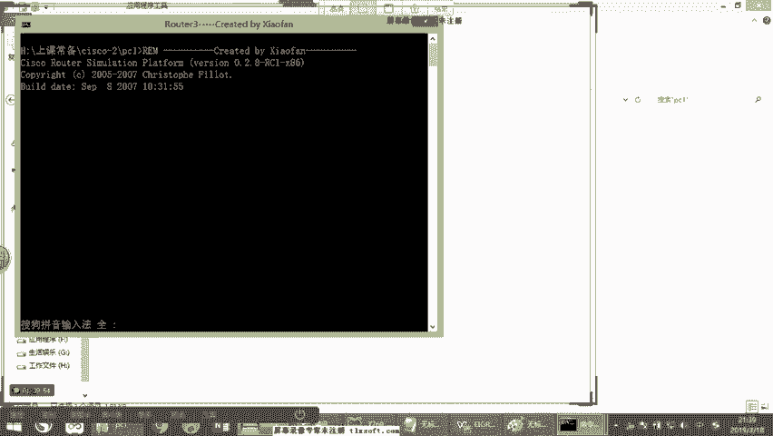
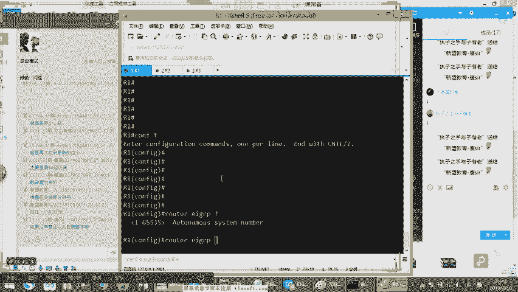
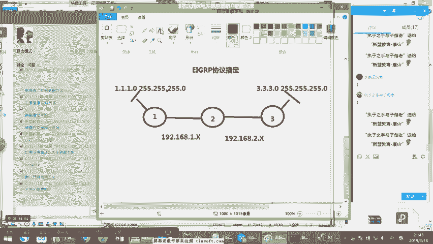
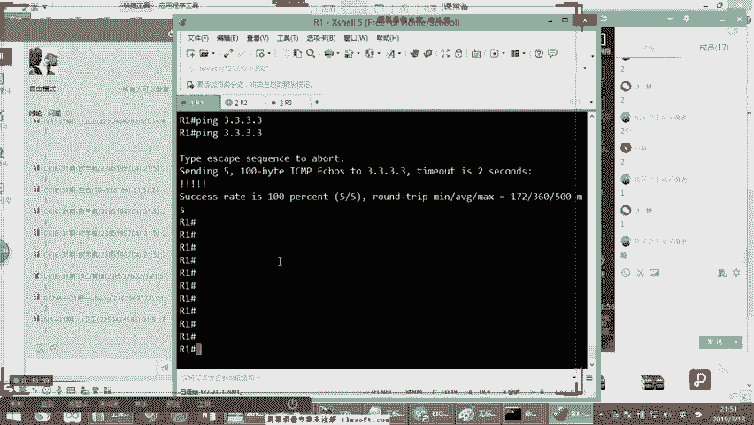

# 2019年度最新思科认证CCNA网络技术经典实战教学全集（最适合零基础小白的CCNA详解） - P9：思科认证CCNA网络基础第9节-EIGRP协议 - new盟的小狐狸 - BV1V4411J7ZP

Yeah。

OK好，开始我们今天晚上要讲到内容。那上节课的时候，康才给大家讲个什么方面的东西啊，告诉我啊，讲个什么方面的东西啊，说话我上一节课的时候讲个什么，讲个关于静态路由，大家还有印象吗？😊，对吧静态路由。

以及一些动态路由的区别，应该还有印象。那上节课的时候呢，刚er呢。给大家做了一个对比啊，做为一个对比，就是关于距离失量，是不是啊距离失量的协议，还有面部状态协议。啊状态协议这两种协议的一个对比。

上节课我们已经讲过了，相信大家应该还有印象，对吧？这个没问题吧。啊，那我们这节课的时候，因为ra这个协议呢是我们目前已经被淘汰掉的了。那上次呢才给大家简单做为一下讲解。我们只是简单做为一些介绍。

的话呢将不会在我们的课程里边出现，理解吗？哎不会在我们的课程上面出现，所以什么ra的话在我们的CIE的考试里边现在已经消失了啊，是我们不会再考这个ra了。那同时呢ra这个东西呢。

现在的话在我们的这个实际的项目中也就是在10年前ra就已经消失了，能听懂吗？O吗？ok好，这是我们ra所以ra的话呢先不在这个范围内那我们我上次依然说了一下给大家主要讲的是为啥被淘汰这个是我们上次主要讲的那这堂课我们讲什么呢？

这堂课我们讲主要围绕着我们的EIGRP这个协议来进行一个深入。好，那么在我们前期的NA阶段呢？因为我们现。😊，在N阶段，我们不会涉及到智能化的网络建设。那包括现路的热备份呀、双击热备啊。

这些事情现在是不需要在我们的基础部分讲的哎，不要着急。但是呢你说老师静态给我讲完了吗？没有？😊，我下次后期的话会在中级课程里面给大家继续讲静态，明白了吗？啊，我们继续围绕着静态继续开展啊。

那我们先来横向的看，那么包括EIGRPOSPF等等这些协议，他才讲完了之后，后面还会再讲，能听懂没？啊，那我们来看一下EIGRP这个协议啊。😊，EIRP我们知道它是一个动态路由协议，对吧？啊。

其实什么叫EIRP啊？这个东西叫增强型的啊，增强型的哎，内部网关路由协议。我们要搞清楚增强型的网关。这什么叫增强型的？原先有一个协议叫IGRP。😡，这个IGRP啊是EIGRP的前身。啊。

那后期你做了一些升级，升级到了EHGRP。但是现在你们在工作岗位是看不到HGRP的10年前我在项目上见过OK啊，我在项目上见过一次IRP好。😊，那作为EIJ这个协议呢，我们要搞明白这个协议呢很优秀。

它是一个私科私有协议。在后期呢被开放了，也就是说被开放之后，网络上的其他厂商，其他品牌的产品也可以用了，明白了吗？啊，都可以用了，但是网络技术啊，网络这个行业啊，是一个递进相对于慢的一个行业。

我给大家讲讲为什么。假如说我们说不要说更早啊，假如说三年前的一个网站，那我们做出来了之后，到三年后的今天你再来看它就过时了。你要重新做好，那早期呢我们做网站的时候呢，可能是动态的。到后面的伪静态。

到后面的H5等等，它的技术在翻新，但是网络就不会，为什么是因为网络技术的话，一旦网络被构建起来之后。😡，只要能满足当前的业务需求，那么实际上他不需要更换。那作为甲方也好，还是我们的客户也好。

他是不愿意浪费成本继续去做网络结构的更换的，能理解吗？明白稍不意好。😡，所以在这是我们说当天看到的一个点。所以往往呢在我们的环境中，最早期的时候，由于我们的OSPF这个协议。😡，被普及了。被广泛的应用。

好，所以呢导致后续EIRP即使被开放了，也不被很多厂商接纳，理解了吗？啊，很多厂商是不接纳一个新的协议的好，所以我们现在还是看不到太多。😡，但是呢有没有这用的呢？告诉告诉你有的。

假如说很多银行的网络环境下。😡，啊。假如说包括像我们说一些外企的网络。😡，他们都会用EIRP为什么是因为他们是一水儿的思科产品。😡，好，原因很简单啊，你说老师银行现在不都是用华为的吗？

counsor告诉大家，希望你们注意听啊。😡，华银行啊这种金融领域啊，它其实是不差钱儿的。😡，那么他在整个应用产品的时候，他追求的更多的是什么？是稳定性。稳定就是说它不能随便的宕机，不能随便的断断网。

明白刚斯意思呀？啊，它不能随便宕机。那么这个时候就出现一个问题，就是说于是呢很多时候的话，在我们当前的这个这个环境中啊，尤其是很多的商业银行，他用的都是思科产品，你说老师不很多银行都换了吗？五大行。

现在受国家领导号召，华为的产品有的多，很多小商业银行，思科产品还是很多，明白了吗？明白你看到shop亿了。😡，好，接着说啊，那么这个时候的话他们会在什么呢？会在总行与分行之间。基于我们后面要学到的。

咱后面到IE阶段，咱们会学到专线服务。😊，在基于专线的服务之上去跑协议。跑的这个EIGRP跑的非常的多。OK它是ED化的，理解了吧？EHRP能听懂吧？ED化的去跑这个协议。好，别着急吧，先注意听吧。😊。

啊，那么在这个时候的话呢，我们说E该加密这个协议的话呢，其实最大的一个优点就是它的收敛速度非常快。好，我们要搞清楚什么叫收敛速度。上节和csor从协议架构上给大家讲了一下。

我说有没有某种概念说什么距离适当协议好。😡，内部状态协议不好，有吗？有这种情况吗？告诉刚才有吗？没有吧，没有这个概念，什么距离质量好，外部状态不好，没有这个概念吧。明白刚才意思没有？没有这个概念好。😡。

这个重新进一下啊好，对吧？所以在这个里边的话呢，它各有利弊。而EIGRP的一个最大的一个亮点是收敛速度快。那么收敛速度快什么意思呢？就是说这个设备啊一旦出现更换，一旦出现故障，进行一个链路的恢复。😊。

还有一个是我们说到的切换的速度非常快。叫收敛速度快，所以收敛是什么概念？就是一旦出故障了，能不能快速的恢复和快速的切换，我们称之为收敛。听明白了吗？明白看下边一来。😡，嗯。啊。

这是EIGIRP的一个特点。那么作为EHRP呢，我们就要思考一个问题。上节课我们学到两个概念。EHRP因为快记住是一个协议最大的优势，请大家一定要注意，快是最大的优势。啊。那么在这个里边呢。

我们就要思考清楚两个点。第一个这是上节课康子提到一个叫管理距离。第二个叫什么叫度量值。😡，啊。管理距离和度杠尺这两个点。那我们说管理距离跟度钢尺有什么区别嗯。😡，光位距离是个什么什么一个功能啊。

出厂自带的就是我这个东西只要出厂，只要说唉我这个东西从产品生产出来。好，自带它就有某某一个固定的一个数值。😡，这个每一个协议不同的协议，把管理距离的数值不一样。这个管理距离康子告诉你们。

它就跟那个优先级是一样的。明白了吧？啊，明白了，刚才刷了一啊，跟优先级其实概念一样，只不过这个东西呢它是越小哎越好，很简单是吧？越小越好，而我们的度量值呢是个什么鬼呢？康子告诉你们度量值这个东西啊。

是说在我们的一种协议。😡，协议的情况下。好，此时呢要进行两条链路的一个比较。的比较。假如说我现在上面这个管理距离是什么？是我现在呢从一台设备。😡，从什么两个不同的方向。接收到的条目。

这个条目呢它是相同的，它是一样的，它是一样的条目。那么这个时候但是来自于不同的多个方向，听明白了吗？不同的多个方向。那此时但是由于不同协议的，所以此时我们会比较什么？😡，比较管理距离。能听懂吗？啊。

那这个时候跟我们的UC这个个度量值没有关系啊，完完全就比较管理距离啊，而我们的度量值呢是什么？是说我同样在一种协议下两个条不同的量路的比较。假如说我依然一台设备从两个方向看到有？接收到是吧？

相同的路由条目。😡，但是来自于一个协议。听明白了吧？来自于一个协议。😊，好，如果我们来自于的是一个协议的话，哎，你们回答conor，这个时候的话它还比较多纲什吗？😡，啊，还比较这个这个是关理距离吗？

不比较的吧，因为光谷距离它是一样的，能听懂吧？哎，对，非常好。所以这个时候要比较什么豆浆水。😡，能听懂吗？能理解吗？明白上边一来啊。😡，咱们接着说啊。搞明白设备是怎么样选择的。😡，对吧怎么样选择方向的。

这个非常重要，听明白了吗？好，那么这个时候的话，我们要搞明白EIGRP的管理距离是多少呢？😊，是我们的90这个数字，请大家记下来是90啊，EIGRRP的管理距离是90。😡，啊，这是一个固定数值。

没有为什么啊，出厂自带老师能不能修改呢？刚才告诉你们可以修改，这个值是可以改的，没有关系，能理解完啊？哎，可以改。😡，那我们的度量值是什么鬼呢？度量值的话是EIGRP的一个内部计算的一个算法啊。

这是一个参考的一个标准。好，这个参考标准是什么？EHRRP是一个复合度量值。😡，在参考什么叫复合度钢池呢？也就是说它参考的项目很多，哎，所有的协议的光修能改吗？都可以改，所有的都能改，明白吗？啊。

它参考5个值记下来，它是5个参数啊，5个参数的一个合集参考。哪5个参数呢？第一个来说是带宽。第二个是延迟，第三个是可靠性，第四个是负载，第五个是MTU记下来。😊，啊，这5个纸。

那么在这个里边这五个值在默认情况下，它只参考带宽延迟，理见了吗？默认情况下，它只参考带宽延迟。好，接下来。😡，带宽和延迟默认只参考这两种啊，那其他的会不参考呢可以参考吗？可以参考没有关系啊，参考的越多。

那最后总数越多。那其实康告诉大家是这样啊，就是说其实呢参考可靠性和负载价值不太大MTU的价值也不太大。客观跟你们讲实话，理解了吗？啊，最主要，所以这是为什么说它默认只参考带宽和延迟啊，这两个值啊。

它是要参考这两个点来计算出来的一个叫复合度量值我们一般俗称叫EIGRP中的metric理解了吗啊，我们这叫metric这个值。😊，好，没问题了。O吗？O看到下波一来啊下波一上来。😊，啊。

那么这个时候的话我们来看一下啊，我们来看一下关于EIGRP里边的几个点。好，康子接下来把EIIRP打开，我们来看一下PPT里面的一部分内容，防止我们讲漏掉了是吧？😊，虽然这点东西我已经讲了好几百遍了。

但是我们还是注意一点。好，稍等一下啊。😊，Yeah。OK好，看到了？没问题啊。那我们可以看到一个点啊，那他们PPT这说什么呢？说EIGRP这个东西啊，叫做平衡混合式的物流协议。

请大家注意看什么叫平衡混合式的呢？就代表说这个EIGRP这个协议啊，看到EIGRP这个协议，它是一个什么呢？就具有链路状态的一个特征。😊，也具有是吧？距离矢量的。特征。啊，这个怎么理解呢？算了。

你们还不要理解了，这个还没有没有什么管用，这是属于什么呢？这是属于斯科吹出来的一句话啊，我给你们大电话来解释了，注意看他所说的是EIGRP怎么牛逼呢？就一个是它支持叫闪速更新。😡，更新速度很快。

理解了吗？闪速更新好，而且的话呢它支持什么叫增量更新。😡，哎，什么叫增长更析呢？就是说它不会什么呢？不会进行周期冷行。记下来。😡，不会周期更新条。这是什么逻辑啊？同学们闪速更新。

就是说我这边一旦有收到新的条目，我在第一时间马上就会把我产生新的条目发给对方。😡，叫闪速更新，听明白了吗？明白给看shop e来啊，这个叫闪速更新。我一旦接收到，我在第一时间我就会把这个条目发给对方。

叫闪速更新。增量更新什么呢？什么叫增量更新呢？就是我一旦产生了新的条目，我并不是把我所有的都给你假如说我现在我这边有1000条。那我现在增加两条变成100两1002条，1千02条。我更新的时候。

不是直接给你发1002条，而是只给你发新增的两条叫增量更新。听明白了没有？能不能理解O给看shop e来啊。😡，它依然什么呢？做路由的更新，就是说它依然更新的是路由表啊，大家把这个点记下来啊。

它不会更新内幕的状态，它只会我我这边新产生的路由条目，我把新的路由条目发给对方啊，大概就是这样的一个意思，OK吧啊。😡，O。那么这个下面这句话没什么你管用啊，看下面这边。

E加RP的话呢是吧可以支持我们刚才说的这个计算的公式，复合多纲值吧，通过复合多纲值计算出最优的路径，明白没有？计算出最优的路径。那更新的条目中呢包含过我们说的掩码。😡，支持VOSM啊啊支持什么逻辑啊？

就是说我们在更新条目的时候，注意看更新条目的时候是支持VRSSM的条目的。打个比方，我们按常规来说都是属于杠8位的条目，-16位条目，杠24位条目，对吧？这是我们常规的路由条目吧，能听懂吗？对吧？

这是我们的25。25。25。0是吧？这个我先先写的一个杠8的啊，第二个啊，杠16的。😊，啊，杠24的对吧？常规的那也可以吃什么呢？也可以吃这样条。😡，128能理解吗？25。25。25。

192okK25点点25。25。224，能听懂吗？255。25。25点和240等等。比如说它可以支持这样的更小的网段更新。😡，这没有什么稀奇的这是很正常的OSF典型。😡，这么说能听懂吗？明白刷波一来啊。

听懂刷个一，没听懂刷个2啊，咱们一点一点来。好吧。好，咱们这堂课的重点就是我们说到的。😡，这是我们现在说到的哈一个。😊，EI加RP明白吗？好，OK好，咱们接着说。😊，那么这个时候的话，我们接着往后看。

😡，好，我们先往后说。😊，啊，那么在系统里边呢，它里边说到一个废话，叫具有相同自制系统号的EIGRP和HGRP可以无缝。哎呀，这里面废话太他妈多了，这就是刚才为什么不用不想用PPT原因，我要锤桌子了。

现在啊我要撞墙了，为什么呢？是因为这样的，这个EIGRP啊，它其实是有一个什么呢？我告诉你们，其实它有一个一个自制系统号，什么意思啊？什么叫自制系统号呢？😊，啊。刚刚给你打电话了，什么叫自信哈？

就是说他这个自信的话呢，这是一个编号。😊，这个编号呢就是说我们如果想EIGRP这个多台社呀，要想彼此之间建立关系。所以看啊这个关系咱们一般俗称叫邻居。你们记住啊，其实在你们学习各种协议里边。

一般都叫邻居这个词来形容，不能叫搞对象，明白了没有？一般都叫邻居啊啊啊，那么这个时候的话，他们彼此能建立起来这个邻居，通常要求是有相同的编号，这个编号呀，你可以把它想象成。

就是我一旦启动一个EIGRP协议。😡，那么我就需要开启一个编号。好，OK这个编号必须一样才可以。😊，那他说的什么意思呢？就是我们的EIGRP假如说左边仿左边的网络是EIGRP右边的网络是IGRP。

然后这个呢两个设两边呢可以自动的哎自动的啊就相互的融合吧，明白了吗？一看是一家亲，听明白了没有？明白也看到shopE来啊，遇到老乡两老乡遇老乡两眼可帮忙明白了吗？明白shop波E来啊。😡。

两边的墙你自动传过去了，EIRP条目传给了HRPIGRP传给EIRP为什么说废话呢？是因为他们HGRP根本就看不到，这都是废话，明解了没有啊，但玩你们知道，你们知道就可以了啊。好，接着过吧啊。😡，好。

那么我们来大概看一看啊，上面次都没有用过吧啊，真的没有用。counsor，你放心，你们放心有用的东西，cosor百分之百给你们讲理解了吗？不光是项目，即使考试有的，我会告诉你们。

如果考试考不到工作根本见不到，你听都没必要跟听历史一样，能理解吗？啊，啊，那么其中的话，我们不得不说一个什么点呢？说一个EIGRP的这么一个东西呢，是一个基于它一个内部算法，叫做DUAL的一个算法。

请大家记下来。😡，什么叫DOL算法呢？这个东西叫做弥散更新算法啊，接下来啊弥散更新算法。我们一般叫它什么叫扩散更新算法啊，这是我们一般说叫DUL我们去形容这个一个一个协议啊啊，叫DOL啊。

那么这个DUVL这个玩意儿啊啊，它怎么弥散怎么扩散呢？来这个conor讲一下啊。😊，我们首先得先从什么讲呢？先从它的一个备份链路的层面上开始说起。😡，什么叫备份的面目？别着急啊。

我给你们先看看那页的PPT哎，看一下这个。😡，那首首先呢我们来注意到一个一个词啊叫什么呢？叫做继任者。请大家记下来啊，一般我们说继任者这个词。😡，我们一般叫后继战。啊，继任者一般叫后积善，别着急。

听我想。😡，听我讲听我讲完，你都明白了，理解了吗？啊，别着急啊，我现正在说继任者是什么意思呢？就是说我到达远端设备的最佳的路由，用于转发路由的啊，转发业务的这个路由设备存在的路由表，我们一般叫继任者。

😡，我想打个比方啊，咱们讲画画个图。😡，你们就专心听我说，我告诉你，我教你们都是有用的，知吧？没用的东西，你们不用学，没必要有这个时间来讲别的对吧？课单一点都不少啊，好加一下一个2个。😡，3个。4个。

5个。没有搞。好，能题吧？好，我们把这个个设备呢帮帮帮，我们就给它连到一起了啊。😊，好，我们把它连到一起。😊，好，OK连到一起之后，我们这个时候我们开始在我们的这边起那么一个网段。

请大家注意看这个网段是什么？假如说我们说这是一个。要去的目的段啊，打个比方我们叫100。1点1点几的这个段OK吗？好，杠24的这个段。然后呢，在我们的几个设备上，分别是我们的路由器的一。

路由器2路由器3路由器4路由器5路由器6，请大家注意听啊。作为我们的工务器123456呢，我们全网运行的EIGRP。😡，并且我在上边和下边的带宽。😡，是一样的。什么意思啊？整条每一根线都是100兆贷宽。

😡，明白吧？每一条线都是100兆带宽最近。那么在这种情况之下，你们告诉我作为公信一来说，我现在走的是哪边？😡，我先走哪边说出来打到公屏上。😡，我现在走的是哪边？😡，哎，非常好，123对不对？

我现在走的是123。😊，备份线路走哪边？😡，备份项目走哪边？😡，14563对吗？这是我的备份项目。on好，非常好啊。14563okK好备份项目。😊，那等于我优先走上边再走下边啊，那我最优的这条线路。

注意看最优的这条线路的下一台设备。😡，路其亚叫做后继站。记住了吗？记住吗？也叫我们说的叫继任者。😡，啊。最优的线路的下一台设备。从路由器一上看，哎，从一上面去看，此时谁呀？二就是继任者，后继站能理解吗？

明白了？明白，稍边一个。😡，啊。啊，没听到啊，然后呢备份项目，所意看另外一个点叫可行继任者。😡，理解吗？可行后计算，什么叫可行后积啊？备份项目，你看14563上面线断了，走下边对吧？备份项目就是撸取4。

😡，好，我们一般叫什么叫可行后继战，也叫可行继任者，没问题吧。啊，这个是我们的备份的设备。听懂了吗？听懂给他子上边一个。😡，好，没问题啊，咱们接着说啊。😊，好，这个时候我们先看到两条继任者可行，继任者。

后继战可行后继站，对不对？好，nice。那我们这个时候我们接着说啊，我们接着来看。此时呢我们就要提到一个问题了，请问在这个过程之中啊，怎么可以满足可行低任者呢？😡，怎么能够满足呢？别着急，注意看啊。

我给你们看看这面有没有。😡，啊，这个边还还没有是吧？啊，这个边还没有这个条啊，没事，我跟你们说吧。那首先我们先明白一个词叫什么叫可行距离。什么叫可行距离呢？注意看啊，最优的线路，注意听，最优的线路啊。

到达目的地的全程距离叫可行距离。😡，啊，明白了没有啊，从我这台设备到达目的地的全程距离，我们叫可行距离。假如从我们的路由器一上来看，一到达100。1。1。0这个网段啊。

我们的这个全程的这个距离算出来的这个metricric啊计算出来的。😡，metricic就是我们说的什么计算出metric就是我们说的什么？这是我们说的叫可行距离。😡，记住了吧？明白了吗？明白。

给康子下班一来。😡，啊，这个我们叫可行距离。好。那么这个时候的话呢，此时看着啊，注意看啊啊，那么在这个过程之中啊，在这个过程之中，我们说这可行率是怎么来的呢？是由民居报告的度量值加上报告此路由的度量值。

别着急，注意听，很简单，民居我我怎么我从路由器一上，我从路鲁由器一上，我怎么算出来全程的。😡，高像头怎么算全程的？肯定是路由器2看到吧？肯定是路由器2先报告出来。😡，到达100。1。1。0的这个距离。

假如说我们这个距离叫A。好，然后加邻居报告我们之间的距离，一跟二之间。😡，好。好，我给你们换个颜色啊啊，邻居报告杜良值。好，这是B。注意看啊。然后呢，我全程的可行距离什么意思呢？就是我们说到的叫什么？

叫A加B。😡，叫全程距离，听明白吗？这个概念特别傻啊，能不能理解OK吗？okK给看到刷刷波一来。😡，好。所以我们一般说全程的距离叫可行距离。可行距离咱们俗称叫什么呢？叫做FD记下来。😡，啊。

叫faceasable distance啊，叫可行距离。从2到100。1。1。0的距离，我们一般叫什么叫邻居通告？邻居通告。对于路由器一来说，可不就是邻居通告吧，对吧？可不就是邻居通告的到达目标的距离。

我们一般叫什么呢？叫做AD记住了吗？叫通告距离。😡，记住没有？记住给汤总上个一来叫通告距离好。😊，所以说到FD等于什么？AD加上1到2的距离，这就叫FD。😡，搞清楚吗？告诉我是不是很简单，并不难啊。

注意听啊，一点都不难啊，一点都不难。😡，好，没问题没问题是吧？行。但是我们其中呢有这么一规则，别着急啊，专心听我说这这个规则其实真的是你们学来学去，我个人觉得最重要的一部分。😡，等一下。

刚才现在给你们打开我那个课件儿。我把课件打开，然后我把后面的中期课的有一我再有1个PPT给你们看一下。啊，假如说给你看一下这个。因为后边咱们还要选1个ESRP里边有那么一条信息，你们现在有必要先知道。

好，稍等啊。😊，稍等。啊，ok看到。😊，他必须要满足这么一个条件啊，其中有那么一个条件。😡，这个条件什么呢？叫FC条件。这个FCC不是个技术点啊，是1个FC条件，这个叫可行性条件，叫可行条件。

叫邻居宣告到达目标网络的距离必须小于本地路由器到达目标网络的FD。😡，好。根么也只是说是这样的一个逻辑，注意看啊，有这样的一个逻辑。看我这个图中啊。😡，这句话什么意思？我把这句话的给你们复制下来。😡。

好，我把这个给你复制下来。好，我们看完这句话就行了，我们不用看太多。😊，好，这样的一句话。那么这样一句话说的什么意思呢？就是说你现在不是可行后继战吗？你不一定是可行后继战，明见了吗？

你不一定是你说老师咋不是呢？他不就在这摆着嘛？这不是备，这是这不是备份项目吗？注意看你想你想不想当可行后继战，你跟我说，你想不想当你要想当可行后继战，你要满足咱们这个条件才能当咱们这个条件叫什么呢？

叫做FC的条件，听明白了吗？哎，你要想当想当你就得给我满足这个条件，要不你就不要给我当。😡，好，那你什么条件呀？你说一下好，跟选村长似的是吧？你满足什么条件呢？

邻居到宣告到达目标网络的距离必须要小于本地路由器，到达目标网络的FD打比方，我现在在1到100。1。1。0，这是俺的最优限目，对吧？这是我的最优限路，我这个最优限路的FD假设是多少呢？最后算出来。

打个比方啊，假设最后咱们算出来之后呢，是100行不行？这个数值，你知道老师啥值啊，m。😡，注意看啊是什么H的100是不啊？好，我算这个值。😡，你们谁开麦了，小心你们的小兵命限告啊啊。😡。

上次有一个同学就是因为开麦，结果他跟他老婆正在谈情说爱啊，然后边谈情说爱，边听康子讲课，结果让我们现场直播了啊，然后的话我就马上听这个讲课，专心致志都听他来讲，明白了没有啊？所以大家一定要注意自己。

不要开麦，好不好？小心小逼密别泄够啊。😡，啊，你看这样一下马上就没有人开麦了。特别好啊啊，我们接着说。那么在这个过程之中，我们可以看到朱意婷啊，此时比方说我们看全程最优的线路，这个SD我们叫100。😊。

啊，假如这个数值叫100，然后呢，你说老师我怎么能当这个可行混计站呢？别着急啊，别着急，你从你的路由器四注意看你从你的路由器四到达目标网络的距离。😡，所以看看啊，到达目标网购的距离，这个距离叫做什么呢？

叫做我的备份邻居通告到达目标的距离。😡，听明白了吧？我的备份邻居通告到达目标网告的距离。😡，这是从哪到哪儿呢？这是从我们的路由器。4。😡，到达个我们的100。1。1点评的，所以听到过了？没问题吧啊。

看着啊。😡，那么这个距离呢，我的邻居宣告到达目标网购的距离必须要小于全程的FD。😡，就是说你下边啊。😡，4到100。1。1点美元，你必须要小于当前全长的。😡，你呀我现在当前全长的是100。

你从4宣告到达100。1。1。0。假设是99啊，咱们说从下边的mic是99OK吧。啊，我看一下到底是谁开麦了啊。😡，哦飞要哥让他给我唱一段，我到底看一看是谁。今天我跟你们说啊，我你们就有人听别人唱歌吧。

你们该我看看是谁给我开麦吧。😡，谁看麦了啊，是谁？😊，没有是吧，行没有啊。好，不要让我教到你啊。好，我接着说啊。😊，啊，那么这个时候的话。😡，从我们的邻居到达目标网的距离，如果算出来是小于当前的全程的。

😡，他就能够当可行后继弹。听明白了吗？先告诉我能没见不？明白就看到小波一改。😡，啊，能听懂吗？这什么意思？就是老师这个咋算的呀？跟带宽有关系，能明白吗？跟带宽有关系。你假说如果我上面的带宽都是一个G的。

我下面的带宽都是一兆的，你不用说你要下面都是一兆的，你下面算出来的肯定不行，你算出来的时候肯定大于上面全长的。😡，没错，是的，明白了吗？以及说白了他要确保一个逻辑，就是你的备份限路呀。

和你当前的主线路不能差的太远，跟选村长似的。一个村长假如说我现在的当前的咱们这个村长啊，这个一年呀给咱们村子里边啊，带来了多少呢？人均带来了1000块钱的啊，这个这个收入。

你下一个村长呢是吧下一任村长哎，你不能说带来的比他的低，明白这个概念意思一样，所以在这个里边呢就是说我下一面的路由器四算出来的到达目标网络的距离，不能首先不能大于当前最优的全程。我说这告能听懂吗？

我在假如跟说绕口令似的，烦死了，能不能理解？O刷波亿来。😡，好嗯。没题们，没听懂刷个2啊。😡，你说老师咋就不能放，不能大于他呢？我不明白啊啊，是什么意思啊，是吧？为什么呀？是吧？

为什么说他这个宣告的目标往购的距离必须要小于必须要小于它？为什么必须要小于它？因为他考虑到一个问题，我这个地方还有一段没有算，我还得加上这一段呢。😡，对吧我是不是下边还得加到这一段？

如果说你在下边到达目标网络的距离就已经大于我上边的全程了。我会觉得你根本就不用不用想了，你肯定是不靠谱，能理解没有？明白，刷波一个啊。😡，呃，越小越有市的，越小越好。好，那我们给大家打个比方。

假如设咱们举个例子，咱们把这个问题说明白好吧？我们举个例子啊，假如说这是谁呢？路由器一就是咱们的那个啊这个陈清秋同啊，白茶吧好吧，白茶同学啊，同学白茶同学先买手机。😡，白沙中间找他的一个朋友。😡。

问了一下手机，谁呢？😡，啊，他找谁问的手机呢？好，他这个时候找的冰糖问的手机。😡，啊，冰糖而且明天这个iphone多少钱一个呀？冰糖给他说了哈，我这个这个手机啊，我跟你说啊，很便宜啊，3000块。😊。

啊，3000块。啊。你们那边就是有人开麦，你们是谁在开麦，你们能不能告诉我，我求求你们，你们能不能不开麦了。😡，我都快气死了，你们到底谁在开麦啊？😡，啊，你们到底是谁在开麦，我是不明白了。

而且这上面为什么这里有一个一个男孩子，还有一个女孩子合照的头像啊，是吧？我首先看上去这第一眼他也不是我老婆啊。第二的话这个男的也不是我呀。😡，是不是？怎么可能啊？我看，你们这是谁在开麦呢？😡。

你们可逗死我了啊。是谁在开麦？好，谁开卖了？😊，没人看到。好吧。好吧，你们检查一下好不好啊，你们自己检查一下啊，你们检查一下，你们下边这不应该是自由模式，明白了吗？你们这要应该打开之后是什么？

你们这应该是这吧。😡，明白了吗？能不能听懂我现在是自由说话，你们那里应该显示是NF2说话，明白刚刚的意思没有啊，你们那要是没有人说话的话，那不可能我这边总有声音啊，邪门了啊，上了算了，接着说吧。😡，好。

好，我我我把麦序重新调一下，现在OK了吗？现在OK吗？O给他们刷个一来啊。😊，我把这个同学给换下去，这是谁在给我这个发言啊？行行行好，就这样吧。😊，啊，咱们接着说啊，假说。😡，注意看啊，假如说。

在这个里边呢，白茶想找冰糖买一部手机，看到？冰糖是说的这手机3000块，这样吧，我卖给你是4000块。😡，啊，等于从我们的上点加到一起是4000块。注意看啊你们告诉我这个3000块是什么啊。

这个3000块其实就是咱们说的叫AD告诉刚才对吗？啊，就这个东西能理解吗？就是AD哎，就是说我这个哥们儿，我进价3000，这不这个进价3000不就相当于是冰糖这个同学啊，他报出来的价格。

说我进价3000是吧？我收的我也来3000，我卖给你的加1000，我卖给你白茶加1000啊，4000看到没有？等于呢白茶从最优的线路，当前的FD是多少钱，4000块，听明白了没有？明白吗？

ok下波一来4000块啊。😡，那我们再来看下边。😡，下边是我们的备份项目吧啊，我我再问一下哥们儿是吧，问谁呢？这个哥们儿假如说这是想去哪同学好不好啊，想去哪想去哪？这个同学呢说哎，你那多少钱啊。

说哥们这我呢进价呀4000块。😡，啊，我进价5000块。😡，好。这个时候你告诉我，他进价就5000块。你跟我说白茶还会从他这买吗？哎。😡，白茶还有从那的买吧，还会吗？😡，会吗？不会吧，连拷位都不考位。

为什么？是因为他自己从路由器4，就是我们说的想去哪儿这个同学说对，到达目标的看到没有？到达目标的这个距离就是5000块，就已经大于了我现在直接找白茶买的4000。😡，这还不算你给我加的钱。

你就说哥们儿咱俩关系好，我给你加500。😡，啊，我给你加500块，那我到手也是5500啊，我肯定不买你啊。明白这个意思没有？哎，所以但是我问大家这样一个问题啊，假设说咱们这个想去哪同学呢是这样的哈。

想向同学说吧我这个东西啊，这个进价呀啊是3999元。😡，好，你刚告诉刚手，这个时候的他能不能成为备份的啊，能不能成为备份的？😡，可可以成为被方码，先告诉我可以吗？😡，可以成为可行货基账吗？能不能行？

周几天啊依然可以，只要它小于什么？当前的FD就可以了。明白了没有？明白看shop波一来啊，只要它小于了当前的FD好，我们接着说，那这个时候你说他有可能干嘛呢？兄弟啊，我就给你加五毛钱啊，我五毛钱。

你做从我上来3999。5块搞定。😡，明白了没有？这个时候你看它还是下边还能走，理解了吗？明白shopperE好啊，这个太犟了是吧？好，能听懂吗？这实是不是一个逻辑。所以康给你们打这个比方呢，是什么呢？

从我的邻居路由器到达全程的距离必须小于当前的FD听懂了吗？明白了吗？这个叫什么呢？叫做可行性条件。😡，啊，可行性条件。没问题了，nice啊，非常好。😡，你说老师，那我这个又是后继站，又是可行后继站。

你这个到底有啥用呢？到底是说个半天，对吧？你说说你说个半天，我明白是明白了啊。好，就是能不能成为主项目和备对项目。那具体的作用是什么呢？是吧？咱们说个半天，你作用你没有说明作用啊？老师，别着急。

这个事儿有啥用呢？咱们就得从这个表说起。😡，什么表呢？注意看啊，这个EIGRP协议啊有那么三张表。😡，啊。三张表用法不一样。这第一张表就是咱们说的叫什么叫民居表。😡。

假如两台设备都运行了EIRP我两台设备呢都运行完了之后干啥的呢？我们就建立了一个邻居关系。刚才刚才已经提到了，它就会进入到我们的邻居表，听懂了吗？它就进入到邻居表。好，别听啊好。😡，别着急啊。😡，哎呀。

我都给你打个比方嘛，如果真的是五毛钱给他，那他不就变成什么了？你告诉我，如果这五毛钱的话，它上面就下边就变成主线给我了，明白了吗？明白了吗？明白说波一来啊，那打个比方，这他认认真了啊好。😡。

第二个什么呢？第二张表叫什么？叫拓扑表。记下来。😡，第三张表叫什么？叫路由表？😡，好，那么这三张表有什么用呢？大家注意看啊，其中最牛逼的就是我们说的路由表。😡，为啥呢？这个路由表呀。

它是一张最终的决策表单。😡，哎，别管怎么走，你这个数据最终一定要听这个路由表的。😡，你必须要停测这个表。😡，你这个数据过来了之后，你查要查什么，查路由表。

虽然上节课刚才已经给大家讲过个CEF表这个问题了，对不对啊，咱们已经讲过过这个问题哈，没错啊，他一定要根据C也表呢也是CE路由表出来的，所以一定要查路由表。😡，那么能满足古表的呢，也是只有最优的项目。

😡，才会被放入。路由表。明白吗？是最优的。😡，你说老师我也挺油的，行吗？不行。😡，明白了吗？啊，斯坦福大学知道吧？最牛逼啊，OK最优的。😊，那老师那第二个表，这个拓扑表呢看到？拓扑表是什么？

拓扑表呢就是一张备胎表。😡，能明白吗？叫备胎表。什么叫备胎表呢？就是说我这个里边啊所有能到达目的的线路的路由。😡，我都放入看到家都放入图谱表。那么比说在我们的这个里边，看到啊，在我们这个图里边。😡。

123会放到路由表中，这个大家知道对不对？好，123这个方向的路由会进到路由表。😡，那拓拓扑表呢拓扑表的话是123，还有1456啊，1456。对3这个两条线路注意看啊，这两条线路都会被放入我们的拓扑表。

😡，能听懂吗？明白下波意感啊。😡，因为什么这个备胎表啊里边就所有的人哎，他他只要能到的都在里面放着。😡，你说老师这也太不挑食了吧，别着急，康奋告诉你们，他其实有一个规则。😡。

它放入到拓扑表里面的一个规则是什么呢？是必须要满足FC条件。😡，听明白了吧？你要满足FC，你才能够放到突步标点。也说白个是这样，他是在安排备胎，但是备胎不能太差。😡，明白了没有？

明白给cosor刷波一来啊啊这个意思。😊，啊，备胎不能太差。那这么回事，理解了没有？好，所以在这个过程中，它必须要满足过这个FD的条件。如果不满足FC的条件。😡，注意看啊，别着急，先听。

那么下边这条线就不会被放到拓扑表里边。😡，先告诉我记住了没有？别着急，先给我听，一会儿我会抽到啊，能理解吗？明白，稍微意外啊，对吧？所以这个时候的话，等于它其实如果满足呢就放不满足呢就算啊。

必须满足X条件啊。😡，那么满足F1条件呢，如果它满足了等于这个就是主，对不对？好，这是什么呢倍。😡，是吧好，组合被。😊，那么在这种情况之下，一旦当我们的主线路发生了中断啊，大家注意听啊。

一旦当我们的主线路发生了中断。😡，此时它会马上瞬间切换到，所意看瞬间切换到备用线路上。😡，明白了没有？这个是我们说的EIGRP的坏的原因。😡，快啊，理解了吗？明白啥不意思啊啊，这么回事。😊。

这就是我们说的组合被。啊，组合贝瞬间没有均不按秒算，按牙秒计算，理解没有啊，只要一段瞬间切换啊现成的。😡，好，你明天就去人家了是吧？好，所以这个时候这是我们现在看到什么呢？

这个是我们说的EIGRRP的一个备份机制。所以你可以看到FC的条件。😊，对，是跟什么？是跟我们的备份机制挂钩的。告诉我听不明白了吗？小伙们，姑娘们明白给康er刷波一好吗？啊，刷波一上来啊。好。😡。

完事个吗？没有这牵扯的一个问题啊，老师。😡，那我要是不满足呢，我这个备胎条件不满足是吧？那你跟我说这个时候他还切换吗？你假如说我上面我下边呀，我不是3999啊，我下边就是5000。😡，明白了没有？别。

我下下面就1万，你知道吗？哎呦你说我这是多贵呀，我一万是吧？😡，你跟我说，这个时候的话，如果上面断掉了，他会不会切换说话会吗？会吗？会不会切换呀？那他会切换到下边吗？

康斯告诉你也会为什么你实在找不到的时候，你肯定不挑食啊，是不是你还有选择的机会吗？你还有选择的权利了，你是不是你就知足常乐吧。你是不吧啊，对对对对对，明白了没有好，是的，所以这个时候的话。

你就赶紧找一个就行了，能理解没有啊，所以此时怎么办呢？如果发现实在是没有什么没有备胎了，于是接下来别着急，接下来。😡，他就要想办法再寻寻觅觅，明白没有？这个路由其呀，就说这不行啊，兄弟啊。

我这个现在没有备用线可以走了，我没有备胎了，我要继续开始我的寻觅之轨啊，寻寻觅觅。我怎么寻寻觅觅呢？我就开始运行了我自己的寻觅大法。这个寻觅大法叫什么呢？叫做DUAL算法，叫做弥散更新算法，记下来吗？

😡，听明白了吗？哎，开始运用它的你看迷之微笑啊，迷散更新算法是吧？啊，当然这跟是迷迷知微笑有关系没关系，明白没有啊，它叫其实叫迷散更新算法，也叫扩展更新算法，能听懂吗？啊，OK好，然后开始继续寻觅。

那怎么寻觅呢？由于它实在是没有备用限目了。它就进入到了一种饥不择食的状态。😊，明白了什么叫机不得失呢？他就开始找他的认识的人，开始问兄弟啊，啊，你那边的话有没有人给介绍一个能听懂吗？给介绍一个。好。

他找谁问呢？接下来之后的话干嘛呢？你看啊他看了一下，此时巧妇单为无米之炊啊，我还有一个邻居啊，还有一个兄弟是路由器4，所以他就干嘛呢？他就去问，说路由器4啊，四哥呀，你那边还有没有人够介绍一个呀？

别着急。好，此时他开始运行我们说到的什么，叫做DUAL算法，对不对？好，他就开始给路由器四发送了一个什么扩散的查询，这个查询叫什么呢？记住记下来这个查询叫什么呢？哎，这个叫做qua查询。😡，明白的吗。

就开始查询。记下来。啊，那四哥呀，你那个那边有没有人给介绍一下？四哥说了啊，四哥收到消息之后，四哥说了，我给你问问啊，于是四哥看了一下自己的认识的朋友，还有谁啊，还有五哥是吧啊，五哥好。

他又给五哥发过去了，发啥呢？继续发送这个qual。😡，查询听明白了吗？继续发查询。五哥说，你等一下，我给你问一下啊啊，五哥又给六哥发过去了啊，来继续我们的扩散查询，还是快手查询。😡，能听懂吗？好。

还有插询。明白明白，啥回意来啊，贝哥呢也给谁呢？给三哥发过去了，是吧？好，继续查询。😡，啊，注意看。接下去。好，那我们这个边有一个问题啊。好，这里边有一个问题啊，同学们。好，那你们说如果在这个情况之下。

假设说我们的这里边的五哥啊，它连接着别的歌啊，假如说他现在的还连接着一个下边连接着一个一个谁呢？啊，我们一语连接着一个九哥是吧？啊，爱喝酒的一个歌好，这个时候他连接着一个九哥，你跟我说。

此时他会不会给九哥也发的查询呢？😊，会不会回答刚才，他会不会也给九哥发查询，会吗？会吗？会吗？哎，非常好，他依然会给九哥发查询，明白了吗？只要是认识的兄弟，他一律发送car查询，扩散啊，他就不停的扩散。

为什么扩散的越多，机会越大，明白了没有啊，你只有不停的问这个时候的话才有更大的机会，你能理解了吗？明白三er一啊好，啊此时vo戏三是吧？三收到了之后说哎，你别说我这能到理解过？我这能到六会发吗？会发呀。

只要他本地没有，他就发啊，他本地有他就不用发了，是不是这个道理吧？好，所以六的话又得三发三一看哟对啊，得我这有我能到啊，于是这个时候三给六发个一个什么呢？注看他回复的一个信息，这个回复的信息叫什么？

就一停这个回复的消息叫做re的回应消息。😊，回应。明白吗？叫rely回应。接下来。😡，那么此时三跟六回的六也给五回，看到啊，六位给5回。好，此时什么？好，这个时候你看这叫re回应。5呢也给四回。

听明白了吗？也给四回好，这个还是我们说的re回应。😊，好，四呢也给谁了，给一回哎，搞给一回一这边收没收到，告诉康斯收没收到，收到了。好，收到了吧。此时一这边说哟，终于找到了。

所以一这一边直接把方向做个一个切换，切换到个谁啊？切换到个我们的路由器四这个方向听明白了吗？明白给康斯刷波一，好吧。😊，理解了吗？这个叫DUAO算法。朋友的朋友的妹妹的闺蜜子的同学的发小太对了。

很有经验吗？小伙子啊，是这个意思是吧？😡，啊。啊，病情扩散啊，只要不是你失散多年的妹妹就好是吧？啊，咱们接着说啊啊，总是遇到失散多年的妹妹啊，等于啊，那么这时的话我们来看这个没问题吧啊，这个OK的啊。

那么在这个过程之中一直在扩散，是不是啊？这个叫什么呢？看到？哎，没错，通过这种方式运行跟我们说的叫DUAL算法没见过没有有点意思有点意思啊，你们赶紧我上课越来越油默啊，小伙子们啊，DUL算法。

大家先搞清楚好吧。😊，搞清楚了吗？搞清楚个吗？告诉我搞个吗搞清楚，搞清楚刷个一啊好。😊，那么在这个过程之中，所以你会发现其实EIGRP呢它它切换的并不都是很快。它的主线路呢该咋走咋走。

备份线路如果不满足，它是不会当备胎的。只有实在是饥不择时的时候，他才会开始找新的兄弟，重新给他做介绍，明白没有？哎，重新介绍，重新介绍，开始运行了什么弥散更新嗯算法是吧？好，开始重新介绍了，理解了没有？

啊，那么当他重新介绍的过程之中，路由器一啊，他并没有把条目删掉，他而是把这个条目呢给他暂时的置为个active状态。大家记下来。😡，叫活活动状态啊，叫做活跃状态。😡，啊，叫活跃状态，他没有删，理见了吧？

这智商active是干嘛呢？那等着我就看一看有没有回复。你要是说四哥也给我回复，说兄弟，没有，我这边真的没人给你介绍，我就把这个条目删掉了。那这个事儿真的没办法了，只能好好打光棍了，是吧？啊。

如果四哥回复有，那我就这个干嘛？我就不会宣布我是一个什么呢啊一个这个这个单身状态了。明白这意思没有？明白刷波一啊，OK好。😡，O。没问题吧。nice nice啊。好的，很简单。

那这次开箱的康教大家的一个什么呢？哎，别着急，你说老师呢这个过程是多长时间呢，是吧？怎么删除呢？哎，别着急，注意听。😊，EIGRP我先问一下大家，我讲到这能跟上吗？我讲到这里告诉我能跟上吗？可以吗？

可以给康哥shop波一来小波一上来。😡，可以吗？啊，OK啊。好，O。😊，那么这个时候的话，你们要搞清楚EIGRP啊，它是怎么样维持邻居关系呢？😡，是如何。维持和保证啊和这个检测民居关系呢。

通过一个什么呢？通过一个哈lo包来进行检测。这个哈波包呀就是一个探测包，用来检测对端是不是活着的。哎，稍等一下，讲的我肚子有点疼。好，没问题吧。😊，哈波包多长时间检测一次呢？每5秒检测一次检测一次。

每15秒注意停，如果对端啊没回复，没有哈波包没收到没收到哈狗包。😡，是吧然后这个时候干嘛，我就把我的邻居干掉。😡，能听到吗？从邻区注意看啊，收到的所有的条目全部删除。😡，明白了吗？啊。

那么你说哈哥包需要回复吗？其实刚才不需要回复，因为为什么？因为哈狗包这个东西它是周期更新的，周期发送的，每5秒发一次是吧？发一次，所以他不需要回应，反正我就等我就等你给我对方给我发，只要咱们俩是邻居。

能明白了吗？我就等你给我发哈波包，你要是15秒没给我发再5秒还不给我发，再5秒对不起，15秒的，我要先告你什么邻居失效，就像你每个月都不给你老婆工资是吧？这个月你没给你老婆，下个月还没给。

再下个月还没给你老婆就给你离婚了，能明白了吗？明白小不一到理已经，你一个月不给他还不至于给你离婚，两个月不给是吧？他就大不了让你跪搓板，给你扔到门外边，三个月对不起了啊，咱就再见了，明白没有？好。

这哈哥包啊。😡，没问题吧。没问题吧，没问题，给康总shop波一啊。好。😊，那么这是一个我们现在看到的一个什么呢？看到的一个检测机制。所以如果在我们这个过程中，一旦上面的线路发生了中断。我会检测15秒。

15秒之后哟发现对方真嗝屁了啊，他呦还真个屁了怎么办？这个时候切换明白了没有啊，进行切换啊。😡，啊，老师，那hello包这个东西是怎么更新的呢？这样好，大家注意听啊，在我们的EIGRP中，我说到这。

你们能跟上吗？先告诉我。😡，说有这告能跟上吗？能吗？能下波一来下波一上来。😡，啊，O嘛。好，那老师这个EIGRP的哈高包啊是如何更新呢？😊，记住它是通过我们的主播地址224。0。0。10进行更新。

老师为啥是主播？什么是主播？😡，为什么是赌播？为什么不是单薄和广播呢？😡，啊，首先我们先思考这个问题，为什么不是单独和广播？😡，注意看啊打比方。如果在这个过程中，我现在康s给你们简单画一个小图啊。

我们来看一下。这块O吗？请告诉我OK给康子shop波一啊，稍波一上来啊，咱们接着说啊。😡，好，假如现在我把这个给你们重新生成一个。假齿时。我呢现在这样的一个两个。3个4个。5个6个。一大堆设备。

我都给你在一个交换机上。😡，啊，看到啊，加40，我在我这个设备就是12345，没有，我们都连到一个交换机上。这个时候这是局网吧。😡，对吧？告诉我对不对？这是局域网吧，没问题吧，这是局域网好。😊。

如果说这是局域网环境下的话，我们局域网肯定是什么呢？肯定是我们是在同一1个IP地址段的。没问题吧，同1个IP就段OK啊。好，那么此时等于我们的所有设备，彼此之间都是邻居。😊，假设我要使用一个单薄更新。

那我是不是在我们这个环境中，假设我的V由T一这。😡，有一个条目需要更新。啊，我是不是会把我这个条目每一个人都发一份？😡，刚诉刚总对不对？我是不是每一个人都发一份的，每一个都在发呀，好麻烦呀，理解了吗？

每一个都在发，每一个都在产生一份单播最大的障碍就在于带宽占用率高，就相当于说你们知道为什么优酷啊，土豆啊，他们干了那么多年还不挣钱吗？他最大的成本是带宽成本，理解了没有？是因为你们平时从优酷上面。

我刚才告诉你，你们从优酷上面点播那些东西啊，点播看的那些视频，那都是单播呀。😡，那都是你在优酷上面的话，直接一对一的看，明白了吗？理解了没有？好，如果是这种情况下的话，它是非常消耗带宽的。

等于他要给每一个人都发一份。我们来想一想，假设我发一份的话是100KB。😡，那我这个时候的话，我每一个人我6个人，5个人，我就500KB啊。😡，我要550个人呢，理解了没有？能不能听懂明白下波意来啊。

所以他这个单薄更新就会非常占用带宽。😡，听明白了没有？别着急，你先不要管架构，你先不要考虑考是这个在什么企业网络里边啊，是吧？你看咱刚才现在跟你说的这个层次了吗？啊。😡，B站也是一样。

就是说B站也是单薄，明白没有啊，都是一样的。他们最大的损失是带宽成本，是大家一定要注意，带宽成本是最大的损失啊。😡，那么如果说老师我广播不行啊，广播多好啊？好，大家注意看，如果广播广播行了，可以。

但是如果在我的整个的局域网里边，我这个路由器3，假设说我这里边并不都是路由器。😡，这一边还有什么鬼呢？这边啊哎我告诉你们，还有PC。😡，听白冇这边还有 p c 。但是我这个地方有1个PCE。😡，啊。

我这个地方有一个什么呢？我这个地方呢有1个PC2，听明白了没有啊，这个地方有1个PC2。😊，认识啊PC2。这是1个PCR。啊。那此时你跟我说，我这个PC需要接收到路由更新吗？回答刚说。

我的PC需要接收到路由更新吗？需要吗？😡，需要吗需要吗？不需要我莫名其妙啊，我这个模西一呀更新广播更新。在我这个局域网呢，每一个人都收到了，结果导致我吃膀撑的我这个PC1和PC2也收到了。😡。

其实他们是电脑而已，他们根本就不需要收到更新，明白了吗？明白了康才下波一来啊，所以在我们这种情况之下呢，我们的EIGRP呢是通过主播，什么是主播呢？康s告诉你们，只有运行了同样的协议的设备。

才会监听这个主播地址。😡，这个主播地址呢就特别像你们收听广播一样。😡，收听那个radeio。知道吧？广播台你只有调频到99兆赫，你才可以听到99兆赫的内容。你调到106。8兆赫。😡。

你只能调到收到106。8兆赫，明白了吗？明白上边一个啊，所以它是一个什么呢？它是一个按组进行一个传播的。😡，我发的是发往这个组合地址。😡，啊，你们收的是监听这个主播地址。😡。

这个时候你们都可以收到这个频道，你们都可以收到这个信息，听明白了吗？明白上边一了啊。😡，很简单吧，不达吧。O。V似不明白什么叫V4吗？不如打个比方吗啊。😡，啊。是在同1个AS系统内规定用的是主播。

对不对？跟这个没有关系啊，跟是不是一个资制系统没毛线关系啊，不要这么去想，只不过EIGRO这个EIGRP呢要求的是AS号必须要一致。你叫吧要求自制系统号一址。明白了吗？啊，你们我不都说了吗？

你要不是一个自制系统，它能建立起邻居吗？是吧？问这个问题画蛇添足的问题对吧？不是一个自制系统能取上邻居吗？你告诉我能吗？😡，对这道理不成见单吧啊。😡，好，接着说啊。说到这儿告诉我能听懂吗？

可以听懂给看shop波一来啊，shop波一上来。😡，你们问这个问题相当于什么一样呢？相当于问conor老师啊，那你说这个是不是只有大象和大象能交配啊，这个大象跟蚂蚁不能交配。😡，这不是肯定的嘛？

大成的蚂蚁它不是一个戏好吗？明这过吗？道理一样，他建对不起邻居，根嘛就你建对不起邻居的话，他他怎么怎么怎么怎么怎么弄啊，明白了吗？啊，开始跟你说的还不够熟吗，是吧？😡，啊。双诉到手能听懂吗？

听懂稍波一啊。😡，给大家几分钟时间啊，我们说这个问题呢，一会儿我们又到点名时间吧。一会儿的话，你们的白杨杨老师要回来的话，要开始。😊，这个鞭打抽打你们了，是道吧？啊啊，又开始这个要点你的名字了。

明白吗啊？😊，啊。😀呵呵呵呵。😊，好，问直接问快点，咱们先把以上的问题搞清楚。😡，协议啊，我告诉大家一个秘密啊，钢琴跟小咪咪啊，你们要想把这些协议给我记住怎么办？回去之后给我看，回去给我翻笔记。

回去一定要给我听补平，听明白了没有？😡，能明白吗？一定要给我听不平啊，我再三告诉你们，你们要是不给我听不平，你们后边一定会后悔的，知道没有？😡，啊。最后要走下面的路，为什么一上来不把它加入到备胎中？😡。

而是优先级放低点，也不用再还要重新找一遍啊。哎。我明白你问你问的问题，为什么不会一上来就把它直接放入到备胎中是吧？所以你别管三7二一，先当个备胎再说，是这个意思吧？😡，呃，所以他怎么回答你呢？

关键是他这个条件就是这样的一个条件。😊，他就是这样的1个FCC条件，你要让我设计，我就会让他一开始当备胎。😡，明白了吗？OK要是让我设计，我就会一开始让他当备台是吧？哦，但是问题上不会。😡。

他必须要满足这个条件。啊，我以我个人感觉来说呢，他可能会担心到带宽的质量问题。就是说作为你的备用线路，你的备用线路的带宽质量不能太差。我觉得他是在最开始的时候有一个这样的一个设想。😡。

能理解他的意思没有？啊，我觉得他是有这样的一个设想啊，所以说呢在这个过程中的话，他有一个这样的设想呢。所以他觉得如果带宽质量太差，它是不能当做备用限目的。我觉得有可能是这样的一个思维。😊，EIRP没有。

😡，民三分算法是在EIGRP没有次用路径的才出发吗。是的，没错，是的是的。😡，要小于后继站后可后继距离，就可以成为后继站。那么有没有可能两两个备用线路呢？有没有可能有两个备用线路，当然有个。

压缩有两条备用线路相等。理解了吗？两条备用线路都相等，或者说是我两条路径本身就相等，我的主线路和备用线路本身就是相等的那这个就没有备用项路的概念了，这个就是两条线都是最优的，听明白了没有？

两条线都是最优的，这个就不存在备用的概念了，记住没有啊。😡，OSK多啊，这是百分之百OSK多啊，但是刚才一上课的时候康s已经说到过，为什么我们要学EIRP了吧？😡，啊，那个W同学啊，小W，康or告诉你。

你要竖起耳朵认真听啊，是因为你知道你为什么有的时候你给我做作业的话，没有按照我的要求做吗？是因为你没有认真听我说你们上课的过程中，康ser为什么不让你们做实验，知道吗？

就是为了你们在学习的过程中要全神贯注的投入到康sor的授课之中，明白没有？这样的话，你才可以学得好。好，理解了吗？明白下波一来啊。😡，nice nice嗯好。如果这上面这个通孔会切回去吗？😡。

当然会给家用说嘛，是吧？是不是肯定会切回去啊？啊。你的初恋又找你了。是吧你肯定又找你的初根去了啊啊。😡，可以指定某个当备胎吗？可以啊，这个没问题啊。😡，啊，怎么指定的？通过带宽修改，你调整它带宽就行了。

对吧？啊，让它符合标准不就可以了嘛。😡，啊。哎呀，counor我给你是这么讲，兄弟们，counsor为什么给你们讲课那么俗，你们知道吗？只有俗，你们才能听得懂是吧？你们要听这些理论技术。

你们还要听我讲俗，你们才能听得明白。counor本人是一个特别正直的人，知道吗？我是平时不这样的，能听懂吗？啊啊只有讲课才会讲。😡，啊。啊。update更新的是路由条目。明白了吗？佩奇啊。

你这个点的我好像打不开是什么概念啊，update更新的是我说的路由条目，就注意，就是说你更新的不是没有路由表嘛，对吧？你自你更新的是路有条目，理解吗啊。😊，嗯。对，简成黄色记忆啊。啊。还有问题吗？

我这些视频都不能往往上放，往往上放着的话就被封杀了啊。好，没啥问题啊。哎，对对对对对，我去抽袋烟。好吧，咱们休息几分钟啊，休息几分钟。接下来的话让我们这边的老师来这边点名好不好？

那是不是路表里面的路由都被删除了，还能切回去，当然可以切回去了。😊，可以的啊。O。好，那看了看我们接下来的内容。那刚才的话我已经给大家说完了，你们精神状态还好吗？能告诉我精神状态还OK吗？

我们今天要讲完这个简单的EIGRP的部分啊。😊，啊，那我们现在是不是已经搞清楚几个关键参数了，以及这个DUL算法的一个计算机制，是不是这个道位啊，我们现在已经搞清楚了。所以在这个过程中的话。

我们看到可行距离可行距离一个告诉汤s叫什么？😊，就FD对不对？被报告度量值是吧？民居报告到达远程度量值告诉我叫什么？一般我们叫AED对吧？通告距离啊，民居表我们知道了是吧？拓扑表我们知道吧。

那继任者之后继站是吧？我们知道了，可行继任者可行后继站，我们也知道了OK了？并不难，对不对？很简单的啊啊。😊，那么在这个工程中呢，我们来看接着看一些有用的啊。还些有用的信息。啊。那么在这个里边呢。

EIGRP呢它必必须是彼此之间满足这个邻居关系啊。这个邻居关系录屏已经开了，放心啊啊，这个邻居关系什么叫满足呢？就首先我们要满足以下几个条件，这个邻居才可以降励。那同样变相来说。

当你今后看到的EIGRP建立不起来，代表什么意思啊？😡，代表什么意思啊？EIGRP建立不起来。😡，代表什么意思啊？代表这几个点，你们要去排查。第一个哈高时间死亡时间是不是一样，对吧？

我们刚才说的5秒和15秒，对吧？哈高时间和死亡时间啊，有没有说ACK这是ACK是干嘛的？这。😡，在我们的EIGRP里面呢，主要有三种信息。有三种信息类型。哪三种信息类型呢？

第一种信息类型就是我们说叫哈包。😡，哈罗包是用来干嘛的？看到是用来。检测民居存活的。对吧这个是我们说的哈go包的一个作用，没问题吧，很简单。😡，第二个叫什么呢？叫做update。接下来。😡，阿这包什么？

😡，是当我们的邻居。😡，好，当邻居建立起来之后，用来发送路由更新的叫阿d宝。很简单吧，叫update。好，第三个叫什么？叫ACK。😊，ACK包什么包叫确认信息包。😡，啊，叫确认信式。确认信息胞。😡。

这是干嘛确认什么呢？我告诉你是用来确认我们的路遥更新信息的。😡，我给你发过去update，你要给我发ACK确认，你要没给我发发ACK，我会觉得你没收到，我会给你重新发听明白了吗？啊。

他会用ACK来确认哈佛包吗？记住不会明白没有？哈佛包是不需要确认的啊，但是ACK主要就应该确认update，就等于说我们的每一次的路由更新。😡，都需要我们的ACK予以确认。听明白了吗？好。

所以它是一个什么呢？有保障的对吧？有保障的一种更新机制。说师能听懂吗？听懂框子刷个一啊，刷个一上来，我们接着说。😊，好。那么第二个来说呢，就是我们说的AS号啊，你两边的AS号是不一样。好。

那这个时候对不起，那你这个邻居建立不起来啊，AS号是必须要一样的，这是肯定的百分之百的哈。我们接着说啊，那第二个第三个来说什么叫做相同的度纲值，大家记住啊，这个相同的度纲值不是说你的度纲值要一样。

明白了吗？啊，并不是说你的度纲值要一样，为相同的度纲值。大家理解错了，这个度纲值所指什么呢？就是参考度量要一样。😊，你假设咱们刚才说的EIGRP是一个复合度量值，对吧？

它是一个会参考很多个参数的一个东西，对不对？好，一个算法。那么这个算法里边呢，其中假设我的路由器一连接着我的路由器2。😡，啊，一跟二两台设备。那作为一跟二两台设备来说的话呢，干嘛呢？

我的路由器一参考的是我们的带宽延迟。诺西亚参考的是什么呢？是我的可靠性和负载。😡，你们回打搞死，在这种情况下，他们俩能建邻居吗？😡，可以吗？不可以，也说他们的参考标准必须要一样。😡，没见了吗？

参考标准啊，就价值观要一样是吧？啊，标准一样。啊，就这个逻辑听懂过没有啊，三个标准一样。😊，好，接着说这是我们现在说的，它是建位邻居要满足几个点，所以很简单这个概念。

所以你们看其实EHRRP是一个非常轻巧的协议，理解吗？轻巧。😊，那么这个时候的话呢，我们就要提到这么一个参数了啊，来看。来看一下EHRP呢会发送主播更新，对不对啊，就说我会我一旦给别人发update。

我也会发主播更新给人去。😡，那么同时我需要邻居给我ACK啊。😡，是不是啊高诉啊？好，假如说我们两台设备注意看啊，模齐。😡，和功西之间。好，我们要相互发送主播更新。更新什么呢？update对吧？

upate更新好。😊，那么阿不对更新呢，我发过去之后，那按道理来说，最端应该给我单薄ACK确认吧。😡，是不啊确认我们的更新消息，更新信息。能理解了？哎，我们会单波确认更新信息，注意听好。😊。

那么但是你说我ACK单波确认啊，这个更新信息好，我要没收到确认咋整？任老师，你刚不说了吗？没收到确认，不是要给对方重传嘛？😡，对吧重传update嘛好，怎么重传呢？记住再重传的时候是以单波方式重传。好。

重出记下来啊，就一对一的，我这个时候你没给我回应回认这个确认吧，就相当于说我说你们收到的给我刷个一啊。然后这个时候你们有人给我刷一了，有人没给我刷，我就开始说了，我说那个谁啊，我说那个那个加尔啊。

你给我刷个一，我叫单波你了，听明白了吗？明白什pper一样。好，一对一再次更新。😡，因V再次更新呢，我还要等你给我确认ACK。😡，你还没回。😡，干嘛我再发再次发送，再次更新一对一。好。

登记ACK你还没回。😡，啊，我再次更新。更新到次呢，看到，我一会一共会等你多少，我一共会更新16次。😡，注意看啊，我一共会更新16次。如果在16次之后，你还是没有给我应答，对不起啊，你还没给我应答。

那我就会宣告我的邻居失效。😡，从你这收到的一切。明吧？一切路由条目我都会给你删除掉。😡，这就相当于说啊你们分手了啊，分手了之后干嘛呢？你他送你的礼物啊，你送他的礼物，他给你烧了，明白了吗？啊。

烧掉明白吗？一个不留，道理是一样的啊，能听懂吗？很简单。😊，那么这是一个我们说这什么呢？这个就叫RRTO重传计时器。啊。那么你说老师他这个多长时间呢？你假如说啊我这个发送过去是吧。

发送过去我要等对方对吧？对方给我回复。😡，回复什么ACK确认吧，对吧？是吧AK确认啊，我几几多长时间发一次，几秒发一次呀。好，就说这个叫RRTO重传时间。😡，这是一个什么存生时间呢？

这是一个根据看着以往接收到ACK的确认信息。的一个时间的一个平均值。打比方，你假如说我在此之前我给你发了一个update。😡，理解了吧啊，然后这个时候的话，你相隔个一秒给我回复个ACK。😊，好。

然后这个是候干嘛呢？我update。😡，你给视频一两秒来给我回ACK好，下一次我再给你发update，你是一秒。😡，我看看啊嗯这是再算。😊，好，2秒。啊，3秒吧。好，第二回ACK好，这个时候的话干嘛？

我会根据以往的一个计算出一个平均值。😊，听明白了吗？平均值，然后等于我3加1加2加3多少6秒吧，3次。哎，这时我除以三等于什么呢？每一次是2秒，那我就会通过这个RRTO计算出来这个时间是多少2秒。

我在等待时间值是2秒钟。😊，能理解了吗？这是等待时间。听懂刷波一来好。😡，和哈波包冲突吗？不冲突，为什么？然后对就是说老师，你看你发16次，这不跟哈格包冲突了吗？刚才告诉大家这样啊。😡。

我们说的这个前提是在接收到。哈go包的情况下。好，在接收到哈国包的情况下。那如果我接收到个哈国包，但是我一直无法接收到啊这个ACK的确认。理解了吗？我依然干嘛呢？会把你的删除掉。😡。

那有可能是你在整个链部上可能有侧位，可说你的链部上呢出现了什么？出现了一个链部不稳定是吧？然后导致呢我发出去的很多的update更新，然后呢都被衰减掉了啊发送过程中呢，丢包了，衰减了。听明白了吗？

这个时候的话可能对端，所以对端一直没有回复什么一直没有回复我们的。😊，这个啊这个ACK啊，那能理解吗？是这个逻辑。😊，啊，能听到吗？听懂给他子刷个一个。当然这两种情况会不会同时存在呢？

康or没有遇到过啊，这个康or无法给你们确认。假如说老师我这个能收到汉堡包，我就收不到ACK这种情况我康or没有遇到过啊，我觉得是这种情况应该是不太会现在现实中存在的，OK吧？啊。😊，这么说能听懂吗？

新风可以理解吗？可以理解给康子刷个一来呃，如果哈go包先到个15秒断了，还发不day吗？不发了，如果先是哈go包先断了，那就不用啊啊不对不事了，明白了吗？就这是两个不同的间断机制。

这是两个不同的间断机制，希望大家先搞清楚啊好。😊，那么在这里里边呢，看这个刚才已经跟你们说过了啊好。😊，三张表是吧，五个参考值三张表，5个参考值。OK该配置了哈，这是基础基础版的EIGRP。

那我们接下来的话，我们做一个配置。那么在以上的步骤之中呢，我们做一个梳理和总结。接下来我们做配置好吧，看好啊，我们做一个梳理总结。😊，首先第一个告诉我EIGRRP叫什么，叫增强型的。😡。

内部网关路由协议。第二，EIGRP是一个私科私有协议。EIGRP。主播更新更新三种信息，哈le包update还有ACK啊，但是其中哈le包啊其中哈le包update是主播。ACK是单薄对吧？好。

接着来看它使用什么闪速更新嘛，速度很快，对吧？它在更新的时候是更新什么增量更新是吧？更新自己多出来的部分。😊，OK好，然后在这个过程之中，它有一个邻居的概念，通过5秒和15秒来维系邻居关系。😊。

除此之外的话呢，他要跟我们说的FDAD还有什么邻居通告的度量值。😡，实现的FCC条件以满足继任者。和可行继任者的条件。好，然后这个时候决定的什么？三张表里面的拓扑表把民居表拓扑表。😡。

路由表他们决定着什么？决定着拓扑表里边。😡，能不能放入？如果不能放入，我们会通过DEAL算法，通过quel和reply。😡，消息进行一个传递。进行一个查询。明白了吧啊。好。

那么我们整个这是我们整个的EIGRP我们是看到的以上的一些简单信息吧。我可能还有一些东西应该没有说的那么全是吧？啊，在以上。😊，啊，收说ok吗？先告诉我以上部分ok吗？ok刷波E了啊。

这是我们基础版的EIGRP邻居和邻街呢，宝贝儿记住EIGRP没有临接的概念。临街是在咱们下一次要讲的OSPF里才会出现啊，只有邻居啊只有一个邻居概念，明白吗？收到哈罗包记为形成邻居关系，明白了吗啊。😡。

那么接着说，那老师这个东西怎么配置呢？啊，我们来看一些简单的配置。😊，啊，简单配置啊，那接下来呢cil呢给大家呢其很简单的三台小游由器，我们来看一下。😊，一台。培养台。三台啊，注意看。

我现在把每一台这样装装装的连到一起。😡，三台。这是我们的路由器一路由器2路由器3没问题吧。好，1233台。😊，三台的话呢，这是192。1个8。1点几的网段，这个地方是192。1个8点。

二点几的网格没问题吧。好，这是一跟2。啊，而此时呢我现在要求什么呢？要求的是我的一这呢有一个还回接口。三有一个黄位接口。一呢的黄金接口呢是多少呢？是1。1。1。0。啊，三的航金接口呢是3。3。3。

0的网段。没有啊好。这是两个网段。我们现在干嘛呢？我最后要实现一能拼通33。3。3。3是吧？三能拼通1。1。1。1听明白了吗？好，我们要实现这样的一个效果。我们要在彼此之间通过我们的。😊。

DIGIRP这个协议该搞定。啊。康才以上讲的部分告诉我难吗？😡，告诉咱吧。😡，我以下讲的部分，你们真能听懂吗？不要唬我，我这才跟你们强调啊，真能听懂吗？OK吗？O刷个一来啊，不O刷个2，要诚实啊。😡。

啊，梁山有事，哪没听懂？有梦想的前于哪没听懂。好，OK有问题提先提问。😊，先提问咱们接往下讲。😡，好吧，咱确了，咱们确实可以听懂，咱们再往下进行，要不然咱们不往下讲。😡，我还那句话。

我要去吧大家跟我的班，每一个同学都能听得懂，对吧？😡，嗱位天到。啊，第一个问题，哈包包怎么发的？😡，路西一横空区2，路西一发送哈包包。发到目的IP啊是一个主播IP主播地址。哪个组合地址224。0。0。

10，这个地址上。发到这个地址上。这个地址老师在哪儿？记住它无形之中存在每台运行的EHGRP设备的路由器都在监听着这个地址。😡，监听这个主播地址，你说老是咋监听的？哎呀，你要说咋监听的这个问题。

康s现在没法跟你讲，是因为这个是他怎么监听的，就这个主播地址的运行原理，在我们C加IE的课程部分里面有一个主播以上，就是我之前一直说我要讲十几个晚上的，这么这个主播这个东西，我详细说它到底是怎么监听的。

但是康s现在告诉你一个理论是什么呢？后面你就能看到了，明白了吗？后边你要学到这，你能明白，它是咋监听的了。但现在呢我就告诉你就是每一台运行的这个EIGRP的设备，哎，他都在监听这个地址，听明白了吗？

所以其实只要你发到这个目的是224。00个电池上，那只要运行个EIGRP的设备，你能收到，明白了吗？明白意。😡，汪书欣能听懂吗？啊。啊。通告距离。呃，通告的和可行距离有还有点猴及路由啥的。

后后期路油什么的不不明确，可不可以归类之后总结一下。好，没问题，很简单。😊，假如说conor刚才告诉你们，你你们就就这么解啊，听到。😡，最优如果一台设备。两条线。无72也得发吗？也要发。对，是的。

我只是给你们解释一台，难道别对端设备就不发了吗？也发听见了吗？啊。😡，然后呢，两台设备两条，一台设备两条线。两条线呢，其中A线路。B项目。我算来算去，发现A线路最优。😡，A线路的吓一跳。😡，是谁呢？

假如说我们说叫啊假如说叫是是是这个A设备，好吧，A线路的下一跳是A设备。从A设备到达目的的距离。叫什么呢？叫做AD叫通告距离。通告为啥要通告距离呢？他通告了，他说了我到达目的最长啊，一共需要多长啊。

明白了吗？好，他通告距离好，叫AD。😡，A线路。😡，的全程距离。啊，全程距离。等于什么呢？等于。😡，A设备的A地址。加上。我本设备到达A设备的距离。😡，告诉我能听懂吗？先跟我说这点能听懂吗？能吗？

能上波一来。😡，啊。对吧？好，这个叫什么呢？这个叫。😊，FD啊叫做什么可行距离。明白了吧？好。B项目。😡，再吓一跳次由，它不是最优的对吧？吓一跳。😡，B设备。B设备到达目的地的全程距离。必须要小于什么？

必须要小于。当前。啊，当前的FD就是最优线路的FD必须小于。在这个时候。可以满足的一个叫FC的条件。所以我们的B线路才能作为备份线路出现在你的拓扑表内。说的够清楚吗？😡，告诉我购群组们FDAD。😡。

听更清楚啊啊。最优限目。😡，到A设备。叫什么？叫做后继战。😡，啊，不是猴级啊，叫后G不是猴级懂吗？次由限股如果满足FC。😡，B设备将成为可行候继站。如果不满足FC。只能当A线路重新断掉。啊，断掉。

要重新计算。运用我们的DUAL算法。好，好。ok了ok下波一来别告诉你还听不懂啊。😡，是吧我说他明白，连我自己都明白吧，是吧？我自己都感动了，知道吗？还不明白。😡，啊。自由路径会记录到购股表吗？

记住路由表永远是大老婆，明白了吗？永远是最优限路自由小老婆能放到国股表吗？啊，佩奇。😡，还社会人呢，这倒不明白啊。😡，接着说哎，有什么问题？有什么问题？啊，如果之之后上面的线路又通了。

可那个时候新的目标已经建立，旧的目表可能都删了，通过什么机制切回去呢？邻居通啊。又再次收到更新了嘛？哎呀，收到更新啊，一看更新，我去这个收到的更新比我当前的还有啊，是不是啊，还有啊，这个时候干嘛。

不没办法啊，只有再来一次了，重新给它放入最路由表。😡，明白了吗？再来看当前的备份线路啊，就是刚才那个最优的能不能能不能当备份线路，能当当不能当啊，连当都不能当了是吧？对不起，备胎都不能当了。

没讲过彻底把击甩吧，听明白了吗？明白，说说一个。😡，是吧。是吧在电视剧里的角度就是你的初恋啊，又给你暗送秋波了。这个时候的话于是啊要跟你结婚。这个时候的话你就悔婚了，又跟你的初恋结婚了。这么说能听懂吗？

没事，好好看电视剧，同学们是吧？通过电视剧，尤其是韩剧是这个欧巴可以帮助你们深度的理解协议，理解了没有啊。😊，嗯。那要是10好时坏咋整？没办法，1好时坏的话，那你也得受着，没见过吗？啊。

这个一点办法都没有。啊，大概会回来了啊。对。😊，那就是来回切，总不总是丢包的那说明你线路出问题了。兄弟们没见过吗？你的线路都出问题了，时好时坏，那就是别的检测机制了，那就故障检测了。

跟这个是不在一个层次上了，明白了吗啊。😡，每台东西都会发更新啊，那当然了。😡，自由距离比最优距离短还是自由。这孩子什么叫自由？什么叫次，知道吗？我们天津话有一个东西，就是说这人太次吧，我们说哟这个东西。

😡，不是好的，是次的。什么叫次啊？次就是不是最，明白了没有？不是罪，就是次，这还不明白吗？自由不自次由距离肯定不如最优的呀，这还用说吗？😡，第二才叫次嘛，是吧？你们那不这么说是吧？😡，啊。

还有什么问题你们问啊。😊，啊。搓概念你千百遍。你带粗跟如初跟。😊，啊。没见过了，明白说说意见呗。😡，好，还有问题吗？有你打出来那个destin，刚才你不是给我刷2吗？我看看你有什么问题。😡，哪边的是吧？

😡，是不是counsor给你表达的这个男女关系问题有点抽象，对于你不太容易理解des斯汀啊啊，没事，你要是不太理解counsor那个给你换个一个比喻来说啊，cosor这素材特别的多好不好啊？

我给用小猪佩奇给你举个例子。😡，嗯。啊，行，好的，那你明白了就好，好吧。😊，没问题啊。好的，那我们接着说吧啊，那咱们接往后看，那我们来看一下怎么配置呢？我们还是啊我们还是。😊，是吧我们按这个三台。

我们就做这三台行不行啊？兄弟们啊，我们还是看这三台啊。好，我们把这三台打开，我们简单配置一下，可以吧？我们简单配置一下，注意看啊怎么做。😊，好，首先啊我打开我这个路由器。三台设备。好，稍等一下啊。

我得先看看有没有三台设备，一跟2二跟3行，就这三台吧。😊。

好，稍等一下，我现在把四位打开啊。😊，咱们不要猴急啊啊。那么这个时候呢，我现在。

黄守啥精力起实都没有，特别惨。啊，都是从书本上看到的。啊，我现在打开我们的插效，好吧，插笑。插下罪。哎，对对，都看韩剧，早些年不上学，就天天看韩剧了啊。😊，是吧什么蓝色生死恋呀是吧？哎，这没问题。

非常方便老师对技术的学习啊。😊。

好，12啊三呢。呃，这样这个NP的部分，他想到的是这个堆叠，你这个问题问个conser100多遍了啊，W我严重怀疑你的记忆亿是吧？你跟coner至少很多遍了吧，不下5遍了。

这个问题刚才都说的是NP的交换部分嘛。😊，啊。啊啊，目前。然后这时我们先来看这是一啊啊R一。😊，配个IP。1。1是吧。好，过来看一下。😊，基础命令你不再说了啊，是吧，你们也都敲过。😡，图其是不是好。1。

2。2。1。好。啊，3。好，一这起一个黄为接口。好，翻上起一个黄金接口。3。3。3。3，注意看啊。😊，明白吧。好。那么这个时候1233台设备之间，我们现在要运行一个什么呢？运行1个EIGRP协议。好。

怎么运写？第一步看到啊，启动1个EIGRP进程rootEIGRP。😡，看到后边有1个ASpog吗？😡，啊，叫自制系统号，叫autonomal systemem number啊，叫自制系统号。好。

叫俗称A和SAS看到没AS。好。问题吧。好。😊，是吧啊还好还好啊OK所以这个时候的话我们要定在1个AS里是吧？起多少呢老师多少都行啊，没关系，IE考试中呢通常是有要求的，从此在工作中一般没有要求。

跟着随便起啊，当然当然了啊，要问好运营商一般是有规划的按按照方案规划跑啊，一般常规企业呢没有什么规划，当然又有以往的配置，根据以往配置做，明白吗？啊。😊。

然后取1个AS100。好，然后接下来打一条命令，注意停这个命令康能会在下一节课跟你们讲，这涉及到一个非常非常重要的概念。😡，叫做木游黑洞。好叫no auto summary记下来。关闭自动汇总。

这条面令一堂子会放在下一节课，一上来我就会讲这这个东西。😡，叫做关闭自动汇总。啊，这个东西呢就真的是涉及到了一个比较重要的点。😡，这个点叫什么呢？叫做木游黑洞。好。还都没有啊。先记一叫关闭自动汇总。啊。

那么接下来要做的事就是把自己本地你要做的是通告网段。

什么网段呢？一要把自己本地想和对端建立邻居的所在接口网段通告。😡，别着急，先听。田庭。本地什么叫本地？就是我的路由器一，假设我在路由器一上想和对端建立一个云居的所在接口网段要通告，明白他的意思吗？

假设我在路由器一上，我现在一跟二之间要建立云居，我要把一上面的文件二的这个接口的网段给他通告。听明白了吗？明白，给他的刷个一啊下个一上来。😡，好。这是第一个。好，这个步骤提到两个意一。😡。

当你通告才能建立邻居。2。这个网段。看啊这个网段也会被。通告出去。所以这叫一箭双屌，一石二鸟，没见到吗？一什么二什么啊，你自己想吧。好，接着说。😡，第二个。除此之外，其他你想宣告的网购。

是吧像像通告出去的网段也要说，大家赶快撸起一。你一会儿是不是要让三可以平通1。1。1。1啊，回答告才对不对？😡，你是不是想让三可以平通1。1。1。1回答我对不对啊，那么就一会儿也要干嘛呢？也要把你的1。

1。1点几这个网段通告出去。😡，理解了，简单吧？简单不简单非常简单啊。好。😊，这个时候我们开始了。😡，通告一上面告诉刚才，我要通告几个网段。😡，我要通告几录网端，一项我要通告几录网段。😡，在说话。😡。

Dsking。几哥，我看这个d team很少跟康er互动啊，是吧？这搞得康ser感觉到很寂寞和很被动，这样可不行。😡，啊，两个啦好oknice啊，两个一个好两个，你们要成为一个主动的人，明白了没有？哎。

对，主动的人啊。好，这是两个。😊，目录齐二上面回答我要升高几个。😡，路由器2下面我们要同告极广告。😡，几个我看刚才谁说三呢啊，一加一什么情况下等于3说三其实明明是两个网站。

你跟我说三路由72上的几个两个也是两个网站，对吧？好，路由器三上告诉仓们几个网站。😡，三上面几广段说话，三上面几广段。好，几个一个两个，对吧？nice好。😡，所以在这个过程中，我们都是每台设备员工网队。

好，开始。😡，宣告。192。168。1。0这个网站。啊，一。0是个网的。注意看。啊，掩码怎么写呢？255。2255。25。0吧，注意看这个地方要写反掩码，请大家记下来。😡。

反掩码的规则就是以4个255的方法去解。😡，减。懂吗？这就得出来叫反页码，减完之后就0。0。0。25，记住了吗？啊，那么你说老师这个地方为什么要借反应码呀？哎，其实给他是给你们说实话啊。

从现在新版本的AOS来说。😡，你写正言码也可以，听见了吧？也是没问题啊。我先告诉你们，你现在在实际的新的版本中写正言码也可以啊，那当时的时候的话呢，这个通这个东西不叫不叫反言码。😡，它叫通佩符啊。😡。

通配符呢等到你后面学到了一个关于什么呢？关于网段的匹配概念的时候，你就会明白这个通配符呢为什么它要这么写。😡，理解了吧？啊，为什么我们要写成反的？😡，理解了吗？好，但是按照我们现在常规来看呢。

它就是一个单纯的反言码。😡，这是一个单纯翻应吧，就是4个255。😡，减完之后的后果。得出来的就是反的。明白没有？明白小不一个啊。😡，所以此时我在这个地方写什么，写明点。😡，0。0。5好，重告再宣告1。

1。1。0。记住了。好，退出。到钩西2上还是rootEIGRP多少，告诉我AS号多少。😡，rootEIGRPAS超多少C说话多少哎，100好。😡，not summary宣告192。188。1点没有。

另外1个19201个8。2。0。两个谢是。简单吧，很简单吧，这个步骤非常easy啊，到第三个。😊，ro EIGRP还是100。note summary宣告1920188。2W。😡，还要宣告什么？😡，3。

3。3。0吧，不要忘记，因为你的路由器一。😡，要拼通三吧，黄回口吧，对吧？好，就是。好。做完了之后，这个时候我们来看，我们现在去看一下我们的路由器一的。什么。你看啊上IPro查一下没有表。😡。

查一下目有表。在路有表中，你们现在可以看到一个什么呢？看到一个D开头的3。3。3。0，看到了吗？看到了吗？D什为什么是D开头啊？D代表什么？D代表的是EIGRP。😡，为什么是D呢？是因为是DUAL算法。

yes。😡，好，第一位要算法。同时呢3。3。3。0大括号米边是前面这个叫管理距离90。😡，对吧前面这个光位绝对要90啊，后边呢是它算出来的metric度纲值。😡，一定把复合度量脂算出来了。yesok吗？

O刷波一来没听懂刷杆。😡，对吧从我们三上面来看也是一样。😡，少IPro。😡，看是不是看到1。1。1点没了啊，一样的啊。😊，那么这个过程中，我们去查看我们的EIGRP的邻居。

叫少IPEIGRP neighborors。查看EIGIRP的邻居表记下来，请大家把这个记下来。是吧这个是查看民居表的命密soIPEIGIP neighbors。😡，二网段咋没有什么意思？

什么叫二网段的呢？你说一跟三建立的嘛？记住民居的关系是两台设备之间好吗？😡，啊，是一跟二起邻居，二跟三起邻居，一发给个2二发给个三，没有一跟三的事儿。听明白了吗？明白了小说一来啊。

我们现在用到的协议都是两台两台之间建立啊啊。😡，192对段的邻居1920个8。1。2是吧？好，1。2。😡，那么这个时候呢，我们来拼一下，pin3。3。3。3能听懂吗？回答康。能不能拼你投。

告诉我能不能拼投。😡，可以听懂吗？😡，可以听空吗啊，听。通了没通没通，很简单，通了吧，为什么为什么通啊？因为我们有对方的卢表呀，是吧？我有对方的3。3。3。0啊，肯定可以啊，中啊，怎么不通啊？😡。

是不是有不有啊，要对方我这边也有这边的1点几骗1。1。1。1。同不同啊？是不是也同的？听明白了吗？很简单吧。😡，这就是一个什么呢？这你会发现动态录由协议的最大的好处就是配置简单是吧？少操心是不是？

配置非常简单，虽然理论有点难，但配置比较简单。😡，啊，我做到这，告诉我能不能看懂。😡，可以吗？可以给康到上波一改啊。😡，那么在下次课的时候，康老师会讲一下关于自动汇总的这个问题。我会一开课就开始讲。啊。

就周四的时候啊。好。3。3。3。3是R3的环水口啊。看到了吗？是我们的R3的环回接口，注意到了没？啊，这里3。3。3。3同听到过啊。😊，听到朋了？想去哪儿是吧？我这个33是说R3宣告的。

所以R一收到了嘛啊。😡，那二路由器起到的是一个桥接的作用吗？转发人。是记住是二根三跟二是个邻居。三给二发白个2收着的不会独吞。会把收到的条目再发给一，就这么个关系。😡，理见了吗？啊，它不是透明的啊。😡。

路由聚合和汇总是不是一个意思？是路由聚合汇总是一个意思。OK要得。😊，好。宣告吧。什么意思啊？什么叫换回扣IP吗？什么意思啊？反言呢为啥一定要这么算，它有不这么算的？

只不过从你们现在看到的网段里边都是以4。25这种方式去剪这种方式去剪呢，你可以最快的计算出来而已，就这么简单，你后面有没有不是样的，有不是样的，理解了吧？有你不是说正常减。😡。

就就是说白了就不是按照那个咱们正常简的去走。只不过从你们现在理解这个网段的概念，你们可以先用这种方法明白了吗？华为电脑啊好。😡。

还回口的IP宣告吧是宣告的是还回口的IP我现在不就是等于在一上把我的还回口的网段宣告吧。😡，三上八瓦黄鱼口的网段宣告过，听明白了了？明白sber意改啊，这不就是个意思嘛？这怎么就不理解呢？😡，啊。啊。

来，大家看一下有什么问题没有你们可以问好吧，你们现在可以进行提问的。😡，上IPro给您看到3。3。3。0，上面还有一个条目是3。0。😡，你说哪里呀，你说这个地方啊。你说这个地方吧？是说这个是隶属于3。

0的这个主类的网段儿。😡，理解不啦？OK隶属于3。0的这个主类的网段。你看所以它显示的是3。0。0。0，下面包含一个子网信息是3。3。3。0，这个上面也是一样，看到没有？看隶属于3。0这个主位网段。

下面有1个3。3。3。0的一个子网，明白了吗？OK明白了，明白稍面一来啊。😊，你要我给你举个例子，你假如说我这边要是宣告一个本身就是主谓的。假如说我这里边我宣告1个100。你看假如说啊19088。

100。1。😡，好，加鲁宣告了。EIGRP100。100点名。0。5，你看我再宣告烧ipro看这个上面就没有显示。😡，看到了吗？这个上面就没有显示为什么？因为192。168。100。0。

这个子网和主谓网段是一个段。😡，理解了没有？因为它的主谓就是要求08100人级，就是本身就是C就是一个C位的啊啊。😡，如果没取消自动汇总，还可以拼通吗？可以拼通啊。😡，没见没有取消，取不取消都能拼通。

但下次课刚才我给你们讲的是自动汇总打开的一个弊端。因为默认情况下，自动汇总是被打开的，明白了吗？啊。😡，啊，别着急嘛，下节课给你讲嘛啊，都说下次课我重点讲这个自动汇总啊，默认它是打开的，理解了吗？啊。

no no no no no跟默认路由不冲突啊，记住别瞎理解，还是那句话，同学们，你们要是总是给我瞎猜，你这技术学不好，理解了吧？哎，没错，想学哪，说的非常对，隶属于标准分分类。是的。😡，啊，不用操过。

下次我会讲的，我得说半天啊，那个东西啊那个牵扯到一个黑洞的概念，好吧。😡，O。每个路由器只宣告直联网段吗？😡，还有你想宣告的，除了直感网告之外，就是你想让对方通的。你看你现在是不是想让对方拼通1。1呀。

所以你再把一点1宣告呀，对吧？宣告职感网告是因为我要跟对方建邻居啊。😡，明白了没有？明白，小波一来啊，南风起。😊，对吧你想让别人聘通哪个，你就宣告哪个，你不告别人，人你能知道吗？人家不知道人能通吗？

这不是很简单的道理吗啊。😡，好，有问题大家可以打到公屏上。好吧，下次我会讲那个别着急啊，还是兄弟们那句话不要着急，明白吧？啊，咱们1。1点讲。😊，然后同时啊我该收作业了啊。😡，对吧是不是我该收作业了啊。

好，编辑个人名吧。😡，电记的人民不要给我跑啊，我看现在43个人，先要给我跑了再说的啊。😊，只要我发现你跑了，你们就死定吧，理解了吧？😡，啊，那么在这个里边呢。我点几个人吧，中山华为电脑第一个来吧。😡。

中山华为电脑。好，第一个同学。第二个呃玉玉这个以呀叫谁呢？he好，第3个。😊，志博成时间人啊。😡，我看你这次写没写，我这次我跟你说叫回马枪啊，我看看这次你们写没写。第下面一个。😡，好。

下面一个一个人的星空啊，在最后一个。谁呢？叫贝贝吧，好吧，叫贝贝同学。😊，小月伟来。啊，就你们5个把你们的收入给我发上来。😡，把你们的收让给我发上来。快。😡，发到发到公屏上来。啊。

快把你们的手量给我发到公屏上来。别耽误大家时间，康在每一次收作业都行样。好，我来看一看直博子。这什么问题议的？是是不是VCE的自博，虽然你写了，但是你没有用心给我写。😡，没有啊。想问问。

你是你上街头来了没听到吧？😡，你上去再来个吧，小月。来了吗？你上次来没来，你听找我。😡，我会看一个设备就行，不用看那么多啊，就看一个就行。你相机那个小妹妹相机快来嘛，回答我先。😡，请假了。

那算个换一个人。请价格就换一个。孤岛。孤岛不相气再来个吧，你别告诉你也请假哥，孤岛。😡，好，股导不是这个是金泰补的那个谁呀？进开不油。好，来吧，发出来。好，我只要知道你们写了，我就很开心啊。😊。

好OK这个华为电脑不错，三次做了啊，K同学来。😊，志博也先做吧，但志博一会儿我要批评志博。😡，一个人的行空，我看一下。我就知道肯定给我随便抹个两笔。你看我看这个谁一个人的星空啊，你这个给我写的跟字博。

那是一个不，你也是随便写个写，是不是没有什么敏感，随便写个写，是这个意思吗？啊，是这个意思吗？😡，啊。这个我给你们先标上。啊，这个是你们写了的。来，KN同学发上来，快点，别给我现在写啊。

我在等你们3分钟时间，要是没人给我交了，我就自动视为没写，知道吗？😡，写了一下，我就一个一个上面写4条。😡，哦，还好意思跟我说，一个上，一个是一台设备上写的4条，叫写写了一下午，这效果咋这低呢？

4条就写一下，我再给你打开，给你看看是不是4条。你看这4条4条还写了一下午。😡，啊，以后就在项目上的时候，人家就不是光骂你了，人家就在罚你了，明白了吗？啊，这些问题用一下午了，5分钟搞定的事儿。😡。

是吧。任何一个拓扑都可以用动态协议做出来，明见了吧啊。😡，鼓掌给我发上来，快点KN发上来。😡，我等你们到10点05分。😡，我等到10点05分的时候，没看见你们。

我自动设没写OK今后conor绝对不会再看你的任何的作业，恭喜你解放了，记住了没有啊。😡，啊，行，我先把这个环境先答出来。😡，我现在先把这个环境搭出来啊，看好一个，你们给我发个图，直接上来，省得搭吧。

😡，好。后面我就不屌你了。所意看啊我看看这发的这图，这图片还挺大，这是高清画质啊，这是啊。😊，是吧这是高清图吗？还挺大的，这个还没加载出来啊。好，我先把这个先复制上。😊，哎吆哈，你们这不行啊，发的。

要不。🤧要不你们给康or发到哪吧，行吧？😡，我先把这个先关了啊。你们给康才发到群吧。😡，好，发到群里边。发到群里边。把这个图发到群里面，我这个不行，看不清。发到群里边。好，这个图吧。😡，是这个图吧。

OK好，我们来看一下啊。😊，这个图OK我们来看注意看，看我这。😊，四台设备。每一个设备我先看一下刚才那个谁发的KIN同学。天N这个还没下载出来吗？KIN。加载出来了吗？还没加载出来。KN哪。

你发到那个哪里吧，好吧，你发到那个高中里行吧，把你的作业把你那个配置给我发到，不还发到那个这个31期里。😊，好，看到了？4条还是4条，你们这作业够交的够可以的。😊，那残月同学啊，行，你就别给我交作业。

你啊残月。😡，啊，我已经拿我的小本把你记下来了，你等会儿。啊。好，4个注意看。其中上面有1。1。1。1。对吧这个时候的话是什么？2。2。2。2。这是3。3。3。3对吧？看啊，这个是4。4。4。4。😊。

一-2之间的网段是多少？😡，对吧？😡，一和对端是10。1。1。2，没错吧，二跟3呢。😊，20。1点。1。1和20点。1。1。2。🤧咳。四跟三呢是30点1。1。1和30点。30。1。1。2。好，问题吧。

好。😊，然后这边的话多少？这边是40点。1。1。1和40点。低点一点啊。我现在要开始写这个东西，在一台设备上要到达剩余的几个环水口，要写多少条路由。我是告诉你上面也能到，下面也能到。

我还特别强调是说所有能到的都要写上。😡，对吧搜同上都写上。好，这个时候我在公式一上写一条。😡，2。2。2。对吗？告诉我对吗？😡，下一套谁啊？10。1。1点。😡，啊，2。2。2。2，然后呢。😡，看着好。

下一跳多少？40。1。1点没问题吧。😊，没问题了，告诉我OK吗？啊，我先把这个给你搞下来，注意看。😡，嗯。啊，然后咱继续接着写啊，咱们接着来看。😊，接着写ipadro3。3。3。3，注意看。😡，10。

1。1。2。3。3。3。3。10。1点。1。40。1的1点对吗？4。4。4。4对吧？啊。😊，继续4。4。4。4。没问题吧，这是6条吧。但是告诉我这样写6条能通吗？能吗能吗能吗？😡，能吗？😡。

你要拷虑到的是什么？你要拷虑到的是数据到达每一台设备要回包啊，对吧？你拷虑不考虑回包啊，你们有没有测试啊，还得回来吧。所以如果说路由器二要来聘一的时候，能不能拼投？假设说我们在路由器二这。

我要写一条去往1。1。1。1的。😡，他使过来，你告诉我这个时候，当路由其二把数据发过来，到达一的时候，能不能回回报，说话能不能回报，目由其二能不能回报？😡，卢西尔能不能回报？😡，怎么不能这不直连吗？

不能。😡，这不这不能吗？我是C开头的10。1点1。几，我这个撸西2把数据发到了一上面，一上面回来一查数据不C吗？10。1点1点几吗？怎么不能啊，可以吧？好，撸西四照错可以吗？

撸西4把数据发过来到达撸西一说话说话能行吗？能行吗？能行吗？😡，可以吧？😡，不可以吧，路西四肯定不行。因为路西四回来的时候什么他发过来的数据的时候，要么是20。1。1点几，要么是30。1。1点几，对吗？

所以你这个时候怎么写？按逻辑来说，你应该怎么写？😡，去往20。1。1。0的对吧？好。😡，吓跳谁啊？😡，加一上谁啊，10。1。1。2。😡，接着写20。1。1。0啊，另外一个方向，40。1。1。2对吧？好。

还有1个30。1。1。0。😊，对吧。10。1。1点啊，再接着写30。1。1点没有。😡，40。1。1点对吧？能听懂吗？我返回的路由是不是有两个方向，这点一个这点一个能理解吗？明白上波一来啊，对吧？

对吧我因为我的工气四拼过来的时候，要么是这个网段，对吧？就要么是30的网段拼过去的，要么是是20的网段吧。😡，对吧好，告诉我的公序三能不能拼通，是三能拼通吗？三能不能拼通说话可以吧？三能不能拼通。😡。

三可以吗？能不能还可以，对吧？C开头的好C开头的好。😊，加到一块多少条？多少条一台设备上多少条？😡，一台摄备量多少条？😡，246有81条吧。对吧就我们现在来看的话，目测的话在10条吧。😡。

是不是啊是不是要10条啊，是不是要10条？啊，能理解吧啊。😊，这是错误的做法，哪里错了？😡，我现在确保我的东西一可以平通2。2，我我现在指出去吧，4。43。3我都指出去了，是吧？

我要拷虑到别人聘我的时候能不能回去是吧？我拷虑到这个网段和这个网段会这样吗？😡，啊。别的不能这么写。对啊，逻辑不是一样的吗？我要在路务器二上面去写的时候，我要依然在写1。1，对吧？我要依然写3。34。

4，要不要写，这是6条吧，告诉我这是不是6条啊，是不是6条啊。然后接下来的时作为误器二来说的话，我要考虑到这边1个40的网段，这边一个30的网段，这几条这不还10条吗？😡，啊。你写的4。

25的掩码是指定IP，而不是网告，对吧？对呀，我现在写指定IP是么啊？我因为我这次作业让你们做的就是明细条目。😡，我这个地方写IP消防者有什么区别呢？它本身也是没梢，对吧？我在这个环境中明确指明了。

对不对？啊，啊，你上节可没来是吧？小子想去哪儿啊，你是不是今天新来的？😡，啊。那那当然明细条目嘛。😡，啊，告诉我看明白了吗？看明白给康总刷波一来。😡，听懂了吗？你们每一个上面就给我写个4条。

甚至还有同学给我写个默认路由，那还用你们写4条需要你们写吗？我不知道4条啊，我会给你们留那么简单的实验吗？你告诉告诉我会留吗？可能吗？😡，简直是要命啊，简直。上上上啊，看在今天过节的份上。今天什么节？

嗯。四个路油都这么写丢包了。😡，4个月都这么写撤回给我不好？😊，是费是这么钱，是费9吧。😊，最有可能会丢包，明白吧？啊，但是我要你们从事路游层面。😡，能明白吗？我让你做是路由层面。

我想让你知道让你把静开路由这个东西搞通，能听懂吧啊。😡，当然不是了，拼通就可以，干脆给你做三台了啊，三台路由器看好，哎，很简单，123是吧，一拼通三就行了。我让你写那么多干什么？😡，理解了吗？

这样不会还够吗？刚康告诉你不会的，你看哪会还，根本就不会还，哪里会还。😡，是吧啊。啊，这是其中R一上的。你在别的设备上，你要去写其他的，明白了吗？啊，你要去写其他的才可以。😊，好，哪里会丢包啊。

你给自己给我说说哪里会丢包，哪还哪丢，我听一下。😡，哪里丢的？好。拿里喝酒吧。😡，啊，哪个没刘邦说话呀。你这个数据假如说我现在要拼通，假如说我要拼通这边看举个例子啊，为什么呢？我先问一下你们为什么。😡。

你们都如果发现了丢包这个问题，你先告诉他们为什么。😡，啊。为什么？😡，看着啊，假设不是没有风暴，技住没有风暴。如果我在一这写着一条静态路由去往4。4的。😡，所以看像4。4的。

那有可能是我这个一这边把数据发出来。好，发到个2二这一边的话，查了自己的表，看到了吧？然后呢，它呢因为也是两个方向，它去往4。4可以走哪个方向，可以走这个方向也可以走这个方向。告位考er对吧？能理解吗？

能听懂吗？啊，然后这个时候的话这个数据呢有可能它两个方向呢是CF负载均衡，它也有可能走上面这条线，所以导致这个数据发回来吧，但是这叫环路嘛，这不叫环路，同学们明白了吗？这个东西不叫环路，明白吗？

这个不叫路由环路的概念OK。😊，这只不过是在它的路由选择的过程之中，出现了CEF表的一个选择。选择出来了之后，它没有办法判断到底哪个方向是最优的。😡，明白了吗？

他没有办法通过两条静态来判断到底是走上边是最优的，还是走下边是最优的，他无法判断，能不能听到。所以这个时候就只只不过是他选路错误，不能叫做环路的概念。环路是我们后边学习到的路由环路。

那是另外一个层次明白了没有啊，明白了吗？那是路由环路啊，EHRP就有我还没跟你们讲。😡，明白没有啊。听到了吗？听懂啥波意思啊。😊，来看一下有什么问题没有啊。啊。所以我让你们做的什么呢？

我让你们做的是说让每一台设备都路由条目最大化，这个是我们做这个实验的一个关键，听懂了吗？这次这次理解了吗？这次我们让它整个路由条目数量最大化啊。😊，呃，那其他路由上是6条，不是啊，你依然可以这么指。

能听懂吗？你依然可以这样指啊，你依然可以在每台设备上都这么去指。好，其实是这样，康a给你出教题的作用是为了考验你们静态路由的。😊，静态木游的一个书写的熟练程度。明白没有啊。

只写4条和写十0条有什么区别啊？从通的角度上没区别，但是不满足我跟你们说的这道题的写法。我这次主要考验的是你们写静态路由的熟练度，再强调一遍，明白了没有？OK。啊。啊，是的啊，OK听懂了吗？这边的同学。

这边腾讯课堂的明白了吗？明白稍了意个啊。😊，啊。来想一想有什么问题没有啊，这是我们这次的啊这个我们把上次的作业简单回顾了一下是吧，简单回顾一下啊。😊，那么这一次呢我们做的非常简单，请大家特别注意啊。

R回R一的包怎么处理？R2回R一的包。我们不需要管他怎么处理啊？😡，啊，我们不需要管它怎么处理，明白吧？我们只需要拷虑好它的条目指没指。我们这道题的作用，不管通的结果只是为了条目。因为实际上的话。

如果在实际应用中注意听你们会衔接到另外一个功能，就是关于选择主线路。啊，和检测故障能听懂吗？你不会涉及到这个问题，你们当时写的时候依然在两个方向或者多个方向都在写，只不过咱们会结合到这个点。

会结合到我现在说的选择主线路和检测故障，明白吗？能听懂吗？老，是这个意思。所以现在我主要考验的是你们书写这个东西的一个熟练度。后面当你们结合到这个东西之后，你就知道该怎么做吧。😡，能明白了吗？小邵啊。

明白啥的意思。啊。哎，写一整天就对了，我应该留一个作业，你们要写的话，就要写一个整天啊，这才叫作业。😡，啊。对，没错，是的是的，没见了吗啊。呃，行，那这个问题的话。😊，对，就是那个段炼，你们没关系啊。

只要你们做过就好。😊，这个是否可以做负载均衡？可以啊，没问题。静态路由不管什么项目，你是一个一兆，1个1000兆，静态路由还是一样的，两边都走，听懂了吧？啊，他不参考贷款没见了吗？多谢啊。

明白上不一样啊。啊。啊，行，那我们收到说到这个问题，留一次作留个作业吧。😊。

还是这个图。还是个图，注意看这个图里边这一次我们在做的时候，使用EIGRP锁，记住了吧？还是一模一样的这个图。这个图还是这个图，12344个黄水口。啊，我们这次要求使用全网用EIGRP。

来做要实现全网互通，记住了没有啊，OK啊，用EIGRP来做，实现全网互通。我这次说的清楚了吗？这次是要全网互通啊，这次要通啊，全网EIGRP全网互通，并且可以要实现热备份。😡，如果一边断了，哎。

可以切换。😡，能不能理解能理解啊？好，如果一边断法可以切换这实现前网互通，用EIGRP来做啊，所以我把这作业写的明白一点啊，还是和上次。😊，和上次的拓扑图。一样。好，第二，实现全网互通。

3、使用EIGRP4。好，如果线路中断。可以切换。好，就这个点记住了没有？记住给康上边1来。😡，哎呀，呵。😊，啊。没问题吧没问题吧，是是非微哪没懂没听懂是吧，哪个没懂。😡，跟VIRP有关系吗？

我说EIGRP啊，我让你们用EIGRP这个没有VRP的事，好吧，兄弟们，我不会留一个作业，是你们还没学过的，我留一个你们还没学过的东西。你说你们做车有意义吗？明解刚才意思没有啊，啊。

我现在就让你们把1234全部运行EIGRP能实现一个热备份是吧？这边断了，还能拼通目的是这个作用，明白了吗？啊，那做做就知道了，对吧？我一会儿呢，反正我就都做完了之后呢，我就是把一条线断掉了。

我看它能不能还能拼通是吧？我再一着拼阵对吧？好把它断了，看看能不能还能切换到这边来。😡，明白了没有啊？招四我要收你们这个作业。😡，听懂了吗？周四抽作业啊，大家希望大家记住这个点。😊，好。

说到这儿有问题没有啊，有问题没有？😡，给大家5分钟时间，看看还有什么疑问。😡，把接口关了呀，把接口关了不就切换了吗？啊，这还怎么模拟断线？这个同学问的啊，有意思啊啊。😊，我是不是经常骂你们。

你们都已经那个什么了，都皮的了。😡，是不是啊？我是不是经常批评你们，这样不好？啊。但是据说这样的话，你们可以学的更好，好吧。😊，来看一看有什么问题没有，我先把给我评婷了啊。

