# 2022新版华为认证HCIA→HCIP→HCIE【持续更新！】超35000分钟最猛全套教程！零基础直升IE大神！HCNA／CCIE／CCNP - P1：2022XCNA01-行业介绍 - 永远冲在网工第一线 - BV113411T7oJ

hello，大家晚上好。嗯，欢迎大家来参加咱们的恩A课啊，这个是咱们恩A的第一节。😊，啊，第一节课呢老情况给大家讲一下咱们行业，讲一下咱们的课程安排，讲一下咱们的学习计划和目标啊啊通过这节课呢。

更多让大家了解什么叫网络，什么叫网络工程啊。咱们学完这个课之后能学到什么样的东西？然后咱们从事这个行业能做什么。顺便呢我觉得今年是很有意义的一年啊。我觉得在这个比较有意义的一年，就是里程碑式的一年啊。

可以写入历史书的一年。来给大家分享一下，就是我对后世的一些看法啊。那这块的话呢，咱们网络工程课程嘛肯定是围绕网络的。什么叫网络呢？网络就是。网络设备。线缆还有咱们的主机啊，你通过网络设备连接线缆。

把我们的主机呢连在一块啊，用于让咱们主机之间呢相互通信。那这么一个计算机系统，咱们就称为叫网络啊，那这个网络里面的主体是什么呢？主体就是咱们的网络设备啊，网络设备是一个统称啊。

里面包含的细分的有各种各样的路由器交换机之类的啊，像防火墙，对吧？像无线控制器AP然后接下来像一些IPS对吧？像ESAWSA，包括当前SDN领域里面比较火的转发器控制器啊，这些都属于网络设备的范畴哎。

那咱们组网，哎，你可以给一个企业来组。那这是一个企业园区啊，你可以给一家运营商来组啊，这个咱们称为叫运营商园区，你也可以给一个数据中心来组，咱们称为叫数据中心园区啊，在组网的时候呢，都是一个园区网。

一个园区网的组件啊，这个园区网指的就是覆盖。范围为一个园区的这么一个网络啊，一个园区里面呢可以包含一栋到多栋大楼嘛，对不对？那大楼里面咱们有各种各样的计算机，有打印机，有服务器，对吧？

那这些东西都需要联网，都需要通信。哎，呢咱们就在这个环境中啊，哎通过部署网络设备通过连线来把网络连在一起。然后呢对网络设备，咱们经过一系列调试啊，让整体的网络能够按照咱们客户的意愿去通信，可以吧？哎。

这就是所谓的网络，那接下来在这个网络中呢，最核心的。最值得咱们去调试的啊就是网络设备。那虽然说线来也很重要啊，包括咱们的主机也很重要。当然呢就是就专业度而言啊，网络设备的调试是相对比较专业的哎。

那我们把调试网络设备来实现网络的联通啊，这个事儿就称为叫网络工程啊，那谁来做这些网络工程呢？虽然就是咱们网络工程师OK简称叫网工OK那这是他们之间的这么一个关系。那接下来咱们要作为一个网工。

我们学的这门网工相关的课程是教大家什么呢？就是教大家什么是网络，教大家网络工程怎么去做，教大家做网络工程的时候，咱们所需要的一系列的技能啊，那具体有哪些呢？咱们待会慢慢来说啊。

那先来说一个比较有趣的东西啊，就是关于网络设备的这么一个厂商啊，你在组网的时候呢，咱们需要用网络设备，这些网络设备呢不需要咱们自己去开发啊，你不用去研发什么硬件，不用去研发什么操作系统。

不用去研发什么网络协议啊，都有现成的OK那这个网络设备呢，咱们是有一些特定厂商啊来制造的这些咱们称为叫设备制造商，也称为叫厂商。简单来说就是这些公司对吧？他们造网络设备，造路由器，造交换机。

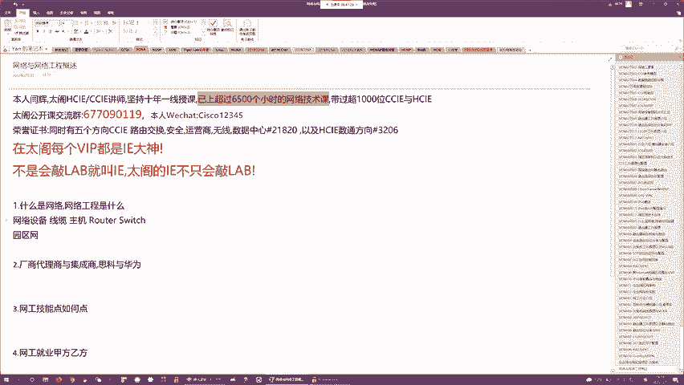

那这个厂商呢很多啊，既然多了，咱们就可以排一个名嘛，对吧？这个厂商可以分为一线、二线、三线啊，那这边的话呢，三线太low了，咱们就不看了啊，咱们主要来看一线二线啊，一线厂商在我们全国范围呢能看到的。

也就三家啊，哪三家呢分别是思科华为还有华塞啊，二线厂商就比较多了，像中信啊，像锐捷，然后呢，像这个卖普，对吧？然后接下来像什么深信服务啊等等之类的？这些都是二线厂商啊。

一线厂商跟二线厂商最大区别是什么呢？就是产品的这么一个广度啊，一般的一线厂商，你能涉及到网络领域里面的所有设备，他们基本都能造啊，比如说路由交换方向的，他们都能造，对吧？安全方向的也没问题。

无线方向的也没问题，对吧？那包括咱们的VOIP啊、运营商啊，数据中心啊，他们都会有些相关的解决方案和产品。😊，那这些二线厂商相对就比较薄弱一些了，对吧？相对比较薄弱一些。就比如说有的二线厂商。

他们只会造路交换啊，有的二线厂商，他们只会造一些无线相关的设备啊，当然我觉得应该不太可能了，一般你会造无线，你也会造交换机是吧？然后接下来有的厂商可能比较倾向于安全，对吧？安全领域里面。

他们可能会做的比较好，但是安全领域以外的，就做的比较一般般是吧？也就是说了，他们不可能说是针对咱们整体网络啊，有一个全方面的解决方案来解决咱们的企业网，对吧？数据中心以及运营商的所有的客户的需求。O吧。

他们只能针对某一块。啊，这是2岁。那这个二线咱们就不谈了，来谈下一线。😊，一线的三家公司呢，第一个就是一到台斯科了啊啊思科呢它是一家美国公司。Cs考。system啊，咱们不谈政治啊。

我们现在的跟美国不太对付，对吧？啊，那在我们跟美国不太对付之前，思科呢在国内特别吃香，为什么吃香呢？因为技术特别牛逼啊，如果说你把路由器交换机来当手机来看的话，我觉得思科对于咱们网络设备啊。

它的定位相当于什么呢？就相当于苹果啊，它的定位就跟苹果一样。做的产品又好，然后呢卖的又贵，然后卖的又好啊，然后呢它是在整个网络领域里面啊，所有厂商里面算是八尖的啊，number one。

那当然这家公司呢在美国啊在这个圣荷赛啊，就是旧金山湾区嘛，旧金山湾区是加利福尼亚北部啊，那有一个叫北 area叫湾曲啊，里面有一大群城市啊，一个城市群。这个城市群里面有很多牛逼的公司都是做IT的啊。

那这个地区咱们称为叫硅谷。哎，斯科呢就是成立于硅谷这么一个城市啊叫圣和赛。3号3号se。这是西班牙语啊，西班牙语叫sanhouse啊呃翻译成中文的话叫圣和赛啊，圣和赛。我以前呢第一档没有什么学问啊。

把这个叫叫什么叫sse。其实它这个J不念不念那个J啊，它叫ho叫hey啊叫houy。😊，O适何在？这个盛和在呢呃在加州北部还是很有名的啊，哎它其实算是硅谷的中心城市，有很多很多特别牛逼的这些IT的厂商。

他们都在这个城市。啊，那思康呢也在。那思科呢曾经一度辉煌的时期，哎，最高的市值5500多亿美元啊，在这个所有IT厂商里面啊排前三。那虽然说近年来有那么一点点衰落啊，哎，但是呢依旧受死的骆驼比马大啊。

就网络工程这个领域，思科成第二，全球没有一家公司堪称第一。那原因就是因为他首先在这个行业里面啊深耕了非常非常长时间啊，每一个网络的细分领域，它都有涉猎，并且呢都做的非常不错啊，他的这个整合度非常非常高。

然后呢，这个研发能力非常强。那所以说作为一个研发能力比较强的公司，他把他自己定位成什么呢？他不是一个卖铁盒子公司啊，他是一个卖服务的公司，对吧？他先是把自己定为一个软件公司。

然后呢又是把自己定为了一个服务公司。然后呢，每年投入了很多的研发成本去研发各种各样的新的设备的标准啊，新的网络协议啊以及一些新的功能啊，你会发现哎在我们的课程深入之后。

啊你会学到一些看起来特别牛逼的一些技术啊，这些技术十有八九啊，我不说夸张的，80%以上基本都是思科它始发了，啊，你思科始发了一个新的技术。然后呢，咱们有些标准化组织啊，哎家都觉得这些技术不错嘛？然后呢。

就是问思科能不能把它给公有化，然后呢，思科同意了之后，这些技术就被都公有化了，标准化了。那标准化之后，所有其他的厂商对吧？他们才能慢慢的去使用这些，就比如说咱们之后所讲的BGP啊，对吧？MPLVPN啊。

对吧？包括咱们segment routing啊，这些新的技术啊都是思科始发的。所以说呢你要学习网络技术，你就绕不开思科啊。因为就是所有网络设备厂商，咱们也别管中国、美国啊，哪个国家都一样，只有两类啊。

一个是思科，还有一个是其他啊，就跟卖手机也一样嘛，一个是苹果，一个是其他啊，思科就是那个苹果啊，很厉害。那思科呢曾经在国内如日中天啊，啊由于技术呢比较好，然后呢进入中国也比较早八九十年的进来了，对吧？

那刚进来的时候呢，当时对吧？咱们中国政府跟美国政府是蜜月期嘛，对不对？然后中国政府也给了思科很多的这个红利给了他很多的政策优惠，对吧？让他就是在国内做市场，那思科呢也是很照顾咱们国内的这些用户嘛，对吧？

给他们提供了比较好的解决方案，并且呢挣到的钱也就是对吧？会上供一些嘛，给到咱们的政府，对吧？那所以说良性循环，然后呢，思科在国内越做越好，哎，这个出货量越来越大，然后呢，设备占比啊。

在国内总出货量占比一度达到了60%以上，60%到70%，什么意思啊？就是在国内每每卖10台路由器啊，有6到7台是思科的啊，那换句话说，你们之间聊QQ对吧？你们QQ之间数据流要经过一系列网络设备转发嘛。

对不对？你的QQ聊。的流量每经过10台设备，其中就有6台到7台是4科的啊，当之无愧的number one啊，那当然在中国以外的其他地区就不用说了，直到今天也是number one，这个是不可动摇的啊。

因为任何其他厂商，你不可能做到跟四科全面竞争。但是在国内呢，近年来思科日子混的不是特别好，为什么呢？因为在14年当是比较久远了，8年前。2014年对吧？当时呢美国有一个情报机构啊，叫CIA啊。

中情局作死，搞了一个叫做棱静门的项目。啊，冷静门。其实叫棱静项目啊，然后呢败露之后就叫棱静门了啊，这个什么什么加一个门，你们懂的？就代表暴露了嘛？是吧？比如说曾经咱们哎有很多很多门啊。

这个你们自行联自行联想啊，那这个2014年的棱静门项目就是美国CIA对吧？它起始的这么一个监听项目，那这个监听项目利用谁呢？就是利用那些硅谷的牛逼的公司嘛，对吧？比如说微软啊，苹果啊，对吧？思科啊。

甲骨文啊，对吧？等等之类的，啊，这些公司他们代表什么呢？他们代表了IT对吧？这个IT其实其实就是计算机了，对吧？计算机科学啊，你的信息技术嘛，要利用计算机，只要提到计算机。

你会发现这个话题永远离不开美国，为什么？因为你生产计算机，无论是硬件软件还是操作系统，你能离开美国的公司嘛？对吧？你离不开啊，比如说桌面操作系统，你要么苹果系统，要么windows。

你要么lininux都是美国的吧，对不对？你要生产。😊，硬件那CPU啊，什么主板啊、显卡内存啊，也都是美国公司是吧？你要造网络设备那思科嘛？美国公司你需要数据库oracles美国公司，对吧？

你会发现就是你只要提到IT你根本不可能绕开硅谷，你绕不开的啊，硅谷在整个IT领域里面啊占比99。99%啊，不夸张的说吧，99。99%，那所以说呢全球任何国家，包括你欧洲，对吧？包括亚洲，包括美洲。

任何国家，只要你要信息化啊，只要你要用到计算机，你要用到服务器，你要用到网络，你都得采购人家硅谷公司的产品，对吧？那大家都知道你一家公司你开发这么一个硬件软件，你可以在里面插入一些后门嘛，对不对？

你可以插入后门。那插入后门的初衷是好的，就是当你网络设备，对吧？当你的系统软件等种之类的，卖给客户之后，你客户在使用的时候，由于客户不懂技术嘛，对吧？你用的时候总会出现一些问题，那出现了问题，咱们对吧？

原厂工程师，你想要检查问题。比如说客户报修了，对吧？客户就是打电话了说我这个系统有问题了，我的网络有问题了。那这块的话，咱们原厂工程师你要调试，对不对？对吧？那如果这个时候你的系统，你的硬件哎，有后门。

我就能利用这个设备的后门直接登录到这个设备之上，对吧？我可以直接通过后门嘛来检查到底出什么样的问题，远程帮你排错嘛，对不对？那这个后门定制的初衷是好的，哎，当然利用后门，咱们也能干一些坏事。

比如说哎利用后门，咱们可以随时获得对吧？操作系统的管理员权限，我能随时登录到全球各地的各种各样的网络设备之上，对吧？我能通过这个登录，哎，来截获我想要的信息，我能实现监听，这就是所谓。棱静项目啊。

棱静项目就是开了一个会嘛，CI的高层对吧？聚聚聚合了这些对吧？硅谷的这些大公司的高层嘛，对不对？那聚离之后就说了哎，你们这边的话，IT产品做的很好，对不对？卖给全球了，我现在需要你们跟我们合作，对吧？

为了安全，为了反反口嘛，对不对？那合作的这个目标很简单啊，就是你们卖设备给这些目标国家嘛，然后呢，我需要哪些哪些设备的管理员权限，你们得要把权限，对吧？给我开通，我得要能够实时登录他们的网络。

实时来监控他们到底在做什么？

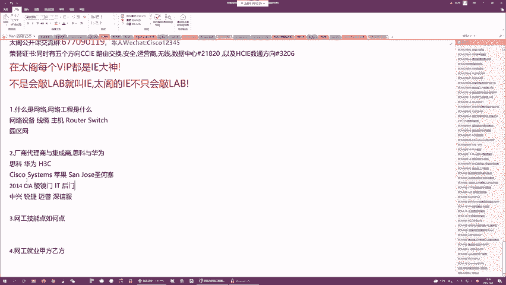

这个很恐怖啊。这个就是所谓的冷静项目。然后这个冷静项目呢后来被一个兄弟给揭发了啊，这个如果你们看过电影，应该知道那个人叫斯诺登嘛，对斯诺登，他是CIA的一个信息员啊，然后这个斯诺登呢，他对吧？

就是参与了这个冷静项目，在这个冷静项目中还是扮演了一个比较关键角色啊，然后呢，他也是良心发现了，就是觉得这个冷静项目，对吧？太反人类了，因为这个项目就是特别公平。哎，为什么说他公平呢？

因为这个棱静项目的初衷是为了监听外国，哎，方便咱们白宫来制定一些国际策略嘛，对吧？为了反恐啊等等之类的，不管什么名头啊，但然呢你会发现当这个棱静项目真的架起来之后啊，他监控的对象不光光是海外。

连美国本国的公民他都坚挺啊，这个斯诺登就特别搞笑，对吧？他在看这个棱静的系统，对吧？一个中央的服务器嘛，然后呢，在这个冷静系统中，他既然能看到他女朋友，啊，能看到他的女朋友。😊，所以说他就惊呆了。

说这个邪恶的计划肯定要有人阻止，对吧？那怎么阻止呢？你在美国，你告诉那个fox NewCN那肯定不行嘛，对不对？大家是一个鼻孔出气的啊。那所以说呢哥们就溜了啊，从棱静门的这个指挥中心嘛啊。

夏威夷直接跑到了香港，然后在香港呢联系了英国卫报的记者来把这个棱静项目给公之于众啊，那公之于政之后的话，就是当年这个棱静棱静项目啊，就是一旦被发现了啊，全球哗人，就大家都不敢相信，我靠，这是事实。

我们用的这些设备，这么多年来一直在被监听，啊，那所以说各国政府都很火啊，对吧？纷纷就是减少了美国设备采购，我们国内更加火，对吧？说给你了权限，你们来这边卖设备，对吧？你卖了设备证治。

我们的钱还来监听我们。

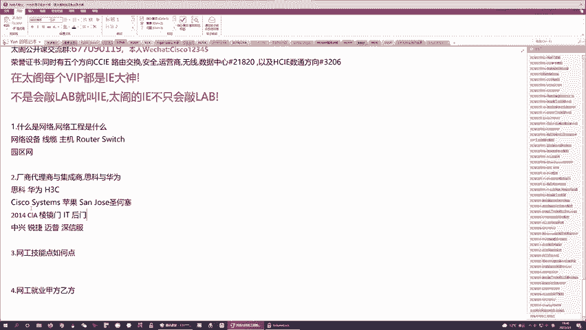

关键是咱们发现这件事儿之后，只要你们约谈，你们态度还不好啊。所以说从那天之后，从棱静门项目报出来之后啊，思科呢在国内基本就凉了啊，曾经出货量达到60%到70%，然后呢，棱静项目之后也没几年嘛。

18年19年啊，那个时候思科在国内已经非常非常边缘化了啊，对吧？几乎供货量连一成都不到了，然后呢，又过了两三年，对吧？2022年的今天啊，我觉得思科在国内彻底凉凉。除了有这么一个办公大楼。

其他的啥都没有啊。那当然在海外，即便有棱静项目啊，那我不知道思科用什么样的手段啊，对吧？棱静项目之后，思科在海外出货量一度也受到影响了，但是后来呢慢慢对吧？又有起色了，我猜测是这样的啊。

我猜测是因为海外嘛，这些欧洲的国家对吧？包括日本、韩国对吧？澳洲的这些国家，他们没有一家公司能够抗衡思科啊，就是说我不用你思科的产品，我得要有备用的嘛，对吧？那这个备用的产品，国产的肯定更好。

那问题是那些国家他们没有特别好的代替的国产的方案嘛。所以说虽然愿思科嘛，你监听我但没有办法，我只能选择你的啊，我只能选择你的所以说呢如今来看，思科依旧是一个技术非常领先的公司。

但是在国内它的出货量非常非常低啊，你基本做网络项目，你见不到思科的产品，基本是见不到的，很少环境下能见得到。😊，啊，一般在金融领域能看到啊，但是金融以外的其他的领域基本4科设备你是看不到的。

当然如果说你要在海外唉做网络工程，那四科呢依旧是一家独大啊，那在海外的话占比至少在4到5成以上啊，还是很有竞争力的。那接下来在国内思科走了这个滑铁罗了，谁取代了它呢？就是华为。啊，就是咱们大华为局场啊。

这个局场我觉得大家应该很熟啊，对吧？不陌生，是不是咱们大华为嘛，任总啊，对吧？他的励志的故事大家都听过啊，对不对？那这个华为呢，它最早其实做通信的啊，最早期做通信的什么叫通信啊？

就是咱们当前比较火的那个5G，它就是通信啊，那在5G之前，咱们有4G，对吧？有3G有2G那些移动通信网络，你要组建，你需要用设备，对不对？你需要基站啊，运营商需要核心设备需要接入设备都要有人造啊。

谁来造啊，对？最早期实就是华为中信来造，对吧？华为中信华为中信嘛，对不对？当时就特别有名啊。然后接下来华为呢做通信啊，它这个通信产品做的特别好，啊，一度呢在全球范围啊，它的通信都不能拍上号啊。

跟海外的爱立信啊等等之类的，都对吧？能够一较高下啊，特别厉害。这个真的不得不说啊，华为通信做的真的好，无论是基站啊，还是它的这个对吧？既胖易胖，哎，它的这个核心网的设备质量呢又好。然后呢，价格又便宜。

特别厉害啊，但是呢这个通信这个领域，你做的再强，它的限制性太大了啊，因为什么样的单位有资格采购这些通信的设备来提供这些移动通信服务啊，只有运营商嘛，对吧？只有运营商，你才拿到牌照。

但是国家运营商只有几家，只有4家嘛，对不对？早期只有4家，啊，电信网通、移动联通，就这4家，你这四家能够拿到license，你能采购华为的设备，你来部署这些通信网络。

那虽然说你在做一7273期工程的时候，比如说4G的172737，你要采购大量的设备，对吧？那在你的采购企，对吧？只要华为中标了，对吧？我会大量的给你供给设备，啊，那看起来订单还是。比较饱满的。

但是你项目如果说做完一期、273期之后，你没有新的基础建设了。那一般正常情况下，咱们这些通信设备啊，你很少会更更新换代的。啊，除非你抽了5G对吧？或者说你5G升级到6G，对吧？你技术革新了。

咱们需要新的设备来支撑。如果你技术没有革新呢，比如4G用了十几年，那在这十几年中，前几年咱们可能会出货量很大，但是后期呢就不好说了，对吧？那华为也看到了这一点啊，他就想那既然通信这个产品线。

我们已经坐稳了吧，那咱们就要扩展业务了。那扩展业务呢，他把业务扩展了两个方向啊，第一个是消费者市场，那就是手机啊，第二个就是企业市场，那就是咱们的网络。好吧，这个通信算是运营商市场啊，算是运营商业务。

对吧你们可以你们去过华为都应该知道啊，对吧？华为线主力的三个产品线就是运营商产品线，对吧？网络的还有是这个对吧？消费者的啊，那这个三个产品线哪个做最好呢？那肯定是手机啊，对吧？从华为做手机以来。

对吧他的手机占有率真的特别特别高啊，对吧？一度在全球排第一，什么概念？全球出货量第一啊，远超苹果啊、三星啊。但是后来呢莫名其妙就凉了啊，为什么凉？大家应该都知道啊，对吧？就是我们跟美国交了那几年是吧？

咱们川普总统上台那4年。😡，有一个臭名昭著的叫贸易战是吧？那在贸易战期间，哎，美国就是封锁了咱们很多很多的科技公司的命脉。啊，咱们的芯片啊，华为呢它能够设计芯片，但是它没有制造芯片的能力。

所以说呢它设计的芯片得要靠什么？得要靠海外的公司帮他做嘛，对不对？那美国把它这条路给断了，那它手机芯片做不出来了，那所以说从P40开始吧，对吧？华为的手机基本它的占比就越来越低了啊。

直到今天好像前五都排不进去了吧，是吧？变成行前八了是吧？从华为变成其他了啊，这个产品线的衰落，对华为的打击非常非常大啊，非常非常大。对呀，已经到其他了是吧？我记得好像是这样的。

就是全球那个手机出货排名了，你前5名都有公司的名字，对不对？然后接下来从第几名开始就是其他了啊，现在华为已经属于其他的范畴了，很惨啊非常惨。那这个为什么这么惨呢？因为就是大家如果知道华为的历史。

应该知道的，就是华为在做通信的时候。呃，不是录播呀。你怎么会觉得是录播呢？不是的啊，就是华为在做通信的时候，它通信圈做的很好啊，做的很好啊，但是呢这个通信产品线它虽然看起来就是业务做的很大，不赚钱啊。

因为你为了竞标，你卖产品卖给运营商啊，运营商都是很挑剔的啊，对吧？你卖设备卖给运营商真的是赔本赚吆喝啊，所以说你虽然覆盖面很广，对吧？你的这个客户对吧？很稳定，你的这个研研发能力很强，对吧？

你的这个竞争力嘛，在整个行业都是前沿的，但是你挣不到钱啊，真的挣不到钱，所以说当时那个年代虽然说华为很有名声啊，对吧？你提到华为基本大家都能听到但是华为确实不是一个特别有钱的公司。

不是一个特别牛逼的公司，就是华为做哪个业务做有钱的呢？就是做这个消费者市场，做手机。真的几年手机的市场真的给华为积累了非常非常多的现金流啊，这就导致了华为即便不上市，对吧？它也富可敌国啊。

就是靠这个消费者市场，并且这个消费者市场特别牛逼的是，咱们一般国内的手机厂商，你只能在国内卖货，对吧？赚人民币啊，华为的定位就是国内也要赚欧洲也要赚啊，它赚的更多的是欧元，啊，很牛逼啊，给国内创汇嘛。

对吧？创外汇啊后接下来自从这个手机市场不行了之后，对吧？华为他当时就是为了让手机市场能够做的越来越好嘛，对吧？投入了非常非常多的人手，还有这个资金去研发。

并且针对这个消费者市场就是开拓了一个非常非常大的部门啊，里面养了很多很多人。成本居高不下啊，然后接下来现在呢就是这些人也不能裁，对吧？这些投入的研发也不能停，但是手机这个业务做的不行了嘛，对吧？

入不敷出了，对吧？入不敷出了，那整个公司就开始走下坡路了。所以说华为当前算是比较危难的这么一个时刻啊，我觉得他如果手机市场对吧？再拖个几年，很有可能会把它给拖挂掉啊，哎你们还觉得卡吗？呃。

还有人觉得卡吗？应该不卡吧。😡，我这儿的网络还行啊。😡，有点卡是吧？😡，哎呀，我看看是什么情况啊。西藏都不卡是吧？哎，西藏都不卡，那我应该是没啥问题了啊。😊，对我应该是没啥问题了。OK。😊，好。

那继续来聊我们的大华为啊啊，就是手机呢自从被那个贸易战美国攻击了之后，就真的有点微妙啊。因为咱们依旧保持这个部门，对吧？这么多的人这么多的研发投入，但是你产生不了什么经济效益嘛，对不对？

并且不停的在亏钱所以说这个产品线，华为到底要不要卖掉，这个真的不知道，但是如果说不卖掉，这个局势又没办法逆转啊，那很有可能就是由于这个部门会导致华为就是直接凉凉啊，那这个咱们也不是华为的高层了。

这个具体的角色交给他们来啊。然后接下来这个网络领域呢，就是咱们的企业网市场了，企业网这个产品线主要就是做咱们的网络设备啊，造造路由器交换机啊，那早期呢华为做通信，哎，他以为通信跟网络是一样的。

但是呢进到网络这个赛道之后呢，他发现完全不一样啊，我要做网络，对吧？从零开始这个研发的这个产产出啊，投入产出比啊太低了。啊，我要花大量的钱，大量的人才去投入这个研发，我才能生产出相应的产品。

时间线太长啊，我希望扩了这个产品线，就能立即在行业内啊，最起码做到前三。那最好的方法是什么呢？就是找当前的行业老大，我去借鉴一下啊，学习一下。那当时呢华为学习对象就是思科啊，早期呢思科造路由器嘛，对吧？

华为造通信设备啊，运营商在采购的时候，他会同时采购通信产品和网络产品。所以说华为的人跟思科的人其实在当时那个时候就已经非常熟了啊。因为大家一般通常就是会怎么样共共同做同一个项目嘛，对吧？一个项目里面。

咱们既有通信这一端的也有网络这一端的啊，华为负责通信思科负责网络，然后他们之间可能还需要对接，把我们的通信网络跟咱们的互联网，对吧？联合在一起。那这块的话。

华为也看到了思科就是在做网络领域的这些业务的时候，对吧？我出货量又不大，对不对？相比咱们通信设备，你思科的这个网络项目，对吧？你路由器，一个项目可能才几台啊，但是他每台路由器的这个利润啊。

比华为要大的多啊，我觉得可能任总就看到这一点啊，就决定了既然对吧？咱们都做运营商市场嘛？我为什么不能抢你的市场嘛，对吧？所以说就是学习思科来造路由器，啊，学的非常非常快，并且路由器做的非常非常好。

然后接下来呢做路由器又便宜又好用嘛，对吧？卖给这个运营商的时候，思科卖高价，华为卖低价，那你懂的运营商的采购经费也有限啊，所以说慢慢的运营商就开始从华为采购这个骨干路由器了。

然后采购者采购者思科发现哎情况不对啊，对吧？以前运营商的项目我都是保留项目啊，对不对？百分百中标的那现在发现哎好几次中不了标了，然后一看哎中标的是华为。研究了一下华为产品之后，发现我靠。

你小子跟我做的网络设备居然一模一样，是吧？😡，哎，这个一模一样，请注意啊，在国内来看没有什么问题啊。但是在美国这个问题很大啊，因为两个设备的相似性如果超过了70%，这个就是剽窃嘛，对吧？

商业盗版这个是侵权的啊。因为这个网络设备，它不仅仅包含一个外壳，不仅仅包含一个硬件的这么一个对吧？主板啊CPU啊等等之类的，它还包含一个非常核心的东西就是操作系统啊。

所有的网络设备、路由器交换机只要是思科产的，你都能登陆它来配置啊，通过配置来启用一些相应的功能啊，那华为造的网络设备呢也有操作系统。当然他们操作系统名字不一样的，思科的网络设备的操作系统叫IOS。

华为的网络设备操作系统叫VIRP啊，听起来名字不一样啊，但是呢操作界面完全一样。对吧但是思科的IOS是有专利的啊，思科号称这个IOS啊，是他们公司研发的全球第一款网络设备专用的操作系统，对吧？

那如果说你一家公司对吧？你生产网络设备，你想用我们的IOS也不是不可以啊，对吧？你可以买我的授权嘛，对不对？你可以付我专利费嘛，你付我专利费买我的授权，我可以允许你使用啊，对不对？

但是华为并没有这么做啊，我没有请示思科没有付你的专利费，对吧？也没有就是对吧？版权啊等等之类的，我就直接生产了，并且跟你抢市场，那思科很不爽啊，对不对？市场层面我抢不过你呢，我就只能对吧？

想一些Y手段了。通过法律途径把四科告了华为。思科告华为是03年啊，2003年。啊，他们之间打了一个官司。旷日持久啊，一个官司打了好长时间对吧？那当然官司的那个由头也很简单了，思科告华为嘛说你剽窃啊。

告了好长时间。那最终呢思科告赢了，但是呢华为也是利用这场官司啊，就是直接对吧？家喻户晓啊，因为曾经呢大家对华为的理解就是你是一个做通信做的很好的一家公司，但是你网络你只是个小白嘛。

但是自从被思科告了之后，大家会这么想啊，我靠思科全球第一的网络公司，哎，对吧？你告华为代表什么？代表华为触动党的利益了，那华为出动党的利益意味着什么？意味着华为很厉害嘛，对不对？

所以说在那个在那个官司之前啊，华为虽然说做网络产品，但是他在网络领域里面并不出名啊，那场官司之后，虽然他告输了啊，但是呢就是为了打为他打响了名气啊，那之后呢各种各样的运营商的客户都找道华为去采购设备。

因为真的很便宜嘛，是吧？并且华为本身也有研发能力，对吧？你被思科告了，没有错啊，我。侵权了，我说了官司了，无所谓嘛，我有研发能力，我自己研发我自己的操作系统不就好了嘛？对不对？那他自己研发的VIRP5。

0系统啊，就是算是纯自主研发的，对吧？跟思科操作系统看起来已经不太一样了啊，之后呢，华为的新设备都是使用它自主研发的这个操作系统。OK然后接下来呢这个好景不长啊。

华为呢这个网络领域业务呢本来做的还是不错的啊。但是呢随着这个对吧？美国的这个哎你们懂的？贸易战啊，它不是特朗普不允许华为去采购任何美国的芯片吗？啊，请注意啊，手机需要芯片，网络设备也需要啊。

华为芯片就是手机做不出来啊，路由器交换机的也做不出来。那所以说在贸易战的期间啊，华为的手机业务受到了很大的影响，而这个网络业务的影响也很大。虽然说网络业务就是这些网络产品啊。

它对这个芯片的规格要求没有手机那么高啊，不需要你做什么五纳米级别啊等等之类的，没有这么高的要求，但是奈何你造不出来啊，对吧？你造不出来这些好的芯片呢意味着就是你产品在更新换代的时候。

你的竞争力就会有很大的影响。那所以说华为当前呢对于网络这个业务也是比较暧昧了啊。哎，华为网络业务越做越大。哎，早期只做路由器交换机啊，后来呢像什么防火墙啊，像什么服务器啊都有做。

然后现在呢这个服务器这一块，华为已经哎不是外包，已经卖了啊，已经直接卖给别人来做了，就跟他的荣耀嘛一样啊，卖给别人了啊，而至于路由器交换机会不会卖，这个具体也得要看他们的高层的决策了啊。

也得要看他们高层的决策了。华为那个芯片厂能做14纳米了啊，能做14纳米的话，那这个网络业务还有救啊。但是5纳米的话肯定是没戏的啊。所以说就是当前对于企业网市场。

我知道的一点就是华为当前它的服务器的这个领域的设备啊，都已经卖给别人了啊，而至于路由器交换机目前它还在自己做，但是至于产品需要革新啊，需要升级啊，对吧？那至于升级之后，它能不能保证这个产能啊。

能不能保证就是有足够的产品去供应啊，这个就不得而知了。哎，但是好消息是什么呢？好消息就是华为这个对吧？企业企业这个产品线啊，它虽然说产品比较多，但是呢并不是很核心的啊。

它最核心最产最最赚钱的这个产品线就是消费者市场，O吧。只要消费者市场这个产品线做的好，也就是手机啊做的足够好啊，我觉得它就能起死回生啊，这是接下来他。大这么一个挑战就是解决这个手机的问题啊。

只要手机的问题能解决，它就能回存。如果手机的问题解决不了，对吧？那其他的产品线再怎么倒腾啊，我觉得都于事无补啊于事无补。那当前呢在国内来看啊，华为依旧是呃一线厂商的第一梯队啊，对吧？

你在做一些运营商项目的时候，你在做一些大型企业网项目的时候，对吧？咱们都会更多的采购华为的设备，当然现在呢甲方他们也不傻啊，他们在采购产品的时候，他们在就是对吧？哎，就是竞标的时候啊，对不对？

一般就是你甲方嘛，一些大型的甲方啊，我有组网的需求，对吧？我会就是竞标嘛，对不对？我会就是把项目的需求公之于众，然后呢，你各种各样的厂商，对吧？代理商，你们都来投标嘛，对不对？你们来投标之后的话。

我们来评，对吧？看你们谁的方案O，然后选择你们的产品，选择你们的设计，选择你们的方案啊，那现在呢越来越多的，尤其是运营商的这些客户啊，他们也知道华为的处境。所以说他们在评标的时候呢。

也或多或少都会考虑到华为芯片的问题。所以说呢目前就是华为在网络这个领域里面啊，有那么一丢丢的微妙啊，他的份额已经不。

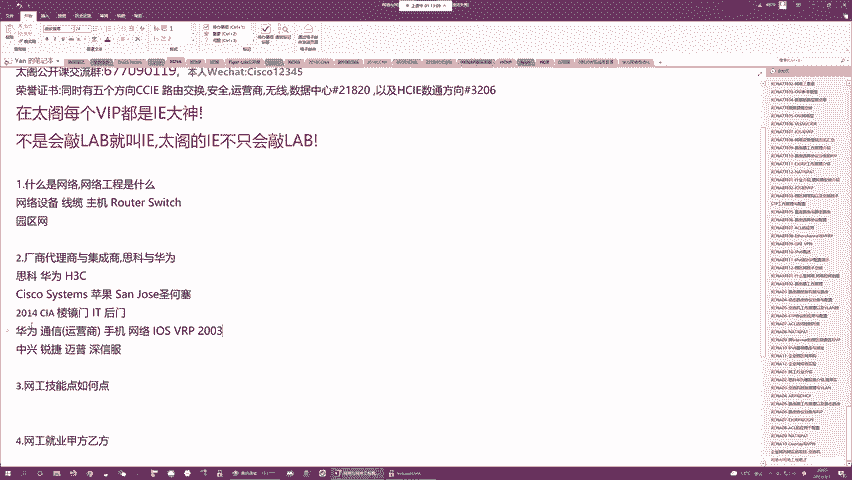

不足以前了，对吧？以前他在最辉煌的时候，在国内出货量至少在60%以上。但是现在的话可能对吧？更多的市场份额被一些其他的国产厂商对吧？包括华三啊，包括中兴啊，包括锐捷啊在慢慢蚕食。

包括他的这个运营商的网络的项目啊，有些项目都已经被对吧，曾经在这个运营商领域里面从来没有进过标的公司。对，抢调了大部分蛋糕啊，那就是当前华为的这么一个处境。对，烽火也不错。就跟你说啊，华为倒下之后。

有很多曾经的二线三线厂商都突然间一夜之间崛起了啊，曾经运营商在招标的时候，那些二三线厂商，对吧？由于有华为华三的压力嘛，他们压根不敢去竞标的，压根儿都不敢去投标啊。但是呢自从华为就是被对吧？

被限制了芯片之后啊，很多很多的领域都慢慢的有曾经那些对吧？名不见经传的公司啊开始跟华为竞争了，并且还能竞争下来，这个很厉害啊啊，那所以说这也是当前的一个格局，有点像春秋战国啊，有点像春秋战国。

也不是新兴厂商啊，厂商都是老的厂商啊，不是说新公司，公司是老的公司，只不过以前在华为顶就是强势的时期啊，他们不敢冒头啊，现在华为没有那么强势了，他们就慢慢冒头了。对，没有错。所有所有国产厂商。

只要你们要芯片都是进口的啊，只要你们需要芯片，都是进口的。但是呢这个枪打出头鸟嘛，对吧，华为毕竟大啊，并且在欧洲对吧？市场做的很不错嘛，并且这个市场还要做到美洲去嘛，对吧？就是影响到了啊。

你懂的美国的核心利益了。所以说他们在这个惩罚的时候在制裁的时候，肯定也会盯着这个领头羊嘛，来制裁，所以说整个贸易战，中国最受伤呢，其实就是中信跟华为嘛，但是中信比较认怂啊，一被制裁就怂了，对吧。

交了罚款，同意了美国的各种各样的不不平等条约嘛，但是华为比较比较硬啊，对不对？你美国制裁了华为对吧？不但不但没有同意你的制裁。还不停的抵抗了。那所以说就是美国一而再再而三的升级制裁。

才导致华为现在的这么一个窘境啊，当然怎么做，咱们就不去不去评价了。那当前的现状就是华为在国内，你说到是一线没有错啊，但是它的竞争力啊，它统治力啊相比34年前要弱了很多是弱了很多啊。

最主要的原因就是贸易战。并且贸易战不知道什么时候会结束啊，不知道什么时候会结束ok。😡，然后接下来国内还有一家一线厂商啊，华三啊叫H3C嘛，它叫华为3com啊，是一家合资公司。那这个合资公司怎么来呢？

它就是华为啊，本来想要收购美国的3com公司啊，来造交换机啊，因为03年被思科告了嘛，对吧？思科告完华为之后，对吧？华为以后就不能再学习思科来抄袭思科的这些专利了啊，然后呢。

华为一开始在做网络领域的时候，由于是从运营商市场做起的，运营商在采购的时候呢，更多的需要采购路由器啊，它的路由器做的真的很不错啊，但是后来呢发现这个路由器已经做的不错了。

这个运营商的领域已经ok没有什么问题了，那华为想要进一步的扩大它这个产品线啊，想要把客户目标啊定在企业网，但是在卖企业网设备的时候，大家发现企业网虽然说对吧？也需要路由器啊，但是更多的需要的是交换机。

而华为交换机研发，对吧？做的很有限嘛，对吧？然后呢又不能抄袭思科那怎么办？那哎最最简单的捷径就是我收购一家行业内比较好的新型公司。我把这个新型公司的产品线对吧？并到咱们自家产品线中去，对吧？

给你共享一个相同的操作系统就OK了，是吧？然后接下来找了一圈，就找到了scom这家公司。啊，3com这家公司呢在03年来看啊算是一个兴起之秀吧啊，美国的然后呢专门做交换机，然后呢，在企业网环境中。

它的交换机的这个产品手先很不错。然后呢，解决方案也很好。然后呢，华为本来是想收购它的嘛。因为当时华为也算是财大气粗了，想收购3com。但是后来呢收购的过程不是很顺利啊，因为涉及到美国的这个。

情报安全啊收购到最后一步的时候啊，3com的高层对吧？都同意任总出的条件了，对吧？觉得给的条件挺不错的，打算卖了。当然呢美国政府就是出面的说你不能卖，对吧？因为3com里面涉及到了美国的一些信息机密。

对吧？收购了，对，会影响到美国的这个国土安全。那接下来收购不行怎么办呢？就合资啊，合资搞出的公司就是咱们的H3C啊，华为三考。然后这个合资公司呢总部在中国的杭州啊，然后呢，scom的人对吧？

就是研发人员啊，对吧？来到这个杭州总部来负责产品的研发和设计。然后接下来华为呢就是负责销售啊、运营啊、技术售后啊等等之类的一系列事宜。那所以说呢就是你们如果经历过那个年代的华为。

你们会知道当时华为的对吧？网络的这个业务组啊，它里面的所有人基本都是有两个工号啊，一个是华为工号，一个是华三工号。你可以白天在华为上班，然后你可以下午去什么华散啊，都是这么做的啊，都是这么做的。

因为缺人嘛，对吧？华为直接输选啊，把它的这个业务组里面的基本是骨干啊全部交给华散了。然后接下来这个华三哎毕竟是个合资公司嘛，那咱们就要定一个这个战略嘛，这个战略怎么搞呢？要说了。

你华三主要负责交换机的研发，还有企业网的这么一个市场的推广啊，而我华为呢负责运营商的，我主要造路由器啊，你主要造交换机放火墙，企业网交给你啊，运营商的网络交给我，对吧？咱们有一个共同的敌人，就是思科啊。

只要能从思科的手上抢到咱们的市场份额，那咱们这个战略目标啊，就达成了。那当然咱们是兄弟公司啊，就不要自扬残杀了啊，那什么意思呢？就是我华为不会自家去研发交换机，抢你的企业网市场，那你也不要去研发路由器。

抢我的运营商的市场，OK那就保持这么一个关系啊，保持了好几年。那好几年之后呢，华为慢慢的就是他在企业网市场也站站稳脚跟了，虽然是挂着华三的名头去卖设备啊，但是对吧他对企业网这一套越来越熟了。

并且对于交换机，对吧？他其实自身也能设计，也能制造了，对吧？那既然如此，我要这个三com就没有用了嘛，对不对？我要你华三有什么用啊，又要样的人，要给你钱，对吧？又要给你让市场，我我干嘛，对不对？

我自己就能做这一块的自然而然我不需要你了。所以说他把H3C给卖了啊，卖给谁了呢？卖给惠普了啊，卖给惠普了。然后接下来卖了之后，哎，你懂呢华为大肆的从H3C挖人，然后呢，开始扩充产品线啊。

曾经华为从来不做交换机的啊，后来慢慢也做了是吧？然后呢，华为也是直接取代H3C啊，对吧？来做这个企业网市场做的相当不错啊，那大家做的相当不错，不是因为华三卖给惠普之后，它的竞争力变差了，不是的啊。

主要是因为惠普接手的时间不太好，对吧？惠普接手H3C没多久，棱静门事件爆发了嘛，对吧？棱静门事件爆发了，那这个涉及到的是整个美国的信誉啊，不仅仅是思科一家公司的啊。

那所以说曾经呢在国内你顶着美国的企业的名号，你来做IT相关的研发销售啊，对吧？你都是信誉很好的嘛，对吧？很受认可的。但是自从棱静门事件之后。对吧你顶着一个媒企的名头，你来我这边，对吧？卖产品，你搞笑嘛。

对不对？谁卖的账，没人买的账。所以说呢惠普收了华三之后啊，像是收了一个烫手的山芋啊，他本来收购华三，对吧？是想要扩充它的交换产品线，用来什么呢？用来在北美地区啊抢占私客的数据中心市场。

因为这个惠普最牛逼的卖的是什么？😡，是服务器啊，什么地方需要服务器呢？数据中心啊，那这个数据中心除了需要服务器以外，还需要数据中心级别交换机。那早期呢惠普跟思科他们是咋配合的，对吧？

一起来拿数据中心的项目啊，思科负责生产这个交换机，对吧？来交付，然后呢，惠普负责生产服务器来交互，对吧？大家精水不犯河水嘛，对吧？那后来呢思科就是觉得你惠普对吧？卖服务器，你数据中心的项目嘛。

服务器的需求量要远大于交换机啊，利润也要大得多，对吧？思科眼红了，就是说你惠普能做服务器我不能做嘛？一样可以啊，所以说思科整出了一个服务器产品线叫UCS。然后呢。

跟他的数据中心级别的交换机nexus啊做了一个整合，搞出了一个对吧？完整的数据中心的统一解决方案。这个解决方案中啊，你不需要用到惠普设备了啊，你需要服务器，你买我的UCS啊，你需要交换机。

你买我的nexus，对吧？我给你搞的安排的明明白白的对吧？就是你需要一个数据中心，我斯科能提供80%以上的产品。啊，你剩下的可能需要买一些空调啊，你买一些存储，这个跟我没有关系。我不涉及这些产品啊。

但是服务器这一块对吧？我拿捏的死死的。那所以说自从有了UCS之后，这个UCS服务器卖的特别贵，并且我觉得特别差。但就是因为它的兼容性啊跟它的nexa交换机集成集成度更高，兼容性更好。

所以说反而这个比较贵的比较差的服务器啊，在北美地区卖的特别好啊，惠普的很大一部分的税据中心的市场份额啊被斯科抢走了。对吧那惠普恨啊说你凭啥抢我的市场？是吧你来抢我的市场对吧，那我怎么办？

你不仁别怪我不易了，我来抢你的啊，那抢你的怎么抢呢？啊，惠普就反向思维了，对吧？你思科能整出一个数据中心的完整解决方案，我不行吗？我也行啊，我差个什么，我差个交换机嘛，对不对？那当然我要研发交换机嘛？

我又不傻，当然不要研发了，我直接收购一个牛逼的，把它的产品扩充性来不就好了嘛？结果收购的对象就是华塞。😡，但是没想到他这部棋打错了啊，他本身在收购华三之前想到了这个收购怎么招都是稳赚不赔的。为什么呢？

因为第一华三哎，当时那个时代啊在国内啊在我们国内的企业网领域啊，享誉盛名，产品卖的特别好，啊，在企业网市场打的思科真是落花流水啊，啊，还手之力都没有当然原因是因为思科产品卖的太贵了。

华三产品又好又便宜啊，卖的特别特别好哎，会不会这么想了，我收购了你华三国内的业务不变嘛，对不对？你怎么着也不会下降太多了，这个利润能够支撑咱们的运营，然后呢，你再针对咱们北美市场哎。

研发一些数据中心级别交换机，对吧？配合我的服务器嘛，整合出这么一套数据中心的完整解决方案来搞思科，对吧？如意算盘打的特别好啊。然后后来发现两头受阻啊，他收购了华三之后，哎，第一件事儿冷静门事件打响了。

对吧？这个华三曾经顶着是华为的名号在国内卖产品啊，对吧？算是半个国企嘛，对不对？别人都很信任。然后自从卖给惠普之后，我靠，变成一个媒企了啊，曾经的大量的市场客户啊都转到华为了。啊，惠普真是气死了。

然后结果呢这个数据中心级别的交换机的研发这一块啊，哎也遇到了很大的阻力。这个H3C没有做试卖交换机，但是企业网交换机，啊，跟数据中心交换机差距特别大啊，几乎根本不是一种设备了，那虽然说华三呢。

它的企业网交换机真的是设计的很好啊，卖的也很便宜，但是这个数据中心的交换机研发出来几款对吧？根本打不过死客的，所以大发现了哎收购这个货对吧？纯赔钱嘛，对吧？

在北美地区你研发的产品不能帮我抢占数据中心的市场，对吧？在国内你又干不过华为，我要你干嘛继续卖啊，然后接下来第二次一主，咱们华三卖给谁了呢？对，卖给了清华紫光啊。😊，清华紫光。这个清华紫光是个国企啊。

央企啊，央企你们懂的太牛逼了，对吧？叫根儿根儿正描红啊，是吧？收购了华三之后，为了避免华华三的市场，进一步为华为蚕史啊，赶紧给华三改了个名字啊，以前叫H3C啊，一直都是这么叫的啊。

然后结果被清华紫光收购了之后，改成叫什么，改成叫新华三中文啊，没有一个英文了，改名叫新华三，首先突出这是一个新的啊，不再是以前的H3C了。然后第二，名词，中文代表什么？哎，这是一个根儿正描红的，对吧？

国企。😊，那作为国企，对吧？你不用再背负这个冷静门事件的骂名了嘛，对不对？你终于可以公平的去跟华为竞争企业往市场。啊，还是挺牛逼的啊，对吧？竞争。一上来出师大捷，抢了华为的很多很多的。

对吧曾经属于华三后来被华为撬动的客户，因为毕竟华三产品好嘛，相当不错。然后结果咱们华为怎么自救呢？自救方法很简单。啊，挖人。因为华三嘛新华三被清华紫光收购了之后，清华紫光是一个央企啊。

央企最大的问题是什么呢？就是薪酬薪酬体系啊对新华三对吧？属于清华紫光之后，他这个员工开工资，对吧？没有以前华为那么大方啊，甚至也没有惠普的实期那么大方啊，那所以说华为就看中了这一点。

直接以两倍到3倍的薪资啊啊华三基本所有产品线的精英都给挖光了啊，你的研发人才市场人才管理人才，包括什么？你的这些售后啊，售前啊对挖了个遍。那挖完之后呢，这个新华三对吧？顶着一个央企的名头。

但基本是个空壳子了。啊，虽然说一度大肆的招聘啊，985221招了一大堆，但是这些新兵袋子你们知道啊，对吧？没有行业的洗礼，你们你们玩玩这个屁呀，对吧？青黄不接的新华三基本就是因为人才的问题。

直接被华为就给干死。啊，所以说当前的这个新华三虽然说依旧还在研发新的产品，对s死的骆驼比马大嘛，对吧？依旧在国内算是一线厂商，但是相比就是曾经的对吧？惠普的时代，包括曾经的华为的时代。

这个新华三跟曾经的H3C已经不可同日而语了啊，如果说你们在座的各位是有是是这个甲方啊，对吧？甲方或者说你们企业主，你们在采购产品的时候，一定要记住，新华三只能买他们的交换机啊，不要买其他的啊。

虽然说其他的产品，他们都在研发，但是这个研发，你们懂的金，对吧？这个叫做。今日不同往日了，对吧？今非昔比，曾经他们的所有产品线的研发都是一级的啊，现在呢就是除了交换机以外。

其他的产品线的研发真的只能算二流啊。对，防火墙不行，无线也不行，数据中心级别的产品也不行，运营商的产品也不行啊，简单来说，除了他们的老路子，交换机依旧做的非常好以外，其他的都不太行啊，其他都不太行。

所以说如果你们要采购新华三的产品啊，仅仅采购交换机就OK了。对，除了交换机，其他的都一般接入和汇聚都可以啊，核心最好都不要买它的啊，核心交换机都做的比较一般。对啊，以前的H3C的产品没有售后了呀。

他们现在的新的产品是7。0嘛，对吧？V7产品啊，V7产品基本都是新华三时代设计出来的啊，这些产品你能找到这个售后啊，那老的那些那基本都不行了。老的那些都不行了。但我想说的是那些老的设备真的很不错啊。

那些老的设备很不错，新新的这些设备反而质量上功能上对吧？都有很多的问题。啊，当然这个就跟你们说一下啊啊，你们如果想采购的话，依旧可以选择它。因为毕竟比较便宜啊毕竟比较便宜。

那这就是咱们当前咱们在国内能看得到的比较顶尖的三家公司啊，他们都是全系列产品都能设计，都能研发，都能生产啊。所以说你们在做一些网络项目的时候，你们需要用网络设备，对吧？哎。

不用担心选择这三家厂商来采购就好了，对吧？采购完了之后，咱们网工需要做的是什么呢？就是用咱们采购的设备帮助客户把网络搭建起来，对吧？该连的连一连，对吧？该接的线接一接，对吧？做做布线。

做做这个网络设备的这么一个调试，对吧？然后接下来通过就是敲命令的方式，在网络设备上启用一些相应的功能，对吧？根据客户的需求，让网络能够通起来，这就OK了啊，这就是咱们网工所干的事情。

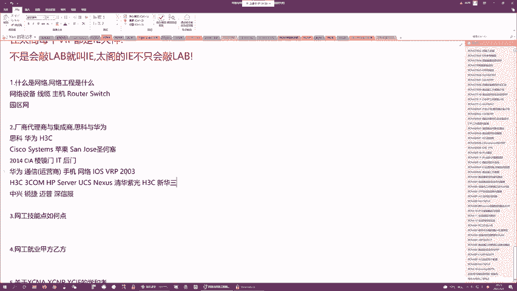

O。那接下来说到了厂商。就要说到厂商的下一级的公司了，咱们称为叫代理商。啊，我们称为叫代理商。厂商嘛一线的就这三家啊，而代理商会特别特别多。这个代理商跟厂商他们的分工是不一样的。厂商的第一要务是什么呢？

是研发产品啊，我设计新的产品，研发生产啊。那如果说牛逼的话，我能制定一些网络的新的标准，我能研发一些新的协议啊，虽然说厂商也负责卖设备啊，但是他的卖设备投入的精力不会特别多啊，不像华为啊，华为是例外。

华为真的太牛逼了，就是华为产品研发也厉害，它的营销也厉害，他的售后服务也厉害啊，恨不得一家公司把所有的事情都给做了。但是一般正常的公司啊没有这么全面啊，对吧？比如以思科为例，思科研发能力很强，对不对？

但是他的市场公关能力很弱啊，他的营销能力更弱，简直弱炸了，就是你让思科原厂的销售去卖设备，我觉得可能以台也卖不出去啊，尤其是以现在这么一个时局，你让他在在以他们的这种对吧？

销售技巧去卖他们这么昂贵的产品真的是太难了啊，那所以说呢他们想要在一个地区开展业务，对吧？想要卖产品就需要一些人来帮他们啊，那这些帮他们的公司就是代理商啊，那当然代理商呢根据规模也可以分级啊。

高级别的像总代，然后呢，中级别的金牌代理啊，银牌代理啊等等之类的啊，不同的厂商给代理商的分级的机制不一样。比如说华为他有总代对吧？然后有五星代理、四星代理啊，三星代理等等之类的思科呢是总代金牌银牌啊。

那其他的厂商有其他厂商。相法。那这个代理商呢，比如说以我们的这个中银国际啊，包括咱们的小通科技啊，包括咱们的这个华讯啊，华讯比较代表性啊，华讯很牛逼啊，既代理思科也代理华为，现在好像都是总代啊。

都是总代。就是这些代理商呢，他们的目标很简单啊，他们不用去生产设备啊，所以说不需要招那么多研发啊，硬件研发，软件研发都不需要啊，他们需要什么呢？他们需要招大量的销售啊，这些销售帮助这些厂商，对吧？

去拓展客户啊，那拓展完客户之后呢，由于销售他们本身啊没有技术能力，那所以说代理商呢需要一系列的有技术的工程师啊，这些咱们称为叫售前工程师，啊，咱们需要售前工程师，然后呢配合销售去给客户呢提供方案。

因为毕竟咱们卖的不是煎饼嘛，对吧？咱们卖的是网络设备，这些网络设备是要解决客户的需求的啊，销售虽然市场公关能力很强啊，但是呢说到具体的技术了，对吧？他不懂啊，他不知道客户的痛点。

他也不知道什么样的客户到底需要卖什么样的设备。他只是知道客户需要设备，但因为当前21世纪嘛，什么样的行业能离开网络啊，都离不开嘛，对吧？只要你需要网络，你就需要组建你的园区网，你就需要网络设备。

你需要购买。对啊，但是销售他不懂技术，不知道你到底需要买哪些设备来解决哪些需求是吧？解决哪些问题。那所以说咱们需要懂技术的人配合销售，对吧？去根据客户的痛点，给客户出方案，是吧？

然后接下来咱们也需要一批人，当你客户采纳咱们方案之后啊，咱们要去实施啊，那负责配合销售给客户出方案的这帮人，我们就成为叫售前工程师，什么叫售前啊，就是咱们对吧？产品还没销售出去嘛。我这个工程师的种类啊。

是为了配合销售来卖产品的啊，我的工作是在销售之前来做的O吗？这个咱们成为叫售前工程师，然后接下来咱们出了方案，对吧？客户觉得ok没问题，可以采购这些产品来解决我的问题，对吧？

那当这个项目敲定了厂商开始生产设备，啊，代理商负责交付，这个所谓的交。指的是什么呢？就是有一波人对吧？把厂商生产的设备放到这个客户的机房里面去上架拧螺丝连线调试，对吧？

让咱们整体网络能够连通并且当网络在正常使用的时候，咱们还要实时做一些监控，对吧？看看你网络O不OK到时网络出现问题的时候，咱们要做优化，对吧？要做排排错是吧？那这些负责交付的这些负责实施的啊。

咱们称为叫售后。售后工程师啊，售后呢比较屌丝了啊，不需要跟着销售见客户啊，售后呢一般是这个单子已经成了啊，产品已经卖出去了。最后呢就是要上架了，对吧？售后工程师负责在机房里面帮他们上架啊。

一台台设备调试啊，测试优化然后接下来对吧？试点一段时间没有问题了，啊，那这个项目就算是交付完毕了啊，那当然交付完毕之后呢，咱们项目都会有维保期啊，一般维保期一年到2年嘛，对吧？那在这1到2年的时间内。

对吧？客户使用网络若果出现任何问题，对吧？一般也是售后给他们去做这个技术支持，然后呢，如果说这些问题光靠技术支持解决不了啊，你还得要人去现场对吧？现场帮他们去解决这个问题啊，那这就是代理商啊。

代理商只需要这么三类人啊，销售售前还有售后啊，他们需要大量会技术的人来帮助售这个销售啊去完成这个。项目的对吧？首先是你一得要把单子给卖出去嘛，对吧？然后你需要大批的人去帮助客户。

怎么样把我们这个项目给实施，并且需要大批人去做后期后期的什么售后服务，O那这个代理商呢，它就是你可以理解为是咱们厂商的爪牙啊，厂商负责不停的研发啊，研发新的设备，研发新的标准啊。

然后接下来厂商呢会经常给代理商的工程师来做培训，主要就是给你们洗脑了，对吧？告诉你们咱们新出了一些什么样解决方案，里面涉及到了一些什么样的新的技术，涉及到了一些什么样新的设备。

涉及到了一些什么样新的架构，对吧？然后接下来售前工程师做了一些演练，对吧？销售也学了一些话术，然后接下来就是共同的去帮助这个厂商来扩展市场，因为你厂商研发了设备不卖，你不倒闭了嘛，对不对？你卖的越好。

你研发才能越快嘛，对不对？你卖的越好，利润越高，你才能投入。越多的钱去做新设备，新技术的这么一个研发是吧？这是个良性循环。OK然后接下来代理商的下面呢，咱们还有一集啊叫集成商。😊。

这个集成商呢相比代理商就是规格更小了啊，一般就是一些夫妻店，对吧？一个小老板，对吧？在这个电脑城对吧？你搞一个小摊位搞一个集成商，这是没问题的啊，由于集成商的规模太小了，你想要申请做这些厂商的代理商。

对吧？你卷不进去嘛，没有足够竞争力啊，那这些集成商呢往往比较灵活啊，它怎么样呢？它什么样的项目都能做啊，你网络相关的存储相关的服务器相关的虚拟化相关都能做啊，我所有厂商的产品我都能卖啊。

虽然说我可能对吧？不像代理商一样啊，能拿到折扣比较低的这些产品对吧？但是呢就是我整体解决方案，我基本都能做，然后接下来针对一些小型的网络，对吧？比如说要求这个技能要求专业度没有那么高的对吧？

你又不想就是找代理商搞那么麻烦的，对吧？你找这些集成商对吧？你东采购一些西采购一些，只要能解决咱们的联通性就OK了，对吧？这个时候找集承商是没问题的啊，那集成商呢里面的工种就没有代理商分的那么细了。

对吧？往往一个人你什么都要会啊，你既要能做销售啊，又要能做售前，又要能做售后，对吧？也就是说哎找客户也是你来找，然后方案也是你来提供，对吧？然后接下来实施也是由你来实施，一般一人多职啊，这种集承商，啊。

每个城市都会有很多。那这三个东西呢，就是咱们的整个网络体系的乙方了啊，他们就是咱们网络体系的乙方。厂商负责生产设备啊，代理商负责就是针对某一个厂商的产品，对吧？来做销售来做实施。

然后集成商就是对吧什么工作，但是一般呢只能接一些比较小的项目啊，那咱们一般学习网络工程。你学完之后，咱们就业啊，哎最初的方向，就是在乙方里面找到一个适合自己的公司对吧？去入职，O吧？如果你学历高。

能力比较强，我建议大家去顶级的厂商那如果说学历稍微弱一些，可以去二线厂商啊，你别别小看二线厂商啊，二线厂商虽然产品线没有那么全啊，但是他们的待遇还是不错的啊，尤其是申性福我们这边有很多学员去了申幸福啊。

呃，前一段时间去成都啊，还见了我一个早期的学员，人家是这个重游的移通学院的啊，sdon叫彭志啊。96年的吧，还是95年的小伙子。然后呢，毕业之后的话，来南京跟我学了1个HCIE。然后接下来考过之后呢。

先生在杭州干了一段时间，然后呢，后来去了申请福，然后特别牛逼啊，申请福把他调回成都了，他家是重庆的。然后呢，去年跟他见的时候，他当时。税后吧，大概年薪是30万左右啊，95年96年的，然后还在上升期啊。

然后关键是他那个部门特别闲啊，他那个部门特别闲，因为他是深信福的运营商的部门啊，深幸福主要是做防火墙的，做一些这个安全安全设备的啊，这些安全设备卖的比较多的，是卖给企业嘛啊，包括数据中心。

企业往数据中心，用安全设备用的比较多。对，尤其是上网行为管理啊，上网行为管理是深信福的明明星产品啊，这个产品为深信服务一年至少挣了好几个亿啊，当然呢，这个运营商的网络安全产品你你放不进去啊，对吧？

运营商的网络更多的是给客户提供服务的。所以说运营商的网络更多的需要采购什么采购运营商级别路由器啊，深信福这个路由器简直就是一坨了，对吧？根本做的就是我觉得不会有任何人买的，所以说他那个部门特别闲。

但是即便如此。😊，啊，每天喝喝茶，看看报纸，聊聊天，偶尔见见客户。啊，一年轻轻松松30多万，毕竟是在成都啊，成都消费特别低啊，我觉得他还是混的挺不错的啊。就是如果说你的学历没有那么好，哎，去不了思科。

去不了华为，去不了华三啊，对吧？二线厂商，你们可以尝试一下啊，待遇都不错。那如果说你们的学历再低一些的话，啊，可以考虑去代理商啊，大专对吧，甚至有的代理商如果级别不是很高啊，你中专也可以考虑一下。

当然我的建议是你学历越高越好啊。然后接下来如果这一块再不能满足啊啊，可以找一个基承生先练一练啊，在乙方练技术练个35年技术ok了啊，可以跳到咱们的甲方。甲方啊就是咱们采购方了，对吧？

你这个厂商要卖设备吗？谁来买啊？甲方来买甲方都是爸爸嘛啊这个大型的甲方包括运营商啊，包括一些大型的企业啊，对吧？合资的外资的对吧？包括咱们数据中心啊，他们都需要大规模的采购咱们的网络设备，对吧？

你要采购，你就需要有人来负责采购嘛，有人负责来制定咱们的IT的这么一个方针和战略啊，你需要这么1个IT部门啊，那甲方的IT部门呢里面什么事都要做啊，当然网络设计啊，也是必须的啊。

那一般的在甲方里面就是他更多的会对吧？如果说你这个甲方啊规模比较大啊，更多的会专门成立1个IT部门，然后这个IT部门里面的话，对吧？你招聘人的时候。

他们特别喜欢就是从乙方去招聘这些乙方混的比较好的售前售后啊，因为在甲方呢，你更多的不用去实际的做一些事儿啊，你更多就是根据咱们对吧？甲方的这么一个。当前业务嘛啊当前业务来制定1个IT方针。

因为IT对于任何行业，它都是起到一个加成的作用啊，增加你的灵活性啊，增加你的这个对吧？效率，降低你的这个消就是消耗嘛，对吧？降低你的人员成本啊，这是IT对于所有传统行业的这么一个定位啊。

就是加成的那既然是用来做加成的那这个制定IT的。战略的这个人啊，他首先要对这个甲方自身的业务很了解。然后呢他要对技术很了解啊。因为咱们甲方的客户本身是不懂技术的嘛，他需要这么一个懂技术的人来告诉他。

咱们需要对吧？比如说搞一个混合云啊，对吧？搞一个数据中心啊，我们需要组建一个什么样的网络啊，来提供什么样的功能啊，对不对？那这些都是由咱们IT部门的人来负责制定这么一个战略。那制定完战略之后呢。

咱们就开始联联系这个乙方嘛，对吧？一般就是我们提出了一个需求，然后接下来各种各样的代理商，包括厂商都来这个竞标嘛，投标。然后接下来咱们负责评标哎，评审核你们的方案嘛，评估你们的方案。

看你们方案O不OK如果你们的方案O的话，咱们采纳了，对吧？那这时候咱们会啊通常啊是由甲方的IT部门的人配合乙方来共同实施。然后接下来实施完毕之后，对吧？甲方会通过一个标准化的流程啊。

来对这套IT系统来做定期的运维，啊，定期的运维甲。方一般做的比较多就是运维。那当然运维的话，如果你发现这个系统出现问题了，对吧？服务器宕机啦，网络当了等等之类的。如果你有能力解决，你可以自行解决。

如果你解决不了的话啊，你为了怕背锅啊，你也可以联系乙方来配合你去共同解决啊，那这就是甲方工程师，这个甲方工程师呢可能需要你什么都会一些。当然你需要有一个专程啊，比如说你擅长调网络的。

你对网络首先必须要精通啊，然后你对网络周边的，比如说服务器啊，虚拟化存储啊，对吧？派送自动化啊，你如果说都了解一些的话，你在甲方的IT部门就能做的比较稳啊，甲方的IT部门是行业，对吧？来决定的薪酬。

不同的行业的甲方待遇差距会特别特别大啊，其中金融甲方的待遇是所有甲方里面最高的啊，你能在金融甲方里面负责采购啊，那基本你就是人生巅峰了，因为你的薪水可能看起来比乙方稍微低一些啊，但是你的这个灰色收入啊。

会高很多很。因为评标嘛，你们懂的。对吧我有这么一个项目啊，我招标啊，所有的乙方这些代理商，其实他们技术都是大差不差的啊，对吧？当然你不能找些特别坑的啊。如果你找的这些乙方不是很坑，对吧？

那他们或多或少都能解决你的问题。并且大家在解决的时候，其实方案差距不大啊。那这是到底是选A公司还是B公司还是C公司，对吧？就有很多对，经有很多讲究了，就有很多说法了啊，那当然这个具体的说法。

咱们就不深入聊了，那在这个在这个其中，如果说对吧？你做人做的比较到位啊，对吧？你这个甲方公司内部你混的很好，你跟乙方也混的很熟对吧？那这里面会有很多很多很多有谁可以拿啊，尤其是当你做华为的项目的时候啊。

你懂的是吧？这个就特别有趣了啊，那当然这个具体的，我就不深入展开了，你们懂的自然懂啊，这个我就不多说了，那说到甲方我有一个很成功的学员叫。你们如果说听过我早期的课，应该知道啊，于子叶啊子叶。

说到这个人呢，必须要跟你们聊一聊啊，这个哥们儿就比我小一岁啊，然后呢是江苏科技大学毕业的，我也不知道是个二本还是个一本啊，有可能是个二本啊啊有可能是个二本。然后接下来毕业之后的话，他是对对对。

开飞机的那个在新西兰开飞机的那个。然后呢，他之前是在那个电力系统啊，在国电南字啊，在国电南字，然后呢做做销售，你们敢信做销售。然后呢，做着做着，由于他这个领导做了一些对吧？见不得人的事儿啊。

然后呢把都把锅甩给他了，让他来背了，然后他就离职了啊，在这个电力行业混不下去了，然后接下来混不下去之后呢，那个时候他已经快30岁了，然后就觉得我操中年危机了啊，对吧？销售做的明明还不错啊。

但是莫名其妙就背了个锅，对吧？就滚蛋了，然后没有收入也快30了，那怎么办呢？对啊他觉得网络挺有兴趣的，因为他大学的时候学过网络嘛，对吧？想要做这一行，然后他是在28岁的时候决定考IE。

然后短短的几年的时间考下了5-1啊，对，短短几年时间考下了5个IE。然后呢，在这期间呢去了一家公司叫。协星当然这个你们不要乱说啊，我说的都是真实的，你们不要去乱说啊。协星呢在苏州是一个能源企业啊。

然后呢，他是在这个能源企业里面就是应聘这个IT部门的这个管理员啊，先是应聘管理员嘛，然后慢慢的就是升级升级升级，升及到采购经理啊，然后呢。

涉及到采购经理那一年也就是几年前啊啊他们协星呢就是为了响应这个国家的号召，要就是自建一个数据中心啊，那协星呢作为一个特别特别牛逼的能源企业，他们建的税据中心的规格都特别高啊，一期八000万啊。

二期的话是2个亿。然后呢，他负责一期的招标啊，负责招标本来招标不是他负责的啊，后来就是负责招标的人，他老大离职了。然后结果这件事交给他来做了啊，整个项目呢做了一年多的时间啊，他暗箱操作对吧？

各种就是游走于这个代理商啊，这个厂商啊，包括他们公司的这个同事之间。那经过一系列骚操作，这一个项目，它一年就挣了200多万啊，特别特别牛逼特别特别牛逼。然后结果挣了钱之后呢，他也没有久留啊。

就直接跑路了啊。当然这个跑路不是说被发现了跑路啊，这种吃回扣就是在咱们这个行业内简直太正常不过了啊，太正常不过了。那可能是觉得国内比较无聊了，啊，出于某一个原因，我就不跟他家说了，跑到新西兰了，然后呢。

拿的是working holiday visa啊，就是这个打工签证啊，对吧？叫做度假打工签证。很巧啊，他是能够申请这个签证的最后一年啊，因为这个签证有年龄要求啊，你超过年龄不能申请了啊。

他申请的时候最后一年。然后呢，拼了命的考雅思就过去了啊，去了新西兰。对，然后去了新西兰之后的话，对2百是少了。按理来说它保守估计应该是能拿到800。还是他第一次负责项目啊，不敢那么贪心啊。

只拿了200啊。一般正常的回扣10%，我觉得很正常啊，8000万的项目啊，你拿个800万，对吧？很正常，上下打点一下，自己剩个四五百万太正常了。他胆子比较小啊，要的比较少啊要的比较少。

然后结果后来去了那个去了这个新西兰之后啊，然后呢，他觉得新西兰很不错，然后就决定在那边定居了。然后呢，经过了几年已经转了绿卡了啊，前段时间刚给达打个电话啊，拿到PR了，就是永居啊，绿卡。

然后现在呢在新西兰，他也是还是在做网络嘛。在一家就是数据中心啊，在一家数据中心来负责他们的云，还有就是基础网络架构啊，薪水也不多了，也就十几万新币吧，十几万新币。哎，但是呢就是。

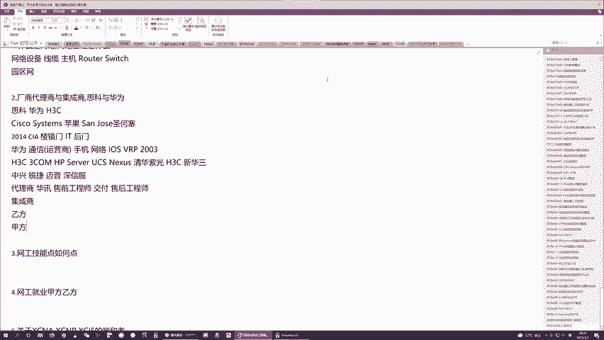

干的特别舒服啊干的特别舒服。然后呢，就是最近疫情嘛，他本来还想要考一个新的CCIE嘛，考不了啊，新西兰考CCIE只能去澳洲考，他得要等疫情结束了也快了啊啊，我估计最多吧下个月下下个月啊。

基本就是澳星之间就可以对吧？随便跑了。然后在届时的话，想要把这个最新的EI给考掉啊，当然这是后话了，就是跟大家说一下，这个甲方呢一般是咱们IT人员的最终的归属啊，因为你在乙方虽然看起来乙方的薪事很高啊。

但是都是你拿命来拼的啊，因为你在乙方如果说你是做售后啊，你经常需要深夜去给别人割接嘛，对吧？深夜做项目啊，因为你给一个甲方你提供一个方案，这个方案不可能从零到一来组建一个网络嘛。

一般是给网络做一个一期升级，二期升级，对吧？一期改造，二期改造这个改造一定会影响到这个正常的业务的这么一个运转啊，它会导致断网。那所以说为了避免断网产生影响，所以说咱们一般在做这个网络改。

改造的时候在做升级的时候都是晚上。对，都是晚上。那所以说就是你需要经常熬夜。然后呢，客户的话可能存在于。各个省市任何的位置啊，那所以说你可能会经常的出差啊，很很累啊，乙方特别累。

所以说如果你年龄很很年轻啊，十几二十岁，对吧？你做乙方，我觉得没有任何问题。但是如果说你是超过35岁以以上的话，你如果再去做乙方的话，你的经历可能会跟不上。啊，你的经历可能会跟不上。对。

因为你可能熬不动业了嘛，然后你出差的话也没有那么多热情了，所以说咱们一般的在乙方，我们的晋升路线是什么样的，就是你学完网络之后，对吧？你考一个认证啊，你先去做售后。或者说你做技术支持啊。

然后接下来你做着做着对整个领域有足够的认知之后啊，如果说你愿意做销售啊，你可以往售前方向去转啊，先转售前啊，再转销售啊，这是就是比较稳妥一条路线啊，因为售前的待遇比售后肯定是要高很多的啊。

当然如果说有的人说我不要，我就是选欢技术，我就是想把售后做到底，那也没有问题啊，因为售后做到底的话，一般在一些乙方，咱们能做到什么？对，能做到这个技术总监嘛，对不对？你能做到技术总监。

你能作为整个公司的技术骨干啊，你能作为这个技术总负责人，那这条路线的话，就需要你苦一些啊，你可能就是做工程，你要做到。对吧30340岁嘛，然后你还要不停的学习一些新的架构，学习一些新的技术。

你要不停的革新，对吧？你要做整个公司的这个技术骨干啊，当然待遇很高啊，这两条线就是你在乙方混。然后在乙方混到一段时间之后。由于这个IT嘛毕竟是青春饭啊，你不要指望在国内，对吧？你有五六十岁了。

你还在乙方去做，不可能的，乙方不可能会要五六十岁的人啊，所以说如果你真的是到五六十岁了，对吧？啊，我建议大家还是尽可能能养老就养老啊，这个养老的话，最好就是在甲方，因为在甲方你不需要实际的实施嘛，对吧？

那对于整个的这个IT你只要了解个框架就好了，只要这个框架，你在不停的更新，你只要知道适配咱们甲方的最优的技术哪些就O了，而至于这个技术怎么去调试啊，你交给乙方去做，对吧？你只要有这个大局观。

那我觉得就足以让你在甲方能够立足啊，并且甲方的工作会比较清闲一些啊，也不需要你经常熬夜啊等等之类的，对吧？然后有问题，你更多的找对吧？乙方就O了嘛，对不对？有锅乙方背，对吧？有活乙方盖。

你更多就是怎么样，作为甲方和乙方的这么一个对接人嘛，对吧？你来提供一些方案，对吧？来给。的公司哎制定你们的IT战略。然后你负责当这个系统正常运作的时候，你来负责做运维是吧？这是你更多干的事情。🤧嗯。

OK那这就是咱们网工的这么一个职业生涯啊，给大家这么一个简单参考。然后接下来为了就是成为一个合格的网工，咱们肯定是需要一些技能的啊，因为咱们毕竟是要干专业的事儿嘛啊专业的事儿咱们需要专业的技能。

那这个技能呢，咱们以售后为例啊，售后需要具备的技能有这么3块。😊。

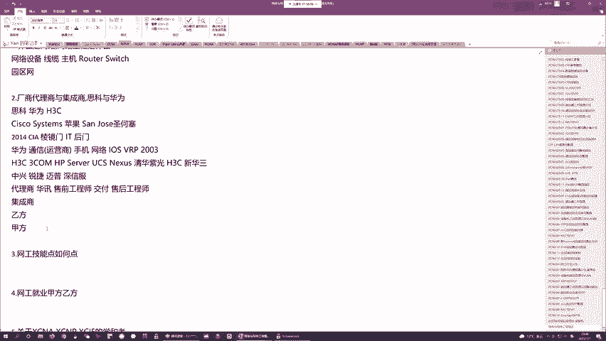

啊，你首先需要懂得咱们网络的通信原理，对吧？你端到端通信，比如说你两台主机，你聊QQ，你聊微信，对吧？你微信所产生的这些对吧？数据是怎样通过网络传输的啊，以什么样的格式来传，怎样到达目的地，对吧？

目的地收到你的流量之后，怎样接收，怎样判断这股流量该交给哪个应用来处理，对吧？咱们需要懂这些啊，所以说呢基于这点，咱们要了解一个协议站，叫OSII啊，当然咱们更多的用的TCPIP啊啊。

那针对TCPIP你要了解里面的很多技术啊，咱们端到端的通信的这么一个方式，对吧？端到端通信的这么一个细节，端到端通信的原理啊，你得知道咱们网络为什么能通啊，你就能知道当网络不通的时候。

咱们到底该怎么去怎么去查错的，对吧？这个很重要，你需要了解咱们网络的通信原理说白了，你要了解各种各样的通信协议啊，然后接下来这是第一块，第二块。你要了解咱们网络的架构啊，对吧？

比如说你要组建一个企业园区，对吧？校园网怎么组建医疗网络怎么组建政府网络怎么组建，军方网络怎么组建，对吧？因为不同的甲方，咱们不同的客户啊，有不同的需求啊，针对这些客户的不同的需求，你在设计网络的时候。

你或多或少都会有一些差异嘛，对吧？当然有一句话叫做万变不离其宗，你得知道对万经油的这么一个园区设计方法啊，你得先知道咱们的园区的骨干，骨干知道它长什么样了，你可以针对客户的需求啊来做一些微调，对吧？

你得了解各种各样网络架构，对吧？企业网架构运营商架构，数据中心架构，对吧？三层架构，两层架构，你都需要知道啊，这个架构如果你了解清楚了之后，无论是在做售后的时候，还是在做售前的时候，对吧？

都会给你提供更多的这么一个谈资嘛，对吧？你跟客户聊的时候呢，客户对吧？跟你了几句。就能知道你到底几斤几两。如果说你对这个架构很熟，对吧？很清楚，对吧？再加上这个客户本身如果懂技术啊，对吧？

聊着聊着可能客户就会特别欣赏你嘛，就会采纳你的这个方案。然后接下来还有一点，不要忘记了啊，咱们在组网的时候呢，你设计好了这个网络架构，对吧？你采购了相应的设备，你组网对吧把它们连在一起了。连在一起之后。

这个网络不通的啊，因为咱们在设计网络的时候，咱们更多的是使用企业级的这些网络设备啊，这些企业级的网络设备，都是需要调试的啊，它们内部都包含一个操作系统啊，你想要在设备上启用一些功能，你需要配置命令啊。

这个命令咱们可以通过传统的colide方式来配置啊，你也可以通过新型的叫netcom。rest这种对吧？标准化的方式来配置。当然不管怎么样，你需要了解咱们这些设备怎么登录啊，图形化界面怎么配置。

命令行怎么解怎么配置，对吧？咱们的这个LOSVRP它的对吧？原生态的操作系统的命令行，咱们要会然后呢新时代SDN架构下，咱们的net con rest con这些标准化的配置，咱们需要会对吧？

你得要拿到一台设备就知道咱们把它玩转。对吧？比如说OSPF怎么起啊，sigment routing怎么配置啊，MPVPN怎么排错啊，对吧？这些如果你不会配置，你不会命令啊，会非常非常难啊。

基本这三点如果ok了啊，哎，作为一个。初级的网工我觉得是没有任何问题的。

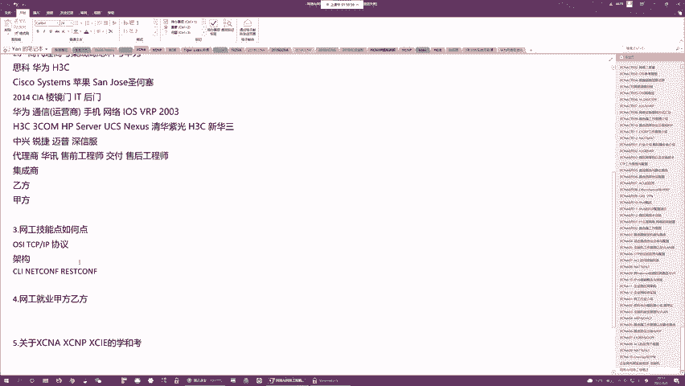

那当然随着这三个技能点，大家点的越来越深啊，点的越来越多，对吧？你可以慢慢的晋升为中级工程师啊，高级工程师啊啊，这个在国外都是通过这个方式来划分的对吧？你可以做junior，就是起步的嘛，初级工程师。

然后慢慢的升级成什么啊professional，然后呢升成senior啊，都是这样的。

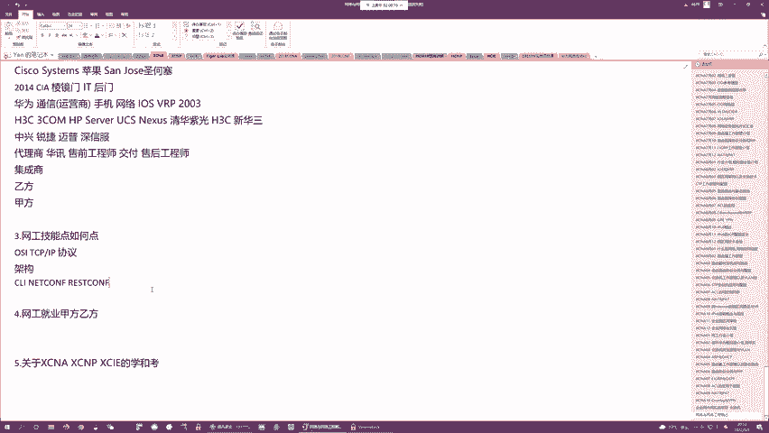

然后接下来随着大家的技能的提升呢，咱们这个课程也会有提升啊。我们当前这个课程呢是NA课啊，也就是初级课程。作为最初级课程，我假定大家都没有任何基础啊。

我会从0到1的给大家讲解咱们网络的端到端的这么一个运作方式啊，我会给你们讲一些协议的这么一个最基础的工作原理啊，教大家一些最基础的命令，让大家最起码从0到1的了解咱们整体的网络框架啊。

让你们能做一些比较简单的项目，做一些比较简单的实验。

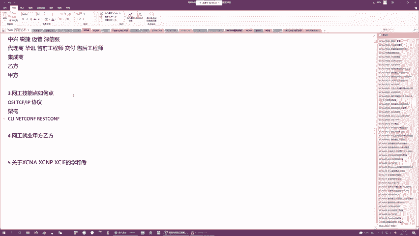

然后随着技能的增加，哎，你们NA如果掌握扎实的话，哎，就要进入到NP的学习了。NP是中级课程，比NA呢难一些啊，难一些，深度要深很多啊。但是呢广度没有NA那么广啊，那在NP阶段。

咱们重点是基于路由交换啊，基于一些自动化给大家扩展你们的知识的深度啊，让你们在面对一些复杂的项目的时候，对吧？面面对一些复杂的技术点的时候，对吧？你们有分析能力，你们有排错能力，你们有网络的设计能力。

有优化能力啊，那当然学咱们的网络最终级的肯定是要IE了，这个叫互联网专家啊，作为互联网专家，哎，最高级的它是。算是金字塔的顶端了啊，那IE的话，咱们当前两个厂商的思科的叫CCIE啊。

华为叫HCIE华三叫H3CIE啊，当然由于华三的不太行了，所以说咱们一般当前提到的IE更多就是要么思科的，要么华为的啊，这个IE呢算是。算是什么呢？算是高薪的保证吧啊，你想要网工这条路啊走的比较好。

你想要告诉别人，你是一个对吧？能赚到年薪30万以上的网工。IE是必不可少的。就我讲网络讲到现在啊，12年时间了，在这12年时间里面，我带过无数个学员。无数个学员比你们大的，比你们小的都有。啊。

然后呢我也见过很多的学员啊，之后呢，就是学完网络之后混的一般般的。也有很多学员学完网络之后混的很好啊，我是个诚实的人，我不能跟你们吹牛逼啊，我不能说我带过的所有学员都很牛逼，这就是骗你们啊。

有很多混的很好啊，但是呢也有一些混的不好的。但是呢一般我能见到的混的比较好的都是清一色的考过IE的啊，无论是在甲方还是在乙方啊啊，通过癌E症，最起码他们就是。在找工作的时候啊，跨越了一个阶层。

那当然找到这个更高层次的工作之后的话，他们肯定需要努力啊，对吧？你不努力嘛？你这个对吧工作就算你offer拿到了，那人家公司可能会把你裁掉啊。啊，他们肯定是努力的，但是在他们努力之前。

他们先得要拥有这个offer啊，得要最起码有这个面试的机会啊。我想说彭志，他之所以能能进申信福啊，我觉得原因就是因为他有HCIE他如果没有HCIE的话，申信福根本不可能会要他那个三本的人。

对啊那包括子业以前在对吧？电力系统做销售的啊，他能去协星的IT部门来做系统管理员，也是因为他有CCIE如果没有CCIE协星，怎么可能会要一个销售来做技术呢？是吧？包括我前两天啊。

我有一个学员是我非常非常早的一个数据中心方向的学员。叫方启帆。或叫大方格。啊，这个哥们儿特别励志啊，91年的啊，应该算是年龄挺大了吧，今年31岁啊。啊，他就是一个普普通通的。

我不知道是大专还是中专毕业的，反而学历很低啊。然后他刚毕业之后呢，一开始去了深圳。啊，月薪是2500还是3000啊，反而非常非常惨。然后呢，后来发现就是这样混不行，然后呢，就是来找到我来学习。

但是呢他真的是没有钱学习啊，因为当时数据中心的IE特别贵。啊，当然学费都是两三万三四万的啊，以前学IE比现在贵很多啊，他没有钱怎么办呢？对吧办了很多信用卡对吧？各种套现啊各种套现。

然后呢来满足他的这个日常的开销，包括学习。然后呢，他命不太好，考试呢第一次没有考过，第二次考过的。然后呢，自从考过了CCIDC之后，他的人生就开挂了啊。由于在北京考的嘛。

考完之后就是直接在北京当地面试啊，刚拿到号，刚刷出pass啊，就直接去面试。然后呢，去了这个北京的移动啊，去了这个啊一开始去的不是移动啊，一开始去的是那个。电信系统集成公司啊，去的电信系统集成公司。

虽然是电信的一个外包啊，然后在外包呢，倒是给他开了8K。啊，干了没一年跳槽了，跳到移动了，还是在北京给到15K。然后结果后来呢移动把它调到了杭州咪咕啊，直接从15K已经变成年薪30万了。

然后现在经济不好嘛，对吧？国企也混的不是特别好，然后呢，他从咪姑也离职了，因为他拿的咪姑的薪水很高，但是给他干的事儿啊，就给他分配的活很low啊。就是他前两天刚来南京找我啊，从杭州来南京找我。

就跟我吃了个饭嘛，就跟我说了。咪咕呢给他开30万，但是呢给他干的事儿是年薪十几万的人干的事儿啊，他觉得这样下去，第一他会废掉。第二就是他这个薪水拿的比较心慌嘛，然后后来就辞职了啊，裸辞了。那裸辞之后呢。

就是他本来想去移民的嘛，跟子叶一样，想移民，可能也是听了子叶的故事听的比较多嘛，他想要去日本。但是后来新冠了啊，去不了，本来呢语言学校都都报报名了，对吧？都就就差去了，然后后来呢这个新冠嘛，对吧？

疫情各个国家都封国了，所以说去不了啊，那去不了怎么办呢？他就是对吧？浪了一段时间啊，然后发现不能这样下去了，然后呢，面试阿里。以他的学历啊，虽然说他就是在工作的过程中啊，也读了什么在职的什么本科啊。

在职的硕士啊，但是都是函授的，没有什么卵用啊啊，硕士学历还没有拿到。哎，目前就是一个函授的本科啊，然后接下接下来就是基于他的两张癌疫证啊，他就是成功的，前两天啊刚跟我说的成功的拿到阿里的offer了。

P7。P7啊，然后呢给他的税后的年薪是36万啊，总包所有所有7788加在一起啊，是40到50。啊，P7是什么概念啊？😡，呃，P7的概念就是你基本可以衣食无忧吧啊基本可以衣食无忧。P7干个两三年。

杭州买房妥妥没有问题，虽然他已经买了啊，但是他贷款嘛啊，贷款，所以说为了尽快还完贷款，他觉得利率太高了，想找到一份高薪点的工作，然后去了阿里。然后呢，在阿里的话，他也打算就是干个两三年吧。

然后呢之后找一个甲方去养老。啊。反正总而言之，就是给你们讲这些故事都是真实的人啊。这些人的话，你们找到班主任都能找到真人。杭州真是个好地方。一般般吧啊一般般，他家是马鞍山的啊，他家是马鞍山的。

离南京特别近。呃，华山公司现在怎么样了，还行吧，还行。更细的不能跟你们说了啊，更细的不能跟你们说了。😡，但是只能说就是如果你们有的选择啊，就是我觉得有些二线厂商甚至要比华三要好。

现在的美国3com嘛呃没有研究哎没有研究。可能也还不错，你们可以就是百度搜一搜嘛。啊，被被惠普收购的是华三啊，是华三被惠普收购的。可能3com。倒闭了。我也不知道啊。啊，有人问CCIE的无线怎么样？啊。

CCIE无线的话，最起码要先学1个EI啊，就是所有网络的方向，最基础的是RS叫路由交换方向。

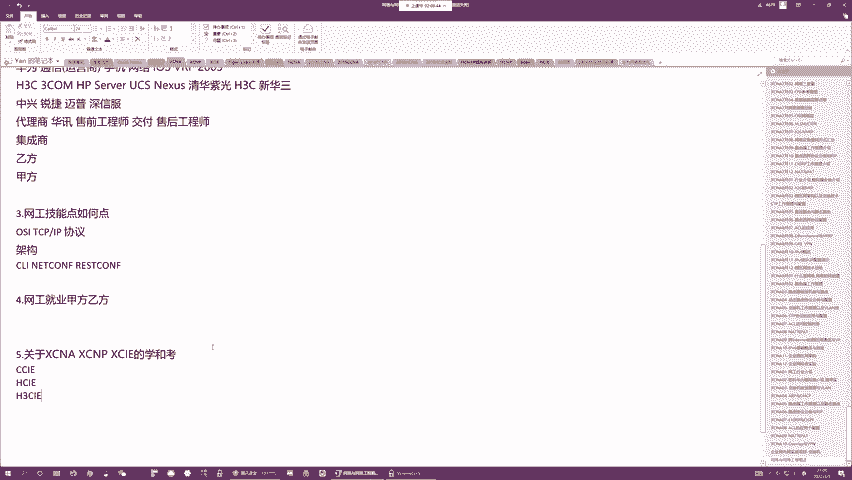

啊，路遥交换方向。那这个路遥交换方向呢，随着就是思科华为提出的新大纲，他们已经对吧？把路由交换给淘汰了啊，因为路由交换的面比较窄啊，思科呢把IS升级为了EI，叫做企业基础架构啊。

华为把它升级为了叫daatecom。这是最基础的啊，就是你们要研究网络的话，你要先了解咱们网络路由交换的功能，包括咱们企业网络架构啊。如果这些都不了解的话，你直接去单去学一个无限，你没有用武之地的啊。

你没有用武之地就是。你要组建一个网络，咱们肯定是要先把有线的部分给搭起来啊，你要在有线网络技础之上，你添加一些无线的产品来提供无线的功能啊。同样你在组网的时候呢，不管你怎么有什么样的安全的需求啊。

你首先得要保证咱们的网络先建起来啊，它能通啊，你在网络能通的基础之上，你再给它添加一些安全的产品，添加一些安全的策略，对吧？来增加咱们安全的防御能力，对吧？满足咱们安全的需求，啊，那同样了咱们的企业吧。

对吧？里面用到路由器交换机，对吧？在数据中心，咱们用的是高级的交换机嘛，但是基本的交换功能也是一样啊，比如说咱们在运营商用的高级的路由器，对吧？那高级的路由器也是基于这些企业的低级路由器演化而来的嘛。

对不对？这些低级路由器的功能都是有的啊，你要了解这些高级产品的使用，低级的，你得先玩六嘛，如果你低级的没有完六的话，你直接把高级的肯定是玩不动的O吗？啊。はは。😊，啊，如果你们考完EI的话。

下一个方向可以可以就是要么安全，要么DC嘛？二选一。啊，无线的话，这个方向比较小啊无线这个方向比较小，并且一般这个无线方向你可以理解为就是数通的一个升级版啊，它是数通的一个补充啊。

因为你现在任何企业园区，你不可能说是不用无线，你一定要用无线啊，而你在部署无线的时候，你不可能说一个企业往端到端都是无线啊，你得先把有线网络给部署起来，你在有线网络基础之上，你添加一些AP啊。

添加一些控制器啊，对吧？你来提供这个无线的覆盖，O吗？但是这是有个大前提，这个大前提是什么？就是你的有线网络，你得能够组建起来，能理解吧？所以说就是。思科啊，他把这个路由交换方向淘汰之后，不是叫EI吗？

那思科曾经的无线方向，它升级为的叫EW啊，一个叫做企业基础架构，这个叫EI嘛，一个叫企业无限啊，然后呢这两项考试，他们共享同一个笔试。你考同一个笔试，这个笔试考完之后，你既能考EI又能考EW。对。啊。

DC指的不是预控啊，DC指的是数据中心叫。Daate center。啊，就是咱们IDC机房啊等等之类的。啊，那这就是咱们的。方向的问题啊，当然这个方向的话，大家不用太过在意啊。因为如果说你们是入门的啊。

从0到1入门第一个方向相信我一定是路由交换啊，一定是路由交换啊，都有很多方向啊，都有很多方向。华为也有安全，华为有DC也有云计算。但是呢我之所以没有提华为那么多的方向，原因是因为华为虽然方向很多。

但是你知道。华为的芯片被。对吧被美国压制了之后，他的这些乱七八糟的新的业务，我不知道能保留多少啊，就比如说华为呢，它在这个企业网的这个业务中，它也包含服务器嘛，啊，以前关于服务器，它也出了一些认证。

像云计算像智能计算，然后现在这个服务器它卖掉之后那私有云你就搞不起来了呀，对不对？你私有云搞不起来，那你这个云计算方向，对吧？你就只能转吗，转成公有云，然后你智能计算你也搞不起来。

所以说华为当前我觉得能够保得住的啊，企业网项目能够保得住的，可能只有路户交换，所以说这个datacom是我比较看重的啊，其他的方向啊，就算你考了，万一你考完之后，人家业务不做了，那这个就对吧？抓瞎了嘛。

🤧嗯。呃，活动目录的话是属于系统啊属于系统。你研究这个windows server啊等等之类的啊，系统里面包含活动目录。啊，当然对对对，你在安全的领域中的话。

你可能需要一些安全的服务器跟我们的活动目录去做一个交互嘛，对吧？比如说在四科安全里面。你涉及到了活动目录跟ISE之间的一些策略组的打通啊，那这块的话就是会涉及，但是。

不会说是针对活动目录啊去给你过多的去展开。好吧，因为毕竟咱们还是个网络的课程，更多的还是围绕网络O吗？好，那接下来就是我自我介绍一下啊，呃，我姓闫啊，我叫闫辉。然后呢，我是咱们泰格的主讲师啊。

我呢既是CCIE也是HCIE这边的话是我的编号啊，证书编号我的CCIE是21820。然后呢，我的HCIE是3206。

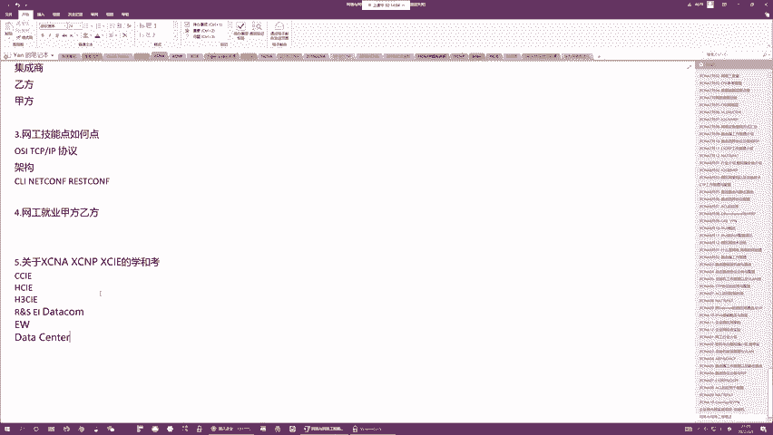

考的比较早啊，我CCIE是08年考的，然后呢，考了5个方向嘛。HCIE呢是15年考的，基本都是。算是考的比较早吧。然后呢，就是执教以来的话，我也一直不停在学习新的技术啊。

技术革新的话虽然没有一线的工程师那么快啊，但是教大家，我觉得绰绰有余啊。那接下来这整个3月啊NA课呢就是由我来给大家主讲啊，我希望呢就是经过这一个月啊，首先能够更多的认识大家。

然后呢也能就是给你们一些对吧？行业相关的资讯，最关键的是我希望就是通过这一个月的课程，让大家能够成功的入门网络这个领域。我希望就是通过学习能改变你们的命运啊，虽然说咱们现在的时下就是经济没有前几年好。

但是呢我也希望通过学习，让你们能够对吧？有效的对抗这个金融危机啊，在这个金融危机中，你们能够找到，对吧？属于你们的行业的这么一个角色啊，然后呢让这个角色发光发热啊，当然这是后话。啊。

当然这个就是咱们整个服务体系呢，你们都有班主任吧，对吧？任何学习上的问题都可以问班主任。然后呢，平常的话我的答一时间是在晚上的5点到6点啊。当然如果说不在这个时间，你们如果有任何问题的话。

都可以问这个助教老师，好吧。呃，那今天的话咱们作为第一节课就不讲什么技术了。然后呢，咱们从第二节课开始来正儿八经讲技术啊，不管你们之前有没有听过咱们的课程啊，我希望大家呢这这一轮课的话，都可以来听一下。

因为这一轮课的话，从头到尾都是我直播的啊，然后呢我也会经常看你们的弹幕，你们有任何问题的话，在弹幕里面看了。如果就是在弹幕里面发了，如果我看得到的话，我都会给你们解答啊，当然如果看不到的话。

那我也不会回过去一条条看啊，你们这边的话反正都有加咱们的这个群嘛，对吧？你们如果说有什么问题在课堂上问了，我没有看到啊，你们可以在群里面去提问。啊，也可以艾我。好吧，也可以艾特我。好了。

那今天咱们就这些内容吧啊，大家有任何。😊，はは。😊，对，每天晚上5点到6点答疑啊，没有错。啊，锐捷中信的交换机路由器用的是那个思科的操作系统啊。就是全世界90%以上的厂商，只要你没有操作系统研发能力的。

基本都是使用四科的系统。然后接下来华为华三用的是同一套系统，但是这是曾经啊，现在华三的操作系统越来越贴近思科了。啊，早期华三的操作系统跟华为是一模一样的。啊，但是现在来看的话，这个V7的设备。

V7的设备华三的某些命令啊已经变得跟思科一样了。啊，不再像花呗了。对，华三都支持EIGRP了，没有错。EIGRP曾经是个私科私有协议，华为不支持啊，但是华三支持。好吧。好，那今天咱们到此为止啊。

大家有任何问题可以在群里提问啊。然后明天晚上7点半啊，咱们准时还是我来给大家带来直播，然后呢，明天咱们来讲技术啊，大家可以提前做好预习好吧，今天咱们到此为止，大家拜拜。

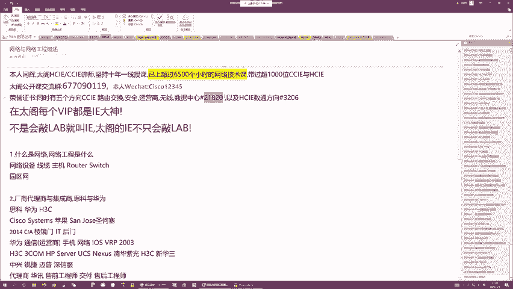

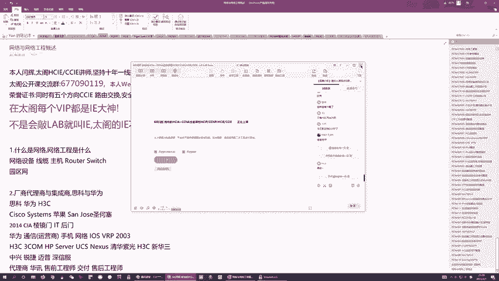

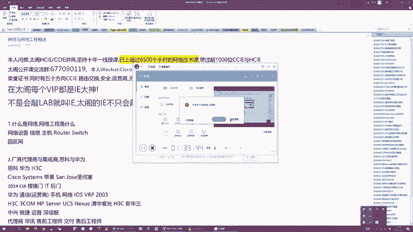