# 2022新版华为认证HCIA→HCIP→HCIE【持续更新！】超35000分钟最猛全套教程！零基础直升IE大神！HCNA／CCIE／CCNP - P2：2022XCNA02-网络三要素 - 永远冲在网工第一线 - BV113411T7oJ

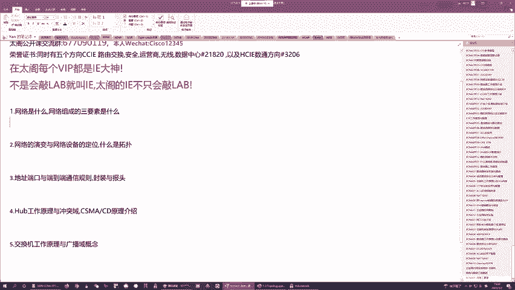

好的，那这边的话算是咱们N课的正课的第一节课啊，呃我们来讲一些基础的概念。这节课呢会给大家介绍很多基础概念啊，比较琐碎啊，你们就是连贯着听嘛啊，那今天呢咱们主要解决的问题就是让大家了解什么叫网络。

然后了解网络怎么组建啊，了解网络中通信的这么一个流程啊，那基本就是咱们今天要做的事情。OK那言归正正，我们先来看一下到底什么叫网络啊，这里网络呢咱们泛指的是计算机网络啊，计算机网络。它是什么呢？

你可以理解为网络就是流量的载体啊，承载着数据流量，给你提供这个数据流量的传输能力。OK吗？那为谁提供呢？为各种各样的应用程序啊，应用程序安装在计算机上，对吧？你计算机连接网络，那应用程序呢有通信的需求。

那这块咱们通过网络做媒介，对吧？让你应用跟应用之间利用网络的数据传输能力啊，来相互传输数据流量，那最终的目的是什么呢？就是实现资源共享啊，这就是网络定位。那接下来网络里面包含哪些东西呢？

其实上节课咱们也说了啊，主要是三要素啊，哪三要素呢？分别是。😊，网络设备啊，这个咱们称为叫中间系统啊。然后呢，像咱们的计算机啊，打印机、服务器啊，这些咱们称为叫终端啊，这些咱们称为叫终端。😊。

然后接下来哎还有线缆，各种各样的介质啊，线缆。那当然这个线缆的话呢有两类啊，一类是有线的啊，一类是无线的那这块的话无线比较复杂，咱们日后呢慢慢去对吧？聊，那这边的话呢，咱们先来讲有线的，这个有线的线缆。

对吧？大现比较多的有同轴电缆啊，对吧？光纤啊、双角线啊，对不对？哎，那咱们还有一些广域网的s线，那这就是连接的这么一个介质啊，然后接下来咱们网络怎么组建呢？很简单，哎，你采购一些网络设备，通过介质。

对吧？就是通过线缆啊连在一起，然后呢，有些网络设备在连线，把我们的计算机连进来，对吧？那通过连接这个网络组建了，组建完毕之后呢，计算机跟计算机之间，你们的这些应用啊，就可以利用网络的连通信来传输数据啊。

最终实现资源共享，这就是网络的这么一个定位。😊，那最早期的网络呢其实没有网络设备啊，最早期的网络咱们只有终端啊，只有介指。最比如说两台PCA连一根线。这个组成的其实也叫网络啊。

只不过这个网络比较low啊，是网络的一个雏形。这种咱们称为什么呢？我们称为叫工作组啊，工作组是微软起的，对吧？盖茨给它命了命啊，那这个工作组特指的是什么呢？就是你主机装window系统，对吧？

然后你们之间通过双绞线互联啊，互联计算机一般用的比较多的双绞线啊。双绞线啊，就是咱们的网线嘛啊俗称网线啊。这是一类以太网线缆啊，你通过这种线缆连接而成的网络啊，我们称为叫以太网。好吧。

那接下来这个主机之间呢利用这个连接，咱们也是能通信的啊，那这就是网络的雏形。当然这种网络呢有很大的缺陷，缺陷是什么呢？就是不可扩展啊不可扩展。这个扩展两个方面啊，第一个方面就是在这个网络中。

你填充不了更多主机。好吧，比如说你想连个主机C，连个主机D啊，你连不进来，为什么？因为主机连网线的接口，咱们称为叫NIC啊，叫网络接口卡简称叫网卡，啊，那一般网卡呢，咱们台式机对吧？一般只有一块。

当然你可以扩充啊，2块3块，那基本就是极线了，而对于咱们的笔记本，对吧？那网卡肯定是toto，只有一块啊，你一块网卡只有一个口，你只能连一根线，对吧？那这个时候主机如果只有一块网卡。

你是不是只能连接一根线，对不对？那你连接一根线，你也可能只能怎么样连接到对端的一台计算机，那现在如果你有三台计算机，你希望把它们彼此连在一起，对吧？那你最起码你需要2块网卡嘛，对不对？

如果说你们有2块网卡，那这个连接就是不成立的啊，工作组往往在一个工作组中啊，咱们只会包含两台主机，这是第一个限制。第二个限制啊，主机之间由于你连的是对吧？双绞线嘛，这个双绞线的内部的结构是有8根线芯啊。

还有8根线芯。然后咱们是要通过什么啊？我们是要通过这8根线芯啊来传我们的数据，好吧，来传我们的数据。呃，数据对吧？它以什么样的形式来传输呢？对？以比特流的形式来传输啊，通过电来传输。

这个比特呢是二进制的位啊，它是二进制的位啊，一个二进制的位我们就称为叫一比特，对吧？由于是二进制嘛，它的取值要么是零，要么是一对吧？我们在传输这些零和一的时候，哎，它是通过高低电平的方式来传都传输的。

好吧？通过这个方波嘛，对吧？通过方波啊，高电压代表一低带电低电压代表零，对吧？我们通过高低电压高电压对吧？通过一个波形编码啊，然后来给你传输这些数据，O吧？但实际上它是通过电流的方式来传的，对吧？

那这个双绞线呢里面的八根线星都是铜质的啊，对吧？它是铜丝，这个铜呢导电，对吧？你利用这个铜线，你就可以对吧？传输你的电流，然后让对方知道你传的是什么，OK那当然为了保证对端的这个主机啊。

通过线来收到你传。这个信号它能够理解哪个是零，哪个是一，我们是有要求的啊，有讲究的这个讲究是什么呢？就是你线缆不能太长啊，你这个双绞线为例啊，我们有一个官方的指标哎，公公公公认呢业界的这么一个指标啊。

这个指标就是你在做线的时候啊，一般这个线呢都是半成平线啊，对吧？你买回来之后，你得要打水晶头嘛，对吧？你要去做线，那一根双绞线的长度最长不要超过100米，因为如果你一旦超过100米了，对吧？

你这个线确实能够做啊，也能连，但是你通过这种比较长的线缆，在传输的时候啊，有可能信号对吧？经过长距离的传输，它会过分衰减。哎，以至于对端的主机虽然能够收到你发的数据，但是不能理解你发的是什么。

那这样通信就失败，能理解吧？那为了避免通信失败，咱们就有个国际公约啊，你在做这个双绞线的时候，一根双绞线的长度不要超过100米。哎，因为咱们传输数据都有衰减啊，你通过任何导电的材质来传输电流，对吧？

你电流传的时间越长，你电流传的距离越远，你的电信号对吧？就会越弱。这个咱们称为叫衰减。那由于万物都有衰减啊，对吧？那所以说你计算机之间不管连接什么样类型的介质啊，对吧？你都有一个最大程度限制。

那这意味着什么呢？这意味着你在组建工作组的时候，主机跟主机之间你不能离太远啊，如果你离得太远对吧？你勉强把它们连在一起，他们也许能通信啊，但通信的质量会很差，好吧，那所以说为了保证咱们网络可扩展啊。

那咱们在组网的时候呢，才牵扯到了这些网络设备啊，也就是路由器啊，交换机啊等等之类的那这类网络设备填充过来之后啊，咱们这个网络变得更灵活了，对吧？并且更具可扩展性，网络设备的定位是什么呢？

就是他们的接口都比较多啊，通过各种各样的接口来给我们提供大量的连接是吧？然后接下来网络设备存在于咱们主机中间啊，它负责帮我们主机之间啊，在通信的时候呢，做流量中转啊，网络设备的定位就两个一个是提供连。

😊，いや。还有一个就是对吧？当数据过来了，他来帮你去做一个转发。好吧，这就是网络设备的定位。那接下来这个网络设备呢，它是一个泛称啊，里面包含了很多种类型的设备。那在我们这个对吧？

EI和daatecom的NA阶段啊，我们主要涉及到的是两类设备，一类呢叫交换机。

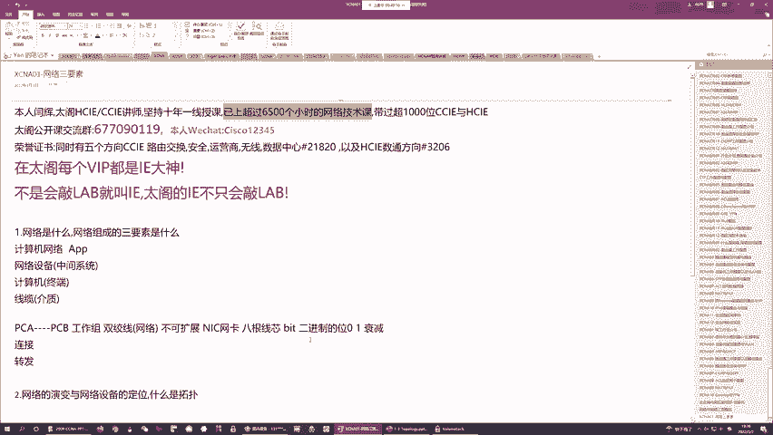

还有一类叫路由器，好吧，一类叫交换机，一类叫路由器。前者叫交换机啊，后者叫路由器。当然咱们还有很多其他类型的设备啊，那这些设备的话，它们各有用途啊，那在NA中呢，咱们没有必要研究那么多啊。

先研究最基础的啊交换机路由器搞定了哎，再去研究什么防火墙啊，无线控制器啊、AP啊啊等等之类的OK那接下来咱们先来区分一下这两类设备啊，这个交换机跟路由器差距是很大的啊。交换机是一类什么样的设备呢？

是一类接入设备啊，是一类接入设备。😊，这个接入设备指的是什么呢？就是这种设备口很多啊？它有很多接口能连很多线啊，这种设备在定位上来看，它一般的是在网络最边缘，哎，咱们把这个设备连在网络最边缘。

它有很多的口能用它来干嘛？对，连线把我们的终端连接入啊啊，这就是接入设备的定位，你存在于网络的最末端，你接口很多啊，端口密度很高，我们通过你的这么多的接口连接了对吧？N多的线缆，对吧？线缆连到哪里啊。

连到咱们的终端嘛，连到打印机啊、服务器啊、PC啊，对吧？通过这些接入设备哎，我们这些终端就能连接入网了啊，它就是连接PC入网的接入者O吗？而这个路由器呢它是非接入设备啊，它是非接入设备。

那所以说呢这类设备它的定位就是非网络边缘啦，一般是在网络比较核心的中心位置啊，这种设备的接口也没有那么多，对吧？它也不需要那么多接口啊，因为你不是直接通过它连线，把我们的计算机呢连接入网的。

路由器的定位是什么呢？是存在于多个网络设备中间。哎，咱们通过路由器来连接众多网络设备来把网络呢去组合在一起。好吧，让网络越连越大啊，那它的定位就是存在于网络的中间，哎，否则把多个网络设备连在一起啊。

让网络设备跟网络设备之间能够相互通行。好吧，这是他们的定位。那接下来这块的话，咱们要组网肯定是要先采购交换机的嘛，对不对？你通过交换机哎，众多的接口把我们PC连在一起组成网络，然后咱们有一个又一个网络。

那这些网络之间如果要相互通信啊，咱们通过路由器，把多个网络连在一起哎，这就是网络组网的这么一个方式啊，最早期组网没有网络设备，这个叫工作组啊，哎能通，但是它不可扩展。为了网络能扩展，哎。

也就是说为了在一个网络中啊，咱们拥有更多的主机，为了让主机跟主机之间能够离得更远，对吧？咱们设及到了网络设备啊，网络设备这么两类，一类专门负责连接计算机组成网络啊，一个用来把多个网络连在一起。

形成什么呢？哎，形成叫互联网，那这里又提出了一个新的名词啊，一个叫做网络，这个叫network，一个叫互联网，这个叫internet。啊，这是两个不同的词啊。这个所谓的网络指的是什么呢？就是牛交换机啊。

连接众多的主机，你所组成的这么一个环境啊，这个咱们就称为叫网络。比如说以这张图为例啊，你一台交换机通常要么24个接口，48个接口，96个接口啊，你能连接N多主机的对吧？你连完主机之后，那这么一个环境啊。

这就是一个网络。

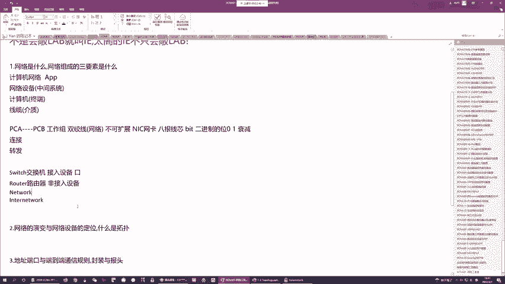

那当然有人问你交换机接口有限啊，如果说你的主机数量超过你接口的数量怎么办啊啊，没有关系，你可以再连一台交换机，对吧？你在一个网络中可以存在多台交换机，好吧，比如你有200台主机，你可以连4台交换机。

你有300台主机，对吧？你可以连6台交换机，这个都是没问题的啊。交换机之间彼此连接，每台交换机再通过下连接口，把我们的计算机啊连接入网，okK吗？这是没问题的。然后接下来当前这个环境。

这其实是一个互联网啊，因为你会发现左边这网络A，对吧？右边这网络B，然后呢中间连的是一个路由器啊，路由器的画法就是圆的啊，路由器不会直接连接PC啊，它会连线连到我们的交换机哎。

负责把多个独立的网络连接在一起。这个形成的环境啊，我们就称为叫互联网啊，这就是互联网多个网络通过路由器啊，这个设备咱们也称为叫网关啊，通过网关把多个网络连在一起，对吧？那这个环境咱们就称为叫互联网。

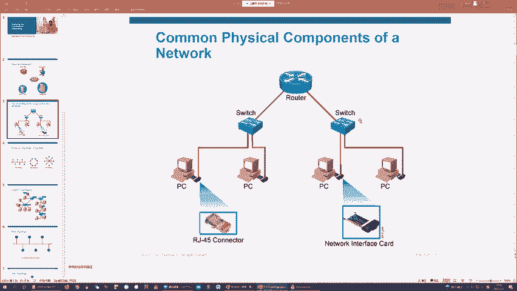

那所以说对于主机而言，咱们连接了网络是为了通信，对吧？这个通信又分为两种啊，一种咱们称为叫网络内通信。一种咱们称为叫网络兼通信啊。所谓的网络内通信就是我的通信对象啊，跟我在同一个网络。

咱们之间彼此发送数据，这就是网络内通信。那如果说对端跟我属于不同的网络。比如说我在网络A啊，对方在网络B。那这个时候咱们端到端跨越路由器的这种通信啊，我们就称为叫网络兼通信啊，网络内通信网络兼通信啊。

咱们之后呢要去研究的是吧？现有这么一个概念。

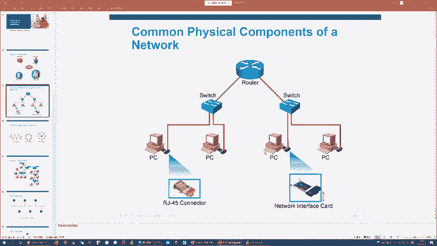

网络内通信和网络间通信他们是有差别的。哎，之后咱们去细讲，好吧，那这就是组网。

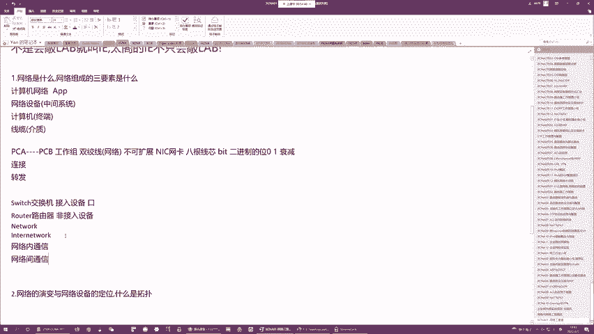

那首先呢解决大家大家心中的一个疑惑啊，就是交换机接口很多，对吧？你通过它连接计算机能够组成网络。那既然咱们在一个网络里面可以肆无忌惮的填充交换机，那咱们能不能把所有主机，对吧？比如一个园区内所有主机啊。

咱们能不能放在同一个网络呢，对吧？为什么要采购路由器呢？为什么要通过路由器来隔离多个网络形成互联网呢？啊，当然是有原因呢？就是咱们在组网的时候，一个网络中的主机还还真不能太多啊。

咱们一般建议在一个网络中，咱们主机最多最多不要超过300台啊，200到300台是一个网络承载主机数量的极械，你如果超过了300台哎，也不是不可以啊，你能连，但是你组机而成的网络，它的通信的质量就会很差。

O吗？网络品质啊就不加了。那为什么呢？哎，原因很简单。

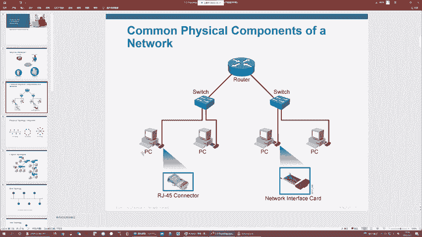

原因是因为在我们的网络中啊，所有的主机在通信的时候呢，你需要安装一个协议站。当前咱们主流使用的协议站啊，叫TCPIP那TCPIP里面有个比较著著名的协议啊，它叫IPV4叫英特网协议版本4啊。

它叫英特网协议版本4这个协议是什么呢？就是通信规则啊，你连接网络，咱们需要规则啊，比如说你的接口什么尺寸呢？你连的线缆长什么样，对吧？线缆中的这个对吧？线星呢通过哪些线心传递哪些信号，这个都有规则的。

这些规则咱们就称为叫协议O了？协议大家都要遵守，因为如果你不遵守的话，对吧那很有可能会导致兼容性的问题。好吧，那在网络中呢，咱们由于网络比较复杂协议肯定不会只有一条，咱们会有很多很多协议。

那这众多的协议组合在一起，我们就称为叫协议集或者叫协议站啊，协议站啊，有点类似于咱们交通法规嘛，对吧？一个交通法里面。

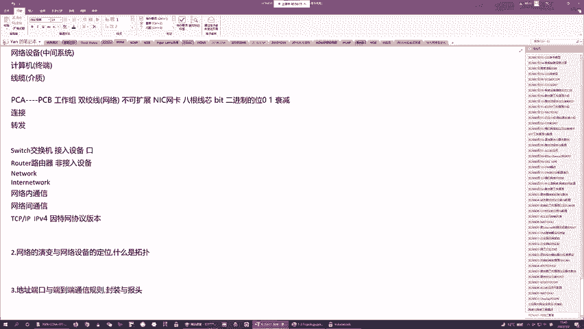

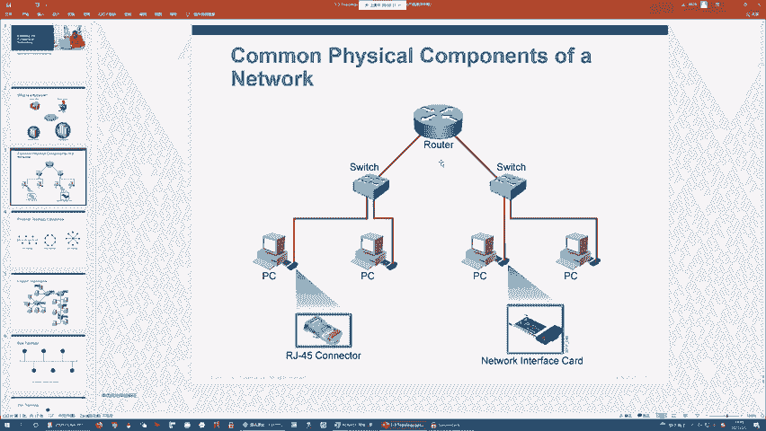

对吧交通法典啊，里面有很多很多的交通法规，对吧？你在开车的时候，哎，所有这些法规都要遵循，对吧？不同的法规约束了不同的事情。比如说什么时候能执行，什么时候左转，对吧？会车了谁让谁啊，行人怎么走。

车辆怎么开，信号灯怎么安排，这些都是规则的，这些规则组合在一起，哎，咱们称为叫交通法典，对吧？用来约束咱们的交通，如果大家都共同遵守这个交通法典，其实你会发现不会有车祸出现出现的嘛，对不对？

不会有出车祸出现，那在网络中咱们也是一样的，对吧？一个网络，咱们有这么多线缆，有这么多的网络设备，有这么多的终端，终端上咱们安装了这么多的乱七八糟的对吧？五花八门的应用程序，对吧？

那这些应用程序要利用网络来通信嘛，对不对？如果说这个通信没有任何规则可言，你网络怎么组建，对吧？这个通信怎样能够保证它的质量，你根本保证不了的，那所以说呢咱们肯定需要规则，网络中的规则，啊。

我们就称为叫。😊，はい？这个协议等同于咱们交通系统里面的交通法规。而我们的协议集啊，我们的协议站，大家可以理解为就是这多协议组合在一起啊所形成的这个交通法典。协议站有很多哎当前比较主流的TCPIP。

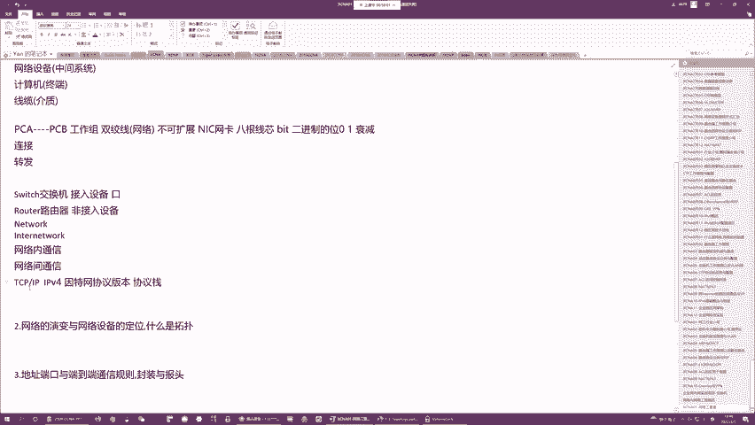

对吧计算机我们的网络设备，我们的线缆都要遵循这个协议站的约束啊，大家都要使用协议站中的协议对吧？来作为咱们通信的准则，OK吗？那其中TCPIP协议站里面最著名的协议啊。

就是咱们的IPV4啊IPV4叫做英特网协议版本4。那这个英特宝协议版本4呢，它。

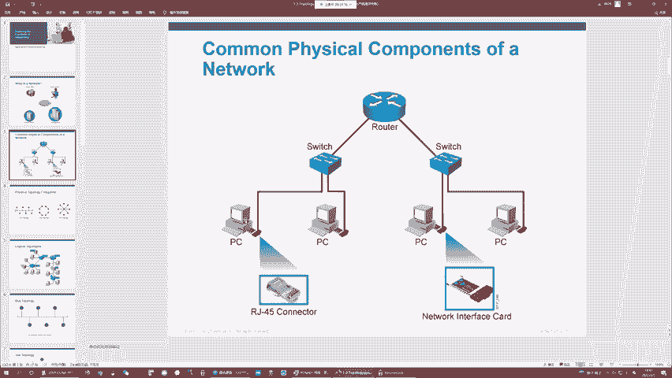

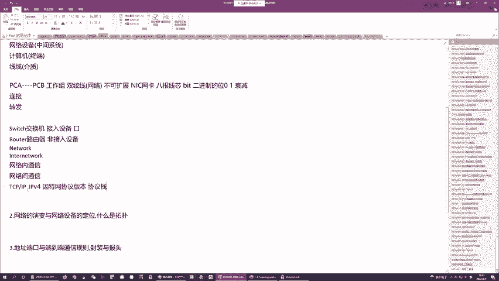

就规定了你计算机对吧？使用我这个协议连接到网络来通信啊，发送数据。你发送的数据有三类，哪三类呢？分别是。

单播数据啊，咱们称呼一下单播流量啊，然后呢咱们有主播数据。好，咱们称呼叫主播流量。然后呢，咱们有。广播数据啊，这个咱们称之叫广播流量，好吧，有三种类型流量。那这三种类型流量简单介绍一下啊。

这个单波流量指的是什么呢？就是一个主机发送啊，一个主机接收一对一一个发一个收，我发你收嘛，对不对？一对一的流量模型，那就是单波的。然后接下来这个主播指的是什么呢？就是一个主机发送数据，一组人来接收。

好吧，当然这一组主机可能跟我在同一个网络啊，可能跟我不在同一个网络，对吧？他们是按需接收，如果他们需要接收的话，他们会监听一个主播地址，只要监听了就能收到啊。相反你也可以不要收嘛，对吧？你不收的话。

你可以不监听这个地址嘛？你不监听这个地址，那就算我发送了，你也不会接收啊，这种自由行的一对多的流量，我们就称为叫主播。然后接下来这个广播指的是什么呢？广播指的是一个范围内的一对所有的流量啊。

单波是一对一，主播是一对多，广播是一对所有，但是它的一对所有是在一个范围内的。这个范围是什么呢？这个范围就是广播域，咱们也称为叫网络。这个广播流量啊是不可避免的啊，只要你主机连接入网。

只要你配置了TCPIP协议站，只要你要发送数据啊，你总会发送广播。那你发了广播谁能收到啊？好，请注意啊，你发送的广播流量跟你在同一个网络内的所有主机，他们都能收，并且他们收到之后啊，都要处理。

并且非常讽刺的是，你发送的广播流量，可能对于网络中的绝大多数主机而言啊，没有用，是废物流量，可以吧？那所以大家想啊，你在组建一个网络的时候，一个网络中的主机越多，你发的广播流量是不是就越频繁啊。

你发的广播流量越频繁，那咱们网络中的主机总会被误伤嘛，对不对？我动不动收一个广播，动不动收一个广播，你主机越多，我收广播的频率越大，而这些广播流量基本对我没有用，对不对？那这些没有用的流量。

我不停的接收，不停的处理，是不是要消耗我的资源，对吧？消耗我的链路带宽，消耗我的CPU那所以你会发现在一个网络中，你包含的主机说的多没有错，它能通信啊。但是你主机越多，咱们的广播流量就越庞大。😡。

对吧它的频率越高对吧？频率越高呢，咱们整体的网络的品质就越低。因为网络中的主机为了处理这些广播流量啊，我就要利用大量的CPU资源，利用我们的大量的带宽资源，对吧？

而以至于咱们没有足够的资源来发送我们想要发送的对吧？真正的对于咱们有用的这些数据O吗？所以说在组网的时候呢。

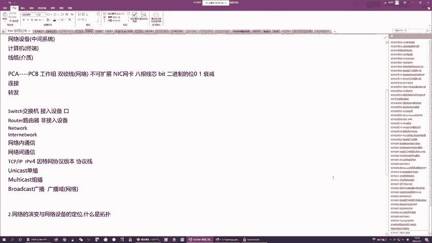

不管你使用什么信号的交换机啊，不管你PC有多么强大啊，我们的建议就是一个网络中的主机数量不要超过300台。那所以说现在在一个企业园区内，如果说咱们有600台主机，对吧？你就要划分网络嘛，对不对？

比如说你画两个网络网络A网络B网络A里面包含300台网络B里面包含300台啊，请注意啊，这不是广播风暴啊，这个跟广播风暴没有关系，广播风暴会导致你网络直接崩溃，啊，它这个仅仅是你网络主机太多了。

它的广播流量会比较频繁，好吧，即便广播流量仅仅是频繁的这么一个对吧？对啊，它也会导致整体的网络品质下降，O嘛？这个广播风暴不要提了，广播风暴是环路导致的广播风暴会导致你网络直接崩溃，啊，不可同日而语啊。

词不能乱用O言归正传啊，在一个企业园区内，咱们比如说有600台主机哎，我们要分网络啦，对吧？300台放到网络A300台放到网络B那现在咱们期望的是。什么呢？是网络A跟网络B之间能通信啊。

因为毕竟量600台主机嘛，你们要相互访问的嘛，对不对？我希望这两个网络能够通信，但我又不希望A网络的主机发送的广播流量会影响到B，我也不希望B网络中的主机发送的广播流量影响到A，那怎么办呢？对。

就利用路由器。路由器这个设备非常牛逼啊，它的接口咱们称为叫网关接口啊啊，一般路由器连接一个网络的接口，对于该网络的所有主机而言，那这就是网关啊。路由器的接口能够终结广播域啊，它能够终结广播域。

什么意思呢？就是你主机发送的广播流量到达路由器的接口，对吧？路由器会看一看这个流量自己需不需要。如果需要它就接收，如果不需要它会丢弃，但是路由器绝对不会说是通过一个接口收到广播流量之后啊。

通过它的其他接口来转发啊，这也就是说咱们这个路由器左边接口连接网络A，右边接口连接网络B啊，你网络A中的主机发的广播流量，只会影响到网络A的主机，啊，它不会穿越路由器，到达网络BO吗？

而网络B的主机发的广播流量，也不会穿越路由器，到达网络A。你们之间彼此可以做单波通信，但是广播流量，不会影响到彼此。所以说了路由器的定位是什么呢？就是分割广播域啊，分割网络。那这样做的话。

就是既能够保证咱们不同网络主机相互通信，又不用担心一个网络过于庞大，以致于咱们网络品质啊急剧下降。O吗？那这就是互联网。

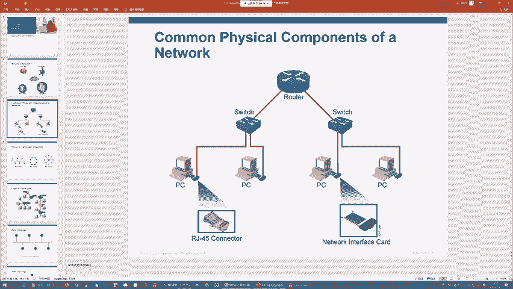

那有了网络跟互联网的这么一个概念之后啊，哎我们就来看一下网络通信啊，在组网的时候很简单啊，对吧？你想组一个小型的网络交换机就够了啊，然后接下来咱们一般的一个园区会有一个边界啊。

这个边界呢通过线来连到咱们的运营商。当是你需要办呢，你要办业务啊，宽带啊，你办一个宽带运营商给你一根线，对吧？顺便给你个猫嘛，然后你拿边界设备连接这根线连到这个猫，那后这个猫呢它会连光纤嘛，对吧？

都是光猫啦，猫会连光纤连到运营商，那这样的话就是你相对办你的内网啊，企业网连到了咱们运营商的网络然后呢，全球各国的运营商，他们的网络是相互连接的，组成的这么一个大型的互联网，我们称为什么呢？

我们称为叫internet啊，叫英特嘛。

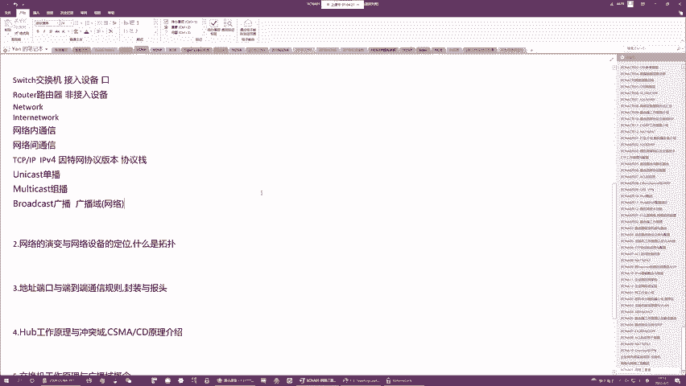

这个英特宝很牛逼啊，哎它二战时期就存在了啊，二战时期它叫apponnet，然后呢慢慢升级，慢慢升级就变成了internet。这个是全人类最大的啊全人类最大的。全人类最大的互联网啊。

这个互联网由全球各国的顶级运营商共同维维护的啊，比如说我们中国的顶级运营商电信联通移动，对吧？日本有电信，韩国有电信，对吧？每一个国家都有顶级运营商啊，对吧？那运营商都会有运营商网络嘛。

咱们称呼叫SP网络啊，全球各国的SP的网络都是相互连接的那跨越洲际的怎么连接啊，通过海底光缆嘛，对不对？那如果说大家共享同一个大陆，比如说欧亚非，那你就直接通过对吧？陆地的线缆嘛，就能连接了。

那接下来如果你要连接澳洲连接新西兰，你要连接美国，对吧？咱们没有办法通过陆地来连嘛，对吧？做海底光缆ok嘛？那总而言之，都是彼此互联的啊，那这个彼此互联的大的网络，啊，我们就称为叫英特网啊。

覆盖七大洲五大洋。那接下来你作为一个网络的用户，哎，你是一个企业客户啊，你不管当前在哪个国家，哪个省份，哪个城市啊，不管你。接入了哪家运营商的网络，对吧？你只要办一个宽带嘛，你就会连到运营商的网络。

只要你连上去了，相当于是连接到internet啊。连到internet之后呢，按理来说能访问你想访问的任何资源。但是。目前咱们国家比较特殊啊咱们国情比较特殊。啊，我们中国呢是自己玩自己的，哎。

不跟其他的国家玩，哎，为什么呢？因为信息安全啊，还有某些政治层面的意思啊，咱们就不说了。O那咱们中国呢有一个非常牛逼的防火墙，对，叫长城防火墙啊，这个长城防火墙堵在咱们所有的连接外网的出口的位置，O吗？

它会中断咱们内网的外网之间的各种连接，比如你要访问google啊，facebook啊，你要访问twitter啊，youtube啊，哎，做不到啊，为什么因为长城防火墙啊，它把你的这个TCP连接给中断了。

当然咱们通过翻墙的手段能够解决连接外网的这么一个问题啊，但是翻墙哎在我国是违法的，所以说建议大家不要尝试O吗？那所以说了从物理连接角度来看啊。

我们中国的这个就是国家网络啊跟其他的国家的网络其实是互联互通的啊，但是呢我们当前更多的只能访问我们国内的这些互联网资源啊，当然也好处是什么呢？就是安全嘛信。😊，安全咱们能够保证啊。

OK然后接下来海外咱们能够访问那些对吧？资源，就访问不到的资源。其实在国内咱们是有同类的啊，比如说google的话，咱们有百度嘛，对不对？facebook的话，咱们有腾讯啊，那多就不说了。

这个你们自行体会啊OK然后接下来这个internet呢，它在不停的壮大啊，对吧？因为每天都会有新的运营商存在每天都会有新的数据中心连接连接进来，这个数据中心里面会有各种各样的服务器啊。

你PC连接入网之后，可以访问这些数据中心里面的服务器，对吧？来完成相关业务的这么一些部署啊，来完成一些相关的互联网需求的这么一个。对吧他能给你提供解决方案吗？是吧？就比如说你要查资料，对吧？

你上百度这个上百度，其实就是你PC发起一个链接啊，去往IDC机房里面的百度服务器。好吧，我们当前的绝大多数的应用都是CS模型呢叫客户端服务器啊，客户端叫client。然后呢，服务器的话叫ser啊。

我们的PC一般都是客户端的啊，你要去访问个什么东西，都需要服务器来给提供支持啊，比如说你上QQ，你需要访问腾讯服务器，啊，上微信也是一样的。然后接下来你要上steam玩游戏。

你要访问steam服务器是吧？你要浏览百度对吧？查一个资料，你需要访问百度服务器。那这些乱七八糟的服务器都哪里呢？对，都在IDC机房，叫数据中心O吗？数据中心一般是连接各大运营商的，对吧？

它跟各大运营商的网络是互联的对吧？一般牛逼的IDC机房都是三线接入的啊，一根线连电信啊，一根线连移动一根线连连通，那所以说你不管是电信的用户还是联通的用户还是移动的用户啊，只要你接入运营商的网络。

你都可以利用运营商的联通信啊，来访问这个服务器，O吗？并且这个IDC机房有很多对吧？全球各个国家。各个省市都有大量的机房存在。然后像咱们这些百度服务器啊、腾讯服务器啊、新浪服务器啊、网易服务器啊。

他们都有备份的啊，比如说北京有这个百度服务器嘛，上海也有啊，南京也有，天津也有，对吧？那一般的咱们用户在访问百度的时候，你更多的访问离你最近的这台百度服务器。OK呢？

它会离你最近的OK那当然如果说离你最近这个服务器挂掉了，那怎么办？对吧？咱们通过一些对吧？集群的这些就是。功能啊，它能够自动的帮你把流量迁移到离你稍微远一点的百度服务器，可以吧？那所以说了。

无论什么时候你基本百度都能访问啊，除非是所有百度服务器都到了，只要不是所有百度服务器都当了，那你总能访问百度。好吧，那这是关于internet的这么一个概念。OK那接下来这个internet。

作为全人类最大的网络啊，它不属于任何国家，不属于任何组织啊，它是由全球各国运营商来共同维护的。而运营商维护这个网络呢有成本，所以说咱们在连接internet的时候，虽然说这个internet对吧？

是开放的网络啊，但是咱们需要给钱，而给钱给谁呢？就是给提供服务的这个运营商，对吧？因为它给你提供宽带服务嘛，对吧？你相当于是买这个宽带的服务，你要为这个宽带的服务来付务钱，OK吗？

但并不是说咱们internet本身啊是收费的OK吗？啊，课堂笔记啥时候发，你需要吗？你需要的话，咱们课后发好吧，需要的话，课后我但其实这不算是笔记了，这个我觉得不算是笔记啊，这个是。

随便写一写啊随便写一写。就我觉得这个东西你们还是自己记比较好一点。因为我这个东西比较乱嘛，也不是系统的去。写的是吧？呃，运营商的路由器需要包含所有网络路径了啊，有的需要有的不需要了，这个是后话。

咱们之后再说好吧，之后再说啊，先来给大家介绍一下，就是咱们当前呢其实都是在一个互联网下的啊，对吧？如今的网络不再独立啊，不再孤立，它不再是像八九十年代啊，咱们当时可能高要网络嘛，对不对？

那当时全球是一个又一个独立的网络网络跟网络之间啊不能通信，但是现在呢随着这个internet大肆的崛起，大肆发展，对吧？当前你任何一个用户啊，你在全球任何一个国家连到任何一家运营商。

你相当于是都能够接入到咱们这个internet啊，那你接入进进来之后，哎，按理来说你是能够访问internet中的任何资源的啊，任何一个IDC机房里面的任何一台服务器，你都能去访问啊，按理来说是这样的。

对的，网络本身是免费的啊，你买的是运营商给你提供的服务，因为运营商他也要维护他的网络嘛，对吧？他要给你提供服务，他也需要网络设备，他需要采购各种各样的高端的路由器。这些路由器也需要经行升级嘛，对不对？

升级改造都是需要钱的。然后他也需要请人嘛，人需要工资嘛，对不对？所以说了给你提供这个宽带的业务给你提供这个宽带的服务不可能免费啊，不可能免费，你需要花钱，对的。啊，这就是所谓的宽带费了，当然也不贵嘛。

挺便宜的啊。那接下来这个网络呢，由于当前比较比较复杂。所以说咱们在研究网络的时候呢，不要把它想的那么复杂，咱们研究什么呢？我们就研究咱们自己的这个网络啊，叫企业园区，我们研究咱们的企业园区网啊。

这个企业园区网就是边界路由器以内的所有网络，就是咱们要负责了。而以外的所有网络啊，咱们姑且称为叫外网啊，这个外网，咱们先不要在这些细节之后呢，咱们慢慢研究啊，现在咱把外网理解为它是朵云就好了啊。

你不用管这个外网怎么通信的。反正你只要连到运营商，你就能通了啊，咱们在设计网络的时候呢，咱们更多的研究咱们的内网。😊，啊，比如说内网需要使用哪些设备，内网的设备之间怎么连接啊。

内网的设备上启用什么样协议啊，怎么配置然能通，这是咱们要关心的。好吧，而这个外网咱们之后等研究到BGP了，咱们再去慢慢的研究O吧？O那所以说呢咱们简单的网络就是你搞一个交换机，对吧？

连接咱们的主机连接成一个网络，然后你搞一个边界路由器，这个边界路由器连到咱们的外网是吧？那通过这种连接从连接角度来看啊，这个网络就没有什么问题了。啊，小型的网络组建完毕了，当然如果你的网络比较大。

你可能需要分层，对吧？你要把内网划分成什么接入层汇聚层核心层，当然这是后话对吧？那这种网络比较复杂，里面使用的技术也比较复杂，咱们之后呢慢慢去说O然后接下来随着网络再大一些啊，咱们就需要模块化了。

那这个模块化到底怎么设计啊，大家也先不要在意这些细节，就先有一个概念啊，咱们把网络分为内网和外网啊，我们的企业。园区一般指的就是边界路由器以内的完整的网络啊，这就是咱们所谓的内网。

然后接下来从边界路由器以外的对吧？像咱们的运营商网络啊、数据中心网络啊，那对于咱们企业而言，就是所谓的外网。啊，那接下来涉及到内网，咱们在组网的时候呢，你的网络连接图，哎，咱们就称为叫top扑啊。

在设计网络的时候，一定要先设计top扑图啊。在拓扑图中你要画出来我们在联网的时候需要哪些设备，设备之间怎么连接啊，这个术语叫tyology。啊，它叫拓扑啊叫拓扑，不叫拓扑啊，那这个其实就是一个拓扑了。

对吧？我们把这个网络连接图给画下来O吗？那当然在画的时候呢，没有必要画主机啊，对吧？你画路由器画交换机基本就OK了。那当然有的时候对于一些大型的网络，你交换机用的比较多，这类交换机，你也不用画啊。

有的时候咱们在简化拓扑的时候啊，你会发现我们画一个内网的图很简单，里面只包含一些三层网络设备啊，只包含一些三层连接啊，路由器就是三层的交换机是二层的好吧，那这种省略二层连接的。

只有三层连接的网络连接图啊，我们称为叫逻辑拓扑啊，而如果说你一张图，实打实的把我们的网络怎么连接的，给画下来了，对吧？路由器也有交换机也有三层链路，二层链路，咱们都画了，那这种咱们称为叫物理拓扑O吗？

啊，拓扑分为。

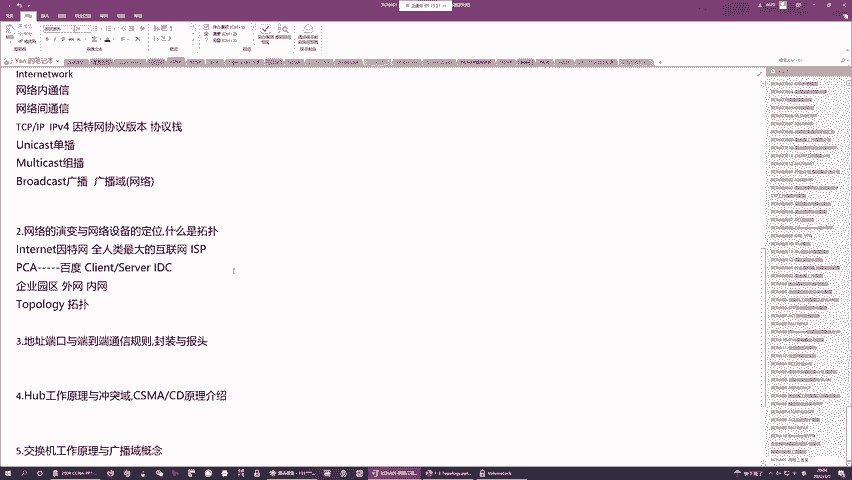

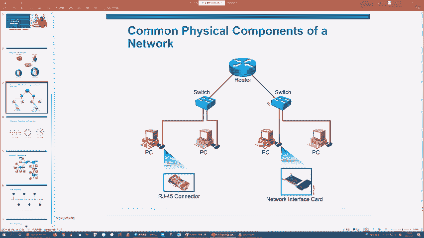

两类呀，一类叫物理拓普。一类叫逻辑topOK吗？这个物理拓大家可以理解为就是实际的网络连接图O吗？而这个逻辑top就是省略了什么啊？二层还有一层网络设备之后的。😡，纯什么三层。😡，网络连接图OK吗？

这是一个抽象后的纯三层网络连接图。这两种图都很有必要啊都很有必要。就是你在组网的时候呢，这个物理拓扑相当于咱们设计网络的蓝图嘛，对吧？你要照着这个图来连线嘛。那当你连完线之后，对吧？

你在部署路由选的协议的时候，啊，咱们更多的要参考什么三层连接图，O吗？因为三层连接图能够告诉你谁跟谁之间能建邻居谁跟谁之间能传路由，路由的下一跳到底是谁，对吧？肯定不会是二层设备嘛，对吧？

那所以说一般的咱们在做一个项目的时候，物理拓补逻辑拓扑啊，咱们都会有啊，物理拓扑方便咱们施工啊，逻辑拓扑方便咱们做网络策略，并且当你网络出现问题的时候，咱们在排错的时候啊，也是先基于逻辑拓扑排错。

然后再基于物理拓补来排错O吗？

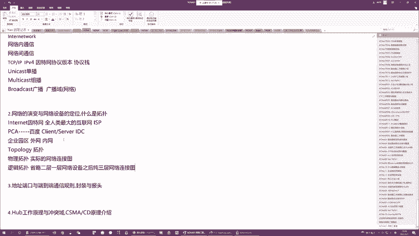

那有人问了，画这个图怎么怎么画，使用什么工具，什么软件。对，用那个vis啊用vis就能画啊，能画拓扑的这个软件很多的啊，对吧？你们可以随便选一个网vis好像收费，你可以破解啊。破解完之后的话。

你下载一些图标嘛？啊，思科华为都有比较新的图标很好看的啊。思科新的图标特别帅啊。华为新的图标也很帅啊。然后接下来咱们一般在画图的时候，就是你找一些新的图标嘛，会让这个拓扑托看起来非常好看好吧。

O那接下来这个拓扑呢，咱们有物理拓扑逻辑拓扑以外啊，咱们还有一种拓扑咱们称为叫拓扑分类这个拓扑分类呢其实没什么意思啊，它指的并不是你网络怎么连接的啊，它更多的描述是什么呢？

就是你这个网络到底是使用什么样的设备来连接的，可以吧？这个咱们称为叫top扑分类那拓扑分类呢只要有三种啊，分别叫总线型拓扑环形拓扑，还有新型拓扑啊，这个总线型拓扑指的是什么呢？就是你在联网的时候。

你用的是极限器啊，你用极限器这种网络设备连接主机所组成的网。

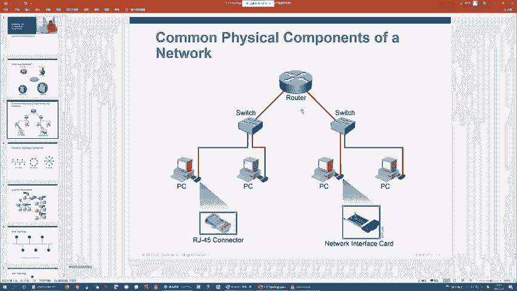

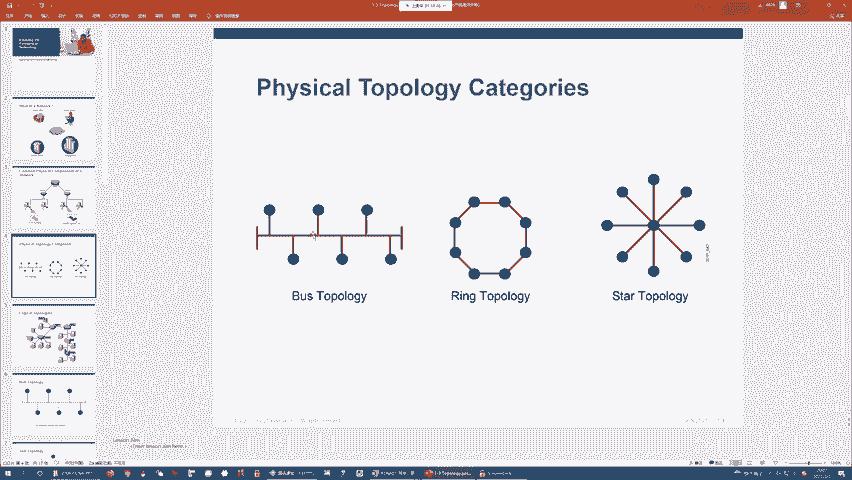

撸啊嗨，咱们就成为叫。总线性拓布。这个设备咱们称为叫极限器啊，叫hub，好吧，是一种已经已经被淘汰的网络设备了。这种网络设备有很多缺点啊，工作在物理层没有什么智能性。

所以说当前各个厂商都不再生产极限器了。但是早在二三十年前，哎，早期的网络，我们要组一个网嘛？那这个极限器是咱们曾经用的比较多的接入设备啊，后来这类设备全面的被交换机取代了，好吧。

然后接下来你拿交换机连接网络，对吧？连接成的网络，咱们就称为叫星型网络，O吗？不是说你网络真的这么连的，它只是说你只要拿交换机连接主机连接而成的网络啊，就是星型网络，可以吧？

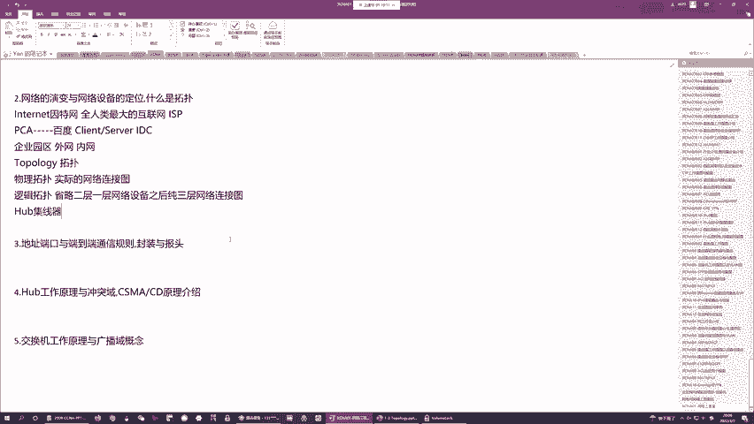

总线型网络和新型网络一般的都是以太网啊，因为极线器连接主机，咱们更多的是用双绞线啊，你交换机连接主机，咱们用的也是双绞线嘛，对吧？因为我们也说了，双绞线是以太网线，你拿这种线连接主机连接而成的网络啊。

就是以太网，同样作为以太网，你拿极线器连接，它就是总线的对吧？你拿交换机连，它就是新型的OK吗？然后接下来咱们还有一个环形拓扑，但是当前呢已经被淘汰了啊，早期呢咱们用的比较多啊。

环形拓扑呢涉及到了这么一类设备，咱们称为叫环网交换机啊，叫环网交换机。

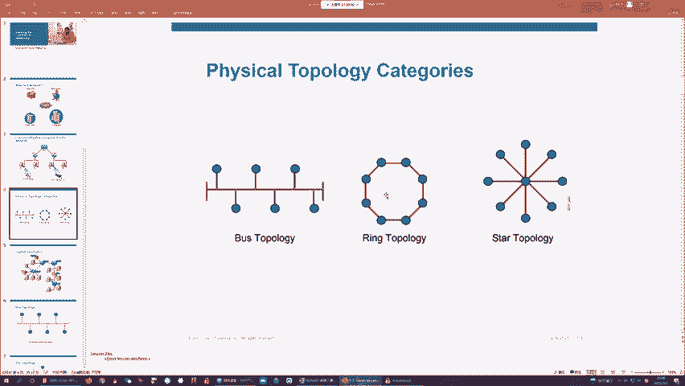

这个环网交换机是支持什么呢？支持一个叫做令徘徊的协议的啊。好吧，那大家也都知道，网络嘛分为局域网跟广域网啊，一般的在一个企业园区内网，咱们见的更多的是局域网。那局域网就会有很多局域网通信协议。

以太网就是局域网通信协议中例款。好吧，那除了以太网以外，咱们还有令徘徊。😊，咱们还有FDDI这些都是局域网的通信协议。好吧，那当然咱们广域网也有很多广域网协议啊，比如说像PBP对吧？HDLC真中记啊。

这些都是广域网协议的这么一个范畴，好吧，网络分为局域网和广域网，对吧？那局域网中你要使用局域网协议嘛？广域网中你要使用广域网协议，那早期呢这些协议咱们都有用啊，对吧？都有用。哎，他们算是不相伯重啊。

但是随着技术的推进升级，以太网这个协议脱颖而出了，很牛逼啊，这个协议真的很好用啊。你使用这个协议，对吧？来作为通信协议，你的网络通信效率很高嘛。并且设计这个以太网相关的网卡，还有网络设备成本会比较低。

对吧？它支持更高的带宽嘛，支持更灵活的这么一个通信的方式，那所以说咱们一般的在一个园区网内网啊见到的网络的类型更多都是这种以太网的，好吧，那这个以太网其实很好分辨啊，只要你联网的时候使用是光纤。

或者你使用的是双绞线啊，就是俗称的网线啊，你只要是拿这种介质来连接的网络，那咱们基本使用的协议是什么？以太网协议OK吗？那这个以太网协议作为作为比较经典的协议啊。

当前在一个园区网内占比基本是在99%以上的啊，你看到100个网络有99个以上的，都是使用以太网啊，虽然可能在早期的网络中，咱们会见到一些其他的协议，但是这些协议现在基本没有什么存在的空间了啊。

因为他们的效率相对比较低一些啊，那比如说早期咱们就用这款协议啊，叫令徘徊啊，令徘徊也是一个局域网协议啊啊，这个协议跟咱们以太网协议完全不一样啊，由于早期这个协议咱们用的也算是多一些啊。

那所以说有些厂商也会生产关于该协议的交换机。啊，那一个交换机不支持以太网，支持令徘徊。我们就把这种交换机啊称为叫环网交换机。你拿环网交换机连线来连到咱们主机啊，连接而成的网络，我们就称为叫环形网络。

好吧，它的拓分类就是环形的。O吗？那当然由于令开环这个协议基本被淘汰了。那令开环的环网交换机，你现在也买不到了。所以说咱们当前一般买的交换机都是以太网交换机，对吧？

你通过这种交换机连接双绞线连接主机啊组建而成的网络，就是咱们俗称的星型网络。

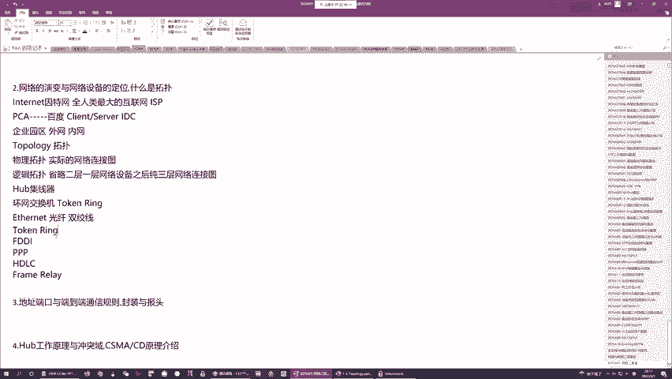

新型网络是咱们当前建的最多的网络啊，对吧？因为交换机当前非常普及啊，早期在没有交换机的时候，联网咱们更多使用集线器。集限器也是通过双绞线啊连接计算机组成网络。这种网络就是总线网络。有这么一个概念吗？

对的，绝大部分公司的网络都是新兴网络啊，现有这么一个概念啊，这是所谓的拓扑啊，给大家简单的介绍一下。OK那大家介绍完了拓扑之后呢，咱们也说了这些以太网协议啊，令徘还的协议，FDDI协议协议啊。

就是这边的话关于这个局域网广域网呢也跟大家提一下。

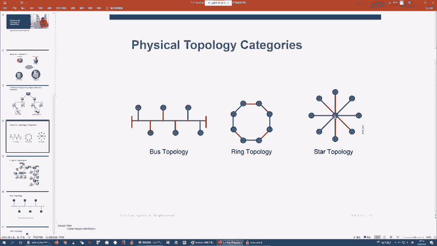

这个局域网广域网到底是什么概念呢？啊，局域网叫lan啊，它叫局域网。哎，广域网叫什么呢？叫Y啊，它叫广域网。这个局域网广域网书上的描述很不负责任啊，他又说了，哎，局域网是一种什么比较小的网络嘛？

一个网络覆盖范围不大，里面的主机不多啊，这种比较小的网络我们就称为叫局域网。那什么叫广域网呢？相反，哎，正往相反，这种网络比较大，覆盖的范围比较广。里面的主机数量比较多啊。

这种大型的网络我们就称为叫广域网。那这个说法对不对呢？早期来看是对的啊，没有错。你使用局域网来组成一个网络啊，对吧？这种局域网里面，你要使用局域网线嘛啊。

局域网线通常它能够支持的传输距离啊就是比较近O吗？比较短啊，所以说呢你通过这种比较短的线缆连接而成的网络，你覆盖的范围肯定会比较小嘛，对不对？哎，那跟我们的定义一样啊，早期啊，当然这个早期有多早啊。

20年前啊，20年前你通过经典的局域网协议的线缆连接主机组成的网络啊，你覆盖的范围就是很小O吗？那当然相反，在那个时代啊，广域网协议所使用的线缆啊，啊，叫s线嘛？叫串口线啊。

这种串口线能够支持更长的连接，支持更长距离的数据传输O吗？那你通过这种线缆连接成的网络自而然覆盖的范围就会比较大一些啊，但是这是早期哎，这是非常非常早前的这么一个事情。那随着时代的发展。

咱们网络也日新月异嘛，对吧？技术在革新。那革新这革新咱们也说了啊，局域网的众多协议中不是有一款以太网协议嘛啊，这个以太网协议早期能够支持的线缆，只有双网线跟铜轴电缆啊后期呢它支持这种新型线缆啊。

当然这个所谓的新型线缆是对于当时那个年代啊，对于现在早已烂大街了，那就是光纤啊，早期咱们在传输的时候，你离不开铜线的啊，因为早期只要提到数据传输，你传的一定是电流啊，电流一定要通过铜线来传。

所以说早期的线缆，比如说双绞线啊，同轴电缆啊，它的内部都会包含铜芯来导电嘛，对吧？给你传电流，然后后来呢有人就是开发出了光纤这个光纤很牛逼啊，里面没有用到铜光纤里面是玻璃纤维啊，这个玻璃纤维比较环保啊。

据说原材料是沙子啊，跟CPU的原材料一样啊。那这个沙子对吧？地球上取之不尽，用之不竭啊。😊，你拿这种材质来做线，你想做多少都OK对吧？但是铜不一样啊，铜是重金属嘛，对不对？铜是重金属，铜地球数量有限。

你拿铜来做线。对吧那你通用的越多嘛，你这个线缆的总容量就会越少是吧？不可再生的。所以说呢从环保绿色角度来看的话，光纤肯定更胜一筹啊。那当然光纤的优势不止环保啊，它的传输能力更强，对吧？衰减更弱，啊。

光纤能够支持更长距离传输，并且它的传输能力也就是所谓的传输带宽啊会更高一些。OK那接下来随着光纤面试之后呢，啊以太网，它是最先能够支持光纤的这么一个协议啊，作为局域网协议的以太网，它能支持光纤。

而光纤能够支持几公里几十公里甚至几百公里的传输距离啊，因为光纤里面是什么？玻璃纤维嘛，它是通过光的全反射啊，来实现数据传输的，而这个光在玻璃纤维里面全反射啊，对吧？它的衰减很有限，它的衰减很有限。

你尤其是当你使用单模光纤的时候，对吧？你的这个发光器用的是激光啊，你的铅纤是九微米的对吧？非常非常就是对吧？算是高品质啊，工艺比较好啊，你用这种工艺比较好的线来来传数据，你传个几十公里，对吧？

传个上百公里都没问题。那所以说自从光纤普及之后啊，这个早期的局域网广域网的定位对吧？就立不住了啊，因为这个以太网的协议，它确确实实是一个局域网协议，对吧？它确确实实是一个局域网协议。

但是以太网协议支持光纤唉，对不对？你拿光纤哎，上面跑着以太网协议啊，来连接众多主机，那你主机连接而成的网络，咱们还是还是什么以太网吗？但是这个以太网大不大非常大，啊，甚至比传统的广域网要大多啊。

那所以说呢你谈到以太网这个协议，那它到底是一个局域网协议还是个广域网协议呢？因为它既能支持小距离的这么一个连接嘛，对吧？你通过双绞线通过通用电来，你依旧连接而成的网络覆盖的范围比较小。

但是当你换成什么光纤之后嘛，你能支持超长距离传输，你能支持超远的传输，对吧？你连接而成的网络覆盖的范围很大，那你到底怎么算，对吧？你算局域网还是广域网。没法算了啊。

所以说哎现阶段呢咱们提到局域网广域网就不再这么回事了啊，我们现阶段提的局域网一般指的是什么呢？就是内网啊，内网相关的东西，咱们都称为叫局域网技术。而这个one咱们更多指的是什么呢？

one更多指的是咱们的internet连接，比如说你的宽带接入，这就是one接入。比如说咱们的对吧？MPVPN的运营商的专线接入啊，这也算是广域网接入，比如说咱们两个园区之间，你跑一个IP，对吧？

你通过IPs能够跨越internet啊，对吧？来让咱们两个园区的内网主机之间相互通信。那这些都是所谓的one啊，现在只要提到one更多的指的是什么internet连接啊，MPVPN的专线连接。

IPVPN包括DMVPNDSVPN这种over类VPN的连接啊，这些都是广域网。范畴O吗？给大家重新定义一下这两个词O吗？那接下来再来说一下到底什么叫局域网啊，这个局域网其实指的是什么呢？

真正的局域网指的就是你两台主机之间连一根线，你这根线上面肯定要跑一个数据传输协议嘛啊，你的数据传输协议，如果是对吧？局域网协议，那你这根线就是局域网线，哪怕你再长啊，你也是局域网线。

你通过局域网线连接而成的网络就是局域网。相反，你两个节点之间对吧？连一根线，你这根线上面的数据传输协议，如果是一个广域网协议，那这根线它就是一根广域网线。不管这根线再短，你通过这种线来连接而成的网络啊。

那就是广域网。啊，你通过这种来说就没有什么问题了啊，但是现阶段如果咱们再提到line和one啊，那一般line指的就是内网相关的啊，one指的是什么？

internet接入MPSVPN以及咱们的overlay的VPNOK吗？啊，这就是名词的。不同时期的这么一个不同解释啊，简单的给大家介绍一下。OK那接下来回到咱们刚才提的一个点啊。

这个点呢来我们来扩展来继续讲啊，就我们说了，在组网的时候呢，其实不用网络设备也行啊，对吧？主机之间直接连线组成的工作组，这个工作组呢最大的问题就是不可扩展，那意思是说有了网络设备之后，对吧？

咱们这个网络可以扩展了，对吧？扩展两个层面嘛，第一个层面就是网络中包含的节点数量可以更多，对吧？那没有错嘛？交换机极线器接口都多嘛，对不对？比如你一个交换机24个接口，你24个接口连接24根线。

你能连接24台主机，对吧？那相比工作组，这个主机数量肯定要多很多嘛，对吧？这点毋庸置疑了，但是还有一个问题。😊，就是你有了网络设备之后，主机跟主机之间离的距离为什么能变长呢？对吧？我们之也说了。

在组建工作组的时候，你主机之间为什么不能离很远啊？原因是因为你们之间连的双网线，你在传输数据的时候，通过双网线传输啊，它会有衰减嘛，对不对？就是为了避免衰减，对吧？过度。

以至于对端节点收到你发送的数据啊，不能理解为了避免这种情况，你在造线的时候呢，一根线最长也就100米。对吧那这个时候有了交换机了，为什么主机之间就能离得更远呢？你能离多远呢？😡，能立一公里吗？

能立10公里吗？😡，哎，答案是都可以啊，为什么呢？因为所有网络设备都具备这么一个功能，这个功能咱们称为叫信号放大。😡，啊，信号放大。

比如说呢咱们主机A连一根百米线连到switch一switch一再连一根百米线啊，连到主机B。那从这个连接角度来看啊，主机之间隔了多远啊，200米。那你A经过200米传输，你把数据传给B，B能理解吗？😊。

按照常理来说，他应该不能理解吧，对吧？因为你数据经过200米传输衰减过度了，对不对？你虽然能够收到我给你发的信号，但哪个信号代表0，哪个信号代表一，你能读得懂吗？你读不懂，那你读不懂。

你又怎么能知道咱们传到底是什么呢？😡，是吧啊，当然大家不用担心啊，因为你A发送数据给B，这个数据不是直接到达B的啊，大家看啊，你A发的数据先到达switch一的左边接口，对不对？

switch一收到数据之后帮你做一个转发，通过右边接口发出，再发送给主机B。那在这个过程中啊，switch一收到主机A的数据，它在进一步的把数据发送给主机B之前，会把这个数据做一个清晰化处理。

什么意思啊？就是你A产生的数据原本长什么样啊，对吧？到达switch一，只要switch一它能理解啊，它就会给你把信号还原成最清晰的这么一个格式，然后再把最清晰格式的数据，通过它右边的接口发送走。

那即便经过100米传输，B收到之后啊，也不用担心衰减过渡，O吗？那接下大家会问，那你A跟B只能隔200米嘛，也不是啊，对不对？你中间谁说只。那连一台交换机。你可以连switch2啊。

你可以连switch3啊，你可以连switch4啊，对不对？那由于所有网络设备、路由器、交换机集电器，它都有信号放大能力。所以说这块A跟B之间，你隔的交换机越多，你们之间的端到端的传输距离就可以越远。

并且交换机间互联，咱们是通过极连接口，请注意啊，交换机接口有两类啊，一类咱们称呼叫下连接口。还有一类咱们称为叫极联接口。啊，他有两位井。下连接口指的是什么呢？就是交换机专门用来连接主机的接口啊。

我们称为叫下连接口，而极连接口就是交换机间互联的这种接口啊，那一般更多的下连接口电口啊，这种接口连接。双绞线啊，因为咱们一般PC连网都是通过双绞线连接嘛，对不对？交换机连接PC肯定要通过什么电缆嘛。

对不对？通过双绞线。然后接下来交换基间互联，哎，由于传输距离的原因啊，以及传输的质量的原因，对吧？咱们一般更多的机连接口使用光口啊。啊，会使用光口光口连什么？就是连接光纤。当然你不能直接连啊。

你得要先在光口连接一个光模块。这个光模块咱们当前用的比较多的是SFP啊，SFP的光模块连到交换机的光口，然后呢再在模块上连接咱们的光来OK了。那接下来咱们一般正常的交换机，思科为例啊。

思科的交换机的下连接口跟吉连接口的比是10比1啊。比如你有24个下连接口，你就会有两个级连接口。你有48个下连接口，你就会有4个级连接口，能理解吧？它们之间是乘时除十的关系，并且级连接口的带宽哎。

通常为下连接口的10倍。下联接口百兆级连接口千兆，下连接口千兆级连接口万兆啊，以此类推。下连接口也可以连接其他的网络设备啊，但是你这样连的话，第一个是你连双绞线嘛，你双脚线最多只有100米啊。

而交换机是放在机房里的，对不对？你交换机放在机房里的。比如说了switch是一个接入交换机。对吧你放在楼道的机房，而这个switch2是一个汇聚交换机，放在核心机房。你这两个机房万一离得比较远呢。

你要离得比较远，你觉得通过百米的双绞线方便连接吗？如果他们在同一栋大楼还OK啊，如果不在呢。对吧如果交换机间距离很远呢，你百米连接hold不住的对吧？所以说咱们要使用光纤嘛。哎。

你要考虑到一个园区很大呀。对不对？一个园区很大啊？你在一个很大的园区里面肯定会有很多机房嘛，有的机房负责接入，有的机房负责汇聚和核心，能理解吧？是吧？就比如说了咱们一个大学肯定会有主楼吧，综合楼。

然后咱们有很多的教学楼，还有很多的宿舍楼，对吧？那你在宿舍楼教学楼里面放置的肯定是接入交换机啊，对不对？负责把我们的主机连接入网，那接入交换机怎么连接啊，他们总不能彼此直接连接吧，对不对？

接入交换机肯定是通过极连线来连到咱们的核心机房啊，那核心机房在哪里，肯定在综合楼啊，对吧？那楼和楼之间，你校园园区稍微大一点，何止100米啊，对吧？几公里都有了。那你你觉得在这种情况下，咱们连什么。

肯定是连单模光纤嘛，对不对？啊，所以说了极连接和使用光口啊，啊，这是一点传输距离。😊，还有一点就是带宽问题了。但吧大家想啊，你switch一你有24个接口，假设啊你拿23个接口连接主机。

你拿另外一个接口连接另一台交换机。😡，那这个时候你的极连链路也是百兆的，你的下联链路也是百兆的。我来问大家了，你交换机连接到23台主机，如果同一时间顶速发送数据，你们觉得会导致什么样的问题啊？

你的网不就崩了吗？对吧？因为你上行链路带宽就100兆啊，对不对？你PC连了23台啊，每台100兆嘛，100兆乘以232。3G你二。3G的流量，你要通过这根线来走小水管啊太细了，能理解吧？

所以说了极连带宽是下连的10倍，这也是一个业界比较统一的交换机的设计，因为你不这么设计的话，对吧？你流量只要一一个突发出现啊，一定会有庸色。你只要一拥色了，网络品质会变得奇差无比啊，拥色会导致什么？

高延迟抖动丢包啊，倒不会荡啊，它不会荡掉。就是在优色的时候，你网络会比较卡，品质会很差啊，它不会荡，但是对吧？你网络是用来用的嘛，你如果网络不好用的话，你虽然没有到嘛，但是你觉得用户能满意吗？

你肯定不能满意啊。我们期望达到的网络品质是什么？99。9999的时间，我们的用户是满意的嘛，对吧？你时不时给我丢个包，时不时给我搞一个高延迟，时不时对吧？卡的你网页都打不开了，你觉得行吗？肯定不行啊。

是不是OK好，简单的介绍一下咱们网络设备的两个功能啊。好了，那接下来咱们聊到了网络设备，对吧？聊到了咱们网络怎么连接啊，接下来就要聊一下咱们网络通信了，对吧？因为你毕竟组建成了一个网络，你是要通信的嘛。

对不对？哎，通信怎么通信呢？那大家也都知道在一个网络里面，咱们现在主机数量很多。比如说咱们一个网络中包含主机ABC啊，现在A要跟B通信可以吧？A要跟B通信，那A由于跟B不是直接连接的。

他们的流量交换机上嘛，对不对？那A发送数据肯定是要先发给交换机，再由交换机根据A的目的地帮A把流量转发给B，对吧？现在问题来了啊，你A发给B的流量到达交换机之后，交换机怎么知道这股流量不是去往C的呢？

😊。

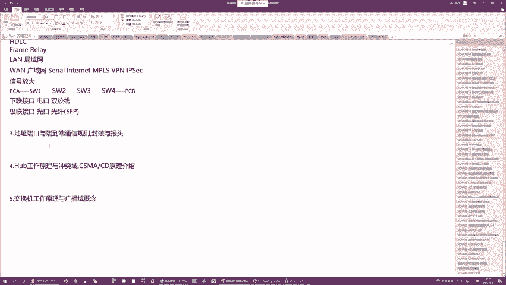

他怎么知道这股流量去往B的呢？对吧？那如果说在一个网络里面，咱们有20台主机啊，A现在希望发送流量给B。那交换机收到A发送的数据之后，他怎么知道流量是去往B的，而不是去往C的，不是去往D的。😡，啊。

原因很简单，原因在一个网络里面，咱们每台主机我们称为叫节点啊，每一个主机它的网卡咱们称为叫节点，这个叫node。

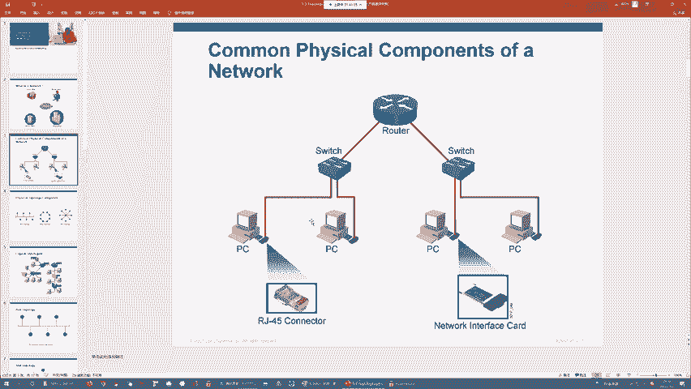

这是一个术语啊，记好啊，节点指的是什么？就是你主机连接网线的网卡啊，你的网卡或者你的网口啊，我们就称呼叫节点。那当然由于咱们一般的计算机网卡只有一块，对吧？那所以说一台主机等同于一个节点。

你们可以这么理解，那当然如果你主机比较先进，你有2块网卡，你就不能这么说了，好吧啊，节点代表网卡。OK那这个时候咱们这个网卡是有身份标识的，标识它的是什么呢？是一个叫做地址的东西。啊。

网络中的所有节点都有地址，并且大家伙的地址都不一样。哎，这个地址就能够全网唯一的标识你是谁，并且还能描述你所在的网络是哪个网络。好吧，这个咱们称为叫dresss啊，叫地址。那网络地址呢分为两类。

一类咱们称为叫三层地址，还有一类咱们称为叫二层地址啊。三层协议所定制的地址啊就是三层地址。那二层协议搞出来的地址就是二层地址啊，那当前在我们一个园区网内网，咱们见到的比较多的三层地址就是IPV4地址。

因为大家都要使用TCAPIP协议站嘛，对吧？都要使用IPV4协议。你只要用IPV4协议，哎，你就需要1个IPV4地址来标识你是谁啊，那同样内网咱们用的比较多是以太网，对吧？以太网规定了。

网络中的每一个节点都需要有一个mac地址。可以吧，mac地址就是由以太网这个协议所制定的二层地址。好吧，那一般的咱们一个主机，你的网卡会有1两个地址啊，1个IPV4，1个mac啊。

那这个mac地址作为二层地址，它弱一些啊，它只能在一个网络内来标识我是谁好吧，我们两个主机如果属于同一个网络，我会care你的mac地址多少。那如果咱们属于不同的网络，请注意啊。

这个mac地址咱们根本不关心的O吗？只有当主机属于同一个网络的时候，我们才能够通过mac地址来告知对方啊，我是谁好吧，这个地址用于在一个网络内来标识一个节点O吗？而这个IPV4不一样啊，它很牛逼啊。

它能在整个internet内啊，它能在整个internet范围内啊。

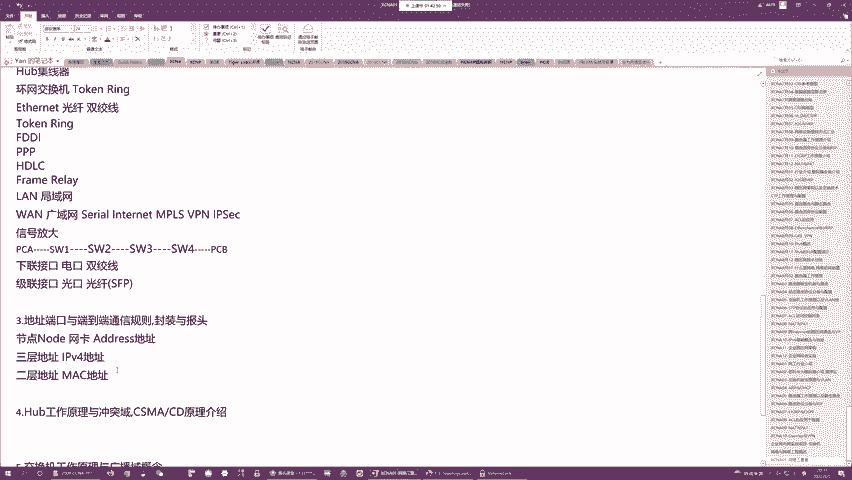

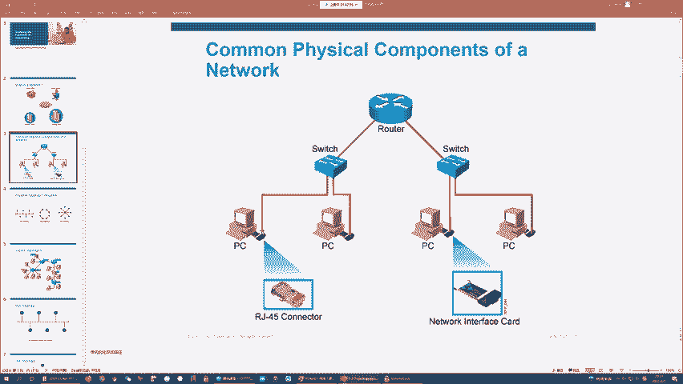

标识一个节点，并且它不但能够标识一个节点啊，还能描述节点。它还能描述节点所属的网络。可吧我们通过IPV4地址，不但能够描述你是谁，还能描述你在哪个网络内OK吗？而这个mac地址它没有全局的标识能力啊。

它只能在一个网络内来标识一个节点到底是谁O吗？啊，它是两种地址的这么一个差异啊，那所以说呢对于咱们主机而言，我们比较关心的是IPV4地址啊，对吧？每台主机你要上网，你除了连线以外。

你需要一个IPV4地址，这个IPV4地址，咱们要么手工配置啊，要么通过DHCP这个协议啊来动态获取。而这个mac地址呢，咱不用太关心，为什么呢？因为这个厂商啊设备制造商在生产你的以太网网卡的时候。

它就会自动给你这个网卡输入一个mac地址啊，并且这个mac地址输入在网卡和rom中呢，叫做只读存储器。

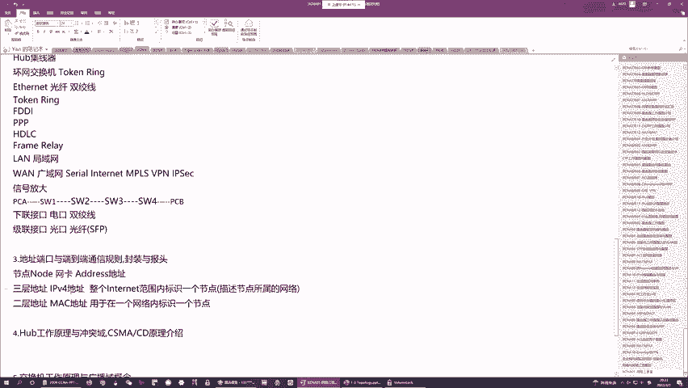

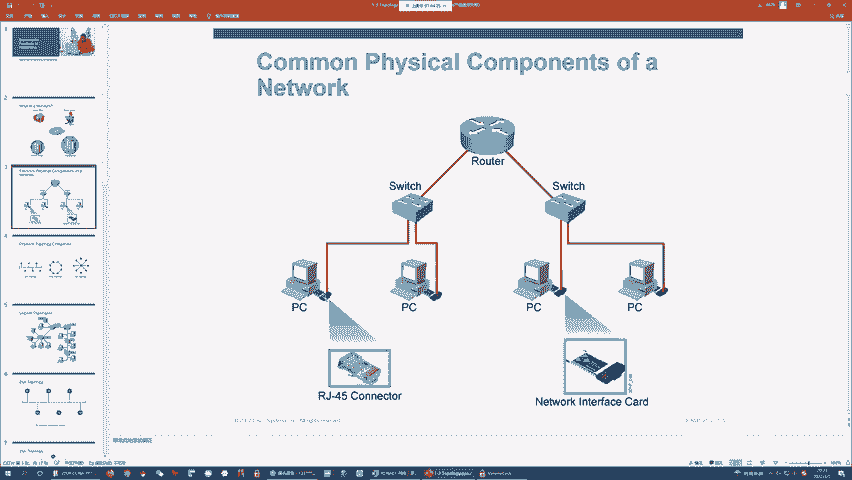

这个叫只读存储器。所有以太网网卡里面都会包含这么一个rom啊，然后这个rom里面咱们要通过特殊的仪器啊，把这个网卡的mac地址写进去。好吧，那当然由于ro写完数据之后啊，正常情况下，咱们只能读啊。

不能修改，不能删除啊。那这个mac地址咱们也称为叫烧录地址啊，把它称为叫烧录地址。因为想要在里面写东西，你需要通过烧录仪啊，需要通过刻录仪啊，对吧？通过烧录的方式在里面写。

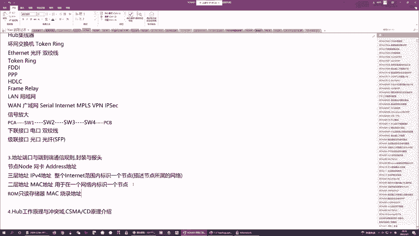

所以说了每块网卡啊自带m克地址，全球唯一。这个m克地址你不用关心，你只要有就好了啊。虽然说大家伙的麦克地址都不一样啊，大家伙的IP地址也都不一样，但是主机之间相互通信，我会更加关注对方的IP地址。

因为不管对方跟我在不在同一个网络，我拿对方的IP地址啊都能定位到对方。啊，当然咱们先不要讲网络监通信啊，我们先来讲一下网络内通信啊。好刚刚那个话题，在一个网络里面20台主机，A现在想要访访问B啊。

那A会怎么样呢？A它在发送数据的时候啊，就会携带B的地址信息。这个地址信息携带在哪里呢？啊，我们来探讨一下，比如说主机A跟主机B啊，咱们通过微信聊天啊，这个微信呢是一种应用啊，当然应用很多啊。😊。

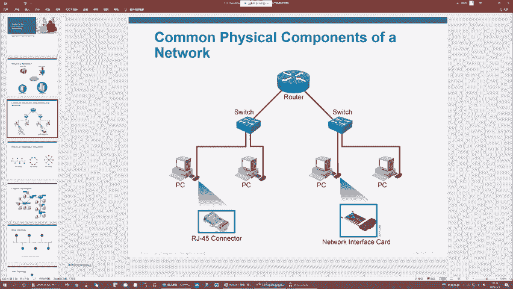

你应用对吧？在你通信的时候呢，会产生数据，比如说你微信里你聊天，你打字嘛，对吧？你打完字这个应用程序会帮你打的字啊转换成数据啊，我们称为叫数据流。这个数据流，网络设备肯定读不懂的啊。

你若果但凡敢直接把这个数据流发送给网络一定会丢弃的，网络设备一定会给你丢弃的，因为网络设备第一读不懂的数据流内容。第二，它也不知道你数据流发给谁的，能理解吧？因为网络很大主机很多。

你为了保证你发送的数据能够被接收者主机收到啊，任何应用一视同仁啊。你任何应用产生的任何数据流在发送之前呢，你都要给它添加什么地址信息，这个地址信息是添加在数据流前面的。啊，我们把这个行为称为什么呢？

我们称为叫数据封装。啊，叫数据封装。所谓的数据封装指的就是给你应用产生的数据流啊，在发送之前添加一些原木地址信息。这个原木地址信息会放在一个叫做数据爆头的哎这么一个字段中，好吧，而数据爆头。

会放在数据流的前面OK吗？啊，当然这个数据流咱们一般不会称为叫数据流了，咱们一般称为叫数据载合。啊，应用产生的这些内容，我们称为叫数据载合。这些内容任何人都看不懂啊，只有接收者主机的应用程序能看得懂啊。

路由器交换机防火墙，看不懂这些东西，你这些东西不管里面包含了什么东西啊，你不能直接发，你直接发了，肯定丢。因为网络设备两眼一一抹黑嘛，对吧？你发给谁啊，我不知道，我都不知道你要发给谁，我怎么给你转发。

没法给你转发，能理解吧？为了让我们的网络设备知道咱们这股流量是由我主机A产生的，发给主机B了，你必须得在数据载合前面添加。数据爆头啊，并且数据爆头呢不只包含一个啊。

因为有的数据爆头里面装的是原IP目的IP啊，有的数据爆头里面装的是什么？源mac目的mac对吧？有的数据爆头里面装的是源端口目的端口，哎，通常正常情况下，一台主机我的应用产生了一股流量，我在发送之前啊。

我给它添加三个爆头啊，数据爆头一数据爆头2数据爆头C。好，再强调一下。😊，给数据载合。😡，添加数据爆头的这个行为，我们就称为叫数据封装啊，通常添加三个爆头。要这三个爆头里面包含什么东西呢？

一般最靠里的这个爆头啊，里面包含的是。源端口还有目的端口啊，然后接下来咱们中间的报头里面包含的什么呢？源IPV地址，目的IPV地址啊，然后接下来咱们的最外层的报头里面包含的是语mac地址。

还有目的mac地址。好吧，两个爆头包含原木地址，一个爆头包含原木端口。那大家会问什么叫端口啊？这个端口呢其实很好理解啊。😊，端口就是一个数字啊，阿拉伯数字取值范围是0到6535。好吧，0到6535。

这个端口作为数字标识的是什么呢？标识的是计算机上所启用的一个应用程序啊，因为咱们一般在上网的时候，你计算机不会说是只启用一个应用程序吧，对不对？不可能的，你肯定会启用多个应用，对吧？

比如说你开着微信的同时，你开个浏览器，对吧？你打开你邮件系统，你打开的你的你的这个音乐播放器，对吧？你看着电影，你玩游戏，对吧？你有各种各样的APP啊，这些APP都能利用咱们网络的连接来收发数据。哎。

那这个时候你主机跟主机B对吧？比如说你聊微信，那这个时候A发给B的流量，假如说啊我携带了原木IP原木m克。那这个时候呢，咱们交换机收到了封装好的数据之后啊，它会通过查看最外层的爆头。

通过查看目的麦克地址，他就能知道啊，这股流量发给主机B的。那交换机呢有一个表，我们称为叫mac地址表。叫mac地址表啊，也叫看表。这个叫要看的。这个表里面会记录在它所在的网络内啊，有哪些主机。

这些主机的mac地址分别是多少，并且这些主机连在它的哪个接口啊，我会记录这些信息。那这个时候当我收到A发给B的数据之后啊，我通过查看最外层爆头的目的麦克地址啊，当然它也只能看最外层爆头啊，好吧。

因为你这个数据载和前面添加了三层爆头。你就相当于是这是一个快递啊，快递的内容是数据载合。这是一个小包装箱，这是一个中型的包装箱这是一个大型的包装箱啊。我们这个快递的内容怎么样添加了三个盒子嘛，对吧？

你想要查看里面的盒子写了什么东西，你得把外面的盒子给拆掉啊，拆掉盒子，也就是去掉爆头啊，这个行为咱们称为叫数据解封装。你若果没有做数据解封装的行为啊，你没有做这些事儿啊，你是不能够越过外面的爆头。

直接查看里面爆头的内容的，能理解吧？正常情况下，你只能从外到内啊去读取咱们外层爆头内容。那如果说你读了外层的爆头内容，你觉得有必要啊，你可以解封装，你把外层的爆头给去掉。

这个时候你才能查看到内层爆头的这么一个内容好吧，但是相反，如果说你没有权限拆掉这个爆头，你没有权限解封装啊，那这个时候你只能依赖外层爆头的内容来做一个数据转法决策，可以吧？那当然外。报酬内容也足够了啊。

因为里面包含了原木mac地址。这个原mac地址用来告诉交换机啊，这股流量是主机A发送的。啊，目的mac地址用来告诉他，这股流量是发给主机B的啊，根据目的mac地址，他会查看mac地址表。

找到B所在的这么一个接口是吧？他知道啊B连在我的10号接口，那我就会通过10号接口把流量发送给B。那B收到数据之后呢，他就会有一个困惑啊，我知道这股流量是A发送给我的，我就是接收者没有问题。😡。

那问题是我该把这股流量交给我本地的哪个应用来处理呢？对吧，我上网我同时开启了好多应用，对吧？这股流量到底是交给我的浏览器来处理呢，还是交给我的微信，还是交给我的QQ，还是交给我的音乐播放器。

还是交给我的游戏是吧？我不知道哎，你有没有告诉我，你只是告诉我我是接收者，没有告诉我我该使用我哪个应用来查看你数据的在和。😡，那这个时候呢，端口号就派上用场了，对吧？

端口号用来标识一台计算机开启的一个应用，你每个应用都会有一个本机唯一的端口。当然这个端口也不是你自己配的啊，这个端口是你在开启应用的时候，操作系统啊，操作系统给这个应用分配的。O吗？

只要你开启个应用自动的这个应用就会请求操作系统来分配一个端口，那操作系统就看了。比如说咱们的windows啊，linux啊，对吧？苹果的mingto啊，它会看啊。

当前本机用了哪些端口号哪些端口号还没有使用。他通常呢会从小到大的来给你随机分配一个端口。比如说微信，我在开启的时候，今天被分配了2001啊，当然明天可能是2002了，后天可能是2003，这个无所谓啊。

总而言之，我有被分配到啊，那接下来端口2001哎A也知道啊，那A再发送给B数据的时候，对吧？在最里层的爆头啊，就会包含原目端口，源端口就是主机A的微信被分配的端口号啊。

然后接下来目的端口就是主机B的微信，对吧？所被分配的端口号，那这个时候呢，B收到数据之后，把外部的报头给去掉。因为它是接收者嘛，接收者收到数据比较关心内容啊，它会把外部的报头给去掉，去掉去掉。

然后接下来查看这层爆头。一看目的端口发现啊，这股流量是交给我端口号2001的应用来接收的。我端口号2001的应用是哪个应用呢？是微信，对吧？那所以说去掉外部的爆头之后，怎么样。

我就会把这个载荷交给我的微信来处理。这就是端到端的通信流程啊，这个端到端的通信流程呢非常类似于咱们现实世界，你寄一个快递啊，你写一封信，比如说你寄个快递吧，对吧？现在你A啊，想要寄个快递，寄给B，对吧？

比如说你寄了一盒巧克力。那这盒巧克力，你不可能直接拿给B，对吧？你要交给快递公司，你要交给邮局，交给快递小哥。你能直接把巧克力交给快递小哥吗？不能啊。

这个巧克力就等同于咱们各种各样的应用啊所产生的数据载合。因为快递小哥拿到巧克力，不知道你是要发给谁的嘛，所以说没有办法给你发。那所以说你在寄巧克力给币之前，你得怎么样搞一个包装盒嘛。

把巧克力放到包装盒里去。😡，然后在包装盒上，你要贴一个快递单嘛？快递单上，你要写什么发件人信息，收件人信息啊，就类似于咱们的原木地址啊，原木端口啊，能理解吧？然后接下来贴上胶带是吧？

然后接下来当你贴完胶带之后呢，这相当是个快递盒了，你把快递盒交给快递小哥，现在你就什么都不用不用怕了吧，对吧？因为快递小哥也不关心你发到底是什么，他只关心你这个快递上发给谁的，对吧？

他会通过读取收件人的信息，啊，确定哦，这个快递是有你张三发的，发给李四，对吧？从南京到上海，那他会选一条去上海的这么一个路线嘛，要么通过火车，对吧？要么通过汽车，要么通过飞机，对不对？

然后接下来把你这个快递发送给李四，然后李四收到快递之后，一看，哎，我就是李四，我就是收件人，对吧？那作为收件人，我肯定会关心你给我发的是什么东西，对不对？所以说我要把这个盒子给去掉，对吧？拆开。

盒子一看哦，里面是一盒巧克力，对吧？人家就欣然接受了。我操，你问的问题太长了。数据载和到达二层数据链路层的时候，前面已经封装了传输层网络层的爆头。那么当这个帧到达交换机的时候。

如果交换机没有这个目的m克地址，交换机会不会泛红转发啊，不是会泛红转发。但是它泛红转发的时候，转发的是这个完整的帧吗，当然是这个完整的帧了。所谓的泛红就是数据全发嘛。我靠，你妈的问题不要问那么长啊。

我怎么给你解释啊，是吧？我还要看问题，看半天字很小的OK。😡，好，就是刚刚有人问了啊，就是你交换机呢收到主机发给主机B的数据，对吧？

我是要据这个最外层的报头的目的mac地址来查找mac地址表来确定B的连接信息来精确的把这个数据转发给B，对不对？是吧啊，那万一我不知道B在哪儿呢？对不对？万一在我的mac地址表里面没有找到B对的表象。

也就是说我不知道B连在我哪个接口，我能不能发送这个数据啊，可以发送啊，它会做数据全发，这个咱们称为叫数据泛红。叫floding。啊，所谓的数据分红指的是什么呢？😡。

所谓的数据泛红就是你A发送的数据到达交换机之后，交换机把这股流量拷贝成多份，然后通过它的所有其他接口，每个接口一份的发送走啊，那假定咱们这个网络里面包含20台主机，对不对？

那你A发的数据会被交换机泛红成19份嘛，对吧？拷贝成19份，然后剩下的19台主机，他们会每人一份的收到数据。当然他们收到的是完整的数据。O吗？他们收到是完整的数据。什么叫copy啊？😡，叫拷贝啊。

是不是就是把你这个东西原封不动的再搞一份，复制一份O吗？拷贝等同于复制O吗？啊，这个叫数据泛红啊这个叫数据泛红。对，交换机他看不懂三层爆头，四层爆头内容啊，数据载合他也看不懂。所以说交换机收到一个帧啊。

是根据二层爆头，也就是最外层的爆头来做转发决策的。O吗？无论是精确转发还是数据泛红啊，还是丢弃，它都只会根据最外层的爆头的内容来做转发决策。什么情况下会发生泛红啊？就是当你交换机收到广播帧的时候。

收到主播帧的时候啊，都会泛红。对吧？比如说你发送1个ARP的请求是吧？ARP的请求是以广播形式发送的对吧？那这个请求报本到达交换机的任何一个接口，交换机都会通过泛红的方式来给你转发。

然后接下来还有一种咱们称为叫未知单波帧泛红，什么意思啊？就是你收到的确实是一股单波流量啊，是由一个信源主机发送给一个接收者的对吧？目的麦地址是一个单波地址，但然呢，当前咱们交换机，不知道接收者在哪里。

啊，我的mac地址表里面没有记录接收者主机连接我的接口信息。也就是说我不知道这个主机到底在哪儿。那在这种情况下。哎，我也会泛红数据。那所以说咱们把这三种泛红称为什么呢？称为叫半泛红，叫BUM。

分别是broadcast。multticast还有unknowuniccast啊，这个叫做广播主播和未知单播展。如同我字面意思，就是我的表里面没有B的连接信息啊。

交换机需要通过某种方式了解到它所在的网络内主机的mac地址分别是什么啊，它需要知道这些主机分别连在它哪个接口，需要通过某种途径来了解，可以吧？那在这个进在这个进程啊，没有完结之前，你可以理解为交换机。

很有可能就不知道对吧？网络里面一个主机到底mac地址多少，连在它哪个接口，这个很正常啊，那遇到这种情况，如果你收到了去往该主机的数据，对吧？我查找mac地址表，没有找到表象，对吧？那我就会泛红。

😀Ha哈。😊，先别讲复杂的概念，咱层层推进。我也想啊。我也很纠结呀。我这么讲的话，是不是你们听不懂啊？😊，我可以说一下三次握手吗？我能不能说一下MPLVPN啊，我要不要跟你们说一下SR呀？😡。

不要太心急啊。你们这么心急干嘛呢？是不是咱们所有的课的内容都是要连贯安排的，对吧？我们现在讲的你也未必懂啊，对吧？为什么要搞三搓握手呀？啊，到了数据爆头那里，肯定一群人懵逼很正常嘛，对不对？很正常。😊。

好啦，我不能再跟你们唧唧歪歪了。再讲的话，今天这节课讲到12点了。好，我们就先把这些给放一边去啊，就是听不懂我说的这些的，大家不用太在意啊，不用太在意这个数据爆头，大家能理解吗？😊，啊。

数据爆头大家能理解吗？就是你计算机启用的任何应用，你要通信嘛，对不对？你应用本身产生的，我们称为叫数据载荷。这个载合网络设备是不能理解的啊，就跟你寄快递，你寄的快递内容，对吧？快递小哥根本不在意啊。

他在意的是什么？是你要把快递寄给谁？好吧，那在我们的网络中呢，网络设备扮演的就是快递小哥的角色啊，他收到你发送的数据，他根本不会关系你发的是什么类型的数据，文本啊，音频啊、视频啊，无所谓啊。

你在发送这些数据之前，请你一定要做好数据封装。这个封装谁来做呢？就是由信源主机来做的，谁发谁来做这个事儿啊，你A希望把数据发给B，对不对？那你A的应用产生完数据在发送之前。

就由你A这台主机来给数据添加包头信息。OK吗？一层一层添加先添加包含原木端口号的，再添加包含原木IP地址的啊，再添加包含原木mac地址的可以吧？添加三层，这个咱们称为叫数据封装。封装完毕之后啊。

这个东西咱们称为什么呢？我们称为叫数据帧。啊，这个咱们称为叫数据帧。啊，叫frameme。叫数据帧包含三层爆头的这个传输单元啊，叫数据帧。那这个数据帧呢里面包含三层爆头，从外到内啊。

你可以理解为我们中间这就是咱们的巧克力，对吧？这是一个小袋子，你先把巧克力放在小袋子里面，然后这是一个中型的盒子，你把小袋子放到盒子里，然后这个外面是个大箱子，你把盒子放到箱子里，可以吧？都封死了。

然后接下来任何网络设备收到这个数据针，你默认情况下都只能从外向内看啊，你们最一开始只能看到最外层爆头的内容啊，也就是说你们只能读取原木麦地址可以吧？

然后接下来交换机也就是基于咱们最外层爆头的原木麦地址信息啊，来给这个数据呢来做转发决策，可以吧？那当然如果说你做的是网络监通性，咱们中间还有路由器，对吧？那路由器，它在做网络兼数据转发的时候。

是要基于三层爆头的原木IP啊来做。大决策的。OK那接下来路由器收到这个针，它就必须要把最外层的二层爆头给去掉，这个叫二层爆头啊，你得把二层爆头给去掉，然后咱们查看三层爆头的目的IP来做折法决策。

那关于这个去爆头，什么时候咱们有资格去爆头呢？很简单啊，你一个节点收到一个帧之后啊，如果这个真的目的max地址。跟你的接收接口的mac地址啊，跟你接收接口的mac地址一致。

那你就会认为你就是这股流量的接收者。那作为接收者，对吧？我肯定会关心你这个数据里面内容嘛，对不对那这个时候我就会把外层的封装给去掉，这就是解封装的前提条件，O吗？那交换机会不会解封装啊，不会。

因为交换机的物理接口虽然有mac地址，但是你主机发给他的帧目的麦ac地址怎么可能会是他的接口mac地址呢，不可能啊。所以说呢交换机收到一个帧一看，哎，目的麦克地址跟我不相干，对吧？

肯定是发给别人的那既然是发给别人的，我就基于目的麦ac地址查找看表来转发，对吧？那为什么B收到数据了，我能拆封装啊，因为你必收到数据一看，哎目的mac地址跟我接收接口的一样哎，我就是接收者。

对吧那我作为接收者，我不拆包，我干嘛，对不对？比如你张三发了一盒巧克力给李四，对吧？李四收到快递一看，李四收。我不收干嘛，对不对？我不拆干嘛能理解吧，是不是？😡，哎，就是这么一个情况啊。

大家有这么一个概念。那当然如果相反啊，你一个节点收到一个真，你发现目的mac地址跟我的接收接口的mac地址不一样啊，也就是说我不是接收者。那既然我不是接收者，这股流量就是发给别人的啊。

那既然是发给别人的，我就只能帮你转发，我不能够把这个报道给去掉，不能看里面的内容O吗？好，基本是这么一个情况。总结一下哎，在端调端通信的网络环境中啊，任何主机的任何应用，你要发送数据给其他人啊。

你产生的数据是不能直接发送的。在发送之前，你得给数据添加爆头一系列爆头啊，大概有三层三层啊，其中两层爆头里面包含的是原木地址信息。啊，一个是原木三层地址，一个是原木二层地址。

然后接下来还有一个爆头里面包含的是原木端口啊，添加完三层爆头之后，我们这个传输单元称为叫数据帧。然后接下来数据真的发给我们的交换机，交换机查看二层爆头的目的麦克来转发路由器收到帧之后。

它会去掉二层的爆头，查看三层爆头的目的IP来转发anyway啊，最终这个数据啊会发送给咱们的接收者。接收者主机查看前两层爆头对吧？目的地址都是他自己是吧？我再三确定了我就是接收者啊。

那他会把外部的两层爆头给去掉。然后接下来通过查看内层的四层爆头啊，通过读取目的端口来判断他接收处理这部流量的应用是哪个应用啊，确定了接收数据的应用之后，这层爆头啊，他也会拆掉。

然后接下来怎么样把载核交给他的应用程序来处理。OK吗？啊，就给你寄快递一样啊，发送者在发快递的时候添加快递盒，不是为了美观啊，是为了让快递小哥能理解到我要把快递发给谁？啊，收件人收到快递之后。

既然确定了我就是收件人了。我还管那么多啊，对不对？肯定要把快递盒给拆掉，因为我关心的是快递的内容O吗？啊，能解释的通啊。好，端到端传输原理。那接下来说完多到端传输原理之后呢，我们也说了啊。

就是当前呢在内网咱们建的比较多的是以太网啊，那以太网咱们在组网的时候呢，早期用的是极限器，对吧？组建而成的是总线型网络嘛，对吧？那现在咱们用的比较多的是交换机嘛，组建而成的是新型网络。来。

我们接来聊一聊总线网络的通信原理啊，新型网络的通信原理OK。那先来说一下集限器这个设备啊啊集限器。😊，长得呢跟交换机比较像。早期的设备了，接口呢没有交换机那么多，然后呢，接口带宽比较有限。

是共享了10兆比特每秒的这么一个带宽啊，那这里涉及到了一个新的名词啊，叫带宽。大家听过带宽吗？😡，有没有人知道带宽是什么？这个叫banway啊？😡，有人不知道吗？😡，okK其实这个就是数据传输的速率啊。

叫数据传输的速率。因为你在网络中任何应用乘是数据，你都是要以比特的形式来传的啊，因为计算机的世界中，任何东西啊，万物啊，世界的万物你都可以通过比特来表示，O吗？

不停的通过0101的这么一个组合啊来表示你想表示的一切啊，文本啊，音频包括视频都可以通过比特来表示，O吗？一个比特就是一个二进制的位啊，可以是零，可以是一可以了？

那接下来你传输任何东西它最终都以比特形式来传，那咱们就要考虑到你能传多快，对吧？一秒钟你到底能发送多少比特呢？这就是网络的传输速率，好吧，当然你发送这个咱们称为叫上传啦，如果你是要接收的话。

咱们就是下载啊，下载就是接收啊上传就是发送可以吗？你的传输速率，我们就称为叫带快。所以说。单位是多少呢？是什么什么比特每秒啊，多少多少比特每秒。也就是说你通过这个接口连接到网络之后啊。

一秒钟你能够接收或者能够发送最多多少比特的数据。当然这个比特呢，它的单位太小了啊，你动不动后面加一大串零啊，不好表示。所以说呢针对这个比特，咱们有些单位，比如说像K比特啊，像兆比特啊，像G比特呀，啊。

咱们有K兆G啊，这个是用来缩记缩写咱们这个单位的啊，对吧？让你这个后面不至于有那么多零OK呢？K是什么啊？K就是千啊，一K等于1000比特。1K比特等于1000比特OK吗？这是它们之间的换算关系啊。

然后接下来一兆比特等于1000K。OK吗？然后接下来一G比特的话得于多少啊？等于1000兆O吗？它等于1000兆。然后接下来咱们还有T啊，一T比特的话等于啊1000G啊，当然这个T的话。

咱们用的比较少啊，一般兆和G就应到极限了。O吗？啊，这是比特之间的这么一个关系，好吧，这个1兆比特每秒兆就是百万嘛，相当于1000万啊，1000万比特每秒好吧，意思就是说你这个接口连完线之后啊。

通过这个连接每秒钟咱们能够发送1000万比特的数据，O吗？好，请注意啊，比特之间的换算是1000。😊，你们提到了1个1024，对吧？这个1024呢跟比特没有关系啊，1024是跟字节相关的一个换算O吗？

那这个字节咱们称为叫大比。啊，比特叫小B啊，比特叫bitt，咱们称为叫小B，字节叫bitt，我们称为叫大比。这个字节是什么呢？就是连续的巴比特组成的字符串啊，咱们称呼叫字节啊。

一个字节里面包含了巴比特O吗？那字节比比特稍微大一些啊，但是同样很小O吗？所以说咱们有K字节，咱们有兆字节，咱们有记字节，咱们有T字节，O吗？而字节之间的换算，咱们是二的10次方。😊，啊，二的10次方。

我们用二乘乘10来表示了，py送里面2乘乘10就是二的10次方啊，2的10次方就是2乘2乘2乘2乘2乘14嘛？啊，它的结果是什么？就是1024O吗？

10241024字节等于1K字节1024K等于一兆1024兆啊，它等于1GO吗？那一般呢咱们在计算机上，你连了网之后啊，你会有些下载器，像迅雷啊等等之类的。你通过这些下载器来下载文件的时候。

它会显示下载速度请注意啊，那个不是带宽，那个是下载速度O吗？那个下载速度是按字节来记的啊，多少多少字节每秒啊，现在一般更多的是多少多少兆字节每秒了，可以吧？而你在办理宽带的时候啊。

宽带它在给你签业务的时候，给你签协议的时候，会告诉你啊，你花多少钱办什么套餐，这个到。套餐给你提供的宽带连接的速率对吧？带宽是多少，而这个所谓的带宽是用比特每秒来计算的，O吗？它是用比特每秒来计算的。

所以说它们是有换算关系的啊，这个10兆比特每秒是一个带宽的单位，O吗？如果你想换算成下载速度啊，你要除以8啊，当然也不是单纯的除以8了。如果你要是思科的设备来算的话，你要怎么算啊？

你是先要把它还原成1000万比特每秒，对吧？除以8换算成字节，然后除以1024，再除以1024啊，就能得出多少兆字节每秒啊，但然如果说你要是用华为的设备的话，华为设不是比较省事啊，因为在华为的设备上。

它的比特之间的换算也是1024好吧，这个1000是思科的换算法则啊，华为即便是比特啊，它也是1024所以说华为的换算就是单纯的除以8就好了，能理解吧？思科的换算，你还复杂一些。OK吧。好。

那这是关于集线器的接口带宽。那我来问大家一个问题啊，大家觉得集限器接口带宽高吗？是不是很低呀，对吧？十兆比特每秒换算成下载速度才一兆多一点。并且它提供的是共享带宽，什么意思呢？

就是你集线器连接一台主机啊，它能使用10兆的带宽来传试数据。如果你连接两台主机呢，对吧？你们俩共享10兆，平均每台5兆。你如果连三台主机，对吧？大家共享10兆，平均每台3。3兆。你集限器连接的主机越多。

平均每台主机啊，能够享受的带宽就越低。是吧那所以说你在组建一个总线型网络的时候，那不用考虑广播域的问题了，你不用考虑广播流量的问题啊，就带宽这个问题就够你喝一壶了。所以说咱们在组建总线型网络的时候。

一个总线性网络建议主机数量真的不要超过10台啊，你超过10台对吧？平均每台主机能使用的带宽就太低了，你的收发的效率就太差了，O吗？啊，它的带宽很低。然后接下来集线器呢，它接口的双攻模式也不好啊。

它的接口的双攻模式。是半双攻的啊半双攻的这个双攻模式呢又是一个专业名词啊，叫dplex啊，它也是物理层的概念啊，跟带宽一样很有用。O了啊，这个dplex指的是你根线缆连接完毕之后啊，你的双向的传输能力。

比如说你两台主机连一根线是吧？你通过这根线肯定既要发送要接收嘛，发送咱们称呼叫上传，接收，咱们称呼叫下载可以吧？那接下来咱们能不能同时上传下载呢？得要看咱们这根链路，它的双攻模式怎么样啊。

如果你这根链路是全双攻的那就代表咱们这根链路首先双向传输没问题啊，并且上传的同时可以下载下载的同时可以上传可以吧？所谓的全双攻指的是什么呢？就是一根线来能够同时支持双向流量存在好吧。

我支持什么双向流量同时存在，他们能够绕开彼此啊，我发我的，你发你的没有任何问题。那当然相对的有全双攻啊，咱们就有半双攻。这个半双攻链路指的是什么呢？就是你一根链路连好之后啊，双向连通性是没问题的啊。

你可以通过这个链路收也可以通过这个链路发。但是双向流量不能同时存在，意思是什么？你发的时候不能收，你收的时候不能发，能理解吧？那有人问了，如果同时怎么办呢？如果同时不好意思啊。

半双攻的链路上双向流量同时存在啊，它们是绕不开彼此的，它们会撞在一块，啊，撞碎了，形成冲突碎片，这个咱们称为叫数据冲突。啊，记住啊，只要你有一根半双攻链路，只要你在半双攻链路上让双向流量同时发送。

它们就会撞在一起，撞碎，形成冲突碎片。OK吗？能理解吧啊，这个咱们称为叫数据冲突啊。OK那当然冲突大家不用想了啊，一旦冲突了，你直接冲突碎片，就算接收者能收得到啊，他也不能理解里面是什么内容啊。

因为我收到你给我发的数据，我是要读里面内容的，对吧？你如果这个数据撞碎了，我怎么读啊，我根本没有办法读，能理解吧，我根本没有办法读。OK那当然这个收工模式呢，还有一种就是光纤使用到，咱们称为叫单攻。

单攻指的是什么？就是这是一根单向链路啊，只有一个方向流量可以走啊。一般呢在我们的一个企业网内网，咱们如果要使用光纤来接设备啊，这个光纤都是单攻的，所以说连光纤一连怎么样？连两根嘛，对吧？一根发一根收啊。

发的专门负责发收的，专门负责收。因为他们都是单攻的。而你通过双绞线来连接多个节点，双绞线双向流量都可以走啊，肯定是双攻的，那接下来咱们到底工作在全双攻还是半双工就取决于你两端的接口到底是什么模式。

如果你两端的接口为半双工模式，那它就只能按照半双工的方式来运作。如果你两端的接口全双工模式啊，它就能按照全双攻的方式来运作。那当然咱们一般的网络中的主机，主机的接口是既支持全双攻又支持半双攻的啊。

而至于我连线连到网络设备到底通过哪种方式来运作啊，得要看网络设备的接口到底是什么模式。嗯，能理解吧啊，就比如说了，我主机连一根线，连到交换机，交换机的接口都是全双攻的对吧？那通过协商双工模式啊。

你们最终就能以全双攻的方式来工作，可以吧？但是如果说你连线连到极线器啊，集线器的接口都是半双攻的。那这个时候就算你的主机支持全双攻也没有用啊，对不对？也没有用。

那这个时候就是你全双攻的主机连到半双攻的极限器，你通过协商怎么样，最终还是要以半双攻的方式来运作。OK吗？啊。好，由于集限器它的接口是半双工的，所以说了它连接的所有主机，对吧？

都只能以半双攻的方式来运作。什么意思啊？就是为了避免冲突，你在发送数据的时候，你不能接收你在接收数据的时候不能发送可以吧？O然后接下来集限器呢作为一层的网络设备，这个一层是什么概念呢？我一直提层啊。

这个层是一个叫做OSII协议站所制定的这么一个标准啊，它把网络的各种各样的协议，各种各样的设备啊分成了7类，啊，我们称为叫七层，O吗？那一般的交换机工作在二层嘛，对吧？路由器工作在三层，对吧？

我们的PC和服务器工作在7层，而这个集限器呢工作在一层，请注意啊，层越高，代表什么层越高代表你智能越强层越低，代表你智能越弱O吗？啊，那这个最下层的集限器啊，作为物理层的设备。一层设备啊。

它几乎没有任何智能。这意味着什么呢？这意味着他收到主机发送的一个数据帧，它是不能读懂任何一层爆头的任何一个封装内容的。

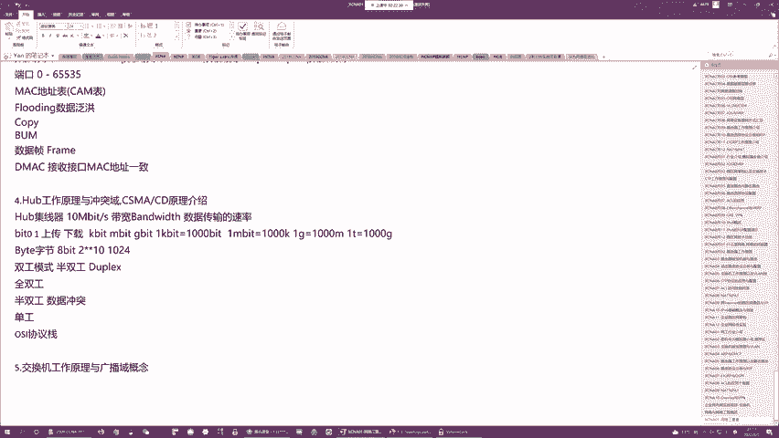

可以吧？因为咱们也说了，你应用产生了数据载合，咱们最先添加的是四层爆头，对吧？啊，包含原木端口的是四层爆头。然后再往前这个包含原木IP的是三层爆头，然后再往前这个包含原木m克的是二层爆头啊。

我只包含三层爆头啊，四层爆头，三层爆头和二层爆头。

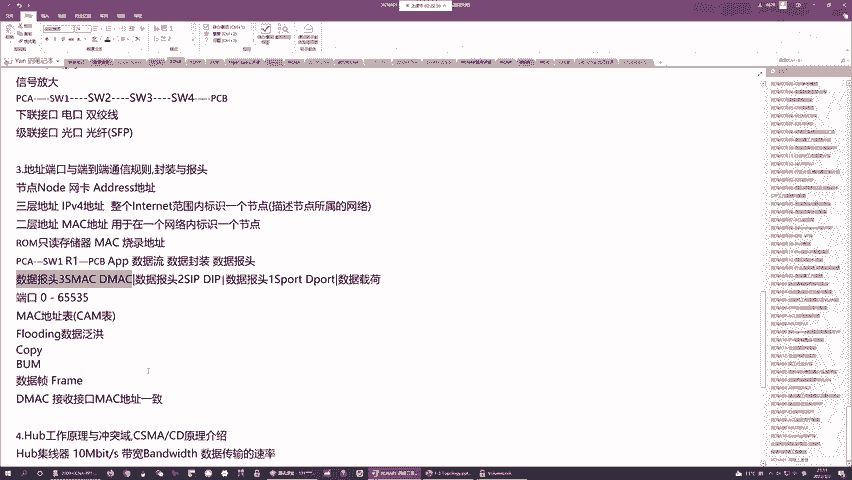

好，集限器作为一层的设备。我为什么称你为一层设备啊？😡，意思是你只能读懂一层的封装信息。我想问大家了，咱们有一层爆头吗？咱们有没有一层封装啊？😡，没有啊，数据真的最外层的封装。

最低层的封装啊也是二层的那这个二层的封装你极限性能读得懂吗？你读不懂？如果你能读得懂，你就是二层网络设备了，能理解吧？一个网络设备是几层由什么来定啊，就是看你这个网络设备能够读懂几层封装啊。

交换机能读懂二层爆头，所以你是二层的路由器能够同时读懂二层三层爆头，所以你是三层的啊PC三层爆头都能读得懂，并且载荷也能读得懂，所以你是七层。😡，但极限器啊，它是一层的，意味着什么？

意味着数据间的三层爆头，任何一层啊，它都读不懂啊，它读不懂原木m克啊，读不懂原木IP也读不懂原目端口。😡，那这个时候。主机A。连接极限器一连接主机壁。那你连接完B了是为了通信的啊，对吧？

那A发给B的数据工工整整的啊，三层封装都有是吧？原木IP原木麦克原木端口都有。那这个极限器收到A发送的数据，我又读不懂你的报头的内容。那大家是否可以理解为极限器在转发数据的时候。

他也不知道这个数据发给谁的。虽然说A想要告诉他这个数据是发给B的，但是对吧？A和B这两个主机的mac地址极限器看不懂啊，对不对？A城试告诉极限期，我要把数据发给B，但极限器看不懂。

所以说集限器它也没有必要像交换机一样存在一张mac地址表啊，它没有任何表，啥表都没有啊，没有任何表O吧？没有任何表，也就是说一个网络中到底有哪些主机，这些主机的地址是什么？这些主机连在它哪个接口。

它是一概不知道的它也不想要指的啊，集限器。没有任何转发的表，能理解吧？他没有mac地址表啊，他不知道他所在的网络是怎么连接的，有几台计算机分别mac地址多少，连在他哪个接口，不知道，并且他收到任何数据。

他由于看不懂爆头的封装内容嘛，他也不能够知道他收到的数据是发给谁的。啊，那这就很搞笑啦，我不知道我所在的网络内的连接信息，我也不知道我收到的任何数据是发给任何主机的啊，不知道完全不知道，那怎么办呢？

我只能通过一个最保险也是最愚蠢的方式啊来帮助信源转发数据。😊，这个转发方式就是。数据算红啊，叫flooding。咱们刚提过对吧？啊，这个flloing交换机会做啊，而这个是极限器的全部啊。

交换机既能做精确转发，又能做数据泛红而咱们极限器呢只能做数据泛红。原因有两点。第一点就是它没有控制层面啊，任何的网络设备控制层面都会有张表啊来记录咱们网络连接信息，极限器没有。

这也就是说不管它运作多长时间，不管它启用什么样的功能。当然它也启用不了什么功能啊，就是不管怎么着，他都不会知道它所在的网络内到底长什么样能理解吧？他不知道没有任何表象啊。第二点。

由于它读不懂任何爆头中的任何内容啊，所以说它收到的任何数据，它也不会知道是发给哪台主机的，所以说就跟瞎子一样啊，它只能进它的权利来帮助新源发送数据，尽可能的保证接收者收到数据。那它转发逻辑是什么呢？

就比如说了，在我一个总先型网络中啊，咱们有5台主机。你现在A发送的数据呢，其他4台主机都有可能是接收者，因为我也不知道是谁嘛，所以说我就帮你全发呗，对吧？所以这个时候主机发送的数据到达极限接口之后啊。

它会帮你做信号放大。然后怎么样帮你把这个数据拷贝成4费，然后通过其他四个接口，每个接口一份的发送走啊，它永远只能通过这种方方式啊来帮你发送数据。那所以这个时候A发给B的数据B能收到。

但是所有其他的主机也能收到。大家觉得安不安全。安不安全？是不是很不安全啊？因为你A发送的数据是发给B的，我是希望这个数据只有B能收到吗？但是现在除了B以外，CDEFG都能收到。我靠，你们干嘛收到。

我又不要发给你们，万一这个文件很机密呢？😡，那这个机密不就泄露了吗？对，完全不安全啊，完全不安全，这是第一点。第二点，你泛红转发，你累不累啊，慢不慢对吧？特别慢，又慢又累，效率特别差啊。

并且对于所有其他主机而言，他们又不是B，如果他们不是黑客。😡，我收你A发给B的数据干嘛也没有意义嘛，对不对？所以说呢对于网络中的任何节点而言啊，这个极限期的泛红转发都是很有问题的。那所以说就是因为如此。

这个集线器的转发效率奇低啊，才没有人使用它啊，早在十几年前就被淘汰了啊，取而代之的咱们用的是交换机。

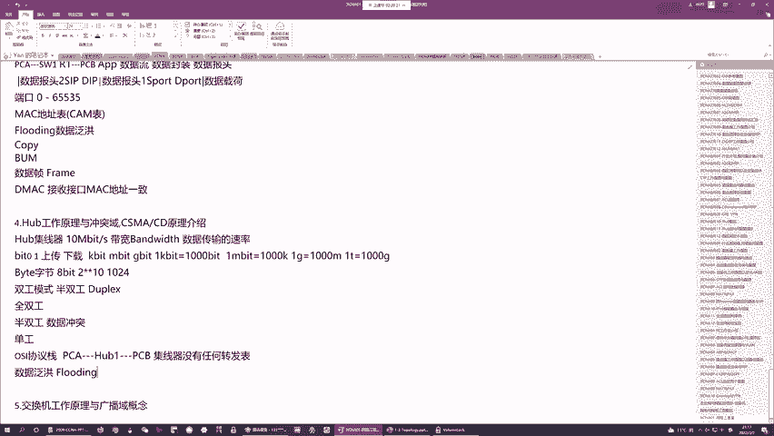

然后接下来在我们的总线行网络中呢，还有这么一个问题啊，由于极限器，它只会以泛红的方式来转发数据，并且极限器它连接所有PC的链路啊，都是半双攻链路。大家记住啊，半双攻链路双向流量是不能同时存在的。

那接下来问大家一点，现在在一个总线性网络中，如果有两台主机，它们同时发送数据，大家觉得会导致什么样的结果？比如说咱们主机A主机B同时发送数据。是不是会发生冲突啊？因为你A发送的数据会被极限器泛红给B。

这个时候如果B，你也在发送数据，对吧？那对于B连接极限器这个链路啊，双向流量就会同时存在。啊，就会产生冲突冲突会导致相撞的数据变成数据碎片啊，冲突碎片，这个冲突碎片会继续发给极限器啊，极限器傻白甜嘛啊。

它的接口是物理层的物理层的接口收到一个帧，它是没有能力来判断这个真是一个完整的数据还是一个冲突碎片的那所以说对于完整的数据也好，对于冲突碎片也好，它一视同仁，收到冲突碎片，它也会继续泛红。

把冲突碎片发送给网络中的所有其他主机。那这个时候冲突碎片大家都知道收了没有用啊，那这个传输就相当是失败了。所以为了避免数据冲突，为了避免失败，在总线行网络中啊，只要有一台主机在发送数据，其他人叫等。

等它发完之后，你才能发。如果说有任何两台主机同时发送数据啊，就会导致数据冲突。那接下来啊总线型网络啊，咱们毕竟通信协议是。以太郎协议。以太网协议呢作为一个数据链路层的局域网协议，它制定了三个规则。

第一个就是在这个以太网络中啊，由于这是1个MA网络嘛，多路访问网络。那网络中的每一个节点都需要一个mac地址来标识自己啊，mac地址是由它来定义的。然后接下来端到端通信，你的二层的爆头。

我们称为叫以太网二针头啊，它的格式和内容哎，也是由以太网协议规定的对吧？我们的二层爆头的格式。

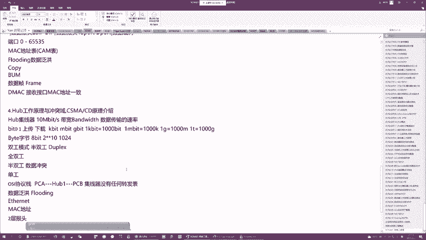

和内容啊，这也是由这个协议定义的对吧？它就规定了啊，你们主机之间在我们的以太网中通信啊，我不管你发送什么东西，不管你应用产生的什么内容啊，只要你要发送数据，你就要添加一个二层报头。

这个二层报头的格式我来定，对吧？三个字段里面填充什么内容也是由我来指定。OK吗？然后接下来第三点就是通信规则了啊，通信规则指的就是你主机连接入网之后，什么时候你能发送数据啊，什么时候你不能好吧。

这个通信规则是相当的啊，没有讲究的什么意思呢？就是你主机连到咱们以太网之后，只要你感觉你的连接没问题啊。你可以自由通信啊，你想发送任何数据，你可以自由的发，你收到别人给你发送的数据，你可以自由的接收啊。

你在发送任何数据之前，不需要任何的许可啊，你不需要说得到什么许可，你才能发送啊，你收到数据之后，你想要检查数据的内容，你也不需要任何的许可啊，你可以自由的发送自由的接收。那正是因为以太网协议。

它的通信规则非常的宽松啊。那在总线型网络中，经常会出现啊，多台主机同时发送数据的这么一个糟糕的情况。一旦这个情况出现了怎么样？那通信肯定要中断嘛，对不对？你们导致冲冲冲突了嘛，对不对？这个冲突哎。

你们传说的数据都撞碎了，形成冲突碎片。这个冲突碎片就算接收者能收得到，他读不懂里面内容啊，这是没有意义啊，对不对？没有意义。所以说啊这一块咱们就要加以限制。在总线行网络中，为了避免频繁的出现冲突啊。

以探网协议就制定了一个传输的子标准。这个标准咱们称为什么呢？我们称为叫CSMA杠CD啊，叫载播真听多路访问冲突检测。叫载播真听多路访问。冲突检测。啊，在播真听多路访问冲突检测。哎，这个规则就说了啊。

只要你开启了CSMA杠CD啊啊，我们的主机就没有那么自由了啊他就说了，你在发送数据之前呢，请你先监听链路，当你确定链路安静了，你才能发送数据，但是相反，如果说你监听链路发现链路不安静啊，对吧？

链路再活跃，就请你等啊，等别人发送完数据之后，你再发当然所谓的监听链路指的是什么，就是看看你能不能收到数据嘛，对不对？因为极限器收到任何数据肯定会泛红。这就是说网络中只要有人在发送数据啊。

我肯定能收得到啊，只要我能收得到，就代表有人在发嘛，代表链路不安静了。那这个时候我如果要发的话，那肯定会有冲突嘛，我就等等你发完，等我收不到数据了，链路安静了，我再来发送，是不是就没有问题了，对吧？

这就是CSMA杠CD的这么一个监听原则，啊，他要求网络中的每台主机，只要你启用了CSMA杠CD啊。😊，就必须得监听。只有当你确定链路是安静的时候，你才能发送数据。那通过这个规则。

咱们能尽可能的减少总线性网络中的冲突出现的概率。但不是百分百的规避啊，你规避不了啊。因为网络中，比如说咱们有好多台主机，现在呢主机A主机B我都想发送数据。而此时假设有一台主机正在发是吧？

然后接下来咱们监听吧，发现链路是对吧？不安静的那咱们等等那台主机发完数据之后，咱们会同一时间的发现链路安静了。那这个时候咱们同时发送数据是不是又冲突了。对吧那所以说了CSMA杠CD不能避免冲突啊。

它只能尽可能减少冲突发生的概率。OK那接下来CSMA杠CD启动条件是什么呢？就是你接口的双攻模式啊。你接口的双攻模式只要是半双攻啊，就有出现冲突的可能。啊以太网协议就规定了。

你一个主机连接到咱们的以太网啊，只要你的接口的双攻模式为全双攻，你就可以自由通信。因为全双攻的链路没有冲突的可能嘛啊，但是相反，如果你是半双攻，你就要启用CSM杠CD啊，你在通信之前。

你要监听链路是否安静，只有当你确定链路是安静了之后，你才能发送数据。那当然由于集限器它的接口半双攻的，所以说你任何主机连到极限器之后，你都只能以半双攻的方式来运作啊。那所以说只要你连到总线型网络啊。

CSMA杠CD就会自动开启，可以吧啊，这就是极限器的这么一个啊解决冲突的问题啊，解决冲突手段。那当然解决冲突不是由极限器解决的是由以太网协议解决的。OK了？

CSMA杠CD是以太网协议的通信规则中的一个子规则啊，当你的接口的双工模式为半双攻的时候，这个规则生效啊，这个子协议生效，约束咱们的发送者信源主机在发送数据之前怎么样，对吧？监听链路。

只有当你确定链路是安静的了啊你才能发送数据O了啊，这就是咱们的总线性网络解决冲突的这么一个问题啊，这么一个手段。OK那接下来总结一下啊，在我们的总线性网络中啊，对吧？

集限器啊永远只会以泛红的方式来转发数据。然后咱们通过CSMA杠CD来解决咱们冲突问题。那在设计一个总线性网络的时候呢，由于咱们极限器，对吧？转发的效率实在是太低了啊。然后呢。

为了避免咱们CSMA杠CD失效啊，你在设计总线性网络中，你要遵循1个54321原则啊，什么叫54321原则呢，就是在一个总线网络中，咱们极限器的数量不要超过5台啊，然后呢。

极限器跟集限器之间最远的距离不要超过400米啊，其中三台集限器用来连接主机，方便它们通信啊，有两台极限器呢仅仅是用来扩充咱们总线性网络的连接范围。然后接下来当你连好之后啊，连同极限器和主机。

所有的节点是属于同一个冲突域的啊，这是一个新的概念啊，叫冲突域。😊。

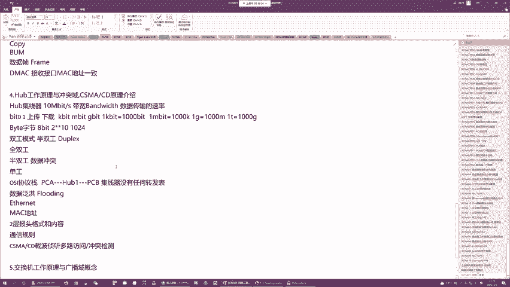

什么叫冲突域啊啊叫colliion domain。😡，🤧colliion domain漫。它指的就是整个总线型网络啊，它就是一个共同的冲突语。冲突域的定义是什么呢？就是在这个冲突域内啊。

只要有两个节点同时发送数据，会导致冲突，并且冲突碎片会影响到对吧？该域内的所有节点。那确实啊只要你们属于同一个冲突域，对不对？你任何两台主机，你敢同时发送数据吗？你只要改就会冲突，对吧？

并且一旦冲突产生了这个冲突碎片，只要到达极限器，极限器还会把它当做正常的数据一样来泛红转发，那最终你会发现网络中的所有主机都能收到这个碎片，对吧？对吧？那这就是冲突域O吗？

冲突碎片所能影响到的节点的范围，啊，我们就称为叫冲突语，或者说冲突碎片所能影响到的设备的集合啊，我们就称之为叫冲突语。那正是由于没有办法隔离冲突域，哎，那集限器真的雪上加霜了，对吧？你转发效率又低。

你组建一个网络，对吧？带大家带宽又不够用，是不是？然后加上CSM1杠CD对吧？即便有这个规则存在啊，依旧咱们主机越多，出现冲突概率越大。那所有这些原因啊所有这些因素啊都导致了这个设备最终就停产了啊。

那停产之后取而代之的就是净换机。交换机相比集线器，它的接口带宽更高。是吧然后接口都是全双攻的啊，全双攻的交换机接口连接主机。由于主机也支持全双攻嘛，所以你会发现主机连接交换机的所有链路啊。

它不会出现任何冲突。因为我也说了，全双攻链路嘛？你双向流量可以同时存在，它们能够绕开彼此吗？对不对？它们能够绕开彼此，我给你发的数据和你给我发的数据，即便同时在链路上存在啊，他们也能绕开彼此啊。

分别到达他们该到达的目的地，O。全双攻能够规避冲突。所以在咱们的新型网络环境中啊，CSMA杠CD是没有任何使用的必要的啊。所以说PC连接交换机，你通信的时候呢，根本不需要监听链路啊，你想要发送任何数据。

你可以自由的发送啊。你想接收数据，只要你收得到，你可以正常接收。然后接下来交换机呢作为数据链路层的设备啊，二层的设备它比极限器强在哪里呢？对它能理解mac地址。啊，它能理解咱们的数据真的二层爆头啊。

也就是说它收到主机之间通信的流量啊，它能够根据二层爆头的原木mac地址啊，了解到数据是由谁发的啊。数据是由谁收。然后接下来根据这个二层的爆头的信息啊，它能够自动的去学习它的mac地址表的表象啊。

这个表象呢一个表象包含C要素啊，分别是主机的mac地址。啊，mac地址还有交换机连接主机的接口，以及该接口所属未栏啊，每一个表象都包含三要素OK吗？那这三要素就告诉交换机了，它所在的网络内，对吧？

有一台什么样的主机，主机的麦克地址多少连在它哪个接口，好吧，根据它收发流量，它能慢慢的了解到它所在网络的权貌啊，有多少台主机分别麦ac地址多少，分别连到它哪个接口都能了解到。

然后接下来当它了解完主机所在的位置信息之后啊，它收到一个帧，就能够根据帧的目的，麦克地址啊来做精确转发的城试，可以吧？然后在精确转发的时候呢，它有三种转发机制啊，一个叫做精确转发，一个叫做数据泛红。

一个叫做数据丢弃。那当然这个是有分别的前提的那当然这个前提呢，这节课咱们由于没有讲mac地址。哎，没有办法给大家进一步的扩展啊，那所以说咱们只能做一个总结啊，就是交换机作为极限期的升级版。

它终于能做到精确转发了啊，它终于能够保证你主机发给主机B的数据，只有主机B能收得到啊，能够极大提升你数据传输的安全性和效率啊，并且交换机，对吧？由于它的接口都是全双攻的，你不用担心什么。

对你不用担心冲突的问题，所以说没有CSMA杠CD的事儿，啊，也没有所谓的冲突域的概念。如果说你在组网的时候没有使用极线器啊，你单纯的全使用交换机，并且你没有手工的把接口的双工模式改为半双攻啊。

那你可以理解为在任意时间段内，对吧？你任意的通信都不会产生任何冲突。看似很完美，对吧？但是呢依旧不要忘记了。即便使用这么好的设备，咱们在设计网络的时候，一个网络中咱们也不要包含太多主机啊。

主机的数量最好不要超过300台。因为你在一个网络中，主机数量超过了300台，对吧？主机在日常通信的时候啊，都会发送广播啊，这个广播流量对于交换机而言是非常严重的，非常致命的啊。

因为交换机收到一股广播流量，它只会以泛红方式来转发啊。所以说呢一个主机发送的广播流量，新型网络中的所有其他主机都能收得到啊，所以说你在一个网络中主机越多哎，你的广播流量，它的这个频率就越高，对吧？

所有其他的主机受到的影响越大。所以说随着你主机数量越来越多啊，你网络的品质会越来越低。那为了避免网络品质第一到，咱们用户投诉啊，在组网的时候呢，你总需要添加一些路由器啊，路由器来把多个网络连在一起。

能做广播域的隔离，但是又能实现网络间的通行。可以吧？哎，这就是咱们设计网络的这么一个设计思想。OK吗？那接下来需要注意了，咱们总结一下，今天咱们讲的交换机和路由器啊。

交换机的定位是在一个网络内来把众多的节点连到网络中去，而路由器存在于多个网络中间，负责把多个网络连在一起，来实现网络间的通信。路由器只负责网络间的数据转发，靠的是三层爆头的目的IP查路由表。

而交换机和集限器负责的是网络内的数据转发啊，集限器什么都不靠，只能泛红。交换机是靠二层爆头的目的mac地址查找mac地址表。OK了。然后接下来你们刚才问的那个广播风暴是什么，不用在意这个细节。

目前你们不需要知道啊，广播风暴是跟交换环路有关的啊，你们也不要乱去解释啊，等咱们讲到这个上证树的时候，我会给大家介绍什么叫广播风暴的，好吧。好了，那这就是咱们今天的内容了。哎。

给大家普及了很多的网络的基础的概念。

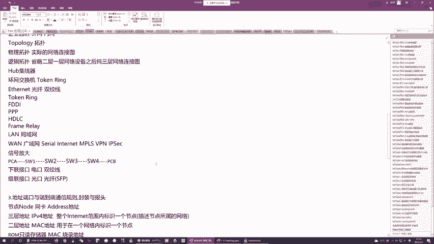

东西比较多。

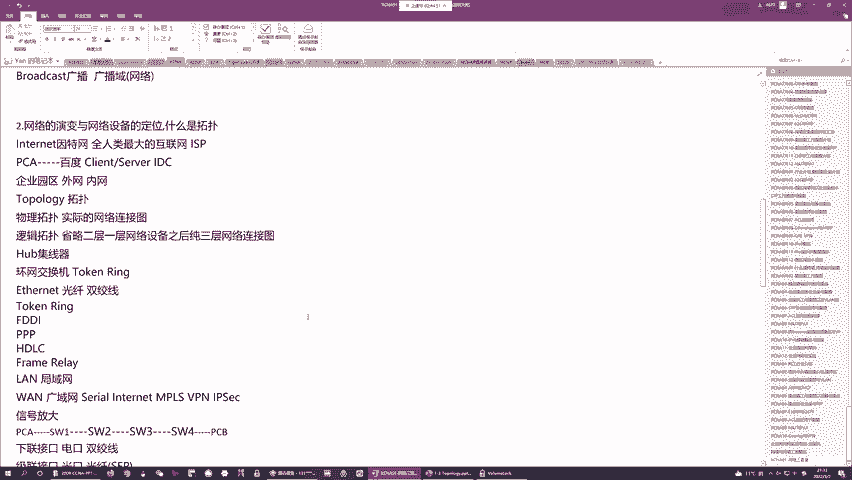

东西比较多，也比较杂，需要你们回去好好的复习一下啊。然后呢下节课哎咱明天晚上7点半继续，我们来讲这个端到端的协议站啊OSII。然后呢来讲一下这个TCPIP。

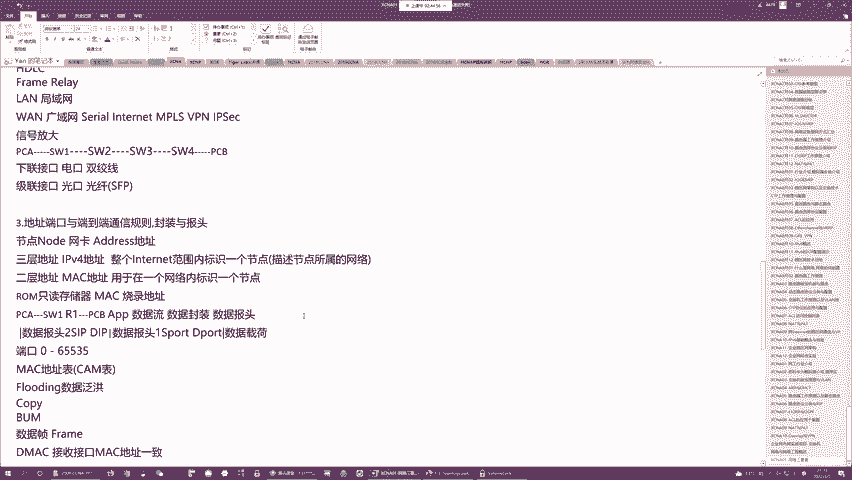

🤧嗯。

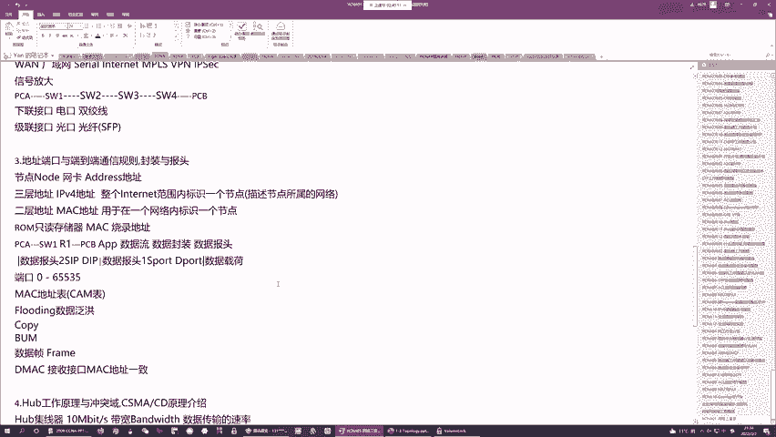

嗯，我写的这个东西很乱啊，也没有什么意义啊，你们真的有必要需要这个东西吗？

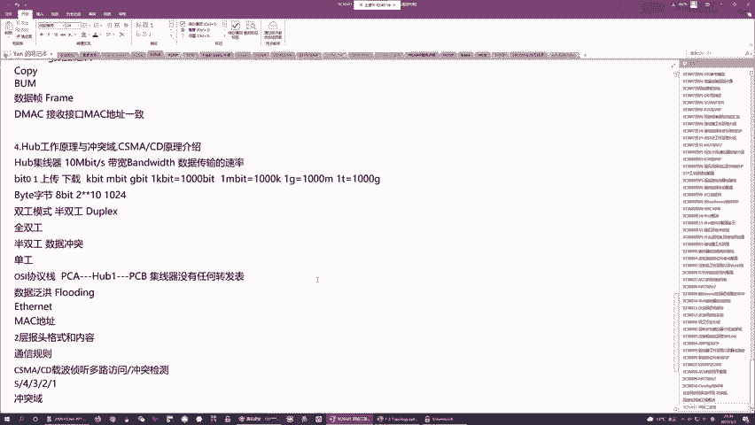

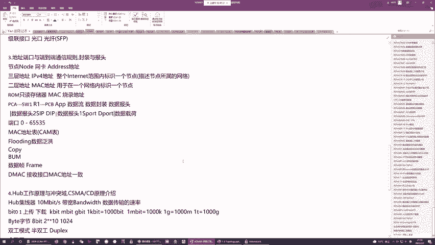

我觉得没有必要哎。😡，我觉得这个东西的话，你们最好还是自己记啊，我这又不是书，也不是文档，对吧？啊，每节课都会有回都会有回放的啊。呃，什么是端到端？你可以理解为就是应用到应用啊，应用到应用之间的通信。

咱们称为叫端到端通信。啊。好，那今天咱们就这些内容吧啊，明天晚上7点半，咱们不见不散啊，大家拜拜。😊。

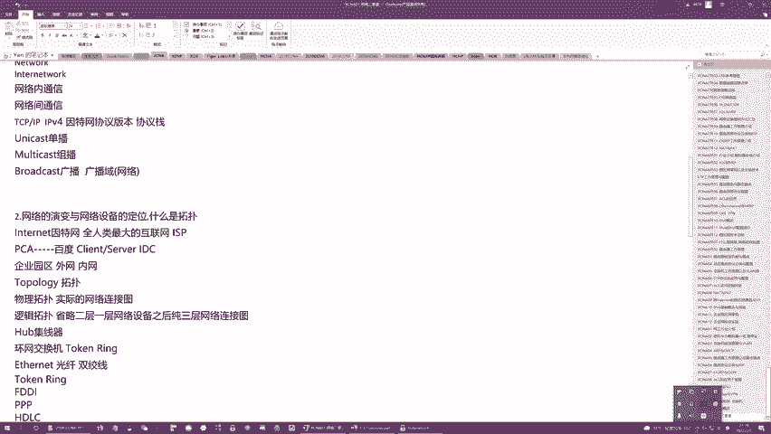