# 2022版华为认证HCIA-DATACOM教程，内部课程公开分享（已完结） - P10：XCNA-10-交换机工作原理详解 - 网络工程师CCIE - BV1AP4y1J73k

相关的技术。那主要就是聊一下以太网，聊一下交换机的控制层面和数据层面啊，我们上节课呢讲了OSPF那这个OSPF呢作做一个路取的协议啊，是运行在路由器之上的啊，运行这个协议的目的是什么呢？

就是让这个协议啊来了解到咱们整个园区对吧？有哪些其他路由器存在，对吧？了解到咱们网络怎么分布的啊，通过这个协议，咱们能够动态的学习到这些非直连网络的路由信息，对吧？那当然咱们学习这些路由的目的是什么？

当然是方便我们做数据转发嘛，对不对？那接下来转发为谁转发呢？当然是为我们的计算机来转发数据了，对不对？那接下来我们来着眼计算机啊，这个计算机来问大家一个问题啊，能直接通过路由器连接入网吗？

我们在组网的时候，对吧？你不管是一个企业网，还是一个数据中心还是一个运营商的园区啊，对吧？你一台终端，你要连接入网，你能直接连根线连到路由器吗？对吧？不行的，我们说了路由器这样的设备定位。

就是它接口比较少嘛，所以说你通过路由器的有线的接口，对吧？咱们只能把多个网络连接在一起，对吧？你如果直接拿路由器来连接我们的主机啊，这个太浪费了，对吧？第一就是他们有那么多接口啊。

第二个是路由器的每一个接口都能分隔一个广播域，对吧？那这个时候就算你路由器有足够的接口连连接我们的主机啊，那这个时候每个接口对应一个网络，那咱们地址规划啊，也不方便，那所以说这一块在路由器跟主机之间。

咱们总要隔一个设备，对吧？这个设备否则把我们的计算机呢连接入网，并且路由器也是通过连接这样的设备啊，来把我们的多个网络连接而成，那当然这个设备呢，咱们一般称为叫接入设备，对吧？我们称为叫接入设备。

那这个接入设备从古至今咱们有两类啊。第一类呢咱们叫集限器啊，这个已经淘汰很久了。但是咱们早期的网络呢会用的比较多啊。这个集限器哎，按照咱们OSI的模型来说啊，你按照七层模型来说，对吧？

它是一个物理层的设备，这个物理层的设备对吧？工作在物理层啊工作在一层，那它的定位其实就跟我们的接口啊，跟我们的线缆啊基本没有什么区别啊，它不太具备智能性啊，这类设备咱们称为叫集限器，可以吧？

那这个集限器咱们之所以使用它来连接我们的主机入网呢归根结底的唯一个原因啊，就是它接口比较多啊，早期集限器，那最起码有4个接口，对吧？那随着集限器的升级，哎，咱们有8口板的对吧？有12口板的对吧？

那接口也越来越多啊，那最多的集限器貌似用24个接口，好吧？但是由于集限器呢工作在物理层啊，对吧？智能性有限，转发能力也有限，对吧？缺陷太多了，那所以说咱们慢慢的就被。😊，另外一类设备取代了。

那当然这类设备呢需要跟大家说一下，不是美国开发的这一类设备是由以色列公司开发的啊，就是咱们的交换机。这个交换机大家可以理解为是极限器的升级版啊，对吧？那作为数据链层的这么一个设备，对吧？

它的功能性、智能性以及转发能力啊要远强于极限器。你在使用极限机组网的时候，对吧？你会遇到很多的问题啊，那在交换网络中呢，你都遇不到的。那再这样的交换机怎么样也不贵啊？所以咱们一般在组网的时候。

更多都会通过交换机来作为接入设备。那这个交换机呢，随着咱们网络发展，哎，也分为两大派啊，第一大类就是咱们比较传统的传二层的交换机，对吧？那这种咱们就是对吧？正统的以太网交换机嘛，对不对？工作的二层。

那接下来咱们有些高级的交换机，对吧？它既包含普通交换机的功能，又包含路由器的功能，啊，那这类设备我们称为什么呢？哎，这类设备咱们称为叫MOS咱们叫MOS。叫多层交换机。那这个多层交换机呢。

由于里面既集成了交换机的功能，又集成路由器的功能啊，那这样的设备呢比较对吧？比较复杂，工作原理比较麻烦啊，东西都东西比较多。那这块大家想了解这些设备的工作原理啊，咱们在NP中啊，我们会重点去讲述。

那一般呢这两类交换机，在我们的企业园区网中都用的比较多啊，哎，接入层，咱们用普通的二层交换机会用的比较多一些。然后接下来汇聚层核心层。哎，那咱们一般呢更多的会使用ML好吧。

那这是这些交换机的这么一个定位。OK那接下来咱们这节课带大家呢来了解啊咱们的以太网了解下咱们的集限器，了解一下咱们的交换机。好吧，OK那这边的话我们来看一下交片啊。好了。

这就是咱们经典的两个以太网类型啊。啊，当你使用极限器哎连接计算机啊，你组建而成这么一个网络。那这种网络咱们的画法就是这样的这种网络我们称为什么呢？这种网络咱们称为叫总线型以太网，好吧，那当然相对的。

如果你在连接网络时候，咱们用的交换机啊，你没有使用极限器，那你通过交换机组建而成的交换网络啊，我们就称为叫新型网络。那当然无论是总线型网络还是新型网络啊，那咱们用的是以太网的这个通信协议。

因为这个以太网真的比较好用。好吧，那当然关于以太网呢，它还有很多细节，这些细节呢咱们待会儿对吧慢慢去说好吧，以太网分为两大类啊，这两大类到底是怎么一个起源，我给大家呢讲这么一个故事，可以吧？

那接下来你使用极限器来连接计算机组成中总线性网络啊，这种网络呢，它的可用性比较差。那当然比较差的理由是什么呢？是因为极限器的种种属性啊都特别糟糕。那首先第一点就是极限器的接口带宽啊，通常。就十0兆。

那只有10兆意味着什么呢？意味着你一个计算机连根线连到极限器啊，你计算机的网卡有多少兆的带宽无所谓啊，根本没有意义。你连接完极限器之后，你只能按照极限器的10兆来工作，对吧？

那这个十0兆它的单位是比特每秒啊，你如果说换算成迅雷的下载速度的话，那也就是下载的一兆多的这么一个速度嘛，很慢很慢，对吧？那再加上咱们是一个总线啊，总线，咱们所有连接总线计算机啊，将会共享这十兆带宽。

这就是说你在一个总线性网络中啊，你的计算机越多，你平均每台计算机所能使用的带宽啊越少，对吧？那所以说这个极线器呢，就算你接口多也没有用啊，你接口再多，对吧？你奈何咱们带宽太低了，你连接的计算机多。

你这个带宽不够用，对吧？那这个就是限制咱们网络发展的一个比较关键的唉缺陷。那接下来这个极线器呢接口还是半双模模式啊，这个半双功模式，对吧？意味着什么呢？意味着你。连你连一根再好的线缆啊，连到我们计算机。

对吧？你用六类线，你用七类线连到计算机，那这个线缆本身肯定能够支持全双攻，对吧？我们的计算机接口也能支持全双攻，对吧？但是由于咱们极线器的接口是半双攻啊，那所以说当你连完线之后，对吧？你计算机连好线。

你只能以半双攻的方式来运作，那这个半双攻，我跟大家说过，对吧？就是你针对双向连通线而言，你在发送数据的时候，你不能接收，你在接收数据的时候，对吧？你不能发送，你一旦让一根半双攻链路上，对吧？

同时存在双向流量啊，那这个双向流量是绕不开彼此的，对吧？两个方向流量会在线缆中撞到一块，对吧？撞碎了，形成冲突碎片，那这个行为呢，咱们称为叫数据冲突啊，那所以说呢在总线网络中啊，你只要一个不注意。

咱们可能就会出现冲突，对吧？比如说你一开主机，你在发送数据的同时，你只要接收了，这就是冲突。你在接收数据的时候。只要你发送了，哎，这就是冲突。那所以说呢为了避免冲突啊，咱们以太网呢有这么一个通信机制啊。

叫CSMA杠CD对吧？你在这个总线型网络环境中，你计算机连接接到这个网络中之后啊，你的接口的双工模式，只要是半双功啊，那你在通信的时候呢，就必须要遵循这个载播真听多路访问冲突检测的这么一个机制啊。

这个机制会要求我们主机啊，你在通信之前呢，请你先监听一下链路，对吧？你看一下当前有没有其他人在发送数据，如果有人在发，哎，请你等啊等它发完之后，你再去发，对吧？

那接下来如果你检测发现当前咱们网络中没人再发送数据啊，也就是咱们的链路是安静的啊，那在这种情况下，你就可以自由发送了。好吧，那这样做的目的是什么呢？就是为了避免啊尽可能的避免冲突产生。那当然话说回来。

你真的能避免吗？对吧？你避免不了啊，因为对吧？你通过CSMA杠CD，你要求台主机发送数据之前。怎么样？你监听链路对不对？那假如说我监听到了当前有人在通信，那就是我等吗？等到通信来，那等到通信完之后。

那有可能咱们另外一台主机，你也想发送数据，对吧？比如你A跟C都想发送数据，但是当前的B正在发啊，那你们俩都会等B等B发文，那等B发完之后，你们俩同时监听到链路安静了吧。你们俩是不是可以同时发送数据啊。

对吧？那这个依旧会产生冲突啊，它只能够就是通过CSMA杠CD啊，来尽可能减少冲突发生的可能。但是能够完全规避冲突嘛，规避不了啊。那所以说咱们得出一个结论，哎，就是你在一个左边网络中，你包含的主机越多啊。

你节点越多啊，你通信越频繁，你出现冲突的概率就越大你一旦出现冲突了，这个传输呢相当就是对吧？了，你传输相当于没有任何意义了，因为你发的任何数据已经撞碎了，就算它能到达接收者主机，啊。

你接收者主机收到这些碎片，你能看懂里面的内容嘛，对吧。看不懂，并且别人给你发的数据，就算你收到了，对吧？同样你是撞碎的，那这种撞碎的数据你收到sowhat，对吧？你也看不懂里面什么内容嘛。

那所以说呢只有在不冲突的情况下，咱们才能保证啊我们的通信能够成功。OK那这也是进一步的限制了咱们网络扩展啊。因为你要尽可能保证网络里面的主机数量足够少。因为只有这样，你才能尽可能避免冲突。

只有你避免冲突了，你才能够变相的增加咱们通信的成功率。那当然这些都不是最重要的，最最最重要的极限期的缺点是什么呢？就是它是物理层的设备。作为一个物理层的设备，对吧？你的定位是什么呢？

就是你基本就跟一个文盲一样啊，你收到一个主机发送的一个数据，对吧？你收到是个数据帧啊，这个数据帧里面的任何字段，你都是不能识别的。对吧？那当然为什么？很简单，我们来回顾一下，比如你一个主机，对吧？

你访问这个百度网页吧，好吧，你访问百度网页，你浏览器产生这些载荷啊，是通过HDDP产生的吧？然后接下来前面咱们要封装TCP对不对？前面我们要封装IPV4，对不对？是吧？

然后接下来前面我们要封装以探网二的针头，后面我们要封装FCCS好吧，这就是一个完整封装后的数据帧，那这个数据帧，我们来回顾一下爆头层次啊，啊，这是咱们的载荷不用说了，那这个是传输层爆头，对吧？

工作在四层啊，这个是网络层的爆头工作在三层，然后接下来这个是数据链路层。针头还有针尾工作在二层。好吧，那接下来这个集限器，咱们为什么称为叫一层网络设备啊？我们为什么把极限器称为叫一层网络设备？

原因就是因为你收到一个帧，你只能识别一层封装信息。那接下来我问大家了，你们觉得咱们的封装中有包含一层信息吗？咱们有一层封装这个东西吗？没有，对吧？那这个一层指的是什么？

这个一层其实指的就是咱们的比特流嘛，对不对？比特流，这意味就是说你极限机收到比特流，你是能识别比特流的，但是你把比特流组合在一起，其成数据真啊，不好意思啊。

这个数据真的任何一层爆头的任何一个字段的任何一个内容啊，你都看不懂，那当然看不懂的理由是什么？你不具备这个功能嘛，对吧？那接下来交换机能看懂什么呢？交换机能看懂二层针头真伪，好吧。

路由器能看懂二层针头真伪和三层爆头，对吧？这就是为什么咱们称交换机为二层设备，这就是为什么咱们称路由器为三层设备，请记住啊，我们称一个设备为几层设备，是基于什么来判断的？就是基于它能识别的这个信息啊。

对吧？你能够识别二层封装信息。😡，你就是个二层设备，你能识别二层和三层的信息，你就是三层设备，对吧？那如果说你任何爆头都不能识别啊，哎，那恭喜你，你就是一个物理层设备。OK吗？

那集限器作为物理投的设备啊，它的所有暴图的内容都不能看懂，那这意味着什么呢？这意味着对吧？在一个以态网环境中啊，你主机A跟主机B通信，对吧？A在发送数据给B的时候，我成真了啊。

针头里面包含了原木麦地址信息。那我包含原木麦地址信息给谁看的，就是给接入设备看啊，让接入设备了解到我这个数据呢是由主机A发的，是由主机B来接收，对吧？但是奈何啊，咱们的集限器呢收到数据之后，对吧？

你看不懂吗？你看不懂咱们原木麦克地址信息啊，也就是说你不能得知你收到的数据是由谁发的，是由谁收，那因此呢哎极限器不像咱们路由器啊，有这么一张表来记录咱们网络连接的信息，对吧？

你收到这个数据之后还查表来确定怎么转发，哎，极限器没有这么复杂。极限器没有任何表，哎，你收到数据啊，不用查任何表啊，直接转发，那当然这个转发依据是什么呢？没有依据啊。反正你也看不懂地址嘛。

你也看不懂地址。你的转化行为就是你把你收到的数据拷贝成多份，然后接下来怎么样发送给网络内的所有其他人。那这个行为我们称为什么呢？我们称为叫数据泛红啊。这个行为咱们称为叫数据泛红。这个叫fing，好吧。

什么叫泛红啊？就是集限器，把你收到的数据啊拷贝成多份。然后通过除了接收数据的接收接口以外，我通过所有其他接口啊，每个接口一份的发送走对吧？就比如说你一个网络里面，你有4台主机连接极限器啊。

你集限器通过主接收到的数据，我根本不关心你是发给谁的，我通过主机收到数据之后，我就把数据怎么样拷贝成三份啊，然后接下来针对BCD每个主机一份啊给你们发送走。那所以说这个时候A不管把数据发给谁。

我们都能保证啊接收者主机能够成功的收到数据，那这个就叫泛红啊，所谓的泛红再说一遍啊，我通过一个接口收到一个数据，我把它拷贝成多份，然后通过所有其他接口，每个接口一份的发送走，好吧，那接下来通过泛红啊。

我就算不知道啊，你数据要发给谁，我就算不知道这个接收者主机连在我哪个接口，对吧？我通过全发的方式。😡，是来帮你转发数据，我都能够最大可能性的让接收者啊能够收到数据，对吧？只要你端到端能通嘛。

这个就OK了。好吧，这就是极限器的唯一的转发行为。那接下来咱们基于极限机这个唯一的转发行为，对吧？再加上咱们的半双攻啊，对吧？你会发现咱们这个总线型网络通信非常尴尬啊，你一台主机发送数据的时候。

所有其他主机都能接收数据，对吧？那与此同时，你觉得其他的主机他们能发送数据吗？不能啊，因为一旦他们发了，对吧？那在他们所连接的网络链路上，咱们这个半双攻链路上，双向流量就会同时存在。你双向流量同时存在。

对吧？他们就会撞在一起嘛？形成冲突碎片，咱们就会产生数据冲突。😊，那当然冲突呢会导致咱们通信啊都失败。那所以说呢在一个网络中啊，对吧？CSMA杠CD就是告诉大家了，你一个主机在发送数据的时候，对吧？

其他人等一等，对吧？等到发送者发送完毕了，你们再来通信，对吧？他在发送完之前啊，你们都等着啊等它发完了，你们再发如若不然就一定会出现什么啊？在一个链路上啊，咱们双向流量同时存在的这么一个尴尬趋势。

你出现这个尴尬局面，那咱们就导致冲突，导致冲突了，那最终怎么样会导致咱们整体通信啊就失败，可以吧？那接下来这就是极限器被淘汰的这么一个概念，好吧，因为咱们在通过极限器设计网络的时候，对吧？

极限器所连接而成的网络啊，注定W不了啊，你在使用极限器组网的时候呢，咱们有规则啊，这个规则我们称为叫54321规则，好吧，什么叫54321啊，就是你在组网的时候，对吧？一个网络中啊最多包含5台极限器啊。

然后接下来极限器。😊，跟节线器之间呢，你通过百米线来啊连接两台集线器之间的最远距离不能超过400米。对吧？然后接下来5台集限机组网最多只能有3台集线器啊来连接主机。

上下两台集线器用来做什么啊网络范围的这么一个扩展。然后接下来最后一台啊，最最后一个啊就是这个一指能什么呢？就是当你连接完这个网络之后啊，这个网络的所有主机哎，连同集限器在内啊，咱们共署同一个冲突域啊。

咱们共署同一个冲突域。那这个冲突域呢，待会儿胶片有张胶片会介绍啊。那这边的话提前跟大家描述一下所谓的冲突域呢是描述这种极限器网络的一个比较关键的术语啊。这个术语指明了就是对吧？在一个网络中，对吧？

当产生冲突的时候，冲突碎片啊，所能影响到的设备的集合，咱们就称为叫冲突域，好吧，你可以理解为就是一个冲突碎片所能影响到的设备的集合啊，那咱们就是一个冲突域。好吧，那接下来对吧？总线型网络大家想啊。

你拿极限器连接主机连接入网，对吧？你连接了主机只要有两台主机啊，同时发送数据，那咱们肯定会有冲突，对吧？这个冲突会产生冲突碎片，这个冲突碎片是不是会到达极限器啊，极限器我来问大家。

你们觉得极限器能不能识别它收到的数据是一个完整的数据帧还是一个冲突碎片，你们觉得极限器有这个能力识别吗？好，请注意啊，没有啊，因为极限器不能看懂FCCS对吧？它看不懂真伪啊，因为你看不懂真伪。

所以你不能识别你收到的数据啊，是一个完整的数据帧还是一个冲突碎片，能理解吧？你识别不了。那所以说这个时候你收到冲突碎片，你也会把它当做是一个正常的数据帧啊来做一个转发处理。能理解吧？

就是你收到普通的数据帧跟你收到冲碎片啊，你的转发行为呢是完全一致的对吧？那接下来你转发冲突碎片怎么转发啊，还是会以泛横形式转发嘛？那所以你会发现就是在一个总线性网络环境中啊，只要有两台主机同时发送数据。

对吧？就会产生冲突，只要产生了冲突，这个冲突碎片呢就会到达极限器，极限器就会针对冲突碎片来做一个泛横处理。那接下来咱们整个网络中的所有节点就都能收到这个冲突碎片。

那所以说一个总线性网络啊连同极限器和所有所有主机啊，咱们是共处同一个冲突语O吗？那接下来这个太糟糕。所以说咱们要对吧？做一个升级嘛，升级之后的结果就是把极限器替换成什么交换机。

咱们的交换机连接计算机啊组建而成的网络，就叫交换网络啊，这种新型网络。那新型网络呢，咱们解决了很多问题。那第一个就是交换机接口带宽，对吧？入门级交换机接口带宽最起码也是百兆的嘛，对不对？

这个百兆带宽为10兆的10倍啊，那这个效率是足够高的对吧？然后再加上咱们交换机的接口都是全双工。那这个时候你只要连接的线缆OK你计算机的接口也为全双工啊，那你按照全双工的方式来工作，对吧？

这个没有任何问题。你不用担心对吧？会出现任何问题，你不用担心会出现冲突啊等等之类的这种情况是不会出现可以吧？因为你全双攻嘛，就避免了冲突出现的可能，对吧？你在一根全双攻链路上，你双向流量同时存在。

他们会种在一起吗？不会的，他们会绕开彼此，我发送的归发送，我接收的归接收，对吧？收的数据好好的发的数据也好好的，没有任何问题，可以吧？这就是说你在总结一个网络的时候，如果你没有使用计算器啊。

你端到端都能保证咱们链路两端的接口是全双攻的那你既然端到端的链路两端接口都是全双攻的，你端到端所有环境都是全双攻的那你需要担心双向流量同时存在嘛，对吧？你根本不用担心啊，根本没有冲突出现的可能性可以吧？

好，然后紧接着对吧？这个交换机呢，作为有智能性的网络设备啊，你收到一个数据针，虽然你也不是说所有的爆头，咱们都能识别啊，但是好歹咱们二层的针头和针。能识别吧，对不对？

你能看懂针头也就意味着你能够知道数据是由谁发的，是由谁收。那所以说跟极限机不一样的是交换机就能存在这么一张表，对吧？这张表就能够记录咱们网络怎么连接的好吧，你就能够基于这张表为凭据啊，来精确的转发数据。

对吧？那接下来转发数据的逻辑呢，也跟路由器差不多啊，就是你收到一个真，你看目的麦克地址嘛，对吧？你看一下真的去向，然后接下来你确定了接收者主机之后，你就来查找你的麦克地址表，你来看一下这个接收者主机。

你知不知道连在你哪个接口，如果你知道你就精确转发嘛，那如果不知道对吧？咱们还有泛红这么一个保底的牌啊，那所以说交换机不像要路由器啊，你需要那么刻板的运行一些什么协议啊，来让你获得咱们网络的连接信息。

当你获得网络连接信息之后，你再基于这些信息来转发数据，没有这么麻烦啊，因为交换机就算不知道咱们网络怎么连接的，你也能够转换数据，对吧。大不了，咱们就泛红嘛，对吧？我通过泛红的方式来转化数据。

这个是不会有任何问题的嘛。那所以说交换机的控制层面啊显得比路由器呢一样，对吧？优先级低一些，对吧？你在玩交换机的时候，你可以完全的把交换机啊来当做傻瓜设备，对吧？你给它加了电连好线，它就可以工作了。

对吧？它也可以工作了，你就算不做任何配置啊，咱们这个交换网络呢也能通信，原因就是因为你交换机收到数据，对吧？你虽然会查表啊，但你查表，不管能不能查到对应的表象，你都能对这个数据啊，来做个转发啊。

这点跟路由器不一样，你路由器收到一个数据，缺网络X，对吧？你得赶紧看一下路由表啊，有没有去往X网络路由。如果有路由，你使用该路由转化数据哎，妥妥的没有问题啊。那如果说你发现路由表里面没有去往X网路由啊。

你就整丢包嘛，能理解吧？哎，那所以说呢在研究路由器的时候，咱们一定要先研究控制层面，让他了解到这些网络在哪里之后啊。😊，再让他们转发去往这些网络的数据，对吧？那交换机就佛系很多了，对吧？

那所以说呢咱们根据这个课程啊，你们在对待交换机的时候不要太上心啊，因为这类设备它是比较随意的，你就在什么都不配，对吧？连好线加了电啊，也能通好吧，也能通O那当然接下来有一点就要说啊，就是交换机呢。

它是能够分割冲突域的啊，原因是因为作为二层的网络设备，你不但能看懂真头，还能看懂真伪，对吧？你能看懂这个FCS真伪就意味着你交换机通过一个接口收到一个数据啊，你要检查这个真伪的内容啊。

检查真伪内容意味着什么呢？意味着交换机要检查你所收到的数据，对吧？根据信源所发送的，你有没有发生改变啊，你收到的是一个完整的数据帧还是一个冲突碎片还是一个被篡改的这么一个报备。

那如果说你收到的是一个完整的帧，你再基于它的目的麦克地址啊来查标转发，如果你发现你收到的是个碎片，对吧？你收到是个碎片，首先我第一时间能发现这一点啊。第二就是真。😊，对这个碎片。

我没有任何理由来帮你转发。我如果发现我收到是个碎片啊，我就直接给你丢弃，能理解吧？交换机收到冲突碎片，会直接的帮你丢弃啊，那这就意味着啊你交换机一个接口可以连接一个极限器，集限器身后呢可以连接很多主机。

那这些主机呢一旦同时发送数据啊，咱们不会出现冲突，但是冲突就到咱们交换机接口为止啊。因为你交换机的接口收到一个冲突碎片，你不会把冲突碎片通过你的任何其他接口转发走，可以吧？

那所以说交换机的每一个物理接口都能隔离一个冲突域，好吧？那当然这个冲突域呢仅仅是一个概念啊，你若果交换机的接口没有连接极线器，对吧？你就是通过直接连接线缆的方式啊，把我们计算机连接入网，那在这种情况下。

也没有冲突可以发生嘛，对吧？那当然大家可以假想，假设在这个环境中啊，你交换机一个接口收到一个冲突碎片，对吧？这个碎片你收到了。也就到此为止了啊，你不会通过其他接口来转发。好吧。

你的每一个接口都能分割一个冲突语。那所以说了说来说去，交换机就是全方面的吊打极限器啊，对吧？那所以说自从有交换机出来之后啊，咱们基本在组网的时候，没有人使用旗限器了，对吧？那那些剧型厂商嘛。

咱们思科啊、华为啊、华三啊，对吧？自从有了交换之后，对吧？要么自主研发，要么收购。那总而言之，咱们必须要在产品线中啊，包含交换机这类产品，原因是因为它比极限器强太多了，对吧？那既然咱们极限器的产品线啊。

就通通的退出历史5台了，你再放眼看一下咱们当下的企业环境啊，就是你在任何设备制造商的这么一个范畴中，你要想要找极限器这个产品线，对吧？你肯定找不到嘛，原因是因为没人会出力不讨好啊，造这类对吧？

被淘汰的设备，那所以说这种总线型网络，哎，在如今的企业园区内啊，你们基本是。到好吧，咱们看到的基本都是清一色的交换型的这么一个网络。好吧，那接下来这个冲突域呢，咱们也说了。

交换网络跟这个总线型网络区别啊，总线型网络就是整个网络所有主机属于同一个冲突域，对吧？那在我们的交换网络中，就是每一个交换机的接口啊，都连接了一个独立的冲突域，但是他们俩有一个东西是一样的，对吧？

冲突域它们不一样，但是他们有一个是一样的，哪个是一样的呢？就是关于广播域啊，这是咱们第二个名词啊，就是你在组一个网络的时候，大家知道你在一个网络中啊，主机你发送数据啊，有三种类型啊。

有单波流量有主播流量，有广播流量。这个是咱们在介绍IPV4的时候，你跟大家说过啊，对吧？流量三种。那这个在以太网环境中也不例外。好吧，你通过以太网的一个接口在发送数据的时候，你可以发送单波数据。

可以发送主播数据也可以发送广播数据，可以吧？那这个单波数据指的是什么呢？就是一对一嘛？一对一。😊，的数据就是单波的。比如咱们发送的源是一个主机啊，接收者也是个主机。

你在主机跟主机之间啊来发送这种一对一的流量。那咱们这股流量呢就称为叫单波流量，好吧，一个人发一个人收一发一收，对吧？一对一的，这个就是单波，那既下来单波流量最大特点就是什么呢？就是它的二层针头。

原mac地址啊跟目的麦克地址都是一个单波的麦克地址，可以吧？原mac地址标识的姓源嘛，目的麦克地址标识接收者嘛。那既然咱们俩都是主机嘛，那咱们之间的通信按原麦ac地址，目的麦ac地址啊。

肯定都是单波地址。😡，并且咱们三层报图的原目IP是一样的，原IP也是个单波IP目的IP也是一个单波IP。那接下来除了单播以外，对吧？咱们还有主播啊，咱们还有主播，好吧，这个主播的特点是什么呢？

就是它通常是一对多啊，对吧？它通常是一对多，好吧，一个人发一组人接收嘛，那这个叫主播，就比如说了咱们电台对吧？你电台发送广播嘛，发送那些音频啊等等之类的，对吧？我们的广播电台，你有些节目啊，乱七八糟的。

对吧？你收音机只要调到那个频道，你说不都收听啊，对不对？那接下来收听电台的信息的收音机不止一台吧，你有很多台，你这些收音机，咱们调到相同的频道，对吧？你调到相同频率啊，你们收到的内容。

你们收听的内容也是同步的吧，相同的，对不对？是吧？完全一致，那这个就是一对多啊，你可以理解为咱们这个电台就是发送数据的信源啊？你这些收音机啊，收这个接收电台信息的，你这些收音机啊，咱们就是接。收者好吧。

一个人发多个人收啊，这种一对多的那就是主播。那接下来主播的流量模型是什么样的？就是它二层的针头的原麦克地址啊是一个单播地址，标识咱们姓源嘛，因为毕竟信源是台主机或者是台服务器，对吧？

我发送的主播流量原麦ac地址肯定要标识发送者嘛，那发送者是一台节点，对吧？那它的地址肯定是单播地址，所以你会发现我发送单波跟我发送主播一样啊，源地址都是单波地址。

但是呢咱们的目的麦地址啊就不能再是单播了，因为咱们现在发送的主播流量是希望去往一组接收者的，对吧？希望去往一组接收者，那这一组接收者对吧？咱们得要拿一个地址来涵盖他们所有嘛，那拿一个什么地址呢？

就拿一个主播地址，好吧，主播流量的最大特征就是原麦地址为单波啊，目的麦ag地址为主播啊，那接下来咱们还有最后的呀，叫广播。这个广播流量特点什么呢？就是一个人啊发送咱们一个网络内的所有人啊都接收啊。

一个网络范围内的一对所有啊，一个网络范围内的一对所有啊，这就是广播，好吧？那这个范围是什么呢？就是网络啊，一个网络内一个主机发送数据，该网络内的所有其他人啊都能收到，对吧？那这个一对所有就是广播啊。

一个网络内的一对所有好吧？一个网络内的一对所有啊，这就是广播流量，那接下来就广播流量在发送的时候呢，二层针头的原麦克地址依旧是一个单播地址啊，对吧？标示我们的姓运，那毕竟吧广播是用人发的嘛，对吧？

你发送广播流量，那源地址肯定标示你自己嘛，对不对？那肯定是个单波地址。然后接下来它的目的麦克地址呢，就是一个广播地址，对吧？这个广播地址代表就是该网络内的所有其他人，对吧？那对于咱们的IP就是全二5嘛。

那对于咱们的麦克地址。是全F对吧？4个F的mac地址就是广播麦ac地址，可以吧？那在我们的以态环境中啊，你的流量类型就有这么三种。好吧，那接下来对于这三种流量，对吧？咱们接入网络设备收到数据之后啊。

是都能转发的对吧？那极限机怎么转发呢？一视同仁啊，咱们全部以泛红的方式来发送，那接下来对于交换机而言，交换机不太一样啊，你交换机收到一个单波流量，哎，我是尽可能能给你精确转发，就给你进行转发。

如果没有能力给你进行转发啊，我通过泛红方式也不是不可以，但是对于主播和广播流量哎，交换机就没有那么厉害了。因为你交换机它的mac地址表里面啊所记录的这些表象啊，都是单波表象啊。

这些表象只能描述在一个网络中啊，咱们连接了哪些计算机，这些计算机连接在我的哪个接口啊，并且他们的mac地址是多少，对吧？那计算机的麦ac地址都是单波的嘛，所以你可以理解为交换机的麦克地。😊，象啊。

咱们里面的所有表象呢都是单波表象。你拿这些单波表象来转发主播广播流量。你觉得你收到一个真，你拿目的的主播地址，你拿目的的广播地址来匹配咱们单波表象，你能找到对应条目吗？你肯定找不到吧。

那所以说了对于这两种流量啊，咱们交换机通常都是以泛红方式啊来转发的那当然对于主播，咱们在I阶段呢会研究一个叫做IGMnoop的这么一个技术啊。那当然你学完这个技术之后。

你会发现交换机当你启用IGMnoop之后，你针对主播流量转发未必会以泛红方式来发送啊，你会尽可能的根据咱们组员的位置来把主播流量单独的发给组员。但是对于广播流量，你是真的没招啦。

交换机收到广播流量是一定会以泛红的方式啊来转发的可以了，那这就应这个产生的一个新的术语啊，这个术语咱们称为什么呢？咱们称为叫广播域。那什么叫广播域呢？就是一个广播流量所能影响到的设备的集合。

你可以理解为在一个总线型网络中啊，哎，咱们所有计算机既属于同一个冲突域，又属于同一个广播域，对吧？因为你一个主机发送的广播，我们所有其他人都能收到嘛，对吧？那接下来这一点，在我们的新型网络中是一样的。

你新型网络中的所有主机也属于同一个广播域，对吧？因为在这个网络中啊，你任何一个主机发送一个广播报围，对吧？你交换你都会泛红嘛，你会导致这个广播网啊被网络内的所有其他主机都能收到对吧？

那这也满足同一个广播域的这么一个定义，好吧，那所以说啊总线型网络跟新型网络，你们就冲突域而言啊，是不一样的啊，总线型网络是所有计算机在同一个冲突域内，而我们的新型网络是交换机的每一个接口啊。

都能隔离一个冲突域，但是对于广播域，哎，你们俩都是所有计算机。对吧也就是整个网络啊属于同一个广播域。那所以说咱们一般得有一个名词替换啊，一个网络对吧？一般咱们就称为叫一个广播域嘛。

一个网络就是一个广播域。好吧，再次重申一下，什么叫广播域啊，就是一个广播流量所能影响到的设备的集合，我们就称为叫一个广播域。好吧，那通常对吧？属于同一个网络的所有主机啊，你们会属于同一个广播域。

因为该网络内的某一个主机，只要发送一个广播流量，谁能收到该网络内的所有其他人啊，大家都能收得到好吧，好，那这是一些先决性条件啊，那基于这些先决性条件啊，我们就来进一步的了解咱们的以太网啊。

然后了解咱们的交换机，可以吧？那当然在进一步的了解咱们以太网之前呢，先要说一下咱们接口的区别啊。我觉得大家说过，咱们网络中呢，对吧？线缆连接接口，接口分为两类，对吧？三层或三层以上的接口。

咱们称呼叫节点啊，比如说我们的计算机的接口，比如说咱们路由器。的接口，比如说咱们服务器的接口，好吧，这些接口咱们称叫节点啊，这种节点小联网，你除了要连接网线以外，你还需要给接口怎么样配置个IP对吧？

那当然IP是一种三层地址啊，你能配得了，对吧？你可以配置，没有问题。啊，但是咱们的交换机的接口，咱们的极线器的接口就不一样了，这类接口工作的二层或二层以下啊，对吧？我们不能称之为到节点。

我们不能称之为到节点。这种接口想要连线啊，想要上网，你连接网线就够了，你不需要配置IP它也配置不了，它也不需要IP能理解吧？它不需要IPO吗？那所以说咱们有这么一个概念啊，对吧？

一个网络咱们在连接的时候，主机连接交换机主机这端需要IP的配置啊，交换机这端不需要可以吧？那所以说交换这端啊，你啥都啥都不用配啊，你只要连好线线没问题，接口没问题，你计算机那端没问题啊，对吧？

你这个网络连接就没有任何问题了，好吧，交换机接口是二层的极限器接口是一层的好吧，哎，这这类接口啊不能称为节点，哎，你不用配置IP好吧，你只要连线，它就可以工作OK吗？

然后接下来当然这个网卡的名称叫法都是。😊，样的，咱们称为叫NIC嘛，叫网络接口卡。好吧，那大家需要注意的是，你计算机的接口通常是以太网接口啊，对吧？你除了IP地址以外呢，你也会有一个mac地址，对吧？

那交换机的物理接口虽然没有IP啊，那mac地址它是会有的，可以吧？那接下来根应这个麦ac地址还挺有意思的啊，华为交换机跟思科交换机的物理接口的麦ac地址是不同的好吧，你如果这是一台思科的交换机。

思科的交换机的每一个物理接口啊都有一个独立的麦ac地址，好吧，你不用担心一个交换机它的多个接口对应相同的麦克，这点是不可能的。好吧，但是呢对于华为就不一样了。

华为的交换机所有物理接口麦克地址默认都是同一个地址值。那接下来大家会问哎，这会不会冲突啊？啊，答案是会冲突啊？前提就是当你要访问交换机的时候，它会冲突。但是问题是你需要访问交换机吗？不需要啊。

咱们一般组建一个网络目的是什么？是让主机之接通信，所以说呢对一股流量，流量的发送者是主机流量的接收者也是主机，对吧？你主机连接交换机是为了发送数据给交换机嘛，不是的啊，那所以说呢对于交换机而言。

它收到的数据不是它始发也不是由它接收，那所以说呢对吧？它的接口就算没有麦克壁址啊，也无所谓，但是呢它为了保证咱们端端端通信，没有问题嘛，对吧？它的物理接口也会有m克壁址。

但是呢这个麦ac地一般咱不会用对吧？因为没有人会主动发送数据，对吧？没有人会主动发送数据给交换机好吗？那所以说呢华为的这个接口的麦ac壁址设计方式啊，跟思科的，我觉得都正确啊，都没有任何问题，O好。

那接下来我们来看一下以太网啊，那直接说呢给大家讲下。以太网的一个故事啊，之前由于时间的缘故没有讲。那今天这节课呢给大家把这个故事给讲一遍啊，早期呢这个以太网其实不是一个公有标准啊，它是一个私有标准。

这个私有标准是由三家著名的公司啊哎联名开发的那三家公司叫什么呢？我相信你们都听过啊，我们的蓝色巨人IBM啊，还有我们的施乐公司。我们的施乐公司啊，还有我们的这个对吧？DEC啊。

3家公司三家公司联合在一起开发了一个以太网协议啊，那这个以太网协议呢，基于我们当前V2的版本啊，那当前我们姑且称为叫V一好吧，那这个V一的以太网，对吧？这个V1的以太网针对咱们这个针对什么。

针对咱们TCPIP啊来开发的，好吧，我开发出了这个协议供咱们三家公司设备使用，并且为什么服务啊，为我们的IP服务嘛，对吧？为我们的TCPIP来服务。😊，那当时同期呢。

其实你会发现那个TCPIP在当时那个时代还不是特别火啊，咱们除了TCPIP以外呢，还有一个特别火的协议战啊，这个协议战叫IPX杠SPX啊，这个甚至到了90年代还依旧在跟这个TCPIP啊依较高下。

那虽然最终呢就是跌落神坛了，被干死了，但是在早期80年代90年代啊，这个协议战特别火啊，那特别火的，就是我不知道你们有没有玩过暴雪的游戏啊，对吧？暴雪公司游戏星际争霸对吧？这个新际争霸一哎。

早期呢那个局域网对战啊，我们就是通过IPX杠SPX对吧？来联网的。对？对，宏景也可以啊，早期的红景也可以支持IPX啊，这IPS真的很好用的，很好用。然后接下来提到这个IPX谁来为这个协议站背书呢？

是这么一家公司啊，这家公司在早年间对吧？它的地位我觉得不比斯科ro啊，这家公司叫nowell，好吧，叫noel公司。那公司作为一个网络公司啊，对吧？它研发了一个特别牛逼的操作系统啊。

这个操作系统咱们称为叫nettware好吧，这个系统服务器能用啊，计算机也能用。然后接下来你在服务器和计算机上装了这个系统之后啊，你在联网的时候，你就是基于这个对吧IPX跟SPX这么1个CA站好吧。

那接下来这个公司呢不知道出于什么样的原因啊，觉得以太网这个标准很好用啊，它就把以太网这个标准直接拿过来使用了好吧，那当然可能付了版权费吧等等之类的啊。那总而言之拿过来用了，那拿过来用之后呢。

我们称为什么呢？啊，我们称为叫802。3啊，我们把这个标准称为叫802。3啊，当然是80。3的前身啊，它是802。3的前身啊，那接下来它搞来的这个以太网标准只能支持咱们的netware系统啊。

只能支持咱们的IPX这就是最早期的咱们以太网的两大派。那当然这两大派你可以理解都是私有的，都是私有的啊，你想要指望其他。😊，使用没戏啊，做不到好吧，做不到。然后接下来这块的话就是随着咱们网络发展，哎。

大家都意识到了，这个以太网标准真不错啊，对吧？用特别舒服，没毛病，对吧？大家都想用，那大家都想用的话，就希望咱们这个对吧？IBM施了公司的DECC啊，你们所开发的这个基于TCPIP的以太网啊，能够对吧？

变成公有协议嘛，来供大家使用。那接下来谁来找他们谈的呢，就是这个标准化组织啊，HE好吧，电子电器工程师协会啊，那他们就派代表嘛，来找咱们IBM聊嘛，聊一下你们这个以太网愿不愿意开源给大家用。

那接下来聊了半天呢，被拒了，对吧？这三家公司能觉得我这个协议作为一个私有协议，作为一个对吧？闭源的协议，我用挺舒服的，对吧？我没有那么高尚，哎，不指望就是说这个协议来造福全球嘛，你们也别找我谈了。

我不可能给你们开放的那接下来这个组织不死心啊，对吧？不死心，那后来找到谁呢？对，找到咱们 No亚公司了，找到novave公司，那谈了之后呢，nova公司。😊，觉得对吧？可能我的nettware也不行了。

那所以说正好你们就帮我把我这个版本的以太网标准发扬光大呗，对吧？那发扬光大之后的这么一个标准化的以太网的产物啊，就是HE的802。3啊，这个HBE的8。3啊，就是咱们HBE组织找到这个农亚公司啊。

我找你来把你的这个私有的以太网标准公有化后的这么一个公有化后的叫教法。好吧，叫802。3啊，是这个标准的编号。好吧，是咱们这个公有标准的编号。那接下来这个802。3呢，对吧？

它是针对咱们no版本的以太网做了一个升级啊，升级之后呢，它在我的以太网的针头中啊，添加了这么一个叫做LLC的这么一个字段啊，这个LLC是使用什么呢？是基于802。2的标准啊来制定的。好吧。

那这个LLC的这么一个对吧？报头里面这个字段里面啊，咱们包含了三个字节，其中包含一个叫做DSAP对吧？这个DSAP的话叫目的对吧？叫目的service point啊，好吧。

还有一个叫做原serviceX point这个叫做原服务访问点，还有一个目的服务访问点，好吧，那这两个字段各一个字节啊，然后接下来第三个字节是一个控制字段。这个控制字段只是横为0X03啊。

从来没有变过啊。那接下来咱们通过这个DSAP和SSAP啊，就是咱们这个。LC的前两个字节，我们可以让这个以太网协议啊用于不同的三层的网络层协议，对以吧？你可以用于IPV4。也可以用于其他的标准。

但是呢由于咱们早期在设计之初啊，这个LLC设计的比较对啊，仓促啊，你这个DSAP跟SSAP你只设计了一个字节，加上这一个字节里面的很多值，咱们还咱们还不能用啊。那所以说你整来整去，你发现这个LLC啊。

你通过DSAP和SSSAP啊，你能够使用的值只有6个值，这6个值意味着什么呢？这6个值意味着咱们改款之后的80。3这个协议啊，你只能支持6种不同的网络层协议。那大家就会想了。

你支持6种不同的网络从协议够用吗？对吧？那答案是肯定不够用啊，因为咱们这个IBM的这个以太网标准可能支持什么？能支持256种不同的网络从协议啊，对吧？你就兼容性角度来讲，你这个80。

3是不是也太low了，对吧？你拿这个协议跟别人竞争，你搞笑嘛？你怎么可能竞争的过，对吧？那所以说后来呢它就是针对这个80。3又做了一次升级啊，又做了一次升级，那怎么升级了，它就规定了。

你在使用8类点3的时候，你这个LLC啊，咱们其中的DSAP跟SSAP啊，你又也改了，你把他们俩的值要固定不变啊，全设为0XAA啊，0XAA这个零X16进制数的意思啊，好吧，AA就是对吧？ABCB的A嘛。

16进制数A代表10嘛，对吧？0XAA来做DSAP和SSAP啊，那这个时候我们在LLC的。😊，这么一个爆头字段，后面啊要加一个SNAP的这么一个字段啊，SNAP那这个SNAP我们称为什么呢？

SNAP我们称为叫子网接入协议啊，叫子网接入协议，这个子网接入协议哎，这个字段比较长啊，有5个字节啊，其中分为两个子字段，前三个字节要组织代码，它横为零啊，然后接下来后面有两个字节类型。

这两个字节的类型真的是救了大命了，这两个字节的类型，咱们没有任何保留啊，你可以任意设置它们的值，那通过任意设置这个两个字节的类型字段值啊，你可以让我们这个SNAP的8类2。3的帧啊。

支持256周不同的网络层协议，那这个支持力度，就跟咱们IBM所制定的以太网一样。那所以说接下来就是这两个协议之间就开始PK那大家PK呢大家想对吧？你一个私有协议公跟公有协议怎么PK啊，对吧？

你公有协议大家都能用。你私有协议只有IBM失了跟DECC能用，对吧？你不是找死吗？肯定公有协议完爆吗啊，没有错啊，大家这么想是对的，但是呢这个IBM对吧？也不是什么省油的灯啊。

他发现这个HE搞出了一个SNNAP的这么1个80。3的以太网标准来跟自己竞争抢市场，那他就是本着什么市场优先的原则嘛，他也自己把他们的这款啊针对TCPIP的以太网标准给公有化。那接下来公有化之后呢。

对吧？这个我们就称为叫以太网2啊，那这个以太网二也是个公有标准，我们的802。3也是个公有标准，那这个时候咱们就拼什么哪个协议优了嘛，对吧？哪个协议牛逼，哪个协议优那市场就会偏向于哪个协议。

那接下来哪个协议优啊，很明显以太网二优嘛，对吧？你在使用以太网二来封装数据的时候，我的针头一共只有三个字的啊，6个字节的目的卖地址6个字节的原。麦地址，然后接下来两个字节类型是吧？

我一共只需要添加14个字节的针头，对吧？然后接下来你再使用这种基于SIAP的802。3来封装数据的时候，我靠，你这个报头就长了6个字节的目的麦ac6个字节的原麦ac啊，接下来两个字节长度啊。

这个长度指的是去掉咱们针头真尾之后啊，我们中间所封装的数据包有多少字节，好吧，那当然本着MTO的原则啊，你中间的数据包长度不能超过1500字节。好吧，然后接下来长度完了之后怎么样。

依旧是三个字节的LLC嘛，并且字段超级固定啊DSAP跟SSAP咱们的值都是0XAA嘛，然后接下来咱们的这个类型字段，啊，这个叫type字段啊，咱们固定的对吧？叫控制字段啊，咱们固定为0X03。

然后接下来后面要加上5个字节的SAP对吧？其中三个字节的组织代码。为0对吧？两个字节的类型啊，这跟咱们的以太保二的类型字段是等价的。好吧，咱们通过这个类型字段能够描述咱们三层到底使用什么协议。好吧。

相当于通过这个类型字段啊，咱们让这两个对吧？以太宝协议啊都能支持各种各样的网络层协议。那所以说了兼容性大家差不多，那所以说咱们就PK对吧？我们的效率了，你使用这个以太网2，我们只添加了14个字节的针头。

对吧？你使用8个。3，我们添加多少字节？我们在十4字节基础之上，你要额外添加8个字节，对吧？你相当于添加了22个字节，那我来问大家啊，你们觉得豹头是越长越好还是越短越好啊。

你们觉得豹头是越长越好还是越短越好。😡，肯定是越短越好嘛，对吧？你报头越短。我们在封装数据的时候，你添加的额外的负载就小嘛。你添加的额外负载越小，你的这个载荷的对吧？带宽利用率就越高嘛，对吧？

那这个很好理解啊，尤其是当你这个载荷对吧？比较小的情况下对吧？你添加一个大的爆头，那这个爆头会更多的占用咱们利用带宽对吧？那所以说豹头越小，咱们的封装就越优，那所以说本着这个原则你会发现啊。

咱们这个8三太尴尬了，根本没人用它，对吧？你使用以太网二能搞定的东西，我使用你8三，我头脑不好啊，我额外添加8个字节负载，我干嘛，我想不开啊，那所以你会发现特别尴尬，就是HE的这个标准根本就没人用啊。

根本就没人用，但是这个HE是谁，对吧？大名鼎鼎的电子电器工式协会啊，它能允许就是说它制定的标准没人使用嘛，对吧？那肯定不行，那所以说后来就来硬的了，大家开了个会对吧？做了一个协商啊。😊。

协定这个捐子协定怎么协定呢？很简单，就是在一个以太网环境中啊，咱们这两个封装标准咱们都使用啊，咱们都使用。那接下来哎我们井水不犯河水啊，我们规定了数据层面的这些应用啊，你们产生的报文，哎。

咱们统一的使用802啊统一的使用以太宝二来封装，因为使用以太化来封装，对吧？咱们比较优嘛，对不对？效率比较高，然后接下来对于这些控制层面的协议，对吧？比如说咱们交换机上启用的什么VTP啊生成数啊。

HSRP啊VRP啊等等之类的这些协议啊，对吧？当你在使用这些协议的时候，你交换机之间需要交互接报文啊，那接下来跟我们一般的数据流量不一样的是这些协议交互的报文啊，信源是谁啊？信源就是咱们交换机嘛。

然后接下来接收者一人交换机，对吧？由交换机产生由交换机接收的这个数据啊，对吧？这就是控制层面数据。那接下来。😊，这些数据本身对吧？也不多，对吧？本身他们的大小也不大，对吧？你通过这两种封装都没问题。

那这块你也不用太过刻意的讲究什么咱们的封装效率嘛，对吧？那对于这些流量，咱们就都使用86。3的方式来封装，好吗？啊，这就是规定，然后接下来基于这个规定，啊，咱们一段时间内啊，对吧？相安无事啊，数据层面。

咱们基本统一的使用以太网2，然后接下来控制层面，咱们一般统一的使用什么86。3，当然呢后来这些对吧？试者发现啊，我使用86。3来封装这些控制层面数据啊，这个太蛋疼了，对吧为什么要这么做啊。

对吧我又会是头头脑不好，我这么封装，就算我是控制层面报文啊，对吧？也会给我们的报文交货添加额外的这么一个负担，那所以说你会发现慢慢的咱们这些厂商也开始倒割了，对吧？厂商也开始慢慢倒割了，这些厂商对吧？

他们在研发这些新的协议的时候，或者在给协议升级版本的时候，他们也规定了你这些协议产生了流量怎么样，也尽可能使用以太网。😊，来封装。那所以说慢慢的慢慢的发现就是马太效应吧，你在一个以太网环境中啊。

咱们以太网二格式的真会越来越多。而我们86。3格式的真啊会越来越少。好吧，那终究有一天啊，可能这个86。3的封装就被淘汰了。因为它有太多的对吧？它有太多的这个不灵活性啊，它有太多缺点，那当然这个缺点。

咱们等讲到这个未，对吧？讲到这个access跟中介的时候，对吧？可能你们会有更加深刻的这么一个了解啊，大家会有更加深刻的这么一个体会，O那这就是咱们这两种封装格式，对吧？因为关以太网，咱们老生常谈了。

作为一个数据量子层的协议啊，作为一个局域网协议，它所干的事儿也就三件事了，对吧？第一个是规定了咱们通信的这么一个对吧？通信的方式，是吧？那也就是说如果你是半双攻嘛，咱们使用什么CSM杠CD啊。

来决定什么时候能发，什么时候能收，对吧？那接下来如果说你是一个什么你是个全双攻的网络啊，你是个全双攻的网络呢，咱们通信基本的是没有规则对吧。😊，怎么通怎么通嘛？你发送者想要发，对吧？你想发你就可以发嘛。

你想收你就可以收。原因是因为也不会有任何冲突产生嘛，对吧？不会有任何冲突产生，你不需要等待咱们链路安静了再发送数据，对吧？那规定咱们通信的行为规则，这就是第一点。第二点规定了一个二层的地址啊。

那麦ac地址不用说了大家都知道嘛，老生常谈了。你在一个以看网环境中，咱们所有接点都需要用m克地址来标识自己对吧你两台主机，你们相互通信，如果你们属于同一个网络啊，对吧？原给目的地发送流量，对吧？

咱们原麦ac地址啊，就是发送方的目的麦ac地址就是接收方的，那接下来如果说对吧？你原目两台主机不在同一网络啊，那发送这个这个流量的主机，你在发送数据的时候，原麦ac地址啊，对吧？

原麦ac地址是你自己而目的麦ac地址就是网关的麦ac地址，对吧？总而言之，咱们想要在以看网环境中发送数据啊，你都要携带原麦克为了能够携带原麦克首先你们这个接口需要有m克对吧？

并且这个麦ac我已经一而再再而三的跟大家说了，需。😊，配置好吧，你不需要去配置。因为一般正常情况下，我们的设备制造商对吧？在生产网卡的时候，对吧？你就会给网卡怎么样去携带一个mac地址，对吧？

这个mac地址咱们通过烧录的方式啊，烧录到咱们网卡的ro中的，好吧？叫只读存储器。那这个只读存储器中的mac地址，对吧？你能读取啊，你不能修改好吧？当家不能修改，很好理解啊。

原因是因为ro中的内容你想修改的话，你需要通过专业的这么一个烧录仪器，你才能去修改，可以吧？然后接下来它对应的第三点就是封装格式，然后这个封装格式，对吧？要么是以太网2，要么是802。3，O吗？

这就是咱们以太宝的这么一个发展史。那关于这块的话，大家有没有什么问题。啊，就当听故事呗，就当听故事，对吧？那大家可能会问，哎，那为什么咱们8。3不能设计的跟以太网二一样呢？那原因是因为如果你要一样的话。

这不就是抄袭了嘛，对吧？美国不能不能抄袭的，你如果抄袭的话，对吧？会被告的倾家荡产啊，那所以说你就算设计以太网，对吧？跟这个IBM啊DC啊施了公司的再向你最起码得要有30%以上的不一样的点。好吧。

那所以说咱们就是通过这个封装格式来做文章，好吧，让你们这两个标准在定义封装格式的时候，你们的封装格式不一样嘛，那这样做的话，就算其他的赞一样，你们也是两个不同的这么一个标准。能理解吧？啊，802。

3现在用的还多吗？不多啊，对吧？不多，你想想你使用802。3，对吧？麦壁纸也是一样的，咱们通信规则也是一样的。唯一的区别就是你的爆头封装格式不一样，对吧？那接下来你使用这个爆头封装格式，你别不别扭啊。

对吧？你为了达到跟咱们以太网二相同的效果，你额外增加了8个字节负载，对吧？有这个价值吗？对吧？没有这个价值啊，那所以说呢咱们一般就是尽可能的能使用以太网2啊，就使用以太网，对吧？那接下来这个以太网2。

大家可能唯一看不懂就是这个类型字段啊，这个类型字段有什么用啊，这个类型字段就是用来描述对吧？你这个以太网帧啊，咱们的三层也就是网络层啊，你到底使用哪个协议好吧？

那这个比较类似于咱们IP爆头中的协议字段嘛，对吧？那个协议字段用来描述你这个数据包，对吧？你中间所封装的四层的数据段对吧？你的断头使用什么协议，对吧？你用TCP啊，你用UDP啊，对吧？

通过这个协议号都能反应。好吧，那接下来协议号是一个三层的字段来描述咱们四层使用什么协议。那接下来我们这个类型字段呢就是一个二层的字段啊，来描述咱们三层使用什么协议。比如说你三层使用IPV4。

咱们的类型字段值啊，就是0X0800，可吧？然后接下来你三层使用的是ARP啊，咱们就是0X0806好吧，如果你三层使用的IPV6，咱们是0X86DD好吧，86DD如果说你三层使用是MPOS单波啊。

咱们是0X8847，如果你是MPLS的主播的话，咱们是0X8848好吧，你通过类型字段的值，你都能第一时间的了解到啊。你能第一时间了解到咱们三层，也就是网络层啊到底使用什么协议，可以吧？

那接下来你这个862。3，哎，当你添加SNAP的时候，你SNAP中的后两个字节的类型字段啊，跟我们以太网二的类型字段如出一辙，你们干的事情完全一样啊，都是用来描述，对吧？在咱们这个802。3针头身后啊。

你的三层网络层到底使用什么协议。OK吗？好，那这就是咱们两种封装格式好吧，大家都能听懂啊。对，86。3不需要过多的研究啊，你们就记住吧，当前咱们使用86。3，对吧？

基本都会带这个SAP因为你带SAP的话，你能够支持更多的网络层协议嘛，对吧？你虽然说单纯的通过LLC你也能够支持一些网络层协议。比如说呢你不带SAP啊。

比如说你后面的网络层直接使用IP那这个时候你的LLC中的DSAP跟SSAP值是几呢，它就是0X06啊，当DSAP跟SSAP都为0X06的时候，对吧？你这个LLC的爆头后面可以直接跟IP好吧。

它可以直接跟IP但是呢这个直接使用LLC嘛，你能支持的网络层协议，一共只有6个，对吧？你的支持力度不大，对吧？兼容性没有那么强。那所以说咱们一般1有89还是要通过什么？还是要通过添加SAP啊。

来扩展咱们的网络层的这么一个支持性，好吧，那这点希望大家能够理解啊，那接下来关于这个麦ac地址全程已经大家说过了，叫媒体访问控制地址。啊，这个麦克地址对吧？你网卡在被生产出来的时候就会被分配一个地址。

这个地址是设备制造商啊，就是咱们厂商给你的网卡分配的对吧？你直接看它就好了，不用去修改，你也不用去配置啊，不需要配啊，并且这个麦ac地址呢咱们一般不关心啊，我们说了麦ac地址虽然也是一个地址啊。

能够标识一个节点，但是它的标识范围仅仅是在一个网络内可以吧？你两台主题属于同一个网络啊，我给你通信啊，我需要这样的麦克地址。但是如果说咱们俩如果属于不同的网络，我给你放送数据，对吧？

你的麦ac地址根本不关心啊，我只需要知道咱们网关的麦克地址这就O了。好了，那接下来这个麦ike地址呢能够在一个网络内标识一个节点。那换句话说，它只用做到在一个网络内是唯一的就好了。

但是呢咱们一般在麦地址的时候，对吧？INA在麦地址的时候，一卖就麦一段嘛，对吧？我一卖麦一段，那接下来我可以保证对吧？咱们全球的任意两个网卡不可能对应什么相同的麦ac地址可吧？这个麦ac地址很关键。

因为在以太网环境中啊，对吧？以太有规定了。你主机之间通信对吧？你发送数据，只要是通过以太网接果发送的，你都需要携带原mac地址，对吧？因为如果你不能携带原mac地址啊，你封装不成真，你封装不成真，对吧？

那这个真你是发送不走的可吧？那所以说了某种意义上来说啊，以探网环境中的mac地址要比IP地址还要重要，对吧？但是呢咱们一般主机之间通信啊，主机更加关心的是对方的IP啊。

咱们应用也会更加关心对方的IP对吧？咱们用户也会更加关心对方的IP那所以说了A想访问B啊，A肯定是基于B的IP啊来访问的那届时我怎样来得到你的mac地址啊，对吧？咱们一边通过ARP啊来动态解析的对吧？

这个ARP咱们在讲IP的时候跟大家说过，好吧，这边我们就不赘说了，叫地址解析协议，好吧，那这个麦ac地址跟IP地址区别，对吧？老早也跟大家提过了，对吧？

IP地址能够在整个internet范围内啊来标识一个主机。对吧IP地址不但能够标识你还能描述你在哪个网络，并且当主机对吧？换位置连接的时候，比如说你曾经在网络X啊，你现在连接到网络Y，对吧？

当你换了网络连接，你的IP地址呢要发生改变。因为IP地址的高位叫网络位，对吧？这个网络位用来描述你在哪个网络中嘛，对吧？然后接下来主机位用来在一个网络内来区分你跟其他不同的这么一个主机。

而这个mac地址不存在啊，mac地址会永远伴随着你对吧？你不管到哪里啊，你都能拿mac地址来作为你身份的这么一个标识，好吧？好，这就是他们的这么一个区别。然后接下来这个mac地址呢跟IP不一样啊。

它没有一个全球统一的这么一个表示形式，那所以说咱们一般的主流厂商对于麦ac地址表示啊，有两种方式啊，一个是通过六段每段两位16进制数啊，来表示咱们的mac，因为这麦ike一共有48位啊。

48位1个16进制数是4比特啊。48除以4对吧？咱们得出结论就是你要拿12位16进制数来表示咱们的mac地址，好吧，要么分为六段，对吧？段和段之间，你通过这么一个杠啊横杠来分隔，你要么就是对吧？

表示为三段啊，每段4位16进制数，然后接下来段和段之间，咱们也通过横杠来分隔。可以吧两种表现形式。那接下来这个麦ac地址呢前48位啊，前24位啊就是48位的一半啊，对吧？48位的一半叫OUI对吧？

叫组织为一标识符，好吧？也叫厂商代码，那这个就是由对吧？卖地址的组织啊，对吧？咱们INA嘛，他自己写错了，不是由HE分配的，是由INA分配的，对吧？你在买地址的时候找谁买啊，找IANA啊。

他在给你卖地址的时候，一般一卖就是给你卖前24位啊，那相当于是你购买了一段OUI你可用的地址就是后24位嘛，对吧？二的24次方，大概有1700万个，那对于小厂而言，对吧？往往一段麦ac地址够用了。

那一段麦克地址不贵啊，1000美元啊，那对于那些大厂对吧？1700万个麦克地址完全不够用啊，因为你要生产大量的网卡，每一个网卡都需要一个全球唯一的地址，所以说你每生产一个网卡，对吧？你要消耗一个地址。

那如果说你生产的网卡数量很多，对吧？一个OUI不够，那所以说像思科啊，像华为啊。😊，华三啊这种巨头厂商，我一般购买OUI买个十段8段，买个100段啊都很正常啊，都很正常。

那接下来这些厂商呢也比较珍惜他们的OUI啊，往往他们购买的第1个OUI都是比较有辨识度的，他们都会留作对吧？一些特殊用途，然后他们再给这个网卡分配地址的时候，更多会分配什么，更多会分配。

就是后买的一些没有什么辨识度的这些OUI好吧。比如说以思科为例亚。思科购买的第1个OUI。是0000。0C啊，好吧，这是思科购买的第一段OI对吧？编号还是挺小的，对吧？因为咱们全林的麦ac地址不能卖嘛。

我们卖的第一段地址肯定是000001嘛，对吧？C是几啊，A是10B是11C是12，对吧？你可以理解为思科是全球第12家购买mac地址的这么一个厂商，好吧，那所以说你购买的第一段麦ac地址，你会发现啊。

它根本不可能用于什么根本不可能用于什么交换机的接口啊，路由器的接口来使用对吧？那它更多的会拿这个地址来给一些思科的私有协议啊，来提供虚拟的mac地址，可以吧？那接下来华为这点也是一样的，好吧。

华为这点是一样的。O那接下来这个麦ac地址呢肯定是分为三大类的，对吧？单波麦ac地址，组国麦ac地址跟广播麦ac地址啊，这个广播麦克地址不用我说了，就是所有位都质一就好了，好吧。

全F每1个16进制数都有F啊，这就是广播麦克地址就这一个。有且只有一个。然后接下来除了广播麦克地址以外啊，咱们其他的就是要么单播啊，要么主播。那接下来单波跟主播麦克地址区别是什么呢？

就是看它的从左往右数的第八位啊，你第八位值为零的这就是一个单播麦克地址啊，你第八位为一的，这就是一个主播麦克地址，对吧？那你从16进制数来看的话，你就是看从左往右数的第二位1六进制数。

你如果说第二位16进制数啊，是一个偶数。那恭喜你啊，这就是一个单播麦克地址啊，你如果说第二位16进制数啊，是一个奇数啊，那它就是一个主播麦克地址。那这个主播麦克地址就跟主播的IP一样啊。

你不要指望给路由器的接口配置，你不要指望给这个PC的接口来配置，不可能的对吧？你配不了，你根本没法配，好吧，你这个主播麦克地址就跟主播IP一样啊，它描述的是一组相同流量的接收者。啊，它标识的不是一个人。

它标识的是一主人，能理解吧？而这个单波麦ag地址，对吧？咱们路由器可以用交换机也可以使用。好吧，那当然广播不用说了，广播描述的是一个网络内的所有节点，好吧，这是三类m克地址。

那接下来这个单播帧我就跟大家说了啊，原麦ac地址为单波啊，目的为单波，这就是单波帧啊，一对一啊。然后接下来广播帧原麦克为单波，目的麦克为广播啊，这个就是一个网络内的一对所有。好吧。

然后接下来主播帧就是原mac地址为单波目的麦ac地址啊为主播好吧，这个一对多的啊，对吧？一对多的，请注意接收者可以在一个网络啊，也可以在不同的网络之间，这个无所谓啊，具体要根据你这个主播的应用的部署。

好吧，三种流量啊，三种流量。记住啊，三种流量。不管是哪种类型的，原地址一定是标识发送者，发送者的地址肯定是单波地址啊。那所以说你这个针你这股流量，不管是单波的还是主播的还是广播的，对吧？

它的原地址都是单波地址，好吧，区别就是他们的目的地址有所不同。OK那接下来讲完半天，这个麦克地址啊，我们来看一下咱们的交换机的工作原理。这个交换机呢当前在我们的企业网中用太多了。

这就是一个标准的企业网的园区啊。大家大家能看到吧？三层接入层、汇聚层还有核心层，对吧？那一般咱们接入层用的更多的，考虑到经济成本啊，咱们会使用二层交换机，对吧？汇聚咱们使用多层嘛，对吧？

核心咱们使用多层，然后接下来这边的话，咱们边界嘛，出口用两个防火墙，对吧？来做这么一个安全管控啊，然后接下来咱们出口用的是两台路由器，好吧，这就是一个企业园区的部署。那接下来这边的话呢。

咱们就是基于这个接入层啊，来大家了解咱们传二层交换机到底是什么工作。那首先先讲一下传二层交换机的定位啊，就跟路由器的定位一样，咱们交换机有定位啊，路由器的定位是存在于多个网络中间啊。

你把多个网络连在一起，来实现什么网络之间的这么一个通信，那交换机不一样啊，交换机的定位就是你存在于一个网络内啊，你负责连接终端，到我们把网络呢给连在一起，好吧，你只负责一个网络内的数据转发。

这也就是说你不用像交你不用像路由器一样，了解到星辰大海啊，对吧？了解到咱们网络怎么连接，拥有各个网络之间的路径信息，你只需要知道一个网络内，咱们有哪些主机。

你只需要知道网络内的这些主机啊连在你哪个接口啊，并且知道他们的麦ap地址是就足够了。因为你只要了解到一个网络内的主机怎么连接的，你就能够成功的实现什么网络内的这么一个数据转发。好吧。

因为你不会负责网络接的转发，你只负责网络内转发。那当然在负责网络内转发的时候，那转发也没有路由器那么烦啊，你还得先收到一个真，假定帧是发给自己的，去掉针头真伪之后啊。

查看三层爆头才能看到目的IP你要基于这个目的IP啊来转发数据。这个交换机它在转发数据的时候，你更多的看的是什么？二层针头的目的麦克地址嘛，对吧？而这个二层针头，就是咱们最外层的封装啊。

你只要收到一个数据帧，你什么都不用去掉啊，你就能看到咱们二层爆头内容，那所以说交换机收到一个帧啊，对吧？你不需要先假定这个帧发给自己的，去掉什么爆头，再根据其他爆头内容啊来做转发。你收到一个数据帧。

你就能够直接根据针头的内容来做转发的这么一个决策。那当然由于你只能看到这个原木麦克地址信息嘛。而这个原木麦克地址信息，都是一个网络那两个节点信息。所以说对于交换机而言，你收到一个真啊。

不管这个帧实际上是一个网络内转化数据，还是一个网络间的转化数据啊，他都会认为这个帧是网络内的通信数据。好吧，那原因是因为对吧？你只能看到mac地址，对吧？你一个主机，对吧？比如说发送一个数据。

给网络内另外一个主机，原麦ac地址发送者的吧，目的麦ac地址是接收者的吧。那对于交换机而言，我会认为这是一个网络内通信数据。那接下来如果说我收到的是一个网络间的这么一个数据啊。

我收到的如果是一个网络间的数据，那原麦ac地址是发送者主机的吧？目的麦ac地址是谁的？是网关的嘛？那对于交换机而言，交换机也会认为啊这个真的发送者和接收者，好吧，属于通用网络，能理解吧？哎。

这就是交换机的局限性。当然这并不影响啊，这并不影响咱们端到端通信的这么一个成功，好吧，因为你毕竟网络间通信的话，对吧？你流量能够顺利的被发给网关嘛。

你网关只要能够真正的了解到咱们这个数据是由谁发是由谁收，这就够了，好吧，而对于咱们交换机交换机只要配合主机啊成功的把数据发给网关，这就OK了，能理解吧？哎，这就是咱们交换机的这么一个定位。

那所以说呢由于交换机呢是一个数据量层的设备啊，你好歹还能识别一些报头的信息，你还能识别一些报尾的信息，对吧？那由于你具备相应的智能呢，所以说你是具备控制层面和数据层面的这么一个对吧？特性的。

那接下来哎咱们在研究网络设备的时候呢，哎我们的套路是什么？先研究控制层面啊，再研究数据层面。那对于交换机呢，咱们也不例外，先来给大家讲一下咱们交换机控制层面里面一个比较关键的这么一个要素啊。

那这个比较关键的要素就是一张表啊，这张表咱们一般俗称叫做mac地址表啊。当然它有一个官方叫法。这个官方叫法，咱们称为叫看表啊，这个看表的全称是什么呢？叫counttent。Addressful。

Member。好吧，这个叫内容可寻址存储器啊，叫内容可寻址存储器啊，俗称咱们叫mac地址表那这个mac地表有什么用呢？它就是记录了咱们一个网络是怎么连接的啊，mac地址表能够告诉它交换机啊。

你所在的网络，咱们是如何连接的，有多少主机这些主机分别连在你的什么接口，以及这些主机的mac地址是多少，好吧，这个看表里面的每一条表象啊，都是告诉咱们交换机，一个主机连在哪个接口啊。

这个主机属于哪个veline以及这个主机的麦ac地址是多少，好吗？那咱们每一个看表啊都会包含三个要素，哪三个要素呢？分别是我所连接的主机的mac地址，可以吧，以及我连接主机的接口，好吧。

我连接主机的接口以及该接口所属的vlet，这个vline呢，咱们称为叫虚拟局域网，这是一个啊。工具，咱们通过这个工具呢可以让交换机在二层就能实现网络分割。

那当然这个呢咱们下节课会重点讲这节课咱们先不要在这些细节啊，你就假定了这个围栏不存在，并且它平常确实不存在啊。如果你把一个交换机当傻瓜设备来用，你对这个交换机没有做任何配置啊，那它默认情况下。

它的所有物理接口默认所属围烂啊，就是围栏一好吧，所有接口都属于同一个围栏，咱没有做任何隔离啊，你没有做任何隔离，哎，你就不用考虑这个伪烂存在啊，如果说你做了不同的围烂，你把不同的围栏给隔离开来了。

那这个时候围烂咱们是要考虑的。但是如果说对吧你所有接口属于同一个围栏，没有做任何隔离啊，那这块围，你可以理解为根本不存在啊，你可以理解为这个伪栏根本不存在，没有任何意义好吧。

它没有任何意义O那这就是mac地址表的这么一个表象。那接下来这个麦克地址表肯定一个表象不够啊，你一个网络很大吗，里面有很多主机，对吧？你想要了解到这些主机连在哪里啊。

你需要针对每一台主机都获得一个独立的麦克率表象，对吧？那这个表象清晰的记录了咱们一个网络对吧？包含哪个主机连在我哪个接口，对吧？并且每一个主机的麦ag地址多少，对吧？这些接口属于哪个围赖，对吧？

我都能清楚的了解这些。好吧，我能清楚了解这些OK那接下来问题就是我这个mac地址表是怎样来获得这些表象的呢？对吧？我怎样来获得这些mac地址表象的呢？对吧？我怎么知道一个网络内有哪些主机。

我怎么知道这些主机连在我哪个接口，我怎么知道这些接口属于哪个伟来啊，当然除了第三点，我不用不用猜也能知道啊，因为默认情况下，交换机所有接口都属于未来一，除了这个我是能够了解以外啊。

其他的好像我都不了解好吧，其他的好像我都不了解，那当然这个很正常，对吧？不了解很正常，因为我作为一个交换机，我怎么会知道我连接哪些主机啊，对不对？我怎么会知道这些主机的麦ac地址多少啊，对吧？

那这些的话，咱们是要发掘的，那所以你会发现交换机跟路器一样啊，默认我的mac地址表也是空的，尤其是当你开交换机，对吧？你新开机新启动，对吧？你在没有接收过任何主机发送任何流量基础之上啊，你默认是不了解。

😊，网络是怎么连接的，你的麦ac地址表是空的。那在mac地址表为空的情况下，咱们能转发数据嘛？倒是可以啊。因为交换机呢继承了它的组线极限器的这么一个功能。就是当我收到一个数据啊。

我就算不知道接收者在哪里啊，我也能转发这个数据，我大不了怎么样数据泛红，对不对？我大不了数据泛红，我能通过泛红的方式啊来转发数据，对吧？那当然如果说我知道这个接收者主机在哪更好啊。

我如果知道接收者主机在哪，我可以通过什么精确转发的方式嘛来转发数据。那当然如果说我不知道接收者主机在哪里啊，我通过泛红的方式，这个数据呢一样是可以发送的好吧，那所以说相交路由器哎。

交换机控制层面啊没有那么严峻啊，你带着去了解就好了，可吧？那接下来交换机的数据层面，咱们研究什么呢？就是研究你交换机如何利用咱们的麦克地址表下啊来实际转发数据。那这个其实也很简单。

因为你交换机收到一个数据，你肯定会看到它的目的麦地址嘛，这个目的麦地址。能够充分的告诉你啊，这个数据要发给谁？好吧，这个数据要发给谁。那接下来当你了解到数据要发给谁之后，对吧？

你就会根据这个接收者主机来查找咱们的mac值表，对吧？你要看一下麦克值表中啊，有没有记录接收者主机的连接信息啊，那接下来如果没有的话，那这个时候就是代表你不知道接收者主机在哪里啊，对吧？

你没有通过任何方式了解到咱们接收者主机的这么一个位置，那这个时候你会通过什么，你会通过数据泛红的方式啊，来给这个数据做一个泛红转发，那当然这个泛红，如果你要增加一些限定性条件啊。

咱们称为叫伟栏内泛红好吧，因为你收到一个数据能第一时间知道数据是来自于那个伟烂的嘛，对吧？比如来自于栏一，你收到一个来自于伟栏一的数据，你在泛红转发的时候，你只能基于栏一来把它拷贝成多份啊。

然后通过所有其他的接口，每个接口一番的发走好吧，你不能说通过伟栏一收到一股流量，你通过伟栏二的接口发送走好吧，这个跨越伟栏通信啊是不行的。好吧，O然后接下来如果说你。收到一个数据，对吧？

你根据目的 bug地址啊，你找看看表，你发现这个接收者主机，你知道它连在哪里。那这个时候呢，你会根据对吧？进一步的情况判断啊，来决定针对这个帧，咱们到底是精确转发还是数据丢弃。

那所以你可以理解为咱们交换机的数据层面啊，咱们的转发行为有3个啊。第一个叫数据泛红。第二个叫数据转发。第三个叫数据丢弃啊。那接下来基于这三个转发机制啊，我们来根据胶片来一个一个的给大家讲解一下，好吧。

那这块呢，这就是一个经典的以太网环境了，一个交换网络，好吧，我们交换机witch一啊，通过吉比特的0-1号啊，连接主机一啊，我通过我的吉比特0-2考连接主机2，对吧？你们俩都有IP啊。

你们俩也都有麦克好吧，那这个时候主机一发送给主机2的数据，在我们的三层爆头的原目IP是咱们俩对吧？然后接下来咱们的。以探网二的针头啊，原目mac啊，也是咱们俩的，因为咱们属于同一网络嘛，对吧？

那接下来交换机收到你主机发送的数据啊，我就是根据二层针头的目的麦ac地址，对吧？来判断啊，我这个针该怎么进入转发，好吧，我查看你的目的mac地址，对吧？然后再来查找咱们的麦ac地址表，对吧？

查找我们看表，看一下接收者主机，我知不知道在哪，对吧？那如果说不知道在哪儿，对吧？那这个时候就是我会给你泛红，如果知道在哪儿，我得要看啊，我得要看这个接收者主机所连接我的接口。

跟现源连接我的接口是不是同一个，好吧，换句话说，就是我要看一下啊，我接收这个数据的接收接口啊，跟我连接接收者主机的这个接口是不是同一个，换句话说就是我通过这个接口收到一股流量之后啊。

我为了转发这股流量要不要把这股流量，通过接收接口给发送出去啊，如果不要，我就。我给你精确转发，如果要我就给你丢弃，可以吧？我重复一遍啊，我交换机收到一个针，看目的麦地址，对吧？看一下接收者是谁。

然后接下来针对这个接收者啊，对吧？我来查找看表，看一下我知不知道它连在我那里。那接下来如果说我找到了它对应的表象啊，我就来看一下这个表象对应的接口，对吧？我连接接收者主机的接口，对吧？

跟我接收这股数据的接口是不是同一个，好吧，也就是说信源连接我的接口跟接收者连接我的接口是不是同一个，那如果不是对吧？比如这个例子啊，我的接口二啊，连接了信源，我的接口四连接了接收者。

那这个时候我就能给你做一对一的精确转发，我能保证你信源发送数据，只有接收者能收到，对吧？但是如果说我发现对吧？我收到一个真啊，这个目的麦地址，咱们查表也能找到对应表象啊，但这个表象对应的出接口。

跟我接收数据的入接口是一样的，这什么意思。那这是我连接姓源的接口，跟我连接接收者的接口啊是同一个。换句话说，就是我为了转发这股流量，我得把流量通过接收接口收到之后啊，再给你发送出去。

那这种行为咱们是不会做的。因为这种行为我一旦做了，有可能会出现什么啊？有可能会出现重复帧啊，那为了避免重复帧，我不会给你转发，我会给你直接丢弃，好吧？这就是交换机的三个行为，那接下来针对三个行为呢。

对吧？我们这边交片有进一步的讲解啊，好吧，比如说主机一哎，你发送一个对吧？广播或者说你发送一个真对吧？去往主机2，那这个时候咱们交换机呢，假如说啊没有学到关于主机二的麦克地址表象。

那这个时候当你收到这帧怎么样，你肯定会泛红啊，怎么泛红啊，就是通过除了接收接口以外的该围栏内的所有其他接口，每个接口一份的发送走。那当然如果你主机发送的是一个广播流量，对吧？这个广播帧。

你拿这个mac地址啊来查找咱们的看表，你不可能找。找到对应的表象，因为你的看表里面记录的每个表象啊都是单播的对吧？因为你记录就是一个主机，它的麦克地址多少，连在哪个接口。

主机的麦ac地址肯定是单波地址啊，所以你呢麦ac地址表象里面的表象肯定都是单波表象，好吧，你拿单波表象来转发广播帧，你发的了吗？你发不了啊，你肯定找不到对应的，所以你只能以泛红的方式来转发，好吧。

这个就是泛红叫O吗？然后接下来是么是叫转发啊，对吧？你主机一发送一个真给主机2，对吧？那这个时候假设咱们交换机啊，知道主机一和主机二在哪里，那这个时候我收到一个真，我看你的目的麦ac地址嘛。

我通过查看目的麦地址发现啊，你要去往主机2，那主机二，我知道连在我的吉比特的0-0-2口对吧？并且我连接主机二的接口跟我接收到这股帧的接口不是同一个，对吧？所以说我就给你做一个精确转发，好吧。

一对一的不用做任何拷贝。然后接下来什么时候丢弃呢？就是在这种情况下，对吧？你主机一发送一个帧去往主机2，对吧？假设这个帧曾经咱们有泛红过啊，对吧？你一跟二发送的数据有泛红过，那这个泛红的流量，对吧？

其实都会到达交换机2的这个接口。那交换机二的这个接口收到过主机跟主机二的数据啊，我就会形成关于主机和主机二的mac离值表象，对吧？也就是说我交换机二的这个接口，对吧？

同时记录了关于主机一和主机二的mac地值表象啊，这个很正常啊，你不要以为交换机一个接口只能记录一个表象啊，你交换机一个接口记录多个表象，这个是很正常的。那接下来这时候假设了你主机发送数据给主机2。

然后接下来咱们交换机一呢又泛红了啊，你别管为什么，反而它泛红了。那接下来这股流量怎么样泛红给咱们switch2了。那switch chart这个时候收到一个帧发现这个帧去往主机二的吧，对不对？

还是去往主机二的。我有主机二对应的表象，而这个表象对应的出接口跟我接收这股流量的入接口啊是同一个。所以这块如果我要怎么样把帧发送给主机二啊，我需要把帧通过入接口接收到之后啊，再通过相同接口发出去。

那如果说我这时候发了怎么样？你会发现主机一发送的数据啊，主机二能收到，并且能收到两份。这个咱们称为什么呢？这个咱们称呼叫重复帧啊，叫重复帧。好，重复帧我们网络通信最怕的是不通啊，就是你原发送的数据啊。

接收者根本没收到。那接下来除了怕不通以外啊，咱们最怕就是重复帧，这个重复帧指的是你原发送的数据啊，接收者收到了，但是咱们一次性收到两份，好吧，有这个必要吗？没有这个必要啊，我给你发送的数据，哪怕再重要。

你收到一份这就够了。如果说我给你发送的数据，你收到两份的话，那在某些特殊场合下可能会导致咱们通信啊出现问题。比如说我给你发电子邮件，对吧？你发了两份无所谓嘛，丢掉一份就好了。

但是如果说给你发的是一些控制指令啊，比如说命令你对吧？你要干什么事，那接下来如果你收到两次的话，你要干两次了，对吧？那效率不就浪费了吗？对不对？那所以说了咱们通很关键，重复帧，你要避免能理解吧？

这个交换机呢，它就意识到了，如果说我收到一个真，对吧？接收它的接口就是连接接收者的接口啊，我接。接收信源发送数据的接口啊，就是我连接接收者的接口。那在这种情况下，如果我收到真给你转发，对吧？

也就是说我通过这个接口收到真之后啊，我再把这个把这个帧啊通过这个接收接口再发送出去。那一旦我这么做了，那出现重复帧的概率啊是非常高的那为了避免重复真，对吧？这种事情我绝对不会做，好吧，这种事情绝对不做。

那所以说这个时候怎么样，我就会把这个帧给丢弃，能理解吧？所以说交换机收到一个数据不是说一定会转发的。哎，有些情况下我会转发。但有些情况下我会丢网，比如说在这个场景下，咱们就会丢网。好吧，哎。

这就是咱们交换机的三种转发模式。这个大家有问题吗？对，两次和以上咱们都叫重复帧啊，你们要记住啊，信元发一个真接收者能收到对吧？我发一次，你收到一次，这是合理的。如果发送一次。

你收到两次或者三次或者4次啊，这个都叫重复帧啊，这个重复帧是非常有问题的，这个重复帧是非常有问题的，你不能收到这个最严重啊，这是咱们最不愿意看到的。但是你收到多次，咱们也同样不愿意看到O吗？

所以说得出一个结论啊，就是你交换机收到一个真，你根据目的麦地址啊，找看表，你如果找到了对应的表象，但这个表象所指定的出接口跟你接收这个帧的入接口是同一个啊。那在这种情况下怎么样？那在这种情况下。

咱们就会判断啊这种转发会导致重复帧我就不会给你转发。能理解吗？呃，也不是啊也不是也不是也不是。啊，也不是说有一个交换机有问题啊，也不是说一个交换机有问题。对，也不是说交换机有问题，交换机都没问题。好吧。

那所以说就是它这个网络正常情况就是这样的啊，就是这样。那所以说就是对吧？咱们就设计好了嘛，设计的很清楚啊，就是对吧？你只要转发数据，我只要知道接收者在哪里啊，并且只有判断出来接收者连接我的接口。

跟信源我连接我的接口同一个啊，那在这种情况下，我就不能把转发了。间隔多久发包，生存周期多久，我听不懂你什么意思啊，什么叫间隔多久发包？Yeah。也不是说在泛红的时候才会出现。不一定啊不一定啊。这不一定。

对啊，就我刚刚所说的这些东西跟什么周期没有任何关系啊，跟周期没有任何关系。这就是交换机的数据层面的转发机制，能理解吧？这就是交换机的数据层面转发机制。可以吧？好，那这块大家没有问题了。确定没有问题了。

那没有问题之后的话，我们来进一步分析啊，你交换机既然转发数据，咱们非常依赖我们的麦ac地址表，那这个mac地址表里面的表象怎么来的呢？对吧？我们也说了，交换机默认有没有这个表象，没有啊，默认咱表象为空。

那既然默认表象为空，你这个mac地址表，咱们通过什么样的方式来来填充呢？对吧？或或者换句话说来问啊，就是你交换机通过什么样的方式能了解到咱们一个网络里面有多少主机，这些主机连在我多少接口，对吧？

他们的麦克地有多少，我是怎么获得的呢？对吧？那这边的话教大家我们的交换机的控制层面的这么一个工作方式，好吧？首先你交换机获得咱们网络连接信息啊，你可以通过两种方式来获得啊。第一个就是静态配置，好吧。

静态配置。😊，这个静态配置就跟你在路由器上写静态路一样啊，你可以通过配置命令方式来告诉交换机，你的哪个接口连接那台计算机，它的麦ac地址是多少，可以吧？这是没问题的。好吧，你可以通过配置命令方式来配置。

就跟你在路由器上写静态路一样啊，你交换机上可以写静态的麦地表象，你每一条命令就会产生一条独立的表象，那当然通过这种方式让交换机了解到网怎么连接，我觉得是比较不靠谱的，为什么呢？因为接入交换机，对吧？

你在一个网络中啊数量比较多，比较庞大，并且对吧？交换机会连接众多PC啊，你每一条麦克地址表象，你只会让交换机产生一条麦克地址表象，对吧？你配置一条命令我只会产生一条表象，那当你交换机数量众多。

PC众多情况下，你要配置多少条这样的命令，才能让交换机了解到咱们整体网络怎么连接啊，对吧？你配量太大了，你的配置量太大，并且配置量大不说啊，你通过静态的方式配置。😊，表象还不灵活，对吧？不灵活。

就比如说你一个主机A原本连在交换机的吉比特的0-0-1口。好，我针对吉比特的0-0-1口，基于你的麦ck地址啊来配置关于你的看表象，那接下来有一天对吧？你发现你要换接口连接。

比如说你要从0-0-1口迁移到0-0-3口，那你换了接口之后，你是不是还得要把你之前的那个表象给删除掉，再根据你新连接的接口来重新配置麦克地表象，对吧？那这个配置起来也非常不灵活，对吧？

你如果说没有重新配置交换机会议认为啊，你这个主机连在我E口。那当我收到去往的数据的时候，我还会通过E口来发，但我一口还连接你吗？不连接你啊，所以你会发现你这个主机连上交换之后啊，你的网络不通嘛啊。

你能发送数据给别人，但别人发数据给你啊，交换机不能给你转发。因为交换机会误认为啊，你还连在交换机的0-1口之上，能理解吗？这个就比较糟心了，那为了避免这种情况的话。

咱们一般建议就是不要通过静态配置的方式来配置麦克D表象。因为这个静态配置就跟你路由器配置静态路一样啊，你一旦配置了静态麦克d表象，你除非把配置命令给删除掉，不然这个表象呢它会永久存在能理解吗？

不然这个表象它会永久存在啊，除非你把它给删了啊，非常不灵活那所以说呢咱们一般使用第二种方式啊来让交换机获得麦克D表象。那第二种方式是什么呢？就是动态获取。动他过去。这个动态获取怎么动态获取呢？

就是你交换机上来不是什么都不知道吗，对吧？你只是知道你家电了，可以工作了，可以吧？那接下来你连接了这么多的线来，连到这么多的计算机，而这些计算机的麦克地址，你不是知道你不是不知道吗？啊。

你可以送学怎么学啊？那大家想啊你主机连根线连到交换机目的是什么？是为了上网嘛，这吧？你为了发送数据，对吧？你发送数据的时候，咱们总会携带一个针头，对吧？里面包含原目麦ac地址。

也就是说我发送数据给任何人包含目的麦克地址同时啊，我还会包含一个原麦克地址来描述啊，这个数据是由我发送，可以吧？然后接下来咱们交换机有这么一个怪怪癖啊，它的怪P是什么呢？就是交换机通过一个接口。

收到一个数据帧，我会假定啊我会假定该数据真的姓源啊，该数据真的姓源就连。😊，连接在数据接收接口之上，好吧，数据接收接口之上，OK吧？简单来说，我通过我的0-0-1口啊收到主机A发送的数据。

我就会认为主机A连在我的0-0-1口，好吧，我通过0-0-2口收到主机B发送的数据啊，我就会认为主机B连在我的0-0-2口，那接下来对吧？我通过一个接口收到一个真，我认为这个发送者连在我这个接口啊。

那发送者的麦ac地址知不知道，肯定知道嘛？我通过查看针头的原麦克地址是不是就知道了，因为原mac地址标志就是数据发送者，所以说呢交换机的动态学习非常简单啊，就是我通过一个接口收到一个真。

我就基于这个真的原麦ac地址，还有接收接口以及该接口所属为栏啊，我就能形成关于这个姓源的麦ac地址表下。好吧，就最起码我能知道啊这个数据的发送者，它是谁连在我的。个接口对吧？

它的麦ac地址我通过读取原麦ac地址信息啊能读得到，并且它连在我哪个接口啊，我接收数据的接口是有感知的。我的数据通过哪个接口收到，我认为它连在我哪个接口好吧，那通过这种方式你什么都不用配啊。

我就能自动的获得姓源的mac地址表象，能理解吧？那当然这个表象由于不是静态配置的，它的优先级没有静态表象那么高，并且这个动态的麦ac率表象啊，一段时间如果没有被更新啊，它会被删除掉。啊。

咱们有一个老化计时器。这个老化计时器叫ag timer啊，叫老化计时器，这个老化计时器啊，就描述了咱们交换机动态学到一个麦ac地表象之后啊，这个表象多久没有被刷新，我就要把它给删除掉。那当然对于这一点。

思科华为的计时器值一样的，咱们默认都是300秒，好吧，5分钟啊，5分钟，也就是说你通过一个主机收到一股流量。啊，你收到这股流量之后，如果说接下来的300秒啊，你都没有通过信源在接收数据。

那这个时候你就认为啊咱们这个信源下线了，你就会把信源对吧？所产生的麦克D表象啊给删除掉，好吧？你会把它给删除掉，O吗？这就是让换接时器那接下来有了这个东西之后，你会发现咱们动态麦克表象啊，非常非常灵活。

怎么一个灵活法，对吧？就你主机一对吧？连到我的吉比特的0-0-1口，你只要一发送数据交换机就会自动产生关于主机一的麦克低表象可以吧？那接下来产生了主机麦克机表上之后呢。

假如说有一天啊你主机A换接口连接了，可以吧？你换接口连接了，啊，你连到我的吉比特的0-0-3口了，没有关系啊，对吧？你连到我的0-0到3口，你只要一发送数据啊。

我通过0-0-3口就能重新学到你的麦克表象可以吧？并且你要连到我的0到3口的前提是你得先把它网线给拔了吧，对吧？你拔取你的网线这个行为。会导致交换机的0-0-1口的状态变成档啊，你的接口只要变成档了。

请注意啊，不管计时器有没有过期啊，只要你接口状态变成档啊，你通过你的接口获得的一切麦克D表象啊，都会立即的被删除掉，好吧，这是交换机动态表象这么一个特征啊。只要你对吧？这个接口状态变成档了。

你通过该接口学到的一切麦克比表象，咱们都会删除掉，那所以说你就不用担心，对吧？当我交换机学到一个主机麦比表象之后啊，这个主机换接口连接，我的表象对吧？还需要什么人工的修改啊来做一个调整。

你根本不需要修改，对吧？你连接到新连的哪个接口，对吧？你在新连之前啊，我旧的表象都会删除掉，对吧？我会根据新连的接口来学习到你的time表象，那这个时候你只要连好之后，对吧？你想跟别人通信。

这个都是很正常的，好吧，没有任何问题。那接下来通过这种方式呢，那交换机咱们更加可以当傻光。设备了，对吧？你啥都不用做，你就加个电连好线，你连好线之后，咱们主机之间自然会通信了。你在通信的过程中。

只要你交换机能够收到数据啊，你就能够学到这些主机的看表象，对吧？无论你一个网络里面有多少计算机，只要你这些计算机发送数据，对吧？我就能基于你们的原麦地址，对吧？基于我接收数据的接口以及该接口所属栏啊。

来形成什么？关于你们的看表象，对吧？比如说这边举个例子啊，你主机一想访问主机2，对吧？主机想访问主机二，你肯定要先发送一个广播的LRP请求，对吧？对吧？那这块的话，你发送广播ARP请求到达这个交换机。

交换机收到一个帧，我会先基于你的原麦克地址啊，进行看表上学习，对吧？把你的麦克地址绑定到我的几比特的0-0-1口，然后接下来你发送的是一个广播的帧，我肯定会泛红嘛。

那通过泛红这个帧也会发给主机2主机二收到广播的ARP请求会记录主机一的IP到麦克你视了，并且发现我是被请求者。我要给你做个响应对吧？那在做响应的时候，我会给你以单波形式啊发送1个ARP应答。

然后这个应答到达交换机接口，交换机会学习主机二的看表象。并且由于这个时候对吧？我已经记录了主机一的麦克地址信息了。所以当我收到这个ARP应答之后啊，我就会顺着主机一，对吧？所连接的接口啊。

来把真以单波形式给主机一呢转发走。那最终主机一收到ARP应答，它也学习到了主机二的IP的麦克你设啊，那至此你们之间呢就可以这样通信了，好吧，并且你们之间通信交换机收到你们数据啊，不需要再泛红好吧。

这就是交换机的控制层面的工作原理。你们一听可能会发现哇，这么low，对吧？比路由器差这么多，对吧？我还指望你交换机能像路由器一样运行一个什么动态交换选择协议是吧？了解到咱们网络怎么连接。

了解到咱们看表象，在基于直接看表象来精确转发数据，没想到交换机根本就没有所谓的控制层面协议啊，对吧？换句话说，你的所谓的控制层面，对吧？就是结合数据层面来一并完成的对吧？你学习看表象的同时。

你也在转发数据，你转发数据同时也在学习看表象，对吧？由于你上来啥都不知道，所以你计算机之间上来你们彼此通信啊，咱们都是通过什么啊，咱们都是通过泛红的方式啊来帮你转发，但是泛红着泛红着主机在哪。

我也知道了，主机的麦地址我也了解了。那接下来你们之间通信，咱们都可以通过什么，对吧？都可以通过精确转发的方式嘛，来做个转发，这就是咱们交换网络的通信的这么一个特征啊，对吧？上来主机之间通信。😊。

咱们都是泛红的对吧？泛红着泛红着哎，慢慢的了解到咱们网络怎么连接了，了解到主机的麦克地址了，对吧？你就会基于咱们主机的麦克地址，对吧？通过精确转发的方式来让大家来做一个对吧？更加高效率的这么一个通信。

好吧，那接下来咱们一个主机之间的端到端的通信流程，对吧？也给大家解释一下啊，好吧？那这边假设了咱们主机一的小仿主机2对吧？主机小仿主机二哎，主机会先判断啊主机二跟我在不在同一个网络，那判断方式很简单。

对吧？主机的接口有IP，那也有子网源码，对吧？我就会基于我的子网掩码来跟主机二的IP做一个云算啊，假设你的言码都是24位的，对吧？我拿我的24位的言码跟主机2的IP做一个云算啊。

得到结果是1920168。1。0对吧？这代表的是主机二的这么一个对吧？所属的子网段，然后接下来我自己所属的子网段也是192。168。1。0，对吧？咱们所属子网是一样的，对吧？那既然。😊。

那属于同一个子网那代表咱们属于同一个网络嘛，对吧？因为IP地址的网络为描述的是咱们所在的网络，对吧？咱们俩所在的网络是同一个嘛，对吧？网络内通信，那网络内通信我就会直接基于你的IP地址啊。

来找麦克地表吧？我要看一下，在我的麦克地表中啊，有没有关于你的IP到麦克映射对吧？那这边话们可以通过ARP杠A来查阅然后接下来发现并没有对吧？我就是激发了什么触发了咱们ARP的请求啊，对吧？

因为在一个以太网环境中，对吧？我们网络内通信啊，我必须要了解到你的ARP信息嘛，我要了解到IP到麦克映射，如果不了解的话，我是没有能力来产生数据真的因为数据针头要包含原麦克地址信息。

我只知道我的原麦克地址，对吧？不知道你的目的麦克地址这个针咱们根本封装不了，对吧？发送不出来。那所以说这块的话就是我会针对IP啊来发送RP请求解析你的IP到麦克映射对吧？接下来以广播形式发送RP请求啊。

会到达交换机交换机帮我泛红吧。送给2对吧？2收到咱们的ARP的这么一个请求之后啊，会记录咱们主机一的IP到m克映射，并且呢会发现自己是被请求方案，会给你做1个ARP的响应。好吧。

这个ARP的响应单波的形式到达交换机，交换机就能以精确转发的形式啊把帧发送给主机一，可以吧？咱们能以精确转发的方式发送给主机一。那接下来这个时候对吧？我们之间进行了ARP报文的交互，对吧？

交换机也学习到主机一跟主机二的看表象，对吧？那接下来咱们主机之间的应用啊就可以通信了，可以吧？那通信就是你的应用产生的数据在和，对吧？添加咱们传输层报头嘛？要么TCP要么UDP对吧？

然后接下来添加网络层报头，要么IPV4，对吧？要么IPV6，当然通常是IPV4啊，然后接下来添加咱们的以探网二的针头，对吧？携带目的麦地址，原麦地址，还有类型值，然后接下来携带一个真伪嘛。

然后把真的发送给交换机，交换机数据层面收到一个真，我要先看什么？你的真伪嘛来确定你是一个完整的数据，还是一个冲突碎片，然后接下来基于原麦地址来刷新你的看表象，然后基于目的麦地址查找看表啊。

发现你要把这发给主机2，对吧？哎，主机2，我知道连到我哪里，并且主机二连接我的接口，跟我接收这个数据的接口啊，不是。同一个我能给你精确转发，然后在转发之前呢，我会给你做一个信号放大，对吧？

帮你把信号还原成最清晰的形式啊，然后再通过吉比特的0-2口给你发送走。并且在这个过程中啊，不像路由器，我要先给你把针头去掉，查路由表，然后再给你重新封装成帧发送走，对吧？我在转发的过程中。

不会给你做任何的对吧？爆头的改头，我不会给你去掉爆头，不会给你添加爆头，不会给你修改爆头任何一个字段，对吧？给你来做一个对吧？端到端的这么一个转发，那最终呢这个通信，哎，就可以实现，好吧。

这个最终的通信就可以实现。好了，那接下来我们来看一下今天思考题吧。二层以太网交换机根据端口所收到的豹文的什么东西生成mac地址表象。那大家来回答一下吧。😊，交换机通过一个接口说到一个真。

我是基于真的什么来进行看表象的学习。对吧针对原mac地址啊，对吧？因为我通过一个接口收到一个真，我会认为姓源就连在我这个接口。而姓源的mac地址，咱们可以根据针头的源mac地址字段嘛来获悉，对吧？

那所以说我收到一个真，我就基于原mac地址啊，基于接收接口，还有基于该接口所报名栏啊，来形成关于这个主机的看表象，好吧，然后将下来一台交换机有8个端口啊，一个单波帧从某一个接口进入了交换机。

但交换机在mac地址表中啊，找不到关于该帧的目的mac地址的表象，那这个时候交换机转化操作是什么？对吧数据泛红啊，对不对？我收到一个J看目的麦克地址吧，看一下接收者是谁。然后接下来查找我的麦克地址表。

看一下我是否知道接收者主机连在我哪个接口，对吧？知道的话，要么丢弃，要么进去转发。如果不知道的话，咱们肯定是数据泛红，好吧，那接下来如果说我是个面试官会进一步问大家啊。

交换机的泛红跟极限期的泛红有什么区别。大家觉得交换机的泛红跟极限器的泛红有什么区别？嗯。有区别的有区别的。集限器的泛红真的是数据全发啊。然后接下来交换机的泛红是基于伟烂的泛红，能理解吧？

是基于伪烂的泛红，你只能把数据发送给接收者vline。所在的这个围栏内的其他接口能理解吧？你不能发送给其他围栏啊。也就是说，如果你有做伪栏划分，对吧？你通过伪栏一收到一个真2，如果你要泛红啊。

你不会把真泛红给伪栏二的接口，好吧，你通过伪栏二收到一个真。如果你要泛红啊，你不会把真泛红给伪栏一的接口，能理解吧？对，好，那这一点的话就是希望大家记住。那接下来好久没有做实验了，今天由于对吧？

内容比较简单啊，咱们讲的比较快，那正好也带大家来看一下咱们交换机的看表吧，对吧？带大家来看一下交换机的看表。😊。

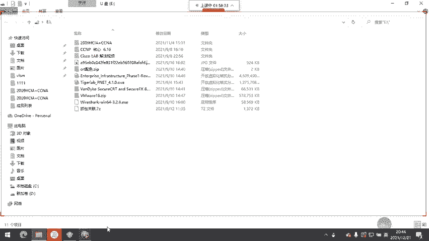

那咱们来设计两个网络，好吧。设计两个网络，中间是个路由器啊，对吧？左边一台37啊，右边一台37。然后接下来咱们来连接两台主机。左边主机一主机2。右边是主机塞主机4啊，然后接下来咱们的实验目标是什么呢？

就是让这个网络能通啊，让这两个网络能通，好吧。Yeah。Yes。好，让这两个网络能通。Yeah。好，那这块的话咱们来规划一下地址吧。左边咱们用十网络好吧，10。1。0啊，右边咱们使用20网络20。1。

0好吧，然后接下来这边是网络A啊，这边是网络B，那这台主机的话，咱们10。1点点1啊，10。1。点2，10。1。310。1。4好吧，我们要保证什么啊？网络内通信能通啊，网络间通信也能通。

那这边需要配的是主机需要配IP啊，对吧？这是必须的，你主机不配IP对吧？你咋通啊，你通不了啊，然后接下来网关的话，咱们都用该网络内的最后一个可通地址啊，咱们使用点254来做网关地址，好吧，这台是10。

1点。2啊，页码是4位，网关是10。1。54，好吧。然后接下来这台主机的话，咱们用20网络啊20。1。1编M码4位，网官是20。1。54。然后接下来这台主机。20。1点。2MM24位，望观是。20。1。

点5次。别忘了点一下应用啊。好，那接下来咱们需要配的就是路由器，还有。车辆看交换机啊。好，那需要配点啥的？首先主机名需要配啊，好吧，这个叫I一对吧？然后接下来吉比特的0-0-1口地直10。10。54。

对吧？掩码。24位好吗？然后接下来吉比特的0-0-哦，左边是0-0-0啊，0-0-1的话，把地址给去掉啊。吉比特的0-0-0地址是10。1。254啊，24位，然后接下来吉比特的0-0-1地址是20。1。

254，对吧？20。1。1。254M4位，怎么验证啊？displayIinterface brave对吧？通过diplay interfaceface brief啊，看到这两个接口怎么样，地址O对不对？

并且状态O可以吧？然后接下来这个主机呢，你们这个网络内通信啊，其实只要连好线就可以通了啊，对吧？交换机都不用管的，对吧？交换机都不用管的，你可以起个主机名啊，这叫switch一样。

这个叫switch好吧，改一个主机名就好了，然后接下来主机你可以让它自由通信啊，这边是10。1点2。😊。

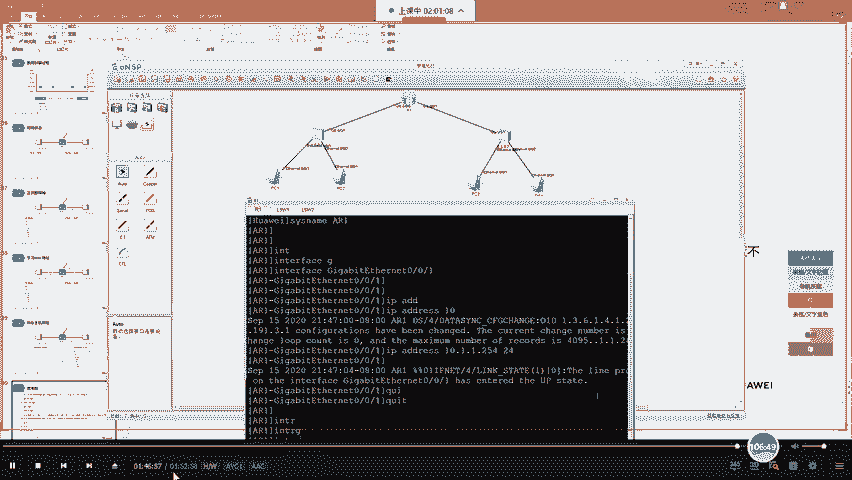

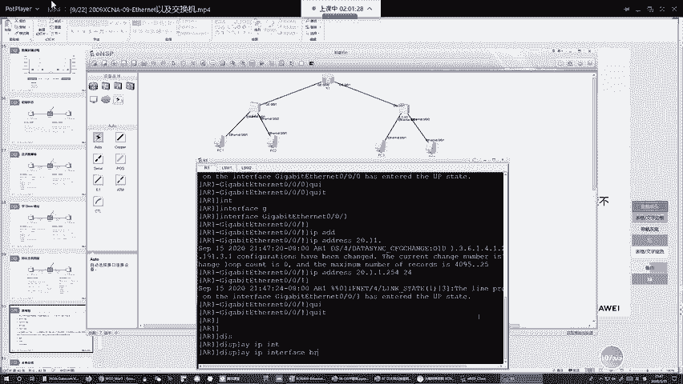

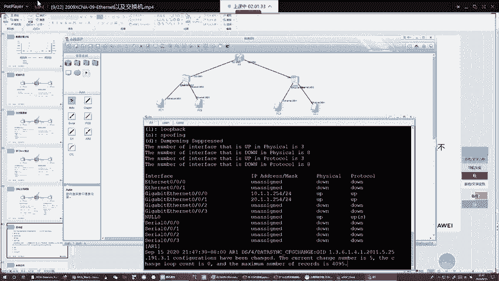

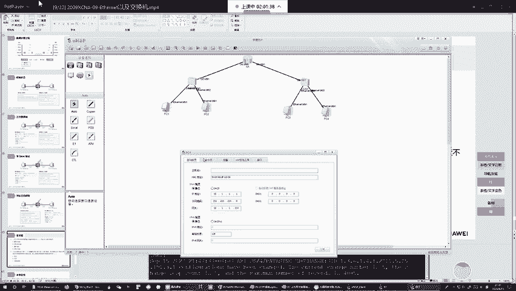

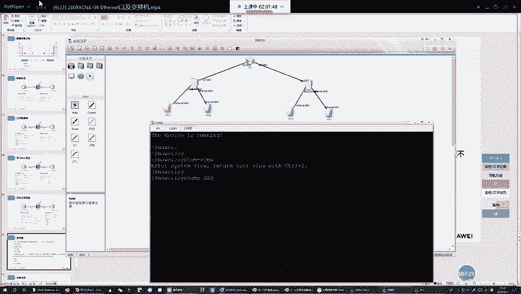

拼自己能通啊。😡，P10。1点。2也能通好吧，这就是咱们两台主机间通信啊。那接下来这两台主间通信，我们来看一下主机啊，ARP杠A对吧？我能解析到主机2的IP到麦克映射啊。

然后接下来在我的麦地址表中怎么看啊？叫display啊，对吧？在switch一上通过display mac dress查看咱们的看表，能看懂吧？我的以太网的0-0-1考连接主机一的mac地址，对吧？

它所属的伪line未栏一嘛，对不对？然后接下来我的以太网的0-0-2拷连接主机B嘛，主机B，这是它的麦ac地址啊，然后也属于未栏一好吧，那接下来你这两台PC的伪栏内通信可以做啊P这边是20。1。2吧。

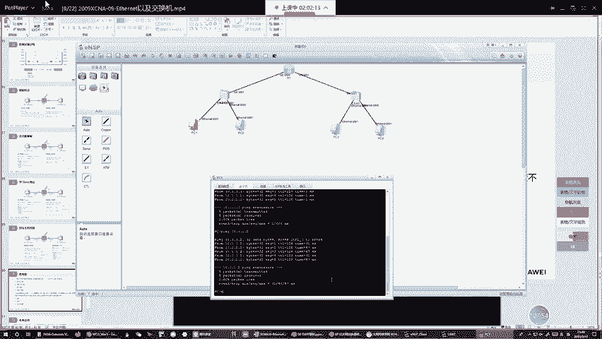

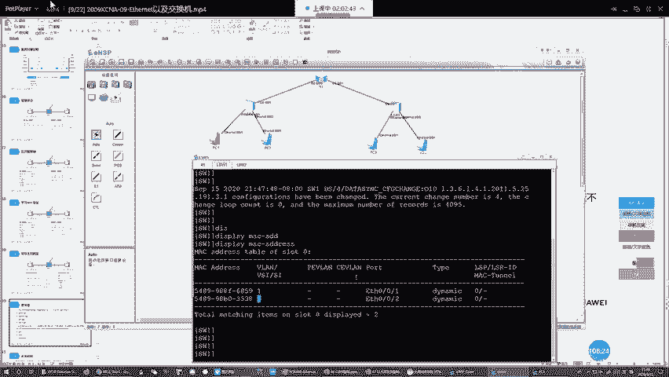

他上来屁股透的原因是因为你要做那个你要做那个生成数的选举啊，他比较慢。如果说你不希望他做选举的话，对吧？你得那个。开启一个边缘端口啊，你得开启个边缘端口。啊，比较麻烦。啊，通了吧？

这两台主机之接也通了啊。然后接下来我们可以看一下switch2对吧？display mac address对吧？通过这条命令查看咱们看表吗？看好吧？我也是以太网0-0-1连接主机C吧，对吧？

这是主机C的mac地址，属于未来一，对吧？我的以太网的0-0-2拷连接主机D对吧？这是它的mac地址啊，所属未来O吗？你们可以对照一下，一模一样的。一模一样的，看一眼啊，这是我的麦ap地址，对吧？

是不是？😡，5489988D31F7嘛？完全一样啊。哎，这是我的主机地的麦克地址啊。主机地的mac地址。是吧看一下54899867对吧？5732能理解吗？一模一样啊一模一样。

然后加大网络间的通信也很简单啊，P20网络嘛，20。1。1啊，对吧？通了，那之所以能通的原因是什么？是你路由器的接口有地址状态为up，你有直连路由嘛？这个直连路由怎么看？

displayIP routing table吗？查看咱们路由表。

看到了吗？1网络路由还有二0网络路由，好吧，这条大家不用看啊，这条路由用来描述该路由器自身属于这个网络的接口地址，好吧，不能用来转发数据啊，只能用来指定我这台路由器连接该网络的自身接口的IP地址，好吧。

那同样这条是一样的，专门用来转发去往十网络数据的这条路由条目啊，对吧？路由的网络号也叫前缀啊，掩码，对吧？出接口下一条地址，对吧？学习方式管理距离还有度量指，好吧，那这条就是二0网络的好吧。

因为你直连路由，咱们能够自动获信嘛，所以说你不需要做什么静态啊，也不需要做什么，对吧？动态路由选的协议的配置啊，你就能直接让这两个网络主机自由通行。OK吗？啊，看看不懂无所谓啊。这个。唉。

配置嘛都是小儿科啊。就是我给大家看这个东西，不是让你们学配置的，是让你们了解到咱们学的这些理论在设备上是可以通过命令去检测的。好吧，我只是想告诉大家这一点。

我不是知道你们NA阶段就是敲这些命令没有价值啊，想要敲命令啊，在NP中在IE中有足够多的命令给你们敲，你们会发现敲来敲去，命令就这么几条，能理解吧？那在敲命令之前，咱们一定要先知道能有什么命令可敲。

能理解吧？所以说理论的重要性要比命令要高很多。命令来来回回就这么几条，分分钟都会了，能理解吧。安装ESP为什么要导入配置功能包？我不懂，哎，你如果需要使用这些功能的话，你当你当然要导入了，对吧？

你如果说不需要使用这些功能的话，你导入干嘛没有必要，对吧？好了，那这块的话就是。你没有卡呀。啊，对，所有的三层设备就是所有的节点，你要联网的话，都需要IP所有的节点你要联网都需要IP好吗？

交换机接口不需要啊，路由器的接口PC的接口都需要，好吧。好了，那这节课的话咱们这些吧，明天晚上8点我们继续啊，明天晚上内容更加精彩啊。好吧，那大家拜拜，我们明天见啊。😊。

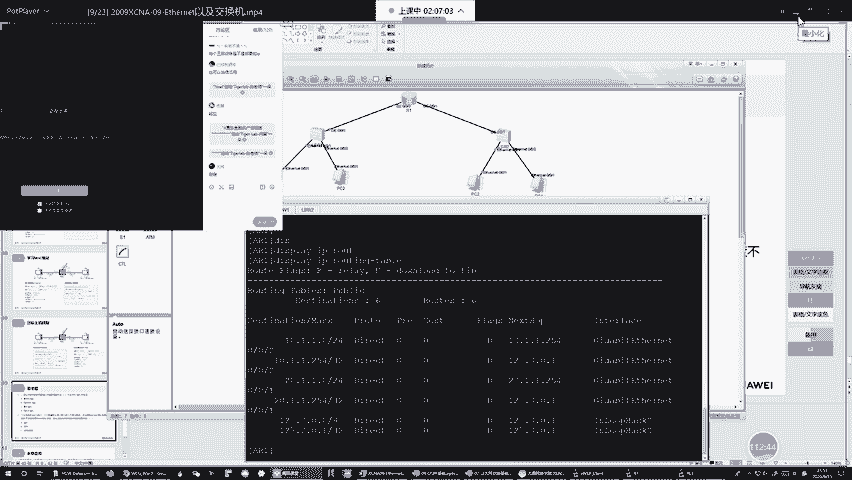

🎼。那个喂喂喂，能听到声音吧。hello hell。等会儿稍等一下。嗯，跳不出来呀。呃，那个声音能听到吧。Hello hello hello。hello hello，这个声音可以听到吗？嗯。呃。

今天这节课结束了结束了，然后哎羡慕手速的，不用羡慕啊，等你们到NP的时候，基本上大家手都差不多的。敲敲多了以后，你的手速自然而然就快了啊，对于本节课有什么就是不懂的地方吧，或者说有一些疑问的嘛。

其实你们这节课只要学习了你个什么交换机的工作原理啊基本上差不多了。NA中，你们交换机这一块，只要了解到它的工作原理，对吧？一个控制层面，一个数据层面，知道它是干嘛的就可以了。然后其他的交换机。

你们就不需要去多了解了。然后重点是明天要上的类节。好吧，围兰这节课的话，你们可以去多听一听好吧，多听。然后最后你们刚刚最后那一最后那一段讲到ARP了，对吧？然后呢，ARP那对吧还有点时间。

带家看一下ARP在我们一个模拟器上啊，是什怎么样去实现的对吧？那么ARP刚才也说了，ARP是什么协议啊？大家还有印象吗？最后的那个ARP协议是什么协议啊？三个呃，地址解析协议，对吧？

他是用来干嘛的呀那他是用他是用来他是用来干什么的？等一下啊。是我们知道了什么知知道了对端的目的IP，然后我们去解析他的一个麦克地址，对吧？那么这个IP啊，有的同学说啊，我之前有同学也给我过私信，对吧？

说老师为什么他能知道对端的IP是什么，对吧？这个问题问的其实很有意思，因为对吧？你麦克不地址不知道，对吧？你比如说你去拼对端的网络，为什么会知道人家给你的呗，对吧？你如果连对端的对吧？

目的的IP你都不知道，你你凭什么去拼人家呀，对吧？你的IP肯定要知道麦克肯定就是麦克有可能不知道，对吧？你的IP肯定是知道的。😊，不是转换啊，它不是转换成二层地址，它是映射的关系。好吧。

他是知道你的三层地址以后，去解析去什么了解，去学习到你的一个麦克地址，并不是转换。你你所谓的转换是你们之前学了一个叫什么呃地址转换协议呢，叫做NAT好吧NAT的话，可能在你们之前讲路由时候。

哲老师跟你们提过对吧？可以上网用的，就是三层转三层地址，就是私网地址转公网地址的一个技术。但是不是三层地址转二层地址，三层地址和二层地址都是独立的，不可能转换的，他们只是有映射表叫做ARP表。好吧。

那个那个表象里面呢，它就是对应了一个IP和麦克地址的映射。麦克地址音色啊，等一下。对啦，就是用已知的IP地址啊去获悉我们的麦克地址吧。因为你想想啊，我们两台设备，对吧？

比如说我们这边PCE和BC3通信的时候，对吧？我们两个设备之间除了知道IP地址，我们肯定还要知道麦克地址吧，因为我们在做我们的一个数据包的分装的时候，大家记住吧？我们是分钟什么432吧吧？麦克地址对吧？

端口对吧？所以说我们的一个IP和麦克是不可或缺的对吧？都得有。所以说我们在两个端端端通信的时候，我们不但要知道它的IP地址也要知道它的麦ac地址，所以这就为什么我们有ARP的存在，对吧？

然后有时候大家应该会发现你们在做拼包的时候，第一跳对吧？永远第第一跳大部分都是什么time的。😊，就是说第一条拼不通，为什么？因为第一条他在做ARP协议要ARP的ARP的解析，所以的话他可能就拼不通。

好，这边的话我们大家呃来看带大家来看一下ARP的一个过程，好吧。😊，ARP呃ARP的话还是很重要的对啊，对于你们NA而言，ARP还是很重要的。因为它是维护端招端通信的一个基础的协议。我们先在配置地址啊。

好吧，配置地址，我们这边的话写1个10。1。1。1。然后这边的话255。我乱话写10。1点点。这这这10。把应用一下。这边写10。1。2。25。5。500。然后10。1。1点10。お。不需要啊。

但是我这边呃，没有路由器啊，不需要，因为它是通过二层的。所以说这边的话我只是习惯性的去配置一下有没有网关。对于我们今天这个ARPARP的现象测试啊，并没有什么关系。因为你的网关地址是作为什么？

做为一个出口设备吧，对吧？作为一个网关设备的话，是要三层设备来做的话，所以这边我们没有三层设备的话，是可以不用做加网关的。但是我这边的网关是就是加不加，这边都不会有影响，但是呃习惯性的会去加一个网关。

😊，好吧，不加加不加网完整没有影响的没有影响的。那么这ARP啊，大家知道我们ARP的时候，我们什么时候会有ARP的一个表象呢？大家大家有知道什么时候会有ARP的表象呀。

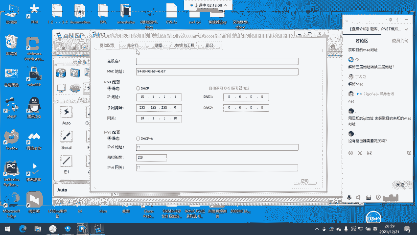

ARP刚刚也谈到了ARP吧ARP必须得在，对吧？你有访问对吧？这个访问这个动作的时候，对吧？比如说我要访问PC3的时候，对吧？有这个动作，我才去什么做ARP的解析吧。如果我并没有去访问。

然后两台电脑之间并没有去拼通。然后没有PC1去拼我们的PC3PC1或者P去聘我们PC2。那么这时候我们来看一下，我们像ARP这NSP的吧？像不管是ENSP也还是我们的也好，都是有ARP表象的。

那么这个ARP表象叫做ARP的缓存表。好吧，那我们怎么去看呢？应该是ARP杠A，我们。😊。

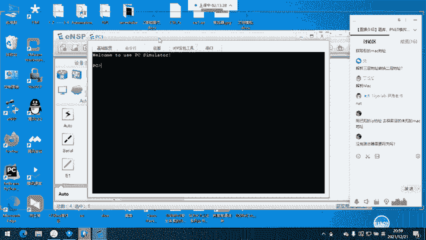

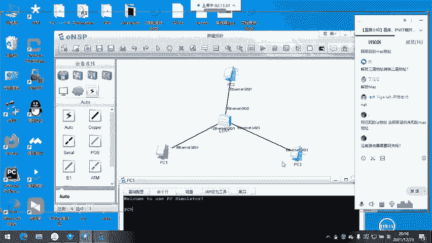

对吧看一下这叫ARP杠A对吧？在我们的电脑上，我们来可以看一下啊。😊，对吧三M店我们看一下。ARP杠A应该也有啊。对吧我们在我们自己的电脑上也可以看到一个对吧？一个internet就是什么？

我们的IP地址吧，IP地址到物理地址的映射。😊。

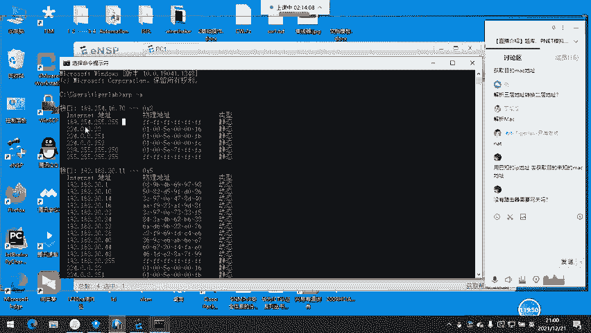

对吧我们也可以看到这些地址啊，就叫ARP杠A好吧，这就是我们所谓的一个什么ARP的一个什么映射表缓存表。好吧，因为我们这边对吧？没有做任何的一个访问的动作，所以的话这边AARP的缓存表啊，是空的。

那么它什么时候会有ARP的缓存表呢？就在我们做访问的时候，好吧，比如说我们现在PC1去拼拼通PC3的时候，我们PC1上对吧？第一个步第一步骤啊，我们的ARPARP的访问过程，现在来开始讲一下。

我们PC1对吧？去访问PC3的时候，我们第一步是干什么？是我们直接发送请求报文，对吧？是我们ARP请求报文，还是说去查我们的缓存表。😊，第一步应该是什么？😡，第一波是查款准表。

还是我们直接直接去发送1个ARP广播报文嘛？对吧？ARP的请求报文。😡。

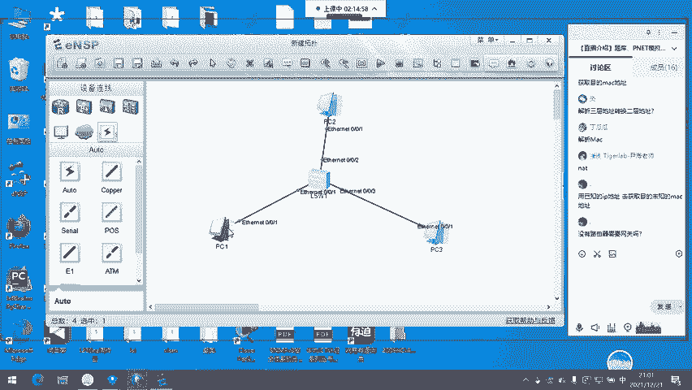

是什么？是我们什么先查表啊，记住啊，我们是要先查表，好吧，我们去先查我们的ARP的缓存表，对吧？如果缓存表中并没有我们对吧？并没有看到我们要访问的一个目的IP的一个表象，对吧？

那么们我们就会什么APCE就会发一个什么ARP的广播报文嘛，也就广播就请求报文嘛，对吧？我们ARP中对吧？ARP中它的请求报文啊。😡。

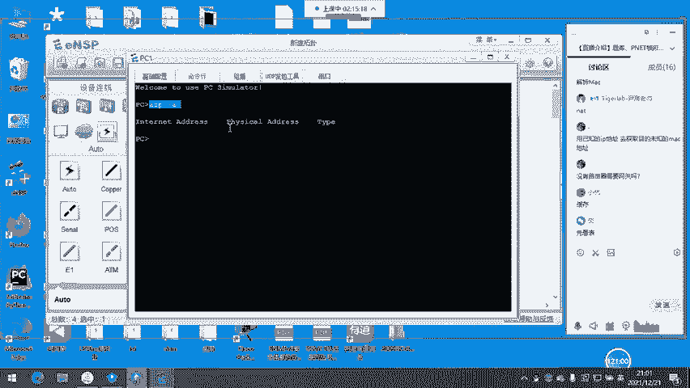

请求报我问。呃，请求好像是广播报文啊。Men。不对吗？广播报文对吧？打字打错次了，它呢是个广播报文，那么这广播报文会干嘛呢？对吧？会在交换机上把你的所有接口啊多发送一遍，对吧？

除了自己这个接口以外的所有接口啊都会发送一遍。😊，好吧，除了自己所有接受接收接口以外的，所有接口都会发送一遍你的广播报文。那么这广播报文发送以后啊，对吧？比如说我们现在PC1对吧？去访问PC3的。

把这啊把这个访问信息对吧？发出去了，我们在对吧？这个这台交换机上对吧？我们会广播1个ARP的报文，对吧？那么这时候我的PC2也会收到一个广播报文嘛？我的PC3是不是也会收到一个广播报文呀，对吧？

没这这个没问题吧，我两台设备是不是都会收到一个广播报文。😊，对吧那么这时候啊每台设备上对吧都收到广播报文以后，他们对应的操作是什么呢？那我现来问大家一下啊，根据你们刚刚的一些理解啊，对吧？

我PCR收到广播报文以后的呃操作对吧？或者说我的一些动作是什么？😡，我的我动作是什么？我如果我PC2对吧？我PCR收到的是1个PC1想去访问PC3的1个广播报文，但是我PC2对吧？我PC2的IIP啊。

对吧？并不是我PC3的吧，对吧？我发现我的IP不匹配，那么我PC2会干嘛呢？会有哪些动作？😡，根据你们所学的有两给你们两个选项，一个呢是直接丢弃掉。还有一个呢是记录下对吧？

这个I嗯ARP的请求报文中的原目不原IP和原m克的映射，然后再丢弃掉。你们选一个，根据你们刚刚的一个细节理解，你们去选一个，应该是什么？😊，选第二个吧。选第二个啊，你们待会去做一个现象。

你们看一下就好了吧。这就你们最简单的ARP现象了。好吧，记住啊，我们在做PCE发送了1个ARP广播报文请求的时候，对吧？我们的这两台设备都受到了请求。那么这两台设备啊，第一步操作基本上是一样的。😡。

对吧先不管啊他不先不管你IP对吧，和自己匹不匹配。他第一件事是什么呢？是先记录下你这个ARP请求报文中的原IP和原m克然后放进自己的ARP的缓存表中，然后再来匹配，对吧？

你的你的这个目的IP和我的这个接口IP是不是一样的，如果一样的对吧？我就收下，然后待会给你回答回回什么回一个单波报文嘛。那么这个单波报文称之为什么ARP的应答报文，如果呢你不匹配，那么我就丢弃，对吧？

我也不去给你做任何的回应，好吧？所以说你待会儿你会在PC2上会发现一个很有趣的现象。就是说你在做ARP缓存表的时候，你会发现你的RP缓存表中，对吧？会存在PCE的一个呃mike地址和IP地址的映射。

好吧，待会我们来看一下。😊，好吧，那我们PC3呢对吧？我们PC3收到这个ARP的一个请求呃，请求广播报文，对吧？发现哎这个目的IP是我们的什么是我们需要的一个什么IP地址吧。

是我们自己的本地的IP地址那么我就会给对吧？发送这个广播码一个交换机吧，就是直接通过一个发送单波报文单播报文的话，这个源对吧？是我本地的原IP和原麦克对？

然后呢它的目的IP和目的麦克就变成了PC1的原原IP和麦克吧后把这个单波报文吗发送给PC1记住啊我们应答报文是单波报文这个应答报文呢并不会对？通过广播报文一样，每个接口都发送一次吧。

除了自己的接口每个接口都发送一次吧？单波报文呢就是单波对？可以把它想成 p点到点的好吧也就是他在交换机上它并不会把这个报文对？

再传给PC2所以说PC2上也不会记录下关于PC3的个麦克IP的映射好比如我们现在。😊。

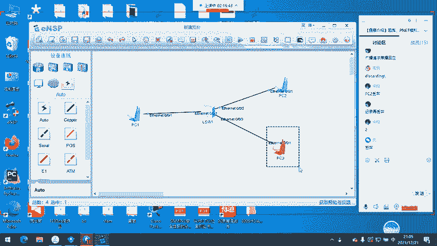

来拼一下啊，我们来看一下，对吧？我们聘10。10。3吧，然后我们去拼一下，拼通了是吧？😊，那拼通了以后啊，我们来看一下对吧？拼通以后，我们大家想一下，我们PCE上应该有哪些的ARP缓存表，对吧？

是有123的，还是只有一个自己本地的，还是有一个对吧？本地的应该不存在吧，应该还是有个什么三的，选一下2还是三还是23。😊，讲一下。我们看一下啊，他是不是只有一个3吧，看到吗？

他是通通过自己动态学习的是吧？他你不是并不是静态去指登你的是吧？你是自己学到的，看到没？因为你有了一个访问的操作，所以的话他在给你返还对吧？ARP的呃单波报文的时候，对吧。

它会给你缓返还一个你的原麦克和原原麦克和原IP吧。那我们在R嗯这个PCR上来看一眼啊。那大家想一下，根据我们刚刚的解释，我们PCR上的ARP缓存表应该会存在什么。😊。

有有哪一个想一下一的和三的一和3选一个我们PC2上啊，PZ2无关紧要的这个PC2上，我们应该有哪有什么有什么表现呀？😊。

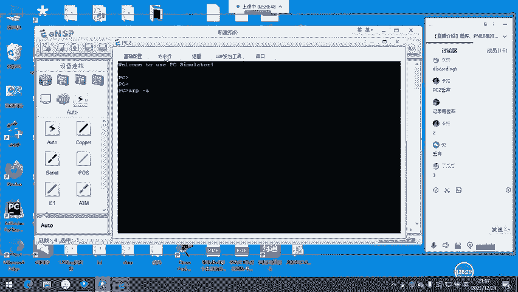

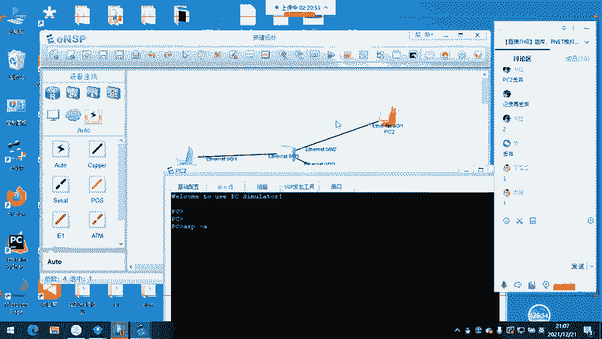

我们看一下是不是有一啊，刚刚我们也说了吧，因为它是广播报文，所以的话我们PC3哦，我们的PC2会理所应当的收到一个广播报文吧，对吧？所以的话它的呃一个表象中对吧？

肯定会存在关于我们1个PC1的一个什么原麦克和原IRP的映射吧，这这就是我们所谓的么ARP表啊，这种ARP表象，当然对吧这里问这里题外话问大家一下ARP有老花时间吗。😊。

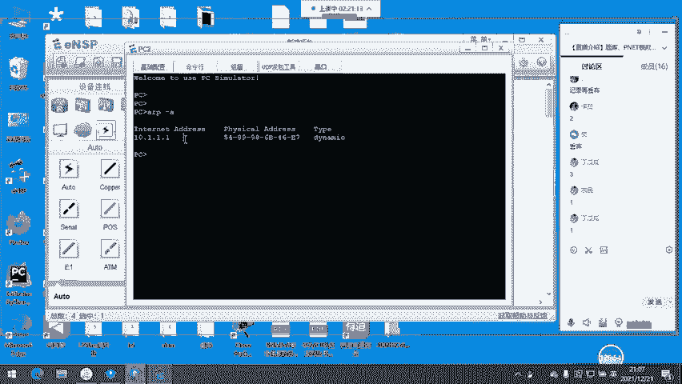

ARP会老化吗？就是过一段时间以后它会消失吗？😡，会吗？会的吧。所以说你的ARP如果你在长时间啊不去呃，不去做访问的时候，300秒以后，对吧？你的ARP表现就没了，好吧，你就就会清空了，好吧。

300秒就多长时间啊，5分钟吧，对吧？5分钟以后啊，这个就直接。😡，pass掉了，好吧，那么理所应当的，我们在PC3上，我们会收到什么？我们来想一下，那我们PC3上。😊。

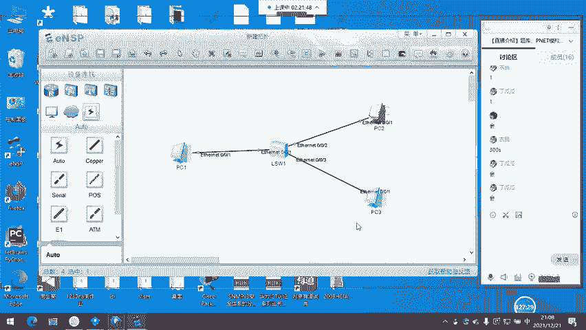

P3让我们6应当应该只有一个什么没有了吧。因为我们刚应该我们刚刚讲话有5分钟了吗，已经消失了，他已经消失了吧，那就很尴尬了，对吧？消失就很尴尬了。😡。

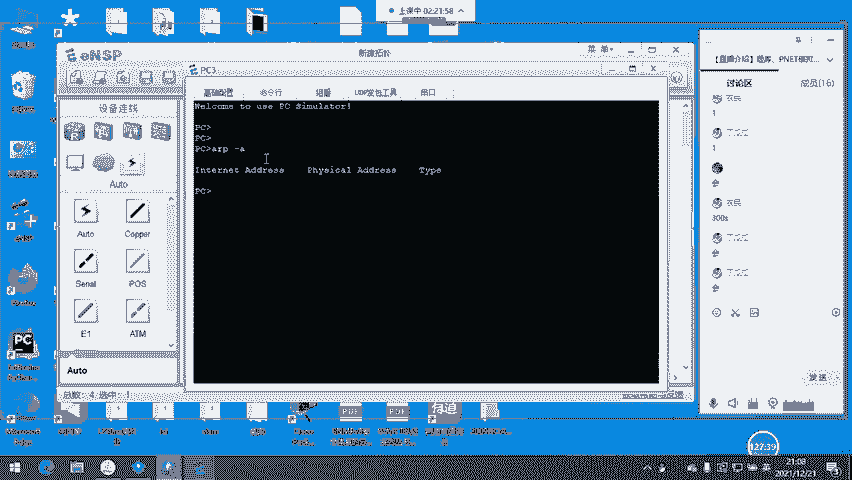

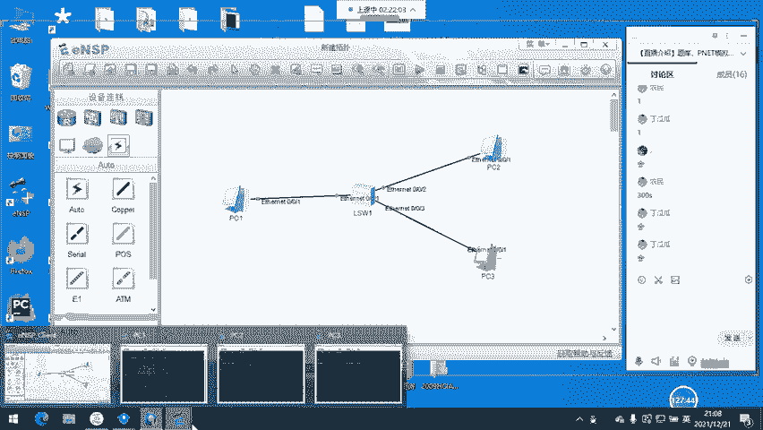

消失就很尴尬了，因为为什么会拼不通，拼不通就很尴尬啊。要等一下，哎，又出现bug了，就知道ARP啊，他这个单纯的ARP的话，它可能第一次消失以后，他就。拼不通了。很烦，要回聘一下。1100。1。好吧。

要回拼一下才会通。因为你的ARP缓存表结束以后，像ENSP和P赖都会出现一个现象。就是你再拼的话，他就拼不动了，他不会再给你单独的第二次发送1个ARP的请求。😊，好吧就很尴尬，就像刚刚那种现象。

这是我们回聘以后，我们再来页上去看一下，对吧？😊，才能拼通啊，回拼一下才能拼通。好吧，这我们在R3上，我们来看一眼啊，我们在R3上我们来看一下它的ARP缓存表，对吧？也是一吧。

那我们二上的话也也我们这时候R上应该就变了吧。😊，对吧这时候我们的二上就变了吧，我们二上是不是会存在于这两个呀，对吧？三合一吧，因为我们刚5分钟没到。但是呃ESP和的话。

它的老ARP的老化之间会存在bug，它可能不到5分钟，它就就清空了，那么清空以后，因为你在我们RP是刚也说了300秒以内吧？3300秒300秒以后，我们会什么老化就会自动刷新吧。

但是有时候他的ARP缓存表会出现什么故障呢？就这300秒以内，对吧？我还是清空了，那么清空以后，我是不是ARP不会去发送ARP请求了呀。😊。

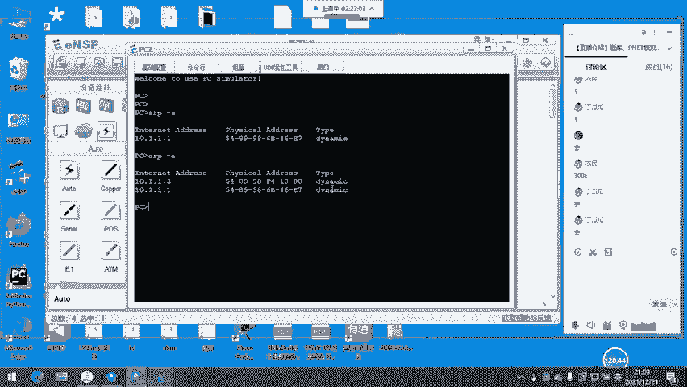

对吧因为300秒300秒以内我们是不会再发送请求的对吧？不会再发送请求，我就导致了我们拼不通，对吧？你只有300秒以后才能再想着去拼通。那么所以说为什么300秒以内拼不通们可以看一下。

我们300秒以300秒以是同时获得了两条在2无关紧获得了两条RP吧表明我们30秒以内被了两次刚我们现bug嘛就刚给你们看我们的是不是没有收到没有收到我们的RP麦吧没有记录下来吧。

没记录下来g一般情况下是会记录下来的所以我们做个回聘对吧回聘以后让我们的PC1吧也接受一下关于我们3的1个RP请求报文吧用在这些细节啊现象就是一和3上一三都会收到对的麦和IP的映射们P2上呢会收到单独的他们的一个广播报文的映射我们现在应该还存在我们来个包看一下。

😊，没有。应该还存在吧，我们来抓个包看一下我们PC我们抓一个一口的0-1。呃，抓错了，不抓这个口。我们抓一口的0-3吧。

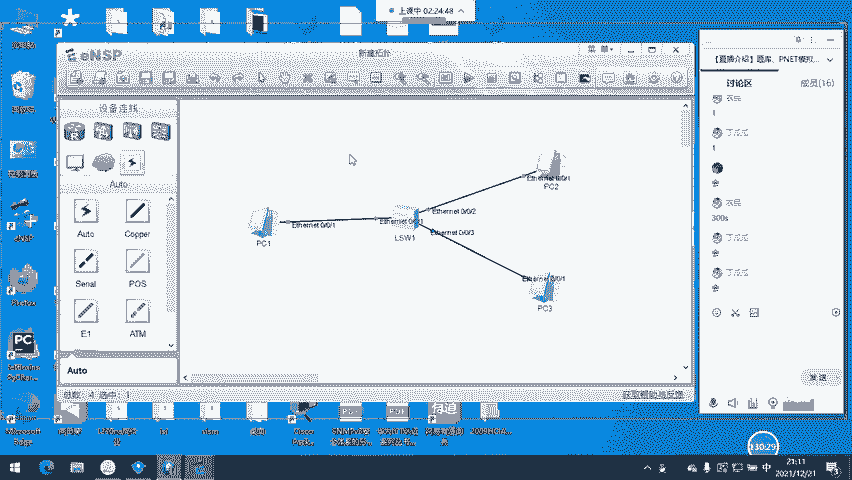

拉一直保持平动状态呀，我看一下。我们随便来看1个ARP啊，对吧？我们可以看到上面有个proto吧，proto这个协议这一栏，我们可以看找到ARP对吧？那关于这个broadcast。

大家知道broadcast是吗广播吧，对吧？那我们来看一下broadcast报文啊，对吧？我们来看一下下面。😊，哎，这有点。我来看一下对吧？记住啊。

我们根据这个我们可以看出来什么它的一个关于ARP的一个什么数据包的格式吧，对吧？ARP的数据包格式是什么？以太网正头2吧，看到没？它的格式是什么？以太网正头2，然后加我们的ARP的这个什么三层协议吧。

然后加我们一个真伪好吧，是什么呢？我们来打开写一下吧。😊，呃，他有那个。挂牌工具。是什么？是我们的一个以太网二针头以太网。2好吧，针头，然后加上什么，加上我们的ARP啊。😡。

对吧它的1个ARP的一个豹纹格式啊，就是这样的，加上1个FCS好吧，它的格式呢就是就是这样的格式。以太网针头加个ARP加1个FFCS。所以说你们在这边会看到一个关于以太网二的针头吧，对吧？

那么这个以太网二针头里面主要包含的信息是什么呢？是主要包含的信息是我们的以太网的什么一个原目的mac。😊，好吧，语文麦克，我们再来看一眼。对吧我们再推出一下这个模式。这个按FS没用啊。这个怎么退出啊。

ESC怎么没用啊？啊，诶。Okay。嗯。哎，有谁知道这教教学工具怎么去掉吗？哎，这就很尴尬了，我去不掉榜，我按ESC怎么不管用啊？那么退出不去啊。土上角吗？这个是吧，确定啊。好，我们来看一眼啊。

我们没看见啊，我们来看一下这一套往二针头吧。我们来看一眼啊，对吧？我们可以看到里面有个什么brocast吧。那么全F啊，大家看到没？这个全F代表什么？😊，代表的就广播对吧？全F的话就是一嘛，对吧？

全是一我们在IP地址中也学过，对吧？全F全全一的地址就是广播地址吧。但是我们在什么这很明显这是个麦克地址吧。那麦地址啊，它全FF是什么16表16的话就全一才是才是F吧F代表16，所以1515对吧？

所以说这边的全F也代表的就是我们的什么一个广播地址好吧，这么里面啊，就是我太网二头里面的代表了就是我们摸报文。那么source那么这个source的source的一个呃麦克地址的话。

也就是我们这个PC1的对吧？PC1的麦克地址。我来看一眼。😡，我们PCE的麦克地址是吗？54899868呃，6B4617对吧？4617。呃，这个不是这哎，不是的吗？应该是在这边吗？

54这是我们抓的我们抓的哦，我们抓的包不是PC1的，是PC3的对吧？呃，搞错了啊，P我们PC3那个包对吧，5489FE08。对吧5481308吧我们我们抓着PC3的，不是我们PC1的对吧？

我们用我们PC3去拼的对吧？我们会发现我们的一个以太网二针头里面的一个麦克也是我们PC的麦好吧，这是我们在以头里面要关注的个个我们的这个是地址和我们的好吧这是我们一个在意的地再有一个我们类型好吧。

我们的RP吧RP类型的话是零叉0806好吧，这个一定要记住啊，我们RPRP是零叉0806记住这个类型的话也很重要。因为在我们的一些就是就是选择题中可能会出现好吧。

这是我以太网二头里面所在乎的三个点来看一下我们的一个RP个文RP全名叫address对吧这个协议那么后面有个框。😊，代表了他是什么请求报文吧，request。😊，对吧request。😊。

那么我们在这边看到一个硬件类型对吧？硬件类型，我们在以太网的用一表示吧？对吧？然后我们的IPV4地址对吧？记住啊，我们在RP当中对吧？

我们的proto类型啊就是V4吧那么IV4是零叉0800来表示的不要搞混了我们的IV4是0叉0800对？我们的RP我在里面零乘0806所以这两个别搞混了。

这两个代表的东西不一样吧东西不一样那么记住它的和proto们这两个就看一下就行了。他们固定不变的都是6和4吧不管是请求报文也好，还是你的应答报文也好。

它的那个硬件地址长度和我们的一个协议地址长的话都是六和4吧，他们不会变的那么记住还有这个是吧？就吧个选项字段话个代表的是什么呢？

它共有两个字段值一个是一一个是2一的时呢代表的就是我们的一个请求报文那么二的时。😊，待会儿大家看一下我们的应答报文二的时候呢，就是我们的一个应答报文。好吧，它只有两个数值，一和2。😊，啊。

然我们再来看一下它发送者的一个原麦克吧。我们刚刚也看了吧，跟我们就是08对吧？08，我们再看一下我们刚才PC3的一个对吧？它的麦克地址是什么？F41308，对吧？它也是F41308，对吧？😊。

然后我们的一个原IP就是我们1。10。3嘛，目的IP的话是10。10。1。那么这时候我们因为我们发送的请求报文嘛，所以它的一个麦ac地址是不是说不知道的吧？我们不知道的情况下，全F对吧？

代表的是broadcast。😊，看到没？我们这边写的什么broad吧，对吧？broad，因为我说明我们这是整个是一个广播报文。不管是我们对吧？以太王二阵头里面已经描述了这是个广播报文也好。

还是我们在ARP里面啊，对吧？都描述的是一个广播报文。😊，但是有时候呢有时候发现有时候我们在一些定义的时候，我们会发现我们定义中写的是什么？关于ARP的请求报文的时候。

我们的呃就是我们的est这边的是的话这个也是目的啊对吧的的话你发现他写的是全F。但是我们在定义的时候写的是全零那么这个话就是我们一个模拟器的一个bug不管是也好，还是我们的P也好。

你在抓RP一个请求报文包的时候，你会发现对吧它的包里面写的都是全F但是我们在定义啊定义RP请求候，其实应该是全零的好吧那么在这里跟大家提醒一下全零和全F的话，其实对于你们在抓报文的候并没有太大区别。

那么他们的话都代表一个未知的？个报文。😊，好吧，位置的广播报文。那么这话就是我们1个ARP的一个报文解答。那么ARP里面呃基本上对吧？包含的一些报文字段都在这啊，对吧？

har还有个我们一般都是op对吧就然后是个还有还吧。那么其实我们在一些读的时候可以到读成什么source对吧？和我们好吧，这这些啊就是我们的一个ARP一个报文字段啊。

好吧以后问到你们RP有哪些报文记住了啊，就是这1234对吧？56789。😊，对吧9个豹文好吧，9个豹文一定要记住，那么以太王二针头里面呢，对吧？一共有4个吧，对吧？destation然后source。

然后还t还有一个padding那padding的话pdding的话就不用记了啊，并没有什么用。好吧，dding的话，你们基本上没什么用，只要记住前三个，对吧？一个目的的m克地址和一个原m克地址。

还有一个是我们的1个ARP的一个类型，就是0806好吧，这是我们的一个请求报文。那我们接下来我们看一下我们的应答吧。好吧，我们来看一下我们的应答报文。我看一下，它一直在拼嘛。😊。

然后我们的应答报文就第二个吧。然后我们第二个很明显，我们也可以看到啊，我们在做应答的时候，它以套网正头里面的是不是就变了呀，它的原目都有了吧。原是我R3对吧？PC3目的是你的PC1吧，4617。

我们来看一下PC1是不是4617。😊，啊吧是4617吧，这时候他就会把你的呃本来的请求报文中的什么语麦克，对吧？改成我的目的麦克了吧，对吧？那我们可以看一下。😊，呃，发送完以后吧，发送完以。

我们再来看一下下面。😊，啊，下面我们再来看一下这个啊看一下这个关于这个呃ARP的一个报文，发现它是reply吧。其实呃我们的reply和我们的request啊，你只需要观察一个呃，看一个点就够了。

因为其他点基本上都是一样的，好吧，就是这个对吧？option code就是我们OP code对吧？就我们的关键字段，我们可以看到它reply吧reply的字值它是多少呀。😊，可以看到它的字段值是2。

对吧这说明什么我们刚刚说的吧一的时候代表的是request二的时候代表的是rep对还有一个还有一个其实不能算在不同点啊，就是我们的一个什么目的麦的时候，我们发现我们的目的麦是不是变成8？

308就我就是把我们的麦克吧调换过来本来的麦成了们目的麦克把我们本来的目的麦克成了我们的麦？给发一个应答包文吧这就是我们一个关于一个ARP的一个抓包一个解析啊那么下面的话就是我们RP解析完以后个包对一个包？

吧个协议对？就面写的看到们一跳个请求一个回答一请求一个回就们回包吧个回包保存了那么这就关于我们的一个RP个简单的个RP还有什么节还有什么就是。😊。

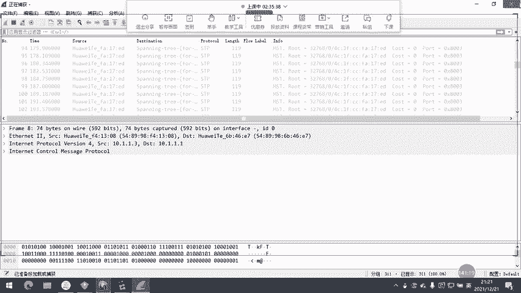

呃，不太了解的嘛，还是说你们还要再继续听录播，放完以后，还要再听一会儿课，对吧？去巩固一下。因为我觉得今天的应该通俗易懂了吧，因为讲的时间挺长的，我也在听了，我感觉讲的已经很透彻很透彻了，说实话。

那没有问题的话，那我们就下课了。好吧，然后呢，就是待会儿的话把录播整理整理。然后你们没事的时候，把这个这节课再拿出来看一看。因为这个录播我发现他关于交换机这一块讲了两个小时，我觉得挺详细的说实话。好吧。

还有问题吗？没有问题，我们就下课了。😊，没问题，我们就下课了。嗯，那大家拜拜。拜拜拜拜。拜拜。😔。

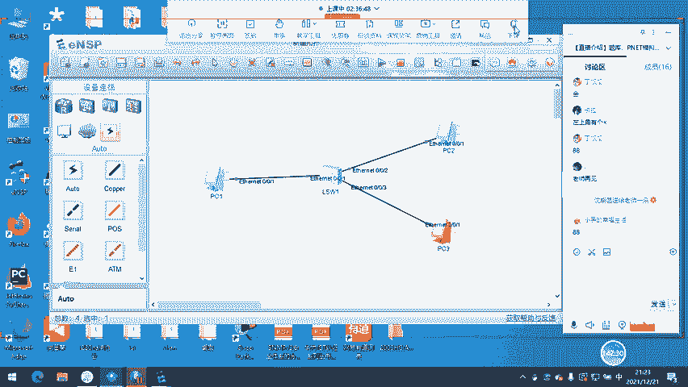