# 2022版华为认证HCIA-DATACOM教程，内部课程公开分享（已完结） - P11：XCNA-11-VLAN - 网络工程师CCIE - BV1AP4y1J73k

好的，欢迎大家来参加咱们的A课啊，这是第十节。我们来讲一下伟烂啊。伟烂呢是一个交换机常用的技术啊，它是一个工具啊，不是一个协议。那这个工具的全称呢，咱们称为叫work啊。

local area network好吧，这个叫虚拟局域网，那这个虚拟局域网呢，咱们在二层交换机用来干嘛用呢？那这节课就是哎咱们跟着胶片啊，来带大家了解一下咱们交换机上最常用的这个伟烂工具啊。

在什么地方用，以及它到底有什么用啊，以及咱们跟伟烂相关联的交换机的二层接口的三种模式啊，那分别咱们称为叫access模式，对吧？这个叫接种模式。😊，创模式啊，这个叫中继模式啊，还有hybrid。

这个叫杂合模式啊，通过这节课的学习，让大家了解这三类接口，对吧？到底用在什么样的地方，以及他们到底有什么用。OK好，那接下来言归正传啊，我们来开始这节课的主题啊。那之前呢我们说了，在组网的时候呢。

咱们当前一般用的比较多都是交换机，对吧？你用交换机把我们的计计算机呢连接入网，对吧？那这个交换机呢机有很多，你在一个网络里面呢，咱们可以包含任意多台计算机嘛，对不对？你如果一台交换机接口不够。

你可以连两台三台、四台，对吧？你可以连接这多的交换机啊，来组成一个网络，那这个网络咱们能够有无止境扩展吗？你能在一个网络网络里面比如说放1万台主机吗，对吧？答案是不行的，咱们在开课的最开始跟大家说过。

咱们在设计网络的时候，你一个网络的体量对吧？那大小啊是有限制的，你一个网络最大最好不要超过对吧？主机300台，你如果一个网络里面主机数量超过300台啊也不是不行啊，咱们通信还是能做到的。

但是你通信质量就会变得很差，对吧？因为大家都知道你在一个以太网环境中，我们主机可以发送的数就三类，对吧？单播主播还有广播，那接下来虽然咱们主机之间的正常通信啊，都是以单波形式。😊，来发送的。

但是呢为了保证咱们单波的数据那够通信啊，对吧？你通常可能需要一些广播的控制层面的这么一个协议啊，来交互报文来实现咱们了解什么ARP信息啊等等之类的关键性的封装信息，对吧？比如一主机A，你要跟主机B通信。

对吧？如果说A跟B在同一个网络，你A想要跟B通信，你需要知道B mac地址，对吧？那如果你不知道你就要发送广播的ARP来请求，对吧？虽然你请求的对象是B。

但是广播的ARP请求谁能收到跟你在同一个网络内的所有其他主机都能收到，所以咱们会发现在设计一个网络的时候没有错啊。你可以想设计多大，就是有多大对吧？你一个网络里面包含1万台交换机可不可以啊？可以。

你一个网络里面包含几十万台主机可不可以啊？哎，也可以啊？但是你这样设计的话，咱们网络也就是顶多只能做到可以通，对吧？但是如果说你想要在通的基础之上来增加咱们通信的效率啊。啊，不好意思啊。

你这种方式就不行了。那所以说了咱们必须要去做一个伟栏的隔离啊，一定要隔离咱们广播域。那咱们隔离广播域呢，哎那最简单的方式就是用路由器嘛，对不对？那早前咱们课上说了，你想要隔离，对吧？

多个网络那怎么隔离啊，你中间搞一台路由器嘛，我们左边是网络A哎连接R一，对吧？右边连接网络B，哎，你通过这种方式啊，A跟B这两个网络里面的主机，你通过路由器，咱们可以通信嘛，但是由于路由器在中间啊。

你这左右两个网络是被隔离开来的对吧？左边是一个独立的网络，右边是个独立的网络，那路由器呢就跟一堵墙一样，对吧？存在于两个网络中间，比如说你网络A里面有一台主机，对吧？你要发送广播的ARP请求。

你的广播的ARP请求能到达网络B嘛？过不去的那同样你网络B里面的主机，你发送的广播ARP请求啊，你网络A的主机你也是。的对吧？那咱们通过路由器啊来隔离网络，仿佛是咱们已知的隔离网络的唯一方式。

那接下我们就来思考一下了。如果你只能通过这种方式啊来隔离网络的话，那是否理解为咱们在设计一个企业园区的时候，你在园区往内网中，你要包含大量路由器啊，对不对？因为你要包含大量路由器。

你才能通过路由器的三重接口嘛，来做一个物理型的网络隔离。那通过这种方式也不是不可以啦。只不过大家都知道你路由器这种设备接口比较少，对吧？你路由器这种设备接口比较少，你想要通过路由器来隔离多个网络。

你是要采购很多台路由器啊，对吧？这个采购成本低会比较贵啊，这一点呢就是一个比较大的障碍了，因为咱们在设计网络的时候，对吧？你成本要素啊，是很关键的，因为你甲方对吧？你做一个网络投资，你是有预算的嘛。

对吧？咱们预算不是无止性的，那所以说你在设计一个网络的时候便宜还好啊，如果网络贵了，对吧？😊，对方没有挪多经费啊来实施。那这是第一点。第二点，大家都知道你路由器作为一个网络层的设备，你从功能上来讲。

对吧？你要比这个交换机强很多啊，因为你毕竟支持三层嘛，但是它的这个转发的能力啊，转发的能力要比交换机要差很多，对吧？因为首先你的路由器转发数据，网络监通性嘛，你要拆包，你要看三层爆头，对吧？

你要查路由表，对吧？那这个东西都是基于软件的，基于CPU的，对吧？诱耗资源有卖，然后再加上你在转发数据的时候，咱没有办法做到什么，没有办法做到精确匹配啊，你只能做到模糊匹配，对吧？你收到数据包。

你还得拿路由表里面路由条目啊，它的源码跟数据包的目的IP来做运算啊，来判断接收者主机在哪个网络中，那这个真的不要太麻烦啊，所以你要办同样作为数据转发的这么一个设备啊，交换机的转发能力要远强的路由器。

你会发现咱们端端端通信啊，对吧？你中间隔的交换机多，这个倒无所谓，对吧？你的延迟不会很明显的增加。但是你端到端通信，如果你经过的路由器多了，这个延迟一下就上来啊，你端到端，通信延迟越高。

你的用户体验嘛就会越差。那所以说呢出于这两点考虑啊，你在一个企业网内网，咱们绝对不可能包含多台路由器。并且你把路由器放在内网，这个大材小用了。因为路由器能做什么，你除了能做网关，能隔离网络以外。

你更多的对吧？比如说能支持VPN，你能支持各种各样的高级路由选择协议啊，你能支持MPOS你能支持PAAT那这些功能，你在内网用得到吗？对吧？你也用不到啊，那所以说呢你把这样的设备放在内网纯浪费啊。

你只要把这些设备放在边界啊，放在DMZ区域啊，你能发挥它的真正的作用，对吧？你把它放在内网就全浪费了，你要为这些功能买单，但这些功能对吧？你使不上劲嘛，对不对？那所以说总而言之。

就是咱们在设计一个网络的时候啊，对吧？这个路由器呢肯定要有，但是呢通常就是。要么在边界，要么在DMZ而在我们的内网带不止一次看到了，我们在设计一个企业网内网的时候，那更多咱们看到的是什么？就是交换机。

对吧？就是交换机。那接下来咱们内网全是交换机，我们就想办法了，怎样来直接通过交换机来做网络的隔离。按的方式就是使用烂。好吧，在你没有使用栏之前，其实交换机，你用了伟蓝概念了啊。

这个交换机的接口默认就能识别伟蓝啊，并且对于交换机而言，我收到一个数据最关心的，就是这个数据是来自于哪个伟烂。好吧，因为当我确定了数字啊，数据啊来自哪个伟栏之后。

我要基于这个伟line来进一步判断这个数据该怎么转发。比如说我收到一个数据来自栏一，我只能把数据发送给伟蓝一的其他主机，我收到一个数据来自伪烂时，我只能把数据发给伟烂时的其他主机，简单来说。

我通过伟烂A收到一股流量，我只能把流量发送给伟烂A内部的其他节点。我不能说通过。😊，收到一个数据啊，我把数据发给伟栏B，这个是做不到的对吧？我不能跨越伟line来做二层通信。

那这就是交换机的这么一个限制啊，你可以理解伟line它实现的是什么，就是一个二层隔离啊。伟line就是一个二层隔离工具。好吧，你通过这个二层隔离工具，哎，你交换机每收到一个数据。

当你判断数据来源伪栏之后啊，你就只能基于这个伟line来进一步的针对数据呢来做进一步转发，对吧？通过二层的交换机制啊，交换机绝对没有能力说是直接把来自于伟蓝A的数据发送给伟nB啊，这个十有89。

咱们做不到的那当然你在华为的设备中呢，你倒是可以通过某种类型的接口啊来实现这么一个功能。但是这个呢咱们一般在日常中啊是不会使用好吧，那总而言之，大家有这么一个概念啊，伟line就是用来做隔离的好吧。

两个主机，你们来自于相同伟烂啊，哎，通过交换机，你们可以直接第一次访问，并且你们的访问啊是通过二层实现的。但如果说两个主机，对吧？你们来自于不同的伟line，😊，你们能不能通信呢？哎，最终也能通信啊？

你们的通信要通过三层网络设备来做一个网络间的转发，而通过二层交换机，你想通过二层交换啊来实现不同伟蓝成认通信啊，这个是做不到好？因为伪烂的作用就是用来做隔离的吧？那接下来大家都知道啊。

你一个交换机的接口，如果你没有做什么配置啊，它其实是有伪的？它这个默认就是伟蓝一那当然正由于咱们所有的接口在没有配置情况下，你们默尔都属于未蓝一啊，那大家默尔都在同一个伪。

那大家之间呢都可以彼此通信可吧？这也就是为什么咱们在组建一个网络时候，比以这张为例啊，你这样组成的一个网络，你会发现所有主机，咱们是属于同一个网络呢？那属于同一个网络意味着什么呢？

意味着主机发送一个帧到达交换机，只要交换机要针对这个帧来做泛红，对吧？那当然泛红的帧可以有哪些啊广播帧咱们能泛红对吧？未知单波帧咱们能泛红对吧？播帧如果你没有请IG的话，咱们。泛红。

那这个泛红会导致咱们网络内的所有其他节点，对吧？他们都能收到数据，这就是为什么对吧？咱们把一个网络称为叫一个广播域码，因为网络中的任何一个节点发送一个广播，该网络内的所有其他人，对吧？他们都能收到。

那接下来如果你希望通过伪赛来改变这一点，很简单吧。😡，就是你在这些交换机上创建咱们所需要使用的vline，比如你创建一个未蓝1，对吧？你在switch一上把连接主机一的接口绑定未来1，对吧？

你把主机放到未来1中去啊，然后接下来你这台switch3，你把这两台主机，对吧？也放到未来1，那接下来你们三台计算机属于未来10，其他的计算机属于未来一，对吧？那接下来咱们未来10的主机一。

你发送一个广播的报文啊，switch一收到报文之后呢，还是泛红，但是在泛红之前呢，我先做了一个确定啊，我确定什么呢？我确定这个真实来追未来10的。我就在泛红这个数据，我也只能把数据泛宏给未蓝1内呢。

所有其他主机对吧？我不会说是通过未来1收到数据啊，发送给未来一的计算机，所以你会发现虽然咱们端到端交换机在转发这些数据的时候啊，咱们还是以泛红的方式来转发啊。

但是我犹于怎么样不能把未来10的数据泛红给其他未啊，那所以说最终能够收到广播。😊，流量的只有这两台计算机，好吧，所有其他计算机你们都收不到，好吧，这就是伪烂的作用。OK吗？

那所以说提一下什么叫伪line？哎，就是个工具啊，你就在那交换机上没有做任何伪栏设置。我们交换机呢默认有尾栏的这么一个东西存在。好吧，那这个伟line默认怎么工作的？😡，对吧他默认就是。用来实现格离的。

好吧，它默认就是用来实现格离的OK吗？那接下来一个交换机，对吧？你连接一个主机的接口，如果你没有做什么配置啊，它默认是属于未来一的嘛，对吧？默认属于未来一，那默认咱们所有计算机所连接的交换接口啊。

如果你都没有配置，大家都属于未来一，对吧？那伟赖一的主机之间，你们可以相互通信，如果你希望他们之间不能相互通信，对吧？你只用在交换机上创建咱们需要使用的伟line，对吧？

你把交换机的接口跟咱们创建了新的未来做一个绑定啊，那当你绑定完毕之后，你就不再属于未来一了嘛，对吧？那比如说咱们两台主机连在同一个交换之上啊，一个主机属于未来1，另一个主机属于未来2时。

那别看你们连接着同一台交换机啊，你们之间是不能够相互访问的，好吧，因为伟赖十0的主机发送数据到达交换机啊，交换机发现啊，数据来自于未来1，对吧？那我收到伟赖1的数据，我只能查找。😊。

时对应的麦地址表象啊来给你做一个转发，对吧？我只能把数据发送给赖1内的其他计算机，可以吧？你能把数据发给20吗？发不走啊，那同样来自于20的数据，你能发给1主机嘛你也发不了。

所以说呢两台主机哪怕他们连在交换机相邻的两个接口啊，但你们之间也不能相互通行，那所以说得出一个结论，什么叫line呢？一个就是一个基于二层实现的line啊，对吧？

你通过的方式把一组把一组什么主机啊划分到一个网络，对吧？那这个时候一个内所有主机，你在配置IP的时候，你们你们怎么样得要给他们配置同1个IP子网段的这么一个地址好吧，这些属于相同的主机啊。

IP地址网络为相同主机位不同，而属于不同的主机，你们的IP地址啊，对吧？网络为不同，那这个主机位呢就无所谓了。😊，可吗。那接下来有这概念之后啊，我们就来解读一下交换机的这二重接口了。

那大家都知道交换机的物理接口哎，有别于咱们主机和路由器的啊。主机和路由器的接口都是三层或三层以上的吧。那这类接口咱们都称为叫节点，啊，节点的特点是什么呢？就是你想联网你需要连线吗？

连线的同时你需要配个IP对吧？那交换机的接口能配IP吗？配不了啊，因为你工作二层，这种工作在二层的接口咱们不能称为叫节点啊，不能称之为叫节点啊，你不是节点。那所以说了你要连线，你想连网怎么样。

连完线之后啊，你不需要配IP啊，你也配不了，好吧，但是这并不是说咱们交换机的接口就不需要配置啊，你也需要配置啊，交换机的接口有工作的模式，那这个模式呢大体就是这么三种啊，接入模式中继模式还有杂合模式。

好吧，这个接入模式咱们称为叫X模式啊，然后接下来中继模式我们称为叫创客模式。😊，还有hybrid的，咱们称为叫杂合模式，好吧，叫杂合模式。也就是说你对于交换机一个接口啊，你可以指定它的工作模式。

你到底是工作的接入模式还是中继模式还是三核模式。那接下来先来提一下交换机连接主机的接口吧，这个交换机连接主机的接口，咱们一般使用什么样模式呢？当然华为有两个选择啊？但是呢咱们用业界比较标准的方式啊。

业界比较标准的方式，就是把交换机连接PC的这类下连接口，咱们设置为接入接口啊，你把这种接口设置为接入接口，那这个接入接口设置完毕之后啊，它默认绑定是未来一啊，那绑定未来一意味着什么呢？

意味着这个接口连接主机，主机属于那个伟来，主机属于未来一，对吧？主机默认属于未来一，那接下来如果你希望这个主机不属于未来一，那很简单啊，你就在交换机上创建你需要使用的未来，比如你创建一个未来1。

你创建一个伟来20，然后紧接着你创建了未来之后啊，你再回到咱们这个接入接口，你把接入接口绑定。😊，到未来十0或者未来20，对吧？那就OK了。咱们通过这种方式啊，就可以实现未栏的划分。好吧，创建一个伟赖。

把你创建的伟line跟接入接口做一个绑定。那大家会问哎，为什么要绑定啊？原因是因为这个接入接口啊，它只能关联一个伪来。好吧，你如果说不给它做伪栏关联，那它默认关联就是未来一。如果你给它做了关联。

比如说你给它关到未来1了，那它就不再属于未来一了，它就只属于未来10，你把一个接口绑定了伪来1啊，把这个接入接口关联未来1啊，那这个接口所连接的主机就是伪栏1的1元，好吧，它就是未栏十的成员O吗？啊。

那这个就是伟赖跟接入接口之间的关系。那需要记住啊，这个接入接口比较简单，一个接入接口只能绑定一个伪赖，对吧？你关联了伪来X，你就不能关联伪栏Y。如果你想要再关联委栏Y，那你的未来X关联命令啊。

就会被消除掉。那总而言之，一个接入接口只能绑定一个来好吧，一个接入接口只能绑定一个伪来OK这就是。接入接口。那接下来通过接入接口，哎，你在接收主机数据的时候啊，大家都知道你主机通过以太网呢。

你在发送数据的时候都是最传统的对吧？以太网二帧嘛，这个以太网二帧，它默认是不能携带伪栏标记的啊，因为PC到底连在交换机哪个接口，对吧？PC不知道，并且这个接口关联哪个尾栏，哎，咱们计算机更不知道啦。

那所以说呢伟烂这个概念只有交换机它才有啊，PC是没有的。所以说你PC呢在接收和发送数据的时候，你所发送的数据跟伟烂没有任何关系，好吧，它跟伟烂没有任何关系，请请记住啊，你PC在发送数据的时候。

你不能携带尾蓝标记啊，你在接收数据的时候，你也不能携带尾栏标记，因为PC的网卡不像交换机的网卡，它能识别伪啊，PC不能识别，所以你给PC发送一个帧。如果这个帧携带一个伪烂啊，对吧？

携带伪栏标记PC是不能识别这个帧的，它会把携带伪栏标记的帧直接给丢弃，并且。PC发送的数据也不能携带伪栏标记。好吧，就是说你只能接收和发送传统的以太网二帧。那接下来你接收和发送传统以太网帧啊。

那对于咱们交换机而言，对吧？交换机能不能对吧？协助你来实现这一点呢？那咱们待会儿针对接入接口啊，我们再详细去抬，那请大家就是记入一点，你交换机连接PC这种接入接口，你只要一旦绑定一个伪烂啊。

那这个伪let是唯一的可以吧？这个伪let是唯一的啊，你绑定好了之后，你通过这个接口收到的主机数据啊，就算没有携带任何伪栏标记啊，你交换机是能够知道这个数据来自那个伪来交换机知道就好了。

交换机知道这个数据来自你伪栏之后呢，它就会给这个伪let啊打上一个标记啊，给我收到的数据啊，针对这个伪let打上个标记，比如说我这个接口绑定伪来1，对吧？我通过伪let时的主机收到一个帧啊。

我就会给我收到的帧打上一个伪来1的标记，可以吧？然后接下来打上伪let10标记之后。哎，我就能够内部的针对未来十来对这个帧呢做进一步处理。那接下来我通过另外一个接口，这个接口绑定纬来20，对吧？

我收到主机发送的一个帧啊，那这个帧通过这个接口进入之后，我就会给帧打上伪来20的标记，然后接下来带有伪来20的标记帧啊，在内部我就会针对伪来20来给你做进一步的转发，好吧，那接下来这两个主机，对吧？

就算连接同一台交换机，但由于你们属于不同的伪烂嘛？你们之间是通信不了的可以吧？好，那这就是伟烂的最初始部署。那这个最初始的部署，咱们能实现什么呢？就是一个v烂的所有主机，你放在一个交换机身后，哎。

这个妥妥的没有任何问题。比如说了你未来十0里面有20台计算机，对吧？你20台计算机都连在switch一上，对吧？你switch一把连接着20台计算机的接口都绑定未来10。

那直些计算机之间能不能彼此同心啊，对？没有任何问题啊，可以的，可以吧？完全没有问题，但是现在问题就是如果我希望把这伟烂10的20台主机啊，分散在两台交换机身后，对吧？

比如说其中的10台连到switch一，接下来另外的10台连到switch2，那接下来我在switch一 switchwitch2上，我针对你这台20台主机啊，我都把你们的接口关联到未来10。

那在这种情况下，你把switch一 switchwitch2一连，好吧，你们这两台交换机身后相同伟lan的主机，那还算一个v烂吗？😊，还算作是一个网络吗？你们之间能不能通信呢？对吧？

这个通信能不能实现二层通信呢？啊，那这是个问题啊那关于这个问题，咱们来分析一下啊，就是咱们一个伟烂成员能不能分布在多个交换机之上啊，你是必须得要把一个伟烂成员限制在一个交换机身后呢。

还是可以把一个伟烂成员分布在不同的交换机之间啊，那答案首先分布在不同交换之间啊，这种做法是没有问题的啊，咱们可以这么做但是可以这么做是有前提的，那首先第一个前提就是交换机间对吧？你不能连路由器啊，对吧？

你不能说switch一连一台路由器，路由器在连接switch2，你两台交换机间的端到端连接啊，如果被一些三层网络设备给阻断了。那不好意思啊，那这个时候你这两台交换机身后。

相同伟lan的成员是不算作同一个伟lan的，能理解吧？因为路由器有网络的隔离功能嘛，对不对？那所以说在这一块，如果说你们。😊，中间连了个路由器啊，或者连了个防火墙，对吧？你通过这种三层网络设备。

把我们端到端到二层连接啊给中断了。那这个时候你就算我这十台主机，你关联未来1，这10台主机我也关联未来1，但是你左右两边的v栏1的主机啊，已经不能算作是同一个围栏，能理解吧？

你不能给他配置同一个子网的地址，你也不能让他们直接彼此基于二层了，来相互通行，好吧，除非你做V叉了。😡，那所以说了想要做分布式未来部署啊，你得保证交换机接，你们等等对使用二重连接。好吧。

那接下来使用二重连接，你这两端的交换机接口使用什么模式呢？还能使用access模式吗？😡，好像答案就不太行了啊。如果说你两台交换机间连了一个二层链路，你两端的接口使用access模式。

你这个access模式的接口只能绑定一个v栏，对吧？你绑定哪个v栏呢？那在我们这个环境中，vline十的成员也分布在两台交换机身后，v栏20的成员也分布在两台交换机身后，你这么做的目的是什么？

肯定是希望他们都能实现什么？v栏内通信了？比如左边的围line十能够访问右边的围蓝10，左边的围蓝20能够访问右边的围栏20，我都需要做围栏内通信了，那这块你们这个交换机间只连了一根链路。

你这根链路两端的接口如果做了access口，这个access口它只能绑定一个围栏，你如果绑定了v兰十和黄色围栏可以通信了。那你蓝色能通信吗？通信不了。如果你绑定了v蓝20O蓝色的v栏能通信。

那黄色能通信了，通信不了，对吧？所以你会发现，如果你希望这两个围栏的成员都能通信啊，你是不是需要。😊，交换机间连两根线啊，一根线两端的接口，咱们都关联伟奈1。另一根线两端的接口，咱们都关联伟奈20。

是不是只有这样，你才能保证这两个伟赖的成员都能跨越交换机互访。😡，对吧那接下来我问大家了，那如果说咱们有三个未来呢。😡，咱们有4个围栏呢，如果咱们交换机身后有10个围栏呢，那难不成你交换机间。

咱们要连1根链路嘛，对吧？交换机间互连的链路啊，咱们都知道啊，使用的是极连接口，对吧？光口这种接口真的够用吗？对吧？交换机多的是下连接口，对吧？这种电口咱们很多啊，24口啊，48口啊，咱们都有。

但是对于这种极连接口24口的交换机极连接口一般只有两个48口的交换机极连接口一般有4个。所以你会发现交换机间互连链路接口啊没有大家想象那么多，所以说能连一根线啊，已经很不错了，好吧？

那所以这个时候咱们的希望就是你交换机间不应该根据咱们身后有多少个围栏成员啊，你就连接多少根线来实现咱们的那那通线，对吧？你应该就是一视同仁啊，你不管交换机身后有多少围栏成员，你们的线来，咱们只连一根。

好吧？咱们线。😊，只连一根，那接下来连了这根线，你就需要这根线怎么样具备复用功能啊。你就是希望这根线既能传输尾line十的数据，又能传输伪栏20的数据。那接下来什么样的接口有这样的功能呢。哎，没有错啊。

就是中继啊，那所以说咱们先搞清楚两个问题啊。第一个就是交换机连接下游主机的下联接口啊，咱们一般呢做access啊，access接口只能绑定一个vline，如果你没有做任何配置啊，它默认绑定伟line一。

然后接下来咱们交换机间互联的直连链路接口。咱们一般呢要把接口模式作为中继模式。那这个中继接口呢跟接入接口不一样啊，它默认不绑定任何伪line啊，它有一个功能，就是能够允许所有vline流量通行。

请注意啊，在交换机上咱们能创建的vline范围是vline一到vline4094。那按理来说，你交换机间做了一根中继啊，这个中继链路能够同时允许伪line1到4094数据通行啊，当然默认情况下。

华为交换机地跟中继链路呢，它默认只能放行vline一的数据，可以吧？当然呢你可以修改咱们这个中继链路的vline a low list叫vline的许可列表。你通过设置这个中继接口的vline许可列表。

对吧？你可以轻松的让这个接口同时放行什么vline1到4094的数据啊来通行，这个是没有任何问题的。好吧，这个是没有任何问题的。那接现问题来了。我就做了中继之后，我左右的这两个伪就真的能通信了吗？

对吧答案是不太能啊，因为我之前跟大家说过，有伪烂这个概念存在之后啊，你交换机的接口只要但凡跟伪烂有点关联。那你交换机的接口收到一个真啊，你第一件事需要知道的就是这个真是来自于那个伪烂的。

因为只有当你知道你收到的真是来自于那个伪烂呢，你才能基于这个伪烂来做进一步的真转发。如果你收到一个真，你连这个真来自于那个伪烂都不知道啊，你是没有任何能力来转发它的能理解吧？那所以说了。

知道一个真来自于那个伪烂，这个是第一重要的事情。那我通过接入接口收到一个真，我能轻松的知道真来自于那个伪烂吗？原因是因为接入接口只绑定一个伪烂，你通过绑定一个伪烂的接口收到一个数据。

那这个数据还能来自于那个伪栏，肯定是来自于这个接口所绑定的伪栏吗？但是中继链路就不一样。你交换基间做一个中继链路，好家伙，你这根链路不是能复用吗？你不是能传输所有伪来数据吗？

这也就是说你通过这个中继链路啊，我伪line十的数据也能给你发过去。我伪line20的数据也能给你发过去。那这个时候switch二就会困惑了，怎么困惑呢？

就是我通过中继链路收到你switch给我发送的一个帧啊，我怎么知道这个帧是来自于伪来十的呢？我怎么知道这个真是来自于纬来20的呢？因为你伪line10跟未来20的主机。

你们所发送的数据都是以太网二数据啊，以太网二针头中，咱们虽然都包含原工mac地址，但你没有伪烂信息啊，能理解吧？你默认的以太网二帧没有任何一个字段来标明啊。我这个帧来自于那个未来。😡。

那这个时候你switch2如果通过这个接口收到一个真，我不知道真来自于那个vline，你觉得我能进一步转发这个数据吗？我怎么转发，我没有办法转发，对吧？

我甚至没有办法基于我收到的真的原mac地址啊来进行看表学习。因为我我在进行看表象学习的时候，我这看表象，你要绑定一个伪line对吧？那如果说我收到的真不知道来自于那个line啊。

我连这个看表象都没有办法去，我也没有办法基于你的目的map地址来进一步查表来转发这个数据，因为我不知道该把数据发给哪个伪lan的这么一个接口。那所以说大大家有这么一个概念啊。

就是你交换基于我收到一个数据啊，通过中继接口收到的。你如果不知道数据来自于那个伪line，你会直接把数据给丢弃。为什么控制层面，我不能学习的看表象，数据层面我不能做转发决策。那所以说我只能丢弃。

那接下来为了避免这种情况发生啊，对吧？我就得要在switch上。😡，点操作。我们之前说了对吧？华为交换机都有一个特点啊，我通过接入接口收到一个真，我不是能够知道这个真来自哪个伪烂吗？对吧？

比如你switch通过一号考，我通过主机一嘛收到一个真。由为我这个接口绑定了伪line10啊，我能知道真是来自于伪来十，对不对？那当我收到伪赖十的数据之后啊。

我会第一时间呢给这个数据打上伪line十的标记。😡，能理解吗？那打上伪line十的标记，这个标记是我switch一打的吧？我打完标记之后，我直接把带标记的帧通过中际链路发送走不就好了吗？对不对？

如果说我把带伪lash1标记的帧通过中继链发送给switch2啊，你switch2就算接收数据的接口没有绑定任何伪line，但你收到的数据携带伪line标记啊，这就跟上色的一样，对吧？

来自于伪莱1的数据，我给你上一个黄色，来自于伪兰20的数据，我给你上个蓝色，对吧？那你switch2通过这个接口收到黄色的数据，我不用看，我也能知道啊，你是来自于伪来1的嘛，对不对？

我通过这个接口如果收到蓝色的数据的话，我也就能知道你是来自于v来20。那当然这个黄色跟蓝色啊，这个太夸张了，对吧？太抽象了，对吧？咱们不可能真的就是给你上一个颜色啊，那所谓的流量上色。

那说句实话就是给你打上不同的标记，好吧，v1。😡，数据给你打一个未来时的标，未来20的数据给你打一个未来20的标。那这个时候你收到带标记的数据之后啊，你只要查看标记的值啊，你就知道啊数据来自于未来十了。

那既然来自于未来十了，你就能基于未来十，对吧？基于原麦地址啊来学习发送者的看表象。然后接下来确定真来自于未来1之后啊，你就能基于未来十，对吧？基于它的目的麦地址啊来进一步查标转发。

最终把数据呢发送给未来十的主题啊，那接下来问一下大家。😊，你觉得我在把这个数据发送给未来时主机的时候，这个未来标记还能不能继续携带？这个伪栏标记能不能继续携带？

我能不能把带尾栏标记的J直接给这个主机发送走，大觉得行不行？好，请注意啊，答案是不行的，为什么不行？因为PC不能识别。我再次强调一下PC没有任何伪栏的概念啊，同样没有任何伪栏概念的，还有路由器啊，对吧？

只有交换机这么一种设备啊，它有伪栏的概念啊，它收到一个数据需要知道数据来自哪个伟栏。但是对于咱们主机而言，主机发送数据的时候，是绝对不可能加标的，主机接收的数据也绝对不能代标。

如果你一旦给主机发送一个带有伟栏标记的帧啊，这个真一旦不是标准的以太文二格式啊，不好意思啊，主机收到这样的数据，它就会直接把数据给丢弃。能理解吧？那所以为了避免主机收到数据丢弃啊。

避免咱们端端的通信失败啊，你交换机在通过接入接口发送数据给主机的时候，咱们会把标记给去掉。那所以说这个时候假设呢咱们 switch一一号口2号口，对吧？这两个接口咱们都绑定了未来1。😊，那这两个接口。

咱们连接两台计算机，你这两台计算机之间通信啊，流程是这样的啊，咱们主机一发送了一个正常的以太网2帧唉，到达交换机交换机通过一号口收到数据之后啊，判断数据来自于未来1对吧？我会给数据打上一个未来1的标记。

然后接下来基于未来1学习主机看表象，并且基于目的地址啊查找未来对的看表象来做个转发。后接下来转发发现啊，为了发送这个数据，我得把数据通过本交换机的2号接口发送走。那这个二号接口由于是个接入接口，对吧？

连接10台主机，那我在发送数据的时候呢，我会把这个标记给去掉啊，以纯粹的以太网二帧的格式啊，再给主机二呢发送走能理解吧？那这个时候一跟二之间的通信是这样但是如果说咱们一夜想要跟这个主机四通信啊，对吧？

我们端到端通信对吧？跨越了这么一个中继链路，那这个时候就是交换就比较对吧？哎春风得意啦。因为你PC发送数据给switch一switch1收到数据之后，我会第一时间。😊，给数据打上伪let式标记，对吧？

然后接下来查标转发时候，发现为了转发这个数据啊，我得把数据通过中继接口发送，能理解吧？那这个时候我再发送这个数据的时候，我这个标记就不用去了，我能让携带标记的数据直接通过中继链路怎么样发送给对端。

然后对端交换机收到带有标记的帧，我只要一看这个标记值啊，就能知道我收到的数据来自未来10。那接下来我能基于伪来十进行看表的学习，我能基于伪let1来基于它的目的back地址，对吧？查标转发。

然后接下来转发的接口发现啊是一个接入接口。那这个时候我再把标记给去掉，把不带标记的帧啊给咱们的主机发送走。这就是咱们端到端的通信流程。那接下来讲这么半天，咱们要总结一点啊，就是咱们在部署伪let的时候。

大家不用担心啊，你一个伪let的成员说是只能存在一个交换机账号，从来没有这样的限制啊。你创建的伪let是可以分布在多台交换机之上的啊，一个伪line的主机也可以分布在。😊，同的交换机之后，对吧？

当然这个前提是你得要保证首先交换机间的连接啊，端到端的要使用二层链路，这是第一点。第二点，你得保证咱们交换机间端到端链路啊，你要做中继，你得保证咱们来自于原交换机的某一个伪栏的数据啊。

再通过中继链路到达另一台交换机的时候，能够携带尾栏标记。因为只有这样，对吧？中继链路对端的交换机，收收到怎么样带有伪栏标记帧啊，你才能得知这个帧来自于上游哪个伟赖。

你才能基于这个伪赖进行控制层面的麦麦克迪表学习啊，基于数据层面，你来做一个精确的转发。😊，能理解吧？哎，这就是咱们端到端委栏部署的这么一个小概念。可以吧。

那这边的话这张图很清晰的描述了咱们刚才的这个流程。你计算机发送的数据不带标，对吧？但是呢我们接入交换机收到计算机的数据，是通过接入接口收到的吧。接入接口只会绑定一个伟栏，所以你交换机收到数据之后。

你就会直接给数据怎么样，打上该伟栏的标记，然后把带标记的数据啊，通过吉联的中继链路发送给其他交换机。那所以说其他交换机，虽然你收收到数据的接口啊，是一个中继接口，这个中继接口没有绑定任何伟栏啊。

但是你可以通过什么，你接收到的数据所所携带什么伪栏标记嘛，你通过你收到的数据所携带伪栏标记啊，你就能第一时间知道你收到的数据来自于那个伪栏。好吧。那接下来如果你要进一步的把这个针通过其他的中继链发走。

这个标记呢会一直携带。只有当你一台交换机发现要把这个数据通过接入接口发送给一个主机的时候，那你最终呢才会把这个标记给去掉。然后以正统的以太文二真的格式啊，把这个数据呢给主题发送走，可以吧？

那接下问题来了，这个标记咱们能随便打吗？肯定不行啊，这个伪栏标记咱们有两种格式，一个是私科私有格式啊，咱们称为叫SL。还有一个呢就是咱们业界的标准格式。那大家不用说大家都懂了啊。

那个私科私有的格式基本就被淘汰了？如今呢咱们在交换机间，你做一个中继啊，交换期间通过中际链路来传输带有伪栏标记的针，那这个标记咱们都是使用公有标准啊来打的那这个公有标准是谁定制的？哎。

咱们大名鼎鼎的HE好吧，电子电器工程师协会。由这个组织定义了咱们委栏标记的格式啊，那这个格式定的标准我们称什么呢？我们称为叫802。1Q啊。好吧，我们称为叫801QOK了。

那这个8021Q怎么给我们打标呢？他就说了你在打标的时候，要在咱们以太网2的针头的原麦ac地址跟类型字段之间啊，我来添加一个四字节的8021Q标记，那当你添加完毕之后啊。

这个帧咱们就称为叫802的1Q帧啊，原始的帧对吧？第一个字段是目的麦地址嘛？6个字节，然后接下来6个字节原麦地址对吧？后面两个字节是类型啊。

然后接下来我要在原mac地址跟类型字段中间插入四个字节的8021Q标记，那当你插入完毕之后啊，这就是一个8021Q帧然后接下来这个801Q的字段的四个字节里面包含哪些子字段呢，包含4个啊。

第一个叫TPID好吧，这就是协议ID啊，它是固定的0X810。😊，然后接下来三个比特的priority啊叫优先级。通过这三个字段，咱们能实现Q的标记。好吧，你可以理解为这三比特的作用。

就跟咱们IP爆头里面的TOS字段啊是一样的。你通过在这个字段设置值，对吧？咱们能区分不同类型的流量，比如你语音流量这边设置一个5，对吧？视频流量设置个4，对吧？性令流量设置为三，我们的数据流量设置为一。

对吧？通过不同的priority的值啊，我能让交换机收到一个真能够看到这个值就能清晰的知道你收到到底语音类型的数据，还是视频类型的数据，还是咱们文本类型的数据。如果你是语音数据，视频数据啊。

那当你网络优色的时候，咱们会优先转发呢？那如果你是一些文本类型的数据啊，那咱们就会延迟转发，可以吧？然后接下来咱们有一个标准真格式字段啊。

这个标准真格式字段只有一比特这个比特如为零代表这个帧呢是一个标准的以太网帧。😊，如果这个字段之一代表它不是一个标准的哎，以太网真，它是个非标准的那这个非标准的以太网真指的是什么呢？就是令徘环啊。

因为我们也说了，局域网协议可不止以太网这么一款啊，局域网协议除了以太网协议以外，对吧？咱们还有令徘徊，还有FDBI对吧？你在以上的所有这些局域网协议中啊，你都能不是未来可以的。

那接下来如果说你希望通过800Q啊来给非以太网协议来打标记啊，那这块的话对吧？那针对令徘还，你这个比特就会质一那当然他也不用在意这些细节，为什么呢？因为令徘还有人用吗？没人用可以吧？

所以说一般正常情况下，你所看到的80Q帧啊，这个比特的值就是制0的。然后接下来剩下的12比特啊叫韦莱ID啊，叫韦兰标识符。那这个12比特的取值范围是什么？0到4095对吧？0到4095。

那刚好咱们在交换机上，咱们所能创建的伟莱，它的取值范围是1到4094，对吧？你伟莱的编号1到4094，我们的伟兰ID是0到4095，你会发现这些伟兰ID啊，能够标识咱们在交换机上创建的每一个伟来。

可以吧？那所以说呢你交换机身后一个主机，不管这个主机来自于哪个伟赖，对吧？你这个主机发送的数据到了交换机之后啊，你交换机都能够使用一个对应的伟来ID啊，来给你做个标识，比如说你主机来自伟蓝100，对吧？

我给你打上1个100的标记，这个100打哪里啊，就打在这个韦兰ID字段。对吧比如你主机来自未蓝1000，我给你打上1个1000的标记，对吧？1000的标记也打在伟兰ID这个字段，能理解吧？

你主机来自于那个伟莱啊，你主机发送的数据啊，到达交换机之后，你交换机的接口收到数据啊，你就会给这个数据打上一个对应的未来，对吧？这个伟蓝的标记就打在这里。😡，用不用担心不够用啊，不用担心啊。

因为你能创建的美耐1到4094，对吧？你这个标记的范围是0到4095，好吧，完全足够。OK那这就是802。1Q。那接下来新系的各位会发现啊，你这个802。1Q的帧好像只能针对以太网二来封装吧，对吧？

因为以太网二的封装类型是这样的吧，咱们是目的麦地址原麦ac地址后面加一个类型。你如果这是1个802。3的帧的话，我的针头的第三个字段叫什么？叫长度啊，它不叫类型啊，它叫长度，好，没有错啊。

你们的猜测是对的，802。1Q只支持以太网2的标记封装，那接下来咱们802。3的封装吧，请注意啊，你封装不了，802。3的帧不支持802。1Q的这么一个封装。那接下来问题来了，对吧？

你交换期间做了一个装。链路，你通过中继链路，咱们任何伪烂的帧走的时候，你是不是都要加标啊，对吧？但是咱们802。3的帧不支持加标，那你怎样让交换基间来通过对吧？交互802。

3的豹围来实现一些交换协议的运错呢，对吧？比如你交换基间，咱们通过CDP来发现彼此啊，对不对？你交换基间运行的生成数来防还啊，你交换基间运行的VTP来同步伪烂啊。

你交换基间运行的HSRRP来增加咱们网关的冗余性啊，你做所有这些东西。😊，都需要在交换期间交互流量，而你交互的流量类型是什么？都是802。3的类型。那接下来这个8023的类型，你不能加标啊。

而我们的中继量又要求了，你通过中进量发送数据的时候，咱们必须要加标。那是否可以理解为我们802。3的数据就没有办法通过中继链路在交换机间来通信呢。好，请注意啊，默认情况下还真是这样的。😡。

那所以说呢早期咱们在设置网络的时候，如果说你交换期间一根链路要做中继，对吧？那这根链路做中介，你来发送咱们以探网2的帧。然后接下来你还需要再搞一根链路啊，你做成access啊，对吧？

你来放心咱们的802。3的帧来通行，但是呢这样的话同样比较浪费咱们接口，对吧？那为了避免接口浪费，我希望咱们802。3的数据跟这些以太网2的数据啊，都能通过咱们这个中继链路走，对吧？那80。

3的数据在走的时候呢，我允许你不加标嘛，以探网二数据走的时候，我允许你加标，那这样不就好了吗？那所以说为了实现这点啊，咱们这个中继链路设置了一个比较特殊的围栏啊，这个比较特殊的围栏。

咱们称为叫native围栏啊，咱们称为叫native围栏，这个叫本征围栏。😊，啊，叫本周未栏在我们的8020Q的中继链路上，每根中继链路都有一个native伟。

这个native伟栏如果你没有做任何设置啊，它默认是伪栏一啊，它默认是未栏一好吧，默认是伪栏一，当然你可以修改啊，比如改成改成未来10啊，改成伪栏20啊，改成伪来100啊都可以啊。

但是我建议大家如果你要修改native伟栏啊，两端的native伟，你要改成相同值，对吧？你要么你要么改啊，你要么不改，你不要就是说一端改一端不改啊，你一端改一端不改。

咱们两端的native未来不一致啊，这个会有问题啊，那native未就是专门用来支持咱们那些不支持伪栏标记的802。3的数据来发送的这么一个特殊未来啊，因为这个native未栏规定了。

该伪栏的数据通过中继链路发送数据的时候，咱们是可以以不加标的形式来发送的可以吧？那接下来这一端的交换机收到不加标的数据。😡，你会蒙吗？你会不知道数据来自于那个伪栏吗？不会啊。

因为咱们整个链路4094个伪赖数据都能走。而在这其中啊只有一个伪栏是不加标的，就是咱们本征伪栏，并且咱们两端的本征伪栏一致，对吧？所以说当我通过中际链路收到一股没有加标的数据。

我就能判断出啊它是来自于本征伪栏的对吧？那这个本征伪栏，如果咱没有设置的话，末是伪栏一嘛，对吧？我就会认为这个数据是来自于未栏一的对吧？当然如果说你要把本征伪赖两端的设伪十了。

那你收到一个没有伪栏标记的数据，你就会认为这个数据是来自于未来10的好吧，那接下来你交换基金，像什么CDP啊，像什么VTP啊，像什么生成数啊，对吧？像什么FHRP啊，你该怎么运作还怎么运作。

这些协议产生的83的数据啊，你不用担心对吧？不能通过中期量走，因为这些这些报文怎么样。😡，在通过中继链的时候，咱们由于不能加标嘛，我就以不带标的形式给对方发走。那对方收到数据之后。

就会认为啊这个数据来自于本征伟栏。但无所谓啊，因为对于这种8023的数据啊，它的信源是交换机，它的接收者也是交换机，这些数据不需要发给PC那所以说了本身他们来自于那个伪栏啊也不重要，对吧？

你只要能发我只要能收对吧？这就O了。哎，这就是咱们中继链路考虑的万无一失的这么一点啊，你不用以为就是说咱们做一个中继啊，你所有伪来数据通过这个链路走啊，咱们就要加标，好吧，有一个是例外。

就是咱们的本周未来好吧，这就是咱们8。1Q啊，还有以太网环境中的两种封装的数据的这么一个关系啊，只有以探网二的帧支持添加标记啊，802。3的帧是不支持。OK那这块希望大家有这么一个概念。好了。

那这就是咱们端的端通信了，对吧？那这个通信刚才跟大家说过了，对吧？switch一连接switch啊，你们的吉列链路做中继，对吧？然后接下来交换机连接PC的接口啊，咱们做acces好吧。

然后接下来刚该绑定什么，咱们都绑定好，对不对？1的成员分布在两台交换机后，的成员也分布在两台交换之后，那接下来做好中继之后能通信吗？太简单了，对吧？

PC一访问PC4流量以以太网2的形式到达交换机交换机收到数据之后给数据打上1的标记，然后待1的标记数据啊怎么样，直接通过中继链路啊。

到达咱们的switchswitch2的接口收到带有伪1标记的数据查看1的标记确定数据所属伪之后啊，然后接下来转发发现要把数据怎么样，发给主机4。那接下来这个主机4连接接口，也是个接入接口啊。

我再发送数据之前，我会把这个数据标记给去掉，以原始的以太网。😊，二的形式啊给这个主机发送走。好吧，这也就是说主机到交换机之间啊，你在收发数据的时候，咱们都是不带标的。然后接下来在中继链路之间啊。

咱们在交互数据的时候，除非你是本征伪栏数据啊，你所有其他的非本征伪烂的数据在交互的时候，咱们都是以加标的形式来通信的。可以吗？咱们都是以加标形式来通信的。OK了？这就是标记接入接口，还有中继接口。好了。

那接下来我们来谈一下啊，这个华为呢有别于其他厂商的这么一个伪烂的使用方法，我觉得华为呢对于交换机。我们的研发能力很强的。我刚刚所说的，你在交换机要玩伟烂的方式啊，这个10年前所有厂商都是这么玩啊。

咱们早期的华为交换机啊也是这么玩的。好吧，你怎么玩法？你在交换机要创建你需要的伟烂嘛，然后你把你创建的伟烂，对吧？跟这个接入接口做一个绑定。这种伟烂的绑定方式啊，咱们称为叫静态伟栏部署啊。

咱们称为叫静态微烂部署。😡，那这个静态微蓝部署当前咱们业界使用微line的主流方式啊，那方式很简单，创建一个vline，把你创建的vline绑定到交换机接入接口啊。

我不把伟line绑定到咱们身后的主机啊，我是绑定到我交换机接口。那当我绑定完这个接口之后啊，这个接口就属于微蓝十了，那谁连我这个接口，谁就是伟蓝十的成员，你连主机一，你连主机2，你连主机3。

你连任何主机都一样啊，我不管你主机是谁，我不管你主机麦克有多少，你只要连到我这个接口，你都是v蓝十的这么一个成员。好吧，这就是静态未来部署。那接下来除了这个微蓝部署以外啊，哎，华为还支持。😡。

动态未来部署啊。那接下来这个动态尾栏部署，它还破天荒的搞出了4种方式啊，搞出了4种方式。那接下来这边的话这四种方式啊来给大家介绍一下。好吧，那首先这个叫基于接口的未栏划分啊，就是咱们的静态未栏划分。

对吧？你创建一个未来，对不对？跟你交换机接口做一个绑定，绑定完毕之后，对吧？不管你下面连的是谁啊？只要你连到我这个接口，你就是该接口所绑定的未来的成员，OK吧，那接下来需要注意华为这边的话有个术语啊。

你一个接入接口不是要绑定一个伟line吗？你绑定的这个围line，咱们称为叫该接口的PVID啊，叫PVID这个叫portline IDD叫接口vline标识符或者叫端口line标识符，好吧。

这个PVID我再解释一下，你把一个接口做成一个接入接口啊，你把这个接口绑定伪line时，对吧？这个vline时就是咱们这个接入接口的PVID啊，一个接入接口，咱们PVID有且只有一个啊。

这个PVID就是你所绑定的这个v。好吧，那这个是所有厂商啊都支持的玩法。那接下来所有下面这四种啊，都是动态围line了啊，这个动态栏第一种我称为叫基于麦ac地址的围部署，这个就特别牛逼了，这个怎么玩呢？

这个就是你在交换机上，你要创建伟line啊，但是你不把vline直接跟咱们的接入接口做一个绑定，更甚者你的这些接口咱不能做接入接口了。你在做动。在未栏绑定的时候，你的这些下连接口。

你要做hybrid类型，好吧，你要做 hybridbrid类型，并且你要放行咱们这个 hybridbrid的接口啊，对吧？它所关联的这么一个未来。比如说你这个接口连接的主机可能是来自于未蓝10的。

可能是来自于未蓝20的，那这个时候这个接口既有可能是于未蓝10，也有可能是于未蓝20，那你得要提前把这个接口作为 hybridbrid接口，并且关联未蓝1和未来20，对吧？然后接下来这个伟栏创建完之后。

咱们不关联这个接口关联谁呢？哎，关联咱们主机的麦ac地址。😊，你要在配置vline的时候，就在vline配置模式中指定啊，我们这个vline的成员mac地址都有哪些。那接下来当你做好这个配置之后啊。

你这些下连接口不需要去单独的做一个伪栏绑定啊。你只要把下连接口作为 hybridbrid模式就好了。那接下来你这个接口连接个主机，你连接完主机之后，主机总发送数据对吧？

你发送的数据总会写的原mac地址吧，这个原mac地址就是你自身的mac地址。😡，那接下来了解到你的麦ac地址之后啊，按我们的交换就会看了这个mac地址绑定的是哪个伪let。

比如绑定未来10O我就认为啊你来自于未来1，对吧？我就会针对你的原mac地址啊，基于未let十来学习的看表象，并且基于未let1，我能基予你的目的麦克地址啊，来查表做积步转发，能理解吧？简单来说。

我连接一个主机，对吧？你属于哪个伟let啊，跟你连在我哪个接口没有关系啊，跟你的mac地址有关，你的mac地址啊没有变啊，都通常它也不会变的。你mac地址怎么变变不了啊，只要你mac地址不变。

你连在我哪一个接口都无所谓啊。你只要连过来，我就能基于你的麦ac地址啊，发现你是谁知道你是谁之后，我就能把你的身份信息啊，对应到你所说的未let，那这个咱们能实现一点啊，叫灵活未栏部署。

什么叫灵活未栏部署呢？就是咱们有一个总裁。😊，有一个笔记本啊，我这个笔记本不管连到公司的哪台交换机的哪个接口，只要一连上来啊，对吧？我就能够自动的属于未来时。好吧，我能够保持我的伟来身份啊。

不管怎么移动都能保持我的未来身份不变。那在这种情况下，如果你要通过静态未来实现啊。你它必须得配个什么，必须得配工程师啊，对吧？你连到哪个交换机哪个接口，你的工程师要赶紧对这个接口做一个配置啊。

你要把这个接口绑定未来时才能实现什么的功能，但如果你要使用动态伟蓝的话，你只要在交换机上绑定伟烂到m克的映射，只要你绑定这个伟烂到麦ac的映射啊。那咱们这个主机麦ag克有地址这没有变啊。

你不管连到哪台交换机的哪个接口，对吧？只要这个接口是一个hbrid的，只要这个接口所对应的交换机啊，有伟烂到麦克的映射，啊，我就能保证你这个主机，对吧？所属未来信息啊，没有发生任何改变啊？

你原本来自于未来时，你到了我的新位置。😊，你还是学为未来史。但是这个咱们在线网中用有比较少的原因是什么呢？😡，还是那句话，对于一个企业园区而言，你接入交换机太多了，你主机也太多了，对吧？

你想要通过这种方式来做伪lay，对吧？到麦ac映射也不是不可以啊，只不过这个配置量会比较庞大，并且当你主机对吧？进进出出来来回回的，对吧？有的新人进来，有的老人离开，你的这个主机不停的在变换。

那你每变换一次啊。那对于咱们IT部门啊，简直是个噩梦啊。因为咱们要删除离开的主机的麦ike到伪lay映射，并且是要在所有交换机上都删一遍。然后接下来你要添加新的主机的时候。

你要在所有交换机上来添加这个新主机的麦地址到伪lay映射，这个特别麻烦啊，这个特别麻烦。😡，所以说你如果不怕累的话，对吧？你可以通过这种方式来做，比如你一个网络不大几台交换机，对吧？

然后咱们计算机那是几台，你在这种情况下，你来做这个韦兰德麦的绑定，我觉得是没问题的。但是如果说对吧？你一个大型的园区几十台上百台接入交换机，对吧？你有几千台上万台PC，你想要通过这种方式来做个绑定啊。

我觉得你这个简直自掘坟墓啊，你知要自掘坟墓，那请大家不要作死啊，请大家不要做这种劳动密集性的工作，好吧，那所以说这个就是不建议大家在大型的网络环境中啊去使用，好吧，然后接下来剩下的三种动态尾了划分啊。

咱们只是有这么一个option啊，你可以用但是一般都没有见过有人用过，好吧，我们一般用动态未栏部署，最多就是基于卖地址啊来做一个未栏划分，好吧，那这个基于IP子网的划分是什么意思呢？就是你这个主机啊。

咱们已经提前配好IP地址啊，那接下来你连到交换之后呢，它会。😊，根据你配置的IP地址的范围来决定你属于哪个伟栏，对吧？比如说10。0。1开头的地址啊，属于伪来10啊，10。0。2开头的地址啊。

属于伪栏20，对吧？你可以说这个配置啊，但是这个呢咱们一般没人用的原因是因为你PC谁会手工给它配IP啊，没人会手工配IP的，咱们一般都是PC你连到一个网络之后，你确定你所属的网络位置啊。

你确定你所属的伪栏之后，你基于你所属的伪栏信息，你来通过DHCP来拿一个地址，能理解吧？我们的地址通过DHCP达的，但是你要通过DHCP达地址前提就是你得要知道你来自那个伟来，对吧？

因为你所属的伪来就决定了你所在的网络，对吧？不同的纬栏代表不同的网络啊，你拿到地址肯定不一样的，那所以说这是一个先有机还是先有蛋的问题啊，我觉得是先有机后有带对吧？交换机得要先给咱们主机分配伟栏信息。

主机知晓了咱们所属尾栏之后啊，你才能基于咱们所属的伪栏，对吧？来获得地址，而不是反过来啊，咱们先知道咱们的地址，交换机根据你PC地址啊来决定你属于哪一个尾栏，好吧，然后接下来下面就更离谱了。

基于咱们的协议债来做未栏划分，对吧？比如你使用TCPIP。😡，给你划到未蓝10，你使用IPV6，给你画到未来20，你使用IPX给你画到未来30，对吧？我针对你三层所使用的协议类型来决定你属于哪个未蓝。

对吧？这个太坑了，因为首先现在也没有人使用什么IP以外，其他协议了。咱们要么IPV4，对吧？要么IPV6啊，谁用IPX啊，没人用啊，好吧，然后接下来最后呢来一个大光会啊，对吧？

来个个基于策略的未栏部署啊，什么叫基于策略的对吧？我就是基于你主机的IP，基于你的麦ac，基于你所连接接口啊，基于你的多样信息来决定你属于哪个未蓝，对吧？那越说越不靠谱啊。

那所以说总而言之就是咱们未栏的部署只有两种啊，一个就是静态未栏部署，这是基于接口的，还有一个就是动态未栏部署，这是基于麦ac地址，对吧？请千万不要通过其他方式来做啊，因为你通过其他方式来做，就算可以啊。

也没有任何的实际的效果啊，没有任何的实际的这么一个应用场景。😊，好吧，那这边的话就是基于接口尾来划分的这么一个优势啊，对吧？那当然这个优势太大了，省事儿嘛。对吧一劳永逸，一次配置搞定一切，对吧？

配置量也不大，然后呢，就是咱们也灵活嘛。然后接下来其实咱们也没有那个需求啊，就是说你一个主机不管怎么移动，你都保持那未栏信息不变，谁有这样的需求啊，没有这样需求啊，我一般就是你主机联动好好的对吧？

你连完之后啊，你不要换接口了，对吧？你连完你就连到这个接口不要动了，对吧？你不要天天的换来换去的，你干嘛，对不对？你干嘛，你为什么要换，你有什么价值，有什么意义，没意义的，能理解吧？

那既然咱们也不需要主机更换接口连接，对不对？那这个时候你用动态的围栏跟你用静态的围栏，其实没有任何区别，那既然没有任何区别呢，相较之下，咱们静态伟蓝几乎不怎么需要你配置，能理解吧？你的配置量非常非常小。

那所以说这边的话就是咱们最常用的就是这个手段，好吧？然后接下来动态尾栏部署的话，哎，你最多啊就是用基于m地址的围栏啊，对吧？创建完伟栏之后，对吧？不要把伟栏跟交换机。😊，做一个绑定，对吧？

你把伪let跟这个mac地址啊做绑定。然后接下来你连接主机之后啊，我看主机的啊，我根据主机发送的数据了解到主机mac地址，了解到主机麦ac地址之后啊，对吧？我基于的mac地址来判断你属于哪个伪let。

然后接下来把你做个什么。把你做一个就是对吧？未栏关联了，然后接下来基于的未栏来进行看表上学习，基于你的未栏来做进一步的转化决策。好吧，那这就是两种玩法。好吧。

然后接下来咱们接入接口跟终极接口的这么一个部署啊，啊，大家应该能看到啊，对不对？是吧？交换机连接主机的接口，咱们用access，对吧？交换机间互联的接口，对吧？咱们用t。

然后接下来交换机连接路由器的接口啊，除非你做单闭路由，不然咱们怎么样也是用什么？也是用access，大家会问那这个hybrid咱们怎么用呢，对吧？这个hybrid咱们什么时候使用呢？

那刚才咱们已你说了 hybridbrid第一种使用场景了，就是当你在做动态微栏部署的时候，你交换机连接主机的下连接口啊，你不能做acces啊，你要做 hybridbrid，那接下来还有在什么样的场景下。

你的使用 hybridbrid呢？请注意你交换机间互联的链路接口两端啊，你的这个接口也可以使用什么hybrid。😊，然后你会发现华为特别喜欢hybrid的接口啊，你会发现华为的物理交换机接口。

如果你没有做任个配置啊，它默认的工作模式既不是access，也不是创口，而是hybrid。这个 hybridbrid我们称叫杂荷接口，什么叫杂合？这个杂合叫杂交啊？

所谓的杂交就是你这个接口就是接入接口跟中继接口合二为一的这么一个传物。这种杂合接口，你可以当接入接口来用啊，你也可以当中继接口来用，可以吧？你可以把它互联多台交换机，你也可以拿它来连接咱们的终端。

你可以拿接入夹拿这个杂荷接口啊，只绑定一个伟栏啊，只允许一个伟栏数据接收和发送，你也可以让它像中继接口一样。😡，来同时允许多个伪栏数据通行，并且相比中级接口啊，杂合接口更加牛逼的。还有一点啊。

就是你通过这个杂合接口发送数据的时候，你能够决定哪个vland的数据在发送的时候，我给你打标，哪个v栏数据，我来发送的时候，我不给你打标，打标不打标，咱们完全都是可以通过配置啊来操控。好吧。

那这就是hybrid。并且用了hybrid啊，请注意啊，咱们真能实现这点啊，就是你两个伟栏的主机啊，只要你配置了同1个IP子网端的地址啊，你交换机的接口只要都做了 hybridbrid，对吧？

你交换机间在传输数据的时候，由于咱们能够操控伟栏的标记，你真能做到不同的伟烂主机，只要你们配置同1个IP子网端地址啊，你们之间能够做到伟栏内通信啊，你们之间能够做到二层通信。那当然这么说也挺讽刺的啊。

因为伟烂的定位是什么？就是实现二层隔离嘛，对不对？咱们做伟烂的目的是什么？就是让你两个不同的伟烂成员之间，你不能通信嘛。你现在做了 hybridbri之后啊，好，你两个不同的委烂成员。

你只要配置同1个IP子网端地址啊，你就能够彼此直接二层通信了。那你做伟烂的意义何在？😡，这没有意义了，能理解吧。那所以说在 hybridbrid的环境中啊，对吧？连咱们不是黑客的。

你都能实现跨越围栏的这么一个通信。那你黑客利用杂合接口还不玩出花儿来的，对吧？那所以说一般这个杂合接口啊，咱们除非特殊场景下，其他的情况下，咱们是不会用的，可以吧？那接下来关于这个杂合接口呢。

也来给大家介绍一下它的工作原理啊，虽然之后呢，咱们会有张图啊，讲的比较详细，但是先给大家做个铺垫啊。就是这个交换机对吧？华为交换机，如果你把它当傻锅设备来用啊。😡，它默认所有物理接口都是杂合接口模式啊。

你在杂合接口上能够敲类似于这样的命令啊，叫port hybrid。啊，叫portd hybrid啊，这边叫tag。比如说未来1啊，然后接下来有一个port hybrid啊，an tag。啊。

an tag比如说韦兰20。那当然这个韦兰1跟韦兰20啊都可以随意的啊。比如前者可以是韦兰叉啊，后者可以是韦兰Y，好吧，前者是韦蓝X，后者是未兰Y。啊，你通过配置这样的命令啊。

可以允许该接口接收和发送这些未来的数据，可以吧？那换句话说，如果一个hbrid接口啊，你什么都没有配，你什么都没有配的话，情况下默认情况下。

咱们 hybridbrid接口啊应该是不允许接收和发送任何委来数据。那大家可能会问，哎，你吹牛啊，你hbrid接口，咱们平常证没有配过啊，你没有配过，好像你交换机连接两台计算机，你这两台计算机配个IP。

你们能通信啊，那能通信意味着最起码某一个未栏的数据，它能接收吧，对不对？你是不是骗我们啊，啊，没有错啊，我没有骗你们啊，原因是因为在你看不到的杂合接口的配置中啊，咱们默认存在两条命令。

这两条命令咱们称为叫隐藏命令啊。好吧，所有的华为的杂合接口，咱们都有两条隐藏命令。😡，什么叫隐藏命令啊？就是你收让是看不到的啊，你查看接口的配置，你显示不出来。好吧，但是它确实存在啊。

你在这个杂荷接口里面，咱们默认包含的两条配置命令。这样的啊第一条配置命令叫port hybrid啊叫port hybrid。😡，啊，有一个叫做M tag伟栏一好吧，这条命令是默认存在的啊。

然后接下来第二条命令叫port hybrid。大家port hybrid的PVIDV来D。请注意啊，这两条命令都是实打实存在的。你虽然看不到它们的配置，但是它们存在，就是因为默认有这两条命令存在啊。

你会发现交换机的接口，咱们在啥都不配啊，主机之间也可以通信，并且主机默属于那个伪栏，默认属于伪栏一啊，这个line一不是接入接口的功能啊，而是咱们杂合接口的功能。那接天我们来解读一下，这什么意思啊？

首先这条命令指定什么？指定该接口允许接收和发送伪line一的数据。好吧，那接下来在发送伪line一的数据的时候，咱们是以打标形式发，还是以不打标形式发啊。请注意啊，就是靠这个单词啊。

你如果说针对这个伪let的配置命令，前面加的tag啊，就代表咱们在通过这个杂合接口发送该伪let数据的时候，我们以代标的形式来发送走好吧，那接下来如果说关于这个伪line的，对吧？

命令前面啊咱们家是ent tag啊，意味着什么呢？意味着咱们这个杂合接口在发送该伪let数据的时候，咱们是以不代标的形式来发送。😊，那接下来它默认存在的命令，前面怎么样？加的是一个安态岗。

代表咱们这个交换机接口在发送伪蓝一数据的时候，是以不代表形式来发送的那所以说呢交换机一个杂合接口默认连一个主机啊，你主机能不能收到数据啊？可以，你能收到伪蓝一的数据，并且你收到这个数据能不能识别啊。

能识别原因是因为它不代表可以吧？那接下来这条命令不但影响发送影响接收吧，这个影响接收怎么影响呢？就是通过这条命令啊，我允许你交换机的接口。😊，接收伪栏一的数据。好吧，如果你收到一个带有伪来一标记的数据。

你是可以接收的。并且接收完毕之后，你能通过其他接口来转发。好吧，但是大家都知道你PC发送的数据不代标啊，对不对？那如果说你通过这个接口收到一个不代标的数据，你怎么判断这个不代标的数据来自于那个伪莱呢？

好，请注意啊，杂合接口就是靠PVID来判断的，对吧？你这个接口不是默认有一条这个隐藏命令吗？这个隐藏命令有什么用啊？这个隐藏命令用来告诉交换机的接口啊，当你收到一个不带标的数据的时候，啊。

你会认为这个数据来自于伪来一那接下来伪莱一的数据能不能接收啊，可以接收吗？对吧？你能接收能够进行看表学习，能够基于目的办地址查找看表啊来进一步转发，对吧？

这就是为什么你交换机两个接口连两台PC你们能通信吗？那能通信的理由就是因为咱们这些接口都有这两条命令。你PC发送的数据到达交换机的杂合接口，杂合接口根据这条命令来判断啊。

我收到的没有带标的数据是来自未来一的。然后接下来尾来一的数据能收吗？能收，因为咱们有这条命令，然后接下来我在给另外一台主机发送的时候，委栏一的数据能不能通行可以通行，并且我在通行的时候要把标记给去掉。

以不带标的形式给主机发送，那所以说主机也能收到数据也能识别能理解吗？这就是咱们杂合接口的默认行为，那当然默认只能允许尾栏一数据通行，对吧？太浪费了，那这块的话，咱们可以通过肆意的敲这些命令啊。

你能允许该接口对吧？放行各式各样委栏的数据，并且这些未栏数据在通行的时候，对吧？你在通过这个接口发送这些未来数据时候啊，加不加标，完全是根据这个参数和这个参数来决定。好吧，只要你关于这个伪栏的命令。

前面加分t参数啊，那就是你通过接口发送该未来数据的时候，加标。如果你加的t参数，就是通过该接口发送该伪栏数据时候不加标，对吧？然后接下来通过这个接口收到不加标的数据，对吧？

根据PVID来判断数据所属line。然后接下来根据这个啊来看一下咱们有没有关于该的t或t命令。如果有我就能接收。如果没有，我就丢弃。好吧，那所以说总结一下hybrid的接口啊，它就这么工作的。😡。

你通过接口收到一个带标的数据，我会根据这个标记确定数据来训内栏啊。然后接下来确定数据来训内伪栏之后啊怎么样，我就会根据这个伪栏来看啊，我这个接口上有没有关于该栏的t或者t命令。如果没有的话，怎么样。

数据直接丢弃啊，那如果有数据就接收，并且进一步转发，那接下来如果说我收到的是一个没有带伪栏标记数据啊，我就会根据PVID啊来判断这个数据所属伪。然后接下来基于这个栏来看一下，对吧？

咱们这个接口有没有关于该栏的tag或者按t命令。那如果没有的话，数据丢弃，如果有的话接收，并且进一步的处理好吧，那接下来我再通过这个接口发送一个伪栏数据的时候，对吧？

那如果说这个接口有关于该的t或者t命令啊，那首先这个数据是能够发走的那接下来到底在发送的时候加标还是不加标啊，得要看咱们关于该栏的命令啊，前面加点t还是按t参数，如果你加t参数。那咱们在发送数据的时候。

就以加标形式来发。如果是 type参数的话，咱们在发送数据的时候，就以不加标形式来发送能理解吗？啊，这就是咱们的接口的这么一个作用。那所以说通过我的描述，大家够知道了吧？你这个接口确实牛逼啊。

你能把它当接入接口来用对吧？你也能把它当什么终极接口来用，并且由于你通过这个接口发送数据的时候带不带标，完全你可以通过命令来操控啊。那所以说你真的是通过杂合接口，你能实现各种花式啊，未来部署可吧？

所谓的花式部署就是两台主机属于两个完全不一样的啊，你给他们配置相同IP通过杂合接口，他们居然能实现二层通行好吧？他们能实现二层明明是用来什么二层隔离的，但是有了杂合接口之后你隔离不了对吧？

这就是它的最大的这么一个特点。😊，那当然我不希望你你们利用这个特点啊，因为我觉得这个太坑了。好吧。好，那接下来除了杂合接口以外，接入接口跟中继接口啊，那这个老生常谈了，对吧？

思科也支持华为也支持华三也支持那我觉得没什么好说的。那接下来关于这两种类型接口，咱们就跟胶片啊来看一眼了，好吧，首先是接入接口的功能原理啊，好吧，一切基于华为的设备啊，一个接入接口啊，只能绑定伪赖。

假设咱们图中这个接口啊绑定是未来1，好吧，那这个接入接口，咱们通常连接主机啊，你主机发送的数据通常怎么样？不加标，那你升到一个不加标的数据怎么样，你会认为这个不加标的数据啊，是属于未来1的对吧？

这个伪赖1就是咱们这个接口的PVID啊，对吧？接入接口有PVID中继接口又有PVID啊，然后咱们杂合接口有PVID好吧。

重述一下接入接口的PVID指的就是这个接口所绑定伪赖中继接口的PVID指的就是咱们的本征伟赖。然后接下来咱们杂合接口的PVID啊，用来告。😊，杂和接口。当你收到不代标的数据的时候。

你要认为数据来自于那个未栏。好吧，重复一下接入接口。如果收到一个不带标的数据啊，我会认为数据是来自于我们这个接口的PVIDland的对吧？我收到数据之后呢，会给数据打上该伪栏标记，然后做进一步处理。

对吧？那如果说我通过这个接口收到一个带标的帧呢，当然我觉得一般没有这种情况了，但是假设你通过接入接口就收到了一个带有伪栏标记帧啊，那也可以啊，无所谓，你要看一下这个标记跟我这个接口的PVID啊是否一致。

那如果说一致，对吧？比如你收到就是个伪栏1的帧嘛，对吧？那这个真可以接收对吧？可以进步转发，那如果说你收到的真是来自于其他伪栏的。不好意思啊，这个帧咱们就不能接收了，能理解吧？

重复一下华为的接入接口允许接收不带标的帧也允许接收带标的帧，如果你收到不带标的帧就成功接收嘛，并且认为真是来自于该接口所定伪栏的那如果说你通过接口收到一个带标的帧啊，你得要看一下这个帧。

所携带的标记啊跟我们这个接口所绑定的relet是否一致。如果一致，我就接收了。如果不一致，我就丢弃了。可以吧？那接下来对于发送，不用说了，通过接入接口发送数据，我们是百分百不带标的。

并且只能发送该未line，对吧？相关联的这么一个数据。比如你一个你一个接入接口绑定未来1，你通过这个接口能够发送伪20数据吗？发不了啊，你只能发送伪来十数据，并且在发送伪来十数据的时候。

因为你会认为啊这个接口对端连接的主机或者路由器，对吧？这类设备不能识别带有伪let标记啊，所以你在通过这种接入接口发送数据的时候，你是不能携带标记的，好吧，你会把标记给去掉。

以这个纯粹的以太网二帧的格式啊来发送。OK吗？好，这就是接入接口。然后接下来中际接口哎，这个也很简单啊，对吧？一般是中继对吧？交换期间的吉连链路接口啊，对不对？这个中继接口。

当你做完这个vlinelow list放行这些v栏之后啊，对吧？你通过这个接口，如果你收到一个没有标记的帧啊，对吧？你会认为这个真是来自于本程vlan的嘛，对吧？你就会基于咱们中际接口的PVID好吧。

我们也说过啊，中际接口的PVID就是你的本程围line嘛，对吧？那这个vline默围栏一样，那在这个例子中啊，它设置为了。😊，对吧伪赖1好吗？它设置为伪来10OK吗？你通过中继接口收到一个不代标的帧。

你会对吧？根据本征委栏的这么1个PVID啊来确定它所属的伪来，对吧？那接下来确定你属于伪来十之后啊，对吧？我就会针对伪来1来看一下这个伪赖十，这股流量，我是否允许接收，对吧？如果允许接收，我就接收了。

并且进一步给你转发。如果说不允许接收的话，我会给你丢弃，那这个时候问大家啊。你觉得咱们这个是否允许接收，是看咱们这个接口的vland的low list吗？大家觉得我通过中继接口收到一个真。

在判断是否能够接收它的时候，我是根据这个接口的re low list来做判断的吗？啊，什么叫low list啊？举个例子啊，比如你做一个中级链路啊，这个中级链路接口怎么配置啊。

叫port blink type，对吧？t啊，然后接下来你希望放行一些美兰通行，叫port trunk。😡，low pass啊 low pass比如说line哦，这就是放行未来1到4094啊。

放行所有伪栏流量通行这条命令就是修改了咱们这个接口的v low list啊，那接下来我重述一下我刚刚问题啊，就是你通过中极量接口，不是说到一个真吗？不代标。

你会根据这个接口的PVID啊来判断这个不代标的数据啊来自于那个伪。比如说你的PVID是未来10，你会认为啊这个数据来自于未来10。那接下来对于这个伪line10的数据，对吧？

 hybrid的接口判断能不能接受。很简单啊，你就要看一下咱们这个接口有没有关于伪来1的t或者unt命令，如果有咱们就接收嘛？如果没有咱们不接受那接下来对于咱们中继接口，我们怎么判断呢？请注意啊。

这个时候咱们不是看接口的line alow list。好吧，你的line low list中有没有包含伪line十都不重要，能理解吧？包含也好，没有包含也好啊。

这个不影响你做这个伪line流量能否接收的这么一个评判依据，好吧，你交换机通过一个接口收到一个真啊，通过中介那种接口啊，你收到一个真好吧，那当你判断出这个真的所属伪line之后啊，你要看一下该line。

你在你本交换机上有没有创建啊，你本地有没有创建这个伪line1。如果你本地没有创建伪line1，那就算你这个接口的low list，对吧？

就算你这个接口的伪linelow list放行伪line是通行了，你这股流量也不能被发送好吧。再次想调下，你通过中继电路接口收到一个真。当你判断真所属伪栏之后，对吧？你得要看一下这个伪line啊。

你本交换机有没有创建。你本交换机如果创建了，OK没问题。那这个帧怎么样，你可以接收嘛？并且做进一步的转化决策。那如果说怎么样？如果说这个围栏，你本机没有创建啊，你就算在中继接口上，你的v list中啊。

有放行啊，有放行，该栏通行也没有用，能理解吧？也没有用。这个帧咱们也不能说是进一步接收，进一步的怎么样去做什么转化决策OK吗？好，这是中继啊中继跟接跟这个hybrid接口不太一样。

那当然这个brid的接口是否可以理解为就是不关心你交换机有没有创这个伪呢，请注意啊，brid的接口也关心啊，hybrid的接口也关心，那总而言之就是你交换机你收到一个伪栏1的数据啊。

你不管通过什么接口接收到的，你这个伪栏时，对吧？咱们必须要创建。你如果说收到数据来自伪栏时，你本机没有创建围栏时啊，那你通过任何类型接口收到数据，你都会把它给丢弃掉，可吧？只不过咱们这个中继链路对吧？

它在接收数。😊，的时候不是根据你接口的 list来决定这个数据到底能不能接收的。好吧，它不像杂合接口，杂合接口要看一下，对吧？你这个接口有没有配置关于该vline的对吧？对吧？

这个叫tag或者enttag命令嘛，你如果有配置，咱们才能接收才能进一步转发。如果你没有配置的话，对吧？就丢弃。而我们的中继接口，就是你收到数据确定所属vline啊，只要这个vline你本地创建了。

那这个真你就可以接受，好吧，那希望大家能够理解。那接下来这边的话，如果你收到一个带有伪栏标记真，那很简单了，你查看伪栏标记嘛，查看伪栏标记确定真所属伪。后接下来看下这个伪栏怎么样，本地有没有创建嘛。

如果本地有创建啊，你就接收并进入转发。如果本地没有创建的话就丢弃好吗？然后接下来通过中际链路再发送一个伪栏数据的时候，你先看一下对吧？这个有没有在这个接口的low list中存在对吧？那如果没有的话。

这个真是不能被发送走的，那接下来如果说你要发送的真存在于这个接口的中啊，你就要看一下这个伪是不是这个接口的PVID。那如果不是的话，咱们就以代标形式来发送，那如果是的话，对吧？

咱们就以不带标的形式来发送好吧，中际链路的PVID决定的是对吧？你接收没有标的数据的时候，对吧？你能认为这个数据来进行，并且你发送数据的时候能够决定啊这个数据代不代标。

而这个杂合接口只能决定你收到不带标的数据的时候，认为数据所属伪对吧？你通过这个接口发送。来数据的时候，到底在不在标啊，跟这个PVID是没有关系的啊，完全取决于什么？

这个完全取决于就是你在配置该为栏相关命令的时候，对吧？咱们配的到底是tag还是ant tagag，好吧。好，那这就是中继好吧。

这就是中继总结一下终继接口收到一个真不带标的会基于PVID来判断它所属伪let。好吧。然后接下来看一下这个伪line本交换机有没有创建，有创建就接收，并且进步转发。那如果说收到一个代标的真，对吧？

直接根据这个真所带的标啊，判断它所所属伪啊，然后接接下来怎么样看一下这个伪line本地没有创建，如果创建了怎么样接收并且进步转发，如果没有创建的话就丢弃，可以吧？

然后接下来当我再通过这个接口发送一个伪栏帧的时候，要先看一下这个伪line在不在该接口的low list中，如果不在这个数据不能发送。那如果再怎么样，如果在就进一步的看啊这个伪是不是该接口的PVID栏。

那如果不是的话，咱们以代标形式来发送。那如果是的话，咱们以不代表的形式来发送好吧，这个就是中继接口。那接下来这边的话就是要求我们描述一下端到端的通信流程啊，对吧？那接下来这四个接口都是接入接口，对吧？

绑定未来10绑定未来20，对吧？它都通过PVID的方式啊来展示。然后接下来咱们中间是根中继对吧？两端的PVID没有变啊，都是使用未来一。那接下来就是主机发包给什么交换机嘛。

咱们是以太网2帧的形式来发送啊，到达交换机的接口，咱们就打标了，打完标之后带标的数据怎么样能够通过中继走嘛，因为这个中继呢在发送数据的时候，只有未来一的数据，咱们财务不打不打不打标啊。

那未来一以外的所有其他未来数据，咱们都以打标形式来发送，那所以说无论是未来十0还是未来20，对吧？咱们都以代标的形式啊，在交换机接来传递，那当然交换机接收到什么代标的数据对吧？

我再把数据进一步转发给主机的时候啊，我又会把标记给去掉，对吧？还原成以太2的帧，然后给我们的PC呢来发送走好吧，这就是咱们端到端的这么一个通信流程，好吧？接入接口中继接口。代标不代标啊。

我希望大家呢都有这么一个概念。那接下在MP阶段呢，会教大家进一步的这个vlan的这么一个标记操控啊。那通过这个vlan标记操控，对吧？我能实现就是华为之前一个经典的面试题啊，就是两台主机啊。

你们属于不同的vlan，但是配置了相同IP自网端地址。然后接下来咱们通过接入接口中际接口的配置啊，能够让不同伟lan的主机，对吧？直接彼此二层通信，那当然通过杂合接口，咱们也能实现啊。那当然这个的话。

咱们在NA中就不烧大大脑了，你们就知道有这么回事啊，咱们可以操控，好吧，可以操控。那具体怎么操控，我们在NP中啊，慢慢的去讲。O。那接下来这就是杂合接口了，对吧？杂合接口的工作原理也跟大家说过了，对吧？

那再次回顾一下，对吧？你通过杂荷接口收到一个带标的帧，对吧？你会根据接口的PID啊来判断这个帧所说，然后接下来根据这个栏标记，对吧？来看一下该接口有没有配置。关于该栏的t或者t命令，如果没有配的话。

这个帧不能接收，直接丢弃。如果配置的话，咱们就接收，并且做进一步转化处理，对吧？然后接下来如果通过这个接口收到一个代标的伪代标的帧啊，你会直接根据这个标里面的伪栏值来判断，对吧？

这个接口有没有关于该land的t或者t命令，那如果没有怎么样啊，如果没有咱们就丢弃啊，如果有的话，咱们就接收并且做进一步的处理，好吧？然后接下来再通过bri的接口发送数据的时候。

比如你要发送一个伪栏的数据啊，你先看一下这个在该接口上有没有关于他们的t或者t命令，对吧？那如果说没有的话，这个数据不能发的，对吧？这个帧咱们会直接丢弃。那接下来如果说有关于该的t或者t命令。😊。

那首先这个未栏数据咱们是能够通过这个接口发送的。但是在发送的时候加不加标，具体的取决于咱们关于该v栏的命令是tag还是unt。如果是tag，咱们就以加标形式来发。如果是t，咱们就以不加标形式来发送好吧。

这就是杂荷接口那接下来关于这个杂合接口，它这边的话就直接给我们举了个例子啊，就是你这边两台主机属为1和20啊，咱们有台服务器设为未来100。那接下来咱们这三台终端啊配置同一个总网站地址。

它们是如何通过杂合接口来让什么通信的好吧，那这边的话两个接口啊，两个交换机接口啊，我们来看怎么配置啊。首先对于switch而言，switch一想要把这个主机放到未十怎么做啊？啊。

你要把这个接口 tag未10对吧？并且把我们的PVID也设为未来10。然后对于咱们这个来20的主机，你想把它放来20怎么做啊？很简单，你要把这个接口怎么样 tagag20嘛。

并且PVID设为什么20ok吗。😊，然后接下来对于这个服务器，你想把它放到伪来100，你对于switchair的这个接口怎么样？你要把它ent tag个未来100，对吧？并且PVID也要设为未来100。

OK吗？好，那这样做完之后的话，咱们这些主机站能通信吗？通不了啊，因为你未1的数据不能通过v20来发，对吧？vline20的数据也不能通过v1来发啊，当然他们这块的话，意思就是说你这两台主机不要互访啊。

你们都可以访问服务器对？服务器的回包也能回到你们俩这里来好吧，那怎么做呢？那很简单，首先对于咱们中间的这个链路啊，对吧？你要tag120还有line30好吧，咱们两边都一致啊。

那当你t了12030之后啊，你主机一和主机二发送的数据啊，咱们都能通过这个平行链路啊，以加标的形式到达switch2那你switch2收到加标的数据能发给服务器吗？不能啊。

那所以说呢你需要在switch2连接服务器的接口去1和20那你10后，结果什么呢？就是通过这个接口啊，咱们也能发送和20数据，并且在发送的时候怎么样以不加标形式来发送那说过啊服务器。😊，没有未栏的概念。

对吧？你只要收到没有未蓝标记的真，对吧？你就接收，并且处理，你怎么样，你又不需要关心，对吧？它来自于那个未来，对吧？并且这个伟蓝本身对于咱们通信的终端而言，就没有栏这个概念好吧。

以你会发现咱们主机主机虽然属于未蓝是个蓝20啊，但是由于你们发送的数据通过这个接口走的时候已经不加标了。那咱们服务器就可以顺利的接收，并且顺利的处理对吧？那接下来你们光发送数据给服务器不够啊。

你服务器的回报还得回回来嘛，对不对？那所以说服务器回报发送给switch2switch2是能够把服务器的数据啊通过3号口发走的，并且在发走的时候怎么样？咱们是携带未蓝100的标记。

那接下来switch一通过它的3号接口收到带有伟蓝100标记的真，我能把带有伟蓝100标记的帧发送给主机主机吗？不行，那所以说我需要在连接主机主机2，这两个接口怎么样未蓝100。

那当你消了tag未来100之后，这个带有未来100的数据啊，就能够通过这两个接口发送走，并且在发送走的时候，咱们是以不加标的形式来发送的对吧？那所以说了服务器的回报，主机一主机2也能收的。好吧。

那所以说了咱们的配置很简单啊，对吧？这个接口tag未来10和未来100这个接口tag未来20和未来100。然后接下来这个接口tag未来120还有未来100好吧，而对于咱们之间互联的链路啊。

咱们是tag未来10未来20和未来100好吧，那通过这种方式，你们之间端到端就可以通信了。那大家需要注意咱们的PVID的设置啊，这个接口的PVID未来10这个接口的PVID未来20。

然后这个接口的PID未来100。可以吧？哈哈说了这么多，最后懵了啊，没有关系，给大家演示一下，你们懂了。😊，switch一switch2，然后接下来服务器，对吧？哎。蒙了吗？不至于啊不至于。好。

这个图是不是跟咱们的。跟咱们的这个胶片一模一样啊。是一模一样对吧？哎，一模一样啊。那接下来我们来看一下怎么玩。好吧，你们都是三号口互联啊，咱们尊重这个胶片啊，全部用3号口互联。好。

接下来我们来看一下这块的IP啊，你是属于美黛石，对吧？那咱们就是10。1点点10了，年华是4位，不用网关啊。你水买了20，对吧？我们就是10。1点点20啊。EM24位不需要网关。然后接下来你属于对吧？

伟的100吗？咱们就是10。1点点100啊，对吧？E24位也不需要网关啊。好吧。好，接下来我们来看下交换机怎么部署。

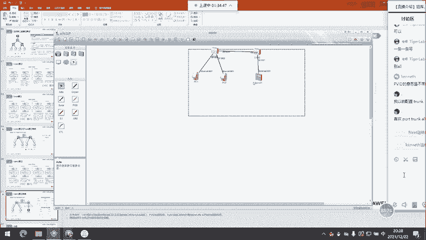

好，看一下交换题怎么做啊。Yeah。好，我们来看一下。

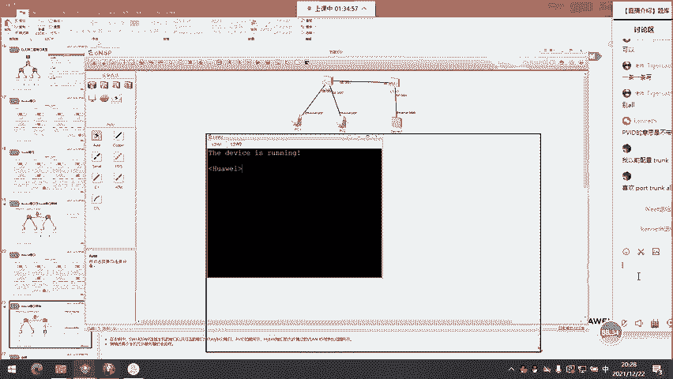

这台是switch对吧？这台是switch2首先你需要创建三个围栏对吧？12时还有10对吧？你需要创建三个对吧？它也是呢12时100啊，那接下来当你创建完栏之后怎么样做 hybrid接口怎么做啊。

进入到switch一的这个接口啊，吉比特的0-0-1对吧？port hybrid把我们的接口设置为 hybrid型啊，但是你不用就是啊然接下来 hybrid对吧？ tag段1还有100吧。

你需要添加这两个栏啊，这是什么意思啊？就是这个接口允许接收和发送和100的数据，并且在发送时候怎么样以不加标形式来发送那接下来对于接收对吧？你收到带有栏标记的这两个栏数据可以接收啊。

但是大家都知道你主机发送数据代不代表你主机发的数据不代表对吧你需要保证主机发的数据过来之后，对吧？我针对不带标的数据，我会认为啊，你这个数据来自于未来1我怎么做这点啊，你需要。😊，上面了有。

叫port hybrid的 PVID对吧？wa10啊，你要加这条命令能理解吧？通过加这条命令，就是告我们交换机啊，你通过这个接口收到主机发送的，没有加标的帧的时候，你会认为怎么样？

这个帧来自于walash10好吧，好，那接下来对于二口也是一样的。进入到吉比特的0-0-2口对吧？port零 type对吧？hybridport hybridd也是in type20和100对吧？

然后接下来port hybrid的 PVID对不对？v20。是不是很简单啊，对不对？我通过这个接口放行了伪兰20和韦兰100的数据。然后接下来我通过这个接口在接收不带标的数据的时候。

我会认为数据来自于未兰20。对不对？这就是这条命的意思啊，还有这两条命的意思。😡，能理解吧？是不是？没有这个PVID20，不是创建伪了20，你创建伪了20在最之前的这条命令中创建好了。

你是在system view下通过这条命令在交换机上创建了这三个未来，能理解吧？我这个PVID的作用是什么啊，就是指定了我通过这个接口收到不代标的帧的时候，我要认为这个真是来自于未来20。

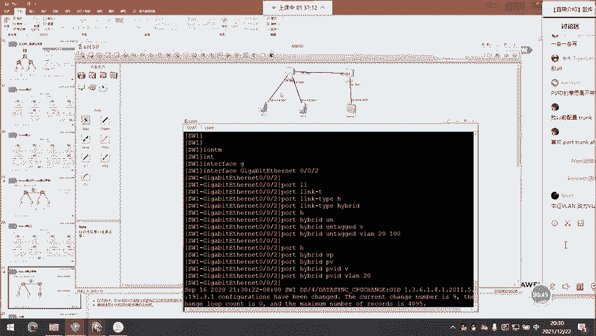

好吧，然后接下来switch2连接服务器的接口是一样的，吉比特的0-0-1对吧？port link type对吧？hyd然后接下来port hybrid对吧？pD然p栏100啊，对吧？

然后接下来port hybrid and tag120，还有100对吧？你通过这个接口要放行三个尾栏通行啊，并且这三个围栏流量通行的时候，咱们都要以什么不加标形式来通过。

然后接下来你们之间互联的接口怎么办呢？互联的接口对吧？咱们要放行三个围栏，并且怎么样要以加标的形式啊，来让他们通行好吧？吉比特的0-0-3啊。

port link type hybrid的port hybridt v12时100好吧，pD不用指啊，然后接下来switch2是一样的？吉比特的0-0-3啊。

port link type hybrid对吧？port hybrid12时100好吧，那接下来当你敲完这个命令之后，什么意思啊？😊，line十的主机20的主机来100的服务器啊。

你们发包首先都能通过这根链路走啊，并且在通过这根链路走的时候，咱们都是以加标形式来走的，对不？然后接下来加标的形式的流量到达对，比如说你这两台主机啊，发送数据通过这根链路到达witch吧？

switch是能够把你们发送的数据通过这个接口发给服务器了，并且在发服务器怎么样能以不加标形式来发所以说你们俩的数据就能以不加标形式到达服务器服务器能够接收就能够处理嘛然后接下来服务器在回音报文给你们俩的时候。

他回应报switchswitch能够通过这个接口把数据给发走，在发走的时候怎么样会携带100的标记后接下来100的标记怎么达witch一嘛？switch一能够接收，并且能够通过这两个接口啊把数据给发走。

并且在发走怎么样以不加标形式来发发送嘛。所以这个时候主机主机也能收到服务器的这么一个数据好吧那以说接下来我们来试一下。😊，啊，主机一P10。1点。100。这样拼服务器能拼通啊，我们拼10。1。

点20拼不通啊，在你拼10。1。点100能拼通。好吧，你看P20拼不通啊，对不对？为什么P20拼不通啊？因为这个连接20的这个接口怎么样？没有放行未蓝十的数据同行嘛，对不对？

那同样你主机二也拼不通主机一啊，因为你主机一的这个接口也没有放行伟栏20的数据来同行，能理解吧？但是你们这两个接口放行了未来100，所以说服务器的数据能过得来，而你们俩的数据彼此到达不了对方内路，好吧？

那接下来在服务器上，咱们也是一样的。

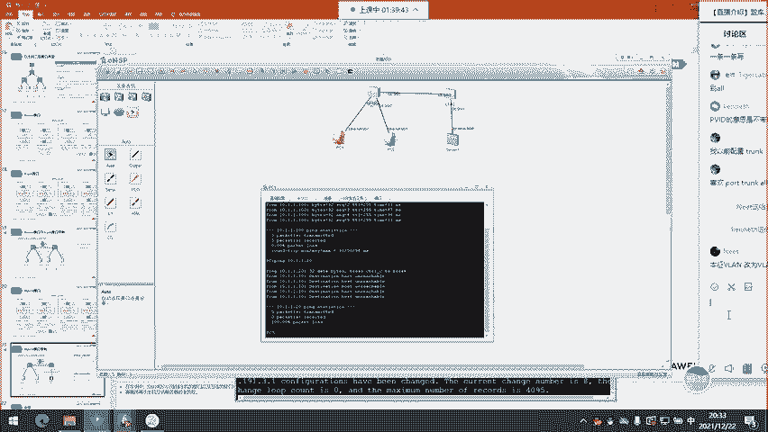

Yeah。Yeah。我们发送P啊，P这边是10。1。1。10，对吧？发5个包啊，发送对吧？成功5个啊，然后接下来P10。1点点20对吧？发送对吧？发了5个成功5个吧，对吧？也就是说服务器能成功的朋友们。

你们俩，但你们俩之间不能互访，这就是hybrid。我做完这个实验之后，大家应能看懂吧？😡，是吧。这个能看懂了吧。😡，这个就比较简单啊，对brid就很简单啊，这个hybrid咱们能够操控标记。

这个太牛逼了，你能操控标记，对吧？你可以肆意妄为的来做标记的操控啊，来实现什么相同围line可以互访，不同围栏可以互访，随便想怎么来怎么来，但我还一句话，咱们做伪栏的目的是什么？是为了做二层隔离，对吧？

咱们为了做二层隔离，我就是希望你伟line十0跟围兰20不同，我才做了围line啊，如果说你通过 hybridbrid的好家伙，让你伪烂0跟围兰20啊，就跟同一个围烂成员一样，那你做这个伪栏意义何在啊？

就没有价值了，能理解吧？就没有价值，那所以说啊做啥伪栏没有意义啊，对吧？所以说呢咱们做伪line就要保证咱们围烂的这么一个用途，你怎么保证伪栏用途啊，就是伪line十跟伟十0可以互访，对吧？

伟栏20可以跟未莱20互访，对吧？你不能让不同伪相同IP子网站的地址，对吧？来相互通行，能理解吧？那这个就是。😊，杂合接口的这么一个特点，对吧？然后接下来这块这个小节就不看了，你说很多了，哎。

不浪费时间了。那接下来看一下未来的应用吧，就是在现网环境中，咱们未来怎么用呢？三种用法啊，你可以根据咱们的业务来做一个未来规规划啊，就比如说你在一个企业园区内，咱们流量很多类型，对吧？咱们流量很多类型。

你有数据类型的啊，你有语音类型的，你有视频类型的，对吧？你就把那些发送对吧？文本数据的这些终端啊，你放在一块啊，你把那些发送语音的放到一块，你把那些发送视频的放到一块能理解吧？那接下来放完之后怎么样。

对吧？你可以把这些发送视频呢放到未栏10，你把发送语音的放到未来20，对吧？你把发送这些文本的放到未来30，你可以通过这个未栏啊来把不同类型的这个业务流量来做一个个离，好吧，那接下来还有一个比较常用。

就是基于部门来划分啊，对吧？你一个部门对一个办公室吧，对吧？你连的是同一台交换机，对吧？比如说咱们有销售部，咱们有制造部，咱们有市场部，对吧？每一个。😊，部门咱们都有对吧？相应的交换机连接啊。

那这块的话，咱们可以基于部门，对吧？基于部门把不同的部门划分到不同围let。那这样咱们可以做一个部门间的隔离。好吧，那做部门间的隔离，最大好处是什么呢？就是你可以可以怎么样增加部门间的可管理性啊。

然后增加咱们部门间的这么一些隐私，可以吧？然后接下来咱们按照应用的话，也可以就是来做一个未栏划分嘛。比如说我们一个园区内，咱们有服务器，对不对？是吧？你有办公的这些主机，你也有私人的主机，对吧？对吧？

比如一个学校为例啊，你有学生用的计算机，对吧？咱们这个实验室嘛，实验室的学生机，然后你有咱们教研室里面这些老师的电脑，对吧？然后接然你有服务器，对吧？你可以这根据咱们的设备的功能的不同啊。

你给咱们放到不同的围栏啊，都可以啊，那当然咱们一般更多的会使用这种部门划分方式啊，因为公司网络嘛，对吧？部门划分，这个是比较靠谱的。然后接下来一个围line就是一个基于二层实践的烂啊。😊。

对吧一个围栏里面所有成序员我再强调一下啊，你们在配置IP的时候，IP地址的网络位必须要相同啊，主机位不同。那接下来同样的不同围栏的主机，对吧？你们的IP地址网络位不能相同啊。

那这个主机位呢就没有可比性了。那接下来在创建围lan的时候，咱们这个lan的命名啊，对吧？还挺有讲究的，你可以把伟lan的命名跟咱们的IP地址的某一个字段啊来做一个关联，比如说伟栏一对吧？

你围栏一内的所有成员的地址就是1点16点10。1嘛，对吧？围栏二内的所有成员的IP地址就是2点16点2020。0嘛，对吧？然后接下来伟栏三内的所有成序员的IP地址是3。16点30。0啊，对吧？

你可以把尾栏号跟你这个围栏内成员的IP地址某一个字段来做个绑定，那通过这种绑定对吧？也让咱们的lan更具可识别性，好吧，那这个都是没问题的。然后接下来的话这边的围栏划分对吧？具体方式就是哎接入对吧？

到汇聚之间。做中介，然后接入到对吧？咱们终端嘛使用access，对吧？然后接下来汇聚之间咱们也使用中介啊，但是汇聚到核心，咱们一边使用三层。好吧，我们的二层连接一般是到达汇聚交换机啊去终止了，对吧？

你接入到汇聚，咱们端到端啊，都是传二层链路啊，你在这种纯二层的环境中，像什么生成数啊，像什么以太信道啊，像什么FHRP啊，按咱们这些二层技术啊，该怎么用怎么用。然后接下来在汇聚到核心之间。

咱们一般都是通过IP链路啊，来做一个连接。然后接下来这块为了保证通信为了防还啊，咱们会通过运行动态螺选的协议，对吧？来解决咱们的通信的问题。好吧，那这个就是咱们二层技术跟三层技术这么一个分水岭。😊。

然后接下来这个基于m克的微栏应用，除了能够提供咱们的伟烂的灵活性以外啊，还能增加咱们安全性。比如说你一家企业对吧？一共也没几台接入交换机，你终端也没几台，对吧？就这么几个mac地址啊。

那你通过这种动态围烂的方式，对吧？你把伟烂跟麦ac地址结合啊，咱们能够避免这个主机，对吧？你私自连到咱们的网络，对吧？你能够占用咱们网络资源，对吧？咱们有很多公司都有这样的烦恼啊。

就是有些员工会私带一些设备来司接，对吧？比如说你私接你的。😊，对吧笔记本你司接你的一些什么打印机，司接你的一些什么游戏本，对吧？你通过司机这些东西啊，占用咱们网络资源来发送你自己的数据，对吧？

那咱们怎么避免呢？啊，方式就是你可以做动态围栏吗？你做到动态栏，对吧？你把允许连接网络的主机麦ac地址啊，对吧？来做一个未栏绑定，那当你绑定完毕之后，对吧？那些没有被绑定的主机，你连到咱们的交换机。

你不是不能确定美兰信息嘛，你不能确定美兰信息，你的交换机，对于这种数据我能进步转发吗？你发送不了啊，对吧？那你既然发送不了，你就不用担心他们偷网啊，对吧？那通过这种方式，咱们可以防止司机。

那当然就是只是在小型网络中啊，咱们可以实现啊大型网络咱们做不到好吧，那这也是咱们应用中俗称叫什么未栏绑定嘛，对吧？叫m克绑定对吧？什么叫m克绑定啊，指的就是动态的未栏部署。😊，好了。

那接下来进入到大家最关心的命令命令环节了啊，来教大家咱们围栏相关的一些命令。当是命令真的很简单啊，交换的技术是这样的啊，你会发现讲了半天对吧？原理挺多的，但是说到配置不要太简单。

那接下我们来看一下哪个配置吧。那首先第一个就是创建啊，在sstem有下vlan叉叉就是创建一个围来好吧？那如你想一条命令创建多个围栏的话就是 batch后面加上你想要创建的这些v好吧。

比如说我们刚在交换机上对吧？这个sstem有下 batch12是100对吧？这就是创建vlan的这一个命令啊，对吧？同一条命令创建了三个围，那接下怎么看呢？叫display啊diplay对吧？

能看到咱们创建围有哪些啊，v时栏20还有未栏100对吧？这个栏一面说啊默认存在的，你不用管它好吧，默认情况下交换机的所有接口都是绑定了v来一好吧那所以说当。😊。

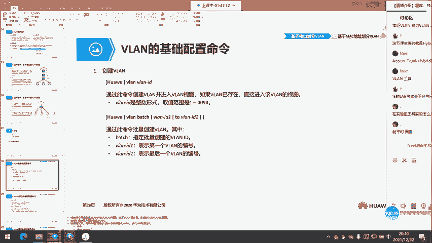

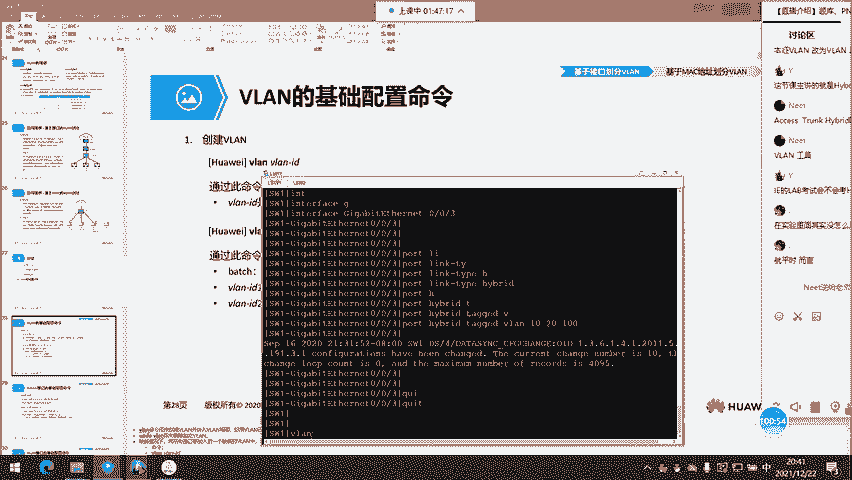

创建出一个新的伟来，你把交换机的接口跟你新创建未来绑定之后啊，哎怎么样，这个接口就不再属于伟来一了，就只属于你所绑定的这个未来，好吧？OK这是创建伟来的命令啊。

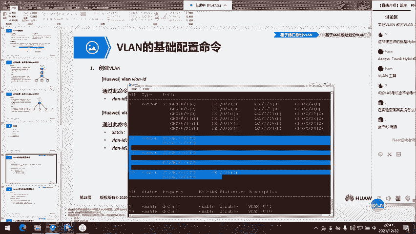

然后接下来接入一个接口，你想把接口作为acces口啊，两条命令啊。第一个叫做port link type access啊，你通过这条命令能把这个接口指定为什么接入接口模式啊。

然后接下来port default围栏对围栏叉叉就是把这个接口跟一个未栏绑定。你如果说没有敲第二条命令的话，它默认绑定的是v栏一好吧，这就是咱们这个接入接口的，对吧？叫PID这就是接入接口的PID好吧。

那这块我们可以坐一下，是吧？比如说我有一个吉比特的0-0-4，对吧。😊。

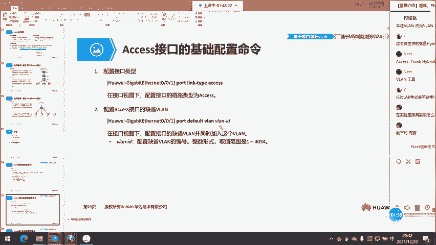

port link type access对吧？port default，比如说未蓝100好吧，你做好之后怎么验证呢？这么验证啊，叫display port v啊，通过display port v，啊。

你能看到咱们的接口，对吧？它的模式啊，以及它所绑定的未来好吧，那这边能看到啊，我们前三个接口都是bri的接口，对吧？然后接下来你看这个吉比特的0-0-4啊，是一个接入接口。

然后接下来咱们的PVID是未蓝100，就是该接口所绑定的这么一个伪来，然后接下来你直接通过display未也能看到啊，对吧？咱们能看到这个未蓝100怎么样，有关联到一个吉比特的0-0-4口，对吧？

对不对？那通过这个接口，咱们在发送数据的时候，你后面会加一个U或者加一个什么。😊，会加一个U或者加一个T啊，对吧？UT和UUT就是antt的 tag的T就是t能理解吧？UT就是ant tag对吧？

就是用U来表示啊，然后接下来T的话就是t的以打标形态来表示好吧，什么叫打标啊，就是你通过这个接口发送该未栏数据的时候，咱们是打标好吧，那U的话就是不打标O吗？那接下这个D是什么意思啊？

这个D代表接口down，你没连线嘛？接口自然就是down好吧，这就是接入接口的部署。那通过这种部署咱们实现的是什么？就是所谓的静态，这就是所谓的静态未栏那这个动态围栏的话，待会你咱们再看啊，好吧。

既下来你要做中继怎么做啊，也是一样的，进入到一个接口对吧？叫port把接口模式改为中继好吧，改为中继之后通过叉叉来修改咱们的中继接口的 list，请注意啊，这个在思科中不用修改啊。

但是你在华为中必须要修改。因为。

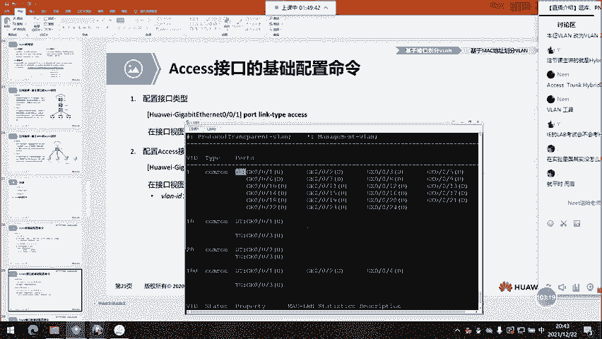

特别烦，为什么你作一个中继接口，他默认只能放行未来一能理解吧？你如果只能放行未来一，咱们做什么中继啊，你做一个X就够了。你做中继的目的是什么？就是为了做咱们交换机间的吉联链路来同时放行多个未来数据嘛。

那所以说这块的话，咱们一定要通过修改 list来同时允许多个未来数据通过这个接口来发送，可以吧？然后接下来通过下面这条命令啊来指定咱们的本征未来，注意啊，对于中继链路而言，本周未来意义重大。

它能够影响就是你这个接口收到一个代标的帧的时候，你认为真来自于这个未来，以及你通过该接口发送该未来数据的时候，咱们这个数据呢能以不加标的形式来发送，好吧？对于中继能够影响接收和发送。

而对于咱们的d只能影响接收，不能影响发送。😊，那接下来最后这就是 hybridd的接口了，反而对于这个 hybridbri接口，大家应该最熟的，对吧？po hybrid不用敲啊。

默认就是啊然后接下来po hybridt tag对吧？尾栏叉叉敲了哪些就是允许该伪栏数据接收发送对吧？那在发送的时候加不加标啊，完全取决于你前面加的t还是t对吧？然后接下来这个PVID对吧？

就是影响到你这个接口收到一个不带不代标的帧啊，你认为这个帧来自于哪个尾栏好吧，那对于这个接口的发送，咱们加不加标啊，完全看这个配置命令，而对于这个接收对吧？你收到带标的帧，那就代标呗。

你如果收到不代标的帧的话，你就是基于什么PVID嘛，对吧？你通过PVID来判断这个不代标的帧到底来自于哪个未来。😊，好吧。那这边的话基于接口的未栏划分，他也给了一个例子啊，对吧？创建两个未栏对吧？

两种创建方式嘛，然后接下来吉比特的0-0-1考进入这个接口，对吧？po link type还 accessces啊，po default未来10，然后吉比特0-0-2对吧？怎么样？

po link type access吧，po default未栏20，但是它这个命令没没敲进去啊，是吧？没敲进去，尴尬，这个胶片有画g，然后接下来switch chart是一样的，对吧？

然后接下来你们互连接后怎么样，吉比特的0-0-3啊，pod link type trunk对吧？那个PVID你不用敲啊，它默就是未来一啊，对吧？more就是未来一两端需要一致啊。

然后接下来怎么样port trunkpa未line10和20。😊，啊，默认放行围栏一与此同时，额外放行v蓝十0和20。好吧，那接下来咱们这围栏十0和20主机啊，就可以通过中极链路来互访。好吧。

那接下来这个验证的话，就是display v栏呗能看得到啊。是吧。那基于接口尾来划分。对吧这个hybrid啊对吧？咱们刚刚就演示了这个实验啊，没什么好说的好吧，没什么好说的。那接下来这一块挺有意思的啊。

教大家动态尾栏部署啊，这个动态尾栏部署唉，有点意思啊，那这块的话咱们来配一下，好吧，这个比较有趣啊，我们来配置一下。😊，那假设吧让这三台主机啊都属于v蓝10，但是呢咱们不做静态未栏部署啊。

咱们来做动态未来部署啊，那怎么做呢？啊，首先你要创建未蓝1啊，然后你创建了围兰1，你敲完v蓝10的命令不是会进入到v蓝1配置模式嘛？你在v10的配置模式下，你可以指定什么呢？叫mac v啊。

叫mac vline后面跟上macdress，你要跟上咱们主机的mac地址，好吧，通过这条命令啊，把我们的主机的mac地址啊，跟咱们这个v栏1来做一个绑定。然后接下来进入到咱们连接主机的接口，哎。

你要使用 hybridbrid模式啊，不用说了啊，然后在接口要敲什么，叫mac v enable，然后接下来对于这个 hybridbrid的接口，咱们需要配置东西的。

你需要指定这个接口可能连接的主机所属的所有围，比如说有的主机属于未蓝10，有的主机属于未蓝20，那你这个 hybridbrid的接口要敲什么，叫tag v栏1和未蓝20。你不能敲tag。

你如果敲了t v栏1020。😊，崩了啊，那这个接口如果说你确定了主机来自于未蓝10啊，对吧？你通过这个接口发送未来时数据给主机的时候会加标，能加标吗？不能加标，加标了主机不能接收啊。

那所以说在做动态未蓝部署的时候，一定要保证咱们接入交换机连接主机的接口首先是hbrid的，并且这个hbrid的所放行的vlan啊，咱们必须要以ipag的方式来配置，对吧？

那接下来千万不要只ipag一个v栏啊，因为你身后连接主机可能会变这些主机，比如说有的来自于未来1，有的来自于未来20，对吧？那这块就是。对吧你懂的啊，你就要就安 tag什吧未来10和未来20。

你就能够基于咱们这个主机的mac地址来判断啊，你到底属于未来1还是属于未来20。好吧，那接下来这块的话，咱们来部署一下啊，部署一下。那老情况你属于未来十，你属于未来20，好吧，你属于。你水本来100吧。

啊，烦死了啊，就这么做吧，好吧，就这么做。😡，OK。😊。

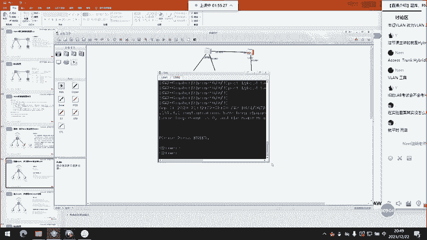

那接下来怎么做呢？好，这边的话是。所以是一样。你是。讲述人对话框未选中ENSP像LSW2对话框正在编辑。讲述人对话框未选中不在LSW2对讲述人设置正在退出讲述人。好。你是switch2啊。

switch一switch2好吧，然后接下来这个witch一呢就是。😊。

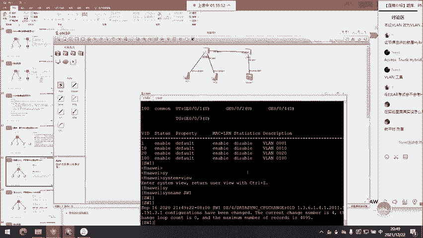

对吧咱们还是创建三个v烂啊。😊，vline batch12时100对吧？v栏二也是样，switcher是一样的，velet batch120100啊，创建三个围line。然后接下来创建完毕之后呢。

我们来进入到vlay10啊，v10，这个叫mac v，对吧？mike v啊。😊。

麦克伟耐啊，macdress啊我们来看一下主机的麦克地址啊。😊，这是他的map地址。那当然你不能直接这么说啊，你直接这么说不行。😡。

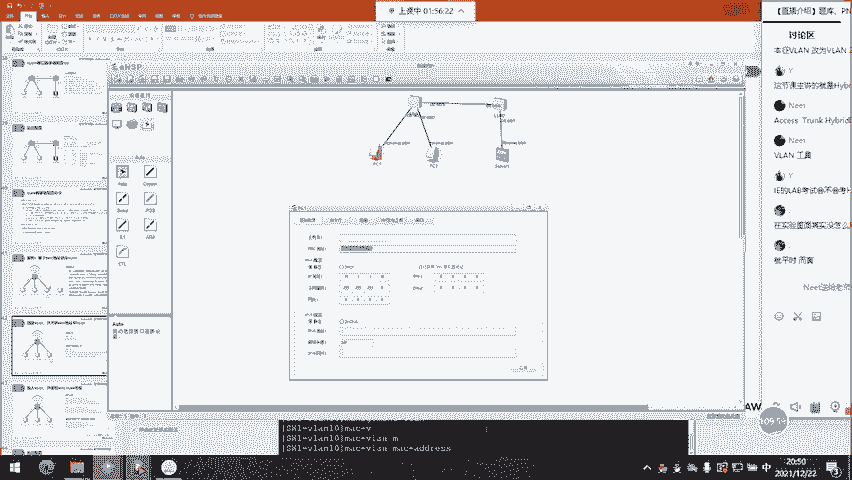

你得用三段的模式来说啊。你得用三段的模式来数OK吗？啊，这就是它的mag地址啊。😡，好吧，然后接下来直接回车就好了。好吧，直接回车。😊，啊，然后接下来你要创建什么伪栏20的尾栏20。mac伟烂对吧？

macdress啊，你要填写什么这台主机的。😡。

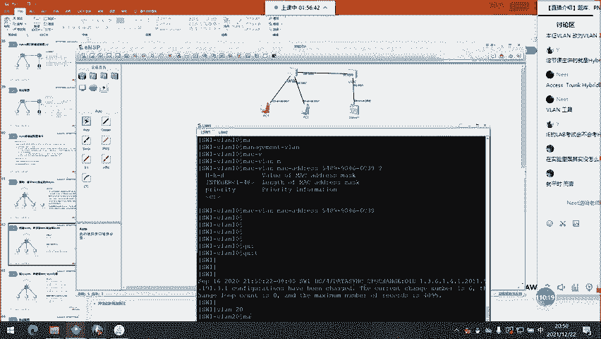

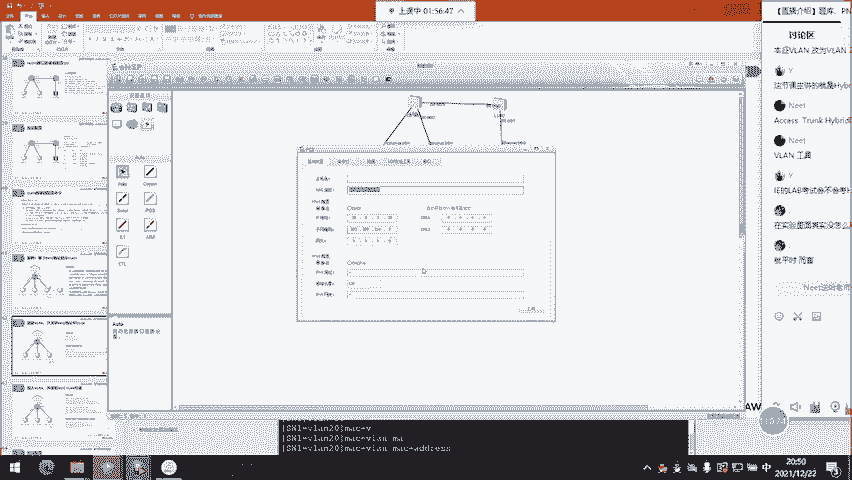

好吧，你要填写这台主机的完那同样你得。好，太恶心了。然后接下来针对美来100啊，针对美来100怎么样，你要填写。😊，这台服务器呢你要提写这台服务器的这个映射咱们两台交换机都要做的啊。

因为你没准咱们这些主机怎么样，可能会换交换机连接啊。你换交换机连接，如果说你没有做这个配置的话，崩了就不行了，好吧，就不行了。那既下来做好这个之后的话，那switch chart太嗨了。

你switch chart直接怎么样，复制粘贴就好了。你直接复制粘贴啊，后续的命令都是自动产生的，你不用在意。好吧。好，那做好这个之后啊，我们来做hber接口啊。啊。

 hybrid接口怎么做啊进入到咱们吉比特的0-0-1啊，对吧？port type hybrid对吧？port hybrid and v栏这边是12是100啊，那关这个PVID的话。

你那不用敲了VID不用敲。然后接下来mac啊m你会根据这个mac啊，就是根据咱们主机所说来决定咱们这个PVID啊，到底是属于那个围好吧。

然后接下来咱们这个吉比特的0-02是一样的port link type hybrid对吧？port hybrid and tag v12是100你一定要加三个v啊。

因为你三这三个主机都有可能连接我这个接口啊，你如果连着主机一，我就是围蓝10的，你如果连接主机2，我就栏20的，你如果连接服务器啊，咱们就100的对吧？

所以说你这三个咱们就要敲然后接下来敲完之后怎么样叫mac对吧？好吧然后接下来咱们switch2是一样的，这边是吉比特的0-0-1啊。😊，吉比套的0-0-1对吧？port0 type对吧？

hybrid然后接下来port hybridbrid的。ant tag v栏对吧？120100对吧？按，然后接下来mac v命able好吧，那接下来对于咱们交换机间互连接口不用说了，做中继就好了。

吉比特的0-0-3嘛，哎，吉比特的0-0-3啊，port0 type trunk对吧？port trunk low pass v，好吧，然后接下来这边也是吉比特的0-0-3啊。

port0 type trunk对吧？port trunkhel pass未蓝，这就OK了。那接下来做好这个之后，哎，主机要我们来发送个拼包啊， p4-25啊。

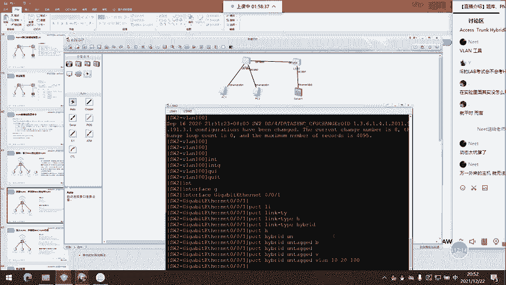

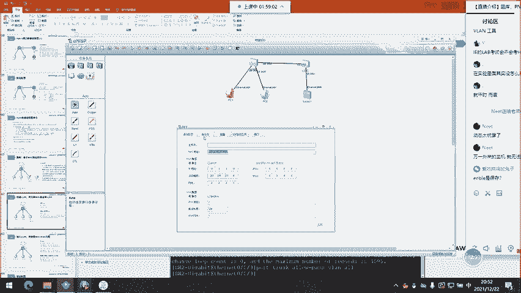

发送一个全向的广播，或者说叫。IP看这个。对吧IPfi杠renew。完了还不行啊，pin这边是10。1。255啊啊，我们P一个全向广播啊那接下来P个全向广播，我们来在交换机上看一下啊，交换机对吧？

display对吧？叫macdress啊，查看我们macD表啊，那你看我通过吉比特的0-0-1口收到的数据，我就关联到未来10了吧，对不对？那接下来我们换个接口啊，换个接口是吧？😊。

换个接口它连到咱们的啊，懂等换个接口啊。它连到咱们的0-2口啊，它连到咱们的0-1口。好吧，那接下来连完之后，我们来看下效果啊，那这块的话就是咱们主机一哎，主机还是来发送一个拼包啊。

主机一还是来发送个拼包，聘10。1。255啊。IP然后接下来我们switch show一下display mac dress。

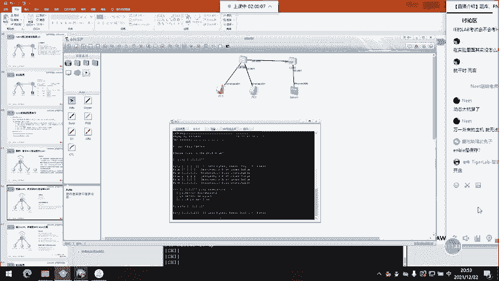

当前没有显示的话，是因为。是因为。你没等着边缘端口没有启用啊。好，再来拼一下。我做个优化啊做个优化。然后叫我们来displaydisplay mac dress。

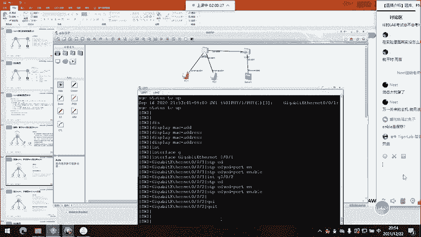

看到了吗？我通过吉比特的0-0-2口连接你，也是属于什么未蓝10，可以吧？那接下来咱们这个主机拼一下P10。1点。255啊，然后咱们在switch上displaym dress对吧？

你看我通过吉比特的0-0-0-1口啊，连接你主机2属于什么未蓝20好吧，这个就是mac美兰。

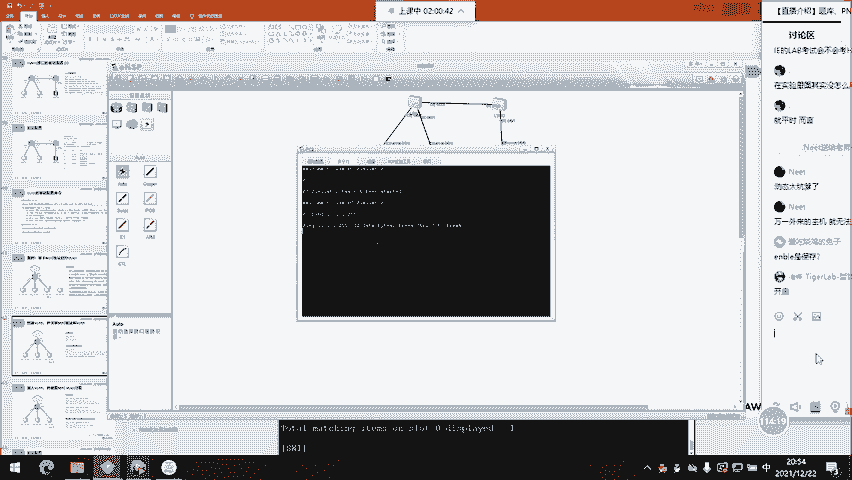

好吧，这个就是mac未来。😊，好了，那这个mac v栏做好之后的话，咱们怎么 show呢？有这么叫受命力啊，叫displaym vlinem dress on你通过这条面能看到哪个伟line对吧？

对应的是哪些mac地址，你能看到好吧，那咱们在交往下可以 show一下，叫display啊，display这边是mac v对吧？mac2对吧？mac dress on啊，mac dress二嘛，对吧？

你能看到咱们伟蓝1对应的是这个mac地址对吧？伟栏20对应的是这个mac地址然后接下来伟蓝100对应的是这个m地址好吧，一清二楚。好了，那接下这的话我们来看一下思考题啊啊。

第一题问了下列关于伟line的描述中错误的是啊，错误的是。😊。

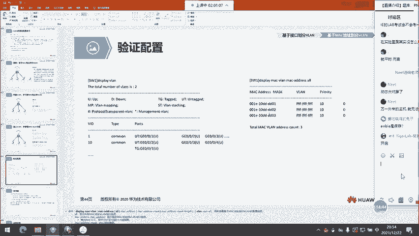

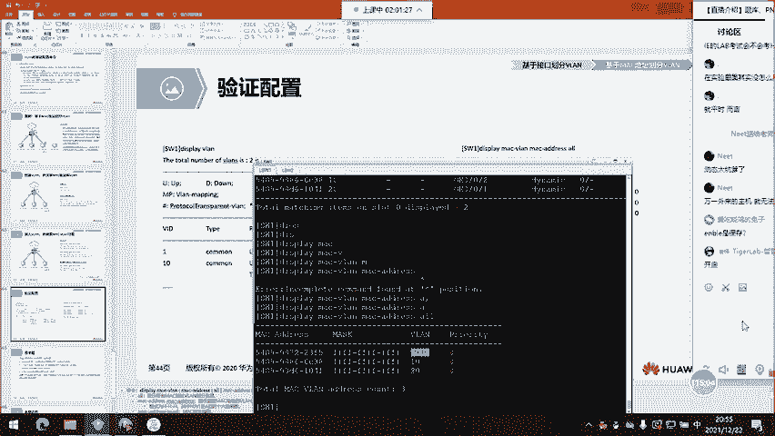

哪个是错误的？😡，伪烂技术可以将一个规模较大的冲突域隔离成若干个规模较小的冲突域。错的还是对的？😡，委难隔离的是什么？😡，伟烂隔离的是网络，对吧？网络叫什么广播域啊，它能隔离广播域，好吧。

隔离不了冲突域啊。那当然由于要求我们选错的，所以说第一个答案是对的啊，好吧，你可以选第一个。然后接下来B说了，伟烂技术可以将一个规模较大的二层广播域啊隔离成若干个较小规模的二层广播域。

但这个答案是对的吧。但是它要求我们选错的啊，所以说B不能选。😡，然后接下来C说什么呢？位于不同尾栏的计算机之间，无法进行通信，能不能啊？你可以通过偏门让他们进行二层通信，对吧？你就算不经过偏门。

你也可以让他们通过三层来通信啊。那所以说位于不同尾栏的计算机是可以通信的对吧？你大不了通过什么单臂路由啊，你通过SVI啊，咱们都能实现。能理解吧？所以说C也不对啊，A和C都可以选。然后接下来D说什么呢？

D说了位于同一尾栏中的计算机之间可以进行二层通信。那答案是对的，答案对的，咱们不能选啊，要选错的。那所以说D是不能选的。😊，OK接下来看看第二题啊。😊，如果一个中继接口的PVID是5。

并且在接口下配置这条，对吧？vlinelow list命令啊，叫port trunk啊，low pass伟line2和3。那接下来咱们这个接口可以允许哪些v栏流量通过？能允许哪些未来流阳通过啊？

能够允许伪来123啊能够允许伪来123啊能够允许伪来123。vline5是不能允许的，这个PVID伪栏5是什么意思啊？😡，PVIDv栏5只是说你这个接口收到一个带有啊，没有带标记的帧的时候。

你会认为真是来自于伪栏5的对吧？并且描述的是当你通过这个接口发送伪栏5的数据的时候，咱们5的数据在发送怎么会以不加标的形式来发送，但是你能发送吗？你不能发送啊，说华为的接口默认只允许栏一的数据好吧。

你加了这条命令之后，咱们额外放行了栏2和3吧？我们D没有关系啊，请注意PVID的栏不允许通过，这是很正常的能理解吧？这是很正常的。你们千万不要自以自以为自以为是的自我多情的。

就是认你挑了1个P5那这个就一定允许接收，一定允许发送好，我通过这个接口接收？到底能不能收这个要看我们有有没有创建栏5，如果有创建们可以的但是你通过这个接口在发送栏的时候。

绝对不可能发因为你这个接口的 list就决定了咱们的数据到底能。能放送走能理解吧？好，那这就是咱们伟烂的这个议题啊。那了解完了咱们上节课的交换机的公原理，又了解了咱们未来概念了。那基于这个交换机的配置。

我相信大家呢已经有足够的信心了。那面对咱们NA所学到的知识，你们在解决一些小型的交换网络的时候，对吧？最起码咱们交换基金的连接啊，你们应该没有任何问题。啊，没有任何问题。一、为什么可以通过？

废话一是默认的呀。一是默认的呀。我都给你说了一万次，未来一是默认的呀，你hbrid的接口默认能允许未来一啊，你接入接口也是啊，你杂合接口也是呀，中介都是啊咱们默认所有类型的接口都能允许未来一的数据通行。

能理解吗？OK好，那这节课的话，咱们到此为止啊，感谢大家收听。明天周四啊，应该还是有课的。如果有课的话，咱们是。😊，喂，可以听到吗？可以啊，那这节课呢是交换机上的。这个技术。未来大家听起来。

觉得怎么样学起来。嗯。学起来觉得牛逼，嘿。😊，没关系啊，觉得听不懂的。对，没有hyberd的还好。一窍不通。他就是给你一个数据针加个标签嘛。那关于。对，hybrid的。

hybrid的就是acs和tuck的结合，你就把他们想成是他名字也叫杂合接口嘛？你就把它想成是。你看啊你想啊tuck，咱们是不是可以让一个。

一个围let写一个vlet不携带v栏标签通过啊tuck它是可以允许一个那这个维let肯定是PVID也叫本真围，也也叫缺缺省围let啊。那这个hybrid啊。

你就把它想成哎我tuck能让一个只能让有且只有一个这个维栏通行，我hybrid可以有很多很多个。你就把它想成是tuck。变相的升级了一下，哎，我可以操控操控它在通过我这个接口的时候。

到底是以打标还是不打标的形式？来转发这个数据针，你可以操控操控。那这个tuck呢。tuck呢你怎么样？你只有PVID在转发的时候。

PVID本着伪line全省伪line在转发的时候是以不打标的形式来发送的。其他的都是正常都是正常的。不达标。那你想嘛，有些数据针是不能达标的，不是说我们不打，是不能达标的，不支持达标。

就比如说STP产生的BPDO，它就不能达标，达标了STP识别不了。所以呢这个时候咱们就把。STP产生的。嗯这节课是纯粹没听吗？打标是什么意思？你想啊，现在。我是学生。

学校要求必须穿校服带学生证才能进学校。今天呢我没穿校服，我没带学生证，我能不能进学校？我行不行？进不了，对吧？学生证和校服就是识别我是学生的这么一个标签。那同样你在交换机的接口上配置了伪赖。

你说我这个接口允许哪个伪赖通行通行，就是哪个？比如说现在呢有一个数据针，它携带了伪赖二0的标签，而且你正好是允许伪赖二时通行的那这个时候呢，这个接口你这个数据针能不能过去，能不能被转发，可以，对吧？

那现在呢我来了一个属于伪line30的携带伪line30标签的这样一个数据针来到你这个接口，他转不转发，让不让过，让不让过？不让过，对吧？就这意思，打标不打标。这样说可以吗？行，那这个。中记的不达标。

不太理解。As。exs在发送一个数据针的时候是不打标的对吧？因为它的对端有可能是路由器，也有可能是终端PC。那这些路由器和PC是没有，通常情况下啊是识别不了伪赖标签的。

所以呢它在转发的时候转发这个这个数据帧的时候，是以不达标的形式来发送的那么这个中继呢，中继啊我axs口只能允许一个维赖。哎，就说我只能被划分到一个维栏内，我这个端口属于哪个伪赖。

到时候我就只能转发属于这个伪let的数据帧。那这个中继接口呢，你两台交换机肯定要做接连接口之间的互联，对吧？你不可能一台交换机。管一个局域网，一台交换机，管一个局域网，你两台交换机联合起来再管，对吧？

那这个呢。Acents。那这个时候呢。咱们的tuck口，那我交换机身后有很多很多属于不同伟赖的这些接口，接端口，对吧？我如果在交换机之间的吉连接链路也做acs。我要连多少条我要连多少条。

我交换机机之间的吉连连段路非常宝贵。一般都是这些下列接口的10分之1。那很宝贵的，你做exces口，你只能转发一个维line的数据针，对吧？那你要做这个t truckuck就是哎，你如果划分进去了。

我line十的可以走二十的也行，三十的也行。那这个时候你交换机身后有三个re，你这三个reline终端所产生的数据帧啊，能在这两台交换机之间被转发，这就是tuck。那么这个不打标是什么意思呢？

tuck的不打标，就是说。这个中继接口它有一个。本真伪赖也叫缺损伪let，也就是PVID后面所指定的伪line的编号。那比如说我现在伪1，我给它设置为PVID为letPVID伪赖时。这个时候呢。

中继接口在转发来自伪赖十数据帧的时候，是以不打标的形式来转发的。可以吗？中纪的达标中纪的不达标可以吗？哎。中记的不达标。换成我们刚刚举的那个例子啊。换成我们刚刚举的那个例子，比如说。学生都要穿校服。

我校长进来的时候，我校长来的时候，我要不要穿校服？你觉得校长我们卫说哎，你把校服穿上，你才能进学校。可不可以？萌卫敢不敢这么说，不敢啊不敢，他知道你是校长，那你校长就相当于在这个学校内有特权。哎。

我可以不穿校服，我就能进出。这样讲可以理解吗？😊，这就是中继之间啊中际链路上的这个不达标的数据针，这样讲可以理解吗？可以吧。哎，那我们放在二层的交换机里面，有些协议啊。

比如说这个生成数STP它所产生的BPDU是打不了标的那打不了标，它是由交换机产生的对吧？也是由交换机接收的对吧？那这个时候呢，我中继链路之间中继链路之间交换机产生的STP报文，我不打标。哎。

你你产生我能收到这就好了。这就好了。我又不需要发送给路由器，我也不需要把这个SDSTP的BPDO发送给终端。那毕竟这个STP是运行在交换机之间的对吧？这样讲可以吧。然后呢，这儿有一个。

面向路由器或者是防火墙，一般都是axs啊，他们是没有伪let的概念的，他们没有伪赖概念，伪let存在于。二层。As。还有啊第二题这个如果一个tuck口的PVID是5，然后呢，这是华为的对吧？华为的。

然后呢。华为咱们。v赖一，你不做任何配置，就算你做完配置啊，做完配置伪line一是可以在这些接口下通行的。你做好配置以后，伪赖一你只要每把一个接口的这个接口划分进一个伪line，它所产生的这个数据针。

是可以在其他的接口下。被禁被转发的啊，但是呢。厂商差异啊就是厂商差异私磕就不行。思科就不行，如果这个是思科的PPT如果这个是思科的PPT，那我们的哪些流量可以通过呢？只有2和3，这叫产商差异啊。

那四科在出场的时候就这么设定了，你也不要问为什么思科是这么做的。可以吗？这样给大家讲。然后呢，这一节课啊。必须要。做笔记。多听几遍做笔记。单闭路由是通过路由器的子接口。

咱们做一些那这个接口是不是真正存在的啊，不是真正存在的，是一个子接口子接口。那他们呢可以让不同的伪赖，不同的伪赖。能够互通你做的时候是什么口呢？是axs口。连接路由器的啊。哦，连接路由器的是。

这个tuck比如说你。一台属于。伟line1一台主机属于vlash10，另一台属于伟赖20。那连接路由器的时候，这个呢它属于它做tuck，你要放行十和20的数据帧。大家还有其他问题吗？这节课。嗯。

一般我们都是。静泰的啊把端口划分到所属委赖就行了。这个啊静泰静态。那华为他玩的花。搞出了很多种类型。你在模拟器的环境上，你可以试一下。刚刚呢辉哥在这个实验中也给大家演示了基于mac，基于mac划分为来。

什么样的。环境中会有这样的需求。你想破头。你也想不出来。OSPF的认证。那我们尽量先解决这节课的问题啊。就是在见邻居的时候。见邻居的时候。你认证不通过，你见不了邻居。咱们尽量解决这节课关于伪赖的问题。

acs和tuckacs和 truckuck怎么了？你想嘛，你。做了认证啊做了认证。如果不通过认证的这些报文。能不能处理能不能处理处理不了，对吧？避免了别有用心的人。利用你不做认证的这个。

如果你没有做认证，他可以做一些其他的事情。那如果你做了认证，他不知道你的密钥。那他能不能做了，相当于你给。你运行的这款动态路由选择协议上了一把锁。你可以这样理解。理论知识还是有点绕。一遍的话还是。

一遍的话还是非常吃力的啊。三遍以上吧。三遍以上吧。你如果不做认证啊，他有一些。比如说有一些。抓包工具你在交互豹纹的时候，他就能抓到你包里包里头到底有什么东西，它能识别到你这包里头有什么东西。

了解到你内网。怎么连接，他想破坏的时候。他想搞点事情的时候，是不是就能搞了能搞了。如果你加了这个安全措施，他的抓包抓出来的都是什么乱的，他认不出来。必须要有密钥。那你听这个名字嘛，认证认证。

你开你的手机需要你指纹的认证，对吧？你的面部的认证，你花钱，你需要你支付密码的认证，这都是什么？为了保证什么？安全对吧？一样的道理。可以吗？呵呵明白就好。😊，那咱们。

伟赖这个理论啊理论你先把tuck和acs口搞懂。然后呢，这个PVID每个口都有hybrid也有tuck也有。acs也有，但是呢这个acs啊。你看你要做什么嘛？😡，你看华为多喜欢hybrid。

你交换机开启什么都不做，你的接口就属于 hybridbrid，那他肯定是有它的道理，对吧？你如果有一些需求。如你如果有些对对对，全华为才行啊。如果你有不是华为的设备，如果你有不是华为的设备。

那这个是搞不了的。就像人家商店给你贴着一个微信的二维码，支付码，你非要用支付宝来扫它能不能扫，扫不了。你贴着微信的二维码，你就用微信来扫就行了。除了交换机和交换机之间。然后连其他的设备都用ar tag。

一般情况下是这样的啊。毕竟终端PC和。路由器。是不识别。未来标签的啊。那后续呢，我们会学到。为查赖。他呢是解决。大二层大二层的问题。出现的这么一个技术，V插赖。那我们先把伪赖搞懂，再搞维插赖。

他呢就可以三层的啊。三层转发。喂他来。那伟赖我们在刚开始的第一句话就介绍了吗？他是交换机上使用的一个技术，用来隔离广播域吗？那我们路由器每一个接口都是一个单独的独立的广播域，它自己本身就能分割广播域。

他还要用wi干什么？那这周的周作业给大家设计一个。关于伪赖的实验啊。然后提一点要求。大家做做一下试试。哎。三层围栏不行围栏不行，他是分装在。weive是一个虚拟接口SVIVIS是什么呢？

switchV是什么？Wer。I是什么interface合起来是。交换机虚拟接口。三层交换机上有。未来而付。那你用三层啊，用三层，如果你不同围之间。你就是正常配置啊，正常配配置，没有搞那些花里胡哨的。

你三层能通啊，是因为。他们有路由。可以这么说，现在阶段现现阶段大家的知识储备可以这样说，到三层就被终结了。大家还有问题吗？OK那明天的。好。有问题的话，就直接QQ或者是微信啊，QQ微信。每个群我都在。

好的。OK那咱们今天就到这里，大家。拜拜拜拜。😔。

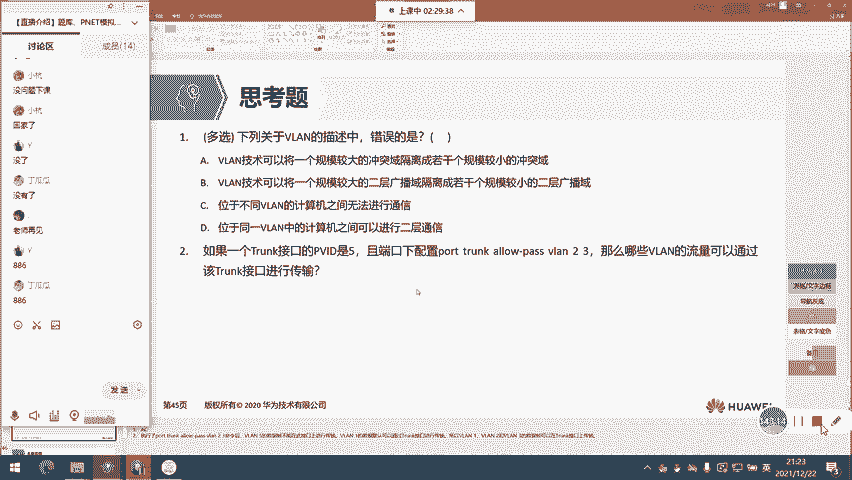