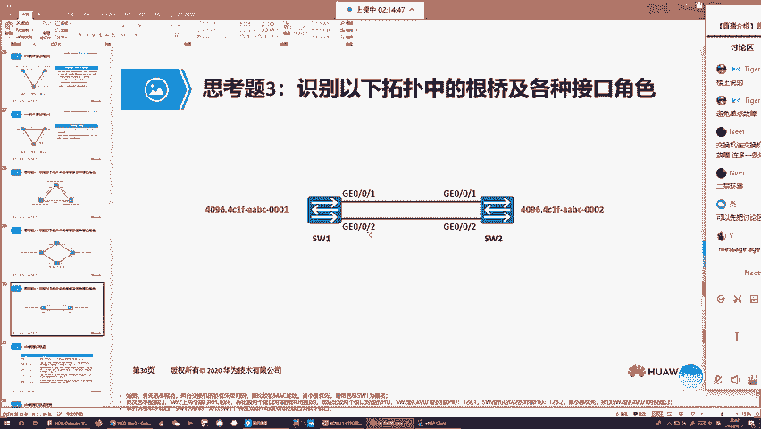
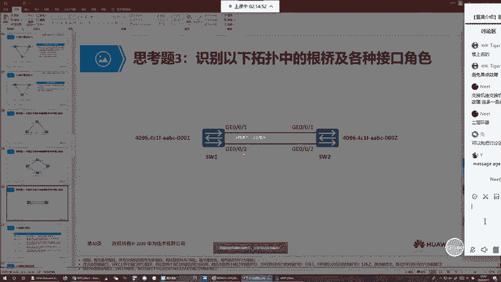
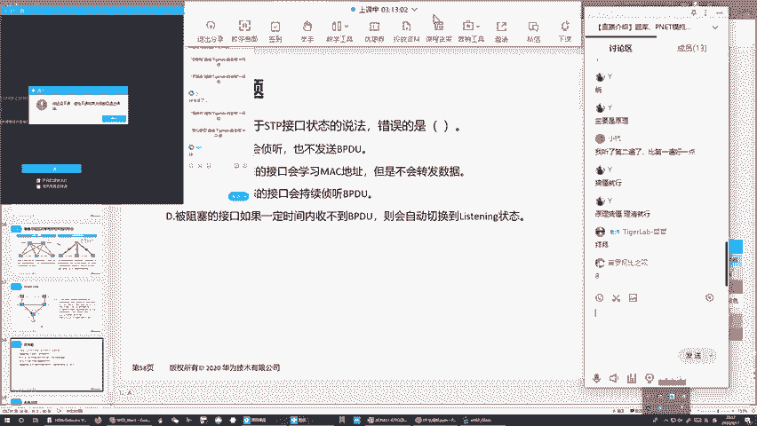

# 2022版华为认证HCIA-DATACOM教程，内部课程公开分享（已完结） - P12：XCNA-12-STP - 网络工程师CCIE - BV1AP4y1J73k

他动态学习看表象的时候，对吧？暴露出了交换机的这么一个缺陷啊，交换机的控制层面是很有缺陷的那它的最大缺陷是什么呢？就是交换机总会认为啊，我通过一个接口收到一个帧。

那这股流量的发送者主机就连在我接收帧的这个接口，可以吧？这也就是说我通过一个接口收到一个帧啊，对吧？我会认为发送者就直连我这个接收接口，那换句话说，交换机怎么认为呢？

他会认为啊一个网络里面你不管有多少主机啊，这些主机都跟我直连，好吧？一个网络里面只要我能收到一个主机发送的数据，那这个主机都连在我的这个某一个接口，可以吧？那由于他认为所有接能跟它直连啊。

所以他在了解到一个网络连接信息的时候，他没有办法真正了解到咱们网络的整体连接的情况，好吧，他对于网络的认知啊，对吧？连接的认知啊，是有缺陷的，好吧，是有缺陷的。这就比如说了咱们有一台主机啊。

连在switch一上啊，switch一连接switch2。然后接下来这个时候呢，你主机A发送的数据啊，我switch2能收得到，对吧？那你收得到主机A发送的数据。

你就会认为啊这个主机A连在你接收数据这个接口。但实际上你这个接口连着switch一，对吧？switch一身后连接主机A，那由于说这个认知啊，就是连接的信息认知你有误啊，所以导致在一个网络中。

当你包含的交换机数量，对吧？不止一台的情况下，对吧？咱们会由于交换机的认知的问题啊，导致一些问题。那这个问题主要体现在交换环路，还有广播风暴，对吧？好，那这块的话我们来看一下这么一个实验环节啊。😊。

我们现在呢在搭建一个网络的时候，咱们肯定使用交换机。而正统的交换机，通常咱们的下连接口啊，你有24个24个下连接口满打满算啊，你连24根线，你能在一个网络中啊连接24台主机。

那接下来如果说你在一个网络中，你想包含不止24台主机，对吧？你想包含48台，对不对？你想包含100台，那怎么办呢？啊，你需要在一个网络中啊添加更多的交换机嘛，你连一个switch一。

你连一个switch2，你连一个switch3，对吧？那你在一个网络里面包含多台交换机行不行呢？可以，对吧？但是你需要把交换机连在一起，你如果没有连在一起的话，你不同交换机身后的主机，你能通信吗？对吧？

你通信不了，那接下来连啊，怎么连呢？哎，使用你们的接连接口啊，把你们连在一块。😊，那接下来问大家了，哎，比如在一个网络里面啊，咱们有两台交换机，你通过一根线把两台交换机连在一起。😡。

那这个时候只要你未来设置都OK啊，你这两台交换机身后的这两台主机，咱们能通信吗？对吧？那答案是可以的啊，能通信连通性没有任何问题。但是大家想啊这种网络它的可靠性高吗，对吧？你由于两台交换机间。

咱们只连了一根线啊，你如果这根线到了怎么办？你这根线只要一旦到了，我们左右这两个网络就被分隔了吧，那这种行为我们称为叫单点故障啊，所谓的单点故障就是你在设计网络的时候，你没有连接冗余。

由于你没有连接冗余，对吧？咱们端到端通信啊，你尤其只有一条可行路径啊，那当这一条唯一的可行路径，一旦到了啊，一旦这条唯一的可行路径到了，那咱们整体的网络就崩塌了，对吧？那这个由于对吧？

某一个接口到某一台设备到某一根链路到了，而导致了咱们整体网络崩溃啊，我们就称为叫单点故障，好吧，那在设计网络的时候。单点故障对吧？咱们一定要避免啊一定要规避。那接下来规避单点故障的最简单的方式是什么呢？

就是你让咱们的网络啊，对吧？不要说是没有任何冗余嘛，对吧？你在连线的时候，虽然连一根咱们能通对吧？但是最好怎么样，建议你连两根嘛，对吧？你连接两根线，对吧？你通过两根线都能通，首先咱们带宽翻倍嘛。

然后接下来这两根线，你荡掉一根有影响吗？对吧？没有影响啊，你荡掉一根咱们流量可以切换到另外一根链路嘛，你可以继续走，对吧？那这就是咱们连接两根链路的这么一个对吧？高可用性嘛，对吧？你通过两根链路。

咱们能提供咱们网络高可用性，对吧？增加网络的见壮度，对吧？增加网络见状度最大好处是什么呢？就是你荡掉一根线啊，你不用担心咱们网络会崩溃啊，请注意啊，咱们再给客户设计网络的时候，哎。

见壮性是一定要考虑到的，因为你见状性不够，你经常容易出现单点故障啊，那这种网络咱们客户是不能接受的？😊，你动不动稍微出点小问题啊，稍微出点1蛾子，整体网络瘫了，对吧？哪个客户接受了，接受不了可以吧？

所以说咱们平常设计网络啊，最起码也要这么设计，好吧，那这里面牵扯到一个词啊，叫冗余。什么叫冗余啊？就是相同的东西啊，来两份或者来多份，对吧？比如说你交换机间连线，对吧？连一根线能通，对不对？

我给你连两根线，那这两根线之间啊，它们就是冗余关系，好吧，那接下来连两根线啊，请注意啊，你在运作的过程中，你会发现这个网络就会出现问题了。可以吧？就会出现问题了，那这个问题怎么出现呢？啊我们来看一下。

假设啊主机A还有主机B啊，你们都属于未来1，那交换机连接主机的接口不用说了，肯定是接入接口嘛，绑定未来1。然后接下来交换机间互联的链路，咱们使用什么中继嘛。

然后这个中继链路为了保证咱们左右两边的未来式主机可以通信了？你肯定要放行未来时流量去通过可以吧？好，那接下来我来问大家啊。😊，主机一发送给主机2的第一个报围，对吧？那在我们的一个以态网环境中啊。

它十有八9是1个ARP的请求。这个ARP的请求会以广播形式来发送啊，那当然发送的目的就是主机A要解析主机B的IP的麦克映射可吧？那你这个广播的ARP请求哎到达switch一左边这个接口啊。

switch一通过你的原麦克地址学到了关于主机A的麦克地址表象嘛，那当然这个表象里面会告诉switch一啊，主机A连在我的吉比特的0-0-1口好吧，那这个表象没有错的。

你利用这个表象来转发去往主机A的数据，主机A的是能收到可吧？那接下来这个广播流量对吧？它的目的麦克地址全F啊，你在针对这个目的麦克地址查找看表的时候，你能找到对应的表象吗？对吧？你找不到啊。

你找不到对应的表象，你只能以泛红的形式啊来做个转发那这个泛红怎么转发呢？对吧？由于你收到的真是来自于未来1的，你只能通过未来时来转发这个数据。吧那接下来转发的方式就是你要把数据拷贝成多份啊。

然后通过维兰1的所有其他的接入结果发走，并且你会把这个流量怎么样？通过咱们这两个中间链路啊来发送走。因为这两个中间链路虽然没有绑定1啊，但是它能够放行1的数据通过。那所以说这个时候对吧？

你A发送的广播ARP请求到达switchitch会把这这股流量怎么样拷贝成两份啊，通过上下这两根极联链路给switch发走，那接下来switch假设它先通过上面这个链路。

也就是吉比特的0-0-2口啊收到了我们这股广播流量，对吧？那这个时候它也会基于原麦地址啊来进行看表学习嘛，对吧？它会通过它左上角的接口学到关于主机A的看表象，然后紧接着对吧？你通过下面这根链路啊。

你也收到了这股广播流量吧，对不对？那你会瞬间的迁移关于主机A的看表象，你会把它的看表象啊，从上面这个接口迁移到下面。😊，这个挺好。那这个行为我们称为什么呢？我们称为叫mac地址表象的漂移啊。

叫mac地址表象，对吧？它的漂移。好吧，它的漂移mac地址表象的漂移O吗？我一会儿从上面学到的麦地址表象，一会儿又从下面学到。那接下来最佳要命的是什么呢？就是你收到这个广播的LRP请求啊。

你学习完它的看表象之后啊，你还得要针对它的目的麦地址来转发吧，对不对？你觉得这股流量switch一不能转发，你就能转发嘛，你也一样转发不了啊，对吧？你找不到对应的表象。

所以你只能以泛红的方式啊来做一个泛红扩散可以吧？那怎么泛扩散啊，你通过上面这个链路收到广播流量，你会把流量发送给主机币对吧？然后接下来你会把这股流量通过下面这个链路发回去，可以吧？因为什么叫泛红啊。

所谓的泛红就是我通过一个接口收到一股流量，我把这股流量拷贝成多份啊，然后通过除了接收接口以外的，所有其他接口每个接口一份的发送走可以吧？那所以说这个switch2，你通过上面这个链路啊。

你收到未来10的广播流量，你会把流量泛。😡，给未来时的接入接口，并且把这股流量通过下面这根中继链络再泛红走。那接下来你通过下面这根链路收到广播流量呢，也是一样的，你会把这股流量泛红给主机B啊。

那这个时候已经出现重复包了，并且这股流量你会通过上面这根中继链络再泛红回来。好，那接下来这个泛红回来的广播流量switch一是不是又能收到了。那接下来switch，我通过下面这根中继链路啊。

我收到广播的这股流量，我是不是还要基于原麦地址进行看标学习啊？那这个原麦址谁啊？还是主机A嘛，对不对？那接下来这个时候我通过这根中继链路收到主机A发送的广播流量。

我就会认为啊主机A连在我右下角的这个极联链路接口之上，对以吧？并且我收到广播流量，对吧？我会泛红嘛？我会把这股流量发给主机A，并且通过上面这个链路啊发送回去，可以吧？然后紧接着我通过上面这个链路啊。

也收到了咱们这个广播流量，我会进一步怎么样把广播流量发送给主机A，并且通过下面这个接口发送走，并且与此同时。我关于主接的看表象又会进行一次漂移，对吧？漂移到咱们右上角这个接口。

那当然无论你认为主机A是连在你右下角这个接口还是右上角这个接口，你们觉得这个连接信息对不对啊？你们觉得这个连接信息对不对？😡，好像主GA自始至终，我从来没有换过连接对吧？

我主GA自始至终一直连接的是你右边这个吉比特的0-0-啊，是你左边这个吉比特的0-0-1吧，从来没有换过啊，只不过就是说你把主机A发的广播流量发送给switch2switch2通过泛红流量又回来了。

对不对？也就是说你通过上面这个接口把广播流量发过去啊，对方通过下面这个接口把广播流量发回来，你就收到了吧。你收到之后，这个行为改写了，你对于A的这么一个连接认知，对吧？就是在你的新的认知下。

主GA连在你右下角这个接口，对吧？然后接下来一会儿你就认为它连在你右上角这个接口，当然不管怎么样，你不管怎么认为啊，你会发现switch一当前对于主GA啊，我的连接信息已经有问题了，可以吧？

那接下来当你收到去往主GA的数据，你要么通过右上角接口发，要么通过右下角接口发，反正你不管怎么发。😡，能到的了吗？到不了啊。

那这个时候你会发现主机A的数据会在switch一switch之间啊来来回回来来回回发送下去。那这个咱们称为什么呢？我们称为叫交换环路啊，那交换环路一旦产生了，那另外一个东西也就不远了。

我们把另外一个东西称为什么呢？我们称为叫广播风暴。因为大家来回过来讲我们刚刚的广播流量啊，你这个主机发送一份广播流量被switch一拷贝成两份，对吧？

通过两根吉连链路发给switch你switch收到两份广播流量是不是又发回去了对吧？那发回去之后，这股流量到达switch一了switch是不还会进一步泛红啊。

它的进一步泛红又会把流量再给你switch发过来吧？你switch收到之后又会给你switch一发过去。所以你会发现A所产生的一份广播流量，它会被拷贝成两份，然后通过这两个链路啊。

来来回回来来回回永无止境的发送下去。请注意真的是永无止境啊。因为在我们的二层的以太往针头抽啊，没有任何一个字段。😊，能够限制一个针，被交换机转发多少次就给丢弃。它不是咱们路由器啊。

你路由器在做网络间数据转发的时候，你是要基于三层爆头。三层爆头里面，咱们包含1个TTL字段，对吧？这个TTL字段限制了一个数据包，最多被路由多少次就要被丢包，对吧？但是在二层的针头中啊。

咱们没有这么一个限制字段，那所以说你交换机不管转发一个帧多少次啊，这个帧都不会被丢弃啊，那接下来你会发现咱们A发送一个广播流量被拷贝成两份，这两份广播流量会在switch switchitch之间啊。

来来回回来来回回永无止境的发送下去。那接下来那如果说你A又发了一份广播呢？你如果又发了一份广播呢？如果你发放了一你发送了100份广播呢？你发送了100份广播会被拷贝成200份啊。

在这两个链路之间来来回回来来回回永无止境发送。那随着你来来回回来来回回永无止境发送的广播报数量越来越多，你这个链路带宽的消耗，是不是越来越厉害，对吧？与此同时，你两端的交换机的转发资源消耗。😊。

是不是非常厉害，对吧？那最终有一刻你会发现咱们交换机间你的链路带宽会被耗尽，你交换机的转发资源会被耗尽。那最终咱们这个网络啊就假死了，它就假死了，能理解吧？那这个咱们就称为叫广播风暴。

广播风暴会导致咱们整体网络啊直接崩塌。OK那这就是咱们连接冗余链路的这么一个下场。😊，那大家可能会被。出现环路的理由是什么啊？为什么会出现环路为什么会出现广播风暴啊？

原因就是因为你交换机的控制层面的这么一个认知啊，太low了。你认为你通过一个接口收到一个帧，这个帧的发送者就连在这个接口，对吧？就是因为这一点啊，当你在一个网络中包含不止一台交换机的时候。

当你交换机间连接多根链路的时候，哎，这个时候呢，咱们就会出现环路就会有广播风暴。那当然这个交换机的认知呢，咱们是没有办法去提升了啊，你没有办法让交换机像路由器一样来对待咱们的麦克离址表象，对吧？

你来运行个什么交换，对吧？叫做交换选择协议，对吧？来让交换机了解到咱们整体网络怎么连接啊，你没有办法拔高咱们这种对吧？最起码叫企业网交换机的这么一个高度。那虽然在我们的数据中心的环境中啊。

你确实可以优化咱们交换机的控制层面，让它变相的能够像路由器一样啊，来对待咱们的看表象。在这种场景下，对吧？你是不用担心会有环路的，就比如说了，你把这两台设备换成两台路由器，你觉得两台路由器之间连两根线。

咱们会有环路吗？不会的，你会有广播风暴吗？也不会的，原因是因为路由器的认知小好吧？那接下来如果说你交换机的认知没有办法提升啊，你的控制层面只能维持到样子，那咱咱们怎样来防止环路呢。

那方式就是你让交换机间连接链路的时候啊，你不要连接冗于链路啊，你就连接一根链路，你如果交换机间只连一根链路，对吧？环路也没有了，广播风暴也没有了，对吧？比如说在这个里头啊。

你主机发送一个广播的ARP请求，对吧？主机收到请求报文之后学习了关于A的正确看表象，对吧？然后接下来针对这个流量，你要泛红，对不对？但是当前泛红的话，你只能把这股流量通过唯一的极连接口，对吧？

给switch发走switch收到之后，你也只能通过这一个接口啊，学到主机的看表象，那在这个场景下，咱们没有看表象的漂移，对吧？😊，并且我收到这股流量，我就算要继续泛横转发。

我也不能把数据怎么样再发还回去了。我只能把流量发送给主机B。那所以说在在这个场景下，你主机A对吧？发送的数据被switch一转发给switch2switch2收到这个数据之后啊，没有办法把它再转发回来。

那所以说switch一收不到回来的流量，你就不用担心switch一啊，关于主机A的看表象出现问题，对吧？那环路就不会出现，并且由于流量发不回来，你也不用担心switch收到之后啊。

再把流量给你发回发回去啊，对吧？你switch switchwitch之间啊，围绕这个广播流量来来回回来来回回永无止境，大家不用担心这样的事情，那所以说广播风暴也就不存在了。

所以你会发现设计咱们一个主播啊，要设计咱们一个交换网络的时候，对吧？当你在一个网络中包含多台交换机，你多台交换机但怎样运作不有问题啊，那唯一的方式就是你让他们连接的时候不要连接冗。😊，链路对吧？

你只连接一根链路，你保证咱们端到端通信，而且只有一条可行路径。那在这种情况下，你主机发送单波报文也好，你发送主播广播报文也好，你交换机收到报备是精确转发也好，是泛红也好，对吧？你也不用担心咱们会有环路。

不用担心会有广播风暴，但是这样设计的网络客户不满意啊，客户说了，你这个链路一旦对吧？咱们就单点故障了嘛，对不对？那这个时候对于咱们设计师而言，我们的设计者就非常两难了，对吧？你为了保证咱们的高可用性啊。

你在连接咱们交换机的时候，冗于链路是一定要连接的对吧？但是你连接了冗于链路，对吧？咱们又户有环路啊，又会有广播风暴啊，这会导致咱们在运作过程中，你网络直接崩溃，啊。

那所以说呢怎样在冗于连接的环境下来避免环路来避免广播风暴呢，哎，这个就是生成数协议啊所解决的这么一个问题了啊，你在。冗余的交换环境中，通过运行生成数啊，生成数协议可以通过一个数形结构算法啊。

来判断你交换机间哪些链路最优的，哪些链路是次优的冗余路径，然后紧接着它会帮我们把这些冗余路径啊都给阻塞啊，保证你交换机间只留一根最优的无环路径啊来转发数据啊，所有冗余路径，我都给你阻塞的干干净净啊。

让你在正常情况下哎，任意两个节点之间啊，你要通信啊，咱们端到端，有且只有一条路径来转发数据，可以吧？因为冗余路径都给阻塞了吗？对吧？那大家会问，那你这样做的话，那你的这个高可用性还能保证吗？对吧？

当你这个最优路径当了，你的网络会不会崩溃啊，咱们会不会有端点故障啊，请注意啊，答然是不会有的啊，原因是因为生成数阻塞的那根冗余路径啊，它只是临时阻塞。好吧，它只是临时阻塞。

我给你临时阻塞了不代表我不能给你恢复啊，我可以给你恢复。并且生成数它会实时的监控咱们网络的这么一个状态啊，他会看一下你的交换机，对吧？O不OK你的接口O不OK你交换机间的链路O不OK，对吧？

如果你都O啊，你就该怎么该怎么工作怎么工作啊。那既然如果有以后发现你交换机挂了。你交换机的接口出问题了，你交换机间的链路断了，那这个时候一旦我发现这些问题啊，我会立刻的给你做一个重收链啊。

我会给你立即的做一个路径调整，对吧？比如说把我曾经的阻塞路径啊给你重新恢复，或者说把你新添加的一个路径啊给组起来。那总而言之啊，我要保证你端到端首先能通，并且你端到端的通信的时候啊。

咱们有且只有一条可信路径。那通过这种方式，对吧？咱们就一时二秒了，第一个就是咱们在设计网络的时候，该怎么冗于设计，就怎么冗易设计啊，并且你在运作的时候，对吧？由于生成数的存在啊。

他帮你把所有的冗余路径啊。临时阻塞，我让你端到端通信的时候，默认只有一条可行路径。那这样做的话就从对吧？从咱们通信的角度来讲啊，咱们解决了这个环路和广播风暴的问题啊，这就是生成数的定位。

那接下来生成数作为一个控制层面协议，它所干的事情很简单啊，两件第一个就是分析你交换机间的哪根链路最优啊，哪些链路不优，我帮你保留最优的链路，我帮你阻塞那些非最优的冗余链路，这是他的干第第一件事啊。

然后接下来第二件事就是它要实时的监控啊，咱们的这个网络的运作状态，对吧？它要实时的监控，你交换机O不OK你接口O不O，你链路O不OK当你top发生改变了，我要根据你top的变更来做一个对吧？

自适应的这么一个调整啊，所谓的自适应调整就是啊原本一根对吧？我曾经阻塞的路径啊，可能给你恢复了，对吧？或者说我会给你把一根新添加的路径给阻塞起来啊。这就是生成树所干的事情。那接下来这个协议呢太重要了。

因为咱们在设计网络的时候，对吧？怎么可能没有环路啊，对吧？怎么可能不设计冗余，只要你设计冗余，你让它对吧？自由的通信呢，咱们就一定会有环路产生。那为了避免环路对吧？咱们生成数啊是一定要启用的。

所以你会发现所有厂商的交换机，只要你具备智能啊思科的也好，华为也好，华三也好啊，对吧？那咱们这个生成数呢都是默认开启啊，它是默认开启的O那这个生成数呢，它有三个版本啊。

是由咱们HE定义的三个版本分别是HE的802。1D啊，这是第一代生成数啊，叫STP然后接下来第二代的话叫HE的802。1W啊，第二个版本呢，咱们叫RSTP啊叫快速的生成数协议。

然后接下来第三个版本HE的802。1S啊，这个叫MTP啊最终版本啊，那一般呢咱们在现场环境中你要使用生成树啊，咱们一般用ES用的比较多。因为第一个。敛效率比较高。第二个是没有兼容性的问题啊。

当然呢所有的生成数都是围绕着ED啊为标准来开发得到的那所以说呢ES虽然跟ED有某些区别，但是它的绝大多数这么一个设计理念啊，跟ED是一样的啊，那ED作为咱们生成数的鼻组它也比较简单啊。

那咱们在研究生成数的时候，哎，这节课就带大家了解咱们ED的这么一个工作原理啊，那接下来在课目啊会教大家EW相比ED啊多出了一些什么样的特性，以及在一个对吧？带有冗余的交换环境中啊，如果你不运行生成数。

咱们通过一些什么其他的手段啊，能够节约咱们的环路，好吧，这就是咱们这节课的最终议题好吧，O那接下来关生成数呢，我们就来看一下了，这就是咱们刚所说场景了，对吧？你在一个网络环境中，一台交换机接口不够的话。

你需要两台嘛，对不对？两台交换机只连一根链路啊，对吧？你端到端通信，咱们尤其只有一条可行路径啊。那在这种情况下，对吧？环路根本不存在广播。根本不用担心啊，不会出现的。然后接下来如果说你在设计网络的时候。

咱们出现了冗余，对吧？那这块的话，它的冗余比较到位啊，直接连接了两台汇聚，对吧？我们交换机间连成了一个三角环，对吧？那这个链路咱们是带有冗余的。那在带有冗余的环境中，如果你自由的让交换机来转发数据啊。

那就会出现环路，并且在环路中啊，咱们会出现广播风暴，对吧？那接下来我们就是在带有冗余的二层环境中啊，通过运行生成数，对吧？来解决咱们的环路问题。好，那这边的话这张图就说了。

咱们人为的错误导致了二层环路啊，就是咱们在一些网络中可能会撕接交换机这一些线缆。比如你把两台接入接在一起啊，请注意啊，这个是挺有问题的。就是咱们在连接一个交换网络的时候，咱们肯定要急连对吧？

如果你要采用级连的方案，那咱们所有接入交换机之间不应该彼此连接啊，你们要连线的话，就是连到汇聚就好了。如果你要保证咱们线缆的连接的冗余性啊，你就连接多根链路连到汇聚好吧？像这种连法是OK的。

但是像这种连法就不太建议了。那当然有一说一啊，不管你怎么连，只要你在交换机间啊运行了生成数，对吧？按理来说我都是可以跟你解决什么环路问题的，那当然这个生成数呢你右点需要跟大家说，就是这个协议会比较复杂。

里面包含东西比较多，你在一些比较复杂的二层环金中啊，你会发现运行生成数啊，对吧？理论上来讲，咱们应该是没有问题的。但是实际上来看，咱们会出现各式各样的这么一个问题。啊。

那所以说呢我的建议就是你在带有冗余的二层环境中啊，咱们为了防环，其实咱们有很多的可选项啊，对吧？生成数不是唯一的方式，那所以说呢咱们在有条件的情况下，能不用生成数就不用生成数。因为你在调生成数的时候。

这个是特别麻烦的，并且生成数的理论特别特别多，并且生成数，它在解决咱们环路的时候，对吧？手段啊，我觉得是比较糟糕的对吧？它是通过把我们的这些什么啊冗余路径给阻塞啊，通过这种方式来防止环路。但大家想啊。

你阻塞冗余路径意味着什么，意味着咱们端到端的通信的这么一个效率啊也降低了嘛，对吧？比如你两台交换机间，你连两根线，你连两根线，如果咱们这两根线都能通信，对吧？那咱们相当于通信带宽乘2嘛，对吧？

你的通信的吞吐量乘2，那接下来如果说对吧？你在这两台交换机间运行生成数，生成数把你两根链路中的一根链路啊给阻塞了。那阻塞之。虽然咱们端端端通信啊你没有还路了，但是你端到端通信怎么样？

你端到端通信咱们的效率也除以二了嘛，对吧？我们的可用的可用的带宽嘛除二了，对不对？我们端到端的吞吐量也除二了，我希望你两根链路能够同时转化数据啊，你现在有一根被阻塞了，你只能通过一根来转发，对吧？

那这也不是咱们客户愿意看到的，能理解吧？因为毕竟咱们交换机间互联的链路都是极链链路，你极联链路本身对吧？带宽又高，我给你把这么一根带宽如此高的链路给阻塞，对吧？那这个损失啊也不小，好吧，OK。😊，好。

那接下来这边的话呢就是关于广播风暴对吧？关于这个麦ac地址漂移啊，这边大家也都看到了，什么意思啊，对吧？switch你收到1个BUM帧这个BOM帧指的是什么呢？B就是cast叫广播M呢就是叫主播。

而这个呢不叫un叫叫未知单波帧好吧？所谓的未知单波帧就是它是一个单波帧啊，但是它的目的麦地址在我交换机看表中啊，没有找到对应表象对吧？那所以说对于这股流量，我也要泛红嘛，对吧？

交换机能够引起它泛红的流量就这么三种广播主播还有未知单波，咱们简称叫BM好吧，那这个BM的帧到达switchitch怎么样给你泛红嘛。

泛红会把流量通过这两个上行路径啊发送给sitch然你itch收到之后？会通过你们中间的互联链路啊来做一个彼此泛红，对吧？接下来你收到对方泛红过来的数据，我又又会怎么样。😊，泛红走吗？

你收到我泛红过来的数据也会给下游泛红走，对吧？1234嘛，大家能看到啊，对吧？你会发现咱们这个流量对吧？会在交换期间来来回回来来回回永无止境的来发送，可以吧？

然后接下来这个m克地址表漂移在这块的话是这样的啊，就是你switch一对吧？去往咱们switch3身后的一个主机啊，这个主机的麦克地址548998EE对吧？788A你可以通过这两个接口学到吧，对不对？

那比如说了，对吧？你switch3收到这个主机发送的一个bM针啊，对吧？这个b帧你收到了，你要泛红，对不对？你泛红，你通过这根链路发送给switch一switch一关于这个主机学到的看表象。

我们对你的出接口就是吉比特的0-0-1口。😊，然后紧接着，如果这股流量通过switch2来给我透传过来啊，那我switch一收到这股流量，我关于这个原mac地址啊，我对应的出接口就是吉比特的0-0-2。

并且如果说对吧你这股流量会导致switch一 switchwitch2的范畴啊，那就时候对于switch而言，我就是一会儿会认为啊我去往你这个主机，我要走一口，一会我认为去往这个主机啊，我要走二口。

我关于你这个主机的看表象，我会在一口跟二口之间啊，来来回回来来回回的来做一个切换。那当然做切换的理由是什么呢？就是交换机在一个围栏内啊，针对一个麦ac地址，咱们只能对应一个表象啊。

你只能对应一个接口好吧？因为你认为在一个网络中不可能有两台主机啊，你们对应相同的麦ac地址。那所以说对于同一个伟栏，对吧？你通过一个接口学到一个原麦ac地址的这么一个对吧？表象嘛？

那接下来如果你通过另外一个相同伟栏的接口学到了相同原麦ac地址的这么一个表象，那后学到的表象会覆盖先学到的能理解吧？后学到的会覆盖先学到那这个就是mac地址漂移。那接下来就是关于这个漂移呢，请注意啊。

如果你一个交换机，关于一个麦克d表象，你不停的漂移，只要你漂移的这么一个频率，对吧？超过了咱们系统的阈值啊，哎，那这个时候咱们交换机在地址漂移的过程中，对吧？你会报日志啊。

通过报日志告诉咱们管理员这一点。那接下来如果说你看到这点了，那基本是有话，就就是出现环路，对吧？咱们判断在一个网络中有没有出现环路啊，就是看对吧？你有没有这个麦克d表象的漂移，如果有漂移，对吧？

你就找问题嘛，对吧？看一下到底是哪里环路了，把这个链路给当掉就OK了，对吧？或者说你直接把我们的交换机对吧？一台给重启关机，那咱们这个环路啊也能解决，好吧，好，这就是关于生成数啊，如果你没有运行。

咱们在带有冗余的二层环境中啊，会出现的这么一个问题。好，这块的话大家能理解吧？😡，这块大家能不能理解？可以理解吗？😡，好，没问题啊，一定都要能理解啊。OK。😡，那接下来我们就来看一下生成数怎么做的啊。

这个生成数呢，它是要干两件事儿，对吧？第一件事判断啊咱们一组交换机之间哪个路径优，哪个路径不优，对吧？它会把交换机间的无环的最优路径啊给你保存下来，然后把所有的非最优的对吧？

把所有的非最优的容易路径啊给你阻塞起来啊，让你端到端任意两个节点之间相互通信的时候，咱们可行路径啊，有且只有一条，对吧？因为这是个数形结构嘛，对吧？咱们优且只有一条可行路径，那在这种情况下对吧？

你不用担心对吧？咱们会出现环路也不用担心会出现广播风暴，那接下来到底交换机间的哪根路径优，哪个路径不优啊，对吧？你一得要看位置啊，你在运行生成数的时候呢，咱们一组交换机中啊，我们会选出一台最牛最牛的。

那这台最牛的交换机，我们称为叫根桥啊，以根桥为树根啊以根桥为树根，我们来计算交换机间的最优路径，对吧？那这个连接跟桥的路径往往就是比不连接跟桥路径啊要优。那这个时候连接跟桥的路径，我给你保留下来。

而那些没有连接跟桥路径啊，我给你阻塞，对吧？那通过这种方式就是能够保证啊你平常在正常通信的时候，咱们没有环路产生，没有广播风暴产生，并且呢阻塞完路径之后啊，它还会实时的监控咱们链路的工作状态，好吧。

链路如若果OK，对吧？你就维持不变啊，如果链路出现了问题，对吧？那这个时候就是我会根据top扑的变更啊，来做一个自适应的这么一个调整，这就是生成数所干的事情。那接下来生成数呢要干这些事情的话。

咱们需要通过三步选举来实现的。好吧，三步选举。那这三步选举中呢，咱们需要使用到很多的参数。那这些参数呢对于在座各位而言可能比较陌生啊，所以说这块咱们再讲具体的三步选举之前。

咱们得要先把这些参数呢给了解清楚啊，了解生成数里面的各种参数了，再教大家这些参数有什么用，以及咱们在选举的时候，这些参数，咱们怎么比较。好吧，好，那这张图就描述了咱们生成数的这么一个迁移啊，对吧？

比如说你原本switch一做根桥，咱们被保留下链路啊是1到2还有1到3，对吧？咱们2到3之间的这根链路啊被临时堵塞了，好吧，你正常通信就是通过这两条链路啊来转化数据，对吧？

那接下来有一天哎咱们这根链路啊，1到3的链路当了，那这个时候咱们会对吧？根据我们的透误变更啊，把二跟三之间链路给你做一个恢复，对吧？那当然做一个恢复，大家不要指望说什么。立即恢复啊，对吧？

我检测透变更可能还需要些时间啊，这个时间最短是一下能检测到啊，然后最长可能需要20秒。然后接下来你这个链路对吧？你想要重新恢复啊，你原本是被阻塞的，你现在想重新恢复，你重新恢复也需要时间，这个时间对吧？

通常是为30秒，所以你会发现咱们这个生成数啊，它虽然确实能够带来冗余性啊，能够给我们的网络带来高可能性，但是呢就是它的这个高可能性的代价太大了，对吧？你一根链路到了，你另外一根链路切换，对吧？

你这个切换时间需要30到50秒，30到50秒，这个时间真的太长了，你会发现这30到50秒比任何的录选的协议的时间都要长。所以你会发现在一个网络环境中，如果你三层运行OSPF啊，你二层运行生成数。

那当你透发生改变了，你OSPF也要重新计算，你生成数也要重新计算，对吧？那往往是OSPF算好了，算好了好久，你。生成数才计算完毕，对吧？那这个生成数老是给我们的lo选的协议啊，拖后腿。

那所以说这就是为什么咱们在线网中啊一般不使用E地。太慢了，特别慢啊，那当然为什么卖？哎，我卖我卖个关子啊之后呢，咱慢慢来看这个卖到底是对吧？怎么怎么怎么会这么的慢啊？就为什么要等多长时间。

这个慢的理由到底是什么啊，O那这面这边的话呢，它交片做了一个对比啊，就是同样我们在路由器的环境中啊，你也会出现环路啊，你在交换机的环境中呢，咱们也会出现环路。如果你一定要区分两种环路的话。

咱们路由器之间的环路叫三层环路啊，对吧？你交换机间的环路叫二层环路，那三层环路导致的原因是什么呢？就是你配置静态路由的时候，对吧？你乱配配出环路了，要不然就是你在运行动态路由选的协议的时候，对吧？

你这个协议的参数调整的不当啊，你这个协议运作出现了问题，并并且怎么样？通常你这个协议距离矢量协议啊，对吧？这种距离矢量协议基于传闻的，你一态路由器说到邻居给你发的个更新。

你也不能判断里面的信息到底对还是错的啊，你只能选择相信对吧？😊，这个时候只要你运行距离使上协议啊，稍微出这么一点点问题啊，那就会出来环路。那当然三层环路的排座比较比较简单的啊。

你只要查看路由表就能发现环路产生了。并且你根据路由表，你就能判断这个环路到底是怎么产生的对吧？调整一下参数删除一些东西添加一些东西啊，那咱们基本这个环路呢就能解决，并且我退一万步说啊。

你就算三层真的出现环路了，你也不用担心会产生类似于广播风暴这样的恶劣的影响。因为你环路产生了，你在环路中，咱们传入数据。你路由器每转发一次，我的这个TTL是会减一，对吧？😡，这个TTL区最大为255啊。

代表一个数据包进入到咱们三层环路啊，你转发255次就要被丢弃了。因为TTL为零的报温，咱们是不能够去发送的，能理解吧？所以说就算咱们出现了三层环路，这个环路对于咱们网络造成的恶劣影响啊，虽然是有的。

但是没有这么不可挽回啊。而我们这个二层环路这就崩了。这个二层环路，首先咱们发现问题。😡，你没什么依据好判断啊，因为这个交换机的看表，我们很少去看。说句实话，咱们很少去看。

然后接下来咱们一般感知到二层环路，就是要么咱们网络经崩了，要不然就是你管理员看到咱们提示日志了，我们在不停不停的怎么样，一个麦克地表象在不停的不停的在多个接口之间啊，你在够漂移，你看到提示日志了。

你才会发现环路，对吧？那发现环路，你才能去解决它，并且这个分析过程还比较麻烦，对吧？分析过程比较麻烦，因为这个生成数有的时候是会抽风的啊，你感觉它运行的好好的，但是它就是出环路，好吧。

那接下来遇到这个环路怎么解决，这也比较暴力啊，你直接拔线，对吧？直接把接口给杀 down，你直接对吧？给交换机关机给交换机重启，那通过这种方式啊，你能物理的把环路给解决。

如果你想通过逻辑的方式来解决环路啊，这个短时间内可能会比较难，并且一旦二层环路产生了。😊，啊，这就不但是不通的问题了，这就是继而怎么样，咱们会产生广播风暴了。因为你在二层环境中。

你转发数据没有TTL简易这么一个概念嘛，因为你交换机转发数据，咱们不看三层爆头，你也不会去掉二层真头真尾。这就是说你交换机做一个二层转发，对吧你三层爆头好好的这些字段没有任何变化。你不管转发多少次。

咱们TTL值该多少就多少，不会有任何的变更。😡，那所以说一旦环动产生了，对吧？咱们接下来就是会出现广播风暴，广播风暴会导致咱们整体网络直接瘫痪。请注意啊，这时候当你网络瘫痪了。

你不要指望说是登录交换机来做一些配置，对吧？通过这种柔软的手段啊来把什么接口关闭啊，来给这个交换机重启啊。你会发现当你广播风暴真的产生了，你交换机的CPU利用率百分之百啊，对吧？

你交换机的利用率百分之百，你这个时候敲命令怎么样系统都不能识别了，你敲命令系统要反应是需要CPU资源的，现在它的CPU资源已经用来转发我们的数据了，被以用尽了，对吧？相当是被doss攻击了。

所以说这个时候对吧？这个时候就是你想要通过杀当一个接口，你敲命令来实现啊，这个不可能的，所以说遇到这种情况，咱们对吧？工程师你也不用背笔记本了，你直接杀到咱们机房里面去，对吧？

找到这个交换机直接啪把级连接口一拔，哎，咱们从物理手段上可以解决这个环路。那所以说特别麻烦啊，那所以说从某种意义上来说啊，二层。环路发生的概率要比三层环路要大，并且二层环路一旦发生了啊，咱们很难检测到。

并且一旦咱们检测到了，那基本也都是晚期了，对吧？你也不可能通过什么温柔的手段啊来解决，你也只能通过物理的手段来物理的给它做一个切割。可的？好，那这就是环路的这么一个风险啊。

那接下来这张图呢就是咱们企业园区了，已经不是第一次看了，对吧？咱们两个边界，对吧？核心层交换机汇聚层交换机，还有接入层交换机，我之前跟大家说过啊，接入到汇聚之间，咱们走中继，对吧？

我们可以保证这段链路是二层的，你在二层环境中哎，生成数呢就运行在这里。然后接下来汇聚到核心呢，咱们走的不是中继啊，汇聚到核心，咱们一般走是三层链路啊，那这个三层链路设计方式有很多种，对吧？

你可以通过SVI来实现啊，你也可以通过就是。😊，对吧把接口起为路由模式，你直接给接口配置IP，你也可以实现。那所以说在这块咱们汇聚跟核心之间呢，你这个生成数啊是不运行的。因为在这块你要防还。

咱们通过动态录取的协议啊，就可以实现。并且这块咱们都三层链路了，你也不用担心咱们正常运作会有环路产生，对吧？只有在交换的环境下对吧？你又冗余了，咱们如果自由让通信啊会有环路，对吧？在三层的路由环境中啊。

对吧？出现环路基本不可能的，出现环路基本不可能的，好吧，那生成数的定位就是在一个交换区块内好吧，在汇聚和核心交换机之间来运作，好吧，那然它定位咱们也说过了，干两件事嘛。

第一个阻塞冗于路径来保证咱们无环嘛，这是第一点，第二点就是对吧？实时的监控咱们的链路状态啊，你链路O了，对吧？那就O吗？你链路不O的话，它会给你做一个自适应的这么一个调整。O吗？

好那接下来我们就来看一下生成数里面的一些比较。😊，关键的名词啦，首先来介绍第一个名词啊，我们称之叫bridge ID啊，这个翻译成中文叫桥 ID好吧，这个bridge ID叫网桥标识符啊。

简称叫BID那这个网桥是什么呢？其实只是就是交换机啊，交换机是网桥的进化版啊，网桥是交换机的前身啊，请注意啊，咱们Y3有7层对吧？最早期咱们的二层网络设备啊，不是交换机。

因为交换机这个设备它是出现在2000年之后啦，对吧？由以色列的公司开发的。但是在交换机出现之前，咱们也不是说没有二层设备啊，咱们早期的二层设备就是网桥啊，首先网桥一般是基于软件来实现的。

并且一个网桥它只有两个接口，咱们通过网桥来连接咱们总线型网络来实现什么呢？来实现冲突域的这么一个隔离啊。然后接下来这个交换机唉基本是基于硬件来实现的，接口比较多，这时候大家见的比较多那么。

比如说华为三期系列啊，5期系列啊，对吧？这些都是硬件交换机，对吧？那接下来由于咱们这个生成。😊，这个协议出现的比较早啊，98年就有了，而在当时98年的时候，咱们还没有交换机存在啊。

所以说我们生成数主要是用于网桥环境的，能理解吧？你选这个跟网桥其实就是跟交换机嘛，对不对？你这个交换机它的这个网桥I其实标识就是你交换机本身嘛，能理解吧？但是由于早期咱们交换机不是那么流行啊。

所以说我们在制定一些名词的时候，我们就按照网桥来做这么一个描述，好吧，你可以理解为所谓的网桥I就是交换机I好吧，那这个交换机I到底是什么呢？啊，这个网桥I到底是什么呢？它就是一个标识符啊。

就跟你运行OSPF的路由器必须有个路 ID一样啊，你运行生成数的交换机就必须得有一个bridge ID啊，这个bridge ID尤其只有一个那接下来这个bridge ID长什么样的？就是这样的。

一共是有8个字节，啊，前两个字节是优先级，然后后6个字节是一台交换机的麦。地址。那当然这个mac地址交换机的接口mag地址吗？不是的，这个mac地址是交换机的背板麦克地址啊，请注意啊。

交换机的主板我们一般呢称为叫背板。😡，这个背载有别于咱们PC的主板啊，交换机的背板都会有一个非常非常庞大的这么一个rom啊。然后这个rome里面烧录了N多N多的麦ac地址。请注意啊。

它烧录了N多N多麦地址，并且都是连续的啊。那接下来咱们一般呢会拿着连续的麦ac地址中的最小值来作为该交换机的bra地。那接下来由于这个mac地址呢，咱们能够保证全球唯一性啊。所以说你在一个交换环境中。

你不管有几台交换机啊，咱们在运行生成数的时候，你都不用担心咱们有多台交换机对应相同的bra地不可能啊，这个不宅地，你可以理解为就是用来标识咱们一台交换机的身份标识符啊，它就是你的名字啊标识了你是谁。

OK吗？那接下来咱们这个bridge ID的优先级啊，它由于两个字节嘛，对吧？取值范围是0到6535嘛，对吧？那它在使用的时候啊，我们是可以调整的。但是在调整的时候需要注意啊。

咱们这个bridge ID的优先级，前4比特才是真正的优先级，后12比特，咱们是没有用的，对吧？那由于后12比特没有用。那因此咱们在调整bridge ID优先级的时候。

你只能以4096的倍数啊来做优先级调整。好吧，你改大也好，改小也好啊，你都能都怎么的样，只能按照4096为倍数啊来做个修改，好吧，改大也是40964096改大，改小也是40964096改小好吧。

那默认情况下，一台交换机的bradge ID啊，如果你优先级没有做任何配置啊，它默认优先级值是32768，好吧，那接下来上来呢，你在一组交换机间啊来运行生成数，对吧？大家谁都不服谁啊，大家谁都不服谁。

你一台交换机。😊，在没有了解到其他交换机信息之前啊，你总会认为你自己就应该做跟桥啊，大家都认为自己该做那台最牛的跟桥啊。但是你在一个生成数域内啊，咱们跟桥有且只有一台啊，你有三台交换机。

你们虽然都叫版的自己做跟桥啊，但是最终能做跟桥只有一台，那谁来做呢？PK怎么PK啊，很简单，比较你们这些交换机的bridgeID大小啊，比较你们这些交换机的bridge大大小，那当然在比大小的时候呢。

咱们是比小啊，先比优先级。😡，谁小谁厉害，好吧，然后优先级如果大家都一样，比较咱们的背板mac地址啊，谁小谁就会厉害。那接下来在我们这个环境中啊，对吧？

你这三台交换机switch一switch2sw3啊，你们觉得谁能做跟强啊，大家来告诉我这三台交换机谁来做跟强。😡，switch一对吧？因为大家的优先级一样啊，袋是比mac地址。

你switch一的mac地址最小了，A小于B嘛，B小于C。所以说你switch一妥妥的跟强啊。哎，那接下来有个问题了，我想问的是。😡。

你switch一怎么知道switch2w3你们的bridge ID多少，你switch2 switchwitch3又怎么知道switch一你的bridge ID是多少，对吧？

你的bridge ID是大是小，我咋知道呢？对吧？咱们得要通过一个方式来知道啊，请注意啊，一台交换机只要认为它能做跟桥，它会特别嚣张啊，它是希望全天下所有交换机都能知道我要做跟桥的这么一个消息。

那接下来怎样让大家知道我想要让自己做跟桥呢啊，我会给你们发送一个叫做BPDU的报文啊，这个BPDU的报文就是由生成数产生的这么一个控制层面的报文啊，这个报文我们称为什么啊？叫网桥协议数据单元啊。

只要你只要你交换机啊运行生成数，只要你生成数是个进程啊，好好的运作了，你就会产生BPDU啊，那接下来一台交换机只要你认为你是跟桥啊，你就会产生BPDU并且发送给。😡，你的所有邻居交换机好吧。

这个BPDU中会包含你的 ID好吧，那接下来由于上来大家都认为自己该做跟桥嘛？我发送BPDU你们能收到对吧？你们发的BPDU我也能收到，那接下来就比呗，对吧？既然BPDU中都携带了大家伙的bra了。

我们就看谁的最小谁的最小谁去做老大，而那些收到比自身更优的BPDO交换机，我们就立马怂了，我认为啊我没有资格做跟桥，因为在这个域内有比我更厉害的交换机存在，他的bradge ID比我更强。

那我就乖乖的认可啊我的非跟桥的身份，所以说呢当你生成说的选举的时候啊，咱们第一步就是要选跟桥，选完跟桥之后跟桥有且只有一台，然后所有其他交换机，咱们都是非跟桥。那接下来这些非跟桥。

你们还有理由发送BPDU吗？你们还利用还有理由告诉别人，你们是跟桥嘛？没有理由了。所以当你一个交。😡，机当你认为你不能作为跟强的一瞬间啊，你就会停止发送BPDO，而只有真正的跟强。

它能够继续的发送BPDO怎么一个方法呢？周期性发送啊，每两秒发送一次。然后接下来你下游这些交换机收到跟桥的BPDO，我要接收缓存，并且帮你进一步的泛宏扩散。好吧。

保证这个跟桥的BPDO能够能够怎么样尽可能的发给域内的所有交换机。好吧，让大家都知道跟桥的选配。OK那这就是briredge ID。那接下来除了不是宅体以外，哎，除了根桥以外啊，哎。

咱们还有一个概念就是cost啊cos这个cost咱们称为叫开销啊，就是所谓的度量值啊，对吧？你在运行生成数的时候，商成数也会衡量交换机间的一根链路的这么一个好坏。好吧，那接下来你在参与生成数的时候。

咱们每一个接口啊都会有一个度量值。那这个度量值按照什么来算呢？啊，它跟OSP比较类似啊，是基于咱们带宽来算的好吧，简单来说，你带宽越高啊，你这个接口度量值越小，你带宽越小，你接口度量值啊就越大好吧。

那接下来度量值越大代表什么？代表咱们这接口越差嘛，代表咱们这个链路越糟高。你度量值越小，代表咱们这个接口越好，代表咱们这个链路啊越优。那如果说你交换机间连两根链路，对吧？

一根链路为千兆的一根链路为万兆的那你万兆链路的度量值肯定要小于千兆链路的那这个时候在这两根链路中啊，咱们要选出一根最优链路的。😊，肯定会选什么万兆这根嘛，对不对？

我们可以通过度量值大小来比较一根链路的好坏。好吧，那通过这种方式，哎，当你交换机间连接多根链路的时候，并且当你多根链路带宽不一样的时候，我们就可以比较什么度量值大小嘛。

通过度量值大小来选择度量值较小的这根链路来做咱们的转发路径。好吧，请注意啊，每一个接口咱们只要运行生成数啊，你都会对应一个度量值。那当然这个度量值到底是怎么算出来的，你得要看使用了哪个公式啊，好吧。

一台交换机的接口运行生成数，哎，咱们度量值计算公式啊，有三种啊，一个是1998的80。1D的默认计算标准啊，一个是华为的私有计算标准，还有一个是2000年以后的这个HOE的8。1T的证明标准。

那当然这个80。T的标准比较好啊，咱们一般建议使用这种方式。好吧，那接下来这个98年的标准这样的，就是你一个。接口说百兆的啊，百兆的接口对应的度量值是19啊，千兆的接口对应的度量值是4。

万兆的接口对应的度量值为2啊，然后接下来4万兆对应的是一，对吧？十0万兆对应的也是一。但你会发现咱们早期是一个非线性标准的，虽然说咱们度量值跟带宽有关啊，但是你这个带宽怎么样？可能早期啊。

咱们也没有考虑到你交换机间链路带宽内容那么高，对吧？早期可能认为啊，咱们咱们有一个实际的接口你顶天了，对吧？那现在呢咱们除了实际接口以外，你有40G的，你有百G的对吧？你按照这种98年的标准来看的话。

40G的接口跟百G的接口，对吧？咱们是一样的，但是他们一样吗？完全不一样，对吧？那所以说呢为了区分他们的度量值啊，咱们一般不再通过这种方式来计算咱们度量值，对吧？那接下来区分的话。

你在计算度量值的时候呢，还看的双攻模式啊，半双攻啊百兆为19全双公减一样为18，也就是说他认为全双攻的接口比半双功怎么样要好一些，然后接下来咱们还有链路聚合啊，什么叫链路聚合呢？咱们。

把这个称呼叫以太行道，你把两个接口逻辑的作为一个捆绑啊，当你捆绑之后，会形成一个port channel接口啊，这个port channel接口是个逻辑接口啊，而在生成数域下，生成数协议啊。

把port channel当做是一个对吧？单根链路啊，它把 channel当做是一个单单个接口啊，把 channel链路当做是一个单根链路，那对于这个port channel的单根链路。

我们在计算度量值的时候，对吧？你两根百兆链路做一个聚合，对吧？聚合后的链路度量值是15，两个千兆的聚合对吧？度量值是加三嘛，然后两个万兆的度量值是一啊，两个4万兆的还是一样。

两个10万兆的还是一那这个标准它明显怎么样，太low了，那所以说咱们一般呢会使用8。1T这个华为的私有方式也可以无视了。因为你会发现华为的私有方式十G的40G的还有百级的怎么样也都为一啊。

咱们不能区分这些链路的好坏，好吧，但是8类1T可以。这个8日的ET把我们这个非线性的计算公式啊转换成了一个线性公式，计算起来非常简单啊。你就是拿一个值来处以接口带宽嘛，对吧？你接口若为百兆的话，对吧？

咱们就是20万嘛，对不对？你接口如果百兆，咱们就20万，然后接下来你把两根百兆的链路做一个合并嘛，你这个逻辑链路带宽200兆，那200兆的话，咱们就是10万嘛，对吧？然后接下来你接口若为千兆的话。

咱们就是2万嘛，对不对？2万，然后接下来你把两根千兆链路做一个捆绑，对吧？那它的度量值就是1万，如果你是万兆的万兆的接口对应200嘛，你做一个捆绑就是10004万兆的500做一个捆绑250嘛。

然后接下来10万兆的。😡，10万兆太厉害了，对应的是200。你再把两个10万兆的做一个什么捆绑啊，它就是100好吧，你可以简单理解为就是。😡，百兆接口2万啊，百兆接口20万啊，对吧？千兆接口就是2万。

对吧？万兆接口就是20004万兆接口对吧？再除以4嘛，500，然后接下来10万兆的接口，那就是200，这是一个线性标准，那当然通过这个线性标准啊很直观啊，你只要看到一个接口的对吧？生成数的度量值啊。

你就能够两人咱们这个接口的带宽到底多少，好吧，这两根啊，这根链路两个接口啊，咱们都是40万兆的吧，对不对啊，都是4万兆的，说错了，都是4万兆的，然后接下来这根链路多少，这根链路是千兆的吧。

这根链路是千兆的，也是千兆的，它也是千兆的，好吧，你通过这个度量值就能看出咱们这个接口的带宽啊，是多少兆的，好吧，那接下来我来问大一个问题啊，你光知道一个接口的度量值就够了吗？你就能分析出一台交换机。

对吧？去往一个。😡，跟桥咱们哪条路径最优了吗？对吧？因为咱们说了选根桥嘛，就是选网络的中心。你选出网络的中心呢，对于一台非跟桥而言，我怎么判断咱们交换机间哪个路径最优啊，就是看我去往跟桥哪根路径最近嘛。

对吧？我去往跟桥哪根路径最近，那这个去往跟桥的最近的路径就是咱们最优路径吗？那这根路径咱们自然而然会保留下来来转换数据嘛？那这根去往跟桥不是最近的链路啊，那就要被阻塞起来，可以吧？

那接下来这个时候咱们接口优度量值啊。但我想问了，你光靠一个接口度量值，你能看出咱们一条完整路径度量值吗？对吧？你看不出来啊，那所以说了咱们生成是有这么一个概念啊。

这个概念叫RPC叫root test cost叫跟路径开销啊，或者叫跟路径代讲。😊，这个根路径代价指的是什么呢？是一台非根桥啊，通过一个接口去往根桥的端到端路径的度量值总和啊，请注意啊。

所谓的根路径代价就是一台非根桥，通过一个接口去往根桥的端到端路径的这么一个开桥。好吧，我通过一个接口去往根桥端到端路径啊，你的度量值的总和，我们就称为叫RPC。那接下来这个度量值怎么算呢？啊，很简单啊。

就是控制层面，跟桥发送的BPDU对吧？所经过的所有的入接口的度量值之和，就是一台非跟桥，对吧？通过这条路径啊，去往跟桥的端到端的这么一个总度量值，好吧，比如说以switch3的这个2号接口为例啊，对吧？

吉比特的0-0-1口啊，你通过这个接口收到的跟桥BPDU怎么怎么怎么发送的？是跟桥通过这个接口发出，对吧？到达switch2的一号接口进入，然后接下来再由switch2给你转发过来，对吧？

通过你switch3的这个接口进入，对吧？你的BPDU是这么发过来对吧？对不对？那接下来BPDU发过来会经过这个接口和这个接口对吧？你只要把这两个接口的度量值累加。

就能算出switch3通过这根链路啊去往根桥的端到端路径的这么一个度量值总合，好吧，那接下来你现在发现switch3怎么样去往跟桥，咱们有两条路径，对吧？一个是。左边的直连路径啊。

一个是右边经过switch chart的路径啊，左边的路径，咱们的RPC是2万，对吧？右边的路径，咱们的RPC啊是2万加500，对吧？那大家来告诉我左右两条路径哪条U啊。左右两条路径那条U。啊。

那条优肯定左边的嘛，因为左边度梁是小嘛，所以说这个时候对于switch3而言，如果switch是跟桥啊，哎我去往跟桥的最优路径，就是这根路径啊，这根路径对于我switch3而言就是所谓的跟路径啊。

这个跟路径就是我这台非跟桥去往跟桥的最优路径。好吧，那接下来同样对于switch2也是一样的。switch二去往跟桥咱们有两条链路对吧？一条是直接对吧？走switch一嘛，直连链路啊。

还有一根是走switch三来做中转。那接下来大家来看啊，你switch二去往switch一这两根链路哪根U啊，肯定是直连链路嘛，因为直连链路，咱们的跟路径代价是500对吧？而这这个绕路的链路啊。

我们的跟路径代价是2万加2万对吧？4万4万比500对吧？那太多了。那所以说很明显你这根链路是最优的，是你的跟路径对吧？这是你的根路径，跟路径被保留。😊，非根路径咱们被阻塞。OK那接下来话这么说的啊。

话这么说没有错啊，但是还有个问题，什么问题呢？就是你switch3对吧？你怎么知道switch2接收到根桥的BPDO的接口，对吧？度量是多少呢？对吧？你switch3怎么知道它的这个接入500啊，对吧？

你switch2怎么会知道switch3的这个接入2万啊，对吧？我们之间又不能运行什么路选的协议，你来告诉我这一点好吧，那我怎么知道你的信息呢？啊，很简单啊，就是跟桥在发送BPDO的时候。

这个BPDO里面啊，有一个字段啊，这个字段咱们称为叫RPC啊，华为的叫RPC啊，思科呢叫COP。😡，啊，翻译成中文都叫跟路径代价。好吧，那这个根路径代价用来描述当前这个BBDO离根桥有多远啊。

那接下来根桥始发的BPDO这个COP字段值啊肯定为零嘛，对吧？因为我自己的接口离我自己有距离吗？没有距离啊。所以说你根桥始发的BPDO这个RPC或者COP字段值啊都为0。

然后接下来到达了这台下游的非跟桥交换机了，你这个非跟桥的交换机会根据接收接口的度量值啊，在这个COP字段啊做一个累加好吧。

这就是说switch收到根桥BBDO会在这个字段累加1个500然后接下来再把BBDO呢给switch3发送走。那你switch3通过这个接口收到的BPDO对吧？是是携带了100度量值了。

这个500度量值就是这就是什么sitch通过接收接口啊来累加对吧？在switch累加了500，我这个接口有2万对吧？2万加500，我这么一加就能算出咱们这条路径的端到端的度量。😊，放起了。能理解吧？

我再强调一下根桥始发的BPDO咱们的cos值呢为0啊，咱们的cos值为0然后接下来switch2通过一号口收到BPDO之后啊，它会在cos的字段来累加它的这个接收接口的度量值啊。

累加的结果怎么样变成500了。那接下来它再把BPDO发送给switch3的时候，你switch3的这个接口收到的BPDO咱们的cos值呢已经是500了。500，再加上咱们这个接收接口的2万啊。

我就能轻松的算出，对吧？我从这条路径去往根桥的完整路径的度量值啊，请你们记住一个概念啊，就是根桥始发的BPDOcos值恒为0啊，然后我们这个BPDO是在下游交换机的接收接口来累加接收接口对应的度量值。

然后再进一步的传递给其他交换机的。好吧，那这个概念希望大家记住好吧，RPC是一个非常有用的这么一个概念啊。因为你通过这个能。衡量出来一台非根桥去往根桥的众多链路啊，哪根优，哪根不优，对吧？

哪条链路的RPC最小哪根链路最优这个最优的链路啊，那我们就称为叫所谓的根链路嘛。根链路总是被保留的，然后那些对吧？度量值不是最优的非根链路啊就会被阻塞起来啊，这个概念请大一点有。

然后紧接着再说一个参数啊，我们称为叫炮台地啊。好吧，这个炮台地叫什么呢？叫端口I啊，或者叫接口I。好，请注意啊，每台交换机运行生成数，这个生成数不是一个整体运行的协议啊。

它是要基于你交换机的每一个接口来运行的，好吧，你这个交换机运行生成数，你自己会拥有一个bridge ID啊来作为一个全网唯一的标识符来标识你是谁。

但是光你以光你交换机本身有一个bradge ID这就够了吗？不够的。你每一个运行生成数的接口本身也需要一个接口的标识符，好吧，因为毕竟一个交换机，你有这么多接口，对吧？你的不同的接口，你的这个破台地啊。

肯定不能一样。咱们通过炮台地来区分你不同的接口，对吧？咱们也可以方便什么，咱们后续的选举。能理解吧？那接下来咱们每个接口的破台地啊，这个东西一共是两个字节啊。

第一个字节依旧叫优先级第二个字节是咱们的接口编号啊，优先级字段可以改啊，默认128啊，咱们在修改的时候呢，有的型号的交换机是以16为倍数啊，来修改咱们的优先级的，也就是说你改大改小。

咱们都要以16为倍数，然后接下来有的交换机呢，它是以32为倍数，有的交换机64为倍数啊，那当前目前还没有看到一以以128为倍数的，好吧，最大最大它会以64为倍数，好吧，那接下来默认情况下。

一个接口如果你没有做任何配置修改啊，它默认破台地优先级啊，就是128，对吧？这个128，你可以改大改小，对吧？然后接下来这个接口的编号啊，没得改了，比如你一号口对应的是一，对吧？你二号口对对2。

你三号口对应是3啊，每台交换机咱们都有一个接口到破台地值的这么一个映射。😊，那接下来对吧？一台交换机你有这么多接口啊，我们能够保证啊属于一台交换机的多个接口，你们的破台地不可能相同。

因为就算你们的破台地优先级一样啊，你们的接口编号不一样。😡，你们的接口编号不一样，就决定了你们的炮台地，后面那个字节啊，你们的值是不可能相同的啊。

你不用担心一台交换机有两个接口对应相同炮台地这种情况是不会发生的好吧，那接下来咱们这个接口之间呢，是可以通过炮台地啊来比好坏的啊，那在比较炮台地的时候，也是比小啊先比优先级再比我们的接口编号啊。

优先级越小，代表你接口越好。如果优先级一致啊，就是比较你接口编号嘛？你接口编号越小，代表你接口就越优。好吧，那接下来这个炮台地有什么用呢？啊，我们待会儿在选举跟端口啊，选举指定端口的时候，你们就知道了。

那接下来需要注意的是，你跟桥不是会发送BPDU吗？你始发的BPDU通过哪个接口来发走啊，对吧？我这个发送接口的炮台地会在BPDU的抛台地字段中啊体现出来啊，跟强始发的BPDU不但会包含它的不是宅地啊。

对吧不但会包含一个cost，还会包含1个炮台地这个炮台DU来描述这个BPDU是由它哪个接口发送出来的那由于交换机的不同的接口炮台地不一样啊，所以你会发现跟其通过不同的接口始发的BPDU啊，对吧？

你们还是有一些不同的对吧？那最起码你们的炮台地啊不可能相同，对吧？你比如说通过一号口发送的BPDU和你通过2号口发送的能一样吗？不一样，对吧？最起码你们的炮台地字段的值是不一样的。OK吗？好。

这就是后台地。然后接下来的话，这边就是BPDO了。咱们整个生成数最关键的一个参数了，叫网桥协议数据单元啊，你交换机间运行双成数，你就要通过交互BBDO啊来做一系列选举。选举主要选什么呢？对吧？

选出一台最优的交换机啊，咱们叫跟网桥，选完了跟网桥之后呢，你要在这些非根桥上来选举根链路，对吧？这个根链路对应的非根桥的接口，咱们称为叫根端口啊，这个根端口，咱们称为叫rootput简称叫RP啊。

简称叫RP。一台非根桥，根端口有且只有一个这个根端口所连接根桥的链路啊，就是我的根链路。这个根链路，也就是咱们交换机间啊最优链路要被保留的，对吧？那接下来如果说一段链路里面咱们没有一个根端口啊。

那就就是非根链路非根链路，咱们就要阻塞好吧，那接下来除了根端口以外，你交换机间链路，两端，咱们要选择一个指定端口啊，离根链路连接两台交换机一端为指定端口。好吧，这个叫d native port。

咱们简称叫DP。好吧，那接下来生成数在运作过程中啊，你这个跟桥的选举RP的选举DP的选举，对吧？它是实时进行的实时进行的那接下来怎么选举啊，就是比较咱们这些交换机的什么bri啊，比较你们的cos它对吧？

比较咱们的炮台地啊，对吧？比较这些参数啊来选出来的那接下来问题来了，我怎么知道你bra啊，我怎么知道我这根链路cos值啊，对吧？我怎么知道对端的交换机接口的炮台地啊，对吧？你得交互一些报文才能知道啊。

那这个报文叫什么呢？这个报文就讲BPDU好吧，如果没有BPDO，你交换机间根本啥都选不了啊，你们之所以能够选举，就是因为你们在运行生成数的时候，你们有交付BPD这个报文通过BPDO的交互。

我就能了解到邻居交换机的bra我能了解到我去往跟桥的端到端的一条路径的PC我能了解到我直连的邻居交换机的bra我能了解到我。直连的邻居交换机接口的炮台地，就是因为能了解到这些信息，你跟桥能选举。

你跟端口能选举，你指定端口也能选举，能理解吧？那BPDU哎作为咱们生成数最重要的一个报文啊啊，当然它是802。3啊来封装的好吧。它是基于802。3来封装的，好吧，802。3后面封装咱们BPDU啊。

后面是FCS好吧，跟你PC正常产生的数据啊，封装方式不一样啊，你PC所跑那些应用啊，你发送的数据都是以太二封装的吧。而我们这个交换机所运行的协议啊，你所产生的报文是80。3来封装的。好吧。

那BPDU呢对于80。1地的生诉协议而言呢，咱们有两款一款叫配置BPDU啊，叫confirationBPDU这个就是咱们选好跟桥之后啊，由跟桥周期性发送的2秒钟一个啊。

这个叫配置BPDO这个配置BBDO我周期性发送的目的是什么呢？第一个是为了保证咱们选举啊，对吧？选举没有问题，你得要让咱们整个域内所有交换机啊，都要认识我跟桥，并且通过BPDU的发送，我能让大家知道啊。

你们哪个接口该做跟端口，哪个接口该做视频端口可以吧？并且通过周期性发送BBDU咱们还能实时的。检测咱们链路的这么一个对吧？是否可通信，对吧？我们能够检测咱们端到端的这么一个对吧？

质量唉通信的这么一个状况OK了？那如果说你检测发现咱们链路出现了问题啊，你还得要适时做一个调整，对吧？检测咱们的完整性啊，检测咱们网络稳定性啊，就是靠咱们的配置BBDO周期的发送啊来实现。好吧。

就比如说你一个交换机，你日常通过一个接口能够周期性的收到跟桥BBDO如果有一天你收不到了，你就要判断啊，咱们top发生改变了，对吧？要么咱们沿途有链路到了，有接口到了，有交换机到了。那总而言之啊。

咱们top肯定发生改变。那发生了改变，你就要根据top的变更啊来做一个事实的这么一个调整，可以吧？那BPDO就是干这个用的，第一个是为了方便咱们选举，第二个是为了实时的监控啊。

咱们链路的这么一个通信的情况，好吧？那接下来除了配置BBDU以外，咱们还有一个叫做TCNBBDO这个叫做top变更通告啊，叫。😊，变更通告BPD。这个TCNBPDO是821D啊独有的。

除了821ED以外啊，所有其他协议都没有，对吧？EW和ES啊都没有，只有ED才有啊，这是一种特殊的BPDU我们称为叫拓补变更通告啊，叫拓补变更通告BBDU那这个BBDU呢在你日常网络好好的情况下，对吧？

你链路没有改变啊，你交换机状态O啊，对吧？接口都OK啊。那在这种情况下，TCNBPDU啊是不会存在的啊，你抓包根本抓不到这样的报本，什么时候你会看到TCN呢，就是当你拓扑发生改变的时候。

比如你交换机当了一台，对吧？你链路断了一杆，你接口当了一个对吧？那当发现拓补变更之后啊，发现拓扑变更的交换机就会产生TCNBPDO。发给谁啊？我要尽可能的发送给根桥，告知根桥拓扑变更信息。好吧。

请注意啊，配置BPDO只能跟桥发周期性发送啊，默认发送周期两秒一次，然后接下来TCNBPDO呢平常不会周性发啊，只有当你拓普发生改变了，发现拓普变化的交换机才会产生啊，并且在发送的时候。

它是只希望把这个BPDO怎么样发给根桥，可以吧？谁都能发送TCN前提是拓扑变更了，然后你发现了拓扑的变化，好吧，那这个时候你会发送TCN通过你的根端口啊来给根桥发送走。

那接下来这个BPDO里面到底包含哪的字段呢？啊，我来给大家展示一下。这就是BPDU的载合的，里面有很多字段啊，好吧，第一个字段叫PID啊，procol IDD啊叫协议标识符好吧，如果你要运行8。

0ED啊，咱们这个两个字节的PID啊，它的值横为0好吧，然后接下来第二个字段叫PVI啊，叫协议版本啊，协议版本。那同样啊对于ED而言，它的值也横为0。然后接下来第三个字段叫BPDO的type啊。

叫BPDO的类型，通过这个字段，咱们就得知啊，你这个BPDU到底是一个配置BPDO还是个TCN的BBDO好吧，如果说你这个字段的值为0X00啊，就是为全零，你就是一个配置BPDO如果你为0X80啊。

你就是个TCN那需要注意的是TCN只有前三个字段啊，TCNBPDU只有前三个字段，后续的所有字段啊，一概没有好吧，只有配置BPDU才有完整的这么多字段。那么两种BPDU它的内容是不一样的。

TCN只有前三个字。好，然后接下来有一个一个字节叫什么叫标记s。这个标记字段虽然有8个比特啊，并且在EW和ES中啊，咱们8比特都有使用啊，但是在ED中，咱们只使用了两个比特，一个是最高位啊。

从左往右数啊，第一位啊，一个是最低位啊，从右往左数，对吧？最右边这位好吧，然后接下来最右边这位就是最低位啊，它叫拓补变更位，然后接下来最高位就是这一位啊，它叫拓补变更通知位啊，或者叫拓补变更确认位好吧。

最高位叫TCA啊，最左边这位叫TCA最右边这位叫TC啊，最右边这位叫拓补变更位，最左边这位叫拓补变更确认位好吧，这个是拓补变更确认啊，这个是拓补变更OK吧？好，然后接下来下面这些我们就来看一下啦。

首先呢第一个比较关键字段啊，8个字节，这个叫如台D这个如台D什么意思呢？就是跟往桥的bridge ID啊，跟。桥的bridge ID，我们称为叫ro好吧，就比如说你台搅换机，你认为你是跟强。

你要始发BPDO对吧？你使发的BPDO为了告诉别人，你是跟强，你怎么告诉呢？你就把你的bridge ID啊填充到这个字本。😡，啊，你发送1个BPDU其中root ID跟你的bridge ID字段啊一致。

那这个就是用来告知别人啊，你希望做根桥能理解吧？你希望做跟桥O吗？好，然后接下来哎，这就是RPC了，叫跟录进开销好那句话，你跟桥始发的BPDO这个字段为0对吧？你下游的非根桥收到这个BB之后啊。

你会根据接收接口的cos值啊，在这个字段做一个累加，然后进一步传递好吧，这个BBDU是每到达一台交换机的接收接口，我都会根据接收接口的度量值啊，在这个字段呢做一个累加好吧。

然后接下来下一个字段又叫bridge ID了，大家可能问哎怎么有两bridge ID啊，没有错是有两个啊，前者这个bridge ID用来描述谁是根桥啊。

这个字段永远会放置跟桥的bridge ID而我们这个bridge ID就是后面这个bridge ID啊，我们称为叫转发者bridge ID好吧，这个叫。

转发者bradge ID这个bridge ID来描述啊，这个BPDU当前是由哪台交换机来转发的。好吧，那比如说你这个BPDO啊是由根桥始发的，跟桥始发的BPDO中啊，我们的bridge ID都一样。

都是跟桥的PD啊，都是跟桥的bradge啊没有任何区别。那接下来你跟桥比如说switch一啊，你把BPDO发给sitch2switch2再把BPDU转发给switch3之前，它有义务告switch3啊。

这个BPDU呢是由根桥switch一始发的但是是由我switch2，来给你透传的对吧？我来给你做一个中转的那为了告诉switch3这一点啊，我再把跟桥的BPD发给switch3的时候怎么样。

我就会把这个bridge ID字段啊改写为我自身的bridge ID能理解吧？也就是说你一台交换机收到1个BPDU啊，你看这个字段，你能得知这个BPDU是由你哪台邻居交换机给你通过过来的，能理解吧？

而我们这个root ID不管BPDU怎么传递啊，它会永久保持跟桥的这么1个bridge ID址。😡，能理解吧？我强调一下。

跟桥始发1个BPDO如台是我的bridge IDbridge ID也是我的bridge ID然后接下来我把BPDO发给switch2啊，switch2再把BPD发送给switch3的时候。

cos值会累加我接收接口度量值对吧？并且转发者的bridge ID字段啊会改写为它的bridge ID对吧？这也就是说你switch3收到这个BPDcos值是累加过的，如台是switch一的。

但是转发者bridge ID是switch2对吧？那接下来如果你switch3，你身后还有个switch4啊，你再把BPD发送给switch4的时候。

转发者bridge ID会改写为你的bridge ID可吧？也就是说当一台交换机在转发跟桥BPD的时候，我有必要让下游交换机知道啊你收到的BPD是由跟桥始发的，但是是由我给你转发的，怎么体现这点呢？

就是我在给你发送BBD的时候，对吧？把转发者。😡，宅地该写为我自身的归宅地。可以吧？然后接下来最后呢就是这个炮台地了，这个炮台地大家都熟啊，对吧？你交换机通过一个接口发送BBDO。

你这个发送接口的炮台地啊，就会写在这个字段。那当然这个也是每经过一跳传递啊，它都会改变，对吧？你一台交换机通过你哪个接口把BBDU发出，你的这个发送接口的炮台地就会写在这里。

那所以说对于接收者交换机而言啊，你通过一个接口收到1个BPDU你总是能够知道你收到的BPDU是由对端的哪个交换机接口发出的对吧？因为这个字段就是描述了对方的发送接口，好吧。

你通过比较对方的发送接口的ID的大小啊，你也能够去对吧？参与到咱们的跟端口选举，还有指定端口选举的这么一个竞容区，好吧，那这就是最关键的四个字段。然后接下来这边有个message啊，叫消息寿明。

这有什么用呢？用来描述BBDO在交换机间啊传递了几跳啊，你跟讲始发的BPDU这个字段恒为零啊。然后将来你发送给你的邻居交换机，这个字段面一了，好吧，再传一跳变成2，对吧？

你可以理解为这个字段有点类似于TTL值啊，每台交换机再转发BPD给它的邻居交换之前，我都会把这个字段值加一，那这个字段看似好像是可以无穷增加的，但是它有个上限啊。

就是你这个字段的最大值不能超过咱们max age字段的值而我们这个max age，它的默认值几呢，它的默认值是20啊，这就是说你交换机间在传递BPDU的时候，你最多传递20次啊，你传递20次。

当你message达到20的时候，这个交换机收到之后啊，就没有办法给你进一步传递了。因为如果要再传递的话，我要把message再加一对吧？再加一它会超过max的值。😊，这样就是违反了咱们的设定啊。

那所以说你会发现咱们在设计一个生成数域的时候，你在设计一个交换网络的时候，一个交换网络中啊，咱们交换机的最大数量最好不要超过20台。你在超过20台的网络环境中运行生成数啊。

可能会导致啊你跟脚始发的BPDU不能端到端的传递到另外一端的交换机上，好吧，因为你每传一跳啊，这个messageage都会加一。OK吗？好，然后接下来剩下就是三个计时器了啊。

分别叫maxagehellow time，还有for delay啊，先来看下hello time啊，这个hello time默认值是2秒，这就是规定了咱们跟桥啊，当你确定的跟桥身份之后啊。

你不是要周期性的发送BPDO给域内所有交换机吗，对吧？来方便他们选举，并且来实时的对吧？监控咱们的链路状态，对吧？那这块咱们发送的周期啊，就是由hellow time来决定的，好吧，默认两秒次。😊。

然后咱这有个msage叫最大老化计时器啊，叫最大寿命。这个最大寿命有什么用呢？我也跟大家说过啊，你一台飞根桥，你通过一个接口收到跟桥的BBDU你得要现在呢接收接口做一个缓存，对吧？啊缓存完毕之后。

你再通过你其他的接口把跟桥BBDU呢给发送走，可以吧？那接下来这个缓存的BBDU在你这个接口能缓存多久呢？啊默认缓存20秒的时间啊，你如果说缓存了20秒。

你都没有再通过这个接口收到跟桥的BBDU那这个时候你就会把这个接口缓存的BBDU呢给删除掉，请注意啊，你通过一个接口删除一个缓存的BBDU这个对吧？影响深远啊，因为一台交换机啊。

默认如果你通过一个接口没有收到任何BPDO。😊，你会认为啊你会认为你这个接口是指定端口，就好像如果你一个交换机从来没有收到过任何其他交换机给你发送的任何BPDU你会认为你是跟桥一样啊。

如果你一个接口没有收到过任何BPDU，你会认为你这个接口是指定端口，好吧，那这个msage指就是你通过一个接口，对吧？如果曾经收到过跟桥的BBDU啊，那接下来如果说链路发生了改变，top发生改变，对吧？

你链路到了，你这个原本能收到根桥BPDU的接口，现在不再能不再能收到了吧。那在这种情况下，对吧？那在这种情况下，你需要等待20秒才能确定咱们top变更。因为当你等待20秒之后，你这个接口会删除，对吧？

咱们的跟桥的这个最优BBDU嘛，那当你删除之后，这个接口你会重新选举吗，会重新的成为DP好吧，这个就是macage。然后接下来咱们最终呢有个for delay啊。

这个for delay是15秒叫转发延迟。这个转发延迟有什么用呢？那很简单啊，就是你上来啊，所有交换机都认为我该做跟桥，对吧？那这个跟桥的所有接口，我们的角色是什么样的呢？那，我们都应该做DP啊。

跟桥默认所有接口都是指定端口。这个指定端口的最终的工作状态啊，叫foring状态。这种foring状态接口就是咱们所熟知的接口啊，你可以成功的收发任何报文。

并且你收到一个真能够基于原麦地址啊进行看表学习，并且你通过这个接口能够发送BPDU都希望大家了。你在生成数的选拟之出，大家都认为自己能做跟桥，大家都认为自己的接口应该做指定端口。

那这些指定端口能上来直接到达foring状态嘛？大家觉得行不行？你们觉得这一正的交换机的对吧？指定端口，他们能够直接在foring状态来运作吗？你们如果直接都以否定状态来运作的话。

当前咱们还没有阻塞冗于路径吧。你在没有阻塞冗余路径的情况下，大家的接口如果都能转发的话，你是不是会出现临时环路啊，对不对？会出现环路的，那为了避免临时环路产生，你必须得怂一波啊，对吧？

你虽然上来认为你是跟桥，你认为你所有接口指定端口，但是你这些接口不能立即到达否ing状态啊，你要等一等，因为你认为你是跟桥，说不定你不是跟桥呢，你认为你的接口指定端口，说不定它不是指定端口呢，对吧？

你在还没有确定咱们最终跟桥信息的情况下，你在没有确定咱们接口的角色的情况下，你直接让咱们当前认为的DPRP啊进入到foring状态，这个是非常危险的，因为很有可能对吧？会由此导致什么临时环路，对吧？

咱们会由此导致临时环路，那为了避免临时环路产生，对吧？为了避免临时环路产生。你一台交换机，对吧？你上来认为你是跟桥，你上来认为的接口是跟端口或者准端口啊，无所谓啊，对吧？你认为就好了。当然呢。

在咱们最终跟桥信息确定之前，当咱们最终这些接口的端口角色确定之前啊，你不能直接进入到定状态，你得等对吧？等咱们的信息同步好吧，等咱们域内所有交换机都确定咱们跟桥的身份信息了。

当咱们所有交换机的接口都确定咱们的端口角色了，这个时候你这些DP和P啊再进入到转换状态，这时不是更香一些啊，对不对？那接下来咱们等多也比较合适了，哎，等30秒啊，等两倍的 delay，你等两倍的符合d。

那这个跟桥信息啊，肯定就是能够端端端确认了嘛，对不对？并且你等待30秒，对吧？所有交换机的端口角色对吧？哪个接口做P哪个接口做DP哪个接口该被阻塞啊，咱们都一清二楚了。那这些信息咱们都一清二楚了。

你就不用担心咱们会有临时环路。😊，那在这种情况下，这些RP和DP你在最终进入foring就好了。好吧，那这就是forward delay所干的事情。好吧，那所以说呢这个86。1D啊，它是个什么呢？

它是一个整体化收敛的协议啊，所谓的整体化收敛协议什么意思呢？就是你一台交换机啊，你确定谁跟桥，你确定了哪个端口DP你确定哪个端RP没有用啊，你要等你要等待这个域内的所有交换机都确定跟桥的身份。

你要等咱们域内所有交换机啊都确定了P和DP的接口信息之后啊，你再让这些接口进入到for。因为这样做的话，对吧？你就不用担心咱们这些接口到达状态啊，会有什么临时还路产生了，你能避免临时还路，能理解吧？

你能避免临时还路。那所以说了每台运行E地的交换机啊都特别怂，怎么一个说法呢？就是你确定了什么信息，对吧？你只能认为你是临时确定，好吧，你只能认为你是临时确定你确定了跟桥，你得等大家都确定跟桥信息。

你确定了RPDP，你得等大家都确定好RPDP信息之后，你这些接口最终才能到达foring对吧？那所以说呢所有这些RP和DP啊，当你确定接口的这么一个决色之后，这些接口他们默认会工作什么。

叫listing状态，你要在listening状态等待第一个for delay啊，到达laning状态，然后你要在ning状态下再等待一个for delay，哎，那最终如果这些接口还能成为RP和DP啊。

你在最终让他们到达foring状态，好吧，因为只有这样怂着来啊，哎，你才不用担心对吧？我们直接DPRP到达foring之后啊，会有临时还路，避免临时还路了，对吧？你就。不用担心在卖，对吧？会有任何问题。

好吧，这就是咱们的BPTO里面这些参数的这么一个概念啊，好吧。那接下来一个交换机，对吧？咱们要选跟桥，通常就是比较我收到的BPDU中的如台地啊，对吧？因为我的邻居给我发了个BPDU，他认为他是跟桥嘛。

我认为我是跟桥，他认为他是跟桥，他就会把他的bridge ID填写到如台钻中去了。那我通过你收到BPD我就看你的BPDU中的如台D跟我的bridge ID谁小嘛？如果我的小。

我就认为你不能撼动我跟桥的位置，如果说你的小怎么样，我就认可你做跟桥，对吧？我就会停止发送BPD嘛，并且帮你转发BBD给其他交换机对吧？那接下来如果说一台交换机，我确定了我不能做跟桥了，对吧？

我就选跟端口了嘛，那我在选跟端口的时候我就看了我的各种各样的接口对吧？收到的最优BPD的接口是哪一个啊，哪个接口收到的BPD最优哪个接口就做跟端口。那接下来在比较这些接口收到的BPDU哪个U的时候。

我比较什么呢？就比较这些接口收到的BPD的如台地好吧，哪个接口。收到的BPDU入台地最小，那哪个接口就是跟端口。如果说大家的入台地都一样。

我就进一步的比较这些接口收到的BPDU中啊所包含的RPC在累家接收接口的度量值之和，我要看一下这些链路，哪条链路去往跟桥的总度量值最小好吧，如果这个在一样的话。

我比较这些接口收到的BPDU中的转发至宅地好吧，我要看一下这些接口所连接的邻居交换机啊，哪台邻居交换机的宅最小哪台邻居交换机宅地最小哪台交换机连接我的接口啊，就是啊我连接哪台交换机接口啊。

就是P然后接下来最后就是比较对吧？炮台地嘛？比较邻居的这个接口的炮台地大小好吧，如果说我两个链路，连接的同一个邻居对吧？我连接同一个邻居我就比较这个邻居的两个接口的炮台地。

哪个炮台地小按邻居的哪个接口连接的我本地接口啊，就是P好吧，选P比较这些。同样选DP呢，咱们也比要这些。那他是具体怎么比较，哎，咱们先不要在这些细节啊，先要知道比较是根据直样来比的啊。那具体怎么比。

我稍后呢通过一个例子来告诉大家到底是怎么比的。好，那这块比较复杂，这块比较复杂。好，先问下大家，截止到目前我所讲的这些概念性的东西，大家能理解吗？这些概念性的东西大家能听懂吗？😡，啊。

跟桥有且只有一个啊，每个非跟桥都只有一个根端口，然后交换机链路两端的接口中啊，会有一个是DP啊，咱们先有这么一个概念啊，有了这个概念之后啊，我们就来看一下这个BPDO如何在交换机间交货以及咱们的选举啊。

到底怎么选啊。先来再次强调一下咱们BBPDO的交互流程啊，请注意啊，谁做跟桥谁就来发送配置BPDO这个配置BBU怎么发呢？周期性发送啊，周期性发送两秒一次啊。

当然这个两秒就是咱们这个hello time，你hello time可以改。如果改的话，你改为多少秒，我就多少秒发送一次。如果你没有改的话，咱们默是200次。好吧，咱们默是200次。

然后接下来跟桥发送的BPDU台D啊是它自身的bradge ID啊，而PC为0啊，因为我这个BPDU是我自己发送的嘛，我离我自己没有距离，对吧？那所以说我发送的BPDUPC会为0。

然后接下来转发者bradge ID也是我自己的bradge ID好吧？然后接下来发送者的破台地就是发送接口的破台地对吧？然后接下来当我把BPDU发送给switch之后啊，这个switch2啊。

假设这是它的跟端口啊，我通过跟端口收到跟桥的BPDU怎么样。我会针对一些字段啊做一个修改。比如我会修改什么呢？我会修改它的cos值啊，我会根据我的接收接口的cost来累加这个RPC嘛，对吧？

我会把它的这个字段对吧？添加咱们这个2万啊，零加2万变成2万。后接下来这个跟的I啊咱们是不会动的，因为我认可你是跟强嘛，我认可你是跟强，我在帮你转发你的BPD的时候，是不可能改变的对吧？

但是转发者bridge我要变因为这个BPDO是我带你转发给switch3的，那所以为了让switch3知道这一点，我在把你的BPDO转发给switch3的时候。

我会把转发者bri改写为我自身的bridge可吧？并且我通过哪个接口把发送出来，我的发送接口的台啊会填充到新的台字段中去可以吧？也就是说我再把BPD发送给switch的时候cos了，转发者 ID变了。

啊，然后接下来转发者的炮台地也变了，好吧，这三个字段都变了。OK这个概念大家能理解吧？这个概念大家能不能理解？😡，一定要理解啊，为什么变那废话嘛？很明显啊，对吧？如台地不变的原因是因为我认可你是根桥啊。

我总不能说是传着传着，对吧？根桥信息都改变了，这不是出问题了吗，对不对？因为我认可你是跟桥，我就希望把你的跟桥信息啊发给域内所有其他交换机，那所以说呢我在转发的BPDU的时候，对吧？如台D绝对不能变。

对吧？然后接下来cos为什么要变啊，原因是因为我需要让下游交换机知道啊，你们去往根桥，对吧？隔了一个我嘛，你们需要知道我去往根桥的度量值有多少，能理解吧？你们根据我去往根桥的度量值。

再累加你们去往我的度量值，不就能算出你们通过这条路径去往跟桥的端到端路径度量值了吗，对不对？这个很好理解啊，然后接下来对吧？通过修改转发值bri ID让你知道我是谁嘛，对吧？

让你知道BPDU是由哪个根桥产生的啊，根桥。😡，是谁？并且BPDU是由谁给你转发的？转发者是谁，对吧？转发者是我嘛，对不对？我要通过修改转发者braread ready啊来告诉你。

然后接下来BPDU通过我哪个接口发出，我也需要告诉你吧。那所以说呢我要把我发送接口的炮台地改写到这个字段，对吧？让你知道BPDU是由我的这个接口来发送啊，那既然这一点大家没有没有问题啊。

我们就开始看这个选举。生成数的选举是生成数最关键的这么一个环节啊，了解生成数的选举啊，那基本这个协议咱们就没有什么问题了啊。那接下来我们来看一下选举的第一步啊，生成数的选举第一步选什么呢？

就是在一组交换之间啊，咱们来选一个根桥啊。那在选根交之前呢我也说了，默认所有交换机都认为怎么样？自己应该做什么跟桥。那接下来上来大家没有交互BPDO啊，跟桥默认所有接口，只要你不要自己连自己啊。

你在没有自己连自己的情况下，你会认为你的这些接口都为什么都为指定端口指定端口是有能力发送BPD的，指定端口是有能力发送BPD的可以吧？那接下来通过发送BBDO你发的BPDU中台是的不地吧。

我发的BPDU中台也是我的不地那接下来我一台交换机收到邻居发送BBD就会比较了。我会比较你的BPDU中的台也就是。你的bridge ID啊跟我的bridge ID哎，谁牛逼谁小嘛？对吧？如果说是你小。

我就认可你做跟桥嘛，我就不能做跟桥了。那接下来如果说我认为我的小对吧？哎，那你就不要搞笑了，你怎么可能做跟桥，我会给你回向发送我的BPDO对吧？

我会把以我的bridge ID为ru台的BPDO啊来给你发送走。那接下来这些交换机咱们总有一台对吧？bridge ID最小嘛，那这个bridge ID最小的交换机。

它始发的BPDU就能怎么样战无不胜攻无不克啊，它能够发送给域内的所有其他交换机，其他交换机收到这个最优bridge ID的交换机发送的BPDU啊，他们都会通通闭嘴啊，认可你做跟桥，好吧，认可你做跟桥。

然后接下来怎么样？哎，他们就会成为非跟桥啊，选跟桥就是第一步啊，记住啊，一个生成数域内，不管你有几台交换机存在啊，咱们跟桥有且只有一台。😡，那接下来当你选完根桥之后，这些非根桥，我就要判断了。

我去往根桥的哪条链路最优。因为咱们生成处干什么啊，就干两件事啊。第一件事阻塞咱们交换机间的不优的冗余链路，对吧？要给我们把最优的无环链路给留下来，对吧？然后接下来第二步就是实时的监控，咱们的通信状态。

对吧？实时监控咱们网络联通信啊，你网络连径没问题，咱们就好好的，如果你出了问题啊，我会根据top的变更来做一个自适应的调整，对吧？我就干这两件事，那接下来对于一台非根桥而言啊，我去往根桥的最优路径。

我们称不叫跟路径啊，这个根路径，咱们必须要确定好吧，根路径连接非根桥的接口啊，就是所谓的根端口，那接下来由于咱们跟路径，对于一台非根桥而言啊，有且只有一根，所以咱们这个根端口也是有且只有一个，请注意啊。

咱们选举的第二步就是在。每台飞根桥上选取一个唯一的根端口，好吧，每台飞根桥都有，且只有一个根端口。这个跟端口连接咱们跟桥的路径啊，就是咱们的交换机间的最优路径。我们把这个路径称为叫跟路径。OK吗？😡。

好，问大家啊，根桥上有没有根端口？根桥上有没有跟端口？没有啊，根桥上没有跟端口啊，只有非跟桥才有跟端口啊，非跟桥的根端口的定定义什么呢？就是该非跟桥去往根桥的最优路径接口。好吧。

一台非跟桥去往根桥的最优路径接口啊，我们就称为一个跟端口，尤其只有一个啊，那接下来怎么选举呢？那很简单了，就是比较我这去往根桥的多根路径啊，我所收到的根桥BPDU的这些猜错的好坏嘛，对吧？

我在比较时候比较这些接口收到的BPDU首先比较他们的如台地啊，看看谁小谁小代表哪个接口连接真正的根桥啊，那这个连接真正根桥的接口就是跟端口。那当然如果说你跟桥选出来了，你通过多个接口收到根桥BPDU啊。

这个如台地都一样。因为这个BPDU都是由跟桥始发的嘛？根桥始发的BPDU不管怎么传递啊，这个如台地都是它的bri地不会改变。那接下来比不出来怎么办呢？比较的第二步就是比较咱们这多条路径的RPC嘛，对吧？

RPC怎么比啊，对吧？RPC怎么计算啊？很简单啊，就是你通过这个接口收到的BPDO对吧？你里面会包含一个coss值吧。你把里面的cos值累加你接收接口的cos值，这个cos的和啊。

就是你这条路径的完整路径度量值，好吧，你就比较这多个接口收到的BPDO的cos累加咱们接收接口的度量值之和啊，通过比较这个度量值之和，哪条路径的度量值之和小，哪条路径就是根路径，对吧？

那跟路径咱们可以用来转发数据，对吧？那非根路径，你懂的啊，咱们就阻塞了。那接下来如果说这个在一致呢，如果这个在一致。😊，咱们第三步啊会比较这两个接口啊，这多个接口啊。

收到的BPDO中所包含的转发者bridge ID的值啊比较转发者bridge ID也就是比较我这两个接口所连接的邻居交换机啊，哪个邻居交换机bridge ID小哪个邻居交换机bridge ID小啊。

哪个接口就能做跟端口。那如果说这个再比不出来。比如说咱们两个链路连了同一台邻居了。那这个时候我就比较你这两个接口收到的BPDO中啊，所包含的破台地哪个小可以吧？

就看一下我这两个接口连接的对端邻居交换机的两个接口啊，我要看一下邻居交换机，这两个接口，哪个接口破台地小哪个接口破台地小，这个炮台地比较小的接口所连接的本地交换接口啊，就是我们的跟端口好吧。

比较对端的邻居交换机接口是什么cos值好吧啊，不是cos值啊，比较他们的炮台地啊，比较他们的炮台地，他们哪个接。炮台一响代表他们哪个接口好吧，他们哪个接口好。

他们这个更优的接口所连接的本地接口就是跟端口。那接下来在某种情况下，对吧有可能你会发现我这两个接口连接对端的接口是同一个啊，比如说你们中间连了个极限器啊，连了一个极限器，我这两接口连接极限器。

极限器连接你的一个接口，那这种情况下，对吧？你发送BPDU给我啊，我通过这两个接口收到BPDO那真的是太糟心了，你会发现以上这些字段的值都是一样的啊，如台列也相同啊，cos累加咱们接口度量值也相同是吧？

然后接下来转发者bra列也相同，然后接下来转发者的破台列也相同，那这个时候难道咱们这两个接口都做跟端口吗？不可能啊，根端口有且只有一个根链路有且只有一条，那接下来咱们哪根链路做跟链路。

咱们哪个接口做跟端口呢？最终咱们就耍无赖了，我就要比较我自身的这多个接口，哪个接口破台力小啊，前一个是比较对端的零居交。换机的接口的破台地啊，比较他们的炮台地啊，他们哪个接口炮台力小。

我这端的哪个接口就做跟端口。那如果说比不出来，我最后一步就是比较我自己的这多个接口啊，比较我自己的这多个接口，哪个接口破台力小，哪个接口破台力小，哪个接口就做跟端口能理解吧。那接下来选出来之后。

这个根端口啊所连接的链路就是跟路径。这个大家能听懂吗？有那么一丢丢的绕啊有那么一丢丢的绕啊，说白了你一台飞跟桥啊，你既然确定了自己不能做跟桥了，你就乖乖的接收跟桥BPDU嘛，对吧？

因为非跟桥没有资格发送BPDU啊，没有资格发送配置BPD对吧？那接下来如果说你连接跟桥有多根链路嘛，对吧？你这多根链路啊，十有八九都应该能收到跟桥BPDU啊，你就比较你这些接口收到的BPDU的好坏啊。

那怎么比较好坏啊，对吧？先比较如台地嘛，再比较BPDU中的cost累加咱们接口的cost之和嘛，再比较转发者braD嘛，再比较发送者的炮台地嘛，如果最终再比不出来，第五步对吧？

就是比较你自身这些接口的后台地对吧？那总而言之，咱们总能比出一个什么好坏嘛，那这个最优的这个接口就能作为什么，就能作为跟端口啊。根端口就是我连接根桥的最优路径接口。这个路径就是所谓的根路径啊。

根路径会被保留下来，对吧？那所有非根路径啊就被阻塞，那你会发现生成数进行完第二步选举啊。当你选出了所有非根桥的根端口之后，哪些路径该被阻塞，哪些路径该被保留啊，咱们已经确定了生成数干的第一件事就完成。

那接下来生证是要干第二件事啊，对吧？他还要干第二件事吧，就是实时的监控咱们链路的这么一个通行状态。如果你链路O，我就维持top不变了。如果你链路有问题的话，我要根据你to变更啊来做一个事时的调整，对吧？

说白了就是把你之前阻塞的路径啊给恢复嘛？或者说给你把一个新的链路给阻塞起来，对吧？那这个时候咱们怎么监控啊，我也说过啊，通过跟桥周期性发送配置BPDU来实现这一点对吧？

我跟桥为什么要周期性发送BBDU啊，除了要告诉你们，我是跟桥以外，我还要让你们能够知道啊，你们这些曾经能收到我BPDU的接口，现在能不能继续收到。

如果说你们这些接口能够持续的收到我发的BPDO代表咱们端到的路径啊是没问题的那既然没问题的话，你什么都不用调整但是如果说你一个接口曾经能收到我跟桥发送BBDU，但是现在收不到了。

这代表咱们路径可能出现问题了，可能咱们沿途的。😊，有的交换机挂了，对吧？咱们沿途的有的接口挂了，对吧？咱们沿途有的链路挂了，那在这种情况下，我就要做一个调整了，对吧？

我就是通过周期性的发送BPDU来让域内的所有交换机实时确定啊你们这些曾经能够连通跟桥的链路，现在能不能进一步的连通跟桥，能理解吧？哎，这就是我们周期性发送BPDU的这么一个作用。啊。

那接下来大家想你BPDU是怎么发的？😡，请注意啊，它是以主播形式来发送的。你一台交换机正常收到一个组博报文，你是是不是要以泛红的方式来泛红转发啊？是吧你要以泛红的方式来泛红转发，对吧？

那所以这个时候你跟桥始发的BPDU对吧？都要搭其他交换机，你其他交换机如果按照收到一个正常的组播报文一样啊，你来泛红转发的话，这个时候是不是可以理解为只要你交换机间拥拥有冗余链路啊。

你在这个冗余路径之间，你发送BPDU这个BPDU的发送本身就会出现环路啊，对吧？大家想啊商成数这个协议的作用是什么？解决环路的嘛，对吧？解决广播风暴，但是你会发现为了保证咱们生成数的运作啊。

你生成数产生的报文本身在交换机间的发送就会出现环路，那这是不是太讽刺了，这是不是太打脸了。那所以说呢咱们既要周期性的发送BPDU来监控什么？咱们拓的这么一个健康嘛，对吧？

来监控咱们top扑的这么一个状态嘛，对吧？来监控咱们网络的这么一个联通性嘛，对吧？与此同时啊。我要给BPDO的转发，给BPDO传递啊，设置些规则。如果你BPDO的发送，就跟咱们正常的组报文一样发送啊。

那这样的话，咱们光这个报文发送就会产生什么环路了。那为了避免这种报文的发送产生环路，咱们必须要设置规则。那这个规则是什么呢？

这个规则就是啊这个规则就是跟桥由它的指定端口来发送BPDU然后接下来下游的非跟桥通过你的根端口收到BPDU之后啊，然后再通过你们的DP来进一步的转发，好吧，来通过DP来做进入转发。那这个DP是什么呢？

我们就称为叫指定端口，请注意啊，能够发送或者能够转发BPDU的接口，我们就称为叫DP接口。好吧，那这个DP接口我也说了啊，默认情况下，只要你跟桥不要犯傻，你不要一个链路自己连自己啊，那默认情况下。

你跟桥的所有接口啊，都是DP这也就是说了，你跟桥正常连根线连到其他交换机，那你连好线之后啊，这个接口你是能够周期性发送BPDU的。然后接下来DP的对端呢可以是RP也可以是NDNDP请注意啊。

你交换机一个接口运行时数啊，你的这个端口角色就3个。要么RP要么DP要么NDP这个NDP咱们称为叫非指定端口啊，叫非指定端口，P叫根端口，DP叫指定端口NDP叫非指定端口。好吧，请记住啊。

P的对端一定是DP啊，NDP的对端也一定是DP但是DP的对端啊，可以是P可以是NDP好吧，那接下来交换机间链路了端啊，咱们DP有且只有一个啊，那通过设置这个DP啊。

咱们就可以保证什么啊BBDU在交换机间发送的时候，对吧？是不会出环的对吧？那既然咱们BBDU在交换机间转发不会出环，对吧？你就不用担心。你就不用担心咱们BPDU在发送过程中啊产生环路，对吧？

你就可以保证咱BPDU不管你交换机间怎么连接啊，你都能正常的，对吧？在交换机间来传输，好吧，你能保证这一点好吧，因为毕竟生成数是个防还协议嘛。如果你这个防还协议在运作过程中啊，对吧？在运作过程中。

你自己的报围传输都产生了环路，对吧？那这个太讽刺了，对吧？那这个东西咱们一定要杜绝所以说生成数的第三步选举选什么呢？就是选举咱们交换机间链路两端啊，到底哪个接口对吧？为置跟端口。

那接下来这个选举很简单了，就相当于链路两端的接口，咱们来做个PK嘛，怎么PK啊，我就假设咱们这两个接口都能转发跟桥BPDU嘛，好吧。

如果说你这两个接口都能转发跟桥BPDU你就要看一下这两个接口所发送的跟桥BPDU中啊，咱们的入台D啊，哪个接口发送的BPDU入台D小啊，哪个接口怎么样就做DP那当然当你选出了跟桥之后啊。

你这两个接口如果都能转发BPD。你们发送的都是跟桥BBD嘛，对吧？台一样那台第一样，第二步就是比较了，你们这两个接口谁离跟桥近啊，对吧？就看一下你们这两个接口发送的BBD中，谁包含的RPC对吧？

谁包含的 cost更小，谁包含的小，对吧？就代表谁离跟桥更近嘛，谁离跟桥更近，那谁就能做DP可吧？那接下来如果说你两个接口离跟桥的距离是一样的啊，我们这两个接口转发跟桥的BBD啊，对吧？

这个RPC的值相同啊，没有谁小谁大大家一样，那大家一样，我们就要看什么呢？就要看这个链路两端交换机啊，哪个交换机的不宅地小了，对吧？就直接PK咱们俩了，咱们俩谁不是宅地小，咱们俩谁不宅地小。

那谁这端就是DP好吧，那接下来某些情况下你交换机间呢可能会连个极限器。😊，连一个集限器之后，你会发现bridge ID比较小的这台交换机啊，两个接口连接了集限器。然后集限器的一个接口连接了对端交换机。

那这个时候在bridge ID比较小的这台交换机的两个接口之间啊，你也要选一个什么，你也要选一个指定端口。那这个时候在选举的时候，你就直接比较这两个接口的破台地就好了。好吧，通过比较这两个接口的破台地。

你就能选出到底谁来做指定端口。好吧。那总而言之，交换机间链路两端啊，你就算插一台集线器，也是指定端口，尤其只有一台好吧。

有指定端口负责向这个链路啊来发送BPDO然后接下来下游的交换机是跟端口收到BPDO之后，通过它的指定端口来进一步转发。那接下来如果说你一个接口是一个非指定端口啊。首先这个非指定端口。

就是被生成数阻塞的接口啊，你根链路中只要包含一个非指定端口，这个链路是百分百的被阻塞的？你不用指望这个接口来转发数据，并且这种非指定端口收到BPDO我不会通过其他接口来转发。然后接下来对吧？

我通过其他接口收到BPDO，我也不会通过这个非指定端口来转发，能理解吧？那通过这种方式相当于是限制了咱们BPDO的发送给BPDO的发送怎么样，制定了规则，那有规则你就不用担心啊。

咱们交换期间在转发BPDO的时候，对吧？我们会出现什么环路会出现广播风暴。好吧，那这就是第三步选举。那接下来基于这个旋律，你会发现啊，根桥跟所有非跟桥选，你怎么可能失败呢？

因为根桥的接口发送的BBDU你的RPC为0嘛，对吧？而你的这些邻居的非根桥交换机通过接口转发BBDO的时候，你的cos值怎么可能为0，不可能为0啊。

所以说比cos跟桥接口的cost肯定要怎么样比对方的要小。那所以说了根桥你只要不自自己怎么样自己连根线连自己啊，你两个接口自己连根线连自己只要你不要这么连，那默认根桥的所有接口都一定是是根端口啊。

那接下来对于咱们对端的非根桥啊，那非跟桥对吧？咱把P选好了，咱们真正需要选DP的，就是在那些非根链路上来选DP对吧？那对于非根链路，咱们肯定一端为DP啊，另一端为NDP嘛，对吧？那到底怎么选啊？

很简单嘛，比下我们这两个接口。如果这两个接口都能转发BBDO对吧？比较你们发送的BBDU中啊，所包含的如台D如果一样对吧？

比较你们这两个接口发送的BBDO啊所包含的cost当然这个cost不用再累加你们这个接口度量值了，因为我们的BPDO在发送过程中啊，度量值是在入接口累加的。

你通过哪个接口接收到跟桥的BBDO你要在接收接口啊，累加度量值，而不是在发送接口累加是在接收接口累加能理解吧。那所以说这边的话就是单纯的比较你们这两个接口转发的BPDO中啊，所包含的RPC就好了。好吧。

谁小谁厉害，因为谁小代表哪个接口离根桥更近嘛。如果说这个在一样的话，直接比较你们俩的不D对吧？当然如果说你一根线真的连接两台交换机啊，中间没有极限器做碎，咱们通常比较这一步啊。

就能比出哪一段是什么视频端口了。好吧，那接下来如果说你中间有了极限器，对吧？我这只有两个接口。我的bra比较小，我这连接两个接口。那在我这两个接口中啊，也要选出一个DP啊。

另外一个是NDP那接下来谁DP呢那很简单啊，比讲你这两个接口的破台地吗？你这两个接口的破台地谁小谁就是对吧？最终的DP那接下来以这个图为例啊itch是跟桥switch是非根桥啊。

咱们的指定端口我们的根端口对吧？我们的非指定端口啊都已经确定了，那接下来确定完毕之后啊，我们正常的BPDO交互什么样的跟桥通过这两个DP啊会周期性的两秒一次的发送配置给switch2和switchswitch3收到之后啊。

没有办法进一步转发了，而switch收到之后对吧？我通过我的跟端口收到BBDO然后通过指定端口给你switch转发下来所以说最终的BP留向了这样的switch一到sw2到switch以及switch一直接到switch好吧。

那通过这种方式首先。😊，咱们能够尽可能的保证域内所有交换机，对吧？你的所有接口都能周期性的收到跟桥BPDO通过这个接收啊来实时判断咱们链路状态是否OK。并且通过这种方式。

你不用担心咱们主播发送的BPDU啊在交换机间传输的时候，对吧？产生环路产生广播风暴。那截止到这一步，大家能听懂吗？这块大家能不能听懂？好，发现大家都聊天了。是听不懂才聊天吗？还是大家觉得太简单了？😡。

哎呀，兄弟们，我是尽可能照顾到你们的感受，才讲的慢一些啊，尽可能讲简单一点，让你们能听懂。😊，如果说你们这边都在聊天了，我这边就是。😡，有点尴尬啊。有难度是吧？好，听懂了，太难了哈哈。😊。

这个真的是正口不一啊，正口难调，这个反正我已经尽可能讲的很慢了，大家应该都听懂吧。😊，都能听懂啊。O好，那接下来都能听懂之后的话，我们这边来看一下这个生成是否选举判断了，给我们张图啊。

三台交换机bra ID告诉我们了switch一 switchwitch2 switch3，然后接下来你们之间互联的链路咱们都知道了。然后接下来需要注意的是啊你在华为交换这请商数啊。

咱们默认的度量值计算标准是80。1T啊，是802。1T啊，80。1T那这块的话就问我们了，谁来做跟桥，对吧？哪个接口做DP哪个接口做P好吧，那接下来跟桥同么学啊。

比较你们三台交换机的bradge ID嘛？谁小谁做跟桥，那在这个例子中，switch一吧，妥妥的，你来做跟桥嘛，然后接下来switch一做跟桥对吧？switch2 switchwitch三是非跟桥啊。

他们去往跟桥都有两条链路啊，我们先来看sitch2啊，你switch去往跟桥的这个直连链路，度量值为几啊，零加1000嘛，等于1000。😊，而你下面这个非直连链路呢。

咱们度量值是零加上1000兆的接口啊，当然不是100了，应该是0加2万啊，对吧？我这个接口零加2万，我这个接口是零加2万再加2万吧，这个是2万，这个是4万吧。

那所以说我肯定是直连switch一的这个接口啊，为根端口对吧？这就是我去往跟桥的跟链路啊，那接下来同样的switch3怎么样？我去往跟桥两根链路吧，一个是直连的，一个是非直连的直连链路的cos值。

零加2万，对不对？然后接下来非直连链路cos值啊，是零加2万再加2万对吧？那同样嘛咱们2万的最优啊？所以说呢我这个直连switch一的微根端口，选完根端口之后，咱们偷个来啊，对端的接口自动怎么样？

DP了，指令端口好吧，那接下来对于咱们switch2switch3的中间这根链路，哪一段咱们来做DP呢？那我们就来看了，如果说你们这两个接口。😊。

都能转发跟桥BBDO你们转发的跟桥BBDbridge ID对吧？如台D啊都是switch一嘛比不出来cos值对吧？我这个接口转发的BPDOcos值在这个接口累加的吧，这个接口累加几啊2万嘛。

你同样你是在你这个接口累加吧，一人2万。以说你们俩通过这两个接口发送BBD怎么样转发者不是转bridge ID啊叫那个PC嘛叫跟路径代价跟路径代价都为2万比不出来那接下来比不出来代表你们这两个接口怎么样？

离跟桥距离是要远呢？离跟桥距离是要远的。那接下来比出来怎么办呢？进一步比较什么？你们俩的bridge ID嘛，你们俩的bridge ID那switch2的是要比switch要小吧？

所以说呢它这端怎么样来做DP然后switch三的这一段来做NDP好吧，最终咱被阻塞的路径啊，就是这根好吧，后接下来咱BPDO的流向什么样呢？

switch一发给switch3以及switch一发给switch2itch2。转发给switch side好吧，这就是咱们端到端啊BPDU的传送路径。好吧，这就是端到端的BPDU的传送路径。

那接下来再来道题啊，这道题稍微复杂了一些。咱们交换机变成4台了，switch1234啊，然后你们之间互联这么多链路啊。那接下来根据bridge ID来做个判断啊，谁来做跟强啊？😊。

switch一来做跟桥，对吧？对不对？switch一。か。switch一的bri ID最小啊，它还是做跟桥嘛，是吧？然后接下来switch2switch3就不用看了啊。

你们肯定是直连switch一的接口，度量值最小对吧？它这块没有标带宽啊，你们就假设带宽都为千兆啊，带宽都为千兆，我这两个接口去往跟桥的度量值是零加2万，对吧？下面接口我靠，太高了。

2万加2万再加2万是6万啊，上面接口2万，下面接口6万，对吧？switch3是一样的，所以说你们不要作死啊，你们连接switch一的接口肯定是跟端口可以吧？然后接下来对端这两个接口怎么样。

就是指定端口了，那接下来对于switch4呢，switch4通过左右这两个接口对吧？你们收到的跟桥BPDO如台D都是switch一cos值都是2万加2万，对吧？都为4万。😊。

然后接下来我要选这端口怎么选啊？比较第三步嘛，转发者不会宅地。我要看一下这两个接口连接的邻居交换机啊，哪个邻居交换机不会宅地小，好吧，那switch二小对吧？那妥妥的switch4。

它的吉比特的0-0-1口啊，来做跟端口好吧，那接下来对于switch3到switch4这根链路，咱们两端谁来做DP啊？😡，对吧都不用比了，肯定是switch3嘛，为什么？

因为假设你们这两个接口都能转发跟桥的BBDO你们发送的跟桥BBDU中啊，如台地都是switch一嘛，比不出来。然后接下来比较第二步一叫什么啊？比较你们通过这两个接口发送BBU中啊所包含的RPC嘛。

在比较RPC的时候，switch3通过这个接口发送BPDO啊。😡，我cos值是在吉比特0-0-2口对吧？累加一次呢，为2万。而你switch4呢是要先在switch2的吉比特的0-0-1口累加2万。

对吧？再在你的吉比特的0-0-1口累加2万，所以说是4万，你这个接口发出的是4万，它这个接口发出2万，对吧？那谁离根桥更近啊，switch3更近嘛，所以说switch3的这个接口为DP好吧。

那最终switch4这个接口就是NDP对吧？然后接下来咱们最终被阻塞路径啊，就是3到4之间的这根，而我们的BPDO的流向什么样呢？switch一发给switch2switch2发给switch4。

以及switch一发给switch3switch3发给switch4好吧，这就是端到端的BPDU的这么一个流向。😊，这个例子能看懂吗？😡，可以吧？啊，可以，我们来看下一道啊，再来看这道题。

两台交换机了变简单了，但是你们之间连了两根线啊，吉比特的0-0-1互联，吉比特的0-0-2也互联。太难了。😡，不至于吧。这还难。这如果再难的话，我真的就没有办法来教通你们了。😡。

所以说我之前一直在问你们BPDO的那些字段能不能理解什么意思？😡，BPDU在传递的过程中，这些字段的变化能不能理解？如果那些都不能理解的话，你这个判断肯定判断不出来啊。

这代表你们刚才听参数的时候可能听不懂啊。好吧，如果你们刚才那些参数都能听懂的话，这块肯定能理解。我已经讲的巨慢了，我讲的是我平常NA的速度的，估计2分之1吧甚至3分之1速度能理解吧？😡，包看。

对你可以理解为这个协议就是所有协议中最难理解了。NA中咱们讲的所有协议中生成数最难啊，生成数最难，并且在NA中，其实你们没有必要了解生成数的这么多细节啊，你们只有了解生成数是干嘛用的就好了。

你们知道这个协议是用来在交换机间阻塞冗于路径来防还的啊，这就够了。然后接下呢除了防还以外，它还会实时的监听啊咱们网络的这么一个连通性，对吧？它会监听咱们的通信的这么一个状况。

如果说你的网络联通性没有问题，拓补没有方生改变啊，它就不动。如果你拓扑改变了，它能做一个自适应调整。你们只要知道这个就OK了，这个都能知道，对吧？

那接下来这些都算作附加的，因为在NP中咱们都会讲。好，那接下我们来看啊这个环境switch一连接switch2两根链路啊，两根链路。那这个是switch一的braread地啊。

这个是switch2的braread地，可以吧？好，那接下来我们来分析一下谁做跟强啊，switch一做跟强嘛，对不对？switch一做跟桥，那接下来switch一做跟强，对吧？

switch一连接switch2，你switch2是非跟强嘛，哪个接口做跟端口呢，对吧？你会发现switch2的这两个接口都能收到跟桥BU啊，对吧？都为switch一比不出来，对吧？

然后接下来cos值都是零加，假如说两万啊，都是千兆接口嘛，零加2万都为2万比不出来对吧？并且转发者的bridge ID都是switch一吧，因为我这两个接口连接同一台交换机嘛。

我这两个接口连接的零居交换机是同一台，你比较转发者bridge ID比不出来嘛，然后接下来下一步必要什么比较转发者的破台地嘛，对不对？你switch一通过0-0-1口发送的BPDU啊。

破台地是这个接口的破台地你通过下面接口发送BBD啊破台地是这个接口破台地好吧，由于你这两个接口破台地不一样。那默认。😊，值你们觉得switch这两个接口哪个接口？

你觉得switch这两个接口哪个接口的炮台力小？😡，肯定是吉比特的0-0-1口嘛，好吧，肯定是它的吉比特的0-0-1口抛台力小。那所以说最终switch2的吉比特的0-0-1口是根端口啊。

那接下来对端的接口就是DP啦。然后接下来在这根链路上，咱们来选什么DP都不用选了，肯定是switch一这个接口为DP嘛，然后switch2就是NDP。那接下来如果咱们反过来啊。

switch一这个接口是0-0-2啊，switch一这个接口是0-0-1啊。我来问大家，如果把switch一接口反过来，那switch2的哪个接口来 for2RP。😊。

大家告诉我switch券哪个接口来做RP。对吧switch2就是这个接口做P了，原因是因为switch的下面这个接口的炮台地比上面这个接口要好吗，对吧？比上面这个接口要小，比上面这个接口要好。

那所以说呢我这个更优的接口的对端接口就能做什么RP能理解吗？啊，那这个大家基本都OK了。好，接下来我们来看一下生成数的这么一个接口的这么一个状态啊呃，生成数接口状态里有以下5种啊，分别是diable啊。

blocking listeninglening还有foring好吧，如果说你一个接口的状态为down啊，那这个时候你这个接口的生成数状态啊，就是diable好吧，diable代表你接口当了。

就不用说了，你down掉的接口什么都做不了啊，只要你这个接口不是down的啊，那这个时候就是你要参与选举嘛，你参与选举最终的角色，要么是P，要么是DP对吧？要么是NDP那如果说你是一个接口。

不信作为NDP了，你的最终状态就是blocking啊，这个blocking是一个恒定状态啊，你如果说一直维持NDP你这个接口的工作状态会一直维持blocking。这个b描述什么呢？

描述你这个接口不能收发常规的数据啊，你收到了也会丢弃，你也没有办法去发送。然后你通过这个接口收到一个真，你也没有办法基于原麦地址啊进行看学习然后这个接口，因为是NDP嘛。

你不能够主动的发送BD并且你通过这个接口收到BPD你不能通过其他接口转发，你通过其他接口收到BPDO也不能通过这个接口转发，那这个结果就是一个实打实的阻塞接口啊，一根链路只要包含一个阻塞接口啊。

这根链路你可以理解为就是被阻塞好吧，那接下来如果说你的接口的端口角色为P或DP，我也说了RPDP选举出来之后啊，你要等一等对吧？因为你当前选举出来的P和DP啊，未必是真的RP和DP对吧？

因为咱们网络拓若果一旦，你跟桥的BPDO发送需要时间的，对吧？这一块你确定一个接口，比如说为DP啊，那说不定你当前认为是DP过一段时间你认为不是了，对吧？比如说。接口你当前认为是P。

那过一段时间你认为不是了，这个情况太正常了。所以说你交换机确定了1个P和DP的接口，你得等对吧？等待两倍的forward delay。如果你等待完毕，你认为这个接口还能做DPRP啊。

那最终你再让这个接口到到什么foring状态，能理解吧？那接下来在等待的时候，你你会在什么状态等待啊，你会在listening状态等待好吧，只要你确定一个接口是P或DP啊。

你会先让他们进入到listening啊，listening状态的接口能干嘛呢？😡，依旧不能收发常规的数据啊，对吧？但是如果说你是1个DP，你能通过这个接口主动发送BPDU啊，你如果是1个RP。

你能通过这个接口接收跟桥BPDU啊，并且通过其他DP转发，然后接下来通过这个接口收到一个真啊，你不能基于原m地址进行看表学习。并且对于咱们常规的数据层面数据真啊，那对于这种接口咱们是不能接收也不能发送。

好吧，那当然好在这个状态是一个临时的过渡状态啊，你在该状态下，咱们只会等待15秒。好吧，那等待15秒之后，如果你要觉得这个接口还能成为RP或DP啊，那就无敌了，那就无敌了。因为接下来怎么样？

因为接下来你这个接口会进入到下一个状态啊，这个叫lenning状态。好吧，那在lenning状态下啊，你们懂的，这个接口所干的事啊，跟类没有什么区别。那唯一多出了一点就是我这个接口收到一个真。

我能基于原。地址啊进行看表象学习了。除了这点以外，所有其他的跟listening完全相同。好吧，比如说常规的数据帧不能接收，不能发送，对吧？然后接下来如果你是DP。

你能发送BPDU如果你是P你能接收BPDU啊，并且通过其他DP转发好吧？O那在这个状态下，它也是个临时状态啊，一个过渡状态，咱们过渡个15秒，如果过渡了15秒，你认为你还能做P或DP啊。

那你最终呢就会进入到foring状态，这个foring状态啊，就跟locking状态一样啊，它是一个对吧？比较恒定状态啊，在这个状态下，怎么样？在这个状态下，哎，你就是想干什么就干什么了，对吧？

常规的数据，你可以接收可以发送对吧？如果你是DP你能发送BBDU嘛，如果你是P的话，你能接收BBD并且通过其他DP转发，然后接下来通过这个结果收到一个帧啊，你能基于原地址啊来学习看表象，这就是咱们日常。

所了解到的交换机接口的这么一个对吧？工作方式嘛，对吧？那接下来三种端口角色吧，对应5种接口状态，那大家呢一定要记住。那为什么会有listening跟lening啊，原因就是因为对吧？

咱们是一个整体化收敛的协议啊，整体化的收敛的协议，非常依赖计时器，对吧？我基于这个计时器啊来猜测，对吧？我当前这个接口的状态啊，对吧？到底是不是一个正确状态，对吧？

整个域内所有交换机有没有关于RP或DP啊信息达成一致。如果大家都达成一致了，这个时候咱们RPDP啊该转发转发该怎么地怎么地啊，没有任何问题。那如果说对吧？光我认可了P信息，光我认可DB信息啊。

其他交换机可能连跟桥在哪都不知道啊，那在这种情况下，我就直接让这些RPDP进入到定状态啊，这个是非常危险的因为这个时候有可能还会有冗余路径存在，有可能在这种情况通信啊会出现环路或者光播风暴，好吧。

那为了避免这种情况，等等待多久比较合适呢？等待两倍的forward delay，这个最合适，因为你等30秒就。你这个拓扑再大，你有20台交换机，咱们边桥的信息也能端端端同步了，对吧？

大家伙的RPDP的身份信息啊也能确定无疑啦。那当你们都确定好了之后，接口状态没有任何问题了，角色没有任何问题了，你再让RPDP到达4窝0状态，这个时候通信咱比较安心啊，对吧？不用担心有还路。

不用担心有广播风暴。好吧，好，然后接下来我们来看一下生成数的拓扑变更啊。商城数的突有变更也是咱们需要研究的一个点啊。因为商城数不是一锤子买卖啊，给你把交换期间的非最优路径，对吧？也给阻塞就完事儿了。

它阻塞路径同时，对吧要实时的监听咱们链路状态啊，你链路OK，那自然好，你链路不OK，对吧？咱们是要做个调整啊，对吧？那这块比如举个例子啊，假设你switch是跟桥啊，你跟桥挂了。你跟前挂了。

咱们是不是要重新收敛啊？对不对？那这边的话，由于咱们switch是直连switch switchitch2跟switch3的啊，对吧？我们可以通过两种方式来判断跟桥挂了之后，咱们怎么收敛啊。

那第一种的话就是胶片描述的啦。假如说你switch一挂了，但是由于种种原因啊，你switch switchitch3没有感知到这一点，你的接口状态依旧是up对吧？那大家想你switch跟桥的话。

你switch2 switchwitch三的直连switch一接口肯定是P嘛，对吧？然后接下来对于这段链路，那肯定是switch二这个接口为DP嘛，switch三这个接口为NDP对吧？

那接下来这时候如果你跟桥挂了，我没有感知到这一点啊，对吧？那你这两个接口只不过就是原本能够周期性收到跟桥BBD咱们现在收不到了，对吧？那收不到了，咱们这个状态最多持续多久呢？最多持续20秒，对吧？

持续了20秒，咱们接口的mage过期了，你这个接口所缓存的什么，跟桥的BPD啊就被删除掉。删除掉之后就好比你这两个接口。😊。

从来没有收到过跟桥BPDO你这两个接口从来没有收到过跟桥BPDO那你这两个接口怎么样，角色会变成DP，对吧？那接下来角色变成DP了。😡，对吧那这个时候对于switch3而言。啊，对于switch3而言。

哎，啊不是对于switch3而言。其实你可以理解说对于switch chart而言。😡，switch2平常能够收到跟桥BPD的接口，只有这一个对吧？只有这一个，你现在这个接口收不到跟桥BPD了。

意味着你再也没有第二个接口能收到比你自身更好的BPD吧？那这个时候switch会认为怎么样，自己能够作为什么跟桥好吧，会认为你自己做为跟桥。

然后接下来你会通过这个接口发送以你自身bridge ID为的PD并且同时switch3也会认为这一点，为什么？因为当你跟桥挂掉之后啊，你这两个接口都是会同时停止接收跟桥BPDO可吧？

你虽然说通过两个接口都能收到跟桥BPD啊，但是等到20秒之后啊，你这两个接口都会同时删除你所记录的跟桥信息。所以说这个时候你认为你这两个接口都收不到跟桥BP了吧，你就会第一时间啊认为你自己成为新的跟桥。

然后你也会通过这个接口来发送什么？以你自身bridge ID为 ID的P。好吧，那接下来你们俩同时认可自己为根桥，对吧？那你就发呗，对不对？我给你发个BBDO你给我发个BBDO对吧？那接下来比较嘛？

比较不是比较不是 switchitch更小嘛？那最终我认可你做根桥对吧？的这个接口为DP，我的这接为而我这个接口曾经是个NDP，你NDP到达RP对吧？咱们然可能会瞬间选举啊。

但是你这个P想要到达最终的foring啊，咱们需要两倍的for对吧？那所以说最终啊咱们这个环境下收敛的延迟是50秒，可吧？你们先得要等待20秒啊，等待你们的接口删除跟桥的BPDO啊。

那接下来才能认可你们各自啊为根桥，然后接下来通过交互BBDO你认可了switch为根桥，你认可了连接switch的接口为根端口啊，那这个时候你才能进一步收敛，而进一步的收敛需要直接跟端口到达嘛，对吧？

到达需要两倍的对吧？需要30秒20秒。😊，大しな？对吧一共需要50秒。那当然在我看来，这个胶片呢简直在胡扯啊，你的跟桥直连switch2 switchitch3，你当switch2switch3傻。

你跟桥一到你这两个接口到了，对吧？你交换机一个接口连根链路连到对端啊，你对端的接口挂了，你能感受不到，你肯定感受到啊，你第一时间咱们switch3switch2，对吧？你们俩的跟端口就挂了。

接口状态直接就到了，那到了之后，你觉得我这两个接口还能缓存的BPDU嘛，缓存个毛啊，接口直接没了，缓存的BPDU也没了，那这个时候对于switch而言，哎，switch2。

我由于只有这一个接口能够收到跟桥BPDU啊，我这唯一一个能收到跟桥BPDO接口立刻挂了，对吧？那我立马就认为我是跟桥了，对不对？我立马认为我是跟桥，我就开始给你switch3来发送什么？

以我自身的bridge ID为台阶的BPDU了。但是呢switch3。😡，这两个接口都能说到跟桥BBD啊，你现在倒不掉一个接口，对吧？你倒掉1个RP啊，那你对端这个接口会瞬间的成为心的P，好吧。

会对或对端这个接口啊会瞬间的成为什么心的皮。你会成为新的RP，那你成为新的RP。😡，那这个时候你懂的，对吧？你成为新的RP，你只需要等待什么？😡，你只需要等待30秒，貌似咱们就能够重新收练了，是吧？

但是其实事情有点奇怪啊，就是他等待的不是30秒。😡，他等待的还不是30秒，我来给大家解释一下啊，就是你switch3的这个接口NDP啊，你记录的是跟桥的BPDO好吧，那接下来跟桥到掉之后。

由于你这个接口还有记录跟桥BPDU啊，那这个时候你收到switch2发送的以它自身bridge ID为如台的BPDO。😊，你会有所影响吗？😡，对吧对于你switch3而言。

你收到switch发送的以它自身bradge ID为ru台的BPDO的时候，你是无动于衷的。因为你会认为switch发送的BPDO比你这个接口缓存的跟桥BPDU啊要差，对吧？

因为跟桥的bradge ID肯定比你小嘛，对吧？所以我这个接口缓存的BPDO台肯定比我通过switch收到的新的BPDU啊要小，那这种BPDO咱们称为什么呢？我们就称为叫次级BPDU好吧。

这种BPDO咱们称为叫次级BPDU。😡，那这个华为称为叫次优BPDU啊好吧，叫次优BPDU就是我收到一个比我接口缓存的更差的BBDO好吧，这个更差的BPDU啊，我们就称为叫次优BPDU。

那这个时候呢没有什么卵用的，这个BPDU收到了，我不会处理，我会直接丢弃，可以吧？然后接下来这个接口我继续来做什么跟端口的选举。那接下来这个选举怎么样？这个选举需要30秒的时间嘛。

但是在这30秒的时间内经过20秒，对吧？由于这个接口一直不能收到根桥BPDU啊，你通了这个接口收到刺激BBDO是没有办法更新我这个接口的计时器的那所以说呢经过20秒。

我这个接口所缓存的根桥BPDU没有了。那这个时候我就开始认为这个接口能够成为DP。好吧，因为我就认为我能成为新的根桥了嘛，我这个接口就要成为DP。那接下来从P到DP，对吧？虽然你角色改变了。

但是呢你这两个接口最终都能到达foring啊。那所以说你这个接口的状态可以继续维维持，可以吧？比如说你在laning状态，你就在laning状态继续等什么，继续等10秒就好了嘛，可吧？那在等的过程中。

那这个时候你又通过switch收到BPD而switch的BPDO相比你自己啊是要优的，所以这个时候你认可switch为跟桥，你这个接口又从DP切换成P对吧？

但是好在角色都是最终能到达foring的角色啊，那所以说了啊最终还是等待30秒。还是等待30秒，好吧，你最终把这个lenning状态给等完啊，你这个接口最终就会进入到foring好吧。

那这个就是哎当你跟桥挂掉之后，switch2switch3能够感知到这点的情况下，我的这个端口角色的这么一个变动，好吧，一开始对吧？是P但这个P咱们认的是谁啊？认的是跟桥啊，原本的跟桥。

然后接下来等待20秒之后，你这个接口缓存的跟桥BPDO被删了吧。那被删了之后，你认为你这个接口收不到BPD了，你认为自己为跟桥了，你这个接口怎么样变成DP了，然后变成DP呢呢可能等了一秒，等了2秒。

对吧？你又通过switch收到了一个次级BPD那这个刺级BPDO当前已经不再刺激了，因为相比你这个BPDO要比你要高级很多嘛，对吧？以说这个时候你会认为switch为跟桥。

所以这个接口又从DP变回了P那当然最终呢咱们等待的时间就是30秒嘛，咱们总共等待30秒这个接。好就能到达for窝点。那所以说呢在这种情况下，你不需要等待50秒啊，你等待30秒，我们这个链路就可以通行。

这个过程大家能理解吗？这个过程大家能不能理解？这个过程比较复杂啊。😡，能理解吧，确定能理解啊，我再讲一遍啊，我再讲一遍，这个很难啊，这个很很很难非常非常难。如果这个大家能理解，那生成数就无敌啦。😊，对。

这个大家就无敌了。好，再来一句啊，再来一遍啊。就是你这个跟桥挂掉之后，对吧？由于跟桥挂之前，咱们BPDO的发送什么样的跟桥发送BPDU直接给switch3跟桥发送BPDO给switch2再由switch2转发给switch3我们的BPDO流向这样的。

通过这根链路1到3啊，通过这根链路1到22到3能理解吧？我这两个接口switch3这两个接口啊都能收到跟桥BBD但switch2只有对吧？左边这个接口啊能收到跟桥BBD那接下来哎有一刻咱们跟桥挂了。

挂掉之后，switch2switch3啊，你们的跟端口直接挂掉，直接挂掉switch3它的这个接口对吧？NDP嘛，对吧？会立即的成为新的P对吧？但是我这个接口会继续缓存什么跟桥BPD嘛，缓存多久啊。

缓存20秒缓存20秒丢失之后对吧？丢失之后，我就会认为我是跟桥了，我这个接口变成DP然后变成DP的话，这个时候我只要收到了switch。😊，发送的曾经的刺激BBD啊，我认为这个接口怎么样？

重新成为P那当然P到DP再到RP啊，对吧？我的角色虽然变了，但是咱们最终的状态都能到达ing啊，所以说这个时候咱们只要等待30秒，这个接口就能怎么样状态来转发数据。

而转转过来看itchitch这接口一旦由于我其他接口压根就不能收到跟，我也没有缓存。所以我这个接口一旦我就会立即认为我自己是跟桥。但我认为我自己跟桥。

我发的itch而itch3接口缓存的曾经边桥比我发送的P优要优啊。所以说我发的BPDO在前20秒啊，对sitch3而言叫刺。😊，啊，这个并不会让switch3俯首成臣啊。switch3不会认为我是跟桥。

它的这个根端口也不会认为是我是根根桥啊而所认可我的这么一个跟端口。好吧，那所以说了它的跟端口是针对咱们曾经的跟桥啊来做的这么一个接口切换。那既然来他什么时候认可我是跟桥呢？

就是当他这个接口缓存的根桥BBO丢失了。那他这个时候收到我的BPDO，它就会认为我是跟桥，他认为我是跟桥，那它的这个接口依然还是跟端口，只不过此跟端口非比跟端口啊。

曾经的跟端口是认为去往switch一的最优路径接口。而现在的跟端口是认为去往我的最优路径接口。😡，能理解吧？那当然最终咱们的收练啊只需要30秒就可以完成，能理解吧？咱们只需要30秒就可以完成。OK好。

那这是第一种拓步变化。然后接下来第二种拓步变化呢叫直接拓变更啊，这个咱们称为叫直接拓扑变更啊，那相对的咱们还有一个啊叫间接拓扑变更。好吧，那这个直接拓变更，跟间接拓变更啊，咱们来简单看一下啊。

这块的话switch一 switchw2 switchw3啊，请注意啊，switch一跟switch2之间，咱们连了两根链路。好吧，咱们连了两根链路。好，那这个时候switch是跟桥，对吧？

switch2，你可以把它理解为叫备份跟桥。这个备份根桥指的是什么呢？就是你相比跟桥，你的bridge ID啊会稍微大一点。而你相比域内的所有其他交换机，你的bridge ID呢更小啊。

你的bridge ID比根桥大，但是比所有其他交换叫小啊，我们就称为叫备份跟桥备份根桥最大特点是什么呢？就是当根桥挂掉之后啊，你能够取代跟桥成为新的根桥好吧，如果跟桥再。你就老老实实的对吧？做非跟桥。

如果跟桥挂了，你是百分百能够接班的，我们把它称为叫备分跟桥。那接下来我们来看接口吧啊，switch3连接switch一的这段链路怎么样，肯定是跟路径嘛，对不对？肯定是跟路径。

switch3这个接口是P啊，switch是DP。然后switch一连接switch2的这两个链路啊都是DP。然后接下来switch2，假设上面这个链路是P啊，下面是NDP。

然后接下来switch2连接switch3的switch2这端是DP啊，switch3这端是NDP好，那接下来假设啊switch2的跟链路down。好，该链路到了会发生什么呢？根链路到了。

由于switch通过另外一个接口能收到跟桥BPDU你这根链路一到跟桥的位置啊，我依旧认可的啊，我依旧认可你switch一是根桥。那接下来这个时候我连接你跟桥的最优接口，就是这个接口了吧。

那这个接口咱们会立即的切换到怎么样P嘛，立即切换为P，咱们只要等待30秒啊，这根链路就能到达for点。那这根链路到for定之后啊，我们端到端通信就okK了。好吧，这个咱们就称为叫直接拓布变更。

那接下来所谓的间接拓变更什么呢？就是在这个环境下，还是三台交换机switch一sw243啊。但是在这个例子中，switch一到switch之间我们不再连接两根链路了，咱们只连接一根链，好吧。

咱们只连接一根链路。好，我想问大家了，那这个时候当你唯一的这根链路荡掉了，你觉得switch chart会怎么样？这个时候switch到达switch一咱们虽然还有一根链路连接了。

但这根链路咱们已经收不到跟桥BPD了。也就是说，原本咱们switch能够收到跟桥BPDO接口啊，只有这一个就是咱们的跟端口。现在跟端口到了代表我不再能收到跟桥B了。

那这个时候一个交换机如果没有收到过任何其他人PD我会认为我是什么？我会认为我是跟桥啊，我会认为我是跟桥。所以这个时候switch它就会开始给switch3怎么样发送以它自身bridge ID为台啊。

当然这个BPDO对于switch3这个接口而言啊，又是次级PD为什么因为switch3的这个接口可是保留了我们的跟桥BP啊，跟桥的bridge ID肯定要比你小啊。

所以我这个接口缓存的BPD比我收到的你给我发送的PD啊肯定要好。那接下来这个次级BPD只不过就是不能刷新我这个接口的跟桥。😊，D了，那接下来等待20秒，等待20秒，等待我这个接口的老化计时器过期了啊。

对吧？我把我缓存的跟桥BPDO给删除掉了。删除掉之后，这个时候switch3呢会认为我这个收不到跟桥BPD的接口啊，应该做DP嘛，对吧？因为交换机这样的。我再强调一下，交换机。

如果从来没有收到过别人给我发送的BPDO，我会认为我能做跟桥。如果一个接口没有收到过任何BPDO，我会认为这个接口是指定端口，那接然这个接口指定端口啊，左边是我的根端口啊，我通过根端口，啊。

收到一个BPDO我能通过指定端口给你发送走对吧？是不是我能给你发送走，那接下来这个时候switch2它相当是通过它的这个接口啊，又重新的能够收到跟桥BPDO了吧，那接下来一收发现哦，我还真成不了根桥啊。

对吧？你switch一是根桥。那接下来这个时候就是switch这个接口怎么样。啊，会变成什么啊？会变成2RP好吧，然后接下来最终结果就是它这个接口为P，我这个接口为DP啊，咱们这根链路重新启用。

那当然这根链路重新启用，你需要多长时间呢？你需要先等20秒啊，等switch3把这个接口所缓存的根桥BB6给删除掉。等它这个接口变成DP了，还要等待30秒的forward delay啊。

等到接口到达foring啊，你这根链路才能工作。那所以说呢这种非对吧？非直连top变更啊，或者叫非直接to变更，咱们需要50秒的时间来狩敛。好吧，直接top变更需要30秒，非直接top变更啊。

咱们需要50秒。那其下大家可问，那什么叫直接top变更？什么叫非直接呢啊？直接top变更指的就是当你某个链路到了啊，当你某台交换机到了，当你某个接口到了，只要一台交换机去往跟桥，还有连通信。

并且我通过这个链路啊，还能收到跟桥的BPDO那这种情况下，咱们的收链啊，就叫做直接top变更，而所谓的非直接拓变更指是什么呢？就是当你到掉一个链路之后，对吧？一台非跟桥明明去往跟桥，咱们还有其他路径啊。

但是我收不到跟桥的BPDO那这个时候咱们就需要20秒，对吧？先让沿途的某台关键的交换机啊，对吧？删除掉接口缓存的跟桥的BPDO，我们才能进入到重新收链的流程，然后接下来重新收链又需要30秒的时间。

所以说这就是为什么咱们需要50秒。好吧，所谓的直接拓变更指的就是当你top发生改变了，一台非跟桥啊，通过其他链路啊，依然还能收到跟桥的。PPDU啊，那这个时候咱们只需要等待30秒就能重新收敛完毕。

那接下来所谓的非直连透变更啊，所谓的非直接透变更指的就是对吧？你接口到了之后，一台非跟桥明明去往跟桥，咱们还有链路啊，但是我收不到跟桥BPDU。那在这种情况下，对吧？我就需要20秒的时间。

先来进入到什么？先来进入到这么一个对吧？重新收敛流程了，然后进入到重新收敛之后，我们还需要30秒的for delay啊，最终才能到达forward点。好吧，这个概念大家能理解吗？对。

不是两台交换机间是否有两条链路啊，按照我的方式来理解，好吧，按照我的方式来理解。那接下来大家再来思考个问题啊。哎呦，我的天哪。哎。感觉讲完这所有的胶片。大要讲到12点了。哈哈。😊，哎呀。

我们来继续来思考一个问题啊。就是你生成数的top扑瞬序收敛，无论是直接top扑变更啊，还是间接top变更，你需要的收敛时间，对吧？无论是30秒2550秒啊，对吧？

你虽然说对于咱们路由选择协议而言比较慢啊，但是你对于另外一个东西而言，你都会显得比较快。另外一个东西是什么呢？就是咱们的mac地址表的动态mac地值表象的老化计时器啊。

咱们动态mike地值表象的老化计时器。好吧。这个老化计收器默耳多少啊？我之前跟大家说过吧，默认是300秒啊，对吧？默认是300秒，默认是5分钟，好吧？默认是5分钟，这个5分钟什么意思呢？

就是你交换机对吧？通过主机收到一个帧啊，对吧？我基于真的原麦地址，基于真的接收接口以及接口所属伪栏啊，我会学习信源的看表象，对吧？那就看表象怎么样？只要一旦学习了，300秒。

我这个表象都会保持在看表中啊，当然除非你接口到了，对吧？或者说你通过其他接口收到这个主机的对吧？信息，你来做一个表象的这么一个覆盖嘛，对吧？那如果说你接口状态没有到，你也没有通过其他接口啊，对吧？

收到该主机发送数据啊，那你关于该主机动态表象，你会一直的保存在看表中，好吧？你会一直保存在看表中。😊，那接下来这个时候，哎，你这个老化计时器300秒会有些什么样的问题呢？

会导致你交换机间某个链路断掉之后啊，当你启用了其他链路的时候，咱们可能有些交换机，你们的动态看表象啊，还是基于咱们老的拓扑啊来形成关于这些主机的路径信息的那这个时候咱们路径明明你迁移了。

但是咱们还是想通过老的路径来转发数据去往这些主机，你还能通得了吗？对吧？你是不是通不了了，所以这样你会发现一个比较尴尬情况，就是你生成数收敛，你够买了，你需要30到50秒，但是你生成数收敛完毕之后。

对吧？你端到端的通信是不能通的那不能通的理由是什么呢？不是你链路没有通啊，不是你链路没有否定啊，你链路都已经for定了，但是你的交换机，对吧？你认可的一个主机的这么一个路径信息啊。

还是按照咱们曾经的老路径啊，来做这么一个对吧？表象为系的那所以说这个时候你明明对吧？访问一个访问一个主机啊，你该通过A路径了，但是你还认为该通过B路径，明明B路径已经不通了。

你还会通过B路径来转发去往这个主机的这么一个数据。那接下来这个主机能收到吗？哎，肯定收不到，可以吧？肯定收不到。哎，那这个就是咱们的一个难题。那所以说这块的话，你为了保证咱们对吧？生成数路径切换同时啊。

你交换机也能够按照新的路径来学习咱们这些主机看表象，那最好的方式就是对吧？当你迁移路径的同时啊，对吧？当你迁移完毕的时候，你交换机关于这些主机的看表象也能自动删除掉，你删除掉之后。

你好歹能够保证你收到驱往这些主机的数据啊，你以泛红的形式来发，你以泛红形式来发，好在好歹怎么样，咱们能到吗？咱们能到你如果说不以泛红方式来发，很有可能会导致什么。很有可能会导致就是你路径切换了。

你得要等到300秒嘛，你得等到咱们这个看表象老化计时器过期了，你这个连通性啊才能重新的去，对吧？联通，那这个就太糟糕了，好吧，这个就太糟糕了。那所以说为了实现这一点，对吧？为了实现这一点。

我们8你D啊就产生了一个豹文，这个豹文叫TCNBPDU好吧，当你top发生改变了，只要这个to变更啊，影响到某台交换机了。比如你某台交换机接口up了，某台交换机机有当了，这个都算作to变更了。

只要你to变更了，哎，你就会通过你的跟端口啊来发送TCNBPDU尝试发给谁呢？哎，尝试发给跟桥那接下来你通过跟端口来发，对吧？你会周期性的发啊，一次一次的发。

那接下来如果说你的上游的邻居交换机收到你发送了TCN之后啊，它会给你返还一个TCA置位的配置BPDU好吧，什么叫TCA。大家还记不记得BPDU里面的第四个字段叫flag字段对吧？

这个flag字段一个字节，对吧？最高位叫TCA位啊，最低位叫TC位好吧，这个TCA位我们称为叫拓补变更确认位，好吧，叫拓补变更确认位好吧，我给你发送一个拓补变更确认位置位的BPDO就是告诉你啊。

你的TCN我已经收到了，请你不要再给我重传了。好吧，那接下来我收到的TCN肯定是通过指定端口收到的，我通过指定端口收到的TCN我会通过我的跟端口啊向上传递发给根桥。

那最终呢一跳一跳的这个TCN会最终到达根桥。那接下来跟桥呢收到TCN啊，你们等的，它就意识到了，咱们拓变更了啊。然后接下来跟桥就会主动的发送TC置位的配置BPDO。

对吧那什么叫TC置位的那又要回顾一下咱们BPDO第四个字段啊，flag位吧，对吧？这个flag字段一个字节最高位叫TCA位嘛。

最低位叫TC位这个最低位置一的BPDO我们就称为叫TC置位的配置BPDO好吧，你的最高位置位的BPDO我们就称为叫TCA置位的配置BPDO好吧，那接下来发送这个TC置位的配置BPDU的目的是什么呢？

就是让域内的所有交换机啊，包括我自己啊都能够把我们的动态麦克地值表象的老化计时器来做一个时间调整啊，让大家的老化计时器啊，从默认的300秒改写为什么forward值，就是默认15秒，好吧。

改写为默认15秒。😊，那接下来改写为默认15秒之后，什么意思啊？就是只要你发现t变更啊？哎，只要你发现to变更，哎，发现to变更交换机产生TCN这个TCN最多1秒钟嘛。

到达咱们的根桥根桥就会发送TC之位的BPDO对吧？在一秒钟啊到达咱们域内的所有交换机。那这些交换机在需要15秒就能把我们动态学到的所有看表象啊都给删除。

那所以说接下来不管你是直接top变更还是间接to变更啊，不管你重新收敛，需要20秒还是50秒啊，啊，需要30秒还是50秒啊，你都能保证对吧？咱们看表象的老化计时器，对吧？

要比我们这个重新收敛的时间啊要更短，好吧，在你路径重新收敛的同时啊，你的看表象呢早已经清空了。那这个时候就不用担心咱们路径切换之后啊，你的连通性，对吧？实现不了，不能完成，好吧。

那这就是咱们的重新收敛的这么一个机制，好吧，比如说这边举个例子啊。switch一switch2switch3对吧？那switch是根强啊，它是倍跟强switch3怎么样是一个对吧？

switch3是一个非根强啊，那接下来咱们平常的通信路径肯定是1到2，还有1到3嘛，对吧？那这时候对于switch而言，我记录的关于主机B的看表象对应的出接口肯定是吉比特的0-0-3口好吧。

那接下来假设了switch一到switch3的这根链路当了，这根链路当了，对于switch2的接口没有任何影响，所以我的看表象原封不动。然后接下来等待30到50秒啊，你的2到3之间的这根链路开启了。

那接下来switch2，如果你再收到驱往主机币的数据啊，你应该直接通过几比特的0-0-2口来转发。但然呢由于你的这个动态magac表象，你需要300秒怎么样才能消失。那除非你在它消失之前啊。

你主动的通过吉比特的0-0-2口收到主机币的数据，你来做为看表象的刷新，你如果说没有收到主机币。发送的数据啊，对吧？你的表象会一直维持0-0-3口的这么一个原始表象。那接下来也就是说你路径切换之后啊。

你收到去往主机B的数据还是会把数据发给switch一，但switch一此时此刻已经没有能力啊，帮你把数据发送给switch3了。所以你会发现这个时候就会出现，对吧？接近300秒的这么一个交换黑洞嘛。

所谓的交换黑洞，就是我按照错误的麦ac值表象来转发数据去往一个目的主机，虽然主机收不到数据，但我不能意识到这一点，对吧？我会不停的发，然后我的邻居交换机会不停的对吧？帮我丢弃，是吧？帮我丢弃。

那最终结果就是。对吧你端到端通信嘛，虽然你路径已经能通了，但是你的通信是不能完成的可以吧？那这就是TCN的这么一个作用。那接下来TCN呢跟我们的普通的配置BPDU是不一样的。

普通的配置BPDU咱们是通过指定端口来发送。然后接下来下游交换机呢通过跟端口接收啊，然后通过指定端口来给你转发。而我们的TCN绕相反，TCN是通过跟端口来发送，到达上游的指定接口。

然后上游的指定接口收到之后啊，再通过根端口来发送，正好相反。好吧，一个是跟端口接收指定端口转发，一个是指定端口接收跟端口转发。那这块大家能理解吗？好，都能理解啊。那都能理解的话。

我们来看一下生成数的配置啊啊，首先呢在那个stem6下STP mode可以指定咱们生成数的版本啊，对吧？ED eW还有ES啊SP root primary通过这条命令啊，就可以指定谁来做根桥，对吧？

修改咱们bridge ID的优先级嘛，你通过这条命令直接把优先级改为零好吧，然后接下来下面这条命令来指定咱们的备份根桥啊，一般建议大家两台会议交换机嘛。

一台做主根一台做备份根这个备份根桥就相当于是把我们的bridge优先级啊改成4096。好吧，那这是生成数相关的一个命令啊，那接下来你也可以直接通过这条命令来修来修改咱们bridge优先级。

大家在改时候记住啊，它是3它是4096的倍数啊，默认32768，它必须为4096的倍数，对吧？你改大也好，改小也好啊，必须能够被4096整除，如果你没有这么改，对吧？那它这个命令敲不进去的啊。

所以说最好背一下，好吧。😊，然后接下来使用下面这条命令来指定咱们的这个接口cos的值的这么一个计算方式啊。好吧，你想要使用98的这么一个标准格式，还是使用咱们华为私有模式，还是使用doTT对吧？

那当然如果你没有改变的话，咱默认doTT啊，这个比较好用，对吧？你能够区分不同带宽的链路的这么一个度量值，对吧？好的链路度量值数小，对吧？差的链路度量值是大，对吧？能区分吗？那这个最好好吧。

然后接下来在接口可以通过STPcos来修改我们度量值啊，通过手工修改度量值，对吧？你能改变咱们的跟端口选举，改变咱们的指定端口选举，好吧，然后接下来对于一个接口STPpri在接口级别前改的是什么？

改的是咱们的破台地的优先级。好吧，这改的是咱们的破台递优先级啊。那这个值默是128，注意啊，咱们最牛逼最牛逼的交换机啊，你的这个破台地也必须是16位倍数。好吧，也就是说你在改大和改小的时候。

必须能够被16整除啊，你不能乱改，好吧，你多试一试就好了。然后接下来全局STPNgo就是启用生成数啊，但是默认就是启用的，你可以通过就是。度TP或者STP disable来把这个给关闭掉。好吧。好。

那这就是相关的这么一些配置。然后想要检验的话啊，displayP brief啊，对吧？咱们能够检验得了它的状态，好吧，能够看到咱们哪个接口根端口啊，哪个接口是NDP对吧？

或者是DP那当然这个NDP呢有一说一啊，就算你启用的是861D啊，它也不会显示为NDP它通常会把NDP呢显示为AP和BP这个A叫alternative port叫替代端口。

这个BP咱们称为叫backup port叫备份端口啊，AP和BP呢都是NDP的范畴啊，只不过一个是用来备份根端口的，一个是用来备份指定端口的可以吧？STP可以不用学吗？要学还是要学的。

虽然在NA中不要学那么细啊，但是呢最起码一个基础的概念大家要懂好吗？好了，然后接下来来看一下STP的不足吧。这个STP啊最大的不足之处啊，就是它的收链太慢了啊，这是第一点。

然后接下来第二点就是兼容性还不行啊。你在华为的交换机上，咱们运行的8类ED和8类的1W生成数啊，咱们都是整个交换机只对应一个生成出进程啊，你不管创建多少伟，咱们生数进程怎么样。

都有且只有一个而你在思科的交换机上运行ED和EW啊，我们的生成数基于伟烂呢，它的生成数的名称，咱们称为叫PVST你交换机创建一个伟烂，你就会针对你创建的伟烂啊来产生一个生成数的进程啊。

每一个伟烂对应的进程，你所确定拓补啊，将会为这个伟烂呢来提供服务。你可以理解为一组交换机。如果你既有纬烂十，又有栏20啊，你们之间就会运行两个生成数进程，伟烂十的进程确定路径啊。

将为伟烂十来提供这么一个服务。你伟栏20的进程确定路径啊，将为。20来提供服务好吧，那通过这种方式你可以做到什么负载均衡。好吧，而然我们的华为做不到。当然能不能做到负载均衡。这一说啊。

最关键的一点就是你在一个混合厂商的环境中啊，如果你既有华为交换机，又有思科交换机，对吧？你会有兼容性的问题，啊，因为你思科交换机运行的生成数，每个伟栏一个进程。华为的生成数是所有伟栏对应同一个进程啊。

华为的这个默认的ED啊，咱们称为叫CST叫通用生成数协议啊，思科呢叫PVST啊，这个叫基于vlan的生成数协议，好吧？他们是有兼容性问题的，这个兼容性问题体现在什么地方呢？就是你在混合厂商的环境下。

你既有思科交换机，又有华为交换机，对吧？生成数，大家可能彼此选不到一块去啊，可能会导致没有办法通过生成数啊，来解决我们的冗余路径的。堵色问题啊，那环路啊对吧？广播风暴啊咱们是没有办法避免的。

所以说这就是为什么咱们使使用什么啊？80。ES啊，因为80点ES解决了两个问题啊，EW相比ED啊，咱们解决是一个收敛速度的问题啊，EW叫快速收出协议啊，快填到什么地方呢？就是收敛速度。

你无论是初始收敛啊，还是重收敛，我的效率呢都很高，对吧？但是呢它没有解决咱们兼容性的问题，而这个ES咱们既解决了速度问题，又解决了兼容性问题。因为在8的ES中呢，咱们比较DIY啊。

你在一个交换机上运行ES，你想要跑几个生出进程啊，你可以手工指定。你如果没有指定的话，咱们默认的运行情情况啊，跟CST没有什么区别啊，你只有一个生出进程，为所有伟栏提供服务。那当然如果你要觉得不够的话。

你可以创建你需要的进程，你也可以指定这个进程，对吧？为哪些伟栏啊提供服务，好吧，那这点思科华为都一样。所以说你在一个混合厂生环境中啊，你运行ES你想要跑几个进程，你DIY就好了。

只要大家DIY的进程一样运行ES啊是没有任何兼容性问题的。好吧，你不能保证咱们一个域内所有交换机都用华为同样你也能不能保证什么啊，大家都用思科啊，那在这种情况下，咱们既然思科华为交换机可能会混搭啊。

那使用ES对吧？咱能够保证高收敛效率的同时啊，能够保证兼容性问题啊，那这个是ED最大的不足。兼容性有问题，收敛效率低。然后接。你要说其他的话，就是接口的状态模式太多了啊，对吧？

然后接下来端口的角色分的不够细是吧？然后接下来对应那些交换机连接PC的接口没有一个优化机制啊，保证咱们上班下班高峰期的时候，网络不至于造成什么波动，那这些ED呢都没有解决，是吧？

然后呢这个整体性收敛的这么一个机制本身也很垃圾。那总而言之就是没有什么好的那所以说呢咱们ED呢仅供学习，那在用的时候，咱们最起码也是使用什么EW。那当然EW很多优势啊，胶片呢介绍了一些，我不想废话。

因为它的优势太多了。我们要比较ED和EW我喜欢全面的比较。那这个NA胶片如果比较一些的话，我会忍不住把它给比较完的，那比较完的话，可能咱们今天晚上就不用睡了，讲到明天可能才能讲完。

那所以说为了留更多的干货给NP啊，反正大家都会升级的嘛，那剩下这些咱们在NP中慢慢去讲好吧，OK那接下来这个EW呢，比如说比较典型的就是对吧？它把我们的NDP分为两种不同的角色啊。

一个叫APP一个叫BP是吧？那就是为什么咱们在受生成数接口状态的时候，对吧？你看不到NDP你能看到APP能看到BP对吧？这就是原因。然后接下来它还有一个边缘端口的特性。

是专门用来解决咱们交换机连接PC这种链路的对吧？那对于这种链路，本身也不会有环路嘛，对吧？并且咱们主机连根线连到计算交换机啊，目的是为了上网，对为了发送数据。

那接下来如果说你你你这个交换机连根线连到PC啊，PC连好线之后，从你连好线到底发送数据啊，你要等待30秒的时间，那这个我就觉得有点过了，那所以说在EW中，我们就设计出了一个边缘端口特性啊，对吧？

来解决咱们这种交换机连接PC的这么一个链路的收敛效率，好吧，解决你收敛效率问题。当你在这个接口启用了边缘端口之后啊，你连完线，从你连线到你可以通信啊，几乎零延迟。并且这个时候这根线，你连了PC嘛。

你接口状态为up为到，我不会认为这是top变更，好吧，我不会因为你接口状态的改变啊，而就是重新收链嘛来发送什么TC之位的BPD啊，这样的事情是不会的，好吧。然后接下来这个EW呢。

它优化了咱们端口端口的角色啊，它反而就是对吧？减少了一些接口的这么一个状态啊，那在ED中的话，咱们有5种接口状态，对吧？在EW中咱们只有三种啊，我把diable。

我把这个blocking listeninging啊，统一的用一个叫discarding呢来替代，好吧。然后接下来lening还是lening啊foring还是foring，那接口状态少了，对吧？

咱们会使用起来更加方便一些。好，然后接下来在一个网络环境中，咱们一定要使用生成数嘛？也不一定啊。你在比较先进的数据中心的环境中，你可以通过大二层的技术啊来优化咱们交换机的控制层面。

如果你交换机的控制层面优化了，你也根本不需要通过生成数啊来通过阻塞冗于路径的方式来解决咱们的环路，好吧，你可以直接让交换机基于二层来运行一个动态路选的协议嘛，你通过这种方式来防还，这是最优的。

那当然在企业网络环境中，如果你用不了这么牛逼的技术啊，你也可以使用一些其他的方式。好吧，那首先华为说了，想要跟思科好好对接啊，不是说一定要用ES啊。

新的华为交换机支持一个叫做VBST这个东西呢跟PVT1样啊，每个尾栏对应个生出进程啊，你华为用它思科用PVST兼容性妥妥的啊，没有任何问题。但是呢我们一般不用啊？所以为什么太慢了。

那所以说呢你真的要考虑到兼容性的问题啊，你还要考虑到收敛效率。啊，你如果两个都要考虑到的话，那咱们肯定要使用什么？我们肯定要使用什么，肯定要使用8类的ES嘛。你能使用ES使用这玩意儿，好吧，没有意义啊。

对吧？没有意义OK。然后接下来这边的话MSTP就我说到了，解决了收敛效率，又能解决咱们的兼容性问题，简直完美啊。那接下来如果说有的人铁了心的，说在一个园区中，我就不想通过运行生成数来解决咱们的还路问题。

然后我的交换机没有那么牛逼，没有办法运行什么 pass运行tra等等之类大二层技术，那怎么办呢？啊，你可以用堆叠啊，对吧？华为支持的堆叠技术用CSS用St啊，你二选一嘛，低端的交换机。

咱们一般用St啊高端交换机用CSS通过这种方式，你可以把两台交换机合二为一逻辑的形成一台交换机，对吧？然后交换机间连接多个链路怎么办做捆绑嘛？通过以态信道合二为一啊，生成数会认为你这是一根连。

那所以在这种情况下，生成数没有路径可以阻塞嘛。那你可以理解为就生成数统给关闭了，并且关闭了，咱们由于没有冗余路径嘛，你也不用担心转发数据的时候会有还路。对吧我们这个It，我们这个CSS本身就能防还。

我们的以态信道也能防还。所以在这种情况下，你可以通过一些其他的技术啊来代替生成数来解决咱们的环路问题。然后接下来有些交换机运行生成数，你可能会觉得收发BPDU效率比较低啊，占用咱们链路带宽。

并且消耗咱们交换机的CPU资源，并且还容易出现1蛾子啊那这个时候对于一些接入交换机，你如果真的不想运行生成数啊，你可以运行smartlink啊，叫智能链路啊，这是一个华为的私有协议。

这个协议专门用于咱们接入交换机啊，双上行连接的时候使用啊，双上行连接。你把这两个接口作为一个组啊叫smartlink组啊，其中一个接口叫masterport。另外一个接口叫slave port啊。

master port可以正常怎么样收发数据。然后sveport的话，你可以理解为是被阻塞。然后接下来当你master port荡掉之后啊，我会立即的把那个sveport来启用来转发数据。

并且由于启用的太快，没有30秒的转发延迟啊，对吧？我会立即启用。那为了保证咱们上游的交换机。关于咱们下游主机的这么一个看表象啊，能够对应到咱们新的拓普啊，那当你迁移到新的链路的时候。

我的这个smart link交换机啊，会通过新的上行链路来发送一些尾帧。什么叫尾帧呢？就是我会模拟我身后的主机啊来发送一些内容为空的帧啊，我会伪装成他们的这个原m地址啊来发送一些数据。

那接下来上游的交换机通过新的链路。收到我身后主机发送的帧，他们就会基于新的链路啊来更新我身后主机的看表象。那更新完毕之后啊，保证上游主机在发包确用我身后主机的时候，对吧？能够使用这个新的路径。

就是保证咱们在切换链路同时，我们这个端到端通信啊，就可以okK好吧，那这也是一些替代的机制啊，那使用这个技术哎，比较简单嘛，收敛快对吧？并且不消耗咱们链路带宽，不消耗咱们交换机的这么一个控制层面资源嘛。

对吧？那当然只只适合怎么样在这种场景下使用啊，你如果说在比较复杂的环境中使用smartlink就不太好用，好吧。好，接下来看思考题吧。以下关于生成数接口状态的说法，错误的是，A说了被阻塞的接口不会监听。

也不会发送BPDU这是对的吧，没有错。B说了，处于Lning状态的接口会学习mac地址，但是不能转化数据，也是对的吧。C说了，处于listening状态的接口会持续真听BPDU。对吧会正停啊，对吧？

你如果是RP，你会接收吗？然后你是DP的话，你会发送嘛。然后接下来D收了被阻塞的接口，如果一定时间收不到BPDO则会自动切换到listing状态。好像都是对的。都是对的。

被阻塞的接口一段时间收不到BPDO对吧？你会删除掉这个接口的对吧？保存的跟桥BPDO吗？你会认为自己作为DP吗？你认为自己作为DP的话，你会进入到类似状态。啊，对呀，A可以选A啊。

被阻塞的接口你虽然不会发送BPDU但是你会监听BPDU好吧，你会监听BPDU没有错，还是大家细心了，你一个locking的接口是NDP对吧？NDP肯定能收到跟桥BPDU啊，对吧？你能收你虽然不会发。

你也不会转发，但是你会收啊，它会监听，那所以说这道题目咱们选A啊，好了，那这就是生成数，还是那句话，NA阶段大家对于生成数呢，不用在意那么多细节啊，你们这种理解两点就好了。第一个就是生成数为什么要使用。

对吧？就是为什么会有还路，为什么会有广告风暴。第二点就是生成数干了什么，好吧，阻塞冗于路径，并且实时监听咱们的这么一个通信状态，好吧，你如果状态O它就O如果你状态不O的话，它会根据你后变更啊。

来做一个重新的调整，对吧？做一个重新收列。好，那这就是今天内容啊，想了3个小时有点长。好，大家辛苦了，咱们到此为止，然后下周见，大家，拜拜。😊，Yeah。Yeah。hello，能听到吗？可以听到吧。

那这节课啊说实话时间是。时间是很长很长的。而且理论部分大家听起来不知道觉得怎么样。这个STP。让。呵呵呵。😊，这个学起来是得多听几遍啊，这个得多听几遍。你把这个和伟赖搞定了，二层，你就无敌。嗯。

昨晚的是回来，对吧？对，而且你学完了这个。那我们在后续了解这个MSTP的时候和RSSTP的时候，都是在STP的基础上进行扩展的一些啊进行扩展的。我们搞懂了这个那两款，那两款才好搞好搞一些。

如果你这个都不懂，你想往后学的话。那是很难很难的，这个就是给我们建立一个基础。那在交换机上呢，这个STP它是默认开机就运行的啊，开机就运行的。你STP什么也不做，你两根连两根线连起来，你在这抓包啊。

你抓包的时候能抓到什么呢？还能抓到STP的BPDO啊。那这节课。3个小时啊3个小时3个小时。大家在课后呢。还需要多听啊。多听一遍两遍，然后第三遍开始才会。懂一些东西啊。第三遍。真正开始理解是从第三遍。

你想讲给别人的时候是第三遍起。多听几遍总没有坏处，好吧，多听几遍，总没有坏处，时间很长，你第一遍就按照原来的速度，然后第二遍之后的，你可以稍微的1。25倍速，1。5倍速听着。那今天呢。

3个小时这节课的任务理论部分啊非常非常绕。也不是说很。多难啊，就是。有那么一丢丢绕，那没关系，只要听得多，理解的多了。不会有问题的啊。那咱们今天的课程就到这里，明天呢这个。明天的每日一练。

大家要积极参加，然后看看。那个每日一练里头的题目能不能搞懂？不懂的话，还是要回来再听几遍的啊，再听几遍。行，那我们今天呢就到这里啊。今天就到这里，这个是需要多听几遍的啊。那咱们拜拜。拜拜。

