# 2022版华为认证HCIA-DATACOM教程，内部课程公开分享（已完结） - P13：XCNA-13-ACL - 网络工程师CCIE - BV1AP4y1J73k

好，我们来讲一下访问控制列表啊，访问控制列表。这个访问分列表呢，咱们一般称的叫ACL啊，全称叫access control list。叫access control list。好，那这是个工具啊。

这个工具呢可以用于安全领域，也可以用于咱们的路由交换里面的这个路由层面的对吧？路由控制啊，对吧？都可以使用它。那接下来这个工具呢，咱们有两大用途。那随着课程的展开。

我告诉大家两大用途一般用于什么样的地方然后接下来这个ACL的最最最关键就是在安全领域的贡献啦，有了ACL这个工具呢，咱们能够把路由器来当防火墙来使用啊。那这边的话说到防火墙来简单的给大家科普一下啊。

这个防火墙呢，华为的产品线叫USG啊。那当前在我们的模拟器里面的话，咱们能使用的是USG的6000V啊，这是在虚拟防火墙。那接下来这个防火墙呢，它跟路由器不太一样啊，它虽然也是有很多接口，对吧？

接口也是三层的，但是呢它一般啊不做网关啊，咱们在一个企业园区中呢，防火墙更多的定位啊，就是作为企业园区的边界啊，那这个防火墙这个设备的玩法跟路由器不一样啊，就是你接口配置IP对吧？能上当，你会发现啊。

它的连通线是无法保证的，就是你给防火墙的接口配个IP啊，你这个接口连根线连到主机啊，你给主机配置一个相同子网的地址，你会发现主机跟路由器之间啊，你是不能连通的啊，说错了。防火墙对吧？

你同样的换路由器的话，你就能拼通啊，但是你跟防火墙拼不通的原因是什么呢？啊，是因为防火墙的接口想要工作的话，你得把接口跟一个安全区域来做一个关联。那这个安全区域在华为之中，我们称为什么呢？

我们称为叫security zone啊，叫security zone。这个叫安全的领域啊，安全领域也叫安全的区域。那一般的对于一个企业园区而言，咱们防火墙最最基本的安全领域啊。

就是把我们的这个企业分为3块啊，一个是内网，一个是外网，一个是DMZ啊，一般咱们分为3块啊。这个内网呢咱们叫tro的区域啊。然后这个外网咱们叫unrust区。然后接下来咱们还有一个叫DMZ啊。

这个DMZ叫非军事化区域啊，叫非军事化区。那一般咱们这个三个区域的定位是什么呢？就是你的内网啊trus区域啊，就是放置咱们各种各样的内网主机啊，对吧？打印机啊IP电话，对吧？

我们的三层架构什么接入层汇聚层核心层啊，哎，都属于咱们这个trus区域，那接下来这个untrust不用说了，你办理一个企业宽带，对吧？会给你根线嘛？连到咱们运营商啊，那你连接运营商的这个外网连接接口。

你将放到entrust，对吧？这个用来标识外网啊，对吧？你从内到外就是从trust到entrus，然后接下来这个DMZ有什么用的？这个DMZ里面一般放这一些需要对外提供服务的这么一些服务器。

比如咱们的外部服务器啊，我们的FTP服务器啊等等之类的，这些需要对外开放的服务器，我们就放到DMZ啊，那放在DMZ的好处是什么呢？😊，就是当你这些服务器啊被外网黑客给攻陷了。

你不用担心这些黑客在你的服务器里面呢植入一些木马，然后拿你的服务器来做跳板啊发起去往内网的这么一个攻击啊，这就是咱们当前的企业园区的三个洞啊，早期是只有两个啊早期是包括咱们那些什么FTP服务器啊。

3W服务器啊等等之类的，咱们都是放在内蒙那放在内网的最大问题是什么呢？就是一旦这些服务器，对吧？被外网这些黑客给攻陷了，那当然很容易被攻陷啊，因为你们对外提供服务码。你们对外提供服务的话。

你就需要在边界防火墙上来放行从外到达这些服务器的这么一个连接，你得放行对吧？那放行之后，在别人干点好事还好啊，对吧？你正常的访问我们3W服务器啊，你正常通过FTP上传下载些文件啊。

这个都还ok但是如果说哎你这些服务器有些漏洞啊，有些安全漏洞，你防火墙本身也没有那么强大啊，你又放行了从外到服务器的这么一个访问啊。😊，那这块对吧？那万一访问服务器的人是个黑客啊，我利用你服务器的漏洞。

对吧？来整点1蛾子给你植为一个木马啊，对吧？植完木马之后，你相当就是咱们黑客啊就拥有了咱们服务器的管理员权限，那这个时候对吧？咱们这些服务器你内网的网管，对吧？咱们拥有管理员权限，对吧？

你黑客也拥有管理员权限啊，那这个时候黑客完全可以什么？基于咱们这些服务器和票板啊，来发起去往内网其他主机的这么一个攻击，那当然这个攻击，对吧？那简直一攻击一个准啊，因为咱们服务器在内网，对吧？

我们其他的主机，其他资源在内网，对吧？你基于内网发起去往内网的访问，这些流量是不经过防火墙的对吧？那这个时候咱们咱们黑客怎么样，你就可以肆无忌惮了，有些从外到内的防火墙不允许经过的流量。

我们现在从内到内来发，对吧？你就任意发送了，对吧？你想怎么发怎么发，你的这个攻击成功率非常高。😊，那正是因为这种被攻击的对吧？案例太多了啊，那所以说咱们各个防火墙厂商对吧？就建议咱们客户啊。

啊如果说你的边界搞个防火墙，你不要吝啬配置，对吧？请你一定要使用三个安全区域，对吧内网放到trust，咱们这些对外提供服务的这些服务器啊，一定要放在DMZ好吧，你放在DMZ的好处是什么呢？

就是你这些服务器依旧是有可能会被攻陷的，对吧？那无所谓，你被攻陷了，你被植入不马了，哎，你不用担心这些黑客以服务器为跳板啊，发起去往内网的访问，对吧？能够很轻松的完成，为什么？因为DMZ的服务器。

你去访问咱们内网，你还得要经过防火墙，那这个具体的可以参照这张图，好吧，那这张图你可以理解为哎左边这些啊，就是咱们的内网啊，这是一台边界啊，是个防火墙，然后接下来防火墙的连接我们的运营商啊，对吧？

连到咱们internet，然后接下来这边的话咱们有一系列对外提供服务的这么一个服务器。😊，是吧那这块按照咱们安全厂商的建议啊，这些乱七八糟的服务器啊放到DMZ啊，里面的话可能会包含一些代理服务器啊。

包含一些对吧？像什么ESA啊WSA啊，一个是针对邮件内容来做一个过滤啊，一个是针对这个对吧？外部这么一个页面的这么一个内容来做过滤，然后接下来这个DMZ可能会放到那个路由器啊。

你放一个路由器目的是什么呢？就是为了做端到端的一些什么IPsVPN啊，SSLVPN啊DSVPN啊，对吧？来做一个VPN的这么一个接入啊，然后接下来哎内网DMZ你看他们是隔离的2块，好吧。

你想要从内网访的DMZ哎，没问题啊，流量需要经过防火墙，那相反你想要从DMZ访问内网流量也需要经过防火墙，对吧？只要你这个服务器到内网的流量经过防火墙了，对吧？那那些黑客你就不能肆无忌惮啊。

你发送一些明目张胆的攻击流量，那防火墙一看就知道了，对吧？你攻击嘛，那既然你攻击的话，我就直接给你干掉了。那更甚者。😊，很多的防火墙啊压根儿就不允许主动从DMZ到内网这么一个防位。那这样做的话。

相当于极大程度的保证咱们内网的这么一个安全。OK那接下来防火墙划分完区域之后啊，对吧？那区域跟区域之间的关系是什么呢？请注意啊，默认是不允许通信啊，哎，这就是防火墙的最大特色了。

你想要从trus这个Z啊访 trust流量默认出不去，哎，相反你流量回不来啊，对吧？从trus到DMZ你也过不去啊，从DMZ到trust你也回不来，对吧？任何两个安全的 zone之间啊。

如果你希望流量通信，你都需要通过安全策略的放行啊，来把这个流量给放行掉。你如果没有放行的话，任何Zone之间的通信，我都是给你干掉的。那当然你想问防火墙有没有这些相关网络路由呢？哎，答案是有的。

有路由归有路由，但是数据层面给你放行啊，跟咱们有没有路由是没有关系的啊，那这一点就是咱们路由器跟防火墙的最大差一点啊，我们最大差异点什么呢？就是你路由器收不到一个数据包，哎，去往网络X啊，我就会看路。

😊，路由表有没有去网网络X路由，有我就按照去网网络X的最优路径啊来给你做一个数据转发，对吧？但是如果说我收到一个包，去网网络X，我发现路由表里面没有X路由啊，我就给你丢弃。好吧，这个就是路由器的特点啊。

它会尽可能的转发，它能帮你转发的，所报围。好吧，也就是说我收到一个包，根据的目的IPD地址啊，判断你要去哪。然后接下来根据你所要去往那个目的网络啊，看一下有没有路由，有路由，我就给你转发没有路由。

我就给你丢弃，可以吧？那防火箱不一样，防火墙收到一个数据包确定没有路由啊，有路由之后，我还要根据你的出接口所属的zo，跟你的入接口所属 zone啊来做个对比。如果说这两个纵是同一个 zone啊。

我给你转发。如果这两个Z不是同一个Z啊，这是一个Z之间的通信流量，我就要根据我的安全策略来看一下这股流量啊，有没有在这两个 z之间被放行。如果有被放行。我再给你发送，如果没有放心了，我这边丢弃。

那接下来这个时候呢，咱们有的客户可能会有这么一个需求啊。我们组建一个园区呢也不容易啊，对吧？咱们有边界，虽然说没有使用防火墙，但是咱们用是台路由器，对吧？这个路由器你虽然没有防火墙那么的安全啊。

就比如说你从外到内咱们一些带有病毒的流量，对吧？人家防火墙是能根据病毒库啊来给你做个识别，对吧？但是咱们路由器识别不了，但是好歹你这个流量放行这一点，对吧？你路由器能不能学学防火墙呢，对吧？

把路由器当做一个防火墙来使呢，对吧？当我收到一股流量，我不要说根据你的目的IP查路由表啊，有路由条目就给你默认转发，对吧？在有路由条目的情况下，我能不能选择性的啊，针对某些流量给你放行，而针对某些流量。

我给你过滤，就好像防火墙一样的啊，当然是可以的，就是结合咱们今天这个工具就好了。简单来说啊，我们今天这个工具啊，防空列表，你把这个防空列表调要用到路由器的接口，你就能变相的把路由器模拟成一台最初级的防。

😊，啊，请注意啊，这个防火墙当前是第三代了啊。好吧，我们第一代的防火墙。哎，其实很low的。第一代的防火墙其实就是路由器啊，你在路由器上调用一些ACL，你就能实现一代防火墙的这么一个功能。

那接下来这个ACL有什么用呢？很简单啊，你创建1个ACL，然后呢，在路由器的接口对吧？要么入项调用，要么出向调用，如果你在一个接口入项调用ACL啊，那当我通过这个接口接收数据的时候，对吧？

我就会根据收到的数据特征啊来看一下，这股流量，对吧？是否有被我们这个ACL来放行。如果有放行，我再给你接收插表转发，那如果说我收到股流量发现啊，这股流量是明令禁止啊，被我们丢弃的。

那这个时候ACL如果拒绝这股流量进入啊，那这股流量我根本不会接收，我会在接收到它的接口直接把它给丢弃，可以吧？就是对于入向调用啊。那接下来如果说你是初象调用出。😊，出象调用请注意啊，对于路由器而言。

咱们数据层面的流量有两种。一种我们称为叫路由器的始发流量。一种我们称为叫穿越流量啊。所谓的始发流量指的是什么呢？就是这股流量是由你路由器自己产生的啊。

比如说你路由器在一个接口运行SPF你会通过接口发哈喽对吧？你的哈喽包没有错啊，就是你路由器自己产生的能理解吗？啊，比如说你路由器自己拼一个目的地，对吧？你会产生拼包嘛，这个拼包也是你路由器啊。

自己始发的啊，请注意啊，你路由器在一个接口抽象的调用1个ACL这个抽象调用的ACL啊，不会过滤，你的始发流量，但是呢对于穿越流量，哎，是有过滤的效果的？那这个穿越流量指的是什么呢？

就是这股流量啊始发于其他的某一个节点，对吧？并且去往的也是另外一个节点啊，对吧？两个节点之间通信流量通过你做中转，好吧，那对于路。😊，器而言，对吧？这种穿越我的流量啊，就是我做中转的这些流量。啊。

我们就称为叫穿越流量。那穿越流量通常是通过我某一个接口进入，对吧？然后通过我另外一个接口来离开，那这个时候当你路由器在一个接口出向调ACL的时候。

这个出象调的ACL将会针对这些通过该接口出象的穿越流量来做这么一个匹配啊。那接下来我就要看了这股流量，对吧？有没有被放行，如果被放行的话，我就给你转发走，如果没有被放行的话，那在出接口啊。

我就要把流量给丢弃掉。好吧，这个就是ACL做干的事情。那当然需要注意的是ACL类型有很多啊，对吧？我们今天所讲的ACL是一个三层ACL啊，基于IPV4的那这个基于IPV4ACL的交换机肯定用不了啊。

如果你想用的话，那至少是个三层交换机啊，多层交换机。那一般的咱们这个ACL比较多的啊，用于咱们的路由器，对吧？用于咱们的什么无线控制器啊，用于咱们早期的一些防火墙啊，这就是IPV4ACL定位。

那当然除了IPV4ACL以外呢，咱们还有IPV6ACL啊，还有什么ARP的ACL啊，还有什么macACL啊啊类型很多，他们有的是基于二层地址来工作，有的是基于三层地址来工作。那总而言之。

这个IPV4L作为咱们今天主题啊，那咱们研究这个ACL它的最大最大地方什么呢？就是咱们研究它的最大特点是什么呢？就是研究它对于安全的这么一个贡献啊，咱们如何拿IPV4ACL来匹配一股流量。

如何基于IPV4ACL。😊，对吧来允许他通过或者拒绝它去通行啊，这就是咱们这节课的这么一个重点。那大家一定要记住啊，这个IPVCACL远不止如此啊。你通过它过滤流量是它最基础的这么一个应用啊。

那接下来通过这个调用一些高级的工具啊，比如说结合咱们的PA策略啊，结合我们的IPs策略啊，结合我们的QOS策略啊，对吧？你可以在种种的高级的应用中啊，来结合IPVCACL来做一个流量的识别。

那所以说简单来说IPVCACL它的两大用途啊，一个就是实现流量过滤啊，就是它第一个作用啊，然后接下来第二个作用什么呢？就是流量或路由的抓取啊，咱们做流量或路由的抓取，好吧，那这个抓取的是什么呢？

就是一些兴趣流量一些兴趣路由。就比如举个例子啊，咱们之前讲实验时候做过做过NAT对吧？这个N有什么用啊？就是你一个企业内网，咱们内网。主机都是使用私有地址，对吧？然后接下来在我们的公网范围内。

咱们都使用公有地址，这些使用私有地址主机，你访问公网服务器，你访问了吗？你访问不了，你包从内到外能发的过去，但是咱们回包回不回来，对吧？那这块的话，你想要让这些使用私有地址主机啊。

成功的访问咱们公网服务器啊，你就需要在边界设备上来做NAT和PAAT这个叫地址转换协议，对吧？那你在做NAT和PA的时候，你要决定了，针对哪些从内到外流量，我来给你做转换，好吧，注意啊。

不是说你所有从从内到外流量啊，我都给你转啊，我给你选择性转一些。那到底哪些转呢，我们一般就是通过ACL啊来做个抓取。那这些咱们成为叫兴趣流量，对吧？那接下来我跟大家说了，咱们公网使用公网地址啊。

然后接下来内网使用内网地址，那就是你会发现连接同一家运营商的两个园区啊，从物理连接角度来看的话，你们是联通的，但是你们的内网主义之间能够跨越公网。😊，来访问吗啊也访问不了啊。

原因就是因为你们都使用私有地址，对吧？这个私有地址没有办法保证全球卫信啊，最关键的是公网路由器路表里面啊没有私网路由嘛。那所以这个时候为了保证咱们两个园区的内网主机啊。

可以直接使用彼此私有地址来访问彼此啊，那这块咱们可能需要做个VPN。那众多的VPN中，咱们最安全的叫IPse。😊，这个IP通常是在两个园区的边界路由器之间啊来做。好吧，那你建立好这个IP之后啊。

你也同样需要指定啊哪些内网主机之间的通信，咱们通过IP来给你做一个封装处理，好吧，我通过IP来保护哪些主机之间的这么一个端端端的通信，那这块同学呢，咱们也需要通过ACL来做个匹配。好吧。

那接下来在NP阶段，我会教大家如何来调整咱们的路由，对吧？比如说你看路由器啊，你通过AB两个路径啊，都学到去往网络X的路由，假如说这个路由怎么样，都是通过OSPF学到的吧。

那这个系统的默认觉得A路径比较好。但是咱们管理员认为啊，该路由器去往X网络B路径更好，好吧，那这个时候你希望路由器能够优选B路径路由啊来转化数据，对吧？那这个时候就是你可以在路由器上。

针对AB2条路径的路由，你来做一个处理吧。对吧？你可以抓取到。这条路由针对B路径啊来修改它的管理距离啊，对吧？把它的管理距离改小，对吧？或者说修改它的度量值，把它度量值改小，对吧？那通过这种方式啊，哎。

咱们都能实现该路由器，对吧？去往X网络啊，你修改你的这么一个最优路径，对吧？你原本认为A路径最优。当你修改完B之后啊，你就认为B路径比较优了，好吧？那这个我们称为叫控制层面的路由操控。

那这个控制层面的路由操控，对吧？那你需要抓路由啊，对不对？针对什么路由，你来做度量值修改，针对什么路由，你来做管理距离修改，你得要去抓取这个路由，对吧？怎么抓呢？哎，咱们也是通过ACL来抓。

那所以说呢你们千万千万千万不要喜欢看ACL啊ACL作为一个最基础最基础的底层工具，它的用途真的非常非常广。😊，啊，你直接在路由器的接口调用。

你能通过ACL来实现什么安全层面的这么一些流量过滤啊流量放行啊等等之类的这么一个工作啊。那当然就是直接使用。那接下来如果说你把你的ACL嵌套了一些高级工具，对吧？那当你嵌套完毕之后啊。

你可以到ACL来抓取一些兴趣流量，对吧？甚至可以在控制层面，对吧？拿我们这个ACL啊来抓取一些路由条目，好吧，那通过这个数据层面的报文的抓取，通过控制层面的路由条目的抓取，对吧？你抓取到的东西啊。

可以交给咱们的上层应用，对吧？交给我们的上层的工具啊，来做进一步的这么一个处理，对吧？比如说针对兴趣流量做1个QS的限速啊，对不对？比如说针对兴趣流量，做1个PAAT的转换呀，比如说针对兴趣流量，对吧？

做一个VPN的这么一个放行啊，对吧？加密保护啊，这些都是啊通过ACL可以实现的对吧？那这些就是。L的高级用法啊，那这些用法的话，咱们在NP中啊会重点的去研究。那当然在NA中呢先教大家怎么去创建ACL。

然后创建完毕之后啊，教大家对吧？如何来利用ACL啊来实现流量的这么一个过滤。好吧，那比如说这张图就很清楚了，对吧？咱们内网两个部门啊，对吧？192。168。2。0，这是总研发部门啊，192。168。3。

0，就是总裁部门，然后接下来咱们DMZ区域里面包含一个财务服务器啊，我现在希望这台路由器哎收到总裁办呢，对吧？主机访问服务器的流量，你可放心。然后咱们研发部门的主机访问这个服务器啊给干掉。

然后接下来这个internet从外到内的主动访问流量啊给你干掉，那怎么实现啊，通过ACL就能实现。可吧？好，那接下来这个ACL呢，我们就来看一下，它到底有什么用。😊。

这个每个ACL呢都是由若干个策略语句组成的。每一个策略语句呢，我们称为叫1个ACE。嗯。看不到。我来看一下啊。呃，有点难吗？大家哪边有问题可以问啊。啊，都有啊，每节课的回放都有啊，这节课听不懂吗？😊。

对，这个技术很有用的，就是你们不要把这个当协议来看啊，这是一个工具啊，这是一个工具。好吧，这不应该不至于听不懂啊。就是说你可以理解为这个ACL是用来过滤流量的，好吧，用来过滤流量的就简单来说你路由器。

如果说没有ACL存在啊，你收到一个数据包，对吧？你收到一个数据包，啊，我就是根据你的目的IP嘛，来查查路表啊，看一下有没有能够命中你这个目的IP路条目，有的话怎么样，我就会根据路条目啊，来给你做个转发。

对吧？通过相应的结果发出发给相应的吓一跳。那接下来如果说有了ACL你可以指定了，就是针对这个流量怎么样啊，我到底要不要给你转发，有路由，我也可以给你丢包啊，没路由的话，当然我更会丢包好吧。

你相当于做了ACL之后呢，你给这个路由器啊，转发这个报文增加了这么一个限制性条件，就是你要转发这个报文，不但你得有路由，你还得就是说这个怎么样，这个报文允许被转发啊，允许被ACL。😊。

转发你如果说没有允许被转发的话，你是不会转发它的。能理解吧？你如果说ACL不允许你转发这个报文，你是不能转发的。只有当ACL允许你转发的时候，你才能去发送OK好，那这就是ACL的这么一个定位啊，好吧。

ACL这么一个定位。那接下来这个ACL我们来言归正传啊，它到底是什么呢？它就是由一系列策略语句来组成的，每一个策略语句都指定了针对一股流量，咱们到底要放行还是过滤啊，那当然对于放行和过滤。

咱们是有两个专业名词啊来描述的。你如果想要放行一股流量，咱们就是permit这股流量。如果你要过滤一股流量，咱们就是dy这股流量。好吧，所以说每个ACL里面的每一个策略语句啊，咱们策略行为。

要么是permit，要么是抵y对吧？perit就是放行啊，这个叫放行就是拒绝。那当然如果你要拿ACL来抓取一些流量啊，那这个时候permit就不再代表什么放行和这个过滤了，咱们permit代表着抓取啊。

it。代表的抓取抵y代表的是不抓取O吗？这是permit抵在两种不同的语境下，它的这么一个功能差异。好吧，permit如果说你是拿它来做流量过滤啊，咱们perit的就是怎么样放行嘛？抵那就是给你过滤嘛。

对吧那接下来如果你要拿ACL来抓取一些东西啊，那permit就是抓取那底就是不抓取，对吧？那接下来这块的话，你在通过ACL的策略语句来放行或者过滤流量的时候，你是拿什么来匹配流量呢？对吧？

你是拿什么来做流量识别呢？啊，你肯定是基于三层爆头或四层爆头的这么一个内容啊，对吧？比如说一股流量对吧？TCP的，你能基于它的原目IP啊，你能基于它的原目端口来做流量识别，对吧？我通过AC可以指定啊。

比如说A访问B的流量，我给你放过A访问C的流量，我给你拒绝对吧？比如说A访问X我给你通行B访问X，我不给你通行，对吧？能够基于流量的原目地址，我能基于流量的这么一个端口啊来做流量的这么一个识别。

然后接下来对于我识别到流量，可以选择放心或者不放行。好吧，那当然这个ACL呢分为两类啊，这两类咱们是有术语的啊，第一类比较简单，我们称为叫基本ACL好吧。

叫基本ACL然后接下来另外一类呢咱们比较高级点啊，咱们称为叫高级ACL好吧，这个基本ACL是一个彻头彻尾比较典型的这么一个三层工具啊，那基于这个三层工具，你在识别流量的时候，对吧？

你只能基于什么流量的三层爆头的原IP啊来识别，对吧？就是说你在路由器的一个接口部署的一个基本ACL那这个ACL在过滤流量的时候，它只关心流量是从哪发的啊，它不关心流量去往哪里，它也不关心流量什么类型的。

我只关心流量谁发的，好吧？比如说流量是A发的，我就给你过滤掉，这意味什么呢？这意味着A发的，去往任何目的地的任何。流量我都给你过滤，我不关心你发到谁啊，我通过基本ACL我不能实现啊，A访问B的给你过滤。

A访问C的给你放心。不行啊，我清一色的要么全给你过滤，要么全给你放心。好吧，只要是你研发的，我就全部都给你干掉。OK了啊，这就是基本ACL。那当然这个基本ACL，你拿它对吧？来过滤流量。

它的颗粒度实在是太粗了，对吧？因为没人希望说是针对一股流量，咱们啊就针对一个主机发送流量，我给你通通都给干掉，那肯定不希望这样嘛，我肯定是希望选择性的来给你做些过滤，对吧？什么叫选择性的做些过滤啊。

就是对吧？你访问某些主机的，我给你放心，而你访问某些其他主机的，我给你过滤，那这样做的话，比较符合咱们对安全的这么一个定位啊，这个安全绝对不会说是对吧？我要么全都给你放了，要么全部给你过滤过滤了。

那这个太怎么样，对吧？太一刀切了，我们非常非常就是不推荐大家一刀切。那所以说咱们。😊，总是选择性的来做些流量过滤。那所以说呢一般更多的使用基本ACL啊，咱们是用来抓取一些流量啊。你通过它来抓取一些流量。

或者你通过它来抓取一些路条目，这个我觉得是没有问题的。但是如果说你想要通过它来实打实的在线网中啊做一些业务的过滤，做一些业务的放行，我只能说这个基本ACL怎么样差的太多了，基本ACL差的太多啊。

那咱们一般正儿八经的在现网中啊，你要过滤一些流量啊，哎，更多的我会使用什么高级ACL那这个高级ACL特点什么呢？哎，它就比较厉害了，它是一个三层加四层工具。你使用这个工具啊，我在写策略的时候，对吧？

你就是颗粒度细很多了，你不但能够指定流量的源，你还能指定流量目的地，你还能指定流量类型，对吧？就是你通过高级ACL来过滤流量，你真的可以做到什么A访问B的给你干掉啊，但是A访问C的给你放行好吧。

而且A访问B的什么什么类。流量比如说tnet流量我给你过滤，但是A访问B的，比如说HTTP的流量，我给你放心，我能做到这一点。好吧，它非常非常精细化，颗粒度非常非常细。好吧。

因为它能够同时基于三层爆头的原目IP基于咱们的协议号啊，基于四层爆头的原目端口。甚至如果你是一股TCP流量啊，还能基于你TCP爆头的fl端啊来做一个流量识别。好吧，那接下来对于咱们识别到流量。

我可以决定到底是怎么样放行啊，还是给你过滤掉，好吧？那这个就特别特别的厉害了，这个就特别特别厉害，这个是基本ACL所做不到的，好吧，这个咱们称为叫高级L。😊，OK吗？

那接下来使用高级ACL非常普合我们的定位啊，A访问B的给你干掉，对吧？A访问C的给你放心，你使用基本ACL基本做不到，对吧？你使用高级ACL咱们都做的好吗？OK这就是他们的用法。😊，好了。

那接下来这个ACL呢里面肯定不止一个策略啊，它是由多个策略语句来打包组成的。好吧，一般1个ACL里面都会包含多个语句。那这每一个语句我们称为什么呢？每一个语句我们称为叫1个ACE啊。

每一个语句我们称为叫1个ACEACE的全称叫access controll。Entry。啊，叫access controll entry叫安全啊叫访问控制啊，访问控制条目，这个叫访问控制条目。

你可以理解为1个ACE啊，就是ACL中的这么一个策略。好吧，一个策略语句啊，一个策略语句就是1个ACE那既下来1个ACL它有若干个ACE组成大家可能会问了。

那你这么多的ACE我再拿ACL匹配流量的时候到底谁谁先匹配谁后匹配呢？好，请注意啊，这个默认的匹配方法，我们是基于这些策略语句的序列号啊来决定谁先谁后的啊，需要注意啊。

1个ACL里面如果包含多个ACE啊，每个ACE咱们在配置的时候啊，你都可以指定到序列号啊，这个序列号的话，咱们称为叫sequence啊。Sequence。啊，叫序列号。这个序列号呢，如果你没有指定的话。

默认第一个序列语句啊，它是5啊，第二个它是十，第三个呢它是15啊，对吧？它是以五为步长啊，来增加它的这个序列号。好吧，那接下来这个序列号越小，代表你这个策略语句啊越优先啊，你在排列这个ACE的时候。

我们就是根据什么啊？就是根据序列号啊来做一个自顶向下这么一个排序。所谓的自顶向下排序，就是根据你的序列号，对吧？序列号越小的排在越前面，序列号越大的排在越后面。好吧。

那接下来我再拿ACL来匹配流量的时候，会先拿什么序列号最小的语句来匹配啊。那如果没有匹配上的话，我就会使用序列号什么？第二小的好吧，一条条匹配，直到咱们有一个ACE能匹配到这股流量为止。

那当然如果说一股流量，咱们任何ACE都不能匹配上啊。那咱们最终结果是什么呢？思科的话是直接把这股流量给丢弃。那华为不一样，华为比较人性化。华为如果说就是你在一个接口不属于1个ACL。

你发现没有1个ACE能够命中啊，对吧？一股流量没有1个ACE能命中。那对于这股流量，我就会做一个自然处理。什么叫自然处理啊？就是我会根据这个路表查询嘛，来判断这股流量能不能转发。

如果能转发有路由就给你转发走。那如果说不能转发，没有路由啊，我就给你丢弃。好吧，这也就是说当一股流量过来的时候，我发现没有任何1个ACE能够命中你啊，对吧？那最终结果是什么？😊，很简单啊。

最终结果就是看我正常没有ACL的情况下，能不能转发你。如果说我正常没有ACL情况下能转发你的话，我就给你做一个自然转发。那如果说对吧？我转发不了，我就给你做一个丢弃，好吧？也就是说来了一股流量。

如果说我这个ACL中的任何1个ACE啊，都不能命中你的话，你就可以理解为咱们就好像没有部署这个ACL1样。好吧，你就可以理解为咱们路由器的接口没有部署过任何ACL啊，就是我正常收到一股流量。

我该怎么转发，我就给你怎么转发好吧，那当然如果说咱们这个ACL命中了这股数据包啊，那我们就看命中它的到底是哪一句ACE哪一句ACE命中了这股流量，我就根据这个ACE的策略啊。

来对这股流量呢来做进一步处理，对吧？要么是perit，要么抵吗permit给你放心抵就给你丢弃。那接下来后续的ACE咱们还看不看呢？啊，就不看了，能理解吧？那这个咱们称为叫次顶向下的啊，自顶向下。😊。

大的这么一个匹配流程啊，四顶向下的匹配流程。然后接下来易经匹配啊，易经匹配。立即执行策略啊，这个就是咱们ACL的这么一个特征啊，自顶向下的匹配流程。然后接下来一经匹配啊，立即的执行策略OK吗？好。

那这就是咱们ACL那接下来这个ACL呢，它如果说直接在路由器的接口调用。我也说过了，它的功能就是来做一个流量的识别来做一个流量的过滤或放行。那接下来如果说你要拿它对吧？在高级的公众调用啊。

比如说NAT对吧？你在NAT中就可以指定什么，咱们哪些流量被做NAT，哪些流量不被做NAT那这个具体的咱们在上节课的实验中啊，有给大家对吧？演示过啊，我有给你们演示过写个ACL对吧？

来抓取咱们内网哪些主机发包去往外网流量来给你做1个NAT对吧？那这边大家都看到了，这就是基于NAT的这么一个用法。那接下来在路由策略中对吧？被调用的话，就是咱们通过rootpoli嘛。

抓取ACL来抓些路由，对吧？咱们对于抓到的路由来做管理距离的修改，来做度量值的修改，这些都是可以的对吧？那在抓路由的时候，哎，咱们用ACL也可以抓。但是更更好的怎么样是使用前缀列表。但是这个前缀列表呢。

带有这个工具，咱们在NA中对吧？由于课程没有安排啊，我就先不跟大家说了。这个你要记住啊，在控制层面抓路由，咱们不止ACL一个工具啊，除了ACL以外，还有一个叫做前缀列表的工具能实现路由的抓取好吧。

你二选一嘛，怎么着都行。反正你抓到路由之后啊，咱们通过这个ro policy来做一个调用，调用完毕之后，针对你抓取到路由，咱们可以做任何修改啊。比如说针对一般的路由选择协议，你修改度量值啊。

修改管理距离啊，这个不在话下，你对于BGP而言，你抓到一一条路由啊，你可以修改什么，你可以修改咱们路由的各种各样的属性，比如说什么loc preference啊，对吧？修改咱们的MED啊，修改A啊。

修改起源属性啊，哎，这个都可以啊那这些呢在BGP中。😊，是非常非常重要的这么一个应用。那当然这个应用呢啊咱们在NP中呢也会详细的给大家去讲。好吧，就比如说在防火墙中对吧？咱们也可以防火墙调用ACL对吧？

来针对一些流量做一些高级的安全的策略，对吧？那在QS中，咱们抓取了一股流量对吧？来给你做限速啊，来给你做这么一个流量的标记啊，对吧？来给你做一个流量的队列策略啊，对吧？

那这些咱们都需要使用到ACL那这是一个非常非常关键的这么一个工具那就要这个工具呢，我们就来简单看一下语法吧，好吧，大家都选配置啊，那先来看一下吧，这就是一个标准ACL配置啊。

在sst有效ACL number2000啊，这是一个命名式的基本ACL啊，这是一个命名式的基本ACL好吧？啊，说错了，不叫命名式啊，叫数字形式的，就是你在给ACL起名字的时候，咱们起名的规则，有两种啊。

要么是对吧？直接拿一个阿拉伯数字啊来给。😊，ACL命名。那这种ACL咱们就称为叫数字性ACL啊，那当然这个数字性ACL它的名字的数字是有要求的，你不能随便乱起啊。

就比如说了咱们在创建一个基本ACL的时候，你基本ACL的数字的取值范围是什么呢？2000到2999啊，那既下来你的高级ACL呢高级ACL啊，它的这么一个数字的范围啊是3000啊到3999。

基本ACL是2000到2999。高级ACL是3000到3999，好吧，你不能乱取O吗？那当然如果说你要觉得这个ACL单纯的拿这个数字来命名啊，显得比较low，并且显得就是说比较难以就是被我们理解啊。

到底是它用来干嘛的。因为你在一个路由器里面，咱们可能会同时创建N多ACL对吧？那这些N多的ACL每个都拿数字来命名，对吧？你也不知道哪个L干什么用的，对不对？

那这块为了让这个ACL的名字更加直观的反映出它的用途啊。😊，那这块的话，咱们在命名ACL的时候，里面也可以包含一些英文字母啊。那这种咱们就称为叫命名是ACL我刚说错了。

纯数字名字ACL这个叫数字式ACL好吧，这个名字中包含数字包含字母包含一些特殊符号的，这种咱们称什么啊，咱们称为叫命名是ACL那当然这个命名是ACL里面，由于包含什么？包含这个非阿拉伯数字。

那么这些字母啊，那所以说咱们再给它命名的时候，这个命名咱们没有什么叫究，你想怎么命名就怎么命名。好吧，那当然在命名的时候，得要指定了你的这个ACL到底是一个基本的还是一个高级的好吧。

你如果说没有指定这个的话，那系统就不知道啊，你创建这个ACL到底是对吧？用来做什么，好吧？OK那这就是ACL的两种配置方式。那当然这个里面这个例子啊，创建就是一个数字型ACL，名字叫2000啊。

名叫2000。😊，那里面包含了若干个语句啊，每一个语句，你看都包含了以下这些参数，对吧？ru fiveru tenru fifteen啊，那这个ru就是规则啊，你不用管啊，这就是固定开头啊。

这个5115是什么？😡，我们称为叫序列号，好吧，这就是所谓的序列号。这个序列号，你在配置每一个语句的时候，你可以手工配置啊，你也可以让它自动产生。你是果让它自动产生的话。

咱们咱们默认第一个语句的序列号就是5啊，第二句是1，第三句呢是15。那如果你要觉得它这个五之间跨度太少啊，这个步成为5，跨度太少，你也可以手工的命名啊，我这边的话我是思磕派啊。

思磕派的ACL它在命名的时候啊，就是他在这个设置这个规则的时候，默认每个语句的序列号啊，它是以十为不长的。好吧，第一个语句序列号是1，第二个语句序列号20，第三个语句，序列号30好吧。

那就是咱们的思科和华为的厂商的这么一个差异。那当然你用五为步长，用十为步长都是可以的。那我建议大家在配置的时候，千万不要以一为步成。比如说你创建1个ACL第一个语句序列号为一啊，第二个语句序列号为2。

第三语句序列号为3啊，请大家千万不要干这。事情啊，你们如果干这样的事情你就崩了啊，这样的话，你会发现当你配置个AC要配置出问题了。比如你现在需要在两个语中间插入一个语句，你会发现你根本没法插。

因为语句跟语句之间，你没有你没有隔任何的缝隙啊，你们的序列号是完全紧凑的对吧？序列号一的后面就跟序列号二的，序列号二的后面跟着序列号三的好吧，那如果你希望在一跟二之间插一个那那你插1个2。5吗？

不好意思啊，这个序列号可没有小数点啊，能理解吧？这个序列号可没有小数点，你也不能这么去插，那所以说了就是这边的话一定要给语句跟语句之间啊，你隔一些序列号的空间，你隔一项序列号有空间好是什么呢？

就是当你觉得你配置出问题的时候，对吧？你可以修改，可以吧？你可以去修改。😊，然后接下来每一个语句策略就只有两种啊，要么permit，要么抵玩还是那句话，如果你拿ACL来过滤流量啊。

permit就是给你放行啊，这针针对这股咱们命中的流量啊，我给你发送了啊，我给你放行了，我不给你过滤啊，这个就是permit好吧，那接下来如果说我用的抵抵代什么意思呢？就是给你过滤嘛，对吧？给你过滤。

针对咱们命中的语句，我不给你发了，我给你丢弃了啊，这个叫抵咱们一个策略中啊，要么 permitmit要么抵好吧？要么 permitmit，要么抵。然后接下来这是一个标准ACL对吧？我也你说了。

标准ACL是个纯三层工具啊，你只能针对咱们流量的三层爆头的原IP地址来做流量识别，对吧？这就是说你在拿这种ACL来过滤流量的时候，你只关心流量来自于哪里好吧，也就是说对于路由器而言。

对于咱们ACL而言啊，你只关心流量是谁发的啊，你只关心流量是谁发的。而至于。😡，流量是由谁收，你关心吗？你不关心至于流量是什么类型的流量，你关心吗？你也不关心，对吧？你是TCP也好，你是UDP也好。

对吧？你是SMP也好，这个都无所谓啊，这个都无所谓，好吧？我不关心你流量是什么类型的啊，我也不关心你流量发给谁，我只关心流量是由谁发的啊，我来匹配流量的时候啊。

我是基于你流量的三层爆头的原IP那当然你在抓取原IP的时候，前面这个s必须要带的，后面你带的这个IP地址啊，就是用来命中咱们三层爆头的原IP好吧？那当然在命中原IP的时候，你一个语句。

如果只能命中1个IP啊，这个效率太低了，那所以说咱们在写ACL时候，如果你希望一个策略语句能够同时命中多个原主机发送流量，你可以携带什么？你可以携带繁码嘛，对吧？通配符掩码，还记得吗？对不对？

原地址是连续的零对吧啊，是。😊，地址说错了，是砝码的高位啊，是连续的0。然后接下来砝码的低位啊是连续的一画完零开头一结尾，这个就是砝码，后吧叫通配符掩码，还记得通配符掩码吗？

通配符掩码的零就是代表精确匹配啊，通配符掩码的一就代表任意啊。我们在讲OSPF时候说过，对吧？OSPF的宣告就需要携带什么砝码，你需要通过繁码来抓取什么？😡，一系列连续的IP地址范围啊。

你通过这一系列的范围来看一下路由器的哪个接口的地址被成功的宣告进咱OSPF。好吧，那这块如果大家有不懂砝码，我们再来说一下啊，这个所谓的砝码是什么，这个所谓的砝码就是。这个叫繁码，对吧？

我们称为叫通配福言码啊，叫通配福言码，这个叫weld cup。我要 mask好吧，叫通配符掩码，之所以咱们称为叫繁码，原因，就是因为它跟咱们的子网页码怎么样，正好相反啊。

子网掩码是高位为连续的一第一位为连续的0，那这个地方相反，这个是高位为连续的0啊，第一位为连续的一，对吧？咱们建的比较多的是这样的啊，对吧？咱们建的比较多的是这样的，高位为连续的0啊，低位为连续的一。

那当然这个零和一的作用啊，跟我们的子网掩码是完全不一样的。子网掩码的一代表是网络位啊，子网掩码的零代表主机位。好吧，而我们这个繁码零代表精确匹配，一代表任意啊，通常砝码怎么用呢？

就是一个IP加一个砝码啊，咱们通过一个IP加一个繁码来确定一组连续的IP地址范围，好吧，比如说10。0。0。00。0。0。25，好吧，这个确定就是一组连续的IP啊，这组IP的范围是什么呢？是。😊，10。

0。0。0啊到10。0。0。25，好吧，这就是确定了一组连续的IP范围。好吧，前面三个零什么意思啊？就是你这三段啊，前24位固定不能动啊。然后接下来最后8个都为一，代表什么呢？代表你地址的后8位。

想为零就为零，想为一就为一，好吧，你的取值范围就是0到255OK了。那这边的话ACL就是通过1个IP加一个繁码来匹配一组什么连续的地址范围。就比如说这第一个语句什么意思呢？我放行了，放行什么流量呢？

只要你原IP地址啊，来自于这个范围的，好吧，1。1。1。0到1。1。1。5。只要你股流量的云IP在这个范围啊，我就给你放行了，能理解吧？只要你原IP地址的这个范围内，我就给你放行。好吧。

然后第二个语句指的是什么呢？就是只要你的原IP地址范围啊，是2。2。2开头的对吧？你的地址范围为这个范围的，所有流量我都给你过滤掉，好吧，那第三条什么意思呢？就是你的IP在3。3。3。0这个范围的。

我都给你放行，好吧？这就是标准ACL那所以你会发现这个标准ACL的颗粒度真的是非常非常粗啊，你通过这个ACL来识别流量，你只能基于IP对吧？你只关心流量谁发的，不关心流量由谁收，不关心流量是什么类型的。

你通过它来放行流量真的精确吗？答案是完全不精确啊，那所以说了咱们一拍，如果真的要使用标准ACL来过滤。😊，流量啊哎请你一定要慎重。我们有一个建议啊，建议是什么呢？就是在部署标准SL过滤流量的时候。

你要尽可能的啊尽可能的靠近。流量的目的地去部署。好吧，你在部署基本ACL顾虑流量的时候，你要尽可能的靠近流量的目的地。好吧，比如说举个例子啊，咱们有个主机A。连接R一。

连接R连接R3连接咱们这边有一个X网络啊，对吧？那现在呢我希望主机A不能访问X网络，但是主机A能够访问所有其他的网络，那这块的话，你要使用这个标准ACL对吧？基本ACL来做过滤，O吧？那怎么过滤啊？

比如说咱们主机的地址啊，10。1点。1，好吧，也马上是4位啊，你希望过滤主机A这个网络内的所有主机啊发包去往X网络的这么一个数据，但是你要放行其他的好吧，你要放行这个网络访问其他网络数据。

那咱们要做个ACL对吧？叫ACL number啊，ACL number2000对吧？然后接下来若1对吧？底啊底代什么抵 source原地址是10。1点。0，对吧？0。0。0。5嘛，对不对？

我抓你这组原IP了，对吧？你这组原IP哎，只要是来自于你主机所在网络呢地址可定在这个范围吧？只要地址到这个范围就被我这个策略怎么样命中了，那被命中怎么样就。给你过滤掉。那接下来这个AC要怎调用呢。

你可以在R一的左边这个接口入向调用，对吧？你可以在R一的右边这个接口初向调用，你能在R这个接口左怎么样？左边这个接口啊入向调用，你可以在R的右边这个接口出向调用，你可以在R3的左边的接口入项调用。

你也可以在R3的右边的接口出向调用，那怎么调用啊，我们选择在R3的右边的接口出向调用，因为你在R3的这个右边接口出向调用呢，确实主接访问X网络啊，访问不了，对吧？但是主机访问所有其他的网络都O吧。

比如说了你路由器R1RR3除了连接X网络以外啊，你们还连接了很多其他的网络，那这个时候由于说咱们这个ACL是挂在X网络接口的，所以说只会影响你主机访问X网络，而对于其他网络是没有影响的。

但是相反如果说你把这个ACL挂在R一的左边这个接口入向调用。你们觉得这样会导致什么？😡，这样会导致主机所在网络的成员啊，你不但访问不了X网络啊，你所有其他的网络，咱们都访问不了。

因为你们要访问任何其他网络包队长发给R一，对吧？因为R一是你们共同的网关啊，然后当你把包发给R一之后，R一发现我这个接收数据的接收接口调用了一个入项ACL这个入项AC告诉我了，只要原地址为10。1。1。

0开头的地址，对吧？只要原地址到这个范围内的，我都给你干掉了。那都给你干掉，意味着什么？意味着我根本不关心你们发放哪个目的地啊，你去往X网络也好，你去往任何其他网络也好，我都不给你发送，能理解吧？

那这样做的话，你会发现咱们这个访问的这么一个影响啊，就大了很多了。我明明只是希望你A所在的网络的成员不能访问X网络。但是这样做完之后，你确实X网络访不了了。而你其他的网络，咱们也没有办法访问，能理解吧？

也就是说你的限制的这么一个范围就变得更大了。😊，你希望限制这么大的范围吗？不希望。那所以说这边的话就是咱们尽可能的按照咱们的这个对吧？原则来做ACL的这么一个部署。那这块大家能理解吧？对。

这块大家能理解吧。😡，哎，请注意啊，这边的话最大特点是什么？就是刚刚那个同学还能理解吧？就我不知道你们为你为什么就是听了半天，总是觉得什么都听不懂啊。其实我只是在介绍这个工具啊，我只是在介绍这个工具。

就是大家不要把这个当什么OSPF这种协议来理解啊，不要把它当做是什么生成受众协议来理解商城受这种协议确实说很复杂，但是对吧？像ACL这种工具，它仅仅是个工具，好吧，它仅仅是一个工具。😊，啊。

不要不要太多的过度解读这个东西啊，不要过度的解读这个东西。就是。就你你你们你们之前那个听咱们的课，不是知道咱们的网络作用是什么吗？网络的作用不就是为了让两个主机能通信吗？对吧？

那之前咱们研究的所有技术都是教你怎样让他们能通信了，对吧？那这个ACL怎么照相反ACL就是教你怎样让他们不能通信，好吧，ACL教你们怎样让他们不能通信，好吧，对这个跟伟来一样，只是一个工具，好吧。

它仅仅是一个工具，它不是一个协议，啊，它仅仅是一个工具，那接下来我现要做的是什么呢？就是我这张图能看懂吗？A身后就是主机I一身后有个A，对吧？这个A所在的网络，我不希望这个网络的成员能够访问X网络。

对吧？那所以说咱们通过1个ACL来过滤啊，主机A所在的网络访问X网络的这股流量啊，我希望过滤，那接下来怎么过滤呢？对吧？那ACL啊，我就创建了这么1个ACL好吧，这个ACL抓取了原地址为10。1。1。

0开头的所有的IP。😊，好吧，也就是说，只要你原地址来自于这个范围的，我都给你匹配。那匹配到之后怎么样呢？我执行的策略就是给你抵y嘛。这个dy这个英英文单词的意思就是拒绝。好吧，那这个拒绝的话。

在我们这个上下文中，它的含义是什么？就是不允许这波流量被转发嘛，对吧？不允许这波流量被转发。那接下来这个AC你创建出来之后的话，这三台路由器其实都可以用啊，你R1R2R3都可以用。那这边我的建议什么呢？

就是你做的这是一个颗粒度比较粗的基本ACL。那你在使用基本ACL的时候，就是建议尽可能的靠近流量目的地来用嘛，对吧？你现在是不希望主机所在的网络访问X网络，那这个被访问的X网络，这就是目的网络，对吧？

目的地啊，你要尽可能的靠近目的地来部署啊，你要尽可能靠近目的地来部署，你千万不要在R一的左边接口来部署，因为你在R一的左边来接口来部署啊，对吧？那这时你会发现主机所在的网络确实访问不了X网络啊。

但是它在访问不了X网络的同时，对吧？其他的任何网络。也防不了了。因为你在拿这个标准ACL基本ACL过滤流量的时候，它只关心流量来自于哪里啊，他不关心流量去往哪里，也不关心流量是什么类型的，能理解吧？

那所以说你拿ACL来过滤流量，怎么样，就是你最好就是指定啊，它到底是不能访问哪个目的网络，你在连接该目的网络的对吧？这么一个接口来调用这个ACL那这个效果呢会更好一些。因为这样做的话。

能够尽可能的避免误伤，好吧，它能尽可能的避免误伤。能理解吧？哎，这就是。兜底的语句啊，思科有一个兜底的语句啊，华为不存在，好吧，因为我说过华为啊。

就是说你创建1个ACL第二句比如说了咱们这个ACL为例啊，你只是针对10。1。0开头的这个地址来做了一个访能控制吧，对吧？那接下来如果说你来一股流量，原地址是172。16点10。1好吧。

你会发现这个原地址的主机发送的数据不能被这个ACL命中，对吧？因为这个ACL咱们就有一个语句嘛，对不对？你这唯一的语句能命中这个原IP地址发送的数据嘛，你命中不了啊，那接下来针对这个原地址所发送的数据。

它咱们到底该怎么办呢？啊，思科就是直接把流量怎么样给过滤掉，啊，思科是直接把流量给过滤掉。华为不是啊，华为是针对这股流量，我做一个自然处理，什么叫自然处理啊。

就是我就好像我在路由器上从来没有做过ACL1样啊我针对这个流量，我怎么转发啊？就是有路由，我就给你转发，如果没有路由的话，我就给你丢弃，能理解吗？有路由就给你转发，没有路由，我就给你丢弃。好吗？

就是这么一个情况，好吧，就是这么一个情况。啊，那所以说了思科的ACL，你如果写了一堆抵代语句，你最后一定要加一个 permit密的语句啊。对，来兜底。但是华为不是啊，你华为写个ACL对吧？

你想怎么写怎么写。因为你写完之后你不用担心啊，这个ACL如果说你不能匹配到一股流量，那这股流量，咱们对吧？会不会被默认给隐藏抵代掉，它不会的，华为不会默认隐藏抵赖任何的这个流量，好吧，一股流量。

我如果能命中，我就给你转发啊，我我就给你就是做策略嘛。如果说不能命中的话，我就按照默认的转发策略来给你做一个默认的转发处理。好吧，所谓的默认转化处理，就是有路由就给你发啊，没路由就给你丢弃，好吧？

我会按照默认的行为来给你做一个转发决策，好吧。对他没有所谓的缺省语句啊，思科有一个缺省的默认抵耐所有啊，思科有一个默认的抵耐所有，华为没有记住啊，华为没有这个啊，华为没有默认的抵代所有。

那这点的话就是厂商的这么一个差异。华三跟华为应该是一样的。华三跟华为应该是一样的，没有什么区别啊。那当然以前是一样的，现在的话会不会有什么改变，这个就不清楚了。

但是呢就是说这个ACCL默认针对不能匹配到的流量给你做抵耐策略啊，这个是应该是思科唯一的，这个应该是思科唯一的，其他厂商应该是没有的，好吧，其他厂商应该是没有，好吧，OK那这就是ACL。

那这边的话同学能听懂这个吧？应该可以啊，就是大家有问题可以提问啊。没有关系，咱们直播啊，直播咱们可以讲慢一点啊，我尽可能就是保证大家都能听得懂啊，我尽可能保证大家都能听懂。

那这个ACL的这么一个配置方式，大家能理解吧。记住啊stL number2000啊，那这个是数字形式ACL配法。如果你希望配一个命名是ACL那就是ACL name啊ACL name后面加个名字。

这个名字里面对吧？可以包含阿拉伯数字可以包含这个英文字母，可以包含一些特殊的符号，好吧，就是你通过这种方式来命名ACL最大好处是什么呢？就是你写ACL名字的时候，你可以对吧？

通过名字来反映咱们ACL这么一个用途。那接下来对于咱们运维人员而言，你只要看到ACL的名字啊，你就能够一清二楚的了解到咱们这个L到底是有什么用的啊，定位在什么地方有什么用好吧。

这就是咱们ACL的这么一个写法。那接下来这边的话就针对ACL来做了一个。😊，介绍了，好吧，首先规则的这么一个编号，这就是所谓的序列号啊，序列号越小，代表你这个语句排在越前面。好吧。

你再拿1个ACL来命中数据的时候，咱们就是按照序列号怎么样？从小到大做排序啊。我先使用序列号小的来匹配吧。如果没有匹配上，匹配第二句，如果没有匹配上，匹配第三句。

如果整个ACL的任何语句都不能匹配咱们这个流量啊，我就使用一个默认转发策略，所谓默认转发策略就是有路由给你转发，没有路由就给你丢弃。好吧，就好像咱们没有做过ACL1样啊。

那接下来如果说一旦有一个语句能够命中这个流量。比如说我这第一个语句怎么样拒绝了原地只为10。1点点1啊，所发送的数据。哎，你会发现它后面的反码不规则啊，只有一个零，只有一个零什么意思呢？

这个就是反码全零那个简写啊，如果说你写1个ACL啊1个ACE啊，它的反码全零，你精确的匹配1个IP啊，那这块的话就是4个零的反码，我会拿一个零啊来代替啊，4个零的。斑马我会拿一个零来代替好吗？

OK那接下来就是比如说一股流量是10。1点。1啊，这个主机产生的啊，那这个主机产生这股流量能够被我第一个语句匹配到，对吧？那被我第一个语句匹配到，我就直接执行策略了，这个叫抵对吧？那这股流量就被丢弃。

那接下来这股流量咱们还会匹配后续策略吗？不会的，那这个行为我们称为什么呢？这个行为咱们称为叫一经匹配，立即出队，好吧？叫一经匹配立即出队，这什么意思啊？就是一股流量一旦能够被1个ACE的策略啊给命中了。

我就直接根据这个策略的这么一个对吧？值啊来决定这股流量到底是被丢弃，还是被转发，然后接下来后续的什么后续的语句啊，咱们就不看了，好吧？后续的语句我们就看了OK吗？好，那所以说了你会发现这个挺有意思啊。

我这个ACL前两个语句抵y了10。1点点1，还有10。1点。2这两个主机放送的数据，对吧？咱们都是d代啊。然后接下来第三个语句放行了10。1。00。0。0。25，这是什么意思啊？

就是放行了咱们该网络内的所有其他主机放送数据嘛？所以你会发现这个第一个语句匹配到的流量，我们第三个语句怎么样也能匹配到对吧？那如果说这个时候咱们要匹配两次，那咱们第一个语句是dy第三个句perit。

那至于对于这股流量，咱们到底permit还是抵代呢？啊，答案是d代。因为咱们经过第一个语句匹配之后啊，其实这第三个语句，咱们根本就不会匹配的。能理解吗？这个叫一经匹配，咱们立即出队，立即执行策略。

这块大家能懂吗？😡，这块大家能懂吗？😡，啊，就比如说举个例子啊，我现在想要做做这么一件事啊，比如说有一个网络哎，里面的地址172。16。10。0-24啊，我现在希望针对172。16。10。1。

我来给你过滤，然后针对该网络内的所有其他主机我都给你放行。那我该怎么写呢？啊，我来给大家两种写法啊，你们来看哪个对啊？ACL啊，number这边是2000啊，然后接下来入1啊，迪奈这边是172。16。

10。1反法权零，对吧？然后接下来入20，对吧？若20perit172。16点10。00。0。0。5，好吧，这是第一种写法啊。然后接下来第二种写法。黑箱number2000啊，入1这边是perit对吧？

172。16点10。0啊，0。0。0。5。然后接下来入20底奈，这边是172。16，点10。10。0。0。5。好的来告诉我哪种写法比较合适。肯定是第一种对吧？因为你使用第二种写法就崩了。第二种写法的话。

第一个语句能够命中原地址对吧？为这个网络的所有主机发送数据啊，所以你会发现咱们第二个语句能够命中的主机对吧？第一个语句也能命中啊。那既然第一个语句也能命中，意味着什么？

意味着咱们第二个语句根本就匹配不到数据了，你根本就匹配不到数据，因为你匹配到的这么一个数据是第一个语句匹配到一个子机，对吧？然后接下来第一个语句叫么 permitmeit，对吧？所以说意味什么？

意味着172。16点10。1这个主机之的发送数据过来了，对吧？我经过ACL匹配第一个语句命中了，那命中之后只给你放行了，你根本不会匹配第二语句，好吧，你根本就不会匹配第二个语句，对吧？

那所以说这块正确的写法怎么样？只能按照第一种来写。那所以说也是给了大家一个提示，什么提示呢？就是你们在拿ACL对吧？来就是过滤流量的时候，如果说你发现有两个或多个AC语句啊，他们。

之间关系是全级和子级的关系。那尽可能就是对吧匹配范围越广的，咱们写在越下面啊，匹配范围越精准的，咱们写在什么越上面。那这样做的最大好处是什么呢？这样做最大好处是。你不用担心，就是对吧？

咱们那些更加精确的语句没有办法匹配到咱们的数据啊，你不用担心那些更加精确的语句啊，不能匹配到咱们的数据。好吧，这就是啊写ACL的这么一个概念啊。那这边的话就是希望大家有这么一个啊有这么一个就是。

算是定式思维啊，以后写的时候，咱们就按照刚才我的建议啊去这么写OK那接下来这个反码全零的话，咱们有一个比较简写的方式啊。那咱们反码全一呢，对吧？砝码全一也是有种可能的。比如说你来了一个语句。

比如说我们这边啊有一个入啊，入30啊，入30抵y0。0。0。025。25。25。25，你们来告诉我这种写法代表什么意思啊？这种写法什么意思？凡马权零凡马全零是几个意思啊？凡马权林意思就是说对吧？

我前面的32位IP地址的位啊，每一位都既可为零，又可为一，对吧？你每一位都既可为零，又可为一，也就是说咱们匹配的所有IP对吧？咱们匹配的是所有IP好吧，什么叫所有IP啊，就是你IP为任意啊。

咱们都能匹配，好吧，你IP为任意，咱们都能匹配，那这个咱们可以用一个简写的any啊来替代，好吧，只要你在AC1中看到一个any啊，你只要在ACL中看到一个any这个an代表什么an代表对吧？

你这个地址可以为任意，好吧，我们匹配所有，匹配所有就是permit any。好吧，OK。那接下来关于这块的话呢，我们再来加深一点这个大家对于砝码的这么一个理解啊。好，这边的话咱们有个地址段啊，192。

168。1。0-24啊，那这个网络里面呢，咱们有200200多台主机，对吧？我现在希望大家呢通过ACL来针对这个网络里面怎么样，针对这个网络里面所有主机位为基数的这些地址啊，来做一个过滤，好吧。

就比如说192的168。1。1，还有1。3啊，1。51。7，这些主机发送的数据啊，你要给它过滤掉。然后接下来所有这些偶数的主机啊不受任何影响。比如说1。2啊，1。41。61。8。

那这块咱们通过ACL通过繁码怎么去匹配呢？对吧那大家想啊，我要匹配该网络中的所有基数地址，这个基数地址有哪些啊？奇数地址的特点是什么？奇数地址的特点就是他们的IP的最后一段啊，就是第四段，对吧？

最低位横为一，然后接下来前面的7位为任意，对吧？因为你最低位为一，对吧？一加上任何偶数是不是都为奇数啊，因为咱们最后一段有8位，对吧？最高位128，然后643268421，对吧？你会发现前面的7位。

你不管哪位置一啊，咱们都是偶数，偶数加上最后一位一，咱们一定是奇数，对吧？这个咱们都学过啊，奇数加偶数，结果一定是奇数啊，那所以说这块的话，咱们在抓这股流量的时候能怎么抓呢？

就是你让它的地址最后一位恒为恒为一啊，然后接下来最后一段的前7位可以为任意，那咱们方法怎么写呢？就是最后一位咱们至0，然后呢，前面七位都质一，这是几啊，254，所以咱们的抓法很简单啊。😊。

这个的方法就是。入40对吧？底袋啊，192。168。点多少点1啊点1。10。0。0。254啊，0。0。0。254。请注意啊，这个是咱们ACL特权。你只有在ACL的环境中调用咱们这个通配复言码。

你才能让它的零和一啊不连续。好吧，你在那个路由选的协议中啊，你通过这个netal语句来宣告咱们的接口进入到协议进程啊，你在这个宣告中零和1啊，咱们是必须要连续的好吧，前面连续的零，后面连续的一。

那咱们这块其实怎么样的，它是前24位都为0啊，然后接下来7位为一，最后一位为0。好吧，那这个砝码我再强调一下啊，它的特点是什么呢？这我们来看一下，这个是1234567，对吧？前面7位0，后面一位为1啊。

然后咱们这个砝码是什么？12345670，对吧？这就是说我砝码最后一位为0啊，代表你这个位行为一。然后接下来我对你这7位的都为一，代表你这7位。怎么样都会任意啊，那你这7位都会任意的话，你不管制0至1。

你加最后一位一，你是不是都是奇数啊？那所以说呢13579这些咱们就都能抓到。能理解吧？13579这些咱们都用抓的。请注意啊，IP地址的最后一位，咱们横为一啊，最后一位横为一。

然后接下来返码它的最后一段的前7位啊都为任意，好吗？这就是咱们的这么一个匹配方式。对吧，这个能理解吧？😡，呃，192。168。1。0和1。1有啥区别？我不是说过了吗？1。

一就是你最后一段的最后一位为一啊，我必须让你最后一位为一，能理解吗？1。0和1。1有啥区别区别大的呀？一个是最后一位为0，一个是最后一位为一呀。我要让你最后一位恒为一啊。我再次让你们强调一点。

就是说凡码跟子网言码是不一样的，它的零和一的作用是不一样的。砝码的零代表精确匹配，你不能动砝码的一代表你可以为任意啊，可为零可为一，好吧，怎样做，你这个192。168。1，最后一段能能为什么奇数啊。

就是你最后一位恒为一就可以了。你最后一位恒为一前面7位不管怎么质位啊，你的结果都是一个奇数，因为偶数加奇数的结果一定是奇数。😡，能理解吧？哎，能懂这个就好了，能懂这个就好。好吧，好，那这个就是。啊。

咱们的通配符掩码。那当然需要注意的是，在宣告中啊，你在EI加RPOSPF啊这种宣告中啊，你通过net来把一个接口宣告进协议进程啊，你这个繁码就不能这么做了，你必须得连续好吧。

你必须得连续所谓的连续就是前面必须是固定的零，后面必须是固定的一，你不能说是零中差一一中差零，对吧？这样做是不行的，前面固定不变，连续的一对吧？后面连续不变，对吧？固定的一前面是零，后面是一。

你只能这么去做好吧，好，那接下来这边的话，ACL的这个分类，你跟刚说过了，基本ACL2000到2999啊，对吧？然后接下来高级是3000到3999，二层ACL是4000到4999好吧。

自定义的是5000到5999，然后接下来用户ACL是6000到6999好吧，那接下来这些都是数字形式的，咱们还有命名形式的。命名形式的就是对吧？你在命名的时候，你怎么。都可以啊，对吧？怎么叫都可以。

那这边的话两种做法。当然我建议大家先习惯这种数字形式的ACL的配置。好吧，因为在实验室的环境中，一台路由器你不会创建那么多的ACL，并且都是你配的，你能知道每个ACL的用途。那接下来在现网环境中啊。

就建议大家给每个ACL去设置一个能够反映它用途的这么一个名字，好吧，那这样做的话，第一就是看ACL咱们就知道ACL的用途，然后在排错的时候呢，比较容易就是去排除。然后第二点就是你在配的时候。

你自己能提醒你自己啊，这个ACL到底是有什么用的啊，方便咱们对这个ACL重新的去做一个对吧？修改做一个删除，OK吗？好，那这边的话就是关于基本ACL我也说了啊，它就是一个纯三层的这么一个工具。

那这个纯三层的工具只能针对你三层爆头的云IP啊来做流量识别。好吧，还是那句话，它只关心流量是谁发的，不关心流量发给谁，它也不关心流量是什么类型的，只关心流量是由谁发好吧，然后接下来扩展ACL就太厉害了。

这个叫高级ACL它呢能够既基于三层爆头，又基于四层爆头来做流量识别。好吧，那针对三层爆头能能抓取什么，它能抓取这个原木IP啊，能够抓取协议号，甚至能够抓取咱们TOS字段的值，甚至连TTL的值啊。

它都能抓取。好吧，然后接下来针对我们的四层爆头，原目端口不用说了啊。然后如果说你是一股TCP流量，你TCP爆头里面的那些flag字段的值，你也都能抓取好吧，一个典型的3到4层的这么一个工具。好吧。

那接下来写法如下啊，ACL number3000若我。permitIP啊，这个IP什么意思啊？这个IP代表协议号为任意啊？就是你在AC1中，尤其是高级ACR啊，只要你看到IP这个参数啊。

代表这是所有流量啊，它匹配所有流量任何类型的什么TCP的UDP的SCMP的IGMP的ARP的对吧？只要是流量，咱们都能被IP啊来匹配。好吧，如果你要按照协议号的角度来说啊，这个IP代表命中所有协议号。

IP代表命中所有协议号。本来在这边咱们应该抓协议号的啊，但是你要填个IP的话，就是代表协议号为任意好吧？然后接下来加上原地址，对吧？原地址为这个范围，目的地址为这个范围。好吧，那这句话很好理解啊。

我放行了什么？原地址为10。1。0到10。1。25，这些主机发送去往10。1。3。0到10。1。3。25的这些主机的所有数据好吧，你们发给他们的所有数据我都给你放行。好吧。

然后接下来第二句我们来解读一下啊，它是放行了什么TCP流量啊，你看这块用TCPTCP代表协议号为6嘛啊，针对协议号为6啊，原地址为他们目的地址为他们，然后接下来目的端口号等于21的这种FTP流量啊。

我都给你放行。好吧，这就是TCP的写法啊，这个TCP的写法就稍微复杂一些了。你在抓原地址。同时啊你可以匹配什么源端口，好吧，你可以匹配源端口。那这个源端口如果你没有匹配的话，代表源端口为任意。

然后接下来目的IP地址后面匹配一个目的端口。那当然这个目的端口咱们一般会匹配比较多一些。为什么？因为一般一些知名应用。你在发送的时候，源端口怎么样，都是随机的啊目的端口都为这些知名端口。

那所以说呢抓取流量都是抓什么啊目的端口。那这个目的端口你可以怎么抓呢？你可以用EQ啊，EQ叫一括就是等于例啊，你可以用range，就是目的端口范围啊，你可以指定它们的范围。

然后接下来你可以用什么less than啊，叫小于等于啊，你可以用什么greater than。😡，啊，那叫less以括和grter一括叫大于等于小于等于对吧？你可以指定这么一个端口的空间，好吧？

你可以指定一个端口的空间。然后接下来当你抓取完这些之后，你再打一个空格打问号啊，你还能抓取一些flag字段好吧，你能够针对一些TCP的半开连接啊，针对TCP的完整连接啊。

针对TCP的 flagag字段中的一些比较关键字段啊，你来做一些特殊流量的这么一个抓取好吧，这些都是可以的，那这就是高级ACL好吧，那你会发现高级ACL由于精确度太高了。

所以说你再拿这种ACL来过滤流量的时候，你是不用担心会有误伤的，能理解吧？那既然不用担心会有误伤，那咱们再部署高级ACL来针对股流量啊做过滤是我们的建议什么呢？我们的建议就是针对高级ACL。😊。

针对高级SLR。针对高级ACL我们怎么样尽可能的靠近。流量的信源来部署，好吧，你要尽可能的靠近流量信源来部署。好吧，比如说对于股流量，你既然要丢弃它了，就早点丢弃啊。

你不要让他在网络中传半天经过这么多路由器啊，最后再选择丢弃它，好吧，那同样是丢弃，你如果早丢弃了怎么样，你早丢弃的话，咱们后续那些路由器啊，你就不至于转发他们了吧，对吧？不至于转发他们。

你的资源不就不用消耗了吗？比如说什么链路带宽啊，对吧？CPU资源，内存资源啊，你就不用担心用来浪费转发他们了，能理解吧？就比如说还是刚那个例子啊。😡，刚刚那个例子。主机A连在R一上。

R一连接RR2连接R3R3连接X网络。那现在呢只希望什么啊？你只是希望主机A这个网络啊不要访问X这个网络。但是主机A这个网络怎么样？可以访问其他的网络。那这块的话就是你要用高级ACL来过滤。

你怎么过滤啊？啊，我们要写个高级ACL啊，啊，我们来写个高级ACL好吧，ACL。😊，这边是南宝，对吧？3000。好，入十对吧？dey啊抵yIP对吧？s这边是10。1。0啊，0。0。0。5，对吧？

destfinination。这边比如说172。16啊，点10。00。0。0。5好吧，我只是过滤这些流量，可以吧？然后接下来对于所有其他的1网络发出流量啊，我都给你放心了。那这块同学们大家啊。

这个ACL咱们是挂在R3连接X网络这个接口出向挂右还是在R一的左边这个接口入向挂有？大家觉得在哪里逛用比较好？对我的建议就是在R一这个接口入项惯用了，因为你在R一这个接口入向惯用的话，对吧？

反正你主机A访问X网络流量，你要过滤嘛，你既然要过滤，你在R一上过滤，那你沿途的R和3就收不到这股流量了，你收不到这股流量，咱们这两个链路带宽不就被节约了吗？并且R2和三的转发资源是不是也被节约了。

对吧？这样的话比较节约我们的资源，反正不会误伤嘛，你在哪过滤都只会过滤这个网络访问这个网络的数据，既然咱们不会误伤，对吧？不会说让你主机A这个网络访问不了其他的网络，那所以说对吧？既然咱们能实现这一点。

你干嘛要那么晚去过滤它呢，对吧？你使用标准ACL放在比较晚的位置来过滤它，原因是因为你放在早的位置的话，对吧？可能会影响到咱们网络A对吧？主机所在网络啊访问其他的网络。

你会影响到咱们正常的网络之间这么一个访问。好吧，你可能会受到影响。那所以说这块就是你不得已啊，你只能在R3的这么一个对吧？连接X网络出接口来做一个抽象过滤，对吧？但是现在高级SL不一样了。

你高级Sel本身精确度就这么高，对吧？你精确度这么高，你本来就不会误伤，那在不会误伤的情况下，你何必呢？对吧？你越早过滤，对吧？咱们后续的网络设备的资源你就越能节约嘛，对不对？你能节约资源。

那这个何乐不为啊，是吧？你肯定会使用这种最高效的方式来节约我们的资源嘛？好吧，那这个大家能听懂吗？😡，这个大家可以听懂吗？😡，好，都能听懂啊都能听懂。好，那这个就是咱们ACL的这么一个特点啊。

然后接下来关于这个ACL我们来看一下它的这个匹配机制啊。你如果在路由器的一个接口惯用ACL啊，当你在使用ACL匹配流量的时候，他会先看一下怎么样，你这个接口调用的ACL是否存在，因为有的时候呢。

咱们配置可能出一个问题啊，什么问题呢？就是你创建好1个ACL在路由器的一个接口挂用啊，你惯用完毕之后，接口挂用的命令里没有删除，但是怎么样？你把这个ACL给删除了，那在这种情况就比较尴尬了，对吧？

那它就会检测你这个接口惯用的ACL是否存在，如果说你发现对吧？他发现啊你这个挂用的ACL被你删除掉了，对吧？那就相当于这个接口好像没有挂过ACL1样啊，你就对于这个流量怎么样，该怎么样就怎么样，好吗？

有路由就转发没有路由就丢弃，对吧？然后接下来有的时候就是你创建1个ACL对吧？哎，你在接口挂用，你惯用完毕之后，你把这个ACL的这些ACE给去掉了。😊，你只剩下ACL的一个壳，里面没有ACE。

那这个时候这种没有ACE的。这个ACL啊，你能去过滤流量吗？你也过滤不了啊，对吧？那这个时候你在接口挂一个这种没有ACE的ACL就好比什么你没有挂ACL1样啊，咱们这股流量，你该转发就转发，对吧？

你该丢弃就丢弃，就好像没有挂过ACL一样O吗？那接下来如果说就是你这个ACL首先存在，并且它也携带什么，它也携带这些序列号的语句啊，对吧？它也携带这语句，那这个时候就根据你的序列号。

做一个什么自顶向下的这么一个匹配，对吧？按照你们的序列号从小到大来做一个匹配，那接下来先分析第一条看一下能不能命中，如果能命中，对吧？如果是你是perit就给放行，如果你是抵y的话就给丢弃。

那如果说没有命中，看第二条对吧？那第二条如果说匹配到了对吧？perit就给你放行，抵奈就给你过滤。那如果说这个ACL没有任何一个语句，能够命中这股流量，对吧？

我就是针对这股流量来做个什么来做一个自然转发，所谓自然转发就是对吧？有路由就给你发没有路由就给你丢弃，好吧，那这个就是。咱们反成ACL的匹配机制，对吧？比如说这边的话。有一个例子啊。

你在路由器上创建1个ACL2000啊，写了4个语句啊，前面三个语句分别是两个perit一个啊。针对192的168。1。11。21。3，这三个主机发送的数据，前两个给你给你怎么样放行啊，第三个给你过滤。

然后接下来第四个怎么样？是放行所有其他啊，放心所有其他虽然说我觉得华为你放心所有其他没有意义啊。你写不写序列号4个语句其实都行。因为我默认情况下有有路由怎么样都给你转发，对吧？有路由都给你转发。

再强调下，华为的ACL，你不需要加这么一个permit的语句啊，你加不加都一样。因为如果说一个ACL里面的任何一个ACE都不能命中一个数据包啊，我是对这个数据包做什么，做一个自然转发处理的。

所谓的自然转发处理，就是我有路由就给你发了，我没有路由就给你丢弃。所以说你会发现加这个permit和没有加这perit啊，是完全一样的。这点大家能理解吗？😡，这点单不能理解？对。

就是你们在写华为AC2时不要画视添足啊，不要加这个perid any啊，你不要说抵y一些东西之后，最后加一个perman啊，感觉好像心里安慰一样，你放心所有其他流量，你有必要放吗？没有必要啊。

因为它不会针对它任何AC所不能命中的数据来做默认抵y处理啊，它不会做默认抵代处理，所以你也不需要加一个permid啊来做垫底，好吧，没有这个必要。好，那接下来这个时候就是说你过来了五股流量啊。

这五股流量的原地址分别是1920168。1。11。21。31。41。5，对吧？那接下来前两股流量对吧？第一股是被序列号一的语句怎么样给放行了，就给你发了。然后接下来第二股怎么样。

被序列号二的语句怎么样放行了，第三股被序列号三的语句给拒绝啊，然后接下来第四股第五股怎么样都被序列号4的语句啊给放行。那所以说最终这四股流量被放放过了，能理解吧？啊，为什么不不直接写一个底y呢？

我不太懂哎，你为什么要写底代啊？😡，你没有必要写底耐啊。😡，啊，就是简单来说对你说没有错啊，就是在华为的ACL中，如果你想过滤什么流量的话，你单纯写deN就好了。对你单纯写deN就好了。

你不需要通过permit来干任何事情。😡，除非就是。除非就是你针对一个网络啊，你想要放行网络内的几个主机发送的数据，然后针对该网络的所有其他流量，咱们都可以抵n。

那这种情况下就是你要先写一个permit对吧？先写一个perit语句啊，来把来把什么来把你要放行那些主机给放行，然后再加一个d对吧？底整个网络这是可以的那除非在这种情况下，你需要写permit。

那正常情况下，其实你一个A41中啊，你只用加d就够了好吧，你只用加d就够。对对对对对，你说的没有错。像这个A41，咱们序列一的语句，序列二的语句，序列四的语句都是没有用的，能理解吧？

它不是说给你放行网络中的某些主机，然后针对整个网络都给你过滤。那所以说了你其实可以理解为对没有错，你写这个A41，咱们只用一个序列号三的语句就可以了。你只用一个d1。3就没有问题了。好吧。

什么时候你需要perit，我再强调一下，就是你针对一个网络，比如172。16010。0-24啊，希望放行里面某些主机的数据，然后针对所有其他主机都给过滤掉，对吧？

那这个时候就是你要先写针对那些你要放行的主机啊，你要写permit语句。然后接下来针对整个网络，对吧？你要替代所有其他啊，这是可以的，能理解吧？哎，这边的话希望大家能够理解。好。

然后接下来这个ACL就有两种部署方法。你说过了，你要么在路由器的一个接口入项调用啊，你入项调用能够针对该接口接收到的所有数据啊都生效。好吧，我会匹配你通过这个接口收到的一切数据，好吧。

然后接下来如果你要在一个接口出向调用的话，出向调用的ACL只会过滤穿越流量，我再强调一下，它只会过滤穿越流量，不会过滤路由器的始发流量好吧，也就是说一股流量是你路由器自己产生的。

你路由器自己产生一股流量，通过一个接口走，这个是没有卵用的，你根本过滤不了，能理解吧？你根本过滤不了，你不能过滤你自己产生的流量。好吧，比如说有人比较奇怪啊，你在R一连接R2的接口做了一个做了个ACL。

你还过滤什么R一访问R2的IMP流量，然后接下来你过完这个L之后，你发现哎R一怎么还是能拼通R2呢？的原因就是因为你自己的拼包是你始发的？你始发的拼包对吧？你自己始发的拼包，你是不能过滤掉的，好吧。

你只能过滤。穿越浏览。那接下来有人就问了，那你在接口挂用1个ACL，那路由器收到一个包，我是先查路由表，再确定ACL是否放行，还是先查ACL是否放行，再查路由表呢？好，请注意啊，要看啊，看你到底是对吧？

入接口调用还是出接口调用。你如果是入接口调用的话，就是先经过ACL匹配，看一下是否放行。如果放行的话，对吧？我就给你查路由表来做进一步处理。那接下来如果说你要在一个接口抽象调用啊。

那这个时候咱们是收到报文之后先查路由表啊，确定了出接口，然后接下来你会发现出接口调用这个ACL。那在这种情况下啊，在这种情况下，你就是通过ACL匹配嘛，来看一下这波流量，咱们到底是吧？到底要不要转发。

OK吗？也就是说，入项调的ACL它的匹配优先级啊是要高于路由表查询的可以吧？然后接下来如果你是抽象调的ACL，那咱们匹配的优先级是要什么低于路由表查询的，好吗？正常情况下是先对吧？

先看ACL是否放行这股流量，然后接下来再去查路务表。如果说你是初向调用的话，就是先查路表，确定了出接口之后，对吧？然后再根据ACL匹配啊，来决定这股流量能不能被放心。好吧。

那这边的话大家看一看这张图就可以了。好吧，你们看这张图就看出来了，对吧？我收到一个报文，对吧？看一下这个接口有没有入项的ACL没有直接查路由，对吧？如果有的话，先根据ACL匹配嘛，对吧？

看一下能不能被转发，如果不能的话，直接丢弃。如果能的话，对吧？再查路表，然后接下来当你查完路表之后，确定了出接口，你会根据出接口看一下怎么样，出接口有没有出向调用的ACL。如果没有的话，直接发走。

如果有的话，对吧？看一下ACL是否允许啊，如果允许报文走，你就最终被转发。如果不允许报文走的话，就是最终被丢弃，好吧，这是它的两种应用方式。那接下来看几个例子吧，对吧？看几个例子啊，懂啊。

首先看一下这个配置模式啊，就是在stem view下ACL对吧？后面跟一个number对吧？这么一个参数啊，跟上ACL的名字啊，它就是数字嘛，2000到2000999啊。

创建一个基本ACL然后接下来创建之后的话，就是在ACL的配置模式中，对吧？通过入来制定我的序列号，对吧？后permit或这就是策略行为了，然后加上s，后面跟上我们的原地址，好吧。

或者说你可以跟什么an就permit什么所有对吧？那加上这个permit的所有，其实它还有一种更加简写写写方法啊，就比如说了你有1个ACL假设。😊，它叫ACLnumbACL number。2000啊。

咱们入1抵奈对吧？比如说dys172。16点10。00。0。0。5，对吧？然后接下来咱们入20啊，入20permit所有，你perit所有给怎么样呢？就直接permit回车就好了啊。

你perit后面什么都不跟啊，你perit后面什么都不跟，代表就是你匹配了原地址为任意的这种流量来通行，能理解吧？你匹配了原地址为任意的流量来通行，那就是permit后面什么都不跟。能理解吧？对。

不用an啊，不用permit any啊。如果你要permit any的话，你要permit south any好吧，你要permit south any你要写两个比较麻烦。

你直接写个permit就代表的是permit呢？这个是最简写的这么一个简写方式好吧，那接下来你做好这个ACL之后，咱们怎么用呢？啊，用的话是要在接口调用的，你在一个接口调用ACL咱们的调用命令什么呢？

啊，进入到路由器的接口配置模式啊，在接口配置模式下traffic filterterinbound的对吧？或者outbound后面跟上ACL后面跟上我们的ACL名字好吧。

这就是在一个接口入项调用ACL的这么一个写法好，我们来看一下这个例子啊，它做了ACL啊de的原地址为192。168。1。0啊这个网络这些主机发送的数据然后接下来序列号20的语句啊，第二个序列号语句啊。

mit所有你会发现它这边比较懒啊。这些序列号没有加，对吧？那没有加的话，默认。第一个语句是我啊，第二个语句是10，好吧，然后在它的吉比特的0-0-1口啊，入向调用。那入向调用意味着什么呢？

意味着这个网络啊里面的主机啊发包去往路由器，你要去往任何目的地啊，咱们都去不了，好吧，直接在路由器这个接口被干掉了。然后接下来所有其他的网络，比如说这个网络啊，这个网络主机，你到达路由器。

你想要访问任何目的地啊，我就给你放行。好吧，那这就是基本ACL最坑爹的地方啊，它是针对整个协议站啊，它是针对整个协议站啊来给你做这个放行或者过滤的这么一个决策。我放行是一个协议站，一个协议站的给你放了。

我过滤也是一个协议站，一个协议站的，给你过滤，好吧，针对整个协议站来给你放行和过滤，这就特别坑了，对吧？我不关心你去往哪里，我不关心你是什么类型的，我只关心你是谁发的对吧？你只要你是A发的。

我就都给你放行。只要你不是A发的，我都给你过滤，这就是对吧？基本ACL。太糟糕了，好吧，那接下来你也可以通过这个命名的方式来创建ACL啊，对吧？ACL name后面加上ACL的名字，对吧？

你可以跟什么adance或者standup，对吧？adance就是高级嘛啊，basic basicic或者adance啊，basic就是基本的ad就是高级的，好吧，你可以去创建这种命名式的啊，好吧。

那接下来这边的话这个规则就比较复杂了，规则比较复杂。我们来看一下具体案例啊。那这边有个案例啊，创建了一个AL3001啊，最小编号是3000，它创建3001好吧，然后接下来又是扣懒，没有写序列号啊，对吧？

没有写序列号，那默认序列号也是我啊，抵y了啊，IP大家来告诉我IP什么意思啊？😊，高级ACL中的IP什么意思啊？😡，IP是什么意思啊？😡，IP是所有协议号啊，IP代表所有流量，所有协议号。

这个IP你千万不要以为就是抵耐了这么一个IP流量啊，它抵代的是所有流量，好吧，所有类型流量，它代表的是协议号为任意啊，协议号为任意的所有流量。好，那接下来原地址范围是10。1。0啊，0。0。0。5。

目的地址10。1。2。00。0。0。5好吧，然后接下来没有加任何其他语句啊，就亏他了。然后接下来这个对吧？它又做了1个3002啊，做了1个3002，3002抵耐了10。1。2。0到10。1。1。

0的所有流量。好吧，做两个ACL，然后怎么用呢？在吉比特的0-0-1考。入项调用ACL3001在吉比特的0-0-2考入项调用ACL3002。好了，那当你调用完毕之后，你会发现研发部门怎么样。

不能访问市场部门啊，市场部门不能访问研发部门，因为你研发部门流量到达这个接口，对吧？发现啊，来自于你这个网络去往这个网络对吧？不给，然后接下来反过来，你这个部门的主机发包去往这个部门，对吧？

流量到达路由器，这个接口，对吧？一看啊，来自于你这个网络的，去往这个网络不给全部给你干掉，能理解吧？但是你们来访问internet啊，这个是没问题的。好吧，那这个就是高级ACL，好吧。

那接下来我们来看思考题吧。下列选项中哪一项才是一条合法的基本ACL的这么一个规则？大家来告诉我吧，哪条市啊。基本ACL特点是什么？你只能针对三层的对吧？IP爆头的原IP地址啊来做流量识别。

所以说你能permitIP吗？对吧？peritIP底代IP就明显是什么？高级AL这么一个部署啊，你拿IP来代替所有流量，好吧。😡，然后接下来C这个可以，对吧？D不可以啊，抵yTCP了。

你没有能力抓协议号的对吧？基本ACL抓不了协议号，抓不了目的IP你只能抓原IP来做流量识别啊，所以说C是对的。那接下来第二道题，高级ACL可以基于哪些条件来定义规则。大家来告诉我基于哪些条件。交自嘅啊。

也就是说高级ACL抓流量的时候能抓流到什么地方？😡，你能抓流量的原IP对吧？能抓目的IP能抓协议号，对吧？能抓TOS字段的值。这个TOS你们知道是什么吗？😡，你们知道TOS是什么吗？😡，就是Q标记啊。

它能抓Q标记能理解吧？对，能抓服务质量标记。比如你股流量，我打了TOS值为5，对吧？我能抓这个，你打了TOS标记V4，我也能抓这个啊，我能抓你的QS标记还能抓什么？😡，我跟你们说过啊，能抓TTL对吧？

你能抓TTL的范围。😡，对你能抓TTL范围。所以你会发现咱们这个高级ACL是真的牛逼啊，你三层报头的基本所有常用字段它都能抓。对，特别牛逼，它能抓你的TTL范围。

你的豹文TTL在哪个范围我都能给你命中了啊。这个基本ACL想都不用想啊，根本不行啊，基本ACL根本不行，只有高级可以。😡，没完吧，我还能继续什么？😡，基于UDP爆头的话，四层爆头。

那就是基于什么原目端口号嘛来做一个匹配。😡，然后接下来针对TCP的爆头牛逼了，除了能够匹配原目端口号以外，我能匹配你TCP流量的这么一个对吧？连接的那个状态啊，你是一个半开连接，还是一个完全连接。

我能基于你的flag字段里面的每一个特殊标记值来做流量识别。好吧，那这些都是可以的。那接下来如果你是个ICMP流量啊，我能基于你ICMP流量的类型，还有代码，对吧？也就是说针对平方。

我能抓你的 echo request，我能抓你的 echore啊，我能抓你的不可达的哪种类型来做流量抓取。就是这么厉害啊，所以说你在拿这么厉害的1个ACL来过滤流量的时候，对吧？你真能够做的很精精确啊。

对吧？A不能访问BA能访问CA不能tnet BA能够通过外部来访问B这些咱们通过高级ACL都可以实现。讲白了，你使用高级ACL来过滤流量的时候，你不用担心会误伤啊。那所以说在挂用这种ACL的时候。

尽可能靠近什么，尽可能靠近流量的源啊，而我们在使用基本ACL哎，你抓流量就不用说了，你抓流量，抓路由，那随便你啊。而如果你要在使用基本ACL来过滤流量的时候，要尽可能的靠近流量的目的地来做一个部署。

OK吗？啊，那个ston同学还在吗？这个讲了一节课，解释一节课，你能听懂吗？还能听懂对吧？不会一脸懵逼了吧，你们记住啊，这就是一个工具，它就是一个工具，还是听不懂啊。不会吧。这个。我。

我记我记我记得你好像我记得你好像美。每节课都来啊，不至于听不懂吧。😡，这这节课不难啊，这节课比生成数难度低很多啊。😡，没事没事儿，没有基础，不要紧啊，慢慢来嘛，慢慢来回去把那个录播看一看，好吧。

把录播看一看。😊，好吧，把录播看一看。呃，你在工作中看到的ACL不是在接口调用。在美烂下调用。对呀，你在SVI接口下调用啊，对吧？你多层交换机的SVI接口也是网关网关接口啊，好吧。

你多层交换机的SVS接口也是网关接口，能理解吧？今晚就能看可以吗？可以呀，我那我今晚就把就把视频发给班主任，你们今晚就让班主任给你们发好吧，今晚就让班主任给你们发。

我操cl口用不了ACL是在VTY使用啊。VTY接口可以通过调用ACL来决定谁能tnet我，谁不能tnet我。但是concil口你cl口是本地连接啊，别人拿cl线连，你又不需要IP，对吧？

你这个ACL在cil口用不了的，在VTY接口可以用，好吧。这个。ACL怎么怎么抓取数据层面控制层面的东西。那这个咱们在NP中讲好吧，这个我们在NP含E中讲啊，好吧，这个我们在NP含E中讲。对。

那个回拨的话，找那个班主任拿。班主任应该是西西老师啊。好，那今天咱们到此为止吧，大家拜拜。😊，Hello。哎。可以听到吧。可以啊，那这节课大家觉得怎么样？Ael。对，不是很难不是很难。简单啊简单，那行。

那看到有人问问问题啊。这个刚也跟大家讲到了思科的路由器上面，思科的这个ACL的策略语句里面最后一句是什么是什么？无论你写多少句，他的最后一句一定是什么？😊，他的最后一句一定是什么思磕。

dy啊dey any抵y any就是说你没写进去这个ACL啊，你没写进去他这个ACL他就认为他就认为除了你写进去的，你要做匹配。那么剩下的你没写进去的啊，他最后都给你拒绝掉了，都拒绝掉了，都过滤掉了。

这个呢是私刻的，但华为呢没有华为说华为的那个是怎么样的。呃，你写进去的，他给你做匹配，他给你做匹配，你怎么写的，他怎么做，你写你写的他怎么做。然后呢，如果你他遇到他没写，你没写进去的。

那么他默认是怎么样呢？默认是放行的啊，默认是放行的，这个呢是比较符合咱们。😊，比较符合咱们的管理员的这个想法啊。然后呢。这里看到问题说。Permit any。可以改可以改。返言码怎么算？返言码返言码。

咱们在。第二周的。没事，重新讲吧，重新讲反言吧啊，还有什么？啊，这个怎么用反言码做到奇数放行偶数静止。那待会儿就解决这两个问题啊，这个奇数放行偶数静止。然后呢，这个反言码怎么算？

那好，反言码怎么算？😊，反言码，你知不知道一代表什么？零代表什么？有没有人知道一代表什么？零代表什么？请大家先回答在。凡码它又叫凡码啊，通佩服掩码又叫砝码。一代表。一代表什么？砝码里面的一。一。

代表什么代表任意对吧？任意。任意那砝码里面的零代表什么呢？零代表。精确匹配对吧？精确匹配。那么呢，上面这个任意啊，他就是。结果是什么呢？结果是什么？任意就是。他等于什么呢？可以为0，可以为。一。

砝码里面的一这么解释有没有问题，这么解释有没有问题？砝码里面的一这么解释。哎，他一对应的那一位。我可以为0。可以为一，我就任意。那么这个零呢代表精确匹配，就是说它对应的这一位啊。对应的这一位。嗯。

不能改变。不能改变，这就是一和零代表的。一和零代表的那我们随便写一个啊，随便写一个。比如说我写一个。😊，10。1。1点。一然后呢，我跟1个0。0。0点。255。我跟个这跟个这这是一个砝码，对吧？

这是一个砝码，那它所代表的范围。这里和24没有关系啊这里和24没有关系，他不是说掩码是24位，他现在不是掩码。比如说我要写1个ACL，然后写出来的这个匹配的范围是这个。那他呢，首先我们给它转换为二进制。

好吧。转换为二进制。你小吗？你想这两句话，好好想这两句话啊，好好想这两句话，再看看你这个有没有问题。😊，好，前面的呢前面的那三位我们就不转了啊，10。1。1。这后面呢是一，那我们00000001，对吧？

然后呢，下面的这个255是什么呢？0。0。0。11111111，我们给它对齐啊，对齐。好，那现在对齐了啊对齐了。我现在问我问你，这是255，对吧？这是255，有没有问题？😊，这个0。0。0。

25转换为二进制，长这样有没有问题？如果这个也有问题，那就是。没问题吧。好，没问题。我们来看砝码里面的一代表任意。这句话。能不能理解这句话能不能理解砝码里面的一代表任意可以理解吧。那好，我问你。😊。

这一位这个一代表的是哪一位代表的是哪一位？在上面。这8位里面的哪一位？第一位。有没有问题？这个一对应的是这一位。有没有问题？没问题吧。那你说。这位一对应的是这一位，那现在是零，他还可以是几还可以是几？

还可以识结。现在是零，它还可以为一，对吧？那以此类推。我倒数第二位对应的IP地址的倒数第二位。现在是零，它还可以为几，它还可以为一。对吧还可以为一。那你再想，那我现在最后一位对应的是个一。

对应的是个一这个一。和这些零有没有区别？你想。现在我一对应着你。我呢一对应着你这个一。我还可以是几，我这个一还可以是几？可以为己。可以为零，对吧？那好，那请你告诉我这8位最小最小最小是多少？

这8位我8个一对应着你上面的8个。最小最小最小是零对吧？最小好，那我们最小找对了，最大最大最大。😊，就是全为一对吧？我8个一对应着你上面的8位。我们可以。权为零或者是权为一。那好。

请大家回答我这个匹配到的IP地址的范围是从哪儿到哪儿？大家把它写出来是从哪到哪儿？哎，就是谁10。1。1点几。接。0到255吗？那好，这位同学。你有没有问题，你刚刚说的是1到255，现在还有没有问题？

1到25还有还有没有问题？知不知道为什么是从0到255？没问题吧。OK那这个呢是。对吗？这不是写出来了吗？这不是写出来了吗？我们一直在讲这两句话的意思吗？就是你说的意思就是你说的意思。OK那好。

回到另一个问题说。😊，拒绝单数。OK我们来看一下啊，比如说我现在写一个。😊，呃，网段写一个网段，就拿这个10。1。1。0来说啊，就拿这个网段来说。10。1。1。0掩码24位。我现在呢要求要求你写。

写1个ACL。😊，那这个ACL呢，他要放行。基数主机使用基数IP地址的主机。然后呢，拒绝。偶数。写1个ACL就是这个网段这个网段。那好，这个网段啊是10。1。1。10。1。1。0掩码24位。

我们先来回答。比如说我现在写一个啊。00000000。8个0啊8个0就是这就是这个零我们转换为二进制。我现在问你，当我这一位为一的时候，我结果是几？这一位为一。结果是几？128好的，这一位唯一结果是几？

64。我这一位为一。结果是几？2。OK我现在问你，我前面我所有的都为一，我的结果是一个奇数还是偶数？😊，我这个结果是一个奇数还是偶数？偶数对吧？那我们就找到了一点规律了，对吧？😊，我只要控制。

他们任意为一或者是任意为零，他们7位为一也行，为零也行。他们最后的结果一定是一个什么数，偶数，对吧？那好，我现在问你我这一位加上这一位结果是奇数还是偶数，就是为一的时候，它为一。他为一。

我的结果是奇数还是偶数？奇数哎，好，我再问那它为一和它为一，我的结果是什么数？64加1还是奇数，对吧？我再问你。😊，他唯一和他为一，我的结果是什么？我的结果是什么？奇数哎。那我再问。我再问啊。

他们三个唯一和他为一，结果是什么？😊，基数啊基数。那这里头呢涉及到了一点点小学的数学知识。那在一个加法中，如果这个加法里面的数字啊都是偶数，那它的结果一定是什么呢？一定是偶数，结果一定是偶数。另外呢。

如果这个加法里面的奇数，奇数的个数是奇数啊，请注意有点绕，奇数的个数是奇数的时候，那它的结果。是奇数。如果奇数的个数是偶数，那它的结果是偶数。那这个呢因为我们在一个。

这个地子段里头为奇数的个数只能有一个，也就是它为一，对吧？那我们这个ACL。控制哪一位，哪一位我们把它控制住不变，我们就一定能够得到结果全是奇数，或者是结果全是偶数的IP。我们把哪一位控制住？最后一位。

那你想我现在要拒绝偶数IP的地址。我要把它控制为奇数还是偶数。其实都可以啊其实都可以。那我们呢就拿。😊，就拿这个。呃，怎么写？比如说。入。5。我们写第一条啊，入5perit permit。ss。10。

1。1点。什么大家说这一位。我们要放行拒绝偶数，那就是放行奇数，对吧？放行基数我们把最后一位置为一。那这个砝码怎么写呢？砝码怎么写？😊，斑码怎么写？哎。他现在我的IP是这样的，我的返码。

我只需要把这一位给它控制为一，对吧？这一位控制为一，其他的任意，其他的任意，你们随便怎么变，我得到的IP地址，结果一定是基数。😊，那我们怎么写0。0点。零点。254就这么写。就这么写。这就是。

有没有问题？咱们刚刚。在这个这儿问的。哎，就是他嘛就是他嘛。还有没有问题？放行。基数的地址。问题是什么地方会这样用。那我也有个问题，问题是什么什么地方会问。会问这样的。那我也没说什么地方会用呀。

因为这里有一个问题。那如果我不讲的话。可能会说又不给大家教。对，考试的时候会考。用的话，你现实的。生活中。谁没事儿给你配啊，你们部门全部人用。基数的基数的IP。技术的IP你们另一个部门全部用偶数的。

然后呢，另外一个部门没有访问公司内部服务器的这么一个需要，就把他们的这些IP全部全部给他抵y掉，拒绝掉。考试里面会出现啊。就像以前在数学试卷里头说，一个游泳池一边。放着水一边又往进去。

灌水那什么时候能把这个池子灌满？你把它放到现实生活中来。会不会有有这样的事情？会不会有这样的事情？不符合。咱们的生活常识，生活经验对不对？但是呢你如果能把这个回答出来，你如果能把这个回答出来。哎。

那就证明你对这块的理论是绝对没问没有问题的。你连这么奇葩的问题都能回答。那平时遇到的正常的问题肯定能够解答，对吧？肯定能够解答。连续中中间连续100个地址怎么办呢？那你说是从哪儿到哪儿？从0到100吗？

从100到200。还是从155到255。在哪个范围，他们肯定连续的那他连续的下面的这些砝码也一定是连续的。😊，100到200100到200啊，就拿这个例子来举啊。就拿这个例子。那我们来试试啊。

我们来试试。100。100是多少？64加32再加几？64加32，这是。96。还缺一个4。那这个是一啊。对不对？这是不是100这是不是100？大家也算一下。算出来没有？对的啊，这是100。OK。啊。

请注意啊，你现在问的这个问题呢，我们要使用到的是。通配付掩码，那什么叫通配付掩码呢？呃，通配付掩码。就是说咱们平时见到的掩码和反码啊都是连续的，都是连续的，要么从前往后连续，要么从后往前连续。

那这个通配符呢，它是可以不连续的，它可以不连续。可以不连续。那好，那我们继续啊，这是100，对吧？这是100，那我把200也算出来吧，200也算出来吧。200怎么算？200是128，有对吧？64也有。

这是。128加64，再加1个8。好，这是。200。这2200。那么呢我们现在要固定住谁？这个里面我们要固定住谁？就是说。我看一下啊。首先他们是不能动的。这两位不能动。他也不能动。然后呢。不行。不可以。

你看啊。咱们从10开始。你的。通配符啊，你的通配符就是这已经固定做了100啊，也就是说最小是100，最小是100。但是呢如果你要加这个范围，你还要把200的给加进去。那200的时候再加进去。

我们在100的时候已经把这位给它固定了。😊，这一位不能改变，但是呢在200里头，他又变成了什么，他又变成了什么？他又变成了0，而在100里面，它变成了它是零，在200里面它又是一。

所以我们一段1个ACL是写不出来的啊，1个ACL是写不出来的。1个ACL写不出来，我们要写两条，两条就很容易了。两条就很容易了。就不这道两条怎么写，就是一0往上。100往上的。

我们全部让他怎么样permit通过吗？200往上我们全部让他抵y，这就是100到200。你一条是写不出来的。能理解什么意思吗？可以理解什么意思吗？😊，有没有人能理解？明白啊，我们permit100以上。

因为现在呢最小咱们得到的最小的结果就是100。现在这个最小的结果就是100。那然后呢，我们还要抵y掉200以上的。另外一条我们得写两条ACL前面的呢是permit，后面呢是抵y。😊，那这个呢是多少？

这个是。看一下啊，这是128128加。16。加8再加4。二十54十一。128。169这是169吧。这169。158吗？啊。有8也是错的。158也是错的。这是多少？155。155啊。128加。16。

再加8。再加5155啊，就是155。然后呢，200这个怎么呢？20这个怎么写，下面的这个砝码怎么写是。😊，lingling。110111。这个。那这个呢。他们全部。V一呢是63，然后呢中间去掉了一个8。

大是多少？55。55、你要写这么两条。Permit。这个。然后呢，抵耐这个。能明白我的意思吧？这就是连续的一段连续的一段地址。怎么写？那然后呢，这个咱们在应用这个ACL的时候啊。

给大家看一下这个必须要明确这个你必须要明确。嗯，有一个出像和入项。能不能搞得懂初像和入像？in抱和out报。可以搞懂啊可以搞懂。那我们就简单的画一个拓扑，简单的画一个拓扑。😊，咱们来说一说啊，聊一聊。

🎼如果你要看配置的话，咱们也简单的配一下。如果不看的话，我们就讲一讲。什么叫出向？什么叫入项？OK那现在呢两台PC2台PC。😊，两台路由器。卡住了吗？可以看到吗？大家可以看到吗？😊，看不到。好。

我稍等一下。

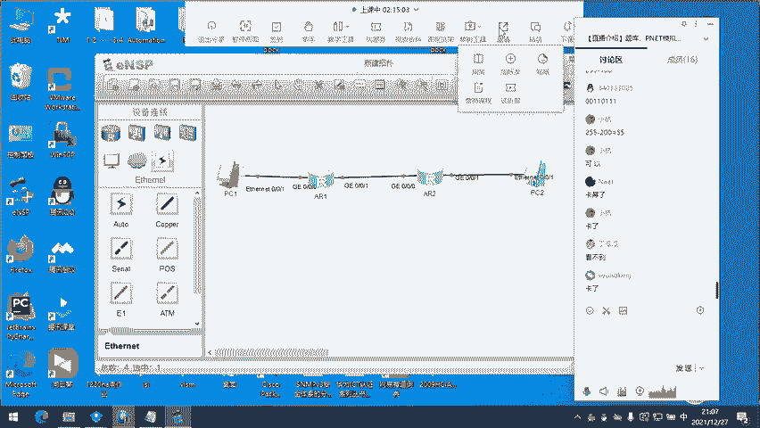

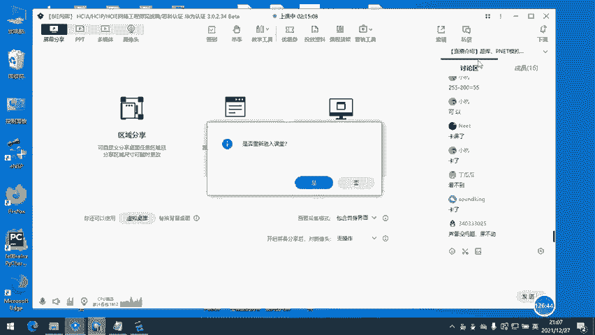

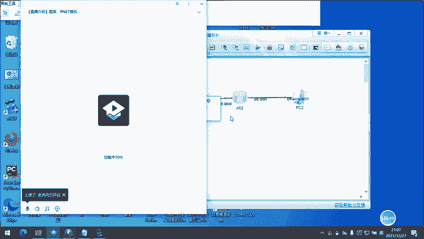

现在呢。OK了吗？😊，还是看不到。Hm。😊，稍等啊。

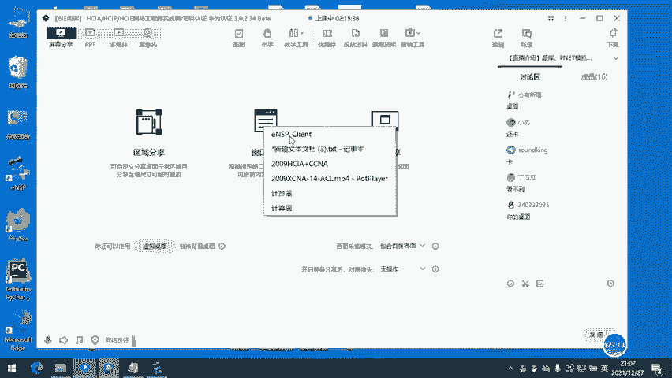

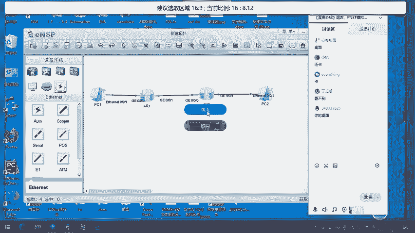

现在。花瓶。花瓶。😔。

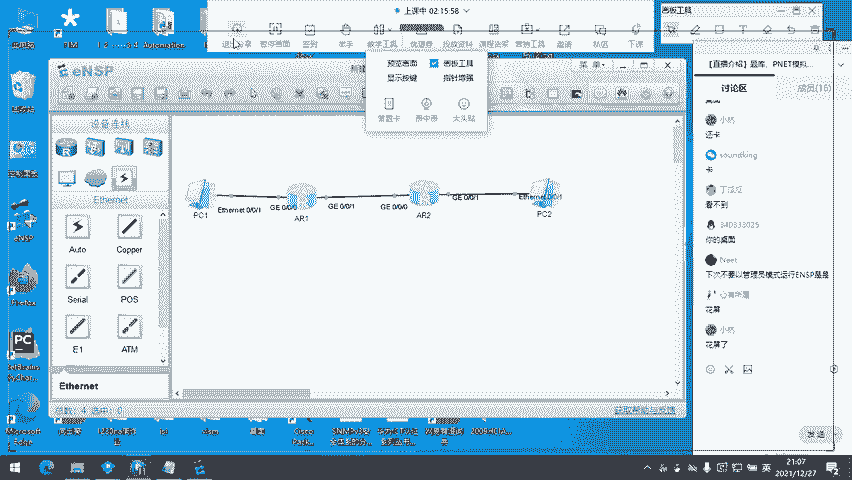

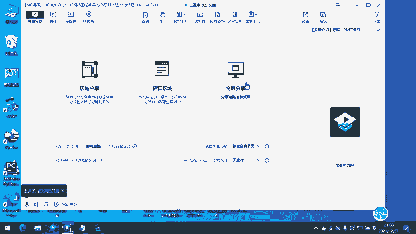

因为这台笔记本。比较。你懂的啊。还是滑。

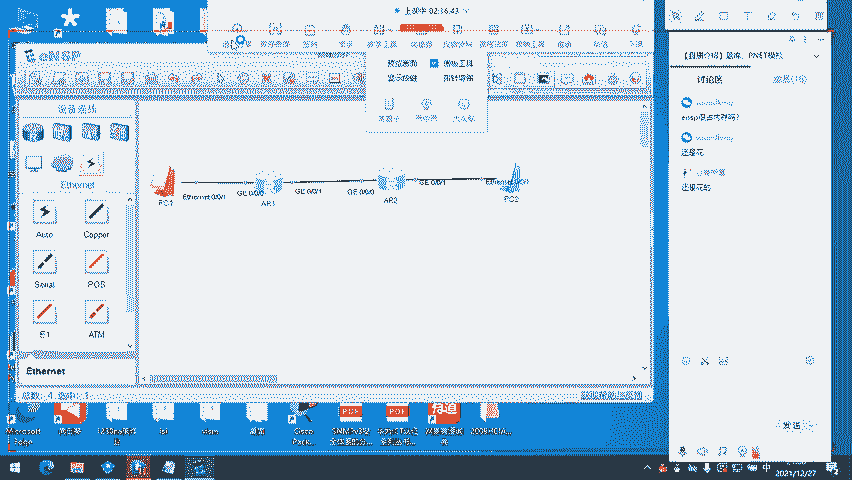

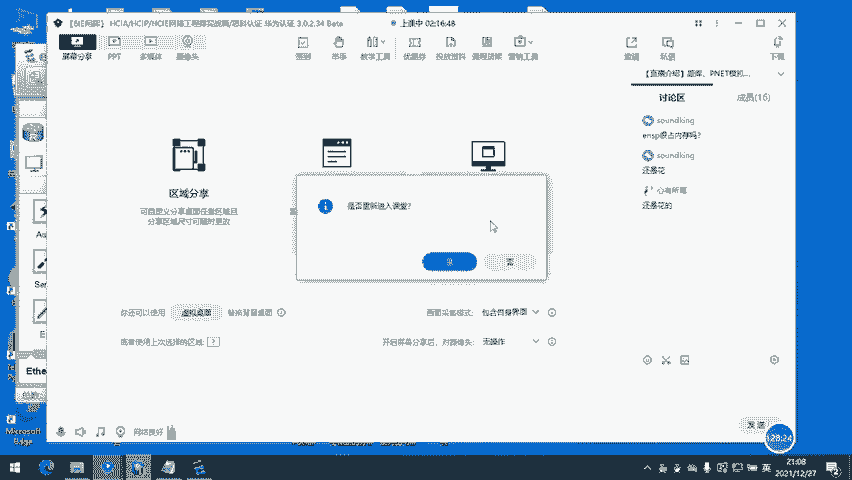

我把ENSP关掉。

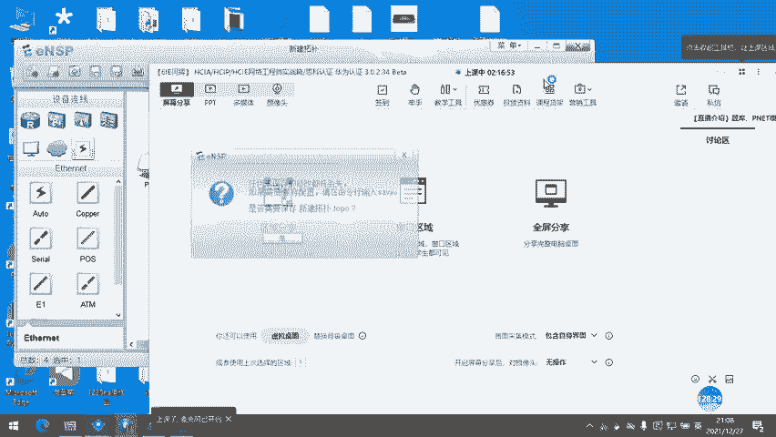

现在呢？可以吗？现在在桌面对吧？O。OK了啊。😊，可以了啊。好。哎，我们就拿一台一台来拖吧。一台也行。呃。好的。开启。嗯。好，我现在问啊，比如说我PC1去访问PC2，我PC要PC1要访问PC2。

要经过这台。R1对吧？R1然后呢，我在R一上要做一个。😊，写1个ACL策略语句，那我写我拒绝PC1访问PC2的流量。然后呢，我需要应用到这两个接口上，应用到我写完我还得应用到接口上，对吧？😊。

大家觉得我应用到哪个接口上比较好一点？PC1访问PC2的这个。流量应用到0哎OK啊。到底是应用到零上好一点还是一上好一点？零上好一点啊零上好一点，为什么零上好一点呢？你想你想如果咱们应用到一上。

如果应用到的是一上，那好，我要从一口已经要从一口转发出去了，对吧？那我R一自身肯定经过了。这个什么呢？查路由表，然后呢。最长掩码匹配规则匹配我自身的路由条目和我PCE要访问的目的网络。哎。

我知不知道匹配到了，我才沿着这个出口去转发，对吧？那么如果我应用在这个接口上呢，我在这个接接口上，一看哎这个原地址来自PC1，我要做丢弃，我要做拒绝。

直接它就没有经过没有进到这个R一的内部没有去进行路由条目的匹配。哎，这个时候呢，对路由器来说，我如果放在这儿，我自身是经过了一些计算的。我经过了一些计算，我要查路由表，我要看我的路由条目。

我要查找我的出接口下跳看下一跳。那如果我放在这儿，我一看哎你来自PC1。我要丢弃你管理员给我写的策略就是拒绝你。那我在这个接口直接拒绝掉他，我会不会看路由表了，会不会看吓一跳，会不会看出接口，不会了。

对吧？那么呢应用到这个接口比较好一点，那我再问，如果我们要应用在这个接口上，咱们用的是入像流量还是出像。😊，哪一种方案？哪一种方案？入像还是初像？哎，ingbo对，ingbo。

如果咱们在这个接口上啊出入你调用错了，你在这儿调个出，那你对PC1访问PC2的这个流量起不到任何作用。那有些人会问。那他总要回来的呀，他总要回来。那好，他回来的时候，原地址是PC2的地址。

你出向你你管出向，你管PCR的地址吗？你不管。所以呢咱们在应用的时候一定要很明确很明确到底是出像还是入像。OK吧。OK吧，如果说我们非要在这个接口上，而我路由器的性能比较高，我就要放进来，放进来查完表。

我再帮你做转发的时候，我在出口的拦截OK没问题。那如果我们要在这个这个接口做拦截，做底。😊，咱们应该用入像还是出像，同样是PC1访问PC2的对出像。哎，可以理解。我想讲的意思吗？大家可以理解吗？

可以理解吧。哎，就是说咱们在做这个ACL的时候啊，做ACL的时候，哪里离这个数据源最近，咱们就坐在哪里。😊，那比如说这个网络内现在还有一台路由器，又有一台路由器。

我同样是拒绝PC1访问PC2的这个数据啊，我如果在R2上做好，还是在R1上做好呢？肯定是R1上做对吧？你R2上做，同样哎你能够做到我拦截你PC的这个流量。但是呢我R1是不是真真实实的去计算了路由表。

产生了一定的内存的消耗，对吧？产生了内存的消耗。那如果我在R1上这个接口做，我根本不用去查看路由表呀，那再退一步来说，比如说你在R2的这边这个接口上做，你R1看路由表了，R2也看路由表了。

最后看完的结果是我在这个初象接口，我把你这股流量给丢弃了。😊，那你觉得脑子是不是这两台路由器的脑子是不是快要瓦特了？哎，我们明明要不帮你转发，我PC1要拒绝啊，我R1R2要拒绝PC1访问PC2的流量。

结果你还放到了这个接口上来做我R1也做了路由，我查看了路由表计算了路由条目，我R2也查看了，我也计算了。😊，平白无故的消耗了R1和R2的资源，对吧？所以咱们离哪儿数据数据源离哪儿近，咱们就在哪儿做。

那比如说我现在要拒绝PC2访问PC1的。PC2访问PC1的这么一个数据。章在哪个接口上做？哪个接口上肯定是0-0-1，对吧？0-0-1爱你如果。有些人会说。我不在这个接口上做。

我在这个接口上做行不行也行也行。但是呢它已经真实的产生了资源的消耗，符不符合。😊，符不符合一个合格的网工做出来的需求？明明我们能在这儿做。明明我们在这儿做了。就出现的误差很小很小。

那万一R一身后还有一台PC3呢？我PC2是正常访问PC3的，你在这儿给我流量误伤了怎么办？对不对？

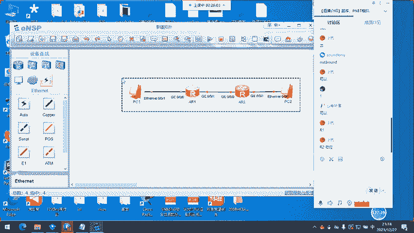

可以理解吧。可以理解吧。那我们来写一个，我们不配地址，写一个。我们写ACL。Ner。

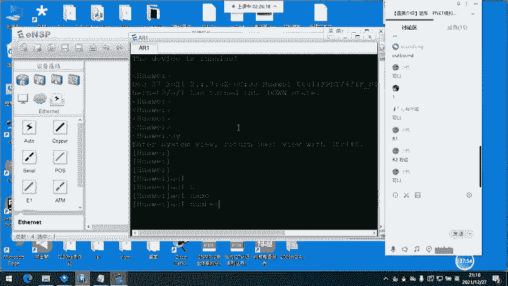

基本ACL啊ACL number2000，然后呢入5。入5给大家解释一下为什么是5啊，你写一也是可以的啊。入后面你能跟什么呢？跟这么多跟这么多。0到42亿0到42亿，这是不是42亿？是的啊，然后呢。

咱们写的时候写个五，为什么写五呢？如果你想在你写的这个策略，你写的这个ACL里面，前面又有了更精细化的要求。那比如说你写的第一条就是个一，那你的上司。😊。

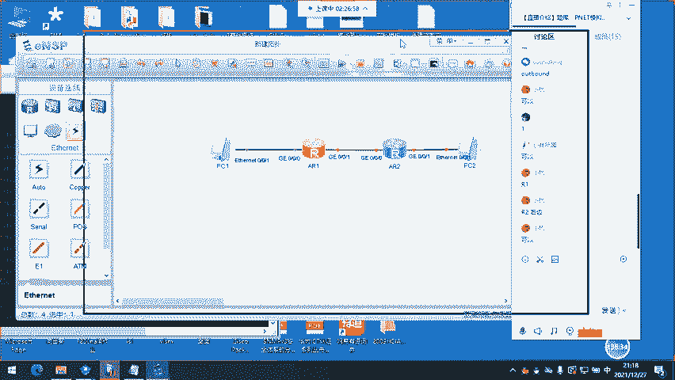

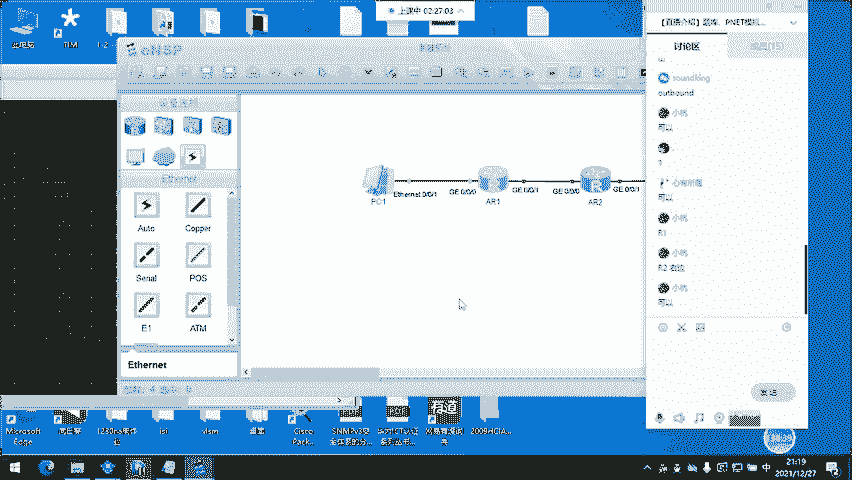

你的甲方给你提了要求。对，越小优先级越高。如果我入伍和入十，同时命中了一条。比如说咱们的原地址，那我先执行优先执行入伍所写的OK吗？比如说我入5和入一同时命中了一条去往一个目的网络的。

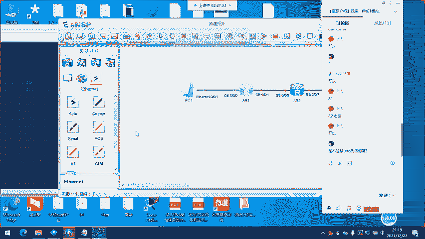

原IP那我入一写的是permit，入五写的是dy，最后是会被permit还是被dy？对，被permit了。哎，因为我一的优先级肯定比你五高嘛。那比如说我们想在5之前又做了更精细化的要求。

那如果我们写的是一，如果我们写的是一，你往前加，你往前加一条可以，你再加怎么办？你能加个0。5吗？你能加个0。5吗？加不进去了，我们在写的时候给自己留有一些余地啊，留有一些余地。

你五我我前面还能加1234，你写十也没问题，我前面还能加123456789，给自己留有一些余地，你不要上来就写一个乳一。那到时候万一你写的这个。😊，很粗糙很粗糙，他匹配到的范围很大。

那万一在这个范围里头有更精细化的一些需求，你写个2，你虽然能匹配得到，但是呢我一范围更大，我匹配到了，我就执行一的策略了。😊，我就执行一的策略。那这个时候呢。咱们有可能这个工作又得推倒重来推倒重来。

所以呢大家在写的时候，哎，你写入5入十都行。然后呢，我们放行是permit。

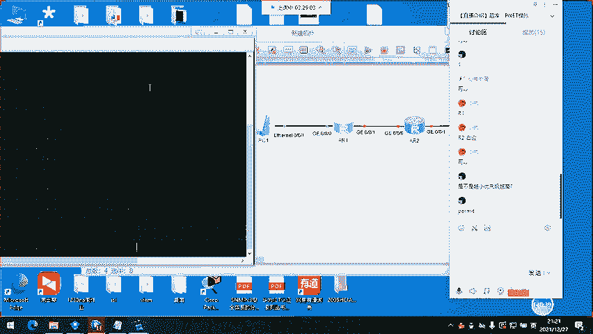

或者说是匹配做NAT的时候啊，匹配是perit permitit后面能加什么呢？加原地址s10。1。1。1。然后呢，0。0。0。0，那这个呢就是一个精确匹配，这就是一个精确匹配。那我们写完敲回车。

我们可以看一下啊，这个ACL里面。

这个ACL里面有一条。策略语句是我放行来自10。1。1。1精确匹配啊，1个0精确匹配。那咱们在应用到一个接口上怎么应用呢？放行哎，我们还是无论是拒绝还是放行，哪一端离数据源最近，咱们就部部署在哪一端。

那这个时候呢，咱们要部署在R一的0-0-0口，对吧？interface。

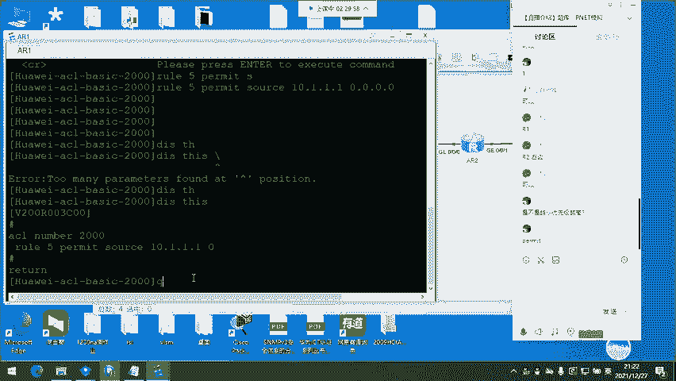

吉比特的0-0-0口进来以后。张淼有。traffic。这个呢后面是你看啊，在这呢应报的。out board咱们现在应该是in报还是outboard入还是出，是入，对吧？in boardin报多少？

in board ALACL2000。然后你看一下你这个接口上已经调用了你刚刚写的这个你刚刚写的这条ACL哎，ACL2000，我在什么方向入方向调用，也就是说只有在数据进来的时候，我会查看，我会匹配。

我数据出去的时候管不管不管。这就是基本ACL这么一个写法。OK。那大家还有其他问题吗？😊，这个一般不是单独存在的啊，咱们在NA阶段里头，它是和NAT。网络地址转换结合起来，在企业边界做这个。

内网地址和公网地址转换的。只要做这个的，咱们在NA阶段。那在NP。IE里头啊，他能做的就很多很多了。NA只给大家介绍。

大家要学会了要掌握的就是在企业的边界路由器上部署ACL和NAT让内网这些主机在访问外网的时候，因为公网嘛？公网路由器不不转发你私有地址。你原IT原IP是个私有地址。

它是不帮你转发的那你要帮边界边界这台路由器啊，要帮内网的这些私有主机的私有IP地址转换为公网IP以后，公网路由器才会帮你做转发。那我们一般在。公网路由器的连接运营商的那个接口上做ACL和NAT啊。

NAT那NAT呢是在明天晚上明晚。网络地址转换。那NAT学完以后，咱们的后天晚上是综合实验，带大家做一个大型的实验。把咱们NA学到的这些理论。全部结合起来。套在一起。

试试看能不能做出来一个完整的实验啊完整的实验。那对于今天这节课，大家还有没有问题？

没了啊。NA对。这是第四周的吗？第四周。可能会在实验里头给大家讲一些在。NA里面没有涉及到的东西啊，不会讲的很难不会讲的很难。但是呢。一定是有用的。好，那咱们今天的答疑。就到这里。明天晚上也一定要。

准时。明天晚上是NAT网络地址转换。后天晚上没限制啊没限制。没限制。呃，这个。应该是这一轮完了吧。问一下班主任。你可以看之前的录播吗？等新的直播开了，你跟着从头开始。无论学什么，录播一定是有的。

NA也好。NP也好，IE也好。哎。那咱们今天就到这里啊。😊，那如果有问题的话，大家在QQ或者是微信里头都能找到我啊，都是这个头像，这个头像这个名字。可以吧。有问题及时交流。然后呢，如果在做实验的时候。

遇到了问题，或者说是在学习理论部分的时候。遇到问题了，那直接。直接在微信或者QQ联系我啊。如果是实验的话，我可以帮你远程。如果是理论部分的话，我帮你解答。对，NA就像是一栋一栋大楼的基础。你基础不好。

你建起来的楼一定是摇摇欲坠的。うん。那行，那咱们今天。就到这里啊。大家。大家拜拜。好，有问题及时私聊啊。有问题及时私聊。好，大家拜拜。

