# 2022版华为认证HCIA-DATACOM教程，内部课程公开分享（已完结） - P14：XCNA-14-NAT - 网络工程师CCIE - BV1AP4y1J73k

下来参加咱们泰戈单元课啊，这个是。😊，正课的倒数第三节啊，我们来讲一下这个NAT和PAAT那觉得AT和PAAT是什么呢？唉，胶片写的很清楚啊，叫网络地址转换啊，那为什么要使用这个技术呢？

因为在咱们IPV4时代，大家都知道IPV4呢，整个地址空间啊，一共只有32位，这32位地址空间，咱们满打满算所有地址在加在一起啊，一共有42亿多1个啊，差不多43亿不到。

那这43亿不到的地址用于什么样地方呢？用于整个internet对吧？这整个internet覆盖了七大洲五大洋，对吧？你这么多的节点要使用地址，那这个地址够不够用呢？答案是不够的，那答案不够用。

那咱们要改变IP地址使用规则，我们以前使用地址怎么使用呢？就是一个节点要对应一个地址对吧？咱们要保证节点和地址之间啊，咱们要满满足什么？一对一的这么一个关系啊，就是你任何internet中的两个节点。

你不能使用相同的IP对吧？咱们要保证地址的唯一性，那所以说每一个独立的节点对吧？你要。😊，你都需要配置一个全球唯一地址，好吧，一个地址只能解决一个节点的上网问题。😡，但是奈何是节点太多了，地址太少了。

对吧？不够用怎么办呢？哎那不够用的话，我们就想一个办法呗，改变地址的使用结构，对吧？我们把地址分为两大类，大家还记得吧？一大类咱们称为叫公有地址啊，一大类我们称为叫私有地址。

那接下来我们就规定了公有地址用于咱们的公网环境。那什么地方算是公网环境的，对吧？比如说我们的运营商的网络啊，比如我们的数据中心网络啊，对吧？像这些位于公网环境的运营商数据中心的网络。

那咱们呢都通通的使用什么公有地址，那这些地址咱们在用的时候呢，老规矩啊，你要么购买，要么租赁啊，你要用这些地址，你能保证这些地址是什么？全球唯一性啊，你能保证他们的全球唯一性。😡。

那接下来在我们的企业网内网怎么办呢？比如说咱们运营商有客户吧，对不对？像咱们的学校的网络，像咱们的政府的网络，对吧？像咱们的医院的网络，像咱们的公司的网络，那这些网络对吧？作为咱们经典的企业园区啊。

对吧？由于你数量太多了，里面的节点数量太多，我给你们都使用公有地址啊，对吧？地址不够用，那所以说我们就想办法对吧？把你们这些网络称为叫私网啊，称为叫内网，我就说了，你们这些企业园区内网主机啊，对吧？

你要上网的话，不要再配置公网地址了，真的不够用啊，你们就使用什么，你们就使用私有地址。😡，那这个私有地址对吧？三段啊，哪三段啊，分别就是10。0。0。0，对吧？这是主A类的，有这么一段。

然后接下来主B类的172。16到172。31啊，一共有16段主B的。然后接下来主C的192。168。0到192。168。25啊，一共有256段。好吧，那这些地址呢都是私有地址。😡。

那这个私有地址特点是什么呢？就是在使用这些地址时候怎么样啊，你不用购买，你不用去租赁啊，你不用购买，你不用租赁。你在一个企业内网，对吧？你可以直接给我们的主机啊去配置。😡，哎，但是虽说如此啊，对吧？

你不用为这地址花钱，你也没有办法保证地址的唯一性。好吧，也就是说你园区A内一个主机啊，你使用了10。0。0。11个地址，你在园区B内对吧？你有另外一台主机，你也使用10。0。0。1，这是很正常的，对吧？

我们有了私有地址，公有地址之后啊，就是针对私有地址，咱们就相当于修改了咱们地址的使用这么一个机制，以前是每一个节点对应一个全球唯一的地址，现在呢对吧？咱们是一个节点对吧？它对应的地址啊。

可能在给很多其他的节点来共享，好吧，我若干的节点共享同一个IP啊，这就是私网地址的这么一个对吧？存在的意图啊，对吧？你通过改变咱们地址使用规则，以前是一个节点使用一个地址，现在是一组节点使用一个地址。

那你IPV4就可以继续的狗言参喘了吧，对吧？那当然狗言参喘，也没有参喘多久了，大概到19。😡，年的11月份对吧？咱们最后一段地址被用光了，那被用光之后，就是代表咱们这个IPV4啊注定是要被淘汰了。

因为你今后的网络肯定还要发展。😡，你要出现新的运营商，你要出现这多新的数据中心，对吧？这些公网的节点，咱们都需要公有地址。但公有地址池在19年的11月啊被耗尽了。那所以说呢咱们从19年11月开始啊。

全球就开展了一起，对吧？IP迁移活动嘛，这个IP迁移活动是全球运营商啊发起的啊，就是各国运营商对吧？包括他们的客户啊，都把他们的网络从IPV4迁移到IPV6对吧？你使用来PV6之后。

这个IPV6地址长度足够长啊，1128位，你这128位的IPV6的地址，对吧？你在用的时候，你不用什么讲究了，因为地址空间太多了，对吧？你就在每个节点对应个公有地址你也根本用不完，对吧？

你网络不管怎么扩展，你扩展5倍，扩展个10倍啊，你IPV6都够用，那所以说在这种地址够用的情况下，你根本没有必要把地址分为什么公有地址私有地址，也就是说在IPV6领于中啊。

你也不用再把网络分为公网和私网了，咱们所有网络都是公网网。😡，网络所有节点都是公网节点，对吧？咱们所有节点的IP地址啊，都能保证全球唯一的来标识自己，对吧？那既然这样，你端到端通信就可以自由通信了嘛。

对吧？你不用向我们的IPV4时代，你一个企业网内网，你使用什么私有地址，你公网使用公有地址，那这些使用私有地址的主机能不能访问咱们公网的节点呢？那那答案是不能的，为什么？因为我跟大家说过啊。

因为这些公网地址主机，你收到内网，对吧？这些私有地址主机啊，访问他们的术语之后啊，他们在回包的时候。😡，这个回包流量目的IP怎么样？是个私有地址啊，那这个回包流量到达咱们公网路由器。

公网路由器的公网路由表中啊，是不允许存在私网路由的，因为这个私网路由没有办法保证全球唯一性啊。那所以说呢咱们所有的电信运营商啊，都有一个公约啊，咱们有个国际公约，这个公约是什么呢？

就是你们的公网路由表里面啊，只能存在公网路由，好吧，那所以说当你们收到一个数据包，目的IP是个私有地址啊，这个报本你是不能转发的，那所以你会发现特别坑爹啊，就是你组建了一个企业园区，对吧？

内部什么核心层啊，汇聚层接入层啊，你把网络搭建完毕之后，对吧？你搞一个公网设备，对吧？做边界，那这个公网设备可始路由器，可以是防火墙，对吧？这个防火墙或路由器啊作为边界一根线连到我们的运营商是外网连接。

对吧？然后另外一根线连到我们的内网，这是一个内网连接，然后接下来通过从内到外的连接啊，对吧？它把我们的企业园区跟我们的运营商网络啊连在一块，但是你连接在一块之后，你虽然看。😡，现在咱们物理角度来讲啊。

内网主机去网公网服务器咱们都是有物理连接的，但是。这些内网主机你要访问公网服务器，对吧？你就是包能发出去，但是你回包回不回来。好吧，那当然你包能发出去是有理由的，因为你从内到外咱们都有默默认路由嘛。

对吧？我之前在做实验时候给大家演示过啊，你在一个企业园区内网，你运行过SPF对吧？会聚交换机核心交换机，你都能通过边界收到一条默认路由，对吧？这个默认路由是能够让你们怎么样收到从内到外的报文的时候。

把包发给边界，对吧？那这个边界本身你通常会有条静态默认啊，指向运营商，那你通过静态默认就能把访问这些公网服务器的报文啊，给运营商发走，那接下来由于咱们公网服务器嘛，你使用的公网地址。

那咱们这些运营商的公网路由器，你收到一个目的IP地址为公有地址的报文啊，你是能够查公网路由表来给你做什么进步转发的那最终这个报文呢就发送到相应的数据中心到达相应的这么一个服务器。

那所以说了从内到外的包是过得去的。但是从。😡，从外到内的回方，你会发现。就回不来了。那当然回不来，归根结底，原因只有一个啊，对吧？就是你内网主机使用私有地址，这些私有地址没有办法保证全球唯一性，对吧？

就比如说10。0。0。1，你在用对吧？我也在用，它也在用，对吧？你全球可能有1000台以上的主机啊，都在拿10。0。0。1这个地址来作为自身的这么一个标识符。那既然大家都叫10。0。0。1。

如果你真希望咱们运营商的公网路像啊，你收到一个包目的IP10。0。0。1，你让它来正确转发。😡，你这不是为难人家吗？对吧？但是人家一看我收到一个豹文，目的IP10。0。0。1啊，好家伙。

当前在整个interarnet中啊，1000台以上的主机都在拿这个地址来做自身标识。😡，你难不成你要求我路由器把我收到的数据包拷贝成1000份，把这1000个报文怎么样发送给这1000个园区啊？😡。

这晚上不还乱套了吗，对不对？绝对不能允许这事情发生啊，咱们肯定是希望这个报文是由谁发的，就由谁接收，而那些不相干的主机，对吧？你不要给他们去乱发数据，这没有意义啊，能理解吧？

那所以说了与其说是让这些路由器啊干出力不讨好的事儿，你不如就是说咱们制定一个规则，对吧？制定个规则，哎，你们收到一个报文，看一下目的IP如果这个目的IP是个公有地址，你们就查公网路由表啊来转发。

如果你们收到一个包，目的IP是私有地址，哎，随便你啊，你传表也好，无所谓，反正你路表里面没有私网路由。那对于这样的包，你也不甭什么，拷贝了，直接丢包就完事了。好吧？归根结底，原因只有一个啊。

就是私有地址，没有办法保证全球味性。😡，那这还得了。对吧那大家想啊，你花费重金买这么多的设备，组建一个企业园区，对吧？你给内网主界配置了IP。😡，这个IP好歹，咱们能够保证在这个企业网内网。

咱们是唯一的，对吧？你虽然就全球范围来看，我的地址没有唯一性啊，但是在咱们这个企业园区内啊，我该保证你对吧？咱们绝对找不到两个节点啊，对应相同的IP你如果真的对应了，我只能说你这个网络设计功底太差了。

你这个叫地址冲突啊，你别看就是私有地址，你想怎么用怎么用啊，但是你最好保证在一个企业园区内啊，不要有两台主机对应相同IP你如果对应了，这个叫地址冲突，好吧？那所以你会发现对于咱们企业用户而言。

我该注意的注意事项，咱们也都注意了，对吧？我企业宽带也办了，我每个月也交费了，我默认路由也止了，我内网的路由选择协议也运行了，边界路由器下方默认路由了，对吧？那更甚者。😡，我们这些使用私有地址主机。

你浏览什么百度网页啊，对吧？你下载个什么QQ啊，对不对？你下载什么微信啊，你玩个什么王者荣耀啊，你发包去往这些公网数据中心服务制报玩啊，那些服务器还都能收得到。😡。

对吧现在问题是那些服务器在给我回应的时候，这个回应的报文呢，咱们接受不了。那这个上网怎么样相当于失败了，对吧？那咱们什么都准备了，该做都做了，你上网失败，谁能受了，对吧？

那所以说咱们要保证你啊这些使用私有地址主机，你就算地址没有办法，全球唯一的来标识你对吧？你的地址没有办法保证全球唯一信啊，我好歹能够保证你怎么样，能好好上网吗？对吧？你百度能上嘛？你QQ能聊吧。

你网易新闻能刷嘛，对吧？那为了保证这一点我们就必须要在这个企业园区的边界啊，你来部署一个地址转换协议。😡，请记住啊，地址转换协议的定位就在这里啊，一般是一个企业园区的边界啊。

那当然也不是说所有企业园区咱们都要都要什么在边界做NAT啊。你如果这个企业园区对吧？超有特权，你超有钱，你内蒙所有主机，你能保证都使用公有地址啊，你能保证你这个企业内蒙主机使用的是全球唯一地址。

那在这种情况下，你需要NAT吗？😡，不需要啊，对吧？你直接使用公有地址，你上网们就完事了嘛，对吧？我跟大家说啊，如果你所有节点都使用公有地址啊，咱们的通信就不要太对等啊。我访问你，你能收到我发的包。

你收到我发的包能够回应，你的回应我能收到，并且你主动访问我，你主动发起报文啊，我也能收到，对吧？这个咱们称为叫对等通信啊，也叫对称通信，对吧？那问题就是你内网如果使用了私有地址，你这个对等通信做不到啊。

对吧？我能访问你，你的回包连回都回不来，对吧？那咱们就要通过not来解决这个问题。😡，这个大头到底怎么工作呢？很简单啊，你在边界设备上做一个nott啊，那什么样的设备能增大它，要么路由器，要么防火墙。

那我相信基于这点大家能理解了吧，为什么咱们企业园区的边界不能弄一台多层交换机，对吧？这个多层交换机，不是支持路由器的功能吗？对吧？那为什么不能做边界呢？原因是因为绝大多数的企业网交换机。😡。

都不支持NAT啊，绝大多数的企业网交换机不支持NAT那这个是咱们路由器和防火墙的绝招啊，对吧？正是因为你企业园区内网都使用私有地址。

你的边界设备需要做NAT啊来解决你内网主机访问公网服务器的这么一个需求，但所以说你交换机上的设备，你虽然接口多，你虽然转发效率高，但是对吧？你不能作为边界，因为你做了边界，你不支持nott嘛。

你不支持not，你转发再快，你从内到外的访问，你收不到回包。😡，这有啥用啊，这就没有意义了，能理解吧？O那接下来ATT到底怎么做呢？很简单啊，就是你边界路由器收到从内到外的报文，对吧？你主机内网主机嘛。

你放的公网服务器啊，你的包在出局之前肯定要先到达边界设备，对吧？那边界设备收到从内到外的报文之后就看了，你的原IP地址哎是个私有地址，对吧？那接下来我做了I之后怎么样呢？我就是给你做一个地址的转换啊？

我给你把你三层豹头的原IP地址，从原IP地址啊，从你的私有地址转换成一个公有地址，好吧，那当然这个公有地址，咱们预先设计好的，对吧？我预先设计这么一个地址池里面放了一堆公有地址。

我就拿我地址池里面的公有地址来给你做一个替换，好吧，那当你替换完毕之后啊，你可以理解为这个数据包，我的三层豹头的原MIP啊，就都是公有地址对吧？然后紧接着我把这个包发给外贸，对吧？发给我们这个服务器。

那接下来发给服务器之后呢，服务器可不会管三721啊，它。😡，可不知道咱们端端端通信有这个NATPAAT的设备存在，他会以为访问它的节点就是一个使用公网地址的节点，能理解吧？哎。

那既然访问我的人是个公有地址节点，我收到你访问我的报文，我再给你回包的时候，我回包的目的IP对吧？那也是呢公有地址吧，那接下来这个回包既然目的IP是个公有地址，我来问大家，你们觉得运营商的公网路由器。

收到这么一个回包，我还不能转发了吗？😡，啊，我还不能转发了吗？那我1%万是能转发的，因为公网地址嘛，能保证全球唯一性啊，我收到一个包目的IP好家伙是个公有地址，我凭什么不给你转发啊，我拿道提视啊，对吧？

怎么可能呢？那所以说了，肯定会给你转发，那接下来这个转发啊，哎，只要你设置没有问题啊，那这个回包肯定是对吧？按照去往咱们这个企业园区的路径啊，来一跳跳发对吧？发给我们这个企业的边界？😡。

那接下来这个边界路由器呢，它不再是一个一般的路由器了。你做完NAT的路由器跟咱们一般路由器不一样啊。你一般的路由器收到一个数据方啊，你就是直接根据目的IP查路由表来确定怎么转发。

但是做了NATPAAT的路由器啊，尤其是当你做完地址转换之后的路由器，你本地会形成一张表，啊，这张表我们称为什么呢？这张表咱们称为叫地址转换表啊，没有错，这张表就跟我们的什么ARP表啊。

什么mac地址表啊，什么路由表啊一样啊，它就是一张表象啊，这个表象用来记录我把什么样的公网地址转换成什么样的私网地址啊，什么样的私网地址转换成什么样的公网地址，我会把这个转换的结果啊给记录下来，对吧？

比如你一个内网主机地址10。0。0。1，对吧？你发包去往公网到达我们的边界路由器，边界路由器，啪给你做一个转换，我把你的原IP从10。0。0。1啊，换成了比如说11。0。0。1。😡。

对吧从一个私有地址换成了公有地址。那接下来我换完之后啊，就会给你做一个记录。😡，我会把地址转换啊，转换前的地址，这个咱们称为叫inside的local地址啊，就是那个10。0。0。1啊。

绑定到咱们转换后的公有地址，11。0。0。1，这个咱们称为叫inside的bo啊，我就会给你做这么一个映射啊，每一个映射条目很简单，里面包含俩地址，一个就是转换前的私有地址，一个转换后的公有地址。好吧。

我会记录这个inside的local到inside的lo之间的这么一个映射。那接下来记录完毕之后呢，当我收到从外到内的报备之后啊，我不再像是普通路由器一样啊，直接针对目的IP来给你查路表，我会怎么样呢？

我会先针对我收到的数据包的目的IP啊，来查什么？来查这个NAT的地址转换表啊，通过查看地址转换表，我来确定一下，我收到的这个回包，要不要给你做一个回向转换啊，我要不要针对这个回包来给你做回向转换。😡。

那如果说不要，那就好说了，我就直接针对你的目的IP嘛，查路表来做转发。那如果说我收到这个包，一看目的IP发现哎这是一个转换后的公有地址啊，那接下来当我收到这么一个回包之后啊，我就要给你做一个回向转换。

那回向转换怎么转呢？那很简单啊，就是把我收到的回包的目的IP啊，从这个公网地址，也就是inside的global地址啊，转换回之前的inside的local地址，对吧？然后接下来转换完毕之后啊。

我再针对你这个inside的local地址，查我们的内网私网路表啊，来给你做进一步转发。那最终。😡，保证咱们的幸源主机啊，就是这个使用私有地址的内网主机，能够成功的收到咱们回应，对吧？那当然收到回应。

哎，你这个端到端通信啊就算成了。所以说你浏览什么百度啊，对吧？浏览百度网页啊，你聊个什么QQ啊，对吧？你玩什么王者荣耀啊，你看看什么网易新闻啊，你上什么淘宝啊，哎那这些呢咱们就都能实现了。😡。

但是这个实现呢我觉得比较扭曲的啊，因为咱们IPV4规定了啊，咱们端到端通信，你二层针头的原木二层地址啊，对吧？你可以变化，因为毕竟那个只能在一个网络内来标识一个节点，但是你端到端通信。

你三层爆头的原木IP能动吗？对吧？这不能动啊，因为咱们要满足一个规则，这规则，我们称为叫端到端一致性规则。什么叫端到端一致性规则呢？就是你信源产生一个数据包发给接收者，这个报文不管经过几台路由器转发。

不管当前在哪个网络中传递啊，它的原木IP都应该不变啊，原IP要一直标识着通信的信源，对吧？就是咱们的发送者，然后接下来目的IP一直要标识什么，咱们的接收者，对吧？那这个才对啊。

这个咱们称为叫端到端一致性规则。😡，但是当你做了NAT之后，对吧？这个端到端的一致性规则你能保证了吗？对吧，你是不是就保证不了了？😡，那很简单啊，你内网主机发包去往公网服务器豹文到达边界路由器之后。

边界路由器是不是给你做了一个地址替换啊？我把你的三层豹头的原IP从你的私有地址转换成那个公有地址吧，对不对？就是从内到外的转换啊，那接下来如果你收到了从外到内的豹文呢，你是针对它的目的IP对吧？

来做一个回向转换啊，从IPV6转换成什么啊，说错了，就是从公有地址转换为私有地址，那所以你会发现从内到外从外从外到内啊，你的这个原目地址都发生了改变。那这个端到端的一致性规则，对吧？就被打破了。

那这个打破的代价是什么呢？就是咱们的通信啊不再对称了啊，通信不再对称，你会发现做完IP之后，咱们解决什么样的问题啊，我们解决了从内到外的访问，对吧？从内到外能通，然后接下来怎么样？从外到内的回包啊。

对吧？能回到来，我们解决了这个问题。😡，但是你解决这个问题的代价是什么呢？就是从外到内的主动防备都没戏了。并且一家运营商，对吧？你有两个客户啊，你这两个客户的内网主机都使用私有地址，对吧？

那虽然咱们这两家客户啊连接同一个运营商，从物理连接角度来讲，咱们这两家客户的网络啊，其实是有连接的但是你会发现咱们有连接的两个客户网络的内网主机啊，你们之间是不能直接通信的对吧？

那当然归根结底不能通信的理由是什么？😡，就是因为对吧？就是因为你们使用私有地址，没有办法保证全球的什么唯一性。并且你们这两个元器的边界设备都做了NAT来保证内网主机啊能够成功的访问公网。

那所以在我们的IPV4领域中呢，为了保证咱们端到端通信没有问题啊，也就衍生出了很多的技术，比如像什么VPN啊一系列VPN技术。比如像专线啊一系列的专线技术。那这些呢都运育而生。那这些专线啊。

这些VPN啊，当然主要以VPN为例啊，他们就是通过一个叫做over类的技术，对吧？来给你端到端通信的数据添加一个新的IP爆头，来欺骗咱们公网路由器啊，最终实现两个内网主机。

直接使用彼此私有地址来通信的这么一个目的。😡，那这个呢看似能够解决咱们的通信啊，但是它的代价很大，就是你要搭建这个VPN，你首先需要设备能够支持啊，对吧？你得要针对设备来开发这些VPN的功能。

然后接下来做VPN的部署的时候，你的命令要敲的很多啊，特别麻烦，对吧？然后接下来VPN做好之后啊，你端到端通信，我需要给你额外添加这个三层的爆头，对吧？这个首先增加咱们网络的复杂度啊。

并且增加咱们端到端数据转发的这么一个延迟。😡，所以说总而言之。😡，啊，这个私有地址咱们是不得已而为之啊，来使用的这么一个苟延残喘的这么一个技术。使用这个技术归根结底的原因只有一个啊。

就是IPV4地址不够。那所以说呢咱们如果早在10年前啊就迁移到IPV6。咱们今天这节课什么都不用学了，什么NAT啊，什么VPN啊，对吧？你会发现IPV4里面最难的这些技术。😡，都围绕着一个共同点。

就是解决私有地址主机啊，它的通信问题啊。我们微偏解决的是两个企业园区内网主机之间的这么一个通信。我们的NATPAAT解决的是对吧？内网主机访问咱们公网服务器的这么一个通信。但总而言之。

咱们这些技术都围绕同一个点，就是你一个主机使用私有地址，你没有办法正常访问你想要访问的这么一个节点。那所以说你需要通过一系列技术来解决。😡，对吧但是如果所有说咱们对吧？去看这个问题的根因啊。

问题的根因就是你们死板的一直在使用IPV4。如果说大家开明一些，当你们意识到IPV4地址不够用的时候，对吧？你们不要说是守着这个协议，还搞个什么变革，你们直接搞IPV6嘛，对吧？这么多地址。

你用了IPV6，咱们所有节点都使用公网地址了，你也不存在公网私网了吧，你不存在内网外网了嘛，大家地址都能保证全球唯一性。😡，那这个时候你端端端通信，你需要打破咱们端到端一致性规则吗？不用对吧？

那既然不用咱们端到端通信够对称了吧，够对等了吧。那既然够对等，你觉得咱们两台主机只要我们有物理连接啊，你会不通吗？😡，对吧无论是内网主机访问公网服务器，还是一个内网主机，访问另外一个人去内网主机。😡。

你需要VPN吗？你觉得需要NPAAT吗？对吧你啥都不需要。😡，唉，那所以说呢今天这个技术啊，我是很不情愿的给大家来讲的啊，为使用这个技术的根因就是咱们没有用IPV6，对吧你用IPV4地址不够用嘛。

所以说你不得已搞出了私有地址，公有地址，你不得已搞出了内网外网，不得已，你才需要通过，让边界设备部署NAT啊，来解决内网到外网的这么一个通信问题啊，然后接下来越解决网络越复杂啊。

越解决咱们衍伸出了越多的技术，对吧什么专线VPN之后，在NP中咱们要学一大堆啊，好吧，那当然这些吐槽归吐槽啊，还是得学因为咱们当前还在用它们好吧，那当你迁移到IPV6之后的话，那这些可能就不需要了。

那当然我只是说一说的。😡，因为这个IPV6迁移完毕之后呢，有很多的IPV6的用户啊，他们是就着使用IPV4的这么一个习惯啊来使用IPV6，对吧？

那这个IPV大家用习惯了就是习惯性的说是把网络分为内网和公网，对吧？他们就习惯性的内网给主机怎么样配置一些不要钱的地址啊，私有地址。😊，那接下来他们也申请了说那IPV6中。

咱们能能不能怎么样别搞出一些私有地址呢？那一开始那些标准化组织很懵逼的，说了，我们都给你迁移到IPV6了，就是为了解决这个私有地址的问题。那为什么你们还对吧？还要去用呢，对吧？还要复古的去对吧？

按照咱们IPV4的方式来部署IPV6呢？但是让客户就说了，我们用习惯了，那所以说经过几次审批，咱们之前都没有通过啊，那后期哎咱们通过这个方案，就是在IPV6中，咱们也整出了这么一些私有地址啊。

方便那些习惯使用IPV6的用户啊来使用，对吧？你公网运营商数据中心，你照样使用公有地址，而我们的企业客户内网，对吧？我们的企业园区啊依旧使用什么私有地址，那接下来这个时候为了保证这些私有地址主机。

成功访问公网，你也需要做地址转换啊。那所以说千万不要以为咱们用IPV6，对吧？就可以摆脱这些技术了。😡，因为人的劣根性啊人的劣根性是。😊，对吧会有很多的惰性的，就是咱们虽然使用IPV6。

但是有很多情况下，就是我们使用IPV6啊，会把IPV6当IPV4来使。因为毕竟这两个协议很像啊，基于这两个协议咱们运行一系列技术也很像，对吧？比如在IPV6中，你该用的交换技术。

咱们还得用你该用的路由选的协议还得用，对吧？你该用的DNS咱们还得用，所以你会发现咱们除了地址换成IPV6，除了封装，咱们换成IPV6爆头以外啊，其他的其实跟IPV4。

对你还是能找到很多的共通性的那所以说这块的话，你在IPV6环境中，你内网使用私有地址，你边界做1个NAT我觉得这个也很正常好吧，那接下来言归正传啊，这节课教大家NAT怎么工作以及怎么配置好吧。

那这块这个图呢很清晰了，这就是一个企业园区啊，中间是台边界路由器对吧？咱们做NAT内网咱们有个主机使用私有地址啊，19201681。10。那现在呢咱们这个。😊，内网主机呀，你想访问一台3W服务器，好吧。

比如说百度服务器啊，我们百度服务器不用说了，放在数据中心中的，使用公有地址嘛？200。1。2。3啊。那接下来哎想要让咱们内网主机啊。😡，成功的访问咱们的百度服务器，你边界路由器对吧？就做IT怎么做呢？

啊那。你们来看吧，内网主机访问百度服务器，你所使发的报文啊，三层爆头的原IP是那私有地址，对吧？目的IP是百度服务器的公有地址。然后接下来豹纹到达边界路由器之后。

边界路由器的NAT呢对这个豹纹的三层爆头做一个修改。修改完毕之后，我把你的原IP地址啊，从192。168。1。10啊，改成了122。1。2。1。对吧？这是公有地址啊。然后接下来目的IP不变。

我就把这个豹纹怎么样顺着外网的接口发走，发给咱们的器。😡，那接下来服务器收到这个报文，他会以为啊访问他的，就是不望节人的吧。所以说给你做了一个回应啊，回包原IP是我的公作地址的吧。

目的IP就是咱们这个转换后的side地址。然后接下来咱们这个边界路由器收到回包之后，我一看目的IP发现啊这是一个转换后的side地址。然后接下来我就基于我们的NAT的地址转换表啊来给你做一个回向转换。

我把这个目的IPsideg啊给你转换回音side的loc。然后接下来基于这个inside的loc地址啊来查咱们内网路表来进一步转发，最终把包发给个器那这个主机呢又傻傻的以为啊咱们使用192。168。1。

1这个地址成功的访问务器殊不知咱们在端到端通信过程中啊，从内到外的爆单层爆头IP地址发生了改变。而从外到的回包爆。咱们的目的IP发生了改变。能理解吧。哎这个就是咱们的地址转换的这么一个流程。

那接下来关于。😊，地转换有哪些类型呢？我们来先做个分类啊？首先呢做地址转换有有一个大的分类啊。那这个大的分类咱们称为叫1。0版本和2。0版本啊，这个1。0版本比较传统的。

咱们称为叫NAT这个叫地址转换协议。然后接下来做到2。0版本我们说的什么呢？我们称为叫PAAT啊，这是思科的叫法，华为把这个叫法分的比较细啊，分为很多个子类啊，分为叫NATTEZIP和 server啊。

当然咱们不管那么多啊，我们就统称为叫PAAT这个叫端口转换协议啊，大大家可能会被两这有什么区别，请注意啊，区别很大。那接下来我们先来描述NAT啊，描述完毕之后，我再来给大家对比NAT和PAAT啊。

来看一下PAAT相比NAT多出了哪些特色啊，那接下来关于这个NAT啊，咱们也分为两类啊，一类我们称为叫静态NAT一类我们称为叫动态NAT那咱们先从静态的来讲。😊。

这个静态NAT呢就跟所有其他的静态技术一样啊，对吧？你想要做这个东西，你需要登录到边界路由器来配命令嘛，对吧？一条命令产生一个静态NAT的这么一个表象啊，所谓的静态NAT就是你手工的告诉路由器啊。

你希望把哪个inside的local地址，映射到哪个inside的萝地址。好吧，你通过配置命令的方式来实现。那做静态的AT非常方便啊，你不需要做什么地址池，你也不需要做什么ACL来判断咱们信息流量啊。

你直接通过命令就能告诉路由器啊，你希望把内网哪个主机的私有地址转换成哪个供。😡，并且就跟所有其他的静态技术一样啊。当你敲完这条命令之后，路由器就算没有实际做过任何地址转换啊。😡。

你的这个静态的NAT的表象也会存在于你的NAT的转换表中。好吧，也就是说，你只要配好命令，命令一敲啪一敲。哎，命令只要一出现啊，咱们这个NAT的地址转换表里面就会多出这么一个转换条目，好吧。

哪个私有地址转换到哪个公有地址，你怎么配的，它就会这么出现。那这个静态的AT的特别厉害啊，我们一般把它称为什么呢？我们把它称为叫服务器的8布。因为你做了静态端NAT啊，它这个表象是会永久存在的。

你除非把这个命令给删掉，不然的话它会一直存在。那这个一直存在的静态的AT的转换表有什么用呢？哎，你内网主机发包去往外网啊，你能利用这个转换表，对吧？来把你的私有地址啊转成公有地址，保证什么从内到外通信。

对吧？回包能收得到。然后接下来基于咱们这个静态的AT表象，咱们还能实现外网的主机啊，利用这个表象主动来访问内网主机。😡，没有错啊，你从内到外能做到，从外到内能做到啊。

这个是静态NAT独有的这么一个特点啊。除了静态NAT以外，其他的基本都不能实现这点。好吧，那所以说了你们可以假想这么一个场景啊。😡，你这个企业园区内网呢有一台3W服务器啊，这个3W服务器，比如说192。

168。1。1。我现在希望这个3W服务器呢内网主机能够访问它啊，然后接下来公网主机也能访问它，那这个时候咱们要针对这个服务器怎么样做一个静态NAT比如说你要把它的私有地址，192。168。1。1啊。

绑定成了122。1。2。1这个公有地址。那当你绑定完毕之后啊，你就对外发布了，说咱们内网有台服务器，它的地址是122。1。2。1，你们可以通过它来访问咱们公司的这么一个公网，对吧？

你来访问咱们的官方网站，对吧？那这个时候咱们的外网节点就能针对12。1。2。1啊，这个发布出去的公有地址来做一个外部访问嘛。那这个外部访问流量到达咱们的这个边界路由器啊。

哪怕边界路由器还没有做过这个服务器的从内到外的转换。由于咱们这个静态的NAT表象啊，它是配完命令就出现的。所以说这个时候咱们针对对吧？这个表象针对咱们。😊，转换表现啊，我就能给你直接做回向转换了。

我能帮你把目的IP从转换后的公有地址转换回私有地址，代把包呢给内蒙服务器再放。那所以说呢静态NAT真的很重要。因为你做了静态NAT不但能实现从内到外的转换，你从外到内的主动转换也能做得到。

但是这种方式呢会有一个缺点，这个缺点是什么呢？就是第一不灵活啊，对吧？你若做了静态NAT首先你要保证内网这个服务器啊，你的私网地址不能换，如果你的私网地址换了，对吧？那你这这个静态表象不生效了。

这是第一点。第二点，你一条命令咱们只能产生一个私有地址，到一个公有地址的，这么一个转换。如果说你这个元器比较大，你内网有N多主机啊，你建议使用静态NAT针对每一个主机来做转换吗？😡。

我我我的答案是不建议啊，你内网主机这么多，你如果针对他们来一条条写啊，你这个配置命令太多了，并且也没有这个必要，对吧？因为绝大多数内网主机，你们只需要主动访问外网回包能回来就好了。只有那些内网的服务器。

哎，你自己需要主动访问外网，并且外网的主机也会主动的来访问你，对吧？就是因为外网的主机需要主动访问这些内网服务器啊，所以针对这些服务器，咱们做静态的NAT啊是比较合适的。😡，啊。

那接下来关于这些不需要被外网主动访问的内网主机。那这块的话，哎就建议大家不要做静态NAT了，对吧？因为做静态NAT你的配置量太大，并且非常的不灵活啊，那这块的话，关于静态NAT，我们来看一下示例啊。

比如说针对这个192。168。1。1啊，我给你转换成了122。1。2。1，对吧？那这个时候当你做完这个配置之后啊，你的静态的NAT的转换表象就存在了，对吧？你从内到外的报纹原地址做这么一个转换，对吧？

从外到内就是做一个回向的目的地址的这么一个转换。然后接下来对吧？这边的话，你从外到内对吧？你主动访问你主动访问谁啊？你主动访问122。1。2。3，对吧？我给你转换成了1920168。1。3，对吧？

从外到内的主动访问啊，你基于这个静态表象也可以实现。好吧，我们班说了，你内网顶级使用私有地址，你边界做1个NAT最大最大的问题是什么呢？就是从外到内访问嘛，不容易实现。那接下来这个静态的NAT啊。

就是一个绝对的例外，你使用静态的NAT啊，从内到外妥妥的没问题啊，从外到内也没有问题，那之所以没有问题的理由就是你是拿一个公有地址来给一个内网的私有地址啊来做的一对一转换啊，这个一对一映射啊。

不会出现任何歧义啊，对吧？一对映射嘛，对吧？你从A映射到BA到B正向映射可以B到A逆向映射也可以，并且静态的NAT表象不需要任何条件出发，好吧，你做完这个静态表现映射之后啊，就算内网服务器没有。

发送过数据啊，我没有针对这个服务器啊来做实际转换。我这个表象对吧？只要你命令不删啊，它会一直存在。只要表象一直存在，那基于这个表象存在啊，你从外到内的防位对吧？就没有任何问题，畅通无阻啊。

所以咱们把这个技术称为叫服务器的发布，好吧，那配置命令怎么配呢？大家看好。😡，直接在路由器连接外网的接口啊，not static啊，后面加global，后面跟上咱们的insideg地址啊。

就是转换后的公网地址。然后接下来inside后面跟上咱们的对吧？inside的地址，咱们转换前地址，这个叫insideloc，对吧？这个叫insideg好吧，前面写公网地址啊，转换后的。

后面写转换前的私网地址。那接下来配好之后呢，就是你需要在接口加一条命令啊，叫not city enable啊来开启咱们的静态的I的功能。那当然这个功能的话，咱们一般默认开启了，所以说你需不需要都一样。

好吧，那当然在有些型号的设备上，你可能这个特性没有启用啊，你需要额外的加一条这条命令来转盘。😊，好吧，让他去收掉。我来看一下你们问的问题啊。静态的这个营业。静态这个是一丝网。那个主机对应一公网地址。

对你这个问题问的很好啊，华为有note server，为什么还要用静态note？😡，这这个很有意思。那华为呢有很多的花里胡哨的技术，其实他们完成的功能是一样的啊，他们完成的功能是一样的。你说的没有错啊。

静态nett跟nott server是完全一样的。那当然如果你要说他们有什么区别，区别就是啊静态nt属于NAT的这么一个范畴啊，它是直接拿一个公网地址来给咱们内网一台服务器啊来直接做一个发布。好吧。

你没有办法利用咱们这个公网地址啊来同时给多个内网服务器来做个发布。比如说你内网你有1个3W服务器，你有1个FTP服务器，你有1个DNS服务器，我现在希望这三台服务器啊都能给外网提供服务啊。

我希望外网主机啊都能够同时的发起驱网这三台服务器的，这么一个从外到内的访问。那这个时候，如果你要做静态NAT啊，你要针对每一台服务器来单独的使用一个公网地址来做。能理解吧？因为这个静态NAT。😡。

最大的缺点啊，它最大bug是什么呢？就是一个公网地址只能给一个服务器来做发布。你要发布一台服务器，你需要一个公网地址，你要发布两台服务器啊，你要两个公网地址，你要发布三台的话，你需要单公网地址啊。

你做静态NAT的企业肯定是有钱的，对吧？你得有钱去买绝个地址。你买过来绝个地址之后，你来给内网服务器呢，来做一个转换。好吧，你也来做个转换。而这个那个索法它是属于PAAT范畴，好吧。

它是属于PAAT范畴。😡，这个n server咱们称为叫端口发布。好吧，你在做n server的时候，同样是我们刚刚那个场景啊，你有三台服务器，一台外部服务器，对吧？一台FTP还有一台DNS。

那这个时候你做n server，你可以拿同一个公有地址啊来同时给这三台服务器来做发布，你在发布这些服务器的时候，你只要发布他们的端口就好，对吧？对于同一个公有地址，你在访问它80端口的时候。

咱们这股流量会被转换给什么，会被转换给咱们这台外部服务器。如果说你在访问这个公有地址的2021端口的时候，这股流量会被交给什么FTP服务器。如果你在访问这个地址的，比如说对吧？😡，DNS嘛53嘛。

你在访问它的53端口的时候，我们这股流量会交给什么？会交给咱们DNS。😡，对吗？它能实现复用，一个是不能实现复用，一个是能实现复用，这个就是NAT和PAAT的最大区别。好吧。

能实现复用的叫PAAT不能实现复用的叫NAT好吧，那当然这点的话，咱们之后呢慢慢去说好吧，这个就是nott server跟静态nett的这么一个区别。OK。😡，好，这边下来有需要。

我们来谈一下这个外汇事啊。😊，我们来谈一下这个静开纳的戏。这个地单办呢，我觉得有一个点啊要他注意。哪个点呢？就是。我们在做nt的时候，对吧？

你是要在边界路由器上拿一个公有地址来给内网主机的私有地址来做转换，对吧？啊，你要拿一个公有地址给内网的私有地址主机来做个转换。😡，那这个公有地址什么地址都可以吗？😡，你可以随便用吗？😡。

你随便选一个公作地址，咱们都能转换吗？😡，好，请注意啊，答案是不行的。😡，就是你再拿一个公有地址给内网主机私有地址转换的时候，你转换完的报文啊，你得保证这个回包能够被回给咱们这个边界的武器。😡。

能理解吧？也就是说咱们这个运营商的公网路由器啊，你收到一个报文目的IP是公有地址，我只是让你能够查路由表来转发它。而不是说当你做AT之后啊，这个回包流量一定就会被发给咱们这个企业园区编界好吧。

所以你得做好你你得怎怎么样，你得做好咱们这公网路由啊，那这个公网路由，咱们最简单的做法是什么呢？就是你这个边界路由器啊，你连接外网公有地址，对吧？你连接外网有公网接口吧，你这个公网接口有公公有地址啊。

我建议大家你在做NAT的时候啊，你整的这些转换后的insideg的公有地址啊，最好跟你的外网接口地址啊，在同一个主网段好吧，最好在同一个网段。😡，就比如说了，像这个例子中啊，你的外网接口的供有地址对吧？

122。1。2。1嘛，对不对？😡，哎。那他这个图画有问题了。他这个图画的有问题啊。我们就假设吧，我看这个主机一样，咱们看主机三啊，好吧，你这个边界路由器的外网接口地址12。1。2。1啊。

然后接下来你拿1个12。1。2。3来给这个内网主机来做个PAAT啊，这个就没有任何问题，能理解吧？这个就没有问题，你得保证咱们PAAT后的这个公网地址必须要跟我的外网接口的公有地址啊，在同一个组网对。

因为如果你能做到这一点的话，你就不用担心回报问题，好吧？因为你的公网路由器收到一个报文，发现是去往什么122。1。2。3的，对吧？你是要去往这个网络的对吧？你只要能够保证回包去往这个网络的。

别人就会把回包呢，往我这发。那当然在往我这发的时候呢，别人发现要把包发给什么12。1。2。3啊，比如说我这个路由器已经直连这个网络了，对吧？这个公网路由器，你直连这个网络了，那它就会针对122。1。2。

3啊来做1个LRP的请求。😡，那做完请求之后呢，请注意做了NAT的路由器是万能的。针对这个转换后的insideg地址的ARP请求，我们这个NAT的路由器啊，是能够给你做ARP应答的。

我再给你做ARP应答的时候，我会直接拿我的这个外网接口的地址啊，对吧？外网接口的麦ac地址来给你做这么一个应答。那当你做完应答之后啊，我们的公网路由器对吧？

他就会顺着我的接口的麦克地址啊来把这发给我那发给我之后，我再给这个报文做一个回向转换，然后最终呢把包发给内网对吧？那所以说得出一个结论是什么呢？就是当你在一个企业园区啊。

无论你是做静态not还是做动态not，我都给大家一个建议，这个建议就是你not过后的insideg地址，最好跟你的边界路由器的外网接口地址啊，在同一个作，只要你能保证这一点，那你收到从外到那的回包啊。

就是天经地义顺理成章的，并且关于咱们刚才那个点啊，我再来给大家演示一下。😊，这到底是什么意思的？比如说咱们内蒙主监呀。😡，内网主机A连接switch连接R一对吧？R一连接R2R2连接咱们的服务器啊。

假设这就是咱们的公网环境啊。好吧，这是我们的公网环境。然后接下来这是咱们的内网环境，对吧？然后接下来咱们主机A地址不管是什么了？我们假设R一连接R2的接口地址啊是12。1。1M24位啊。

R2这个接口地址12。1点点2啊，24位，那接下来R一假设我拿了1个12。1点。100到24这个地址啊来给你这个内网主机A做一个转换好吧？那接下来这个报文成功到达服务器啊，服务器的回包的时候。

这个回包的目的IP就是12。1点100那接下来R2收到这个包一看啊，去往12。1点10012网络对吧？这个12网络跟我左边接口直连，对不对？那接下来我为了转发这个报文啊。

我会认为这个报文怎么样就存在于这个网络中啊，那接下来怎么发包呢？它会针对12。1点100啊来做1个ARP的请求啊，😊，会做1个ARP的请求。但你会发现在这个12网络中，咱们真的有一个节点使用12。1。

100这个地址吗？没有咱们这个12。1。点100没有任何人用，咱们是拿这个公有地址来给内网主题怎么样做转换的但是这个转换者谁呢？这个转换者是R一啊。那所以说R一既然拿这个地址来做inside的g地址。

当我收到关于这个inside的global地址的NARP请求的时候，我就会伪装成这个节点来给你做ARP应答，那所以说呢R发送的关于12。1。100的ARP请求啊，R一收到之后给你做一个单波的应应答。

而在这个应答中呢，他会把它12。1点。1的这个外网接口地址的接口啊，它的mac地址以应答的形式告诉R对吧？那R怎么样呢？就会把12。1。100这个公有地址啊映射到什么R一的接口的麦克地址。

那接下来他在发包的时候，目的麦克地址设置为R一的接口麦克地址嘛，他就能成功的把包。😡，阿一阿一收到这个包会误以为包是发给自己的吧，我会去掉真头真尾。

查看三层爆头的目的IP发现是一个inside的global地址。然后紧接着，我针对NAT的地址转换表啊，来给你做一个回向转换，把12。1。100转换回咱们主机的所有地址，再把包把丝网路表啊。

通过内网接口给接到发送。这个东西大家一定要记住。首先我们的建议什么呢？就是你做AT也好，你做PAAT也好，对吧？建议大家在边界路由器上拿什么啊拿跟你外网接口地址同一个子网段的地址啊。

来给内网主机呢做转换，这是第一点。第二点，如果你的外网接口是一个以探网接口啊，对吧？你在这个环境中，你需要通过ARP啊来做IP到麦克映射。那这个时候当你在边界路由器上，对吧？你针对一个inglo地址。

你给内网的一个私有地址啊做了转换。那这个时候当你收到关于inside的g地址的ARP请求的时候，你会做应答，并且在应答中啊，你会拿你的外网接口地址的麦克地址，对吧？

你会拿你的外网接口的麦克地址啊来做应答回复给这个请求者，当求者通常就是跟你直连的P路由器嘛，对吧？运营相端的边界路器。😊，在借简单能听懂吗？对你静态的NAT不能用12。1。点1啊。

你不能拿你的外网接口的自身地址来做转换。因为咱们NATNAT的最大特点是什么呢？就是它不支持复用。什么叫不支持复用呢？就是一个公有地址只能给内网的一个主机啊来做转换，好吧。

一个公有地址对应一个私有地址如果说这个公有地址已经是路由器，某个接口使用者的地址了啊，那这个地址你是做不了NAT的啊，你能拿你的外网接口地址来做PAAT啊。

但是你不能拿你的外网接口地址来做NAT因为这个NAT的最大的弱点啊，NAT的最大弱点。最大的弱点就是不能实现什么复用啊不能实现复用。好吧，你不能实现复用一个公有地址啊，一个公有地址啊只能映射啊。

它只能映射一个私有地址。好吧，一旦有了一个公有的私有映射啊。当然你这个映射已经形成了。那这个公有地址就不能同时给其他的私有地址来做映射了。好吧，咱们只能做到一对一。😡，OK吧？咱们只能做到一对。😡，好。

那这个就是静态的NAT啊。啊，这个1。100斤是怎么来的？买的，你要买。你要购买。你要申请。你以前做静态的NAT，你要申请地址的啊，要么租要么买，反正你要你让按月给钱呢。😡，你不给钱的话。

别人不可能给你用的。因为所有用户的地址都来自于运营商啊，运营商的地址都来自于这个INA好吧，所以说INA的是先卖地址卖给运营商啊，运营商再把地址卖给客户，能理解吧？运营商再把地址卖给客户。😡，呃。

一般更多的猪。一般更多是租运营商不会卖给你，好吧，你一般更多是租，除非你本你本地怎么样，你有license啊，你有你有牌照吗？你能申请运营商，对比如说你要做长城宽带啊，对吧？你要做什么铁通啊。

这些都是二级运营商啊，二级运营商里面会有很多公有地址都是购买的，好吧，但是咱们一般的正常的客户啊，比比如说一所高校，对吧？你一个政府一个军队，你买固定地址干嘛，没有必要啊，能理解吧？😡，啊。

这个肯定是一个一个卖啊，这个肯定是一个一个卖好吧，这个是一个个卖啊，一个一个左右。好吧，NT啊，这个静台NT的最大特点是什么呢？就是对吧？你要写命令吗？跟写静态路一样。

一条命令产生一个公有地址到一个私有地址应是。这个太麻烦了啊，虽然它的优势真的很大啊，就是你做完这个映射之后，咱们由于表象不会消失啊，所以你利用这个表象从内到外的流量能出得去，从外到内的流量也能进得来。

但是说。😡，对吧你想要针对内网的所有主机啊，都用静态NAT，我就劝你省省吧，这个太费时间了，对吧？并且不灵活啊，因为一般咱们内网主机都是通过DHCP拿地址，对吧？你通过DHCP拿地址呢。

地址本身就是动态的，它会变，能理解吧？你内网地址会变，你这个变来变去的，你边界难道随着地址一变，我还重新的修改咱们静态NAT吗？对吧？这个不合适啊。😡，那所以说呢就是你针对一些内网的重要的服务器啊。

当这些服务器需要对外提供访问的时候，对吧？这块你针对他们来做服务器发布，对吧？来做静态NAT就好了。并且就算如此啊，我也不建议大家做静态NAT为什么？因为你针对他们做静态NAT太浪费地址了。

这个地址可是你买过来的啊，你读过来要花钱呢，对吧？你找电信租一个地址，一个月好几百啊，一个月好几百，对吧？你用静态的NAT来给内网服务器来做地址转换，一个服务器对应一个地址。你如果服务器一多。

你买的地址一多，我跟你说啊，光地址的租金，每个月真的贵死你啊，真那贵死你，这个太贵了，能理解吧？那所以说这块的话，咱们就算要做服务器的发布，也不会使用这个技术啊。😡，你们介绍啊，当前在任何园区的边界。

没有一台边界设备啊，会通过NAT来给内蒙实现什么转换的。原因是因为就是因为这个NAT啊没有办法做到什么复用啊，你一个公有地址只能映射一个内蒙主机。😡，那所以说如果你内网主机一多。

你想实现从内到外的访问的并发性啊。比如内网的多个主机，你都希望对吧？同时的访问外网，那这个时候你需要在边界录像被多个公有地址来实现这点。😡，但你能有多少购有地智能？😡，一个两个还是3个，你地址越多。

花的钱越多呢。所以说这块的话就是你真的你做你做静态的NAT也好，你做动态的NAT也好，它最大的硬伤是什么？你就是不能保证从内到外访问的并发性。好吧，因为你无论是做静态NAT还是动态NAT啊。

一个公有地址，一旦映射了一个私有地址，它就不能同时映射其他私有地址。😡，好吧，你一个内网主机发包区网外网占用了一个公网地址，那这个地址就不能用来给其他的主机来做转换了。那如果说你内网有100台主机。

你这100台主机都希望同时访问公网。但你为了实现这一点，我的个去，你需要在边界路由器上准备100个公网地址来给这些主机怎么样做一个同步转换。你只有这样做，才能实现。😡。

大大家想你这100个地址得花多少钱？对吧那所以说了没人使用NAT啊，通过NAT只给大家走一个流程。好吧，只是给大家走个流程。好，那接下来我们来看下动态NAT啊。

这个动态NAT呢就是针对那些不需要被外网主动访问啊，你只需要主动访问外网的这些内网主机啊，不是针对服务器的针对内网主机的啊，这些主机特点是什么呢？就是从外当内访问他们完全不需要没有这个需求啊。

你们只要能上网就好了。你们能够发包去往服务器，服务器只要回包能回回来就O了。那所以说针对这些内网主机，不需要在路由器上怎么样？针对你们形成静态的这么一个转换表象，对吧？那这个表象平常呢根本不存在的。

因为咱们要边界设备在做动态NAT的时候，你只需要做1个ACL来抓取咱们的信流量，好吧，你通过这个标准ACL啊，这个叫基本ACL啊，你来确定内网哪些发包去往外网的时候，我给你做转换对吧？

你可以通过这个基本ACL来抓咱们内网这有地址啊。😊，抓到私有地址的主机，你们发包去往外网的时候，我给你做转换嘛，对吧？保证你能收到回包，而那些没有被匹配的那些非性趣流量啊，你到达外网之后，对吧？

你可能就该怎么样怎么样了，反正你回不来，因为我不给你做转换嘛，能理解吧？这个生杀大权啊，就是ACL。😡，那接下来做好A之后呢，你要再做一个地址池啊，叫NAT地址池里面放置那些待被转换的ing地址啊。

然后接下来你就做一个策略好了，对吧？通过哪个接口出去的报围，对吧？通过哪个ACL来做个条件判断，对吧？如果发现这是兴趣流量就弄通过什么？哪个NAT地址池的公有地址啊，来给你做这个转换，好吧？

这是个动态转换，所以你会发现配完这个命令之后，如果说你没有实际转换产生啊，对吧？它的这个NAT的转换表是空的。😊，那当然路由器对吧？他也不可能会知道我要拿地址池里面的哪个地址给哪个内网主机来做转换。

对吧？你内网主机的IP我也不清楚，对吧？地址池里面也有这么多地址，哪个地址池的地址对哪个内网主机的私有地址，对吧？我怎么可能会知道完全不知道。那所以说了默认情况下，咱们表象是空的那表象是空的。

你觉得在这种情况下从外到内访问靠谱吗？不靠谱，第一点是你不知道访问内网主机的哪个公有地址，它还没有对应公有地址，第二点就是对吧？你就算有对应啊。

这种随机产生的临时产生的转换表象压根就不是用来解决从外到内主动通信了这么一个流放行的。所以你会发现就算你从内到外包，对吧？已经离开了，咱们已经做了实际转换了，路由器已经临时产生了这么一个动态表象了。

你利用这个临时的动态表象，从外到内来访访问啊，你会发现这个访问也会以失败告终。😡，那所以说呢，只要你做了动态NAT，你就别指望绝接内网主机被外网主动访问。你充其量只能通过这个技术啊来解决从内到外的豹围。

它的回包啊顺利进入啊，你只能干这个月，对吧？那接下来这个动态表象呢就是。它会出现一段时间啊，不同厂商咱们时间值不一样啊，有的厂商是3分钟啊，有的厂商是5分钟，你出现5分钟意味着什么呢？

就是你内网一个主机，你包包去往外网啊，到达边界路由器之后，边界路由器拿公网地址池里面的一个供物地址来给做个转换。但当你做完转换之后啊，我会把这个地址设置为叫应右啊，我会设置为应右。😡。

那接下来设置为us之后呢，我这个转换表象啊，就会在我的NAT的转换表里面存在。然后接下来在这个表象消失之前，这个公有地址啊就不能用来给其他主机转了。那这个时候你其他主机过来之后。

我就只能拿地址表里面什么其他的notus地址啊来给你。😊，那所以说了这就是NAT的最大问题啊，一个公有地址只能转一个私有地址，对吧？你做不到复用性啊，那所以说你内网主题越多，你在做动态NAT的时候。

你的地址池里面的公有地址啊数量就越多。你公网地址池里面如果地址数量不够的话，那会出现一个问题。什么问题呢？就是你内网一个主机你发包去往外网之后啊，产生这么一个对的表象对吧？这个表象经过3分钟或5分钟。

那消失了，这个时候其他的主机啊才能利用你之前所使用的公有地址来成功的发包去往外网好吧，你需要等待很长的时间对吧？等表象过期了，你才能如约的东内到外的去实现咱们端到端的这么一个东西，对吧？

那这个效率太低了，所以说咱们简单看看怎么配啊，简单的看怎么配，然后接下来我们就进入到主题啊，今天的主题永远是PAAT好吧，PAAT的效率比NAT高多了。我再跟你们强调一点啊，任何企业园区的边界设备。

不可能通过NAT来解决内网到外网通信的。你得有。😊，多大款啊，对吧？你得买多少公有地址才能实现这一点。那接下来我话又说回来了，你如果真的很大款，你真的有钱买那么多公有地址，你为什么不直接给这些内网主机。

就直接使用公有地址完事儿了呢？你给大家直接使用公有地址，那多香啊，你都不用转换了，你直接从内到外通信出就OK了，对吧你还犯得着去做这个转换操作吗？那没有必要吗？是不是没有这个必要。

你既然都有钱买100公有地址了，你直接把这100公有地址，你用在内网主机上不就完事了吗？😡，对吧那这个很好理解啊，那所以说没人会这么做啊，所以只有NAT对吧？根本不吃香啊，你根本没有任何什么用武之地。

😡，那所以说呢这个动态LNT咱们就简单看怎么配啊。对吧？接下来进入到主题，看PT。那接下来这块的话，动态NAT你需要做一个地址池啊，怎么做啊？在system wheel下对吧？

叫not address group后面起一个这个组的名字啊。好吧，地址地址取了名字。当然这个地址池的名字叫阿拉伯数字了，1234567啊，随你啊。然后接下来写一个起始地址，写一个终止地址，对吧？

你可以写一个地址范围啊，这个地址范围可以是一个地址啊，也可以是多个地址。然后接下来创建个ACL当然通常是个标准ACL啊啊，你看这里面必须要有 permitit，这个叫抓取啊。

我要抓取我们的NAT的兴趣流量啊，哪些内网主机发包去往外网给你转化，全靠咱们这个ACL啊来抓好吧，那你这个ACL如果说你要保证内网多主机都能发包去往外网。对吧那这块的话，你要针对内网所有主机的IP啊。

都来做好吧，那这块你要写个ACL来抓咱们兴趣流量。然后接下来装好之后呢，在这个边界路由器的外网接口啊，边界路由器的外网接口not out bound后面跟上ACL的名称啊。

后面跟上address group啊，跟上咱们地址池的这么一个名字，然后后面一定要加noPA。😊，这个noP大家看就懂了。😡，你使用这条命令，不加后面这个noPAAT，咱们执行的其实就是PAAT对吧？

如果你加了PAAT，我去，那咱们执行就是一个动态的NAT好吧，动态的NAT和动态的PAAT的最大区别就是。😡，咱们拿这个地址池里面的一个公有地址啊，能不能同时转换多个内网的死网地址。如果能。

你就是PAAT如果不能，你就是动态的NAT好吧，那你看这个配置画蛇添足，对吧？系统的告诉我们了，对吧？咱们大华为的告诉我们了，建议咱们怎么配，就是不要加这个noPAAT好吧，不要加。

那当然奈何咱们这边的话要加啊，因为这是动态的NAT也是啊。好，那这个例子大家能看懂吗？好，写了一个地址池啊，名字叫一里面呢放了什么？三个地址啊，12。1。2。1和12。1。2。3，不用写掩码啊。

只用写地址。😊，然后接下来作为AC12000啊，这代号5的这么1个ACE啊， permitmit了原地址为19的168。1。0-24的这些内网主机。好吧，也就是说咱们内网所有这主机啊，咱们都被匹配到了。

然后接下来在吉比特的0-0-1靠外网接口，对吧？not out bound2000address group1noPAAT是吧？啊，当然你会发现这个配特别打脸啊，如果你内网主机再多出一台啊。

你多出1个1。4。😊，你会发现发包去往外网，咱们只有三台主机能同时发出去。第四台，你就得等啊，等前三台的某一台发完了，并且得要等它对应的表象超时了啊，就额外等个三五分钟啊，等它的表象超时了。

这个时候咱们边境路由器要释放出这个供物地址了，你才能拿这个释放出来的过户地址来给你做一个转换。😡，这个效率不要太低啊。那所以说呢咱们就把重心啊放到咱们的PA上。😡，那这个华为呢，咱们不知道为什么。😡。

就特别喜欢起一些不一样的名字。我们99%的厂商，关于PAAT咱们的叫法都叫PAAT啊，叫端口转换协议。那唯独咱们的大华为把它称为叫NPT。这个NT为什么咱们不建议这么一这么叫呢？

原因是因为在我们的IPV6中啊，咱们有一个基于IPV6的转换啊，这个基于IPV6的转换，我们称为什么呢？我们称为叫NATPT。😡，这个叫NAT杠PT。那所以说这个N杠PT很容易告我们的NT搞混，对吧？

😡，那所以说。大家请原谅我啊，我这边不是偏向于思科啊，就是我跟大家我跟大家在介绍这个技术的时候，我依旧称为叫PAAT啊。你们相信我啊，就是你们在讲这个技术的时候，你们讲PAAT华为人肯定都懂啊。

你讲NT他们未必懂啊，你讲PAAT他们肯定懂你讲NAPT的话，有可能他们会认为就是那个对吧？认为是那个IPV6转换啊。😡，对吧那你讲这个NAPT，他们可能会误解。你讲PAAT绝对不会误解。😡，对吧哦。

PAAT就是NAPT好吧，那它的全称就是net talk address and port translation啊，叫网络地址以及端口转换啊。那接下来如果说你要叫PAAT的话。

就是port address translation叫端口地址转换啊，两个叫法是一样的啊，两个叫法一样。那接下来这个AP呢作为NAT的2。0啊，它也是实现内网主机使用私有地址，对吧？

我边界路由器给你做转换嘛，对吧？但是它在做转换的时候呢，突出一个点啊，就是我能够实现一个公有地址给你同时转换什么多个私有地址，对吧？比如说我们这边拿122。1。2。1，能同时给三个内网主机啊。

做一个转换，你三个内网主机对吧？从内到外八包去往外网的时候啊，到达边界路由器啊，边界路由器就能拿同一个公有地址来给你们所有人来做一个同步转换，咱们能做到这点啊。

一个公有地址同时转换多个内网主机的私有地址。😡，那今天就是大家会问，哎，对吧？咱们NAT做到的是一对一转换啊，你一对一转换，从内到外的转换OK从外到内转换是不是也OK啊。

但是你这边做的PAAT咱们是多对一转换啊，你这个多对一转换会不会出现1蛾子呢？😡，对吧你都对你转换会不会说是。😡，对吧我多个私有地址转换成一个公有地址，你把包给发出去。那当我收到回包之后。

我不能给你做一个回向转换呢。😡，啊，当然这个担心是完全不多余的啊。大家这个担心我觉得完全有必要。那接下来我就来给大家解释一下，来咱们怎样来实现NAPT的这么一个流量区分啊。

咱们怎样实现1个PAAT的流量区分？举个例子啊。现在咱们有两个主机啊，内网主机A还有内网主机B啊，主机A的私有地址192。168点10。1啊，主机B的私有地址192。168点10。2。好吧。

那接下来现在对于你们这两台主机啊，我给你们在做地址转换的时候，我用了PAAT啊，把你们的地址啊都转换成了11。1。1。1，好吧，我给你们都转换成这个地址。😊，那接下来问题来了。

你边电路由边店收到一个回包啊，这个回包的目的IP是11。1。1。那我到底是把回包发给主机A还是发给主机B呢？对吧我是不是光看目的IP就不能区分了。😡，好，那这个时候我们的边界路由器怎么做呢？很简单啊。

我在给你做NAT的时候，我是记录你转换前的原目地址对吧？还有转换后的原目地址。就比如说现在咱们这两台主机啊，你们访问不一样的服务器。😡，主机A访问百度啊，它的地址是200。1。1好吧。

然后接下来咱们主机B呢访问新浪啊，新浪的地址是201啊，点1。1。那这个时候咱们边界路务器收到这两股回包，你看目的IP是一样的，但是你看原IP是不是能看出端倪啊，对吧？回给主机A的这股流量是百度回的吧。

百度的回包的原地址是200。1。1嘛，我只要一看原IP我知道了啊，这股流量发给主机A的，我就会按照主机A的这个私有地址来给你做个回享转换。那接下来我一看这股流量的原IP201。1。

点1发现这股回包怎么样？是新浪服务器回回来的那既然是新浪服务器回回来的，我怎么样肯定会回给什么？主机B。那所以说这块大家不用担心，咱们把多个私有地址转换成同过共有地址啊，我们没有办法区分回包流量，对吧？

我可以根据你们回包的原IP地址来确定回包是由哪个服务器回回来的对吧？不同服务器的回包流量。😊，肯定是去往不同主机嘛，我可以基于这一点来区分不同的回报数据，对吧？我区分不同的回报流量。

给你针对不同的流量来做一个不同的怎么样目的地址的回向转换。这点大家能理解吧？哎，那接下来哎对大家问了，那这个时候如果说你们这两台主机都封在带度怎么办？😊，你们都仿了200。1。1。

那我边界路由器不就懵逼了吗？你有边界路由器，对吧？转换完你们俩的原IP地址之后啊，你们俩的流量的原目IP都相同了，原地址都变成11。1。1目的IP都变成200。1。1了。那当我收到回包时候发现回包我靠。

都是百度回的那我到底给谁发？😡，对吧那别提呀。你们访问百度访问的百度什么应用啊？😡，你们访问的百度的是它的外部应用，对吧？是使用TCP80的啊，你会发现啊咱们做PAAT的路由器很聪明啊。

我在记录你的NAT的转换表的时候啊，不会像NAT路由器那么带度啊，我会给你同时记录转换前转换后的原木IP的同时啊，我还会记录你们流量的协议号啊，我会记录你们是一股TCP的路量啊。

与此同时我还会记录你们转换前转换后的原木端口啊，你们都访问百度没问题啊，使用HTDP嘛，对吧？你们的目的端口啊，目的端口都是TCP的80那你们的原端口呢。😡，你们的原端口是不是都随机的？

比如说呢咱们主GA对应的原端口。😡，1200好吧，因为主机B对应的原端口啊，1300。那这个时候你们俩虽然访问都是百度啊，目的IP1样，目的端口一样，你们转换后的原地址也都一样。

但是你们俩的原端口是不是不一样？😡，你们俩的原端口不一样，意味着什么呢？意味着边界路由器收到驱往，你们俩的回包啊，目的端口是不同的。那这个时候我边界路由器一看哦，墓的端口1200，我就知道了。

这股流量去往主机A的对吧？我再一看墓的端口1300，那去往主机B的嘛，这不就妥了吗？那这个时候咱们这两股流量你通过墓的端口，对吧？我们还是能够区分它。😡，那接下来有一说一啊。

我一台主机访问一个百度服务器啊，我的语言端口都是随机的啊，你内网多台主机没有错啊，你们可以同时访问百度。你们在同时访问百度的时候，对吧？目的IP摸的端口相同，但是语言端口怎么样，十有八9都是不一样的。

但是。😡，咱们也会有千载难逢的这么一个情况，就是你多排内网主机，你不小心啊，你对应到了相同的语端口。啊，比如说你们俩的原端口都变成1200了。😡，我靠，那这个就尴尬了。你们俩的圆端口都是1200。

是吧目的端口都为80转换后的原地址都一样是吧？目的IP都是200。1。1。那这个时候当百度服务器回包的时候，你边界路由器收到回包。我就真没招了，到底哪股流量回给A，哪股流量回给B是不是不清楚了啊。

也不用怕。那当你如果遇到这种情况的话，咱们边界逻辑也不是吃素的。咱们这个技术叫PAAT对吧？😡，什么叫PAAT啊？就是我从内到外再给你发包去往公网的同时，我可以既转换你的原地址，又能转换你的源端口啊？

兄弟们，我如果真的遇到这种千载难逢的情况，你多个内网主机访问相同的服务器，你们目的端口相同，源端口也相同，遇到这种情况，我给你把其中一股流量的源端口改了不就好了吗？比如说我针对你主机币。

你所发送的流量源端口啊，我给你加个一，我把你的原端口从1200改成11200。那这个时候我是不是通过强制的行为让你这两股流量源端口不一样啦。😡，对不对？我让你们俩的原端口是不是不一样了。

那这时候当我收到回包的时候，回包流量目的端口1200的，我就发给主机A回包的目的端口11200的，我给你把目的端口转换回1200啊，发给主机B，这不就OK了吗？对吧？什么叫PAAT这就叫PAAT。😡。

对吧？我给你转地址的同时，我还给你转端口。然后接下来咱们大华为的PAAT特别牛逼啊，它会时时刻刻的都给你转一个源端口，对吧？那虽然说转端口，其实为了防患未燃啊，但是咱们华为觉得我有这个特权，对吧？

不用我浪费了，所以说华为只要你做了NAPT你收到一股从内到外流量，我在给你转原地址的同时，我一定会给你转源端口啊，不管有没有存在说是什么内网多台主机啊，访问外网相同服务器，咱们目的端口相同。

原端口碰巧也相同，我不管你有没有这种情况出现啊，我都会给你清一侧的做原端口修改，好吧，那当然修改的目的是什么呢？就是绝对意义上的杜绝了，多台主机从内到外访问啊，对吧？我们的原目端口，原目地址都相同。

为了避免这种情况，它会针对每股流量。😡，都做端口转换。啊，那这块话大能看到吧？这个边界路由器啊做了一个动态的PAAT啊，对吧？针对咱们内网这个主机，192。168。1。1啊。

你的原本的原端口10321啊，你发包去往外网的时候，源地址改了原端口变成1025，对吧？然后接下来咱们这个192。168。1。2这个主机，对吧？你对的源端口17087啊，发包去往外网的时候。

我把你的端口改成1026，对吧？那所以说你们俩出去之后啊，原地址虽然都是12。1。2。2啊，但是由于什么啊源端口改的不一样了，所以说当我收到回包的时候，我能根据目的端口来区分哪股流量去往主机A。

哪股流量去往主机B。那当然我在个回包转换的时候就比较蛋疼了。我不但要给你转换目的IP啊，从公网地址转换为私网地址啊，与此同时，我还要给你转什么端口，我要把端口从我修改后的端口转换回什么你的原本的端口。

好吧，那所以说华为的PAAT。哎，比较浪费事儿。那当然它的最大好处是什么呢？就是你做了这个之后啊，他就牛逼了。你做了这个之后，咱们再创建这个地址池的时候，你地址池里面怎么样使用放一个公有地址啊。

就OK了。然后接下来你早期呢在做PAAT的时候，你内网最大能够包含64000台主机啊，你呢同时保证640000台主机，通过一个公有地址啊，以并发性的方式啊来上外网。好吧，然后接下来后来呢。

他们针对这个PAAT做了一个升级，升级之后，如果你的防火墙来做边界设备啊，对吧？那你内网主机可以无穷无尽啊，你内网享有几台主机就有几台主机，你们都可以同时的并发性来上外网啊。

咱们同样是拿一个公有地址来给你转。😡，那接下来做PAAT可能会有个问题啦。你在做PAAT做内地址转换的时候，你一个企业园区需要多少个公网地址呢？😡，啊，答案不是只有一个啊，你需要两个啊。

第一个公有地址来给你的边界路由器的外网接口配置啊，另外一个公网地址放到NAT的地址池里面。那大家会问你既然都要都怎么样能做到复用性了，你为什么不直接把你的外网接口的供网地址直接放到地址池里面去呢？啊。

答案是不行啊，华为不支持啊，思科可以啊，华为不行。😡，所以说哥哥在做APT的时候，它就是一个控有地址来搞定什么整个园区内网的这么一个功网访问能力啊。那接下来如果你要是华为的话，你做了动态的PAAT。

对吧你地址池里面放有公有地址，你外网接口使用用公共地址，你最起码怎么样要使用两个。好吧，那接下来这是不是最浪费最节约呢？当然还不是啊，咱们有一个叫做EZIP的哎，能够解决咱们地址最节约的这么一个问题。

那当然这个EZIP怎么做，咱们卖关子啊，待会再来看好吧，那这块的话，这个端到端通信我们就不看了，对吧？这张图说的很清楚啊，你内网主机192168。1。1，你访问这个公网服务器对吧？

访问它的外部服务目的端口TCP80对吧？原端口10321，对吧？然后接下来我拿212。1。2。2啊，来给你做一个地址转换转换完毕之后对吧？原地址改的同时啊，原端口也改了。

那接下来这个服务器收到报文之后怎么样，他给你做个回包嘛？回包流量的目的IP12。1。2。2啊目的端口1025对吧？

然后接下来这股流量到达我们的边界边界路由器针对这个PA的转换表象啊来给你做个回向转换回向转换会帮你把目的IP从公有地址转换回私有地址啊，并且把端口从102转换回什么你的。😊，原始专考。

然后把报文的发给这个内网。对呢大家来看配置。配置你会发现惊然的发现啊跟我们刚才的动态NAT完全一样啊，只不过这次地址池面怎么样，咱们只放了一个地址啊，我们的地址池里面只放了一个地址。

高位和低位是同一个值啊，代表只有一个地址。然后接下来做了1个ACL这个A怎么样抓取了内网所有所有地址主机啊，然后接下来在外网接口做一个调用。

然后在调用的时候跟我们的动态NAT的唯一区别就是后面没有noPAAT了，对吧？如果你后面加上noPAAT你看这张图啊，后面如果你加上noPAAT恭喜你啊。

这是一个动态的NAT如果你后面没有加noPAAT的话，这就是1个NAPT。😡，那当然准确来说，你可以把这个理解为叫动态的那个NAP啊，叫动态的PAAT好吧。

那动态的PAAT最大特点跟我们的动态的NAT是一样的。就是你做好这个配置之后，如果你没有任何条件触发，你没有任何从内到外的流量激活啊，你的NAT的转换表是空的啊，需要当你从内到外流量过来了。

我给你实打实的做了转换了。那我怎么转换的，我就会记录什么相对应的表象。那接下来基于这个表象，哎，你用来实现从外到内的回包啊，这个回包是能回来的，但是你做了动态的NAPT对吧？

你想基于这个表象的存在发起从外到内的访问。😊，我只能说你想多了啊，因为华为路由器是要求基于5元组的匹配，才能认定你这股流量回报，我才能给你做一个回调转换。什么叫5元组匹配啊？

就要我记录了你从内到外的流量表象吗？要我会记录哪些啊。转换前转换后的原木IP还有原木端口，还有协议号，这就是5元组。那当我收到一股从外到内流量，对吧？我也要看你的5元组啊，原木IP原木端口协议号。

如果都能撞上咱们这个转换表象，我才会认为你是个回包。如果我认为你是回包了，我才会给你做回旋转换。如果我不认为你是回包啊，你这股流量，哪怕目的IP对吧？是咱们转换后的地址，对吧？你的端口也能撞上啊，对吧？

我也不可能给你去从外到内的来做一个发送。好吧，那所以说当你做了动态的PAT之后，你可以理解为就是从外到内的主播访问啊，基本被一刀切断了，你从内到外没问题，回包能回到来，但是从外到内主播访问啊，过。

然后接下来他最大缺点是什么呢？就是对吧编界路由器，你需要准备两个供作地址，第一个放在地址池里面，一个配置跟什么你的外网接口。那如果说你希望做到跟思科一样啊，一个公有地址打遍天下啊，一个公有地址搞定一切。

那这块的话你就要做一个更加变态版的这么1个PAAT了。咱把这个技术称为叫EZIP啊，那这个EZIP跟我们的动态PAAT的唯一区别啊，就是你在做这个技术的时候，你不需要做NAT的地址池了。好吧。

你可以直接让边界路由器拿它的外网接口的IP地址。啊，来给内网这些主机来做转换。好吧，那这个配置就更简单了，对吧？你不用做地址池了吧，你只用做1个exL好吧，ACL来匹配咱们的兴趣流量。

然后接下来在路由器的外网接口，not out bound2000啊，连那个address group一都不需要了，直接not out bound2000就完事了。那敲完这条命令，咱们就使用了EZIP了。

EZIP地址是什么呢？就是你收到从内到外的包。😊，对吧我直接拿我的外网接口，就是这个吉比特的0-0-1口的公网地址来给你决内网主机啊来做个转换。并且与此同时，我给你转什么原端口，好吧。

也就是说我干的PAAT的事儿，但是我没有利用到咱们NAT地址池，我不需要拿一个额外的公有地址来给你决内网主机啊来做转换。好吧，我是直接拿我的外网接口地址来给你转。那当然这个技术呢。

我觉得发挥到了咱们P的精髓了。使用这个技术，咱们才能真的把地势节约啊做到极致。你想想一个企业园区，你有1万台主机，你撞了EZIP好家伙，咱们这个企业园区只需要一个公有地址。

一个公有地址就能解决1万台主机的正常上网。你想想咱们这个地址是得有多节约？你如果使用公有地址的话，咱们1万个主机，你要消耗1万个地址，对吧？那这些路由器的接口还要消耗啊，那接下来你有了EZIP我靠。

太牛逼了，一个公有地址搞定一切，对吧？咱们原本是一个节点对应一个公有地址啊，咱们现在是一个园区对应一个公有地址。😡，那这个是不是美滋滋的对吧？那你通过这种方式啊，你才能给我们的IPV是续命。

那当然续命也没有续多久啊，对吧？续到19年的11月还是被用光了，对吧？那奈何你这个地址太少了。对吧没问题。对，这就是思科的PAAT啊。其实刚才那个也是思科的PAAT啊。你在思科的设备上做PAAT的时候。

你可以用地址吃啊，你也可以直接使用外网接口地址啊，对吧？只不过华为把这两种做法换两个不一样的叫法啊，一个叫NAPT一个叫EZIP。😡，但大家会说一ZIP真的很好哎。那咱们就全用他不就好了吗？😡，好。

请注意啊，你还做不到啊。华为能够支持EZIP的设备。全都是那些中低端设备啊。你在那些运营商的环境中。你在那些数据中心的环境中啊，你使用那些骨干路由器，你有那些数据中心的核心级别交换机。😡，啊。

他们都能支持NAT啊。他们也都支持P，但是他们只能做NAPT做不了EIP。相反是那些企业网用的比较多的R系列路由器，对吧？把这些路由器啊，以及我们的USG6000V啊，这些防火墙啊。

它们能够支持EVIP中低端设备能够支持高端设备支持不了。那这个就太坑了。因为在我看来，真的EZIP不要太好用啊。😡，对吧配置又少又节约地址。对吧真的是。百利无一害啊。那没办法。只有中低端设备能够使用啊。

那接下来咱们这个AD跟IP，你可以理解为都是PAAT范畴里面的动态PAAT的机制啊。好吧，那接下来在我们的PAAT的领域里面，咱们有没有静态的PAAT呢？也有啊NAT有静态的那PAAT也有静态的。

只不过咱们大华为呢把这个静态的PAAT咱们称为叫nax server啊，咱们称为叫nac server。😊，那这个那个s什么样的？😡，啊，就是这样的嘛。对吧咱们还是内网有台服务器啊，需要对外提供服务。

好吧，咱们早期在做静态NAT的时候，你就是拿一个单独的公有地址来给这个内网服务器来做一个一对一转换，对吧？那大家会觉得挺爽的啊，但是爽的代价就是你太浪费地址了。而那句话如果你内网有多台服务器啊。

你都想要对外提供服务啊。那这个时候你是不是要针对每一台公网服务器啊，说错了，哪每一台内网服务器啊，你都要提供一个独立的公网地址来给它转换呢，对吧？这个太浪费地址了。

那这个时候如果说我希望给这个内网的服务器啊来做静态转换啊，我希望通过静态转换来允许从外到内的流量啊，对吧？来主动的访问咱们服务器，但是我又不希望这么浪费地址，好吧？我希望内网提供不同服务的多台服务器啊。

能够对应同一个公网地址。那这个时候你叫做静态的PAAT对吧？那这个静态的PAAT在华为中啊，我们就称为叫notote server好吧，那这个note。😊，所干的事情呢跟静态的NAT1样啊，对吧？

它能实现这些内网服务器，对吧？从内到外访问，它也能实现外网主机，对吧？从外到内的网服务器。那它跟静态的AT不一样，是在使用那的form的时候，对吧？你是。拿一个端口啊，结合一个地址啊。

来给这个服务器呢做一个转换。好吧，那这个咱们也称为叫服务器的端口发布啊，之前的静态的NAT咱们称为叫服务器的发布啊，那现在呢咱们这个称为叫什么端口发布。比如说了，对于这个12。1。2。1啊。

这个外网接口地址啊，我给内部的外部服务器在发布的时候，我就说了，你们访问这个外部服务器，使用这个公有地址，访问它的80端口就可以了。然后接下来你针对内网的FPP服务器，就说了。

你要访问内网的FPP服务器，你针对这个公有地址啊，你访问它的2021端口，对吧？然后接下来你要访问DS的话，你就使用什么，你使用这个公有地址的53端口来做一个访问，能理解吧？😡，同一个地址。

不同的端口啊，对应的不同的内网服务器，这个就是静态的PAAT啊，相当的滋味啊，能够实现从外到内的主动防位。是吧，而且也能够节约地址。然后接下来就跟静态的AT一样。

在做n server的时候也是一条段命令做啊，你每做好一条命令，它就会产生一个表象，对吧？产生完表象之后，除非你把命令给删了，不然它会永久存在啊，它不像咱们的NAPT和EZIP啊。

你产生的表象都是临时的啊，3分钟后5分钟。这个静态的NAT跟n server啊，也都是通过配置命令的方式啊来配置出来的表象。这个表象也就是说除非你把命令给删掉，不然的话它会一直。😊，好吧。

那接下来这块大家可以看一下n server怎么配那基本跟静态一样啊，对吧？路由器连接外网的接口not server对吧？CP嘛保这就是我发布的公网地址啊。然后接下来3W就80端口啊。

然后接下来对应的内网地址192168。1。2啊1。10啊，然后接下来8080好吧，那加完这个之后，就对外说了啊，对吧？我们内网有个服务器，地址12。1。2。1啊，端口80，你们可以基于这个公网地址。

基于TCP的80端口来访问咱们内网这个服务器的外服好吧，也就是说对外提供咱们的公司的公网访问嘛，对吧？你只要通过这个地址，这个端口访问就好了。那接下来当你配好这个之后。

从外到内的访问到达边界路由器之后啊，边界路由器会把目的什么目的地址从122。1。2。1啊，转换回1921680。10，我会把目的端口从80啊，转换回8080。然后接下来把流量呢发给。😊。

那当然现阶段的话，好像80和8080就不好用了。你在发布这个外部端口的时候，咱们一般发布的是8008。啊，8008。或者。8800。好吧，这个80或者8080的话比较少啊，对你要备案，你要备案。

你要发布80端口的话，没有备案的话，就你算是违法的啊，国内必须要备案。对吧。呃，TCP能不能换成IP可以啊，你换成IP之后的话，不又变成那个了吗？我又变成了那个。一个公有地址对一个私有地址吗？

你可以变成IP的。你可以变成IP。能理解吧。对，80都你疯了，你备不了爱，你只能8080跟443啊，你80端口必须得转必须得转。啊，你必须得转，不然的话你访问不了，好吧，你访问不了。

所有的运营商针对80端口都给你封了，好吧，都给你封了。😡，对你换成IP的话，就不能针对端口来发布了。你换成IP的话就又变成了静态的NAT一样了。你要拿一个独立的公有地址来给这个服务器来做一个发布，对吧？

那这样太费地址了，对吧？我们就是因为使用NAT废地址啊，咱们才用PAAT。好吧，好，那接下来我们来总结一下啊，只要你一个企业园区内网使用私有地址啊，你边界路由器呢叫做地址转换。这个地址转换的1。

0啊叫NAT啊NAT有两种，一个叫静态NAT用来发布服务器，好吧？一个叫动态AT啊用来让内网主机主动防外网对吧？那这个不能实现从外到内的访问啊。然后接下来如果你想使用实现什么？从内到外的复用性啊。

你要做PA华为的PA有三种啊，静态PAAT的话，咱们家啊，这个叫端口发布啊，类似于静态的NAT啊。然后接下来咱们动态的PA就有N还有EZI好吧，需要一个地址池适合于什么啊高端设备，当然中低端也可以用啊。

那接下来中低端设备除了N以外，还能做EZI这个EZI也是一个动态的PAAT啊，只不过它是拿外网路由器的外网接口地址来直接给内网主机呢来做1个PAAT的转换啊，使用这种方式。😊。

最节约地址的这么一种解决方案。好吧好，那接下来我们来看4考题吧。😊，啊，没有没有没有没有没有，这块的话，不是说端口是四层的，IP是三层的。这个IP代表所有流量好吧，IP代表所有性。

STP的话改2021吗？改2021。首先你要你要改成那个被动模式啊，你要改成被动模式。好吧，你要改成被动模式。不要用主动模式FTBL被动模式。然后接下来就是转就好了，对吧？转就好了。啊。

也可以用主动模式啊也可以用主动模式。对你还真得用主动模式啊，你用被动模式的话，咱们这个数据连接的端口随机的，对不行啊？你要用主动模式啊，你要用主动模式OK那先来看思考题吧那个。

何种NAT的转换可以让外部的网络主动访问内部服务器。好吧，那如果你要说到NAT的话，咱们就是静态NAT嘛。你要说到PAAT的话，就是m server好吧，然后第二道题的话。

NAPT相比于nPAAT有哪些优点，你能提供复用性嘛？对吧？更加节约地址OK呃，中小企业多，肯定啊。好吧，ECZIP是最多的就是所有其他厂商啊。

他们都支持这个EZIP只不过华为就是说把这个EZIP的话跟那个。搞反了，这样理解吧？对你在3路口这么做啊，没有错没有错没有错。😡，可以呀，没有问题。只不过你这转换一个私有地址，转一个私有地址。

没有价值啊。咱们一边私有地址转公有地址。😡，银行啊。银行看你有没有钱了。你有钱的话，全公有地址都可以啊。银行嘛？开玩笑不差钱，你银行全用公有地址都可以啊。😡，对，EZIP最便宜。EZIP最便宜。对呀。

你银行有钱啊，我操银行钱就是。😊，银行钱就是数字啊。什么？所以说你银行根本不差钱，大中国呢服务像运营商，我跟你说啊，运营商在其他的客户眼里边不要太高高的上啊。但是在在这个银行的大客户下面前啊。😊。

这真的运营商微跟孙子一样，我跟你说。运营商就跟孙子一样。那所以说银行的网络想怎么搞怎么搞，对银行全cisco银行内网设备全ss考。😡，基本内网都是跑EIRP的。银行内网都是跑EIRP的。

省行分行之间全都是纯斯客。全是陈思的。为啥不用华为？因为部署的比较早啊。哎，主要就是因为银行银行不差钱，对吧？投一个标，同样核心交换机，思科一台上百万，华为一台10万，把思科一台购买华为十0台了。

你觉得银行买谁啊？😊，你要给你买4颗的，对，不选最好的，只选最贵的嘛。😡，对吧不选最好的，只选最贵的。也不叫冤大头啊，就是买贵的嘛。😊，双向 not。你是说outside not吗？😡。

就是你需要你需要从外到内转换原地址的时候，你就需要做双向的，很正常啊。可以不好用，必须贵。😊，好了，我们这边不答疑了。这边的话大家呢如果说对咱们的课感兴趣的话，加一下咱们的公开课的群啊。😊。

加一下咱们公开课的群啊，然后有问题的话，在群里提问吧。今天的话咱们内容讲完了。😊，好，今天到此为止，大家拜拜。😊，可以听到吧。helello。啊，行，那。这节课。

网络地址转换有没有听的这对这个NAT建立一个概念？他主要是用来做什么的？有没有？嗯。有没有建立一个这样的概念？有点懵逼。有点懵逼，没有关系。对。有点懵逼的啊，你就这样想。比如说啊。啊，现在。你。

没有身份证，你没有身份证，你这个身份证啊，你现在拿到的身份识别。只能够在你们村里头哎进出自由。如果你想去县城火车站。市里的飞机场。你没有这个身份。那火车站飞机场让不让你进呢，让不让你进，你没有一个。

正式的身份证。让不让进？先说让不让进。你现在想。啊。你就告诉别人说。你叫张三，你的身份证号是多少多少多少多少，你就拿嘴告诉别人。然后呢，你去了火车站，火车站问你要身份证。他要刷你的身份信息，对吧？哎。

你拿不出来。你说你叫张三。你说你的身份证号是这个。那好，人家一查，哎，你不叫张三，没有张三，张三的身份证号也不是这个怎么整是不是出不去了，出不去了。那这个NAT呢，就相当于你是去了公安局。

你去公安局以后，把你这个身份证啊。合法的给他办下来了。然后呢，公安局把这个信息把你的身份证。录进去了，对吧？你这个时候再到火车站，让不让你进？让了让了对吧？你去飞机场也没问题，你去做这个。

班车你去任何一个需要刷身份证的地方。都可以，对吧？那他主要最主要的作用啊就是。公网路由器公网路由器默认不转发。原IP是私网IP的这些数据包。就是公网私网隔离。就是公网私网隔离。哎。

你如果你们这个园区用的是192。168。1。1，我这边也也用的19119。192。168。1。1。那这个时候你们两边两台使用同一个丝网IP的主机要上网。如果没有这个NTIT。供我看到。怎么整？咋整？

整不了了是吧，哎，所以呢。😊，为了隔离。公司网公网和私网。你做了。路由转换以后。那你的地址已经是一个公网IP了，公网路由器也会帮你正常转发。那在回来的时候，你这台边界路由器又帮你把公网。

他以为你是一个公网IP哎，你使用的就是一个公网IP他回包的时候回的也是这个目的IP公网IP然后呢。回到这个边界，边界做了PAAT也好，EZIP也罢，他有一个记录，对吧？

他会把这个公网的IP再转回你原来的私有主机的IP这个时候你内网的私有的这些你内网的路由器，他们不关心你是公网IP还是私网IP。他们帮你转发这些数据，最后呢你能收到，最后你能收得到。然后呢。

说实验抓包OK。

。卡住了没有？大家能不能看到？桌面。可以看到你SP吗？卡住了。OK。现在呢？现在怎么样？有没有看到我已经打开了USNSP。OK了啊。😊，行，那咱们理论结合实践啊，理论结合实践。模拟一个简单的。环境。

模拟一个简单的环境。然后呢。给大家抓个包，你们说要抓包看。好，就这么一个环境啊。等他。辩绿啊。那我们做个地址规划啊，那这里面呢我们使用十网络吧。这两台内网主机使用1，然后呢，在这儿咱们使用12。

在这儿呢使用个100模拟公网啊。服务器设置一下。哎。点100。网关。254。어。Oh。没有。你要想看的话，明晚可以给大家演示。呃，去找一下张老师，张丽华张老师，你为杨继。现在呢我们在。处理别的事情啊。

你也知道。张丽华老师。OKR1R2。先改名啊systems name这个是R1，然后呢，这是。SP。ISP。改下名啊。ISP运营商路由器。这边呢模拟的是公网啊公网服务器，然后呢，这是运营商路由器。

这个呢是我们的企业边界。你可以想象啊，你可以想象这个框框里头，这个框里头有很多很多路由器，很多交换机。那我在这儿就不加了啊，不加了。最后呢一定会到边界的，最后他们要出去的这个数据包一定会到边界。

那我们就拉一台边界就行了。那目前呢。我给PC1PC2这个服务器所做的这些配置。都没有问题吧。PC1PC2服务器做的这些配置。有没有问题？你有没有哪里看不懂？有哪里？地址是地址是我。

我在问我做的这两个PC和服务器之间有没有看不懂的地方，如果能看得懂，我们就开始配路由器了。路由器没配IP我也知道啊，我只是在这规划了IP我还没配来着，我也知道。

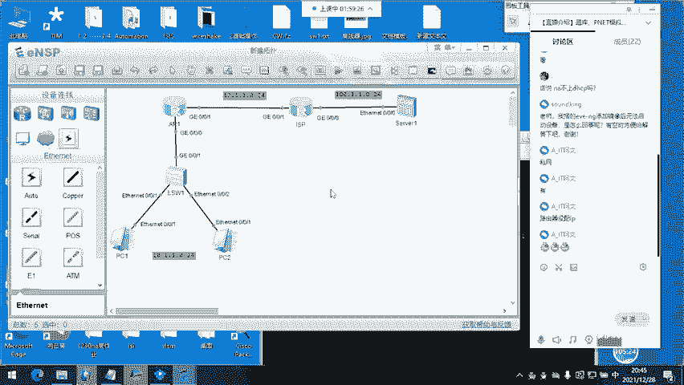

没问题吧，不开玩笑了啊。那现在PC1和PC2是能通的。PC1和PC2能通呢，是因为。😊，他们在。同一个网段同一个网段，那他们不用经过路由器就能通。你看不用经过路由器就能通。那这个时候呢。

我们在这个接口上要设置啊interface吉比特的。0-0-0口，大家说这个IP。你们说我来配。这个IP应该是多少？对。就是网关IP嘛，10点。254掩满了24位。看一下啊，配了，那还需要配哪个呢？

0-0-1口对吧？IPRdress。12。1。1。1吧，野码呢是24位。OK配完以后看一下啊，得 space IP interfaceface。不认服。两个接口配的IP有没有配错，没没配错，对吧？

OK看一下起来没有。up啊都是up。那行，那PCE呢目前能聘得到他的网关啊pin。

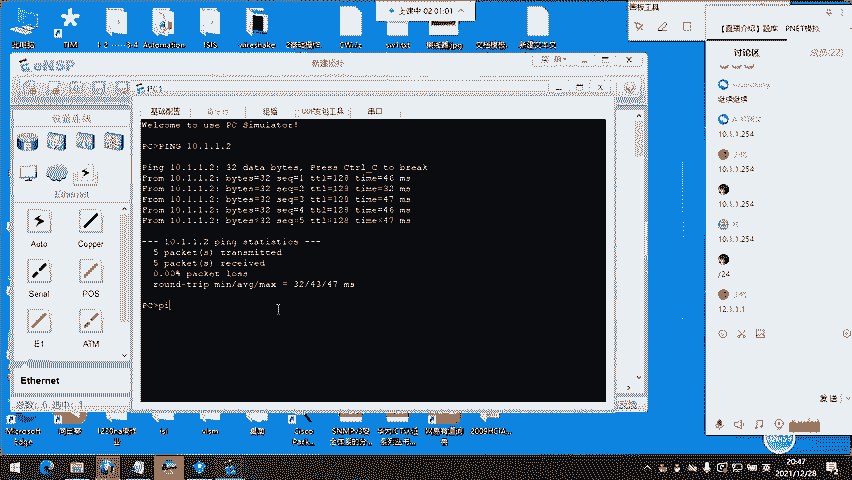

254。哎，他也能拼得通谁呢？他也能拼得通12。1。1。1。为什么呢？因为路由器他知道12。1。1。1在哪儿啊。哎。路由器知道OK那我们在这儿配个嗯。这是。0-0-1口。12。1。1。2掩码呢是24位。

哎，然后呢，interface吉比特的0-0-0口。100。1。1。254野码24。OK我们来聘一下啊。100。1。1点。100。能通服务器对吧？那这个聘这个谁聘12。1。1。1。没问题吧。

那现在我们做的这些配置。现在我们做的这些配置。有没有问题？就给接口配了个IP。没问题吧。OK那我们需要加一条什么呢？😊，加一条静态默认，还记不记得怎么写？出街口。下跳。2。哎哎哎，你再想想。

32位掩码吗？根据最长夜码匹配规则。记反了吧。地反了吧。理论记反了吧。这是我们在宣告自身所有网段的时候用到的。现在我们要加的是静态默认。静态默认不是这样写的。来看一下啊。

我写的静泰优先级60进去没有进去了0-0-0。然后呢，他的下跳12。1。1。2，然后这个是。出街口在这边啊，0-0-1口没问题吧。这条。有没有问题？我刚写的这条。也没问题，对吧？那这个时候呢。

这条命令一定是在你企业边界连接路由器，连接运营商路由器的这个接口啊，这台路由器上配置的啊。只到路由器就OK了，只到路由器就OK了。你不知道的交给路由器公网路由器，知道怎么走OK。那行。

那现在呢我们能不能拼得通？公网路由器呢，大家说你觉得能不能拼得通，聘12。1。1。1呃，12。1。1。2。能不能通？呃，不用不用REP啊，用PC屏内网主机屏。对，通不了，为什么呢？

因为运营商他不关心你内网，不可以不可以。因为运营商他不知道你内网到底是如何连接的，你和运营商之间也不可能去运行动态路由选择协议。你只写一条静态默认。交给运营商。然后呢。

你还要做NAT或者是PAAT或者是EIP来把去外网的这些数据包的原地址，也就是1网络给他转成多少呢？转成12，就是运营商给你的这个公网IP你这个接口一定使用的是。买的从运营商买过来的公网IP地址不对吧？

那我们呢先给大家演示什么？呃。静泰的NAT要不要演示？静泰的AT要不要演示？需不需要？来一遍。好，静泰的NAT呢，咱们不需要用到访问控制列表，不需要NAT啊呃，不需要ACL啊，那我们直接进入到接口下。

0告0告即口。在哪个接口做0-0-1口啊，在这儿做哎，然后呢，NAT你看后面有什么呢？后面有out board server server star，我们要做静态，就是。

staratic后面能加什么global。哎。然后。这个是什么？这是说你要映射的，你要映射的地址。你要映射就是映射后的地址啊，现在映射后，那你们说映射成谁？12。1。1点。点几。你觉得点几合适？

点二合适吗？你再说一遍，点二合适。点一合适吗？你再想想静泰NAT啊，现在是。你有没有想到刚刚辉哥三番五次强调的东西？一和二能不能用？一和2。能不能用，你有没有发现什么端倪？一和二谁在用？

一和二你的接口在用运营商的连接，你的接口在用。你想干啥？一和二能不能不行啊，我们来个三。来个三啊，行，那三呢后面能加啥哎，我们要映射的地址是多少呢？是。😊，10。1。1。1OK敲完以后回车。

咱们看一下啊。一条命令已经映射完了，一条命令已经映射完了。那这个时候呢，咱们的。哪一台主机能够访问外网？现在现在哪一条呃，哪一台主机能访问外网？

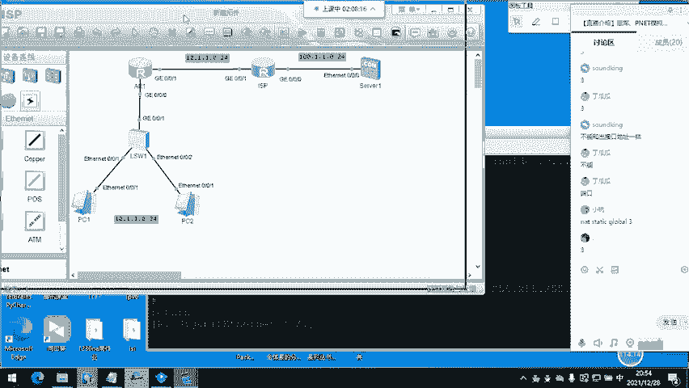

点一对吗？点一能访问外吗？你看。点一甚至能去到多少，甚至能去到。点100。

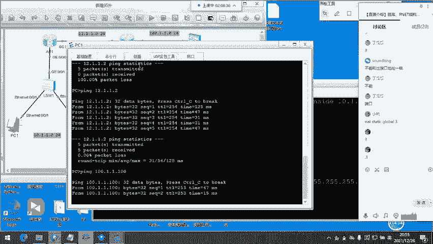

然后呢，我们在这个接口。抓个包啊，0-0-1口来抓个包。这接口从这儿发出来的已经是被转换过的地址了，对吧？我们来看一看它的原地址是什么，我们来看看原地址是什么。嗯。OK。再拼一下啊。拼100通了。

我来抓包IIP的拼包请求看到没？sces是谁？s是12。1。1。3。咱们抓到的是谁？在这一接口？原地址是多少？12。1。1。3。如果你在这儿抓，你抓到的是谁？大家想，如果在这个接口抓包，我们抓到的是谁？

对，10。1。1。1。试一下啊。好的。那已经打开了。OK你看啊，我们又拼了一次，又聘了一次原地址destination呃，这个原地址source是10。1。1。1。而。

一旦经过了这个接口啊一旦经过了这个接口。一旦经过这个接口，你的原地址就变成了12。1。1。3。为什么呢？因为我们在路由器上。

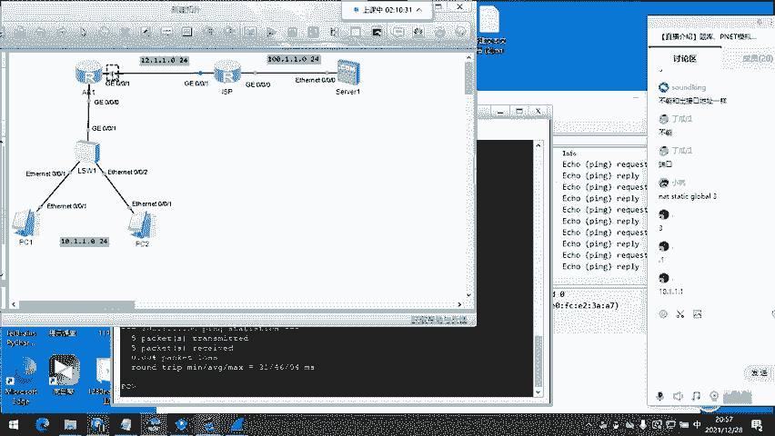

写了哪条命令，写了哪条命令，就是写了这条命令，就是这条命令的缘故OK吗？这个静泰NAT。有没有问题？静泰NAT没问题吧。没有啊，那PC2呢，它是去不了外网的，为什么去不了外网呢？第一，它没有被转换啊。

我们来拼一下。第二呢，公网路由器不知道它的。

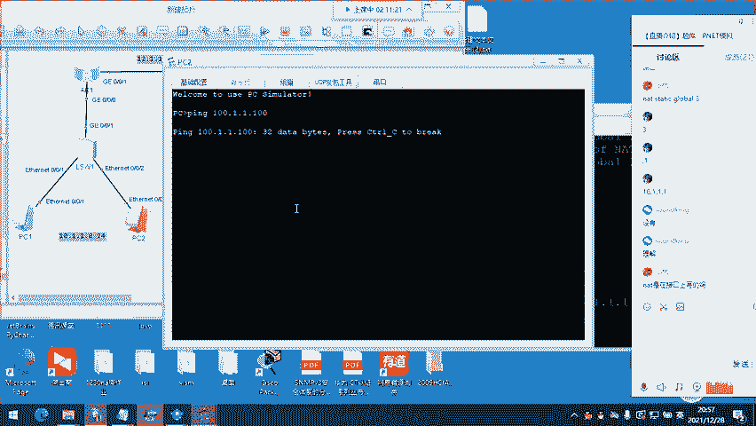

地址在哪儿？公网路由器不知道他的地址在哪儿，公网路由器不知道实网络在哪儿。ISP不知道实网络在哪儿。他虽然写了静泰默认，会把去往100的包交给他，但是呢，他有没有能力回包，有没有能力回包？没有能力回报。

他有能力回报的，他知道12网络哎，我们刚刚写的那条。静泰LAT啊，就这一条一一对应你一个内网私有主机的地址，对应一个公网IP你有两台，你就得写两条。那么第二条。我就不用写了吧，第二条不用写了。

大家下去以后自己演示啊，自己做一下实验。呃，先把这条命令删掉啊。OK那这个接口上这个接口上啊，NAT是在接口上写的吗？你看嘛，我们现在所处的这个视图。是吧。是在接口上，对吧？

那这个接口下只有1个IP了啊，12。1。1。1，只有这1个IP了，其他的配置都没有了。那我们来演示一下动态的。动态的NAT啊动态的NAT动态的NAT呢要求我们写1个ACL还要写一个什么呢？地址池。

地址池里要放进去你要转换的地址，你要转换的地址。那我们来。动态的AT呃PNAT还是直接PAAT。这两个的原理。哦，动态的NAT。PAAT啊，行，那我们写先写ACLACL2000。

这是一个基本的ACACL。若。5、permit抓取啊，匹配啊，匹配谁呢？匹配原地址是10。1。1。0。这次我们把他们俩都抓上，好吧。0。0。0呃哦哦哦。0。0。0。255。看一下啊。

就写了这么一条ACE。😊，这条命令有没有问题？没问题吧，我抓的是谁？我抓的是。1到。2550到2550和255不能用1到254啊，抓的是这些OK。那做完这个以后呢，咱们还需要。

创建一个地址池NATdress group后面呢能跟0到7，你随随便写啊，就是地址池的名字，地址池的名字dress group0。哦，OK那后面呢要写上IP地址的范围啊，IP地址的范围。

我们来写这个12。1。1点。5。到多少呢？到12。1。1点。5。明白我这什么意思吗？如果我再写个十，你知不知道知不知道是什么意思？我放进去了几个地址。我把5到10哎都放进去了，放进去了6个地址。

如果我只写5到52。1。1。5，我放进去了一个地址。那这一个地址呢，咱们是做的是PAAT啊PAAT它能够完成这两台主机的地址转换OK吗？啊，just group0写好了写好了。

我们来看一下啊display。😊，IAT addressdress group0。这是咱们刚刚写的地址池啊，这条命令来看啊，我的地址池编号为0放进去了，这是开始的地址，这是结束的地址。

5到5只有一个5没问题吧。没问题吧。OK咱们进入到接口下啊。0-0-1口。NAT。呃，NAT。出向了啊出向了，现在是考虑到出和入了，出和入出入昨晚你在昨晚我们在讲的时候，你在不在出现在是出方向OK吗？

OK吗？有没有问题出发向？OK出方向。然后呢，咱们现在要写ACL，你写的ACL的编号，我刚刚写的是2000，对吧？A out2000初方向应用ACL2000。我在这台路由路由器上写了ACL2000。

后面咱们要接这个地址池啊，接地址池啊dress group啊 address group。地址持编号是0，这个有没有问题，这个有没有问题？有没有问题？没问题吧，那后面还能加什么呢？

noPAAT咱们要做PAAT这条命令加不加了，这条命令加不加了，不加了啊，不加了，敲完直接回车，直接回车。那么我们。😊，在这台路由器上抓个包啊。零和一都行。现在呢咱们的PAAT已经做好了。对。

加了就是动态的NAT了。那这个动态的AT会有问题，会有什么问题呢？因为我们地址放的太少了，我们只放进去了一个地址。他俩。

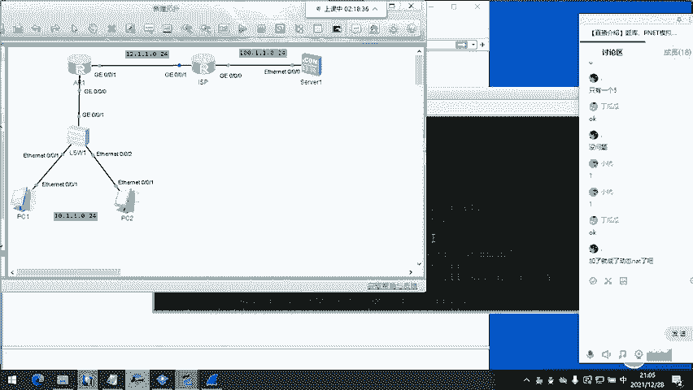

如果同时访问外网，一个肯定是出不去的，能理解我说的意思吗？嗯。好的，那我来聘一下啊。

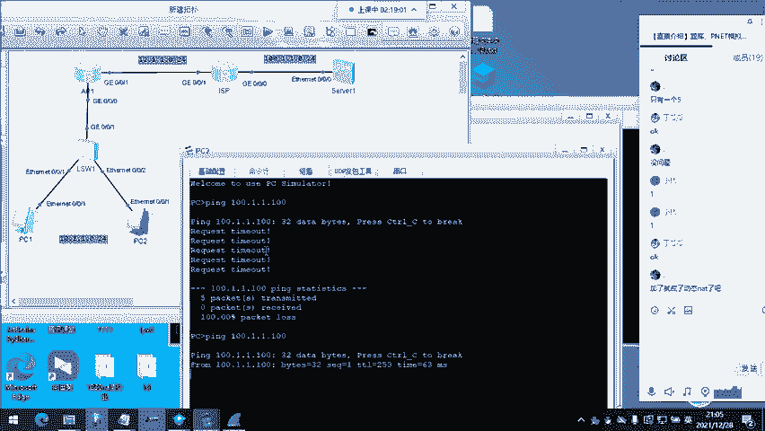

你看。我两个PC同时聘外网，同时聘外网都被转换成了多少？都被转换成了12。1。1。5。有没有问题？你有没有问题？这个呢是因为自身的ARP表象过期了啊。这个是ARP报文。ARP请求。没问题吧。

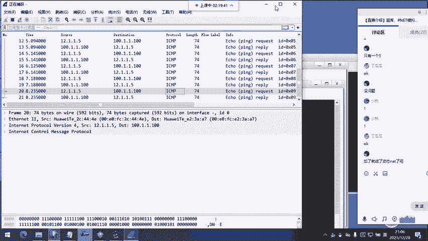

现在对于这个。NAT啊NAT就是网络地址转换的名字啊，它里面包含着PAAT。然后呢，华为叫NATT以及。EZIP还有什么呢？NAT server NAT server。它里面还有很多很多东西。

咱们的NA啊就了解到这儿，能做地址转换就OK了。那大家对于这个实验还有没有其他的问题？对这个实验还有没有其他问题？一ZIP。没问题啊。EZIP就EZIPEZIP简单。EZIP简单。

我们来先把这个地址词删掉哦，不行，先进接口下。把调用的这一条命令给删掉啊。先把这条命令删掉。OK那这个ACL啊ACL不变，华为呢。然后我们把地址词删掉。OK。0-0-1口非常简单啊。

NATout board。2000，这就是华为的EZIP简单吗？简单吗简单啊非常非常简单。我现在在聘外网啊，我在聘外网，能通能通抓包。

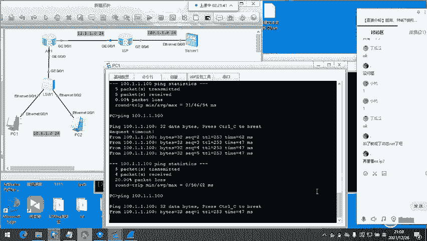

你说哎不知道看看没看到啊，你说他用的这个地址是谁的？他用的这个地址是谁的，你有没有看到？ACL要做呀，接口的，你看看到没？就是华为的EZIP简不简单？简单吧。😊，嗯，ACL肯定要用呀。

我我这都写了出方向用ACL2000呀。SL我没删。有问题吗？这个EZIP。他叫的这个名字和他所做的这个配置啊是名副其实的。嗯。名副其实。然后呢，呃我们再对真的很Ey。

我们再给大家演示一下这个服务器映射到公网啊，服务器映射到公网。我们拉一台服务器，内网服务器映射到公网。开机。然后呢，我们使用的是1210。1。1点。312。三没用，对吧？10。1。1点。254。

OK我们来聘一下。100现在能通啊。为什么能通，知不知道？为啥能通？这个服务器上来就能并通这边的服务器。知不知道为啥？很简单啊，因为我们刚刚做了什么。做了EZIP还做了什么，只做EZIP行吗？

还有一个什么呢？😊，还有一个什么？忘了吗？我们抓。哎，我们ACL抓的时候抓的是谁，抓的是10。1和10。2吗？还是1到254？1到254对吧？把他也抓进去了，把他也抓进去了。所以呢他现在能直接访问外网。

那我们现在需要把这个映射到。

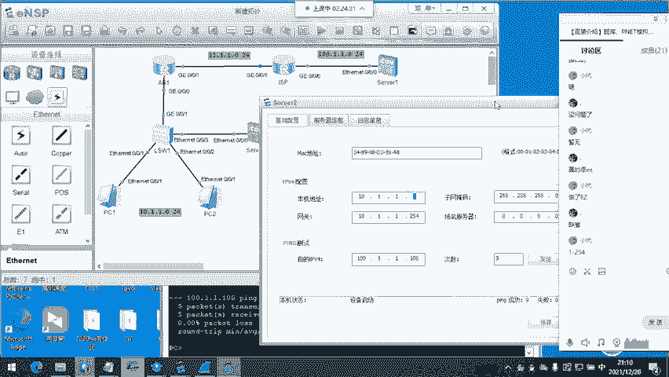

公网怎么映射呢？NAT。Sever。你看啊global。现在呢是你要映射的地址，我们把它映设为12。1。1点。100OK吧，然后呢，inside的它的原地址是多少？10。1。1。3OK。OK你看啊。😊。

就这条命令就这么简单，已经把这个服务器映射到公网了。我现在聘谁呢？10。1。1点。100我骗个9次。嗯。😊，等一下啊。拼错了拼错了，不好意思，拼错了。拼拼骗拼拼拼拼拼的不是这个拼的不是这个。

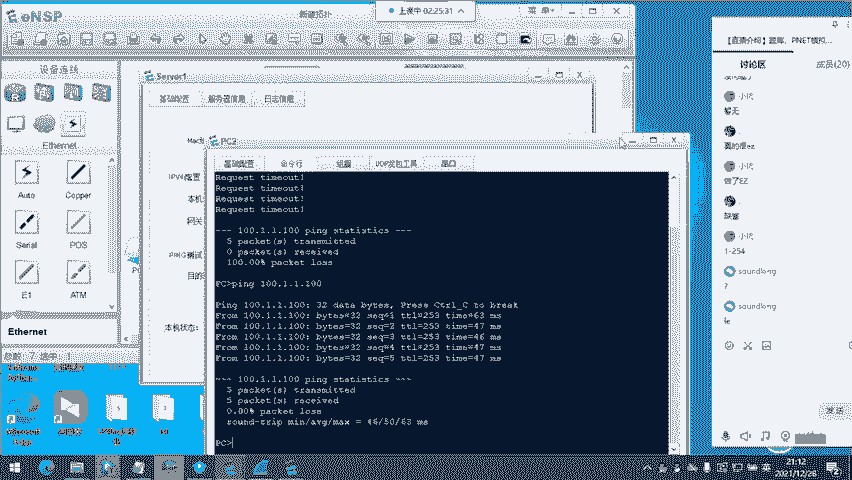

我映射的要骗我映射后的地址。我刚刚映射的是三对吧？要聘3啊，要聘3。拼三拼9次。嗯。他是一，他是2。我映射的是三没有问题。我映射的没有问题。不是命令的问题啊。哦哦哦哦哦哦哦。😮，拼的拼的不对拼的不对。

骗的不对啊。聘100呢。好，重新拼一下啊，成功了啊成功了。那我们在这个接口。抓一下包。你抓到的一定是。目的地址是多少呢？是10。1。1。3，而不是12。1。1。100。不信我们抓一下啊。嗯。OK拼了啊。

你看。原地址。原地址是。100。1。1。100，目的地址是10。1。1。3。但是呢我在这里聘的是多少，聘的是12。1。1。100，能理解吗？可以理解吗？他在这个接口收到了去往12。100呃，12。1。

1。100的。这个数据包他会把目的地改为10。1。1。100改为这台服务器的啊，10。1。1。3，他的地址。OK吗？这个就是夫务器映射。有没有问题？有问题吗？helello。再看一眼配置命令。

配置命令你打问号也行。

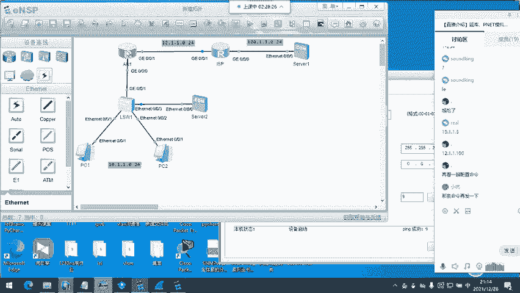

AT。往后打问号也行，你看啊NAT。问号什么。3个。三个对吧？然后呢。继续啊，比如说咱们要做静泰。就这条命令。static，你再看哎，后面有什么呢？李内宝。默认是开启的，我们不用不用开启不用开启。

这个是映射静态映射。哎，这个是让你输映射后的地址，输完映射后的地址，再输应side的映射前的地址。你可以打问号啊，打问号这些单词应该都认识吧？嗯。我看一下命令啊命令。

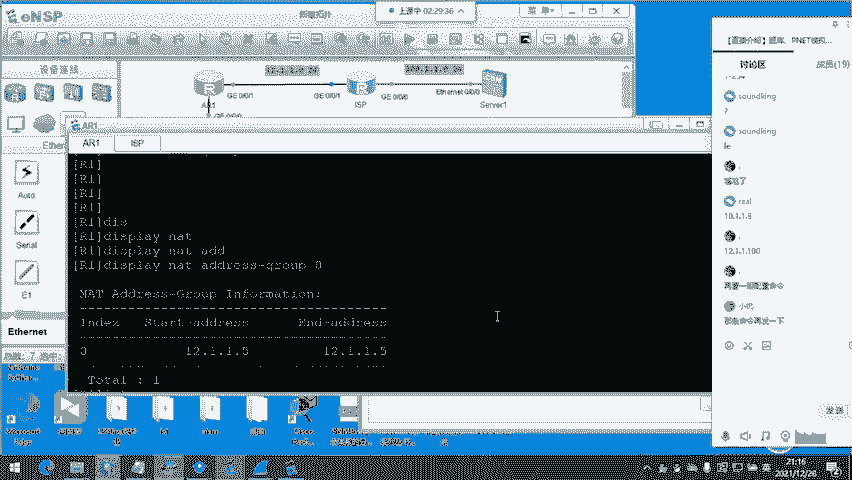

面令就几条不到5条。你在接口下打NAT，然后呢看。后面的这些提示都能看得完，都能打得出来。那咱们对这个AT网络地址转换。什么。100也可以换成三或是4。你这里吗？聘的目的地。不行啊。

你在映射的时候可以换成三和4，你在聘的时候就不行了。命令中可以呀，只要你接口没备用。只要你和运营商商量好了，你把12。1。1。3卖给我。你要买啊你要买公网IP。默认啊运营商给你的这个。

就这个接口的IP。就算你已经买好的。这个就算你从运运营商买的。你一可以用，但是二不行，二不行，因为你还没付付费来着，你没付费来着。23456789都不行。你你要用你还得买。

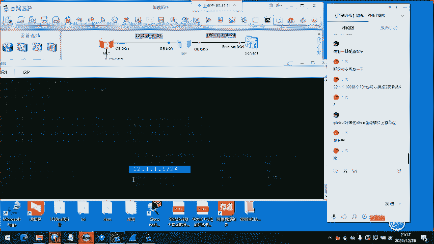

可以吧。那这个设置呢一般都是在企业的边界，企业边界路由器。也就是说你们内网丝网私有主机所有主机数据的出口、出接口出接口上做的。解决的问题就是内网私有使用私有IP的这些主机。他们产生的数据包。

公网路由器不转发。呃，你要是有钱嘛，买吗买吗？你如果是银行的，没问题，你你的这些主机要要用公网地址也没问题。你给他们配公网地址也没问题。刚不是说了吗？辉哥也给大家讲到了。你如果是银行。有钱。你不买你。

😊，你不买运营商那些地址。你不买，你想白拿，你想白嫖。现实中现实中就用EZIP呀。EZIP你用PAAT还是需要一个购买一个额外的地址，你接口用一个地址，你还需要购买一个额外的地址来做转换。

那这个EZIP直接用你接口地址多香呀，香不香？😊，你觉得EZIP和。PAAT你觉得哪个香？嗯。对，现实中用。EZIP。那可能是你和运营商。接触过有一些业务往来啊。那这位同学已经给大家。讲到了啊。

一般都给8个，可以用的是6个。那这两个不能用的是哪两个，一个是你的接口，另一个是运营商的接口。那你得用问运营商了啊，我这边不是运营商，我不知道他们是怎么定价的，几百块吧，一个月。还有问题吗？

我们的主题已经逐渐偏离了。大家还有没有问题？那明天晚上呢是。综合实验给大家。稍微的做一点。就是真实的。项目，然后这个项目呢。咱们学完NA要能够交付的出来。稍微大一点，但是没关系，咱们一步一步做。

肯定没问题。那如果NA。这个大点的实验处理起来也没有问题，行云流水，得心应手。那就别在NA混着了啊，咱们去NPIE里面。去搞那些更厉害的东西。NA就是带。我不是说让你去找张老师了吗？咱们是直播答疑。

无法启动设备，可能是因为。虚拟机的某些设置。因为应记。你去找一下吗？张丽华老师。班级群里应该都有呀，班级群里应该都有。助教老师都在。那大家对这节课NATPAAT以及EZIPNAT server。

有没有问题？啊，班级群里头有啊。没问题吧。那行，我接下来把这个视频给大家整理一下。那你需要这个实验的命令吗？就几条。

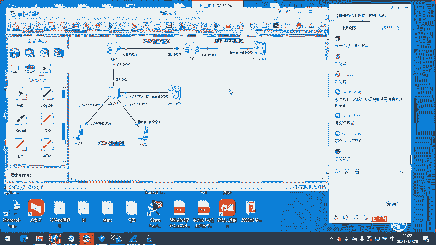

在接口下打问号全部能看得到NAT后面跟问号。那ACL。对。原理懂了才好。原理懂了才好。有些。今天中午的这个周作业里面也给大家说了，有些癌E，虽然他有癌E证书，他只是能够背的出来。考癌E的这些。命令。

如果你变换一丢丢需求。重要的是原理重要的是原理。你命令在接口下，你看吧。全部都有。只要你的问号打的多。各种各样的命令。最终都能看见。好。那我把这个。哎呀。咱们的这个这个这个。讲的时候都是一步一步讲的。

一个单词一个单词讲的。你看一下后面的这几十分钟，回过头来看一下这些命令啊。

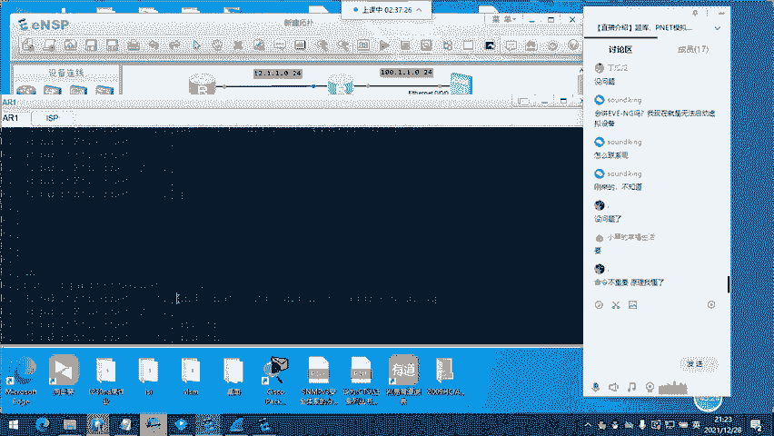

回过头来看一下这些命令，原理最重要。对。董元理。原理懂了，命令你看提示，你也能敲得出来。如果原理不懂，你只看提示，你可能还真敲不出来。那行，那咱们今天就到这里。那明晚呢是。最后一节。

咱们会把NA学到的这些所有技术啊。都应用在同一个实验里头。那尽量呢这些实验包含一点点。NP的东西。然后呢，让大家提前了解一下。一些特殊的需求怎么做？行，那咱们今天就到这里啊。呃。

我带着你们做啊我带着你们做，就像今天这样一条一条命令，一步一步带大家。一步一步带大家。图给你们自己做的话，那太不负责了啊。我还得。我还得设计一下。明天早点把图放出来吧。明天你私聊我问我要一下图。

我得设计加一些其他的需求。然后呢，是加分项，明天你私聊我啊。行，那咱们今天就到这里。OK。OK那大家。大家拜拜。

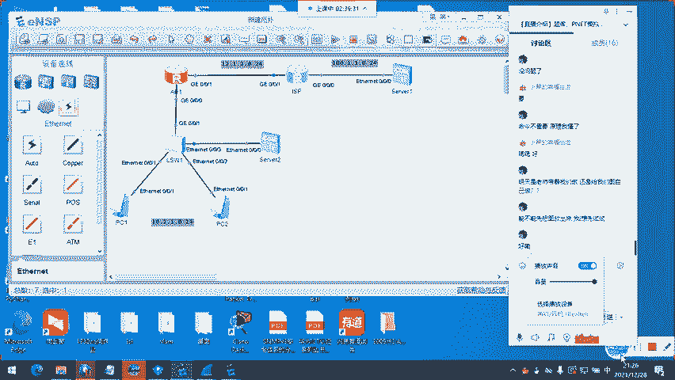