# 2022版华为认证HCIA-DATACOM教程，内部课程公开分享（已完结） - P15：XCNA15-NA综合实验 - 网络工程师CCIE - BV1AP4y1J73k

好的，我们开始啊。那今天呢是NA阶段的最后一节课综合实验。综合实验。那这节课呢。把我们之前这轮NA学到的这些知识点都有一个应用，应用在这些网络设备上。那今晚呢咱们主要做的就是这个实验这一个实验啊。

这一个实验。然后呢，这是实验的需求，这是实验的需求，我们先来看一下啊，这个实验需求它是这样讲的，他说。分为总部和分部两个部分。那么呢，这边呢，他给标明说这是总部，这是分部。然后呢，他说的这些要求。

第一个要求，总部内的PC1和PC3使用。1网段属于伟赖12和4使用20网段，属于伟line20。那服务器A使用99网段，并属于伪赖99OK吗？具体地址字拟。那么这个具体地址字拟，通常情况下啊，都说的是。

网关哎，网关和我们主机服务器的这些IP自己写。那这个网关呢，咱们通常情况下，管理员在配置的时候，要么是该网段的。第一个可以使用的IP地址，要么是该网段的最后一个可以使用的IP地址。那这里呢大家回顾一下。

在一个网段内，在一个网段内。有哪两个地址是不能给这些网络设备使用的？两个地址。两个地址。还记不记得？一步一步来好吗？我们先来说第一个需求。哎，0和255。对这两个地址呢，它一个代表了该网络的网络号。

该网络的网络号，另一个代表该网络的。广播号广播地址OK那这两个地址呢咱们不能使用。那我们通常网关要么是一，要么是254，有没有问题，有没有问题？2到253也完全没问题啊，你要是能记得清。

你要是能记得你做的这些配置。都没有问题。OK那我们继续往下看。然后呢。这就是第一个需求，读起来也不是很难，对吧？读起来不是很难，那做起来有没有问题？第一个需求，大家觉得没问题的扣个一。第一个需求。哎。

非常好啊非常好。那证明呢这轮NA课啊。这轮NA课咱们没有白跟啊没有白跟。那好，主机呢这些IP主机的IP网关我已经配好了啊，要不然呢又是这个耽误时间呢，你看220。254。1010。254。

202254没问题吧，这个服务器是99。那这几台设备，你看这四台计算机和一台服务器。他们配的这些接口掩码网关有没有问题？有没有问题？

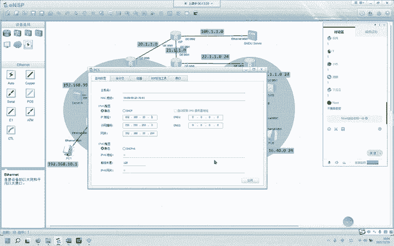

没问题吧，没问题，我们扣个一继续往下走啊。好，行，那需求说他们呢他俩属于伪line10，他们属于未line20。那我们现在需要在这三台，哎，哎呀，不好意思。这三台交换机上要做围烂啊，做微烂划分。那好。

我们先从这台核心的做起啊。第一步第一步，记不记得先干什么？先干什么改名字啊，他的名字都叫华为，都叫华为。OK那改完名字呢，我尽量别把这个配置的框给挡住啊。

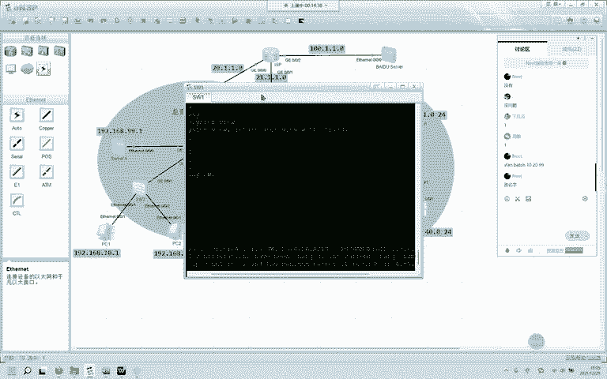

好的，那我们来做vletbach120和99有没有问题，有没有问题？没问题吧，那我在这边加个12。我加个12，我待会要给这个接口配个IP。有没有问题？没问题吧。没问题。好。

那weline batch1012299。哎，行，那他创建完成以后呢，我们来这边也要创建。这是SW2。伟letba1299okK这台交换机也是一样的啊。walet batch1299。

这三个v栏创建完成，那我们可以怎么查看呢？display。维栏，你看我在这台交换机上创建了4个围栏，4个围栏。OK那我们来做围栏划分。那这个链路和这个链路。哪个报文？哪个报纹影响观看？交换机。这个吗？

这个吗？你有时候必须还得看他，你有时候必须还要看他。你做个OSPF。你邻居起来也不给你提示，不起来也不给你提示，你怎么整？😀Ha哈。😊，习惯就好啊，他要给你提示。

你提示你成功创建了vline1012299OK那我们来修改这两条链路，我们要把它作为什么呢？中继哎interface。吉比特的0-0-2口，对吧？Pt。

link type truckport truck啊low pass围这边呢后面可以跟什么呢？跟。围let号也可以跟一个on也可以跟一个on。那我们现在呢是模拟实验啊，那我们就直接一个on简单省事儿。

简单省事。这个on代表什么呢？代表放行了2到4094的所有围let，这个有没有问题？咱们的这个有没有问题，没问题，OK继续interface吉比特的0-0-。三口对吧？

port link type truck。Pot Ch。啊low pass未来哦OK同上那交换机的SWE的这个接口和这个接口咱们已经配置完成，现在来到。交换机2SW2怎么做呢？

interfaceGP特0-0-1口，这是中继，对吧？port link type truck port truck。port truck are low pass尾栏哦。

Ointerface吉比特的0-0-哎，不是几了啊，以太网0-0-1口。Part。link type access哎，然后呢port default未几v这边是1，对吧？我们来看一下这个接口。

咱们绑定v10。以此类推，这个接口绑定的是多少呢？尾来20啊。0-0-2口port。link type access port default未来20O。我们来看一下啊。这两个接口这两个接口。

做的没有问题。这两个接口做的没有问题。那好，因为呢交换机三和2，它这两个接口连的一模一样啊，连的一模一样。我们可以把123全部拉过来做嗯。怎么样？复制粘贴。可以看看啊。上去了吧上去了吧。

那他还有一个接口，还有哪个接口呢？interface吉比特的0-0-。依alport link type truck， port truck are low pass回栏啊，有没有问题？这个有没有问题？

没问题吧。O。那行，那剩下了另外一个接口，这个接口呢是。interface吉比特的0-0-几口，0-0-4口交换机一啊，我们又回到了这台交换机port link type。Aess， port。

 default。伟赖多少？伟赖。99有没有问题，有没有问题？O。那好，现在呢。咱们的第一个需求已经完成了啊，第一个需求已经完成了啊，这个还没有。99。0-24，那我们还需要做一个welineF，这叫。

嗯，这个叫SVI啊。这个叫SVI。什么叫SVI呢？S就是switch v呢是witcher应是I是interface，合起来就是交换虚拟接口。那这个weive就是交换虚拟接口。

那我们来做啊IPdress192。168。99点几，这边给它配的是网关点254，对吧？点254。掩码哎掩码24位啊。年马24位99OK那他现在呢聘自己的网关应该是没有问题的啊。我们来聘一下192。

168。99。254。拼两次。拼成功了拼成功了。

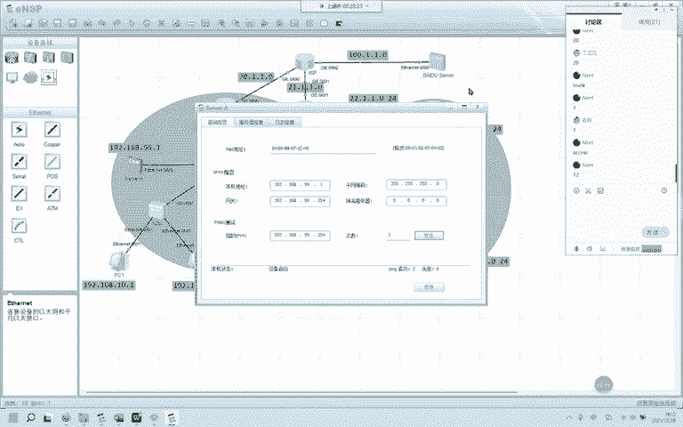

我们刚刚把。99。254绑定到了这个接口，有没有问题，没问题吧。99。254绑定到了这个接口。那现在这个接口就是他的网关。没问题，扣1，我们继续。好的。那我们继续看啊。

说为了保证总部内网不同纬烂接的通信，我们要在交换机SW1上做SVI。那这个SVI就是大家刚刚说的vlineF伟F那怎么做呢？伟line。interface未 F10。IPaddress192。168。

10。254掩码而4位OK报日志起来了啊， up up你如果要把这个关掉，到底起没起来，你还真不知道。那我们继续。伟纳F20对吧？IP啊这。这个是192。168。20。254掩码24位OK。

那我们来看一下交换机现在的接口有哪些啊。你看三个接口，这三个接口都是正常的，这个就叫SVI。这个就叫SOI。可以吗？这个就叫SVI有没有问题？OK那现在呢我们这里头的主机啊，这里头的主机是能够和内网。

你服务器也好。99。A99。1。Per。192。168。99。1。

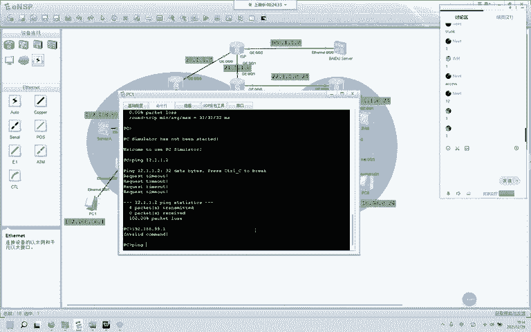

能通能通为什么能通呢？为什么能通，他们明明不是同一个伟let，为什么通了呢？因为这这台交换机有虚拟接口，目前它是一台什么样的交换机呢？什么样的交换机。大家说它是二层还是三层，他们能通。

是因为二层还是三层？三层哎，你看99路由表，它有20怎么走，他知道十怎么走，他也知道。那么至此呢，这个内网的通信已经没有问题了，大家有没有问题？大家有没有问题？没问题吧。

OK那我们还要给这个接口配个IP吧，对吧？interface未 if我们刚刚创的维来12看一下啊，什么都没配，对吧？IP addressdress12。1。1。2掩码24。好的，那还要在R1上。

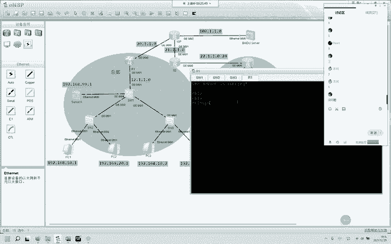

0-0-1口IP。192点呃，不不不不不。12。1。1点，刚刚我们是一还是22，那我们就是一掩满24。我没有。嗯。12。1。1。1掩码24位。那他现在。他最远能到这个接口哈，我们来拼一下，pin12。

1。1。1。嗯。等一下啊。我还没有绑定。吉比特的0-0-1口port0 type。As。port default尾line12ok。对，没划分。没划分。嗯。😊，回来12。看一下接口incurface。

Prayful。12、对的啊。O。呃，不能聘这个12。1啊，我们要聘12。2。因为呢目前边界边界还不知道内网到底是如何连接的，刚刚不通的原因是因为它不知道这下面是如何连接的，OK吗？可以吗？这块可以吗？

接入没有接入没有接入没有，他们上面就只做了个什么。就只划分了个接口啊，划分了接口。划分了接口。现在我们的第二个需求。内网不同纬烂接的通信。有没有问题？我们刚刚所做的就是解决不同尾烂间通信。

你也可以使用单臂路由。那这节课呢没有涉及到单臂路由，就不给大家演示了。SVI同样能做到不同尾烂间通信。那我们来看第三个要求，要求总部分布间使用动态路由选择协议，让内网主机能成功到达边界设备。OK。

那么呢总部和分部都要使用动态路由选择协议。我们先来解决总部的okK呃，先把这个ISP配好啊。呃，这个是。吉比特的0-0-。领口。

20。1。1。2吧。2码24。然后呢，这边interface吉比特的0-0-。依口IPADD。21。1。1。21。1。1。2。1M824。O。OK那这个运营商呢运营商的这个接口。

这个路由器我们就做这么多配置之后呢，什么都不做了。运营商这个有没有问题？这台路由器ISP。大家有没有问题？0-0-0口20。1。1。2，一口是21。1。1。2，有没有问题？大家。没问题吧。

运营商OK那咱们继续啊，那在这个R一呢，咱们要在哪个接口interface吉比特的0-0-领口要做。20。1。1。1掩满24。好的。他呢应该和这个运营商服务器啊呃运营商的。这个接口。能通了。

OK那我们接下来运行动态路由选择协议啊，运行动态路由选择协议。我们运行1个OSPF吧。OSPF。那首先呢OSPF10roD，咱们手工指定1。1。1。1掩码呃，这个这个没有掩码啊。

区域0咱们要宣告的是哪些接口呢？network只宣告。这个接口对吧？这个接口是连接运营商的接口，你没有必要把这个接口宣告进去。那这个接口是多少呢？这个接口是12。1。1。1，咱们精券宣告。也可以。

这是精确宣告，有没有问题？那这个呢是宣告12。1。1。1网断。这两种宣告方式都没有错。都没错。OK吗？这个。这条命令有没有问题？没问题吧。那咱们来个宣告整个网段啊。好，我把这个接口已经宣告进OSPF。

那我们需要在SW1上也要运行OSPF啊OSPF10roD手工指定啊，这个我们就给它指定为。这是个交换机，我们就11。11点。区域0network我们宣告整个网段自身的所有接口，如何宣告自身的所有接口？

怎么宣告？应该是0。0。0。0，然后是25。25。25。OK那耐心等待OSPF建立邻居啊，建立邻居这条命令是把自身所有的接口。那好。提示呢OSPF的邻居已经建好了啊，我们看一下。看一下什么呢？

通过OSPF学的学到的路由，学到的路由。我还没下放来着，是不是因为我上次。没有清配置。我看一下啊。O。这条命令。这条命令。我知道这是怎么回事了啊，因为呢这个top图，我上次在打开的时候按了保存按了保存。

然后呢，这边的top都保存了下来。这半边儿。这外边的没有。这条命令啊给大家看defa。这条命令呢后面加这个always和不加always。但这个区别大家知不知道区别知不知道？就是说你加上这条命令以后。

无论你的本地路由表有没有全零-0这个静态默认啊，OSPF都会把一条静态默认下放给其他邻居。那我们来看看它有没有了IP。rota呃。不是。IP有 the table protocol static。

有呢这是手写的静态。手写的静态。我们来看一下这条这条命令长什么样啊。长这样。这条静态大家有没有问题？这条静态。有问题吗？静态默认。IProot static全0-0。根据最长言码匹配规则。

所有自身路由表匹配不到的路由，最后都会交由它来处理。那么出街口吓一跳都在这儿了。都在这了。OK的吧。好。我看我butter。他都也做了。没事啊没事。这是多少？10-0-呃0-0-11。

我看一下还有没有其他的啊。对，设置到ISPISP然后呢。哈哈哈。😊，好。那我们删掉重来啊。正在正在被调用。对正在被调用。OK是因为这个接口正在调用这条ACL命令啊。咱们还要进入到这个接口，0-0-0口。

看一下。哈哈。😊，呃，来删吧，先删啊，先删后坐。IT。O报的。2000。addresss group0。然后呢，把这个地址是删掉。好。应该没有了啊应该没有了。那现在的内网这些主机啊。

它能够拼ing得到拼得到。这个接口这个接口。我们来试一下片。这是20。1。1。1吧。这个接口那二呢，它现在是拼不到的啊，我刚刚把ACL和NAT全部删掉了。20因为运营商收到这个来自192的路由。

他不知道192在哪儿，他就不做回复OK吗？OK吗？那我们现在的需求已经做到了第三个需求有没有问题。第三个需求。要求总部分部使用动态路由选择协议，让内网主机能成功到达边界。没问题啊。行，那咱们继续啊。

第四个要求是要求总部内网主机可以访问外网，就是上网嘛。同时外网也可以访问。内部总部的服务器。那这个怎么做呢？这个怎么做？咱们需要把服务器映射到这个接口啊，映射成20网络的。

然后呢这台路由器上要写ACL匹配语句，与这个接口需要做NAT或者是EZIP或者是PAAT那我们来做啊，先写ACLACL2000，我们抓原地址。若5spermit source。192。168。0。00。

0。255。255这条命令知不知道什么意思？这个我抓的是谁？我抓的是。内网的这些主机。他们的原IP。服务器OK吗？我抓的是从192。168。0。0到192。168。255。25这条命令大家有没有问题？

入十我刚刚没删掉啊，因为没删掉ACL啊，5没写进去，实在实在。那那我重新写重新写十三了啊，我把五写进去，我们来看一下。现在是五了吧，现在是5了啊，那这个ACL写好了，我们需要在这个接口这个接口下做。

NAT或者是PAAT呃，NAT不需要ACL啊，PAAT或者EZIP那咱们演示EZIP啊EZIPinterface及比特的。0-0-0口，然后呢是。OAT哦 board2000，你只需要打这么一条命令。

打这么一条命令。你ACL抓起来的这些原地址啊，全部会被转换为哪个地址呢？哪个地址。转换为20。1。1。1。对，用的就是你这个接口的地址。你如果想做PAAT啊，你还得另外去购买一个公网地址，供他们转发呃。

供他们转换啊，放在这个接口下供他们转换。那这个时候呢，这个接口下其实是使用了两个公有地址，现在这种方案是不是更优。我直接使用你接口的公网地址，我只使用了一个公网IP。那对企业来说是不是又节约了？

一笔资源，一笔预算。OK吗？那现在呢咱们P这个外网是能通的啊，能通的拼服务器应该也是没有问题的。pin100。1。1。100。他是谁？服务器呢。啊，他的是1。1啊，我们拼错了。偏一。O。

那从内到外的访问。就是这条路到这儿已经没有问题了。没有问题了，从内到外没有问题，大家有没有问题，大家有没有问题？前半句话，咱们的需求已经做完了。没问题，对吧？

OK那然后说呢同时外网也要能访问总部内部服务器sever A哎，那你要把服务器映射到公网。同样还是要在这个接口下来作啊interface吉比特的0-0-0口。

咱们要做1个NAT服务器的映射NAT server，然后呢，咱们映射的地址要使用哪个网段的，哪个网段公网。哎，你供外面的人来访问你的内部服务器，那咱们要给它映射到20。1。1这个网段啊。

那1二都用了是吧？咱们用个三有没有问题？有没有问题，这是映射后的地址啊，你要转换的地址没问题吧。那咱们来看inside，我们要写转换前的地址，转换前的就是它192。168。99。1啊。O。

那这条命令我们看一下啊，这条命令已经写进去了。那咱们聘这个99啊，用公网来聘99是能通的啊。呃，聘的是20。1。1。3。成功俩，我们在这抓包一下。这一接口抓一下啊。再拼一下拼3次。

我们来看抓到没有拼包请求回复都有谁在聘他呢？官网在聘他。宫娃在聘他。100。1。1。1，那聘的目的地址是192。68。99。1。其实呢它在这儿聘的目的地址是多少？20。1。1。3。

这个时候咱们的服务器映射已经做完了，大家有没有问题？有没有问题？还OK吗？映射服务器。为啥？你看吧。外网能成功访问内部服务器。那我先问你，如果运营商看到你要访问192。168。99。1。

运营商管不管你这个流量管不管？运营商路由器里面有没有丝网路由？没有，那没有怎么办？你从运运营商这儿已经买了一个网段的地址了，对吧？买了地址了，你使用你买的地址映射到你这个接口，你外网想访问这个的时候。

其实R一比谁都知道你们访问的20。1。1。3，其实就是在访问我身后的99。1。三没问题，四也可以。5、照样没问题。并不是说只能使用三，明白了啊，那服务器映射在哪个口，你边界路由器，边界路由器的出口。

边界路由器出口。NAT server咱们使用。对，一个公网IP刚刚使用到的叫做NAT server。那其实就是静态NAT反着来用了。

其实就是静态NAT反着来用了静态NAT你会配NAT server就没问题。静态NAT是从内到外的转换。sever是从外到内的转换。OK吗？OK吗？那我们映射的。哎，刚刚在这个地方映射的。没问题吧。

没问题吧。O。好的，第五个。为什么要去ISP？你企业边界能去SP吗？你企业我问你，你是你们企业的网管。你是你们企业的网管。你说啊我进一下你们运营商的机房，我在你们接口上做点配置。

运营商的不骂你就算好的了啊。能明白我的意思吗？😡，运营商的路由器。运营商的路由器，你想干啥？你去我们路由器上干啥？我给你公网地址了，你转就行了，你映射就行了，你还要来我的接口干啥？能理解吗？能理解吗？

能理解啊能理解就不要去这个接口。那你就在你边界去做，你就在你的边界，你是你们企业的网管，你们企业的边界由你来控制。你要是去这儿。那就。搞不搞不好运营商的得。说你几句啊。不在这儿映射啊不在这儿映射。

在这儿映射你企业边界。好的，那这个。要求4R2是咱们的内网的路由器啊。内网路由器。不是运营商不是运营商，运营商我会写SP的。我们继续啊，第四个需求，咱们前四个。都没有问题吧，前四个都没有问题吧。

OK我们来看第五个需求。第五个需求。第五个需求说分布要求主机5能使用SW7作为流量的出口主设备，SW8为备份设备。那PC5在这儿七为主设备，八为备份设备。那我们再再往下看啊，主机六能使用。

8、作为主设备。7、作为备份设备。那大家说现在。这个他算不算一个冗余备份，算不算一个冗余备份？算吧，是冗于备份吧。哎，他考虑到什么呢？考虑到如果。你们部门有很多很多的主机，那这个主机呢如果只有一个网关。

当这一个网关出现问题的时候，出现问题的时候。我内网我整个所有的主机是不是都出不去了，我做两个两个网关，我给你搞两个网关。那好，75的主。八是5的倍，那八是六的主七是六的背，这个听起来很绕啊。

但是没有关系，我们慢慢来怎么做呢？怎么做。就是VRRP。VRRP那第一个V呢是虚拟虚拟的意思。第二个R呢是什么路由器的意思？第三个R是冗余的意思。第四个P是协议的意思，它叫虚拟路由器冗余协议。

VRRP那我们来做啊，那主机这样配，主机还是正常配啊，主机正常配主机没有问题吧。主机。172。16。这是30，这是40主机的配置，大家有没有问题？

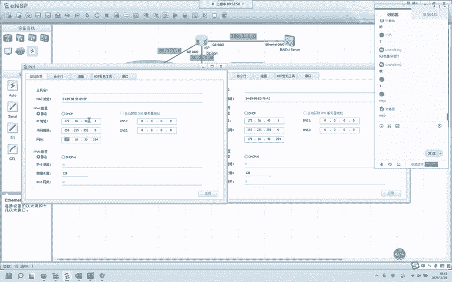

O那咱们继续啊咱们继续7和8ok来7。8。

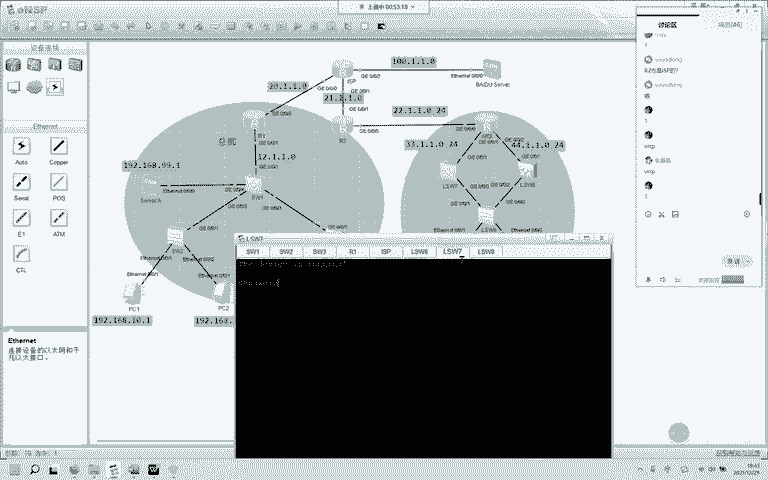

第一步，先要修改名称啊。呃。ss name SW7，这是那另外一个呢是sys nameS6SW8。那这台我们也顺便给他改了啊。6678OK我们先来做。这个。需要创建三个vline，创建三个vlet。

待会儿给大家解释为什么要需要创建三个vline啊，vline30。we来 batch30。40再来个。再来个集。他是PC5，来个PC5吧。未来5。回来5啊53040。那在这边呢。同样需要创建。

will来 batch3040再来个6。OK5和6呢是要绑绑谁呢？绑定这两个接口，这两接口。有没有问题？我们现在就做五和6的绑定啊。呃，7。In her face。5。嗯。😊，我的围栏呢。

batch3040和5。未来服务。OK好了啊，那我们来做个IPIP。address33。1。1点，那就7吧。33。1。1。7，它是交换机7掩码呢24。连杠0杠一口。

acs port default未这是。我们来看一下啊，未来5。好的，那他呢是未来六。嗯。6IPaddress这是44。1。1点。6、野马24。0-0杠，这是几口。一口啊。依口。咱们绑定。

Pot link type access。 port default， Wei Lai。6。未来6OK那我们把R3的这两个接口也做一下啊。阿尔。3。0告0告。依口。这是33。1。1。3。年马24。

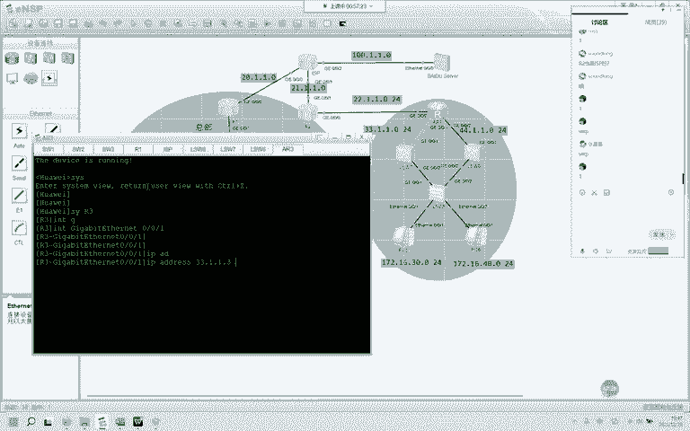

然后呢。0-0-2口。44。1。1点。3掩码24，我们来看一下displayIP。interface brief看一下接口接口这样配这个R3目前呢就做这么多SW7呢，我们来看看啊。有一个接口。

vlineF5，对吧？我们来拼一下33。1。1。4呃，点3。能通，那他们俩之间能通性没有问题。那。同理。这边呢聘这个44。1。1。3。也没有问题。刚刚在这儿做的配置。大家有没有问题？有没有问题？没啊。

好的，那我们继续，我们先把交换机间连接的链路做成什么呢？中继这两个做成acs，他们中继，他们接入，我们先在7上做啊。0-0-。这是二口，对吧？Po link type。Tuck。

port truck are楼 pass围来啊。这边。0-0-。2。Truck， port， truck， are pass。port truck arelow pass围栏啊。OK这两个接口。

那SW6。咱把这条命令给他抄过来啊。0告0告1口。Pot link type。tuck怕 truck pass什了啊，这两条都抄过来。0告0告2口。好的。那剩下这两口，这两个口呢是。

中介呃接入啊接入interface。以太网的0-0-1口port0 type。As， pot。Defat we来。刚刚是多少？30啊，应该是30。30对，那这边呢是40啊。0杠0-2。40。

303040，我刚刚在这儿多创了一个5啊，多创了一个5。那这个时候呢，咱们需要回到7和8开始正式的配这个VRRP啊，怎么配呢？interface rely if30里面呢IP addressdress。

这是172。16。30。253。这个现在还不是这个网关啊，然后我们需要在这个里面起VRRPVRP。然后是这个VRRP的ID30，咱们再把这个viIP给它写进去，172。16。点30。254。这个就告诉。

告诉这台主机，它呢这个接口上有一个虚拟的网关，这个网关就是172。168呃，172。16点30。254敲完以后回车，咱们修改一下它的优先级啊，因为要求呢他做7座5的主网关主网关。那我们来30。

我们修改一下优先级，优先级是1到254，默认是100，我们把它修改为120OK。那我们在这边呢。同样也要做啊。伟奈F30，然后呢，IP address192。A17。16。30。253使用了到252了。

野满24位。VRP。30VIP192点。172。16点30。点254，那这边呢不用修改优先级，这边不用修改优先级啊。那目前呢他聘他这个自身的网关是能够拼得通的啊。OK你看他聘网关能拼得通。

而且他这个拼包走的肯定是哪里呢？肯定是这条链路，肯定是这条链路。那我们先把4十也给搞好，待会儿来测试一下啊，4十也给搞定。

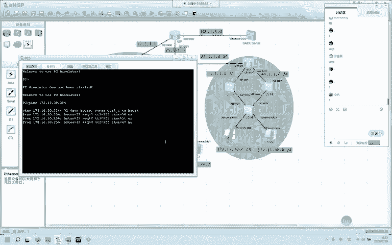

40呢需要怎么样？未来F40。172。16。40。25。2吧。就是7，然后呢，VRP。我们再起一个。点254。这个不修改优先级啊，这边不用修改优先级，然后来到八上面，同样啊。40。253年马24。

这是40，编号是40，虚拟的是172。16。40。254。然后需要修改一下它的优先级啊。40。这个是。120。我们来看一下啊。我在这个接口下配了这么多。那第一个呢是这个接口的虚拟IP这个接口的IP啊。

if的IP172。16。40。253。那VRRP。我创建了一个虚拟的网关，40，编号40，它的IP虚拟IP是40，它的优先级是120。那这个120代表什么呢？120。它的优先级是越高越优先啊。

越高越高又越优先。那在对端呢，这个7上7上我们来看一下。他的优先级默认啥都没写，那代表默认呢华为设备上是100。现在我们拿它聘网关也能拼得通。也能拼得通，而且走的肯定是这条链路。

走的肯定是这条链路。那我们怎么验证呢？怎么验证啊，我们来这个接口上开始抓个包，抓个包来验证一下。

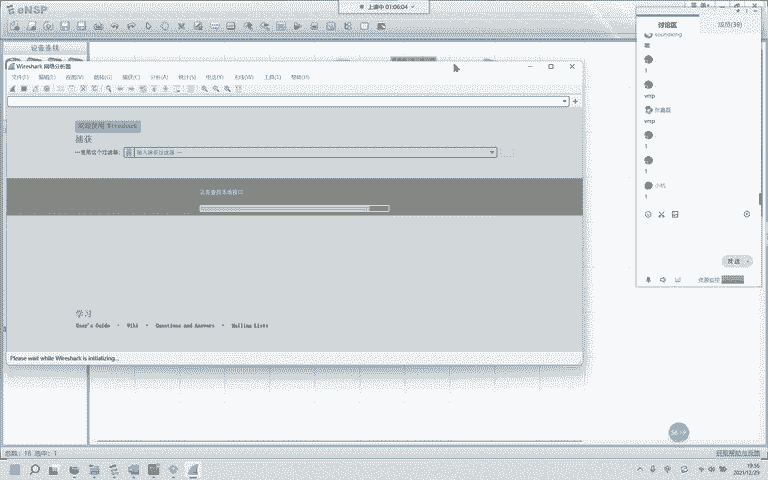

OK我们拿PC5来聘啊，聘254聘自己的网关。抓到了吧，拼包的。太快了。ICIP聘包的请求和回复。在这儿。抓到了对吧？30。1在聘30。254，这个能不能看得明白？这个有没有问题？

我在这边这个接口上抓的有没有问题，大家有没有问题？我这个抓包。没问题吧。我PC5聘自己的网关。没问题。OK我把我的网关。你看现在。他没办法到期了啊没办法到期了，我再拼一下。嗯。😊，稍等啊。252。

254没有问题的。八这是。通了啊，你看现在呢我又聘了一次254。我的网关现在是谁？现在是8，我的网关现在是8，我们来看一下啊。

我们来看。这是VRP30，现在他的角色是什么呢？master。主主你把这个记住啊，它现在是master，那这个VRRP呢，它是支持抢占的。也就是说，当你的SW7正常以后。它会变成什么呢？

它会变成backup back up。不相信的话，那咱们把线给它连回来啊。是二联的。三吗？二连的一应该是。我们看他这边报不报日志。稍等啊。报了。报了日志，你看它变成了back up。

 back up是什么意思呢？备份，我们再来看一下他的角色，你看他现在的角色叫back up，back up备份了。现在我SW7已经正常了。我PC5，我的主网官又是他了。大家对于这个。

VRRP有没有问题？VRRP。我们的这是第几个需求。第五个需求。那同理啊同理另一台计算机也这样测试，测试的肯定没有问题。这个。可以的话，我们扣个一。可以的话，我们扣1没问题吧。哎。

这个叫网关的冗余备份和我们其他的冗余备份的原理目的都是一样的啊。我们最终的目的是怎么样避免单点故障。避免单点故障。什么叫单点故障？什么叫单点故障？就是你去一个目的网络，你只有一台设备帮你转发。

当这台设备宕掉了以后，你内网的这些所有主机PC5的附近可能有很多很多的主机啊，都访问不了外网了。那我们做了这个冗余备份以后呢，当期宕掉以后，我还有八做备份，我还有八做备份，我的五还可以拿八来访问外网。

OK的吧。OK那我们继续啊继续。那这个需求里头又说分布主机能够使用公网地址，访问外网。那言外之意又让我们做一次什么呢？

N和ACLNAT和ACL那我们先把这些接口配好啊。我们来看一下。

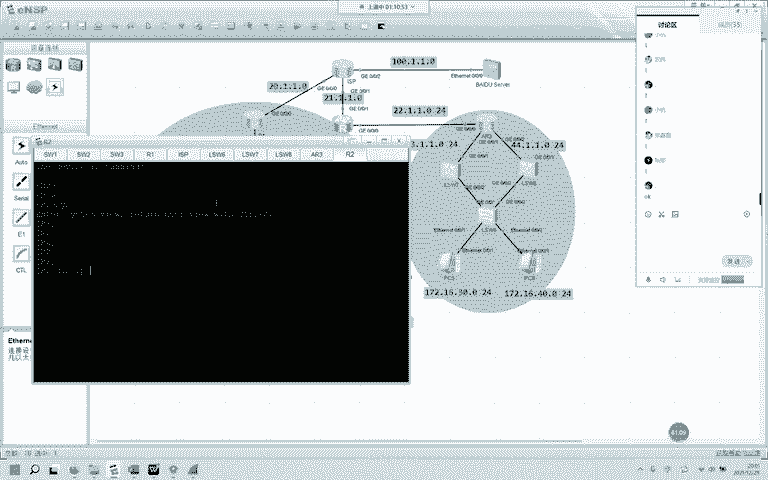

这个接口0-0-023。1。0-0-1。21。1没问没问题啊，看一下这个接口。他还没有写33和44，他自身这个接口还没有写，那我们给他写上啊，interface吉比特的0-。0-0。

IPdress这是22。1。1。2MM24。我来拼一下。P22。1。1点。一。啊。不是吗？不是不是不是不好意思啊，没有22有1个21。还有1个23。那他是23这边地址规划。23我们重新配啊。

重新配interface吉比特的0-0-。0口8。23。1。1。2。再骗一下。哦。又拼错了。23。1。1点。OK那他们的联通性也没有问题，我们需要在这里头。

看一下他的需求是能使用公网地址访问外网的那我们在这边呢也要运行一个动态路由选择协议。

我看看啊。OSPF应该也是有的。ACL也有。他的ACL怎么抓的是。没事，我们待会把它删掉。Address， good。Tnel也在。OSPF10也在。千山这个。Ternoical。然后呢，是ACL。

一口进去，我们看一下这个接口有什么有没有什么配置啊。NAT。看AT题我们会给他。搞掉啊。whatabout2000。Address grouping。看一下地址区列有什么。有1个21。10到点11。

我把这个地址直给也给他删掉啊。地址池。删掉。没了啊，啥都没了，现在啥都没了，我们从头做起ACL2000。又有一个那这条命令呢现在用不到了，因为我们的是172啊，他抓的是192的，我们要抓172的。

没用呃。10。我们来抓permit。South。172。16。0。0，然后呢，返码是25。255，这条命令有没有问题？没有问题的话，我们扣个一。哎。和刚刚那边一模一样啊一模一样。这条命令有没有问题？

没问题。OK。那我们还是在这个接口上做这个EZIP啊。呃，interface吉比特的0-0-1口。OKNAT。2000。好，地址持也不用了。这条命令刚刚也给大家解释过了是什么意思？就是直接用这个接口。

它所属的IP。你内网这些主机在访问外网的时候，原地址都会被转换为21。1。1点几，这是。点1。1。2，你内网在出去的时候都被转换为了这个地址。那现在呢这些主机它还没有能力到达边界啊。

他不知道路由器还不知道内网是如何连接的，我们需要运行一款动态路由选择协议。我OSPF10。你不写十的话，他默认是一啊。我们这个是2。2。2。2。然后呢，是区域。区域0进入到区域0。

咱们要宣告的宣告进OSPOSPF的接口啊，只能有一个就是这个23。1。1。1运营商的这个接口，你不要宣告，我们来。宣告。这是23。1。1。1精券宣告啊，0。0。0。0OK那这这三台设备啊。

这三台设备你可以。全部宣告整个网段全部宣告进去。这是3。3。3。3区域林。咱们宣告自身的所有接口255。25。25。25。O。那他也是一样的啊。OSPF10由台地，我们手工指定7。7。7。7。

区玉玲宣告自身所有接口。OK那已经在报日志了啊，那我们继续这边呢是OSPF10揉台地8。8。8。8。区玉玲。0。0。0。0255。255。25。25。OK那稍微等一下。好的。

我们来看一下R2有没有学到这些内网的路由啊。OSPF。我看我学到了33的，我学到了44的，3344，我还学到了17216的30，还有40。有没有问题？大家对内网运行OSPF这个有没有问题？

分布运行OSPF。没问题的吧，OK那没问题呢，目前他也能够访问外网了啊，他我们来评一下100。1。1。1。好，不好意思啊，我们再来看默认路由在不在。然后听tableable。0。0。0。

0在那我们看一下OSPF下放没有啊，OSPF10。应该没下放，肯定没下放。你看他们不知道零在哪儿吗？全零在哪儿。那我们在这里头给它下放一下啊，YSKF10ro台D这是2。2。2。2。Defa。

就这条命令，后面不用加alive with了啊，不用加al with。那目前呢他们又收到了来自。R一告诉他们的。R一告诉他们的外部路由OSPF外部路由，这叫OASE那优先级是150，优先级是150。

华为是这样标的啊。OK那他们呢现在能够访问外网了啊。我们来拼一下。100。1。1。1。等等啊。我怎么还不行？OK开始排错啊。首先看这个接口。21。2一有没有冲突，这里头还有没有2姨？没有冲突。

到3333就不知道怎么走了。我看你的二一有没有。他没有2一，他为什么没有2一呢？他的默认也不在，我们再来看一下。默认在呀。21。1。1。2，那他是21。1。1。1吧。嗯，他也是2。什么鬼？他是2。

我看一下啊，他是2R2。也是2地址冲突了啊地址冲突了。地址冲突。ISP的，我们给它改为。一吧。0-0-1口。那我再拼一下。

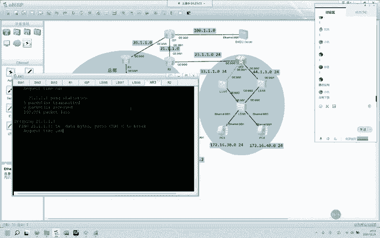

21一口是21。1。他的。一考是。21。1。1。2。啊，评议啊。拼一能通。那我为什么不能偷呢？23。1。1。10-0-0，这个接口是。0-0-023。1。1。2。没问题呀。默认路由我也给你了呀。

权0-0我也告诉你们。到3。

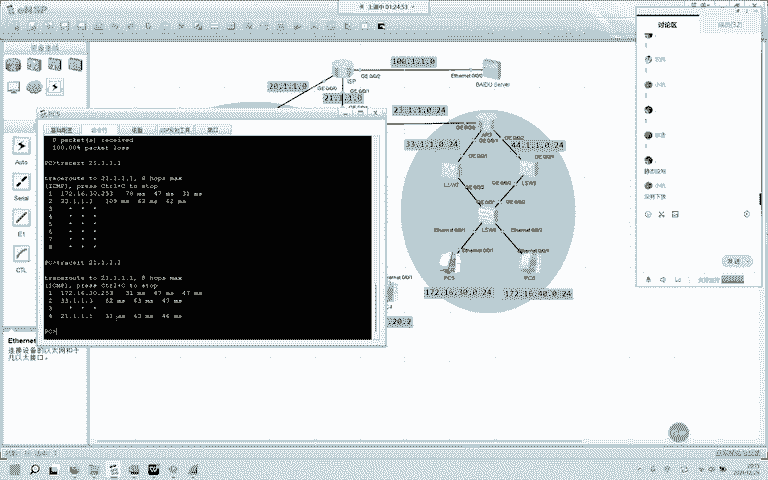

到21哎，通了啊通了，我们再拼一下拼一下100。1。1。1。通了啊。那就是因为刚刚这两个接口不在同一个子网段啊，不在同一个子网段呃，是在同一个子网段，而且他们俩的接口的使用的IP。

使用的IP一模一样啊使用的IP一模一样。都是21。1。1。2。然后呢，中间这个是因为地址转换，地址转换NAT。好吗？静态写了静态写了。静态大家可能没看到。Start点个。嗯。

Protocol static。静态在这儿呢。也只对了21。1。1。1。他是2。好，那现在呢分布也能够上网了，这块有没有问题，这块有没有问题，这是就做了个网关的冗余备份。然后在这儿又是ACL和NAT。

然后呢是。静态默认下放。你有没有问题？有没有问题？那总部和分部哎好了，那我们来到了最后一个需求。最后一个需求说，为了能使总部和分部能够相互通信。

决定在总部和分部之间做JEVPN让总部和分部都能获取到各自的内网地址，内网地址，就是说哎这台路由器知道分部的内网怎么走。

知道怎么走，那你R2也知道他们怎么走，你们这几台都是一样的啊，都知道对端内网怎么走。那我们有几种解决解决方案。都是微平，我们可以做什么VP呢？MPIMPLV平GREV平。那在这个NA阶段给大家看一看。

演示一下非常简单的GRE微平，好吧。GREV平。我们要做VPNVPN要在R1和R2这两台设备上做。最后呢把这两台设备上你VPN。做的那个接口宣告进去，那么你们就能通过公网路由器建立邻居。这个VPN啊。

它叫虚拟专网。你做完VPN以后呢，它会在你原始的三层爆头之上，再添加一次三层报头来欺骗公网路由器。那公网路由器收到以后查表一看哎，我的原地址是公网地址，目的地址也是公网地址。然后呢，它会帮你转发。

当R1发给R2R2收到以后呢，再拆一次三层报头，拆开以后才是真正的IP原IP和目的IP这样解释不知道清不清楚这个VPN的大概操作流程，就是这样，我们通过欺骗公网路由器，我们通过在。

在三层爆头之上再添加一次三层爆头。OK吗？这样解释的话。还可以吗？你可以你看啊，我们拿NAT和这个VPN来举例。NAT大家都很熟悉了啊，NAT就是换地址嘛？换地址，我把你的原IP给你抓起来，给你换掉。

这叫这就相当于是把一个人，你要进去一个地方给你换套衣服，换一套衣服就能进去了。那这个VPN它就相当于在你原来衣服的基础上，再给你添加一套衣服。那NAT是换VPN是加，这样给大家解释有没有问题？

加一层衣服。可以吗？OK那我们在这儿就简单的带大家看一下啊，VPN怎么做VPN怎么做。首先呢这些路由器都有tno接口啊，ternal接口咱们要进入到一个turno接口。进入到一个turnurle接口。

那这个tnal接口的意思呢就是。turnno接口的意思。就是你在拿这个接口发送数据的时候，在原有的爆头之上再添加一层爆头。我们在NP的课程里头会有详细的非常详细的讲解啊。那我们来做。那首先呢华为这个。

华为这个terno啊。他要默认改掉。改掉个。它默认不是使用GRE来分装的。我们看一下这条命令是什么来着。听懂了。turnnal protocol我们给它改成GRE啊，GRER一是这样，R2也是这样。

那这个turnnal编号啊没有要求。两端没有要求啊，这个特种编号没有要求。我刚刚那边使用的是12。因为呢路由器一和二嘛。0-0-12，那我们先改分装。GRE改完以后呢，咱们要做了啊，咱们要做一些配置。

什么配置呢？好的，我们。先说原地址，这个sce啊，原地址就是一个接口的真实的IP地址。这个接口真实的IP地址，我们要使用这个接口的IP啊，这个接口的IP我们来看一下这个接口的IP是。

0-0-0口0-0-0口是20。1。1。1，那我们ss就使用20。1。1。1。O。这是原地址，那这个目的地址怎么确定呢？目的地址就是R2的这个接口，我发包要发往这个接口，R2的这个接口。

你分布的边界路由器的一个接口，对吧？我们来看一下啊。这个接口0-0-1口是21。1。1。2，那我的dest destination。就是21。1。1。2啊。看一下对不对。0-0-10-0-121。1。

1。2。没问题。O。那还要给这个接口配1个IP对它和interface SVI啊 SVI和look back都是一样的，虚拟接口，虚拟的。真正的这个接口不能插拔。

你找不到你在路由器上你找不到的那在这个接口要配1个IP配一个什么呢？我们看啊配个。特殊一点的就。目前没有被使用掉的17219230。172。998，我们使用172。99。1。1掩码24，我们来看一下啊。

OK这就是这台路由器上。这个tno的配置，那R2上正好是反过来的啊，sce是什么呢？原地址是自己的接口，0-0-1的221。1。1。2。destination是对端路由器这边的这个接口。

那这个接口是多少呢？0-0-020。1。1。0。那我们来。呃。destination是20。1。1。0，然后呢，terno。这个。这个turnno也需要1个IP。172。99。1。2野码24。OK吧。

OK吧。好，我们来看一下啊。ticalterical99。1。2。那R1呢？99。1。1。那我们现在呢就能通过99能跨公网能拼得通了啊。99。1。对的。我重新进去看一下啊。turnno0-0-12。

172。99。1。1。没问题。172。99。1。2也没有问题。R2的目的R2的目的写错了吗？R的目的写错了吗？distination哦，它怎么是个这。不好意思啊，我写了个网络号。写了个网络号。就是20。

1。1点写这个的时候。一定要细心细心再细心啊。Distestination，目的地。20。1。1点。一。能不能覆盖掉？他都应该起来了啊。天都应该起来了。我们再拼一下。好，那我们现在拼通了啊。

非常感谢我写了一个网络号，我写了一个网络号。现在呢咱们的拼包啊，咱们的拼包你可以看一看。它有几层三层爆头，因为呢它分装了。

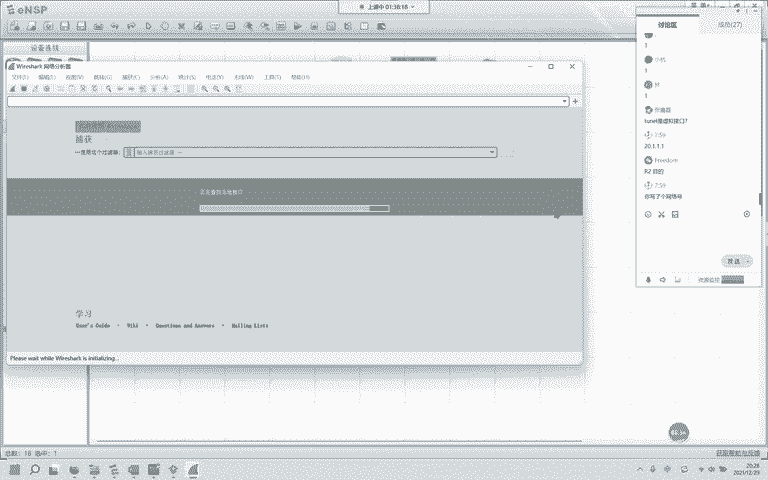

两次三层爆头。你看你看你看你看你看。IIPICIPIPV4。这是IPV4，对吧？这儿又有1个IPV4，大家能不能看这个豹纹，我们抓到的豹纹能不能看懂？我们分装了几次IPV4爆头，几次。里头这个才是咱们。

真正要去的地方，外面这个就是给那个公网路由器看的。哎，公网路由器一看，哎，20。1。1。1，我认识点2，我也认识。他们都是公网地址。所以呢我就帮你们转发。其实呢其实呢你看GRE。他通过GRE封装的对吧？

公网路由器，他不管这个了，他看完这个哎，你是真正的，我觉得你是真的，他就帮你转发了。转发以后，你在你的边界做了turnno，做了GRE他是知道的，哎，你真正的目的地是去哪里。这个大家能看懂吗？这样讲。

你看2个IPV4爆头。可以吗？咱们的GRE原理。就是给你加一层衣服，欺骗公网路由器。有没有问题？哎，可以，那行，那我们要通过OSPF通过OSPF来建立总部和分部之间建邻居建OSPF邻居跨工网跨工网建啊。

那怎么建呢？怎么建？咱们进入到OSPF。这是1。1。1。1。咱们要宣告一个地址，宣告把自身的ternal口的IP给他宣告进去是多少？172点。99。1。1对吧？0。0。0。0是这个地址吧。

对你要把他的IP宣告进OSPF。那我们在R2上也来宣告。

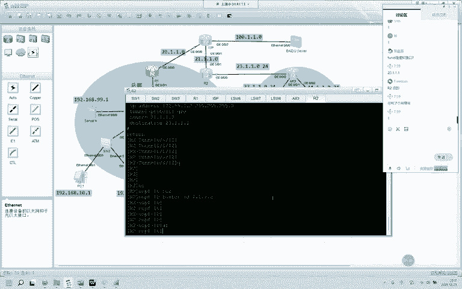

172。99。1。2R2这个接口把二宣告进去A。不好意思啊，0。0。0。0。等一下。O。那现在呢就已经万事大吉了。R2非常变态的了解到了你总部内网是如何连接的。大家可以看一下啊，看一下R二的路由表。

你就知道了。看一下啊，二的路由表okK我们来看这边有192，都是192的啊，还有1个12，我们看看学到了没有？12、学到了没有？学到了。它通过tical，你看你看tical学高学到的cost。

cost非常的异常啊，是不是非常的异常？为什么知不知道为什么？😡，知不知道这个。cost为什么这么异常？怎么和其他的不一样？三呀二呀，你是1500多。哎，你跨越了公网了，你跨越了公网。

另一个你这个接口并不是真实存在的。并不是真实存在的借口。不是真实存在的借口。你看我19299，我公网服务器，我内网服务器我学到了，我12十我都学到了。那这个时候啊这些PC甚至可以干什么呢？

甚至可以去访问99。1。甚至可以访问99。1，你看他不也有吧。你看99有的吧，99有的吧，那我内网的我分布的主机，我能去访问你。我能访问你什么呢？访问总公司的服务器怎么去的，怎么去的，通过这个接口。

通过这个接口。那我们的抓包还在啊，抓包还在。你看。再抓一个，你看看到了没有？分装了两次IPV4的爆头。两次IPV斯爆头，这个呢就是用来欺骗公网路由器，让他让我运营商误以为你们产生的这些数据啊。

分装的爆头是真正的你里面的载荷，他不管。哎，我一看你的原MIP你是公网的，我帮你做转发。我帮你做转发。如果你不做这个terno啊，你不做这个GRE。你是聘不到你通过公网，你聘不到你的总公司的服务器的。

可以理解吗？可以理解吗？OK那这个呢就是咱们的第七个需求。第七个需求。

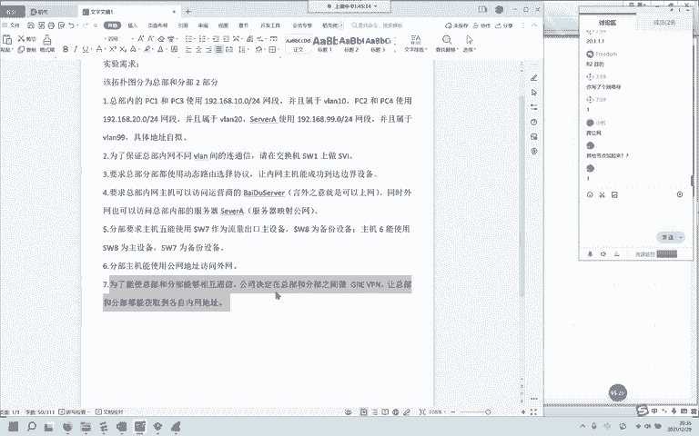

这7个需求今晚呢就是今晚这个实验的。主题。咱们做的所有的配置。都在这里头了。你能接受或者说能听得懂，或者说是能会多少，今晚的能会90%，有没有？百分之百有没有？百分之百okK那非常好啊非常好非常好。

那剩下的那个十是哪里？是GRE还是VRRP？妥妥的GRE啊。没问题。OK那我呢把这些。设备的配置啊都保存下来都保存下来。那然后呢。然后会发一个压缩包，大家呢之后打开你如果想看的话，你看一下这些配置。

现在呢经过测试，这些配置都是没有问题的。好吗？那再给大家。那今晚呢是咱们NA的最后一节了，大家能会这么多是非常非常开心的啊，非常非常开心。能有这么多会的。很棒啊很棒。那以你的水平。

现在NA的水平呢解决一些小型网络公司，小型公司的网络top。妥妥的没有问题妥妥的没有问题。辉哥教的好啊。那行，那我呢把这个配置全部保存下来，然后呢搞个压缩包，稍后呢班主任会发到咱们的班级群里头。

如果你要看一些这些配置啊，没有问题，你可以看着看着看着做，看视频也行，看这个真实的拓也没问题。好吧，这个录播也在啊这个录播也在。那争取呢下次给大家下一轮给大家再搞一点点。不会的啊。

也不能说全部都给NA的，不用给你们整NP的进来。那不行啊，今天是咱们NA的。最后一节咱们的主题还是在NA给大家看这两个，一个是VRRP，一个是GRE就是想告诉大家在IP在。NP里头在IE里头。

现在的可以了呀，可以的了，没问题，你这个都能做出百分之百了，你去跟NP吧，跟NP吧NA。已经很不错了。对，去找班主任老师要一份间阶测试。那那个进阶测试比今晚的这个还要简单。

间阶测试这块啊这一块儿它是一个正常的。正常的拓普没有要求做准备啊，没要求做准备。没关系啊，录播咱们每一节课都有录播都有都在。那我呢现在先把这些配置给保存一下啊。待会呢发大家一个。压缩包。哎。

保存是这样保存的啊，你在用户视图。用户试图敲一个sve saveve。然后呢，后面会说是否你输个Y。ISP。喂hy。外。R2。嗯。

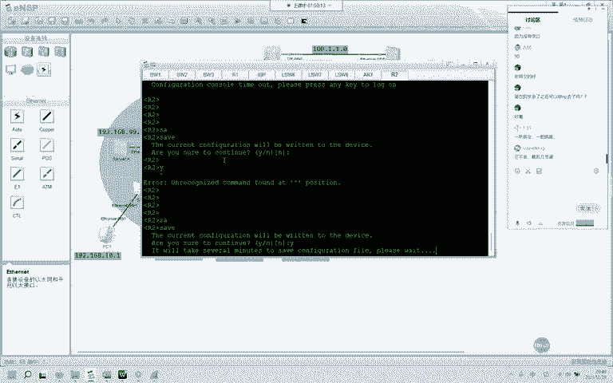

好了，那配置都已经保存完成了啊，我把这个另存为存到桌面啊，存到桌面。那文件名呢叫。NA。分一综合实验。在桌面已经保存好了。那大家对这一轮NA你跟下来觉得怎么样？我们可以聊聊吗？跟下来觉得怎么样。

学到的东西。不是说背会了多少条命令啊，背命令那不算被命令不算。理论部分。大家学了。觉得怎么样？理论部分。解决多大范围的。嗯，如果你的这个你你你在你负责的范围内，比如说有一些什么。有一些。

不能说是多大范围啊，有一些技术咱们NA里头就没涉及到。没有涉及到。比如说这个NQA。链路监测。那在NP的第一节课里头有，如果你的应该都有啊，做了这个。NQA的话。你是不是就解决不了了？

在NPNPNA呢给大家。NA带大家体验一下。NP会有系统的非常详细的。讲解VRP以及。SHRP。那他呢是属于私科私有的。不在LA。那稍后呢这个实验会让班主任发给大家。看一下看你们的对。

看你们的这个你负责的这个范围内使用的是有一些什么协议。那如果就像今天的这样的，你是完全可以处理的。你完全可以处理。就像刚刚有同学指出我。我的目的地是一个网段，而不是。这个接口的turnle IDD。

turnle的IP。哦，吉联吉联就是中纪。中继杂合接入就一个围赖码。然后顶多会搞点SVI。可以的。可以解决，那没问题，这都在NA的范围内。然后呢，这个叫高可用性啊高可用性。

那这个呢也有可能是单独的一个考点，就这个七做五的主八座五的背。六座呃八座六的主。7座6的倍。那这个它也可以拿出来作为NP的一个单独实验。咱们给它放到了分布。华为的这个。没有涉及到。然后呢。

华为的NA实验手册熟练并理解后。熟练并理解。可以。先理解。理解的基础上。不用被命令。在自己理解的基础上，能把这些命令敲出来，你打问号又不丢人。打问号也算呀，你打问号也能够把命令给补全。

能知道这条命令后面接的是什么？重要的是理解。对，可以了。交换机的光口。没涉及到的。理论对你理论。非常重要。那前几天也给大家讲了嘛，有一些癌意。他就能做出来什么呢？就能做出来考场的那一套lab。

没关系没关系，咱们的NA每个月都有每个月都有。那每次呢都会针对大家的建议。然后反馈的。会调整一些。那比如说上一轮的就说是理论太干燥了，太枯燥了。那后来呢在理论部分完了以后会加一些实验。

那下一轮呢可能就是。对半理论完了就。实验毕竟。实践是检验真理的唯一标准，对吧？最后几节课就是这个。NATACL还有什么呢？STP。有可能是这几个。那AC那如果要每个。这些每个。协议都要深入的理解啊。

那ACL里头还有高级的ACL。那咱们在NA是没有接触到的。那高级的ACL呢那它能实现的功能，它能实现的这个需求是很多很多的。那在学习的时候，同样。肯定要比NA。难一点点，我们在NA就做个了解。

大概知道ACL是干什么的。嗯。对对对。NP主要就是BGP了OSPFSS。然后呢，是重分发，就这些。也是每一节课都会有一个针对性的实验。每一节课都会有针对性的实验。那当你遇见这个需求的时候。

你是能有能力解决这个需求的，并不是让你去解决。考场这个需求啊。任何需求类似的需求都能解决。不是给你只给你教一个，哎，考场是这样安排的，你就这样敲就没问题了。那样学出来有什么意思呢？哎。

那大家还有没有其他的问题？如果你的NA。这节课。感觉不错的话。了解的不错。那你已经可以去NP了啊。去NP学习吧。肝着人屁血。感觉良好啊感觉良好就行。不是啊。你可以百度一下。百度一下。

我们这边都用的是这个。这挺好用的。还有别的肯定有。你看华为的模拟器在安装的时候，如果你没有安装这个。We shark。你是安装不了的对吧？那华为的。另外一层意思是什么？抓包谁好，抓包谁好，华为模拟器。

你如果不安装那个最后模拟器是安装不上的。好已经告诉你了，谁好了。那这些呢大部分是。你下下来的有可能是英文的，英文的的话，如果英文还是不太好的话，使用起来还是。不太舒服。这个不是中文吗？这不是中文吗？

你看吗？调都不用调。对吧。嗯。那大家还有其他问题吗？如果在。学习过程中。遇到问题的话。VOC是主播的时候用的啊，主播的时候用的咱们在IE的第一节课里头会有主播。那这个NANP都不涉及，你现在不装也行。

你现在不装也行。主播的时候放视频，你在一台设备上放视频，所有的所有的设备都在同步放这个视频。主播就像我们电视台。电视台咱们使用。电视台，那你看电视节目，那就是主播。挨E啊再挨E。

主播的意思就是一个人在那儿发，一个字在那儿发，你想听你可以听，你不听没关系。他只管发他只管发，就像什么呢？就像天上的雷达。雷达就只管发。你的手机的定位，你开启的时候。你就收他的信息，你关闭。

那他也不和你干个啥呀，他也不说你怎么把我的关闭了。那大家最终的目标，大家在。报这个班的时候。这个班华为之前叫RSroing switch就是路由交换吗？别的设备。别的设备有什么防火墙。

防火墙你得考虑安全方向。考完IA考过IA证再学IP还是学完IP直接考IP。好呃。如果你觉得你迫切的需要一个证书。不管怎样。你非常非常需要这个证书。或者是公司有要求，或者是部门有要求的话。你可以先考IA。

但是如果呢你的资金也不是那么的宽裕，然后呢，时间各方面也都不是。比较那个啥充足的话。建议还是直接考IP嘛。你考完IP，你有IP证书，你有I呃IA证书，你会用哪一个你会弄用哪一个？

肯定是把IA的放在家里吃灰了吧。是不是？那有些单位可能需要你拿一个证书过来。才给你一些解除解除限制的这个条件。那这种情况下。备考IP。每周都有周作业，每周都有每日每日每天都有每日一练。然后我看看啊。

就是。也是这样的上课吗？上完课给你们布置作业，布置作业布置完，你们做完做完，然后辅导。和NA的一样。现在提供什么帮助？IP就提供什么帮助？哎。然后呢，到了IE阶段呢。咱们的机架。有机架的啊。

和考场一模一样。NP是周六周日。周六周日三个时间段。不是不是晚上。9点多到9点到11点，然后是1点到3点。NA嘛咱们。讲的比较简单，然后呢周期也比较快。那有录播的每一节课都有都有录播。都有录播。没关系。

录播录播学和直播学有什么区别？那有些人经常问。是不是直播是不是直播？那是直播又咋了？是直播和不是直播讲的东西就不一样了吗？试直播这个直播的老师能怼你几句话，你就舒服了，然后开始学呃不是直播，他不会怼你。

你可以怎么样。你可以怼他，他不会怼你。有区别吗？直播和录播，只要大家都在学。没有区别的。那大家还有其他问题吗？咱们的NA一轮已经。结束啦。这一轮有没有虚度光阴？努力下肯定会实现肯定会实现4个月。

下个月呃马上嘛，现在就12月29了。元旦完了就应该是开始了。马上就开始。2122年的第一轮啊，今年今这一轮这一轮是21年的最后一轮的最后一节课。没问题没问题。那基础打好。走到哪都不怕嘛，走到哪儿都不怕。

Hbrid。Hry的。你会有什么样的需求会用到hbrid？思科他算是华为的老师吧。他怎么一个 hybridbrid？看你们的具体需求啊。大部分都是中继和tuck。呃，这个接入和中继啊exs和tuck。

晚上有时间，白天没有时间。你想呢你想我是外国人，你是中国人，你跟我讲中文，我听不懂中文。你想。兼容性问题吗？肯定会有兼容性的问题。你要。内网那这个时候你肯定是个内网了，肯定是个二层了。

二层你就用同一家的设备嘛。你华为的买几台，思科的又买几台，华三的又买几台，紫光的又买几台。你咋。拼个蛋糕拼个蛋糕出来。嗯。可以啊。NA大部分是晚上NP是白天，周六周日的白天。

那NA我们就有一个周作业讲解是在白天。白天的两点半，周二的两点半可以跟可以跟。没问题。对。对。除了有钱的，除了银行。有钱就是银行。那叫什么？那叫那句话怎么说来着？不用最好的，只用最贵的。那银行的钱就是。

就是什么数字吗？呵。😊，哎。他们的只要你理论。理论搞通了，融汇贯通。命令行界面其实都大差不差大差不差。你就打问号，你也能知道。后面的该跟什么，你应该怎么配，你就算从来没有配过。比如说你现在思科的。

特别特别熟练特别特别熟练。什么都懂。那大部分就是把那个什么display换成了sno换成那 do。然后呢，接口接口的编号规则有一点点变化。大差不差大差不差。然后呢。

他们对一些协议的什么可以自己操控的这些东西。比如说度良值。呃，管理距离。就优先级和cost吗？啊，不同厂商对这个。不同的协议。有不同的规定。对，华三是华为分出来的。看吧，那你看吧。掌握的不是太熟练。

多看录播和实验操作。对，多看多看，有时间就看吧。别看这种唠嗑的，我现在就算在唠嗑了啊，这种没用。哈开玩笑啊。😊，🤧嗯。那。就是啊。对的，没问题。有时间了，你就看。学是给自己学的吗？我又瞧不走。

我明天又不会把你今天学的抢走。抢不回去的。到你脑子里的就是你的了。你自己会了，走遍天下都不怕吗？是吧。呃。前几轮的NA里头涉及到了，但是呢大家的反响不是反响不是很好。然后呢，这这个课就到了IE了。

非常单方面非常非常。独立的非常非常详细的EIGRP。哎，第二世间最好的礼物就是把学的知识还给老师。我的妈呀。哎。真的，这样的话，老师。会裂开的。我之前是老师。期末考试的时候。

我的孩子们就是真的把知识全部还给我了。我在改卷子的时候，改卷子的时候，我差点要吐。吐血。脑梗哈哈。😊，是的，老师也是高危行业。所以大家不要把这事还给我啊。好好的存在自己的脑子里头。

不要只放在这个运行内存里头，你要放在你的。存储。寄多贝亚声。对。你不要这会儿和我在讲着，哎，对，觉得这节课咋这么简单。这几个配置，这几条命呢一下子敲下来了。记都不用记，然后明天早上一起来哎。

老师昨晚讲的是什么？什么综合实验啊，我好像没有参加呀。不要这样了。嗯。那大家还有没有其他问题？MP的。MP的学习。大概周期就是3个月。然后你加上考证的话，就是4个月左右。对，预习复习。

你还要偷偷的和老师交流，请教一下。有什么问题？直接甩过来。为什么和你理解的不一样？那有时候负责的。啊，远程一个远程一个问题。有时候一一远程就是半个小时1个小时。然后呢，晚上一直在这个直播间。

你这会儿给我发QQ消息什么用的，QQ微信消息都没有用。我也不能把我分成两个吧。😀哈哈哈。😊，呃，快完了和班主任。问一下。应该快完了。上次是上周是双点双向重分发。唉。

咱们在NA里头就是各个协议都有了解到了，在NP就是所有NA的知识都在都有在这个基础之上扩充。扩充了很多很多很多。我们现在就是。你了解的网络世界，就是说你把NA全部学完。

了解到的网络世界有可能就是一个指甲盖这么大。然后NP和IE。啊，好好的。越学你越觉得学的少。知道的越多。感觉对这个了解的越少。好好学。不要停下来，反正学会了就是自己的了，谁也抢不走。很深的啊。

MP就已经很深入了。NA咱就浅浅的。点一下了解一下。那大家还有其他问题吗？如果你只报名了这个啥。NA的话，NA的服务质量你也能看得到，对吧？如果有意向的话，最近正好是13周年庆。

你可以去找班主任了解一下。NA就是讲故事NP和IE是学知识。是的。哈哈哈那好呀。😊，那好。不能上来就给大家搞一些。什么。很高深。很难懂的东西，让大家直接在NA就停下了脚步。那咱们的NA你又。

NA的话应该是。几10块钱吧。那学到的东西。还有班主任助教。服务的质量绝对比这几10块钱值吧。是吧。如果不是这个行业的。也没有打算。啊哈哈哈。😊，是的。带大家了解一下。网网络世界嘛。

要不然在NPIE里头有一些东西啊，就是一嘴带过。你如果在NA里头还没搞过，没听懂，没没听过，没没听懂，没学会。你在IE和NP里头就一脸懵逼。你你就根本不知道你可能因为一句话在怀疑这节课到底在讲什么。

那咱们的NA都是非常非常。白话哎非常专业的东西，也用白话给大家讲出来。对，现在是有优惠的，现在正好是。13周年。应该我看了。看了下。你平时最起码。少500以上。我也没有了解过。你和班主任了解一下。

你和班主任了解一下。哇，这么多。我还以为是500。我以为是500。如果有意向继续学下去的话，还是建议你往深一点学肯定比较好嘛。肯定比较好。现在嘛现在这个时代，知识付费也是很常见的对吧？我们放在以前。

你想学，压根儿没地方学。放在辉哥那个时代，只能自己啃书，自己背书。几本书背完了，还没没有摸过真机。太难了，辉哥那会儿。所以咱们现在你看你在家里坐着，我在这儿坐着，我们就能。相互讨论。对，现在有模拟器。

当时连个模拟器，哪儿有有个屁。所以说临考试了才摸磨真机。你现在你在NE的IE的考试前一月。考试前两个月。机器的使用次数是不限不受限制的。真集价。和考察的一模一样。哈哈哈。😊，嗯。

那大家还有没有其他问题没有的话，我们。这一轮对有个伙伴多好。你找个志同道合的小伙伴嘛。做嘛，你也可以把这一部分拿出来单独做，你也可以单独测试这一部分，把这台路由器也去掉。这四台设备你可以单独的测试啊。

你如果不想做整个的话。你对这前半部分没有问题的话，这几个是可以单独拿出来做的。那这个在NP里头也有详细的介绍，在实际的环境中，这个的应用也是很广泛的。避免带点故障。网关的冗誉备份。

那你可以再往深了学一学，有什么呢？VRP。哎，这是NA的对。不是MP。不是MPNP的。比这个也。复杂的多。复杂的多。那在NP学完了以后，也会有这样一个综合实验。不是的。嗯。对。只要。你学着么不要停下来。

也不要三天打鱼，两天晒网。啊，你想着昨天学了好多东西，我今天te me提 me一会儿。一直服务到你考下证书。没有限制啊。你报名了NANA的。所有的无论哪一轮你都来听。你报报名了NP无期限。报名来一。

直到你考下证书。对，NP。很不错了非常不错了。I的话可以作为挑战自己的一个。哈哈哈。😊，没问题呀。可以的。嗯。那如果这节课。没问题的话，咱们就到这里。如果是要去。了解NP或者是IE的。

和班主任了解一下啊，我对这个是不太清楚的。我只负责大家的。学习你和班主任商量一下，讨论一下，看一下，咨询一下。那最近正好是。13年了，辉哥创了13年了。周年。了解一下。话说。那就像喝水一样。喝水一样。

前提我们考考NP不是背答案啊。把知识全部融汇贯通。那你考软考。坐进去喝杯水，带瓶水。喝完就考完了，出来就行了。行。那咱们今天晚上就到这里啊，关于NP或者是IE的，你可以去咨询咨询自己的班主任的老师。

如果觉得基础不行，你再多跟几轮也没有问题啊，永久的永久的你多跟几轮没有问题，好好的把基础打好，好好把基础打好。那咱们今天晚上就到这里啊，回去以后都做一下这个实验。这半边这个实验是NP的。

高可用性啊高可用性。这一点点。OK行，那咱们今天就到这里。行，大家拜拜。拜拜。