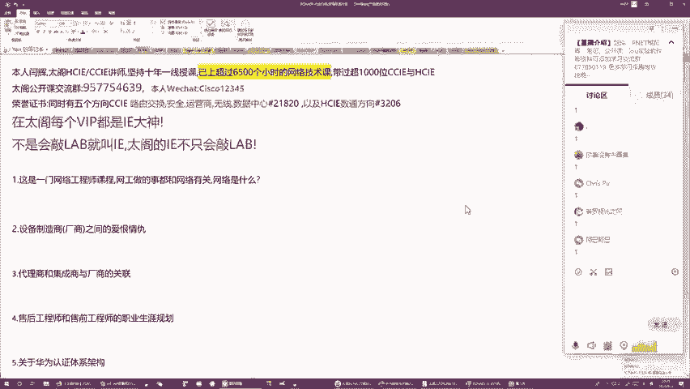
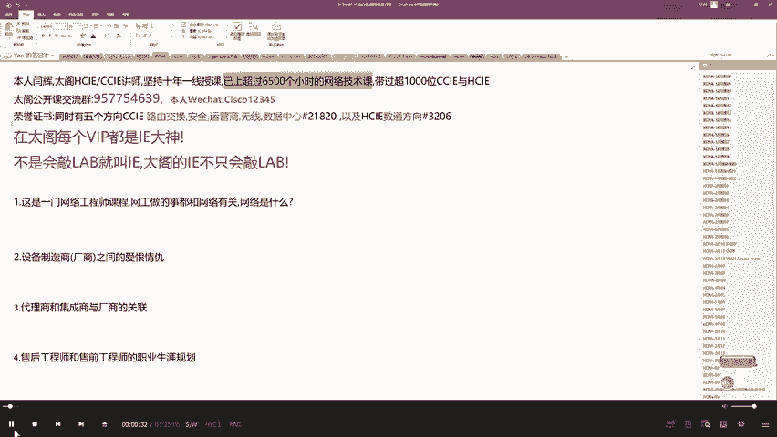
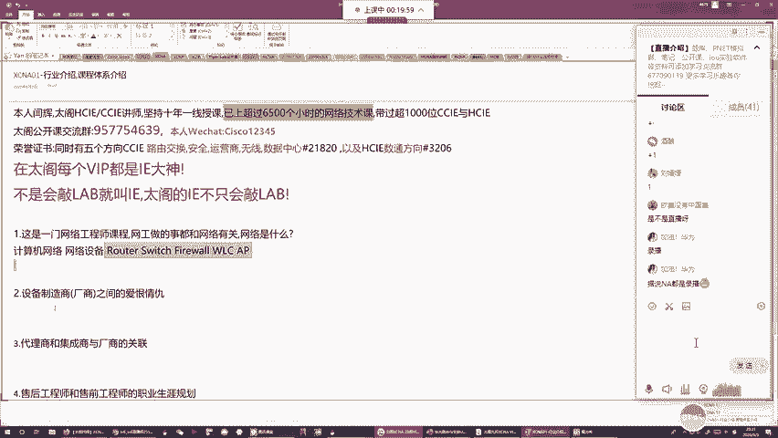
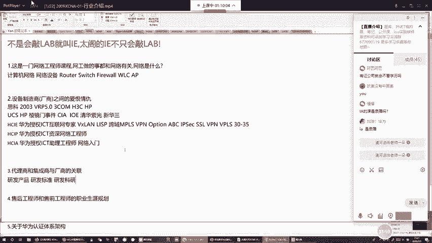
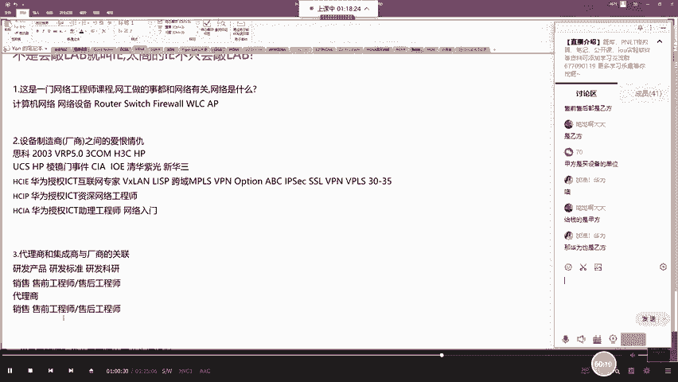
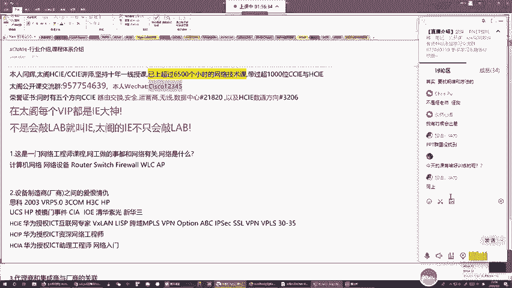
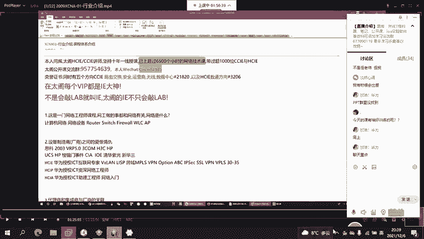
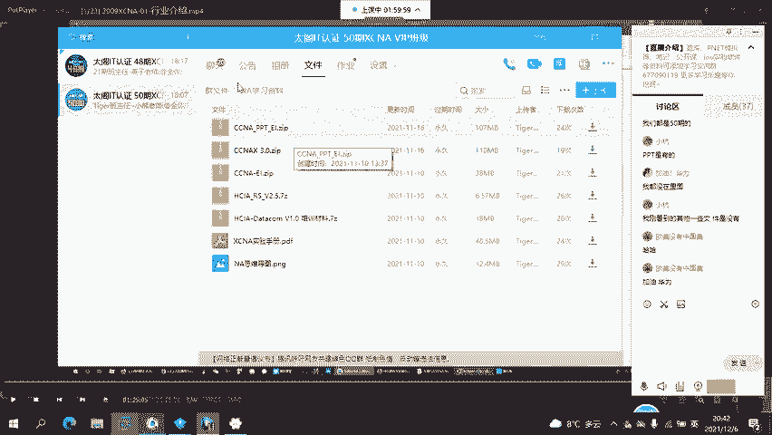
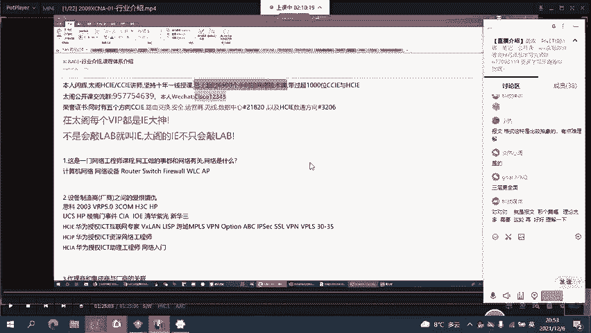
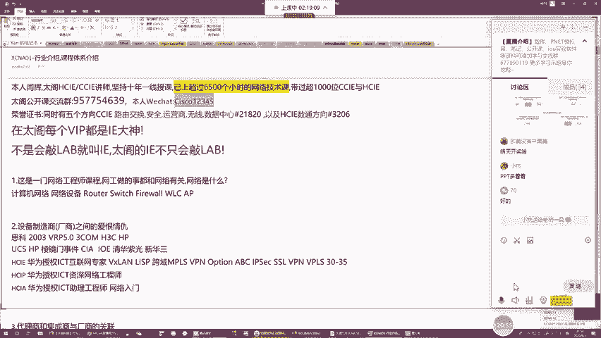

# 2022版华为认证HCIA-DATACOM教程，内部课程公开分享（已完结） - P1：CXNA-01-网络行业概览与课程架构介绍 - 网络工程师CCIE - BV1AP4y1J73k

🎼加一下群啊，加个学员压押金。好，那这边的话呢我们就开始这一节课的正式内容啊。当然说正式也不用那么正式了。因为这节课给大家讲故事啊啊在我想问一下。

有有问各位之所以来听咱们的课目的只有一个就是想要成为一个优秀的网络，对吧？哎，我们要成为一个网络工程师，那咱们这个课程呢也是一个网络工程师相关的课程啊，教大家如何成为优秀的网络工程师。

那当然成为优秀的工程师之前呢，咱们要先知道网络工程师做什么啊，对吧？那咱们做事很多，对吧？你有设计网络实施网络对网络配置网络维护，还有网络排错。那总而言之，咱们做的所有事情啊，都是围绕着网络。

那到底什么叫网络呢？那这里咱们看指像计算机网络啊。😊。

什么叫计算机网络呢？哎，咱们比要知道就使用东西啊，哎计算机网络哎就是一个载体，这个载体供咱们通信使用，对吧？然后计算机网络咱们约约在组建的时候呢，你需要使用一些设备啊，这些设备咱们称为叫网络使用。

网络设备是一个范称啊，它里面包含很多的具体设备，比如像路由器。啊，像交换机。然后呢，像防火墙啊，这些都是啊，然后呢，包括咱们的无线控制器，对吧？包包含咱们的AP啊等等之类的。

这些咱们都是网络设备的范畴啊，你要组建一个网络，不管你要组建一个什么类型的，你都需要使用到这些设备啊。咱们使用这些设备使用线来把它们连在一块啊，就能组建一个网络。那当然这些网络设备咱们讲有人开发。

有人生产，对吧？那谁来开发，谁来生产呢？那我就要提到咱们今天这节课的主题了。

今天咱们这节课围绕谁来讲啊，围绕一家伟大的公司啊，这家伟大的公司咱们称为叫华为啊，咱们中国的民族骄傲啊，我们大华为。

大家都听过华为吗？哎，你们了解华为的什么东西啊？对，都知道局场啊知道剧场是做什么的吗？哎，做手机对吧？咱们刚才最新的P40pro对吧？P40pro哎，很牛逼啊。那除了这个手机以外。

华为还做什么其他东西吗？嗨，我来给大家聊聊咱么大华为啊。😊，我们的大华为呢最早期其实做通信的做通信。我不知道你们听过没有通信啊，就比如说咱们早期你用手机来上网，我们用的2G对吧？

二G慢慢升级升级到三G三G升级到4G对吧？4G到现在，咱们已经是领先全球的5G了，对吧？那这些咱们称为叫通信技术，这些通信技术，对吧？那华为呢专门就是针对这些通信技术啊来开发相应的产品，哎。

开发相应的这么一个标准，就比如说你的基站啊，你的接这个接肉层设备啊，核心层设备啊，对吧？那这些都是华为的这么一个啊，算是啊主攻点了，这是华为的主攻点，那早期的华为哎制造这些通信设备，那卖给谁呢？

卖给咱们国家的三大运营商啊，电信联通还有移动啊，你可以理解为华为就跟这三三家公司啊放弃在一块了，对吧？你们有需求华为给你们研发，华为给你们通货。啊，那随着咱们通信呢对吧？进行啊。

随着咱们通信产产品的那个迭代更新啊，那大家应该有这么一个概念，就是咱们3G时期维持了很长一段时间啊，那在3G呢很长一段时间的这么一个真空期内啊，就是华为呢可以可能就是认为啊你光做通信。

咱们的产品线比较单保啊，你光做通信，可能咱们竞争力啊，对吧？你注定也就是是国内的强的公司，你想跟国际上的公司来比比拼啊，那可能你的产品线会比较薄弱一些，对吧？那再加上咱们想要增加利润，那我们任斗飞啊。

任总啊想出一个办法，就是说咱们拓展产品线，那或展什么样产品线呢，对吧由于华为最大的客户，就是咱们三大运营商啊，电信联通移动，那想了半天啊，那咱们运营商需要什么？除了需要通信以外，对吧？

咱们不也需要网络啊，对不对？因为咱们电信对吧？让我们客户来部署电信宽带嘛，对不对？那这个宽带咱们用户办理完之后时候宽带连接啊，你是能够访问咱们的互联网的对吧？

那这个互联网跟我们的通信完全是两个不同的领域啊。那华为就是丛林进入到了一个全新的领域。这也是咱们今天主题啊，就是网络的那个领域。那在网络领域里面，哎，咱们怎样走的快呢？啊。

我们聪明的华为就是找到了当时哎咱们整个领域最强的这么一个王牌来找他去学习。那这家公司要什么呢？这家公司叫思科啊，斯科是一家美国公司啊，84年成立成立在硅谷啊，就是圣合赛，美国圣和赛加州那块。

那接下来思科呢在当时那个时代的话，毋庸置疑要是咱们网络领域里面的全球的女朋羊啊，无论是设备的生产还是标准的设置啊，那思科呢都会远远领先所有其他的厂商啊，那华为学习思科，对吧？

虽然在网络领域领域里面啊走一个快车道嘛，对吧？你思科有什么产品我就学嘛，对不对？原方原样学你的产品怎么设计呢？那我就改良嘛？你的产品能够实现什么的功能，我就升级了，然后接下来学了思科的产品抢思科的市场。

那抢哪里市场呢？就是抢思科，对吧？在中国地区啊最赚钱的运营商市场啊，那在华为做网络之前，思科呢基本在国内啊处于垄断的地位啊，当时学中国有70%以上的网络设备啊，是由思科来供应的。

那也就是说在2000年的时候啊，对吧？你上网，你聊QQ对吧？你上百度对吧？我们计算机所产生的70%的数据啊？你要通过思科的设备。😊，在这吧啊，那可挣钱了，特别挣钱。因为思科的设备卖的特别贵啊。

利润特别高。然后接下来华为自从学思科造了网络设备之后啊，由于这个设备确实过硬啊。然后再加上咱们华为的公关能力非常强，销售能力非常强。直播了当然直播了哎，当然直播了直播直播直播啊，就是咱们华为学思科嘛。

对吧？就是造设备的质量质量O了。然后再加上华为设备卖的很便宜，对卖的很便宜，然后呢就是慢慢的就是通过咱们华为的公关能力，市场能力啊在不停的挤压咱们思科的运营商的空间，然后第二来慢慢挤压挤压挤压。

甚至市场份额啊都要改上虎合。然后思科比较后知后觉，那可能是美国的科技公司了比较高啊，那当他发现对吧？他在运营商的市场里面啊，市场份额啊，就一看的华为打没有了。

然后他又发现哎你华为这个产品怎么跟我自己有点像了，然后经过研究发现哎不是说有点像啊，就完全一模一样，对吧？但是大家不知道你华为在最开始学思科的时候，那由于没有比思科版权费，那可能也是由于当时对吧？

经济太好嘛，对不对？华为也是在原始经积累的这么一个阶段嘛，对吧？由于。😊，没有那么多钱去购买专利啊。那所以说就是哎我就是没有向思科做任何授权啊，我就直接去学习的产品的架构，学习你设备的这个操作系统。

但是呢这在当时的思科来看的话，你这是侵权嘛，对不对？所以在2003年哎思科为了守护他的运营商的市场啊，对，就告了华为，那那告华为理由很简单啊，说对吧？你学习我的产品没有给我买元费，你就算抄袭嘛。

对那当然华为也认了，你认了。那03年告了大概一年左右的时间啊，华为败诉，那败诉之后的话，对吧赔了思科一大笔钱，但是呢华为的研发能力，当比要想看啊，就是自从03年被告了之后，对吧？我既然不能继续学习你了。

那我就正面给你高嘛，对不对？那通过自主研发，华为研发出了，对吧？咱们中国网络领域里面啊，第一款操作系统，这个系统咱们叫VRRP的5。0啊，那在这个VRP的5。0中，哎，咱们一切成自主研发啊，对吧？

我们的所有的供营商界面都跟思科变的。😊，不一样，并且咱们产品整个的更新换代啊，通过迭代，我们的硬件也跟死科不一样，对吧？那在这种情况下，我跟你抢占运营商的市场，咱们是公平竞争嘛，对吧？不存在谁抄袭谁。

然后接下来随着华为的这个对吧？研发能力，随着华为的市场通关能力啊，对吧？呢，中国的运营商市场，对华为对吧？越来越多才是，然后才石才实啊，对吧？华为就发现了，我在运营商的领域基本无敌了。

通信也是我老大对吧？然后呢，咱们网络设备也是我老大，那呢咱们光卖设备的运营商是不是有点。对吧咱们光卖设备给运营商，我们这个客户是不有点太单薄了。虽然运营商很有钱，但是万一你天运营商的日子不好过了。

那我们唯一的客户运营商，这岂不是我们相当是没有没有后路了嘛，对不对？那为了准备几张后路啊，然后呢包已研究了，你思科除了运营商市场以外，你还有哪个其他市场，然后接下来发现啊你思科除了运营商以外啊。

还有数据中心市场，还有咱们的企业保市场。然后接下来这个企业网市场，哎，华为也想切到这个赛道啊，来抢四科的市场。但是呢在切到这个赛道之后，发现啊就是这个企业网的需求跟咱们运营商的需求不一样啊。

运营商买网络设备的时候可能会更加的关注路由器啊，你路由器造的好，哎，你就能抢四科市场，但是在企业网不一样了。企业网的网络环境中，咱们居然引用路由器啊，在路由器用的少，哎，企业网咱们更加依赖什么呢？

更加依赖交换机啊，你交换机做的好，你就能够抢占企业网市场，你交换机做的不好，那企业网你光靠路由器，人家不买单啊，对吧？但是呢现在华为比较尴尬的是，他在最开始学习四科的时候，就是对标我们的运营商市场啊。

那既然对标运营商市场，咱们研发经费由线，咱们人才有限，对吧？那我在学思科就学成的一个设备啊，就是学路由器了，你四科造的新路由器啊，我过来研究给你造一个更好的对吧？你四科路由器更新。😊，换代了，哎。

我也就是换代，我通过这种方式来挤压你运营商市场空间。但是呢对吧？我现在你没法学你了，对不对？因为03年被告了，那被告了之后的话，法院跟我说了，你以后就是不能学习抄袭思科的设备。

那接下来我想跟思科去抢什么？企业网市场，我现在有没有制造交换机的能力，怎么办呢？按照咱们任总又想法一个好办法。我相信大家都猜到了。对我既然自己研发来不及啊。

我能不能收购一个交换机做的比较好的厂商来做一个设备整合呢？哎，我就走这条路。那所以说通过考察啊，他就当时发现了，在美国有这么一家公司啊，这家公司叫三靠这个三com专门做交换机呢，公司体量不大，哎。

我收购但是有足够钱的，因为比体量的话，当时的华为比三靠大很多。然后这个三靠做交换机，它的交换机领域里面啊，产品做的不好啊，能够跟思科在美国市场啊来一较高下。

那大家要知道你能跟思科叫版的哪怕某一个产品线啊，能叫版的企业都是非常成功的企业。然后接下来咱们这都想了，哎，你三靠交换机做的好，对吧？我华为路由器，咱们能不能合并一下，吧？你收购了，我把你收购了之后呢。

这样的话岂不是运营商市场，咱们企业网市场甚至数据中心市场，我都能参。😊，封间了吧，对不对？那你收购呗，然后接下来找了一大堆的律师，找了一大堆的会计师，对吧？我们来谈收购吧，谈的好好的。

你要这个三靠你愿意卖，对吧？黄宇愿意买，价格都谈拢了。然后呢，直到收购那一刻。哎，你们猜啊谁来坏事了？哎，就是咱们的美国政府啊，美国政府现在在换华为的事儿。那当时也在换华为的事啊，那他们说了。

是不是你对吧侵害了咱们美国的信息安全，啊，我们就以信息安全为由啊，说了对吧？三抗包含了美国的一些，对吧？机密这个机密如果被你华为收购了，所以咱们的国家安全福利，所以说不允许收购，那不允许收购怎么办呢？

哎，咱们这府又想出这个好办法啊，那既然收购不行，那咱们合资就可以了，那在当时那个年代，咱们有很多合资公司嘛，对不对？中美合资对吧？中英合资中德合资中日合资，对吧？那这个合资呢不算收购啊，对不对？

那咱们就合资，然后这个合资呢谈成了，然后咱们也成功了，那合资的方式如下。😊，华为出钱出人。然后接下来三靠技术啊，然后接下来咱们在国内啊来组建这么一个合资公司。那这个合资公司的名字叫什么呢？就叫H3C啊。

叫华为三com啊，H3C，那总部的设在杭州。然后呢，在那个时代对吧？那由于华为呢非常非常期望啊，就是通过华三的技术来影响到咱们的对吧？整个网络领域嘛，我想就改变咱们整个网络的一个格局。

因为当时呢就算在运营商市场，我是跟四客五开，对吧？但是在企业网市场在数据中心市场啊，苏说依然是一家独大嘛，对不对？我想瞧巧的市场，我想是你蛋高，我只要有过硬设备，对吧？那要有设备。

我又不能直接用华三的对吧？因为毕竟咱们整算合资公司嘛，那所以说呢咱们最好多好就是以三com提供技术我来学。所以说在那个时代，你们如果经历过那个时代，你们会发现啊，就是咱们基本华为的员工啊。

都有两个工行啊，一个是华为工行一个。华三工好，对吧？你们平常上班可以选择你的上班场景啊，你能在华为上班，也能在三com上班。那当然这样的目的是什么？就是学技术嘛，对吧？你华三的技术好，我就来学了。

那主要就是学你的交换机技术。然后接下来学的特别特别快啊，就是随着学习，你会发现华为呢自己慢慢的把华三那一套啊全部都学过来了。那所以说届时华三能做的产品，咱们华为也都能做。那当然在这之前呢。

华为跟华三之间的一个对企啊，就是咱们这两家公司在咱们之间是关系，对吧？那所以说在国内咱不要对外对外对谁呢就得有4科嘛，对吧？那在小四科市场的时候，你华三交换机厉害，对吧？你就在企业吧数据中心啊。

来探动咱们四科的市场，然后我华为继续在我的对吧？主阵地嘛，运营商领域啊来继续挤压4科，对吧？那咱们仅水不分和水啊，对吧？我我这个华为不做交换机不去影响你的企业网市场，那你华三也别放路由器，对吧？

不要影响我的运营商市场。然后接下来这个时间呢就过了好几年啊，过了好几年，那过了好几年等到有一天华为发现你华三已经再也没有任何新的技术啊，来跟我学习了，对吧？😊，你所能给我带来的，我现在自己都能做了吧。

那既然我自己都能做了，我们要你干嘛那我就不要你了呀。那所以说华为导对把华森给踹开了，对吧？咱们正常应该是2到3年吧，两家公司续约一次。然后呢，直到有一次华为导出的1蛾子啊这个续约呢就没看成。那没奈之后。

后来华森怎么办呢？就被卖掉了，卖给谁了，大家知道吗？对，也是卖给了一家硅谷的鼎密公司啊，叫汇统。😊，对，华生卖的汇口啊。对，那惠普当时买华三的理由也很简单啊，是因为思科野心也很大啊。

思科他早期一直做保护设备的啊，路由器啊、交换机啊、防火墙啊。但是呢随着咱的网络领域越来越饱和啊，思科发现在网络领域里面，我就在医院还是老大，但是基于全球范围内看，我的营收结构怎么样。

已经慢慢变得不合理了吧，对不对？我也要慢慢的扩展我产品线，那往哪去扩呢？哎想了半天，思科想要做服务器啊，思科搞出了一个服务器产品线，这个服务器产品线我们成立了UCS啊还挺有名的，还挺有名的。

这个思科的UCS服务器卖的特别贵。😊，但是大家都知道，咱们服务器里能捞大少钱？最早期的老大是IDM对吧？然后后来一手给了惠。当时惠普在全美啊，我的服务器市场基本处于垄断地位。好吧。

然后你思科做了UCS抢了我大量的数据中心的这一个空间。看吧了华那惠普肯定恨啊，对吧恨的呀牙咬咬的那个痒痒的是吧？你这个抢我市场，害不到你了。那既然你抢我市场，那我也抢你市场了，对不对？

那刚好当时华森被华为给推走了吧，那惠普就把华森给收购了。那收购华森的理由很简单啊，那，你华三不是做造交换机的嘛，对吧？你思科办交换机不是挣钱嘛，你现在想要挤压我的服务器空间。好，我就收购华三。

来造交换机，我来抢占你。😊，所以说当时那个时代有多出一个特别搞笑的交款机啊，叫汇付交换机。😊，对，惠普搅换机其实就是华三的，只不过他给华三换了一个式量，我们的命令行迹里面不一样。

但是它的东西其实彻头彻尾啊，就是咱们华三产品。然后呢，后来的话惠普收购了华森就后发现情况跟他想的不一样啊，因为华三的技术，对吧？其实在刚被华为收购那块啊那刻啊跟思科的误开啊，但是呢随着被收购，对吧？

华三更不会把心思啊放在市场这个领域了。那对于这个科技这块，就对于咱们产品研发这块啊，可能就是没有放开出心思。那所以说经过了很多年，对吧？56年的时间啊。

华三想要再跟思科基于交换机市场来抢占咱们市场空间啊，那基本也就不可能了。所以说呢你惠普收购了华三发现收购了华三的产品，你想跟思科打，根本打不过。然后接下来思科的UCS还在继续篡占你的服务器市场。

然后在我们的国内，对吧？国内是个大蛋糕吧，但是国内呢当时在14年头的时候是是一件事啊，当然如果听过都应该知道啊，在我们的库本事件。😊，对吧在冷静门事件之前，那媒体，尤其是咱们科技企业啊。

那在国内都是香饽饽嘛，对吧？你们卖的东西谁不是基于垄断啊，谁基本都是垄断，对吧？比如说你微软你的操作系统是不是垄断啊，是的吧？美国各种各样的计算机台式机笔记本的这么一个硬件制造商是不是都垄断啊。

像英特尔AMP对吧？你在国内有哪家国产企业能给你竞争啊，没有啊，对吧？像网络设备的思科一家普罩吧，对不对？像我们的数据库oracle一家普告对吧？像我们的存储设备ENC一家普告，对吧？

你就会发现只要你能提到IP你面这厂商了，那基本都是由美国来垄断，对吧？那在14年之前大家一起欢用美国的产品嘛？对吧？高科技又好用，那贵点贵点吧，那好像好用嘛，然后直到14年还情况变得不一样了，啊。

就出现了这么一个冷静门事件，真是特别穷啊。😊，那能这边世界怎么回事呢？就美国有这么一个比较厉害的组织啊，叫CIA啊CIA。中情局啊你们都听过，对吧？有一个叫FBI嘛，一个叫CIAFBI叫联盟调查局。

对吧？CIA叫中情局。这个中级局呢当时就是照着咱们美国高科技啊，哎CIA跟我们的这个硅谷的热大IT公司哎都有很很深的这么一个关系网啊。那基于这很深的关系网，大家都知道，对吧？

我们这些IT公司在生产咱硬件和软件的时候，你都有后门嘛，对不对？比如你微软开发的windows，对吧？你微软能够看到咱们所有用户的使用情况，那靠什么来看，就靠后门嘛，对不对？那咱们这些网络设备是一样的。

对不对？你在哪用思科的设备，那你思科内部的人也能看到这些设备的使用情况。那当然你会发现啊，当时全球各个国家，包括美国在内啊，只要你们要用到IT，只要你们要用到网络，你们能离开美国的公司吗？

你们能离开美国的产品吗？对吧？离开啊，小到你的手机啊，大到服务器，再到你的台式机的主基本，你所用的哪一样东西，不是美国的技术啊，你会发现都是美国技术对吧？这里面都是有后门的，都是有后那CIA就说了，啊。

我们为了保证美国的安全，哎，你们这个IT公司了配合咱们CIA来做一个基于全球化来监听啊，这个监听就是棱静啊，就是冷静技嘛，好吧，因为你全球各国你都使用美国的技术嘛，你都使用美国的产品。

使用美国的硬件和软件，那这一块的话，只要我掌握到你的产品的后门，对吧？我躺着就能知道你们在干什么呀？对不对？比如说你们平常通过网络打的电话，你们通过网络传输和数据，你们通过网络开。会你们干的任何事。

美国CIA对吧？他们的agent啊特工嘛都能知道。然后接下来咱们CIA呢有一个年轻的小伙叫苏诺登。这斯诺登呢他没有上大学啊，高中毕业之后你去了CIA由于他技术天分很好啊，经过了几年的培训。

就成为了1个IT人才。然后呢，他就是专门获得一个能力校目。然后获责这个能力项目的负责体验下来发现啊，这个能力项目不光光针对全球各国，连美国国内啊都被针对了。也就是说你美国国内，你用个手机。

你通过网络打个电话，对吧？哎，那我们这个中信局啊都能知道你相关信息。也就是说在我们的能静项目之下，全球没有任何一个透明的啊，没有任何一个不透明的事件啊，能够不被我突货的。就是只要你看这些事情通过网络。

通过咱们IP啊，只要你用到咱们这些思科的设备啊，对吧？微软的系统啊，那我就都能对你。那后来斯诺登克就觉得这个实在是太恐怖了，这简直比恐怖主义还有恐怖主义啊。那所以说后来呢就是本着良心发现啊。

他就是直接逃到了对吧从夏威夷逃到了香港，然后接下来找了两个英国被报的记者来把这件事儿给报出来，哎，特别牛逼特别牛逼，就直接全盘托出了，对吧？因为他本身就是个CI信机官嘛，对吧？全盘突出。

把整个计划来龙去脉的都给报出来。对，都给爆出来。然后接来抱出来之后呢，那两个我可方起队会吃素了。然后他们隔天回到了伦敦，就直接把这个事儿啊给公布出来了。然后结果整个世界就直接炸了，整个世界就直接炸了。

你想想大家买美国的产品。是出于什么是出于信任嘛，对不对？你卖给我产品，我给你钱了，对吧？然后接来我使用的产品使用的服助，我给你后期源源不断的输通输入什么钱吧，对不对？那既然咱们做生意嘛，这就够了。

接下来你会发现中国买了产品之后，我给你钱，我还要为你监听着，我没有任何自由，对吧？我们一举一动都在你那掌控掌控之周啊，那这个太憋屈了，对不对？太憋屈了，那所以说大家都不干了，尤其咱们中国特别不干啊。

那想想我们之间中美友好，对吧？我这么信任你，咱们政府也是用你美国的产品，军队也是对吧？咱们军用你用钱都用你的产品，你们现在来天天来给我监监控监听，那谁受的，没人收的呗，那所以说后来就开会呗，对吧？

咱们党中央开会。找这些互联网企业的高层啊来开会，问问你们的态度怎么样。那首先第一个就是问你们承不承认嘛，承不承认这个冷静项目，对吧？然后接下来你要告诉我们，你们在冷静项目里面参与了什么样的东西啊。

今听了是多少东西，然后接下来看你能不能回改嘛，如果你愿意回改的话，对吧？我知道你继续来在我们市场里面做生意嘛，那如果说你不愿意回改的话，那就该怎么着怎么着嘛。那接下来就是被约谈有苹果啊，微软啊，对吧？

然后还有那个英特尔啊，还有那个EMC啊，oracle啊，还有斯科啊，那这些公司呢，他们的态度分为两派啊，英派，还有就是比较缓和派，那比较缓和派可能是重视咱们中国市场啊，那纷纷都低头认错了，对吧？

包括苹果啊，包括微软啊，那对于这些公司啊表现的比较好，对吧？那就是也接受了这个回改嘛，对不对？你愿意回改，那就基本给他们一个机会，让他们继续去在国内做生意。然后接下来像思科啊，像像那个。😊。

EM像EMC啊，像奥尔这些公司啊，哎他们就比较强硬了，那要其以斯科为例啊，根本就不承认冷静这回事啊，根本不承认这回事装死装不知道哎多少，对吧，为你什么东西不知道，没听说过，没参与过，对吧？

然后一问到什么细节，就是说最高解释权由我们公司来解释，是不乱七八糟的。那总而言就是极度不配合，那极度不配合，那咱们党中央也是吃醋的，就直接下达一个红头文件，那当然这个红头文件的话。

不是由我们的主席或者对吧？中央来直接宣读啊，而是借着咱们当时如是中间的阿里巴巴，对吧？CDO法律吧，借他的口来宣读，但就是当时咱们阿里出台了这么一个策略啊，这个策略叫IOD。

这个LE呢其实就是三家公司的填写啊I就们的IDM啊，蓝色军认IDMO就是oracle叫甲骨文一个做数据库的啊。然后E呢就是EMC啊，这个整体的文件的中心思想就是去IOE什么叫去LE呢？

就是今后咱们阿里的任何业务啊在招标的时候，IBM的小计服务器咱们一概不用啊，你oracle的数据库软件我一概不用，你EMC的存储软件啊，我一概不用。那当然这个去LE的文件虽然没有提取cisco啊。

但是cisco在内。因为你会发现从那一年开始，14年开始啊。哎，我们所有的阿里采购思科基本去竞标啊，都是颗粒无果啊，颗粒无补。那我也说了，这个宣读虽然是由阿里宣读的，但是代表着咱们党中央的意志啊。

那所以说呢咱们基本可以理解为就是从那一天开始，咱们全国啊所有的国有企业啊，所有的运营商，所有的军队。包括那些跟政府关系比较近的对吧？那些私企，那那他们都拒绝采购LOE包括cisco的这么一个设备。好吧。

那当时呢就是情况急转之下啊，咱们再谈到我们会普啊，会普呢当时收购华三是有一个私心的啊，就以我想利用华森的交换机，在美国地区抢占思科的市场，并且利用华森华森当时在国内的市场做的真的很棒啊。

就是华为在运营商领域不会抢战思科的市场吧，华三在企业网市场啊来打击思科，那由于咱们卖的确实便宜，加上产品质量好啊，对吧？那？思科基本这华三干的节节败退啊，那汇不就小了，你既然华森在国内市场业务这么好。

我收购过来了，对吧？那你好歹在国内能够爆上不够了这么一个业绩吧，那结果就是冷静的爆发了，这个太尴尬了，太尴尬了。你会发现在北美市场，对吧？我干技术干不过思科，在国内市场，对吧？原来华三是个国有企业啊。

现在摇身一变变成一个媒体了。那这个媒企呢曾经可能还风波无限啊，那棱进门之后，对吧？美国企业真的岌岌可危啊，在国内岌岌可危。所以说那些被惠普收购的这个华森的项目啊，那基本在收购前咱们基本都是已经签单了。

可以干了，然后被收购之后，他华森变成媒企了。那那些客户纷纷毁约了。那所以说在国内对吧？当时华塞就是一个烫手的山芋啊，那当然惠普呢大家都知道是一家聪明的公司。我不可能就是干不赚钱的买卖嘛。

所以说发现收购了华森带来不了足够的利益啊，那收购一年之后把它给卖了。那卖给谁了呢？他卖给咱们当前的新东家啊青华复翁。😊，啊，带给新华直播。对吧那卖给新华紫光照，大家都知道紫光嘛，国企啊，央企啊。

你被央企收购之后呢，这个华三妥妥的国有企业了吧。那当然为了区分跟之前惠普收购的华三不一样啊，咱们清华紫光收购华三之后改了成个名字，叫什么叫新华三，好吧，叫新华森，以前叫H3C啊，现在叫新华森啊。

标榜咱们是一个国有企业啊，标榜咱这个国有企业。那当然这个新华紫光的收购了新华三之后，就是励志啊，我要把这个新华三发扬光大。因为毕竟咱建设国有企业了嘛，华三毕G对吧？技术能力还是有的，对吧？

那在国内咱们策略不变，一就是在企业网市场怎么样，我们要尽可能抢占思科的市场，然后接下来在我们的运营商的领域啊，我也要跟华为拼一枪，对吧？不能说运营商领域全部让给华为嘛。因为毕竟路由器交换机是不分家的。

对吧？你交换机做的好，在你路由器研发一下也没什么问题嘛，对不对？但是后来呢发现对吧？敌不过华为了，就是在清华紫光收购华三那一刻，华为已经成长为一个超级无敌的技术化。

那当然他之所以成长为一个超级无敌自化要卖能进门事件所所所制啊，就是你在能进门之前，对吧？华为想这思科小市场，你只能靠什么低价策略嘛。但是在能进门事件之后，对吧？三大运营商直接把思科剔除在采购清单。😊。

外啊，那相当是华为是唯一的竞争者，对吧？你其他的国有企业，你想做华为竞争不可能的。所以说基本就是华为P1啊，棱进门事件之前，思科在华在国内啊，好歹能够占据50%到60%的出货量啊，对吧？

我的市场抢占能力，50%到60%。然后接下来冷进门之后，对吧？从5%50%到60%啊，短短45年时间直接下降到现在可能得5%了不到啊。那当然相对的思科所丢下来的一个市场，基本清一测的都被华为抢占。

那所以说华为在这一刻，它不光光偷信着全球的王者啊，他在网络领域最起码在中国地区啊是当之无愧的number买。当时的华为跟华三啊体量已经不是一个经点。那接下来为了避免华灾，反扑华为嘛。

这样的任正非又干了一件事儿啊，你们猜到干了一件什么事儿吗？就是当这个新华三成立没有多久啊，华为呢就是在华三大量的挖角啊，那当然挖掘的方式非常暴力啊，直接你在华三干什么呢？你来到我们的华为。

你干相同的事儿啊，你做什么项目，你在华为，你依旧做什么项目，对吧？你原来在华为，华三，你赚多少钱啊，你来了我华为之后，我给你薪水翻倍，甚至翻三倍啊，其他的公司对吧？彼此挖角啊，你一两个人一两个人挖吧。

华为不一样，华为是一个部门一个部门的吗啊，人家写字楼是一层楼一层楼的吧，对吧？正常公司挖倍一两个人不得了吧。华为一挖挖一两千，我直接把你一个项目组里面，所有人不能。😊，真的不不夸张啊。

就是当时新华三这个技术研发部的这么一个总裁，对吧？直接两倍年轻嘛，三倍年轻嘛发到华为一挖整个部门全走了。那所以说新华三创建创建之初啊，就是新华紫光想要跟华为抢市场，结果发现这第一枪还没打起来呢，对吧？

都已经全部倒割了，自家的人，这些精英啊，对吧？无论是销售层面的，还是产品层面的，还是研发都被华为挖光了。那当时新华三基本被挖的就是空壳了，只有一个空壳了。你想想一个空壳，你拿什么来跟华为去争嘛。

所以说根本竞争不了啊，所以说在那一刻起，华为真的是货真价实的国家的number one啊，绝对在中华地区头把脚。无论是运营商市场，还是企业市场，还是咱们数据中心市场啊。

那基本你都见不到其他厂商设备的清一色的华为不用想。然后接下来没了华没了这个思科竞程之后啊，华为的产品也赶卖高价，对吧？卖了高价，咱们利润上来了，对吧？这是个良性循环嘛，我有了利润，我投入到研发。

对吧产品迭代的速度也快了，我的服务也更好了，我的销售方式也更加合体了，这样呢总而言之绝对是一个良性循环嘛，对吧？那至此咱们现在中华地区啊，厂商的格局已经非常清晰了，就是华为是S级的。

然后接下来思科跟华森是A级了，好吧，那当然像其他的中信啊，锐捷啊，对吧？像什么哎天容信啊启星辰啊，深信图啊，那这些基本都是B级了。好吧，这就是设备制造商，那接下来华的设备制造商才会问啊。

我这个课虽然是华为相关的，那你给我讲华为的公司故事干嘛？这跟我成为网红有什么关系了。😊，请注意啊，答案是当然有关系啊。当然有关系。一线设备叫一线厂商啊，一线厂商。

我觉得那指的一线厂商就是你产品线比较全嘛，对吧？你能造路务器，你也能造交换机，你也能造防火墙，对吧？无线设备都能造，对吧？你比较全面的一家厂商啊就是一线。然后接下来相较咱们的12线的厂商啊。

这个产品线比较单保，对吧？比如造路务器，你只能造服务器啊，你造交换机你只能造交换机，你造防火墙，你只能造防火墙，那这些就是二线是吧？那接下来当然有不说一啊，你思科华为华三，你都是所有产品线都精通的。

但是呢就研发能力而言，对吧？那华为肯定市场还是要怎么样？比我们思科当然你思科可能要稍微弱一下，但是比华三要要强很多，好吧，那所以说就技术角度来讲啊，思科依旧是当前的目前来看呢，全球领域的nmaY好吧。

但然呢就是从市场角度来讲啊，尤其。大中华地区来看，对吧？那思科基本就是被华为吊打，这是吊打。那正是因为吊打，对吧？思科在大中华地区啊，你挣的钱越来越少了。那呢可能在过两年思科就要从国内退出了。

那届时在国内能看到厂商就少一家思科嘛？你只有华为要华费啊，首先来言为正重要，大家会问哎，我讲华为的故事跟我们做网络工程师关系呢？请注意啊大有关系，对吧？咱们也说了，网络工程师做什么事啊，哎。

你要帮客户设计网络，对吧？你要去组建网络，对不对？你要针对这个网络调试让它能通，对吧？然后第然你要维护这个网络，对吧？当网络出现问题了，对吧？你是不是要排错呀，哎，那接下来这些设备生产的？

设备是华为产的呀，对不对？设备是华为造的，咱们就是要拿华为造的设备来帮客户赌网，那所以说华为的设备咱们能不了解吗？你得了解对不对？华为的设备上能使用什么样的技术，咱别了解吧？你如果不了解的话。

你怎么做网络工程师啊，对吧？😊，那所以说呢咱的网络工程师就是要跟这些厂商的设备啊来打交道。哎，那为了让我们能够快速的学习这些设备的工作原理，为了让咱们能快速的了解到网络架构啊。

那华为为了方便咱们网络工程师，顺利的走向咱们这个职业生涯，他也就搞出了这么一个网络工程师的职业生涯认证啊，这个认证呢。当然是有厂商颁部的，跟国家没有什么关系啊，但是虽以说如此，它的含金量是非常高的。

为什么？因为你全球都在用它的设备嘛，尤其是在中国地区，大家都在用华为的设备，对吧？你的设备当然是你最懂了，你的设备上升使用的技术，当然也是你最懂啊，对不对？那所以说这个时候你针对你的技术。

你针对你的设备，你来搞一个培训体系，你来搞一个认证体系，那是否可以理解为咱们考到证书的人，就是为你认可的合格的工程师呢，对吧？那别人在招人的时候就看了，你有没有认证啊，你用华为认证，要看的级别。

根据你的级别来定的岗位，根据你的经济级别怎么样来定义这么一个工作职责，并且定你最终的这么一个薪式，对吧？那这样我们还省事啊，对不对？这就是咱们华为一个比较大的贡献啊。

那既来华为呢他定义的这么一个认证体系啊，三级啊，定义了一个三级的认证体系啊。😊，初级啊初级叫HCIA叫HCIA啊。IA的话第一节啊最弱的。第一节叫HCIA这个叫什么？这个叫华为授权啊。

华为授权ICT助理工程师。好吧，叫华为授权ICT助理工程师。那这个ICT是什么呢？ICT是个组合词啊，它叫IT加CTIT叫信息技术啊，CT的通信技术，大家不要忘记了，华为不光光做网络啊，还做传输嘛。

这个传输，咱们称为叫通信好吧？然后接下来咱们网络对吧？叫信息技术嘛，对不对？那华为现在认证既包含咱们网络相关的内容啊，又包含咱们通信相关内容，好吧，那所以说了，他把这证书啊称为叫HCIAO吧？

然后接下来就是初级的，那初级的认证适合于什么样的人呢？比如说你是在校的学生啊，比如说你是个小白，你是一个刚入职场的菜鸟，你是一个没有什么网络。样的人啊，比如说你不知道什么叫IP地址。

你不知道什么叫交换机，不知道什么叫路由器啊，不知道什么叫防火墙，你不知道OSPF不知道BGP哎，听都没听过啊。哎，那这个时候建议大家从HCIA就是咱们这个课啊开始好好学习。😊，这个会教大家啊。

咱们在组网的时候能用到什么样的设备，会告诉大家路由器怎么工作的啊，告诉大家交换镜怎么工作的。告诉大家防火墙怎么工作的。哎，给你们讲一下IP地址，给你们讲一下组网化，给你们聊一聊OSI哎。

给你们聊一下通信的规则，给你们简单的聊一聊路选的协议静态路由，聊一聊咱们交换的技术，伪在生成数等等之类的。哎，这些就是咱们HCIA啊所包含的内容。但是请注意啊，这个注定只是培养一什么助理工程师啊。

这个助理工程师。😊，你用风俗易懂的话来说啊，就是培养一个助手嘛，对吧？你培养一个助手，你觉得助手能够独立的面对项目吗？助手能够独立面对客户吗？肯定不行啊，你要跟着师傅来混的。

但是大家都知道在中国这个领域的话，师傅在徒弟可能10年前20年前啊，咱就有这么说法，但是你现在你想让师傅在徒弟啊，这个太难了，对吧？有一句话呢叫做学会师傅的技术，那不就饿死师傅了吗，对吧？

那所以说没人愿意教你啊，所以说啊单考这个HCI或者单学这个HCI啊，咱们只能算做是网络入门，好吧，让你网络入门啊，了解这个行业啊，了解谁是客户啊，了解客户需要。😊。

但是呢你想去独立的去解决我们这个项目啊，独立的面对客户去聊他的需求。不好意思啊，你还差了啊，你还差。那接下来当你拥有了HCI的这么一个相关技术之后啊，请注意啊，不是这么说啊，你有相关技术之后。

你可以记录到什么中级阶段啊，这个中级阶段我们叫HCIP啊？解释一下啊叫华为授权ICT啊，资深网络工程师啊，叫资深网络工程师OK吧？哎。

这个是终极的这是终级那接下来这个资深网络程这个资深啊代表二0你我来把刷子吧。那在这个三门课程中啊，请注意啊HCIP和一门啊，2三门课程。那在这三门课程中，咱们要学会什么东西呢？

那我们要学会路由器上所能使用的一些高级路由学的协议呢，对吧？高级的这么一些设计和特性。😊，啊，我们针对交换机要了解多层交换机上所能启用的咱们企业网需要的一些主流的技术，对吧？比如说生成数ES对吧？

EW都是IP咱们所研究到的。然后接下来像我们的什么DHCP啊难RP啊，我们的SVI对吧？单地路由，对不对？然后接下来像我们的交换安全像我们的HIHSRPVRP等等。这些这些第一票容协议啊。

就是这些高大上的技术都是在IP介绍的。而这些高大上的技术，比咱们在设计网络，咱们在部署网络，我们在实施的时候，实打实用的最多的这些技术啊，这些技术咱们在工程中用的最多啊。

那在考试中咱可考深那HCIP里面所有内容啊，你在跑HCIE的时候，咱就会用到因为这些技术是组建一个网络，咱们必备的技啊，你组建一个网络2000个网络给搭起来，对吧？让它能统。啊，你想要让网络能通。

靠什么技术啊，就靠HCIP的技术啊。HCIP的技术让网络能通通了之后，咱们再看其他的。这就是说如果你不会HCIP的技术啊，你想要让咱们网络通。都错不了啊，那接下来如果说你能够完成HCIP的学习，哎。

你具备HCIP的这么一个技术啊，那基本简单的20台以内的设备的工程啊，咱们能够独立面对了啊？你在见客户的时候，客户有需求，对不对？哎，你能够给客户解答，对吧？客户想让你做什么，你能盖到客户的连，对吧？

你在做设备上架的时候，你知道咱们在组建一个企业网的时候，该怎么去连接啊，使用你的设备，这些设备连好之后，你去配置啊，遇到问题怎么去排错啊，一些简单的特性啊，咱们都能好，但是请注意啊。

如果你要面对一些复杂的网络啊，你要面对一些比较高大上的技术。那由于HCIP里面没有包含啊，那这块的话，大家可能就是在面对这些比较高大上的技术的时候，会比较难一些。那简单来说。

10年前咱们中国网络还没有如那么发达的时候啊，你有HCIP你找工作啊，简直是绰绰有余啊。因为当时的网络并不多，也不复杂，里面用的技术怎么样，也不是特别深奥吧。那咱们客户也没有那么挑剔啊，对吧？

只要网宝能通制好了，不像现在嘛，你现在组一个网，咱们都是云网融合吧，对不对？你网络里面咱们既有实体的设备，又有虚拟化，对吧？网络用的技术不要太多PA结合VPAN，对吧？

各种各样的像什么listlist不加P2代，那这些大家都听过吧，听都没听过啊，那原因是因为这些东西哎，只有在最高阶的课程中啊，咱们会包这个最高阶的，我们称为叫HCI。这个HCE叫华为授权啊。

华为授权ICT互联网专家啊，叫ICT互联网专家，它叫expert啊专家。那当然这个专家呢，咱们学习的门槛很高啊，对吧？你如果想要学专家的课程，主要就是学咱们这些比较新潮的技术了，像我们的V叉对吧？

像咱们的list对吧？然后接下来像我们的这个跨域的VPN对吧？跨域的PVPNBC是吧？哎像我们的这些IP对吧？SSLVPN对吧？

像我们的VPL的这些技术啊都是在我们的IE阶段才们当然这IE阶段会哎没有含这些东西啊没有错，是们加的因为我的课包含这些原因是因为我不只有一个方向的IE啊，我各个方向们都IE吧？

安全技术很厉害啊运营商的技术也很厉害啊。数据中心的技术我也没有问题啊，那所以说为什么大家都学到更多西啊，解决更多的更复杂的项这边在我们IE阶段们的精华中精华之。

咱们会把各个方向课程里面的主流技术都融入到IE阶段。😊，当然大家不用担心听不懂啊，因为咱们这个IP啊，对吧？作为承上启下这些课程，我们的IP本身的深度和难度会讲的非常非常高啊，非常非常难。

如果说咱们这边的IP大家都搞定了，那IE阶段这些新的技术啊都没问题啊，绝对没有问题，都能hold住好吧，然后接下来学完IE之后，I考完IE之后啊，这个IE跟我们的IIP不一样啊。

它必定是一个专家级的课程啊，这个专家级的课程学完之后，咱们考的是专家级的考试啊，考试都变得比较复杂，你要先考笔试再考lab再考一个什么面试嘛。你如果说能够通过这个lab能够通过这个面试，我觉得。😊。

还是挺厉害的还是挺厉害的那咱们I的话当前有一个行价啊叫批发价。你在一线城市北上广深，基本你拿到HCIE啊，咱们起薪是13。5K啊，13。5K月薪啊的年薪大概15万。好吧，你如果有3到5年的经验。

这个年薪基本是在30到35万。好，大家知道网国的精水吗？挺高的啊，网东薪是挺高的。咱们IT领域基本在中国啊是薪资第一的领域了。当然今年好像被金融反超了，今年是金融第一，咱们IT第二。

往年就是咱们IT要么第一啊，金融要么第一，好去年跟前年啊都是IT第好吧，然后今年咱们IT第二，然后接下来我们觉得IT是不是大的领域啊，里面呢分为什么啊开发分为运维分为网络吧，对吧？

然后接下来薪资最高的是加va开发工程师啊，啊就是最高的，然后接下来第二呢就是python啊，python开发网那个工程师啊，对吧？就是第二的，啊那这些咱们称为叫程序员叫码楼。

然后接下来第三的就是咱们网络工程师啊，我当时是一看我们下不跳。😊，我一直觉得网络工程师跟运维工程师相比啊，运维工程师可能会待遇高一点，但真让我爹了眼镜了。网东排第三啊，网东排第三，我们运维排第四。

这个运维就是那些什么linux啊，海o啊、自动化运维啊这些排第4。所以说了咱们网购待遇还是挺高的，并且网宝。不像的马农啊，基本35岁，你不转型，你就下岗了嘛，对不对？互联网公司嘛，码农。

你如果写到35岁啊，你还在写代码，那基本就是离你被辞退啊也不远了。但咱们网红不一样啊，网工是一个干的时间越长，你积累越多啊，你能力越强的这么一个岗位，那跟政跟政府的IT不一样啊。

就你政府的IP等于就是对吧吃鸡顿饭嘛，你年纪轻，你有能力去学更多东西，你愿意加班，对吧？你经济充沛，你能干的好，你年龄越来越大，你学东速度越来越慢啊，并且你身体怎么样，你考谱加班的这么一个压力了嘛。

最终的竞争力会急剧下降。但是咱们网红不同啊，网工是你干的时间越长，你越吃强啊。老实说我没有见过50岁的马农，但是我见过50岁的网东，啊，然后接下来这个网东在年轻的时候的薪水一直是没有没有这个码龙高的。

但然呢到了40岁以上，对吧？我很少。有见到比网通薪水高的其他的IP领域的这个工作。好吧，OK那这就是华为的三级认证。那接下来华为就告诉我了，对吧？现在呢我说老大了，对吧？中国市场我说的算对吧？

你在任何领域，只要你要做网工程啊，你都要接受我的设备好吧，然后接下来这些设备怎么去用这些设备上都使什么样的技术给客户组网的时候按照一个什么样的标准来组客户都满意啊，这个你不懂对吧？我华为懂了。

那接下来华就告诉你了，你想了解吗？来学找这个课程啊，学这个课程，虽然最终给你颁发证书呢？就是咱们在华为不是国家，但是我的这个认证，甚至某种意义上来讲，比国家的认证，还要实销啊，你在找工作的时候。

你说你考了什么计算机四级，你考虑个软考，对吧？可能用人家是不看你的，但是你说你考的HCIE啊，别人肯定会看啊，那大家在工作时候都我名片对吧？你在发名片的时候，我从来没见过有人。说我考过一个软考。

我把我的软考的职称啊放在名片上。但是我有见过把HCIE加上我的编号放到这个名片上的这么一个行。那这个名片给我做的再好看一些啊，你发这种名片，别人一看啊，HCIE编号还挺新的，对吧？有实力啊。

有实力OK那这个就是咱们行业的这么一个认读标准。那这个认证标准之所以提出来了，原始思为你华为设备卖卖的越来越好吗，你华为设备卖的越来越好，那你要有有人去做这个事儿，对吧？你要卖设备。

你不像卖空调卖冰箱嘛，对吧别人有需求，你知道冰箱空调干嘛的，你卖就行了。我们这个网络设备，它是科技产品啊，这个网络设备卖设计虚无缥缈的，你让客户都知道啊，客户甚至连自己有没有需求都不知道。

那所以说咱们需要有这么一批专业的人来告诉客户哎，你为了让业务能做更好啊，你需要IP的家室啊，你需要部署一个网络，你需要去优化的网络，你需要购买什么更厉害的设备。那这个时候咱们客户需要引导啊。

你要让客户知道你当前不足的哎，我给你。做一个什么样的调整，我给你做一个什么样的升级。对吧你的IT就能够辅助啊你的业务，能让你业务变什么更加的多元化，变得更加的灵活，变得更加的节为成美。

那所以说呢咱们需要专业的人来做专业的事啊，因为毕竟卖路由器跟卖空调不是一码事。那所以说啊咱们围绕厂商啊，就涌现出了一大堆的哎周边产市。这个周年产品咱们先来说一下公司啊，对吧？华为毕竟是一家厂商啊。

是一家设备制造商啊，它的四个黄线一样。你们的主要精力是什么啊？就是研发嘛，你们要研发硬件啊，你们要研发产品，你们要产品迭代嘛，对吧？要产品中心，你们要研发新的标准对吧？研发新的标准。

比如咱们干华为的5G标准，领先全球嘛。对吧冠军全球，我们的武器标准。你在通信领域里面，咱们有新的标准，那你在网络里面也是一样的，对不对？像我们的V叉代就是网络里面的么一个通信标准嘛，对不对？

那像我们来PP6也是一样的，对不对？像这些互联网的设备制造商啊，你这些厂商，你的更多的精力啊，应该放在产品研发上。那当然咱们的局场没有让我们失望啊，每年局场投投投破什么几十万亿啊，对吧？

十几万亿几万亿的这么一个研发经费，在我们的产品线上，对吧？研发咱们的芯片研发咱们的技术研究咱们的标准，对吧？那所以说呢对于这样的公司，要在招人数不招了更多的会是一些。研发科研人才对吧？你会研发对吧？

你会研发产品，你会研发软件，对吧？你会做科研，那这些人对吧？华为可能会更加青睐，这样呢思科华才也是一样的，对不对？那接下来我光研发产品做法。对吧那这年头大家都知道互联网时代嘛，咱的酒香也怕向深啊。

对不对？你造出好的产品，咱们肯定是为了卖的好啊，不然的话你只投入研发经费，你不停的研发产品，卖不出去，你觉得这个公司能撑多久啊，你撑不下去的啊，好的产品一定要配合好的市场啊，市场给我供几什么血液吧。

让我有钱。😊，二次研发对吧？所以说我研发出一个新的产品，肯定要卖嘛，卖出去之后他能够回血啊，那你家谁来卖的？那那所以说啊咱们这些厂商啊，它有销售部门啊，你也有公关部门，你有渠道，你有产品部门对吧？

所以说你也需索什么，你也需要招销售啊，你需要招销售，现现来问题来了，你们觉得销售懂技术嘛？😊。

你们觉得销售能到路由器吗？你们觉得销售整合路由器的配置吗？对吧他不懂啊，那所以说呢这些销售他们只能去找客户。但是呢找到客户之后，你就在使出你的浑身线数啊，你搞定了客户，你能卖产品吗？对吧？你不懂记术啊。

所以说这时候为了配合销售去卖产品啊，咱们需要有一些工程师来配合销售啊，来一定去完成咱们业务的这么一个交互啊，那这个工程师咱们称为什么呢？我们称为一叫售前工程师他要售后。啊，售前工程师还有售后工程师。

好吧，哎，这就是咱们网工的这么一个态度啦，对吧？网工哎，你能做网工，那这个网工里面的话，咱们细分啊有很多很多的子。那当然在众多的词领域中啊，最最最关键的最最最闪亮的是不是这两个岗位啊，一个叫售前工程师。

一个叫售后工程师啊，那这个售前工程师能懂的，就是配合销售，卖产品的嘛，售前售前啊，就是销售之前啊，你在产品销售之前哎，你要去发力啊，你要配合销售来把这个单子啊给拿下来。那当然方式很简单啊。

你销售跟客户喝酒吗，搞定咱们客户关系，你客户关系搞定了，咱们信任感有了，但是但是咱们销售不懂技术啊，对不对？你客户可能也不知道自己的需求是什么，所以这块咱们需要一个售前工程师啊来跟客户聊啊，通过聊天。

我告诉你客户啊，你这里缺一些什么样的东西啊，你需要一个什么样的方案。😊，来满足你业务的升级啊，那这块的话，售前工程师啊会给你出一个什么哎方案。我给你出方案，告诉你了，基于你当前这么一个情况。哎。

你需要采购一些什么样的设备，给你组建一个什么样的网络，这个网络要提供什么样的功能啊，来完成你业务的这么一个交付，然后通过这个网络能给你业务带来多不通道的一个改进啊，能让你增加东东的一个动化。

能让你节约多少多少成本啊，这就是售前。那接下来售前配合销售啊，把设备呢给卖出去了。那卖出去之后，你设备表要上下对吧？你设备表连接，对吧？得要调试，对吧？你得要通过配置，让咱们的网络能通，对吧？

你得通过配置，让咱们的应用，让咱们的业务能够通信，对吧？那这块谁来做这些事情呢？啊就是由售后工程师啊，售后工程师特别帅，一般咱们的标配就是人手一台心态，啊，一个小分贝黑本啊。

然后接下来穿着出衬衫为一个包，对吧？到动现场。然后接下来。😊，一箱一箱的设备啊，让们售后工程师帮你上架，上架完之后哎，连线来连调试怎来调啊，打开我们的笔记本，连个看不线啊，连到咱们某个设备。

开始噼里啪啦的敲命令啊一条命令一条命令敲啊，然敲完之后，一个检查网络偷了对吧？拍拍身上的灰啊，然后潇洒的回家是吧？这就是售后工程师。然后当在售后工程师搞定了咱们整个项目后啊，可能还会待在咱们的乙方啊。

待在咱们甲方的环境中啊，你要继续去做一个维护嘛。然后维护一段时间，当的设备过程运作了，我判断没有问题了，对吧？那我再跟下一个项目啊，这就是咱们网络工程师所能干的这两个岗位啊，那大家相较之下呢。

这两个岗位比较偏技术呢，售后啊售后对技术要求更强一些，那售前的可能就是对吧？对的销售的技巧啊要求的更高一点。你如果说是一个。😊，比较健盘的人啊，性格比较外向，对吧？也不喜欢传做技术啊。

你只想通过技术来给自己就是做一个跳板啊，我进入到技术领域。但是在技术领域里面呢，我想要做更多销售相关的事情，那这块你可以往什么售权来发展，对吧？但是如果说大家喜欢技术，想要靠技术挣钱。

我不喜欢跟别人沟通啊，我也不想写出PPT我不想跟客户喝酒，我只想一个人拿着我的thinkpa来调咱们路由器调交换机，对吧？当咱们整个网络调空内客啊，对吧？就跟。😊，一见丰喉的感觉一样，那种爽感啊。

让自己特别被满足啊。如果说你们如为一个科技精英啊这么一个技术人才摆在这块的话，向售后工程师发展也是没有问题。好吧，这两个方向都OK，并且这两个方向做好了，你都能赚到大钱。因为毕竟IT领域嘛。

咱们薪水就是高。好吧，并且咱们一般跑来E之后啊。做的第一份工作一般都是从什么售后做起。好吧，售后做好了，对吧？你可以考虑啊往授前去转，你可以考虑什么做这个产品经理啊，做咱们技术总监啊，都是没问题啊。

就是你的技能授，对吧？可以跟你们性格啊来点。如果说你喜欢聊天键谈啊，做授前没有问题。如果说你是一个特别对技术有执着的这么一个人啊，你有计会在这块考的是，你可以坚持你的技术路线啊。

那也正因为我是在坚持我的技术路线啊，所以说我是08年考IE啊，从08年考下IE到现在12年的时间，对吧？我又纷纷考了5个IE，并且就考试之路没有截止啊，明年的话还要再考几个，对吧？因为最近就是对吧？

慢慢从思科转为华为了嘛，以前我一般都是思科的课讲比较多，但今年开始咱们一般更多的叫华为的课，对吧？那这个华为的IE，还就能多考几个啊，这个可能未来有一天咱们会在考场见面啊，都是有可能的。😊。

那这就是咱们的。哎，你们可以理解为厂商的这么一个人员配比列表。但是这个厂商的人员配别列表啊，还是。😊，研发肯定是为主啊，销售啊售前还有售后这是为辅的对吧？因为毕竟以厂商研发产品是有天值，对吧？

就注定了你厂商的销售能力啊，不会有你研发能力这么强。那接下来为了呼咱们的市场，为了卖产品啊，一般都会有一大堆公司来帮助咱们厂商啊来完动咱们的销售时。那这些帮助厂商来卖设备的这些公司我们称为什么呢啊。

我们称呼叫代理商啊，我们称呼叫代理商啊，斯科有代理商，华为也有华三也有，甚至中信锐捷啊，他们都有啊，这些代理商他们没有比研发产品啊，他们只需要帮助厂商去卖设备。

那所以说呢这类公司啊虽然体量没有咱们厂那么大，动不动几十万员工，但是呢他们的岗位，基本就是围绕咱们销售售前和售后。你会发现代理商不需要招其他岗位的人啊，他们只需要招销售售前。

那所以说咱得做网络工程师的啊，如果说你不够优秀你可以考虑啊，就是当你学好技础之后，你直接去对吧？厂商来做一些工程师，对吧？比如说像我很多南油的学生嘛，他们有的本科毕业，有的硕士毕业，对吧？

考完一个IE就去了华为对吧？直接校招就进去了，然后进去之后的话，有的人做研发嘛，有的做授权售后，对吧？然后第二来，如果大家没有这么好的学历进不了华为啊，也不用担心嘛，你们可以进什么华为代理商。

这个华为代理商分级的，有的代理商特别厉害。对以吧？有的有的代理商特别厉害啊，就是他代理商也分级啊，分总代啊，分金牌分银台啊，总贷是最厉害的。然后接下来金牌其次，银台呢再次0。大家千万不要笑他代理商啊。

因为代理商做项目啊做业务啊这一块华为和思科这类厂商啊，为了保证咱们代理商你够吃啊，那他在给代理商送货的时候，代理商的拿货价格会远低于咱们的市场价格，然后接下来不在以市场的正常价格啊把设备卖给我们客户。

那所以说从中赚的差价，对吧？你一个项目里面至少能赚30%到40%啊，一个项目能赚30%到40%，而咱们的网络项目基本都大项目啊，几百万几千万对吧？甚至上亿的，都很多见啊，很常见。那在这种情况下。

你做一个大项目的基本吃，对吧？一年不开锅开锅吃一年嘛，基本是这个情况，那所以说在代理商里面，如果你效益好，你项目做得好啊，对吧？咱们这些售前。😊。

守后啊你的待遇。并且你在代理商里面，你做售后，你做项目的时候啊，你有的时候会配合厂商的工程师去协同完成嘛。那你在完成项目的时候，如果你要表现不够好啊，那就算你学历不够，很有可能就是也会被这个内部推荐嘛。

被内部推荐对吧？推荐到厂商也是有可能的那所以说呢厂商跟代理商之间啊关系比较密。好吧，那接下来除了代理商以外，还咱们还有一系列哎技术型公司啊，这些技术型公司有没有那么专一了？我既可以卖新科的设备。

我也可以卖华为设备，我既可以卖网络设备，又可以卖一些安防设备，对吧？我什么事儿都卖啊，那这些公司呢一般就只能接一些小单子啊，因为他们公司体量可能比较小，我没有资格成为某一家厂商的概率。

但我又希望走这要落来赚钱，对吧？那这块就是我所有厂商设备都卖，并且基本所有的项目咱不能接。那这些咱们称作叫集成商。好，集成商啊，基本对于咱们网络领域啊，就是对吧？比较低的这么一个选择了。

那一般是你学历很低，你也没有什么技能，对吧？你想就是从一开始啊，从事这个行业，对吧？你可以先投集成商起步。那这个集成商由于咱们所有厂商是会都卖啊，那代表你说你在卖的时候肯定是不可能卖那种超大的项目了。

对吧？你不可能说一卖卖个几百万，百卖几千万不可能的，你一般就是卖一个项目几几万啊几千啊，十来万啊，基本就爆头了。那接下来项目的话，由于对吧？没有人跟你竞争嘛，那所以说你吃来这些项目，咱们可能对吧？

利润点也不会特别高。比如说你要卖的贵的话，别人也不买了，对不对？那接下来在集成商的也知，咱们做的更多的，其实不叫网络工程啊，咱们做的更多其实叫系统集成。好吧，是。那系统集成中主要做什么呢？

可能就是帮助一些小公司来解决你们公司的网络，对吧？就在解决网络的时候，你可能要解决他们的计算机的系统，对吧？你得要帮他们装电脑啊、装系统啊。帮别人去组建一个小时的网络啊，搞一个无线啊，对吧？

搞个防火墙啊，对吧？搞个密毒软件啊，对吧？搞一个监控啊，按照基本能承功功，但是什么东西都是只做什么？点到为止啊，只使用一点点技术。那更多就是我了解和我这些设备之间的这么一个兼容性啊。

我知道怎样把它混在一起知道怎样通过最简单的配置要多的工作啊就就OK了，这就系统技成。那一般系统集成是咱们对吧？网络领域面啊最低端的。就是这里边咱们也会包含网多相关的内容啊，但是它的专业性还有规模性啊。

相比咱们代理商的项目，相比咱们厂商自己的项目啊比较效很多啊，那如果说大家目前正在集成商，正在做系统集成相关的工作啊，告诉大家一定要抓学习提升我们的技能啊，提升完技能之后，你你能能介到比较大的项目。

在比较大的项目中啊，工作项目，边总结你还能学到更多的项目实战的这么个经验。😊，而你在这种集成商，那你上还看起来啊，咱们要做很多东西，但是你会发现当你做久了，对吧？你什么都会，但是什么也都不会啊。

你什么都只会点边边角料啊，对吧？让你深入一点去研究，你可能就投不住啊，那所以说这边的话你为了你的职业生涯能够发展嘛，能够加薪啊，对吧？能够见到更高的这么一个对吧？能够见到更大项目能够面对更更高端客户嘛。

那这块大家必须要提升自己，你若果没有提升自己的话，你永远做系统提成，你永远只能面对这些小项目，好吧，就好像曾经在电脑城里面对吧？你装系统那些人啊，在最开始他不光显美丽嘛，赚赚的钱很多，对吧？

日子也过得很滋润，但是现在你在看电脑城，那些人是不是还是在装系统啊，还是在卖光盘啊，那他们还能挣到钱吗？困难啊，要与时俱进好吧，要与时俱进。O那这就是咱们网络工程师跟咱们的岗位之间的这作关系。😊。

那接下来如何成为一个优秀的售前售后工程师啊，大家一定要打好基础啊，一定要了解咱们网络的运作原理。请注意啊，思科华为它并没有错啊，是网络的顶级厂商到路由器到交换机。

但是路由器和交换机上咱们符合使用的技术啊，基本都是公有技术。这些公有技术是由一些标准化组织啊，他们开发的啊，当然有些技术是出能开发的。咱们得要先了解一个网络是怎么通的。

我们都要了解在一个网络中计算时间啊，如何通信的啊，怎样能通，怎样做。对吧咱们要了解网络里面很多基础内容。比如说像地址，要像端口，咱们比要了解封装啊，咱们比要了解OII的层次，咱们得要了解对吧？

咱们路由器交换机的这据工作原理，得要了解企业网络架构，数据中心架构，运营商网络架构，得要知道在组建一个网络的时候，该使用什么样的设备，这个设备在用的时候，用它哪些功能，并且它的定位是什么样的对吧？

它的这么一个对吧？工作方式怎么样的？当了解完这些之后，哎，咱们再次研究，对吧？这些技术在思科的设备上，咱们通过什么样的命令来启用，那在华为的设备上，咱们通过什么样的命令来启用，啊，了解完这些之后啊。

做效果就没有什何问题。那当然有一说一啊，技术是来解决问题的。大家在学习技术相关的这个课程的时候啊，一定要先思考当下咱们遇到什么样的问题。这个问题是基于什么样的原因产生的。

然后接下来咱们通过什么样技术和解决问题？然后在解决问题过程中，对吧？咱们的步骤流程是什么样的。每一步咱们做什么事。然后接下来当你解决问题之后，我们来思考一下啊，就是在解决这个问题的时候。

咱们当下使用的方案是不是最优的啊，这个技术有没有缺陷。咱们有没有可以取代同类型的技术，这些技术在相同解决这个问题的时候，哪个解决的好，哪个解决不好，对吧？那这样的话，咱们就方便啊把这些东西给串在一起。

对吧？方便大家形成这么些关联性技忆啊，当然你们形成这种关联性技忆之后，啊，你们去考IE，对吧？无论考lab还是考面试啊，都不会有任何问题。啊，那这就是咱们今天这节课的这么一个内容。那接下来呢最后的话。

我再来做一下自我介绍啊，就是虽然乔乔老师在刚开课的时候呢，就是你介绍过我吧，我再给大家自我介绍。啊，本人姓严啊，我叫杨辉。对我是我是泰格的创始人啊，我是泰德的创始人。

那他们太合了到现在只是十0年多的时间了。然后接下来作为这个创始人，也就是作为公司的leader啊，我也是负责讲课啊，十年如一日啊，一直不停的学习，一直不停的就是给大家带来新的内容。

那为什么没有找其他老师来讲课人师为？对原是因为我觉得就是讲课这个东西是一个比较严肃的话题啊。就我要让大家学到技术，首先学到的意思是对的技术，并且我让大家以最轻松愉快的方式啊来学到我希望学到技术。

那传到商业解惑，我觉得对于这块没有人比我更加了解，对吧？对于这个行业，我可以说啊我在这个行业里面。摸爬滚档12年啊，很少有人比我更了解这行业。我在讲述一个技术的时候，没有人比我更知道这个技术该怎么去讲。

那所以说这块的话，我坚持在一线啊就是为了给大家带来最高质量中的课程啊，那这边的话呢，我为了给大家就保证给大家带来的课程啊，都是领先于时代的。我这边的话也在不停学习。所有新出的技术，每出来一个新技术啊。

我都会翻很多的英文文档啊，翻文档给大家看一下这个技术到底怎通过的，并且尽可的翻译成中文，给大家在课程里面啊去讲解。那接下来为了就是对吧？给大家展示我这个不停学习的这么一个结果啊，我这边的话来介绍一下。

就是我的这个资格认证啊。首先呢我有5个方向的CCIE啊，思科，它有一个认证体器啊，思科的认证体系，比华为要早一些啊。

思科认证比例有三级分别叫CCNACCNP还有CCIE这个CCI就是思科最顶级的叫思科授权互联网专家。我有5个方向的CCE。分别是08年我考过的公交换方向，也就是现在所谓的数控方向。

然后接下来我在11年考过安全方向。我在13年考过了运营商的保证。我在15年考过了无限保险。然后接下来14年我是在悉尼考过了赤水中心保险。我的CCI虽然有5个，但是咱们的编号同一的，叫21820。

你们可以查，在四科官网能能查到我编号。😊，然后接下来我15年也考过了华为HCIE啊，成为全中国第一批HCIE我的HCE的编号是3206啊，当前HCIE的编号已经2万多了，我是3206，我是四位数啊。

好吧，然后接下来我同时也是私科授权的认证讲师33499。然后接下来华为方向认证讲师啊，我前两年没有考啊，那今年也打算随便考察一下，好吧，找一个讲师压押金啊。然后接下来在讲课的十年环境中啊。

就是十年时间中啊，我不停的学习新的技术。啊，我不停在学习新的技术。那所以说呢当前在我们来。啊，像这些数据中心级别的技术啊，我是把它融入到咱们的数通课程里面去来给大家呢去讲述。那假如这些两的技术。

第一是我有信心啊能教会大家，能让大家都学得会，这是第一点。第二点就是学习这些技术啊，对于大家的工作是有非常非常大的帮助。我们把我们的整个课程分为两个部分，一个叫学一个叫考。

我们的整个课程架构就是学和考系统啊，学和考的这么一个体系。1月号考。好吧，学是主要让大家能够学到技能。那这块咱们素质教育啊，大家学到技术啊，大家能够过过面试啊。

大家能够在行业中立足能够解决咱们客户的需求，能够就是对吧？完成咱们网络的这么一个实施啊，就是学为了学以致用，好吧，然后将下来考考这块的话，咱们就是发挥咱们中国人的老传老传统嘛，对吧？咱们应试教育优先嘛。

对不对？那通过速倍速记，通过抓考试的一些细节啊，来快速的高通过率的来通过考试，是为了拿证啊，我们这边的话拿证和学习同样重要，甚至对于我而言，我觉得学习要比拿证更重要。那所以说呢对于讲课，我一次不苟啊。

大纲里面要求我讲的，我们一个不会答。大纲里面不要求我讲的，我只要觉得有价值啊，我都给他讲，不管他多难，我都给他讲。这就是为什么10年间咱们泰和毕业的优秀学员。待遇在行业内都是顶级的啊。你们问友商。

友商培养他来意什么是批发价。但是咱们泰哥出来来E薪水真的非常高。啊，咱们泰国的特粒大佬。对吧，我们泰和科学大佬前段时间光跳完槽啊，对吧人现在年纪68了。年薪68万在北京。

他在来我们泰和之前只是一个月薪10K的小马仔，在北京啊，月薪只有10K。从我这儿毕业之后靠过IE，他发现就是他的十年的工作来做。他是个老NP啊，在北京飘了10年啊，作为一个老NP一直在做网络项目。

然后来我这本来说他是男P小直接学IE。后来听了我一节NA课时候发现他的NP是白学。然后接下来重新把NNP学了一遍，好好的学了一遍啊，甚至可能视频看了两三遍，然后开始就了I阶论。

顺利次过来E过来E之后的话，直接修水翻了3倍。啊，直接翻了3倍。从我来我这边之前，他是月薪10K啊，毕业之后的话，月薪是28K啊，不对，一开始是27K啊，16层27K16层。然后后来跳到了美团。

变成了28K上级，然后再又跳回去。然后接下来去了申请福，到了申请服的话68万。然后接下来后来被猎头挖到了一个甲方啊，那个猎头挖他的时候，直接拿了他两个月的薪水啊，对吧？来做报酬。

然后接下来甲方给他相应的。他现在甲方是吧朝九晚六啊，朝九晚六，年薪68倍。当然就是在国内比较高薪的了。然后我们之前还有很多其他的高薪的学员，比如像我们的亚马逊的陈泽男同学。陈思芬同学很优秀啊。

他在北京中国石油大学读的。然后硕士在美国马里兰读的马里兰大学。那个马里兰大学大家应该都听过，对吧？之前有一个特别惹情奋的这么一个女孩嘛，在马里兰硕士毕业典礼上说了，那我喜欢美国嘛，连空气都是香甜的。

不知道你们看过没有啊？对，就是同一所学校啊。然后接下来陈泽男对陈泽南是马里的大学大工艺专业的，像中国的留学生嘛，去美国，如果你想要去移民啊，想要拿绿卡，基本你就要做IT嘛，是是比较高。那你要做IT的话。

咱们自己有两个专业嘛。一个是CS你要做马马龙，就是CS叫computer science。如果你想要做这个网络工程。认围啊咱们在做大贸E好吧，大贸易在他不做大贸E。然后刚毕业之后呢，去了一个。

通信瑞星的运营商啊，那这家运营商的代理面主要做min词啊，做运维，然后代理也很。他当时的年薪只有5万美月不到啊，当时他的年薪还不足以帮他办HEB的证么一个工作签证。然后后来他发现在美国快家不下去了。

就找到了我直接隔了半个地球啊，跟我远程学IE。那个时候我基本上做线下啊，他在那个时候13年14年啊就跟我远程学习。远程学IE考过了一个运营商方向来。然后加下来后来成功的跳到了亚马逊。

那当时刚到亚马逊的时候，他的年薪是从5万跳到了13万13万美元。然后跳下了十三代，后来呢从接入层呢想要跳槽，内部跳槽啊，就是亚马逊从接入层跳到这个核心层，啊跳到核心组。然后想要跳到核心组的话。

他一万一不够，因为跟他相同，竞争都是一帮印度人啊，那帮印度人要么是说爱，要么是在，他觉得就是压力太大了。然后在亚马逊那么高强度的工作下，又远程跟着我考了一个数据中心的。然后接来考完之后的话。

成功的进了亚马逊的核心草。对，然后薪水加了很多，那现在是18万美元啊。在华盛顿地区18万美元。然后前段时间他们派到银川了，因为亚马逊在国内有两个数据中心，有两个节点，一个在北京，一个在银川。

银川那个节点是前两年刚组建的，然后他就是负责银川那个节。我评价他位人生赢家啊，拿着18万美元的高薪。对吧在银川那块享受着超低的物价，对吧？拿着美元的年薪享受超低的物价，回家又方便。他是一个上海人啊。

非常方便。妥妥的人生赢家。那大家说了半天就告诉大家了。😡，你们的过去可能不够好。对吧高考失利对吧？学历可能没有那么棒，对吧？人生的阅历可能没有那么广。那当前可能最更加遗憾就是你薪水可能会非常低。

并且找不到方向。加上疫情年这么严峻的一年，大家可能不知道未来路在哪里。我告诉大家，我曾经呢其实也是一个迷茫的少年啊，我在上大学的时候，虽然上大学。但是我是个玩他，我在上大学的时候一点都没有好好学习。

我的所有的精力都是想如何去呃旷课，如何去玩游戏啊。对我在我在大学阶段我在大学阶段就是玩游戏玩的特别好，但是魔兽争霸，我玩的特别好，我校队队长，但是学习的话真的是一套。😊，然后呢等到大二的时候。

我就想到了。对吧我大学生生涯还有两年啊，这两年过去之后，我能不能毕业还是回事啊？我就算勉强毕业了，对吧？以我的技能我能做什么。因为我觉得我大学学了两年，我非带什么都没学会啊，对吧？我的我的这个职业技能。

我的这个理论技能，我的我的文学素养相比我的高三。对吧那简直是相去甚远啊相去甚远。很多高三会做题目到了大二网会做。原因是因为太在。那后来就想对吧？必须得找个出路嘛，对吧？那我既然选择了计算机科学专业。

那我就要热爱我的专业了，对吧？热爱我的专业，就要像热爱我的眼睛一样，这是浙大的一个教授郑相说过的话。那虽然当时不认识郑教授啊，但是我当时是对吧？跟着直觉啊来选择相信我的这么一个判断，对吧？

既然大学学的CS专业，那我就学计算机相关技术了，那当然那个时候呢不想做不想做开发嘛，对吧？我对C语言不感兴趣，然后后来就学了网络，我在大学毕业之前拿下来E，然后将来刚一毕业就打了一个翻身仗啊。

当时08年毕业的时候，啊找了一份上海的工作，在一家外企。啊，当时第一年我的年薪就是24万。是税后啊，我税前27万啊，税后24万，这是我毕业第一年的薪税。待会有人问我姓谁吗？08年的年薪24万。

不知道多少钱，你可以。换算一下。当时反正房价挺便宜的。08年当时南京的房价大概三四千。现在相同地方的房价是5万。好。在。好，当然我现在选择了做不一样的事情啊，因为我觉得。

技术的这个关卡只是我人生中的这么一个关卡。那我想就是。走不一样的路吧，我喜欢挑战，我是一个喜欢挑战的人。我特别喜欢冲出我的舒适区嘛。来做一些我自己从经没有做过的事情。OK吗？那所以说就创办了态度。当然。

创办态度是为了让更多的人能够像我这样通过技术来改变，对吧？我们的这个职业来改变他们的人生。哦，我特别享受这种感觉。再给他家组最后。就是我之前有一个我特别喜欢主人，现在经常联系他叫朱永清，我叫做朱哥啊。

他是藏人。90年的小伙。家是甘肃的。啊，对，家不是甘肃的，家是西宁。对，西宁的就是青海的。你们知道青海吗？啊，你罩青海。O。然后他在西宁啊，就是毕业之后呢，做那个毕业之后，他是做这个系统集成的。

然后待遇特别特别低。当时他的月薪才2000多啊，当时他的待遇才20。然后第下来，后来可多人觉得就是做这个事统机时快没有前途了，就是来南京2000多公里啊，2000多公里从西宁来南京来投奔我们。然后呢。

我当时给他准备了宿舍，然后他就跟着我一门辛苦学习，让后工作辞了，学了一年半，直接考下20亿。然后考完之后的话，我给他在南京本地找一个工作啊，让他去了华为当代理商。由于他在代理商干的特别卖力啊。

然后经常做一些厂商的联动的项目。然后厂商的项目经理啊特别看好他，然后当时呢刚好他那个经理的这个部门啊，有一个离职了，然后有一个坑嘛，然后既下他就推荐朱永清就要去上。

然后朱永清只是一个非常非常普通的专科毕业生，按理来说，华为招人标准啊，你怎么着也是要对吧？98511的硕士博士嘛。但是呢，由于朱永清有两来亿，然后工作也是常努力，技术也很过硬了。

就是当时那个经理内推就把他给推进去。变化真的非常大。然后前一段时间我他吃饭的时候，我给看发带理。他现在年薪30万。他现在的年薪已3十了，在行业干了4年时。年薪已经30多万。那对比4年前他刚来南京之前啊。

对吧？在悉宁。对吧月薪2000多，到现在年薪30多万。啊，也找到女朋友了，也准备在南京安家了，就是由衷的感谢，就我由衷的感谢他对我的认可，也由衷的感谢他在我这边学习之后给我分享这些东西的。

就我觉得这个对于我人生而言是有价值。挣钱不是我人生的价值。对，挣钱不是我人生的价值。我觉得改变那些相信我的人的命运。对吧在我的生命中能够有更多的融誉进融入进来。我能通过我的言行啊，改变他们的技术。

改变他们的认知，改变他们的格局。对，让他们能收获到更好的未来，这个是我真的由衷感到骄傲的东西啊，当然这份骄傲，我一直保持到今天，直到今天，我还是激情满满的来给大家带来这个课程啊。

就是我也希望通过我的言传身教吧，让大家能够感受到咱们这个行业的激情，让大家能够找到方向，让大家能够改变你们的人生。OK好，那这就是咱们今天第一节课啊，给大家简单的介绍行业。那大家这边的话。

大家肯定还还还有很多的问题想要就是来沟通嘛，大家肯定还有很多。😊，对想要跟我去交流的东西。那这边的话咱们有一个公开课的群啊。这个群尤其是第一次来的小伙伴，如果喜欢咱们的课程，可以加上。在这个群里面的话。

你可以下载，就是你想要看视频啊，还有包括我的模拟器，还有很多资料。当然大家如果说就是想要聊天的话，对吧？那在这个群里面的话，也可以聊，没有问题。我可以把我打开置换个颜色吗，换什么颜色。😊，啊。

要换什么颜色吗？你们不想看黑色吗？想要看其他颜色字吗？你说这个字吗？都都还OK了。😊，啊，感觉全屏都是黑色，那我换成白色，你已经看不到了吧？你们想换颜色啊。黑色不好吗？😊，那换什么？换紫色吗？

换紫色可以吗？还是黑色呀还是黑色呀。😊，这个紫色太基佬了。啊，还是黑色好啊。😊，我操，放白色你看不到了放白色你看不到了。啊，学到什么程度可以学安这方向，我建议大家网络有很多的分支啊。

但是数通是一切的基础啊，数通是网络的骨骼。因为在数通领云域里面，我们研究的是如何把网络给通，如何让网络能通信啊，先能通信，再考虑其他的。你如果网络连通都通不了的话。对吧你不要谈其他的，能理解吧？

能通是一切的提。好吧，并且你在学安全的时候，安全里面的话，对吧？你在学一些技术的时候，你也需要就是对这些高级的数封技术啊有所了解。你对这些高级数风技术的了解是越透彻啊那你在学安全技术的时候。

你就能够学的越轻松，好吧，所有其他的方向都是基于路由交换啊，基于咱们数通为基础的啊，大家想要加我好友啊，没有问题啊，这是我的微信啊，大家现大家想要加我好友，没有问题，好吧，没有任何问题。好，那这边的话。

咱们的这节课就到此为止吧。😊，哈你们现在遇到我也是一样的。😊，好，谢节课到此为止啊。😊，hello，大家可以听到吗？😊，这是我们12月的第一节。第一节NA课啊。

那这节课呢是给大家简单的介绍了一些咱们这个网络行业的。一些东西啊。真人来了。对。呃，那我看一下大家的问题啊。这边有老学员吗？已经跟过一轮课的，或者是之前听过NA。有吧。应该有的啊。啊，有听过几节。

那么呢我再给大家介绍一下啊，咱们这轮呢是。一些呢是辉哥精选的录播课，然后呢，这边的直播间里面有助教在答疑，然后呢，还有一些是设计的理论和实验，设计起来的一些偏实验的课，理论也有讲，我们先把理论搞懂搞懂。

然后呢。在实验中把这个理论给大家实践出来。这样呢相信大家应该是掌握的更快一些更快一些。如果是纯理论的话。有可能大家会觉得枯燥。跟过一轮啊，那大家觉得上一轮的感觉是怎么样的？上一轮。手机上也可以交流。

可以的呀，手机上也有这个直播，大家在评论区里头。能不能先认识一下设备？这个呢是给大家介绍这个行业的啊，你想要认识设备设备啊，大家在后面的这些课程里头，你不想认识都很难啊，你不想认识都很难。

你第一节课没必要这么着急。😊，第一节课没没必要这么着急啊。一轮是对，建议呢大家要多听几轮，然后呢把这个NA的基础打好。咱们在NP和I的课程里面呢，NA这些基础啊NA这些基础。NA这些基础。9。

一般呢都是一嘴带过一嘴带过。一嘴带过。那么呢如果大家没有把基础打好的话。到时候你有可能因为一句话而耽误掉就是一整节课的课程，然后呢，一直在纠结这一句话或者说是。这个名词。

或者大家现在问的WLC和AP是什么？那你有可能就因为这一节课哎这几个字母把它。这节课一直纠结下来。那这个WLC是什么呢？WLC叫WLC叫无线局域网控制器。无线局域网控制器。

那这个AP呢你可以简单的理解成什么呢？像咱们的无线路由器，哎，无线路由器释放无线信号的，释放无线信号。那咱们的家用路由器啊。你可以理解是这个。AP和WFCC。前面的一轮听了八节课，懂了一节。懂了一节。

是陆陆续续听的八节课吗？是呀是的。那我们评论区里头里头也有人在回答啊也有人在回答。一直听的一直听的话。是不是。有什么事情打扰到你了，哄小孩儿。还是老婆让你媳衣妇。很喜欢。很喜欢就好啊很喜欢就好。可以。

那个PPT的课件啊，PPT的课件。咱们的班级每个QQ群里头都能下载得到啊，咱们可以自己也准备一份看着。然后呢，辉哥有时候讲的时候把这个嗯APP啊，不不不。把这个PPT啊翻的可能大家跟不上，有点快。

语速也快，讲的也快。然后呢，大家可以下来或者是在课程中啊，大家对照着这个PPT就可以讲就可以看。然后呢，这样的话学习就。更加高效吧更加高效。这节课呢给大家介绍一下啊。

咱们这一轮这轮NA课在这一周呢是比较偏理论的。也就是说第一周咱们呢大部分都是辉哥精选的录播课。然后呢我们在答疑助教老师在答疑。然后呢到了下周。有一些比如说OSPF呀。ACL呀，未来NAT。

STP这些理论听起来很麻烦。然后呢，实验部分。很简单，就是说你听理论的时候听的一头雾水，听的一头雾水。然后呢，到了实验其实实验是很简单的，其实是实验是很简单。结果呢是因为前面的理论太过于复杂，讲的太多。

把大家的头都听得大了。然后呢，到了这个简单的实验上大家这个时候呢不会了。那么这一轮呢咱们。是先设计这个把这个理论给大家讲出来，然后按照这个理论设计一些特定的实验，设计一些特定的实验。

在这个实验中把我们的理论给它实践出来。这样的话，大家吸收的效果应该是更好的那我们也是总结了上一轮前两轮的这个NA。很多学员给大家总结的经验，咱们这一次这一次的话。就按照这样来，如果好呢，那就继续。

如果效果大家还是觉得有些怎么样怎么样怎么样，大家可以把这个意见或者是建议提出来，那我们慢慢。给大家改进。嗯ん。英文的话，英文你听到英文不用害怕啊不用害怕。其实我们见到的英文也就那200来个。200来个。

你看的多了，就算你不认识，你看的多，看的多，天天见天天见。不难不是很难不是很难。对我们多搞搞实验，搞实验，讲理论。咱们的NA课程里头。非常少啊非常少。然后呢，这个英文啊。这个英文只是它的一个名称。

比如说。你看到个。咱们来举例啊，看到个围赖啊，你看到个围赖，这是个英文，你不懂。但是呢咱们学完以后。咱们学完以后提起来伪赖，你要知道它是用来划分虚拟的局域网的隔离广播域。哎，你只要知道它的作用是这样的。

然后呢知道它怎么配它的原理就行了。他的名字叫什么呢？😊，Wature local air network。就是这么几个英文单词拼起来的waer是什么虚拟。AR是什么？局域网吧network网吧局域网。

虚拟局域网吧。😀。哎呀，见的多了没有关系啊，不要害怕，见的多了，咱们就自然就认识了，自然就认识了。这节课的话是给大家介绍这个行业的一些东西啊，呃聊天的成分比较多一些。这节课干货很少干货很少。

这节课的干货很少，就是让大家。如果是有咱们是第一次第一次来跟这个NA课的话，就是让大家更好的。入这个门嘛，入这个门先了解一下咱们这个行业到底是干什么的，到底要学些什么。那如果你是听过，已经跟过几轮了。

那这节课相信对你来说，你就在这儿相当于是听聊天了。PPT在咱们的群里头，班级群里头有PPT啊，有NA的课程的PPT。然后呢。你可以下载。你可以下载下载下来。和。和我们的课程里面的PPT是一模一样的。

一模一样。跟不上直播。录播也行录播也行，你看着录播也行，但是呢一定不要。一定不要是自己骗自己，直播也不看直播的时候想着自己在忙录播呢，录播自己下好以后也不看，想着我跟下一轮吧。

那这样的话这样的话学起来还是比较费劲儿的啊，如果你没有时间跟直播看录播的效果是一样的，看录播的效果是一样的。听的你都睡觉了。Ha。😊，听子你睡觉了，那非常抱歉啊。😊，录播我们像比如说今天的这节录播。

今天的这节录播啊，现在呢屏幕正在录制。咱们在今天这节课课后结束以后会把录播呢。发给班主任，班主任会发到大家的班级群里头，大家到时候自行下载就可以了。打起精神啊打起精神。班级群里头，我们第二天啊。

然后呢呃老学员都知道跟过的都知道我们的直播课。也就是说今天晚上我们上的这节课的内容，在第二天的12点半会进行针对这节课内容的专项训练，让大家回答一些问题，那个叫每日一练，针对这些问题。

大家看自己对这些问题的掌握程度啊，如果你是第一轮，那有可能有可能是因为在跟课的时候疏忽了大意了，有些问题没有搞懂。如果你已经听过一轮了，听过几轮了，那这些问题的话，对你来说应该是小菜一碟。

今天的课有啥好训练的呢？今天的课。今天的课就是聊聊天的。哎，带大家先入个门儿先入个门儿。PPT在群里头没找到。

看一下啊。这不是吗？说。没找到是。群文件里就有群文件群文件。在这个群创好的时候，群主在创好的时候，先是会把这些东西上传到群里头，上传到群里头。群文件有的啊。你当然没那么多群了啊，这个是老师的群。

这是个老师的QQ啊。😊，哎。这是老师的QQ呀，那我们必须得在每个群里头都在呀。为了让大家能方便找到我们。😊，为了让大家能方便找到我们，这个是练习汇总汇总。然后呢，这个是。课程会做。然后呢，这个是课件。

如果没有的话，对，这些是班级群啊，大家的班级如果没有的话，你问班主任要班主任手里一定有班主任的手里头一定有。这是群文件，这是这个PPT啊课程的PPT。50的。对。你开玩笑的吧。这是啥？谁刚刚说五十没有。

Yeah。我这个是58。有的有的。你看吧。你是。刷新一下试试刷新一下试试。有的这些文件都有的，别开玩笑啊，吓死我了。差点要给班主任。打电话了啊。有的。仔细的看一下仔细看一下。

每个群都有啊，咱们的每个群里头都有。うん。然后呢，咱们在这个周五周五。一般是6点之前啊，会有针对咱们这一周所学习到的内容，然后呢会出一份试卷。那这个试卷呢有一部分是选择题，填困填空题，还有什么？

还有这个解答题。最后会给大家设计一个实验啊，设计一个实验。那么呢这个在。每个班级里面，班主任在周五呢会告诉大家要做周作业了。这个呢在考试库微信小程序，一个叫考试库的这里面加到我们的班级群里头。

然后呢出了这些试卷以后，你把它。看一看做一做，看看自己到底哪些东西有没有掌握，掌握的怎么样。然后呢，在第二周周二啊，第二周的周二12点之前，你把这一份试卷给它做完提交过来，提交过来呢，我们会帮你批改。

批改完以后，你可以看到自己的分数，你可以看到自己哪些地方是错了的。然后呢，在周二的12点半，12点之前先提交周二的两点半，咱们呢会针对这一份试卷，做一个周作业讲解。周作业讲解。慢慢来嘛慢慢来慢慢来。

找一下班主任吧，你没在57。有可能是在51。问一下班主任。那咱们的周二的两点半到3点半会有一个。周作业讲解。那这个周作业讲解呢是对大家这份试卷，这份试卷一个一个题目的讲解。如果是比较简单的一些啊。

比较简单，大家都懂基础的概念。那这些呢没什么好讲的。如果是有一些绕的，有一些绕的，有一些难理解的，或者是实验有一些比较难实现的那咱们呢会重点的给大家讲解，争取呢让大家对这一份试卷。啊。

吸收的更快啊吸收的更快。13分儿。13分是只做了选择题吧，后面的题一个都没答。嗯。一看你就是。那咱咱们做的时候。尽量把这一份试卷都给它做全啊，时间是足够的，时间是足够的。你可以翻翻自己的笔记。

看看这一块内容到底是讲的是什么，怎么回答，怎么选择。老油条哎呀。😊，明天做吗？好的，可以呀可以。😊，那我们明天的每日一练是比较简单的啊，比较简单，非常简单。那到了后面的每日一练。

都是针对前一天晚上我们讲的主要的内容给大家出的。给大家出的题目啊。谁还不是个好好少年了？哎，我也是啊我也是个好好少年。🤧Yeah。那到了现在大家都是成年人了啊，都是成成年人了。

不用这个我跟在你们屁股后面。哎，你干啥呢？咋不听课，要不要这样，不用了，大家都是成年人，自控能力比起小臭。那不是一个档次的提升了啊，大家全靠自觉，全靠自觉。你不要在这边直播直播间。刚进去，然后呢。

手机踢你一声。开始自己骗自己。不要这样哈不要这样。😊，那每日一练呢会班主任呢会总结出来，会把这个总结的题目也放到班级群里头啊。如果你那个时候是错过了或者是在忙或者是困了，没有关系啊，你可以。

等你有时间有空的时候，回到12点半这个时间点看看聊天记录啊，看看大家都交流了一些什么题目是什么？大家的疑惑在哪儿？嗯。呵呵。😊，嗯。最困的时间最困的时间，呼乎的醒不来。那你就回过头来看看总结，然后呢。

练完以后，练习完以后，班主任会会把题目都给大家汇总起来，然后呢会有解析。对，今天的课程。今天的课程呢这个录播已经结束了啊，录播已经结束了。咱们呢现在是回答一些问题，和大家交流一下。嗯。😊。

晚上听课容易睡觉。你不会是在躺着看吧。班级群啊，咱们的班级群里头。班级群里面12点半，班主任会提前艾特全体成员，告诉大家，每日一练马上就要开始了。你看我一猜就是。那你这多方便呀，待会儿手机屏幕一关。

眼睛一闭。就好了。其他的人还得收拾收拾笔记，整理一下笔记，回顾一下这节课的内容，然后再去洗漱。然后再躺着。IP子网的二进制转十进制。对。当你当你真正的想学会一个东西的时候。第一次线上我不适应。嗯。

那就适应一下嘛，第一次嘛理解一下。咱们双方都。怎么样？呵。😊，然后呢，这些刚刚这个同学提到的二进制转十进制以及二进制呃，十进制转二进制以及十进制转十六进制。在后面的课程里面啊，我都会给大家。

教的都会给大家教的。只要你有。小学数学的基础就行了。小学六年级的数学基础就行了，不过分吧。嗯。那所有的涉及到的计算啊，都会教给大家计算方法，计算原理如何计算？可以啊，这个笔记。这个笔记是非常。工整的。

就是对网络感兴趣。NANA你是直接报的NP吗？没报NA吗？都有的吧，你和班主任。那边咨询一下。你和班主任咨询一下啊。豹纹你就可以理解成理解成什么，理解成包装快递或者是俄罗斯套娃。

那之后呢会给大家详细的讲解这些东西啊。比如说二层的设备。他最关注的并不是IP并不是IP，而是mac，而是mac地址。那三层的设备呢，它既关注IP又关注mac。那比如说像我们的快递员。

他关心的是快递快递快递上面的这个单子，单子里头写的详细信息。而对于我们来说，我们是不关注这些信息的。我们只关心这个箱子或者是这个袋子里面给我们寄过来快递这个东西。再好好理解一下。对再好好理解一下。嗯。

那希望呢大家在学习的时候啊。不要自己骗自己不要自己骗自己。那有问题的话，就在直播间提出来。那同学们呢也会回答这边呢，主教老师也会帮大家回答，解决大家的困惑。那希望咱们这一轮NA的这一轮NA的同学们啊。

同学们认真认认真真的把这一轮跟完。不要说。三天大约。两天晒网。不要那样。那有困惑，有疑问呢，我们都是。使出浑身解数帮助大家解决啊。大二层。你确定你要在这节课里头。就问。这是我们大家大家伙认识的一节课。

相互认识的一节课就要开始问一些会失去朋友的话题了吗？呵呵。😊，NA的课程是。这一轮是。十六节课。十六节课四周。每一周四节课。然后呢，咱们今天这节课完成以后，还有15节课。十5节课大概有。

几节大概有还有一周的课是这个录播，剩下的呢是设计的一些理论与实践结合的实验课。那实验课啊，相信大家应该是会来兴趣的。是会来兴趣的。那在实验课程里面，我们学到的东西。比纯理论。肯定多。

当你把一条命令敲上去，当你把一个现象。当你把一个现象。能实现出来的时候。那这个时候呢，你会产生一种由衷的什么呢？自豪感。如果是老师。课程上你静音。问的题超纲了，助教能解答吗？可以解答要听吗？

更喜欢实验大家。对，大多数都是理论实践出真知嘛，实践出真知。大家把这个。现象或者说是要求。能够实现的时候，那你的理论。就差不多了。🤧嗯。不客气的哈啊，有问题的话，咱们就。找我。

我在每个群里头都有哲哲老师。是什么等级？是单IE。对，比如说你那个。像咱们上一轮。最复杂，很多人说听完头疼的那个听完头疼的那个STP。听的哇，都说生成术。对，都说头疼头疼3个小时。那其实呢。😊。

这个生成数。咱们在挑实验的时候很简单很简单，就那么几条命令，就那么几条命令。理论是支持支撑我们这个实验的基础啊，没有以理论的话，你敲实验，就算你能敲得出来，那你这个实验是在架空的状态上的。也就是说。

到时候如果真正的给你一个需要你实现的这样一个要求，你没有你的理论支持。尽管你曾经实现过这个实验，那很有可能很有可能你是。不能再次实现出来的。所以呢一定要有理论支撑大家支撑实验啊，理论支撑实验。

如果你仅仅的是背一些命令。被命令的话。うん。不好不好。理论懂懂了咱们的命令，你可以打问号。就算你完全没有实现过一个实验啊，但是你对这个实验需要的理论非常非常了解，非常透彻。那么呢你在上手以后。

你在上手以后，你就可以光用一个问号。光用一个问号就能完成。你需要做的这个事情。那大家呢都。累了啊，这节课其实是没有什么。理论上的东西的啊理论理论上的东西。那我们就。对，这节课差不多没问题啊差不多没问题。

那祝大家呢，咱们在这一轮。好好努力啊好好努力。那上班时间是在上班时间是在12点。半到晚上的9点半。9点半以后呢是去追公交了啊。如果现在有问题呢，大家可以。对，现在可以，还有半个小时。那9点半以后呢。

回到家里以后，也会在手机上帮大家解决。那行，那我们今天呢这节课就到这里了。好吧。那咱们明天见啊明天见。😊，好的，拜拜。嗯，拜拜。😔。

