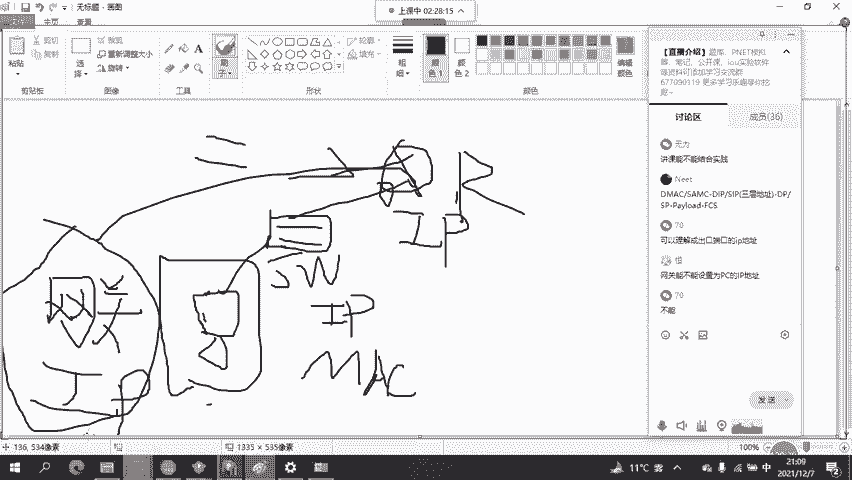
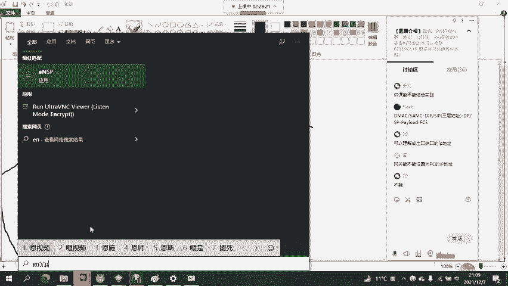
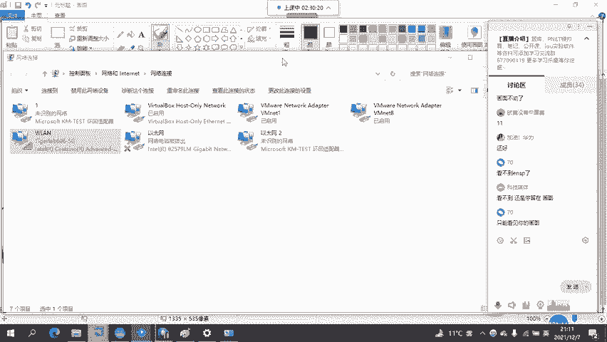
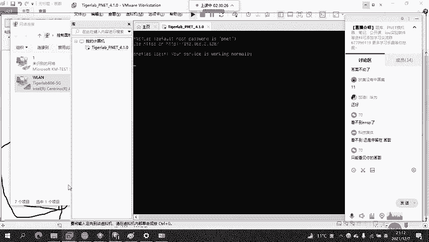
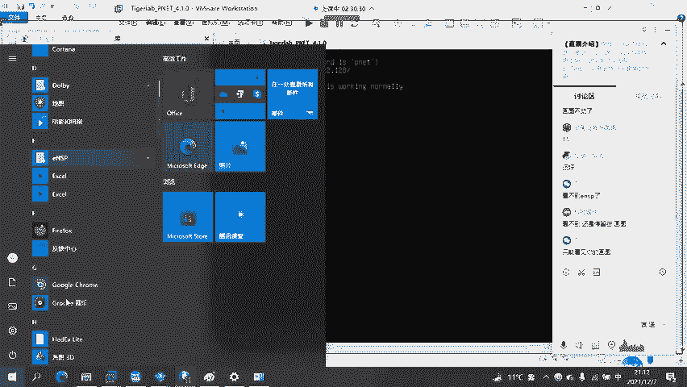
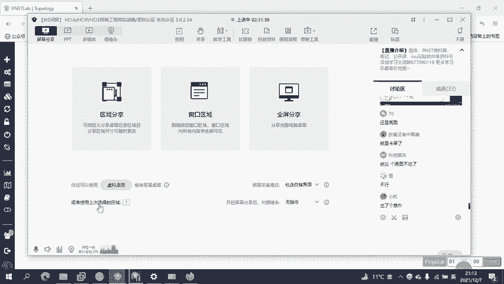
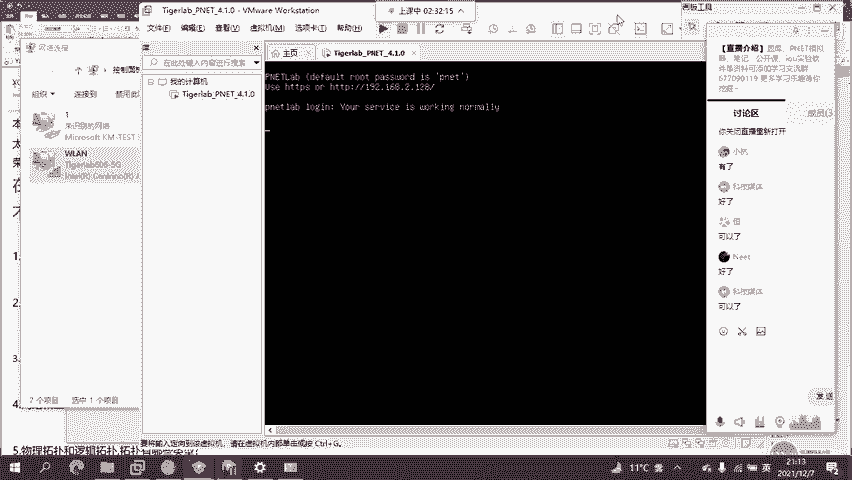
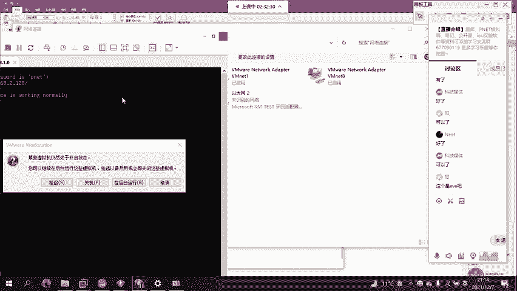
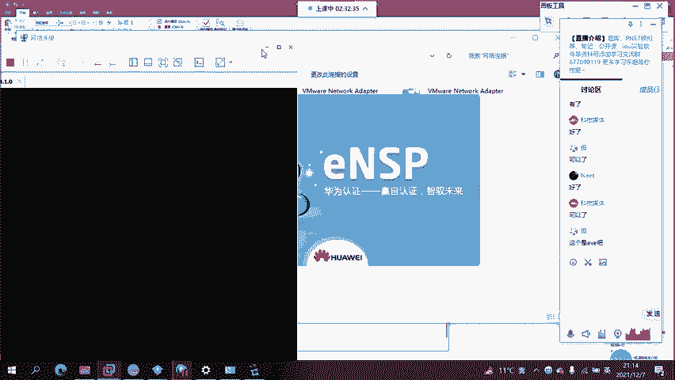
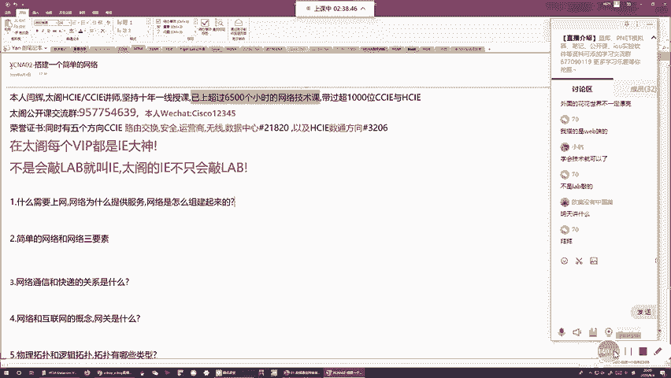

# 2022版华为认证HCIA-DATACOM教程，内部课程公开分享（已完结） - P2：XCNA-02-网络三要素 - 网络工程师CCIE - BV1AP4y1J73k

他CA的第二节课啊，这是咱们正课的第一节啊，也是咱们整个课程。第二节课啊。那这节课给大家聊点什么东西呢？就是教大家到底提叫网络。哎，通过这节课的学习。

让大家能够简单的通过咱们的模拟器来大家出一个简单的网络啊，并且能够了解到什么叫路由器。什么叫交换机。什么叫防火墙啊，知道什么叫企业园区啊，知道企业园区的这么一个层级。

然后带大家了解咱们网络中的一些简单的名词啊。咱们这个组零到底的第一节课啊，很关键啊，给大家讲一些比较基础的这么一个内容。好，那这边的话咱们话不多说啊来直接进入主题哎，先来给大家一个问题啊。😊。

咱们计算机网络是干什么的？是用来让我们通信的吧，对不对？那什么都是需要通信。啊，计算机网络为什么提供不通？我们在计算机网络中，对吧？什么样的东西需要利用咱们的网络来传递数据来完成通信。是计算机吗？

是我们的手机吗？shift的平板电脑吗？shift的游戏机吗？好，请注意啊，其实答案都不是啊，我们这些东西哎统称叫终端啊，对吧？终端指的是什么呢？就是咱们的计算机，对吧？台式机啊、笔记本啊。

咱们的手机我们的平板电脑，对吧？我们的ipad是不是？我们的一些安卓的pa对不对？那这些咱们都称为叫终端啊，那终端的特点是什么呢？就是咱们人类直接用终端啊来工作来学习来娱乐，好吧？

他们直接面对的是我们的用户，那接下来咱们以PC为例啊，用PC组组收的，你们如果懂硬件，你应该知道啊，一个PC，咱们会有一块主板，对吧？主板上面咱们有CPU有内存有硬盘，对吧？然后接下来咱们有声卡。

有显卡，对吧？然后计算机咱们有个机框，对不对？机框里面基本包含的就是直些内容。然后接下来咱们会有键盘，对吧？会有鼠标会有显示器，会有音箱。好，那接下来组建完毕之后，我问大家，你们购买这台计算机。

你要玩这个计算机的硬件吗？你要玩计算机的硬件吗？谁没事，把计算机直接拆机玩啊，没人这么做啊，对吧？咱们玩软件啊，那这个软件咱们想要去正常的安装，对吧？你得要先装一个操作系统，对吧？

所以咱们一般PC你采购回来之后，啊，那一般也是由店家啊给你组件完成，对吧？给你搭搭配你个机器啊，搭起来之后，咱们要装一个操作系统，对吧？那这个操作系统呢当才用比较多的啊。

像微微软的windows的win10当前标配嘛？如果说你买不苹果主机，那咱们有苹果系统嘛，这个叫ming，对吧？手机的操作系统，咱们有IOS有安卓对吧？那当然咱们还有大华为的鸿蒙，对不对？

这些都是操作系统，那既然来装完操作系统之后，咱们玩这个系统嘛？也不玩啊，咱们也是基于这个操作系统做载体，我们来下载啊，咱们需要使用的这么一些软件，对吧？比如说你要聊QQ对吧？你要安装QQ的客户端。

对不对？你要浏览网页，对吧？你得安装浏览器，对吧？你要。😊，玩王者荣耀对吧？你得安装王者荣耀的对不对？那总而言之，哎，咱们拿到这些终端啊，计算机啊、手机啊。

咱们其实玩的更多的是安装在操作系统平台之上的这些应用啊，那这些应用那们一般称为叫APP嘛，全称叫application简称叫APP。那接下来到底是什么需要网络来通信呢？不是计算机啊，也不是咱们操作系统。

哎，是咱们这些应用，对吧？你聊QQ，你要在不同的QQ之间来发布消息，对吧？这个需要网络来支撑吧？你玩游戏更是需要网络，对不对？你浏览网页咱们是需要网络对吧？网络为什么提供服务呢？

网络就是为咱们计算机手机上所安装的这些应用程序啊来提供数据传输的这么一个服务啊，那通过数据传输的服务，咱们能实现什么呢？哎能实现在应用之间啊，咱们交互数据哎，最终实现资源共享啊。

这就是网络存在的这么一个作用啊，它允许咱们应用程序通过网络啊来传输数据啊，我给你发，你给我发，那咱们通过传输数据最终能实现什么呢？就是我知道的，你也知道的吧？我有的你也有了吧，那这个就叫资源共享嘛。

对吧？通过数据传输来实现资源共享。哎，这就是。咱们的大网络啊，那接下来这么一个网络啊，来是我们用共服啊，密聊组件，对不对？那组建网络的时候，咱们网络里面包含哪些东西呢？哎，简单来说啊，咱们一个网络啊。

一个成熟的网络啊，咱们里面通常包含了三要素啊，哪三要素呢？那分别就是咱们的终端呢不用说啊终端是咱们网络主体啊，如果没有终端，你都没有网络存在价值了，对吧？网络的存在就是用来互联网终端的。

因为终端上咱们会安装各种各样的应用，需要通过网络通信的，是这些应用，但应用是一个虚拟的东西，对吧？你不能把这个应用来连到我们的网络上，所以说你联网的，都是咱们一些终端，啊，终端咱们就有网卡嘛。

这个叫NIC啊，叫网络接口卡，对吧？网络接口卡俗充就是网卡嘛，对吧？你台是机笔记本哎，咱们的网卡，手机也有啊，对不对？那咱们通过这些有线无线网卡，哎，来连线，或者说直接通过无线的方式啊。😊。

来接入到咱们的网络。那当你接入到网络之后，哎，那这个终端上面咱们所安装的应用，对不对？就能利用咱们的网络连接啊来收发数据。好吧，网络中咱们的终端哎是最关键的，因为网络就是为终端啊来提供服务的。

那接下来除了终端以外，咱们还有什么呢？那么咋想啊，你计算机尤其是以咱们台式机为主啊，你台式机要连网，你是需要连根线啊，对吧？那这个线咱们通过叫网线啊，啊，网线有很多类型，哎，咱们有电缆啊，咱们有光来。

对吧？电缆是传电的，对不对？然后光呢是传光的，咱们通过电和光来证出数据，对吧？那这个时候你计算要连网，你需要通过线缆啊来做这么一个网络连接是吧？那就个线缆咱们说什么呢？这是线缆，咱们通的叫介质啊，线缆。

咱们通叫介质。介质主要分为两类啊，一类叫有限介质。还有一类咱们叫无线介质啊，一类叫有线的，一类叫无线的对吧？那这个有线介指不用说了，是你在联网的时候呢，你需要连根线嘛，对吧？

你通过连根线物理物理层面上来自来看啊，你通过这根线呢，就能直接把我们终端，我们的网络呢连在一块，可吧？那这个有线呢，咱们计算机一般用比较多啊，但是对于咱们手机对于咱们平板，对吧？这些设备比较轻便啊，啊。

你连不了线，对吧？你面不大，你也没有这个网线的接口是吧？那所以说对于这类设备咱们一该联网啊，通过无线的，对吧？那这个无线，你需要部署一些像什无线路由器啊，对吧？等等之类的一些设备。

那这些设备来给你提供无线信号，对吧？你计算机只要有无线网卡，对吧？你可以关联这些无线信号啊，来实现什么无线的网络接入，好吧，那这类东西咱们统称为叫介质。那接下来除了介指，除了终端，咱们还有什么呢？哎。

还有一个最关键的就是咱们上这网所说的啊，思科华为做什么思科华为咱们称为叫设备制造商，对吧？他们做什么设备啊？就是网络设备嘛，对不对？这些网络设备，那在网络中啊，非常关键啊，你要组建一个成熟的网络。

这种网络设备咱们是不可或缺的？那这一类咱们称为叫中间系统。好吧，那这个中间系统指的是什么呢？就是各式各样的网络设备啊，对吧？这些设备咱们有路由器，对吧？咱们有交换机。

那曾经呢咱们早期的网络里面还有计电器，对吧？咱们还有防火墙，是不是？然后咱们还有一些无线控制器啊，AP啊，对吧？那这些都叫网络设备，好吧，咱们称为叫中间系统。

那当然之所以称为一叫中间系统原因是因为这些设备对吧？它存在，但是咱们一般用户呢看不到，对吧？这些设备咱们一般是放在机房里面的，对吧？机房啊，一般的跟我们的用户啊都是隔离开来的，对不对？你的用户要连网。

啊，你的计算机连接网线，对吧？我们所能看到的就是一个网线一端呢连接我们计算机，另外一端连到墙上，但是其实大小想应该知道啊，你这个墙对吧？用户呢给我们提供数据传输能力，那所以说呢墙的后边啊。

你所连接的网线还会继续的往后延伸，延伸到哪里呢？延伸到咱们机房里，对吧？这个机房里面咱们会有机柜，机柜里面会有各式各样的网络。设备对吧？那咱们就是通过连线连的网络设备啊来把我们的各种各样的终端连在一块。

对吧？那通过这个网络连接，哎，你终端之间的应用啊，才有能力来彼此交互数据。好吧，那咱们通信呢基本都是这么来的。OK那接下来了解完网络之后啊，我们来做个总结啊。这个网络呢用咱们人类能听得懂的话来说。

怎么不连接呢？很简单。一台主机连一根线连到 switchwitch，再连根线，连到主机B。好，这就是一个网络。好吧，这就是网络。当你把网络连好之后，那A和B的这个计算机啊，咱们网络相当连通了。

那这个时候你A跟B，对吧？只要你安装一些应用啊，那这些应用理论上来讲就可以通过这个连接啊来通线。好吧，那当然咱们网络有大有小啊，这个大的网络怎么连，咱们之后呢再去说好吧，这就是一个网络的连接方式。好吧。

那接下来了解到网络连接方式之后啊，我们来简单的来看一下这个网络图标啊，好吧，我们来看一下网络图标。就是你在连网的时候呢，咱们给客户设计个网络，你设计完网络之后啊，你得要做图示的方式。

把咱们网络连接图啊给画出来，好吧，那这个咱们称为叫top啊，你在画拓谱的时候，那的网络设备怎么画呢？我们计算机怎么画呢？那这边华为给了我们一些比较统一化的这么一个画法，对吧？这个就是top中的图标。

对吧，那比如说路由器，你想画路由器啊，就这么画，对吧？你想画交换机，哎，咱们就这么画，你想画防火墙，咱们就这么画，对吧？咱AP这么画，哎，我们的无线控制器这么画，对吧？然后咱们计算机这么画。

我们的IP电话这么画，还有咱们的笔记本手机，对吧？那大家都能看到咱们通种方式来画的话。大家家可能问哎这个画法太麻烦了，你真正画图的时候，你画不了这么漂亮怎么办啊，无所谓啊，咱们有一些简便的画法。

比如说你想画个路由器啊，怎么画呢？用咱们正常的网络工程师的画法，一台路由器。就是一个圆啊。上面写的阿姨就是阿姨嘛，一看不气，你想画个交换这怎画。画一个方的框，上面写SW1，这就是他换机是吧？

你想画个防火墙一样的呀，画一个墙嘛，上面叫FW是吧？FW1防火墙一嘛，能理解吧？咱们一般在画拓的时候呢，哎个人画，一般画的比较糙啊，你通过这种方式就好了。然后接下来如果说你要是通过visel，哎。

你要通过其他方式啊来画一些比较专业的拓图啊，你就最好按照方法来画好吧，当然按照这种方式来画的话，特别好啊，就是大家在面试的时候，不用担心踩坑了啊，早期咱们在学网络的时候，那个时候华为还没有做网络，对吧？

咱们就去思科的私科的这个官方的路务器的图标是个圆的啊，那所以说很多没有工作设备的同学啊，他们在学网络之后，不要在面试的时候，你面试官为了检验啊，你是不是一个水货，问你了，哎。

你知道工务器是圆的还是方的吗？上来直接回答哎，那还有错，那肯定是圆的吧。😊，这个路由器其实找的就是方的啊，找的是方的。无论是合式的还是框式的，它都是方的。但是呢思科在设置路由器图标的时候。

它设置为圆的对吧？那当然咱们大华为太细心了，他就是发现了这一点呢，所以说为了避免咱们学黄为图学学完之后啊，被面试到遇到相同的问题，咱们答错嘛，对吧？他就直接在给我们对吧？设计这个空图的时候。

直接把路由器设为方的啊，那当然这个方的还是原值不重要啊，重要的是它到底怎么工作啊，这个设备到底有什么用，怎么工作定位属定位。哎，那这边的话咱们通过后期的学习啊，我会慢慢的带大家了解这里，好吧。

那这个图咱们可以先看一下。好，那接下来看完之后呢，我们先来看几个简单的网络连接啊。好，人类最早期的网络连接什么样的？就是A这个图示啊，对吧？你两台计算机中间的连根线这样组成的，其实就是一个网络啊。

那这个网络咱们称为什么呢？它个名称啊？它有个学名，它的学名叫什么呢？叫工作组啊，它叫工作组，O吗？这个工作组特质就是咱们在联网中啊，没有使用网络设备啊，你两台终端连根线连到一起，比如主机A直接连根线啊。

连到主机B，这样连接而成的，哎，也算是个网络啊，那这种网络咱们称为叫工作组，啊，这个工作组是所有网络中啊最原始最基础的一块，它通通信吗？可以通信啊？但是它的可扩展性，几乎为0，对吧？

因为大家都知道你一台计算机你要联网，对吧？你需要网卡，对不对？咱们一般一台计算机的网卡几块呢？不是一块，一块网卡只有一个接口你只。连根线对吧？你主机连根线连到主机B，你还有其他的接口能连线。

连其他计算机了吗，是不是连不了。那所以你会发现在工作组中啊，如果说咱们每台主机只有一块网卡，那工作组里面咱们也只能包含这两台计算机，你想要连接第三台，对吧？咱没有接口连嘛，对不对？你想连接第四第四台。

那更不要想了，对吧？工作组最大的扩展性问题就是在一个网络中啊，咱们的计算机通常只能有两台，你如果想要包含三台，包含4台，对吧？包含更多的主机啊，对吧？咱没有这么多的网卡来连线，这是第一点。第二年。

你的计算机这两根线啊，这根线咱们通常连的是什么？我们通常连的是双绞线啊。咱们通常也是双号线，这个双号线大家可能没有见过啊，哎，简单给大家看一下。啊，咱的双脚线就是俗撑的网线啊，双脚线就是俗撑的网线。

长什么样？啊，你们可能见过啊，你们肯都见过。对吧？长就是这样，对吧？外面的线皮里面扒开来有四对线，对吧？四对线是有颜色的，颜色固定啊，橙白橙绿白、绿蓝白蓝看空白中是吧？

然后接下来如果说你要把这四段线给解开了，你会发现啊，咱们用手发根线星啊，每根线星的材质是什么呢？是铜啊，对吧？它是铜线对吧？同导电嘛，咱们就是通过它的导电属性啊，咱们通过发动电流来传输什么零和一嘛。

这些数据啊，那为什么传输零和一呢？你为是个计算机啊都会传啊，计算机只能识别二进制，你在计算机系统里面你所看到的一切东西啊，文字也好，对吧？图片也好，音频也好，视频也好，其实都是通过零和一啊来表示好吧。

你在通过网络传输这些数据的时候呢，咱们也是以零和一的方式啊来传。那当然零和一在传的时候呢，咱们会转转转出什么叫高低电频嘛，对不对？咱。通过高电压来传输一嘛，我们通过低电压来传输力，对不对？

通过连续的高低电压来传输零和一来传输咱们要传输的这么一个距离。好吧，那接下来这个双绞线咱通过导电来传数据啊，对不对？那这个数据传输，咱们有没有这么一个限制啊，请注意啊，它是有的这个限就是你在双绞线上。

咱们传数据啊，你不能传太远，对吧？那换句话说，就是你在做双绞线的时候啊，你一根双绞线呢不能太长，对吧？你最好不要超过100米啊，你如果说这个长度超过100米的话，你虽然能够连接你也能够传数据啊。

但你数据传着传着传着，可能你受到了比较大的损耗啊，对方收到的数据无法识别，啊，这个数据在传输过程中受损，这个行为我说什么呢？我们称为叫数据衰减啊，叫信号衰减啊，叫信号衰减。那信号衰减什么意思啊？

就是你发高低电频嘛来表示了和一，你随着数据的传输，你的信号会越来越模糊，对不对？零会越来越偏向于一一会越来越偏向于0，对吧？那当你传的数据传的太远了，那你对方收到数据之后，你如果不能识别哪个是零。

哪个是一，那你这个通讯能失败了嘛，对不对？因为我信源给你接收者发布数据的目的是什么？是让你能够识别我给你发的是什么，对吧？让能够理解让们看得懂，对吧？咱们能够通过这种方式啊来实现自源共享。

但是现在给你发的数据，你才能收到这个错啊，但是你收到数据不知道我在说什么，你不知道我发的哪个是零，哪个是一，你不能把这些信号啊还原成我给你发送的内容，你看不懂，对吧？那这个通信你没有价值了。

那所以说了为了保证咱们通过双绞线传输数据啊，对方收到之后能够反反识别啊，那咱们有一个工业标准，这个标准就是咱们在造双绞线的时候，你这个双脚线啊最长要超过100米，对吧？

那也就是说了咱们在组织一个工作组的时候啊，咱们两台主机之间，你们最长的直线距离不能超过100米。那换句话说，你两台计算机，你最好就是在一栋楼内。那当然更好的是你们俩直接在一个房间啊，那这样做的话。

咱们工作组呢是可以组线可以通信的。如果你两台主机离得太远那不好意思啊，你这个通信呢。就会受到影响，对吧？那所以说呢由于工作组对吧？不存在扩展性啊，那咱们网络呢慢慢就发展成了B。然后呢最后发展成了C啊。

那这块的话，B呢显示很简单啊，这是一个稍微复杂点的网络了。那可能咱们觉得工作组嘛，一个网络里面只有两台主机，你们直接通信效率太低了嘛，对不对？我希望在网络里面包含更多的计算机。

我希望更多的计算机啊能够彼此之间呢来传试数据啊来实现资源共享，那这块咱们就要依赖什么网络设备，对吧？我拿一台网络设备连线连到我们计算机，对吧？那当你连接完成之后啊，你组成了一个比较大的网络。

这个网络里面主机更多了吧，对不对？那大家也可定通信嘛，你们发送的数据。发给咱们的网络设备，网络设备能够帮你做一个转发嘛，对不对？那通过它的转发，你就算两台计算机没有彼此直连啊，对吧？那你主机A8的数据。

主机里能收到你主机A8的数据，主机C呢也能收到。那当然这张图呢画的比较有问题啊，就是咱们用来连接网络的设备持有8种不路由器啊，因为这类路由器接口特别少啊，你拿这样的设备来直接连线连发计算机啊。

组成网络啊，那这个成本可就大了，因为你一个路由器可能能够连线的接口就两三个吧？你两三个接口连两连连什么两三根线啊，那就算你这些接口能够配置为什么一个网络啊，那这个时候你在一个网络中。

咱们计算机的数量也不会超过三台，对吧？那咱们是希望啊就是你在读网的时候呢，咱一个网络怎么知你有几台主机对吧？你有几百台主机，那你想连接这么多的主机的路由器这的设备靠边站啊，咱们要使用更加适合的设备。

那什么样的设备更加适合它，啊，我来给他看一下，你们自己说的算。啊，我不来给你们对吧？做诱导，你们自己来判断。好吧，那这边咱们打开1个ESP的模拟器啊，里面就是华为的这么一个考场专用的啊考试利器啊。

这个东西的话能够帮助大家快速学习咱们网络啊。那之后大家要把这个模拟器给装一下。那当前我这个模拟版本呢是最新的。当前我这个模拟器的版本最新的。哎，跟IE考场的版本是一样的。考IE的时候，考场就这玩好吧。

所以说咱们通过这个来自NAXP啊没有任何问题。好，路由器是什么？之前跟他说过啊，圆大圆的路体，那这个路西大家看一眼啊。对吧你觉得拿这玩意儿来连线连到计算机合适吗？你整个路由器，这是个开关，对吧？

这是个电源线是吧？这边有个状态灯啊，两个USB接口啊，一个concl口用来连的csl线的，然后接下来真正能够帮我连绑的，只有这三个接口，请注意啊，这个接口跟这个接口，这个叫什么光电混用口啊。

就是这个接口可以用来连通纤，可以用来连什么双网线，但是你只能连一个啊，你只能选择一个好吧，就是也就是说正常情况下，咱们这路由器啊，比较经典的叫AR2220，咱们能够连接网络的接口就三个，对吧？

你想拿它连自来来连计算机啊，你只能连什么三台嘛，是效率太低了，对不对？然后接下我们来换一个，来换一个啊，换谁呢？换它啊，换它换完它之后，大家再来看一下吧。哎，这是一台华为的3700系列交换机啊。好。

你们来看啊你们来看啊，这是它的两个电源，对吧？两个电源，然后呢两个电源线啊，这边的话有一些光口好，我们来看这里啊。大家能看到吗？接口多不多啊？这个接口够了。虽然也没有那么多啊，但是相比路由器数多多了。

哎同学呢，我们现在要来台保罗设备来把我们的计算机连接入网，你们会选谁啊？你们是选路由器还是选交换机？😡，你们选谁啊？我觉得都不用选了吧，肯定交换机啊。那在加我告诉大家，交换机比较便宜。

交换机更加便宜一些。那所以说了咱们临接基本入网啊，肯定省啊。所以说这个胶片呢啊有那么一丢丢的问题啊。那当然说到这里跟大家说一下咱们网络设备因为两类啊，一类叫接入设备，一类叫汇聚核心设备啊。

写一下一类叫接入设备。一类叫汇聚核心设备。好吧，这个接入设备顾名思义啊，它的定位就是在网络的最边缘。咱们要职些设备的目的是什么啊？就看你口多嘛，你口多我一台接入设备能够连接更多的计算域网啊。

那我们称为叫接入设备。然后接下来像汇聚核心设备啊，它的存在于网络的更中央的位置，啊，它的不直接连线连到计算机，它的通常负责来互联多个网络啊，把多个网络连到一起。那所以说了咱们顾名思义啊。

交换机毋庸置疑啊，是咱们的接入设备，对吧？而咱们的路由器毋庸置疑，是咱们的汇聚核心设，好吧，当然咱们要在这些细节啊，对吧？交片给我犯错的时候，好吧，咱们用交换机哎。

连接众多计算机啊组成的就是一个比较大的网络。那当然大家可能会问了不说了。咱们在使用网络设备的时候，你再联网啊，对吧？在咱们一个网络可能需要连接更多计算机。我们刚才说了。

一个网络里面计算机数量可能有几十台，甚至可能有上百台，对吧？但是你这个3700系列交换机，你只有24个接口，你24个接口连满了，你也只能连接24台计算机。那现在如果希望在一个网络里面包含100台计算机。

我们该怎么办？有办法吗？好请注意还是有办法的？肯定有办法，这怎么可能没办法呢？肯定有办法。你连多台交换机不就好了，对不对？那大家你看啊你这个3700系的交换机啊，除了这些接口以外啊。

这些接口咱们称为叫交换机的下列接口啊。这些接口通常都是电口，咱们连双绞线来连接我们终端啊，交换机连接终端的接口，一般咱们就称为叫下连接口是吧？那这个下连接口咱们有24个，对吧？你下连接口连满了。

能连24台计算机，那接来比较棒了，咱们是不是还有这样的接口。对不对？这样的接口仔细看就能知道啊，它是连光纤的连光缆啊，你要连光来之前要先连一个模块啊，叫SMP啊，连上光模块，然后连接光来。

那这种接口干嘛的？好，请注意啊，这种接口或得连接光纤啊，来连到其他的交换机，这种接口是交换机间的互连接口。那这种交换机间的互连接口，咱们说什么呢？啊，没有错，咱们称为叫极连接口啊。

一般极连接口的数量是咱们下连接口的10分之1。那当然这个极连接口可厉害了，它的带宽会高很多啊，并且它也通常是连接光纤嘛？能够支持更远的连接距离啊，一般你一个交换机，你有24个下连接口，你就两个接连接口。

你有48个下连接口，你就有4个接连接口。那这个接连接口的带宽啊，一般是下联接口10倍啊，你下联接口百兆，接连接口有千兆，你下联接口千兆，级连接口9万兆，对吧？那接下来再来看啊。

你一台switch一只能连24个主机，对吧？哎，咱们能不能再买一台switch2，对吧？你把switch一 switchwitch2通过级连接口连到一块，那这个时候switch一连接24台计算机对吧？

switch2再连接20台计算机，那你连完之后啊，咱这个网络里面是不是有48台，那还不够啊，再来嘛？你再来switch3不就好了吗？如果不够再来switch4不就好了吗？

如果不够再来个switch5就好了吗？你不过也就100台计算机嘛？你100台计算机，你买打百算，你买5台交换机不够连吗？😊，完全够啊，绰绰有余，咱们还有多余的接口没有使用，能理解吗？哎。

这就是咱们连接网络的这么一个方案啊，大家很多问了，那既然如此的话，那咱们只要不停的购买交换机，只要不停的把交换机连在一块，那是否可以理解为在一个网络中啊，咱们想包含多少主机，就能够包包含多少呢？

好奇注意啊，理论上答案是掉。理论上答案是掉。但是咱们在真正在做网络设计的时候啊，你不能这么设计啊，你不能这么设计，为什么原因是因为一个网络越大啊，这个网络的品质就会越差啊。

因为在一个网络中没有咱们有卖主机啊主机A跟主机B你A想要跟B通信啊，当然我们当前的网络啊一般都是以太网的，你在一个以太网环境中主机想选主机通信啊，你得知道主机B的麦地址对吧？你得知道主机这个卖地址。

但是一般情况下A在跟B通信之前，A能知道B麦地值啊，不知道啊，你计算机也不知道咱们人也不知道你操作系统也不知道咱B也不。但是呢不好意思，你不知道对方的麦地址，你就获得给对方的数据哎咱们通了。

那所以说这块的话，A为了方便给B方的数据啊，我就得通过某种途径啊来解析B的卖地址。怎么解析呢？咱们会通过一个协议来实现啊这个协议咱们称为叫ARP。这个叫地址解析协议啊，地址解析协议。那通过这个协议。

咱们主要就是用来解释什么解析B的麦地址嘛，对不对？你A想要跟B通信，我不知道B的麦ck地址，哎咱们就做ARP啊来解析。但是这个解析过程很暴力，怎么暴力呢？就是你A想要解析B的麦地址。

我发送1个ARP的请求。这个ARP的请求请注意啊，咱们是以广播形式来发送了。这个广播形式对吧？广播视什就跟一个大喇叭一样啊，对吧？你你对着大喇叭来扯，对吧？吼啊，你这么一吼是不能听到啊。

那B肯定能听到对吧？但是除了B以外，咱们该网络内的所有其他人就都听到。哎呦，这个可能太。你主先想要跟你主题B同行，对吧？我看你可怜，你不知道B的Y地址，我现在允许你发送ALRP的请求啊。

来对B两个Y地址做一个解析。但是你这个解析也太过分了吧，对不对？你直接以广播形式来发送这个ARP的请求，谁都收到啊？除了B以外，咱们所在网播内的所有其他人都能收到。那这其他人他们是B吗？不是B。

他们需要接受的ALRP请求吧，也不需要，但是你发的请求，对方对实打时的收到了。这就尴尬了。那这对于B以外的所有其他主题而言，他得接受A的ARP请求，对吧？除了浪费咱们带宽，浪费咱们自身的硬件的资源。

对吧？咱们CPU内存资源有任何好处吗？哎，没有任何好处，能理解吧。所以说你在一个网络中啊，咱们计算越多，你这种莫名其妙的ARP的报道就越多。你ARP的报围越多，咱的整体网络内的所有成员啊。

每收到1个ARP请求你就遭积腰。你收到就跟我一样啊。所以说你网络越大，你收到的ARP请求越多啊，你这整体网络品质就会越糟糕。能理解吧？所以一个网络不能太大。😊，你千万不要指望买他1万台交换机啊。

里面连他个几十万台PC啊，你想多了不可能的，不可能。那所以说呢，如果你真的有更多的计算机，你希望他们参与到网络啊，希望他们通过我的通信，请你一定要分段啊，网络一定要分段。

所谓的分段就是通过物理或者逻辑的方式啊，把一个网络分割成多个网络。那谁来分割呢？哎，请注意交换机没有这个能耐啊，咱们一般更多的拿路由起来。可以吧，比如说你有一个网络里面50台主机啊，还差不多了。

差不多了。好吧。然后接下来你现在呢需望把其他的主机放到另外一个网络里面去，这怎么搞啊？哎，你搞一台路由器吧，对不对？搞一台路由器，刚好路由器结果也不多，连PC浪费了，对吧？但是它连交换机不浪费啊。

对不对？用它来连接网络啊，这边咱们再搞两台交换机啊，switchC对吧？switch4O了，那接下来搞完之后，哎，咱们这是一个网络啊，然后接下来这是第二个网络啊，网络A网络B啊，通过路由器连到一块。

请注意啊，你不要认为这是同一个网络啊，这不是同一个网络啊，这是两个网络所组成的互联网啊，这是由两个网络所组成的互联网什么叫网络啊？网络叫work什么叫互联网啊？互联网叫internet好吧？

所谓的互联网咱们指的是什么？就是通过路由器。😊，隔离连接起来的多个网络啊，咱们通过多过路器啊，把多个网络连在一起，对吧？那咱们这个网络之间能够通信，但是对吧？左边的网络的主机，你发送ARP的请求啊。

右边的网络是收不到的，你右边的网络的主机发送ARP请求啊，左边的网络的主机是收不到的。因为路由器跟一堵墙一样啊，把你们的ARP报文啊，把这些广播报文给隔离开完了，对吧？这就是网络和互联网。

那接下来随着咱们网络的进一步扩展啊，咱们再来看胶片啊，我们的网络生不成了什么C的形态。这个CA的形态画的比较笼统啊，就是咱们一台计算机啊，你连到一个叫做internet的东西。

然后在身后连接了一些服务器。那这就是咱们当今这个时代了。在当今这个时代中，对吧？咱们99%的应用啊，基本都是CS模型的，这个CS模型，咱们称为叫plan，叫客户端服务器，对吧？那举个例子啊。

比如说你要聊QQ对吧？你下载的QQ是一个客户端应用啊，这个客户端应用，你想要联网。这个客户端利用你叫联网啊，你需要登录对吧？你是不是需要登录啊，对不对？你需要登录，那接下来登录找谁登录呢？

其实就是找腾讯的服务器来登录，对吧？你下载的QQ户端对吧？你就要输入的QQ号输入密码登录吗？你不登录能聊天吗？你聊不了对吧？那接下来Q登录找谁登录呢，就是找腾讯的服务器登录。

那接下来问题是腾讯服务器在哪里啊，你不需要知道啊，对吧？你只知道咱们有没有服务器存在，你去登录就是找服务器登录，那当你登录完毕之后，对吧？这服务器认证你的QQ号和密码吗？发现没问题了，你登录成功了。

那基于这个登录你就可以跟什么其他通务信了。那接下来这个服务器在哪里呢？其实在个机房里，这个机房咱们称为叫IDC啊，这个机房咱们称为叫IDC叫internet啊，叫互联网数据中心好吧？

叫互联网数据中心O吧？这个叫互联网数据中心那这个互联网数据中心。那很大啊，那好几层楼一层楼都有好几百平甚至好几千匹，对吧？里面有N多N多的机柜，每个机柜里面都有各式各样的服务器。

那这些服务器来自于各个互联网公司啊，比如有百度的，有新浪的，有腾讯的，有网易的，有阿里的对吧？你日常上淘宝啊，对吧？上百度啊，上网易啊，对吧？你聊QQ啊，其实都是在跟数据中心里面的这些服务器啊来通信。

能理解吧？那接下来这些IDC机房在哪里呢？啊，你不用管在哪里啊，他的连接是同一个东西，我们充一下运营商啊，然后接下来咱们客户对吧？我们PC啊，你想上网的话，你也需要办理电信宽带的吧？你通过电信宽带代理。

你连了一根电信的宽带线的嘛？当你连完这个线之后啊，你相当是也跟咱们电信网络连在一块，对吧？然后接下来咱们各国都有电信网络，对吧？跟咱们各国都有电信运营商嘛，那这些电信运营商，他们的网络，其实此。😊。

连在一起的，对吧？全球各国的运营商的网络啊，咱们其实连在一块。那这个由全球各国云商啊以此连接而成的这么一个超级大型的网络，覆盖七大洲五大洋的网络，我们称的什么？我们就称为叫internet。

这是全人类最大的一个互联网啊，这是全人类最大的。它不属于任何公司，不属于任何组织，它是由全球各国运营商连接而出纳。你们全球各国运商负责维护咱们这个internet的这么一个使用。好吧。

这就是说你全球各国啊，只要你是一个网络用户，你办理一个宽带，你不管办着电信宽带联通宽带还是移动宽带啊，那当你办完宽带之后，你都能连接到咱们运营商网络。而咱们全球各国的运营商网络啊，又是彼此连在一起的。

那你通过你的宽带连接啊。那按理来说你是能够访问咱们全球的所有网络资源啊，全球各国的各个数据中心里面的各个服务器资源啊，你都能访。好那当然中国比较例外啊，因为中国的网络，哎。

咱们有一个边界这个边界叫长城防火墙啊，那通过长城防火墙不隔离，啊，你中国的内网对吧？跟海外的网络啊，有些是不能连通的。就比如说你要访问什么公垢啊，facebook啊、Twitter啊，对吧。定了。

你保证不了，那保证不了，不是因为咱们保不通啊，其实咱们保证通的。再有就是因为对吧？咱们有一个长城防火墙，这个长城防火墙阻止了咱们内网主机啊发起了去往外网这些服器的这么一个连接。那所以说就是对吧？

你在国内的用户嘛，你只能更多的保证咱们国内的这些IPC机房里面的这些通气。对吧比如说阿里啊、腾讯啊、网易啊，对吧？爱奇艺啊、优酷啊，你在国内就比较爽，对吧？那然你在国外对吧？同样也是用比防火墙啊。

你在国外的主题想访到国内，那也是困难重重。好吧，那这就是你看的。这个internet看起来很大，但是其实乐不了前啊。这个internet其实就是由若干的大大小小的网络彼此连接而成，对吧？

各个国家的各个运营商，你们彼此互联嘛，对吧？咱们通过海底光来把各个国家的网络连在一块。那这个由全球各国运营商共同维系的这个超大型的互联网啊，称一下internet。

OK那这就是网络发展的这么一个啊步骤啊，对吧？那最早期的网络就是工作组嘛，对不对？慢慢演变成了由接入设备啊组结而成的大型驱构。然后接下来有了路由器之后啊，对吧？咱在多个不同的网络之间能够彼此相连。

然后接下来连了连连，连成咱们internet，对吧？那当下咱们的网络用户啊，只要你要连了，你连都是这个internet那通过这个internet，你能够访问咱们全球各国的各种网络资源啊，那说到这里。

大家有没有什么问题？你们如果没有问题的话，我来丢给大家一个问题啊。你们知道这个长城防火墙是哪家公司设计的吗？啊，大家知道咱们中国的长政防火墙是哪家公司设计的？你们听过吗？不知道是吧。好，给大家介绍一下。

360R不是360啊？不是啊不是啊，中国的长德防火墙。对啊，是由中信的ZTE你们听过吧？中信华为、中信华为啊，对，是由中信设计的。然后呢，这个中信设计的防火墙，前段时间刚升过级啊，升过级之后。

你曾经连翻墙的手段在如今啊都不好用了啊，早期年的翻翻墙啊，现在咱们更多的只能使用什么叫V two啊来翻墙，以前的话用那个SSR对吧？你用SSR翻墙，对吧？咱们以前都是这么用的。

但是后来呢你会发现SSR只要你播一次号啊，播上去了，对吧？就传说防火墙都立即改知啊，感知完之后，瞬间帮你把IP封了，对吧？你换一改之又同样的几分钟之后给你封了，这些风不是人为的封的，都是系统自动封的。

原因是因为前段时间对吧？这个中信防火墙对吧又升级了吧，升级之后的话，就是你如今想要访网，你想上什么youtube啊，你想上什么facebook啊，你只能通过一个的方式来翻墙那这个我搭建啊。

大家可以就搞一个那个免费的google云啊，你们注册一个免费的gogle云啊，注册一个免费的gogle云拿信用卡，你的信用卡不支持美元啊。然后今天。😊，要求你花1美元来做个认证。然后你花完1美元之后呢。

他会送给你300美元啊，300美元送你一个虚拟机啊。然后接下来通过这个虚拟机呢，你可以搭建一个对吧？叫va two的这么一个server啊，那通过V to啊，你就可以成功呢来返它关了。

然后接下来等你300美元用完了。当然这个300美元，我不就能用一年啊。那当你用完之后的话，呢，第二年怎办，你再换张信用卡嘛？你换一张信用卡再撸个300美元。对吧你可以永无止义继续下去啊。

这箱子是每年花1美元，但是这一美元他会退给你啊，你每年花1美元他会退给你，然后送给你3万美元，你就慢慢玩嘛，是吧？那这个还是挺有意思的啊，大家可以尝试一下OK可以尝试一下。对当然这块的话。

大家不要声张啊，因为这个是。😊，啊，你们懂吧。有那么一点点敏感啊，这个有那么一点点敏感。OK好，那接下来我们来继续说网络啊。就是网络连接成之后呢，咱们看通信化是为了通信啊？

这个通信的最终目标肯定是你主机产生的数据能够顺利到达对端嘛，对不对？对端产生的数据能够顺利的到达你对吧？那接下来咱们这个通信肯定不规则，对吧？那比如说举个例子啊，我现在主机A想要跟主机B来聊QQ，对吧？

对不对？我要跟你聊天，那A就打字呗，我要跟你聊天，我就打字啊，答我要跟你聊内容啊，然后接下来打完之后，我点击发送，那接下来我发送肯是需要B能收到，但是你B就能收到吗？这个不一定啊，我希望你能收到。

和你能收到这是两码事，对吧？那所以说呢在网络中，你A发送的数据，为什么B能收得到啊，那这就是需要咱们研究的话。那接下来我们来对比咱们的快递行业啊来了解一下咱们的互联网。😊，因为我觉得网络中的通信啊。

跟咱们快递，你包送快递啊，咱们的行为是一样的。好吧，我们就来收快，现在收快递啊，比就说对吧？你A想要寄一个礼物啊，给B。假如说这个礼物是个巧克力啊，你A想要寄和巧克力给B，那这个巧克力你要买过来吧？

这个巧克力就是咱们快递的内容，好吧，巧克力是咱们的快递的内容，好吧，那这个内容咱不能直接的交给快递员吧？比如你选顺丰啊，你要通过顺丰发你的巧克力啊邮给B，我来问大家，你能直接把巧克力给B吗？

你能直接把巧克力顺丰小哥吧，不行，对吧？因为顺丰小哥光看这巧克力啊，他不知道你要把巧克力发给去，对吧？他不知道，那所以说为了保证咱们B能够收到这块巧克力，你得怎么样打包吧，你得打包，对不对？

打包怎么打包啊，就是把我们的巧克力啊，你一定要把巧克力放到快递。盒里去好吧，你得把它放到快递盒子里去啊。对吧放到快递盒里面去。然后接下来放到快递盒里面去，这个快递盒不重要啊，重要的是什么呢？

你得在快递盒上面贴个什么啊？贴个快递单是吧？你得贴个快递单，然后在快递单里面，你们填写啊，填写什么呢？你要填写发件人和收件人信息，对吧？你得写明了这个快递啊，快递是由啊A发的是吧？然后呢是由B来收是吧？

是由B来收，那接下来如果你要更加清细点，你可以说了，这是内容啊，内容是巧克力，对吧？啊这请你们快递处理，能理解吧？这就是快递单，然后接下来你把快递单贴到咱们快递盒上面去。

然后接下来把我们打包好的这个快递包裹啊，这个咱们收过一个快递包裹对吧？把这个快递包裹给到咱们顺丰的小盒，你就说了A兄弟帮我记个件，对吧？你付完钱之后，的快递小哥就看一下我们的快递单嘛。

通过看快递单发现了啊，😊，咱们李四要收快递，对吧？就是咱们的B啊，李四然后发现啊李四在上海，那我们看到了从南京到上海，咱们有哪条路径可以走，哪条路比较优，咱们适合空运还是适合陆运。

然后选一个比较合适的方式啊，把你的快递怎么样，送到快递车上去，或者说送到咱们快递飞上去，对吧？然后接下来让快递从南京顺利的到达上海，然后上海那边的地接人员，对吧？我拿到这个快递包裹之后再一看啊啊。

B是接收者，对吧？咱们李四啊，那李四在哪个区，在哪个巷子，对吧？在哪一栋几零几，对吧？咱们写的很清楚啊，然后接下来我就按照他的住址来给你做个派送，那最终咱们李四啊就顺利的收到奖壁。

那当然李四收到是巧克地方？他收到的不是啊，他收到的是快递包裹。这个快递包裹裹的真真实实的，我对这个包裹没什么兴趣啊，因为我就是收件人了，这个件到我这里就终止了，我不用再把这个件发给任何其他人了。

那所以说其实我的接收者啊，我更加关注的是这个包裹里面的内容。那所以说B收到包裹之后，签收啊，我签收完毕了。我会把这个盒子给打开，对吧？快递盒给拆了，然后接下来拆了快递盒，对吧？

然后接下来看到咱们里面内容啊，发现哦巧克力，然后接下来咱们把巧克力呢给吃掉，对吧？这个就是快递的这么一个过程，OK吗？那接下来这个快递的过程其实跟咱们网络通信的过程啊，非常非常相似，对吧？

因为你网络无非也就是你两台计算机上装的应用啊，你要通过网络来交我数据了，我给你传个数据，比如咱们刚举例子啊，你A跟B你要聊Q对吧？你A得要装个QQ，对不对？你B得装个QQ，对不对？

然后接下来咱们先不管登不登录这回事啊，我就假设了你A要跟B聊天，你聊天得要打字，对吧？好，咱们讲的个是什么？就是。😊，晚上约顿烧烤对吧？晚上约顿烧烤OK这是我打的字啊。晚上约顿烧烤。

那接下呢在QQ的应用里面打的这串字啊，QQ这个应用程序会给你这串字呢做一个处理啊，教你把这串字转换成什么啊，转换成数据流啊，那这个数据流咱们称为什么呢？我们称为叫数据载合。

这个载合就跟咱们快递领域里面啊，你发的这个快件的内容是一样的，对吧？你任何应用里要传是数据你都要传输具体内容啊，这个具体内容对吧？就跟那个小克力一样啊，咱们称为叫数据载合，那大家觉得咱们这个数据载荷。

能够直接发错吗？这个数据载客咱们同学发过吗？能不能？你能直接把晚上约论烧烤所转换出来的数据流发送走吧。对吧？不能啊，就跟你不能直接发小克力一样吧，对不对？你把账牌直接发走了，你觉得B能收到吗？

B肯定收不到啊，你光看这份字。这串字体写的是谁发的吗？没有吧，他写的是谁收吗？也没有对吧？那你把这个东西你丢给网络设备，网络设备不就懵逼了吗？你要发给谁啊，对吧？首先我也读不懂你的内容啊，我就算读得懂。

我会发现啊里面写着晚上约顿烧烤谁要收啊，添着了，那所以说直接给你邮写是吧？那所以说为了保证咱们这个数据必能成功的收到啊，对吧？咱们在网络中你也需要打包，对吧？你得要把我们这个数据流。

也就是咱们的数据载核啊，外面添加一个快递箱啊，快递盒那当然网络里面毕竟没有快递盒啊，这快递盒是什么的？这个快递盒咱们称为呢数据爆头啊，咱们称为叫数据爆头。我在你的数据载合前面加上若干个数据报告。

这个数据报告可多可少啊，那具体多少个，哎，看你实际需求。那接下来这些数据报告里面包含什么内容呢？主要包含两组信息啊。第一组信息用来描述发副者是谁。接收者是谁啊？这是第一部信息。发送者是谁啊，接收者是谁？

那接下来咱们拿什么来表示发送者呢？啊，请注意啊，咱们拿地址在网络里面，咱们任何一个主机，你都有一个身份标识，你的身份标识就是地址啊。那当前在我们一开展的环境中啊，因为咱们TCPIP是咱们的主流协议站。

那TCPIP规定了你一个计算机你要联网，你就需要1个IP地址来标示字对吧？所以主机跟主机B通信啊，你主机有1个IP主机B，你有1个IP对吧？你可以理解为IP在网络中就能够描述咱们计算机是谁。

并且能够描述计算机啊在哪，它就跟计算机的名字一样来作为计算机的这么一个全球唯一的标识啊，你有你的名字，我有我的名字，对吧？那这个时候为了保证我发送的数据啊接收者能收的我在发送数据的时候呢。

就会在数据在和前面啊添加这么一个报头。这个爆头里面包含了原IP和目的IP对吧？原IP描述流量是有我A发的目的IP用来描述。使用B接收好吧，那接下来咱们添加了原来IP跟目的IP啊啊就无敌了。

我们网络设备就再也不用看你改上的内容了，对吧？就跟咱们快递小哥收到咱们快递之后啊，他根本不关心箱子里面装的是什么，他只关心什么，只关心这个快递单，好吧，我们这个原路IP你就跟快递商呆到什么呀。

写的收件人发递来信息是一样的，好吧，网络设备关注什么，关注这个收件人信息，好吧，我来看一下谁是收件人，你看啊B是收件人，对吧？那接下来网络是不是在想了，那B在哪里呢？对不对？如果他们知道B在哪里。

他是通过某种方式他能知道啊，他们只要知道了B在哪里，他不会沿着B所在的位置使用一条最优路径啊，来把数据呢给B一条件发送走对吧？然后接下来当你B收到数据之后，那B会比较困惑，为什么呢？

因为B虽然看到这个目的IP发现自己是接收者，但是B是一台计算机，他不是一个人计算机都很愚蠢，B且计算机为了保证咱们上网的效率啊，咱们一般。😊，在正常上网的情况下，对吧？你一个主机会是只聊Q吗？不会的。

你在聊QQ同时对吧？你在听着歌，在线音乐嘛，对不对？你在看着直播，对吧？斗鱼直播啊，听着咱么课啊，对不对？然后接下来你可能还在玩游戏，看着电影，对吧？你会同时干很多事，你也会同时干很多事。

那接下来你同时开这么多应用，你这些应用，对吧？是不是都可以通过网络来收发数据啊，对不对？你现在B收到数据之后，哎，我发现数据是A发给我的，但是发给我哪个应用呢，对不对？我该交给本地哪个应用来处理呢？

我是交给我的APP对吧？我们的浏览器来处理，还是交给咱们的王者荣耀来处理，是交给我们的这个对吧？在线播放是软件来处理，还是交给咱们QQ来处理，对吧？咱们肯定需要知道这点啊，你如果不知道这一点的话。

你收到主机给你发的数据啊，你只能就是复制一遍，给每个应务发送一份，那这个效率太低了，对吧？那为了避免这种情况，啊，那所以这个时候就是主接在发数据之前啊，我还会额外的应该报头啊。

这个报头通常在内部啊这个报头里面内容不是给我们的网络数据看的，这个报头里面内容啊，是给我们接收者态啊，这个报头里面转发了什么内容呢，主要包含的是发送者应用的情况啊。发送者应用是谁？

然后接下来接收者的应用是谁？好吧，我们不但要标识哪台主机是发送主机，哪台主机接收主机，我们还要标识什么？哪个应用是发送应用，哪个应用是接收应用。好吧，那在我们的PCPIP环境中啊。

什么东西来描述咱们的应用的？哎，是由端口啊，是由端口号，这个咱们称为叫端口号，好吧，咱们有源端口号，咱们有目的端口号是吧？源端口号用来描述这股流量是由哪个应用产生的。

目的端口号要来描述啊这个应用是由啊这股流量啊是由哪个应用来接收。那接下来我在发送数据的时候，只要携带的原目端口啊，接收者主机收到数据啊，它就不烦了，对吧？

那通过目的端口一看啊哦这股流量其给我本地的QQ应用的吧，对不对？我就拿我的QQ应用来接收和处理这部数据可吧？相关于用我的快递啊多出这么一个内容O吗？那总结一下啊。姓源我们主题A，你想要跟B聊QQ，对吧？

那这个时候你的QQ会产生你打字的这么一个内容。这个内容就跟咱们要记己的巧子一样啊。我们重头叫数据载核这个数据载何，咱们不能直接寄走，原因是因为里面没有包含什么发件人收件人信息啊。

你如果直接把载荷发给网络设备，网络设备就蒙了，对吧？他不知道你要发给谁，就整给丢弃了，对吧？那为了避免这种情况怎么样？哎，为了避免这种情况啊，哎，你需要给我们的数据添加一个报头，好吧。

添加的报头里面包含的最主要的信息是什么呢？就是原工地址。啊，我报给数据添加一个报头里面包含原目地址啊，就能告诉咱们接下来的网络设备。你收到的数据是由谁始发的，是由谁来接收，对吧？发件人收件人的信息啊。

咱们通过原目地址能够描述，对吧？但是接下来咱们除了包含这样信息以外啊，对吧？咱们还得再包含一个报头，这个报头里面包含原端口跟目的端口，其中源端口中的描述啊，咱们这股流量啊是由原的QQ产生的。

我们的目的端口中的描述啊，这股流量是由接收者的QQ来处理，那这样做的话，咱们就不用担心啊，不用担心接收者主机收到数据之后啊，对吧？它为难，不知道这个数据该交给哪个应用来处理，对吧？

只要你包含了原目端口接收者主机收到数据之后啊，只要你一看目的端口字段就能知道啊，这股流量是发给我的QQ的，我该拿我们QQ进程来处理这串话，对吧？那最终呢就是那Q镜头里面啊会。

显示出来我们我们的这个信息嘛，对吧？就比如说晚上约顿收烤啊，对吧？这个信息就会显示出来。OK了？那这就是咱们端到跟通信的这么一个过程啊，重新的根据图示来看一下计算机的QQ，对吧？

咱们用户打字产生了数据啊，这个数据在和前面添加的报头，当然可能会添加很多重啊，那如果你要添加很多重的话，里面有的报头里面包含的是原木地址，有的报酬里面包含的是原木端口啊。

包含原木地址的报酬放在外面给谁看啊，给咱们的中间的网络设备啊，网络设备收到数据之后，查看包含原目地址信息的报头来确定数据是由谁发的，是由谁收，对吧？接下来接收者在哪他知的，对吧？

他就会沿着去往接收者据物径啊来帮你一条条重发，然后接下来当你数据到达接收者之后啊，这个接收者，作为收件人嘛，我肯定是关心你的内容啊，我关心快递内容，对吧？所以说这个时候会把包含原木地址信息报头给去掉。

去掉之后发现里面还有一重报头啊，这个报头里面写的是原木端口信息。这个原木端口信息成功的告诉接收者啊，这股流量是由新员的QQ产生的，是由我的QQ来接收，对吧？那这个时候当我确定了咱们接收的应用程序之后啊。

我就把里面的报头给给去掉。去掉之后，然后最终呢把我们的载荷。把我们的数据在和啊交给什么？哎，交给咱们的一流程序。好吧，这就是端到端的这么一个过程。那当然在这个过程中呢，咱们出现了很多的。啊。

这些名词咱们来简单的看一下。这些蜜蜂看懂吗？数据载测。知道什么意思吗？数据载客就对应了咱们的对吧？传统的这个通信中的咱们的内容，对吧？你要把什么样内容寄给对方，你要发一个什么样的快递东西给对方。

你发送的快递本身啊，对吧？比如你发个手机，你发块巧克力，对吧？这个手机或者这块巧克力啊，那后就称为叫数据载合，对吧？你应用会产生各式各样的这么一个数据，那这些应用直接产生的数据啊，我们就称为叫数据载测。

比如你聊QQ对吧？你发的文字，对不对？你传的音频视频，你传的图片，这些都是由QQ这个应用啊产生的这些由应用自己直接产生的这部分数据啊，我们就称为叫数据载客，可吧？那就跟我们的快递内容一样啊。

你不能直接发送啊，这些东西是不能直接发送，好吧，我要用你这些东西怎么样添加爆头添加一层添加两层添加三层添加完毕之后啊，形成什么包裹，我们发。快递小哥的方案是什么？是咱们的包裹。好吧。

那这个包裹在我们网络中，我们说什么呢？我们称为叫豹纹啊，我们称作叫豹纹。所谓的豹纹是什么意思呢？豹纹意思就是啊豹纹的意思啊就是添加完报头的。添加完报头的数据载合啊，你数据百合前面添加了各式样的报头。

那当你添加完毕之后啊，哎这个完整的东西，咱们就称为叫报啊。那这个在快递领域里面啊就是包裹了，对不对？你要记住快递包裹。然后接下来咱们这个头部和尾部是什么呢？就是咱们所添加的这个盒子了，对不对？

你在给数据添加报头的时候，这个报头里面会包含什么？原目地址信息，对不对？会包含原目端口信息，对吧？当然你会你学的越来越后面会发现啊，就是咱们再给数据添加这么一个对吧？控制信息的时候。

咱们除了可以添在前面啊，才能添加在后面，对吧？我添加在前面这报头，我添加在后面叫报，好吧，那当然一般这个维部在二层才会添加，并且添加这个报尾，咱们更多怎么样，是为了做一个完整的检查的，好吧。

这个完整性检查指的是什么呢？就是你原发送数据啊，接收者收到之后，我通过报尾能够快速的确定啊我所收到的数据跟信源所发送的是否一样啊，你数据在发送的过程中啊，有没有经过篡改，有没有经过冲突啊。

咱们通过报尾能够检测的，好吧，一般报头里面咱们包含的是原木地信息，还有原目端口信息，对吧？用来。数据方啊从原到目的地的传输。然后咱们的报表是用来帮助接收者确定啊我收到的数据O不OK有没有问题可以了。

然后接下来这边出现了一个专业的动词啊，叫封装叫育caplation。什么叫封装啊？给数据载荷添加爆头的这么一个动作啊，咱们就冲一下封装。比如你在发快递的时候，对吧？咱把快递的物品啊装到箱子里面去啊。

装到盒子里面去。这个行为咱们就冲一下封装，好吧，那封装吧很顾名思义吧，你把你要发的东西放到一个包裹里面去，对吧？装箱，这就叫封装，对吧？那在快递领域啊，这也叫封装啊，在我们的网络领域里面，这也叫封装。

好吧，强调一下给数据添加爆头的过程就叫封装。那什么叫解封舟呢？这样的很简单啊，比如对于接收者主题，我收到一个快递包裹，我关心包裹了，我不关心啊我关心里面的内容啊，对不对？因为我作为收件人。

我要收的是你快件的内容，但是现在呢快递内容放在包裹里面吧，我得把这个包裹给去掉吧，对不对？我得把外部的包裹给拆掉，对吧？这些拆掉报裹的过程，对吧？提取里面内容的过程，我们就称为叫解封装。啊。

把在和添加爆头形成包裹的过程，咱们叫封装，把包裹拆掉，提取里面内容的过程，咱们称为叫解封装啊，那咱们刚才这个端造的共性啊，对吧？解释了咱们上述这些名词的这么一个概念。那接下来哎下面还有一些词。好。

那这些词呢我来给大家来慢慢解读啊。那首先这个网关跟路由器啊，咱们知道什么叫路由器啊，路由器是有网络设备，对吧？通常存在于多个网络空间，咱们拿路由器或者把多个网络怎么样连在一起。那这样做的话。

咱们实现网络分对，并且还能让不同网络主机啊彼此通信，对吧？通过路由器连接多的网络，咱们把网络做为隔离啊，这样隔离的目的是什么呢？就是让每一个网络里面啊，咱们主题数量不至于过多。

然后让每一个网络的主机在彼此通信的时候，对吧？咱们不用担心你的这些ARP的网络报栏啊，对网络内的其他主机啊造成太大的影响，咱们能够保证咱们网络的这个传输品。可以吧，那接下来这个终端设备也没有说呢。

指的就是咱们的PC嘛，手机平板电脑对吧？这些需要通信的对吧？设备咱们就称为下终端，对不对？你上面考着应用，对不对？咱们用户直接使用这些设备啊来利用网络来传试数据，对吧？那这个咱们就称着终端嘛。

那当然终端对于网络而言，它在最末端嘛，对不对？因为他们身后就是咱们用户啦，对不对？你的终端后面不会再连接其他的产品，不会连着其他的设备，所以说它就是网络最末节的。好吧，呃不管怎么说啊。

都是认为这么一个意思啊。然后接下来关为这个法官。啊，这个网关挺重要的，我来给大家解读一下。好吧，什么叫网关呢？这个网关的官方学名咱们称为叫ge two way啊，咱们叫ge to啊。

那一般咱们什么地方能够配置网关呢？就是你一台计算机啊，你在上网的时候你要配置啊，你们会给咱们计算机来配置地址吗？啊，如果不会配的话，那这块的话大家看一下吧。对吧我们要看一下。好。

我这台主机当前有这么多的网卡啊，有些是虚拟的，有些是实际的啊。就比如说我当前用上网啊，套着这块网卡啊，这是我的影线网卡，又是台式机嘛，对不对？你可以右键属性打开啊。打开它的属性。

里面有个叫internet协议版本4，对吧？双击点进去啊，当看到对吧？咱们这个网卡的IP地址啊，是咱们手工设计，好吧，这是咱们手工设。第一行就是咱们主机的IP地址。啊。

第二行是咱们的IPD对应的主网页码。然后接下来第三行就是默认网关。请注意啊，网关对于咱们部份件而言至关重要。你一台计算机想要成功的上网，对吧？你就是要访问你想访问任何目的地啊，那你想访问任何目的地。

跟你可能在同一个网络，跟你可能不在同。好吧，请注意啊，咱们网络通讯只有两种啊，一种叫网络内容。一种叫网络内容性。一种叫网络监容性。这个网络内途径指的是什么呢？就是你两台计算机，你们属于同一个网络啊。

我给你发个数据，你给我发个数据，对吧？咱们在同一个网络内，我们彼此交互数据啊，那这个行为咱们就称为要网络内途径。那所谓的网络监通性指的是什么呢？就是我在网络A啊，你在网络B，咱们属于不同的网络。

咱们跨越网络啊来做一个相互拷贝。我发个数据给你，你发数据给我。那咱们这些通信啊，我们就称为叫网络监控性。可吧，那接下来为了保证咱们主机既能做网络内通线，又能做网络监控信啊，你在给网卡配置IP的时候。

你还得配置一个网关地址。那这个网关地址是属于谁的呢？好，请注意啊，通常就是属于路由器啊，咱们一般把网关跟路器啊会分为一台。好吧，那括误还是这样的，比如你看主机。主机A是吧，主机A。

我们通常联网连导召换机对吧？然后接下来连接它路由器啊，路由器连接switch chartswitch chart连接主机B。好吧，那这个时候咱们当前的环境还有两很网络吧，左边是网膜A啊，右边是网膜B。

对吧？然后接下来这个时候。网络A连接了路由器的左边接口，对吧？路由器连接网络A的这个接口啊，就是该网络内所有成员的网关。你一般把网关可以理解为是一个网络的出口，为什么？

因为你两个网络是靠路务器连在一起的嘛，对不对？你这个网络内的主机，你想发送数据去往任何其他网络，你的报文表先到达路器这个接口对吧？到达路由器这个接口路由器收到数据来帮你长流转发，这样做的话。

你才能够成功流量把数据发送给其他的网络嘛，对不对？如果说你不把数据发给路由器，你的报好文能够离开这个网络吧？开对吧？所以可以理解为所谓的网关就是一个网络的出口。好吧，一个网关就是一个网络的出口。OK吗？

那所以说在我们的环境下，路由器连接一个网络的接口，好吧，就是该网络内所有节点的网关，所以说你在指网关的时候，你只要指路由器的这个接口IP就OK了。好吧，这你注意了，咱们这边是有两个网络吧。

对于网络A而言，你网络A内的所有主机啊，你在指网关的时候，你要指R一的这个接口，好吧，而对于网络B而言，你网络B类的所有主机，你指网关指谁啊？你要指R一的右边的接口，能理解吧？

左边的网络的网关A指它右边的网络的网关A是它好吧，你拿R一的这两个接口咱们都有IP的，并且它不了ID不一样，对吧？你对于主机而言，你想要上网，想要成功的做网络接访问啊，你就必须。要指定好网关啊。

指定好网关之后，你就能利用网关啊来做到端到端的这么一个通线。好吧，这就是网关这么一个概念。那关于网关大家能理解吗？好，有人提问了啊，谁来封装是PC还是应用？请注意啊，是应用啊，应用产生的数据，对吧？

应用不能指望其他人啊，这个数据想要被发送应用得考虑这个数据在发送之前啊，得要添加几个爆头啊，每个报头使用什么类型的，每一个报头里面放什么样的字段，这个是由应用说了算的。那所以说了相同的操作系统。

咱们上面跑不同的应用，你不同的应用产生的数据啊，咱们的封装的情况是不一样的啊，封装爆头的多少不一样，封装爆头的内容也不一样能理解吧。那当然就很好理解，因为不同的应用有不同的特征嘛。

有不同的需求你需要封装这个报头你就用了，你不需要封装这些报头，你可以换其他的报头能理解吧？负责封装的是由咱们应用来做。OK了。好，那我大家了。哎，咱们这个胶片这些名词。能理解吗？关于这些名词。

大家没有问题。有问题的话，你要直时提的啊。大家有问题吗？知道什么叫封装吧？头部和尾部就是原目地址和端口号啊，原目地址和端口号一般在头部等带啊。这个尾部咱们一般放的是一个校验盒啊，给大家解释一下。

这个尾部咱们一般更多的放的是一个校验盒啊，这个叫真伪啊，真伪，咱们一般叫FCCS叫真校验真校验序列，这是一个校验核啊，这个校验盒通过什么呢？通过散列算法计算出来的，它是通过散列算法叫哈希嘛，对吧？

叫哈希算法算出来，O了，哈希就是散列啊，对吧？你通过哈希算法来对咱们信源发布的数据啊来做个计算，你得到的结果是什么呢？是一串乱码啊，你就把这串乱码，放在咱们数据的后面啊，作为报尾来发送。

那接下来你接入这主题啊，你收到数据之后啊，你会针对你收到的数据再来做一个散列计算啊，你自己端散电序之。你自己也会得到一个真伪对吧？你也会得到一串乱码，你就对比了，你对比你计算得到的乱码。

跟这个数据针所携带的真伪的乱码是我们。啊，若一致代表什么代表在传输过程中啊，这个数据没有发生任何篡改啊，你收到的数据跟信人给你发送的就是同一个啊，在发送过程中没有改变，对吧？也没有被撞碎啊，对吧？

没有出现任何1蛾，你能保证你收到的数据就完全啊，对吧？但是相反，如果你收到数据之后，你做一个计算啊，你发现你计算得到的真伪乱码跟这个真所携带的乱码不一致啊，这就代表在发送过程中有两种可能性啊。

第一种就是对吧？数据撞碎了，对不对？产生冲突了，第二种就是你在发送过程中对吧？咱们可能真人篡改了，有这两种可能性。能理解吧？有这两种可能性。OK那这就是真头和真伪。我来看一下网关就是路由器，可以啊。

能这么理解，网关可以是路由器，也可以是多通交换机，也可以是抛火墙。那总而言之，网关是一种汇聚或核心设备。这样的设备的定位就是存在于多个网络中间啊，由它来把多个网络连在一起。好吧。

那接下来这样的设备连接一个网络的接口啊，就是该网络的出口。那对于该网络内控成员而言啊，我这个汇聚设备连接这个网络的接口啊，就是该网络内所有成员的网关。OK了哎。网关可以放在三层设备。对对对。

你这个网关可以用路由器啊，也可以用多层交换机，可以用爆火墙，也可以用WC都是可以。这个真伪就是那个豹尾啊，这个真伪就是那个豹。因为咱们一般正常情况下我有一说一啊，就是咱的封装完毕之后的数据载盒啊。

咱们不会称为叫豹尾。我们称为叫数据帧啊，这个豹文还有一个叫法啊，这个豹文还有一个叫法，我们一般把这个豹文叫什么呢？叫数据帧啊，数据帧是豹文的学名啊，它叫bra，你们要记住啊，任何操作系和信息。

你windows也好，你苹果也好，你安装的任何类型的应用啊，你QQ也好，对吧？你微信也好，你游戏也好，你在发送数据的时候，这个数据最终都会以数据帧的形式啊来发送好吧，我都会以数据帧的形式。

然后接下来这个数据针里面会有个包含什么？会包含咱们应用载荷嘛，然后载荷前面会有报头，载荷的后面会有豹尾。那这个豹尾咱们一般也称为叫真尾，对吧？这个豹尾咱们一般也称为叫真伪。哦，伪烂可不是嘛？关了啊。

你们现在先不要纠结这些比较复杂的东西。咱们先来谈普通的网络之后再来谈虚拟网络啊，虚拟网络有虚拟网络的网归，咱们正常的网络有正常网络的网归。我上来直接跟你说SVI，你们可能就懵了啊，咱们不要再编细节。

之后咱们讲到交换环境的时候，我会教大家什么叫围难，什么叫围难的网归。第三方篡改数据的时候，连校验和一起改了怎么办？你会发现改不了啊，改不了。你通过某种某种软件。

就是你通过某种方式啊来保证咱们通信安全的时候啊，咱们在计算校验核的时候啊，不是光对你数据的载合度的计算，咱会做什么啊？咱们会基于你的数据载荷啊，加一个密钥，咱们来一并计算啊。

我会基于你的载荷和密钥来一并存来。这个密钥谁有啊，只有呼信双方你啊，信源有接收者，而你这个中间的第三方对吧？就的黑客啊，那黑客是没有的，所以说你黑客如果想想强行怎么样，对这个数据内容做一个修改啊。

你改完之后，你是没有能力去计算校验核的，能理解吧？你是没有这个能力的计算的，对吧？那所以说你改完之后接收者一收的，我只要你对比这个真伪啊，我就能立即知道这个真的发布过程中有没有篡改。能理解吗？啊。

这个不叫对称加密啊，这个跟加密是两码事啊，加密是加密，散列是散列。好吧，虽然它们计算完密之后，数据都会形成乱码，但是加密它是能够解密的啊，你对加密之后的数据做一个反向处理，你能把密文是怎么样还原成名为。

但是呢对于散列就不一样了。对于散列，你一旦把数据计算出乱法，这个乱法你是没有办法还原的，这个乱码你是没有办法去还原。能理解吧？好，那这块的话大家一定要记住啊。这块大家要记住。OK好。

那这边的话还有没有问题？关于这张胶片内容，大家还有没有问题？没有问题的话，咱们上片吧。好大家有问题吗？有问题就要提问啊。有问题要提问。你们如果都提到你三5都走了，你们之间不预直负责的特想太快了吗？

那这轮课咱们尽可能小慢一些，大家有问题第一时间提出，你们第一时间提出，我第一时间给你们解答。啊，OK然后接下来我们来看一下企业网络这么一个园区啊。好，我们再给一个企业来设计一个企业园区的时候，对吧？

这个企业园区可能会包含很多东西啊，办公区域一办公区域2，对吧？办公区域3，然后咱们可能会有一个核心机房，里面放服务器是吧？普通的办公区域啊到PC啊，对吧？核心机房到服务器，一些企业级的应用对吧？

你想去工作啊，就是咱们这些办公区的主机，对吧？到这个核心机房之间的平房呗，好吧，然后接下来咱们设备的连接的时候，一定要全互联啊，咱们要分级，对吧？怎么分级啊，就是把园区要分为接入层啊，汇聚层还有核心层。

好吧，这个接入层一般的会放在每一个办公楼或者办公室的这么一个弱电间里面啊，一个接入交换机负责一个片区的主机的这么一个接入。当然如果你要觉得有线连接麻烦啊，你可以部署一个无线AP嘛，对吧？通过无线AP。

你可以让一些手机啊平。啊，通过无线的方式来接入OK吗？然后接下来这个接入交换机连接之后啊，对不对？你连接完毕了，咱们不同的交换机身后的主机，你要彼此通信了，那怎么办呢？哎，这些接入交换机啊。

不会彼此连接，原因是因为这样的接入设备太多了。你们如果彼此连接的话，对吧？没有那么多的线，并且你们彼此连接，咱们的可扩展性啊会比较差一些。好吧，咱们会选择几点，好吧，就是你除了接入交换机以外啊。

咱们会设置另外一个层次，这个层次里面放的还是交换机。只不过咱们更多的会使用多层交换机。啊，所谓多层交换机就是你既具备交换机的功能，又具备路由器的功能。这个在企业网中，咱们非常常用啊，非常好用啊。

它能够当路由器也能当交换机。然后接下来把它的来做汇聚，对吧？然后接下来咱们一般呢在一个办公区域里面，咱们汇聚交换机啊，会设置两台，啊，该办公区域的所有接入交换机，咱们都会通过什么双上行的方式啊。

来连两根线连。😊，到两盘汇聚，好吧，咱的左一根线连到汇聚一汇聚一啊，右一根线连到汇聚2，这个咱们称为叫交叉双绍型啊。那接下来当你连接完毕之后，再把这个办公区的网络啊汇聚。好吧。

办公区域一有一个办公区域一的网络，办公区域二，有一个办公区域二的网络，对吧？咱们每一个办公区域啊都有一个网络。那接下来这些办公区域之间的网络怎么互通呢？哎，咱们再搞一个层次，对吧？

这个层次咱们碰掉核心层，这个核心层的设备要买高级一些啊，首先肯定是多通交换。你比用说了，并且它的转发能力肯定是整个园区内最强的，并且价格来看啊，它也是整个园区所有设备里面啊，最贵，好吧。

咱们拿这两台设备啊来把所有的办公网络连在一起，对吧？你所有不同办公网络直接通信啊，都是要靠核心设备来做一个中转，并且你的这个核心机房对吧？乱七八糟的服务器啊，对吧？也会连到台汇聚。

这个汇聚也会连接到咱核心，对吧？那当你这样连着连接完成之后啊，咱们的园区网内网，就组建完毕了。好吧，你园区网内网组建完毕之后，咱分访问谁啊？首先所有办公区域的主机之间。咱们能互访。

并且这些办公区内的主机啊，你们能够成功的防备什么？咱们这些核心机房的服务器。但是光这样购嘛？肯定够啊，因为你日常怎么样，你要浏览百度嘛，你要上新了，你要上网易，你要上腾讯，对不对？

你要访问那些IDC机房里面的服务器资源，那为了保证你们能够连接IDC机房，对吧？那咱们这个园区啊，你要办一个企业宽带，对吧？那当你企业宽带，你会把我们的企业网连到咱们的inper吧。

连到咱们的运营商电信啊连通啊移动，那这样一连，对吧？咱们内外是不是可以通了不安全，为了保证咱们内网安全性啊，咱们一般会搞成什么出口模块啊，这个出口模块可以搞一台路由器，也可以搞一台防火墙。

当然如果你要有钱的话，可以搞两台路由器或者两台防火墙，好吧，这两台防火墙一降，对吧？外线连接运营商内线连接咱们内网啊，通过这么一个连接啊，把我们的企业网跟我们的运营商啊连在一块。

就相当于是把我们这的企业网连到一per。啊，那连到internet，你懂的啊，对吧？从你接入internet这一刻啊，你的内网主机就可以在internet里面怎么样去遨游了吧。

你可以访问任意运营商连接的任意数据中心里面的任意服务器，什么腾讯啊，什么新浪啊，什么百度啊、网易啊，对吧？你想访问可以随意访问。好吧，哎，这就是咱们企业园区的这么一个架构。那当然对于这个企业园区呢。

思科有一个术语啊，给大家介绍一下啊，就是对于咱们一个办公区域，你不是有两台汇聚交换机嘛？为什么要连两台啊，为了冗余啊，为了避免一台主机。哎为了避免一台交换机到了之后啊，咱们整体网络崩溃。

所以说咱们连接两台，你连接两台的目的是什么呢？就是当你到了一台之后，咱们通过另外一台啊才能连通。好吧，那对于覆盖这个办公区域的这么一个网络，也就是汇聚交换机啊，加上机肉交换机，咱们把这个环境称为什么呢？

我们称为叫交换区块啊，咱们把这个环境称为叫交换区块，好吧，咱们把它称为叫交换区块O这是交换区块一交换区块2，对吧？交换区块3，这个是交换区块4，好吧，四个交换区块，通过核心连在一起。

那当然同样核心为什么要两台啊，对吧？为了保证咱们的高可用性嘛？你如果核心只有一台。能通啊，但是当它挂了之后，咱们整体网络就崩溃了，对吧？你设置两台，第一个是咱们通气效率能提高嘛，对不对？你连两根线。

咱们带宽更高了，对不对？然后既下来你有两台的话，咱们安全性容谢高了，对不对？你调掉调到一台，你还能通过另外一台啊来继续的来做端到端的这么一个方面。好吧，这就是咱们企业园区的生命架构。

那当然咱们园区共有三大类，分别是企业园区、数语中心园区，还有数据中心园区。啊，企业园区、运营商园区，还有数据中心园区。那这个运营商的园区对吧？跟我们的企业网不太一样。

数据中心的园区早期跟我们的企业网是一样的。但是经过了架构升级之后，我们现在的数据中心园区就是使用plus架构。这个plus架构又变得跟咱们企业网变得不太一样了。那当然这块大家不要好高骛远啊。

咱们的争取在整个NA课中啊，把这个企业园区先给吃透啊，让大家有一个能力啊来组建咱们这个企业园区网。然后接下来关于我们的数据中心园区，关于我们的运营商的园区啊，啊，我们之后呢慢慢再去说好吧。

那关于这张图大家有没有什么问题啊。两个汇聚交换机的时候，怎么选择用哪个？哎，非常好啊，这是一个非常好的问题啊。你会发现在一个办公区域内啊，咱们有各种各样的主机，对吧？这些主机的网关是谁啊？

这些主机的网关十有八9，就是咱们的汇聚交换机。但接下来你会发现汇聚交换机有两台啊，你也能做网关，你也能做网关，但咱们使用谁来做网关呢？😊，啊，咱们会有一个网关的高可用性的这么一个协议啊。

叫FHRP这个在NP中咱们讲啊通过这个协议，咱们能把两个会议交换机虚拟成一台设备啊，那通过把他们俩虚拟成一台设备，你下游的终端根本不用担心啊，你根本不用担心我指的左边的网关，那左边的到了怎么办？

你也不用担心咱们指的右边的右边到怎么办？你指的是谁啊？你指的是他们之间融合而成的这个虚拟网关啊，指定虚拟网关，他们俩都会为你负责啊，只不过平常由主网关为你提供务。那当主网关倒掉之后啊。

另外一台会成为新的主网关啊，他会代替倒掉这个网关啊，来帮你继续来转换数据。啊，这个不是磁盘阵列啊，磁盘阵列是一个存储技术啊，这是一个网络技术，好吧，这是一个网络技术。对，磁盘阵列是对吧？

你在做存储中用的，咱们这网络通信，能理解吧？就是利用咱们网关的容性啊来增加咱们的整体网络通信的高科技。OK啊，你可以理解为大概意思是这样的。对，没有错，大概意思是这样。你把2块磁盘虚拟化成一一块嘛。

对不对？所以说咱们用的既不是磁盘A，也不是磁盘B，我们用的是做完readd之后的，你这个逻辑磁盘。但你可以这么理解啊，可以这么理解。好，这就是两张图。然后将那个组网的时候呢，一个简单的往图啊。

是是通过接入设备吗？通过接入设备连线。连到咱们计算机啊组建而成的就是农民网络。如果你网络里面主机多了啊，这个交换机咱们可以对吧？多换几台嘛，交换机接彼此连接，当然建议大家不要去对吧？直接连啊。

你最好通过什么级连的方式正府，好吧，然后接下来交换机理论上来说，你想买几台买几台，所以说一个广播，一个网络里面啊，你想包含几个交换机就能包含几，对吧？你交换机包含越多，咱们计算机的数量就会越多，好吧。

那在我们的网络中，咱们有个学名啊，一个网络咱们称为什么呢？一个网络咱们称为叫一个广播域啊，对吧？一个网络咱们称为叫一个广播域。一个网络等于一个广播域啊，那这个特征是什么呢？就是属于同一个网络主机啊。

您不是有IP地址吗？你们的IP地址网络位都要一样。好吧，IP地址一共32位啊，咱们分为两个部分啊，IP地址点分1进制，一共有32位啊，这个IP地址分为两个部分啊，高位叫网络位啊，低一位叫主机位。

高位叫网络位啊，低一位叫主机位。这个网络位用来描述你这个主机呢在哪个网络中啊，主机位用来在一个网络里面啊区分不同的主机。好吧，这就是IP地址架构啊。高位叫网络位，低位叫主机位，然后接下来你这块的话。

一个网络里面的所有主机由你们属于同一个网络吧，你们的IP地址网络位部分啊，肯定要相同，对吧？网络位部分相同代表你们属于同一个网络，对吧？然后接下来这个广播域的概念是什么呢？就是你任何一台主机啊。

你发送一个广播流量，所有其他人都够收到，这就是所谓的广播域，好吧，一个广播域指的就是一个广播流量所能覆盖到的这么一个网络环境，对吧？那广播域咱们还有一个更加官方的解释啊。

这个广播域的更加官方解释是什么呢？就是一股广播流量，啊，一股广播流量。所能影响到的啊所能影响到的设备的集合啊，我们就称为叫啊广播率，对吧？你可以理解为广播域内这台主机，你发送一个广播的LRP请求，对吧？

谁能收到谁就跟你属于同一个广播域。那事实证明了，你交换机连接的所有计算机，对吧？是属于同一个广播域的，因为你计算机发送的广播流量会被交换机啊转发给域内的所有其他人，你发一个广播ARP，大家就都收到。

对吧？那正是因为你发送的广播流量，影响到其他人了，所以说咱们要保证一个网络里面主机不要太多了。那这个时候如果说你有太多的主机要呼信啊，这块咱们一定要做什么网络的隔离。网络和务壁靠谁啊？可以拿路由器。

也可以拿波通交换机，也可以拿报火墙啊，这就是个典型的例子啊。中间这台路由器存在于两个网络中间，对吧？我的接口少啊，所以不直接连线，连接到咱们中端啊，我左边连线连到台交换机啊，这是网络A吗？

右边连线也是到的交换机啊，这是在网网络B嘛，对吧？网络A是一个单独的广播域啊，网络B你也是一个单独广播域啊，那在广播域A内，咱们有一个主机，比如你发送了一个广播的LRP请求，这个请求报名能到到路由器吧。

能啊，路由器的左边接口能收到，但是你路由器通过一个接口收到一个广播流量之后，你会判断啊，这股流量是不是我需要的，如果是我需要的，我就接收。如果是我不需要的，我就丢弃。但无论是我需要还是不需要啊。

我都不会把我通过左边接口收到的广播流量，通过右边接口来发送走。这就是说路由器是有原则的，我通过一个接口收到一个广。流量我不会把这股流量通过任何其他网络接口发送到，能理解吧？我这个接口啊就跟你墙一样。

我牢牢的把广播流量控制在这堵墙的，对吧？这种墙的内部，对吧？你发送广播流量，你这个域内的其他人能收到，这个无能为力啊，但是你这股流量想要穿越我到达其他的网络不可能啊，做不到。

因为如果说咱们不去隔离广播流量，那你这个隔离网络啊没有任何意义。如果说你这个广播流量不能被多器隔离，你左边的主机发送的广播ARP右边还是能收得到，你划分网络就真的没有价值。

那届时你可以理解为咱们可以买它几万台交换机，你拿它几十万几百万主机连在同一个网络，那不香吗？还便宜，对吧？对不对？那支付不能这么做，这是因为你这么做了，咱们这个网络太大了，效率太低了。

所以说咱们一定要采购一些路由器，采购些多幅交换机来做网络的隔离，怎么隔离啊？就是这么隔离，对吧？那当然由于咱们路由器跟交换机的定位不一样啊，那他们的转发逻辑也不一样。由于交换机总是存在一个网络内啊。

它能了解到一个网络那个细节，他能知道一个网络里面包含哪些主机，它能知道主机是跟通信啊，我的数据该怎么转发，所以交换机它只负责什么？做网络内的这么一个通信，好吧？那为了保证网络内的通信能够顺利啊。

它有张表来辅助我们啊，这张表。咱们通过叫麦壁啊，之后咱们会去详细研究这个麦地是比较很牛逼了，它能告诉交换机这个网络里面有哪些主机，这些主机的麦P是多少，并且这些主机啊连在它的哪个接口。

这些接口属于哪些未来啊，咱们呢就直接这个机器，对吧？但是大家不用记啊，这个之后咱们会详细讲了，然后接下来路由器就没有那么细啦。因为它并不直接连接主机啊，那所以说对于它所连接的每一个网络。

这个网络里面有多少计算机啊，它根本不管，这些计算机连在交换机的一个接口啊，路由器不管，我只是得知我连接两个网络对吧？我的目的就是把两个网络连在一起，让这两个网络之间啊能够相互通信啊。

所以说路由器存在于网络中间，它主要负责的是网络间的数据啊，这就是说我收到一个数据包啊，来自于网络A去和网络B，对吧？我得要根据网络B所在的位置啊来帮你把数据包发给网络B。然后接下来当数据包。

放达网络壁之后啊，这就跟我没有关系了。因为网络壁肯定有交换机嘛，交换机知道接收者主机在网络壁中的什么位置，由交换机来帮我做进一步转发，能理解吧？那接下来路由器对吧？它为了能够实现啊网络间的转发。

它必须得要知道每一个网络在。好吧，那为了记录这个信息，所有路由器啊都会有张表，这张表咱们称为叫IP路由表啊，IP路由表就记录了这台路由器哪个接口连接哪个网络啊，这个网络的IP地址的标是什么样的啊。

直连网络我知道在哪里非直连网络，我也能通过某种途径啊来知道他们在哪里。所以说当我路由器收到一个包去往这个目的网络的时候，我就查我的路由表来看一下这个目的网络我知不知道在哪儿。

如果知道啊我就给你做网络可转发，如果不知道对吧？我就给你邮包。那当然如果知道的话，我会根据这个目的网络所在的位置啊，来找到去网它的最优路径来针对这个最优路径啊，来给你做一个数据的发送。

那这个行为然就称为叫路由。什么叫路由啊？路遥其实是一个。对吧英文的词译啊，它的英文叫root啊，翻译成中文叫路游。那当然什么叫路游啊？路由就是确定去往一个路径的啊，确确定去往一个目的网络的路径信息啊。

对于路由器而言，所谓的路由啊就是去往一个目的网络的。路径信息这个就叫路由，能理解吧？路由器比较粗枝大叶啊，他不关心一个网络内有哪些主机，他不关心一个网络内有哪些交换机。

他不关心一个网络内主机跟交换机之间是怎么连接的啊，他关心的是有哪些网络。这些网络分布在什么样的位置，我去往每一个网络的路径信息是什么样的。因为当我知晓这些信息之后啊，我收到网络监通信的数据，对吧？

一看啊目的网络B，对吧？那去往B网络怎么走？我就会沿着去往B网络最优路径啊，来帮你做一个数据网投看，好吧，路由器去往一个目的网络的最优路径啊，对吧？那这个我们就成为叫路由啊，这个咱们说下路由。

然后接下来这个企业网组建完毕之后，对吧？防火墙的作用啊也跟大家说过。这个防火墙还很牛逼的，它能够把不同的接口归类到不同的安全区域啊，那咱们一般的对于一个企业园区而言，啊，咱们内网啊叫t区域啊。

外网叫in trust区域。然后接下来咱们这些服务器所在的网络，咱们称呼叫DMV叫非武装区域啊或者非军事rap区。这三个区域的安全级别tra最高啊，其次是DMZ。然后接下来N trust最低。好吧。

那照常理来说，从低到高的访问啊，咱们称呼叫incoming流量叫入向流量。然后接下来从高到低的，咱们称呼叫抽向流量。好吧，出向流量相对安全啊，然后接下来入向流量相对不安全。对啊我会通过你的策略啊。

来给你做一个进程。好吧，那之所以把这些服务器放到DMZ就是因为这些服务器啊除了对内提供服务以外，你也会对外提供。所以你总是需要在防火墙上放行从外到DMZ进行访问，可以吧？那接下来你放行这个访问之后啊。

对吧？咱们就会基于这些服务器的漏洞，对吧？咱们有些黑客啊会对服务器呢发起一些攻击，对吧？给你访护渗透，对不对？那当你渗透完毕之后啊，只要你对吧？给这个黑客啊，给这个DMZ的服务器啊注入木马了。

你就能够获得咱们服务器的管理员权限啊，相当于咱们黑客远在千里之外啊，你能够控制咱们服务器啊来干咱们想让他干的这种事情，对吧？那接下来这个服务器被安装了木马之后啊，咱们就把服务器称为什么呢？称一叫肉机啊。

你被作为肉机之后，对吧？如果这些肉机在咱们内网啊，这个杀伤力就大了。你基于肉机为跳板，发起去往内蒙其他主机的这么一个访问啊，这些访问流量是不经过防火墙的那防火墙对于这种流量没有任何防范的对吧？

但是如果说你把这些服务器放到DM内去啊，你这个DM内区域的服务器。😊，被攻克之后，被作为肉鸡之后啊，你这些肉鸡想要发起去往内网的重要资源的访备，你的流量是不是还得经过帮强？那防火将针对这股流量。

你能判断的，你能看一下这股流量对吧？正不正常，正常的，我给你放行，不正常给你干掉了，并且一般正常情况下，对一个企业园区啊，你从内到DMZ的访位是OK的。好吧，你从安 trust到DMP的放位也是OK的。

但是DMZ到。很少有人这么访问，能理解吧？很少有人这么访问。那所以说这块的话，如果你看到了有一股流量啊是由DMZ发起的去往咱们的tros它，那这股流量你要怀疑一下了，是不是对吧？

咱们黑客把服务器给干死了。你基于服务器为跳板，对吧？发起去往内网的行攻击。那针对这股流量，你要严格的审查。如果当你发现它有问题的时候，你把这股流量给丢弃了，就能保证咱们内网的安全性。

那当然这一块咱们不要再一细节啊，因为这些东西啊咱们在NP中啊会详细的给大家讲解啊，这块咱们在NP中会详细的给大家讲解。然后接下来在网络中呢，咱们光用有线其实也够啊。

但是如果说你希望手机啊、终端啊能够上网，对吧？你需要部署AP啊。这个AP呢叫X point啊叫无线接入点啊，大家家里面可能都有用啊，像什么TP令啊都种之类的啊，都叫AP。

当然这个TP link呢比较厉害，它包含了AP的功能的同时啊它也包含了一些交换机的功能，也包含了一些防火墙的功能，甚至包含了一些路由器的功能啊，它是容各个设备的功能为一身的，但是你说它路由强吧。

啊也不强啊，你说它交换墙吧简直做爆了。你说它安全强吧，跟那些顶级防火墙比它就是个垃圾，但是它的功能对于咱们家用网络而言啊，是足够的，绰绰有余，对吧？

所以说你家用的网络你购买1个百来快的几10块的这么个TP link吧，这就ok了。但是在咱们的企业网环境中啊，你有路由器对吧？路由器的功能路由器来做嘛。交换机的功能交换机来做嘛。

那这个AP的功能就有专业的AP了，好吧，AP分为两类啊，一类叫胖AP一类叫少AP。啊，这个不是我定的，是厂商内的啊，这个topAP咱们还有一个叫法，叫autonnoousAP啊，叫自制系统AP好吧。

叫自制AP。然后咱们这个瘦AP这个叫fit啊，不叫think啊，叫健身AP啊，叫健身AP。那这两个AP的区别是什么呢？就是对于p的AP，你想要他工作，对吧？你得登录配置它啊，你通常就是连个co线。

连到咱们AP，你来敲代码，对吧？噼里啪啦一顿敲啊，对吧？来设置它的一些参数设置它的一些功能，那当你设置完毕之后，对吧？它就可以工作了，对吧？它能够自主控制啊，那接下来自主控制的代价是什么呢？

就是当你在企业网司要大量部署AP的时候。对吧你都懵了，因为这个AP的数量肯定很庞大，甚至数量可能会比你接入交换机的数量还要好大。你接入交换机如果有几十台，你的AP可能会有几百台，你接入交换机有几百台。

你的AP可能会有几千台，对吧？在房间上天花板地下对吧？叫无处不在啊，那这些AP你要一台台配置啊，我只能说。辛苦啊，太累了，累死你了，太累。那所以说呢咱们一般的在企业老环境中啊。

你要大规模部署AP还建议大家部署售AP这些售AP的部署中清楚很多了。你把它给上架啊，家电通过DHCP啊给它分配个地址。那当你分配完地址之后啊。

这个设AP啊会找到咱们内网台服务器来做注册这个服务器咱们称为叫AC啊，叫exces controll了，叫无线控制器啊，AP会找AC来做个注册。好吧，那当你注册完之后啊。

咱们登录AC在AC上你就能统一的管理自动AP请注意啊，这些AP不支持你一台的登录啊，不支持你一排排的去配置你要配他们找谁啊，找AC啊，你要管理它们同样啊，找那所以说只要你个AC功能足够强大啊。

那这个AP你搞个几外排几千台。对吧分分钟配好啊，配置又简单，维护又轻松。并且当你运作过程中啊，对吧？AP出了问题，你只要一登录AC，你第一时间就能锁定问题的AP在哪里。对吧方便咱们排错了。

那所以说呢屡吃不爽啊。那咱们一般在企业环境中更多的会使用售AP啊来提供咱们整退保多的这么一个链接，可以吗？OK。然后接下来讲了半天，那我们来聊点其他内容啊。😊，聊聊体域网，聊一聊成域网，聊一聊广域网。

这第一节课的内容怎么这么多啊，好白好，那给他聊下。😡，大家听到举宝吗？好，跟你们说一下，咱们这是华为的Dcom胶片啊，这个胶片大家想要的话啊。加咱们的这个。

公开课的群啊啊有人问什么那个WLC这个WLC叫wireless，叫wireless controllert。ACC叫access controller，这是两个厂商的不同叫法。WLC是思科的角法啊。

然后接下来那个AC是华为华三、中信锐捷，包括鲁ba啊ris斯塔他们叫法，好吧，所有其他的厂商都叫access controller啊，只有思科的叫WLC好吧，OK。然后接下来这块的话呢。

我们来看一下这慢慢很慢啊，简单介绍一下，你们都听过办吧。那叫局域网啊，叫local area network。那这个局域网我要说的是什么呢？就是覆盖范围比较小的体量比较小的一个网络啊，对吧？

那覆盖范围可能是一个房间，对吧？一栋楼对不对？里面包含的主机几台几十台，对不对？这种覆盖地理范围比较小，成员数量比较少的网络啊，小网啊，咱们就称为叫局域网啊。

然后接下来这个成域网叫metropolitan area network啊，这个metropolitan就是大都市里子啊，你这么一个网络比较大啊，相比局域网呢，它的覆盖范围通常是一个城市啊。

能够把一个城市的所有主机覆盖在一起啊，那这个咱们就称为叫成域网。那当然我想问大家啊。真的有成欲网吗？给我举个例子啊。咱们南京市啊南京市有800万用户啊，假设其中有400万是网络用户。

你能把这400万台主机放到同幕网络中去吗？不行的那所以说呢覆盖一个城市的网络，肯定是个互联网啊，它是由大大小小的多个网络连接而成的，并且其中一个会包含运营商的网络。咱们主要就是。对吧。通过那个。

咱们就是通过那个。算是一个概念性的这么一个名词啊，来描述城语网这个东西啊，其实没有所谓的成域网啊，这个覆盖一个城市的绝对不是一个网络，它是一个互联网。我们只不过就是拿这个覆盖城市范围。

这个网络啊拿城域网来命名啊，一般拿它来命名一些项目啊等等之类的啊，能理解吧？哎。对你有见过这个标识，主要是因为这个设备负责啊主要负责来做城域网的这么一个连接。但是城域网绝对不是一个网络。我跟大家解释过。

对吧？你在组建一个网络的时候，你虽然这个网络里面咱们可以无穷无尽的包含交换机，对吧？你从地理范围来看，一个网络覆盖一个城市太简单了，你甚至覆盖整个地球都可以，对吧？你里面包含800万台组机怎么样呢？

可以的，不是不可以，但是咱们这么设计的话，这个网络品质会特别差，那所以说为了保证咱们网络品质啊，对吧？你覆盖一个城市的网络肯定是由大大小小的若干个网络连接而成的，能理解吧？

那当然这些网络绝大多数啊都是局域网，O吗？只不过就是当你组建完毕之后啊，我们把这个覆盖城市范围的网络啊，就拿城域网来命名，好吧，来命名。然后接下来咱们还有广域网啊，这个广域网的话就不用说了啊。

覆盖范围比较广，对吧？几公里、几十公里、几百公里甚至几千公里，对吧？然后里面的节点数量比较多，这种大型的网络啊，对吧？一广人稀的大型网络，咱们就冲一讲广域网。OK那接下来这个局域网乘语网广域网。

这个成域网，咱们说啊，局域网和广域网啊，那咱们早前呢是经常有给大家做一分析对比的。好吧，那到底什么叫局域网呢？其实是一种数据传输的标准，好吧，你两台主机角连网算要这个线点，你连一根线这根线有不同的类置。

你不同的线缆上，咱们在通信的时候，咱们有不同的规则，对吧？这个线缆上的通信规则啊，咱们可以分为两类一类叫局域网规则，一类叫广域网规则，那什么叫局域网呢？就是你们组机之间连根线啊。

这根线上面的传输规则为局域网规则，那这根线咱们就称下局域网线。局域网线所连接的若干个节点啊，你所组成的网络，咱们就称下局域网，对吧？那来相对的，你根线缆上，你的数据传输标准，若为广域网标准。

你的通信规则若为广域网规则啊，那这根线上就是广网线。你广域网线连接若干个节点所组成的网络，咱们就称叫广域网。好吧，这个过域网咱们用的比较多的线缆啊，这种ser线，我们称为叫串行线。

而我们的局域网用的比较多的，像咱们的双绞线啊，像咱们的光纤啊，像我们的同轴电缆啊，对吧？这些都是局域网线的这样一个范畴。因为在以上这些线缆中啊，咱们所跑的协议基本都是局域网协议，对吧？

而下面这种sever线上，咱们所跑协议啊，基本都是广域网协议。广域网协一的线缆就是广域网线嘛，对吧？局域网的协一个线缆，它不是局域网线，OK吗？那接下来早期确实没有过啊，局域网的线来，对吧？

由你的标准使人啊你的线来传输能的比较弱，对吧？你一根局域网的线最大长度啊也就100米到几百米，对吧？你通过这种短的线来连接成了网络，你自然覆盖的范围会比较小了，对不对？而我们这种广域网的线呢比较厉害啊。

支持的传距离比较远，所以说一根广域网线来，你连完之后啊，这个网络会比较大啊，覆盖的范围会比较广。但是随着咱们技术的升级，对吧？这个局域网协议啊，有一款叫以太宝协议的脱颖而出了，对吧？

以太保协议绝对是咱们当前的老大，这个叫以太网。好吧，除了以太网以外，咱们还有令台环啊，FPDI啊，这些以前用比较多啊，现在都用的很少，对吧？广域网的标准有以像这些啊HDLCPBP还有真东西好吧。

这些都是广域网协议。好吧，局域网协议有这些啊广域网协议有这些好吧，那在这这么多的局域网我们有标准多啊，有一款特别厉害啊，就是咱们的以太网标准。以太网不要跟以前看起来明白的。第二，随着咱们网络发展。

是以网的技术啊简直日新月异啊。现在咱来看啊，就真的叫不要太强，真的叫不要太强。然后我上述的这些线来都是以太网协议所使用线，对吧？那看起来没有错啊，双角线很鸡肋啊，你只能支持白米传输嘛。

你这么一根单底线够短了吧？你通过这种线来连接而成的网络，那自而然覆该放围比较短嘛，对不对？负盖范围比较小。但是接下来咱们有光纤把，这个光纤是种细频线来啊，这个光纤里面咱们可不是阻线啊，咱们玻璃纤维啊。

咱们通过光的全反射的方式啊，来通过光来怎么样来放送数据，对吧？那这个光的衰竭，对吧？跟我们的电不可同仁而语啊，你通过光纤来放送数据，咱们的效率比你通过电来放送数据啊，比较高不同，对吧？

那所以说啊通过光纤，咱们这个线来传输范围啊，可以非常非常远，好吧？光纤分为两类，一类叫多模光纤，一类叫单模光纤，如果你使用比较厉害的单模光纤啊，咱们甚至能够支持1000公里以上的这么一个连接距离。

那大家想啊，你两台主机，你们如果可以连光纤啊，们。中间连了一根1000公里以上的这么一的干模光纤。那你通过这种方式连接成的网络，你的覆盖范围真的小吗？对吧不小啊，这个叫光纤啊，不叫光纤啊。

给你们啊纠正一下普通话，这个叫光纤。啊，叫fier叫fier。四川人都这么叫，叫光鲜啊，纤美。啊，这个不念谦啊，念千。OK好，那接下来这个光纤出来之后，大家也都知道啊，对吧？光纤能够支持传输距离太远了。

你再来看咱们曾经这s线啊，你这个s线能够支持几百米，对吧？1公里几公里的传输，那在曾经来看确实很远啊。但是你基于光纤的对比的话，这个光纤的传输能力要远胜于你s线啊，那所以说你说这个以太网标准。

你还是一个局网标准吗，对吧？就不好说了，你说呢是个局网标准，它能够支持线缆啊，传输距离很长，对不对？然后接下来你说呢是一个广网标准吧，那咱们曾经确实把它定义成了局网标准。

那所以说由于咱们这个光纤比较尴尬的存在啊，咱们现阶段不再说什么局域网的国语网了，那基本就是一个网络。好吧，那作为一个网络，咱们那边用的比较多的人啊？就是以太网嘛，对吧？这个以太网其实经统一天下了，对吧？

内网咱们用以太网外网咱们还用以太网数据中心咱们就用以太网，对不对？运营商网络咱们用以太网企业网咱们用以太网无处不在啊，原因是因为这些东西用起来真的好用，对吧？概宽高，对吧？设计的时候。你也省事嘛。

对不对？节约资源不贵，然后接下来你使用以太网，对吧？咱们还不用担心，就是你的传输距离问题。你若果用光纤的话，它传射距离也很远的。那所以说种种来看的话就是对吧？特别努力，特别好用。

那接下来今天咱们就用以太网了。所以这个局域网广域网啊，基本也就是台谈，对吧？早期咱们在设一个企业园区的时候啊，内网咱们应般更多的用局域网，对吧？那具体来讲啊，咱们用以太网。然后接下来咱们的外网连接。

把边界设备啊，咱们就是通过广域网线来连到咱们运营商啊，那什么样的设备既能支持局域网连接，又能支持广域网连接呢啊，交换机做不到啊，防火墙也头的，是有路由器能。

那所以说咱们早期的园区一般更多的对咱路由器来做边界，但路由器的安全性以什么防火墙产足啊，那随着咱们网络安全的重要性，愈愈发的严重啊，就是最近咱们是不是又有搜索病毒了，对吧？

那为了避免咱们内网这些重要的服务器被这些搜索病毒啊干扰，那咱们一般更多的会在企业园区边界造成个防火墙。那之所以现在能够直接用防火墙做做边界的原因，是因为对吧？以太网真理的牛逼了。

以太网能够取代咱们的曾经的各种各样的。广域网原因是因为对吧？你能够支持更长距离的这么一个传输嘛，并且呢带宽又高，对吧？你实现的代价低。那所以说这块的话，咱们一般更多的就是内网和外网都有你看吧对不对？

只不过内网咱们用电缆啊，然后呢外网咱们用光缆，对不对？那在这种情况下啊，在这种情况下，你使用路由器做边界啊，其实已没有什么价值，对吧？因为路由器相比防火墙多出来的功能就是我既支持局域网连接。

又支持广域网连机。那现在如果说对吧？你内网和外网之间连接啊，咱们不需要广域网了，那这块咱们防火墙也能连接了，那这块路由器就没有什么存在的必要了。那所以现在在一个企业网中，你很难看到路由器。

如果就算能看到啊，那路由器一般更多的会放在咱们PMC区域用来承接咱们的烂通的VPN而更多的咱们会拿防火墙来做边界。而内网咱们对吧？根据这个设备的功能啊，我们更多会选择二层交换机和多层交换机来做咱。

接入汇聚核心设可以吧。那所以说一般路由器更多的，咱们会在运营商的网络里面啊会去见到。好吧，对吧就是后话。咱们之后呢再去提可以吧？那接下来这个胶片里面所说的n麦和外，其实指的可能不是咱们的协议啊。

它更多的指就是以网络覆盖规模，对吧？比如说以教育网为例啊，我们这边的话有一个区线的教育网，那这就是一个局域网，好吧，他可能把区线的网络称为什么区域网。然后接下来咱们一个市级的网络会连接。

它下辖的所有区线，对吧？你的市级网络连接完了所有的下辖区线组成就覆盖城市网络吧，那这就是个卖，然后接下来咱们的省网会把各个城市网络为在一起，对吧？覆盖一个省，对吧？那覆盖一个省这个连接而成的网络。

咱们就所谓的广域网，对吧？它可能这么去解除的。那当然你怎么解读多作为啊，咱们一般作为技术人更多的还是要开协议，对吧？那一般作为一个城市网络工程师，你提到局域网那，咱们更多的指就是你两台组之间。

咱们通过区域网线来连接，好吧，你提到的广域网址就是咱们两台组之间啊，你通过广域网线来带东解，好吧，咱们解。自由OK了。好，然后接下来这边的话呢咱们就有一个拓误概念了。这个错误虽然咱们一开始跟大解读过了。

但是这边的话咱们正式的给大家讲解一下什么叫拓，它的英文叫comp样，就是网络连接图啊，你再给客户规划网络的时候，对吧？你设计一个网络网络嘛，里面使用哪些设备，对吧？怎么连接，那当你设计好之后叫连嘛。

对不对？那连好之后，你得通过一个图示啊来表示出来，那这个表示咱们网络连接这个图示啊，然这个叫错可吧？那这个错误很清楚嘛，就是一个企业网连区嘛，对不对？内网你看就是对吧？接入交换机。

这是AP汇聚交换机这是核心对吧？那这边的话是咱们的WLC嘛，对不对？们无线控制器，然后接下来编辑着咱们的是吧？每台设备干什么事啊，咱们通过图示都能看清楚。😊，是吧那接下来咱们在设计一个网络的时候呢。

按简单的网络。到复杂的网络，咱们有如下的这些设计方式啊，这些咱们称为宝贝。那top类型咱比较常见的新型po啊，有一个中心站点，有很多的奔站点，这个咱们也称为叫houses phone。

你在设计园区网内网的时候，你可以用信息连接，对吧？你在设计外网的时候，对吧？咱们也可用什样的信息连接，区域网咱没用信息连接，广域网咱们也能用信。对吧？然后接下来总线型网络，咱你这早期的网络啊。

你用极限器连接而成的网络啊，咱们就同线网络。那这种总线网络的话，咱们现在建在比较少，对吧？就被淘汰。然后接下来咱们再组建一个成域网的时候，咱们会有环形网络，对吧？那这个环形网络，对吧？每一个节点。

你可以理解为是一个园区的边界嘛，对吧？咱们通过环状把它连在一起，对吧？那这种网络，咱们的扩展性比较差啊，并且通送起来比较麻烦，那所以说咱们现在也会用比较少，好吧，然后接下来咱们这个对吧？

叫数形网络结构啊，其实就是升级后的新型网，对吧？你新型网络有一个中心站点，对吧？有很多的边界，对不对？咱们有一个中心，有很多分支。那这个时候你再把这个分支啊再连接更多的次激分支的时候。

你这个网络就从新型网络啊升级成了数形网络。好吧，这个数形网络它可以理解为啊，就是一个升级后的星型网。好吧，然后接下来为了保证冗余，哎，咱们有全互联网络啊，这个叫phoneme。

就是所有节点之间非样的连接。然后咱们有部分互联网络啊，对吧？就是大家之间都有连接，虽然不是全互联啊，但是咱们是有冗于连接的。好吧，那这就是咱们网络的连接类型。那既然这些连接类型的。

大家只要有自己概念好吧？因为之后咱们在设计网络的时候，对吧？我们会更多的就是。对吧针对这些实际的线网啊来告诉大家一个网络到底该怎么设计啊，用哪些设备怎么去连啊。一般在我们的企业网环境中啊。

新型网络真的用很多啊，在广义网的环境中，数形网络跟我们的partial match，还有我们的for match啊都有使用。那具体到底怎么用？取决于咱们的客户的这个需求。

也取决于咱们连接的这么一个现状啊，那当然咱们具体情况啊，具体分析先有这么一个简单的概念啊，那接下来今天内容呢，咱们就这些啊，问一下大家今天的内容大家能不能听懂懂？啊，今天内容大家能听懂？对。

广网域网咱们基本不用了。你再看一个宽带，咱们都是PPPOE啊，叫PPP over代就是咱们的链路连接还是以看网链路啊，连完之后，咱们在以看网连接之上去虚拟出这么1个PPP连接。那当然利用这个PP连接。

咱们模拟的端到端的点到点连接嘛。然后接下来通过PPP来做一个认证做你授权，可吧？啊，我这轮课尽可能的给大家讲细致一些啊，尽可能讲简单一点。当家如果有任何问题的话，一定要第一时间来问我。好吧。

你们通屏打字，我看到了，第一时间给你们解答。没关系啊，忙的时候没看到，你可以问啊，如果再没看到的话啊，到我们的群里面去来就是。下载视频啊，大家可以下载视频。然后接下来这轮课的话，咱们都是直播啊。

比如说大家可以尽情来听啊，没有任何问题。如何防止果合风暴？就是让交换基金的链路啊，咱们不要有冗余。你交换基金端到端指定一条链路啊，这种方式可以防止缓。今天的知识点复读啊。

都是一些科普性的概念性的文明作型啊，没有任何烧脑子的，就是一些名词啊，大家熟悉这些名词好，好吧，熟悉这些名词。汇聚交换机有路由功能，为什么还要加上核心路由器？

原因是因为汇聚交换机有很多路由器的功能做不到。比如说PA，比如说VPN，比如说IPV6，比如说主播，比如说动态路口选择协议里面一些高级功能。当然，这些跟这些方面有关系。第一节课干货这么多。

咱们后续每节课干货会越来越。😊，好，客气啊，那这节课等么到为止啊。好，大家，拜拜。啊。好了，欢迎大家来参加访。😊，喂喂喂，hello hello，能听到声音吗？呃呃，本节课结束啊。

是关于我们的什么一个第二节课，对吧？结束了。呃。呃，不是褶泽啊，昨天因为一些个人身体原因啊，然后去。就是休息了一下，然后让哲哲帮我带上了，好吧，然后呢。呃，也不是隔离吧，就是头突然有点疼。

然后就呃没来给大家上课，好吧，然后今天我来继续给大家上，然后呢，我是这个看到没？这个老师啊，叫英海老师啊。对。然后你们在课程中有什么呃有什么不了解的地方吗？比如对于这节课而言，你们有什么了解的地方吗？

刚我看到有同学问，在一个广域网中，允一般允许多少台终端是吧？呃，这个你说的广域网啊，应该呃不太就怎么说呢？它有一个界限，一个是最多对吧？你看什么协议，好吧，你要根据你的路由后。

你们学习的路由协议来来决定的，好吧，有200的，有600的，有4000的对吧？你让你一个企业网当中，比如说你一个大型企业网当中，你怎么可能最多只是允许你有200台终端呢。对吧那肯定不那肯定不一样的。

这些东西都不一样。比如说我们现在有了NAT，对吧？你一个大型的网络当中，应该一般预示的有4000台主机左右。好吧。因为现在有了NAT以后，因为啊你们再往后走啊。

你们再往后会学到一个叫NAT的技术叫做网络机转换，好吧。不是嗯。现在对于现在对于广域网的定义也已经不存在以前那种老式的定义了。好吧，广域网很大也可以很广域网可以很大，也可以很小。200台吧。

200台左右吧。除除了这个还有什么不了解的地方吗？就是关于关于刚刚一些讲课方面的内容啊。刚刚讲讲讲哪些了，都跳过去了。好啦。好的啊，欢迎大家来参加是这个吗？是第二种网络三要素，对吧？呃。

对于网络三要素对吧？问那你们不问的话，我问你们了，网络三要素有哪有哪三要素啊？IE规定的呀FC啊IFC规定的呀，IP录角是RFC规定的呀。我看一下啊，稍等。嗯，那这个这个不是说数据报文对吧。

它它是属于一个数据的分装，好吧，它数据的分装呢分为在呃把数据载和除去的情况下，它分为三个步骤。对吧就是分别都是添加爆头，对吧？那么它的爆头呢怎么添加的呢？首先它的最外层，这个这个数据载合的最外层。

我们添加的什么？是二层吧，对吧？234对吧？在这个同学写什么数据载合报文到网络网关路由。呃，有一个图我不知道在不在，我给你看个图，好吧，拿这个图来。嗯。我们一常是什么情况？哦，我不在线，等会儿。好。

发这个图大家看一下。对你们刚刚的分装分装过程啊，就比如说你网络分装这一块啊，其实它是有一个这种图形，你们可以跟着这个图对吧？然后来一步步的往下走去了解一个网络分装的格式，对吧？比如说它到传输层的时候。

对吧？它加了一个什么TC爆头吧，也是我们的四层爆头，也是我们的数据端口，然后呢，四层以后我们加的三层对吧？三层的话就是我们的IP爆头，看到吗？然后在这个段它成为包，对吧？数据段数据包，那么在这边的话。

它就变成一个什么看一下啊，它就变成一个数据针的话，也就是我们所谓的豹纹，对吧？那么这个针头的话，加的是什么？这个针头加的是我们的一个呃二层针头，好吧。啊，这个图有问题啊，没有加真伪的，好吧。

这个图的确有问题。在其实在增加豹头的时候，它已经添加豹尾了啊，这个这个图的话其实是没有豹尾的。但是大家理解一下，其实大家了解一下它对吧？到哪一层对吧？它是添加了呃什么哪一层的豹文，对吧？

它每个豹文里面有包含哪些东西啊。比如说这个传输层，刚刚也说对吧？TCP啊，它其实是个端口符号，对吧？原木端口，那网络层呢网络层就是我们IP吧，刚刚有同学IP对吧？那么就是我们的原木IP地址对吧？

那么数据链路层，它上面以太网这头吧？那么这个以太网这头你包含的主要信息呢，其实就是我们的一个原木的mac地址。啊，这就是你们刚刚讨论到的呃分装，对吧？这个图的话就给大家看了啊，大家了解一下就行了，好吧。

其实跟你的图差不多啊，数爆头一爆头2，那你看少个爆头3。啊，尾部的话我们称之为FCCS也就是我们的什么真校验序列盒，是在你们后面呃讲OSI的时候，也会是吧？带大家去详细的说。

那么本节课其实最最最最最主要的目的啊，应该就是带你大概的去了解一下网络，好吧？你们有些东西，比如说刚刚还有同学问的，对吧？IP路由表谁规定的。在你们后续的路由那一块会说然后还有同学问什么来着？

胖AP对吧？AC啊这些玩意儿是在NP中学到的。你们现在NA中没必要有这么多东西啊吧。我看一下还有什么。数据包嘛，数据包就是数据针嘛，就刚刚我们刚的图片嘛，最后一个数据帧对吧？就是我们的豹纹。看一下盖括。

呃，这个同学的我的ESP对吧？只能用root的话，可能是你可以把你的设备重新删掉，然后再重新注册一下。然后如果还不行的话，你可以找群里面的张丽华老师。然后呢，这个老师的话是专门负责模拟器的。

如果你模拟器有bug的话，你可以去找他一下。啊，对啊，针尾就是豹纹尾部嘛，就是就是你可以称可以称之大为针伪或者豹尾都行，是吧？甚至尾部也可以，你知道它是干嘛的就行了。啊，这就是主要带你认知一下路由器。

对吧？路由器是啥啊，是呃刚刚应该看到一些路由器的样子了吧，它并不是我们想象中的是那个在我们呃一些模拟器中嘛，并并不是我们模拟器中的一个呃一个圆圈。其实它是方形的，好吧，它呃路由器和交换机。

在我们线网中的话都是这种方形的长方体。好吧，都是我们线网中的长方体啊，比如说我们的模拟系统的原型。那么关于模拟器的话，在呃第几节课的话，会教大家一些模拟器安装啊吧，这个的话你们也不用不用担心。

到时候模拟器安装啊，对吧？然后怎么调试啊，然后基本的一些配置啊，基本的一些调试一些配置的话，我会教大家，所以对于模拟器这块大家没安装的也不要急，啊，后面的课程的话，会教大家去安装。

然后模拟器那一节课的话就不会带你们后面的其实上说呃，后面本节NA课的话，后面嗯会以我们给你们上课的形式来给你们上课。也就是说后面的录播可能会减少，然后以真人形式来给你们开直播课。

因为前几节主要是为了让你们去了解一下网络是什么玩意儿，对吧？你们可以通过网络学到什么一个网络的基础架构，对吧？一个网络的我比如说网络最网络我们学网络最用最什么最常用到的嘛？OSI对吧？OSI的模型啊。

对吧？啊还有1个TCPIP。这些东西的话，你们要在学网络之前要不要求你们去记。但是的话你们要就什么要稍微的了解这些东西，是吧？你们才能继续往后学一些什么网络三层啊，对吧？网络二层啊。

当然对吧你们明天如果学OSI的话，可能会了解到OSI有7层。但是我们的网络呢只针对我们的网络层和我们的数据链路层，也是二层和三层来作为学习，好吧。嗯。呃，顺序的话，这个加油华为这个是正确的。好吧。

它那个数据载合它先添加的其实是我们的原木端口是吧？TCP也好啊，对吧？还是UDP也好啊，是添加我们的端口然后呢，端口过后是我们的IP地址对吧？然后是我们的mac地址啊。

这是一就对应的TCP就是我们对应的什么传输层吧，四层吧，对吧？IP对应的是我们的三层mac地址啊，对应的是我们的二层。好吧。网关一址其实很简单吧，你就可以把它比喻成什么呢？把它比喻成一个大棚。好吧。

比如说。啊，换个图。我关没什么好讲的呀，有什么好讲我关的呀？网关的概念很简单，比如说我们现在一台主机对吧？一台主机，我现在比如我现在只路由器。发一台交换机。讲课能不能结合实践，你说的结合实验嘛。

你这前面理论结合什么实验呀，就哪怕我现在推一台路由器出来给你看，你们能看懂吗？我现在去配置一下，带你们看，你们也看不懂。你们现在如果连走路都没学会的话，想去配合时间的话是很困难的。对吧。路由器交换机啊。

把这个是我们的交换机，对吧？switch然后这个呢是我们的路由器。对吧。那么什么叫网关设备啊？对吧网关是什么意思？我们的主机上一般我们主机要通信，首先它具备什么地址啊，首先要具备个IP地址，对吧？

首先它要具备个IP吧，还要具备个自己本身的mac地址，对吧？是吧那么一般情况下，在我们的主机当中，它还会有个网关地址啊。你不仅你点开这边可以看到好吧，我们自己点开自己的。

啊，对错。嗯。怎么找吧？稍等一下啊。好，这便看一个，看自己无线网的属性。啊，这边有个IPV4，看到没？大家会看到我们这边有个默认网关嘛，我们这是因为DHCP获取到的啊。这DHCP的话。

在你们后面的课程中也会跟你们说，教大家去怎么做这个协议对吧？这节课是不讲的，对吧？看到这默认网关了吧，这个电脑上写的默认网关是什么意思呢？对吧？这个网关地址呢，就是告诉你啊，我们要去往外网对吧？

我们得通过这个网关走，那么这网关对吧？你在你的本地上设置了一个网关，对吧？那么在对应的跟你相邻的最近的三层设备上也下行接口啊，也要跟你起一样的地址告诉他对吧？我这台路由器。

比如说我们现在有一台路由器对吧？根据路由器而言，对吧？我们连它最近的三层什么三层设备吧，不就是我们这台路由器对吧？那我们对吧？怎么出去，肯定走路由器这个接口出去吧，对吧？那么路由器的这个接口地址。

它的IP对吧？就是我们自己电脑的网关IP。好吧，我们电脑的网关IP呢就是我们这个路由器的啊，也就是我们路由器的这个下行接口的IP。那么如果他们两个是一样的，那么这台设备的是吧？

就是网关设备就是这台主机的网关设备。如果不一样，那么它他们只能当做是直连，但它不是网关设备，而你这台而你这台电脑也出不去，因为你没有大门，好吧，你没有门。好吧，因为你没有门。

因为你的路由器IP不是你的网关IP，所以的话你就出不去。那么你想出去什么？你想出去，要么你的IP设置成跟我路由器下行接口的IP对吧？一样，要么你的路由器的IP和我的网关接口的IP设置成一样，你才能出去。

好吧，一旦你的下行接口设置成了网关接口，那么你这台设备啊，就是我们下游主机的网关设备。好吧，这就是关于网关啊，网关的话，你们现在也不用也不需要了解，这是你们在后续课程中需要呃了解到的。

在做实验的时候会带大家去了解去怎么设IP地址的时候会教大家好吧，在这边简单的跟大家呃说一下。你们现在刚学刚学的话，没必要纠结那么深啊。不能设置是IP的PC地址呀，你网关地址和你的PC地址不能冲突啊。

好吧，他不能冲突的。你网关地址占一个你的PC地址啊，可用地址就得减一个，好吧，1到255对吧？我呃除去25啊，1到254B区间你都可以作为网关地址。就比如说你用一对吧？比如说用10。1。1。1对吧？

作为了网关地址，那么你10。1。1就不能作为这个IP的，就不能作为这个电脑的IP地址，它只能对吧？用来做网关。后面的讲课肯定会结合时间的。好吧，比如说电脑里面，我不知道你们电脑面有没有安装，对吧？

ENSP。

因为你们这几个用不到，所以没带你做实间。好吧，如有ESP啊，打开一下，对吧？带大家看一眼。就是你们可能后面几节课有应该下个星期了吧，会带你们教安装模拟器，好吧，安装模拟器大家看一眼。是吧。

这就是你们华为的模拟器。啊，华为模拟器一般的情况下，我们都是我们一般用的路由器啊都是120和2220。这两个随便用一个，基本上你们在NA中所用到的都能实现。还有的同学说你的其他设备打不开，对吧？

你只能用这个rotor。那么这个rotor呢，它在NA课NA课程中啊，基本上都可以用。对吧这是华为的，你EVE是用4EVE是4颗的啊吧，4颗的。好吧这些设备你看到它是圆的，但是线网中它是方的。

它和这个交换机的样子啊其实是差不多的。但它里面的功能不一样。好吧，刚刚有同学问了三层交换机和一个二层交换机，对吧？二层交换机呢就长这样。好吧，三层焦换机呢长核核心焦换焦化就长成样。

汇聚焦换焦化就长这样好吧，长这样。这是个区别。但是其实他你们他们的作用啊其实都是一样的。卡住了吗？画没不动吗？不会吧。呃，看不到这个ESP是吧，我应该分享的。呃，看得到吗？是我分享的错误吗？看一下啊。

好。那估计是我当时分享呃，我我知道为啥了。嗯。😊，等一下，我可能要关一下这个玩意儿。因为我分享的应该是分享的一个桌面的话，ESB应该看不见。哦我Pnet的话，你们也看不见了，是吧？

我现常获取到地址了，获取到地址的话，我看一下我上网能不能看见。

皮带子。plet这界面你们能看到吗？我没卡屏呀，我这桌面是这样的呀，这个这个还是看不见是吧？我现在调到这个桌面，你们还要看不见，还是画图吗？没好多车了呢。Oh。

现在呢。我我我呃我把它重新关了去看嘛，好吧，那么在这里面的话，我就不教大家怎么使用了，好吧，大概的样子是这样的对吧？这是思科的，这是我当时呃这周末给NP学院讲课时候画的图，好吧。

你们现在也不用了解这是这个图是干嘛的啊，就给大家看一眼啊，你们进来的话，大概就这个样子，好吧，这个呃这个的话就是我们的思科的一个模拟器以后的话，你们带你们，如果像有刚刚有同学做实践，对吧？

一般都会用这个模拟器来做思科的实验，好吧，这是Pnet。那么呃。

华为哎哎唉。对呃，Pnet peanutnet呃EPnet是EVE的升级版，其实它俩相差不多吧，它俩相差不多的。

EVE现在已经不用了啊，现在能看到EESP现在能看到吗？ESP的可以吗？可以是吧？那么比如说这个rota对吧，这个rota。呃，这几个的话呢，说实话都可以用好吧，这三台一个是rotor。

然后一个是R1220和1个2220这三这三台啊都可以用。那么在NA阶段的话，这个rotor完全可以支持。好吧，完全可以支持。所以的话你们可以到时候就用这三台路由器就行了。好吧，在模拟器中啊。

圆的代表模理器对吧？方的代表我们的交换机啊吧？交换机的话，虽然在这上面图标有点呃不一样。大家看到了吧？一个是这样交互的，一个是这样规矩的对吧？那么呃在这样的话，就可以大家跟他说一下的话。

这边的话一般都用作我们的接入交换机，对吧？这是我们的三层交换机，这是二层交换机。当然在ENSB中啊，这种交换机它是带有路由功能的。PT都是已经很垃圾的模拟器了。PT的模拟器里面不支持VPN好吧？

MPSVPN它是做不起来的。所以的话那个是啊那种路由器只能说基于学学校来给你们授课的时候用。这个课和datacom已经融合了呀。data课这个课程里面包含东西，就是包含了在在dacom里面呀。

datacom只是比它多了一个自动化加python的一个脚本的一个东西呀。所以的话这个课程你们学完以后，后面会增加，对吧？会去学习关于一些decom增加的内容。dcom要基础呀。

这个就是你dacom基础呀。如果你这个不懂，你去学dacom的话，你也学不通呀。呃，VPN就是翻墙嘛，就刚刚同学同学在上面不说了吗？分层。梯子有的人说是梯子，有的人说是翻墙，对吧？都一样的。嗯。这。嗯。

这这两个模拟器啊，就是在后面的课程中，对吧？比如说你们学得路由协议啊、静态路由啊这些东西翻墙不是违法的。你只要不去翻那些机密信息，谁管你翻墙翻不办法呀。那你说如果翻墙犯法翻墙，如果是犯法的话。

你只要不去一些暗网啊，去一些阴暗的网站啊，人家查你干啥呢？你要去你要如果你是想去访问一些外网的网站，怎么可能犯法呢？F赛的话安全性比较高啊。你们学到后面就懂了，现在说这些名词。

你们肯定不懂以后肯定会懂的，是吧？只要你们坚持学下，这些都是会让你们大开眼界，好吧。也不是呃学完这个，也不是或者让你去翻墙。对吧。要交钱的呀，你给钱了就可以呀。对呀，一般都是VPN的话。

我们我们学的VPN是什么？通过比如说我们有两个公司，对吧？一个主公，一个总公司，一个分公司，我们主要做用VPN用来干嘛，用来是让这两个对吧？公司对吧？让这整个公司之间产生互通互相通信的一个作用，好吧？

这叫我们我们学的VP是一个并不说是真的让你去上网外网啊去调接对吧？去爬梯子去爬外面的东西啊。就叫专线呀，MPR噪云品不就是专线吗？那也是VPN啊，它VPN有很多啊，有JIEVPN啊MPVPN啊，对吧？

F赛VPN啊DMVPN啊多能啊。然后现在最比较流行的L twoM作片N啊，对吧？很多的在你们后面的NPIE课程中，对吧？会详细的给大家去说。那么在这边的话，你们就不需要去了解那么多了，好吧。没有。好了。

啊还有问的吗？没问的。😊，那挺那挺牛逼的呀，自己搭过的话就挺好的。自己搭过的话，学习的话就不是很困难。说实话。先慢慢来吧，对吧？咱们从NA开始慢慢的搭起来，好吧，慢慢的搭，然后到NP，然后再到IE对吧？

只要有毅力，感觉大家都会考到帧数的。啊，我主我说实话外部端的话，其实呃我感觉外部端比cle端可能简单一点。简单一点。我但是我们我们自己做的话，肯定都是那clecle端自己敲啊，是吧？因为你把cle端。

对吧你把那个命令配置界面都搞懂了，你的外部界面的话，其实理解理解就可以知道它是干嘛，怎么去做配置，哪一行该输入什么东西啊是会的是吧？啊，也不扯这些了，扯这些就扯远了啊。那么还有就是还有不会的吗？啊。

如果没有的话，咱们就下课了，好吧，咱们结束了。明天讲的话应该讲OSI呃，OSI应该给你们讲1个OSI就是关于一个网络的一个基础。啊，OSI。基础的依靠是吧？依赖。好吧，那没什么的话，大家拜拜。

