# 2022版华为认证HCIA-DATACOM教程，内部课程公开分享（已完结） - P3：XCNA-03-OSI上 - 网络工程师CCIE - BV1AP4y1J73k

欢迎大家来参看咱们看们的公开课啊，这节是咱们超先生的第三节话，给大家讲下咱们企业篇协议站啊。那先来回顾一下咱们上节课的内容啊。上节课简单介绍什要络。然后我你说网络可些直播服务有应用了，对不对？

应用要读通信，对吧？咱们通过通信啊来进行共享，对不对？那这个时候网络就是以后通过了我们个通信的渠道啊，那今边的话呢咱们应用程序对吧？所安装的这些终端，对不对？那直接终端讲网维网，那当你联好好之后呢。

那呢通过网络的连接啊，应用跟应用之间呢就能通过通过数据，那最终呢来实现资源路享，对吧？那接下来这个通信咱们有没有规则啊，那家肯定有啊，所以说要给大家介绍一个比较关键的概念，这个概念，咱们通了一张协议啊。

这个概念咱们做的协议叫卡。😊，那这个规作是什么呢？操的是规则啊？它就有规则，在网络中有供用是咱们有规则逻辑规则，那有的应用，对吧？咱们分装要通装3次啊，有添加三报机，然后有了应用，咱们在封装的时候呢。

只要通装两次啊，然后今天咱们有的应用咱们是原本有的应用咱们成为音频啊，有的应用咱们才是是置，对不对？然后接来再比如说咱们线载的？你说有线，里面发生线心的呢，那这些都决定了啊都说规则，那这些规则。

咱们的车模行，但要没有规则啊，那咱们外出行不通啊，对不对？我们的网络如果说有些路置是一个交通系统，那在这个交通系统里面你开车咱们都能适置咱们有规则对不对？只是当怎么设置咱们有规则？然后咱们在开车的时候。

对吧？什么叫执行合作左折，谁让谁对吧？那这个咱们都有规则，那就有规。😊，大家通的交通法规，对吧？那在网络中呢为了保定咱们网络政通规线，应该有各式各样的规则来约束咱们的网络上的约束咱们的终端。

约束咱们内用，对吧？规则一规出在问题啊，那大家可能认网络里面有这么多的终端里面有这么多类型的运用咱们有这么多的模式那规则会会说9个在我们的咱们规则会有很多，那这些规则咱们组合在一起错综复杂。

他们刚才是联动在一起来工作的那这些联动在一起相互混合的这些协啊，那咱们一讲协议站啊协A站交交通法规对吧？不可能只有一条，你有很多，那在这么多的交通法规组合在一起，咱们先说的交通法规，对吧？

那交通法典你就可以理解了话？就是咱们网络中协站啊一条交通法规。😊，就配常协议啊，咱们这么多的协议组合一起啊啊，就车来协一下。😊，他协议他妈两奶，对吧？一定给咱们称一下私有协议。

还有一个咱们称一叫公有协议。啊，那大家谁知道什么叫私有协议，谁知道什么叫公有协议呀？😊，大家知道了。你听有公有协以是有15吗啊，有没有。😊，没听过是吧？然后怎么给他解决一下，就是私哥是下来问的。

你不知道吧？私哥是一家厂商，对不对？😊，这个厂商可能这个厂商除了生产网络设备以外，还会做一些网络标准啊，私哥咱们网络通信的时候我经做的比较好啊，那咱们就按你规则，那这些规则是由私科开发的。

是由私科规定的那当然也只有私科的网是没用那这种加一个车网自。对吧，这个私有协议一般理的理解就是厂商协议，这个协议由厂商来制定，那当然资从协议的这些事，也都是由该厂商生产，对吧？你其他厂商是不是很规手啊？

不好意思啊，你没有这个资格，好吧，私有协议就是只有。😊，固定啊只有固定厂商设备能遵守的这些啊能遵守的就约定了咱们出一价。那咱家相对哎咱们也私有这工有。那这个公作协议它同样规则。

这个规则不收厂商制定的这个规则通常是一些对吧？标准化组织制定，比如SO像来吃蜂蜜啊，HTF啊等类那这些比较大量的工厂组织对吧？

他们就制定一些规则啊那这些规则不是厂商规则啊你那一个什么一类这种规则出来后打多肉啊，私喝有人肉华为人肉咱们有限的人人都没用，那这些都是公有。😊，在网络发展的经间都有行为咱们公用法络。

因为你想要看私有协为来让咱们网络正常运营，这个基本是没有任何可能性的。因为你在组建一个网络的时候，咱们就比如说只使用你个厂房的设备，你拿中才用思科对啊，不可能你在利用思科的同时也有华为，你要用华森的。

你有中信未置的，你要有网维斯呢，咱们这个网络设备支造商也不别特别多，你这如何厂商，对啊大家都有相费私有标。那这块的话你要彼此私有标准相互不兼容啊，你思科的标准只有思科的对不对？

华为多你华为的标准只比华为你思科多，那这里时候你在国网，你有华为设没有思科设备，那咱这底听谁呢？这多标，对不对？这会出现兼容性的问题。😊，啊，那为了避免这安一些问题，你会发现咱们各个厂商的某事呢。

你们所遵循的绝大多数的这些公程啊，这些协议啊都是公啊，那接下来这个电力工有协议最最最牛的，就是咱们的SO叫国际标准的。那就国际标准你知呢曾经注入一个最最最最最厉害这么个协议站啊。

这个协议站就咱们今天词性标这个协议站，咱们说牛啊，我们称为叫OS函啊叫OSOS还是协议站的名字，它的全称叫oppo。😊。

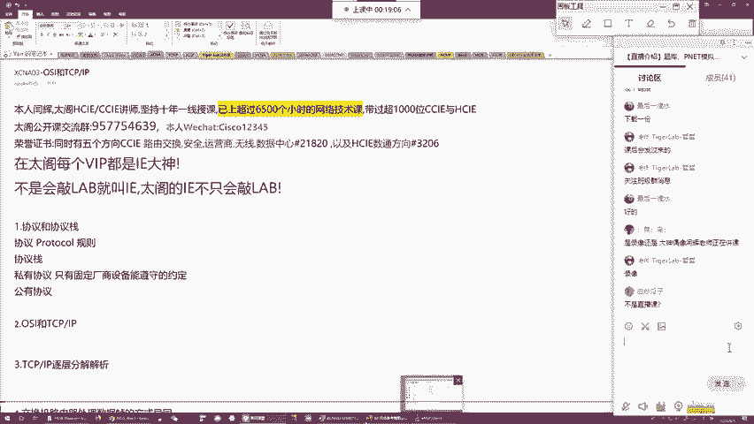

C啊conconction好吧好，老说已经都懂完了，来说中文。那它的这一课什呢叫开放式进口互联啊，请注意啊，这是我的名字啊，那这整个词品高发上吧啊，B，它就是的名称，你叫什么你叫A也好，叫B也。

比巧叫那这是实站你包含了N多系太多了，对吧？这方面研究，对吧？包括我们使用，那OSM把整个名站分成了7层代有了7块然后我联都包含是相关的好，那这话分层的目什么？方学习方括我们使用啊。

那今天这7的交名称啊从高一第七层高层这是叫应用方O第六层的四层第五层的规划层啊第四层的。😊，第三层的网络层，第二层叫数据任何层，要加最下叫固层我们之前说了像什们无线器属于一层啊，什么交换机属于二层。

对吧？路由器属于三层啊，那就是对吧O所定的老较那这个形习站比较尴尬，我们曾经啊对吧有秀对吧带来一个上市至的七八十以代，但是呢随着咱们网络的崛起，对吧？网络方展速度点快。

咱们除了SO里外还有一些其他的交换怎标，他们也在制定一些对吧？形习战的标准，并且他们制定形站对吧？同样都是通过形议站，他们的形象可能有过之无不及啊，那所以说他在个选择的时候呢，肯定是对吧？胜能为王啊。

咱们优胜的快。那所以说曾经咱们学习站的网络者OI啊，对吧随时竞争，慢慢的大家阵来啊，那咱们高下在一程中啊，咱们是学在叫什么叫PCPS。😊。

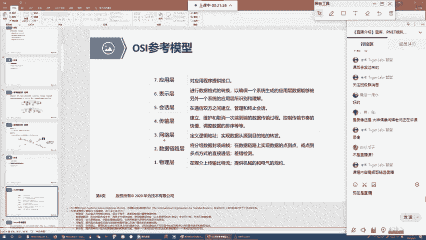

好，咱刚下任的行为站的PCPIP这是另外一个可定用行为站。这协议站按你说呢好用啊，特别好用。你这个设备制造师，对吧？以及PCPIP的标准啊，在设置咱们的网络设备的时候，对吧？开发啊生产啊。

那看我们两个效。然后现在咱们用户啊用户在使用这个协议站的时候呢，用户手。😊，它容理捷，又该于启用，对吧？那这块咱们之前日上所说的是马P啊，对吧PCP啊、优惠P啊，那这些都是PCPI型于战争的个人题。😊。

但是实际上我论归考，他有一确定的问题啊，这个界定问题是什么？就是发现。😊，多多这个协议站的时候，它在通层的时候分的比较粗啊，这个协议站正常来看，它的不程分什么色层，对吧？这个色层分的太粗糙了。

那所以说这边的话就是按照咱们一般在研究网络的时候，我们在学习网络的时候，我们更多怎么样会去学这个对吧划分更加细的这个协议站咱们协议站之间咱们包含的协议可不一样。但是咱们工作的问题，对吧？

你协议站里面各征协议咱们都总有呢总有就是对吧？能相互对标呢，就比如说你OO3都存在一个协议去C站P中肯定有类似，好吧，你没有相同嘛，那既然咱们两个协议站之间有很多相互之错。

那所以说呢咱们在学习时候觉得协议改的不一样。所以说这块的话呢，咱们在现阶段学习网络的时候，咱们呢OC协议站的来做参考。但咱们在自己使用的时候，你们计要咱们用的是PC权。那也证实如此啊。😊，高下对吧？

运营OS时候，我们不在OS出门的行调。咱们说是什么啊，我们出来叫参考模型。好，我们把OS出来一个参考模型，啥一思，就是我不用你的，我只拿你做一个参考，对吧？拿你做个参考。😊。

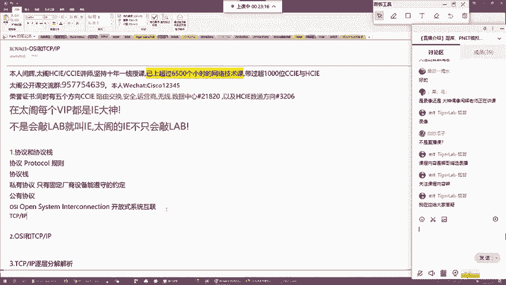

那今下简单看一下期成的功能。首先从应用层做起啊，这个应用层里的装些协议干办法，这个用用来当升应用层上网，对不对？你应用层叫上网，对不对？你要收发数据，那你如何利用咱们计算机的网络连接来收发数据呀。

你需要一个协议嘛给你做一个网络的接入。那这个协议就是应用层协议。那当应用层协议很多啊，因为不同的应用，你的通信标准不一样，对吧？不同的应用你的不同的应用层的协议啊，来利用咱们的网络连接来收发数据，好吧。

这就是应用层的这个协议所干的事情。😊，那现来表示你干什呢？用来做一个格式转换的？你比如说咱们现在来什么不有络跨平台的嘛，对吧？比如你QQ对吧？windows主机你也能装，对不对？苹果主机你也能装。

那现在有问题啊，你主机是windows的，对不对？假设你主机是windows的，然后现连麦它交换机，连接主机B，这个主机地呢是苹果啊，你那个操作系统不一样，都想大家看。

你觉得腾讯的QQ你针对windows开发的版本和你针对苹果开发的版本，它一样吗？😊。

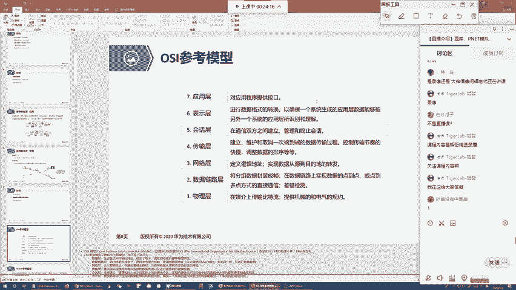

这两个QQ一样吗？虽然他们的通信的话块它们不一样，尤其是对于数据的表示格式，两者差别是很大的。对吧那在早期对吧？你会发现这个标准化做的不好的情况下。

你windows主机QQ你的苹果主机只有你聊天的时候经常会聊出来的现在的时候比较少，对吧？但那当时对吧？这种情况经发式对吧？那既然为了避免这时论存在。因为咱们通信用务是什，是我的资源路享。

我可以发数据不是发到完事的，我是希望一方是看懂，对对？那现在我给你发一些数据只要你们看懂，结果我收到你看才出来的，你看不懂，那这个通信没有价值，那么讲就为了避免的它产生了。

咱们就会有表示什么存在这个表示成的行为通行的式再给应用程序通信之前，他先基于你winow格式呢来做一个协商啊，作一个数据格式好，看一下双方都能支持没有。😊。

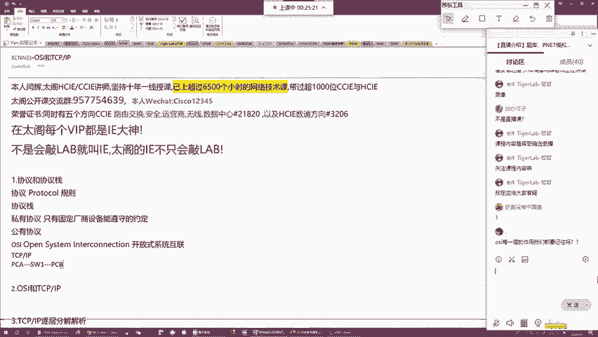

形的数据表示合式。好吧，咱们使用双方都能支持的数据模式啊，来分析那这三法，对不对？你要保证你这的数据，今天收集只要收到的话，我真看不懂啊，这也国家给你发的看懂个什么都有。如果我给你帮你看就没有对？

那基于这点大会发现就个表示层的协议一样，其实在什么应用层协提供服务，第为应用层的协议它就是全手掌馈，对？我让应务程序能够应用咱们某链接收发数你收发就？

用那直接收发就算发数据对收到没有用基本只有8在跨平台过中都会出现。那一免办法产生在你应用层的协议作之前表示层的协议表示他的经理在应用磋商就我双方都能。😊，是什么合适的数啊，你能支持ABCD啊。

他能支持ABCD那接下来美个自行A格式好，那咱们通我们A格式怎么样来就是处理咱们的料呢，然后来发送。那这样保证A发的数，B能收到你B才能通对吧？下层协议为上层提供服务，对吧？

既然你表示这协议你收到数语格式之后，你有收的协议的，加上我们优信，这就，对不对？那这样通信的话，你能偷最好啊，因为你能偷的话，对方不带来收到数据，你还能保证对方收到数句话，你能看懂，对不对？这有个观理。

😊，然有一个问题啊，表示层的协议协商双方的数序较合适，你也能协商才行，对不对？那咱们怎么能协商。首先你这两个应用之间啊，要建立个连接啊，那这个连接时的建议呢，啊表示才不负责。

咱们是用汇报层的协议来来解释。好吧，汇报层的协议只要我们一件单程的事件啊，就是他首先找到咱们两个应用啊，通信双方通咱们找彼此找到彼此之后，咱们通个汇报层的协议啊，在你们之间啊建立连接啊。

应用之间的这一个网络连接，咱们就出来一这样一个汇报啊，那当你们一件完毕之后，表示层的协议，基于这个连接来协商双方的数据表合式，并且应用层的协议啊，也是基于这个连接啊，来让我们应用之间呢来协商合。😊。

OK啊所以说想成为少次P配。好吧，那大在当你规划完境完之后啊，你应用之间是不是可以更现了？对通色给说过，你应用程序产生的数据叫什么？😊，你Q天产生的睡不觉吗？还记不记得那个学名还记得吗？😡，啊。

你一个正常应用小公司的叫法，大家不到叫什。哎，我是应用角度PP啊对应用程序角PP。哎呦发现你们哎呦回答对的有回答对的，你们这回答错的，咱们还醒一下，同样都有听错，但是你们回得错了啊。

应用程序产生这个数据啊，咱们称为叫数载，我们称为叫数据载合。对吧？这是一个叫奥头的词，这种叫数据改合。我下呢大家数据载合的错。😊。

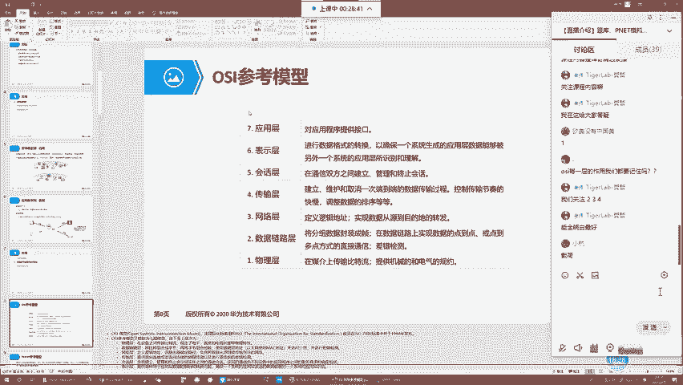

啊，数据改方的刚做到了？不能的啊，就跟你寄快递一样，你要记得小？你小里面直接教你设成什么吗？不合以对吧？打包，对不对？打包地包，工装对不对？你要有数据改的工装，把包装报对不对？那接下来咱就工装情况。

工厂的情况，工包三的，对吧？首先工作一个，对吧？包含原的包头，那就要报含一样，然后接下来咱们再添加什么包含原的地址报啊，报，然后接下来再提加什么包含原的地址，另外一个地址上报头。

然后接下来再加什么再加上一个报围，那这就是工作过程，然后工作得位之后，如说现制社会包啊，这就是个包裹，一个快递包裹，然后再我们这个网络话，咱把它充什么包告创一报围，然后就包含原，咱们把它是一个数征。

这个才能数据值啊。😊，工装完毕才。那这样大家就知道了任何应动都一样，你在高速数理之前，你要添加到。那接下这添加什么问题，对吧？你面包含什么样的内容把传收层决定第一啊，你暴图无一是有什么类型啊？

暴图无一言包含什么东西啊，这是由传收层存定呢？传输层传收层就是开始任理发现了。😊。

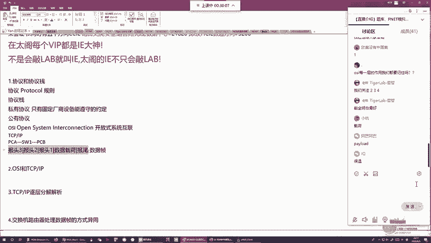

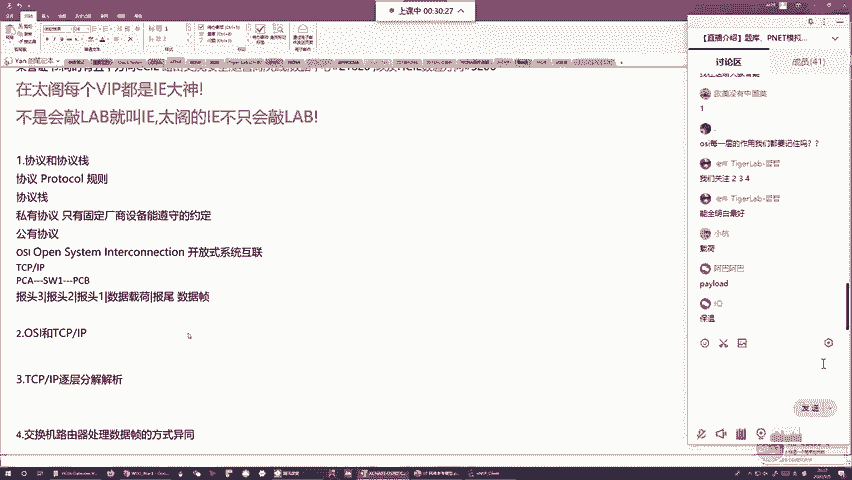

对不对？开始要你通信了。那今天开发你通信，咱俩通信规则的，你应用程序产生数限，不能都没发，对吧？你假方说添加报头，对不对？那这个第一个添加报头，就是咱传输层啊，传输层的形式决定了。

首先你添加你的有类型嘛，然后接下来他们的决定啊，你添加这种类型报头，你要看你的字段，添加字段不么用哎，他就说了算啊，添加添加完传输层报头之后，哎，咱们这个对吧？😊，那大波文第一个报头的话。

这么一个数字就交给了咱们的网层网络分的还是对给咱们报头还是这个只不它定义值的报头个决定你报头？那你就决定了当你在使中报图的，你添加你些字段这些字段的值是什么，这些字段值什么添对就是网络分。

然后当你打完第二层报图时你把个交给交给咱们数据量数据链它会在你的这个报图量，再加什么报头那你报头三的格式和你报头三就是数据量层。那当然们这个报是数据，对？那接下来咱们添加完报头3添加完报表之后。

这个东西咱们添加数据数据间里你包含了足后信息啊。😊。

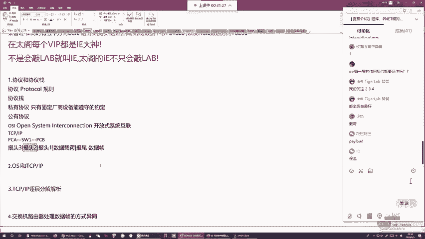

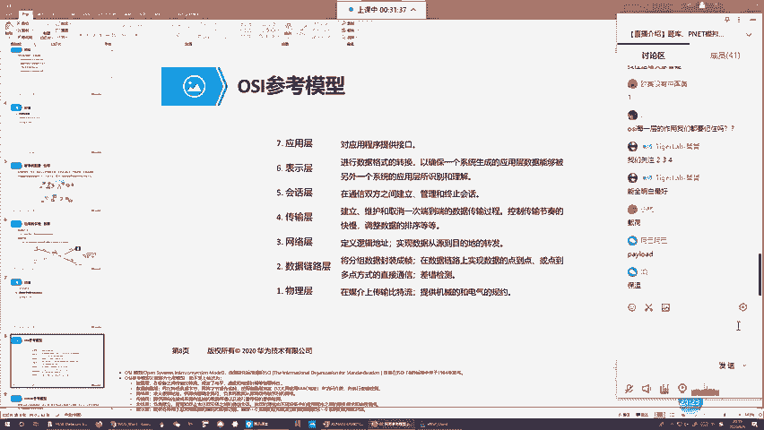

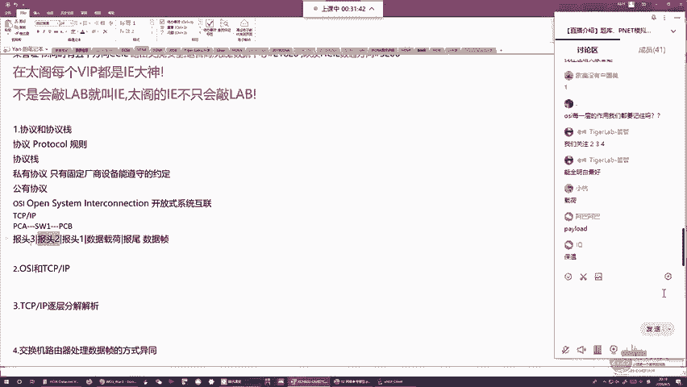

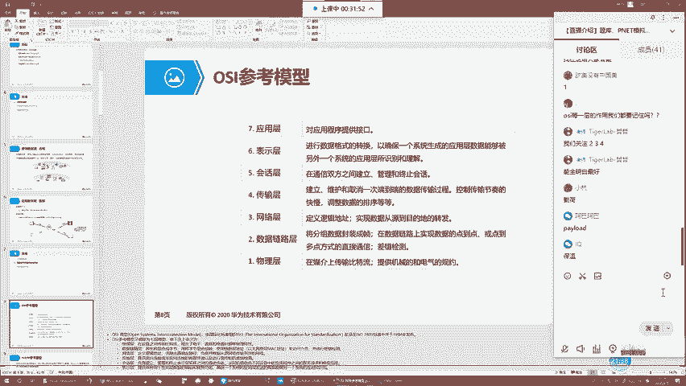

发送，那接天这块这你发送完了现是low的要死，现人发送现制的时候，咱们只能用二进制，对吧？零组合那这个零和一在后面啊，给大家介绍数的意思，零和一啊，给家出两4。😊，比特就是一个二进制的部位啊。

一个二进制的位好我们冲一下好了，它要么为一样么为一。好吧，然后接下来一串二进制分所组成的这么份数字量，咱就称一个比特流啊，叫比特流，那就是一串比特一串比特组合在一起啊，我们冲叫比特流。好了。

然后接下来这个比特流啊，就成五层的概念了。物比层们来到咱们的数字增量数字针被转换成比特流，然后呢通过咱们物比方接的比方比，好了，那这个时候咱们去统加上，简单来说上分层与你之之间建的连接啊。

咱们协商这个表示格式嘛，然后接下来准备做去组通线，然后接来通过两方线啊，对吧？这是你应又产生数字了，数字的甲方，甲方同发对吧，一需添加，对不对？那更同学添加传输和添加第一个啊，我又从添加第二个，对吧？

数字量。😊。

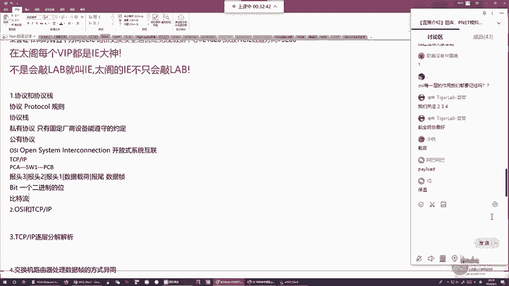

第三个，然后当你拼加完毕之后，这个数据改合被封装成了数据针对的这个数字针被物理从的协议转换成比特流。这些比特流我们呢通过电流或者光的形式啊啊，通过咱们线发诉你，对吧？那这是光让端通信的这么一个流程。

好吧，那接下来你这些比特流报告通之之后，变端收到这些比特流，对外收到这个电信号，我要把电信号整理成比特流。然后接下怎么样，接下来这些比特流转换成数字针呢交给咱们数字量了。那大家大家都知道你接收者了。

对吧？它要关心的是什么？接收者关心的在不是些报头，它关心的什么改合呢？😊，那所以说呢对外你收到一个数字帧，对吧？各位咱们这个报头三，有一个报来给们看一下，对吧？通过看报头三，我们确定咱们的数值接收者。

通过报才们够确定这个真在发行过程中有没有被篡过来，对吧有没有冲突，如果发现都没有好好采，那这个时候我再确定我们个接收者呢，我要看你的内容，所以这个时候我会确掉什么报头三的报文。

然后接下来把这个交给包网络直收啊，是数字包啊，我会查看报头二那咱们报头二呢其说后包括他的目言是要看他目的地看一下我自己到底是不会接收对吧？那我发现我这个接收者，对吧？那这个时候我会这三层报头。

我会这个报头二一言改知吗？我也会立即把它给拆掉，拆掉之后怎么样？我把我这个数字交给咱们传说传输层太夹里呢，就看报头一，那通过看报头一，咱们看什么？主要看这个原物关。😊。

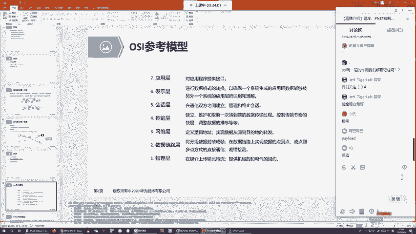

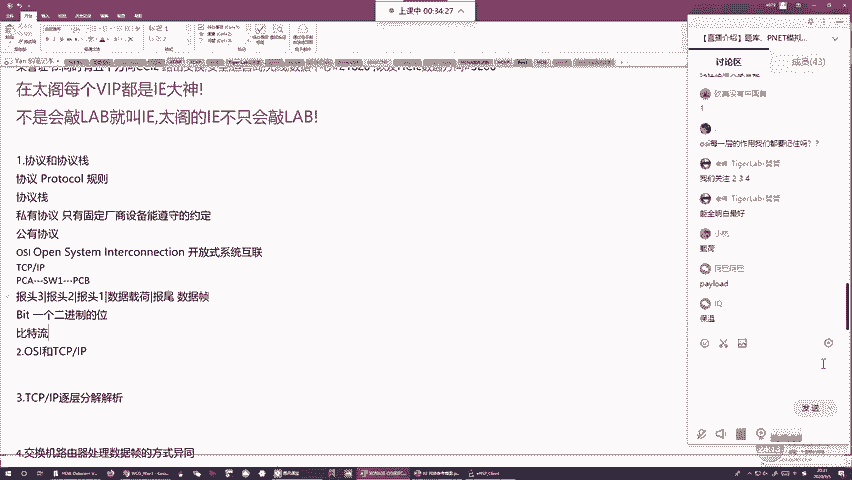

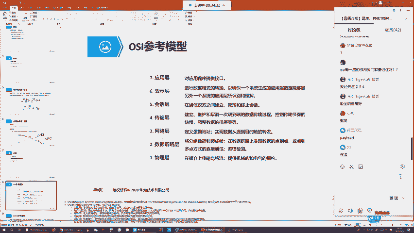

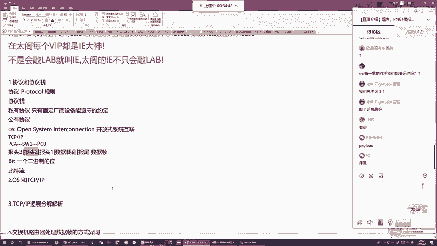

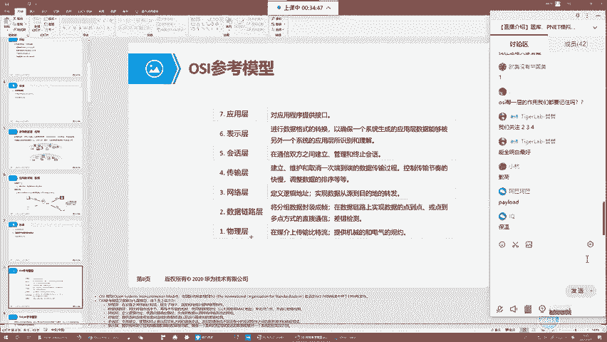

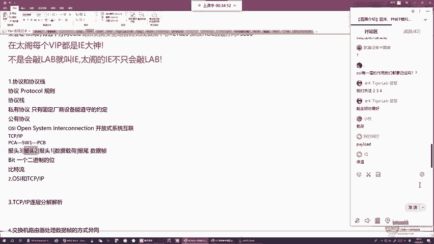

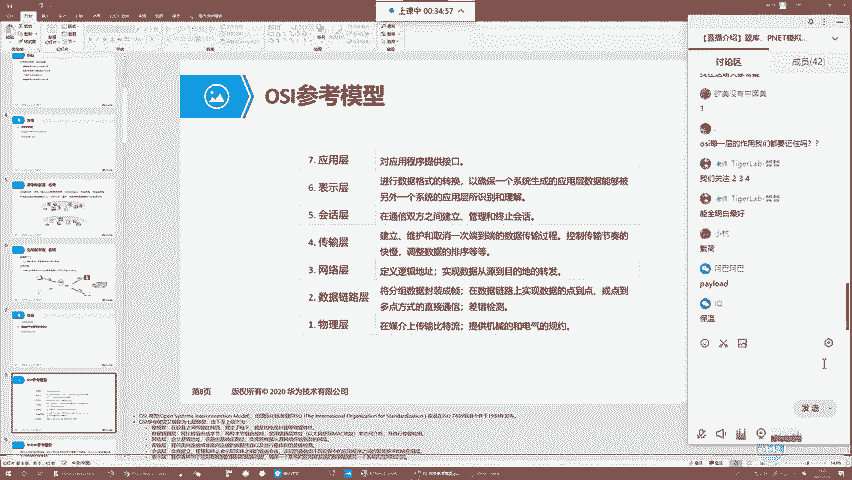

对不对？那通过你们应用端口的目的就知道这里我们要使用我的原用产商的，是由哪个目的应用来接收。各吧？那这块刚才确定了原因之后，我就来看一下本地的系统啊。那在本地系统中，对吧？我们看到哎对吧？

对应这个端口应用是哪个应用，对吧？那么接下来哎咱们对四层的这个报头极其人一样不感兴趣啊。咱们要把这个叫么报头一对对最终的的系的，然后把我们数据价方交给大家，把我们的数据价格交给咱们对应的应用来成，好吧？

这个接收者收到数据的这么应用。😊。

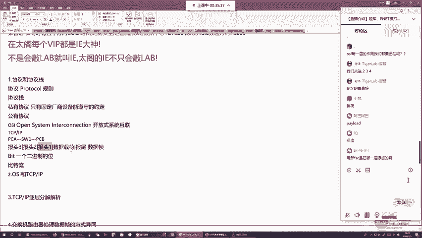

发送整个刚速据的时候，我们添加报品的过程，就是在大家收到这就叫数字封装的。你接收者收到这个数据，对吧？你把他的道都给去掉的过程，我们就抽入了解封装，对吧？那这里就对应了咱们对吧？这个快递页了，你发快递。

对吧？在开走之前你要把巧克力装到快递盒点去，对不对？这就把封装呢，那当家封装的目的是什么？是为了保证你们的快递啊，能够发走，能够被收件来，收到，然后这在包你收出来收到快递之后，怎么着，对不对？

他才不关心快递盒了，对吧？快递盒我不需要，我需要是你的快递内，那所以说当我收到快递包我确定我就后收下来之后，那这个时候我会把快递盒给拆了，对吧？拆了之后，我看到你两把巧克力，我把巧克给取掉，那跟理讲啊。

这就是关到端的装备合。😊，那这七层大概能不能理加这七层大家概能不能理见啊，如果能理解的话，稍微加深一点点啊，稍微加深了那么一丢丢。😊，你这个传输层和负责给我们添加报图一样。这个报图不成个字状。

理重要有两个，一个叫原端口，一个叫目的端口，请注一下这个端口号这个玩意就由传输层来定的。那这个端口号是什么？就是阿个数字，R的数字一个有识别分取号为0到054，咱们通过这个端口号就能够标识什么？

就能够标识咱们运用对？我们数据源的关括包括源端口，原端口代表的是原有序？目的端口代表的是目录示，能理解样？这个端口号就由传输层词一样来定的。😊，OK，你这保什？😊，呃，网络层协议变的地址对吧？

尤是咱们刚上面跟你说啊H地址对吧？HV4啊HV6这三层壁址啊，就是由咱们三层的网络层协议来制定。对吧这个IV4协议属于哪层，就属于咱们网络层，对吧？HV6属用一层，也属于咱们网络层了。这这地址是好了。

这三层地址太厉害了，它能够标识一台主机。😊，他能够要求我们自上，一个坚持好，那他能够全球文导来进行一个节点。那这样问我说咱说损丝节点啊，那什么叫节点啊？😊。

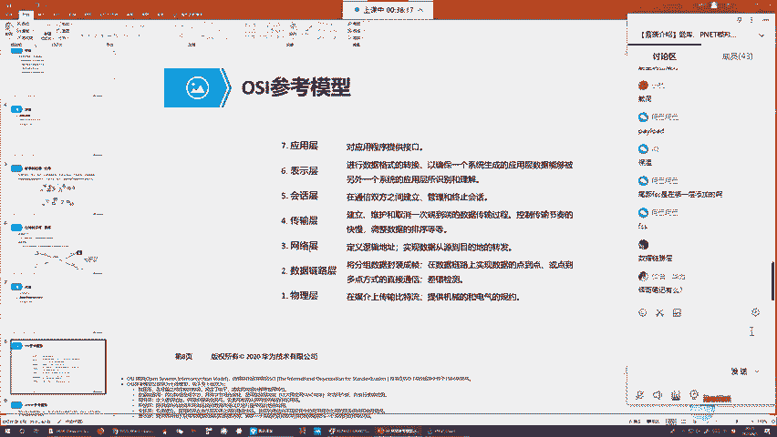

节点叫，你能给以解为节点的定义度是三层或三层以上的接口啊，那这类接口呢比如说我们计算机的接口是啊，你路由器的接口啊，设的也是那这个接口你联网话比下原线那除了原线以外。

你还需要一个全球唯一三层地址来标示对吧？比如主接根主地通信对吧？你A想跟B通信呢，你A就需要EMP啊，B想跟A通信，那B也需要MP那A点B发布数据啊，对吧？A地址接什么原地址报了，其中原地址是OH嘛。

目的地址BH嘛？那通过添加原地之话，我们只有我们设备收到的数据啊，我就能根据原X地址来得知这个数据是谁方求回收然后接下通们根据接收者所在的位置啊来帮你做精确的数据的。好，啊B地址就需要三层。😊。

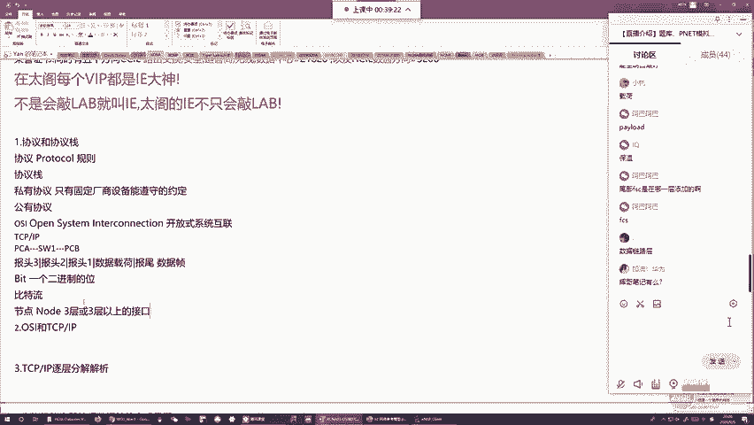

O好，那后接下来血会量。这个数据链里层的协议啊，就咱们上节课所说的各式各样的局面协议和管用。对吧？像什么领财管理菜网PI啊，对吧？像什么HPLC啊PPP啊中信啊，他们都是数据链层的范畴啊。

这个数据链层的协议，它的其指在三件上，第二就规定了你这条链路，们通信标志，对吧？比如说你看我规定了你们两台主机通过你看网下的连接连完之后，对吧？你们什一中信什通过通信，对吧？这是个发。

然后现在这个网络的类型也是有他们定的。比如说通过他们两问，你列下点到联行，你也叫多一条网，对吧？然后TR来还规定了在这网络通啊，咱们每一个节点怎不标识对吧？数据链里层的协议。

它也会定地址啊只它定地址我二条，比如说咱们数据链层的案，那肯定。😊。

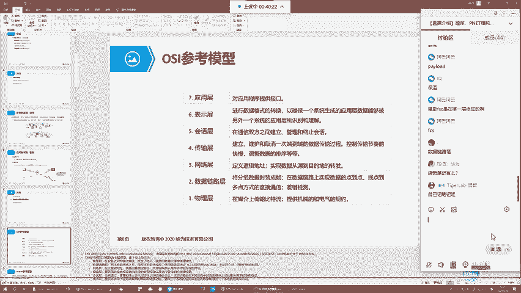

看好了。以看的形式啊，以看的形式都定了，你在一个以饭的环境下啊，咱们每一个参与者啊，每个节点你都需要有一个麦地址。好吧，这个麦地值就是你看到所规定的一组二层地址啊。

这个二层地址或属所定的三层地址不一样啊，同样作为地址同样能够通过次节点啊，三层地址能够在整个A3麦范围内来唯一定位一个一个节点。好，也就是说你的手机，你不管这在网络，你到不能通过哪个地址来标示地址。

在麦地址不一样。这个卖地值只能在一个网络内来标识一个地啊，只能在一个网络内来标识一个节点。这也就是说你两个组机列的A和B。如果你们属于同一网络啊，你此通线我可以拿彼此的麦地址来标识双方。

那如果说咱们属于不同的网络啊，A属于网络XB属于网络，那在这种情况下。😊，A跟B接通送通到我们的分公司的吧？那在这个通诉中，A根本不关心B的买地址。B根本不关心A的买地址。为什么？因为这个麦的地址。

它只能在一个网道内来表求。😊。

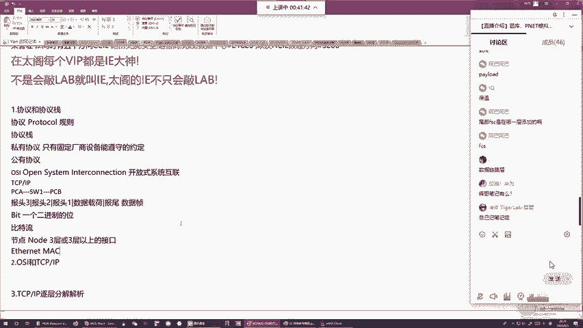

那刚刚刚刚问呃那为什么每个直点要投是用30度抵到20度。我觉得简决看法好，就比如说咱们你每个人都会有多重身份的，对不对？比如说我们作为一个中国的公民，咱里有一个身份证的人。

这个身份证上每一个身份证号能作为咱们中国公民的每一身份标识？你需不需要担心整个中国有两个对于相同的身份证号，不可能的？每个人的身份证号都是属一无，对吧？那将然你中为个地球，你想要出国营销旅游。

你得带的护照对吧？这个护照上会有一个护照号，这个护照号和全球为一的，这个全球为一个护照号能够标识，对吧？你到底针对整个地球地是，对吧？那所以说呢既然每个人咱有多重身份标识。

那在网络中咱们一个节点有多重类型的地址这个也很正常，对吧？那这是卖地址，你听理解吗？就是咱一个节点身份证号，对不对？他们在一个国家来标识那当家网络和地球。😊，有一个成功网络了，对不对？

然后接下来你有这个卖力的同时没有了，记起来，这个自己给你简的，就是咱们这个节点的，对吧？就是咱们这个节点的啊，护账号，这个咱们节点的护账号O吗？那接下来护账号能够基于全球范围来标识个节点，对吧？

它能够基于全球范围来标识的节点。那这个全球指的市场么，这个全球指的就是好吧，你不管在哪个网络，你都通过来P啊来作为自身的这么标识什O了啊，这个是专出现咱们OSI的每一个层的协议大概所干的这点事啊。

那当然你说这个OS咱们用嘛不要咱用市场，咱们用有PCPIP啊，所以说这个TCPIP咱们当前做到用的协议站是比较重要的。因为咱们正常都在使用的。那接下来这个协议站，它里的报号哪层了。

我们先来看一下经典的TCI协议站的这么一个包市场。😊，在左边这层啊，PCPIP啊官方可分为5层四层，每四层分别是应用层啊，主机到主机层依靠5层，还有网络接口。好吧，这里的外络接构这外网络接口。😊。

这个叫网络接受好吧，一共分四层。那就这四层你包含的协议跟我们OC协议站的包放协议样完全不一样啊，因为毕竟我们不要协议这，对吧？那当然最后呢咱们O3跟PCPI这啊在竞争过程中啊，是吧是败？

那失败了之后OC好论的协议样，就被怎么纳入到我们PCP中去，对吧？被征收了，O？那最后你现在来看咱们PCPD中啊有这么一些协议，但咱们OS3是一样，那当然一样的，比如说为你把你拉过来，对吧？属于协。

对吧？那今天呢咱们这两个协议站都分层了层合中层市间有的关系啊，完了是还真有关系啊，这两个协议卷之间他们是能够相互运用对吧？就比如说咱们PCPI协议这的应用层，你一有层里面所包含的协议啊，对吧？

其实就是来自O上三层你要O上三层协议在PCPID中被总结的扭有层中去，好吧，也就是说咱们PC。😊，没有那么细啊，你没有把用和它们三个子操啊，你把这个能够让应用上的网的这些协议，来协商咱们数据格式的协议。

还有建议应用之间连接的协议。对吧？整理重理，好，那这一层咱们补充一下应用层。😊，然后接下来负责定义报头一的这个层，咱们称作的主机道主机层啊，这层的协议对吧负责到什么啊，你在发布数字里时候。

你添加的第一个报头要添加哪个类型的？并且这个报头里面有哪些字段，包含一些什值，对吧？这个时一定啊就只主机到主机层协议，对吧？它跟我们OSI的传输层对图。然后这个一层包括一分这个层对应就是咱们的报护啊。

这两个层协议要上都是定义你的三层地啊，并且定义了咱们包头好吧，你的包头有那个户型的什么格式，你们包括哪字段这些字料是同值啊，有咱们的in层协议啊，说一下对吧？然后将来导告接口层包括含下两层协议啊。

就比如说咱们层一那些，对吧？局构协议协议啊，也属于咱们接口层，你这些物理层的接口内啊也属于咱们的。😊。

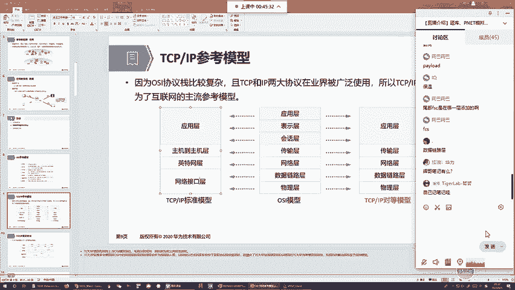

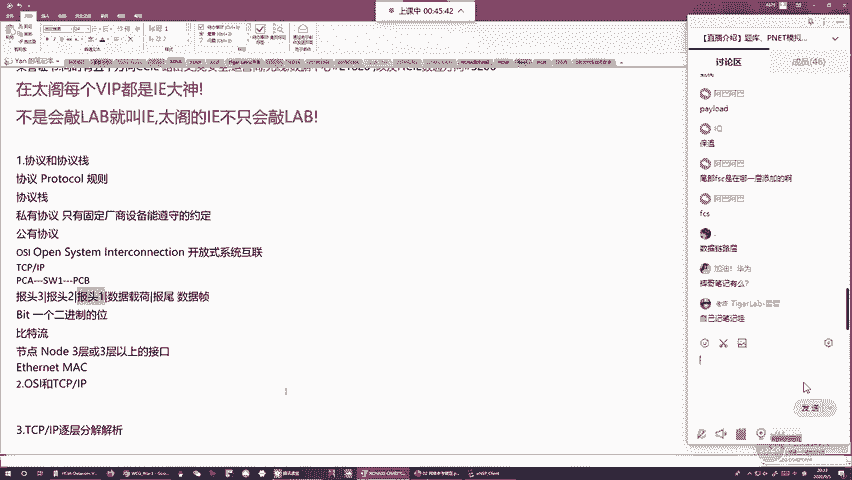

这行，对吧？那所以这理简单就是用这一层的协议来组定了，对吧？你的这个包同样添加了之后，你的这个报荷三啊，咱们要添加你的字段，添加你的类型。我们这个范围要添加那个的，对吧？

这都是由咱们的我支普充协议来做出。😊，好，那这就是咱们经典的PCPI学讲。那接下这个经典的PCPI学站。有人觉得是教咱们既然都把OS它的分隔三款模型啊，这意见咱们在学习网络的时候。

应应该以OS马替干着的。那接下来咱们可能尽可能的让我们的TCPH跟着OS靠近是吧？那接P靠近你的表达方式就这对吧？你可以理解为左右联播TCPH啊，对吧？但右边会更加的接近OSS啊。

有一个比较有趣的现象就是美国的国网他们的研究网络的时候，他的理解的TCPH是左边。然后咱们中国的学生，我们在学习网络的时候，我们理解的PCPH啊是右边代替穿播同一个只不国教。好，那我们看下右边是吧。

他把这个TCPI呢分为5层好吧。😊，应用和对OO3的上升。办理。这个主题的主才的直接出叫吗？才说。然将这一层的会直通到网络上。然后今天把下面的宝宝接口槽分为两个组槽，对吧上面这个组槽叫数量槽。

下面这个组槽叫组槽。啊，这个挺有意思的。那刚刚这个划分的理由是什么？是因为咱们OSL7个层次啊，上三层的协议主要是跟咱们的应用混的比较深啊，跟咱们的操作系统混的比较近，跟咱们网络上有什么关系的。

你要做一个系统工程师，啊，你对于上三层的协议啊，你要管更多一些。然后现在层的网络工程师更加关注的是，你应用之间的数据传输它有通信，对吧？那说了数据传输和通信，上三层的协议啊，基本不管理啊，所有管对吧？

下四层的协议，明看这个报头的格式谁说算，对吧？下四层协议嘛，对不对？数据的传输时说算，也是下四层协议，那么讲？所以说网络工程师啊，咱们研究的更多的，或者是下四层。那接下来对吧？你上三层无所谓嘛，对吧？

下四层你要依据OSS些，所以说咱们新版PC加MP，就把下四层按照OSF的方式来做的运用。😊，那当家为什么这么做好啊，没说网络，无所谓，对吧？那所以说我这边的话是比较老快的的公。那作为比较老快的老东。

我在理解这PPIP的时候，我还是照什么早期的这个东西。😊，那当然不重要了，因为咱们学这节课是按照OSI进行要的分作。那所以说咱们讲解OS3的这么一个矛论教换。好，这张胶片大家要问到问题。😊，Yeah。

对吧我一直用组合讲课，对不对？了解我我太了解他，是不是你找我了，你太懂我了。我讲PP既P从来就不了解个业边讲，我肯定要组合一讲啊，没问题啊没问题。😊，好。

那们接下来我们来看一下这个TCPE学站每一层面包含哪些经典的培养。那先来从应用层说起啊，比讲问答应用层学干什么？😊，当当叮当。应用同学是干嘛？他说全州的话呢。

应用层的协议让咱们应用程序啊有能力运用咱们的网络连接来收发数据。说白了让咱们的应用程序啊能够上到我的协议，就是应用层协议。那这个协议呢，咱们作为网络咱们都看不到为什么呢？因为咱们那些研发工程师啊。

你们研发应用的开发应用的时候，对吧？我们写代码的时候，对吧？们开发应用，我们一般呢会把应用层的协议啊写到咱们应用程序的网络模块边去。你们会写代码呢？什么加啊开送，你们会写吗？那么会写的话。

我们发现开发一个比较复杂的应用啊，这个应用我们会包含很多模块，其中有一个模块就会让咱们应用啊，这个应用网络连接来收发数字啊，这个模块。😊，对这个模块咱们够称立到网络模块，咱们就创造网模块。

那在网络模块里的包放层协议啊，请注意下，咱们O3上三层的协议都在这个网络模块中，对吧？应用层的协议能让你应用上网吗？表示咱的协议能够在你通信之前来协商咱的模式呢？

汇报层的协议能够建议你应用到应用之间的网络连接嘛，对吧？那这些协议啊，都属于咱们的应用层，那当然咱们网络公式方判断的话是什么？因为你的开发应用的时候，对吧？我已经把这些协议写到你的个网络模块中线了。

那当你解好之后，对吧？咱们应用开发完了之后，我们通关好了，你直接双击咱们用可用，而至于咱们应用的内容到底包含什么内容，谁会去深优没有深优。那所以就是因为如此啊，咱们把应用层的协议啊称立叫操作系统相关系。

能理解吗？操作系统。😊，相关系。原因行为你在开发系统的时候啊，你在开发应用的时候，我们这些应用层协议啊已经被写到操作系用中式，已经被写到应用程序中去。好吧，那比较经典的比说这些要啊te。😊。

FTTTFTTSNFTHTTTSMTTDNSDSAD啊一个都不关全会通过一样。😊，一个都不是识别太过一，有一个都不会识来的话。😡，哎，太成实了生，我就喜欢你的一个东西。能整解一下。讲解的毛太多了。

不讲解，随便挑几个个经典的大会都你交代下，好吧。😊，SVP是站bo好，也许咱们前面工程师那慢学。😊，你就记种应用层的协议，一般内现在咱们应用商方便你这个应用，能够通过我宝链接来收到数据。好吧啊。

咱不要在这细节啊，不要这些咱们之后课别都的讲好吧，然后将来传输层的协议。这两个比较重要的，这是咱们今天要讲的一个叫TCP一个叫UDP到底干嘛要务？我们说过了啊，应传收层的协议干什么？

他们就规定了你的应用程序产生的数据价格在这发送之前啊，在这发送之前，我要添加我一号报酬是吧？使用两种，那当你发现了一号报图来写通过什大只有两种，对吧？要TCP要UDP对吧？你一号报酬的类型，要么TCP。

要么是UDP那当然到多使用哪一个，一般使用咱们应用商算嘛？应用程序根据我需求来决定我的数据在发送之前，我们。😊。

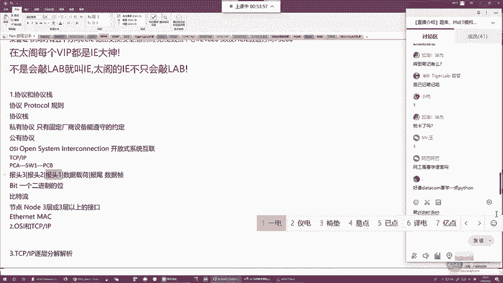

通过PC器来安装啊通过优器好吧，然后咱PCP进入一个报头的格式，臂器定用的报格式啊，你不同的格式有有不一样。但我需要注意是，无论你用PC器还是U递器，你爆头力量都铁打不动呢，一定会包含啊。

原端草和木的啊，这个原端口用来描述，咱们这个流量是由哪个原因产生的。录地端口用来描述这股流量是由哪个目的料来接受。好，这个爆头你铁打不动呢，一定是原M木端草。没声音了吧。😊。

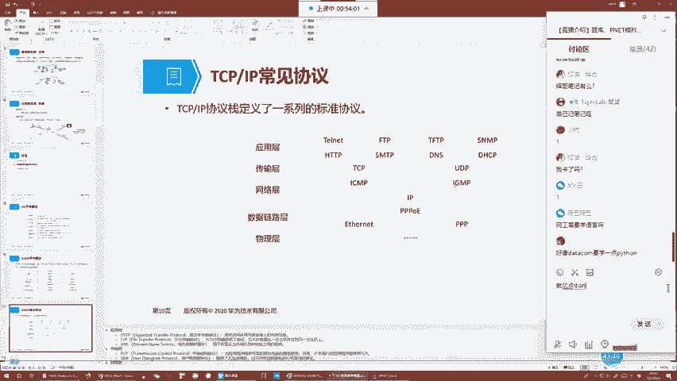

怎么会有声音啊？有声音的有声音。其他的兄弟姐妹们讨论的有理自然，那大家可有声么样，你又见了，不有崇来啊不有重来。😊，那这天我知道你自己好吗？暴不如意你面一定会我有知责是什么吗？

艾我啊暴不如意你们定会我知责是什么吗？😊，啊，对？不要说端草是原木端草，叫原木端草。原端草描述数字是发的。😊，问题端口描述数据学学生啊，咱们以其他的形式来做很重量，重样是一定会有原格的啊，这就传。

然后像网络层有很多协议啊，ICMP啊没听过，对不对？HGMP更没听过对吧？但这个IP没听过，对吧？就在一特的协议呀，对不对？你IP地址IP地址谁来定义的，那当然是用HP协议啊，对不对？

要这个协例来规定的，啊，你在三层啊，我们的分装报我层你使用我找报图类，那当然这个胶片不给意呀，你不给意呀，你好歹要写两个呀，对不对？你要写1个IPV4，是不是你再写1个HP就6呀，对不对？你写两才对。

😊。

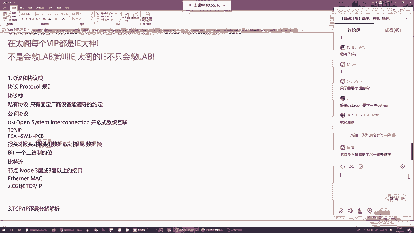

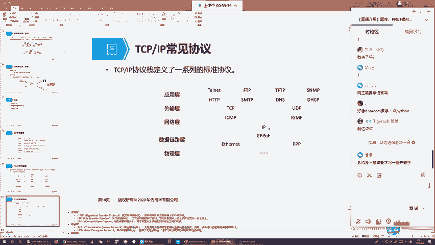

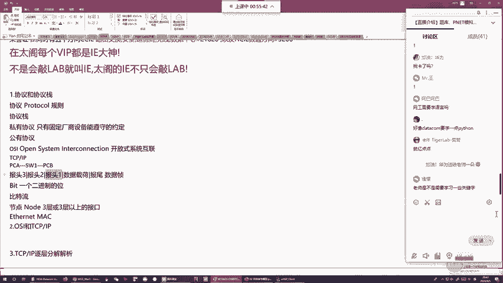

咱们。有的写啊，你的记下有的写你在分装三层协议的时候，你要的分装P啊，要的封装那当然这我不同的协议，定制的报头的类型是不一样的，里面包含了不样的字。那当然其他的字段不重要，重要的是什么？

只要你通装三层爆头，只要你通装这个头雷打不动的是里面一定会包含原木三层地址不要跟我原路来P啊，未必M，未必弟天我三层开发一其他协议吗？只要这个协议里面定一地址，只要这个协议给爆头。

我就封装这个协议能理解吗报谁打不动，包含了原木三层地址。那这个原路三层地址重用来告诉全世界的人用来告诉整个一分。😊。

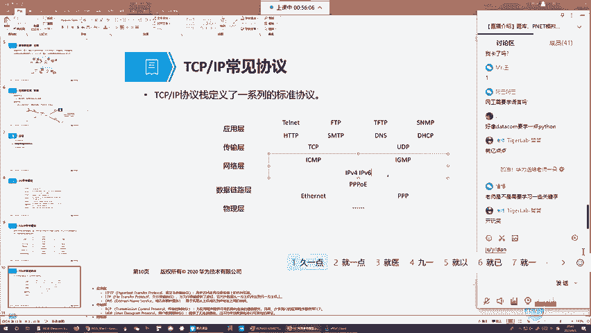

所有人这股流量是由哪个原主机发现的，这个原主机咱们称为的4人啊，以及这股流量是由哪个接收者去接收。等一讲，要来描述咱们的流量到我们来自哪里到底去。好吧，然后接下来这个报头的去他。

就是给我们大明公用的路由线，给路由器看这个报头内容，让路由器知道数据是由谁发的，是由谁收。然后接下来路由器只要知道接收者在哪里，他就能根据接收者所在的网络的位置来研着自由路径来数据网的接收者发过。😊。

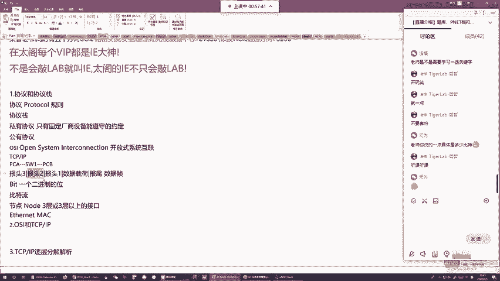

好吧，好，然后接下来怎么样？数据链的同大家看到了吗？像什么PPP对不对？像什么以派啊，对吧？像什么PPPOE这是啥这个呢PPP over已翻啊，也就是说你先分装你先封装PPP再分装已派好吧。

这个叫PPPO那这些传说中的什么局网总行议嘛，对吧？他们写数据链怎好，然后接问无论是以派的啊PPP啊，它都规定了对吧？你的报头一个啊，报头三的对吧？你这个报头三，你就我个字段，对吧？

然后现在你的这个报头字吧那当然这块呢层行它们是非常大的。这块我不想跟大家说你分装什么的行议这个报头三里打波这不好说那当然也说过，我大家记住。这个众多的局网我行装，哪个行为最不。😊。

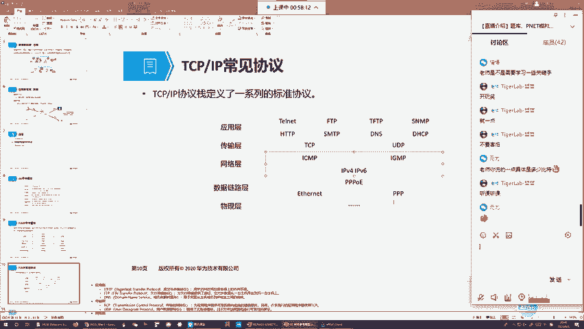

哪个协议还没不标。啊。哪个协议才能么多，大家你过一看一块绝对是王者，你的一啊，这咱们一看99。99%的网络，咱们都使用汉当中太好用了，你想想带宽又高，造这个王者的成本率低。

洛文支持什么从网内容是士光司传输距离还远，对吧？简值完美。😊，那这个完美的协议，咱们怎么回顾位置，又不要太多。那接下来这个报酬3期的协量咱要100%啊，使用。那这个以太的这个协议是个汉，你是一个协议。

代你定义了两种不同的报头三的格式啊，这个特别有意方，你在使用以汉的协议中的报酬三的时候，你会根据咱们报文理协同啊，你会通过这两种不一样的报酬。第一种咱们出一个以汉元式。😊，他一组咱出理叫包三式啊。

有两种东西。那理解咱们有两种东西。那今天这两种模式们应该说两种啊，这个报头3里面一定会报什么？一个叫圆代地值的字外，一个叫目的在地，对吧？

这个原代地值用来描述数据时谁发的目的段地值用来描述在该网中数据该接收，对吧？啊，这就是咱在报三然后接天给你报表协议呢，除了定义了一个报头三里面事还定义了一个真啊。

报这个报就是咱们上面说叫FCCS这个叫真校练事列啊，这里放的是什么该你们说过通过散列算法计算所得的什么乱码，对对？我往乱放到这方面接收值和主题收到数据之后，我们的判断这个数据的传输过程中对吧？

有没有判下对对？来啊，这个报。😊，用完了咱们等设备用完了咱们基融格体基亚在接收数据的时候，能能够轻松的判断出来，对不对？我所收到的数据跟四人所发送的数据是不是同一个。那如要是这个数据要完整了，我就接收。

那如果不是这个数据是对吧？不完整呢，那咱们就丢弃了，对吧？直接OK吗。😊。

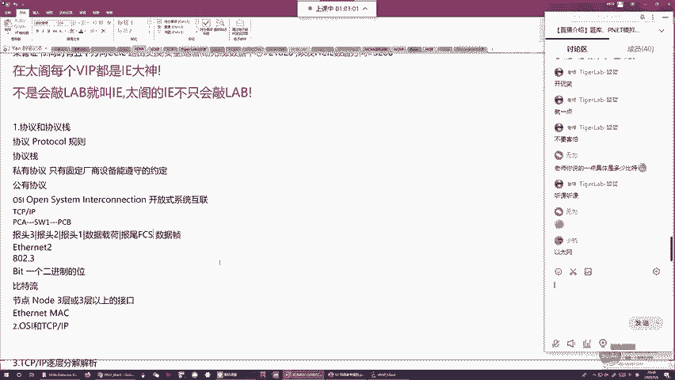

然后接下来物理成本你好说了，这是物理成，你就是说这样总结的话，物理成本包含的比要太多了，对吧？各时校的直接考。😊，对我们这尺是为什找辩？规定的对吧？协议规定的。

然后接下咱的线缆那方面设计里面发生现阶啊协议规定的，是不是？然后接下来你的这个是极限器认程度转换数据，对吧？协议规定的，这些都是物理层型。那咱们物理层型太 low了，最以后咱们一般不去过多的面究。

或难以太多，一怎记住就是咱们物理程型干成这，很简单的。就是你要吧添加完报同帧和报表之后啊，那这个东西咱们是有个数据针的，这个数据针咱们不能直接发送啊，数据针交给咱们物理层的协议来处理。

物理层的协议怎么着，把我们的数据针转换我们底特流，然后底特流转换成对吧？电信号或者多信号，然后通过咱们的电缆或者多来，好吧，这个是咱PCPIP这么设计。😊。

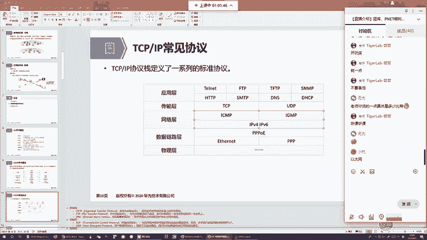

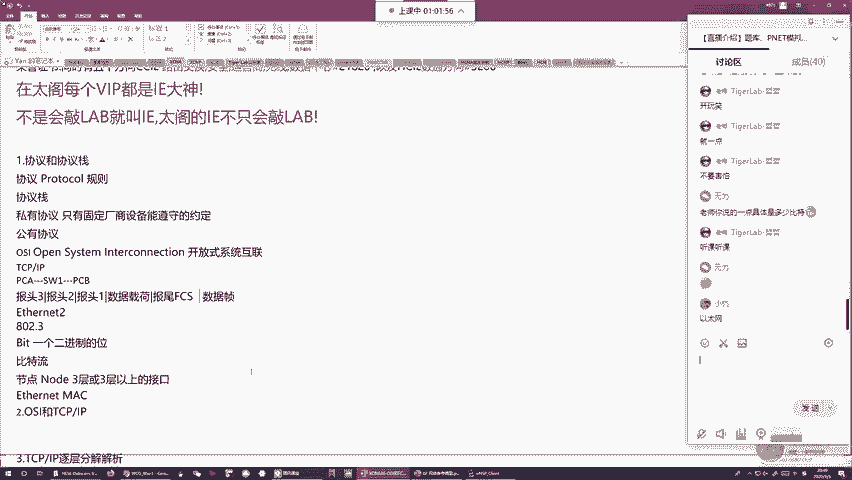

那接来对这个协议站的，大家肯定会很关心咱们这么多文某协议用。那接下来根据任何的协议呢，咱们不交开来介绍一下，首先呢介绍第一个就是咱们的我说哎他来先给我们介绍多模组织啊。

那咱们现在先先来问一下大大家认一下咱们的网络站啊，我们这边说了协议中的公有协议和私有协议端私有协议当中是一些厂商制定的协议。而公有协议当中是一些州立的第三方的标准化组织他们制对吧？

就说咱们现在关于网络相关的有无有无占容的这些标准化组织啊，分别叫P这是听过？IPF全称叫业务啊，叫tel工程任务啊公tel对吧？工程任务。

那这个F呢是一个PCI的站台的这么一个议你可以理解咱们TCF协议站。😊，个协议都是由他开发，并且这个PCPIP能做罗利亚也是由他来怎么样做背后的作定的，对吧？他来做TCPIP的重文背书。

然后接下来呢这个组织里面就各种各样什么研发人才啊，他也在治理咱们这个协议在发展。所以你发现这个版本的协议是完本的。比如咱们IP协议，咱们PV4，这个叫版本4的，咱们有备6个呢这个叫版本六的。

那这些IP协议为不么会升级啊啊原意成为咱们有IM方带佬来给这个协议呢回波助王不同的升级不同的研发，不同的版本对吧？让你总能使用到最先进的这协议啊，那再来提一个I意义啊。

请千万不要这行啊那上网者的特点就是专业的网络工程师啊，对吧？咱们技术回复但是咱们这些名词必须到等。这个I意义咱们在叫的时候呢，咱们要提交叫H啊。😊，吃好。OK这个吹捧玩了王者荣易三杀吹top票啊。

玩高如撸啊王者荣三杀的吹top票三成立啊三成意叫ME义对吧？那包括咱们还有什么做开发的有一个什么价易叫加va意义对不对？千万不要叫加va利益啊，叫加va double啊。

叫java double双杀嘛叫W票对吧？那这是叫加va两个亿叫WouOK吗？啊，叫javaW好然后加的名称就叫电子电器工程师协会啊啊。

电子电器工程师协会那这个协会呢它所制定的一些叫TCPIP的交易协议。那当家如果要叫的话，要接地气啊，它所制定的标准更多的是一些网络接口方中。比如说。😊。

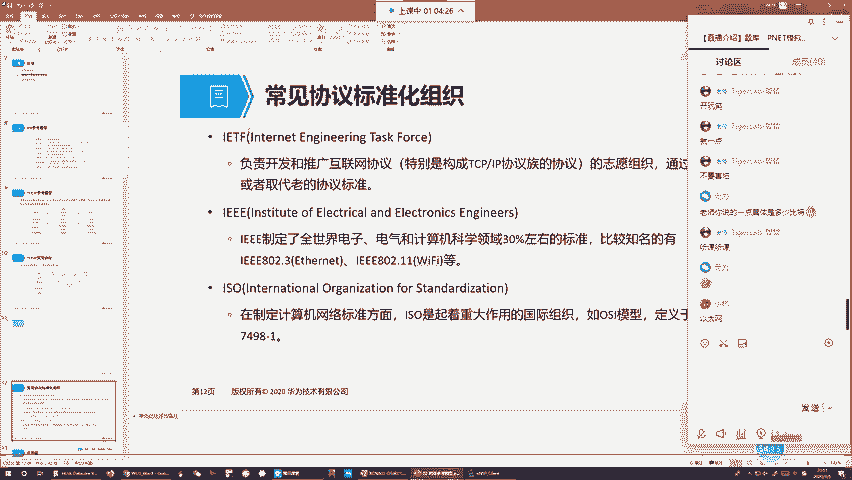

网协议啊、广络协议啊，对吧？比如说咱们一些电缆的标准啊，都符合确益来这个。那当家确一点有一个非常非常重大的帮明啊，就是咱们的云效目啊，我们当前的wifi是一种非常有用的项目啊，当前的前面范围推的不好。

那这个wifi。😊，他就会积切生亚，帮那个医院这么的行错。好吧，那当今天发问之的时候，这这样咱来使用我那吃生养。😊，然搜给我说了，叫国际标准化组织，这个工具是所有标准化组织语面最最最大开放。

那么之前这个OSI哎就是由他权力研发由他来站盘，那这咱们的O太厉害了。所以说早期咱们OSI的时，其他的一些出口协议站基本被掉，啊没有错就掉起来了，被掉起来，但后其咱们宝宝业务成熟啊。

你的这些协议站之间的差异，对吧？越来越小那咱们就是出推广出研发的对吧？那其他的协议站像我们PCI也就是研发的更快，那所以说呢加然就用慢的市场对吧？咱们OSI站后期比较带过了，对吧？们比较当底慢了。

加对吧？组好好下来哎来看一下大家比较关心的，咱们应用抢节协议了。首先这用方协议看一下HPP啊。😊，HPCP它叫超文本传就是一样。哎，它指定了这个浏览器啊，通过HPPP来浏览网页的时候，对吧？

你这个浏览器产生授权啊，人是假装，你要使用PCP来安装，然后现在它对着端口P4P的80端口，对吧？因为应用你要会有个端口，对不对？它的端口号就8。😊，然后这拍net就个终端保真啊。

你通过powernet咱们一的远程登录交换机和路由器来远程的对它的配置啊，特别爽啊，你能够在办公室里面，对不对？咱们路由器交换机在机房里面，对吧？你连在办公室拍个报纸。😊，大听着歌喝个咖啡敲销小键盘。

就能看到咱们机房的路由器有没有常工作。如果有工工作可如果没有的话，对吧？可以去调试一下，用哪些命令呢，要让那够重新的PC好吧，那况，你这些对吧？远程登录软件CP啊，你再通过来发送数据组由器交换机的时候。

对吧？你的载合也是要登录PCG。然后呢它可个登什么？它这个登录是PCG2C好吧，咱们通过这个协议来远程登录一些网络上。好吧，你如果通过登户协议的话，你要登录路由器交不一样。

你只能使用呢发线呢叫控制权线这个控制线长度有限，你如要说想用这个线来登录咱们网上的，你必须得连到机器器，对吧？就太麻烦了，对吧？那所以说通过索线来登录咱们网上这种登录，咱要通入到本地啊，你通过或者H。

😊，这些远程登录协议来登录登录是吧？我们就称为叫远程登录。好吧，那到底什么叫登录啊，什么叫登录？也简单的给大家演示一下样例有什么概念。😊，就你们千万不要以言咱一台路由器啊，连接一台计算机。

你这么一言咱们网通了，你连完之后好像还是要配置。你路由器要开机，咱们还是要配你配置了它才能通。那既然你要配置路由器配，你得登录它，我们把进入一台路由器敲命令这个行为啊，春文叫登录啊。

这个行为咱们可用它登录啊。这是个名词啊，叫lo叫lock这个叫登录啊，所谓的登录就是你进入一台网络设来对命令好吧，那怎么这样我的模拟器好意思我这个模拟就是你通过参数线来登录好。

然后接下来就是咱模拟器自带的这么登录一台方后。那作为专业的网络模式，你在登录路由器的时候，咱们更多可使用一些专业登录软件啊，咱们专业登录软件啊既能支持本机登录又能支持。😊。

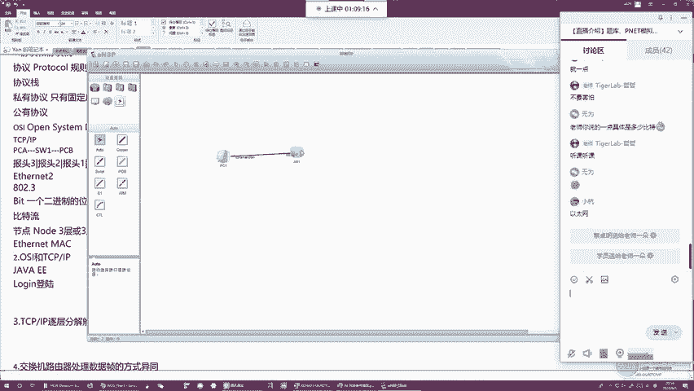

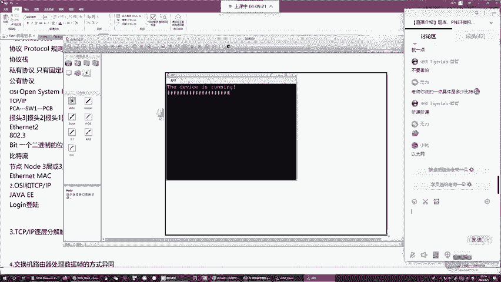

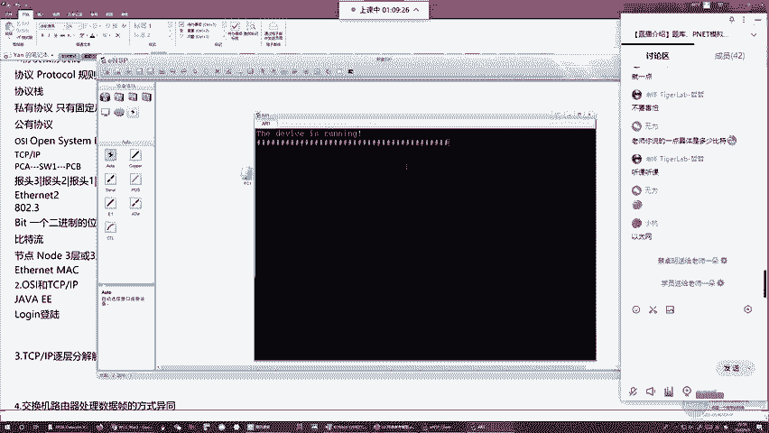

程当当中他们这边我我来推荐一下叫sVIP。😊，C这CIT比你那个MSTSC要强多了，用这个软件。😊，帅爆。

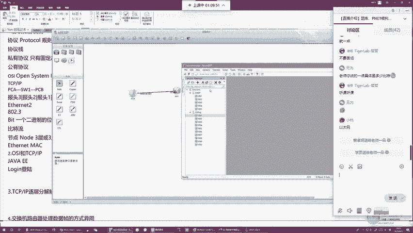

有不算。是吧这个叫CQCP啊啊，这是个登录软件，类似这样的登录软件好很多啊，叫什么卖啊超级终端但网络工程师最终请CQCP啊，界面酷炫功能强大字体跳简值的这软意啊，有关系没有组织更好了。

那接下来你再使用这个软件来通过de麦来发起它是我们的优C登录的时候，对吧？我们可以使用方，你也可以使用码。😊。

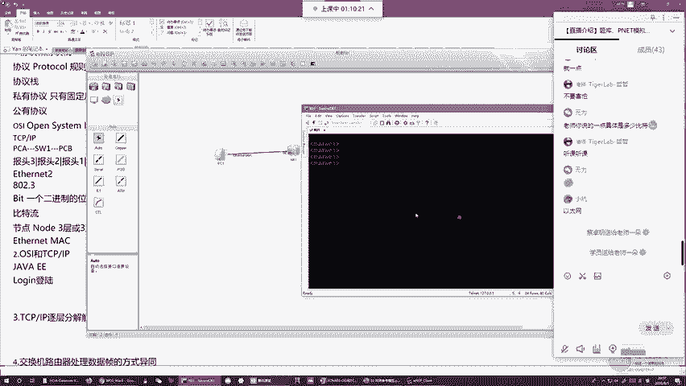

😀，就是你呢你能通过通过上来远程登录的然后接下来这个它使用协议啊，就是TCP啊对应着刚草C然后比如上面这款协议呢，都是基于该根草然后下面边咱们还有一个协议啊P啊，叫文件输协议啊。

你通过这个协议来够上传下载这些文件啊，比如说咱们平时在做实验的时候会使用吗？咱们提交做实验的时候会使用一个叫做CCD的的这么一个文件，会使用3D的这么文件啊，咱们通过这个文件来上传下载这么个文件啊。

这个叫CCD的这就是一个FTP跟TPP为一生的这么一个对吧？文件传输的文件好，你通过这个文件，咱把PP协议啊来上传下载的一些数啊。😊。

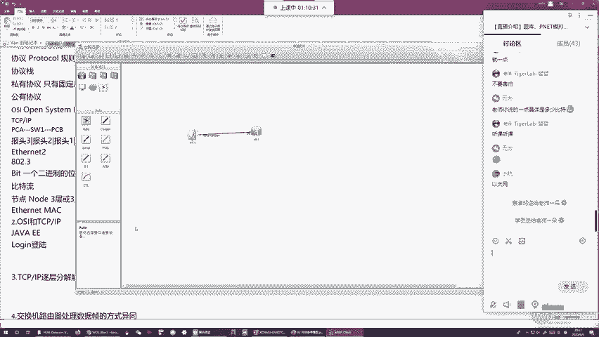

般在个企业里面啊，咱们会有个服务器啊，这个服务器的PP服务器里面放置很多的文件啊。然后接下来咱们员工入职之后啊，你可以下载这人工手册找出下载，对吧你你参看麻看呢，咱们就把它服务器。

你把这个员工手册放到明确对吧？然后在这过程中啊，你要下载怎么样啊掌握这个服务器啊，对吧？通过PP来下载。那这个下载的话，你用好的PP软件啊特别用。你可直接对通过这个软件登录服务器的时候。

你好像能打开这个服务器的分盘里。😊，啊，你能打开这个服务器的磁盘空间里啊，你能打开磁盘，你打开这个磁盘登录，你就会直接把你下载文件弹出C在你本击弹球中就好了。对吧？复制粘贴直接就下项目来。

这个特别好用啊，特别好。😊，好，那接下来这FP可以传输文件啊，除了这个行疑外，还有一个叫是TFP这个叫做简易文件传出好，它们都是上传下载文件的。

那当家注二的是TP上传下载一般都一些大文件啊TFPT上传下载一般都是一些小文件啊，原者上传下大文件后者上传下载小文件。那这个大文间是什么？

就看你的文件啊有没有超过32兆如果你的文件小于等于32兆用TFPP还继P都可以。那相对的由TFTP啊咱够快起啊，没有问么难。就是说说你的文件在超过32兆啊那这块可由TFP来传也不行。

但传输用品传中断那用地址传传中断的，吧地址传文件看不了。那家建议大家要P。😊，那当然咱们现在应该更多的就说SFTP啊，对吧？这个SFTP像咱们的为SCP是吧？

那这款协议咱们就通过对吧SFTP啊来上传下载这了解。😊。

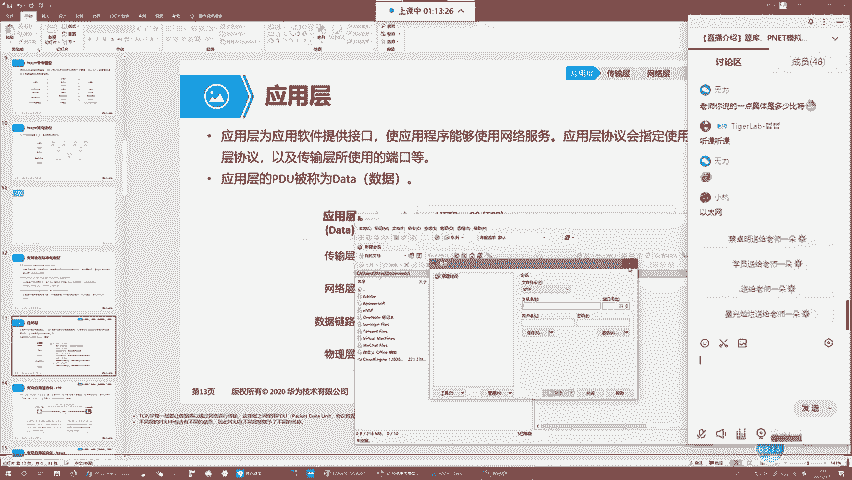

这太有意思了，对吧？那这边就是相当于咱们一些对吧软件嘛，对不对？这些APP嘛，就应用啊，咱们直接应用就通过这协议啊，对吧？叫应用协议啊，来防范咱们的签关资源好吧。

然后接下来咱们就把这个SMT叫做简单邮件传输协议啊，这个简单邮件传输协议对用完发送电子邮件呢，我给你发个页面，对吧发邮件，那咱们肯别说用啊邮箱应用嘛，对不对？我通过我们邮箱啊，要邮些邮箱啊。

我通过腾线邮箱啊，APP你要发邮件，咱们说这协议啊，就是用FMP对吧？发邮件用SMTP那收邮件呢发邮件，咱们用套单啊，套餐叫邮局协议啊，邮局协议版本3SMTP叫简单邮件传输协议啊。

这个叫简单的邮件传输协议套餐叫邮局协议3。好吧，大家家你会发现所有直接应用。😊，有的绝大多数的都是对应一个端不好。对，这不对两个端不好。这种对应两端口的部方们是什么呢？我们称为个多性道理啊。

咱们称为个多性道理啊，写一下这个多要求家理解啊。😊，如果是一个一，只是你为一个保啊，就给大家注意叫单系道理。好吧，叫单系道理。😊，单信道应用指的就是一个应用程序啊，一个应用程序是对应一个端考。好了。

然后接来下TP这种方式对两关跑呢，咱们就称为叫多信道。那当于这个多信道协议，咱们通常什么？通常是双信道，好吧？双信道，对吧？双信能应用，指的就是这个应用怎样同时对两个。那接下来这种双信道协议，它的特点。

接着就是一个灯跑又来建了一份的连接啊，用来协绍个参数。然后另外一个灯跑又来实打实的才是数字，对吧？😊。

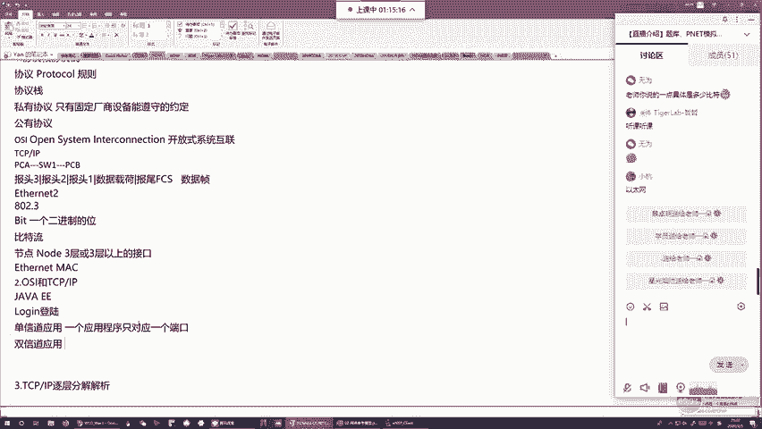

一个端口内建立客户连接，一个端口又来实打实的才是数字。好吧，就比如说你PP连B啊，你一个客户端想要找一个服务器怎么样来下载文件，你得先跟这个服务器啊建立这个连接，这个连接建立靠谁？靠端口二1样，对吧？

你靠端口21，跟服务器呢建立一个客户连接，那当你建控制连接之后，对吧？那实打实的文件上传下载靠，啊，靠这个端口号连的这个数据连接啊，对吧？这就是说你的客户端跟服务器之间啊，你要建立两汇报。

一旦客户靠在控制客放，这个不用发送的是客户线路啊，那么那个客户信内发送的目的是什么？为了让你们之间的么安全的靠靠建立什么数字连接，难当你数据连接建立完之后，真正上传下载的文件到的是什么？靠的就是数字。

那理解啊，我们当然建立双信到协议基本一样啊。😊，没有问题。好了，那今PP啊对吧？有这描述了，一个客户端对吧？你P，或者咱们手机上，对吧？为PP的这个应用了嘛，对不对？你说PP应用之后。

你得先跟咱们服务机端建立连接。那当你建立好文接之后，这个文件建的两种方式啊，一个叫做主汇模式，一该叫做对动模式啊，当然这个的话伴呢说啊FTP主动模式还对动模式。那咱们一般建议大家。

如果说就是你从内到外部建立，建议大家使建议大家使用这个对动模式对动模式更加靠谱好，那来当你建立好文接之后，你用形来授权下载文件，对吧？授权也是通过PPM下载也是通过PP那户端PP以后的说啊。

它对的是PCP的端组进去了解，对不对？咱们是客户端发起系。😊，服务器的。我要，请就表的是。我们这种CS模型应用啊，我们又提到CS了，叫BS体M了。这个CS模型指的是什么？叫planly到s。

叫planly。😊。

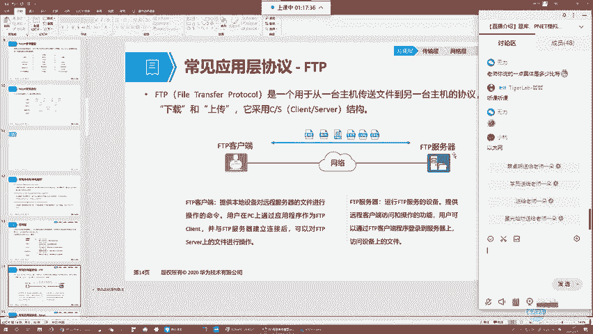

じ司。这是干嘛？客户因。😊，服务器啊，这个叫客户端服务器。好吧，客户端服务器。那就是plus三模型的行议啊。你在这里边咱们所看到的端口一般都是服务器端的端口。好吧，一般都有服务器端口。

就比说你XTP端小要的是你FTP小的是跟这个服务器啊来建一个连接，咱们是端口21嘛，对不对？那端口2里面呢是服务器的。好吧，端口21是服务器的那将然咱们客户端这边时是端口呢。

客户端是边咱们端属于随机端口啊，这个端口是标识咱们的应用本身的啊，我们这个应用本身的端口，对吧？只要你没有跟其他撞衫，对吧？随以怎使你用的模型，但通常咱的端口会大于等于114，好吧。

咱们端口会大于等于114。这种大于等于114的端口，咱称为叫非知名端口啊也称为了随机端口。然接小于等。😊。

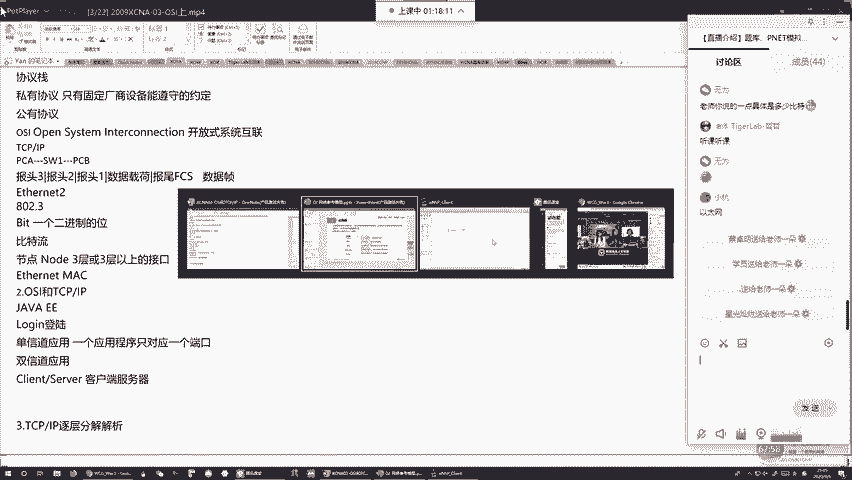

123的端口呢的知能端口也成了一个固定。其中1个CS模型的应用，你在通讯的时候啊，客户端所使们端口永远随机的。那服务器端所使的端口，那使89都是固定好了，比如你看到的这HP啊，你看到的PP啊。

你看到DNS啊等等之类的，这些应用都不一样。好吧，这些应在使用的时候，客户端的端口啊都是随机的。服务器端的端口啊都是固定好了，这就是CS结构的这么模式一样。那接下来什么样的应用是CS模型呢。

99%都是99%的都是O了？好，这就是继。😊，然后接下来这是pro啊，对吧？你开主机，对不对？咱们通过了我接啊，连到读务机、什么AP啊、路由器啊、交换机啊，包括墙设置服务器，对吧？

你可以通过te或者CH上来来到我们的计算机啊，远程的登录的这些设备来操作好吧，那这个te图样啊，它的登PC23啊，是服务器端啊，而我们的客户登录登，通常是来都式上用标识咱们这个远程登录应用的。

我们这个远程登录应用所来的登口，都是个分机端O的好，那大家可能问啊，那你一个计算机里面是开启了多个应用，访问多种类型的服务器。那你这多个不同应用端对吧这些端不能随机那咱们到底哪个用户好吗？

原来并的请注意由操作系统啊，操作系统它的在你用起来的时候，当前我们这个计算机上有哪个应用启用。😊，这些应用占过的端口，那这些被占用的端口不能给你用。因为给你用咱们出忽了。

一个计算机上获得了两个应用会有相同灯跑，这也会冲突。那为了避免冲突，不会把别人使用过的灯跑，对吧？也排除，不要给你分配一个其他的用，比如说咱们的CT对吧？假设这个端口是2000好吧。

我们的QQ对了端跑2001，我们的端考浏览器对了端考2000，能不了？一此类开，你的端口随机的，那你不用担心啊，这些随机端口的利用，你们会端好出锅啊，这个没有问题。好吧，这个是L。😊，那咱们也就是说呀。

tonet很安全，你通过太net来打字，对吧？控制下一个优器，好好，你敲的每条命令，我都给你装下来，我给你装下来之后，我们清清楚楚知道，你敲的每条命令到底是什么是吧？然后大家如果说你在敲命令的时候。

这射什么用红密码呀？😊，控制一些比较关键的信息啊啊，分分都给你保证来，对吧？基于这样来发起交易业网攻析。所以说一方为了保证咱们网管的安全性统，啊，咱们更多对小孩的支持。😊，SCH跟他亮一样。

用了远程登录都我设了，只不过SCH咱们使用能加密，能加密人数啊，你们不用担心咱数咱发4我们这年节后，别人能够第一时间知道咱们门内，会什么？因为是密，别看，好吧别OK。😊，然后接下来像我HPPP啊，对吧？

你打开浏览器，对吧？浏览百度浏览器啊，看看斗鱼啊，对吧？那这这个是通过HPPP啊来实现。那通过某页浏览任何的保障啊，都是你快捷端在通过HPPP这个协议啊。

对要通过浏览器发起驱往这些漫步服务器的这么一个法，对吧？然后接下来它对TPP8的话码也是服务器端系的。好吧，咱们本地这个端号是要标识浏览器。而这个标识浏览器的端号，永远是一个随机端。好吧。

它永远是一个服务机端O。😊，好，那今天的话应用层呢咱们就这些啊。这边如果大家对应用层还有更多的学议想了解。那这边的话在我们后期过程中啊，咱们会包啊，然后接下来我们来看传述层传输层的没问题，所以很重要。

我们这个TCP这个UBP啊，TCP叫传输控制啊，UB是咱们的用户数据构性。那需要注意的是TCP和UBP啊，都定义了咱们数据报图一赖。那接下来咱们这应用。😊，你在高数数字的时候，应用产生的数字改。第二。

你在高速之前呢，你要添加一个爆头一对吧？但这个爆头机是谁？一般是由咱们用来挑。好了，那我们挑选的时候呢，要么挑PCG，要么挑标问。但家他们的做的是什么呢？虽然说PCG啊，大于主点TCP。😊。

我来充的这个。我们创一叫面向连接器，你能听过这个词吗？啊，你能听过面向连接了吗？TCP是一个面向连接的写下，然后加UDP是一个无微间级啊，我来写一下很关键啊很关键。😊，PCP是一个面向连接的协议啊。

UDP是一个无连接的协议。好了，那接下来什么叫面向连接呢？简单点来说啊，就是你一个应用啊，你所产生的数据载合，如果你要选择PCP来作为你的报图一样来分交你数据啊，你能保证数据传输的可靠性啊。

面向连接是能够保证可创传输的，同学们？然后接下来这个优B题是个无连接协议指的什么意思呢？就是你一个应用，啊，你的载合选择用U递G啊来作为报头一的公标的话？Im sorry，我只能保证你数据被发送了。

那能不能报好说，对吧？会不会乱气啊，会不会丢分啊，会不会被篡档啊，会不会成为太快载值摸放，这些咱们都不能保证啊？我。😊，给你传，对能不能到欺偏由命啊，那这一块的话，我再把这个就创造掉，我们连接怎一样。

它不能给你提供符号函数，它提供了一个尽力而为的函数。我只能说我经帮你传啊，能不能到要欺偏由命。😊，😀Yeah。那接下来大家接本的猫妈说，你UDP这样的靠头，那会有哪个面选的UDP来作为传输性协议啊。

还真有，因为UDP没有小，是因为UDP比较简单啊，低点。第二UDP的报头大小比较小，对吧？这个盒子比较薄啊，你PCP添加的报头怎么样，太复杂，当然爆头比亚粗，是吧？

然后这加PCP它让你的性能在传数字的时候，传的比空啊，我传一段时间得等一等，然后呢再继续传UDP没有什么没有那么乱七八糟报头第啊，你在使用UDP传输的时候。😊，咱们能够直接上啊，没有任何的对吧？

没有任何影响，就是你们发现的时候，我就给以一直不发，好吧，我就给你直算，不需要做任何等待，对吧？一如，然后接来PCP呢在查数之前啊，你需要客户当中服之间啊，要建立个连接啊，那这个连接建立起来很麻烦的？

并且当你建立完这个连接之后，你的传播快多慢都是接收收费，如果你接收收不够，你信在是发快计，你接收作收集过来，对吧？你信在你发万的钱，那就很麻烦了，那优是没有给奖的，优是我不管你在项，你能收我你么话。

你不能收，我还给怎么办是吧？那就是说不再跟你的手，咱们效率会很高然后接下来这个PCP呢在发布数据的时候，你只能一对一把啊，我们把这种PCP分分以用，什么不能叫点到点应用，你只能支持单波的数据啊。😊。

然后咱们优惠P能够支持单播，也能够支持主播也能够支持广播，好吧，单播主播广播都够支持相对的比较难多。可吧？啊，这就是选择优EP和选择PCP的这么一个点。好吧，如果你需要PCP来给你提供朋友传说啊。

你叫PCP。如果你经PCP提供核还是用什网用啊，那这边使用优惠P也是可以。好了，然后接下来我们来看一下它的报啊。好，这就是PCP所定应的奥德格式了。这个是优惠P所定义的报括模式。大家看到了。😊。

那能看到？能不能看懂啊，果然有UB去发送数据，使用什么工装啊。😊，1定去发送税后时了吗你们QQQQ发送税后时了吗？QQ。😊，QQ是什么回去的QQ是什么回去的？但你们现在通过腾讯课和听测时候是一样。😊。

咱们腾讯号的通讯标准出去。也是UBP啊。你会发现基于UBP的应用和基于PCP的内55拍的，是无5开的。某种意义上来说，使用UBP的可化更多些。使用UBP的好而更多一些，为什么灵活啊。

那现在我们看一下换头就式啊，这个就是PCP制定的报程模式，错杂了一点。😊，你不说是黄梅交片？😡，你给我翻译成中文，你懂英文是，对斯科的教会这中文，你能懂于英文啊，谁会借说一下。

咱这个爆头不一样是长度大小有要求的，你不能乱啊，爆头液长度必须得能被四字节整除。这就是说你PCP也好，优字也好，你再设置咱爆头不合数啊，你的爆头大小，要么四个字节，要么8个字节，要么12个字节。

要么16个字节要2字。好，你消不图我用5个字节不行。😊，你三万不要放到一上，什么十一字节，你想多了，十个字也不写了，就是你道无长度必须能够被四字节来减除。能理解？那所以说咱们在表示的时候啊。

这一行啊就这四个字字节，好吧，那这第一行，第二行，第三第四第五，还有个第六，这是第六题，你能认识这单词吗？😊，我那你们那边是样。这个叫什么啊？这个叫可选项？这个叫可选项啊，可选项意味着什么？

意味着这个字段咱们可有可能啊由这里的话所有有什么很多的可能啊，咱可选项的不是一样，咱们有可多的。但如果没有的话，这是没有问题。对这节咱们TCT的报头程度可变的。好吧。

可认长度字节数从20个字间到60字间不到好吧，你的可选项字段一共最长的都贴到什么40个字节。好吧，你的报头弱不构项，那就是20字节，就最短情况。如果说你有K项，它最长的可，最长度达到60。好吧。

从20到60字间不可。那当然咱们一般正常的字线之间脱线，正常业务中西，我不需要可选项，对吧？你只要主报同就够。那既然主报和包含点风线，大家看一下吧，原单题啊，目。😊，号，对不对？这个原端号。

用来描述通信的原因又是原个啊，当然通常就是一个文机灯号。然后接下来目的端号一般是标示咱们服务器的灯号是一个是么序列的好了，用来描述咱们通信双方的应用，到底什么应用。然后接下来有一个序列号。

咱们通过序列号用来防止你传为数据的过程中出现乱序，对吧？我原给你的的发布数字啊，对吧？一个字节一个序列发，每一个字节的数据啊，咱们都会有么序列号，啊，那这个序列号标记咱们的数据啊，就相当标记上数序。

对吧？我在给你发现的时候呢，咱们可能会由于延迟由于抖动，由种种原因啊，咱们的数据发送出现了乱序。好吧，我先发的后后发先到记中下就很正常，这个太正常了。我先发后后发先到，这个太常。

那当你出现这种情况的时候。😊，接收者不慌，接收者一点都不慌啊，他可以根据收到的数据的序列号来给你做一个重复排序。那所以说你传输的网络回境不管多差都无所谓，对吧？哪怕你时时刻刻都有延迟，你的延迟多多。

并且你有非常高的，对吧？有不有存在都完全不关现，但如你发的数怎么样有序列，如果根据序列号的大小，接受方收了序之后，对来的从小到大的方式来做一个重复排泄，那通过弹序对吧？首先要不用关心啊，会有乱趣发生。

并且你的传输过程中，如果说有某一个序列号的高丢，对吧咱们还家怎么样发现这点，那通过序列号，咱们不再能用通到什么乱序啊，你还能够怎么样，你还能够够确定咱们语原发性的数据有没有技数的到达接收者好了。

假如你没有丢高啊，乱序和多高都是靠，都是靠这个序列号怎么来确定然后今天咱们。😊，现在在说要把它一个欠，这个欠怎么用呢？这个欠的话就是PCP的有个机器啊。我说的PCP是个特征墨迹。

那这个特征墨迹的协议落在哪里呢？就墨迹在这里。你顺延啊再通过PCP的应用给接收者发生数序的时候啊，我给你发送数据，不是一股脑给你发走而是我先给你做一个协商，做一个沟通，延商一下我的数据传输速啊。

然后这行协商数据什处理的话，我要一段一段的给你发出去啊，给你发一个数据，要等着等什么。😊，当你给做一个确认，你给我做确认，你在确认中能告诉我，我给你发个数据，你有没有进术收到。你如有进术收到。

我再给你发数据。如果你没有进术收到，那这个时候不确，我要把之前发规报啊，给你重复发给，能理解？那这一块的话，咱们接收方怎么告诉你，你给我发的数据，我有没有进录收到，就放个72号字报，来是现对吧？

比如说给你发的这个数据，你那个序列号他们是123。如果123这三个序列号的报文案，咱们接收者如要收到，那这个时候接收者给系人返还的确认报完之，咱们确认号就是4啊，我给你发了123，你给果他收到了。

你再给我回复确认的时候，你的确2号就是4。如果说我给你发个456啊，我给你发了456都收到，你给我回复确认号，那就是7好吧，我给你发了789，你如果说收到了，你给我返还个确认号，就是1，能理解吗？😊。

如果说我给你发谢谢。你都能收得到，那你再给我回复确认的时候，你的确认号的值就是我给你发送的最大序列号的值。再加一啊，加一我告诉你啊，你给我发到直前链些，我的收到，你再给我发的时候。

请你从下个序列号的这么一个报名开始下载。OK了。这个是确认，你给你解为确认号是接收左标到序别按上给我发的数据，我也要继续收到这么一个关键词。😊，然后接下来这边的话由用咱们报图成本可变啊。

咱们通过一个报图成功字段来描述当前的一个PC段啊，里面有多少字啊，然后通常是20。然后接下来这6本课会保留了啥都没有。然后接下来这边有6本课的控制位啊，这6笔课的控制位里面有很多的关键字段。

比如说有S迈N啊有ACK啊，有法N啊有re等的之类，有很多的关键的控制量啊。咱们通过这个控制位，能够完成TCP的连接的建立，也能完成TCP连接的拆除，那通过这里能力指定要咱们每个TCP的绘画比讲。

这样哪个TCP的绘画，无C处理，对吧？然后接下来当笔绘话出现问题的时候，咱们会通过里面控制位来重置咱们的连接啊，这就是咱们的控制。😊，有很多个关则，这些位啊咱们不要在这细一点。😊，先放给咱们慢去说啊。

然后接下来咱们有一个超级字段，这个字段要干诉？哎，这个字段太烦了，它是用来约束咱们信源的发射速度。对，又不说PCP这的特略逻迹是一样，对吧？信源小姐接受者发射速度，咱们也先建立个链接。😊。

当你连接确立完了之后，再建议连接那个瞬间啊，你们的传输速度就已经协商好了。这个速度怎么样呢？就是我在给你发送数字的时候啊，我的一次性给你发送多少字节的数字啊，给你发完一个之，我等着等你给我一个确认啊。

你给一个确认，如果的问题，啊，我再给你怎么样发送一个数字，然后接下来再给一个确认。好吧，每次你再给我发确认的时候，你就能够同时告诉我，我希望下步发送的时候，你一次性给我发多少字好，一次给发个字节啊。

那这个呢咱们抽个窗口啊，窗口用限制啊，咱姓能的发送的速度啊，等于说窗口一签，代表你姓能发送三个字节的数字的结者，发来请你提价，等什么等确认，然后就确认之啊，比如说包含了一个窗口字，就是接收者就告诉你啊。

啊，你下发的时候发送发4个字，对你发送四个字节。😊，哎，这个机录就不爽了，给你返还AC片，你的包含10，窗头100，这个100就告诉你了，下次一次性发送100。好，咱们通过窗口就能接收者的密密序言。

你下一次给我发送的时候，一次发送多少字节的怎么个处啊，并且这个窗口咱们实时不改变了，对吧？你如果觉得发快。😊，你在同学VCK的时候，你的窗口不断呢就设置小一些。比你在同学CK的时候呢，窗口不是说淡点。

我们把这种窗口可以实时传输坏慢来进行持时调整的那些啊，我们抽一下滑动。😊，啊，在讲话能。啊，什么叫皇御窗口？就是伴随着咱们传说，你的窗口可大。那咱们到底在好想该说算啊，这个不是发送的跟说算。

是比较接受者种说算对吧？然后接来你看咱们传输和报头中也会包含一个校位题啊，咱们报头三的那个校，这个教育和16位啊两个字节就跟咱们那个XCS真的一样，对吧？用来帮助接收的判断我收到的数据是不完整啊。

那大家会问不是XCS，为什么还要这么校啊，也因是因为咱们每层校层的，对吧？你那个校位盒是爆头相对应的报围的那这个报围只为报头三。😊，那所以说我们记算CS时候，你只会针对报头stand的内容来做一个效果。

好了，你做一次价做一个散列，比如错到放到什么。然后接下来咱们这传输层的报头在传输过程中，我怎么确保以后啊，对吧？我就靠这个价格的字段来确定。好吧，我会针对咱们传输层的报头的所有字段。

包括咱们的数据载放来一定做一个散应字段，我把计算得到结果放到这个字段，好，那通过这个字段来做一次接收的指机啊，你收到的数据在传输过程中，咱们传输层报，也就咱们报头一，还有咱们这个载合，对吧？

有没有发生改变好吧，那通过这个字段，咱们能不要接收这体机啊确定我收到的数据跟性能发送的是不同够啊，这个咱们出一个完整性检测啊，然后接下来咱们还有一个最后的紧急指标。

这个紧急指针一般指是是你性源跟接收主机啊。如果说你同时建立两个逻机，对吧这。😊，连接如果需要对方优先处理哪部连接啊，你就在这步连接上把紧急指针给置位。然后现来对于另外一步，不需要你优先处理连接啊。

你就要把紧急指针对吧？不要指位。那这个时候你有一接同时键面了，紧急指针智位的连接，咱们会优先的去处理好吧啊，这就是TCP报头的这个字段。😊。

那通过这些字典的描述大案一定都知道PCP是一个非常厉害的协议啊。这个协议封装咱们的应用，你在发送的时候呢啊咱们通过窗口大小来限制你姓任一次性啊发送多少字己的一个数据来防止优秀，对不对？

然后通过序列号啊你网络质量好与坏的无所谓。因为你姓年发送的数据到接收表。那你们都不用担心会有弱序码。因为你发送的每一个数据分片，咱们都会有什么，都会有序列号，你根据序列号来从小报告诉一排序啊。

你就能怎么样重整它的数序，并且根据这些序列号是什明细啊，你能确定它发送过程中，咱们没有丢包，对不对？然后这天如果多包接收值怎告诉去别这边，我通过给你发送VCK嘛，在VCK中，我通过设置相应确认号啊。

来告诉你，你之前给我发的，咱们告用没有收到，对吧？😊，如果你收到我给你返还的AC些K，里面的确认号的值，将是你之前给我发送的最后一个数号文的序列号的值再加一啊，就是我告诉你啊，你直接给我发了。

我都收到收到就没问题。能理解，我就看确给你发的，那接三号时我就给你发的，你没收到呢，比如说给你发了123啊，假如说二标2，那接收给没收到发现只有一和3嘛。哎，没有啊，对不对？那没有啊，对里二发标了。

那为了让我给我重新发3了，我再给你发送ACK的时候，你里面的确认号是2啊，因你发送的ACK里面72和叉2，我就告诉你啊，所以你下次给我发送的时候，二来继续发。那这个时候接收给发你的懂案啊。

之前返的二原来给你们收到，那这个时候我会给你重新的发送。😊，OK那当然说到这里，大家可知在TC是有成传功能。对吧，然后现在咱们不过下外合，对吧？如果指定，就是当你在发送的时候，如果出现什么数据篡展。

如果出现了冲突啊，那咱们接收者要第一时间确定。那当你确定这点之话，咱们也可以就针对A报文来让我你这个性能来成功发力。好吧，这就所谓的pro靠所体现出来这些网络行啊，那第一二个是防止优色啊。

它能够防止优色。😊，它能够防止优色。它能够对吧？防止乱去是吧？能够防止丢荒啊，能够防止篡改是吧？并且拥有重传的功能，好吧，这就是TCP的这么个优势啊，所谓的可靠连接。

所谓的面向连接指的启示就 ok对它指的启示就问。那当然你想实现这些要很多代表当，对吧？你想的就是保证怎们，对吧？这些口靠传说啊，你需要性能跟接收者在传市之前，你要建立一个汇报，对不对？建立个连接。

那关键人该够，那你建立明中了解，你还得的是不间断的这传可歇写才能接写，对吧？你不能够连续的发送我发送数，对吧？你发一条怎叫反应啊，效率特别低，并且你只能点对这，因为你要确认嘛，对不对？你不能点到多点。

😊，你要解到多远长的话，那直先去方第三啊，9线啊去分G只支持典到地啊发含下东西。Yeah。首先在你们发现TCP中获得的报头啊，是UBG的报酬之外，啥UBP的报头突出两是简捷啊。

当你使用UBP作为报头一个分装协议的时候，你的报头是什么样？一共只用分装8个字节好，这8个之间里面其中还有4个字节是一个灯口。好吧，你看TCP跟UBP的动题之后，就是你们都有一个端口。😊。

通过你的观全的目标是什么？咱们这个流量是由我们应用产生力，是由我们目的应用来接受。那么今天16比B的长度，这个长度指的是对吧？添加完咱们的报和一的数据段，然后接下来咱们就校成一个感受一样。

虽然说起来好像流量接受过只这样确定我收到的数据是不是对吧？有问题，但你就算检测出来优样搜误你就算检测出来，你没有平台机制，所以说检测出来白单检测出来不？然后接下来的话就是咱们用B报头所有。

就以说基于这个报和没等，我没有窗口不能防死对吧？我没有确列号获得防问器，是不是我没有确认号，那所以说根本没有确认机制，没有确认机制，咱就得号丢包，然后今天计算你丢包了，咱们也不能调刺0这里，你也没有。

😊，存传是吧？然后没有教练有教练，但是教他没有什么用啊，你就算校练出来不一样搜万就没有用，能理解吗？你就算校验出了咱们传输有问题，这也没有意义，能理解吗？你校练出来你怎么办呢？对不对？你校练出来。

咱们又不能告诉4由这一点又不能重传，所以说你可以理解为这个字的能摆设你，所以说为什么优异去交，无连接协议，那确实无连接，对吧？你四额发送数据的接收者的时候，你也不需要建议是么，对吧？

然后咱们这个传输你没有什么仪式感，对吧？不是说给你发一段，你给做个确认，我要不定给你发，你能收不这，你收不到，对吧？没有办法，好吧，这就是有问。😊，那现在你说在。你数据价格添加了PC级报头以后啊。

或者添加了U级报图以后，就是当你添加了第一个风光报图以后，那这个添加完还说层报图这个字段，我们说什么呢？我们看一个数字段啊，咱把这个称字叫数字段，这个叫C啊，叫数字键，okK添加完报头一的。

就是这个字段。😊。

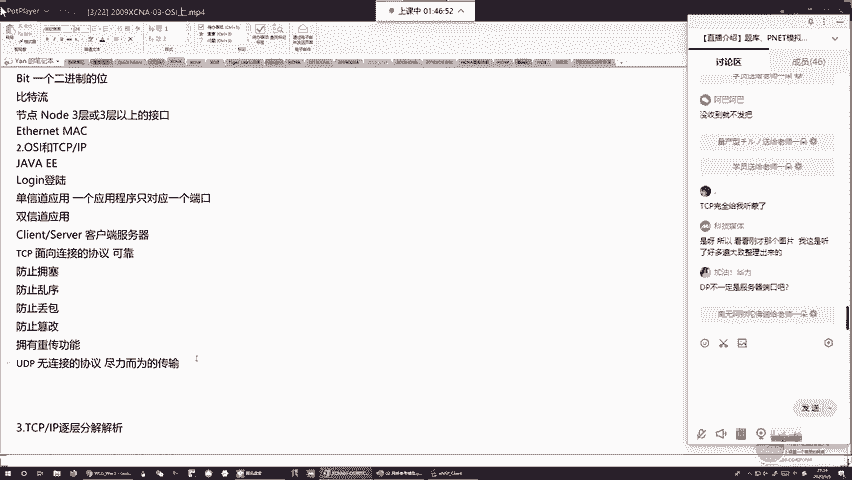

添加了报和一的这个字段，咱们称为叫数据段。好吧，这个就叫数据段。OK，那当然数据段是眼不被发现的。你数据段在报和一的前面，你还要添加一个网络层的报头。啊，你在网络从爆和二基础上。

你要添加一个数据链层的报复三，要更加添加道了？那当你添加完毕之后，咱们形成数据帧，这个数据帧才能最终的被发送。当然我相信我讲到这个地方之后，大家可能一脸懵逼了。

完全不知道我说如果完全不想给你们讲这么难但是莫名其妙的，就又讲了这么难。😊，我觉得你色面的话这也儒点。谢谢。😊，啊，我问一下，哎，你们需要我给你读一下PPP这些字段咱么都不解释啊。

快速的轻轻松松的把这节篇稿文好要给大家稍微讲多一遍。😊，你。你看我这就尴尬了。哎，兄弟们，我这就尴尬了。我讲多给你们听懂啊，你看你们走了，刚才150，现在只有130。那你们又说我讲的多是吧？我讲的多。

你都走了。😊，我想说。我也很尴尬，对不对？是吧？😊，啊。我也想一下啊，我们不像上上上几节课一样，像上学这个讲简单啊，大家都听特别开心，我也讲的特别开心是吧？但这这些东西说尤其要英文啊，尤听个懵逼啊。😊。

哎呀就是个加大就是个加大。那所以说的话今天这节课咱们先讲关的内容啊，讲关的内容。😊，哎，咱们做吧。😊，咱们就把传输层的讲完吧。好吧，咱们就把传输层面讲完啊，有一双样PCP和UPP啊。

看起来好像PCP满满的优默感，对不对？你个一个使用PCP的安装设计，好像咱们叫万事大吉。😊，其实现在不是这样了。可靠安全治疗啊，一般应用使用TCP来拼装啊，分装完之后的话，你可靠性才的啊。

带理安全性相对比意。那当然为什么安全？也先咱早期很多期TCP公司了，比如说像TCP的对吧？再开连接东西TCPSYM拉派，这是咱们一个早期非常非常有名的咱称啊。😊，就是看这个放在那里。然后呢。

基于优问这个东西啊所以现在的话在早前好像会建得比较好。然后将来你使用PCT来提供可靠传说，对吧？它有概念，他没方案，概一价就是你在传任何数之前，你要建立连接啊，这个连接建立特别麻烦啊。

然后接下来你通过PCT传数据啊，就不是小问失界一，对吧？你要力，对不对？你第几句，你得等一等，你再低几滴，你再等等，对吧传的磨磨唧唧的，特别慢啊，需要个第。😊。

然后接下上咱们之前还有一点就是它只能支持单波发送。如果你一运用啊，我希望4年发送的数据能够同时被多个接收者收到啊，那这块话围之前接受不到。那所以说就是为什么UB是不能提供房传收啊，对不对？咱们。😊。

在TCP之所以能够对使用原日生源啊，研质生源，它有很多TCP所不具备的功能。比如说你使用UDP来传数字啊，咱们不用键连接打拼也就快啊，第二点你使用UDP来传数字啊，对吧？咱们不用体验能用这个感觉吗？

咱们是一做到底特别强传的效率特别高，然后接下来于UP咱们能实现什么多波和广播啊，这点咱们的TCP走了，然后接下来使用UDP，对吧？

咱们还不用这攻击然后最最最关键的是你TCP和提供什么可靠传说你是通过重传的实现，但并不是所有应用不需要的。比如说我给你发个电子邮件啊发多可以重传没问题。我给你QQ分出对吧？打字我给你打字。

如发多了可以重传的问题，更比是说咱们现。😊，不宝宝打电话，对不对？咱通过我打电话，我你打电话，咱宝我质量要不好。你得这个时候有一句话不用了，咱能成床了吗？打电话能成床了吗？😊，是不是这样是不能。

所以说有些应用它属性就注定了你不需要重传，或者说你不能组。能理解？因为我们有PCP用有什用呢？叫没有任何？没有任何用。所以说咱们优P有时候你会占在增量啊，那当P还有一个你PC不好，就你报头小，对不对？

你添加一个UDP的报头才增加8你你添加一个TCP的大合，你添加20到60之间负那如果说你这个应用载合本身要啊那你添加TCPDP看不出来如果说你这个应用载合本身就很小本身就几十个间那就用TCP啊。

你这个报头它的带分占比就比高。而你有优P的话，P报小呢，你能够约咱的带分值啊那这个就特别少，对？😊，这就是PCP的优这么个对比所以大家千万不要以为PCD好，咱们就都有PC。如果说PCD好，C啊。

但你没用QQ的时候，你有体会到这个面。就在网络质量特别差的候，你登QQ给人有朋友发生话。然后现在发Q了，你的QQ会告诉你而现在。😊，仔细一点啊。😊，仔细点，我那给发钉钉行，网络质持不好，发钉钉。

你能能听差。😡，你能能清吗？啊，能不到能知到等。Q是基于优惠制来安装啊，你们千万不要小优惠制的应用啊，优惠P的应用，他心里有数可，我使用优惠券来封装我的大V啊，我不能只用优惠券来给我提供可靠传说。

那这块怎么样，我要自己解决啊，叫自己动手丰衣足食啊，自己动手丰衣足食。能理解吗？那所以说这块口靠单呢，那些基于优惠制封装的应用，我们只能看到优P反出了。那接下来你使用优P片你要提供口靠传说。

那一般这些可靠传输的特性都是由咱们应用本身来提供。好了，你可以理解了基于TCT封装应用，你的可靠性啊可以交给TCP来解决。然你得先使用优惠P封装应用啊，你的可靠性啊，就交给应用在圈。😊。

所以你会发现QQ里发布的包，咱们会有提示，这个提示不是优B去告诉你们，而是由QQ本身的，对吧？并且QQ里面重传你，只不过重传，你也是由QQ应用自己来实现好，然后再不能说一下。

咱们当前是基于PCP通方的应用是基于优B平方的应用，这些应用在通信的时候，它们都CS模型，对吧？你这些应用层的协议要会会打包咱们的软件中呢，比如外浏览器里面自带HPPP嘛，比如咱们这些登录QCP啊。

你自带SHH嘛，你这个软件里面可能包含多个应用层协议。那当时某个应用层协议在通信的时候，这个通信基本上是CS模型，对吧？到搜并且咱们连接都是客户端发服务器，对吧？

请服务器端的登号只有89都有咱们这个支源，比如你通过浏览器。😊，那咱们通过HPPP啊，你来浏览百度，对吧？你在浏览百度的时候。

你客户端的浏览器啊是对应的端口号是一个随机的啊大于1024然后接下来咱们这个百度服务器，你浏览功那对服务器这边的端口就是80啊，我的端独端手就对开放的向你提供好，像你提供服务，是HB可以？

然后接下来你别的时候，要给你他到浏务器啊，他的交易机啊，那这些开设备啊，这有宝络设备登录的备，咱们服务器它你登录话就客户端啊，你客户端在登录服务器的，你比如说咱们P先P作为客户端。

你开启CP你CP本地对的端口就是随机端口而这些本的路由器发换机，你的端口就是PCP的可？那咱们走这样呢CS模型应用啊。😊，主动的SS内端的是一个什么智命端口固定的。

然后接下来S这边的啊C面的是一个非固定的对命端口。okK这个需要大家有明明个概念。😊，然后将来PCP呢咱们也说了，在建立通信之前，在建立连接之前啊，咱们得先交互一些报文，那完成PCP进的连接。

那这个连接呢，咱们通过三个报文交互完成了那这个三个报文交互我们的连接，咱们说什么？😊，我们创一下先手TCP要先做先做什么？先做建立这个绘报，建立好了绘画之后，哎，咱们通过这个扩报来传述啊。

任何基于PCP放应用，你要传数啊，在传输之前你都需要先进行三做手啊，那C谁呢？是由客户端啊，客户端看这PC啊咱们这个服务器那PCIP地值1。11啊，我这边S啊服务器这边的话地址2。2。

咱们标咱们这边看之这是一个远程的然位对吧然后接下来我在建立连接的时候呢，客户端发起第服务器啊，这个话文咱们称叫SY这个SY报指的是什么？这是你TCP报里面是有6个控制位。

这6个控制位中有一个位啊叫SY一位这一位的全称咱们称立叫C啊，叫C它翻译成中文叫位。😊。

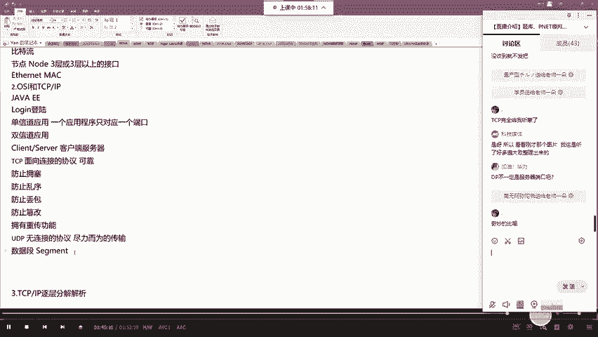

这叫同步。这个位啊在你客户端向服务器建立连接的时候，你会把这个位置1这个位置1的TCP方案，咱们称了叫SY对吧？我给你发了SY，你的包含序列号啊，报含确认好吧，然后接下问你同意后再连接啊。

你收到SY报之后呢，就给做一个回忆，这个回忆咱们称了叫SYN加ACK为什么在SYSK原因是我给你回忆报告中，后制谓SYN跟ACK咱们都会注意这个ACK面全称叫什么？

叫acology叫acology它翻译成中文叫确认。😊。

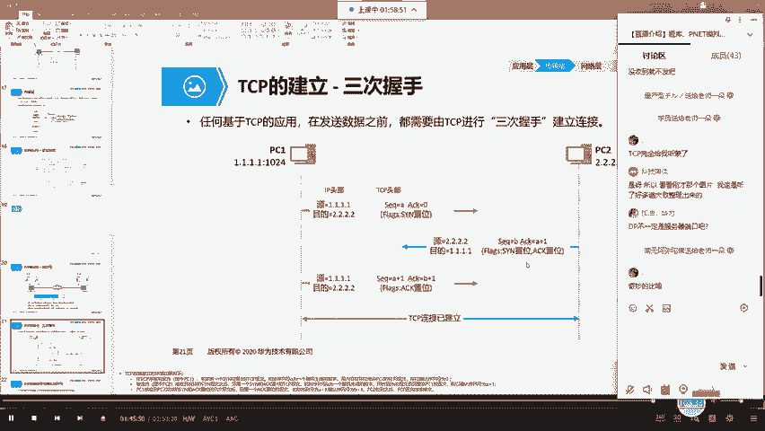

啊，讲确认不好意，我一看到多少标准，我的发位完听因加你题一讲啊SY讲C值ACP的话啊前者叫同意后者加确认啊，你服务器收到客户端啊，发送你Y号我给你做一个我给你做问应到了你是SY加AC好。

然后其中呢咱们已经发放序列号。后你看我确列号是什么我的确认号就是你之前SY报的确列号序列号加一吧？我给你发送后确认包，告诉你你给我发的Y收到了对吧？

我要向你证明我收到向你证明啊就是我在给你返官确认包的时候，我会把你确认到了你确认认这么个值设置为你刚才的那个序列号的值加一好吧，你序列号刚才报是A，我给你发的确认包，我。😊。

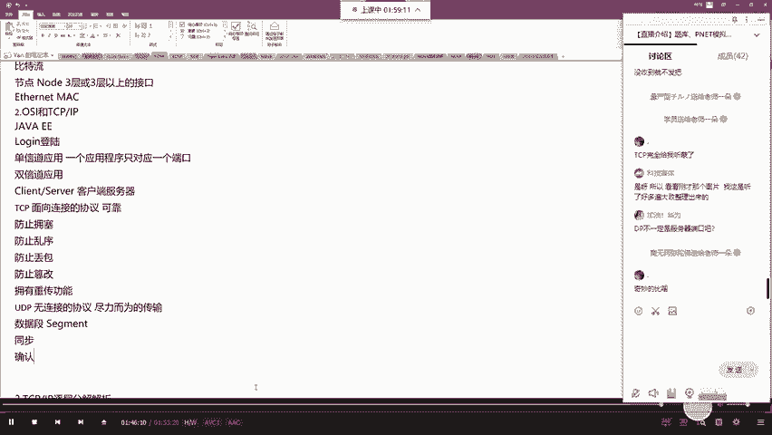

现认为就是是下。能理解吗？这就是A加一的确认。我来告诉你啊，你直前到我收到好吧，然后接下来这个报文告客户客户端面的完成咱们的连接啊，我会给你回为第三报。

这第三个报那就为ACK这个ACK这个报文中只有AC支然后接下来它的序列号是什么A加一嘛，我的序列号是B加为什么确换是B加一啊，因为你给我发诉你S加K，你的包括序列号，这个序列号是你数始号。

那家可以任何一个句号假设B对吧？那么么下就表明你的这个B的序列号报啊，我再给你返还第三个报文的时候，我就确列号设置为B加一，对吧？就是你的序列号加一嘛，能理解？这就是三三次握完B之后，咱们的出现对吧？

那的通信也一般是客户端发布数序对吧？发布在这个三次中，咱们就会协带这个什么。😊，会协商出一个窗口啊，这个窗口就经告诉咱们工户上，你要给标方的数据，一次性发送多少，对吧？我给你发个多少字节，对吧？

你如果收到给我在这确认的时候，你的券号就是最后一个发送数据，谢谢发在好吧，那大家如果说我给你发的过程中有丢包，对不对？有多方，你给我发送了确认啊，就会设置丢包的那个报文档谢谢方，好吧，那通过这个设置。

既然能够得知啊，我这边发送的数据，你有收到，那方便我给你做少窗口，方便我给个窗口OK好，就比如说这就是个窗口的解析啊，对吧？这个划润的窗口信件，划润窗口会大家你还借接什么。😊。

大家还记得这得什么叫华窗口，你们还记得吗？😊，所谓的滑动窗口就是那属于咱们的传书啊，对不对？我信言给你接收者发现一段数字，你接收准上，信别怎么样返还ACK在返还ACCP中，咱就包含一窗口间。

这个窗口字在的值就是接收者在专此信言，我希望下次给我做上。😊，发送过自己啊，那这个windows它会伴随每一次现换做同改变，对吧？如果说对他觉得你发现，那他给你发送这个切换完中后啊。

windows在就变。如果他给你发送，他给你发的现告完之后，音乐会变动，好吗？都以实时调整。那理解了，它会实时调整，那这个咱们称为叫滑动调整。😊，留主意吧。我们这边的话在电里连接的时候，哎。

咱们比如说假设确定了咱们创口到小3。然后接下来确定创作到回之后呢，咱们开始端啊，就给双到端发送数字，对吧？发括三是怎么样？第一个序列号101，第二个102，第三个是103，那搜作完毕之后，我果你收到了。

你再给我回复确认的时候，你给我确认那个值就是114，对吧？是我最大的序列号的值加一，用来告诉我101102113，我说忘了，请你下次从104啊，开是记，好吧，然后接下来这个确认号问题到了。

咱们窗口到现怎么样变成了11，对吧？也许咱们这的图案你传太快转成了，咱们变成1，那变成一之后，我系名怎么样，下次给你发送的时候，只能发送一个值发了之后，让我们让你再次优确认能理解吗？这就是划动。好吧。

那将来你PCT在传之前呢，要。😊，这连接吧，那当你传输完毕之后，你就会把连接给关闭了，那就关闭连接，咱们创个4次挥手啊，建议连接叫三次啊，断开连接创下4次挥手这是什么思呢？

就之当你完成了连接当你完成了传输连接需要咱们断出连接可以降咱们的那在这种情况下断开连接啊一个需要个个发送一个FFN这个叫finish啊finish置位以及ACK置位的这么finish加K发们啊。

s之后呢，给你返还一个ACK置位的话给返还一个加ACK置位接下，给你返还接。😊，好吧，并且你们之间的确认号跟序列号彼此关系，这个都不说的很清楚，对吧？我序列号101，你的确认号11，对不对？

然后接下来你的这个确认你的序列号301码，我这个确认号就三个。好吧，表明咱们双方都收到对方号，那通过这4个报名交互，咱们的PCP连接不断传来。那断图之后，如果你们之后再想通过PPP啊来传数据。

还得要再次通过三次握手来建立这个接。😊，好，那今天呢咱们就先讲这些吧，对吧？啊，从书上的讲完。然后接下来可以讲多关键的网络层和数据链层啊，由于时间有限啊，这这块咱们真的讲完完了。😊。

今天我讲了一天打一课比较累，然后呢，我已经连续好几天，每天讲好几节课了啊，比较累。所以说这块就是。😊，希望大家都喜欢大家课程。😊，向望大家分享持。之前给大大家听过很多录播啊，这都特给大直播。

希望大家感受好啊，大家好，你们喜欢直播吗？😊，当是。🤧嗯。Hello。😊，大家还在吗？可以听到吗？好的，有没有。😊，有没有晕掉的，有没有没有吧，四次四次握手。😊，四次握手没听清楚。そつ。😊。

三次二四次挥手，三次握手，四次挥手挥手啊。😊，那么呢这节课啊这节课我们。😊，第二遍也是。得多听几遍。对，两遍的话还是有一点点少。两遍。是我看错了是我看错了。😊，两遍还是有点少。那。咱们这个是基础基础啊。

多听几遍走没错，多听几遍。总没错。然后呢，这节课最重要的最重要的就是这个啊TCP和UDPTCPUDP那大家在听完。比如说一遍了两遍了啊，你要能总结出来TCP。和UDP的这些区别。区别。那什么时候。

用TCP什么时候UDP哪一种更合适？那这个区别呢。其实一句话一句话就能描述的清楚啊。华为的PPT全是英文就离谱。一个叫什么？😊，一个叫什么？は。嗯。可靠性、安全性。对你把TCP就想成是一个。

比如说这是一个人啊，你给他画个像画像，你可以把它想成。非常非常靠谱的一个人，说到做到。说到做到，有问有答。那这个呢就是TCP的特点。你把他想成一个人，哎，他非常非常可靠，他可靠在哪儿呢？比如说。

你你要呃你要他帮你转发，或者是说送一个信件。他收到以后，他一定会帮你完成。哎，老实可靠，老实可靠，你可以把它当老实人嘛。老实的人，但是呢他一定会帮你完成这件事儿啊。但是如果你一次性。

给他安排的事情太多了太多了，他同样能完成。只是怎么样。哎，有点慢。😊，有点慢。老是可靠，没问题，有点慢。那这个UDP呢？UDP是什么？😡，你可以把它想成一个。呃，你提什么要求，他都会答应的。比如说。

你给他提他是一个人啊，他这个人你给他提了一个。😊，正常人不会答应的要求，但是呢他能答应哎，他帮你答应答应下来了。然后呢。你会傻傻的等他给你回应呀什么的，他答应下来以后。

他就会考虑这件事儿自己有没有能力完成。有的话。那最好有的话那最好没有的话，他就不管他就不管了，他也不告诉你，他也不告诉你，我完成不了，你不要等了什么什么什么的。😡，他干不了，他就直接不干了。

他也不会告诉你。😡，这个呢。は。😊，对啊，你只要能总结出来。😊，TCP和UDP。一个叫可靠传输，另一个叫。尽力而为。尽力而为。嗯。尽力而为。那这个呢是咱们今天。讲到了TCP和UDP。

明天呢会继续的把今天没讲完的没讲完的这些啊给大家讲完。然后呢。TCP和UDP的话，咱们在NA里面。嗯。能听得懂最好。但是如果你听不懂啊，听不懂，你就要知道刚刚咱们总结的一个是可靠传输，另一个是尽力而为。

尽力而为。什么时候上直播课呀？以后的课程。以后的课程都是这样的啊，是由。精选的录播客精选的录播客。然后呢，由我们助教在直播间实时答疑以及课后答疑。ICMP是一个消息控制协议啊，消息控制协议。

他们呢这个呢是。可以通过模拟器端口微shoprk抓包来看TCP来理解TCP协议吗？如何做？那你这个端口。如果你用模拟器的话，你这上面是没有任何。应用的啊。你最多就一个拼包吧。聘包ICMP的控制层协议。

那这个拼包呢。你能抓得到。不是的啊，NP和IE是直播。NP和IE是直播。MPIE。然后呢，就是这个。每次都要重装。怎么会呢？你待会儿找我，我帮你看看。不然就会报错。在装的时候啊。

我们有后面有一节课是专门教大家装。模拟器的啊装模拟器的。但是呢你不要。去擅自修改它的安装位置。如果你没能力的话，他要安装在哪儿，你就让它装在哪里。第一次装的话。🤧Okay。

一般的解决方法是你把这个wa box给它打开，里面的这几个设备都给它删除，然后呢关掉。再打开ESP点设置点击注册设备，然后呢把这5个设备全部勾选，点击注册。通常呢这样。

你的这些设备啊就能正常启动了就能正常启动了。Save save。用户界面输入sve saveve啊，用户视图输sve。我上次也试过了。那个那那可能就是。试试这个重装网卡驱动网卡驱动。然后呢，装的时候。

一定要注意啊，是以管理员、管理员身份。安装。运行的时候也是以管理员身份运行。然后呢，哎咱们这个是之后之后有一节专门的课程啊，咱们在这不细讲了。有专门的安装模拟器的。课程我带着大家。我再给大家做。

大部分人的电脑的配置还是可以的，不行的就死活不行的。在这个模拟器里面有一个rotor。它的名字就叫rotor，你看到的叫1220220，有一个叫rotor。

那这个呢咱们现阶段啊NANP阶段你都可以用这台路由器来做实验，这台是一定可以打开的。嗯。那等到。哎，那就试着用这个root。然后呢，如果是接口不够，板卡不够，你在设置里面打开，然后呢看看啊。

它好像不能拖。嗯，这台路由器是不能拖拖进去板卡的。买个路由器不行吧。😊，哎。买个路由器代价有点大了。模拟器能做得到。这个说的路由器啊并不是我们家用的路由器啊，应你应该。懂的啊，应该懂的。

不是家里头一两百块钱。这个路由器。哼。😊，嗯。三四百开玩笑。三四百，你在开玩笑。你去百度一下。路由器。买不来啊买不来。就用模拟器就用模拟器。嗯。ははい。好的好的好的。哎。搞一个食物再带劲儿。

如果你工作的地方正好能接触得到话，接触得到。你可以偷偷的。是不是进去看一看，了解一下。安装模拟器的问题。在下周就有啊下周专门的一节课教大家安装模拟器。用户嘛身能进去。嗯。换台电脑换个配置差不多的。

不用那个不用那种什么I5I7。三代呀四代呀、三开头的四开头的。这类的是有点老了。接电脑有点冷。现在差不多差不多的。下周就能用得到了。下周就教大家敲一些简单的。实验了啊，理论和实验在一起结合结合起来。

上次呢是有咱们有学员建议啊，光听理论的话太干了太干。太枯燥了。然后呢，这些这次呢这轮呢我们就专门设计一些。为一个理论专门设计一个实验。理论结合实践。带着大家。赶紧回家啊赶紧回家。

这个呢待会儿会发到班级群里头。😊，赶紧回家。待会儿你私聊我啊，待会儿私聊待会儿私聊。对。理论你听过来头那么大听的头大的，然后呢做起实验来，你会发现。真的挺离谱的，两三行命令。两三行命令。

那下周呢咱们涉及到一些。需要做实验的理论的时候，就设计这个实验啊，带着大家先讲理论，然后在实验中证明这些理论。

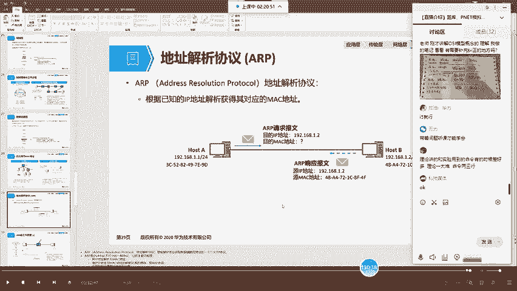

😀呵呵。😊，买个本儿吧，它这个就是笔记本，只不过是被一页一页可以分开的吧。他记完以后就会放回去。活跃的对。有的。电子稿，那有些人是喜欢。手写嘛。有些人喜欢手写。那咱们这节课。

咱们这节课就看大家的问题已经开始。跑偏了啊，聊天了。那咱们这节课就到此为止之后呢。遇到问题在QQ群里头或者是微信都应该加了我吧。我叫哲哲啊。哎，没事儿。身体已经锻炼出来了。我现在不坐公交也行。

能跑的回去。放心放心放心。正好当锻炼身体了。腹肌已经九九合一了啊。😊，本来有8块又多了一块儿，然后现在是一块儿。几公里。不远。10分钟到家。哎。是。路由器打不开对吧？那路由器打不开。路由器打不开。

大多数是电脑的。硬件问题了。要么你重装一下这个网卡驱动。有些学员呢他上次是。把那个虚拟网卡给他整没了，不知道在不在啊，他把虚拟网卡整没了，然后他电脑上还有。😊，好多东西。我说帮他之后再解决。

然后他是直接重装了系统，最后呢自己给整好了。然后这个虚拟网卡也可以打开了。9微tro box可以创建。虚拟网卡，有些人那个watro box直接没权限创建虚拟网卡，创不出来，建不出来。

那你的设备自然就打不开。啊，这边还有这边还有你电脑上的这个杀毒软件。什么360什么电脑管家。这些啊咱们普通人的电脑是没有什么人惦记着的。如果你不浏览一些不主动的去浏览一些。就是。

掺杂着木马的一些的这样的网页。那我们电脑大多数情况下是不会出现问题的。你可以把这些东西卸载掉，然后呢。你的电脑会有一个实时防护，它过一段时间会自己开启。你可以利用软件。把它关掉。

要不然你在装这个CRT的时候，你的注册机会被它给干掉啊。你第一次打开。它会提示这个软件。非常危险。然后呢，你第二次打开的时候，你就找不到这个软件在哪了。这个实时防护就把就把它给删掉了。强制删除。

我的也是。已经很多年了啊，没有安全软件。那就只能。退而求其次，用这个rotor啊用这个rotor，这个rotor是可以。roer是可以打开的。咱们NA和NP阶段，这个rotor是够用的，rotor够用。

H呵。😊，🤧嗯。待会儿给我发个私信啊，待会儿给我发个私信，我看一下。NP阶段。啥呀？NA就用到了ACLACL我们在后面的一些课程里头就用到了。访问控制列表。

然后它和NAT一般呢它是作为配合其他的工具或者是协议来使用的。用的啊用的学呢。NA也有NA也在用最后的综合实验。也有。防火墙。咱们这个主要是。路由器和交换机。路由器交换机。防火墙很少。防火墙你要做一些。

安全的时候。比如说你们公司有这个。安全的要求，或者是说有一些保密要求。O。QQ和微信都可以啊。QQ和微信。都没有问题。然后呢，我已经看到了几个。那我们就这样吧啊，那我们今天就到这儿。

我帮大家解决一下问题。好吗？好，我已经看到。几个人的问题了啊几个人。那我们今天就到这里啊，明天继续今天到这里，明天继续。然后呢，接下来我给大家解决一下问题啊。😊，好的，那大家拜拜大家拜拜。😔。

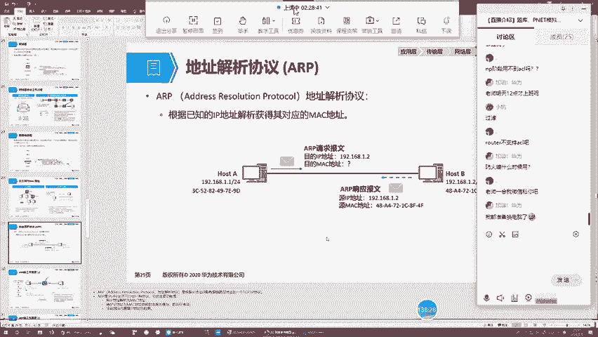