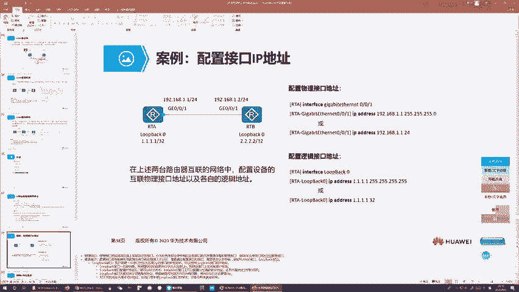
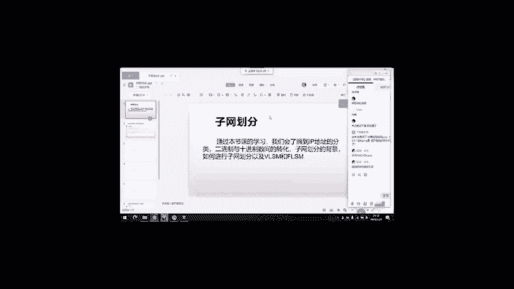
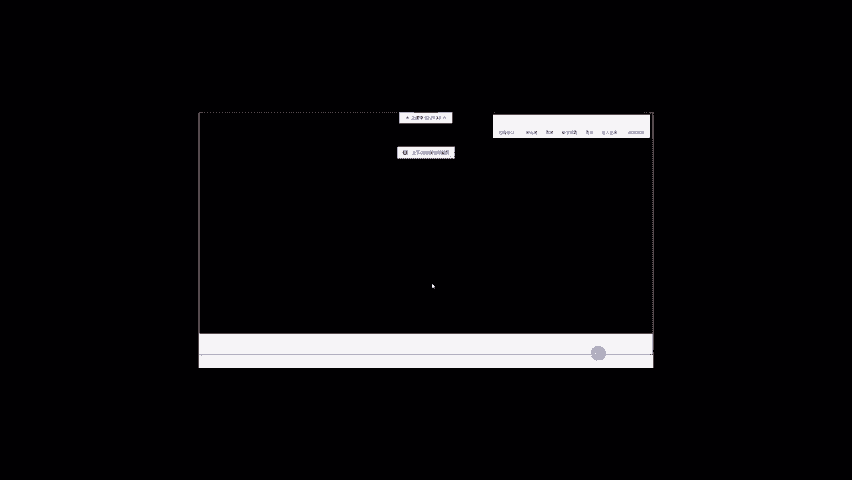
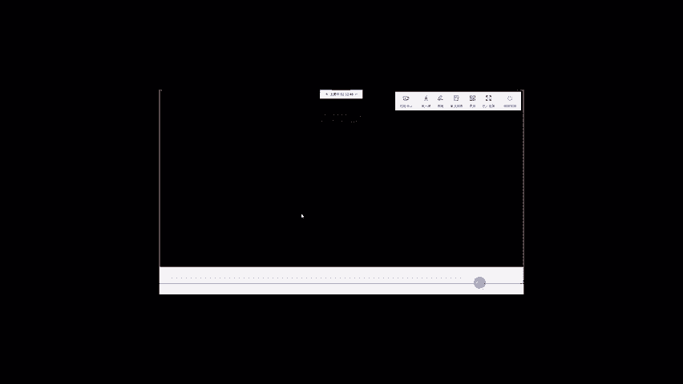

# 2022版华为认证HCIA-DATACOM教程，内部课程公开分享（已完结） - P4：XCNA-04-VLSM 12.09 - 网络工程师CCIE - BV1AP4y1J73k

好的，欢迎大家来参加咱们泰国公开课啊，这个是咱们NA的第五节课啊。今天咱们讲非常非常关键的一个内容啊，就是IP啊。我们之前讲了OSI对不对？这个OSI有7层啊。

那七层跟咱们网络工程师关联最多是哪一层的啊，请注意啊，就是咱们的网络层啊，而网络层里面最关键的技术是什么，就是IP嘛，对不对？啊那为什么呢？给大家解释一下，因为咱们网络工程师哎。

你面对最多的就是多层交换机，还有路由器，对吧？这个多层交换机和路由器，他们都可以负责网络间的数据转发，而你在做网络间数据转发的时候，你要寻址，对不对？对吧？你基于什么来寻址啊？那在我们TCPIP中啊。

就是基于IP而IP属于哪一层呢？对吧？IP属于网络层，那所以说整个OSI中跟我们的网工最贴近的就是网络层。那今天这节课咱们就围绕网络层啊，来给大家讲这个IP协议。😊，那当然这个IP协议大家不陌生了。

咱们上节课上上节课我都跟大家说了，IP的贡献两点啊。第一点是定义1个IP爆头，对不对？然后第二个就是定义了IP地址。那这边的话呢，咱们先从报头讲起，然后再给大家呢讲这个最核心的IP地址OK吗？好。

那这个封装，我希望大家没要忘记啊，比如说你用浏览器来访问百度啊，那这边的话呢，你浏览器里面输入啊百度点com啊，对吧？你进行这么一个百度访问。那这块的话呢，你发送给百度服务器的报文是什么样的呢？

是这样的。它是这样的啊，你的HDDP的载合啊，前面封装TCP对吧？前面封装IPV4爆头，然后接下来前面封装以太网二针头啊，最后呢封装FCCS那这个叫什么？我们称为叫数据针，对吧？

这一块就是咱们应用程序产生的数据载合，对不对？这是数据载合啊，然后接下来添加了爆头一，对不对？形成了数据段，数据段前面添加了IPV4，这个爆头2，对吧？形成了数据包，然后数据包前面添加二层的针头。

添加二层的真伪啊，咱们形成了数据针啊，然后最终呢这个数据针呢被传递啊，IP所定义的爆头就是这一块呢，咱们爆头2网络层爆头。那接下来这个网络层爆头，哎，长什么样呢？我们就来看一下吧。好吧。

OK那这边的话关于IPV4啊基础内容的话，咱们已经都知道了，属于网络层嘛，对不对？然后接下来IP两个版本啊，V4和V6V4呢当前咱们主流的，然后V6呢是咱们V4升级版升级版主要解决什么呢？V4很多问题。

主要就是V4的地址不够好吧，那当然目前的V4和V6咱们共存的共存的环境。一个网络中哎咱们既有V4也有V6啊，那基于整个internet来看，V4V6的占比呢大概是目前这个角度啊已经五开了啊，误开。

那当然随着时间呢推移啊，这个V6呢肯定最终会取代IPV4这么一个位置啊，最终会取代IPV4的这么一个位置。那我估计是在明年吧或者后年那咱们整个internet你就看不到V4了。

那届时咱们都会使用IPV6。那当然此一时比一时啊，毕竟现在呢咱们V4还是主流呢。说作为一个经典的网络程师啊，这个IPV4呢，咱们还要了解，并且这个IPV6虽然跟IPV4不一样。

但是它更多的是基于IPV4的一些特性啊来做的一个研发。所以说你们会来IPV4在研究IPV6的时候呢，也会省很多事儿啊，你们不用担心，就是学完IPV4，你不用了，对不对？咱们就浪费了，白学了，不是的。

你学会V4，咱们基于V4去理解V6，哎，很容易。好吧，好，那接下来IPV4的爆头长什么样呢？我们就来看一下，哎，这张胶片给大家展示了咱们IPV4的这么一个爆头格式。好吧。

那这个IP的爆头呢跟我们的传输层爆头一样啊，它对长度有要求，必须是四个字节的倍数啊，你要么四个字节要么8个字节，对吧？要么12个字节啊，你必须得要能够被四字节整出。

然后接下来这个IPV4呢是一个爆头长度可变长的这么一个协议。你在使用它来封装咱们爆头二的时候，你的爆头长度啊是20字节到六十字节不等啊，那这个跟我们的TCP爆头是一样的好吧，那当然有一说一，哎。

你正常两个应用啊，你们要正常通过网络来通信，对吧？你不需要使用这些可选项的字段，这些可选项的字段对吧？会给你提供一些额外的功能，那这些功能用于咱们网络测试啊，是O的对吧？

你专业网络工程师可以通过IP爆头里面的可选项字段啊，来提供一些对吧？高级的一些功能，对吧？来完成我们的网络测试啊。等之类的那接下来咱们一般正常的用户，对吧？你单纯要通过网络通信，对吧？那这一块可选项呢。

咱们根本是不需要的那所以说呢绝大多数情况下，咱们应用之间通信，你使用IPV4来做报头，对吧？那咱们三层爆头长度啊，就是20字节啊，怎么算呢？一共有5行嘛，对吧？每一行是4个字节4乘5对吧？

正好20字节O那接下来这个爆头里面包含你的字段呢，简单来看一下吧，从上到下从左到右啊，这个是第一个字段，第二个，第三个第四个啊，5678911112啊，我们主报头有12个字段可以吧？

然后可选项跟填充项啊，咱们可以忽略啊，对吧？因为咱们一般用不到它好吧，那接下来咱们从第一个字段解读起啊，先是版本啊，这个版本不用说了，你IPV4嘛，那就是版本4，你如果是IPV6的话，版本6嘛，对吧？

这一块显示的值代表你当前使用的IP版本。对吧？然后接下来由于咱们报头长度可变啊，所以说咱们通过第二个字段来描述当前这个数据包，你三层到底有对吧？多少字节的这么一个报头，二十字节还是六十字节，对吧？

还是你们中间的某一个字节，对吧？你通过这个字段来描述。然后接下来第三个字段的比要。难以理解，有点抽象啊，它叫type of service啊，简称叫TOS翻译成中文的话叫服务类别啊。

它翻译成中文叫服务类别，简称叫TOS啊，服务类别啊，服务类别。那接下来这个服务类别哎，它是用来干嘛呢？它是用来做QOS的用来做服务质量的。好吧，这个叫服务质量，它用来做服务质量。

那接下来这个服务质量是什么呢？哎，简单说一下啊，就是在咱们网络中，对吧？网络只要你连通了，各式各样的应用，都能通过咱们网络来通信，对吧？那这些应用咱们产生的数据类型是不一样的嘛，对不对？

有的应用产生的就是咱们的文本嘛？数据啊，有的产生就是数据有的产生的是音频，对吧？有的产生的是视频，对吧？咱们流量很多类，那接下来不同类型的流量，咱们在网中传输啊，我对网络的质量要求是不一样的。

比如说我给你传文本，我给你发个电子邮件，对吧？网络延迟高一些有关系吗？哎，没有关系，对不对？但是我给你打一个语音电话就不一样了。我给你打个语音电话，如果网络延迟高，你电话根本打不了嘛，对不对？

你必须得要在合适的延迟下，对吧？你要在较高的网络品质下，对吧？你这个电话才能打通讯，那所以你会发现对吧？当你网络带宽不足的情况下，你如果说有这么多的应用啊，都要通过网络来发送数据那。这块当你网络拥塞了。

咱们不同类型的应用，对吧？你对网络的拥塞所产生的这么一个对吧？就是。感受啊，叫用户体验啊是不一样的那所以说当你网留优色的时候，咱们要尽可能怎么样保证那些比较敏感的应用嘛。

比如你那些语音应用啊、视频应用啊，对吧？你发数据发的麻利一些，对吧？我给你优先级高一点，对吧？你们优先被转发，尽可能保证这些应用的用户体验，那原因是因为你另外一些应用怎么样，他们不在乎延迟嘛。

你延迟高一点低一点，我用户体验都基本不变嘛。那这块的话，咱们就尽可能的哪那些对吧？带宽嘛来满足我们那些比较敏感的应用的这么一个数据发送，那这块的话，这个行为咱们就称为叫QS啊，那在做QS的时候呢。

一个比较大的难点，就是你怎样让路由器或交换机识别，你收到的到底是语音数据还是视频数据还是咱们的文本数据，那这块呢就是靠咱们标记啊？你三层爆头的标记标记在哪里呢？就标记在这个字段，好吧。

比如你这个字段的值，假设啊如果说是0。啊，代表这是一个普通的这么一个文本的数据吧，对不对？那如果说这个智为一，那代表这是啊比如说音频的那它为2，比如代表着视频的对吧？你通过给这个字段啊标记不同的值。

咱们来标识不同类型的这么一个应用数据，对吧？那接下来你的路由器呢收到一个数据包，你不用看载荷，你也看不懂，对吧？你只用看咱们TOS字段的值，哎，你就能够轻松的知道啊。

你收到的到底是哪种类型的哪种类型数据啊，然后加针对那些对吧？比较关键的比较敏感的数据，咱们就优先转发，对吧？对于那些不太敏感不太重要的数据啊，你就延迟转发，对吧？所谓的QOS就是使用有限的带宽啊。

尽可能的去高质量的转发那些对吧？延迟敏感丢包敏感抖动敏感的这些应用数据，好吧，那当然相对的，那些不那么敏感的数据啊，可能就会被更加的延迟的去转发，对吧？他们的处理待遇会更差，好吗？哎。这就是TOS。

那当然一般正常情况下，咱们TOS不用去管啊，你发就好了，对吧？至于咱们网络到底是优先转发哪种类型流量，对吧？这个咱们不用关心啊，因为作为网络的新手，你能让网络通就不错了啊。

你不用考虑咱们差异化对待不同类型的这么一个数据，好吧。好，那这个咱们称为叫TOS。叫TOS。有点慢嘛？😡，啊，对呀，是啊，TOS就是给不同流量标记嘛，对吧？这个叫标记啊。给不同类型流量标记。

那这个专业术语咱们称为什么呢？我们称为叫。对我们称为叫流量上色啊，叫流量上色，好吧，叫流量上色。啊，有人觉得讲太慢了是吧？啊，不好意思啊，讲的慢的话，就是因为咱们有很多零基础的，所以说讲慢一些。好吧。

好，请注意啊。就是你给不同类型流量打上不同的TOS标记值啊，这个咱们称为叫流量上色啊，通过上色的方式哎，你可以形象呢理解为啊，比如说咱们语音，你打为什么蓝色啊，视频，咱们打为绿色啊，对吧？

然后接下来咱们文本你打为白色呀，对不对？那接下来咱们路由器收到不同颜色的数据，我就能根据咱们的QOS的这么一个设置啊，来对你做一个什么不一样的转发决策嘛，有的咱们转发麻利一些，对吧？优先级高一些。

有的咱们转发优先级低一些，对吧？这就是Q啊，那当然说句实话，就是你给的量上色嘛，这个根本不可能的，因为毕竟这个上色这个行为是比较什么比较抽象的那所以说呢所谓的流量上色，其实就是给不同类型流量，对吧？

打上不同的标记嘛，对吧？那当然标记有的可以打在二层爆头，有的可以打在三层。😊，头但是由于这个三层爆头比较厉害嘛，所以说你在三层爆头打标记啊，这是咱们平常做QOS哎比较常用的这么一个手段啊。

然后接下来第四个字段叫total lens，这个total lens用来描述就是携带IP爆头在内的咱们完整的三层数据包，哎，你有多少字节，好吧，那这个就是总长度嘛，对不对？

那接下来总长度减去咱们的爆头长度啊，咱们得出就是你的IP爆头所封装的内部的数据段啊，有多少字节好吧，你拿这个字段的值减这个字段值啊，得出就是咱们数据段有多少字节好吧，这就是前四个字段。

然后接下来我们来看一下，接下来三个字段啊，分别是标识符标记和分段偏移量啊，这三个字段结合在一起主要用来干一件事儿啊，我们就称为叫三层切片啊，你们没有听错啊，切片这个切片不光光是咱们传输层TCP的专利啊。

我们的网络层的IPV4和IPV6都具备切片的这么一个功能啊那当然你IP切片的话发生在三层啊，那这个切片行为呢我们称为叫三层切片，对的？三层切片。那这块大家可能会问了，你为什么要三层切片呢，对不对？

你应用程序产生的数据啊，你产生的数据载荷，对不对？如果你过长了，那在传输层，对吧？咱们TCP呢就会针对你的数据载合来做一个切片，对吧？保证咱们这个切片后的数据啊不会太大，对不对？不会太大。

你在发送的时候呢，不用担心就是对吧？数据大小啊超过咱们接口的MTO的设置，导致咱们这个报文呢不能被顺利发送，啊，你不用担心，那接下来既然咱们四层你切完片了，你为什么还需要三层切片的，啊。

那原因是因为我们的网络很复杂嘛，对不对？网络很复杂，有的时候为了保证咱们两台主机通信啊，你需要在两台主机的对吧？所在园区的边界路由器之间来做一个微片啊，这个V片是个工具啊，微片的种类很多啊。

微片的种类很多，我们称为叫虚拟专网啊，虚拟专网。这个虚拟专网用来实现什么呢？就是两个园区内网主机之间啊来通信。那当然让他们通信的方式就是通过overlay技术啊来实现啊。

这个overlay主要指的是什么呢？就是你路由器，对吧？收到内网主机，发送给另外一个内网主机的报文的时候，哎，我把报文发送给公网之前啊，我给你的报文呢做一个重新的封装，这个重新封装怎么封装呢？

比如说还有我们刚这个报为例啊，你这是一个HTPP的报文啊，你的正统的封装这样的，你前面封装TCP啊，你前面封装IPV4，对不对？然后接下来你前面封装，以探网的针头啊，然后接下来你后面封装FCS对吧？

这是一个正统的封装，然后接下来你路由器要通过VPN来转发这个数据，啊，你通过VPN转发数据，咱们要做overlay，那咱们最经典的overlay隧道是什么呢？叫加E隧道啊，这个叫通用路由封装啊。

那这块大家不用在意，这些我们在IE中都会讲。好吧，在NP中也会讲，那在NA中，你们只要有这么一个概念就好了。好吧，路由器通过GIE来发送数据啊，它会在你的数据包的三层报头前面添加1个GRE的封装。

然后再在GRE的报头前面呢再添加1个IPV封装，O吗？那通过这个外部的IP报头。哎，当然它的原目地址啊都是公有地址来欺骗咱们的公网路由器啊，让公网路由器以为这个报文呢是由一个园区的边界路由器产生。

是由另外一个园区的边界路由器来接收O吗？那当然你这个报文成功的快公网啊到达对方园区边界之后，对方园区边界会帮你把外部的IP报头给去掉啊，去掉之后查看你的真正的IP报头啊。

当然这个报头里面咱们原目地址都是私有地址，可以吗？但是呢不用怕咱们园区的边界既连接公网又连接内网，对吧？你能识别私网地址啊，你拥有这些私网路由，你就能沿着于私网路径啊来给你做一个最终。转发对。

保证咱们两个园区内网主机啊可以成功的通信。那接下来讲VPN跟我们这个三层切片有什么关系呢？哎，关系在这里了，就是你的传输层的协议，在给数据载合进行分片的时候，它是没有办法预料到啊。

你端到端传输路径中会不会有VPN存在，好吧，如果你没有VPN存在，对吧？你数据产生的时候怎么封装，我端到端传输啊封装内容不变，那这样的话你完全没有理由啊来做三层切片，那接下来如果说对吧？

你中间有这个VPN对吧？这个VPN在传输数据的时候呢，你会额外的给我们数据啊添加一些额外的封装。那当你添加完封装之后啊，可能你的数据包大小变大了，对吧？超过咱们中间链路的MTO尺寸了，那这块的话。

如果你个包超过咱们接口的MTO尺寸啊，你只有两个结果，要么被丢弃，要么就是切片之后，对吧？基于这个分片啊来发送可以吧？那当然这个切片的工作谁来做呢？咱们不会交给传输层协议来做啊，咱们交给网络。层啊。

我们通过IP来切片。好吧，那接下来当我要做三层切片的时候，这三个字段就是为了辅助啊咱们的三层切片而存在的这么一个比较关键的字段。好，那接下来咱们先从标识符开始谈起啊。

标识符啊用来标识一个分片到底属于哪个数据包，可以吧？比如咱们有数据包，A有数据包B，你数据包A切成，比如三个分片啊，你这三个分片对应的标识符是同一个，比如都是100。然后接下来你数据包B，哎。

经过切片啊变成了两个B1B2。那你们的标识符呢都是200啊，属于不同数据包的这个分片，对吧？咱们的标识符呢是不一致的，好吧，属于相同数据包的分片，我们的标识符呢是相同的好吧，那这个东西我们称为叫标识符。

那接下来这个标记呢字段比较短啊，一共只有三个比特啊啊只有三个比特OK吗？那这三个比特最左边这一位啊就是最高位啊，哎，咱们通常呢还不用啊，咱们用的只是中间这个位，还有右边这个位啊。

中间这个位我们称为什么呢？中间这个位咱们称为叫DF位啊，叫don't fragmentment，叫不要分片位啊，它叫不要分片位然后接下来最右边这个位呢，咱们称为叫MF位啊，叫morefrment。

这个叫更多分片位啊，中间这个叫不要分片位，右边这个叫更多分片位。那接下来这个DFA用来描述什么呢？这个DFA用来描述啊你一个数据包对吧？是否允许被三层切片。好吧，如果你DFA置为零。

那代表它就是允许你做切片啊，你如果说超过MTO大小，你就切片。你如果没有超过的话，你正常发如果说这个DFA置为一啊，就是中间这位置为一啊，代表你不允许三层切片，这是什么意思呢？

就是当你要通过一个接口来发送一个数据啊，假设这个数据包的大小超过接口的MTO的尺寸了，我不给你分片，能理解吧？你只能被丢弃，你不支持被三层切片，好吧，那当然咱默认情况下，这个DFA啊是至零的对吧？

那接下来这个MFA有什么用呢？用来描述这个分片针对整个数据包啊，是不是最后一个分片，我这个分片后面有没有其他的分片存在，对吧？比如说你数据包A数据包A通过切片啊，被切成了三个分片分别是A1A2A3好吧。

其中A1。他的MF呀是一。A2的MFA啊也是以而A3它的MFA呢为0，代表这是最后一个分天啊，我排在最后面。OK然后接下来哎第三个字段啊叫分段偏移量啊，分段偏移量。这个分段偏移量啊，写一下啊。

我怕你不认识啊，这个叫分段偏移量，好吧，叫分段偏移量啊，OK吧？好，分段偏移量有什么用啊？它用来描述一个分片，针对咱们完整数据包啊，你是从第几字节到第几字节，可以吧？比如举个例子啊。

假设啊咱们有一个数据包，它是4000字节，好吧，数据包A啊，它有4000字节。那接下来咱们通过分片，如果你要按照1500的MQO来分啊，它是分成了A1啊1500字节，对吧？A2也是1500字节。

然后接下来A3呢是1000字节。好吧，那接下来咱们这个A1它的分段偏移量多少呢？请注意啊，它的分段偏移量就是0OK了？它的分段偏移量是0代表针对整整数据方啊，它是从D0D零字节怎么样开始算的，好吧。

它是从D零字节开始算OK吧，然后接下来咱们这个A2啊，它的分段偏移量就是1501啊，好吧，1501，因为它是从第1501字节开始的。好吧，A一是从第零字节开始的啊，它是从第1501字节开始。😊，OK啊。

当然应该不是零啊，分应它是1啊，拍应21啊，分段偏移量，它是一啊，它是1501。然后接下来它是3001。好吧，也就是说你一个数据包，你做了切片之后，你发给对方，对吧？你对方收到这些切片，那咱们对吧？

由于接收的时候可能会有延迟啊，对吧？你信源先发的可能精力延迟比较高，你后到了嘛，你后发的精历延迟比较低，可能会先到嘛，那这个时候你接收者如果收到了乱序的多个分片，我怎么按照顺序重组啊啊。

那说白了就是根据分段偏移量嘛，对不对？根据分段偏移量来给你做一个从小到大的排序嘛，啊，你偏小的代表你排在前面，你偏大的代表你排在后面，那所以说呢到底哪个先收到哪个后收到其实不是很要紧，对吧？

其实不是很很要紧，因为咱们怎么样，对吧？根据分段偏移量大小就能够顺利的来做一个重组，好吧，好，这就是这三个字段。然后接下来下一个字段叫TTL啊，它的全称叫time to leave啊。

叫time to leave啊，简称叫TTL这个TTL呢它是用来限制一个数据包啊，从你被产生啊，到你被最终丢弃啊，你最多能传多远啊，它的这个单位是跳数啊，对不对？

你如果TTL为一代表你这个包呢就能传一跳，你的TT条L为二代表的包怎么样，只能传两跳。那TTL为C代表你的包呢能传三跳。那当然由于这个字段咱们一共8位啊，这个8位那这个字段的最大值是二的8次方减一对吧？

255，这也就是说你一个信源产生一个数据包啊，对吧？你再发送你最多只能穿越255跳，如果说到不了对方啊，就被丢弃了，好吧，那这个跳是什么意思呢？跳就是路由器啊，一台三层网络设备，我们就称叫一跳？

比如这个例子啊，主机跟主机B，你们中间隔了两台路由器对吧？就是隔了两跳。你如果说你们中间隔了一台路由器，那就是一跳啊，路由器它内部呢有这么一个组件啊。称为叫分组改写引擎，对吧？叫分组改写引擎。

这个分组改写引擎用来干嘛呢？就是用来在传输数据的时候来修改咱们数据包的三层爆头的一些字段，好吧，一些字段。嗯。嗯。啊。那个不要在意啊，大家不要在意这些细节啊。OK好，再来说一下，就是一台网络设备啊。

你三层或三层以上啊就是一跳啊，对吧？这个分组改写引擎啊，三层网络设备都拥有这个东西啊，用来干嘛呢？就是用来修改咱们三层报头的一些字段的，比如说咱们TTL对吧？你主机发送一个数据包按里面T条为一嘛。

到达路由器之后，路由器会把你的TTL怎么样减一嘛，变成零，那变成零之后请注意啊，TTL为零的报文是不支持被转发的能理解吧？它就会被直接丢弃。那当然如果说你发送的报文，T条不为一啊，比如你发为1，对吧？

那接下来路由器收到报文之后呢，把你的TT条减一变成9，然后呢，通过其他接口还给你发送，对吧？然后接下来下一台路由器收到报文之后呢，我再帮你把TT减一，然后再来发送。你们记住啊。

就是三层网络设备具备这么一个功能，我收到一个报文之后，我再转发。之前呢会把这个T条字段减一再发走。好吧，那通过设置这个字段啊，就是为了限制一个数据包，对吧？它的发送的这么一个最长距离。

那接下来大家可能就问了，哎你为什么要限制呢？对不对？为什么要限制呢？啊，原因是因为咱们路由器在转发数据的时候啊，有可能会出现问题，对吧？那大家也都知道路由器存在于多个网络中间啊。

它互联多个网络作用是什么呢？就是把多个网络连在一起，并且它在转发数据的时候啊，它怎么转发？它做的是网络间的数据转发，好吧，比如数据来自于网络A去往网络B对吧？路由器对于这样的数据啊。

我能查路由表来给你做一个数据包的发送，那接下来路由器为了帮你转发这个数据啊，它需要知道这个网络B在哪里，那接下来路由器怎么知道网络B在哪里呢？对吧？请注意啊，它是通过通常情况啊。

是通过一种叫做动态路由选择协议的这么一个协议来动态发现，对吧？咱们整个。园区有多少网络，这些网络分布在什么样的位置啊，我去网这些网络有哪些路径，哪些路径优，哪些路径不优，请注意啊。

往往都是通过路由选择协议来获取可以吧？那这块呢你路由器在运行录选择协议的时候呢，有的协议比较好用，有的协议呢没有那么好用，对吧？有的协议在运行用起来的时候啊，不会出现任何问题，而有的协议可能比较简单。

在用的时候可能会问题多多嘛，那遇到这种问题多多的协议，请注意啊，路由器运行的只要一不好，可能会出现什么？一台路由器收到错误的路径信息，对以吧？比如你认为一个网络币在哪里，但其实它不在这里啊。

那所以说你所得出的去往该网络币的路径信息呢，也是错的啊，你沿着去往一个网络的错误的路径信息来转发去往该网络数据，让大家觉得这个数据能不能到了，这样那肯定到不了吗？对不对？

那这个时候咱们很有可能会出现这么一种情况啊，就是你路由器沿着错误的路径信息啊来转发。数据去往一个目的网络。那去往该目的网络的数据会沿着错误的路径啊，以一个环的形式，对吧？

在一组路径之间来来回回来来回回的去传递啊，那这个咱们称为什么呢？哎，这个咱们称为叫路由选择环路啊，这个咱们称为叫路由选择环路，它的英文字啊。roouting loop好吧。

叫roouting loops啊，叫路由选择环路。那接下来这个路选择环路一旦产生了，对吧？那对网络影响是很大的并且咱们最害怕的是什么呢？就是在这个环路中啊，如果说你的数据包传输没有任何的限制，对吧？

那一旦环路形形成了那环路中的数据包对吧？它可能就会永无止境的发送下去，那这个环路中永无止境发送下去的数据包对吧？会永久性的怎么样，影响咱们利用带宽嘛，会永久性的影影响什么？咱们沿途网络设备的转发资源。

那CPU啊内存啊等之类的，都会受到影响，对吧？那最终会导致咱们整体网络啊，对吧？它的资源会被永久性消耗，那为了避免环路产生之后，咱们的资源被永久性消耗啊，对吧？我们就要设置什么，对不对？

我们就要设置一个你数据包的最远传输距离，哎，这个就是TTL对吧？那TTL存在之后呢，你路由器没转发一次数据啊，会把TTL减1，所以这个时候就。出现了环路其实不用担心，对吧？其实不用担心，你在环路中。

你发送一个数据包，数据包沿着环每传一条TT减1。那最终这个TTL会被置为0嘛。TTL当被置为零之后，这个数据包呢就不能被发送，可以吧？因为TTL为零的报文不支持被发送，那这样做的话。

就相当是解决了环路中报文永无止境传递的这么一个问题啊，那这就是TTL存在的这么一个意O然后接下来咱们下一个字段叫procol啊叫上层协议啊。

叫上层协议这个上层协议字段呢非常类似于咱们以太文二针头中的类型字段啊，这个字段跟我们的类型字段异曲同工啊，它是用来描述我们这个数据包它在传输层啊，使用什么样的报头。

你在传输层封装了什么协议的这么一个报头好吧，这就是协议字段所干的事情。可以吧？比如说你协议字段为一唉，代表。咱们传输层用的是ICMP啊，你协议字段为6，哎，代表咱们传输层用的TCP你协议字段为17。

对吧？代表咱们传输层啊用的是UDP能理解吧？也就是说你只要查看这个字段值啊，你就算没有把我们的三层爆头给剥离，你就能直接知道咱们四层爆头到底使用的是什么样的技术，好吧，那方便让咱们路由器啊，对吧？

在不拆包的情况下，了解咱们四层封装。那当你了解完四层封装之后啊，你可以基于四层封装来确定咱们报名的类型来进一步的方便咱们怎么样做流量识别来做这个QOS的这么一个部署，可以吧？OK。

然后接下来校验盒不用我说了吧，对吧？校验盒专门针对咱们三层报头啊，来让接收者主机确定啊我收到的数据，对吧？跟信源发送的是否是同一个那如果是对吧？就是你接收嘛，如果不是的话，你就丢弃，可以吧？

那这个校验盒针对二从三层四层啊，咱们计算的方式是一样的对吧？你信源在发送数据之前，我针对三层报头的所有字段，对吧？当然除了TTL啊，我会做一个计算，对吧？得出乱码放到这个字段。

然后接下来你中间的路由器啊接收者主机啊，对吧？你收到报文之后啊，你也会针对你收到的数据包来做一个相同的校验对吧？你会得出一个乱码嘛，对不对？

然后你对比你计算得出的乱码跟这个check some字段啊所携带的乱码是否一致啊，如果一致哎代表报文传输过程中啊，没有出现过任何的改变，对吧？那如果说就是你们懂的？发现不一样啊。

代表这个报文要么被篡改了，要么就是冲突了。反而只要你发。现报文篡改冲突了，那咱们第一时间就会丢包嘛，对不对？当然如果你没有的话，咱们就会成功的接收。好吧，然后接下来下面的原IP目的IP不用说了。

原IP描述流量是由谁发的，目的IP描述流量是由谁收，对吧？按照常理来说，你信源产生的数据啊，从信源产生开始，到接收者接收为止啊，端到端传输过程中，对吧？咱们端到端原IP不应该发生改变，好吧。

原目IP不应该发生改变，这个咱们称为叫端到端的地址一致性规则啊，叫端到端的地址一致性规则，OK那这就是IP爆头。那接下来了解完爆头之后啊，咱们大概也了解了IP的协议的这么一个运作方式了啊。

那接下来我们来看一下IP的一个最大的贡献啊，就是它的三层地址啊，学IP不学地址啊，这个太过分了。那咱们这节课最最最关键的就是教大家IP地址长什么样，并且教大家IP地址这么一系列的操作啊，好吧。

我们称为叫自我化。OK那这块IPD有什么用呢？它有两重作用啊，第一个就是用来标识一个节点，好吧，它能作为一个节点的名字，OK吗？这是第一点。第二点，它能够标识一个节点啊，在internet的什么位置啊。

能够描述你在哪个网络，而并且还能够在一个网络内啊区分你跟网络中的其他的节点，可以吧？这就是IP的这么一个作用。那我再强调一下什么叫节点啊，节点就是三层或三层以上的接口。好吧。

你一台主机如果只有一个接口啊，你可以变相的理解为这个主机就是一个节点。那当然如果你一个主机，你有两个接口，对吧？那你就是有两个节点O吗？O路由器，你的接口很多，对吧？你的每一个接口啊。

都是一个独立的节点，这个节点特点就是你要连网除了要连线啊，连线以外，你还需要配置一个IP对吧？那这个IP理论上来说啊，整个internet范internet的范围内啊。

你不能有两个节点对应相同的IP地址，你如果有这样事情发生的话，咱们会导致什么地址冲突，好吧，地址冲突，有两种可能啊，第一种就是你多个节点属于同一个网络，啊，你们属于同一个网络啊。

你们IP地址的网络位必须要相同而如果这个时候你们IP地址的主机位也相同啊，这就是地址冲突啊，属于同一个网络的多台主机或者多个节点啊。你们的IP地址网络位相同，标识你们在同一网络啊。

而你们的主机位不能相同，对吧？用来做彼此区分。O那这是第一种冲突可能啊。第二种冲突可能就是你两个主机啊，两个节点属于不同的网络，好吧，你属于不同的网络，你属于不同的网络，但是你们的IP地址网络位啊相同。

啊，那这也算是地址冲突，能理解吧？因为IP地址的网络位用来描述啊，你这个主机在哪个网络，对不对？你如果说两个主机属于不同的网络啊，你们的IP地址网络位肯定不能一样。那如果一样了，对吧？

那这也算作是地址冲突，好吧，这也算作是地址冲突。OK那接下来这个IP地址长什么样呢？哎，庐山真面目啊，就是这样的啦，整个地址空间32位啊，四个字节啊，一个字节巴比特啊，32除以8嘛，四个字节。

我们在表示地址的时候，是通过点分十进制的方式啊来表示的。好吧，整个地址四个字节啊，咱们分成四段。每一段都由十进制数啊来表示。然后接下来段和段之间啊，咱们通过点号来分隔，好吧，这就是所谓的点分十进制。

那当然有一说一啊，大家需要注意就是你计算机也好，对吧？路由器交换机也好啊，你在表示任何地址的时候，他们只能看懂二进制啊。那所以说这个IP地址对于路由器而言，它的显示方式就是这样的啦，对吧？

每一段都会显示为二进制数O吗？那接下来由于咱们整个地址32位，这意味着什么呢？意味着咱们每一段啊只有8位，好吧？每一段只有8位。那接下来我需要大家呢具备一个功能啊，这个功能就是啊？

十进制到二进制之间的这么一个转换，一定要会啊，如果这个不会的话，咱们之后关于这个子网化啊，你们在计算的时候呢，会非常困难。当然反之，如果你们会了二进制到十进制转换啊，那接下来自我子网化的时候呢。

会非常非常轻松啊，什么叫二进制啊？逢二进一嘛？什么叫十进制呢？就是逢十进一，那当然咱们从小到大接触的数学啊，都是十进制的对吧？我们再拿数字表示任何东西的时候，我们使用的进制啊。都是十进制。

那接下来十进制咱们之所以好理解啊，原因是因为咱们已经熟悉了的规则。那接下来我们来从根本上啊来解读一下十进制到底该怎么看啊。比如我举个例子。举个例子啊，我们来提一个十进制啊，一个百位数啊。179。

我写出了179，你们就知道这个数是179，为什么呢？是有规律的？请注意啊，这是十进制的第一位数啊，十进制的第二位啊，这是十进制第三位好吧？咱们第三位，它对应的值是几呢？是十0的3减1次方。

就是10的2次方啊是100，所以说咱们这个100怎么来的？它是一乘以什么？十的3减1次方嘛，对不对？就相当于是一再乘以1001乘以100，咱们得到的结果就是100。然后接下来这个七是第二位数，对吧？

它的值是几啊？它的值其实应该是7再乘以10的2减1次方嘛，能理解吧？相当是7再乘以10嘛，咱们得到的结果就是70然后接下来咱们最低一位啊，第一位数啊，第一位数是9，对吧？它的最终的值应该应该是什么？

应该是99怎么样？9乘以10的1减1次方嘛，就是10的0次方。相当于是9再乘以一嘛，那咱们最终结果就是9啊，然后接下来咱们相加100加70，再加9，那得到结果就是179，对吧？那十进制的规则啊。

其实跟二进制完全一样。比如说这块咱们来个二进制啊，比如说101，好吧，101是几啊？那很简单啊，咱们一共三位嘛，对不对？咱们二进制一共三位啊，这个第三位对应的值是几啊？就是二的3减1次方嘛。

就是二的2次方，对吧？这个位就是一再乘以二的3减1次方嘛，对不对？O是几啊？😊，是几二的2次方是4的，就相当于是一乘以4啊，就等于4嘛，对不对？然后接下来这位置0什么都不用乘嘛。

你至00乘以任何东西都为0。然后接下来最后这位是二的什么？二的1减1次方嘛，一再乘以2的对吧？一减1次方二的1减1次方等于二的0次方嘛，二的0次方为一1乘以1就为一嘛。那咱们最终结果就是4加1对吧？

等于5。OK吗？你会发现一个二进制位对吧？你是第几位啊，假设你是第N位啊，那你对应的值就是二的N减1次方。然后接下来这位质零咱们就不用算了。这位如果质一的话，对吧？你其实乘一不乘一结果都一样嘛。

所以说你就直接算出它的二的多少次方，这个值这就好了，可吧？那接下来咱们这个IP地址啊分为四段对吧？每一段的话咱们是有8位啊，那这8位二进制数对吧？从高到低它们对应的值是几呢？对吧？最高位是第八位对吧？

对应的值是二的7次方嘛，128啊，这位第七位吧，二的6次方啊，64啊，以此类推，这位是32对吧？这位是16啊，这位是8这位是四这位是2，这位是一好吧，那当咱们搞清了每一位二进制数的值之后。

你把它们加在一起啊，把它们加在一起，那就是说咱们IP地址一个段啊，最大值是几啊，255O吗？那当他们都为零呢，那咱们一段最。小值啊就为0，这就是IP地特征特征了，一共分为四段，每一段的十进制数。

咱们取值范围啊，对吧？0到255，然后接下来咱们拿到一个十进制数，对吧？我们应该能够轻松的把它换成二进制啊，拿到一个二进制数，应该能够很快的把它换算成十进制数，那接下来我们来做一个对吧？做一个练习啊。

好，首先呢给大家一个二进制数，咱们来做一个十进制转换啊。比如说1101啊，0110。这是一个比较标准的8位二进制数啊，它对应的十进制的结果几啊，最高位为一对吧？就是128嘛，128加上64没有32。

对吧？加16没有8，对吧？加上四再加上2结果几啊，192，对吧？加16208212214可以吧？它的最终结果就是214好吧？这是二进制的十0进制，咱们用加法好不好？就是你们记住啊。

每一位对应的值集就好了，对不对？最高位128嘛，643268421对吧？只要记住这些值哪些位是一把这些值给加上来就好了，O咱们用加法啊，然后接下来相反哎给大家一个对吧？给大家一个十进制数啊。

你们要换成二进制，那咱们就对应的嘛，减法好不好？比如说还是那个例子啊，179好吧，给大家1个179179，咱们转换成二进制，转化，你就要看一下179里面包含的二的最大次方数是几啊，它包含128嘛？

哎包含128，这个128是有的啊。那所以说咱们最高位制1啊，那接下来包含了128，你用它来减128等于几啊，等于51对不对？对吧？那51里面包含二的最大次方数几啊，是不是包含一个32啊，对不对？

由于没有64啊，咱们第二位制0嘛，然后接下来32这位制一嘛，然后接下来51减32几啊，是几19对不对？19里面包含的二的最大次方数是16，对吧？然后接下来减去16和3嘛，三就是二和1啊，对不对？

162和116这位制一对吧？8这位制04这位制02，这位制1一这位制一，这就是十进制的二进制的这么一个转换，很简单嘛，对吧？给出你十进制数十进制的这么一个数啊，只要这个数小于等于255啊。

咱们都可以按照这个规则来算，好吧。找到这个数里面包含的最大的二的次方，对不对？然后接下来减嘛，减完之后再来看还有哪些对吧？一层层减，然后最终得到就是一个二进制的这么一个结果。好，那这块的话大家会吗？

这块大家会不会。😡，不会的扣个一啊，会的话就没有说了，有不会的吗？😡，那你们回去自己做练习啊，你们回去自己做练习好不好？讲的比较快啊，原是因为今天内容真的超级多。如果说再讲慢一点的话。

咱们可能要讲到深夜了啊，太尴尬了。好，那接下来咱们赶紧来往下推进啊，了解了二进制跟十进制的转化之后呢，那我们来看一下IP地址的这么一个架构啊，整个IP地址32位啊，如果说你这是一个单波地址啊。

请注意啊IP地址分为三类啊，分别是单波地址，主播地址和广播地址。好吧，其中单波地址用来标识网络中的一个节点，主播地址用来标识一组相同流量的多个接收者啊，然后接下来广播地址呢用来标识一个网络内的所有节点。

这是三类IP地址啊。当然咱们研究主要研究单波地址。这个单波地址的架构就是整个地址分为两个部分，高位叫网络位第一位叫主机位啊，这个胶片写了高位叫网络部分啊，第一位叫主机部分。那接下来网络部分。

用来描述什么呢？用来描述你这个主机啊在哪个网络中啊，主机部分用来在一个网络中啊来区分不同的节点，能理解吧？网络部分用来描述啊，你在哪个网络哎主机部分用来在这个网络内啊来区分你们这些节点谁到底是谁OK吗？

O然这边举个例子啊，比如192。168。10。1啊，我配合一个子网掩码，255。25。25。0啊，用来描述咱们这个IP前三段啊，前24位啊是网络位后8位是主机位，啊所以说呢前24位就是前三段啊。

用来描述你在哪个网络中啊，对不对？然后接下来最后8位用来在这个网络中来区分，对吧？你们这些节点谁是谁OK吧？那接下来跟你在同一个网络所有节点啊，你们的IP地址的前三段都应该是192。168。

10但是呢你们的主机位应该是不一样啊，那这里面咱们提到了一个叫子网掩码啊，这个。子网掩码是什么呢？它是个工具啊，用来标识咱们1个IP地址前多少位置网络位的这么一个工具啊，它是个工具。

那由于咱们IP地址网络位长度啊比较诡异啊。有的地址，网络位，比如说16位，有的地址网络位是8位，有的地址网络位是24位。所以说你在给主机配置IP的时候，你在给路由器接口配置IP的时候，光配IP是不够的。

你光配IP。你不可能知道对吧？咱们这个地址到底前多少位是网络位，后多少位是主机位。那所以说你必须得要配合一个什么啊，必须得要配合一个子网掩码工具啊。这个子网掩码工具来告诉咱们的主机，啊。

你的前多少位是网络位，你的后多少位是主机位，对吧？然后接下来用来告诉咱们路由器啊，也是你前多少位是网络位，后多少位是主机位，那很重要，因为咱们两台主机对吧？想要通信主机得判断啊。

咱们到底在不在同一个网络嘛，拿什么来判断呢？就是来比较咱们俩IP啊，网络位相不相同，那我怎么知道咱们俩网络相不相同啊，咱们得要首先知道咱们网络位多少位嘛？知道网络位多少位了，再来看这些位。

咱们俩是否一样，如果一样ok没有问题，咱们在同一个网络嘛？咱们的通信就是网络内通信，那如果相反，咱们就是网络兼通信，对吧？那子网掩码，咱们一般怎么表示呢？这么表示啊，高位是连续的一好吧，一般是这样的。

然后接下来第一位是。连续的零好吗？高位是连续的一低位呢是连续的0。那接下来1个IP地址配合一个子网掩码啊，咱们子网掩码中的零所对应的IP地址的位啊，就是网络位啊，你的这个子网掩码的啊，说错了。

子网掩码的一啊所对应的IP地址位啊，就是网络位，你的子网掩码的零所对应的IP地址位啊，就是主机位，对吧？那所以说呢这个子网掩码用来描述码，用来描述它所对应的地址啊，前24位是网络位，后8位是主机位。

然后接下来这个子网页码用来描述啊，它所对应的IP地址啊，前16位是网络位，后16位是主机位。然后接下来这个子网掩码对应的IP地址啊用来描述啊咱们IP地址对吧？前8位是网络位，后24位是主机位，好吧。

那接下来这张图我觉得解释的非常清楚啊，对不对？192。168。10。1啊，子网掩码3251个0对吧？用来描述你前24位，对不对？网络位。你最后的8位主几位，因为你的子网掩码前24位都为一嘛，对不对？

子网掩码一所对应的位啊，都是网络位，子网掩码的零所对应的位啊都是主级位。那接下来咱们在书写子网掩码的时候，对吧？你用点分十进制来书写啊，太蠢了。所以说咱们一般在表示子网页码时候。

更多的会用斜杠多少来表示，对吧？比如说啊刚才这个例子啊，192。168。10。1掩码24位啊，咱们就是地址写完之后来一个斜杠24啊，咱们通过斜杠24哎，也同样能够告诉咱们的地址使用者啊。

你的这个地址前24位是网络位，既然两种表示形式都一样，对吧？那为了省事儿嘛，咱们肯定使用这种对吧？没人会写这个点分十进制啊，那这也突出了咱们华为的优势啊，因为你华为在给路由器接口配置IP的时候。

你的掩码可以通过点分十进制来配，也可以通过位数的模式来配好吧，两者配置，我觉得后者更加高效啊，好吧，然后接下来这个网络位的作用。主机位的作用，咱们已经看过了，对吧？

那接下来这边的话就是一个很明显的例子啊，一台路由器连接两个网络，对吧？左边的网络是10。0。1。0嘛。右边的网络10。0。2。0，由于你们俩的言码都是24位啊，那代表你们这两个网络对吧？网络位不一样嘛。

对不对？网络位不一样，然后接下来你们不同的网络主机啊，主机位没有可比性。好吧，然后接下来路由器连接左边这个网络接口啊，就是左边网络内所有成员的网关，我连接右边网络的接口就是右边网络内所有成员的网关。

那当然路由器就是网关这件事啊，大家第一填就知道了，好吧，那这块咱们就不用废话了。那接下来如果说你们还是不能听懂网络部分的作用和主机部分的作用啊，那这边的话胶片也举了个例子啊，对吧。

你的IP地址的网络位描述你的幸福小区是吧？主机部分有的描述啊，你在幸福小区内的几栋几号，对吧？几0几。能理解吧？这就是IP地址作用。一语双关啊。第一个它能够标识一个节点啊，用用来做我的名字啊。

第二个用来描述你在整个internet的什么位置啊，你在哪个网络，并且在这个网络内，你到底在哪里，好吧。接下来这个IP地址呢，我们之前一直吐槽了说你不同的地址，咱们的网络位长都不一样，为什么呢？

因为咱们地址是有级别的这个级别啊有高有低，但是专业人士啊不说IP地址的级别，咱们说IP地址分类啊，就来提一下谁需要IP啊，我觉得全球各国什么样的组织最需要IP肯定是运营商啊。

咱们的电信啊、联通啊、移动啊，对不对？你们要给用户提供服务啊，你们得要先有一个网络，对不对？你们得要先有一个网络，那你们就需要地址嘛？地址哪来呢？为了避免地址冲突，你要去购买啊，对不对？你要去购买。

你要租赁，那找谁买呢？对吧？找这么一个标准组织啊，这个标准化组织，咱们称为叫IANA。叫IANA啊，那它比较厉害啊，我们之前说了，你在买m地址的时候，咱们也找他，对吧？你在买IP的时候呢，咱们也是找他。

对吧？那这个IP哎大家也都看到了，它在麦的时候呢，为了方便管理啊，把地址分成了五大类啊，这五大类咱们有叫法分别叫ABCDE类好吧，叫ABCDE类。其中这个D和E啊，这两类跟我们这节课没有关系啊。

因为D类地址我们称为叫主播地址主播地址。我们路由器的接口不能用啊，主机也不能用，因为这类地址它不是标识一个节点的，能理解吧？它是标识一组相同数据的接收者，好吧？它标识的是一个group，好吧。

不是一个人，是一个group。那所以说了D类地址你可以买啊，但是没有用了，能理解吧？因为咱们主机用不了，你们可以试一下啊，配不上去的，可以吧？然后接下来咱们这个E类地址更不用买了，为什么？

因为这个E类地址它是用于研究的，对吧？你不能把它当单播，也不能把它当主播，对吧？你什么都不能用啊，总而言之，它是被保留的，能理解吧？作为特殊用途来使用。那接下来大家看完就说了，哎，咱们看到了单播地址啊。

ABC类啊，也看到了主播地址，而这个E类地址又不是广播地址。那咱们广播地址上什么样呢？请注意啊，IPV4的广播地址啊跟咱们的max是一样的，有且只有一个。32位权威一啊。

这个超级特殊的IP有且只有一个就是咱们传说中的IPV4的广播地址啊，这个广播地址很厉害啊，它标识的不是一个节点，也不是一组节点，它标识的是一个网络内的所有节点啊，你一个主机发送广播流量，谁能收到啊。

对吧？跟你在同一个网络内的，所有其他人，他们都能收到好吧，那接下来这种广播流量，哎，不用跨越路由器啊，你也没法跨越路由器。那所以说你如如果路由器的一个接口啊，收到一股广播流量，你会看一下这股流量。

是不是我需要的。如果是我就接收，如果不是我的丢弃。总而言之，我通过一个接口收到一部广播流量啊，我不会把这股流量通过任何其他接口发送走啊，因为它不具备转发的能力啊，它只能在一个网络内来泛红扩散。好吧。

这就是咱们IP的三类啊？那所以说呢由于D类异类跟我们没有什么关系啊。最起码跟我们这节课没有什么关系。那所以说咱们的重点就放在A类B类C类上。好吧，你再找INA买地址的时候啊，如果你要买单单波地址啊。

你要指定了，我到底是要买主A类的还是主B类的还是主C类的，好吧，主A类地址最厉害啊，你买一段主A类地址，INA呢会给你确定地址的前8位的值啊，这8位买回来就不能动了。但是接下来这后24位是你买回来的。

你可以随意改变，为什么呢？因为主A类地址前8位是网络位，后24位是主机位，能理解吧？那接下来B类稍微弱一些啊，你购买了B类地址买回来之后啊，前16位就不能动了，后16位是你买的，你想怎么动怎么动，对吧？

为什么？因为它前16位是网络位啊，后16位是主机位，好吧，那C类最low了，对吧？前24位是网络位啊，然后最后8位是主机位。那这样我们可以算一下，你购买一段主A类地址对，你买回来多少地址啊。

这24位你都可以用啊？24位中的。每一位都可以为零都可以为一啊。那它的取值范围就是对吧？二的0次方减1到2的24次方减1。那算一下大概有多少个啊，接近1700万个啊，特别厉害啊。

你购买一段啊一段主A类啊，你购买一段主A类地址段啊，里面包含的地址数量对吧？接近1700万啊，接近1700万，好吧，这是一段主A类地址段啊，里面包含的地址总量。那接下来你购买一段主B呢啊。

一段主B里面包含的是多少啊？16次方嘛，二的0次方减1到二的16次方减1啊，大概是65536个，好吧，包含6万多个地址。然后接下来咱们主C最low啊，你购买一段主C类地址段啊，里面包含第值总数啊。

二的8次方，对不对？二的8次方256，对吧？那所以说三个地址，咱们的稀缺度跟价格完全不一样啊。主A的地址段数量最少对吧？每一段中包含的可用地址数量最多，并且价格最贵啊，其次主B。

其次是主CO那接下来我就要问了，哎，我怎么知道我买的这一段到底是主A还是主B还是主C呢？啊，很简单，咱们有一个首字节规则，好吧，主A类地址的首字节规则，就是它的最高字节的最高位啊，对吧？

第一字节最高位恒为零好吧，你第一字节的后面7位随意啊，你想置为什么，置为什么啊？但是你最高位必须为零啊，那你后面7位想随意你的取值范围是什么呢？就是最后7位都为零到最后7位都为一嘛，对吧？

咱们取值范围就是0到127，好吧，所以你看到一个IP咱们第一个字节值啊。0到127的，可能恭喜你啊，这就是一个主A类地址。那当然这些主A类地址啊不是所有地址咱们都能买的啊，都能租的。

有些地址的用途已经被固定了，咱们不能买，不能租。你真正能买，能租的主A类地址的范围是1到126啊啊，这是真正咱们能买能租的，原因是因为零有特殊用途了。

比如你在一台路由器的路由表里面看到一条全零杠0路由啊，这个路由咱们称为叫默认路由，用来指向所有网络啊，用来指向所有网络。然后接下来一个主机，如果你发送了一个数据包啊，你的三层爆头的原IP地址。

咱们显示为全零，那这个权零叫什么呢？叫未指定地址。这个位指定地址代表当前我们这个主题想发动数据，但此时此刻啊，我不知道我的地址是什么，对吧？所以我临时的用全零来替代，对吧？这就是零的作用啊。

那这种特殊地址咱们能买吗？不能买，你能租吗？也不能租，原因是因为它的作用啊已经固定。然后接下来这个127也是的，这个127也是特别1啊。比如说举个例子啊，127。0。0。1，这个咱们称为叫还回地址。

好吧？叫还回地址。这个还回地址，哎，只要你这个网卡支持TCPIP，你哪怕没连线，你这个接口也会自动监听127。0。0。1啊。然后接下来你执行一个P00P127。0。0。1，你总会能拼通啊。

你哪怕没连线也能拼通，你拼通这个地址意味着什么呢？意味着咱们这个网卡TCPIP协议站安装正确。那换一句人话来说啊，就是你这个接口咱们安装驱动没有问题啊，你的网卡驱动安装正常。我们这个接口可以正常工作啊。

这个就是P127点0。0。1啊，咱们能并通的这么一个解释。那当然如果说你一个接口哎，你拼这个地址拼不通啊，我恭喜你啊，你不用排错了，你根本不可能上了网，原因什么？

原因是为你这个接口的TCPIP协议站都没有启用啊，那进一步说就是你这个接口可能由于什么装了驱动精灵啊，什么驱动人生啊，什么鲁大师啊，对吧？你把这个接口的驱动给装出问题了，能理解吧？驱动装出问题。

你连根线上不了网，就不用问，唉，是不是线的问题啊，是不是运营商的问题啊，是不是我这个接口配置地址有问题啊，是不是路由器的问题啊，不是是你的问题，是你这个接口的网卡驱动没有装好能理解吧？哎。

那所以说了这类地址的用途啊，咱们已经固定了。那所以说真是可怜的主A啊，这个主A咱们所能用的地址就是1到126。好吧，购买一个主A记住啊，后24位都是你买回来的主机位啊，想怎么用啊，就怎么用。😡。

然后接下来这个主B啊，主B的首字节规则是什么呢？就是你的最高字节的最高两位啊，横为10，对吧？横为10，然后接下来最高字节的这6位啊，你可为零可为一嘛？如果说你们任性啊都为0。

那咱们主B的首字节最小值128嘛，对不对？然后接下来如果说你这六位都为一呢？哦，我过来问大家，你觉得这6位都为一，你们会一个一个加来计算它们的值吗？啊，你们会把这6位的值一个个加在一起计算它的值吗？

请千万不要这样啊，这样显得特别low啊。你们要想啊，你这后六位若得为一的话，再加一是几啊？😡，再加一咱们二进制逢二进一嘛，再加一相当于是这位质一，能理解吧？你这位质一是几啊？这位质一它是64嘛。

能理解吧？所以说你可以理解为咱们后6位都质一啊，咱们的结果是64减1就是63能理解吧？那128加6C191嘛，哎，这就是主B类的首字节规则，你只要看到1个IP地址，第一字节取值范围啊，128到191啊。

啊，我恭喜你了，这就是一个对吧？这就是一个主币地址。然后接下来主B类地址段前16位网络位啊，后16位是主机位好吧，然后接下来咱们的主C主C的首机规则就是110嘛，对吧？

最高字节的最高三位110那最小值就是192嘛？最大值的话，这五位都质一这五位都质一的结果再加一相当于这位加这位置一啊，这位置于几32嘛，192加32等于24224减19223嘛，对吧？

所以说第一个字节咱们取值范围192到223的这就是一个主C类地址啊，前24位是网络位后8位是主机位，请注意啊，麦P就跟麦麦克一样，你不能一个一个买你一买就是买一段，你买一段指的是什么呢？

就是INA啊帮你确定好你所购买的这段地址的网络位这个网络位一旦确定啊不能动了，然后你能动的是这些主机位啊，你能动的是这些主机位O吗？然后接下来这些地址咱们买回来之后是都能用吗？啊，请注意啊，还真不是啊。

比如说你购买这么段地址啊，192。168。10。0，这是个主C吧，对吧？言码是24位。那这段地址咱们能够用的其实只包含里面的254个地址啊，你这一段地址里面咱们的地址总量啊256，但256中啊。

咱们有两个不能用啊，那你购买主A和主B也是一样的？主A里面咱们能用地址，其实二的24次方减2啊，主B是二的16次方减2，而主C是二的8次方减2。那接下来哪两种地址不能用呢？哎，胶片写的很清楚啊。

第一种就是主机位都为零代品。当然这个叫法不要根据胶片来叫啊，这个叫法咱们称什么呢？这个叫法咱们称为叫网络号啊，这个叫法咱们称为叫。网络号啊，它的官方学名叫法叫网络号。

所谓的网络号就是主机位全为零的这么1个IP。那这个IP不是用来标识咱们网络中一个节点呢，它是用来标识一个网络本身的啊，请注意啊，咱们每一个网络也需要一个名字。因为路由器这样的设备。

它是需要知道一个网络在哪里。那咱们拿什么来表示一个网络呢？就是拿该网络的IP来表示，没有错啊，网络也有IP啊，主机也有IP只不过网络用的IP跟主机用的IP不一样啊，主机用的IP对吧？

是那些主机位非全零的地址，而网络所使用的IP啊，就是主机位全为零的这么1个IP。可以吧，那接下来路由器在它路由表里面啊描述去往一个网络的路由。怎么样？我就是。

拿这种主机位全为零的IP啊来作为这个网络的标识符O吗？好，那接下来除了这种地址不能以外，还有一个不能用地址啊，就是主机位权为一的IP。好吧，你购买一个地址端，主机位全部都置为一啊，这种地址咱们也用不了。

那这个地址咱们称什么呢？我们称为叫子网广播啊，它叫广播地址。那一看到广播地址，大家肯定就要疯了，说哎这个IPV4，咱们好像十分钟前刚说过啊，我们十分钟前刚说过IPV4的广播地址。是4-255啊，对不对？

那你这个主机位全为一的IP也叫广播，你不是在逗我们吗？对吧？那到底什么是广播呢？广播到底是什么呢？😡，好，请注意啊，他们都叫广播啊，没有错啊，他们都叫广播IPV4的广播有两类啊。

第一类呢就是咱们这个全一广播啊，这个咱们称为叫定向广播啊，这个叫不定向广播啊，叫全向广播。好吧，这个咱们称为叫全向广播。然后接下来还有一类就是主机位权威一的IP啊，这一类咱们称为叫定向广播。好吧。

权一的IP地址，这个叫权向广播啊，主机位权威一的IP这个叫定向广播。那接下来他们既然都是广播啊，有什么区别呢？我也简单给大家介绍一下啊，就是你一台主机，哎，如果发送一个定向广播啊。

这个定向广播是不能够跨越广播域来发送的，是不能够跨越网络来发送。好吧，你一台主机发送一股定向广播发送一股全向广播流量啊，你就是期望这股流量发给谁啊？发给你所在网络内的所有其他人对吧？你发送一个全向广播。

你从来就没有指望啊，这股流量离开你所在的网络去往其他网络，你想的没有想过啊，你发送一个包目的IP为权一，你就是希望这股流量被你所在网络内的所有其他主机来手的。好吧，但是请注意定向广播不一样啊。

定向广播流量，哎，是可以跨越网络来发送的。比如举个例子啊。咱们主机A连接R一连接主机B啊，假设主机A，咱们这个网络什么？是10。1。0-24啊，好吧，我们主机B这个网络是什么呢？是10。2。2。

0-24啊，对吧？那接下来这个时候咱们主机A发送了一股流量，这股流量的目的IP啊，假如说咱们设置为了10。2。2。255啊，这就是网络B的定向广播地址，对吧？那咱们A是希望做什么呢？

A是希望把这股流量发给网络B，并且能够到达网络B中的所有人能理解吧？所以说这个时候你A发送这股流量到达R一啊，R一针对这股流量会把它当单波来处理发现哦，这股流量全网网络B然后接下来网络B跟我直连，对吧？

连在我右边这个接口。然后当我通过右边这个接口在转发数据的时候，我会把这股流量的目的地址啊转换成全255的形式啊，然后通过右边接口以广播形式把这个报文给发走。这就叫定向广播。好吧。

全向广播针对发送者而言啊，我发送一个权向广播只会影响谁啊？只会影响我所在网络内的所有节点。然后然后我一个主机如果发送一个定向广播啊，我是希望这个定向广播流量，首先能够到达这个目的网络。

然后再被连接该目的网络的路由器转换成全向广播，然后怎么样发送给网络内的所有人。可以了，那当然有一说一啊，咱们这种定向广播流量，对吧？路由器未必总是帮转发，原因是因为这种定向广播在早期比较猖獗的情况下。

咱们有些黑客啊会利用一些黑客工具来结合咱们全定向广播地址啊，来实现一个叫做smart攻击，好吧，叫smart攻击。这个smarth攻击你可以理解为是地址欺骗攻击啊，它翻译成中文叫蓝精灵攻击啊。

叫蓝精灵攻击啊，地址欺骗怎么样呢？其实很简单啊很简单。比如我举个例子啊，咱们有个黑客主机啊，有一个黑客主机。你呢带一宽带啊，你可能比较穷，你的宽带的带宽比较低啊，只有10兆比特每秒。好吧。

然后接下来你现在希望就是通过发送拼包来攻击美国的白宫服务器啊，那假设白宫服务器连接咱们ATT运营商啊，然后你的带宽是千兆，好吧，咱们白宫服务器。啊，是千兆带宽啊。

然后接下来咱们这个黑客呢就想要把这个白宫服务器给拼死啊，好吧，那这个能拼死吗？请注意，你拼不死啊，你最多只能拼每秒十0兆的数据啊，你这十0兆数据只能消耗白宫服务器，十0兆带宽，你消耗完10兆带宽之后。

人家是不是还有990兆啊，那所以说如果你这样拼死对方的话，对吧？你用蛮力来拼啊，那死的肯定是你对吧？死的不会是白宫服务器。那接下来这个时候呢，咱们这个黑客想要pins白宫服务器啊。

你就要用smart攻击怎么用呢？比如说了咱们有一个欧洲的数据中心啊，比如说英国啊，英国有一个数据中心，好吧，一个数据中心。这个数据中心呢里面有100台服务器啊，有100台服务器。好吧。

然后接下来每台服务器啊，它们的带宽啊最大都是百兆的。好吧，最大都是百兆的那接下来这个服务器的地址假设啊是11。1。0-24，好吧？-24。那接下来咱们这个黑客主机怎么样呢？就是发送聘包啊。

我的聘包的目的地址不是白宫服务器的。我把拼包的目的地址设置为11。1。1。255。那这个拼包能发给谁呢？聘包能够发给这100台服务器，对不对？能够发送给这个数据中心中的100台服务器。😊。

然后接下来我在发送聘包的时候呢，我会修改我的原IP地址啊，把我的原IP地址改为白宫服务器的地址。那接下来对于咱们这个英国的数据中心啊，他会认为对吧？是谁发送拼包去往他们的呢？不是黑客啊，而是白宫服务器。

那他们在回应apple reply的时候，是把applere怎么样，直接给白宫服务器回走的，那接下来咱们这种黑客主机，只要拼包的速度足够大啊，你每秒钟聘出10兆的拼包，对吧？

那这10兆个聘包啊会被这个数据中心的100台服务器啊放大100倍啊，放大100倍，然后接下来这样做的话，就能把我们的白宫服务器给打死了，能理解吧？那接下来由于早期这种ds攻击啊特别猖獗。

这就是传说中的doss攻击啊叫拒绝服务攻给啊，叫denial of service啊，我不希望来给你做一个诈骗，怎么着的，我就是希望通过最暴力的手段啊来干掉你。对吧我通过最暴力的手段来干掉你。

让你没有办法给我们的合法的用户啊来提供这个服务。好吧，这就是我的目的啊，对吧？那由于这种攻击太过猖獗啊，那咱们各大厂商对吧？包括思科啊，包括华为啊，包括华三啊，我们都有一个约定啊。

这个约定就是你们收到这种定向广播流量不要去乱转发啊，你们要看一下啊，一台路由器收到一股定向广播流量，你要看一下这股流量去往哪个网络，如果他去网的是你的一个直连网络，哎，那没问题啊，你转发就算了。

因为这种直连网络的转发，你不用担心这个smaruff攻击影响太大，对吧？那接下来如果你发现这个定向广播流量，去网的目的网络跟你不直连啊，你要格跳来转发数据，那这个风险就比较大了。那在这种情况下。

就请你不要发了，可以吧？哎，那这就是关于这个定向广播啊。那主要就是跟大家讲解一下，对吧？你购买这么一段地址啊，咱们可用的对吧？是所有地址的总量减2，因为主机位全为0的IP不能用啊，它标识的是一个网络。

主机位全为一的IP咱们也不能用啊，它标识是网络内的所有节点，可以吧？那所以说了咱们可用地址永远是主机的数量，对吧？二的多少次方啊减2，好吧，这就是关于地址的这么一个细节。那接下来这边的话有个例子啊。

就是给你一个地址，172。16。10。1啊，掩码16位。然后接下来希望你说出这个地址的网络号，对吧？说出它的定向广播好吧，那怎么说啊？那很简单嘛，你就算出哪些位是主机位，哪些位网络位啊，对吧？

这个172。16妥妥的网络位，对不对？这个10。1妥妥的主机位啊，那你主机位都为0，就是172。16。0。0嘛，杠16，这就是咱们的这个网络号嘛，然后接下来你172。16。255。255嘛。

这就是主机位全唯一的这么一个值啊，这就是咱们的定向广播。好吧，那这个非常好理解啊，这个胶片已经写出来了。那关于这块的话，大家能不能听懂啊？嗯。这块大家能听懂吗？😡，可以啊。可以啊哈可以啊啊。

今天的话我答疑少了一些啊，大家请不要怨恨，因为这节课内容太多了。所以说这边的话如果再答疑的话，咱们可能讲到12点了。为了避免这种情况发生，我要尽可能提高语速，然后尽可能就是讲的快些，好吧。😊，一般般。

OK啊，能有一般般就不错了，能有一般般就不错了。OK。😊，好，那接下来这边的话呢，就是咱们再来看一下这个IPD只能有个比较比较大的问题。这个比较大的问题是什么呢？就是。IP地址一共只有32位啊。

一共只有32位。为啥不少讲点内容？嗯，这是个好问题啊。😊，可能因为是我比较负责。啊，我可以讲很少啊我可以讲很少，但是可能我比较负责啊，所以说我会讲比较多一些啊。我希望让大家了解到。

就是咱们泰国单A跟其他地方的不一样啊。有些有商学员的IE来我们这边听NA的话，都会有满满的收获。😊，我相信这个是我的付出啊决定的。能理解吧？OK好，那接下来我们来言归正传啊，就是IPV4地址。

一共有32位，对吧？这个32位，咱们地址满打满算有多少个呢？满打满算有42亿个，对吧？它大概有42亿个左右啊，接近43亿，43亿不到，然后接下来这43亿个地址给谁来用呢？给咱们整个internet来用。

对吧？这个internet咱们都知道有多大啊，覆盖了七大洲五大洋，对吧？咱们全球最大的互联网啊，就是咱们internet对吧？你基本全球各国的这么一个客户啊，只要你办理当地运营商的这么一个宽带。

你连接到的网络都是咱们这个英特宝，那接下来地球有多少人呢？75亿人，假设75亿人中有50%啊，你有上网需求，那就是。😊，四舍五入30亿位，好吧，四舍五入30亿这30亿人人手一个终端啊，你要上网。

你需要人手消耗1个IP吧，这已经是3亿个地址了。那更别提咱们还有这么多数据中心，这些数据中心里面服务器都要消耗地址，咱们这些网络设备的接口都要消耗地址，对吧？你要消耗地址的节点这么多。

那问题就是IPV4有足够地址来给大家消耗吗？答案是完全不够啊，你就在42亿个地址满打满算来给我们internet来分配啊，你都不够用，还别说咱们能够分配的地址，只有42亿的一部分，对吧？

因为ABC类是单波的嘛？D类是主播的，咱们用不了啊，对吧？E类被保留，咱们也用不了，对吧？所以说了地址数量非常堪忧。那接下来这个地址根本就不够用。那不够用怎么办呢？咱们就想出了个搜主意啊。

这个搜主意不是说咱们升级换代一个新的协议，提供更多地址。比如说IPV6，咱们想通的搜主意就是把我们的IPV4啊地址分为两类啊，一类咱们称为叫公有地址，一类咱们称叫私有地址。

这个公有地址就是你在用之前啊需要购买和租赁的地址，能够保证啊这种地址在使用的时候，它是全球唯一的那这种地址咱们一般用于什么样的地方呢？比如说咱们的运营商的公网，比如咱们的数据中心的公网好吧。

而在我们的企业网环境中啊，哎这类地址咱们一般是不用的，为什么？因为你买不到地址太少了，那接下来在们的企业网内网咱们使用什么呢？哎，咱们使用私有地址，对吧？咱们使用私有地址，那这类地址在使用的时候。

咱们不用购买，不用租赁啊，当然它的问题是什么呢？它的问题就是你在用的时候没有办法保证它的全球唯一性可吧？然后接下来咱们的私有地址呢，A类只有一段啊，就是实网段啊，这类地址咱们是私有地址啊，你哪都能用。

然后接下来主B类，唉，私有地址是有16端啊，分别是172。16到172。31。然后接下来主C类，咱们有256端啊，分别是192。168。0到192。168255？那接下来咱们就规定了，你所有企业园区啊。

你办理一个电信宽带对吧？你的边界设备是台由器。防火墙，你这个边界设备连接运营商的这个外网接口以外的这个网络，咱们就定位为公网啊，咱们就定位公网。比如说这是一个园区的边界设备啊。

你边界设备的外网接口连接internet这个环境啊，我们就称为叫外网，然后接下来你连接内网部分，咱们称为叫私网啊，这个私网咱们使用私网地址，公网咱们使用公网地址，对吧？这是规定你必须要这么来可吧？

那接下来这些私网地址对吧？你用完之后没有错啊，咱们节点是有IP了，但是你地址没有办法保证全球唯一信，那这些使用私有地址的主机咱们能不能上网呢？比如说你想上百度咱们上不上上去呢，对不对？

你想访问这个新浪你上不上去呢，答案是上不去。虽然百度服务器新浪服务器在IPC机房啊，他们用的公网地址，但是啊需要注意的是对吧？你内网主机发包去网这些服务器服务器能收到，但服务器要给你回应嘛，对不对？

这个回应的报文到达咱们公网路由器啊，公网路由器是不能识别私有地址的，因为公网路由。对吧？他知道啊深知私网地址不能保证全球唯信。所以当我收到一个报文目的IP是个私网地址啊。对我会直接把报文的给丢弃。

因为我的路表里面对吧？所有路条目啊都是公网路由，我没有任何私网路由，能理解吧？那接下来你就会发现啊，咱们这些使用私有地址的内网主机，你在访问内网其他资源的时候是可以访问的。比如你台服务器跟你一样。

都在一个园区内啊，对吧？你们可以彼此访问。但是如果说你想访问这些数据中心的，像什么百度啊、新浪啊、腾讯啊、网易啊，啊，你访问不了。那接下来问题来了，你访问不了的话，对吧？咱们办这个宽带的目的是什么？

难道只是给你连根线吗？对不对？我企业办一个宽带的目的是为了让内网主机啊能够成功的访问公网。你如果连这点最基础的诉求，咱们做不到啊，你这个宽带也太费了吧，对不对？所以说为了让这个宽带能够发挥它的效果啊。

对吧？你总不能说让你内网主机权使用公有地址吧，没有这么多地址给你使用啊，所以说这块咱们唯一的方法就是你要在这个企业园区的边界路由器上来做一个技术啊，这个技术，咱们称为叫NAT或PAAT叫地址转换协议。

好吧，叫地址转换协议。那地址转换协议能做什么呢？就是你内网主机，哎，你用私有地址对吧？你发包去往公网，你的报文到达边界路由器之后呢，边界路由器能够打破咱们端到端三层地址一一致性的这么一个规则啊。

它能给你做一个地址转换啊，把你从内到外的报文的三层报头的IP啊，强行从你的私有地址转换成公有地址，好吧，然后给公网发走，那接下来这时候公网服务器收到你从内到外的报文，他会以为啊访问它的节点是个公网节点。

那就是他在回包给这个节点的时候，咱们公网路由器啊，也能识别这个报文目的IP对吧？也能够顺着去往该目的IP的这么一个最优路径啊，来给你做一个数据包的转发，那最终这个报文呢会成功的被回给咱吗？

被回给咱们企业园区的边界，而企业园区边界收到回包之后，我能够意识到对吧？这是一个转换后的地址，对吧？因为它有张表啊，叫地址转换表，对吧？我收到一个目的IP回看的这个目的IP是一个转换后的地址。

还是一个未经转换地址。如果发现这是一个转换号地址怎么样？我就会给你做一个回向转换，把你的目的IP从公有地址转换回私有地址，再把报文给我们内网发送走。那当然这个技术呢，咱们之后在后期的NA课中啊。

咱们会讲解好吧，咱们会讲解，那这是一个比较关键技术。为什么关键呢？原因是因为地址真的太少了。我们现在在整个in特net的环境中啊，只要咱们使用IPV4啊，99。99%的企业园区内吧。

咱们都使用公有地址啊都使用私有地址，就别说了，咱们这个IP啊10。1点。1。我不吹牛啊，这个IP当前全球至少有1000台主机在同时使用它来上网。好吧，你们如果细心点会发现啊，你在网吧也好啊。

你在学校图书馆也好，你在家里也好，你上网的时候，你看一下你主机的IP啊，不会看是吧？教大家。CMD啊，打开之后的话，IPconfig，对吧？你看到的IP是什么？192。168。174，对吧？192。

168。124对吧？当然我上网的网卡是这个192。168点30。11，对以吧？你会发现都是私有地址，那很正常啊，这个很正常，好吧，这就是IP地址的两大位，好吧，用来节约地址的。好了，那这边的话呢。

咱们还有一些特殊的IP啊，其实之前也提过了，也给大家看一下啊，对吧？咱们的权限广播地址，对吧？4个255啊，然后接下来全林这个叫未指定地址啊，127。0。0。1叫还回地址。还有一个169的这个169。

254的这是被微软买断的这么一个地址，对吧？只要你使用windows服务器啊，或者windows主机对吧？你安装一个windows系统啊，那这块的话就是你主机开机嘛，我会尝试通过DHCP来拿一个地址。

如果你通过DHCP拿到的最好啊，如果说你没有拿到的话，你这个网卡咱们也需要一个IP嘛，那这个IP是由咱们操作系统来给你自动分配的。请注意啊，windows有能力给那些拿不到地址的对吧？

主机嘛来自动分配个IP这个IP就是169开头的好吧，让你有一个IP好歹你能做什么？你能做一个啊网络内这么一个通信对吧？你能实现这个功能，好吧，那当然咱们一般的话你可以理解为一个接口。

如果你地址169开头的这个主机上不了网，好吧。😊，你正常能够上网的话，你拿到的IP都是一个私有地址，对吧？要么是实网络的，要么17。16的，要么是192。168，能理解吧？好。

这就是IP地址的这么一个特点。然后接下这个IP地址呢。它太不够了啊，你通过把地址分为公有和私有来解决咱们地址可用性啊，我觉得这简直是。太坑爹了，完全没有任何完全没有任何可持续性啊，对吧？

咱们真正要解决咱们地址不够用，对吧？那最好的方式就是你换一个协议这样不就好了嘛，对不对？你换一个协议，你网络层不用IPV4，你用IPV6这个IPV6地址多呀，对不对？128倍。

它的地址空间是IPV4的二的96次方倍，哎，就相当于是IPV6地址总数啊是43亿乘43亿，再乘43亿，再乘43亿，对吧？这是个天文数字啊，近乎地址用不完，那你在这种情况下，对吧？你直接不使用IPV4了。

你用IPV6。你还需要把地址分为成么共有私有吗？对不对？你还需要让内网主机发包去往外网的时候使用NAT和PAAT吗？对吧？完全没有必要了，对吧？咱们用IPV6地址太多了，对吧？

IPV6所能提供地址空间啊，够给地球的每一粒沙子来分配一个地址。那所以说这块的话，你肆意浪费都无所谓啊，你根本不用担心不够用。所以说这边使用IPV6，咱们哪儿哪都使用公有地址。

哪儿哪都能保证地址的唯一性，哪儿哪通信都不需要NATPAAT啊，咱们没有打破地址端到端一致性的规则。对吧呢端到端通信就会变得非常非常平等啊，这个平等指的就是咱们内网访外网包能发出去，回包能回得来。

并且从外到内的主动访问啊，咱们也能进得来。那这一点在我们当前网络环境中啊，基本是天方夜谭，对吧？一开始跟大家说了，咱们两个内网主机跨越公网逆小通信啊，咱们需要VPN。为什么需要VP呢？

原因就是因为咱们两个园区内网主机要，都是使用私有地址，正是因为大家都使用私有地址。对了，你没有办法保证你的地址唯一性嘛。所以说你的报文发给公网之后，公网路由器没有办法帮你转发这个数据。

所以说看起来很讽刺一点啊，就是咱们网络A。或者说咱们园区A啊，园区A连接咱们internet啊，连到咱们的园区B好吧，然后接下来咱们里面有两主机啊，一个是主机一，一个是主机2，对吧？

你会发现从物理连接角度来看啊，主机一跟主机2，咱们是连接的啊，物理连接是通的，咱们甚至有可能连接是同家运营商啊，但是由于咱们主机一主机二使用私有地址啊，这个私有地址没有办法保证全球唯一信。

我们的公网的运营商的路由器，路由表里面没有私网路由，所以主机想仿主机2啊，你做不到吧。你只能通过什么VPN啊，对不对？你在园区一的边界，比如说是台路由器啊，R一园区二的边界，假如是台路由器R，对吧？

你要在R一跟二之间啊来做个VPN你做好VPN之后，主机一访问主机2的数据到达R一啊，R一通过VPN给你做一个overlay处理，对吧？我不是会在你的原始三层报头前面添加一个新的三层报头嘛。

这个新添加的三层报头原木IP啊，都是公网地址，对吧？骗谁呀？来骗咱们公网环境啊，路由器，骗咱们公网路由器，让这些公网路由器以为啊这个报围是由R一发的，是由RO。

但其实这个报围是由主机一发送是由主机二来接收。啊，这就厉害了。那你通过这个overlay的欺骗，你内网主机随便用啊，地址随便用，你想用什么私有地址就用什么私有地址，对吧？你们彼此通信报文到达路由器。

路由器总能通过这个overlay啊来给你添加一个新的IP爆头。这个新的IP爆头里面只要原木地址为公有地址啊。那这个带有原木公有地址的新的IP爆头啊，就能欺骗咱们所有公网路由器，对吧？使得咱们这个报文啊。

能够穿越咱们公网环境，从一个园区到达另一个园区，对吧？那这样内网之间，咱们才能控啊。太可悲了啊，因为你做为VPAA。配置很麻烦，对不对？然后接下来你做VPAA，咱们通信的代价很大，对不对？

是吧那为什么会这样啊？hy原因很简单啊，原因就是因为地址不够用嘛，对吧？你用IPV6这类V片的可退休了，好吧，那所以说呢迁移IPV6是解决一切问题的最根本的方式啊，只不过咱们这个迁移啊从前年才刚刚开始。

那刚刚开始的理由是什么呢？是咱们IPV4用光了咱们IPV4卖地址其实在13年啊IN就宣布了公网地址池里面最后一段地址被卖走了，对吧？当然被卖走了，不代表被被用完啊，什么时候被用完呢，对吧？

在19年的11月，就是去年的11月啊，它被卖光了，对吧？被卖光了，意味着什么？意味着你全球再也不能创建一个新的运营商的园区了，对吧？你没有共有地址用啊，你全球不能再创建一个新的数据中心了。

没有地址用能理解吧？那真的是被逼无奈被逼无奈被逼无奈啊，没有办法了，这些运营商，他们才会迁移到IPV6。那当然这个迁移呢从18年开始19年迁移到了一个高峰啊，然后呢，今年对吧由于疫情。

咱们迁移的速度放缓了，但是即便如此，咱们IPV6当前的占比啊也达到了50%以上。那当然为什么去年是因为真的没得混了，你不迁移咱们没地址可用。😊，吧能理解吧？这就是迁移的根因。

O那当然为什么他们会阻端迁移啊，这是个好问题啊，你可以思考一下，好吧。好，然后接下来给大家来介绍IP地址相关的一个技术啊。这个技术咱们称为叫子网划分。子网划分的这么一个做法是做了什么样的事情呢？

就是咱们通过一个叫做地址借位的方式啊，来把一个IP地址原本的主机位转换成网络位。那通过这种方式啊，来把一个大的主类地址段分成多个子网段。那这样做的目的是为了对吧？让一个主类地址段中不同地址啊。

咱们能用于不同的广播域。那接下来我们来思考一下为什么要做子网划分。那先来思考一个问题啊，咱们运营商在买地址的时候呢，找谁啊，找谁来买？😡，很简单找INA嘛，这个INA在卖你地址的时候，要么卖你主A主B。

要么主C嘛，对吧？你一买就买一段一段什么主类地址段。那接下来问大家第一个问题啊，咱们一家运营商购买了一段主A类地址段，对吧？里面包含的地址接近1700万了，这1700万个地址，咱们能怎么用呢？

是能用于多个网络吗？还是只能用于一个网络。啊，大家来回答这个问题啊，不过购买一段主A类地址段，花费重金啊，花费重金，买回来的地址段里面包含的可用地址啊，接近1700万个。那这接近1700万个地址。

咱们是能在多个网络之间使用，还是只能用于一个网络啊？对，请注意啊，只能用于一个网络啊，只能用于一个网络。你如果但凡把这个地址段的不同地址用于不同的网络，咱们不就冲突了嘛，对吧？

咱们就会导致不同网络的主机。你们的IP地址怎么样？网络也相同啊，请注意啊，这样的事情不能发生啊，你们记口诀啊，记口诀口诀是什么呢？就是属于。相同网络的啊属于相同网络的所有主机啊。

你们的IP地址的网络位啊相同。然后呢，主机位不同。然后接下来属于不同网络的啊，属于不同网络的主机啊，你们的IP地址的网络位不同，能理解吧？记住啊，这是铁律啊，你若果说两个主机属于不同的网络。

你们的IP地址网位相同啊，这个叫地址冲突，记住吗？这个叫地址冲突，这就崩了啊，对不对？就崩了。那所以说呢你购买回来一段主力地址段啊，你只能把这些地址用于一个网络。那其他的问题来了，用得完吗？用得完吗？

哪个网络需要消耗1700万的地址啊，你也可以重新问为，就是一个网络里面能够包含什么1700万台主机吗？😡，开玩笑怎么可能我们之前也说过网络的设计啊，对吧？你一个网络，咱们为了保证它的效率。

保证它的可用性啊，一个网络里面包含的主机数量最多不要超过300台，对吧？你如果超过300台了，你整体网络品质啊会随着你主机数量增加而不停的下降，能理解吧？

你300个主机每个主机消费个IP你需要消耗什么300个IP那你消耗完300个IP那剩下的接近1700万个呢？是不是就浪费了，对不对？那接下来问题就是IP地址经得起浪费吗？对吧？你如果经得起浪费。

你也不需要搞什么公有地址，私有地址了，我们之所以搞公有地址，私有地址，原因就是因为你地址太少了，你就算一个都不浪费啊，咱们都不够用嘛，对吧？一个不浪费，咱们19年都被用尽了，那如果说你要浪费的话呢。

你别说19年的可能09年99年你的地址就被耗尽了，能理解吗？IPV4根本经不起浪费，太夸张了，怎么可能浪费？你浪费了就崩了啊，浪费就崩了。那所以说了你会发现特别尴尬啊，你购买一段主A类地址段。

你购买一段主备类地址段啊，你这个地址段中所有地址如如果怎么样，只能用于一个网络啊，这会造成大量地址浪费。但是如果说你要把这个地址段中不同地址啊，咱们用于不同的网络，这会造成什么，这又会造成地址冲突。

但是咱们是一定要节约地址的。所以说咱们最终得到结论，就是你必须得把一个地址段中的不同地址用于不同网络的。所以说我们就要来解决什么这个地址冲突问题啊，问题出现了。

我们必须将一个啊必须将一个主类地址段中的不同地址用于不同的网络，并且还要保证什么？我们还要保证啊。还要保证没有地址冲突啊。哎呀。我们怎么来实现这一点呢？通过VLM能够实现。但是我要告诉大家。

为什么通过VLM能够实现。所以说我们先来思考一个问题啊。我们先来思考一个问题。比如说我们现在有一个地址段啊，对吧？192。168点10。0-24啊，好吧，咱们现在有两个网络啊。

比如说主机A连接R一连接主机B。那现在的主机A配的IP啊，192。168。10。1，好吧，这是主机A的主机B的IP192。168。10。129，好吧，-24，那接下来我们说了，你不行，你不能这么做。

你这么做的话，A跟B地址冲突了。因为你们俩主机属于不同的网络，但你们的IP地址网络位相同。为什么你们的网络位相同啊，原因是因为咱们在看待你们网络位的时候，我们是拿前24位为网络位啊来分析这个问题的。

那谁规定了你们前24位是网络位呢，对吧？谁规定了你前24位是网络位呢？是INA对吧？你在买地址的时候，他告诉你了，你买回来地址前24位不能动啊，后8位你随意动，前24位是网络位啊，后8位是主机位啊。

我们想到了是他告诉我们的。那接下来我就要反思一个问题了，它算老几啊，对吧？你INA算老几啊，你告诉我24位就24位啊，我偏不对吧？我买回来这个地址，我只遵循你一一点啊，就是前24位咱们不能动。

我只用遵循这点不就够了吗？对不对？而后8位咱们真的一定要让他们做主机位吗？其实不是一定的，比如说呢在我的规定之下，咱们能不能重新定义这个地址的网络位啊，可以啊，我就强行规定这个地址的前25位是网络位。

对吧？因为反正前24位不能动吗？对吧？我就往后来延长一下咱们网络位长度嘛？我说了这个网络地址，前25位是网络位，好吧，那第25位是哪位啊？第25位是咱们第四段的最高位啊，这位原本是个主机位，对吧？

在我的重新定义之下，它变成了网络位好吧，那这个位呢咱们不要把它叫叫什么网络位了，太尴尬了，咱们把它称为什么呢？把它称为叫子网位啊，这个第25位原。本啊。原本是主机位，对吧？现在变成了网络位，对吧？

我们把它称为什么呢？我们把它称为叫子网位啊。请注意把主机位变成子网位的行为啊，咱们就称为叫借位啊，我们称为叫地址借位。借什么位啊，借那些最靠近网络位的主机位，把它们从主机位借成子网位，好吧。

当网络位来用OK吗？那接下来通过借位，哎，我们这个地址啊，前25位是网络位了吧？那这个第25位由于原本是主机位，它可为零可为一，对吧？我想让你为零就为0，我想让你为0为1，对吧？前24位不能动嘛。

但是第25位是我买过来的，我想怎么动就怎么动。那接下来相当于通过这种方式啊，我把这个主类地址段啊分成两个子网，哪两个子网呢分别是192。168。10。0-25，然后呢以及192。168啊，点10。

128-25，我给你分成了两个子网。可以吧，前面是子网0啊，后面是子网一啊，那大家会问，那为什么是0和128啊啊，很简单啊，你把这个地址的最后一段变成二进制啊，12345678啊，我们借的位是哪一位啊？

借的位是最高位这位啊，我们借的是最高位的这一位，好吧。这一位它的值是1128吧，对不对？这个所谓的零号子网就是你子网位为零的嘛，对不对？它为零不就是零嘛？那它为一呢，不就是128嘛，对不对？

然后接下来咱们画出两个子网之后啊，这两个子网，咱们也以什么25位为网络位来看啊，它们的网络位的值是不一样的，能理解吗？那所以说你可以理解为什么呢？咱们通过借位的方式啊，把这个大的地址段分成两个子网。

那这两个子网的地址就能用于两个不同的广播域嘛，对不对？我能把子网A的地址用于网络A，我能把子网B的地址用于网络B。这个会导致地址冲突吗？完全不会，因为你按照前25位为网络位来看啊，对吧？

你这两个网络的主机。对吧你们的IP地址网络位真的一样吗？不一样啊，虽然你们前24位是相同的，但第25位我是0，你是一啊，对不对？这也算网络位啊，既然这算网络位，那他们就不一样，那不一样。

你就没什么好说的。好吧，这就是子网化，好吧，这就是子网化。所以说总结一下什么叫子网化啊？子网化解决的问题就是对吧？将一个网络对吧？将一个主类地址段啊，将一个主类地址段的不同地址用于不同网络的时候，好吧。

解决地址冲突，好吧，解决地址冲突，这个就是子网化的这么一个作用。好吧，这就是子网化的作用。好吧，说白了就是通过延长咱们主类地址段的网络位长度啊，对吧？来使得你这个网络位的对吧？

一个主类地址段的不同地址啊，你们的网络位置不一样，对吧？网络位置不一样，那这个时候你把网络位置不一样的这些地址啊用于不同的网络，对吧？你第一能够集约咱们IP地址，第二，不用担心啊，会有地址冲突发生。

好吧，那这就是咱们子网化的这么一个概念，好吧，这就是子网化的这么一个概念。那当然这个子网化呢在借位的时候啊，就是你越借，咱们肯定是网络位长度越长啊，你主机位的长度越短啊。

你毕竟这个地址呢是要要给主机用的啊，所以你主机拿到地址，咱们主机位肯定要有，所以说你借位不能把网络位对吧？全借满，借成32位，这不行啊，然后接下来你在留主机位的时候就要注意啊，这个主机位。

由于全零和全一不能用啊，所以说你主机位不能只留一位啊，你主机位只留一位的话，它为零，这就是一个对吧？网络号嘛，那它唯一的话就是一个定向广播嘛，对吧？那所以说在做借位的时候就有这么一点，需要注意啊。

你最起码得要什么？最起码得要留两位主机位，你最起码得要留两位主机位，这就是说对于主A类地址段啊，咱们借位怎么样，你最多借几位啊，你最多对吧？它是24位主机位嘛，你最多借22位，对吧？

然后接下来主B类的话，咱们最多借14位，主C类的话，咱们最多借6位，对吧？你得给子网，你得给这个主机位啊留点活路啊，至少。留两位。好吧，你如果说留的不到两位的话，这个地址咱们没法用。好吧。

那接下来这张图就清晰的介绍咱们刚才那个概念啊，对吧？假设你这边有一个主页地址段，172。16。0。0啊，这个地址段中包含了65536个地址，可用地址是65534个，可以吧？

那这些6万多个地址用于一个网络要会造成大量浪费啊。那所以说这一块咱们要借位，对吧？通过借位的方式。他这个牛逼了，可能直接借了8位啊，直接借了8位。然后接下来你看这边是有3个网络，对吧？四个网络。

然后接下来第一个网络咱们用的172。16。1。0的吧，这个用的是2。0的，这个用的3。0，就用4。0的。如果说你要拿24位的掩码来看啊，你这四个网络，他们用的IP地址网络位都不相同，对吧？那这样做的话。

就是能够解决两个问题。第一个就是一个主类地址段中的不同地址啊，用于不同网络，并且还能解决地址冲突问题。OK吧在没有地址冲突的情况下啊，把一个主类地址段中的不同地址啊用于不同的网络，这就是子网化。可以吧？

那当然子网化借多少位，完全是一个私人行为啊，这是一个完全DIY的行为。你借一位把一个主类地址段分出两个子网，你借两位呢就是4个啊二的二次方。你借三位就是8个二的3次方。你可以理解为你借X位。

你就是划分出了二的X方的子网，对吧？那到底你需要多少个子网取决于你这个园区内啊，有多少网络，好吧，你有多少网络，你就要划分出对应数量子网，并且在划分的时候，你还要考虑啊，你这个网络大小。

比如说你一个网络需要30台主机，对吧？30台主机在给它分配地址的时候，你主机位至少要保留6位，对吧？因为你主机位保留5位的话，咱们是。32个地址嘛，然后其中可用地址30个对吧？30个地址。

你给30台主机分配，你还有网关啊，网关也需要地址嘛。所以说它需要6位主机位啊，6位主机位，咱们是有64嘛，64减2就是62，对吧？然后接下来给主机分配完之后啊，你给网关分配，对吧？

还不用担心网关没地址可用，那所以说呢在借位的时候呢，咱们要参考两个点，第一个点就是你在一个园区内有多少网络存在啊，有多少网络决定了你在借位的时候怎么样借多少位嘛，对不对？你借的太少，这些网络不够用嘛。

当然你要借的太多的话也不行啊，因为你还要考虑到每一个网络里面要包含多少主机，这些主机数量就决定了你在借位的时候，你要留多少主机位，你留的主机位多，对吧？那你这个子网就大，里面可以包含的主机数量就多。

那如果说你留的主机位少，你这个子网就小，对吧？里面可以装的主机数量就少，对吧？你基于这两点来灵活的借下就好了，对吧？来。记下就好。好吧，那接下来这块的话呢，就是关于咱们刚才那个借位的解析啊。

比如说192。168。10。0-24，对吧？这是一个主类地址段啊，那现在呢我不希望直接使用你这个地址段，对吧？我希望借位，那怎么借呢？它这边就借了一位，好吧，借了一位，那借的哪位呢？

你借的肯定是最靠近网络位的最高位的主机位啊，所以说咱们借的第四段的第一位好吧，你不能从右往左借啊，你肯定是从左往右解，对吧？所以说咱们借的是第四段的第一位啊，这位就是咱们的子网位了，原本是主机位。

现在变成了网络位，好吧？那它可为零可为一嘛，因为是咱们买过来的，那它为零的话，这就是咱们的对吧？零号子网，当然它称为叫一号子网，子网一，对吧？然后接下来这位置一的话，就是咱们的二号子网，对吧？

就是子网位为一嘛，O了？然后接下来这边的话，当你借完位之后，这个地址段中，咱们有7个子7个主机位，对吧？你可以包含的主机数量是126个啊，下面这个子网。也是7位主机位，对吧？

你包含的这个地址数量也是126个，O了？128减2嘛。那所以说了你可以把这两个子网用于两个不同的网络。你这两个网络里面主机数量只要没有超过126台，对吧？你都是足够分配的，好吧？哎，这个就是对吧？

子网化。那接下来说到子老化，哎，胶聘提出了一个术语啊，这个术语咱们称为叫VLSM。那接下来关于这个VLSM。我来给大家说一次。啊，稍等一下啊，在座的各位还能听得懂吗？😡，哎，hello。

大家还能跟上节奏吗？😊，大家还能不能跟上节奏？😡，给个回应啊。没有懵逼吧。😡，哦，那我来问一下什么叫借位啊？😡，你们来回答一下什么叫借位。😡，什么叫借备？什么叫借位啊？😡，对。

把最靠近网络位的若干主机位，对吧？变成网络位啊。对，这个叫借位啊。OK没问题。还蒙了，为什么会蒙啊？哇，你们这个蒙了不合适吧，我都是对着胶片讲了，你还蒙啊。😡，对吧你这个主C类原本前24位是网络位嘛。

对不对？我把第25位，这原本是主机位啊，介成网络位嘛，这个就是子网化呀。好吧，这个就是子网化。好，那接下我继续啊，这个子网化呢有两种做法，第一个咱们称为叫FLSM，第二个咱们称为叫VSM好吧。

第一个叫FLSM，这个叫定长子网掩码啊，还有一个叫viM，这个叫不定长子网掩码，好吧，一个叫定长子网掩码，一个叫不定长子网源码。好吧，这个定长子网掩码指的是什么呢？

就是你针对一个主类地址段在做介位的时候，你只借一次位好吧，你通过一次介位啊，把我们这个主类地址段啊划分成若干个掩码长度一样的子网，这个咱们就称为叫定长子页码，好吧，定长子网掩码特征就是属于同一个。

属于同一个主类地址段的。好吧，所有子网啊，咱们的掩码相等相等啊，咱们的掩码相等，这个就是定长分维码。比如举个例子啊，咱们刚三个例子吧，192。168啊点10。0-24啊，你借一位嘛，或者你借两位吧。啊。

咱们借两位啊，123。1234啊，你借两位，咱们借的是这两位啊。那咱们通过借两位的方式，咱们能划分出4个子网，对吧？00啊0110还有11啊，这就是咱们子网位啊。子网位为00的话，咱们192。168。

对吧？点10。0-26，对吧？哎，这是第一个子网啊，第二个子网192。168点10。64，对吧？-26。然后接下来第三个子网192。168点10。128对吧？杠26。然后接下来这个子网是192。168。

10。192，对吧？杠26。哎，咱们划分出了4个子网。那这四个子网啊，他们的网络位长度都是26位嘛，对吧？这个就叫定长子网源码，这个就叫定长子位码，好吧，定长子网掩码特征就是你在做借位的时候。

咱们只借一次位啊，你通过一次借位，把主类壁址段分割成了若干个网络位长度定长的这么一个子网啊，这就是FLSM。然后接下来所谓的VO SM啊叫不定长磁网源码。它还有一个叫法，咱们称为叫可变长。

叫可变长磁方减码。好吧，叫可变成词味嘛。那这个可变成词味嘛指的是什么呢？就是你针对一个主类地址段啊，你可以多次借位啊，咱们通过多次借位啊，把一个主流地址段啊分割成若干个分割成若干个。

掩码长度不一样的这么一个子网啊，这个咱们就称为叫V23。好吧，这个咱们就称为叫V23。比如举个例子啊，啊，还是咱们这个例子好了，对吧？你这个例子哎，咱们通过借两位啊。

你把这个主类地址段怎么样分成四个子网，对不对？那这四个子网，假设咱们用了前三的第四个子网没有用啊，那针对这第四个子网，咱们能不能再借一次位，把它分割成若干个更小的子网呢，啊，当案是可以的。

比如说了咱们针对这个地址段怎么样，针对这个地址段啊，我们又进行一次借位啊，我们又进行一次借位借几位呢？咱们这次还是借两位啊，借两位，这算是二次借位了。好，把它二进制化，192是11000000好吧。

这两位是咱们之前借的，这两位是咱们之前借的，现在咱们再借两位啊，借这两位好吧，咱们借这两位。😊，我们来借这两位啊，好吧，那这两位借完之后怎么样？相当于咱们把这个-26的子网啊。

又分割成了4个什么啊更小的子网。哪四个呢？00子网对吧？011011啊，分别是192啊，192。168。10点多少，对吧？这个是192啊，192加0嘛，那就是192啊，192对吧？它是28啊。

然后接下来这个是192。168。10点多少，这位是几啊，16嘛，对不对？192加16208208。😊，然后接下来这边的话192。168，这边是10点多少，这是32，对不对？32就是224啊，对不对？

24-28。然后接下来这个是192。168点10。240-28，好吧，那通过这次借位，咱们相当总共啊把我们这个主C类地址段分成了7个子网，好吧，其中这7个子网前三个子网，咱们掩码26位，对吧？

后4个子网掩码28位，那这就是所谓的VOSM好吧，VOM特征就是通过多次借位啊，你把一个主力地址段呢分割成了若干个掩码长度不一致的这么一个子网啊，这个咱们就称为叫VOSM。

那接下来咱们回归到借位的原点啊，我们借位的目的是什么呢？咱们子网化的目的是什么呢？哎，就是为了节约地址，对吧？为了把一个主类地址段中地址啊用于不同的网络嘛，来节约地址，对吧？那接下来既然为了节约地址。

咱们肯定要看节约效果嘛，那从效果角度来讲，FOSM和VSM啊，咱们虽然东节约地址啊，但是哪个效果好呢？肯定是VSM因为你在一个企业园区内使用地址的时候，你没有办法保证啊，咱们这个企业园区内每一个围栏。

咱们大小一致，里面包含的主题数量一致，对吧？咱们肯定要因地是宜啊，你在分配地址的时候，给你给那些大的网络怎么样分配网络位长度比较短的大的子网嘛，对不对？然后接下来给那些小的网络分配什么？😊。

给那些小的网络分配子网对吧？子网位比较啊，不叫子网位啊，叫主机位比较少的比较小的子网嘛，能理解吧？因为咱们在一个园区内，网络有大有小，有的网络里面包含100台主机，有的网络里面包含30台主机。

有的网络点到点网络，它可能只有两个主机，你给这些网络咱们分配的地址段肯定不一样啊，大的网络分配大的子网段，小的网络分配小的网段对吧？这个太正常了，那你使用VOSM，咱们才能够游刃有余的来做到地址节约。

而你相对的，你如果使用FOSM虽然咱们也做了子网化了，对不对？你把一个主类地址段中的不同地址确实用于不同的网络了，但是对吧？这每一个子网里面包含的可用地址数量是一样的，对吧？

你怎样能够在这种情况下做到最节约地址啊，你只能保证咱们每一个网络大小一致，但你。你能保证了吗？对吧？你又保证不了。那所以说。😡，对吧没有办法吧？没有办法是吧？没有办法。

咱们肯定还是要通过VOSSM来实现地质节约。那接下来大家会问了啊，那既然VSM更好，为什么要讲FLM呢？哎，原因是因为早期在某些情况下，咱没有办法啊，你只能使用FSM。那什么样情况呢？就是在有类环境下。

这个有类是什么呢？是一个路由器的概念啊，路由器分为两类啊，一类咱们称为叫有类路由器啊，还有一类咱们称为叫无类路由器啊，其中前者叫classful。后者叫classless。啊，前者叫有类啊，后者叫无类。

这个有类路由器呢，你只能运行有类路选的协议啊，这些有类路由选的协议不支持VM。所以说你在组建一个企业园区的时候啊，你在组建一个运营商园区的时候，如果说你里面用的是一些比较low的有类路由器啊。

你注定只能使用有类路选的协议啊，来让路由器来获得这些网络的路径信息，那在这种情况下，为了保证咱们协议能够运行正常，你在做子网规划的时候，咱们只能做FLSM可以吧？那接下来相对的。

如果说你要用的是一些现代化的路由器啊，这些现代化的路由器，你思科华为华三也好都一样啊，咱们都是无类的那这些无类路由器，支持无类路由选的协议，无类路由选择协议可没有那么挑剔啊，对吧？

它能够支持任意类型地址，对吧？你想要做FLM随你便啊，你也可以做什么VM对吧？你做了VM既然大家能够支持，而这种做法又能够更加节约地址啊，那咱们谁会不使用这种方法，谁都会使用这种方。

可以吧通过使用这种方法对吧？来做到地制的最节约，可吧？所以你会发现一般在公网环境中啊，咱们VOSSM做的比较多啊，运营商的网络啊、数据中心啊都一样。而在我们的企业网，大家都知道企业网穷屌丝啊。

咱们用的私有地址啊，这个私有地址本身就不存在浪费啊。所以说这一块的话就是。随你便哈你甚至直接使用主类地址都可以啊，这个没有任何关系。好吧，反正私有地址嘛。

私有地址你只要保证在你这个企业园区内啊没有冲突就好了，对吧？你至于就是其他的园区怎么用，关你毛事啊，对吧？没有任何关系啊，所以说你不用管别人好吧，咱们没有必要去浪费啊，没有必要就是去啊节约地址。

并且你在做FLM的时候，咱们比较方便做路由汇总啊，那当然就汇总的话，咱们咱P中啊慢慢去说OK那这就是自文化。好吧，这就是做我话。那这边的话这些胶片大家能看懂吗？还是举刚们咱们刚刚那个例子啊，192。

168。10。0对吧？借了第25位对吧？咱们借了一位，借了一位之后，哎，划分出两个子网，对吧？分别是192。168。10。0啊，一个是192。168。10。128，对吧？

然后接下来咱们这两个子网对应的这个网络位对吧？网络号啊，还有子网广播都给写出来了，对不对？就是借完位之后，咱们剩下7位主机位嘛，7位主机位都为0，这个就是网络号，7位主机位都为一啊。

这就是一个子网广播嘛，对吧？这边都给显示了。那这边大家也可以就是去练一下。那当然说到练哎，课上我要带大家练一次啊，这边的话有道练习题，大家看一下。啊，这边咱们不看路由器之间的点到点的网络啊。

这是一个点到点的网络。好吧，咱们只看这三个以太网，这三个以太网上下两个以太网里面要包含10台主机。然后接下来右边咱们这个网络怎么样？对吧，30台主机。然后接下来咱们的地址段是192。168。1。0。

我现在希望通过子网化的方式啊，把这个主C类地址段，对吧？划分成若干子网啊，来给这三个子网使用，好吧，给这给这三个网络啊来使用。那接下来咱们怎么画？很简单啊，最大的这个网络30台主机啊。

你需要多少主机位啊？大家来告诉我需要多少主机位。😡，五位储机位够不够啊？😡，5位主机费够不高？😡，不够啊，5位主机位的话，咱们可用的地址数量只有30个啊，30个地址给30个主机分配，看似没有什么问题。

对吧？但是咱们还有网关啊，你网关接口还需要地址的啊，对吧？那所以说了咱们需要6位主机位啊，你需要你需要6位主机位，那咱们这个主C类地址段一共只有8位主机位，所以你在借位的时候，咱们注定最多只能借两位。

能理解吧？你注定最多只能借两位。好，那咱们就借两位呗，对吧？啊，192。168。对吧点1。0-24啊，在借位的时候呢，我建议大家对吧把被借的位怎么样转换成二进制，好吧，转换成二进制，标个4好吧，标个4。

然后咱们来写上什么？全零子网，对吧？01子网10子网11子网，这是什么意思啊？就是你借这两位啊，它为全零为01为10为11的这么一个结果，对吧？那对应的4个子网分别是192。168。1。0-26，对吧？

然后接下来这边是192。168点1点什么64啊，对吧？-26，然后接下来这个是192。168。1。128，对吧？-26，然后接下来这个是哎呦，这个是192。168。1点，这边是192，对吧？-26好了。

划分出四个字了。那接下来这四个字吧。啊，你随便分配呗，从小到大啊这个来给什么给那个30主机的网络啊来使用就好了，对不对？那接下来咱们是不是还有两个网络啊，你这两个网络咱们能接着分配吗？啊，虽然也可以啊。

但是太浪费了，对吧？因为毕竟咱们这两个网络里面只包含10台主机，10台主机给他们分配的子网，对？多少主机位就够了，三位不够，对吧？三位只能用6个，4位，4位是16个，对不对？16个减去214啊。

14其中10个给你们主机。我还能留4个给网关吧，绰绰有余啊，所以说他们需要4位主机位，那需要4位主机位，咱们现在这三个子网怎么样包含的是6位主机位啊，所以说呢我要拿你怎么样二次借位啊，二次借位。

咱们借两位吧，借两位啊，借两位。😡，咱们借两位好吧，借着哪两位啊？看不懂的话，就把它二进制啊，01000000。好吧，你这两位本身已经借过的啦，咱们标上4啊，然后咱们现在借的是这两位，对吧？借的这两位。

啊，换个是啊。对吧借谢这两位对吧？借着这两位咱们又怎么样划分出了4个子网，对吧？哪四个啊？😊，好，咱们来。是吧。你们懂的。是吧进个位啊，让大家都看清楚啊。好吧，这四个词法分别哪4个啊，分别是192。

168。1点，这边就是64了，对不对？杠28。然后接下来这个是192。168啊，192。168唉，168。1点是吧？这个位置是几啊？16啊，16，那就是80啊，80杠26。然后接下来这个是192。

168。点1点多少，这个位吧32啊32的话就是96嘛，96-28啊，标错了，28。然后接下来最后这个是192。168。1。多2，他们俩都质疑啊，对不对？是少？32加16就是112啊，对吧？杠28啊。

子网之间梯度是16，好吧，梯度是16，那接下来算出来之后的话，你不懂的？这两个子网啊，这两个子网分配给上下这两个网络，这是不是就O了，然后接下来你要写一个文档啊，对吧？你经过了几次借位划分出了几个子网。

哪些子网使用了，哪些子网没有使用，那现在咱们咱们这个例子中啊，这四个子网就没有用嘛，你要记录在文档里面的，通过记录文档，那当你今后网络扩容的时候，对吧？添加新的网络对吧？添加新的主机。

你就可以拿你之前没有被划分出去的这些子网，对来进步分配了嘛，对不对？这样的话显得比较有规律啊。那这个题大家能看懂吗？啊，这个练习题大家能看懂吗？不会都懵逼了吧。这个在懵逼没理由啊，能看懂对吧？

那肯定可以的。好了，那能看懂的话，咱们子网计算基本就OK了。哎呀，总算快讲完了。今天咱们还有最后一个协议啊，就是网络层咱们不能只讲IP为什么？因为IP哎能够提供三层爆头，能够方便你就封装数据啊。

然后提供了地址，哎，方便咱们端端端通信，对吧？让路由器知道是由谁发的，是由谁收，对吧？但是这样做是不够的，对吧？咱们呢在研究网络的时候，尤其是咱们管理员啊，咱们网络工程师。

你需要经常的对于网络来做一些对吧？测试，对吧？比如说咱们常用的pin，这个P就是用来检测咱们端到端的三层连通信，对吧？那这个pin的原理是什么呢？这个pin啊，其实它的全称叫英特网的分组探测器啊。

叫英特网的包探测器。😊，它叫英特网的包探测器啊，其实原理很简单，对吧？你主机A哎通过咱们internet连接到。通过咱们internet连接的主机B好吧，那接下来A想要检测，咱们之间通不通啊。

你就拼一下B就好了。你基于B的IP来拼嘛。你发送的聘包，我们称为叫echo对吧？request叫回声请求啊，你这个回声请求呢能以单波的形式啊发送给B。那B收到的回声请求之后啊，如果ok的话。

他会给你做个应答。这个应答咱们称为叫ele reply啊，叫elep请注意啊，信源发送的回声请求如果收到了对应的acp在指定时间内收到，那咱们这个聘呢就算拼通了啊，拼通的话，思科华为的显示不一样。

咱们windows主机显示也不一样。好吧，那这边比如说举个例子啊，咱们来聘百度，对吧？对吧。啊3W点百度点com对吧？啊，这就是windows通显示啊，我告诉你谁给你回复的rely，对吧？你收到了。

只要能收到就OK了。那接下来为什么拼呢？因为我们说了OSI是下层为上层提供服务，对吧？你两个主机希望基于应用来通信，这有前提的前提是你们这两台主机的应用之间，三层能连通，对吧？你如果三层都不能连通的话。

你七层通个毛啊，对不对？下层为上层提供服务，可以吧？如果说你下层都不能通，你上层根本不可能嘛，对不对？你上层想要通的前提啊，是你对吧？下层必须能通好吧，那所以说了通过P来测试网络的连通，这是很有必要的。

好，那接下来就有个问题了。这个P属于什么协议呢？啊，就是属于咱们的ICMP可以吧？ICMP就是咱们IPV4的伴侣啊，IPV4有对。对应ICMPIPV6呢也有对应ICMP对吧？

IPV4对应叫ICMPV4啊，IPV6对应的叫ICMPV6这个叫英特网控制消息协议啊，叫internet controll message protocol好吧，那这个协议呢其实是网络层的。

但是它产生的数据基于IP报头来封装的，好吧，包括咱们这个聘高啊， pin的载合哎，前面咱们封装就是ICMP对吧？ICMP然后接下来咱们前面封装的是对吧？IPV4嘛，前面封装是IPV4。

然后接下来在前面封装的是以太网2的针头，对吧？后面封装的是FCS好吧，这就是ICMP里面的豹文的封装嘛，然后接下来它对应的IPV4的协议号几呢？协议号是一对吧？只要你看到协议号唯一的报文就懂了。

这是1个ICMP这个ICMP呢作为这个IP的控制协议啊，专门用来辅助咱们IPV4的工作，比如说检测网络的连通信啊，当你网络不可达的。

时呢丢包的路由器或者主机也会尽可能的给信源回复1个SCMP的不可能消息，告诉你你发的包没到，并且我会尽一切可能来告诉你丢包的理由是什么，对吧？什么样的原因，你被丢包。

然后接下来SMP呢还能用用作什么叫数据层面的路径优化啊，它通过重定向能够告诉信源主机啊，你发包去往一个目的网络或者你发包去往一个目的主机啊，哎，你当前选择的网关吓一跳，不是最优的对吧？

他建议你啊使用一个更优的吓一跳来实现咱们端到端的路径优化，好吧，这就是SMP的三大功能O吧，那接下来这个SNP呢报本里面包含了很多的这个类型和代码，其中类型零和类型吧是用来做拼包的嘛，对吧？

类型吧就是我给你发送的嘛，然后类型零就是然后接下来类型CN就是报错了，对吧？我们网络都是很有爱的，你信源给接收者发送一个数据，这个数据能到最好啊，当然如果到不了，比如说这个数据由一种种原因。

啊被中途的某台路由器给丢弃了，对吧？那丢弃他的路由器在丢包的同时，我会给信元怎么样返还1个SMP不可达。就是首先告诉你了，不好意思，你的包没到啊，你的包没到。

然后接下来我会通过类型三的SMP尽可能的告诉你为什么没到，比如说对吧？类型三代码为零，代表是网络不可达，这是什么意思啊？就是路由器收到这个包发现对吧？我没有去往目的主机路由嘛，对吧？没有去往它路由。

由于没有路由发不了，对吧？我就给你回复什么30。然后接下来这个3一指的是什么呢？就是连接接收者对吧？连接接收者所在网络的路由器啊，找到了接收者所在的这个网络，但是呢对吧？我找不到网络中的主机，对吧？

我收到一个包去往一个目的网络，网络找到了，但是没有找到主机，那这块的话就是丢包的同时给你返还了什么3一3一告诉你是目的主机不可的，可以吧？然后接下来这个32指的是什么呢？就是这个路由器啊收到一个包。

对吧？发现去往一个目的网络，我有这个网络路由啊，并且在网络中也找到了接收者主机啊，接收者主机收到数据了，但是接收者主机收到数据，一看三层爆头协议号，对吧？发现这个协议号，本机不能识别。本机对吧？

没有运行这个协议号所指定的这么一个协议。那这个时候呢怎么样他也会丢包，并且给你恢复什么？32，这个32叫协议不可达。然后接下来最后呢，还有533，这个33是什么呢？哎，33就是。

对吧接收者主机已经收到新源发送的数据了，对吧？一层层拆包协议号咱们也能识别。然后接下来拆到咱们的传输层了。当然传输层十有89，要么TCP要么UDP啊，那通过查看TCPUDP报头里面目的端口，对吧？

我来看一下当地的应用程序啊有没有开启，结果我发现这个目的端口所指定的应用程序啊，本地没有开启，对吧？这个端口咱们不能识别，所以说接收者主机丢包，并且给你返还什么33嘛SCMP33就是告诉你了。

目的端口不可达，可以吧？然后接下来咱们最后还1个50啊，这个50叫重定项，好吧，那接下来关于这些功能咱们也来看一下，好吧，首先看一下重定项，这个叫redirect。这个图很经典啊。

HCIE面始中都会问的啊，好吧，咱们有个主机，对吧？连接到了一个双网关的环境啊，对不对？你为了保证冗余嘛，咱们连接了两台路由器，那这两台路由器的接口是不是都做你网关啊。

但大家都知道你主机只网关是不是整止一个，对吧？那这块的话，主机B啊，这个路由器B啊，连接咱们英特网路由器A连接一个企业内网的机房，你觉得你如果是主机A，你指望官指谁啊？😡，咱们肯定指B嘛，对不对？指B。

因为你访问internet概率会大一些嘛，对吧？那接下来你指了B为你的网关之后啊，你发包只要去往其他网络，你都会把包怎么样下跳指向B，对吧？但是接下来主机A如果说要访问咱们这个机房里面服务器，对吧？

你发包去往服务器，你会把包发给谁？你会把包发给主机B啊，发给这个路务器B。原因是因为A判断服务器跟我的地址不在同一个组网段。我们是在跨越网络通信啊，那我指的网关嘛，我的网关是谁？我的网关是RB。

我就把包发给阿B了。结果IB收到一个包发现这个报文需要什么呢？服务器的啊，然后为了转发这个报文，咱们有路由。但是我会发现为了转发这个报文啊，我得把包通过我的接收接口再发送出来啊，从哪收的，再从哪发出来。

发给谁啊？发给该网络内的邻居路由器A那这个时候就懵逼了，对吧？这明显是个自由路径嘛，你既然要把包发给服务器，你不能直接把包发给路务器A吗？你为什么先发给我，我帮你代转发，我帮你代转发。

虽然这个包最终能通啊，但是咱们端掉端是不是多传了一跳啊，这就是个次由路径，网络中咱们特别怕自由路径啊，那为了避免自由路径，B会帮你转发第一个包，并且与此同时给你主机A呢，返还1个ICMP重定向。

会告诉你啊，你今后再访问服务器A，请你直接对吧？把你的报文的吓一跳啊，设置为10。0。0。200，就是设置为路由器A好吧，那接下来主机A收到了SMP重定向，只要你支持ICMP。当然这是废话。

你肯定支持啊，你就会形成这个ICIP重定向的表象。那届时你在发包去往服务器议的时候，你就直接把下一跳设置为路由器A。好吧，那当然你在访问internet的时候啊，你的报文的下一跳还是路由器B，好吧。

这个就是重定向，用来优化你信源啊，访问一个目的节点所使用的第一条最优路径。好吧，给你做一个第一跳路径优化。然后接下来这个P就不用说了，我给你发送一个回声请求，你给我做一个应答，对吧？

华为拼通的结果就是这样的。对吧拼通是这样的OK吧，这就是差错检测。然后接下来这个不可达错误报告，对吧？就是给你回复什么，给你回复这个3号的报文嘛，对以吧？那接下来你在端到端测试咱们联通信的时候。

可以通过pin啊，也可以通过trace rootot。好吧，这个trace rootot的话，咱们叫trace rRT啊，叫trace，简称叫trace。这个trace相比pin。还多出了一个功能啊。

就是咱们不但不但能够检测一个目的节点，咱们可不可达，还能检测咱们去往这个节点的路径信息。啊，它的方式是什么样子呢？就发送一个大端口的UDP报文。这个UDP报文的目的端口默认是33434啊，33434。

原端口为随机啊，目的端口33434。然后接下来这个端口我能确保没有人能识别。所以说我发送这个报文，哎，我把T条设置为一啊。然后接下来这个报文到达第一台路由器，它会由于T条至零怎么样来丢包。

然后丢包同时它会给你信源返还1个SNP不可达，并且会告诉你啊，咱们丢包接口的IP地址。然后接下来信源收到这个SMP不可达之后呢，我再发送第二个测试包，还是这个UDP报文啊，目的端口33434。

然后这次咱们把TTL设为2。那这次咱们报文怎么样发了两跳被丢包了吧，那丢包者路由器给你返还1个SMP不可达，并且与此同时会告诉什么，他丢包接口的IP地址，所以这块的话。

信源只要不停的接收这个SCMP不可达消息啊，就可以知道咱们从信源到达目的地啊，对吧？首先有多少跳每一跳接口的IP地址，咱们都知道那当然这个不适合就是咱们两个节点之间离得特别远啊，你特别远的话，测试不了。

对吧？因为这个TTL它默认情况下最大只能设为30，好吧，它只会发送30个测试探针，30个探针第30个探针啊，咱们T条你设为30了，如果还到不了目的地啊，你就对吧？完犊子去吧，不可能的。

因为咱们整个internet虽然大覆盖整个地球。但是咱们中美作为internet最远的两个。角啊，我们这两个犄角之间端的端通信对吧？经过的跳数是18到19条，你30条都能发到月球了。

所以说不可能到不了目的地啊。所以你30条都到不了的话，这个十有89就是出现环路，可以吧？那这就是基于SMP的两个工具啊，一个叫P单纯检测连通信，好吧，那当然如果不通的话，你不知道走哪条路径了。

你也不知道在哪里不通的，而你使用trace对吧？一般就是拼不通之后啊，你尝试trace一下，对吧？看看你走哪条路径，然后包丢在哪里，方便咱们去排错嘛，好吧。啊，然后接下来就是IP地址的配置了。

当然这节课的话还没有教大家怎么配啊，所以说这块咱们就不看了。哎呀，终于完成了一节非常非常丰富的课程啊，给大家拖了很多糖啊，非常抱歉。然后这节课的话，感觉好像咱们课堂里来了很多大神啊。

跟那些大神说一声sorry，咱们这是一节NA课比较基础。虽然讲内容比较简单，但我相信对于你们来说还是有收获的。😊，啊，希望大家能够喜欢咱们的直播课，也希望咱们140位小伙伴没有升级全站工程师课程的。

抓紧升级啊。听完我们的课，能让你们知道咱们的课多好，有多好，就是两个字来形容完美。我觉得讲数通。我不认为全中国会有人讲的比我好，所以说大家选择最好的课程，选择最好的老师啊，选择了最好的网工的前途啊那。

所以说请把这个前途进行到底。因为咱们这边NANP含义的课程都是我来讲拖堂多久，我不会休息一分钟，为什么？因为我希望大家连续的能够听到这些这些内容。两个多小时有休息过一分钟吗？一分钟都没有，对吧？

有喝过一口水吗？一口水都没有喝过，对吧？这个叫责任。这个叫责任好吧，好吧，那今天咱们到此为止啊，大家拜拜。

大家可以听到吗？哎。嗯。可以听到吗？感觉怎么样？这节课。啊，没有关系啊没有关系。没事没事，不用担心不用担心。不用担心啊。

那好，我们慢一点啊慢一点把这个子网化。

子网话给大家讲一下，很慢很慢的啊，保证每个人都能听得懂啊。😊。

好的。

OK。那讲完这个子网话啊，我们就接着讲。路由聚合和路由汇总。这个呢其实他们两个是。同一件事情。同一件事情，你会子网化，你就会汇总，你会汇总，你就会聚合。所以呢我们先来子网化好吗？可以吗？

没有区别没有区别，聚合就是把。一个其他类的地址。聚合到另一类。比如说你C类的地址。不是24位吗？你网络为24位，但是呢你通过聚合。你把它聚合成了网络位为16位的这样1个IP地址。

但是呢按照ABC类来分类，它是属于B类的对吧？这种呢就叫聚合，其实它是一个C类地址。那这个划分呢是什么意思？子网划分，也就是说路由汇总是什么意思呢？你通过路由汇总。啊，你本来是C类的。

你汇总完以后还是C类的，这个叫汇总。你本来是C类的，你给他汇总成了B类的那这就叫聚合，明白了吧？哎，那汇总和聚合啊。他和子网话正好是反着的，正好是反着的。所以呢我们。😊，直接。先搞子网化好吗？

先搞子网话一模一样一模一样。就是子网话反着来，那我们先搞子网化啊，来了啊。😊，很简单啊很简单。那这个子网划分。😊，给大家加个鸡腿啊，那通过这节课的学习啊，我们要了解到。😊，IP地址它分为几类呢？

ABCDE几类5类。但是呢我们经常见得到的。使用到的是多少类，哪几类ABC这三类。那D类呢它是用于主播，E类呢是实验室保留的，实验室保留。哎，我们DE现在这个NA阶段啊，咱们不去纠结。

不去纠结ABC认识就行了。那好，这个呢是IP地址的分类。然后呢会讲到二进制和十进制之间的转换。然后是子网划分的背景。那这个子网划分的背景，其实相信大家。都已经知道了吧，为什么要进行子网划分呢？

是因为IPV4IPV4地址满打满算，它有多少个42亿个，42亿多。然后呢。他当初在创立的时候啊，没有想到这42亿能够被用完。没想到他没有想到。他只是在学校的一个实验室里面被研究出来。

那实验室就这么几台电脑。那几个大学生搞一搞搞一搞，怎么可能会把42亿的地址给他用完呢？没想到啊，那后来呢。大家也知道，这网络飞速的发展，短短几十年，42亿还真就不够用了。那我们这个子网划分呢。

它产生的背景就是为了让咱们的IPV4地址。能够慢慢的慢慢的不那么快的被使用完。OK吗？这是子网划分产生的背景。大家有没有问题？有没有问题？没问题吧。那如何进行子网划分呢？咱们待会儿会讲到。讲到什么呢？

主机位和网络位就围绕着主机位和网络位，我们来进行子网划分。然后呢，这个VOSM和FLM它是子网划分里面的一个分类啊。一个呢它是你进行子网划分的时候，你进行子网划分的时候，只能借一次位。也就是说。

也就是说，你在借过一次位以后，你还想再借位是不被允许的。而这个另一种呢，它是你借完一次，你还能借你想借，你还能借这个呢是VSM和FLSMFLSM的区别啊。那我们来先来了解一下，慢慢的啊IP地址。😊。

IP地址呢，我们一台计算机想要上网，一定要有1个IP地址。那这个IP地址在这个网络内。规定了它代表你这台计算机。也就是说，如果想要和你的这台计算机通信，一定要知道你这台计算机的IP地址。

那每台计算机都有一个唯一的地址。咱们现在不纠结那些私有还是公有内网还是外网啊，我们现在。不纠结那些一台计算机有要有一台，要有一个唯一的IP地址。这个有没有问题，大家有没有问题？没有问题吧。那IP地址呢。

他是。32位32位，他有32位被分成4组，每组呢是8位数，每组是8位数。比如说。我们通常呢表示的形式是什么呢？点分十进制。这个呢现在大家在屏幕上看到的这个它呢是二进制的二进制的IP地址表示的方法。

二进制可以看到啊，总共是。32位二进制数被分成了1234这么四组。每组里头呢，它有8个二进制数这个。这个有没有问题？IPV4地址32位。OK的吧。IPVC地址。OK的。好，那我们继续。😊，IP地址中呢。

他这32位啊他这32位是有一些区别的，有一些区别。就像呢给大家举个例子啊，就像我们在身份证上身份证上面最前面的那个地址，最前面的那个地址是你的县还是你的市，还是你的省？对吧大家这个都知道吧，哎。

身份证上面，咱们最先看到的肯定是哪个哪个省。OK那IPV4地址也是一样的也是一样的。排在前面的呢，它叫做什么呢？网络位排在前面的叫网络位，那排在后面的叫主机位。那有些人会问，你给我这么多的。

010101，我怎么知道谁是网络位，谁是主机位。哎，这个时候呢，就有一个什么呢？掩码掩码。哎。掩码，咱们用掩码来区分IP地址的网络位和主机位。那我们来试一试啊试一试。比如说现在呢有这么一个地址。

掩码呢告诉你是24位，掩码告诉你是24位。那这个掩码是这么规定的啊，他这儿告诉你的是24位，就代表你看到的这个IP地址前24位。它为网络位，网络位。那你会问诶，那主机位怎么不告诉我，那我们可以算一下。

对吗？😊，可以算一下，总共满打满算32位，32个。哎，32个，那我网络位是24位，主机位还剩下多少，主机位还剩下多少，32减24嘛，对吧？主机位有几位8位。没问题吧。那这8位他是排在前面还是排在后面呢？

请大家注意啊，主机位是在后面的，网络位在前面，主机位在后，网络位在前。那这个一般呢。告诉我们的就是。这个IP的掩码这个IP的掩码。那掩码告诉我们的就是这个IP哪些部分是。网络位哪些部分是主机位？

那关于掩码，大家有没有问题掩码？要么。没有问题的吧。😡，OK。

那好。

这个呢掩码说完了，我们待会儿呢要进行IP地址的计算啊，其实大部分时间。通常情况下啊，都是由这些网络设备来计算出来的来计算出来的。我们呢知道它的原理就可以了。但是呢，为了让大家更清楚的掌握这个原理。

二进制与十进制之间的转换，待会呢教大家如何进行二进制和十进制的转换，再把这个IPV6涉及到的十进制和十6进制。他的转换方法交给大家OK。😊，那。我们继续啊，子网掩码呢，我们刚刚也说到了。

它是用来区分这个网络位和主机位的一个地址的位数，1个IP地址的位数，32位，对吧？32位。它是由网络位和主机位加起来的，他们两个加起来一定等于32。所以呢告诉你网络位是多少位。

我们可以自己算出来主机位是几位，OK的吧，没有问题吧。没有问题吧。那好，那子网划分他解决的问题是什么呢？将一个主类地址段用于不同的网络的时候解决地址冲突。那这句话我们应该怎么理解呢？

主类地址段用于不同的网段，不同的网络，这句话怎么理解？他呢比如说现在啊现在。咱们有个网络，A有个网络B。网络A。然后呢，网络B。这两个不同的网络啊，这两个网络下都有若干台主机，都有若干台主机。

那比如说咱们得到了一个。得到了一个网络地址，申请到了一个地址IP地址。那这个地址呢，比如说。你们这边得到的是192。168。1。0，我们这边也得到的是192。168。1。0。那掩码都是24位。

那大家想想，如果我们在没有做协商的时候。没有商量的时候。有没有可能有没有可能这个网络里头有一个人用着192。168。1。10，这个网络里面也有人在用192。168。1。10，有没有这种可能？有没有可能？

有可能对吧？有可能。那一旦当我们协商好，比如说。我们协商了啊这个地址。我跟你就商量了，我说这个地址的前128位，我们这边来用这边的人用后。127位其实没有那么多啊，其实没有那么多，255还要减去2。

没有那么多。后面的我们来使用。那这个时候呢。咱们两个井水不犯河水。哎，我们的地址就不会冲突了，对吧？我们已经提前商量过了。那这是解决的问题。另一种呢是节约了IP地址。比如说。比如说有这么一个A网络。

那这个A网络呢，他申请到了。一个主C类的地址。主C类的地址地址。网络位呢是24位。那主机位是8位，对吧？能供他使用的IP地址有多少呢？是255减去2。为什么要减2？我们待会给大家说啊。

能让他使用的IP地址是253253。那一般情况下，比如说你这是一个很小很小的公司，小部门就这么十几台电脑。十几台电脑，那你用了一整个一整个。IP的地址段。你用了。256是怎么算的嘞，256你咋算的？

你再想一想。你把那个转化为二进制，你看看能不能出现256。这不是有一个单数吗？这不是一个单数吗？你的256是个双数，对吧？那其他的都是双数，你最后加了一个单数，结果肯定是单数，对吧？那这个单数。

怎么会得到双诉的结果呢？嗯。OK啊，那我们继续不用担心地址冲突，子网划分解决的问题。那呢我们来看一下啊。刚刚说了那么多，他解决的问题，他怎么解决的呢？怎么解决的呢？来我们来看。😊，把192。168。1。

0给他。转换为二进制，就是二进制啊。然后呢，掩码是24位，掩码是24位。那证明主机部分是哪些主机部分是后8位，对吧？主机部分是后8位，那我们子网划分就是把。主机部分的这些位借到网络位。

也就是说它原本属于。主机位。但是呢你通过子网划分把它变成了网络位。网络位。那我们来看啊，这个地址呢，前24位网络部分，后8位主机部分，这个有没有问题，有没有问题，如何转换？我们待会儿教。

待会教大家192怎么就变成了11000000，待会儿教。这个可以看得懂吧。OK吗？OK那现在呢我这是一个C类地址，C类地址对吧？C类地址，我24位掩码。那比如说我要进行子网划分，我借一位，我借一位。

我借你一位，那借一位，它的网络部分现在的掩码应该是多少？网络部分现在的掩码应该是多少？25了，对吧？那这25是怎么来的呢？是把原本是主机位的一位，最靠近网络位的那一位，给他借到网络费。借的时候啊。

我们借位的时候都是从高到低，从高到低。你最靠近网络位的。那个主机位最先被借走。OK吗？你不能说呃，我想进行资网划分，然后呢，把这一位借借到网络位。把这一位接到网络位行不行？不可以啊，不行。

你借的时候都是从高到低，这个原则大家要明白啊，从高往低借你借一位就把这一位划到网络部分。借两位呢，这两位把它划到网络部分。比如说我要借四位。借4位借4位。我就把他最靠近网络部分的。

四个给他划分到网络部分里头，你不要把这四位给它划为网络位。然后你再计算IP的时候，你把这个给它当成网络位来计算。那那个那个就是。很滑稽很滑稽啊，咱们借位的时候，从高到低，这个我讲明白了没有？

我们借位的时候从高到从高到低。可以吗？可以吗？嗯。OK那咱们继续了啊，咱们继续。😊，那刚刚呢，我们借了借了两位呃，借了一位把最靠近网络部分的这一位借到了。网络部分里头网络位。那现在呢主机位剩下几位了。

剩下7位了。主机位剩下7位，那新建的这个。出现了两个新的网段。出现慢慢来啊慢慢来慢慢来这个问题我们慢慢来。出现了两个新的网段。什么网段呢？这一位为0。这一位为0和这一位为一。那当它为零的时候。它就是零。

对吧？当它为一的时候，大家想当它为一的时候，它的值应该是多少？他的值应该是多少？100。28。128。那这个时候呢，我们得到的新的IP地址。一个呢是。他为0，一个呢是他为一借到了。几个新的IP。

几个新的IP地址，几个借了一位，我们得到了几个，得到了。两个。对吧得到了两个。那大家想，如果我要借两位，我能得到几个新的。我借两位能得到几个新的那比如说。这两位有00。对吧他们都为0，然后呢是01。

然后呢，是。10最后是11，我得到了几个新的IP4个。OK。好的，那我来看一看刚刚有人问问题啊，是不是最小为。等一下，我把这个放大。是不是为零的，最小是0，为一的，最小是128。

不是不是你知道它为什么是零和。128吗？那我先问你我先问你，咱们IP地址从低往高来计算的对吧？这一位为零的时候，它是0，这一位为一的时候是一。OK吗？那这一位为0，这一位为一。

你知道它代表的十进制的数字是哪一个吗？哎，不用慌啊，咱们待会儿。讲待会儿讲待会儿讲。那我们得到的这两个新的子网。新的子网他已经。超出了C类的地址段，对吧？你看他的掩码。

看不出来它是属于ABC哪一类的A类，你是8位，B类你是16位，C类，你是24位，他现在是25位。25位。好的，那出现这两个新的网段。没有问题吧。好的，咱们继续啊。

这两个新的网段分别是那这边也给大家写出来了。这一位蓝色部分啊，蓝色部分为零的时候，它是零，为一的时候，它是128，它是128。大家有没有想要问的这个128？嗯。没事啊。128呢，是因为。二的1次方。

二次方到这儿是。7次方7次方是。哎，7次方就是128，你把二连续乘以7个2。你就能得到128。那这个计算规则马上给大家讲啊，那当我们把一个新的网段。借出来的时候借出来的时候，借到了这个新的网段。

有两个非常重要的地址啊。两个非常重要的地址，这两个非常重要的地址都和主机位有关，都和主机位有关。一个呢是主机位。权零一个呢是主机位。权一。那当主机位全为0的时候，主机位全为0。那我们可以看到啊。

比如说我们把192。168。1。0掩码是25的这个子网。网断网络断啊，也就是说主机位全为零的时候，它呢它是谁？它是这个网络的网络号，用来标识这个网络本身。用来标识这个网络本身。也就是说你192。168。

1。1属于他192。168。1。10也属于他。也属于他。OK吗？主机位全0，主机位全一很重要很重要。那这两个地址呢是不能被这些网络设备所使用的啊。权灵呢，它叫什么？它叫网络号。权益呢他叫。广播地址。

那这个广播地址和这节课前面提到的。全向广播25。25。25。25255啊，这个不一样。他呢这个广播地址我们在这儿说的是主机位权为一。主机位权为一。那当你把目的IP目的IP设置为192。168。点1。

127的时候，点1。127掩码是25，掩码25位。大家说你目的地址设置为。这是主机位权一，对吧？目的地为127的时候。他的接收者是谁？他的接收者是谁？他的接收者是这个网段内所有的主机。哎。

这个网段内的所有主机啊，并不是整个internet上的所有主机。可以吗？这个可以吗？这叫网络号主机位呃，这叫广播地址，广播地址。主机位全一的时候是广播地址。哎。对对。你们只有在192。68。1。

0掩码25，掩码25这个网络内的所有主机才能收到目的地址为。目的IP为192。168。1。127，他发送的报文。那如果说你你在哪呢？你在192。168。1。128这个网段呢，那你目的地址设置为这个。

那就没意思了，他这边的任何主机是收不到的，收不到的。那好。广播地址和网络号OK吗？广播地址和网络号。OK的啊OK的。😊，好的，那我们来。想一想啊想一想想一想，你说。咱们借位的时候借位的时候。

我借一位出现了两个新的地址。刚刚大家在这个PPT里面也看到了。那大家想想，我借两位的时候能出现几个新的IP。出现4个，我借三位呢？我借位我借三位，我能出现。8。八是。怎么得来的？八是怎么得来的？

我借一位嘛。二的一次方，我借两位。二的二次方，我借三位二的3次方，也就是能出现8个8个。那比如说现在有这么一个需求啊，大家听好了啊，听好了，比如说我现在有这么一个需求，我在这个网络内。有30台主机。

30台主机啊30台主机，我最多借多少位，最多能借走多少位。30台主机。那换一句话说，我的主机位要留多少位，我的主机位要留多少位？大家想。留几位。6位。留6位。爱你二的4次方。

二的3次方82的4次方是多少？2的4次方是。16、5次方是32。6次方是60。64了，留6位吗？刘六伟，对的。去过了这个。网络号和。广播地址网关也要用地址，我30台，我如果借5位的话，是剩下了啊。

我如果留5位的话是。哎，32，我32减去个230台主机看似够用啊。但是呢我们的网关，我们其他的一些。其他的设备。并不是你主机才需要IP啊。哎。好。OK。好的，那我们来认识一下这个VOSM和FLSM啊。

认识一下VLS呃，这个FLSM呢，它叫定长子网掩码。你看这个定就知道它是什么意思了啊。你看这个定就知道它是什么意思了。我们在借位的时候，借位的时候只能。😊，借一次只能借一次。

也就是说你借出来的这些IP你新建的这些IP掩码的长度怎么样？掩码长度一模一样，OK吗？定长字网掩码，我在借位的时候只能借一次，比如说我借借两位的时候。😊，本来的掩码是24，我再借两位是26。

那我这个网络内。所有的网络所有的网络掩码都是26位。这个呢叫定常字网掩码。我们借的时候只借了一次，只能借一次。那什么叫不定程呢？什么叫不定程？比如说我在借位的时候先借了两位，发现呢这个地址。有点紧张。

有点不够。我还有新的网络规划，我再借两次。那你先借的这两次，先借的这个两位，他的掩码是多少呢？他的掩码是26。你后借你在借两位的基础上又借了两位，现在的掩码变成了多少位，28位。那在这种情况下。

你们这个网络内。你们的网络掩码位数长度一不一样，有些是26，有些是28不一样。那这种呢叫VLM。不定常指网页码。咱们这个FLSM和VLSM。有没有问题？如果没有问题的话，那我们就。开始计算了啊。

计算部分。大家有没有问题？好的。行，OK。那我来打开个。这个。开个文本吧。文本文档。好的，我们来计算啊，我们来试试。事实。我们呢就拿。就拿123这个十进制数字啊。首先带大家了解十进制与二进制的转换啊。

十进制和二进制的转换。123这个数字我写在这儿的时候，相信大家都知道它多大，它多少，它怎么读，没问题吧，它就是多少呢？就是123，就是123。那这个123到底是怎么得来的。

我们平时生活中遇到的都是十进制的数字，所以呢已经习以为常了，不会进行计算，我们一眼就能看得出来它就是123，那他怎么得来的呢？我们来细致的。讲一讲啊，剖析一下一呢他是怎么得来的？一呢他是。咋一乘以。

一乘以10的，现在呢我们使用的是十进制，对吧？十进制1乘以10的多少次方呢？3减1次方。也就是说这个一呢其实是1乘以10的2次方。不知道。这么讲应该没问题吧。这个一。这个一我们再讲这个一123的这个一。

那它等于多少呢？等于多少？1乘以10的2次方，10的2次方是1010乘以100，我们得到了一个数字。100100这个。O不OK。这个实进制。OK的，没问题啊。那我们来再来看2，它代表的是什么呢？

是2乘以十进制还是十进制，十的多少了，这个时候是多少呢？它是第二位，所以呢我们是2减1的2减1次方。😊，那这个时候。2减1次方也就是一嘛，十的1次方是多少是十，我们得到了多少，得到了一个数字。

得到了1个20。有没有问题？有没有问题？没问题的吧。哎，那三呢就。更简单了，3乘以现在是十进制，对吧？十的几减1次方几减1次方。大家想三呢，它是第几位，第一位，也就是一减1次方。得到了多少？

十的0次方哎哎哎。注意啊，任何数的0次方都等于一啊，任何数字的0次方是一。一也就是说十的0次方是一，对吧？3乘以1，我们得到了几得到了3。哎，最后这个123其实就是100加上。20。

再加上3才得到的123。那现在大家有没有刷新对这个123123的认知？有没有问题，这个123是这么得来的？就是十进制实进制。那我们来讲讲，顺着十进制来讲讲。我们先来回顾一下啊。嗯，我问一个问题啊。

大家说在十进制里面。十进制里面最大的最大的单独的数字是几？十进制里面最大的单独的数字是几？9。哎，9。满十进一，我们在得到9的时候，如果9加一等于10，但是呢我们没有一个单独的数字来表示十。

那这个时候呢，满十0进一，十进制就是这么来的，它变成了就变成了0。9前面加了个一加了个一，那19同样19再加一呢。19再加一道理是一模一样的，等于20。那这个9呢。

我们没有办法来满足一个没有办法用一个新的数字来满足。9后面，所以我们加了一加了一变成了。变成了多少，变成了0。那这个一呢自然而然向前进一，得到了20OK。好。那我们来。了解二进制。刚刚说不太会十进制啊。

因为我们生活中。用的太多太多太多了，你已经刻在你的DNA了啊，123你就知道是123。没有人会这么算没有人会这么算。我们只不过是通过他来引入二进制。到底是怎么来的？好的，那我再问一个问题。

大家说二进制里面能单独表示的最大的数字是几？二进制里面。一哎，如果我们想表示二的话，会怎么办呢？就像我们在九后面想表示十。会怎么办？会给这个一I向前加一向上加一，但是呢它上面再没有更大的数字了。

它会变为0。那这个一前面呢会出现一个新的一，那这个一呢不是刚刚的一了啊，满了一个二才净的一个一。OK。不讲这么麻烦的，我们来直接算啊，110就这个二进制。就这个二进制。🤧嗯。来算了啊。

首先呢我们来看最高位的这个一，这个一呢其实就是1乘以大家想现在呢我们是二进制。二进制。我们乘的是几？长的是几？一乘以刚刚十进制乘的是1二进制，大家觉得乘以。多少？二进制大家乘的是。2。二的几次方呢。

其他的一模一样都不变都不变。3减1次方，那乘以2的。3减1次方。这个呢就是这一位置为一这一位这置为一它所计算出的十进制的结果。那我们来算一下啊，3减1是22的2次方是。4对吧？1乘以4等于4。

这个一其实是十进制里面的4，有没有问题？有没有问题？咱们得出来的结果是4。没有好，那第二个一，大家说1乘以2的几减1次方，几减1次方。2减12减1次方。等于多少呢？2减1次方是一。

二的1次方11乘以2得2。那后面这个零它代表的是什么呢？虽然零和任何数相乘都等于0，但是呢我们还是要按照规矩啊来算一遍二的1减1次方。二的1减1次方2的1减1次方是10乘以1等于。0。

OK那现在我们要怎么办？现在我们要4。4怎么办？4加2。嘉玲。得到了多少，得到了一个数字，得到了6。那这个6就是它转换为。转换为十进制得到的结果，不知道有没有一点点头绪，大家二进制。这么来的。可以吗？

这样讲。可以吗？二进制这么讲。可以吧，OK那咱们就按照这种方法，这种方法重新算一个啊，重新算一个，我写一个数字，大家来说我写个1011。那好，这个一咱们后面是。怎么算的？1乘以2的。怎么算？

二的极减1次方，现在是第几位？4减1次方哎，4减1次方，我们得到的结果是二的3次方是8，没有问题吧。那这个零咱们就不算了啊，这个零就不算了，这个一呢是1乘以2的几减1次方，2减1次方，得到了多少。

得到了。得到了2，这个一呢是1乘以2的。一减1次方，我们得到了多少？得到了。一。那这个二进制数它计算出来的结果。是多少呢？是11。8。加2呃8加2。加一。等于11。OK。

这个呢是二进制和十进制之间的互换啊，互换，觉得头疼没有关系啊，待会儿教大家一个更简单的方法，非常非常非常简单。精彩的还在后面啊，非常简单，我们大可不必这样来计算。大可不必。那好，既然都讲到了二进制。

那咱们来讲讲这个十六进制吧，十六进制吧，怎么样，十六进制。😊，好吧。那大家还是一样的啊，我先问一个问题，咱们在十六进制里面。十六进制里面最大的单独的数字。应该是多少。

最大的单独的数字应该是多少哎一点就通，那十5十五是没有问题的啊，十五是没有问题的。但是呢这个15，怎么来呢？怎么来，怎么来，它呢这样规定的？如果是十六进制，你的十用哪个字母来表示呢。

用A以此类推BCDEF这是十，这是11，这12，这是131415，如果你满十6了，很好，你前面进一，后面这个归零？这是十6进制啊，那咱们试一试，把15这个数字，这个十六进制数给它转换为十进制。

怎么转换呢？1乘以。1乘以大家注意刚刚呢是十进制，是1二进制是2这边呢。我们应该乘以多少？这边咱们应该乘以16，哎，没问题，1乘以16的几减几次方，几减几次方2减1次方，对吧？2减1次方，也就是说。

1乘以162减11嘛，1乘以16，我们得到的结果是。16。没问题，那这个5这个5。怎么得来的呢？5乘以。十6的几减几次方1减1次方。得到的结果是多少，得到的结果是多少？哎，刚刚才说过吗？

任何数字的0次方，我们的结果是一吗？一嘛，那5乘以这个。得到的结果是多少？是5，对吧？那在十六进制表示形式下，15它所表示的十进制数字其实是多少，其实就是16。加5等于多少等于21。有没有问题？

这个有没有问题？没问题的吧。没问题的吧。好，那咱们来精彩的地方就要来了啊。😊，好的，我写一个。8位的一个一，这是一个。二进制数二进制数啊，8位一。那大家大家想啊，我们的IPV4地址都是以点分十进制。

每组8个数，也就是说它每组里面最大能出现的最大能出现的，也就是全部为一，对吧？只要我们把它唯一的这个特征给它往住一记，你还要这么麻烦的计算吗？你还要吗？不用那我们来算一算这个是多少，好吧。

算一算这个是多少，后面的留给大家自己算，可以吗？可以吗？😊，他是8位。那这个一它乘以多少呢？二进制二的几次方二的几次方。8减1次方。有没有问题？我们要算的是这个一。1乘以2的8减1次方。没问题的话。

扣个一。嗯。哎，那他8减1次方。是多少？二的7次方是多少等于。128嘛128。那你说我在另1个IP地址的时候，另1个IP地址8位都是一样。那这个为一的时候，他还是不是128，他还是不是128。

它永远都是128。可以吗？我想教给大家什么，大家现在能明白吗？只只要你记住这8位里面。哪一位为一结果是什么？最后咱们一加就可以了。那这个是多少呢？这个为一，也就是说1乘以2的7减1次方，它呢是多少？

64。他264对吧？他264以此类推，32。16。842。一。哎，很好的，很容易的，就把这个特征咱们稍微的记一记，稍微记一记。那记完呢，我来写一个点分十进制。二进制的IP地址啊，大家转化为十进制。

我只写一段啊，只写一段10101100。好的。咱们不用这么麻烦的计算方法啊，大家一口告诉我这一位是多少，这一位。128没有问题吧，再来再来这一位是多少，这一位是多少？加32再来。这一位是多少？加8。

加4OK我们很容易的就把它转化为了十进制，这是40，这是100。68这是172。这个能看懂的扣1。我讲明白了吧，应该。OK那这个呢就是二进制和十进制之间。咱们看到二进制地址如何快速的转换为十进制。

可以的吧。可以的吧。哎，那好，最后最后一个问题最后一个问题。咱们既然这个也会了这个也会了。在看到IP地址的时候。对号入座，谁是一，你把这一位质一的结果记住，拿出来加就行了。就这么加。

那我们来问一个问题啊，问个问题。比如说。这个问题我们刚刚也提到了啊，借一位借位的时候，子网化借位的时候，借一位我们得到的两个新的IP对吧？借两位我们得到的是4个借三位，我们得到的是多少个，8个。

以此类推，4。得到了。16。5呢。得到了。32。有没有发现有没有发现。借位的和这个正好是怎么样的正好是怎么样的。正好是。对应的对吧？哎。他是从高往低，你是从低往高反着来就可以了。反着来就可以了。

比如说那你可以用在划分子网的计算网络号，你需要多少个网络号，你也可以用在计算主机位。哎，比如说你内网你内网有。你内网有20台主机。20台主机，你的主机位应该要留多少位？留4位够不够？留4位只能够16台。

14台主机来使用。你留5位嘛，留5位32减20。32减20，我们还有12位。你管你网关是什么，什么是。网络号什么是广播地址？我12位够你够你用了，够你用了。那当大家在日后遇到类似的问题啊。

你把它记住把它记住，把它记住，你在计算子网化的时候是游刃有余的。游刃有余。那希望呢大家在。看完这些简单的计算。在计算字网化的时候，脑子里一想就能够得到你想要的结果，不知道有没有对大家有没有帮助啊。

有没有帮助，应该是。有帮助的吧。应该对大家有帮助。可以的吧。哎，所以没关系啊，细就行。大家觉得细就OK。都是过来人嘛，谁都经历过。拿这个。可以的。可以的，你可以分享在我们的群里头，分享在我们群里头。

然后呢，我帮你转发一下，转发到。其他班级。QQ群。对。那大家刚开始可能都是这么了解到的二进制，但是呢IP地址嘛，它最高的。一组里面的第八位就是个128嘛，你128往下除2嘛，除2除2除2除2。

最后一位是一嘛，全一就是255，全零就是0嘛，谁为一，你把它对应的那一位十进制数给它加上。就没问题了。那如果大家不嫌晚的话，可以的啊可以的。可以的。十转2啊十转二啊十转二是反着来的，反着来的。

怎么样反着来的呢？比如说给你一个地址是200。比如说是1个200，正好是和他是反着来的啊。我问他里面有没有128，大家说他里面有没有128。它里面有没有128？有的对吧？那我们就写个一写个一好吗？

那我们200减去。128剩下多少呢？剩下72。那我再问这里面有没有64，72里面有没有64？72里面有没有64？大家想有64没有有的那我再减一个。64。72减64等于多少呢？等于现在的结果是。8。8。

那也就是说这是128，这是6432有没有32没有16有没有往后的一位，16有没有没有8有没有8有他减8剩下的多少，剩下的是。零了，那我们把零补全。这个就是200的二进制。和。科技媒体同学。

他的思路一模一样。一模一样。哎，你就记住有128，你写个一。然后把这个128给他减去。嗯。😊，怎么样？十转22转十。十转2二转十都是。反着来的。这个就是帮助大家。理解。理解他的原理。

意思都是一样的啊意思都是一样的，原理也都是一样的。但是呢咱们之后遇到的什么这些网络设备啊，他们会自己算，我们知道原理就行了。可以的可以的可以的。那这边啊这边还有一个小技巧啊，分享给大家。

让大家少走弯路啊，少走弯路。比如说我是这个数字是127127，我里面没有128，我里面没有128，这个时候你发现他和128很近很近了，对吧？很近很近了。哦。糟了。聚核。糟了糟了糟了。看看。

聚合就是我们刚刚的那个。子网划分。你从后往前听，那就是聚合。从后往前听，那就是聚合。就是很多很多小的网络，你通过计算把它算成了一个网络，和子网划分正好是相反的，而且都可以一一对应。给忘了啊给忘了。

聚合和划分怎往划分。聚合以及汇总。你懂一个，其他的都能懂。不知道能不能想得来啊，你你能你能不能想象得到。哎，你127嘛，我们看到127的时候，他离128只差一个。一了。只差一个一，那他差一个一。

我们只需要再加一就得到了128，也就是说128减1就得到了127。那我们的128是长这样的。128减1它长什么样的？长这样长这样的，你看到127或者是看到63，或者是看到31。哎，你懂我意思吧。

你懂我意思吧。😡，如果大家看到64，大家看到呃63。知道怎么算吧，这个比较快一点啊，但是呢这个特殊的数字只有几个特殊的数字只有几个。那好，我们来讲一讲这个。聚合啊讲一讲聚合192。168。点1点1。

然后呢。到。这个。58。点7吧，7。1到。7啊，1到。7192。68。1。1到192。68。1。7。那我们只把后面的这个后面的这个把它。写出来啊，前面的我们就不转二进制了啊，后面的这个是什么呢？

00000001。然后呢，000000。10。0000。0011。0000。0100。00000101。0000。0110以及。00000111。这几个7个对吧？能不能看懂这7个点1到。7能不能看得懂？

可以吧，我只写的是。这一位这个十进制转换为二进制的。可以啊，那怎么做聚合呢？怎么做聚合呢？怎么做汇总呢？先说汇总啊，先说汇总怎么做汇总呢？你就看你就看啊，你就只看看就行了，看他们。从高到低，从高到低。

从高到低相同的数字相同的数字。比如说我们的第一位一直是0OK。我们的第二位也一直是0。没问题吧，我们的第三位也一直是0，这都是他们的共同特征，对吧？一直到第五位。哎，他们都是0，第五位都是0。

他们的第六位有0，但是呢他们不满足这几个不满足，第六位为0。那这个时候呢。我们需要用1个IP来代表这7个IP。大家想。1个IP代表7个IP也就是说我知道你这条路由，我去往这7个。都能够发给你。怎么做呢？

怎么做？咱们把他们相同的最多的这些。最多的这些。给他。不变。然后呢，然后怎么办？我拿什么来代表。你们这7个你们这7个地址。我是不是。可以这样啊，大家看我看我写的啊，0000。1000。

大家有没有发现什么？什么地方？我把第几位置为一了。我把第四位置为一了。后面的这个000。就是他们一直在变。哎，这个000他们一直在变。那当我为一的时候，那当我为一的时候。他们都为0，那我可以怎么表示呢？

怎么表示192。168。1点。8。我可以用这个地址。来表示。192。168。1。8。怎么样？这就是。汇总。这就是汇总，我用这个点八的能代表你们点1到7的。可以吗？可以吗？那刚刚呢也有讲到路游黑洞啊。

路由黑洞是什么呢？比如说。前提啊一定是这里面要连续，你不连续，你千万不要去做汇总，会有路由黑洞。什么叫路由黑洞呢？比如说你本来没有这个点6，你没有点6，但是呢你发往6的都会发给他都会发给他。

他知不知道点6在哪，他不知道，因为我们在汇总的时候，根本没出现点6的这个地址。汇总的前提是。IP地址连续。可以吧。OK吗？那聚合聚合一模一样的意思啊，聚合是你这边又有一个我在新的添加一个8位数的网段。

8位数的。那这个时候呢，你们已经。跨了。主类地址了跨了主类地址，一部分是B类，一部分是C类。那这个时候呢，我会把你们聚合成全部为B类的。最终的结果咱们会聚合为全部是B类的。但是呢一定要注意啊。

不要聚合或者是汇总出来路由黑洞。前提是啊前提是连续的那我们就加一就可以了。怎么样？然后呢，给大家说一下这个。与运算啊与运算它是什么呢？它是用。IP和掩码进行布尔罗辑与运算与运算。比如说有一个地址。

1100。点。点。OK他呢告诉你他的掩码是24位，现在呢让你计算出计算出他的网络位，网络号，他的网络号怎么算呢？24位掩码告诉我们的结果告诉我们的意思就是前24位为111111111点。

这个呢就是24存在的意义啊，这个就是24存在的意义。然后呢，我们只需要把这些一与它上面的这些数字做一个一一对应，怎么样一一对应呢？咱们的与运算的规则是只有两位数全部为一的时候，你输出你得到的结果是一。

一旦两位数，其中一个不是一，那你得到的结果就是0。那咱们这个算出来的是什么呢？主机位的全为零了，对吧？网络位的。一不变，这些零相当于还是没变，对吧？这个时候你把算出来的。IP地址。

经过掩码和IP进行与运算与与运算以后，你写出来的就是他的网络号。就是他的网络号主机为全灵。这是IP地址的。研马与运算。嗯。放心啊，如果你这节课听的还是有点模糊或者是有问题。咱们在之后的课程里面。

这些呢一定会。给大家教明白的。一定会交明白的那今天呢，已经是。多少了，三个多小时了啊。3个多小时了。那我们今天的课程。就到这里啊，希望呢。在讲这些东西的时候，讲VOSM的时候。

大家一定是有一些东西收获到了一些东西的啊。那好，那咱们记得要做周作业啊，我会在明天的6点之前把周作业上传到考试库里面。哎，不辛苦啊，只要。你有收获，我就不辛苦，你不要我俩都坐在这儿。

我讲你听最后你的脑子里一片空白，我的口水也快干了。然后两眼发光，什么都没有，这样的话我才辛苦啊，这样的话我才辛苦。你只要收获到东西我就不辛苦。好，那不多说了啊，不多说了，大家。明天见啊，明天不见了啊。

明天是没有课的，明天记得做做作业啊，做作业下周一下周一晚见啊，下周一晚还是我。😊，好的，大家拜拜啊，嗓子已经。没喝水，今天大家拜拜拜拜。

