# 2022版华为认证HCIA-DATACOM教程，内部课程公开分享（已完结） - P5：XCNA-05-思科华为模拟器的安装 - 网络工程师CCIE - BV1AP4y1J73k

好的，欢迎大家来到咱们今天的NA课啊，这是咱们第二周的第一节课。这节课给大家讲的是模拟器的安装啊，思科华为模拟器的安装。那我们在安装完成模拟器之后呢，就能够进行就能够进行做一些实验了。那这个时候呢。

对于咱们理解起来，理论是有很大的帮助的啊。那有人问我们一般是用华为还是思科呢？看你自己啊，你是要考华为的证书还是思科的证书。那这两个模拟器的命令行界面。视图呢都是有一点点区别的啊，你看你要考哪个证书。

那我们话不多说啊，直接教大家。如何下载如何安装这个网络模拟器啊。首先呢。班级群大家都有吧。班级群。都有吧，有呢，然后把它的文件打开，打开文件以后呢，这边班主任老师已经上传了。模拟器了啊。

我们直接下载就可以了。那我们可以看到。这儿有一个华为模拟器，这个呢是思科模拟器。那你要安装哪个，你就下载哪个可以吗？你要安装哪个，你就下载哪个。这个没问题吧，找到模拟器的文件，大家有没有问题？诶。

没问题吧。没有问题啊，那找到模拟器以后呢，我们点击这边的这个按钮啊，因为我呢已经下载好了。点击下载按钮，下载完成之后呢，会有一个自动弹窗。那弹窗呢它就会把这个模拟器里面下载的内容给大家展示出来。

苹果苹果不可以。那好啊，我们继续。😊，我们先来讲这个华为华为模拟器安装。华为你下载好以后呢，这个压缩包里头压缩包里头。有这么多软件有这么多软件。那这些软件呢？大家说。大家说有没有安装顺序。

大家觉得有没有安装顺序？有的啊，你不能一股脑乱装你不能一股脑乱装。如果你先安装这个ENSP，你安装到最后一步，最后一步它会给你提示检测到没有装这个或者是这个或者是这个，那它呢不给你点下一步。

那我们在安装这些软件的时候啊，是有安装顺序的。

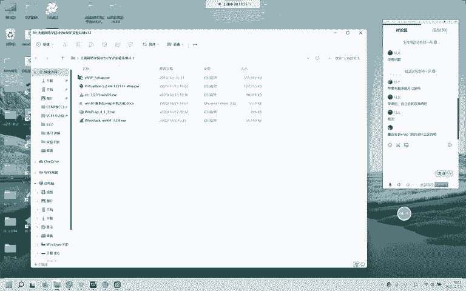

请大家记住，有安装顺序，有安装顺序。

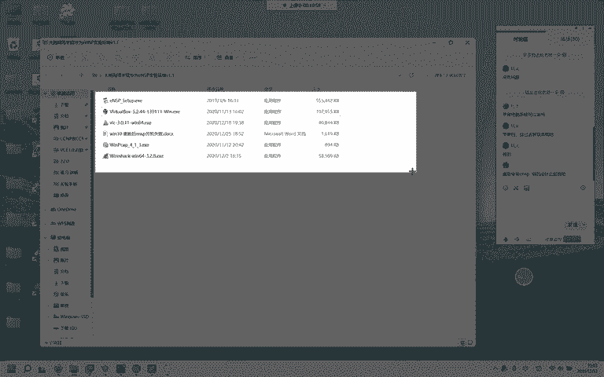

O。😊，别的没什么区别。有安装顺序啊，最后我们记住最后安装ESP。最后安装USSP，这是华为模拟器的第一步啊。那我们下载完成之后呢，从下从下往上安装，它弹弹出来什么呢？你就点击试就行了。

因为我呢电脑上已经安装完成了啊，安装完成了。那再给大家演示一遍啊，如何安装，我们呢先把。我电脑上的给卸载掉。哎。好。弹出来他要什么权限，你就给他权限啊。在安装之前，我们有一些事情需要做啊。

这个呢是必须要做的必须要做的。那这边给大家强调一下啊，第一点，安装安装的时候，第一点是什么呢？关闭。关闭你电脑的防火墙。以及各种。安全软件。防火墙和安全软件必须直播直播，别担心。

防火墙和安全软件必须关掉啊。如果你不关掉，有一些应用程序是安装不上去的，安装不上去的。然后呢，我们在安装的时候要怎么办要怎么办？右键。以管理员。身份来安装。右键管理员身份安装。

这是安装之前我们需要做的事情，这个明白吗？可以吧？关闭防火墙电脑的安全软件，然后呢安装的时候，我们点击右键。管理员身份运行安装包。管理员身份运行安装包。那好。在这几个软件啊安装的时候安装的时候呢，他们。

你就按照它的默认，比如说我们这个watro box。他弹出来的这些啊，你都不要改，你现在还没有能力去修改他的安装位置。万一出现什么问题，你没办法处理。所以呢你先按照他现在要安装在C盘，对吧？

你就让他安装在C盘，他要干什么？他的这些选项你一个都不要修改，你就点击下一步。就OK了，你一直点击下一步。可以吗？咱们在安装这些软件的时候啊，他要权限给他要权限给他。然后呢，你在安装的时候。

一定要以什么什么什么身份来运行呢？右键。管理员身份。那我们现在给大家演示一下啊，这个ENSPENSP呢，它在安装到最后的时候。你点击我愿意，然后呢，C盘你不要去修改，你不要去修改。

因为我我已经安装过一次了。他刚刚给我提示，那好，我们看最后最后啊。系统已经检测到你已经安装这三款软件，那么你的下一步是可以点的，你下一步亮着的，你可以点。如果这三款软件大家注意到没有这个VLC啊。

没有这个VLCVLC它是在IE阶段IE阶段，咱们学到了主播以后才能用得到。那咱们现在呢不安装也没有关系，NA阶段不安装也没有关系啊，可以看到检测到安装好了这三款软件，我们点击下一步点击安装。

wa box版本比你这个要低一点，会有什么影响吗？没有影响啊没有影响。没有影响。那大家对这个华为的。华为的模拟器的安装。有没有问题？那这个V shark呢V shark呢它是用来抓包的啊。

抓包的待会儿呢给大家演示它的用法。嗯。然后呢，给大家一些，待会儿呢可能会出现。你启动路由器会有1个40的代码，或者是41的代码教大家如何解决。如果呢解决不了，也有退而求其次的方法啊。

也有退而求其次的方法。来看一下啊。好的，那一般情况下啊，咱们安装好以后都不会报错的，都不会报错。如果报错了也没有关系，报错了也没有关系。咱们呢把这个ENSP给它关掉，关掉以后呢，我们用管理员身份打开。

这个wa box。你把这些全部给他删掉啊，全部删掉。删除所有文件。然后呢，咱们把这个V box给它关掉，关掉以后呢，咱们再把这个ENSPENSP管理员身份运行啊，运行运行的时候。

你要确保你电脑的防火墙以及安全管家、360呀，什么电脑QQ电脑安全管家或者是火容或者是金山独霸这些。其实对我们普通人的用处不是很大啊，没有人会在意。咱们的电脑里面装着哪些秘密？所以呢能关就关。

能卸载就卸载。然后呢，我们点击注册设备，注册设备。然后把这5个全部都选上，咱们点击注册。你可以看到啊你可以看到最后呢都会有一个注册成功。那你退出退出以后，你再试试，再试试看能不能启动这个路由器。那好。

那大家可以看到啊，刚刚呢咱们启动报错，现在这个阶段呢启动是没有报错的那你双击以后。它会有一个什么呢？这个对话框，这个对话框一直是井号，没有关系啊，这个井号是什么呢？是它正在启动，那它启动完成以后呢。

会有一个间括号，间括号里面有一个什么呢？华为这样的拼音。那这个时候呢，咱们的华为模拟器就已经安装完成了啊，华为模拟器已经安装完成了。那么我们来回顾一下啊，有安装顺序的，它是有安装顺序的。

也是有安装前提的，前提是这个啊。

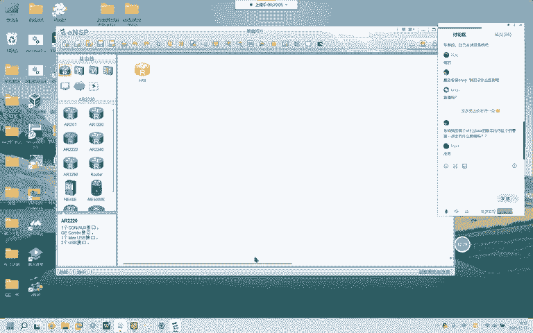

安装前提你要关闭防火墙，你电脑自身的安全软件。然后呢，咱们要以右键管理员身份来安装。可以吧。可以吧，然后呢，咱们在安装的时候是有安装顺序的，最后安装ENST这个VLC啊，VLC它是在IE阶段的主播。

咱们会用得到。那安装的时候呢，右键管理员。那安装完成。安装完成以后呢，路由器你启动路由器啊。报错，有可能是40，有可能是41。那刚刚大家看到了40或者是41，没有关系啊，怎么解决呢？这个报错怎么解决。

我们关闭ENSP。关闭ESP，然后呢打开你的wa box。打开你的wa box里面的这些。再给大家看一遍啊，里面的这些。这一块这一块你把它都给它怎么样删除，你打开你就能看到了啊，删除这些设备OK吗？

删除这些设备。打开watro box。删除设备。这些东西都给它删掉，删掉以后呢，咱们再打开。不用啊，考场考场已经安装完成了，考场你直接能看得懂。这个删除完成之后啊，删除完成之后，我们再打开。

再打开ENSPENSP里面的什么呢？点菜单点击工具啊，点击菜单，点击工具。来给大家截图一下啊。哦，这个。点击工具，点击注册设备。

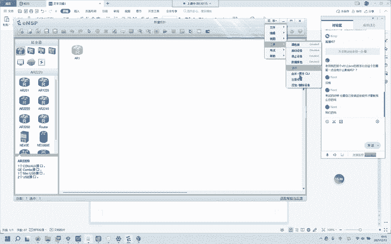

你会看到。这样一个对话框，你会看到一个这样的对话框，打开ESP点菜单。

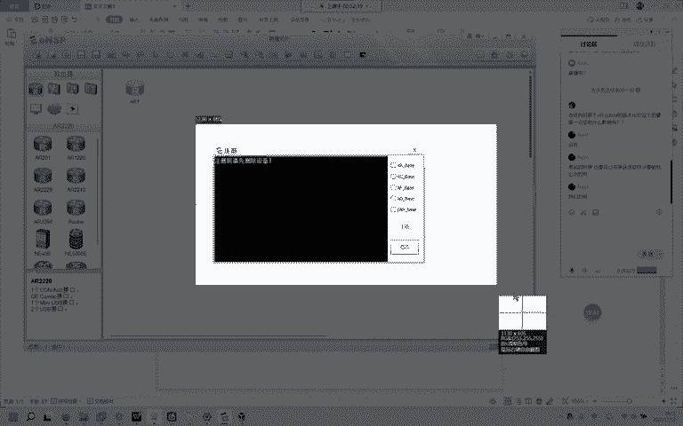

点工具。注册设备。你能看到。这样一个对话框。OK那这个呢就是咱们华为模拟器的安装啊，华为模拟器的安装。那现在呢教大家一些在华为的模拟器上一些基本的配置，基本的命令行啊。

那路由器呢就是这个咱们如果说路由器的接口，比如说你。连线啊连线你发现路由器的接口，这台路由器它只有三个接口。那这个时候怎么办呢？你不要慌，你点击设置，你可以看得到啊，这台路由器的后面这些板卡一个都没插。

一个都没插，那我们可以。把这些拖进来，这些接口你给他你给你给他拖进来，你还可以拖其他的接口。哎，你缺什么你就拖什么。那拖完以后呢，你就会发现你的这些接口啊，你的这些接口。够不够，现在够不够，现在够了吧。

这么多的接口。那这个呢是接口不够用的情况啊，接口不够用的情况。那我们来简单的介绍一下华为的模拟器啊，这一块呢它叫做用户视图。就是现在我们看得到的间括号里面有一个华为，它叫什么呢？用户视图。

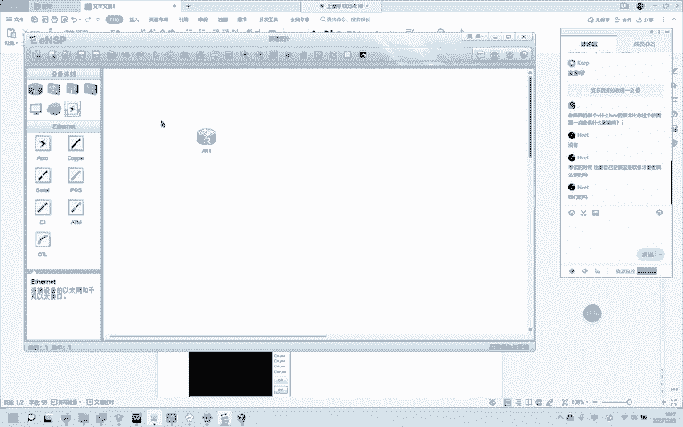

那在这个视图以下这个视图以下，我们能看的能敲的能配置的命令是很少很少的。如果我们想给一个接口配一个IP或者是说想要运运行一款动态路由选择协议。那在这个视图之下，这个视图之下。

你是怎样都做不了的这个视图你顶多能查看一些display IPP roing table。那现在呢你咱们这条命令呢是看的这台路由器的路由表，这台路由器的路由表。

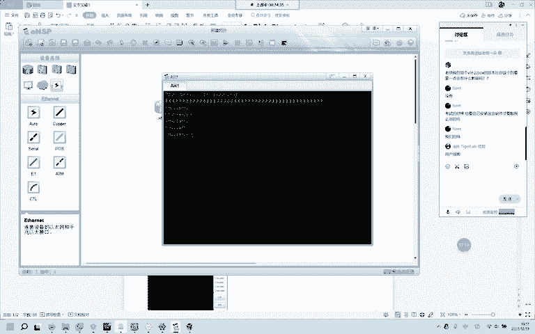

好的，那这个界面啊，咱们怎么进呢？是system systemtem will systemtem will你会发现。我们进入到系统视图之后呢，它的括号变成了方括号，对吧？哎，括号是变成了方括号。

那这个时候呢，证明我们已经成功的进入到系统视图了。那在这个视图之下，咱们就可以为所欲为了。哎，你想给这个路由器改个名字，没有问题。你想给这台路由器的某个接口配个IP也没有问题。你想协调静态。

也是在这个视图之下。O吗？进入。系统视图进入系统视图，大家没问题吧。system will哎，system will，那有些人会说。老师，我的英文特别差，那这些命令我不懂怎么办？没有关系，大家可以看啊。

我刚刚只是敲了1个SY，那这个SY我敲的是SY后面的这个它是自动生成的吗？也不是啊，我们有一个。快捷键啊，这个快捷键叫什么呢？tab TAB。它呢叫什么呢？自动补全啊。他叫什么自动股权？自动补全。

那这个案件有什么用呢？比如说。杂的英文英文不是很好，哎，我记命令，我记到一点点，我只记了前面几个单词，没有关系。你敲这几个单词，敲完以后，你按tab。

你按tab它就会依次给你展示这个单词后面能够接哪些命令？这是华为思科的也有啊，只不过机制有一点点不一样，待会儿会给大家讲到华为呢，如果你敲的哎。唯一你敲的这两个字母，后面能跟的命令是唯一的。

你怎么按tab键，你无论如何按t键，它出来的这个单词。一直是固定的。可以吗？这个t键在哪呢？在你键盘左上方从上往下数的第三个。大家现在在自己的键盘上看一下tab键。可以找到吧。没问题吧。

OK那敲完system will啊，我们来教大家如何修改设备名称，如何修改设备名称。到12月31号就没有了。现在如果你要考HCIE的话。应该是来不及的应该来不及啊。

那我们继续啊我们继续进入到系统视图之后呢，咱们第一件事情是修改设备名称。这边呢给大家讲为什么第一件事情是修改设备名称。那比如说哎我们在增机的情况下啊，增机情况下，咱们的这些设备长的一模一样。然后呢。

他们设备进去以后，名称也是一模一样。我们这节课讲的是这个模拟器的安装啊，如果有这些问题，我们可以私聊。如果是模拟器的问题，咱们安装完成之后一一帮大家解答。这节课是模拟器的安装，希望大家理解啊。好。

这个呢是修改设备。名称的命令为什么要修改设备名称呢？我们在真机情况下，很多很多设备一般都是不是一台单独出现很多台。那这个时候呢，所有的设备都叫华为。那我问您，如果你在这台的华为设备上做过一些配置。

这台华为上做过一些配置，你又在这台上准备做配置。比如说现在又有一台啊，你这台上也想做配置。假设他们现在都叫华为，请问。你能不能区别你不看你做的这些历史命令，你不看你做的配置。

你能不能区别我在哪台上做过哪些配置？是不是区别不了的？对吧哎，你没办法区别了，就像我们现在班级里面每个人都叫张三。然后呢，有人说老师，我叫张三，我问您一个问题。我怎么办？是吧都叫张三。那为了避免。

我们分不清这些设备的名称，进入这台设备的第一件事情就是修改名称，修改名称也很简单。sys namess name是修改名称，你敲SYI tab自动补全。如果敲S会出现什么情况呢？我们来试一试啊。

你看我敲一个S，它会自动补全，依次给你展示后面所有能出现所有能补的命令啊。那我们继续，你看你看。可以吧。这个tab键你就算一点英文也不懂，有没有关系，你总能补到你想要的这条命令。可以吧。

那这个system呃ss name啊已经出现了。那我们。我们在敲这个修改名称的时候啊，SY就能够唯一的确定当前一定是修改这台设备的名称。那我们怎么修改呢？在后面加上R1。哎，你这台设备叫R1。

我就把你修改为R1，那现在大家可以看到啊，它刚刚叫华为，现在呢叫R1，对吧？刚刚叫华为现在叫R1，证明呢咱们的修改设备名称的这条命令生效了没有？生效了。可以吧，这个可以吧，i看不见。

看不见是咱们的好朋友啊。英文不会，不懂，不重要，按t就行了。你记单词记不全没有关系，记住前面的几个就可以了。那现在呢这个是修改名称，修改名称，那教大家如何连线啊，这个模拟器里面这边呢。这个呢是路由器。

路由器这个呢是交换机。交换机。对，如果你有保存的需求，比如说你这个实验非常非常重要，那你再退到这个用户视图。哎，到了用户视图，然后呢，你输入C，那这个C，你输完敲回车，他会问你要不要保存。

要不要保存你当前的所有配置。你点击一个Y就可以了啊，你点击一个Y就可以了。那我们继续看啊，这边呢是路由器，咱们来在使用路由器的时候，一般呢用这台2AR2220。这个201太低级。1220呢。

它是接口比较少。2220各方面的性能是比较均衡的。所以呢咱们在使用做实验的时候，一般呢拖这台路由器出来啊。那这边呢是这个交换机，你可以看到啊。这呢是S5700，这是3700。那这个3700呢。

它一般放在。你拖上面的R。你拖上面的R啊。他默认。默认是哪台1220看到没有？1220。你就相当于拖的是这台。你拖这个2220啊拖2220。好吗？可以吗？嗯。好。那这个呢是交换机，这是接入交换机。

这个呢是带三层带路由的交换机，这是三层交换机。这是接入交换机。那这个呢一般放在咱们拓普的。接入层这个呢放在汇聚，这个放在汇聚。那这个呢是一些AC咱们NANA用的很少。

那这个呢是防火墙USGUSG这个呢是PC以及那PC里头最常用的是这个PC和服务器，这个是PC这个是服务器，以及这个库，这个库子它用来干什么呢？它用来做一些桥接，那咱们在这节课里头不涉及到桥接的内容啊。

那桥接可以做什么呢？比如说你把这朵云给它拖出来，你把它桥接到你自己的物理的真实的接口上，真实接口上。那这个时候呢，你用你这些模拟器里面的设备，能够和你这台真实的网卡，真实的这个IP。骗养或者是。

测试一些实验都是可以的那咱们这节课不涉及到这些内容啊，那这个闪电它是用来干什么的呢？闪电是连线连线。哎，我们现在用到的线一般都是这个啊一般都是这个这呢是自动自动选择自动选择，你不用。

比如说你两台设备之间正常情况下，我们要点设备，点这台设备的接口，点下一台设备，点下一台设备的接口。那这个auto呢自动呢，它你不用管那么多，哎，你可以直接点点它给你自动连。

那我们在使用这个模拟器的时候啊。尽量用这个，因为你用这个的话，有时候它连的这个接口有可能不是按照你你想的这个来连着的，不是按照你想的来连。那这个呢是连线，刚刚给大家介绍的这个是路由器以及交换机。然后呢。

电脑PC和防火墙以及连线，大家有没有问题？没有没有问题的话，我们做一个简单的。聘的实验。做一个简单的pin的实验，教大家如何进入这个。路由器的一个接口。以及如何给一台PC配上IP配置网关可以的啊。

其他人呢其他人呢？哎。OK那我们继续啊，那我们拖路由器用这台。那一般呢路由器是作为。三层的啊三层，那我们还需要一台什么呢？交换机交换机。那在交换机之下。

可能会有一些PC大概的就是这样的那我们再来拖一台啊，不用了。今天讲这个的话，不用路由器了啊，我们再来拖一个。交换机。然后交换机下再来两台PC。好的。拓普就是这样的那我们来连线啊。一连。一。2连2。

这样连的话规范一点，大家呢在进这些接口。做配置的时候啊，心里头更清楚一些。比如说你一连的二，这边呢又是二连的一。那这个时候这个时候呢。没事儿，有录播啊。这一个亿你是不会错过的，连在吉累接口连在吉累接口。

你可以看回放啊，看录播。是直播。对。连好以后，咱们开机。好，耐心等待一下啊。这个红色的点是代表的什么呢？红色的点代表当前这条链路啊还没有建立连接。也就是说这两条链路现在是不通的不通的，给他一点点时间啊。

给他一点点时间，毕竟它是个模拟器啊，毕竟它是个模拟器。那这个呢。这两个已经绿了，绿了，代表绿色呢代表能通我PC和你的交换机PC和交换机间是能够通的啊，能通的能通。

那能通的前提咱们还需要配置一些进行一些简单的配置啊，回放班主任会发在我们的班级群里头，现在是有录播的。没有关系啊，那我们来做一个简单的配置，这边呢，我们给它配成10。1。1。

1掩码呢给他配24位网关我们就给配成本网段的最后一个地址。大家说在实网络里头最后一个地址，应该是多少？254没问题的吧。哎，254。那我再问一个这个PC2的网关是谁？PC2的网关是谁？和PCE一不一样。

和PCE的一模一样，也是254啊也是254。这个DNS咱们目前。哎，那这边呢是10。1。1。2掩码24位。配好以后呢配好以后，咱们的PC1和PC2就可以通信了。PC1和PC2就可以通信了。怎么测试呢？

我们来拼一下啊，拼一下拼10。1。1。2，可以看到华为呢它能拼的通是这个样子。那这边有人哎已经给出了一个非常完整的总结啊，为什么不用10。1。1。0和10。1。1。255。这两个呢？

咱们用不了一个呢是这个网络的网络号，也就是说咱们这台主机目前所在的网络的网络号是10。1。1。0。哎，那这个255呢？比如说你要发一个什么呢？

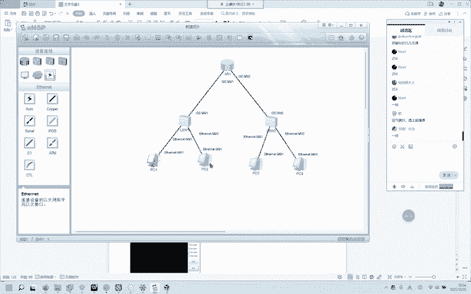

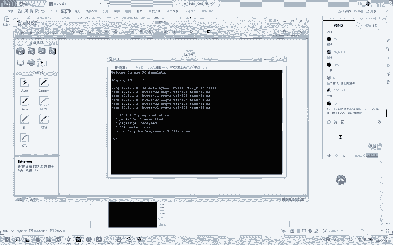

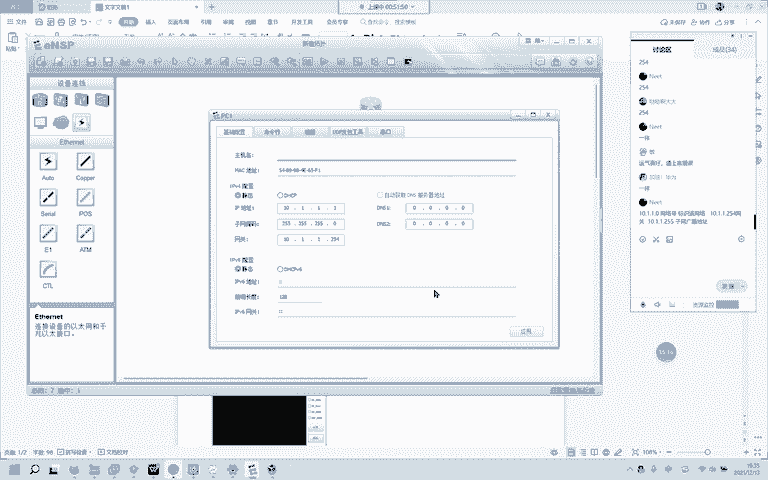

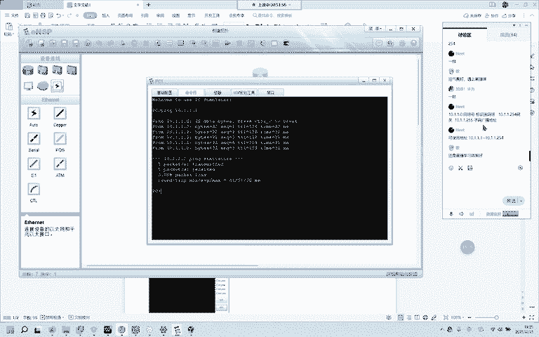

待会儿给大家看这个255怎么怎么看啊，这边呢我们还没有拼过，待会儿给大家看1个ARP的255。那我们来看一下，比如说。抓个包抓个包。抓包软件。

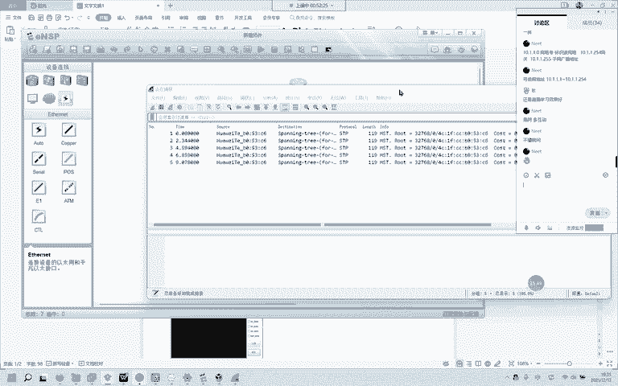

好的啊，我们来看看现在呢现在呢这个是生成数交互的BPDO啊BPDO咱们这节课不管它，我们再来拼一次拼10。1。1。2。那这个时候呢你能看到1个ICMP的什么呢？ICMP的拼包请求。

那我们随便打开1个ICMP的拼包请求呢，可以看得到啊，可以看得到。

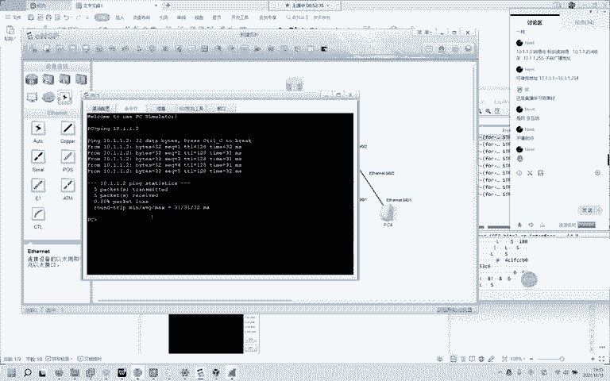

他呢IPV4的原IP是谁？10。1。1。1目的IP是谁？10。1。1。2。为什么现在他们没经过网关就能够拼得通呢？是因为他们所属同一个网络，同一个网络。哎，你是10。1。1。0这个网络的，就像刚刚这位。

这位同学说的，他们属于同一个网络，因为呢他们的网络号一样，所以他们目前能通过二层，二层就能通就能通。可以吧，那现在这个PC1和PC2能通。大家有没有问题怎样抓包抓包你安装。咱们的安装软件，我看看啊。

安装软件把这款软件给他安装上。这款软件安装上就能抓包了。不好意思啊，现在不是辉哥。你觉得我的声音和辉哥像吗？嗯。好，那现在比如说我们想要PC1和PC3能通，能通的话怎么办？

我们给PC3配1个20网络地址，好吧，20。1。1。1掩码24位网关呢20。1。1。254，这是PC3，那PC4咱们就用20。2，对吧？点2。255255255网关呢20。1。1。254OK那好。

我现在PCE拼一下这个20。

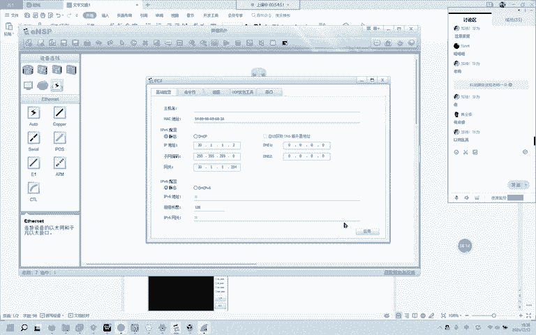

P20。1。1。1，我拼一下PC3PC1P一下PC3。大家说。

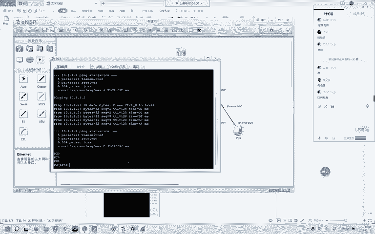

大家觉得能不能通能不能通？现在呢我已经跨网段访问了啊，我一个是十网络，另一个是二十网络。我跨网段访问咱们要经过什么，经过路由器，但是呢路由器这台设备，这两个接口，现在什么都没配，你没配就通不了的。

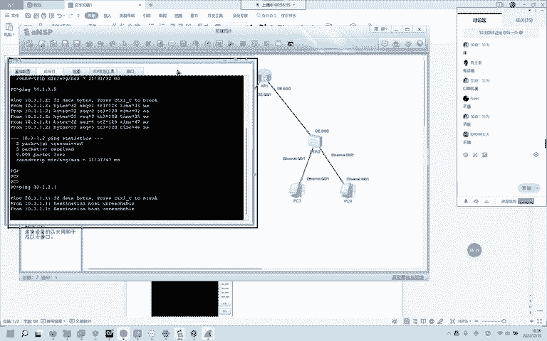

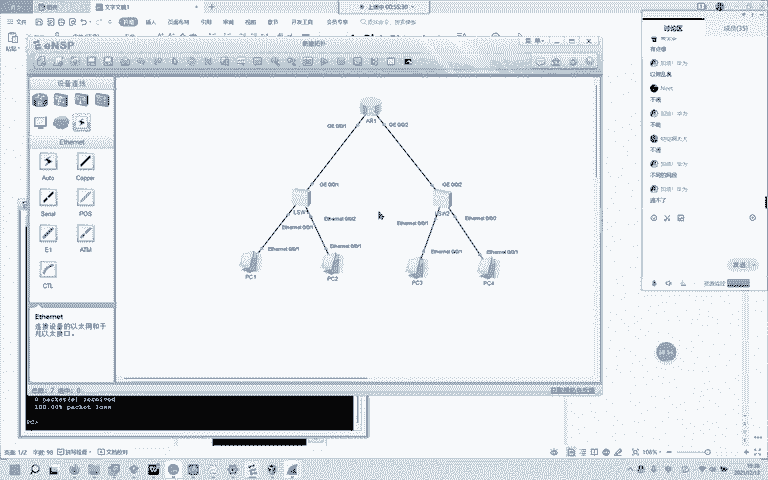

没配就通不了。那这个时候呢，给大家看一下这个目的地址是255的啊，目的地址是255的一个数据包，怎么看呢？

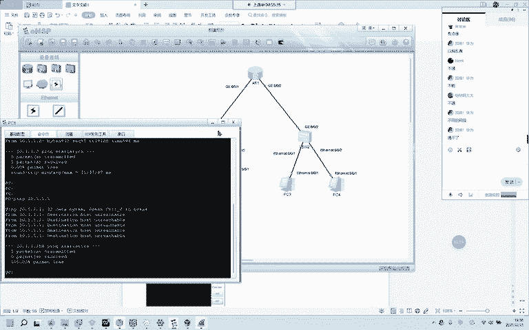

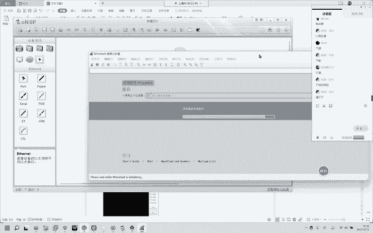

主机在第一次建立通信的时候啊，由于它自身的ARPARP表里面没有ARP缓存，没有AARP缓存。那没有IP到m克的映射，它会触发。

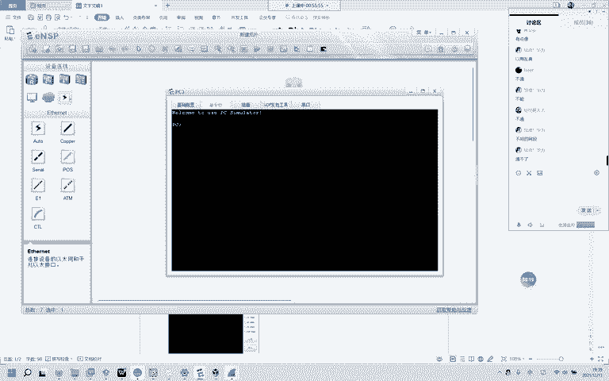

ARP那这个ARP叫什么呢？叫地址解析协议。这个地址解析协议用来干什么？就是说我PC3在第一次通信的时候，我不知道PC4在哪儿，就算他们现在已经是连好的啊，但是PC3不知道PC4在哪儿。

那这个ARP有什么作用呢？他会发一个广播，那这个广播的目的地址是谁。

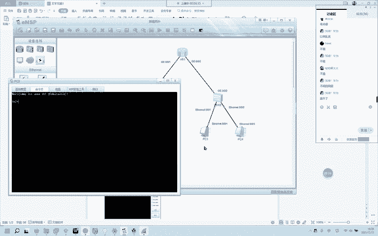

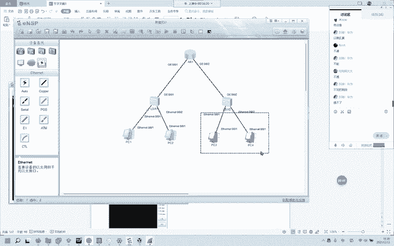

待会儿呢我们可以看啊，就是20。1。1。254，20。1。1。254。那这个20。1。1。254啊，我们现在这个网络环境里头只有两台设备，只有两台设备。

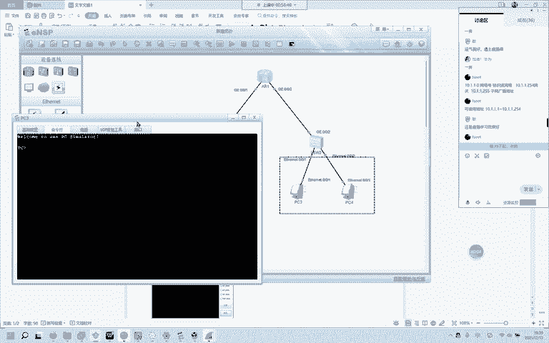

如果有3台，有4台，他们也属于二0网络。这个时候啊这些主机都能够收得到PC3发过来的ARP。但是只有谁会回复呢？只有这个PC4会回复啊。PC3是这么问的，PC3说，哎，你们谁是这个20。1。1。2呀。

我是20。1。1。1，看到的话麻烦回复一下。大概的意思就是这样啊，PC3待会儿一定会发送一个这样的报文，它呢是ARP。ARP地址解析协议。那我们来看一下啊，直接抓包抓包呢是开着的。

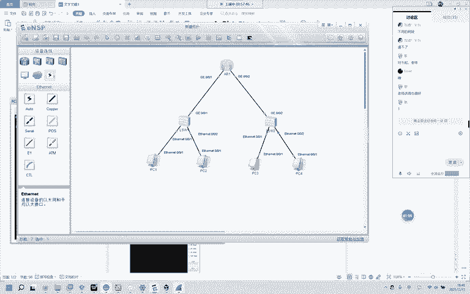

好的，那这边抓包是正常的啊，我们把它拉到这边。聘一下PC3聘一下PC4。20。1。1。2。

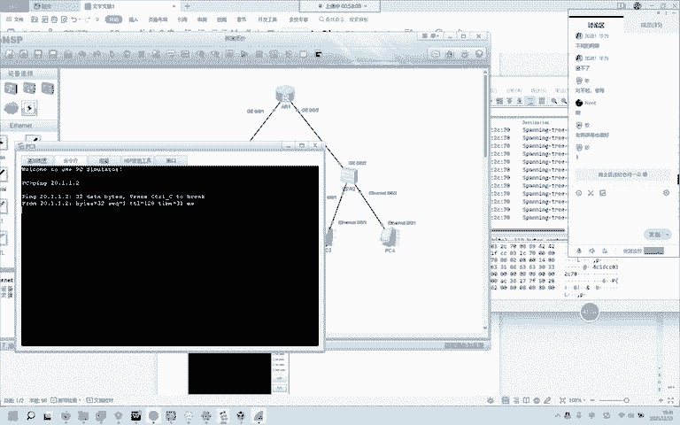

O。我们来看一下啊我们来看一下。可以看得到啊，这些呢是SCMP的拼包请求和回复。大家在刚刚PC1和PC2。实验的时候也认识到了啊，那在这个之前可以看到一个这叫什么呢？ARP地址解析协议。

这是ARP的请求，这是ARP的回应。那我们来看一下啊，ARP请求怎么写的？他说who has20。1。1。2，20。1。1。2。那它的目的m克目的m克是全F，这个全F是什么呢？全F就是这台交换机。

这台交换机上所连接的所有的其他设备，全F不是录播，是直播。嗯。那我们继续了啊，这是全F全F是什么呢？就是说你PC3发送的这个数据，这个交换机会帮你怎么样数据泛红，什么叫数据泛红呢？

是从它这个接口收到一个目的麦克为全F的这样一个数据的时候，它会把这个数据拷贝成很多很多份。那除了这个接口我不给他发其他的接口我都会发。那理所当然，理所当然你这个接口上再来一台PC5。

它也不怕它也没有关系，你PC5也会收到我PC3发的ARP那这个ARP啊，咱们在之后的课程里头会详细的给大家讲到啊，详细的给大家讲。可以吧。没问题吧。嗯。没毛病啊，没毛病的话。

那现在PC1和PC3PC2和PC4是没有办法通的。他们要通要怎么样跨网段，这边呢它属于10。1。1。0掩码24，这个网络。那这边呢它属于20。1。1。0掩码24这个网络，你想通二层没办法。

你必须要经过路由器。那现在教大家做一些路由器的配置。O。system will这个还记得吧？进入到从用户视图，进入到系统视图。用户视图竞到系统视图。然后呢，我们第一件事情是改名字RE。改为RE以后。

我们要做的第一件事是干什么呢？在这两个接口配一个各配1个IP。那这个IP也不能乱配啊，这个IP就是这些主机的什么呢？这些主机的网关。那什么是网关呢？就是说。大家注意啊，什么是网关？

就是说我PC想访问其他网络的时候，我PC想访问其他网络，我访问PC2不算其他网络啊，我访问其他网络，我首先要把我的数据数据包交给谁交给我的网关。对，就是我这个数据的出口，你交给交换机肯定不行的吧。

你交给路由器，你的网关。你的网关收到了你的这个数据包，它会帮你处理这件事情。那怎么进入到这个接口呢，大家可以看到啊，这个吉比特的0-0-1。那我们这边呢直接敲interface一样啊，INT敲回车哎。

你INT敲回车就行了啊。INT敲回车 interfaceterface。你再打一个G，英文不好的，你就偷着乐吧。你再打一个G，哎，我吉比特就出来了。那现在能跟什么呢？现在跟的是这个接口的编号啊。

这个接口的编号是什么呢？0-0-1，那我们把它接上0-0-1。好的，敲回车，你敲完这条命令，进入到接口视图。这就是接口视图。可以吗？现在这个就是接口视图。那这个接口视图呢，它也是有方括号方括号里面呢。

你设备的名称以及现在所处接口的位置。那现在它提示我们已经进入到哪个视图了？接口视图，这个接口是哪个接口呢？我R一的吉比特的0-0-1口。可以吧。没问题吧。没问题吧。那好，进入到接口视图呢。

我们要配1个IP这个IP怎么配呢？IPdressI address哎，我英文不好，我IPADDIPADD敲tab键回车，没有问题，敲tab键回车。那这个时候咱们就要给这个接口配上这个IP了啊。

这个IP可不能乱配就是PC1PC2他们的网关多少呢？10。1。1。254，你配网关，你还要跟一个IP地址啊，呃，跟一个掩码，这个掩码咱们有两种形式，一种是点分十进制，也就是说255。255。255。0。

哎，你跟这个掩码，没有问题，就是24位掩码的问题呃，24位掩码的意思啊，24位掩码的意思。那你还可以怎么跟呢？那华为比较人性化啊，我们可以直接出1个24。哎，咱们咱可以直接输1个24。敲完以后回车。

它会给你报日志，这个接口已经起来了。那我们怎么看呢？display this display this。display this查看的是当前视图。所做的所有配置。那敲完以后，这个怎么敲？

你敲DIS加空格加TH。回车就没问题了。我们可以当前。这个接口配了什么呢？它的IP是10。1。1。254，言码是255。25。25。大家可以注意到啊，刚刚呢我在这儿写的是1个24。

它自己已经识别到了识别成了点分十进制的形式，25。25。25。可以吗？给接口配IP有没有问题？哎。没有，那现在呢咱们咱们的PC1啊，咱们这台PC1最远能够到哪呢？

最远能够到R一的左边的这个接口PC1最远能到这儿。那我聘一下啊，10。1。1。254，对吧？聘自己的网关，哎，网关也给他回复了。哎，这就是网关给他的回复，证明我们PC到网关到这台路由器没有问题。

那我现在再问我PC1现在能不能访问PC3，大家想一想。PC1能不能访问PC3？我已经可以到路由器了呀。为什么不行呢？为啥不行？我到路由器了，路由器不是会帮我转发的吗？哎，有些人就已经在在打字了啊。

我们的0-0-2口空的呀，什么都没有呀，是吧？那我们来看一看啊，怎么看一个接口的配置呢？displayIP interfaceface brief。哎，我们可以看到。这台设备总共3个接口。

我们的0-0啥也没有。0-1咱们已经配置了。哎，它的协议它的状态都是up都是up。那0-2口可以看到，哎，0-2口没有配，和刚刚一样啊，以此类推。

举一反三interface吉比特的0-0-2口IP address20。1。1。254掩码24位看完我们来display this一下。哎，0-2口，咱们配好配好以后，我们拿PCRP一下自己的网关啊。

20。1。1。254。

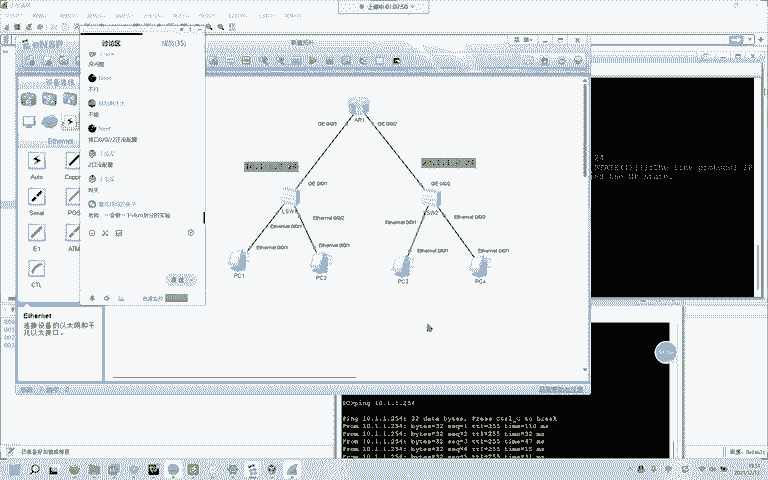

哦，四没打上啊。254。VvoSM只是一些计算部分啊，计算部分实验的话，你计算完成以后，你要给它划分IP的时候才会用得到。大多数的情况下都是在计算实验。你只有。

算完以后才会用你在划分这个IP的时候才会用啊。我们vivo SM没有实验。因为这个大部分题目是计算题，计算题。

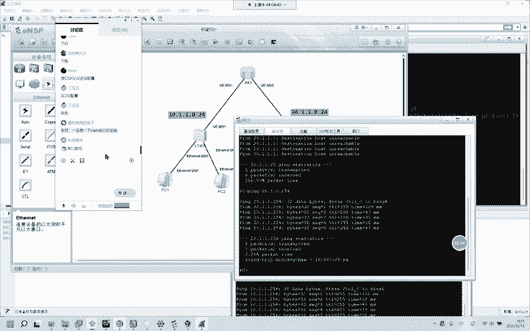

那我现在呢R1。

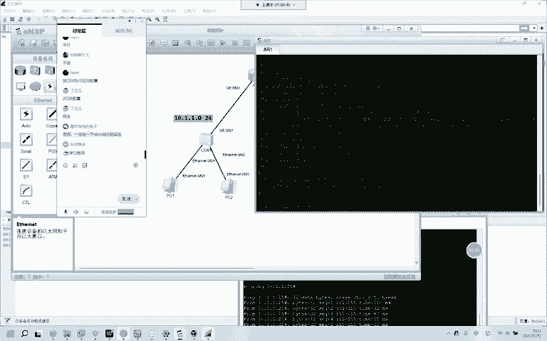

来PC1pin一下PC3啊，我们再来试一下pin。20。1。1。1对吧？看能不能拼得通。通了。通了，为什么通了呢？二十是一个不同网段，也能通。因为咱们的路由器两边这个接口都配的正确，而且呢。

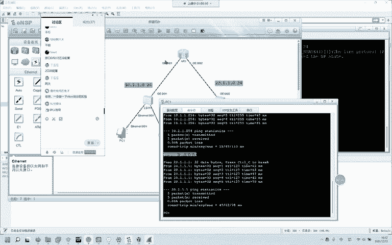

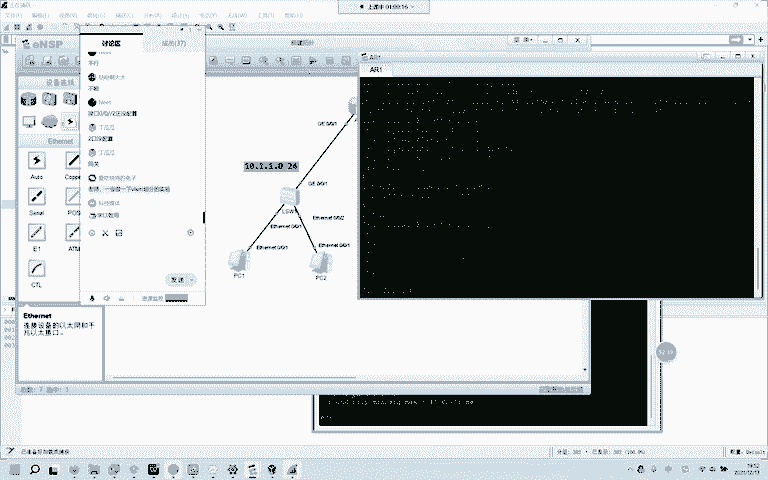

而且啊路由器有这样一个特性，什么特性呢？它会自动学习直连网段的路由。路由器的特性啊，它会自动学习直连网段的路由。也就是说。也就是说。你给这个接口配好IP以后啊，它就知道自身这个接口属于哪个网段。

那到时候它其他的接口收到要去往这个网段这个数据包的时候，它就能帮你做转发路由器有这样一个特性，能够自动获悉直连接口。那我们看一下它的路由表里面啊，十网络有吧，二十网络也有。然后我们来看一看它的吓一跳。

哎，吓一跳很搞笑啊，其实下一跳是。指向另一台设备的接收接口。但是呢你发现它这边的下一跳指向了哪指向了哪儿，指向了自身的接口，自身接口这个IP。就是说我想去实网络，我从哪个接口出去呢？我我的下一跳是谁呢？

是10。1。1。254，就是他这个接口的IP那华为呢它是怎么做的？思科没有这么搞啊，思科没有这么搞。这个呢是华为。简单的实验。大家。听起来觉得怎么样，大家听起来觉得怎么样？简单简单就好啊简单就好。

那这边呢有人问是vivo SM和维赖。刚刚呢有人问做一个。VOSM划分的实验子网划分，这个叫不定长子网划分啊。咱们在上周的时候给大家讲了VOSM和FLM。他们大部分都是计算题。我可以给你提我可以给你提。

你去算一下，我帮你改改。提供一下刚才几个命令的关键词。没问题啊，咱们在。讲完思科以后，我我写一个文本文档，然后呢把中文翻译给大家写出来，写一个文本文档，中文翻译给大家写出来。那华为的。没问题的话。

咱们就安装思科的吧。应该有学员会备考思科。那这个思科咱们不能只讲华为，不讲思科啊，思科的。那华为的有问题，大家在这个空隙。

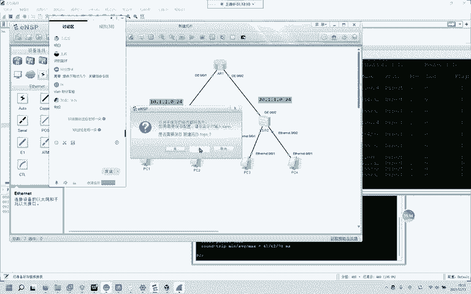

提问就行了。我们来讲思科的不会考啊不会考考试直接考场已经安装好了，放心。嗯。思科模拟器的安装一样啊一样，这个思科模拟器的安装啊，咱们在自己的班级群里头，班级群。你找到哎，比如说你是5057的。

你找到文件，找到文件以后呢。哎，你学习华为就没必要安装思科了。其实呢你这个说的太绝对了，万一你以后。在工作的时候，遇到思科系的一些设备的时候，那你怎么整？你还是多少得了解一下。你多少得了解一下，对吧？

你不能说你。去了一个厂商，去了一个甲方，这个甲方都是华为的这些设备，你可以搞定，万一有一台私科的怎么办？万一这台这台设备是非常重要的，你这台设备不搞，你整个网络就起不来，你咋办？考的话。

你可以挑一个学的话，咱们都是双厂生，能多学点，你就多学点嘛，是吧？万一用到的对吧？对，书到用时方恨少啊。你不要到时候锤锤那个交换机，锤那个路由器，锤那个机柜啊。哲哲老师当时要教我四科怎么装怎么用。

我没听。我太后悔了，我好懊恼，不要这样啊。好。继续啊，这个思歌模拟器咱们在班级群里头都有和华为的一样啊。那你下载完成以后呢，我的已经下载好了，放桌面上了啊。大家在QQ群里头自行下载。下载完成以后。

哎下载完成以后呢，你可以看到好多好多。那我们到底安装哪一个呢？我们只需要安装三款软件啊，三款软件一个呢是登录软件一个呢是虚拟机。另一个是思科的镜像啊。咱们慢慢来。安装。3块软件。那一个呢是。Cisco。

4。2点。101个镜像包。就是这个另一个呢是。Vware虚拟机。还有一个呢是。CRT。作为网工的。登录设备啊。作为我们网络工程师登录一台设备啊，这个CRT酷炫又牛逼。安装这三款软件。

那这边呢给大家提一点啊，提一点咱们的浏览器啊浏览器。知道用什么用什么吗？浏览器啊，我们尽量。使用。火狐浏览器啊火狐浏览浏览器，你使用其他的浏览器或多或少。可以，我这个写的不是很好啊。

上完课就可以发给大家。这个上完课就可以发给大家。尽量使用火狐浏览器，我们火火狐浏览器可以绑定CRT。那你在打开的时候默认选择tllnet应用程序，选择CRT就行了。其他的或多或少会有些bug。

这个bug有可能会让你非常的。抓狂可以可以，没问题。但是这边呢建议大家使用火锅啊。建议。那这几款安装完成以后，谷歌可以的。我们来一款一款安啊，怎么按呢？首先你找到Vware尔虚拟机Vware尔虚拟机。

咱们呢。这个工具包里头就有就有这个呢就是wemware的虚拟机。那有些人会说啊，那这个wemware的虚拟机，我想安装一个最新版的或者是。我觉得你们群里头的有点老老了几个版本没有没有关系啊，没有问题。

这边呢我给大家。直接发在。发在这儿。这里呢就是whereware最新版的下载地址官方啊，没有任何流氓软件。可以保存一下。那你如果是windows系统，windows系统，你就下载这个。

如果你是linux系统，你就下载这个。那咱们可以看得到啊，它呢说到请使使用以下链接，免费体验功能齐全的30天试用版，无需注册。好，大家看到注册就会头皮发麻。是吧看到注册就会头皮发麻。有些人。哎。

网上直接找免费序列号。那我们这边呢也考虑到了找序列号这个问题，大家可以看啊，你这个Pet工具包打开以后有1TXT的文档，你双击你看到一些。什么双击以后，你能看到什么？徐列浩。看到了没？哎。

考虑到了啊大家的顾虑都有考虑。那这个序列号我们在安装永久。永久。安装完成Vware以后呢，它最后一步最后一步会给你弹出一个让你。不是。你联网干什么，他就是个永久的呀。你联网不联网，它都是永久永久的。

不用破解，不用那么麻烦，直接在文档里头给大家写进去了，你复制进去。粘贴复制粘贴就行了，不用去百度，不用去谷歌去搜索这些东西了。可以啊可以，你输入这个序列号，点击下一步，它就默认给你打开了。好的。

那这个whereware啊，咱们第一步安装的是weware。哎，他就长这样他就长这样。那我的这个虚拟机啊，它是打开状态的。那我把它关掉，他呢安装完成以后。长这个样子。

这个样子啊它里面是不包含任何思磕的东西的啊。那这个镜像包我们如何导入呢？镜像包如何导入，我们点击安装完成以后啊，这里说的都是。安装完成之后的。安装完成输入。序列号你不输入序列号，只能够免费使用30天。

输入序列号。那这个序列号呢，咱们在。这个工具包里头有包含，你随便复制粘贴就行了。输入序列号之后呢，就可以正正常打开。打开以后呢，我们点击文件哎。点击这个文件，点击新建虚拟机。啊，不不不不不不不不。

不是新天不是新建虚拟机啊。点击打开。OK文件点击打开，我看一下啊。对的啊，你点击文件，点击打开。那这个打开打开什么呢？打开我们刚刚的4。2。1。呃，4点10。2。4。2点10啊4。2。10这个镜像包。

那我的呢在桌面给大家看一下啊。桌面。四歌模拟器我们可以看到它只能识别这个OVAOVA的镜像包OVA的镜像包。那你把它选上以后，点击打开。然后呢，等待它导入完成就没有问题了。找到文件，然后呢点击。

打开找到。下载的。1科。镜像包。再给大家看一遍啊，文件。打开。你下载完下载完以后，你把它放到桌面好找一点啊，好找一点，它就长这样。

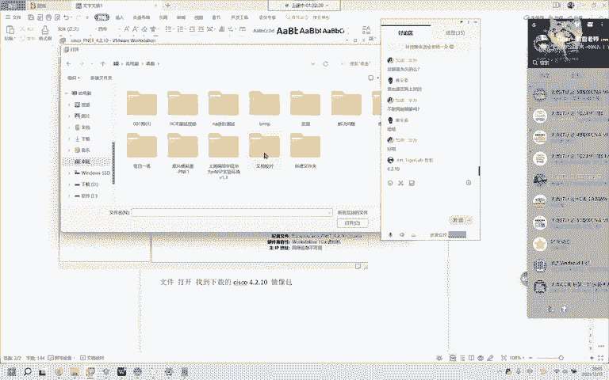

哎，他就长这样，那弄完以后咱们打开就行了。

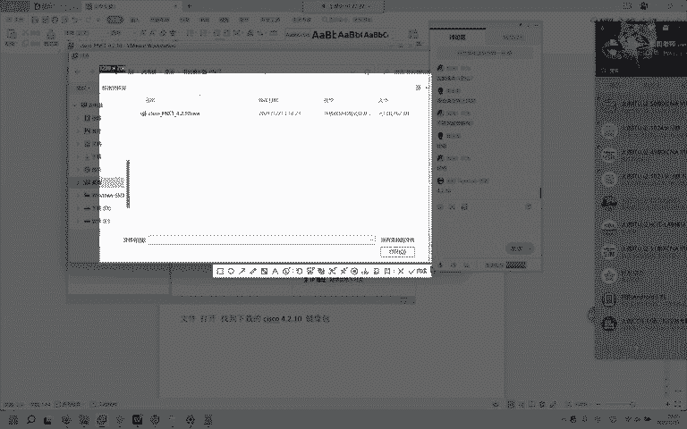

弄完以后，咱们打开打开打开以后啊，它就变成了现在的这个界面。现在这个界面。你可以看到一个cisco peanut net4。2。10这样一个界面啊，那我们需要进行一些简单的设置啊，进行一些简单的设置。

教大家看怎么设置啊，这个设置呢我们点击。啊，我又把它打开了。好的，我们点击。导入的这个ciscopenet4。2。10，然后呢，点击编辑虚拟机设置。这是第二步啊，编辑虚拟机设置。

那今天呢看到很多同学在微信群里头问一些相关的设置啊，那我们来一一给大家回答内存呢内存你比如说你的电脑你的电脑16个G或者是32个G你给他分8G或者是16G都没有问题。

你给他比如说我现在的这台电脑是16G啊，我给他分16G也是完全没有问题的。它分的这个16G是什么意思呢？就是说当当他在这个负载最大的时候能够调用的内存内存。并不是说你给他分16G。

它开机马上就用你16G。大家能明白我的意思吗？就是说你把它想象成一张信用卡。哎，你现在的额度是。16000你最多你能不能一下子，你有可能是。几千几千的花，最后花到了16000。

你一下子刷完这16000不太可能，对吧？举一个例子啊这个例子。就是说你分16G没有关系没有关系，他不会一下子就把这16G用完。那这个处理器呢。处理器呢，你不用管它是怎么设置的，你就怎么来放着别动。

这个硬盘呢硬盘你也别管啊，它自己会分一些适当的内存进去。那这个网络适配器啊，网络适配器大家注意到有两张，那这个二呢，我们是用来做一些调节的。在NA阶段。不带大家讲了啊。

这个桥节那这个网络适配器咱们怎么弄呢？这个一一我们给它修改为景主机模式。网络适配器，你给它修改为警主机模式。如果你没有一些什么特殊的要求，特殊的操作，那你把你的二也给它改为警主机模式。井主警主机模式啊。

咱们现在的水平还没有办法来处理一些调接的问题，好吗？可以吧。两张都改为景主机模式。可以吗？可以啊，行。那我们在后期做到一些需要桥接的实验，这个桥接实验怎么调接呢？

就是说我在我的电脑上开一台开华为的模拟器，也开思科的模拟器，我通过桥接我华为和思科的模拟器，能通过动态路由选择呃动态路由选择协议能学习到对方的路由能成功建邻居。那这个在后面咱们再学习啊。

后面再学习NA阶段不涉及不涉及。所以呢我们把这个改为井主机模式好吗？两张卡都是仅主机。如果你是个大佬，你知道这个桥街是用来干什么的，就当我没说你不听也行。你我相信你有能力处理这些问题啊。好的。

两张卡都改为警主机模式以后，显示器不用管啊，显示器不用管。那做完这些配置以后，咱们点击开机。点开机，那你耐心等待一下啊。耐心等待一下。好，你可以看到这个Pnet。lab的图标啊。好的。

你再打开耐心等待了一会儿以后呢，它会弹出来这么一个，它让你输入。登录的用户名和密码，你输入登录的用户名和密码，大家千万不要在这个页面去输入什一些什么东西啊。这个页面它就告诉你，你在网页上打开192。

168。241。128，你在网页上去打开OK吗？你不要在这个模拟器里面。乱来。那我们在网页上把这一串输入到网页啊，网页打开。那最好啊咱们最好使用火狐。最好使用火狐。那这个网页打开怎么打开呢？

就把这个他告诉你的网址，你在网页里头打开就行了啊。嗯。不是这个。哎。看一下啊。192。168。241。128192。168。241。128。好的，敲完你能看到这样一个页面啊，我把这个全部给关掉。

这个页面这个页面呢，等会儿啊，我先把它还原为最初的最初的这个。样子大家刚登录的时候和我的不一样啊。好，大家呢在刚登录第一次登录这个页面的时候啊，第一次登录这个页面的时候，它呢就长这样就长这样。

那用户名呢是。Admin。密码是什么呢？是P net啊P net。Put在哪呢？在这儿。看到没有？看到没有？在这儿写着的啊。可以吧。这儿已经给大家写出来了。那这边呢有一个验证码，随机验证码，它呢它呢是。

区分大小写AE，你就AEOK了。输完这些呢，咱们点击log in登录，登录完成以后呢，你就能进入到第一次进入呢应该是一个。差不多类似是两台路由器这样一个这样一个页面。登录大家有没有问题登录？

第一次登录用户名和密码。哎。那我们在登录上去以后呢，做一些简单的配置啊，做一些简单的配置。我们把这个随机验证码给它关掉，点击系统，点击修改系统设置。这边呢有个capture给它关掉，关掉。

其他的不要改啊。这个呢是告诉我们是以在线还是离线的方式运行这个模拟器。我这个alllash在线啊，off flash离线，咱们选择的是离线，其他你不要改。然后呢，我们再退出一次，可以看得到啊。

随机验证码已经没有了，随机验证码已经没有了。可以吗？这个是登录模拟器。OK吧，思科的模拟器如何登录？大家。有没有问题？哎，怎么不说话了？人也是越来越少了，看完华为就不管了啊，你真不担心你。

日后遇到4科设备啊。好。OKO行行行行，先安装哪个？我们先安装where where啊，一定是先安装好where where where where已经给大给大家发在这儿了啊。给大家发到发到这儿了。

这个呢是官网最新的1版啊。然后呢，你把这个OVA的镜像4。2。10给下载好。给下载好。嗯。那模拟器里头看一看嘛，模拟器里头看一看。好。小思科，华为那不是事儿。是的啊是的。严格意义上来讲。

思科是华为的老师。思科有什么，华为就有什么，有可能只是改一下名字，原理一模一样，配置也是大差不差。你会思科。华为一定会。嗯。好，我们继续了啊，登录设备没问题吧。然后呢，登录。使用。192。168。

241。128来在网页里头输入啊，我们每个人的每个人的这个IP啊都不一样。192。168有可能是一样的，后面的不大相同啊不大相同。咱们就按照自己的模拟器给你提示的这个。给你提示这个IP你登录就行了。

并不是每个人都和我一样好吗？那登录完成以后呢，咱们第一步。去修改这个。修改这个什么呢？随机验证码。这个验证码还是比较烦人的啊，这个验证码比较烦人，这个验证码很烦人，你不修改，你每次登录的时候。

都是这个样子。关闭状态。哎。关闭完成以后呢，这个用户名密码写到这儿啊。用户名，然后呢，有一个随机验证码。区分大小写。好的，那这个呢就是登录思科模拟器的方法。那登录完成以后呢，咱们还需要安装一款软件。

那这款软件呢叫CRTCRT。当然你如果不想使用CRT也行啊，不想使用的话，思科的这个模拟器里面它自带着这个对话框啊。你看啊，比如说我打开这台设备。打开这台设备。然后呢，点击一下，因为呢我的火狐已经和。

CRT做了绑定了啊，做了绑定，你只需要点击一下，它就能够打得开，点击一下就能打得开。那这个怎么绑定呢？我们在火狐浏览器的设置设置里面有一个。默认应用程序。哎，那这边呢有一个tellnet。

tenet你选择CRT来处理tnet的。信息。就可以了。你在第一次安装好CRT以后，给激活完成啊，你在这儿点一下，这边呢会弹出一个是否以后一直允许该方式打开此类型。那你点击一个试，那以后你点这台设备啊。

你点点这台设备，它呢使用的一直是CRT。好吗？有没有问题，关于打开设备？单击就开了啊单击就开了。这儿有一个，你看如果你没有打开，它是红色的，你打开你点这个绿色的三角形就能开了就能开了。哎。开了以后呢。

咱们点击。啊，请注意啊，你在。点的时候啊，你在第一次进入这台设备的时候，咱们点一下就行了。你第二次想进入这这台设备啊，你第二次想进入这台设备，你直接把你的CRT。这个。

🎼思科的他会问你是不是要进入初始化配置界面。那我们选择no啊，这个初始化界配置界面非常low啊，这个非常low。他呢是以一问一答的形式。来让我们配置这台路由器的，我们不要那样我们不要那样。

我们直接选择no，我们自己进接口。进路由器。做配置。是的。是的啊，你可以看到我的这个网页有一个插件。插件的话，它能够帮你翻译。但是呢他现在。我刷新一下。不起作用。啊，好了。插件。那这个插件呢，它叫。

叫什么？我也忘了。我我平时不用啊。你可以百度一下呃，不是你可以自己找一下这个CRT。你可以看一下火狐里面的扩展文件。长这样。嗯。我截图呢。长这样啊，我们在火狐里头。自己找一下啊。那现在呢打开啊。

我们还有1个CRT的安装啊，CRT的安装。那这台路由器也是你要选择no no啊no。稍微等一下啊。好，那我们来讲这个CRT如何安装啊，你的CRT。在这个思科模拟器的Pet里头也有啊Pnet工具包。

我们这里头现在已经更新了汉化版。你可以去试一下啊，汉化版我没有试过。刚刚有位同学说这个CRT这儿有一个汉化版班级群里头有。那我们呢在安装这个CRT的时候，打开这个文件啊。

这个文件这个文件呢你安装64位的啊，因为咱们的电脑大部分都是64位的。这个86的你别管你安装64位的，然后呢，这边这个。chuck里头chuck里头有一个。这叫什么呢？这叫。注册机。

那我不方便在这样的直播课里头给大家讲这件事情啊，这个注册机。注册机正常情况下，这个一年要200美元，我们使用注册机，然后呢就会跳过。好吗？懂的都懂啊懂的都懂。然后呢，这边里头有一个安装文档，安装文档。

注册以及加载配色方案，你看这个就可以了。我在这这里头不教大家啊，涉及到一些比较。嗯。你懂的啊。如果你不懂，你可以问我。但是呢我们现在是直播好吗？能理解吗？可以理解吗？可以啊。方法这里头都有。

我就不打开了哈，不打开了。大家在这个群文件里头一定能找到一定能找到。然后呢，在安装的时候啊，有一个特别特别。特别特别恶心的你的电脑有一个特别特别恶心的东西，每个人都有。如果是windows系统。

它呢有一个实时防护啊，实时防护。如果你在安装这个注册机的时候，注册机。啊。我还是进这个防火墙里头给大家找一找吧，给大家看一下。防火枪，因为这是win11啊，我还不太熟这个系统。非常抱歉。有。有。

你不要开玩笑，一定有。应该是这个。好，大家可以看到哈这个实时防护。不好用。这个实施防护。这个实时防护我刚刚是默认打开的对吧？我已经很久没管过它了，他自己打开了。你可以通过一些手段把它关掉。

如果你在安装这个注册机的时候，它是打开状态啊，它会把你的注册机直接给干掉啊，直接删掉，你在你第一次打开在第二次打开，直接不在。你第一次打开不能正常运行，第二次就直接找不到了。你的回收站也没有。

他给你整哪去的，我也不知道，所以你一定要把这个实室房户给他关掉。可以吗？他在哪儿呢？他在。病毒和威胁防护里面的管理设置，win10和win11都应该一样啊，大差不差。这个一定得关掉。

关掉你的注册机才能够正常打开。你不关掉，你会发现。你会发现你的这个文件夹里头，你这个文件夹里头。你如果不关的话。那里头是空的，啥都没有。好吗？然后呢。用那个看那个文档啊，讲的非常非常的明白非常明白。

那你在做好这个CRT以后呢。安装好CRT以后呢，你进入到火狐，进入到火狐，进入到设置设置里面有一个tllnet类型。哎，你这边选择绑定CRT就行了。或者是什么呢？或者是你直接点这台路由器。

你直接点这台路由器，点完它在这大概率会给你弹出一个是是否要使用？

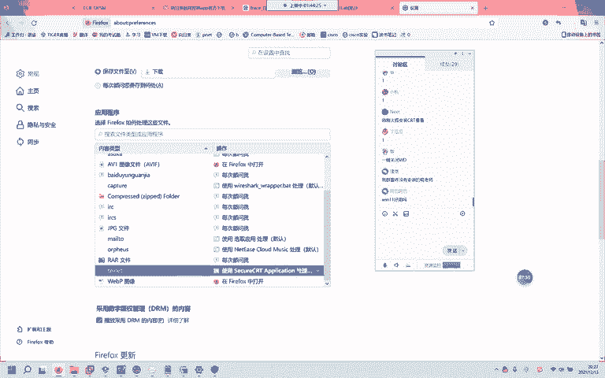

CRT来打开此类型操作。然后你点击以后一律允允许啊，一律允许，那你就不需要再通过后续的设置。那我们。

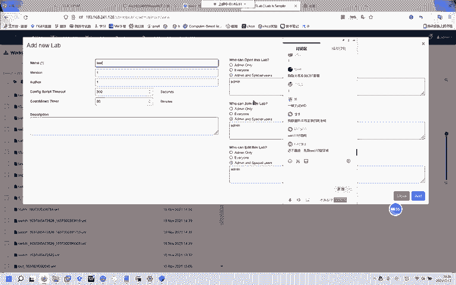

对，win11。不稳定啊不稳定。那我们怎么添加设备呢？怎么添加设备呢？点击这个加号，点击这个加号，点加号，然后点击节点点节点。那点击这个LOLLOL那这边呢我们有两个选择，一个是2，一个是3三是什么呢？

三就是路由器，二就是交换机，这两个和考场思科考场一模一样啊。一模一样。那我们点二或者是3二是交换机，三R路由器。那现在我们拖一台路由器出来，拖一台路由器出来。很好。那这台路由器拖出来了。

我们开机现在呢还需要什么，还需要。两台交换机对吧？两台交换机怎么找呢？这儿然后呢数量给它改为2。那这呢是修改交换机名称啊，我们把它修改为。SW switchitch。两台交换机。拉好了。

那现在我们需要PCPC怎么找呢？PC一样啊，node virtual PCC。在这儿我们需要几台，需要4台，就点击四点击保存。哎，你可以看到这儿出现了4台PCOK吗？路由器交换机以及PC就是这么找的。

那有些人说哎这个PC他长得好丑呀。怎么办？哎，也没也可以啊也可以。咱们呢可以怎么样可以修改这些设备的。样子哎。那我现在这台PC长得就好看了吧。长得就好看了吧。可以了吧，嘿。😊。

你也可以修改这个路由器和交换机啊，那我们把这个交换机。交换机的样子给它修改掉，它不能和路由器长得一模一样。在大家大家再看啊大家再看2，然后呢要几台，要两台，名字是switch。明显就贵了一点啊。那好。

这个呢一般是交换机的图标。那我们点击保存。好的，交换机在这儿。PC的话应该还有其他样子。看一下。加油。需要几台4台。啊，你看到的这个这个你拉出来这些设备啊都是乱着的。就正常现象啊正常现象。

思科呢思科的模拟器，你把你拖出来一台设备，如果它是整整齐齐排列的那那样才奇怪呢。那样才奇怪，乱着的。正常的。那好，我们拖一个和刚刚华为实验一模一样的拓扑，好吧，然后呢怎么连线，怎么连线呢？我们看啊。

当你把你的鼠标移到这台设备上，会出现一个橙色的插头，对吧？你看你无论拖到哪一台上都会出现这个橙色的插头，那这个插头，你把它拖住啊，你左键点击出现这个插头，你左键点击，你会看到一条线。

那这个线你拖到谁身上，谁就会变颜色，OK吗？这就是连线的方法，这是连线。大家有没有问题？那我们现在和这个。交换机连一下，连口连领口。一口我们连一口规范一点，一连10连0。好，稍微拖一下啊。那好。

现在呢再把PC和交换机给它连起来，那剩下的就不用在意了啊。不在意了。好的，拖完以后我们可以直接全选，然后呢选择开机。你全部选中，然后点击这个。开机。开机OK吗？到这里，大家有没有有没有问题，没问题吧。

那之后呢，就和华为我们刚刚演示的这个华为一模一样了啊。首先呢我们来配一下这个PC。因为呢我已经是。安装了CRT，所以呢它直接弹出来了CRT我们来看一下啊，我们来看一下，我把这个。挪一下。好的。

那我们给PC配IP啊，怎么配呢？和刚刚一样啊，都是实网络。这边呢10。1。1。1。掩码呢24，你可以写1个24，也可以写25。25。25。0都可以。嗯。不好意思啊。IP。10。1。1。1掩码呢是24。

好，你等待他这个三个点走完以后啊，你可以看一下。受你可以看到当前的。当前咱们的。PC。这是IP，这是掩码getway没有网关没有，那我们需要配一个网关啊，网关怎么配呢？是10。1。1。254。

不好意思啊。这么配应该是对的。这么配。好的，他可以给你报了啊，报的日志说。IP10。1。1。1，网关是10。1。1。254，这么配啊这么配。这样赔。这是PC的配方啊，那PC2PC5这是PC6一样的啊。

PC61样的。我们IP。不用啊，这IP10。1。1。2。24位10。1。1。254。好的。好的，那这个PC7PC8一模一样啊，IP20。1。1。1。24。要要要配呀，现在我们配的是这个PC呀。

路由器我们还没做配置，和刚刚的华为的一样啊。然后是这个20。1。1。254。好，IP20。1。1。2。24位。嗯。看一下啊。好，那这个5和6现在呢是能够拼得通的啊，我们拼一下，拼10。1。1。2。

看一下通了思科能通是这样的啊，思科能通是这样的，华为能通，后面还会给你总结丢包率、成功率之类的。思科的没有思科没有。那我的PC7和4啊，我我这个四好像放的远了，是应该在这儿啊。

大家能明白是什么意思就行pin。20。1。1。2。能通对吧？这个PC的配置。大家。有没有问题PC的配置？应该没问题吧。比华为那个简单啊。😀哈哈哈。😊，模拟器。是的。那我们现在呢这个交换机。

我们当傻瓜傻瓜设备啊，什么也不做。我们来到这个R1来到R1。我们给这个R一做一些配置啊。No。教大家今天呢教大家如何改名。如何进入到。🎼全局配置模式。这个思科呢他比较。花一点在这个方式上。

那现在我们看到的这个监括号啊，它叫用户视图，用户视图。那我们怎么样进入到系统视图呢？敲ll enableable你可以看到由监括号变成了井，现在呢就处在就处在什么呢？系统视图。那有些人会说啊。

老师现在是系统视图，系统视图下我们是不是就能进入这个接口配IP了？不行。不可以。为什么现在是系统视图也不行呢？因为呢思科他还有一个全局配置模式，全局配置模式。你现在这个视图啊。

只能简单的查看一些只能简单的查看一些什么呢？查看一些受受命令受IP。roer哎，你可以看啊，我们的路由表里头都是空的啊，是IProot刚刚双击单击就可以了啊，双击你会弹出来2个R1。

你然后会发现第2个R1，它是一个叉号。单机。点就行了。那现在呢讲到了这个这是系统视图。华为呢我们是用户视图。然后呢，是系统视图。那思科呢？比他多一个怎么多的呢？思科，我们第一个看到的叫用户视图。然后呢。

第二个看到的叫系统视图。哎，他还有第三个，他第三个叫什么呢？全局配置。全局配置。模式哎，我们要进进两次啊。系统视图第一次看到呃，用户视图第一次看到，然后是系统视图，最后是全局配置模式。

这个全局配置模式我们才能。去做一些配置。好吧，那现在呢是。系统是拖没办法做配置，怎么进入到。怎么进入到全局配置模式呢？Yeah。咱们输入这条命令，咱们输入这条命令，这条命令你输完哎，它变成了什么呢？

变成了括号里面。带贼穿制服。哎，现在我们看到的就叫。全局配置模式。那这个全局配置模式下，咱们才能做一些配置。那我们现在给这个接口。配个IP好吧。给这个接口配个IP怎么配呢？interface哎。

你一样啊可以按tab。但是呢但是呢比如说。🎼比如说啊你如果输入的这条命令后面不是唯一的一个命令。也就是说你输入这条命令的这几个字母，如果后面出现的有可能是其他命令，它是不会给你提示的，你输一个I。

你输一个I，你按t，它一直是个I，你输一个IN，哎，它就变成了interface，那思科有这么一个机制啊，这个机制就是什么呢？你只有输入正确了这条命令，你这条命令非常正确，你能匹配的，只有唯一唯一一个。

🎼那么呢他才会给你按tab提示啊，interface是这样的，大家遇到哎，我只记住了哎 interfaceface我只只记住了哎，然后呢，按t不出来，然后你你就以为是什么呢？模拟器bug。不是的啊。

咱们再多打几个，再多打几个，他这个就没有华为那个人性化了啊，华为的。我们可以看得多。那怎么修改名称呢？hos name host name。hose name阿1。看到他已经。变了名字对吧？

这是思科修改。设备名称的命令啊，修改设备名称的命令。那我们接下来进入到interface interfaceface什么呢？Yeah。interface大家说我打一个。什么。啊，我还没打编号。

0-0好的，现在这个视图啊，你敲完这条命令，如果不报错，你就已经进入到了这个接口，你就已经进入到这个接口。那配IP是一样的IP addressdress。10。1。1。25410。1。1。

254配完IP，你还要配野马，它不能和华为一样，它必须是你点分十进制。点分十进制来配的配完IP加完掩码，你最后还要加一个。命令加什么呢？no shut downno shut down，这是什么呢？

杀 down是关闭，大家都知道no shut down是什么呢？不要关闭。那思磕啊。所有的这些网络设备默认接口都是关闭的，都是关闭的。我们做完配置一定要加这条命令。你不加他就起不来好吗？不加就起不来。

那敲完这条命令，咱们回车。现在呢这些PC这些PC啊就能够拼得通自己的网关了。10。1。1。254我们来试一下。啊。好不是。看到了吧？现在呢它能和网关，也就是说这个接口通信了。有没有问题？没问题吧。

接口配IP没问题吧。那我们在这个接口同样啊可以进入到另一接口interface。🎼哎，还是教大家好好的教大家吧。我们退出这个视图啊，退出这个视图是excit。华为呢是putute，私刻呢是exit。

你也可以从这个视图直接进入到这边这个接口。那担心大家看不懂啊，因为呢它进入到这边这个接口是没有任何你按t是补不全的，你只能输入一些输入一些命令啊。那我们再来interface。原告。

0-几0-1以3代0套0-1，然后呢，现在进入到了这边这个接口了啊，他的IP是什么呢？IP addressIP address。20。1。1。254掩码是24位。好的。

敲完以后一定要记得这个no shut downno shut down。因为呢它的接口默认是关闭的啊，那这些所有路由器的特性都是一样的啊，路由器的特性都是一样的。然后呢，我们来看一看啊。

华为呢是diplay，斯科呢是售 showIP。🎼Interface， brief。我们可以看到啊。目前呢我自身有4个接口，两个接口有IP，他们的状态都是upup。🎼好，那现在呢我们来看一下路由表哎。

售IP。我们可以看到啊可以看到十网络和20网络在自身的路由表里面都已经出现了。那现在我PC5拼一下这个PC。720。1。1。1能通不能通。哎，我因为路由器。路由器怎么样了？路由器我知道。好。

现在呢是打开了这个微sh。招包软件。你在华为安装华为的时候，安装好以后，你在这个思磕上啊，你给他默路径，默认路径选择正确以后，它是能够打得开的啊，我们再来拼一次。可以看到啊。

ICMP的请求和ICMP的回复。都有对吧？都有。那这个呢就是思科，咱们安装思科以及思科这个模拟器简单的配置。运行的。一些方法。那咱们这节课的正课内容就已经就到这儿就结束了啊。大家有问题的话问就行了。

大家有没有有没有问题？不难吧，安装的话。不难吧，教了大家一些简单的配置。那明晚呢交的是。删除啊删除在华为的。设备上是no。哎，华为是安度。UNDOUNDO加上你刚刚配错的命令删除。然后呢。

不是你现在为啥要用防火墙呢？咱们这节课。能用呀能用。咱们这节课就带家带大家认识路由器和交换机。呃，解决方法咱们在前面的几分钟。前面的几分钟给大家提到了啊。报错40或者41，可以回去看一下录播。

你在这个wa box里面把这些设备全部删除，然后呢。在华为的ENSP里面的工具，点击注册设备全选注册就OK了。真实环境连一个csl线，连csl线，csl线连上。

把这台设备的地址输入正确或者是端口号输入正确，就连进去了。先把这个虚拟的环境搞定吧。注册失败。你的桌面现在是有东西吗？你桌面现在不能有东西，然后你的wa box要是关闭状态。然后你的USSP要是以。

管理员形式运行的。然后你的防火墙，你的QQ电脑管家，你的360，你的火容一个能不能有？咱们这节课刚开始给大家强调的就是啊。如果你没有刚开始就进来的话，回去看一下。火狐浏览器，你百度吧。我这也没有呀。

火狐，我用火狐搜火狐。

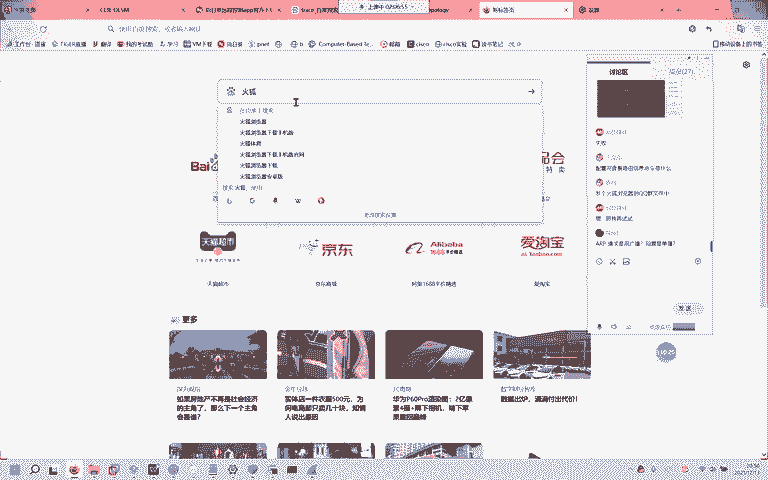

这是个广告。这也是广告。这应该是。好的。好，火候来了啊。hello，火火来了。ARP请求是广播，回复是单播。是的啊，就说嘛百度一下就有嘛。那我已经发到。聊天框里头的啊。大家还有其他问题吗？

配置完查看路由信息的命令是什么？华为是displayIroing table，思科是 showIProot。

啊，我待会会写一个基本的命令啊。基本的命令发给大家，大家不用担心啊，这个命令一定会发的。那这个呢另存为。这个待会儿也发给大家。这个文档其实是没没多没多大用。存在哪儿？换。泛红是转发机制。CRT不合并。

是因为你没有看那个文档。

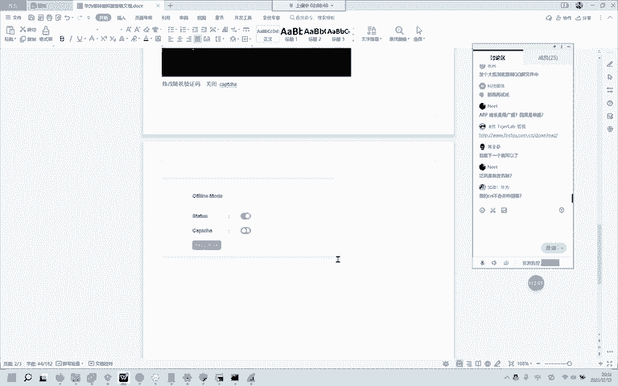

咱们的文档里头有窗口强制合并额。这块呢也不方便。应该是改错了。或者是没有保存，你再看看。是转发机制。数据泛红是转发机制。那交换机呢，它可以精确精确转发，也可以数据泛红，它还会给你丢弃啊，它还会丢弃。

这三种就这三种。配置的话，你看一下啊，应该是。啊，我我我私发你一个。1发1个。这边呢不方便啊。还希望理解啊。或者是我帮你改也行。那这边呢，如果大家在平时遇到了实验问题，或者说是这个接口。

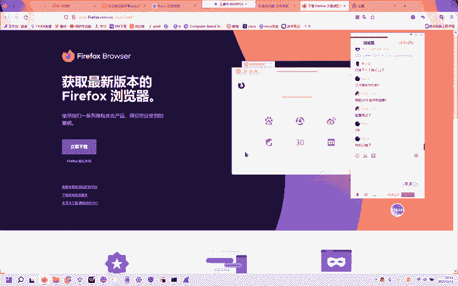

接口。你的协议或者是接口或者是什么什么什么起不来。大家呢要下载一个向日葵。那这个呢这款这款软件啊，我可以远程操控你的电脑。那到时候呢我可以看你如果遇到问题，我可以看你的电脑做这些配置到底正不正确。

接口到底有没有起得来。你的OSPFro台D到底有没有修改的正确。等等之类的，都需要下载一款远程软件啊，远程操控你电脑的软件。它呢叫向日葵。我已经发到了大家的。嗯。发到了大家的这个聊天框里头。怎么了？

继续啊，这个文档里头有提示。继续。大家还有没有有关？

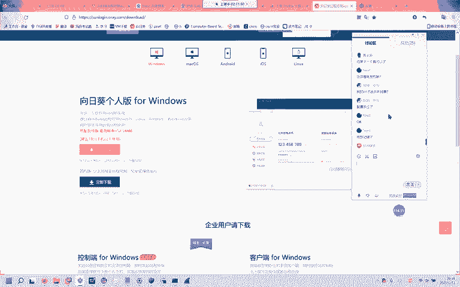

思科华为。模拟器安装问题啦。安装问题。大家还有没有？这个不要发啊这个。这不是一个。正常的东西。OK。好的。那还有没有其他问题？这节课。我把这个基本的命令我找一下，我应该写过，我写过一份。

虚拟机里有关机命令吗？不想强制关机。如果你不强制关机的话，你关闭这个网页，你下次打开的时候，还是这个网页，你的配置都在。嗯，你的虚拟机就像我现在我现在它是正常运行的，我就算把这个比如说啊哪去了。

我的这个。去哪了？Put啊关掉，我把我的Put关掉。看啊大家看我现在的这个页面。是这样的。是这样的，平台它关掉，那我关掉以后，我重新进去，重新进去，它还是这样的。然后如果你的CRT没有关闭的话。

它是可以正常哎正常的输入一些命令的。你只要没有在这儿把它根本的关闭掉啊。那明晚呢教大家这个给大家带个实验，带个实验。然后教大家思科华为模拟器的。我们经常会涉及到的配置以及查看的命令啊。对。

明晚也是我没有录播啊。那后天晚上呢是更重量级的。默认路由。以及路由条目六要素。那大家在学完那块知知识以后呢，就知道了这个路由条目里面的6要素，六要素都是干什么的。嗯，这一周的都是非常非常。

不是之前跟大家讲的嘛？就是。实验多一点，其希望大家能够动手。那上一期的学员希望动手的东西多一点，那没问题。理论结合实践，咱们学到的掌握到的东西才更更多嘛，更快。好吗？那咱们这节课还有没有问题？

没有问题的话，我下去给大家整理这些命令。然后呢，我稍后会把这节录播课啊发给大家。如果你是后来的，你听到了一半才来的。你看一下前面前面我们讲的很重要的几点，比如说你关闭实时防护防火墙，你的安全软件之类的。

好的，那咱们今天呢就上到这里。明天再见啊。明天再见。你可以去下一个最新的，你嫌老的话，可以下一个最新的。但是这个都。没那啥，还晚安，我还要上班呢，晚安晚安，拜拜。😊，我待会儿把命令整理给大家啊。行。

那今天就到这里，大家。拜拜。😔。