# 2022版华为认证HCIA-DATACOM教程，内部课程公开分享（已完结） - P6：XCNA-06-思科华为系统及常用命令 - 网络工程师CCIE - BV1AP4y1J73k

啊，我们今天的安排是这样的啊，先讲华为。那讲华为的时候，咱们一步一步解释命令的原因，这条命令怎么写怎么查看。然后呢，到了思科呢，咱们就解释，因为呢华为思科大差不差，只是把这个display。

给他换成了瘦display换成了瘦。大差不差啊，那首先呢昨晚也教了大家一些基本的命令啊。那有些人是昨晚可能没有来。那我们今天呢从最基础的从最基础的咱们开始讲起啊。那这节课听完以后。

咱们对这个模拟器的页面，对他的这个。这些上面的这些东西啊都要有所了解。然后呢，对我们经常在以后经常会用到模拟器做实验，对这些设备啊要有了解。这个就是咱们今天这节课需要了解到的东西。那首先呢。啊。

首先把它关掉啊。给大家介绍一下啊。好，那这边呢咱们可以看啊，可以看到这个小框框里头画质有点模糊啊。不会吧。其他人画质。怎么样？全屏啊，我这个电脑现在是全屏录制。画质应该是。大家都是一样的啊。

有可能你的是手机，然后你又是只放了上半部分。首先呢我们来介绍这个华为ENSP。应SP那这个模拟器呢，咱们在安装昨天呢教了大家安装啊，今天就不说了。在运行的时候啊，我们运行的时候怎么运行呢？运行的时候。

你要首先检查你的电脑的左下角，你看看你这个左下角里头有没有运行着一些什么。

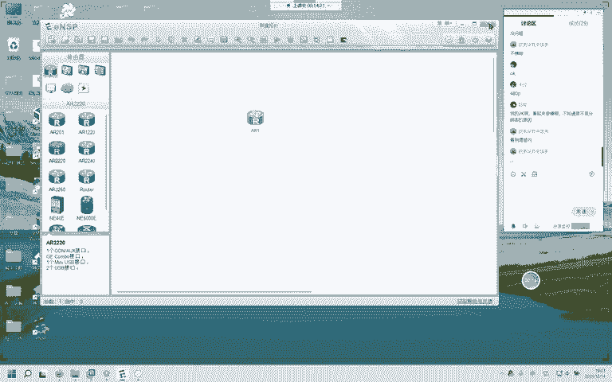

火容。360金山独霸电脑管家之类的啊，右下角你看一下，如果有的话啊，你大概率你的模拟器。是的，安装。会出现问题，然后运行会出现问题，然后你做实验也会出现问题。这块啊能关的，你把它关掉。

要不你就把它卸载掉。为什么卸载呢？因为咱们大部分人的这个台式机啊，笔记本上面的这些数据啊，对于黑客来说，它是。看不上的看不上。那如果有黑客攻击我们的电脑，那那那那那这个概率很小很小，你装这个。

这个这些个电脑管家之类的东西啊，纯纯的就是拖慢你这个电脑的运行速度。这些管家之类的东西啊，现在都是流氓流氓。怎么怎么样给你们说他是个流氓呢？就这样啊，他是不是可以拦截其他软件的弹窗，对吧？

这个大家都知道吧啊，你有可能下这个电脑管家，就是为了拦截弹窗。然后呢，他自己给你弹窗。哎，他把别人的弹窗给你拦下来，他自己给你弹。😀Ha。😊，然后呢，他会占用掉你大部分的。运行内存哎，这个是老流氓了啊。

老流氓全家桶，你还在卸载的时候，他还会诱导你去购买他们家的股票。所以呢能不装就不装。那你在运行的时候一定要把它关掉。然后呢，你如果是嫌这个电脑。是直播课啊。你嫌你的电脑运行卡顿卡顿，或者说是什么呃。

要清个垃圾啊之类的。平时的垃圾东西有点多，那你可以专门安装一个清垃圾的软件就行了，清理清理垃圾的，你不要把这些全家桶都给它安上。一呢是拖慢我们电脑的速度。二呢，它是会对模拟器。有一些影响有一些影响。

然后呢，是。不会实质性的对我们的电脑。进行什么样的保护？只要我们不去主动访问一些。网站啊，你懂的，只要我们不去就没有问题。然然后在下载东西的时候啊，下载东西的时候一定要认清。哎，比如说。你在下载东西。

我现在说个。火狐。火狐，我准备下载一个火狐的浏览器。哎，你可以看到啊，大部分前面的这几个啊，大部分都是广告，都是广告，都是假的。你下载的时候有可能就会给你下载进去一些不正常的东西。你看这是个广告。

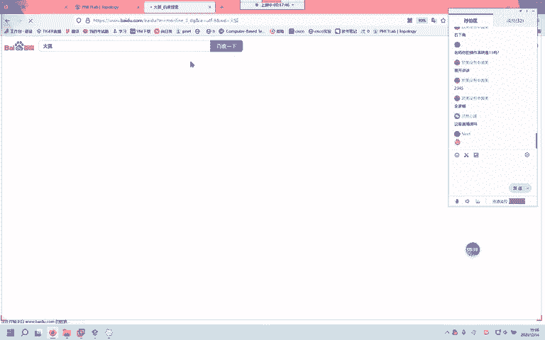

这是个广告。这后面写着名企，但它还是个广告。哎，你看后面写着官方，后面写着官方的这种官方，你看我搜火狐，它只有这么一个是官方。哎，你点进去，那么你下载的这个。

安装包一定是没有任何捆绑软件的啊，2345除外好吗？2345360。这些东西除外。

你下一个东西，正常的找到他们家的官方就可以了。你你这些广告里头点进去啊，广告里头点进去。接下来的这些东西就不由你控制了啊。你虽然看着它很像一个正版的软件。你在下载的时候。

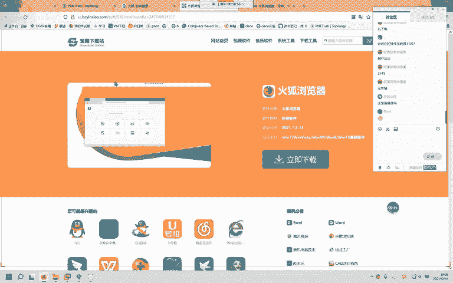

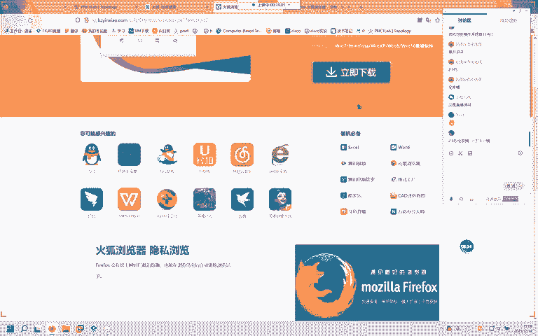

你在下载的时候。有可能就哪个地方给你打个小小对勾。哎，你今天把电脑关了，明天你把它打开以后就会出现什么呢？是兄弟就来砍我之类的。

知道吧？懂吧懂吧。没问题吧。所以呢。哎。所以呢你下载东西的时候啊，一定要。避免。你这是打打算以毒攻读吗？好了啊，不不瞎说了，不闲聊了。我们来看啊这个ENSP我们打开的时候一定是以管理员身份来打开。

那在打开之后呢，我们可以看到这样一个页面。那这边呢是一些样例啊，这个ENSP自带的，然后呢是一些这个。你最近打开的一些实验，最后呢这边是一些介绍，你可以自己看看啊，你可以自己看看。然后呢，我们来看啊。

这边呢上面的这个有7个7个图标，7个图标，每一个图标都是一种类型的网络设备啊，每一个图标都是一种类型的网络设备。那你点到这个图标上面，它就会在这儿显示这类图标，到底是什么？你看我点到R上。

它这儿出来了什么路由器，对吧？点到这儿，它出来了交换机，这呢无线局域网，就是什么防火墙，就是终端。其他设备。以及连线。那就这7个方块啊，我们能用到的1234，最常用的就这个1234。这块有没有问题？

咱们的ENSP这一块因为都是中文啊。他比那个peet好理解的多了。没问题吧。没有问题吧。那我们继续啊，那你点到这个路由器上面啊，有很多很多型号，很多很多型号。咱们正常情况下，通常情况下。拖哪台呢？

拖这台2220，它的性能，它的板卡之类的插插槽啊都是比较符合我们现阶段所使用的那你也不会因为它的性能不够而烦恼。如果你用个210，你点个2101220，有可能你在做一些特定实验的时候。

那他呢不能满足你的要求，所以呢我们尽量把这台给大家拖出来好吗？这是路由器，然后呢，交换机573768，然后这个是数据中心级别的啊这些。那我们接入层啊用这个3期。汇聚用5期好吗？接入用3期汇聚用5期。

这是交换机。然后呢，这边我们一般会拿一台PC或者是服务器出来。经常PC服务器，这是PC，这是服务器。然后呢，这个是。链路啊，这个是链路连线的情况，正常情况下我们都是用的这个链路啊，这个链路。

那么呢这台设备啊在你拿出来以后，你是可以自由拖动的啊，自由拖动的。然后呢，这个颜色蓝色代表它现在没有开机。现在这个状态是没有开机的。没开机的情况下呢，你可以打开它的后面，它后面长这个样子。

它的后面长这个样子。然后呢，有一些板卡，你可以插，你可以扩展，你可以插，你可以扩展。这些呢空的插槽，你想插什么类型的，你就插就行了，把它拖过去。就OK了。如果你发现链路不够，你发现链路不够。

那这个时候呢，你看看啊。我们来看看。现在够了没？现在这么多的链路OK吧，这是我们解决链路不够。那比如说你一台路由器要连很多很多的路由器，这个时候你把后面的板卡给它设置一下啊，设置一下。好吗？

这块有没有问题？这一块有没有问题？hello，没问题吧，那咱们继续啊。😊，路由器有了，然后呢咱们要有交换机交换机。交换机，然后呢，这是PC这是PC。这是PC。

那你呢如果你的画图就是说你的可能审美怎么样怎么样怎么样，你可以把后面的这个网格给它调出来。你看这个呢是显示网格。然后呢，这个按钮是干什么的？这个按钮啊，你一按它会打开目前所有设备的这个什么对话框。

OK吗？你不用一台这个双击一下，这个双击一下，这个双击一下，你按这个三个就都打开了。有没有问题？没问题吧。好的，那这个呢我们来看看啊，一个一个来看这个叫新建拓扑。新建拓扑。这个一点啊，你当前这个页面。

如果你想要保存，它会弹出来一个页面，你是不是是不是要保存当前的这个页面，是它呢就会把你这个页面的东西保存下来，然后你选一个位置。然后呢，在这里就可以打开了。哎，你打开你刚刚保存的东西，你可以打开。

这个是打开之前你的拓扑啊，这个是新建一个拓扑，这是打开之前的拓扑，然后呢。这个保存这个叫另存为保存你一按。保存你案会弹出来，它和另存为差不多啊。你看。这两个都是保存，然后呢，这是。打印撤销恢复。

那我们来试一下啊。撤销我们把刚刚拉出来的最后一台设备给他怎么样了，撤销了，这恢复了恢复了。那好。这个呢是恢复鼠标。我不知道他在他有什么用啊。好的，那这个呢这个呢是拖动当前的整个页面啊整个页面。

这个你点了手就是拖动整个页面，然后你的右键可以取消。如果你发现你的手变成了这样，你就可以拖动这个整个页面。你可以看看整个页面的top扑top的样子。然后呢，你点击右键，你的鼠标恢复正常。

那这个应该是比如说你的手是这样的，你点击这个那就恢复了，和右键的功能差不多啊。这个呢是删除，你找到一台设备，你找到一台设备按这个。删掉了。删掉了。没问题吧。那这个是删除现在所有的连线，这个呢是文本。

我们用来标记一些东西啊。用来标记一些东西。比如说你这条链路下面所属的网络是10。10。1。1D。这个网络那你可以给它写出来啊，就是一个文本框，文本框，这个呢是一个调色板，然后呢，这是放大，这是缩小。

然后你缩小放大缩小放大。如果我不知道原始比例按这个1比1就回来了。好，那么呢这个是数据抓包，你可以点到这些设备，点到这些设备，然后看这些现在呢这些设备没有连线啊，你还可以选择接口，然后点击开始抓包。

点击开始抓包。那这个呢是显示所有接口，这个是显示网络。这个是打开所有的对话框。大家对这一排按钮还有没有问题？我讲明白了没有？这一排按钮。这一排。很详细了啊很详细了。好的。那我们继续啊。显示网格啊。

网格不是网络，你看你能不能隐隐约约的看得到我的这个背景板现在变白了。白了可以吧。能看得清吧。那你点击这个这个呢是帮助我们辅助我们画画这个什么呢？画拓扑的画拓扑的，比如说你对不起呀什么的什么的。

你可以把这个调出来，你可以把这个调出来。可以吧。好的，那我们连线啊连线怎么连呢？连线点这个闪电点这个闪电，那这个呢是自动啊，自动你在连线的时候，你点设备点设备就好了。就这样，这是连线。

那我们一般情况下啊，我们自己呢画拓扑都是。点了这个，然后呢，你再点这台设备，它会弹出来一些接口。那你再点这个接口，比如说你想用吉比特的0-0-0连这台交换机连到它的0-1口。那现在呢没有问题。

那有些人呢连上线没有显示他的什么呢？没有显示他的接口的名名称。我们在做配置的时候，不知道这个接口到底是谁，到底怎么显示。那你点击这个你看。可以吧。可以吧。好的，那我把线连完啊连完。哦，你点一次就行了。

你发现你的这个鼠标，你发现你的鼠标是这个样子的时候，它就是连线的状态啊，连线的状态。OK连完线呢，你点击你的鼠标右键，它恢复这样的，恢复成这样。就代表你现在的鼠标正常了啊，和这个应该是一样的一样的原理。

你看你的鼠标是这样，点击这个。那你的手再点击这个。好，那连线这块大家。有没有问题？那我们现在显示接口，把所有的接口显示出来。那有些时候呢，你会觉得哎呀这些字有点小有点小怎么办呢？它还挡住了这个接口。

那我们可以调调位置啊，你把鼠标点上去点上去。你可以调他的位置。这样。然后呢，你在拖动的时候啊，这些设备的名称是跟着你这个拖动的方向走的啊，看你看。怎么显示来着？嗯。看到没有？可以吧。你在做配置的时候啊。

你在做配置的时候，如果你记忆力足够好，你的记忆力足够好。你的记忆力足够好，那你就别写示。那正常情况下建议大家啊把这些接口给显示出来。那你有可能在这个接口上要做一些配置。比如说在这个交换机上，你要做一些。

围纳划分中继。hybridbrid杂合或者是接入。那你要需要进入到这个接口视图，你不知道这个接口的名字啊。或者说是你进一次要看一次这个接口，那很费劲儿的啊，你就直接全部显示就OK了，好吗？

这一块呢是关于连线的知识啊。那这边呢这边啊论坛官网你就别想了，这个模拟器目前是没有人在维护的啊，没有人在维护的。咱们使用的这一版也是最新版，也是2019年9月那一版。然后呢，有设置设置。

你可以干什么这个设置啊，有些人昨天问我，为什么我的我进去我的设备是什么呢？我的设备的字是绿色的，你的设备的字是蓝色的那在这个设置啊设置里头有。那我们来看一下啊，界面设置界面设置。

那这个呢显示网格不显示网格就和这个按钮一模一样的意思啊，显示设备标签，显示设备型号。它呢标签是AR1，型号呢是1220。如果你选上，它会告诉你这台设备是1220，然后呢，总显示接口标签。

就是这个就是这个接口。那显示背景背景拉伸。背景拉伸，我还。没弄过啊没弄过这一块，咱们就这样设置就行了。这边啊这边呢。我们可以自定义自定义啊，你看不透明半透明自定义，我现在打开这个对话框啊，它是不透明的。

怎么调成半透明呢？在这边。我再打开哎，你可以看到，就算我用这个对话框啊，堵住了我现在的这些。这个top图，但是呢我还是可以看得到可以看到我这些接口的啊，可以看到我这些接口。那你按个人喜好来调整就可以了。

好吗？然后呢，这个自定义就是你可以随意拖动这个。你看这个是非常非常淡的啊非常淡。怎么调字体颜色在这儿啊，字体设置。你想要红色。红色看看他有没有给你啊，有没有给你。那背景颜色来个。好的。现在是红色可以吗？

会的没有可以吧。哎。你还可以调它的大小啊，你还可以调它大小，你还可以他调它的字体。但是呢我们。正常情况下，你别去改这些啊，你颜色背景改改行了。那你如果你觉得小了，你把它改大一点，大小在这儿啊。

比如说你觉得太小了，那我们改大一点，改成这样的，然后点击确定。好。可以吗？开心吗？这个字体。😊，这个大小。很开心啊，那我把它改回来啊。😊，刚刚是十还是14？哦。十4应该是。好了，回来了。啊。

如果你是老花眼的话，你把它改大一点可以啊。但是呢。应该不是啊，近视眼有可能老花眼的话。好的，这是设置里头。那这个服务器啊，服务器咱们现在不用管，现在不用管啊。然后呢，这些工具这些工具啊呃。

我看看这是Vshrk，这是wa box，然后呢，这是VLCVLC不装，可以，现在不装可以IE阶段在。然后呢，他们让你这个V shark就是一个。抓包工具啊抓包工具你安装好以后，他们已经默认关联好了。

应该是默认关联好了啊这些工具。默认已经关联好了，只要你不去修改它的安装位置，按照默认就行了，好吗？可以吧。哎，默认好啊默认好，顶多就改一个这个半透明，顶多大家会改一个半透明。在敲这个命令的时候看一看。

万一这个对话框挡住了我们的拓图。你没有wacha box，你创建创建不了虚拟网卡，你创建不了虚拟网卡，你这些设备能起来就非常奇怪。可以吗？华为让你装肯定有它的原因啊。因为我们现在这个这个环境就叫模拟器。

模拟模拟，那模拟我们肯定有得得模拟的东西，对吧？他给你模拟出来，虚拟出来一张网卡，虚拟出来一台路由器，虚拟出来一台交换机。懂吧。懂吧。那在这儿能看得到啊。可以看到。可以看到吧。能看得到吧。去给人装网络。

就按这个整么，装网络肯定都有实体的机器了。让你去装网络的话，肯定是机架已经弄好了。你得去做配置了，你得去做配置了。好的，那这个呢是华为的咱们这个基本的介绍啊，然后设置。那再给大家说一下。

如果你遇到你遇到。打开路由器的时候，40或者是41报错啊，有些人昨晚在刚开始的时候没听啊，没听没关系，我们再来说一下，如果你遇到40或者是4一报错。你用管理员权限打开wa box把这些东西全部删掉啊。

全部删掉，点击删除点击试，然后呢，给它关掉，关掉之后呢，咱们在这个菜单里头有一个工具，有一个。注册设备注册设备，然后把这些全部选上全部选上。前提是你的这个界面啊，什么设备都没有拖进来。拖进来的话。

你把它删掉，删掉以后全部选上点击注册。那这个时候。你这个问题40或者是41的问题大概率解决了。如果没有解决，就是因为你在安装的时候没有使用管理员，或者是你安装的时候，防火墙和你。和你的。

和你的这个防火墙和你的电脑管家，可爱的电脑管家是开着的啊。好，那华为的。介绍就到就到这里，大家还有没有问题？介绍这一块儿。这个页面整个页面菜单包含它的些东西没问题了吧。那好，我们来教这个简单的配置啊。

主机呢来看看主机主机我们怎么配呢？主机我调这么大，大家能不能看得清楚？你别打开别开它，你在运行模拟器的时候别开它，要不然你在接桥接的时候啊，计算机发现你的这个本身在给自己本身的网卡发一些东西的时候。

你的防火墙干掉了就直接给。比如说你的两个模拟器想要调节到咱们的这朵这朵云上。这朵云上你R一连到这儿，然后呢，你在思科的里面也拖一朵这么这明这么个云音出来，你的思科的也调节到这这上面。然后呢。

你的这边这个R路由器和那边。模拟器里面的路由器想要建邻居或者是测试P之类的东西啊。防火墙会干扰的。刚给大家解释了，没有黑客会在意。我们电脑里头有啥，除非你是就是国家。机关里面的高层的就是。领导之类的。

好吗？解释的应该是很明白了吧。能乖关啊能乖关，避免了很多不必要的麻烦。

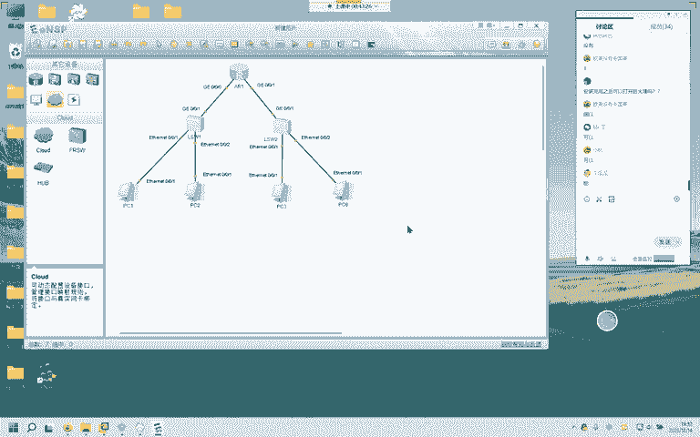

好，那我们来介绍我把这个调回来吧。一直都是关的啊，没问题，关的也没问题。那我们在做这个模拟的时候啊，模拟器里头练习的时候啊，一般咱们的这个窗口比较窄一点，比较窄一点，比较窄一点。

因为呢它有时候显示的东西。比较多嗯。啊，好，知道了啊知道了。那我们来看看啊，现在这个界面昨晚呢也给大家说了啊，我们有一个万能的叫什么呢？tab可以按这个按键补全补全tab可以补全，英文不好的，没有关系。

英文不好的没有关系。我先问你一个问题啊。我先说我先问。你就把自己想成一个英文特别差，然后呢，自己现在是刚上初一。我现在说一个单词。display display。

大家觉得开头的这个单词是哪一个字母是哪一个？哎D。你再次你也知道肯定是个D吧，肯定是个D，对吧？那我再说一个啊，再说一个单词，瘦瘦，你给我说一下首字母是什么？

对吧然后呢然后哎我再说一个quit quilt。Q。大家知道我想表达什么吗？知道吗？你英文不好没有关系，你只知道前面的这个就可以了。你只知道Q就行了。那在华为里头呢。你的Q啊就是。退出的意思。

他默认你敲你写了Q，然后呢，你敲回车，他默认给你执行的命令是cuteq。那我们来从最初开始啊，最初开始。进入系统视图叫做system systemtem will systemem will。

这个呢是我们进入系统视图的命令。在这个视图之下，用户视图之下，我们能做的配置少之又少，非常非常可怜啊，非常可怜。能做的配置，你可能就能写个s文。写个sve，查看一下系统的。版本查看一下系统版本。

查看一下系统时间。那我们进入到系统视图啊，进入到系统视图，那就可以放开拳角了，展开拳角。那这边呢。他告诉你，如果你再想退回到如果你再想退回到什么呢？用户视图按这个crl加Z。conttrol加Z。

那我现在在我的键盘上按一下啊，contrl加Z，你看我在这儿没有输Q啊，我conttrol加Z直接退回到了。系统视图。嗯。🤢，好的，那在这个任何任何视图之下啊，我现在已经进入到了接口视图。

昨晚也给大家介绍了接口视图。那我在接口视图之下按ctrl加Z，你看效果。也是一样的吧一样的吧。你相当于按了几次quit，相当于按了两次quit啊。你看啊，我比如说在这个视图之下，我按一次qui。

我退到了系统视图，我再按一次qui，退回到了用户视图。这个contrl加Z。可以吧。conttrol加Z。conttrorl加Z就相当于。返回到。你无论在任何视图之下，都直接返回到用户视图。

那你这个Qe呢cute啊，你的cute是什么呢？cutute是什么呢？在任何视图之下返回上一视图，返回上一视图。比如说你在接口视图之下，你可以返回上一视图，按cutute，你返回到了系统视图。

这两个controrl加Z和cutt。我讲明白了没有？可以吗？对对，这个就是直接退回到无论你在任何地方。视图的层级关系啊。你第一眼第一眼看到的。你登录到这台设备，第一眼看到的叫什么呢？

用户视图之后呢是系统视图。用户视图系统视图，然后在系统视图里面，比如说你想要运行一款。动态路由选择协议，那么你会进入到这款协议的。界面你运行这款协议的界面。那这个时候呢是动态路由选择协议这么一个视图。

比如说你在这个协议里面又进入到了一个什么区域，比如说OSPF你进入到了一个区域里头。那你又进入到了这个动态路由选择协议视图里面的区域视图。那你退的时候也是一层一层退的啊，退的也是一层一层退。

进的时候一层一层进，退的时候也是一层一层退。最大。就是最原始的。用户视图。然后呢，系统视图之下，哎，你能做的非常非常非常多。你的权限如果足够，能做的非常非常多。那好，用户视图和系统视图。

那比如说我们现在进入到interface。

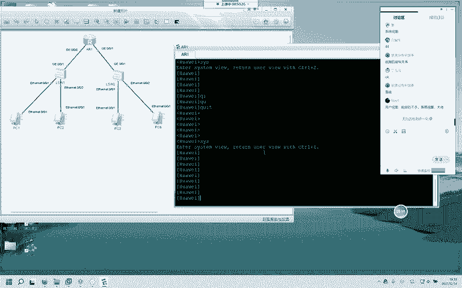

接口视图了，那现在呢最小的是谁？接口视图排第三嘛，然后呢是系统视图，然后你再退是用户视图，可以吗？这样讲可以吗？可以啊，那好，再教大家几个快捷键啊，教大家几个快捷键。比如说你刚刚才退出来这个。

吉比特的0-0-0，你又想进去这个接口，那你还要interface吉比特的0-0-0吗？不需要啊，你看你可以按你键盘上的方向上键。它调用出来的就是你历史命令里头的上一条。那我按一下上键。

大家可以看一下啊，我按一下上。它是一个什么呢？Q，因为我刚刚按了一个Q能理解吗？可以理解吗？我再按一下上键，它会变成什么呢？它会变成这条命令。可以吗？这个方向上键也是很好很好用的啊。那你相反下键。哎。

你下贱。也是一样啊，你上往上调，下就是往下调，调到最后一条，也就是你这个空白的时候就下不去了。你看我再按上再按上再按上按上可以吧？哎，比如说你现在刚进入到了0-0口，你想进这个0-1口。

但是你又不想多打命令，你就按一下上，把这个删掉改成一哎。怎么样？能不能理解我说的意思？可以吧。方向键的上下键，大家在平时做练习的时候做模拟的时候多多使用啊，多多使用。可以吧。能理解就好。那好。然后呢。

还有一个是打问号啊，打问号也是一个非常非常非常。方便的。比如说你忘记了一条命令的一部分，你只记得一部分。前提是是前半部分啊，你只记得前面的开头，那你可以在这个后面打一个问号，打一个问号。

那打问号它就会给你展示你在这个DIS后面DIS后面。能接的这些单词，它都会给你显示出来。那当前我打了问号，我DIS后面只有一个diplaydiplay。那么呢华为就认为华为就认为什么呢？认为你的。

这条命令就是display，你输入DIS。你输入DIS，它认为这就是display，你输入TH，它就认为是this，你看this后面只要能跟的这个单词变成唯一。那么你敲的时候你敲的时候，就是什么呢？

就是这一条这个单词的完整的命令。那比如说我输入1个DISIPINT。B。这条命令。这条命令大家可能有点看不懂，现在可能有点看不懂。这个呢是查看咱们接口配的接口当前的配置。那它完整的命令是什么呢？

display IPP interfaceface brief，这是它的完整命令。完整命令。那你在输入这个DISSIPINTB的时候，华为就认为你输入的是哪条呢？就是这条完整的命令。

那你敲回车效果和它一模一样。可以理解吗？可以吗？以太网口和。这个几口是什么区别？它呢在华为这儿是配不了IP的，然后呢，它的默认带宽是100兆，这个是可以配IP默认带宽是1000兆。可以吗？好。

那比如说我现在。display IPP roing table这条命令，如果大家不想把它全部补全，全部补全，可以怎么解写呢？这是查看这台路由器路由表的命令。可以怎么看可以怎么写我们DIS，然后呢IP。

ROU就可以了。这个就和这条命令。意思。一模一样。当然这个原理在思科在思科里面也是成立的啊。但是呢思科比较。那个啥他就他就是你输入的，你输入的只有。这条命令能唯一的对应上一条命令的时候。

它才会给你正常的显示，正常的执行这条命令。一旦你的受。比如说你敲一条命令，你这条命令后面有可能还有其他的命令，就是说你不唯一。那这个时候呢你敲敲不出来的，在私科上是敲不出来的。思科敲不出来，华为可以。

好，那介绍这个介绍这个我们来看一下啊，给大家看看修改系统名称sst。ss name啊s name这是修改一台。网络设备等。名称的命令啊，我们把它改为R1，修改为R1。那这个时候呢。

我们的系统视图里面它的名字就叫。R1了，就叫R1了。这是修改名称的，可以吗？修改名称。时钟不会考，时钟，他默认都是。物理协议的up down的意义。那在这边啊。我看看。这个吗？这个是吧。是问的这个。

Protocol。哎，就证明他说的这个protocol是。IP协议了啊，这边呢是IP协议了。如果你配了配好了IP这个IP的地址和掩码是正常的一个地址，正常掩码它呢是up。那我们来试一下啊来试一下。

IP address10。1。1。1掩码而4位。你可以看到他的这个协议怎么样了。up了。0。0。0口。咱们的。IP和。年码正常的。所以呢他已经起来了，证明这个接口现在是没问题的。来。

然后呢还有一些常用的命令啊，常用的命令在任何一个视图啊，任何一个视图下，你都可以敲这条命令display this哎，这是华为非常非常人性化的命令啊，非常非常人性化的命令。这个命令呢它常它查看。

这个命令呢，他查看你当前这个视图下所有的配置。那比如说我们进到0-0-0口，你再敲diplay this的时候，他给你展示的和刚刚。完全不一样，他给你展示的是这个接口，哎，就是这个接口。

这个视图之下做的所有配置diplay this。这条命令。大家记住啊，这条命令非常非常方便。经常用非常非常方便。可以吗？这条命令。你在任何一个视图之下，华为设备啊都能敲都能敲敲这条命令。然后呢。

再教大家一些。查看。这是查看系统配置啊，系统配置你敲完，你能看到你这台设备所有的所有的配置。这台设备目前所有的配置。你可以diplay CDSCU一样的意思啊，DISCOADIS。C。然后呢，来看啊。

这边有一个这个。按键我们按回车啊，它是给你一行一行的依次展示。依次展示。如果你按tab啊，它一次性给你全部展示完成。就是说你在按按了一条命令的时候啊，按了一条命令，这儿出现了一个梦。

更多的时候你按回车是一下一下出来，但是你按tab是所有的所有的。所有配置全部给他给大家展示出来。这是按回车和按 tabDHCP不在这节课啊，DHCP不在这节课。他是用。

用来给这个主机自动分配IP地址的啊，自动分配IP地址。这节课之后呢，我会设计。今天呢不带大家了解这个DHCP。是在路由器接口配置的，就是你的网关。你的网关。PCE的网关在网关上配置。好，那看完这个啊。

然后呢我们来看看。这条命令。你看啊，这是查看路由表的命令，对吧？这是查看路由表的命令。那这条命令后面啊还可以跟一些参数，跟一些参数。那这个参数我现在教给大家这个procolprotocol。

你可以细化的来看一下你路由器的路由表上面从哪些协议学到的路由。从哪些协议上学到的路由？那我打一proto，比如说我现在想看一下，通过OSPF学到的路由，那我就打上OSPF那敲完回车哎，什么都不展示。

为什么呢？因为我现在没有运行OSPF所以它没有在OSPF里面学到任何路由。那以此类推啊，以此类推，你的。Rpe。你的什么呢？SS。你的SS，你的rape，你的OSPF都是可以查看的啊。这条命令可以吗？

查看路由表，咱们还可以细化的看一下。比如说你运行了OSPF，然后呢，你的邻居已经建好了，但是呢就是怎么也拼不通。你可以看看你通过OSPF学到到底有没有学到这条路由。这条命令。然后呢，你还可以看一看。

你通过手写的静态static。你的路由生效了没有你掩码配错了没有？你路由到底生效没有？这是查看静泰路由，这一般都是管理员手工写的啊，这个一般查看我们管理员在本地写了哪些路由条目。OK这些命令。

大家有没有问题？这些命令大家有没有问题？嗯。没有。好，那这节课。最重要的是教给大家，教会大家在不同网段。不同网断接，然后呢进行。路由OK有人问lo back口怎么理解，物理上不存在称本地环回端口。好的。

这个口呢这个口啊lo back这个口呢它是虚拟的。但是呢它是一个非常非常稳定的非常稳定的一个接口。你的真实的接口，现在我们是模拟环境，对吧？模拟器环境。那如果呢你现在。呃，我稍微设计一个复杂一点的啊。

123。4。Yi。2。3。好。然后呢，问这个。这个口这个口呢它是虚拟的，只要你这台设备通电，只要你设备这台设备的系统正常，那它不会管你到底插拔了多少次，你的协议怎么样？你的什么怎么样？

它呢一定是up状态的up，一定是up，这个呢是非常非常稳定的一个端口，那这个端口通常用于测试网卡到底正不正常。它地址是127。0。0。1，你可以试试用自己的电脑拼一下127。0。0。1。

你会发现你收到的回报啊，它是小于1毫秒的，为什么小于一毫秒呢？因为它就在你这个设备，就是你这台设备上虚拟的。一个端口。存在的。他用来测试。哎，你的网卡是不是正常，你到底能不能通？

你如果连这个127也通不了，你就不要再想着去给运营商打电话，或者是看看。是什么路由器路由协议没有起来，因为你这台设备的网卡已经出现问题了，你的网卡。哎，它是非常非常稳定的啊，这个呢在运行OSPF的时候。

建议大家在建议大家建立路 back。那运行OSPF会有一个柔台地路由器的柔台地。这个柔台地啊，它默认啊，这个是后面几节课的内容啊。给大家讲一下吧，那USPF默认它会选择你本地。

环回口里面最大的这个IP作为自身的柔台地。如果你没有环回口，它会选择你物理接口里面IP最大的。IP最大的这个IP作为自身的柔台地。如果运行OSPF没有Ro台地，它是起不来的。

这个就简单的给大家介绍一下啊。到后面学到了OSPF，大家系统的学习一下。那现在呢我们给这个网络给这个网络设计一些。呃，设计一些。设计一些这个。网络啊设计一下网络。那这边呢用十，这边用20。这个用30。

这用30，然后呢，这边咱们用12。这边用2和3923。掩码都是24啊，这个呢用14呃，这是24。好的。大家想，如果。目前现在这个环境，我的PC1响和PC2通信。PC1想和PC2通信。

我仅仅把这些接口配置完成就能通了吗？大家想能不能通，我PC1想和。PCR通信。不行，不可以的。为什么呢？因为没有路由。那这个路由怎么搞呢？我们给大我们给大家讲一下啊，这个路由怎么搞。

首先呢我们来给这些先给这个PC1和PC2。哎呀。就这样吧。10。1。1。1。255252510。1。1。254。对，非直联咱们需要静态。路由或者是运行一款动态路由选择协议，这个是20，对吧？20。1。

1。1。OK那这边呢是30。1。1。1。30。1。1。254。运行OSPF吗？可以。可以。第一步干什么改名啊，R1。那我们如果嫌。麻烦你就按这个所有的对话框一次性打开，一次性打开R1。22。R3。

R4给这些设备改一下名称啊，有些人问哎，这个是怎么切的呢？这个啊你看我R1R3R4，这样可以一直切，怎么切呢？你按住你的controrl，再加一个tab。

control加tab就切这个界面里头的不同的设备。不用你鼠标一个一个去点，可以吗？这也是一个快捷键啊快捷键。你看。可以吧。好的，那我们来配啊interface吉比特的R1的0-0-0口进入到这个接口。

IP address10。1。1。254掩码24位有没有问题？这个大家有没有问题？diplay this可以查看当前这个接口做了什么配置。好的，以此类推啊，以此类推，咱们来做。0-0-0好了。

我们来0-0-1IPaddress。这回是多少了？不同网段了啊，不同网段了12。1。1。1掩码的24位。然后我们来看一下display this。正确的对吧？那我们现在R1所做的配置就已经完成了。

我们来R2R2呢，这个接口一定要和R1啊处在同意子网段，什么叫同一子网段呢？你是12。呃12。1。1。0，这个网络，网络号是这个对吧？你可以使用的，它已经用了点一，对吧？你可以用的是点2到点254。

你随便你随便你用点2到254里面的任意一个，他们两个都能通。如果你是12。1。2。用什么什么什么，这个时候你俩通不了。首先明确啊，这呢是处在同一子网段的两个接口，咱们给它配IP的时候。

也要配同一子网段的IPinterface吉比特的0-0-，这回呢是一口，对吧？这个是一口，对吧？

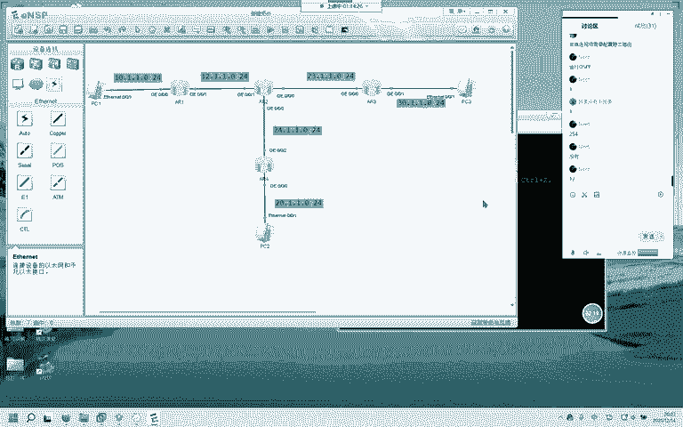

进去以后呢，咱们IPaddress多少？12。1。1点，你可以任意啊，2和254都行。那我们就二吧掩码24位。2马24。敲完回车，你可以查看当前这个接口有没有配上去，你配的到底对不对。

3个255代表掩码是24位，有没有问题？到这里。有没有问题没问题吧，那我们怎么检测呢？我们来拼一下啊，拼。聘谁呢？现在是R2，我们聘12。1。1。1，看一下能不能通。好，这个大家也都认识吧。

这是华为拼托的结果。证明我们R1和R2之间这两条链路连接有没有问题？没有问题吧。哎，没有问题。好的，我们再来做R2上面一些配置啊。R2我们需要做哪些配置呢？来看啊，这个接口已经做了。

这两个接口现在还没做。interface吉比特的0-0-领口吧，领口是23网络，对吧？IP addressdress23。1。1点。因为它呢是第二台路由器，我们就给它起为2。好记。可以吗？它是第二台。

我们就起为2一也可以啊，一也可以。你随便，因为它属于R2，所以我这边给它起为了2，然后的年码是24位。然后它还需要进入到哪个接口，0-0-几0-0-2对吧？IPaddress24。1。1。

2掩码24位做完我们看一下display this。你也可以怎么看呢？interface。Display interface。啊，对splay。IP interface brief。好的，咱们三个接口。

三个接口。IP掩码都配了，然后呢显示看一下正不正常啊。都起来了，对吧？那我们R2的配置有没有问题？大家对这个R2和R1的配置有没有问题？没有问题。好的，那我们来R3interface吉比特的啊。

原告原告。领口，然后呢，IPaddress23。1。1。3，它是第三台路由器，我在这儿标个3，然后我们掩码24。它呢还有1个30网络interface吉比特的0-0-1口。那在这里大家可以看到啊。

我从0-0-0口的视图，一个接口视图之下去往另一个接口接口视图啊，可以的，思科也是华为也是都可以，我直接在这儿可以敲。你看我进入到了。6告一口。可以吧？好的，IP addressdress30。1。1。

254掩码24位R3的咱们也做好了，来看R4。R4这个接口和这个接口啊，interface。吉比特的0-0-，这是二口了，对吧？IP address。24。1。1点，因为它呢是4，我就给它写为4。

然后呢，interface吉比特的0-0杠，这是0IPaddress20。1。1点哎。20。1。1。254掩码是24位。好的。做完了。这几台路由器啊基本配置。大家哪里有问题，基本配置没问题吧。嗯。

基本配置。有没有问题？没问题啊没问题。好的。那现在呢PCE我们拼一下这个。聘谁聘12。1。1。1。能通为什么能通呢？12。1。1。1是它对吧？PCE。因为不在同一个网段，他会把这个数据包交给自己的网关。

交给网关。也就是ARE这个接口收到以后，他知道12。1。1。1在哪。然后呢，他也知道10。1。1。1在哪。因为呢它可以自动获悉自身的直连网络，这个非常重要，路由器可以自动获悉直连网络。非常重要啊。

那R1能获悉到哪两个网络呢？10。1。1。0和12。1。1。0，那这个23它就无能为力了，23就无能为力了。我们来看一下R1现在自身的路由表啊。Display I P roing table。

我们可以看得到啊，十网络自动获悉，十2网络也自动获悉。但是呢这些30242320它有没有它有没有？没有的啊没有的没有。好的，那这个PC2一样啊，能拼拼的到哪儿呢？拼的到最远到这个接口，这个接口是多少？

24。1。1。2呃，4对吧？这是它这个接口。

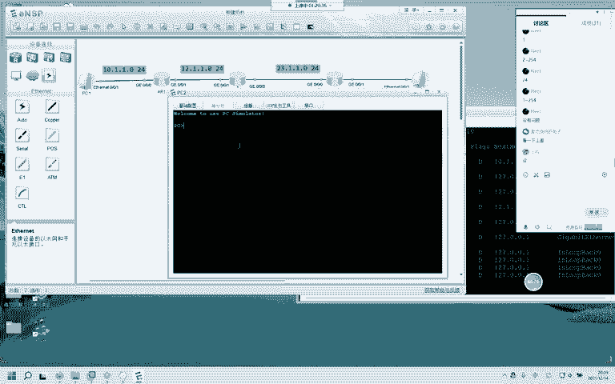

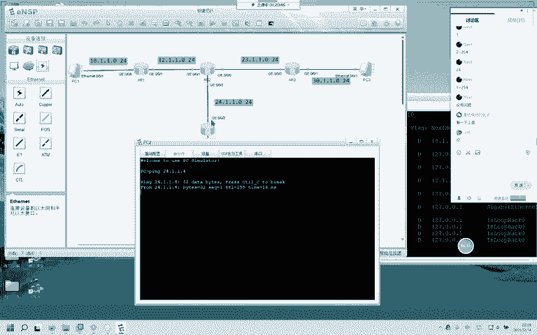

以此类推，举一反三。聘。

30。1。1。254。证明这些PC和路由器之间。PC和路由器之间联通都是正常的对吧？但是呢我PCE想要聘这个。20。1。1。1，我是无能为力的啊，这台路由器它不知道二0网络到底在哪儿。

那这个时候呢给大家演示一下。呃。这个环境的话我给大家演示一款动态路由选择协议，好吧。可以吧。动态路由选择协议。那怎么运行呢？你打开这个对话框，R一我们要运行。OSPF。10、这个呢是进程号啊。

进程号只具有本地意义，你可以运行OSPF9运行OSPF10，运行OSPF100都可以，都没有问题。为什么这里是10呢？因为华为它默认从OSPF学到的路由的优先级，这个地方会变为10。那OSPF10。

然后呢。啊，不好意思啊，我没有写这个留台地，那怎么取消呢？我们阿杜。OSPF。再输入耶现在呢我们的OSPF已经没有了，清空了啊，这个呢是删除删除命令啊。任何命令前面。加这个就是删除这条命令OSPF。

10ro台D现在呢是1。1。1。1。然后呢，我们。宣告一下自身的所有网络啊。进入到区域0network0。0。0。0-25。255。255。255。好，稍微的给大家解释一下这条命令什么意思啊，这条命令。

是说我OSPF进程，现在要宣告从0。0。0。0到25。25。25。25，自身所有的接口宣告进OSPF。宣告经过SPF那现在是给大家演示的啊，大家。如果有疑问。

咱们的后面的动态路由选择协议的课程里面会具体的讲到这个到底是为什么。大家现在只需要知道我已经把这两个接口宣告进OSPF了，好吗？敲完以后回车，我们在R2上做一个。OSPF10U台D2。2。2。2。

区域0network0。0。0。025。25。255。255。我现在做的这一切啊，都是为了PCE能和其他的两台PC通信ro台地是1。1。1。1。后面会给大家演示的，今天你不要着急好吗？

我们专门有课给大家演示，你今天就学了，后面学什么，你今天学这么多能记得住不？后面有课程，后面有课程。好，R2宣告完成以后啊。R3。OSPF10ro台D3。3。3。3。

这个ro台D啊用来标识运行OSPF这台路由器的路由器ID最好手工指定。如果像我刚刚那样没有手工指定，它会选择自身，就像我刚刚R1，我删掉了一条OSPF命令，对不对？哪去了？

这个我刚刚没有手工指定这个OSPF柔台D它会自己选选哪个呢？会选10。1。1。254。

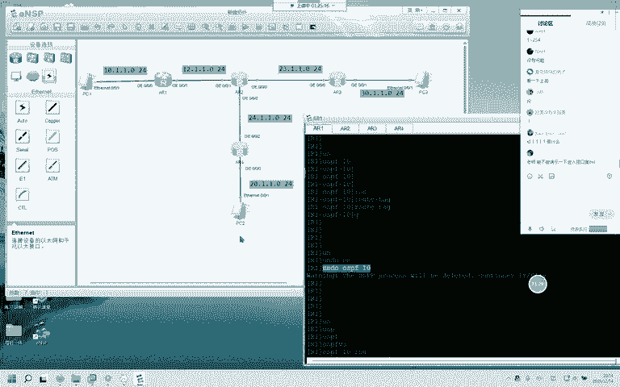

这个在后面的课程都有，不用着急啊不用着急。现在做的这一切都是为了让PCE能和这两台PC通信。哼。R3是这个ARE去域0network0。0。0。0杠。而4。OSPF。10。楼台地。4。4。4。4。0。

0。0。0。好的，等一下啊，等淘报日志。好，OSPF邻居已经建好了。我们来看一下RE通过OSPF学到了哪些路由条目啊，displayIProing table。没有关系，这节课和OSPF的关系不是很大。

咱们在后天和大后天。都会仔仔细细的讲的好吗？我现在问一个问题，我现在想看通过OSPF学到的路由，我后面要加什么，大家还记不记得？还记不记得？只加OSPF吗？你再想一想。我后面要加个什么？有没有人记得了。

对procol OSPF这条命令就是查看这台路由器，通过OSPF这款动态路由选择协议学到的路由。那我们来看一下，我已经敲了回车了。好的，二0网络学到了没有？二十网络不直连学到了对吧？23网络学到了没有。

学到了24网络学到了没有？在这儿呢学到了三0网络在这儿呢学到了没有？学到了。那现在我PC1。想去往任何一台PC，大家觉得行不行？大家觉得可不可以？我拼一下啊，聘谁聘20。1。1。1。

我聘下面的那台PC啊。怎么样怎么样，我聘20聘通了。拼通了哎，拼通了代表这几台路由器啊，他们通过OSPF都学到了整个网络的路由。我们来看一下啊display。IP。Roouting table。

 protocol OPF。你看R2他学到了哪些呢？学到了十0网络，学到了二0网络，学到了30网络。因为呢2324和12它都是直连，它不需要通过OSPF那我们现在可以看到它的优先级是1。

这就是刚刚为什么在运行OSPF的时候，我在这儿写了一个10，你可以写十，你也可以写100，你也可以写9，你也可以写101，它只具有本地意义。但是为什么是十呢？

我这边给大家的解释是因为华为的设备通过OSPF学到的路由，它的优先级就是10。刚刚有人说为什么OSPF后面加1，咱们在后面的课程里头。会讲到的。好。啊。没有关系啊，这节课就是带大家熟悉一下命令。

命令你听不懂。很正常没关系没关系，我们后面专门有类似的比这个要好很多倍的实验。比这个好很多倍的实验也合理很多倍的实验。交给大家的。好吗？好，那这个PC1和PC2以及PC1和PC3为什么能通信？

前提就是这几台路由器要有整个网络的什么的路由路由。前提要有路由，也就是说这几台路由器要知道其他的网络在哪儿怎么走。那我们呢是通过OSPF把这些网络告诉给邻居路由器的啊。那我们再来这回呢。

这回我们来一个简单点的，这个一定要让大家大家学会啊，这个一定要要让大家学会。Yeah。你可以看一下录播，因为我们现在的录屏是开着的啊，录屏是开着的，看一下录播。那通常情况下啊通常情况下。

我们这些主机使用的都是。不是一个概念，进程号是进程号，优先级是优先级、优先级和进程号。为什么事十我再给大家解释。没有网络，路由通了有啥用？啥意思啊？

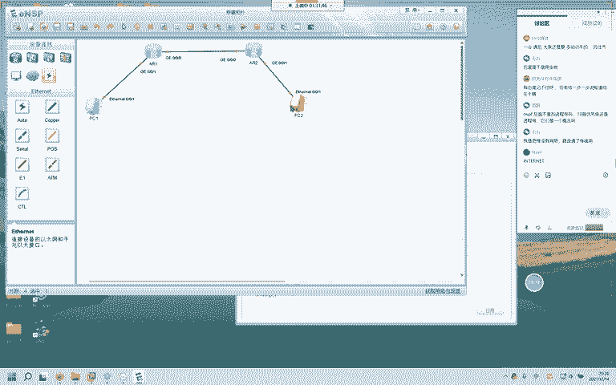

通常情况下，内网主机使用的都是私有地址啊，192。168。1。1。需要接呀，当然需要接。修改名称啊，然后呢配一下IPinterface。原告原告。依口。24位。12。1。1。1。0-0-0。12。1。

1点。点1。1。2。好。接口已经配置完成了啊。两个接口已经配置完成。也是正常起来了啊，那这边呢也是一样的啊。好，那测试一下R1和R2能不能通啊，P。12。1。1。2。骗。192。168。1。254。

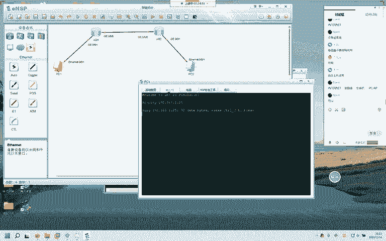

啊。254。好啊，现在呢我们不运行不运行任何动态路由选择协议啊。这是这个网络。就是这个网络教大家管理员如何加如何加一条。

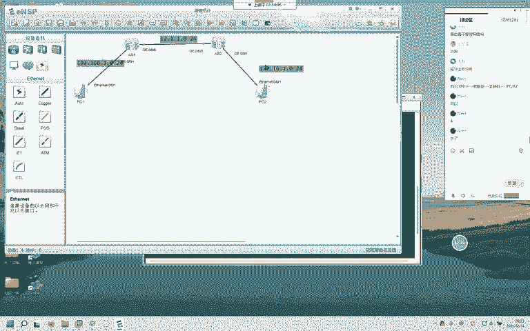

静态路由给路由器，如何给路由器告诉一条静态路由，那这呢是应该是明天晚上的知识啊。提前带大家预习一下。怎么加呢？首先R1能知道的是192和12网络172，他不知道，对吧？那我们怎么加呢？怎这样加啊IP。

root static这是什么呢？加一条静态路由的，加一条静态路由的前面这样的写法。这样的写法，然后呢，我们要加谁加172172。16点1点。0掩码是24位。然后呢，这个吉比特是什么意思呢？

这个是说从去往这个网络啊，去往这个网络。如果要去往这个网络，从自身的哪个接口出去，我们就把哪个接口的编号给他写上。大家觉得现在我应该写哪个接口的编号。哪个接口的编号一还是0，我去172网络。一还是0？

哎，0-0-0啊，0-0-0敲完以后，咱们敲回车。好，我现在再问一个I呃问题啊，displayIP。rooutintable，我想看我管理员写的路由。怎么看加个protocol，再加个sttic。

你就可以看到，哎，这是管理员手写的，它的优先级是60。这是它的吓跳，这是它的出街口。我们在明晚啊给大家。讲的是这个路由器控制层面和数数据层面，以及静态路由静态默认怎么写？还有这个路由条目的六要素啊。

好的，大家可以看到172这个路由R一已经有了。你说现在PC1能不能和PC2通？能不能？不能我PCE的可以过去，我能过去。我能不能回得来？回不来，为什么回不来，没有回包路由。

我R2还不知道你192在哪儿呢，所以我们同理需要给R2加一条路由啊，IProot static，然后呢是192。168。1。0。掩码的24位从自己的哪个接口出去？0-0-0。对吧0-0-0，然后呢。

咱们的下一跳啊。下跳是。12。1点，刚刚是不是没说这个下跳，12。1。1点。一加这个呢加这个。是告诉我从自己的这个接口出去下跳，交给12。1。1。1。然后我们再来看一下IP。那。12。1。1。1。

那我们来看R1。R一的我们把它删掉啊，怎么删呢？因为我没写吓一跳，因为我没写吓一跳，它应该是12。1。1。2。通是能通，但是为了严格严格起见啊，咱们把这条目呃，静态删掉啊。IP your static。

172。16。1。0。你筛的时候这么筛就可以了，应该是可以了。好，现在什么都没有了。我们重新写啊IProot。tatic172。16。1。0。然后呢，是野马24位吉比特的0-0-0口下跳是12。1。1。

2，为什么是二呢？你从自己的这个接口出去啊，交给的交给的第一个网络节点是12。1。1。2，就是它。好，我们再来看一下。现在正常了啊现在正常了。那么呢现在这个路由器的路由表啊。我们来看一下。

他呢你看172。16，他已经知道怎么走了。现在呢我们没有运行任何动态路由选择协议。但是呢PC1和PC2能不能通信，能不能通信P172。16。点一点。Yi。嗯。我骗一下网关啊。

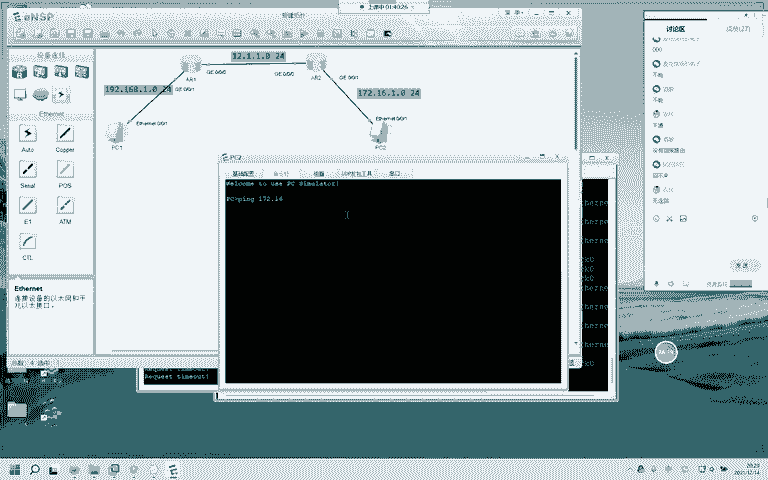

我们来直播排错啊直播排错。骗下12。1。1。2。给1。0。0。0出去。点1。254。对的。点1。2也是对的。嗯。他怎么连这个都通不了。我看一下他的网关写错了没啊。172好，问题找到了啊。

这这个网关指错了啊，网关指错了，压根儿没到件儿啊，压根没到这儿。那现在呢应该是通了啊应该是通了，再拼一下。你看。直播教大家排错。下一跳地址指的是什么？下一跳地址。对，还是DHCP好。

但是呢咱们得一步一步来嘛，你得先学会走，咱们再来跑嘛，好吧。你管理员就是有可能把这些东西给他弄错。你看我刚刚不就不不不就把他弄到了。176吗？要7我吗？好，那现在能通。那这个时候咱们网工常用的命令啊。

呃。常用的命令啊常用的命令。不只是有pin这个TICERT它呢也可以用，它呢是追踪追踪你这个。追踪你这个什么呢？你这个路由出去的时候，经过的每一跳，它都会给你返回信息。那我们来看一下啊。

我TRCERRT172。16。1。1。我先到了192。168。1。254到了我网关接口，然后又到了哪儿呢？12。1。1。2到了这个接口先到这儿，然后又到这儿，最后到达了172。16。1点1。

这个呢是路游追踪的命令啊，追踪。如果你出现问题，你可以看一看你可以看一看。你的网络不通，你用这条命令追踪一下，到了哪儿出现问题。如果它出现问题，它就是一直是井号，一直是星号。那这个星号呢，你到了12。

1。1。2，证明到这儿没有问题，那就是这儿到这儿出了问题。那比如说我现在再把它改回。改回这个我刚刚错误的啊错误的，我再来拼一下。你可以看得到啊，可以看得到现在能不能通了，是星号。

星号代表我现在收不到这个172。16。其实它现在是176。16，对吧？它一直收不到。哎，我们排错的时候就可以缩小范围，怎么说呢？我能到12。1。1。2，证明我PCE到这儿有没有问题？

我这个路径有没有问题。没有问题吧，那你剩下的路径就是这儿了，对吧？要么看看这个网关，你配对了没有，要么看看你网关指对了没有，或者说你的IP指对了没有？可以吗？这条命令这个意思。咱们再来试一下啊。

看正常了。可以吗？排错经常会用得到啊。你做了一个小实验，结果怎么通也通不了，你又不想整个的开始找，那你就用这条命令。来排查。可以吗？咋不说话了？可以啊。OK那这些呢就是咱们华为。今天要教给大家的。

那这个手写静态啊，有人问吓一跳下一跳地址啊，咱们在明天的路由条目61素里头会讲到今天呢简单的跟大家提一下，下一跳是什么意思呢？就是说你要去往一个目的地。从你自身的接口出去以后。

第一个你把你的数据包交给的第一个接口是谁？比如说你R1去往172。16，你交给的第一个是谁？是12。1。1。2，它就是你的下跳。那反之。他去往192交的第一个下跳是谁呢？12。1。1。1就是这个接口。

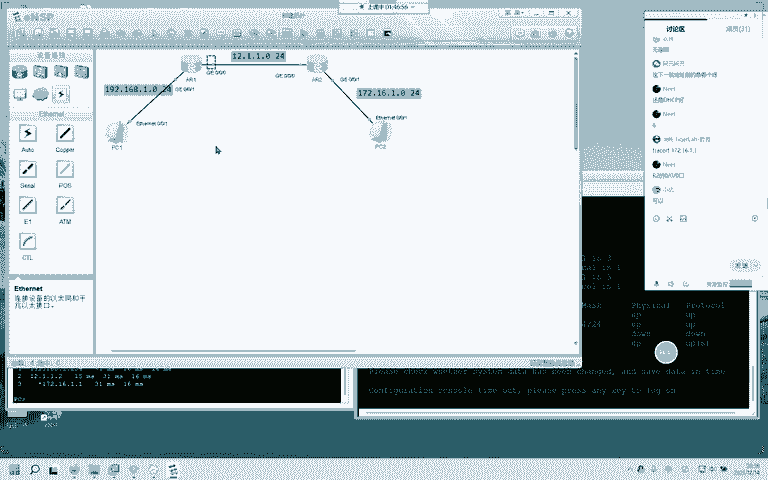

可以的吧。OK那简单的给大家看一下思科的啊。呃。

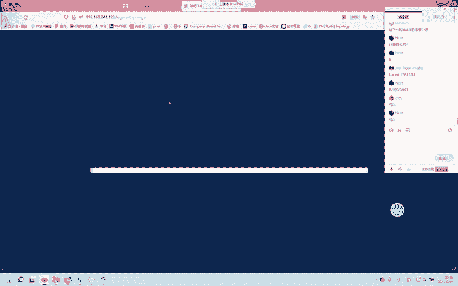

思科就搭一个和刚刚一模一样的环境。命令都是大差不差啊。

啊。删掉。咱们来加一个。路由器还记不记得？三是路由器，二是交换机。这边呢告诉我们数量加两台一和2。一和2。好啊，我们来。再加两台PC。34。然后呢，我把这个线给它连上啊。不好意思。

来看啊PC昨天呢教大家。配过知道怎么配吧。IP。我们简单一点啊，10。1。1。1掩码呢是24位，网关是10。1。1。254。好的。这边呢我们给它搞成20，好吧。20。1。1。1野码24位网关20。1。

1。254。CRT昨晚已经给大家说过了啊。单机就开了，你的火狐绑定CRT单机就开了。R1。这边要选择no。R2。也是要的no。嗯。进入到全局配置模式，interface。

这个是0-0口IP address12。1。1。1掩码，它不能这么写，25。255。255。0。然后呢，你最后还要加条命令，no shut down。因为呢它的。接口默认是关闭的，然后呢。

咱们再进入到interface。以太网的0-1口IPaddress这个是10。1。1。254，言码呢是24位255。255。255。0。然后一样啊，no shut down一定要记得这条命令。嗯。

0-0口IP12。1。1。2掩码24位。no下到。然后呢，是。0告一。20。1。1。254掩码24位。能收到？哦，host name。R1。啊2。然后呢，R一写一条静态，写到。哪儿呢？Yeah。No。

Yeah。嗯。Yeah。嗯。Yeah。IP study，然后呢是这个。2020。1。1。1掩码呢是24位。Yeah。0杠。领口下跳是12。1。1。2。Yeah。Yeah。怎么来着？Yeah。Yeah。

我想想啊。他的。静态默认怎么写来着？我给忘了。因为很久没有写这个了啊。看一下。哦。不用sting。IP。Mh。然后是20。1。1。点1。1延网24位，然后是。12。1。1。2。哎，出接口。原告0。12。

1。1。2。我记得他是可以的呀。他说我的野马。他说我的牙巴有问题。哦。真的是。看一下啊，都。S。IP。🎼Not的 protocol。Yeah。Yeah。静态写进去没有？20。写进去了。好的，这边IP。

root这个是10。1。1。0255。255点，我不信。24。0-0口12。1。1。1。Wow。真的是。255。25老老实实写这个啊，大家写的时候老老实实写这个。然后是12。1。1。1。好，写完这个呢。

PC3和PC4应该可以通信了。因为R1和R2都有对端的路由了啊，看不了了吗？可以看得到吗？现在。可以啊，行。好了，见证奇迹的时刻，20。1。1。1。脱了。通了的。哎，这边大家在这个思科的模拟器上啊。

要注意他呢没有tatic，也没有你必须这个置为0。没有没有，华为的是因为是学的思科，他会把一些不人性化的地方给他去掉。然后呢，这个必须是以点分十进制的。我还记得我还以为是24，可以，我还试了好几次24。

你看我的二4就不行。然后呢，出接口下跳，和华为的原理一模一样啊，同样。在这上面。也可以。也可以也可以追踪路由啊。追踪路由。怎么样？这是他经过的三跳。这个呢就是思科，哎，思科确实没有华为的人性化啊。

因为思科呢他是这个先搞出来的，华为是照着他搞的，他会把一些。比较不人性化的地方给它去掉。就像我的这个。你看就让我写的静态啊就让我写的静态，我可以在这儿加24。我可以在这儿加24。四磕就不行。

四磕你必须老老实实给他写252525。0。好的，那这个呢就是华为和思科啊，大部分命令都是差g。Display。display和s哎，这两个。就差这两个，然后呢。

这个CRT啊CRT因为华为呢这个界面你看多好看多好看。是吧。多好看。你的CRT啊。绑定火狐的这边的这个什么呢？tellnet。tell that那你te that。

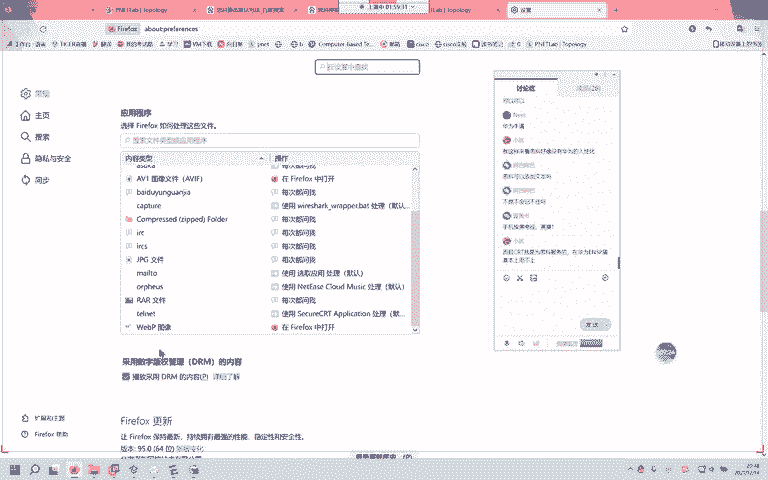

绑定到CRT，你在第一次打开的时候啊，他会问你是否要用CRT来打开此类型文件，你点击点击一律允许你以后就可以了啊。然后呢，那个CRT的安装方法，在文档里头有大家看一下。那我们今天课程的内容。

就是这些明天呢是路由条目的六要素以及静态默认啊，静态默认是一个万径油明天交给大家。然后呢，路由器最长掩码匹配规则。路由器控制层面、数据层面到底是如何工作的？明天呢是这些内容。那咱们今天呢。就到这里啊。

保存都是sve退出到。系统视图。我只给大家演示一下华为啊。sve点击Y等它这几个点等它这几个点弄完，那你呢再重启就没有关系了。我现在把它关掉，我再把它打开。你重启以后配置都有保留啊，等一下。等等啊。嗯。

看这接口的配置都在吧，那系统刚刚我们做过的所有配置。都在我们刚刚做过的所有配置都在啊，你点s我刚刚。关闭这个设备之前点sve，它下次下次打开，就是你关闭之前的状态啊，这儿要选一个Y。

那这个呢就是咱们今天的。可以可以，但是你用它干什么？你明明可以站着尿尿，为什么要把裤子脱掉呢？华为这不是给你带了一个非常好看的。这样一个界面了吗？你还要用CRT去搞CRT去搞它。别那样啊。哎。

举一个不恰当的例子啊，刚刚那个例子就像是。你站着掉，你非要去脱了裤子。好，那咱们今天的内容就到这里啊，稍后呢会把这节录播课。发给班主任，班主任会发给大家的啊。好，那咱们今天呢就到这里。

希望呢如果有不懂的地方，你可以回去再看一看。还有不懂的地方就是在后面的课程里面一定会讲到的啊。这节课不提，是因为后面一定会给大家讲，不要着急，不要害怕，有问题私聊就行了。如果是没有及时回复。

一定是在给其他的。大家的学员、朋友、同学在远程远程的时候不会看这个消息的啊，一定是在远程，远程的时间还是比较多的。好，那咱们今天就到这里，大家拜拜啊，大家拜拜。

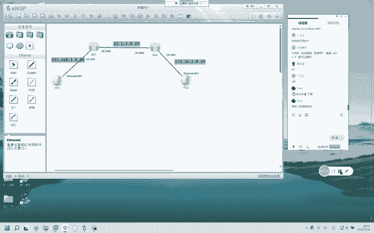