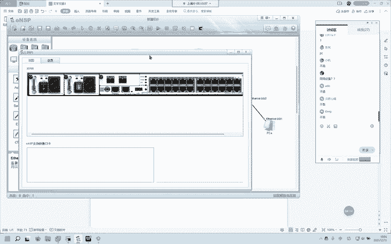
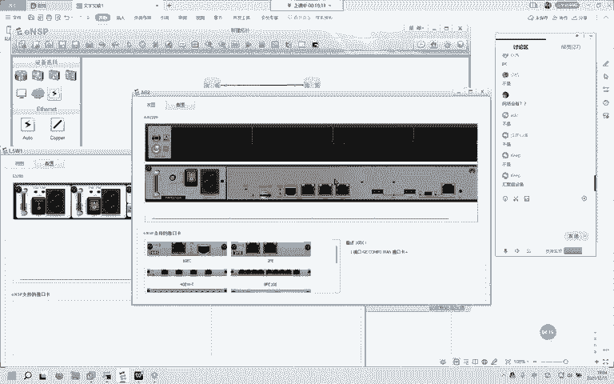
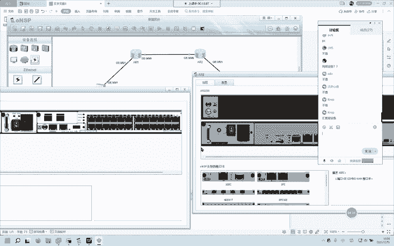
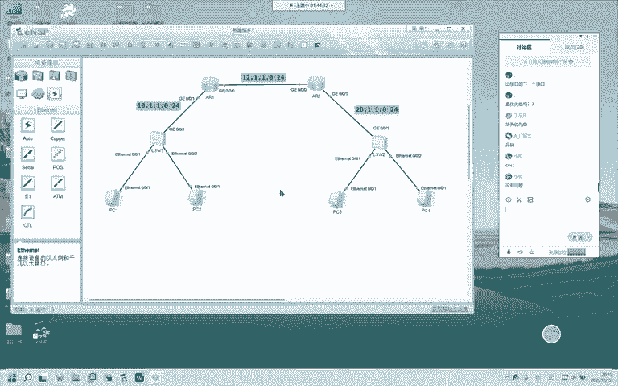
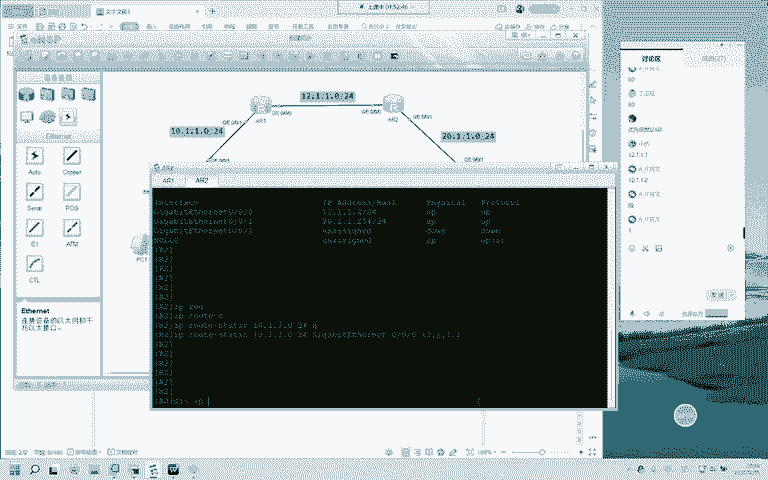
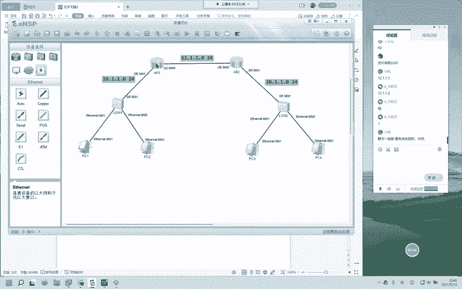
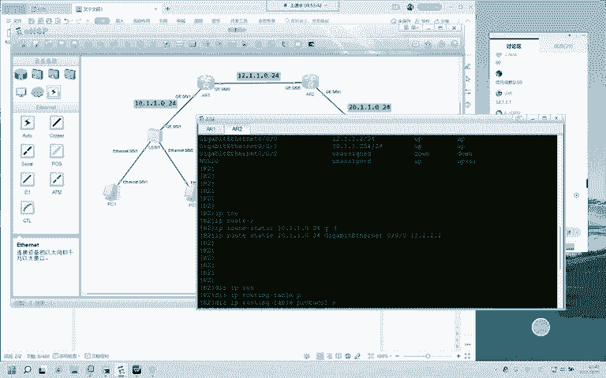
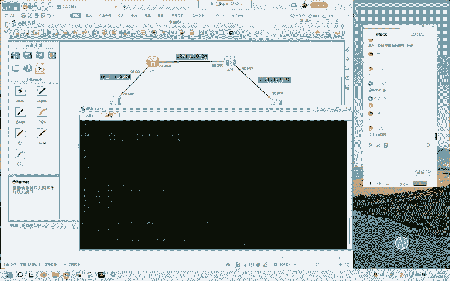
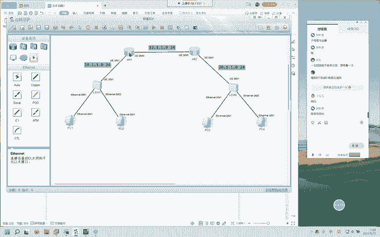
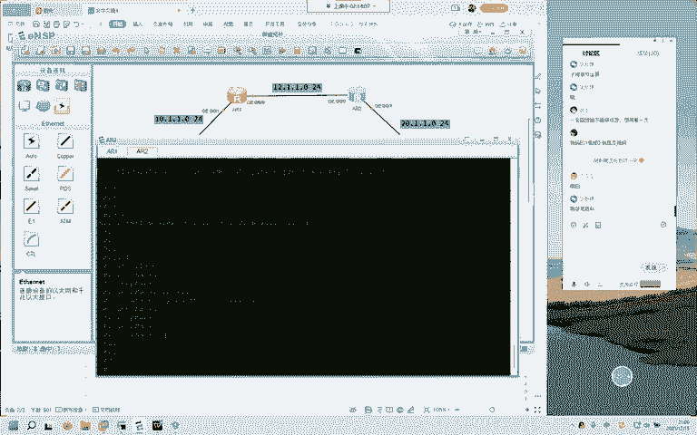

# 2022版华为认证HCIA-DATACOM教程，内部课程公开分享（已完结） - P7：XCNA-07-静态路由与路由器工作原理-mp4 - 网络工程师CCIE - BV1AP4y1J73k

时间到了啊，那我们就准备开始。那今天晚上呢是静泰路由与路由器的工作原理，我们需要记的东西比较多一点，需要记的东西啊。那我们先来给大家说一下这节课会讲到一些什么呢？路由器的定位啊路由器的定位。

然后呢是路由条目和路由表他们的关系。然后呢，是这个非常非常重要的路由器的数据层面以及控制层面，这个是重中之重啊。很重要。然后呢，下面的是这些直连路由，非直连路由11个路由器。

怎样获取非直连路由有哪几种方式？那直连路由它是可以自动获悉。然后呢给大家加了这个网关其实网关在前面的几节课里头都给大家讲过了是吧？然后呢，还有一个最长掩码匹配规则，最长掩码匹配规则。

这是这个说的是什么呢？是说当你去往一个目的网络，你的路由表里面有多条路由条目能够匹配得到这个。目的目的地址的时候，目底IP的时候，它会进行什么样的操作呢？就是说我哪一个匹配的最多。

我哪一个匹配的掩码位数最多，我就选择哪一个，因为我匹配的最多，那肯定是最精确，对吧？然后呢，是这个路路由条目的6个要素啊，这六要素必须要会啊，咱们再写一条静态的时候会用到其中的几个要素。然后呢。

剩下的是在运行动态路由选择协议的时候，咱们会用得到好吗？这个是咱们今天的安排。好，那我们就开始吧。在开始之前呢，问大家一个问题啊。大家想在现在的这个网络top中。谁是接入设备？

大家想就现在这个图谁是接入设备，好好想想接入。嗯。在想接入设备。哎。很明显吗？我们的计算机它是个终端，计算机是终端。那要把这些终端给它连接在一起，咱们需要什么呢？需要接入设备。

所以呢在这个网络中接入设备是谁呢？是这个SW1和SW2这块大家有没有问题？接入设备。这两个没问题，我们扣个一就过啊。好，那我再问你觉得这两台路由器是不是接入设备？你觉得他他俩是不是接入设备？

你觉得他俩是不是接入设备？不是的啊，他们不是接入设备。那他们呢是用来做网络间数据转发的。这个呢SW哎，你交换机switch是做网络内转发的？那有些人说哎，你口说无凭，你凭什么这么说？好。

我给大家看个东西。我给大家看个东西啊，这是交换机背后的接口。

这是路由器背后的接口。大家觉得现在这两台设备谁更适合做接入设备？

哎，肯定是一看哎，我的交换机这么多接口，这有24个口了，对吧？我的。这个网络二层网络，我能支持多少台主机呢？我能支持24台PC。哎，我能放24台PC，所以呢。它是接入设备，而这个路由器呢。

它是不是接入设备？他不是的啊他不是的。那好。那路由器的定位它不是用来做接入设备的那它是用来干什么的呢？他用来干什么？他就是用来做。哎，我们现在这个网络中，大家觉得有几个网络。有几个网络。现在这个拓扑。

哎。非常好，使三个啊，两个的，你可能是没有算路由器间它们相连的这个哎，它也算是一个网络。虽然它没有真正的主机在这个网络里面，它呢也算一个网络，它也使用了一个单独的网络号。

那这边呢是一个这边呢是一个它也是一个哎，那好，比如说我的PCE啊，我PCE现在呢产生了一个广播报文，广播报文。那比如说我SWE现在连着24台主机，那除了这个PCE，他发送了这个广播报文。

你说剩下的23台主机能不能收得到这个广播报文？能不能可以哎，可以，那你再想。这边的我都收到了你PCE发的广播报文，他们。能不能收到，他们能不能收？不能，因为呢路由器这个接口收到哎。

你这个目的IP是个广播地址哎，你是个广播地址。那么呢我是不会帮你转发的啊，我是不会帮你转发的。哎，所以呢它的第一个功能它可以干什么路由器可以干什么？第一个定位。可以干什么隔离。广播域。

这是他的第一个定位。大家对第一个定位。清楚明白吗？路由器的第一个定位。没毛病啊没毛病。那他呢我们可以再总结的稍微的细致一点，他可以可以隔离广播域，他还能干什么呢？他还能干什么？

大家看啊大家看现在这个是有几个网络。几个网络。几个网络。1233个网络，他们是连在一起的对吧？那路由器又做了一个什么角色呢？他把这三个网络。连在了一起。连在了一起。哎，它可以连接不同的网络。

可以隔离广播域，可以连接。我们用来。连接。不同的网络。就是他的两个定位，不知道。这样讲的话。大家能不能。哎，你也可以说连接冲突域没毛病啊，因为呢。这就是一个冲突域，这就是一个冲突域。

你也可以说连接不同的广播域。那冲突域和广播域的意思啊。差不多差不多。那这个广播域的意思是什么呢？是说你一台设备发送一股广播流量所能影响到的设备的集合。假如说现在这边是24台主机。

那这24台主机所处同一个广播域同一个冲突域。这样讲，能不能明白？可以吗？可以的啊。它连接了不同的广播域，连接不同的冲突域，连接不同的网络，这些说法都是没有问题的，都是没有问题的这是路由器的定位。

两个定位可以隔离广播域，用来连接不同的网络。哎，我们单单用交换机啊，我们只用交换机。大家想我只用交换机能不能上网？能不能上网？我想访问互联网。不可以的啊。

你必须要有一台设备用来连接你的网络和整个internet。哎，整个互联网。那这台设备呢就是。路由器路由器，那这是他的。定位啊，路由器的定位，我把它这两句话放在一起，放在一起，这是路由器的第一个定位。

那第二个定位是什么呢？比如说。哎，我PC1想访问PC3。路由器做了一个什么样的操作呢？路由器会干什么事情呢？你PC1，你这个就相当于是一条线了吗？直线了吗？路由器什么都不管。

我PC1发送的数据直直的就到达了PC3。是不是这样的？大家说是不是这样的？不是的，他还能做什么呢？他还能做。网络间的什么数据转发，哎，路由转发、数据转发都是没有问题的啊，它还可以做什么呢？网络间。

数据转发。这就是路由器的。两个定位。我们的第一小节。大家有没有问题？这个路由器的两个定位。啊，刚刚有人看到如何计算广播域和冲突域个数啊。你看吧，你现在有几个网络，就是有几个广播域。

只不过这个网络里头没有能产生广播的这些主机。当然你想用这个接口来发送一个广播也是可以的。几个广播域几个冲突域。三个3个，咱们的第一块知识点。记住了没有？记住了没有？两个定位可以隔离广播域。

用来连接不同的网络，你也可以把这个网络换成。不同的广播域冲突域都是没有问题的。然后呢，它还能帮你做网络间的数据转发。什么叫网络间呢？你在同一个网络内啊，它不叫网络间，你们属于同一个广播域。同一个冲突域。

它呢不叫网络间，它叫网络内。那现在这个top上现在这个top上这边和这边就不在同一个网络内，这个和这个也不在同一个网络内，这个和这个也不在同一个网络内，这叫网络间。咱们今天。第一个。知识点就是这个。

可以吧。可以吧。可以啊，那在做这个网络间数据转发的时候啊，大家想想大家想想呃，比如说。比如说呃我举个例子啊举个例子，现在先不说路由器，比如说一个快递。你在淘宝上买个快递，那这个快递上面。

你怎样确保这个快递百分之百到达你的手里？怎样确保？地址，收件人哎。很好啊，那大家说在网络间，如果我要帮你转发这个数据，我最关心的是什么？我最关心的是什么？目的地址准确。哎，我们可以这样说啊。

我关心你的原IP就是说这个数据由谁产生，我还要关心你的目的IP我要知道你到底想去哪儿。哎，里面要关注两个地方UIP。和目的IP。那这个原IP和目的IP啊，它是分装在哪的呢？封装在三层爆头中的啊。

封装在三层爆头中。原IP目的IP他关心这两个。我们路由器。那简单的这么一个介绍，不知道大家现在能不能对这个路由器形成一定的认知。对他关心原IP。交换机对交换机关心的是原木mac。

那我们在后面也会专门讲的啊，交换机的数据层面和控制层面。那好。他关心这个云IP和目的IP。比如说啊我现在。呃，我现在是一个。嗯，快递员，我现在是一个快递员，但是呢我我是新来的啊。

我今天第一天来来到这个地方，我根本不知道这个地方哪个是哪个，我也没有手机，我也没有导航，你就可以想象一下啊，这是一个假想的情况。我就是一个新来的快递员。我不知道任何地方怎么走，怎么去。

那这个时候我能不能帮你做？我能不能帮你送快递？我收到了。你的快递我收到了啊，你是张三。好，你的电话也有。但是呢你的地址也有，我看不懂，我不知道你这个地址写的到底是哪里，我能不能帮你把这个快递送过来。

肯定不可以，对吧？那这个快递员他一定要熟悉。这个片区就是他负责的这个片区。哪哪个小区，哪栋楼，哪栋楼，哪个住户怎么走？那好，你说这个路由器啊，如果我这个路由器上面任何关于。就是说我们换到这个快递员身上。

任何关于这个小区的路我都不知道。那这个时候我能不能帮你做网络间数据转发？不可以的对吧？那快递小哥呢，他肯定是会熟悉这个小区。这个片区的各个小区红绿灯呀、路口呀、小区里面的楼呀，楼里面的层呀。

他都肯定知道这些，他才能帮你快速的把快递送达。那路由器呢他和小哥也一样啊，他和小哥也一样，他也需要知道。知道什么呢？我们这个叫路由路由，哎，它的自身自身身体里面这个路由器里面要有一张表。

这个呢叫路由表路由表。比如说我现在。去往你家去往你家，我拿了一个手机，这个手机上有一个定位，有个导航，我写了你家的位置，他就会告诉我怎样怎样走，怎样怎样走。那这呢对于路由器来说，就是一个路由条目。

我这样给大家介绍。可以吗？大家能不能理解？一个路由，一条路由。可以吧，哎，可以，那这个路由。嗯。路由呢它在自身的路由表中啊路由表中。那这个路由我们怎么描述呢？就是。一台路由器。去往一个。目的网络。

目的网络的路径。路径。就叫。路遥。一台路由器去往一个目的网络的路径，就叫路由。这就是哎我们通常说到的路由表里面，那这个路由表是什么呢？路由表就是若干条很多条成百，有时候是成百上千。

这么多去往不同目的网络的路径。把它集合在一起，我们就形成了路由表。路由和路由表的关系。我给大家解释清楚了没有？路由就是你一台路由器去往一个目的网络的路径。怎么走？那这个他知道了，他就有这个路由了。哎。

如果他知道的很多很多很多，那把它放在一张表里。这个时候呢，这些路由条目就叫路由表。哎，我们怎么样介绍呢，怎么样解释。呃。路由表它就是。条目的集合。然后呢。这里面表里面的啊表里面。路由表里面。每一个。

落油条模。都是一个。都能。告诉路由器。去往一个。怎么走去往一个目的网络，怎么走？这是路由和路由表。那我看一下。大家的问题啊，首次建立新的路由条目，是不是发送？广播域获取信息呃。不是的啊。

那这个就涉及到了咱们的路由器的数据层面和控制层面了啊，我们慢慢来慢慢来，这个呢它是主机在获取。目的IP到麦克映射的时候。这个协议叫ARP地址解析协议会这样做，但是路由器不会啊，路由器不会。请注意啊。

没事儿，我们慢慢来嘛，你看还有这么多没来没来得及讲的，不要着急啊，我们讲的路由条目路由和路由表。大家有没有问题？路由和路由表。还OK吗？可以的啊可以。这边呢尽量是给大家以白话的形式啊。

就是聊天的形式告诉这些哎告诉这些专业的术语，专业的解释，专业的名词。那大家呢回去以后啊，再看一看，最好看一看辉哥讲的这一节课。那辉哥讲的都是非常非常专业的，我讲的为了帮助大家好理解啊。

因为呢大部分人都是。没有接触过网络的小白。那小白在听辉哥讲的时候，有可能就是一一头雾水啊。那我呢尽量是偏向白话一点的，希望大家能够理解啊。希望大家能够理解。这样介绍OK的吧，路由和路由表。

那我们来看一看。路由器的数据层面，以及这个路由器的控制层面到底说的是什么啊，说的是什么？那我呢。呃。好，我们还是拿这个。这个快递小哥来举例啊，快递小哥来举例，不知道能不能对应的上啊，试一下。

比如说我现在是一个快递小哥，对这一片地方对这一片地方。一概不清，一塌糊涂，怎么走，我根本不知道。然后呢，我的导航。有可能也给我展示的是错误的路径，或者说是比较绕路的这些路。好，那我现在啊问大家一下。

比如说大家把自己想为这个小哥啊，我说你去往这个花园小区32栋6楼。601去送一个快递。我告诉你的是这个你呢什么都不知道，你什么都不知道，那你肯定会想办法想办法知道这条路怎么走，对吧？

那我们能想的办法有哪些呢？有哎。比如说给你一张单子，这张单子上有你这个快递网点到这个小区这栋楼的详细的方位信息。你出了这个路口怎么拐，怎么走都有。那另一种呢，你哎我有手机，我可以开个导航吗？我看一看。

好。那大家再想想，比如说你在第二天又拿到了这个人的快递。又拿到了这个人的快递。大家还会不会。就比如说啊现在你的记忆力是非常非常好的，你走过一次，你就能记得啊。大家还会不会打开这个导航。

还会不会看这个纸条了？要不要看导航，要不要看纸条？我昨天已经走过一次了，给这个人送过一次了。看不看了。是不是？哎，不用了啊，我知道这个地方怎么走了，我不浪费那些时间了，我可以直接去啊，我的记忆力非常好。

好的那比如说比如说啊。又有另外一天，你还是去往这个小区啊。但是呢你本来是绕了一个。绕了一个圈儿。然后先开了一条路，这条路就直直的到达了这个小区。哎，我们不聊这些啊，这条路就直直的到达了这个小区。

你也知道了这条路怎么走。请你告诉我，如果你是这个快递小哥，你会按照你之前的那条路来走，还是你先知道的这条直直的路来走？你会走哪条路？近的。哎。这个时候呢，咱们知道了去往一个目的地的两条不同的路，对吧？

而且呢有一条是近的那我肯定就走哪一条了，走这条近的了。走这条近的了。好。那刚刚给大家举的这个例子啊，举的这个例子，我们把这个小哥。我们把这个小哥给他想成路由器，然后把这个包裹给他想成是。什么呢？

想城市数据包。那路由器的。控制层面啊，路由器的控制层面就是什么呢？就是通过各种各样的方式。我通过直连接口也罢，我通过静态路由也好。我通过运行动态路由选择协议。也可以，我学习各种各样的路由。

就像你这个小哥在送快递的时候学这块区域。各种各样的路。这就是它的数据层面啊，那我们来标准的给大家写一下啊，刚刚呢是比较口语化的，我们来标准的写一下它的控制层面呢就是。通过。直连或者是。

静态路由或者是运行动态路由选择协议。来学习。形程。路由表。OK。简单一句话，它的控制层面就干这件事，通过直连或者是你管理员手工告诉他，或者是运行动态路由选择协议。是的啊，我们不聊这些嘛。

我们先把今天要讲的知识点给大家聊完。哎，你通过直连。就好像是那还是拿刚刚的那个快递员举例啊，通过直连，就好像是哎，这个人正好是你的邻居，正好是你的对门，我不用学，我能直接知道这个就是通过直连。

我打个比方啊，打个比方，那这个静态路由呢，静态路由就是你的公司给你了一张纸条，这个纸条上告诉你，你出了这条路怎么怎么走，怎么怎么走。然后呢，你就能到了。那这个动态路由选择协议啊，就比较牛逼了。

你手里拿着一个手机，你手里拿着一个手机，然后呢，你说了目的地，哎，这个手机就自动的给你生成导航。哎，路由条模就是这样来的。我们这个控制层面。大家。还有没有需要聊的控制层面，路由器的控制层面？

获取路由的方式是这三种啊。缺绳肯定是属于静态的，都说缺省了，缺绳就是默认的意思。静泰啊。手工配的。默认。是由谁来触发的，能不能描述的详细一点？你就说这个直连吗？直连吗？直连啊直连它是你两台路由器。

只要你接口正常，只要你通了电，只要你接口的这些协议是正常的IP处于同一个子网段，它就能够自动获悉直连网络的路由。待会呢咱们就拿这个网络。给大家演示。然后呢，这个静态路由啊，我们在写的时候。

在这个六要素里面会有一些要素，咱们要加进去，不加的话，路由器识别不了动态路由选择协议啊。这个呢就是比较牛逼一点了，你只需要啪啪啪几条命令。那这几条命令敲完以后，他们呢自己会相互交互。

比如说你运行动态路有选择协议，就相当于。有个老师傅哎，一直在跑这个片区，他带你了解，他直接告诉你，你也能直接记住。你的记忆力非常好，他会直接告诉你这个这个园区这个小区或者说这个片区的所有的路。

所有的人家怎么走，那你一遍就记住了。通过路由数据转发，不是的啊，没有路由，你根本没有能力转发。你不知道一个目的地到底怎么走，你根本不知道快递怎么送。距离矢量协议没有啊，这个EIGRP不是吗？

EIGRP很强的。rap他被淘汰了。rap因为是以跳数来作为它这个。协议的杜良芝。最大支持16跳，你十六跳以后，瑞就学不到了。那这个在动态路由选择协议里头会给大家介绍的啊。就是说咱们这个控制层面。考试。

我不清楚啊。已经很久没有当过学生了。哎。但你学rape对于了解其他的动态路由选择协议是肯定是有帮助的啊。rape是最最简单的一款。最简单的一款动态路由选择协议。嗯。基于传文这个传文是这样写的啊。传闻。

那大家对这个控制层面。还需要。还有哪些问题吗？路由器的控制层面。就是通过不同的方式学习路由条目，然后呢形成路由表。他的控制层面。OK吗？哎。其他人呢如果有问题，咱们就当堂处理啊。

现在就处理它的控制层面就这么简单。就像你是一个刚来的快递小哥，你要记住。这个片区的所有的路，你的记忆力非常好，只要你走一次就能记住。而且你会把。已经优化过的路。比如说你的脑子里有一条是绕弯的。

有另外一条是直线的，你会把这个用直线的。替换掉绕弯的那这个呢我们在后面慢慢跟大家聊啊。就是现在的这个控制层面。应该都没有问题了吧。三种方式啊，这是三种不同的方式。直连静态路由和动态路由选择协议。

如果有人问到，一台路由器学习路由条目的方式有哪些？请注意啊，这边是学习路由的方式有哪些？你可以说有三种，通过直连静态和动态路由选择协议。那还有另外一种问法，这种问法呢。

它是说的是一台路由器学习非直连网络路由有几种方法。请注意学习非直连网络路由。两种啊，这个时候呢把谁给排除了，直连我们能够自动获悉，所以呢他就也不问了。

他问的他想问我们的就是通过管理员手写或者是运行动态路由选择协议。那好，咱们的控制层面。应该是有了解了啊。好，我们来看这个路由器的数据层面。刚刚呢。这个快递小哥啊快递小哥快递小哥。

他通过各种各样的方式学习到了学习到了这个什么呢？去往这个园区，去往这个片区各个人家的路，对吧？但是呢他现在有没有真实的送过快递？还没有。他还没有送过快递，他只是通过各种各样的方式，老师傅也好。

你给他写的纸条也好，你给他公司直接告诉他的也好。哎，他学了这些路由，他现在还用没用，有没有在用，没有再用，对吧？我刚刚呢。可能举的例子不恰当啊，他让大家以为他只有在送过快递以后才能知道这些路由。

不是的啊。就是说现在你的面前有几种方式，一种呢是你入了这个公司，你就自动了自动的知道了一些去往附近的路。另一种呢是你入了公司给你一张纸，这张纸上写着各种各样的路由条目。

另外一种就是一个老师傅天天跟你聊天，每时每刻在跟你聊天，聊的是什么呢？聊的是这个园区这个片区啊，这条路今天在修这条路很直，这条路很快，你想去，你就问我就类似是这样的，好吧，这是他的控制层面啊。

他现在还有没有转发数据来着。我们现在有没有讲到数据转发？没有啊，还没来着。那这个数据层面啊，你看它这两个字，数据层面它是干什么的呢？它就是研究哎，如何进行数据转发的啊。那我们写一下啊。数据如何查看？

路由。如何转发？这就是他的数字层数字层面。查看你的原IP哎，看了以后看自己有没有能力转发。那这下面呢我们分为分为三句话啊，这三句话非常非常重要啊。首先呢我给大家介绍。数据如何查看路由如何转发。第一点。

首先查看这个数据帧是不是发送给自己的。好。查看数据。是不是发送给自己的？不是的话会怎么样？不是就丢弃。是的话。会怎么会怎么样呢？会查看。三层爆头啊。三层爆头中原MIP。好的，这儿他。

收到了一个路由的时候呃，收到了一个数据的时候。第一件事情，首先查看数据是不是发送给自己的。如果这个数据是不是发送给自己的，那肯定是别人发错了，它呢会丢弃。如果是的话，查看三层爆头中的原IP。

这是他第一点。那我们用这个快递员也可以举例啊，比如说哎你这个快递公司有很多的员工。那有一天呢，你收到了另一个园区，这个园区你根本不负责你另一个园区的一个包裹，你会不会把这个包裹拿上。

帮另外一个快递员把这个包裹送过去。你舍身处地的想一想，你会不会这样做。这个园区和你的园区隔着十万八千里。根本就不是给你的。就算你知道。你会不会转发你会不会转发？

不会的这不是给你的那他怎样看是不是给自己的呢？那路由器作为一台三层设备啊，三层设备，你说它能不能识别二层的东西？它作为一台三层设备，能不能识别二层的东西？可以，那他呢首先会看这个什么呢？mac地址。

目的mac地址啊。目迪麦克。看这个目的m克是不是和自己这个接收接口的m克一模一样。哎，如果是的话，那肯定就是找我的嘛？找我的，如果不是他就会丢弃。是的话，我把二层的这些真头真尾给它拆掉。看三层原IP。

好吗？你这个不能是回答的哪个回答的三层设备识别不了二层的东西吗？那我再换一个问法啊换一个问法。比如说。这个OSI7层参考模型，最低层的这个物理层物理层呢它有一些规定了这些链路怎么做怎么造。然后呢。

这个光电信号怎么转？那他呢相当于我们在上学之前先去了幼儿园。我记得我昨天在这个加猜课里头好像给大家讲过哈，没关系。那就相当于你在学习拼音拼音，你幼儿园学习拼音吗？拼音吗？ABCD阿波茨的。你觉得不能吗？

😡，你觉得不可以是吧？那你听我讲完听我讲完好吗？你就认为他只认识MIP吗？没关系啊。那我们继续，比如说你现在是幼儿园，你从零开始学拼音，你学完拼音以后，你可以去一年级了。哎。

你一年级的时候去去学一些偏旁部首。假如说你现在上了幼儿园，现在呢到了三年级要学一些汉字，你现在是三年级啊。大家自己想，现在是三年级，那我现在给你一些拼音，你能不能认识？你是三年级的学生。

我给你幼儿园的知识，你能不能认识？大家觉得可不可以能不能肯定可以啊。那好，现在呢你到了六年级，你学会了加减乘除。加减乘除还有一些分数呀之类的。我给你个三年级的3乘以2。你六年级能不能认识？能认识对吧？

继续啊，那比如说我们到了初三。初三我们学了一些函数，学了一些几何。那我再给你一个一年级的拼音，你初三的会不会一年级的拼音，你初三会不会？会不会？好，那现在你上了15年学了，你上了大学，你上了大学。

我给你个六年级的东西，你能不能做得出来？肯定可以。那好，我再问一个问题，我们计算机。我计算机，你觉得计算机最多能识别OSI的多少层？多少层？大家觉得计算机能识别多少层？一层。七层。哎，肯定是7层嘛。

那你能跑应用程序代表你上层的这些能不能识别可以。那假如说哎我计算机要拉网线，对吧？我一根网线插到自己的计算机里头，那从网线这边输入过来的是不是光电信号，大家想是不是光电信号。

你从网线里头收到的这些数据是不是光电信号，是吧。是光电信号吧，这个有没有异议？大家有没有异议？你网线收到的就是数据包吗？哎。肯定是一堆光电信号，你有没有能力把它转成？数据单。你这个网线接口。

你的网卡有没有能力把它转成苏继珍？大家觉得有没有？有，那你能不能识别二层的真头真尾，你能不能看看这个目的m克是不是我这个接收接口的m克地址，你觉得他会不会看？计算机会不会看？会看。那如果会的话。

他会干什么？他会认为这个数据包就是发给自己的，拆开以后，拆开以后看一下目的IP是不是自己这个接口的IP好，目的IP也是他再拆拆一下，看看这个端口号，那端口已经属于四层了啊。他认不认识端口号。

你觉得计算机认不认识端口号。认识对吧？比如说这是一股。HTTP流量或者说是或者说是QQ微信产生的数据，他要查看端口到底由我本地的谁来接收，我交给他，我把这股数据交给他。好，交给他以后，我到了哪一层。

我到了哪一层。绘画层。那我的应用程序是不是要想办法，你发的是图片还是语音还是文字，我要想办法把它转换成语音文字这一类东西让我能看得懂，对吧？那我们网工呢一般不接触到上面这三层啊，这三层是苦逼的程序员。

那这里头没有程序员吧，不好意思啊，是比较辛苦的程序员。在看的在开发的在整的。好，那费了这么多的时间。我再问你觉得路由器能不能识别二层？能，那刚刚有问题的这一位同学。呃，现在。还有疑问吗？必须可以啊。

你识别不了二层，你交换机直接给你发的东西，你怎么办？交换机接入层发过来东西，你咋办？你不转发了吗？你不发了吗？😡，你肯定要发嘛，你肯定会识别嘛。所以呢数据层面啊。大家可能经常有一些误区，哎。

我路由器我就是识别不了交换机上的东西。我交换机就是识别不了一层的这些光电光电信号。行不行？可以。他所在的层级越高。在他以下的这些层级，他都能够识别，这叫什么呢？这叫。下层为上层提供服务。

下层为上层提供服务。就是说咱们在上幼儿园的时候，学到的这些啊拼音呀、偏旁部首呀之类的。偏旁部首之类的都是为了让我们在以后能够正常的学习文字。正常的学习文字学习方法、学习计算方法之类的打基础呢。只不过哎。

他说的非常正确啊，侧重点不同，各司其职。你三层我们刚刚才讲过嘛，定位我做网络间数据转发的。哎，你不要认为他真的识别不了二层啊，他能识别，他只是不想给你。干这件事情啊，他干的事情是。数据转发你二层多简单。

看看原MIP。我广播我就全部发，我单播，我就看匹配麦克地址端口号说出为赖。我发到这个端口发出去就好了。各司其职。那这一块希望大家明确啊。理论上。PC。你你可以直接理论上PC可以直接连PC。

现实中也是可以的，PC之间连PC是最早最早最早的局域网。理论可行，那实践一定可行。你如果现在现在这个害怕时间不够啊，我们就继续往下讲吧，待会儿给你看一下PC连PC，你可以自己看一下啊。配个IP能通。

能同。那这个交换机只不过让这个PC连的PC更多了，但这个路由器只不过让不同网络的PC连到了一起，组成了internet。可以吧。这么说。可以吗？哎忽略了下层为上层提供服务的观点。可以的啊可以的。

就是大材小用了啊。我明明能做网络间数据转发，你给我当交换机在用。我们继续啊，首先呢他会查看这个数据是不是发发给自己的，不是的话丢弃。那这个怎么看呢？就是看目的IP呃，目的m克是不是自己接口所属m克。

是的话，拆开查看三层爆头。那他最关心的就是三层爆头中的原IP。好，这个没问题。不需要呀，你给他配配个IP。继续了啊继续了。他呢。首先会查看这个，那我们第二件事情查看原IP以后呢。哎，查看。原MIP。

看完了他要看什么呢？逐个哎，一个一个叫逐个。与自身。路由表的路由条目。匹配。查看原I呃目的IP啊，这是哦对目的IP啊，查看的是目的IP逐个与自身路由表。就是自身的路由表里面的路由条目，一条一条匹配。

那他总要找这个你目的IP看看自己的路由表里面知不知道这个目的IP怎么走，知不知道怎么走。好，那查看原IP，然后呢与自身的路由表条目匹配。这个之前呢会做一个什么呢？会做一个。掩码和IP的。与运算。

与运算掩码和IP的语运算。那咱们待会儿讲这个掩码和IP的语运算啊，在这个VL来VLM那节课应该给大家讲过语运算吧，有没有？查看源码IP掩码和IP语运算语运算得到的结果是什么呢？得到。得到了什么？

网络号目的网络的网络号。然后呢，逐个与自身的路由表的路由条目匹配，就拿我与运算的这个网络号得到的网络号和自己的路由条目一个一个匹配，看一看自己能不能帮他转发，看一看自己知不知道这个网络怎么走。

这是他拆开以后做的做的事情。可以吗？这样讲可以吗？查看。是拆开不是丢弃。然后呢，拆开以后会看目的IP掩码和IP进行与运算，得到了目的网络的网络号。然后呢与自身路由表的路由条目逐一匹配，逐一匹配。好。

匹配到了后怎么办呢？匹配到了啊。就帮你转发嘛。帮你转发嘛？匹配到了就证明我的路由表里这些。陆由有没有有我有能力帮你转发吧。我有能力帮你转发吧。如果如果匹配不到。那他也是很绝情的啊，匹配不到，直接丢弃。

匹配不到，直接丢弃，这是。拆开这个。数据包看了摸底IP以后做的事情不知道。能不能理解，大家能不能理解？数据层面的第二点，这是第一点。这第二点。能啊能它还有第三点，它还有第三点。假如说你的路由表啊。

路由表。有。多条。路由匹配到了。有多条路由匹配到了，哎，我不仅仅知道一种方法去往这个目的网络，我知道很多很多种。那这个时候呢会干什么呢？会根据最长掩码匹配规则。最长页码匹配规则。选择。

最长的匹配的到最长的那条路由。转发。转包收据。好的，我们打个小标记啊，一。就一。这是2。就是3。这是路由器的数据层面，这也是我们今天的。重点控制层面和数据层面。大家有没有问题？你有没有问题？嗯。

没问题吧。好啊。好的，那我们继续了啊继续了。那什么是直连路由，什么是非直连路由呢？这个咱就不写了啊，咱就不写了，直接在这个图上给大家说。比如说R一的直连路由有哪些？比如说我们待会儿给它配1个10。

10呃，10。1。1。0。野马24这边呢是12。1。1。0野马24。这边是这个20。1。1。0EM24。什么叫直连路由？什么叫非直连路由？我现在问R一的直连路由有谁？R一的直连路由？十和。

12、这两个网络对吧？那么路由器是有能力自动获取到自动学习到这两个路由的。待会儿呢咱们配好以后，你能看得到路由表里面这两条路由。这两条路由是已经加到路由表的，它通过直连哎，直连自动获悉。

那这个20有没有办法知道R一有没有办法知道没办法，因为呢它是属于。不直连了不直连了，哎，我没办法知道了，那我也没有写静态告诉你，我也没有运行动态路由选择协议，你是不知道20在哪里的。哎。好的。

这个呢这两个对于R一来说，这两个是直连网络，这个是非直联网络。对于R2来说，这两个是直连直联网络，而这个十网络是非直连网络。那这个。呃，质量路由和非质量路由就不写了啊，没问题吧。没问题吧。直连和非直联。

好的，那我们来看啊，那什么是网关呢？什么是网关？也很简单啊也很简单。网关他说的是。一个网络的出口，一个网络的关口。那我们在。平时。比如说你去往一个你你在一个边境线，然后去往林国，它会有一个。

国门那也叫关卡。放在古代的话是这样叫的啊，关卡关口你去往另一个地方，你首先得从自己的关卡关口出去。那这个网关哎，你把这些数据包想成人的话，那他们的网关是是这个啊，他们想去另外一个国家另外一个网络。

首先要得从这边出去，哎，从这个接口出去，那这个接口就是他们的网关，不知道这样解释。可以吗？这样解释。可以吗？可以的啊。咱们还有好多呢，这里头有6个6个要素呢啊。网关。OK吧。OK那好。

什么是最长掩码匹配规则呢？就是说我去往一个目的网络。我去往一个目的网络，自己的路由表里面有多个路由条目都能匹配得到。哎，有匹配到了。那匹配到了多个路由条目，我们来举例子啊，比如说我要去的是192。

168。1。1，然后呢，我的掩码是24位，这是目的IP啊DIP。嗯。目的IP是这个那我呢通过。通过什么呢？IP和掩码的与运算，我运算得到了这个网络的网络号，请大家告诉我这个网络的网络号是多少。

这个网络的网络号192。168。1。0。哎，好的，那我通过语运算啊，说的是这里了，这里掩码和IP进行预算，得到目的网络的网络号是这个。那好，现在呢我的。我的这个路由表里面有这样的路由啊，192。

168192。0。0。0掩码呢8位，然后呢是192点。168。0。0言码是16位，然后呢，还有1个192。168。点1。0掩码是24位。那我的路由表里面有3个。路由条目都匹配到了都匹配到了这个网络。哎。

我这个匹配到了几位，我匹配到了8位。我这个路由条目我匹配到了几位，我匹配到了16位。那我这个路由条目匹配到几位呢？24位。好的，大家想大家想想啊，比如说你是又是快递小哥了啊，去给一个人送快递。

那这个快递他呢告诉你。花园小区他呢告诉你花园小区36栋，他呢告诉你花园小区36栋二楼，你会选择哪一条路，你会选择哪一条路？你会选择哎告诉你的最精确的这条路，这个呢就叫最长言码匹配规则。

8位、16位、24位，我有24位和你这个网络号匹配的到了，我就拿你哎，我就拿你来作为我路由器转发的路由，这叫最长掩码匹配规则，OK吗？可以吗？这样讲可以吗？可以的啊。可以就行。好。明白就好明白就好。

那么呢在你建议啊这节课回去以后再看一看这节课辉哥讲的，你和班主任要一下录播。那辉哥讲的呢是非常非常专业，然后呢，这些词语也是很标准很标准的，大家结合起来，结合起来，能达到一加一大于2的效果啊。

我讲的都是白话，为了让大家理解，因为小白。哎，大家的水平可能有一点点。好，那咱们继续了啊，最长掩码匹配规则没问题了吧。那我们来看路由条目六要素，路由条目六要素，这个呢是很重要的。很重要的一点。

首先呢给大家说路由条纹6要素有哪些呢？有前缀。掩马。出街口。吓一跳，然后呢是。管理距离。和。杜良芝。就这6个6个要素，6个要素。那好。前两个啊前两个是很简单的前两个是很简单的。什么是前缀呢？

就是这个IP的网络号，你就可以这么理解，就是这个IP的网络号。前缀怎么得来呢？就是我掩码和IP云算得到的结果。那我们就拿这个来说它的前缀是谁呢？192。168。1。0。这就是他前缀。

他的网络号前缀OK吗？很简单的。没有问题吧。哎。前缀怎么得来的，怎么计算也没有问题吧，跟自己的掩码进行与运算，与运算得到了。得到了这个。前缀就是网罗号，你可以这么说。网络号。等于。OK吗？

那什么是掩码呢？掩码也是很简单的啊，掩码也是很简单的。我们来规范的说一下什么是掩码掩马。指明。一个呃。网络的钱哎。多少位？是。网络位。掩码指明一个网络的前多少位是网络位。

它呢一般一般在IP地址的后面会给你写明。那这个呢告诉我们的它的掩码是多少，掩码是24位代表呢这个路由，这个IP它的。网络号。哎，这就是他的。网络位。这个是他的网络位，这个是他的网络号。OK吗？

前缀和掩马没问题吧。前缀掩马。有问题的话。扣个2，没问题，我们扣个一。前这页吗？好，那接下来呢这四个啊这4个。稍微的给大家解释一下，也能够瞬间理解啊什么叫出接口？出接口。我现在问啊我现在问嗯。假如说。

假如说我们现在在家里头在家在家，然后呢，想去超市想去超市。我经过的第一个门是哪个？我经过的第一个门是哪个？就是说我现在在家，我必须得从哪儿出去，家门出去，对吧？我经过的是哎。

我出去的经过的第一个就是我的家门儿。哎，这个是怎么说的呢？就是说你去往一个目的网络，首先你得从自身的哪个接口出去。首先得从自身的哪个接口出去，那我们再打一个比方啊再打一个比方，比如说比如说这个R2啊。

R2这边呢是外面的花花世界，这边是外面的花花世界，这是你家的前门，这是你家的后门，然后呢，这是你家的小金库啊，小金库。小金库网关和出街口不一样啊，我尽量给大家解释的清清楚楚。网关和出街口不一样。

网关在说一台网络设备要把一个数据包发送走的时候，先交给谁？出街口说的是要去往一个目的网络去往一个目的地，从自身的哪个接口出去，不一样啊，我们一步一步来。刚刚描述的这是外面的花花世界，这是你家的小金库。

好，我现在问你在家里头，你想去家里的小金库拿点零花钱，你的出街口，你的出街口是谁？你的出街口是谁？你现在是。R2是你的家。R2是你的家，你住在R2里面，你的出街口是谁？你去往的小金库拿点东西，拿点钱。

0-0-1，有没有人觉得我想去拿点零花钱，我从这个接口出去。这不是它的出接口啊这不是它的出接口。那我再问，比如说这是超市，PC2是超市。PC2是超市，你想去超市买一杯可乐，这还是你的家。你的出街口是谁？

你的出街口是谁？嗯。0-0-0。好的。哎哎，你想去超市买东西。你从哪你从你家的金库，你家金库是是个死胡同啊。是不是0-0-0，现在能不能现在能不能区分出接口和网关？

这个出街口是对于一个路由条目路由信息来说的，而这个网关是对于一台终端终端设备，我想把我的数据包发送给其他的网络首先把数据包交给谁？虽然很像，但是不同。大家能不能区分得清？出街口。和网关。

不要混啊不要混起来。那好，我们。来描述一下这个出接口啊，这个出街口哎，我们简单的来说，就说去网一个网络目的网络。去往一个目的网络，从你的哪个接口出去。这就是出接口。去往一个网网络，从你的哪个接口出去。

OK吧O吧。没问题，我们扣个一，然后呢。继续啊。好，那么这个下一跳下一跳啊，它就是稍微有那么一点点。也很简单也非常非常简单。我们就拿这个例子来说就拿这个例子来说。你的出街口。

你现在去往这个超市买瓶可乐啊，去买瓶可乐。你的出街口是这个接口，大家是没问题的吧没问题的吧。你的吓一跳是谁呢？吓一跳就是你从你的这个接口出去，经过的第一个门儿。有可能这是超市的大门。

那这个接口就是它的下一跳。0-0-0就是你去往超市的这条路的吓一跳。去往超市，你的出街口是他吓一跳是他吓一跳，永远是第一个你第一个。到达的三层地址。那放在这个例子里头，你第一个到达的门门门儿。

那我们简单的写出来啊，下跳怎么理解呢？用来描述。用来描述一台。路由器通过。呃，去往一个。目的网络通过的。第一个节点。一个节点就是一个三层地址啊。三层地址是什么呢？IP。地址。这样说。能不能理解？吓一跳。

用来描述一台路由器去往一个目的网络通过的第一个节点。那这个节点通常是三层地址，那也就是1个IP那反过来。反过来，我从比如说现在这是超市的。结账的地方，我到达超市的结账哎，不一样呀不一样啊。

你出接口是这个，你的下一跳是这个啊。你刚刚有没有在听？出街口，那我现在换一个啊，你现在在超市的这个收银台已经。收银台已经结好账了。现在呢想回想回家想回家你的出街口是哪一个？你的出街口。

你的出街口是不是超市的门，对吧？那你的下跳是哪一个？下跳就是你家门儿。这么说能理解吗？出街口下跳。那没有关系啊，咱们待会儿在学习写静态路由的时候，写静态默认的时候。带大家实操啊，这是吓一跳。

那剩下的这个管理距离和度量值。怎么理解呢？那这个管理距离啊管理距离我们来这样理解，它呢用来描述一台路由器，通过一种路由，通过一种路由获悉方式获取到的路由条目。这条路由的可靠性听起来是不是有一点点。

有点点那个这个啥有点点绕啊，比如说还是举例啊，这是你这是你的叔叔，这是你的叔叔，这是你你知道你现在是一台路由器啊，你知道直联网络怎么走，那你。这个可靠性高一点。然后呢，你的叔叔告诉你，你的叔叔告诉你。

10。1。1。0，我知道怎么走。然后呢，他告诉了你，然后呢，你就会用这个度量值，你就会用度量值来标记。叔叔告诉我的这个路和我自己学到的这些路，他们的度量值的高低。这些路径的好坏。

那比如说这个呢是一个陌生人，他不是你的叔叔了。陌生人告诉你使网络怎么走，你相信陌生人还是相信叔叔？虽然他们告诉你的都是真的。你会更相信叔叔一点，对吧？那这个度量值就用来描述通过不同的不同的路由选择协议。

你叔叔有可能是OSPF。那这个陌生人有可能是rapeOS告诉你的路由OSPF告诉你的路由，你更相信rape告诉你的路由，你不太相信。如果叔叔和。这个陌生人。

也就是说OSPF和rape同时告诉了你使网络怎么走，你会选择。叔叔告诉你的OSPF告诉你的，因为呢OSPF杜良值。高。度量之高，你信得过OSPF你信不过rape。那这个管理距离我们来简单的描述一下啊。

管理距离。对对对。优先级和管理距离。哎，优先级大家可能听着更容易更容易理解一些啊。那很明显叔叔的优先级就比陌生人的优先级高。管理距离优先级是思科、华为不同的叫法不同的叫法。华为叫优先级。是的。

华为叫优先级。现在能理解吗？这个管理距离用来。描述。通过。获息方式。通过不同的录由获悉方式。获取到的。这条路由的可靠性。用来描述通过不同的路由获取方式。获取到的路由的可靠性。哎，那这个时候呢。

这个时候呢，比如说你通过你的叔叔，然后呢，又通过一个陌生人同时学到了去往。去往呃一个就是你喜欢的地方吧，去往你喜欢的这地方的一个路。你相信叔叔呢，还是相信陌生人，相信叔叔。那这个时候呢。

叔叔的优先级怎么样？高一些，叔手的优先级高。那有些人会问了，比如说我现在有个叔叔，这个叔叔告诉了我两条两条不同的路由呃，两条去往同一个目的网络的不同的路由。那我这个时候怎么比较呢？

这个时候咱们比较度量值。比较度量值。那这个管理距离。也叫开销，也叫cost。Cost。这个时候来比较度量值。那这个度量值啊只能针对同一个人告诉你的同一个人告诉你的。也就是说同一种路由选择协议学到的路由。

如果你是通过不同的路由选择协议，你比较度量值是没有意义的啊。因为呢OSPF我们来举例OSPF是拿接口的带宽作为cost，而你ra是拿跳数作为cost作为度量值，你带宽和cost怎么比吗？怎么比。

就好像是就好像是你现在手里拿着100块，另一只手里拿着100毛。你能说100块和100毛一模一样吗？不可以的啊不可以的，你只有把他们。换算成，当然在这里头不能换算啊，你只有把这100毛换算成10块。

你才能比较的出来100块和10块的好坏。但是呢。我们现在举例啊，假设你从瑞pe学到的一条路由OSPF学到了一条路由，比较的肯定是优先级，根本不会去比较度量值。如果你非要杠一下非要杠一下。

我就要比较度量值，那好，度量值优先级告诉你这条路由值100块。瑞pe告诉你这条路由值100毛，你能不能比比较。哎，我看到他们都是100呀。100是一样的意思吗？不一样。希望大家能区分管理距离和。杜良直。

他们的区别啊。那管理距离优先级用来描述通过不同的路由获取方式获取到这条路路由的可靠性。那这个度量值呢用来描述。通过。相同的。获系方式。获取到。的这条。路由的好坏。那这个管理距离和度量值。

大家觉得有没有问题？管理距离和度量值。没有问题啊没有问题。好的，那这个路由调不六要素啊，咱们就讲完了。然后呢，下去以后啊，你们去看一看。因为呢思科和华为对于这个。管理距离啊。

也就是说优先级他们是不一样的不一样的。比如说啊你OSPF学到的路由，在华为的设备里面，它的优先级就是10。他的优先级就是10。然后呢，在思科的设备里面，你通过OSPF学到的路由优先级是110110。

不一样啊，这叫。厂商特性厂商特性。很明显啊，这些是由这些厂商。自定义了啊，他们给自定义了。

好的，那我们现在通过手写静态默认，手写一条静态默认来让PC呃静态路由来让PC和。

不同的PC能通。那好，这边呢10。1。1。1。野马24位10。1。1。254。我只配一和3啊，二和4不管了。20。1。1。1。20。1。1。254。好的，接口呢。

2一。接口我们配下interface吉比特的0-0-1口这个口啊配多少呢？IP address。这是1。点1。1。254M码24位。0告0告领口。12。1。1。1M马24位。0到0。0IP。12。1。

1。2野满24位。0告0告1。20。1。1。254E码24位。好的，我们来看一下PCE聘一下自己的网关啊，P10。1。1。254。

哎，我的四呢？网关能通。那我们来看。看路由表的命令还记不记得？Display IP。roouting table记得吧，它呢自动获悉到了1网络和12网络的路由。看到了吧，20的有没有20的没有。

那么我们现在要尝试着。手工加一条。静态路由进去啊，这个呢也是今天大家要学会的。怎么加呢？IPro static加哪一条呢？是20网络，对吧？你要告诉路由器二0网络怎么走？好的那。我要跟上前缀。就是前缀。

有问题吗？大家有没有问题？加前缀。有没有问题？加掩码有没有问题加掩码，然后呢要加一个吓一跳。呃，出接口先是出接口，后是吓一跳啊。出接口大家觉得我去往二0网络从自己的哪个接口出去。多少0-0-0好的。

还要加一个加一个什么呢？加一个下一跳地址，吓一跳我加哪个接口的IP。哪个接口的IP？是不是这个接口，这个接口的IP是多少？哎，是12。1。1。2啊，加下一跳的时候，下一跳的时候啊。

我们在刚刚在这儿也写了下一跳呢。一个三层地址IP地址啊IP地址。你写1个R2的0-0-0。他不知道他不认识R2，他只知道自己叫R1，他不认识R2。那我们怎么写呢？12。1。1。

2写到这儿这条静态咱们就已经写好了，大家对这条静态路由。有没有问题，有没有要问的？现在是第一次学。老师怎么教，大家就怎么写。可以不写。出街口。你得分情况。哎。啊，三为什么要写三？😡，哪里有3。哪里有3？

你看我们的吓一跳。下跳写一个三层的IP地址，是他通过的第一个节点，它的节点的IP是多少？

它的节点的IP我们来看一下啊。他这个节点的IP是多少？点2，对吧？你要写谁，你要写点2。还有没有问题？明白了对吧？明白好，我们回车回车以后呢，我们刚刚看过这个路由表啊，它的路由表长这样长这样。

下面的都不用在意啊，它是环回口，环回口有关的，不用在意。那我们就看这些，现在呢它是没有任何二0网络的对吧？我们再来看一次displayIPing table。可以看得到啊。

现在他学到了一条去往二0网络的路由，而且他是通过静态的方式学到的他的。杜良值。啊，他的优先级。是多少？他的管理距离是。60。60。OK那然后这是他的next help吓一跳，这是多少？这是。12。1。

1。2、从自己的哪个接口出去，0-0-0。那这个cost啊，因为呢咱们是手工写的那手写的呢。厂商。手写的我们。梅加手写的梅加，然后呢，这个。这个什么呢？管理距离啊，这是华为规定的60，华为定的60。

那我们还可以通过另外一种方式，不知道大家还记不记得啊，display IPProing table protocol static只看通过。tic学到的路由。那好，这就是通过tatic学到的路由。

二0网络二0网络。那举一反三啊，咱们要去往这个1网络IProot。Static。使网络的怎么写呢？首先要写前缀对吧？10。1。1。0再写什么，再写掩码，再写什么出接口，出接口是多少？0-0-0。

再写什么下跳。他经过的第一个节点。经过的第一个节点。是12点几点1。1点。哎，好想想啊，我们现在是R2来到了R2，它经过的下跳啊，吓一跳。12。1。1。1。好的，那写完以后。

可以看到可以看得到。咱们。已经学到了去往六0网络怎么走？这是通过静态学到的对吧？那我现在的皮呃去往二0网络啊，刚刚嘴瓢了，我们拼一下P20。1。1。1。嗯。通了啊通了。好。

那现在呢给大家哎一般要有来也有回，你知道怎么去，你还得他还得知道怎么回来嘛？你你还得知道怎么回来。我们来给大家演示啊，用OSPF。

给大家演示演示什么呢？演示OSPF的。管理距离是10对吧？它是60。如果我从OSPF学到了这个十网络路由，我的静态还在不在呢？给大家看一下这个啊，给大家看一下这个。那对于这条命令写静态。没问题吧。

有没有问题？好，那给大家来看啊，刚刚呢不是说通过不同的方式学到了同一条路由。那这个时候他会选择管理距离高的，也就是说这个越小，它就越优，越小越优，不是说它的高不是说这个数字越大越好啊。

越小的它的管理距离优先级就越高。那我们来运行一下OSPF吧。宣告。10。1。1。00。0。0。255。好的，我现在在OSPF里头宣告了一个网络。然后呢，用到的这个叫什么呢？它叫凡马凡马。

不知道凡码大家有没有了解过啊。那在后面呢也会有专门的。教大家反码掩码通配符。怎么用掩码大家都都应该认识了。那这个砝码呢？它表示的啊，掩码呢它的一代表的是网络号0呃，网络位零代表的是主机位。

而在这个砝码里头啊，它的一代表的是什么呢？代表的是任意零代表的是精确。那这个匹配在一起叫什么呢？就是说零对应的这些位置。零对应的这些位置不能改变不能改变。而这个一对应的位置。

它8个18个1一对应的位置任意我现在这条命令就是宣告了宣告了十网络哎，这个网络。能不能理解？不能理解也没有关系啊。咱们后面。会讲到的。2。2。2。2。那我这边要宣告谁呢？宣告20。1。1点。0。

然后呢是0。0。0。255。好的。这条也给他宣告进去。然后呢，你的OSPF啊目前是建立不了邻居的。因为呢你这两个接口并没有把它宣告到OSPF进程里头，我们还需要宣告哪些呢？宣告这两个接口啊。

那而一。network我们来个精确宣告啊，12。1。1。10。0。0。0，这个零就代表我这个12。1。1。1一个都不能变。一个都不能变。好的，R2，我们要宣告谁呢？network12。1。1。20。0。

0。0。宣告完成以后啊，等他报日志OK。OK已经报了啊，咱们再来看看。我们来看看哎，这个静泰还在啊在等等。在等的。应该是学到了啊。好的。大家看啊，我刚刚看了好几次，他这个这条路由一直是通过静态的方式。

一直是通过静态的方式，对吧？而且他这个管理距离优先级是60，那你现在再看。OSPF。OSPF学到了。通过OSPF学到了去往二0怎么走，去往二十怎么走？然后呢，他的优先级管理距离是多少，管理距离是多少？

10，然后呢，这个度量值他自己计算出来的啊，就是OSPF根据接口带宽计算的。咱们后面会讲到啊，如何如何计算是2，然后呢它的下跳和出接口。你别看啊，他和我们刚刚写的那条静态，这两个是一模一样的。

其实呢这是通过OSPF重新学习过来的，重新学习过来的和我们刚刚手写的那一条没有任何关系。那刚刚这个实验给大家演示的是通过不同的路由学习方式学到了优先级比较高的。那么这个优先级低的就会被怎么样？

就会被怎么样。淘汰掉。可以吗？O。那明天晚上呢是这个动态路由选择协议，动态路由选择协议。会讲rappeOSPF以及EI加RP。以及EIGRP。那在课结束以后呢。在华为这儿啊，华为他是不这样认为的。

华为认为OSPF学到的可靠，华为认为你手写的有可能会出错。我觉得你的管理员。有一点懵，有点糊。我不相信你的管理员，所以我相信我PF。这样解释行不行？华为这么认为的啊，华为认为你管理员哎。

你说不定已经熬了一整个夜了，你在做这些。各种各样的项目。然后呢，你要写一条静态的时候，你就把这个。12、写成了122。你写成了122。会在的会在的。他又会回来的。他又会回来的。你管理员你万一出错。

你写了个122，但是呢这路由器它又不能识别路由器它是无条件信任你，无条件信任你管理员，你告诉我走哪儿，我就走哪儿。然后呢，你的下一条就就出错了。然后呢，你再转发去往这个目的网络的路由的时候就丢包了。

华为他不太相信管理员的手啊，就是大家的手。可以。可以，你可以修改。好，你说修改，那我们来试一下啊。perface，我把它改成5，这就是修改这条静态路由的优先级，我给它改成5。嗯。好吧。

我把这个重新写一条啊，重新写一条。30吧。O。哈，你看啊，我写的20也在，我刚刚写的30也出现了OSPF的还在不在OSPF的怎么样了？OSPF的没了，因为我刚刚手工的修改了优先级，它呢比OSPF高了。

那这台设备他就认为哎。我来到了我学到了一条优先级管理距离更高的路由，我就把你OSPF扔掉了。可以吗？可以吗？这边还是这个OSPF的。在这呢。在这儿呢。如果你把OSPF进程取消掉啊。

那你这个又会回到刚刚我手写的那条静态的状态。手写的静态的状态。你看我把OSPF进程给他取消掉了。他又回来了，对吧？他又回来了。他又回来了。那如果我再把OSPF进程给他。修改回来。

这条命令啊是在宣告自己的所有接口，为什么是所有接口呢？大家可以看一看啊，现在呢它是全一反码全一代表你可以为零，可以为一。那我敲完回车以后啊。敲完回车以后。我就不用宣告这个20了，我也不用宣告12了。

我宣告了所有。我宣告了所有。你看十又回来了。改成4。哎，全零到全一的所有网段。那明天呢会教大家宣告啊，宣告呢你可以在进城里头宣告，你也可以在。接口下宣告接口下宣告。那今天呢就讲这么多东西。

就讲这么多东西。这个。管理距离杜良直也带大家看了啊。大家今天呢把这一页的东西。你给他摸清楚。整理好。然后呢。好好的记个笔记。好好的记个笔记。等一下可以发在群里吗？这个太丑了呀，你们要看吗？这个好丑的。

自己记的话。可以。可以，你们要是不嫌我显的写的。太过于白话，那没问题。整理一下啊，那你自己整理啊。你自己整理。行。哎呀，我是怕这个。被群里的大佬看到，哎，这个助教怎么讲的这么简单，这么傻。

傻乎乎的感觉这个主教老师。可以严格的按照。标准的来写，但是大家在看的时候就会头皮发麻了啊。嗯。那行，那对于这节课，咱们的路由器静态路由和路由器的工作原理。你掌握到了多少？就咱们这一次直播。

你掌握到了多少，有没有80%？80%。华为牛逼，每天都能看得到华为牛逼。嗯。大家还有没有其他问题？关于这节课的啊。路由器的。哎，百分之百多好。百分之百就好。1%。1%。我待会都睡不着了。被告玩笑。哎。

没事嘛，这就是一个循序渐进的，咱们慢慢来吧，谁也不是一口吃诚的胖子。一口一口来嘛。一口一口来慢慢吃。慢慢吃。烦马。反言码是什么运算？反言码告诉你的，你现在告诉你一它一对应的上面的那一位就可以为0。

可以为一。这是布尔逻辑里头的。货用算吧。与运算或运算非运算。应该是货。于或飞。可以自己了解一下啊。你就记住我现在写一条写一个返码的啊，写一个反码的。比如说10。1。1。0，然后呢，我把它。

写成这个二进制啊，0000。这是12864321684。20好的。这是他的二进制啊，这是这个IP的二进制。然后呢，我写一个。他有有有有有。写一个返码，返码是0。0点。点255。分开一下。分开一下。

那这个255代表的是什么呢？代表的是。好。这就是一个。前缀和一个砝码。那它的一呢一对应的这些位置啊，一对应的位置，它最小是谁呢？最小就是它们都为一嘛，最小就是它们都为一，我们就是呃都为都为零都为零啊。

最大呢就是它都为一是255。那0到255，这个范围内咱们都是可以任意选的。都包含进去了。OK吗？零代表的是精确精确匹配，就是你上面的这些一个都不能变，一个都不能变。那这个一上面的呢，它可以你可以变为零。

也可以变为一。这是反码的。运算。一般呢我们在概括一个宣告一个网络，宣告一个网络。包含很多很多东西的时候，就这样宣告。如果你想精确宣告精券宣宣告怎么宣告呢？10。1。1。10。0。0。0哎，就这么宣告。

那这个0。0。0。0，就是下面的权零代表前面的一个都不能改变。呵呵。好，我把这个给大家删掉啊，这里要看吗？应该不用了。明白好的。这节课。白话很多啊很多知识点都是白话。

大家呢再去看一节上一轮的上一轮的这一节。去看一下你理解起来。更好了。更快了，理解的更多了。好，那大家还有其他问题吗？哦，思科的思科的这个静态路由的写法给大家说一下啊，思科是这么写的，思科是。这么写的啊。

IP。IP。root。然后呢，是。目的网络号。就是前缀嘛，所谓的。前罪。然后呢。掩码，然后是。出街口再写。吓一跳，它呢没有华为那个杠t。时刻这么写，你要注意啊，这个言码它是不能够写成点分十进制的。

华为可以。时刻呢他你必须24位，你就得写25。25。25。0，你8位就写25。0。0。0，能明白我的意思吗？可以啊。这是4科的。那然后呢再给大家介绍一个小小的。小小的知识点啊。

不知道大家还想不想听这个小小的知识点啊，关于环回口的。应该有一天直播课给大家解释过啊，为什么要有还回口？为什么要有环回口？那这个环回口呢，我们在。NA阶段啊NA阶段我们都不是拖的主机，对吧？拖的主机。

咱们在学到了更后面一点的时候，都是用环回口来模拟自身身厚的主机的啊。比如说我现在在R2上创建一个环回口。

掩码呢是32位32位。那这个时候呢，因为我R2宣告的应该是全部的接口啊，那这边呢应该能学得到。

2。2。2啊，你看他学到了学到了2。2。2，学到了他想去往这个2。2。2啊，并不是说他知道这个2。2。2在哪，他必须得学习2。2。2的路由。虽然他们俩只差一台路由器。但是呢这个2。2。2。

就模拟了R2身后的一台主机模拟R2身后的主机，那我们在做一些比较麻烦的实验的时候啊。这个呢。2。2。2。2就能直接模拟成在R2身后的一台主机。和你拉一台主机配个IP。配个掩马。效果是我没配网关啊。

效果是一模一样的。就是说PC5是这样子的，我在R2上创建了环回口，2。2。2。232位。那么呢就相当于在RR身后模拟了一台PC模拟了一台主机。那么我们网工啊网工路由器之间能不能通不是很重要啊。

路由器之间能不能通不重要，重要的是路由器身后的这些设备能通。这才是我们的终极目标。终极目标。那么呢在后面这些实验里头，因为拖这台主机，我们又要配IP掩码网关之类的，索性就在这儿。

给它加一个环回口模拟身后的主机。那环回口还有其他的作用啊，其他的作用。比如说你OSPF，你配了OSPF忘记加了揉台地，它会选择你环回口的揉台地呃，这个IP啊选择你环回口的IP那届时呢只要你的这台设备啊。

我们说的是真机这台设备，你这些连线有可能会链路老化呀什么的，平时当一下什么的。你的。这个口是非常非常稳定的，因为你并不会真正的插拔它，它在你的内部，你并不会真正的插拔它插拔它四刻也是这样的。

也可以创建环回口啊，那给大家解释一下，如果以后咱们的实验里头。看到没有主机，但是呢老师在刚开始就敲了。look backIP address，然后呢是32位。那它的意思就是模拟这台设备身后的一个主机。

可以吧。OK习惯了思科命令的写法，其实是。思科是华为的师傅啊，你会思科华为的。一定会，然后你还能在华为里头找到一点点思科的。师傅的迹箱？但是呢咱们都是华为思科的模拟器。都演示的。

明晚呢给大家拿思科的演示吧，今天光华为了。光华为了。另外我们拿斯刻的模拟器给大家演示。那咱们今天就上到这里。OK吗？大家呃刚有人说想早点看。早点看没有关系啊，我待会儿就把这个录屏给他整出来。这是录屏啊。

陆屏一直在录。

