# 2022版华为认证HCIA-DATACOM教程，内部课程公开分享（已完结） - P8：XCNA-08-动态路由选择协议基础 - 网络工程师CCIE - BV1AP4y1J73k

好的，那这边的话欢迎大家来参加咱们的A课啊。上节课的话呢教了大家静态路由的配置啊，这节课的话我们来继续往下推进啊，来教大家动态路由选择协议的配置。那之前呢咱们研究路由器的路由条目，对吧？

路由条目呢分为两类啊，一类叫直连路由。我希望大家还没有忘记啊，一类叫直连路由。还有一类呢叫非直连路由，对吧？那一共有这么两类啊，直连路由，用来告诉路由器，一个直连的网络怎么走，对不对？😊，好的。

那这边的话欢迎大家来参加咱们的A课啊。上节课的话呢教了大家静态路由的配置啊，这节课的话我们来继续往下推进啊，来教大家动态路由选择协议的配置。那之前呢咱们研究路由器的路由条目，对吧？路由条目呢分为两类啊。

一类叫直连路由。我希望大家还没有忘记啊，一类叫直连路由。还有一类呢叫非直连路由，对吧？那一共有这么两类啊，直连路由用来告诉路由器，一个直连的网络怎么走，对不对？因为路由就是去往一个网络的路径信息嘛。😊。

这种路由的话，咱们能够自动获系啊，获系条件就是路由器连接一个网络的接口，对吧？你要n shut down给它开启，保证它的状态为up啊。然后接下来你要给这个接口配置个IP地址啊，配置正确的地址和掩码。

那只要这个接口的地址OK状态为up，对吧？路由器能够自动的学习到这个直连网络的路径信息。而这些非直连路由就不一样了。首先他们指向的是一些非直连网络，对吧？那一个非直联网络在哪里？

路由器如何来获得他们的路由，请注意啊，靠自动获系是没戏的啊，你得做一些相关的配置啊，那这个配置的话就是可以通过写静态路由的方式啊，对吧？管理员登录路由器写静态路由来强制的告诉路由器啊。

一个目的网络你该怎么走啊，那这个咱们上节课呢演示过对吧？静态路由嘛，很帅气的啊，你一条命令就能告诉路由器，对吧？一个远程的网络怎么访问啊，那它的优点是什么呢？就是精准，你静态路由怎么写。

路由器就会怎么执行你告诉路由器，对吧？你希望他访问一个网络使用哪条路径，那它就会使用哪条路径。😊，但是它的缺点是什么呢？就是当你在一个园区内，对吧？路由器的数量比较多，网络的数量比较多的情况下啊。

写静态路由器哦，对吧？没有那么方便了。因为你一调静态路由，你只能告诉路由器一个目的网络怎么走。那如果你在一个园区里。通过静态。😀啊哈哈。😊，这节课教你们怎样。😊，防止蓝屏吗？啊，现在有声音了。

现在有声音了，刚蓝屏了，不好意思，刚刚蓝屏了，不是卡了，没有卡，没有卡，蓝屏了，蓝屏了。😊，太太尴尬了。好，那这边的话我们继续啊，我来把虚拟机开一下机啊。这哎，实在是。😊，行了，实在是很抱歉啊。

我们来继续说啊，就是咱们通过静态路由啊，让路由器来获得非直联网络的路径信息。这个方式呢就是小网是没有什么问题的啊。那它的优势就是精准啊。你管理员的静态路由怎么配置的啊。

路由器就会根据咱们的配置来使用相应的路径呢来转发数据。😊，那它的缺点是什么呢？对，就是你的配置量可能会比较大啊？那比如在一些比较大型的园区内，咱们有很多路由器，对不对？你在一个园区内，咱们会有很多网络。

对吧？咱们现在写静态的时候啊，你一条静态路由的命令，只能告诉路由器一个网络怎么走啊，那你网络一多，你这个静态路由写起来没完没了，对吧？啊，这是第一点，第二点，静态路由写完之后。

如果说对吧你指定咱们通过A路径访问X网络啊，你的A路径到了静态路由能够自动发现这点吗？它不能的对吧？那当你一态路由器RE你去往X网络，咱们有AB两条路径的时候，比如说管理员认为A路径优啊。

你基于A路径配置了去往X网络的路由。那当你A路径不可用的时候啊，那在绝大多数情况下，管理员需要把通过A路径，访问X网络的这个路由给删除掉然后你重新的根据。😊，B路径来再配置一条，对吧？

那这个就是非常的不灵活。所以说呢静态啊很有用，咱们一般的是用在咱们一个园区的边界啊，边界路由器，对不对？一个接口连接运营商。那这个时候连接运营商的目的是什么呢？肯定是希望内网主机能够成功的访问公网。

对吧？那你想成功的访问公网，咱们家要有路由，对不对？所以说一般情况下，咱们会在一个企业园区的边界路由器或者边界防火墙上哎，写一条静态默认路由来指向运营商。那通过这个静态默认路由，咱们能实现什么？

内网主机到公网服务器的这么一个从内到外的访问啊，但是呢在一个园区内，如果说你这个园区真的很大啊，咱们有很多路由器，有很多网络。哎，那这个时候呢不太适合写静态。那咱们要通过第二个方式啊。

第二个方式是什么呢？就是。运行啊运行动态路由选择协议啊，运行动态路由选择协议。那这个动态路由选择协议是什么协议呢？哎，它不是一个协议啊，它是一类协议。这一类协议的范称我们就称为叫路由选择协议。

其实这些协议有很多啊，只不过他们干的事儿啊是差不多的，都是让路由器来自动的了解到这些非直连网络的路径信息啊，这就是动态路由选择协议，他们共同的目标，但是呢这一类协议对吧？里面包含了很多成员啊。

这些成员分别是什么呢？分别是我们的rappo。EIGRPOSPFize还有BGP啊，这些都是路由选择协议范畴中的各种协议。你如果想要用一台路由器啊，动态的了解到一些非直连网络的路径信息。

你可以选择其中一款啊来运作。好吧，那在一个园区内，咱们可以运行re啊EIGRP啊OSPF啊Iize啊，如果在多个园区之间，哎，咱们可以通过运行BGP来解决这样的问题。那大家可能会不太清楚啊。

就是不知道动态路选择协议到底是怎样让路由器了解到非直连路由的啊。那这边咱们可以举个例子啊，比如说了X网络连在R一身后，I一呢连接了RR2身后呢连接了Y网络啊。

那这个时候在你路由器之间运行动态路选择协议之前啊，你的路由器的相应的接口肯定要no shut down，这是必须的。然后该配IP地址的都要配置。😊，那既下的配置完毕之后，对吧？这个R一真的是一无所知吗？

R2真的是一无所知吗？也不是的，好歹在你们的路由表中，对吧？直连网络的直连路由，你们会有啊，对不对？比如说对于RE而言，他肯定会知道X网络怎么走吗，对不对？我的路由表里面会有X网络的直连路由。

那同样R2的路由表里面也会有Y网络的直连路由，对吧？这种直连路由咱们是不可能不知道的。😊，那接下来那大家想啊，我R一所拥有的直连路由，你R未必有，对不对？你R所拥有的直连路由R一未必有，对不对？

那这个时候咱们在R一跟二之间啊，通过运行动态路由选择协议，咱们的目的是什么呢？就是让你们能够通过路由选择协议啊来互通有无。什么意思啊？我通过路由选择协议把我已知的这些网络路径信息通告给你啊。

你呢把你已知的这些网络路径信息啊通告给我哎，咱们通过这种方式来做路由信息的共享，这就是路由选择协议的定位。那接下来大家会问了，Y1跟R之间，比如说运行1个reple啊。

比如说运行1个EI加RP我是通过什么样的方式把我已知的这些网络路由给我的邻居发送走呢？I，是通过一种特殊的报文啊。这个报文咱们称为叫路由选择更新啊，它的英文叫update翻译成中文叫更新。

R一通过运行路由选的协议会给R发送更新。R2也会给R一发送更新。那更新里面包含什么内容呢？这个不一定啊，不同的协议它的工作方式不一样，所以说更新报文中包含的内容也不太一样啊，那具体包含哪些内容啊。

咱们稍后呢来研究一下路由选的协议的分类，只要这个分类你们能听懂啊，那这个更新中的内容你们猜也能猜得到，O吗？那接下来哎简单的协议啊，更新里面包含的直接就是路由条目O吗？

比如说你R一原本路由表里面有X网络路由，对吧？我现在希望把我已知的这个X网络路由告诉给R2，那怎么告诉R2呢？我希望让R2知道啊，你想访问X网络可以拿我R一做下一条那这个时候R一就会给R2发送一个更新。

更新报文中就会包含X网络的路由啊。这个路由会包含什么呢？会包含一个吓一跳啊，吓一跳就是R一发送路由接口的IP。那接下来R一给R发送这个更新，就是在告诉R2啊，对吧？你想访问X网络吗？在我身后啊。

你想访问拿我的这个接口来做下一跳地址就OK了，对吧？那接下来R收到R一的更新一看啊里面包含了X网络路由，并且发现这个吓一跳了，它就会把路由介入到路由表。那届时R2路由表中啊，就会出现X网络路由。

并且吓一跳就是R一的右边接口地址。😊，那当然啊R一给R发送更新，R也会给R一发送更新啊，R2给R一发送更新中呢，就会包含Y网络的路由啊，那这个路由下一跳谁呢？是R2发送更新的它的左边接口的地址啊。

那R2给R一发送更新也是告诉R一了，你想访问Y网络吗？在我身后啊，对不对？你想访问Y网络拿我左边的接口来做吓一跳就好了，可以吧？那接下来收到更新之后，你会发现R一路由表中啊，就出现了Y网络路由。

这个路由的吓一跳，就是R的左边接口地址。😊，那通过这种方式啊，你R1R之间交互完一轮更新之后啊，R一路由表里面有了Y的路由R路由表里面有了X的路由，那届时X跟Y这两个网络中的主机啊。

就可以通过R1R2相互通信了啊，这就是动态路由选择协议，那今天咱们的学习目标是什么呢？就是教大家如何在思科华为路由器上来运行这四款动态路由选择协议啊，协议怎么运行，命令该怎么敲敲完之后。

咱们该怎么验证啊，这些协议有没有正确的去启用。那接下来在讲这些协议的配置之前呢，咱们先来给这些协议做一个分类啊。虽然说他们统称都称为叫动态路由选择协议，但是呢他们的运作方式还是有这么一丢丢区别的啊。

所以说为了让大家在NP阶段能够更好的了解每一款协议到底是怎么工作的啊，那咱们得要先了解他们的分类啊，路由选择协议分类的方式很多。第一种分类可以按照他们的工作范围来分啊，他们的工作范围。按照范围来分。

路由选择协议啊分为两类啊，一类咱们称为叫IGP。还有一类咱们称为叫EGP。请注意啊，这是路由选择协议的分类啊。IGP的中文我们称为叫内部网关协议啊，叫内部网关协议。😊，然后接下来这个EGP呢。

咱们称为叫外部网关协议啊，前者叫内部网关协议啊，后者叫外部网关协议。那接下来这个IGP的定义是什么呢？就是这一类路由选择协议啊，适合在1个AS内使用。

而我们的EGP的定义就是这些协议啊适合在多个AS之间来使用。😊，那大家会问什么叫AS啊？AS的全称叫outtenous system啊，叫自制系统，它们叫自制系统。那自制系统的翻译是什么呢？

就是一组属于相同组织拥有相同管理策略的网络设备的集合。那当然这么说的话，大家肯定没有概念了，那用简单的通俗的话来说，1个AS指的就是一个园区啊，比如一个企业往园区，你里面的所有的设备属于同一个组织吧。

对不对？你们的所有者是同一个人，对不对？然后接下来对你们配置的人是同一批人吧，你们的管理策略是一样的啊，那当然运营商的园区跟数据中心的园区也是对吧？相同的概念啊，所谓的AS指的就是一个园区。

那当然这个园区跟AS之间啊，它呢其实有一个区别啊，不是所有园区都能称为叫AS啊，能够称为叫AS的园区通常你会购买1个AS号啊，这个AS号就跟IP地址一样。

只不过这个AS号标识的不是园区内的一台路由器或者一台主机这个。AS号标识的是一个园区本身，对吧？你园区A园区B怎么区分彼此，就是靠AS号来区分。好吧，那当然这个IGP呢咱们不用关心这个园区啊。

到底有没有购买A号啊，它指的就是这一类路由选择协议啊，适合在一个园区内使用，你不要在多个园区之间使用，那他们就是IGP。那IGP有哪些呢？像锐po啊EIGRPOSPFIize啊。

这4款协议都是IGP的各中的这么一个协议啊，也就是说在一个园区内，你可以通过四选一嘛，随便选择这款协议啊，来让一台路由器了解到咱们园区内有哪些网络以及这些网络，咱们该怎么走OK吗？啊，这是IGP。

然后接下来这个EGP指的是什么呢？它指的就是这类协议啊，适合在多个园区之间来使用啊，比如说咱们有电信，对不对？电信是AS10，然后呢，咱们连到联通，对不对？连通是AS2是，好吧。

那这个AS10是一个园区，对不对？AS20也是个园区呢？你们之间为什么连根线呢？连根线的目的就是把两个园区的网络连在一起，让你两个园区内的主机啊可以相互通信。但是这个通信呢是有前提的啊。

你AS10内的主机想访问AS20内的服务器啊，你得保证AS10内的路由器拥有AS20路由，对不对？那同样AS200内的主机想要访问AS10内的服务器，你也需要保证AS20内的路由器拥有AS10的路由。

那接下来由于IGP这类路由选的协议啊，只适合在一个AS内使用啊，那所以说呢你AS10内的路由器运行的IGP啊，没有办法帮你获得AS20的路由。同样你AS200内部的路由器所运行的IGP啊。

没有办法帮你获得AS10的路由。那这个时候咱们怎样在AS之间来传路由呢，就是通过EGP来实现啊，这个EGP专门用于两个不同的AS之间啊，那通过运行EGPAS10内的路由器。

能够把AS10内的这些路由啊通告给AS20啊，那同理A20内路由器呢，通过EGP啊，能够把他们AS内的路由通告给AS10，对吧？那你们AS之间彼此路由能够交互啊，那数据层面。

你们的内网主机之间就可以相互通行，好吧啊，那这个EGP里面只包含一款啊，就是BGP。那这是第一个分类。那当然在NA中呢，咱们不用太在意BGP啊，稍微的有这么一丢丢的复杂啊，因为在NA中。

咱们着眼于一个企业园区内网就好了啊，你如何让这个内网能通啊，IGP就够了，OK吗？IGP就够了。你会问两个AS内部有相同的网盾怎么办啊？啊，你觉得怎么办呢？你来告诉我觉得怎么办。你希望怎么办？

你觉得首先会有这种情况吗？会不会有这种情况发生？会不会有2个AS里面使用相同的地址段？对呀，那肯定不会呀。😊，因为什么样的园区咱们会购买S号？请注意啊，不是所有园区都会购买的啊。

你企业网肯定不会买企业网肯定不会买，对吧？比如说你一家公司你为什么要购买S号啊，对不对？什么样的人会购买S号呢？运营商啊，运营商，只有运营商，他们才需要运行BGP来获得其他运营商的路由，对吧？

因为咱们当前全球最大的互联网叫什么叫英特网嘛，对不对？叫internet对吧？这个叫英特网啊，那这个英特网怎么组成呢？它就是由全球各国的顶级运营商互联而成的啊，你可以理解为中国电信啊，连接中国联通。

连接南韩电信啊，连连接这个中华电信啊，连接咱们日本电信连接澳洲电信，对吧？咱们全球各国运营商的网络，彼此都是有连。连接的那当然这个连接特别厉害啊，可以通过海底光缆啊。

可以通过地地光缆啊来做一个超长距离连接。那连接完毕之后，这个网络就能通了吗？不能啊，因为你电信内的路由器得要有联通的路由，咱们才能访问去往联通的这些数据，对吧？是不是？那同样联通的路由器。

也得拥有电信的路由来实现电信网络的访问，对不对？那这个时候你不同的路由器，不同的运营商的设备啊，肯定是属于不同园区的并且这些园区肯定都购买了AS号。那这个时候怎样在不同的运营商之间来做路由同步啊，对。

就是靠EGP。能理解吧？那我也说了，运营商的网络属于公网范畴。那在公网环境中，你觉得这些公网路由器他们能使用私有地址吗？不能对吧？他们只能使用公有地址。那公有地址怎么使用呢？你在用之前表先购买表先租赁。

对不对？你所购买你所租赁的地址，你觉得别人能用吗？别人用不了啊，这些公网设备所使用的公有地址啊，能够保证全网唯一啊，为什么？因为你在用之前得要购买，得要租赁，你是花了钱的啊，你花了钱搞的地址。

如果你发现别人跟你用的是一样的，你可以起诉对方，能理解吧？这个不但是有问题的，并且还是违法的O吗？那介于你刚才问的问题，两个园区内有没有可能使用相同的地址段，这个答案是有可能的？

什么样的园区咱们可能会使用相同地址段呢？那就是企业网啊，企业网。企业网企业园区啊，他们地位比较低啊，他们跟运营商不是一个lever的啊，因为他们是作为运营商的客户而存在的这么一种，对吧？

算然是终端组成的这种园区OK吗？那这个企业网虽然看起来跟我们的运营商连接啊。但是企业网内的所有节点，都是属于私有网络啊，属于咱们的内网O吗？他们不是公网设备啊，是私网设备，那这些私网设备。

咱们在部署IP的时候啊，部署的都是私有地址。那这些私有地址，咱们在用之前，你不用购买，不用租赁，对吧？所以你在企业A的内网，你在企业B的内网，你是完全可以使用相同的私有地址段的啊。

这个私有地址在使用的时候非常随性啊，你只要保证在一个企业园区内，你不要有地址冲突发生就OK了。而至于在不同的企业园区内啊，对吧？你包含相同地址段的这个网络是完全没有任何问题。

那接下来这个会影响咱们BGP的使用吗？也不会啊，因为这些企业网虽然他们是园区，但是他们第一不会购买A号，这是第一点。第二，他们也不需要通过BGP啊来获得咱们运营商的明细路由。

因为咱们一般的一个企业网对吧？会有一个边界设备，一台路由器或者一台防火墙啊，这台设备会把我们的企业网连到哪里呢？连到咱们的ISP运营商网络。那连接完成之后没有错啊。

虽然说企业网拥有访问运营商的资源的这么一个需求。但是这块咱们做路由非常简单啊，你不需要让咱们企业网内网路由器拥有咱们internet的明细路由。你通过在这个企业网的边界设备上配置一条静态默认啊。

叫静态默认路由指向运营商就OK了。那这个默认路怎么配啊？哎，一般这么配的IPro0。0。0。00。0。😊，0。0对吧？后面跟一个出街口或者吓一跳啊，这个前缀野马都为零的路由啊，咱们称为叫默认路由啊。

这个咱们称为叫默认路由。那当然它也叫缺省路由了，怎么叫都行啊，你在一个园区的边界设备上写这么一条默认路由，指向运营商。那通过这个默认你的内网主机就可以随意访问营销访问的公网的任何一个节点啊。

因为默认路由的作用是什么呢？就是帮助路由器转发，去往任何目的网络的任何数据。OK了？咱们可以通过默认路由来转发去往任何目的网络的任何数据。好，所以说了它没有运行BGP的烦恼。OK那总结一下啊。

这个BGP作为EGP中的唯一的协议啊，它适合在多个AS之间使用。而这多个AS一般泛指的是运营商园区啊，通过在多个运营商的园区之间运行BGP，对吧？咱们可以让多个运营商之间啊来共享路由。

那最终实现的是什么呢？就是我电信的内网主机可以访问你联通内的服务器，你联通内的内网主机可以访问电信的内网服务器，啊，咱们能够实现AS之间的数据访问。好，这就是路由选择协议的第一种分类方式。

那接下来咱们还有第二种分类方式啊。对，第二种分类方式是什么呢？就是按照协议的运作的这么一个类型，或者说按照他们的核心算法啊，咱们能够把协议分为这么两类啊，这是根据咱们的核心算法，根据咱们的核心算法。

或者说运行的方式啊，根据咱们的运行方式，协议分为这么两类一类咱们称为叫距离矢量协议啊，还有一类咱们称为叫链路状态协议啊，前者叫做距离矢量协议。😊，后者叫做链路状态协议。好，我们来看一下他们有什么区别啊。

首先这个具体矢量协议啊，一般书本上对于它的描述指的是什么呢？就是把它会称为叫做基于传闻的协议啊，把它称为叫基于传文的协议。OK而这个链路状态协议啊一般会被称为什么呢？叫做基于拓补的协议。😊。

那接下来讲简单一点，什么叫基于传闻的协议呢？就是当你在路由器之间运行这类协议的时候，路由器之间交互的更新报文中啊，只会包含路由，不会包含拓扑信息。当你运行完这个协议之后，虽然看起来一台路由器啊。

能够通过该协议学习到各种各样的非直联网络的路由信息。但是这些网络到底分布在什么样的位置。我们这个园区内的拓扑结构到底是什么样的？从这台路由器出发去往每一个目的网络，咱们端到端的路径是什么样的。

他一概不知道啊，他只是听信于他的邻居的传闻。他的邻居告诉他去往一个目的网络可以拿税做吓一跳，他就信任了把这种路由加表，那最终形成的路由啊，我们就称为叫基于传闻的路由O吗？因为这些路由。

他是没有拓扑做支撑呢。路由器并不知道咱们网络怎么连接，并不知道网络怎么分布，他只是听信邻居的邻居告诉他一个网络怎么走，他就怎么走，那这就是基于传闻的协议。那接下来链路状态协议啊。

哎它的方法就完全不一样了。你在路由器之间运行这类协议的时候，路由器之间交互的是更新，但是更新报文中包含的不再是路由啦，它包含的是拓布连接信息。比如说一台路由器发送更新给他的邻居。

他会告诉他的邻居什么样的信息呢？两样信息。第一样就是我是一台什么样的路由器，我叫什么名字啊，我在整个园区内，我的定位是什么样的？这是第一点。第二点，我会告诉我的邻居，我哪些接口有运行这个协议。

这些运行路由选择协议的接口啊，分别连接了哪些网络这些网络的类型是什么样的啊，哪些网络是MA网络，哪些网络点到点网络，哪些网络点到多点网络啊，这是第二点。第三点，我会告诉邻居啊。

我的哪个接口连接了该协议的邻居路由器。啊这个路由器又是谁？O吗？我会把这三样信息啊，打包成一个叫做链路状态通告的豹文，然后把它放到更新中去给我的邻。去那发送走。那我的邻居收到我发送的LIC之后，哎。

很兴奋啊，他就发现啊，他了解了我是谁了。他了解了我有哪些接口，这些接口连接了哪些网络，并且网络是什么类型的他还了解了我的哪个接口连接了哪台邻居。这个邻居是谁。那接下来这个时候呢。

他就能基于我通告的LIC信息啊，来画出一个范围的网络的拓扑图啊，这个拓扑呢是一个术语啊，我们称为叫tology。😊，叫拓普啊，这个拓普指的是什么呢？就是网络连接图啊，你一个网络是怎么连接的，对不对？

里面有哪些路由器，路由器之间通过什么接口互联，网络分布在路由器的什么位置啊，你把这些信息啊，用图示的形式给画下来，我们就称为叫拓扑OK吗？啊。

那这个时候我的邻居路由器收到我发送了LIC了解到一个范围的拓扑连接之后啊，它就能知道从它出发，去往每一个非直连网络的端到端的路径是怎么样的。然后人家呢能够自己判断啊。

我去往一个目的网络有哪些路径可以使用，对吧？哪条路径离得比较近，哪条路径离得比较远，哪条路径比较优，哪条路径比较列。那接下来它会判断出去往每一个非直连网络的最优路径，再把这些最优路径信息。

加入到路由表来转发去往这些非直连网络的数据。那这个就叫基于拓补的协议。因为在运行这类协议的时候，没有邻居会告诉我这台路由器啊，我去往一个网络该使用谁做吓一跳。我的邻居都很无私啊。

他们会告诉我他们是谁叫什么名字是一台什么样的路由器，他们有哪些接口，这些接口连接的是什么类型的网络，并且网络都是哪些，他们会告诉我他们哪个接口连接了哪台邻居，邻居又是谁，那这个时候基于他们通告的信息啊。

我能清晰的知道网络中的一个范围，对吧？到底是怎么连接的，这个范围内包含多少台路由器，这些路由器分别叫什么名字，大家量量怎么连接的网络到底怎么分布的。

我能基于这个top信息来自行判断去往每一个非直连网络有哪些路径可以走，最终我会选择最优的路径来转发，去往这些目。网络的数据。那这就是链路状态协议。也不是啊，你一个接口可以同时运行多款协议啊。

这个是没有要求的，没有限制的啊。好，那接下来距离矢量协议，我们就来举个例子啊，比如说R一连接R连接X网络，对吧？那这块的话，当你给路由器的接口配好地址之后呢，你会发现R一是没有X网络路由对吧？

那如果这个时候你希望让R一拥有X网络路由，你可以在一跟二之间来运行一款距离矢量协议。那当你运行完这个协议之后，哎，大家也都知道了，R2会给R一呢发送一个更新报文。

这个更新报本里面呢就会直接包含X网络的路由。那R给R一发送这条路由的目的是什么呢？就是让R一知道啊，如果R一想访问X网络可以拿R来做下一跳，能理解吧，这就是基于传闻协议的特征啊。R给R一发送的更新。

不会告诉R一他是谁，不会告诉R一X网络在哪里，不会让R一知道从他出发去往X网络的端到端路径是什么样的。相反，R2会告诉R一啊，你想访问X网络吗？你若果想拿我做吓一跳就OK了啊，我只会跟你说这些信息。

能理解吗？我不会让你了解到咱们端的端的网络怎么连接的，我只会告诉你，你可以通过我做吓一跳来访问这个目的网络。那接下来这个时候啊一收到更新之后呢，他只能选择信任，为什么呢？

因为他也不知道top到底怎么连接的，他也不知道从他出发去往X网络，对吧？咱们的真实路径是什么样的，所以说他只能选择相信他的邻居给他发送了更新。他只能选择信任他的邻居跟他说的话啊。

那届时他的录表里面呢就会添加出X网络路由，并且使用R的左边的接口地址啊，来做下一条地址。那虽说如此啊，但是R一的心是很虚的。因为我通过R访问X网络到底能不能通，我一点把握也没有。

因为我也不知道X网络在哪里。但是我只能选择相信R。那如果说R给我通告的路由信息是对的那这个路由没问题，我使用它可以成功的访问X网络，但是相反，如果说R给我通告路寸呢。哎，那这个X网络咱们就拜拜了啊。

就失联了。OK了。那这就是距离矢量协议的最大特点。它一旦在复杂的网络环境中运作啊，你一旦在配置的时候出现了一点纰漏啊，咱们有可能会出现路由选择环路啊，这个路由选择环路就跟交换环路一样啊，都是环路。

什么叫环路呢？就是你路由器之间彼此通告的路由信息啊，是错的。明明R一没有办法利用R做吓一跳来访的X网络，但是R给R一发送了更新，告诉R一啊，对吧？你可以使用我来做吓一跳访的X网络。

那这个时候R一收到了错误的路由，那你在使用路由转发数据的时候，对吧？你收到去往X网络的数据啊，你把数据发给R，那肯定到不了吗？

那这个时候去往X网络的数据会在路由器之间有可能会来来回回的沿着一个环传递下去。那这个就是路由环路。那当然这个三层的路由环路相比二层交换环路还稍微好一些啊，因为你路由器在转发数据的时候。

你不可能有无止径转发啊。路由器收到一个数据包，在转发之前呢，它会把数据包的三层爆头中的一个字段啊，这个字段叫TTL啊，叫time leave存活时间，它会把三层爆头的TTL字段的值啊减一之后再发送走。

那这个TTL字段最大值被255。当这个字段的值被减为零之后啊，这个数据包呢就没有资格被转发了。这也就是说你一个应用产生一股流量，这股流量就算它TTL值啊使用255啊。

也不用担心这种流量最多只能被路由器转发255次啊，那到达第256台路由器，对吧？它收到这个数据包一看啊，TTL值怎么样变为零了，它会直接的把它给丢弃掉。当然，这也仅仅是缓解咱们环路的这么一个阵痛啊。

环路产生了，你网络不通，这个才是最麻烦O吧。那当然这块的话，咱们就尽可能调腰吧，来避免环路产生。那这个链路状态协议就不一样了。哎，咱们还是刚刚张图啊，比如说R一连接R连接X网络。那在这个环境中。

如果你要运行一款链路状态协议啊，让R一了解了X网络路由啊，咱们路由的获系方式是完全不同的啊，那在运行链路状态协议的环境中啊，R呢也会给R一发送更新。没有错啊，但是更新里面并不会包含任何路由啊。

也就是在这一块R并不会告诉R一，你去往X网络，可以拿我做吓一跳，我不会给你做任何的路由转发的建议啊，我不会给你做任何主观的建议。我只会告诉你一些客观的事实比如说我会告诉你啊，我叫R。😊。

我的路由器ID是多少啊，没有错啊，就跟运行生成数，每台交换机都要有一个交换机ID一样啊，你路由器运行对吧？链路状态协议，你也有一个路由器ID这个咱们称为叫RID啊。

路由器ID这个路由器ID标识一台路由器到底是谁你在一个环境中，如果你包含多台路由器啊，每台路由器的路由器ID都不能相同啊，那这块R给R一发送的更新里面对吧？就会包含一个信息啊，说我是R。

我的路由器ID是多少啊，我会告诉你我是一台什么类型的路由器，比如说是一个区域内路由器啊，还是区域边界路由器啊，还是自制系统的外部路由器啊，对吧？我会告诉你这些啊，啊，sorry不叫自制系统外部啊。

叫自制系统边界啊，我会告诉你我的属性。然后紧接着正题来了，我会告诉你我当前参与协议的接口有两个啊，一个是左边的接口，一个是右边的接口。我会告诉你我这两个接口连接的网络是什么类型的啊。

是点到点的还是MA的还是点到多点的啊，我会告诉你我这两个接口连接的网络，他们的前缀掩码度量值都是多少并且我会告诉你我的这两个接口啊，有没有连接该协议的邻居，如果有这个邻居又是谁。

他的路由器ID又是多少啊，我会把这些信息呢整理成一个链路状态通告啊，它叫LSA啊，然后接下来我会把这个LIC呢装到更新中去发送给R一O吗？那接下来R一收到更新。

看到了里面的LIC读取了LIC内容就了解到了。哎，我的右边的接口连接了RR它有两个接口，一个接口连接我还有。😊，一个接口连接X网络。那我就清晰的知道，从我出发去往X网络啊。

端到端的路径是什么样的那接下来如果我去往X网络啊有多条路径可以使用，我会在这多条路径中啊来选择一条最优的加入路由表。这就是说在链路状态协议运作的环境中啊，R没有给R一任何建议。

但是R一最终路由表里面形成了X网络路由。只不过这个路由不是听信邻居的传言啊所产生的，而是他自己了解到一个范围的拓扑连接信息之后啊，我基于拓扑连接信息，结合路径好坏的判断机制啊，自己判断得出的。好吧。

这就是这两类协议之间最大最大的区别。OK吗？这就是他们之间的最大区别。如果有几跳怎么算？一样啊，所有路由器之间两两都运行协议就好了。对啊，比如说你R身后再有一个R3，有问题吗？其实没有问题，对吧？

那届时就是R3，对吧？会把它的网络连接信息告诉给R2R2呢会把它的网络连接信息告诉给R一，并且顺带的R也会把R3的网络连接信息告诉给R1。那所以说R一跟R3虽然没有直连。

但是通过R2R一既了解到R2的网络是怎么连接的，也了解到R3的网络是怎么连接的。那当然这个前提是大家在同一个区域，对吧？那所以说虽然R一跟R3没有直连，但是R一还是能够清晰的得知啊。

我的右边的接口连接了RR2有两个接口，一个接口连接我一个接口连接R3，我还能知道R3有两个接口，一个接口连接R2，一个接口连接X网络，我能知道从我出发去往X网络的端到端路径信息是怎么样的。

然后接下来如果这个路径有多条，我就会根据每条路。附度量值的大小啊，来判断一条最优的来加入路由表，访问这个目的网络。能理解吗？对，每台路由器都了解其他的路由器的连接信息。那当然这有一个大前提啊。

大前提就是大家要在同一个区域内啊。如果说大家不在同一个区域，那这个规则呢是不太一样的。OK吧？就是边界路由器里面所有互联的信息。对的，没有错。是的。这也不是报文越传越大啊，不是报文越传越大啊。

R3呢为了告诉大家伙，他是谁，他有哪些接口连接哪些网络连接哪些邻居，他是不是会产生1个LIC啊，对不对？他把他的LIC发送给R之后，R会接收，没有错的，因为他需要了解R3是谁。那与此同时。

R会复制一份R3的LICR，顺道的发给R一。能理解吗？啊R会把R3的LIC复制一份发送给RE。所以说就算R一跟R3没有直联，但是它是能收到R3的LIC的。

它能通过R3的LIC了解到R3是一台什么样的路由器，有哪些接口，连接了哪些网络连接了哪些邻居。OK了不是说越传报文越大啊啊，你R会产生一个关于你自己的LIC啊。

R3也会产生一个关于它自己的LIC最终你们俩的LICR1都能收得到啊。当然同理啊你R一产生的关于你的LIC啊，R2R3也都能收得到。

所以你会发现最终这三台路由器都能了解到咱们这个范围的网络啊是怎么连接的。大家都能知道，在这个环境中就有三台路由器，R1R2R3，大家彼此怎么连接的网络怎么分布的啊，都是一清二楚。😊。

那这个距离矢量协议就不一样了。比如说距离矢量协议这边的话，咱们再加一台R3啊，R3连接了X网络啊，你在123之间哎，比如说运行了一块距离矢量协议。来，那这个时候R3知道X网络怎么走，对吧？

它就会给R发送一个更新。😊，更新里面直接包含X网络路由，就是在告诉R2啊，你想去往X网络吗？想可以拿我R3来做什么啊？来做下一条。那接下来这个时候R2的路由表里面就会更新出X网络的路由。

那接下来R2再给R一发送更新的时候，这个X网络路由也是会包含的啊，也是会包含的那届时R就会告诉R一，你想访问X网络吗？想访问的话，拿我R2做下一条那最终R一收到更新之后。

也会把X网络路由啊加入到本地路由表，但这个时候R一很懵逼的，对吧？从我本地出发去往X网络经过了哪些设备啊，对吧？每个直连接口的地址是多少，不清楚啊，一概不清楚，对吧？X网络在什么位置。

从我出发去往X网络的端到端的每条路径是什么样的，经过哪些设备，每。设备叫什么名字？设备之间怎么互联，直连接口地址多少啊，一概不清楚。我只是听信了邻居的传言。邻居告诉我，通过他做吓一跳，可以访问X网络。

我就信了啊，我信了你的邪，我把你的路由加表了，那就中么着啊，这就是基于传闻的协议。那两种路由选择协议怎么区分呢？最简单的方式就是你看啊路由器运行完这么一款协议之后，你能不能知晓一个范围内的拓扑连接信息。

如果不能，那恭喜你啊，这就是一个距离适量协议。如果能，那这就是一个链路状态协议。那接下来距离使让协议有哪些呢？哎，像咱们的re啊EIGRP啊，包括BGP他们都属于距离使让协议的范畴。

然后接下来像我们的OSPF，还有Iize啊，他们就是链路状态协议的这么一个范畴啊，这是两大路由选择协议的分类方式。那接下来基于咱们这个距离矢量协议，那这类协议的话算是前辈了，出现的时间比较长。

比较久远啊。那这些协议呢在发展的过程中也经过了一次变革啊，那在变革之前，这些距离矢量协议啊，咱们都称为叫有类的距离矢量协议叫classful啊，classful距离矢量协议，有类啊叫有类协议。

然后接下来升级之后呢，他们都称为叫classless。😊，叫做无类的距离适当协议啊，升级之前是有类的啊，升级之后呢就变成了无类的了。那接下来这个有类协议是有缺陷的，那这个缺陷在哪里呢？那大家来看啊。

咱们都知道路由器路由表里面关于一条路由，咱们最多包含六要素。而这种直连路由那包含的稍微少一些啊，因为毕竟没有吓一跳，对吧？直连路由咱们有哪些啊？有前缀掩马，对吧？有出街口，对吧？没有吓一跳啊。

然后有度量值，有管理距离。那这个时候当你在路由器之间运行最低使量协议之后啊，路由器把路由条目加到更新报文中去，给邻居发走。我会包含路有哪些要素呢？请注意啊，一般正常情况下会包含四要素。

哪四要素呢分别是路由的前缀和掩码，对吧？用它来表示这是哪个网络的路由啊，还是很有必要的。然后接下来出接口不会包含啊，为什么呢？因为我去往一个网络，我的出接口信息，对吧？只有我知道就够了，你不需要知道。

并且你去往一个目的网络，你通过你的哪个接口出，那跟我也没有什么关系，能理解吧？我没有必要帮你去瞎操心啊。我来告诉你，你该通过你哪个接口出来访问哪个网络，我不会告诉你出接口信息。

因为每台路由器可能来自于不同的厂商，对吧？你们的这个型号都不一样，你们的接口的编号也都不一样，我没有必要帮你操心啊，你在访问一个网络的时候，该使用哪个接口来做出接口啊，这个出接口的事儿，你自行判断。

我会告诉你什么呢？我会告诉你下一条地址，对吧？这个是必须要告诉你啊，因为我我会发送给你路由的时候，就告诉你了，你想访问这个目的网络呢？想访问那我做下一条，对吧？那我的这个下一条到底是谁啊？

是哪个接口的地址啊，我得告诉你OK吗？然后接下来哎这个度量值也必须包含，管理距离没有必要啊，管理距离只有本地，因为这个管理距离是厂商定的不同的厂。😡，关于相同的路由选择协议啊。

你们的管理距离值是不一样的。比如说以OSPM为例啊，OSPM这个协议在思科路由器上运行啊，你所获得的路由管理距离是110而你在华为路由器上运行，你的管理距离啊是1，对吧？那管理距离不一样嘛？能理解吧？

那所以说这块的后没有必要告诉你这个协议在我这里管理距离是多少。哎，没有这个必要，O吗？那这个时候正常情况下，我给你发送一条路由啊，这四要素是能包含的。你收到一条路由，如果这四要素都有啊。

你就乖乖的把它加入到路由表就OK了。那当然你可以顺便判断一下路由对你本地的出接口是哪个好吧，那接下来有类协议就没有这么舒服啦，有类协议它在路由器之间交互路由的时候，只会包含路由条目的其中的两要素。

哪两要素呢？我给你发送一条路由，对吧？我。只会告诉你陆游的前缀，只会告诉你陆游的度量值，而掩马跟吓一跳是不会包含的。这意味着什么呢？这意味着接收者路由器收到路由之后啊，我得要猜测路由的掩码跟下一套地址。

对吧？那这块为了避免猜错，我们就规定了，当你在一个园区内运行一款有类距离矢量协议的时候，你在做地址规划的时候，你最好就直接使用主类地址，你不要做子网化。那当然不做子网化，地址浪费太过严重啊。

为了节约地址，咱们在做子网化的时候，你得保证在一个园区内啊，属于同一个主类网络的所有子网段，大家的网络位长度完全相同。这相当是咱们在做子网化的时候啊，你要做FLSM这个叫定成子网掩码。好吧。

什么叫定程子网掩码呢？就是你得保证啊，在一个园区内，对吧？如果你使子网段的地址啊，那就是属于同一个主类网络的所有子网段，你们的网络位的长度相同OK吗？那这就是FLSMO吗？强调一下。

属于同一个主类网络的所有子网段，你们的网络位长度相同，这就是FLSM因为只有当你满足这个条件了。你在路由器之间运行有类的距离适当协议，你不用担心路由器之间本来该交互的路由啊，没有办法交互。

你也不用担心一台路由器收到了没有掩码，没有下一跳的路由之后啊，你把路由的掩码和吓一跳给猜错掉。啊，不用担心这样的事情。那当然这很麻烦啊，毕竟你路由器收到路由残缺不全的，你要猜东西，为了避免猜错，对吧？

你牺牲了咱们子网化的灵活度啊。因为做子网化的目的是什么？是为了节约地址。你想要把地址节约到极致。我们在规划子网化的时候呢，要使用这种方式要叫VLSM这个叫不定常子网页码。我们把它也称为叫做可变程。

可变成子网页码啊，这指的是什么呢？就是你在一个园区内在做地址规划的时候，你可以肆无忌惮啊，你可以在一个园区内对吧？使用任意大小的属于同一个主类网络的这些子网啊。

你完全没有必要担心啊这些子网它们大小是否一致，一致不一致，都无所谓啊，那这块的话，如果你要做的VOSM你如果运行了有类的距离矢量协议，不好意思啊，这个协议就没法运作。啊这个时候为了能够支持VOSM啊。

我们就把这些距离矢量协议呢，从有类的升级成无类的啊，当你在路由器之间运行无类的距离矢量协议，啥问题都没有了，为什么呢？因为在运行无类的协议下，路由器之间彼此交互的路由，这四样信息呢应有尽有。那应有尽有。

这个路由就是完整的你接收者路由器收到一条完整的路由，你任何信息都不用猜，对吧？不用猜也就不会猜错什么。那这个时候你做VOSM啊是没有任何问题的那当然由于相较之下，VOSM呢比FOSM更加的节约地址。

所以说咱们一般呢99。99%的园区啊，咱们在做地址规划的时候，都会通过VOSM来做地址的自我化。并且顺带的通过运行无类协议啊，来解决路由传递的这么一个问题。😡，那当然需要注意的是，有类和无类。

它是属于距离矢量协议的这么一个细分的这么一个分类。它跟链路状态协议没有关系啊。因为路由器之间在运行链路状态协议的时候，你们虽然交互更新，但是更新里面根本不会包含路由啊。

所以你也不用纠结这个路由到底能携载什么东西了，因为根本就不会包含。那当然有的人呢他想问了，那链路状态协议。如果你要按照有类无类的说法来说啊，它到底属于哪类呢？好，请注意啊，是属于无类范畴的。

因为你在一个园区内如果运行链路状态协议，这个子网化，你可以使用VOSM啊，你不用担心这个协议啊，在你使用VOSM的情况下运行不下去。原因就是因为链路状态协议在运行的时候。

路由器收到LIA也不用猜测任何东西。既然不用猜就不用担心猜错，既然不用担心猜错，那这个地址子网化啊，你想怎么子网化就怎么子网化啊，这个是路由选择协议的这些分类。那了解完分类之后呢。

我们来看一下这些协议怎么运作啊。😊，环境呢就如同咱们上节课的静态路由环境。好了，我来把这个环境给还原出来。请千万不要蓝屏啊。不要蓝屏不要蓝屏不要蓝屏。好，那这边的话呢，咱们设备的话给开一下机。

三台路由器R一连接2连接3，每台路由器创建一个环回口啊，你想要通过运行动态路选的协议，让这些路由器彼此了解到其他邻居路由器的环回口路由。那这些路由选的协议该怎么启用呢？请注意啊。

所有的IGP咱们有相同的启法啊。首先，为了让路由器之间能够彼此交互更新啊，路由器的彼此互联的接口，必须要启用IGP好吧，路由器的互联接口，必须要启用IGP什么意思啊？二的接口跟一的接口要启用，对吧？

一的接口跟三的接口要启用，对吧？请注意啊，你不能直接在二跟三的接口启用，想要让他们跨越一啊来实现更新的传递，做不到的。这个更新报文只能在直连路由器之间来传递，好吗？

更新报文只能在直连的路由器之间来传递啊，这个更新报文只能传一跳好吗？啊，只能传一跳。OK那所以说呢路由器的互联接口啊都要启用IGP。那当然咱们一般的作为专业的说法，咱们不会这么说啊。

比如我希望在这个接口启用rap，我的官方的说法是什么呢？就是把这个接口宣告进rap啊，这是一个比较装逼的说法啊，叫做把一个接口。😊，宣告即rap啊，直面翻译什么意思呢？就是在这个接口启用rap进程。

好吧，你想要在一个接口启用一个协议进程，我们一般把它称之为什么啊？把这个接口宣告进这个协议。我希望大家能够接受咱们的专业术语啊，因为说出去会比较专业，好吧，你说的越专业，别人就会越高看你嘛，对不对？好。

那待会问，那光宣告路由器的直连接口够吗？比如说你R身后有一个X网络，你光宣告R的以太网0-1口，我能够把我的X网络的路由给R一发送走吗？请注意啊，是不能的。我在以太网0-1口宣告了rappe。

我只能让这个接口啊有能力发送更新给RE。当然这个接口咱们也能接收阿E给我发送更新啊，但是这个更新中呢不能包含X网络路由，为什么呢？因为你连接X网络的接口没有启用rap。你若希望R把X网络的路由啊。

通过以太网0-1口以更新的形式发送给R一，你就得必须在R的X网络接口上来启用rap能理解吧。那所以说呢咱们需要宣告的其他的接口哪些呢？就是PC所在的网络的接口啊。

或者说你可以理解为就是路由器连接PC所在网络的接口这些接口也必须得启用咱们的IGP啊，这些接口也需要启用IGP因为如果你没有启用IGP不好意思啊。

路由器连接这些PC所在网络接口的路由是没有办法给邻居传递的啊，那所以说在我们这张图中，三台路由器不是各自都有一个环回口吗？

你们的环回口模拟的就是你们身后连接的一个PC所在的网络那这块你希望三台路由器之间比。此交互咱们的环回口路由，彼此交互咱们身后的PC所在网络路由，咱们要宣告哪个接口呢？

R一要宣告的就是以太网0-0以太网0-1，还有咱们的环回口令。R要宣告的是它的环回口令和他的以太网0-1R3需要宣告的是它的还回口令和他的以太网的0-0。那当然这么说起来，最简单的技法是什么呢？

就是你在一组路由器之间来运行一款IGP。把路由器状态为up所有拥有IP地址的接口宣告进来就OK了啊，那经过几轮更新的交互啊，你们该学到的路由就都能学到了。那接下来协议只要怎么样换一下叫法就好了。

这个协议可以是re，可以是EIGRP，可以是OSPF，也可以是byize啊，那这块就来教大家这些协议怎么去运作。

我这么说的话，大家能听得懂吗？啊，有问题的话，请一定要直接的跟我说啊。🎼对，协议就是换名字啊，换协议就是换名字。你会发现所有这些协议启用的套路流程是完全一样的啊，除了有一丢丢的细节差距以外。

其他的完全都一样。你们记住啊，我再把这个说的再直白一点啊，不同的协议无非就是名字不一样啊，在配置层面来看。

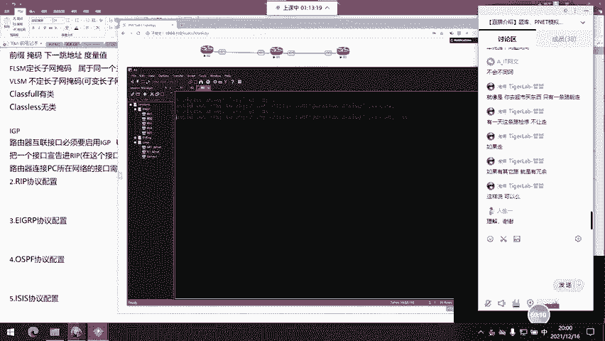

几乎都是相同的命令几乎相同。好吧，那接下来我们来看一下这个命令到底该怎么启用啊，有一些什么样的套路，什么样的流程啊，那这块在运行协议之前呢，路由器其主机名接口起地址，这个是必须的那这个大家比较奇怪了。

对吧？你运行路由选择协议，好歹路由器的直连路由得要有，对吧？所以说了进入到环回口地址1。1。1。1，对吧？以太网的0-0口地址是。

连接R的吧，12。1。1啊，研满24位以太网的0-1连接R3的吧，地址是13。1。1啊，研满24位，该敲的都要敲，对吧？R的还回口地址2。2。2。2也是需要的。然后呢，它的以太网的0-1地址12。1。

2，这个也是必须的R3路 back领口地址3。3。3。3，然后呢，以太网的0-0地址是13。1。3，对吧？都需要。那这样做完之后啊，我们就从R开始啊，来一跳一跳的启用咱们的rap了，rap怎么启用呢？

跟所有其他协议一样啊，思科路由器IGP的启法都高度的相似。首先是在全局配置模式下来运行一个协议进程啊，怎么运行呢？就是router，后面加上协议的名字，你要启用rap。

那咱们就是router ripO吗？那接下来咱们就进入到了ra的进程啦。在rap的进程里面，这个rap呢原本是一个杂合协议很low，我们希望通过version two来给它启用版本2。

把它变成一个纯粹的无类协议啊，我们要跟有类协议抗争到底啊，这个re有两个版本，一个叫版本一一个叫版本2，其中版本一啊是一个有类协议是一个特别垃圾的协议，咱们要干掉它抵制它啊。

那咱们通过version two来把这个进程呢启为版本2，那接下来虽然启为了版本2作为一个无类协议啦，对吧？它完全不需要基于有类协议的任何特征，来帮助接收者路由器猜测。路由的掩码。

因为毕竟我给你发的路由已经包含掩码了。那这个时候呢，咱们可以关闭它的一个叫做自动汇总的行为。这个自动汇总是有类协议必备的这么一个机能。

咱们通过这个机能来让接收到没有掩码的路由的路由器来成功的猜对路由的掩码OK吗？那这块的话，由于咱们现在版本二了，已经是一个无类协议啦，自动汇总，毫无意义。

所以说咱们要通过no auto summary来把自动汇总给关闭。好了，这算是咱们协议中的一些细节的调优啊。那调优完毕之后，接下来就要宣告接口了。我们也说了，R要宣告进rappe的接口。

有它的以太网0-1，对吧？还有它的luic0，那该怎么宣告呢？rap的宣告咱们称为叫主类宣告。比如说你希望把这个以太网0-1口宣告进raip，你要看一下以太网0-1口的地址，这个接口的地址是12。1点。

2，对吧？它对应的主类网络号是什么呢？是12。0。0。0。啊，re只支持主类宣告，你希望把一个接口宣告进rap进程，你就network后面跟上你想要宣告的接口的地址所对应的主类网络号。

那这个主类网络号指的是什么？首先这是一个主类IP啊，并且它的主机位全部置零好吗？你通过这条命令，就把它的以太网0-1口啊宣告进来了。然后接下来还差一个路 back零口，对吧？

你的路 back零口的地址是多少？2。2。2。2，对吧？你所对应的主类网络号是2。0。0。0。好，那两条network宣告两个接口，协议呢就运作完成。攀 yet show。

🎼section rip查看rap的配置文件信息。都能看得懂吗？好，那在一跟三上，咱们效仿啊全局配置模式下，router rip。😡，调优咱们用version two开启版本2。

通过no summary来关闭自动汇总。对吧，然后接下来在RE上，咱们要宣告三个接口，分别是它的环回口地址1。1。1。1，对吧？它对应的主类网络号是1。0。0。0。是吧然后接下来宣告连接R的接口。

这个接口地址12。1。1，对吧？我们就是network12。0。0。0。然后接下来宣告连接R3的接口，这是13。1。1，对吧？咱们是network13。0。0。0。华为也有自动汇总，思科华为都一样啊。

待会儿咱们来介绍华为怎么配啊，okK。那接下来做好之后的话，咱们通过收让 section rip。对吧这就是R一的配置。那接下来我们在R32来配一下全机配置模式，对吧？ro rip。

启用版本2关闭自动汇总宣告它的环回口，对吧？原本是3。3。3。3啊，你要宣告的是3。0。0。0是吧？然后你要宣告13。0。0。0，这是它连接R一的这个接口所属的主类网络号，那接下来当你宣告完毕之后的话。

三台路由器对比一下配置啊，这是R3的啊，这是R一的这是R的好吧，都能看得懂啊。那接下来看懂之后的话，接下来我们来看一下瑞ip功效啊，原本的R一的路由表里面应该是只有3条直连路由，对吧？一的还回口的对吧？

然后接下来还有什么12网络，还有13网络的吧？现在你会发现我在R一上啥二都没有做啊，但是它了解到了二的环回口怎么走了啊，这个路由怎么样，打R，对吧？代表是通过rapip学到的，对不对？

这个路由的管理距离120度量值为一，对吧？前缀掩码在这里好好的吧，出接口就是我连接R的接口，下一跳就是R2的直连接口地址，对吧？三的路由R3的还回口路由也有了吧，对不对？

我的出接口以探网0-1下一跳13。1。3，那在R上咱们也来 show一下设IPro看到了吧？我也知道了R一的还回口怎么走，我也知道了R3的环回口怎么走，甚至我知道了13网络，对吧？

R一连接R3的13网络怎么走。好3我们也看一下啊。是吧我知道了一的环回口怎么走，二的环回口怎么走，我也知道了一2网络怎么走啊，那接下来咱们通过带元屏来做个测试啊。😊，P2。2。2。2s1。1。1通了吧？

P3。3。3。3s1。1。1也通了，那二跟三之间也是一样的。pin3。3。3。3s2。2。2。2是吧？都通了。因为大家都知道了，每一个网络怎么走了，所以说你们环回口之间可以肆无忌惮的相互访问。OK吗？

好了，那这就是ra。😊，那接下来如果你不希望使用rap，想要使用EIGRP也是一样的，怎么做呢？回到全局配置模式啊，no route rip把它给干掉就OK了啊，no route rip啊。

R3也是一样的no route啊，那做好之后的话，我们再来设啊Pro你会发现是吧？rap路由没有了，只剩下这些直连路由了吧，那当然很正常，进程的给你干掉了嘛，对不对？

那接下来我们来看一下EIGRP怎么运行啊，完全一样啊，那怎么运行呢？从R开始做起啊，还是全局配置模式啊，我们要ro eIGRP了但别直接回车一台路由器上能够同时启用多个EIGRP进程。

你得加一个进程号并且三台路由器的进程号，需要相同那这边咱们使用90啊，因为90是EIGRP路由的管理距离。😊，Yeah。那接下来在EIGRP中呢，咱们要通过no out summary来关闭自动汇总。

这点就跟给re V2关闭自动汇总是一样的。然后接下来建议大家呢通过EIGRP的 ID来给路由器配置一个路由器I信息。这个就跟你交换机运行生成数之后啊，你有bridge ID一样。

路由器运行EIGRP路由器呢也会针对EIRP进程啊，产生一个路由器I这个路由器ID整的就跟一个IP地址一样啊，咱们可以拿路由器的环回口地址来做路由器I你虽然说不手工配置，它也会自动选举。

但是手工配置更稳健一些啊，这个路由器I更加可控好吧，那接下来配置完毕之后怎么样开始来宣告接口啦。我要宣告以他网0-1根环回口对吧？请注意啊，EIGRP能够支持。像repe v一样的主类宣告。

也支持精确宣告。那精确宣告怎么宣告呢？不用怂了，n talk命令后面直接跟上你要宣告的接口的IP地址，对不对？你的以太网0-1口的地址是12。1点。2吧，直接写在这里。但是别急回车啊，后面要加0。0。

0。0。这个0。0。0。0是什么呢？咱们称为叫反码啊，把它称为叫通配符掩码。

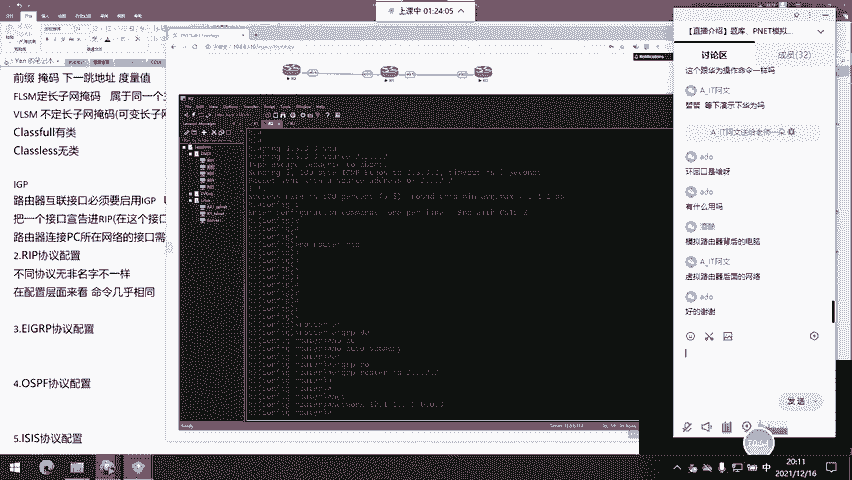

它叫通佩服掩码，叫wd card。Mask。这个东西之所以咱们称为叫砝码啊，因为它跟子网掩码正好反过来。子网掩码一般是从左到右啊，左边的高位是连续的一，右边的低位是连续的0。那咱们的反码正要相反。

从左到右的高位是连续的0，从右到左的低位啊，是连续的一。但是这个砝码的用途呢跟子网掩码完全不一样啊，比1个IP地址。加上一段通配符言码。咱们确定的是一组连续的IP地址范围。比如说我们这个例子啊。

地址的部分是10。1。0。凡码的部分是0。0。0。25啊，这代表什么呢？这代表我的砝码的前三段所对应的地址的部分啊是不能改变的啊。凡码的零代表精确匹配，而我的最后8位都为一，对吧？

代表你IP地址的最后8位啊，可以任意。凡码的零代表精确匹配不能动，砝码的一代表任意。所以说咱们这个地址加上这个砝码确定的是一组连续的IP地址范围啊，它的范围是10。1。0到10。1。1。255。好吧。

10。1。1。0到10。1。1。255。那接下来这块的话呢，咱们想要在EI加RP进程中啊，通过精确宣告的方式来宣告路由器的某一个接口进到协议进程。你就在network命令后面加上你要宣告的接口的地址。

后面加上全零返码就好了，全零返码代表32位都为零啊，它匹配前面的地址匹配的就是唯一的这么一个啊，32位都不能变。那你这个地址撞上了咱们哪个接口，这个接口就被宣告进来。好吧。

那接下来我要宣告我的还回口怎么宣告啊。

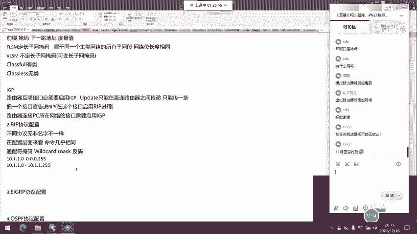

一样的嘛，对不对？相同的宣告方式。那接下我们来试一下啊s sectionEIGRP看到了吗？这就是EIGRP的配置啊。大家会在唉notto summary没有了，没有很正常。在新的斯柯达OS版本中啊。

对，这个EIGRP是自动关闭，自动汇总的。好吧，那所以说在R一上咱们不用画蛇添足了。好吧，设置一个路由器ID啊，宣告它的还回口。

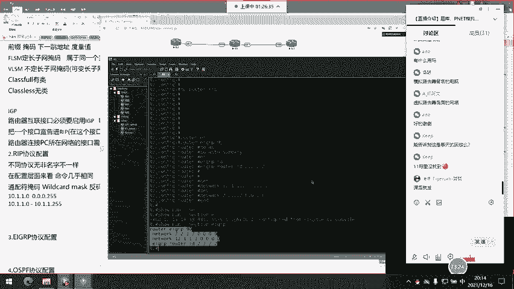

是吧宣告连接R的接口，宣告连接R3的接口是吧，这就OK了。这是R一的EIGRP的配置，好吧，然后接下来塞也是一样的。roEIRP90，对不对？逻器ID3。3。33宣告它的还回口，宣告连接R一的接口。

是吧看一下它的配置。你会发现所有路由选择协议配置是不是都。差不多啊，对不对？配置都差不多啊是吧？那接下来我们来看看路由啊，上Iro。😡，看到了吗？R一路由表里面又重新的获得了二的环回口和三的路由，对吧？

只不过这一次咱们路由的标识打D了啊，EIGRP的标识为什么是D呢？因为EIGRP的这个协议的核心算法叫扩散更新算法。简称叫DUAL啊，我们在命名EIGRP路由标识的时候，用的不是它的协议的首字母啊。

用的是它的核心算法的首字母啊，你们会发现这些路由的管理距离90，对吧？度量值都很大啊，当然不用在意，咱们路由学到了就okK了，好吧，那这边的话R也是的，该有的路由都有，对不对？R三也是的吧。

该有的路由也都有是吧？拼一把拼3。3。33s2。2。02碰吗？对不对？啊也来拼一下。是吧P老2。信阳3。都能通，对吧？好，这就OK了。那接下来最后一个啊在思科路由器上来运行OSPF。怎么运行呢？

把这个EIGRRP的进程也给干掉，对吧？叫no routeEIRP90是不是啊？no routerEIGRP90把它都给干掉。那干掉之后的话，路由肯定又没了，因为协议进程的给我们干掉了。

接下来我们来运行OSPF。😊，OSPF的套路完全一样啊，OSPF同样不要直接回车啊，你能运行多个进程，需要加一个进程号，只不过这个OSPF的进程号不要求大家都一致啊，这个不影响咱们邻居建立。

不影响咱们路由传递。当然我这边的话还是使用110。因为思科路由器运行OSPF啊，它的路由管理距离默认就是110。那这个也同样要设置一个路由器ID啊，对吧？以防万一设置好路由器ID之后。

OSPF呢只支持精确宣告，并且它在宣告一个接口的时候啊，要指定一个区域。那这个区域呢大家先不用关心是什么意思。哎，咱们先有这么一个概念啊，在NA中呢，你想要让这三台路由器运行OSPF建邻居传路由。

大家宣告接口，得要宣告到同一个区域，那这个区域的话，为了统一，咱们都使用区域零好了，这个区域零，咱们称为叫骨干区，好吧，那接下来怎么宣告呢？宣告我的还回口，对吧？地址加繁码，后面加上area。

后面跟上咱们的区域编号，区域0OK吗？这也就是说我希望把我的路 back领口宣告进区域0。同样我也要把我连接R一的接口宣告进去域里。好吧，啊，我们来看一下配置啊。这是OSPF的配置。跟EIGRP很像。

对吧？只不过宣告命令后面加上了一个区域和区域号O吗？好，RE也是一样的。brouterOSPF110路由器ID1。1。1。1。宣告我的环回口是吧，到去域0。

宣告连接R2的接口到区域0以及连接R3的接口到区域0。瘦一下吧。是不是对吧？跟这个EIGRP的宣告命令很像啊。好OSPFR3上再来一遍是吧？宣告它的还回口到区域0，宣告它连接R一的接口到区域0。捞爷。

是不是？都有吧。那接下来在运行这个协议的时候呢，咱们得要让子弹飞一会儿啊，让他们建邻居。因为这个OSPF的建邻居呢，它过程比较复杂啊，尤其是在我们的以太网环境中啊。

他们建邻居要选一个DRBDR的概念选举完毕之后，这个邻居呢才能进一步的往下推进，对吧？那最终让他们到达f啊，这个需要40秒的时间。那等待40秒的时间之后，等他们邻居建好了，由于他们是一个链路状态协议。

资源消耗比较大啊，我们得先了解到top连接信息之后呢，才能基于这个top扑信息来计算路由，所以说咱们稍微迟一点，再在R一上IP那你会发现哎路由表里面同样出现了R跟R3的环回口路由对吧？

只不过这一次路由是通过OSPF选能看到了吗？管理距离110啊，路量值11。那接下来二跟三对吧？也都相应的学到了这些环回口路由，对吧？是不是R三也是一样的，对吧？都学到这些路由了。哎，咱们来拼一波啊。

二来拼3。好了吧。一来T2。懂友了吗？一来听3。通了吧？哎，连通性就没问题了啊，这就是OSPF的配置。先不要管他们的运作原理啊，咱们先会配就okK了。😊，那接下来到大家比较期待的华为配置流程。

这个华为呢咱们演示不了三个协议，因为目前EIGRP这款协议呢华为不支持啊，它曾经是一个私科私有协议啊，虽然在13年就被开放了啊，但是直到今天，咱们大华为的设备依旧不能支持EIGRP。

但是好在呢repe跟OSPF咱们都能运行。所以说这块在华为上，我们来配置瑞pe跟OSPF的这么一个命令。所有的配置流程和套路啊跟思科高度相似。所以说思科的命令会配啊，华为的配置大家也应该会配。

别的厂商支持EIGRP吗？支持很多厂商都支持。因为现在的EIGRP已经是一个公有协议了。呃，华为的repo的话也要关闭自动汇总。需要关。都要关，只要你默认开启了自动汇总，你就要关。除非你的系统版本。

它默认使用的是版本2啊，那这块的话就是有可能它的自动汇总是默认关闭的那在这种情况下，你就不用关了。但是只要说它默认运行的是一个杂合版本啊，那这边的话，咱们该关还得关。那这样咱们怎么判断要不要关呢？

就是当你敲完关闭自动汇总的命令之后啊，你在配置命令行中看到了这条命令，就代表它的自动汇总是默认开启的那当然如果说你敲了关闭自动汇总的命令之后，你查看配置，发现这个命令你看不到，代表它默认给你关闭了。

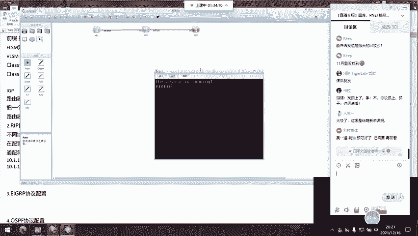

如果你敲的是一个系统默认的命令，它不会给你显示，能理解吗？啊，我这个说法应该。足够清晰了。只要你敲一条配置，你看到了命令了，代表它不是系统默认。OK好，那这边的话我们来配置一下主机名啊。返回口地址。

几笔套的0-0-0。吉比特的0-0-1。好。啊。诺麦克林。吉笔特的0-0-1。阿声。Go back，0。吉比特的0-0-0。好，接下来开始运行rapple。这个rap怎么运行呢？

在system view下啊，没有ropper了，直接re，后面加上一个进程号。这个进程号呢我习惯使用100，因为在华为设备中运行rap默认路由的管理距离就是100啊。

那这块咱们同样需要通过version two来开启版本2，需要通过and do summary来关闭，自动汇总O吗？

这个等同于思磕中的version two和no auto summary效果是完全一致的。然后接下来我们需要在二上宣告接口，他要宣告它的还回口，还有吉比特的0-0-1，对吧？请注意啊，re普这个协议。

无论在思科上配，还是在华为上配，咱们都只能支持主类宣告。所以你的network命令后面跟的是什么啊？就是你接口地址所对应的主类网络号，对吧？你要宣告环回口，那就是2。0。0。0，你要宣告12。1点。

2这个接口，那就是network12。0。0。0。那接下来我们来证实一下这个自动汇总要不要关啊，答案是要关的。看到了吧？你只要敲出来的命令在收入中显示了，代表它不是默认的，只要它不是默认的，咱们就要敲。

那如果说它默认给你关闭了，自动汇总，你敲and do summary，它是不会显示的。好，有人问了，rap现用的多吗？很少，几乎没有人使用。我只是通过rapip抛砖引玉。

教大家路由选择协议配置的套路和流程。OK吗？好R也是一样的，reple加上进程号，启用版本2，关闭自动汇总啊，宣告它的还回口，宣告它连接R的12网络接口，对吧？然后呢，先告它连接R3的13网络接口。

通过display查看一下，没问题吧。好，接下来R3。rap100版本2and do summary宣告怎么样？它的环回考啊，还有13网络接口，O吗？好，宣告完毕之后，我们来看一下啊。

Display I routing table。会发现通过rappo学到了二和三的环回口路由，对吧？路由的标识是rappo嘛，管理距离100度量值为一是吧？R的路由表。也有了一的路由，三的路由。

还有一3网段吗，对不对？啊，三路由表里面也是有了一的路由，二的路由，还有12网络，对吧？那接下来咱们来带原聘一下聘杠A，对不对？先加原地址，再加目的地址，好了吧？P杠A先加原地址，再加目的地址懂了吧。

是吧，二跟三之间来的呀，P杠A先加原地址，再加目的地址。好了，通了，这就没问题了。那接下来我们来看一下华为设备运行OSPF啊，把一个路由选择协议进程干掉方式是一样的。思磕用no什么什么什么对吧？

华为用and do什么什么什么and do100。yes啊，and do rap100。他宝问你真的要不要干掉啊，要y。这边也是一样的，安度瑞100要不要干掉？yes。好，干掉之后，我们来运行OSPF。

套路完全一样啊，OSPF后面加上进程号。我这边使用1的原因是因为在华为设备上运行OSPF啊默认路由的管理距离内部的就是十到外部的是150。然后接下来这边我们要加一个路由器ID注意啊。

路由器ID是在后面携带的路由器ID2。2。2。2，建议大家手工指定。然后接下来先要创建你宣告接口所进入的区域啊，我们要宣告你区域0吗。那在区域零中，我们来宣告还回口，注意啊。

都是精确宣告OSPF只支持精确宣告，后面要加繁码。那做好之后呢，我们来看一下啊，是吧？这就是OSPF的配置，跟思科论略有区别啊，思科是在每条net命令后面跟上你要宣告的区域号，而华为不一样。

是在OSPF进程中啊，先把你这个区域创建出来，再在区域内部通过net命令决定啊，你要宣告那些接口OK吗？好，那R一咱们也来遍啊。OSPF10路由器 IDD1。1。1。1啊，进入到咱们区域0宣告怎么样。

它的还回口。宣告连接R的接口。然后呢，宣告连接R3的接口。ok吗？好，我们看一下啊。😊。

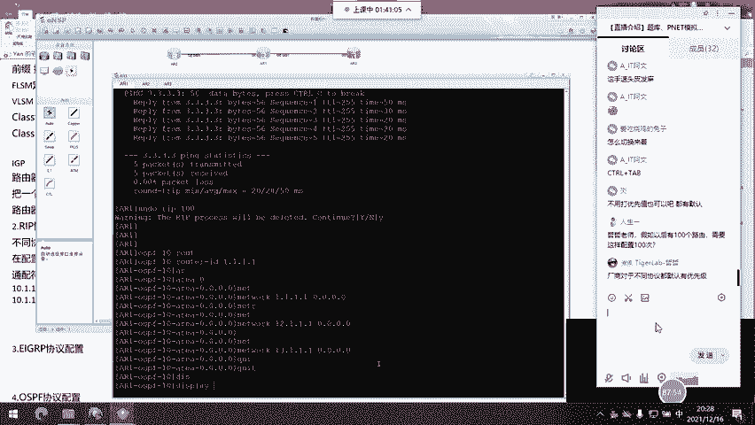

这个配置应该都能理解的，对不对啊，那这边报日志了，就是在建邻居嘛，建立邻居啊，这是配置。都能看得懂吗？😡，是吧对，区域零怎面4个零了，这个区域号有两种表现形式啊，一个就是纯阿拉伯数字。

一个是点分十进制啊，这个区域零就等于0。0。0。0，它们是等价的，区域一等于什么呢？区域一等于0。0。0。1啊。可以吧，因为区域号咱们是32位，可以通过点分十进制的方式来表示。

比如说区域255等于什么呢？等于0。0。0。25，好吧，区域256等于什么呢？等于0。0。2等于0。0。1。0。0。0。1。0，他们是一一对应的啊啊，你在表示区域的时候，可以通过阿拉伯数字的方式来指定。

也可以通过点分十进制的方式来指定。对了，完全等价啊完全等价。好，那接下来在拿塞上，咱们也来配置一下OSPM10路由器ID3。3。33，对吧？进到区域0，当然你也可以指定0。0。0。0嘛，一样的一样的。

然后接下来宣告它的还回口是吧？宣告13。1。3。😊，OK吗？啊，这就是它的配置。然后接下来建邻邻居的过程啊，每一步都给你提示了日志啊是吧？临接关联状态你你手对吧？

to wayex exchange loading for agency啊，一共是123456加上一个down，一共是7级啊，如果你要再加上t的话就是8级啊，那这边的话有OSPF邻居了。

我们就来看路由吧啊，display IP routing table看到了吗？R一通过OSPF学到了二和三的路由，对吧？OSPF学到的嘛？管理距离是1吧，对不对？然后接下来二跟三之间的路由怎么样。

也能相互学到嘛？我学到了一和三的路由，还有13网络的嘛，对不对？好3。我学到了一和二的路由，还有12万多的啊，接下我们来拼一下啊P杠A先带原地址的吧，再到目的地址通了吗？是不是P杠A先带原地址。

再带目的地址。也通了吧，对不对？二跟3带原拼一下，先带原地址，再带目的地址。是不是？通了。啊，这就是路由选择协议的配置。总结一下，这节课呢告诉大家了，路由器获得非直连路由的第二种方式叫路由选择协议。

说了路由选择协议里面包含了哪些协议啊，说了路由选择协议的这么一个分类方式啊，介绍了路由选择协议的大体的配置的这么一个思路啊，以及配置的这么一个模板吧啊，思科的所有协议配法基本一样，相差无几。

华为的所有协议配法基本也一样，相差无几，对吧？这个都是举一就能反三的啊，那希望大家回去呢能够把这些协议啊，给练习练习，配置一下，好吧，流程很简单，先把接口地址给配起来，保证直连能通，直连能通的基础之上。

选一个协议先启用进程再宣告接口就这么简单。那这节课大家能听得懂吗？如果能听懂的话啊，感谢大家参与了这么多节了啊。😊，下节课咱们应该是下周二啊，咱们继续好吧，大家下周二不见不散。大家拜拜。🤧可以听到吗？

慢慢来啊，1。1点学。那这节课呢是给大家介绍了三款动态路由选择协议。这三款动态路由选择协议都属于。内部网关协议IGP。啊，然后呢，这个。EGRP呢，他目前之前呢是私科独有，后来呢被这个。

因为他看着这个OSPF太火了，他把这个协议给公有化了。但是呢，因为OSPF早就把这个市场给他。抢占下来了。大家都知道OSPF，然后这个EIGRP就知道的人少了。虽然他现在已经是公有了。

私科把他给公开了哎，就是你不是我思科的设备，你你也能用，但是呢。但是呢。华为目前还不支持。华为目前还不支持啊。呃，现在普遍用OSPF吗？OSPFSS。运营商用的多的是SS。慢慢来嘛，哎呀，急啥。

这不是才总结的吗？嗯。我哪天给你说不给你命令了。每天都有吧。发了呀，我全部都发给班主任了。你们没有收到吗？昨天的那个文档没有收到吗？QQ群没有吗？QQ。你是哪个群的？我看一下聊天记录。

那QQ有不就行了吗？这是同一份文档，微信发的是味道不一样吗？对，OSPF1024啊。1024，我给你看，如果有的话怎么办？有的话，你请我喝奶茶可以吗？有的话，你请我喝奶茶。嗯。这个需要我下载下来吗？

这个需要我下载下来看一眼吗？要不要？不看了啊，这就是我写的，昨晚我写的。1023。1023可能是。可能是没有看一下。有的话，你也请我喝奶茶啊，今天要可能要挣两杯奶茶了。啊，这1023已经到了NP了啊。

这下午做的不是NP练习吗？这个这个群已经到了NP了啊，阶段现现阶段是NP阶段。你看。NP了。你问班主任要一下啊。这个我都是发给班主任了。然后呢，我们现在给大家。讲这个什么呢？

就是说看到了一个宣告网络的命令。那在宣告这个网络的时候，宣告这个网络的时候，大家都能看到啊，经常都是什么呢？Network。什么。比如说10。1。1。0，然后呢，是0。0。0。255。

那你有可能看到这么一条命令。那这条命令呢，他后面跟的这个大家知不知道他的名字叫什么，他的名字叫什么？返码哎返码，也有人叫他反言码，也有人叫他通佩服掩码。那这个返码呢。这个反码是怎么计算，怎么运算的呢？

昨晚给大家简单的介绍了一下啊，那我们首先要把它转换为。二进制，他现在是点分十进制，对吧？这是一个。网络号这后面跟了一个。砝码，那他的意思是什么呢？是这样的啊是这样的。首先呢我们把这个转换为。

二进制二进制是多少呢？0000，这是16，然后呢，这是8，这是4，这是2。好的。这是这个IP的。10。1。1。0啊，转换为二进制，它就长这样转换为二进制，它就长这样。然后呢。

这个砝码它转换为二进制长什么样呢？是这样的啊。OK。现在。这个能不能看得懂这个能不能看得懂，这是。我们要宣告的网络的网络号，这是后面跟的这个反码，可以吧？能看得懂。好，我现在告诉你这个返码是什么意思啊。

我说完你就把这个范围给我写出来。砝码他一对应的地方。不能改变。那现在我问你。就我们现在用返码来匹配这个IP。匹配到的范围匹配到的范围。是从哪儿到哪儿，我们哪些是不能变的，哪些不能变。

前面的这些零对应的地方一个都不能改变，对吧？那他们是可以为零，可以为一。那现在呢，它最小就是全部为0，最大就是全部为一。那么他匹配到的这个。网络的范围啊，它匹配到的这个IP的范围就是10。1。1。

0到10。1。1。255。有没有问题有没有问题？这么讲能不能理解？可以吗？可以啊。可以，那一般情况下来说啊，这个砝码呢它都是从后往前从后往前。而这个。掩码呢它是从前往后，从前往后。

就是说我们在转换的时候，如果它是个掩码，这写着1个24，那就代表我们这前24位要全为一。而这后8位要全为0。而这个掩码啊，现在上面的这这个规则它是属于反码的。返码的规则。那掩码是什么规则呢？

掩码是他的一。对应的就是。网络位。0。对应的是。主机位。那我再写一个地址啊，再写一个地址，我们写个172。16。点2。4掩码呢是16位，请你告诉我。这个IP的网络号。该IP的网络号。一对应的是。

网络位0对应的是主机位。好的，没有问题啊。那他呢这个16转换为二进制，就是这前面这个是16个一，后面呢是16个0。在二进制转换呢。

我们在VOSM那节课给大家详细的讲过十进制二进制以及十六进制是如何转换的啊，这里就不展开细讲了，细讲了。那这个反码和掩码，你别看他们只差一个字啊，你不要看他们只差一个字。

但是呢他们的原理完全不同完全不同。现在能不能分得清繁码和掩码，我再写一个啊我再写。比如说我写一个呃宣告一个网络，宣告1个IP是。10。1。1。4，然后呢是0。0。0。0。请大家告诉我，我写的这条命令。

我是宣告了一个网段，还是宣告了一个精确的网络精确匹配，对吧？我就是把我自身的10。1。1。4给宣告进。这个动态路由选择协议。OK吗？这么讲，砝码和掩马大家。😊，还有没有问题？然后呢。

有人问什么是与运算啊，与运算。就是你一对应的地方，你一对应的地方不变，一对应的地方不能改变零对应的地方。为0零对应的地方为0，这个呢是在掩码啊掩码里头用得到的掩码里头，这是与运算。那么呢。

这个16就代表什么呢？代表啊。咱们把这个111111。好的，就是说我现在把这个掩码给他转换为24位，转换为24位。我前面的一对应的这个上面的这些位置。你该是一就是一，是零就是零，我不给你做改变。

我不做改变。然后呢，我零对应的地方我零对应的地方，我看到你后面是点2。4，但是呢我零对应的地方全部给你转换为0。转换为0这样说可以吗？这是掩码。咱们在前面的课里头给大家详细的讲过啊。

在VOM那节课还记得吗？嗯。记得吧。这么说，这个樊码和掩马。樊马和野马。可以的吧。🎼OK那我们呢现在设计一个简单的实验啊，设计一个简单的实验，教大家如何在一个进程下宣告一个网络。

如何在接口下宣告一个网络啊。那有些人一直在问。你路由器为什么要起一个还回口？为什么要起一个还回口？这个还回口的作用它到底是什么？再给大家解释一遍啊，环回口在现阶段我们NA啊，我们在路由器身后拖一台主机。

你把这个主机拖出来，你要配的东西是不是这么多，是不是这么多哎，你的IP掩码，你还要加一个网关。但是呢你在路由器上几条命令啊，就能创建一个还回口。然后呢，这个还回口在宣告的时候。

是以32位主机的形式通告给邻居路由器。那邻居路由器就会认为什么呢？认为这是在你身后的一个网络，和你在PCE配上1个1。1。1。1掩马全255网关是1。1。1。254。哎。

就相当于是你在路由器身后放了一台主机，你路由器身后有一个其他的网络。这样讲可以吗？我们现在呢。哎，把这两台PC给他去掉啊，咱们学到了NP。学到了NP以后呢，你们看不到了吗？能不能看得到看不到。等一下啊。

我看一下这怎么了。现在呢？现在能不能看到？还是卡着的。嗯。我看一下啊这个腾讯课堂。我也没点暂停画面呀。现在怎么样？你能不能截个图在这个聊天框里头？我看一下这个画面是什么样子的。大家都卡在了同一个地方。

这腾讯课堂真的是。等一下啊，我再重新进入一下。现在呢？不行。等一下，我试一下另外另外一台电脑。如果。哈。嗯。这试。😔。

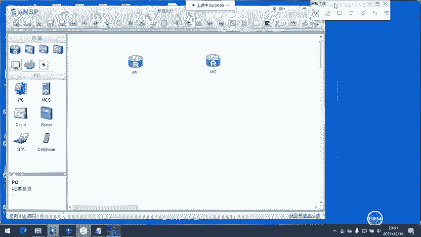

你们看不到这个画面在动吗？我用我的手机看一下啊。应该是腾讯课堂那边的问题。我已经进了好几次了。啊，我直接进不来。我在手机上直接进不来这个课堂。Ha ha。😊，1小时卡在了1小时59分31秒。

我现在是2小时05分。嗯。那这个大家刚刚对那个。文档我写的文本文档看到了没有？文本闻档。文本文档也没有看到。Oh。Yeah。啊，就看到砝码啊，我就说在给大家介绍砝码的时候，然后呢。

准备要打开ENSP的时候。嗯。准备要打开ENSP的时候是。没有了。现在是可以看到了吗？不行啊。腾讯课堂崩溃了。他的服务器怎么了？我已经退出重开了。等等啊。如果不行的话，我就写一个文档给他。

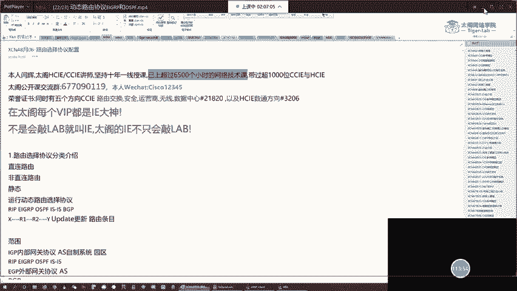

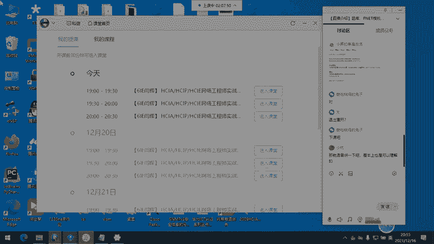

现在呢？嗯，好了啊。哎呀，真的是。行，那我们设计一个。现在可以吧。可以了啊。OK那我们就拿一个。刚刚呢我是拖出来了两台主机，然后呢给大家再解释这个主机身后呃，不是路由器身后的这些主机。

我们在NP和IE阶段啊做实验的时候就不拖这些主机了。为什么呢？因为我们在路由器的这个环回口上启用一个启用一个环回口，然后呢，掩码是32位。那这样呢，他在宣告给邻居的时候。

邻居就会认为这个32位的路由是在他身后所处的一个主机。所以呢咱们为了方便啊，你看你要给这台PC配很多很多东西。IP。掩码网关，然后你还要点击应用，你还要点击应用。你在这个R一里头啊。

你直接创建一个环回口。你宣告的时候，直接把它宣告进去就OK了。好，那我们。就拿这个网络，你你们想看复杂一点的还是简单一点的，我们讲原理还是。简单一点还是复杂一点，复杂一点。复杂一点。负载行。满足。

大家的要求。那再来一台。我再来个服务器。好的啊这个呢这些呢是在内网内网的路由器。然后呢，这是一台边界。哎，不不不不，这样啊，这是运营商，这是内网的边界啊，边界路由器。然后呢，这是内网。

就是内网的三台三台路由器，咱们就这样设计啊，这是ISP。SP运营商路由器，然后呢，这个是服务器，服务器的IP，我们给他配的牛一点啊，100。1。1。100。网关呢是100。1。1。254。好。

然后给大家连个线啊连线。他是不是没有？

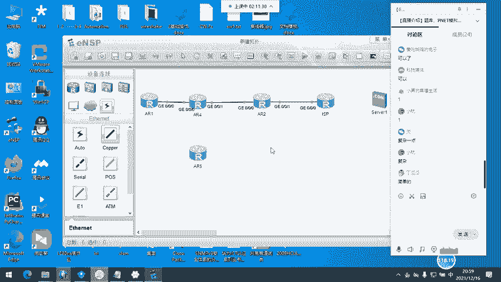

我怎么拖了这么一台路由器？口接口不够的时候，你就这样啊，像我这样打开设置，打开设置。那你再连线的时候就能看得到了啊。开机。嗯。在华为的设备上，既能配IP亦不能配，既是千兆，亦是百兆。还要主机吗？

是配这个。咱们是配环回口，还是你需要看主机，配还回口，好吧，毕竟大家以后接触到的都是环回口。

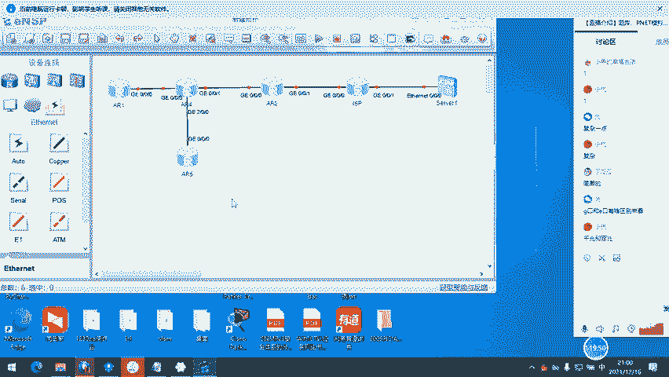

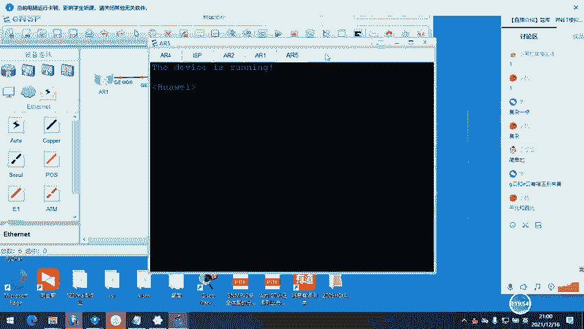

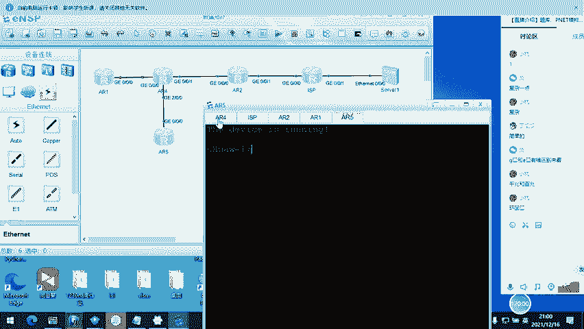

14。然后是2。

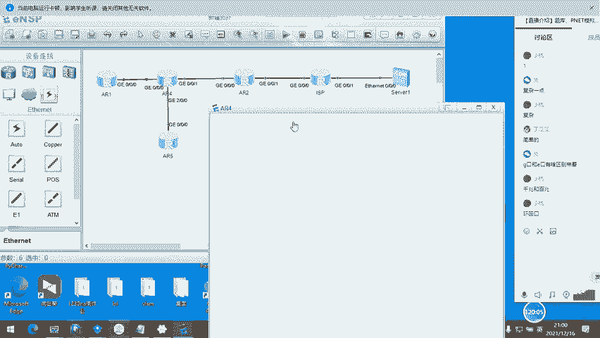

然后后是5。好的。R一第一步啊，先改名。先改名。R4，这是。R5。R2。这个呢是ISP啊。改完名字以后呢，我们。来做配置啊。首先呢做这个。

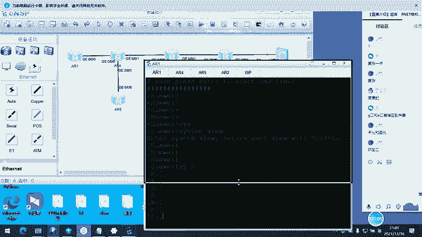

地址规划啊。咱们给这一个就配成是14。网断好吧，14。1。1。0掩码呢是24位。为什么是14呢？这是一这是4，咱们好记啊。然后呢，这个呢是42。0。野马呢同样24位。这个呢是。这怎么配？这个是22吧。

22。1。1。0。MM码24。这个是100。剩下最后这个是45。好，这么多啊，我要让每台路由器运营商不运行任何动态路由选择协议，也不和你企业边界建邻居啊。我要让这四台路由器都有。都有路由都有相互的路由。

而且呢他们还要有一条静态默认。我待会在R2上配好以后，用OSPF下发给他们，下发给他们。我边界把这个静态默认下发给。这三台路由器好的，那我们现在先把接口的IP给它配上啊。interface。

现在是R1啊吉比特的。0-0-0口，我们配1个14。1。1。1掩码呢是24位。24。然后呢。配一个环回口啊，配一个环回口用来模拟RE身后的主机，怎么配呢？interface。no百0。然后呢，1。1。

1。1掩码呢是32位。R1我们就配这两个来到R4。R4需要配什么呢？interface吉比特的。0-0-014。点1。4吧，点4掩码24。R4上我们就不配这个环回口了啊，然后呢。

interface吉比特的0-0。杠这是一口对吧？IPLdress。42。1。1点。4。年码24。有不懂的话。配接口IP应该都是没问题的啊。然后呢，他还有一个接口是interface吉比特的。

2-0-0。IPR address是。他不能配IP吗？嗯，这是什么鬼？24的这个接口是什么鬼？就是什么型号？1220。我拉的我拉的这个板卡，他还不给黑IP。啊。😊，那不要了啊那不要了。😊。

IP后面不能不能直接address。就这两台吧。然后呢，R2是。

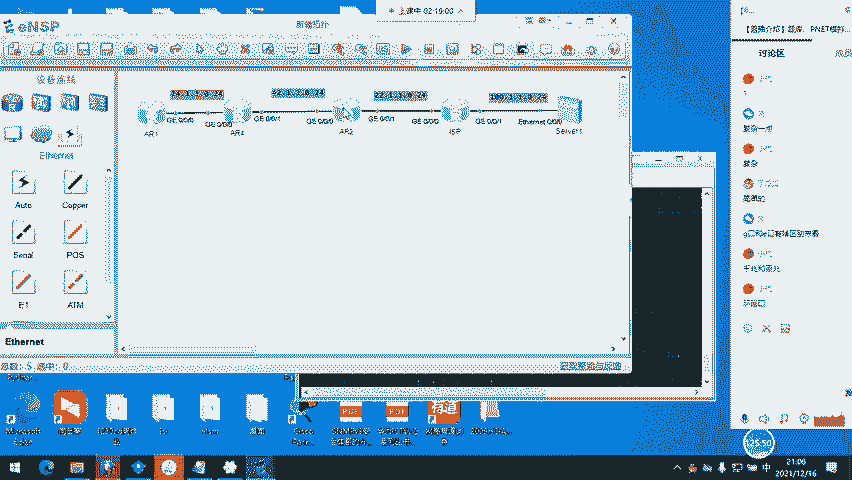

0告0告0。42。42。1。1点。2掩码24。R2，然后呢，interface吉比特的0-0-1口。22。1。1。2延网的24。SP。0-0-0。22。1。1点。刚刚是几。刚刚是2。那我就3。

那SSP最后一个是interface吉比特的0-0-1口。100。1。1。254。配完这些呢，我们来测试一下啊，路由器之间通不通啊。骗。14。1。1。4。骗。42。1。1点。2。聘22。1。1。3。

最后一个啊。骗。聘这个是100。1。1。100。OK那路由器之间的联通性是没有问题的啊，路由器之间的联通性是没有问题的。那现在呢我们给。运行一款动态路由选择协议啊，然后教大家。

如何宣告我们运行1个OSPF，然后进程号啊先写这个进程号，进程号的范围呢是1到655356535。然后我们写一个。1、揉台地。1。1。1。1手工指定啊，进入到区域0。宣告啊宣告一网络怎么宣告呢？

我要精确的宣告1。1。1，我怎么宣告？我要精确的宣告。

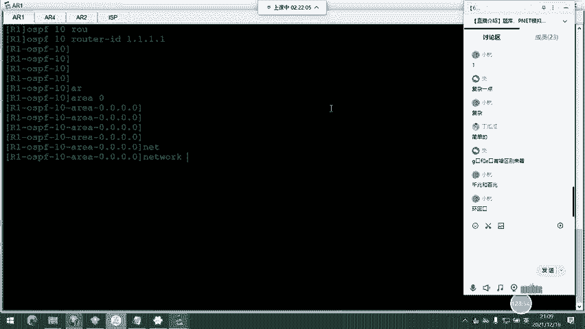

哎，现在能不能哎，这是什么意思？这个是什么意思？我现在要精确的宣告32位的一个主籍地址。你来了个零是。刚刚的你连返码现在都不要了吗？应该怎么写应该怎么写，1。1。1。1，这是我身后的模拟出来的主机。

也就是这个环回口地址，对吧？为什么你要加个零呢？为什么这里是零？我现在要精确宣告1个IP。嗯。我给你看。我要宣告这个接口。怎么宣告？大家其他人发的是正确的啊，其他人发的是正确的啊。我要精确宣告。

32位的一条。IP。1。1。1。1，然后呢，是0。0。0。0。现在呢我已经把这条路由宣告进了OSPFOSPF。但是呢现在没有任何地方啊没有任何地方。

他也没有运行OSPF他也没有运行OSPF我们宣告进这一个是不会被R4知道的啊。R4不知道R4不知道，你把一网络给宣告进来了。那你还要怎么做呢？你还要把你自身的这个接口。

这个接口宣告进OSPF那我们怎么宣告这次呢，我们宣告这个14网段好不好？network14。1。1。0，我现在要宣告14网段。那后面我应该怎么加返码怎么加，我要把所有在。哎，14。1。1。1也好。

点2也好，254也好，我都要宣告进来。那我这个砝码怎么加0。0。0，前面三个零呢，代表14。1。1不能改变，最后我们加上1个255。好的，那现在呢，不只是把这个接口宣告进去了啊。

如果你在这个接口下还有其他的网络，其他的主机，他们都被宣告进去了。这样讲可以理解吗？可以理解吗？可以的啊，那我们来到R4R4OSPF10。揉台地。4。4。4。4啊。A去域0啊A0。然后呢。

我们要宣告现在呢我教大家如何宣告R4自身的所有接口。如何宣告R4的自身的所有接口？那你想一想，就用这个IP和繁码，我们就能用一条命令宣告所有的所有接口。是0。0。0。0吗？是这条命令吗？还记不记得？

砝码里头的一代表什么？零代表什么？我要怎么宣告？我要怎么宣告？0。0。0。0。这是对的，前面是对的。那后面的反码反码才重要啊，反码才重要。我现在可以写成这样，我可以写成2。2。2。2。无论前面是什么。

我最关注的是。返码我返码怎么写？我要宣告自身所有的接口。你别看现在我只有两个网络，十4和42。哎，我是不是要加255。255。255？点5这条命令啊这条命令就是宣告的自身所有接口。你别看它现在是3。3。

3。3，但是它三对应的下面是一，对吧？那这个一它你可以为一，你也可以为0，你3。3。3，在这里是没有什么意思的。在这里是没有什么意义的啊，那我们把它宣告进去。我现在已经宣告的是。从0。到255。

从0到25。那我们一般情况下呢。你写三效果是一样的，你写零效果也是一样的。所以呢大家默认就都写了谁了，都写了0。0。0。0255。255。25。25，这样写了，就这样写了。大家写的时候就都这样写了。

就不不这样多此一举了啊。大家可以看得到，现在呢现在啊。报了这么多OSPF的日志证明呢证明什么？我已经通过你24学到了你24身上所有的路由。我们来看一下啊。

我们就刚刚那一条命令display IPProtable protocol这是呢我们来查看OSPF里面学到的啊，学到了42网络，学到了42网络。那有些人会问，为什么没有这个十4网络呢？

因为你十4网络是它直连的啊，不用学自己能够获悉他学到了一个非直连的42哎42。那比如说我现我在敲了这条命令以后啊，我在敲了这条命令？我在敲了这条命令，我又新建了一个环回口。

大家想在我这个环回口创建好以后，R1。能不能收到这个R4身后的二网络，大家想想，你觉得能不能？我在R4前提是敲了这么一条命令。前提是敲了这么一条命令，宣告自身的所有网络。能不能可以啊可以，你是。

虽然你是在后面才把这个还回口给他加进来的，但是呢，因为你OSPF的命令是什么呢？是宣告了自身所有网络。那你不管你先还是后，他都会被通通的通告到OSPF里面。看到了吧。

现在R一学到了二网络没有R一学到二网络没有？学到了吧，学到了二网络。那R1和R4上啊，咱们都是用。在这个进程里头宣告的路由啊，现在呢我教大家在接口下如何把一个接口宣告进OSPF啊，OSPF10留台地。

这个呢是2。2。2。2。啊，不用了。然后呢，我们来到。0-0-0来到R2的这个接口啊，我们把这个接口宣告进OSPF怎么宣告呢？IPOSPF嗯。

OSPF啊OSPF enableOSPF enable后面呢加上这个OSPF你运行的OSPF的进程号。进程浩，我现在应该加的是几？我宣告进哪个OSPF进程？晋城号晋城号，现在还没有到区域啊。

晋城号是哪一个？十吧十对吧？后面呢咱们再加上再加上1个OSPF区域啊，它提示这是1个OSPF区域。我们加宣告进哪一个区域区域0。现在呢我的R2的这个接口已经被宣告进OSPF了。不用这样写，不用这样写。

我们就在接口下敲这条命令就能把它宣告进OSPOSPF。那么这个R1呢，它是已经。学到了42网络啊42网络。那我们再来创建一个环回口给大家看一下啊呃，interface。瞎写的啊瞎写的。然后呢，我们现在。

OSPF。Enable，然后呢，是进程号时0。区玉玲，我在这个环回口下敲这条命令，现在呢R1和R4都学到了这个11网络的路由啊。等等。稍微等一下。哦，我还没把我还没把这条。我把0-0-0宣告进去了吗？

对的呀。区域玲。建车号10。这是2。2。2。2。看看。这么晚才给我报。好了，现在呢R一他已经学到了啊学到了这个。11、这么特殊的一条路由，它呢是我在R2上怎么样宣告的呢？怎么样宣告的呢，是在接口下。

接口下宣告的啊接口下是这么宣告。然后呢，这边是精确宣告精确。

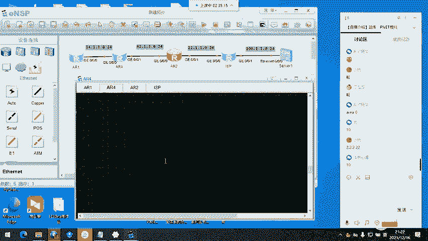

哎，这个叫自身的所有接口全部宣告进OSPF。那这个呢是这边我们R一上做的都是接口呃，这个在进程号里头进程里头宣告OSPF，而且是这个是精确宣告，这个是宣告14网段。大家对这几条命令有没有问题？

有没有问题？没问题吧。好的，那这个时候呢，这个时候啊咱们的。R2啊一般作为企业边界，它呢是不会把这个接口宣告进OSPF的啊。原因有这么几点，我一一给大家解释啊。首先呢运营商的路由器里面的路由表。

路由表是。成万哎几万几十万几百万的这种啊，你普通的企业，企业你用的路由器。如果你宣告进去了。你宣告进去了，运营商把这些路由都告诉你了，你会怎么样？假如说你是一个小学生，他是一个大学生。

你和他成为好朋友以后，他要教给你他大学学到的所有东西，你能不能受得了，你现在能不能受得了？大家觉得能不能受得了？😊，受不了，你R2会怎么样受得了啊，受得了。好，那有那些神童啊，咱们不钻牛角尖。

正常情况下。😊，都是受不了的都是受不了的。你大学生，你给小学生教什么大学的东西。好，这是第一点啊。如果你们建立了邻居，你发过来的路由，他是受不了的。第二点，运营商他是不屑和你建邻居的啊。

运营商他连接的企业边界实在是太多了，他不屑和你建邻居，那他会怎么做呢？他会给你哎，你这个接口写一条静态默认指到我就可以了。你把这条静态默认指给我就行了。就这样，你把这条静态默认指到我身上，哎。

你要访问外网。好，你交给我，我帮你处理就可以了。你没必要和我建邻居，我大学生凭什么和你小学生成为好朋友。他就这样想的，他比较高傲啊，一呢，我不屑和你见邻居。2、就算我和你建了邻居，我给你的这些路由条目。

你受不了，你接受不了。你非要说。杠一下也行啊，你们企业。财大气粗，买的是运营商级别的路由器。那好。那没问题，这个牛角尖你是钻定了。可以理解吗？

为什么不和运营商的这个接口宣告OSPF宣告动态路由选择协议这样解释。可以吗可以吗？可以的啊。他不仅性能高，他还能做负载均衡。那不是你企业群屌穷屌丝，你就边界这么一台设备，你运营商就真的只有一台设备吗？

你觉得运营商有几台设备？你觉得运营商就真的放一台路由器吗？很多的啊很多的。

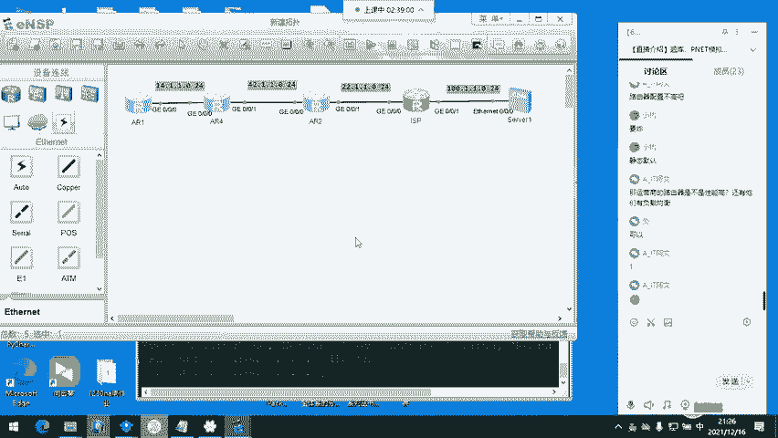

OK那么呢我们要协一调静态默认指向谁呢？指向运营商。那这个静态默认啊也教大家写过了IProot static这个静态默认啊0。0。0。0，然后呢。咱们要跟一个什么。跟一个掩码，这个掩码是0位的0位0位。

他虽然你说它是零位，为什么这个零没有意义？你还要写上去呢？哎，那这个零位啊，我们昨天学了是最长掩码匹配规则，对吧？我所有匹配到的路由条目，我都要根据我匹配的到的掩码的个数，我选择最长的对吧？

那么这个零位呢，零位我也能匹配的到吗？但是我匹配的是零位，但是我还是会把我的数据包按你这个默静态默认发给你发给你，这个就是全零杠0的意思啊，然后呢，出接口是自身的多少0-0-1下跳是。22。1。1。

3对吧？22。1。1。3。

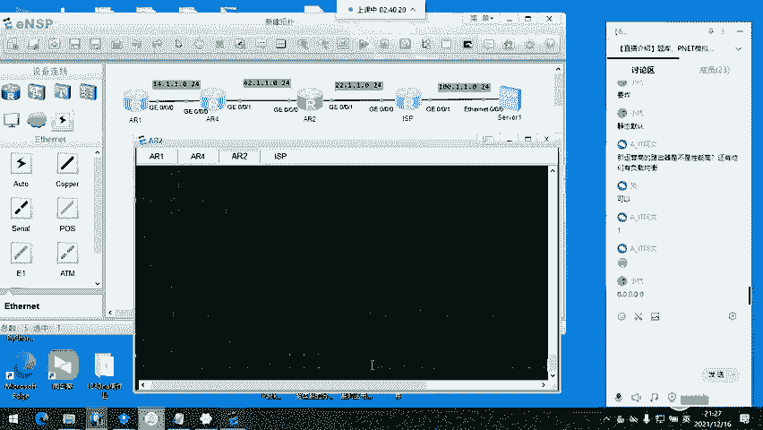

点3，那我们来拼一下这个100啊，拼一下服务器，100。1。1。100，看能不能拼得通通了啊，通了呢，证明运营商已经开始帮我们处理访问外网的这些。漏由条木了。可以吗？那这个时候呢。

咱们学一点点学一点点比较高级的东西啊。比较高级的东西呢，刚刚呢辉哥提到了辉哥提到了什么呢？提到了丝网。和公网大家还记不记得私网路由和公网路由，你内网使用的一般都是。死网路由对吧？

你在你私网路由是不能在公网上被转发的啊。然后我们的网关是192点。168。1。254OK。死亡地址。

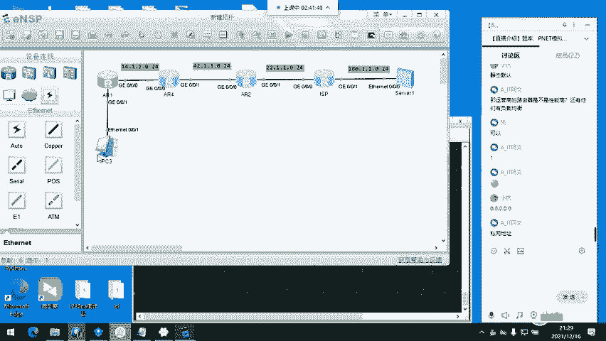

然后我把这台主机给他开机，然后给这个接口要配个IP啊。interface吉比特的0-0-1口IP。192。168。1。254掩码24位。OK我们来拼一下啊。能通。那我这台PC呢，我这台PC现在能去哪儿？

我这台PC能去哪，大家觉得最远能去哪儿？

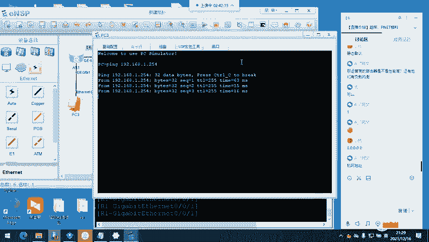

现在就能去100了吗？请注意啊。我连这个接口都去不了，我连这儿都去不了。你想知道为什么吗？R4有没有PC3的？这个192192的网段，192192的路由没有，对吧？那我把192给他通告进来啊。

没宣告来着OSPF。

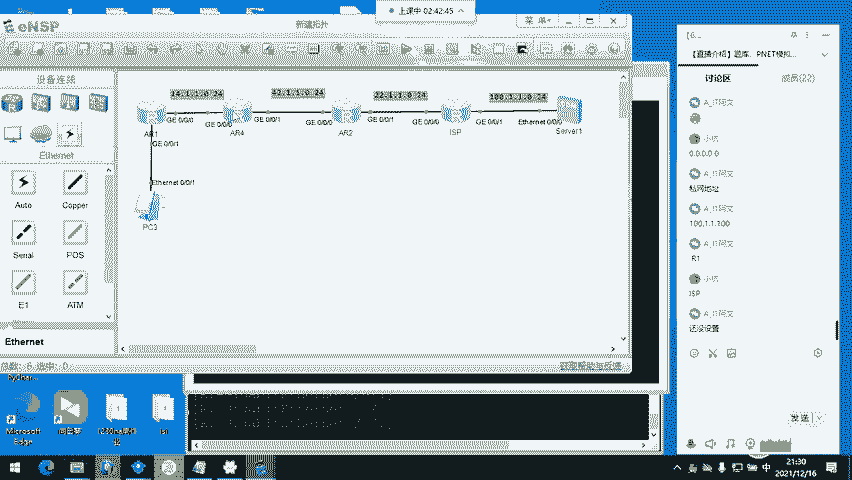

10。1。1。1。1。曲玉玲。net托尔克192。点168。1。0。那有可能呢我们在这台路由器的身后有很多很多的很多很多的PC那环回口的地址你还记得吗？是1。1。1。1，现在他的地址是谁？

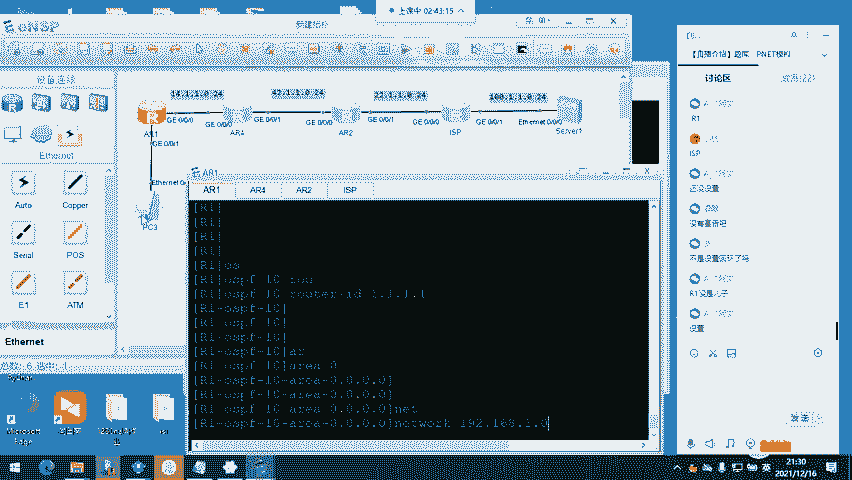

是谁？

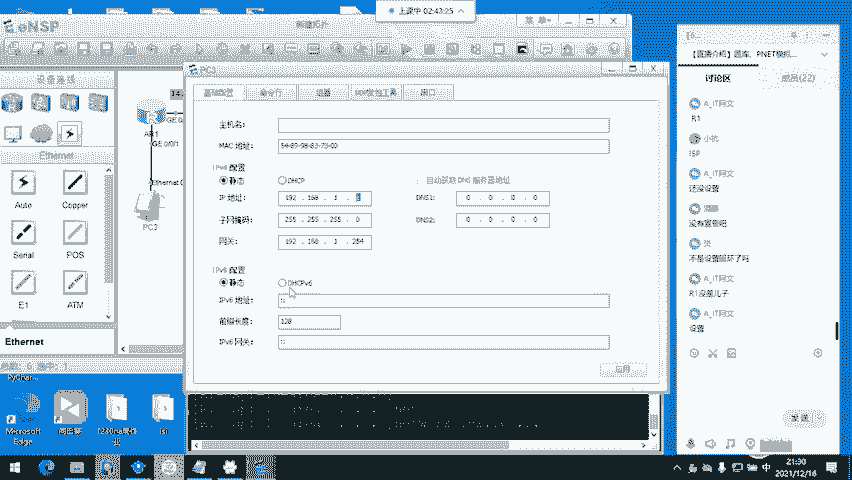

一样吗？不一样了啊。0。0。0点。255。把这个宣告进。看他有没有学到啊，192。学到了吧，192学到了，那我现在PC3最远能去哪儿，我PC3最远能去哪儿，能去到R2的。哪边？这个接口我能不能到ISP？

能不能到？ISP有没有我的路由？ISP有没有和我成为邻居？没有。没有。那ISP的回包知不知道怎么走，回不来回不来。那这个时候呢，给大家演示一下，在之后的课程中会学习到的东西，一个叫ACL。

一个叫NAT啊，网络地址转换都是在边界路由器做的啊，边界路由器做的。我就给大家做一下啊呃SP为什么要和你宣告呢？SP当刚刚不是刚解释过，不屑和你做邻居吗？😊，他不和你做邻居。好，我写了这么一条命令啊。

这是一个叫访问控制列表的。咱们咱们在之后的课程中也会学到啊，我要匹配一个原地址为192。168。1。0到192。168。1。255的这么1个IP我匹配，只要你的原地址是192。168。1。0到。255。

我都能够匹配得到啊，大家先不要管这个是什么？这个为什么这么写，给大家说一下，我现在要抓取PC3产生的数据包，可以吗？我现在要抓PC3产生的数据包。好，那么现在呢。再做一件事情啊再做一件事情，怎么做呢？

在R2的这个接口上做1个NAT网络地址转换，用它抓起来的原地址是192。168。1。1的这个IP转换为其他的IP运营商能够识别的IP。好的。0告0告1。🎼这是华为的EZIP啊，EZIP就这么就这么写。

那现在呢我PC3聘这个100，大家觉得能不能拼通？拼100。嗯。哎，怎么22也不通。他们学到了没有？192的。192的。我做的是EZIP啊，EZIP后面没有命令。重新骗一下骗。42。1。1。4。通的呀。

我这个接口是什么？这到这儿是通的。22。1。1。2。他也有路由，他现在就是不帮你做这个转发。4。24啊。写错了。

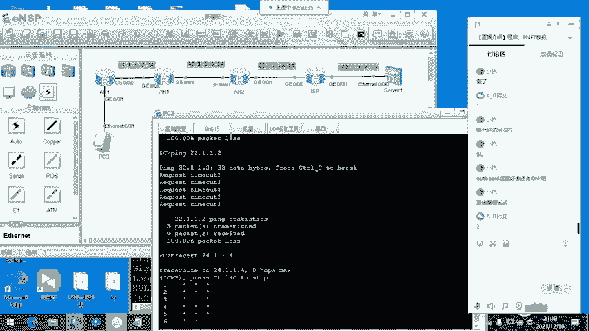

那正常情况下来说啊，正常情况下来说。现在呢他是能够访问到服务器，而且呢他的原IP已经被转换为22。1。1。2了啊。

哦，忘了忘了忘了，我真是太傻逼了，不好意思。不好意思啊。因为他们呢。他们不知道100。他们不知道这个100网络怎么走，不好意思，这么做啊，这么做OSPF你可以看啊呃。

display IPP roing table我们刚写了一条静态默认对吧？静态默认，我现在要把这个静态默认给下发给这两台路由器啊，这两台路由器，它是没有这个。😊，其他都留的那这个OSPF。牛台地。好。

Default rot active。敲完这条命令啊敲完这条命令R一的路由器上原本呢。原本是没有这个。零网络的啊，你看现在是通过OSPF的外部学到了一条去往外网的路由。那现在呢PC3啊。

是能够访问得到的，访问的到服务器，而且PC3访问服务器它的原IP已经不是192。168。1。1了啊，它是。

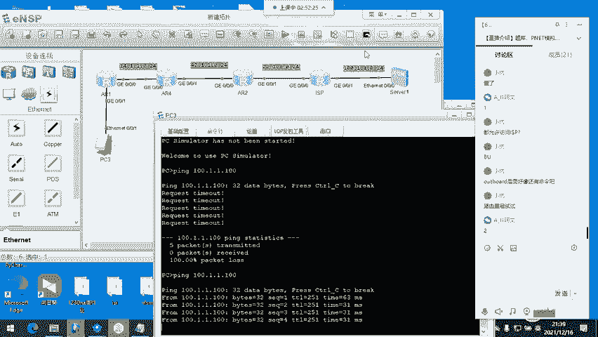

不出意外的情况下是22。1。1。2。我们来抓一下看看啊，抓一下看看。OK你可以看得到啊1个SCIP的拼包请求。目的地呢是100。1。1。100，原地址是22。1。1。2。那现在这个22。1。1。

2有没有真正的产生豹纹，没产生，都是PC3产生的啊。那我们在这个地方抓一下包，你就知道。你就知道了。他干了什么事情了啊？我再聘一下，他们俩同时抓包，你就能看得出来。

ICIP的。拼包原地址是谁？192。168。1。1。然后呢，到了另外，只要经过了我们边界边界，我是做了NAT的啊，网络地址转换就变成了22。你看原地址是192。现在的原地址，刚才是什么原因。

是因为我没有把这条命令敲出来。这条命令的意思是什么呢？这条命令的意思就是把你现在身上的这条静态默认下发给你的OSPF邻居，这不是我们手写的吗？我们在R4和R1上根本没有手写过这条命令啊。

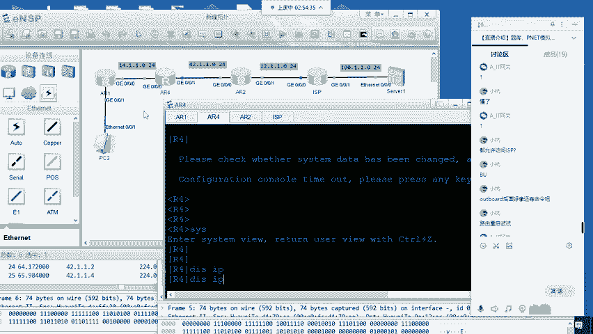

我们在R4和R1上，这条命令不是以手写的形式出现的，它是通过OSPF外部路由学习到的。那有了这条路由，有了这条路由，他们就可以为所欲为了啊。他们知道去外网交给谁。可以吗？这是重分发。重新发布。

可以的啊，那咱们在NA的后面后续的阶段啊，都会学习到我刚刚给大家演示的到这些的啊。那这条命令啊，后面呢还有一个命还有一个叫always。All的位置。这个als是什么意思呢？它呢是总是哎。

它就是为了让比如说你在这台这台路由器上啊，根本没有写过这条命令，根本没有写过这条命令不存在，不是你手写的。但是呢你打上这个als，它会给你自动生成这么一条命令，告诉你内网的其他路由器。哎。

你们想要访问外网的时候找我就行了。虽然有可能他也不知道真正的外往该怎么走。好吗？这条命令的后面可以加这个总是。那正常情况下，我们手写指静泰，指到运营商就行了嗯下跳只给运营商就行了。然后呢。

刚刚呢做的那个不是是NAT里面的华为的EZIP啊，NAT咱们会从头学起的。有可能会看的一头雾水。没关系啊没关系，那个呢。咱们在后面。都会重新学习。这个是基于。

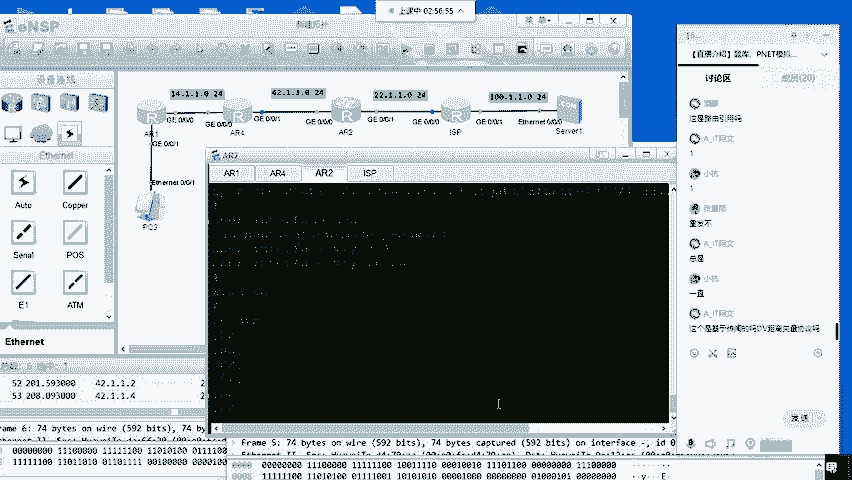

链路状态基于拓普的协议啊。基于拓普的协议，现在这三台路由器啊，它是非常非常清楚。这个网络是如何连接的？R2知道R1身后有一台PCR4知道R1上有一个环回口，有1个PC。DV，他叫DV，他叫。

基于传文的协议，基于传文是什么意思呢？就是说。R一告诉你。我身后有PC3，但是呢我不告诉你怎么走，我就告诉你，如果你想访问PC3，你拿我做吓一跳就好了。这是基于传闻基于传闻。那当某一天PC3不存在了。

你R4要访问PC3的时候，还是走给了R1。叫LS。不叫DV。R和运营商之间没有运行过任何。动态路由选择协议只写了一条静态默认，只给ISP。那SP他是知道22网络怎么走的。

我写了把内网的这台主机的IP转换成22SP收到以后，他一看哎，原地址是22。这个服务器给他回包，他也知道22怎么走，他就能回给R2R2在收到22的时候，他又把这个22转换为192。168发给他们。

他们知道192。168在哪儿。这个呢是稍微复杂一点点的实验啊，稍微复杂一点的实验。大家刚刚说要看复杂的那这个就是。现阶段能复杂的起来的。那不用担心啊。

刚刚在R2上做的这个ACL和NAT啊网络地址转换和访问控制列表，不用担心咱们在下周应该就能学得到了。

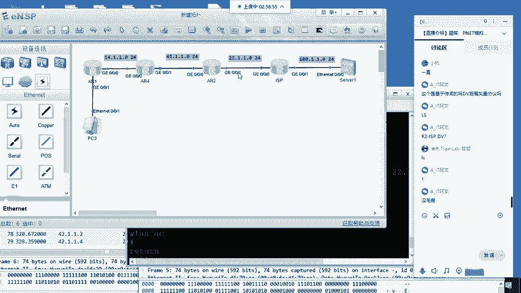

这个去看一下前面的几节课都已经讲过了不止两遍。不止两遍了啊，这位同学。这今天的时间已经比较晚了，3个小时了。3个小时了。与运算就是你10得011得1一和任何数与结果都不变。前面的课程里头都有。

如果你在认真听的话。不止两次了啊。可以。明天发好吗？

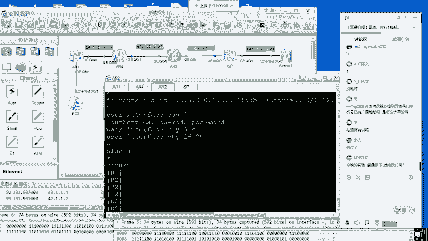

明天发。今天呢已经。几点了？47了啊。广播地址和网络号啊，就是你的主机位，全零的全零的时候，野马会告诉你主机位是哪些啊，全零的时候。他就是这个IP的网络号权一它就是这个IP的。就是1一。

就是零和任何数与结果都是0，就这么一句话，一你不用管零和任何数结果都是0。一不变，零都是0一不变。看一下之前的录播，录播里头都给大家讲了。那你看我现在给你做一个简单的。我只写8位啊只写8位。然后呢。

这个掩码是。掩马市。三位啊三位，我只写了8位啊，页码是三位。那么呢一对应的结果哎，这三位不能改变，那它与出来的结果就是110。然后呢，零对应的结果必须是0，我不管上面的是一还是0，我的结果都要是0。

那好，现在呢咱们得到的得到的是什么呢？得到的就是这个网络的网络号。那这个网络的。广播号怎么算呢？就是这个主机位，它是网络位，对吧？就是主机位主机位所对应的全部给它换成一就得到了。这就是他的广播号。

就这么算啊，前面已经给大家讲过了，你可以回去看一下录播好吗？已经是3小时了啊，那么咱们今天呢就到这里啊，今天的课程就到这里。那祝大家。学习愉快。争取不要落落下一节课啊，落下任何一节课。如果你落下课了。

那别的同学都是会的。你的问题，其他人看起来就觉得哎，你怎么没有好好跟课呀？好，那我们今天就到这里啊。😊，大家。下周一下周一晚。好，拜拜。😔。

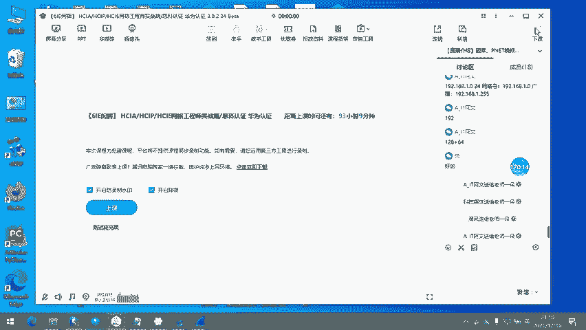