# 2022版华为认证HCIA-DATACOM教程，内部课程公开分享（已完结） - P9：XCNA-09-路由阶段性实验 - 网络工程师CCIE - BV1AP4y1J73k

嗯，刚刚说什么，我们刚录屏了，我开录屏了。刚刚呃EOSPFEI加P啊，你们在呃NA阶段好吧，我说的NA阶段，你们只要知道对吧？它的报文有哪些，对吧？然后你的呃原理呢，对吧？是怎么知道邻居的对吧？

一个是一个是通过什么路由吧，一个是通过我们的SLA对吧？这些的话，你要知道至于多少种LSLA对吧？1到7类LC啊，这些东西你们不需要去NA阶段不需要你们去理解。😊，好吧，然后报文的话。

你们在NA阶段只需要知道这里有哪些报文就行了，对吧？如果再深刻一点的同学可以去了解一下这些报文有什么作用，但是对吧，不强求你们去深刻的了解。因为这些东西都是你们在NP中要学到的。好吧。

那么NA中对于你们一些实验的一些要求有哪些呢？对吧？从你们刚接触模拟器开始，对吧？会改它的系统名对吧？会配地会配接口的地址，然后我们会配我们的静态路由，然后再配到我们的什么最简单的协议，对吧？

然后再到我们的另外一个比高级一点什么高级距离矢量协议吧，叫做我们的EI加P然后在EI加以后呢，我们再学到我们的什么链路状态协议吧，OSPF然后学完OSPF以后啊，你们可能就是路由，对吧？就要高一段落。

然后你们后面的话就要开始去学习你们的二层，因为我们的网络对吧？我们是网络工程师，我们主要处理的是三层和二层，那么你三层NA的三层，我们学的差不多了对吧？那我们就要去学习二层。

那么二层你们在NA里面接触了有哪些东西啊，有个，然后后面应该还有一个STP但是STP的话，这东西啊说实话。😊，是你们NP中主要主要的一个课程。STV的还不接你们在NH学呃，说实话太有点绕人了好吧。

VRP那也是NP的呃NP的一个课程。为什么之前有的时候NA课，我我有时候会给你们加三个人会讲VRP是因为它是在你们网络对吧？工作过程中的的确确是用的常见的一个技术。

所以有时候会带1个VRP的技术带你们去熟悉一下，但是你们N的话没必要去理解好吧，那你们N二层技术主要了解什么对？不同围栏间的通信不同围栏间怎么去通信围栏的作用是什么，对吧？

怎么去划分围栏然后还有个你就是呃你们交换机吧之间的模式是哪些？这是你们后话了，你们后面几节课要学的东西。然后那你们学完以后带你们做个综合实验。那么你们NA啊就是差不多结束了。好吧，那话不多说。

我们今天的话做一下我们的路由方面的一个实验。好吧。路由方面的一个实验。那么实验的话要求很简单。但是呢对于你们这有可能有一些小白是吧？那么这些呃小白的话可能就是怎么说呢？就算给你们四台路由器，对吧？

然后跟你们说对吧？一和2，我们就R1和R2之间，我们使用OSPF协议。😊，好吧，那么R3和R4之间呢，我们使用EI加P协议。😊，啊吧，然后R和R3之间。我们不启用任何的协议啊，不使用任何的动态录由协议。

呃，会讲一遍呀嗯。因为这时间很简单嘛啊两讲两个的话，如果时间够的话，两个肯定都讲。好吧，我们思科讲完以后开始做华为。😊，什么。我们先来讲时科，然后呢，就是R和R3之间啊，我们不起任何动态路由协议。😊。

对吧然后呢我们的目的是什么？目的是让我们的PC5去拼我们的PC6。好吧，就是让我们的PC5去完成PC6的访问啊，就把它想象成一个内网不同部门。好吧，我们不同部门之间用的协议不一样，对吧？

我们这边用的是OSPF这边用的是EI加RP那么瑞普的话，我就不用了，好吧，瑞普我们在后面做华为的时候。😊，呃，华为的时候我们来做一下瑞和我们的OSPF对吧？因为EI加RP是我们的私客私有。

但不在我们的呃华为范围内啊，至少说不在我们的华为模拟器范围内啊。因为现在的华为呃那些产品手册上是有EI加P的，但是真机有的真机现在已经开始支持EI加P。因为EI加RP现在的话已经属于一个共有协议了。😊。

好吧，但是模拟器就不要想了，模拟器是不支持的啊，模拟器现在还不支持。因为ESP已经有好几年没有更新了呃，一个星期的课程的话，这个你去问班主任，班主任那边不是有课表嘛？

然后他那边不是有个你们在上课之前不应该会给你们发一个课程表吗？就是1一整张表，然后上面有你们整一一轮的时间，应该有的吧。你们可以去找班主任问一下，好吧，那我们现在配置啊。

那么嗯我这边的话就是已经把设备打开了。然后我这个字体大家能看清楚吗？呃，刚刚我忙了一会儿，刚刚我就把归把字体调大了点，这个字体看的很清楚吧。😊，这个字体能看清楚吧，不小吧，很清晰吧。

是吧然后我们就是嗯用这么大的字体吧，就字体不改了，好吧。我来简单配置一下啊。首先对吧我们在思考模拟器上，我们进入一个特权模式的话。

我们就是摁吧这in啊其实不是啊是enable吧enable我只是缩写写这个in好吧，然后我们呢我们下一步啊是confi，但是我们这边也可以缩写好吧，教大家一个快速码，就写个confi，对吧？

你T都不用写啊，那如果你要写对吧？如果你要你说你要写完整，你就confi，后面加个小T对吧，就直接进到我们的全局模式了，好吧，这是一个简手法的简写好吧，你们可以自己去呃习惯一下，输入习惯以后就知道了。

对吧？那么我们在进入我们的全局模式的时候，一定要养成一个习惯。😊，哇，养成一个习惯是什么改我们的这个设备名，对吧？设备名呢，我们是host name，对吧？是不是host name呀，对吧？

host name我们其实在做实验的时候啊，比如说你以后要在自己做项目的时候，不用全写啊，因为我们打工号看一下。😊，对吧我们在打问号以后，发现它下面的可选项只有一项的时候啊，你就可以直接写简写了。好吧。

如果它是两项的时候，你就不能简写。因为两项的时候，你他不支持你的简写好吧，因为你下面只有一个选项，所以我可以直接写个HO对吧？HO然后面后面写个R对吧？然后我的名字就改了吧，名字就改了对吧？

这就是改名啊，那么你们改名的话可以就有对吧？改名的话就什么很简单嘛，你们可以就直接对吧？fi你们可以按一个confi，然后就con对吧？CONFI然后呢，按两下回车键对吧？它就进入了全局模式了。好吧。

按两下全局模就进来了。好吧，进来以后或吧？R3。😊，啊，R我刚刚写错了，应该是R一，对吧？我写成我写成R2了，对吧？😊，那么你怎么去修改啊？修改的话，呢你键盘上不是有那个上下左右键，对吧？

如果你想修改你的上一个步骤，怎么修改，你按一个上键，你就可以对吧？调到你上一个命令是什么了，对吧命令话把它修改一下R一，那他就改成R一了吧，对吧？R，然后就改成R一了对吧？这一点大家了解一下好。

现在就来修改了，话不多说，改一下。😊，是吧可别告后事的麻烦。喂。然后你有的同学说对吧？每次手点啊，手点这些1234是不是很麻烦，对吧？那么你的键盘上有个controrl，然后加个t键，对吧？

table键，你在这里面的时候，你就可以去切换，自由切换，看到没？😊，看到吧可以自由切换，知道吧？核是码4。对吧然后我们的PC的话就不改名了，PC就不改名了啊。然我们现在来配置地址，配置地址。😊。

哇我们R一上啊，我们现在四台设备，每台设备上呢我们都呃创建一个环回口，用来环回口的话，用来我们的测试用。好吧，那么在我们的1个OSP，我们来起个OSP，我们等会起OSF时候再说，好吧，我们先来做一下。

😊，int什么？我们写个环为口，好吧，S1。100。1。😊，哦。第253二位。完龙杀当硬可一口的0-1。这个12对对对1。能查到。啊，然后in一口的0-0。写一个。192。168。点10点24。嗯。

然后顺便呃给大家说一下吧。好吧，这个地址啊，为什么是地址是怎么规划的？呃，在你们做实验的时候啊，呃，一般的地址而言怎么规划呢？比如说我们这边是R一，这是R2，对吧？我们R1就是1到2对吧？

那我们的地址写12。1点点0，对吧？我们R2到R3对吧？R到R3，我们顺顺口读就是R3，对吧？那我们就写R3。1点点0，对吧？R3到R4，我们就写顺写写个34点1。点0。😊，好吧，34。1。1。0。

那么他们的环伪口呢怎么设置啊？环回口的话，我们R一的环回口的话就是1。1。1。1R的环回口的话就是2。2。2。2对吧？R3的环伪口的话就3。3。3。3R4的环回口4。4。4。4。

那么这个网关接口怎么设置呢？对吧？我们这每台设备下面都是接一台电脑吧，记住啊。😊，呃，我们三层设备和我们的电脑相连的时候，对吧？下行接口我们称之为网关接口。那么这个网关接口的地址啊是什么？

网关接口地址就是我们主机的网关地址。好吧，就是我们主机的网关地址，一定要记住啊，你的主机网关地址一定要和你的路由器的下行接口的地址一模一样，不然你的对吧你的呃主机设备啊是出不去的，你的路由是出不去的。

😡，知道了吧，一定要一定要搞一定要搞清楚这个对吧？那我们现在来配置一下R5啊R5和R6的地址。那么在思科中，对吧，你的呃设备怎么去配置地址呢？就是你的呃主机设备就怎么配置地址啊。首先IP啊。

后面我们不需要加address好吧，没有address啊，这个命令了啊，只有IPIP以后，我们加什么，直接加他的地址，192。😊，点168对吧。168，我们这边的话写10。1。好吧，我们刚刚写的什么？

我们野码是24位吧，24位。😊，当然啊你这些地址的掩码，你可以不写24位，你可以写很多其他的位，那么其他的位要随你的呃情况而定，对吧？在你的理解范围之内，你写多少位都可以，当然不能写232位啊。

记住32位不能写32位，只有我们的环卫口可以去写好吧呃，也不要问为什么，在你们不管在你们NA认知中还好，在你们IENP认知中，对吧？环卫口只有环伪口能写1个32位地址其他的不存在，好吧。

因为你的ABC类地址定义在那里了。😊，好吧，那我们写完我们的呃接口地址和我们的掩码以后啊，我们下面写的就是我们的网关地址。😊，吧网关例是我们写个192点168，还记得我们刚刚写的什么？

我们IE的下音接口，我们写的是多少呀？10。254对吧？10。254。😊，写完以后。你说是不是直播呀，是直播吧。嗯。对吧我们看到吧是254吧。

那么一般出现啊cheicken for什么dlic什么 addressdress吧，那个什么审核你的什么全局地址吧，对吧？公共地址啊，我们是不是审核审核结束了吧，对吧？你的IP你的主机IP地址是10。

1对吧？言码是255什么24位吧，get头位是网关，网关的话就是什么192。168点10。254。😡，对吧是这个地址，没错，那么R6上的话，我们地址就起一个其他的。好吧，我们起个192点168点20。

1。😊，25。25。25。0。啊，我们写个192给168。点20。254。好吧，那我们这个254的话也是网关地址啊。那么当然啊就是这个网关地址，你也可以不起254。好吧，网关地址你也可以不起254。

但是网关地址不能是什么呢？不能是20。0，好吧，也不能是20。255。1个20。0是我们的一个网络号，对吧？20。255是我们的什么，是我们的广播地址吧，对吧？这两个地址不能起，其他的除了对吧？呃。

0和255以外的任何地址，你都可以当做网关地址。当然你的电脑IP也不能当成网关地址。也就是说你这边的网关地址，对吧？除了0，除了192。168。20。0，除了192。168。20。1，除了2除了192。

168。20。255以外，所有的地址，你都可以当成网关地址啊，不一定要写这个地址的最后一个地址。😡，懂吗？这是你们主机啊，对吧？这是主机。那么我们写完主机以后记住啊，对吧？

说明我们这R4的下行接口一口的0-1也是254，对吧？也是254。那我们下来写R一上对吧？我们I哦I写完了，写R2的。😊，R上对吧in back0吧，lo啊，这叫lo back0，我写完整好吧。

就还回测试口啊，IPADD呃，也不是IPADD啊，我应该是IP的dress，对吧？我每次都读成这样读2。2。2255。255。255。255。int equal口的0-1对吧？然后是12点点。2吧哦5。

25。5。0。记住啊，我们的思科设备呃，就是接口的话就是嗯默认情况下都是关闭的。你要养成习惯去写no啥 down，好吧，no啥 down。那么写完以后啊我们再嗯。😊，0-0还没配是吧。

in equal的0-0。我们要写个23点1点点2。得零吧24位对吧，弄当。那写完以后啊，我们的地址是不是配置完成了呀，对吧？那么地址配置完成以后啊，记住我们怎么去看我们的地址配置呢，对吧？

配置的地址是哪些是什么东西呢？我们要学会输入一个命令啊，叫做啊我们要在我们的特权模式下，对吧？养成习惯，受一下，对吧？sIP interface brief。😊，记住吧，是这个命令啊。

那么你这个命令的话，就能看到。啊，环回口不用弄扯当，环回口的话是默认开启的。当然啊，一般情况下，你们如果对吧？做实验，因为有的时候呃，有的设备上，比如说有设备啊，有的模拟器上呃，或者说不同的镜像上。

它的环回口可能是关闭的。所以一般情况下，不管你设置环回口地址也好，还是设接口地址也好。建议。就是都因为就两个单词嘛，你也就是等于就四个字母，你吧？你写no加SSH啊就可以打开了。好吧。

你就养个习惯开启一下就行了。那么大家看一下这条命令对吧？我昨天讲课呃，前上个星期讲跟应该姐姐讲到了对吧？😊，是吧no no什么so I interface the face brief吧。

那么这个命令的话就是我们用来什么哎，这怎么中间没有空格？😡，哎，这有空格，这又没空格了。好吧，这IP和 interface之间有个空格。受IP受IP interface brief的话。

这个是我们的一个呃就是用来查看我们接口地址状态的和我们一个接口地址的设置。好吧，一般情况下你的。😊，嗯，大。styleles啊都是up的，看到没？一般你的协议情况下也是up的这说明你的接口打开了。好吧。

然后这IPI的dress吧，是我们的一个接口地址的配置。😊，好吧。呃，环回口啊，说实话远程的话不一定有还回口，你可以用你的接口地址，比如说对吧我R3要访问R对吧？通就我们远程登录R2。

我们可以去tnet2。2。2。2，也可以去tnet23。1点点2。好吧，你也可以去tnet12。点2。只要这台路由器上的接口。它只要有接口，你都可以去访问。😊，那你只是我说是华为口的测试接口呀。

你可以去登录华为口，华为口地址也代表你，因为华为口有什么作用啊？华为口的作用有一条是标识本地主机。😡，对吧但是它也是一个路由器的一个接口，它模拟的什么？它是一个虚拟接口。对吧你的物理接口。

你只要物理接口和对吧？你你正在使用的接口啊，地址对吧？直连也好，还是有路由也好，你就可以远程登录。你可以去登录23。点点2是吧，你可以登录这个物理接口，也可以登录它的呃虚拟接口，凭爱好而定。😡。

你自己想去登录哪一个就登录哪一个呗，对吧？没人强迫你好吧，你可以去登录一口的0-0，也可以登录他那个b0都可以登录上去。😊，呃，他就是一个网段呀。你可以如果你设置成25。25。0，对吧？它24位的。

你可以把它想象成什么一个网段。它其实就是一个网络号。😡，好吧，你可以把它，就他就是一个网络号。他也可以去做汇总。对您只要有路由，不管是网通啊，你只要有路由，它就可以去登录。比如说我的电脑上对吧？

有1个2723。2的路由，那么我就可以去登录这23。2所代表的这台路由器。呃，黄卫口的话。呃，不是必须配的，不是必须配置的呃，环为口不需要你必须配置。但是一般情况下。

我们做实验都会起个环伪口用来做测试用。可以啊，可以不配置环为口呀？不配置华为口的话，没对你的实验没有任何的影响。吧。不过在一些特定的实验上的话，你要配置华为口。

比如说你都要做你们以后NP中学习BJP的时候，它有个更新源，好吧，更新源更新源的话，它就要用了lo back口。所以的话你在做BJP的时候是要用到华为口的。跟你登录物理接口是一样的。

你登录物理接口是什么样子？你登录华为口就是一样的，一模一样，登录的还是那台路由器。好吧，比如说我们在这边啊，我们的R一去登录R，你登录它的华为口和登录你的E口的0-1没有任何的差别，现象都是一样。

输入用户密码或者直接输入个密码，对吧？或者输入一个就是用户密码，这两个一模一样的，并没有什么差别。😊，对吧这边的话就不用纠纠结了，不用纠结。黄玉口的话，这边没什么影响没什么影响，他们的现象都是一样的。

呃，华为口可以模拟呃该路由器身后的一个网络，或者说它可以去模拟它身后的一台主机。啊，比如说你你身后网络对吧？你可能有很多个网络，你可以去对吧？模拟一个环卫口，设这个环卫口来模拟你身后的网络吧，都行。

模拟PC和模拟身后的网络意思是差不多。好吧。理解一下吧，还不懂的吗？华为还有什么不懂的吗？华为口还不懂吗？很好理解吧，标识啊，无非的作用是吗？标识路由器。😡，标识路由器模拟身后的网络。没了呀。

就这两个吧，标识路由器和模拟声核的网络。那么在你们后面呃，陆陆续续的在你们NP中啊，你们去可以去了解到这些啊环为口有什么作用了。待会儿在做我们的呃SPF的时候啊，也会去跟大家了解一下华为口是用来干嘛的。

😊，好吧，好友朋友来干嘛的？那我们这是我们的R3R3还没配置，是吧？😊，还有不懂的，你们发问啊，你们在那个聊天框里面说就行了。然后我看到的话一般是会回复的。是的，只要知道如何配置就行了。

比如说你是华为口，对吧？你这边呃华为口的后面这个掩码啊，你不一定是25。25。255。知道吧？你可以设255。25。255。0，那么点0的话，你就是24位地址，对吧？255的话就32位地址。

是吧3时会说明你这个什么地址是唯一唯一的吧，对吧，不能变。啊，位置不能变啊，其实你们也不是说如何配啊配置方式，对吧？配置的一个方法要知道就行了，对吧？你不能说死记硬背。比如说我配这个对吧？

环为口老是写了个IPdress33。325。25。25。25。那我以后碰到个设备，我也写IP3。33325。25。25。25，那不一样啊，你不要不要背这些东西啊，这些东西是随机应变的好吧。😊，呃。

什么是固定的？你看到这些英文都是固定的，数字的话都不是都是可变的。好吧，可以配置到24位啊，你不但配置到24位，你可以啊，你这个掩码你可以配置的很多位啊。😡，你知道吗？ABCD嘛，对吧？

A类、B类、C类D类都可以被成。随便你你只不过我们为什么配成35位呢？35的话，32位的话，好就是便于我们去测试吧。因为你25都是全一的吧，全一的话就是什么。😡，说明我们303对吧，是固定的吧，是吧。

你把这你把这个呃地址锁死了。😊，没有什么区别没有任何的区别。😡，你要写3。3。3，比如说对吧你写个2，比如说你比如说你是3。3。3杠啊，我在这便写个32位，对吧？那你在路由路由表里面出现的就是3。3。

3。3。好吧，如果你这边写的是3。3。3。3，然后后面写24位。如果你写个24位，你就是3。3。3。3呃，你在路由表中出现的是出现的就是3。3。3。3。0。😡，好吧，你就是一个网段。那如果你写16位。

那你就3。3。0。0。好吧，就是这个区别，你在录音表里面只能看到这些。如果你写24332位，就是路由表里面就3。3。3。3。😊，嗯。都可以啊。对啊，都可以啊。如果你写成对吧？24位啊，或者写成一个。

其实32位，你可以模拟成个主机了。好吧，你什么24位或者说16位，你那些都等于是模拟一个深厚的网络。😊，这一段一段的网络大家知道吧？一段一段的对吧？点0啊，对吧？呃，32位所有网络都可以。32不讲32。

你只能3。3。3。31。😊，因为你的录由版里面只锁定了3030303这个地址。好吧，像华为就有一个弊端，就是华为，你就算你写了在华为中啊，如果你的华为口径只写了24位，那么你在。😊。

对吧你在呃你在华为的话，你写了一个华为口地是24位。那么你在我们录音表当中，它会默认你是32位。😊，好吧，他会帮你纠错，改成32位，但是你的配置中写的还是24位，但你录由表中就会出现32位这种地址。

好吧，那四颗的话就不存在4颗的话，你瘦多少位就是多少位。把，4科的话，你收着啊，你写3。3。3232位，那什么你录由表中就是32位。如果你写的3。3。3。3，后面写的是24位的，就25。25。25。0。

对吧？那么你的录由表中出现的是3。3。3。0。😊，是，点0对吧，那么这个点零里面就不含的地址就多了吧。😡，那点您的地址多了是吧？你们也学过延网掩码了吧，对吧？这个我就不理这个我就不多说了。

这个环伪口啊不一定是这32位，你们了解成这个就行了。我刚刚也说了吧，30如果写成32位，你们可以把它想象成一台主机，如果写着24位啊，16万了，你可以把它想象成成一个深厚的网络吧？

上明后面还有好几个网络，对吧？你可以写着好几个环伪口，一台设备上对吧？可以不止一个环伪口。😊，懂吧？一台设备上可以不止一个环为口，所以说为什么说可以模拟身后的网络？如果我身后有三四个网络。

那你可以写三四个环为口来模拟有三四台主机，你可以写三四个环为口来模拟这台这些主机。😊，哇，问这些主机，那我们来看啊，我们刚刚配到这吧来来个环为口的配置了，对吧？我们一口的0-0。😊，我们写1个2300。

3对吧？255。255。255。0。我扫断一下吧，然后一口的0-1对吧？34吧0003。多晓到嗯，杜售I interface。记住啊，如果你再要在呃你的全局模式下去什么？

如果你要你想在你的全局模式下去售，对吧？去看一下你的配置的话，你要前面加个度啊，一定要知道呃，在全局模式下，不管你是在接口模式下，还是说呃就指定的全局模式下，如果你想去拼，对吧？你或者你想去受。

或者你想去做一个通信拼的话，你前面要加个度。😡，哇，叫杜寿I拼 the face brief杜聘对吧？这就叫杜啊，一定要记住，要加个杜马思少。20做一个配置啊，4叉一口的0-0。你扣的0-0对吧。

340。4。华为口。然好一可的0-1。20。254对吧。我们看一下34对吧，1个4。4。4，1个192。168。2。254，对吧？那个。呃，最近喉咙有点不太啊，因为昨天昨天讲一大早起来讲NP课的时候。

可能有点受凉了，喉咙有点不太舒服啊。然后所以大家呃担待一下，可能中途会咳嗽一会儿，不好意思啊。呃，我们来看一下这个R1和R2上，对吧？R1和R2上，我们来起这个OSPF好吧，R一上R上我们起OSPF。

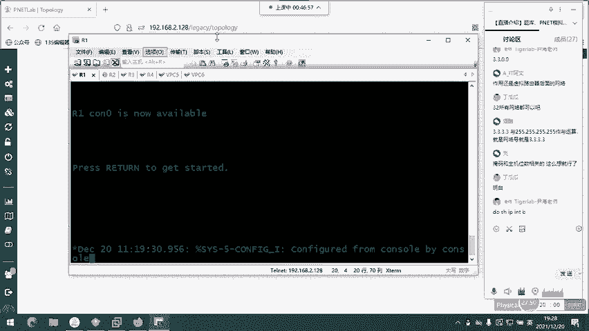

那么OSPF啊怎么起进程啊？首先你可以root对吧？OSPF。那么这个后面进程号，我们打问号，1到65535啊，你都可以随便起。好吧，不不不要存在任何的呀，你可以随便写，不一定说我们上课说什么一呀。

110啊，对吧？这些无所谓，是吧？一般人家写110是因为什么我们OSPF的4科的管理距离是不是110呀？😊，对吧所以的话我们经常会写个110。那么一般情况你懒，你可以直接写个一。啊，协个一。

然后后面的话我们要选取它的一个ro台D对吧？一个我们OSPF的一个什么路由器标识。这个ro台D这边就有啊要跟你们唠嗑一下了，好吧，要跟你们唠嗑一下了。那么这个ro台 ID一般写什么呢？😊。

一般就是写我们的环为口。刚刚我也说了吧，环为口的地址有个什么标识路由器吧，对吧，代表路由器。那么既然这么说，肯定有他的道理。对吧我们OSPF的这台D啊，我们选举的最大优先级啊。

就是我们最先选举的就是我们的一个环卫口。就是说如果你在启用OSPF进程的时候，你这条命令对吧？root IDD1。1。点root ID对吧？你忘记输入了。你没输，你就直接去宣告了，对吧？

宣告你的接口去了。那么他的进程会自己去选举一个rota IDD。他会自己去选举的啊，那么选举的是什么呢？选举的是看你这台路由器上有没有启用环为口地址。😡，如果启用了，而且不止一个。

它会选举最大的黄河口地址来做我的ro态 IDD。如果啊你这台设备上没有起出他D，就像刚刚有同学说的吧，我设备上能不能不起出台ID可以啊，我不起出台ID哦，我不起环卫口啊，对吧？我不请环卫口鲁口嘛。

环卫口。😡，如果我不喜欢胃口。我刚是不是说错了，就是呃我们的就是本地啊存在环为口对吧？而且不止一个有两个环卫口的情况下啊，我们怎么去选举呢？选举我们那个大一点的。

就是我们地址大一点的一个环卫口来自我们的ro ID好吧？我刚说刚都陈述成台 ID了，对吧？说错了，纠这一下对吧？

就选举我们本地存在的最大的环为口啊来自我们的ro ID如果啊刚有同学实际上有同学说的我的如果设备上我不起环卫口吧？我不想起。那你不起也没事，对吧？那么它的ro台 ID呢。

就会有你本地主机最大的物理接口地址。😊，来作为我的肉台地。比如说我这边的一口的0-0对吧？和E口的0-1。如果我IE上没有环回口地址，你会发现我的环回口我没有呃没有还回口地址啊。

你会发现我最大的什么ro IDD啊，就是我们的ro IDD会选取192这个地址来作为我们的一个环回口，就作为我们root IDD。😊，好吧，记住。他呢优先选举。优先选举。哎，优先。选举。最大的华为后。

那吧如果没有范为口啊，没有的话。没有的话，我们干嘛？没有的话，我们就选举。😡，选举最大的。物理接口。来做我们的一个桌台地。好吧，这是我们一个Ro台地的一个选举方式。那么为什么要选举桌台地啊？

因为我们在建立号楼的时候，我们要去交换我们的入台地吧。那我们要交换号楼时候，我们要交换我们很多的东西。😊，对吧比如我们接口啊对吧这台ID啊然后们各种各样的东西啊，接完以后，我们才能建立什么邻居关系吧。

邻居关系建定完成以后，我们还去建立邻街关系，对吧？所以你的邻居关系一定是第一步。如果你的桌台你没写，没有，对吧？那么你的邻居关系还会成问题的。😊，好吧，不会成成为这个问题的。所以说一般情况下。

我们这边都会手动的去干扰配置一个这台地，就是我们的1。1。1。1。1。好吧，一点点点以或者是我们的黄回口也行，好吧，那么我们配置完成以后，对吧，接下来我们是不是就呃就宣告我们的地址了吧？😊。

点二大一些呀，1一和2哪个大一点，不知道吗？肯定二大呀。是吧你就比嘛，就跟数学嘛，数学上比大小一样的，你不要看那个点哇，你比看到哪个数大就行了。😊，是。好，我们看一下下一步啊。

下一步我们是什么宣告接口吧，对吧？宣告接口啊，记住我们OSPF一共有三种宣告方式啊，不能说那具体说是两种，还有一种是违规的，好吧，还有一种是什么network0。0。0。0对吧？255。255。😊。

点255点25L0。那么这个是什么意思啊？有同学有同学试过吗？应该有一些呃从事网络行业的，应该学应该知道这玩意儿吧，这叫什么？这叫呃宣告所有万能宣告。学过反页马的是应该知道吧，学过那个通培粉应该知道吧。

我们反。😊，反过来的255是什么意思啊？不代表32位野马啊，代表了什么全部任意吧，全是一嘛，一代表任意零代表精确，对吧？全是任一，懂我的意思吧？😡，全是全是人意吧，对吧。

说明啊我们不管我们对于你的什么本身的借口啊，没有任何的限制。😡，只要是你的接口，我都宣告进OSPF。😡，好吧，所以说这边是255啊，这25代表的不是32维掩码。😡，好吧，相反，因为它全是一。

所以他针对于你前面的什么地址，它是。😡，对吧就是砝码呀，就是我刚刚说的嘛，不是野码啊，是返码，对吧？全就因为它全是一，因为砝码是么？一是什么？😡，一是随意对吧？零零是什么临是精确，对吧？

所以说对于你前面这个地址啊，并没有任何的什么，并没有并没有任何的要求。所以说所以才会说这条命令代表的是我们万能宣告。😡，好吧，叫万能宣告，就宣告你所有的地址。当然啊一般情况下不建议大家这么用啊。

因为我这边我我这边这台路由器所有接口必须得宣告进SPF，对吧？所以我才用的好吧，一般在你一个内网的边界设备上。啊，边界设备上不建议大家去宣告万能宣告啊，内网对吧？内网的设备上可以去使用。

但是你的外呃边界路由器上。有啊，待会儿等思科讲完时间是的足够的话，我们会讲一下华为。好吧，会讲一下华为。所以这是我们宣告宣告完了吧。那么宣告完以后，我们R上R上我们来宣告，我们来来做一下。😊，好吧。

root5。OS1啊，我们入ID，我们写个2。2。2。😊，啊，写完以后啊，我们写个network吧，network我们写个我们华为口，以这样的宣告方式啊，0。0。0。0对吧？L0。😊，20。

边界的话就是如果你是想去访问外网的话，用的是默认路由。不要宣告啊，你你呃root到ISP上，这条路我们用的是默认路由，好吧，不是不用不用任何的协议去宣告。因为你就算你这边起了协议。

对端ISP他看不起你内网，他是不会给你起任何的协议的。😡，好吧，除了BJP啊，我说的动态螺旋这里面呃，基本上不会给你起任何写。除了BJP除了你要作为VPN对吧，他会给你起，你要给他，你要给他钱，对吧？

他才会给你起，好吧。😊，说的直白一点啊，我们写完2。2。2以后啊，我们再来请另外一种就是宣告方式。好吧，还有一种接口下的宣告方式，大家了解过吗？😊，接口下的宣告方式对吧？比如我们刚刚只是宣告了什么呃。

我们的口对吧？我们的华为口还没宣告，我们的E口的0-1还没宣告吧，我们再进入接口模式下对吧I写个IOSF我们打个问号后面看可以加什么，我来看一下对吧？你的进程号可以加这是你的临接关系吧。

然后这是你的认证对吧？认证的密钥，这BFD是我们N中要学到的一个呃链路检测工具对吧？是你度量值吧，可改变你接口的一个度量值对吧这这是这数据库数据库的分发。

然后这是你死亡时间就跟你 time是一个意思你 time是多少，你的多少倍对吧。😊，然后后面的话这些东西对吧？这还有一个哈lo，对吧？哈喽你主要记得这两个可以修改，对吧？修改的话。

在MP中会教你们怎么去修改，然后怎么影响MP中会说好吧，MP中会跟你们说，但是这边可以跟大家提一手，就是怎么怎么说呢？你改变他的哈lo时间，你可以影响他的的时间，就你可以影响他的死亡时间。

但是如果你修改他的死亡时间，你影响不到他的哈lo时间。😊，好吧，这两个他可以影响死亡，死亡，不能影响你。hello好吧，就跟大家提一手啊，不了解的可以完全把这句话忽略到，当个垃圾话扔掉。😊，好吧，扔掉。

那么这个的话是我们的密额认证啊，不用解就改他的MTO对吧？改成TO那么这个的话是设置我们的1个SPF的一个什么主播区域啊，不管只是在你们的以后课程中才会讲好吧，这是我们 work是我们刚刚什么宣告吧。

这是我们宣告。😊，那我们这是我们的分发列表啊，这个是我们的一个呃prefix实验是在我前几天讲NP课的时候，对吧？跟大家介绍过的啊，这边NA的话就不提了。好吧。

那么这改我们的这是这是改我们的一个OSF的一个优先级ro优先级吧接口的优先级来选举我们的大家知道我们OS有个DRBDR有印象吗？😊，DR路由器指令路由器好吧，和BDR那么DR和BDR的话，怎么去选举啊。

跟这个pro题啊，这个参数有关系好吧，跟这个参数有关系。那么这个下当的话就是接口的嘛，接口下当中嘛，把OSPF进程给关掉。😊，对吧那么这边的话，基本上你们就只需要用到这些命令就行了，对吧？哦。

我们这边用的什么？我们是为了启SPF协议吧，对吧？差点起差点扯远了。😊，IProOSPF1对吧，金程号是一。😡，调用进程号，然后我们写个ar，arrow是我们区号，对吧？区域号我们刚刚是去域零，对吧？

都是去零，我们写一下。好吧，在借口下，我们只需要输入借条命令。😊，就可以了。好，再借回家收机场面你，我们等他的邻居啊，邻居关系的吧，建立吧，看到我们的呃1。1。的1对吧，和1。1。的1建立了什么。

我们的状态已经到他for了吧。😊，对吧状态已经到达4的话，说明我们的临界关系已经建立成功了吧。那么OSPF啊，记住我们SP要学会查表啊。😊，查什么表呢？首先第一个最简单的OSPF什么路由表吧，对吧？

sIProot吧，受IPro，我们会不面可以直接加OSPF。😡，我们就会看到我们学习到的路由表吧，一个是192。162。10。0，就是我们的主机路由。对吧？刚刚我们看到的主机路由。那么这个1。1。

1是我们的环为口吧，是我们的IE上的环伪口。有同学说老师。😊，那这样看怎么的话呃，我们的路由表是不是有点不全呀？为什么不全啊？因为我们看的是我们既然是收呃收IProotOSPF网，那说明什么？

我们现在的这个路由表是通过OSPF学习到的路由表。😡，好吧，那么你的直连路由对吧？你比如说你1212。0。0，是不是我直连呀，我直连不需要通过任何的协议去学习吧，对吧？我的环为口2。2。2。

2是不是也是直连呀，也不需要通过任何的呃路由协议去学习吧。所以啊我们在我们的OSPF路由表中啊，是看不到我们的直连路由的，只能看到我们的OSPF学习到的路由，比如说我们的O对吧？我们看到我们的O吧。

我们看到O的话，我们可以O代表什么？我们可以在上面看嘛，这是小写的O吧，我们是大写的O，我们找一下大写的O代表什么OSPF吧。😡，对吧大写的D代表EI加RP。看到没？那我们就可以认知了，对吧？

我们记住以后我们看到，比如说我们现在收IProot吧，对吧？大家看一下完整的路由表啊，完整的路由表是不是又有O又CUL啊。😊，对吧L代表什么？L代表的是我们本地本地路由表，不通过任何学议学到的路由表。

好吧，1个12对吧？1个23就我们的本地的两端，对吧？然后呢，我们的直连有哪些呢？直连也有我们的E2对吧？12。00网络对吧？直连还有我们的2。2。2这个网络对吧？还有个23。02这个网络。

那么O呢对吧？C大家可以看一下啊，C的话代表我们colected的ected的就是连接，就是直连的意思，懂吗？LL的话是我们的logo对吧？loco代表的是我们的一个呃本地吧。😊，本地。呃，稍等一下啊。

我有个事儿。本地啊对吧？本地，那我们看一下这录由表，录由表大家能看懂了吧，可以看懂吗？这些东西代表的是什么玩意儿？😊，可以懂吗？懂的话扣个一啊，让我看一下啊。带你们把你们的一些细节都讲一下，好吧。

让你们至少看到东西都知道他都知道他是干什么的。你们看到一个现象，对吧？你能理解他是干啥的，好吧，那么还有一个就是什么？😊，还有一个就是这个啊，我们再看我们通过我们我们再看一下我们的OSPF好吧。

OSF的路由器路由，我们看一下它这个代表什么，110啊，110代表的是什么？😊，代表的是我们的管理距离对吧？OSP的管理距离，大家学完以后应该也知道吧，对吧？管理距离ODR的话。

ODR是在你们NNP统才能学到的，它是一种另外另类的一个协议。😊，他比较抽象。他不需要你起任何，你他只需要你直连，他会给你从上而下的下方默认路由。好吧，下王目路由。比较抽象。

你们在MP中的话应该会接触到好吧。NNA的话不要不需要你们了解ODR这个协议啊。😊，ODR这协议的话，你们文中不需要学到，对吧？那么这个110啊代表我们的一个优先呃代表我们的一个管理距离，这个要知道啊。

有1110对吧？不管我们的外部路由还是内部路由啊，它的管理距离都是110对吧？那么这是我们的1个OSOSPF的一个什么呃路由表是吧？那么还有一个邻居表吧，售IPOS对吧？OSPF。😊。

neighbor neighborighbor这个的话看到的是我们的一个邻居。好吧，09呃DRBDR你们在NA的时候有了解过吗？DR和BDR。😊，有没有了解过？应该了解过一点吧，对吧？

你在1个MA网络中，你总会需要去选举DR和BDR没有吗？应该了解往期的话，如果这期没讲的话，应该往期应该有啊，你们可以去选举选一呃，可以去看一下，应该有好吧。

那么这DR和BDR的话就是什么我们的指定路由器吧，对吧？BDR就是我们DR的一个备份选举的吧，选举我们的一个呃角色优先。😊，那么之话你在我们的一个nber对吧？在我们一个邻居表里面，你就可以看到对吧？

我这台路由器是什么东西，对吧？我的状态是什么啊，我的状态是个DR。😡，对我记得我我还讲过这个实验，选举DRBDR的实验我应该还讲过。应该啊应该还讲过对吧？然后我们这个的话。

这个在我们的邻居表中可以看到我们的有个1。1。1点邻居吧，对吧？那么这1。1。1啊是哪来的？这是我们的Ro台地啊，对吧？你通过hello包去交互我们的ARo台D的时候，我们的Ro台D是什么？

你的邻居ID啊就是什么？😊，好吧，就我们的1。00，就是我们的一个呃hello包里面的一个楼台地。😊，好吧，那我们还有一个是什么表呢？受IP database对吧？dase。😊，哎。

说IPOSPF databaseabbase。这是我吗？这是我们的这为什么我们的OSPF叫做什么链路状态数据啊，数据呃什么OSPF叫什么呃，呃链路状态协议，对吧？😡，为什么？因为他就有个数据库啊。

对吧因为它有一个数据库对吧，链路状态数据库。那么这数据库里面包含的是什么？是我们呃。那么OSPF的一个核心吧，叫做。SL呃LSA好吧，LSC那么这个是么？是我们的一类LSC。😊，看到吧，一来二塞。😊。

那我们看到他的有1。02。2，然后这个是12。2是吧，这是我们都本地了，因为我们的什么，因为我们的只有两台路由器。😊，好吧，只有两台路由器，而且它都是L20，它所以它不存在我们的区域间路由。好吧。

所以你本地只能看到12和1。2好吧，这个俩也不纠结。然后在你们往后的一个综合实验的时候，会带大家扩展一下你们OSBO的区域。😊，好吧，今天的话我们OSPF呢就讲到这些。😊。

是吧其他的没有什么OSPF的话，你们起了一个协议，就三种宣告方式嘛，对吧？大家去了解一下呃，主要针对一些小白啊，你可以去了解一下。😊，好吧，那我们在R3和R4上，R3和R呃，就是EI加RP的话。

你们周五呃是周五吧。这五应该讲过吧，EI加P。confi是吧，我们怎么起EI加P呢？😊。

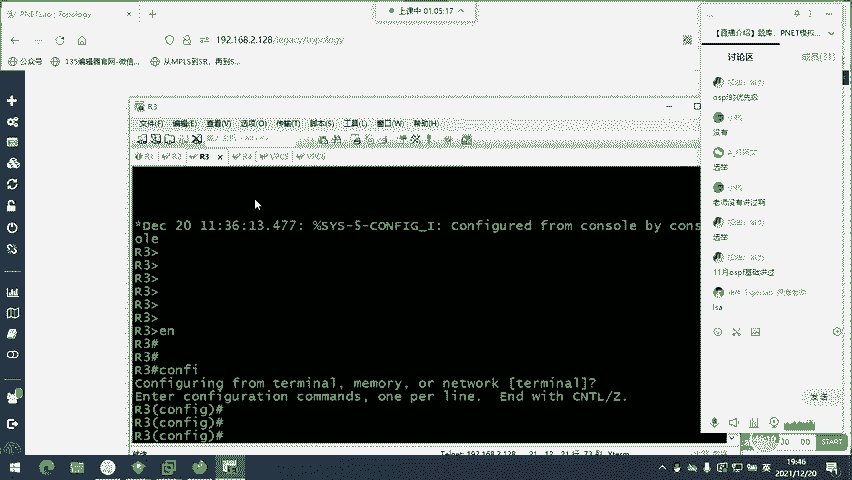

EI加RP啊，我们来请一下rotor对吧？EIGRP。我们可以写一啊，我们可以打号看一下，对吧？它后面有什么也是1到65535吧，对吧？或者你起个word word。那么如果你起名字的话。

你就得进入一个IPV4的一个地址促下去去配置。那么这个话在N中才会用到你在N中是用不到这种另类的I的进程好吧，你们在NA中只起数字型的I进程就可以了。吧我比如我们这边起个90I加B90那么这个90对吧？

是我们的一个I加的一个管理距离吧。我们为了纪念它的管理距离把记住它的管理距离，我们写个90记住啊，我们的OSPF的进程号。😊，呃，每台路由器可以不一样，对吧？它不影它并不影响你的一个临接关系的建立。

但是你的EI加RP记住了，你的EIGRP不同的进程号代表着不同的EIGRP的路由表。也就是说，如果你的进程号不一样，那么你的EI加RP的邻居关系就建立不起来。😡，懂吗？

所以你的EI加RP啊一定要进程号统一，这样你才能建立出你的建立起你的邻居关系啊，不然你是建立不起来的。还有你的EIRP千万千万一定要可能是中，它可能是关闭了， summary它自动汇总啊。

它可能自动关闭了，自动汇总。但是如果有的模拟器上或者有的机上它不是自动关闭手动汇总的啊自动汇总的那自动汇总一定要关掉，不然的话，你的路由表会乱掉。嗯，什么O加什么？

你说的是OSPF进程还是OSF的什么手动汇总自动汇总OSPFOSPF不同进程号。😊，并不影响你邻居或者邻界关系的建立。他比他不是你建立不了邻界关系或邻居关系的一个因素，它可以不一样。好吧。

但是你的EIGRP不行，一定要一样。那一定要一样，那我们就呃no auto to summary对吧？我们呃写完以后啊，我们接就是接接着写，对吧？EI加RP就台D。😊。

那么这个时候他一定选举跟我们的OSPF是一样的。哇跟我们的OOSPF是一样的，我们写个3。3。3。3。😊，对吧我们可以network3。3。3。8。哇，零点零点零点零。啊。

你的你你我们写一个宣更完这个以后啊。😊，询完以后，我们再来写个接口下呃，EI加RP的话好像不可以接口查询告。那我们就老老实实的network好吧，nettwork。😊，3400点0吧。吧，0。0。0。

255。记住啊我们的呃0。0。5，记住我们的一个什么呢？就是说我们在做呃协议宣告的时候，就是我们一般用的都是反掩码，好吧，反码。😊，我们不会用正常的言码去宣告啊，记住啊，不会用正常的言码去宣告。

所以大家一般看到0。0。0。255这东西的，一看就知道是反码，对吧？那么反码大家就要记住一点，0对吧？代表的是精确一代表的是什么随意吧。😡，对吧，所以的话我们的前面的是零嘛，随意的嘛，就是0。0。0。

255。好吧，其实他是255。25。25。0对吧？换成掩码的话，就是25。25。25。0对吧？这些大家应该知道。那么宣告完以后啊，我们是不是宣告了两个接口吧，对吧？我们我们刚说过了2和三之间。

我们不进行任何的宣告。😊，那么S4上我们来做1个EI加RP啊。

roer吧，EI。9类。n summary吧，然后EI加RP。U到ID我们写1个4。4。4。4。啊，that work是的是的是，我们也来做个万能宣告啊。那么呃也是一样的吧。😊，你给叫0000。

然后2呜5聊5聊5聊呜。那我们写完以后，是不是邻居关系建立起来了吧。😊，对吧我们把所有的什么录由都写进去了吧，对吧？340。3。😊，哦，我呃。呃，他他是和萨斯弟弟3建立的吗？邻居关系吧，对吧？

我们来看一下啊。😊，嗯售IEI。neb，我们看下他邻居表吧是吧，我们看下他的邻居表。340。3对吧，建立了。然后我们看一下拼一下啊，我是不是刚华为口没没起队啊？有人拼到人拼到3。3个3度。

受IProot对吧？EI加P我们来看一下。他通过三他通过华为口学到了3。3。3，对吧？他已经学到了吧，学到了以后，我们在山上。😊，我们来看一下。是吧我们在R3上来看一下啊，IPro一样的。

我们刚是IOSPF对吧？我们这边写EI加IP好吧，那么我们写完EI加RP以后我们就能看到通过EI加RP我们习到的路由吧，一个学习到的是4。4。4。4，一个学习到的是192。18点20。0，对吧？

这是我们主机路由，这是我们的一个环伪口路由。😊，对吧华为口路，那么我们再来看一下啊，他除了这个表，还有什么表呢？还有一个soIPEI加P。😊，呃，label。对，我们通过label我们可以看到吧。

它有个340。4的邻居吧，直连邻居。那么这个邻居的话可以看看大家可以看到吧，跟我们的YC不一样嘛。我们OSPF的邻居是我们的华为口地址吧，对吧我们EI加配邻居是什么？接口地址吧，直连接口地址啊，34。

点。4吧。😊，对吧然后再来看一个地址呃，这个是我们的什么邻居表，记住啊，这是我们的邻居表。😊，对吧然后我们的还有一个表，它有一个表的话跟我们的链路状态协议的话不一样。

因为他人家那个是链路状态协议是做或者是LOSA对吧？那么呃，具体使量协议呢不一样，他通过什么，他要去感知吧，他通过其他路由去感知我们的toptop结构是吧？我们来看一下。😊，它是什么呢？

soIPEICRPtop knowledge我们的拓扑表。😡。

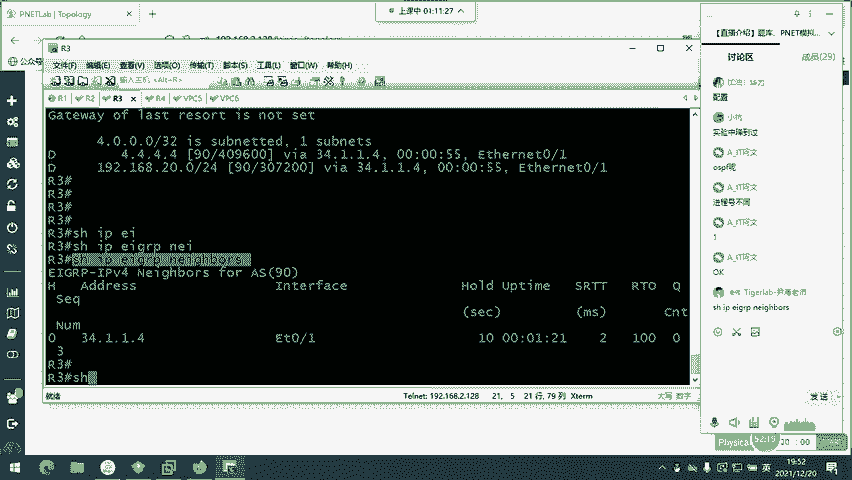

好吧，其实我们的EIGRP属于半个我们的链路状态协议啊。用状态写，因为他呢也有一些特性，对吧？我们来看一下。那他通过他通过什么，他是top里面啊，他通过toptop了解到我们有个4。4然120点是吧。

3。3吧，然后还有个34。14。0，还有1个192的1820。0嘛。😊，是吧。我看下还能看到啥summer。s只能看到个0。10-1算了，只是看个top好吧，这是我们top表啊。

top表里面就是把我们呃通过我们的这个邻居啊，我们能知道的一些top的结构，对吧？写下来。那么EI加RP其实能做到这步就为什么称之为协议之王完因为它的受理速度很快，它比OSPF还快。然后呢。

他收集到的信息呢跟外交差不多，他也不需要用，他也不需要LC对吧？所以的话一般现在呃，如果EIB能够。😊，嗯，公开就是能够呃代替OSP的话，其实挺好的。

但是因为OSF现在线网啊大部分大部分都是OSPF架构，或者是像运营商都是架构吧，对吧？呃，EI加已经没有市场了，就算他现在公开了，就是变成共有协议的话，也没有市场了，好吧，也没有市场了。

所以的话现在呃很少有人用EI加P了，就挺可惜的。那么这里啊我们现在R5上对吧？PC5上我们来拼一下。😊，我们PC5厂去聘什么，2。2。2吧。😡，我们发现我们能拼通吧？对吧？一般出现这样的。

我们就代表拼通了，对吧？哦，我们PC6就拼我们EI加P的边界吧，对吧？303033。😊，我发现能拼懂吧？对吧那我们现在去呃，我们如果我们在RR5上呃，PZ5上去拼对吧？我们去聘30303。😡。

关键拼不通嘛。对吧别看这些别看这在这有什么有 time吧，但是你看一看你要看后面啊，对吧，ICMP呃，你看这个dation host unable吧，那么这是什么意思啊？😡，目的主机不可达。看到没？

啊目的主机不可达，所以的话代表了没有完成通信啊，不是说跳times对吧？跳TDL跳SMP这玩意儿就代表我们可达了。这这说明我们目的主机不可达。那是为什么？因为我们R5对吧？我们PC5去拼的时候。

我们的包。😊，对吧我看一下啊，怎么有工具吗？嗯。嗯。Hm。我叫画板工具，我记得在这儿。我们看我们的路由是怎么走的，我们看一下啊，我们的路由是不是这样走啊。😊，对吧我们发包给他查录由宝吧，查路由表对吧。

查路由表，我们到他我们路由表都没出去吧。😡，哎，怎么动不了啊？😔，好烦呀，他为什么动不了？哦，可以懂了，可以懂了，等会儿啊，我按一下，重新重新画一下，他妈那个笔好细啊。哎，查一下。啊。

我们来看下这路路由怎么走的啊。😊，好吧，我们PZ5啊去访问的时候，是不是是不是这样走啊？😊，嗯。是不是这样啊，对吧？我们PC我去访问到I一吧，我们怎么你们学完路由器的原理以后，知道吧？

我们怎么转发查表吧。那么查我们的目的，查我们的IE中有没有我们所谓的3。3。3吧，对吧？我们来看一下我们有吗？😡，看一下啊，我们的RR衣上对吧？😊，I 화 안。我们来看阿一上有没有啊。😊。

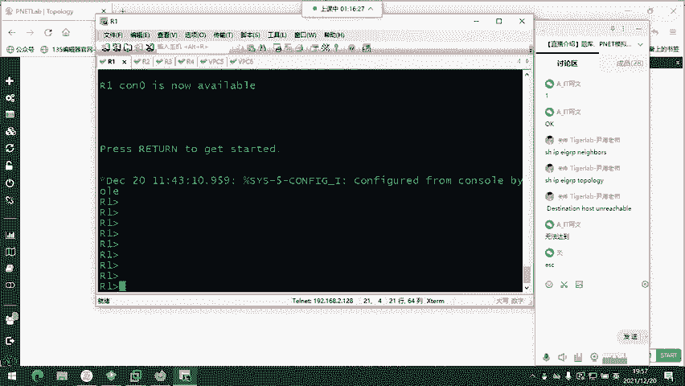

啊，售IProot。有吗？查不到吧。😡，对吧查不到，我们就无法到达吧，我们第一跳就就查不到吧。那大家看我们刚刚那个什么我们PC5上，我们TTL是多少啊，好好55吧，是吧，说明他一步都没走得了吧，对吧。

他一步都走不出去，所以这就导致了什么导致了我们什么无法通信吧，完了怎么才能通信啊。😡，对吧那么通信啊就需要用到我们一个静态路由了。好吧，静泰路由，那么静泰路由是什么意思啊？静泰路由呃。

静泰路由有一种方式叫做默认路由，大家了解过吗？叫默认路由。它有一种特殊的路由啊，叫做默认。😊，对，在呃，在我们的华为中也叫做缺损缺木有，对吧？缺损都没有。那我们怎么做呢？首先我们在IE上，对吧？

我们来数IProotIro。😊，那么默认路由是怎么怎么做？就是我们的目的IP我们要写个零点，就是目的IP是任意。好吧，我们也我们这边反应码的话，我们写么？0。0。0。0对吧？😊，这都不不管他什么目的吧。

我们都写任意。😡，是吧我们都写任意。那么下一面接口的话，我们写个一口的0-1。😊，然后下一跳呢下一跳我们就写什么12点点点2吧，对吧？下一跳我们是这个直连接口下对吧？那对端的一个IP地址吧，写这个。

那么这时候我们在PC5上去拼的时候，我们来看一下。😊，会发现我们仍然不可达，但是我们的TTL变成了什么？😡，我们的TTL是不是变成254了呀？😡，对吧那说明什么说明我们这个包他终于走出了第一步，对吧？

他走过了R一对吧？去发往R2的时候断掉了，那是因为什么？因为我们R2上我们来看一下啊。😡，说I。受。IProot我们会发现我们R厂也没有3。3。38。😊，我们只有23网络。

但是我们学不到23网23身后的3。3。3吧。所以就是我的R对吧？我们R上呢也给R呢去写一个默认路由。😊，好吧，我们也写个R路由IProot。😊，80。0。0200。0。020，然后一口的0。08。

把吓一跳，23点点点3吧。对吧我们一跳一跳的写逼他们去3。3。3。😊，懂吗？逼他们去3。3。3。那么这时候呢，我们在上面再拼一下。😊，我们看一下啊。这时候我们是不是已经没有已经没有安全包了吧？😡。

对吧我们已经没有unreachable了吧，那为什么他还不通啊，这这直接他 out了吧。time out很简单，我们来看一下tra。😡，啊3。36363。我们来看一下他的路由啊。

我们会发现我们是不是已经到达10。254了吧，然后到达12。2，是到达二这个接口以后发现走不了了呀。😊，对吧为什么走不了？😡，为什么我们写了默认录音还通不了呀？有同学知道原因吗？

可以可以可以什么没有回包吧。有同学说了，没有回包吧。😡，对吧因为我们R对吧？就算把包放了R3，怎么样才能通心啊？😡，就是当R三给你回个包，对吧？告诉你，我就是你要找的东西的时候，对吧？我才能建定同心吧。

那这时候我R3上有啊，我我们再来看一下。😡，我们正在R3上去看一个包，对吧？售IPro我们来看一下吧，哇R3上对吧，有你的包吗？因为我们的原地址是多少呀？我们的原地址我们拼的时候PC5的原地址是192。

168。10。0，对吧？我们这边有吗？😡，有发包确保10。0的吗？没有这条路由吧。😡，对吧没有怎么办？没有，我们也得去，对吧？不管我既然要给你回包，对吧？那我不管你的目的地是多少，对吧？

你你只要给我发包，我的我就给你回个地址，对吧？我不管你啊。😡，我们也只好默认去网对吧？隔壁网络的，你家写，你也给我写了，我也给你写嘛，对吧？一口的0-0对吧？好，我们写个23点点点2吧。😡。

我这样是不是就回报了呀？😡，对吧你把包发给我的时候，我能查到，对吧？我就是3。3。3，但是呢我不知道怎么给你回呀，对吧？我要给你回，我就要写个目的地址吧。我不知道目的地址，我就启用这个什么默认路由吧。

默认路由我的出接口是一口00下一条是23。02嘛，对吧？我发给你二上就知道我们的1个10。0的网络怎么走了吧，知道VBPZ5了，对吧？😡，啊，这话就能看到吧，我们是不是建是不是完成同性了呀？😊。

对吧我们就完成通信了，对吧？我们看到我们已经建立通信了。我们来看一下tra下路径，对吧？tra。😊，对吧啊，如果你在测磁路径的时候啊，出现这种玩意儿可以不用理睬。因为垂路径的时候。

最后一跳永远都是什么呃，目的端口啊。因为你看到吗？这是摸底port port端口吧，目的端口不可达，而不是你的目的地址dress不可达，好吧，所以这个的话你可以不用看吧，我们我们到达2230。

32300。3，是不是就这个接口呀，我们等于到了3。3。3，因为我们3。3是么虚拟接口吧。😊，对吧我们并不是一个物理接口，所以它到达不了的吧。我们的目的端口不可达。好吧，目的端口不可达。

但是我们已经通并通了吧，我们到达3。33。3。3是没有问题了。那么相反的，我们PC6啊吧，我们PC6想去访问一个呃VPC5啊，我们想去访问1个R2吧。😊，也不行吧。😡，对吧我们去往的去的时候。

我们首先我们去的时候没有路由。对吧我们去的时候没有路由吧，所以这时候什么，所以我们啊市场也要写个默有路由吧。😡，对吧我们R4上也要写一条目出去的末耳流。😊，嗯。IBroot吧，0。000。0是吧，0。

000。0，然后我们写一个一口的0-0，然后我们写个34点点点3吧。😊，是一块的0。0吧，对吧？写完以后回车，那么回完回车完以后啊，我们的VPC6。😊，对吧我们来拼一下拼2。2。2吧。

我们现在六上我们就要去我们六上要去拼二了吧，对吧我们要拼六上要去拼这边的2对吧？拼一下。我们发现我们可以通吧，原因是什么？因为在上一步之前，我们是不是刚写了R2到R3的默认路由啊，对吧？

他知道回来的包怎么走吧，所以你在R4上只写了一条默认，他就通了。😡，是吧你既然都能听到你既然都能通到对面网络了，是不是意味着我们两边两枚主机可以通了吧，对吧？我们还是用什么来用这个笔啊来画一下。哎。

那个笔呢。😡，比如说把我现在呃。我发院。我们端到端怎么同镜的呢？吧，我来给大家看一下啊，端我们端到端怎么同信。😊，那么呃。对吧首先我们R5呃PC5发个包，对吧？

到R1上R1呢查首先我们不知道VPC5怎么走VVPC6怎么走，对吧？6在这儿，但是我们的路由表中只能查到什么路由默认路由吧。我们跟随默认路由的脚步，一步一步的爬到了R2上。😡，我们R呢也不知道192。

20。0怎么走吧，发包又给了他。首先我们在这边我们的包 destinationation，我们写个DDE代表着我们的DS啊，代表我们目的网络吧，是20。0的网络，对吧？😊，我们source原啊原地址啊。

我写个SOU大家记住一下，是10。0的网络，对吧？10。0的地址，记住啊，这是在包含在我们的数据包中的吧？原木IP对吧？原木IP是我们三层包头吧，那么二层包头呢是我们的原木m地址，大家记住吧。

是我们的原木m克吧。😊，记住，我们在整个的传递过程中，对吧？在整个传递过程中，我们变了对吧？我们mac地址会一直改变吧。😡。

他会一直的不停的以我们什么本地的三层接口的什么IP呃端口麦克地址来改代替我们什么包装的麦克地址吧。但是记住啊，我们在整个传递过程中，我们唯一不变的是什么？我们的IP。😡，好吧。

我们的三层IP就是我们的原木IP在我们的传递过程中是不变的。😡，哇我们永远的以缘和目的啊，永远不会变的，永远都是保着一什么。😡，不变的初心对吧？去访问。这所以这时候啊我们麦克地址其实一直在改变啊。

比如说我们到达R一的手去往我们I一发包去往R2的时候啊，我们的原麦克其实已经变成了我们R一的一口的0-1麦克了，好吧。😊，好吧，我们m克地址已经变了啊，并不是我们单单的，我们一开始的麦克地址了。

所以已经发生了变化，就是端端端的通信，对吧？已经发生了变化。我们在跟随我们默认路由的步伐，对吧？我们到达了R3，通过R3上到达R3上，我们就好做了吧，到达R31查路由表，哎，你这20。0，我有啊，对吧？

你把包发给我吧，我来教你怎么走，那么这时候到达R3上的时候，对吧？到达这个东西上面的时候，他就不需要跟随默认路由了吧。😡，对吧他直接查吧，你查表哦，我走对吧？我走哎，我走了个什么192。168。20。

0，我走吓一跳是34，对吧？发送给3434呢再发送给他对吧？这个这边的查询通过我们是通过我们的什么E加B查询到的吧。😡，对吧EI加B。查询到的。那么我们查询到以后，我们不是说他把包发过来，我们就没了吧。

对吧？他要给回包吧，那么回包怎么走？那回报回报就完蛋了，了了吧？我VPC6上根本我们回包的时候啊，我们destation。😡，对吧SD的手就变成了什么10。0吧。😡。

对吧我回报d是我们的什么这个V5的V呃PC5的主机嘛，对吧？我们的sourceIP。😊，sourceIP对吧，是我们的20。0了吧。😊，我们把这个包对吧？发送给我们的这台路由器的时候，发现啊。

我我什么我路由表中没有20。0嘛，但是呢我有一条默认路由，对吧？我就会把包发给他吧对吧？我发现R3上我也没有20。0对吧？我也没有10。0那我呢也会把包以默认路由发给他吧，发到R上的时候。

哎R上查看我的OS路由表吧。我发现我有？吓一跳不但不但有I键还有吓一跳吧，我吓一跳是他对吧？传给他，然后他呢再传给他，那这时候这两个之间就建立通信了吧，对吧？所以说在以我们就是在发包过去的时候啊。

其实呢我们是到达对端的时候我们通过的是路由协议吧，对吧？回包的时候，我们通过的是什么我们的默认路由懂了吧？这就是我们端到端通信。😡，懂了吗？就是我们一个主机之间为什么会通信，对吧？

这就是我们一个端到端通信的原理。😊，懂了吗？懂吗？这就是很简单的，因为你们在NA中啊，怎么说呢？😊，起作用了呀。你回包的时候对吧？你回包的时候，是不是这边回来的时候靠的是什么？是我们的默认路由，对吧？

回包的时候靠的是默认路由。但是你到R上的时候，你靠的是不是我们OSPF的查询才查询到我们的VPC5的呀？😡，懂吗？你是因为你是通过你的回包，你回包到R2上的时候。

你你是要通过你的OSPF才能查到VPC5的呀。你并不是通过他默认路由查到的呀。😡，好吧，所以说这就是为什么内网使用我们的OSPF对吧？如内网使用动态路由协议对吧？去往外网的时候，我们要下方默认的意思。

😊，好吧，其实你们在呃，为什么我要做这么多默认啊？其实在呃不管你啊，在以后的学习中，其实都要下班默认的。😡，呃，其实这边为什么累呢？我要不给你们演示一下吧，就是。我本来不打算在在这在这讲的，你们觉得累。

为什么累？因为你们要配置好多默认路由，对吧？线网中不需要这么配线网中呢有一条很装逼的技术。😊，好，比如说我们现在RE上。😊，对吧可fi我们把我们刚写的默认录由删掉啊。😊，等会soron。sSPR。

IPro。我本来准备在MP跟你们讲的，我本来不打算在这边跟你们讲的，对吧？漏掉。漏掉以后我们来看啊，都说完root吧，对吧？我们看到我们的默认路由消失了，对吧？那么一般情况下。

我们怎么去做OSPF的认路由下放呢？其实呃每个路由协议啊都会除了瑞以外，每个路由协议其实都有一个默认下放呃，下放默认路由的一项技术，只不过这是NP的技术啊，在NA中不交的。好吧。

我们在这边我给大家演示一下，好吧。😊，其实也很简单啊，为什么不叫哎，我们在进入我们的协议进程下，对吧？default information。😊，aud好吧，我们输入这条命令以后呃，输入这条命令以后。

我们会发现。😊，会发现我们在阿E上来看一眼。呃，要稍等一下，对吧？我们会发现什么？我们RE吧，看清楚啊，我们在RE路由器上，对吧？我会发现出现OE two吧。😊，发现自动幕会产生一默认路由吧。

指向的是我们编辑路由器，看到没？😊，所以说一般在我们的线网中啊，呃除了边界路由器去往ISP，我们要自己手动去配置默认路由以外。基本上不需要配置默认路由的或者静台路由都不需要配置的。你的设备是自动下放的。

好吧，就像这个为什么OE two对吧？在你们NP的时候再给你们解释，现在卖给管子不熟好吧，然后我们这边的话会起会出现1条0。0。0。0。😊，嗯，待会儿的话待会的话不是要讲，不是叫要讲ESP了嘛，对吧？

这才是四科呀，讲到ESP再跟你们讲嘛。😡，是吧命令不一样，但是都有这个功能。行吧，到这我们的思科还有什么问题吗？😡，好吧，就这就是说回复了，刚刚有个学员嘛，说什么静泰路默认好类的确累是吧。

所以说我们有一项机器，所以我们Y就有一项专门针对这个类的技术对吧？就是我们的默认录下放。😊，那么还有问题吗？关于我们的YS标呃，这边。刚不说了吗？在我们的协议下呀。边界路由器在我们的边界路由器上啊。

就说我们刚R。对吧我们的R是不是我们的边界路整个协议的边界路由器，对吧？边界路由器上输入这条命令de information alternate啊这条命令啊你就可以下方l了。😊，呃。

R呃EI加RP的话也可以下放。那这边的话我只是跟你们说有这项技术，那至于怎么下放呢？等你们NP的时候再跟你们讲了，好吧，这边的话就不剧透了。因为你们NP的时候也也有很多要讲。😊，吧，我就不说了啊。

我不说了，等你们讲到NP的，等你们上到NP的时候，我再给你们好好讲。你们上NP的时候，估计也是我给你们讲课吧。呃，NP的话一般都说我跟说话，我就是给你们讲一下，好吧，肯定要讲的，这是一个关键性的技术。

😊，我，关掉啦关掉了。电影阅关闭客户端。嗯，现在去做华为了，稍等一下。

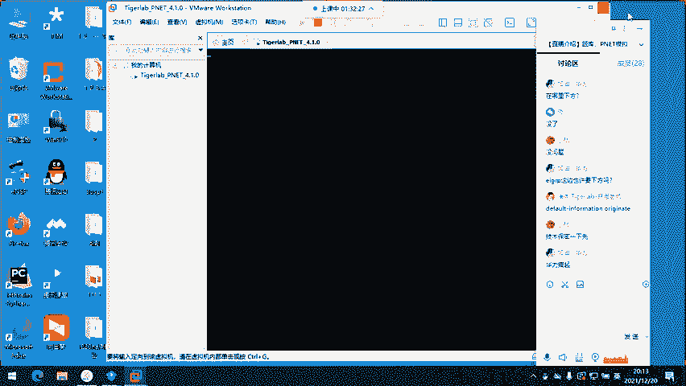

等它关掉，不然的话这电脑起不来。

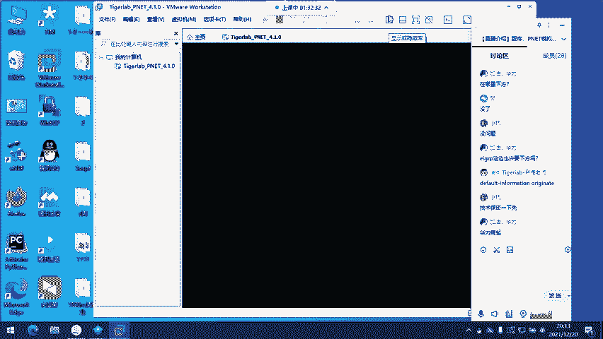

呃，华为的话到华为上那个接口地址的话，我就一道而过了。好吧。因为华为和思科唯一的不同点就是什么？就是你的接口就是默认开启的。好吧，华为的所有接口啊默认都是开启的。你们这边是不是大部分都学华为的呀？

我看你们的名字很太太热太激情了，我靠，华为加油。😊，你们都是学华为的吗？嗯，但是我这边不是诋毁华为啊，华为。怎么说呢？可能要面临一次挑战吧，他已经把他的一些产品的代理权或者产品的开发权卖给人家了。

就是可能你们再往后的话，可能你们会发现华为的设备越来越少了。

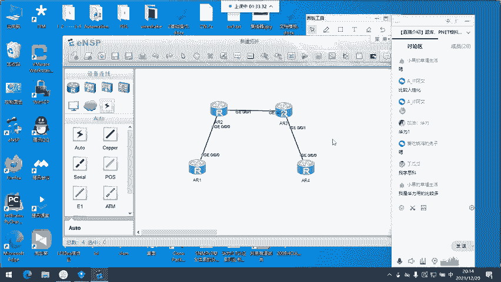

换成了其他人的名字，至于是什么名字呢？就不说了。

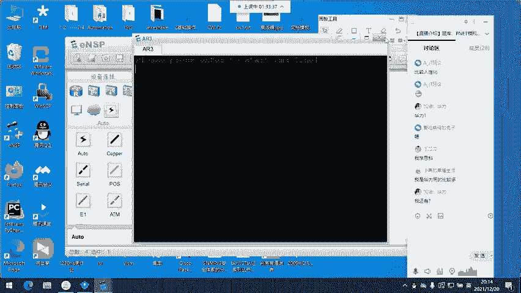

没有为什么，这这不好说，好吧，那属于谣言了，不能说。你们好好学吧，你学学到老活到老，对吧？你们。

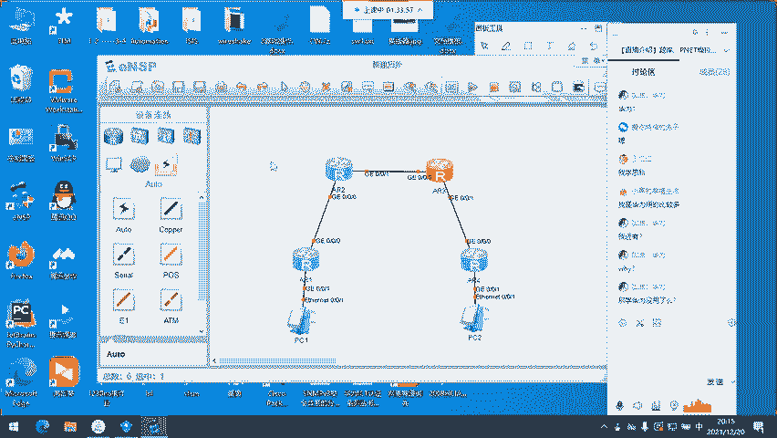

可以啊，他两个理论其实是互通的，其理论的话其实差不多。哇，我记得我觉得你们应该听辉哥介绍过现在华为和思科的一个形式吧。华为的话，其实四科并没有你们想象中那么恐怖啊，说实话没有那么恐怖。

不是说全英文命令大家都是英文，华为也是英文，四科也是英文。对吧无非就是存在考试的形式上。那你题库也你华为题库也是背呀。😡，对吧你四科题库也是背，不管中文英文。换句话说，你中文看得懂更容易误导你。

不觉得吗？你题目读懂了，那你就想去思考四科呢，你题目看不懂，那你只背答案，头脑简单多好的。😡，对，就是对错就是错。不那不管呀，答案我没有题库，答案肯定是对的呀。背答案就行了。华为是什么？你看到中文。

你看到中文后，你看到中文中文汉字，你就想去解析，你就想问哎，这个原理为什么？结果如果自己眼理原理记错了，你会诱导你。😡，懂吗？过来人啊，跟你们说一下。

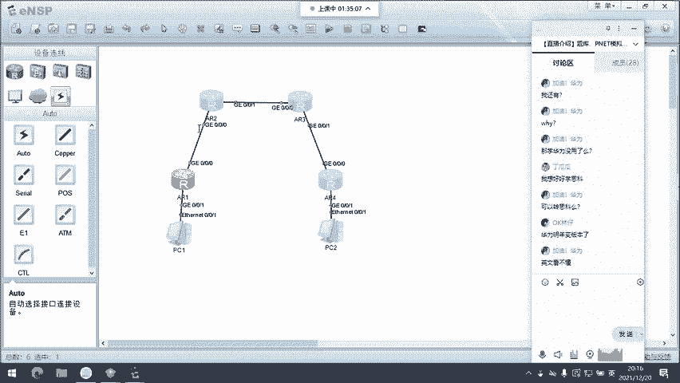

很多同学都在跟我抱怨，华为中文的，但是好难背呀。比斯科的海兰贝，说实话。对，就是想太多就容易出错。四科你是不用想那么多，所以你很很难出错，就这么跟你们说啊，很难出错。

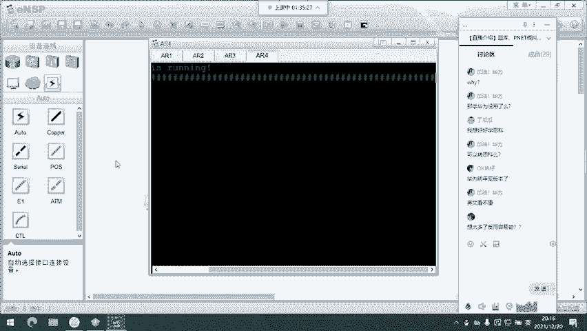

那女孩子如果你们的记性好的话，应该是女孩子吧。看你头像写有点像女孩子啊，秀琪的。记性好的话，那就当我没说呗，你们就该干嘛就干嘛，对吧？你该准备华准备华为。因为你们现在如果有些小白的话。

你想现在就考华为的话，你们完全不用担心吧。我觉得你们就准备考新版本吧。😊，新版本的话，写下来估计也到明年年底了。所以说思科的话对吧？dcom呀，明年6月份改革嘛。😊。

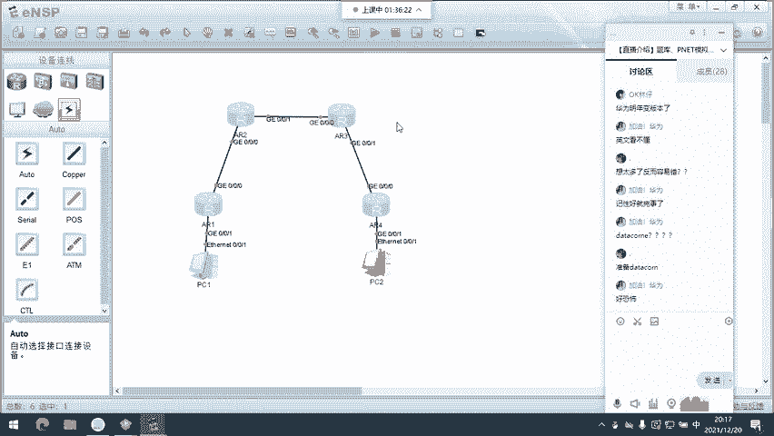

呃，华为的话对吧？我们进入一个不能说特权模式了，我们这叫视图。😊，对吧用户视图和系统视图。对吧呃。不是说没有面试啊，其实他说实话，现在的华为为什么阻止你们现在如果想考华为，就阻止你们考华为吗？

因为现在华为没有了面试，但是有了个论述，他会卡你论述题。就是说两个人一起去考试。然后呢，两个人题目是一样的，答案也是一样的。结果那个人过了，你没过华为给你的理由就是。为了防止谢提概不陈述理由。

是这个意思。懂吗？懂的都懂啊。我是发个英文啊，就是。好吧，懂的都懂。阿一是吧，我们改改名字。阿一。R3。哎，怎么34啊？啊，4长。啊4。那你看你这后门够不够硬呀，你后台够硬对吧？你说你华为里面有人啊。

可以给你打招呼那。不好使。比如说是辉哥了。Bottle boss。没用的。好一下就硬性的，知道吧？然我们在IE上对吧？我们来配置地址。首先int接口的0-0-00-0-1对吧？配置地址呃，这个地址的话。

我们写写也是一样的吧。192。168也是一个网关地址，对吧？10。01255。255点哦，10。54啊，写错了。😊，254把255。255。255。255啊，不用写啊。华为对华为还有一个。

其实我觉得华为这一方面挺好的，就在写野码的时候啊。贼给力啊，直接写个24就行了。好吧，我一直把它想成斯科了，因为我本来就是思科出身，知道吧？所以的话就可能。😊，也不能怪我偏向时磕吧，只能说出生不一样。

哇，我写个一。1点一。😊，啊，32位。我们写一个借口的0-0-0，对吧？12。00点1吧吧，24。呃，他们查接口的命令的话都是一样的。啊，查明你就是样对吧display吧啊，我们四科叫授。

华为呢叫display。😊，I P interface the face brief。我没看到我们设的地址吧。把1个0-0-0，把这放大一点，它好小啊。

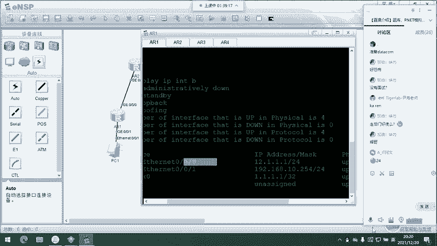

对吧最后0杠0120。1对吧，192。18。1。254，然后1。10点-32位。

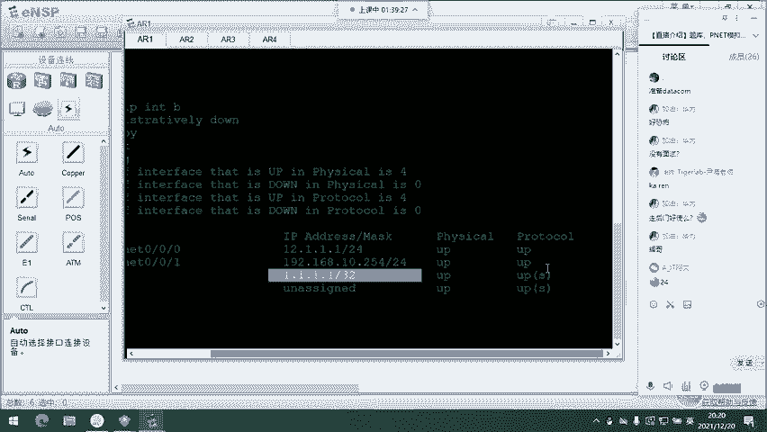

八都是up吧都是up。然后我们在R上们来起个地址。😊，int环口对吧？2。2-32位。是吧然后inter接口的0-000。1对0028万24。啊，我写错了。

是，-24位，然后int最口的0-0-1。呃，230002。20位啊吧，display i p the face brief。呃，还有啊华为对吧？它并不存在像斯颗量样有度的模式啊，对吧？

它不管你在什么模式下，你可以直接display。😊，比如说你想接看这个接口架的配置，对吧？你可以D对吧？display。😊，display this你可以看这个接口下，这个接口模式下的配置，对吧？

我刚刚只在这个接口模式下配置了1个23。02，对吧？你可以di看一下。如果你想配置看整个对吧？所有的接口呢，diIP displayplay I interface brief就是我们刚刚看的对吧？

可以看到其了三个地址。😊，看到吧？可以看到其三个地址，我们在23上来配一下。😊。

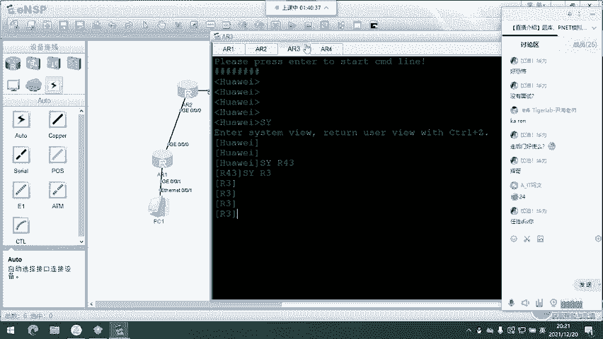

嗯。吧in the back lane。3030338。3对吧inter接口的0。0。23点点3吧。啊，4位。inter接口的。嗯。

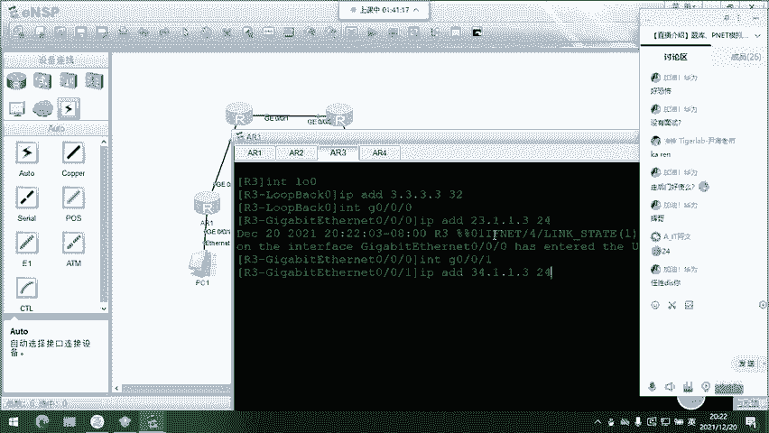

被付的吧，我们看一下。地址都有了吧，地址都有，他把它撕上。

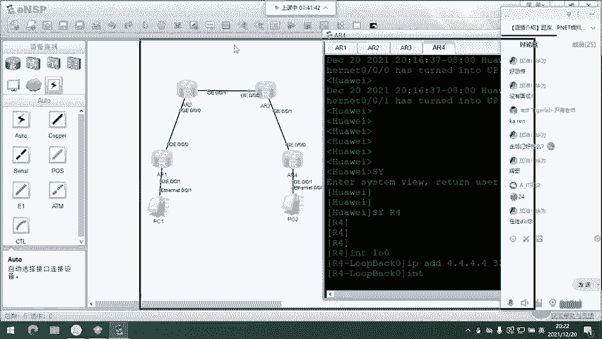

嗯，这是34。24吧，对吧。Display， I in the face。

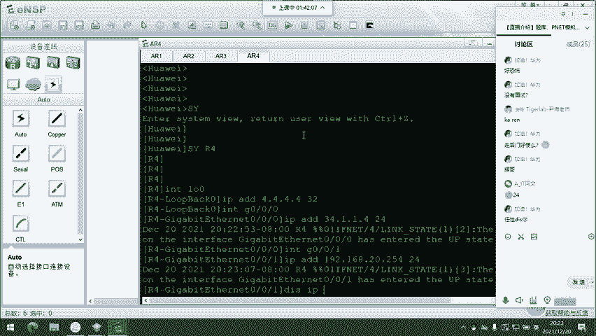

嗯，地址写完了对吧？地址写完了。呃，这下来我们就要起那个协议，对吧？那么起协议的话，我们很简单啊，我们R1到R2上，我们启用一个ra，好吧，R1到R2，我们起个ra。😊，那我们写个ro一对吧？

V我们的版本的话，我们起一个V1。😊，对吧我们写个二对吧，n out of上边也一样，我们要改变一个啊昂度。Ondo out summary啊。嗯。

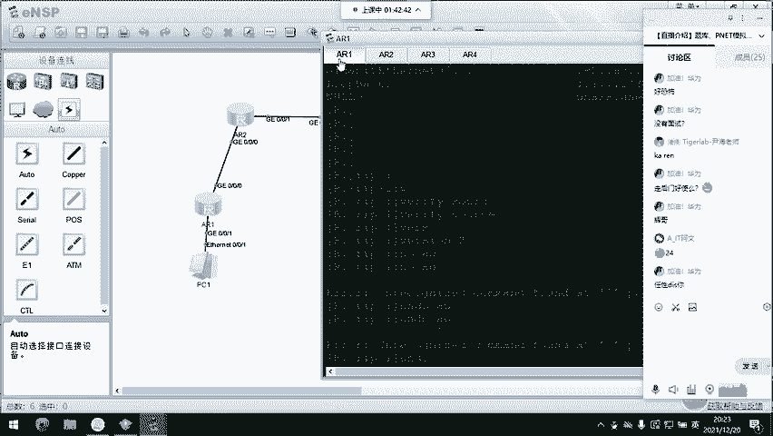

auto summary好那不需要关吗？😔，啊，昂 dosummer。do summary也要把它的汇总给关掉。一般的话我们这种瑞的话，我们都是手工汇手工汇总的对吧？那么手工汇总的话。

其实瑞ip已经被淘汰了。这本我不想跟你们讲瑞ip的啊，其实被淘汰了无所谓了。哇，我们请个network那192点168点10。0吧。😊，啊，宣告一下，然后let work我们写一个。😊，嗯，12。点。

0，但你签你这样协议以后，他应该会给你提示吧，会提示你报错吧。为什么啊？因为你的嗯你的瑞普的话只能宣告主类路由。😊，吧所以你去原告这个的时候，你的华为会给你报错，但是他已经给你纠正过来了，待会看一下。

他其实已经给你纠正过来了，把network1。1。1。😊，就这个了啊，我们来看一下对吧，display this。😊，他不跟你宣告吗？我记得以前是可以以前是可以的呀。我知道我知道谁2点0啊。

因为他是本来就是116位嘛，对吧？8位嘛。😊，但是在私科上是可以这么宣告的，这是一时之通啊。主类路由就是你ABC类地址呀。对吧你A类地址的话只能是8位，B类地址的话只能16位，对吧？

C类地址的话只能是24位。其他位，比如说你比如说你是我刚刚不写的就120002嘛，对吧？😡，你呢，因为我们当时我们宣告的是2，我们写的是24位，但是他的ra的话，他只认你的主流路由。

不认你的接口下的设置证掩码。也就是说你的接口下，你写的是24位的12。000这个网络，对吧？但是在raip里面呢，他只认你这个12是你的8位。好吧，比如说我们刚一对吧，他只能是1。0。0。0。好吧。

因为他什么小于它小于什么？😊，还小于18，对吧？所以说我们这边的话只能只能什么？只能卑微的写12和一了。但是在我们的四科中啊，4科中是可以刚刚像12。0吧1。1。1这么宣告的，好吧，是可以这么宣告的。

我们的RRR上我们来宣告一下。😊。

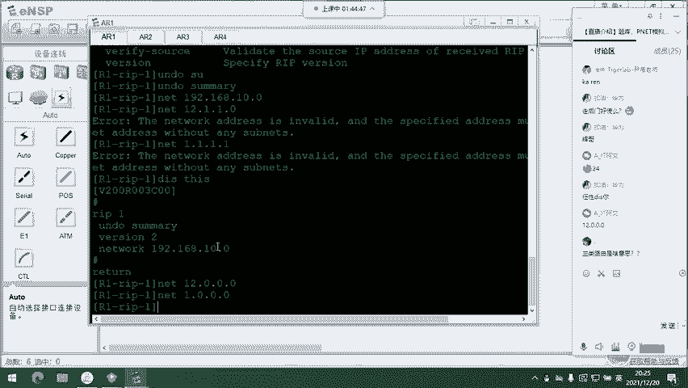

啊，re一。是吧no on do。I do summary，然后我们写一个。为什我们这个to吧，对吧？我们letwork。然到12吧，00。0。0。哦，network我们写个2。000。0吧。

写完以后啊，我们在RE上看一下so啊display rape。

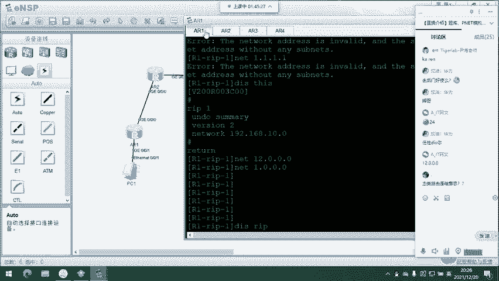

异议。嗯，看一下label。啊，我们来看一下啊，他的一个瑞普的吧，瑞的一个邻居关系。是吧他瑞普已经建立起来了吧。Display IP Ro table protocol rip。啊，记住啊。嗯。

我们通过I上，我们通过瑞普学到的对吧？我们通过I上通过锐部学到是么？这我么R的环为口吧，对吧？2。2。2对吧？32位的。😊，对吧，32位的，然后我们的吓一跳，对吧？这个呃，我们在华为上查那个就是。

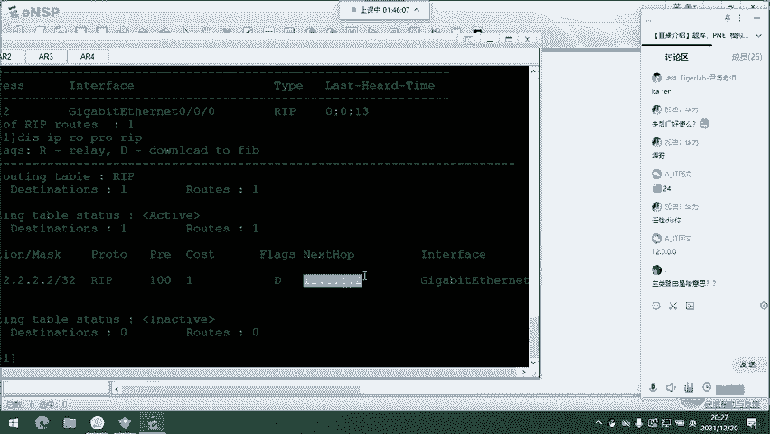

呃，协议路由表的话是display对吧？IP roing table protocol。对吧瑞普。要这样写，你才能查到路由表啊，查到你通过瑞学这的路由表好吧。如果你只是单纯的想看他的路由表。

然display把IPoting cable对吧就可以了。然后这边的话是他的所有路由表。😊，好吧，本地的对吧，那么如果你的录由表中出现了127。😡，嗯，这个U27的路由的话，是的华为模拟器上自带的啊。

就是呃是你的路由器上自带的防还路由是吧黑洞路由防还的。😊，好吧，所以说不用管，不要说为什么我没有设置127，但它还会出现127。那么它是本来就模拟器自带的啊，你不用管着它不影响任何的实验。😊。

啊不影响任何的实间。是吧你大家会看到它是吧，不用管啊，你肯其实不是这个是吧，不是这个你的inface你是这个吧，这是你的防滑路由不用管对吧？不用管呃，这是这个就是我们的瑞普啊，瑞大家了解一下就好了。呃。

没必要记。因为瑞普的话已经不是主流了，已经淘汰了。😊，好，我们来起个YPR吧，我们在R3上起个YPI1。😊，啊，OS哦不对。对不起，我错了SPR。嗯读。哎，记住啊，你在起华为OSPF的时候。

虽然说他会选举3。3。3。3来到我们的入台D是吧，但是呢你这边还是要写个入台D好吧，写个3。3。3。3。啊，一定要讲成这习惯。华为的话就是这么就是这样配置的。没有办法。好吧，我们后面呢要写个区域吧。

我们写个区域220。那么写完区域以后呢，我们才能做宣告吧。😊，好吧，首先我们宣告nettwork是吧，3。3。3。3。😊，好，我们先告个0。0。02010。对反应码letwork340003对吧？0。

000。0。记住啊我们的OSF可以选可以模糊宣告，也可以精确宣告好，精确宣告的话，就是我们后面加一个什么精确的地址嘛，模糊宣告呢，你可以写3400。00。0。0。25。😊，好吧，看你自己习惯吧。

你你也想喜欢怎么宣告就怎么宣告。😊，哇。YPFE对吧？如台D来D我们写1个4。4。4。4。😊，然后嘛arrow顶个吧，network。呃，这边的话你也可以就什么宣告就是呃宣告所有啊，宣告所有。

但是的话这边宣告所有的话命令和我们的私磕一样，就什么0。000。025。25。25。25。但是呢呃华为的一个借口价宣告，你们知道怎么怎么去宣告吗？我带大做了一下吧，25。25。哦，我刚那个做失误了。

我觉得。

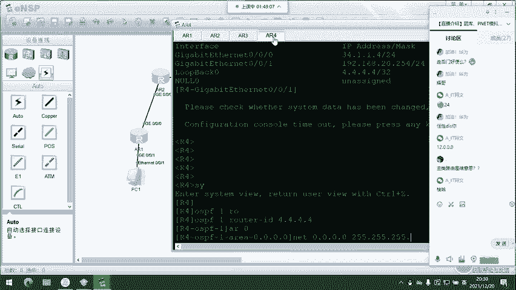

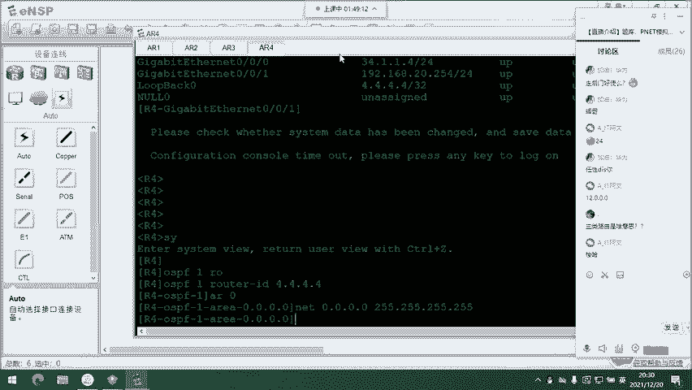

啊，稍等一下。啊，他的邻居状态是不是变成了f呀，对吧？这也是啊，就跟我们的私磕一样的吧。吧我们4科也是0。0。025。5，对吧？只不过它的呃这个区域ID的话是在我们的后面，对吧？我这个是在我们的前面呃。

😊，嗯，我我我带大家看一眼好吧，比如我们在int接口的0-0-0。对吧呃，华为的话就是你宣告OSF在接口加宣告，不要加IP啊。你加IP的话，它其实并没有其他东西的。好吧，它并没有其他东西。

你你就直接写OSPF。😊，好吧，OSC要你打个问号，你就看一眼里面东西是不是比我们的私磕的少多了呀？😊，我们斯科勒么一大一一大场出还在华为里面就这么一点吧。但但是你不要认为华为就这么点啊。

他只是说有的min令不在你的借口加去显示了而已。😡，好吧，不在你接口下显示了而已，并不是说它就很少了。好吧，enable我们写个Enable吧able以后我们看一下它这个pro ID吧，对吧？

我们的进程号我们的进程号呢，我们可以写一吧，我们刚刚写的就是一对吧？一的话，我们再打问号，我们看可以写什么吧，对吧？区域我们是区域0，我们写个区域0，我这不按回车了，好吧，那么在你在接口下宣告的话。

就这么宣告。😊，对吧这回下宣告就这么宣告，对吧，我就不按回去了。因为我刚刚已经宣告所有了。😊，啊，我已经宣告错有了，我就不宣布宣告，我只是带你们看一眼，对吧？怎么在借口下去宣告。好吧。

那我们现在路由都有了吧，其实是一样的。😊，呃，我们瑞普没有默认录下放，对吧？那我们这边我们就来做1个IP。😊，我们刚刚说为什么要做默认哎，我们如果为为什么要做默认录由，大家应该清楚了吧。

所以这边我就不再重新解释了，对吧？如果还不理解的小小伙伴呢，可以待会儿看一下录播，对吧？我刚刚那个端端端通信那个图对吧？我已经也已经画了，好吧，也已经画了。😊，这边的话我就直接启默认路由，对吧？

I比如说static0。0。0。0对吧？0。0。默认路由吧，缺醒也就是华为的缺醒路由吧，我也不知道缺行还是缺行啊，反正都那么多。😊，好吧，然后我们写个12点点点2吧。哦，不对啊，写个出街口养成好习惯。

😊，借口的0-0-0。对吧我们写个12。点点点2。缺实。好吧，确实对吧？I上我们这这样的话，我们现在用PCE对吧？去聘这边的3。3。3，是不是已经能TTL已经减一跳了吧。😊。

🎼对吧我们已经有个默认路由了，对吧？那么R上也去写个默路由，对吧？SIro什吧 static我们写个0。0。0。0对吧？0。0。00。😊，0000，然后这口的0-0-1。

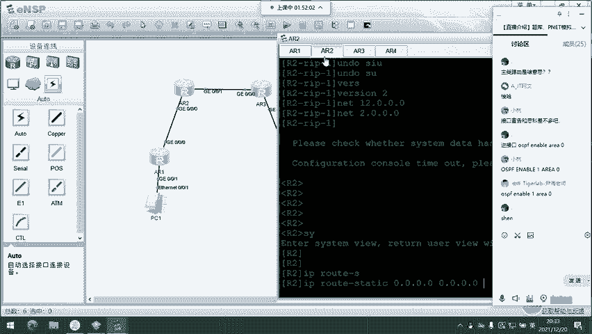

对吧下一条是我们的23。点点3吧。

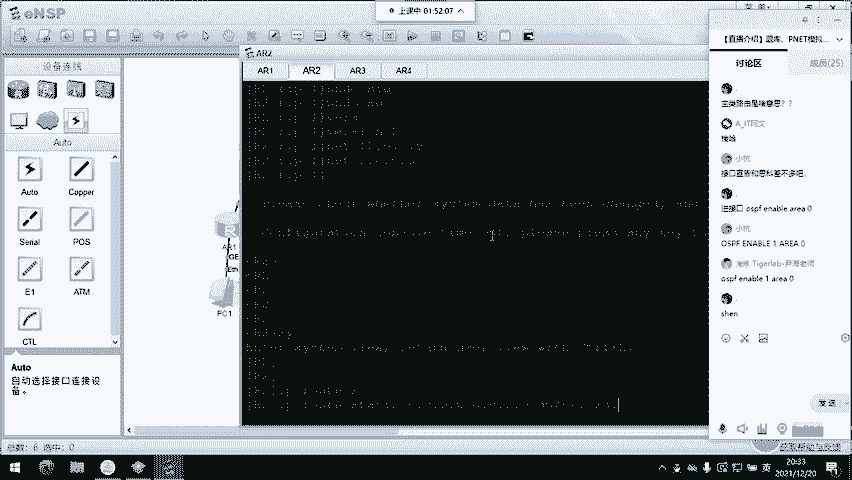

对吧写完以后我们的R3上啊，记住啊，我们只我们刚说了吧，我们如果把我们的左边看成个ISP的话，我们R3上，对吧？我们边界路由器去往运营商也好，还是去往外部网络也好。

一定要在边界路由器上去做一个默认路由吧。😊，对吧一定要去做默认路由啊，吧，告诉我们这台编辑路由器怎么出去吧，吧tatic。😡。

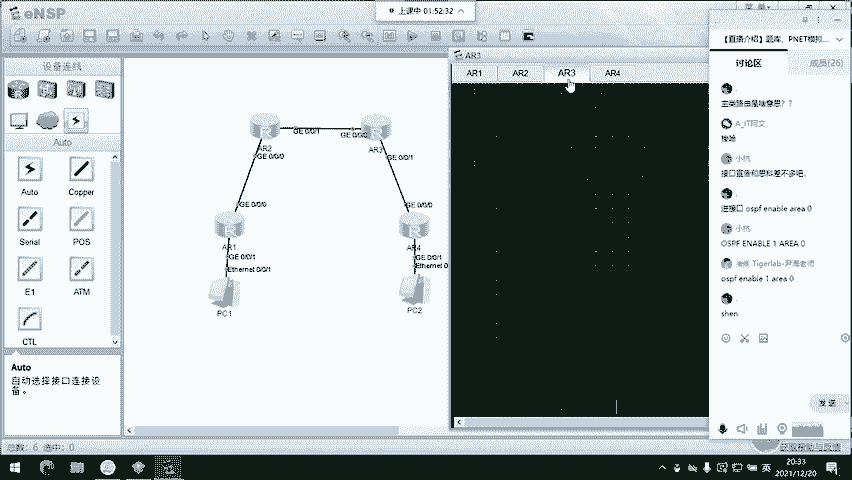

念念0对吧，0。0念0一定要记得一定要写啊，对吧？最口的0-0-0下一跳是23点点点2吧。我们写完这个以后很很明显吧，我们的PC1对吧？我们PCE应该去拼一下。😊，骗我们的啊骗我们的303。3033。

对吧？😊，我看下能不能通啊。可以通了吧。那么这两个是在在做什么？记住啊，前面这两个有可能是一个，也有可能是两个，他在做ARP的解析。😊，好吧，他在做ARP的解析，记住了他在做ARP的解析。

所以不用愁为什么说前面两个丢包了，对吧？你再拼一次的候，他就不丢包了。因为你的ARP啊已经解析过了，所以说你就不会丢包了。😊。

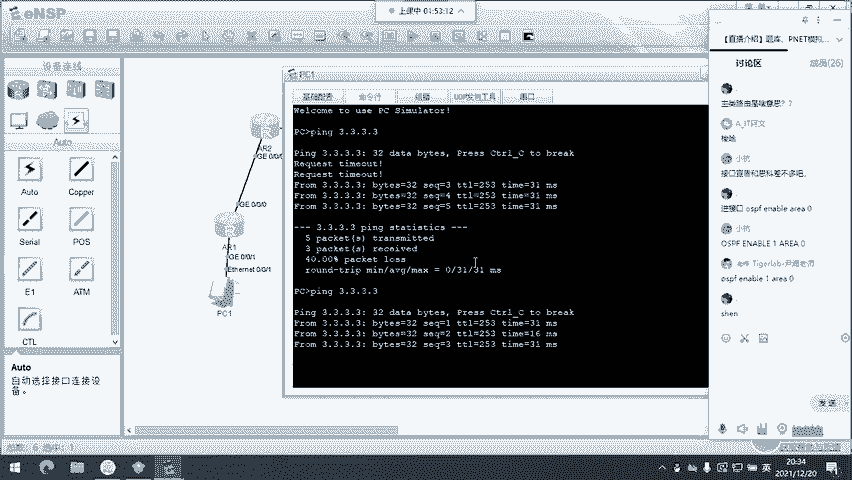

好吧，那这时候你能拼到3。3。3，但是你也能拼到这PC2嘛，拼得不到吧。因为我PC2通过R4，我不知道你PCE怎么走。😡，对吧，那么这时候刚刚也有同学问了吧，我我这什么？😡。

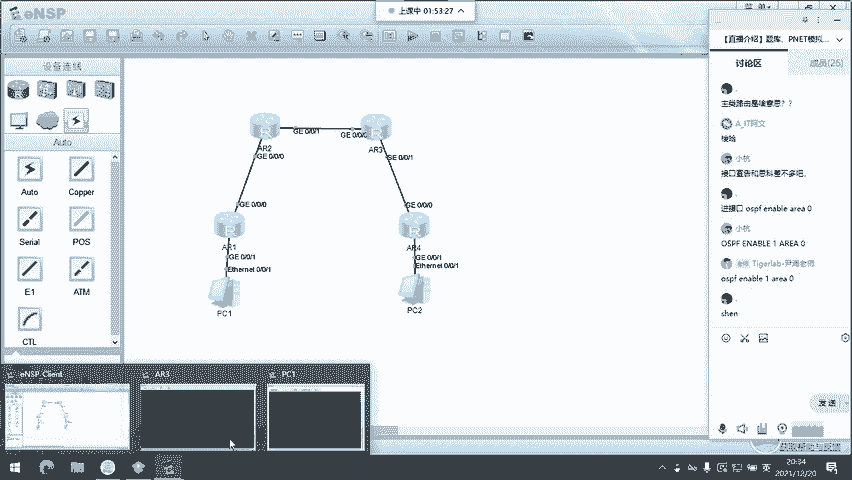

我OSF华为的OSF怎么下方默认路由吧，记住啊，大家看一下啊把display CU吧，我们来看一下它所有的吧diplay C我们来看一下。😊。

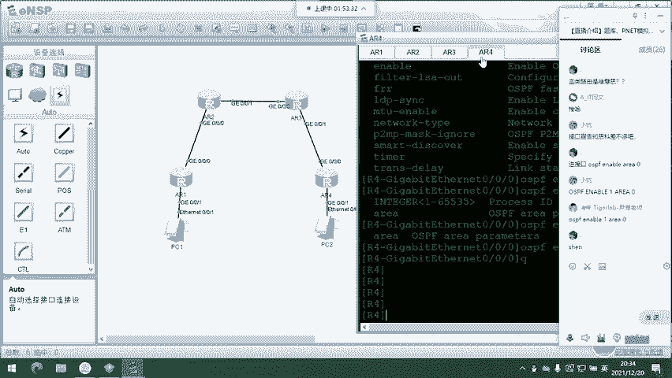

我们会发现我们没有写默认路由吧，对吧？什么都没写，没写的话，我们就现在就好办了，对吧？我们在R3上来看一眼对吧？R3上我们来看一下怎么去嗯怎么去做什么默认路由下方吧，对吧？一对吧？😊。

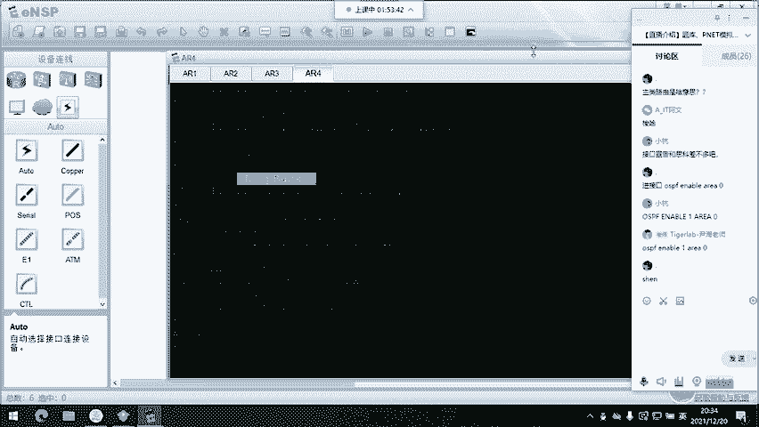

addvertise哎。Defat。

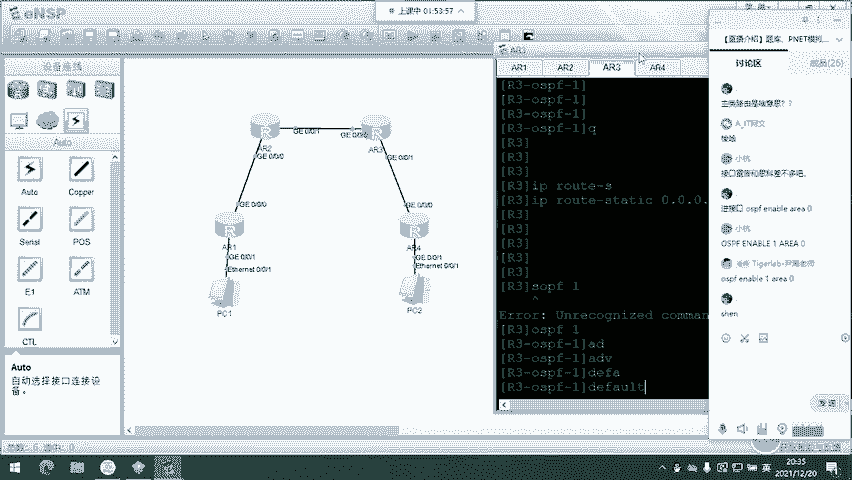

对吧也是也是defa开头啊，只不过它叫de rot advise吧ad我们打个问号。那么这边的话这个参数啊，你们在MP中会给你们详细的讲，这边的话就不跟你们讲了，好吧，可加可不加。

到时候讲MP实验的时候，这个参数要，大家大家主动讲一下啊，这是华为的一个坑。好吧，华为的一个坑。😊，那么写完这个以后啊，我们打个回车对吧，就什么default route对吧？

deult route advertise advertise。我们点写完以后，我们在4上来看一眼。😊，对吧diplayI Ro table protocolPF吧。哎，怎么是SO啊？

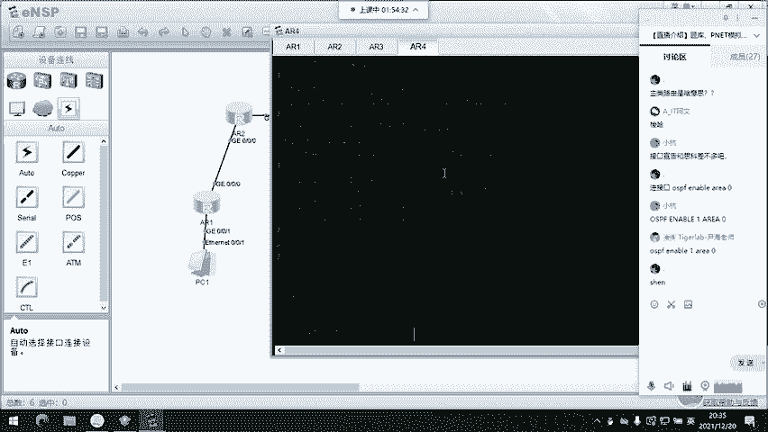

我们会发现我们的录音表中也出现了一条默认路由吧。😊，对吧他的下一跳是340。3，对吧？这块的应该0除明他是有什么。😊，他是由我们的OSPF下放的吧。看到了没？这个呃，这个什么这条命令啊，就是这个命令。

对吧刚刚有人问的对吧？这个命令的话，其实在MP中才讲的，我只是今天对吧？大家有问了，对吧？也有问到有那么简便的方法就跟大家说一下，记住这个命令是你下游，不管有多少台路由器。

它都可以想每台路由器呢它都会有一条默认路由，好吧，不是说只隔一台啊，它是多台都可以去做。😊，行吧，多台都可以做。那你做完以后对吧，我们的PC去拼一下。😊，吧P192。168点20。1吧，我们去并20。

1，看能不能通吧。对吧第一条我们就解析20。16是要走AIRP吧，走一趟ARP啊，对吧？第一次拼的时候基本上都要走一趟ARP。😊，我发现拼通了吧，拼通了，这是华为的实验。好吧，华为的实验。

Display OSPF pure brief。哇，我们的华为华为的OSCF邻居啊，怎么看呢？就这个命令。😊，记住了，刚没给你们看邻居表，对吧？

display OS票pear brief这是看的是我们的一个呃邻居的一个邻居表是吧，就相当于我们呃4科里面的什么受。😊，IP对吧，OSPF neighbor。好吧，相当于这两条命令啊。

这两条命令是一样的。那么它华为的链入状态数据库怎么看呢？display OSPF吧，它叫做LDBLDB对吧？这条命令。😊。

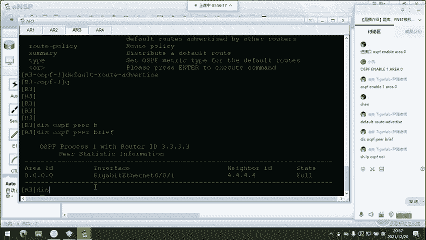

看到的呢就是我们的1个OSPF的数据库。好吧，那么华思科长什么受IPOSPF databaseabase吧。😊，对吧受IPOSPF database好吧，这两个命令是一样的。那么路威版的话，对吧？

华为是售IProot protocolOSPF对吧？哦，不对，不是受啊，说错了，我能不能我能撤回吗？😊，哎，这撤回不了了，display IP是inface哦，display IProot。😊。

Protocol OSPF。好吧，是display啊，那么华斯歌日吗售IProotOSPF吧。😊，记住啊，就是他们的不同点啊，三张表对吧？你们在呃NA中记住啊，3张表怎么查就行了。

因为在你们后面的一些特性，一些高级实验特性上啊，用到这三张表太多太多了。😊，是吧不计其数的东西要让你们去查这三张表，要会熟练的运用。好吧，那么本节课实验的话就没了。好吧，华为的我们也做完了。

华为的也做完了。那么基本上呢一些呃实验的原理啊，我刚刚在思科的时候已经说了吧，他们原理都是一样的。不要讲我们刚刚那个端端端通信啊也是一样的，好吧，对于思科而言，对于华为而言，他们都可以用。😊，啊。

不分到他们都可以用的。那本节课都能听懂吧，能听懂的扣1啊。都能听懂吧，不难吧，我这还阶段性测试啊。我不是，我是冰1的。win10的不是win11的这个扣8的是是个啥意思呀？是要白白吗？我是winI1。

我是winI10的win10的电脑。好吧，那没有问题的话，本节课。W11的话嗯，我不知道为什么，我旁边你可以问问你们的哲哲老师，因为你们哲哲老师的电脑好像也升级到winN11了。

但是他的win box的话呃。vitro box的确可以用他那个wa box就安装上去了，没有问题。你们你们可能一个是什么家庭版的，一个企业版的吧，什么之类的，可能有点不太一样。呃，你可以去试对吧？

你也可以去试试不同的那个vitro box。😊，米兰的话好像第几节课啊，是明天还是？后天吧，好像。好像不是明天，就是后天会讲吧。对，明天讲交换，后天讲为难。我。对对对，是的，这两节课的话。

你们尽全力去听吧。好吧。嗯，其实也不难，就讲讲一个交换机的工作原理，对吧？然后围栏的话讲一下围栏间的通信，对吧？围栏间的划分，也下交换机的工作模式什么之类的。😊，明天的话应该放录播吧。

因为这两天我的确得休息一下，我。

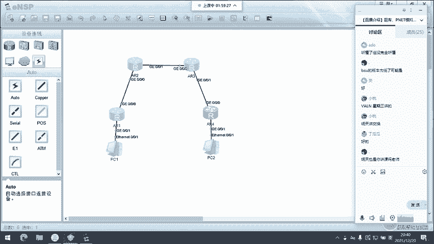

，怎么说？