# 2023 新版华为认证HCIA+HCIP+HCIE全套视频讲解！一套视频让你从入门到精通！CCNA／CCNP／CCIE技术提升同样适用！ - P100：（持续更新）HCIE Datacom - 46.FA、GR、NSR - -Book思议8 - BV1W8411A7z8

呃，我们就不做闲聊了。嗯，咱们就开始上课吧啊。呃我们这节课呢依然是接着上节课内容呃，接着来说啊，然后上节课我们在最后呢给大家去讲了这个OSPF和BFD的联动，嗯。

那我们这节课呢就是呃主要是讲这个GR和NSR嗯这个FA地址呢，大家实际上在IP的时候呢都学过，对吧？呃，这里呢我就简单给大家回顾一下啊，实际上在嗯IP的这个FA呢跟IE学的内容实际上差不多，对吧？呃。

所以呢这里咱们就简单的来给大家去回顾一下，对吧？呃，然后大家对于FA地址有什么疑问的话，嗯，大会可以直接说啊，然后我给你们说一下。😊，呃，FA地址呢，大家在IP的时候应该都接触过啊。

我们把它叫做转发地址。嗯，实际上呢这个是属于OSPF的一种优化，对吧？也就是说我们在ABR上呢，如果去引入外部路由的话，嗯，对于这个外部路由的吓一跳，对吧？嗯它会取之为FA地址。

它主要的目的呢是用于路径优化的，路径优化的场景呢，我们来看下面这个啊实际上在这里呢有一个简单的介绍啊，比如说在我们这个网络中呢，234对吧？就下面我们都跑了OSPF呃，那在这的时候呢，2和三呢。

他们是通过这个0-0-1注意啊，都是通过0-0-1建的OSPF也就是说2跟3呢，他们过了一台交换机，然后去建立了OSPF邻居。😊，嗯，在这时候呢，我们之前嗯假设啊假设现在在二上面呢有一条静态呃。

它是去访问呢10。1。1。1的-32啊，对吧？呃，访问这么一个地址的静态路由，所以说呢R一当没有启用OSPF的时候呢，我们在二上面写了一条静态。那他的下一跳呢是指向了10。1点123。1，对吧？

那如果说我们想让OSPF域内的其他设备能够学到呢，比如说让三学到对不对？你你也可以去写静态，但是我们呢在这里只不过讲了这么一个特殊的场景啊，就我们跑的验是OSPF啊，比如说让S也能够学到，对吧？

咱们就跑到是OSPF。嗯，这时候呢我想让三跟四能够学习到，所以说我们在二上做了一步操作，对吧？叫做 root啊，就是把这个静态路由呢引入到IGP协议中。😊，那一旦引入到IGP协议中呢，你这台静态路由啊。

它就会产生1个5类LIC是吧？我们把它叫做ASE嗯，叫做5类LC。嗯，这个5类LC呢，它会有一个通告者，对吧？我们把它叫做ADV rootr。对吧呃，他的地址呢实际上是二的low by呃。

不是楼 by就，就二的入台地呃，假设二的入台地呢是2。2。2。2。是吧那默认是type2的路由，而链路状态地呢就是嗯这个去往10。1。1。1的这个路由前缀，对吧？由于我们是32的，它就直接是10。1。

1。1了。这条5类LC呢，我们会泛红给OSPF邻居。所以说在这时候呢，它就可以传递给R3对吧？啊，三也可以传递给4。那这时候34呢它都能够学到这条5类LC。😊，那按照OSPF的计算原则呢。

4收到一条5类LC对吧？那这时候他怎么办呢？实际上三也是一样的道理啊，他首先会去看5类LC的通告者啊，一看是2。2。2。2对吧？ASBR是2。2。2。2。那么在这时候呢，我们还要去找这个ASBR啊。

他们就会去看一类LC中呢，有没有ASBR是2。2呢，嗯，你找对吧？二肯定会在一类LC中将ASBR标志为置1。😊，对不对？就那个外部有一个一比特啊，它会等一啊，告诉别人呢，我是ABR。那么在这时候。

其他路由器在计算这条外部路由的时候，它会这样。对吧呃我去往这条外部路由，那首先得到ABR对吧？然后再去到外部。那实际上对于四来说，它的下一跳呢就是4在SPF数上去往二最短路径的这个下一跳，那它就走三。

那三也是一样了，三的SPF数下一跳，最短路径是2对吧？所以说这个流量呢首先会发送到二这里。😊，对不对？二、收到之后查找静态路由，然后再发送给R一。那这时候我们就会发现一个问题对吧。

我们整体的路径呢是由4到3到2到1。那实际上对于三来说，他可以直接发送给。对不对？那也就是说他会有一个更优的路径。😡，是吧而由于我们只跟着ASBR混是吧，这就相当于有个人跟你说嗯，你跟我吧是吧？

我带你每年是吧，挣个50万。😊，对不对？那你就跟着他混了啊，但是呢是吧呃他这么跟你说，你就跟着他混。那在我们的路由器里也是一样的那四现在呢他就找ASBR是吧？跟着ASBR混。那四找三3找二二找1。

那实际上我们会发现呢，哎三有一个更优的路径。😊，是不是啊？是吧咱可以直接去找一，因为大家在相同的网段啊，对吧？而我们当前呢走了一个次路径，那这个问题怎么样去解决呢？实际上在OSPF中呢就引入了FA地址。

对吧？现在没有FA地址，它肯定会有自由路径。而当我们存在了FA地址之后，呃，那么FA地址的取值，大家注意啊。😊，产生呢呃有三个要素，这个实间大家应该都知道吧，FA地址产生有几个要素啊。在下面有介绍啊。

我们来看。😊，就是首先呢ABR连接外部网络的出接口啊，必须开启了OSPF那换到我们这个图中呢。就是IE的G0-0-1啊，必须要开启OSPF。那么第二个因素呢就是这个接口没有被设置为被动接口。

那也就是说IE的G0-0。1呢啊也不能是被动接口啊，就是界末接口啊，在斯科里叫被动接口。就是建末接口的意思啊。然后呢，该接口的网络类型啊要是广播或者NBMA啊，就是不能是P to P。

也不能是P2MP是吧？所以说在这里呢啊还不能是P to P，还不能是P2MP是吧？啊，这就相当于你找工作一样，对不对啊，不能有纹身是吧？啊，不能有不良嗜好是吧？啊，不能进过监狱对不对？啊，要求比较多啊。

但是在我们的OSPF中也是一样啊，是吧？啊，必须是211985对不对啊，要求比较多啊。😊，那还有就是该接口的IP地址呢，在OSPF配置的network命令指定范围段内。

那也就是说这个接口要不要启用OSPF啊，实际上是一样的道理啊。大家注意，就是如果我们在OSPF中network的指令在这个网段范围内，那这个接口会不会启用OSPF。是吧实际上他是一样的意思啊。呃。

然后的话就是。到达FA的路由呢必须是OSPF内部路由啊或者区间路由。这样接收到外部LC的路由器呢，才能够加载该LC进入到路由表。加载外部LC的路由条目呢吓一跳与到达FA地址的下一跳相同啊。

这说的就比较官方。我简单的来来给大家说一下啊，嗯，首先呢我们要有FA地址呢，必须要满足三个条件啊。第一个条件呢就是这接口必须要启用OSPF那第二个接口第二个条件呢，这接口不能是被动接口对吧？啊。

第三个呢它不能是P to P或者P2MP啊，你得是广播啊，或者说是NBMA网络啊，我们要满足这三个因素。😊，那么在这时候呢。我们将路由一旦引入进来之后，那么这个路由呢只要满足这三个要素。

那么它就会去携带FA地址。那这个FA地址呢，它取值是多少，是注意啊，是ASBR去往外部路由的吓一跳。也就是说现在在RR是ASBR它去往这个外部路由10。1。1。1下一跳是谁呢？10点1点12。3，对吧？

所以说FA地址呢是这个。那这个50LC就带着FA地址泛红给4泛红给三了。那三四收到这个FA地址之后，他要进行计算。那么如果他在进行计算的时候，需要满足一个条件啊，就是本身对于四呢，它要不然通过一类。

要不然通过三类得能够学到FA地址啊。如果学不到，大家觉得路由能不能计算成功啊？能不能？嗯。是不行的啊。注意啊，如果说四跟三没有FA地址的路由，就是他不知道怎么样到达FA地址。

他是没有办法计算这条外部路由的啊，这就相当于对吧？啊，这有一个小王小王某天给你说，你买这个沪商阿姨啊，你去10。1。123。1。😊，对吧啊让你去西天极乐世界。对不对？

那现在对于R4跟R3来说呢啊也是一样的。😊，大一看呢我买个沪商阿姨要去西天极乐世界。是吧啊，但是你不知道这个极乐世界在哪里，那你能不能买到啊，实际上不行。😡，对吧那就相当于小王给你说对吧？

AR给R3跟R4说，你们要计算外部路由呢，得先到FA地址。但是如果其他路由器没有FA地址的路由啊，这个外部路由是计算失败的啊，这里大家知道。😊，那当这个路由一旦过来之后呢，转给三，然后转给四了。

那比如说对于四，我们以四为例啊，四收到了一条5类LVC，那他还看不看通告准呢，就不看了。一看哦，FA地址为非0，非0就代表有FA地址。那么在这时候呢，R4呢就会去计算。我首先去往外部旅游10。1。1。

1啊啊，我得去看一下怎么样去往这个FA地址呢。哎，一看有一条，我们在这个接口有没有使用OSPF？有吧一旦启用OSPF之后呢，那这个网段呢都会去开启OSPF协议。那也就是说R4呢，它是可以通过一类。

或者说三类LC呢学到10。1。123。1怎么走的？那在这时候，我们就会将FA地址10。1。121。1，就我会去计算10。1。1。1对吧？啊，我一看它的FA地址呢是10。1。123。1。那我怎么样去换1。

23。1呢？我的SPF数中呢吓一跳是R3。啊，那我去往外部路由啊，得先去往FA地址，去往FA地址的下一跳呢是R3啊，然后我去往这个FA外部路由的下一跳，对吧？也就会变成R3。也就是说它的下一跳呢。

外部路由的下一跳会继承FA地址的下一跳。那这时候它就变成假如说这个网段啊是10。0。34点网段，那下一跳就是10。0。34。3。对吧，那这时候他发给三，那三收到也是一样啊。是吧三一看呢哦FA地址是10。

1。123。1啊，我去往外部路由的吓一跳啊，FA地址。是吧是10。12123。1，那我去往123。1怎么去呢？啊，从G0-0杠0直接访问了。是吧所以说流量四发送到三之后，那三呢就会直接发送到RE。

那以此呢我们可以看到FA地址呢可以解决这种自由路径问题啊？所以我们说它是实现的路径的优化啊，那你在优化之前呢，实际上是这么一条路径。对吧而你在优化之后呢，嗯他就可以走了一个最短路径。

这是FA地址的作用啊。嗯，然后在这个na萨场景下呢，也有FA地址。嗯，这个应该大家知道啊，因为我们说了FA地址呢，它有5类和7类啊吧，就是外部路由呢都可以携带FA地址。那五类是外部路由。

7类也是外部路由。😊，对不对？那我们来看这里啊，就7类LSC去携带外部路由的啊，不对啊，7类LSC去携带FA地址的时候啊，就是在naA场景下FA地址有什么样的应用啊？😊，嗯，这里我们都会有一个呃概念。

对吧？就是。呃，7类LC携带FA地址它有什么样的作用呢？我来给大家说一下啊，就首先我们来思考一个问题。😊，呃，我们之前在学特殊区域的时候呢，像这种嗯N萨区域，对吧？呃，它有一个特点。什么样的特点呢？

就是我们会执行一个动作，叫做七转5。对吧大家应该还记得啊，就在naA区域中呢，root ID大的执行齐转务。那这时候就会有一个问题，什么样的问题呢？比如说R3是root ID大的，但是你注意啊。

R3虽然root ID大，但是它所在的链路是低带宽链路。😊，当我们执行了7转5之后，如果FA地址没有继承，所以说R一再去访问外部网络的时候，他是不是走三啊？然后三走四四周五五走外部。

对吧我就会发现一个问题，他好像走了一条但链路带宽更低的路线。对不对啊？而会不会走二呢？不会，为什么呢？因为R3执行的齐转5，对吧？那5类LC呢是由R3产生的。😊，那这个问题我们怎么样去解决呢？

所以说在7类LC中啊，它也会存在FA地址。那么它的产生规则是一样的，7列LC它总会携带1个FA地址。啥意思呢？我们一般会这么说。😡，7类LCFA地址的携带原则，如果适合五类一样的场景。

那么它的FA取值呢跟5类LC是一样的。啥意思呢？比如说我们刚刚说5类LC首先嗯不能是被动接口，对吧？嗯，去往外部路由的接口呢，开启了OSPF。对吧然后去往外部的出接口呢是广播或者NBMA。

那我们来看这里啊，对于R5来说呃，我们外部假设说没有路由器啊，那大家觉得它满不满足产生FA地址的条件？满不满足啊，一个是建末接口。是吧呃，还有一个呢，这个。开启OSPF。对吧嗯。

不能是P to P或者说P toMP。我发现不满足。但是如果你做实验去看呢，你会发现R5还会产生F。对啊，如果是跟五类一样的场景，R5呢会像5类2C产生FA地址的原则一样去产生。

就是如果R5满足这三个条件啊，那它的FA地址呢也是外部留由的吓一跳。但是现在R5不满。😡，而我不满足怎么办呢？它会取值一个最大的low back接口地址。对呀，就你的还回口地址，它会取值一个最大的。

那当我们有了环回口之后啊，当然现在我们这个场景中没有环回口，没有还回口就取物理口啊。没有还水口就取物理口。所以说呢我们可以去看吧，无论怎么样。南萨区域内的ASBR。他肯定会有FA地址。为什么呢？

只要你有up的接口，对吧？你就能够产生。😡，所以说R5呢它会把FA地址携带上自己物理接口，对吧？就是它在纳萨区域内up的物理接口。那现在我们可以看到这条外部路由的FA地址是10。1。45。5。

那这时候它传给44传给33传啊，也也会传给2啊，但是三的入台 IDD大，它会执行7转5。我们来发现啊，七转五的时候，实际上FA地址做了什么，我们把它叫做继承。对不对？当FA地址一旦继承之后。

我们来考虑一下RE。😊，R一收到这条外部路由，首先通告者。对吧ADV它是3。3。3。3。那如果没有FA地址，他必定会走一条低速的链路。而由于我们在7转5的时候呢，它还会携带1个FA地址10。1。45。

5。那对于R一来说，它能不能通过3类LC学到45。5啊？是不是可以啊？对吧所以说在这时候呢，他会跟着FA地址换。😊，那我一看我怎么样去往45。5最近呢？上面有一条低速的，下面有条高速的。

我肯定走高速的是吧？啊，这就相当于你去丈母娘家。对不对？有高速能走，对不对啊，有低速这个啊土也能走，你是不是跑高速啊，对不对？快一点。能明白吧？所以说I一呢他在去访问这条外部路由的时候。

那假如说这台外部路由是10。1。5。0。那么在这时候，它会就会直接继承FA地址的下一跳。那也就是说下一条地址呢是二的这个接口。那未来流量呢就会这样发送的R5。所以说我们可以看到啊。

那在这种南萨区域下呢也是一样的。嗯，他一样在哪呢？啊，就是代表着。如果是其他区在计算7转5的LAC时携带了FA地址。是吧。那么我们也可以去实现一个路径优化的作用。那基于这个原则，我们再来考虑。

为什么2个ABR只有一个执行7转5呢？我们来想一下啊，假如说有两个执行7转5，他们的FA地址一不一样。假如说二也执行7转5FA地址是不是一样的？对吧。那如果是一样的，你又何必转多条呢？

反正都跟着FA地址换，我跟着谁不一样啊。对吧我跟着三也能混啊，跟着二也能混。是不是管你谁转的，只要FA地址是一样的。那么在这时候呢，实际上我们只转一条也没有问题，对吧？而你转了两条呢。

还会去消耗一定的这个贷款以及资源。是吧。所以说在这时候我们可以去看到啊，就有这么一条原则，就是。在na萨区的ABR上呢，只由入台地大的执行7转5，那就选出一个代表一个人执行就行了。

所以这就是为什么只有一台路由器啊会执行FA地址的转换啊啊，不是，就是7转5的这个转换。Yeah。行嗯，FA地址咱们就说这么多啊，因为这个大家在IP里学过啊，我就不再进行多强调了。这里大家没问题吧。

问题的同学都敲个一。然后我们下面就要说一个呃稍微难一点协议了。😊，都可以是吧？Yeah。嗯，接下来我们要说的这个技术呢叫做OSPF的GR对呀？嗯GR呢我们这个把它叫做平滑重启啊。

有些书籍的上呢还这么翻译它。嗯，叫做。优雅重启动。嗯。对。是吧嗯优雅重启动。对不对啊，也就是说啊我们要优雅一点对吧？啊，人也要优雅一点，那设备有时候呢也要优雅一点，对吧？😊，嗯啊，对，优雅永不过时是吧？

所以我们来看啊嗯优雅重启动呢嗯或者说平滑重启，我们一般都把它叫做夹。😊，嗯，GR是干什么的呢？嗯，我简单来给大家说一下啊。😊，嗯，我们在讲GR之前呢。来给大家说一下，就是传统的网络会有什么样的问题。😊。

嗯。嗯，比如说我们来看这种啊。是。呃，那么一般呢在我们这个项目中嗯大家知道啊这种框式设备呢，它有一个特点啊，就是呢它会有2块主控板对吧？啊，我们把它一个呢叫做主用主控板，还有一个呢叫做。备用住库吗。

Yeah。是吧也就是说他们会有2块主控板啊，一般我们把这种叫做双RP。是吧这个RP它的全称啊叫做引擎。你怎么也就是他主控板的意思啊。嗯，那么在这时候我们可能会遇到一些问题啊，什么样的问题呢？

比如说现在一一访问三呢。😊，我们都有主链路。是吧。这边也是属。呃，那当前我们路由器的架构啊，大家应该都学过是吧？就当前我们路由器的架构呢是这样的。也就是说呢。我们现在叫做转发分转控啊转控。分离的。设备。

就是设备内部啊。我们把它叫做转控分离的架构。也就是说我们会有主控板，那么还会有。接口吧。对吧我们把它叫做LPU。呃，主控板我们一般是叫做MPU啊。那么哦，对，也叫做业务吧。呃现在我们来看啊呃。

假如说在我们这个网络中，当前一跟三的互访呢，它是走二的。😊，那这时候我们来思考一个问题啊，比如说二未来呢要进行主控板的主备切换啊，比如说我的主控板故障了，对吧？啊，我要进行主备切换。

那这时候我们来想一下啊，就可能会遇到一些问题。什么样的问题呢？首先我们来思考一下啊。在我们传统学的OSPF中啊，应该大家都接触过一个概念叫做IB。RB呢我们的路由表。对吧呃还会有一个FIB啊。

叫做转发表。对的。那实际上我们在控制平面读的是IB，在转发层面读的是FIB。是不是啊？那实际上我们来想一下啊，如果路由表是最新的对啊我把这个转发信息下发到FIB之后。

那大家可以理解成FIB呢都是在接口板上的。而我们实际数据的转发，它是用接口收到，然后从其他的接口出去。也就是说我们在报文转发的时候，要不要经过主控板？大家觉得要不要？肯定是不需要的是吧？

那我们来思考一下，如果在正常的情况下啊，传统的时候我们要执行主备切换啊，会遇到什么样的问题呢？那这个问题是这样的。当我再去执行主备切换的时候，那备用主控板注意啊，它上来了。那上来之后。

我们的OSPF邻居啊等等之类的，要不要重新建立啊？要吧FIB要不要重新刷一遍啊，也需要也要更新成最新的样子。那在这时候呢，流量肯定会中断一个。是吧啊肯定会断一会儿。那这时候怎么解决这种问题呢？

就是我只是执行一下。实际上我们从理论上来考虑，你主控板，哪怕你没有你接口板正常不就行了吗？😡，对不对？能转发数据就行了。如果你接口版注意啊。😡，我们为什么需要主控板？

我来给大家解释一下主控板用于处理控制平面的信息。比如说这边多了1个1。1。1，他把OSPF把发给二了，那二要交由主控板来进行处理。😡，对吧就是它的控制平面呢要去处理这些信息。

然后呢再下发到自己的接口板上。对吧然后接口板按照再收到1。1的数据呢，就知道怎么转发了。😊，那我们来假设一下啊，当网络没有任何变化的时候，所有网络的状态都是稳定的。我们没有主控板行不行？嗯。行不行啊？

可以是吧？为什么不行呢？实际上是可以的对吧？但是这种时间呢不能太久。😡，对不对？我们说为什么说不能太久呢？啊，万一网络出现了一点变化啊，那不就完蛋了吗？是吧？你没有办法及时的进行更新，你没有主控板了。

肯定不行。😡，是不是啊？是吧。那这说我们来思考一下啊，比如说我在进行主备切换呢。如果我们主备切换的瞬间注意啊，大家要注意主备切换是非常快的啊，基本是瞬间完成。但是我在主备切换期间，如果遇到这么一种问题。

注意啊，比如说背板一上来，它没有任何OSPF的邻居状态啊等等之类的，啥都没有，邻居都没有。所以说二发了一个哈lo包一看啊。😡，你没有描述给我的邻居，你要不要把你的邻居删除掉？😡，要不要？😡，需要吧。

是不是啊我假设啊现在没有4这样，那一把跟二的邻居删除掉之后，他要不要更新LIC给4啊？😡，有一更新自己的LRC说我这边给二。0居中断了。😡，是不是那四在自己的SPF数中要不要把二删除，也需要。😡。

我一发现呢，只要一台路由器的邻居出了问题，那其他的路由器呢都要做对应的调整。是吧那四一看哦，我从四推到一从一推到2，现在一说他跟二坏了，那四还能不能计算出3。3？肯定是不行的了。因为在4的SPF数上呢。

经过2到3，现在一说二坏了，对吧？所以说他把路由删除，流量就终断。😡，是吧那GR是什么呢？GR是这么一种，我们把它叫优雅重启动，啥意思呢？😡，就是比如说啊我未来在主备切换的时候。我呢。接口板。是正常的。

对吧那主控板你怎么切换怎么样没关系，因为你瞬间就完成了嘛。😡，对不对？我们比较在乎的是什么呢？就是你背板一旦上来之后。😊，是吧你背板一旦上来之后呢，你发的这些OSPF邻居啊等等之类的，都是没有的。

你不会描述跟一的邻居，不会描述跟三的邻居。那一跟三不就说你坏了吗？是吧？把你的top数删除了。那你流量经过你的流量就中断了。那优雅重启动，我们用GR就有这么一种考虑什么样的？

就比如说啊我二在主控板主备切换的时候。啊，我的接口版呢。不断电。是吧接口板不变。那流量呢你继续从这里走。那首先这种能不能实现的？可以，因为我们从理论上考虑呢，报文的转发就只经过接口吧。

是吧那实际上是可以的，但是我们还要去防止一件问题，就是我的背板一旦上来之后。那他跟一跟跟一呢跟三呢还要去重新建立邻居。那只要他一上来之后，因为他没有任何OSPF状态，他只要一发包一会不会通告二故障了？

大家觉得会不会？会吧。因为二一旦发了包，他不会说跟一的邻居状态啊。所以说一就会通知二的邻居故障了。那这个时候流量就会中断。是吧并不是我们在主备切换的时候产生的中断，而是在背板上来之后，流量产生的中断。

😡，对不对？哎，那这时候我们就要去想啊，是吧？啊，那时候就有这么一种想法，有没有这么一种技术呢？就是我背板一旦上来之后啊，咱俩偷偷的把邻居建立好，因为我之前。😊，接口板不正常工作吗？流量肯定不会中断。

你再把LC给我一份，对吧？跟三爷说，咱俩把邻居偷偷的建立好，你再把LC也给我一份。然后我再更新一下接口版的转发状态，然后呢，你们就不要给四说了，因为在这段时间呢，你们来的流量，我的接口板也能转发，对吧？

你们给四说还得中断一下，就是咱们之间呢，对吧？叫我们这些直连的邻居之间呢，你们赶快把最新的LOC传给我一份就行了。然后我一更新，这样不就完美的过渡了吗？对吧？😊，这个天知地知，你知我知。

把A24呢瞒这个蒙骗在鼓里。是不是？是吧哎我们就希望有这么一种技术。因为这样的话，流量也不会产生终断，对吧？路由表也不会产生变化。😊，那这种功能我们怎么样去完成呢？啊，就要通过GR去做。对。

对吧那这个GR我们在学习之前呢啊首先来了解一下是吧？呃，GR呢它主要是保证了设备在重启过程中，是吧？转发平面能够继续指导数据转要的转发，是吧？同时呢注意啊，控制平面的邻居关系重建啊以及路由计算。

不会影响转发层面的功能，是吧？就是咱们偷偷的把邻居建立起来。😊，对不对啊，天知地知，你知我知啊吧，然后咱们就不要给四说吧，让他做那个冤大头。😊，是吧那我们就要通过GR来做。那GR我们在使用的时候啊。

或者说完成OSPFGR的时候呢，呃我们需要接触一种新的LIC。😊，对呀，这个LC呢我们把它叫做酒类LC叫做不透明LC对呀，叫做酒类。这是候我们接触到一种新的。之前我们学了多少啊？13。😊，2。

547是吧，现在我们来学酒。那9类SC是怎么样呢？我们来看啊，这是9类SA的一种格式。😊，那首先呢我们有1个LRC age对吧？还有一个呢。啊不是。😡，对不对？那这里呢都是RSC的头部信息。

以及RS type代表的是9类。对吧这不就我们之前学的吗？LC的老化时间，LC的option以及LC的12347对吧？5LC的类型。那大家注意啊，我们有没有看到LSID啊？有没有？没有。对吧注意啊。

这里我给大家科普一下先。😡，Yeah。9类LRC呢，我们把它叫做不透明。系四。那这个不透明RVC呢有很多种类型。对啊，他有非常多的类型。那我们用于GR的LC呢。是不透明类型。3。对啊。是不透明类型。3。

你像10类LVC呢，11类LVC它们也属于不透明LVC。或者我这么来说。包含。9。111类RIC。那么。OSPFGR使用酒类。RC。不透明。诶，不诶。不透明。类型3。

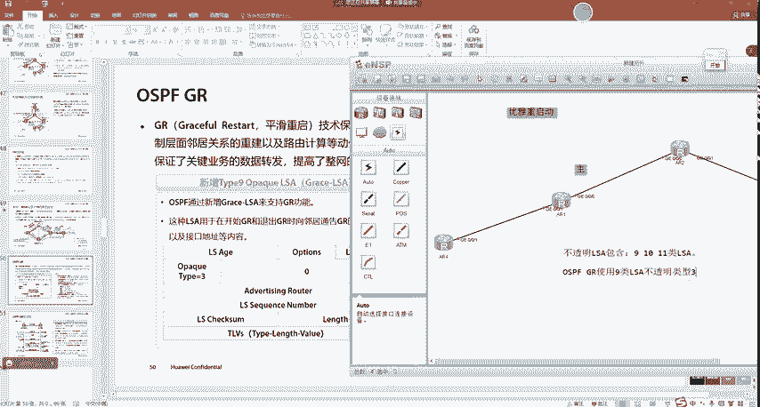

进行实项。对呀，它使用的是不透明类型3。那有同学就问了，老师还有没有其他的呢？有是吧，还有4呢，是吧嗯，这个五我没记印象中啊，有七有8呃，在我印象中好像还有11啊。😊，嗯，记不太清了。对呀。

所以说呢这个不透明类型，它是有两个。他是这样组成的啊。我这么来给大家写。就是。不透明。LIC的LID部分。咩啊。由两个字段组成。一个呢我们把它叫做不透明类型。第二个呢叫做不透明。ID。😊。

不透明类型用于说明。该不透明。Okay。LIC的具体作用。是不透明ID呢用于标识。不同的。不透明。对。2C。注意啊，这是他们之间的作用。也就是说这一个大段。😡，我们是以前的LSID链路状态ID。

那么在这时候呢，被分为了两个部分啊，一个叫做不透明类型是吧？还有一个叫做不透明ID。而我们用于GR的这个9类LC呢，和透明类型是3ID是等于0的。然后下面呢我们就更好的去看了对吧？通告者啊，序列号啊。

校验和还有长度啊？我们可以看到前面呢都是1个LC的头部。而注意啊。下面都是基于TLV来进行编码的啊，也就是说有没有固定字段的，没有啊，都是TLV啊。而在这个9类LC中呢。

它的TLV我们可以看到的有3个啊，123一共有3种。那第一个呢。我们把它叫做GR请求的TRV。表示邻居设备呢进入到GR辅助者处理流程的最长保持时间。啊如果超过这段时间呢。

GR重启路由器还没有完成GR处理，周边邻居呢不再担任。嗯，这个辅助者的角色啊，也是我们刚刚所说的一样。比如说二要重启了，那他要不要先给一给三去说啊，告诉你们。我要重启了，对吧？啊。

待会儿呢我们偷偷的建立邻居，就你们帮我一下，就不要给别人说。那这时候一跟三是不是辅助者是吧？这时候我们把一跟三呢叫做辅助者，叫GR的辅助者啊。😡，而中间这台路由器呢，我们把它叫做重启路由器。

他就是重启路由器。所以说在这时候呢，如果二我们一旦执行操作之后啊，他就会去发送酒类啊，告诉你们呢，待会儿呢咱们偷偷的建立邻居，对不对？然后我会去设置一个时间值，就是你们要帮助我多久。能懂这意思吧？啊。

就你们要帮助我多久啊，就相当于有个人给你借钱一样。😡，啊，这一议的是吧。是的依找你借钱说你帮帮我吧，我最近有点难处，帮我多久呢？3个月对吧，就借3个月的钱。对不对，3个月之后还给你。能懂这意思吧？

现在一也是一样，你我待会儿重启呢是吧？啊，你们要帮我保一下密，对的，保密多久呢？先保密先保密个一两分钟是吧，我就重启完了。😊，能不能明白？所以说这个。请求的TIV啊，他会去携带一个时间值啊。

就是告诉你们呢。嗯，在这个就是告诉邻居对吧？你们要担任辅助路由器，担任多久？那下面这一个呢是GR的重启时间啊，这个就类似于我们在借钱的时候一样，是吧？嗯一挠屁股啊，哥们儿最近嗯经济有点紧张是吧。

你干什么干什么赔钱了，对不对？你说说原因啊，你说说自己没有乱花钱。😊，对不对啊，然后呢，哥们最近有点穷，给借点钱。是吧啊，你在借钱的时候呢，会去说一下原因是不是？那现在也是一样啊，这是一呢，这是2。😊。

二要重启是吧？那重启的时候呢，说我这边呢啊不知道什么原因得重启一下。😊，能看明白吗？它是用来说明重启的原因啊呃不知道什么原因得重启一下，你帮我保密2分钟吧，通过上面这个携带。😊，那或者说呢我这边呢。😡。

管理员配置的CIY命令行重启对吧？说了，我要用GR重启，对不对？你帮我保密2分钟。😡，啊，或者说呢我的软件需要重新加载啊，比如说我们打了补丁啊，对不对？啊，那么在这时候需要加载一下补丁啊。

让你呢啊再帮我保密一段时间。😊，或者说呢我再进行主备切换啊，主控板切换成备用主控板。对吧啊，备用主控板变成主用主控板。所以说在这时候呢。第2个TIV开2。它是用来表明的呢是我们重启的原因。

而第三个呢是用来表明的我是谁。啊，为什么这么说呢？对呀。😡，嗯。第一。32。这是3。三个连接到一起。那二要重启，他给一说，一是不是得知道他要帮谁保密啊？😡，还要不要？要吧。😡。

是吧那这个我有两个邻居怎么样去判断帮谁保密呢？它会由接口IP地址来进标识啊，在网络中用该IP地址呢标识一台唯一的设备。那这时候呢我们就了解了9类LC的格式了。了解了这个格式之后呢。

我们来看一下它是怎么样进行重启的。那这里呢我们刚刚所说了啊呃有GR重启路由器啊吧GR辅助路由器，还有一种呢叫做GR sessionession。那还有一个呢叫做羁押持续时间是吧？然后重启路由器呢。

跟这个GR辅助路由器啊，刚给大家说过，接下来我们要说的是GR的session。这个session呢啊大家可以理解成是我们俩之间的啊，比如说IRE它需要重启了。对吧那这时候呢，他就要给R去说一下。

是吧比如说我这边嗯支持GR是吧，要进行重启了那二要不要给他一个确认啊？对不对？你比如说你要重启了，那二这边不置之际啊，没搭理你，你能重启吗？😡，嗯。你觉得你重启业务会不会断？一定是会的吧。

对吧所以说两者之间呢首先会进行计押能力的协商，包括协议重启啊，协议重启过程中的交互信息，对吧？都是通过绘画来进行标识的。那还有一个叫做持续时间。那这个持续时间呢不能超过18001800秒啊。

如果降压成功呢，失败都可以提前退出。那这就是我们说的那个保密时间啊，啊不能超过1800秒。对，半小时就是你这个LC的周期更新时间。能懂吗？就是周期更新时间了。来我们来看啊。😊，比如说这是R一啊。

然后我们这边呢是R。那R一在主备导换前呢，它会发送一个9类LRC给R，那在里面会有一个标志，对不吧？嗯。Okay。在这个LC里面啊会有一个标志，那这里没介绍啊，我看下面有吗？😊，嗯，这里也没有。

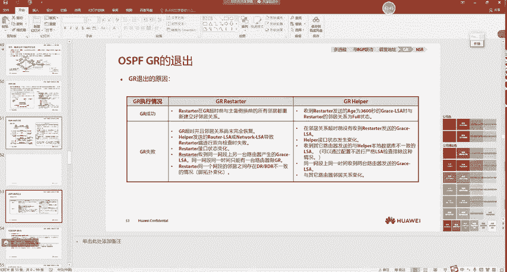

Okay。Yeah。对。没有就算了啊，这里大家知道一下啊，就是一给二发送了1个90LC之后呢啊就标识着自己要进行。😊，这个主备切换了是吧？所以说二收到之后呢，如果说自己支持GR辅助者，如果二支持GR啊。

它才能够进入到GR辅助者这个角色。如果不行的话，他是进入不到的。那二收到之后呢，会给他1个ACK。啊，然后一这边呢啊立刻就主备切换了，主备切换是非常快的啊啊，基本是一个瞬间的过程。😊，啊。

一旦切换完成之后啊，这时候它的背板 up不起来了。注意在这个阶段的时候，大家告诉我我的接口板有没有在正常的工作啊？😊，有没有？注意啊，依然是在正常工作的。那背板一旦up不起来之后，对啊？

它会再次给R发送1个GRIC。听到吗？那对二来说，他收到这个GRC会更新GR周期。也就是我们刚刚所说的。1800秒。懂懂吗？他会去更新这个时间啊，因为刚开始在收到之后呢，是吧？你说你要重启了。

那你再重启这个阶段呢，肯定不会发更新。😊，对不对？所以说呢我就保持你的邻居为多久。那当你背板一旦up之后呢，你再次给我发送GRC啊，那这时候这个相当于一种暗示一样啊，什么样的暗示呢？

比如说我重启前给你说一下，重启后给你说一下，是不是代表着告诉你哥们儿，我起来了。😊，是吧啊，我这边已经完成了，对不对？😊，能懂这意思吧？那发的这个有没有可能对单收不到啊？😊，来告诉我。

比如说我发这一个二有没有可能收不到啊？有没有可能？有吧，完全是有可能的。对不对？那二没收到怎么办啊？二没收到，咱俩怎么同步弟弟报玩啊？😡，是吧所以说大家注意啊，R一的背板移旦up之后呢。

它会连续发5个会发5次啊。😡，连续发5次。那二收到之后呢，他会跟一之间发送hello包。那这时候他们会重新建立邻居。比如说一给2哈lo包2给一哈lo包，虽然二这边有一的邻居状态，一没有2。

但是二会不会给三说是不会的。所以说三有访问的流量呢依然这样走，一没问题，因为一的背板对吧？啊，不是啊，它的转发层面依然是没有变的，对吧？在正常的工作。😊，对不对啊，这就相当于你睡着了，你睡着了。

但是你的手依然在工作。😡，是吧啊不耽误你干活是吧？😊，然后我们来看啊。😊，那当一一旦起来之后呢，他们之间呢就会互相的去发送hello豹文，交互滴D，同步一份LDB。那当LDB同步完成之后，大家注意啊。

这个RSDB一旦同步完成之后，R一有没有最新的网络状态，有没有？😡，有吧，一定是有的。😡，是吧所以在这时候，RE偷偷的把自己的FIB更新一下。😡，对不对？来这说二知不知道啊？😡。

是吧二十的用为二十辅助路由器。啊，那三值不知道啊？三只往这里发数据，一更新了之后，对吧？如果有变化，那可能之前呢三访送四的流量是发送到这里的那我更新之后发送到这里啊，这种就无所谓了，对吧？

这就是简单的更新啊，普通的更新，对吧？所以说我们可以去发现一个过程是什么呢？就是当邻居一旦重新建立完成之后。😡，是吧R一只需要把最新的状态更新一下。对不对？

那就能够保证R一现在所有的转发状态都是已经更新完成之后的，都是实时的。😡，那RE跟之前没有重启的时候一不一样。😡，一样吧，是吧，拥有最新的转发表。对不对？啊，拥有最新的邻居状态对吧？拥有完整的RSDB。

是不是现在都是最新的。对吧那这时候就完成甲了。那R一收到了所有的更新之后，他要不要给二说一下？告诉你，我这边已经全部收到了。对不对？那这时候他怎么给二说呢？他会再次发送1个GLRC注意啊。

这个GRRC的老化时间是3600秒。大家告诉我，这是为什么？😡，嗯。Okay。为什么？Okay。嗯。一。不懂了是吧？因为注意啊，刚开始R一发送的LC给二了，但是R一要不要把这个LC最后撤销掉？😊。

比如说你一都重启完了，LCDB也更新了，FIB也更新了，你要不要把这个LC撤销掉？😊，需不需要？是需要的吧。对不对啊？所以说他会把9类LC的H呢变成3600秒给2。那二收到之后就退出到辅助者阶段了。

是吧二的任务也完成了，你重启的时候二不给三说。😡，对吧你重启完成之后呢，二再把所有最新的LC给你一份。那二的任务是不是完成了？😊，是吧现在R一呢就开始卸磨杀驴了。😊，给你1个3600秒的LC。

你把九类删除吧，就退出辅助者。😡，对对。那R呢就退出辅助者阶段了。能看明白吧。所以说在这儿时候。那么对于R来说。他有没有给三说呢？没有是吧，三是无感的。所以说我们在执行羁押的时候。

我们可以去发现是不是只有邻居路由器。支持解R能力就可以啊。而对于三来说，它支不支持G压影不影响？不产生任何影响。对吧而且数据转发平面呢啊也是在进行正常工作的。啊那这是我们看到了一个顺利的过程。😡。

那老师有没有不顺利的呢？比如说一主备切换，我就背板没起来。😡，Yeah。大家有没有这种可能啊是吧，背板注册老是失败了，没成功。😡，是吧主位切换之后，一没起来。那这时候怎么办呢？啊嗯这时候你就没办法。

这时候流量肯定会中断啊肯定会中断。😡，啊，但是呢我们要去去考虑一下，对吧？G然什么时候可能会失败啊。就是如果没起来，肯定会出问题啊。嗯。那我们只需要去了解的对吧？如果没起来，你就要回退了啊。😊。

是吧嗯你要去检查一下呃，单板是不是没插好是吧？或者说没注册成功啊，你要把告警日志收集一下。😊，嗯。当然我们不是说啊就是如果你要准备切换，真的失败了，你要做回退啊啊一定要记得做回退。

就你得恢复成正常的样子。😊，嗯，但是给大家说一下啊，就是我们要去关注的呢，就是什么时候它才会失败，而不是说失败之后的怎么样进行处理啊。我们来看。什么时候会成功呢？成功就是代表着在GR超时前与主备倒换前。

所有的邻居都建立好了。那这时候呢，重启路由器就会认为假压成功了。而对于GR辅助者呢，只要收到了老化时间为3660百秒的9类LVC，他就会认为GR成功了。这是成功的时候，我们很容易就能够知道。是。就是。

我的。重启设备呢？😡，OSPF邻区全部建立完了。而我的没有重启的设备呢。😡，嗯。就是辅助者设备啊啊他收到了3600米的酒类，就认为GR成功了。😊，但是G压失败的原因就多了。对首先既押时间超时。

邻居完邻居关系没有完全恢复，那这时候会失败。那觉得为什么会失败？😊，讲一下。这相当于一给二说。对吧我要进行主备切换，你帮我保密2分钟，我假设是两分钟啊。2分钟之后你没起来，那二要不要认为你真故障啊？😡。

我们来想一下啊。比如说一发了1个9类LC。是吧。那二直接认为一要重启了，但是没有时间限制。那万一一真的故障了呢？😡，一真的故障，那我们不能一直让流量转发到一这里啊，对吧？所以我们得需要一个时间。😡。

对吧但是时间超时之后，你还没恢复，那一二就会认为一真的故障了。😡，那懂吧，那这时候就意味着GR失败了，GR失败怎么办？😡，那二就开始给三说了，这边连接一的链路故障了是吧？

然后三更新top数2更新top数，然后整网泛红是吧？所有人都知道一的故障了。😊，是吧这就相当于你不行一样。对不对啊，你一说那整个宿舍都知道了。🤧是吧。那然后我们再来看啊。😊，呃。

辅助者路由器呢发送的一类或者networkIC呢，导致重启端进行双向检查值失败。对呀，比如说我们发送的一类或者netightworkFC，那保证重就是重启端双向检查失败了。我举个例子。😡。

这里一一再12。来看啊。2、有一天给一说我要重启了，一给他了一个确认。那一未蓝要不要去发一的LC给2啊？因为我们要进行DD的同步吧，LDB的交互。😡，是不是啊？那么在这儿时候呢，他要重新给二发一份。

但是在这时候我们举个例子啊，比如说二收到一发送的一赖LC。😡，哎，没有描述我这个邻居。那二这时候会不会认为GR失败了？会不会？也是会的，为什么会呢？我们假设啊，这是3。😊，二是重启的。然后一是辅助者。

Okay。这时候就会有这么一个问题啊，这个问题是怎么样的呢？二给一说我要重启来，你帮我保密啊。😡，然后呢，一说好，可以，没问题是吧？相信我哥们儿是吧，你只要跟我说，所有人都不知道。😊，是吧。呃。

然后二重启完了。😊，二、重启完成之后呢。嗯，然后咱俩不要交互LSDB吗？然后一给二发了1个LCDB啊。对，对，没错，就先发哈lo嘛。哈lo之后你不要交互LDB吗？😊，是吧发送了叉楼啊。

然后呢交互了LCTB。但是呢我一收到一的一类LC我一看。哎，你刚刚答应好的帮我保密。这时候你的ELC没描述我的邻居。😡，那这时二是不是知道一开始泄密了？能懂这意思吗？😡，是吧。你给我确认了。

但是咱俩真正交互LC的时候呢，我发现你产生的异类呢已经把我取消宣告了。😊，是不是啊？所以说在这时候呢嗯GR也会失败。😊，那懂吧？可以吧。然后还有呢。重启路由器接口状态变化。那在这里也是一样的。这一。

然后这是。来看啊，一是二进行冲体。嗯。然后一呢。依然是作为辅助者路由器。对啊。比如说在这儿说二给一发送了hello，一也给二发送了哈lo。是不是那我们的邻居没有建立完成，那在这说，那觉得继雅会失败吗？

😡，合不合？是不是也会啊？对吧所以说失败原因很多啊。嗯，还有一个呢，我们来看啊。重启路由器收到另一台路由器产生的GRRC。同一网段，同一时间只能由一台路由器座机啊。那如果收到了其他路由器产生的RC。嗯。

实际上这个也会失败。对不对？这个是这样的啊，就是我们如果在一个网段内有没有可能多个路由器连接到这个网段？这是一，这是2，这是3。对吧有可能，但是大家要注意啊，在这种场景下，如果你要去做OSPFGR的话。

嗯，就是一台路由器啊，它只能是一个角色，要不然你是重启路由器。要不然是辅助路由器，他只能有一个角色。比如说是二重启，那三是什么角色？三是辅助路由器。对不对？那这时候三能不能作为重启路线？拿不拿？不行吧。

如果两个人都作为重启路由器，那三是辅助还是重启呢？是吧这个我们没有办法去说了。对不对？所以说大家注意啊，在一个网段内呢啊如果我们在做G牙的时候，只能有一台设备去做。😊。

所以说呢如果他收到了其他路由器产生的GRC代表我这网段呢，在同时还有其他路由器在重启，这时候也会失败。那么。还有一个就是。重启路由器，同一个网段内的邻居之间DR和BDR不一致啊，就网络拓谱发生变化了。

这个实际上也是一样的道理。比如说这一嘛。嗯，这是案。这是3。Yeah啊。嗯，比如说我假设啊比如说一是DR，那DR在重启的时候，二会不会更新2代FC啊？也就是说，在这个辅助路由器二的视角中。

DR有没有故障？他会为DR保密，对吧？所以说他依然是BDR或者说DR的。对不对？反正二肯定不会成为DR。😊，那比如说一再重启之后，我发现呢，二说我是DR，但是三说他自己是D啊。

那也就是说三有没有进入到辅助者角色？是不是没有？假如说三没有进入到辅助者角色，你一重启之后，三肯定认为自己是DR了嘛。是的，那这说虽然二没有给三说，二没有给四说啊，但是三给四说的结果是不是一样的？

大觉得一不一样？😡，一样吗。那网络还是会发生改变啊。对，没错。所以说失败的原因有很多啊。啊，如果作为辅助者来说呢，嗯也是一样。一个就是在邻居关系超时之前呢呃没有收到GLRC对吧？

就重启路由器发的GLRC啊，在这时候呢也会认为失败。😊，呃，还有一个也是接口状态发生个变化。因为我们俩之间的邻居建立不一致。或者说呢收到了其他路由器发送的。与辅助者本地数据库不一致的LC嗯也是一样的。

就代表网络呢已经发生了变化。还有一个呢就是同一网段内同一时间两台路由器发送一样的LC这个实际上跟我们刚说的是一样的。啊还有一个与其他路由器的连居变化。那这个实际上也是一样。

就是当我们网络一旦产生故障之后呢，啊GR肯定会失败啊，为什么我们这么来说呢？我们可以去发现啊。😊，呃，无论你是在这里呢，还是在这里。是吧。呃，还是下面这一个。嗯，还是这一个。还是这一个。

我们发现这几条啊，他们都有一个特征，什么样的特征呢？是不是都代表着网络发生了变化，邻居发生变化。😊，或者说LDB发生变化，对吧？DRBDR不一致对吧？双效检查不也是RSA发生变化吗，对这边也是一样的。

为什么这种变化会代表着网络中我们GR失败了呢？我来给大家说一下啊。😊，这是一这是2，这是3。因为我们刚也说了。我们在重启阶段，这个阶段我们可以叫做无头路由时间。这个头呢大家可以理解成是它的主控板。

对吧我们可以把它叫成无头路由事件。那在这时候，比如说呢一去访问三的时候。对呀，这时候我们走2二呢知道是转发给三的。那当网络中一旦产生了top扑的变化，那也就是说二的转发表还能不能是最新的？

因为之前我们的二的转发表，它是最新的，所以说你主备切换的主控板短时间的没有工作是吧？这个报文的转发呢也不会出现问题。😡，但是如果说网络拓扑发生了变化，而二没有进行及时的响应。那这时候对于二来说。

他的转发表有没有可能是错误的？大家觉得有没有可能？完全是有可能的。对吧所以说我们在降压阶段呢，如果网络发生了变化。啊，他就会去导致GR失败。他是这么个意思啊。😡，那既牙成功就比较简单是吧？邻居建定完了。

而且呢也收到了老化的9类LRC。那么这个呢就是OSPFDG啊呃下面是具体的配置。嗯，当然在这里呢，咱们没有办法去具体做实验啊。😊，文件模拟器里面跑不出来啊，但是命令倒可以去敲啊。😡，咱们来看一下啊。嗯。

待会我们去做一下嗯，当我们看不到效果啊，比如说这种嗯待会做一下，看看吧，我印象中是做不出来啊。我们来看啊大概的配置是这样的。😊，首先呢。我们在路由器上需要去开启不透明LIC的支持能力。

就让他能够处理9类LC。对呀啊，就让他能够处理90LC。那开启之后呢，在重启路由器上去配置G的绘画参数。嗯，一个呢是平滑重启的时间。看懂吗？那以及路由器支持，我们把它叫做完全机啊对吧。

缺省情况下支持完全啊计划就完全GR和非完全机啊啊，这一块大家不用管啊，都是完全机啊。啊，非安全机啊，我大概给大家说一下是什么意思？😊，嗯。比如说二再重启的时候。

那我们来思考一下是不是一跟三都要为它保密啊。😊，是不是？那比如说就是我们想做到这么一种效果，对吧，就是一跟二之间呢啊只有他俩这个接口呢来保密，但是三没有保密。那大家觉得这种接R是有作用的吗？응。

有没有啊？注意啊，这时候是没有作用的，实际上是没有作用的。所以说嗯大家就按照完全假押来理解啊，非完全的大家不用去管它不用去管啊。😊，嗯。嗯。这个是部分级啊。啊，这是完全机啊。😡，啊，这是计划之间的计啊。

这是非计划计啊。😊，这一块大家不用管啊，待会儿我们通过命令呢来给大家说一下，这一块不用去管它啊。😊。

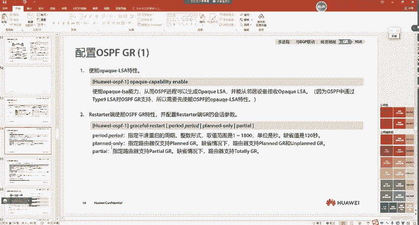

然后我们对于辅助者呢，要配置他的这个辅助模式。对啊。呃，配置设备平滑重启的辅助模式，并且配置辅助者端的GR绘画这个参数。啊，比如说第一个呢是寄牙的周期。是吧。嗯，取值范围是1000啊，缺绳是120秒对。

就我们所说的2分钟，但是最多呢可以配置成1800秒。😊，嗯。这怎么那么多啊？不用管它，我做个实验吧，做个实验给大家看一下啊，这怎么那么多啊。😡。

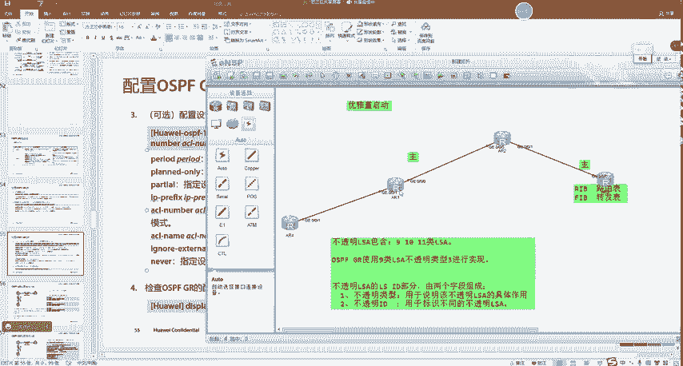

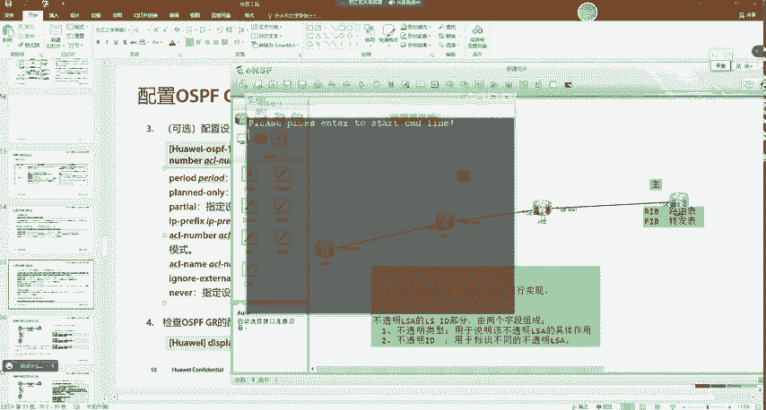

这几个参数我也没用过。嗯，我给大家做个实验，然后我们来看一下啊。😊，呃，比如说待会呢我们这样来做。我把四拉到这里。这是一这是。这是3，然后这边是4啊。🎼가一下。

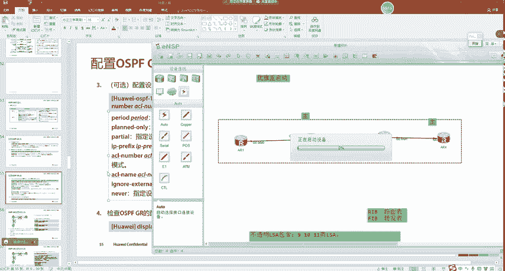

我们看这个案例啊。嗯，比如说在这时候呢，我们是。123呢它们都是双主控板的设备，然后我们跑到OSPF。现在R一呢通过GR的方式重启OSPF进程是吧？或者说进行主备倒换的时候呢啊我们要求转发不中断。呃。

首先在所有路由器上都去开启9类SC功能，然后呢去配置他们支持G牙的能力。Yeah。然后再到这个RE上去看一下GRE功能已经开启了。啊啊，然后在RE上去重启进程啊嗯。嗯。重启建证一。

同时在R上去看邻居关系。所以说我们在R上可以去看到一个对吧？啊，在记压状态啊，R重启。R场OSPF邻居未放RE以GR的方式进行进程的重启。二的邻居关系没有中断。你在一安是放的。嗯。

下面就是在路由器上查看G压状态，R一正常退出GR已经完成了，R也退出了辅助者。

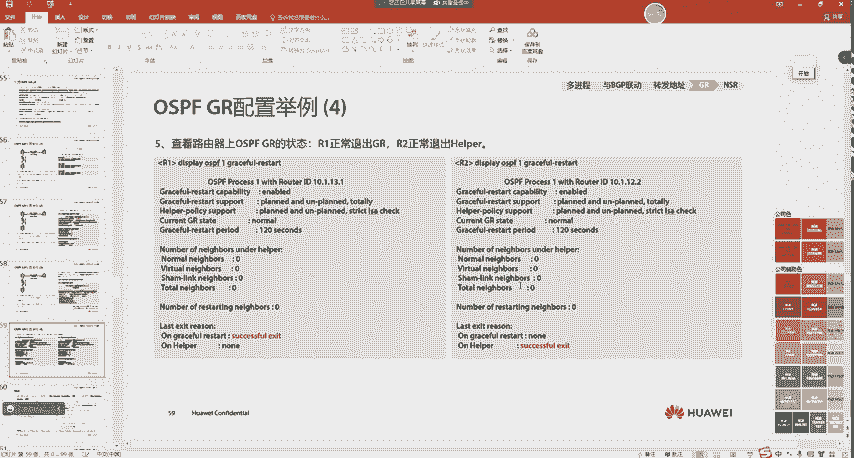

呃，然后咱们通过实验来看一下，当这个转发不中断，咱们。不一定能试出来啊，因为这个模拟器里面的话。他还没有那种他有没有那种主控分离，不好说啊，因为我们这个。双主空板呢它是需要硬件的。

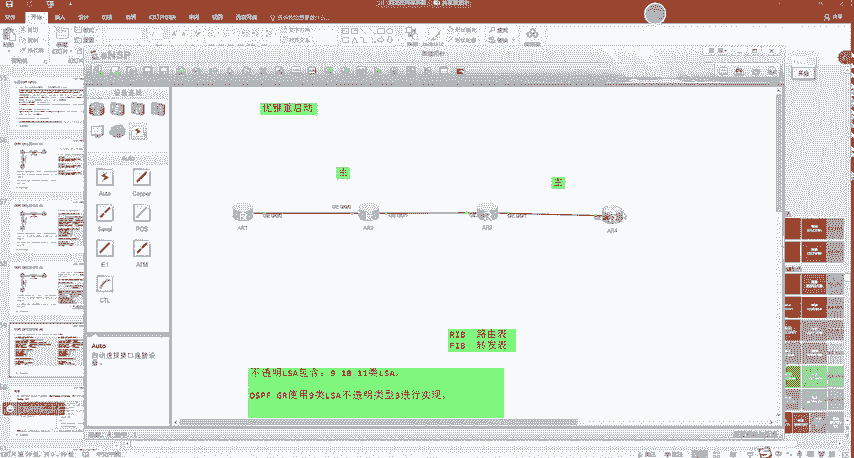

模拟器不一定能行啊，但是命令可以敲啊，告诉一下，给大家说怎么样去做啊。😊，呃，我们现在呢在1234上。A21，然后这边呢我们用AR3上那呢用A23。这边是A241的G0-0-0，用10。0。12。1。

Okay。2的0-0-012。2。0。0。1。10。0。23。2。啊，然后3的0-0-0。10。0。23。3。然后0。0。1。34。4。3四点算啊。34。3。然后4这边的0-0-0呢。是10。0。34。

4。对。

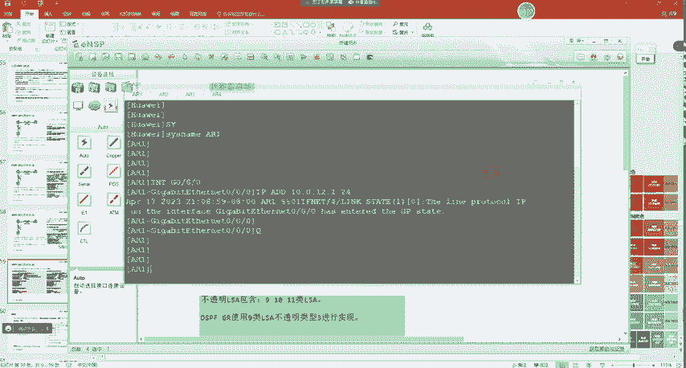

呃，然后我们在所有路由器上去跑个OSPF1。嗯，root IDD1。1。1。1ariel0。network0。0。0。0。就把所有网段给它通告出去啊。Yeah。呃，这边是一的。啊。然后二上面呢。2。

2等2。2。然后这边是二档。然后这是3。3。3。3。嗯。23的。然后在这边呢是4。4。4。4。嗯。24的。对吧呃我们做完之后呢，现在啊注意我现在在AR1上interface low by0。

IPUice1。1。1。132。啊，然后在三上interface60IPO address。嗯。4。4点4。432。对吧呃这里啊我首先给大家说一下。😊，啊，我们首先要做这么一步操作啊。

就是我在四上呢先跟一做互聘，就我们没有开启GR的时候，我在二上面呢去重启OSPF进程啊，我们来看一下模拟器里面能不能丢8瓦。大家能懂我的意思吧？😊，可以吧，但是我们只能通过片去模拟啊，能懂吗？😡。

因为我们在模拟器里面模拟访问的话，只能通过 pin去模拟。但是这个 pin呢它比较慢，它不像我们真正在项目中啊，你项目中你这个接口它一直在跑着数据呢。😡，对吧你一个G口能跑到80%。

那代表你每秒有多少个班，一个包1500字节，你借口跑了800M。😡，对吧也就是说你跑的流量是非常多的。😡，能不能明白？但是我们待会儿通过片区模拟啊，现象不一定能出来。因为片它的频率呢没有实际在工程中。

就是我们在项目中。嗯，跑的那么多对吧？那个流量是非常多的，但是我们模拟环境呢。😊，嗯，只能先测一下是吧，看能不能丢包啊，如果能丢包呢，待会儿可以去看现象是吧？我们用4。4呢去拼1。1。呃。

然后呢他跟聘大包没有关系啊，因为你这个 pin呢。嗯，他是按报文数量来算的对吧？看你的频率。能不能懂啊？比如说我们骗1000个包。是吧然后现在呢我在二上。😡，resideOSPF，我去重启一下进程。啊。

我们看四有没有丢，哎，实际上丢了。😊，对不对？大家可以看到啊呃，现在我们丢了一个两个、3个，丢了4个包。😊，是吧。那现在呢我们就把二模拟成那台要重启的路由器啊，我现在G0-0-1抓个包啊。

待会我们看一下有没有去发G的包。那这时候呢我们是这样的，在A21的OSPF见证下，开启9类LC的处理能力。😊，对呀，开启之后呢，要去开启继R能力。系嘛。然后在二上也要执行。Yeah。在三上呢也需要执行。

嗯嗯。然后执行完之后啊，我们在二上可以displayOSPF brief。응。我们来找一下啊。啊，我们可以看到啊，在这里积压能力是不是已经开启了啊？😊，对不对？

然后我们也可以通过displayOSPFP。嗯，在这里也可以看到对吧？啊，当前是正常的状态。😊，是吧。OSPF brief，我看一下啊。啊，这边就看不到了。Okay。嗯。Okay。嗯。这是。

过滤协商diable。这个我没接触过啊，没注意过。我看啊这里有没有介绍。继而重启协商功能开启啊，大家关注这里就行了啊。那fieldd不用去管它，我之前也没注意过。对吧下面就没了啊，所以说大家看到这里啊。

enable就行了啊。😊，嗯，开启之后呢，我们现在来做一下，现在我在二上抓了一个包。啊，我们现在这里打标记啊，待会儿呢用于做这个啊就好分析啊，看包走到哪了。

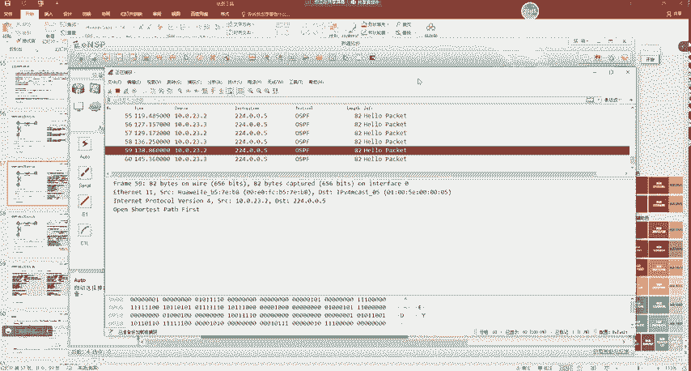

这时候大家注意啊呃我在二上叫做resideY啊，先在四上去pin。对吧然后我在二上呢resiteOSPF进程。后面有一个GR重启，大家可以看到啊。加上一个G牙重启。啊，然后yes。

对吧现在已经重启完了啊。😡，呃，我把包停一下。我们首先可以看到四上没有丢疤。对不对？可以吧。然后我们到二上去看啊，注意。嗯。呃，在二上啊啊，当然这里也有弹出日志啊，大家可以看到啊GR呢已经完成了。😊。

是吧啊状态是非常快的啊。😡，我们可以对着课件这几个面令去收一下这个包我先停一下啊。😊，是。嗯。嗯。当然这个瞬时的状态，咱们接不到啊，大家注意啊。😡，比如说刚刚我们是二重启，现在我在三上呢。

Display OPF peer。对我们只能看到是正常状态。但是你在重启的过程中。大家可以看到吧啊，正在继压的重启过程中，大家能看到吧？😊，如果有这个状态啊，那么就代表RE正在以G压的方式重启进程。

但这个过程太快了啊。嗯，咱们没有这个速度是吧？人为跟不上啊，但是我们可以看到，现在G压状态已经恢复正常了。😊，对的。然后下面我们也可以去看一下。即系。R一上对吧？

对应着我们的拓图是RdiplayOSPF1是吧，看它的GR状态。呃，咱们看到已经成功退出了，那这时候就代表GR是成功了。是吧。然后在山上也可以去看。对呀，这是代表重启路由器啊，已经成功退出了。

然后在三上呢，也可以diplayOSPF1啊，你加上一个GR。我们可以看到三呢作为辅助路由器呢也已经成功了。对不对？而对于R4这边呢，对应于业务来说啊，我们没有去产生任何流量中断。

对吧就是在我们在重启OSPF进程的时候呢。实际上，R3已经替他保密了。对吧要不然R4这边呢，一旦认为二故障之后，肯定会去重新更新top输啊，流量就会产生终断。但是我们现在看到是连续的。

对吧而对应着数据包的转发过程，如果在我们的二和3之间。

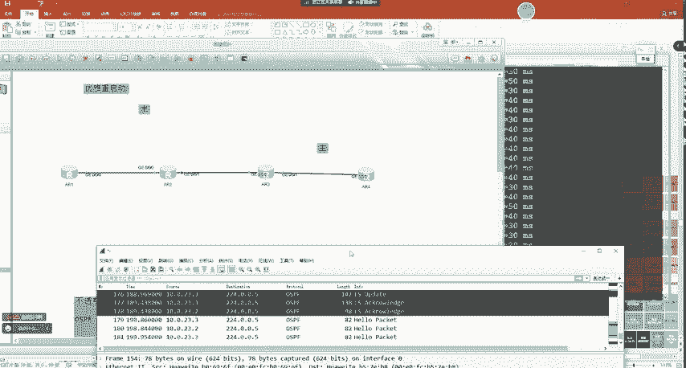

注意啊，咱们来看。他比较快啊。2、在重启的时候，我们可以去看到它发送了1个LCU。对而在这个LICU里面呢。有没有一条9类LC啊？

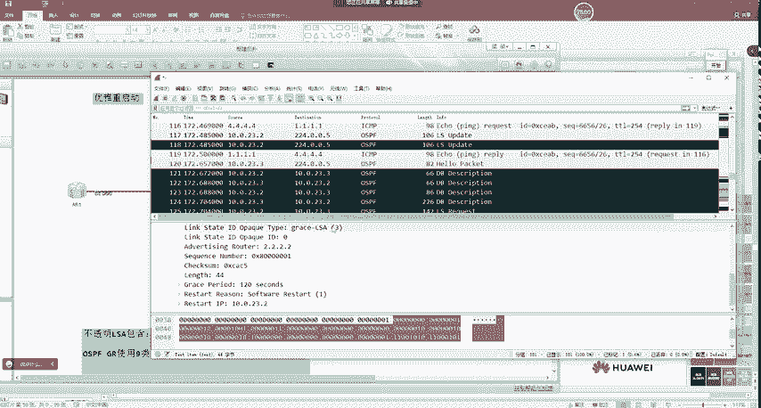

要话。就有这么一条9类LC啊，里面说了，你帮我保密120秒，对吧？在这里呢有一个重启原因。😡，重启原因我们打开来看呢。呃，里面写的是软件重启对吧？一那就是我们在重启OSPF进程。对不对？然后我是谁是吧？

我告诉你三，我是10。0。23。2。😊。

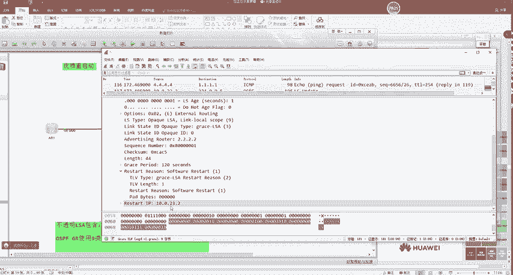

这个包一旦过去之后呢，我们发现立刻又发了一个包。对吧那这个包就代表着二已经重启完成了。对吧我们发现还是二发的。

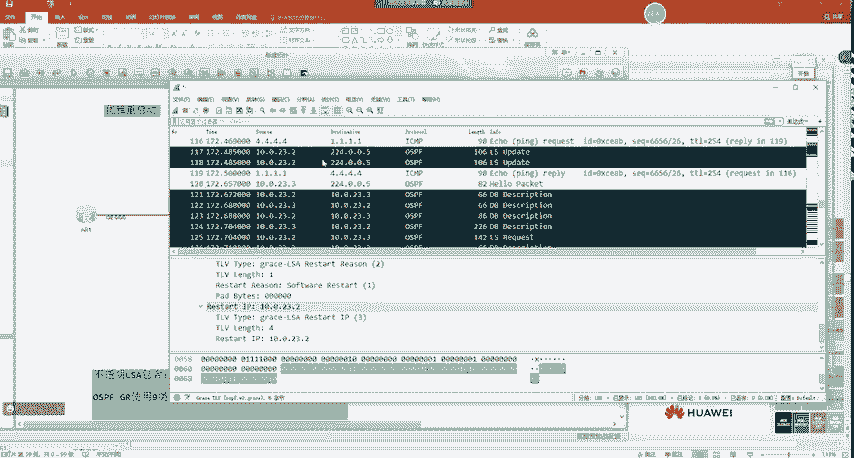

那二在重启完成之后呢，依然会去发送一个GR。RIC。对吧能看到吧？😊，背板正常up，但我们是软件重启啊，这个不是主备切换，是你的OSCPF建程对吧？啊，又up起来了，所以说它会去发送1个GLC。😊。

对不对？那对方收到之后呢，要发送hello报文，进行邻居协商交互地地同步LSDB。所以我们可以去看到三有没有紧接着回复一个hello啊。😊，有吧。对吧说了2。2。2。2对，你是我的邻居了。😊。

能不能明白？然后在这时候呢，有没有去发地弟报文啊？😡，对吧二三之间互相交互滴滴，先把主从选举出来。对不对？主从选举出来之后呢，再发带有LVC摘要的，然后二去请求了。对不对？然后三给他LSU对吧？

2给ACK是吧？啊，非常快。然后LCULCAC咚噔噔噔噔对吧？你看都是LULSACK。😊，然后咱俩瞬间呢啊后面还有是吧？比较多啊。😡，那发包的过程我们是感知不到的啊。😡，对吧要按照这个报文发送的速率。

啊，打到你身上啊，实际上呃你可能认为是同时打的。所以刚刚我们可以去看到啊，就是一瞬间的过程，他们就已经完成了这些操作。而我们只能看到的呢就是业务现象。四没有丢包。😊，能明白吗？明白的同学敲一啊。

都没问题吧。这里。😡，可以是吧，所以这也是保证可靠性的一种方式。

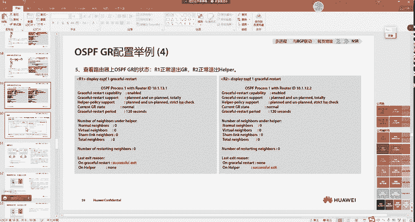

啊。然后咱们休息一会儿。休息一会儿之后呢，我们来讲一下NSR啊，什么叫做NSR？😊，嗯，咱们休息10分钟啊，十0分钟之后我们来说一下NSR。😊，看有大问题啊。😊，呃，如果一要重启，你只在二上配就可以了。

能懂吗？就是在你的OSPF邻居上去拍。😡，呃，辅助者注意啊，只要是与重启路由器建立的OSPF邻居的都要去配。能不能明白？啊，就是必须主备切换才能平常中你嘛啊，不一定是主备切换啊。

你也可以是像我这样重启进程啊。😡。

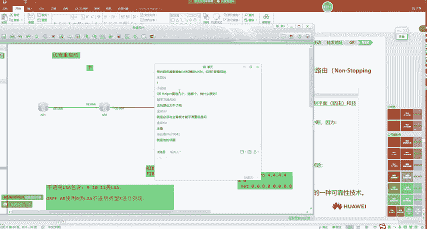

能懂我的意思吗？你也可以像我这样啊。😡。

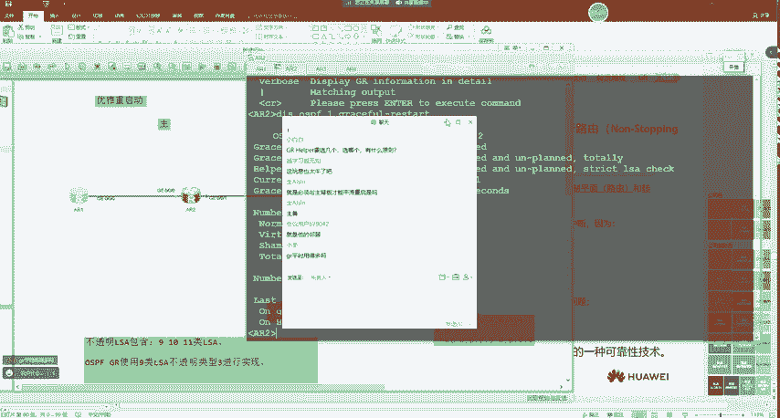

大家可以去看到，我没有储备切换吧。😡，我刚刚是怎么做的？我是重启OSPF进程吧。能不能明白？你也可以像我这样重启OSPF进程啊，因为我们是通过模拟器去做的。😡。

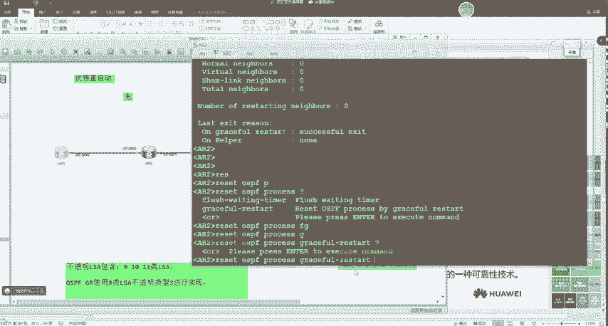

这可没有什么主备切换啊，你一点关机就关机了。😡，能不能明白？你点关机就关机了啊，这个没有主备切换啊，但你在真正工作中呢，可以主备切换的时候去执行。😡。

对吧但模拟器里面没这个命令，我记得有一条叫做sitch over啊。😊，就是去执行主备切换的。

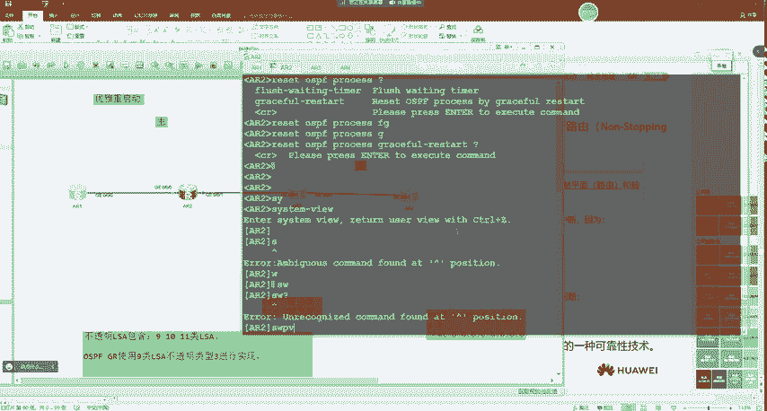

就切换到背板上吧。嗯，GR用的多嘛，这个看设备啊，就我们一般用ASR稍微多一点。那就既然失败了啊，小白白。😡，能不能明白，那就失败了啊。😡，当然在这个时间一般不会有问题啊，这种概率是非常小的。

就是用户本身也是可以接受的。😡，你能不能明白？我们刚刚看到就是眨眼间他就完成了。😡，对吧啊当你业务比较多的时候呢，可能也就那么几秒。😡，能懂我的意思吧？😡，所以说他是非常快的啊。😡。

就用户一般也能够接受。😡，正是因为他本身时间是非常短暂的。所以说呢啊G然才有了用武之地。对吧如果说他要建立的非常久，那网络的变化呃可能就是你时间越长，这变化的可能性就越高啊。是吧。这不刚刚给你说了。

比如说你在重启进程的时候，或者说主备切换的时候去开启就可以了。😊，啊，对，没错。啊，设备自己设备卡了一下是吧？啊，可以这么操作啊，但是大的NE设备我们一般不用GR了啊。

接下来我们要讲的NSR比这个GR技术呢。😊，更要牛逼一点。要比他强很多啊。所以咱们休息一会儿啊。嗯，休息会儿之后呢，我们来讲一下NSR啊，大家就知道为啥TR用的比较少了，但实际上也在用啊也在用。😊，行。

那我们休息1分钟啊，十0分钟之后咱们继续上课。😊，咱们等到9点34。对吧9点34之后继续上课啊。😊，嗯。嗯。二、重启一和3啊。对，没错。行，我们休息会儿啊。😊，那我们继续啊。

然后我们把这个NR来给大家说一下啊。呃，刚我们可以去看到啊，就是GR这项技术呢，我们在使用的时候，嗯，实际上优势是非常明显的对吧？就我们在执行一些重启的时候啊，或者说呃准备切换啊等等之类的。嗯。

这个邻居是不会产生中断的对吧？呃，以及流量呢也不会产生中断。嗯，但是G牙这样技术呢，它有一个缺陷是在哪里呢？首先呢呃GR呢它是需要这个。辅助路由器的对吧？我们需要去辅助路由器去帮助执行。呃。

那么就这时候就代表着我的辅助路由器呢一定需要去支持解压能力。对吧啊，那在此基础之上呢，我们就遇到了一些问题，什么样的问题呢？比如说有时候我们在使用的时候嗯，我举个例子啊。呃。

假设说呢这是运营商的一台PE设备啊，大家可以理解成是运营商的边缘设备。对吧那在这时候，我们是需要去连接不同的CE的啊，就是客户的设备。那一般比如说我们在运营商设备上去执行主备切换呢啊。

那对于客户的CE设备来说啊，因为我们跨越了不同的管理机构，对吧？啊，这是运营商的啊，这是你们公司的对吧？这是B公司的这AB公司，这是B公司。那比如说对于PE设备，他要在执行主备切换啊。

或者说重启的时候呢嗯没有办法去跟客户进行协商。是吧那这时候客户也会觉得啊我拉了你一条专线呢啊，你重启一下，还需要我的设备做升级。对吧呃，实际上我们会去发现的，而且这种特别是交涉性的东西啊。😊，呃。

大家做项目应该都遇到过，对吧？比如说你这边嗯需要排查一个故障啊，但是需要其他的这个单位对吧？啊，或者说其他人去辅助你的话，但你们本身属于不同的部门啊，但是交涉起来，有时候我们会发现呢是非常麻烦的。

对不对？嗯，所以说呢对运营商的PD设备来说，我们发现它在进行主备切换的时候，重启的时候呢会有一定的瓶颈啊，主要就是在类似于这种协商的过程中，对吧？实际是从技术上考虑呢嗯，问题倒不是特别大。

因为我们只需要CE呢，支持G压就行了。但有没有可能客户用的是比较老的设备呢，嗯也有可能对吧？那这时候就没有办法支执行G压。😊，对吧所以说那时候我们就在想你有没有一种方式呢？😡，就GR实现的叫做NSF啊。

叫做不间段转发。那我们就去想有没有另一种方式呢？就是我这个PE呀。😡，我偷摸的自己切换完成，我谁都不给说。😡，是吧。😡，能明白这意思吗？啊，自己偷偷摸摸的做是吧啊，比如说啊你要开始奋发努力了，对吧？😡。

呃，以前呢你可能给你的女朋友啊，对吧？给你的家人说一下，但是现在呢我谁都不给说啊，我就自己知道啊，我偷偷的努力然后吓死你们。😡，是吧。所以在这时候呢，我们就去想。😊，有没有一种方式呢？我自己偷偷的完成。

对不对？其他人不给说。😡，嗯，在此基础之上呢，我们就衍生出了叫做NSR。NSR呢我们把它叫做不间断路由。那这个是怎么样的呢？嗯，因为我们刚刚也说了啊啊我们的设备呢都有双主控板，对不对？

就NSR最终能够实现的一个效果呢。首先路由处理不中断，对吧？比如说邻居和top信息也不丢失。😊。

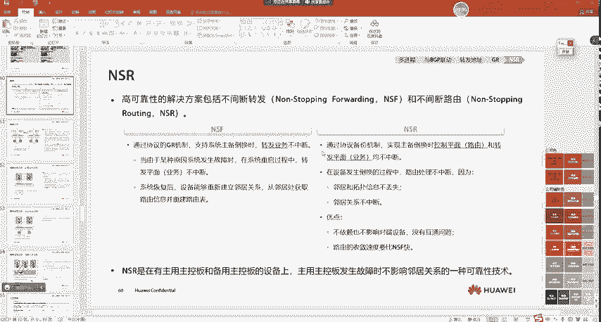

对不对啊，邻居关系也不中断。那这时候邻居实际上是无感的。能不能明白，邻居是无感的啊，不依赖于辅助者，对吧？也不影响对端，也没有互通问题啊，也就是说我的转发表也是在正常工作的。😡。

对吧而且收敛速度比NSF快。对吧为什么呢？因为我们在实行寄押的时候，就是NSF就实行寄押的时候呢，你还得跟邻居去协商，对吧？交互报完。😊。

对不对？而NSR呢啊它就更好一点。那ASR是怎么做到的呢？我们来看这张图啊。😊，来看。呃，首先对于我们的设备来说啊，假如说在这里我们可以认为是不同的设备。对吧呃，不同设备它在不同时间段的状态啊。

首先我来看这张。那首先呢我们有LPULPU呢我们把它叫做接口版对吧？然后这是它建立的邻居啊。LPU收到的报文呢，最终都要通过总线上传到主控板上。啊。

然后这是备用主库满啊一个主用主库满A代表act啊代表已经激活的。呃，那这是主用主库买，这是备用主库门。那NSR当我们一旦去开启之后啊。😊，嗯，他会时刻的去做备份。对啊，比如说在这时候。

我有1个OSPF邻居一，他一旦发送了哈lo到LPULPU要交给主控板处理。主控板他会认为啊当前跟1。1。1。1建立了OSPF邻居，那么他会把这个最实时的邻居状态。更新给备用主购买。那大家告诉我。

现在备用主控板跟主用主控板的信息是不是一样的？是不是啊？是一样的啊，注意是一样的。那未来注意啊。主控板一旦产生了故障之后。那这里大家注意啊，就是设备的内部会有一个硬件通道。那如果他感知到主控板故障对吧？

这个故障可能有很多那你比如说用着用着突然坏了是吧？啊，或者说有个人呢他上手直接给拔了出来，对吧？物理黑客。😡，对不对啊，都是有可能的。只要设备一旦感知到主控板异常。备用主控板呢啊就会升级为主。

能不能明白，就会去通知我们这里的备用主库板，变成主用主库板。😡，那同时备用主控板有没有跟主右主控板相同的信息啊？有没有？是有的吧啊一模一样的。

对吧所以说未来邻居再发送的hello备用主控板有相同的信息啊，那这时候邻居会不会重新建立呢？不会。😊，对邻居知不知道呢？邻居也不知道。😡，对不对？所以说在这说这个就相当于什么呢？😡，嗯，比如说啊这是你。

嗯，你呢给美团这个客服打电话。对吧啊，去处理一件事情。但是你比如说美团客服之间对接的是A对接你。但是呢有一天他换成了B，是不是你也感知不到啊？😊，能明白这意思吧？对吧？只是在内部进行调整。

就一个设备内部直接把实时的状态信息同步过去了。你再发送的信息呢，实际上是由备用主户买来电工作。😡，那么这种就叫做NS啊。那ASR主要的功能呢，它就是就主要功能的实现啊。

就是我们是两个主控板之间会进行备份。啊，比如说邻居状态对吧？比如说路由表所有动态的信息呢啊都会进行备份。那么在备份的时候，大家注意啊，我们可以看到啊，一共是有三个过程。首先第一个呢叫做批量备份。

就是当我们去开启了NSR之后呢。背板重启时，主右总控板将路由信息转发信息直接批量的一次性同步到上去。比如说我们没有开启NSR，这时候主公用主控板就自己有是吧？我开启NSR之后，他会把所有刚刚。

包括以前所有的信息直接给你一份。能不能明白啊，直接给你一份。😡，给你一份之后，如果未来还有其他的变化。对吧在任何控制平面和转发层面发生变化的时候，都将注意啊，叫做实时的同步到备应主控板上。

所以我们就可以认为啊基本就是任何时候都是最新的状态。😡，能不能明白？基本所有时候都是最新状态，因为它是实时的。😡，对吧。那么在这时候，如果开始主备倒换。是吧。已经完成备份的NSCR系统。

啊主控板发生故障的时候呢。备用主控板会通过硬件状态感知到主用主控板故障，成为新的主用主控板。啊，就是是吧皇帝死了是吧，太子上位了。对不对啊？然后在这时候呢，LPU是吧？

接口版那大家可以理解成他就是这些大臣是吧？那未来的奏成上报给谁呀？😡，上报给谁啊啊，之前给皇上对吧？啊，现在给新皇上是吧？所以说呢。😊，主用备用主控板一旦升级为了主单板呢会切换接口板的半围上渗通道。

对吧所以说未来呢都会上送给备用住户们。那这时候呢，我们可以去发现，就是在一个设备内部呢，它自己已经完成了切换。😡，是吧。然后我们再来看那备份它是怎么样的呢？这里有一个大概的过程啊。😊。

首先呢我们背板启动完成，就是背板开始加电了，对吧？啊，开始上电。😊，那么在这时候呢，所有的各建程业务就我们在主控板上可能运行了很多的啊，比如说OSPF啊啊，对吧？啊，BDP啊，还有一些应用的这个配置啊。

对吧？啊，还有一些数据8啊，刚开始不是给主用主控板吗？😊，对不对？那么在这时候呢，都会开始批量备份这些这个业务数据啊，到备用主库板上。能不能明白？呃，那一旦备份过去之后呢，相当于这两个人呢。

现在整个状态呢啊都是同步的。对吧就是你主有一份啊，那背也就有一份。是。如果数据备份完毕之后呢，现在这两台路由器啊就可以进入到冗余保护状态。就是主控板一旦故障之后呢。

备用主控板可以利用从主控板备份过来的数据升级为主恢复业务。这个实际上我们刚刚也说了对吧，就是我跟你有一样的东西。对吧嗯，你故障之后呢啊这这个实际上跟大家找工作一样。是吧啊，两份工作供你选择啊。

这份工作没了，你有一份相同的工作，是不是也直接能做啊？😊，对不对？哎，能明白，但是批量备份如果没有结束呢。Yeah。我举个例子啊。😡，比如说我们的备用主库板一旦上电。

主用主库板是不是开始给它同步数据业务啊？对不对？我把我的OSPF啊BDP啊配置信息啊，对吧？收到的什么数据方法都交给你一份，你也进行工作。😊，是吧。哎，但是我在这儿同步了一半啊，主控板突然故障了。

大家觉得这时候业务会不会断啊？去唔去啊。这时候是会的啊，所以这里大家注意啊。😊，得到吗？对吧这时候是会的，所以说你开启这个状态啊啊建议大家一直都去开启的状态。😡，能懂吗？一直都是去开启的。

所以说如果说批量备份没有结束是吧？主库板一旦故障呢，备用主库板升级为主，但是呢业务数据不全是吧？可能会导致呢对吧？无法完成AR切换啊，设备就会重启恢复成故障前的状态。所以这里大家注意啊啊。

你开启之后呢啊要等一段时间。🤧嗯。这是批量备份啊，然后实时备份的话，它就是。😡，呃，一旦抽到了任何邻居的变化，对吧？呃，以及top币信息的变化，邻居会给我上传到我的接口上。我的接口呢会上传到主控板上。

😊，那主控板呢会将这些变化呢同步到背份。对不对？然后备用主合板呢再给主说一下啊，我已经收到了那，这种叫做实时备份。那么倒换过程它是这样的啊，我们来看。😊，Yeah。那首先呢。呃，对于我们的硬件通道来说。

一旦产知到主右主控板故障。那注意啊，现在主控板故障了。是吧那在这时候，新的主控板，这是谁呀？😡，这是谁呀？这是背还是主啊？啊，这是被啊，被升级成了主，能懂吗？😊，他是备用主控板升级成了主是吧。

就主控板会给备用板说啊，我这边鼓掌。是吧，然后备用主库码升级为主。升级为主之后呢，我们的接口班也知道啊，对吧？就顺风岛啊，这都是那些大臣一看有了新王帝。😊，对不对啊，那后来所有的转发信息呀。

以及接口收到的包啊，都会上传给备用主库买了。能不能明白？那备用主库板就直接接替主用主库板来进行工作了。那这怎么还有一个M？SMB啊。这为什么还会有1个SMB啊？是吧我举个例子啊。😡。

比如说你主控板故障了，你要不要拆掉它检查一下。对吧可能要换板子。对不对？那这时候你把一个新版上来，它就是背啊。对吧所以主用主工板呢还会把自己的状态呢啊再同步给他一份吧，这是一这是第一块板子。

这是第2块板子啊，这是第3块板。能懂吧？就是无论是备用主控板，还是无论它原有是主用主控板，还是被升级为主的，那么他们都会把信息提供给备。能懂这意思啊？这就是NSR，但是ASR的配置是非常简单的。

它具体内部对吧？老师他怎么同步的？😡，嗯，我也不知道啊，我也没办法解释啊。啊吧，老师他怎么同步的那是吧啊只能说它内部会有总线。😊，对对，那但是我们具体的配置是非常简单的。啊注意啊。

如果我们要去开启NSR的话，你要敲一条叫做switch over mode。把它切换到NSR模式。对呀，默认呢是NSF模式。NSF模式呢就是你通过GR去做的那种操作。但是我如果我们要使用NSR的话啊。

你要在系统视图下敲一条命令，叫做switch mode。对吧啊不间断路由。啊。调整到NR模式。对呀，但是这个命令呢，咱们在模拟器里面就做不了了啊，这个实间做不了了。因为咱模拟器里面没命令。😊。

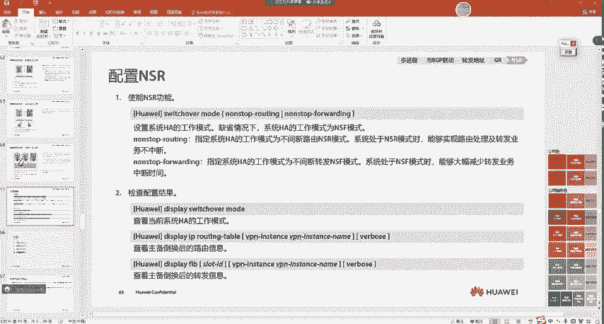

那大家也可以看到我switch over呢没命令。😊，对吧因为我们模拟器里面没有什么主控板，备用主控板啊。

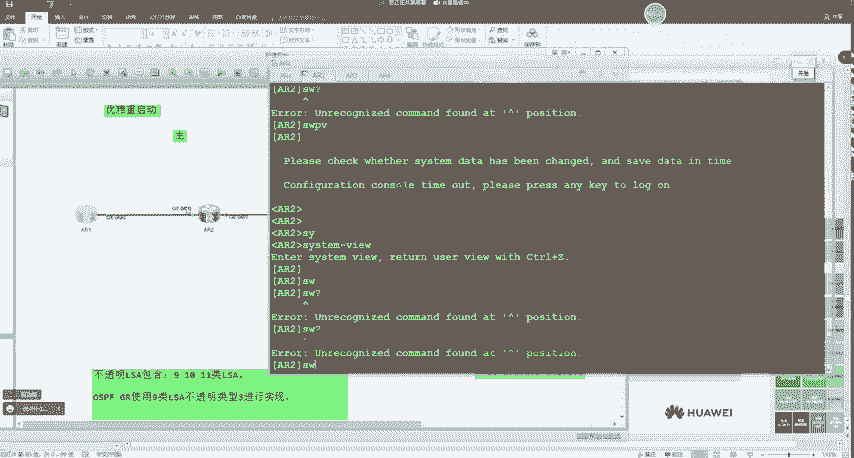

本质还是模拟器。然后我们再来看啊。😊，呃，执行完成之后呢，你可以display switch over mode去看一下它当前的状态。得到吗？那这条命令呢，大家实际上可以去看一下手册。

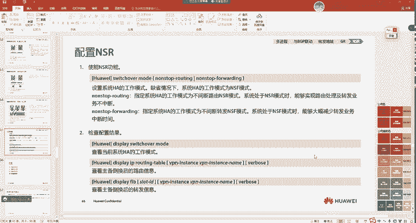

在手册里面呢嗯实际上是有介绍的，我找一下啊。😊。

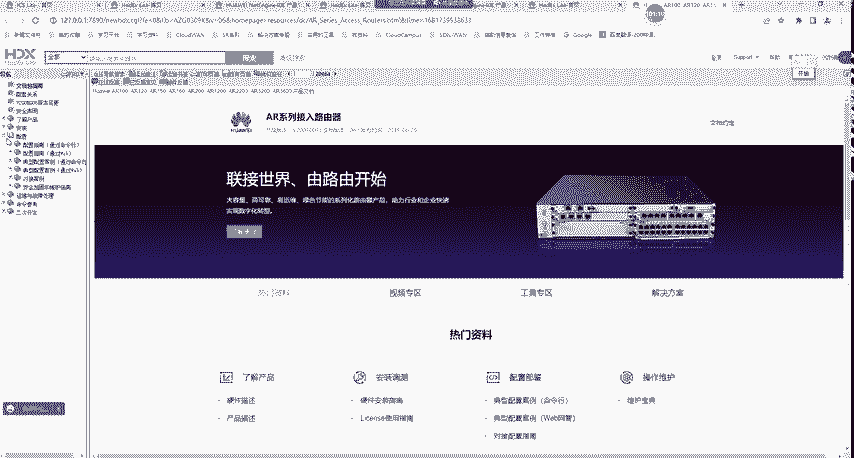

嗯。嗯。昂用SR配置。啊，这个课件就抄的。

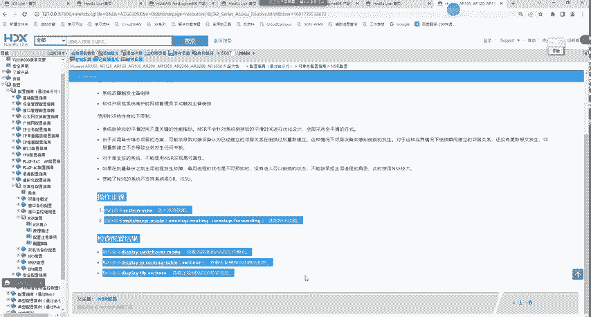

啊，春超啊是吧？课件就是抄作手册啊纯抄。我来看啊，就是你可以display switch over mode啊，我们可以去看到呢，它当前是属于不间断路由，对吧？在NSR模式下。😊。

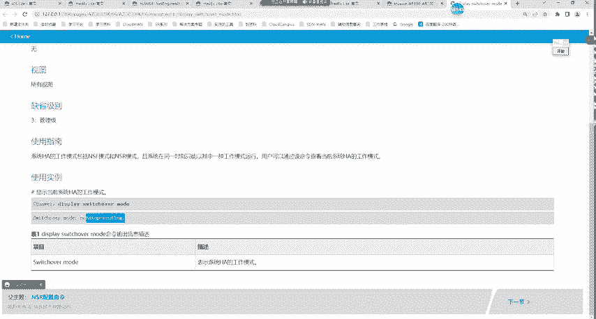

那这一步做完之后呢，嗯你还可以去看路音表是吧？就在这个之前呢，注意啊呃比如说你执行完这条命令，你就可以再进行主备切换了。😊，准备切换，我记得还有一条命令。我给大家说一下过程啊。

就你们未来真正做项目去做的话。😡，首先你要切换到NSR模式。能懂吗？切换到NSR模式之后，确定一下是NSR模式。到这里都能理解吧。你也同学敲一啊，没问题吧。😡，对吧切换过来之后。

那老师我怎么样执行主备切换呢？

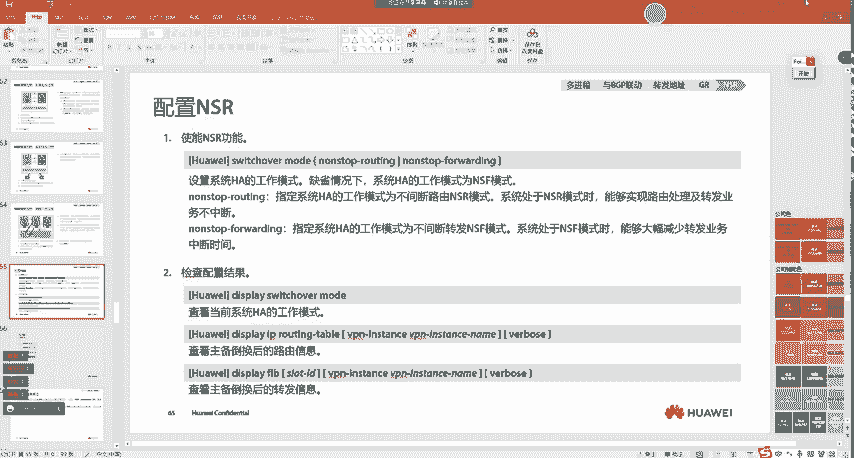

呃，还有一条面呢。叫做。그。叫做switch啥来着？我找找啊有主备切换，我记得有一条命令。Sitch over。😔，啊。好，在这儿啊。这NE8000。

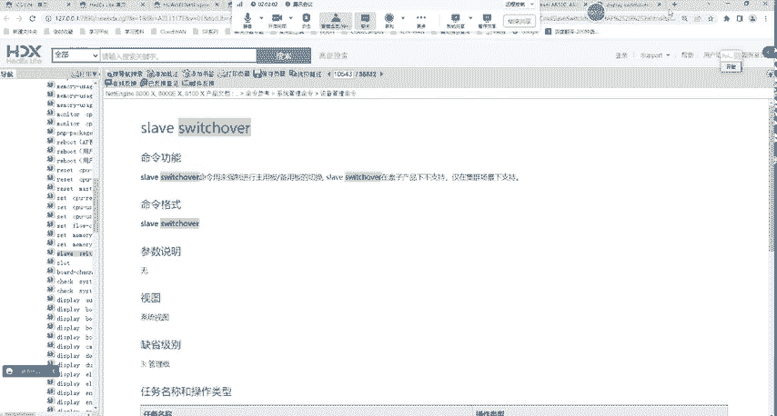

我说一下啊。嗯，N140，我看是不是个。啊。嗯。这是在集群场景下，不是这一个。🤧嗯。🤢，嗯。我找个交换机的。S7000。所以说。😔，🤧呵。Yeah。

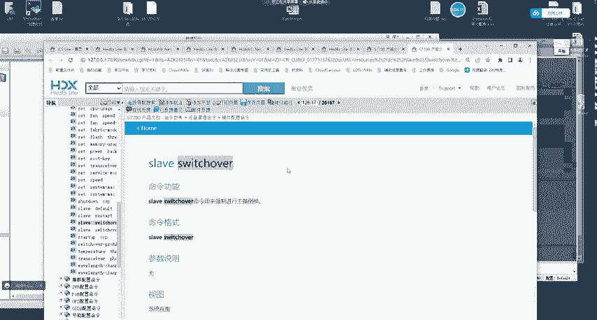

啊，就是这条啊。我们来看这里啊。呃，强制进行主备倒换。但这个我们一般很少手动的去执行啊，这里先给大家说啊。😊。

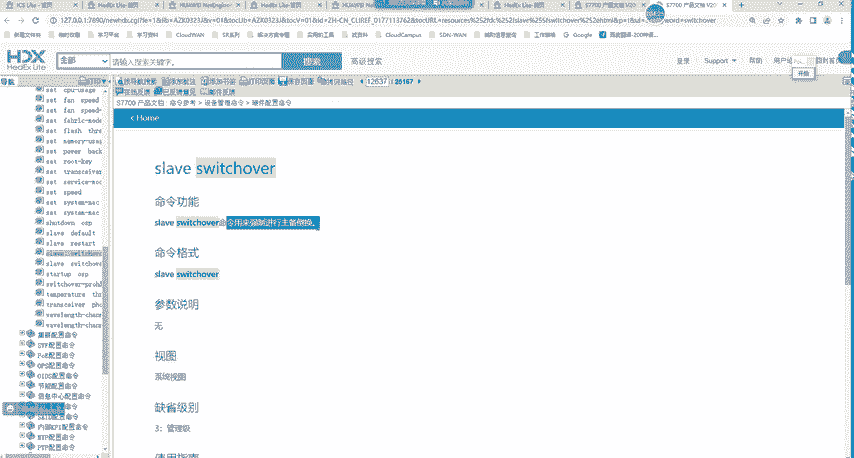

就是你开启NSR的目的，大家还记得吧？😡。

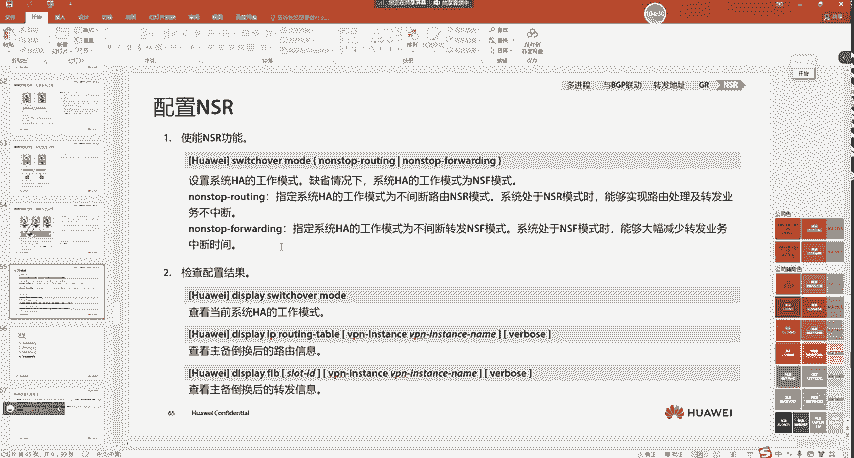

还记得吗？😡，叫什么啊？😡，这叫什么啊？😡，叫做主控板异常。大家能明白吗？但是我们很少手动的去做准备切换啊。😡，可以吧。但是你可以去通过手动的方式去做，但是很少手动的方式去做啊。对吧只是可以手动去做。

但是一般都是开启之后呢，主一旦故障之后，它自己就会切换了。啊，作为一个备用的方案。对吧如果你是有计划的话嗯，但是很少这样去做啊。😊，呃，刚在这里呢，我们有一个场景介绍啊，大家是可以看到的啊。

那什么时候手动去做呢？嗯，比如说在这里啊。呃。对吧这也是自动的啊，所以说咱们很少手动去做啊，但是大家知道啊，就你可以手动强制去让它切换啊，强制进行主位倒换。😊，啊，但是一般很少这样去做啊。

就是你把这个NSR开启之后。是吧。

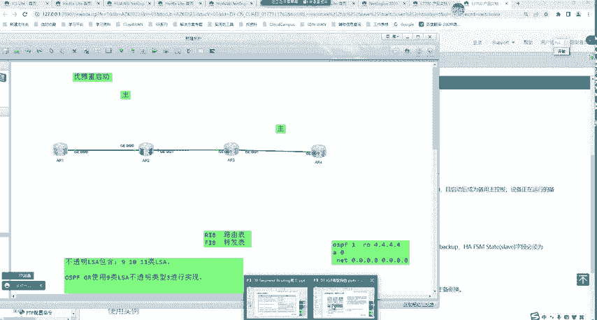

咋了。把NSR开启之后呢。然后强制它进行主备倒换。倒换之后呢，你可以去看一下路音表。啊你发现所有的路由表还都是正常的。这里为什么看录音表，大家知道吗？😡，能不能不看？两个目的啊，我给大家说一下啊。😊。

呃，首先第一个目的呢，你得确定一下吧，就是你主备导换之后，它不能失败吧。😊，是不是啊？是吧你得确定一下，当前路由表都是正常的，是吧？😡，呃，帮包括看FIB是一样的啊。你得确定一下，你主备导航成功了。

你不能主备导换之后，对吧？老师我的路由表FIB都没了啊，这样不行。😡，但是第二个目的呢，主要是为了确认。第一个是为了确认啊。😡，是。第二个呢，实际上也是类似于确认一样。那什么意思呢？

比如说啊你现在操作的是客户的设备。😡，你主备导换之后，录由表也正常了。但是客户跟你说，他业务断了。你原来谁啊？那谁啊？那你。系赖我啊。啊，反正不能赖客户。😊，对吧所以这里给大家说一下啊。

就是我们之前呢一定要去做好快照啊，这个快照呢就是把当前所有的状态信息都要去收集一下。😊，是吧。那防止你储备切换之后呢，那客户他不敢这么多啊。能懂吗？被你主备切完之后，你觉得没问题。

但客户说就是你搞完之后业务断了。😡，是吧但是你没有办法去证明不是你的问题。😡，能不能明白？所以说呢你提前要去把状态信息手机上，比如说路由表啊，对吧？FIB表，那除了这些还有没有啊？😡。

领居表要不要收集啊？要不要就跟你做割阶一样。😡，对吧OSPF邻居。对不对？SS邻居卖个地址表，对不对？ARP表，那这种都要去收集一下。是吧。因为你一旦切换完成之后，你觉得确实你这边没问题。

就是就你这边百分百没问题。但客户就说是你的问题，因为你做了操作。😡，这种东西呢，你有理说不清是吧？你没有证据。吧客户还拒绝得是你问题啊吧，这时候就是一个甩锅了，是吧？所以说一定要提前做好证据。😡。

可以吧。呃，行，所以这里是NSR，这里大家都理解了吗？理解同学敲一啊。都冇你话。对。嗯。啊，就截图截出来啊啊ctl Cctrl V也行，也是可以的。😊，可以吧。呃。

怎么能确定背板把主控板路由信息收集完了，就你开启之后等个10分钟就差不多了。

他应该是很快的，但是在我的印象中，设备上好像没有命令让你去看。😡，🤧嗯。我在这里能看到吗？有一条面的叫做display。😡，switch over对吧？s你可以去看状态啊。😡，嗯。能看到吗？这是谁啊？

😊，哪同学问的鸵鸟同学。😡，能看到吗？有这么一条命令啊，就你可以看一下是否满足主备导换的条件。呃，下面我们就可以去看到。呃，在这里呢有一个叫HAFSM。啊，表示主用主控板的备份状态。背板已插入嗯。

等待背板插入。等待背板的批量请求。批量备份全集数据批量备份批量备份检查，实时备份。嗯，还有一个叫。数据平滑。下面呢。啊，下面这里啊注意在这里，这里呢就下面这里啊。😊。

他表示的是我们有没有备用主库板同步完成。啊表示备用主库款的备份状态。嗯。如果处于实时状态就可以了啊。大家能明白吗？就是如果带这个啊。😡，就是表示备用主控板处于实时状态，就代表我们批量备份已经完成了。啊。

啊，如果是下面这个关键词就行了。啊，然后我们对比一下，大家觉得。如果未来你在执行的时候有这么一条命令。能不能开始切换？Yeah。拿不拿。可以了。对，没错，这时候是可以的啊。所以有这么一条命令可以去看。

😊。

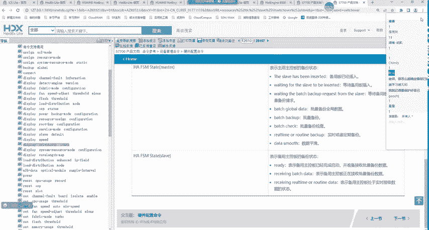

🤧啊。😮，啊，先甩锅。嗯。我先把录屏定一下啊，然后咱们今天就讲这么多，没其他内容了啊。😊。