# 2023 新版华为认证HCIA+HCIP+HCIE全套视频讲解！一套视频让你从入门到精通！CCNA／CCNP／CCIE技术提升同样适用！ - P101：（持续更新）HCIE Datacom - 47.ISIS-ispf、快速扩散、等价、缺省 - -Book思议8 - BV1W8411A7z8

그。Okay。好，同学们。我们上课吧啊，大家可以听到吗？😊，嗯。呃，可以，同学敲一啊，声音没问题吧。😊，Kra。好，那我们就上课了啊，你开始了。呃，上节课呢咱们把这个OSPF的一些可靠性技术啊。

把这个呃GR呢以及NSR对吧？呃，给大家讲了一下啊，当然也做了个实验。😊，嗯，那剩下部分内容呢，我们就讲到了SS的一些高级特性嗯。呃，两个大的IGP协议对吧？呃，我们来看一下啊。

就是ISS呢嗯它的高级特性哪些？实际上跟咱们学OSPF的时候呢，呃是一套活啊，也就是说OSPF我们之前讲的那些。😊，呃，绝大部分都适用于在ISS上。首先我们来看啊呃对于ISS呢。

我们要去提高路由收敛速度的话啊，首先我们说的是收敛啊。😊，怎么样去提高它？嗯，而做出的一些扩展特性呢，我们有ISPF啊，我们把它叫做增量的这个SPF算法啊，或者说叫增量的最短路径算法。嗯。

他到底怎么增量的呢？我们要通过后面的学习啊吧，啊，慢慢的去体会它。反正这里大家知道就是。😊，嗯，它能让路由的收敛速度变得更快，对吧？啊，具体怎么做的呢？咱们后面会去学习到。那以及有PRCPRC呢。

实际上我们在学OSPF的也接触到过，对不对？我们把它叫做部分路由计算。那这种技术呢同样适用于ISS啊。呃，然后还有一个智能定制器，那实际上跟我们学OSPF的是一模一样的。啊，还有LOSP快速扩散。

这是我们待会儿所要去讲到的一些啊SS怎么样去提高路由收敛速度所提供的一些特性。呃，那么以及呢如果我们希望对链路故障快速检测也有ISS凹凸 FR。

那它和OSPF的说白了就是一模一样一模一样啊那两个算法都是一样的。嗯，那么以及呢对吧如何与BFD联动。那前面就是一个介绍啊，就告诉你嗯，待会呢我们会接触到哪些东西啊，咱们就一点点来一个一个来讲啊。😊。

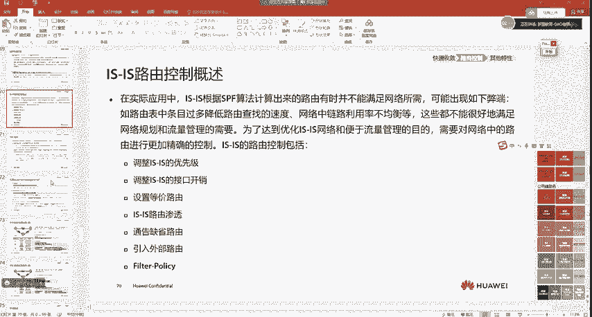

首先我们讲第一个技术啊，我们把它叫做SPF它呢叫做增量的这这个SPF计算是吧？呃它有什么样的作用呢？实际上啊。😊，在我们传统的这个SPF的规定中呢啊它是这样的规定。比如说呢再是我们的网络啊。

网络中呢有12345对吧？现在呢我有5台路由器。那每台路由器都会以自己为根去计算出它所在这个区内的最短路径输。所以说现在我们站到一的视角去看啊，假如说你是一，那一的视角中。

它所呈现的SPF数呢啊就是我们图里现在看到的这样。那么未来有没有这种可能呢？对吧？我的网络需要扩容，这时候呢我去新增加了一台路由器。那比如说对于R5来说是吧，它就连接了一个R6。

那这个R6呢就是我们所新增的路由器。那一旦R6接入进来之后，注意啊，按照传统的SPF计算啊，就是最老的那一个版本，那它是怎么计算呢？就是当我网络中有了一台新的节点，那对R一来说呢。

它要全网重新去计算一次。啊，这就跟我们这个防疫政策一样啊，当然只是某地的啊啊，有些地区的防疫政策差不多。是吧实际上就那一个人感染了啊，结果呢整个市里呢全部给你封住了。对不对？我们发现实际上是没必要的。

因为我们如果站到R一的角度去看呢，比如说升增加了R6，那我已有的SPF数呢，它不会产生任何影响。你比如说我到三，那到三的cost呢还是不变的是吧？我到三的最短路径数呢依然是不变的。

只不过对于新增了R6之后是吧？如果我们去对全网再次执行一篇计算，那就会非常的消耗啊这个设备的资源对吧？那这时候怎么办呢？我们就提出了一种新的这个SPF算法啊，也不叫新的叫做扩展型的，就叫做ISPF啊。

我们把它叫做增量的SPF计算啊，这里呢这是以前我们学过一个增量更新啊，什么叫做增量更新呢？啊，就是当我哪个网段是吧？出现变化之后，我只更新它自己而不像周期更新那样更新所有，对吧？

所以说我们从这个增量可以去看出来呢，比如说网络中只出现了R6，我只计算这个新增的节点就可以了。😊，那这样的话，它可以加快路由的计算啊，因为我们不用再去计算全网的to数。那这个ISPF呢。

它是怎么样做到的呢？比如说在这里我们就有一个网络环境。那假如说R6呢对吧它直接连接到R5上。但是这时候大家注意啊，在原有的top数中，比如说在R6没有接入进来之后呢，实际上R一是有R5的最短路径数的。

对不对？那这时候一旦增加了R6之后，实际上我们去看的话。无论你R6是吧，你连接R5的哪一个接口，那肯定要通过R5能够到达你。对吧因为R6是直接增加到了R5的下游。对不对？

所以说当我们有了这个R6之后呢啊比如说我只需要计算R5啊，它有了一个新的top节点，连接着叫R6。是吧。那这时候呢，我们只需要把六挂接到五的后面就可以了。那对于吓一跳，对吧？下一跳是多少呢？

因为我们去往6就必须先到达R5。所以说R6上面的叶子能不能直接继承R5的下一跳？是可以的。对不对？所以大家注意啊。ISPF它的计算过程是这样的。比如说R6一旦增加进来之后，5跟6呢都会去泛红LP。啊。

然后包括新增的邻居关系。那这种呢我们把它叫做触发更新。那一旦触发更新之后呢，RE就会收到RSP对不对？那RE一看到，只有你五跟6产生了变化。所以说呢他就会进行。ISPF的计算。而你像。2啊4啊三啊。

我要不要重新计算呢，这时候就不会。听到吗？那这时候呢去产生新的到达R5跟R6的最短路径数。而原有的34啊，234，那这些top节点呢不会产生任何变化。

所以说未来R1访问R5跟R6的时候呢啊是通过三的这一个接口。对吧啊，直接到达目的地。所以说我们可以看到啊，从top数上五挂接在三下面，六挂接在5下面。啊，那你一想去五跟六的话，吓一跳就直接继承到这里。

而我们从整体上可以去看到什么呢？就是五跟6的变化呢，不会影响234。啊，那这就是精准防控。是吧啊，你赢了就把你隔离起来。对不对啊，不是隔离你整个区。所以说呢这种呢就是ISPF计算啊。

但然这个功能呢默认也是开启的，所以我们也不需要进行其他的配置。这个和OSPF是一样的，默认都是开启的。呃，这里只是让大家知道一下，对吧？有这么一个功能。然后我们接着紧先说的第二个。

我们把它叫做LSP的快速扩散。那这个LSP的快速扩散它是怎么样的呢？我来看一下啊，它主要的目的是加快LSP的扩散速度。啊，就是让我们的RSP呢可以去更快的泛宏到全网。那这是怎么样的呢？我们来看一下啊。

比如说在正常情况下收到一条RSP之后啊，比如说我有一台路由器，这时候我运行了ISS。那我收到了一条RSP呢。如果比自己更新。则用新的替换旧的对吧？就是更新RSDB中的RSP啊。

无非就是把新的替换成旧的嘛。注意啊，关键点来了。并用一个定时器啊，叫做定期的将RSDB已更新的RSCP扩散出去。什么意思呢？啊，就相当于这个。嗯。这个这个这个这个你要去吃饭。

对吧那餐厅呢我当然我说的是大食堂啊，大家注意，那餐厅呢一般是在几点啊？对吧呃，中午。早上。对吧啊以及晚上的时候统一来进行做饭。对不对？也就是说你能吃到饭的这个点呢啊就是这几个。😊。

那换到我们的路由器也是一样啊，它在更新RSP的时候，它是有定时的。我们假设啊现在我们假设每5秒作为一个时间点啊，更新一次。😊，那么在这时候。比如说你产生了更新之后，多久才能出去？你在第一秒产生了更新。

是不是在第5秒的时候才能够传递出去？对不对？那你在第六秒产生的更新，第10秒才能够传递过去。所以我们会去发现呢，以前的这个RSP它更新啊，它还有点不一样。是吧哎，它是周期性的的。

每个时间段或者说每个时间点它会更新一次。那这样的话就会导致我们的网络收敛比较慢。因为我产生了更新还要等一会儿，对不对？那怎么样去加快这种LP的扩散呢？因为你不尽快把它扩散出去，那邻居就没有办法进行计算。

😡，陆游出来的就完。路由出来的晚，你的业务恢复时间就长。是不是？那怎么样去提高RSP的扩散效率呢？就是能够让它更快一点。是吧。那就有这么一种方式。嗯，他是这样的。就是呢在LSP中对不对啊。

在ISS中有一种叫做快速扩散的机制。他是这样的，就是比如说我一台设备呢开启了这种功能之后。😡，比如说我收到了LP，我可能收到了一堆啊，我收到了10条100条。对吧啊，收到有很多。

因为也有可能是一个大的故障。是不是啊，比如说断电了，对不对？所以说呢有时候我们可能收到的RSP呢，一下子是非常多的。那这时候呢嗯就类似于一种人情味一样啊，这个人情味是相当于什么呢？我以前不是5秒一次吗？

对吧？现在我看你们啊。嗯，人比较少是吧？嗯，就你过来先走吧。能不能明白？所以说RSCP的快速扩散就有点类似于这种。比如说我们本来是定期来进行更新的。那么在这时候，当我们去开启了LSP的快速扩散。

可以给它设一个阈值。那这个阈值我假设它是1。那这个十代表什么意思呢？比如说当我收到了RSP的更新，我可能收到很多条啊。😡，比如说收到的没有10条对吧？7条、8条。啊，来了之后，我先给你传出去。

因为你不是特别多是吧？无伤大牙。😡，你能不能懂啊？那如果我们收到很多呢，比如说老师我一下子收到的更新的数量超过了我的预值。啊，假如说我一下子收到了15条新的IOSP。😡，是吧哦，那么在这时候呢。

我们也有后门，就是你们这十条先扩散出去吧，对吧？然后我们尽可能的让网络快一点，然后剩下5条呢，对吧？咱等到下一次更新。😊，对吧咱分批进行，对不对？很有人情味。

是吧啊这个想法呢就有点类似于呃咱们国人的想法，对吧？啊，我们国内呢实际上很多这种想法，对不对？可能就是行个方便。😊，大家能懂这意思吧？所以说呢我们按照这种机制可以去看到呢。😡。

如果说当我的网络产生了一个变化之后，对吧？我们只是将比如说我设置一个阈值。对吧无论他是超出了。😡，还是说没到达我这个预知。😡，就是我都会立刻将一部分RSP更新。😡。

对吧所以说从整体上某些路由的收敛速度呢就会变得更快。😡，那这些路由是哪些呢？就是在我行这个方便的这些路由。比如说你们没满足10条，对吧？你们这十条先走对其他同学再等一等。😡，是不是啊？

所以说已经先走的这些RSP。😡，他们所携带的路由收敛就会变得更快。所以我们从宏观角度去看待的话。对吧哎那这样的话也是比较好的，对不对？那首先呢设备的性能可以得以保障。那么第二点在哪里呢？

就是网络的收敛可以变得更快。那这就是我们所说的RSP快速扩散。就是我们可以在进程下呢去配置。😡，那么小于多少条，对吧？这就是我们所说的阈值。那它是针对于所有接口的啊，如果发送的数量对吧？

就是我需要发送的LCP更新大于了我们所设置的数量。对吧就发送多少个呢？哎，这个多少？是我们手动去配置的。对不对？是吧所以说。😡，在定时器没有超时的时候，就会立刻过散。而其他超出的那些呢，对吧？否则则在。

该定时器超时之后进行发送。是不是啊这个实际上有点类似于嗯这个客运车拉人一样。是吧啊，我们不允许呢，比如说不允许这个。呃，超载对吧？但是呢比如说现在呃就那么一两个人，实际上也没什么大的影响啊。

那你们就上车吧啊，咱们就走。😊，是吧就是给别人行个方便。能懂这意思吧？所以说呢我一直觉得RSP快速扩散这个技术啊啊应该是我们中国人自己研究的啊，当然这是我觉得啊具体它的背景呢，我也没有去做过相关的了解。

但是呢这个是比较符合我们中国人的一些思维，对吧？实际上行个方便，对不对？呃方便你方便我。😊，所以我们来看啊，那这个咱们怎么样去做呢？啊，我们就拉一台路由器啊，嗯然后来做一下。😊。

因为我们很难去模拟出来啊，比如说老师我一下子更新多少RSP啊啊，这个我们很难去做出来啊，但是呢我们可以去看一下这个命令，对吧？大家体会一下。😊。

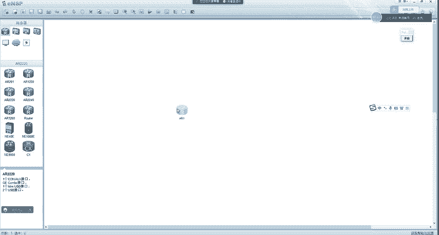

嗯。哦，对，SS是一个公有协议啊。嗯。嗯。那我们怎么样去开启RSSP快速扩散呢？就是在ISS进程下啊一条命令。那么你呢可以针对于级别一和级别二单独去开启。对不对？那这时候呢，比如说我们先配置对吧。

你先更新多少条，比如说我们设置10条。对不对？呃，那他是针对于级别一还是级别二的呢？比如说我现在不配，那我这个周期设置成多久呢？我们说定时器超时之后，剩下超出的再进行扩散。

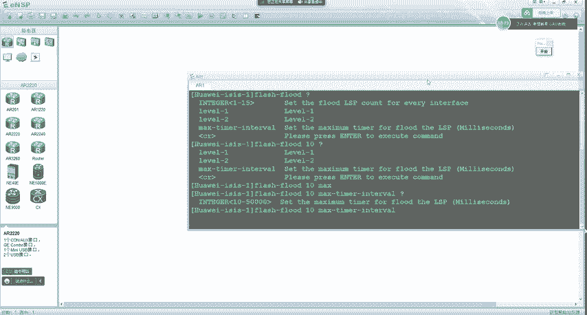

是吧那你这个定时器设置为多久呢？大家要注意啊，这个单位是毫秒。呃，我们可以去设置呢10毫秒到50啊，不对啊。啊，对，10毫秒到。5万毫秒啊，就是50毫秒之间。对，那么比如说呢我们设置为5秒。123。啊。

这就是5秒。飞车。那这样的话就代表它是针对于级别一和级别2同时进行开启的。

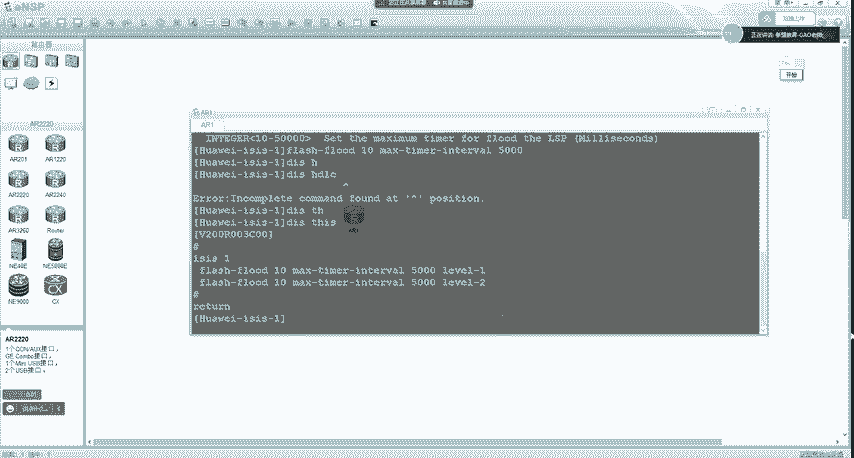

那这样代表什么意思呢？我来给大家解读一下。这样就代表着我这个路由器啊。😡，嗯，我开启了RSSP的快速扩散是吧？级别一级别2都开了。😊，嗯，现在我怎么样呢？是吧？相当于我们给他下了一个规则，对吧？

你是公交车师傅。😊，啊，现在我就跟你说啊。😡，呃。每满10个人的时候是吧，没有超员10个人的时候是吧？呃，你可以呢就是允许你超载10个人。对的。比如说未来呢A21他现在就收到了。IP。假设收到了11条。

我们当只是做么这么一个假设啊。假设他收到了11条。那么由于我们配置了预值为10啊，那这样就相当于A2一就知道了啊，这10个人呢我可以先放10个人。对不对？那这时候呢A21呢。

比如说我们这不有1个50555秒吗？啊5秒啊。对吧AR1在这5秒超时之前，对吧，你们十个先走吧。😡，对不对？就是顺水推舟，对不对啊，做个人情，你们十个先走吧。然后这一个呢啊不是我针对你对不对？

上头有规定，只能走10个。😡，是吧咱们是随机挑选的，所以呢你就再等等等咱这个定时器超到期之后啊，我再把你送走。😡，能懂你意思吗？所以说前十条路由呢，一旦收到之后啊，前十条RSP啊。

就直接传递给邻居二了啊，直接就进行泛红了。然后最后这条路由呢它比较冤曲是吧？但是也没办法，哎，轮到你了。所以说呢你等等等咱这5秒到齐之后啊，我再把你送走。😡，所以这样我们可以去看到的是什么呢？

这十条路由一旦先推走是吧？那二就可以很快的先把这十条路由啊，十0条LP计算出来。😡，对不对？那这样可以保证的就是某些路由啊，或者说某些业务啊能够先恢复。而你这一个呢，就是你还得再等等，对吧？

我先让一部分人富起来。😡，是吧啊，其他的人呢等我们这个时间到了啊，比如说我定100年的奋斗目标是吧？那我们先让一部分人富起来。😡，那你这一个怎么办呢？😡，我们有100年的奋斗目标，100年到期之后是吧？

我就把你扶起来，所以就类似于这么一种情况是吧？5秒到期之后，我就把你送走。😡，所以这个意思大家明白了吗？明白同学敲一啊。没问题吧。😡，嗯。所以这个呢就是我们所说的RSP的快速扩散特性。

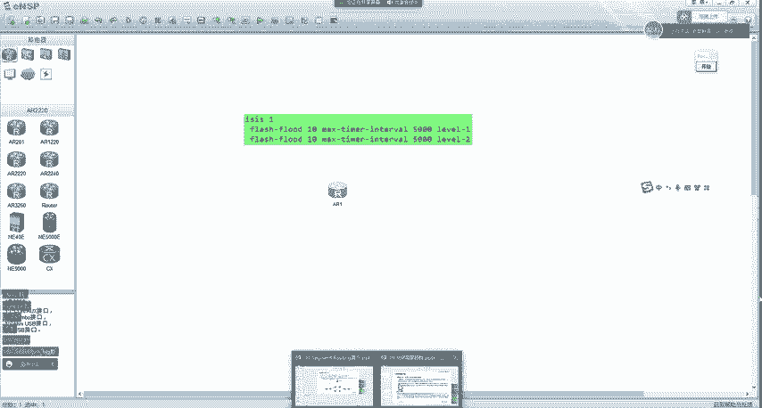

那么它可以在整体上对吧？啊，在宏观上啊，可以去提高路由的收敛速度。嗯。对吧啊，当然这个呢只是随机的啊是吧？啊，就相当于我们当年改革开放一样。😡，那选哪个地方，那不是指哪打哪吧，对吧？啊。

指到你这个地方啊，那你就付，对不对？实际上也是随机的。😡，呃，那接下来我们又要说的一个叫做ISS的路由控制。那这个呢在我们学OSPF的时候呢，实际上内容是差不多的。注意啊，实际上内容是差不多的。

比如说我们之前在学OSPF的时候，我们要去调整cos对吧？啊，用于做选路啊，那么或者说呢去做这个过滤啊，对吧？呃，或者说呢做这个。外部路由啊，或做引入啊，或者说做缺绳。那在ISS中呢。

也是有相同的一些控制。我们来看一下啊。SS的路由控制。包括我们所看到的这几款。当然有些内容呢呃是各位同学已经学过的。比如说怎么样调整ISS的优先级是吧？就路由优先级啊。😡，啊。

怎么样呢去调整ISS的接口开销值啊，就ISSco。啊，怎么样设置等价路由啊，这个可能还没有接触过。那待会我们会去讲到。那路由渗透是吧？这个实际上就是我们在IP的时候所接触到的叫做路由泄漏。

实际上是一个道理。缺省怎么通高啊，怎么样引入啊啊，怎么样去做过滤。

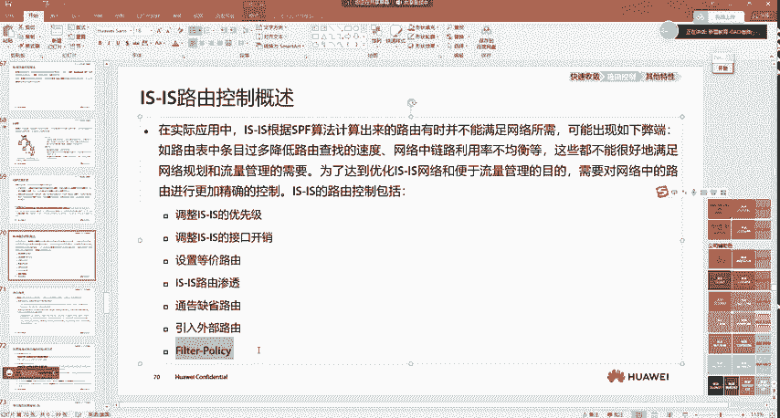

那我们就一点点来。那首先我们讲的第一个啊啊，对，剩下的就是5秒5秒之后统一进行发送啊。对，没错。呃，他是发剩下的20条啊，赛先生是发剩下的20条，他只是让小一部分人先走了，是这么个意思啊。😡，是。好。

那我们就继续啊。呃，首先我们说的第一个呢叫做等价路由。这个等价路由呢嗯。我一说这个呢，我今天想到了一个同学的问题啊。😊，呃，这个同学是问了这么一个问题啊，当然是不是咱们这个这一期的我记不太清了啊。😊。

呃，叫做负载均衡。和负载分担。啊，有什么区别？嗯。🤧对吧。啊，大家都听过，老师负载均衡嘛，是吧，负载分担。😊，哎，他俩之间啥关系呢？😡，嗯。是吧。呃，我来给大家解释一下啊啊不是不一样。😊。

首先大家要知道啊。😡，负载分担。那么他是多个人同时的，什么意思呢？我举个例子。比如说呢我现在工作比较多啊，我有100%的工作啊，就是我有100件事儿。那现在呢我让你帮我完成30%。

那你是不是帮我分担了一部分？😡，是不是啊？是吧那这种我们就可以叫做分担。负载分担是什么意思呢？就是它是没有明确比例限制的。😡，对意啊，他没有具体的比例啊，你帮我分担了1%啊，那也是负债分担。

你帮我分担了99%，那也是负债分担。😡，啊，而我们所说的负载均衡呢，注意啊，那它是负载分担的一种特殊实现形式。为什么我们这么说呢？😡，因为对于负载均衡来说，也是你帮我分担的一部分。但是呢咱俩是一人一半。

对，没错。😡，啊，叫做五五开是吧？平均分配。对不对？也就是说你一半我一半，对不对？那这种呢我们就把它叫负载均衡。😡，但是对于负载均衡来说啊，大家要记得。他只是一个理想化的状态。他只是一个理想化的状态啊。

啊，为什么我们这么说呢？😡，呃，我举个例子，比如说我们一般负债均衡怎么分啊？怎么翻？比如说现在啊。我有。ECMP是吧啊叫做两条等价路由。那这时候我们默认就会去执行附债银。是吧而我们习惯性去说是吧。

执行负载分担。哎，为什么不去说均衡呢？来给大家说一下，比如说呢在我们传统的负载分担上都是基于流的。😡，是吧那有没有这么一种可能呢？我有一条flow一，还有一条flow2是吧？有这么两条流。

那flow一呢，它的这个流量非常大。😊，是吧。那flow2呢，它的流量小。是吧这种我们一般会把它叫做大象流。和老鼠流。Yeah。嗯。老鼠流啊。那这时候我们基于流去负载的话，哎，你就会去发现，对吧？😡。

啊，什么样的问题呢？那这种老师就是负载均衡吗？😡，是不是呢？嗯，实际上也不是。对吧为什么我们说不是呢？😡，虽然我们从流的角度上去看待的话，它就已经负载均衡了。😡，对吧但是我们从这个流量的大小去看待的话。

它是没有办法去实现完全的55份的。对不对？是吧那有同学就问了，老师，我基于包的。😡，对不对啊？鸡包哎，左边一个右边一个，那这时候应该够好分了吧。是不是啊老说我这边发一个，那边发一个是吧，一人一次是吧。

谁也不多，谁也不少。是不是那这时候他有没有负债均单啊啊，不对，有没有负载均衡啊，实际上也是没有。是吧哎，因为包还有大小呢。啊有大包有小包呢。但是呢我们可以去发现的一点。啊。

只要一般我们去说这个流量大小的话，会有大象流和老鼠流是吧？比如说基于流的话，可能这一条流走的流量非常大。哎，这边走的比较小。那这样的话他就没有那种就是他的这个差值的比例还是非常高的。

但是基于包的话可以变得更精细。是吧他可以变得更精细。😡，你甭管你是大象流，你是小老鼠流是吧？那你们都会从两边都去走吗？对不对？但是我们站到包的角度再去看呢，嗯也没有办法完全的区分。那有同学就问了对吧？

老师我基于比特翻。😊，没有这么让分的。是吧你的一个包得是完整的啊。你能给予比特犯吗？所以不行。对不对？所以说呢我说负载均衡呢，它只是一个理想化的，就是我们只能尽可能的去平均网络中的流量，对吧？啊。

让大家走不同的路径。😡，但是呢比如说我能不能实现完全的这种。负载均衡啊呃，实际上这样是不可以，对吧？但是我们可以尽可能的去。平均呢。是吧那比如说我有两条路线，我基于留。那家比如说这边走个大流是吧？呃。

下面走一个小的哎，那有没有可能未来再来两个流，这是flow一，这是flow2。那flow3是一个大象流，它走了下面，flow2是一个老鼠瘤，走了上面。哎，有没有这种可能呢？是有的。是吧。

但是这种呢我们也不能让它叫做完全的负载均衡。所以说大家一定要注意啊哦一般我们说负载均衡呢，只是说的就是尽可能的让它的流量变得更加的均匀一些。嗯。嗯，这里大家明白了吗？明白的同学敲一啊，没问题吧。😡。

然后我们回到正题。对吧啊，接下来我们要说的呢是ISS的等价路。那么等价路由一旦出现之后呢，我们就可以去执行4载分担。对不对啊？那这个它是怎么样的呢？实际上跟我们在学OSPF的时候是一样的道理。

就是对于SS来说，如果去往一个目的地。那么它具有两条路由的话，设备默认就会去执行负载分担。这个功能呢也是需要我们去开启的，但是默认就开着啊，就是我们有命令可以去调控它。

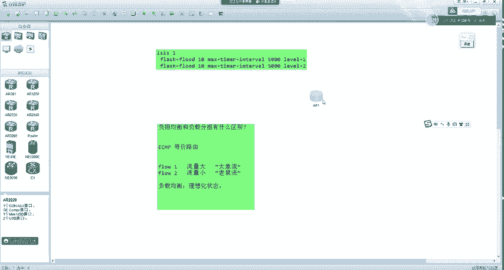

你可以在进程下呢max是吧？lower balance。😡，然后你再去设置，你最多能够允许几条等价路由。比如说我们敲了个把。默认9是8条。啊，比如说我敲个2。那么这样就代表着什么意思呢？

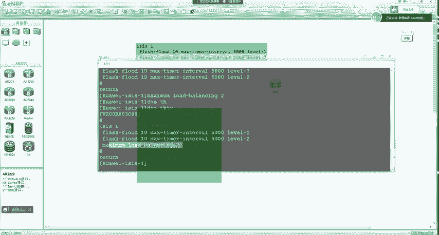

比如说现在我有两条路径。对不对？那么有两条路径的时候呢，我就在两条路径之间执行负载分担啊，默认基于哈希的，说白了就基于流的对吧，一个流走同一个路径。啊，那这就是ISS中，实际上跟OSPF是一样的啊。

很简单，就是我们在进程下呢。

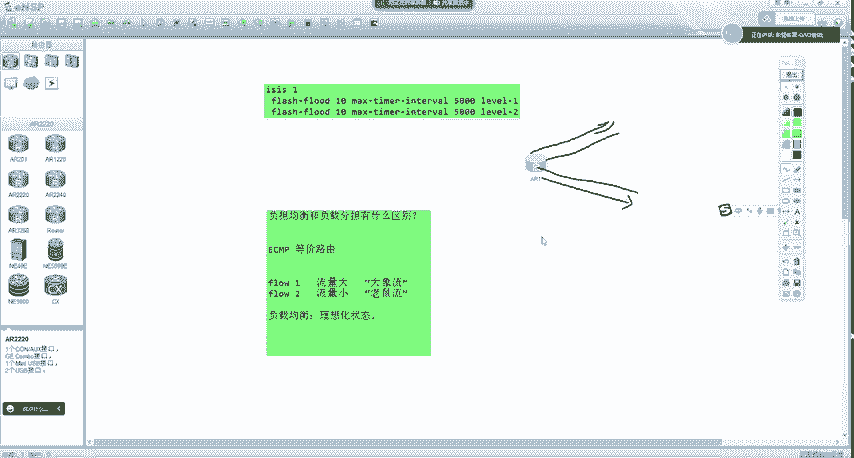

去配置。负载分担的路由数量默认。可以同时支持。Yeah。八条。不担。是吧那有同学就问了，那老师有没有非等价负载分担啊？😊，是吧因为我们说出了所有的负载分担。它都是建立在等价路由的基础之上。是吧。

老师有没有非等价400分担呢？实际上是有的。注意啊，实际上是有了。那在思科里面有一种叫做EIGRP协议啊，它是支持非等价负带分担的。而对于华为的设备来说呢，嗯就没有这种功能。所以这里大家知道啊。华为嗯。

不支持。非等价。负带分担。如果用思科的设备，他是可以的。嗯。😊，所以这这一块啊，然后我们把课件里那个嗯文字描述啊，大概的来看一下。嗯。嗯。这都是废话啊。😊，来，我们来看这里啊。😊，那么在华为里面呢。

我们有一种方式啊，就是可以去配置。等价路由的优先级。对呀，去派置等价率等优先级，他是什么意思呢？😡，比如说啊。我现在是这样的。啊，就老师啊，我现在。这里呢我都跑了ISS。是吧。呃，下面有个4。假如说呢。

一呢他学到4。4的环回口路由，4。4。4。4-32。呃，那么在这时候呢，在A2一上会有两条路由。啊，应该是一条路由两个吓一跳，4。4。4。4-32。啊，然后我们有自己的。Nice hope。啊。

其中一个呢是2。2。2。2，我就用滑油口直接来写了啊，你设编号。还有一个呢，是3。3。3。3。那现在这不是等价路由吗？系吧。那AR一执行负带分担啊，21份31个21个31个。但我说的是刘啊，不是包。啊。

那比如说老师我现在负带分担了啊，好像没什么问题。但是有没有其他的问题呢？比如说现在我有这么一种业务要求。不是啊。那个小王啊。对不对？嗯，我们这个就是你领导在看监控呢啊。你之前可能教过他一点。

而咱们这条链路的这个带宽利用率啊有点高。😊，是吧因为未来我们在运维的时候大多都是图表了。是吧。然后呢，未来可能这里呢还要去接入其他的这个伙伴。比如说呢未来二要去接入其他的伙伴。是吧。

或者说二审后呢要去接入其他的业务部门。但是这条链路现在目前的带宽利用率有点高啊，就是我希望呢。哦，不让你去改cos，为什么呢？因为你一旦改了cos，它对于全局都是有影响的。😡，为什么这么说呢？😡。

比如说现在假如所有链路cose的都是1，我想让他走下面的链路，我把这个改成11。那他影不影响3到2的宣读啊？严强。是不是啊？是吧那有没有一种办法，就是不修改cos的时候。😡，能让等价路由做到主备呢？😡。

是吧。比如说上面这条链路作为备选链路，而下面的这条作为主链路。我想让你在等价路由的基础之上啊再去做到储备。😡，啊，我们就可以去修改他的下一跳优先级。啊，那么也叫做下一票权重。他是这样的。

比如说呢现在我可以在ARE上，因为你现在同一个目的地啊，有两个不同的下一跳。是吧。我可以让在二上配置的下一跳更优啊，我更次啊次选。那让三这个吓一跳呢派成优选。当然他们都是由数值进行调控的啊。

比如说是X跟Y。那么在这时候，A2一在执行选路的时候啊，它就会把这个优选的进行加表，而次选的呢就不会进行加表。那流量能不能切换到下面来？完来就切换下来了。那下面故障之后呢，我们还可以跑上面去。对吧。

那这个怎么样去做呢？😡，🎼嗯，我们就来开一下是吧，开一下设备来做一下啊。嗯。Yeah。

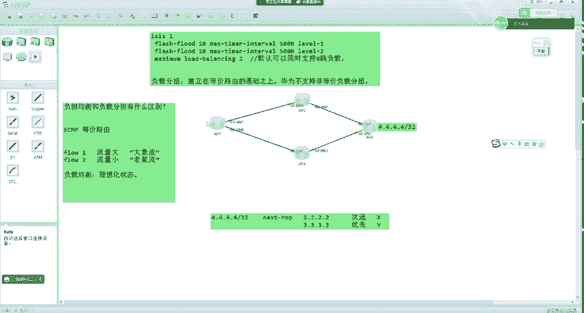

嗯，1234那，我们等他开机一下啊。嗯嗯。好了。Yeah。哎。咱们这个前段同有个同学还问了我一个问题。呃，我把这个问题转交给各位啊啊，大家想一下。啊，就是老师，你比如说现在我这个图啊。😡，嗯。

1到4是负载，4到1也是负载。是吧。Yeah。那大家觉得这个来回路径不一致，有没有来回路径不一致的问题啊？有。有肯定有啊，不是没有肯定有啊。是吧啊，有。Yeah。24。4。对吧那咋办呢？对。응。

Okay。

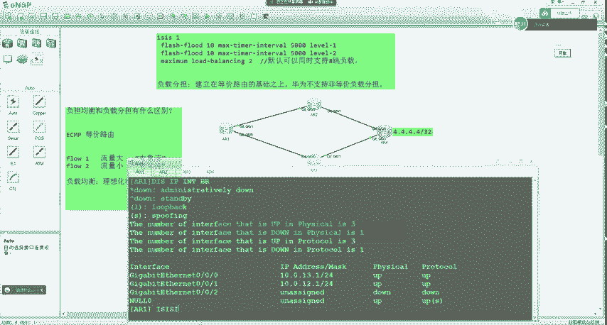

有种话。是吧很多同学一下子就掉到套里了。我给大家说一下啊。😊。

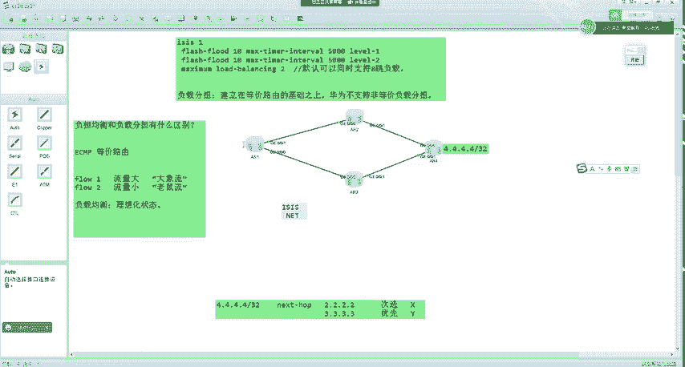

。嗯，如果是这张网络呢，它确实是有来回路径不一致的问题。

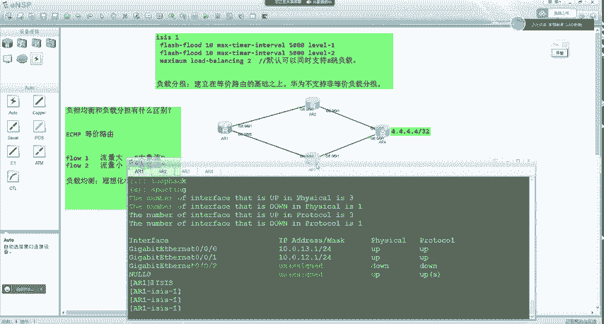

对，但是他不受影响。

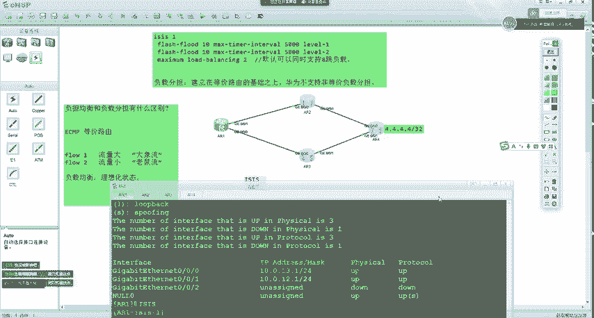

嗯，给大家说一下啊。呃，他是这样的啊，就相当于我们之前有一句话叫做既要马儿草，不是，既要马儿跑是吧？啊，又不给马儿吃草。对不对？呃，这属于在网络设计上啊，你就应该去考虑到的。

是的如果你比如说我们现在没有防火墙啊啊，那么来回路径一不一致，也不会导致什么样的问题。是吧？大家基于流负载呢，链路的利用带宽利用率呢也会变得更加的均衡。是不是？就是它本身就是一个矛盾的问题啊。

你想提供负债分担啊，但是你还想来回路径一致。😡，你这种需求本身就是存在矛盾性的。😡，能懂吗？就是。你既然想要负担分担，就得去接受来回路径不一致。除非你认为的需要去调控他。是吧比如说老师啊。

我通过PBR对吧？是吧啊，让某些路由这样走啊，那也是针对于某些流量的。就看你怎么样去执行负债了。😡，你比如说我举个例子啊，一这边有个1。1，有1。21。2，我让下面作为主路径，1。1向上面作为主路径。

这样行不行啊？这样行。😡，是吧然后回包的时候也这样回。这样也可以来回录音一致。但是这样的能不能负载分担呢也可以。😊，对不对？也可以。但是呢这样需要人为的去介入。但一般网络，你比如说我们有负载分担。

来回路径不一致，会不会有，我觉得实际上是没什么大问题的。就是你在设计网络之初呢啊就得去考虑到。是吧啊就跟你一样，你想挣钱呢，你还想不想干活。😡，那能行吗？是吧你既然想要负载分担啊。

你就得接受来回录音不一致。啊，你想要挣工资呢，嗯你就得接受是吧？

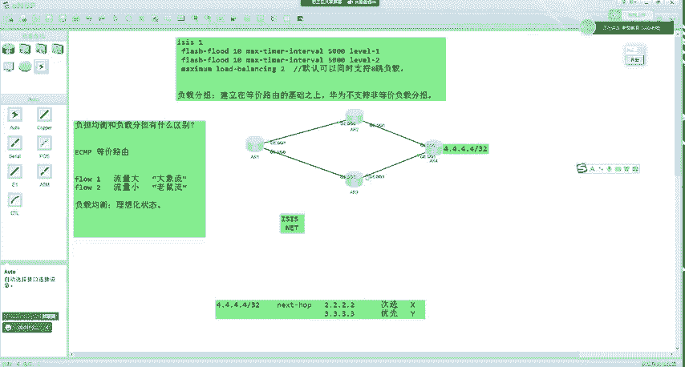

就接受得天天干干活。啊。所以这里大家知道啊啊一定要去问明白，问清楚客户的需求是什么。啊，你别来回来，我给你做完是吧？我跟你说，我给你做了个负载分担啊，你给客户这么一说。😊，🤧嗯。可我还觉得你胡来。

是吧一定要去问清客户的需求啊。呃，衣上我们有一些配置啊，我先给它删掉。Yeah。아。

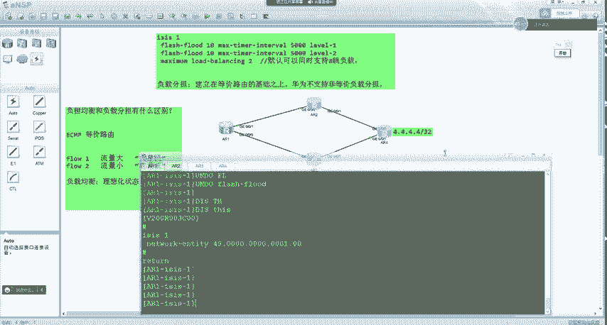

。嗯。嗯。

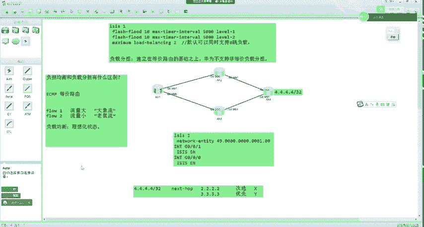

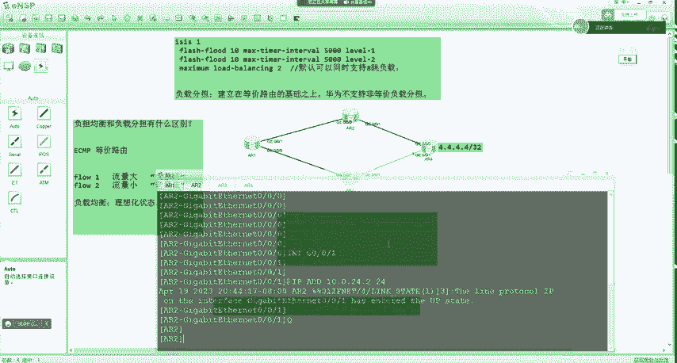

嗯。Yeah。嗯。

好，那我们来看一下啊，现在在A24上呢有1个4。4啊，然后我在一上呢，现在默认的cos的都是10。

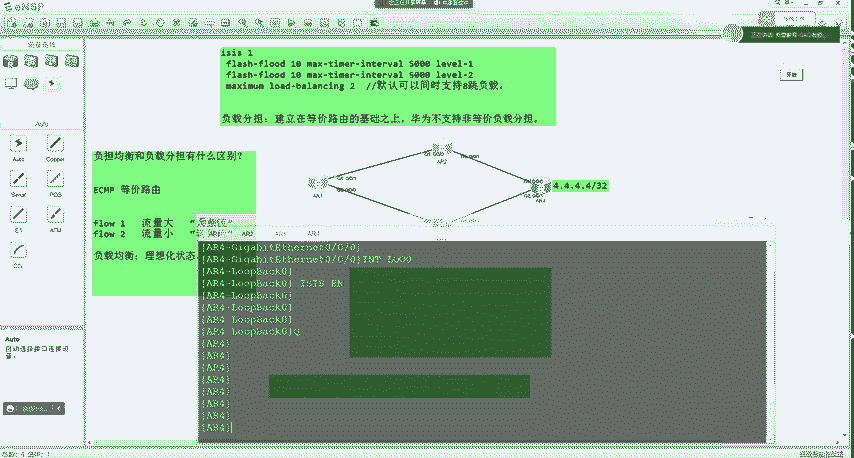

是吧。嗯，没有。我来了。嗯，但是没复杂。嗯，来了啊，比较慢啊，反这有我们刚刚所说的5秒来一次嘛。啊，然后我们来看啊。😊，那现在呢A21去往4。4是附载的。对唔对啊。啊，但是呢我又不希望去修改cos的啊。

就是我怎么样去做到主备呢？比如说我让下面的作废。Yeah。🎼Yeah。然后我让下面的做主卧。

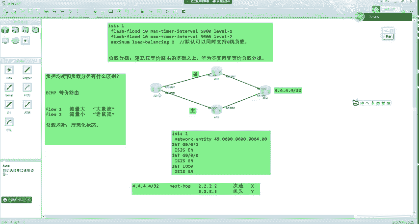

这时候我们在ARE上可以这么去做啊，就在ISS进程下叫做。嗯。Nice hope。应该就是nice hope。nice hope。啊吧，然后去针对于特定的吓一跳。比如说这两条路由的区别在哪里呢？

就代表他们的吓一跳不同。

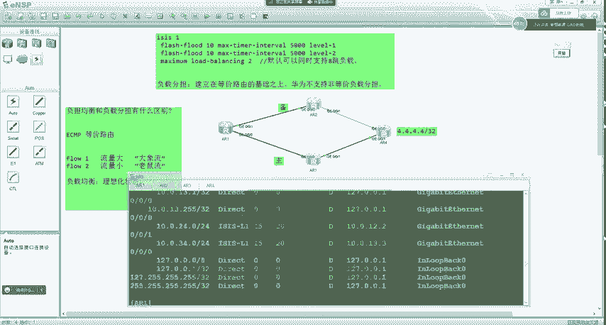

是不是啊？然后比如说我现在配着3。呃，nice hope。10。0。13。3。去配着他权重。嗯，这个权重呢有时候我们也把它叫做优先级。比如说我派成200。

然后我们displayIP routinetable。来看啊，现在加表的就是3。对吧。老师越大越优还是越小越优啊，我来给大家说一下，看好了。😊，Nice的 hope。嗯。10。0。12。2。权重。对啊。

比如说我给他配成100。😊，第是了IP如定去吧。然后我们再来看他走了谁啊？走了啊。

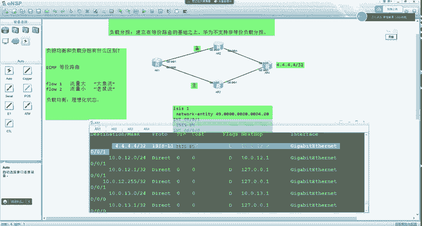

是吧。然后大家再注意看。首先根据这个实验啊，大家能够发现。😊，Qunzhong。嗯。越小越优。是吧。

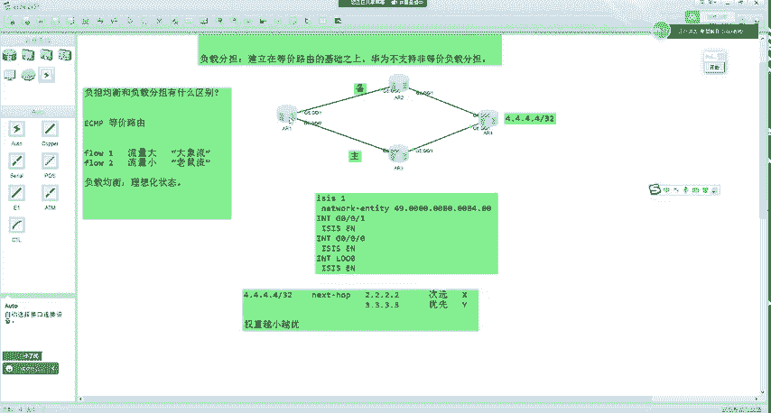

，然后我再给大家去测一下，比如说我现在做个实验啊，看大家能猜出来我要给大家说什么吗？😊，对呀，比如现在and don hope10。0。13。3。嗯。安都。13。3刚安度掉了吧。然我nice hope。

10。0。12。2权重，大家注意啊，我的权重范围在1到254之间越小越优。比如说我们配成最次的254。然后我回车。Yeah。我只针对于二配置最差的权重。然后三枚配displayIP。会天梯噃。

我没发现走了谁啊？做了谁啊？嗯。走的是2。是吧。所以这证明了什么？

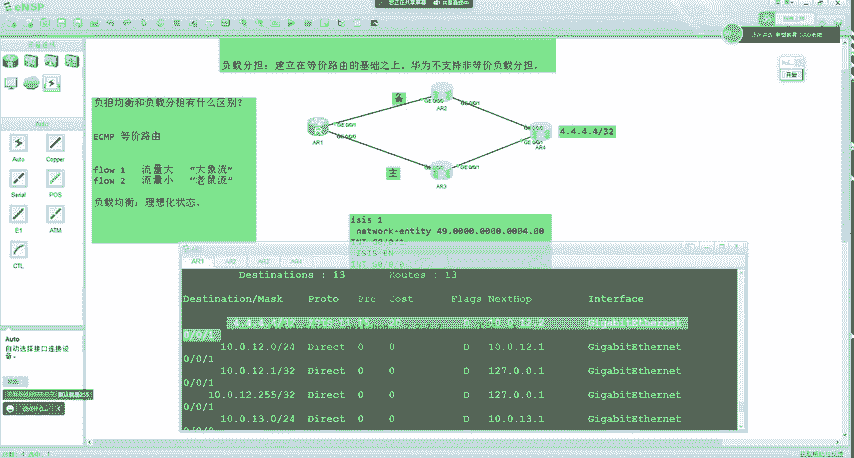

是有同学说出来了。对，没错。如果啊有同学没看过这个手册的话，因为在手册上会有这么一个记录啊。啊，如果有同学没看过，你应该会这么样去理解。对吧啊，最小的权重。或者说。数值。最大的权重。啊，也优先于。

普通路由。对不对？那实际上我这里要给大家说的啊，就是实际上呢默认权重它就是255的。这里大家知道啊，所以你甭管什么样的路由，只要你给它配置了权重，它一定是优先于普通路由的。为什么呢？因为我们最差的权重。

他是多少？

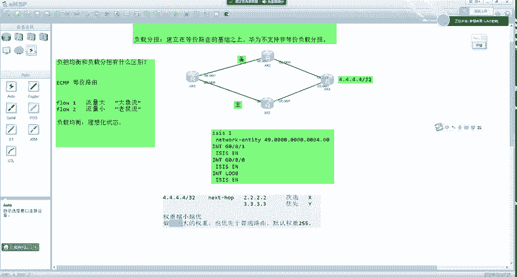

刚有同学看到范围他是多少？是254。

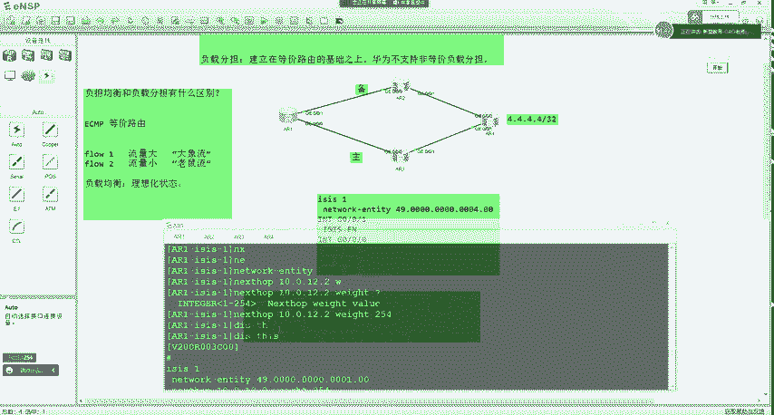

没错。所以这里大家知道啊。

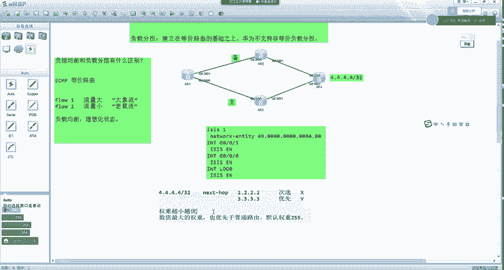

嗯，那我们刚接触了一条新的命令啊，针对于下一跳去配置权种植。

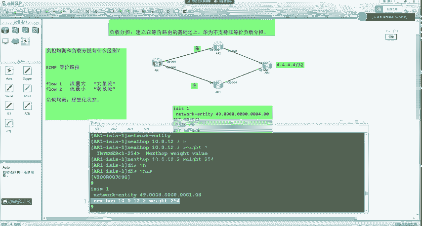

啊。那这里呢。默认。权重为255。嗯。权重。或者数值权重的数值。数值越小。优先级别。越高。注意啊，所以我们把它叫做越小越优啊，但是大家平常在记笔记的时候，我建议你们把就是数值跟级别的关系去写上。

叫做优先数值越小。

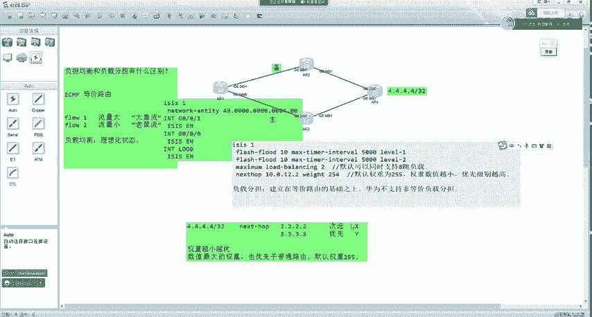

优先级别越高。你不能说越小越优，那是数值小。是吧嗯，还是级别小呢。对吧所以大家知道啊，一般我们会说数值越小啊，那么它的级别啊优先级别就越高。

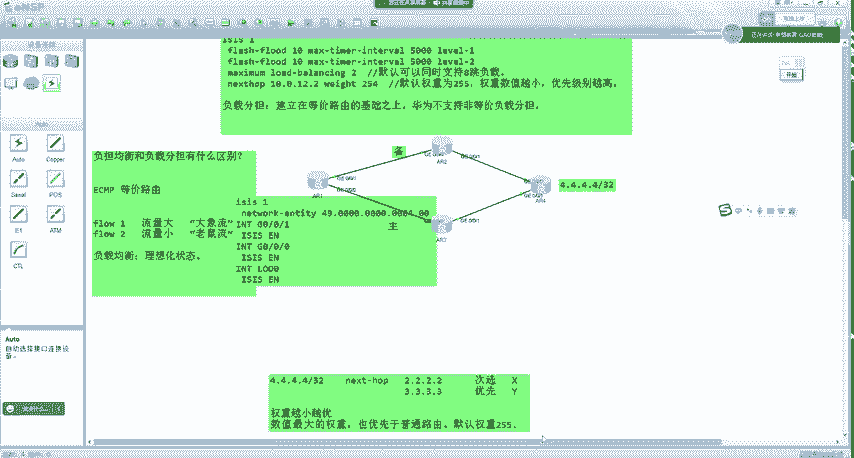

嗯。呃，这是等价路由这一块啊，所以说呢在我们配置了优先级之后呢，就不会去采用负载分担了啊，就会把流量呢传给优先级最高的下一条，实际上他这里所说的优先级呢。啊，就是我们刚刚所说的权重的意思。

为什么课件里写优先级呢？我给大家解释一下啊啊，因为老有同学呢我发现会对一些术语啊特别纠结。😊，啊啊总感觉自己拿的不是特别准老师我。对不对？或者说老师平常说一个啥，你还觉得老师跟官方讲的不一样。😊。

对不对？官方明明叫这个术语，你非要说这个术语我给大家解释一下啊。呃，优先级呢就看大家怎么样去理解。那权重本身是不是也是优先级的一种表示啊？对不对？我举个例子啊。啊，BDP你会发现很多书上啊，包括手册上。

我们叫做对等体。是吧BDP的对灯体。那一般我们都说叫邻居。是吧这又是为什么呢？我来给大家解释一下。😊，呃，大家知道啊，就是我们现在所学的技术啊。啊，可以说百分之八九十都是国外的。啊。

因在我们国内啊很少有这样特别。就反正现在大家学的八九十都是国外的。嗯，基本没有国内的事情啊。啊，当是你会去发现呢。对，没错啊，有些人呢这国外的一句话呢，你翻译过来意思不一样。😊，是吧啊。

比如说一个单词儿。那可能是这个意思，也可能是那个意思。是吧每个人的翻译是不一样的。所以说就会导致我们这个。对于一些技术的叫法啊会产生一些差异化。啊，比如说递归啊啊迭代。嗯。之前还有谁说不一样。

实际上有什么不一样的？啊，实际上就是一个意思啊，就是翻译上的区别。这里大家知道啊。呃，行，在这一块啊呃这是我们所说的等价路由，这里大家都理解了吗？理解的同学敲一啊，都没问题吧。😊，好。

那我们就休息一会儿，然后下面是配置啊，我我带大家简单去看一下。这面临实际上刚我们都。呃，接触的就是怎么样去配置这个负载分担路由。啊，啊怎么样去派的权重？啊，但是有一点需要注意啊，对于ISS来说。

比如说我们配摄的是两条，但是我有3条等价路由，这时候他会按照这个顺序去做优选的。首先选择的呢叫做。选取优先级小的路由进行负载分担。啊，是路由优先级啊。那然后再去选择的呢是下一跳设备的系统ID。

比如说我现在三条路由有不同的下一跳。啊，我会去比较他的系统ID啊，系统ID小的路由进行负带分担。然后再去比较。接口索引。这个接口索引是什么呢？呃，就是接口号大家知道，比如说我0-0-1。

那零式索引还是一式索引啊？对，一亿才是索引。对，没错，这个才是编号啊。这是卡槽号吗。啊，这是。那个。嗯。这卡槽是吧。啊，这这是啥？啊，中间这个记不清了，中间这个是子卡是吧？应该是子卡号啊，这是槽位号啊。

对啊，这是子卡是吧？啊，对，最后才是借口号。所以这他们区别啊。嗯，等价路由的配类举例呢，实际上咱们刚也做实验配款是吧，实际上就一条命令啊啊，你敲了负载均衡之后呢。

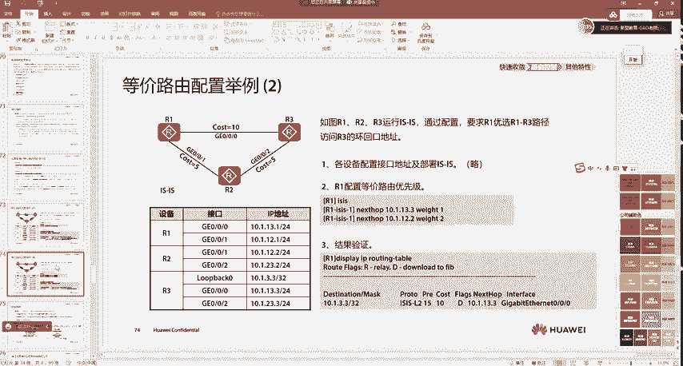

呃，他就会负担了。啊。啊，或者说呢你也可以去调整权重啊，调整权重去控制它的选度。嗯，那咱们休息10分钟休息会儿吧啊，十分钟之后呢，我们来讲一下这个缺省路由。休息会儿吧啊。好，那咱们就继续开始了啊。然后。

呃，接下来我们要说的是ISS的缺省路由。嗯，SS的学生和OSPF的产生呢还有点不一样。呃，大家在学这个IP的时候，应该学到了一个这个ISS的叫做ATT比特威。系嘛。呃，我们把这个来说一下啊。嗯。呃。

这个ATT呢大家应该是比较熟悉的。它主要的作用呢是这样的。就是在我们的ISS中呢。有这么一个特点。呃，什么样的特点呢？就是它有点类似于OSPF的sstarer是吧？啊，叫做自带sstarber区。

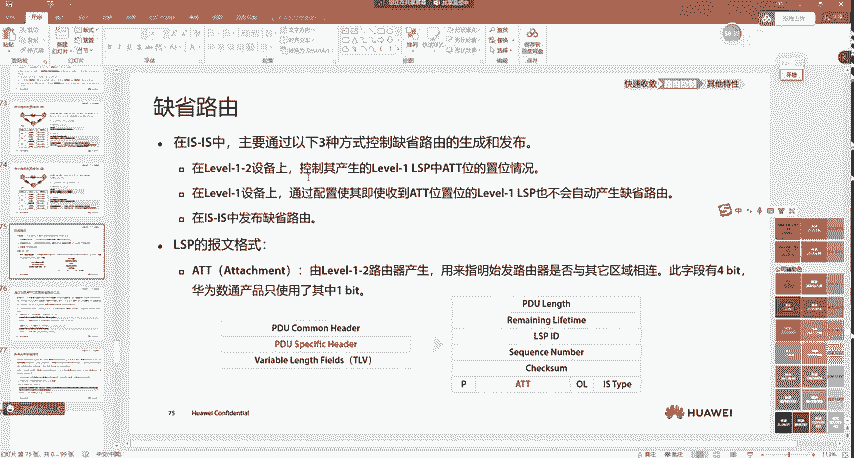

嗯，假如说呢。我们现在。比如说这是1个SS网络啊。

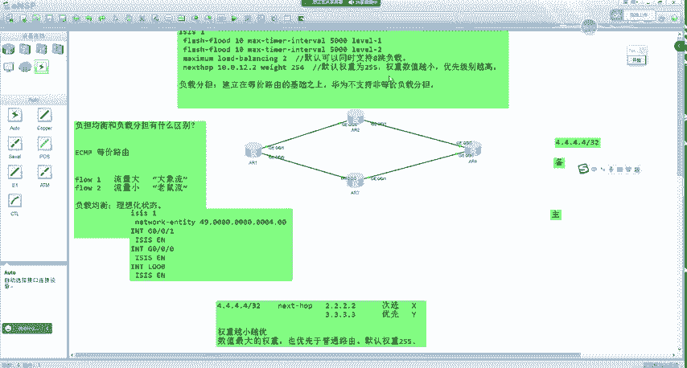

呃，我们把区域来规划一下。比如说在这里呢是一个级别12的路由器。啊，这边是一个级别12。呃，然后A21呢作为级别一的路由器。L1，然后A24呢，它是做为一台GB2的路由器啊。

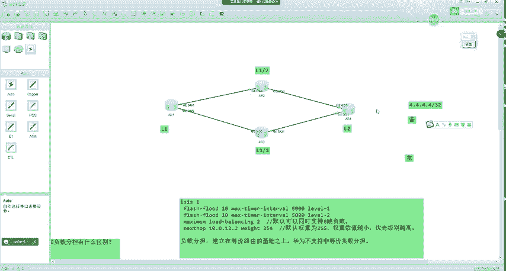

呃，现在呢我们在AR一上这么来做。我先把他之前的SS那个。把下一跳权重给他删了啊。然后我们去改一下他的路由器级别是级别一的。然后A24这边呢改成GB2的。Itlive。

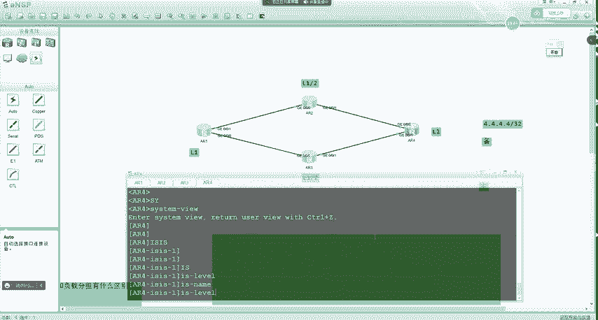

啊，来吧。而默认23呢都是级别压的路由器啊。所以现在呢我们可以去看到。我当前的区域规划是这样的。嗯，这边呢属于G别1，然后这边属于GB2。级别12路由器呢就是类似于这个OSPF的AVR1样吧啊。

既在骨干区，也在非骨干区。

是。嗯。啊，这个四的区域ID还得改一下啊。Undo network。呃，49。0000。0000。0004。00。啊，n49。000。1。0000。0000。000。4。00。啊。

我们这边呢用的是49区。

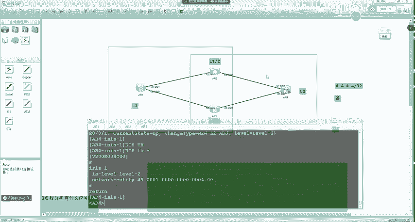

呃，这边呢用的是49。0001。现在是我们物理区域的规划啊呃，然后逻辑的区域的规划，现在这个框里呢是GB2啊，这个框里呢是G别1。呃，在SS中呢，当我们有一条这个骨干区的路由。

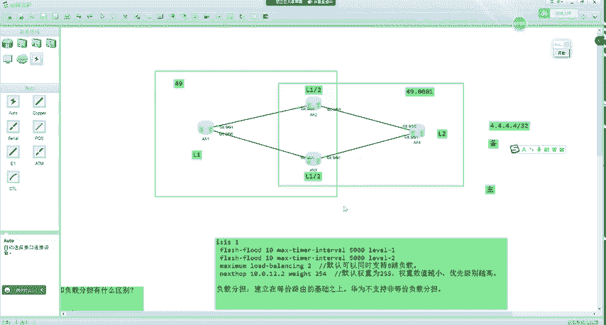

啊，比如说在GB2的路由。嗯，他们都会传递到级别ER路由器上。

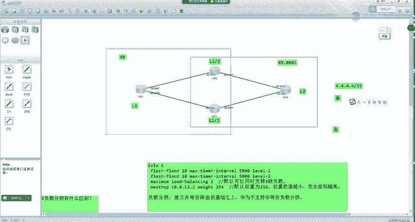

而对于我们的非骨干区域呢，你直接去聘是吧，你发现也能够聘通事啊，但是呢如果我们去看路由表呢，你会去发现呢diplayIP table它没有4。4的路由。是吧而是有两条缺省路由嗯。

这个大家在IP的时候应该学过对吧？就是。

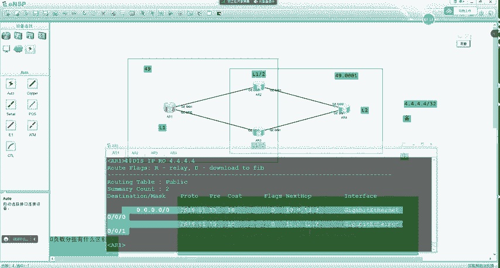

嗯，非骨干啊去访问非骨干的时候，比如说在于1。1，级别12的路由器呢会把级别一的叶子啊放入到自己级别2的ISP中。所以说A24呢能够计算出1。1的明细。

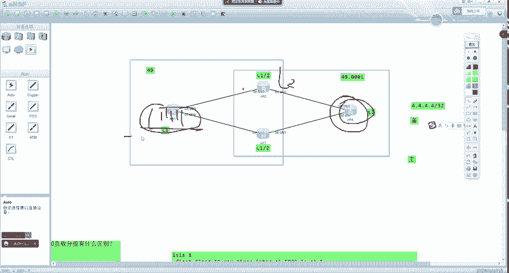

是吧比如说我们在AR一上呢，起一个interface6百0。1。1。132啊，然后启用SS。然后现在四呢，它是能够计算出来1。1的。是吧。而针对于A21呢，他没有办法计算出来4。那这里的原因呢。

是因为他有两条缺省提供他访问的，所以我们可以去聘通。

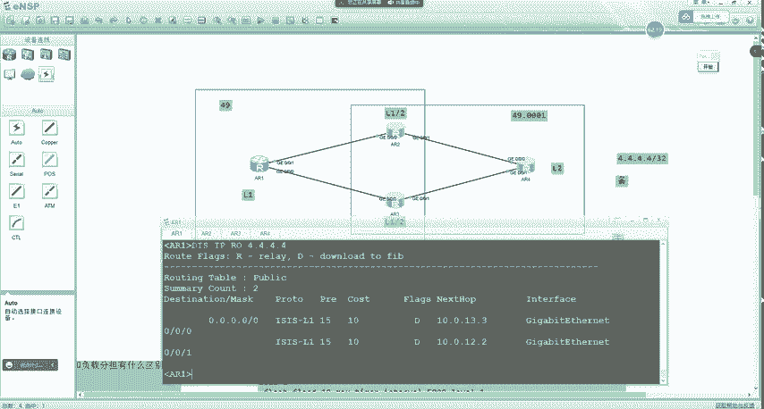

嗯，这个缺省是怎么样产生的呢？实际上我们到G别E2路由器上一去看的话就明白了。

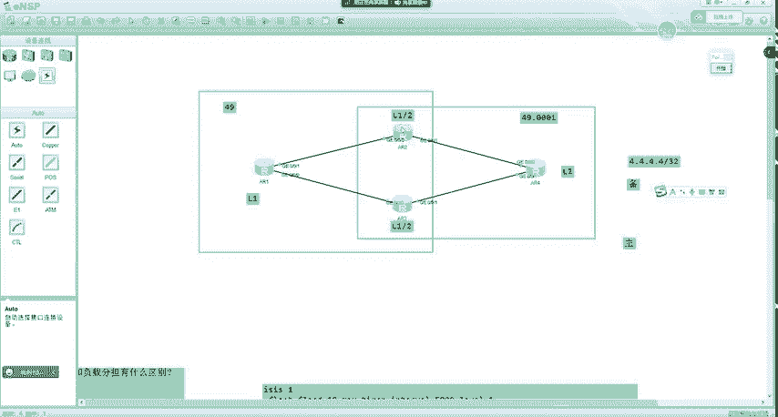

呃，我们去看AR的LSDB去找级别一的啊。

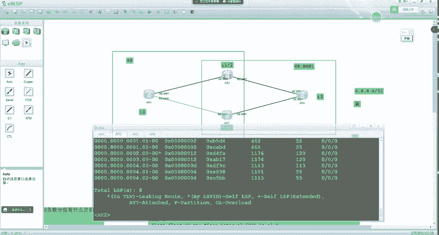

你发现他自己产生的RSP呢就有这么1个ATT比特。啊啊他已经是质一的。对不对？那这质一所代表的意思啊。

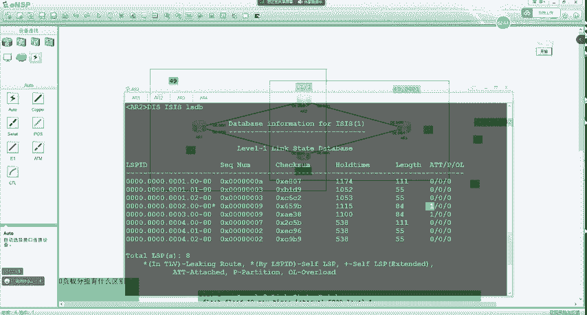

就是。有这么一条规定。首先对于级别ER路由器，我们首先要搞明白的是就是它什么时候才会质疑。嗯。那这里呢需要去满足一个条件啊。就是级别12路由器需要存在。就是。不同区域的。GB2邻居。

才会产生ATT等于一的LSP。所以我们可以去看到呢，二呢它是在49这个区域的。是吧那存在了一个不同区域的GBR邻居，所以说它产生了一个呢ATT等于1的RSP。而对于级别一的路由器呢。

它接收到ATT等1的LP呢，会在本地啊产生缺省路由啊。第二个条件二大就是级别一的路由器。那么。收到ATT等于一的RSP将会产生缺省路由。缺省路游的吓一跳。指向。该。RSP的产生者。

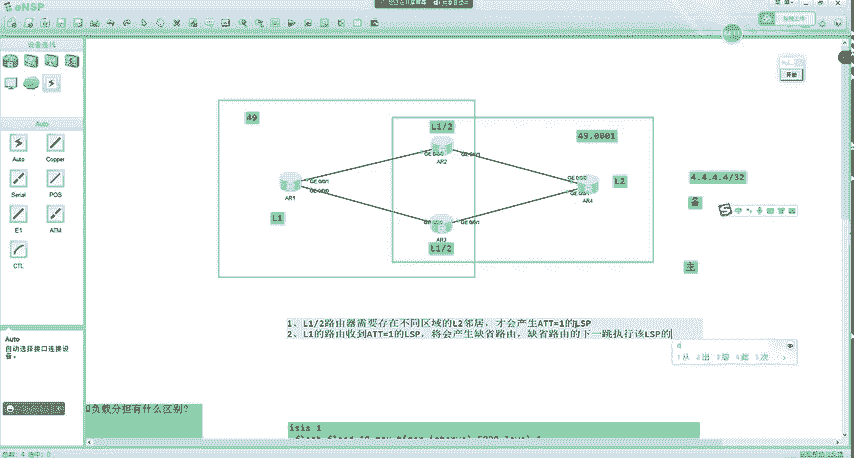

。所以我们可以去看到啊，在A21上A21的最短路径数中，它去往二的下一跳是10。0。12。2。所以我们可以去看到有一个缺省的下一跳是12。2啊，当然三也是一样的啊，还有1个13。3。

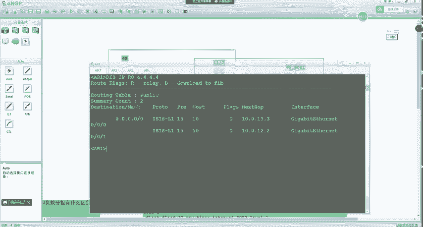

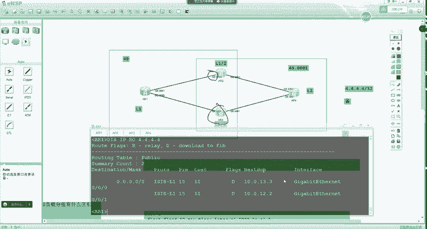

那这个ATT呢，这是他默认的行为啊，就是当我们去满足这些条件之后呢啊它自己就会产生这些，这是他默认的行为。呃，但是对于这个ATT呢，我们也可以去做出一些控制。对。就是提供这么一种功能啊。

但是我们一般很少去做。呃，首先提供了第一种功能，就是我们可以在级别12路由器上去设置ATT的置位条件。

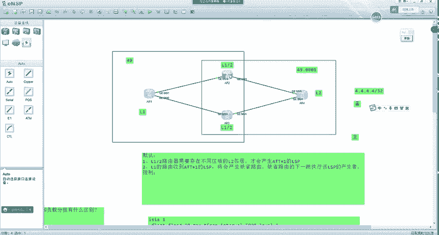

啥意思呢？比如说我们加一个通告是吧，加个alway。那这样就代表着。嗯，他总是在通告。

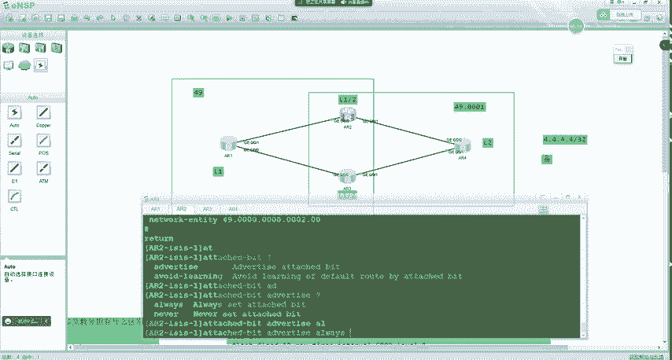

为什么我说总是在通告呢？大家注意，我现在把二的线删了。

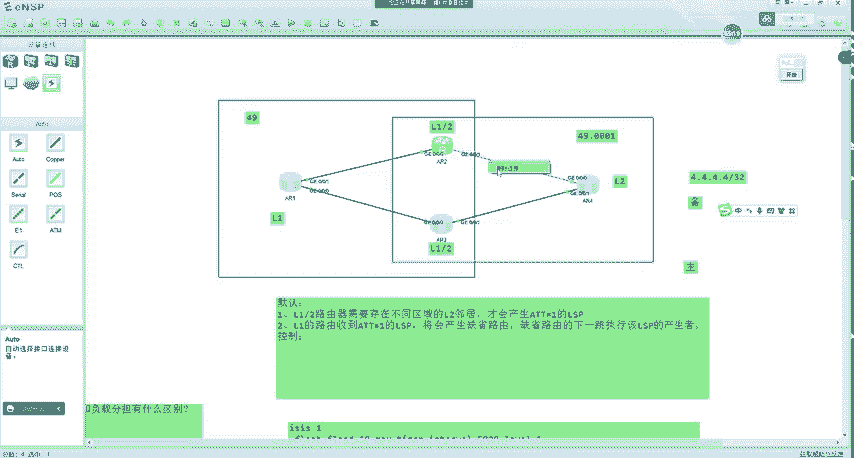

上了之后，二还有没有GBR的邻居啊？大家觉得还有没有没有了，那我们去看二产生的LCDB。他产生的这条RSPATT就不质疑了。是吧。但有没有这么一种可能呢？老师啊，我这个二我虽然没有连接了GBR。

但是我是连接外部网络的。是吧。我这个全省路由的目的呢，就是让我的一一访问外部网络的。是吧。那这时候呢，我怎么样让二再去产生呢？实际上我们有这么一些控制的方式。第一个就是我们刚刚所说的ATT对吧？

通告的时候加al。那这样就代表了它总是在通告ATT等于一的RSP。对吧那这时候如果你去看一的话，它还是负载的display IP table。领到领到领导。对不对？那还有没有其他的控制方式呢？

实际上还有。就ATT我们在通告的时候呢，还可以加下面这一条命啊，这条命令什么意思呢？比如说大家注意啊，三现在它不是默认通告吗？😊，啊。嗯，但是现在我不想让你三通告。得唔得。就有一天我把三的缺生给他干掉。

但是他默认通告，我怎么样控制三不通告呢？所以我们还可以通过下面这条命。那一旦在三上配置之后呢，RSDB。你发现呢三就不再产生ATD等于1的P了。所以对于AR一来说，它的缺省路由就只有指向二的。啊。

这是第二种控制方式。

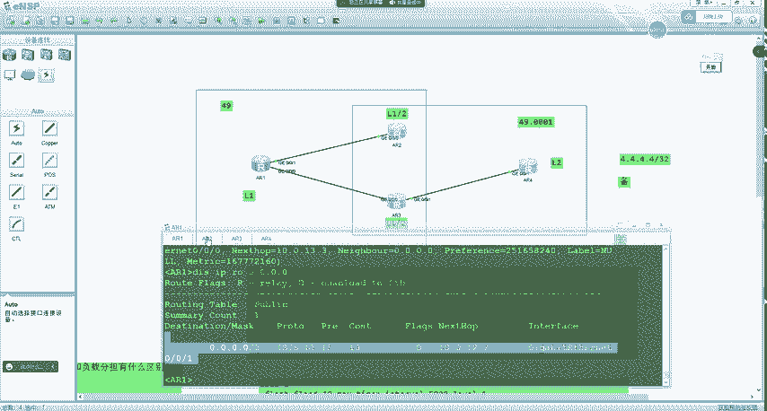

所以我们把这个命令。写一下啊。那第一个。对。第二个。这里呢是取消。ATT的通告。啊，或者说总是。啊。这是总是。通稿ATT标记。是是吧。那除了这些还有没有呢？啊还是有。而这是在级别12上控制的。

有没有控制AR一的呢？就是我不让他计算啊，你通告了，我不计算啊，有没有这种可能呢？也有。😊。

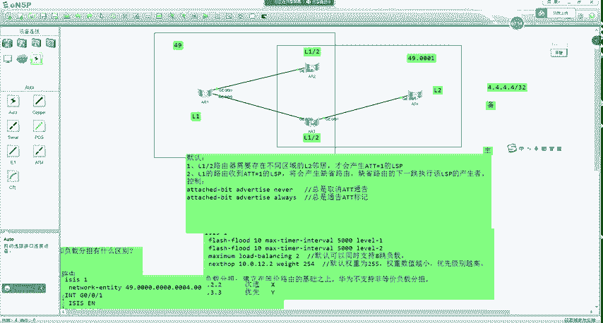

给大家说一下啊，就是我们在AR一上呢，还可以去拍一条命令。先注意啊，我们现在是有缺省路由的。是吧嗯在级别一路由器上呢，我们也可以去控制ATT。啊，加下面这条面的啊。Yes。

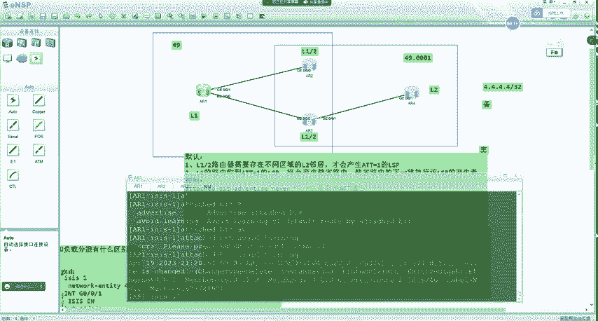

那这条命临的作用呢是忽略对ATT比特的计算。Okay。

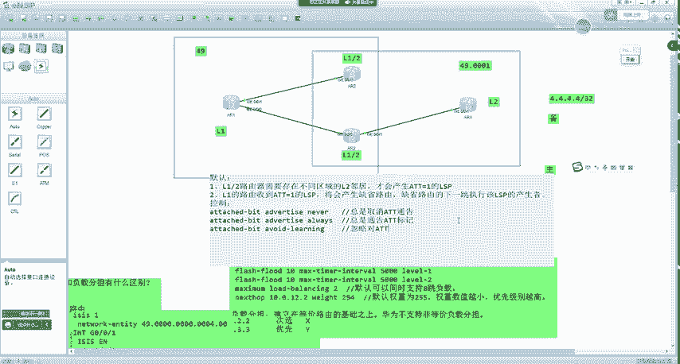

Okay。那到吗？所以这时候我们来看一下，在ARE的LSDB中。它是有二产生的ATT等于一的GRSP的。但是如果你去查看一的路由，那你就发现没有。

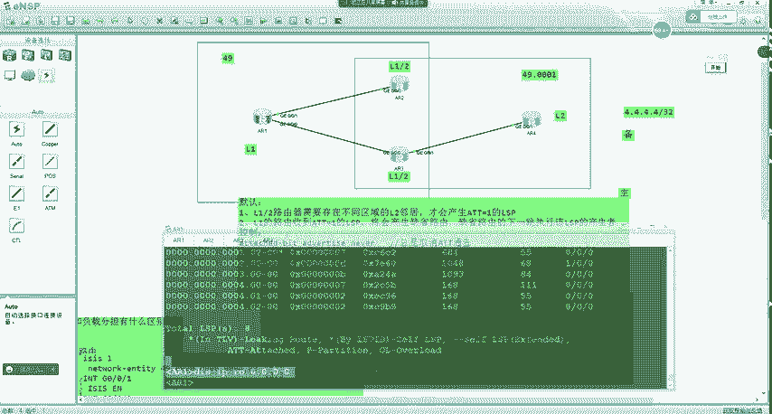

是吧。那这条命令呢大家要注意啊，如果我在GBR路由器操有没有作用啊，大家觉得。实际上是没作用的啊，这里大家知道。😊，因为ATT呢，它只在GBE区域中才有用的。

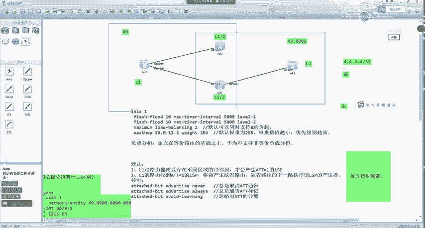

然有GBR就没用的了。所以这里要注意啊。嗯，这是我们所说的这个ATT比特。

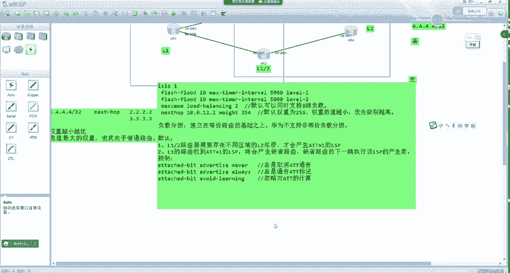

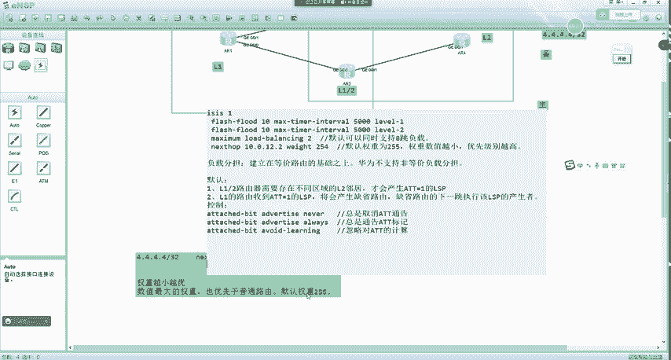

然后我们再继续来看。那除了这种方式，还有没有其他的方式呢？老师除了ATT能让ISS产生缺少。是吧还有没有其他的方式，实际上也是有的什么方式呢？我们在OSPF里学到一种吧？老师，比如说我现在都是GBR。

😊。

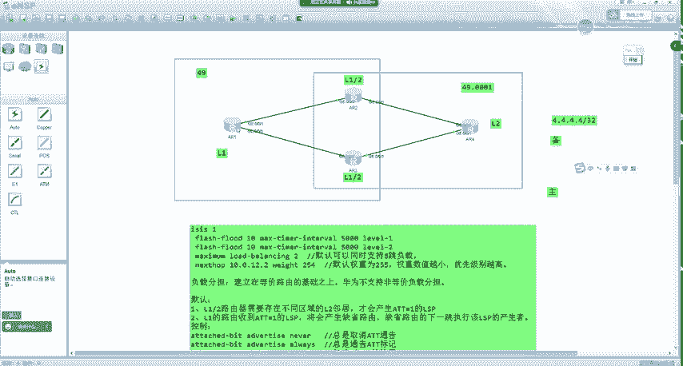

啊，我没有级别一了啊，大家都做G别2的路由器。😊，是吧SS is live live2。啊，我们把其他杂七杂八的配置给它删掉。😊，Okay。

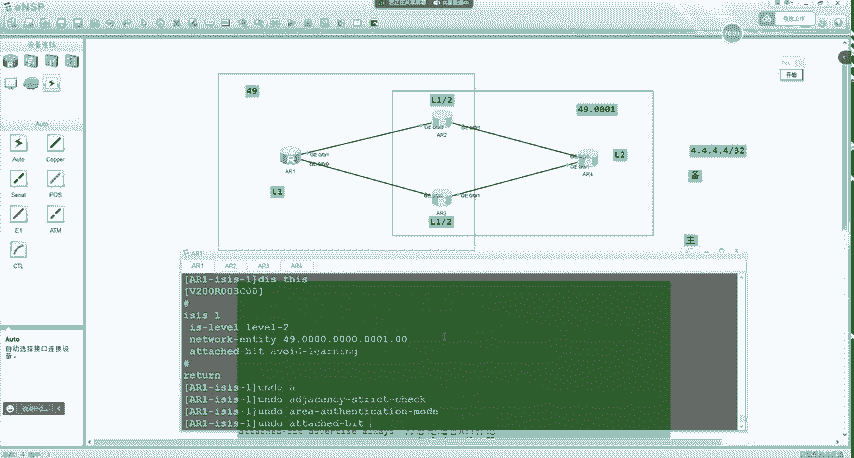

因为GBR在建立的时候呢，它不要求区域ID一致。所以说呢我们都可以是GBR的路由器。

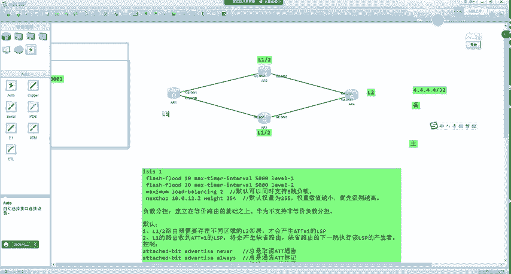

啊，大家都见GBR的邻居。是吧啊，然后我们把这台路由器也改成一边。Okay。嗯。Is live。来吧。啊，三也改成喇文。Okay。你是兰老板。

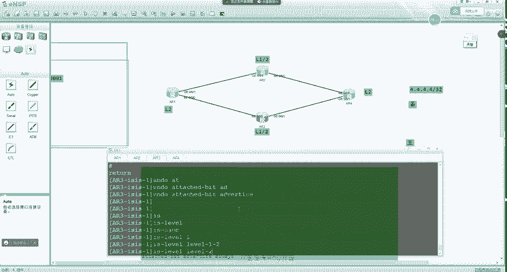

那大家都是GBR的路由器，现在我有这么一个要求对吧？嗯，我是这样的啊，这是我的区域规划，我们就不需要去关注它的物理区域在哪了啊。😊，啊，现在是我的区域规划。嗯。啊，当然这中间这两根线我只连一下啊啊。

就大家理解一下这个结构。啊吧呃比如说呢这是我的这个呃省级的是吧？双上行啊，不对啊，这个是可能就县级的吧。那假设是县级的路由器啊，县级的这个核心。啊，它双上行到这个市级是吧，然后这也是一个县啊。

双上行到市级。啊。那么在这时候呢，我们来看一下有什么样的特点。比如说在这里呢嗯我们假设这是两个。出口就你要像下一步一样呢去通告一下缺省路由。

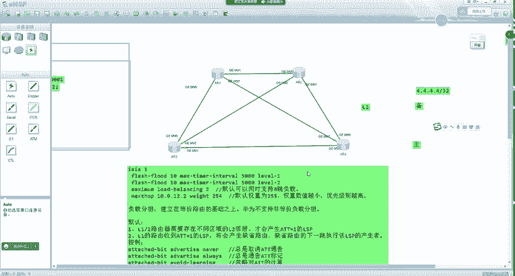

那么如果我们去通告全省录学的时候，现在都是GB2啊。老师，我质问ATT有没有作用呢？啊，我SS进证一下ATT啊，你甭管是什么玩意儿。对吧加个alway，我总是让他通告。但是你第playISSLDB的。

你会发现没有。

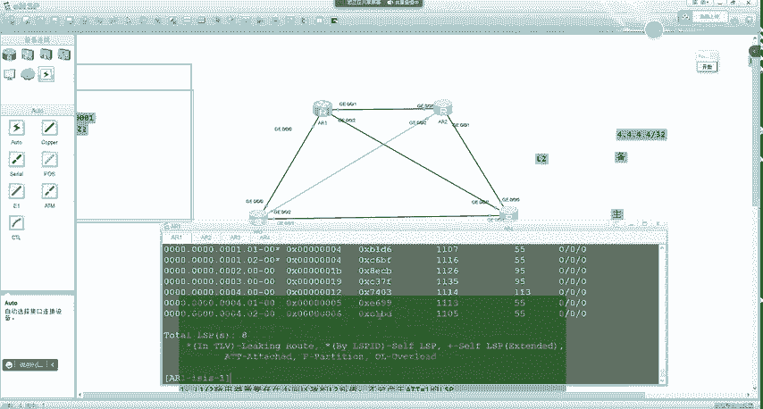

为什么呢？因为ATT它只在级别一中才存在意义。

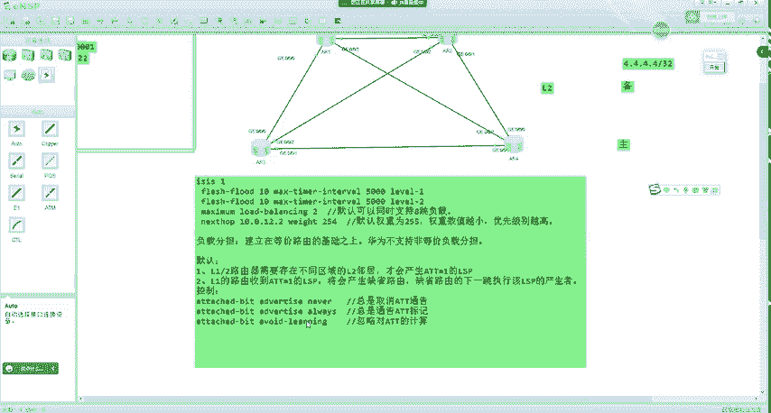

GVR你配了命令的也没作用。

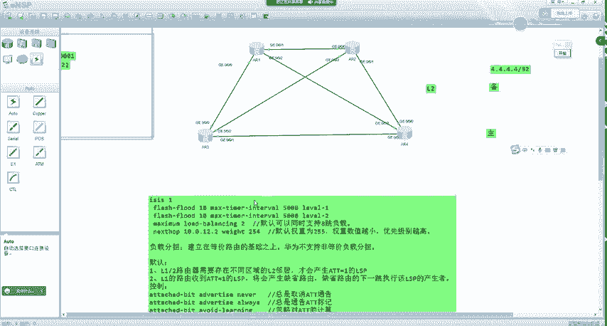

但现在呢我想让ARE去产生缺绳怎么办呢？我们还有一条命，这时候就不是通过ATT去控制了啊。等等。和OSPF一样的道理。就我们可以让他去通告一条缺绳路。

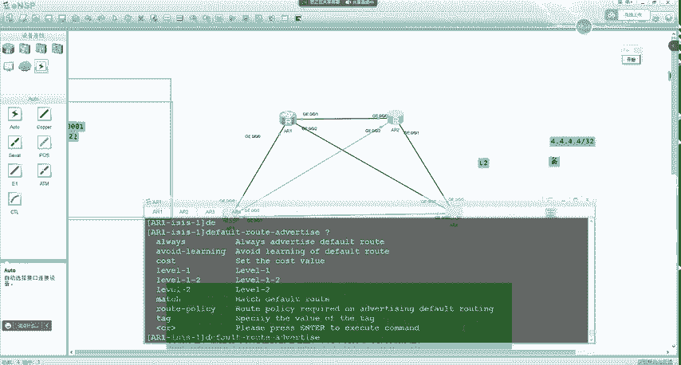

后面加了一些杂七杂八的信息。我把这个一一来解释一下啊。嗯，因为我们在OSPF中已经做过这些实验了所以说这里我就简单给大家说一下。

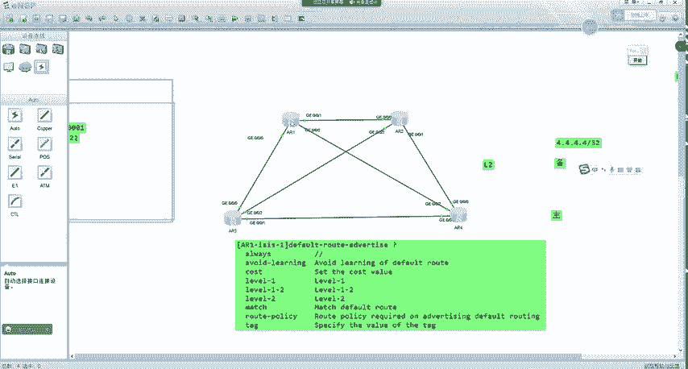

首先啊大家注意我没加位置，直接回车。那大家觉得二有没有缺少啊？大家觉得有没有？有吧。

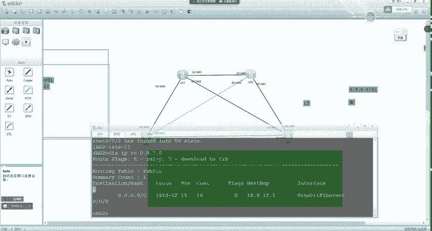

有。VR是有的。所以这里大家首先要关注的第一个点啊啊，如果直接回车的话。直接回车自带。always是功能。对吧但是呢你也可以去单独增加一下啊，比如说我们这时候直接去产生加个alway啊。

有没有做有就是在这个命令里面会不会显示呢？实际上也有显示alway。

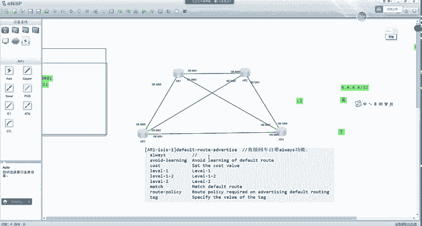

啊，但是作用是一样的啊，这里大家知道。

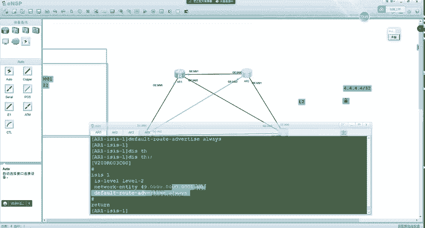

OSPF呢，它不是自带al功能啊，但是对于ISS呢有这么一点。啊，大家记意的啊，子弹al置功能。那这个位呢，大家就可以理解成是类似于一种标志。

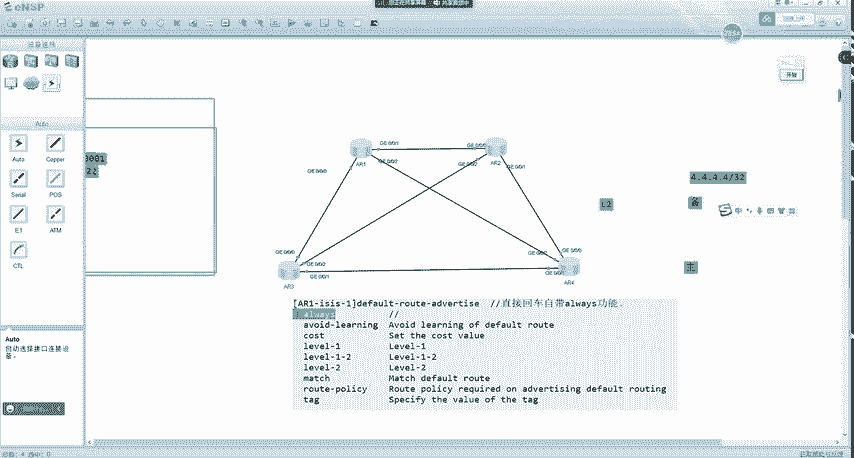

啊啊，比如说我去加上这个al之后呢，大家可以觉得就是更加容易去辨识一点。是吧这和OSPF的逻辑也是一样的，就是强制产生缺生路由。

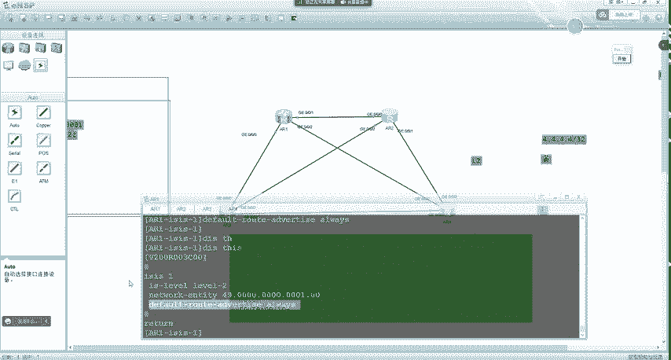

🤧啊。那cos的跟OSPF一样吧，这里我就不再进行强调了啊。对吧修改路由的扣s的啊，或者说你针对于级别一是产生，或者针对于级别二去产生，或者针对于级别一二去产生。对就你在哪一个级别中去产生缺生录标。

这是一样的。那在这里呢，我们还有一个ms，啊，就是max呢它可以去匹配一些参数。

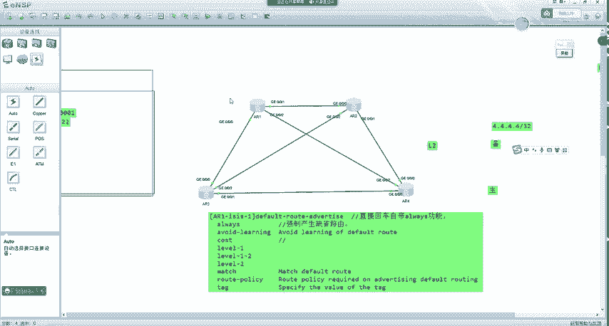

比如说我麦子。default，那大家觉得这是什么意思？比如说我这样配完之后，二还有没有缺少？有没有？没有了。对吧。

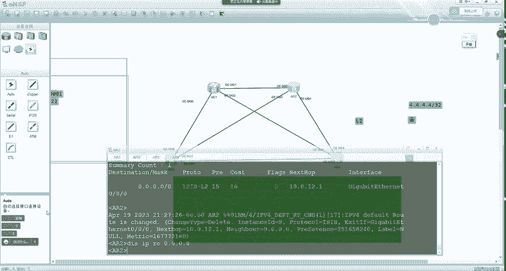

那这样代表的是什么呢？非强制产生缺省物油。对吧就是当本地存在的时候，那麦s后面只能跟depot啊，当本地存在缺省的时候呢，我才可以去产生缺损。这即别123我就不写了啊，然后扣s外伤。

然后ro policy也是一样的啊，你可以去匹配路由表，对吧？我们把它叫做条件产生缺认。你发现呢OSPF学完之后，SS就很快。对，你还可以去修改。嗯产生缺省路由的态。那这里大家需要注意啊，默认不带t。

呃，我在讲这个t之前啊，我就问大家一个问题啊，这个宽度梁窄度梁大家学过没？学了是吧。OK那我就简单说一嘴啊啊，就是大家要知道这个tag呢只有宽度量才能携带。Okay。啊，这有宽度量啊。才能携带太。啊。

那我们所要重点讲的一个就是这个参数。啊这不就不计算吗？老师是吧，不监听对吧？😡，嗯。是吧啊，他是干什么用的呢？之前我给大家说过一点。OSPF中，我之前给大家画了这么一张图。

这一这是2一给二产生了一个缺生，二给一产生了一个缺生。一会不会计算二的？会不会？不会是吧，二会不会计算一的，也不会干嘛呢呢返还的是吧？因为一旦计算二发给一一发给二就还住了。😊，但是在ISS中。

大家注意啊。

我现在在ARE上去产生缺省路由，加个alis。然后我在二上呢。OS不是OSPOSS键能下产生个缺省路由，加上alway。然后我们来看一下一的路由表，displayIPro table0。0。0。

一上面有一条缺绳指向了谁呀？指向了2。那二上面有一条缺绳指向了谁呀？指向了一。啊，两个人在踢皮球。对不对啊，你说给我，我说给你。那现在假如说我们随便去访问一个未知的目的地啊，192。168。1。1。

然后我们穿色的去跟踪一下路径，你会发现一个。是吧啊，比较神奇的现象，就咱俩之间呢一直在传。呃对。啊，就相当于。嗯。啊。喂，你给我我给你。那我们实际上可以发现，这无就是一个环路问题啊。是吧。

那OSPF默认不计算，所以它不能有这种问题。而对于ISS来说呢。他俩不一样啊是吧，我说他叫同父异母的呃俩兄弟。对不对啊，遗传基因不一样，我不能完全跟你一样啊，是SS如果跟OSPF1样嗯。

这个就有点不太好了啊，就有点抄袭了。所以说在这儿时候，我们会发现呢嗯出现了环路呃，但是这种环路老师怎么解决呢？😊。

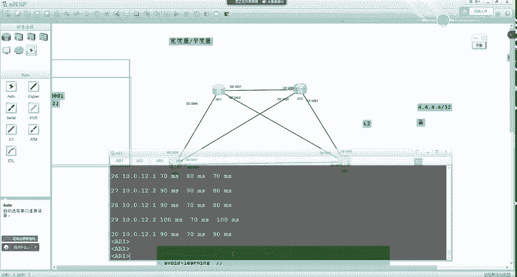

是不是？就网络中呢我们来注意啊，我两个出口三要不要学到到一的？也要学到到二的学生，他俩都得学到。所以说俩人都得产生，但是一跟二还互相计算。是吧产生的目的呢是为了让我们的三4呢能够提供。

对吧负载分担的路由。啊，但是二跟三呢，他俩一互相计算，那就完蛋了。那这时候就还路了。😊，是不是啊？这个问题我们怎么样去解决呢？注意啊，这就用到了我们新的参数。刚刚我们在讲ATATT有没有加上这个指令啊？

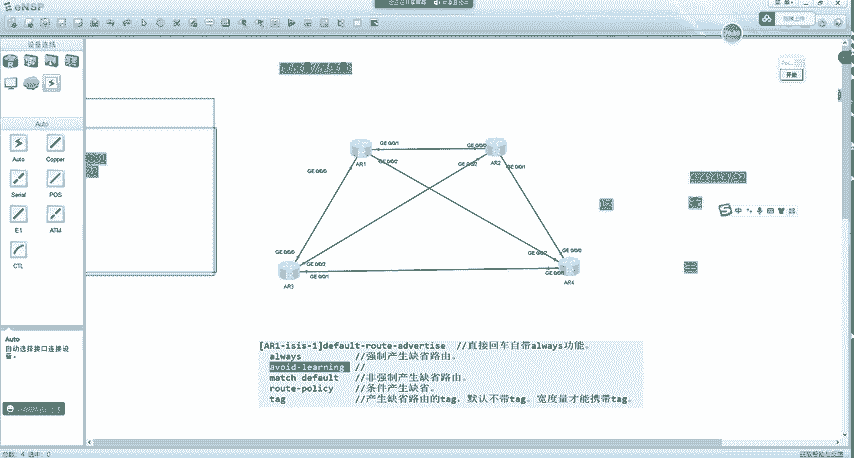

加了吧。那ATT里面加上之后，它就不计算ATT了。而我们在全省路由里面去加上这个指令之后呢。不要，他就不会再替算。该建程下其他路由器产生的缺失。所以说我加了之后啊，大家觉得二还会不会有一的缺少？会不会？

啊，不会。嗯，我们来看一下路由表，但是大家注意啊。这个理论本身是没问题的，2一定不会计算啊，但是这个时间现象，如果我记得没错啊，我记得好像是出不了。但是我记不太清了，所以说待会我们看到现象存在。啊。

那就更最好，现象不存在呢啊，这个理论是没错的。因为具体的这个实间现象我有点记不太清了。因为之前做过啊。现在我在二上去看一下缺什。那出现了一个好的现象。啊，那二还有没有计算一的缺少？是不是就没有啊？

那大家觉得一会计算二的缺什吗？Okay。会不会？依然是会的。因为对一来说呢，你没敲这条命。啊，所以说一依然会计算二的确失。对不对？那比如说我现在在一上有这么一条路由IP。router status0。

0。0。0是吧0。0。0。0只到了一个空间口0。就是我有一条静态的优先级是14。那大家告诉我，这时候一还会不会有指向二的学生。就不会了。是吧所以说如果一真的是连接了其他的外部网络。

我们能不能通过一条静态的优先级更高的路由给它指过去？是不是可以啊？或者说我在一2上都这样进行配置。

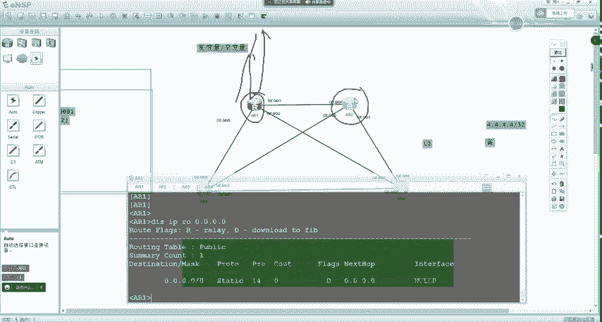

对不对？所以说在这一块。这条命令的意思呢，就是我们。啊，注意啊，没加位置，产生缺省路由。但是呢啊不计算其他设备产生的缺损。是吧。或者说不计算该进程项。什么叫做该进程下呢？

我们现在是不是在ISSE产生的缺少？如果有个进程2，进程二会不会计算其他设备产生的缺失？是会的。啊，对意啊，进程之间是分割的。能懂吗？这就是两，大家可以理解成就是两个路由器。

所以说这是我们ISS呢去产生缺省路由的一些方式啊。

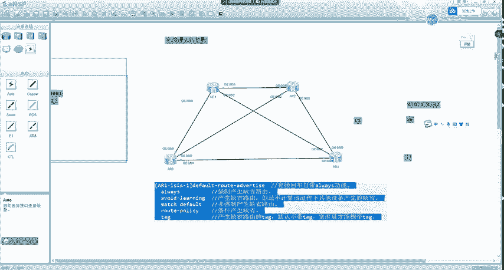

呃，以及怎么样去调控他？嗯。嗯，这ATT刚刚咱们都说过了啊。这就是我们怎么样去控制是吧啊，总是置慰疑总是不置为。啊，那么以及控制它产生的缺少。呃，发布缺审的这些指令咱们也都说过了啊。

然后在这里呢有一个实验，我们来看一下。呃，我们这张图呢在这里有个OSPF，然后在这边呢有个ISS网。那这是ISS的GBR，这是OSPF去一去零都行，实际上是一样的，因为单区域的。比如说在这的时候呢。

大家注意啊啊在让你不执行双向引入的前提下。啊，各位同学怎么样去提供他俩之间能够互反？就这个环水口跟这边的环水口的互？也不让你做路由引入啊。你怎么样你去做啊？你看右边答案。啊。是吧。

在20的OSPF和ISS进程下呢，都去产生一条缺绳。啊，然后他们都。访问难度做到2。那二呢既有OSPF路由，也有这个。呃，SS路由啊，所以说二呢能够提供这种转发。嗯。对不对？

所以说啊嗯这也是一种实现方式。能懂吗？也是一种方式啊。呃，那有同学问了是吧，哎，老师，那引入要不要做呢？实际上这是两种方式。啊，大家可以去选择。怎么样选择呢？我举个例子啊。😊，呃。

R一呢现在我的ISS可能有假如说有1万条路径太多了。是。嗯，但是呢还都需要有业务访问。那我直接引入的话，可能对于这个OSPF区域内的设备呢负担就比较重了。是吧反正OSPF弄过来也是一样。对不对啊？嗯。

那这时候我们能不能让他去产生缺省啊？那缺省路由它就只有一条啊。而不用去传递所有的明细。对不对啊？是吧所以说具体你要去执行引入，还是说像课件这种去产生缺什呢？嗯，以我的一个实际经历来给大家说呢，大多都是。

啊那有同学就问了，那老师为什么课件画了一个缺省呢？这就是很多同学容易有的一个误区。😊，你总觉得官方的就是对的。是吧。呃，或者你总觉得呢官方的就是有道理的。实际上大家。如果有这个想法的话啊。

那还是没学到头啊，还是学的不行。呃，我以我的一个切身体会给大家说啊。嗯，在我前几年学习的时候呢，这个华为的hiad手册呢，我会经常去看。啊，但是后来呢我发现有很多错的。所以说我会给他去反馈。啊。

然后他们进行修改。呃，然后还有一些同学呢，我给大家说一下。嗯。

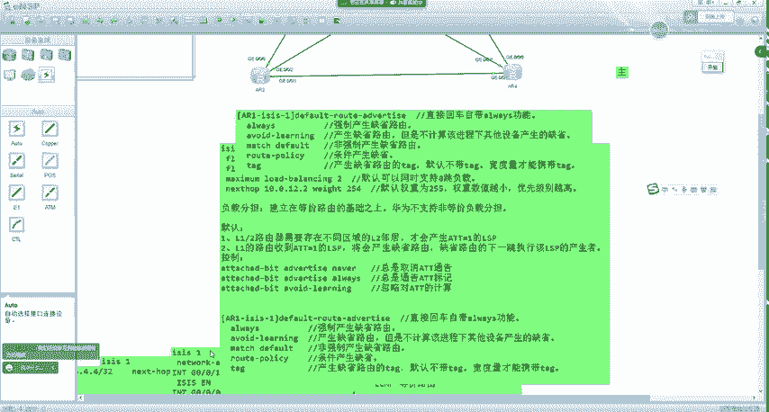

之前有一个同学啊，哪个同学我就不说了啊，跟不是我们在一期的。

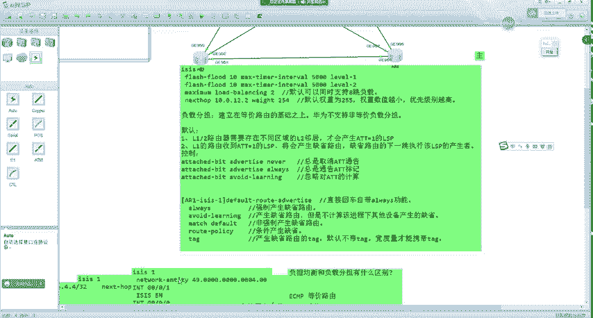

呃，有同学呢到这个CSDN上找到了一张博客。是吧啊，别人写了一个技术文章。是。嗯，他就来问我了，那老师怎么跟你讲的有点不一样？是吧。啊，后来我就给他说了一下。我说这个人啊，他可能还没有你技术高呢。

你得到吗？虽然这个平台很大啊是吧？也有很多非常厉害的人。但是呢。这个写技术文章的这个人啊，就是写这篇文章的这个人。他的技术可能还没有你高呢，因为他发那个文章，我是看了一下。啊，有很多的错误事项。

对吧所以说大家一定要保持，或者说秉持着一种什么呢？啊，叫做。也不能叫做啊就是。啊，也不能叫怀疑啊，就大家一定要有一种。啊，不能去完全相信，不要你觉得别人还要发布到晚上的文章。

你就要去相信这个实际上是非常错的啊。😡，大家能明白吗？那你心里呢对要有自己的判断。那然后我再来给大家说，那为什么课件会有呢？😡。

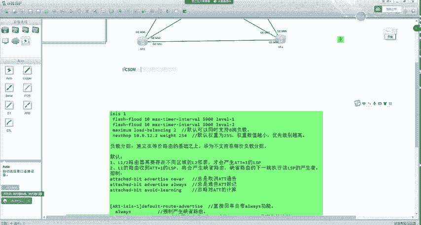

你觉得课件好像非常厉害是吧？呃，我这么来给大家说写课件的人呢。他也是一个打工的。大家能懂吗？哦，我对华为的课件呢，这次的新课件我基本都看了。那基本抄的都是手册原话复制过来的，可能改改排版就完事了。

所以说写课件这个人呢。嗯嗯。他有多厉害，我们不好说，因为我也不认识。啊，但是我可以给大家说的呢，就是你本身在打工，你有没有可能比如说说了一件事情是不对的呢？有可能。是吧。啊，那华为的人也是一样啊。

大家都是在打工嘛，都是一个普通人，所以说有可能都是有错的。对吧所以说这里大家知道啊嗯。呃，所以这里啊我觉得这个例子虽然能够实现这项功能啊。

但是呢一般我们用的都是做路由引入啊很少这样什么deeffault always去做。这里大家明白了吗？啊，明白同学敲一都没问题吧。嗯。可以是吧。Okay。好。那我们讲完这一个知识点啊，然后就下课啊。

那这知识点呢实际上是非常简单的，在我们学OSPF的时候也学过。啊，当然还能再讲一个啊，我感觉。这样吧我们把这两个胶片讲完下课啊。呃，这个我就不给大家做实验了啊，我简单的来给大家说一下他是什么意思。

这个是这样的。我们之前在讲ISS的时候呢。啊，引若跟重分发，这就是。不同的叫法。我举个例子啊。😊，嗯。智能OSPF。嗯。跟开启OSPF。一样的意思啊。这个使能呢。如果我不是接触华为。

我都不知道中国还有这样的词。我是真不知道啊这个中国还有这样的词汇吗？叫史能。是吧嗯，所以大家知道啊，重分发跟路由引入呢就是厂商之间不同的叫法。对，没错。所以这里大家知道啊，不用去纠结它。是。呃。

然后我们来看啊ISS多进程呢和OSPF是一样的。😊，嗯，相同的场景，相同的问题，相同的解决方式。这是我们的PE。然后在后面呢，我们有两个CE设备。是吧。在这里呢。有100。那下面也有个10。

或者说下面有200。那我们怎么样去防止他们之间的路由互相传递啊？大家都会传给P啊，PE怎么样进行隔离呢？我们就可以在PE上起2个ISS进程。这个和OSPF是一样的啊。

所以这里呢我们只需要ISS100跟这边建立邻居。SS200呢跟这边建立邻。能懂吗？那这样虽然我们可以把LSC啊，就LP进行一个互相的隔离。但是呢如果两边都有一条100的路由，那路由表示没办法隔离的。

我们之前在讲OSPF的时候，大家还记得是怎么样去解决吗？嗯。还记得吗？这边有个100啊，这边也有个100。是吧。呃，其两个进程，两个进程之间不会路由互相传递啊，但是我怎么样让这边有个单独路由表。

这边有个单独路由表呢？啊，我们之前说到了一个概念呢，叫做VF。啊，也叫做VPN实力。实际上是不是一个东西呢？实际上都是啊，就是四科跟华为的叫法。那你换到华山里呢，可能还有另一种叫法。是吧。

所以要给大家说啊。呃，这个呢VF。啊，咱们在这个MSVPN的时候会给大家讲到，所以这里大家只需要去明白。进程之间我们是互相分割的啊，这里大家清楚跟OSPF是一模一样的。嗯嗯。这里我就不做实验了啊。😊。

呃，我们主要来说下面这个技础点。嗯。这节课讲不完了。嗯，46。这样吧，咱们把这个关子卖完啊，卖个关子啊卖关子，然后等到周五再去讲这个分片过展。

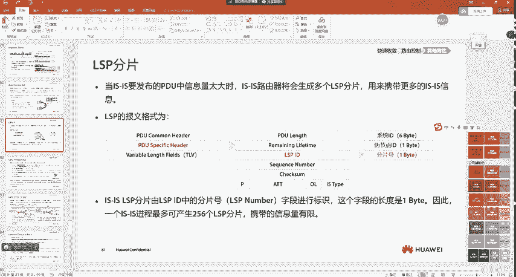

我们来看这里啊。😊，Yeah。呃，RSP分片是吧？正好给大家回顾一下这个IP的一些概念。😊，啊。嗯，在ISS中，我们有一句话叫做确定一条唯一的RSP呢。Yeah。唯一的RSP通过RSPID。是吧。呃。

这个RSPID呢它长什么样子呢？嗯，我们可以通过一条命令来看一下di四playISSRSTB。

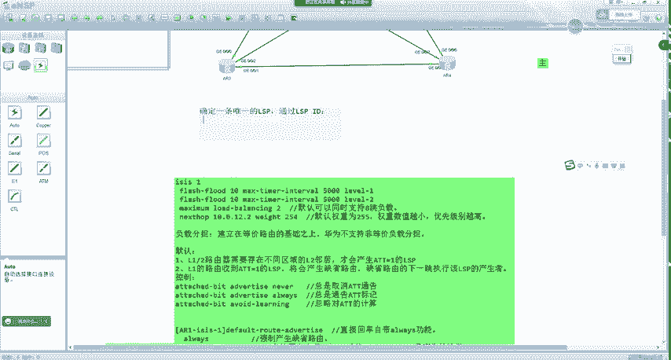

嗯。呃，这一串呢就叫做RSPID。

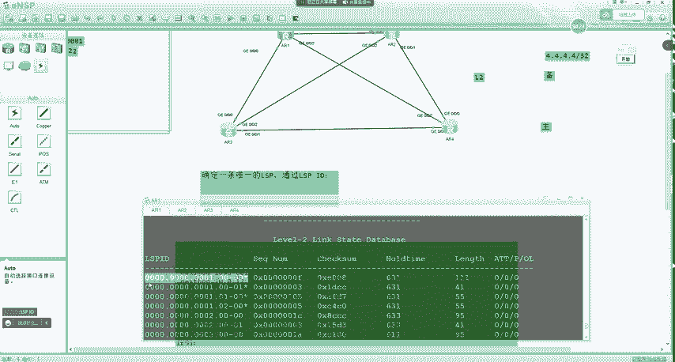

那在这里呢，它是由三部分组成。对吧啊有点类似于OSPF的三要素一样啊，也是三个部分。嗯。哦，这三个部分呢，首先00000001。2000000000001。这里呢我们把它叫做系统ID。对不对？

这个概念大家是比较清楚的。呃，然后后面这两个呢。啊，叫做。分片。😔，爱你。或者说叫做分片标识符。是吧啊，然后最后这两个00呢，我们把它叫做。尾节点标示符。对不对？

那其中呢我们需要对这个分片标示符啊来解释一下。他是干什么用的？我们可以去看到啊。我们的每1个RSP呢，实际上它都是一个豹文。对吧。啊，比如说我发送RSP报文那里面会去携带上RSP。那有没有这种可能呢？

啊，一个包就1500个字节。但是现在对于我的ARE来说。是吧。我有1万条外部路由。啊，大家觉得这个1500字节能装1万条外部吗？Yeah。拿不拿？啊，肯定不行。老师，你不开玩笑吗？😡，对不对？

这就相当于嗯你用个摩托车是吧？呃，你想拉一吨啊，或者说啊不是拉一吨啊。这个呃你用辆摩托车，那么你想运载非常多的货物。这样实际上是运载不了的。那。这时候我们一条RSP没有办法承载这么多路由，怎么办呢？啊。

我就要去产生其他的RSP。那这个时候我们就要去想一下ARE怎么样去产生其他的RSP呢？😡，啊，他可能是这样，对吧？首先系统ID我不能变啊，我就只能有一个系统ID。是吧。那尾节点标识符不能变啊。

这是用来标识尾节点的，我不能乱套啊。😡，是吧。所以说我们就有了一个新的概念，叫做分片标示。这个分片标识符呢，它主要的作用就是用于。用于标记。或者说标识。唯一的。RSP分票。或者说标识唯一的。

或者说用于标识同一台设备。产生的不同的RSP。

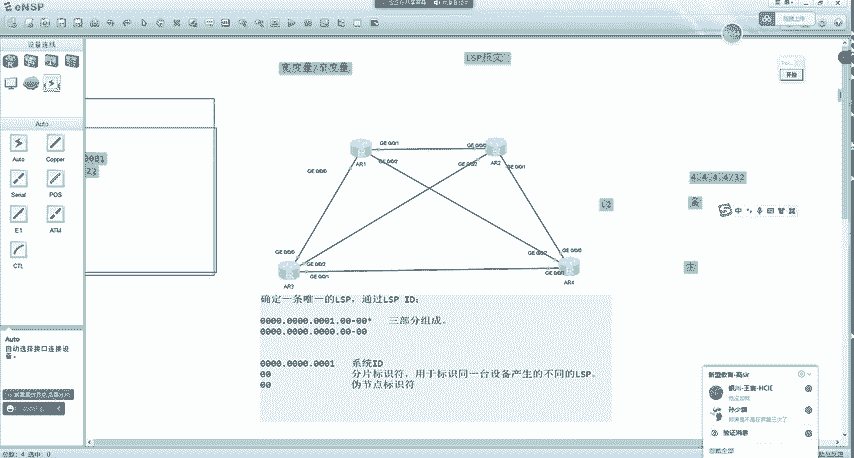

对吧前面是违约的。哦，对对，没错啊，前面是违节点。

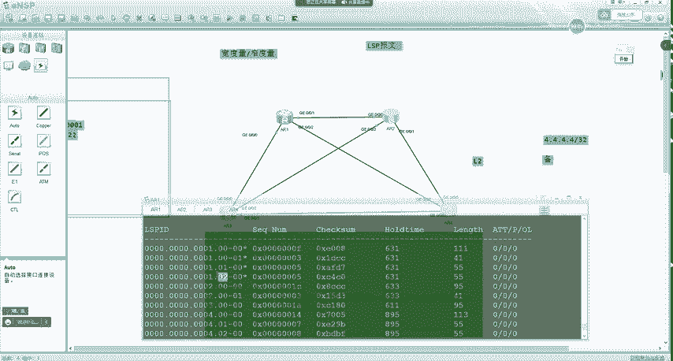

是吧反了啊。啊，把它贴一下。注意啊，前面是违接点。嗯。对吧啊，这里才是分片标准符啊。然后我们再继续来看。它是用于标识同一台设备产生的不同的RSP。是吧哎，那这时候我们可以去发现这两个零它是16进制数。

那每1个16进制数呢，我们现在不是两个16进制嘛？两个0每1个1六进制呢，它是四个比特。所以说这两个16进制它是等于8个比。那8个比特有多少种取值啊，大家告诉我。你们平常学的这个C类网段。

它就是8个比特。有多少取值，256个取值。嗯。是吧。那就意味着我们的AR1呢，它只能够产生256的分片。是。好像有点少。是吧哎，老师会不会不够用呢？大家一下子就会有这种感觉。为什么会有这样种感觉呢？😡。

因为我们以前学过的一些其他技术，比如说tiger老师他有42亿。对不对？那是非常多的。比如说我们之前学的这个cos的。是吧那OSPF最大到65535。是不是啊？ISS这扩展了之后呢，能达到1000多万。

是吧这还是一个接口的呢，还不是累计的。哎，那有点不对劲。是吧这256个会不会有一天不够使用的呢？因为我们之前所说ISS呢依然是一般是作为运营商的这个。底层的ITP协议。对吧。

那当我的一个网络非常大的时候。比如说我可能还需要引入一些其他的外部由。对不对？比如说在这里呢，我还连接了OSPF啊，还连接了其他的网。哎，那么在这时候呢。我们就要去产生这些。新的RSP。

那当路由数量非常多，有没有可能256个不够用呢？实际上是有可能的。对吧虽然可能一时间对吧？老师我实在想不到啊，运营商也用不了这么多，但是呢。😡，你能只看眼前吗？不能只看眼睛。对吧。

你像前些年我们的IPV4地址才刚用完。但是如果从那时候再开始研发IPV6，你觉得现在还有那么多人能上网吗？是吧啊，实际上很难。啊，我们要有一种前瞻性。是吧要为未来去考虑。对不对？就像你工作一样。

你要考虑未来的发展性问题。是吧你为什么学习呢？就是为了未来是吧？啊可以变得更好一点。所以说呢256个。总觉得有点不够用是吧？虽然现在啊老师就算现在我想不到啊，我觉得还是够用。😡。

但是未来IPV6的数量是非常庞大的。IPV6，它一条路由顶IPV是4条。是吧IPU6128比特啊，你IPV4才32比特，那不就顶的更多了吗？😡，而且IPU6的路由数量还非常多。是。

那换到IPU6好像大家能够感受到有一点啊，好像不够用。是吧。对不对？所以说呢技术呢有时候也要向。未来的一段时间就是他的发展去看。如果你这项技术没有发展，你觉得大家还会使用吗？😡，实际上是不会的。对不对？

你就像这个瑞普一样，瑞普除了可能有一些缺陷。但是如果这个技术未来是没有发展性的。你会选择吗？你也不会选择。可能过个5年对吧？你的设备还好好的，但技术已经淘汰掉了，那这样肯定不行。是吧那就像人一样。

如果你止步不前了啊，那你们公司早晚有一天要开掉你。对不对？但是如果你在持续性的在进步。那么你就能够持续性的创造价值。啊，协议也是一样啊。协议我问为什么用它，不就是因为它本身能够提供价值吗？是吧？

它简单也是一种价值。😡，对不对？简单又好用，那这种价值就非常高了。😡，所以说呢我们要去考虑哎，这个协议呢，它好像没有发展性，256个到头了，是吧？就相当于我一看你是吧今年29啊，30岁退休了。对不对？

没有发展性，创造不了长期的价值，那我们就不会去进行选择。那这二手怎么办呢？我们啊这节课讲不到了啊，下节课呢会说到一种新的技术。叫做RSP的分片扩展。什么意思呢？就是这个LP的分片扩展。

他可以允许我们的设备呢。产生更多的RSP。你不是只能产生256个吗？啊，我通过一种技术让你产生的更多。对不对啊。啊，让你呢不再有短板。对吧你看现在很多公司招人，为什么要四6级啊啊，就是因为。😊。

如果你会这种什么英语四六级啊，对吧？嗯，你是可培养的。那个你的这个未来的这个呃进阶途径呢可能会变得更高一点啊，因为你这个是比较全面性的是吧？全面性发展。😊，那现在AR一也是一样，哎。

我们发现它有个短板啊，就要通过其他技术去给它解决掉。而我们所说的这个技术呢啊就是下节课所需要去讲到的。这个技术呢我们把它叫做RSP的。分片扩大。嗯。

就是用于解决啊256个不够用啊怎么样去解决这样种问题呢？通过其他的啊，说白了就打补丁嘛。是吧。就像你裤子一样啊，裤子今天不能穿了，你打个补丁是吧？经常穿。呃，当然这个技术啊，我们下节课会去讲到它。

然后我们今天这节课呢就讲这么多，今天就讲这么多啊。

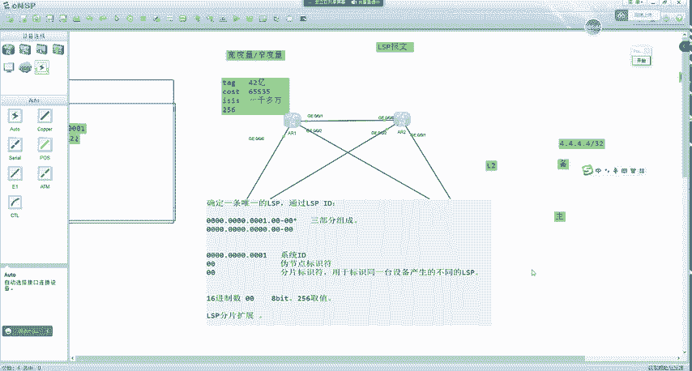

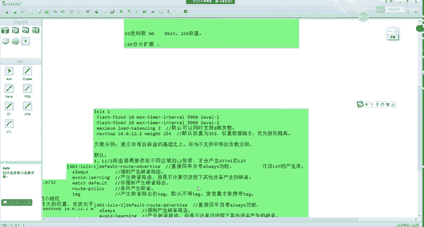

呃，然后同学们咱们就准备下课吧啊。

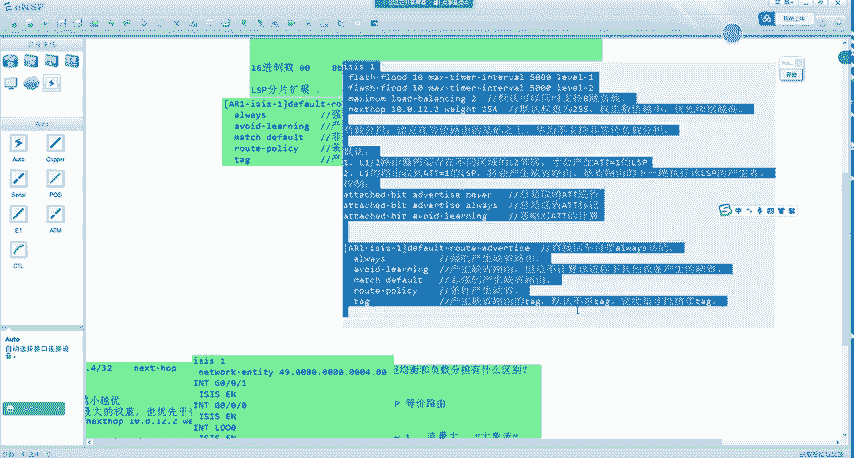

下节课呢我们再去讲这个。

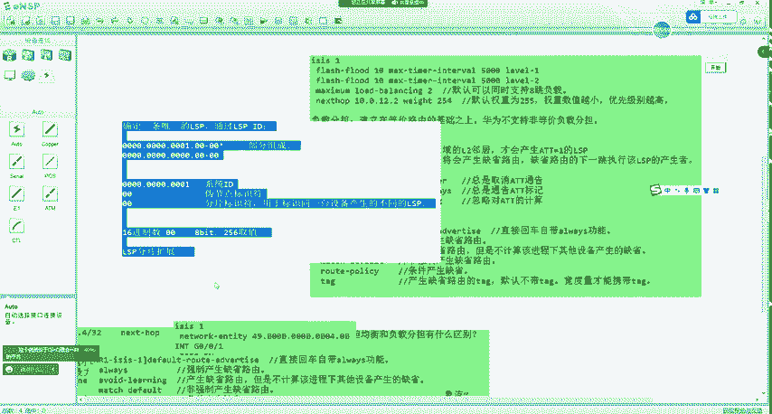

分票过来。好吧。今天就讲这么多啊。

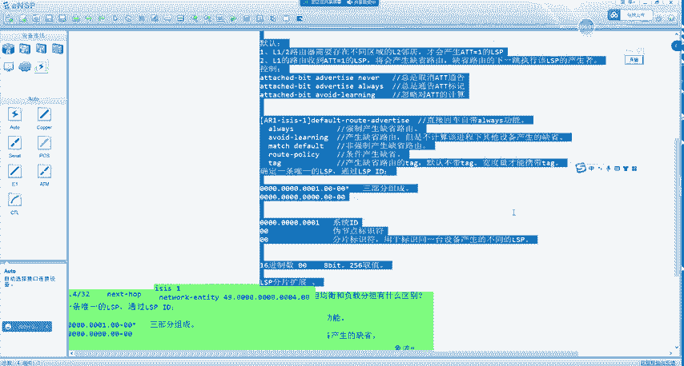

。嗯，大家上午的课是比较舒服的。是吧啊因为我很少拖痰啊。

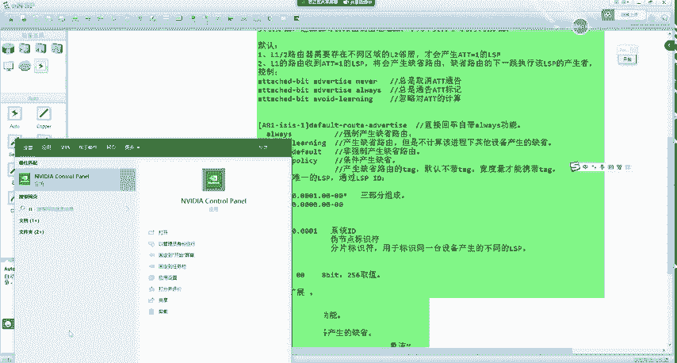

。啊，你喜欢脱。啊，那。你是在学习的。是吧。😊，🤧嗯。对。咱们就到点下课啊。好，那陆平我先听一下啊。

