# 2023 新版华为认证HCIA+HCIP+HCIE全套视频讲解！一套视频让你从入门到精通！CCNA／CCNP／CCIE技术提升同样适用！ - P102：（持续更新）HCIE Datacom - 48.AS-PATH-Filter - -Book思议8 - BV1W8411A7z8

嗯，我们就开始上课了啊，开始上课。嗯，当然还是接着上节课内容继续来讲啊。呃我们上节课呢把这个SS讲了一下这个缺程，对吧？呃，ATT啊以及这个。😊，呃，多实力，多进程对吧？当然还有一些其他的啊。

然后我们这节课呢内容不是特别多啊，讲完ISS之后呢，我们会去。😊，讲一下BDP的部分啊。呃，那么我们上节课呢去讲到了一个ISS它RSP的一个缺陷，对吧？呃，上节课卖了个弯子。

那也就是说呢我们现在RSPID呢分为三个部分，对吧？它会有一个分片号。嗯，这个分片号呢，它只占用了一个字节，那也就是说它只有256个取值，对吧？那有可能会导致一个问题呢，就是256个分片呢。

没有办法携带更多的路由信息吧？虽然我们觉得好像够是吧？但是未来呢我们也要考虑它的一个可扩展性，那么以及呢当我们更换成了IPU6之后呢，这个IPU6地址以及路由呢会变得更多，对吧？

所以说怎么样去扩展RSS它的RSP数量呢。😊，声音卡。嗯，继续吧啊，那对于ISS来说呢，咱们怎么样去扩展它所能够携带的LP数量呢？我们就用到了一种叫做LP的分片扩展。那这个分片扩展呢。

我们在学习之前啊啊要接触的它的一些术语啊，这就相当于你接触一个东西之后呢，呃也要去接触它的一些术语，对吧？呃，首先我们要知道第一个概念啊，叫做初始系统。😊，呃，这个初始系统呢只实际运行ISS的路由器啊。

大家可以认为啊，就是比如说我们没有配置SS的时候啊，这台物理路由器呢对吧？它就是初始系统。而还有一个系统ID啊，它是指初始系统系统ID那也就是说我们平常去配的那个嘛，比如说我SS1对吧？

然后在下面配一个net特地址，那里面的系统ID呢就是初始系统的系统ID这就是我们之前接触的那些对吧？这一个路由器我配的SS对？啊这个路由器就叫做初始系统。啊，那么它的系统ID呢。

我就把它叫做初始系统ID。😊，而对于ISS去提高LCP分片的时候呢，有两个比较新的概念啊，叫做附加系统，还有附加系统ID啊，就虚拟系统啊，还有附加系统ID。这个虚拟系统是这样的啊。呃，我们之前不是说嘛。

对吧？一个路由器它只能产生256个分片。也就是我们有没有这么一种技术呢？比如说我这是一台物理路由器对吧？路由器一。😊，哎，在这时候呢，我让他配置多个系统ID对你一个系统ID是不是256个。

那我配两个就是512个是吧？啊，我配4个呢，就是1024个是吧？我们发现这样的话，那么我们所能够携带的RSP分片就会变得更多。那这个虚拟系统是我们手动要去配置的，注意啊，是我们手动去创建的啊。

通过命令行，你敲一条命令，它就创建出来了。😊，那虚拟系统呢也要有一个系统ID去标识它，对吧？就相当于我虚拟了一台路由器。那这个呢也需要有一个系统ID啊来进行唯一的标识一个虚拟系统。

那标识为一个虚拟系统的呢，我们就把它叫做附加系统ID。那在下面呢我们有一个呃图，可以让大家更好的去理解这个概念。比如说现在这里是R一是吧，它就是一台物理路由器。那么在这时候呢，我们可以在RE上通过配置。

让它产生两个虚拟系统。就两个虚拟路由器。那每个虚拟路由器呢还会有一个系统ID。对吧那大家要注意，假设说啊。我们这个R一初始系统到虚拟系统的cos的都是0。现在我们来考虑。

比如说一上面真的有一个物理考low back一。是吧。那这个low back一呢？😡，呃，比如说我256个分片已经装完了啊，装满了，这个log back一没有办法宣告了，我就会把它放到虚拟系统中。😡。

那实际上对于R的视角来说，我们站到R的角度来考虑这个问题。在R的视角上来看，它是不是认为R一，也就是说这个虚拟系统它就是一台真实的路由器。😡，对不对？跟你虚拟尾节点是一个道理嘛，是吧。

我就认为这就是一台路由器啊，你还有系统ID呢，你还有LP分片。😡，对吧那在R2的视角里，可不就是呃真正的路由器嘛，对吧？所以说在R一产生的RSP中呢啊他会去描述虚拟系统这个邻居。所以说对R来说。

他一看R一呢就是一台物理路由器。😊，但是假如这个low back一对吧？它是通过R1的LP扩散出去的。假如说R2到R1的cos的是10，对吧？它是通过虚拟系统的LP扩散出去啊。

那它计算出这个R一的cos的应该是多少呢？如果。😡，这台初始系统到虚拟系统的cos的是等于0的，注意啊。那么这个虚拟系统RSP所携带的路由1。1。1。1。注意啊，假如说这就1。1。1。1。

那我们计算cos的时候，就是10加0等于多少？等于10。那和R一上直接有个low back一cos的计算有没有区别呀？没有任何区别。对不对啊？这个概念呢有点类似于我们在学OSPF和ISS基础的时候哦。

会学到一个尾节点对吧？那尾节点就是虚拟的路由器。对不对？那由于我们增加了这个尾节点呢，要保证cos的的计算都是正确的。😡，那这时候怎么办呢？我们就是尾节点到所有路由器的扣子，默认都是等于零的。对不对啊？

所以说虚拟系统呢啊就是这么一种概念。😡，但是当我们去使用RSP分片扩展的时候啊。我们再去启用的时候，它会有两种模式，一个叫做modode一啊，一个叫做modode2是吧？模式一跟模式2。

那这两种模式的应用场景还是稍微有点区别的。模式一呢它适用于网络中的一些路由器呢，不支持LP的分片扩展。那比如说在这时候，这里有个R对吧？R呢，它并不支持分片扩展，而R一本身它是支持的。对不对啊？

那么在这时候就会有这么一种概念。也就是说R一所产生的LP呢，它会正常的去描述一跟二的邻级关系啊，就像我们刚刚所说的那一样，对吧？那正常的描述之后呢，到达虚拟系统的cos的都是0。

所以说其他人计算都是正常的这就是我们刚所说的。而我们刚所说的那种情况呢，就是modode一。是吧然后还会有一种叫做modode2。😡，modode一为什么可以使用呢？是因为在R的视角中，对吧？

每个虚拟系统都有单独的RSP啊，都有自己的系统ID对吧？所以说R呢它只是执行正常的路由计算，而modode2是有点不一样的。😡，modode2它是这样的。😡，比如说R是支持了RSP分片过展。

对吧那在这时候呢，R一跟虚拟系统所发布的这个RSP。这个LP啊。它会携带1个TRV啊，这个TRV呢我们把它叫做TRV24啊，或者说叫做24号TRV。啊，这是它的一个编号啊。

它是用来表示虚拟系统和初始系统之间的关系的。比如说那R1呢，如果我们使用的是modode2，把这个虚拟系统R一虚拟出来，对吧？然后又虚拟1个R1-22个虚拟系统。那么他们所产生的RSP呢。

会去说明就会用TRV24去携带上，对吧？它们属于哪台物理路由器，虚拟的路由器。啊这就是两种模式。而对于R2收到之后呢，一看哦这两个虚拟系统啊，它是R一自己虚拟出来的对吧？或者说这2个RSP呢。😊，啊。

都是R一虚拟出来的。所以说呢在R的视角中，它只需要把这2个RSP携带的叶子挂接到R一上就行了。这是两种模式啊，那分别是适用于呃有些路由器呢不支持LP分片扩展，而有些路由器是可以支持的。所以这是这一块啊。

而我们在去配置虚拟系统的时候呢，最多能配50个啊，反正够你用的啊，能够产生呃1万多个LCP分片，就够大家用的，对吧？但是这个呢虚拟系统啊，我们通过模拟器没有办法去做出来实验啊。😊，嗯。

为什么没有办法做出来呢？是因为咱们在去做的时候啊，我们要通过w sha去解析去做抓包呃，但是呢这个ve sha抓的包呢，它识别不出来。啊，还有一点是什么呢？😊，我们要去想啊。😡，虚拟系统。对吧。

什么虚拟系统产生的。ISP或者说什么时候。会使用。🎼虚拟系统产生的ISP携带路由呢？嗯，这个就比较多了，对吧？我们要去想啊啊你得把256个RSPID用完。对吧用完之后呢，它才能够使用虚拟系统去产生啊。

但是256个RSP呢所携带的路由数量就非常多了啊。呃，咱们没有办法一个一个去把它配出来。所以说在这里呢啊给大家演示一下命令啊，你们怎么样去做？比如说现在我就有这么一个场景。😊，啊，这是一啊，然后这是2。

那现在呢我的二的外部路由太多了，比如说我R呢现在路由数量非常多，1个RSP。啊，就是我的256个RSP呢没有办法承载完了，这时候怎么办呢？我假设啊现在R一也是支持虚拟系统的啊，就两台路由器都是支持的。

😊。

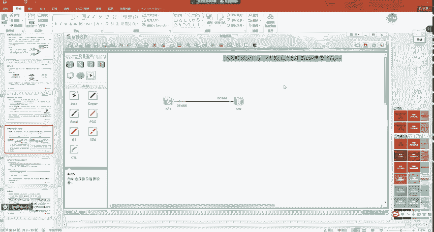

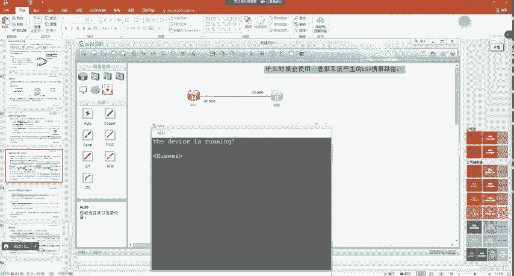

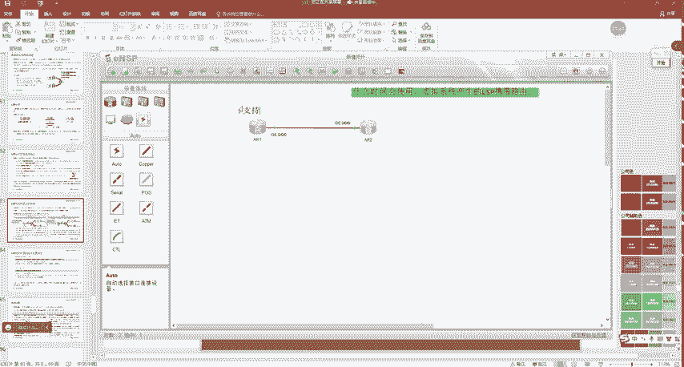

那么在这时候呢，我们可以在R1跟R2上先把基础配置做一下。这是A21。嗯，这是AR。然后在0-0-0。12。1。Yeah。然后这边呢是1。2啊，我们在RE上呢就正常去启用ISS我们用len49。

0000。01。00。然后interfaceG0-0-0。呃，ISS enable然后在二这边呢，SS net49。0000。

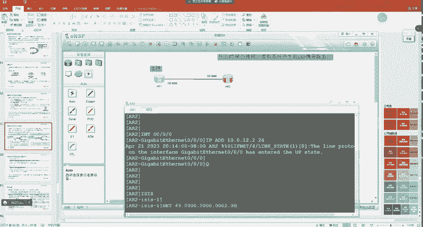

0002啊，然后is live。来玩。G0-0杠0接口呢，再给大家开启SS协议。现在一跟二的邻居呢，第playOSPF啊不对playISSP2。啊，邻居是建立正常的对吧？这时候我们打开抓包啊。

就让大家看一下，就有这个TRV24，但是呢这个wsha它嗯解析不了。比如说现在呢二就遇到了难题，什么样的难题呢？😊。

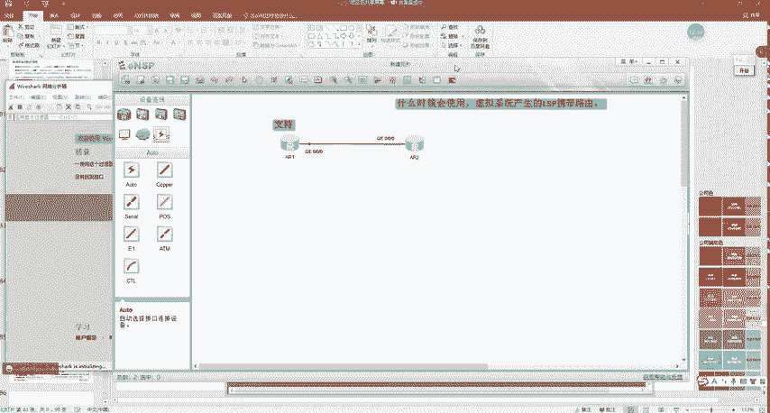

这个。路由比较多是吧？呃，但是呢这个RSP呢又不够。这时候怎么办呢？我们就在R上去做这样的配置。😊，RSP的分片扩展啊，你去给它开启，可以针对于级别一呃，级别2或者级别12去开启，默认是级别12的啊。

比如说我们针对于lab2。是吧去开启分票过来。这时候呢设置它的一个模式，你可以使用modode一或者modode2。那比如说我们这个场景呢，我假设是modode2。冇打。啊，回车。回来之后呢。

我们可以去看一下配置。😊，那这样就代表着呢我在二上开启了LP的分片过来。对吧使用的是帽子。😊，然后针对于GB2去开启。那开启之后呢，我们还要去创建这些虚拟系统。虚拟系统怎么样创建呢？啊。

叫做wa system，就是你要给虚拟系统呢，也要配一个系统ID啊，那大家觉得这个系统ID要不要唯一呢？😡，要不有啊。注意啊，也是需要的。要全局为一。要啊是需要的。所以说呢咱们要给他配一个。

比如说现在我让他虚拟一台路由器，0000点0000。0022。对吧就是我创建了一个虚拟系统。对不对？那么创建完成之后呢，比如说我现在在low back零接口IPU address2。2。2。

232IS enable大家注意啊，现在我们抓包。

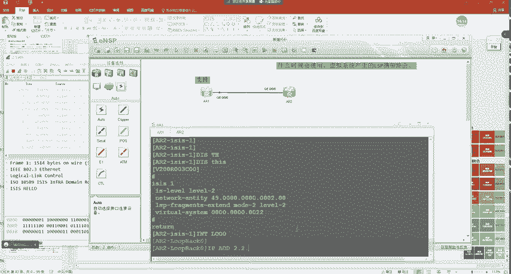

看一下LP现在呢。二就更新了1个RSP。对不对？当然它并没有用虚拟系统的啊，这个只有当你初始系统用完了啊，他才会再去用。但初始系统用完这个路由数量非常多啊，咱们没有办法去一一把它配出来。

所以说在这里呢我们可以去看到啊，就有这哎。😊，啊，就有这么1个RSP。😊，是吧那在这个LP中呢，它会去携带TRV24啊，去用于描述它跟虚拟系统之间的关系啊，就是它连接了哪个虚拟系统是吧？

哪个s IDD是它的虚拟系统。

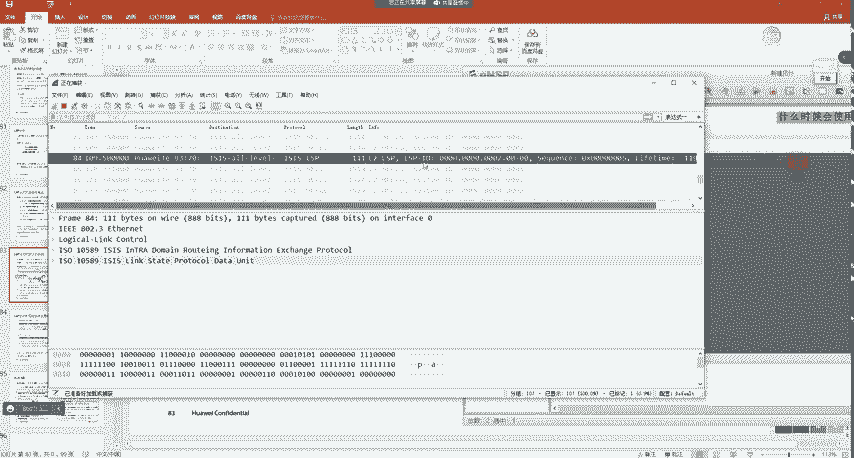

那我们打开去看呢，会有1个TLV24啊，但是在这里会显示一个呃未识别的代码，对吧？就是wsha它解析不了这个TLV啊，所以说我们看不到里面的内容，这里有wsh它嗯不支持。对吧所以说咱们并看看不到啊啊。

但是这个理论呢大家能够理解吧。😡，就是他会使用modode2，使用TRV24去描述这些关系。这里大家能够明白吗？明白的同学敲一啊。冇题は。可以吧。嗯。那具体的配置呢，实际上就两条命令啊。

啊就是我们首先要去开启对吧。如果你不指定modode默认呢为modode一是吧？针对于级别12同时开启。而我们最多呢。😡，可以去配置50个讯系统啊，绝对是够你用的了。是。嗯。

这里就是我们所说的啊RSP的分片扩展。而我们下面要说的一个概念呢，是ISSG啊。嗯，大家学过OSPF的GR之后呢，再学ISS的GR就会相对来说比较简单一点。我来看一下啊嗯它的应用场景是一样的。

都是我们呢这个在路由器重启的时候，是吧？主备切换啊，或者说重启进程的时候呢。😊，嗯，保证转发表不变，对吧？控制平面进行冲击啊，两个邻居呢帮我保密。对不对啊，我告诉你，你帮我一下，对吧？你再帮我一下。

实际上是一样的意思啊，它的场景我就不再重复给大家说了啊，因为它跟OSPF的是一样的。😊，那ISS的价R呢？引入了一个叫做211号TRV。那这个TRV呢跟我们在学OSPF的时候一样的道理。

OSPF实验GR它是不是引入了一个9类LC啊？😊，对吧RSSS呢它引入的是211号TLV。对那这个TRV就是我们下面这个格式。首先每个TRV呢都会有三个要素。对不对嗯，1个2111个长度啊。

还有一个保留位啊，实际上保留位是没有的，就是这里就是具体的值了，对吧？嗯，T嘛type长度啊，还有具体的值。啊。然后我们来看啊，在这个TRV呢有几个关键的位置，一个叫做SA叫做意制发布临接位。

那还有一个叫做I，叫做重启应答位，还有一个叫做R，叫做重启请求位，是吧？那这里。大家先有个印象吧，可能具体老师什么时候会标记这几个位啊，对吧？他们分别干什么事的。

这里呢我们下面会有一个SSGR的实验过程，我们会去讲到它。所以说在这里呢啊大家要稍微有个印象，对吧？有几个标志位啊，还有一个时间。😊，对吧。那除了这个嗯邻居保持不重置的时间呢。

SSGR呢还引入了3个定时器，T1T2跟T3。T一是这样的，它大概的实现是这样的，就是SS甲呢123。😊，二、再重启的时候，他会先给三发，告诉你我要重启了，对吧？你收到给我个确认对吧？帮一下我帮一下我。

😊，然后三呢要给他一个应答。那这个重启跟应答呢，重启请求就是RV啊，应答位就是I。所以我们来看T一定时器啊。如果GR重启路由器发送R之位的哈lo豹文是IH就是意思。啊，SS哈lo对吧？

那但直到T一定时器没有收到辅助者响应的IH位的IH，会重置T一定时器发送包含重启TRV的IH当收到确认报文之后呢。或者。T1定时器超时了3次就取消T1定时器缺诊为3秒，啥意思呢？2月份重启之前啊。

他会给自己的邻居发一下IH。里面呢会携带TLV211带一个R标记位，告诉你们，我要重启了，我要重启了啊吧啊，收到请回答。那这时候三呢也是一样。对于三来说呢呃他收到之后，正常情况下他会回送一个I。

对吧然后R这边呢T1定时器就超时了啊，就到期了啊，就已经把T1定时器的概念取消了。那有没有可能R3不回呢？有这种可能，比如说你发的这个包丢了啊，丢了怎么办呢？R在3秒之会会进行重传。😊，注意啊。

会进冲传，一共就只冲传3次。那么或者说有没有这么一种可能呢？他发给三之后，哎，三不支持。😡，是吧我不支持作为辅助者，三也不会回复。所以说在这时候啊，如果说连续三次听一都超时了，这时候GR就失败了啊。

因为邻居不给你保密。对不对？所以说这是第一定日期啊，那它主要是用于在邻居之间来进行确认啊吧，就是告诉你我要冲起来，你帮我保密啊吧，你得收到别人的回答，这就相当于你给别人说话一样，明天下午是吧。

咱们去看电影吧。😊，对不对？那别人不回你消息，你是不是觉得好像没成啊，这时候你还要再给他说一下是吧？嘿嘿是吧？是吧？那个牙一次对吧？明天我们去看电影吧，对不对？呃，那在这时候呢，如果回你了。

就代表两者之间呢已经确定协商好了所以说在这时候也是一样啊，呃，R在重启之前呢，也会给三说是吧？我。😊，我要是GR重启了，对吧？你帮我保一下咪，对不对？所以说这就是T1定时器啊。嗯，而对于T2定时器呢。

它是这样的啊，因为我们重启完成之后和OSPF是一样的。😡，对吧我们要进行RSDB的同步。是不是啊？对吧。😡，你比如说我们重启完成之后，要不要进行ICDB的同步啊，是需要的。😊。

那T2定时器呢就是等待RSDB同步的时间。是吧比如说我们邻区鉴定完了，咱俩的LOSDB要不要发？😊，是不是这需要啊，对吧？而同步RSDB的时间呢，预留的是60秒。能不能明白？

那T3定时器呢就是重启完成GR所需要的最大时间啊，T3定时器超时就代表GR失败了。呃，初始值是我记得这里好像是300360啊。应该不是65535。啊，300秒默认是300秒。对吧这个课件写错了啊。

不是6535。😊。

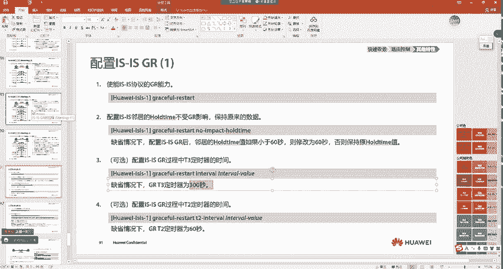

大家能明白吗？这个时间最大啊。它应该是最大值是6535，默认是300秒。就是他是这样的，这是一，这是二，这是3。😊，是吧二给你一个请求，你给我一个确认，对不对啊，然后我立刻重启啊，重启完成之后呢。

60秒咱俩之间进行RSDB的同步。😊，对不对？呃，那同步完成之后呢，如果说到了这个就对于三来说啊，如果到了360秒，300秒之后，二跟三之间的邻居还没有建立成功，对吧？你重启之后你起不来了。是吧啊。

那么在这时候呢，三就会认为GR失败了。所以说呢T3定力器是GR的一个最大上限。能不能明白？就是我们预计呢在60秒之内完成RSD度的同步。但你没有完成呢，嗯也给你一部分这个缓冲的时间是吧？

但是如果说你超过了300秒，还没有跟我建立领域，那三就会通知二的失效了。它跟OSPF是一样的啊，所以说我们整体可以看到呢嗯基本跟OSPF差不多是吧？然后我们来看一下过程啊。😊，那SS甲呢？不。

我们把它分为两种。一种叫做热启动。嗯，还有一种叫做冷启动。对呀，一种叫做热启动啊，还有一种叫做冷启动。那热启动跟冷启动的区别是什么呢？啊？我们要随着学习慢慢的去看啊。😡，首先我们来看这里。

主备倒换或者重启ISS。进程触发的GR呢，我们把它叫做热启动是吧FIB表保持不变。比如说在这说他是怎么样一个过程的？😡，就是GR重启路由器呢。一旦我们开始了充启啊，它会开启T1T2T3定位器。

然后从接口呢去发送R至1RA等于0SA等于零的哈喽包。对吧这时候R就告诉你对吧？他叫做GR重启请求嘛啊，给你二说，你帮我保密一下吧。😡，对不对？那二收到之后呢，他会去刷新当前的ho time时间。

这个是默认操作啊，因为我们收到了hello，不就是刷新hold time吗？是吧然后对于R来说呢，它会回送一个T这个带有。这个211号TRV的。hello，鲍文。里面呢会有1个IHV告诉你。

我已经收到了，对吧？嗯，给你说，我确认要做你的辅助者。😊，对不对，那。RE一旦收到之后呢，它会重置T3定力器。啊，不是啊，就重取消T1定时器啊，然后去重置T3定器。这个T3呢就是邻居的老化时间啊。

就是我们刚刚所说的这一个。能看到吧？T3定路器啊，因为我在刚开始重启的时候，T1T2T3都会去开启，对吧？收到响应之后呢，会去重置一下T3定位器啊，再次变为300秒。哎，那这时候一就开始重启了，对吧？

重启是非常快的啊，一瞬间完成了。😊，嗯，完成之后呢，注意啊。R会给他发1个CLNP。对不对？我把CSNP发给你告诉你呢，这是我所有的LSC啊，不对啊，所有的LP的摘要，对不对？

然后R紧接着就会再次给RE发送LSP。就是我先给你个菜单，是吧，告诉你，待会儿我要给你传这些菜，然后紧接着把LP都给你，待会儿你少了哪一个，你是不是可以知道啊？😡，是吧这时候他就开始进行LDB同步了。

能懂吗？RS4DB同步完成之后呢。😡，那么T2定时器就完成了。能不能明白就完成了啊。那T2定时器一旦完成之后，然后我们再来看啊。😊，重启路由器接收到邻居的IH回应报文之后呢，他看到了I一。

这不是刚刚我们的I一吗？把T3的当前值改为剩余时间比较啊，跟剩余时间进行比较啊，也就是说在这个报文里面会携带这个300秒，然后取其中较小的T3值。这个如果我们不去改的话，两边默认都是300秒的。

然后接口收到确认和CSNP报文之后呢，就是收到了这个确认嘛。是吧I这不就确认吗？它会取消T一定时器。如果接口没有收到确认，还有CSNP啊，它就会不断的重置，就是你给我IA。

然后给我CSNP我把T1取消了啊，但是呢嗯如果没有收到，待会儿我会再给你发一次，连续就是最多发三次啊嗯，如果说还不行的话，就进入到正常的ISS流程。但是如果说对方给我正常回复了。我就会去进行重启。

重启完成之后呢，R就会给我LP。当RSP交互完成之后，T3就会取消。取消之后呢，R一就会再次更新一下自己的FIB。因为它在重启的时候呢，这个FIB依然是保持不变的对吧？当我接收到最新的RSDB之后呢。

它会再去更新一下。那这里我们可以看到一个啊一个什么样的呢？哎，老师R一怎么向R2也进行了泛红呢？😡，大家觉得这是为什么？😡，是吧。哎，这是什么鬼啊？R一他刚重启完啊，是吧？R2刚给他发了一份。

他R一凭什么又给R2传呢？😡，是吧嗯，我给大家解释一下啊。😊，比如说一突然重启了。我假设啊他的LSPE序列号，假如说是0X1。啊，0X2假设说是0X2啊0X2。那一重启的时候，二有没有这个RSP啊？有。

那这时候就会有一个问题，一重启完成之后，它的序列号从一开始计算了。那二给他发的一收到了，一看哦，这不是我的RSP吗？😡，我操，你的序列号比我还大呢。😡，对不对？所以说注意啊。😡。

R一它才是拥有最新的LCP啊，他是产生者，他肯定拥有的是最新的。但是我一看呢，二传的比我的还要先。😡，那这不是在开玩笑吗？对吧我得跟你说。😡，这时候呢RE就会把自己的RSCP的序列号变成3。😊。

然后更新给R。告诉你是吧，我现在的变成三了。能懂这意思吗？所以是这么一个逻辑啊，就是R把一原来的L4P传给一之后呢，一会更新一下，再次传给R一，是这么一个逻辑啊。所以说这个呢就是正常的处理流程。😊。

那一旦处理完成之后呢，我们再来看啊。重启路由器，所有接口上的TE电视器都取消CS列表清空，并收集到所有的RSP之后。就可以认为所有的邻居都完成了同步。这时候我们就取消T2了，就是RSP同步完成了。

T2取消之后呢，表示本级别的RSDB同步了。如果是单li系统啊，就是它只是级别1或者G别2的路由器，就会直接去触发SPF计算。但是如果是级别12呢，它要等的两个级别的T2都取消才会去触发。

所以这里大家知道啊。如果是级为12，要等到两个级别的LDB都同步完成之后，那么在这时候呢，它才会去触发SPF的计算。如果说我们是多级别的那就是T2定制器都取消之后呢，嗯就取消T3了。

然后R一更新FIB对不对？然后我们的重启路由器呢重新泛红LP就是在同步的过程中呢，可能收到自己重启前的RSP。😡，是吧因为你在重启前，你有可能又有0X2的序列号，1个RSP给2这边。但你重启的时候。

你自己本地还得从0X1开始计算。但二给你传了一个你的比你自己的序列号还大。😊，那你要不要给他说一下是吧，我这些变成三对吧，我的地盘我做主。😡，能不能明白？啊，所以说这时候呢R一会再给他1个0个X3啊吧。

会去再次的更新一下。那这时候呢GR就完成了。那这是我们所看到的啊，这种呢叫做热启动。大家注意啊，这种叫做热启动。那在SS中，还有一种叫做冷启动。嗯，这个冷启动呢不需要我们去做这个单独的配置啊。

并不需要啊，但是呢它也是有一定的作用的。这个作用是什么样的啊？我来给大家说一下啊。😡，我们来看这里。嗯，首先呢大家注意啊，冷启动大家可以理解成就是我的设备突然宕机了，对吧？啊，或者说呢这个电突然掉了。

对吧？然后又突然来了，那这时候设备会不会重启啊？😊，会不会？是会的吧。😊，对吧你比如说你的设备突然断电了，你你还保留什么FIB表是吧？你连电都没有了。刚刚这种是冷热启动啊。

你只是重启进程FIB表保持不变，对吧？你的设备还在上电呢。😡，啊，但是有一天你突然电掉了，那不完蛋了。😡，对不对？哎，那这种他是为了解决什么样的问题呢？我来给大家说一下啊。😊，嗯。

就是在ISS中有这么一个问题。我们来想一下啊，在OSPF里面这一这是2。😊，什么时候一才会执行SPF的计算？什么时候啊？邻居放了。是吧那你发LDB同步完成了，然后执行SPF计算。哎，这样好像没什么问题。

但是在SS中，这一这是2。😊，SS是不是邻居up主之后才开始传递LP啊？是不是啊？那不就是吗？对吧。但是这样有没有风险呢？实际上是有的。比如说我们邻居建立完成了，那我的SPF树有了。😡。

但是我RSP没有同步，大家觉得流量来了会不会丢啊？会不会？我就一意子。这是一。这是二对啊这是3。然后呢。这是4，我们假设有这么一个环节。这里是十这里是十，这里是5，这里是5。假如说R开机了。😡。

开机了之后注意啊。跟这边的邻居up普跟这边的邻居up普，但是这时候RSP还没有传递完哦。注要LP还是在的啊。还没传。那首先在R一，它本来通过下面的链路可以接收到3。3。3的RSP。

但是上面的链路一旦邻居up之后，SPF数已经有了。我发现从这里去往三更近，我的路径切换过来了。😡，切换过来之后有没有什么问题啊，是有的。来告诉我什么问题。😡，二跟三的RSP还没有交互完成。

对吧那这时候二有没有三的路由啊？😡，有没有没有。😡，对吧那这时候你转发给2二，给你丢了。😡，那可能一段时间之后会好，但是在这段时间对吧RSP没有同步完成的时候，二会丢。😡。

而OSPF会不会有这样种问题呢？OSPF就没有，为什么没有呢？因为对于OSPF来说。😡，他的LDB交互。他是不是在报之前啊？😡，是吧。对不对？LDB交互完成之后呢，OSPF邻居才会到达fod状态。

RSOSS是先upup之后呢，咱俩再交互。😊，是吧啊有点不太可靠。所以说在这时候呢，如果二突然断电了，对吧？啊，就会遇到一些问题。😡，啊，就会导致流量黑洞。那这种问题怎么解决呢？

就是ISS有一种冷启动GR可以去解决这样的问题。😡，怎么样解决的呢？比如说由设备重启出发的GR啊，称之为。冷启动是吧？然后FIB表更新之前的FIB表保持不变，是因为我们只是重启了一下进程是吧？

或者说主备切换啊，你们设备没有下电啊，但你设备一旦下电，你还保存FIB表就保存不了了啊，没有电，你啥也干不了。😡，是吧那这时候是怎么样的啊？我们来看一下啊。😊，那当R一重启完了，各位同学注意啊。😡。

认真听。是RE重启完了。重启完成之后呢，他会去开启T2定时器。对呀呃如果是多级别的，是lave一2的，每个live呢都会去开启一下。然后在这时候呢，他会去发送IH报文。

其中有一个SA位叫做抑制临接发布位。对啊。他叫做。意志。连接发布委。然后在这时候是这样的。😊，我给二发了一次之后呢，然后SVV标志为一。那邻居就会收到这个报文，如果邻居是支持寄押的呢啊，如果不支持寄押。

就是普通的收敛啊啊，这时候他就会认为啊一你故障了，对吧？他就会通知一失效了。对不对？但是呢注意啊，现在假如说二是支持吉亚的，他们之间呢就会去重新建立邻居关系。你发hello，我发hello。

对吧咱俩之间重新建立邻居关系。邻居关系建立完成之后，大家告诉我，现在一还有没有L24P啊，我们俩刚up一有没有？😡，没有吧。肯定是没有的啊，三次外手g up对吧？LP还没传呢，所以说注意啊，在这时候。

😊，认真你看啊，那R一呢会再次发送IH就是hello里面的SAV呢还是标记为一的。对吧然后告诉你呢，我是继R重启的。对吧。这个代表什么呢？😡，啊，这位唯一就告诉你。😡，我刚刚执行了GR了，对吧？呃。

但是呢SA位等于一就是告诉你2，你先不要给别人说咱俩的邻居up了。因为你一说咱俩虽然你说了，但是咱俩的RSP没有同步完成，别人把流量发过来不就产生黑洞了吗？😡，对不对啊？所以说呢这时候R一会给二说。

你先抑制着咱俩的临接发布啊，所以说叫做抑制临接发布位。告诉你，你先不要给其他路，就比如说这边有三是吧，你先不要给三说咱俩的邻居建好了是吧，三如果有其他的路径呢，是吧？依然去走。

等咱俩RSP同步完成之后啊，三再切换过来。😊，对不对？那这样的话，咱办事办可靠一点啊，人家既然都找咱了，咱既然都走咱了，咱就把流量给他发了，你不要干这种。😡，对不对？咱俩还没同步完呢，你就给三说可以了。

结果三发过来流量断了，对吧咱就不要去干这种事儿。😡，所以说在这时候呢。😊，就是阿姨去会给他发这个IH。有。呃，实际上就是我说的那个意思啊，就是如果翻译成我们的大白话，就是我说的那个意思是吧？

咱俩之间先把LCP交互完，再让其他人知道。😊，是吧。就跟你这个要做一件事一样，你把它做完成之后呢，你再给其他人说啊，不要先吹牛。😡，对不对啊，办事靠谱一点。对吧只不过在协议里面呢。

就是通过不同的标记去表达这个意思。😡，然后现在二收到之后呢，告诉你好，没问题，对吧？I1。😡，对吧没有问题。😡，对不对？咱俩之间的小秘密，你知道我知道是吧？R3咱先不给他说，咱俩偷偷的办啊。

办完之后给他说。😡，那在这时候呢，RE收到了这个I报文之后啊，他就会把T一定时器取消。那这时候呢，两台路由器呢会去开始同步RSP。比如说我的RSP同步完了，就二给你1个CSNP告诉你。

这是我所有的RSSP啊，待会儿我都会传给你，然后我就开始传。😡，现在我传完了，传完之后，大家告诉我R一有没有收到所有的RSP。😡，有没有？有啊。收到了所有的RSP了。对吧收到所有RSP之后。

我们再来看啊。😊，是。呃。我们刚刚讲到哪个了，重启R啊，在这啊就是。😊，重启端呢收到IH和CSNP之后，取消T1定制器。是吧呃如果没有取消呢，就会不断重置重置T1定时器。但是如果他没有收到啊。

比如说R没给他IA啊，它就会一直再去发，能不能明白，它会一直去发啊。但是如果正常的情况下，你是可以收到的，一旦收到之后呢，进入到ISS处理流程，完成L4DB的同步，就是我就开始给你发了。😡，对不对？

给你发完之后呢，这时候一个lave的LDB同步完成之后，那对于这个R一来说，它就会把T2取消。那这时候所有的L4P我已经都有了，对不对？然后呢，我会去执行FISPF计算，更新FIB表，那一旦更新之后。

那这时候R能不能泛红啊。😡，拿不拿？这时候R能不能给R3说啊？大家觉得行不行？😡，可以啦。对吧所以他整体的意思就是在这里的，咱俩在建立邻居之后呢。😡，这段时间先把RSP交付完，对吧？咱办事办的可靠一点。

向外进行通告的时候，你有能力转发，咱就真有能力转发。😡，对不对？所以说在这时候呢，两者的RSP一旦同步完成之后，那对于R来说就会去通告这种邻居关系。那R3一旦发现，通过R一能够去往四，这里有最短的路径。

它是不是就可以走R一了，对吧？而你可以走R一之后，正好R一已经把FIB更新完了？对吧那这样的话我们可以保证的是什么？至少我在邻居在建立的这段时间，它不会有流量丢失问题。😡，所以大家能够明白吗？

明白同学敲一啊。没问题吧。所以说SS的冷启动和热启动，他们的针对的环境场景是不一样的。😡，SS的热启动。他是在。保证设备。在重启SS进程。到时候。转发表保持不变。对不对？而SS的冷启动呢。

它是保证设备在。重新。或者说。开机之后。是吧。嗯。保证设备在。应该是L。DB。同步完成之前呢。不转发流量。或者说不作为转发路径啊，避免流量丢失问题。所以说他们是不一样的啊。而ISS的热启动。

它就跟OSPF1样。那么冷启动呢嗯OSPF就没有这种问题。能懂，你意思啊。嗯。那咱们通过一个实验是吧，给大家做一下这个热启动啊。😊，或者我这么问一下大家，大家觉得冷启动会丢疤吗？😡。

能启动会对8吗？是会的啊。😊，因为冷启动，你是你是什么不会啊，肯定会啊，是会的啊。😡。

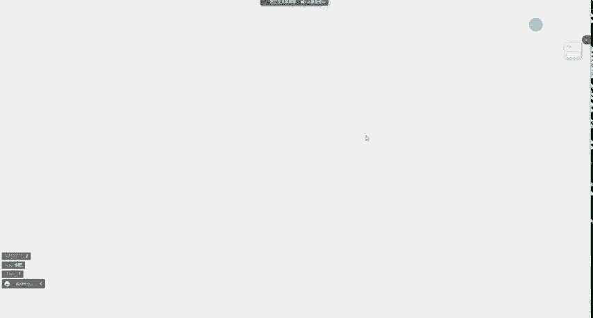

你直接断电了，你是吧？那其他路由器得收敛一下是吧？至少在收敛这段时间会丢网，但是在你恢复之后还会不会丢啊？😡，会不还？就不会了吧。是吧就是在你恢复之后，他就不会丢8了。🤧嗯。嗯。

那这个这个啥啊这个这个这个这个冷启动咱们没有办法去做啊，因为他咱们的手速没那么快啊。😊，大能懂我的意思啊。就是冷启动，我们得给它关机，然后再开机啊，但是咱们手速没那么快啊。😊，那没有办法。

比如说开机之后，看在他LCDB交互完成之前，咱们再去做片。嗯，咱们手速没那么快，所以说咱们可以去做个热启动是吧？就是二在重启进程的时候呢，让它流量不丢失。😊，🤧。嗯，这个配置也是比较简单的。

跟这个OSPF实际上差不多。😊。

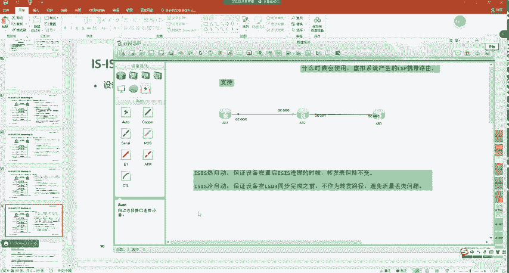

嗯，首先呢我们去开启GR是吧？呃，开启之后呢，我们要去配置一下，对吧？SS邻居ho time不受GR的影响啊，保持原来的数据，这是啥意思呢？嗯。比如说当一开启G牙之后，他会给二发送1个IH。

对吧呃在这时候呢，里面会携带一个时间值，把二的老化时间改为300秒。😊，这是什么目的呢？因为我一再重启的时候，你不能比如说二这边邻居突然老化了，那大家觉得这样会不会继R失败？😡，是会的吧。

对吧所以说在这时候呢嗯默认情况下，他就会发送一个。😊，带有300秒的时间值，待会我们可以去看啊，二这边关于一的老化时间就会变成300秒啊，但是呢我们也可以啊不让它进行修改，就有这么一条命令啊。

一般我们不会去敲。😊，嗯。然后T3定时器的时间啊，默认就是300，咱们也不用去改。然后T2定时器时间呢，你也不用去改。😊，就是我们只需要去开启降压能力。呃，然后一直重启TLV的啊，这个也不用去改。

这些都不用去改，直接开假就完事了。嗯，然后我们来看一下啊。😊。

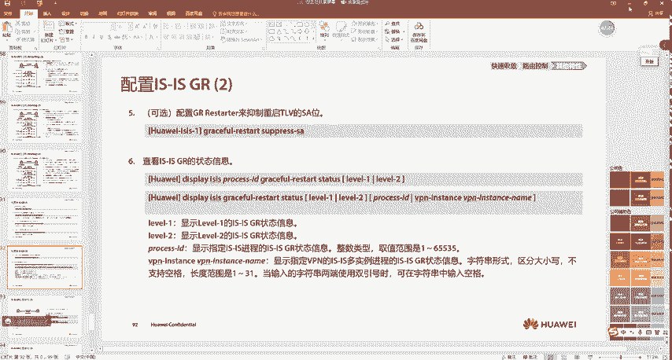

嗯，比如说现在在R一上呢，R2上啊，我interfaceG0-0-1。😊，10。0点。23。2。2是。嗯。然后是R3。sister name A23G0-000接口。10点0。23。3。嗯。

然后我在一上呢去起一个防水口IP address1。1。1。1。Okay。然后我把它加入到ISS中。在三上呢，interface low back03。3。3。3啊，把它加入到ISS中。

他说我现在没开SS。E live啊，我们用leve one，然后n地址49。0000。0003。00。interface娄百玲啊SS enable。Dsplay I S pure birth。啊。

第四类ISP。嗯们到二审来看一下邻居状态啊。2跟一的鉴定成功了，G0-0-1ISS enable低俗类SSP。还没有建立，应该哪配错了啊，我们来看一下0-0-123。2去聘一下10。0。23。3能通。

啊，Interface。啊，不用他费责ISS健证票。嗯，二的n地址呢是2我把啊我们把这两个先给它删了啊，这是之前做的。24P的喷片扩展。哎。来玩是吧。G0-0-1。也启用了ISS。

然后三这边呢70-0-0。SS enable啊没启用啊，启用了之后呢，对于二来说，diplayISSP2。啊啊就会有两个邻居啊。嗯。🤢，然后我们现在呢嗯在二上去开启GR。对，然后先在一上开一下啊。嗯。

给他开一下，然后三上也是一样。你也给他开一下。然后在二上呢。SS你要把GR给它开一下。对吧开了之后呢，我们来看一下啊嗯。😊。

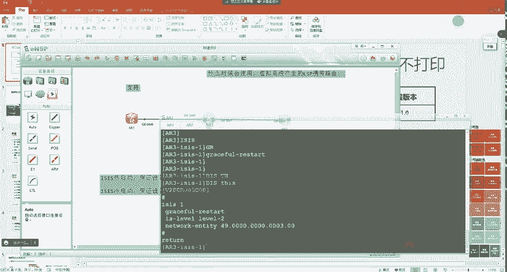

2、发送的哈lo包。我们来找一下啊。不是这个啊，不是这个不是这个。不是个不是应该没抓着啊。

我看一下啊，这个邻居有没有变。display IS。Sure。对吧啊，在这里有显示啊，我们可以看到邻居已经变成了300秒老化了，大家能看到吗？😊，你刚刚299最新的状态就300是吧，299。

对吧你可以一直去刷一下啊。😊，啊，就来了一个哈lo豹文之后呢，我们就会是300秒。那这时候也就是说两个邻居呢会保持二的时间为300秒。这300秒的目的呢就是二在重启之后呢呃如果能在3秒秒内up啊。

我们就认为GR是成功的。😊。

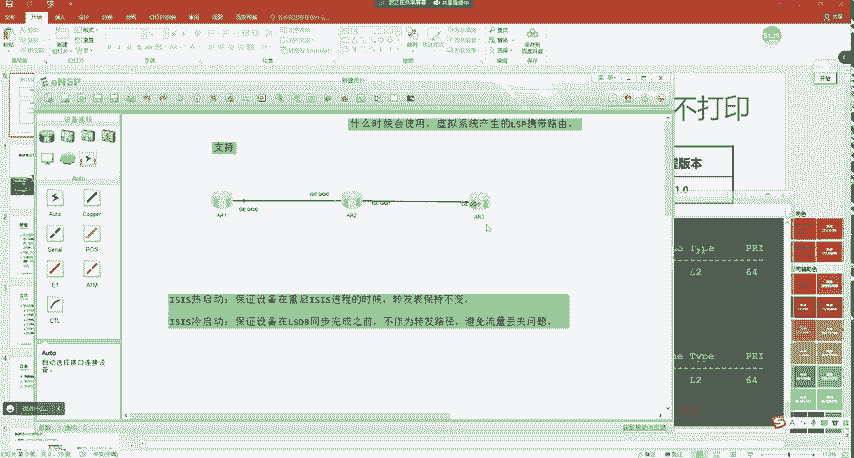

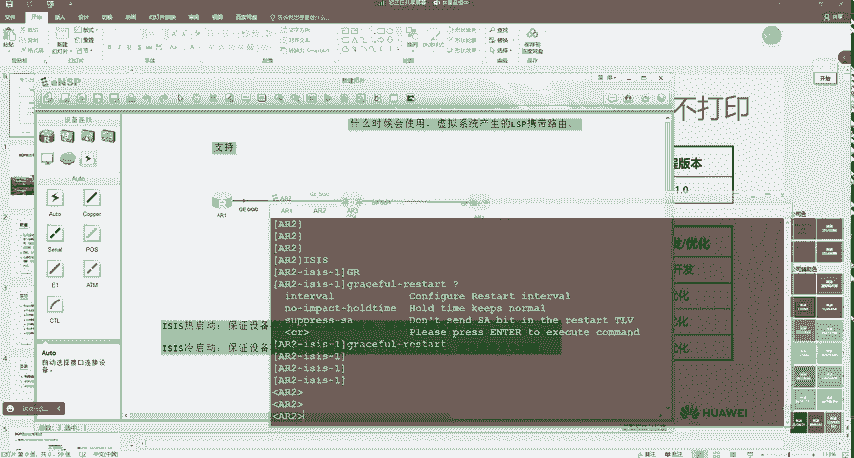

那比如说现在呢我就在一上去pin杠A1。1点。现杠C咱们多欠你个吧。嗯，骗1000包是吧，杠A1。1。1。1到3。3。33。对吧啊，现在能够通，然后我在二这边呢去重启。Reside IS。

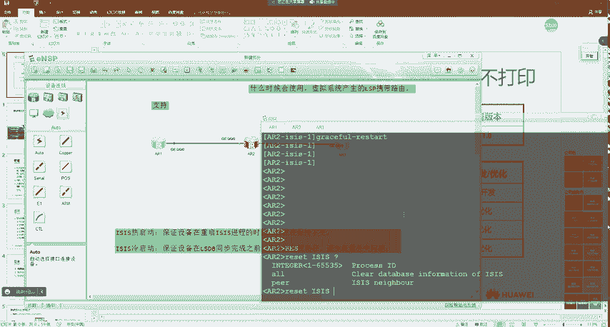

对哦呃，然后让他借S的方式进行重启。啊，然后我回车啊，yes。😊，所以说这时候对于二来说呢啊它就进行重启了。重启完成之后呢，我们来看一下一这边没有产生任何丢包。😊，对吧跟OSPF是一样的。

就我们在重启建程的时候呢，也不会产生任何丢吧。😊，那对应的他的数据包啊。

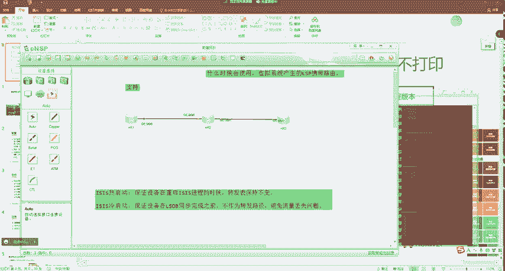

我先听一下啊，那就比较多了。我们可以大概来看一下过程啊。嗯。这是二发送的1个IH。嗯，也不是这个没里面没带。也不是这个。Okay。也不是。也不是。啊さら。大家可以看到吧，就有这么一个R的请求。系吧。啊。

啊，在这儿啊，这是二发送的。然后一呢有没有回送一个I呀？😊，对吧啊，告诉你没问题，对吧？找哥办事儿对吧，哥给你安排的妥妥当当。😊，对不对？他说你给给我保一下密是吧，我重启一下啊。😊，或者说哥帮我挡一下。

我提一下裤子，对不对？一样。😊，没问题，对吧？那给他说完之后呢，啊你看他哥就给他发了一个发了一个什么啊。😊，CSNP对不对？发了CSNP之后，有没有紧接着开始给他传LP啊？对吧啊兄弟，你刚重启完。

赶快拉着是吧？现在时代变化非常快。😊，对不对啊，哥这些年攒的好东西呢，对吧？这些RSP你都拿着，赶快更新一下，别让别人看出来你重启了。😊，对不对啊，然后就尽快的给他。是吧啊给他之后呢，两边之间啊。

这个哈罗就正常的发嘛，对不对？然后开始同步RSP。😊，RSP同步完成之后啊，后面就没了啊。同步完成之后呢，对于。😊，R来说对吧？它就会把老化时间进行修改啊，不是老化时间啊，就是同步完之后呢。

他把自己的FIBE更新，对不对？😊，我重启的时候，我的转发表不变，我重启完成之后，又获取了最新的链路状态。神不知鬼不觉。😡，大家能明白吗？所以说我们也可以看到整个 pin的流量呢啊没有产生任何中断，吧？

而我们重启了进程，也没有出现任何问题。😡，那这就是ISS的GR。嗯，这个大家都理解了吗？理解的同学敲一啊，都没问题吧。😊，可以是吧。

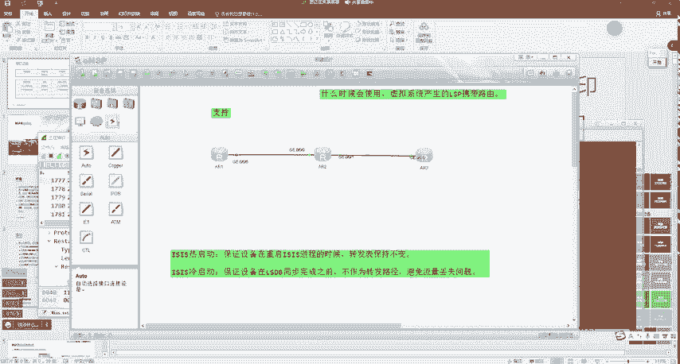

呃，有没有面令能看是吧？也有，我找一下啊。😊，比如说在这里啊。😡，呃，我们在R上去displayISS加R的状态啊，咱们可以去看一下啊。

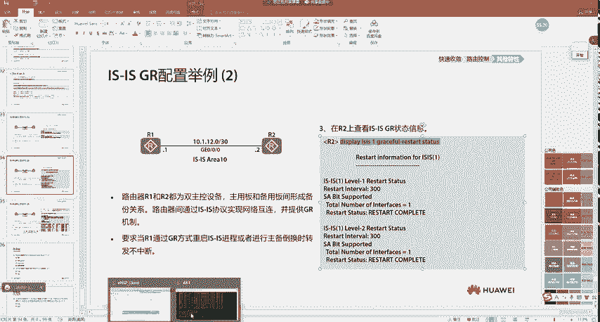

在辅助路由器上。diisplayisS1。啊，去看他。加的状态。呃，现在我们可以去看到啊，它的这个重启路由器的时间，对吧？给他开的是300秒。对对。呃，然后在这里有一个重启已完成。是吧能看到吧。嗯。

然后你在这个。重启的路由器上也可以去看啊，当然这个FIB咱们没有办法去抓了啊，这个时间太瞬间了啊吧啊，老师手速没那么快啊，就为这个时间太快了。所以说我们可以去看呢就是。😊，嗯，就是在重启前以及重启后呢。

这个状态啊都是一样的，大家能懂吗？就我们能够看观察到最直观的一个状态呢，就是没有丢包。但是这个FIB你比如说老师我的设备再重启啊，然后我再去看一下这个设备的FIB嗯，但这个时间大家可以去做一下。

这个之前我也做过，但是老师手速没那么快啊，敲不了。吧你一重起立刻就起来了。对吧大家可以去看到，刚刚我在重启之后呢。😊，阮立刻就起来了。对吧所以说呢我们能够更直观的去看到，对吧？

至少业务是没有产生任何影响的。好吧。好，那我们就说这么多啊，然后最后有两个。呃，思考题我们来看一下啊，这里大家可以去做一下，就OSPF支持哪些快速收敛机制。嗯。P c。LP快速扩散呃，智能定时器。

还有OSPFIPFR。支持哪几个？对吧123啊，不包含B啊，RSP快速扩散，它是ISS的。OSPF没有RSPR。好吧。这就是比较马虎啊比较粗心啊。FA地址一定为0。0吗？对吧肯定是错的。

老师我没学FV之前，那不都是0。0吗。😊，是吧所以说是错的啊。😊，哎。然后后面还有一题啊。在SS网络中，如果运行的是modode2的RSP分片过展。虚拟系统不参与路由SPF计算。

网络中所有路由器都只知道虚拟系统生成的ISP属于初始系统。注意这是莫德吉。大家觉得对不对？嗯。错啊。😡，modl2啊。😡，modode2啊。

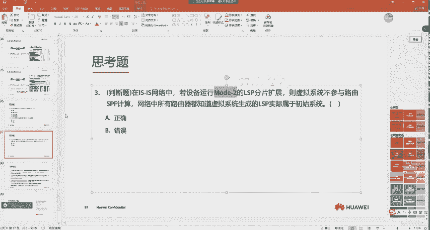

这不刚讲过啊。😡，mod2是怎么样的？

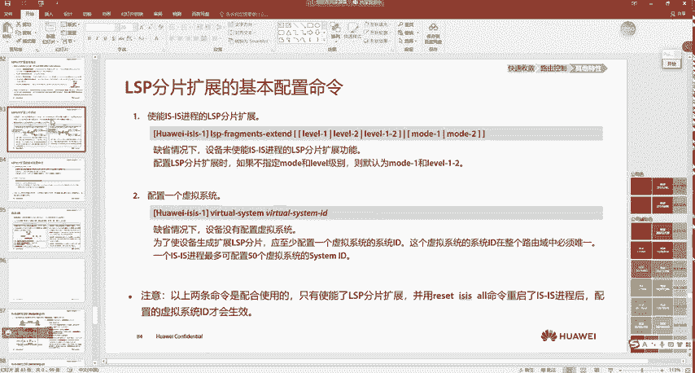

R一将一部分路由放入到虚拟系统一，一部分放入到虚拟系统2。是吧。然后其他通过24号TRV都知道他们的初始系统是RE，都视为是RE的信息。modode2可不就是这样吗？modode一才是对吧？

认为对端有三台独立的路由器，正行正常的SPF计算啊。😊，能明白吧？所以再看一下这一题是对还是错。😊，是冒的2啊。😡，是吧所以说他应该是对的啊，是正确的。对吧。好，那我们先讲这么多，好吧。

然后咱们休息一会儿啊，休息完成之后呢，我们再来讲一下啊BDP有什么高级的玩法。我们把IGP学完了就得学学BGP了，对不对？把三大协议先给他学了。😊。

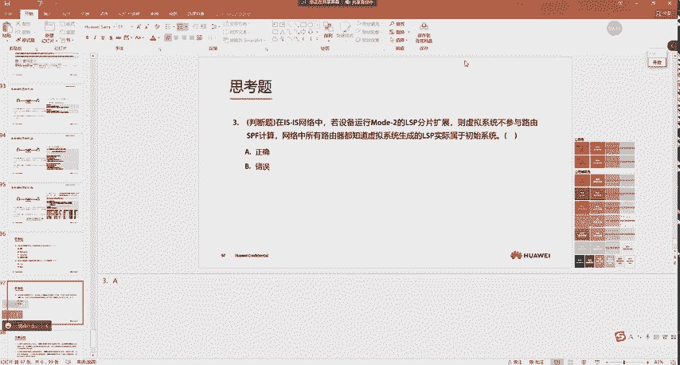

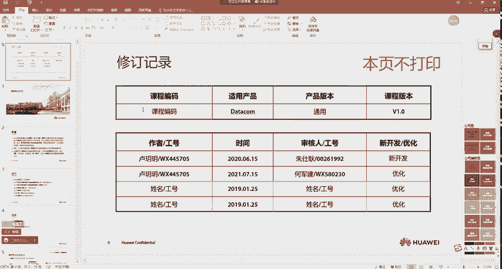

好，那我们休息一会儿吧，休息10分钟啊。😊。