# 2023 新版华为认证HCIA+HCIP+HCIE全套视频讲解！一套视频让你从入门到精通！CCNA／CCNP／CCIE技术提升同样适用！ - P103：（持续更新）HCIE Datacom - 49.Commity Filter、ORF、认证、GTSM - -Book思议8 - BV1W8411A7z8

呃，我们开始吧，然后咱们当然还是去讲一些工具啊，接着上节课内容呢呃我们还有一个工具没说到是呃commun field对吧？这实际上有同学可能在IP学过啊，呃，当然也有同学可能没学过，对吧？

咱们就把它来再说一下啊，学了是吧？学了咱们把胶片过一下啊，啊走个形式对吧？呃，我们来看一下啊，就是commun field它主要是干嘛的呢？嗯，因为我们BDP呢有一种属性叫做团体属性，对吧？呃。

那它跟这个tag呢是有点相似的，对不对？这个tag呢是我们在学ITP的时候，比如说我们可以为ISS路由去打tag对吧？呃，可以为这个OSPF的外部路由也去打一个t，对不对？

那这个tag呢它本质是一种标记啊，那基于标记我们可以做到很多的这个呃。😊，这个就是可以实现很多的作用，对吧？因为我们实现很多嗯技术的时候呢，都是基于标记的这标记实际上很重要啊。嗯。

比如说我们之前呢可能是通过ACL啊，对吧？或者说通过前缀列表，那去匹配这条路由。你比如说路由的前缀是不是一种标记呢？我们也可以认为是一种标记，对吧？只不过它是唯一的哎，那有没有这么一种可能呢？

就是我可能有100条路由。😊。

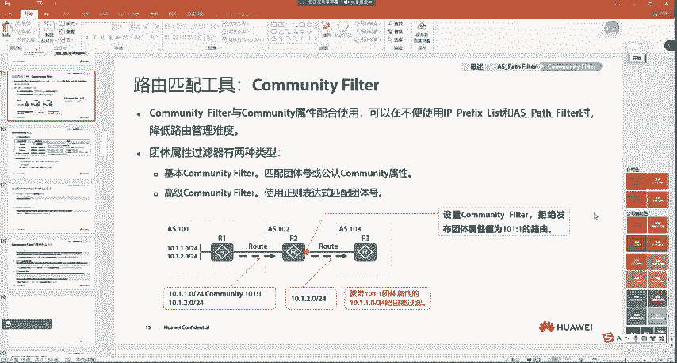

对吧那这时候呢，100条路由的路由前缀不一样。但是呢比如说我都想把这100条路由都cost它。改成十是吧？呃，如果我们去写ACL的话，或者说前缀列表，对吧？那你写的这个ACL反正肯定一条一条去写，对吧？

但是前缀列表可能我们写的稍微会少一点呃但是呢呃有些这个路由那我们前缀列表在匹配的时候也挺麻烦的，对不对啊？所以说呢我们就想有没有一种更简单的方式呢？就是这一条100这100条路由哎。

有没有什么相同的标记呢，对吧？那我们就可以在BP里面呢用到这个communate属性，对吧？呃，去给它打一个标记，它本质就是一个tag啊，呃，这里呢大家可以认为是这样的。😊，嗯。

就是它跟我们IGP中所学到的tag有什么样的区别呢？呃，以前就有这么一道面试题啊，在华为之前还在面试的时候呃，就是BGP的团体属性。😊，啊。那么和IGP的tag值啊呃有什么区别？对吧嗯。

以前呢就有这么一道面试题，实际上就是一个小的问题啊。那这里呢主要聚焦于在两点区别啊啊，第一个区别呢叫做BGP的团体属性呢。😊，他可以携带。多个对吧？而对于IGP的tag呢，只能携带一个，啊。

这就是它第一个区别。也就是说我们在为BGP路由打团体属性的时候，可以嗯打多个，对吧？就相当于你一个人有多个身份一样，是吧？啊，你既是男人呢，也是女人，对不对？嗯，所以说呢BGP团体属性可以有多个。

而对IGPt它就只能携带一个，那第二点区别呢就是BGP的团体属性呢？😊，他能够。限制路由的传播范围。对吧而IGB的tag无法做到。对吧因为我们在学BDP团体属性的时候。

大家还学到一些什么呃no active对吧？嗯，什么no exportport，对不对？还有什么internet，对吧？就我们在学BDP团体属性的时候呢，我们发现会有一些这个公共团体属性对吧？

因为团体属性我们不是分为两类嘛，对吧？😊，就这个团体属性的分类呢，我们把它分为两类啊，一种呢叫做公共团体属性。嗯。是吧嗯还有一种呢叫做自定义。团体属性。对不对？而对于这种公共团体属性呢。

嗯它是可以去限制路由的传播范围。而对于自定义团体属性呢，它的本质是我们管理意图上的一种标记。对吧比如说我给你打个100冒号一的团体属性，那未来呢我们可能针对于这个标记呢会做一些策略，对不对？

所以说它本质是管理意图上的一种标记啊，那这就是团体属性的两种分类。而我们在对团体属性进行匹配的时候，比如说老师啊我有很多的团体属性是吧？嗯，我们在学IGP的时候，通过ru policy呢。

我们可以去匹配对吧？if tag值，对不对？呃，那我们如果想要匹配团体属性的话，在这时候还需要一种工具，我们把它叫做团体属性过滤器啊，叫做commit field对吧？呃。

那这个团体属性过滤器呢也是分为两种的，基本高级的啊，但是高级的我们也不用啊，高级也是用正则表达式进行匹配的，所以说咱们的学习过程中啊，当然也不会去演示高级的啊，这里大家知道嗯。

反正这个正则表达式呢只要涉及到啊，一般我们都不会去使用。那基本团体属性呢，就是我们可以匹配团体号。😊。

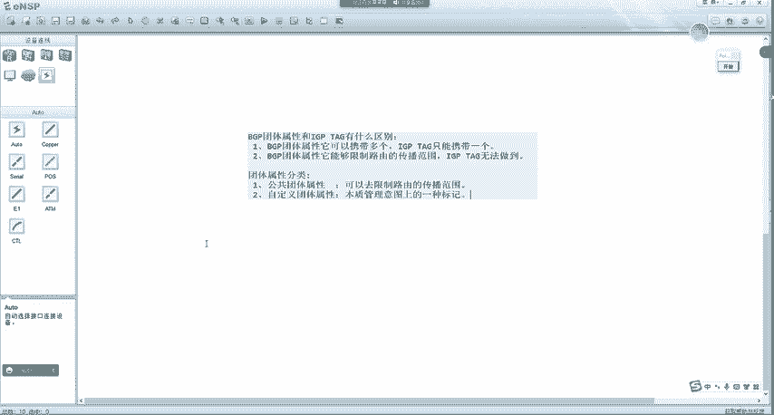

呃，或者说公共的团体属性就是匹配了之后呢，会去做一些策略。那比如说我们下面这张图呢，就是这样的。比如说R一呢，它在给R发路由的时候，我们可以为1。0呢去打上一个团体属性，而2。0没有携带是吧？

那现在呢比如说我们要去过滤一些路由对吧？就可以去设置commmunted field对团体属性来进行匹配，然后拒绝发布团体属性为101冒号1的路由。那这时候这个功能怎么样去做到呢？

就是我们怎么样去匹配这个团体属性呢，就要需要用的comm field。所以说这里大家知道啊，commmun field它的作用呢。

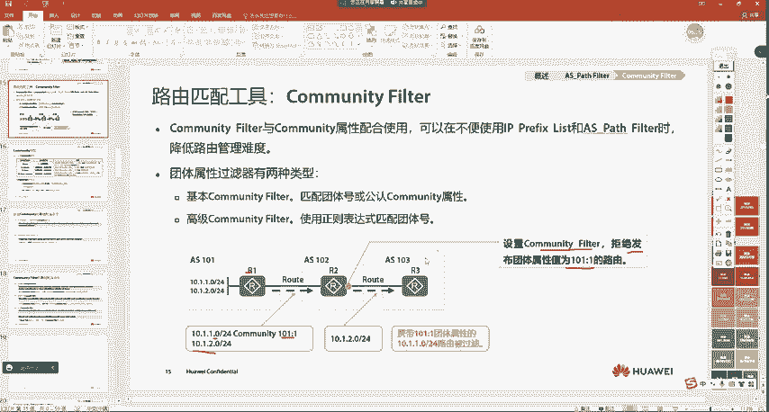

作用他是。对。BDP路由团体。属性。进行匹配的一个工具。注意啊，它只是一个工具啊，那具体工具它实现什么样的意图，对吧？要靠我们人为的去做。呃，那在这里呢有一个团体属性的分类啊。

这个大家在IP的时候实际上都接触过对吧？像internet啊嗯no active对吧？no eport呃，还有一个no eport SUB对吧？就是子AS的意思。

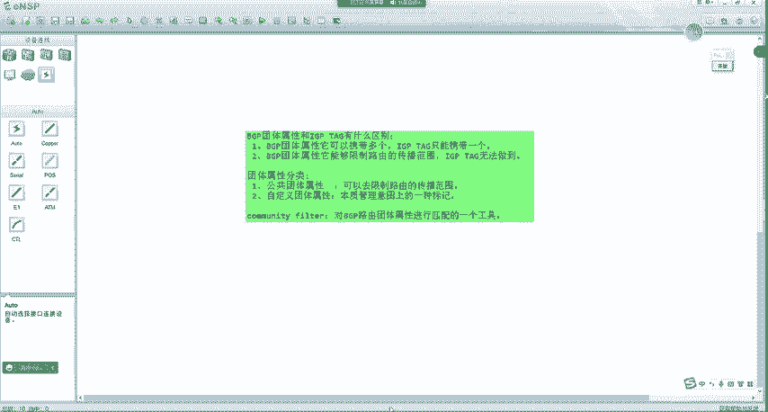

那这里它是这样的啊，就是internet呢就是我们所有的路由呢啊都会有这个internet属性啊，就所有的路由都属于internet团体啊，大家就可以认为呢就是默认啊就会去携带这么一个属性。

而下面这一个呢是就是我们通告给邻居之后，这一这是2对吧？比如说一给二发了一条路由，如果带这个团体属性，那二就不会把路由传递给别人，对吧？noisport是不传给一BP邻居，对吧？

noisportSUB呢？是不发给联盟的子AS邻居，对吧？所以说呢这是它的四种分类啊，那这种呢都是属于公认团体属性的。而我们所说的还有一种叫做自定义团体属性，对吧？那自定义团体属性它长什么样子呢？

我们也是用这个具体的标记啊，或者说数值来进行代表的所以这里大家知道啊，那。😊，对于自定义团体属性，咱们可以写两种方式。比如说我们说了对吧？团体属性本质就是一种标记。对不对？那如果想要加以标记的话。

就这个标记它长什么样子呢？嗯，有两种表现形式对吧？就跟这个呃人一样，对吧？你可以有名字啊，那你具体名字长什么样子呢？有三个字，有两个字的，你可以自己去取，对吧？啊，有英文名有中文名，所以说呢。😊。

对于团体属性来说，它有十进制的表达方式。注意啊啊，有十进制的，因为这个团体属性呢，它一共占了44个字节，所以说你可以用1234这种数值来进行表达，这种就叫做十进制的那最高呢可以到达嗯，反正42亿多。

反正是够你使用的啊，呃42亿多呢大家觉得用不完，对吧？那还有一种呢是AA冒号NN制。那这个AA冒号NN制呢就是。比如说前面呢AA我们一般建议去取，就是采用。比如说我在BDP路由器上一去做。

那我们一般建议是使用一的AS号。所以大家知道啊，一般建议是使用AS号，但是呢不是绝对的。比如说老师我的路由器一呢在65001这个区域。对吧啊，在65001这个AS，但是我不用AS号行不行呢也可以对吧？

这就是使用上的一种建议啊，就相当于你一样说你20多了对吧？2526了是吧？啊，那你就该相亲找对象了，是吧？那我们建议在这个年龄，你该相亲找对象了啊，但是呢你也可以不被这么建议是吧？你就偏偏不找是吧？

老师我要一个人活到老对不对？孤独终老是吧？嗯，这样也行，所以这里大家知道啊，那AA冒号NN制呢每一个呢都会占用两个字节，AA呢我们一般建议去取AS号，比如说我的AS呢可以是65001。😊。

而冒号这个NN是你自定义的一个值，比如说冒号一呢，对吧？它代表的是哪里呢？嗯，分布一的路由对吧？冒号二呢代表是分布二的路由。冒号三代表分布三的路由，对吧？这个NN呢你可以自己去定义，所以这里大家知道啊。

NN就是你管理意图上的自己去定义的一种值，那这是团体属性的两种表现形式，是吧？而我们再去匹配团体属性的时候呢，用到了叫做communate field对吧？那这个怎么样去做的呢？😊。

大来看啊嗯啊这是打的啊，就是给路由怎么样去打上团体属性。就是我们可以在ruot policy里面呢，通过applycom啊去给他打上这个团体属性啊，有internet啊，对吧？

对我们之前所接到的一些公共团体属性啊，那么还有AA冒号NN制，还有时间制的方式，对吧？这个你打的时候，你可以按照自己的方式去打，这里呢我给大家看一下命令啊。😊。

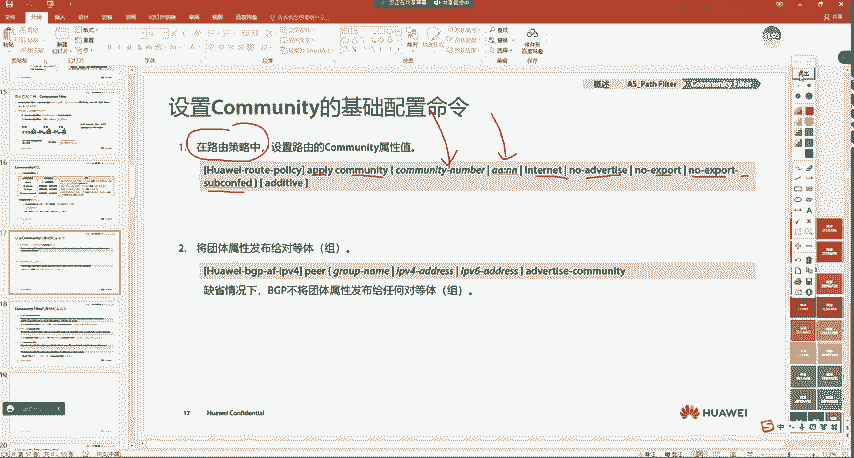

比如说我简单拉两台设备嗯，4。5。嗯。这是杠一。然后这边呢我们用AR。

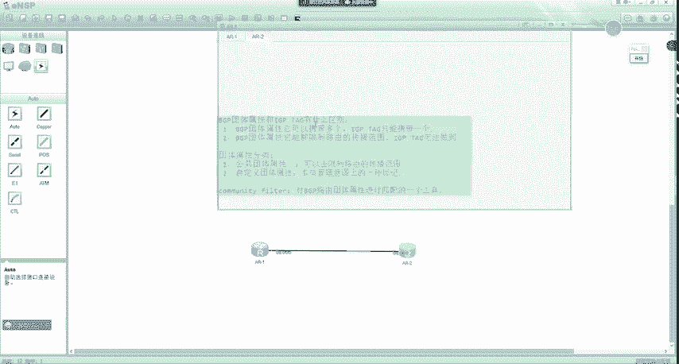

Yeah。这个技术啊嗯就是越学越清晰，对吧？可能大家IP的时候学过嗯，IE再看一遍呢，可能又变得更加清晰了。😊，对吧，所以说有些同学经常说，老师我学不课也学不懂。😊，嗯，很正常。这个是很正常的啊。

所以说大家也不要觉得自己笨啊，大家都是普通人啊，老师学技术也是一样。😊，那我也不是看什么都会了，是吧，都是需要花时间去沉淀的啊。呃，比如说我们在一上呢去写入的policy对吧？

这个policy的名字呢嗯我们叫123prome note10。呃，比如说我们通过衣服m匹配了一条路由之后呢，你可以通过op plan。嗯，communate对吧？去给他打上团体属性啊。

这里呢有我们这些呃公共的团体属性，对吧？啊，你也可以设置为空的对吧？比如说我路由本身携带团体属性呢啊，我得通过这一条命令，我者把你的所有团体属性呢给你清空啊，也是可以的。

那或者说呢我们去打上自定义团体属性，像这些对吧？比如说65001冒号一是吧？类似于这种，你也可以去打多个，再打1个65001冒号2是吧？啊，我再打个no export属性。都是可以去打的啊。

就是我们可以同时去打多个，当你也可以去写时间制的。啊，在这里啊42亿多是吧，你也可以去写十进制的嗯。

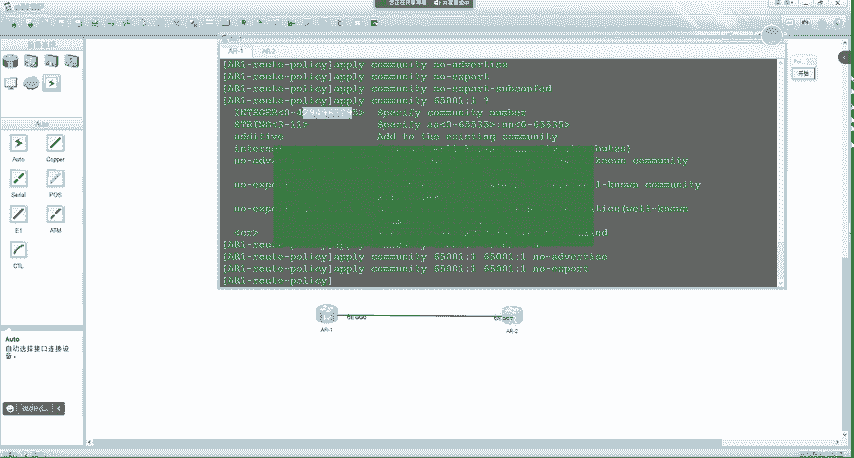

那当我们去打完这些团体属性之后呢，就代表着什么意思呢？嗯，我们针对于邻居去调用，对吧？然后针对于邻居呢去开启通告团体属性的能力。所以这说这个团体属性呢，这时候就可以发送给邻居了，发送给邻居之后。

但是对于邻居来说，我们想一下啊，我打这个标记的目的呢？就是希望邻居或者说其他路由器呢能够基于标记呢去执行一些策略，对吧？那我们怎么样去匹配这些属性呢，对吧？我们说它本质就是一种标记，怎么样去匹配呢？

就用到了com field啊叫做如果命令行就叫做IP对吧？去匹配这个团体属性啊，怎么样进行匹配的呢？就是我们在一上去创建一个com对吧？然后下面呢你可以是基本的跟高级的，你可以去设定啊，啊。

或者说呢你直接通过序号来进行区分，像这个1到99，就是基本的对吧？100到1。😊。

199就是高级的，基本和高级的区别是在哪里呢？就他们两个啊。😡。

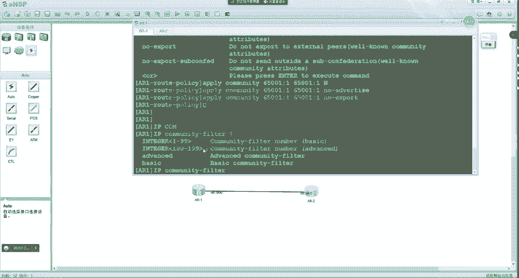

有基本的。Yeah。还有高级的啊高级的咱们一般不用啊，太高级了。基本的呢就是通过对团体属性号，对吧？啊，或者我们说值。啊。进行匹配。那高级的的话，它是通过正则表达式。对。团体属性进行匹配。对，没错啊。

高级的一般咱们不会去用啊，因为它比较灵活啊，但是灵活的东西呢都会存在风险。这里大家知道啊，嗯，所以说呢你这个就是作为人来说是吧？这个脑容量很难跟上设备啊，你不像设备那么灵活对吧？啊。

但是作为我们人来说呢，它没有办法匹配的，就你的思维没那么快。😊，能明白吧？呃，所以说呢一般高级的我们不会去用，可以吧？但是对于基本的来说，它是怎么样进行匹配的呢？比如说在这里呢。

我在一上呃communate field，对吧？呃，我们先把基础网络做一下吧啊嗯。😊。

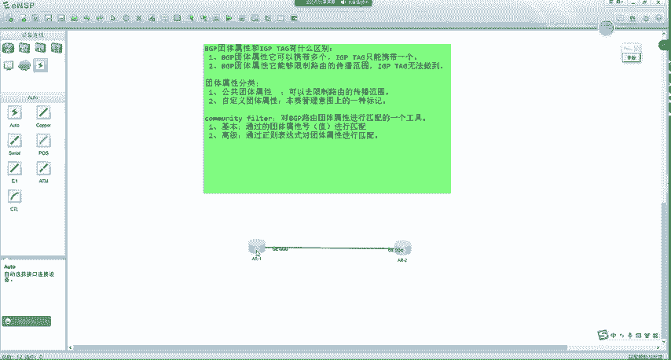

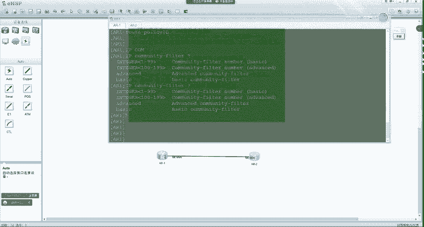

现在我们这样啊。嗯，两个路由器呢，我把它放到1个A里面。

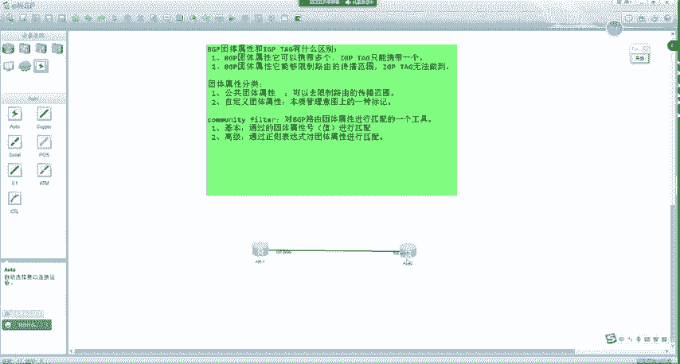

对吧都是AS100。嗯，然后P210。0点。10。0。12。2AS100，然后我就用物理口件了啊，P2AS100。10。0。12。1A1版对吧？我在一和二上呢，先让他去建立BDP邻居。建立完邻居之后呢。

我在一这边嗯写两条静态。192。168。1。0。对吧然后再写1个2。0，就是我们给他创建两条静态路由，然后在BDP里面呢。BDP100network192。168。1。0，然后network192。

168。2。0。给他发布出去啊。

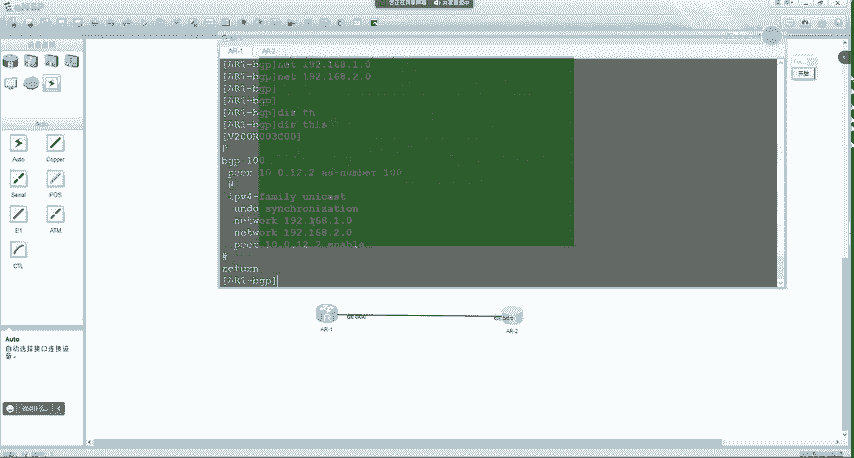

那发布出去之后呢，待会儿一跟二的邻居建立完成之后呢，二就可以收到这两条BGP路由，对吧？然后现在我们在一上呢给这两条路由去打一下团体属性啊，我们可以通过root policy123对吧？

prome note10。

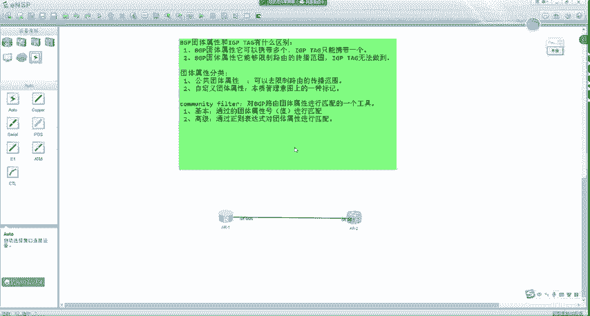

嗯。然后我暗 do apply communicate。嗯。等下关闭啊。然后呢，我现在是这样的啊，大家注意。😊，呃，我写个ACL2000ruler permit。192。168。1。0。

permeit source是吧，然后ACL2001 ruleler permit source192。168。2。0。对吧把这两条路由匹配出来。那匹配出来之后呢。

我们的root policy123pro米note10。匹配ACL2000对吧？就是匹配1。0，然后给他打上一个团体属性呢，比如说是一冒号一是吧？然后一冒号2。对对，然后root policy。

123pme note20。嗯，一夫mshACL2001，然后oply committee。嗯，我们只打个E码号一。对呀，只打一个E码号一。呃，这时候我打完之后啊，大家注意。嗯。

然后呢我们在BGP6100下针对于。2这个邻居是吧，去给他调用ruuter policy exportport123啊，export在发出的时候打上团体属性。但是这时候呢，你在发的时候呢。

实际上还是没有对吧？啊，为什么不会发呢？因为团体属性传递的功能，默认是关闭的，所以说我们还要开启一条命令，对吧？那允许针对于二这个邻居对吧？给他通告团体属性值。当我们开启了这条命令之后呢。

可以到二上来看一下diplay BDProing table192。168。1。0。嗯，现在属性还没有过来，对吧？咱们得稍微等一会儿啊，但是等会儿的这个时间呢，我们正好给大家介绍一下，对吧？

因为我们比如说这时候一给二发送的路由呢，已经有团体属性了，有192。168。1。0。😊。

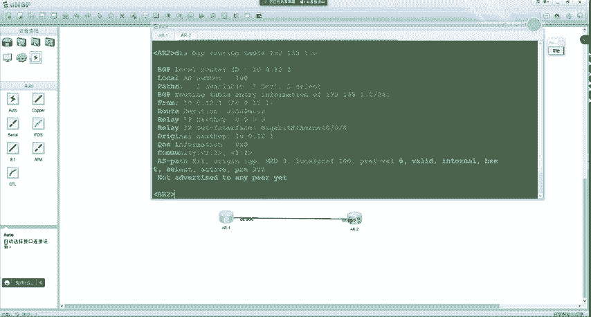

对吧然后有192。168。2。0，那1。0呢，它携带了一冒号一和一冒号2，然后2。0呢携带了一冒号一。啊这时候比如说我有没有这样的需求呢？就是我在二上呢。当然你打的时候可能有很多啊。

比如说二上有这么一个需求，就是只要携带一冒号一的，只要携带一冒号一的路由啊啊，我们都把MED改成200。😊。

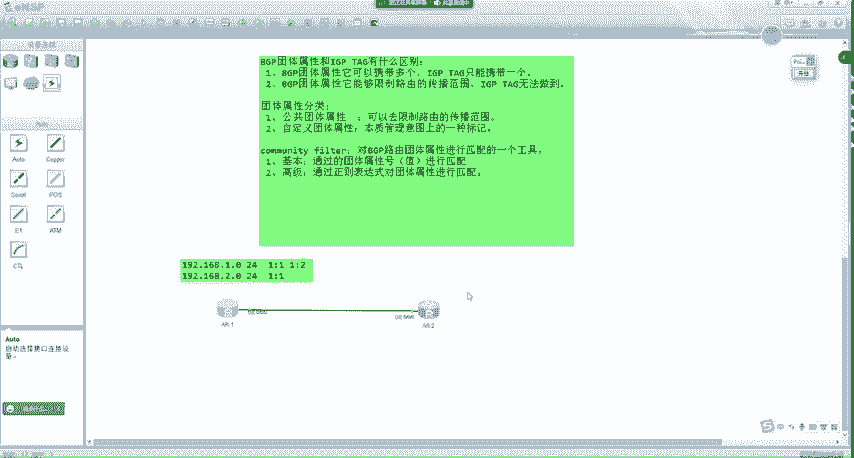

大家能懂吗？都把MED改成200啊，那这时候怎么办呢？就是我们怎么样去匹配这个团体属性呢？我们可以看到团体属性已经过来了，对吧？但是老师啊，我通过ru policy能匹配团体属性吗？是吧？嗯。

他有没有这么这样的呢？比如说旁边note10，我随便找一个啊。😊，Yeah。嗯，ifm对吧？communate field对吧？你发现它只能匹配communate field这个工具。

而没有办法直接去匹配团体属性的值。对不对啊？那只能匹配工具，那我们就要去学习这个工具。啊，比如说老师啊他之间能匹配值。那这时候这个工具能不能被省略呢？实际上是可以的是吧？啊。

但是我觉得现在可能有很多同学可能产生也有疑问，是吧？那老师他直接匹配值不就好了吗？他要这个工具干嘛呢？😊。

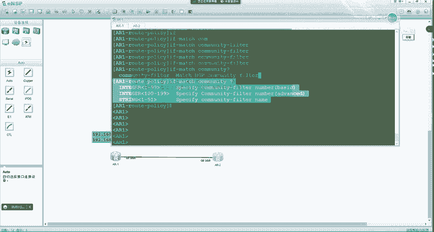

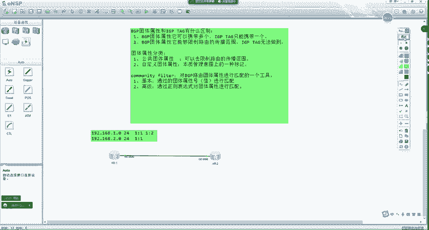

对不对？呃，如果有同学这么问的话，我就很难给大家解释了。

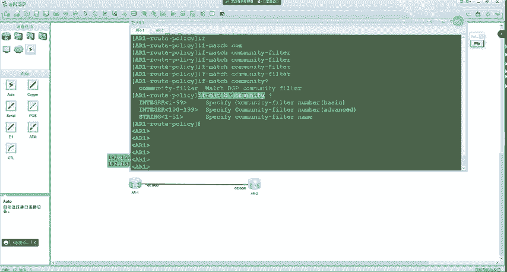

啊这里大家明白啊，嗯我们本身是作为应用工程师啊，你比如说对吧老师为什么要要用这个东西啊，我直接让poli能匹配这个团体属性不就好了吗？不要这个field了，这个实际上就看人怎么样去定义了，对吧？

如果是你研发设备呢，你可以不这样写对吧？当然很多同学可能比较疑惑对吧？老师那要他干嘛嗯这个我很难给大家解释啊，这个就是这样的，就相当于你一样，你爱吃黄瓜是吧？他就没有理由一样？你可能别人不爱吃吧？

你就理解不了对？黄瓜有什么好吃的，那有什么爱吃的，但是确实有人去爱吃？所以说你很难去理解到啊，但是这个呢就是相当于规定华为也是没有办法去控制的对吧？因为大家都要去按照标准去实现啊，如果你是制定标准的呢。

那就有这么一回事对吧？你就可以去定义了，但是呢。😊。

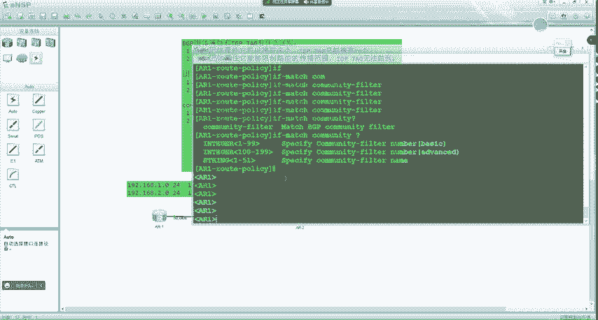

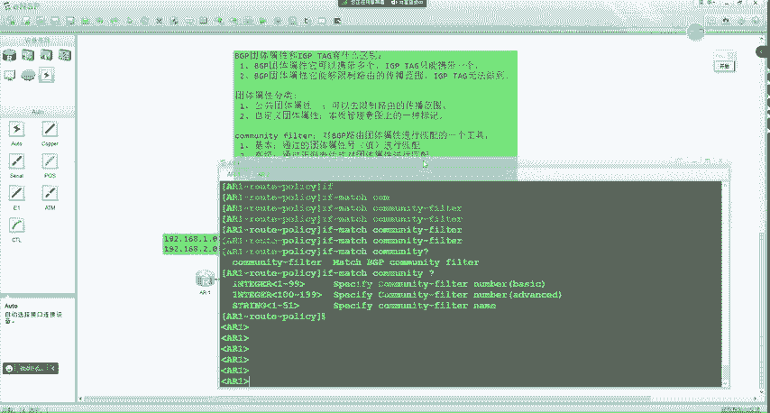

就是厂商他也很难去决策啊呃，因为对于厂商来说呢，他们也只能按照标准去实现，对吧？啊，那标准呢都是由像这个。IETF小组。是吧。嗯，由这个组里的各种成员呢，他们去定义的标准吧，那厂商用于实现啊。

我们呢只是用于学习对吧？所以说我们不要去纠结啊。

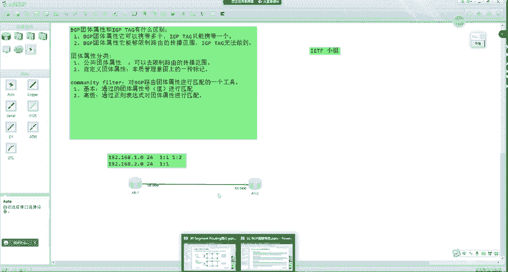

然后我们来看啊，那我们再去创建团体属性的时候呢。IP committed field哦，我们可以去写一个简单的，比如说一是吧？那这里呢也有promit和抵啊，默认也是拒绝所有的。对啊。

比如说我们promit呢就是用于匹配哪条路由，比如说匹配带有no export行不行呢？可以，那匹配到有no active的行不行呢？也可以，是吧？internet这些你都可以去匹配。😊，能懂吧。

那在这时候呢，我们也可以去匹配具体的值。那命令格式呢，实际上在我们的课件里面是有的啊，就是我们去创建一个基本团体属性之后，对吧？你可以去匹配它具体的值啊，或者说创建一个高级的。

但是高级的你得用正则表达式去匹配啊，那就比较麻烦了。所以说这个我们不要去管它啊，因为我平常呢也没有做过高级的实验。啊吧嗯模拟器里面呢当然也能够实现啊，但是我不建议大家错啊，实在是用不到啊吧？

然后我们再来看。那下面呢我们去创建匹配了之后，它是怎么样进行匹配的呢？比如说啊我现在匹配一个一冒号2注意啊，我后面能不能写多个啊，实际上是可以的，是吧？大家可以看到我是可以写多个的。

比如说现在我只匹配一个一冒号。😊，我应该在二上匹配。是吧比如说我在二上呢只匹配一个一帽盒。

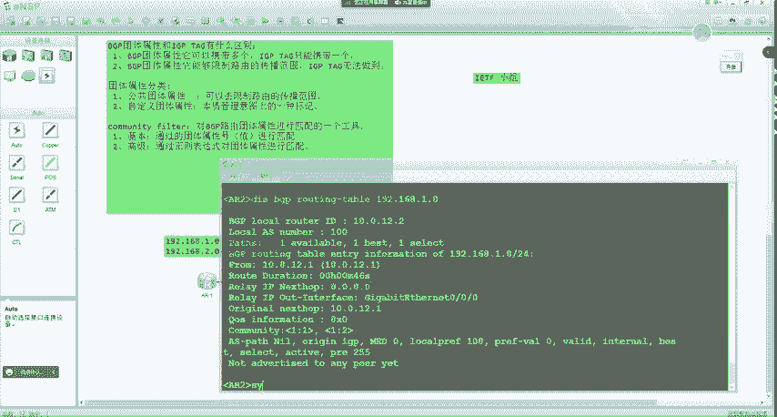

那在这时候呢，我们来看一下发过来的路由呢有1。0携带了一盒，对吧？比如说现在呢我要求只针对于1。0这台路由，把它的MED呢改成200。那这是我们当前的需求，对吧？

这时候你就可以在二上去写一个rule policy啊，比如说叫MED吧，proinnote10。

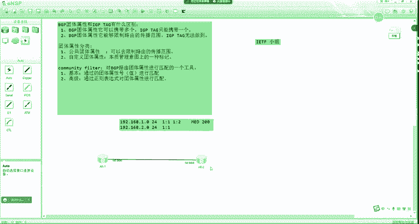

呃，我们去匹配commun field匹配一匹配一之后呢，oply，然后。MED啊应该叫cos的。啊，我们给他改成200。改成200之后呢，在BDP。啊，还得写一个允许所有语句。

ruuter policy。MED旁边note20。是吧然后在BGP100下，针对一这个邻居去调用。Roer policy。MED import。

那这样代表着什么呢？就是首先呢我们去写了一个rur policy，对吧？那它匹配了团体属性一，而团体属性一呢匹配了一冒号一这个团体属性。那也就是说所有携带一冒号啊。

一冒号二的这个团体属性呢都被我的root policy匹配到。那匹配到之后呢，我们写了一个oply cost的200。对吧写了这个opco的200。

那就代表着只要被这个团体属性一匹配的路由呢都把MED改成200。这时候呢我们可以到二上来看一下现象对，因为我们针对一去调用之后呢，一旧会给我发路由。而在他所发的路由中呢。我们可以看到对吧？1。

0被改成了MED200，那被改成的原因呢，就是因为我们匹配了一曼哈这个属性，对吧？而你只要携带一帽哈，那就会被我匹配。是吧那比如说你能不能这样呢？老师就是老师，我现在unto课命内的field。😊，啊。

and doIP community field。啊嗯，然后是一我把这个删掉，然后IPcom field一permit。然后我直接匹配一嘛号一。是吧。

那这样就代表了只要携带一冒号一的路由呢都会被改成200。所以说我们可以看到1。0和2。0呢同时被改成了200。对吧。那比如说现在我有这么一个需求，就是呢嗯你必须匹配一嘛号一对吧？然后你还只能改1。0。

你大家觉得有没有方式能够做到呢？没。嗯。有没有啊？实际上也是有的对吧？因为我们刚在讲的时候有没有说过啊？😊，二拍咩意啊？团体属性可以设置多个对吧？比如说我现在啊大家注意。

and度IPcom field一，我把它删掉，删掉之后呢，我们来看啊。我们刚在匹配的时候，比如说我写一码号一，后面还能不能再跟上其他的，可以，比如说我再加个一码号2。😊。

是吧那这样就代表着同时携带一冒号一和一冒号2才可以。那这时候，比如说我们在二场display BDProing table，你去查看的话，你会发现呢只有1。0被改了，对吧？所以说当携带了多个之后啊。

它们之间是与的关系，什么？就是1。0呢和2。0对吧？啊都要匹配。😊，对吧就是与的关系啊，逻辑与是吧，一与一冒号一与一冒号2啊都要被匹配到是吧，这是它的匹配逻辑啊。然后我们再来看，实际上。😊。

这个逻辑是不是就这么简单呢？呃，并不是啊，然后我们在匹配的时候呢，来看一下啊，实际上还有其他的方式。比如说呢我们来看这一种。😊，基本comited field举例对吧？嗯。

就是现在同时匹配携带commit值100冒号1，200冒号1，300冒号一的路由。那如果我们配置了多个，它就是逻辑语的关系。那也就是说，如果我的路由不能携带这三个能不能被我匹配啊，实际上是不行的。

大家能明白吗？实际上是不行的啊，但是有没有这么一种可能呢？就是老师啊，我携带了这三个之后，我还有1个400冒号一，这种路由会不会被匹配到呢？大家觉得会不会啊？😊，会不会。是吧很多同学觉得会啊。

也有同学觉得不会对吧？那验证对吧？我这里先给大家说一下，学习的过程中啊啊到IE阶段，大家要有自己主动去探索的能力了啊，因为你不能老靠老师讲的那些了，对吧？两个小时，实际上大家学不到什么东西啊。😊。

那比如说现在我有这么一个疑问是吧？老师平常在学习的时候，我就是这样。哎，那如果来个400呢是吧？嗯，首先呢你要推出你的感觉，提出你的问题，现在100冒号一啊，200冒号1300冒号1，400冒号一。

这是路由。😊。

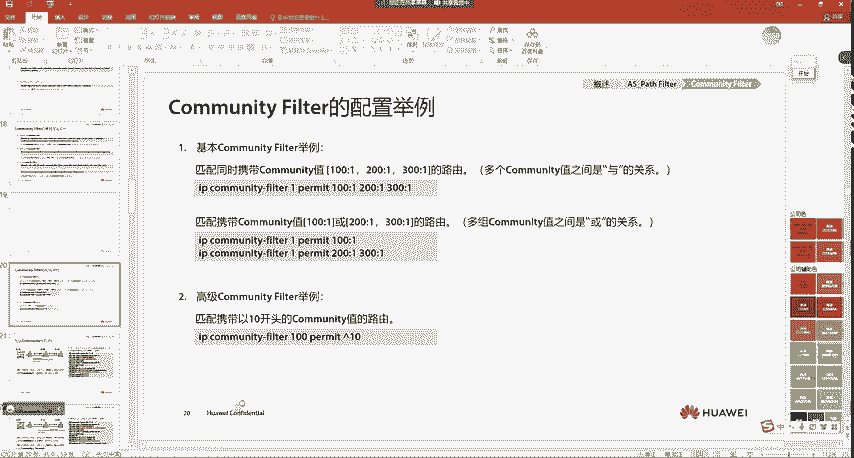

而我的团体属性呢，它匹配了3个。这是我的commun field。那这时候这条路由会不会被我匹配呢？如果我有这个疑问，那最好的方式就是怎么样？

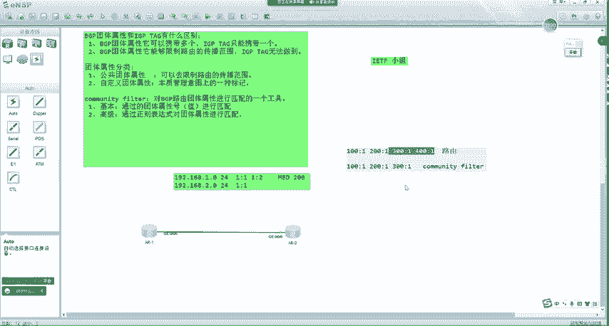

怎么样？做实验大家能懂吗？对，实验啊永远是验证你是吧？啊，或者说呢证实你想法的非常关键的一步啊。比如说我现在undo community field。对吧。

然后我把之前的删掉IP committed field。😊，一啊permit100冒号，我们这样啊。一码号一一码号2。问题吧，我只匹配了这两条，对不对？然后我们在A21上面呢，我再给他打个一冒号3。

这跟这个逻辑不是一样的吗？路由携带多，但是我们匹配的少了一个。😊。

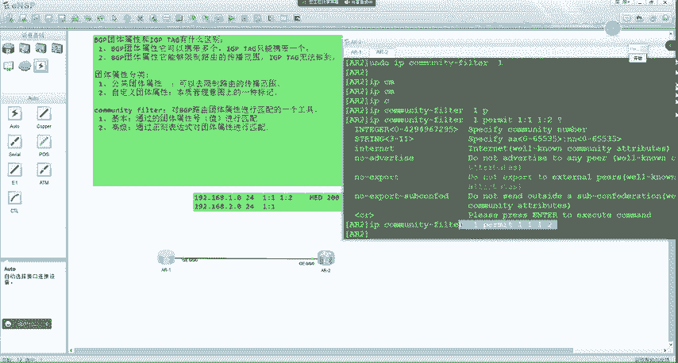

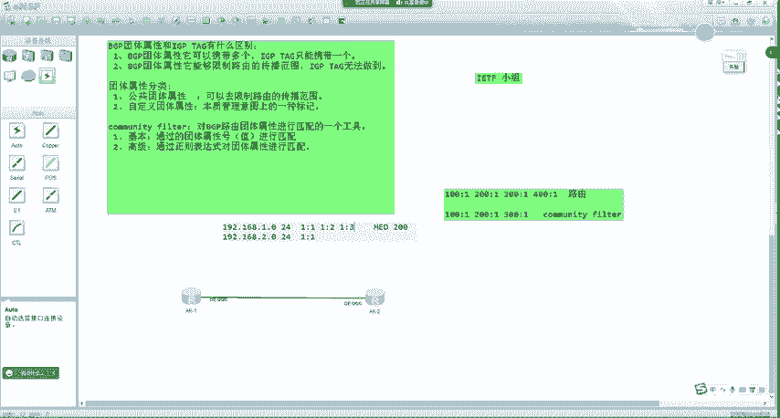

是吧所以说大家看好了啊，router policy。😊，123prome note10。我刚刚不是。打了两个吗？对吧？啊，不是这里。啊，在这里啊。我刚不是打了两个吗？我再来一个。😊，对吧再来了一个之后。

我们来看啊，现在我匹配一冒号一一冒号2一冒号3。😊。

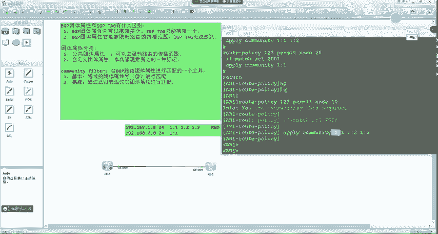

对吧我同时给他打了3个，但是我在匹配的时候呢，我就只匹配了两个。那这时候它会匹配哪条路由呢？你diplay BGProoting table一看哎，1。0虽然携带了3个，但是依然是被修改的。😊。

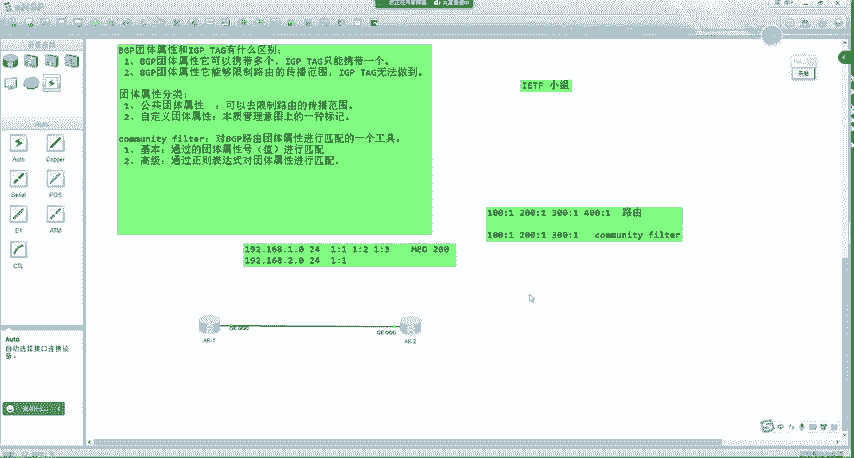

对不对啊？是吧那这时候我们就可以判断的是什么啊？就是它团体属性的匹配逻辑就是有就行。

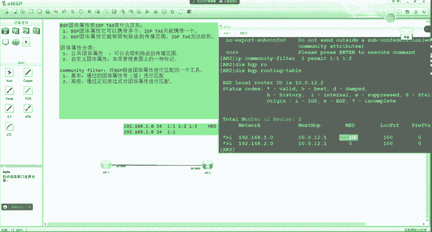

能不能明白？对吧啊，你有就可以。能懂我的意思吧。

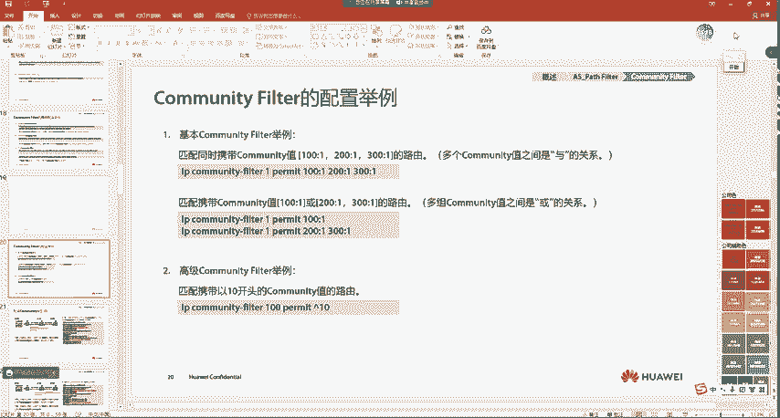

哎，那比如说老师有没有这样的，大家看好了啊，我现在在做个实验，如uter policyMED permit note10。😊，对吧我刚ifmIP community field的时候，大家注意啊。

在这说我写了个一，对吧？加个ho match对吧？回车。对啊。然后现在我们再来看diplay BDProoting table还有没有？还有没有啊？没有了。是吧就没了，那这是什么意思呢？

我来给大家说一下啊，就是我们在去匹配团体属性的时候呢。😊。

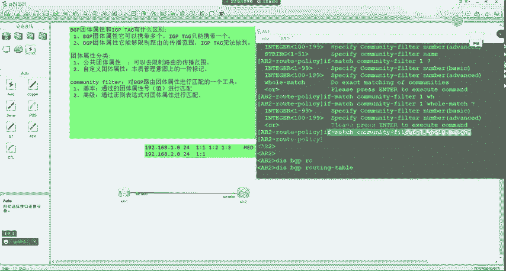

就是在router policy的匹配逻辑里。匹配。逻辑里。如果我们不加这个for match。他代表着。松散匹配。松散匹配是什么意思呢？那也就是说，只要我的团体属性。

就是路由携带我这个团体属性所被匹配的值。我们现在不是匹配了一马号一一号2嘛？路由只要有这两个值，对吧？就会被匹配。😡，啊而你加个ho match呢，就代表严格匹配。啊，对，没错，就是有就行。

那这样的话就代表严格匹配了。😊，那也就是说。Okay。能懂吧？就是。😡，这三个值呢，我现在比如说我匹配了一冒号一跟一冒号2对吧？但是被我匹配的路以后，它只能有这两个属性啊，有第三个行不行呢？就不行了。

😡。

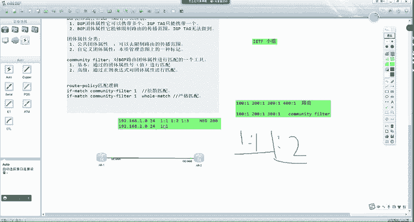

对吧比如说现在呢我这样来做。嗯。我把1。23再给他删了。对吧1。23被我们删掉了。那删掉之后呢，我们再来看一下啊。😊，有没有被修改成200啊？

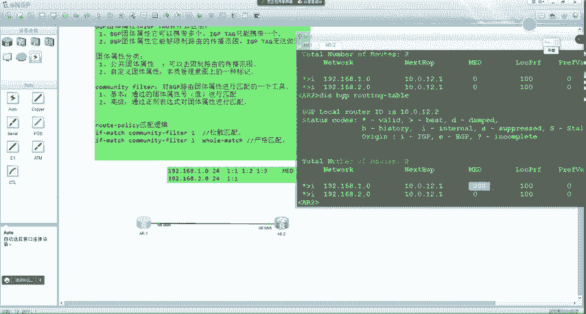

是不是有啊？对吧所以说这样的话代表严格匹配跟松散匹配的意思啊，对吧？严格匹配就是啊你都得有是吧？松散匹配呢就是有就行。是吧如果用大白话，这就是都得有。是吧啊这有就行。😡，有就行是吧，就跟你工作一样。

对不对？有就行是吧？老板给你说个事是吧，加班对不对？给你加班费5块钱啊，你说有就行。😊，对吧所以说啊呃在这里呢是我们在ruuter policy里面匹配逻辑啊，而在commun field里面呢。

如果我们写了多个啊，它就是逻辑与的关系，对吧？但是他在匹配的时候嗯也是一样的，对吧？有就行。😊。

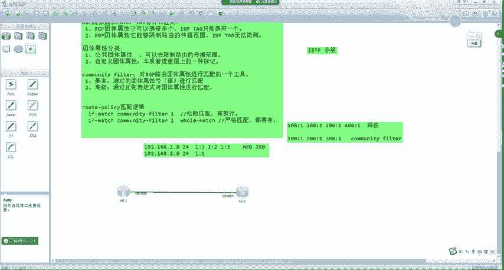

能不能明白？然后下面的话，如果比如说我们写了一个comit field一对吧？但是定义了两个值，大家注意啊，定义了两个值。比如说现在呢我写了两句，大家都是名字为一嘛。啊，我写了个100冒号一。

再写了个200冒号一。那如果是这样的关系，它就代表是逻辑或。😊。

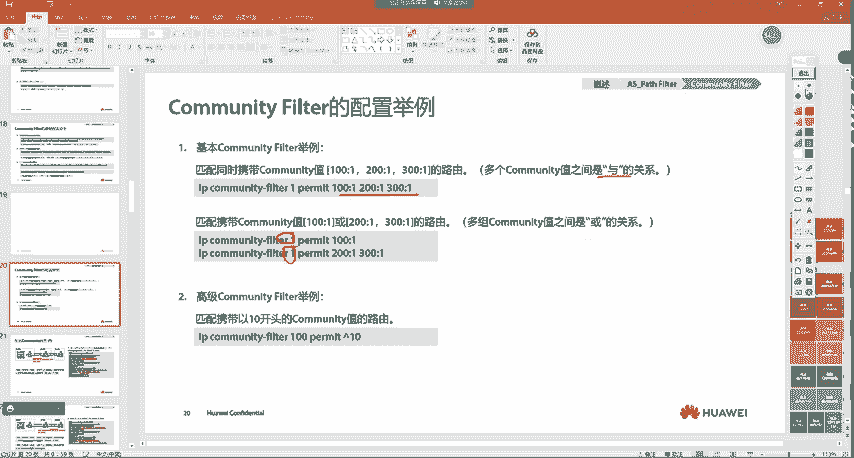

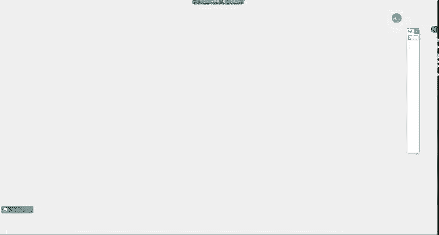

好吧，就是我路由呢得携带100冒号一，或者呢200冒号一加上300冒号一。大家能不能明白？所以下面这种啊是逻辑或的关系。可以吧，但一般呢大家注意啊，我们只会去写一个，大家告诉我为什么。嗯。为什么？

我举个例子，比如说我现在呢路由呢有携带100冒号一的，有携带200冒号一，有携带300冒号一的对吧？呃，如果让我去做项目的话，对吧？让我去配这个策略，那么我就会写两个。为什么呢？因为我觉得。

万一写一个是吧，有出错的风险。对不对？所以大家知道啊嗯网络呢以及技术这一块，我们永远推推崇的就是越简单越好，而不是说技术比较难，对吧？它就比较好啊，技术比较难，我又能会用啊，那我就比较好，比较厉害。

对吧？客户就愿意用你啊，那并不是对，没错，大道之简，没错，一定要是越简单越好啊，对吧？啊，就跟你的感情生活实际上是一样的对不对？嗯，那越简单越好，对吧？啊，你不要搞那些弯弯绕绕的。😊。

所以这这一块啊嗯像刚有同学说的对吧？老师比如说我团体属性非常多，对不对？啊，那么在这的时候呢，你就可以去写多个啊，或者说呢你在后面多加几个。😊，是吧如果你觉得是吧？老师我现在团体属性就得是获得关系。😊。

那嗯我建议大家用语句不同的去分开啊，或者说你提前去做测试，这一块是非常重要的啊。但是我永远建议大家的就是越简单越好啊嗯，你也不要给自己是吧？啊也不要给自己的这个未来后人去挖坑。对不对？对。

比如说你搞的花里胡哨的啊，结果别人呢上来之后看不懂。😊，是吧嗯我之前做项目的时候呢，我就经常发现。😊，嗯啊老有一些，比如说我这交换机啊。😊，啥也没配。我举个例子啊。😡，比如说我这个交换机就做个网关啊。

啥也没配。😡，对吧他上面跑了个OSPF。但是没有人给他建邻居，他就做了一些就是在我的网络场景中呢，是有一些没有用的配置，他也不删。嗯，我也不删，我不敢删是吧？就你到客户那里呢，你也不敢删啊。

你会发现呢很多人他有很多特别奇怪的配置。😊，对不对？实际上就没用。是吧啊，但是呢你也不能删啊，那这个呢实际上比如说你在跟你后面的人呢去。😊，做这个交接的时候呢，就比较麻烦，他也比较头疼。啊。

给后人去挖坑，对，你也不能删，因为你删了，一旦出问题，你也不好说啊。是吧比如说老师我这就是个二层交换机啊，也不需要网管，但是他就跑了OSPF，我要不要删呢？不要大家一定不要用这种强迫症啊。嗯。

这种呢很麻烦啊，大家不要用这种证吧。😊，然后我们来看啊高级ACL高级commun field呢，实际上跟我们之前所说的那几个符号是一样的。因我们在讲A pass field的时候。😊。

比如说我们要匹配十开头的团体属性值啊，兼括号十0就可以了。是吧那这样我间括号10冒号1，间括100，冒号1，间括号10冒号1，然后20冒号1，大家告诉我这一个能不能匹配这三条。拿不拿？能不能是可以的。

对吧这样是可以的啊，所以说它本质是非常灵活的啊，这里大家知道。😊，但是这种呢嗯我们不建议去用啊，它太灵活就容易出错，是吧？一旦出错呢，就是麻烦一点是可以，但是我们尽量的不要去出错啊。嗯。

然后下面有一个应用的举例啊，我们把这个例子来过一下。那这里是这样的啊，就是我们在RE上呢去配置路由策略啊，让他去通告BDP路由10。1。1。1-32去携带了1个101冒号一的团体属性。😊，啊。

就现在呢我去传递10。1。1。1-32这条路由，携带一个团体属性。那这个我们怎么样去打呢？就是首先你要把这条路由匹配出来，对吧？匹配出来之后给他打上标记，打上标记，针对于邻居去调用。

对吧然后允许其他所有路由，然后开启盘体属性的通告能力。是吧那这时候呢我们就可以把团体属性通告给R，这是大家在IP的时候所学到的一些啊这个配置命令。是吧？我觉得这里可能有些同学还有一个问题是吧？哦。

接下来我要说这个问题呢，如果有同学啊有，那就是你的学习路子不太对，对吧？大家可以自己反省一下，哎有同学就问了是吧？啊，老师你刚刚说团体属性的目的呢，只是让我们对路由的匹配变得更加简单。

但是我刚开始在为路由打团体属性的时候，不还得匹配路由吗？😊，是吧那我打团体属性有什么样的意义呢？对不对啊？如果大家有这个问题，你的学习路子就不太对了啊，大家要想办法去纠正自己的学习路子啊。

这里我来给大家解释一下嗯，是为什么呢？就是你不能站在单点上去看待问题。比如说我在一上面我匹配路由打上这个团体属性了，那是不是未来我的二，我的三直接可以匹配这个值啊？😊，对不对？

是吧而不用在一二跟三上呢再去匹配这些团体属性了。我只需要在一上规划好，这有100条路由，我在一上写100条ACL去打上二只需要写一个团体属性field就可以了。😊，对，没错，你要有这种全局感是吧？

如果你觉得是吧？老师我都配完了，我再打没意义啊，那这个就是你的学习路子不对了，对吧？所以说大家现在这个阶段呢要慢慢的开始啊，能够反省到自己啊，慢慢的去体会啊。但是这个呢很难纠正过来啊。

嗯老师也只能带你入个门是吧？告诉你应该怎么样去看待这个问题啊，但是后面呢要看悟性啊啊因为技术这一块呢嗯就是以我教学这么多年来看啊，比如说我们有100个人啊，那么至少就是差不多就有那么五六个人啊。

嗯不太适合搞技术。😊，这个是这样的啊，就是绝大多数人啊脑子都是没问题的啊，也是比较灵光的对吧？啊，但是至少会有五六个人，但是各位同学只要你嗯肯去用心，我觉得都是没问题的。以我自己的经历来给大家说呢。

我以前的学习路子就不对，是吧？呃，踩过不少坑。😊，所以说呢这个慢慢就好了，对吧，大家也不要去灰心。😊，然后我们来看第二个场景啊。那第二个场景是这样的，就是在R上呢部署路由策略，让它在通告10。1。

1-32的时候呢，加上一个no export属性。对吧那在这儿说我们就可以在R上。对吧去匹配10。1。1-32，对不对？那这里呢它用的也是通过ACL去匹配的那比如说能不能这样，比如说在此基础之上。

因为一发过来的时候已经有团体属性了。我在这里用commuteate field匹配，大家觉得行不行？行不行，也是可以的。对吧但是这个场景给我们演示的啊，并没有用到communate field。😊。

注意啊，这个场景要给大家说的是这个场景没有用到，但是本质你在这里去匹配行不行呢？也可以。然后我们来看啊，现在呢我匹配了1。0去给他打上了一个noisport是吧？呃，然后去给邻居进行通告。

大家告诉我ADD是什么意思啊？😊，ADD大家知道啊呃是在原有的团体属性上去增加。那么以前我不有个101嘛号1嘛，对吧？ADD代表的去增加是吧？而不是去覆盖。😊，所以它是这么一意思啊。

当我们把no export传递到三之后，我们可以看到三上面有两个啊，为什么有两个呢？是因为我们在二上面加了1个ADB。😊，对，是增加的。而对于community field呢，它用在什么样的场景下。

我们来看这里啊。😊，现在是这样的，就是一呢给二发送路由的时候呢，1。0携带了100冒号1，1。2。2呢携带了100冒号2，对吧？我们为不同的路由呢去打上了不同的团体属性。😊。

然后现在呢我们在R上需要去做测略。传递路由给三的时候呢，要去过滤到带有101冒号一的这个路由。那这时候怎么办呢？我们就要去匹配这条路由，匹配这条路由写个router policy deny对吧？

代表拒绝。拒绝，然后去匹配commit field，就跟ACL的道理一样，只要被这个commit field匹配的路由呢，都会被我的如er policy。

是吧所以说这个permit大家可以理解成抓取是吧？你只要能抓着，那我就能给你拒绝。😡，对不对？那在这时候呢，我们再续写一个允许所有。因为我们未来2。2还要进行传递。然后呢。

针对于R3呢去调用这个猪的policy。对吧所以说在这时候，未来R3所收到这条路由之后呢，我们来看啊这是R的。R这条路由不有1018和1吗？正好我们写的这个团体属性给它匹配了，对吧？

在如poli里面拒绝了。😊，那最终这条路由传递到R3之后，我们发现它就只有1个2。2对吧？而原始携带的那个101冒号一呢，它就没有。是不是啊？

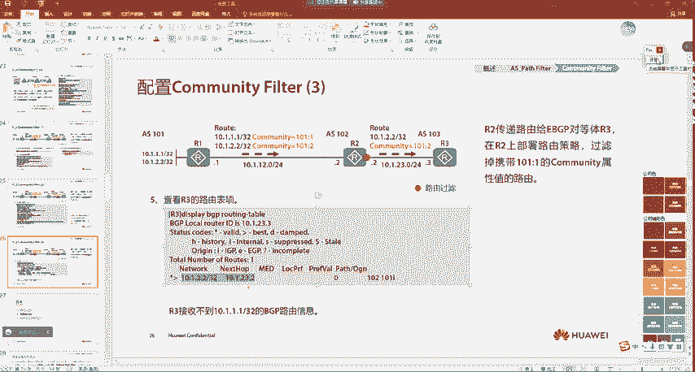

那这个实际上跟我们刚刚的是一个道理，对不对？这个课件呢相当于把我们做的时间语演示了一遍，不就是这里我们给他发路由的时候吗？😊，对不对？我给你发路由，然后你匹配啊，然后你去做一些策略。

那你可以是允许或者拒绝。但我们是以修改MED来进行演示的。

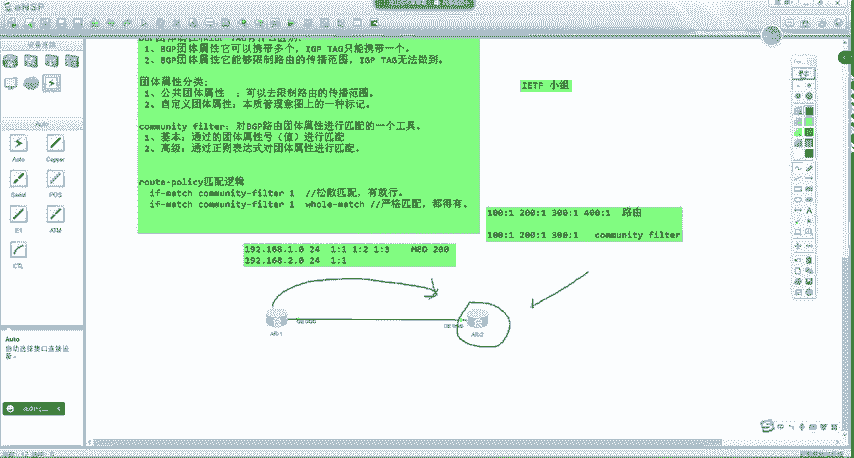

所以这就是咱们所说的呃，community field啊，就大家知道它的匹配逻辑就行了。本质就是一个工具啊。那具体这个工具你怎么样去用啊，是由你来进行决定的。所以这里大家听懂了吗？😊，李野同学敲一啊。

这里都没问题吧。😡，Yeah。可以是吧。好，那我们就继续来往下说啊啊，接下来我们要说的另一个呢叫做按需发布路由啊，我们把它叫做OF啊，也叫做出口路由过滤。对啊？啊，我们把它叫做BGP的ORF。啊。

那这个技术是比较老的啊，嗯可能比有些同学都比较大了。那这个技术主要干什么事呢？来给大家说一下啊啊，就是我们之前在做BTP策略的时候，会发现有一点有一点什么样子呢？现在我们假设有这么一个场景。

那现在我在R一上呢，比如说有两条路由，1个1。11个2。2，那我要把这个路由通告给二的时候呢，我会发现一个问题，呃，什么样的问题呢？这时候我假如说二呢？嗯它是这样的，我不希望接收2。2这条路由。

我只要1。1对吧？但是R一它是不知道的，是不是？所以说R一本质上还要把路由给2，然后过一遍二的入口过滤策略对吧？然后二才会接收。😊，对不对？那这就相当于什么一样呢？嗯，将就相当于你跟范冰冰啊。

不能说范冰冰是吧？啊，就相当于你跟啊。😊，啊，就是跟你跟一个当代特别火的一个明星表白一样。是吧啊，怎么样呢？你可能跑了很远的距离，对不对啊，对你找你的这个网红，对不对啊，你看上的这个主播是吧？啊。

你去给他表达你的诚意啊，但是呢你知道那是一种就是不可能的对不对啊，但是你也是跑了非常远的距离呢去给人家送一项礼物等等之类的啊，啊，实际上我们是明知道结果的。

但是你这段路途呢嗯啊但然有些人会觉得比较有意义，对吧？但是在我们的网络中，他就是没意义的啊啊大家不要觉得是吧？😊，咱用生活举例不太合适啊啊，我们把那个例子收掉，好吧，我们把那个例子收掉啊。嗯。

就是这样啊，就二一给二发，然后二这里给你拒绝了，对吧？在我们的网络中就是没有意义的，大家能懂吗？是吧？在生活中可能还有对吧？老师这都是经历啊，对吧？经历让我成长对不对？嗯，那我们就不用生活来进行举例了。

反正在网络中他就是没意义的，大家能不能明白，明白同学敲一啊，这个没问题吧？就是你发给他他也不接收，他就是没意义的，是吧？他还浪费了链路带宽，还浪费了设备的资源，对不对？

那如果路由数量变得非常的多的时候怎么办呢？比如说老师我这有1万条路由，对吧？但是R他只要一条，我把一万条都给他了。😊，对不对？结果他就要了一条。😡，是吧那实际上哎，老师这9999条路由。

它在链路上可消耗带宽啊是吧？而我们在传递的时候呢啊也会消耗设备的资源。😊，那这时候怎么办呢？就有了OF这种能力啊，叫做邻居按需发路由。啥意思呢？比如说我们在二上做了一个过滤策略。

当一跟二之间我们去开启OF能力之后呢，二就会给一发一个路由过滤策略，注意啊，二会把自己的过滤策略发给一啊，告诉你，这是我的入口策略，反正你就按这个发，你发多了，我也不要大家能明白吗？😊，就你就按这个发。

😡，是吧你发多了，我也不要啊，因为我接受不了。😊，对不对？所以说在这时候呢，一会根据二发送的这个策略呢去构建自己出口的过滤。😡，啊，比如说你只要一条路由，那一把自己出口呢去做一个过滤测略啊。

那未来就只给你发一条。实际上那9999条呢啊在链路上就不需要进行传递了。😡，对不对？所以说我们可以看到呢OF它本质上就是一种出口的路由过滤策略，对吧？为什么呢？

因为我们的接收路由器会把自己的策略给出口啊，给发送路由器，对吧？所以说叫做邻居按需发布路由，就告诉邻居，你只给我发这些啊，你发多少，我不要。😡，是吧发多了，反正是你的事儿，反正我不要啊，能不能明白。

那如果换到我们的网络中，就代表着是吧？嗯，那R本身就不需要去执行那么多过滤了。邻居只发一条，对不对？那也可以降低R对CPU的使用率。😊，对不对？而且这些路由呢也不用在链路上去消耗带宽。对不对？

那这就是我们所说的OF那OF是怎么样进行实现的呢？😊，实际上就是我们针对于邻居不是调了一个inport的过滤嘛，是吧？就R针对R一啊，使用个前缀列表。比如说我把2。2拒绝了，对吧？拒绝之后呢。

我们针对于这个邻居去开启，注意啊。😡，去开启这个OIF能力。那比如说现在在我们这个网络环境中，就是这样的，现在呢R他只希望接收1。1是吧？R向R一推送OF报文来达到这个目的。你不如有三台吗？

是吧我只要1。1。😡，对不对啊，这就相当于你某天失恋了一样是吧？除了你我都不要。😡，对不对？就要一。1不管是吧？我就要一。1对不对啊，那就是这样是吧？现在R也是一样，他比较执拗是吧？啊，是个专情的男孩。

对不对？那现在R就是这样的，我只要一。一，你不要把那些杂七杂八的是吧？啊，再推给我了。😡，对不对，那现在怎么办呢？R他会向RE去发送1个OF的包。那这个包它是怎么发送的啊，大家要注意。😊。

就是首先呢我们在R上要有一个基于前缀列表的过滤，注意啊，一定要是基于前缀列表的过滤。比如说现在我们在R层呢写了一个前缀列表啊，promit1。1，只要1。1，对吧？做了一个音炮的过滤。😊，那2。23。

3实际上他不要了，对不对？那不要的同时呢，我们在R2上针对于R一去配置，对吧？协商通告OF能力。然后IPprefi代表我们是用前缀的过滤sendder代表的是发送啥意思呢？就是R能给你发送OF包。😡。

对不对？告诉你你只给我发哪条路由。然后我们在一上呢，注意啊，开启接收功能，就是它能够接收处理OF包是吧？然后按照OF包里面的策略呢去构建出口策略，只发一。1是吧？正中你的下怀啊。

这就相当于我们给客户送礼物一样是吧？啊，你给客户送礼，那不就是投其所好嘛，对不对？然后客户给你说我是吧？😡。

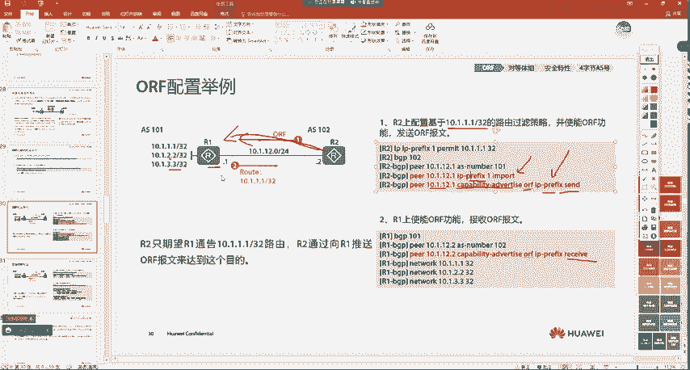

这是两天呃得吃点海鲜是吧？客户把自己的需求给你，然后你按需的去通告。😊，对不对？实际上是一样的道理啊。😡，那这个我们怎么样去做到的呢？

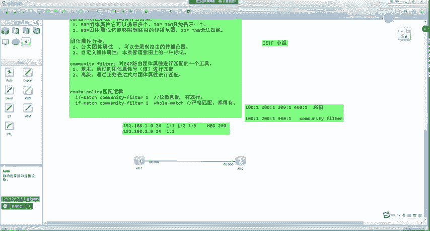

比如说现在我们有一和二是吧，两台路由器嗯，那我们在做之前呢，大家注意啊，我先把之前的一些7788的配置先给它删了。😊，and doP10。0。12。2是吧，ruuter policy123export。

然后。暗度P10。0。12。2是吧？团体属性的通告啊也给它关了。啊，然后在二这边呢。🤧嗯。是吧这就相当于你给别人送礼物嘛。😡，一定要投其所好，你说的人家不要。你送他干嘛呢？哎，没删掉啊。好。

那我们现在删掉了啊。然后现在我们来看啊，现在我们一和二的配置是非常简单的。我们在一这边呢，跟二建立邻居通告了两条路由，对吧？而在二这边呢，只是建立了邻居，所以说在这时候呢，我们可以来看一下。

对于二这边它是可以接收到这两条路由的，对不对？然后现在我们在中间抓个包啊，抓个包之后呢，大家要注意啊。😊。

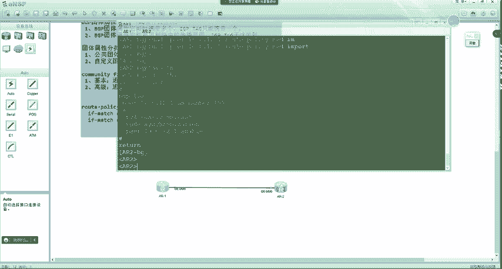

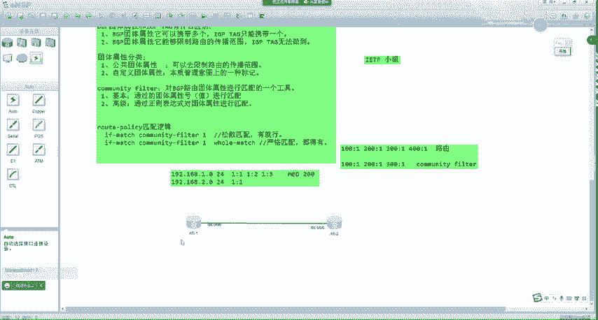

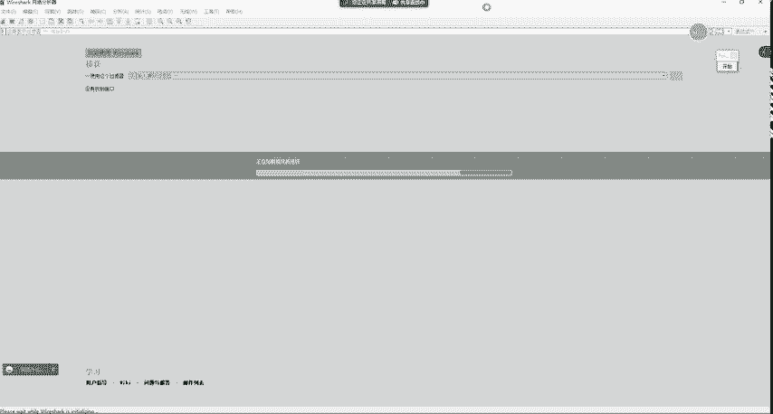

嗯。

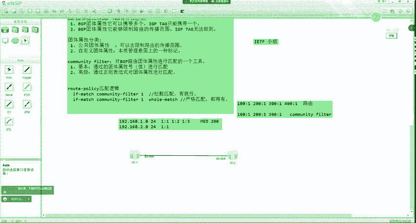

这包比较卡，但是没关系啊。呃，我们就让他先抓着。然后现在我在二上面写这么1个IPprefi，写一个前缀列表。对啊我这前缀列表怎么样子？我只希望接收1。0，但是不需要2。0。我们写个前缀列表呃。

我们假设叫12就叫一吧，然后permit对吧？permit192。168。1。024对吧？就代表我只接收24对吧？1。0的路由。😊，那这个前缀列表写完之后呢，我们BGP100P2呢。10。0。12。

1对吧？把它调用上这个前缀列表一inport就是在接收方向进行调用。

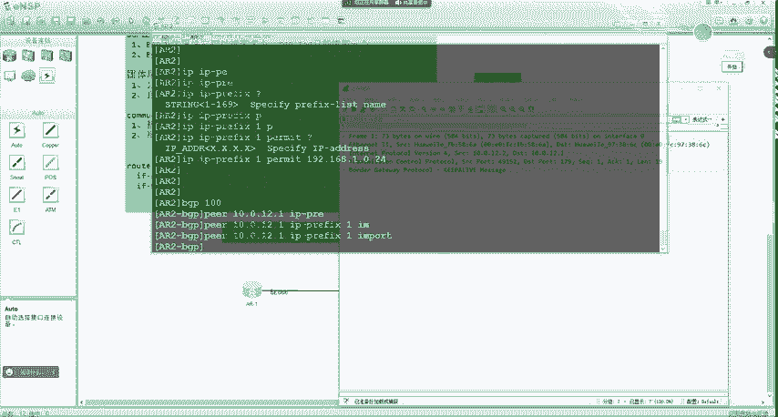

对不对？当我们一旦调用了之后呢，我们来看一下啊。

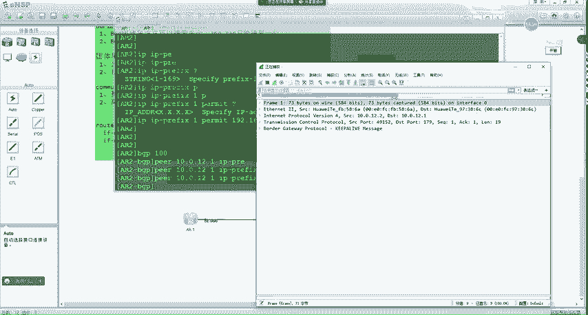

呃，会触发二去发送一个reflash报文对吧？就告诉你重分给我发份路由。然后现在我们可以看到一呢给二发送了一个update是吧？就里面呢会去携带上BDP路由，而在这个BDP路由里面呢。

NLRI我们可以看到有两条路由对吧？NLI代表。😊，网络层可达性信息对吧？就是路由的意思是吧？对，叫的术语呢比较专业一点，大白话啊就是路由条目能懂吗？那现在他给二发了之后，我们发现还是发了两条，对不对？

然后我们到二上来看呢，display BGProoting table，他就只接收了一条。

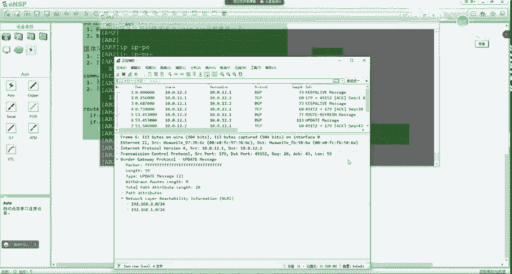

是吧那如果你有三条，你就发三条，但是我还是只要一条，没必要是吧？你待会儿你发过来，我还得过滤，浪费我的资源，还消耗设备带宽。😡，那这时候我们怎么样去做呢？就在二上针对于P10。0。12。

1去开启OF的通告能力。开启了这个通告能力之后啊，大家注意里面有两个参数，一个是IPprefix，还是一个cisical兼容。但是在这里我们只能用cisical兼容啊。

大家在实际项目中要去用IP prefi那IPprefi是华为里面用的啊，cisical兼容是跟思科设备来进行对接的。注意啊，但是呢如果我们通过实验去用IPprefi呢，你会发现待会儿威尔去抓包。

他没有办法解析这个包。但是cisical兼容是可以的。cisical兼容什么时候遇到呢？比如说RE是斯科的设备，我就用cisical兼容。😡，能懂吗？理野的同学敲一啊，没问题吧。😡，而IPprefi呢。

如果都是华为的设备，你就这样去用。我们为什么用ci兼容啊？就是因为你如果不用，待会儿这个包，你看不到里面有啥东西啊？所以说呢它能解析思科的啊，四科在国外的地位还是比较强的是吧？

然后我们现在后面输入IPprefi基于前缀的过滤。😡，那么send代表发送方向，一般我们建议大家用双向啊，因为有没有可能一也要给我发，对吧？你给我传哪些路由啊，对不对？但是我们以一个方向来给大家举例。

是吧，比如说我们敲个send就代表呢。

未来呢能把这个过滤的包发送给一。你能把包发送给一一的能接收啊。所以说在一这边10。0。12。2还要去开启。OF。啊。在这啊ORF，然后呢，二这边是接收。对吧一端发送一端接收。但这条命令配置完成之后啊。

邻居会重新建立一下啊，这里大家要知道一下，对吧？项目中如果再去做的时候呢，要慎重啊，因为一旦邻居重新建立呢。嗯。🤢，要有业务。是吧你就得写报告了。啊，一定要慎重啊。😡，Yeah。🤧。

然后我们来看啊呃那么在等待一会儿之后，我们发现邻居重之重新建立了。重新建立之后，我们来看一下啊，邻居一旦建立完之后，hello两个open一发ke live已收到。

就代表我们进入到了establish状态，对吧？进入到establish状态之后，我们发现二直接给一发了一个什么包啊，reflash爆文。😊。

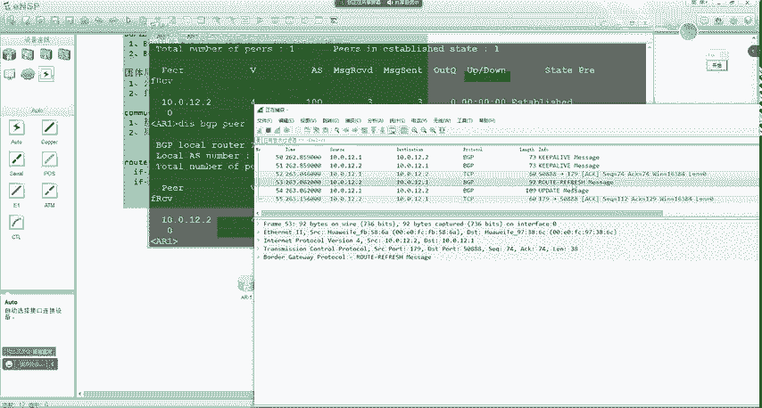

对不对？而在这个reflash报文中，我们打开来看呢，有1个ORF information是吧？啊，有1个ORF的信息。对不对？那OF信息我们再打开来看呢。

在这里咱们就可以看到它的类型呢是cisical perfect list对吧？啊，是cisical牌的。当然我们配置的就是cisical牌是吧？那我们主要看的就是里面的内容，里面的内容是什么样的呢？

我们可以去看到啊，现在呢我有1个192。168。1。0。😊，对不对啊？是吧它的序号呢是十0，大家可以看到啊，我有个192。168。1。0，然后。前缀长度是24，GE跟LE我们没写。如果你要去写的话。

这里也会体现出来，能懂吗？这里是GE跟LE的意思。序号有1个1。0，对吧？那添加的那么行为呢是什么perme，对不对？现在我们的行为是permit就代表着呢，就是告诉给你一我呢大家注意啊。

这就是一个前缀列表啊，我现在有个序号时的前缀列表，允许。192。168。1。0-24GELE没写。那他不就是我们所配的这个前缀列表吗？我们来看一下。在二上我们配的前缀列表第四类IP prefi。

这不就是这个意思吗？我现在有一个序号十的前缀列表，对吧？允许。192。168。1。0，允许192。168。1。0-24对吧？GELE没有。对吧就告诉给你一了。😡，那一一旦收到了之后呢。

我们来看他所发送的update。我发现就只有1。0是吧，而没有2。0的信息了。那这样就是代表着我们通过对方所发送的OF包是吧？去构建自己的出口策略。对不对？那也就是说。正重你的下怀是吧？投其所好。

你要谁我给你谁。😡，对不对？所以这就是我们所说的OF啊，那我们也可以去查看它相关的配置。就是你可以在RE上呢去查看基于R发出机前缀的OF信息。

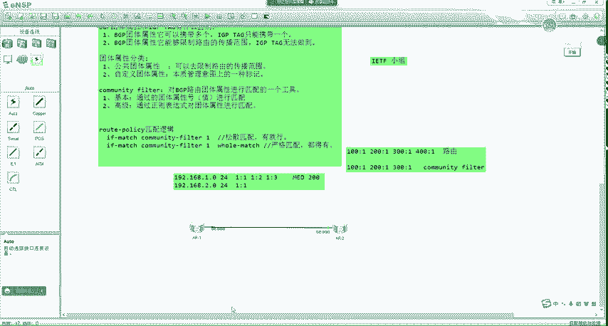

我可以在衣上。通过。diisplay BDPP10。0。12。2。OF。对吧IPprefi。我们可以看到呢，就是有一个attion允许，对吧？192。168。1。0长度24，对吧？

它可以把这个前缀列表给你还原过来。对不对？而同时呢你也可以在R上再去看BGP路由。比如说我们在R上呢。

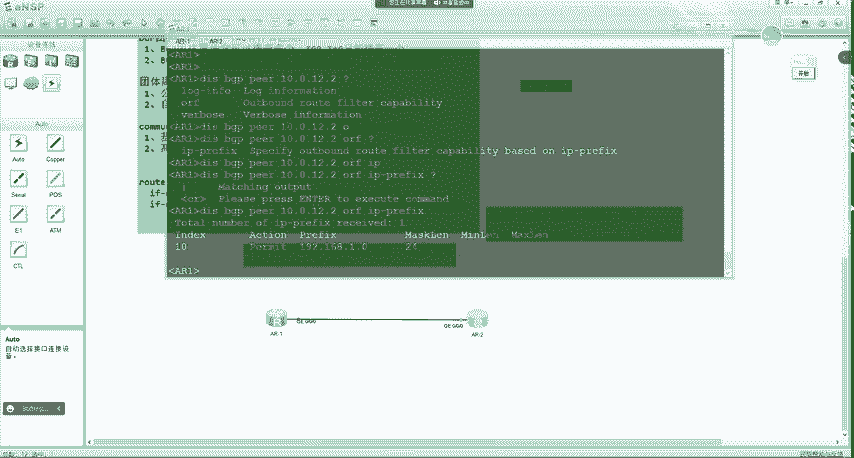

来看BGP路由。diisplay BDProotingtable，你会发现呢它只有1。0，而没有2。0。对吧这就是非常简单了。那这就是我们所说的OF那刚刚有同学问对吧？

老师他怎么知道他发的是哪一个前缀列表呢？他怎么知道的？实际上，我们在针对于邻居去调用前缀列表的时候。他是不是知道他调用的是哪一个？对不对？所以说我们可以看到，对吧？有人就问了。

老师二怎么知道他把哪个前缀列表的策略发送给一呢？是因为我们针对于一调用的这个前缀列表。😊，对吧它只会去发送我们所调用的这一个懂了吗？比如说我还有个前缀列表2是吧？前缀列表2，我promit0。0。

它会不会发送给一呢？不会啊，为什么不会呢？因为我们针对一调用的是前缀列表一，而不是2。所以这里大家明白了吗？明白的同学敲一啊，这里都没问题吧。😡，不。可以吧。GELE是啥？这你得再补补IP啊。

这不就是前缀列表的灵活之处吗？😡，那可以去定义掩码的范围啊。嗯。啊，对，没错。好，那我们休息一会儿吧，休息10分钟。嗯，十0分钟之后呢，我们来讲一下BGP的对等题组，好吧，休息10分钟啊。😊，嗯。

那咱们就继续啊呃，接下来我们要说的是这个BGP的对灯体组嗯，他主要是做什么事的呢？我们给大家说一下嗯，准实际上它就是简化配置的。呃，给大家说一下啊。呃，他主要是这样的。

就是我们之前在建立BGP邻居的时候，我们会发现有一个特点啊呃，什么样的特点呢？比如说我们建立全户联对吧？呃，咱们会发现。

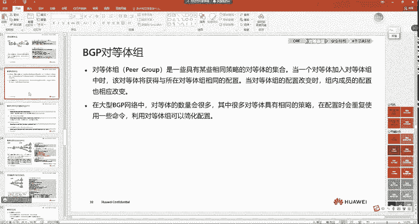

那每一个邻居呢，我们都要去指定一下。假如说我现在有三台路由器。呃，三台路由器呢互相去建立BGP点居123嘛。对吧呃，当我跟三区建立的时候呢，我要P23。3。3。3AS100P2。2。2A100。

对吧peer3。3。3connect interface楼百0pere2。2。2connect interface楼百0。P23。3。3ntho local。pre2。2。

2nice home local。那万一如果我们还有一些过滤策略的话。对吧比如说P23。3。3。3是吧呃，ro policy is part。对不对？T2。2。2如 the policy isport。

是吧反值在三上P21。1。1。1AS100。P22。2。2AS100P2。2。2这个conectface0P2。2。2nicelocP3。3。3啊，不是P1。1。1。1。对吧那在二上呢也是一样。

你会发现呢重复的命令你一直在敲。对不对？就是我们呢有这么一点，就是老师啊，我可能针对于啊。123呢就是我在一上针对于二跟三嗯，两个邻居，但是拥有相同的配置命令。是吧嗯。

但是每条命料呢我都要去单独去敲就很麻烦。是不是啊？啊，就跟我们上课实际上一个道理。比如说呢啊大家学习实际上讲的学习的都是同一个技术点啊，但是如果给每个同学都要去说一遍呢，累死我是吧？啊，嗓子都要冒烟。

而且呢效率不高。是吧哎，那在这的时候有没有这样的方式呢？就是老师啊嗯我们来考究一下，我们学习呢对吧？呃我创建一个腾讯会议，哎，它就相当于一个小组。😊，啊，大家都加入到这个组里。对不对？啊。

然后呢我在这个组里呢对吧开启共享屏幕啊，开始在讲课啊，只要在这个小组的同学呢，大家都可以收到。对不对？那我们在BGP配置上也有类似的观念啊，就是二跟三都是同样的配置。那你能不能这样呢？

我把二跟三呢嗯都加在一个小组里是吧？对，有点类似于端口组。😊，我把23呢加到这个小组里之后呢，然后呢，我只对于组配置。而对于组进行的所有配置呢，都会继承到这个组下的成员中。

对吧比如说我把二跟三呢加入到了，因为我现在假如说都是IBDP是吧？呃，我加入到一个叫做ABGP的组。对不对？那这时候呢，我就可以针对于这个组去配置。比如说我针对于这个组AS100。

对吧然后哎你们两个邻居不都在这个组嘛？对吧？那你们都有AS100。我针对这个组connect interfaceface no0啊，那你么你们都有这条面。😊。

对吧那这实际上我们可以发现呢配置就大大缩小了，是吧？现在是两个邻居，对不对？那未来我有20个邻居。😊，那你头都要大了，是吧？老师我在这里一直敲啪啪啪啪敲了半小时，哎，刚配了一台设备是吧？啊。

你会非常难受。😡。

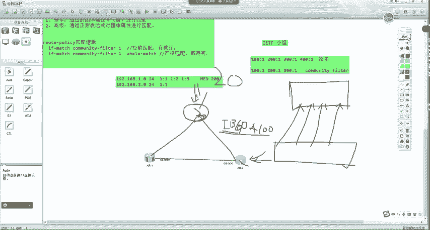

所以说呢我们就延伸出了一种技术啊，叫做BGP的对灯梯组。那BGP的对灯体组是干什么的呢？就是在大型的网络中呢，邻居的数量会非常的多，对吧？但是这些邻居呢可能具有相同的策略，重复的配置呢对吧？

啊在配置时呢会重复的使用一些命令，就是我们利用对灯体组去简化配置的。😊，对不对？那对等梯组呢实际上啊就是配置，哎能明白吗？就是配置啊，那这个配置逻辑是什么样的呢？就是首先呢我们创建一个group啊。

就创建一个组。那它是针对EBDP邻居的，还是IBDP邻居的呢？我们可以去设定。😡，那设定完成之后呢，比如说我针对的是EBTP邻居是吧？我这有个一，对不对？我针对于。隔壁的。嗯，AS100。

是吧有4个邻居，但是我每一个都要去配，非常麻烦头疼。这时候怎么办呢？嗯，我创建1个EBGP的邻居，对吧？对灯体组，然后呢，我针对于这个组去配置，待会儿我把你们加到组下就行了，就你们继承组下的所有配置。

😊，就是我们针对一组呢去指定AS号是吧？然后去把邻居加入到这个组中。能不能看到？比如说我修改更新源呢也是一样，针对于组去做。😊，对吧那你调用ruot policy等等的之类呢，也可以针对于组去做。

那这个就是对等体组，它的作用啊就是在简化配置中。

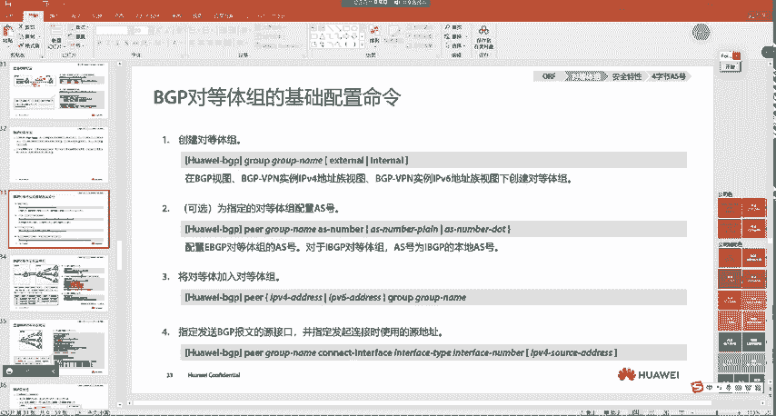

那对等梯组它有两种，一种叫做ABDP对等梯组，还有一种叫做EBDP对等梯组。那这里呢我们都给大家演示一下。比如说现在呢我有一个一，有一个2，还有一个3。是吧。🤧嗯。你先把三开一下啊。开了之后。

我们现在是这样啊。😊，嗯。

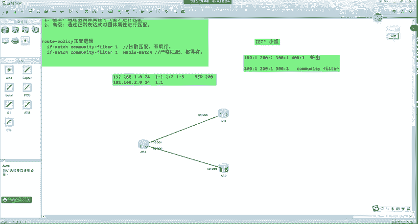

然后我们还用物理口建邻居吧啊，就省得跑OSPF了。一上面它之前有一些PDP的配置啊，我们先给它恢复成原来的样子。然后在二这边，它之前也有BQ置。Yeah。对吧我们恢复成最初的样子啊呃，我们以一为例。

一现在它不是我们以一为例啊，待会我们让二跟一建邻居，三也跟一建邻居嘛。然后二三之间我们先不管，我们只是以一为例。😊。

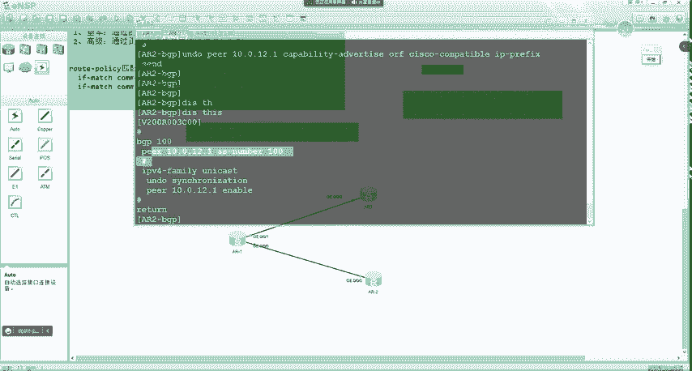

然后现在呢我在一上呢需要跟2三都去建邻居啊，但是重复的配置就比较多，我怎么办呢？我先把BDP的一的BDP配置给它删掉，暗度BDP100。

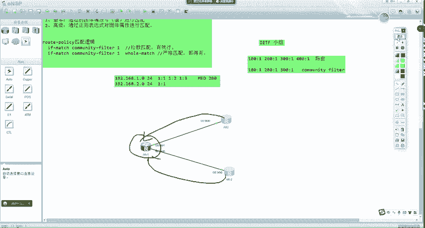

对吧大家注意好啊。😊，🤧哎。暗度BDP100。来注意好啊，现在我怎么办呢？我在一上BDP100group先去创建一个组组的名字呢，我们以叫IBDP这就是一个名字啊，你可以随便叫123456都行。

我们就叫IBDP。然后呢，internal代表是I针对于IBDP的对等题组。然后这时怎么办呢？我针对于P210。0。12。2。是吧呃，让你加入到这个组里IBDP。然后P尔10。0。13。

3groupIABDP都把你加入到这个组里。加入到这个组织后，我们发现啊。😡，针对于IBDP的对等题组，只要我们一旦加入到组里之后，它有没有自己产生跟我一样的AS号啊？有没有啊？有啊。

那这个AS number你还要不要配啊，不用。对不对啊？那注意啊。现在我们把一3的邻居就IP啥的还没敲，我们先跑起来啊。先把邻居给他跑起来IPUdress10。0。13。1。是吧。

那实际上这个东西呢就给你偷懒的。10。0。13。3。BDP100，我们在山上10。0。13。1AS100。是吧大家注意啊，现在我在A2一上呢。去做了这两些配置，对等体组的配置。做完之后呢。

然后我们来看一下DplayBDPP2。呃，跟二的邻居已经建立完成了。三是因为我们刚才配的啊，他还没完成。嗯，所以说我们得稍微再等一会儿。你发现呢，待会儿他自动就跟山的邻居呢。嗯，就建立完成了。

第四类啊完了对吧？又来了，来了之后再注意，各位同学认真看啊，比如说我network192。168。1。024，network192。168。2。024。

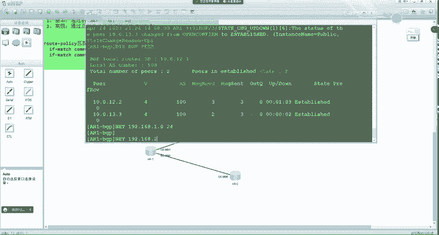

我通告的这些路由呢，当然会发给我的邻居，对不对？所以说3跟2呢都是可以接收到低速类BProingtable。

对吧然后二呢也是低俗类BDP入ingtable都能够接收到。老师除了这种建邻居的配置，有没有其他配置也能同步啊？有，比如说我现在写一个router policy000prome note10。

哇oply我们修改个MED改成200。BDP100P2。IBGP啊是小写的啊，这个是敏感大小写的。IBDP root policy。000eaport，那这样代表着什么意思呢？就是。

我针对于IBDP这个对等题组呢，调用了一个入rpoli，把MED改成200。但是如果没去看配置的话，大家注意啊，你会发现呢这个策略只针对IBDP调用了。😊，而这两个邻居有没有在这个组下。

有我们针对于组调用的策略呢，我们来看一下三上面的MED。

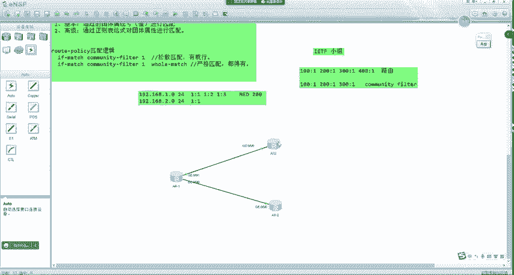

啊，这没反应过来啊，稍等一会儿啊。all import我们清理一下。reflash BDPR exportport啊，让他重新去发送一份路由更新。

然后这时候我们来三上看呢diplay BDProoting table。陆由有没有过来啊？有吧。对吧他直接就过来了，那二上面呢路由也过来了，MED有没有被修改，有。对吧所以说大家知道啊。

对等体组它不仅仅只是我们在凝居的时候，它简化了配置。那么以及未来我们在做各种策略的时候，比如说现在我从EBDP邻居接收的路由，我不能发给某个IBDP邻居的策略不一样吧，是吧？1。0给你发，不给他发啊。

这种策略一般是很少的。

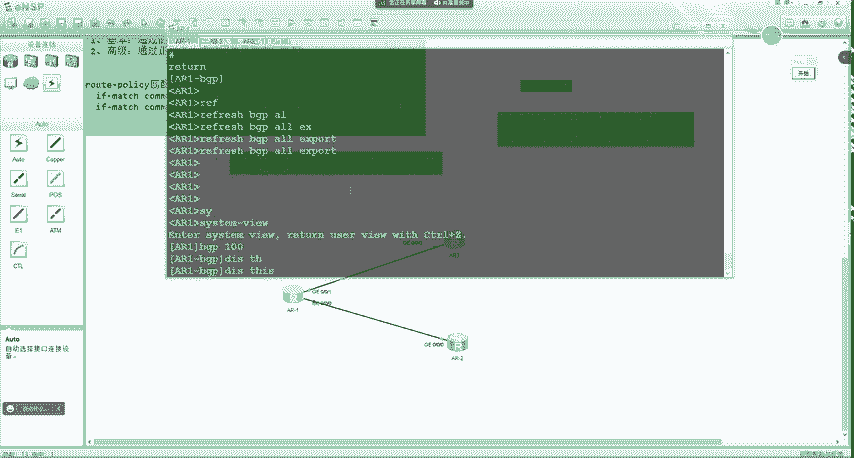

对不对？我们一般都是统一的策略。那么在这时候，统一的策略就有统一的配置。那统一的配置我们就产生了重复。这时候怎么办呢？我们只需要利用对等题组，针对于组去做就行了。你发现你只配的这么一条命令。

那未来你有6个邻居，7个邻居，8个邻居也是这么一条命令。而当你没有再使用的时候，你就要针对于6个邻居root policy叉叉叉7个邻居rootuter policy叉叉叉8个邻居root policy叉叉叉。

是吧那就会导致你的配置量变得非常的庞大。😡，所以说在这里呢啊就是我们所说的对灯梯组，它本身是非常简单的啊，就是我们要去做一些嗯重复性的配置。对吧它还可以简化你的配置。那刚刚有同学就在问，对吧？老师。

如果我针对于某个邻居有单独的策略呢，是吧？比如说我现在写一个ruuter policy。😊，111是吧，pme note10。然后我把它针对于他的MED呢。改成400。对吧那在这时候怎么办呢？

我们也可以针对于单个邻居去配12。2router policy111export。能不能针对于单独的邻居去做定制化的服务啊，可以，那这时候容易我们会产生一个疑惑。什么样的疑惑呢？就是老师啊。

这两个哪一个生效呢，对吧？那基于我们之前学到的很多的经验来看，大家觉得应该是哪一个生效啊？😊，应该是谁生下？精细化的生效对吧？

所以说这时候我们到二上如果去看呢display BDProoting table。他有没有被改成400啊，有而没有被做精细化服务的三呢，它就只是200。对吧所以说对等体组可以体现的灵活之处是非常多的。

我们可以看到呢，就是如果有相同的配置呢，大家都去继承对吧？可以节约我们的配置是吧？也可以减轻你的工作量。但是如果有某个人的不一样，是吧？只是极个别的，我们也可以针对它去做定制化的。😊。

是吧那这个就是BDP的对等提速。😡，那BDP的这只是我们演示的IBDP对灯梯组，而我们在使用的时候呢，还会有EBDP对灯梯组。那EBDP对灯梯组是什么样呢？比如说我在三上面把BDP配置给它删了。😊。

暗度BDP100。然后在二上面呢也是一样，暗度BDP100。那在二上P2BDP比如说我们用200P210。0。12。1AS100，然后在三上呢，BDP300P10。0。13。1AS100。

对吧这时候我把A21的BGP配置呢也先给它删掉。删掉之后，A21在BGP100中。那这时候我们为了更好的去建立1BGP邻居呢，我们P21BGP。P尔EBDP是吧，组的名字叫EBDP啊。

然后呢呃把他啊不是不是不写，是格肉谱。EBDP是吧，然后类型呢。是E比P的对棱体组。那么做完之后大家注意啊，现在我P10点0。13。3。Gup EBDP。能不能加？哎，你发现呢不让你加。

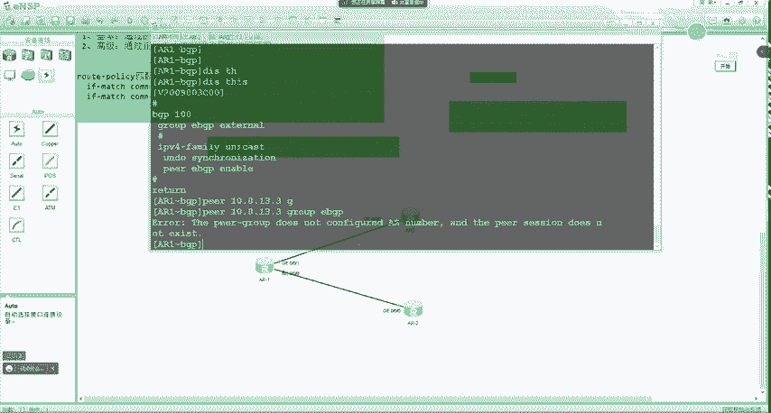

注意啊，不让你加，为什么呢？我来给大家解释一下啊，我们所用的对等题组呢准确来说呢可以分为三类。注意啊。😡。

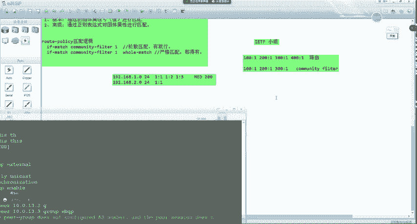

第一类呢就是我们所说的IBGP对等题组。BTP对等体组。还有一种呢就是以BTP对能体组，还有一种叫做混合。租。还有一种叫做混合组。那EBP对等题组是什么样的？我来给大家举个例子啊，比如说这是AS100。

这是AS啊，不对啊，这是AS200，这是AS200，它在AS100。

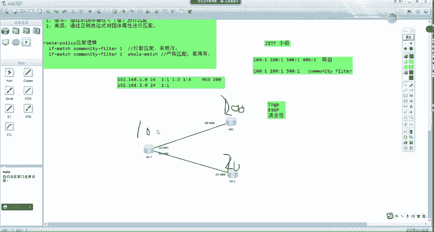

是吧那这时候我在AR一上能不能这样做呢？😡，Pre1BP A number。200能不能做？可不可以？可以。

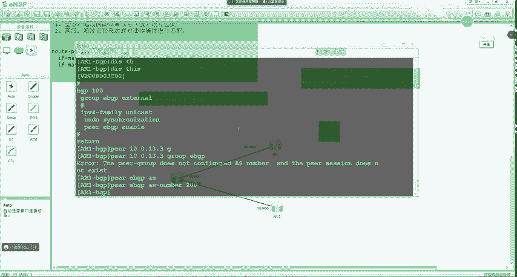

是吧。但是这样也没问题，其他的逻辑跟我们的配置IBDP是一样的。你只需要P210。0。13。3g1BDP就完了。对吧那这个EBP它属于哪个AS呢？它自己就继承这个组的AS200了。

对吧所以说当我的EBP都在1个AS的时候，我们能不能给这个组去指定AS啊？能不能是可以的。是吧但是我现在的场景老师，我的不在1个AS啊。😡。

对吧那这时候怎么办呢？我们就不能针对于这个组去指定AS了。😡，暗度P尔10。0。13。3groupEBGP。安度P EBP number。200。对吧，那这时候怎么办呢？我们可以这样。P10。0。13。

3AS我单独去给他一个，大觉得行不行？我刚才讲的时候有没有说过说过什么啊？😡，越精细啊越优先P210。0。12。2A200行不行？可以，然后P10。0。13。3，我再把它加入到EBDP这个组。P210。

0。12。2，再把它加入到EBDP这个组。那加入到这个组之后，我们来看啊，现在产生的配置是这样的，每个邻居呢还在他所属的AS中，但是你们都属于这个组。那只要是不涉及到AS的配置。

比如说P21BDProot policy000。也是泡的。能不能做可以吧。那这时候，ru policy依然是针对于组下的所有邻居生肖，只不过他们在不同的AS中。这里大家能明白吗？

那这种我们就把它叫做混合组。😡，能懂吧？就是除了AS之外的配置呢啊其他的配置依然是继承的。😡，对吧所以说他是非常的灵活的。那在这时候呢，我们可以在三跟二上把邻居给他建起来了，对吧？

我们发现邻居确实也已经建立了。对吧在一上，比如说我们di四类BDP。皮尔呢？

邻居也是建立的那我们刚用MED不是000这个策略呢去修改了MED我们来看一下在山上diBGP。

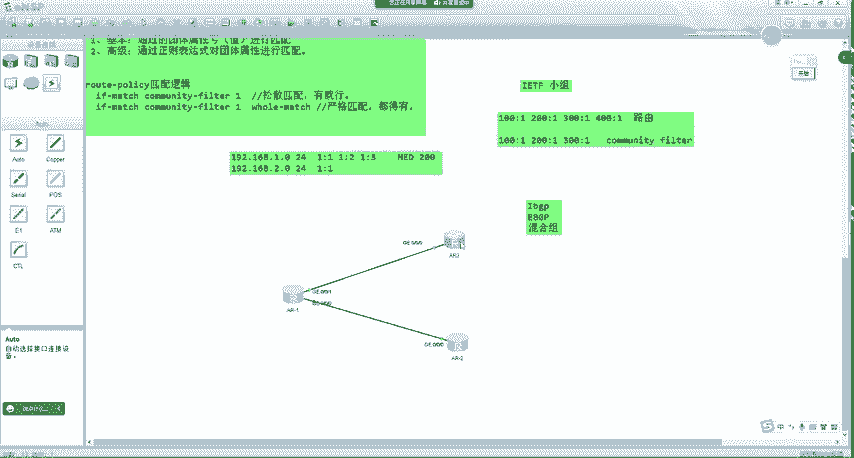

啊，没发布路由呢还在一上BGP100network192点。192。168。1。0。对吧发布了之后，我们通过000这个ruuter policy去改MED。比如说我们来看一下二上面有没有生效呢？

MED2003上面应该也是200，对吧？因为我们调用的策略是同一个，有没有也未修改？有。是吧。那老师我能不能这样呢？皮尔。E哔哩p。敲EBDP多跳。行不行？可以吧。我针对于EBDP啊。

大家还学过什么TR的前缀列表行不行？可以，基本你打个问号。😊。

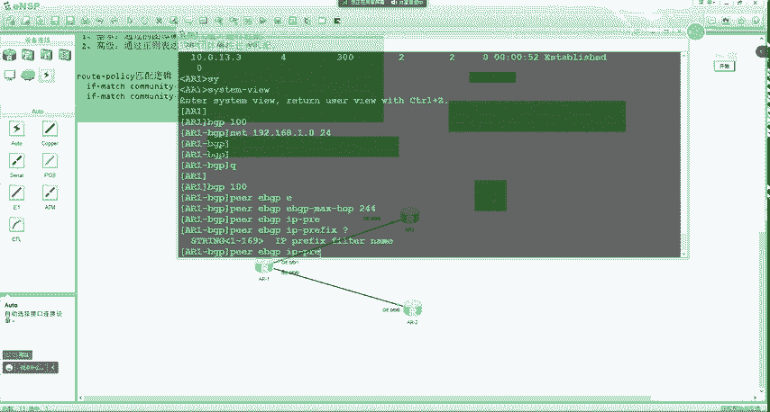

你发现呢，基本你之前所给我的所有命令呢，针对于邻居的在这里都能调用。能懂吗？对吧nice hope local也有。是吧。S pass啊团体属性通告也有S pass field也有是吧？BFD也能开。

通告缺省也能做，对吧？更新原地址也能做。是吧啊，启用这个邻居啊，如policy是我们刚所学的啊前缀列表。所以说我们发现它的配置是非常灵活的。那这个呢就是对等体组。那对等体组它所体现的好处呢。

第一点是在节约配置上。那第二点大家觉得是什么？捐的是什么啊？给大家说一下啊。对等体组的好处，那它主要体现在两点，第一点在节约配置。第二点呢，对。提高。更新效率。为什么我们所说的是提高更新效率呢？

因为我们发现，如果所有的邻居用一个策略。

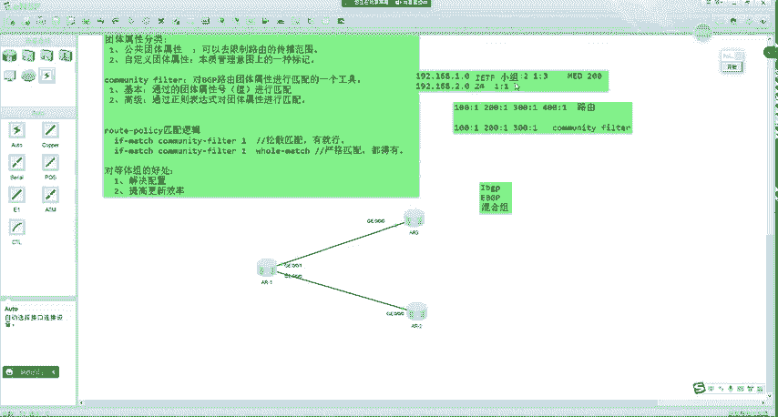

那我在打包路由的时候，比如说我有100条路由。每个邻居都有一个单独的策略。我如果针对于每个邻居都去调用一个策略，那这100条路由要过所有的策略。但是如果大家策略是一样的。我只过这一个策略给所有邻居发送。

他能不能提高我们的更新效率啊？拿不拿？可以吧，我们只需要打包一份就行了。按照这个策略打包一份。😊，而如果每个邻居都有一个。是吧那你就要去打包两份，那你自己去想一下，对吧？老师这就减一半是吧？

减一个邻居的能差多少呢？啊，你不要这么想是吧？😡，工资给你减一半呢，你愿意吗？你不愿意是吧，工作给你加一半呢，你愿意吗？那你也不愿意是吧？你不要小看这个一半，这一半的效率是非常高的。😡，对不对？

所以这里大家明白啊。

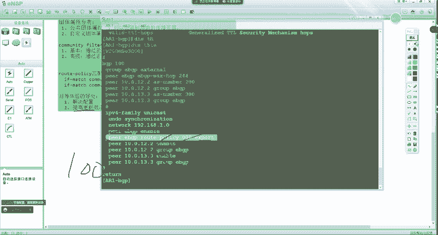

所以说这就它的两个好处，一个呢啊不是解决配置啊。😊，是。节约配置。节约配置啊啊然后第二个呢是提高更新效率。

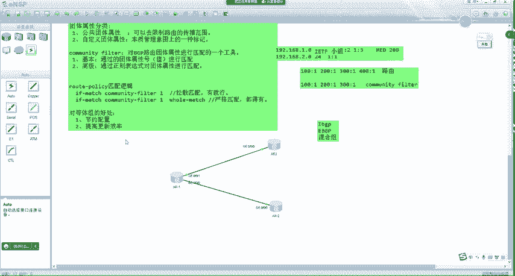

那这里有一个实验啊，我们简单把这个实验来过一下啊。现在呢我们在R一上呢跟R2在这里对吧？然后R2呢，它是从R一收到路由，然后向345来进行发送。😊，对吧那这时候呢，如果我们发送的是相同的路由，跟三建立。

跟四建立，跟五建立，什么nicet hope block啊等等之类的，都要取消。是吧。那这时候怎么办呢？我们就在R一上正常的去通告路由。R2跟R一建邻居。而R2跟R3跟R4跟R5建立邻居的时候呢。

我们只需要创建一个对灯体组，叫做IBDP对灯体组。然后把三个邻居加入到主下connectinface路0。那所有的邻居能不能都变成6百林？可以吧。对不对啊？对吧然后我们也可以去看这个对等体组的信息。

那这里我们可以看到组的名字呢是IN对吧？叫做因。类型呢是IBP对棱体组对吧？然后我所携带的邻居呢也都有对吧，有几个邻居在这个组里呢啊我们咱也有3个，这就是对等体组。那我们也可以在一上去看一上怎么看呢？

dispplayBGP。歌谱。哎，是这个命令吗？group还得加个名字对吧？我们现在发现有1个EBDP是吧？啊，这里邻居也在对吧？类型是EBDP对等题组。对吧这样也可以去看啊。如果你看详细的信息的话。

你就把名字加上去叫EBP啊，那这个就比较详细了。比如说邻居都建立了啊，也是写好的是吧？有两个邻居。对不对啊，像什么cap live时间啊，这些都是一致的。😊，是吧嗯然后类型嗯，然后是EBDP。

这是他的名字。

对吧。那这里就是我们所说的嗯对等体组啊，那这个技术呢现在有考到啊，所以说大家课下可以去做做实验嗯。去熟悉一下这个面料。是。呃，下面我们要说的把这个讲完啊，当然这个就比较简单了。呃。

下面所说的是BDP的安全特性啊。😊，呃，这里呢主要就是BDP的认证啊，BDP认证是干嘛的呢？我来给大家说一下啊。😊，是这样的。呃，常见BGP的攻击行为呢，我们一般会见到两种。

一种呢是非法的建立BDP邻居关系啊。第二个呢就是发送大量非法的BGP报文。啊，就是无论你是什么样的呢，你都会导致这个路由数量变得很高，是吧？都会对设备造成损害。啥意思呢？比如说一跟呃三建立了BGP邻居。

或者说跟二建立了BGP邻居，我模拟二的包是吧？我原地址2。2。2向1。1。1发送1个BGP包，我给你建立邻居。系吧。但是如果你跟二之间没有暗号的话，你只看这个包你就给我建了啊。一旦咱俩建立完邻居之后。

我就可以给你发点路由是吧？我给你发个10万条，先让你累一会儿。😡，对唔对啊？是吧。对不对啊？那除了这10万条呢，我再给你发20万条，再让你累一会儿啊，我待会儿把你设备累死，对不对？为什么把你累死呢？

你可能是我的这个呃咱俩之间有商业竞争啊，我把你的网搞瘫痪，那大家觉得你都不行，都找我了。😊，是吧啊，当然这只是我给大家举例啊，但是也有没有这么一部分人呢？比如说这个攻击者呢闲来无事。😡，啊。

就喜欢搞破坏啊，这种有没有呢？也有。对不对？实际上也有可能他不是有心的，他就是想搞搞研究。对这玩意儿他干嘛呢？😡，是吧比如说我给你见完邻居能干嘛呢？😊，对不对？那。无论他给不给你建对吧。

或者说他给你建了，什么都不干，我们肯定是有隐患的。因为你本身对吧？在这里别人能给你建，那就能给你发路由。虽然他没有发。😡，但是万一发了呢。

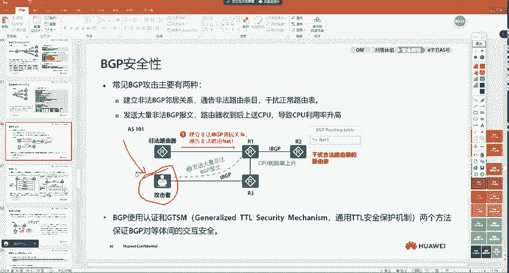

是不是啊，就是你觉得比较难受啊，万一弄了呢，对吧？所以说我们常见的攻击有两种啊，就是第一种你给我建立BGP邻居。那第二种呢就是你向我发送大量的BGP报文。因为BGP报文呢。

这种控制协议的报文都要上传到CPU处理。😊。

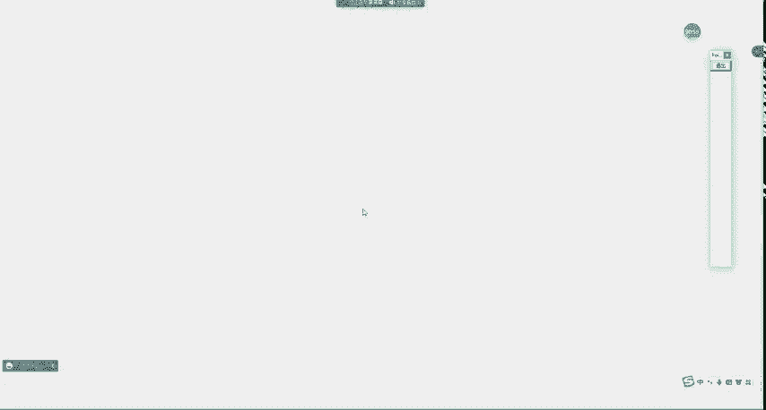

那又会导致我的CPU利用率非常高。呃，这个问题怎么解决呢？首先我们来讲第一个就是怎么样去解决它非法建立BDP邻接关系。而我们在IP的时候，学过OSPF学过ISS都学过一种叫做认证。

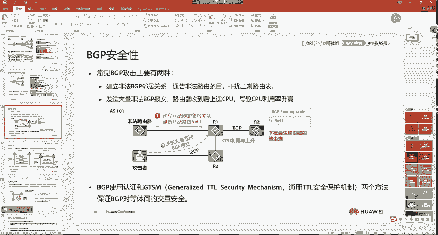

是吧。那BP的认证呢，我们也可以分为两类啊，一个叫做MD5，一个叫做K衬。那这个K衬呢没有考到过啊，然后我们也不用，所以这里呢大家可以不用去管它。在我们的课程中呢，我们只会去讲到MD5。😊。

这个MD5实际上跟我们在之前学习的也是一样的。那也就是说我们要针对于邻居呢去配置MD5认证啊，就相当于我们俩之间有个暗号。注意啊，但是我们可以去发现所有BDP的包呢，它并没有认证的字段，对吧？

那BDP的认证是怎么实现的呢？这里大家知道BDP的认证呢，它是借助于TCP的。也就是说在TCP里面呢会有MD5的校验值。😊，对吧他是基于TCB实现的。比如说现在你遇到了一个故障场景。

你发现一跟二的邻居没有建立啊，后来你发现TCP连接没有建立，你能不能想到可能是认证的问题啊？能不能啊？实际上是可以的。对吧如果你认证不过，你实际上TCB连接就建立不起来。😡，对吧啊，对，有同学说不好说。

那这个要根据大家的经验，慢慢的去探索，对吧？😊，所以我们来看啊，那一跟二如果我们想要防止，比如说中间有个攻击者，他恶意搞破坏。对吧有没有这样的人呢？有。😡，对不对？肯定是有的。😊，啊，就怕人闲下来。

对吧啊闲下来什么事都能做。😊，对不对？那这是三，那这个三呢，他跟二合一的去建邻居啊，建完邻居之后给你发路由啊，给你发个10万条。😡，对不对？那你设备可能就有可能会坏掉，是吧一下子业务影响了。对不对？

那有人都问了是吧，刚刚就像宇同学说的是吧，老师他搞不坏对吧？我报警抓他，首先能不能抓着是一回事。😊，是吧如果抓着了，那损失也是你自己呢。😡，能不能明白，那这个损失由谁来赔偿呢？😡，对吧啊。

你的黑点就在这儿。所以说我们。😡，尽可能的去保证它的安全，这个是非常重要的。😡，对吧那这时候怎么办呢？我们可以在一跟二之间去做BDP的认证啊，这个认证非常简单啊，就是一条命。😊，配完认证之后呢。

未来他们所发送的TCB报文都有携带认证字段啊，后面所有的BDP包呢都是经过认证。这个非常简单啊，那它可以怎么做呢？比如说我们就可以将对等体组跟认证结合到一起。那我在AR一上，大家注意啊，我先在二上。

二上面BGP200。pre10。0。12。1password啊就一条命令对吧？加密显示在pad文件中，我们用密码华为艾123回车，然后在三上也是一样。BDP300P10。0点。13点。一啊pas的。

华为艾123回车。那做完之后呢，我们在A21上BDP100。一是怎么建立邻居的，大家还记得吗？我们用的是什么啊？对灯梯组。😊，那我能不能这样呢PEBP passwordword。华为爱123。行不行？

可以。对吧那我们拍完之后，比如说我在啊，现在我们已经有抓包了。是有的。是。啊。那现在大家注意啊，比如说我在一这边reflash BDP2。啊，不对。Reside。BTP啊。

这样呢我们在AR一上硬重置一下。啊，就是让他重新去建立一下BDP邻居。我们发现所有的邻居都到了爱豆。啊吧，那到idol的目的呢，是因为我们做了管理员的重启。是吧第四类BTProing table啊。

不对啊，D四类BTPP我们发现呢邻居待会会重新建立。

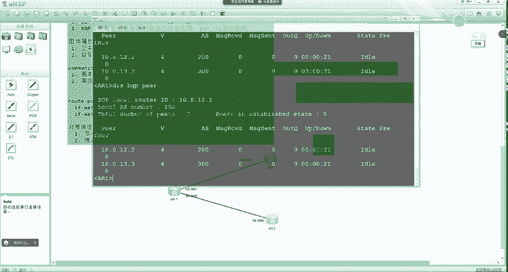

那在这个时间呢，我们去看一下抓包啊，待会儿你就发现呢它这个TCP连接呢啊就是有认证的，我们稍微得等一会儿。来了。对吧哦，我们可以看到呢SYNCK是吧？咱们找个SYN来看一下，这是1个TCP包。😊，呃。

那在里面就有一个optionMD5的认证，大家可以看到吧？基于TCP的MD5去实现。那如果邻居没有建立，如果你的认证不对啊，你的TCP连接是建立不起来的那大家觉得他应该是什么状态？什么状态？Iド。

conn对，没错，叫ag。再一个啊。对，为什么会这个状态？这个状态的描述大家还记得吗？它叫什么啊？😡，啊，TCP连接建立失败。对呀叫失败。啊，什么是失败呢？啊就跟你表白失败一样，表白失败是有回应的啊。

是吧啊如果没有回应，你才是connect的状态。所以说如果说啊你有认证错误，也会卡在这个状。

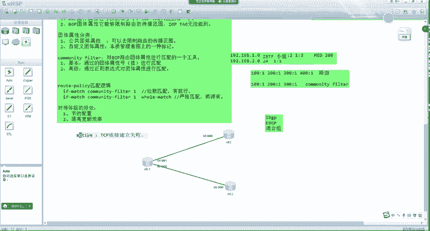

那现在我们可以看到，如果我们认真配的对的话，它是不影响任何邻区建立的。而且呢它可以跟我们的刚刚所说的什么技术啊，对等体组结合到一起去简化配置。

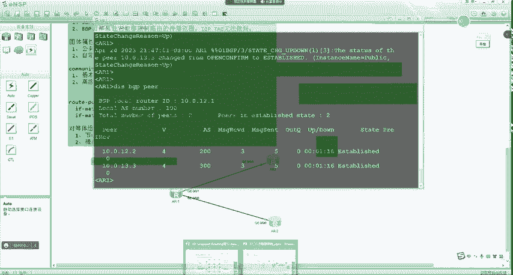

对吧那这是两种技术的结合啊。呃，开拆我们就不讲了啊，因为这个技术呢比较难嗯。😊，当然现在我们也不用啊，考试也不考，所以说咱们就不管它了。那下面我们把这个GTSM说完。那这个是干什么用的呢？

我们来想一下啊。😡，那在BDP里面呢，还存在这么一种攻击行为。注意啊，我们刚刚所说的，你那是建立BGP领域啊，还有一个模仿合法的BGP豹纹攻击。对不对？我举个例子。那比如说我给你发BGP包。

你看到是BGP帮控制协议的帮，你要不要交给CPU处理啊？要吧。是吧你一看找你的，你不处理，谁处理啊？😡，对不对啊？你甭管他什么包，反正给你的你就得处理啊。他给你转发的包不一样，转发的包过去。

你一查转发表就出去了。😡，是吧就跟一个包裹一样，一个快递包裹寄给你，你不接收，谁接收啊，你不拆谁拆啊？😡，是吧但一个快递包裹给你，你看到是别人的，你转手给他扔过去了。😡，是吧啊不耽误你的事。对不对？

但是BDP中就有这么一种。比如说我一直给你发BDP包呢。😡，对吧嗯你就得处理，就会消耗你的设备的CPU资源。那这时候怎么办呢？我们还有一种功能叫做GTSM。GTSM呢它提供了一种基于TTL的保护机制。

什么样的意思呢？就是当攻击者模仿合法的BTP报文，向二不断的发送非法报文进行攻击的时候，我们来看。假如说啊我举个例子，这里一跟二建立一BDP邻居。对吧所以说二收到的我举个例子啊。一给我发的TTL是多少？

😡，一定是255。为什么要我俩直连嘛，对吧？始发就是255，但是攻击者，你甭管你在哪，你只要不是一，你给二发的包能是255吗？😡，你哪怕接到A2一下面，它都得是254。😡，对不对？是吧。

对吧那这时候怎么办呢？我们就可以在二上去开启一种功能，叫GTSM。😡，这个GTSM呢，它是这样的，就是我收到1个BDP包之后呢，我去看一下。那这个BDP包有没有我在我所。😡，设置的。😡，TTL范围内。

嗯。也就是说我们可以给二去开启一下什么功能呢？配置了GTSM之后呢，我们可以设置一个范围。比如说就是255到255，啥意思呢？就是我只能处理TTL255的包。😊，是吧比如说我建立邻居都是智恋。

那你可不就是255嘛，254你连看都不看。😡，对吧来了直接丢，我看他干嘛，TTL都不对。😊，是吧因为我见的都是直连的，肯定都是255，254它就是攻击包，没有别的可能。😡，对不对？

所以说啊当我们在二上配置了GTSM之后，我们可以把它的TTL有效范围设置在255255到255，那就意味着255。那如果你设成250到255也行。😡，对吧。那在这时候呢。

我们的设备会对所有的BDP报文的TDL进行检查。如果不在我们设置的范围内啊，那这个豹纹就被丢弃啊，这个就是GTSM非常简单。😡，就是我们要去设计一个啊有效的范围。那这个怎么样去做呢？

就是我们针对于邻居呢去设一个有效的TDL范围，后面会加一个跳数。注意啊，回加一个跳数，那这里它会有一个公式。

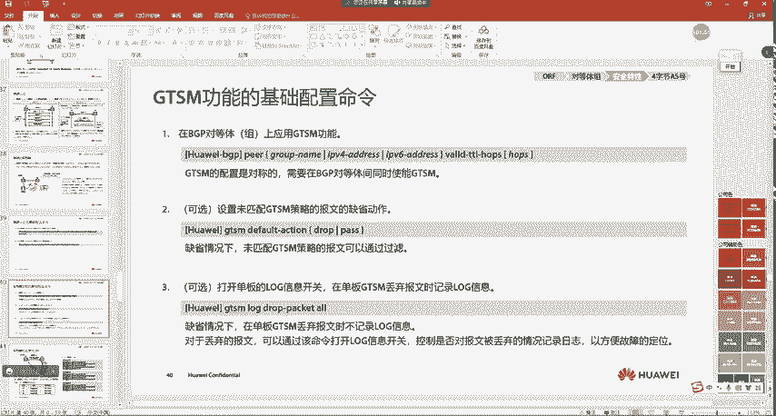

它的公式是什么样的？我们来看啊。

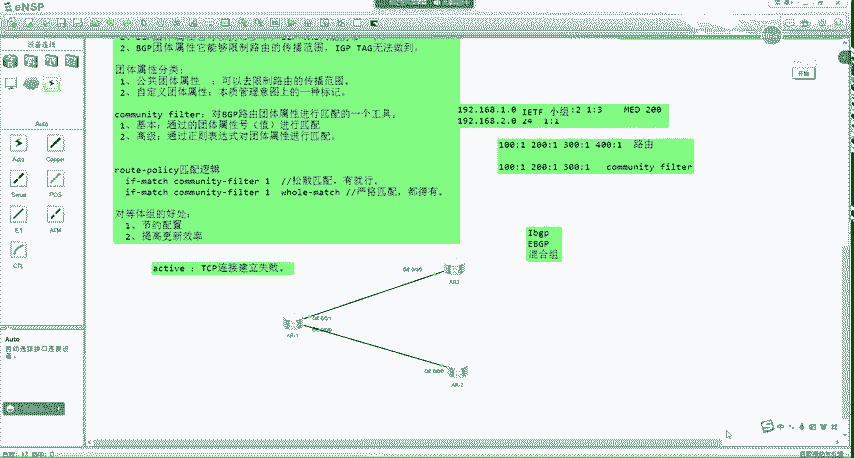

嗯嗯。我找一下这个命令啊。

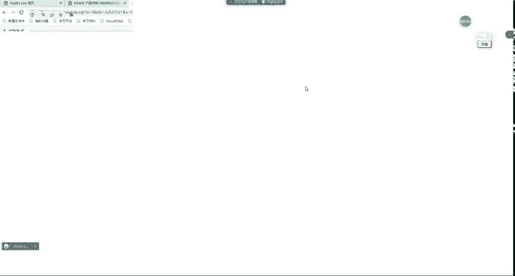

嗯。🤧嗯。

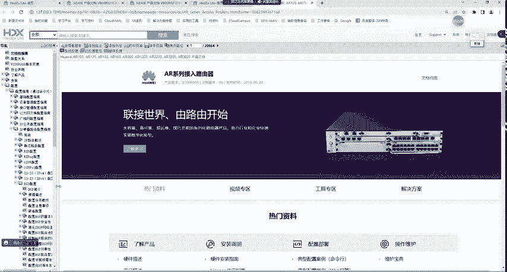

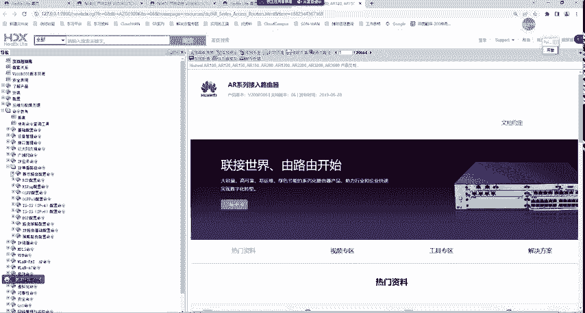

好，在这儿对吧，有效的TTF范围。😊，嗯，就是我们在后面可以设置一个跳数啊，然后呢设置完跳数之后呢，它会有一个公式去计算有效的TDL范围。

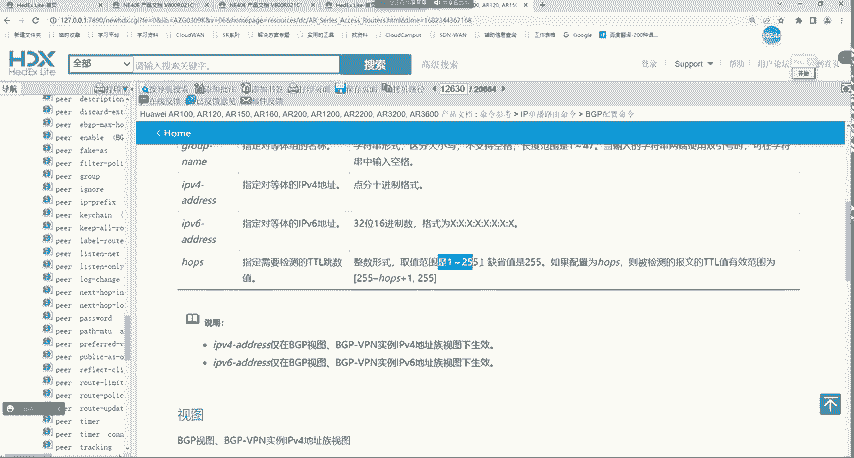

呃，他的范围是这样的啊嗯。他会用255减去你的跳数加一，再加上一个跳数，它是怎么样的呢？我们来看啊。哦，我们以一跟二为例吧。

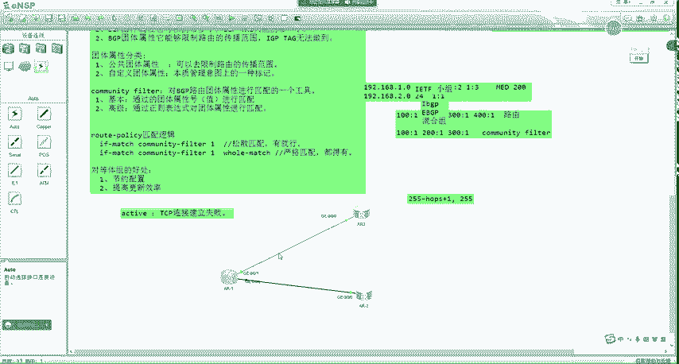

以12为例啊，然后我现在先把12的BTP配置给它删一下。安度BDP100。这三这是一暗度BDP100。好。那现在我们上完之后，大家注意啊，我在一上面BDP100P210。0。12。2A100。哦。

我们简单建个IP0去吧，BGP100P210。0。12。1AS1版。嗯，那这时候我们来想一下他们的TTL是在多少啊。是在255。对不对啊？

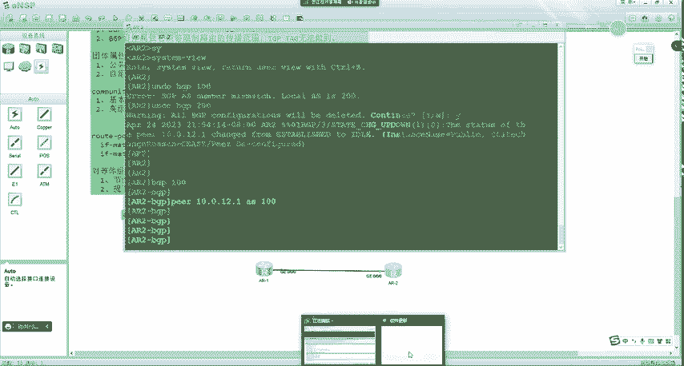

我们来抓个包看一下啊。

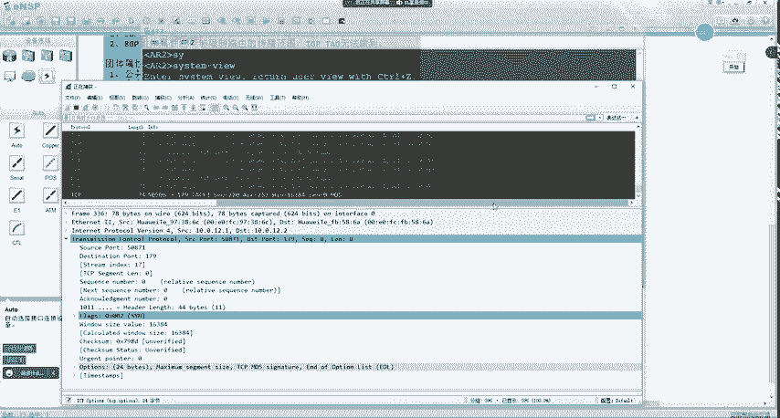

嗯，咱们得等会儿啊，来了是吧？我们随便找个SYN到IP包头中来看一下呢，你会发现就255。是吧。那这时候你就可以在二上去设置这么一条命。比如说P210。0。12。1是吧？你给我发的这个hello啊。

不是hello啊，就是BGP的包。他只能在比如说我设置个一对呀，设置一代表什么意思呢？就是这个范围是怎么样进行计算的，它是这样的。

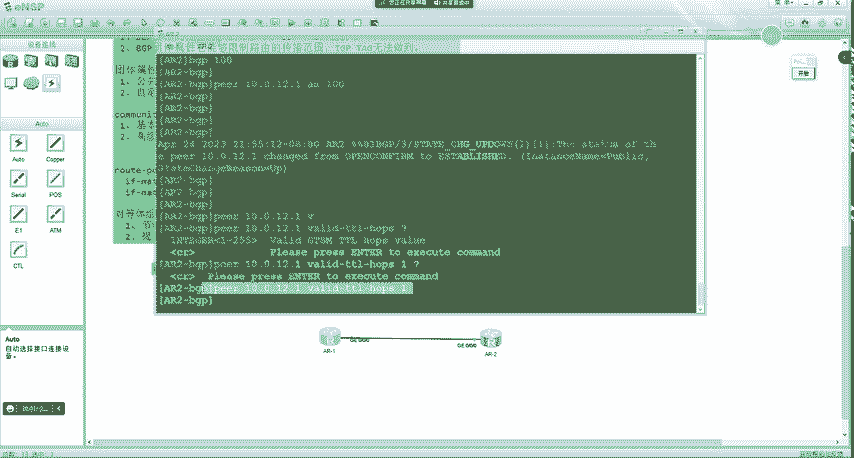

嗯。把这个一呢套入到公式里面。一呢它就代表的是ho。套入到公式之后呢，255减1加1到255。减1加1等于没有，所以有效的TDR范围在多少？255到255。那也就是说一给二的发的包呢。

必须要在这个范围内。对吧。那一旦低于这个范围内，或者说不在这个范围内，说白了这就是一个嘛，就你只要不是255呢，就给你干掉。

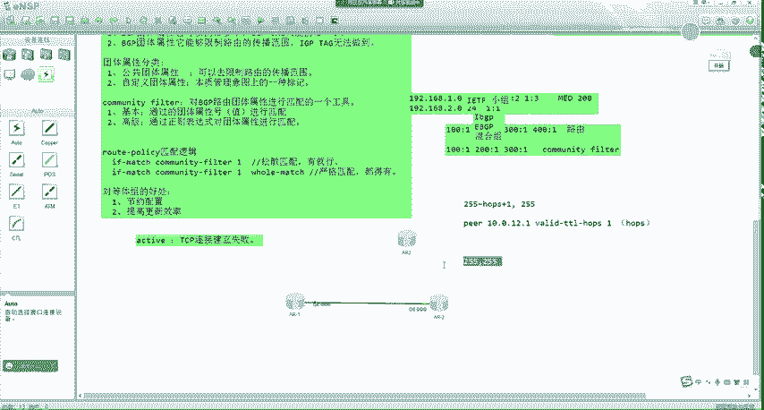

能明白这意思吗？那这里我们没有办法直接去改跳数啊。😡，可以吧。好吧，那这个公式我给大家解释一下啊，对吧？有些同学就问了，老师我直接配置范围不就好了吗？我为什么要配置公式呢？😊。

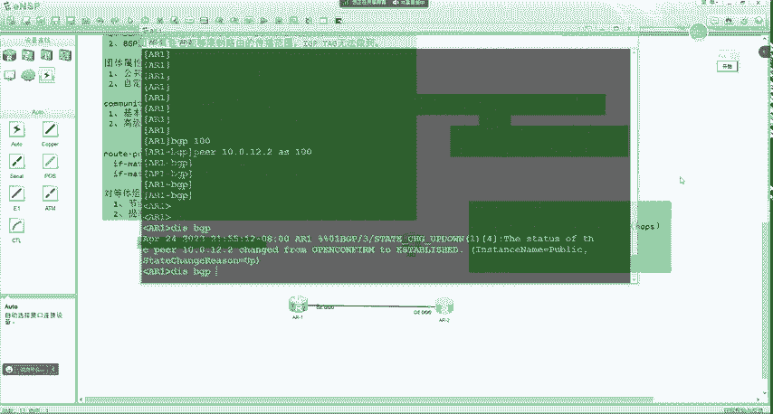

是吧啊大家可能会有这个疑问。😊，呃，这疑问呢在我上一次讲的时候呢，我就悟透了啊，如果大家再去再经历几遍是吧？你比如说你要跟我学习，要是还要稍微再早一点呢，那时候我也不懂。啊，这就是规定，人家就这么做的。

我怎么知道啊？😡，是吧啊，但是现在呢我就想透了啊，有一次偶然的机会呢，当我再去看到这个技术呢，我就突然想明白了为什么要是这个公式。😊，啊，那这里我们很容易有一个简单的理解，就是什么呢？

老师既然是一个范围，不如我身为手工的去设定1到255。😡，大家觉得这样行不行？可以，对吧？老师这样是最直观的。😡，对不对？我只需要计算中我网络中的跳数，然后我去设置这个范围就好了，这样非常的直观。😡。

对不对？但是为什么是这种呢？如果注意啊，这只是我的认为对吧？这是我的。😡，主观上的看法是吧？那不代表它是具体的实证啊，那现在我怎么样去理解这个公式呢？我来给大家说一下。😡，那么有没有这么一种可能呢？

就老是啊二啊。😡，我举个例子。2、他是这样的。二跟一还有备用的路径。如果我直接派成一，那这条路径故障了，一再给二发的包，他还认不认？他还认不认，大家告诉我。😡，你过来这个就254了。

那二姐把你的包给你丢了。😡，对不对？那这时候怎么办呢？大家注意啊，这是几跳。😡，1到2中的网络最大直径是几条，是两条。但是如果我把这个跳数改成2255减2加1到255。😡，那就意味着是254到255。

是不是是正好的？明白了吗？😡，所以说为什么是这个公式呢？就是我们直接去配置网络中的最大跳数，它就可以自己计算出合适的TTL范围。😡，这里大家明白了吗？😡，明白的同学敲一啊，没问题吧。😡，可以吧。

那这样你就不用再重复性的进行计算了，对吧？你只需要把网络中对吧？你到我之间的最大跳数计算出来就可以。😡，对吧那这就是他的灵活之处。

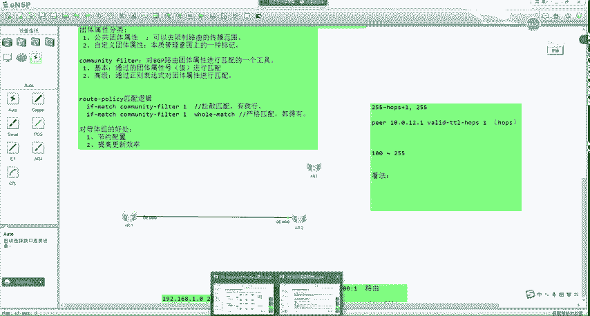

所以这里呢就是我们所做的GTSM啊。那我们是针对于邻居，当然你也可以针对于对灯梯组去开题。啊，那没有匹配GTSM报纹的缺省动作呢啊默认没有匹配，我们是丢弃的啊，你也可以允许接收。能懂吗？

那大家告诉我为什么时候我们允许接收啊。😡，什么时候？是吧老师我允许接收，那还配他干嘛？😡，对不对？那最大跳数肯定人为计算。😡，是吧你比如说老师我允许接收，那我还拍他干嘛？😡。

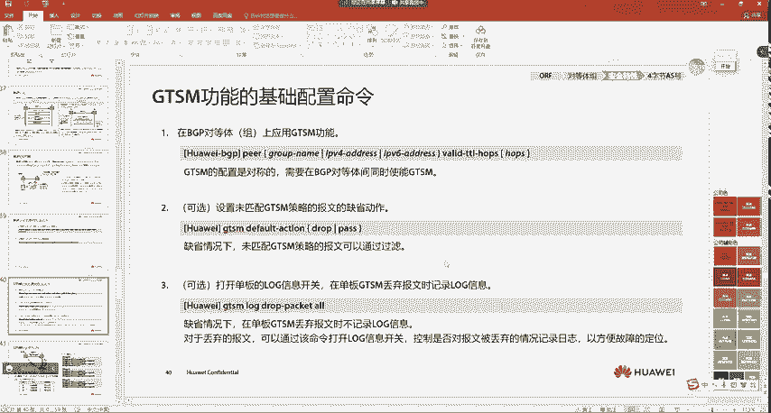

没必要吧啊我来给大家说一下，比如说有没有这么一种可能呢？😡，你不知道中间的路径。现在一跟二建邻居。怎么办呢？就加不起来。但是你配了GTSM，但是你不知道它是不是这个问题啊。😡，是吧我也抓不了包，现在啊。

老师我现在也不方便去抓包。😡，是吧。来这儿的时候怎么办？我们可以把行为设置为允许。如果设置为允许之后，他俩之间的邻居建立起来了，你能不能确定是GTSM的问题？拿不拿。Yeah。是可以的吧。

对吧大家做实验，你总在上帝视角，你知道中间有几条。但是你在实际工作中，你怎么样中间知道中间有多少条啊，你也不知道。😡，老师，我TT要过去啊，有人说老师我穿色的，那穿色的可以隐藏啊。😡。

对吧我也不知道实际过了多少条，老师怎么办啊？😡，那这时候呢，我可以把它先关了，对吧？啊，或者说呢比如说我们配置的是非常多的，我一个一个关呢比较麻烦。我关完之后呢，我还得再配。😊。

是吧你可以先把行为设置成允许，如果设置为允许邻居建立起来，你就知道是GTSM的问题，就是TTL的问题。对不对？所以说呢那这个呢要根据大家对吧实际工作的时候啊，你慢慢的去长经验。

你就知道技术是怎么样进行应用的。可以吧？啊，那我们也可以去打开这个单板的log信息开关。对吧那这里主要的目的呢就是对丢弃的报纹呢，对吧？你可以打开它的日志信息，是吧？那这个时候他会弹日志。😊。

那这个在我们的设备上没有这个命令啊，所以说咱们也做不了。但是大家知道啊有这么一种方式呢，能能够让他去谈日子。

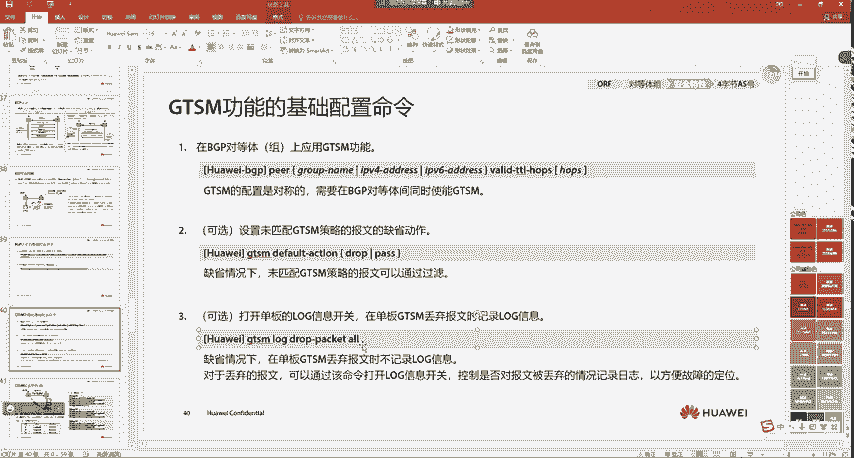

嗯。呃，下面就是一个具体的拍摄举例啊。这里是这样的，我们来看一下啊。呃，123呢我们都在AS101中。然后现在我们都用low back零接口建立IBP全互联啊，然后去开GTSM。啊。

防止CPU类型的攻击。这是把全骨联给它建完了。建完之后呢，我们来看啊。😊，咋着。😊，首先一跟二最大跳数是一，所以说一针对二派的一2针对一配的也是一。

对吧二跟三跳数是一2针对于三派的13针对于二派的也是一，但是一跟三之间有两条，最大有两条，所以我们配置二就完事了。对不对？那这样的话，未来如果比如说我这边接了一个攻击者，我。

攻击者想给一建立邻居能不能建起来？拿不拿？不行吧。因为你邻居在这里是固定啊，不是你TDL在这里是固定好的。是吧。那我不能过去，老师，我把这些设备全部入侵了。哈嗯，这种就基本不太可能啊不太可能。😊。

能明白吗？这种就不太可能。😡，那下面我们也可以去看具体的配置啊啊diplay BTPP我们去加V boss。啊，我们可以看到这里是IBDP邻居，然后最大票数呢是两票。对吧，然后比如说我们是可以在二上。

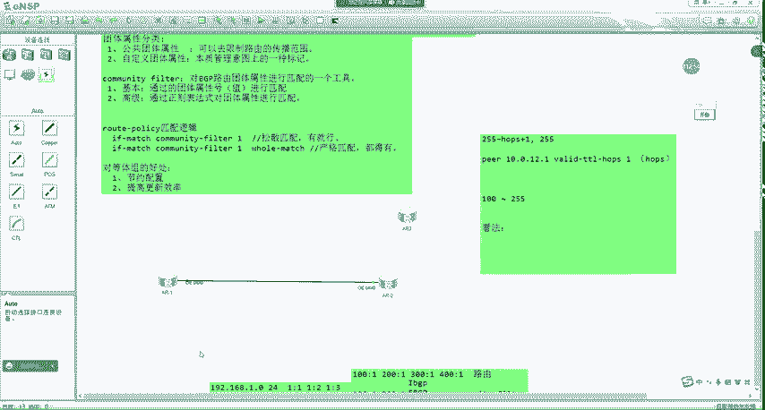

diisplay BTPP10。0。12。1。把加微 box。那这里我们就可以看到我们所设置的GTSM功能是开启的对吧？跳数是一跳。对不对？那这里有很多的输出信息啊啊大家到IE阶段呢要能够看懂一些。😊。

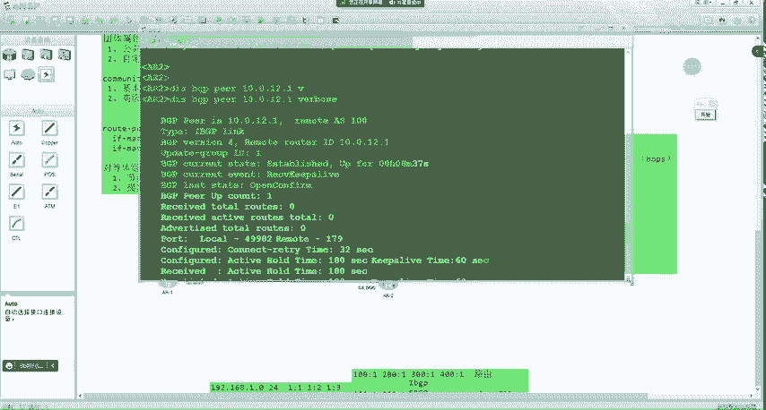

啊，我简单再给大家说一下啊。😊，呃，这里呢首先我的邻居是谁对吧？AS是多少？然后这里呢是邻居的类型是IBP对吧？啊，BP版本4啊，然后云邻居的入ID啊，然后现在有没有在group里面啊，这里是没有的啊。

所以说这里大家可以忽略啊，默认就会有一个一。而邻居状态呢已经建立了，对吧？up了多久？对对，然后这就协商的那个这个不用去管。呃，后面是我跟邻居在建立的时候，我最后是open conform状态，对吧？

呃，然后邻居。啊，这一块我也没关注过，那这里这个信息是比较关键的啊，这里我们可以看到一个本地的端口是4998，对吧？远端是179。那这里我们可以看到TCP连接是由谁发起的。由谁发起的？😡。

对吧由二自己发起的。是吧那下面是协商出了的。老化时间。对吧还有一个啊这个capep live时间。对不对？那这里呢是BGP的扩展功能啊，多协议啊，BGP多协议扩展能力。嗯，reflesh豹纹刷新能啊。

4字节S号。嗯，那下面就是包了啊，我从邻居一共接收到了多少个update对吧，多少个open，多少个cap live。啊，多少个错误消息啊，多少个reflash。然后下面也有啊，然后这是我发送的啊。😡。

嗯，那后面我就不一一给大家说了啊，就大家到IE阶段呢，要稍微的能去看懂一些信息。好吧，啊，不懂也没关系啊，这个要慢慢的进行磨练。😊，🤧嗯。

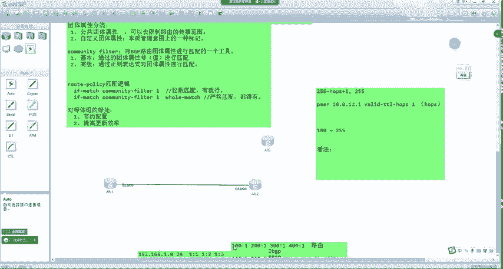

呃，行，那咱们今天就讲这么多吧。然后下一节课我们再去讲这个四字节AS号啊。呃，今天我们就讲这么多，好吧。英语不好咋办？学啊。这个只能是学啊，没有其他特别好的办法。😡，呃，为了防止攻击者建立邻居。

咱们没有P2不就建立不起来了。就是攻击者可以模仿你的地址啊全。攻击者发送的协议报文，他原地址可以自己去定义啊。你能明白这意思吗？😡，拿不拿懂啊？这包原地址目的地址你可以随便去写啊。😡。

你可以自己去定义的。我大家看一下啊。我记得我之前有个软件叫什么柯莱，好像就可以。

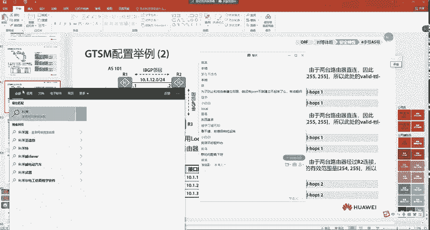

，但是我的啊我找一下啊。Yeah。这包原地址包括它里面的所有字段，你自己可以去定义的啊啊，只需要找个软件就行了。😡，那我这个软件是分析包的啊。呃，但是大家在网上应该能找到一些小工具啊。

就这个包里面的所有东西呢，你可以自己去定义啊。嗯嗯。这啊我导入一个。书记吧。Okay。比如说我导个ARP的啊，我举个例子。嗯。🎼呃。然后在这里啊，大家可以看到吗？有个数据包生成器。能看到吧。呃。

这里呢我可以导个包的模板。嗯。

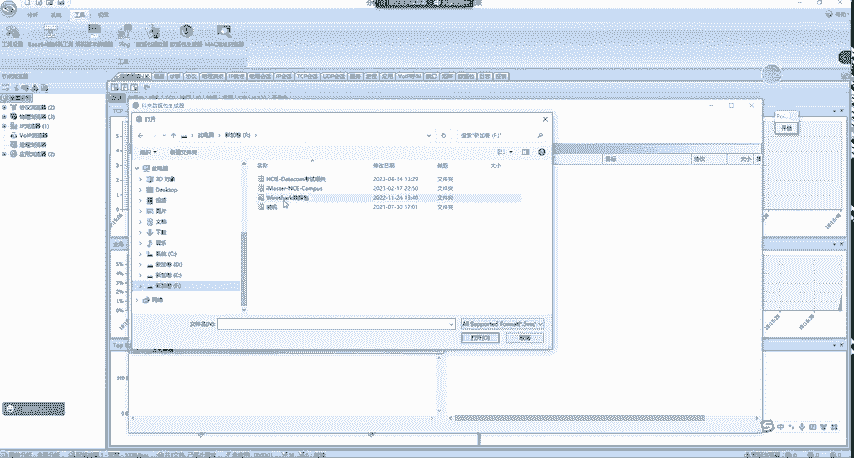

比如说我导个BDP的啊。😊，是。可以看到吧。😊，呃，现在呢我找个BTP的。嗯。好。那。这是IP协议的。IP协议的原地址。问能不能讲啊？对对对对。我能不能改？可以吧。改完之后，你不仅能改啊。

你改完之后你还能发呢。😊，能不能点击网卡发送啊？是吧啊，在你本地上，你可以去发送的还。😊，大能明白吧。对吧这你一点发啊，他又发出去了。所以这个包里面的内容啊，你是可以自己去定义的。😡，好吧。

那比如说像我们刚刚所说的这个场景。

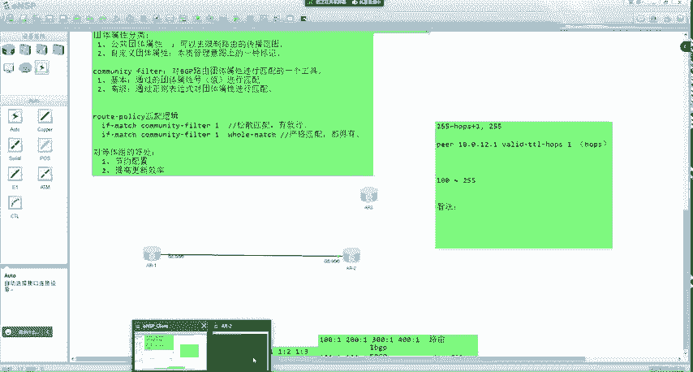

对吧那这是三嘛。那三根一减的邻居，我攻击者，我直接模拟3的8万，我把原地址一改。我这要过去了。能明白这意思吧？对吧，但是这时候就基于TTL不就检测了，所以它是这个意思啊，就包里面的自己的内容呢。啊。

大家是可以自己去改的。😊，Yeah。😀嗯呵。群里有问题看一下啊，大家有问题的话，可以在群里艾特我啊。😊，呃，这个我倒没用了，华三的我已经很久没用了。之前讲IP的时候给大家讲这个堆叠的时候，还用了一下啊。

做一下这个INF，但现在就没用过了。啊，对，没错全没错啊，这个这个理解不错。呃，挂在R上和R一上的邻居呃，不就两套了，挂在。R跟R意思是在这中间有一个。那你你要你你设备的互联链路，你还能接入攻击者。

那你的网络本身就有问题啊。你要有这种物理黑客，那就没办法了啊。😡，单灯度吗。听到吗？😡，你这属于物理黑客啊。😡，是吧。人家过来把你线拔了，往上一怼是吧，我开始给他发包。😡，对不对？那这种就没办法了啊。

那人家还把你电源呢。😡，对不对？把你变圆，那人是吧把你变圆，那事就更大了。😊，呃，现在不是啊，现在就检查TDL小白白。😊，你没有配GTSM的时候呢，它要上传到CPU处理的。而你在检查TTL的时候呢。

在网卡层就直接丢了。😡，能不能懂我的意思啊？就在IP层，只要看到TDL呢，就直接丢了。😊，来了包呢，我先看TDL，而你之前的呢是上到CPU对吧？你交给BDP协议处理。😊，呃。这个由TCP完成认证。好。

对，没错，你路由先通才能完成认证啊。没错。行好，那我先把录屏听一下啊。😊。