# 2023 新版华为认证HCIA+HCIP+HCIE全套视频讲解！一套视频让你从入门到精通！CCNA／CCNP／CCIE技术提升同样适用！ - P104：（持续更新）HCIE Datacom - 50.4字节AS，路由反射器 - -Book思议8 - BV1W8411A7z8

好，那我们就开始上课吧啊。呃然后我们BGP今天差不多就讲完了啊，然后剩下的内容不是特别多了。嗯，接下来我们要说的也是BGP的一个小特性啊呃，我们把它叫做四字节AS号。😊，这个四四节A号嗯。

它是个什么样的概念呢？因为我们之前都学过BGP啊啊，我们会知道BGP的1个AS范围呢，它是两个字节，对吧？呃，也就是说两个字节一共是有。😊，16个比特，而16比特它最大的取值呢只能到65535。

对吧那这个实际上跟我们的IPV4地址差不多啊，呃我们会发现呢不够使用对吧？就0到6535啊，一共是呃65536个，对吧？啊，当然BGP的零还不能用是吧？所以说只有65535个啊。呃。

那这里我们很容易会有一个呃疑惑，对吧？就是两个字节的AS号到底够不够用啊，嗯，实际上是不够的啊，这个就跟我们之前在理解IPV4实际上是差不多。那IPV4地址呢有32个比特。

对吧呃而实际上呢它最高能到达42亿多个IPV4地址。而目前随着我们这个互联网的发展呢，是吧人越来越多啊，那需要联网的设备呢也越来越多，我们还有不同的产业，你像这个各种智能冰箱对吧自动驾驶啊对吧？

还有物联网等等之类的概念炒的非常的火热啊，所以说呢IPV4地址也是不够用的吧？那A号它就跟IPV4地址实际上差不多就我们慢慢的会去发现呢，就是A号不够被使用了就是两个字节的A号已经没有办法使用，吧？

不够了，对不对？就资源就这么多啊，但是人呢是非常多的？所以说就不够用了，这时候我们就想呢能不能把A号进行一下扩展？所以说就延伸出了4字节A号的概念啊。

就我们把A号呢扩展到一到42亿多一共是4个字节就跟IPV4地址一样。那也就是说让我们的这个路由器呢对吧它的IPV啊不是IPV4地址，就是AS号呢变得更多。

而且呢我们在扩展的时候还要去考虑到这两个字节AS号的一个兼容性对？那接下来我们要讲的4字节AS号呢是BDP啊一种新的特点啊，就是我们的AS会变得更多。那它怎么样与两个字节AS兼容的对吧？

这个在咱们的后面学习啊，也会涉及到啊，那我们在学四字节AS号之前啊，嗯也要学一些这个基本的术语啊，以及一些相关的概念啊，那这个概念呢刚开始大家可能不是特别理解。但是通过你慢慢的学习呢。

你就会慢慢的深入起来吧。首先我们来看啊呃，第一个呢我们把它叫做BGP的发言者，对吧？呃，很多书籍上也这么去写，叫做speaker，对吧？呃，它实际上啊这里大家不要去看他这么多句话。

什么发送BGP消息的路由器就叫做BGP的发言者呃，这里大家可以理解成啊BGP路由器，我们就可以叫做BGP的发言者，能懂吗？这就是翻译上的区别啊，我们不用去纠结它过多的名词术语。呃，还有一个P2对吧？

我们把它叫对等体。那实际上我们平常在讲课的时候，我们一般都是说是邻居，对不对？所以说这里呢大家就认为它是邻居啊，P2啊，这里呢我们接触这两个概念是比较简单的对吧？呃，还有一种呢叫做老的发言者。

老的发言者是什么呢？就是我们要支持四字间A号，但是网络中可能有一些设备呢，它不支持4字键A号，对吧？比如说这个设备比较老了，对吧？啊，就相当于什么呢？嗯。呃。

就相当于可能各位身边呃会有一些年龄比较大的这个人对吧？呃，实际上你会发现呢，他就在用老年级，对不对？呃，以老师自己来说的话，我这个爷爷奶奶啊，他就只会用老年机对吧？所以说智能手机呢不会用，对不对？

那设备跟我们也是一样的。也就是说我们有些新设备，他可能支持4字节AS号，而对于一些老设备呢是没有办法支持的对吧？我们就把这种设备呢，就只支持传统两个字节AS号的路由器啊，我们不把它叫做老的BGP翻译者。

😊，那有老就有新，对吧？支持四子节的，我们就把它叫做新的。啊，那同时呢我们还有一种叫做老绘画和新绘画。注意啊，还有一种叫做老绘画和新绘画哦，这是什么意思呢？比如说呢我这是支持两字节的路由器啊。

这是支持两字节的路由器。你俩之间建立的绘画呢，我们就把它叫做老绘画啊，那同时支持四字节AS号的路由器呢，我们就把它叫做新绘画。那这时候大家可能会有一个疑问啊。

就老师啊老的路由器跟新路由器之间建立的是什么呢？啊，这是2这是4。嗯，那他建立的注意啊，也是老绘画。那么这种叫做向下兼容，注意啊啊叫做向下兼容。因为我们没有向上兼容的啊，一般都是向下兼容。

所以说四字建A号呢，它是支持于两字建AS号的设备去建立邻居的。那么他们之间所建立的BGP绘画，我们就把它叫做老的发言者。那我们在学习四字节AS号的时候呢，我们会发现一个概念，对吧？老是传统的AS号。

它只有65535，对不对？这个按照我们人的这个记忆逻辑，也就是说按照你大脑的这个开发程度呢，对吧？啊，我们很容易就能够记住，它就是5个阿拉伯数字，对不对？而当我扩展到四字节A号。

它有点类似于一串手机号了，我们可以看到个十百千万、10万百万千万。啊，点错了啊，应该是一啊，11啊，421。呃，那我们看到它的数字是非常长的对吧？就是一下子我们这个作为人来说，很难一下子把这串数字对吧？

或者说把这串的呃字母啊数字啊给他记住啊。比如说我给你我说我的AS号是24294对吧？967295啊，我说完之后呢，你转头可能就忘了。😊，对吧所以说为了考虑对四字节A号的一种记忆呢。

就是方便我们人为的去记住四字节A号。那这种四字节A号呢，它有两种的表达形式。注意啊，我们把它叫做两种的表达形式。那一种呢我们把它叫做X点Y。那么还有一种呢我们把它叫做十进制，注意啊，一共有两种表达形式。

一个是XY，一个是十进制。那这两种形式呢，我们在设备上都能够看到啊。首先我来给大家说一下十进制啊，它是怎么样来进行组成的。十进制就是非常简单的啊，一共我们是32个比特，对吧？那你可以取值有很多啊。

你可以写1000万。那它对应的就是这32比特转成1000万，对吧？十进制的表达方式是非常简单的就是一个简单的数字，对吧？而对于X点Y呢，那它主要就是用于解决。就是我们通过十进制呢。

没有办法更好的去记住它所在的A号。😊。

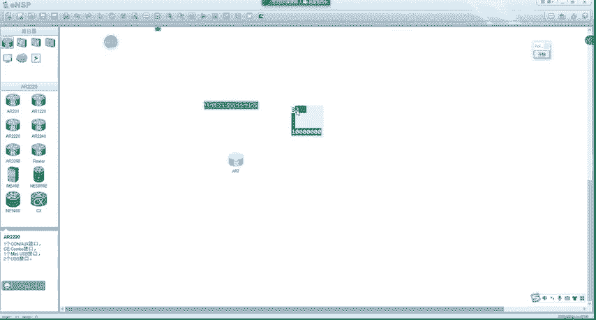

对呀，所以说X点Y呢。

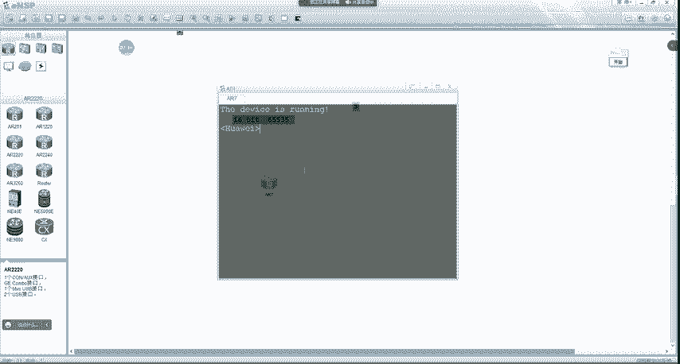

是一种新的对A号的表达形式是吧？它是四字节。嗯。S hard另一种。Okay。表达形式。对吧那这个X点Y它是怎么组成的呢？它分别是由两个字节来进行组成的。也就是说X呢它占用了一个字节。而Y呢。他占用了。

Yeah。啊，不对啊，应该是X占用了两个字节，Y也占用了两个字节。都是两个字节啊。那这时候呢我来给大家举个例子，比如说在这时候呢，我有1个AS，我举个例子啊啊，它是65536。

那我们通过传统的二进制来进行表达的话，就0000是吧，0000。Yeah。然后是。零零零零。你你你你。啊，一。对不对？我们可以去看到啊，这样的一个二进制呢，如果你把它转成十进制的方式，它是65536。

对不对啊？是吧而对于X点Y呢，它一共占了4个字节。也就是说后面这些呢。他都是后面这两个字节。对吧而前面这个一呢，它占用的是X的一个比特。对不对？所以注意啊，那我们将它进行补全，补充到四个字节的话就是。

00000001。你你你你。啊，然后0000。那这时候我们可以去看到啊。😡，这是两个字节，这是Y对吧？然后这是两个字节，这是X部分。那么把它转成十进制是65536。对不对？如果没写成X点Y的方式。

就是一的几啊。ji啊。这是多少？1。0。对吧所以这时候我们可以去看一下，比如说我在A27上呢。

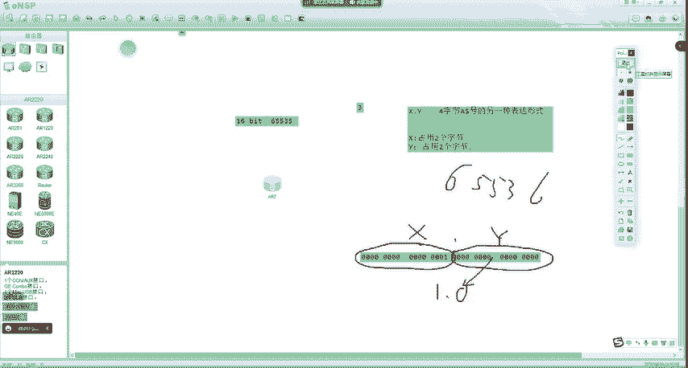

BDP。1。0能不能进去啊，可以对吧？然后我BGP，比如说我随便输入一个啊一大串。这时候我一敲回车呢，他就给你报错，对吧？他说一个设备呢只能支持1个A。对不对？只能加入到1个AS中。

但是如果我BDP65536。能不能进去啊，可以。对吧那通过此我们可以验证出来，65536就等于1。0。那它是怎么样进行转换的呢？我们可以去看到X如果每为一，那么是不是就代表着是1个65536。

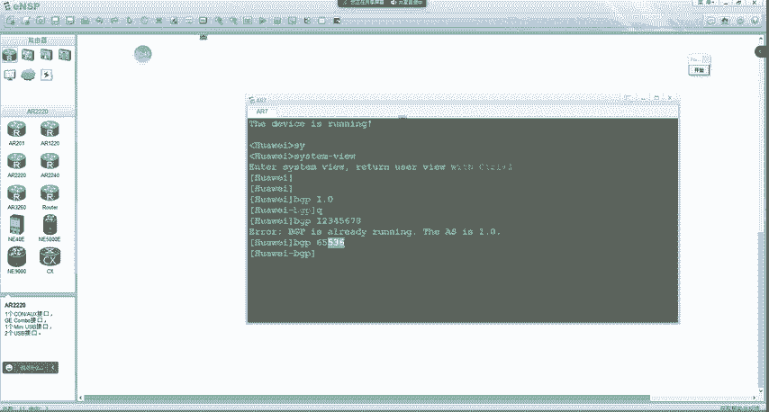

能不能明白？

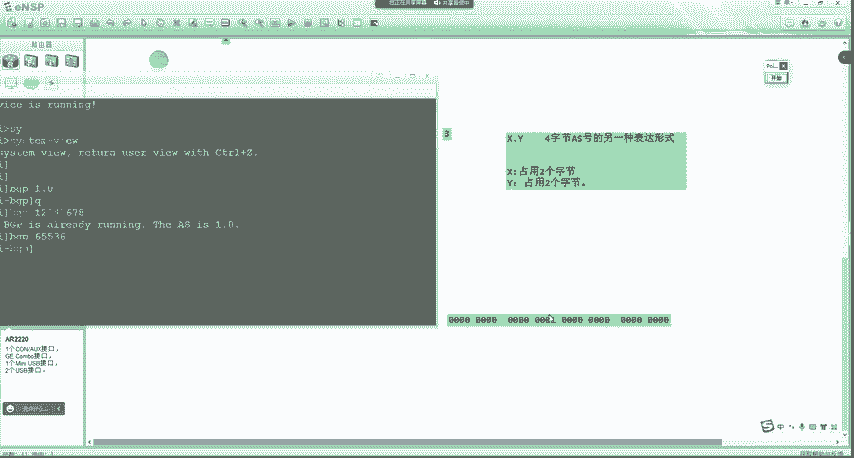

如果我是10。这时候转换成十进制等于多少？等多少？这是X，这是10。10你写成等于2吧，2。0。对不对？这是等于2。0啊，然后X每为一，它占了1个6536，我们用65536乘以2。

这不就是他所代表的十进制吗？2612。26122进1对吧，然后这是4。哎哎，不对，是这样称的吗？先乘大的先乘小的是这样乘的吧。2323也要乘以一下吧，对吧？啊，对。65536。是吧啊。

很多年没接触数学了啊呃。😊，啊。是吧我们用计算机算一下啊。😊，对吧65536呃，然后我们乘以2等于。13。啊，等于131072对吧？然后现在注意，比如说我现在呢。

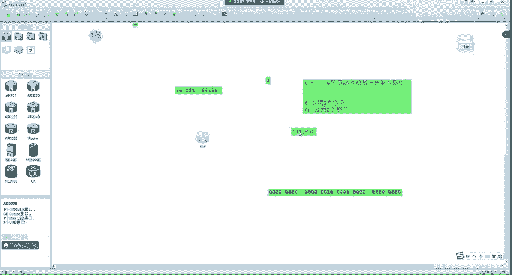

安度BGP1。0。我怎么办呢？BDP2。0，然后在BDP131072能不能进去啊？

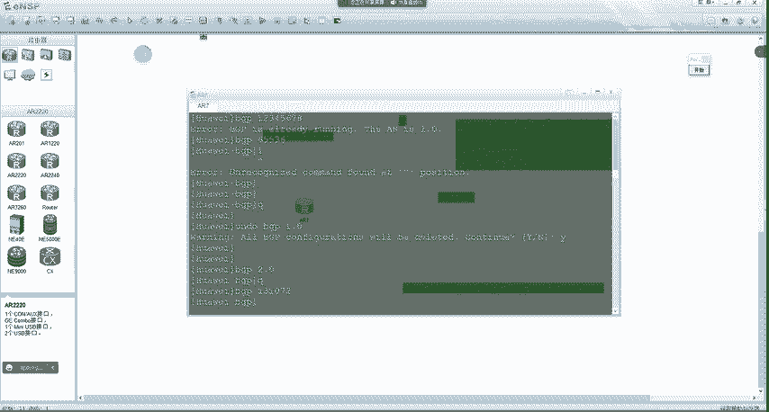

可以。对吧所以说他们之间的转换关系啊呃我给大家举个例子就是。😊，X点Y如何转换？为十进制。那就是使用X乘以65536加上Y。那么这就是它的公式。对吧这就是他的公式。刚刚我们那个比如说我是2。0。

对吧那X乘以2啊，不对啊，6536乘以2嘛？是吧啊，就2乘以65536。然后加上YY，我们现在是等于零的啊，比如说我有这么一个啊。2。177。是吧你就去算一下X乘以2等于13072啊，然后加上177。

等于131249。

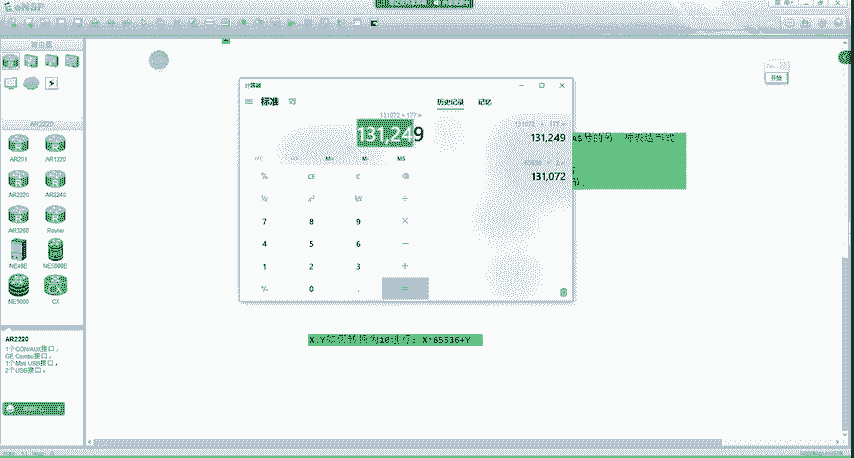

对吧然后现在我们来验证一下，比如说我在7上呢。暗度BGP2。0。是吧我在这里呢，BP2。177。能进去。但是呢如果我BDP131。249。是不是也能进去啊，那代表着他们俩的号是一样的。

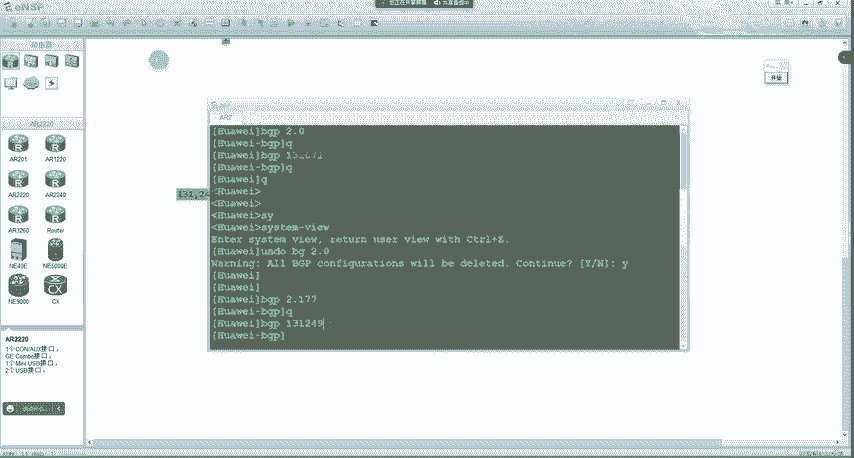

对吧而2。177就是2乘以6536加177，它就等于131249。所以说这是X点Y转换成十进制的一种方式。那这时候我们还会有一个问题，对吧？十进制如何。静知对吧，如何转换为X点Y。是吧。呃。

大家用用你之前学过的数学啊，想一下。啊，怎么转换？嗯。没异议。嗯。是吧除以6536。对吧得出整数部分为X，而余数部分为Y。对吧。没错，所以我们反向再来取值一下131249呃。

它除以6536等于等于22就是X的部分。对不对？然后余数177嘛，那它就是Y的部分。是吧所以说反过来也是一样的啊，就你反向进行计算一下就可以了。实际制转换成Y，就是使用。S号除以就是X部分等于啊。

不对啊，A号除以。除以。多少除以。655。5536啊，整数。整数啊部分为。X是吧，余数为Y。所以说这是它反向进行转换的一种方式啊，那这就是AS号的两种表达形式啊，嗯就是XY。

然后我们转换的话就是X乘以65536加Y嘛，对吧？嗯，这它的两种表达形式啊，一种是时间制啊，还有一种是X点Y。而我们去BGP路由器去对四字节A号支持的时候，呃，它实际上是一种能力啊，对啊？

实际上是一种能力。而这种能力呢，我们两边路由器之间需要来进行协商。你比如说我支持四字节A号啊，我要给你建四字节A号的邻居。那这时候呢，我们两个之间要进行协商，而不是说一台设备说了算的啊，那。

我们的路由器怎么样去协商对四字节A号的支持能力呢？嗯，它是使用了open报文。也就是说我们在建立邻居的时候呢哦会去进行协商啊，比如说在这边呢。我们有一台AS65001对吧？呃，在这边呢有1个AS1。1。

那他们两个在建立完TCP连接之后，会去发送open报文。而在open报文中呢，这个功能默认在华为设备里面是开启的。也就是说，华为设备呢默认是支持四字节S号协商的。所以说针对于AS65001来说啊。

它没有4字眼AS号支持能力对吧？所以说它发送的豹纹不会携带。而对于支持4字节AS号的路由器呢，它是这样的啊，大家注意听。他所发送的open报文中呢，里面有一个myA字段。而这个字段的取值呢是23456。

注意啊，是23456。那23456主要就是用于。两字节AO的路由器。和四字节A路由器之间来进行兼容的。那而这个四字节A路由器的真正的A号，它是在一个扩展选项中的。在这里面呢会去携带上它自身真正的AS。

所以说在这时候呢啊我们可以通过抓包简单的去看一下，对吧？华为设备里面呢4字键S号的支持能力呢嗯它默认是开启的。嗯。比如说现在我们拉出来两台路由器啊。A27这边呢就是杠1啊，我们把它叫做A21。

然后这边是A2。哦，我们给他连一起。

我在一这边呢，先把他之前的BDP给他关了然后我们改一下名字啊，这是A21。然后这边的话是AR。0家0搞0。10。0。12。1。然后这边的话是10。0。12。2。啊，比如说我在A2一上。

我就BP100好吧。嗯，然后我跟二区建定邻局P210。0。12。2A注意啊嗯，假如说二是一台支持4G节A号的路由器啊。

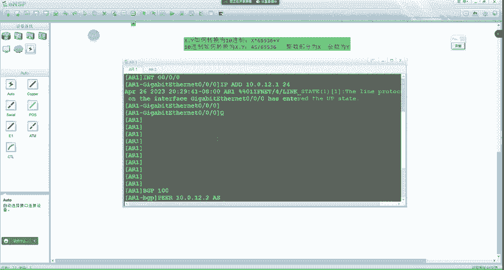

呃，我们给他放到1。0。好吧。然后这边呢是传统的两字节A100。

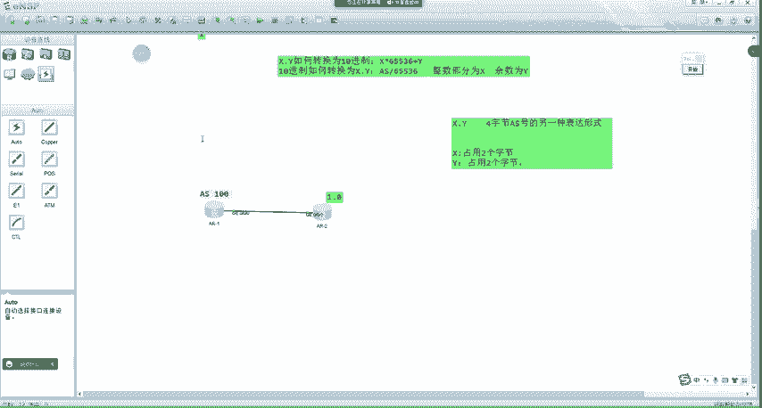

那在AR一这边去指的时候啊，是指的是23456。

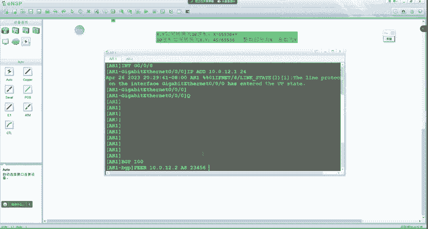

因为对于AR一来说，它不支持4字减S号，所以说你敲不了1。0，就敲不了65535更大的。所以说我们要给他指的那应该是23456。而对于二来说呢，BGP。100呃，BP1。0。P10。0。12。

1ASE00。

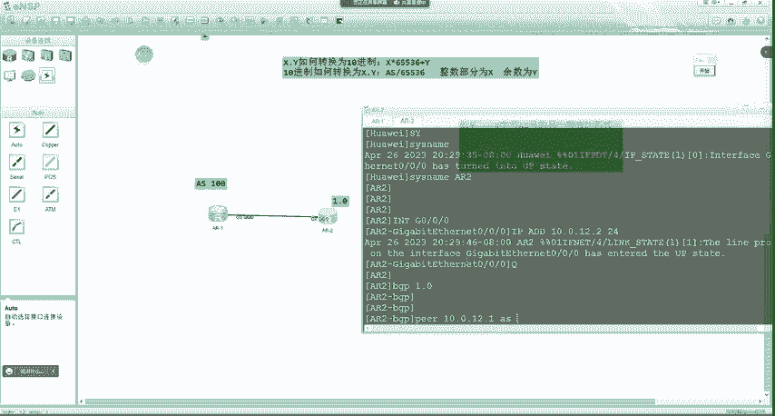

对吧而四字节A号的路由器呢向下是进兼容的这时候我们在链路上抓一下8瓦。

嗯。Yeah。嗯。

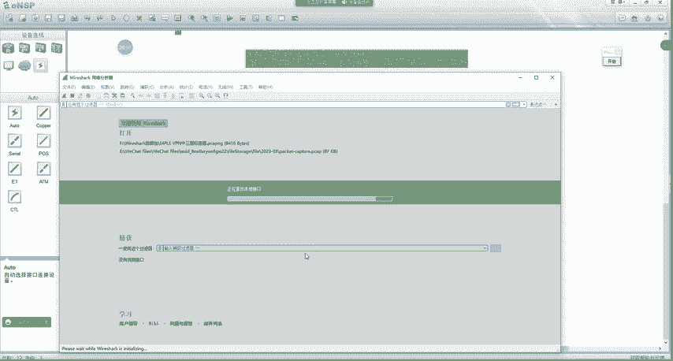

嗯。嗯。

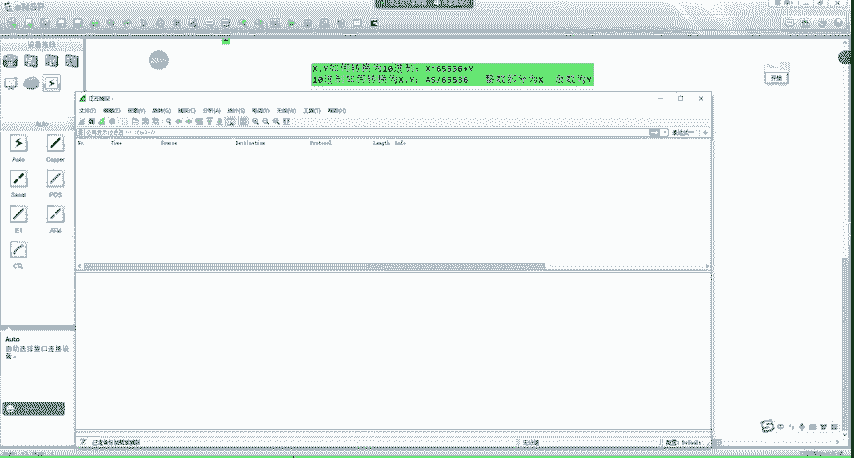

嗯。Okay。没来看啊。

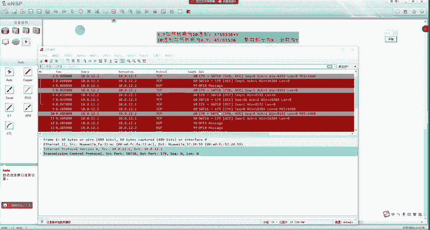

呃，三次握手建立完成之后呢，一给二尔发送了一个open爆文。对吧那在这个open报文中呢，我们可以去看到myA字段呢，就是他自己的AS，对不对？而二给一发送的open报文呢。

我们可以去看到maxS4字呢是23456。

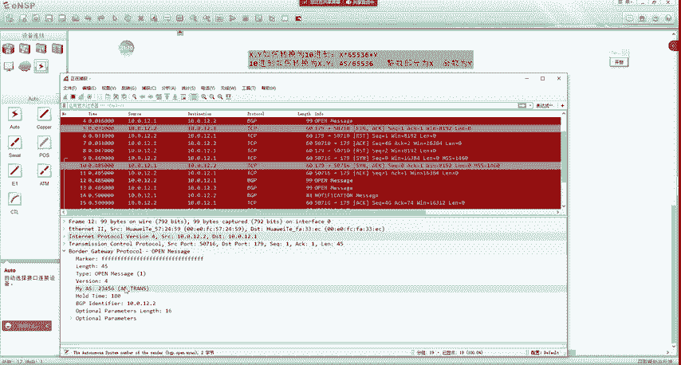

那也就是说我们为什么要在一上去敲这个23456呢？是因为一收到对方的hello报文之后，看到对方的myAS会跟本地的配置来进行对比啊，比如说我们配的是1。0，首先它不能配1。0啊。

就你比如说你拍的是其他的对吧？你拍的是100，但是对方发的是23456啊，这时候邻居会建立失败。能懂吗？所以说这个23456呢，它就是专门用于。四字节A号与两字节AS号来进行互通的啊，就是用于做兼容的。

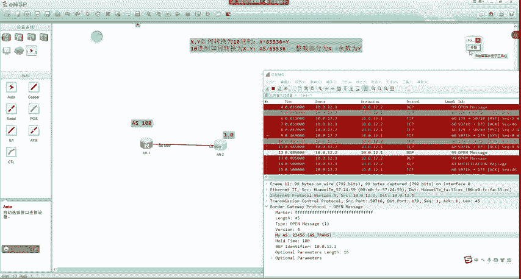

而二会把它真正的AS呢去藏到一个扩展选项中。我们可以看到在这里呢有一个四字节A号的支持能力是吧？我们去打开之后呢，我们可以去看到二真正的AS是65536。对吧而如果对于A2一来说呢。

它并不支持四字节的AS号啊，它就没有办法去识别读取这个字段。所以说这个段位这个字段呢它会直接进行忽略。所以说在AR1的视角中，AR2呢就属于23456。而在AR2的视角中呢，AR1就是100。能明白吧？

那这就是他们的兼容方式啊，在AS中呢啊会体现出来，就是在open报中啊啊建立邻居的时候会体现出来，就是会新增一个啊叫做。

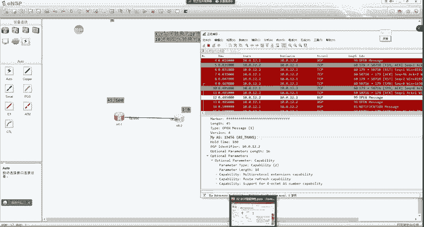

传输的AS是吧，是23456。那未来他们在建立邻居的时候，我们来看啊。😊，是怎么样的？比如说这是老路由器，这是新路由，这也是新路由器啊，老路由器和新路由器之间呢。😊，这个先路由器呢，我们假如说是123。

二会给一说它支持四级眼A号，而一发送的这个open报文中呢是不支持四字眼A号的，所以说他们之间会建立老绘画。而新路由器之间呢，大家都是支持4字节S号的啊，他们建的就是新绘画。系吧。

那未来在路由传递的时候，注意啊。路由在传递的时候，它是有点不一样的。比如说我们来看嗯。假如说呢现在我们有一台老路由器是吧？然后中间这两台是新路由器，这又是老的啊，然后这又是新的。这是老绘画啊。

这是新绘画，这是老绘画，这也是老绘画。那未来假设对于AS65001来说，它有一个路由啊。那首先他在发送的这个报文中呢，就是ASpas属性中呢，会去携带上自己的65001。但是呢对于这台老路由器呢。

它没有办法去携带AS4pa。S4pas和A pass是一样的啊一样的作用。它主要是用于携带四字节的A号的。那他发给了路由器2之后，路由器二是可以进行识别的。对吧因为四字节AS呢向下是兼容两字节AS的。

所以说对于路由器二来说呢，未来他在把路由发送给。其他的这个啊啊就是他的与之建立新绘画的邻居。他会携带上自己的四字节S号。那为什么会携带四字节A号呢？

这里主要是因为他们两个都是支持对四字节A号的处理能力的。所以说呢他会发送给这台路由器。是吧路由器3。路由器三收到之后注意啊。他与下面的路由器四建立的是老绘画。也就意味着路由器四呢没有办法。

或者说没有方式去识别自己所处的A对吧？就是没有办法去实指间这些4字也A号。所以说对于路由器三呢，它会使用AS4pass。去携带四字节的S号。而像原有的那些，你比如说这些两字节的AS啊。

它会用23456来进行填充。所以说在A24的视角中啊，这个路由经过了几个AS呢，它经历了2345623456是吧，始发是6001。然后就到了路由器4了。那路由器4未来发送给路由器5的时候也是一样啊。

他会把65002呢，就自身的两个字节A填补到这里。而4字节A号呢直接传递给嗯最后这台路由器了啊啊，65003。那这时候65003能不能识别出完整的路径呢？各位同学觉得行不行？实际上是可以的。

为什么可以呢？😡，首先呢。我们的四字节AS号的支持4字节AS号的路由器啊。两个字节的它可以识别对，因为你传过来的时候有ASpas，有A4pass。对不对？

那是不是意味着每1个23456都是1个44节的AS？能不能明白？所以说23456这个AS呢呃你是没有办法买到的，它是专门用于两字节跟四字节进行兼容的。所以说在这时候呢，每个23456都是1个4字ES。

我就往里面进行填充。首先经过了65001啊，然后经过了1。1。然后经过了2。2，然后到65002，那我们看65001。对吧。1。1。2。2嗯，然后是600是吧，正好符合我们所看到的路径。

对吧那这里很多同学可能会有一个问题，就是老师。大家都加23456，那有没有还路的问题呢？对吧。或者说有没有可能啊，我一看23456，我就不接收了呢。实际上这里是没有的，为什么没有呢？我来给大家说一下。

我举个例子。这是四字节这是四字节。他们都在1。啊，然后这是两字节，这是两字节的路由器，我们这样连接到一起。嗯。他们都在65001，这都在1。0啊。假如说这台路由器一呢，它有一条路由1。0。

它发送给两字节路由器的时候，他携带的AS号是23456。对不对？所以说他会发送给啊。那这是没有什么问题的。是吧那他也会通过A4pass去携带自己的老的A号。是吧也就是说在这条路由中呢，有2个AS。

1个ASpa呢是23456，1个AS4pa呢是1。那这条路由呢传给二之后，二可以转发给这边的3。对吧因为从EBDP邻居收到的路由，他不就传递给IBDP邻居吗？对不对？那当我们的路由器三收到之后。

假如说他要传递给这边的路由器4。那么在这时候，路由依然会正常传，对吧？只不过它在AS pass中呢，会再加上自己的AS号65001。而对于A24未来收到这条路由之后。你虽然只加了两个字节的S号。

但是它能够读取四字节，他知不知道这是从1。0过来的？A24是知道的，所以说呢A24也不会接收这条路由，并不会去造成路由环路。那有同学可能还有这么一种问题，就是老师啊嗯比如说二跟三正好在23456呢。

对吧你给他发过来，他就不接收了嘛。那这种问题呢是存在的，但是它是属于你在设计上的问题。注意啊，23456这个AS。只是用于四字节AS与两字节AS来进行兼容的。

而如果你在实际工作中用了23456会造成这个问题。没错，是会的，就是你给他传过来二不接收了，会有这种问题。但是呢这属于你设计上的问题。能懂吗？所以说协议在规范之初啊都会有一些设计原则啊。

那你打破了这个原则呢，是吧？那就没有办法了啊，这是你自己使用不当啊，并不是协议本身的缺陷。这里大家明白了吗？明白同学敲一啊，没问题吧。Yeah。那接下来呢我们简单做个实验，对吧？带大家来看一下啊。

当然这里首先要给大家说，我们模拟器中呢所有的路由器都是支持四字节A号的。

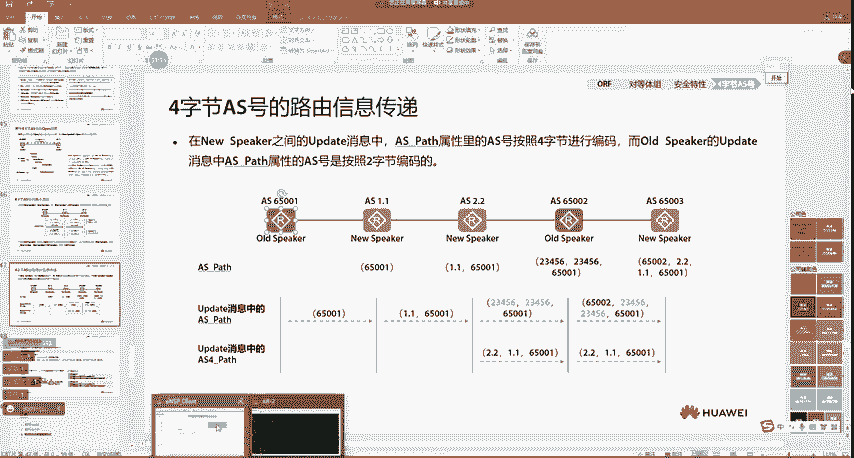

对啊。模拟器中呢所有设备都是支持的。所以待会儿我们看到的现象呢嗯会跟我们所讲的理论啊会有一点差别。但是大家按照理论去理解啊，因为这个没办法。因为现在你基本能够见到的设备呢。嗯，都能够支持四字眼AS啊。

基本能都行啊。啥样的设备不支持？嗯，前些年我遇到了1个02年的设备，这个设备不行啊。这个社会比较老了。😊，就一些老古董是吧？有些设备非常老了，那他就不行。

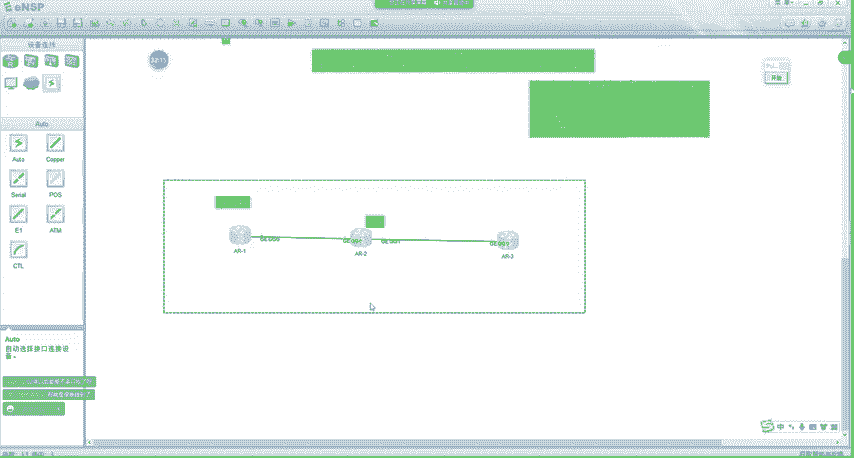

02年以后的那你得看厂商啊。也不是说02年以后的就支持啊。😡，你得看场上。Yeah。对吧这不就是厂家给你提供一个软件版本吗？我举个例子啊。😡，嗯。

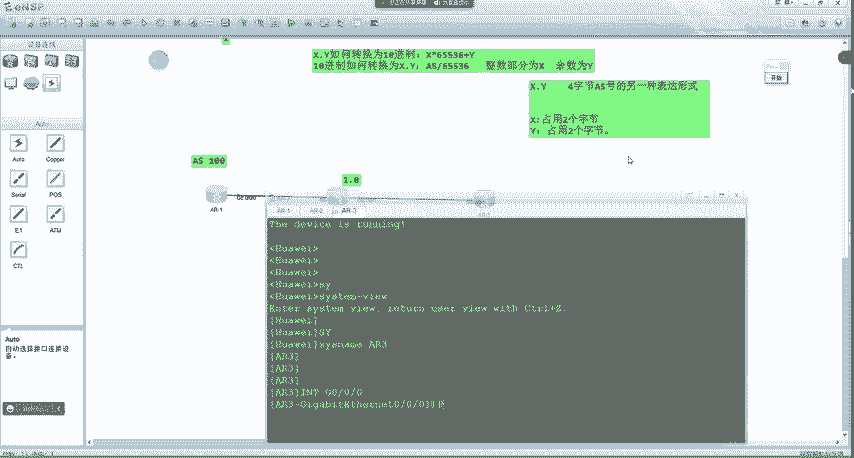

嗯，当然我只是打个假设啊，比如说我们是在10年有4字节A号的路由器。我举个例子啊，呃现在呢当然不一定是10年啊，哪一年我没有具体去查过啊，大家有兴趣可以去百度找找啊。呃，我只是举个例子，在2010年呢。

假如说这么一个技术产生了。呃，这是华为这个厂商。啊，但是华为厂商呢可能是在11年之后的设备，对吧？才能够支持4字节A操。但是10年这一年产生的呢是不支持的。啊，有没有这种可能来有？是吧。那但是呢。

随着这个四字节AS号，它的应用范围越来越广。华为在09年卖出了一台S5700。是吧。那在事的时候呢，华为为S5700呢提供了一个新的软件版本。你啊。提供了一个新的软件版本。

比如说你可能是呃假如说版本是比较老旧的，是09年的版本是吧？华为在12年的时候呢，为所有5700呢提供了一个新的12年的版本。那它都是支持4节AS号的。如果你的5700没有升级镜像。

那大家觉得他会支持吗？会不会啊？如果你的5700在没有升级版本之前是不会的。对吧。而如果你在12年升级之后，虽然你是09年生产的路由器，你能不能支持？完全可以吗？是吧。对，没错。所以说4次件ASR。

你只需要升级软件版本就行了。😡，他不需要你啊对硬件来进行编程，是不需要的。然后我们来看这里啊，现在我们假设说这是AS100，这是AS1。0。然后我们在这边呢嗯。有个A2。0。

1二之间，我们刚已经建立邻居了。然后现在我们在23之间也建一下。Yeah。Okay。BDP1。0啊P210。0。23。3A2。0。嗯。Yeah。23。2A1。0。

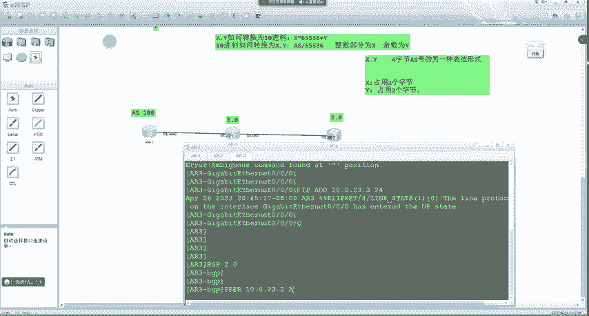

啊，23之间呢建立的新绘画，然后12之间建立了绘画，我们在0-0-1抓8。

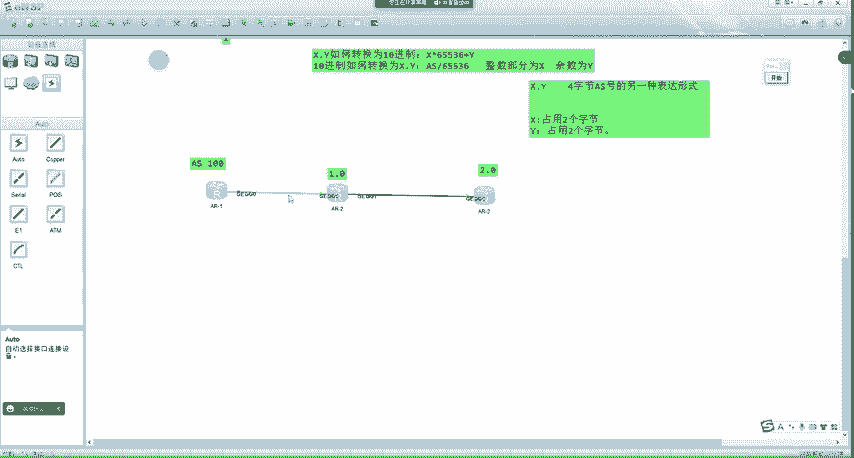

嗯。어。

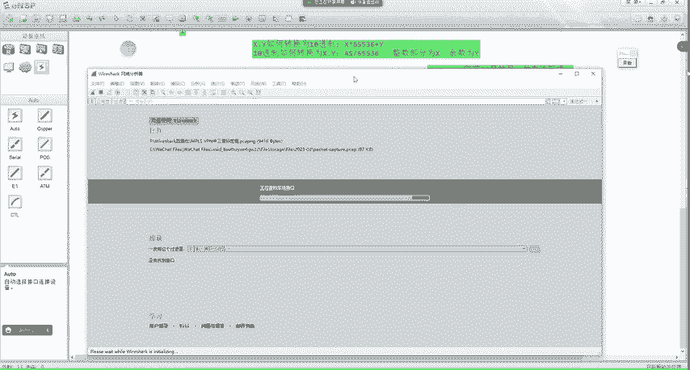

。假如现在在A2一上呢，我们有一条路由。嗯。192。168。1。0。然后给他发布到BDP中。Yeah。Yeah。

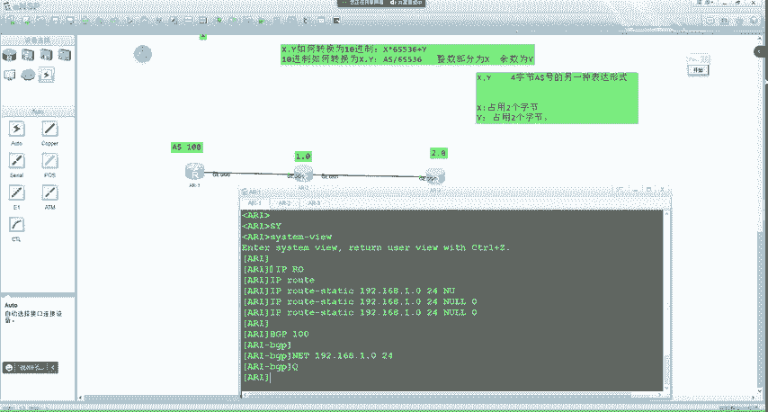

嗯，然后我们可以去看一下这个吧，但是现在二三之间邻居应该还没建立啊。嗯，谁是23。3怎么办啊，咱们地址配，我看配错没了？

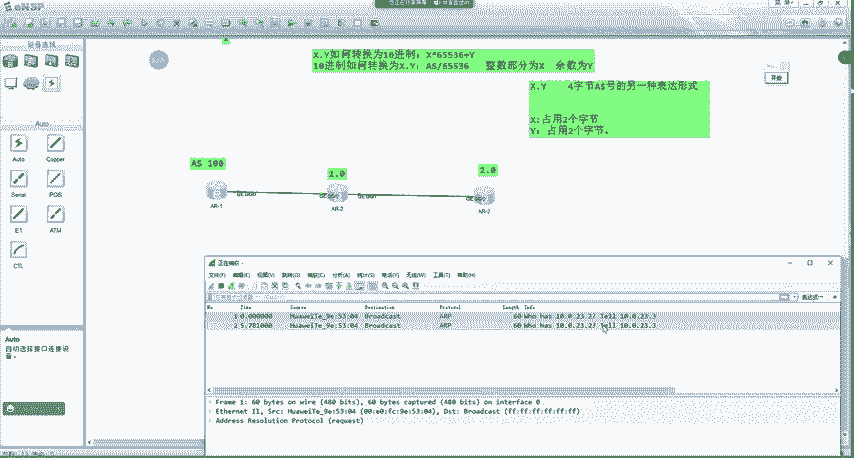

10。0。23。3P10。0。23。2。没。嗯，23。2不通。2的70-0-1。10。0。23。2。

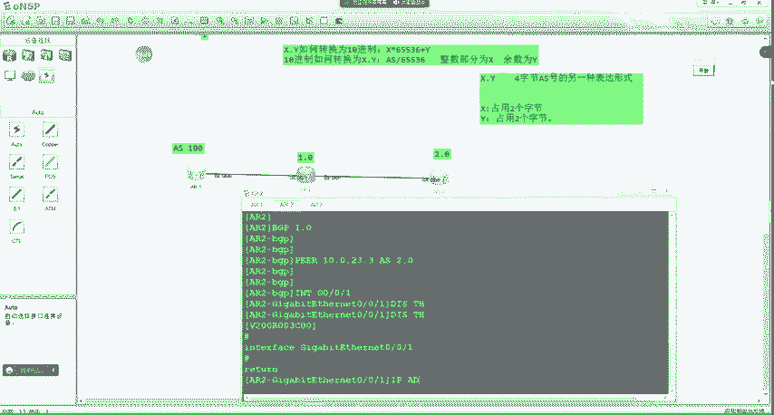

嗯。啊，再问23。2的IP啊，然后我们等他这个BDP邻居建立一下。嗯。嗯。没有。Yeah。

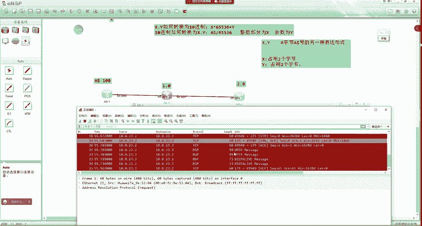

好，建立起来了啊。嗯，然后我们来看一下啊。😊，哦，那二跟三呢，刚开始他们都是支持自建A号的路由器啊吧，所以说他们都会发的这open豹文的m呢是23456啊，里面都会携带上自己真实的AS。

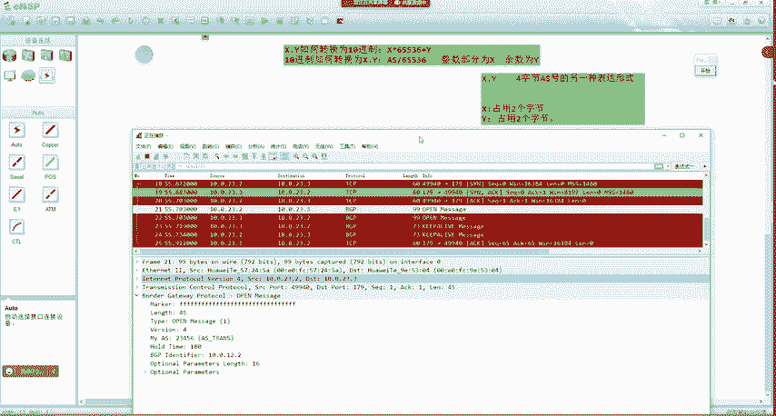

啊，比如说我是6536啊啊，然后你是多少？那两个人建立邻居之后呢，我们主要去看路鱼的更新啊。

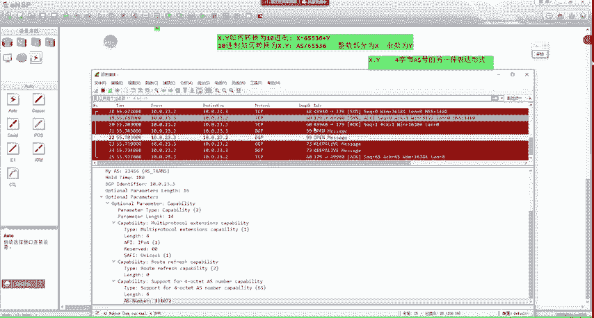

嗯，我们在A21上VGP100。暗度network192。168。1。0，先给它删掉啊。嗯，然后我现在有一条1。0的路由啊，我们给他通告出去network192。168。1。0。嗯，通告出去之后呢。

我们来看一下这个update包啊。응 응。没。没有。我看一下是不是哪里配错了啊，display BTPP。嗯。嗯，跟一的邻居档啊。Okay。现10。010。0。12。1。南通。嗯。我是12。2。

然后对方是12。1，但邻居到了。Dissplay BTPP。嗯。我们等他邻居建立一下啊。嗯。嗯，又退到爱豆了，应该哪里配错了啊，我看一下。笔记P1。0。Yeah。Yeah。嗯，12。1AC100。嗯。

然后。没错啊。哎呀医生。嗯。12。2AS number23456。嗯，然后12。223456也没错。呃，这样啊，我给大家解释一下啊，这个问题是这样的啊。哦，因为我刚给大家说了。

就华为设备里面的默认都是支持4字节A号的。😊，对吧呃所以说呢我们就要在AR一上把这个邻居给他关一下啊，为什么要关一下啊，我给大家说一下。😊，因为二发送的这个open报文呢。

它的myAS字段虽然是23456。对，但是AR一本身它默认是支持这种能力的啊，他直接去读你的1。0了。对吧我一读你的1。0，那，我看我配的是23456不一样，对吧？所以说这时候邻居就会断掉。那这时候呢。

我们需要在AR一上敲一条命令，暗度P10。0。12。2。呃，我们把四字节A号的支持能力呢给它关了，它默认是开启的啊，我我给它关闭。关闭之后呢，二这边待会儿邻居就会变得正常。我们等一会儿啊。Yeah。

Yeah。Yeah。Yeah。好啦。

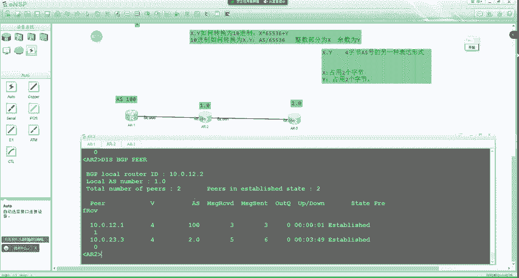

对吧那现在就建立成功了啊。呃，建立成功之后呢，我们来看一下啊A21呢，他把AS100的路由发送给二了，对吧？所以说我们在二上面去看这条路由display BGP table。

哦，我们就可以去看到呢这条路由经过了AS100传过来的。

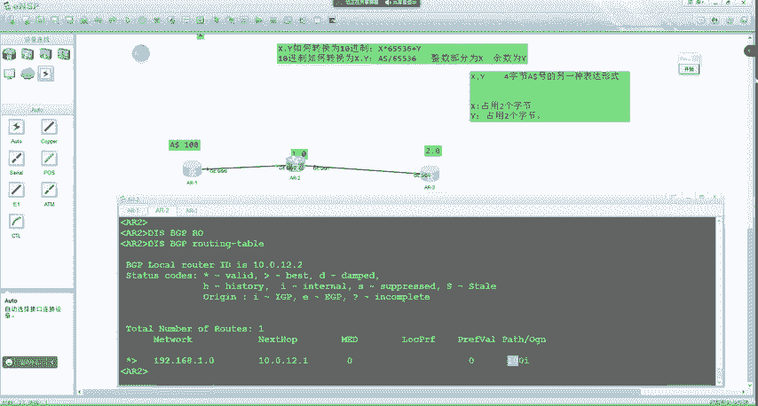

对吧因为你是4字GSR，你可以识别两个字GS。但是AS2在把它发送给三的时候，我们来看一下啊。

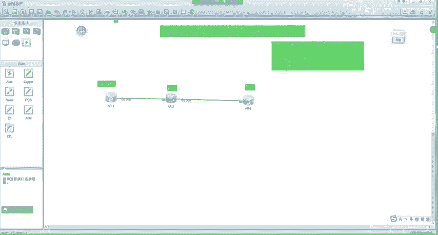

呃，咱们去找个update是吧，有路由更新。嗯，这时候呢我们去打开这个豹文的路径属性啊，在这里呢会有一个A pass。对吧。呃，我们可以去看到呢，里面携带了1个AS4是吧？啊，65536。

也携带了1个AS4100。对吧所以我们可以去看到啊嗯它是AS4的这个。

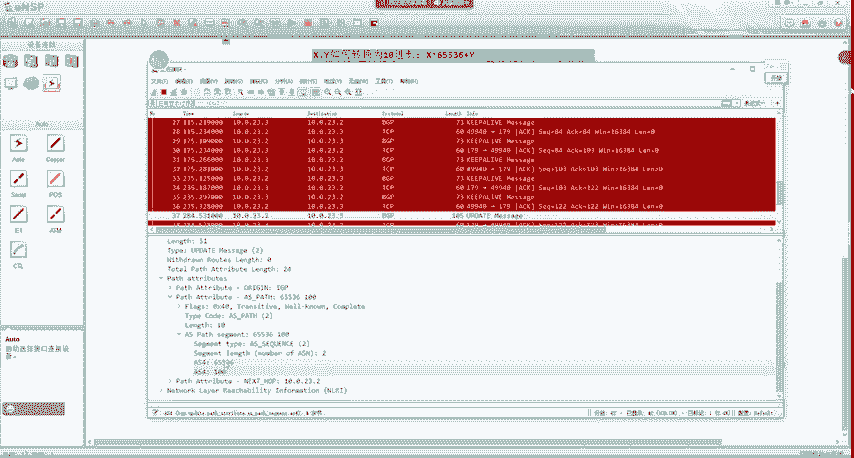

え啥。对不对？那这时候呢，他会发送给三，而对于三收到之后呢。

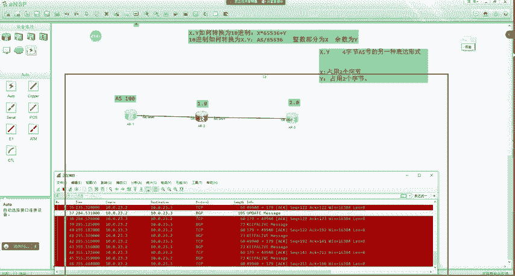

嚟看下。Display， BDp。入庭 table。那这里呢它就可以识别到啊经过了1。0，然后是AS100，对吧？因为三本身是支持对四级之间AS号处理的对，所以说它可以去识别这个1。0。

而如果我们在山上有一条路由。router scientist192。168。2。0。嗯。嗯。BDP2。0，然后给他发布到BGP协议中，192。168。2。0。

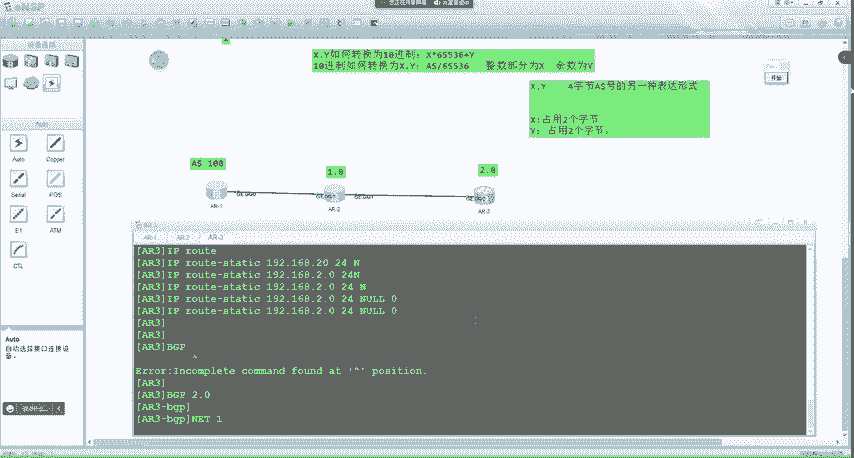

是吧。那这时候呢，这个路由反过来也会传递给2啊，传递给二之后呢，它会携带四字节的A号2。0。

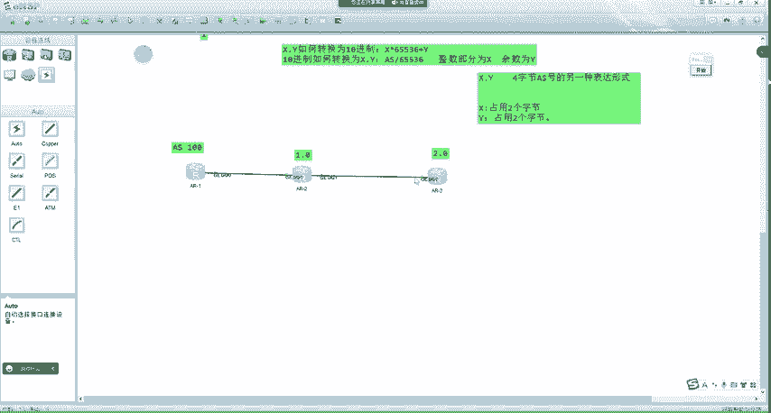

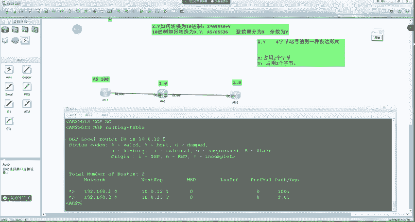

然后二呢会传递给一。我们来看一下。

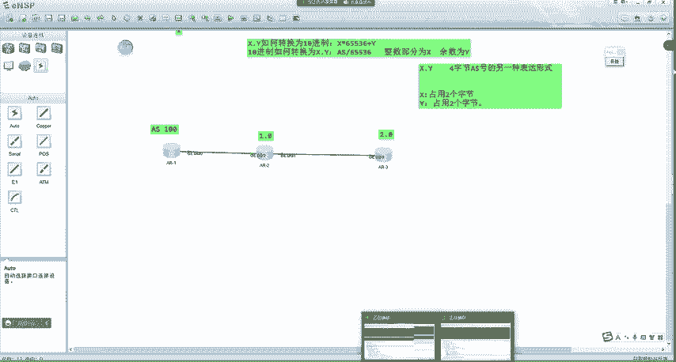

二会给一呢也发送一个update。

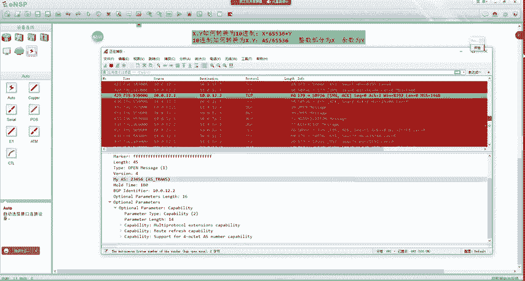

That라。对吧首先我们可以看到是2。0的路由，我们去打开AS pass，这时候可以去看到啊。😊。

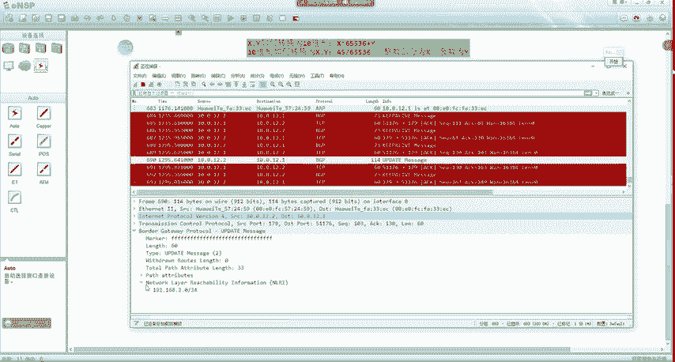

他会用。因为我们经过了两个40件S号。而传统的AS pass它是不是携带了2个23456啊？对吧而会用AS4pass携带自身真正的A号。一个是65536啊，一个是131072。那这时候我们来看。

如果对AI一来说，它是支持4字节S号处理的，它是不是只识别这个字段？

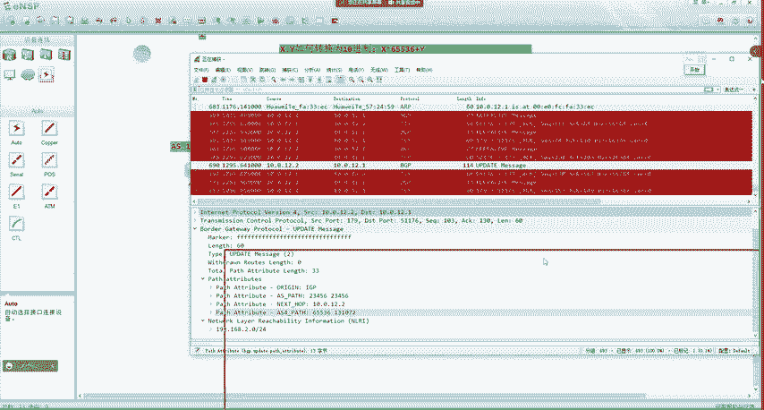

对不对？那如果AR一是两个字节S号的路由器，它识别哪一个？

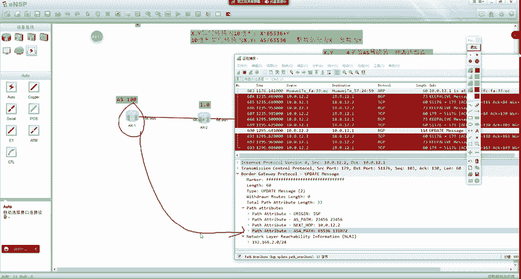

他识别这一个。所以说现在我们待会儿如果到AR一上去看，那关于这条路由的AS是2个23456，还是AS4pass？各位同学觉得应该是哪一个？是吧应该是2个23456。注意啊，应该是2个23456。

那如果我通过命令行去看呢，你会发现。他实际上是不一样的。对吧哎，老师他2。01。0。对不对？这里大家按照理论去记啊。这里呢应该是2个23456。而我们这里为什么会出现2个1。0呢？

因为ARE它本身支不支持四字节AS号的处理啊。他支不支持，他就是支持的。😡，老豆吗？你关闭了他的协商，但是他也能够支持，也能够读取。对吧所以说这里会显示2个1。0。但是如果你真的是一台比较老的路由器。

对吧？只支持2个AS号的识别。那这里呢就会是2个23456。好吧。那这里呢就是我们所说的啊，这个AS4pas啊，以及ASpass在传递过程中的一些变化。

那具体的配置呢，刚刚也给大家演示了，就我们打完BDP之后呢，会面会有A的输入。对吧比如说现在呢。我在AIE上BDP啊，你打问号。系统识图啊。呃，在这里呢，你可以用四字节的S号是吧？

当然如果你用的两个字节啊，你就敲65535，嗯，包括啊以及以内的啊，就是你就敲1到65535这些。如果你超过了6535啊，他就会自动认为你是使用4字间的ASR。对，所以说这一部分啊十进制呢。

它包含了两个字节跟四个字节的配置。那如果下面这一种对吧？就是X点Y啊，每一个段呢都是。嗯，这个两个字节。啊，但是我们可以去看到啊X点Y的方式，X的最小取值是多少？是多少？是一。对吧所以最小就是1。0。

那也就是说意味着，如果我的AS号是小于65536的。对吧小于6536，那也就是说啊小于啊。小于6536的那也就是说小于6536都是两个字节的AS号，两个字节的AS号能不能支持X点Y的方式？能不能啊。

实际上我们发现是不可以的对吧？只有四字节S号，它才是支持X点Y的形式啊。好，那这里我们就说这么多啊。呃，然后我们休息一会儿。

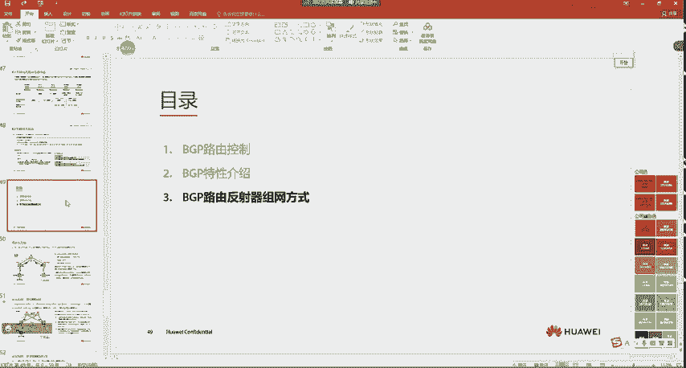

推10分钟好吧，十分钟之后呢，我们来讲一下这个BGP的R啊，我们把它叫做路由反射器啊。🤧嗯。行，咱们休息会儿吧。😊，来讲啊。呃，接下来我们要讲的是这个。

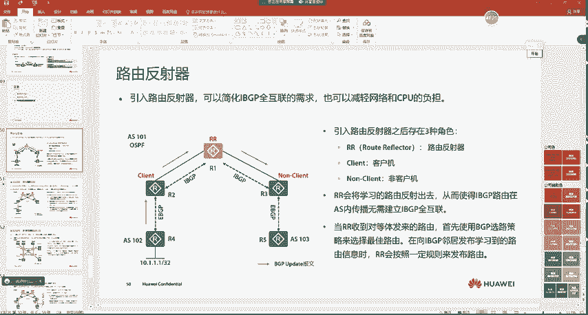

路由反射器啊嗯BGP的R。嗯，他主要干什么事的呢？因为我们之前都学过BDP啊，我们会发现BDP呢有一个特点。就是BDP路由只船一跳。只传一条的目的呢，我们是为了返还。对吧就是比如说呢这里有一，这里有2。

这里有3啊，我们为了防止一传给22传给33再传给一。啊，就做了一个非常简单的防范机制，就是我只传递给邻居。而邻居呢不能传递给其他邻居。对不对？那基于这个原则呢。

我们在AS内部就得去建立全互联的BDP邻居。但是建立全互联的BGP邻居呢嗯导致的问题一是我们的配置量很大。第二个缺点呢就是每个设备呢都要维护大量的BGP绘画啊，十分的消耗资源。比如说三要跟一跟四跟二啊。

反之呢一要跟四跟二跟三啊，四也是一样。就是我们要去建立这种悬互联的邻居状态。首先每个设备呢你都得Pre一个一个去配。对吧第二点呢，当路由器变得很多的时候呢，呃每个设备所维护的BDP邻居数量会非常多。

那这时候呢对资源的消耗也比较严重。所以我们就引入了一个概念呢，叫做路由反射器。嗯，这个反射器咱们怎么理解呢？实际上就像镜子一样。对唔对啊。比如说呢你把一束光照到镜子上。那镜子是可以把这束光对吧？

反射到别的地方。对吧。那。我们所说的路由反射器，它就是你把路由传递给一台路由器之后，那这台路由器呢可以把路由反射给其他的路由器。啊就是针对于路由的，镜子是针对于光的是吧？

而我们在网络中呢就把它叫做路由反射系。那在这个路由反射器中是这么一个逻辑。比如说这是二跟3。啊。呃，在我们传统的理解呢，我们要去建立全互联的BGP领域。那在路由反射器的场景下。

我们要配置一个设备为反射器。那这时候呢，每个路由器呢都跟反射器，也就是说跟R建立邻居。R收到路由之后呢，然后反射给其他的路由器。啊就选出一个中转站啊，大家都从中转站去拿路由，那这就是路由反射器。

而我们在学习路由反射器之前呢，嗯也要学习一些术语啊，一些概念。而在反射器里面呢，不同的设备它是有角色的啊。比如说。哪些设备能反射呢？是吧，哪些设备的不能反射呢？那谁做反射呢？对不对？

所以说呢针对于他们不同的作用，那我们的设备呢有不同的角色。第一个呢我们就把它叫做R，那它是执行反射的。还有一种呢叫做clant，对吧？呃，我们就把它叫做客户机，就是你给谁来进行服务呢？

你肯定跟客户机来进行服务。对吧还有一种呢叫做非客物机。就是我们不会反射非客户机。对吧。那这是三种设备角色。而R在工作的时候，它是非常简单的啊。比如说在这时候呢，我们给大家做个实验啊，让大家能够体会一下。

R的工作原理呢啊是非常简单的，实际上就一条命。那比如说在我们这个网络环境中呢，我们把所有的路由器呢都划分到AS100种。

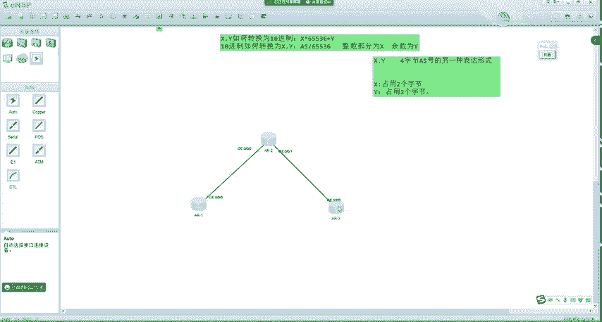

啊。这是一这是2，这是3。现在呢我们把他们的BGP配置给它删掉，暗度BGP。嗯。二这边暗度比细。嗯。嗯。三这边暗度BGP。啊。

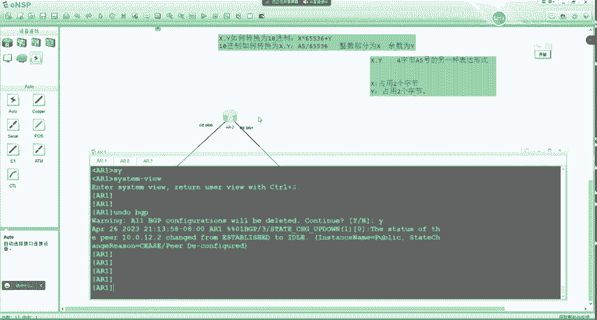

嗯，关了之后呢，我们在123之间啊，注意我们要跑1个ITP协议，我们用的是OSPF协议。

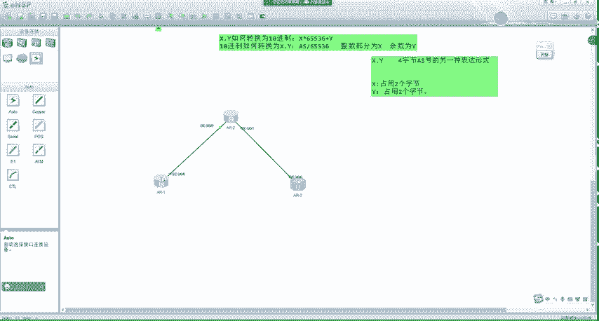

。network0。0。0。00。0。0。然后呢，我们把OSPF的通告呢在所有设备上刷一遍。嗯。然后在A2一上呢创建一个滑水口，待会呢用于建立BDP邻居。二上面也一样。那rootID咱们就不改了啊。

麻烦。

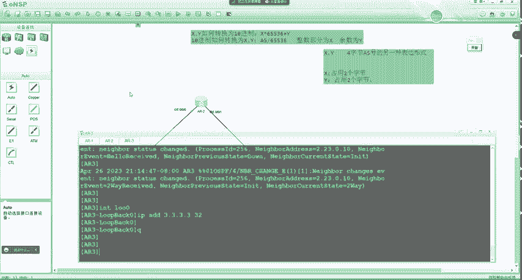

那么做完之后呢，我们现在是这样的。我们待会呢让R作为RR。对呀，这是我们选射出来的反射器。那在这时候呢，我们在一还有三上啊，注意他们都要跟R建立邻居，就你们把路由给RR再给其他人。

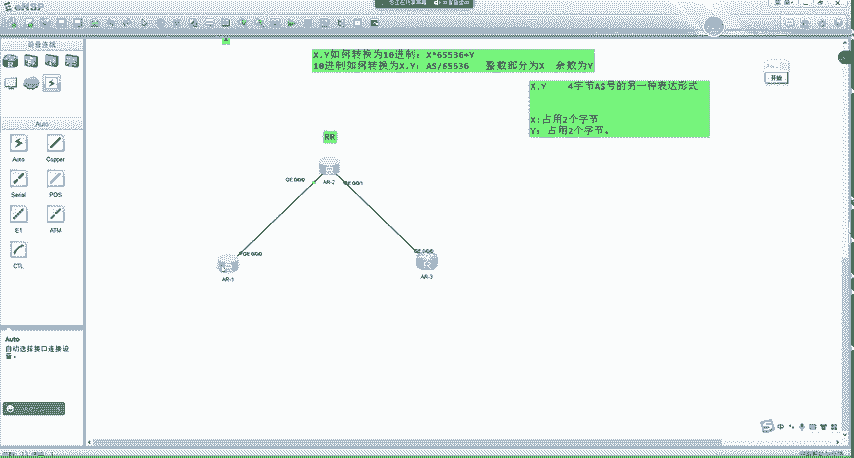

对吧。

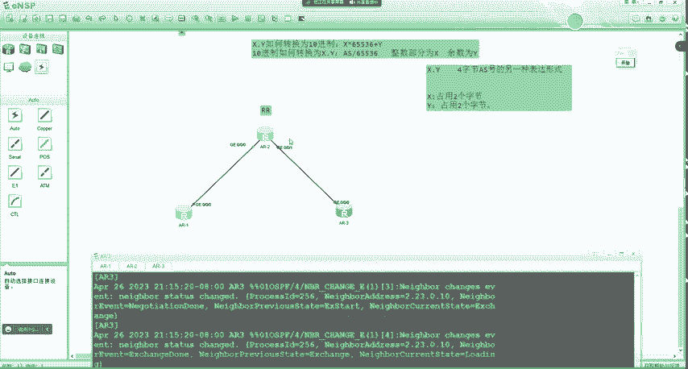

所以说这时候呢我们都要去跟R建立邻居关系。在一上呢。BDP10。P尔2。2。2。2。S1版。2。2。2。2n interfaceface low back1，因为我刚创建的是。low back一啊。

其他设备应该low back0。是吧。嗯，那就没了，就两条面令嘛。没有。然后在三上呢也是一样，BGP100。P尔2。2。2。2AS100。2。2。2。

2connect interfaceface no back0。对吧。然后我们在二上呢，BDP100。P尔1。1。1。1。21排。P23。3。3。3AE版。1。1点1。1更新原地址。然后3。3。3。

3更新源地址。

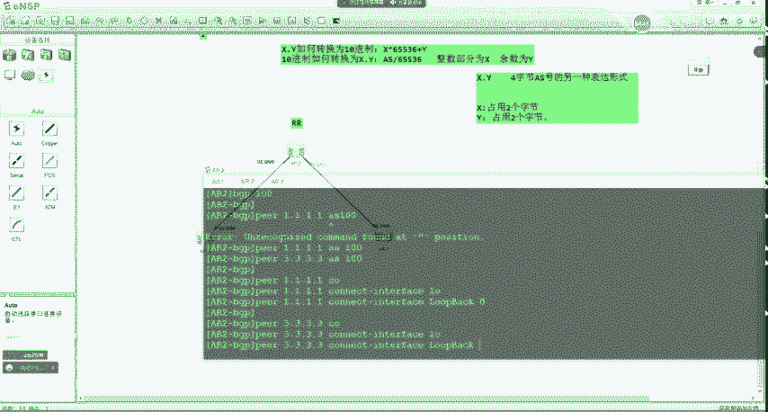

对吧都会给他说话。做完之后呢，待会儿在二上那BGP邻居就能够正常建立。

现在我们在ARE上呢network192。168。1。0。啊，给他通告出去。那A2一呢就会去产生一条192。168。1。0的路由。那由于是始发路由呢，他就可以传递给自己的BDP邻居R。

R尔就能够收到这条路。R收到之后呢，如果我们到R3上去看呢，你会发现R3是没有的。那这里主要是因为BDP路由它只传一跳。那基于这个不传呢，我们就得在一跟三之间再建个BDP领域。

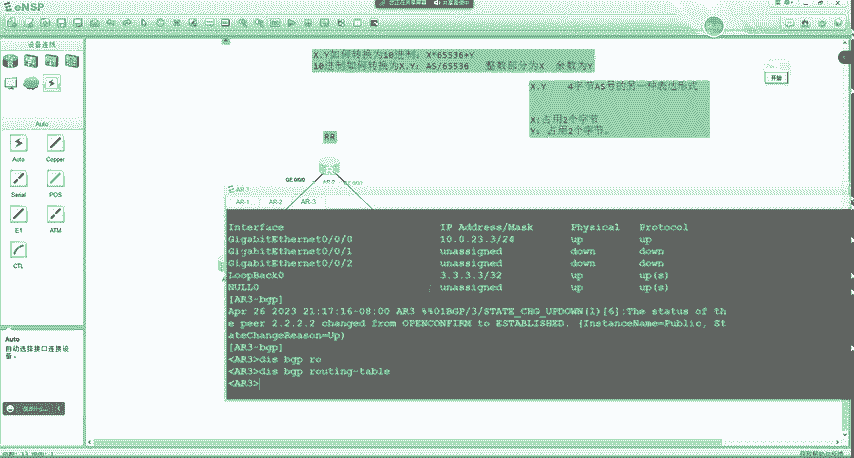

是吧这BDP邻居数量太多了，那就意味着我有几台路由器呢，我就得建几个。是吧非常麻烦。那所以我们为了解决这个问题呢。在网络中，我们让R作为R。

作为R之后呢，我们把一跟三配成反射器的客户端啊，也就是说为他们反射路由。

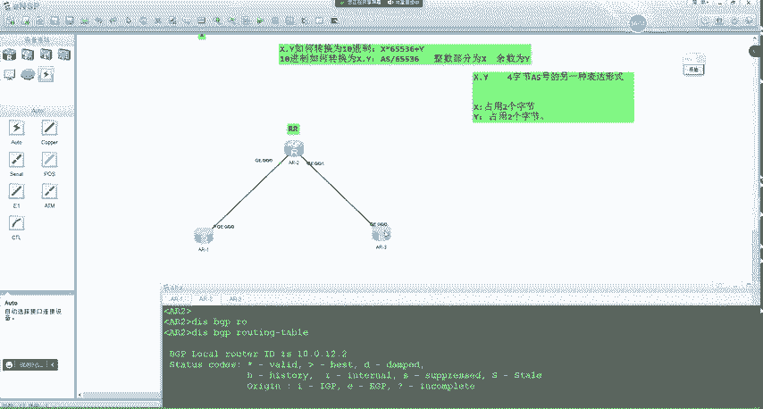

这个怎么样去做呢？就是在二上BDP进程下。Yeah。P21。1。1。1把1。1呢就是告诉给21。1是你的反射器的口端。然后呢。3。3。3。3也是你的凑的。这条命令一敲呢，就相当于告诉给2。嗯。

你是反射器，对吧？它是你的客户端。能不能明白？所以这条命令它隐含两个作用啊，一个作用就是给二说啊，你是反射期。那另一个命令就是告诉你2。谁是你的扣子？

是吧。然后现在我们来看。

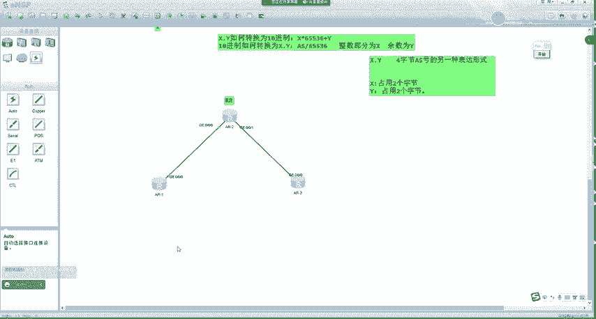

A21这条一点的那个路由，它传递给2之后。对不对？那二阶收到这条路由呢？三有没有呢？三就有了。是吧是二给他传递过来的。那反之也是一样的。如果我在三上呢去写一条192。168啊，刚我们有个2。0BGP。

然后我直接把2。0发布出去。这时候我们在A2一上来看呢，你会发现2。0呢也到一上。但是注意啊，我们要去观察的一点是什么呢？

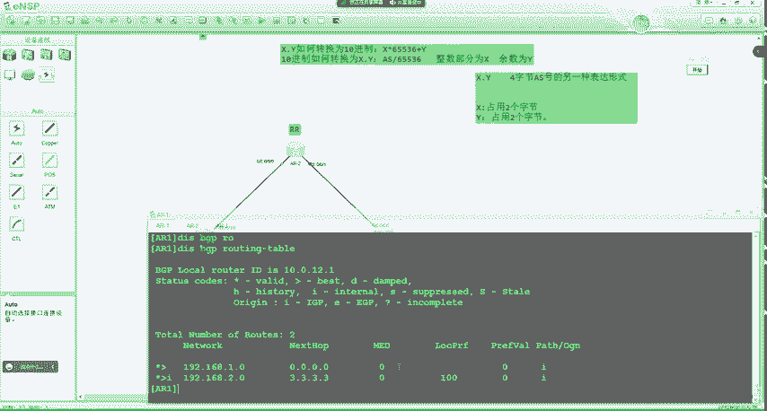

就是。二、现在也做了反射了。对吧客户端之间进行反馈。那老师有没有这么一种可能？网络中它有一台路由器不是客户端。对吧那二会不会把客户端的路由给非客户端呢？或者说把非客户端的路由给客户端的。是吧。也就是说。

他的反射原则是什么呢？对不对？那刚刚我们可以看到客户端。到客户端可以反射。嗯。对吧。

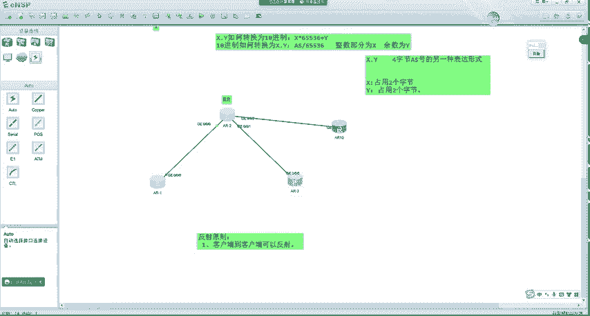

那比如说现在我们在三上呢，在二上。对啊。BDP。100。暗度P10点应该是3。3。3。3。啊。只让一作为客户端，而三呢是一个非客户端。

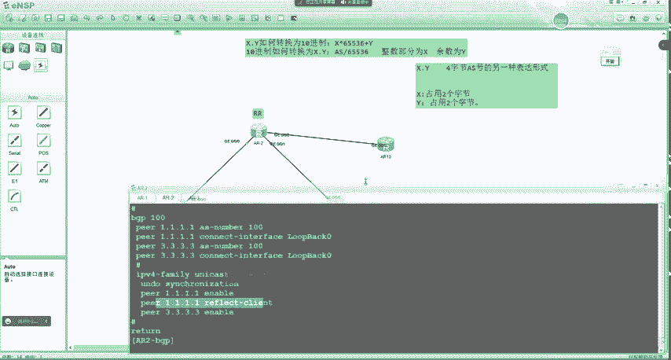

那现在我们来看一的1。0能不能到三呢？display。

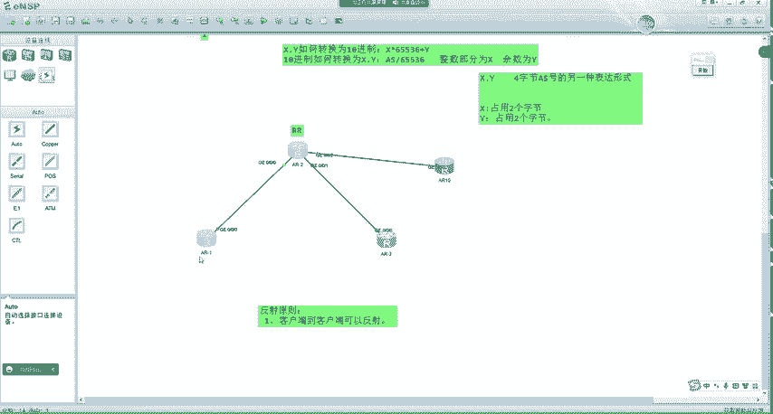

BDP入table。我们发现1。0还是存在的。

对吧。所以说呢。客户端到非客户端可以反射。

对。对吧那非客户端的2。0能不能到客户端呢？Display bdp。如天梯冇。我们发现也是可以的。对吧，也是可以的。

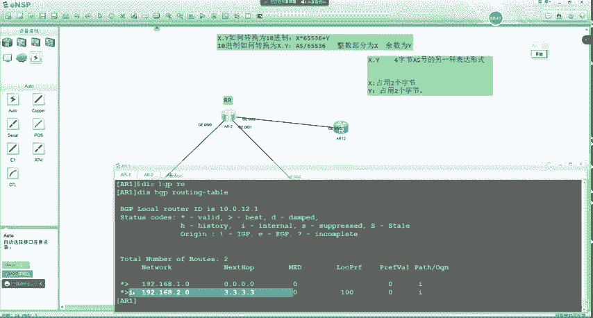

啊，所以第三个原则是什么呢？第三个原则就是。非客户端到。客户端可以反射。那还有一个就是非客户端。到非客户端。可以反射吗？是吧。那这个实际上我们并不需要去做实验。对吧。

因为我们回想一下以前我们接触到的所有BDP。老师，那都没有客户端啊，对吧？那都是非客户端。对唔对啊。所以说非客户端到非客户之间呢。他是不可以反生。嗯。是吧。所以说呢啊那最终总结呢就是一句话。是吧啊。

总结实际上就是刚刚有同学已经说过了。就是非客户端之间。无法进行反射。能到吗？所以说现在呢比如说我在二上。

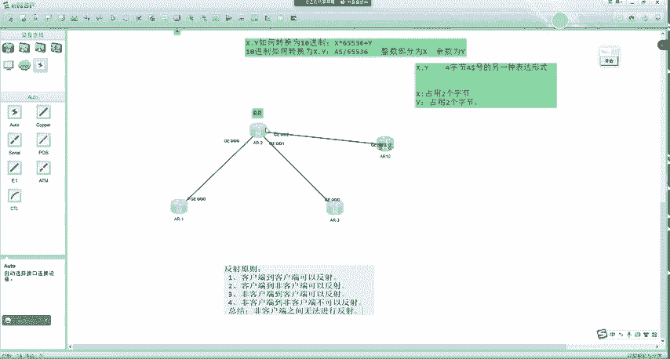

啊我把A2一呢也做成非客户端。Yeah。是吧那有同学就问了，那老师现在二都没有R的配置，他还是R吗？啊比如说我现在随便指个4。4A100。P24。4。4。4是吧。做个反射器。

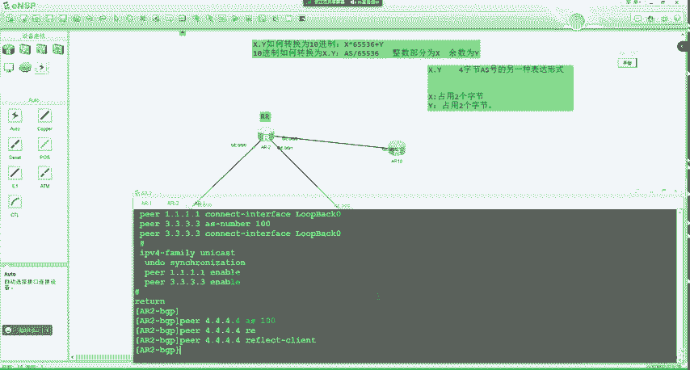

那现在AR2有了这条命令之后，它就是R了。

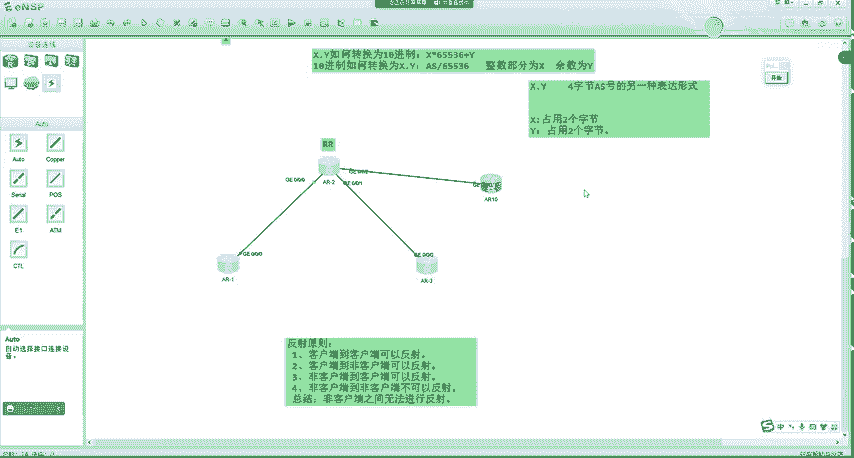

那三能不能接收到一的路由呢？display BDP rootingtable我发现没有。是吧那反之过来也是一样，一呢也不会有三的。

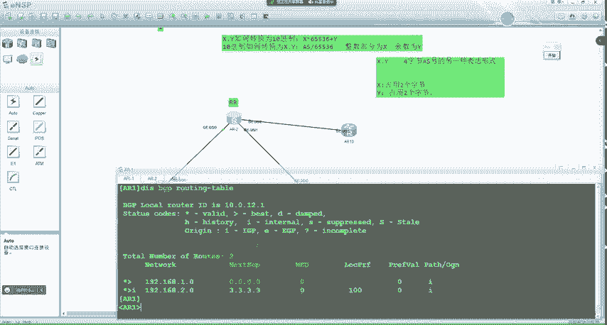

所以注意啊，非客户端之间啊无法进行反射。然后其他的呢我们都是可以来进行反射的，这就是R的反射原则。啊。那这里呢需要再给大家去扩展一些。是吧这个要扩展的是什么呢？我要举个例子。

比如说在R这里呢有1个A24，这是AS200，这是ASE吧。这是客户端，这是客户端，这是非客户端。응。啊。那。一的路由给二之后。二会发给4。这叫反射吗？注意啊，各位同学。这并不是叫反射。能懂吗？

反之四的路由给22，你无论给他十给三还是给一。都不叫反射。所以反射它是有条例限制的。不是什么样的路由传递都能够叫做反射。那什么样的行为才能够叫唆反射呢？因为我们传递给EBGP邻居的时候。

它就是正常的传递路由，它不能叫做反射。注意啊。所以说反射的定义它是这样来的。叫打破了。Yeah。ABDP。纸船。一跳特征的。才能叫做反身。嗯。老度吗？那当你传递给EBDP邻居的时候。

那就是正常的路由传递。所以说反射呢，它只能在IBDP邻居之间。打破了这种只船一跳特征才能反射。因为正常我给了你。对吧你从I收到路由就不能传递给I了。是吧。但是现在你传了啊，这种行为呢才能够叫做反射。

那有些同学就觉得是吧，老师这个好像很容易，这不就是配置吗？啊一条命令完事儿。😡，对不对啊？嗯，实际上呢并不是。因为我们可以去看到啊。那现在对于AR2来说，它是R。那未来大家都跟R建邻居。

你担不担心他坏了呢？你很担心。是吧。而一旦产生了故障之后呢，它会影响所有人对吧，影响所有的路由器。那这时候怎么办呢？我们就要想办法给R提供冗。对吧就像袁通说的啊，提供BR叫做备份啊，或者说两个啊，没错。

也就是说，R呢我们需要去提供备份，提供冗。那这个呢有没有单独的技术呢？实际上没有注意啊。而而没有任何主备性的技术，只有我们在部署的时候去考虑到它的冗余性。比如说我这有个路由器。对吧我担心它坏了。

我再拉个路由器，他俩之间是主备。啊，有没有这种技术呢？没有。对吧你怎么样去实现储备的啊，当然不是防火墙啊，防火墙可以做。那你怎么样去实现主备的呢？你就让大家主路径走这边备用路径走这边是吧？做个联动。

那这是你在部署的时候去实现。

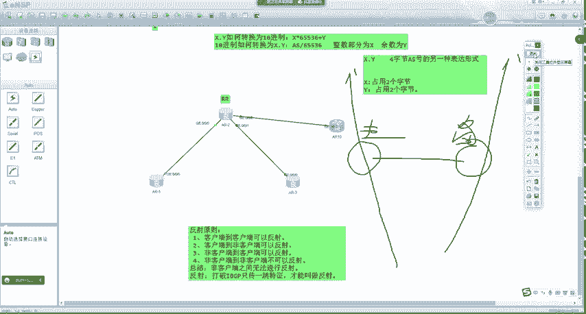

所以R这种技术啊，它本身没有什么主备的概念。但是我们在部署R的时候呢，要去考虑的。

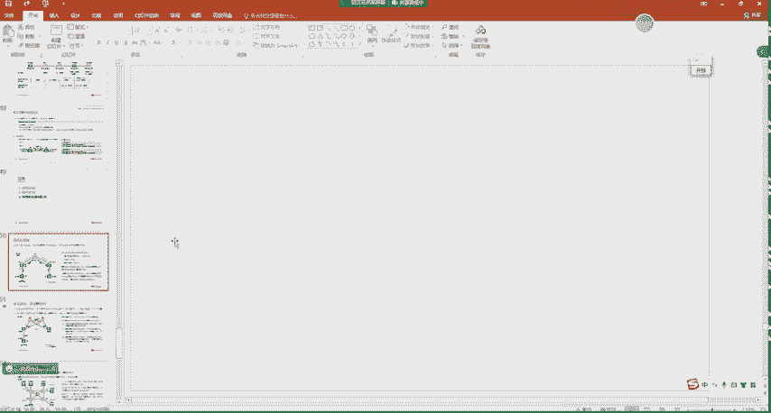

啊。他的一个冗余性。所以呢。为了增加网络的可靠性对吧，防止单点故障，我们有时候需要在一个集群中配置一个以上的啊，这里大家就会有一个问。老师，什么又是集群？对不对？这里我给大家解释一下。

那R以及在它的路由器之间。对呀，比如说我们现在AR。对吧AR为谁反射路由呢？为这些路由器。那么以及加上二本身，这就是一个集群。能不能明白？这就是一个集群。那集权怎么样去标识呢？集权都会有一个标记。

你比如说是吧。啊，在美国的呢都是美国人。对不对啊，当然只是举个例子啊，大家不要杠是吧？老师还有华侨呢你不要给我杠啊，那。😊，美国得有一个标识。啊，什么样的标识呢？他们有自己的国旗啊，或者说国徽。啊。

我们中国也有。那网络中也是一样，你这是一个小范围，对吧？一个小组织啊，你是一个集群，你也要有一个标记。那这个标记呢，我们就把它叫做集群ID，或者说叫做促ID。对呀，叫做错癌。这个醋ID呢，他默认取值为。

啊啊的。入台里。嗯。对呀，默认是R的入台，但是我们也可以去改。

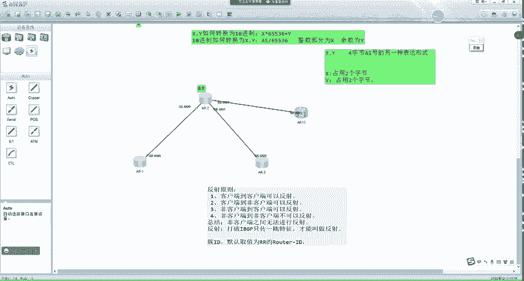

比如说我在二上呢，可以去给他配一下BDP。嗯，100。嗯。嗯。哪条面呢，我找找啊。而这条是吧。啊，叫做class ID。啊。那这里呢我们可以去给他配一下，比如说2。2。2。2回车。

这时候我们就可以去看到呢，这是配置R to IDD的命令。

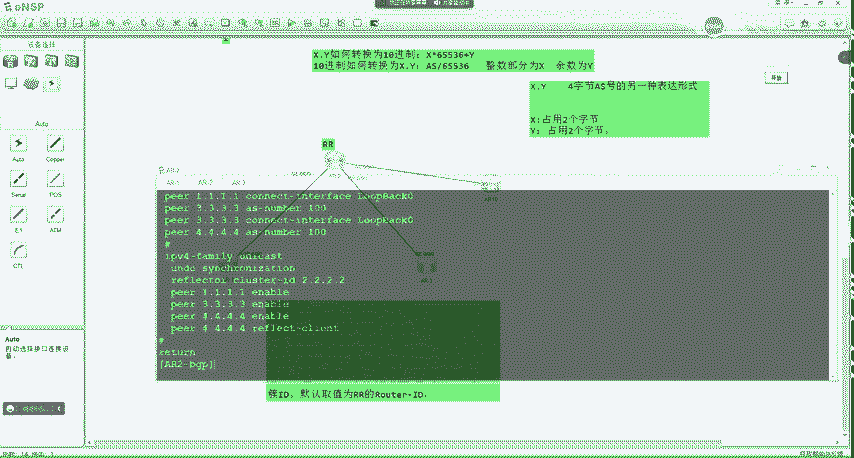

那这就标识着它是哪一个组啊，这是在R上配就可以了。

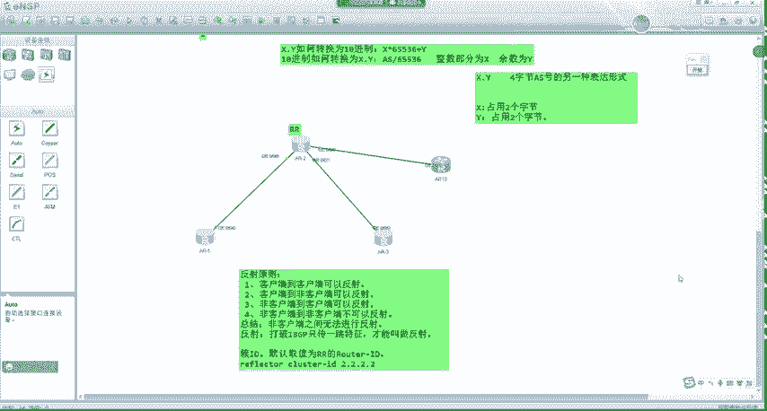

然后我们回到刚刚所说的是吧，有时候需要在一个集群配置一个以上的啊。对不对？那这里比如说R1跟R2，他们在一个集群，那大家觉得要不要有一样的出ID？要不要？要一样的。是吧一定要是一样。

那么在这时候它有什么样的作用呢？我们来看这张图，比如说没有R。没有R2cl一，注意啊，现在没有Rcl一给R一路由R一给c2。那有没有这么一种可能呢？老师cl一IE故障了。一跟二还能传路由吗？不行。是吧。

怎么解决这种问题呢？我做两个啊，老师。对唔对啊。我给R1R一给克兰达2，我还能给R2呢，R2也能给克兰达。对不对？是吧。能给。但是有没有这么一种可能呢？就是R一故障之后对吧？R2还能够提供服务。

所以说这俩设备之间还能同，这里好像没什么问题。但是大家要考虑潜在的问题，潜在的什么问题呢？比如说我给R。R又给了R一R一又给了我。是吧。就相当于你花出去了一张假的人民币。对吧转了一圈又花到你手里了啊。

你一收哟，这不是我的那张人民币吗？对不对？那你乐不乐意啊，你不乐意。是吧。而换到我们的网络设备中呢，我们把这种叫做路由回馈。对不对？而一旦产生路由回馈呢，就会有还路的风险。明明就是R一发到这个AS的。

你转了一圈，你又给我发回来了。😡，是吧这叫什么事儿呢？对不对？就相当于有一天你捡了一个假的100块钱，刚花出去。对不对，转了两天之后，你收到了这张100块钱呢，上面写着你的名字呢。😡。

对吧所以说呢那在我们的网络中就产生了这种啊叫做路由回馈。就是回馈呢它会产生还路的风险。那这时候怎么办呢？😡，哎，我们就要去防止这种环路。对吧。啊，防止这种环。那这种环路怎么样去防止呢？啊。

有这么一个机制啊。我找一下啊。

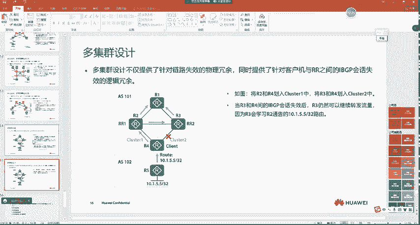

啊，在这儿是吧，在这里有写啊，我们来看。😊，他是这样来的。就是cl一在给RE发路由的时候。啊。阿一想要传递给阿2。那么在这时候注意啊。R1呢跟R2刚刚我们有没有配置相同的粗ID啊？有没有。又话。

所以说呢RE会在促ID这里啊注意。他会把这个错 IDD呢去加到一个促列表中，我们把它叫做class list。对啊。比如说咱俩的出ID都是12。12。12。12。那这时候呢我会把出ID加入到粗列表中。

然后呢，这条路由给你了，给你的时候，它会有这个class list。这时候二收到了。二姨看呢，哟class list呢有我的出 IDD。😡，系吧。所以说呢2如果发现自己的错ID在这个错列表中了。

那他就会丢弃这条路由。所以说R一把路由给二之后，R会不会把它丢弃啊？会不会啊？是会的。是吧。那这样呢就能够防止产生环。因为你给了一是吧？啊，或者说你给了二啊，都没问题。嗯，你甭管你给谁。

反正呢二不会给一了，对吧？那一也不会再给你传回来。能不能明白？可以吧，那这里我们可以还看到一个，哎，它好像还能降低BGP内存的使用率。啊这是为什么呢？来给大家解释一下。因为本身cl一有没有给二传递？有。

那你给R一R一又给R一份。这是不是两份啊？对不对啊？你这是传两份，那二就需要保存两份。是吧。所以说基于这个class ID，我们不仅能够防止环路。那这条路由在传过来之后。能不能被拒绝掉？可以吧。

R就不接收。所以说呢在R的BDP路由表中，就只存在着一条路由。对吧也可以降低内存的使用。那这种呢就是我们见到的备份RS5。那这个class ID我们怎么样去看到呢？咱们有一条命令。

现在我把反射器给关了啊。我现在给他配上BDP100。P21。1。1。1。反射器的客户端，然后我们再三上DBTPingtable。我们可以看到1。0这条路由。是被反射过来的。

是吧display BDP如table192。168。1。咱们去看一下详细信息。在这个路由中有没有一个class list？

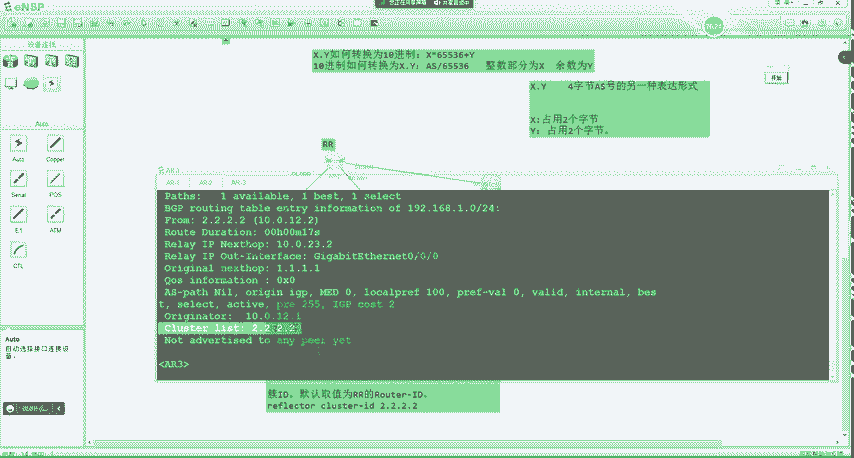

要吧。那是不是R的错ID啊？是。对吧所以说换到我们现在这个场景中，R一给R2的时候，如果你是12。12。12。12，这也是12。12。12。12，能不能防止这种环路啊？是吧一给二传二不收二就只收一的。

大家都给。是吧你给R一给R2传，然后呢，他们再反射过来。对吧那对于这个客户端，他又不是R，他肯定不是啊。😡，对不对啊？所以大家能明白这个意思吧？是吧有的同学问了个好问题啊。

老师呢如果我在R一上通告了一条路由，R2收不收呢？😡，阿收不收啊？是。收不收收，为什么收呢？😡，什么才叫反射？打破IBDP只传一跳才叫反射，那就是正常的路由传递，而正常的路由传递。

它会不会加class list的？不会。

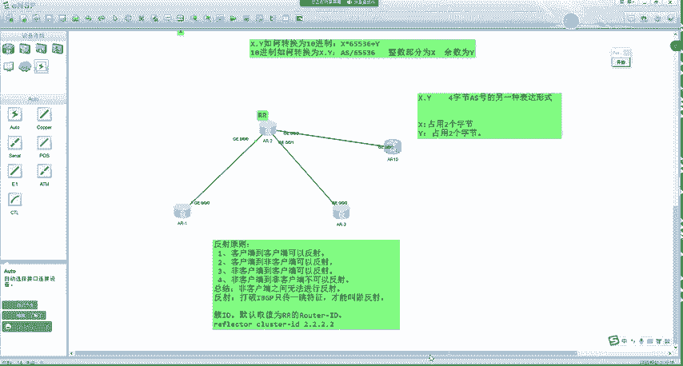

能懂吗？啊，你并不是反射。所以这种呢我们是采用的备份R的组网，对吧？可以增加网络中的可靠性。那么除了备份R组管呢啊我们还有一种呢叫做同级R。对啊，叫铜甲。同吉R是怎么样的？比如说我的网络非常大是吧？

老师我有设备非常多，现在我要用一台R好像不太行。对吧而我用一个R。不太够用，对吧？就我用一个R，这一个R可能建了好多个BGP邻居，他自己也顶不住。对不对啊？那这儿说我们就可以将网络划分成不同的范围。

比如说呢。每个省啊都有一个单独的啊，这是山东省。是吧嗯，这是山西省。对不对？呃，这叫河北省。然后这是河南省。是吧啊最近有个词儿比较火，叫什么山河四省。对吧。😊，我们来看啊。😊。

那我们可以让不同的省呢有他们的一个独立的R，能看到吗？每个省的R呢独立为本省内的设备来进行服务。对吧然后我们的R之间再去建立普通的。ABDP邻居。能不能明白？

所以说呢一个骨干网的AS呢可以被划分成多个集群，也就是说多个范围。集群的R之间呢建立IBP全互联。然后每个集群的R呢只为自己集群内的提供反射服务。那有人就问了，那老师路由怎么传呢？😡。

是吧那我们就来看看路由怎么传。假如说在这里有个1。1，它传递给这台路由器2之后。2、从客户端收到要不要给非客户端？一。是吧。那三从非客户端收到要不要给客户端要那这路由不就过来了。

二、从客户端收到给客户端。2、从客户端收到给非客户端是吧？啊，假如说这是4。那是从非客端上收到给客户端，给客户的。一不一样的道理。反过来传，从客户端收到给非客户端，从非客户端收到再给客户端。对不对？

所以说路由的传递不会产生任何问题啊。那这种呢我们就把它叫做同级R啊，为什么叫做同级R呢？啊，因为大家都是分了不同的管理范围。嗯。能不能明白？这种呢我们把它叫铜甲。那同级R什么时候使用到呢？那一般。

现在注意啊，那现在一般我们在采用BDP啊，去组建骨干网的时候，会采用一网双平面的设计。是吧啊，叫做一网双品面。那这种双平面呢可能是这样的啊，比如说我在这里呢有个路由器。对吧呃，在这里也有个路由器啊。

在这里有个路由器，然后在这里有个，这里有一个这里有一个，这里有一个。呃，画的有点丑。不是管理平面啊。会啊。那。这是一个平面。下面是一个平面。然后这里我用虚线答。大家能看出来这是双平面吗？Yeah。

能不能啊啊，但是我的画图水准可能不是特别高啊，可以吧？😡，是吧。那上面我们有一个平面，下面也有一个。那懂吗？那这时候呢，我们就可以让不同的业务，什么意思呢？那不同的业务呢在不同的平面上去吧。😡。

对吧比如说在这里我们可能接入了不同的业务啊，大家的业务呢走的平面是不一样的。那两个平面之间呢互相去提供容。对吧那这时候我们就可以让每个平面呢单独选出来一个。比如说我在A平面。这两个R。我用蓝色的画。

这两个做R。哎，那能不能做备份阿组啊？那不能。可以吧，下面这两个能不能做备份阿啊，可以。然后两个平面的R之间形成同级R行不行？可以吧。所以大家能明白这个意思吧？那这就是我们所看到的多奇云啊。

多集群组网下R的一种部署方式。那除了这种部署。😡，对吧那还有没有其他的呢？也有啊，这种叫做同级啊，而是除了同级，有没有分级呢？😡，对不对啊？有。呃，为什么没有呢？当然有啦。是吧然后我们来看分解啊。

分级R是什么样的？它可能是这样的。😡，就是他的部署是这样啊。首先呢下面这一层呢。可能是我们的市核心对吧？呃，市到各个区线可能跑的就是ITP了。然后这是我们的适合性。是到省。

是吧省到国或者说到什么亚太地区这种。那能明白吧。因为有一些跨国公司啊。那老师什么样的单位能够对吧？到国。来，那就是你的学习比较有局限性了。是吧那跨国公司多的是。对不对？那现在大家看到的各种呃奢侈品品牌。

那不都是国外的吗？是吧。所以说我们来看呢。😡，那在这时候，R怎么样去部署呢？我们可以这样。😡，去做分解。怎么样呢？你这不是市吗？试做客户端省。😡，对啊。它是是客户端的R设备。但是他又是到了。

比如说亚太地区，对不对？那这里还有两个呢。对吧如果我们以行政单位来定划分，这就是国嘛。是吧。那到国的。他呢如果我们在国上去看每个省的。这个设备它是不是一台客户端？也是吧。对吧。所以说在这时候呢。

我们就可以形成两极反射。那。国到省之间，对吧？我们可以把它叫做一级反射。那上面这两R我们就叫一减。而省的这两台设备呢，我们就把它叫做二级R。能不能明白？是吧。如果站到国去看二级R这台设备呢。

它就是客户端。如果站到市的角度去看，它就是反射器。能懂这个意思吗？你认同意乔艺啊，没问题吧。😡，那老师除了。😡，二级能不能三级呢？😡，是吧。能。对不对？也是可以的。你在下面，比如说我这也是啊。

我下面再配客户端，那这就是三级了。对吧。那具体我们怎么样去部署呢？实际上很简单。cl兰跟R县邻居cl兰跟R县邻居完事了吧。对不对啊？那。这里呢他跟一级R县邻居，他的也跟一级R县邻居。

那然后我们在EGR上把这两台路由器指成客户机，这是不是就完事了？然后R之间呢，再建立IABDP邻居嘛。是。对吧实际上部署是非常容易的。那陆游怎么传达老师，陆游也很简单。😡，特有个1。1。

它传递给RR要不要传递给这两台路由器？嗯。要不要需要。对吧。那这两台路由器他们都会反射给谁啊？翻车给谁？反射给cl兰达2。是吧那有人就问了，哎，老师他反都反射给克兰德2有啥好处呢？那我们需要注意啊。😊。

我们来看这里。而在反射路由的时候，如果我们仔细去观察。

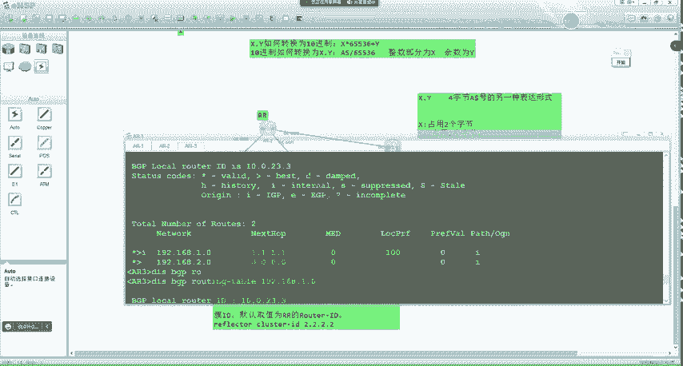

一把路由传递给RR给3，他的吓一跳是谁？事1。也就是说R在反射路由的时候会不会修改路由的属性呢？实际上是不会的。

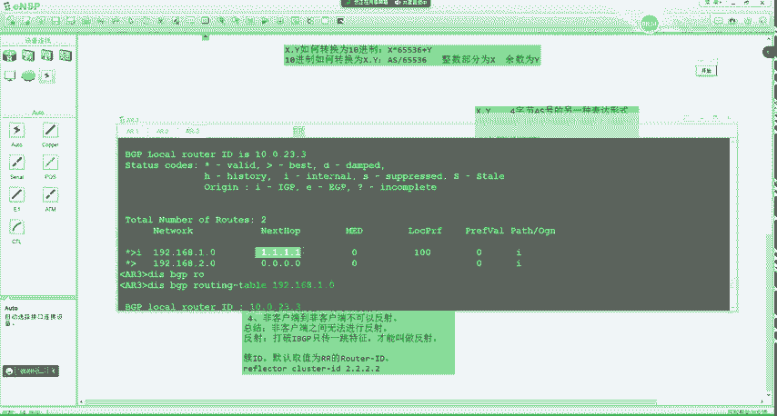

大家能明白吗？啊，只做反射啊，就相当于镜子一样，镜子里的你什么不是你什么样，镜子里的你就是什么样。😡，是吧。你不能有一天你照镜子呢，你一哭对吧？镜子里呢你笑了。啊，那还挺渗人的。对不对？

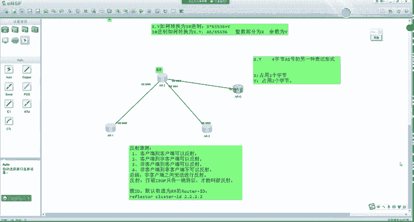

所以说呢R在反射路由的时候呢，它不会修改路由的吓一跳。那如果路由到达了这台设备之后，这是1。1啊，他看到下一跳是1。1，现在我有没有负载均衡的链过？有没有？여 봐。那这不就正好做负载吗？对吧？ECMP。

对不对？所以说这种呢我们就把它叫做多集群的R组啊。啊。那是不是哎老师这里他俩我配置相同的集群ID。啊，大家觉得行不行呢？行不行啊？是吧可以，对，没问题。但是是不是所有的场景中我们都要配相同的集群ID呢？

实际上并不是。😡，注意啊。实际上并不是所有的场景中，咱们的集群ID都要配置相同的。接下来我们看下面这个问题。在这里呢，我们假设R一跟R2在同一个集群。咩啊。现在12之间在同一个集群。

那然后我们来看路由他是怎么传的。系啦。呃，假如说呢。现在R4呢。他通告了一条10。1。5。5-32的路由，是从R5传过来的。是吧那R4呢，它就会向R2进行通告。注意啊。假如说有一天这他跟啊像R一建通告。

假如说有一天他跟R2的邻居故障了，那R4向R2通告的这条路由还有没有？😡，没了。对吧邻居都断了，怎么有呢？那R还能接收到路由吗？😡，即使R一和R2之间。我们是有IBDP邻居的。

对吧大家都有相同的集群ID，咱俩建个IBTP邻居。那大家告诉我R能不能收到。😊，为什么？为什么不行呢？因为你给了R一之后，R一打上集群ID给二了。😡，但这时候一二一看没。这不是我那100块钱吗？😡。

是吧怎么又回来了呢？😊，对不对啊？他一看集群ID这不就是我的标记吗？他以为是自己花出的那100块钱。😡，啊，所以说在这时候呢，R不接收这条路由。😡，那么在这时候R还有没有这条10。1。5。5？有没有啊？

没了。对吧那就没了。哎，那这时候怎么办呢？这时候我们来看下面这种，如果。我们把一跟二设置成了不同的处。对啊。设置成了不同的错。那这儿时候。10。1点5。5过来了。过来之后呢。他给了RERE1份。

R一给R2了，R2能不能接受啊？他俩的出D不一样。可以吧。对不对啊？而且呢R一旦能接收，它还能够传递给R一R一有没有两条链路了？😡，就有啦。对吧这样当四跟二之间的链路故障之后呢，也不会产生任何问题。

对不对？所以说呢它能够提供更高的冗余性。是吧但是这样有没有什么缺陷，大家觉得？😡，我们把它叫做设计注意啊。也就是说它并不是一个固定的，要根据于场景去进行考虑的。不会还啊不会还。会不会出现什么问题啊？

大家觉得。会不会？注意啊。那它的优点呢，我们可以发现它的冗余性变得更高了。那主要的缺点就是体现于R一再给二一份，那二还得多保留一份吧。对不对？哎。那像上面这一种R一给R2R2收不收，他就不收。对吧。

那有些同学可能还会有一些问题对吧？老师，我知道了。😊，那这样我给R2R2还得保存一份R一的。啊，好像还行还行，能用是吧？哎，那这时候注意我给R之后，某一天呢。R跟I4的邻居又起来了，注意啊。

现在我们假设链路没有故障了。4给2。啊，是给R1R1给R2，这条链路现在是对的。R2有没有可能再给他弄回来？有没有可能？有吧，你这就是IBDP邻居啊。😡，是吧那他又给他弄回来了。😡，对不对？

为什么弄回来了呢？😡，你俩拥有不同的出ID，你是1。1，他是2。2，你给22接收，但是二给44，他可不是R2。😡，他没有出ID呀，对吧？😡，这还是一样的道理，是吧？某一天S4花出去100块钱，假的对吧？

绕了一圈又回来了。S得想哎，这可怎么办啊？😊，对吧这100块钱不能再落到我手里啊。😡，对唔对啊？那这时候怎么办呢？注意。😡，我们再来看。设备在反射路由的时候，我们看到除了加了一个class list的。

还加了一个什么？我们把它叫做orange ID。啊，叫做起源ID属性。起源ID是怎么样的呢？他是这样的。就是当RR把路由反射出去的时候，它会加上就是比如说他从四收到的，假如说四的入台D是4。4。

他要把4。4的rootID呢打上起源ID上。😡，那往这个取源ID上一打，告诉你，这是四实发的。是吧。那回来他又传递到R上了，R再给44一看。是吧起源ID和S的入台ID一样的时候，S就不会接收这条路。

所以说这时候还会不会有还路？就不会了。是。那这个起源ID呢也是一个本质，就是标记。能懂吗？跟你花100块钱没有任何区别。😡，你把100块钱花出去，为了防止再回到你手里来，你在上面写一个名字。😡。

对吧写的是谁呢？写的是你的好兄弟。😊，对不对？啊，小王对吧？写了一个小王的名字。那你回来你一看。这不就是我花出去的那100块钱吗？😡，是吧你一看有你的标记，你还接收不接收啊？😡，你就不接受了。

对吧所以说这种啊。四给22给3，那三给44是不会接收的。4不接收的原因呢就是当orange ID和自身的入台D相同时，它就不会接收这条路。能懂吧？不是R5啊，就是RR从谁手里收的？😡，听懂吧啊。

他就是谁？可以吧。那。

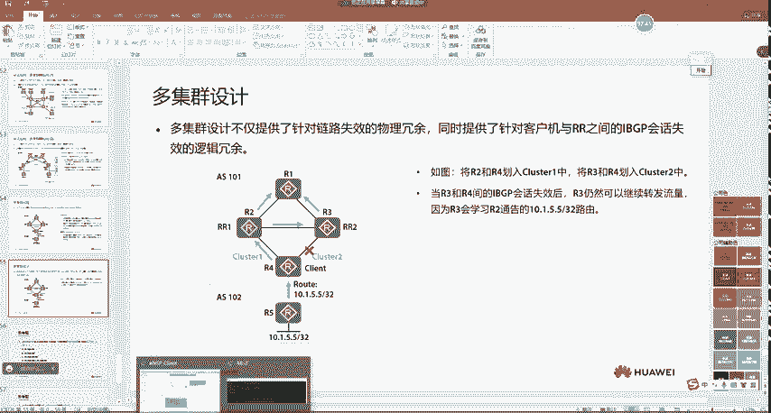

我们来总结一下R中有哪些防还呢？主要的防还原则就是两个。防还原则。一个呢是基于起源ID一个呢是基于。处列表。啊，或者我们把叫促ID啊，起源ID是这样的。就是当R。将路由反射出去的时候。将会给。

路由打上一个起源ID取值为。或者说产生或者说接收。我说路由。嗯，取值为。就这位谁呀？嗯，产生产生这台路由。不太合适吧。徐志为。嗯。林区的。对吧。入台的。没问题吧，因为你肯定给邻居进行反射啊，对吧？

而且只给IBDP邻居进行反射嘛。😊，🤧啊吧。那当一台BGP路由器。收到一条BGP路由之后。如果起源ID和自身的ID相同。就入台地相同。则。丢弃。这条路由。嗯。是吧这是起源ID的方法啊。呃。

粗列表它是这样的啊。当RR将路由反射出去的时候。将会把自身的处ID。加入到。处列表中。啊，然后第二种。当R接收到一条路由之后，如果发现。醋列表。包含自身的。入台地。啊，不对，包含自己的错ID。走。

丢弃这条路。那这就是R场景下的两个防环啊，一个呢是起源ID，还有一个是粗列表。

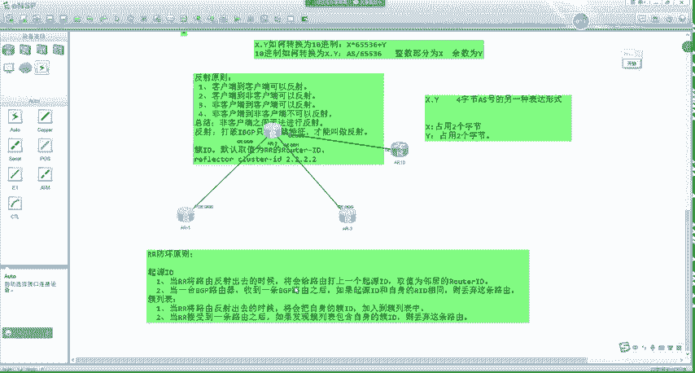

啊，那基于这两个属性呢，大家再去使用R的时候啊，就会遇到环路啊。嗯。这里大家都明白了吗？明白的同学敲一啊。场景一R之间全互连吗？场景一。这里吗这里是IBDP邻居啊啊，对，没错，不就是全互联吗？😡，是啊。

就是R之间都是悬互链啊，你看场景二也是，场景三也是。😡，懂吧。嗯，哪一个啊？这一个。是这个吗？第52页。这一个是吧？对，这个是全互连啊，没错。没错，R之间是全互连啊，那这里也是全互连啊。

这俩就咱俩这里不就R一跟R2嘛，他俩之间建IBDP邻居。😡，能懂吗？那也可以叫做全互联啊，反正就俩路由器嘛。😊，是吧。呃，用了R会不会AS内产生环路的风险，这个倒不会啊。😊。

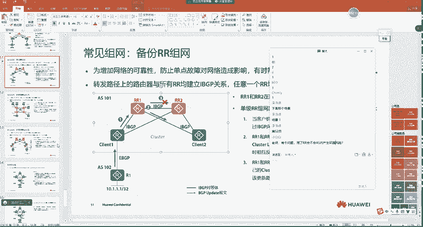

因为R它本身有设计的防范原则啊。他是有的。嗯。全ID跟错列表就可以防止啊，这个倒不会。54页那张图，R一不会回传给R3吗？

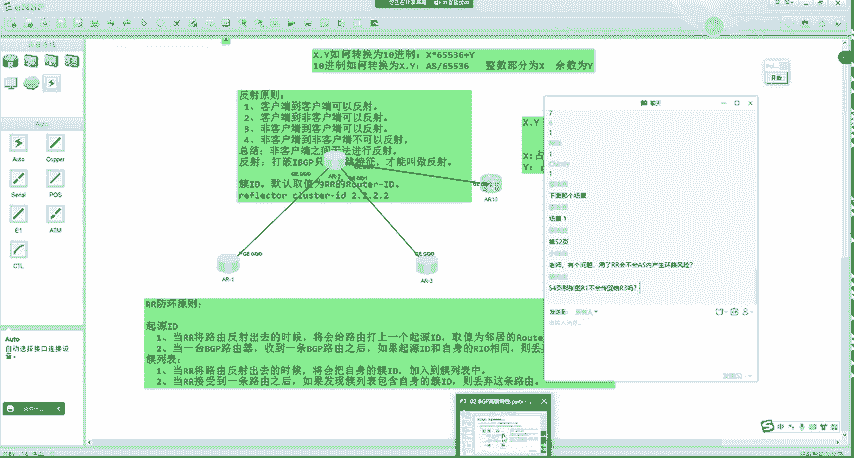

阿姨去趟眼山。哪有RE啊，AE。这是三是吧。啊，5要4呀。R一回传给R3。嗯。这样是吧，是这样吗？这样肯定会传啊，但是这张图他俩出ID1样，R3不接收啊。😡，得到吗？他不接受啊。😡，嗯。啊。

您说R一是吧，R一不是R2。😡，他为什么要传啊？😡，它就是一台普通的BGP路由器啊，你不要学懵啊，这俩才是R。😡，谂到吗？哦，对，你这问。是吧。😊，再捋捋啊，那R一就是一台普通的路由器啊。😡，哎。

Okay。最后一个场景，起源ID不仅不是只是涉及到单个R的反射R的起源。呃，不会啊，他俩的起源ID呢都是S4的入台D。得到吗？是谁给我传的，我的取爱地就是谁的入台地。谂唔能明白。嗯。好吧。

对你只要不接收，你就不会计算，你不计算，你就不会加表，你不加表，那怎么会还路呢？能不能明白。对，一二之间没有反射啊，一二之间就是IBP。R之间没有这种反射器的关系啊，除非你是这样的。😡，能不能明白？

就是分级R的时候，我们会把一级R，就是把这个二级R分成一级R的客户端。😊，那不能做备份R以及同级R，我们都是只见IBDP邻居关系。好吧。Yeah。Okay。钢路由回坏怎么产生的？你这白学了吧。

你看啊RS不是给R一一份吗？R1给R21份，那R2这时候是接收的。对吧他为什么会接收呢？因为他俩现在不带一个错，这是一。1的错ID，这是2。2的错ID。😊，那R基于防还原则，就接收一条路由之后呢。

他要查找错列表有没有自己的错ID，他万现只有1。12不就接收了吗？对不对？而且说之后，从IBDP邻居收到邻居要不要给自己的客户机啊？休嘅。那S不就又收到了吗？是吧这不就产生了路由回馈吗？对。对吧。呃。

BGB环路很少，几乎在摄计啊。对，没错。嗯，那决定会不会接收的因素就是出ID是否一样。啊，对，R之间是比较粗ID啊，普通BGP路由器它会看orange ID那就起源ID啊。Yeah。嗯。

有启源ID能也能还路吗？谂啦。我做呢咋啊。我举个例子啊，比如说我们没有粗列表。😡，现在这三个都是R。听到吗，注意啊。这三个R呢嗯都在不同的醋中。然后现在呢，这是一。有一条1。0的路由，1。

0的路由给R这个R之后，现在我们没有错ID啊。他会不会给克兰德啊？对吧。嗯。啊，不是c2啊，假如说这R一，这是R2，这是R3。对吧三给2，那二会不会给一啊，也会。

就是有可能你会误配的这种就是三个R之间啊互指了客户端。对吧你又给了一，那一再给三，那三还得接收啊，三为什么还是接收呢？因为orange ID是谁啊？是这个4。😊，三肯定还会接束，那三又给22又给一。

啊伊よ嘅さ。所以说错列表呢可以防止集群之间的环入。能不能明白？从ID不会变啊，你只要不动面面的话，它不会变。呃，54页可以R4来个策略方还吗？来个策略没必要啊，这个谁啊6啊。没必要啊。😊。

你比如说你要在部署的时候，你就要考虑到用策略方法，这种技术一般都不会被应用啊。你能明白吗？😡，因为你网络环境不一样的环境，它环路是不一样的。能懂我的意思吧？你比如说这种简单的环境，我们还要跑个策略返还。

那。😡，这种技术肯定不会自己被推广。对吧我们肯定不会大规模的部署。对吧所以说这种大家不用去纠结啊，甭纠结一他。😡，嗯。呃，一个R不行啊，没这个功能。你怎么能有这样的问题呢？浩子，你这想法很奇怪啊。

一个R只能有一个错啊。😮，就这个面令你只能配一下。系吧。第53页我不看，他也是只能有一个错，能懂吗？😡，嗯。不。

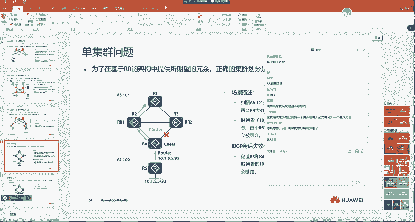

行，同学们，咱们今天就说这么多吧。😊，嗯。好吧。Okay。对，只能有一个错啊。呃，多级中间属于两个错。这也是一个错啊，你作为R，你要给他配错ID啊。😡，能明白我的意思吗？

就是你在的错是通过你通过class list的去标识的。😡，能明白吧。就这条命令你只能派一个啊，你不用看它在哪，你这边再来一个，它也是只在一个错啊。就对于R来说，你的class IDD呢才是唯一标识。

你在哪错啊。😡，嗯。呃，分多了会不会有问题？嗯。会不会有问题？我觉得倒不会啊。但一般我们不会分那么多啊，就建议大家如果真的你这个。AS非常大了之后，就建议大家画多个AS。能不能明白。

就你可以画多个AS了，你没必要是吧？这1个AS我顶着一个劲的用，这种没必要啊。😡，那，能懂吧？你分两级就算很多了。😊，一般这种分级R我们也很少用啊。😡，啊，用的最多的我给大家说一下啊啊。

就这种备份R组网是用的非常多的。😊，听懂吗？然后像我刚才给大家说的这个多极群R组啊，就同级R。啊，当然他不是这样啊，这个图的例子不是特别好。😊，就是在双平面的时候啊，我们会用分解。

然后单一的话就用备份啊，然后其他的倒没了。像这种分级啊，这种很少啊。这种一般在跨国的公司，我觉得应该会用的。能不能明白？那你要分三级，基本不会有那种啊，都分三级了，你再买个AS号能怎么样呢？没必要啊。

😡，我先把录屏听一下啊。😊。