# 2023 新版华为认证HCIA+HCIP+HCIE全套视频讲解！一套视频让你从入门到精通！CCNA／CCNP／CCIE技术提升同样适用！ - P105：（持续更新）HCIE Datacom - 51.IPV6概述，报文结构，地址格式 - -Book思议8 - BV1W8411A7z8

好，那咱们就开始吧啊。呃，我们从今天开始啊就开始讲到这个IPU6了啊。然后嗯当这个技术它把大家接触起来可能会觉得比较难一点啊。嗯，这个难实际上也不会觉得特别难，就上节课没听，没关系啊。

就IPU6它是一个新的技术点。

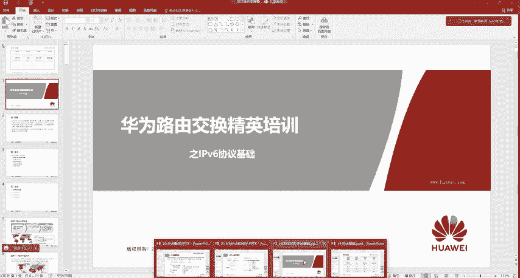

呃，大家在IA的时候，可能刚开始学IPV4的时候会觉得比较难一点是吧？呃，像它的掩码啊对吧？什么子网划分对不对？嗯，这一些比较绕啊，但是在IPU6中呢实际上大概的原理是差不多的对吧？

但是大家有IP4的基础呢，接触起来也会相对来说较为容易一点啊，但是呢这个IPU6地址呢它比较长啊，就是大家可能刚开始不是特别习惯。嗯。

所以说咱们就一点点来吧啊呃我们这节课主要讲的就是IPU6啊呃那IPU6呢我会把这个新老课件结合一下，一起去讲啊呃，因为在这个新老课件里面的内容呃还有点区别啊，嗯然后这个老课件思路还行啊。

然后我们就接着这个思路来给大家说啊，呃这里主要就是介绍了一下，对吧？我们的前沿部分啊一般都是一个呃技术的一个基础介绍对吧？就是它大概的一个背景，嗯，它主要应用在于什么样的场景。😊，啊就是在IPV4中啊。

我们之前都学过IPV4啊，这是我们学代的第一版这个互联网协议对吧？啊但是由于我们刚开始在使用互联网啊，就是呃人类的第一次尝试啊，就跟你第一次奔月球一样啊，那总有那么几个呢嗯就是在半路中爆炸了是吧？

所以说也是一样的啊，就是我们在使用第一代互联网的时候呢，由于缺乏了很多经验以及技术啊，而且呢我们对于这种未来的一种宏观的认知呢不是特别高对吧？所以说没有什么经验啊，也看不到互联网的未来啊。

那时候就推出了IPV4嗯，但是呢就是随着IPV4的发展，我们发现它已经超过了就是就是我们就没有想到过对吧？这个技术能够发展的这么好，对吧？所以说呢IPV4也体现了一些的缺陷，由于我们是第一代互联网嗯。

那有很多做的不足的，是吧？就跟大家实际上是一样的。比如说你在。😊，做一件事情的时候呢，第一次做就会缺乏很多经验。嗯，我们在使用IPV4的时候呢，慢慢会去发现一些问题。呃。

这些问题呢主要就是体现在地址不足上啊，具体怎么样不足的呢？当然在后面我们的学习中啊，慢慢的会去介绍的对吧？所以说当IPV4出现了一定的缺陷之后，我们就想的办法啊，去更新版本啊，达布丁对不对？啊。

就像你这个QQ一样，是吧？像你的微信啊，微信呢以前我们在这个嗯好像还不能发红包吧，是吧？啊，后来你就发现能够发红包了，对不对？那随着版本的升级呢，它的功能也变得越来的越健全，那IP地址也是一样的，对吧？

就IP协议也是一样的啊，也要去不断的去更新版本对吧？变得更加的完善。😊。

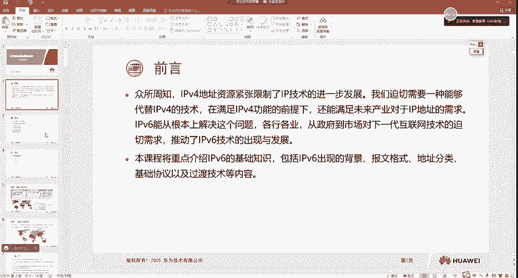

嗯。那。我们在真正啊去理解。IPU6之前啊啊有一些这个基础的概念要给大家去介绍一下，就是呃就是我们现在国际上的IP地址，它是怎么样进行分配的，是吧？呃，我们一般是向这个运营商去买地址。

那运营商又从哪里来的呢？对吧？那地址到底由谁进行规划的呢，对不对？所以说咱们就一个一个来看一下吧，呃，这是我们这个整个IP地址的一个分配的啊，大家可以理解成相当于叫做组织架构对吧？

呃首先呢这个IP4地址呢，它是由INNA是吧？叫做网际网络号码分配局，那是由它呢就是作为起始点的啊，就相当于你们公司的董事长是吧？对，主要是他做决定，然后他给各个部门呢对吧？去下发这个呃管理策略啊。

然后大家再分批向下啊进行推进，对不对？所以说INNA呢，大家可以理解成啊，就是呃专门。😊，负责就去管理这些IP地址的。呃，那INAA呢他会把这些地址呢，因为我们全球对吧？

整个地球呢这个用户还是比较多的对吧？呃，有这个。呃，欧洲是吧，拉丁美洲嗯，美这什么美国对吧？当是美国比较强势啊，它自己有一个对吧？有非洲啊，还有亚太地区啊。

也就是说呢它是根据于这个地理上的版图啊来进行分配的啊，就INA呢它在嗯我们这个整个地球的几个大洲上，嗯，都会有一个叫做IIR这个呢叫做区域网际网络注册管理机构，但这些大家不需要去记啊，嗯。

你不用去管它啊，就用到的时候查一下就行。这里你不需要去记啊，是吧？老师我这名字读的还比较绕口，对吧？就是INA呢，它会把嗯地址呢分配给IR。而IR呢在全球一共有5个，那具体是哪5个呢？在这里有介绍啊。

一个叫做欧洲IP地址注册中心。啊，还有一个呢叫做拉丁美洲和加勒比海internet地址注册中心对吧？还有一个在美国啊啊，当然非洲还有亚太地区，我们都是有的对吧？所以说我们这种呃普通民众对吧？啊。

老百姓呢啊大家都能够使用到互联网是什么呢？就是我们在地址分配的时候呢？嗯是普及到全球的然后IR呢它最终再会去分给ISP运营商。注意啊，然后他会去分给运营商。那运营商呢再根据自己的这个规划，对吧？

根据自己的情况将IP地址分配给机构啊，这个机构呢大家可以理解成是一个比较大的公司，对吧？呃，或者说呢大家可以理解成你的家庭呢啊也是一种机构。但运营商自己内部也会划分，对吧？比如说我们有中国联通啊。

中国电信，那还有美国呢，对不对？啊，还有韩国呢，大家能明白吧？所以说他们也会去根据啊这个地理板块啊，也进行技术地址的划分啊，就是也就是说在SP内部呢，他自己也是有组织架构的啊。😊。

那地址的分配呢就是由INA给IRIR给运营商，对吧？运营商，然后再去结合自己内部的组织架构啊，比如说山东省对吧啊，山西省对不对？呃，河北省啊类似于这种，然后呢河北省内部可能还会划有省市，对不对？

所以说就按照这种层级一次一次的向下进行分配，那这就是当前我们呃国际IPV4地址的分配方式啊，那。嗯，我们在分配的时候啊，注意IP地址面临的一个最大的问题呢，是因为它已经用完了啊，它并不是取之不尽。

用之不竭的，是吧？嗯，目前呢也已经用完了啊，就是在2011年啊，就2011年啊他2月3号啊，就是这个INAA呢，他就宣布啊，把最后468万个地址呢。平均分配到了全球5个地区的互联网络信息中心啊。

就是分配给IR了。呃，此后呢没有IPV4地址了。也就是说，从11年的时候，这些地址呢已经平均分配给IR了。那IR对吧？你们有没有分给运营商呢，这个他不管，但是对于INA来说，他已经没有地址了？对意啊啊。

就相当于你这个金库一样，那没钱了啊，你已经全部发下去了。对不对？因现在呢我们已经没有地址了，就没有可分配的IPU4地址了。那这时候就面临一个问题。因为我们的互联网还是在发展中，对吧？

大家实际上可以看出来啊，就我们学过很多的技术呢嗯，也会慢慢的被淘汰掉，对吧？呃，就是变革是很快的。而且我们未来还有新的这种产业啊，你像物联网啊对吧？嗯，这个自动驾实对不对？嗯，等等之类的那我们这个。😊。

基于互联网的时代呢啊依然在进行发展，但是已经没有地址了。而地址呢它就相当于这个呃基石一样啊，就相当于你要盖一栋大楼是吧？啊，盖一栋别墅，对不对？就是你的未来的理想是非常丰满的。

但是你没有砖头这个砖头呢就相当于我们的IP4地址就IP4地址没那么多了，没那么多砖头呢？嗯你没有办法去发展出来啊，这些新的产业对吧？以及应用，所以说IP4地址呢，它最主要的一个缺陷啊。

就是它到底有什么样的问题呢？就我们为什么要从IP4过渡到IU6吧？就IP4地址为什么要淘汰掉呢？就是首先我们要去理解一些IP4地址的一些缺陷吧？它最大的一个缺陷就是公网地址耗尽了。

就是没有了那是当前IPU6取代IP4的最大动力啊这是没有办法的办法什么意思呢？就是嗯你不好用，我们还能再坚持坚持对不对？嗯，但是呢。😊。

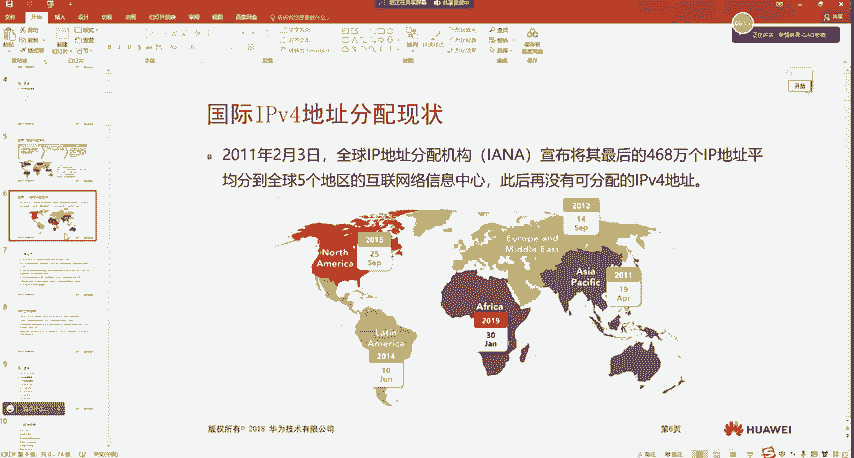

你没有了嗯，那就没办法了，对吧？触及到底线了，你已经限制到啊人类的发展了，对不对？科技呢对吧？啊还要再进行进步啊，但是呢地址没了，那就不行，是吧？就相当于你盖房子一样，没转头了，那怎么能行呢？对吧？😊。

所以说呢最大的原动力啊，大家一定深切具体会，最主要的就是IPU4地址不够了。呃，在这里呢有一本书啊，大家在看学习IPU6的时候，有一本书叫做呃IPU6技术经要，嗯，当然现在是有第二版的啊。

大家可以去看一下那本书，这本书里呢就有这么一个就是就是我们搞IPU4的啊，就是搞IPU4的这些呃我们可以叫做呃领先的那部分人啊，就是他们去制定策略对吧？我们发现我们学过了很多命令行啊，对吧？

协议啊规则啊，都是别人制定好的，你去学习去应用对吧？制定规则的那群人呢整天就是开各种峰会，对不对？呃开各种会啊，各种PPT，然后演讲啊给你说一下理念，然后让你去干对不对？呃。

在这本IPU6技术经要这本书里面呢啊，就有这么一段话啊，有个什么老头啊，反正就是一个人，他开了一个记者会啊，开了一个记者会他。😊，说了这么一句话对吧？呃，今天这个会议呢让我觉得非常脸红是吧？

他是为什么这么说呢？他说的这意思就是这个会议让他脸红的原因是因为啊在10年前吧？那些认为IPV4地址足够使用的人啊，就是我，但是呢今天他开始在推广IPU6了。吧。

也就是说呢这个技术的发展呢啊以及科技的发展，我们是没有办法进行预测的啊，就很难去预测的对吧，他也没想到呢去发展的那么好，反正IPU4地址呢啊就已经不够被用了，对吧？

这就是V6呢去取代IPU4的最大原动力。那还有一些7788的原因。还有其他的啊。😊，还有一个呢就是internet的用户快速增长啊，随着科技行业的发展，有更多的用户呢，更多种类的设备需要接入到公网。

那这个实际上在大家的这个生活中也有体现过，对吧？你比如说你家里的这个音响，嗯，那你就会发现它比较智能了，对不对？那除了音响呢，你会发现现在很多东西都在联网，那你平常出去玩，你会发现还有一些机器人。

对不对？那就那种简单型的机器人啊。😊，他还能跟你对话是吧？你现在在等公交的时候呢，你会发现嗯这个公交的这个。😊，嗯，就是那个标述对吧，你是哪一站，对吧？下一辆车什么时候到达，对不对？

那你会发现呢你的生活便利了很多。那为什么能够有这种便利呢？就是随着呃科技对吧？以及互联网在进行发展，但是呢我们依然是处在发展的初期，对吧？就未来的产业呢嗯。😊，大家都不好去想对吧？

老师也不好去定义它对吧？所以说呢未来肯定还会有更多的用户啊，以及更多种类的设备需要接入到公网中。那这时候呢IP4地址不够啊，它的缺陷就体现出来了，是吧？啊，就相当于对不对？你要盖别墅，对不对啊。

盖了别墅还要再盖一套，但是你没有砖头了，那你自己就能够想到对不对？没有砖头了，怎么盖啊？😊，对不对啊。那还有一个缺陷呢，就是IPV4地址呢呃缺乏真正的端到端通讯模型。那这个是理想的模型啊。

就是在这个呃互联网真正推出来的时候，我们所希望的都是这种端到端的。就是可能在大家刚开始接触到这一行的时候，呃，看到的都是做NAT的是吧？私网访问公网。😊，但是在我们最初理想状态下呢。

就是那种一对一的是吧？每个人都有一个唯一的地址啊，就像手机号一样，对吧？你是唯一的，我是唯一的，所以我俩可以打电话对吧？一对一的通讯而ATAT这种技术呢是吧？解决了私有地址空间与公网互访的问题。

但是它破坏了端到端的通讯的完整性，这就打破了我们最初理想的状态，而且由于NAT的存在呢，导致这个私网地址。😊，就是我们在N之前的地址对吧？

其他主机是没有办法知道的那所以在这时候呢嗯我们就要去做很多的策略。你比如说像IP赛的时候，对吧？我们要去做net穿越，对吧？那还有嗯大家如果学过这个嗯FTP的话，你会发现呢它这个端口号啊。

在就是FTP过net的时候呢，嗯还得去开一些其他的功能。😊，对不对？就是也就是说NAT呢嗯虽然它能够解决私有地址和公网地址的互访问题，但是呢它也带来了一些嗯不是特别好的这个便利性啊。

那还有一个呢就是IPV4呢，它没有办法适应新技术的发展，也就是说我们未来的产业呢是非常多的，对吧？啊，大家比较看好的，比如说你现在啊看着AI比较火，对不对？那前些年像物联网啊，对吧？

啊这种技术炒的也是比较火的，那时候都在想万物联网，那时候科技得多好啊，对吧？人民生活得多幸福啊，但是这个热度呢啊虽然没有现在的这个AI火，对吧？啊，但是呢它依然是存在的啊，就是大趋势。

依然是存在的所以说呢未来我们还会有各种各样的新技术啊，有更多种类的设备对吧？更多的用户需要接入到互联网中，那么在这时候呢，IPV4地址呢嗯还是没那么多。😊，对不对？那他就没有办法去适应新技术的发展。

什么意思呢？啊就相当于嗯给大家举个例子啊呃。嗯，比如说我举个例子啊。我来想一下啊，嗯就是历史的车轮呢会碾死很多人，对不对？嗯，这个有电视剧啊叫做大秦帝国对吧？啊。

我最近在看啊啊里面有一个人物呢叫商鞅对吧？啊商鞅在变法的时候呢，实际上弄死了很多人，对吧？也就是说斩首了很多人啊，就是颁布新法啊，但是有些人呢没有跟上这种时代的脚步，对吧？最终就被淘汰掉了。

那IPV4地址现在就是这样的，就是我们现在呢呃很多新的技术都在发展，但是IP4地址如果拖后腿的话，那我们就是呃把它淘汰掉，对吧？去取代新的技术，啊，这就是历史的车轮啊，碾死很多人对吧？换到人上，那就是。

😊，把人呃是吧啊淘汰掉了。那，如果换到技术上啊，就是IP4如果没有办法去支撑未来产业的话，那么这个地址啊就需要被换掉。对吧所以说呢未来所有的行业呢都会是IPU6的潜在用户啊，这里大家不要去怀疑啊。

因为你未来也是IP6的潜在客户。对吧因为你家里你总要拨号上网是吧？你也是IPU6的潜在客户。所以这这一块啊，就IPU4地址呢没有办法去适应未来的新兴的产业了。嗯，这也是他的缺陷。嗯。

还有呢就是广播机制的存在对吧？IPV4中我们有广播有ARP嗯，基本工作时的同学啊，我呃就是基本可以说50%，至少得有50%啊，大家都是遇到过这种ARP攻击的啊。

也就是说呢他的这个ARP攻击的这个出现频率呢特别的频发，对吧？啊，频率特别高，也就是说很多同学都会遇到过，那这也是我们当前IPV4网络中的一个缺陷，就是IPV4呢，它本身可以通讯啊。

但是呢你还得依赖ARP进行解析，对吧？一旦这个协议产生了依赖性。那ARP协议存在不安全，就会导致IPV4地址也存在不安全了，对不对？那这个就相当于大家在看电影的时候是吧？啊，一个男人，一个女人。😊。

对不对？嗯，那这个男人可能是一个什么呃囚犯，对吧？啊，但是女人呢就是一个傻白甜啊，当然我只这么举例子啊啊，没有性别歧视的意思。这里大家知道啊啊，但是前段时间我在看一个美剧啊。

就是这样的啊啊男人呢是一个囚犯是吧？这个智商非常高啊，但女孩呢比较单纯啊。😊，那这个女孩呢呃就被别人利用了是吧？然后这个男的呢最终也被搞垮下台了。所以说这种我们可以去看到啊呃。😊。

这里有一个什么样的关系呢？就是两个人之间呢，对吧？啊这种亲密性是非常的高的。而在我们的IP协议和ARP之间，它就类似于男人和女人一样，就是他们之间的亲密性也是非常高的，就是。😊。

IP协议我们假设它是比较好的对吧？但是ARP呢我们会去发现啊ARP它主要的一个缺陷就在于它很容易去被攻击是吧？而且它没有任何的验证，我们经常会遇到这种ARP攻击。那一旦产生了ARP攻击之后。

我们发现我们的IRP就没有办法通了，对不对？也就是说IPV4呢，他对ARP的依赖性是非常高的，是吧？就相当于你一样啊，你比较依赖于你的女朋友，对不对？😊，那ARP协议一旦出现了问题。

就导致IP协议呢也存在了不安全的这个隐患。吧，使得IPU4的局域网呢啊运这个相关的运作问题是比较频发的啊，这也是一个还有一个呢就是IPU4对移动性的支持不够理想。那这个主要是在5G啊。

当然现在不是5G啊，就是主要是移动基站那些这一块我们并不涉及啊，所以说大家看一下就行了。那IP4地址有这么多的缺陷，那我们呢也是有很多的措施，对吧？就相当于你刚开始你裤子坏了，你怎么办呢？啊。

你先打个补丁，对不对啊，先缝缝补补，但是后来啊基本都是补的了。是吧嗯裤子实在不能穿了，到处都是补丁，那最后你才会去给它换掉。所以说刚开始我们发现IPV4的地址存在一些缺陷的时候呢。

嗯也找了一些临时的应对措施。😊。

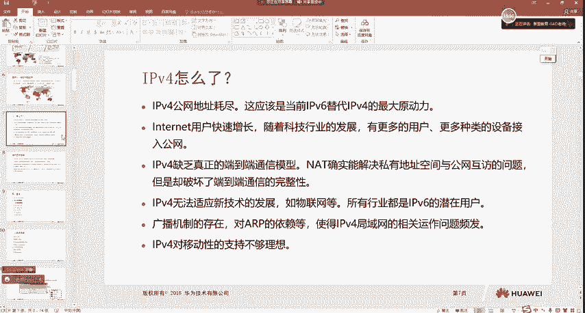

注意啊，也找到了一些临时的应对措施呃，主要就是用于去解决这些问题，相当于去打个补丁。啊，就在91年的时候呢，我们推出了一种叫做分类的啊网络方案。那这个分类的网络方案呢，就是我们把地址啊划分成公网和私网。

对吧？在91年的时候可能大家还没有接触到啊这个行业对吧？那时候我也没接触到这个行业，所以说啊啊在91年的时候呢，那时候才推出了NE啊啊推出了公网跟私网地址，93年初的时候呢。

推出了NAT就是我们私网地址呢，大家可以复用。然后呢，我们通过NAT啊，在公网上进行访问。那这样的话就可以减缓IPV4地址的一种浪费，对吧？就是它并不是根治，啊，就相当于你生病了一样。😊，是吧啊。

你患了个大病啊，但是呢嗯你就只能吃吃药，对吧？多喝点水，但是它不能根治，对不对？所以说我们可以去发现啊，虽然我们在90年代的时候呢去推出了各种解决方案。嗯，比如说呢我们有这个NAT对吧？呃。

有这个勾网私网的划分，但是呢它都只是过渡方案，大家要注意啊，叫做过渡方案。😊，对吧不能去根治这种问题啊，他没有办法去阻止枯竭枯竭问题的发生，只能减缓它的发生速度啊，这就相当于我跟你说啊，嗯。

就相当于你这个得了肿瘤一样啊，不是肿瘤是癌症是吧？这种不治之症，就你早晚啊都得量是吧？但是现在呢啊我让你化疗是吧？啊，让你挺难受的，对不对？但是呢能够让你稍微活得久一点，对不对？

就是他不能去真正的去解决这种问题，只能减缓它的发生速度。😊，那现在IPV4也是一样的对吧？虽然有各种各样的技术呢啊去减缓它的枯竭问题的发生啊，但是呢不能从根本上解决问题啊吧？呃。

我们中国呢讲究这个药道病毒，对吧？啊，斩草要除根是吧？嗯那这种呢就我们得想办法去真正从根本上去解决这种问题。所以说在21世纪90年代的时候，大家注意啊。

就是这个IPU6呢在20世纪90年代就已经被提出了啊，但是现在我可以给大家说的就是还是IPU4稍微多一点啊，就大家大多做的实际上还是IPU4多一点。但IPU6现在也挺多了，但是从宏观上来看嗯。

还是IPU4多一点。😊，嗯，这个技术要给大家说啊，就像。😊，嗯，这种概念啊就是在很早以前就已经被提出了。但是真正我们再去运行啊，或者说在实施的时候呢，真正去落地到啊每一家企业，每一个人对吧？

或者说每一个单位啊，它是需要时间的啊，就相当于。嗯，现在我们有空调。对吧那你会发现呢，现在还是有家里在用电风扇啊，这是为什么呢？我们可以说空调它就是比电风扇好用是吧？你特别到这个夏天的时候。

那冬天还能产暖是吧？夏天能产凉。那你现在去发现呢？还是有一些家庭呢在用电风扇啊，为什么在用呢？是因为各种原因啊，没钱是一种原因，对吧？没钱是不是啊，是啊，那换到网络中，我现在设备比较老，没钱换。

它不支持IPV6，那这是不是一种原因呢，也是对不对？那还有一些呢不会用空调啊，不习惯，对吧？那这里也是一样的，你比如说在20世纪90年代啊，那群搞技术的人。😊，对不对啊，比较老的那一批啊。

那时候比如说那时候的人现在得有五六十了吧。是吧这都2023年了，30年了，对吧？得有五六十了。那他还有没有在一线上搞技术呢，可能就没有了。😊，对不对？那时候的人呢可能也不会IPU6。

所以说我们也没有办法直接去换到IPU6，对不对？是吧所以说我们可以去发现啊嗯IPU6呢虽然推出的比较早，但是它真正在去。😊，嗯，大规模部署的时候呢，这是需要时间的是吧？需要。时间慢慢的去过渡的。啊。

就相当于嗯我们说是吧啊，大家要富强是吧？我们要富强起来啊，让中国人先富起来啊，但是他不是一下子就做到的啊，我们需要一步一步去执行，是吧？先让一部分人富起来，对吧？😊，所以说啊呃在20世纪90年代呢。

那时候大家都认为呃IPU6呢未来是IPU4的升级版本。呃，实际上在之前呢这里给大家说一下，还有一个叫IPV5啊，但是IPV5呢它是一个夭折版本啊。😊，就是它只是一个实验室版本，啊，没有被公开啊。

就发现了致命的问题啊，具体什么样致命问题，大家可以去网上去搜一下，啊，应该还能找到啊。😊，嗯，对，没错，就是它是一个夭折的版本啊，现在就没有了。所以说我们未来认为IPU4的升级版本呢都是IPU6。

那这就是我们在使用IPU6的一个历史啊。那除了这些呢。还有一些啊要给大家补充一下。

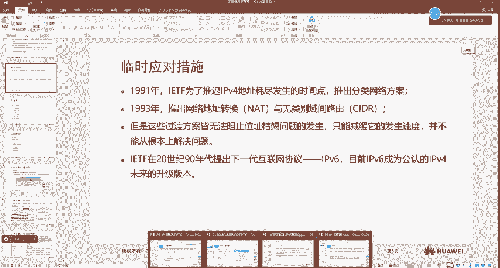

当这些都是基础啊，就刚开始。给大家讲讲概念。我们来看啊，那刚刚我们说到对吧？NA它把最后468个地址分配给5个IR，那IR它也把地址用完了啊，什么时候用完了呢？我们来看一下啊，在2011年4月的时候。

😊，是吧。呃，有一个叫做APNIC啊，他哪国的，我看一下啊。这国家大家不用去记啊，APNIC。呃，APNIC叫做亚太地区网络信息中心是吧？啊，正好放到我们国家了，对不对？那在那时候呢，亚太地区啊。

在11年的时候就宣布IP地址分完了。是吧你在2月份分给我，我在4月份给你分完了对吧？啊，就简单粗暴啊，然后在12年的时候呢，RIP对吧？这个IR他也说了我的IP地址也分配完了，对吧？那还有一个对吧？

就大家自己看啊，就14年的时候，15年跟19年啊，分别有IIR对吧？叫做区域互联网注册管理机构啊，他们都开始对外公布，最后的IP地址分完了。😊，嗯，是。那不然了怎么办呢？

我们就得使用IPU6这里呢有一个图啊是比较形象的。嗯，主要的呢就是拿IPU4跟IPU6做一下对比。我们可以去看到啊啊IPU4呢就相当于一个老头是吧？啊，年龄比较大了，手脚不方便，对不对？啊。

而且缝缝补补对不对？而IPU6呢啊就是一个年轻健壮的小伙子对吧？啊精力比较旺盛，身体也比较强壮，对吧？那我们可以从就是从当这两个图是非常形象的啊，我给大家说啊，这两个图是非常形象的。

就我们导眼一看呢可以看出来小伙子对吧？啊，那才是更有未来，对吧？前途更好。😊，对不对？那IPU6地址它到底有哪些优势呢？我们来看一下啊嗯。😊。

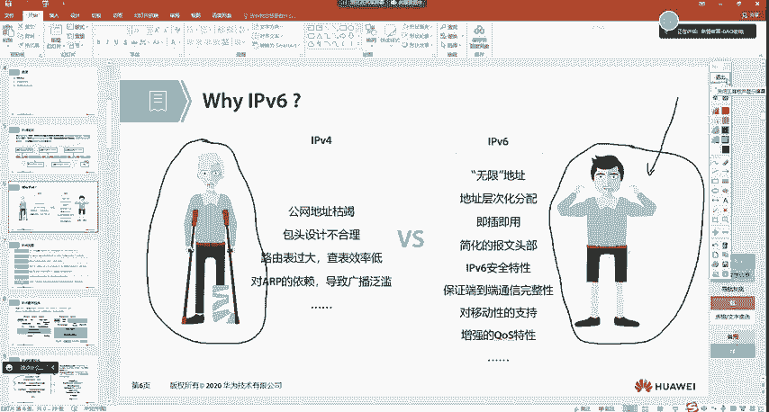

刚刚我们说了IPU4地址一些缺陷。那IPU6的地址的优势呢，我们来看啊呃，第一个呢叫做无限的地址空间。😊，嗯，这个无限的地址空间啊，怎么样来给大家说啊，就地址长度128米特。😊，叫做海量的地理空间。

满足未来所有的新兴业务，对吧？有利于业务演进和扩展。这是什么意思呢？为什么我们要说无限啊，而没有说具体多少。我们来想一下啊呃我大概给大家举个例子，嗯，在我们的这个首先给大家说一个规律啊。😊。

比如说现在我有4个比特。第一个比特等于一对吧？第二比特等于2，第三个比特等于4对吧？呃，然后第四个比特等于8。大家注意啊，每加了一个比特翻几倍啊。😡，翻一倍。对不对啊，叫做翻一倍啊。

那32比特的IPV4地址呢？他有什么样的这个有多少个呢？大概是42亿是吧？42亿啊，大家注意。然后这时候我再来给大家说一下啊。注意观看128比特的IPU6地址。对呀，128它比32大了96个比特。

也就是说每加一个比特翻一倍，42亿乘以2乘以2乘以2啊，就你一直往下乘乘96个2啊，你自己去算一下吧。是吧呃已经没有办法想象了，反正啊大家可以，我可以说呃这个数值呢最后已经超过了。嗯。

可以咱们99%的人对数学单位的这个认知了，是吧，没有学过那么大的数学单位。是吧所以说这里给大家说一下，所以说我们叫做近乎无限的IPU6地址。😡，啊，这就相当于这个反弹一样，是吧？嗯。

我们之前不是不够用吗？现在我设计了新的啊，就让它无限。😡，管你用对不对？够够的是吧？就相当于你之前比较穷一样，后来你比较富有了啊，你就有一种爆发户的心理是吧？啊，就是有对吧？现在我有对不对？

因为你在这方面呢已经吃过亏了。那我们在IPO4获得到IPU6的时候也是一样。在IPV4中呢啊已经吃过亏了，地址不够用，所以说在设计IPU6的时候的时候呢啊叫做无限的地址空间。😊。

之前有这么一段话叫做呃IPU6呢可以为全球每一粒沙子去分配1个IPU6的地址啊，大家自己去想吧。对吧梅粒沙子啊。😡，啊，那这有多少呢？大海有多大是吧？那里面的沙子就有多多。

每为每一粒沙子分配1个IP6地址。当然这只是一种夸张的说法。那主要是让大家理解的就是IPU6地址是无限的。😊，是吧啊，就你想象不到的多那这是它的第一个优势啊呃第二优势呢叫做层次化的地理结构。

那相较于IPU4呢，因为IU4是我们第一代所使用的这种互联网，对吧？那时候我们在地址分配上呢，有很多不合理的地方。比如说一点1呢，我分配给山东，1。2分配给河南了。😊，是吧那这时候就导致1。1跟1。

2都得传明细。😡，对不对？我们不能去做汇总，比如说我不能把山东的全部汇成1。0。对不对啊，这样我们就没有办法去做的，就是他的地址分配或是极其不合理的。因为这个也没办法说，因为在做第一次使用的时候呢。

嗯总有一些经验不足的地方。但是IPU6地址呢，我们有了先一次的这个经验啊，它的分配呢未来就会更加的规范，是吧？而且有利于路由聚合是吧？缩小路由表规模啊以及路由的快速查询。那还有一个呢就即插即用。

就是IPU4中，我们会去发现IPUV4这个协议本身它不能分配地址。😊，对不对？而我们在IPU6中呢啊大家去会去发现啊，就是V4，它缺的缺陷。就是我们发现我们学了IPV4还得学一个协议叫DHCP，对不对？

而我还得配DHCP。😊，是不是啊我还得学这个协议。😡，对吧换到你身上，你可能觉得学的比较多麻烦是吧？啊，那换到使用者身上对吧？或者说那种种啊研发技术的人员身上呢，他就觉得这V4呢。

他为啥没有自己的分配地址的功能呢？还得研发其他协议，为他打补停。😊，对不对？所以说为来IP6呢支持一种叫做SLAC？就是你只要有IP6功能啊，你插上之后呢，你就可以自己获得地址。你要不要跑DHCP呢？

不用是吧？那这里呢就能够体现在好处是在哪呢？我来给大家说一下，大家觉得SLAC的好处在哪。😊，嗯。好处在哪？那老师我有DHCP是吧？那我再来个DHCPV6不就行了，我让他分配IP6的，对吧？这样也行。

对不对？但是大家注意啊，呃，那未来呢我们会有物联网是吧？啊，什么家庭啊，甚至你的地板就你都想象不到你家的马桶它都能联网是吧？啊，还能跟你说话。😊，对不对？所以说呢未来物联网的时候。

那SLACC的优势是非常的大的。只要你接入到网络，你就能拥有地址，你不需要去配任何的DHCP。😊，对不对？所以说IPU6呢自己那以后就支持了原生的啊地址自动配置功能。还有一个呢简化了豹纹的头部。

那这个我们会后面去讲到IP6的包头再回去给大家说，而且它的安全性比比较高。像我们之前学的IPsAH啊这种认证对吧？已经加密。😊，那都是从IPU6中抠出来的，啥意思呢？IPU4没有安全性。

所以我们用IP的s加密IPs从哪来的呢？IPs是在研发IPU6的时候原生的一种功能。😡，只不过是吧现在我没有办法换到IPU6，对不对？那现在我用IPU4又有问题，我把IPU6的某种功能应用到IPV4上。

它是这么一个逻辑啊，IPU6它原生就有IP赛。😡，还有移动性是比较好的啊，这块大家就不用去关注了，对吧？啊，这主要是针对于无线基站那一块啊。😡，呃，还有增强的Qs能力。

那这个在待会我们讲到IP6包头的时候，也会去给大家说到。所以说这是IP6的优势啊，就是我们可以去发现呢IP6有很多的功能呢，它主要就是这张图啊吧，我觉得这张图还是比较好的。😊。

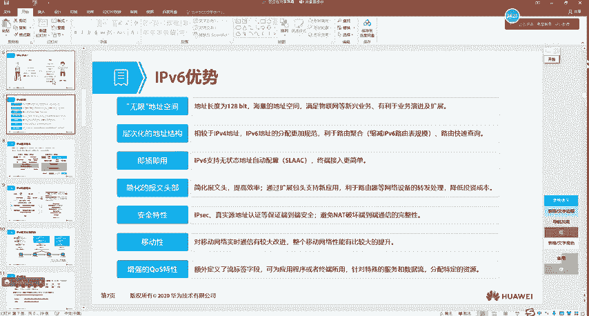

刘老师7788的内容我记不住啊吧，你不需要去记，你就知道IPU6大有可为是吧？嗯，IPU4呢日落老人。对不对嗯，这就是可以去看的啊嗯，IPU6呢未来的这个。

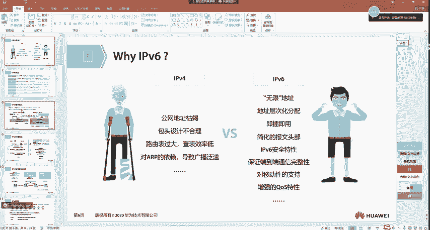

会更好。对不对？然后我们来看一下啊嗯IPU4呢跟IPU6的包头，我们来做个对比。因为我们之前在学IPU4的时候，实际上也是这个思路啊，就学习IPU4的包头啊，基本都干啥用的。😊，啊，我们来看一下啊。

这是V6跟V4包头的一个对比。呃，在这里呢。我们有一些保留的字段，像wason啊，这里是4是吧？这里就是6。对原地址目的地址原地址目的地址。所以说这些都是作为有保留的，跟以前是一样的对吧？

只不过在IP6时候呢，这个原地址跟目的地址它是128比的。😡，而在IPU6中是32米的。啊，那。除了这些。😡，保留的字段呢还有一些名字的位置发生了变化，实际上功能是一样的，就是名字稍微变了一下。😊。

那这里具体有哪些呢？比如说啊总长度对不对？总长度是包头，加上上层载荷的长度。对不对？那在IPU6中呢，我们有一个啊直接叫做上层载合。注意啊啊，直接叫做载荷长度。

所以说我们可以去发现它的语义就更加的明确了。😡，对不对？说你是啥你就是啥。😡，对不对？那还有一个呢，在IPU4中有一个叫做TOS。😡，在IPU6中就叫做啊流类别。

是吧在IPU4中这个TOS呢就是用于分类不同的流量的。在IPU6中呢，这个语义就变得更加的明确了，就叫流泪别。是吧那我们一看到这个名字呢。嗯，就能够大概理解一下它的作用。是不是对报纹流量呢来进行分类的。

那在IPV4中呢，有1个TTL叫生存时间。是吧这里我们之间就不是特别理解啊，老师他每隔一跳。是吧减一，那为啥它就要生存时间呢？它是一个时间单位，那为啥每隔一跳减一呢？😡，对不对？啊。

就是它的语义呢没有特别的明确，而在IPU6中就很简单粗暴了，那叫做hope limit对吧？啊叫跳出限制。😡，就是你能过多少天。😡，对不对？那。在IPV4中啊，有一个叫做proical啊协议。啥意思啊？

实际上我们知道它的作用，我们知道它是用来标识上层协议的IPU6种就很简单，对吧？下一个包头是TCP的，还是UDP的对吧，还是SMP的。😡，直接用下一个包头来进行描述。嗯，所以说我们通过名字的变化呢。

可以发现IP6呢嗯它的这个语义啊变得更加的明确了。那当然它还有一个新增的字段叫做flow label。flow label是怎么样的呢？就是它是基于流啊去做Qs的。那这里呢要给大家去说一下啊。

就是传统我们之前在接触到的啊。😡。

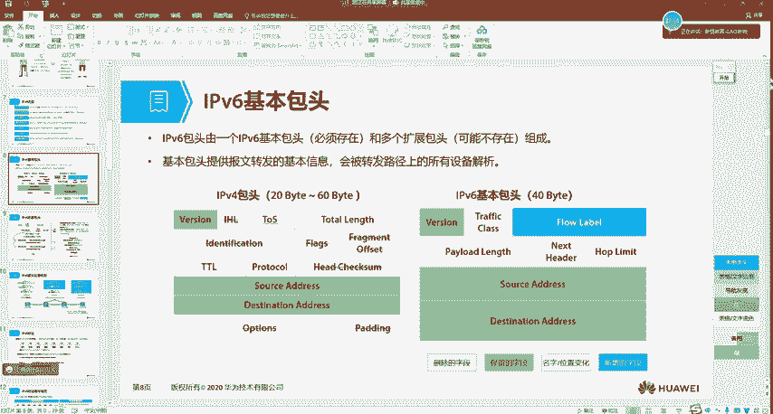

呃，比如说我有一台路由器呢，我有一条有两条等价的路由。我们说它会执行ECMP对吧？啊，叫做负载分担。负带分担呢现在有两种主流的实验方式，一个是基于包，那默认都是基于流的，是吧？那这个流怎么样去判断呢？

我们在判断流的时候呢，需要基于。5元组来进行判断，而5元组就是原IP加目的IP加元port。对吧原端口加。目的端口加上协议。好。是吧这是我们基于5元组去判断一个流的。

而实际上我们三层路由器在报文转发的时候，我们会去发现它有一个什么样的特点。😡，他是不是基于三层的目的IP来进行转吧？😡，对不对？而如果他要去判断一条流的话，他怎么样去判断啊？😡，怎么样判断？😡。

他要不要读四层是需要的，他必须要读传输层。😡，对吧一般我们说什么是吧，路由器工作在三层，实际上它能不能读四层啊，能只不过我们说它功能上是在三层的。😡，对不对？大家能明白这个意思吧？

那我们要去读更深层的内容，那么也就是意味着转发效率会变得更低啊，就相当于你收到一个快递包裹一样，你非要拆开，对吧？里面是不是违法物品，然后才能转出去。那这时候呢，你的效率就会变得更低，对吧？

那IP4的通讯，它整个就不是特别理想。😡，是吧那它的延迟就会变得更高一点。而在IPU6中呢，增加了一个叫做flow label。flow label是怎么样的呢？首先在IPU6中。

每个设备都可以拥有一个唯一的。😡，IPV6地址。对吧那这时候能够唯一的标识唯一的标识。一台设备。而这台设备在针对于不同的绘画，或者说针对于不同的理由的时候。注意啊，比如说我这个设备呢，它可能产生了。😡。

flowow一flow2flow33个6。那三种流呢，它都会有一个唯一的flow level标签。123就是不同的流呢，它都在每个设备上有一个唯一的标签。那这时候我们从全局上来看啊。

比如说A2一收到了这么一个包。😡，我一看到IP6地址，我知道是哪台设备，对吧？而设备在为每条流都去产生一个唯一的flowow label，对吧？叫做流标签。

那这时候我们可以通过原IP地址加上flowow label，能不能确定出来一条唯一的流啊？😡，是不是可以啊？对吧只要你协议遵循了这种规则，那么它就是可以实现的。😡，是吧地址是唯一的那这个地址呢。

它的每个流都有一个唯一的标签。😡，那我通过这个地址加上你的流标签，就可以确定中在全网中你是一条唯一的流。😡。

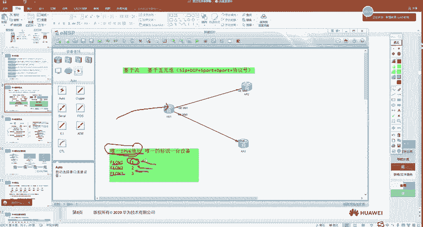

是吧。而在这时候我们可以去看一下啊，在IPU6中，如果要确定唯一的流是吧？😡，那我们只需要原IP加上什么？流标签啊来进行确定。对不对？那么在这时候我们可以去看一下，而我的设备在执行IPU6转发的时候。

要不要去深刻的。啊，解析传输层。要不要？😡，就不用了是吧，那不用转发效率就会变高是吧？那有人就问了，那老师能有多快呢？你不要小看他，注意啊，你可不要小看他。😡。

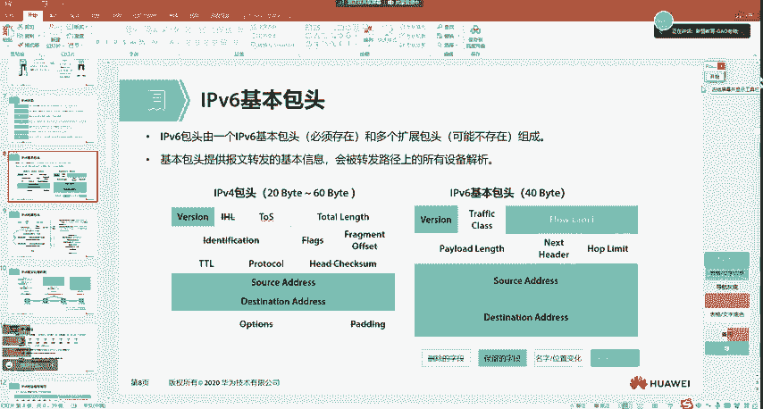

这就相当于什么一样呢？这每个路由器我们假如说它是万兆的接口，实际的。😡，那一个包我们打最大是1500个字间，你这一秒你就得转发多少啊，大家自己去想一下。😡，基于包对吧？以前是每个包我都得往四层去看。

现在都不看。😡，对吧他的效率是高的非常多的。😡，可能我们没有办法从人为的这个感官上去理解它，对吧？因为我们一般感知的就在毫秒级了啊，再快就感知不到了。😡，对不对？但是设备啊是非常迅速的。

所以说它可以让我们的转发效率变得更高，是吧？你换到IPU6网速快了，老百姓愿不愿意啊，愿意。😡。

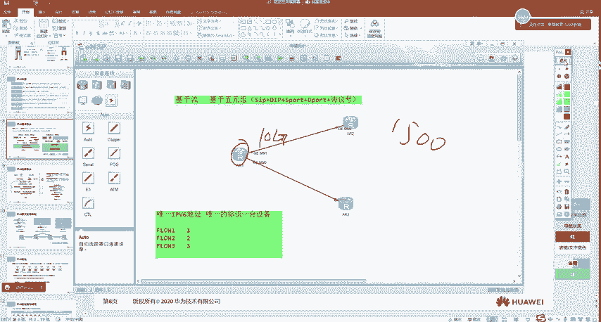

是不是？那比如说美国的网非常卡。😡，对吧那刷个抖音啊，加载5秒才出来啊，但是在中国呢，你啪啪啪啪的乱刷，那人家会不会觉得你好会是吧？啊，就像大家觉得国外工资高一样，对不对？你觉得国外好，那玩好也是一样。

😡。

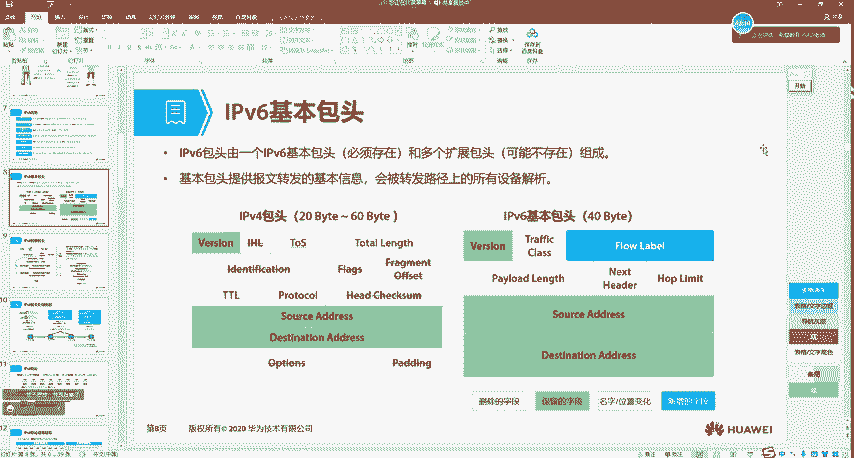

对不对？

那然后我们再来看啊，那其中呢还会有一些删除的字段，删除了哪些呢？😡，包头长度。对不对？那这里是为什么呢？在IPV4中，它的包头是可以携带option可选项的。是不是？

对吧就导致IPU4的包头呢极其的不固定。😡，不固定就导致我们设备在处理转发的时候，效率变得更加的低下。对不对？😡，所以说在IPV6中，那它就没有了这种可选项的option，是吧？也没有了填充位。

IPU6的包头就是固定的40个字节，而不像IPV4的是可变成。是吧那包头长度它就删除掉了。因为IPU6。😡，协议规定的进报德就是40个字，没有其他的例外。你IPU4中有例外，所以说你要描述一个包头长。

😡，对不对？IP6没有这种意外，那我删除一个字段。😡，是吧删除一个字段，就意味着设备的处理变得更快。对不对？这还跟OSPF那些不一样。😡，OSPF你一个链路10秒发一次。😡，那这能有多大影响？😡。

是吧而现在我们所有的网络通讯都是基于IP的。😡，那IP如果一旦效率变得更快了，那将是大幅度的提高。他跟普通的OSPF还不一样是吧？有人就问老师呢OSPF他自己没有认证，他还带个认证字段。

那他怎么就不影响效率呢？因OSPF比如说我们这是哎，我就假如说是个千兆口。😡，对吧你十0秒发一次，那他能有多少影响呢？啊，让你发1500字级的哈罗包，我都觉得影响不大。😡，而在我们的IP中，所有的通讯。

我发现所有的应用协议基本都是基于IP的是吧？如果IP一旦提高，那各种应用对吧？各种通讯速度都会进行提高啊，所以说IP的优化啊，那它是非常的也就是说它的优势是非常的明显的。😡，那除了这个包头长度呢。

我会发现还有一些啊像这么ID呀，对吧？flag。😡，还有一个分片偏移吧？我们之前在学A的时候呢，这三个字段咱们会去发现什么样的问题呢？就是这三个字段只有豹纹在产生分片的时候。😡，他才是存在意义。

而在IPV4中，我们会发现有一个特点，就是我没有分片，他也带这几个标记V，对不对？他也带，那效率越变低了。😡，是不是IPU6中就直接把这几个干掉了啊，干掉怎么办呢？是吧？那老师IPU6能分片吗？😡。

是吧啊大家就疑惑了，IP6分片怎么重组呢？😡，对不对？那这里现在给大家提一下，在IPU6中呢，未来会有扩展包头就是。IPS你不有一些option吗？对吧？啊，有一些分片标识，那这些都是只有当需要的时候。

才会进行携带。而在IP6中呢。嗯，未来这些内容呢都是当我有的时候再用扩展包头进行写载，而没有的时候，只需要按照基本包头满足高速的转发就可以。那这里呢还有一个校验盒。啊吧呃，这交验盒就比较鸡肋了啊。

实际上在IPU4中没啥用啊。这个是什么样的？我来给大家说一下。😡，嗯，我们在之前学习IPV4的时候啊。啊，我们发现二层有1个FCS是吧？嗯，34层的TCP也会做校验，对不对？那中间三层的IP呢注意啊。

这里实际上是没有必要去做校验的。啊。大家知道吧？就TCP的校验已经包括了三层的IP层了。所以说呢在这里IP是没有办法进行校验的。在IPU4中，这个校验头部呢嗯实际上没什么大用啊吧，实际上没什么用啊。

在IPU6中呢，又把这个删除掉了，删除掉之后包头就变得更加的精简。😡，所以说如果大家是刚开始学习IPU6是吧，之前没有学过IPU4，你会发现学IPU6简单多了。对不的比如说我问你IPS的包头是吧。

它是什么样的结构啊，你发现12345678。对就八字段，而IPU4中1234567891011121314。是吧。那换到网络中，通讯效率会变得更高。那如果换到我们技术人员手里。

学习啊就变得更加的简单一点。对不对？简单是吧啊，永远是非常重要的。所以说这就是IP6基本包头啊，那说它所带来的一个优势。这里大家都理解了吗？你也同学敲一啊，都没问题吧。😡，可以是吧？好。

那我们就休息一会儿，好吧，休息一会儿之后呢，我们来看一下IPU6的嗯扩展包头。😊，好吧，咱们休息会儿啊，休息10分钟。😊，好，同学们啊，那咱们就继续吧啊呃刚耽误了一会儿啊。😊，他这个嗯机架又有点问题啊。

所以耽误10分钟。呃，为啥要用UVE嗯，这个他支持的厂商设备比较多啊，就是我们发现咱们用这个嗯华为啊是吧？嗯，那当然4科啊，像针3啊是吧？这些只能跑4科或者华为的设备。那UVE它比较就是多厂商的。

就你把厂商的镜像导进去就能用那，像什么飞塔啊。嗯，这个什么瑞杰啊啊等等，多个厂商的设备都可以去用啊。就UE相当于一个大平台，就他把所有的厂商设备都能做一下融合。好，那咱们就继续吧，开始上课啊。呃。

刚给大家去讲了一下这个IPU6的基本包头啊。然后我们接下来要说的是这个扩展包头。😊，呃，那在讲扩展包头之前呢，首先大家要知道它的作用啊，就是IPU6基本就是IPU4中。比如说我们有很多这些可选项对吧。

为什么叫做可选项呢？就是当我们有需要的时候再去携带它，对吧？是比较合适的。😊，而在IPU6中呢，所有IPU4，它的这些什么分片的这些ID啊，flag对吧？分片偏移位呃。

以及option呢都放到了IPU6中的扩展包头中啊，就用扩展包头去携带这些内容啊但是大家要注意一点，IPU6的扩展包头是可选的啊，什么叫做可选的呢，就是用到的时候再去携带一下啊，这种呢就就叫做可选的。

😊。

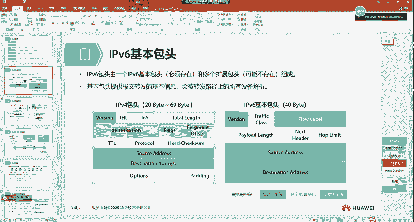

那我们再去看扩展包头之前呢，呃首先要去看一下啊，就是扩展包头的一个基本结构。它是这样的啊。😊，🤧嗯。就是在IPU6的基本包头，它不是有一个下一个包头字段嘛，对吧？然后下一个包头字段呢会去携带上，对吧？

扩展包头是谁？😊，能看到吧？它会形成这样一种，我们把它叫做链状结构啊，什么叫做链状结构呢？就是我们可以看到啊下一个包头。😊，对吧是哪个扩展爆头？那每个扩展包头呢也都会有一个下一个包头。

下一个包头在指扩展包头里面的扩展包头是吧？扩展包头里面的再扩展包头是吧？俄罗斯套完，那整体形成这么一种链状结构，对吧？这个链状结构就是这么来的。因为我们发现它确实是一种链状的结构，对不对？

那每一个扩展包头呢都是有三个呃，我们可以说字段对吧？啊，来组成的，一个叫下一个包头啊，用于描述扩展包头，下面是谁下面呢有可能是第二个扩展包头，那也有可能呢下一个是TCP对吧？啊，或者说UDP啊。

或者说ICMP啊，都是有可能的。😊，那还有一个呢是扩展包头头部的长度啊，它主要就是描述扩展包头的长度了。是吧这就很简单粗暴，就是我这个扩展包头有多大是吧？那我用扩展包头长度啊来进行表述。那么在这里呢。

还有一个扩展包头的数据部分。那不同的扩展包头呢，它所携带的数据部分是不一样的。对吧比如说我们做分片，那里面就会携带上分片的一些内容。对吧所以说不同的扩展包头用于实现不同功能的时候。

那么它的作用是不一样的。整体呢我们可以去看到基本包头下面可以带扩展包头，对吧？扩展包头下面可以带TCP啊，TCP里面再带数据字段，对吧？啊，数据字段里面呢再去带各种各样的应用。😊，对不对？

那会以此形成一种呃链状结构。而我们常见的扩展包头有哪些呢？我们来看一下啊。😡，呃，也不是常见的，就这里大家知道一下就行啊，实际上用不着。😡，就跟你在学IPU4的时候，option有那么多啊。

大家也没接触到是吧？我们来看一下啊，IPU6扩展包头呢呃必须要按照以下顺序出现。😊，啊，就是他必须要按照这个层次进行封装啊。比如说我举个例子，我压了一个逐跳选项包头。😡。

那目的选项包头就不能在他前面是吧？那我可以没有目的选项包头，对不对？那我可以再去加一个分段，就这两个呢啊这些都可以没有，然后最终再加一个对吧A啊或者说ESP。😡，大家能明白吗？

就是必须要按照这种顺序出现，但是呢不是说每一个包头都要出现，但是这种顺序必须要有，这就相当于什么一样的？这是老大是吧？这是老二啊，老三老四老五、老六。😡，对不对。那无论就是我没有老二没有老三，对吧？

老四也得在老大后面啊，他是这么一种逻辑结构啊。😡，啊能懂吗？他不是说老四要跑到老大前面啊，没有这种啊能懂吗？如果都有的话，就老大老二、老三老四老五老六。😡，对吧他没有说这种老四能跑到老大前面的啊。

老四也不会跑到老三前面，就是这么一种顺序啊，就是这种层级嗯是固定的对吧？😡，那逐跳选项包头呢，那它主要就是用于在传输路径上每跳转发，就是每跳指定转发的参数是吧？应用场景，比如说有一些矩型载合啊。

路由器提示，还有资源预留是吧？这些可能大家没有接触过，但是没有关系，就稍微有个印象就行了啊。因为你未来呢也不一定能够用得到而目的选项包头呢，用于携带一些目的选项报文头，主要用于I移动IPU6。

对吧那这一块呢啊大家也不用去关注它。所以说这里大家注意啊，只是一个简单的描述。那实际上这种包头的功能是非常多的啊。😡，大家能懂吗？可以吧，就它的场景一时间是说不完的。就这里大家只需要知道。

有这么些个扩展包头就可以了。😡，而我们常见的有哪些呢？比如说分片对吧？嗯，我们来看这里。😡，那比如说在这里呢，我们有一台始发路由器，中间有俩逐跳，中间路由器，还有一个终点路由器，对吧？

而常见的我们在发送报文的时候，它所压的一个层次结构，就是基本包头里面呢可以去加一个逐跳选项包头。那这是逐跳选项包头呢？啊可以用于资源预留。那这里大家可能就不是特别明白了。什么是资源预留。😡，呃。

我简单给大家给大家说一下，就是我们在去做Qs的时候啊，或者说在做MPSTE的时候。😡，是吧嗯Q有一种服务模型叫做综合服务模型啊，或者说在MPSTE里面呢啊我们需要用到一种协议叫做SVPTE。

那他们都是用于做资源预留的那这个资源预留相当于是什么呢？比如说我有一个比较重要的业务，对吧？这是我公司非常重要的业务。大客户对不对？而且呢客户的这个业务周期要求的比较短，对吧？得尽快完成。

那这时候我们肯定希望这种业务的稳定性，对吧？以及网络质量是非常的好的。😡，那这时候呢，我们可以通过Qes对吧？或者说MPSTE呢去在中间的每一台路由器，对吧？为这种业务，比如说我的业务是哪一个，对不对？

为这种业务呢去预留一定带宽，比如说就给你预留10兆。😡，是吧。就在这里就是这个业务呢，只要从你路由器这里通过，你就得有十兆带宽。😡，大家能明白吗？就是即使其他人的不够用了，我没有用。

但是这世道也是专程留给我的，他就像这个高铁一样，对吧？高铁有一些商务座车呃，商务座候车厅。那你会发现大厅里呢已经没有座了。但是呢商务座候车厅还是没有坐完。那这部分呢也是对不对？只留给那些商务座的人。😡。

大家能明白吗？对吧？所以说我们这种业务重要的，它就相当于商务多，是吧？在沿途的每个路由器上呢，都去预留时兆贷款。那这种呢就相当于叫做资源预留。😡，大家能明白吧？而Qs呢跟MSTE大家还没有学过。

所以说这里呢嗯我给大家说太多啊，大家可能还不是特别理解。所以这里呢你们稍微啊有个概念就可以了。就是在我们的IPU6中可能有些应用场景下是怎么样的呢？需要中间的每台路由器都去读取一些信息，我举个例子啊。

我给大家举个例子，什么样的例子呢？😡。

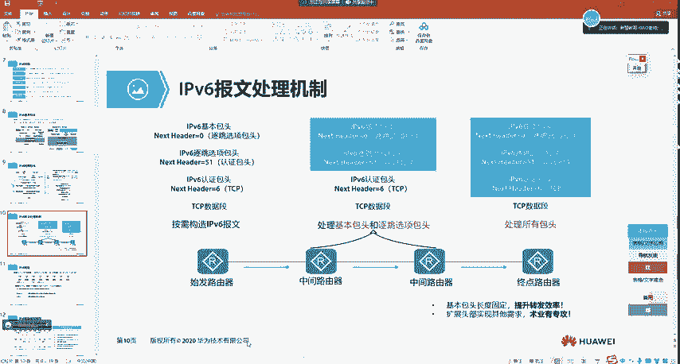

🤧嗯。我以广播对吧？大家可能没学过主播。😡，嗯，对不对？呃，我给大家举个广播的例子。对不对？呃，广播里呢就可能我只是做这么一种假设啊，实际上在主播里是有这么个概念的，就是有这么一个地址。😡。

对吧他是全球范围通告。😡，Okay。注意啊。有这么一个地址，它是全球范围通告。就是只要你联网，甭管你什么广播域就没有广播域了，只要你联网，你就能够收到这个包，就能够收到这条信息。😡。

对吧那这个时候我们可能很难去想到，就是就是一时间老师我想不到哎，这个地址全球范围通告它有什么样的意义呢，对不对？实际上它是有场景的。如果大家经常去看电影啊，那你就会去发现，比如说当灾难来临的时候。😡。

对不对？那这时候呢，我们需要通知给所有的人类是吧？大家赶快跑，或者说怎么样怎么样，对不对？或者说即刻注意自身的防范是吧？就类似于这种，所以说呢技术它只要有一定是有它存在的意义的。

只不过可能你没有想到那个场景。那这个逐跳选项包头就是这么一种。😡。

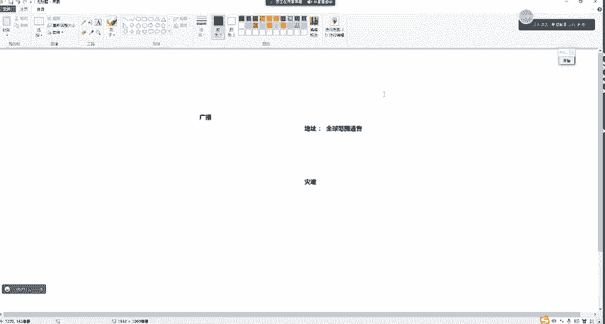

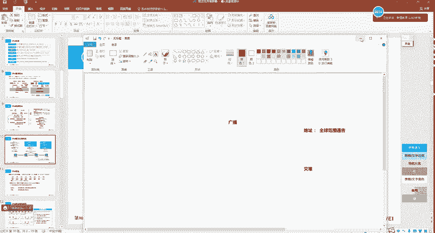

大家能懂吧？就是在我们未来的这个应用中，对吧？可能会有这么一些选项，需要路由器，中间每个路由器都要去识别处理。😡，对不对？那这时候呢，我就通过逐跳选项包头去承担，对吧？那认证也是一样的。😡，好吧。

那所以我们可以去看到啊，在IPU6中，它这个扩展包头所体现的一个作用主要是在哪里呢？啊，我们把它叫做树业有专攻，叫做当你想要去实现某项功能的时候，你再去携带它。而当你没有去实现这项功能的时候。

只是普通的IP转发，你只需要携带一个基本包头，满足报纹的高速转发就可以。😡，当你想要实现各种功能的时候，针对于不同的功能，我都有不同的扩展报头。😡，那扩展包头有没有可能没有办法描述所有的功能呢？对吧？

我举个例子是吧，比如说现在我需要沿途的某所有的路由器对吧？啊，都去添加一些信息。那么在这时候，我没有对应的扩展包头。那大家告诉我能不能研发一个新的扩展包头是可以的。😡，对不对？

只不过你是没有想到那个场景，但是不代表它是不存在的。所以说针对于扩展包头，大家只需要去理解的是什么呢？就是它能够让IPU6变得更加的高效对吧？当你去实现的时候，你再去携带，而你没有这样功能的时候呢。

就不携带，那这里呢我简单来给大家做实验，是吧？让大家去看一下，是吧？我以大家常见的分片是吧？来给大家做一个，就让你们看一下，当我在IPU6中有分片和没有分片的区别是在哪里的。而在IPV4种对吧？

有分片和没有分片的区别又是在哪里的，是吧？我们拿IPU4和IPU6的来进行一个对比。😡。

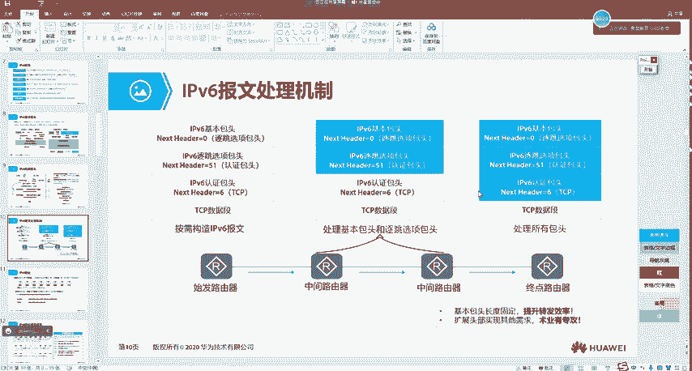

🤧哼。

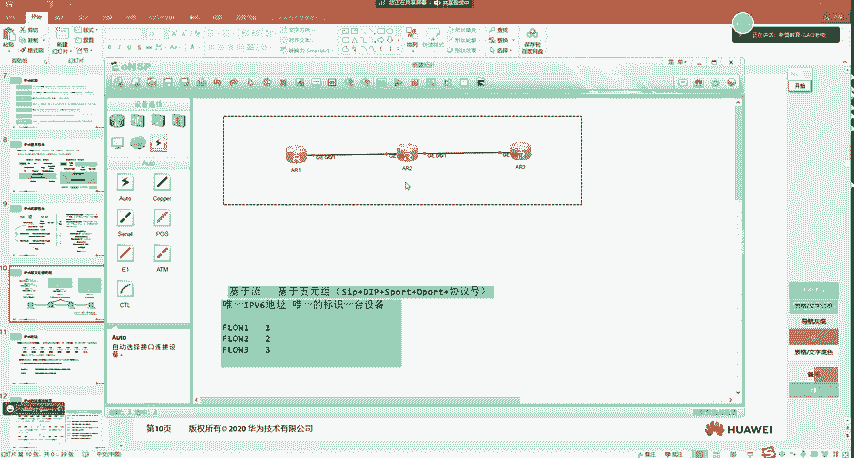

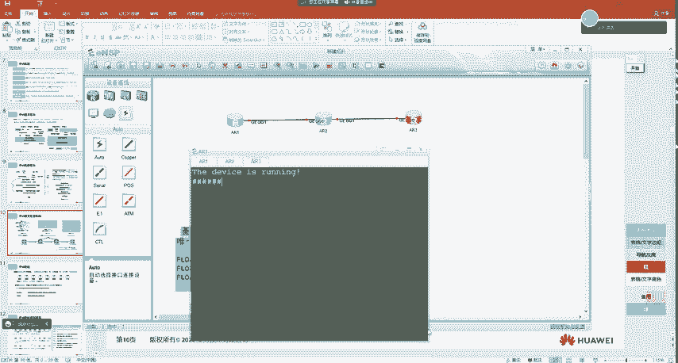

。嗯。好。Yeah。Yeah。嗯，现在我以IPU4为例啊，先让大家回忆回忆IPV4对吧？啊，待会你才能够更好的去理解IPU6。12。2。Yeah。23。2。怎么不讲拍P6。还没讲到啊23。3。😊，呃。

我们在AR一上呢，大家注意啊，写一个静态路由啊，0。0。0。0啊，0。0。0。0。呃，10。0。12。2。啊。然后在三上的IP root status0。0。0。0。10。0。1223。2。

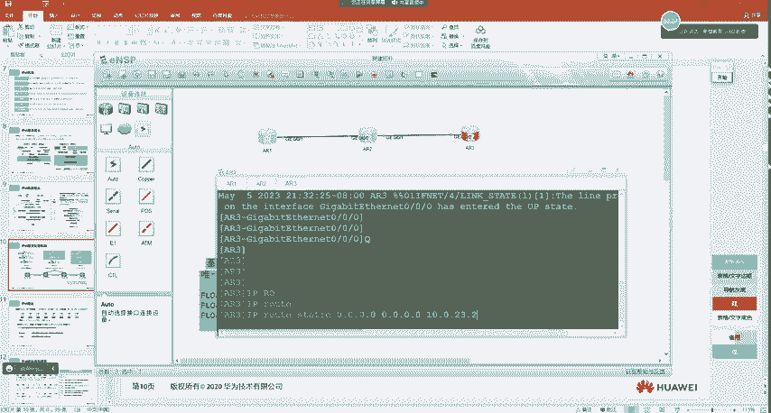

是吧。然后我们现在来抓个8啊，我在T0-0-1。抓一个。然后我们先来看一下IPU4种啊。

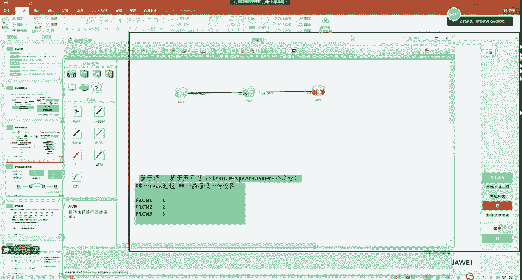

比如说我在AR一上呢去聘一下10。0。23。3。

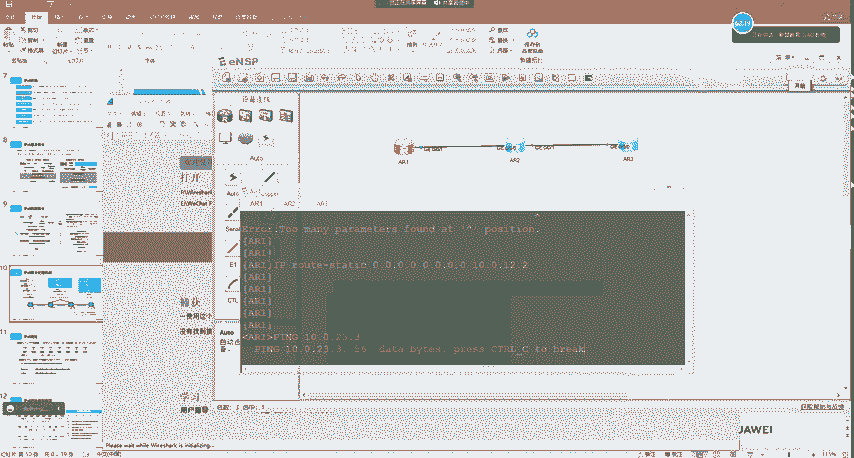

通了。啊但是我的包还没开起来啊。来了是吧，我们来看一下啊。嗯，我们打开P包头去看的，实际上现在我的包有没有分片，我们发现没有任何分片的包，对吧？那但是在里面有没有flag？😊，有没有分片ID呀？对吧呃。

还有一个那个分票偏移呢。是吧分片偏一位是吧，是不是也都有啊？😡，对不对？大家注意啊，这里分片偏移不属于flag啊，这是有些抓牌软件，它在解析的时候直接解析到这里面了。😊，那能懂吗？

那这时候我们可以去看到啊，实际上我没有分票的时候，他还携带这些信息。那二他得看一下。😡，是不是？对不对？二还得看一下。看一下才给你转发，那效率就变得更低了。那我们这种IPU6啊，大家来看一下啊。

我在AR1上interface70-0-1啊，叫做IPU6啊，现在我配的大家可能看不懂啊。因为现在大家有些同学如果没有IPU6基础的话，就你可能不知道IPU6地址长什么样子。😊，就是现在我配IP6。

大家不需要看懂，这会只需要能够看懂包的分片就行了。😡，懂懂吗？当然我在配的时候，我还会把命令说一下啊，开启IP6功能。😡，在接口下呢，IPU6啊，不是啊，在接口下。😊，IP6 enableable。

然后给他配个IP6地址，2001冒号12，冒号码号1。啊，然后在二这边IP6功能开启G0杠0杠0IP6 enableableIP6dress2001冒号12冒冒号2。嗯。如果有同学对IP6没有概念啊。

现在可能看不懂我的配置啊，但是后面我们会去讲到对吧，IPU6地址是什么样的结构，是吧？呃，怎么样去配的？嗯。现在大家主要的理解就是待会儿我要去抓包。那抓包呢，大家会去看到分片啊。

这个分片它具体是什么样的内容。啊。那现在我配完之后呢，我在ARE上写一个默认路由叫做IIP6ro是吧？冒哈冒号2001冒号12冒号冒号2是吧？如果有同学没接触过呢，他就不懂了。反正这冒哈冒号二是啥玩意。

啊，2001冒号12冒号码号。然后在山上。IPV6。rupan马哈马哈嗯，2001冒号23，马哈马哈。然后现在我在一上去骗一下三的IPU6地址，叫做骗IPU62001冒号23，冒号冒号3。能拼通对吧？

然后我们现在来看一下啊，这是我IPU6的报文。😊，那IP6的报，那正好也带大家去看一下，对吧？IPU6那在这里呢啊，这是SMP啊IPU6版本V6是吧？流类别对不对？flow label是吧？

上层载荷是吧？ICMPV6，对不对？下一个包头IMPV6嘛。对吧TTL啊就是下一呃跳入限制64呃原地址目的地址我发现包头是很精简的，而在IP4中。吧看着都头大。对不对？而在IU6中呢更加的简单。

我发现有没有分片这些标记啊，没有。😡，对吧那老师IPU6能分辨吗？可以啊，可以分辨，它怎么重组呢？那现在我来给大家演示一下，比如说我在ARE上的pinIPU6。😊，呃，我去设置这个报文的大小。嗯。

这个报纹的大小应该是杠S。啊，该始。然后比如说我设置是。一呃2000个字节好吧，那我们待会看他的分片嘛，是吧，这2000个字节呢，我去骗的地址是2001冒号23冒号冒3。😊，能骗通对不对？

然后我们来看一下啊。😊，来看这里在IPU6中，如果它携带了分片，那在这里有没有一个分片包头啊？有没有我们来看啊，在IPV6的基本包头里面。有没有一个下一个包头44啊？有没有？😡。

有吧下一个包头44是谁呢？😡，我们打开课件来瞅一眼。分段包头。对吧而打开这个分段包头之后，我们来打一眼。😡，有没有分片偏移位？有吧。是吧有没有MFV，允许你就是后面还有没有分片是吧？有没有分片ID也有。

所以我们可以去看到一个非常明显的好处是在哪里呢？IPV6种，如果没有分片，它就不携带。而有的时候再去携带这种叫做什么啊？😡，叫做什么？😡，叫做按需。对不对？你要的时候我再给你。😡，能不能明白啊。

不是TIV啊，而叫按需。😡，对不对啊，对建今形式。是吧那这就是IPU6扩展包头的一个好处。😡，是的，当我去携带的一个就下面有这么一句话，对吧？基本仓包头长度固定，提高转发效率，扩展包头，实现其他需求。

对吧？树业有专攻。对不对啊，你干你的事儿，我干我的事，咱俩互不打扰。😊，能明白这意思吧？所以这就是IP6扩展包团的一个好处。😡，对吧那以后有没有可能存在其他的扩展暴动呢？肯定是会存在的。

因为IPU6现在还是在发展过程中，所以大家明白了吗？明白同学敲一啊，这里都没问题吧。😡，系嘛？Yeah。可以是吧？好，那接下来我们就来看一下是吧？老师IP6地址，你刚配的乱七八糟是吧？

我一点都看不懂什么东西啊，是吧？还有ABCD对不对？看不懂，看不明白，不理解。😡。

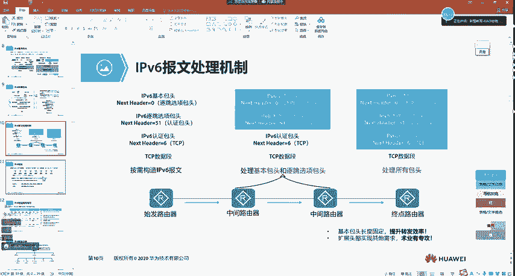

是吧这就相当于你某一天看到一个外国的电话号码是吧？911怎么还能有这种电话号码是吧？为什么你会觉得特别的惊奇呢？就是因为你没见过，当你见的多了，你就熟悉起来了，对吧？就相当于你第一次见到外国人一样是吧？

啊，不瞒大家说我第一次见到外国人，我就觉得分不清楚是吧？怎么长得跟猴子一样，对不对？啊，后来看电影见的多了啊，看着就顺眼了，所以说大家现在看到IPU6是吧？老师刚刚配的看不懂，看不明白是吧？啊。

特别的惊奇啊，这什么玩意儿啊，记不住还对不对？啊，但是用的多了，慢慢的就熟悉起来了。这里大家知道啊，就刚开始比如说你看到外星人比较丑，那他还觉得你比较丑了，为什么呢？因为没有互相看习惯，习惯了就好了。

😡。

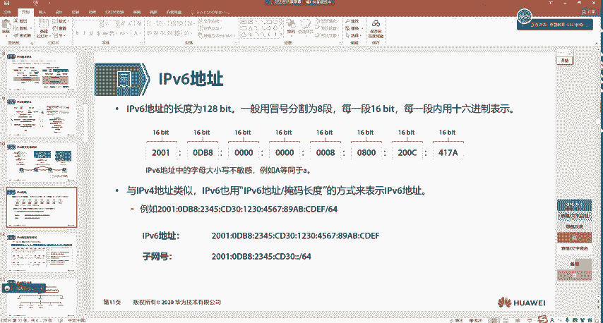

对不对？IPV4地址不就是这样吗？然后我们来看一下IPV6地址，它长什么样子。😡。

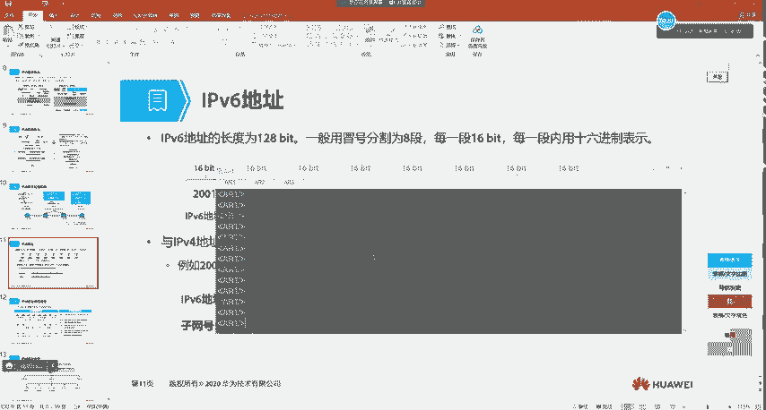

那之前我们说过IPU6地址呢一共是128个比特，对不对？那128个比特我们不能直接去写啊。比如说我写十进制是吧？呃，没有办法很好的去写出来。那比如说我像IPV4地址那样去写IPUV4每个段占了8位。

对吧？😡，那128比特就是128位啊。那128除以8。我们得写多少段？你至少得十多段。是吧十五六段肯定是有的吧。对不对？那不好写是吧，老师怎么办呢？怎么办？那IPU6地址呢有他自己的表现形式。😡，啊。

然后给大家说一下嗯，IPU6地址呢，它是使用的冒号分割成了8段，每个段呢16比特16乘以8正好128比特的IPU6地址。啊。那每一段呢用十六进制进行表示的那这里我首先问一下大家有没有同学不懂十六进制的？

😡，有的同学啊敲一好吧，有没有同学没有知道过，或者说不了解十六进制的。😡，123。是吧这是哪个同学敲的这这是刚刚敲的还是现在敲的？😡，马正伟开始敲的是吧？是吧。嗯，这里我简单给大家说一下啊。😊，嗯。啊。

对，没错，就是封16进一是吧？我简单给大家说一下啊好，对。😊，好对，张高杰说的没错啊，SS就是16进制对吧？那这里我们就不讲十6进制了啊啊，大家应该都懂对吧？然后我要给大家说的是什么呢？😡。

那十6进制进行表示的时候，每一段呢分为了4个16进制数。是吧。一个16进制数代表4个比特，所以说4乘以4等于16比特，每一段呢是16个比特。那IPU6地址我们在写的时候，比如说这里。

这就是1个IPU6地址。看得懂吗？所以说未来大家见到的IP6地址，他就长这个样子。😡。

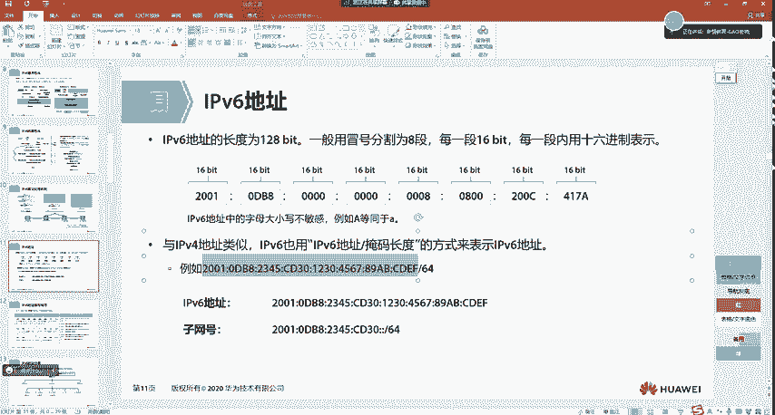

是吧哪一天你们老板给你说对吧？小王啊，你给我配个地址吧，我也需要上网。是吧或者说公司假如说小王啊，现在咱们有20个人。是吧你给他静态配一下地址。😡，就看这个长度。我都难受是吧？

我相信各位同学也比较难受啊，老师我拍地址，我拍那么长。😡，对不对？是吧除了拍那么长，还有一点什么，老师记不住。😡，对不对？这谁记得住啊，我也记不住，你能记住吗？你也记不住，为什么呢？嗯，我给大家说一下。

这就相当于什么呢？呃中国人的名字基本都是三四个字啊，两三个字。😡，是吧当然还有四个字的，所以说我们很好就能记住。😊，啊，那外国人的字名字十七八个字是吧？啊，十个字你能记住吗？你也记不住。😡，对不对？

但是外国人他自己能记住吗？他可以记录。😡，为什么？大觉得为什么？😡，用的多。对不对？他就是用的多了。😡，外国人的名字非常长是吧？多了，习惯了。对，没错，对吧？所以说他就能记得住。

那现在大家接触IP6地址。😡，嗯，确实不好记是吧？但是以后慢慢的就熟悉了。但这个熟悉我给大家举个例子，比如说我们在IPU4中，192。168。1。1。老师，我记得住，看一眼就记住是吧？

但是我给你说一个是吧，17。😡，2点。32啊，不对啊，203点。17点。86。给你这么一个地址，让你看一眼，直接配，你能不能配上，你肯定还要回头再来看一下是吧，我是不是记错了，为什么呢？

大家告诉我为什么？😡，因为你平常在做实验的时候，有私网地址你是非常熟悉的啊，就那几个段，对吧？而。😡，啊，这啊这个172啊也是死亡地址啊。对吧啊，但是呢我要给大家说的是啊，就是你用的少。😡，是吧对。

没说用的少你就记不住是吧？所以说现在大家接触IPU6不要觉得特别头疼啊，我能够理解各位是吧？因为我刚开始在学习的时候，跟各位同学实际上没有什么差别，我也觉得比较头疼，记不住，你放到现在呢。

你给我来这么一长段呢，我也我也记不住是吧？因为这个人的脑容量啊是有限的，是吧？不是说真正熟悉了，什么都能记不。😡，嗯，但是呢啊能够给大家说的就是这么串地址呢嗯还能够接受。对吧为什么还能够接受呢？

是因为我们会发现啊IPV6呢刚64，大家可以理解成就是掩马掩马。😡，我们可以去发现啊，就IPU6，为什么我们说这么长还可以接受呢？是因为在IPU6中。😡，这个IPU6协议的研发者。他也比较头疼。能懂吗？

他为什么比较头疼啊？这么长的例址谁记得住啊？😡，对不对？他天天搞IPU6，他都记不住，所以说他也比较头疼。😡，那研发者遇到这种问题呢，是吧？他就开始推政策了，是吧？

就相当于嗯我觉得老百姓生活比较困苦是吧？啊，为老百姓提高工资，对不对？开始推政策。所以说呢研发者也遇到这种问题。那这时候他怎么办呢？他就提出了一种IPV6的。缩写形式。

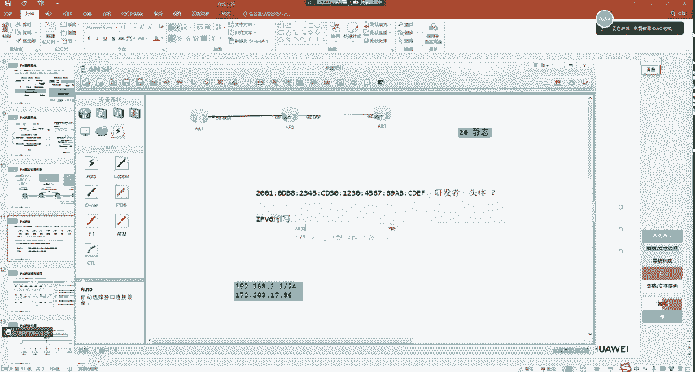

对呀，就是IPU的地址可以缩写的。那怎么样进行缩写呢？我们来看一下嗯。注意啊。卡了吗？现在可以吗？Yeah。现在好了吗？好了是吧。好，那咱们继续啊。😊，对，就要给大家说的啊。

就IP6地址呢啊就是它有一种缩写形式啊，就是作者阶段呢。😡，对吧啊就是作者觉得呢也比较难记。所以说呢他提供了一种缩写是吧？刚有同学问刚64是啥，这是掩码，能懂吗？就掩码。😡，那IPU的地址怎么样缩写呢？

我们来看啊。😡。

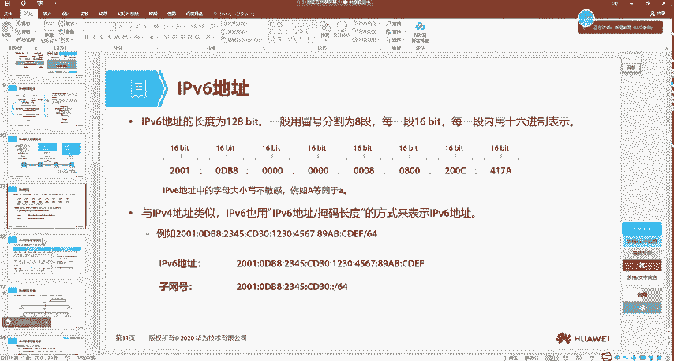

首先呢。每组16比特单元中的前导零可以省略。如果16比特单元的所有比特都为0，那么至少要保留一个0拖尾的零不能被省略，啥意思呢？这是每个16比特。前岛的零可以省略。可以省略吧。是吧如果有个16比特。

所有比特都为0啊，至少要保留一个0，这可以缩写成0啊，这也可以写成0。😡，这前岛3个0省略。写了吧。是吧签到一个零省略。😡，那后面的零能不能省略啊，不能是吧？只有前岛的零可以省略啊，这就是800。啊。

2C00，所以说最终我们可以把它缩写成。这样的形式。是吧。那有同学又问了，反师还是记不住啊。😡，是吧这么长我还是记不住，那记不住没关系，还有。😡，如果连续多个连续的16字符啊，不对啊。

一个或多个连续的16比特字符都为0。我一看到这一个跟这一个，这是不是两个连续的16字符都为0。我们可以用双码号进行表示。但是整个IPU6缩写中呢，只允许有一个说么。😡，吧比如说我在这里也都是0。啊。

我们只能有一个双码号，就是这一个会成双码号。而后面这个呢啊只会乘一个0。所以我们再压缩呢，2001冒号DB8中间这20能不能缩减成冒号冒号啊，可以啊，8800200C417。对不对啊？那有同学又说了。

老师还是记不住。那老师要告诉你啊，你要学会满足。😡，能懂吗？是吧，领导已经考虑到你了。😡，对不对？开始给你提供缩写方案了，你不要不知足，对不对？那慢慢的接触，慢慢的熟悉啊。😡，所以说我们来看啊。

就是我们会有这么一种缩写方式。😡，那比如说现在我给大家提出一个地址。😡，系吧。是2001冒号。0000码号0000买好。0。A。BC冒号啊，当然这个不区分大小写啊。😡，冒号0000。冒号1234是吧。

这种就好记多了。123456这6段是吧，然后我再写几个1234啊。嗯，冒号1230吧。冒号00230好吧，然后冒号0234。是。然后这个地址段，那如果我们要缩写的话，怎么样进行缩写呢？

我给大家演示一下啊，首先第一步。😡，啊。每个前岛的。啊，有些同学已经敲出来了是吧？每个前岛的。零可以省略。对不对？那咱们就写一下呗，每个签到0可以省略，就2001冒号。零零零啊。0是吧。如果。该段。

全部为0。可以写为。一个0。是吧0冒号0冒号呢ABC。蛮好，注意啊。那ABC马浩林。冒号1234，冒号230，冒号234是吧？这是第一步缩写。第二步缩写呢？如果一个或者连续多个。Yeah。嗯，对。

对吧都为0，则可以缩写为。刷码号。那这时候我们就可以写出来2001冒号冒号ABC冒号0，冒号1234，冒号230，冒号234。对吧那大家觉得这个零能不能省略啊？😡，各同学思考一下。

老师这不是一个或者连续多个吗？那这个可不可以啊，实际上是不行的，为什么不行呢？我来看一下。😡，当我们有这么一个地址之后。我们在每个段前面补个零，能不能还原每个段的长度？可以吧。可以还原。

但是中间这个双麦号我可以减去每个段嘛，我看少几个段，我就知道双麦号代表几个段了。😡，但是如果你1个IP的地址有多个刷码号，你知道每个冒号代表几个段吗？😡。

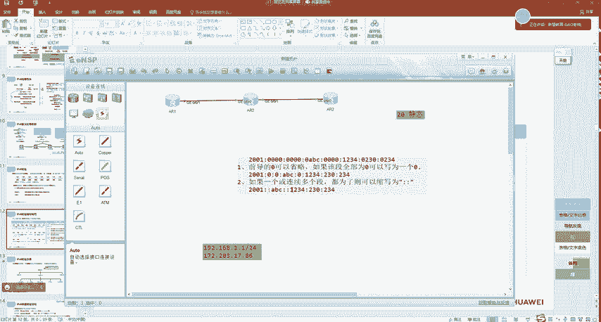

你就不知道了。是吧所以说呢IPU6中还有一项规定，就是若缩写后的IPU6地址出现两个双码号，它是没有办法还原原始的IP6地址。所以说整个缩写中只能有几个一个双码号。这里大家明白了吗？明白的同学敲一啊。

没问题吧。😡，好吧。然后在这时候呢，我们再通过一个实验对吧？给大家去看一下。比如说我在A21的G0-0-1。😡，怎么样去做呢？现在我给他配个IP6地址。

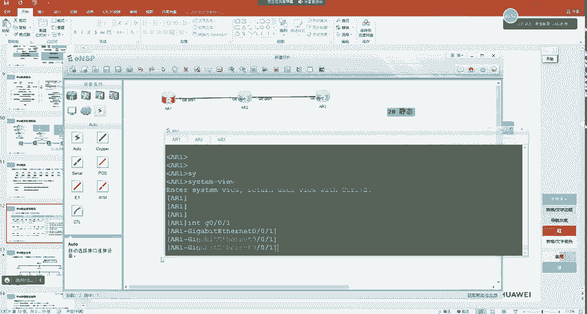

怎配呢？注意啊。interfaceG0-0-1在IP6中啊，一个接口可以拥有多个IPU6地址是可以的。现在我给大家演示一下。😊。

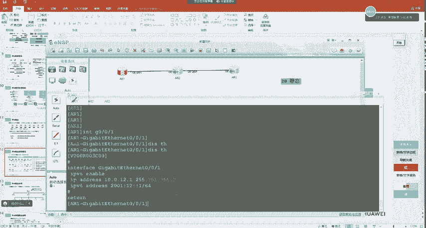

IP6address2002冒号。啊，我就直接配这一个吧。行么样？IP6dressice。我把这个直接贴上去。贴上去之后呢，大家注意啊，我们还要去配个岩板。😡，能看到吗？你也去配个掩码。

在IPU6的掩码中，只有一种叫做什么啊前缀表示法。😡，🎼什么叫做前缀表示法？😡，IPV4地址我们在书写的时候呢，有两种，一种叫做前缀标示法，一种叫做掩码。😡，表示法前缀表示法就192。168。1。

1-24。是吧掩马标准款就192。168。1。125。255。25。0。那懂吗？在IQ6中只有前缀表是吧？你只有杠多少。比如说我现在就是杠64是吧，回车。😡，那为什么用64呢？因为在IPU6中啊。

未来咱们用到的大多部分都是64的。所以我就干64。是吧。那大家觉得我不干流的事行不行？可以。😡，那有人就问了，老师是吧？😡，那IPU6中你给他杠64啊。会有缺陷吗？会不会有点浪费啊？

大家觉得会不会有浪费啊？😡，会不会啊？不会啊，实际上是会的。是吧但是呢对IPU6不怕浪费。为什么又多对不对？啊，就相当于你有10个亿，每天晚上让你对吧？每天让你吃黄焖鸡米饭。😡，对不对？

但是你有10个亿，但是我每天让你吃黄焖鸡米饭。😡，你乐意吧？你也不乐意吧，你也不怕浪费是吧？老师我吃他10万块钱一顿是吧？啊，你也不太心疼，对不对？😡，能明白吧？

所以说当你有的时候呢啊可以稍微奢侈一点是吧？啊，但是也不要过分奢侈啊。😊，这时候呢注意啊，比如说我display this，我们来看一下那这个地址有没有被压缩啊。😡。

有没有在派人命令行中有没有被压缩成我们刚刚所看到的样子？2001刷码号ABC012341234230230234234。

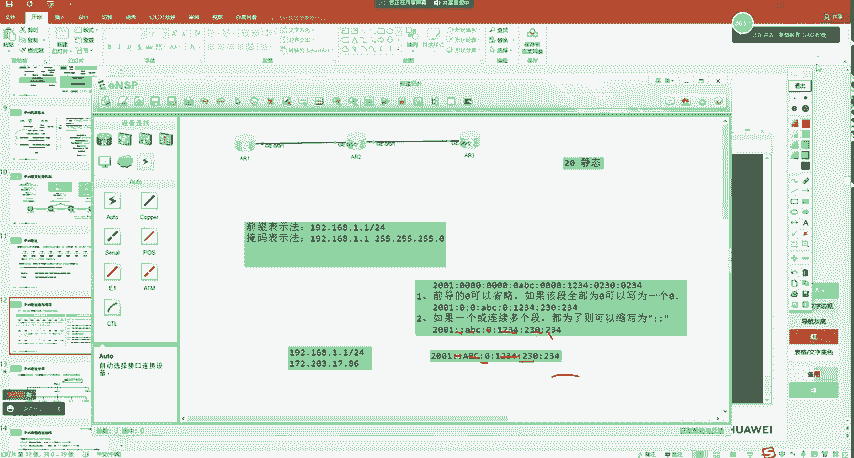

对吧那除了这样压缩，我们还有一种方式注意啊，怎么样去查看接口的IP6地址呢？我之前学的是什么displayIP interface。😊。

brief在IP6中的disspplay IPP6interface brief。那懂吗？那现在我们好像只看到了一个。注意啊，如果你是通过displayI6interface brief。

它只会显示一个。那如果我想看所有的怎么办呢？display IPP6interface加上具体的接口G0-0-1。所以现在我们可以看断它有几个IP率地的。有几个？这是不是一个？

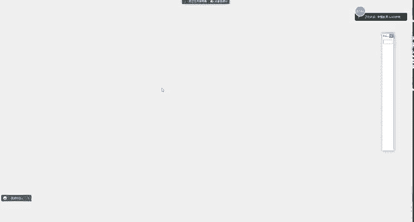

这也是一。对吧以及他们所处的子网在哪里？对不对？这什么链路本地地址啊啊，这个被请求接连组合地址等等之类，大家就不用管。😊，后面会讲到啊。那所以说我们可以看到有2个IP。是吧。那这里大就比较有疑惑了。😡。

哎，老师啊。嗯，我这个刷码号跟这个双码号我压哪一个呢？那觉得样哪一个？等一下。我发现我们压了前面的。😡，是按照前后压。还是按照多少押呢？是吧。对样啊。嗯，他实际上是按照前后压的啊，不是是按照多少压的。

比如说我举个例子啊，现在我这样来写。😡，我再去配一个。2002。我把这个给他删除掉。然后我在这里呢再加个0000码号。这是不是1个IP6地址啊，也是对interface70-0-1。IP6dress。

然后我给他配上。没有事。display IP6 interfaceterface。G0-0-1。他压的是哪一个？押是哪一个？压的是多的。是吧那有什么呀哎，老师两个一样多怎么办啊？😡，对不对啊？

比如说我可以这样啊。呃，我在这里呢，还有一个冒号0000冒号呃，我们把后面再删一个。是不是两个人一样IP6。Arise。display IP6。interfaceG0-0-1。他压在这前面的后面的。

要的是哪一个？对吧压的是前面的，所以在压缩的时候啊，大家要注意。双码号在压缩的时候有两个顺序。第一个呢。嗯。Xian。选择使用。就是如果。第三部啊。啊就不第三步了，我在这里括号注释一下是吧？呃，先鸭。

多的。是吧，其次。当。数量相同时。是吧，选择。高位。进行压缩。对吧这个高位呢就是我们所说的前面的。好吧。这里大家明白了吗？明白同学敲一啊。

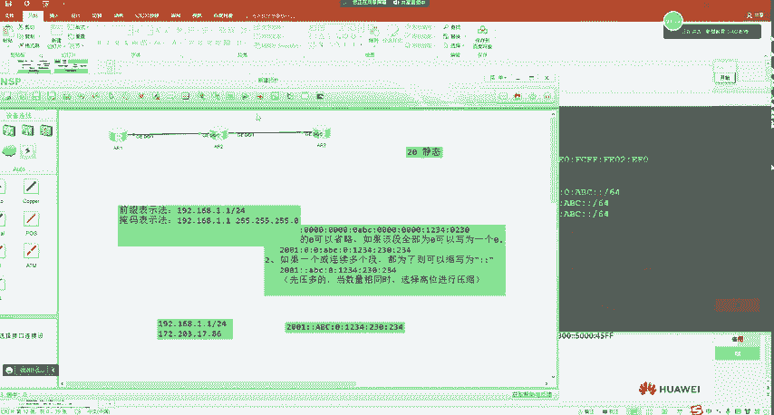

喂你话。

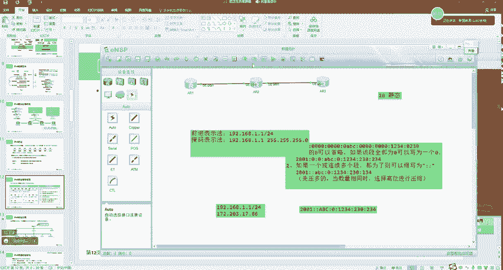

。好呃，那最后呢这没几分钟了啊，然后我给大家说一下嗯，说一下什么呢？😊，呃，就是咱们这个IPU6啊啊怎么样去配。实际上面令很简单。😡，就是如果大家课下要去做实验的话，就是首先呢。你得在全局视度下啊。

系统试度下开启IP6功能。开起来PU6功能再到接口下敲一条命令叫做IP6 enable。在接口下呢，再去开启IP6功能。然后就可以去配IP6dress。对，然后去敲地址就可以了。好吧。

那这就是IP6地址的配置方式啊。就是系统视图IP6。系统试图开启IP6功能。然后在接口视图IPV6。听白不。接口下开启IPU6功能。嗯，然后呢。IPV6。address是吧，叉叉啊，你就可以配了。

这是配置接口的。IPU留地址。好吧。呃，行，那咱们今天这节课啊就先说这么多，好吧，然后下节课呢，我们再去说IPV6地址的分类啊，什么公网地址啊，那老师有没有私网地址啊？

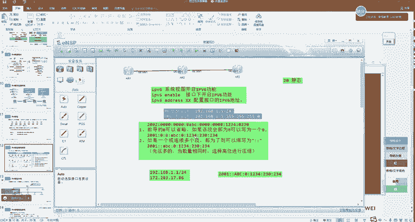

那有没有广播，有没有主播啊啊，然后这些我们下节课再来说啊。🤧嗯。呃，昨网划分怎么个跟IPU4是一样的啊。😡，你比如说啊，我举个例子，我。😡，2001冒号12冒号冒号一打问号，我去配亚马，最多能赔多少。

128。这跟我在配IP address1。1。1。1打问号，最多能配到32U一样。有不一样？要吗。这里大家能明白吧？是一样的啊。对，没错。64样板还是咋样的？64你就敲64吧。这不1到1128吗。

能不能明白。就你直接敲64不就完了吗？你看我刚刚配的不就64的吗？😡，再给我1。1。1。116。我IP6dress2003冒号12，冒号冒164。他告诉我他俩有本质的区别吗？这俩没什么区别吧。😡。

能懂这意思吧？这就是它掩码是多少长度嘛，对吧，只不过IP6最长128码，你最长32。😡，对，是这么一个关系啊。😡，嗯。网关网关是在IPU6路由的时候，咱们会去讲到啊，大家能懂吗？刚我在配默认路由的时候。

IPU6router status刷码号，它就等于0。0。0。0。😊，大得懂我的意思吗？😡，李亚同学敲一啊，双把号就等于IPU4的0。0。0。0。啊，然后你去敲吓一跳就行了。啊。

那是吧呃从这个老师又开始引出来了，对吧？老师OSPFV3总么配。😡，对不对？S34怎么跑IP6。😡，是吧嗯这里呢我们回来讲完IPU6的时候，会给大家去说IPU6的路由啊怎么样去做的。能懂吗？

所以这里大家不需要去关注啊，就是我们先学IPU6，然后再去学路由。😡，好吧。嗯，这个课件待会我会发到咱们的群里啊，那在咱们的群里应该是没这个课件的啊，我用的是老课件。😊，S的课件。好，同学们。

那咱们今天就讲这么多吧，我先把路平停一下，好吧。😊，分段那个有个转发路由器不充啊，对，中间路由器不会重组啊。

