# 2023 新版华为认证HCIA+HCIP+HCIE全套视频讲解！一套视频让你从入门到精通！CCNA／CCNP／CCIE技术提升同样适用！ - P106：（持续更新）HCIE Datacom - 52.IPV6地址分类 - -Book思议8 - BV1W8411A7z8

好，同学们，那我们就开始上课吧啊。呃我们这节课呢依然会去去讲这个IPU6协议啊。然后上节课我们给大家讲了一些IPU6的基础，对吧？以及IPU6的一些优势啊啊，大家可以发现从它的包头啊这个包头的设计对吧？

呃，以及其他的一些细小的功能呢。我发现IPU6的这个优势是非常明显的。😊，嗯，还有一点呢，就是这个IPU6的地址是非常多的是吧？嗯，这就相当于这个触底反弹一样。IPU4中呢我们就是因为地址不够用。

所以用了IPU6嗯，所以说IPU6中地址设计的就非常多是吧？就跟你以前呃没钱一样是吧？啊，很多事不敢做啊，但是当你有钱之后呢，有很些人呢喜欢这个报复性的消费是吧？

那这就类似于一种这个反弹你啊就以前没有是吧？嗯吃过亏啊，但是有了之后又变得开始吧？大肆的徽章。😊，然后我们接下来啊这节课咱们主要说的就是IPU6地址的分类啊。然后他跟我们在学IPU4的逻辑是一样的。

我们在学习IPU4中呢熟悉了IPU4地址的作用之后呢，也要去讲一下它的分类吧？就是它有几种类别啊，以及分别是干什么事的？在IPU4中呢，我们学到这个地址的分类呢有A类B类C类D类E类。

有单波主播和广播啊，那么在我们的IPU6中啊，我们来看一下啊它的地址的分类呢，我们分为了三类依然是三类啊叫做单波主播啊，以及叫做任意波对，在IPU6中没有广播的概念啊也就是说在IPU6中呢。

我们取消了广播的机制啊，但是这个广播呢可以通过其他类型的主播啊，就是通过主播来进行实现啊，就在IPU6中主播呢完全去代替了广播这种机制。我们现在所能看到。😊，到的是三种大类啊。

实际上在每个类里面呢还有一些细小的这个区分。我来看一下啊。呃，那随着我们在讲的时候啊我们讲的过程中是先去讲这个单薄地址。对啊，我们会去先讲单薄。那在单薄地址里面呢还分为了很多种类型啊。

我们可以去看到有全球单薄地址啊，唯一本地地址啊，链入本地地址啊，还有一些特殊地址啊，还有其他类型的单薄地址也就是说IPU6的地址呢，目前啊嗯虽然我们学到的会有这么多。😊，但是呢它并不是所有的。

因为IP6这个技术呢依然在进行更新啊，他就像一个孩子一样嗯，你对这个孩子现在比较了解，那可能两年你没有接触过他对吧？或者说没有跟他这个聊过对吧？没跟他见过，那么过两年之后呢。

你你就会对他新增的一些机制啊，就看不懂了，就像你交朋友一样，是吧？你现在对你的这个室友啊对吧？呃同学啊都比较熟悉啊，但是两三年不联系啊，之后呢，这个人就变了一个样子，那我们在学习IP6的时候也是一样。

所以说大家未来看到IP6有一些呃不理解是吧？嗯，或者说呢不熟悉的地方？对感觉自己在课程中好像没学到，这实际上也正常因IP6这个技术呢目前也一直在发展对吧？那我们只需要把嗯相关的对吧？

常用的一些了解一下就行。😊，那我们首先讲的是单波啊，我们可以看到啊单波地址里面呢分为了很多种类型。😊，那我们在讲单波之前呢啊首先要去讲一下单波地址的一个结构。那这个实际上跟我们在学IPV4中是一样的。

我们之前在讲IPV4地址的时候呢，一个地址它分为两种部分，一个叫做网络位，那么还有一个叫做主机位，对不对？😊，那在我们的IPU6中，实际上作用是一样的，只不过叫法不一样的。IPU6中网络位。

我们把它叫做网络前缀对吧？那说白了就是你的嗯这个网络位嘛，对吧？那些固定不变的，而主机位呢在IPU6中，我们把它叫做接口标识啊，或者说叫接口ID什么叫接口ID啊。那他跟我们在学习IPV4的时候。

它的网络位跟主机位是一样的。那网络位跟主机位是我们怎么样去或者说识别的呢？对吧？去固定的。那这个实际上跟我们在学IPU4是一样的，也由掩码去固定，对吧？上节课我们所说过。

那IPU6中的这个掩码呢啊只有一种表示法啊，大家还记得是哪种吗？😊，还记不记得？嗯。嗯。对吧对，没错，只有一种叫做前缀标示法是吧？就你叉叉叉叉叉是吧，1个IP6地址杠啊64啊，类似于这种我可以去看到啊。

那1个IP6地址呢一共是128比特。你用128减掉网络前缀啊，剩下的就是接口ID部分。那我们来看一下啊。😊，接口ID啊，它是怎么样去产生的是吧？因为网络前缀我们是很容易就能够明白的。网络前缀啊。

大家告诉我怎么来的。😡，IPUV4的网络前缀怎么来的？一。嗯。怎么来的？그。对，没错啊，就是你配的是吧？虽然说的比较粗暴啊，但是这就是真实情况，对不对？也就是说是由你网络管理员呢提前去规划好的前缀。

对不对？而IPU6中，你这个接口ID部分呢啊也是我们手动去配的。对不对？但是在我们的IPV6种，注意啊，接口ID呢啊有其他的产生方式，一共是有三种，一种呢叫做手动配置，啊，还有一种呢叫做系统自动生成。

还有一种呢叫做UI64规范生成。😊，什么意思呢？也就是说在我们的IPU6中，我们去配置1个IPU6地址。😡，那当你去配置这个地址的时候，你可以只给他配个前缀。直接给他配个前缀，它后面这个接口ID部分嗯。

它可以自己去产生。那我们可以通过UI64对吧？也可以让系统自己去产生，或者说你也是手动配置。那手动配置就跟我们IPU4中是一样的，是吧？比如说现在呢IP4我规划的网段是192。168。1。0-24。😊。

对吧那你去给他配地址，192。168。1，那这就是你的网络位。而主机位在IPV4中是我们手动去敲的对吧？1。254做网关，对不对？1。253。对吧做哪一个地址，那这是你在IPUV4中啊手动去敲的。

而在IPU6中呢，我们有三种产生方式。嗯。就是手工配置，那这一种就比较简单了。那比如说我在AR1的G0-0-0，2001冒号12啊冒号冒号1。是吧比如说我现在在AR一上面IPV6。

arise2001冒号一呀冒码号一。2014。那这种是不是相当于我给他接口手动配置1个IPU6地址啊？是吧。而它的主机位是不是我们手动匹配的？这个很简单啊。就你动手啊就能得到的东西。😡，是吧手动配置。

那还有一种呢叫做UY64啊，我们讲完UY64之后，我再来给大家说这个系统生成。UI64是怎么样子的？它是IPV6中规定的一种规范啊，或者说定义了一种规范啊，叫做IEEUI64。

这个IEEE呢是一个组织对吧？它定义了一种叫做UI64的嗯产生方式。那它是怎么样产生的呢？也就是说我们现在呢规划了1个IPU6网段之后啊，这个接口ID怎么产生呢？可以让它自己去产生，自己去产生。

它会有一个算法。而这个算法就是我们所说的UI64。😊，那这UY64的算法，它到底是什么样子的？对吧？比如说老师它是怎么产生的？😡，那我们来想一下，如果我要去产生1个IPV6地址。

那么我们应该要避免的是什么呢？是。大家觉得应该要避免的是什么？我们应该尽可能的去避免IPV6地址的冲突。对不对？是吧。对不对？因为一旦冲突了之后，这个地址就没有办法通讯。所以我们在配地址的时候呢。

嗯很严格就尽量的去避免冲突。所以我们要去规划各种地址段，对不对？对，要保证它的唯一性。😡，那UI64它是这样的。😡，哎，本身我们的设备有一个唯一的东西叫什么呢？叫做m克地址。对不对？

所以说如果我根据麦克能够产生1个IPV6的接口ID。是吧比如说我不同网段接口ID相同。😡，有没有问题？大家觉得有没有问题啊？😡，没有吧，你比如说你192。168。1。1跟192。168。2。1。

因为不在一个网端，但是有相同的接口ID这时候不会有任何问题是吧？所以说我们应该尽可能的去避免的是什么呢？就是接口ID产生冲突。😡，那怎么样去避免接口ID的冲突呢？

那我们尽可能的要去找到对吧这个设备唯一的东西，唯一的是什么呢？比如说注意啊，我们想真正的去识别一个人，比如说这俩人长得一样是吧？你怎么样去区分呢？你肯定找他们俩独有的啊唯一的东西，比如说警察办案的时候。

他会找人的指纹。😡，是不是因为不可能有两个人的指纹是一样的。😡，对不对？那你识别的时候你怎么办呢？嗯，现在我们一般看身份证啊，没有人两个身份啊，没有两个人的身份证是一样的。😡，是不是啊？

所以说在IPV6自动产生接口ID部分的时候呢，这个EI64。这个算法。他借鉴了一项东西。那借鉴的就是。麦克地址。注意啊，借鉴的是m克地址。也就是说我们设备呢本身有一个m克地址，它是唯一的。

如果我根据这个麦克去产生接口ID部分。😡，那么我们能不能保证就是它的接口ID也是唯一的。是可以的是吧？只要我把这个麦克算上，那其他人不可能跟我拥有相同的麦克。😡。

是吧所以说UI64它是怎么样去产生接口ID呢？我们来看一下，注意我现在先来喷一下啊，让大家能够对吧？啊稍微看到这个现象对吧？它能够产生。😊。

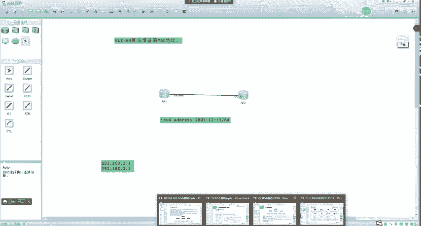

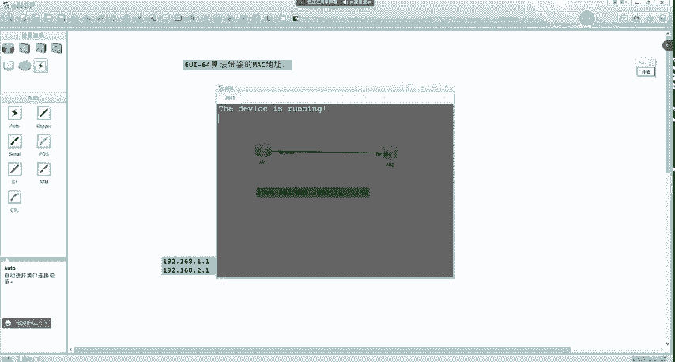

比如说我在AR一上呢。改一下名字。开启IPU6功能在G0-0杠0接口IP6 enable IPP6dress2001冒号12冒号冒号是吧，我现在杠64。啊，64啊。没有事。对不对？

我有没有配置接口ID呢？没有，因为我后面直接用了一个双码号啊，我告诉你前缀是64的长度，然后后面我敲个UY64。😡，敲完之后呢，dispplayIPV6interfaceG0-0-0。

我们发现呢他自己去产生了1个IPU6地址。对不对？后面的是网段。

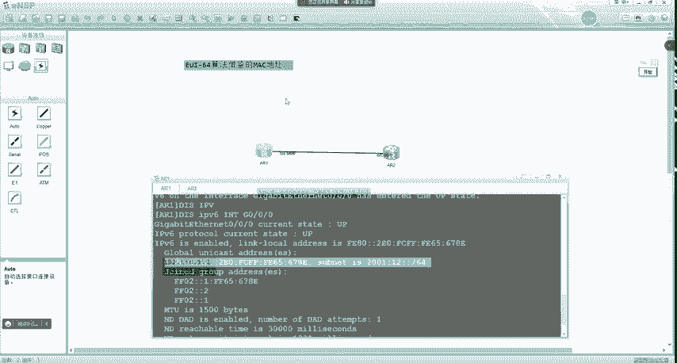

是吧这是我所在的资网，那这是我产生的IPU地址。我让他通过UI64的方式去。对吧好多同学一看到老师这也不是单纯的卖个地址啊。对不对？那这到底是什么呢？是吧，或者说它怎么产生的呢？我们来看一下啊。😡。

他是这么去产生的。😡，那首先呢我们去根据mac地址对接口的麦ike地址产生IPU6接口ID。那比如说我有1个48比特的卖地址。是吧卖地里一共占了48笔的。这时候怎么办呢？把它打开，全部打开啊。

注意写成二进制。把第七比特取反，什么叫做取反呢？😡，一取一啊，一取00取1那么？反正你甭管它是什么啊，就是反过来的一呢就给你转成零，零呢就给你转成一。所以说把第七比特取反。比如说在这里我们的。3C是吧。

三等于0011，C呢等于11。有。零。是吧C是等于这样吗？啊，不对，C等于11。00。对不对？C等于1100啊。对，没错。😡，是吧那么在这时候注意啊，把第七笔的取反零就被转换成了一。转换成了一之后。

这一段啊加上这一段是吧，好像没什么变化了，这还是48比特是吧？😡，而我EI64是什么意思呢？啊让它产生64比特的接口ID部分注意啊，只能是64比特。得到吗？啊，多了他就不行了。那现在注意。

我们只有48比特的麦克地址，虽然我转了以比特取反了，但是它的长度依然是没有变的。😡，那这时候怎么办呢？😡，那还会在m克地址。中间劈开啊，什么叫做中间劈开呢？这一半这一半是吧，从这里劈开。

别该插入FFFF1。做啊。就是从中间这一半插入3个F1个E3个F是111111111111对吧？E等于1110。那这时候有没有48比特？有没有？有吧啊不是有没有64比特啊。😡，对吧这个没什么讲究啊。😡。

这个没讲究吧，这就规定好吧。😡，那在这时候呢，我们再去把它写成IPU6地址的格式。0011转换成3对吧？1110。转换成一1101啊，就把它写成IP6地址的形式。那么这个接口ID就得出来了，是吧。

这就是64比的接口ID部分。那这时候呢我们可以通过。

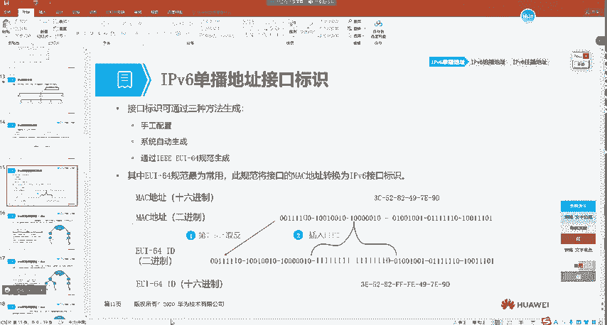

咱们的实验是吧，去看一下。比如说现在在AR一上的display。interfaceG0-0杠0。我们可以去看到呢他的卖地址。

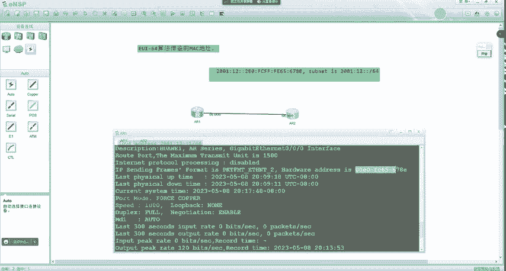

是这么一段。是吧。是不是这么一段？对不对？那这说我想根据麦克地址得到IP6地址怎么办呢？就按照我们所说的第一笔第一步。第七。比特取反。是吧你就去算呗。第七比特这等于0000。零零零零。

1234567在这开取一。取一之后等于多少？这还是零，这是2是吧？后面的依然保持不变。呃，咱们等于021。0杠FC。65-6781。对不对？然后进行第二步。第二步呢，在中间。插入。FFF1。对。

然后我们就插。0210。杠FC。然后。FFFE。然后是65。然后杠。686781。对不对？然后再去把它写成IPU6地址的形式。而对于我们所见到的IP6地址呢，那它是每4个16进制数为一个段。

就等于0210缩写等于210。有没有？FCFF。FCFF。FE65。FE65。对不对？6781。6781。能不能得到啊？是不是可以啊？对吧这就是我们所看到的UIU啊，说着比较高端，实际上是很简单的。

对不对？那这时候大家可能有一个问题，那有个什么样的问题呢？于老师。😊，如果我的前缀不是64比特呢？对不对啊？因为我们叫UI64，为什么叫做UI64呢？它只能产生64比特的接口ID。😡。

是吧那如果我的前缀是杠96的怎么办呢？对不对啊，这时候可能大家有这个疑问。是吧这里我给大家说一下啊。😊，就是如果。Yeah。前缀或者说。如果。接口ID部分。大于了。

64比特首先说大于了64比特接口ID部分大于64比，而我们只能产生64比特的。对不对？那么。江会。使用。0进行补充。什么意思呢？比如说我现在有个2001冒号1样是吧，冒号冒号。杠嗯比如说36。是吧。

128减去36。嗯，这是2呃，然后这是。是啥。哎，92是吧，还剩92比特。那这时候呢，我们会把这一段填到后64比特中。而中间的那一段就是36到92之间。啊，不对啊，36到64之间。

因为后64比特它是我们产生的接口ID部分嘛，而在这一段会使用零来进行填充。所以大家注意啊，对用零凑数。但是如果接口ID部分。小于了64比特。那么则无法进行配置。对啊，这个你要配了，他会给你报错。

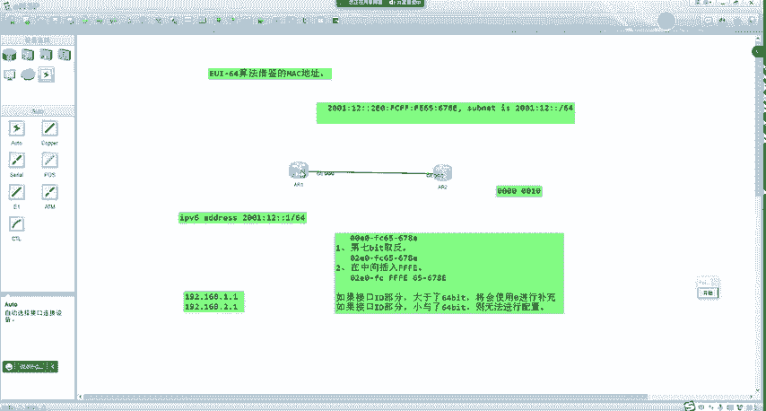

华为是这样啊，思科并不是那思科的这个处理规则，我就不给大家说了啊，但是大家知道华为的会报错啊，比如说我IPUdress2001冒号12。😊，我配个2002的。2002马号一样码好码好嗯。

比如说就30啊UI64，第一次IPV6。interfaceG0-000。你发现啊中间的有没有用零填充啊？有没有啊，就是后64比特接口ID。对不对？那中间的这一段呢依是用零填充。那有人问老师。

他跟上面一样，你怎么知道用零啊，那他杠30，他不用零填充是吧？那他能用什么呢？😡，对不对？他用一你就能看到了，因为只有用零才可以缩写。😡，能明白吧？

那如果你是IQ6dress2003冒号12冒号冒号对吧？杠90UI64。啊不对？90啊，EUI64，他给你报错是吧？他跟你说你的接口ID呢不足64啊，不让你配。😡，能不能明白？明白的同学敲一啊。

这里没问题吧。😡。

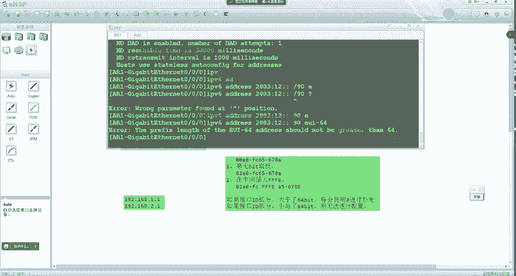

嗯。嗯。那接下来要给大家说的是什么呢？嗯，就是注意我们来想一下这种唉，老师他会不会有什么缺陷呢？他觉得会不会？会有对啊，实际上是会有的，为什么会有呢？比如说我知道了你的IP6地址。

因为大家都是用了统一的算法，我知道你的地址，我能不能反推你的麦克。😡，能不能可以，对不对？有什么不行的呢？那我知道你的麦克了，我也可以反推你的IP地址。😡，对吧。那也就是说呢，他是可以进行反推的。

对不对？有IP能推麦克啊，有麦克呢就能推出来IP。对不对？那么他就会存在一定的安全隐患。是吧那这时候怎么办呢？注意啊。😡，所以还有一些系统注意。

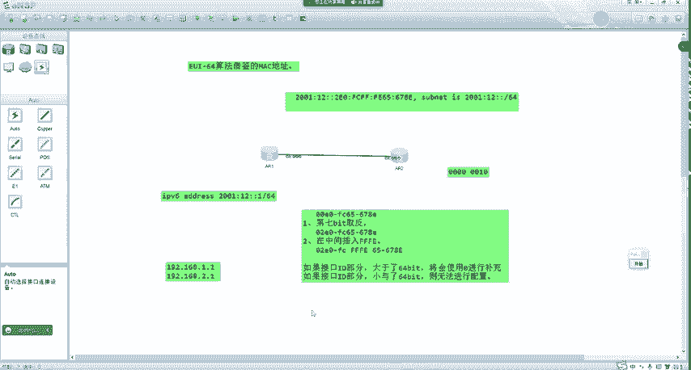

那还会有一些操作系统，它呢会自己有一个私有的算法。注意有些操作系统呢，它是存在自己的私有算法。也就是说你配了之后呢，它自己去产生啊，但是他不按照UI64的方式产生，它有自己的算法啊。

比如说我乘以2乘以3乘以4。

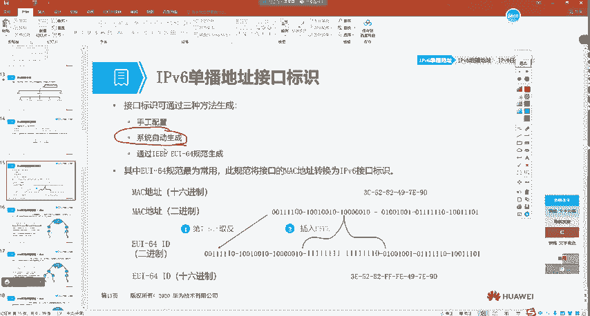

对吧或者我根据你的麦克地址呢，我不插入FFFE啊，我插其他的，而且我不在中间24插，我这插一个，这插一个这差一比特，这插一比特。😡，大家能明白吗？明白同学敲一啊。

所以说啊注意UI64只是一种规范的算法啊，但是呢不要求操作系统在产生地址的时候，非要用这一个。😡，那大家觉得为什么？😡，对吧有人就问了，老师这的规范他不应该就用这一个吗？是不是？

而我们去想一下IPV6地址，只要它产生的时候能够避免冲突就好了。😡，对不对？我们在不在乎他是什么算法，实际上不在乎。😡，就跟你在你们公司一样。😡，你在你们公司，你老板让你配IP6地址是吧。

你非按照13579去配。😡，对不对？那你直接12345去配。那这两种有没有什么区别啊，没有什么区别。😡，对不对？你只要配的没有冲突，他能够上网，那你的活就是干好了。而且你可以没有任何规律，对吧？用到9。

我今天给他用个101。是吧啊，明天用个200。对不对。后天给他用个87啊，88。对不对？所以说具体它是什么规则，我们并不需要去关注，对不对？我们只需要能够保证的它是唯一就可以了。

那厂商之间也有可能是存在自己私有的算法。这里大家知道啊，但是这个算法呢嗯我们没有办法去公开，对吧？因为我也不知道啊，为什么我不知道呢？是因为厂商一旦公开啊，那它就有安全隐患。

所以说在这里呢只能叫系统系统自动生成，啊，就告诉大家有这么一种方式啊，但是它是怎么产生的呢？我们就不而为知道，这里大家明白了吗？明白同学敲一啊，都没问题吧。😡。

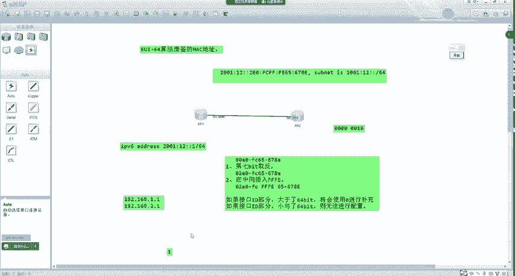

Yeah。哦，对，没错，而且它是唯一的，就你通过算法去产生。是吧。然后我们来看啊，那单波地址的结构我们已经讲完了是吧？但是单波地址呢有很多种类型。😊，是不是啊刚我们只是学的单薄地理的结构啊啊。

就老师他有。接口前缀是吧啊，有网络前缀加接口ID组成单薄地址，我知道它结构了。啊，不就是嗯这个这这这叫啥来着？网络号加主机位嘛？😊，对吧那单薄地址呢也有很多的分类。那这些分类虽然采用了同一种结构。

但是它们的作用是不一样的这就相当于我们在学IPV4的时候是吧？我觉的有公网地址，有私网地址。对不对啊？除了这些地址呢，你还学到了广播地址对吧？A类B类、C类、D类、E类。😊，是不是啊？

那我们在学习IP6的时候呢，也要去学习这些地址的分类。

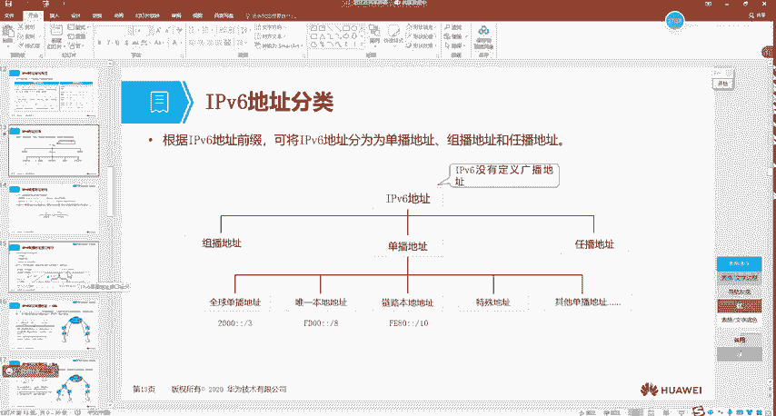

接下来我们首先看的单波地址结构了解之后呢，我首先说的单波地址，第一种啊叫做全球单波地址。对啊，我们也把它叫做GUA啊，叫做GUA啊，就global啊，这是uncast。啊，这就ADD是吧？

那这个呢叫做全球单波地址。它在我们的IPV4中呢。类似于公网地址一样。是吧老师一听GUA什么叫做全球弹幕地址啊？老师不懂，对不对？你只需要把它想象成跟IPS对等的公网地址，那一下子就可以非常明白。😊。

是吧。那这个地址呢，它是有格式的啊，为什么会有格式呢？我来给大家讲一下。😡，首先我们来思考一下地址为什么要分类。为什么要分类呢？😡，因为IPU6地址的空间太多了，我都不知道怎么用，对吧？

IPV4给你32个亿个32亿个地址，你是不是也不知道怎么用啊？😡，能不能明白？是不是现在给你一个亿啊，你都不知道怎么花老师我是买车还是买房呢？买车买房也花不完。😡，是吧你一时间你都不知道怎么花。

你只能看别人是吧？😡，哎，那家有个富二代，他买啥我买啥，对不对？所以说呢在我们使用IPU6的时候，也面临一样的问题。什么样的问题呢？就是突然就富有起来了。😡，对不对？大家能明白吧？因为以前过得特别紧巴。

突然我就富起来了，我就不知道这个钱花到哪个地方，是吧，不知道如何去利用它，对不对？😡，所以说在我们的IPV6中也是一样，以前你用IPV4用习惯了，那32个亿个是吧，用的非常紧。

杠30的是不是设备互联杠30，对不对？一下子我就富有起来了，富有起来之后，我的地址非常多。但是呢。😡，一时间还不知道怎么样去用，对不对？所以说呢IPV6在推出来的时候啊，也考虑到了这种问题。

对啊也考虑到这种问题。😡，所以说呢对于IP6的单波地址，我们是有结构的。这个结构呢只是建议你去这么做。😡，什么叫做建议你去这么做呢？比如说突然给你一个亿，你突然富有起来了，建议你是吧，先给自己置办一下。

😡，呃，自己的这个呃先给自己买套房子对吧？啊，有个地方住能不能明白啊。对，没错，类似于专家建议是吧？啊，然后呢。😊，对不对啊？去相相亲吧，年龄也不小了，那么马上30多了。😡，对不对？

然后你再怎么样怎么样。😡，对不对啊，孝敬父母怎么样，对不对？那这是一种建议，能不能明白？那IPV6也是一样。我们突然有了这么多IPV6地址，怎么样去用呢？我们也有一种建议，那不是说让你随便去用是吧？

也有这么这么一种建议。那这个建议是这样的啊，就是我们首先呢把这种地址呢分成了不同的结构。😡，啥意思呢？也就是说他的不同比特啊，干不同的事。😡，是这么一个。那是怎么样来进行分的呢？我们来看一下啊。😡。

首先呢所有的单薄地址，各位同学要注意。😡，他的前三个比特都是001。注意啊。单薄地址是从001开始分的，前三个比特，这是固定的，都是001啊，没有其他的意外。对啊。然后紧跟着后面这45比特。嗯。

对吧我先说简单的，最后这64比特啊，我们就建议他直接做接口ID。😡，能不能明白？好吧。😡，有时间最后64比特接口ID。但是我们来想一下啊，哎这64比特做接口ID它比整个IPV4地址的空间都要多吧。😊。

是不是啊？有没有这么感觉啊？😡，啊，老师是吧IPS4全部就32个比特，那你一个一个段64个比特。对吧啊，但是比较浪费啊嗯但是IPU6中并不怕浪费。所以这里大家知道啊。那建议呢后64比特。

你们就做接口ID。😡，那。😡，这45比特是什么意思呢？我们把它叫做全球路由前缀。你可以呢分给一个组织啊，或者说机构。那这个组织或者机构呢，大家可以理解成是公司啊，是单位。什么意思呢？就是这45比特呢。

我在全球范围内进行分是吧？比如说现在有个公司找我买地址了是吧？买P6我就卖你一个段。😡，能不能明白卖给你的是这48比特。😡，而后面呢你可以自己去用。而我们建议在使用的时候呢。

就是建议你最后64比特做接口ID是吧？而你中间这16比特，因为我卖给你48比特是固定的前缀吧，你有64比特接口ID那还有16比特啊，因为我一共128。😡，是吧那这16比特怎么办呢？啊。

我们建议呢你自己内部做子网划分。😡，所以这就是IPU6在分配的时候的一种建议。对吧那怎么样怎网划分呢？呃，比如说是吧你是美国海豹突击队，对吧？嗯，俄罗斯分队对不对？那你这十6比特呢啊你就用0001。😊。

是不是啊？啊，你是纽约分队啊，你就有0002。对吧啊，你是日本分队呢，你就用0003啊，就类似于这种对吧？你自己内部呢可以做子网划分，对吧？根据自己的组织架构去划。所以这里大家明白了吗？

但是这种呢大家要注意这叫什么啊？😡，我们所看到这格式是什么？是建议，能不能明白，这就相当于我把你的一生给你画出来。我告诉你啊，你在20岁的时候啊嗯。😡，应该好好的是吧呃。对不对？专家建一对吧。

我在你在20岁的时候啊，应该好好的工作。😊，对不对？嗯，认真的工作对吧？20岁不要想挣多少钱，对吧？嗯，哪怕给公司拿钱，你也要进行工作。😊，对不对？20岁的时候成长是非常重要的，专家建议。

那在你30岁的时候啊，你就要去考虑一下啊，能够养活自己，对不对？啊，你要能够开始有自立的能力。😡，对不对啊，那在你40岁的时候啊。😡，呃，就建议你呢这时候要开始对吧？因为你现在压力很大啊。

上有老下有小是吧？在哄公司里好好干是吧？好好打工。😊，能不明白啊，60岁的时候啊，马上要退休了，是吧？再好好的干几年。😊，对不对啊，70岁的时候啊啊。😊，大家能明白吧？就是类似于这么一种。

就是虽然我给这个IPU6地址呢，它的每个比特做了一些使用的建议，但是我们不这么用行不行，大家觉得行不行？😡，可以吧，完全是可以的，能懂吗？比如说我去买地址吧，老师，我买个IPU6地址。

运营商他非要卖给我64比特，但是我不想要，我就要个杠128的是吧？或者说用个杠127的行不行呢？也可以，大家能不能明白，虽然这只是一种分配上的建议，对吧？但是呢真正在卖的时候啊，你想买多少就是多是吧？

客户是场。😡，能不能明白对吧？这就相当于我给你的人生有不同的规划。但是呢你可以不按照这样去执行。😡，但是建议啊依然是存在的。是吧因为有很多啊人比较迷茫，是吧？所以这里大家明白了吗？明白的同学敲一啊。

都没问题吧。😡，好吧，这就是我们所说的全球单薄地址。那么第二种呢，我们把它叫做注意啊，ULAULA叫什么呢？叫做唯一本地地址。所以。那这里有很多同学疑号了，老师哎，一唯一本地地址它是什么呢？嗯。

但是大家要去看啊，它有这么一个特征，在IPV6的公网不可被路由，不能直接访问公网。😡，这是什么地址呢？如果我们换到IPV4中。😡，是吧它就类似于IP4的私网地址一样。😡，能不能明白？

首先它的功能特点大家要明白啊，它跟IPV4的私有地址是一样的，就是你原地址为唯一本地地址的包，你发到公网上啊，没有录音，没有这种录音表。😡，对不对？那但是为什么还要叫唯一本地地址呢？注意啊。😡。

那唯一本地地址是这样的。那一般在什么时候使用，我来给大家说。比如说。嗯，在一些比较重要的科研场景下，我们是不要访问公网。对不对？在一些国家安全的领域，对吧？或者说军事上的一些。

那这种网络我们肯定不希望去访问公网是吧？因为它存在了太多的不安全的隐患。但是我们又希望呢能够进行IP的通讯。那这时候怎么办呢？我们就可以去使用唯一本地地址。对不对？那这个唯一本地地址怎么样去得到呢？

首先大家注意啊，唯一本地地址它使用的地址空间前缀是FC00冒号冒号7，啥意思呢？😡，FC00冒号冒号7就是前7比特固定啊，后面7比特，无论你怎么变，你都属于唯一本地地址。😡，那这里我来给大家举个例子。

😡，比如说192。18。1。0-24，它里面有哪些地址呢？我192。168。1。0-25。还有192。168。1。128-25来告诉我这个1。0包含的地址范围跟下面这两段一不一样。因为一样。不一样。

再好好看看有不一样。😡，为啥不一样？这是1。0到这是1到127吧。😡，嗯。是吧。哎都忘了啊。😡，那下面是不是128到255啊？😡，是不是啊一样的没什么不一样啊，一样的啊老师是一样的，对不对？

那我们来考虑一下。😡，FC。00冒哈冒哈7。能不能分为两个杠8的段？他告诉我能不能分为两个-8的段。😡，可以吧。行不行？F1111C。有。C是多少101。啊，1100。是吧。对，然后前期比特固定嘛。

你后面这一比特你可以自己编啊，对吧？完全是可以分为两个杠8字的。😡。

对不对？然后我们来看那这个曼号曼号杠7呢，目前使用到了一个叫做FD00冒号曼号杠8。

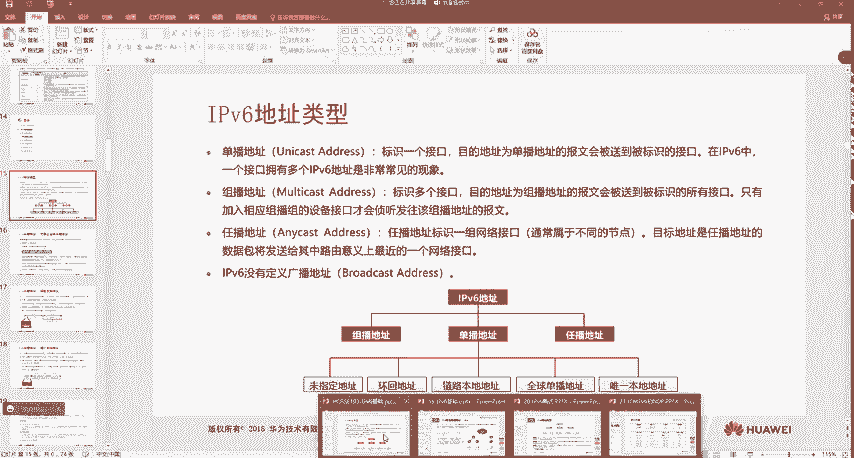

而FC00马哈马哈杠8没有被使用。大家能不能明白吗？什么是吧老师FD00从哪来的那这时候我们来看一下。😊，前七比特固定，如果把这个转换成一等不等于D。注意啊，前期比特固定，那这一个比特就没有管呗。

这期比特如果等于0，那就是多少？FC00冒号冒号8。对呀，就这个段能不能分为FC。零零八号八号八。可以吧，然后1111。11。01。这里是1111。幺幺。00。对吧下面这一个是不是FD啊。

你把这个转换过来，不就是D吗？FD00冒号冒号杠8。😊，这跟这个例子一不一样的道理啊。一样的对不对啊，有些同学可能会蒙一点，为什么会蒙呢？就是因为你对IPU6不熟。😡，你刚开始学IP4，你看到这俩。

你也懵逼。😡，是吧而刚25的啥回事？你刚开始学的时候，你肯定也懵。但是未来IPU6搞熟之后，你就能够看明白了。😡，所以说这里要告诉给大家的就是FC002号27，它可以划分成这两个-8的段。

那这两个杠8的段呢，目前FD008号2号杠8是被使用的。而FC008航2-8现在没有被使用。这里大家明白了吗？明白同学敲一啊，都没问题吧。😡，可以是吧？好，那我们就继续来说。是吧那现在老师我知道了。

FD00冒号冒号杠8是吧？它是用于IPU6的私网地址啊，叫做唯一本地地址，那本地老师我可以理解是吧？因为我不需要跟外部进行通讯，所以我们把它叫做本地地址，那这个唯一是什么样的呢？注意啊。😡。

这种地址的唯一它从哪来的呢？是这么来的，就是它有自己的一种算法，对意啊，就是它通过随机产生，但是冲突率更很低。😡，为什么叫很低呢？也不是说啊就是它有冲突率啊，但是呢很低。这里大家明白吗？冲突率是很低的。

但是它有可能会冲突。😡，所以我们把它叫做唯一唯一是什么意思呢？就是它很难产生冲突，基本就是唯一的他有自己的一套算法去产生。那这个算法是什么样的呢？😡。

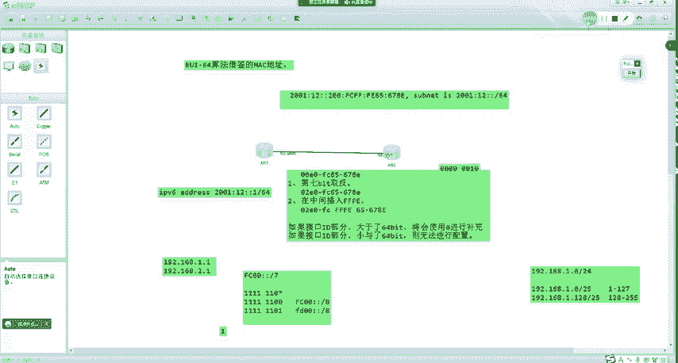

嗯，我找找啊。我之前应该有记录。你在这。

He。嗯。他有一套算法。

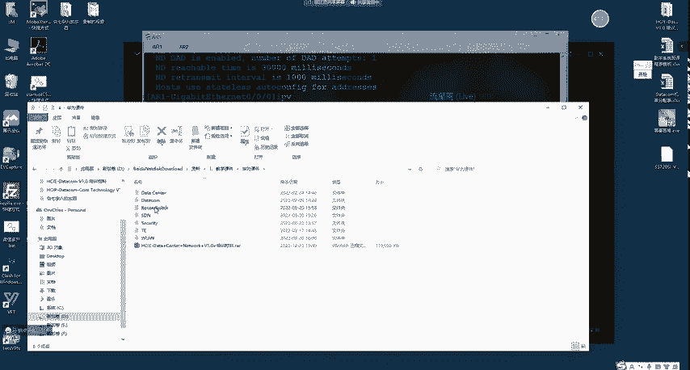

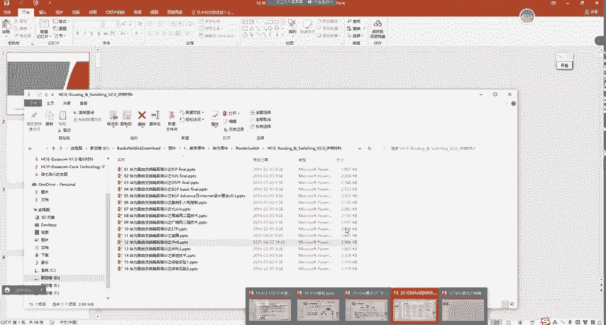

🤧嗯。

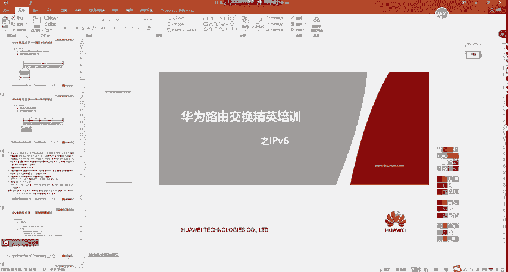

在这儿啊注意。呃，是这样的，就是。呃，在这个RFC4193中啊，有一种算法，就你去申请的时候呢，这唯一本地地址是你需要去申请的啊。然后他会给你分配一个。嗯。啊，就是他要给你分配一个前缀。

对吧这前缀长什么样子呢？我来看啊。😊，首先前巴比特是固定的对吧？FD00。然后后64比特呢，你自己做接口ID中间16比特，你做子网划分是吧？然后这40B440个比特呢，通过伪随机的方式产生。

大家告诉我这40个比特有多少啊。😡，32比特等于42亿，42亿乘以2乘以2乘以2乘以2乘以2，反正乘8个2够不够你用的？够唔够啊。这是84页。这是160多亿，这是200多亿是，这是400多亿。

这是800多亿，这1000多亿，这还没有乘完啊，你得乘bug，这123456。对不对？反正绝对是够你使用的。然后我们来看啊。😊，那。再去。就是他在分配的时候是怎么样保持唯一的呢？

就是首先它会获得1个64匹特的NTP格式的时间啊，这里大家可以认为NTP大家可能有同学没接触过啊，你又认为它首先获取当前这一刻，对啊？就NTP的时间精确度是非常高的啊，它可以到微秒啊，甚至到纳秒。😊。

对吧然后他首先会获取当前的时间。那这个时间我们已经不能用时间来说了。😡，哎，我们可以说这一时刻是吧，或者说这一瞬间。啊，是非常刹那之间的是吧？然后呢，他会再去选择一个对不意啊？😡。

本地的UY64标志符如果没有的话，会找到一个合适的唯一标识符。比如说系统序列号。那也就是说，无论他选择的是什么样的标识符，那么现在能不能证明证明的叫什么呢？我注意啊。😡，这一时间。

的你你告诉我是不是唯一的时间加你是不是唯一的是。😡，对吧。那之前有同学说是吧，我让他去写作业啊，他说让明天都我写。😡，是吧啊这种一下子把我哄骗过去了，哎给把老师也绕过去了，让明天呢我写去，让他写去。

对不对？那如果说这一刻加上你，你告诉我他是不是唯一的你。😡，是不是啊？对吧大家仔细要体会这种感觉啊，是吧？你说十年前我怎么样是吧？那十年前的你跟现在的你能不能唯一标识你不能是吧？

我说你那我说的可能是10年前的你，对不对？但是如果我加上时间有没有把你固定住，就是这一刻的你绝对是唯一的，因为你是唯一的，而且这一刻我把时间你也考虑到进去，是吧？这一刻的你一定是唯一的。😡，对不对？

然后把时间跟唯一的标识符组合到一起去创建一个密钥。那这个密钥呢注意啊，它是按照SHA啊，大家可以理解成是一种哈希算法。就是用哈希算法把时间给唯一标识符去计算1个160比特的标记。那基于哈希这种特征。

哈希有雪崩效应，只要有一点不一样，那就全部不一样。那大家告诉我这个哈希值是不是唯一的。😡，是不是？一定是唯一的。这一时刻的你是吧，比如说这一秒的你跟下一秒的你，你俩的时间不一样，哈希值就绝对不一样。😡。

是吧。然后选择最后40比4比特啊，40比特作为全局ID部分。那也就是说。这40个比特能不能保持它的唯一性？拿不拿？可以吧。是吧可以啊，老师有人就干了，老说那还有哈希冲突呢，对吧？这俩人时间不一样。

对不对？但是他们的哈希结果也一样啊，这叫哈希冲突。老师啊，所以注意啊，所以叫做冲突概率很低。😊，能不能明白？好吧，所以说叫冲突概率很低啊。😡，但是有没有可能会冲突啊，有这种可能。但是即使有这种可能。

两个私网会通讯吗？😡，会不会啊？😡，好去话。对不对？你不点不会通讯，那我们现在的IPV4，我用一点1，你用1。1，咱俩不一样的吗？😡，有没有问题啊？没有，我只是尽可能的保证它的唯一性是吧？

但是即使你有了冲突也没事，能不能明白这意思啊？😡，所以是这么一种啊。😡，那这个地址呢，大家可以去申请啊，咱们可以有同学去申请。😊，呃，在这里呢我有一个网站啊啊在这里有一个网站。嗯，大家可以去申请啊。

属于你自己的啊唯一本地地址。哎。你要钱不我没申请过啊。😡，就有这么一个网站可以去申请。😡。

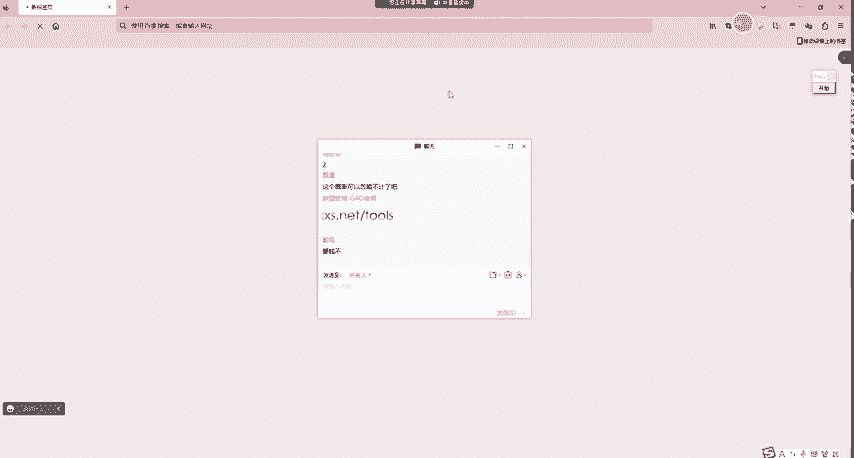

啊，这是我之前在百度上找到的。呃，但是要不要钱呢，还不好说啊，老师没有去申请过啊。😊，啊，大家可以去看到啊，就有这么1个FC4193的一种啊注册方式是吧？唯一本地地址。嗯，是吧可能要填一些信息啊啊。

你的邮箱啥的。😊，是吧告诉大家有这个网站啊啊，那这个网站呢，它跟INA有什么关系呢？啊，我也没有去深入调查过这里只能这么给大家说一下啊啊，但是可能是这个组织是吧？啊，组织的领导有个小舅子。😡，呃。

无所事事，对不对？呃，所以呢就给他找了个事儿干。😊，大家能明白吧？😡，是吧啊在我们这个中国的社会上这种就很常见，对不对？所以说这个网站呢，它跟INA这个组织有没有什么关系呢？我没有去了解过啊，嗯。

就是给大家说有这么一个网站是吧？你们可以去看看啊。😊。

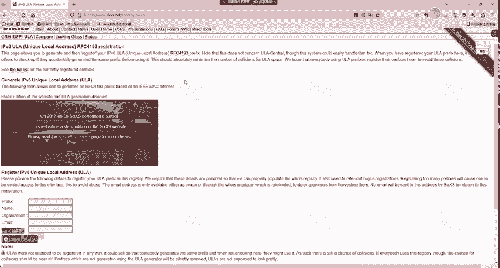

呃，行，这是咱们所说的唯一本地地址啊，这里大家都明白了吗？明白同学敲一。都冇问题吧。好。那接下来我们就继续来说啊，尾随机是他那个算法，咱不用到了一种SHA吗？😊，那了吧。就SHA，它不是一种哈希算法吗？

哈希一哈希2哈希3嘛。😡。

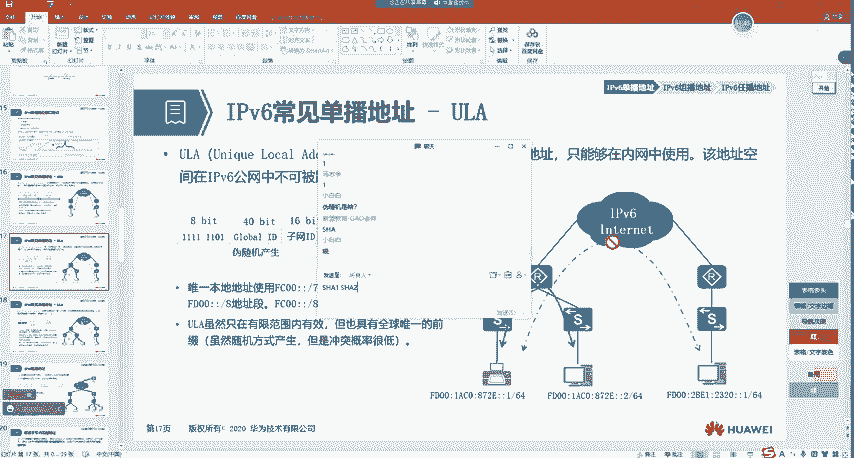

嗯。好嘛。然后我们来看啊，那还有一种地址是我们未来用到比较多的，而且在咱们的学习过程中也是比较重要的。这种地址呢我们把它叫做LLA。😊，叫做链路本地地址。对啊，叫做链路本地地址啊。

叫linkloc address对吧？那这种地址是干什么的呢？嗯它的优势就非常多啊，它是IPV6中一种新的概念。我们刚刚学到是吧，老师GUA啊是吧嗯。😊，ULA啊对不对？在IPU4中都有对应的概念啊。

有公网，有私网对应的是吧？在IPU6中提出了一种新的。Yeah。地址概念。他叫做LV，叫做。链路。Okay。本地地址。那这个地址的优势是非常明显的。首先我来慢慢的给大家讲。那他的一第一个好处呢叫做使得。

具有IPV6功能的节点。天然具备IPV6的。通讯能力。注意啊，这做使得具有IPU6功能的节点，天然具备IPU6的通讯能力。那这个是什么意思呢？我们来想一下。😊，有同学知道169。254。0。

0这个地址吗？嗯。点差点叉。有同学请我吧。😡，肯定有同学见过。是吧。啊，当然可能还有同学没见过是吧？呃，我给大家说一下啊，就是比如说你的你的这个电脑啊啊没有获取到地址的时候，对他会自己给自己配一个。😊。

啊，配1个169。254的地址。但是大家注意啊。没啊。呃，如果有做过无线项目的同学。我给大家说一下啊。呃，大家会去发现啊，比如说我的无线AP对不对？现在我要去管理它，对不对啊。

或者说呢我想通过外部去登录它。比如说你是个胖一批啊，但是他没有任何抗口。😡，啊，你怎么样去登录呢？那网线也在用着，它会有一个管理的SSID。是吧这管理的SSID呢。

它有一个名字是有规范的啊啊一般是叫做华为。呃，杠manage。然后后面是加上了自己的。这个卖ike地址的后四位啊。对，没错，我就打个1234。我随便打一个啊。但是大家注意啊，如果这个AP你没有去配了。

就是首先这个华为manage这个无线你能不能连上呢？可以。但是呢你获取不到地址，获取不到地址的原因是什么呢？就是你没有配啊。😡，是吧。对不对？就是你没有配，那这时候怎么办呢？我来告诉给大家。

比如说现在你就有这么1个AP在这里这医生。😡，是吧啊，他就一个网口已经用上了。😡，一。是不是或者说你都没网线，老师，我这就一个无线AP。😡，对不对？但是我想登录这个AP。处有所网管。对不对？

但是现在呢我又没有。😡，网线。是吧但是无线呢提供了一种管理SSID就他默认的啊。😡，那默认的话，它会发送一个信号，叫做华为manage后面加上mike地址的后4位。所以说你根据麦ike地址呢。

可以是找到是哪个AP的。😊，那找到之后怎么办呢？😡，你就可以连接这个无线。打开你无线的wifi列表。是吧。啊，他就会有这么一个，我看我现在有没有啊。大家能看到吗？能不能看到华为manage啊1820。

看同学敲一啊，能看到吧。😊，可以是吧。对不对？那现在你连上它之后呢。😡，你要不要跟他在一个网段，肯定有是吧？但是这个AP空配啊，没有DHCP。😡，怎么办呢？你可以给你的电脑配个169。54。

是吧哎有的同学问，老师169。254还能用啊，注意啊，这个AP呢默认是169。254是1。1还是0。1，我记不太清了啊，就是它默认会有这么一个地址，就是他AP获得不到地址时候，他默认就有这么一个。

然后你可以给自己电脑上配个169。254，能不能外边登录它。😡，能不能啊就可以了，为什么可以呢？因为169。254，这个地址可以在链路上进行通讯。😡，能不能明白明白的同学敲一啊，它可以在链路上进通讯。

也就是说广播域内可以，但是跨网段不行。😡，对不对？那IPV6中的LLA地址叫做linkloc地址，它就有这么一个功能。就是我没配IP6的GOA地址。😡，是吧。我也可以开这个东西。

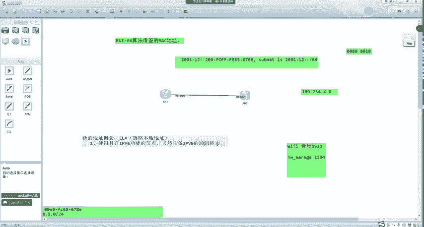

能不能明白？比如说我在AI一上注意啊。😡。

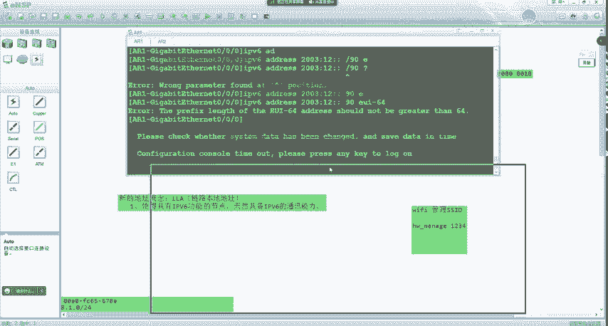

哎异场我怎么办呢？AR2我刚刚啥也没配是吧？我们来配AR2啊。😡，Sysister name AR。对啊。IPU6功能开启interfaceG0-0-0IPV6。

Enable IP6 dress凹 to link local。让他自己去产生一个linkloc地址。display IPP6interface G0-000。我来看有没有全球担保地址。有没有？没有吧。

有一个链入本地地址。对不对啊？那有了链路本地地址，我在AIE上注意啊interfaceG0-0-0。😊，AR1上呢，我把IPU的地址全删了，安度IPU6要拽死。暗度啊应该全删了。在A2一上呢。

IP6 enable。啊。IP6dress奥 to link logo。现在我有没有去买地址呢？没有是吧，老是买不起地址，但是我还想通往多登通讯，对吧？跟室友打个撸啊撸。😡，对不对？哎，现在有。

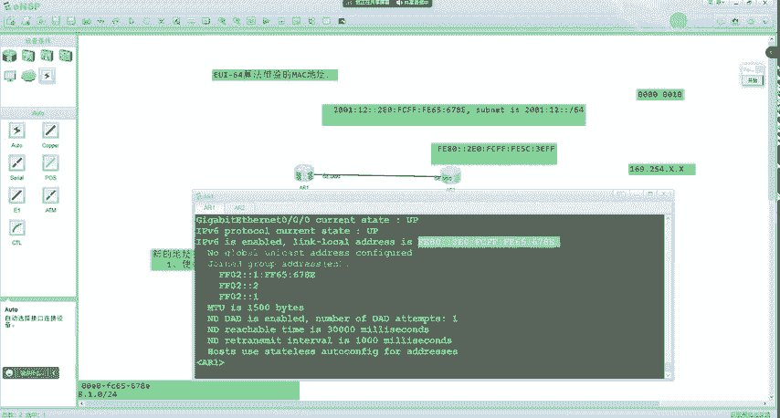

对不对？已经有俩地址了，这是你的电脑对吧？这是你好兄弟的电脑是吧？你俩连到一起就可以打红啊，对，打红警。😊。

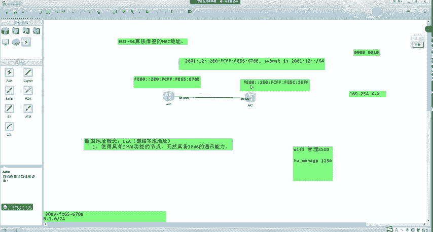

是吧那在这时候怎么办呢？注意啊。😊，7。IPV6对要要加个杠IPU6啊。PIPV6。是，然后。把这个地址给他贴过来。我现在在一上去骗2。啊，然后杠I指定出接口，为什么指定出接口呢？

因为它只在广播域内有效。然后G0-0-0-0能不能通啊？嗯。拿不拿？可以吧，但是我有没有给他去配任何购买的地址啊，没有是吧？这只是它的第一个功能啊啊，叫做使具有IPV6功能的节点。😡。

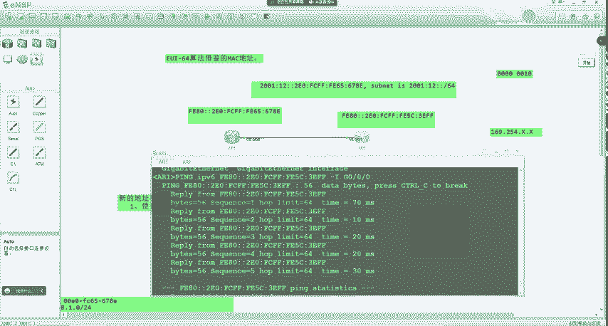

啊，天然具备IP类的通讯能力。嗯，那有人就问了老师，他还有没有其他功能呢？有。注意啊，还是有的。有哪些呢？对啊，我先说一下他的特点。第二个特点呢。路由表的吓一跳。是这个地址。同时呢。

OSPFV3建立邻啊，对，VIRP也是建立邻居的时候。使用的也是这个地址。嗯，那有什么就问老师他关OSPIV3又有什么事啊，是吧？我来给大家看一下，现在我没有配任何买的地址哦。😊。

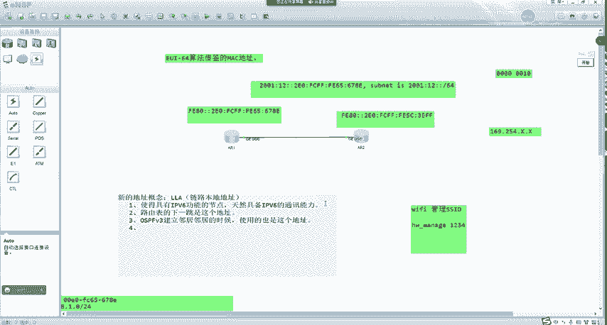

对不对？那大家注意一点，我在A21上怎么办呢？我跑个OSPFV3啊，待会我的配置大家可能看不懂啊，因为有同学还没学过OSPV3。😊，是吧现在大家可以去看一下，我就请个OSPIV3舰场配合入台ID1。1。

啊，然后interface。G0-0-0OSPFV3。对吧一ar0把它通告到OSPIV3里面。2这边呢。几个V3的建程。入台地2。2。2点G0-0-0。OSPFV31arreo0。对吧然后注意啊。

我们现在来E上看一下diplayOSPV3P。能不能嫁邻居啊？谂唔难。可以是吧，现在才突位啊，我们再等一会儿啊，没有bra瑞啊，V3里面就不加bra瑞就能看。😊，你家不瑞服给你报错啊。😡，听到吧。

是吧XR状态是吧，对面是DR。然后现在呢我在二上interface low0IP6dress。IPU6 enable IPPU6dress2001冒号2，冒号冒号2128。好吧。

OSPFV31aral0。然后我们来意义上看邻居建定完了diplayIPV6rootingtable。能不能学到？能不能学到这条路由？可以吧。不仅学到路游，我去拼一下。IP6。能不能骗通啊？可以吧。

但是大家还要注意，我现在OSPV3一直在跑哦。😊，对不对啊，但是大家现在注意我一点，我在A21上呢。😊，Yeah。骗IPU6。对吧嗯，IP6杠C。我多聘几吧啊，骗他1000个啊，然后骗这个地址。

我一个劲的去骗，然后大家注意我在二上二上面怎么办呢？啊，0-0-0。😊，对吧我现在给他配个IP6dress2001冒号12冒号码号2664。邻居有变化吗？没有吧，同学没有中断哦。😡，对不对？大家再注意。

现在AR2呢，我觉得我的地址规划不合理。😡，是吧领导给你提要求了是吧小王啊，咱现在地址用的太浪费了，咱重新规划一下，你自己做就行吧，下班前搞定。😊，对对哎，一个公司呢，20家单位。啊，下班以前我搞定啊。

😊，对不对？那这时候怎么办呢？注意啊。😡，我想把这个地址段换一下，换一下IP6dress2002冒号12冒号冒号264。首先IP6能配多个地址吗？啊，可以。😊，是吧我先把第二个地址给他配上。😊，啊。

你甭管你怎么配，我把之前的给它删除掉行不行？IP6address2001冒号12冒号冒号2。😊，我把这件都删除了吧，删除了，邻居有变化吗？😡，没有吧，但是你想想换到IPV4里面，各位同学好好想一下。😊。

IPV4里面。你要把IPV4地址删了，邻居还有了没？😡，还有没有？😡，没有了。是吧。IPV4里面，你只要删邻居就没有了。IPU6里面你这个GOA地址对吧？无论你怎么样去改。😡，老师。

我IPV62002冒号12冒号冒号2，我把所有的IPU6地址都删了，通讯它都不会中断。能不能明白？明白的同学敲一啊。

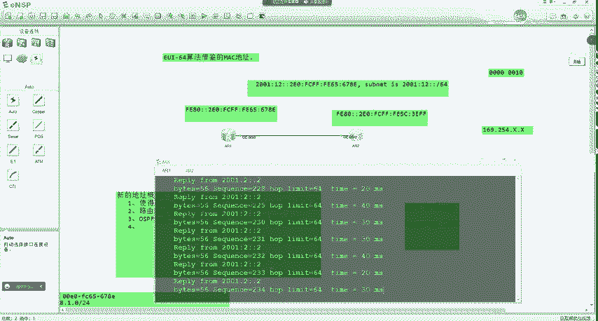

可以吧。那这就是OSPFV3对吧？或者说链路本地地址的好处。那它能够达到的一个效果呢就是。就是这种啊使IPU6功能的节点呢，天然具备IPU6的通讯能力。是吧。而我们来想一下，对，有人问了。

那老师IPV4的169254。😡，他不也是吗？😡，啊，对，他确实是也是。但是大家注意你在这里，即使你配个169。254，这边配个169。254，你只要改低了段。😡，邻居会不会办？会不会？一定是会的。

因为IPV4只能配一个。对不对？在IPU6中呢啊就有这么一种地址。对，那他能够得到的一个好处呢就是。在使用。OSPFV3的时候。啊，或者说呢。再重新。编排IPU6地址规划的时候。对吧那重编制。不会影响。

业务的正常运行。好吧，那这就是链路本地地的优势。但是这种地址在使用的时候啊，依然是有一些特点啊。使用的时候依然是有一些特点。那首先注意啊。对于。普通终端。

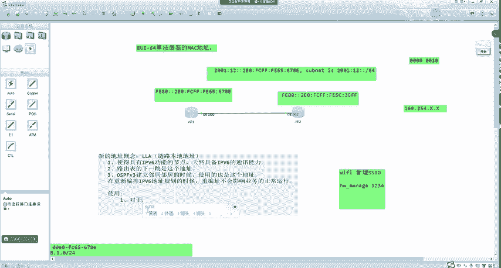

啊，因为大家发现啊，我刚刚是让他怎么产生的？😡，叫做什么凹凸 link local自动产生。

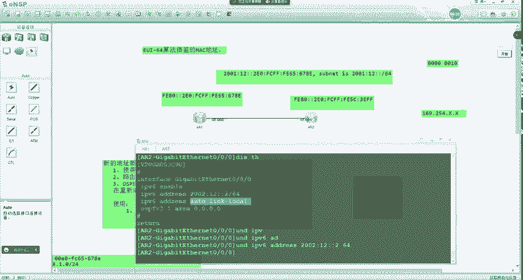

对吧所以说对于普通终端可以使其。自动产生。IPV6自动产生RRAA。对吧但是大家来想一下。对于设备互联地址，因为刚刚给大家说了，他为什么邻居不会中断呢？只要你不动链路本地地址，它就不会断。

因为所有OSPFV3的通讯都是基于这个链路本地地址的。

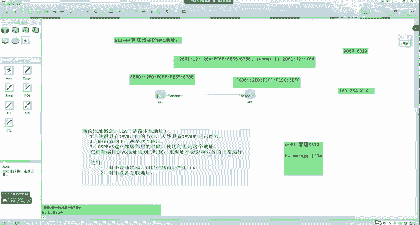

好吧。只要你不动，它就不会短，对不对？但是呢我如果让他自己产生。😡。

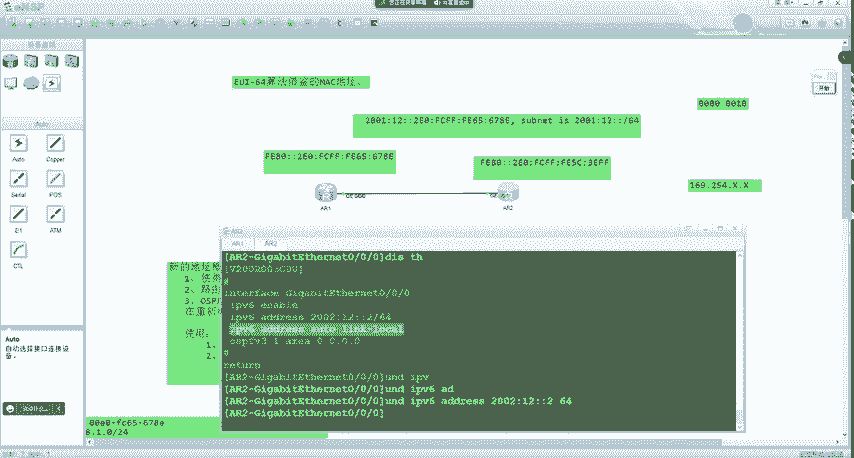

你抓包一看，这什么玩意儿啊？😡，有没有这种感觉？😡，有没有啊你用IPS用习惯了嘛，这一看那么长，对不对？老是这什么玩意儿啊，记不住，我怎么知道哪个地址啊，是吧？那对于设备互联地址的。😡，那么可以手动。

手动配置啊，便于管理。能懂吗？那也就是说链路本地地址呢，我们也是支持手动配置的interface70-0杠0。

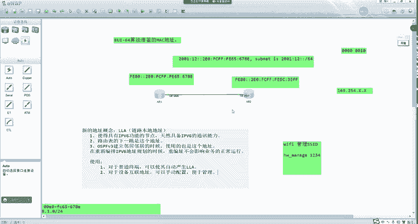

IP6dress对呀。链路本地地址怎么样进行手动配置呢？比如说我2001冒号12，冒号冒号1linkloc是吧，后面有个link logogo嘛，我签。你发现他干什么啊？😡，他给你报错。对不对？

而指定的地址呢不是链路本地地址。是吧大家看这个地址，像我们刚刚说的什么地址？😡。

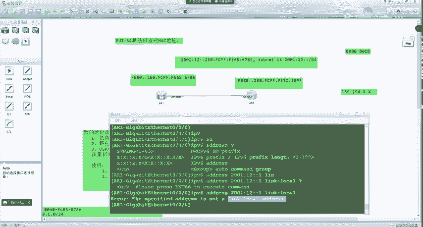

前三比特001向我们说的什么地址？

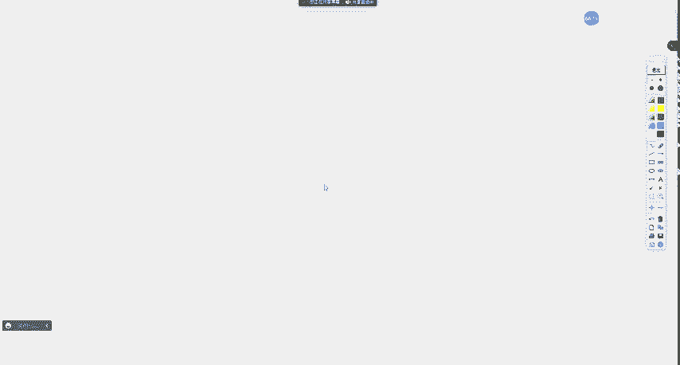

2不就0010吗？签三比特不就001吗？千三比特001。是全球单波地址。对不对？那我给他配全球单播地址，哎，不能做链路本地的是吧？那有人讲，那老师链路本地地址它是什么样的范围呢？对吧我们休息一会儿好吧。

休息10分钟。那么1分钟之后呢，我们来说一下LLA的对吧，范围啊到底是什么样的，对不对？什么样的地址才能算链路本地地址。😊。

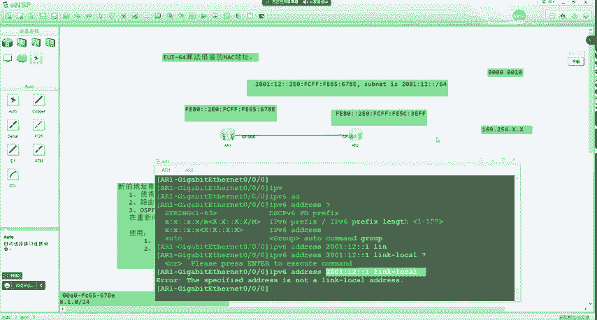

好，那我们休息10分钟啊，咱们到9点20好，同学们，那我们就继续来讲啊。然后这个链路本地地址呃，刚给大家说了，对吧？就是我们会发现呢，在这个接口上呢，我们配一个GA地址上去还不行是吧？啊。

还得必须要是链路本地地址的范围。😊，啊，就像这169。254呢，你前十6比他是固定的。对不对？所以说呢链路本地地的范围它长什么样子呢？它也有自己的范围啊。啊，就跟这个山寨网一样，那每个人都有自己的山头。

我们来看一下啊。😊，呃，链路本地地址呢，它是这样的啊，它的前缀是FE80，冒号冒号10。是吧啊有同学就问了，老师这F180号10，它的范围是什么样的？呃，我们可以去发现啊，无论是我们在学习ULA啊是吧？

呃，还是GUA啊，对吧？呃，还是LLA他们的这个范围呢，我们都是用一个前缀加减码的方式进行表示的。😊，对不对？但是大家要能够计算出来啊。FE80。冒号马号-10。对不对？那这时候就是前十比头固定买。

其他的可以随意编。那前8F等于1111对吧？然后E呢等于1110。对，然后八等于1。000。是吧，然后后面是0000。对，前十比头固定，那也就是说最小是多少？最小就是F180打头吧。是不是啊没错。

但是最大是多少呢？我们来看啊。😊，最小就是FE80这些打头，后面都是零嘛，是吧，我就省略号替代了。然后最大的话我们来看1111是吧，1110是吧，10。对呀，这是前十比特，而后面的都没有要求啊。

后面最大你就取一呗，是吧？这两个比特不是零，就是1。取一之后，然后后面这个呢啊就1111，对不对？然后再后面兜是1啊。这是最大。那最小跟最大就限定了它的范围。对不对？那最小就是FE。80冒号冒号。

是吧后面就是都是零嘛，我就用双排号省略了，到哪里呢？F1注意啊，这是多少？F1。呃，这是8是吧，ABFE。BF。对不对啊？BF哎。BF然后后面呢都是FFFFFF。对吧那这就是链入本地地址的范围。

所以这里大家搞明白了吧？就它的范围你要知道啊怎么样去计算啊，就IPU6，我们刚开始在接触的时候，肯定会觉得比较头疼一点，对吧？就是一下子没有办法去看出来它的范围。但是这个要经过你慢慢的去接触啊。

接触多了，慢慢就熟悉了，这个是很正常的那大家学IPU4的时候，实际上也是这种感觉。😊，那这就是链入本地地址的范围。好吧，那链路本地地址格式是什么样的？就是前十比特是固定的吧，后64比特呢。

它是通过UI64的方式去产生。啊，比如说我刚刚out to link local的时候呢，大家可以去看到。对吧它是通过UI64的方式去产生的借款ID。但是我们也可以手动去配啊。好吧，也可以手动去配啊。

然后中间这54比特呢固定为零的啊，这里大家注意啊，但是如果比如说我手动配的，我自动产生的时候，是不是这50个比54比特肯定为0啊？😊，是不是啊？是吧。但是呢大家注意啊，如果我手动去配的话。

这54比特不让它是0，可不可以呢？可不可以呀？可以。为什么可以呢？比如说大家来看我现在在AIE上，比如说手动去敲一下，你只要在范围内就行了。😊，对吧啊，这就相当于啊在咱们国家一样。对不对？你只要不犯法。

是吧你做点缺德的事呢啊也不会治你的罪。😊，对不对？那现在我们也是一样，F180是常见的嘛，就我们现在做一些不常见的，你只要在这个范围内啊，那你就能配，对不对？

比如说我F1相当于我们刚比如说算的最大的那个。😡。

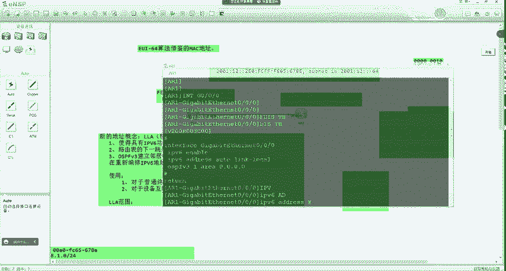

FEBF是吧，FEBF冒号冒号一。

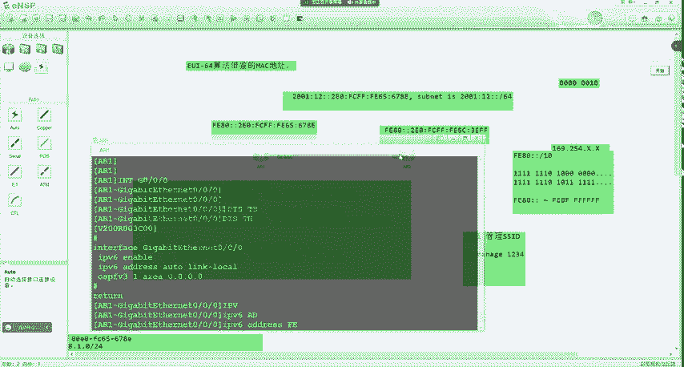

你个老婆。能不能配上？可不可以啊？实际上也是可以的。比如说我第一次play。IPV6interfaceG0-0-0，我发现呢这个地址也配上去。大家能明白吧，但你自己产生了，他一定是以FE80打头的。😡。

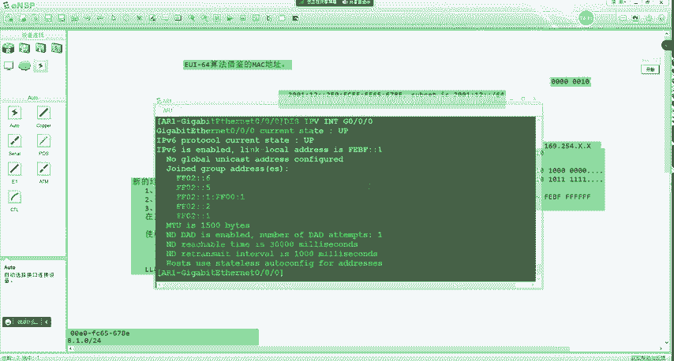

那他的范围呢是我们所看到的这一个。对吧只要在这个范围内，你就是可以进行使用的。好吧，那大家在手动去配linkloc的时候呢啊一定要去注意啊，必须要配在这个范围内的。如果不配这个范围内的会怎么样？嗯。

还记得吗？嗯。会怎么样？是吧会给你报错。对，没错，是吧？所以说也不用去记它啊，这里大家可能会学到一个误区啊，老师我学到了这么多地址分类。😊，记不住是吧，老师我真的记不住啊，嗯，这个很正常。我给大家说啊。

嗯如果不是给你们再讲这一遍，我也记不住。😡，能不能明白，没有人可以记住啊。😡，呃，但是呢你要看到的时候要知道是吧？它有个范围的这么一个呃概念，对吧？具体的范围呢用到的时候查一下，是这样子啊。

那平常我记得呢也是F180，我都没有去记这什么FBFFF。对，没错，好吧，不需要去记啊。

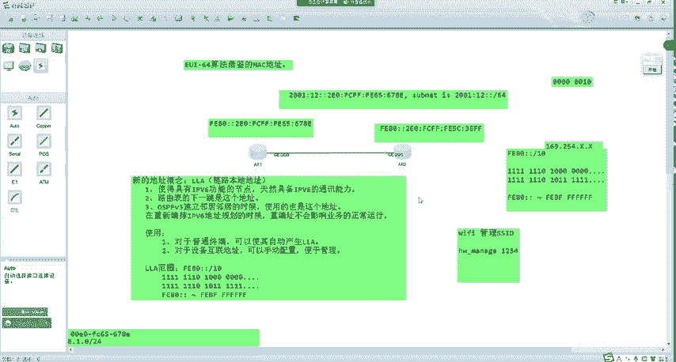

嗯。学习就是这样啊嗯不需要要把每一个技术都掌握到脑子里。这就跟你以前学数学一样，现在你感觉数学你还挺好的。呃，但是给你一个什么2元1次方程啊，你可能就解不出来了。😊，对对就是用到的时候查一下。

只要你把这个思维练出来了，那以后就很简单了。所以说大家不需要去记啊。我也没有记啊，没必要啊。然后我们来看啊，那单薄地址呃，除了这些呢，对吧？还有一种叫做特殊地址啊，当然在我们胶片里面就没有介绍到了啊。

当然我要给大家说一下。😊，对啊。呃，特殊地址有哪些呢？在IPV6中。

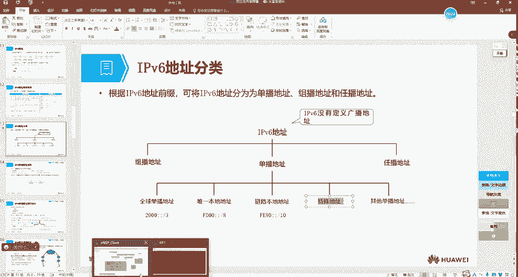

有一种特殊地址叫做。麦黑马黑。嗯。这等于IPV4的0。0。0。0。那这种地址叫什么地址啊？大家还记得吗？IPU4种，我们把它叫什么叫做保留地址对吧？IPU6种一样的意思叫做保留地址。

那什么时候会用到这个地址呢？😡，IPU4中，我们在学DHCP。我们再去申请一个地址的时候，当你没有地址啊，那那时候怎么办？我们会用0。0。0。0作为原地址。😡，对不对？那在IPU6中嗯也是一样的。

IPU6中呢会用冒号冒号作为原地址。好吧，他俩的是对的的。😡，那IP6中呢，还有一种冒号冒号一。是吧那他又等于IP6的哪个？啊，又等于IPU4的那个。注意啊，IPS我们有没有学过一个地址段叫127。0。

0。1啊？没有，他那个是有的，我叫本地回还地址。对不对？那一般什么时候会用到呢？啊，就是在做内部测试的时候，把目的地址写成本地汇还地址。😊，啊吧，那这时候呢他就可以去测试。啊，比如说我的协议站啊。

通讯是不是正常的？那IPU6中呢啊就有这么一种地址，我们把它叫做回还地址。啊，对，没错啊，就看一下自己有没有问题。对吧那还有没有其他地呢？也有这两个呢是属于特殊地址。对，这是IQ6中的特殊地址。

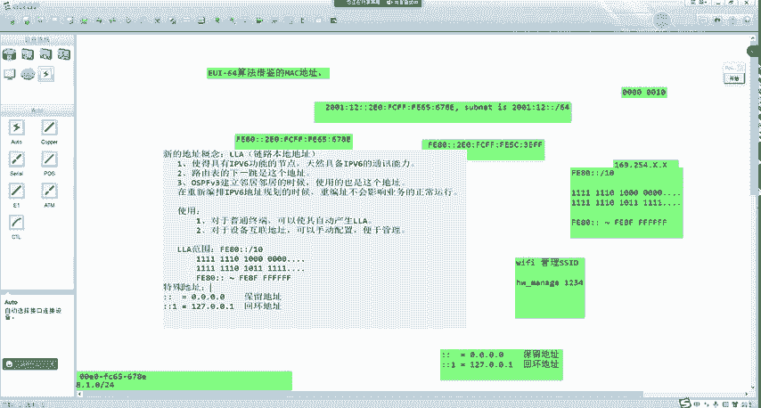

还有没有其他的呢？有我们可以去看到还有一种。叫做什么其他单薄地址，那这个范围就非常广啊啊，我也没有办法全部给大家说完。因为IPU6现在啊它就现在相当于一个是吧啊青啊这个精神啊也不是啊。

就相当于还在发展中是吧？相当于小伙子一样对吧？还没有特别成熟。😊，依然在发展，可能过两年不见呢，他又多出了很多新的特点。对不对啊，这就相当于我们说的啊这士别三日啊，应当刮目相看。

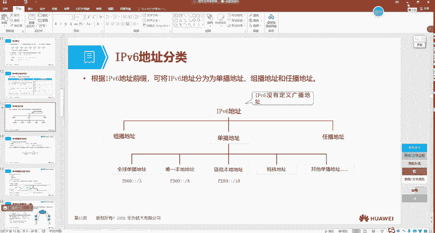

对吧这种技术依然在发展，那其他地址呢在这里我可以给大家科普一下嗯，稍微说几个。😊，呃，那么其他地址还有哪些呢？😊，呃，未来呢我们还会接触到一种是2002开头的。对啊，2002马号马号杠16。

那这呢适用于一种技术，叫做六突四隧道。对啊，那这是我们未来啊应该会去接触到的一种地址啊，就是他给单独的功能去用的对，没错。那在早期的时候，还有一种叫做3FF。一对啊，叫3FF1冒号冒号杠16。

那这种地址呢，它是早期。Okay。应用于IP6公共研究所的。叫做公共IP的研究所啊。Yeah。就早期呢IPU6我们并不是说对吧研发了这么一种协议就能够推送出来了，对吧？要测运行对吧？呃，还会有一些专家。

😊，对不对？那早期呢有一种叫做公共IPU的研究所，早期啊。那他用到了3FFFE啊这么一段地址。但这段地址呢目前已被废除。就这个单位呢。啊，已经被解散了。但是这么这个地这么段地址呢啊还是有这么一段历史的。

所以说未来大家去看到呢嗯也不用特别意外，对吧？除了这一段，还有没有其他的呢？嗯，还是会有的啊，但是目前呢嗯我也不好给大家说。😊，对吧就是以后呢就已经被回收了啊。

就以后呢大家可能会去看到其他啊7788奇奇怪怪的地址。😊，对吧你比如说还可能看到2004的对吧？老师我看到2FFF。对不对？那见到这种地址，嗯，大家也不要觉得是吧？特别奇怪，为什么呢？😮，还记得吗？

为什么？因为这个技术依然在发展是吧？而且我们现在呢嗯有很多技术呢，大家可以发现啊，就前段时间这个AI还是比较火的。😊，是吧嗯，那未来呢肯定又有其他的技术啊，也一直在发展。

可能就潜移默化的已经改变你的生活了。对不对？那他们肯定会去也用到IPU的地址。那未来呢IPU6有没有可能给其他的一些应用单独分配地址呢？有可能。对不对？所以说这里大家知道啊，那么其他地址嗯有很多。

但是这个要随着发展，对吧？一步一步去看啊，那未来呢啊可能就会存在了。

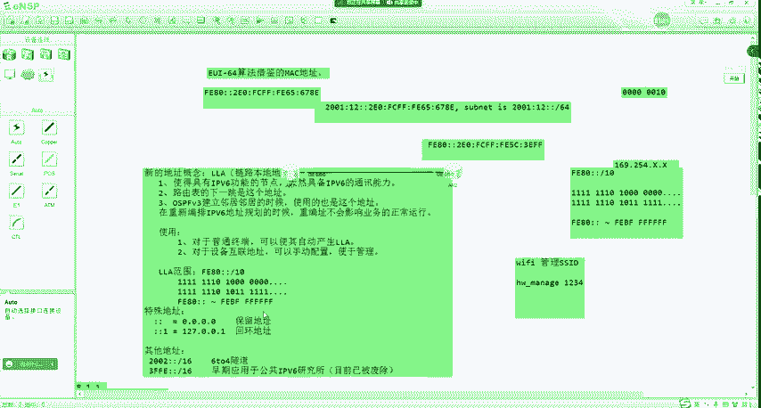

好吧，所以这是这一块啊。😊，嗯，接下来我们要去讲的是主播地址啊，在IPV4中，我们学过主播。是吧当IPU4的主播还没学过，但至少知道有主播地址了。对不对？主播地址是什么样子的概念呢？嗯。

我简单来给大家说一下，就是主播它是这么样的。😡，哦，就相当于比如说呢我在给大家讲课，对不对？呃，如果我用广播讲课的话，大家可以去发现，就是即使有人在用腾讯会议，但他不想听课。是吧那如果用广播呢。

也会让他去收到。对不对？是吧那这样的话，实际上对于他来说就是一种骚扰啊。但是如果我们去单薄的话，大家可以发现啊，就是每个人呢我都去发送一份数据包是吧？那可能我就讲一遍啊。

但是我的电脑要针对咱们每个同学都要去发一份，那我电脑的负担比较重。😊，是吧换到生活中，那就是我要给每个同学都要去说一遍。是吧那对于每个同学的负担也是比较重啊，对于老师的负担，那就更重。啊。

首先你们得等时间啊，那第二点呢老师的嗓子要冒烟。对不对？所以说呢我们有些场景下可能是一对多的同学，对呀？一对多，那有一对多就是一对一啊，一对一就是单薄，一对所有就是广播。那我们会去发现啊，一对多的时候。

就是有些人要，有些人不要。那我们把这种叫做一对多。😡，那一对多通讯的时候有没有更好的方式呢？是吧。那我们就延伸出了主播，主播是个什么样的概念呢？我来举个例子。😡，比如说像现在大家一样，大家要听课。

你就加入到腾讯课堂，对吧？是不是啊像大家看电视一样，你想看天气预报，你就去打开天气预报是吧？你想看亮剑。对不对？那你就去打开那个电视剧。啊，因为你有不同的频道，不同的频道呢可以让你收金。

或者说接收到不同的流量。是吧那这个频道呢大家可以理解成就是主播地址。😡，能不能明白我的意思啊？这频道它本身就是一种主播地址。那主播与其我们说它是一个地址，不如我们把它说成是一种组。什么意思呢？

比如说你想看CCTV。对不对？那在网络中就会有一台主播员，他在往CCTV这个频道发送流量。你只要加入这个组，你就能收到。对不对？你只要加你就能收到。就像大家现在一样，是吧，你想听课。

你只要进入到这个频道里来，你就能够听到。😡，对吧所以说主播地址呢类似于一种组。😡，那主播地址它的好处就在一对多通讯的时候，如果有一个人不希望接收到这种流量，他不需要加入到这个组就行了。

对吧而我们主播原呢我们可以去发现，他只发送一份。就可以传递给所有的接收者，那这就是主播的好处。主播里面呢应到了主播地址，主播地址是干什么用的？它就是用于标识一个组的。都懂吗？理解同学敲一啊。

这个没问题吧。主播地址的作用，它是用于标识这个组的。你想要接收这个组的流量，你就加入到这个组播组中嘛，对吧？你怎么要标识这个组啊，你就用主播地址。😡，对吧换到我们的电视里啊。

我就是看CCTV1CCTV2是吧？那这就类似于主播地理面，就是它是一个唯一的标识。😊，那在IPV6中的主播地址，它是怎么样来进行分类的呢？它是这样的啊，我们来看。😡，那首先在这一段呢。前巴比特为FF。

只要前巴比特为FF，那么它就是祖国地址。对呀，前巴比特只要是FF就是左地址。哎就可以说FF冒号冒号杠8，那这里呢就是组播地址，而中间会有一个flag，这个flag是干嘛的呢？

是用来标识这个组播地址是永久的还是临时的，什么意思呢？我来再给大家说一下。比如说我们再去买这种嗯这个叫啥来着？就家里看电视，那个叫呃机顶盒。😊，是吧比如说我们要去看电视的时候。

我会发现任何一家老百姓都能收到。😡，是不是啊？对吧那这种呢就类似于公网上的组播地址，我们就把它叫做永久组博地址。😡，他是用于特殊作用的。对呀，那或者说呢OSPF它使用到了1个OSPFV3啊。

使用到了一个组合地址叫做FF。

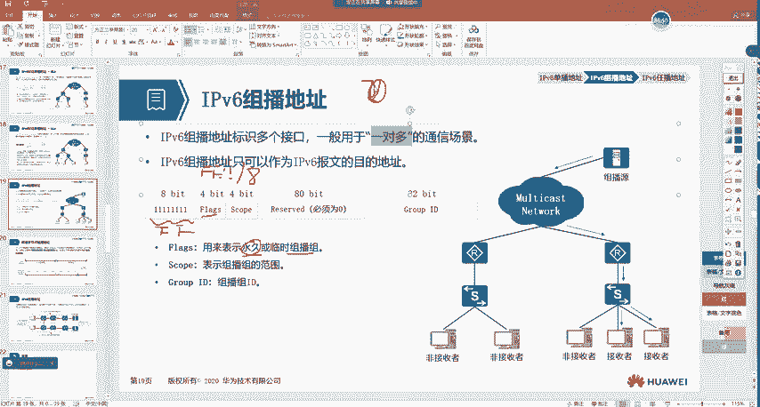

01。对啊。那他呢也是一个永久组国地址。对啊。在这里的flag它是用来标识是永久的还是临时的，永久的有可能是被我们协议已经规划好的。比如说我的协议要进行使用的。那刚刚我们在抓包的时候。

我再来给大家看一下。😊。

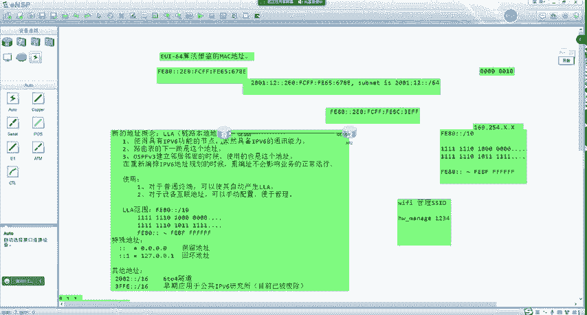

我们在这里呢已经去跑了1个OSPF，对不对？那我们跑了OSPF之后呢，它就会去发送OSPF的报文。是吧那我们之前在学IPV4的时候，学到1个224。0。0点叉是吧？这个段呢就属于永久组国地址。

它是被协议已经被使用好的那我们来看OSPF有没有用到一个。

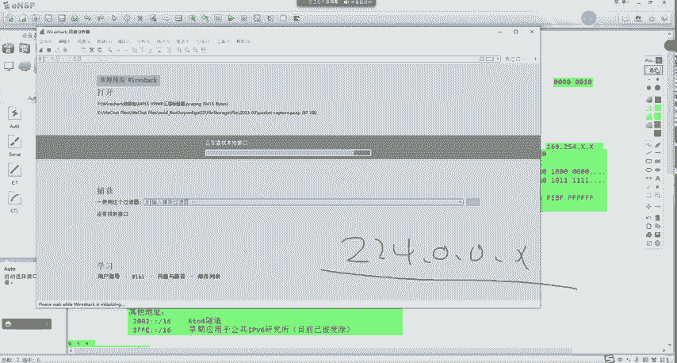

FF。前巴比特中间的零代表的是什么？永久组国地制。能懂吗？现在虽然这个零有4个比特，就是000，对吧？虽然有4个比特，但是权陵呢代表是永久啊不。啊，对，然后如果唯一呢代表是零时。临时的意思就是。

比如说我公司内我有自己的主播应用是吧？现在呢嗯。😡，这个领导发话了是吧，呃，领导呢派了一个任务啊，咱们有自己的APP那现在呢每个人都要把这个APP里面视频看一遍。😊，能不能明白？好吧。

那这种其他人能不能看到，看不到，对不对？😡，就是用于公司自己内部规划的呢，我们可以把它认为是临时的主定。这四个比特呢目前所采用的只有零和一永久和零时。那其他的有没有呢？比如说老师有没有FF2啊，对吧？

啊，有没有2呢？目前没有被定义，没有被定义，大家觉得代表着什么？😡，代表着什么代表着这个技术未来有没有可能还需要发展？有没有可能完全是有可能的。对话。是吧就是我预留了这么一部分空间，对不对？

未来扩展可以扩展，对吧？但是目前没有被使用。😡，对不对？所以说他是这么一个意思啊。😊。

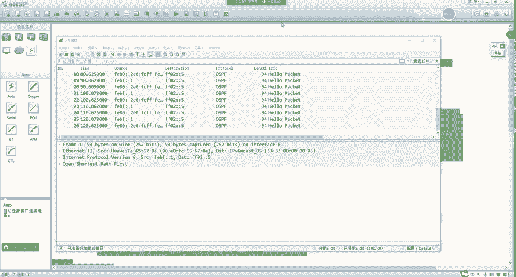

然后我们来再来看，那在后面呢还有一个呃叫做。范围对吧？用来表示主播组的范围，这个主播组的范围怎么样去定义呢？我们来想一下啊，比如说嗯FF502。😡，对吧我们可以去看到啊，像OSPF用到的这个主播。

它能够跨三层网络吗？😡，拿不拿？那不能是不是不行啊？😡，对吧FF02它只能在链路上进行传递。因为OSPF的哈罗包，你其他路由器转不了啊是吧？所以说后面这个二呢。

它代表了这个地址或者说这个组播包呢所能够传播的范围。而二代表的是链路上进行传播。那还有没有其他的呢？依然是有的。我们来看啊。😡，Okay。这里如果等于零啊，代表是预留，什么叫做预留呢？没有被使用是吧？

啊，就相当于你发了工资了，对不对啊，你要上交给你家的管事儿的。😡，对不对？那这时候你怎么办呢？😡，存200块钱对不对？那这种就叫预留是吧？嗯，没有上交的，对不对？那未来可以自己去用吗？啊。

所以说零目前是没有被使用到的啊，而这个一呢代表着叫做节点本地范围，单个接口有效，用于low back通讯，用于回环通讯。那这里代表着什么啊？😊，代表什么？代表着当我再去研发一项主播应用的时候。

我要去测试这个应用的，或者说这个应用能不能进行正常的工作，对吧？那我们可以通过这种回还地址，就是等于一的。是吧自己内部愿意做测试。而链路上进行传播的范围呢是FF02冒号冒号1。

那比如说像我们刚刚看到的OSPF就是FF02冒号冒号5。是吧它就是链路上进行传播的。对不对？那还有一种呢叫站点本地范围啊，大家可以理解成它是一个公司。对吧然后FF08嘛号码号呢。

那它代表的是组织本地范围。比如说在我这个公司呢，有很多的分支站点。那么在这时候我可以代表08的。而E代表全球范围，这就是之前我所给大家说的是吧？这里我要给大家说啊，站点和组织本地范围呢。

这里在我之前也找到了，不是之前我也找过很多的，就是有没有具体的应用例子，但是我没有找到。😡，大家能懂吗？就是现在呢可能我规划了这么一段地址空间，但是呢。😡，他目前没有被实际应用的例子。这里大家能懂吗？

李岩同学敲一啊，就是在我未来的计划中呢，这里可能会去用的，但是目前没有实际应用的例子，我没有找到过，好吧，至少在我们的啊百度上是吧？没有找到过。但是翻墙之后我就没有去看过了啊。😡，然后一这个全球范围呢。

就是我之前所给大家说的。😡，嗯，老师我不是特别理解，对吧？什么叫做全球范围呢？这个首先告诉大家，我也没有找到过，但是我能告诉给大家是什么呢？我的理解是什么样子的，这个理解是什么样的？

以前我就不特别懂是吧？什么叫做全球范围呢？那当我看了一个电影之后啊，我就明白了这个电影叫什么呢？啊，叫做生啊，是叫生化危机嘛？😡，是叫样吗？呃，如果我印象中没错啊，应该是啊不对啊，应该是叫生化危机啊。

😡，就有这么一个电影吧，有一个美剧对吧？就是那个丧尸，对不对？那我在看这个的时候呢，嗯里面有一个就敲响了我就是在里面有一个大结局，我不知道我看的那一集是不是大结局啊，就是里面就有一种全球广播通告。

大家能不能明白？😡，理解的同学敲一啊，全球广播通告，你甭管你中国人、美国人是吧？俄罗斯印度人，甭管你是哪里的，你只要联网，你就能够收到这份通报，是吧？所以说这个全球范围呢，我觉得未来还是有用的。

但是目前呢可能我们基于很多的安全性考虑，现在没有被使用的对吧？但是在未来的规划中，可能会有。😡，能不能明白？比如说某一天真正发生了危机，也许就会有这么一段地址开始在全球范围内进行通道了，是吧？啊。

外星人要入侵了，对不对？😡，这是在理想中的一种状态。但是真正这种全球通告。能不能被实现呢？嗯，我给大家说一下，我觉得不太可能。为什么我觉得不太可能呢？😡，嗯。大家要知道啊。嗯。

国家与国家之间呢是存在了很多的。这个安全隐患呢。对吧不是你打我啊，就是我打你是吧？虽然我们现在觉得很和平是吧？但是国家利益之间呢嗯你比如说是吧，别人呢随便发了一个通告，就可以到你国家所有的设备上。

对不对？那这时候呢，对于国家从国家安全角度去考虑呢，嗯，可能不太限制，对吧？但是理想的规划里是有这么一段地址的。😡，这里大家能够明白吗？明白同学敲一啊，没问题吧。😡，好吧。那我们只需要知道是什么呢？啊。

大家只需要知道这个2就可以了，是吧？FF02是吧，是代表什么呢？链路上传播FF02冒哈冒号5OSPF的。😊，FF02马哈马哈6。OSPF的是吧，FF02冒号冒号嗯，应该有个D啊，我记得没错，有个D啊。

这D呢是用于P的，是吧？有一种协议叫P啊是冒号冒号D。😊，然后大家要知道这几个。好，那这是我们所说的啊，前面16个比特，而中间这80个比特叫什么啊？叫做保留的。😡，能不能明白明白同学敲一啊。

叫做保留的啊，什么叫保留的呢？目前依然没有被定义。😡，最后这32个比特啊，这个必须为0，我们可以去看到啊，最后这32比特才是用于标识组播组的。但是你甭管你怎么样去看，我们可以去看到啊。

有了这个主播范围去规定的时候。无论你是节点上通讯的对吧？链路上通讯的组织本地、站点本地还是全球，你都会有32个什么啊。😡，什么主播主地址对吧？所以说主播组地址够不够用呢？完全够用啊，非常多。😡，好吧。

那这时候我们就需要再来去思考一个问题啊，什么样的问题呢？我来想一下啊。😊。

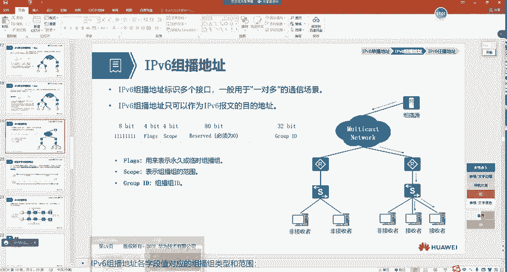

主播IP地址哎，老师很简单啊，是吧？我看到这么一段地址，FF开头是吧？我知道他是一个主播地址，这是一个主播IP。但是我们要去想一下，现在我们所用到的网络呢都是以太网。😊，对不对？

而我们在进行以太网通讯的时候，还会有一个问题，什么样的问题呢？而以太网通讯不能有IP啊，还得有目的麦克。😊，对不对？😡，是吧老师，我还得有目的麦克。哎，那这个目的麦克从哪来呢？😡，是吧。还要有目的麦克。

单薄的麦克怎么得到呢？单薄通讯的时候，我们来想一下，比如说你跟我进行通讯是吧，我要骗你，我发ARP我去说对吧？涛你的麦克地址是多少？😡，对不对？我明确告诉你，就是我指定我要谁的麦克。😡，是不是？

而在主播中，我们想一下，主播中我们知道接受者吗？不知道我们只是往这个组里发这个组我不能说组你的麦克地址是多少。😡，那不能在这个组里，所有主机都给我回复吧，不行。😡，是吧单铺因为你有具体的接收者。

你可以去问对吧？你的麦克地址是多少？😡，是吧但是对于祖播来说，哎。😡，怎么样去得到麦克呢？是吧？所以我们可以去想一下啊，主播不能像单播那种逻辑是吧？我发一个主播IP，你的麦克多少，谁是主播IP啊？😡。

对不对？所以说呢祖博的麦克大家注意，他是映射得来的。😡，什么叫做映射得来呢？就是你有一个主播IP，你就可以映射得到一个主播麦克是这么一种逻辑。😡，能不能明白，他不需要再去请求，没有任何请求的概念。

就是主播IP映射到主麦克中，就是这么一种。😡，那是怎么映射的呢？映射规则非常简单。😡，前面这卖的地址一共是多少比特，48比特。前面16个比特。为333348减16，还剩32。

后面这32比特直接把主播IP地址的后23个32个比特直接给它复制过来。😡，能不能明白？明白的同学敲一啊，没问题吧。😡，所以说我们可以去看到啊，就是直接把后面32个比特给它复制过来。那这样对吧？

有人就问了，老师复制32个比特。😡。

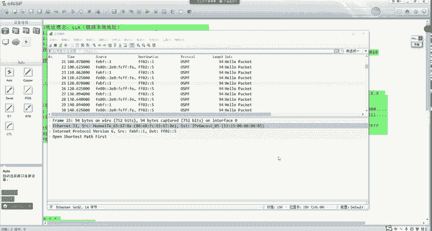

够用吗？为什么不够用呢？我们来看。😡，主播。主地址的范围一共有几个比特。有几个。有32个。是吧那把32比特直接复制过来。是不是可以保证唯一性？

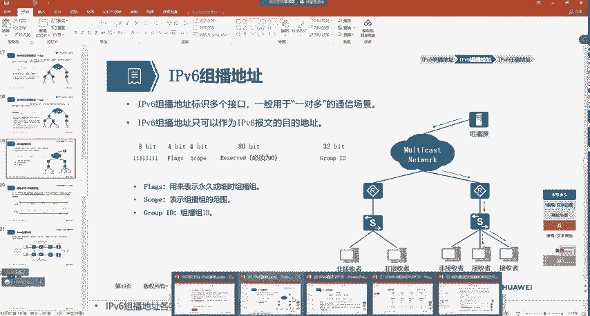

哎。啊，在这儿啊。对吧你这要把后面32个比特直接复制过来，对不对？任何一个组地址呢都可以有一个主播麦。😡，那这就是主播麦克的得到方式是非常简单的啊。

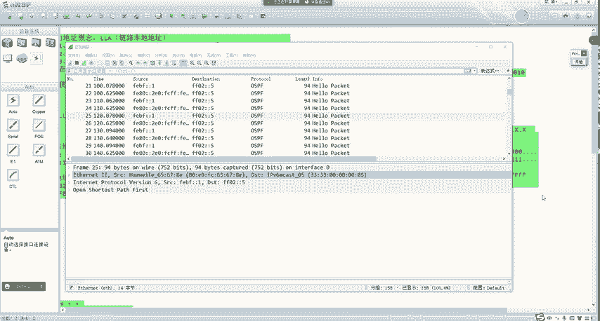

那这里呢就是我们所说的主播啊，IPU6的主播地址。这里大家都明白了吗？明白的同学敲一啊。😡，咁晚你话。嗯。是。主播IP这不就是主播IP吗？😡，这不就主播IP啊。😡，是。怎么得来的？没好听吧。

主播IP的钱。巴比特为FFF冒号冒号杠8，只要在这个范围内的都是主播IP地址。明白了吗？都是组办IPR。😡，好吧。然后我们再来看啊，有一种特殊的主播地址是未来我们要去理解的重点。那么这种地址呢。

我们把它叫做被请求节点组播地址。是吧这说什么用于邻居发现地质重复检测啊等等一大堆啊，不用去管。现在大家可能还理解不到。😊，是吧而什么是呃这个地质重复检测啊，你居发现对吧？大家还没有去学过。😊。

这里我来给大家说一下，首先呢大家要知道我们来思考一下，在IPV6中有一个什么样的缺陷啊，不对，在IPV4中有一个缺陷。什么样的缺陷呢？大来想一下啊，比如说我去发1个ARP请求。他是什么啊？广播。对不对？

现在有三个人一。2。是吧3一去请求二的广播三就能够收到。三、收到之后怎么办呢？三给一说，我是1。2。有没有把二欺骗过去啊啊，不是有没有把一欺骗过去啊？😡，又话。对不对啊？

那未来三发给二的包都给三三再给2嘛。是吧这叫什么ARP中间人攻击是吧。😡，也叫ARP欺骗攻击吗。😡，对不对？那这种问题产生的原因是什么呢？它是广播。😡，所以我们首先分析广播第一个缺陷，它是在哪里呀？

不安全。是吧那还有没有其他缺陷呢？有？😡，我这还有个四是吧，我四就是普通老百姓，你请求二，你还发到我身上。😡，是吧这就相当于什么一样的？相当于警察在办案的时候。😊，是吧。他不定位嫌疑人。

他开始广播通告是吧，隔壁王婶家的牛丢了，对吧？😡，哪个人拿了过来报道一下。😡，那跟你都没关系，你就普通老百姓对吧？老实本分。😡，对不对？那你收到这个信息，你烦不烦啊，你烦是吧？这是在我们生活中。

我们会觉得比较烦，你可能睡大觉呢。那在我们的网络设备中也是一样的。AIRP是广播，它传给四之后，四就得要处理，为什么呢？因为协议规定的广播就必须要处理。😡，能不能懂啊？那遂一看，好家伙。

你广播发了一大遍，结果是问二呢，不是问我呢是吧，我再给你丢了。😡，对不对？那实际上对其他设备来说有没有一种骚扰？😡，有吧，所以说对于四来说呢，哦现在四就比较懵了。收到之后呢，我还得拆封装去处理。

那又占用设备的资源。😡，那如果网络内广播比较非常多的时候，我会发现有时候电脑还会比较卡，为什么呢？是吧？而网卡嘛并不是是因为比如说我设备的CPU比较差是吧？奔腾CPU。😡，对不对啊。

遇到了ARP广播风暴。是吧那这时候呢你的电脑应该就会比较卡了。😊，对不对？那这个时候怎么办呢？在IPU6中就取消了ARP。😡，对你ARP不是有缺陷吗？干掉对？不要。😡，听到吗？好吧。

现在就是一样ARP在拖IPV4的后腿，就因为ARP就导致IPV4特别不安全是吧？有各种安全隐患，不要IPV6中你ARP不行是吧？把你扔了淘汰对吧？啊，很现实，对不对？就像你公司一样。

你公司约为你不能干事了，把你扔掉吧？哎，别干了裁员。😡，对不对？所以说在IPU6中，ARP它就没有药了。😡，那没有要了，那不能去请求麦克地址了，我们就得想一种哎有没有其他的方式能够请求到麦克地址呢？

在IP6中产生了一种新的组播应用，叫做被请求节点组播地址。😡，那这种地址是什么样的啊？注意啊。😡。

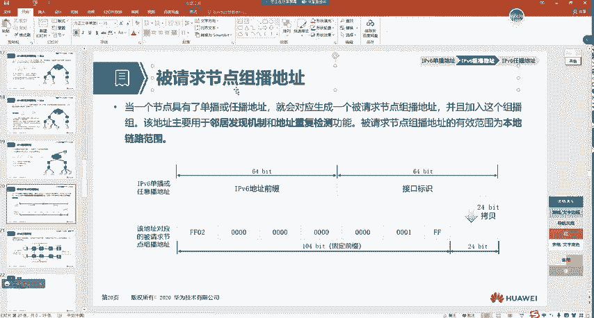

首先大家要知道他的第一个特征。Yeah。Yeah。他第一个特征叫什么呢？叫做只要设备配置了一个单波地址之后，对呀，无论你是全球单波地址还是链路本地地址，只要你配置了一个单波地址之后。都会加入到。

一个叫做与之对应的。被请求节点主播地址中。地址祖宗。

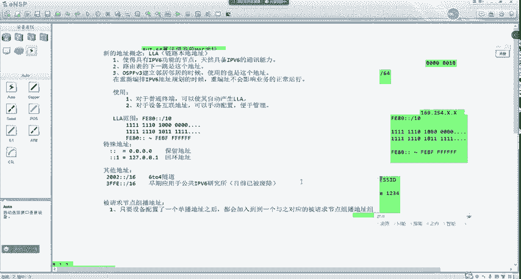

对啊。叫做都会加入到一个与之对应的被请求节点组部地址组中。😡。

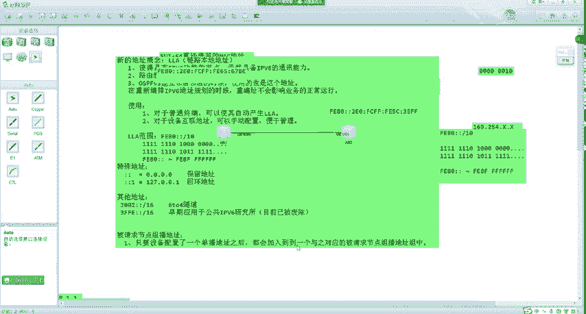

那老师什么样叫做对应的呢？我们来看一下。😡。

现在呢A21ARE有几个担保地址呢，interfaceG0-0-0。有几个啊有一个是吧，display IPPV6interfaceG0-0-0。在这里呢有一个被请求节点组播地址组。啊。

有2个OSPF的啊，有一个所有路由器主播地址，还有一个所有节点主播地址。这四个大家应该能看明白吧。抵押的。第 otherther的是吧。😡，所有节点主播地址，所有路由器主播地址。😡。

那还有一个看不懂的老这啥玩意儿啊，是吧，看不懂。😊，对不对？那我来给大家说一下他是什么东西。我来看啊这个被请求节点组合地址呢，他就是根据这个映射过来的。就是当我拥有了一个单波地址。

就会加入到一个被请求节点组播地址组。

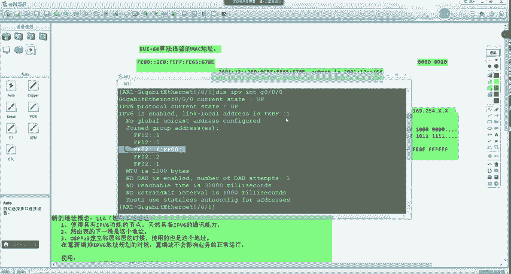

那怎么加的呢？是吧？它是有规则的那这个规则实际啊非常的简单。我们来看啊，被请求节点组播地址组。😡。

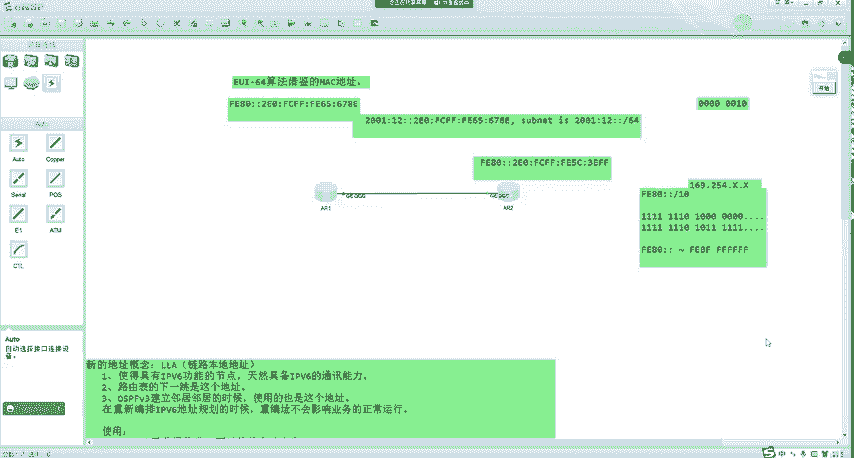

他的前面104比特。对啊，是FF02000000000就冒号1FF。这是104，一共128，128减104还剩24比特。24比特呢直接把后面就是。哎单波地址的霍尔勒斯比特复制下来。😡，所以我们来看啊。

当我拥有了1个IPV6的单波地址之后。那么在这时候呢，我会加入到一个前104固定后24比特直接复制单波的后24比特。加入到这么一个组博地址组中。

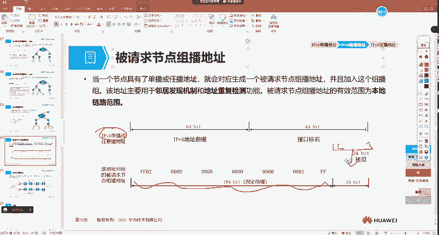

那基于这个规则，我们可以看到的是什么呢？注意啊，现在我们来看AR一上面。

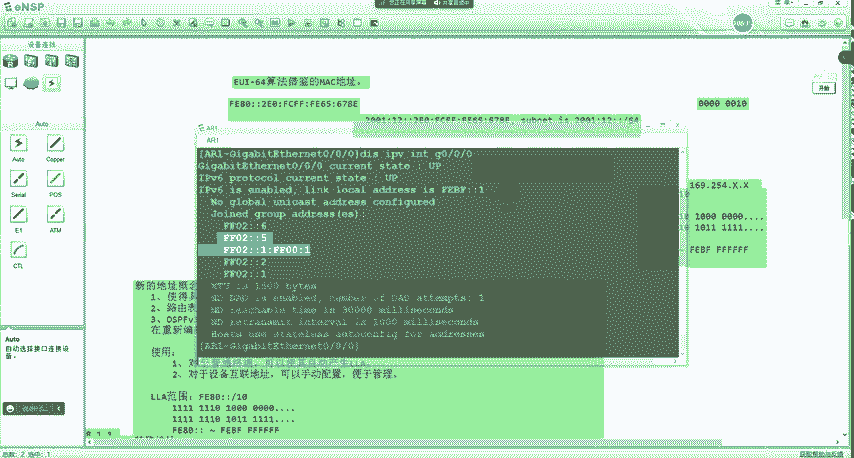

这是他所拥有的IPV6单波地址。对不对？那么在这时候我们来看啊，前面104比特固定后面。这是前面104吧。是吧后面多少呢？24比特，我把零填过来，0001。这是1616加824。对不对？再缩写一下。

不就等于。FF02冒号冒号一，冒号FF00冒号码号一吗。对不对？

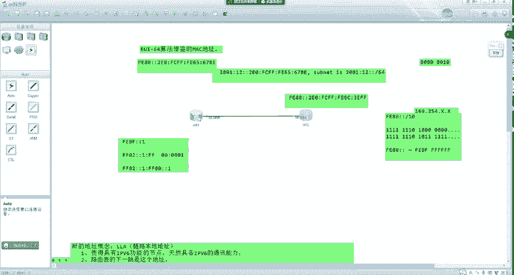

那我们看A2一的跟他一不一样。有不一样？一样吗？也就是说当你拥有了一个担薄地址，你就会加入到这个组动。基于这个规则，我们来想注意啊，基于这个规则，什么样的规则呢？就是这种加入的规则。😡。

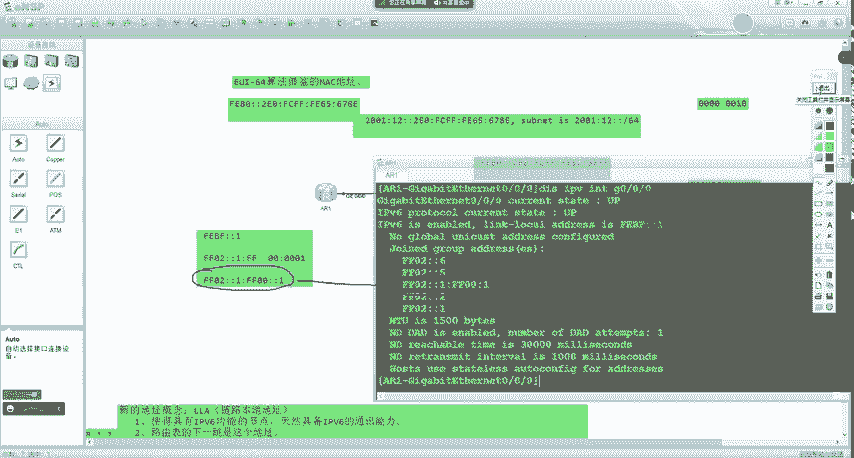

只要有了这个规则。所有的IPV6设备都遵循这个规则。

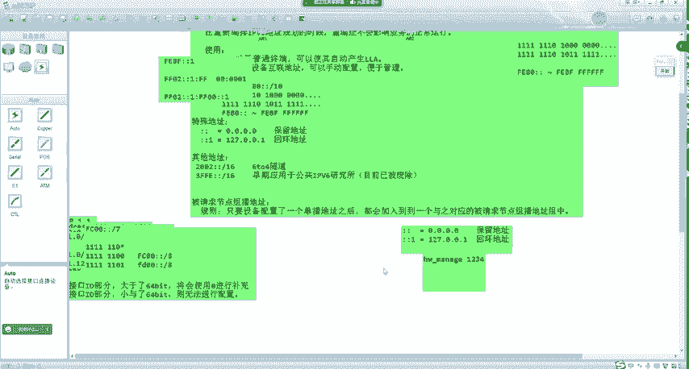

就相当于什么一样的？注意啊。在A21上。他要给AR进行通讯。他是不是要骗AR？比如说AR2的地址呢，我举个例子啊，我现在在AR一上去手动配1个IP address2001。

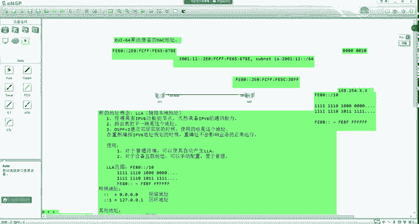

马号一样冒号码一。对，然后在AR上去配一个。对对对。俩地址他就加俩组啊，2001冒号12，冒冒号2。没事。对呀，我现在在ARE上又拍了一个。😡，还有没有？好，这俩的后来的4比特一样。

所以加入的是同一个啊。😊，好吧，比如说我再赔一个啊。Okay。IP6dress2001。码号马号。1234，马哈马哈，你马哈马哈。按冒号一。哎，不对，2002吧啊。然后呢。64。

现在我有了多个IP6地址，只要后24比特不一样，有没有加入到两个组啊？有话。

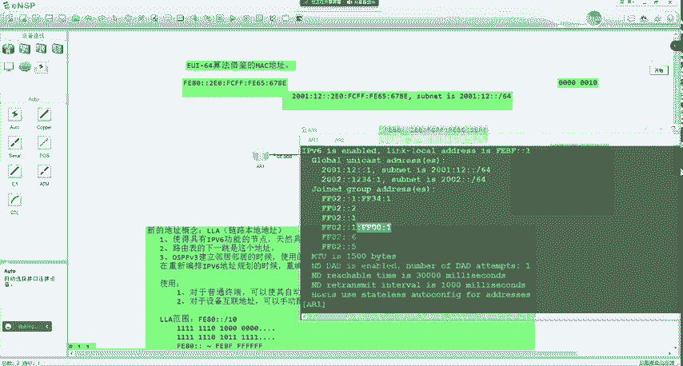

对不对？那基于这个规则，我们要去想，所有IPU6的设备都遵循这个规则。现在一想拼2怎么办呢？😡，哦，一知道我要去访问2001冒号12冒号冒号，你要访问谁，你得知道他的地址啊，但是我不知道他的麦克。😡。

但是基于IPU6的规则，我知不知道二加入到了哪个被请求节点组的第一个组。😡，我知不知道。我只需要把前104比特给他复制过来。你不是二吗？是吧，我把你后边的4比特再复制过黑站00。😡，漫画漫画。

我就知道在A2一他就知道了，2肯定加入到这个组了。😡，对不对？只要你都遵循这个规则，他就可以揣摩2。那到底二有没有加入呢？display IPPV6interface G0-0杠0。😡。

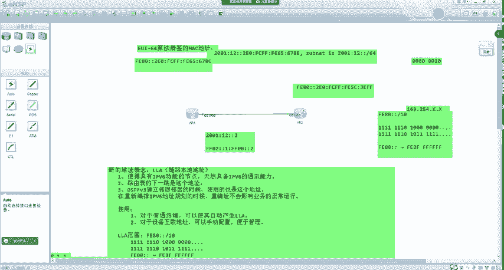

。啊。Display I p。V6interfaceG0-0。嗯。有没有加入啊，有吧，那这时候A21可以这样。

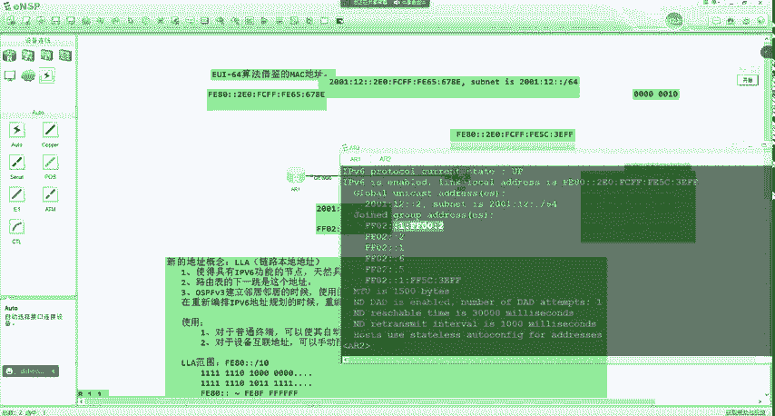

A21啊，他去P2的时候。我往这个主播组里发榜。大家注意啊，我往这个组合组里发放。😡，假如说网络中有一个4。还有一个3三作为攻击者。3、他没有监听这个组，他能不能收到？没有吧，或者说我们不考虑三对吧？

老师，我三是攻击者，他可以随便接啊，对吧？他把所有的都监听掉，对吧？然后那我们考虑4。😡，好吧，那考虑四来说，四只要后24比特跟二不一样。😡，四能不能接收到？拿不拿？你只要和外的4比特不一样。

四就接手不的。😡，那我们来讲一下什么是霍2斯比特是什么啊？😡，如果我们通过EOI64去产生。后24比特正好是你m克地址的后24吧。😡，是不是啊？麦克地址怎么组成的？麦克地址的组成是由。😡。

前24比特的OUI加后24比特的V标识组成的。你觉得这种可能性高吗？😡，就是这两个设备的霍尔斯比特一样的可能性高嘛。这还只在一个广播域内有效FF02吗。一个广播域内，两个设备的后24比特。一样的几率。

可以忽略。对吧这就相当于什么一样的？啊，老师我今天下班对吧？有可能被车是吧啊碾过去吗？有可能那能忽略吗？可以忽略是吧？你要不能忽略你就不上班了。😊，对不对啊？对，这就跟你中彩票啊，对，特等奖一样是吧。

这种几率可以忽略。😡，对不对啊？所以说我们可以去看到啊，在IPU6中，如果通过UI64去产生的话，这种冲突率的概率是非常低的。而且他对四有没有影响呢？没有，为什么呢？即使我中间有交换机。😡。

交换机对于主播泛红到了市上，但是四在网卡上一看目的麦克。😡，他要不要交给CPU处理？😡，不需要在网卡层就可以直接丢弃，对不对？而不需要4解包拆包去处理啊，就是这么简单粗暴，对吧？所以说我们可以去看到啊。

在IPV6中，被请求节点组播地址，它所带来的第一个好处是什么呢？减少了对其他设备的骚扰，对吧？而且第二种好处是在哪里呀？😡，第二种好处在哪？比如说我们有一个三是吧，老师三监听所有的组组，我是攻击者。😡。

对不对？😡，我们之前有没有说过IPV6原生支持IP赛？有没有说过？有吧，那它还可以利用一些IPV6本身带的安全验证机制去保护这种安全性。对这是他的第二个优势。第三个优势是什么？😡，在哪里？

我们可以去看的啊。😡，在IPV6中。这种地址解析就是已知IP去解析麦克，他不请求二的麦克吗？😡，是吧他有没有用到其他的协议？😡，他就用到了IPU6的主播组。有没有用到其他的协议啊？😡，而ARP有吗？

没有。😡，是吧老师有ARP有没有BRPCRPDRP啊。😡，是吧有没有啊，没有，也就是说他是怎么样进行解析的，地址解析由IPV6协议自己进行完成。😡，能不能做ARP它只能应用于以太网。

但是网络的发展是非常快的啊。是吧可能过个十年，以太网全部被淘汰了是吧？出了一个新型的网络，就相当于我们以前用小灵通一样，谁能想到啊，突然来了智能手机，大家都不用小灵通了。😡，你能想到吗？你也想不到。😡。

十年时间是吧，90%的人已经不再用小灵通了。但是你能保证十年时间，或者说十年以后，大家这个以太网现在还是那么普遍吗？没有办法保证。😡，是吧这技术就是这样，只要出现了突破性的进展啊，就会把以前颠覆掉。😡。

对不对啊？要走高起胜弯路是吧，是吧？所以说ARP只能用于以太网，那未来以太网不用了。😊，我还得去研发其他的协议。是吧BRPCRPDRP甭管你是什么RP。😡，是吧你都要去完成地质解析。

你还得要有其他的协议。😡，而IPV6直接用自身的IPV6协议完成地址解析。好处有没有体现？有没有？也不是以太网，能不能用？😡，拿不拿？大家觉得行不行？😡，可以吧，你只要用IPU6协议。

甭管你是什么以太网是吧？你二太网三太网是吧，都不管IPU6统通解决是吧？第三个好处就是它的扩展性变得更强了。😡，所以这三个好处大家理解了吗？你嘢同学敲二啊，没问题吧。😡，所以说啊它所带来的第一个好处。

就是。更加安全。啊，第二好处。减少对。其他设备的骚扰。那第三个好处呢，就是。通过。IPV6自身。完成解析。对。扩展性更强。

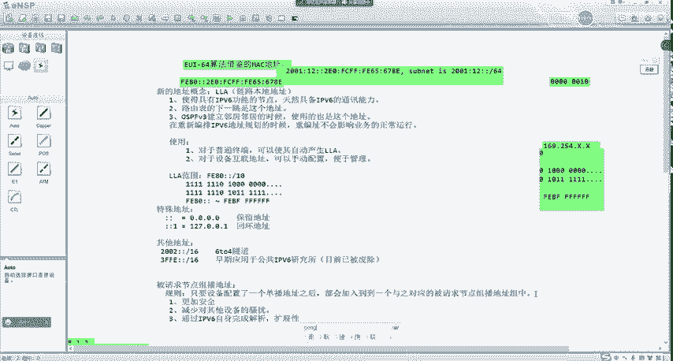

啊，那这就是这个。

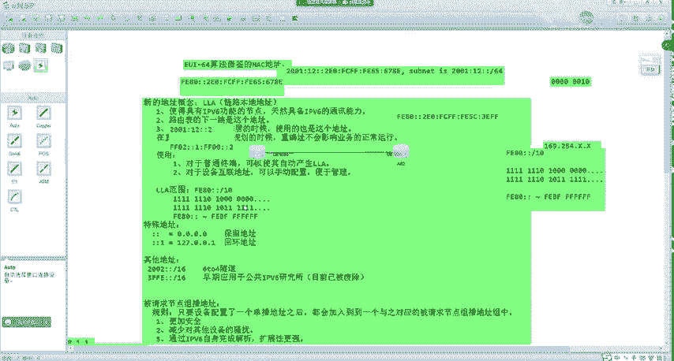

。被请求节点组播地址。好吧。嗯，那下面还有一个认播地址啊，这个我们下节课再说吧，这个实际上就是一个概念啊。没啥用。嗯，行，那我们这节课就讲这么多吧。然后最后这一种地址呢，我们等到下节课再说，好吧。😊。

行，同学们，那咱们今天先下课吧，今天就讲这么多啊。😊。

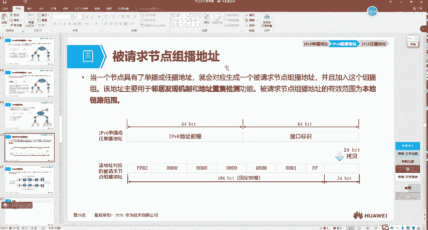