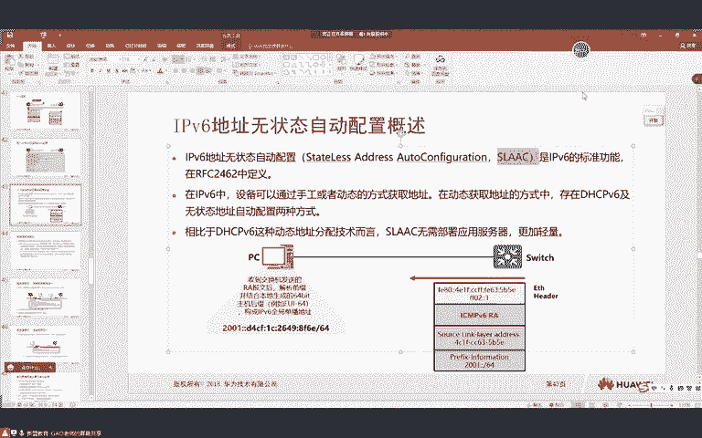
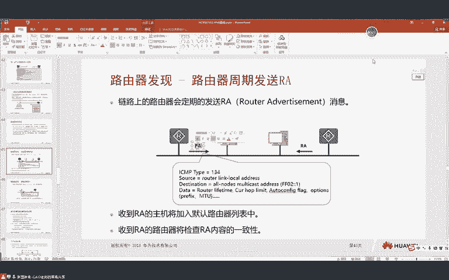
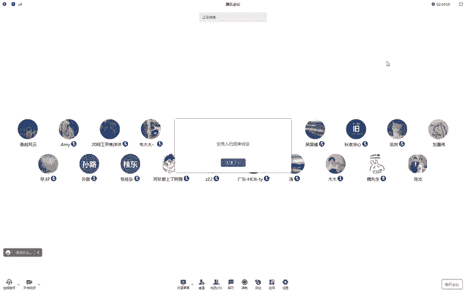

# 2023 新版华为认证HCIA+HCIP+HCIE全套视频讲解！一套视频让你从入门到精通！CCNA／CCNP／CCIE技术提升同样适用！ - P107：（持续更新）HCIE Datacom - 53.IPV6，DAD，地址冲突检测 - -Book思议8 - BV1W8411A7z8

🎼有你梦。🎼年定的。🎼和谁？🎼哦，耶。🎼不是。🎼一もレッ。🎼是被的摇晃。🎼节奏浸晚了夜色很美丽，在聚光灯下鲜艳了山草。🎼划过你看眼神你把风被大破，我扇烂了头发搭配取了珍珠项链，我不是皮卡手心在你的挂朵。

🎼for mebaby，你真的令我特别着迷，了下不要着急，坐时光回来一群滑起。😊，🎼光的北京。🎼你觉得像。🎼你怎么这么好骗看我技术多么老练。🎼看我表情这么严肃，我只爱疑自己，怎么可能成为我。

🎼就放下感情，然后亲吻你的脑袋，给他们逼起，我确实有一些小坏，所以不要想起他们那些骗人。不问你句。🎼就放松。🎼在仅方。🎼假期一起晃动，晃动你的躯体。🎼放松放松你的呼吸就放纵。

🎼个假期偶晃动晃动你的躯体随意。🎼掉你想。🎼一起听的歌，想要听个go我不是那种ba boy，you should better know。虽然有时候我好像没心没肺，但是今天晚上跟你比须只有我来陪。😊。

🎼看着那边彩着晚上划过了天，我不知不觉就抽到你的嘴边，不要误会，想知道你的香水气，我想成为你的正牌，升起我们的爱眠。🎼我尽管。🎼把子的快进决。🎼你再一次。🎼幕降临。🎼此来冠军。🎼白色。🎼。🎼。

🎼F andt feel they fuck we。 We don't care。 Were just like I national but nature cares。

🎼Com hold me here。You can say don't want to say your tears and how you feel and put baby。

🎼I really don hear nothing you love here， but need two cares。🎼看好每日路。😊，🎼You down to the air whisper。

I'm not afraid of anything but you am I scarce， I need to care。🎼I here。🎼ゆくせ。🎼で。

🎼Do know your food are baby honey Po。😊，🎼当你。🎼随着 let去不看到。😊，🎼的唯一。🎼就道过。🎼I。

🎼Do I want to like great teacher girl。 She's so crazy。 She's so free。🎼Its me。 I'm a pretty shit。

 sorry， its my bear。🎼我。🎼来 jump to ocean想猜到你B我 she来改变。😊，🎼Back可し。🎼就是谁来我。🎼找。🎼人还用擦肩而过的口吻。🎼讲述着所谓。🎼那些普通的善良。

🎼平淡的轻快。🎼犹如在耳边轻声的。🎼天上了。🎼是这。🎼我是。🎼默默照亮。🎼心水逐了。🎼情绪。🎼忘静。🎼回路转。🎼余生。🎼一口香。🎼给你我平平淡。🎼给你我红。🎼给你我白。はい。好，同学们，大家能听到吗？

啊。😊，可以同学敲一啊，声音没问题吧。😊，嗯ello。可以是吧。嗯。🤢，好，同学们，那我们就开始上课了啊。然后我们这节课还是IPV6啊，然后当然这个地址分类马上就说完了啊啊。

马上就往更深入的一点内容去讲了。嗯，我们来看一下啊，就是针对于我们上节课说的IPU6地址呢分了很多种类型是吧？呃，接下来还有一类地址叫做IPV6的认播地址。😊，嗯，这个认播呢与其我们说它是一种地址啊。

嗯并不如说IPU6呢是一种应用啊，哪个同学们哪个同学的麦没有关啊，自己关一下，好吧？呃，那这个IPU6的认播啊，就我们为什么会去使用到它呢，嗯它是有一段历史的呃，是这样的啊，就是在我们这个早期的时候啊。

大家就会去发现有一个特点啊，呃，应该是在八九十年代的时候啊，那时候我们经历了这个呃就在搜狐对吧？呃，新浪啊，那时候比较火的时候呢，嗯就是当然没有我们现在这个呃这个外博对吧？啊，网页发展的那么好啊。

嗯在搜狐那时候呢时候嗯那时候互联网的这个外部应用呢，嗯也是一个呃高潮对吧？也就是说用的人呢变得非常多，对吧？那时候这种外部应用呢非常多，对吧？如果有同学经历过那些阶段呢应该是比较清楚的。现在现在。😊。

大家用的基本都是APP是吧？你刷抖音嗯，可以看评论，对不对啊，当然还有一些同学玩什么呃这个呃叫什么皮皮皮皮皮虾是吧？啊，就很多大家现在看到的都是一些应用，对不对？而在早期的时候，大多的网民呢。

大家会去发现啊啊，如果你身边有一些比较年龄要大一天的啊，稍微比你大个嗯五六岁，对不对？啊，那时候我们用到更多的呢啊大家会去发现是论坛，对吧？啊，像那时候各种论坛啊，贴吧对吧？用的是非常多的。

也就是说早期的时候呢，这种外部流量啊变得是非常的多的，对吧？那在外部流量疯狂增长的时候，我们就会面临一些问题啊，面临一个什么样的问题呢，就是。😊，这个web服务器呢。对吧就是你的网名是非常多的，对不对？

呃，来自全国各地啊，但是我们的外部服务器呢可能只有一个。😊，是吧那这时候可能会遇到一个问题，比如说我们要去访问一些美国的网站，对吧？大家有时候可能会去发现啊嗯你访问一些美国的网站呢比较慢，对吧？

那这时候你怎么办呢？你就要使用魔法是吧？啊，才能够访问美国的网站啊，才会变得更快一点，是不是啊？但是有一点大家可以去发现，就是有时候我们会去发现呢，我们反映一些这个。😊，国外的网站呢是非常的慢的。

对不对？那这是为什么呢？是因为国外网站的服务器呢，它可能就在国外呢，对吧？而你在中国去访问的话，那经历的这个链路实延呢等等就会变得更高，对不对？你不管你是走卫星呢，还是走这个海底光缆是吧？

那反正这个距离是变得非常的远的那距离一旦变远之后呢，你的这个网速啊，就是让你的体验感啊就会变得更差，也就是说你感觉比较卡是吧？比较卡。😊，那这时候怎么办呢？是吧？那早期的时候大家可以去发现啊。

现在我们在国内对吧？反正百度是非常快的是吧？哎，但是这时候我们也要去考虑一下。嗯，那百度如果他要去扩展自己的市场的话，是吧？啊，比如说我们要做呃中国第一的这个搜索引擎是吧？啊，文心一言。😊。

是吧呃那你甭管是怎么样啊，就是你会发现呢我们国内也有很多人在用谷歌是吧？用一些国外的这个搜索引擎啊。嗯，但是你要想把你的这个呃搜索引擎的市场扩展的更大，对吧？

那这时候你要在全国各地呢都要去部署这种服务器。😊，是不是啊那我们都要去部署这种外部服务器啊，在每个地区一个啊，我以我们中国为例啊，可能我在呃河北省有一个。😊，是吧。呃，那在河南省呢也有一台百度的服务器。

对不对？但是在这时候呢，无论你是河北的呃，还是河南的呢，你只要去访问这个web服务器，那首先它的地址肯定是固定的是吧？因为你最终都要通过DNS解析到这个服务器。比如说这个服务器的地址呢啊它是1。1。1。

1。😊，能不能明白？比如说这个地址它是1。1。1。1。那这时候当我们去解析这台服务器的时候，那两个服务器的地址，一个在河北，一个在河南，是不是不能都用1。1。1啊？😊，是吧啊，并不行。

那因为你地址呢不能够产生冲突。那这时候我们怎么办呢？哎，我发现现在我河北呢嗯要去访问的话，反这一。1啊，好像不太行。😊，对吧所以说在这时候他是怎么样做的啊，我来给大家解释一下，那这时候我们可以这样去做。

比如说我在这里呢。😊，也有一个外部服务器是百度的啊啊，他的地址是2。2，然后在河南的呢是1。1。😊，那这时候比如说河北的呢，他就访问这台服务器。河南的呢，它就访问这台服务器。

那这样的你的效率就会更高是吧？可能在我们一个国内，大家可能觉得嗯老师这样还好吧，是吧？嗯，河北访问河南，反正就跨一个黄河挺近的，对不对？但一旦我们跨越了这种国家之后呢。

你会发现嗯它的就是你比如说我们要去访问美国的网站呢，你就别的非常的卡是吧？特别是但电脑容易坏，有时候你去看一些嗯这个国外的资料，是吧？😊，它就会变得非常的慢。那这时候怎么办呢？两台服务器呢。

我们就用不同的地址在每个地区呢都去单独的部署一台。😊，那都去单独的部署一台，这两个服务器之间还面临了一个问题。什么样的问题呢？就是比如说河北的，他去访问百度的服务器了。😊，是吧他访问的是一个域名。

那最终你怎么样给他解析到最近的？😊，大家能懂吗？你怎么要去给他解析到最近的百度服务器呢？就你得告诉他是2。2，而不是1。1是吧？😡，那DNS如果去给你解析到1。1，你一下子访问到美国了啊。

那就变得又慢了。是吧所以说有时候我们需要在DNS上去做一些手脚，对吧？那这时候大家可能会都能够体会到了啊，比如说大家有时候配DNS的时候，是不是配当地的？😊，是不是？大多我们派的都当地的吧啊。

比如说你在天津啊，那你就配天津的DNS。是不是也就是说我们需要通过DNS呢去跟其他的这个设备，对吧？啊，去去做一些嗯就是DNS里面呢有层级的是吧？然后在不同的DNS里面呢去解析到不同的服务器啊。

然后实现他们的就近访问。对不对？那这是我们在IPV4中的一种解决方式啊，大家要注意啊，但是我们来想一下啊，比如说。如果我在这边也配1。1。1行不行？大家觉得行不行？讲一下。是吧好像有些同学不行啊。

有些些同学觉得行，我来给大家说一下啊。😊，呃，比如说这个1。1。1。1。这个1。1。1。1啊，或者我这么来说啊，我这个路由器一，这个路由器2啊，这有个由器3，然后这有个路由器4，好吧。

然后我这样连成一条直线。😊，那四上面呢配了个1。1。1。13上面呢也配了1个1。1。1。1。A21再去访问1。1的时候，他访问这个。对吧AR2再去访问1。1的时候，他访问这个。那这时候有没有问题啊？😊。

大家都就近访问。比如说我们全网跑的OSPF啊。😊，跑的都是OSPF啊，大家就近访问有没有问题啊，没有问题。对不对？那只不过我们要考虑到的是什么呢？就是。应该做一条数据同步的链路。对不对？

也就是说两个服务器之间呢要进行数据同步。你比如说你在这个1。1呢注册了一个账号，对吧？在这个1。1上也能够看到。😊，是吧那我们的IPV4里面呢可以这么去做。

也就是说服务器的地址呢是可以一样的那这就是一种认搏。注意啊，这本身就是一种认搏。那任波呢，我们可以说它是一种应用，因为我们在访问的时候呢，都是就近来进行访问。对呀，只不过在IPV6里面呢。

这任波这种应用啊被具体的定义了。能懂吗？就IPV6里面呢，它提供了一种地址啊，专门让你做认拨的那这种地址呢就是我们所说到的认拨地址。那这个认博地址是什么样的呢？

比如说无论我们是考虑到对吧这个服务器的冗余，那还是说把它部署到当地，对吧？我们考虑到这个访问的效率。那么在这时候呢，每个地区我都会有一个单独的服务器。那大在进行访问的时候，比如说PCE是吧，就是。😊。

两夫妻啊。是同1个IP地址。无论是PC1还是PC2，当他要去访问服务器的时候，外包服务器啊大家注意。那首先呢他要向DNS发查询。😊，对不对？那在DNS上上，它只需要有一个简单的对应关系，就是一个域名。

到IPV6地址的映射就行了，他管不管你是哪一个地方的，他不管吧，就甭管你在美国还是在中国，你都用这么一个地址。😡，对吧在DNS上只有一个简单的域名到地址的映射。对呀，这有一个到地址的映射。那这时候呢。

DNS会给你一个查询响应，告诉你。😊，外b服务器的地址是多少多少多少是吧？84点C2。GCE去访问了，他把报文交给网关。那么对于我们的网关收到之后啊，这跑的都是IP啊啊，假如都是internet。😊。

那这时候他是不是查找路由表，他现在去往外部服务器一，最近，他是不是走最短路径到外部服务器一啊？能不能明白PC2的访问是一样的逻辑是吧？DNS查询解析到相同的地址，他发给网关。

网关就走最短路径到web服其R。对不对啊？那这样我们就可以实现一个就近的访问。😡，那实现就近访问的同时，如果比如说老师啊嗯现在我出差了，对吧？我本来访问的是河北的啊，现在我在河南呢啊，为什么在河南呢？

是吧？嗯，跟别人网恋对不对？嗯，过来见面了，是吧？嗯，那在这时候，我在这个服务器上啊注册了一个账号。😊，对不对？😡，那我要访问去了，还是访问这个域名。最终呢是吧比如说PCE搬到下面来了是吧？

他究竟访问肯定到外部服务器2了。那他在外部服务器上一的数据是不是要同步给外部服务器二一份啊？😊，能不能明白这意思啊？是需要同步一份的啊。所以说呢对于服务器后面啊一般都会去做这个数据的同步，好吧。😊。

🤧嗯。🤢，而在我们的网络层面去考虑的话，就是这两个服务器老师地址配的相同，会不会有什么问题呢？是吧？我们只需要去考虑这个问题，那大家觉得会不会有什么问题，只要两个人不在一个广播域内。😡，有没有问题啊？

😡，有没有？没有吧。是吧你都是就近访问，所以说不会出现任何问题啊。IPV4能不能这样用呢？IPV4能这样用，只不过在IPV6里面，注意啊，它具体的就是在IPV6里面，它被具体的定义出来了。

就是有一种地址叫做认波地址，我们只需要给外部服务器呢去配置上认播地址。😊，那么他们就能够实现这种作用，而且这个认波地址它不会进行地址充足的检测。比如说在我们的IPV4中吧，你配完地址，它发ARP对不对？

那在IPU6里面呢就没有了，你就只给大家配这么一个地址就行了啊，它也不会定行地址充突的检测，所以说这就是在IPU6中啊啊它认波地址的一个概念。那这个具体来说，我们可以发现它是一种部署方式，对吧？

所以说与其说它是一种地址啊，嗯，并不如说它是一种应用，对吧？那这个就是我们所看到的任波地址啊，啊，但是这个呢我们没有办法去做实验啊啊，但是在路由器上咱们可以去配一下任波地址，啊。

就是告诉大家怎么样去指定对吧？就有一条命令，你只要配任一个单波地址之后啊，你都可以给他说，就是任波跟单波呢用的是相同的地址空间。😊，就是你在配的时候告诉他啊，这个要做认波了。我给大家看一下啊。好。

开了啊。就是我们也可以在设备上去配啊，C是内幕。A21啊，D0-0-0。任波跟IP6单拨地址用的是相同的地址空间。然后0-0-0接口IP，就你可以随便配1个2001冒号12冒号码号1。对吧那后面呢。啊。

64。对吧指定他为anycast的地址啊，就叫做认波地址。好吧。这样就完了啊啊，但是这个呢大家注意啊啊以后我们并不会去用的，大家能懂吗？那只不过告诉给大家有这么一种地址，好吧。

在路由器上我们一般不会去用啊啊，一般都是配在服务器上的。所以看这个案例大家可以去看出来啊都是在外保服务器上的。😊，能不能明白？呃，这里大家都理解了吗？理解的同学敲一页啊。😊，嗯，路由混乱咋办。

这咋会混乱呢？大家就近访问啊。对，这跟。这跟是同一台服务器没区别吧，你后面要做数据同步吧。这跟同一台服务器没有区别啊。你比如说啊我两台物理服务器做的集群。然后我就跑一个外部服务。那他俩有没有区别啊？

没有吧。能明白这个意思吧？呃，两组服务器不在一个网播域数据同步会呃，这个倒不会啊，这个倒不会。这个你们到。嗯，应该会学存储的时候，应该会去讲到啊，就所有服务器呢，你们看到的只是一个空壳子啊。呃。

后面他们的硬盘呢啊存储都是在一块的。看懂吗？在存储上呢会去做啊。就这样吧，比如说这是他们的硬盘。能懂我的意思吧，就他们的存储都是在一块的啊。嗯，哪配置在服务器路由器啥也不用做啊。

路由器你只需要跑IDP就行了。对，没错。对。哦，对，没错，好吧。😊，就路由器我们不需要做任何操作啊，就给你只需要知道有这么一种地址，你可以配到服务器上就好了。能不能明白这意思？😡，路由器上不用去做啊。

就你路由器上跑个OSPF啊，然后把网络打通就行了，其他的不需要做过余的操作啊，是吧？那老师有人就问了，那老师是吧，那服务器怎么同步啊？😊，嗯，那这个我也不太清楚啊，就告诉给大家有这么一种功能，能懂吧？

那具体这个服务器怎么同步的呢？是吧呃，什么样的技术我也没有去研究过啊，因为嗯大家学的是网络，对吧？老师本身对服务器也不是特别了解啊。😊，嗯，行，这就是IPU6的任波啊，这个大家都明白了吗？

明白的同学敲个一好吧，然后咱们就继续往下来说。😊，可以是吧。好。嗯，那我们就继续啊。嗯。嗯，接下来我们要去讲的一个是IMPV6啊。啊，地址范围没有规定啊，就任波跟单波是相同的地址范围。好。

那接下来我们要去讲的是IMPV6啊，这个SMP呢大家应该都不是特别陌生是吧，应该都算来说比较熟悉的啊。嗯在我们的IPV4中呢，也有SMP协议对吧？啊，比如说我们平常用到这个片啊，穿色的啊。

那它都是SMP协议，对不对？而在IPU6中呢嗯SCMP有一个对应的版本叫做ICMPV6。那这个ICMPV6呢，在IP6中提供了很多的功能啊，就是它不仅仅。嗯，只是片合穿色的了，还提供了一些。

其他的功能我们来看啊。那首先呢对于ICMPV6来说，它是直接封装在IPU6包头里面的。跟我们之前学IPU4的是一样是吧，这是IP包头啊，里面呢可以是IMP那在IPU6中。它的下一个包头会是58指向里层。

对吧？那就是上层应用是IMPV6的数据。那我们之前在学习ICMPV6的时候呢，嗯会接触到很多的这个包是吧？呃，可能大家没有去关注过啊，比如说你拼一个地址啊，拼一个地址呢可能有很多内容对吧？

比如说呃主机不可达是吧？啊，或者说路由不可达，对不对啊，超时是吧？那我们会去发现呢啊，或者说什么主机不可访问，对不对？我们去发现啊，有时候我们在拼一个地址的时候呢，嗯会接收到很多的回显，而不同的回显呢。

可能代表着不同的故障对不对？那在ICMPV6中也是一样的，就是这个故障它是怎么样读取出来的呢，是根据你回响的报文能够看出来的。😊，那回显的豹纹就是通过SCMPV6来进行承载的那我们来看一下啊。

就是SCMPV6呢，嗯它大概能报什么错，对吧？首先大家要知道这个逻辑结构啊，就是SMPV6的豹纹呢分为两种类型，两种大类啊，一个呢叫做差错消息，一个叫做信息消息。😊，那么差错消息，比如说我们骗不通之后。

对不对？嗯，它是用于给你报错的，懂吧？就告诉你为什么骗不通。能明白这意思吧？还一种信息消息呢，就是比如说你骗完之后对吧？我们常见的request replay对吧？他们就属于信息消息，对吧？

你拼一个地址，然后这个地址呢给你一个响应。那这种呢叫信息消息。而差错消息呢。😊，分为两种类，注意啊呃一种呢叫做type啊，还有一种叫做code，它是用于表明具体这种错误是什么样的原因的，我们来看啊。

就是ICMPV6中，如果这个报文的type等于一，那就代表着目的不可达，啊，但是目的不可达的原因有很多种，比如说你今天啊肚子疼是吧？啊，或者说你女朋友跟你吵架了，对不对？那吵架的原因有很多种对不对？

你肚子疼原因呢啊，也有很多种是吧？那具体是什么样的呢？我们还要去看里面的代码值。😊，如果type等于一是吧？或者等于0就代表没有路由。那，如果等于一呢，代表因管理原因禁止访问啊，比如说我的侧略没有放行。

对吧那如果是二呢，代表未指定啊，就是这个呢目前没有被定义。那三呢代表地址不可达是吧？那四就是端口不可达。比如说你再去嗯通过SMP我们插色的时候。如果没记错，还是windows。呃，还是华为路由器啊。

华为路由器啊，它是发的这个UDP端口，一个高位端口号。😊，是吧当你揣测的到具体。目的主机的时候呢。他会回你一个端口，不给他的包。你这个串色的就停止了。🤧嗯嗯。然后二的话代表数据包过程对吧？

这就没有库的了啊，没有了。那比如说超MTU了对MTU超了。😊，那么三的话就超时对吧？啊，比如说0啊，如果等于code的等于0啊，代表跳数到0啊，就是TTL超时了。那如果等于一呢，代表分片重组超时是吧？

你有一个分片，但是下一个分片呢呃迟迟没有到是吧？有可能是丢了啊，这时候呢分片重组会超时。那远端主机呢也会给你通过SMPV6的包来给你进行响应。😊，四的话代表参数错误。比如说错误的包头字段是吧。

看不懂是吧，你原地址，你写了一个什么呃，感叹号是吧，23啊12对吧？然后加个什么加减乘除啊，就类似于这种啊。😊，然后一呢代表无法识别的下一个包头选项啊，就是有信息呢，就你的下一个包头看不懂。

对吧那这种包什么时候会产生呢？嗯，两种可能性啊啊一种是你被攻击了。😊，对不对？你被攻击了呢，攻击者可以随便去更改报文的内容。这个之前也给大家去看过是吧？就是豹文里面的这个各种字段呢。

攻击者是可以自己去定义的啊。那么还有一种可能呢，就是比如说我的设备做升级对吧？升级之后呢，它支持了新的特性啊，新的协议，新的版本。😊，对吧那老设备呢它没有办法升级，对吧？或者说我们在升级前呢。

它是没有办法进行发送的。而新设备可能给老设备发了某一个包，而老设备就没有办法识别了。啊，还有一个呢叫做无法识别的IPU6选项。😊，这跟前面这个基本是一样的啊。比如说嗯我们的IPV6的这个包有原地址。

有一个目的地址是吧？😊，呃，那有可能你带了两个目的地址。对不对？那这种呢就是没有办法识别的IPU6选项。那具体这个内容呢，大家并不需要去记啊，用脑的时候去看一下就行了。因为这里面的内容是非常多的。好吧。

那大家应该会有一个呃叫做呃报文格式大全是吧？那那个里面呢有更多的这个信息内容，所以说这一块我们并不须要去记啊，就大家知道SMPV6呢有两个作用。那一个呢就是当我们在进行访问的时候，如果访问失败。

会给你进行一些错误报告。那么第二个的话就是我们可以通过 pin的request和re用于测试联通性。这是IMPV6的两个最主要的作用。那它跟我们在学习IPV4的时候，是一模一样的。😊。

那当我们去使用ICMPV6的时候，它除了有这些功能，就IPV4有没有这些功能呢？也有。那ICMPV6除了这些功能呢，还有一些其他的，我们来看一下啊。在IPU6协议中呢，有一种协议叫做NDP协议。

叫做邻区发现协议。这个邻居发现协议啊，大家注意。😊，NDP他没有自己的包，他是没有的。那它是怎么样的呢？他借用了ICMPV6的豹纹去实现NDP的功能，是这么一种啊，有点类似于狸猫换太子。

对吧他是穿着SMPV6的皮，对吧？去做NDP的功能。NDP没有单独的包啊。你比如说就是老师我未来抓包的时候，我能不能看到。是吧就是IPV6这包下一个包头是NDP呢，你是看不到的，你只能看到IMPV6。

它是使用IMPV6的包啊去干NDP的功能。那NDP呢，我们把它叫做邻居发现协议。它在IPU6中所实现的功能是有很多的啊，路由器发现是吧？无状态地址自动配置啊，DAD啊。

地址解析邻居状态跟踪吧前缀重编址路由重定向大家一看懵逼了，这什么玩意啊，没听说过是吧？啊，这就相当于我还在小学时段，你给我说IP地址是吧？一下子我就懵了。😊，对不对？那这里大家不用去管它啊。

这里大家是需要知道的就是NDP呢嗯它借助了IMPV6的报文，去实现了很多的IPU6中重要的功能。😊，那这个功能呢，未来在我们的学习过程中会一个一个去讲到。但是这里大家要知道对吧？嗯。

它会去实现很多的功能。😊，那他借用的SMPV6的包有哪些呢？我们来看一下啊。呃，就是NDP在去实现不同功能的时候，借用ICMPV6的包是不一样的那这里可能大家就有点懵了是吧？这个就搂一眼啊。

大家都能怎么？我把重点给你们抓一下啊，这里大家就只需要知道啊，能报错，对吧？能测试联通性啊，就完事了，这要不要记呢，没必要啊，不用去管它，我都没记。😊，然后这里你就知道NDP能做到很多的功能，对吧？

具体干什么事，后面我们会学好吧。😊，然后这个图啊你就只需要知道，对吧？NDP再去实现。😡，就是IPU6很多功能的时候，它借用了SMPV6的哪些包，那主要有4种，一个叫做IS叫做路由器请求。😊。

一个叫做RAA叫做路由器通高，一个叫做NS叫做邻居请求，一个叫做NA，一个叫做邻居通高。好吧，一共是4个比较重要的报文。那这四个包呢可以实现地址解析的时候呢，用到了NS跟NA对吧？用于前缀通公告的时候。

用到RS跟R。重编值SI。对吧DADNSN。路由充电箱。是吧啊，137啊，就一个单独的报案啊。那这里大家只需要知道啊，就能看出这张图就行了。现在你肯定不是特别理解啊，什么玩意儿，老是NS没听说过。😊。

是吧。不用管啊不用管，那我们就一个一个来看对吧？呃，具体有哪些功能，对吧？怎么样来做的？😊，呃，首先第一个呢叫地址解析啊，什么叫地址解析呢？在我们的学的IPU4中也是一样的是吧？地址解析呢。

我们把它叫做ARP请求，对不对？ARP请求实际上就是地址解析，就是已知IP去解析麦克。啊，这之前也给大家去讲过。我们来看一下啊，就在IPU6中，它怎么样去做到。😊，这个地址解析的呢。

就是去有来1个IP地址去请求他的麦克地址。那他用到的就是NDP。是吧NDP借助了ICMPV6的包。那具体他所进行解析的过程长什么样子呢？我们来看一下啊。比如说这是PC1，这是我们的PC2。

当一去访问二的时候呢，这时候他得知道二的麦克地址是吧？那首先你要去访问对单，你肯定得知道他的IP对不对？你知道他IP呢去问他的麦克。那这时候呢，对于我们的PC1呢，他就会去发送NDP的报文。😊。

那如果我们去看包的格式的话，你就看到它会是IMPV6的数据，里面会有自己的原m克地址，对吧？然后呢，告诉你这是1个NS叫做邻居请求。😊，然后三层中原IP地址就是自己的IP目的IP地址就是。

PC2所对应的被请求节点组播地址。是吧像BC2这个IP所对应的被请求节点组播地址去发送一个。ICMPV6的NS啊叫做邻居请求。那这个NS一旦发送出去之后，那对于二来说，他首先看到目的麦克。

那目的麦克一看被请求节点组麦克自己也是监听这个组的是吧？所以说他会会收包进行处理，一看SMPV6。对不对啊，交给SMPV6协议一看呢哦问我的卖给地址呢？😊，是不是啊？那这时候我给不给你说呢？啊。

给你说一下吧。😊，所以说二战时候呢，就会给他一个注意啊。单波的响应。那就会给他发1个NA叫做路由器通告啊，就告诉你我的麦克地址多少。那我们看里面的包呢，就SMPV6里面呢包含了一个。😊，二的麦克地址。

是吧啊就告诉你这个IP的麦克是吧，是2。2。2。2。那这个包呢就会被我们的PCE收到了。那PCE一旦收到之后，能不能学到PC2的麦克？😊，可不可以啊？可以吧。是吧这就跟我们IPN4学的实际上一样的道理。

这不就1个ARP请求，1个ARP通告嘛，对吧？所以说我们来看一下这个过程。😊，现在呢我拉出来两台路由器啊，一个一，还有一个2啊。嗯。一跟2连接到一起。我在A21上呢，之前配了1个IP啊。

interfaceG0-0杠0。IP6interfaceG0-0-0。IP6 IPP6dress2001。2001冒号12，冒号冒号一。啊，他说我在70-0-1配过。

IP re enable IP6 dress2001冒号12冒号码1。啊，然后在二这边啊。这是 name AR。interface70-0-0。IP re enable。开启IP6功能G0-0-0。

IP link enable IP6 address。冇系一冇妈。啊，然后我们再G0-0-0抓包。比如说大家注意啊，现在一聘IPV62001冒号12冒号冒号是吧？我们要去访问AR访问A2的时候呢。

我们得有AR的麦克地址啊。是吧这时候呢我们来看一下他是怎么样来进行解析的啊，你地址解析。实际上很简单啊，这跟IPV4没什么区别。这边ARP请求ARP通告吗？😊，是吧比如说我现在去骗一下啊，我们发现能通。

对不对？那能通老师他是怎么学到二的麦克的呢？我们来看一下啊，在这里呢，AR1他有没有向AR2地址所对应的被请求节点组播地址去发送一个邻居请求包啊。😊，是吧我们可以去看到啊，下一个包头呢是58。

指定了它是SMPV6。在SMPV6里面呢嗯这是135，对吧？嗯，NS包135。然后我们对着这个表去看一下，你就能够看明白了。😊，1358对吧，地址解析的NS。对不对？那在这里呢有一个code是等于零的。

对吧呃，然后。check some是吧，建议盒这个没啥说的啊，保留位。那在这里呢会去说啊，我请求的是谁的？就是二你的麦克是多少是吧？然后我去携带上我的麦克地址。😊，那对于AR收到之后呢。

他就可以知道对吧？AR1在问我的麦克呢，所以说AR呢就给他了一个响应是吧？我们可以去看到啊是一个单波的响应消息。😊，是吧那这个响应消息里面呢包含了二自身的IP地址，以及呢2的m克地址。

那这个m克地址一旦被一学到之后呢，所以我们就可以发现这个包就已经拼出来了。😊，对吧跟ARP请求ARP通告啊，没有任何区别。但是如果我们仔细去看包里面的内容的话，你会发现还有一些是吧？

老师这一些我能看懂啊，这不就是。类型代码校验和保留位对吧？嗯，IP地址，还有我的这个嗯这这个这个这个就是要请求的那个主机的IP地址嘛，对吧？IP6地址。是吧而NA的时候我们可以去看到啊。

它的type是136是吧？所以说NA的包呢，它就是136。对吧然后col等于0校验和。那在这里呢，我们比要重点关注一个啊，这里有一个flag v。😊，而在这个flag位里面呢，有三个比特，对吧？一个R。

1个S1个O啊，其他的都是保留位是吧？那这个保留位可能未来会有作用啊，但是至少从目前来说啊啊还没有被定义。是吧那这里是干什么的呢？老师这个RSO是干什么的呢？是吧？R用来表示发送者是不是路由器是吧。

如果是啊则表示为一。然后S的话，它是用来表明啊发送的邻居通告是否是响应某个邻居的请求啊，如果是就是一。😊，这是什么情况呢？比如说一跟2ZIPV4中一去请求二的麦克，它是不是给他一个单薄的ARP啊？

那有没有这么一种可能？就是老师啊在IPV4中有一天二的麦克地址改了。😊，或者说他没有请求自己发了1个ARP。叫什么ARP啊？😡，叫什么啊？😡，叫GRP。对不对啊？是吧啊，对，叫免费ARP是吧？

叫借ARP。😊，啊吧当我们不是对某个邻居请求进行响应的时候呢，这个S是标记为零的对吧？如果是进行响应的，就标记为一。那比如说我们现在这个环境它就是进行响应的，所以说它为一。

是吧那还有一个呢呃叫做OO呢代表over red对吧？啊，用于覆盖已有的条目啊，如果是则为E，这是什么意思呢？我举个例子啊。😊，嗯。比如说一以前可能有二的麦克地址，但是我这是再去请求。

有没有可能二的地址某一天改了，本来他是麦克一A2一已经学到了。😊，呃，2001。冒哈曼哈对吧？它对应的是麦克一。😊，但是二有一天呢，它改成m克2了。

那A2一再去请求二的麦克2要不要把这个智位为一告诉给你，我已经改m克了，就告诉你，你把原前以来的以前的那个麦克一给它覆盖掉。😊，能不能明白这个意思啊？所以说呢我们可以去看到啊。

说当二在进行这个ARP响应的时候啊吧啊叫做NA响应的时候啊，那它的OA也会置为一的那主要就是为了防止其他路由器呢可能会去存在呃一个错误的麦克地址。😊，对吧所以说OH1呢用于把原有的条目来进行覆盖。

那这就是在我们的IPU6中去实现地址解析的嗯步骤。但是IPU6的地址解析相比IPU4它有什么样的好处呢？是吧？有人就不要问了，那老师IPU6为什么这么做呢？我们来看一下IPU6地址解析的一些特点。😊。

首先呢地质解析不使用ARP也不用广播对吧？这个实际上我们上节课说过啊，对其他主机呢就没有骚扰，而且呢这个安全嗯，或者说就没有那么高的安全隐患吧？那第二个呢地质解析在三层完成。

针对于不同的链路协议呢可以采用相同的地质解析协议是吧？这就跟我们上节课说的那个你在以太网是ARP是吧？你在二太网可能是BRP你在三太网是CRP是吧？我谁有没也没有办法去保证？

现在的网络呢有时以后呢啊不会进行大规模的变更，吧？有没有可能被淘汰掉呢，完全有这种可能吧？当我们在三层就是三层协议独立去完成地质解析的时候，那这时候这个协议的独立性就变得更强了吧？

无论你是什么样的二层网络那我的IP协议呢都能用吧？因为我V6自己就能够进行地质解析。😊，然后我们解析呢是通过SMPV6是吧？NS跟NA这个刚刚我们看到了啊，然后呢。

地址解析的NS呢是发送到被请求节点组播地址啊，这样其他的路由器呢嗯也不会去收到我所发送的这个NS。😊，对不对？那这样的话就不像IPU6种IPU6的那ARP。啊，让人比较难受。是吧这一这2啊，这3。

那一去问2，你的麦克地址是多少，还让三知道。对吧三知道就有安全隐患。😊，对不对啊，这就相当于什么一样呢？嗯，相当于这是你的，这是你是吧？嗯，这是你的好同学。😊，你一天去问他是吧？嗯。嗯。

比如说啊我的我只是这么举个例子啊呃，比如说。😊，比如说什么呢？我想一下啊。😊，嗯。🤢，可能你问了一件糗事啊，大家能明白吗？😡，是吧呃，比如说。这个你啊昨天喝多了是吧，今天好了点没？😊，对不对啊。

当然我只是这么简单的说一下啊，那更糗的我就不说了，自己大家脑补一下。😊，对吧就是你可能问了一这件他比较糗的事儿啊，但是你通过广播去发呢，三就能够收到。😊，对不对？而你是不是更希望这种对话是吧？啊。

是两个人之间直接进行的啊，不希望外人收到。😊，对吧这是在我们的生活中啊，经常会遇到一件问题啊，比如说你今天喝多了。😊，是吧，然后其他人问你嗯。呃，你昨天嗯呃干了什么事啊，今天好点了没，对不对？

那这种事呢，你可能不希望被编知道。😊，对吧而在我们的网络中也是存在一样的问题，就是一去请求二的m克地址，他是不希望被三知道的那大家觉得为什么不希望被三知道呢？😡，是因为一旦被三知道之后。

在IPU4中不就是这样吗？对吧？一去请求二的麦克地址三说了麦克地址是这个。😊，对不对？是吧？是我的麦克3，那一一下子就直接认为是m克3了。那这种攻击一下子就产生了。而在IPU6中呢。

我们通过被请求节点组播地址对吧？能够保证的是什么呢？就尽可能的能够防止其他设备呃进行监听。😊，是不是啊？那这样的话，安全的这个隐患啊就会被降低。所以说这是它的另一个好处。

就是用被请求节点组合地址的一种好处。呃L this。1234对吧？第五个了啊，第五个就是相比于广播的方式呢更加高效，对吧？减少了对其他节点的影响，以及对二层网络的性能压力。这个之前给大家说了啊。

就主播嗯，它跟广播是不一样的，广播是一对所有对吧？所以说其他设备需要接收进行处理啊，还有一点呢可以使用二层的安全机制啊，比如说IP赛呢避免地址解析的攻击对吧，因为我们直接在三层完成解析。

大家可以去看到啊。😊，SMPV6直接基于三层以上进行完成的。对吧那这时候呢，我们可以通过IPU6自身所带的一些安全功能去完成这种地质解析，对吧？那么它的安全性就会变得更高。

那这就是我们在IPU6中怎么样去完成地质解析的，相比IPV4来说，它的优势就变得更加的明显。😊，但是还有一点是吧？就是在IPV4中，当我们访问了一个目的地之后。

我们还会形成一个叫做display IPPV6啊，叫做di displayplay ARP。😊，对吧IPU4当你访问了一个目的地之后呢，你会形成一个叫做AIRP表象。它记录了目的主机的mac地址。😊。

是吧那在IP6中也有一个类似的概念。IPU6中叫做display IPPV6 neighbor叫做IPV6的邻居表。那这个邻居表记录了什么样的内容呢？我们来看一下啊。🤧嗯。比如说。

2001冒号12冒号冒号对吧？它所对应的麦ac地址。以及从哪个接口学到的是吧？那A值时间大也不用去管。那这里呢对方是不是路由器？是吧那我们只需要主要关注的就是在这里，这那里呢还有一个状态。对不对？

那这个状态呢跟IPV4中是不一样的。IPV4中存在的一些隐患是什么呢？我们来想一下ARP这个系ARP表。本身是无状态的。那无状态代表着什么样的意思呢？比如说在我的网络中啊，可能有很多台设备。

假如说现在呢我再拉一个路由器3。对吧那现在一跟二访问之后啊，或者说一跟三访问之后，比如说现在一访问了3，访问了三之后，那未来某一天对吧？啊，不对，访问了三之后，A2一上面呢就会形成一个。😊，呃。

麦克地址表象啊AIRP表象在IPU4中啊会形成1个AIRP表象。😊，他会有一个麦克3呢。对应了1个3。3。3。3。是吧。那有一天可能三产生了故障，或者说三已经在这个网络中拆除了。

但是AIGE的ARP表象会不会老化点呢？不会是吧？一般这种ARP表象所维持的时间是非常高的啊。但是在华为设备里面，如果印象没记错的话，应该是20分钟。😊，是吧那也就是意味着当A2一。😡。

后来再去访问三的时候，三已经被我们拆除了。但是A2一上面呢有三的AIP表象是吧？当他去访问三这个包就直接发了。那当你直接发了之后。😊，哎，我们还能不能真正传递到啥？不行。

对吧就会导致你大量无效的报文在网络中来进行传递，是吧？一旦被交换机收到之后，由于三离开了，交换机还没有卖给地址表，它还得泛红。😊，对吧那你要一直拼，那这个包一直发。对不对？所以说在IPV4中。

这个ARP它有一个缺陷是在哪里呢？就是嗯它没有动态的维护机制。是吧没有那种，比如说我去找你之前确定你是可达的。比如说你今天对吧，你找别人去吃烧烤是吧，找你的同事，对不对？你说咱俩去哪哪哪是吧？

那家店去吃烧烤吧。😡，是吧那你去之前，你是不是得确定一下，就你心里得有个谱，什么谱呢？就是那家得开门。😡，对不对？或者说你去找别人玩，你找别人玩，你得确定他能在家吧。😡，是不是啊那网络中也是一样的道理。

你给他发包，你得确定他还活着，他不活着，你往网络中发，那也是没有作用的，是吧？还消耗你的资源是吧？你还得对这个包啊进行封装，然后进行发送，对吧？那发送到链路上号带宽，那发送到交换机上泛红，对吧？

那对广播域如果比较大的话，又有一种骚扰。😊，是不是啊？所以说在IPU6中呢啊为了解决这样的问题引入了一个叫做IPU6的邻居表。那IPU6的邻居表是有状态的。所以我们刚刚可以去看到呢。

在这里会有一个状态信息，现在叫做陈秋。😊，那这个状态是干什么事的呢？我们就1。1点需要去看它，对吧？所以说我们可以去看到啊。😊，在华为数通设备上呢。

第四play IPU enable可以去看到邻居表是吧？啊，最终形成这么一个表象。无论你是全局单波地址还是链路本地地址，都会有这么一个邻居表。😊，那这个邻居表它有多少种状态呢？我们来看一下。

具体一共是有5种。那一个叫做嗯incomp是吧，啊，叫做未完成。那么还有一个呢叫reachable对吧，叫可达啊，就还有一个呢有成就是吧？啊，延迟跟探查状态。那么也就是说现在呢他是有5个状态的。

那这个状态他是怎么样进行维护的呢？注意啊。我们来看。比如说我们现在以一个例子啊，具体的来给大家说一下，现在我们有两台路由器A和B。A和B对吧？

我们以A去访问B的时候来讲一下这个邻居状态的迁移是怎么样进行做到的。当A去访问B的时候呢，首先他会去查看自己的IPU6邻居表是吧？没有没有，是一个空的状态。是吧现在就是啥也没有啊，我是空的状态。

那当我没有的时候呢，我去访问B，我就会向B发送1个NS是吧？A就会发送1个NS包过去了。😊，这个NS发送过去之后呢，A就会进入到未完成状态是吧？就是我去解析了，但是还没有收到呢。是不是啊。

这就相当于你给你的女神送情书。😊，啊啊，当然还没有收到表白啊，不是还没有收到同意呢，是吧，现在叫未完成状态是吧？啊，正在进行时，对不对？😊，那当B收到之后呢，它会给A进行1个NA的响应啊。

告诉你我的mac地址是多少是吧？A一旦收到了B的mac地址之后，那B给我响应了就会进入到reachable是吧？现在啊对吧？表白成功。😊，啊是可达的。能不能明白？

所以说现在啊是一个reachable状态，A到B是可达的，为什么到B是可达的呢？因为我向他请求，他也给我响应了，是吧？😊，啊，有来有回对吧？那这种呢就叫做可达的。😊，那可达状态时间呢会持续30秒。

注意啊，只会持续30秒30秒内。比如说比如说我举个例子啊。会维持30秒。比如说这30秒，你一直有流量在通过啊，那么在这时候呢，我这个30秒就会不断的来进行刷新。当我流量有30秒，没有在这条链路上。

就是30秒A没有跟B发包。😊，那么他就会进入到成就状态。注意啊，就会进入到成就。那成就代表着什么样的意思呢？就代表着我不确定我到B是否可达了。😡，注意啊，叫我不确定我到B是否可达了。

这就相当于什么意思呢？比如说你天天去体检是吧？有的同学可能爱体检，那当你去体检的时候，医生给了你一个报告，告诉你你现在身体健康，对吧？吃嘛嘛香。😡，对不对？那现在你觉得自己身体是好的。😊，但是过了两年。

对吧你还能确定你身体是好的吗？你不能确定吧。😡，是吧那有人就问了，老师，我问啥你这两年是吧，喝啤酒吃烧烤对吧？啊，还烫头，对不对？😊，是吧还熬夜是吧，天天做割阶。

那这时候你就没有办法确定自己身体状况是好的了。两年前的检查告报告不能证明你现在的身体状况。😡，对不对？所以说我们的网络中也是一样的。😡，对吧B给了A一个响应，那现在我就知道了，对吧？咱俩铁哥们是吧。

我到你是可达的，你到我是可达的是吧？那过了30秒之后，对吧，就相当于你跟一个人两年没有联系了，两年没有联系，是吧？你还能说你俩是铁哥们儿吗？你不能说。😡，是不是可能这两年你是吧，你被他坑了，你都不知道。

😡，能明白这意思吧？😡，对吧，所以说现在A也是一样的。刚刚你给我rech吧，我认为你是可难的了。但是过一段时间咱俩的感情就淡了。😡，对不对？是吧？所以说两年之后就是在我们的网络设备啊是30秒。

就是30秒之后，我把你置为到陈旧状态。什么意思呢？就是我现在有点拿不准你，对不对？就咱俩之间关系还有没有那么好呢？嗯，不太好说是吧？😊，然后我们再来看啊。至为到成就状态之后，如果A再去访问B。

他想给B发个包是吧？我们需要再去访问B的时候呢。😡，A想要向B发送数据的时候，它会把B置为到延迟状态，然后呢去发送NS。就再发1个NS。告诉你，我开始反问你啦，我给你发个NS。😊，发了这个NS之后。

如果有A的应答。是吧。就会再进入到re。是吧就相当于什么一样的，你跟你的铁哥们儿是吧，两年时间没见面，没说话是吧？当你遇到困难了是吧，你说哥们儿帮我一下吧，对吧？你这个NS一旦过去，他给你了1个NA。

😊，对。是吧没事，对吧？兄弟看我的对不对？那在这时候，你是不是又把他置为的是吧？借你100块钱上个网。😊，对不对？那这时候呢，如果A收到了B的NA，它就会再进入到reachable。😡。

能不能明白这个意思啊？明白的同学敲一啊，到这里都没问题吧。😡，没问题乔易啊，都可以吧。😡，对吧那。是吧有人就问了，那老师我NS过去，他没理我。😡，怎么办呢？对不对？嗯，那。嗯，咱就厚脸皮的。😊。

是吧这时候注意啊，这时候如果A没有收到AA。😊，那么他会进入到探测状态，就是5秒之后啊进入到探测状态。能不能明白？他会在5秒之后进入到探测端。大家告诉我为什么是5秒。为啥5秒之后才进入到呢？

是吧我给大家说一下啊。嗯，我举个例子，我先举个例子，大家就容易更好理解了。😊，什么样的例子呢？比如说你向你的哥们儿借钱，对吧？他没理你，对不对？啊，但是呢有一天嗯比如说他突然在其他地方帮了你一下。

比如说你这个。😊，呃呃，或者说你老婆是吧？啊，这个工作最近不是特别顺利。😊，对不对？或者说你家里人呢呃他给你家里人呢去看望了一下你的父母，对吧？啊，送了点钱。😊，能不能明白，可能他没理你啊，但是呢对吧？

他帮了你的家人，对不对？比如说给你的父母啊，送了点钱，可能给你的父母认识，对吧？😊，比如说你从小到发小，对不对？你要求他给你办点事啊，但是他可能没理你，对不对？但是呢啊他给你的父母啊去呃送了点钱。

对不对？那这种呢你也可以去确定，对吧？哎。😊，还是我的好哥们儿。对不对？虽然没理你，可能又是由于各种原因，可能没有直接去回应你。但是通过其他的方面再去帮助你。能不能明白这意思啊？可以吧。

所以说呢这时候你会认为哎，咱俩还是铁哥们。对不对？那在我们的网络中也有。😡，能懂吧？也是有有什么样的呢？比如说我NS你没回，但是呢。😡，我给你发的TCP的SYN，你给我回了，那我A知不知道咱俩是可达的？

😡，知不知道？😡，来告诉我知不知道。😡，我NS这个包发给你可能你丢了是吧，或者说由于链路延迟丢了，但是咱俩之间有TCP呀，我给你了1个SYA，你给我了1个ACK咱俩还是可达的。😡。

对吧所以说这5秒是干什么用的呢？我来给大家说一下，嗯，FCFC里呢会有这个介绍，他是这么说的，就是这5秒是留给上层应用的一种确认机制。😡，比如说当发送的NS没有进行响应的时候。

或者说没有收到NA应答的时候，那么这5秒是预留给上层应用协议的一种确认机制。比如说我没有从你收到NA但是呢，咱俩之间有TCP的SYN跟ACK是吧？那这时候我们依然是可达的。😡，能不能明白这个意思啊？

明白同学敲一啊，所以说在这5秒，即使没有收到NA，但是如果收到了TCP的ACK响应，依然是会进入到reachable的对吧？但是5秒没有收到。😡，是吧那就先凉了。量了之后怎么办呢？

5秒之后会进入到探测状态。进入到探测状态呢，最后再挽救一下是吧，每隔一秒去给你发送1个NS，一共发3次，就是最后我再说三回，对吧？每隔一秒1个NS。最后再发3次。那当发了三次之后，再也没有收到响应。

我就会置为为空。所以这个过程大家明白了吗？明白的同学敲一啊，没问题吧。😊，好吧，这就是他状态的一种迁移。那有人就问了是吧？老师这个30秒就老化会不会太快了？😡，你觉得快吗？大家觉得快不快？😡。

转了师转IPN4中ARP。😡，对吧ARP20分钟呢，他这30秒就给他干掉了。😡，是不是太快了，我来给大家说一下，其实变不快。😡，为什么我说并不快呢？来给大家解释一下啊，如果你是在管于网上的设备。

这里一这是2。😊，你觉得你接口有可能不跑流量吗？大家觉得有没有这种可能？根本没有这种可能。对吧你现在你再想想，你只要开了电脑，你只要联网，哪怕你不打开网页，你的电脑它都会发流量。😡，能不能明白？

你的手机你只要开着这个数据，对吧？啊，就是这个什么3G4G5G。😡，能不能明白，你只要开着，即使你没打开任何APP，你都会发现他也在联网。😡，能懂吗？就是现在各种各样的应用就是不断的在进行联网的。

一直在连着，对吧？所以说30秒老化快不快嘛，根本不算快，大家能明白这个意思吧？现在我们可以说就是无时无刻，你都在跟网络进接触，对吧？都在产生数据进行发送。😡，好吧，所以说30秒并不快啊。

那ARP为什么20分钟呢？老师是吧？呃，第一版啊，就是这个ARP呢，我们只能去理解一下它对吧，因为ARP。😊，也是作为互联网第一代协议，对吧？你想啊跟着IPV是一起生出来的。对不对？嗯。

他也是刚开始没有任何经验是吧？所以说设置了1个20分钟的啊，华为设备里是20分钟啊，但是不同的操作系统可能会不一样。😊，对吧但是在IPU6里面，我们就可以发现它变得更加的简单了。😊，是吧。

只要30秒没有，我就把你老化掉，那我就不会去发送其他多余的流量。对不对？所以这里大家明白了吗？明白同学敲一啊，都没问题吧。好，那我们休息一会儿，好吧，咱们休息10分钟。10分钟之后呢。

嗯咱们再去讲一下其他的讲些什么呢？就IPU6里面是吧，老师怎么样去检测地址有没有冲突？😊，对不对啊，怎么样进行检测的？因为IPU4里面我们发现我们获得一个地址之后，得先看一下是吧？有没有人在用啊，对吧？

你得去发1个GRP去说一下IPU6里面它又是怎么样进行实现的呢？呃，我们休息10分钟是吧？十0分钟之后我们再继续来讲一下。😊，🤧呵。歇一会儿吧啊。😊，咱们等到9点10分继续上课啊。😊，🎼转钱回的起。

🎼和忧愁。🎼给你我为。🎼不到所有的所有。🎼你带着微笑。🎼的嘴角。🎼给我你餐。🎼记的初春和深秋。🎼我你为巾雕琢的天真。🎼自由。でわに。🎼最真。🎼所有。🎼给你我一。🎼当常和酒。🎼果你多。🎼握紧。🎼的手。

🎼有。🎼就这样。🎼给你我一。🎼的长长。🎼多久。🎼我听。🎼的手。🎼我迁就。🎼就这样。🎼果你的。🎼微笑的嘴角和。😔，🎼眼眸。🎼给你我红。🎼别的歌。🎼和温柔。🎼给我你微。🎼雕琢的天。🎼给你我为。🎼有他。

🎼给你我为。🎼不到所有的。🎼所有。😔，🎼初次见。🎼沦陷你眼。🎼乱世。🎼微笑的印记。🎼最美。🎼回眸带消。🎼心。🎼青春在。🎼而你在我心里。🎼有羞容。🎼让人。🎼轻轻。🎼早已。🎼你的每一场戏。🎼就缠生。

🎼人长里。🎼关心。🎼内醒就。🎼我的喜冀。🎼来只山穿越。🎼待这灯夏与春秋。🎼不及千。🎼引我对你的。🎼的心意少了。😊，🎼对你是。🎼的星辰。🎼不及。🎼但心夜深一是。🎼在意。🎼一路走。🎼是多么不容易。🎼我。

🎼感动。🎼付出多少努。🎼途。🎼光芒万丈之。🎼属于你。🎼做自己遇见更好。🎼你。🎼许多年。🎼我们回首往昔。🎼天地。🎼滴只是你的宠溺。🎼分手。🎼有未走。🎼无法呼吸。🎼陪伴着你此生。🎼百见山川。🎼爱着的少。

🎼春秋。🎼几前。🎼分之1。🎼你的。🎼的心意少了岁月。😊，🎼你是。🎼的心只。🎼不及。🎼当心一生一世。而一。🎼万千的。🎼凝聚一起。🎼你就算倒转星移。🎼一。🎼。🎼我本是行客匆匆投影自。🎼曾记待的。🎼岁月。

🎼如何收场？🎼用我所顾泣的吧。🎼不嚣张。🎼却在从此以后的燃烧里有了像我。😔，🎼也许是。🎼你的笑。🎼我不。🎼我仍看的。🎼太阳。🎼也许是。🎼你的歌声。🎼不动心房。🎼踽踽独行。🎼也不觉是。🎼小我。🎼的距。

🎼因你忽然。🎼星星。🎼多少承诺。🎼的你。🎼在你。🎼记。🎼你是。🎼心。🎼いい？🎼一起。🎼我们对。🎼哭泣的吧。🎼却在从此以后。🎼有理由。🎼像我。🎼快乐。🎼为你。🤧嗯。好，同学们，大家能听到吗？😊。

NAPP是几层的？呃，你可以认为是三层啊。这个协议大家最好不要纠结它是几层的啊。嗯，这个怎么给大家说，我给大家举个例子啊，就是啊这种现在我已经不纠结了啊，现在我学任何一些协议，我都不看它几层啊。呃。

为什么是这样的？我给大家说一下。😊，你比如说啊OSI我们有7层是吧？啊，像这个。😊，二层数据量层上面就IP层。啊有时候我们把ARP叫2。5层，啊，实际上有没有呢？没有对。

就是随着这个早期我们在定义的时候啊，虽然只有7层啊，但是呢这个协议呢对吧网络一直在发展，对吧？对，有时候叫MPS也叫2。5。😊，呃，为什么叫他叫2。5呢？就是他在IP跟三层之间。对不对？

所以我们把它叫做2。5。嗯，但是呢有没有真正有2。5呢？没有。是吧你比如说大家说OSPF。😊，OSPF几层啊，这个实际上有说三层的啊，有说四层的。对，没错。我们一般说怎么说呢？

就是说嗯工作在嗯三就是IP层之上，对吧？或者说工作在这个网络层之上的一种路由协议。对吧你说他是几层的呢？你说他是三层，但是他在IP上面。😊，哎，你说他是四层呢？他又没到TCP。

对吧所以说这种嗯咱不要去纠结每个协议在几层啊，好吧。😊，嗯。🤢，啊，对，没错。好，那咱们就啊鲁屏没开是吧？🤧嗯。🤢，好，同学们，那咱们就继续了啊。然后我们接下来要说的一个叫做DAD啊。

DAD呢我们把它叫做重复地质检测。😊，嗯，充温地质检测的作用啊，我们来看一下，首先它是干什么用的。嗯，那么DAD呢叫做确保对吧？检测网络中对吧没有两个相同的单薄地址啊，也就是说呢就是让我们的啊地址对吧？

啊，没有产生冲突是唯一的那所有的地址呢都需要进行DAD啊，大家觉得什么样的地址不需要进行DAD啊？对吧都说所有了，你怎么还说地址不用我给大家说一下啊。呃，对，没错，我们之前所说的任博地址呢是不需要的啊。

没错，呃，DAD呢用的是NS跟A对吧？也是这两个包那DAD的过程是什么样的呢？原理先不看啊，我们直接看过程，回过头来再看原理对吧？啊，就更容易理解一点。我来看啊DAD的过程是这样的。呃。

比如说我给R一配置了一个地址。那我们来举个例子啊，大家注意，现在呢大家注意我啊，我在AR1上呢interfaceG0-0-1，我先配个地址I6。😊，200。2002冒哈鸭曼哈蟆一。是吧。

然后我diplay IPPV6interfaceG0-0-1的时候。我们可以去看的。呃，这个地址呢。有这个地址有这个子网，它后面还有一个。那这是什么啊？是，有个标记，对啊？

这个标记代表的是试验地址的意思。什么叫试验地址呢？也就是说这个地址目前还是不能够被使用的。😊，能懂吗？也就是说，所有的地址呢在进行冲突检测之前。那么就是没有经过DAD的，我们都把它叫做试验地址。

是吧啊就相当于我们有时候这个叫人一样，对吧？啊，一般所有没有啊到18岁的这个。😊，孩子呢我们都叫他叫小孩是吧？那我不知道大家有没有这样啊，反正我一般都是叫小孩是吧？嗯，在家里有一些这个呃表弟表妹啊是吧？

没有到18啊，但是一般我都叫小孩是吧？啊，到了18呢啊就成年人了。😊，对不对？那网络中也是一样是吧？我们现在1个IP6地址呢没有经过DAD呢，是吧？啊，还没有真正到大人呢啊。

那这时候呢他就相当于一个小孩啊，这时候呢叫做试验地址。试验地址呢还不能够被使用。也就是说你得确保这个地址没有冲突了，你才能用这个地址。😊，所以说在这时候呢。😡，它叫做试验地址。在试验地址阶段呢。

它会去发送1个NS发送1个NS包。那里面呢会去携带上自己的IP地址，啊你比如说现在它的冒号FFF它是以原地址冒号冒号，那为什么原地址冒号冒号呢？因为他现在没有地址对吧？所以说它使用保留地址。

像它所配的这个IP地址所对应的被请求节点组播地址去发送1个NS就问一下，有没有人用2001冒号冒号FFF。😊，是吧嗯，就是问一下，虽然我在用啊，我就问你们有没有人在用，省得待会儿咱俩冲突了，对不对？啊。

就相当于你再追一个女孩一样，对吧？你是不是得先打听打听她有没有男朋友啊。😊，对不对啊，尽可能的去避免这种冲突是吧？省得别人男朋友打你，对不对？所以说呢R一呢这时候去又问一下啊，有没有人在用这个地址啊。

没人用，我可用了啊，那现在呢对于B来说，我们来想一下，如果有地址跟这个地址一样。那他俩肯定在相同的被请求节点组的地址是吧？比如说现在B跟一的地址就是一样的那B呢肯定是可以接收到这个NS的。

接收到这个NS之后呢。😊，他就能够看到是吧哎。这不是我在用吗？是吧你问有没有人在用，那我得跟你说一下啊，是吧？就相当于别人对吧？有一天你在外面玩，别人问你的女朋友是吧，有没有男朋友啊。

是吧你是不是得给他说一下啊，是吧？拍拍自己的胸脯。😊，对吧你就是是吧？那所以说现在对于B来说呢，也是一样。他一看有没有人在问，就有人在问有没有人在用我的地址啊，那我就得给他说一下，我在用是吧？

所以说对于B来说呢？它就会去发送1个NA宝，注意啊，就会发送1个NA它向哪里发送呢？它向所有节点组播地址啊，为什么呢？啊，因为B比较敏感注意啊，它比较敏感，是吧？😊，好家伙，有人来打听了，对吧？

就相当于有一天你的女朋友被别人打听，有没有男朋友了，你要不要做的是吧？啊，声势大一点啊，对吧？告诉别人是吧？这个是你是吧？所以说B呢会向所有节点这个主播地址啊，发送1个NA啊，去告诉所有人是吧。

2001冒号FFF对吧？😊，那。所对应的麦克地址是222R，也就是说是B自己是吧？已经被我使用了是吧？那这时候呢，他就会告诉给R一。那R一一旦收到这个包之后呢，他一看哦，冲突了，对不对？你用了我没用。

😊，是吧那这时候呢，IE就会把这个地址标记为冲突的地址。所以说它是这么一个逻辑啊，那么冲突的地址呢，I一就不能够被进行使用，好吧。😡，所以现在我们来看一下，比如说在这个环境中呢。

我们现在在A2一的链路上正在抓着包，对不对？那现在呢我在这里标记一下，大家注意啊，我在AR一的。😊，interfaceG0-0-0，我配一个跟二一样的地址，好吧。😊，安度IPU6dress。

然后IPU6dress2001冒号12。曼哈马哈啊，64，现在呢我在RE上配一个跟6一样的地址，他肯定也要去发送地址冲突检测的包是吧？发送了1个NS我们来看啊。😊，来看这里。首先呢对于IE来说呢。

它使用双伴号，像我们所配置这个地址所对应的被请求节点组播地址发送了1个NS。对吧啊，就是问别人有没有人在用2001冒号12冒号冒号2啊是吧？这时候这个人开始给我回了。😊，你看我是谁？😡。

对吧我就是你找的那个人，对不对？2001冒号12冒号冒号二就给他说了，对吧，那。😊，我是2001冒号12冒号冒号2对吧？然后我所对应的麦克地址是这一个，就告诉你这个IP已经被这个麦克使用了。

对吧你们其他人不要再惦记了。😊，能不能明白？那这时候呢，对于ARE来说，我们来看一下啊，display IPPV6interface G0-0-0。😊，这地址就被标记为了冲突状态。

而处于冲突状态的地址呢，是没有办法进行IPU6通讯的。好吧，那这就是。IPU6中。怎么样去进行地质冲突的检测？那么然后我们回到前面来看啊，这时候再去看原理啊，你就能够看得明白了是吧？

一个地址在DAD之前呢，我们都把它叫做试验地址，对吧？也就是试验室的地址。这个接口呢暂时不能使用试验地址进行IP类的单薄通讯，对吧？但是会加入到所对应的被请求节点左组。😊，而DAD重复地质检测呢。

它是这样的，就是节点向试验地址所对应的被请求节点组合地址组发1个NS，就问别人有没有人在用，如果收到了其他站点回应的AA，就证明已经在被使用了，对吧？那这个节点就不能使用该地址被充电了，对？

所有的单波呢都进行DAD啊，包括，但是呢啊任波不用是吧？所以这时候我们来看呢。😊，到A21上，那么他的地址呢就会标记为冲突的状态。对吧因为他发现呢这个地址已经被别人使用了。好吧。

那这就是DAD实际上在跟我们学IPV4的时候呢，道理是一样的啊，本身就是一个简单的机制。就是我有一个地址，我就问别人有没有在用啊，别人有在用，我就不用了。😊，啊啊，这是这个比较谦虚啊，对吧啊，孔融让梨。

对不对？😊，哦，对，没错，有点像DHCP那讲啊，也有点类似。对吧，因为DH在分批地址之前呢，也会骗两下。😊，是吧。呃，NA丢板，那那就只能冲突了啊，那就冲突了。能懂吗？A丢89冲突了。😡。

当这种概率比较小啊，梦想。😡，啊，任波等于共氧单车啊。对。被请求节点组播地址组怎这个不用配啊。梁，它是这样的啊，就是一旦你加入到这个就是当你配了一个IP6的单薄地址之后。

它就会去计算出对应的被请求节点组播地址组，它自己就会加入啊，不用你去配。😡，比如说现在我们的A21这个职场节课给你们讲过吧，现在我们不是给他配了一个单薄地址吗？他就加入了对应的被请军接点组播地址组。😊。

好吧，这个不需要去配啊。😡，那这里就是我们所说的啊IPV6的啊DAD啊，叫做重复地理检测啊。这里大家都明白了吗？😊，明白的同学敲一啊。😡，问题吧。😡，可以吧。好，那我们就继续来看啊。😊，嗯。

这是SLACEC。这个呢是。嗯。几个生存期。我瞅一眼啊。这个后面讲啊。呃，差不多。两个原木是啥？就是你NS的原是双伴号啊，然后目的地址就是你所配的IPU6所对应的被请求节点组播第址组。然后回包的话就是。

比如说B对吧，他会以原地址2001冒号FFF。对吧，然后目的地址呢，所有节点组部地址发这个A那就告诉所有人。呃，有广播域啊有广播域，但是广播域它是一个二层上的啊，就交换机上的一个概念啊，它是这样的。

你比如说这是1个IP6，这是1个IP6地址。那这里啊就属于在一个广播域内啊，是吧？广播域一般我们是考虑在二层互联上。能懂吗？一般是考虑在二层互联啊。你的麦克不对，你换一个抓标软件啊。😡。

这刚给你看的不就是吗？能看到吗？这不是双把号吗？向所有节点组播地址。😊，然后。二呢，以这个刚不是有人在问这个地址吗？他已经使用了，对吧？他会直接用这个地址呢上所有路由器组播地址去发送AA。好吧。

那抓包不准的话，你自己呃想办法换一个啊，我用的这个版本是三点几的啊，大家尽量换一个比较新的啊，因为有些包呢，它这个呃老版本解析会有点问题。😊，好吧。呃，那我们就接着来讲啊接着来讲。

我们接下来讲的这个是IPU6中嗯稍微来说比较重要的一个概念啊，叫做SLAC。😊，嗯，叫做无状态地址自动配置啊，我们一般把它叫做SLAC是吧？呃，那这个SLAC呢，它所能够提供的一个功能，注意啊嗯。

就是能够实现IPV6地址的自动配置。我来想一下，在IPV4中嗯，它没有办法实现地址的自动配置。所以说我们要有1个DHCP。😊，对吧呃，但是呢借助DHCP呢，我们还得单独去部署DHCP的应用。对不对？

所以说在IPU6里面呢，就提供了一种就是由IPU6协议呢自身去完成地址配置的方式。那么我们就把它叫做SLV叫做无状态地的自动配置，那地种自动配置呢？大家比较容易理解是吧？那什么叫做无状态。

我来给大家解释一下啊，其实无状态。那有无状态就对应的有一个东西叫做有状态，对吧？有状态和无状态区别是这样的啊。😊，嗯。就是无状态。还有有状态。无状态是这个意思啊，就是。地址。进行地址分配的。

设备不会记录客户端和IP的信息。那这种叫做无状态，而有状态呢是进行。地址分配的设备。会记录。客户端和IP的信息。比如说我们之前在学习DHCP的时候啊，DHCPV4。😊，那我们在学习的时候。

我们会去发现有一点就是第一是CPV4呢，它再去分配一个地址之后呢，我们在服务器上是可以看到的是吧？哪1个IP用了哪1个麦克。😊，而在IPU6中呢，我们使用的SLAC呢。

它就是一种无状态的那也就是说它不会去记录对吧？哪一个卖地址或者是哪个IP那这种我们就把它叫做无状态。😊，大家觉得大家觉得有状态跟无状态。哪个好一点？哪好一点。是吧有同学觉得有状态好是吧？

也有同学可能觉得无状态好。😊，对吧那有有状态是吧？老是有状态好，还要什么无状态，对吧？我觉得大家肯定会都会有这种。😊，嗯，想法对吧？嗯，这个所维模式我们一定要去改变。对吧你就像空调一样，那有空调。

那老师还要电风扇干嘛？😡，对不对？那总有一些人呢喜欢电风扇。😊，对不对？或者说因为各种原因啊，家里没钱是吧？啊，或者说嫌贵是吧，或者说我租房子，我买了空调干嘛，对不对？😊，所以我来给大家说一下啊。

呃有状态跟无状态呢，实际上现在都是IPU6地址配置的一部分了啊，呃，并不是说某一个独霸天下是吧？啊，就像这个古代的皇宫一样，对不对呃。😊，是吧啊都有了这个皇后了。😊，是你还要取这个嗯啊叫其他的妃子对吧？

啊，大家各有好处，对不对？那有状态跟无状态在IP6中为什么能够共存呢？它是这么一种原因啊。😊，就是有状态呢，它可以记录这些信息。那么出于对。网络管理。和运委方面进行考虑。是吧。可以采用有状态的。

DHCP部署。对吧就你可以去做DHCP那如果换到IPU6中呢，就叫做DHCPV6。啊，而如果出于。对物联网设备。是吧。嗯，获得。或者我这么来说啊。嗯，在。企业网。以及园区网。

可以采用有状态DHCP进行部署，对吧？那么。便于管理。对不对？而对于。物联网设备呢？可以采用。SLAAC部署，大家觉得为什么？为什么物联网设备就用SLAC啊？是吧啊大家慢慢的就去发现啊。😊，嗯。

能设计一个协议呢。实际上他是有这种。啊，就是看的还是比较远的。对，没错啊，更加清亮没错，更省身。因为以后真的就是物联网这个技术。虽然我们现在生活中感觉就是还没有特别的去感受到啊。嗯。

但是以后肯定是个大趋势。😊，对吧嗯，那以后可能就是有很多的设备都需要进行联网。对吧但是我们并不需要对他进行管理什么的，就他只要能获得IP就行了。我不需要去做那些记录。😊，对不对？那对于这种设备呢。

我们采用SLV部署啊就变得更加简便一点。对不对？因为你还要单独去部署1个DHCP呢，就非常的麻烦。😊，是吧你像那种家庭网络，我们来想一下，那家庭网络。😊，嚟。实际上要DHCP的意义并不是特别高嘛。😊。

不你看那家里的路由器，那DHCP都内置集成好的。😊，是不是啊？所以说啊就是无论是有状态跟无状态呢嗯。😊，它都属于了IP类一个部分，但是应用场景可能会有点区别，对吧？接下来我们说的就是SLACEC。啊。

呃，社会的啊，梦想是会的。😊，那接下来我们说的就是SLV啊，叫做无状态地址自动配置。

呃，这是他所定义的1个FFC文档啊。嗯，大家有兴趣可以去看看，实际上没啥用。然后我们来看一下，就是SLAC它是怎么样进行实现的。呃，那首先呢SLAC呢接种了两种包啊，一个叫做IA呃，还有一个呢叫做。😊。

看到吗？

现在好了吗？现在呢。好了是吧。行，那我们继续啊继续。😊，注意啊，就是SLAC呢，它也借助了两种NDP的包，一个叫做IS啊，一个叫做I，一个叫做路由器请求，一个叫做路路由器通告。也就是说。

他是通过这两个豹纹去实现SLAC的功能的。对吧那后面呢大家就不用管，那具体怎么样实现的呢？我们来看一下啊，嗯这个功能呢需要我们单独去开启。注意啊，比如说我这里有一台路由器。😊，那这个路由器呢。

我可以在上面去开启SLAC的功能。一旦开启之后呢，它就会发送IA报文。这个IA报文中呢会包含自己接口的IPU6前缀。就是只包含一个前缀。那这时候呢，这个RAA它是向所有节点组部地址进行发送。

所以说呢这个PC也肯定能够收到。那GC一旦收到了IA报文之后呢，他就会去配置IPU6地址。那他怎么配呢？因为RAA报文呢，它是包含了一个前缀的，对不对？那当你包含了这个前缀之后，我们的PC一旦收到。

那么他就会去采用你这个前缀啊，64个比特就只能是64啊，不能多不能少。又没啦。

现在呢？是不是哪里？有件连住了，我找一下啊。现在好了是吧？这个是不是有什么跨捷键啊？啊，我课一下再研究啊，然后我们继续来讲啊。😊，交路由器呢会去发送RAA啊，那这个RAA会去包含上自己的IU里前缀。

注意啊，这个前缀只能是杠64的。😊，能懂吗？不能多不能少，好吧，就只能是杠64。那一旦被我们的PC收到之后呢，这时候我们的PC就会拿64的钱追。😡，结合UI64产生E又黑了。听了吗？没有是吧。那谁小果。

你别捣乱啊啊，刚就你说的。😊，你现在又说没有了是吧？😊，别捣乱啊，大家行，我们来看啊，就是他又会去发啊，不讲到哪了。😊，就是他会去发送1个-64的前缀啊，注意。

就我们的路由器呢开启IA报文的发送能力之后，它会去发送1个-64的前缀啊，就是自己的接口IPU6呃，就是自己接口的IPU6前缀啊，就只能是杠64，能懂吗？不能多也不能少。😊，就只能是干664。

那当这个杠64的前缀被我们的PC收到之后呢，我的PC就会使用UI64的方式。你不64比特的前缀吗？是吧？我UI64产生64比特的接口ID就形成了128比特的接口IP6地址。那这时候我们的PC就有地址了。

😊，🎼是吧那这就是它的过程，那具体还有什么样的细节是吧？嗯，咱们先做一个实验，对吧，让大家先看一下怎么配的，对不对啊，怎么样获取的啊，我们先懂个大概的过程，慢慢的去看细节。😊，我们来看啊。嗯。

现在我把一2都关一下，然后我再拉一台设备。拉一台3。嗯，这里给大家说一下，就是我们的这个模拟器里面的这个电脑啊。他没有IPU6啊。就我们做IPU6的话，这没有这只有1个DHCP啊，IPV4的啊。

还有1个DHCPV6。😊，好吧，他没有什么SLVR，没这种功能。😊，嗯，所以咱们是用路由器来做实验，这里大家知道啊。现在呢我把12跟3开机一下。嗯，开机之后呢，我们这样啊，我把二的生成书嗯。

待会先关一下啊，为什么要关呢？因为我们待会儿要抓包，好吧，这生成书呢两秒一个看着头的。😊，所以二上面的生成数呢，STV disable啊，关一下啊。嗯，但是大家工作中尽量不要关深证树啊。

因为你关了环路了就麻烦了。😊，那是A21。啊。然，这是AR。嗯，这边呢是我们的A23。A21的G0-0杠嗯，你先开下IP6吧。一的70-0-0。还有P论以内不。2001冒号12冒号码一。

然后我们所有设备的这个linklo地址呢，我就手动配了FE80冒号1linklo。我不用12IPU62001冒号123，冒号冒1。IP address。我们用123网段啊，然后我把。

暗度IP6address2001。冇好意啊冇好马意。啊，把这样的给他删掉啊。嗯，然后在二上interface70-0-0。2001冒号123，冒号冒号2。然后他的 linklo地址呢，F180冒号冒号。

然后3这边interface70-0-0嗯，我啥也没配啊，注意啊，3我就开启了IP6的功能。嗯，然后现在啥也没配。对呀，我现在在A21的G0-0。0抓榜。要在这儿啊。嗯，注意啊。

就是这个RA报文的发送能力呢，在路由器上默认是关闭的。嗯，所以呢我们得去敲一条命令。对。在A2一上呢去敲一条叫做安都。ND。呃。安度IPV6ND嗯IA。呃啊这一个啊叫做抑制IPV6RA的通告是吧啊。

叫做抑制IPU6的路由器通告。是吧。HALT就把这个面令给它暗度掉啊。你为什么要按度掉？就是默认它是抑制的啊，我们把抑志按度掉，就负负得正嘛。😡，好吧，这一旦按度掉之后呢，就开启了他IA报文的发送能力。

😊，呃，但是这个IA报文呢，它是。200。到600秒之间。随机发送。能懂吗？默认是200到600秒之间随机发送的啊。嗯，所以我们看一下啊，就你刚安录之后，他会去发一个I的，发几个。

他是到20600秒之间随机发送的。嗯，但是我们可以去修改啊，你比如说我们多等一会儿，现在就不发了，对吧？刚开始的时候发几个啊，现在就没发了。😊，是吧。那这个发送周期我们可以去改啊。后面再给大家说明令。

然后现在我们来看啊，现在A21呢，它就发送了1个I报文是吧？以自己的链路本地地址呢向所有节点锁播地址啊发送1个I。😊，在这个IA里面呢，我们去打开看一下，在这里有一个叫做IPV6的前缀option。

是吧叫做前缀信息。那打开一看呢，你就可以去看到。啊，这里面呢先不用管啊，就在这里呢有1个2001冒号123冒号冒号杠064啊，也就是说呢他会把自己的前缀啊发送到当前的网络中。😊。

那发送到当前的网络中之后，比如说对于三来说嗯。IPU6enable我们敲一条叫做IPU6address。outto global就是让他呢。根据I去产生接口的IPU6地址。能懂吗？

所以说我们敲了outto global之后呢，如果再去看3display。IPV6interfaceG0-0-0。哎，你就会去发现呢，它接口上呢有了1个IPV6地址，对吧？

它的前缀呢是2001冒号12冒号冒号。是吧刚64，这就是A21所发送的那个前缀。那后64比特的接口ID呢是通过UI64的方式去产生的。好吧。那。怎么样去配的这个IP6地址呢？通过SLAC配的。对不对？

后面这个时间不用管啊。这是。就好多系统都是这个时间吧。这是那个呃应该是linux的啊，叫做unic克吧。😮，是吧好像是un克斯内核呃，研发出来的一个日期啊，就基于un尼克斯去改编的这个呃系统啊。

基本都有这个时间，就默认时间是这一个。😊，好吧，所以说这里大家不用去管他啊。😊，我给大家看一下啊，就给大家科普一下啊。就是有一个。说长啊。嗯。啊，叫做unic开。是吧然后。诞生日期。哦，对。

前缀必须2是64啊。当然这个没有写具体的日期啊啊，但是大家大家要注意啊，就是我们现在用到的很多的主流的操作系统啊，你像那个呃linux对吧？啊，以及华为的这个VIRP啊。😊，啊。

当然inix还能有很多版本啊，你像什么无纹图啊、红帽的啊等等之类的啊，它都是早期基于这个unux内核啊，然后再进行改的。😊，知懂吗？所以说有时候我们看到很多的操作系统默认的时间是啊19700101啊。

这个是正常的啊。😊，嗯，这个好像是为了纪念这个。呃，发unix的一个一个老头啊，记得一个教授。好吧，就这里大家知道一下啊，就有这么一个时间啊，不要被这个时间蒙骗了你的双眼，好吧。😊。

那这个时间我们就不要去修结啊。那现在我们可以去看到呢R3呢，它就去基于。😊，收到的64位前缀，注意必须要64。没有其他的啊。😡，如果你不是64啊，它就不会配置，懂懂吧？必须要是杠64的啊。

然后通过UI64产生后64比特接口ID部分。😊，啊，去产生1个IPV6地址。好吧。那产生了这个IP6地址之后呢，我们就可以在三上去看到，对不对？那有人就问了，哎，老师简单对吧？一条命一条命令完事，对吧？

那这里呢我们可以刚看到啊，只有刚只看到了1个IA那IS从哪来呢？注意啊，比如说我们的网络中如果有新的设备接入进来了。😊，对不对？你200到600秒发一次。我不能等你那么久啊，是吧？

那这时候呢我们的设备就会主动发送IS。所以说刚刚我们来看啊，这时候三刚刚我没配完之后呢，它应该就会发送1个IS，我们找一下。😊，对吧在这里叫做IS包，能看到吧？它向所有节点组合地址呢发送了1个IS。

所以说。😊，A21呢就发送了1个IA，就告诉你我有这个前缀，你待会用我这个前缀配。能不能明白它是这么个逻辑啊，就是RS呢就是当网络中有新接入的主机之后，它会主动的发送IS，请求路由器发NA。😡。

而路由器呢啊就周期的发NA。好吧。我给大家说一下，就IS跟IA的触发。😊，IS呢是。当设备接入到网络之后。就会主动发送。请求路由器发A。那IA这个报文呢有两种呃触发产生的方式。第一个就是收到IS。发送。

哎。那第二个就是呢周期的发送I。好吧，一共是两种方式啊，这里大家知道啊。那现在我们来看针对于A21呢，它发送了这个IA之后，A23就配置了IP6地址，那这个看着就比较简单，对吧？老师这很简单啊，是吧？

那除了这里大家注意啊啊，还有其他的，比如说我们的设备可能还需要一些缺省，能够进行访问外网，对吧？现在我们看R3有没有缺省路由呢？😊，没有是吧，有个F180的啊，有个自己智连的网端啊，不对啊。

有个自己智联的网端，有个自己接口的IP。😊，是吧有个本地回还地址。是吧没有缺省路由。对不对？那有没有办法让R3产生缺省录由呢？也有一个。😊，就我们在interfaceG0-0-0可以敲一个叫做IPU6。

ads刚不是auto global吗？后面去加个Dfa。那个加上defa的目意思呢就是A23呢啊它除了可以去产生一个。IPV6地址，那么它呢还可以去产生一条缺省路由。我来看这里呢就会有一个曼哈曼哈。

对吧下一跳呢指向IA的发送者。也就是说谁发的IA呢？我的下一跳就会指向谁。😊，那在这里呢就会有一个冒哈曼哈。好吧，就让他能够产生全省路由。那实际上他的工作过程是吧，还有没有其他的呢？有对吧？

这里呢首先大家要知道对，就是1个IA1个S啊，我们可以去看到这个设备能够获取到IP地址。然后我们回头再来看这句话啊，大家就能够看得明白了。😊，对吧S呢？呃，很多情况下主机接入网络后，对吧？

希望尽快获得网络前缀进行通讯。那这时候呢就可以发送IS对吧？网络设备回应I啊，IS是133。😊，那IA呢是每台设备，为了让二层网络中的主机和设备知道自己的存在，它会定期以主播的方式发送IA。

那目的地址就是我们刚刚所看到的FF02冒号冒号1。😊，IA报文中带有网络前缀以及一些其他的标志位。所以说刚刚我们看的前缀呢就是用于其他设备进行地址自动配置的啊，这些其他的标志位啊，我们先不用去管。

因为这个东西呢要慢慢的去学啊，慢慢的去深入啊，所以我们来看啊，这个过程就是很简单。路由器发送了1个IA报文之后，对吧？里面原地址是自己的linkloc。😊，是IMP的type134对吧？然后呢。

目的地址是向所有节点组部地址发送1个IA包。这个IA包一旦被我们的呃PC收到之后，他就会主动去配置IPU6地址。那如果说你的主机刚开始接入到网络中之后呢，它就会主动向所有路由器组合地址呢发送1个IS。

发送S呢就告诉其他路由器，赶快给我个IA能明白吗？那这就是IS跟IA的交互，对吧？以及他们的触发过程。那除了这些呢，我们来看一下啊，更细节的一些内容。注意啊，就是什么情况下设备才不会去配置IPU6地址。

好吧，也就是说并不是所有的IA我们的PC都会去进行IP6地址的配置。那它是有原因的。第一个呢叫做IA报文中的凹凸，没有智位。😊，是吧啊听不懂对不对啊，先不用管，后面我们再来讲啊。

第二个呢叫做前缀与已有地址前缀重复。😊，对，比如说我已经有这个网段的IPU6地址了，你又发了1个IA。那这时候呢，我们就不会进行地址的呃重复配置。😊，所以说这个很简单啊，比如说这一这是2。😊。

二上面我手动配完一个地址了，对吧？就2001冒号12冒号冒号这个网站，那你这边发送的也是2001冒号12冒号冒号。那这时候呢我们就不会去自动配置地址。所以说这个大家可以理解。😊。

是吧还有一个IA豹文的呃。优选生存期啊大于了有效生存期。对吧看不懂，对不对？先不用管，好吧。😊，这个后面也会去讲到。那第二个呢就是前缀长度与接口ID之和不等于128。所以这里大家注意啊，默认情况下。

设备会使用UI64的方式产生嗯IPV6的接口ID那接口ID占64比特，也就是说意味着你的前缀只能是64比特对吧？所以说这里啊大家也可以去搞明白。😊，对不对？那我们比较疑惑的一个点是什么呢？

就是在这里老师什么叫凹凸，没有智位呢？😊，对不对？那这里我来给大家说一下啊。😊，其实告诉给大家，并不是所有的这个前缀。对呀，并不是所有的前缀，我们的设备都会进行IPU6地址的配置。我举个例子。

比如说我在AR一上呢，我再配一个前缀。😡，我配个2002冒号12冒好吧？好。冒号冒号一。啊，冒号123冒号码号1。是吧。我在RE上又配了一个前缀。那这时候我们来看它发送的IA呢。😊，系。我。

现在还没发啊，我们把时间改一下，让他能够尽快的发送。😊，有一条面料啊叫做IPV6NDRA。呃，有一个max，我们设置成20，好吧。然后NDI然后还有一个最小的设成10。就是如果我们这样去改。

就是在10秒到20秒之间来进行发送。它默认是200秒到600秒啊。默认是这个，然后我们可以去改。但这里在工作的时候不用去改啊，这里只是给大家演示一下，就有这个命令。但我们做实验去改更方便一点啊。😊。

那我们改完之后呢，我们可以去发现啊IE又发送1个IA对吧？紧接着又来一个呃，10秒到20秒之间嘛。那现在我们可以去看到啊，它会携带两盖P率前缀的。😊，对吧也就是说你有几个前缀，他就带几个。

然后我们来看A23A23display IPP6interfaceG0-000。😊，有没有2个IPU率地址啊，一个是2001的，一个是2002的。对吧它就会去存在2个IPU6地址。

那比如说我现在有这种要求，就是嗯L一留俩，但是我不希望让设备也产生俩是吧？那PC产生一个就行了。😊，嗯，那这时候怎么办呢？啊，我们也有方式去解决啊对。我在A2一上呢。interface。就是IP6ND。

I，我们可以去敲一个prefi。不可以去指定只让他发送某个前缀的。比如说我只让他发送2001冒号12冒号冒号。问号马号。冒号123码，冒号冒号没了是吧，然后掩码是64。呃，这个有效生存期我就随便写了啊。

现在大家可能看不懂啊，看不懂，没关系啊，后面会去讲到。😊，然家注意啊，后面呢有一个no out to啊，no out to代表什么意思呢？就是不让你进行IPV6地址的配置。😊，对啊。

这样代表着IP论NDRA对吧？针对于2001冒号123冒号码号杠64这个前缀对吧？把凹凸位置位为0。这凹凸 way在哪里呢？就在我们抓的包的前缀信息里有个flag， flagag这里有个凹凸。

对吧制一的时候，其他设备才会进行用这个前缀喷置P6地址。如果当你制零的时候，我来看一下啊，现在是不是制零的，那就告诉其他的设备，不要用你这个进行IPU6地址的配置。

比如说我们现在在A23的0-0-0稍当一下。😊，对，重新开一下啊。让我们来看下一个包。那NS发了啊，不对，RS发了啊，然后IA来了，对不对？但是来的这个IA呢凹 two没有置位。

所以我们来看A23display iQ6interface G0-0-0。😊，有没有IPU6地址啊？没有吧。没有2001冒号123冒号冒号对吧？那有人就问老师怎么2002也没了是吧？这里给大家说一下啊。

😊，嗯，IP6NDRAprefi这条命令你只要一配啊。呃，就是这些就没有作用了。它默认情况下发接口所有的IP类前缀。但是你只要配了这条命令，就相当于告诉他只发哪一个。

而且呢这一个的这一个前缀里面的参数应该如何进行设置？对所以说2002默认他就不发了啊。比如说我们想配1个2002的，但是不配2001的，你可以都去配一下。怎么样去都去配一下呢？我就再加1个2002的。

是吧。2002，我把no out two给他干掉。是吧那你2002带RAA嗯，其他的不带。可以看到，那这时候呢，我们再去看一下A23。是不是就有了1个2002的地址啊？对吧所以大家注意啊。

凹凸适用于指示你要不要用这个呃进行地址的自动配置。能不能明白？所以我们可以去看到啊，IA报文中，如果凹凸没有置位，那要不要忽略发送的前缀啊？是需要的。

是吧那还有一个呢叫做IA报文中优选生存期啊大于了有效生存期。嗯，那这个呢咱们这节课讲不完了，好吧，咱们等到下节课再来给大家解读这一个。😊，好吧，然后咱们今天这节课就讲这么多嗯，当然今天内容。😊，呃。

还好啊，就这可能这一块面临比较多一点啊嗯。😊，我把面令给大家整理一下。😊，然后大家下课可以去做一下实验啊。😊，嗯，这是我们在AI一的配置。然后在三上啊三上面就很简单，就一条命令。好吧。嗯。

咱们今天就讲这么多吧，今天就讲这么多啊。😊，先把录屏停一下。大家有没有什么问题啊？无状态分配市场？就是你分配地址的设备，他不会记录。这个IP跟客户端的关系。这刚刚不跟你说了吗？标记一下。啥意思啊？

你是打一下注释是吧，向西啊。啊，行，我给你打一下啊。呃，这些我就不用打了吧，这些比较基础的啊。然后这个呢是。配置DH不是。哎。发送的。最大时间。啊，然后下面是。配置IA。发送的最小时间。啊。

那具体发送的时间呢是在。最大和最小之间来进行选择的。然后这里是关闭。RAA报文发送的。意志能力。I版的。已知。能力。呃。然后这里啊大家注意，这里是。针对该前缀。没有。A比特。志玲。啊。

下面就是针对这个前缀去做质疑的啊。然后后面这两个时间大家先不用管，因为现在我们这节课还没讲到。😊，先不用管这两个时间啊。呃。这里呢就是配置接口。通过。IA豹文配置IP地址。一方的代表。产生缺损路由。😔。

好吧，这么多啊。嗯。玩 not。我看下大家问题啊。呃，咱们待会儿传到这节课网盘里啊，这个我记得之前第一节课传过吧，你找找第一节课IPU6的第一节课啊，且订风言。😊，里面应该是有的，我记得我传了啊。

这刚跟你说过了啊，小白拜。😊，嗯。哦，对，DHCPV6有两种啊，它也存在，它也有有状态跟无状态啊，这两种都有。嗯，linklo是啊，对。in可链路本地地址啊也可以说本地链路地址也行啊。这你先不用管啊。

这个是我们还没讲到啊，它就是IPU6地址的几个时间啊，就类似于IPU6SPV4地址的租期一样。能懂吧？他就类似于这个IP的租期啊。嗯，DHCP是有状态。DHCP是有状态。哎，DHCPV4是有状态。

就V6有有状态跟无状态两种。那哪能不一样呢？一样的啊，这不就是这个吗？😡，一样的阿亮。我找找啊。我记得我应该上传了啊，在1157是吧？呃。应该在第一节课啊。这个就是啊。这个。能看到吗？

你打开这个里面就是啊。我现在用的只有这一个。TCP6这个不讲啊。😊，TCP还有6吗？没听说过，还有TCP6呢。哪有TCP6啊。TCP6号端口。啊，TCP与TCP6的区别。没听说过啊。😡。

用于替代IPV4的下一代协议。这不就是。TCP6。IPV这什么玩意儿？这啥，这怎么介绍的是IPU6啊。这人不够专业啊。呃，啊，这里华为有介绍啊。这我之前没接触过啊。嗯，没接触过，不太清楚。

这直连是配置了解TCP6。ECP6需连接。徐电路的极致。交互式应用嗯，例如外部。这玩意儿我没看过啊。😡，啥也看不懂。咱们不学啊这个东西啊啊大家不用担心啊，你以后也用不到。😊。

这应该研发去看的啊应该研发去看的这这玩意儿我是没学过啊，就SYN3次握手我倒能看懂啊，对吧？数据传了是吧？呃，数据ACKACK对吧，四次回手。😊，这我倒能看明白啊。你要说TCP6这个东西我倒没学过。😡。

没真正去学过啊，这可能研发去看的。😊，呃，没什么作用啊，就我们配另个loal，就是抓包的时候好看对吧？啊，好，看出来是哪一台设备。😊，SYN等待定位器。断开电位器。这两个我倒能看懂，但他干什么事的。

你不太清楚啊。是吧。这咱不讲啊。没啥用，不用看他啊。😡，呃，帮你拍一下PV我给你个案例吧。小果，你待会按那个案例拍一下啊。😊，其实你们看的很多问题啊，既前你问的很多问题，我都有印象。😡。

实际上这个防火墙手册里有很多案例里面都有写。😊，对你这拉网页配也行啊。PPOEPOPOE我有两年都没配了啊。😊，这面令我也忘的差不多了。😊，你要让我配，我也得看手册啊。😊，嗯。🤢。

你去查你那个型号的手册啊，小关。我真的有我感觉我也得有两年多没赔了。这个IA去讲PPOE是吧？在面试的时候，AE还讲一下PPP，POE没讲过。😊，那两年没赔的。对那个命令麻烦他。现在还有没有同学记得？

我觉得咱记者的同学也不多吧。对，没错。嗯。行，同学们，咱们今天就聊这么多吧，不跟大家聊了啊，我今天还有其他事儿。😊，哎。好吧。呃，行，那大家好好复习吧啊。然后待会儿录屏，咱们会传到群里啊。

刚为这个课件同学，咱们你去找一下那个IP6第一节课里面就有啊，然后去下载一下。😊，嗯嗯，有方永强配置上网的叫什么？你看文档会。上网你做个nike啊，你PPOE里面应该是有的，就你把两个对着一下不就行了。

你看PPOE的，然后把那个耐克再做一下。😊，行，同学们，那我就不给大家多聊了啊。😊，然后咱们给大家放首歌，好吧，我去抽根烟，嗯，等回来咱们就下课吧啊。😊，嗯，你来找一首。🎼好，同学们，拜拜拜拜，同学们。

再见啊。😊，🎼た。🎼你走进转环。🎼的唱。🎼背伤所有的梦。🎼雨下。昔かさ？🎼天上。🎼我船。🎼曾静。🎼3。🎼寻求梦。🎼固知的唱着了苦。🎼在喧嚣。🎼过去求杯，对自己说。🎼去找。🎼关是我。🎼于是可以不回头的。

🎼不发现多忧豫。🎼你说。🎼北进故乡。🎼随着我。🎼回着如。🎼不在乎。🎼方。🎼生命。🎼没经过。🎼人从不相信所谓善。🎼都睡着了。🎼人生苦短。🎼会心所。🎼是我的。🎼却在了。🎼怕天亮之后，总是。🎼清醒的人最荒唐。

🎼好吧天亮之后，总是潦草离场。🎼清醒的人最荒唐。🎼我多想拥抱。🎼在山南水北的时光里。🎼人潮四海是你。🎼你的嘴里。🎼哪怕晚一点。🎼没有关系。🎼我多想爱。🎼去得。🎼故事里。🎼婆娑。🎼会提起。🎼失去。

🎼好像是。🎼了身体。🎼两着灯。🎼这些爱。

