# 2023 新版华为认证HCIA+HCIP+HCIE全套视频讲解！一套视频让你从入门到精通！CCNA／CCNP／CCIE技术提升同样适用！ - P108：（持续更新）HCIE Datacom - 54.SLAAC，IPV6手工隧道 - -Book思议8 - BV1W8411A7z8

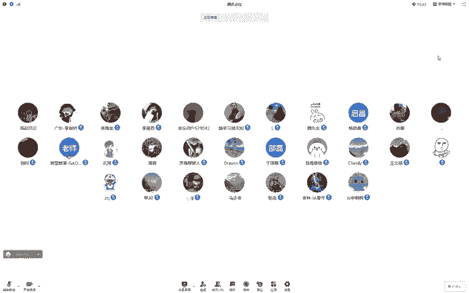

🎼给你我平平淡。🎼给你我轰轰烈。🎼黄和。🎼给你我百转千回的信。🎼和忧愁。🎼给你我微不足道所有的所有。🎼，🎼给我你带着微笑的嘴角。🎼眼眸。🎼给我你餐。🎼你的初春和深秋。🎼给我你未巾雕琢的天真。🎼的自由。

🎼给我你最最珍贵。🎼所有的。🎼所有。🎼给你我义无反顾的长长和久久。🎼给我你朵。🎼以后。🎼握尽的。🎼的手。🎼给。🎼梦手。🎼你给我迁就。🎼会。🎼会。🎼就这样。🎼给你我义无反顾。🎼我的床上。🎼把99。

🎼果你多年以后。🎼我听。🎼的手。🎼你。🎼给我迁就。🎼就这样。🎼给我你带着微笑的嘴角和。😔，🎼眼眸。あ。🎼给你我红。🎼烈的渴望和温柔。😔，🎼给我你为巾雕琢的天。🎼给你我微不足。🎼所有的。

🎼给你我微不足道所有的。🎼所有。😔，深海底海。🎼因为你才更有勇气吧。😔，🎼不心寒。🎼初次遇见。😔。

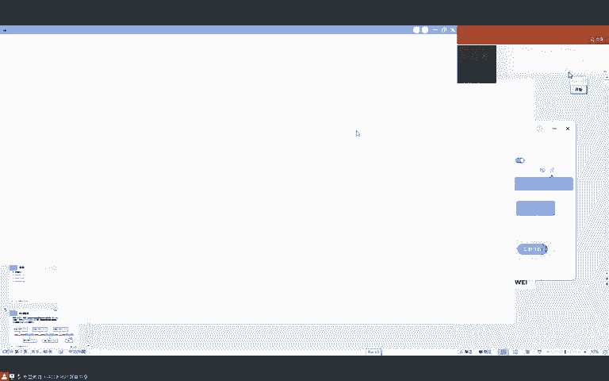

🎼你双眼在心海。😔，🎼慢。🎼了解你的光芒。🎼风很遥远，仰着头。😔。

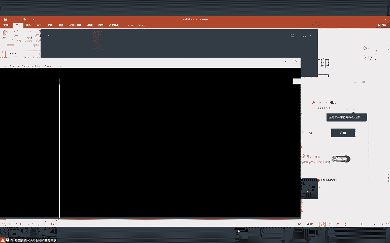

🎼不回头。🎼当上失吧。🎼闪闪发光，成就梦想。😔。

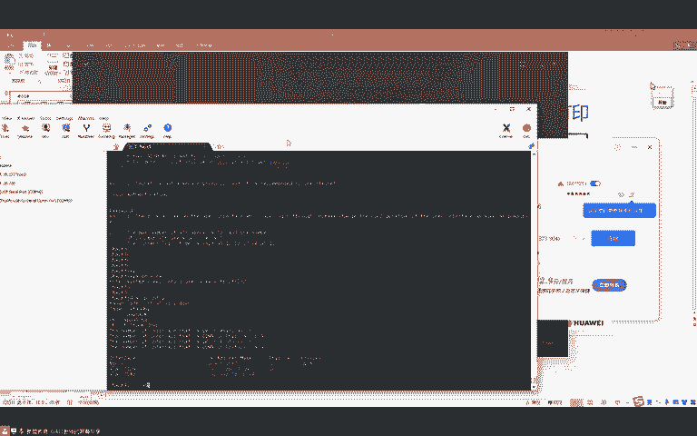

🎼你永远美好。🎼深海的爱，因为你在更有勇气奔赴星海。😔，🎼你无限的未来，像海永远期待你遇见前爱是最好。😔，🎼伤害体爱。🎼因为你在。🎼更有勇气穿越人海。😔，🎼我们与你同在欢乐永不满载伤心深害。😔。

🎼也会闪亮灯待。😔，え？🎼没多了。🎼值得碰。🎼会奔向未来。🎼你就是想耀心海，小息会为你喝再因偎。🎼永不言。🎼深海对黑。😔，🎼因为你才更有勇气奔赴醒来。😔，🎼被火限的未来，生海永远期待你遇见心海是最后。

😔，🎼太像害底。🎼因为你在。🎼更有勇气转。🎼人海。🎼我们与你同在，忘了又不满再相心。🎼也会。🎼善亮灯待。🎼伤心深害。😔，🎼终会善良等待。😔，🎼睡觉。

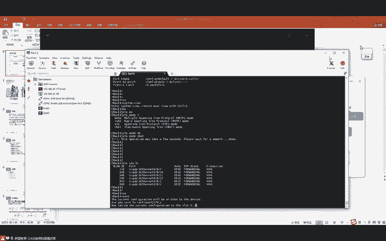

🎼Yes。🎼Yes。Yeah。好，同学们，大家能听到吗？😊，呃，能听到同学敲一啊。还好是吧。😊，好，那我们开始上课了啊。嗯。😊，麦和系统声音。行好。那同学们我们就开始上课了啊。

然后我们这节课依然会去讲IPU6啊。呃，剩下的内容呢还不是特别多了。然后我们上节课是最后讲到了这个。IPV6的无状态地址自动配置，对吧？然后我们说到了1个SLAC的一个机制，对吧？

那我们上节课通过一个实验呢，可以去看出来啊，就是当我们的设备去获取地址的时候呢。呃，比如说我们给他发包，对吧？呃，发送的这个I报文呢里面会包含自己接口的IPU6前缀。那。并不是所有的IPU6前缀呢。

我们都会进行地址的自动配置，对不对？那还有一些。这个其他的因素呢就是存在以下原因的时候，呃，我们的设备呢也会去忽略RAA报文发送的前缀。呃，在这里呢我们上节课解释了3点，对吧？第一个就是凹to位啊。

给大家去解释试一下，对吧？就是呃它就相当于地址自动配置位，如果A位等于一呢，就是你要用这个前缀自己去配一个，对不对？😊，呃，包括地址以现有地址产生了重复，对吧？

这之前给大家说过啊呃以及长度呢跟接口ID呢不等于128是吧？上节课我们解释的这三个点啊，呃接下来要说的一个呢是。😊，叫做嗯优选生存期是吧？大娱乐叫做。有效生存期。那这两个生存期呢，可能大家不是特别明白。

也就是说对吧嗯老师这个生存期啊，它是一个什么样的概念，对吧？或者说他是干什么事的。😊，嗯，这么来说啊，就是我们之前在学这个IPV4地址自动配置的时候呢啊我们学到了一个叫做DHCPV4。呃。

但是DHCP呢，他给设备去。分配地址的时候，它会有一个租期，对不对啊，就像你租房子一样啊，它会有一个租期。那在IPU6中呢嗯我们获得到一个地址之后呢，也有类似的一个时间的概念。能不能明白。

也有类似时间的概念啊，呃，IPU6中有几个时间值，那这几个时间值呢我们先来看一下，对吧？呃，然后呢我们再去说它的作用。😊，我们来看啊，就是1个IP6地址呢。😊，会经历这几个阶段啊。

这个阶段呢就相当于我们一个人一样是吧？嗯，你这个人呢有这个。😊，呃呃，青少年对吧？啊，有这个成年阶段啊，有中年时期啊，还有老年时期。对不对？那IPU6呢1个IPU6地址。

那它的时间呢我们也划分成了不同的时段。那首先呢当我们在进行DAD之前，对吧？也就是说进行地址冲突检测之前呢，这个IPU6地址我们都把它叫做试验地址。对，一旦经过了DAD之后呢。

你这个IPU6的这个地址呢，它就要进入到一个叫做优选生存期。注意啊啊叫做优选阶段。那优选阶段是由优选生存期啊来进行定义的啊，这是什么意思呢？比如说呃我说你在这个嗯青青春期。

对吧那青春期呢它是有一个年龄的。你比如说啊这个人进入到13啊，到这个18之间是吧？我们可以把这一段的就是在年龄在这段范围内的人呢啊可以把它叫做青春期这个青春期是吧？那IP6地址也是一样。😊。

当过了DAD。之后，那么他就会进入到一个叫做优选期。优选期它有一个时间，那这个时间呢是由优选生存期来定的。比如说从0秒对吧？到1000秒。那这一段呢我们就可以把它叫做优选生存期。那过了优选生存期之后呢。

那么还有一个叫做不建议使用期。对呀。那他就相当于这个人一样是吧？啊，比如说大家这个呃搞网工的话啊，一般你这个年龄大一点啊，都不是。对吧就没有那么高高的优势了。啊，我们会发现啊很多公司在招人的时候啊。

他会说一句什么话呢？叫做呃35岁以下优先。😊，是吧啊就是35岁以下呢优先被考虑。而一旦过了35岁之后呢，那么你就建议到你就到了不建议使用期是吧？年龄太大了是吧？体能啊、脑力啊是吧等等都跟不上了。😊。

能不能明白？所以说啊一旦过了这个优选生存期之后啊，接下来进入的一段时间呢，我们把它叫做不建议使用期。😊，而对于不建议使用期呢，它有多久呢？实际上每1个IPU6地址呢？它都有一个叫做有效生存期。对呀？

有效生存期啊，大家可以理解成就相当于人能活100岁。对吧那你前35岁呢，是优选生存期。呃，那么你就是你能活100岁啊呃，然后你在35啊到100之间啊，这一段呢就叫做不建议使用期啊，最后就失效了。😊。

能明白吧？所以说我们的1个IP6地址呢也有类似的几个概念。在这里呢。😊，IPU6地址如果我们采用SLAC去配的话，那么它的有效生存期，也就是说它最多能活多久呢？默认是30天。对呀，默认他是30天的。

而优选生存期呢。他默认是7天。那也就是说在未来的呃这个23天呢，它都是叫做不建议使用期。这是我们1个IPU6地址，它默认的这几个时间值。而这几个时间值呢，它就能够决定着对吧？就是它有什么样的好处呢？😡。

或者说咱们的设备对吧？我首先来说就是设备它是怎么样去知道这个IP6地址的这几个时间呢。实际上在我们所发送的这个RA报文中呢，它就会去携带这几个生存期啊，也就是说嗯你。😊，是吧呃，有效生存期是多久？😊。

嗯，你这个优选生存期是多久？那在我们的IA报文中呢，实际上就有我先带大家看一下啊，然后待会儿呢我们再来说一下在IPU6中，这几个生存期啊，到底它体现了什么样的好处？😊，好吧。嗯。这地址啊。

我们发现就跟人一样啊。嗯，到了一定年龄段之后呢，嗯就不建议使用了是吧？我们来看一下啊。交换机一呢，我们给他。把生成数关了。A2一这边呢？然后这是AR。啊。这时候呢我们先在0-0-0抓包啊。

然后我在AR1上。嗯，interface。0-0-0。IP6dressice2001冒号12冒号码一。然后呢，我们IPU6dress。手动给他配一下linkloc地址啊，因为我们待会儿抓包的话。

原地址是linkloc是吧？我们手动配一下呢，待会儿这个。啊呃，抓把好分析啊，然后IPU6NDRA对吧，把这个I报文发送能力的抑志呢给它关闭掉。然后我们现在可以看到啊，这个设备呢发送了1个I包。

而在这个RA包里面呢，嗯我们去打开，比如说这不是有1个IPU6前缀吗？是吧？我们就可以看到这两个时间，一个呢叫做有效生存期啊，还有一个呢叫做优选生存期。那这里所显示的单位是秒，注意啊，是秒。呃。

你们自己可以去算一下啊，嗯就是下面这个优选生存期呢，默认是7天。而这个有效生存期呢，它默认是30天。系哇。那这几个时间对吧？我们可以去看到啊，就是在IA报文中呢，它会携带这几个时间。

那这几个时间它有什么样的作用呢？我们来看啊。😊，嗯。当然课件里没说啊，我看下面有没有。

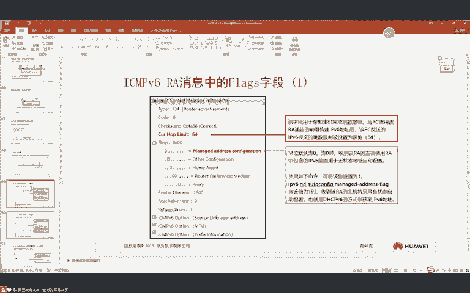

这个课件就没介绍了啊。😊，呃，我给大家讲一下啊，这个在IVC文档中呢有这么一段介绍啊。😊。

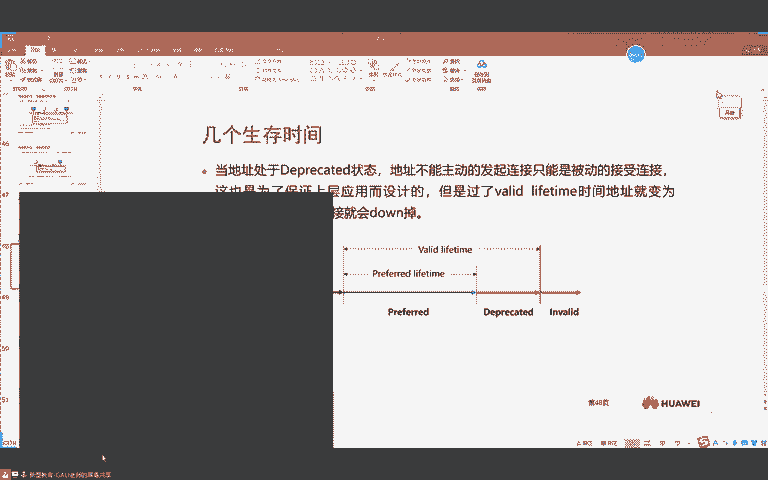

嗯，就是。1个IP6地址呢啊它能够提供这样的功能啊，它主要是为了考虑到未来再进行啊，或者说地址进行。平滑切换的时候使用。嗯，这个平滑切换它怎么样进行体现的呢？比如说现在啊呃我有呢。😊，一个服器。啊。呃。

但是我这个服务器呢，现在有很多PC在访问他。对不对？呃，假如说我们有PC1234。那这台服务器呢，现在有1个IPU6地址。对吧这IP6地址呢。是2001冒号12，冒号码一啊，然64。

也就说我们的服务器呢，现在它拥有1个IP6地址是这么一个。呃，那我们在进行这个访问服务器的时候，对吧？其他主机啊1234。啊，他们在去访问这台服务器的时候呢，嗯就要去建立1个TCB连接。

而我们如何去确定1个TCB连接呢？它是通过五元组，对不对？也就是说，原IP跟目的IP呢啊都有。那这时候我们假设啊。😊，呃，现在呢。嗯。123。4。对吧都跟服务器去建立了。假如说一跟二啊。

我们先假设一跟二跟服务器建立了TCB连接。啊，那么一旦建立之后呢，假如说现在呢我的服务器呃要换地址。😊，对吧啊我们要进行地址的切换。对不对？那。如果要进行地理切换的话。

一跟二他们的TCB连接呢啊就会产生中断。是吧特别对于我们的服务器呢，有时候嗯这个业务是非常多的对吧？也就是说它建立的TCP数量啊是非常多的啊，一旦我们换了地址呢。

那这时候肯定会导致的一个问题就是啊所有的TCP绘画呢啊都会被中断开。😊，对吧那这时候你的业务啊就会断一会儿。😊，那在IPV4中，我们好像没有更好的办法去呃实现一个切换，对吧？啊。

只能我们先把这个服务器呢迁移到其他的这个地方，对不对啊，然后让他们去访问另一台服务器，然后我们再把这台服务器呢去换地址。😊，呃，但是在IPU6中呢嗯就是IPU6地址呢就提供了一种啊平滑演进的功能。啊。

那怎么样进行提供的呢？我们来考虑一下啊。😊，呃。现在呢假如说。这是我们的服务器，之前不是有一个地址吗？现在我又给他来1个2002啊，冒号12冒号21的地址。😊。

对吧因为我们的一台设备呢支持多个IP6地址的配置。然后呢，我把2002啊到这些PC呢啊之间的路由打通。对吧那这时候呢，实际上我们通过2002也能够访问这台服务器。是不是啊？那大家要注意。

那每个地址呢大家都有一个啊叫做就是我们刚刚所说的优选生存期跟有效生存期。是吧。😊，那也就是说上面这个地址呢。我们可以让他的他的优选生存期不是默认7天嘛？是吧而有效生存期呢默认是30天。对不对？

那下面呢也是优选生存期默认是7点。有效生存期默认也是30天。那这时候我们可以是这样的啊，就是在IPU6里面呢，如果在这时候我想把上面这个地址换成下面这个地址啊，我们就可以这样去做。😊，就是。

首先呢我在路由器上，比如说我们现在不是有在发送I包吗？是吧我让他取消对2001冒号12这个网段的通告。那取消了这个网段的通告之后，也就是说那这个前缀啊没有一直被刷新。那也就是说它最多只能活30天啊。

30天之后呢嗯就被关闭掉了。对不对？所以说他最多只能换30天啊。那这时候呢，我们可以在服务器上。去维护下面这个地址段啥意思呢？就相当于两个人这个工作开始交接了是吧？你上面的优选生存期我不维护了啊。

下面呢我一直在维护。😊，等到第八天的时候，大家注意啊。等到第八天的时候，所以说上面这个地址就到了不建议使用期。是吧而下面这个地址呢还在优选生存期啊，为什么呢？因为上面的我们不再维护了。

那下面这个地址多少呢？我们一直在维护。😊，是吧。😊，所以说当一个地址到了不建议使用期之后，注意啊，也就是说原有的可能我们还有一些TCP绘画。那这些TCP绘画能不能跟这个服务器再进行正常通讯呢？

这时候是可以的啊，大家要注意啊，这时候我们依然可以。😊，用不建议使用器的地址。维护原有的TCP绘画。但是，任何新的TCP连接。都会由优选生存期的地址来进行啊作为原地址来进行发送。

比如说未来呢这个服务器可能要访问其他的地址。那么我们就会使用优选生存期的地址和三去建立。TCP连接。也就是说，两个地址有没有同时在工作上，有对吧？那不建议使用T械地址，只能被动的接受TCP连接。😡。

而优选生存器的地址呢，未来所有主动建立的TCB连接啊，都会由优选生存器去建立。对吧那这时候只要不建议使用期够长，它就相当于啊你的工作一样啊。我举个例子啊，呃比如说呢现在嗯呃你们公司要把你换掉是吧？呃。

把你换掉之后呢，什么时候开始换呢？😊，他会找个人啊，慢慢的来接替你。首先你俩是吧嗯在公司里呢都是并强的对吧？你负责一部分，他负责一部分。😊，那然后慢慢的注意，比如说呃你们两个人呢呃工作在一起比较久了。

对吧？对各自的业务都比较熟悉了。😊，那后面呢注意啊，后面这个地址，比如说你有一些新的业务，对吧？或者说有一些客户需要去拜访。那这时候呢，我使用二去建立这些TCB连接。对吧就跟你拜访客户一样。

你使用二对吧？使用这个年轻人。去拜访三跟四这两个客户，对吧？用年轻人跟他们之间打好关系。😊，能不能明白？而你的那些老客户呢，哎我不动，对吧？你不是之前有些老客户吗？是吧啊，我不动你的。😊。

不到你的到什么时候呢？那你这个客户总有一天会掉吧，对不对？也就是说你的合作期啊总有一天会终止。😊，对吧只要不建议使用期够长，那么这些TCB连接未来有没有可能就是业务访问完了而主动的去拆除啊？

大家觉得有没有可能？完全是有可能的对吧？只要不建议使用期够长，那原有的这些TCB连接呢，都会因为业务访问完成了是吧？而正常的去断开TCB连接是吧？业务也不会断，而所有新的业务。

所有新的TCB连接都有优选生存期。😊，是吧来进行负责了。也就是说由二这个人来进行负责了。那你这个一是不是慢慢的啊就掉了啊，能不能明白，慢慢的你这个一这个地址还有没有作用啊，是不是就没作用了？😊。

大家能明白这意思吧？啊，就是找一个人对吧？嗯，开始培养他是吧？啊，就让他去做一些新的业务。而老的业务呢嗯这个老人呢我不逗你。😊，对不对啊，我不动你啊，不动你怎么办呢？等老业务维持不下去的时候啊。

你自己就被淘汰掉了。😊，所以这里大家明白了吗？明白的同学敲一啊。都没问题吧。好吧，那我们的地址也是一样啊，对吧？你老地址我不动，你原有的TCP连接呢，我也不给你删了是吧？你就正常的保持。

让客户也能够正常访问啊。但是呢未来所有的新的TCP对吧？也就是说新的业务呢都找这个新地址建立。😊，对不对？等到你所有的这个TCB连接，老地址的TCB连接正常拆除之后。是吧那这个二这个人呢，对吧？

新地址就完全的把你取代了。能不能明白？那这在我们的网络中，我们可以去发现啊，那是不是更平滑的能够去进行冲编制啊？😊，是不是比如说我地址规划的不合理。是吧啊或者说呢我的地址段需要扩充。

是不是我们可以先将新地址哎，先给你引入进来。我不是说把老的干掉是吧？然后再早新的弄上去，不会是吧？我先把新的拉过来，慢慢的让他接手，只要时间足够长是吧？啊，你这个老员工呢啊早晚得被干掉。

所以这个意思大家明白了吗？明白同学敲一啊。😊，都可以吗？是吧。可以是吧啊，对，这个实际啊。😊，あ。😊，哦，我好狠，这倒不是我很狠，这个实际上是很正常的事啊。😊，对吧啊大家在职场中应该会经常去见到。

对不对？只不过我们的网络中呢也有类似的。😊，对不对？也有类似的啊。嗯。🤢，没错。所以这就是我们获得了1个IPU6地址之后啊。他所携带的几个时间。嗯，那这个时间呢咱们实际上也可以去看到。比如说我在二上呢。

😊，在2的G0-0-0接口对吧？IP6 enableableIP6dress。All to global。对我们看一下二获得的这个IP6地址呢，0-0-0。嗯。我走得吓。在这里有没有有效时间啊？

是不是有啊？可以看到吧。😊，好吧，那我们上节课之前配IPU类前缀的时候所说的那两个时间啊，我再来给大家解释一下。😊，Interface。G0-0杠0IP6dress。2001。啊，不对啊。

IPV6NDRA。Pfi。打001码号12码好不好。是吧64。那上节课我们所配的那个。100大家还记得吧？这啊1万啊这一万是什么啊？是有效生存期。能看到吗？然后我们再打个问号。

之前上节课我还配了1个1000，1000是什么？是优选生存期。😊，好吧，这就是这两个时间的作用啊，那这几个时间呢可以帮助我们的IPU6呢啊能够进行一个呃更平滑的演进。😊。

对吧啊也能够帮助公司啊更听华的把这个人给他干掉啊。来我们来看啊，所以说如果IA报文中呢这个优选生存期，它大于了有效生存期。对吧那么在这时候呢，优选生存期。大于了有效生根机啊，大家注意啊。

那这种呢有效的生存机就是你地址。他所能够使用的时间。但是一旦优选生存机都大于了，对吧？你地址所能够使用的时间嗯，这个就这种我们能够想到的啊啊，那只有产生了攻击啊，才会有这种情况。😊，哎，能明白这意思吧？

这就相当于啊你说你能活100岁是吧？啊，我说你呢你这个青春期过了101年。😊，啊，那这时候啊大家肯定能听出来啊，这人说的是一句浑话。😊，是吧所以说啊优选生存期呢是不可能会去大于有效生存期的。好吧。😊。

所以在这一个啊。呃，所以呢这时候我们就能够再进行看明白了。那上面这4条呢，对吧？就是我们什么时候会去忽略啊，对IA报文的处理能力呢？嗯，就是上面这4个。什么。😡，这个大家都懂了吗？懂的同学敲一啊。😊。

可以是吧。好，那咱们继续啊。😊，嗯，那RAA报文中呢里面还有一些字段啊，然后把这些字段呢来给大家说一下啊。😊，嗯，我们来看这里啊。啊，对，就两个时间段啊，就你那个不建议使用期一减不就出来了吗？是不是？

比如说65退收。是吧啊，比如说你能活100岁啊，65退休。对不对啊，那你什么时候能够享论啊，不是啊这个享受一下自己的美好生活呢啊就是你65到100这期间。😊，对不对啊，就到165到100这之间啊。

所以说一检就出来了啊。然后我们继续来看啊，就是在我们的这个IA报中呢，实际啊还有一些标志V。我们把这些标志位来给大家看一下。呃，在这里我们可以看到有一个ho limitit呃。

这个ho limitit它是做什么作用呢？就是我们这个I报文呢可以去指导主机。😊，去产生IP6报纹的TTL嗯，它有多大？能看到吗？默认是64。但是这里大家需要注意啊，嗯这个64呢，它只是一种建议啊。

就这个64只是一种建议。嗯，什么样的建议呢？嗯，就是我们的主机可以忽略参考这个hope limit啊，只不过IPU6路由器呢发送到IA报文中，携带这个ho limit呢嗯是可以对吧？

建议主机产生IPU6报文中，对吧？就是把你的TTL设置多大。😊，啊，但是呢它只是一种建议啊，呃在不同的操作系统中，当然我记我印象中好像windows就有就你在CMD里应该有一条命令啊，就是可以忽略。

就是对这个64的参考。😊，所以这里大家注意啊，就是路由器呢啊也提供这么一种能力，就是该字段呢可以帮助主机对吧？完成跳数的限制。呃，当主机使用该RA通告的前缀构建IPU6地址之后，对吧？呃。

所发送的IPU6保纹呢跳数被限制为64。所以这是这个作用啊。那下面还有几个啊。下面有几个flag。嗯，flag这里呢我们接触的是这两个啊，一个叫做M，一个叫做O啊，下面呢应该是新定义的啊。😊。

那我们来看一下这两个M跟OM跟O呢它们是用于IP6地址配置的，呃，也是一种建议。我们来看一下啊。😊，M呢它默认是等于零的。如果为零的时候呢，代表收到该RA的主机。

使用RAA中包含的IPU类前缀用于无状态地址自动配置。对啊，如果等于零的时候，那也就是说我们要用RA报文中携带的IP6前缀，用于无状态地址自动配置。那这时候告诉你就是用什么去配啊，用SLAC去配是吧？

因为SLAC配置就是在RA报文中啊。😊，对不对？那如果我们设置为一呢，代表要去采用有状态自动配置，对吧？也就是说用DHCPV6嗯去获取的。弄懂吗？也就是说这个如果等于一啊，就告诉你。

你要用DHCPUV6去获取地址啊，如果等于零呢啊你就用SLVC。😊，但是大家注意啊，这只是一种建议啊，为什么我们说只是一种建议呢嗯。😡，这个有本书啊叫做IPU6技术经英啊。

在里面呢介绍了windows的一种功能啊，就是你在CMD里呢也可以去敲一条命令，就windows的CMD啊。😊。

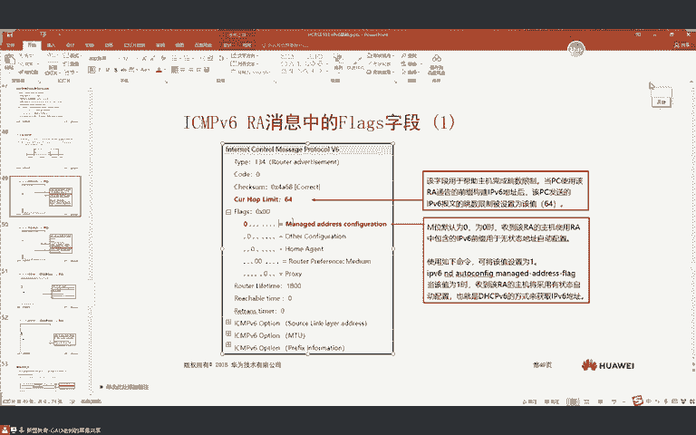

就这窗口下啊，就有一条命令呢，它可以忽略路由器发送RA报文中的M标志。

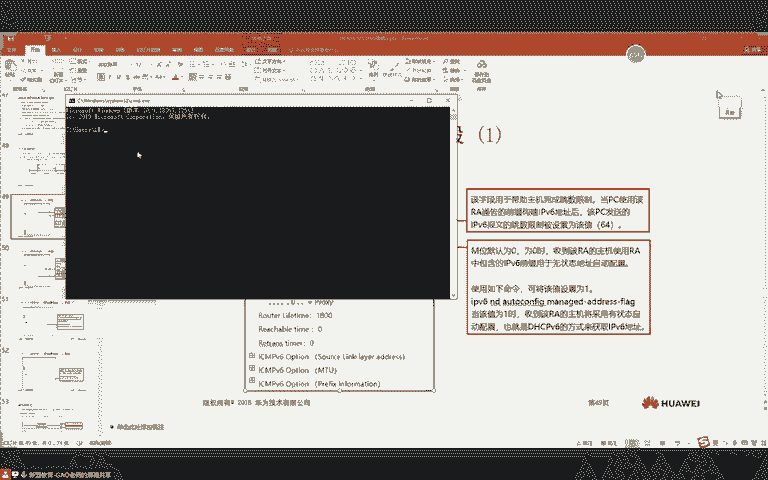

对吧所以我们说它只是一种建议。那这个建议到底要不要参考呢？我们可以在主机上去设置。只不过对于IPU6中呢，这个RA提供这么一种功能。😊，好吧啊，啥面令我也记不太清了啊啊，但是你们想了解的话。

可以去百度上找找。😊，行吧。然后我们来看啊，那还有一个呢叫做欧比特。这个欧比特呢啊叫做其他配置位。其他配置位是什么样子呢？我们来看啊，默认依然是等于零的。😊，那么等于零的时候呢。

代表表示主机呢不应该使用有状态配置来配置。除了IPU6地址外的其他参数。对呀啊，这句话它是嗯反向取义的意思叫做不应该啊，就是不要使用有状态自动配置，对吧？配置除了IPU6地址外的其他参数。也就是说。

IPV6地址外的其他参数呃是哪些啊？DNS。对不对？那还有什么啊？啊，当然比如说可能我们这个AP啊。是吧啊还要获去获取这个AC的地址是吧？还可以用那些option。

是吧operation设置3对AC地址。能不能明白？所以说啊这其他配置位就是用于指示。比如说IPV6地址外的其他参数呃，我们怎么样去获取？比如说DNS这些参数对吧？如果等于零的话。

代表不应该使用有状态来获取IPU6地址外的其他参数。也就是说。IPV6地址外的其他参数，我们就可以把它翻译成叫做DNS。不应该使用有状态自动配置，那我们可以翻译成。是什么？SLAC。大觉得行不行？

你仔细读这句话啊。注意啊。不应该使用有状态低的自动配置。那DHCPV6，我们可以把它认为是有状态。是吧我把这个删掉。😊，对吧这不就是写成SLAC吗？他是说的比较绕啊。啊。

配置IPU6地址外的其他参数IPU6不地址外的其他参数啊，这里是DNS吗？是吧那表示主机应该使用SLVC去配DNS。啊，大家觉得对不对呢？😊，是吧可能懵逼了啊。😊。

是吧然后下面等于一交不多使用DHCPV6来配置IPU6地址外的其他信息。😊，是吧越读越不对劲，对不对？好，我给大家说一下啊。😊，我给大家解释一下这几个比特啊。😊，就是在RAA报文中啊。IA报文中。嗯。

能够指导。指导。IP6地址配置的几个标记啊。嗯，几个标记我们都看到了也都学过了啊，一个是A是吧？就是我们之前说说的凹凸，一个是M是吧？呃，一个是这个。然我直接这样写A。啊。M。还有一个O。啊。

A比特呢用于表示是使用SLVC去拍地址。那A比特等于0呢，就你不要用SLVC配。M比特等于一呢，就告诉你你要用DHCPV6区配。对吧那注意啊，这里需要给大家科普一下DHCPV6呢。😊，有两种。部署模式。

一种呢叫做有状态的。DHCPV6。一种呢叫做无状态的。第一次CPV6。他们两个是有区别的啊。也就是说，有状态跟无状态之前给大家说过是吧？有状态DH是CPUV6呢，它就是要记录啊麦克和IP之间的对应关系。

而无状态呢，他不需要进行记录。但是在这里呢，有状态它是可以去分配IPU6地址啊。DNS啊等其他参数的。那无状态DHCPV6呢，它只可以用于分配。DNS等其他参数。也就说无状态DHCPV6。

它是没有办法去分配地址的。然后这时候呢，我们结合这几个比特啊来给大家说一下。😊，那我们常见的几种这几个比特的组合方式啊，我来给大家说一下。一般呢就是。哎嗯，我这样来写。这是A。这是M。这是O。啊。

一般我们常见的几种标记的方式呢，就是A等于1。M等于0，O等于0。那这样就代表着呢只使用SL。AAC。配置IPU6地址啊，那有没有定义S呢？实际上是没有的对吧？你像对于一些物联网的设备呢。

他们不需要定S。对吧只要一个地址就行了，因为他没有这些外部访问的需求。😊，那还有一种方式呢，就是。A等于1。M呢等于0。欧呢等于1，那这样代表着呢使用SLAC。配置IPU6地址是吧？使用无状态。

DHCPV6。配置DNS等就是配置其他DNS参数。那还有见过的一种标记呢，叫做A等于0。M等于1。O是等于0。那这样的话就代表只使用S啊，不对，DH啊叫做。有状态DHCPV6。

配置IPU6地址和DNS的。听懂吗？那这是我们常见的几种标记，对吧？那有同学就问了，如果老师全等于一呢，是吧？那有一些可能有冲突啊。😊，对不对？比如说我M等于1O等于1，那我使用有状态DHCPU6配。

还是用无状态DHCPUV6配呢？😊，是吧这里我来给大家说一下啊。😊，嗯，目前的规定是这样的啊，就是M和O比特。同时制一的时候。事后。设备呢。会忽略。对。欧比特的处理。也就是说呢他只参考的是M。好吧。

那M和。A比特同时。质一的时候。那么大多的操作系统啊，这个就没有特别高的规定了啊。就大多操作系统。会。使用DHCPV6和。SLAAC。各配置。一个地址。他是这么一种关系啊。😡。

就是如果两个同时之一呢啊大多的操作系统都会去配2个IPU6地址。好吧，那这是我们几个标记啊，在进行使用的时候，它所进行比较的一些方式。那一般我们用的时候就用这几个啊，你不要去被那些冲突的。好吧。

你比如说老师我全全部配成一。对不对？全部配成一呢，我们虽然可以推论啊，就欧比特忽略处理嘛，对吧？A配一个地址，M配一个地址。😊，啊，虽然我们可以去分析出来啊，但是呢你要去做项目。

你最好不要这种啊多找事儿。好吧，啊，就有上来有同学问，对不对？老师我用。😊，是吧老我用串连接一个电脑。对不对？我就给他配串啊，然后我把PUID改一下行不行的？可以，这样是可以的啊。

但是呢一般我们就按照规范对吧？标准去执行啊啊，最好不要去做一些例外啊，因为你只要继去做例外呢，就会复杂化你的网络，对吧？那如果大家真的以后遇到IPU类的项目的话啊，就按照这样的方式去做啊。😊。

对吧这样更清晰啊，也更明了一点啊，尽量不要去配冲突的。好吧。😊，呃，这几个标记位大家明白了吗？😊，明白，同学敲一啊。冇问题话。可以是吧。这时候我们再来看课家啊，你就能看明白了。😊，如果等于0啊。

表示主机呢不应该使用有状态自动配置。除配置除了IPU6地址外，其他参数啊不应该使用有状态，就是不要你使用有状态DHCPV6。对吧啊去配置DNS啊，那不让你使用有状态DHCPU6配DNS。那是什么意思啊？

是吧就你用无状态DHCPU6去配DNS其他参数。啊，如果指位为一呢，代表你要使用有状态DHCPU6啊，来配置除了IPU6地址外的啊啊就做无状态DHCPU6啊啊来配置除了IPU6地址之外的其他信息对吧？

如果指位为一就是告诉你你要用无状态DHCPU6呢去配DNS对吧啊，域名这一信息。😊，所以这是几个标记位啊呃但是这几个标记位呢大家注意啊嗯也只是建议就是这些所有的标记呢，在windows上都有特定的命令。

😊，嗯，就是可以给它关闭，就是你比如说就是windows上就CMD里啊，就哪一个命令我记不太清了。就大家有兴趣可以去翻一下啊。😊。

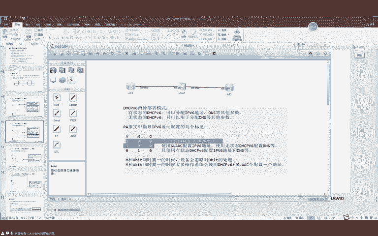

百度找找。嗯，我印象中在这个IPU6技术精要这本书里面有介绍的啊，大家有兴趣可以去翻翻啊。嗯，就是windows呢可以忽略对这几个标记位的处理。

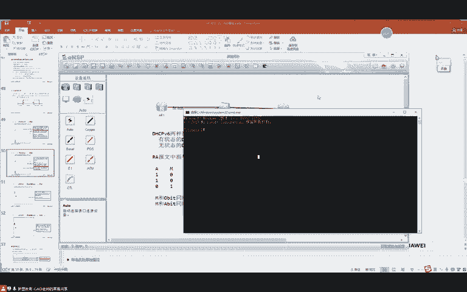

啊，你就只手动配置啊，这样也行。然后下面还有一个叫做路由生存时间啊，呃这个就是缺省路由会在IP路由表中加表了多久。因为我们上节课也说了啊，就是在AR上呢。😊，比如说我们在G0-0-0。IP内部。

那IP6adice。凹 toglobal对吧，我们可以加个defa，加个 default之后呢，也就是说在AR的路由表中呢，嗯会去产生一条缺省路由，对吧？冒号冒号。😊，那这个缺省路由会存在多久呢？啊。

默认情况下它是1800秒。😊，可以看到吧？就是全省路由的存在时间啊，当为零的时候呢嗯将不会出现在。就是缺认网关将不会再加入到列表中。啊，也就是说默认呢他是半个小时。好吧。然后在下面几个时间呢。

我们再来看一下啊。😊，呃，在RAA报文中呢嗯还有一些标志啊，我们现在来看啊这个标志呢它是在IPU6的前缀中。前缀我们说了两个生存期了，对吧？那实际上它的flag呢还有一些标记，对不对？有一个O啊。

有一个AA我们之前说过A呢就是用于指定对吧？它是不是用于嗯无状态第一是CPUV6地址配置的对吧？但是在这里呢还有一个O，那O代表的是什么意思呢？表示RAA最中消息中的前缀。😊，是分配给本地链路的。

因此呢。像包含这个指定前缀的地址，发送数据的节点呢啊都认为是本地链路可达的嗯，这是什么意思啊？我给大家说一下啊。华为里面呢做不出来这个实验啊，但是思科的是可以的啊，大家有兴趣可以用思科的去做一下啊。

这里实验的结果啊，我接下来给大家说啊。😊，这里是什么样子呢？比如说我们看一下AR啊。😊，AR获得1个IPU6地址之后呢，我display IPPU6rooting table。

我们可以去看到啊它有没有产生一条直连路由啊。有没有？是有的。对吧也就是说我们获得了1个IPU6地址之后，我会产生一条直连路由。那当我想要对这个网段进行访问的时候呢啊我们直接会去发NS对吧。

对应IPU4就是直接发ARP。😊，是吧但是在IPU6中，这个on link。对呀。如果追位为一的时候，我们才会去产生直连路由。所以现在我们看到这个IA报文on link是等于一的。

所以现在呢AR去产生了一条直链路由。但是呢我们也可以通过命令。比如说我在AR一上呢。interfaceG0-0-1。嗯，interfaceG0-0-0。叫做IP6呃。IP6。NDI prefi。啊。

2001冒号12冒号8号。没有是。呃，然后这是1000。对吧然后与之对应的呢有一个关闭on link。对吧你可以把on link这个功能呢给它关闭掉。那么一旦关闭掉之后呢。

也就是说他在发送的IA报文中呢，这个O比特对吧？就等于零了。等于零之后呢，如果我们的设备它是通过SLVC去获取到地址的啊，它就不会不会去产生直连路由了。比如说我现在在二上暗度杀荡一下子。啊。

我印象中华为里面做不出来啊。啊，但是这个实验呢，我是两年前做的了。好吧，所以说再给大家去看一下啊，思科的是有的。😊，呃，你看华为的还是有一条直连。对吧但是如果你用斯科的设备去做呢。

那么我虽然会去配置这个IPU6地址啊，但是呢它不会再去在本地上产生一条直联路由了。这里要大家知道啊，那这就是allink的作用。好吧。然后在下面呢还有一个A比特，这个A比特呢之前我们已经说过了。

就是它是用于指定对吧？这个前缀能不能用于地址自动配置的？😊，如果等于一的话啊，就代表我们要用这个前缀在接口上配置一个该前缀的IPU6地址。啊，那如果等于零呢？这个前缀呢就不会用于IPU6地址的配置。啊。

这是我们之前上节课已经讲过了这个AB的。😊，然后A比特咱们怎么样制零呢？上节课应该给大家去演示了一下命令对吧？就我们针对于这个前缀呢啊后面有一个no凹凸，对吧？把A比特智位呢给它关闭掉。😊。

有这么一条命令啊。嗯，这就是。SLEC啊就是在IP6中啊怎么样进行地址自动配置的。嗯，接下来我们要去讲一下呀几个简单的机制啊，剩下这几个就比较简单了。嗯，第一个呢就是IPU6中的重立项。这重定下。

大家应该在。嗯。I的时候，这个学SMP也学过，对吧？啊，就重定象。嗯，重内箱有什么样的作用呢？我们来看一下啊，下面有一个嗯例子。😊，比如说这里我们有一台主机A啊，然后在这里呢有一台主机B。

当A要去访问B的时候呢，我们要把数据发送到网关上是吧？那比如说A的RTA啊，它是主机A的网关。那这时候呢，我们的。嗯，这个这个这个这个这个主机A，那么他就会把数据呢发送到RTA上。而对于RTA来说。

我们可以去看到啊啊，你单从链路分析的这一个大网络里面不知道过多少台路由器。是吧就是对于我们的RTA来说，它去往主机B，它最近的链路呢，或者说嗯最近的吓一跳呢是路由器B。是吧。那路由器B呢跟路由器A呃。

以及跟主机A它们都在同一个网段。是吧。那这时候如果我们把数据交给网关啊，网关再转发给B对吧？B再转发给主机B。那这样实际上绕了一个次由路径。对不对？所以在IPU6中呢嗯也有重定向。

IPU4的重定向跟IPU61样啊。啊，他会怎么样呢？就是当我们的路由器A呢，这个功能默认是开的啊。他发现。嗯，我收到一个报文之后呢。是吧我从这个接口一收到啊，我还要从这个接口一发出去。而且呢。

我发出去的吓一跳。跟我收包的原地址还在同一个网端。能懂吗？那这时候ITA呢就会判断A跟B本身就是互通的。所以说路由器A呢。它就会给主机A进行一个响应，就是发送1个ICMPV6的充电相包。

那发送这个包呢啊会去告诉你对吧？就这个包一旦过去之后呢，里面会去携带上。就是你要去访问的主机B这个地址啊，它会进行携带上，就告诉你是吧？你要访问主机B的时候，你的下一跳是路由器B。

所以说未来主机A呢收到了这个SMP充电项之后。啊，他就会把数据包直接发送到路由器B。好吧，那这就是IPU6的重定箱啊，当然这个实验呢模拟器也做不出来啊。这红点你删了不就行了。这有啥好纠结的？听懂吧？

这是ICMMPV6的充电项啊，跟IP4是一样的道理。好吧，但这个实验也做不了啊，就大家自己体会一下啊。😊，所以说这个ICMPV6的重叠向包呢呃它长什么样子？就这样的。嗯，type code对吧？

用于表示豹文的作用，那chck sum啊，还有这个呃保留位啊，没啥说的。是吧然后在这里呢会去写上一下。就是你要访问的主机B对吧？这里会去协商上主机B的地址。啊，就告诉你访问主机B的时候呢，你要去找谁啊。

是更好路径的下一条地址，就你要找路由器B。就他会告诉你，你去往哪个目的地的时候找哪台设备，而不是说你去往所有目的地的时候都找这台设备。他告诉你，你去哪个目的地的时候啊，找这个设备。😡。

所以说他在重立项的时候是。A呢给他的这个SMPV6包呢，会去携带上主机B的地址。啊，告诉你呢，你去往主机B的时候呢，你直接去找吓一跳。啊，路由器比是这么一个过程啊，这时候就不过网关了啊。😊。

这时候就不过了。😡，就是A的网关依然是RTA，但是他在去访问主机B的时候，他会直接找路由器比。能不能明白？那比如说老师他要去访问8。8，他找谁啊，那他还找自己的网关。😊，好吧。

只不过针对于特定的目的地址，在进行访问的时候呢，他会去找这个路由器。是这样的啊。那后面呢还有一个叫做嗯叫passMTO啊，这个passMTU是干嘛的呢？😊，啊，叫FC1981对吧？

定义了一种叫做PMTO嗯，它是这样的啊，之前也给大家说过，就是在呃IPU6中呢这个。豹纹分片是吧啊，它会使用一个分片扩展包头。呃，当然这个分片扩展包头呢，只有目的主机才会进行处理啊。

因为一旦我的分片扩展包头携带之后啊，如果沿途的某个设备呢嗯也要去处理这个分片扩展包头。那这时候呢，实际上我们的效率还是不是特别高。它跟IPV4本质上没什么区别了就。对不对？因为IPV4中呢。

这个分片的那几个标记位呢，它都是在IPU4包里面的。所以说你要进行处理。但是如果我的分段包头呢，每个沿途的路由器都要处理是吧？那这时候实际上跟IPV4没有任何区别。

因为IP4就是因为每个路由器都要去看这几个字段。对吧所以说呢在IPU6中，他就把这个分片的呃信息呢放到分片扩展包头里面了，只让目的主机处理。但是IPU6中有这么一项规定啊。

就是在IPU6转发的过程中呢啊中间节点是不能允许分片的，就只能原节点分片。😊，但是原节点分片呢就会导致一些问题啊，什么样的问题呢？比如说原节点的主机是1500。😊，是吧但是在沿途上。

比如说我们沿途某台路由器，它的MTU没有1500。是吧原主机发送1500字节的报文。呃，但是中间的路由器呢，它没有1500字节。对不对？那这个包中间又不允许分片，那不就丢包了吗？😊，是不是？😡。

所以说呢IPV6中啊，我们得有一项机制，就是我访问一个目的地呢，我得知道这条链路上是吧？啊，最小的MTU是多少。😡，对不对？那万一我按照最大的发链路上有个小的，他发不出去，他又不能分片，那不就丢包了吗？

😊，是不是啊？那这个时候怎么办呢？在IPU6中就提供了这么一种机制啊，叫做PMTO。嗯，PMTO是这样的啊。😊，就是比如说现在我们有一台原主机A要去访问目的主机B。他这样啊，A给B发包的时候啊。

首先呢依然会以本接口的MTO嗯来进行分片。比如说我现在接口MTU1500，我就会发1500字节的包。那这个包到达路由器一之后呢，路由器一正常转发出去啊，到达路由器B之后呢，B一看哦。注意啊。

B的出口MTO是1400。对不对？而我的豹文呢是1500。对吧。那这时候怎么办呢？发不出去发不出去，B就会给A呃回送一个叫做piet to big嗯，也是1个IMP的包。那这时候呢会去说我的MTU啊。

是1400，你得按照1400发是吧？啊，否则到不了目的地。能懂吗？啊，这相当于你要娶新娘子啊，对吧啊，在我这个路上过，那你就得听我的。😊，能不能明白？是吧啊，入乡随俗，对不对？那这时候呢？

AR这个我们的主机A呢啊收到这个报文之后呢，它就会以1400作为MTU再在网络中间发送。然后再发包发包到1400B一看。是吧啊满足我的要求了，我让你改成1400呢你就改成1400了。😊，对不对？然后呢。

我就给你转发出去了，是吧？勉为其难的答应了。那当我转发给路由器三的时候呢。三有收到。三一看呢，我的MTU1300，你改成1400是什么意思啊，是吧发不过去啊，就能干这么多事儿。😊，是吧你爱干不干。

对不对？所以说这时候三呢嗯出于这个啊道德主义是吧？还是给你说一下，三呢也会给A回送一个啊，叫做pit to big告诉你我的MTO是1300是吧？你想从这发啊，你就得按照我的规矩干活。😊，能不能明白？

那这个pat to be呢就发过去了，A就收到了。A一看呀。是吧呃有两个硬卡。那这时候呢，我们的A呢依然会去再发送1300的。😊，能不能明白，就会去再发送1300的了。😊，这1300的呢到达A23之后。

一看啊，满足我的要求了啊，那最后呢他就给发送到目的主机了。😊，然后目的主机呢再进行回报。那这种呢就叫PMT6。就是他通过这个报文呢。在沿途每一条的设备上啊，就类似于这个TDL探测一样是吧？只要。

我的包不满足你的MTO是吧，你就给我回复啊，你回复之后呢，我再进行修正。对不对。这就相当于你这个。嗯，干活一样。啊，比如说你做了一项工作。对不对啊，你做了一项工作之后呢，你往链容上发嘛？😊。

你往链种上发。嗯，这是你的领导。是吧你的领导一验收是吧？啊，感觉还合格是吧？然后发给领导领导，领导领导一看不合格是吧啊，打回去重做。😊，对对？然后待会儿你满足啊领导的上级了是吧？

还有一个大领导的大领导一看不合格，对吧？再给你打回去重做。😊，所以说他就类似于这种啊，就每个人都给你一些指导意见。对不对？呃，但是这里啊大家要注意啊，这里只是这么举了一下例子啊，为什么我这么说呢？

是因为啊。嗯，传输路径上啊，我们这个。MTU啊，大家要注意呃，它不一样的时候呢很少，这个是很少的啊，就我们很少时候去改MTU。啊，还有一点呢，像这种这条链路1400，这条链路1300。嗯。

我们没没有这样去用的啊没有人这样去搞。大家能明白吗？是吧这就相当于你公司里有两个路由器。对吧你这里1400。这里1300对吧？这里你又改成1400，你你何必呢？大家能不能明白。

就这个只是给大家举个例子啊，就告诉你，如果路径上有不同的MTU呢，都会要进行回复。但是呢嗯没有这样去做的啊，是吧？我一条链路1个MTO啊，那你基本可以呃被淘汰了是吧？这种一般会被开除啊。😊。

所以说大家设计网络的时候呢，最好不要去改。😊，嗯，但是这个实验呢我们也可以去做啊。然后现在呢我们通过一个实验啊来给大家演示一下这个功能啊。😊，啊，我们以三台路由器为例啊。嗯，我就不拉多了。

咱们就看一个回复吧。嗯。123。我们在A23上创建1个IPV6。的环为口。呃，IP乐 dress2001冒号。3曼哈马尔3。是吧。128。我们在所有路由线上跑OSPF啊。OSPIV3嗯入台ID1。1。

1。1。70-0-0。OSPFV31L0。二上面的OSPFV3root IDD。😔，2。2。2。2。这个OSPIV3，我们目前还没有讲到啊。嗯，所以说大家觉得没学过呢，也不用。是吧啊不用感觉头疼啊。

这实际很简单。然后我们在A21上呢。呃，displayIPU6rooting table。咱们再稍微等一会儿。我们到二上看一下di四playOSPV3。P啊。老邻居已经建立了，然后在A21上呢。

看一下IP6的。路由表。学到了。是吧然后这时候我在二上呢。G0-0-1接口。你叫做。IP。😔，V6。MT。啊，比如说我改成1300。好吧。然后我现在呢在G0-0杠0抓包。现在我们来看啊。😊。

在21上呢骗。😔，IPV62001冒号3码。骗IPU6杠S。然后我们骗个1400的包吧。好吧，然后地址呢是2001冒号3，冒号冒号3。我们去骗他，我们发现第一个包没通。啊，第二个啊。啊不再见啊。嗯。

我再瞅瞅。2001马3马某3没发出去。display IP6如定table。A21没学到路由。刚看是不是学到了？呃，二也没学到，没有，我怎么印象中刚学到了呢？也通告了。对吧，通告了啊。

看一下邻居dispplayOSPV3P2。嗯，跟三的到达了AR状态。他告诉我为什么。还记得是为什么吗？OSPF进行MTU的检测。对吧。我们来改一下三的MT也改一下啊。好吧。因为这个OSPF呢。

它建立邻居的时候，V2默认不检测啊，但是V3默认会检测MTU。所以说呢咱们给它改成一致的嗯，都用的这个。1300。然后咱们在AR一上呢，dis四play。IP6入庭推广。嗯，我们就可以去看到这个地址啊。

然后再去骗啊。啊，我们拼个1400字节的包是吧？他第一个没通啊，然后后面就通了。嗯，这个包它怎么通的呢？我们打开瞅瞅呗。我来看看。啊，首先ASNA对吧？请求下一条的麦克。对不对？啊，我们一旦骗了之后呢。

我们发现这个包就发出去了。😊，是吧。而这个包呢，它是161462个字节。对不对啊，也就是说他是大于。嗯，1400的。是吧大于10啊。嗯，1642。这是40个是吧？呃。这是14个是吧SMP的包头。

是8个是吧，一共是1642啊。然后这个包呢我们发现啊一旦发出去之后呢，它就到了AR。AR收到呢它接口的M出口MTU呢是1300。是吧啊这时候发现发不出去。所以说呢二我们可以看到啊。😊，嗯。

他就给伊朗回送了一个叫做pi to B。啊。那这个豹纹里面呢会去携带上啊，就你刚刚发的这个包啊，他会告诉你。呃，你2001冒号12冒号冒一去访问3呢。链路上最大的MTU呢现在是1300啊。

有我的规矩就是规矩。对不对？你得按照我的规矩行事啊，要不然呢你别想惯。对吧。那就给你1个1300啊，告诉你呢，你得按照这个发。对不对？好言相圈。呃，这个包呢一旦AR一收到之后，我来看一下啊。

AR一再发的包呢就开始分片了。😊，对吧分别分了多少呢？啊，分成了1300。😊，是吧虽然我们看到稍微大一点啊。你看到的大啊，是因为呢。嗯，你这个大包呢，他要去加上以太网针投IP包头等等之类的。

你看我们的数据是不是只有1248个字己啊？对不对。啊，他就会去产生分片阀。发了分片之后呢，啊再把下一个给它携带上。那我们可以看到啊。😊，啊，这是以比特来进行计算的。对不对？

也就是说他会把这个报文呢给他发送出去。然后后面那些呢，你看他就再发一个小包。是吧。那这时候呢，我的分票呢是满足链路上的MTU规划的。对不对？所以这个报文呢就发送了22一看到没有超出我的MTO是吧。

他就发给了3啊，三收到之后呢，他一看目的地址3。3啊，他就要进行处理啊。对不对？那进行处理的时候，我们来看一下啊。里面呢携带了一个分片头部是吧？我知道后面还有分片，好像那我打开一看。MFA之位为一。

啊啊，我就知道了。现在呢我是从第零个字节是吧，也就是说这第一个包吧啊，后面呢还有分片啊，分片的ID是一。😊，那这个时候三呢就知道他还要再等等后面的数据包。后面包一来了之后呢啊他会去告诉你啊。

他是从1248个字节是吧，往后的。然后呢，后面没有分片了呃，分片ID是一。也就是说，这时候呢，根据分片ID啊，三就可以去判断出来这俩是同一个包。对不对？然后进行分票的重组。

那这就是在IPU6中的PMTO啊，就是通过发送嗯大包啊，只要有路径上的MTU一旦超出之后呢，它就会给绝点点来进行响应。嗯，那原结点呢就会按照所响应的这个MTU大小啊来进行数据报的发送。啊，对。

收尾不是收尾插表啊，就是尾端会进行组合。好吧啊，对，没错。让后我们来看一下啊嗯IPU6中有一项规定啊，就是MTU最小只能是1280。嗯，不能再小了。哦，但是最大的PMTU呢由链路层决定啊。

如隧道呢可以支持很大的MTU。嗯，这是什么意思呢？比如说我们加一层封装。那能明白吧？对吧。比如说我们加了一层封装啊，你像过了加E呢，这个包头就会变大。啊，但是嘉义呢也可以把这个包发送出去。

就是它是由链路层决定的啊，如果隧道呢就可以支持很大的MPO。呃，这就是咱们讲的PMTU啊，那IPU6的基础内容啊，咱们就说完了。嗯，说完之后呢，接下来我们还要去讲一些过渡技术，就IPU6中的隧道啊。

然后这个呢咱们歇息一会儿，好吧，休息会儿啊。😊，咱们休息10分钟之后嗯，来讲一下IPU类的过渡技术啊，什么共存啊。嗯，互通啊对吧？就IPU6的一些过渡技术啊，我们休息10分钟。嗯。好，同学们。

那咱们等到这个。9点13啊，不对，9点23继续上课吧啊。呃，这个PMTU和TCP的分段冲突啊？啊，那不会啊，他们是不同的层啊。那懂吗？他俩是不同的层级啊，你TCP是按照那个MSS啊。😊。

然后PMDU是基于IP层的。好吧。行，那咱们休息会儿吧。算了到25吧啊，现在都十四了，那休息10分钟行吧，咱们到25继续啊。😊，呃，MSS分段可以UPM啊，这个倒是可以的啊。这可以。

就是你MSS分完之后。嗯，IP层也可以再分啊。好，咱们休一会儿吧，25，然后咱们继续。跳首歌吧。嗯。🎼每当我走。🎼记。🎼没失去你。🎼带着回。🎼世界想把你忍太久。🎼有谁。🎼别多手。

🎼为何还在等属于我的戏妇？🎼我在圣诞尽头。🎼一个人。🎼行走。🎼还微下了。🎼奢下。🎼定要。🎼我的心动。🎼守在。🎼搬车。🎼现在。🎼也知。🎼因为其实。🎼奢望你。🎼没失去。🎼可希望不再变味。🎼一上。

🎼让稀有的自由。🎼舍得家。🎼你是。🎼的游戏。🎼家的心碎。🎼最心松。🎼的身旁。🎼夜色上。🎼月的雪。🎼找到了。🎼的伤疤。🎼柳林的。🎼竟然是我镇海之宝。🎼只要我。🎼就是。🎼你说。🎼一起。🎼来之。

🎼前提是我是离开。🎼一起学听花之态。🎼划过神命就为血脉，炫耀努力着时代，皎月的光泽遮掩了云翳，也掩藏不住安拉森行迹，只身沧海中用力寻觅传说的法体无间之淋厉。😡，🎼他们偷出这个世界里所。😡。

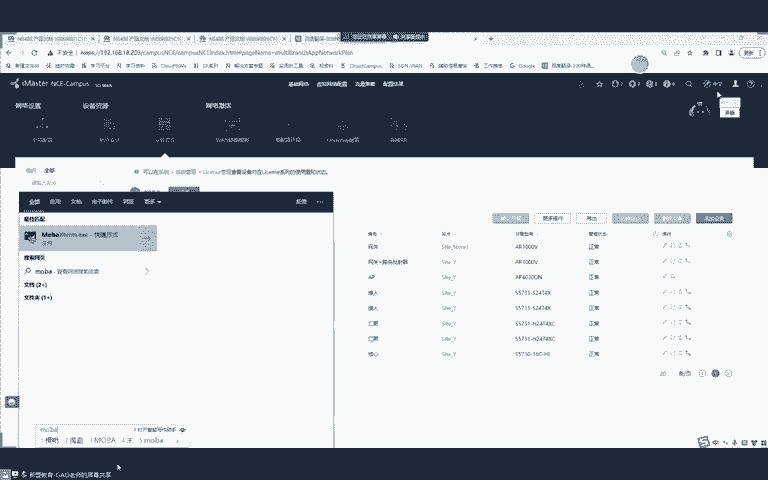

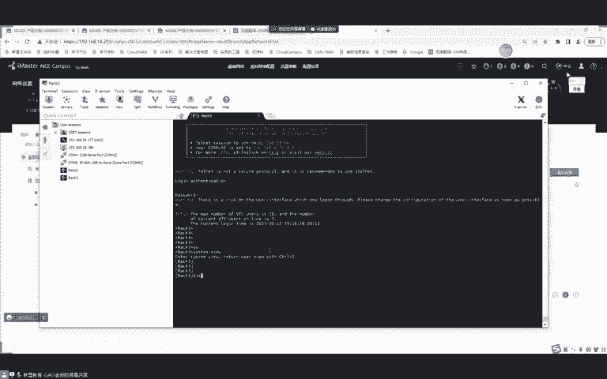

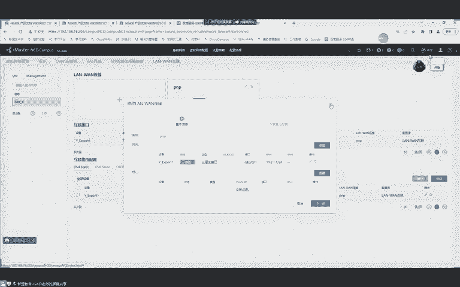

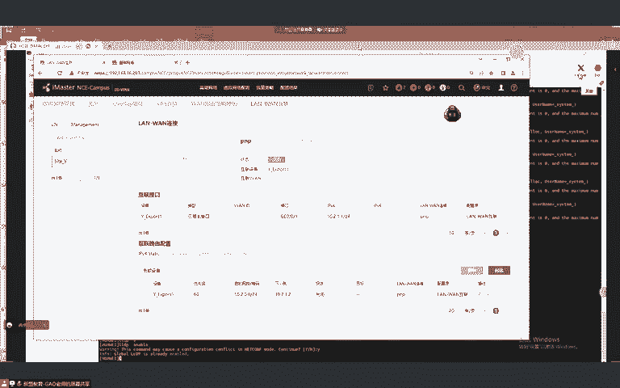

哦，我刚没开声音是吧？呃，现在大家能听到吗？可以吗？可以是吧。呃，咱们的NCE是本地部署的啊。呃，dmo上预约的环境啊，这个倒不是啊。嗯，这democlo没上hp开放啊。对。咱们是自己装的一个。好。

我们开始上课啊。然后我们接下来要去讲的一些技术呢就比较简单了。嗯，原理呢也比较简单啊，但是配置稍微来说会比较多一点。呃，接下来要说的是IPU6的过渡技术啊，这个过渡技术呢就相当于我们这个。呃。

这个这个去把IPU4换成IPU6的时候啊，没有办法一下子全部变更。对不对？嗯，那有时候呢可能涉及到一些这个IPV6跟IPV4互通啊是吧？呃，或者说网络中有一些站点是IPV4，嗯，有些网络呢是IPV6。

😊，呃，我们怎么样让V4跟V6共存？对不对？那接下来我们要说的是这个。IPU6的这个过渡技术啊，就是它呢分为两个流派。啊，一种呢叫做共存，一种叫做互通。那共存呢又分为叫做双战。是吧啊还有6O24隧道啊。

隧道呢又分为手动跟自动对吧？嗯，手动呢又分为加E跟6突式手动隧道啊，自动呢又分为6凸4隧道呢跟isen type隧道。啊呃，那咱们就一点点来吧。首先我们来讲第一个啊，第一个就是共存技术中的双战啊。

这个是非常简单的啊。😊，这双站是什么样子呢？嗯，双站就是我们同时要去运行V4跟V6对吧？但是这只是一种理想化的状态。嗯，什么叫做理想化的状态呢？就是我们双站呢就是你从你的电脑。到你的这个路由器啊。

所有设备呢都得支持IPV4跟IP6。那同时呢你要把V4跟V6都打通。那并且呢你的服务器。对吧你的应用嗯，V4跟V6呢啊都得去能够提供对吧？因为我们有些这个应用呢是开发在IPV4上对吧？

有些应用开发在IPU6上。是吧所以说双站呢它就是一种理想化的状态，就是我们的主机呢啊路由器呢对吧？大家都跑IPU4跟IPU6都跑。😊，那比如说这边我们跑IPV41。1啊，这边1。2IPU6呢一冒号一嗯。

IPV6呢2冒号2。网络中的路由器呢也是一个接口呢，我们可以同时配置IP6地址跟IP4地址。当我们要去执行IPV4访问的时候呢，你就查找IPV4的路由表。然后呢，根据IPU4的路由表呢。

发送到自己的网关网关查找IPU4路由表呢，再发送到目的主机。然后执行IPU6访问的时候呢，就通过IPU6有的路由表进访问。这种就是双战啊嗯这种比较简单。嗯，也没啥说的啊，然后这个。对，没啥实验做的。嗯。

比如说我们现在啊。我简单给大家配一下。AI1的0-0-0，我们刚不是有IPU6吗？啊，我们也可以给他配上IPU4嘛。😊，12。1啊，然后2的70-0-0。12。2。是吧我们可以在A2一上呢骗10。0。

12。2是吧，然后骗。IP62001冒号12冒号码号。对吧这种就类似于双战一样。就我们的设备呢，两个协议都要去运行对吧？然后呢就是V4跟V6呢，两者是独立的啊，就相当于两个平行宇宙一样。嗯，互相之间呢。

他们是不会产生影响的啊，这里就是双战啊，这个倒没啥说的很简单啊。😊，呃，家用路由器现在。现在还是大多都是IPV4吧，家路由器它比较便宜啊，除非你买的稍微好一点的。嗯你买那种呃。嗯。得200块钱吧。

是吧对你买那种200以上的基本都支持啊。是吧。但是老的一些就不行啊，你看我呃我家里用的那个就50多啊啊，买了一个二手的。嗯，但是呢用了一他就只有IPU4啊啊就很傻瓜似的那种下一步下一步下一步嘛啊。

然后就能上网了。😊，路由器没必要买很好的。嗯，然后我们继续来讲吧啊。😊，呃，还有一种呢我们要讲到的隧道技术啊，隧道技术讲到第一个呢叫做。呃，叫做6O24手动隧道。对啊，叫做6O24手动隧道啊。嗯。

这个手动隧道是什么样子的呢？我们来看啊，它是这样的。😊，就是。现在呢我们网络中呢有两个站点是IPU6的对吧？然后中间这段网络呢是IPV4的。对不对？那这时候有没有这么一种可能啊，就老师啊。😊。

我这个公司比较新，对吧？有钱我们全部会升级成了IPU6。但是运营商啊。是吧这老狗他用的IPV4。对不对？但是我呢我已经用了IPU6了。😊，就2个IPU6网络怎么样跨越IPU4进行互访呢？

是吧那这时候呢我们接触到了第一种呢啊叫做6O24手动隧道。那这个6524手动隧道是怎么样的呢？我们来看啊。😊，他是这么一种逻辑。当我们的PC1呢啊要去访问PC2的时候。他首先呢啊把数据发送到R一上。

那R一是一台双站路由器，也就是说他这边跑了IPU4，这边跑了IU6。这时候I一是这样的，你不是原始的IPU6数据加IPU6头吗？😊，我在外面给你加上一层IPV4的封装。对不对啊？就是原是1。1目地2。

2我加上这么一层IP的包头。😊，然后我往IPU网络里传。啊。那IPS网络中的路由器12啊，他们都只支持。IPV4。对吧。那么在这儿时候，他们只看外层包头最终转发到R上。呃要目的地是2。2吧。

R一旦收到之后，一看是给自己的拆封装，一看是IPU6对，他交给IPU6这个协议去处理。😊，那然后一看目的地址呢，对吧？是PC2的。😊，查找IPU6路由表，再转发给P萨。他是这么一个逻辑啊。

就类似于我们把IPV4对吧？在IPV4中走了一种隧道。对吧跟GRE比较类似，没错啊，QNQ啊，对，差不多是吧？本质都是隧道技术啊。呃，这种隧道呢就比较简单啊，我们呢可以做一个实验来给大家演示一下。😊。

比如说我们现在有123。あ。🤢，然后拉俩PC啊。给他开机一下。然后我们来看啊。嗯，待会儿呢。咱们在这边。是1个IPU6，然后在这边呢也是1个IPU6。好嘛。然后在中间呢嗯咱不好给IPV4啊。

这是个IPU6网络。这是个IPV4网。嗯，我们先给AR一拍一下地址吧，给他配个IP6地址。咱们用2001冒号一。冒号192。冒号冒号一。行吧，然后铅缀长度呢是64。嗯，网关呢是冒号19，冒号254。

然后PC2呢是2001冒号。17马哈马哈。😔，一。然后网关那块是冒哈254。64啊。然后在A21。A22A23上，我先在A21上。A1的0-0-1接口把IP6功能开一下。2001冒号12冒号。192。

冒号冒号254。然后A23上呢。IPU6dresss2001冒号172，冒号冒号254。对吧然后我们把2个IPU的网络配完。换完之后呢，我们把中间的IPV4给它打通啊。😊。

打通我们在A21上T0-0杠0接口。12。1。2是。二上面呢。🎼12。2。23。2。然后在三上的G0-0杠0。23。3。对吧然后我们在一上写一下缺绳。0。0。0。0啊，0下一条是10。0。12。2。

算上0。0。0。00。23点。对，然后A21跟A23呢，现在。骗10的0。23。3。嗯，公网IPS互通。对吧。嗯，2个IPU6网络我们怎么样让它互通呢？我们就要去用到隧道技术。这隧道是这样的啊。

首先我们在A2一上。😊，Interface tunnel。0-0-1就建立一个通子接口。呃，tonno的封装协议呢，我们用IPV6。杠IPV4。回车。啊，就没了啊。然后tonode的原地址ss是10。

0。12。1。他到的目的地址呢是10。0。23。3。啊，对，就是手动了。然后这个通的接口呢，我们需要去配置1个IPU6地址。IP60 enable。IP6dress2001冒号。一冒号冒号一。好吧。

没有事。配IPU6地址的目的就是让他的IPU6协议up不起来。好吧，然后这个接口才能够处理IPU6的包。这是在A2一上的配置。A23上的interface to0-0-1。

helnel的封装协议呢是IP6到IP4。原地址10点。0。23。3。啊，目的地址10。0点。12。1。嗯，对，没错，跟GE类似啊。然后IP enable。IPL拽s2001冒号3冒号码号3。

让A23的通道口也 up不起来。拉不起来之后呢。我们需要在A2一上写一个引流表。啊，怎么样去引流呢？我们可以通过静态。比如说A21未来访问2，他把数据交给网关是吧，交给A21了。A21查找路由表。

没有去往172的路由。是吧。这时候怎么办呢？我们需要在AR一上敲一条。IPU6roer standards。201冒号。17。马哈马哈。6了4把他扔到他的接口里。对吧就你访问PC2的数据呢。

从喷子接口走啊，那就会经过仓子接口的封装。对不对？那回报也是类似啊，PC2给PCU回包3上面呢也要写一条回报路由。叫做IPV6router。2001冒号192，冒号冒号。hel到零杠零九零。啊，那个。

0-0-1。对吧。那它是怎么样通的呢？当PC1去访问PC2的时候，我先拼一下通不通啊啊啊，然后再给大家说访问过程。

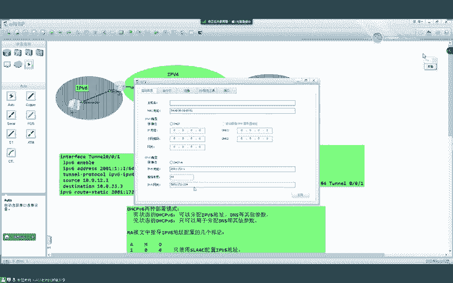

比如说我们直接去骗。是吧发现能通。那怎么通的呢？他是这样的啊。当PC1需访问PC2的时候呢，它的原IP地址是2001冒号192，冒号冒号1。目的IP呢2001冒号172，冒号冒号一。

他根据自己的确认网关交给A26了。啊，交给A21了啊，A21就收到了。AR一收到之后呢，display IPPU6rooting table。我们可以看到啊。收到IPU6的包。

他又查找IPU6的路由表去往2001。冒号172。是吧。出街口呢是tno0-0-1。那这时候呢，他就进到探道口里啊啊，探道口给他进行改造。怎么改造呢？turnow的原10。0。12。1。对吧。

tner的目的10。0。23。3。对不对。就加上一层IPS的封装，就通到的圆跟木嘛。加上之后呢，他再去查找IPV4的路由表。怎么样去往？23。3呢。哦，有一台缺绳。这个包呢就发给二了。

所以我们抓包来看一下啊。

软能通。能通我们。😔，看一下包啊。我要把前几个关了。我来看下。呃，request。是吧这个包呢就加上一层IPS的包头。对吧。然后在IPU4包头里面呢，有一个上层协议41啊，告诉你里面呢是IPU6包。

对吧。这个报文呢就发给二了。发给二之后呢。二、只看外墙IP包头啊，diIP table。需23。3直连。然后发给三了，三已收到，一看给自己的。拆。是吧。拆了之后呢。看到是IPU6的。

他就查找IPV6路由表。你给谁呢？你给2001冒号172冒号码一。哦，失恋。是吧直连查找IPV6连居表。2001冒号172，冒号码尾1。是吧。这是他的麦克。好，当然状态这一块我就不再累述了啊。😊。

这是他的麦克啊，就是查找ARP表啊，最终呢把数据发给PCR。P32就收到了。比赛收到之后呢，回报一样的逻辑，到三上之后呢。他再去查找这个路由表进tono反向进行封装原地址呢23。3，目的地是12。1。

所以我们看replay呢原地址就23。3啊，目的地址12。1。他是172向192的汇报。然后到达A21之后呢，A21再转给PCE。是这么一个逻辑啊。那这就是一个最简单的啊。

叫做IPV6嗯OIPV4的手动隧道。啊，为什么叫手动呢？啊，大家可以看到所有同学都是我手动去敲的。对不对？都是我用手动去敲的啊。好吧。然后我们再来看啊。IPU6杠IPV4是用IPV4做外层包头。

封装IPU6的数据。那懂吗？然后IPU4跟IPU6是用IPU6做包头。封装内层IQ6的数据。比如说我这有两这是一个V4。这是一个V4站点啊，中间的广域网呢都是V6。那我们是不是用V6包装V4啊？

就是IPU4杠IPU6啊，它是V4包装V6啊。对啊，V68装V4。toode0-0-1跟G0-0-1有关系吗？这个没关系啊，就是你用tole0-0-2也行啊吧，这个他俩之间没关系啊。

这里的目的IP还是被请求节点主播吗？这个倒不是啊，我们现在是单波同学啊，鸵尼。但是你再去请求下一跳到麦克地址的时候，他依然是被请求界点主播麦克。但是你的拼包呢它都是单薄啊。

IPV4OIPU6分不分手动自动，这个肯定是分的，分的啊。我们现在讲的不就是吗？是吧6欧24啊。这就是手动啊啊自动还没有讲到。那手动隧道的第二种呢。叫做嘉E隧道。对呀，还有一种呢叫做嘉易隧道。

嘉义是怎么样的呢？就是。PC1去访问PC2。对吧一样的啊。IPV6的包头IPU6的数据发给双站路由器RE。R一呢把它引导到嘉E隧道里面，加上一层加E的包头。然后呢，再加上一层加IE的原木。

然后再穿越通过外层的IPV4。再去穿越IPV4的公网，到达R这个路由器。R这个路由器收到之后呢，一看给自己的。啊，拆封装一看嘉艺交给嘉艺处理，嘉丽把包头拆完之后呢，我们就可以看到一个。IPU6的头部。

对吧。然后把这个根据这个IPU里的同步呢，查找IP路由路表。发送给PCR。这种呢就叫做嘉易隧道。那这个逻辑也很简单啊，他跟我们上面所说的IPV4。嗯，基本是一样的。比如说这张图呢，我就可以改成IP呃。

这个可以改成加E的。怎么样去改呢？我在A2一上来注意啊。😊，interface tunnel0-0-1。怎么办呢？暗度 tunnel particle。啊。我把这个接口的。封装协议给他关掉。

现在我们可以去看到啊，这个to道口我只配了1个IPU6地址。😊，跟开启来IP6功能，然后三这边也一样。安度 tunnelpart卡。然后我们来配R一。RE上面呢toal particle。

我们把它调成加一。然后原地址10点0。12。1。目的地址10。0。23。3。啊，大家课下做实验一定要注意啊，这两个单词不要敲错了，它长得比较像啊。😊，真假美猴王。是吧前面的是描述啊。啊。

下面的才是目的地。好吧。那这样就完了，这是我们做的嘉E隧道啊。这是A21的配置。然后在A23上呢，也是一样，tonnal particle加一原地址10。0。23。3。目地址呢10。02点12。1。

不能是IPU4啊，因为你现在处理的是IPU6的包。你要给嘉易拍IPV4地址，他没有办法让IP6协议up起来。好吧。那做完之后呢，引流一样去写啊，因为我们现在引流表是写好的。所以说呢我就直接复制过来了。

但是在设备上是有的啊。那么改完之后用PC1去拼PC2呢，你发现还是铜的。这个怎么通的呢？原IP1。1的吧PC1目的IPPC2包发给A21了。A一查找路由表display IPPU6roingtable。

你要去172点冒号冒号一。这就有这么一条路由。是吧出接口是tode一啊，然后呢进入到toode一。操道一给你一份乱改造。是吧原IP地址10。0。12。1。目的IP呢10。0。23。3。啊，不对啊。

中间还有一层加E的封装啊，因为我们现在隧道类型是加E。然后这个包呢就会查找IPV4的路由表。根据全省路由呢。发送到了L。是吧所以我们现在来看包呢。咱们就可以去看到这一个request。

这是原始的IPU6数据，加上了一层GIE的包头。然后呢，再加上了IPV4的封装。啊。这个包最终到三之后呢，三姨看给自己的柴。再一看加义拆。啊，最后看到啊，你要访问172啊。

按照直联路由最终呢转发给了PCR。对不对？好，大家不要吵架啊。转发给PCR之后呢，PCR就会处理这个包。那回包是一样的逻辑。回包原木调过来之后，到达A23，然后根据这个路由表进入到toode一。

对吧加上加E的封装原地址23。3，目的地址12。1。所以我们去看replay呢。对吧。在这里加一的封装原地址23。3，目的地是120。那这个包发送给A2，再给A21啊，最终发送给PC1。

所以这就是嘉峪隧道。那大家可能比较疑惑啊。而这个手工隧道跟嘉义隧道。有点一样啊。是吧。他有点一样。对不对啊？那大家觉得哪一个好呢？实际上。各自有自己的优势和劣势。是吧。首先呢对于手工隧道。

我们可以去看到啊，它没有加E的包头。是吧。所以说加一包头四个字节，那省去这四个字节，呢我就能够装更多的应用数据。对吧。第一个区别点呢是手动隧道呢。没有。嘉易的包头。对吧。少了。😔，或者说。可以。承载。

更多的。嗯应用数据。那这是手工最大的好处。嘉玉隧道有什么好处呢？我们来想一下啊。所有手工，你无论是嘉艺还是这种我们说的6O24手工隧刀。他们都是咱们手动去配的。是不是？那比如说。隧道一旦产生了故障。

他能不能检测不行。对吧。但是嘉E呢他本身提供。c live的检测。是吧我们可以通过一条命令在AR一的。interface to no0-0-1啊，叫做keep live。啊。我们可以在。

嘉E隧道上呢开启K lab的检测啊，也就是说呢它可以检测当前的隧道是不是存活的状态。好吧。那第二个优势是在哪里呢？加一隧道还提供一种叫做加一的K。啊，提供一种简单的认证地址。加EK123。

啊对外也可以加EK123。那比如说我们用PC1去拼P3是吧，能通。那这时候发送的包里面呢会去携带上一个加E的K。啊，在这啊。拿看了吧。你把这个KB翻译过来，就叫做123，这是16进制数。

所以说呢如果我们用的是嘉义隧道。他所能提供的一个优势在于。加一。可以利用自身的特点。实现对。隧道。状态的检测。以及。提供一种。简单的认证机制。为什么叫做简单的认证机制呢？

是因为比如说我在A23上暗度加1K。我们再用PC1去拼PC2。你就会发现拼不通。对吧。为什么骗不通了呢？是因为你这边有个密码，123对面没有是吧，这就相当于。😡，俩人去对暗号了。对吧。你说个天王盖地虎。

是吧对面给你来了一巴掌，你说的什么玩意儿？😡，是吧神经病。是吧。所以说呢三就会把这个包给他丢了。当然这个K呢它是一种明文的啊，大家注意。他安全吗？😡，也安全也不安全，就是稍微安全那么一点点，对吧？啊。

了胜于无。😡，能不能明白？所以说呢。在这里我们可以去看到它叫做一种简单的认证机制。是吧因为这个豹纹呢就是它的K以在豹文里面就是铭文的啊，你就能看到是吧对面抓包也能看到你的K是多少。😊，是吧。啊。

就叫做了胜于无。能不能明白？啊，这就相当于。是吧你这个。家里有个门，你卧室也有个门。对不对？啊，对，有比没有强，你卧室有个门，你的这个。这个这个这个叫什么呢？安全感高一点，对吧？啊，了胜于无。😊，好吧。

那这个就是我们所说的嘉义隧道。

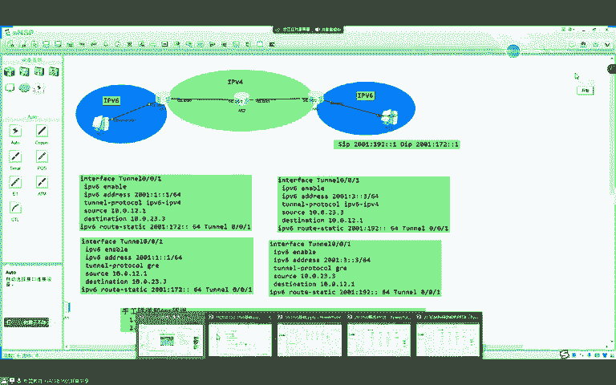

呃，那我们这节课就讲这么多啊，今天就讲这么多。嗯，下一节课呢我们再去说这些动态的隧道。好吧，今天就讲这么多。😊，嗯，这两个大家有没有什么问题啊？没问题的，同学敲个一。好吧。哎。思科的加E也有KR也有。

对吧。这个实验呢大家课下可以去做一下。今天的笔记我先把录屏停一下好吧，给大家整理一下笔记啊。嗯。

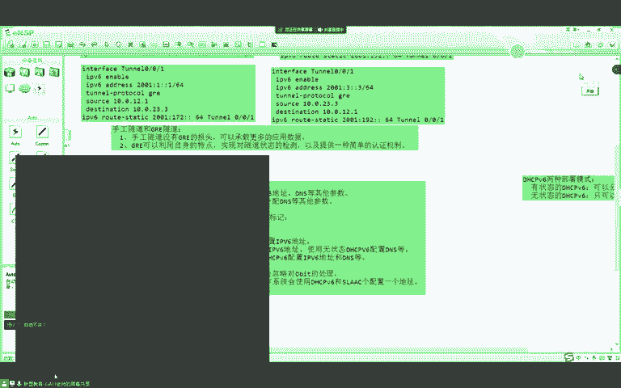

自动的咱们下一节课吧。小白白同学。哎。对。他呢本身属于一种逻辑借口。跟你的。呃，维兰衣弗类斯。能懂吗？A m o。AO咋啦？哪哪里错了，第二排。啊，这里应该是一啊。这个我就给大家截张图了啊。2个10。

改过了啊。然后隧道就荡了啊，魏先生，然后隧道接口就荡了啊。😡，这个倒没错，但你现在不是缺省路游吗？😡，全啊。你现在是缺什路由啊？你你公网肯定不会给你跑动态啊，是吧？你一般都写一条缺审啊。啊。呃，行。

咱们今天就讲这么多吧。这个top呢我保存一下啊。呃，大家课下可以去做一下啊。诶。听同学们，咱们今天就说这么多吧。坚距长这么多啊。啊，那咱们待会给大家放首歌吧，放首歌咱们就下课了。

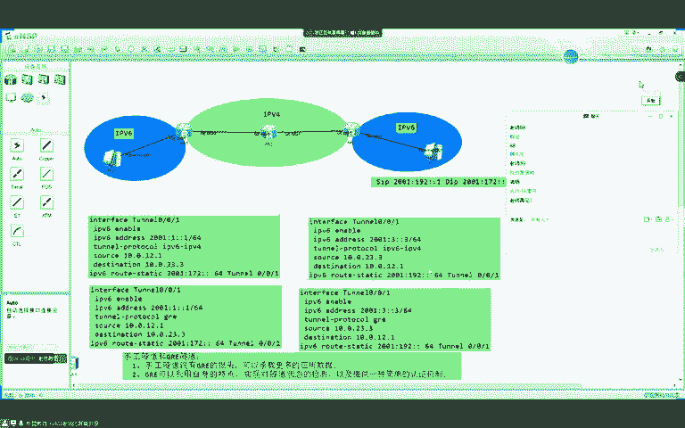

O。好，同学们，那咱们周一见好吧，给大家放首歌啊。

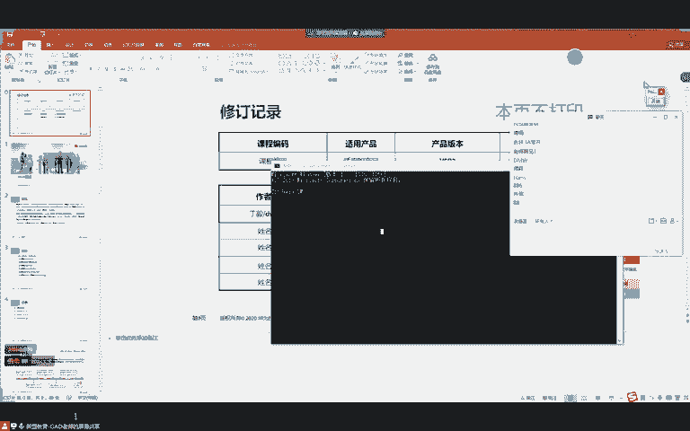

好。

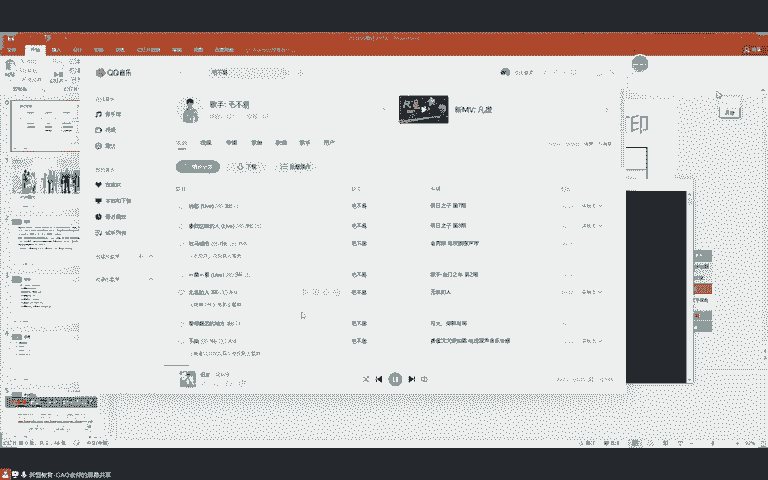

🎼你是第。🎼发现我。🎼越面无表情，越是心灵。🎼难过，所以当我。🎼的蝉。🎼你会心疼。🎼握在胸口。😔，🎼你比谁都还。😔，🎼了解我。🎼你心的渴望。🎼表面来的。🎼所以当。🎼时候。🎼我当陪我学。🎼我要去看的罪远。

🎼的地方。🎼和你手不足道了我。🎼梦想。🎼像从来没有试过望受过伤，还相信赶非就有天空那样。😔，🎼不要再看。🎼风催。🎼地方。🎼提笛一道说光再见。🎼吹泊过太冷的雨滴和雪花。😔，🎼更坚持微笑要暖的。😔。

🎼像太阳。🎼你比谁都好。🎼你了解我。🎼内心的渴望。🎼表面来得多，所以到。🎼翅膀的。🎼你不负我单陪我雪忍痛。🎼我要去看的。🎼地方。🎼你说我足大了。🎼梦想。🎼像从来没有知。🎼望受过伤。

还相信赶非洲有天空那样。🎼飘在看的。🎼地方。🎼提点一道曙光再见。🎼被迫过太冷。🎼雨地和雪花。🎼更见初微逍遥。🎼太阳。🎼有时候觉得我。🎼恨不一。🎼能看见我看不到的地方。🎼有时候又觉得我们很像。🎼放起头。

不听。🎼的花。🎼我要去看到。🎼虽然。🎼地方和你驻足。

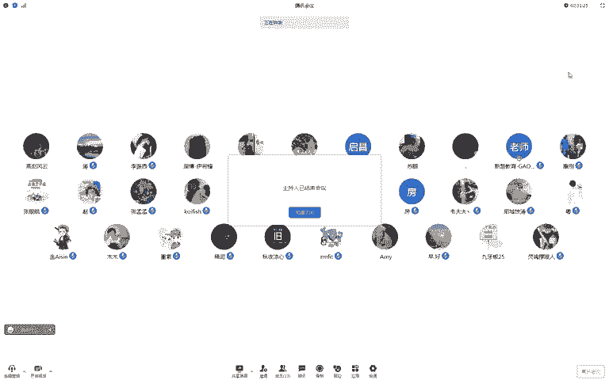